Linux - Tested Virtual Hardware & Statistics
--------------------------------------------

A project to collect tested virtual hardware configurations for Linux.

Anyone can contribute to this report by the [hw-probe](https://github.com/linuxhw/hw-probe) tool:

    sudo -E hw-probe -all -upload

Please contribute! Especially if your hardware is rare.

Distribution-specific reports: [ALT Linux](/Dist/ALT_Linux), [Arch](/Dist/Arch), [ArcoLinux](/Dist/ArcoLinux), [BlackPanther](/Dist/BlackPanther), [CentOS](/Dist/CentOS), [Clear Linux](/Dist/Clear_Linux), [Debian](/Dist/Debian), [Endless](/Dist/Endless), [Fedora](/Dist/Fedora), [Kali](/Dist/Kali), [KDE neon](/Dist/KDE_neon), [Linux Mint](/Dist/Linux_Mint), [Manjaro](/Dist/Manjaro), [OpenMandriva](/Dist/OpenMandriva), [Pop!_OS](/Dist/Pop!_OS), [ROSA](/Dist/ROSA), [Ubuntu](/Dist/Ubuntu), [Xubuntu](/Dist/Xubuntu), [Zorin](/Dist/Zorin).

This report is for virtual hardware. Report for real hardware: [TestCoverage](https://github.com/linuxhw/TestCoverage)

Contents
--------

* [ Test Cases ](#test-cases)

* [ System ](#system)
  - [ OS                       ](#os)
  - [ OS Family                ](#os-family)
  - [ Kernel                   ](#kernel)
  - [ Kernel Family            ](#kernel-family)
  - [ Kernel Major Ver.        ](#kernel-major-ver)
  - [ Arch                     ](#arch)
  - [ DE                       ](#de)
  - [ Display Server           ](#display-server)
  - [ Display Manager          ](#display-manager)
  - [ OS Lang                  ](#os-lang)
  - [ Boot Mode                ](#boot-mode)
  - [ Filesystem               ](#filesystem)
  - [ Part. scheme             ](#part-scheme)
  - [ Dual Boot with Linux/BSD ](#dual-boot-with-linuxbsd)
  - [ Dual Boot (Win)          ](#dual-boot-win)

* [ Board ](#board)
  - [ Vendor                   ](#vendor)
  - [ Model                    ](#model)
  - [ Model Family             ](#model-family)
  - [ MFG Year                 ](#mfg-year)
  - [ Form Factor              ](#form-factor)
  - [ Secure Boot              ](#secure-boot)
  - [ Coreboot                 ](#coreboot)
  - [ RAM Size                 ](#ram-size)
  - [ RAM Used                 ](#ram-used)
  - [ Total Drives             ](#total-drives)
  - [ Has CD-ROM               ](#has-cd-rom)
  - [ Has Ethernet             ](#has-ethernet)
  - [ Has WiFi                 ](#has-wifi)
  - [ Has Bluetooth            ](#has-bluetooth)

* [ Location ](#location)
  - [ Country                  ](#country)
  - [ City                     ](#city)

* [ Drives ](#drives)
  - [ Drive Vendor             ](#drive-vendor)
  - [ Drive Model              ](#drive-model)
  - [ HDD Vendor               ](#hdd-vendor)
  - [ SSD Vendor               ](#ssd-vendor)
  - [ Drive Kind               ](#drive-kind)
  - [ Drive Connector          ](#drive-connector)
  - [ Drive Size               ](#drive-size)
  - [ Space Total              ](#space-total)
  - [ Space Used               ](#space-used)
  - [ Malfunc. Drives          ](#malfunc-drives)
  - [ Malfunc. Drive Vendor    ](#malfunc-drive-vendor)
  - [ Malfunc. HDD Vendor      ](#malfunc-hdd-vendor)
  - [ Malfunc. Drive Kind      ](#malfunc-drive-kind)
  - [ Failed Drives            ](#failed-drives)
  - [ Failed Drive Vendor      ](#failed-drive-vendor)
  - [ Drive Status             ](#drive-status)

* [ Storage controller ](#storage-controller)
  - [ Storage Vendor           ](#storage-vendor)
  - [ Storage Model            ](#storage-model)
  - [ Storage Kind             ](#storage-kind)

* [ Processor ](#processor)
  - [ CPU Vendor               ](#cpu-vendor)
  - [ CPU Model                ](#cpu-model)
  - [ CPU Model Family         ](#cpu-model-family)
  - [ CPU Cores                ](#cpu-cores)
  - [ CPU Sockets              ](#cpu-sockets)
  - [ CPU Threads              ](#cpu-threads)
  - [ CPU Op-Modes             ](#cpu-op-modes)
  - [ CPU Microcode            ](#cpu-microcode)
  - [ CPU Microarch            ](#cpu-microarch)

* [ Graphics ](#graphics)
  - [ GPU Vendor               ](#gpu-vendor)
  - [ GPU Model                ](#gpu-model)
  - [ GPU Combo                ](#gpu-combo)
  - [ GPU Driver               ](#gpu-driver)
  - [ GPU Memory               ](#gpu-memory)

* [ Monitor ](#monitor)
  - [ Monitor Vendor           ](#monitor-vendor)
  - [ Monitor Model            ](#monitor-model)
  - [ Monitor Resolution       ](#monitor-resolution)
  - [ Monitor Diagonal         ](#monitor-diagonal)
  - [ Monitor Width            ](#monitor-width)
  - [ Aspect Ratio             ](#aspect-ratio)
  - [ Monitor Area             ](#monitor-area)
  - [ Pixel Density            ](#pixel-density)
  - [ Multiple Monitors        ](#multiple-monitors)

* [ Network ](#network)
  - [ Net Controller Vendor    ](#net-controller-vendor)
  - [ Net Controller Model     ](#net-controller-model)
  - [ Wireless Vendor          ](#wireless-vendor)
  - [ Wireless Model           ](#wireless-model)
  - [ Ethernet Vendor          ](#ethernet-vendor)
  - [ Ethernet Model           ](#ethernet-model)
  - [ Net Controller Kind      ](#net-controller-kind)
  - [ Used Controller          ](#used-controller)
  - [ NICs                     ](#nics)
  - [ IPv6                     ](#ipv6)

* [ Bluetooth ](#bluetooth)
  - [ Bluetooth Vendor         ](#bluetooth-vendor)
  - [ Bluetooth Model          ](#bluetooth-model)

* [ Sound ](#sound)
  - [ Sound Vendor             ](#sound-vendor)
  - [ Sound Model              ](#sound-model)

* [ Memory ](#memory)
  - [ Memory Vendor            ](#memory-vendor)
  - [ Memory Model             ](#memory-model)
  - [ Memory Kind              ](#memory-kind)
  - [ Memory Form Factor       ](#memory-form-factor)
  - [ Memory Size              ](#memory-size)
  - [ Memory Speed             ](#memory-speed)

* [ Printers & scanners ](#printers--scanners)
  - [ Printer Vendor           ](#printer-vendor)
  - [ Printer Model            ](#printer-model)
  - [ Scanner Vendor           ](#scanner-vendor)
  - [ Scanner Model            ](#scanner-model)

* [ Camera ](#camera)
  - [ Camera Vendor            ](#camera-vendor)
  - [ Camera Model             ](#camera-model)

* [ Security ](#security)
  - [ Fingerprint Vendor       ](#fingerprint-vendor)
  - [ Fingerprint Model        ](#fingerprint-model)
  - [ Chipcard Vendor          ](#chipcard-vendor)
  - [ Chipcard Model           ](#chipcard-model)

* [ Unsupported ](#unsupported)
  - [ Unsupported Devices      ](#unsupported-devices)
  - [ Unsupported Device Types ](#unsupported-device-types)

Test Cases
----------

Total: 12241

| Vendor        | Model                       | Form-Factor     | Probe                                                      | Date         |
|---------------|-----------------------------|-----------------|------------------------------------------------------------|--------------|
| VMware        | Virtual Platform            | Virtual machine | [8c7f95aa6c](https://linux-hardware.org/?probe=8c7f95aa6c) | Apr 16, 2022 |
| VMware        | Virtual Platform            | Virtual machine | [f878377dd5](https://linux-hardware.org/?probe=f878377dd5) | Apr 16, 2022 |
| Oracle        | VirtualBox                  | Virtual machine | [8a6077825c](https://linux-hardware.org/?probe=8a6077825c) | Apr 16, 2022 |
| Microsoft     | Virtual Machine Hyper-V ... | Virtual machine | [98974bfd1f](https://linux-hardware.org/?probe=98974bfd1f) | Apr 15, 2022 |
| Oracle        | VirtualBox                  | Virtual machine | [f17cd2d8cb](https://linux-hardware.org/?probe=f17cd2d8cb) | Apr 15, 2022 |
| QEMU          | Standard PC (Q35 + ICH9,... | Virtual machine | [ecf0c7ff28](https://linux-hardware.org/?probe=ecf0c7ff28) | Apr 15, 2022 |
| Oracle        | VirtualBox                  | Virtual machine | [3c84f123e8](https://linux-hardware.org/?probe=3c84f123e8) | Apr 15, 2022 |
| Oracle        | VirtualBox                  | Virtual machine | [010694bf03](https://linux-hardware.org/?probe=010694bf03) | Apr 15, 2022 |
| QEMU          | Standard PC (Q35 + ICH9,... | Virtual machine | [972b2d59b0](https://linux-hardware.org/?probe=972b2d59b0) | Apr 15, 2022 |
| Oracle        | VirtualBox                  | Virtual machine | [81384b880b](https://linux-hardware.org/?probe=81384b880b) | Apr 15, 2022 |
| VMware        | Virtual Platform            | Virtual machine | [de671e7323](https://linux-hardware.org/?probe=de671e7323) | Apr 15, 2022 |
| Oracle        | VirtualBox                  | Virtual machine | [f538fde138](https://linux-hardware.org/?probe=f538fde138) | Apr 15, 2022 |
| Oracle        | VirtualBox                  | Virtual machine | [f854745cf1](https://linux-hardware.org/?probe=f854745cf1) | Apr 15, 2022 |
| Parallels ... | Parallels Virtual Platfo... | Virtual machine | [b36777ab72](https://linux-hardware.org/?probe=b36777ab72) | Apr 15, 2022 |
| VMware        | Virtual Platform            | Virtual machine | [f652ca134d](https://linux-hardware.org/?probe=f652ca134d) | Apr 14, 2022 |
| Oracle        | VirtualBox                  | Virtual machine | [84605d8c13](https://linux-hardware.org/?probe=84605d8c13) | Apr 14, 2022 |
| QEMU          | Standard PC (i440FX + PI... | Virtual machine | [dd90d88105](https://linux-hardware.org/?probe=dd90d88105) | Apr 14, 2022 |
| Oracle        | VirtualBox                  | Virtual machine | [5e1d95b947](https://linux-hardware.org/?probe=5e1d95b947) | Apr 14, 2022 |
| Oracle        | VirtualBox                  | Virtual machine | [8caf85a2a6](https://linux-hardware.org/?probe=8caf85a2a6) | Apr 14, 2022 |
| Oracle        | VirtualBox                  | Virtual machine | [3f578bcf2b](https://linux-hardware.org/?probe=3f578bcf2b) | Apr 14, 2022 |
| Oracle        | VirtualBox                  | Virtual machine | [faaa7d7f75](https://linux-hardware.org/?probe=faaa7d7f75) | Apr 14, 2022 |
| Oracle        | VirtualBox                  | Virtual machine | [ee8a16a8a9](https://linux-hardware.org/?probe=ee8a16a8a9) | Apr 14, 2022 |
| Oracle        | VirtualBox                  | Virtual machine | [f9473a616f](https://linux-hardware.org/?probe=f9473a616f) | Apr 14, 2022 |
| Oracle        | VirtualBox                  | Virtual machine | [d62469efd5](https://linux-hardware.org/?probe=d62469efd5) | Apr 14, 2022 |
| VMware        | Virtual Platform            | Virtual machine | [0180904e49](https://linux-hardware.org/?probe=0180904e49) | Apr 14, 2022 |
| Oracle        | VirtualBox                  | Virtual machine | [061816b718](https://linux-hardware.org/?probe=061816b718) | Apr 14, 2022 |
| Unknown       | Unknown                     | Virtual machine | [d85e97c63e](https://linux-hardware.org/?probe=d85e97c63e) | Apr 14, 2022 |
| Oracle        | VirtualBox                  | Virtual machine | [d4fe76967b](https://linux-hardware.org/?probe=d4fe76967b) | Apr 14, 2022 |
| VMware        | Virtual Platform            | Virtual machine | [a4f0ac6fe4](https://linux-hardware.org/?probe=a4f0ac6fe4) | Apr 14, 2022 |
| VMware        | Virtual Platform            | Virtual machine | [8252f91690](https://linux-hardware.org/?probe=8252f91690) | Apr 14, 2022 |
| Oracle        | VirtualBox                  | Virtual machine | [2334ef35e1](https://linux-hardware.org/?probe=2334ef35e1) | Apr 14, 2022 |
| Unknown       | Unknown                     | Virtual machine | [2a4b150c67](https://linux-hardware.org/?probe=2a4b150c67) | Apr 14, 2022 |
| Unknown       | Unknown                     | Virtual machine | [b4b3bbfd0d](https://linux-hardware.org/?probe=b4b3bbfd0d) | Apr 14, 2022 |
| Oracle        | VirtualBox                  | Virtual machine | [3de22875dd](https://linux-hardware.org/?probe=3de22875dd) | Apr 13, 2022 |
| Unknown       | Unknown                     | Virtual machine | [4b0dc20ec1](https://linux-hardware.org/?probe=4b0dc20ec1) | Apr 13, 2022 |
| Unknown       | Unknown                     | Virtual machine | [6d5087cb44](https://linux-hardware.org/?probe=6d5087cb44) | Apr 13, 2022 |
| Oracle        | VirtualBox                  | Virtual machine | [69cef9c2bb](https://linux-hardware.org/?probe=69cef9c2bb) | Apr 13, 2022 |
| Microsoft     | Windows Subsystem for Li... | Virtual machine | [69b3cc2ddc](https://linux-hardware.org/?probe=69b3cc2ddc) | Apr 13, 2022 |
| Unknown       | Unknown                     | Virtual machine | [7027aba78c](https://linux-hardware.org/?probe=7027aba78c) | Apr 13, 2022 |
| Unknown       | Unknown                     | Virtual machine | [d811159abe](https://linux-hardware.org/?probe=d811159abe) | Apr 13, 2022 |
| Oracle        | VirtualBox                  | Virtual machine | [26867051ea](https://linux-hardware.org/?probe=26867051ea) | Apr 13, 2022 |
| QEMU          | Standard PC (Q35 + ICH9,... | Virtual machine | [15a24bca1f](https://linux-hardware.org/?probe=15a24bca1f) | Apr 13, 2022 |
| VMware        | Virtual Platform            | Virtual machine | [0f04d99b69](https://linux-hardware.org/?probe=0f04d99b69) | Apr 13, 2022 |
| VMware        | Virtual Platform            | Virtual machine | [ece7485e78](https://linux-hardware.org/?probe=ece7485e78) | Apr 13, 2022 |
| Oracle        | VirtualBox                  | Virtual machine | [61dd851a80](https://linux-hardware.org/?probe=61dd851a80) | Apr 13, 2022 |
| Oracle        | VirtualBox                  | Virtual machine | [a507c307e1](https://linux-hardware.org/?probe=a507c307e1) | Apr 13, 2022 |
| VMware        | VMware7,1                   | Virtual machine | [d2e3d73d1e](https://linux-hardware.org/?probe=d2e3d73d1e) | Apr 13, 2022 |
| Oracle        | VirtualBox                  | Virtual machine | [4860b8d329](https://linux-hardware.org/?probe=4860b8d329) | Apr 13, 2022 |
| QEMU          | Standard PC (i440FX + PI... | Virtual machine | [02d651d575](https://linux-hardware.org/?probe=02d651d575) | Apr 13, 2022 |
| Oracle        | VirtualBox                  | Virtual machine | [d5801152e6](https://linux-hardware.org/?probe=d5801152e6) | Apr 12, 2022 |
| VMware        | Virtual Platform            | Virtual machine | [1fc1756e69](https://linux-hardware.org/?probe=1fc1756e69) | Apr 12, 2022 |
| Oracle        | VirtualBox                  | Virtual machine | [79f902bc82](https://linux-hardware.org/?probe=79f902bc82) | Apr 12, 2022 |
| Oracle        | VirtualBox                  | Virtual machine | [f18cb6160b](https://linux-hardware.org/?probe=f18cb6160b) | Apr 12, 2022 |
| Oracle        | VirtualBox                  | Virtual machine | [0e68970c05](https://linux-hardware.org/?probe=0e68970c05) | Apr 12, 2022 |
| VMware        | Virtual Platform            | Virtual machine | [381d317d34](https://linux-hardware.org/?probe=381d317d34) | Apr 12, 2022 |
| Oracle        | VirtualBox                  | Virtual machine | [9fd1d9059e](https://linux-hardware.org/?probe=9fd1d9059e) | Apr 12, 2022 |
| VMware        | Virtual Platform            | Virtual machine | [bdaeea3d54](https://linux-hardware.org/?probe=bdaeea3d54) | Apr 12, 2022 |
| Oracle        | VirtualBox                  | Virtual machine | [294fcd0b1c](https://linux-hardware.org/?probe=294fcd0b1c) | Apr 12, 2022 |
| Oracle        | VirtualBox                  | Virtual machine | [2f273d9fb3](https://linux-hardware.org/?probe=2f273d9fb3) | Apr 12, 2022 |
| Oracle        | VirtualBox                  | Virtual machine | [f85e0077bd](https://linux-hardware.org/?probe=f85e0077bd) | Apr 12, 2022 |
| Oracle        | VirtualBox                  | Virtual machine | [f53abb7333](https://linux-hardware.org/?probe=f53abb7333) | Apr 12, 2022 |
| Oracle        | VirtualBox                  | Virtual machine | [cfc38cc46a](https://linux-hardware.org/?probe=cfc38cc46a) | Apr 12, 2022 |
| VMware        | VMware7,1                   | Virtual machine | [366dbaba7c](https://linux-hardware.org/?probe=366dbaba7c) | Apr 12, 2022 |
| Unknown       | Unknown                     | Virtual machine | [c13052455f](https://linux-hardware.org/?probe=c13052455f) | Apr 12, 2022 |
| QEMU          | Standard PC (Q35 + ICH9,... | Virtual machine | [6867acbfbf](https://linux-hardware.org/?probe=6867acbfbf) | Apr 12, 2022 |
| Oracle        | VirtualBox                  | Virtual machine | [3f8cf1d8c1](https://linux-hardware.org/?probe=3f8cf1d8c1) | Apr 12, 2022 |
| QEMU          | Standard PC (Q35 + ICH9,... | Virtual machine | [f60bf3d7a2](https://linux-hardware.org/?probe=f60bf3d7a2) | Apr 12, 2022 |
| Microsoft     | Virtual Machine             | Virtual machine | [3de6d913c9](https://linux-hardware.org/?probe=3de6d913c9) | Apr 11, 2022 |
| VMware        | Virtual Platform            | Virtual machine | [0924daa0ef](https://linux-hardware.org/?probe=0924daa0ef) | Apr 11, 2022 |
| QEMU          | Standard PC (i440FX + PI... | Virtual machine | [0b6d315833](https://linux-hardware.org/?probe=0b6d315833) | Apr 11, 2022 |
| Oracle        | VirtualBox                  | Virtual machine | [4b447ef45b](https://linux-hardware.org/?probe=4b447ef45b) | Apr 11, 2022 |
| VMware        | Virtual Platform            | Virtual machine | [79f6f811d5](https://linux-hardware.org/?probe=79f6f811d5) | Apr 11, 2022 |
| Oracle        | VirtualBox                  | Virtual machine | [56850331ef](https://linux-hardware.org/?probe=56850331ef) | Apr 11, 2022 |
| VMware        | Virtual Platform            | Virtual machine | [4947124738](https://linux-hardware.org/?probe=4947124738) | Apr 11, 2022 |
| Unknown       | Unknown                     | Virtual machine | [2a4c7903f5](https://linux-hardware.org/?probe=2a4c7903f5) | Apr 11, 2022 |
| Oracle        | VirtualBox                  | Virtual machine | [4fd6066b83](https://linux-hardware.org/?probe=4fd6066b83) | Apr 11, 2022 |
| Parallels ... | Parallels Virtual Platfo... | Virtual machine | [408f1a01f8](https://linux-hardware.org/?probe=408f1a01f8) | Apr 11, 2022 |
| Microsoft     | Windows Subsystem for Li... | Virtual machine | [a7966b268b](https://linux-hardware.org/?probe=a7966b268b) | Apr 11, 2022 |
| VMware        | Virtual Platform            | Virtual machine | [a4cce15960](https://linux-hardware.org/?probe=a4cce15960) | Apr 11, 2022 |
| QEMU          | Standard PC (Q35 + ICH9,... | Virtual machine | [29a0a50403](https://linux-hardware.org/?probe=29a0a50403) | Apr 11, 2022 |
| Oracle        | VirtualBox                  | Virtual machine | [c46c0faeac](https://linux-hardware.org/?probe=c46c0faeac) | Apr 11, 2022 |
| Oracle        | VirtualBox                  | Virtual machine | [64ada2253f](https://linux-hardware.org/?probe=64ada2253f) | Apr 11, 2022 |
| VMware        | VMware7,1                   | Virtual machine | [8cb8e0ff09](https://linux-hardware.org/?probe=8cb8e0ff09) | Apr 11, 2022 |
| Oracle        | VirtualBox                  | Virtual machine | [f44a65860a](https://linux-hardware.org/?probe=f44a65860a) | Apr 11, 2022 |
| QEMU          | Standard PC (Q35 + ICH9,... | Virtual machine | [d2f83b02cd](https://linux-hardware.org/?probe=d2f83b02cd) | Apr 11, 2022 |
| Oracle        | VirtualBox                  | Virtual machine | [2e0d137ac1](https://linux-hardware.org/?probe=2e0d137ac1) | Apr 11, 2022 |
| VMware        | Virtual Platform            | Virtual machine | [4f1727746f](https://linux-hardware.org/?probe=4f1727746f) | Apr 11, 2022 |
| Microsoft     | Virtual Machine Hyper-V ... | Virtual machine | [6f749f44ac](https://linux-hardware.org/?probe=6f749f44ac) | Apr 11, 2022 |
| Oracle        | VirtualBox                  | Virtual machine | [67749a2201](https://linux-hardware.org/?probe=67749a2201) | Apr 11, 2022 |
| Oracle        | VirtualBox                  | Virtual machine | [746b0142ee](https://linux-hardware.org/?probe=746b0142ee) | Apr 11, 2022 |
| Microsoft     | Virtual Machine             | Virtual machine | [094c5e68aa](https://linux-hardware.org/?probe=094c5e68aa) | Apr 11, 2022 |
| Oracle        | VirtualBox                  | Virtual machine | [460c3461e3](https://linux-hardware.org/?probe=460c3461e3) | Apr 11, 2022 |
| Oracle        | VirtualBox                  | Virtual machine | [4c1073ef40](https://linux-hardware.org/?probe=4c1073ef40) | Apr 11, 2022 |
| Red Hat       | RHEL-AV RHEL-8.4.0 PC       | Virtual machine | [d74bd59582](https://linux-hardware.org/?probe=d74bd59582) | Apr 11, 2022 |
| Oracle        | VirtualBox                  | Virtual machine | [823d631f80](https://linux-hardware.org/?probe=823d631f80) | Apr 10, 2022 |
| Oracle        | VirtualBox                  | Virtual machine | [ffdc48ebca](https://linux-hardware.org/?probe=ffdc48ebca) | Apr 10, 2022 |
| Oracle        | VirtualBox                  | Virtual machine | [55b49cee83](https://linux-hardware.org/?probe=55b49cee83) | Apr 10, 2022 |
| Oracle        | VirtualBox                  | Virtual machine | [3a37cc326f](https://linux-hardware.org/?probe=3a37cc326f) | Apr 10, 2022 |
| QEMU          | Standard PC (Q35 + ICH9,... | Virtual machine | [a0b482d1c7](https://linux-hardware.org/?probe=a0b482d1c7) | Apr 10, 2022 |
| Oracle        | VirtualBox                  | Virtual machine | [f968369476](https://linux-hardware.org/?probe=f968369476) | Apr 10, 2022 |
| Oracle        | VirtualBox                  | Virtual machine | [54688899e1](https://linux-hardware.org/?probe=54688899e1) | Apr 10, 2022 |
| Unknown       | Unknown                     | Virtual machine | [a8bdf295c9](https://linux-hardware.org/?probe=a8bdf295c9) | Apr 10, 2022 |
| VMware        | Virtual Platform            | Virtual machine | [abc1b9dae2](https://linux-hardware.org/?probe=abc1b9dae2) | Apr 10, 2022 |
| Oracle        | VirtualBox                  | Virtual machine | [3641cfaf5a](https://linux-hardware.org/?probe=3641cfaf5a) | Apr 10, 2022 |
| Oracle        | VirtualBox                  | Virtual machine | [a4bb0f6060](https://linux-hardware.org/?probe=a4bb0f6060) | Apr 10, 2022 |
| Unknown       | Unknown                     | Virtual machine | [a54db49c79](https://linux-hardware.org/?probe=a54db49c79) | Apr 10, 2022 |
| Oracle        | VirtualBox                  | Virtual machine | [e2205a6c11](https://linux-hardware.org/?probe=e2205a6c11) | Apr 10, 2022 |
| Oracle        | VirtualBox                  | Virtual machine | [57c369ca99](https://linux-hardware.org/?probe=57c369ca99) | Apr 10, 2022 |
| QEMU          | Standard PC (Q35 + ICH9,... | Virtual machine | [47e9ef9f0a](https://linux-hardware.org/?probe=47e9ef9f0a) | Apr 10, 2022 |
| Oracle        | VirtualBox                  | Virtual machine | [08e10956b0](https://linux-hardware.org/?probe=08e10956b0) | Apr 10, 2022 |
| Oracle        | VirtualBox                  | Virtual machine | [7d871de58f](https://linux-hardware.org/?probe=7d871de58f) | Apr 10, 2022 |
| Parallels ... | ARM Virtual Machine         | Virtual machine | [8cb3d646e0](https://linux-hardware.org/?probe=8cb3d646e0) | Apr 10, 2022 |
| Oracle        | VirtualBox                  | Virtual machine | [d1b59ee25b](https://linux-hardware.org/?probe=d1b59ee25b) | Apr 10, 2022 |
| Oracle        | VirtualBox                  | Virtual machine | [c3318781f1](https://linux-hardware.org/?probe=c3318781f1) | Apr 10, 2022 |
| VMware        | Virtual Platform            | Virtual machine | [61e7a475d7](https://linux-hardware.org/?probe=61e7a475d7) | Apr 09, 2022 |
| Oracle        | VirtualBox                  | Virtual machine | [ec3f5ba933](https://linux-hardware.org/?probe=ec3f5ba933) | Apr 09, 2022 |
| Oracle        | VirtualBox                  | Virtual machine | [917dfe1bd3](https://linux-hardware.org/?probe=917dfe1bd3) | Apr 09, 2022 |
| Oracle        | VirtualBox                  | Virtual machine | [13a50b8b51](https://linux-hardware.org/?probe=13a50b8b51) | Apr 09, 2022 |
| Oracle        | VirtualBox                  | Virtual machine | [3684cf7d86](https://linux-hardware.org/?probe=3684cf7d86) | Apr 09, 2022 |
| VMware        | Virtual Platform            | Virtual machine | [08edf06364](https://linux-hardware.org/?probe=08edf06364) | Apr 09, 2022 |
| Oracle        | VirtualBox                  | Virtual machine | [74d55d1b89](https://linux-hardware.org/?probe=74d55d1b89) | Apr 09, 2022 |
| Oracle        | VirtualBox                  | Virtual machine | [4781510218](https://linux-hardware.org/?probe=4781510218) | Apr 09, 2022 |
| Microsoft     | Virtual Machine Hyper-V ... | Virtual machine | [26673018e0](https://linux-hardware.org/?probe=26673018e0) | Apr 09, 2022 |
| VMware        | VMware7,1                   | Virtual machine | [f1e9688851](https://linux-hardware.org/?probe=f1e9688851) | Apr 09, 2022 |
| Oracle        | VirtualBox                  | Virtual machine | [5438d78962](https://linux-hardware.org/?probe=5438d78962) | Apr 09, 2022 |
| Oracle        | VirtualBox                  | Virtual machine | [3d96ad1425](https://linux-hardware.org/?probe=3d96ad1425) | Apr 09, 2022 |
| Oracle        | VirtualBox                  | Virtual machine | [ce36abe2f3](https://linux-hardware.org/?probe=ce36abe2f3) | Apr 09, 2022 |
| Oracle        | VirtualBox                  | Virtual machine | [fb2986fbcd](https://linux-hardware.org/?probe=fb2986fbcd) | Apr 09, 2022 |
| Oracle        | VirtualBox                  | Virtual machine | [50791b086f](https://linux-hardware.org/?probe=50791b086f) | Apr 09, 2022 |
| QEMU          | Standard PC (i440FX + PI... | Virtual machine | [1162a580c6](https://linux-hardware.org/?probe=1162a580c6) | Apr 08, 2022 |
| QEMU          | Standard PC (Q35 + ICH9,... | Virtual machine | [1bb155e429](https://linux-hardware.org/?probe=1bb155e429) | Apr 08, 2022 |
| Oracle        | VirtualBox                  | Virtual machine | [c83435caec](https://linux-hardware.org/?probe=c83435caec) | Apr 08, 2022 |
| Unknown       | Unknown                     | Virtual machine | [bcec8b1515](https://linux-hardware.org/?probe=bcec8b1515) | Apr 08, 2022 |
| QEMU          | Standard PC (Q35 + ICH9,... | Virtual machine | [b8442ae20d](https://linux-hardware.org/?probe=b8442ae20d) | Apr 08, 2022 |
| VMware        | Virtual Platform            | Virtual machine | [2153c043a6](https://linux-hardware.org/?probe=2153c043a6) | Apr 08, 2022 |
| Oracle        | VirtualBox                  | Virtual machine | [f589c15dae](https://linux-hardware.org/?probe=f589c15dae) | Apr 08, 2022 |
| Oracle        | VirtualBox                  | Virtual machine | [4d541f7c6d](https://linux-hardware.org/?probe=4d541f7c6d) | Apr 08, 2022 |
| Oracle        | VirtualBox                  | Virtual machine | [568f88bcb7](https://linux-hardware.org/?probe=568f88bcb7) | Apr 08, 2022 |
| Oracle        | VirtualBox                  | Virtual machine | [a990484f16](https://linux-hardware.org/?probe=a990484f16) | Apr 08, 2022 |
| Oracle        | VirtualBox                  | Virtual machine | [cf4e3415a2](https://linux-hardware.org/?probe=cf4e3415a2) | Apr 08, 2022 |
| Unknown       | Unknown                     | Virtual machine | [f6b680b792](https://linux-hardware.org/?probe=f6b680b792) | Apr 08, 2022 |
| Oracle        | VirtualBox                  | Virtual machine | [9cab9648ca](https://linux-hardware.org/?probe=9cab9648ca) | Apr 08, 2022 |
| Oracle        | VirtualBox                  | Virtual machine | [8f56f2169a](https://linux-hardware.org/?probe=8f56f2169a) | Apr 08, 2022 |
| Oracle        | VirtualBox                  | Virtual machine | [8eb0c052e5](https://linux-hardware.org/?probe=8eb0c052e5) | Apr 08, 2022 |
| Oracle        | VirtualBox                  | Virtual machine | [74a27b6d37](https://linux-hardware.org/?probe=74a27b6d37) | Apr 08, 2022 |
| Oracle        | VirtualBox                  | Virtual machine | [419e21fff2](https://linux-hardware.org/?probe=419e21fff2) | Apr 08, 2022 |
| Oracle        | VirtualBox                  | Virtual machine | [90a497ba0d](https://linux-hardware.org/?probe=90a497ba0d) | Apr 08, 2022 |
| Oracle        | VirtualBox                  | Virtual machine | [a3822cd119](https://linux-hardware.org/?probe=a3822cd119) | Apr 08, 2022 |
| Oracle        | VirtualBox                  | Virtual machine | [68694e8b6e](https://linux-hardware.org/?probe=68694e8b6e) | Apr 08, 2022 |
| QEMU          | Standard PC (Q35 + ICH9,... | Virtual machine | [472bed15c7](https://linux-hardware.org/?probe=472bed15c7) | Apr 08, 2022 |
| QEMU          | Standard PC (i440FX + PI... | Virtual machine | [c1b9b30081](https://linux-hardware.org/?probe=c1b9b30081) | Apr 08, 2022 |
| QEMU          | Standard PC (i440FX + PI... | Virtual machine | [c8b3820223](https://linux-hardware.org/?probe=c8b3820223) | Apr 08, 2022 |
| Oracle        | VirtualBox                  | Virtual machine | [e0ae4ff50d](https://linux-hardware.org/?probe=e0ae4ff50d) | Apr 07, 2022 |
| Oracle        | VirtualBox                  | Virtual machine | [a32c6c1662](https://linux-hardware.org/?probe=a32c6c1662) | Apr 07, 2022 |
| VMware        | Virtual Platform            | Virtual machine | [a52f1400f3](https://linux-hardware.org/?probe=a52f1400f3) | Apr 07, 2022 |
| Oracle        | VirtualBox                  | Virtual machine | [354420003e](https://linux-hardware.org/?probe=354420003e) | Apr 07, 2022 |
| QEMU          | Standard PC (Q35 + ICH9,... | Virtual machine | [fa3610dc6d](https://linux-hardware.org/?probe=fa3610dc6d) | Apr 07, 2022 |
| Oracle        | VirtualBox                  | Virtual machine | [7d4dd9ba29](https://linux-hardware.org/?probe=7d4dd9ba29) | Apr 07, 2022 |
| QEMU          | Standard PC (i440FX + PI... | Virtual machine | [659dc45682](https://linux-hardware.org/?probe=659dc45682) | Apr 07, 2022 |
| Oracle        | VirtualBox                  | Virtual machine | [92fd52bcb8](https://linux-hardware.org/?probe=92fd52bcb8) | Apr 07, 2022 |
| Oracle        | VirtualBox                  | Virtual machine | [24ac80e57e](https://linux-hardware.org/?probe=24ac80e57e) | Apr 07, 2022 |
| QEMU          | Standard PC (Q35 + ICH9,... | Virtual machine | [dac888c866](https://linux-hardware.org/?probe=dac888c866) | Apr 07, 2022 |
| VMware        | Virtual Platform            | Virtual machine | [0e49dd07d6](https://linux-hardware.org/?probe=0e49dd07d6) | Apr 07, 2022 |
| VMware        | Virtual Platform            | Virtual machine | [38924fc407](https://linux-hardware.org/?probe=38924fc407) | Apr 07, 2022 |
| Oracle        | VirtualBox                  | Virtual machine | [d958dc071d](https://linux-hardware.org/?probe=d958dc071d) | Apr 07, 2022 |
| QEMU          | Standard PC (i440FX + PI... | Virtual machine | [3ba34194d0](https://linux-hardware.org/?probe=3ba34194d0) | Apr 07, 2022 |
| VMware        | Virtual Platform            | Virtual machine | [ebd70ed42c](https://linux-hardware.org/?probe=ebd70ed42c) | Apr 06, 2022 |
| VMware        | VMware7,1                   | Virtual machine | [b2a7859d8c](https://linux-hardware.org/?probe=b2a7859d8c) | Apr 06, 2022 |
| Oracle        | VirtualBox                  | Virtual machine | [9087f8d379](https://linux-hardware.org/?probe=9087f8d379) | Apr 06, 2022 |
| Oracle        | VirtualBox                  | Virtual machine | [4137965640](https://linux-hardware.org/?probe=4137965640) | Apr 06, 2022 |
| Oracle        | VirtualBox                  | Virtual machine | [115e458862](https://linux-hardware.org/?probe=115e458862) | Apr 06, 2022 |
| Oracle        | VirtualBox                  | Virtual machine | [c316237488](https://linux-hardware.org/?probe=c316237488) | Apr 06, 2022 |
| VMware        | Virtual Platform            | Virtual machine | [aebf6f68e7](https://linux-hardware.org/?probe=aebf6f68e7) | Apr 06, 2022 |
| Oracle        | VirtualBox                  | Virtual machine | [a662f7ce13](https://linux-hardware.org/?probe=a662f7ce13) | Apr 06, 2022 |
| Oracle        | VirtualBox                  | Virtual machine | [53ba548ba6](https://linux-hardware.org/?probe=53ba548ba6) | Apr 06, 2022 |
| Oracle        | VirtualBox                  | Virtual machine | [c9e7454243](https://linux-hardware.org/?probe=c9e7454243) | Apr 06, 2022 |
| Oracle        | VirtualBox                  | Virtual machine | [421a372915](https://linux-hardware.org/?probe=421a372915) | Apr 06, 2022 |
| Oracle        | VirtualBox                  | Virtual machine | [8301b8aa40](https://linux-hardware.org/?probe=8301b8aa40) | Apr 06, 2022 |
| VMware        | Virtual Platform            | Virtual machine | [d401ca673d](https://linux-hardware.org/?probe=d401ca673d) | Apr 06, 2022 |
| Oracle        | VirtualBox                  | Virtual machine | [3d86f3f26a](https://linux-hardware.org/?probe=3d86f3f26a) | Apr 06, 2022 |
| Oracle        | VirtualBox                  | Virtual machine | [66055d04b5](https://linux-hardware.org/?probe=66055d04b5) | Apr 05, 2022 |
| Oracle        | VirtualBox                  | Virtual machine | [f0c7301428](https://linux-hardware.org/?probe=f0c7301428) | Apr 05, 2022 |
| Oracle        | VirtualBox                  | Virtual machine | [8c89dee1de](https://linux-hardware.org/?probe=8c89dee1de) | Apr 05, 2022 |
| Oracle        | VirtualBox                  | Virtual machine | [8e9c48e601](https://linux-hardware.org/?probe=8e9c48e601) | Apr 05, 2022 |
| Oracle        | VirtualBox                  | Virtual machine | [a0c218961e](https://linux-hardware.org/?probe=a0c218961e) | Apr 05, 2022 |
| QEMU          | Standard PC (i440FX + PI... | Virtual machine | [a401b9ed0a](https://linux-hardware.org/?probe=a401b9ed0a) | Apr 05, 2022 |
| VMware        | Virtual Platform            | Virtual machine | [9ffea654c3](https://linux-hardware.org/?probe=9ffea654c3) | Apr 05, 2022 |
| VMware        | Virtual Platform            | Virtual machine | [a5794a7a74](https://linux-hardware.org/?probe=a5794a7a74) | Apr 05, 2022 |
| Oracle        | VirtualBox                  | Virtual machine | [4d5e17efd5](https://linux-hardware.org/?probe=4d5e17efd5) | Apr 05, 2022 |
| Oracle        | VirtualBox                  | Virtual machine | [474294984c](https://linux-hardware.org/?probe=474294984c) | Apr 05, 2022 |
| Unknown       | BHYVE                       | Virtual machine | [2a1edf5fcf](https://linux-hardware.org/?probe=2a1edf5fcf) | Apr 04, 2022 |
| Microsoft     | Windows Subsystem for Li... | Virtual machine | [e436f78712](https://linux-hardware.org/?probe=e436f78712) | Apr 04, 2022 |
| QEMU          | Standard PC (i440FX + PI... | Virtual machine | [68b3af1be1](https://linux-hardware.org/?probe=68b3af1be1) | Apr 04, 2022 |
| Oracle        | VirtualBox                  | Virtual machine | [55cb4fdc80](https://linux-hardware.org/?probe=55cb4fdc80) | Apr 04, 2022 |
| VMware        | Virtual Platform            | Virtual machine | [fd24ba6727](https://linux-hardware.org/?probe=fd24ba6727) | Apr 04, 2022 |
| Oracle        | VirtualBox                  | Virtual machine | [b4acd561f9](https://linux-hardware.org/?probe=b4acd561f9) | Apr 04, 2022 |
| Oracle        | VirtualBox                  | Virtual machine | [5b9d29e405](https://linux-hardware.org/?probe=5b9d29e405) | Apr 04, 2022 |
| Oracle        | VirtualBox                  | Virtual machine | [cad636858b](https://linux-hardware.org/?probe=cad636858b) | Apr 04, 2022 |
| Oracle        | VirtualBox                  | Virtual machine | [bb385111dc](https://linux-hardware.org/?probe=bb385111dc) | Apr 04, 2022 |
| Oracle        | VirtualBox                  | Virtual machine | [cb314cb46e](https://linux-hardware.org/?probe=cb314cb46e) | Apr 04, 2022 |
| ChromiumOS    | crosvm                      | Virtual machine | [ba51e1570a](https://linux-hardware.org/?probe=ba51e1570a) | Apr 04, 2022 |
| VMware        | VMware7,1                   | Virtual machine | [ab34606902](https://linux-hardware.org/?probe=ab34606902) | Apr 04, 2022 |
| QEMU          | Standard PC (i440FX + PI... | Virtual machine | [a19e4ed62b](https://linux-hardware.org/?probe=a19e4ed62b) | Apr 04, 2022 |
| Oracle        | VirtualBox                  | Virtual machine | [37700b81d0](https://linux-hardware.org/?probe=37700b81d0) | Apr 04, 2022 |
| VMware        | Virtual Platform            | Virtual machine | [c0db198eb8](https://linux-hardware.org/?probe=c0db198eb8) | Apr 04, 2022 |
| Oracle        | VirtualBox                  | Virtual machine | [cdef03c0d4](https://linux-hardware.org/?probe=cdef03c0d4) | Apr 03, 2022 |
| VMware        | Virtual Platform            | Virtual machine | [d6cff37007](https://linux-hardware.org/?probe=d6cff37007) | Apr 03, 2022 |
| Oracle        | VirtualBox                  | Virtual machine | [36f49d1517](https://linux-hardware.org/?probe=36f49d1517) | Apr 03, 2022 |
| Oracle        | VirtualBox                  | Virtual machine | [52214ed17b](https://linux-hardware.org/?probe=52214ed17b) | Apr 03, 2022 |
| Oracle        | VirtualBox                  | Virtual machine | [ec75b75a1f](https://linux-hardware.org/?probe=ec75b75a1f) | Apr 03, 2022 |
| Oracle        | VirtualBox                  | Virtual machine | [c1a31ec154](https://linux-hardware.org/?probe=c1a31ec154) | Apr 03, 2022 |
| VMware        | Virtual Platform            | Virtual machine | [c38b036b11](https://linux-hardware.org/?probe=c38b036b11) | Apr 03, 2022 |
| QEMU          | Standard PC (i440FX + PI... | Virtual machine | [9ce16b72b6](https://linux-hardware.org/?probe=9ce16b72b6) | Apr 03, 2022 |
| VMware        | VMware7,1                   | Virtual machine | [d174c59266](https://linux-hardware.org/?probe=d174c59266) | Apr 03, 2022 |
| Oracle        | VirtualBox                  | Virtual machine | [fe435477d5](https://linux-hardware.org/?probe=fe435477d5) | Apr 02, 2022 |
| Oracle        | VirtualBox                  | Virtual machine | [8c3066c4b0](https://linux-hardware.org/?probe=8c3066c4b0) | Apr 02, 2022 |
| Oracle        | VirtualBox                  | Virtual machine | [a54f5aabda](https://linux-hardware.org/?probe=a54f5aabda) | Apr 02, 2022 |
| QEMU          | Standard PC (i440FX + PI... | Virtual machine | [84c4c45beb](https://linux-hardware.org/?probe=84c4c45beb) | Apr 02, 2022 |
| Oracle        | VirtualBox                  | Virtual machine | [6381949c5c](https://linux-hardware.org/?probe=6381949c5c) | Apr 02, 2022 |
| Oracle        | VirtualBox                  | Virtual machine | [9503b21c59](https://linux-hardware.org/?probe=9503b21c59) | Apr 02, 2022 |
| Oracle        | VirtualBox                  | Virtual machine | [889ee2fbd1](https://linux-hardware.org/?probe=889ee2fbd1) | Apr 02, 2022 |
| Oracle        | VirtualBox                  | Virtual machine | [ace78411e8](https://linux-hardware.org/?probe=ace78411e8) | Apr 02, 2022 |
| Oracle        | VirtualBox                  | Virtual machine | [13ce0d59e7](https://linux-hardware.org/?probe=13ce0d59e7) | Apr 02, 2022 |
| Oracle        | VirtualBox                  | Virtual machine | [0251578432](https://linux-hardware.org/?probe=0251578432) | Apr 02, 2022 |
| Oracle        | VirtualBox                  | Virtual machine | [cd9a81d0bd](https://linux-hardware.org/?probe=cd9a81d0bd) | Apr 02, 2022 |
| Oracle        | VirtualBox                  | Virtual machine | [4846ffe972](https://linux-hardware.org/?probe=4846ffe972) | Apr 02, 2022 |
| VMware        | VMware7,1                   | Virtual machine | [53f1202084](https://linux-hardware.org/?probe=53f1202084) | Apr 01, 2022 |
| Oracle        | VirtualBox                  | Virtual machine | [89f6ce8e42](https://linux-hardware.org/?probe=89f6ce8e42) | Apr 01, 2022 |
| Oracle        | VirtualBox                  | Virtual machine | [73d4c35d9e](https://linux-hardware.org/?probe=73d4c35d9e) | Apr 01, 2022 |
| Oracle        | VirtualBox                  | Virtual machine | [c0d3b07197](https://linux-hardware.org/?probe=c0d3b07197) | Apr 01, 2022 |
| VMware        | Virtual Platform            | Virtual machine | [fd240cc648](https://linux-hardware.org/?probe=fd240cc648) | Apr 01, 2022 |
| Oracle        | VirtualBox                  | Virtual machine | [c37ff1261e](https://linux-hardware.org/?probe=c37ff1261e) | Apr 01, 2022 |
| Oracle        | VirtualBox                  | Virtual machine | [2f69a827d6](https://linux-hardware.org/?probe=2f69a827d6) | Apr 01, 2022 |
| Oracle        | VirtualBox                  | Virtual machine | [cf4aedbee5](https://linux-hardware.org/?probe=cf4aedbee5) | Mar 31, 2022 |
| Oracle        | VirtualBox                  | Virtual machine | [474368c006](https://linux-hardware.org/?probe=474368c006) | Mar 31, 2022 |
| Oracle        | VirtualBox                  | Virtual machine | [f0a5ef368e](https://linux-hardware.org/?probe=f0a5ef368e) | Mar 31, 2022 |
| VMware        | Virtual Platform            | Virtual machine | [eda05d7fe8](https://linux-hardware.org/?probe=eda05d7fe8) | Mar 31, 2022 |
| Oracle        | VirtualBox                  | Virtual machine | [ff39bcdc55](https://linux-hardware.org/?probe=ff39bcdc55) | Mar 31, 2022 |
| Microsoft     | Virtual Machine Hyper-V ... | Virtual machine | [8bdd1e3fca](https://linux-hardware.org/?probe=8bdd1e3fca) | Mar 31, 2022 |
| Oracle        | VirtualBox                  | Virtual machine | [ff5df7c68f](https://linux-hardware.org/?probe=ff5df7c68f) | Mar 31, 2022 |
| VMware        | Virtual Platform            | Virtual machine | [4120a1ba45](https://linux-hardware.org/?probe=4120a1ba45) | Mar 31, 2022 |
| VMware        | Virtual Platform            | Virtual machine | [6ca3dc5a39](https://linux-hardware.org/?probe=6ca3dc5a39) | Mar 31, 2022 |
| QEMU          | Standard PC (i440FX + PI... | Virtual machine | [45cb4b36b3](https://linux-hardware.org/?probe=45cb4b36b3) | Mar 31, 2022 |
| Oracle        | VirtualBox                  | Virtual machine | [1ec69a0ed6](https://linux-hardware.org/?probe=1ec69a0ed6) | Mar 31, 2022 |
| Oracle        | VirtualBox                  | Virtual machine | [fc1f09f112](https://linux-hardware.org/?probe=fc1f09f112) | Mar 31, 2022 |
| QEMU          | Standard PC (i440FX + PI... | Virtual machine | [cc037054a1](https://linux-hardware.org/?probe=cc037054a1) | Mar 31, 2022 |
| Oracle        | VirtualBox                  | Virtual machine | [80f29cb229](https://linux-hardware.org/?probe=80f29cb229) | Mar 31, 2022 |
| Oracle        | VirtualBox                  | Virtual machine | [91c94951d6](https://linux-hardware.org/?probe=91c94951d6) | Mar 31, 2022 |
| Oracle        | VirtualBox                  | Virtual machine | [539e10804f](https://linux-hardware.org/?probe=539e10804f) | Mar 31, 2022 |
| Oracle        | VirtualBox                  | Virtual machine | [4834fb9c88](https://linux-hardware.org/?probe=4834fb9c88) | Mar 31, 2022 |
| Oracle        | VirtualBox                  | Virtual machine | [d8a9458096](https://linux-hardware.org/?probe=d8a9458096) | Mar 31, 2022 |
| Oracle        | VirtualBox                  | Virtual machine | [003f50c048](https://linux-hardware.org/?probe=003f50c048) | Mar 31, 2022 |
| VMware        | Virtual Platform            | Virtual machine | [2124d064c0](https://linux-hardware.org/?probe=2124d064c0) | Mar 31, 2022 |
| QEMU          | Standard PC (i440FX + PI... | Virtual machine | [57efdf2bf4](https://linux-hardware.org/?probe=57efdf2bf4) | Mar 30, 2022 |
| VMware        | Virtual Platform            | Virtual machine | [62bda12d16](https://linux-hardware.org/?probe=62bda12d16) | Mar 30, 2022 |
| Oracle        | VirtualBox                  | Virtual machine | [6567901e48](https://linux-hardware.org/?probe=6567901e48) | Mar 30, 2022 |
| Oracle        | VirtualBox                  | Virtual machine | [5ab69b45dc](https://linux-hardware.org/?probe=5ab69b45dc) | Mar 30, 2022 |
| Oracle        | VirtualBox                  | Virtual machine | [1bd892e69f](https://linux-hardware.org/?probe=1bd892e69f) | Mar 30, 2022 |
| Oracle        | VirtualBox                  | Virtual machine | [815f03d9bf](https://linux-hardware.org/?probe=815f03d9bf) | Mar 30, 2022 |
| Oracle        | VirtualBox                  | Virtual machine | [c851d76506](https://linux-hardware.org/?probe=c851d76506) | Mar 30, 2022 |
| Oracle        | VirtualBox                  | Virtual machine | [ab4db268e3](https://linux-hardware.org/?probe=ab4db268e3) | Mar 30, 2022 |
| Oracle        | VirtualBox                  | Virtual machine | [55dba48a3a](https://linux-hardware.org/?probe=55dba48a3a) | Mar 30, 2022 |
| Oracle        | VirtualBox                  | Virtual machine | [f0aa3052df](https://linux-hardware.org/?probe=f0aa3052df) | Mar 30, 2022 |
| Oracle        | VirtualBox                  | Virtual machine | [20cdde1e55](https://linux-hardware.org/?probe=20cdde1e55) | Mar 30, 2022 |
| QEMU          | Standard PC (i440FX + PI... | Virtual machine | [85eb2ef352](https://linux-hardware.org/?probe=85eb2ef352) | Mar 30, 2022 |
| Oracle        | VirtualBox                  | Virtual machine | [4c1af4f54b](https://linux-hardware.org/?probe=4c1af4f54b) | Mar 30, 2022 |
| Microsoft     | Windows Subsystem for Li... | Virtual machine | [293f49df12](https://linux-hardware.org/?probe=293f49df12) | Mar 29, 2022 |
| QEMU          | Standard PC (i440FX + PI... | Virtual machine | [ad2a7a7c7c](https://linux-hardware.org/?probe=ad2a7a7c7c) | Mar 29, 2022 |
| Oracle        | VirtualBox                  | Virtual machine | [039573bf93](https://linux-hardware.org/?probe=039573bf93) | Mar 29, 2022 |
| VMware        | Virtual Platform            | Virtual machine | [7f9675757b](https://linux-hardware.org/?probe=7f9675757b) | Mar 29, 2022 |
| VMware        | Virtual Platform            | Virtual machine | [0916340d16](https://linux-hardware.org/?probe=0916340d16) | Mar 29, 2022 |
| QEMU          | Standard PC (Q35 + ICH9,... | Virtual machine | [3fa4eceb6b](https://linux-hardware.org/?probe=3fa4eceb6b) | Mar 29, 2022 |
| Oracle        | VirtualBox                  | Virtual machine | [b80879465c](https://linux-hardware.org/?probe=b80879465c) | Mar 29, 2022 |
| Oracle        | VirtualBox                  | Virtual machine | [b8f3ecc443](https://linux-hardware.org/?probe=b8f3ecc443) | Mar 29, 2022 |
| Oracle        | VirtualBox                  | Virtual machine | [9e48b36d32](https://linux-hardware.org/?probe=9e48b36d32) | Mar 29, 2022 |
| VMware        | Virtual Platform            | Virtual machine | [e6798f9d0e](https://linux-hardware.org/?probe=e6798f9d0e) | Mar 29, 2022 |
| VMware        | Virtual Platform            | Virtual machine | [1bff8814a4](https://linux-hardware.org/?probe=1bff8814a4) | Mar 29, 2022 |
| QEMU          | Standard PC (Q35 + ICH9,... | Virtual machine | [112b5fadd3](https://linux-hardware.org/?probe=112b5fadd3) | Mar 28, 2022 |
| Oracle        | VirtualBox                  | Virtual machine | [57dcdf6c3e](https://linux-hardware.org/?probe=57dcdf6c3e) | Mar 28, 2022 |
| VMware        | Virtual Platform            | Virtual machine | [9cf623535e](https://linux-hardware.org/?probe=9cf623535e) | Mar 28, 2022 |
| Oracle        | VirtualBox                  | Virtual machine | [ad85d6b4cf](https://linux-hardware.org/?probe=ad85d6b4cf) | Mar 28, 2022 |
| Oracle        | VirtualBox                  | Virtual machine | [796ebe3e52](https://linux-hardware.org/?probe=796ebe3e52) | Mar 28, 2022 |
| Oracle        | VirtualBox                  | Virtual machine | [ec8b471a66](https://linux-hardware.org/?probe=ec8b471a66) | Mar 28, 2022 |
| Oracle        | VirtualBox                  | Virtual machine | [121f3ac685](https://linux-hardware.org/?probe=121f3ac685) | Mar 28, 2022 |
| Oracle        | VirtualBox                  | Virtual machine | [ff3054c609](https://linux-hardware.org/?probe=ff3054c609) | Mar 28, 2022 |
| Oracle        | VirtualBox                  | Virtual machine | [0633a60db7](https://linux-hardware.org/?probe=0633a60db7) | Mar 27, 2022 |
| VMware        | Virtual Platform            | Virtual machine | [04812dc546](https://linux-hardware.org/?probe=04812dc546) | Mar 27, 2022 |
| VMware        | Virtual Platform            | Virtual machine | [4d52c13ca2](https://linux-hardware.org/?probe=4d52c13ca2) | Mar 27, 2022 |
| VMware        | Virtual Platform            | Virtual machine | [0e47ea1a4c](https://linux-hardware.org/?probe=0e47ea1a4c) | Mar 27, 2022 |
| VMware        | Virtual Platform            | Virtual machine | [3c630e56c9](https://linux-hardware.org/?probe=3c630e56c9) | Mar 27, 2022 |
| VMware        | Virtual Platform            | Virtual machine | [db4989c50e](https://linux-hardware.org/?probe=db4989c50e) | Mar 27, 2022 |
| Oracle        | VirtualBox                  | Virtual machine | [f9511ee37a](https://linux-hardware.org/?probe=f9511ee37a) | Mar 27, 2022 |
| VMware        | Virtual Platform            | Virtual machine | [fa9bdabac6](https://linux-hardware.org/?probe=fa9bdabac6) | Mar 27, 2022 |
| Oracle        | VirtualBox                  | Virtual machine | [78b4eb2138](https://linux-hardware.org/?probe=78b4eb2138) | Mar 27, 2022 |
| Oracle        | VirtualBox                  | Virtual machine | [3769cc9bb3](https://linux-hardware.org/?probe=3769cc9bb3) | Mar 27, 2022 |
| VMware        | Virtual Platform            | Virtual machine | [95680bb69c](https://linux-hardware.org/?probe=95680bb69c) | Mar 27, 2022 |
| OpenStack ... | OpenStack Nova              | Virtual machine | [d049df96d4](https://linux-hardware.org/?probe=d049df96d4) | Mar 27, 2022 |
| QEMU          | Standard PC (i440FX + PI... | Virtual machine | [c9f6043401](https://linux-hardware.org/?probe=c9f6043401) | Mar 27, 2022 |
| Oracle        | VirtualBox                  | Virtual machine | [ea8c57b16d](https://linux-hardware.org/?probe=ea8c57b16d) | Mar 27, 2022 |
| Oracle        | VirtualBox                  | Virtual machine | [9de580dc99](https://linux-hardware.org/?probe=9de580dc99) | Mar 27, 2022 |
| Oracle        | VirtualBox                  | Virtual machine | [676f4fa3f6](https://linux-hardware.org/?probe=676f4fa3f6) | Mar 27, 2022 |
| Microsoft     | Virtual Machine Hyper-V ... | Virtual machine | [cb7a0c83d0](https://linux-hardware.org/?probe=cb7a0c83d0) | Mar 27, 2022 |
| Oracle        | VirtualBox                  | Virtual machine | [7b63dc2bc2](https://linux-hardware.org/?probe=7b63dc2bc2) | Mar 27, 2022 |
| Oracle        | VirtualBox                  | Virtual machine | [b4914ed6f2](https://linux-hardware.org/?probe=b4914ed6f2) | Mar 27, 2022 |
| Oracle        | VirtualBox                  | Virtual machine | [f4a76896c3](https://linux-hardware.org/?probe=f4a76896c3) | Mar 27, 2022 |
| Oracle        | VirtualBox                  | Virtual machine | [42361b0770](https://linux-hardware.org/?probe=42361b0770) | Mar 26, 2022 |
| QEMU          | Standard PC (Q35 + ICH9,... | Virtual machine | [03539243f7](https://linux-hardware.org/?probe=03539243f7) | Mar 26, 2022 |
| VMware        | Virtual Platform            | Virtual machine | [848f0637e4](https://linux-hardware.org/?probe=848f0637e4) | Mar 26, 2022 |
| Oracle        | VirtualBox                  | Virtual machine | [c6613d6e58](https://linux-hardware.org/?probe=c6613d6e58) | Mar 26, 2022 |
| Oracle        | VirtualBox                  | Virtual machine | [c31199b969](https://linux-hardware.org/?probe=c31199b969) | Mar 26, 2022 |
| VMware        | Virtual Platform            | Virtual machine | [5bb27cdb7d](https://linux-hardware.org/?probe=5bb27cdb7d) | Mar 26, 2022 |
| Oracle        | VirtualBox                  | Virtual machine | [ffca620194](https://linux-hardware.org/?probe=ffca620194) | Mar 26, 2022 |
| Oracle        | VirtualBox                  | Virtual machine | [7be0056ffd](https://linux-hardware.org/?probe=7be0056ffd) | Mar 26, 2022 |
| Oracle        | VirtualBox                  | Virtual machine | [4f18d6ca47](https://linux-hardware.org/?probe=4f18d6ca47) | Mar 26, 2022 |
| VMware        | Virtual Platform            | Virtual machine | [3410fb48ca](https://linux-hardware.org/?probe=3410fb48ca) | Mar 26, 2022 |
| VMware        | Virtual Platform            | Virtual machine | [aef7489887](https://linux-hardware.org/?probe=aef7489887) | Mar 26, 2022 |
| QEMU          | Standard PC (i440FX + PI... | Virtual machine | [acfd3244b8](https://linux-hardware.org/?probe=acfd3244b8) | Mar 26, 2022 |
| Oracle        | VirtualBox                  | Virtual machine | [b0ca6981b0](https://linux-hardware.org/?probe=b0ca6981b0) | Mar 26, 2022 |
| VMware        | Virtual Platform            | Virtual machine | [3ca0f1a1ef](https://linux-hardware.org/?probe=3ca0f1a1ef) | Mar 26, 2022 |
| Oracle        | VirtualBox                  | Virtual machine | [23474d7e94](https://linux-hardware.org/?probe=23474d7e94) | Mar 26, 2022 |
| VMware        | Virtual Platform            | Virtual machine | [9ab290ffa1](https://linux-hardware.org/?probe=9ab290ffa1) | Mar 25, 2022 |
| Oracle        | VirtualBox                  | Virtual machine | [14865f0b94](https://linux-hardware.org/?probe=14865f0b94) | Mar 25, 2022 |
| VMware        | VMware7,1                   | Virtual machine | [9591bf3927](https://linux-hardware.org/?probe=9591bf3927) | Mar 25, 2022 |
| VMware        | VMware7,1                   | Virtual machine | [3af79a4689](https://linux-hardware.org/?probe=3af79a4689) | Mar 25, 2022 |
| Oracle        | VirtualBox                  | Virtual machine | [544c9f1c4d](https://linux-hardware.org/?probe=544c9f1c4d) | Mar 25, 2022 |
| Oracle        | VirtualBox                  | Virtual machine | [a40b0610a2](https://linux-hardware.org/?probe=a40b0610a2) | Mar 25, 2022 |
| VMware        | Virtual Platform            | Virtual machine | [75f1dc0817](https://linux-hardware.org/?probe=75f1dc0817) | Mar 25, 2022 |
| QEMU          | Standard PC (i440FX + PI... | Virtual machine | [1c22b1847f](https://linux-hardware.org/?probe=1c22b1847f) | Mar 25, 2022 |
| Oracle        | VirtualBox                  | Virtual machine | [8d3003f759](https://linux-hardware.org/?probe=8d3003f759) | Mar 25, 2022 |
| VMware        | Virtual Platform            | Virtual machine | [99ac0af1bb](https://linux-hardware.org/?probe=99ac0af1bb) | Mar 25, 2022 |
| Microsoft     | Virtual Machine             | Virtual machine | [bb34ad985e](https://linux-hardware.org/?probe=bb34ad985e) | Mar 25, 2022 |
| VMware        | Virtual Platform            | Virtual machine | [86370dcb4d](https://linux-hardware.org/?probe=86370dcb4d) | Mar 25, 2022 |
| Oracle        | VirtualBox                  | Virtual machine | [80ad577adb](https://linux-hardware.org/?probe=80ad577adb) | Mar 25, 2022 |
| Microsoft     | Windows Subsystem for Li... | Virtual machine | [5c56ecac4b](https://linux-hardware.org/?probe=5c56ecac4b) | Mar 25, 2022 |
| Oracle        | VirtualBox                  | Virtual machine | [8501219a23](https://linux-hardware.org/?probe=8501219a23) | Mar 25, 2022 |
| Oracle        | VirtualBox                  | Virtual machine | [cc558f4f62](https://linux-hardware.org/?probe=cc558f4f62) | Mar 25, 2022 |
| Oracle        | VirtualBox                  | Virtual machine | [176805208a](https://linux-hardware.org/?probe=176805208a) | Mar 25, 2022 |
| Oracle        | VirtualBox                  | Virtual machine | [70c50ec2ad](https://linux-hardware.org/?probe=70c50ec2ad) | Mar 24, 2022 |
| Oracle        | VirtualBox                  | Virtual machine | [a0fc5391c6](https://linux-hardware.org/?probe=a0fc5391c6) | Mar 24, 2022 |
| Oracle        | VirtualBox                  | Virtual machine | [a130789c13](https://linux-hardware.org/?probe=a130789c13) | Mar 24, 2022 |
| VMware        | Virtual Platform            | Virtual machine | [c2477149f8](https://linux-hardware.org/?probe=c2477149f8) | Mar 24, 2022 |
| Oracle        | VirtualBox                  | Virtual machine | [3b133ab3c6](https://linux-hardware.org/?probe=3b133ab3c6) | Mar 24, 2022 |
| Oracle        | VirtualBox                  | Virtual machine | [50545aac5e](https://linux-hardware.org/?probe=50545aac5e) | Mar 24, 2022 |
| OpenStack ... | OpenStack Nova              | Virtual machine | [6a4ccc858c](https://linux-hardware.org/?probe=6a4ccc858c) | Mar 24, 2022 |
| OpenStack ... | OpenStack Nova              | Virtual machine | [9a5a9a8679](https://linux-hardware.org/?probe=9a5a9a8679) | Mar 24, 2022 |
| VMware        | Virtual Platform            | Virtual machine | [d4c3cf7283](https://linux-hardware.org/?probe=d4c3cf7283) | Mar 24, 2022 |
| Oracle        | VirtualBox                  | Virtual machine | [2d23a5fdf0](https://linux-hardware.org/?probe=2d23a5fdf0) | Mar 24, 2022 |
| VMware        | Virtual Platform            | Virtual machine | [505ed753c0](https://linux-hardware.org/?probe=505ed753c0) | Mar 24, 2022 |
| VMware        | Virtual Platform            | Virtual machine | [d5d497f938](https://linux-hardware.org/?probe=d5d497f938) | Mar 24, 2022 |
| Oracle        | VirtualBox                  | Virtual machine | [0f34917d0d](https://linux-hardware.org/?probe=0f34917d0d) | Mar 24, 2022 |
| VMware        | Virtual Platform            | Virtual machine | [2050ca23b6](https://linux-hardware.org/?probe=2050ca23b6) | Mar 24, 2022 |
| Oracle        | VirtualBox                  | Virtual machine | [a8cbbbd1c9](https://linux-hardware.org/?probe=a8cbbbd1c9) | Mar 24, 2022 |
| VMware        | Virtual Platform            | Virtual machine | [c4ae6a55d9](https://linux-hardware.org/?probe=c4ae6a55d9) | Mar 24, 2022 |
| VMware        | Virtual Platform            | Virtual machine | [0688a34575](https://linux-hardware.org/?probe=0688a34575) | Mar 24, 2022 |
| Oracle        | VirtualBox                  | Virtual machine | [d1e6a62865](https://linux-hardware.org/?probe=d1e6a62865) | Mar 24, 2022 |
| QEMU          | Standard PC (Q35 + ICH9,... | Virtual machine | [2c1601b9f3](https://linux-hardware.org/?probe=2c1601b9f3) | Mar 24, 2022 |
| Oracle        | VirtualBox                  | Virtual machine | [95c0d42c9f](https://linux-hardware.org/?probe=95c0d42c9f) | Mar 24, 2022 |
| VMware        | Virtual Platform            | Virtual machine | [8580187767](https://linux-hardware.org/?probe=8580187767) | Mar 23, 2022 |
| VMware        | Virtual Platform            | Virtual machine | [e626da4592](https://linux-hardware.org/?probe=e626da4592) | Mar 23, 2022 |
| Oracle        | VirtualBox                  | Virtual machine | [2f9e7ad1de](https://linux-hardware.org/?probe=2f9e7ad1de) | Mar 23, 2022 |
| VMware        | Virtual Platform            | Virtual machine | [d030a9386a](https://linux-hardware.org/?probe=d030a9386a) | Mar 23, 2022 |
| Oracle        | VirtualBox                  | Virtual machine | [050bf36d56](https://linux-hardware.org/?probe=050bf36d56) | Mar 23, 2022 |
| VMware        | Virtual Platform            | Virtual machine | [7b75ad8d8c](https://linux-hardware.org/?probe=7b75ad8d8c) | Mar 23, 2022 |
| Oracle        | VirtualBox                  | Virtual machine | [9902b734a2](https://linux-hardware.org/?probe=9902b734a2) | Mar 23, 2022 |
| Microsoft     | Windows Subsystem for Li... | Virtual machine | [98596e05f2](https://linux-hardware.org/?probe=98596e05f2) | Mar 23, 2022 |
| Oracle        | VirtualBox                  | Virtual machine | [5fbac0065e](https://linux-hardware.org/?probe=5fbac0065e) | Mar 23, 2022 |
| QEMU          | Standard PC (i440FX + PI... | Virtual machine | [afcd410296](https://linux-hardware.org/?probe=afcd410296) | Mar 23, 2022 |
| VMware        | Virtual Platform            | Virtual machine | [f49097516c](https://linux-hardware.org/?probe=f49097516c) | Mar 23, 2022 |
| Oracle        | VirtualBox                  | Virtual machine | [ece9e19992](https://linux-hardware.org/?probe=ece9e19992) | Mar 23, 2022 |
| Oracle        | VirtualBox                  | Virtual machine | [58d6eb5093](https://linux-hardware.org/?probe=58d6eb5093) | Mar 23, 2022 |
| Oracle        | VirtualBox                  | Virtual machine | [26615e6385](https://linux-hardware.org/?probe=26615e6385) | Mar 23, 2022 |
| QEMU          | Standard PC (i440FX + PI... | Virtual machine | [2a6824c979](https://linux-hardware.org/?probe=2a6824c979) | Mar 23, 2022 |
| QEMU          | Standard PC (i440FX + PI... | Virtual machine | [bc1f3693de](https://linux-hardware.org/?probe=bc1f3693de) | Mar 23, 2022 |
| Oracle        | VirtualBox                  | Virtual machine | [034e9d0423](https://linux-hardware.org/?probe=034e9d0423) | Mar 23, 2022 |
| VMware        | Virtual Platform            | Virtual machine | [e1543d260d](https://linux-hardware.org/?probe=e1543d260d) | Mar 23, 2022 |
| Microsoft     | Windows Subsystem for Li... | Virtual machine | [8e4bf9bf43](https://linux-hardware.org/?probe=8e4bf9bf43) | Mar 23, 2022 |
| Oracle        | VirtualBox                  | Virtual machine | [8655b2fd39](https://linux-hardware.org/?probe=8655b2fd39) | Mar 23, 2022 |
| Oracle        | VirtualBox                  | Virtual machine | [5f8f4745b2](https://linux-hardware.org/?probe=5f8f4745b2) | Mar 23, 2022 |
| Oracle        | VirtualBox                  | Virtual machine | [a208afb46b](https://linux-hardware.org/?probe=a208afb46b) | Mar 22, 2022 |
| VMware        | Virtual Platform            | Virtual machine | [5a3ab6b9e4](https://linux-hardware.org/?probe=5a3ab6b9e4) | Mar 22, 2022 |
| Oracle        | VirtualBox                  | Virtual machine | [5d21a19469](https://linux-hardware.org/?probe=5d21a19469) | Mar 22, 2022 |
| QEMU          | Standard PC (i440FX + PI... | Virtual machine | [d2b440931a](https://linux-hardware.org/?probe=d2b440931a) | Mar 22, 2022 |
| Oracle        | VirtualBox                  | Virtual machine | [9e575d83a5](https://linux-hardware.org/?probe=9e575d83a5) | Mar 22, 2022 |
| QEMU          | Standard PC (i440FX + PI... | Virtual machine | [e4d0f3be47](https://linux-hardware.org/?probe=e4d0f3be47) | Mar 22, 2022 |
| Oracle        | VirtualBox                  | Virtual machine | [c50ef0c04e](https://linux-hardware.org/?probe=c50ef0c04e) | Mar 22, 2022 |
| VMware        | Virtual Platform            | Virtual machine | [02e62ec296](https://linux-hardware.org/?probe=02e62ec296) | Mar 22, 2022 |
| Parallels ... | Parallels Virtual Platfo... | Virtual machine | [e259ea0dce](https://linux-hardware.org/?probe=e259ea0dce) | Mar 22, 2022 |
| Oracle        | VirtualBox                  | Virtual machine | [29e9e2fce7](https://linux-hardware.org/?probe=29e9e2fce7) | Mar 22, 2022 |
| Oracle        | VirtualBox                  | Virtual machine | [28b02c8d85](https://linux-hardware.org/?probe=28b02c8d85) | Mar 22, 2022 |
| Oracle        | VirtualBox                  | Virtual machine | [271944e790](https://linux-hardware.org/?probe=271944e790) | Mar 22, 2022 |
| Oracle        | VirtualBox                  | Virtual machine | [354821a463](https://linux-hardware.org/?probe=354821a463) | Mar 22, 2022 |
| Oracle        | VirtualBox                  | Virtual machine | [72eb49b66a](https://linux-hardware.org/?probe=72eb49b66a) | Mar 22, 2022 |
| VMware        | Virtual Platform            | Virtual machine | [32f49cb0a6](https://linux-hardware.org/?probe=32f49cb0a6) | Mar 22, 2022 |
| Microsoft     | Windows Subsystem for Li... | Virtual machine | [38a96f87ce](https://linux-hardware.org/?probe=38a96f87ce) | Mar 22, 2022 |
| ChromiumOS    | crosvm                      | Virtual machine | [968982193c](https://linux-hardware.org/?probe=968982193c) | Mar 22, 2022 |
| QEMU          | Standard PC (i440FX + PI... | Virtual machine | [3078e3edd2](https://linux-hardware.org/?probe=3078e3edd2) | Mar 22, 2022 |
| Oracle        | VirtualBox                  | Virtual machine | [537758cc9b](https://linux-hardware.org/?probe=537758cc9b) | Mar 21, 2022 |
| QEMU          | Standard PC (i440FX + PI... | Virtual machine | [be5c747519](https://linux-hardware.org/?probe=be5c747519) | Mar 21, 2022 |
| Microsoft     | Virtual Machine             | Virtual machine | [5df1a7801a](https://linux-hardware.org/?probe=5df1a7801a) | Mar 21, 2022 |
| VMware        | VMware7,1                   | Virtual machine | [9e78c2ce12](https://linux-hardware.org/?probe=9e78c2ce12) | Mar 21, 2022 |
| Oracle        | VirtualBox                  | Virtual machine | [a1b6d11baf](https://linux-hardware.org/?probe=a1b6d11baf) | Mar 21, 2022 |
| VMware        | Virtual Platform            | Virtual machine | [0a36ddd180](https://linux-hardware.org/?probe=0a36ddd180) | Mar 21, 2022 |
| VMware        | Virtual Platform            | Virtual machine | [5e67ed4d8c](https://linux-hardware.org/?probe=5e67ed4d8c) | Mar 21, 2022 |
| Oracle        | VirtualBox                  | Virtual machine | [d5394de572](https://linux-hardware.org/?probe=d5394de572) | Mar 21, 2022 |
| Oracle        | VirtualBox                  | Virtual machine | [b91173e0c4](https://linux-hardware.org/?probe=b91173e0c4) | Mar 21, 2022 |
| QEMU          | Standard PC (Q35 + ICH9,... | Virtual machine | [8ad0854795](https://linux-hardware.org/?probe=8ad0854795) | Mar 21, 2022 |
| Oracle        | VirtualBox                  | Virtual machine | [e8dce99d42](https://linux-hardware.org/?probe=e8dce99d42) | Mar 21, 2022 |
| Oracle        | VirtualBox                  | Virtual machine | [a519ca088b](https://linux-hardware.org/?probe=a519ca088b) | Mar 20, 2022 |
| Oracle        | VirtualBox                  | Virtual machine | [d8c232d2bf](https://linux-hardware.org/?probe=d8c232d2bf) | Mar 20, 2022 |
| Oracle        | VirtualBox                  | Virtual machine | [7af120f760](https://linux-hardware.org/?probe=7af120f760) | Mar 20, 2022 |
| QEMU          | Standard PC (Q35 + ICH9,... | Virtual machine | [7197a676cb](https://linux-hardware.org/?probe=7197a676cb) | Mar 20, 2022 |
| VMware        | Virtual Platform            | Virtual machine | [89167d143e](https://linux-hardware.org/?probe=89167d143e) | Mar 20, 2022 |
| Oracle        | VirtualBox                  | Virtual machine | [d03c681b42](https://linux-hardware.org/?probe=d03c681b42) | Mar 20, 2022 |
| Oracle        | VirtualBox                  | Virtual machine | [11d6e7b359](https://linux-hardware.org/?probe=11d6e7b359) | Mar 20, 2022 |
| Oracle        | VirtualBox                  | Virtual machine | [8cb253817f](https://linux-hardware.org/?probe=8cb253817f) | Mar 20, 2022 |
| Oracle        | VirtualBox                  | Virtual machine | [774c9315f6](https://linux-hardware.org/?probe=774c9315f6) | Mar 20, 2022 |
| Oracle        | VirtualBox                  | Virtual machine | [6200f00a17](https://linux-hardware.org/?probe=6200f00a17) | Mar 20, 2022 |
| Oracle        | VirtualBox                  | Virtual machine | [66f7e26213](https://linux-hardware.org/?probe=66f7e26213) | Mar 20, 2022 |
| Microsoft     | Virtual Machine             | Virtual machine | [b39f55ee85](https://linux-hardware.org/?probe=b39f55ee85) | Mar 20, 2022 |
| QEMU          | Standard PC (i440FX + PI... | Virtual machine | [1ccbbce93e](https://linux-hardware.org/?probe=1ccbbce93e) | Mar 20, 2022 |
| VMware        | VMware7,1                   | Virtual machine | [c1157bc6f8](https://linux-hardware.org/?probe=c1157bc6f8) | Mar 20, 2022 |
| Oracle        | VirtualBox                  | Virtual machine | [4b00e3453d](https://linux-hardware.org/?probe=4b00e3453d) | Mar 20, 2022 |
| Oracle        | VirtualBox                  | Virtual machine | [2c401b9a04](https://linux-hardware.org/?probe=2c401b9a04) | Mar 20, 2022 |
| VMware        | Virtual Platform            | Virtual machine | [26db2272e2](https://linux-hardware.org/?probe=26db2272e2) | Mar 20, 2022 |
| VMware        | Virtual Platform            | Virtual machine | [3263cd738f](https://linux-hardware.org/?probe=3263cd738f) | Mar 20, 2022 |
| Microsoft     | Windows Subsystem for Li... | Virtual machine | [e53ad5938f](https://linux-hardware.org/?probe=e53ad5938f) | Mar 20, 2022 |
| VMware        | Virtual Platform            | Virtual machine | [d3551c55a3](https://linux-hardware.org/?probe=d3551c55a3) | Mar 20, 2022 |
| Oracle        | VirtualBox                  | Virtual machine | [38ea55df02](https://linux-hardware.org/?probe=38ea55df02) | Mar 20, 2022 |
| QEMU          | Standard PC (i440FX + PI... | Virtual machine | [49d9c1f981](https://linux-hardware.org/?probe=49d9c1f981) | Mar 20, 2022 |
| Oracle        | VirtualBox                  | Virtual machine | [bfe7a46f35](https://linux-hardware.org/?probe=bfe7a46f35) | Mar 19, 2022 |
| Oracle        | VirtualBox                  | Virtual machine | [c25d22d3a0](https://linux-hardware.org/?probe=c25d22d3a0) | Mar 19, 2022 |
| Oracle        | VirtualBox                  | Virtual machine | [38a5a85717](https://linux-hardware.org/?probe=38a5a85717) | Mar 19, 2022 |
| Oracle        | VirtualBox                  | Virtual machine | [6b2fa201cd](https://linux-hardware.org/?probe=6b2fa201cd) | Mar 19, 2022 |
| Oracle        | VirtualBox                  | Virtual machine | [eac3e19973](https://linux-hardware.org/?probe=eac3e19973) | Mar 19, 2022 |
| QEMU          | Standard PC (Q35 + ICH9,... | Virtual machine | [4549d594eb](https://linux-hardware.org/?probe=4549d594eb) | Mar 19, 2022 |
| QEMU          | Standard PC (i440FX + PI... | Virtual machine | [c0e382fae6](https://linux-hardware.org/?probe=c0e382fae6) | Mar 19, 2022 |
| Microsoft     | Windows Subsystem for Li... | Virtual machine | [941f182b38](https://linux-hardware.org/?probe=941f182b38) | Mar 19, 2022 |
| Microsoft     | Windows Subsystem for Li... | Virtual machine | [030039df9d](https://linux-hardware.org/?probe=030039df9d) | Mar 19, 2022 |
| VMware        | Virtual Platform            | Virtual machine | [af58b17a48](https://linux-hardware.org/?probe=af58b17a48) | Mar 19, 2022 |
| Oracle        | VirtualBox                  | Virtual machine | [c295e4c0ed](https://linux-hardware.org/?probe=c295e4c0ed) | Mar 19, 2022 |
| Oracle        | VirtualBox                  | Virtual machine | [87ccc73962](https://linux-hardware.org/?probe=87ccc73962) | Mar 19, 2022 |
| Oracle        | VirtualBox                  | Virtual machine | [19d043d8af](https://linux-hardware.org/?probe=19d043d8af) | Mar 19, 2022 |
| Oracle        | VirtualBox                  | Virtual machine | [a032ff126a](https://linux-hardware.org/?probe=a032ff126a) | Mar 18, 2022 |
| Oracle        | VirtualBox                  | Virtual machine | [29c9ae68f7](https://linux-hardware.org/?probe=29c9ae68f7) | Mar 18, 2022 |
| VMware        | Virtual Platform            | Virtual machine | [bf57879198](https://linux-hardware.org/?probe=bf57879198) | Mar 18, 2022 |
| Oracle        | VirtualBox                  | Virtual machine | [c2ea2a83d8](https://linux-hardware.org/?probe=c2ea2a83d8) | Mar 18, 2022 |
| VMware        | Virtual Platform            | Virtual machine | [c789376a4a](https://linux-hardware.org/?probe=c789376a4a) | Mar 18, 2022 |
| QEMU          | Standard PC (Q35 + ICH9,... | Virtual machine | [05a07ce092](https://linux-hardware.org/?probe=05a07ce092) | Mar 18, 2022 |
| Oracle        | VirtualBox                  | Virtual machine | [c82aab0dac](https://linux-hardware.org/?probe=c82aab0dac) | Mar 18, 2022 |
| Oracle        | VirtualBox                  | Virtual machine | [58bf00cd6c](https://linux-hardware.org/?probe=58bf00cd6c) | Mar 18, 2022 |
| Oracle        | VirtualBox                  | Virtual machine | [9d208f200c](https://linux-hardware.org/?probe=9d208f200c) | Mar 18, 2022 |
| Oracle        | VirtualBox                  | Virtual machine | [364e3e4994](https://linux-hardware.org/?probe=364e3e4994) | Mar 18, 2022 |
| VMware        | Virtual Platform            | Virtual machine | [a38aad0ff3](https://linux-hardware.org/?probe=a38aad0ff3) | Mar 18, 2022 |
| Oracle        | VirtualBox                  | Virtual machine | [a61d4f32e8](https://linux-hardware.org/?probe=a61d4f32e8) | Mar 18, 2022 |
| Oracle        | VirtualBox                  | Virtual machine | [66b8cce9d4](https://linux-hardware.org/?probe=66b8cce9d4) | Mar 18, 2022 |
| Microsoft     | Virtual Machine Hyper-V ... | Virtual machine | [85d378d955](https://linux-hardware.org/?probe=85d378d955) | Mar 18, 2022 |
| Oracle        | VirtualBox                  | Virtual machine | [417c59fa11](https://linux-hardware.org/?probe=417c59fa11) | Mar 17, 2022 |
| Oracle        | VirtualBox                  | Virtual machine | [8b15115b24](https://linux-hardware.org/?probe=8b15115b24) | Mar 17, 2022 |
| Oracle        | VirtualBox                  | Virtual machine | [3797d8b75e](https://linux-hardware.org/?probe=3797d8b75e) | Mar 17, 2022 |
| QEMU          | Standard PC (i440FX + PI... | Virtual machine | [fa3f471ca7](https://linux-hardware.org/?probe=fa3f471ca7) | Mar 17, 2022 |
| Oracle        | VirtualBox                  | Virtual machine | [7f69460f28](https://linux-hardware.org/?probe=7f69460f28) | Mar 17, 2022 |
| Oracle        | VirtualBox                  | Virtual machine | [dd4a3fa331](https://linux-hardware.org/?probe=dd4a3fa331) | Mar 17, 2022 |
| Oracle        | VirtualBox                  | Virtual machine | [cd5e9e7c7a](https://linux-hardware.org/?probe=cd5e9e7c7a) | Mar 17, 2022 |
| Oracle        | VirtualBox                  | Virtual machine | [5e84a1daa5](https://linux-hardware.org/?probe=5e84a1daa5) | Mar 17, 2022 |
| Oracle        | VirtualBox                  | Virtual machine | [97091ce9e5](https://linux-hardware.org/?probe=97091ce9e5) | Mar 17, 2022 |
| Oracle        | VirtualBox                  | Virtual machine | [cb2e095d18](https://linux-hardware.org/?probe=cb2e095d18) | Mar 17, 2022 |
| Oracle        | VirtualBox                  | Virtual machine | [7e434f779d](https://linux-hardware.org/?probe=7e434f779d) | Mar 17, 2022 |
| Oracle        | VirtualBox                  | Virtual machine | [7e43023f7d](https://linux-hardware.org/?probe=7e43023f7d) | Mar 16, 2022 |
| Oracle        | VirtualBox                  | Virtual machine | [16f72d5bac](https://linux-hardware.org/?probe=16f72d5bac) | Mar 16, 2022 |
| Oracle        | VirtualBox                  | Virtual machine | [c2752f5ca7](https://linux-hardware.org/?probe=c2752f5ca7) | Mar 16, 2022 |
| VMware        | Virtual Platform            | Virtual machine | [2062c8d4ff](https://linux-hardware.org/?probe=2062c8d4ff) | Mar 16, 2022 |
| VMware        | Virtual Platform            | Virtual machine | [50f37bfca8](https://linux-hardware.org/?probe=50f37bfca8) | Mar 16, 2022 |
| Oracle        | VirtualBox                  | Virtual machine | [8064dd9a56](https://linux-hardware.org/?probe=8064dd9a56) | Mar 16, 2022 |
| VMware        | Virtual Platform            | Virtual machine | [4b48fbbf98](https://linux-hardware.org/?probe=4b48fbbf98) | Mar 16, 2022 |
| Oracle        | VirtualBox                  | Virtual machine | [4f1b5fbb5f](https://linux-hardware.org/?probe=4f1b5fbb5f) | Mar 16, 2022 |
| Oracle        | VirtualBox                  | Virtual machine | [bac9668965](https://linux-hardware.org/?probe=bac9668965) | Mar 16, 2022 |
| VMware        | Virtual Platform            | Virtual machine | [27d9ec558e](https://linux-hardware.org/?probe=27d9ec558e) | Mar 16, 2022 |
| QEMU          | Standard PC (i440FX + PI... | Virtual machine | [6bf6862a8c](https://linux-hardware.org/?probe=6bf6862a8c) | Mar 16, 2022 |
| Oracle        | VirtualBox                  | Virtual machine | [ddce8ec3de](https://linux-hardware.org/?probe=ddce8ec3de) | Mar 16, 2022 |
| Parallels ... | Parallels Virtual Platfo... | Virtual machine | [fce8e8b53a](https://linux-hardware.org/?probe=fce8e8b53a) | Mar 16, 2022 |
| VMware        | Virtual Platform            | Virtual machine | [f26a7a8d38](https://linux-hardware.org/?probe=f26a7a8d38) | Mar 16, 2022 |
| VMware        | Virtual Platform            | Virtual machine | [7bd86c28d8](https://linux-hardware.org/?probe=7bd86c28d8) | Mar 16, 2022 |
| VMware        | Virtual Platform            | Virtual machine | [947e1958f4](https://linux-hardware.org/?probe=947e1958f4) | Mar 16, 2022 |
| QEMU          | Standard PC (i440FX + PI... | Virtual machine | [cc803c02c8](https://linux-hardware.org/?probe=cc803c02c8) | Mar 16, 2022 |
| Oracle        | VirtualBox                  | Virtual machine | [593fbdf8a1](https://linux-hardware.org/?probe=593fbdf8a1) | Mar 15, 2022 |
| Oracle        | VirtualBox                  | Virtual machine | [bf28cce62c](https://linux-hardware.org/?probe=bf28cce62c) | Mar 15, 2022 |
| Oracle        | VirtualBox                  | Virtual machine | [c623a827a2](https://linux-hardware.org/?probe=c623a827a2) | Mar 15, 2022 |
| VMware        | Virtual Platform            | Virtual machine | [925b5f1215](https://linux-hardware.org/?probe=925b5f1215) | Mar 15, 2022 |
| OpenStack ... | OpenStack Nova              | Virtual machine | [ed81d40e27](https://linux-hardware.org/?probe=ed81d40e27) | Mar 15, 2022 |
| Oracle        | VirtualBox                  | Virtual machine | [f408846fdd](https://linux-hardware.org/?probe=f408846fdd) | Mar 15, 2022 |
| VMware        | Virtual Platform            | Virtual machine | [3aceebdd92](https://linux-hardware.org/?probe=3aceebdd92) | Mar 15, 2022 |
| Oracle        | VirtualBox                  | Virtual machine | [327be4e4ac](https://linux-hardware.org/?probe=327be4e4ac) | Mar 15, 2022 |
| Oracle        | VirtualBox                  | Virtual machine | [447f4714b0](https://linux-hardware.org/?probe=447f4714b0) | Mar 15, 2022 |
| Oracle        | VirtualBox                  | Virtual machine | [b323116587](https://linux-hardware.org/?probe=b323116587) | Mar 15, 2022 |
| QEMU          | Standard PC (Q35 + ICH9,... | Virtual machine | [8e5665bd2b](https://linux-hardware.org/?probe=8e5665bd2b) | Mar 15, 2022 |
| Oracle        | VirtualBox                  | Virtual machine | [bc55e30cc7](https://linux-hardware.org/?probe=bc55e30cc7) | Mar 15, 2022 |
| Oracle        | VirtualBox                  | Virtual machine | [b695db75bc](https://linux-hardware.org/?probe=b695db75bc) | Mar 15, 2022 |
| VMware        | Virtual Platform            | Virtual machine | [aa82a6391a](https://linux-hardware.org/?probe=aa82a6391a) | Mar 15, 2022 |
| VMware        | Virtual Platform            | Virtual machine | [fdd3f854af](https://linux-hardware.org/?probe=fdd3f854af) | Mar 15, 2022 |
| Oracle        | VirtualBox                  | Virtual machine | [f6fbf3e2b5](https://linux-hardware.org/?probe=f6fbf3e2b5) | Mar 15, 2022 |
| Oracle        | VirtualBox                  | Virtual machine | [5b1b4d7d1f](https://linux-hardware.org/?probe=5b1b4d7d1f) | Mar 15, 2022 |
| ChromiumOS    | crosvm                      | Virtual machine | [df2770ac92](https://linux-hardware.org/?probe=df2770ac92) | Mar 15, 2022 |
| Oracle        | VirtualBox                  | Virtual machine | [ea24fa688a](https://linux-hardware.org/?probe=ea24fa688a) | Mar 14, 2022 |
| Oracle        | VirtualBox                  | Virtual machine | [48ca1ee706](https://linux-hardware.org/?probe=48ca1ee706) | Mar 14, 2022 |
| Microsoft     | Windows Subsystem for Li... | Virtual machine | [310ec61494](https://linux-hardware.org/?probe=310ec61494) | Mar 14, 2022 |
| McGhie        | Debian-10                   | Virtual machine | [0f3b38f410](https://linux-hardware.org/?probe=0f3b38f410) | Mar 14, 2022 |
| Microsoft     | Windows Subsystem for Li... | Virtual machine | [988eb5c1d9](https://linux-hardware.org/?probe=988eb5c1d9) | Mar 14, 2022 |
| VMware        | Virtual Platform            | Virtual machine | [1a1119193f](https://linux-hardware.org/?probe=1a1119193f) | Mar 14, 2022 |
| Oracle        | VirtualBox                  | Virtual machine | [0953aab66a](https://linux-hardware.org/?probe=0953aab66a) | Mar 14, 2022 |
| Oracle        | VirtualBox                  | Virtual machine | [c1030e209e](https://linux-hardware.org/?probe=c1030e209e) | Mar 14, 2022 |
| VMware        | Virtual Platform            | Virtual machine | [0dd966ca07](https://linux-hardware.org/?probe=0dd966ca07) | Mar 14, 2022 |
| Oracle        | VirtualBox                  | Virtual machine | [29f6180813](https://linux-hardware.org/?probe=29f6180813) | Mar 14, 2022 |
| Oracle        | VirtualBox                  | Virtual machine | [d4f895e635](https://linux-hardware.org/?probe=d4f895e635) | Mar 14, 2022 |
| Oracle        | VirtualBox                  | Virtual machine | [648f8606ae](https://linux-hardware.org/?probe=648f8606ae) | Mar 14, 2022 |
| QEMU          | Standard PC (i440FX + PI... | Virtual machine | [7ec05536a8](https://linux-hardware.org/?probe=7ec05536a8) | Mar 14, 2022 |
| Oracle        | VirtualBox                  | Virtual machine | [cb5f941045](https://linux-hardware.org/?probe=cb5f941045) | Mar 14, 2022 |
| Oracle        | VirtualBox                  | Virtual machine | [a44ba3c045](https://linux-hardware.org/?probe=a44ba3c045) | Mar 13, 2022 |
| VMware        | Virtual Platform            | Virtual machine | [4ab40ba1cb](https://linux-hardware.org/?probe=4ab40ba1cb) | Mar 13, 2022 |
| Oracle        | VirtualBox                  | Virtual machine | [4fa1eadcbb](https://linux-hardware.org/?probe=4fa1eadcbb) | Mar 13, 2022 |
| Oracle        | VirtualBox                  | Virtual machine | [7a451f5fbb](https://linux-hardware.org/?probe=7a451f5fbb) | Mar 13, 2022 |
| Oracle        | VirtualBox                  | Virtual machine | [a45a2aae5e](https://linux-hardware.org/?probe=a45a2aae5e) | Mar 13, 2022 |
| Oracle        | VirtualBox                  | Virtual machine | [da43b0da36](https://linux-hardware.org/?probe=da43b0da36) | Mar 13, 2022 |
| Oracle        | VirtualBox                  | Virtual machine | [c969f2aa13](https://linux-hardware.org/?probe=c969f2aa13) | Mar 13, 2022 |
| QEMU          | Standard PC (i440FX + PI... | Virtual machine | [a010abcfba](https://linux-hardware.org/?probe=a010abcfba) | Mar 13, 2022 |
| VMware        | Virtual Platform            | Virtual machine | [ece43e0d96](https://linux-hardware.org/?probe=ece43e0d96) | Mar 13, 2022 |
| Oracle        | VirtualBox                  | Virtual machine | [ba8315c544](https://linux-hardware.org/?probe=ba8315c544) | Mar 13, 2022 |
| Oracle        | VirtualBox                  | Virtual machine | [93a13e96ae](https://linux-hardware.org/?probe=93a13e96ae) | Mar 13, 2022 |
| ChromiumOS    | crosvm                      | Virtual machine | [dfbbe5fc5c](https://linux-hardware.org/?probe=dfbbe5fc5c) | Mar 13, 2022 |
| Oracle        | VirtualBox                  | Virtual machine | [bf1138f196](https://linux-hardware.org/?probe=bf1138f196) | Mar 12, 2022 |
| ChromiumOS    | crosvm                      | Virtual machine | [11b8964dc3](https://linux-hardware.org/?probe=11b8964dc3) | Mar 12, 2022 |
| Oracle        | VirtualBox                  | Virtual machine | [662ae6cc9c](https://linux-hardware.org/?probe=662ae6cc9c) | Mar 12, 2022 |
| Oracle        | VirtualBox                  | Virtual machine | [1f61697df8](https://linux-hardware.org/?probe=1f61697df8) | Mar 12, 2022 |
| ChromiumOS    | crosvm                      | Virtual machine | [b6df1a234c](https://linux-hardware.org/?probe=b6df1a234c) | Mar 12, 2022 |
| Oracle        | VirtualBox                  | Virtual machine | [aa1cf5f5ef](https://linux-hardware.org/?probe=aa1cf5f5ef) | Mar 12, 2022 |
| Hetzner       | vServer                     | Virtual machine | [865399514a](https://linux-hardware.org/?probe=865399514a) | Mar 12, 2022 |
| QEMU          | Standard PC (i440FX + PI... | Virtual machine | [a2e3464702](https://linux-hardware.org/?probe=a2e3464702) | Mar 12, 2022 |
| ChromiumOS    | crosvm                      | Virtual machine | [e31ca51fe0](https://linux-hardware.org/?probe=e31ca51fe0) | Mar 12, 2022 |
| Microsoft     | Windows Subsystem for Li... | Virtual machine | [623bdf88da](https://linux-hardware.org/?probe=623bdf88da) | Mar 12, 2022 |
| Oracle        | VirtualBox                  | Virtual machine | [9d32dd4c7f](https://linux-hardware.org/?probe=9d32dd4c7f) | Mar 12, 2022 |
| VMware        | Virtual Platform            | Virtual machine | [ddd5b57d2f](https://linux-hardware.org/?probe=ddd5b57d2f) | Mar 12, 2022 |
| Oracle        | VirtualBox                  | Virtual machine | [b0b6780b4f](https://linux-hardware.org/?probe=b0b6780b4f) | Mar 12, 2022 |
| Oracle        | VirtualBox                  | Virtual machine | [2ce82b2908](https://linux-hardware.org/?probe=2ce82b2908) | Mar 11, 2022 |
| Oracle        | VirtualBox                  | Virtual machine | [1ecc84f431](https://linux-hardware.org/?probe=1ecc84f431) | Mar 11, 2022 |
| Oracle        | VirtualBox                  | Virtual machine | [8f489d01f8](https://linux-hardware.org/?probe=8f489d01f8) | Mar 11, 2022 |
| VMware        | Virtual Platform            | Virtual machine | [d5b7ccf1c9](https://linux-hardware.org/?probe=d5b7ccf1c9) | Mar 11, 2022 |
| Microsoft     | Windows Subsystem for Li... | Virtual machine | [d15fc397a3](https://linux-hardware.org/?probe=d15fc397a3) | Mar 11, 2022 |
| Oracle        | VirtualBox                  | Virtual machine | [cb94a24045](https://linux-hardware.org/?probe=cb94a24045) | Mar 11, 2022 |
| VMware        | Virtual Platform            | Virtual machine | [59a992217c](https://linux-hardware.org/?probe=59a992217c) | Mar 11, 2022 |
| Oracle        | VirtualBox                  | Virtual machine | [a910211c1e](https://linux-hardware.org/?probe=a910211c1e) | Mar 11, 2022 |
| VMware        | Virtual Platform            | Virtual machine | [e1e2552516](https://linux-hardware.org/?probe=e1e2552516) | Mar 11, 2022 |
| Oracle        | VirtualBox                  | Virtual machine | [a88f9a8028](https://linux-hardware.org/?probe=a88f9a8028) | Mar 11, 2022 |
| Oracle        | VirtualBox                  | Virtual machine | [c1966a96e5](https://linux-hardware.org/?probe=c1966a96e5) | Mar 11, 2022 |
| QEMU          | Standard PC (i440FX + PI... | Virtual machine | [aade1a761d](https://linux-hardware.org/?probe=aade1a761d) | Mar 11, 2022 |
| Oracle        | VirtualBox                  | Virtual machine | [4cea6a9ccd](https://linux-hardware.org/?probe=4cea6a9ccd) | Mar 10, 2022 |
| VMware        | Virtual Platform            | Virtual machine | [5a58123ffd](https://linux-hardware.org/?probe=5a58123ffd) | Mar 10, 2022 |
| Oracle        | VirtualBox                  | Virtual machine | [4d48abe620](https://linux-hardware.org/?probe=4d48abe620) | Mar 10, 2022 |
| QEMU          | Standard PC (i440FX + PI... | Virtual machine | [80394b26e4](https://linux-hardware.org/?probe=80394b26e4) | Mar 10, 2022 |
| VMware        | Virtual Platform            | Virtual machine | [26f1d90442](https://linux-hardware.org/?probe=26f1d90442) | Mar 10, 2022 |
| Oracle        | VirtualBox                  | Virtual machine | [f7833b5a61](https://linux-hardware.org/?probe=f7833b5a61) | Mar 10, 2022 |
| Oracle        | VirtualBox                  | Virtual machine | [54f3803c9d](https://linux-hardware.org/?probe=54f3803c9d) | Mar 10, 2022 |
| Oracle        | VirtualBox                  | Virtual machine | [0fe52d6393](https://linux-hardware.org/?probe=0fe52d6393) | Mar 10, 2022 |
| Oracle        | VirtualBox                  | Virtual machine | [b40e7b847a](https://linux-hardware.org/?probe=b40e7b847a) | Mar 10, 2022 |
| Oracle        | VirtualBox                  | Virtual machine | [a53862c388](https://linux-hardware.org/?probe=a53862c388) | Mar 10, 2022 |
| Oracle        | VirtualBox                  | Virtual machine | [a6f687284c](https://linux-hardware.org/?probe=a6f687284c) | Mar 10, 2022 |
| Oracle        | VirtualBox                  | Virtual machine | [23f26c997c](https://linux-hardware.org/?probe=23f26c997c) | Mar 10, 2022 |
| Oracle        | VirtualBox                  | Virtual machine | [c05042f186](https://linux-hardware.org/?probe=c05042f186) | Mar 10, 2022 |
| Oracle        | VirtualBox                  | Virtual machine | [2b5640f894](https://linux-hardware.org/?probe=2b5640f894) | Mar 10, 2022 |
| Oracle        | VirtualBox                  | Virtual machine | [b3ed4b6731](https://linux-hardware.org/?probe=b3ed4b6731) | Mar 10, 2022 |
| Oracle        | VirtualBox                  | Virtual machine | [58dc0e6aed](https://linux-hardware.org/?probe=58dc0e6aed) | Mar 10, 2022 |
| Oracle        | VirtualBox                  | Virtual machine | [35f9a9f485](https://linux-hardware.org/?probe=35f9a9f485) | Mar 10, 2022 |
| VMware        | Virtual Platform            | Virtual machine | [414a47ac82](https://linux-hardware.org/?probe=414a47ac82) | Mar 10, 2022 |
| Oracle        | VirtualBox                  | Virtual machine | [49b1c3f594](https://linux-hardware.org/?probe=49b1c3f594) | Mar 10, 2022 |
| Oracle        | VirtualBox                  | Virtual machine | [50151284e4](https://linux-hardware.org/?probe=50151284e4) | Mar 10, 2022 |
| QEMU          | Standard PC (i440FX + PI... | Virtual machine | [163040fac6](https://linux-hardware.org/?probe=163040fac6) | Mar 10, 2022 |
| QEMU          | KVM Virtual Machine         | Virtual machine | [7b07c52478](https://linux-hardware.org/?probe=7b07c52478) | Mar 10, 2022 |
| Oracle        | VirtualBox                  | Virtual machine | [1a9312fd50](https://linux-hardware.org/?probe=1a9312fd50) | Mar 10, 2022 |
| QEMU          | Standard PC (i440FX + PI... | Virtual machine | [76f81f213b](https://linux-hardware.org/?probe=76f81f213b) | Mar 10, 2022 |
| Oracle        | VirtualBox                  | Virtual machine | [8693bf2b38](https://linux-hardware.org/?probe=8693bf2b38) | Mar 10, 2022 |
| QEMU          | Standard PC (i440FX + PI... | Virtual machine | [a1b15a7bc5](https://linux-hardware.org/?probe=a1b15a7bc5) | Mar 10, 2022 |
| Microsoft     | Windows Subsystem for Li... | Virtual machine | [fdc98e1ec3](https://linux-hardware.org/?probe=fdc98e1ec3) | Mar 10, 2022 |
| Microsoft     | Virtual Machine Hyper-V ... | Virtual machine | [7498946683](https://linux-hardware.org/?probe=7498946683) | Mar 10, 2022 |
| Oracle        | VirtualBox                  | Virtual machine | [dc6cf69eef](https://linux-hardware.org/?probe=dc6cf69eef) | Mar 10, 2022 |
| Microsoft     | Virtual Machine Hyper-V ... | Virtual machine | [826fc428ce](https://linux-hardware.org/?probe=826fc428ce) | Mar 10, 2022 |
| Oracle        | VirtualBox                  | Virtual machine | [7f68278aaf](https://linux-hardware.org/?probe=7f68278aaf) | Mar 10, 2022 |
| QEMU          | Standard PC (Q35 + ICH9,... | Virtual machine | [7daf5da75d](https://linux-hardware.org/?probe=7daf5da75d) | Mar 10, 2022 |
| Oracle        | VirtualBox                  | Virtual machine | [6cb381e720](https://linux-hardware.org/?probe=6cb381e720) | Mar 09, 2022 |
| Oracle        | VirtualBox                  | Virtual machine | [c0e314fcf4](https://linux-hardware.org/?probe=c0e314fcf4) | Mar 09, 2022 |
| McGhie        | Debian-10                   | Virtual machine | [d018b6cd85](https://linux-hardware.org/?probe=d018b6cd85) | Mar 09, 2022 |
| Oracle        | VirtualBox                  | Virtual machine | [69b4b08c51](https://linux-hardware.org/?probe=69b4b08c51) | Mar 09, 2022 |
| Oracle        | VirtualBox                  | Virtual machine | [221a757588](https://linux-hardware.org/?probe=221a757588) | Mar 09, 2022 |
| QEMU          | Standard PC (i440FX + PI... | Virtual machine | [b296880d70](https://linux-hardware.org/?probe=b296880d70) | Mar 09, 2022 |
| QEMU          | Standard PC (i440FX + PI... | Virtual machine | [818a583516](https://linux-hardware.org/?probe=818a583516) | Mar 09, 2022 |
| Oracle        | VirtualBox                  | Virtual machine | [f6946a8319](https://linux-hardware.org/?probe=f6946a8319) | Mar 09, 2022 |
| VMware        | Virtual Platform            | Virtual machine | [af9df030d6](https://linux-hardware.org/?probe=af9df030d6) | Mar 09, 2022 |
| Oracle        | VirtualBox                  | Virtual machine | [42eac182e0](https://linux-hardware.org/?probe=42eac182e0) | Mar 09, 2022 |
| Oracle        | VirtualBox                  | Virtual machine | [af62672591](https://linux-hardware.org/?probe=af62672591) | Mar 09, 2022 |
| QEMU          | Standard PC (Q35 + ICH9,... | Virtual machine | [75d7a0b6d0](https://linux-hardware.org/?probe=75d7a0b6d0) | Mar 09, 2022 |
| Oracle        | VirtualBox                  | Virtual machine | [f6b619d2df](https://linux-hardware.org/?probe=f6b619d2df) | Mar 09, 2022 |
| Oracle        | VirtualBox                  | Virtual machine | [c9b1e08ed3](https://linux-hardware.org/?probe=c9b1e08ed3) | Mar 09, 2022 |
| Oracle        | VirtualBox                  | Virtual machine | [534742b155](https://linux-hardware.org/?probe=534742b155) | Mar 09, 2022 |
| QEMU          | Standard PC (Q35 + ICH9,... | Virtual machine | [30609acec5](https://linux-hardware.org/?probe=30609acec5) | Mar 09, 2022 |
| Oracle        | VirtualBox                  | Virtual machine | [99b5363b74](https://linux-hardware.org/?probe=99b5363b74) | Mar 08, 2022 |
| QEMU          | Standard PC (i440FX + PI... | Virtual machine | [38a130fecf](https://linux-hardware.org/?probe=38a130fecf) | Mar 08, 2022 |
| Oracle        | VirtualBox                  | Virtual machine | [b82a433933](https://linux-hardware.org/?probe=b82a433933) | Mar 08, 2022 |
| VMware        | Virtual Platform            | Virtual machine | [e66c4cb8c1](https://linux-hardware.org/?probe=e66c4cb8c1) | Mar 08, 2022 |
| Oracle        | VirtualBox                  | Virtual machine | [486f6d14fd](https://linux-hardware.org/?probe=486f6d14fd) | Mar 08, 2022 |
| Oracle        | VirtualBox                  | Virtual machine | [33b18319c8](https://linux-hardware.org/?probe=33b18319c8) | Mar 08, 2022 |
| Oracle        | VirtualBox                  | Virtual machine | [fc028d91ec](https://linux-hardware.org/?probe=fc028d91ec) | Mar 08, 2022 |
| VMware        | Virtual Platform            | Virtual machine | [6ab3459451](https://linux-hardware.org/?probe=6ab3459451) | Mar 08, 2022 |
| Oracle        | VirtualBox                  | Virtual machine | [1e2bc36a37](https://linux-hardware.org/?probe=1e2bc36a37) | Mar 08, 2022 |
| Oracle        | VirtualBox                  | Virtual machine | [967541c5b7](https://linux-hardware.org/?probe=967541c5b7) | Mar 08, 2022 |
| Oracle        | VirtualBox                  | Virtual machine | [408c12c6d6](https://linux-hardware.org/?probe=408c12c6d6) | Mar 08, 2022 |
| Oracle        | VirtualBox                  | Virtual machine | [3262b35173](https://linux-hardware.org/?probe=3262b35173) | Mar 08, 2022 |
| Oracle        | VirtualBox                  | Virtual machine | [3c6ecd82d5](https://linux-hardware.org/?probe=3c6ecd82d5) | Mar 08, 2022 |
| Oracle        | VirtualBox                  | Virtual machine | [795f3bb32f](https://linux-hardware.org/?probe=795f3bb32f) | Mar 08, 2022 |
| Oracle        | VirtualBox                  | Virtual machine | [8f4da2c478](https://linux-hardware.org/?probe=8f4da2c478) | Mar 08, 2022 |
| Oracle        | VirtualBox                  | Virtual machine | [678c1b4835](https://linux-hardware.org/?probe=678c1b4835) | Mar 08, 2022 |
| Oracle        | VirtualBox                  | Virtual machine | [aaf0519018](https://linux-hardware.org/?probe=aaf0519018) | Mar 08, 2022 |
| Oracle        | VirtualBox                  | Virtual machine | [be10d26fdb](https://linux-hardware.org/?probe=be10d26fdb) | Mar 07, 2022 |
| Oracle        | VirtualBox                  | Virtual machine | [5dff016f13](https://linux-hardware.org/?probe=5dff016f13) | Mar 07, 2022 |
| Oracle        | VirtualBox                  | Virtual machine | [4a8823f7b4](https://linux-hardware.org/?probe=4a8823f7b4) | Mar 07, 2022 |
| Oracle        | VirtualBox                  | Virtual machine | [c4f43635d7](https://linux-hardware.org/?probe=c4f43635d7) | Mar 07, 2022 |
| Oracle        | VirtualBox                  | Virtual machine | [0c18b5ebe1](https://linux-hardware.org/?probe=0c18b5ebe1) | Mar 07, 2022 |
| VMware        | Virtual Platform            | Virtual machine | [f84f8043ab](https://linux-hardware.org/?probe=f84f8043ab) | Mar 07, 2022 |
| Oracle        | VirtualBox                  | Virtual machine | [c044808e10](https://linux-hardware.org/?probe=c044808e10) | Mar 07, 2022 |
| Oracle        | VirtualBox                  | Virtual machine | [fc0f237add](https://linux-hardware.org/?probe=fc0f237add) | Mar 07, 2022 |
| Oracle        | VirtualBox                  | Virtual machine | [a98e7ca518](https://linux-hardware.org/?probe=a98e7ca518) | Mar 07, 2022 |
| QEMU          | Standard PC (i440FX + PI... | Virtual machine | [7d377fb421](https://linux-hardware.org/?probe=7d377fb421) | Mar 07, 2022 |
| QEMU          | Standard PC (i440FX + PI... | Virtual machine | [5ff64c6678](https://linux-hardware.org/?probe=5ff64c6678) | Mar 07, 2022 |
| QEMU          | Standard PC (Q35 + ICH9,... | Virtual machine | [973d63c15d](https://linux-hardware.org/?probe=973d63c15d) | Mar 07, 2022 |
| Oracle        | VirtualBox                  | Virtual machine | [133ea9e233](https://linux-hardware.org/?probe=133ea9e233) | Mar 07, 2022 |
| QEMU          | Standard PC (i440FX + PI... | Virtual machine | [32b99bc90b](https://linux-hardware.org/?probe=32b99bc90b) | Mar 07, 2022 |
| QEMU          | Standard PC (Q35 + ICH9,... | Virtual machine | [9c2509355b](https://linux-hardware.org/?probe=9c2509355b) | Mar 06, 2022 |
| Oracle        | VirtualBox                  | Virtual machine | [10fe72b9c4](https://linux-hardware.org/?probe=10fe72b9c4) | Mar 06, 2022 |
| Oracle        | VirtualBox                  | Virtual machine | [f9f948ac7f](https://linux-hardware.org/?probe=f9f948ac7f) | Mar 06, 2022 |
| Oracle        | VirtualBox                  | Virtual machine | [0f2f908d66](https://linux-hardware.org/?probe=0f2f908d66) | Mar 06, 2022 |
| QEMU          | Standard PC (i440FX + PI... | Virtual machine | [60ef4878d0](https://linux-hardware.org/?probe=60ef4878d0) | Mar 06, 2022 |
| VMware        | Virtual Platform            | Virtual machine | [5ff4a8ccf4](https://linux-hardware.org/?probe=5ff4a8ccf4) | Mar 06, 2022 |
| Oracle        | VirtualBox                  | Virtual machine | [04f26f283f](https://linux-hardware.org/?probe=04f26f283f) | Mar 06, 2022 |
| Oracle        | VirtualBox                  | Virtual machine | [7a81411037](https://linux-hardware.org/?probe=7a81411037) | Mar 06, 2022 |
| QEMU          | Standard PC (i440FX + PI... | Virtual machine | [844eaf79df](https://linux-hardware.org/?probe=844eaf79df) | Mar 06, 2022 |
| Oracle        | VirtualBox                  | Virtual machine | [98ccf7c7a2](https://linux-hardware.org/?probe=98ccf7c7a2) | Mar 06, 2022 |
| VMware        | Virtual Platform            | Virtual machine | [e8a73a86bc](https://linux-hardware.org/?probe=e8a73a86bc) | Mar 06, 2022 |
| VMware        | Virtual Platform            | Virtual machine | [63be84268f](https://linux-hardware.org/?probe=63be84268f) | Mar 06, 2022 |
| Oracle        | VirtualBox                  | Virtual machine | [69cf5d0830](https://linux-hardware.org/?probe=69cf5d0830) | Mar 06, 2022 |
| Microsoft     | Virtual Machine Hyper-V ... | Virtual machine | [1fea1f41c8](https://linux-hardware.org/?probe=1fea1f41c8) | Mar 06, 2022 |
| QEMU          | Standard PC (i440FX + PI... | Virtual machine | [1373d701f4](https://linux-hardware.org/?probe=1373d701f4) | Mar 06, 2022 |
| QEMU          | Standard PC (i440FX + PI... | Virtual machine | [46eaef2288](https://linux-hardware.org/?probe=46eaef2288) | Mar 06, 2022 |
| Oracle        | VirtualBox                  | Virtual machine | [f803ec6741](https://linux-hardware.org/?probe=f803ec6741) | Mar 06, 2022 |
| VMware        | Virtual Platform            | Virtual machine | [7833e89203](https://linux-hardware.org/?probe=7833e89203) | Mar 06, 2022 |
| QEMU          | Standard PC (i440FX + PI... | Virtual machine | [8bc284d75e](https://linux-hardware.org/?probe=8bc284d75e) | Mar 06, 2022 |
| Oracle        | VirtualBox                  | Virtual machine | [4d6aa4eebf](https://linux-hardware.org/?probe=4d6aa4eebf) | Mar 06, 2022 |
| Oracle        | VirtualBox                  | Virtual machine | [92594701fb](https://linux-hardware.org/?probe=92594701fb) | Mar 05, 2022 |
| Oracle        | VirtualBox                  | Virtual machine | [f3ea0dcccf](https://linux-hardware.org/?probe=f3ea0dcccf) | Mar 05, 2022 |
| Oracle        | VirtualBox                  | Virtual machine | [f680b15727](https://linux-hardware.org/?probe=f680b15727) | Mar 05, 2022 |
| QEMU          | Standard PC (Q35 + ICH9,... | Virtual machine | [e858c74f67](https://linux-hardware.org/?probe=e858c74f67) | Mar 05, 2022 |
| VMware        | Virtual Platform            | Virtual machine | [7ca319e38a](https://linux-hardware.org/?probe=7ca319e38a) | Mar 05, 2022 |
| Oracle        | VirtualBox                  | Virtual machine | [470ebf297f](https://linux-hardware.org/?probe=470ebf297f) | Mar 05, 2022 |
| QEMU          | Standard PC (i440FX + PI... | Virtual machine | [1130dfc830](https://linux-hardware.org/?probe=1130dfc830) | Mar 05, 2022 |
| Oracle        | VirtualBox                  | Virtual machine | [af9ed206dc](https://linux-hardware.org/?probe=af9ed206dc) | Mar 05, 2022 |
| Oracle        | VirtualBox                  | Virtual machine | [996d1feaca](https://linux-hardware.org/?probe=996d1feaca) | Mar 05, 2022 |
| Oracle        | VirtualBox                  | Virtual machine | [b7abdd172a](https://linux-hardware.org/?probe=b7abdd172a) | Mar 04, 2022 |
| Oracle        | VirtualBox                  | Virtual machine | [eec562d179](https://linux-hardware.org/?probe=eec562d179) | Mar 04, 2022 |
| QEMU          | Standard PC (Q35 + ICH9,... | Virtual machine | [3518c6afed](https://linux-hardware.org/?probe=3518c6afed) | Mar 04, 2022 |
| Oracle        | VirtualBox                  | Virtual machine | [7e3b8cd1fd](https://linux-hardware.org/?probe=7e3b8cd1fd) | Mar 04, 2022 |
| VMware        | Virtual Platform            | Virtual machine | [e37ce69075](https://linux-hardware.org/?probe=e37ce69075) | Mar 03, 2022 |
| Oracle        | VirtualBox                  | Virtual machine | [94cd4781cf](https://linux-hardware.org/?probe=94cd4781cf) | Mar 03, 2022 |
| Oracle        | VirtualBox                  | Virtual machine | [9ce4739e6f](https://linux-hardware.org/?probe=9ce4739e6f) | Mar 03, 2022 |
| VMware        | Virtual Platform            | Virtual machine | [6239a14bfc](https://linux-hardware.org/?probe=6239a14bfc) | Mar 03, 2022 |
| QEMU          | Standard PC (i440FX + PI... | Virtual machine | [1c267cd391](https://linux-hardware.org/?probe=1c267cd391) | Mar 03, 2022 |
| Oracle        | VirtualBox                  | Virtual machine | [11dba9c90f](https://linux-hardware.org/?probe=11dba9c90f) | Mar 03, 2022 |
| Oracle        | VirtualBox                  | Virtual machine | [c741deab1d](https://linux-hardware.org/?probe=c741deab1d) | Mar 03, 2022 |
| QEMU          | Standard PC (i440FX + PI... | Virtual machine | [9c781b4704](https://linux-hardware.org/?probe=9c781b4704) | Mar 03, 2022 |
| Oracle        | VirtualBox                  | Virtual machine | [9b81dfbd4c](https://linux-hardware.org/?probe=9b81dfbd4c) | Mar 03, 2022 |
| Oracle        | VirtualBox                  | Virtual machine | [537cf2b700](https://linux-hardware.org/?probe=537cf2b700) | Mar 03, 2022 |
| VMware        | Virtual Platform            | Virtual machine | [6b1262b9f4](https://linux-hardware.org/?probe=6b1262b9f4) | Mar 03, 2022 |
| Oracle        | VirtualBox                  | Virtual machine | [33455827cc](https://linux-hardware.org/?probe=33455827cc) | Mar 03, 2022 |
| QEMU          | Standard PC (i440FX + PI... | Virtual machine | [1f878e2879](https://linux-hardware.org/?probe=1f878e2879) | Mar 03, 2022 |
| Oracle        | VirtualBox                  | Virtual machine | [bdbbdf776a](https://linux-hardware.org/?probe=bdbbdf776a) | Mar 03, 2022 |
| Oracle        | VirtualBox                  | Virtual machine | [78fd1603b3](https://linux-hardware.org/?probe=78fd1603b3) | Mar 03, 2022 |
| VMware        | Virtual Platform            | Virtual machine | [092bc2b8a1](https://linux-hardware.org/?probe=092bc2b8a1) | Mar 03, 2022 |
| Microsoft     | Windows Subsystem for Li... | Virtual machine | [424647623c](https://linux-hardware.org/?probe=424647623c) | Mar 03, 2022 |
| Microsoft     | Virtual Machine Hyper-V ... | Virtual machine | [1b3b66dad0](https://linux-hardware.org/?probe=1b3b66dad0) | Mar 02, 2022 |
| VMware        | Virtual Platform            | Virtual machine | [e3160da2ab](https://linux-hardware.org/?probe=e3160da2ab) | Mar 02, 2022 |
| VMware        | Virtual Platform            | Virtual machine | [6049d9c641](https://linux-hardware.org/?probe=6049d9c641) | Mar 02, 2022 |
| Oracle        | VirtualBox                  | Virtual machine | [06e1f39cc9](https://linux-hardware.org/?probe=06e1f39cc9) | Mar 02, 2022 |
| VMware        | Virtual Platform            | Virtual machine | [b1ddd174c9](https://linux-hardware.org/?probe=b1ddd174c9) | Mar 02, 2022 |
| Oracle        | VirtualBox                  | Virtual machine | [7921c856df](https://linux-hardware.org/?probe=7921c856df) | Mar 02, 2022 |
| VMware        | VMware7,1                   | Virtual machine | [0b271d67a8](https://linux-hardware.org/?probe=0b271d67a8) | Mar 02, 2022 |
| Oracle        | VirtualBox                  | Virtual machine | [5d21f5a9fa](https://linux-hardware.org/?probe=5d21f5a9fa) | Mar 02, 2022 |
| Oracle        | VirtualBox                  | Virtual machine | [00832e0412](https://linux-hardware.org/?probe=00832e0412) | Mar 02, 2022 |
| Oracle        | VirtualBox                  | Virtual machine | [8c9ec22a5a](https://linux-hardware.org/?probe=8c9ec22a5a) | Mar 02, 2022 |
| VMware        | Virtual Platform            | Virtual machine | [e6ce4b2616](https://linux-hardware.org/?probe=e6ce4b2616) | Mar 02, 2022 |
| VMware        | Virtual Platform            | Virtual machine | [0486009da6](https://linux-hardware.org/?probe=0486009da6) | Mar 02, 2022 |
| Oracle        | VirtualBox                  | Virtual machine | [4754dbc152](https://linux-hardware.org/?probe=4754dbc152) | Mar 02, 2022 |
| VMware        | Virtual Platform            | Virtual machine | [1dc5fc06ef](https://linux-hardware.org/?probe=1dc5fc06ef) | Mar 02, 2022 |
| Oracle        | VirtualBox                  | Virtual machine | [bf738faebb](https://linux-hardware.org/?probe=bf738faebb) | Mar 02, 2022 |
| Oracle        | VirtualBox                  | Virtual machine | [59175cacf1](https://linux-hardware.org/?probe=59175cacf1) | Mar 02, 2022 |
| Oracle        | VirtualBox                  | Virtual machine | [9954705815](https://linux-hardware.org/?probe=9954705815) | Mar 01, 2022 |
| Oracle        | VirtualBox                  | Virtual machine | [116cdf536e](https://linux-hardware.org/?probe=116cdf536e) | Mar 01, 2022 |
| QEMU          | Standard PC (i440FX + PI... | Virtual machine | [a08f3612cc](https://linux-hardware.org/?probe=a08f3612cc) | Mar 01, 2022 |
| Oracle        | VirtualBox                  | Virtual machine | [4be0211f22](https://linux-hardware.org/?probe=4be0211f22) | Mar 01, 2022 |
| Oracle        | VirtualBox                  | Virtual machine | [c25ccd24d4](https://linux-hardware.org/?probe=c25ccd24d4) | Mar 01, 2022 |
| Oracle        | VirtualBox                  | Virtual machine | [901626fbba](https://linux-hardware.org/?probe=901626fbba) | Mar 01, 2022 |
| Oracle        | VirtualBox                  | Virtual machine | [7663c00f6d](https://linux-hardware.org/?probe=7663c00f6d) | Mar 01, 2022 |
| Oracle        | VirtualBox                  | Virtual machine | [9f1b6ec790](https://linux-hardware.org/?probe=9f1b6ec790) | Mar 01, 2022 |
| Microsoft     | Windows Subsystem for Li... | Virtual machine | [3e9c3b532c](https://linux-hardware.org/?probe=3e9c3b532c) | Mar 01, 2022 |
| Microsoft     | Windows Subsystem for Li... | Virtual machine | [4c2fa81ee7](https://linux-hardware.org/?probe=4c2fa81ee7) | Mar 01, 2022 |
| Oracle        | VirtualBox                  | Virtual machine | [92146d71ce](https://linux-hardware.org/?probe=92146d71ce) | Mar 01, 2022 |
| QEMU          | Standard PC (Q35 + ICH9,... | Virtual machine | [f9398a1cf2](https://linux-hardware.org/?probe=f9398a1cf2) | Mar 01, 2022 |
| Oracle        | VirtualBox                  | Virtual machine | [6d5f73ce05](https://linux-hardware.org/?probe=6d5f73ce05) | Mar 01, 2022 |
| Oracle        | VirtualBox                  | Virtual machine | [61a363bb15](https://linux-hardware.org/?probe=61a363bb15) | Mar 01, 2022 |
| Oracle        | VirtualBox                  | Virtual machine | [5d723fd60d](https://linux-hardware.org/?probe=5d723fd60d) | Mar 01, 2022 |
| Oracle        | VirtualBox                  | Virtual machine | [5ca12fa71d](https://linux-hardware.org/?probe=5ca12fa71d) | Feb 28, 2022 |
| Oracle        | VirtualBox                  | Virtual machine | [43924c568c](https://linux-hardware.org/?probe=43924c568c) | Feb 28, 2022 |
| Oracle        | VirtualBox                  | Virtual machine | [b1c358da59](https://linux-hardware.org/?probe=b1c358da59) | Feb 28, 2022 |
| Oracle        | VirtualBox                  | Virtual machine | [bb513ae283](https://linux-hardware.org/?probe=bb513ae283) | Feb 28, 2022 |
| Oracle        | VirtualBox                  | Virtual machine | [23d7ea8321](https://linux-hardware.org/?probe=23d7ea8321) | Feb 28, 2022 |
| VMware        | Virtual Platform            | Virtual machine | [4955052746](https://linux-hardware.org/?probe=4955052746) | Feb 28, 2022 |
| Oracle        | VirtualBox                  | Virtual machine | [8499550d85](https://linux-hardware.org/?probe=8499550d85) | Feb 28, 2022 |
| QEMU          | Standard PC (i440FX + PI... | Virtual machine | [117601965a](https://linux-hardware.org/?probe=117601965a) | Feb 28, 2022 |
| QEMU          | Standard PC (i440FX + PI... | Virtual machine | [777a895850](https://linux-hardware.org/?probe=777a895850) | Feb 28, 2022 |
| VMware        | VMware7,1                   | Virtual machine | [c04b688986](https://linux-hardware.org/?probe=c04b688986) | Feb 28, 2022 |
| QEMU          | Standard PC (Q35 + ICH9,... | Virtual machine | [1e8970976f](https://linux-hardware.org/?probe=1e8970976f) | Feb 28, 2022 |
| Oracle        | VirtualBox                  | Virtual machine | [c85c418784](https://linux-hardware.org/?probe=c85c418784) | Feb 27, 2022 |
| Oracle        | VirtualBox                  | Virtual machine | [518adfca4c](https://linux-hardware.org/?probe=518adfca4c) | Feb 27, 2022 |
| Oracle        | VirtualBox                  | Virtual machine | [0659c200d5](https://linux-hardware.org/?probe=0659c200d5) | Feb 27, 2022 |
| QEMU          | Standard PC (Q35 + ICH9,... | Virtual machine | [3dd661b879](https://linux-hardware.org/?probe=3dd661b879) | Feb 27, 2022 |
| Oracle        | VirtualBox                  | Virtual machine | [7baaa1e754](https://linux-hardware.org/?probe=7baaa1e754) | Feb 27, 2022 |
| Oracle        | VirtualBox                  | Virtual machine | [0b8b6e6506](https://linux-hardware.org/?probe=0b8b6e6506) | Feb 27, 2022 |
| Oracle        | VirtualBox                  | Virtual machine | [8dc08732a5](https://linux-hardware.org/?probe=8dc08732a5) | Feb 27, 2022 |
| Oracle        | VirtualBox                  | Virtual machine | [9aa79d74f5](https://linux-hardware.org/?probe=9aa79d74f5) | Feb 27, 2022 |
| Oracle        | VirtualBox                  | Virtual machine | [5233ca335c](https://linux-hardware.org/?probe=5233ca335c) | Feb 27, 2022 |
| Oracle        | VirtualBox                  | Virtual machine | [0ce4d40266](https://linux-hardware.org/?probe=0ce4d40266) | Feb 27, 2022 |
| QEMU          | Standard PC (i440FX + PI... | Virtual machine | [f32912d7c4](https://linux-hardware.org/?probe=f32912d7c4) | Feb 27, 2022 |
| QEMU          | Standard PC (i440FX + PI... | Virtual machine | [c015dc6f25](https://linux-hardware.org/?probe=c015dc6f25) | Feb 27, 2022 |
| Oracle        | VirtualBox                  | Virtual machine | [7f13f91e91](https://linux-hardware.org/?probe=7f13f91e91) | Feb 27, 2022 |
| Oracle        | VirtualBox                  | Virtual machine | [fcdd03388f](https://linux-hardware.org/?probe=fcdd03388f) | Feb 27, 2022 |
| Oracle        | VirtualBox                  | Virtual machine | [c51ac3b7d5](https://linux-hardware.org/?probe=c51ac3b7d5) | Feb 27, 2022 |
| Oracle        | VirtualBox                  | Virtual machine | [980eef96f2](https://linux-hardware.org/?probe=980eef96f2) | Feb 27, 2022 |
| Oracle        | VirtualBox                  | Virtual machine | [dbc3ce2689](https://linux-hardware.org/?probe=dbc3ce2689) | Feb 27, 2022 |
| Oracle        | VirtualBox                  | Virtual machine | [591c070939](https://linux-hardware.org/?probe=591c070939) | Feb 27, 2022 |
| Oracle        | VirtualBox                  | Virtual machine | [62a6490cb4](https://linux-hardware.org/?probe=62a6490cb4) | Feb 26, 2022 |
| VMware        | Virtual Platform            | Virtual machine | [ab0cdace42](https://linux-hardware.org/?probe=ab0cdace42) | Feb 26, 2022 |
| Oracle        | VirtualBox                  | Virtual machine | [58464e79a3](https://linux-hardware.org/?probe=58464e79a3) | Feb 26, 2022 |
| Oracle        | VirtualBox                  | Virtual machine | [03b0427fcb](https://linux-hardware.org/?probe=03b0427fcb) | Feb 26, 2022 |
| Oracle        | VirtualBox                  | Virtual machine | [eded24592e](https://linux-hardware.org/?probe=eded24592e) | Feb 26, 2022 |
| Oracle        | VirtualBox                  | Virtual machine | [d0e4a5cfe2](https://linux-hardware.org/?probe=d0e4a5cfe2) | Feb 26, 2022 |
| Oracle        | VirtualBox                  | Virtual machine | [bd2eedf458](https://linux-hardware.org/?probe=bd2eedf458) | Feb 26, 2022 |
| QEMU          | Standard PC (Q35 + ICH9,... | Virtual machine | [d3feb36c81](https://linux-hardware.org/?probe=d3feb36c81) | Feb 26, 2022 |
| QEMU          | Standard PC (Q35 + ICH9,... | Virtual machine | [f8217a6a12](https://linux-hardware.org/?probe=f8217a6a12) | Feb 26, 2022 |
| QEMU          | Standard PC (i440FX + PI... | Virtual machine | [33092d4391](https://linux-hardware.org/?probe=33092d4391) | Feb 26, 2022 |
| VMware        | Virtual Platform            | Virtual machine | [b0307ef753](https://linux-hardware.org/?probe=b0307ef753) | Feb 26, 2022 |
| VMware        | Virtual Platform            | Virtual machine | [5be9645f82](https://linux-hardware.org/?probe=5be9645f82) | Feb 26, 2022 |
| Oracle        | VirtualBox                  | Virtual machine | [d4368e226e](https://linux-hardware.org/?probe=d4368e226e) | Feb 26, 2022 |
| Oracle        | VirtualBox                  | Virtual machine | [998850898f](https://linux-hardware.org/?probe=998850898f) | Feb 26, 2022 |
| Oracle        | VirtualBox                  | Virtual machine | [1755af53e7](https://linux-hardware.org/?probe=1755af53e7) | Feb 26, 2022 |
| Oracle        | VirtualBox                  | Virtual machine | [fcabeebd10](https://linux-hardware.org/?probe=fcabeebd10) | Feb 26, 2022 |
| QEMU          | Standard PC (i440FX + PI... | Virtual machine | [27e203ae0d](https://linux-hardware.org/?probe=27e203ae0d) | Feb 26, 2022 |
| Unknown       | Unknown                     | Virtual machine | [d582e29b0d](https://linux-hardware.org/?probe=d582e29b0d) | Feb 26, 2022 |
| Oracle        | VirtualBox                  | Virtual machine | [cf2a691e00](https://linux-hardware.org/?probe=cf2a691e00) | Feb 26, 2022 |
| Oracle        | VirtualBox                  | Virtual machine | [d4e54d56e6](https://linux-hardware.org/?probe=d4e54d56e6) | Feb 26, 2022 |
| QEMU          | Standard PC (i440FX + PI... | Virtual machine | [7581d867af](https://linux-hardware.org/?probe=7581d867af) | Feb 26, 2022 |
| Oracle        | VirtualBox                  | Virtual machine | [b3cf1feed7](https://linux-hardware.org/?probe=b3cf1feed7) | Feb 25, 2022 |
| Oracle        | VirtualBox                  | Virtual machine | [81575c1821](https://linux-hardware.org/?probe=81575c1821) | Feb 25, 2022 |
| QEMU          | Standard PC (i440FX + PI... | Virtual machine | [96f7cfffc7](https://linux-hardware.org/?probe=96f7cfffc7) | Feb 25, 2022 |
| Oracle        | VirtualBox                  | Virtual machine | [af1cdecb2e](https://linux-hardware.org/?probe=af1cdecb2e) | Feb 25, 2022 |
| Oracle        | VirtualBox                  | Virtual machine | [25534a13c5](https://linux-hardware.org/?probe=25534a13c5) | Feb 25, 2022 |
| QEMU          | Standard PC (i440FX + PI... | Virtual machine | [6289386bd0](https://linux-hardware.org/?probe=6289386bd0) | Feb 25, 2022 |
| Oracle        | VirtualBox                  | Virtual machine | [0952bbabc6](https://linux-hardware.org/?probe=0952bbabc6) | Feb 25, 2022 |
| Oracle        | VirtualBox                  | Virtual machine | [4e5ed09635](https://linux-hardware.org/?probe=4e5ed09635) | Feb 25, 2022 |
| QEMU          | Standard PC (i440FX + PI... | Virtual machine | [c1941ebdc6](https://linux-hardware.org/?probe=c1941ebdc6) | Feb 25, 2022 |
| Oracle        | VirtualBox                  | Virtual machine | [a62cbaac49](https://linux-hardware.org/?probe=a62cbaac49) | Feb 25, 2022 |
| Oracle        | VirtualBox                  | Virtual machine | [63b08a7806](https://linux-hardware.org/?probe=63b08a7806) | Feb 25, 2022 |
| Microsoft     | Virtual Machine Hyper-V ... | Virtual machine | [503bdcbc7e](https://linux-hardware.org/?probe=503bdcbc7e) | Feb 25, 2022 |
| Oracle        | VirtualBox                  | Virtual machine | [ba63a21124](https://linux-hardware.org/?probe=ba63a21124) | Feb 25, 2022 |
| Oracle        | VirtualBox                  | Virtual machine | [e0fa8d1024](https://linux-hardware.org/?probe=e0fa8d1024) | Feb 25, 2022 |
| VMware        | Virtual Platform            | Virtual machine | [44ec3de76f](https://linux-hardware.org/?probe=44ec3de76f) | Feb 25, 2022 |
| Oracle        | VirtualBox                  | Virtual machine | [5fc84340a3](https://linux-hardware.org/?probe=5fc84340a3) | Feb 25, 2022 |
| VMware        | Virtual Platform            | Virtual machine | [583123e65d](https://linux-hardware.org/?probe=583123e65d) | Feb 25, 2022 |
| VMware        | Virtual Platform            | Virtual machine | [517d35749f](https://linux-hardware.org/?probe=517d35749f) | Feb 25, 2022 |
| Oracle        | VirtualBox                  | Virtual machine | [7050d71689](https://linux-hardware.org/?probe=7050d71689) | Feb 25, 2022 |
| Oracle        | VirtualBox                  | Virtual machine | [9ddc36ad2f](https://linux-hardware.org/?probe=9ddc36ad2f) | Feb 25, 2022 |
| Oracle        | VirtualBox                  | Virtual machine | [7a0c5b0d05](https://linux-hardware.org/?probe=7a0c5b0d05) | Feb 25, 2022 |
| Oracle        | VirtualBox                  | Virtual machine | [523d881c0c](https://linux-hardware.org/?probe=523d881c0c) | Feb 25, 2022 |
| Oracle        | VirtualBox                  | Virtual machine | [c2e0bec3bf](https://linux-hardware.org/?probe=c2e0bec3bf) | Feb 25, 2022 |
| QEMU          | Standard PC (i440FX + PI... | Virtual machine | [a001cbc489](https://linux-hardware.org/?probe=a001cbc489) | Feb 25, 2022 |
| Oracle        | VirtualBox                  | Virtual machine | [984b920d94](https://linux-hardware.org/?probe=984b920d94) | Feb 25, 2022 |
| Oracle        | VirtualBox                  | Virtual machine | [7428d8ad11](https://linux-hardware.org/?probe=7428d8ad11) | Feb 25, 2022 |
| Parallels ... | Parallels Virtual Platfo... | Virtual machine | [9329956f3d](https://linux-hardware.org/?probe=9329956f3d) | Feb 25, 2022 |
| QEMU          | Standard PC pc-i440fx-4.... | Virtual machine | [57f6271473](https://linux-hardware.org/?probe=57f6271473) | Feb 25, 2022 |
| Oracle        | VirtualBox                  | Virtual machine | [b007b32558](https://linux-hardware.org/?probe=b007b32558) | Feb 25, 2022 |
| QEMU          | Standard PC (Q35 + ICH9,... | Virtual machine | [e6f432129b](https://linux-hardware.org/?probe=e6f432129b) | Feb 24, 2022 |
| Oracle        | VirtualBox                  | Virtual machine | [50bd8cf4d5](https://linux-hardware.org/?probe=50bd8cf4d5) | Feb 24, 2022 |
| Oracle        | VirtualBox                  | Virtual machine | [6925e4ac19](https://linux-hardware.org/?probe=6925e4ac19) | Feb 24, 2022 |
| Oracle        | VirtualBox                  | Virtual machine | [e47fad4cfd](https://linux-hardware.org/?probe=e47fad4cfd) | Feb 24, 2022 |
| QEMU          | Standard PC (Q35 + ICH9,... | Virtual machine | [b77fc65691](https://linux-hardware.org/?probe=b77fc65691) | Feb 24, 2022 |
| VMware        | Virtual Platform            | Virtual machine | [8dacca4711](https://linux-hardware.org/?probe=8dacca4711) | Feb 24, 2022 |
| Oracle        | VirtualBox                  | Virtual machine | [caece8937f](https://linux-hardware.org/?probe=caece8937f) | Feb 24, 2022 |
| Oracle        | VirtualBox                  | Virtual machine | [d1102e6382](https://linux-hardware.org/?probe=d1102e6382) | Feb 24, 2022 |
| QEMU          | Standard PC (i440FX + PI... | Virtual machine | [3223c830b2](https://linux-hardware.org/?probe=3223c830b2) | Feb 24, 2022 |
| Oracle        | VirtualBox                  | Virtual machine | [7499ab28e9](https://linux-hardware.org/?probe=7499ab28e9) | Feb 24, 2022 |
| Oracle        | VirtualBox                  | Virtual machine | [2ec9ea6b9a](https://linux-hardware.org/?probe=2ec9ea6b9a) | Feb 24, 2022 |
| Oracle        | VirtualBox                  | Virtual machine | [b604ea7329](https://linux-hardware.org/?probe=b604ea7329) | Feb 24, 2022 |
| Oracle        | VirtualBox                  | Virtual machine | [06939b88a9](https://linux-hardware.org/?probe=06939b88a9) | Feb 24, 2022 |
| Oracle        | VirtualBox                  | Virtual machine | [0b72ace2a1](https://linux-hardware.org/?probe=0b72ace2a1) | Feb 24, 2022 |
| VMware        | Virtual Platform            | Virtual machine | [6bf7e368f2](https://linux-hardware.org/?probe=6bf7e368f2) | Feb 24, 2022 |
| Oracle        | VirtualBox                  | Virtual machine | [a9f9ff4617](https://linux-hardware.org/?probe=a9f9ff4617) | Feb 24, 2022 |
| Microsoft     | Virtual Machine Hyper-V ... | Virtual machine | [b75e65b708](https://linux-hardware.org/?probe=b75e65b708) | Feb 24, 2022 |
| Parallels ... | Parallels Virtual Platfo... | Virtual machine | [a194e18b88](https://linux-hardware.org/?probe=a194e18b88) | Feb 24, 2022 |
| VMware        | Virtual Platform            | Virtual machine | [ac92e47b03](https://linux-hardware.org/?probe=ac92e47b03) | Feb 24, 2022 |
| Oracle        | VirtualBox                  | Virtual machine | [c3852a0598](https://linux-hardware.org/?probe=c3852a0598) | Feb 24, 2022 |
| Oracle        | VirtualBox                  | Virtual machine | [bfcae8668a](https://linux-hardware.org/?probe=bfcae8668a) | Feb 24, 2022 |
| Unknown       | Unknown                     | Virtual machine | [06c99b3517](https://linux-hardware.org/?probe=06c99b3517) | Feb 24, 2022 |
| Oracle        | VirtualBox                  | Virtual machine | [d4718c5984](https://linux-hardware.org/?probe=d4718c5984) | Feb 24, 2022 |
| Oracle        | VirtualBox                  | Virtual machine | [0f5fd0e140](https://linux-hardware.org/?probe=0f5fd0e140) | Feb 24, 2022 |
| Oracle        | VirtualBox                  | Virtual machine | [9a855a4909](https://linux-hardware.org/?probe=9a855a4909) | Feb 24, 2022 |
| Oracle        | VirtualBox                  | Virtual machine | [078767f10c](https://linux-hardware.org/?probe=078767f10c) | Feb 24, 2022 |
| Unknown       | Unknown                     | Virtual machine | [befa0400ae](https://linux-hardware.org/?probe=befa0400ae) | Feb 24, 2022 |
| Oracle        | VirtualBox                  | Virtual machine | [4466602897](https://linux-hardware.org/?probe=4466602897) | Feb 24, 2022 |
| Oracle        | VirtualBox                  | Virtual machine | [ca17571c65](https://linux-hardware.org/?probe=ca17571c65) | Feb 24, 2022 |
| netcup        | KVM Server                  | Virtual machine | [71b733cea2](https://linux-hardware.org/?probe=71b733cea2) | Feb 24, 2022 |
| QEMU          | Standard PC (i440FX + PI... | Virtual machine | [126dd3ea6b](https://linux-hardware.org/?probe=126dd3ea6b) | Feb 24, 2022 |
| Oracle        | VirtualBox                  | Virtual machine | [a88c81c466](https://linux-hardware.org/?probe=a88c81c466) | Feb 24, 2022 |
| QEMU          | Standard PC (i440FX + PI... | Virtual machine | [208cd911b3](https://linux-hardware.org/?probe=208cd911b3) | Feb 24, 2022 |
| QEMU          | Standard PC (i440FX + PI... | Virtual machine | [5c5e9d8b3e](https://linux-hardware.org/?probe=5c5e9d8b3e) | Feb 24, 2022 |
| QEMU          | Standard PC (i440FX + PI... | Virtual machine | [fa0041cb9b](https://linux-hardware.org/?probe=fa0041cb9b) | Feb 23, 2022 |
| Oracle        | VirtualBox                  | Virtual machine | [3e3be30c2d](https://linux-hardware.org/?probe=3e3be30c2d) | Feb 23, 2022 |
| Oracle        | VirtualBox                  | Virtual machine | [277edb1e5e](https://linux-hardware.org/?probe=277edb1e5e) | Feb 23, 2022 |
| Unknown       | Unknown                     | Virtual machine | [0e94633895](https://linux-hardware.org/?probe=0e94633895) | Feb 23, 2022 |
| Microsoft     | Virtual Machine             | Virtual machine | [6bded0102c](https://linux-hardware.org/?probe=6bded0102c) | Feb 23, 2022 |
| QEMU          | Standard PC (i440FX + PI... | Virtual machine | [4941b3fce7](https://linux-hardware.org/?probe=4941b3fce7) | Feb 23, 2022 |
| VMware        | Virtual Platform            | Virtual machine | [f1ca47f70e](https://linux-hardware.org/?probe=f1ca47f70e) | Feb 23, 2022 |
| Oracle        | VirtualBox                  | Virtual machine | [fd4fac0190](https://linux-hardware.org/?probe=fd4fac0190) | Feb 23, 2022 |
| Oracle        | VirtualBox                  | Virtual machine | [143c08e433](https://linux-hardware.org/?probe=143c08e433) | Feb 23, 2022 |
| Oracle        | VirtualBox                  | Virtual machine | [5399b8d38c](https://linux-hardware.org/?probe=5399b8d38c) | Feb 23, 2022 |
| VMware        | Virtual Platform            | Virtual machine | [2a1ba51115](https://linux-hardware.org/?probe=2a1ba51115) | Feb 23, 2022 |
| Oracle        | VirtualBox                  | Virtual machine | [0bc5891a0b](https://linux-hardware.org/?probe=0bc5891a0b) | Feb 23, 2022 |
| VMware        | Virtual Platform            | Virtual machine | [8df414e706](https://linux-hardware.org/?probe=8df414e706) | Feb 23, 2022 |
| Oracle        | VirtualBox                  | Virtual machine | [05e155103e](https://linux-hardware.org/?probe=05e155103e) | Feb 23, 2022 |
| Oracle        | VirtualBox                  | Virtual machine | [c8e6361e6e](https://linux-hardware.org/?probe=c8e6361e6e) | Feb 23, 2022 |
| Oracle        | VirtualBox                  | Virtual machine | [23ee021709](https://linux-hardware.org/?probe=23ee021709) | Feb 23, 2022 |
| QEMU          | Standard PC (Q35 + ICH9,... | Virtual machine | [01f894aec9](https://linux-hardware.org/?probe=01f894aec9) | Feb 23, 2022 |
| Oracle        | VirtualBox                  | Virtual machine | [4666fdc66e](https://linux-hardware.org/?probe=4666fdc66e) | Feb 23, 2022 |
| Oracle        | VirtualBox                  | Virtual machine | [9dd0e0b856](https://linux-hardware.org/?probe=9dd0e0b856) | Feb 23, 2022 |
| Oracle        | VirtualBox                  | Virtual machine | [e90f77a546](https://linux-hardware.org/?probe=e90f77a546) | Feb 23, 2022 |
| Parallels ... | Parallels Virtual Platfo... | Virtual machine | [90f501aa62](https://linux-hardware.org/?probe=90f501aa62) | Feb 23, 2022 |
| Oracle        | VirtualBox                  | Virtual machine | [58def8bb1b](https://linux-hardware.org/?probe=58def8bb1b) | Feb 23, 2022 |
| Oracle        | VirtualBox                  | Virtual machine | [212cea4d4b](https://linux-hardware.org/?probe=212cea4d4b) | Feb 23, 2022 |
| VMware        | Virtual Platform            | Virtual machine | [666552f139](https://linux-hardware.org/?probe=666552f139) | Feb 23, 2022 |
| Oracle        | VirtualBox                  | Virtual machine | [846c407f07](https://linux-hardware.org/?probe=846c407f07) | Feb 23, 2022 |
| Oracle        | VirtualBox                  | Virtual machine | [62f918a767](https://linux-hardware.org/?probe=62f918a767) | Feb 23, 2022 |
| QEMU          | Standard PC (Q35 + ICH9,... | Virtual machine | [ff4cadd42b](https://linux-hardware.org/?probe=ff4cadd42b) | Feb 23, 2022 |
| Oracle        | VirtualBox                  | Virtual machine | [a7a28d5b13](https://linux-hardware.org/?probe=a7a28d5b13) | Feb 22, 2022 |
| Oracle        | VirtualBox                  | Virtual machine | [55d4560650](https://linux-hardware.org/?probe=55d4560650) | Feb 22, 2022 |
| QEMU          | Standard PC (i440FX + PI... | Virtual machine | [c45a453900](https://linux-hardware.org/?probe=c45a453900) | Feb 22, 2022 |
| QEMU          | Standard PC (Q35 + ICH9,... | Virtual machine | [174514aefa](https://linux-hardware.org/?probe=174514aefa) | Feb 22, 2022 |
| Oracle        | VirtualBox                  | Virtual machine | [565c6cdda4](https://linux-hardware.org/?probe=565c6cdda4) | Feb 22, 2022 |
| QEMU          | Standard PC (i440FX + PI... | Virtual machine | [fe8cb6779c](https://linux-hardware.org/?probe=fe8cb6779c) | Feb 22, 2022 |
| VMware        | Virtual Platform            | Virtual machine | [8828dbfcd8](https://linux-hardware.org/?probe=8828dbfcd8) | Feb 22, 2022 |
| QEMU          | Standard PC (i440FX + PI... | Virtual machine | [162a5b6ed5](https://linux-hardware.org/?probe=162a5b6ed5) | Feb 22, 2022 |
| QEMU          | Standard PC (Q35 + ICH9,... | Virtual machine | [09709b1ea8](https://linux-hardware.org/?probe=09709b1ea8) | Feb 22, 2022 |
| Oracle        | VirtualBox                  | Virtual machine | [1f8048b88d](https://linux-hardware.org/?probe=1f8048b88d) | Feb 22, 2022 |
| Oracle        | VirtualBox                  | Virtual machine | [7375af7f7d](https://linux-hardware.org/?probe=7375af7f7d) | Feb 22, 2022 |
| Oracle        | VirtualBox                  | Virtual machine | [887acca081](https://linux-hardware.org/?probe=887acca081) | Feb 22, 2022 |
| VMware        | Virtual Platform            | Virtual machine | [9ec3899c15](https://linux-hardware.org/?probe=9ec3899c15) | Feb 22, 2022 |
| Oracle        | VirtualBox                  | Virtual machine | [b3f4070a60](https://linux-hardware.org/?probe=b3f4070a60) | Feb 22, 2022 |
| Oracle        | VirtualBox                  | Virtual machine | [57e515753c](https://linux-hardware.org/?probe=57e515753c) | Feb 22, 2022 |
| Oracle        | VirtualBox                  | Virtual machine | [8e375ae72b](https://linux-hardware.org/?probe=8e375ae72b) | Feb 22, 2022 |
| Oracle        | VirtualBox                  | Virtual machine | [33546b38ca](https://linux-hardware.org/?probe=33546b38ca) | Feb 22, 2022 |
| QEMU          | Standard PC (Q35 + ICH9,... | Virtual machine | [093ef38e3b](https://linux-hardware.org/?probe=093ef38e3b) | Feb 22, 2022 |
| Oracle        | VirtualBox                  | Virtual machine | [fe91678790](https://linux-hardware.org/?probe=fe91678790) | Feb 22, 2022 |
| Oracle        | VirtualBox                  | Virtual machine | [3ee0300aff](https://linux-hardware.org/?probe=3ee0300aff) | Feb 22, 2022 |
| Oracle        | VirtualBox                  | Virtual machine | [f1fa33ed49](https://linux-hardware.org/?probe=f1fa33ed49) | Feb 22, 2022 |
| VMware        | Virtual Platform            | Virtual machine | [09d0258b00](https://linux-hardware.org/?probe=09d0258b00) | Feb 22, 2022 |
| Oracle        | VirtualBox                  | Virtual machine | [209a46e931](https://linux-hardware.org/?probe=209a46e931) | Feb 22, 2022 |
| Oracle        | VirtualBox                  | Virtual machine | [ad87e492fa](https://linux-hardware.org/?probe=ad87e492fa) | Feb 22, 2022 |
| QEMU          | Standard PC (i440FX + PI... | Virtual machine | [48217f834f](https://linux-hardware.org/?probe=48217f834f) | Feb 22, 2022 |
| Oracle        | VirtualBox                  | Virtual machine | [7cde49839b](https://linux-hardware.org/?probe=7cde49839b) | Feb 21, 2022 |
| VMware        | Virtual Platform            | Virtual machine | [c1c61c3f75](https://linux-hardware.org/?probe=c1c61c3f75) | Feb 21, 2022 |
| Oracle        | VirtualBox                  | Virtual machine | [505fc50649](https://linux-hardware.org/?probe=505fc50649) | Feb 21, 2022 |
| VMware        | Virtual Platform            | Virtual machine | [2295cfb54b](https://linux-hardware.org/?probe=2295cfb54b) | Feb 21, 2022 |
| Oracle        | VirtualBox                  | Virtual machine | [93039371c7](https://linux-hardware.org/?probe=93039371c7) | Feb 21, 2022 |
| Oracle        | VirtualBox                  | Virtual machine | [01e30f3271](https://linux-hardware.org/?probe=01e30f3271) | Feb 21, 2022 |
| QEMU          | Standard PC (Q35 + ICH9,... | Virtual machine | [da6591aa94](https://linux-hardware.org/?probe=da6591aa94) | Feb 21, 2022 |
| QEMU          | Standard PC (i440FX + PI... | Virtual machine | [d02ad37c7a](https://linux-hardware.org/?probe=d02ad37c7a) | Feb 21, 2022 |
| Oracle        | VirtualBox                  | Virtual machine | [53a394f430](https://linux-hardware.org/?probe=53a394f430) | Feb 21, 2022 |
| Oracle        | VirtualBox                  | Virtual machine | [3a087145fe](https://linux-hardware.org/?probe=3a087145fe) | Feb 21, 2022 |
| QEMU          | Standard PC (i440FX + PI... | Virtual machine | [99dfb4839e](https://linux-hardware.org/?probe=99dfb4839e) | Feb 21, 2022 |
| QEMU          | Standard PC (i440FX + PI... | Virtual machine | [8763ccf99f](https://linux-hardware.org/?probe=8763ccf99f) | Feb 21, 2022 |
| Oracle        | VirtualBox                  | Virtual machine | [3afb703a3c](https://linux-hardware.org/?probe=3afb703a3c) | Feb 21, 2022 |
| VMware        | Virtual Platform            | Virtual machine | [58672058a5](https://linux-hardware.org/?probe=58672058a5) | Feb 21, 2022 |
| QEMU          | Standard PC (i440FX + PI... | Virtual machine | [db410ed9c6](https://linux-hardware.org/?probe=db410ed9c6) | Feb 21, 2022 |
| VMware        | Virtual Platform            | Virtual machine | [bc13f4d194](https://linux-hardware.org/?probe=bc13f4d194) | Feb 21, 2022 |
| QEMU          | Standard PC (i440FX + PI... | Virtual machine | [45043568da](https://linux-hardware.org/?probe=45043568da) | Feb 21, 2022 |
| Oracle        | VirtualBox                  | Virtual machine | [efeeacb1e4](https://linux-hardware.org/?probe=efeeacb1e4) | Feb 21, 2022 |
| QEMU          | Standard PC (i440FX + PI... | Virtual machine | [65aef4ad35](https://linux-hardware.org/?probe=65aef4ad35) | Feb 21, 2022 |
| QEMU          | Standard PC (i440FX + PI... | Virtual machine | [f935e32b05](https://linux-hardware.org/?probe=f935e32b05) | Feb 21, 2022 |
| VMware        | Virtual Platform            | Virtual machine | [4b1511be3a](https://linux-hardware.org/?probe=4b1511be3a) | Feb 21, 2022 |
| QEMU          | Standard PC (i440FX + PI... | Virtual machine | [bc50bd10de](https://linux-hardware.org/?probe=bc50bd10de) | Feb 21, 2022 |
| VMware        | Virtual Platform            | Virtual machine | [b309d1d680](https://linux-hardware.org/?probe=b309d1d680) | Feb 21, 2022 |
| Oracle        | VirtualBox                  | Virtual machine | [20353aff1e](https://linux-hardware.org/?probe=20353aff1e) | Feb 21, 2022 |
| Oracle        | VirtualBox                  | Virtual machine | [05a3eb5ef5](https://linux-hardware.org/?probe=05a3eb5ef5) | Feb 21, 2022 |
| Oracle        | VirtualBox                  | Virtual machine | [40c0bf93ad](https://linux-hardware.org/?probe=40c0bf93ad) | Feb 21, 2022 |
| Oracle        | VirtualBox                  | Virtual machine | [ee419455fd](https://linux-hardware.org/?probe=ee419455fd) | Feb 21, 2022 |
| QEMU          | Standard PC (Q35 + ICH9,... | Virtual machine | [0a084b59a0](https://linux-hardware.org/?probe=0a084b59a0) | Feb 21, 2022 |
| Oracle        | VirtualBox                  | Virtual machine | [45e9e7ae09](https://linux-hardware.org/?probe=45e9e7ae09) | Feb 21, 2022 |
| QEMU          | Standard PC (i440FX + PI... | Virtual machine | [ee36e1fea9](https://linux-hardware.org/?probe=ee36e1fea9) | Feb 20, 2022 |
| QEMU          | Standard PC (i440FX + PI... | Virtual machine | [b10d4fe827](https://linux-hardware.org/?probe=b10d4fe827) | Feb 20, 2022 |
| VMware        | Virtual Platform            | Virtual machine | [640b38296b](https://linux-hardware.org/?probe=640b38296b) | Feb 20, 2022 |
| Oracle        | VirtualBox                  | Virtual machine | [643bca8235](https://linux-hardware.org/?probe=643bca8235) | Feb 20, 2022 |
| Oracle        | VirtualBox                  | Virtual machine | [a8337f3148](https://linux-hardware.org/?probe=a8337f3148) | Feb 20, 2022 |
| QEMU          | Standard PC (i440FX + PI... | Virtual machine | [c0978655cb](https://linux-hardware.org/?probe=c0978655cb) | Feb 20, 2022 |
| QEMU          | Standard PC (i440FX + PI... | Virtual machine | [cb1933a45d](https://linux-hardware.org/?probe=cb1933a45d) | Feb 20, 2022 |
| VMware        | Virtual Platform            | Virtual machine | [5364c2b473](https://linux-hardware.org/?probe=5364c2b473) | Feb 20, 2022 |
| QEMU          | Standard PC (i440FX + PI... | Virtual machine | [afe4414e60](https://linux-hardware.org/?probe=afe4414e60) | Feb 20, 2022 |
| VMware        | Virtual Platform            | Virtual machine | [27b5431cf2](https://linux-hardware.org/?probe=27b5431cf2) | Feb 20, 2022 |
| VMware        | Virtual Platform            | Virtual machine | [2ae305adaa](https://linux-hardware.org/?probe=2ae305adaa) | Feb 20, 2022 |
| VMware        | Virtual Platform            | Virtual machine | [eeb522fdfd](https://linux-hardware.org/?probe=eeb522fdfd) | Feb 20, 2022 |
| Oracle        | VirtualBox                  | Virtual machine | [0927810703](https://linux-hardware.org/?probe=0927810703) | Feb 20, 2022 |
| Oracle        | VirtualBox                  | Virtual machine | [af9c3d0b98](https://linux-hardware.org/?probe=af9c3d0b98) | Feb 20, 2022 |
| Oracle        | VirtualBox                  | Virtual machine | [aebbce0495](https://linux-hardware.org/?probe=aebbce0495) | Feb 20, 2022 |
| VMware        | Virtual Platform            | Virtual machine | [2b75cbeecc](https://linux-hardware.org/?probe=2b75cbeecc) | Feb 20, 2022 |
| Oracle        | VirtualBox                  | Virtual machine | [715c109f66](https://linux-hardware.org/?probe=715c109f66) | Feb 20, 2022 |
| Oracle        | VirtualBox                  | Virtual machine | [bddd2f4981](https://linux-hardware.org/?probe=bddd2f4981) | Feb 20, 2022 |
| VMware        | Virtual Platform            | Virtual machine | [0da0444aa6](https://linux-hardware.org/?probe=0da0444aa6) | Feb 20, 2022 |
| VMware        | Virtual Platform            | Virtual machine | [60b961f4e7](https://linux-hardware.org/?probe=60b961f4e7) | Feb 20, 2022 |
| Oracle        | VirtualBox                  | Virtual machine | [fdc441f9b1](https://linux-hardware.org/?probe=fdc441f9b1) | Feb 20, 2022 |
| Oracle        | VirtualBox                  | Virtual machine | [9029680b57](https://linux-hardware.org/?probe=9029680b57) | Feb 20, 2022 |
| Oracle        | VirtualBox                  | Virtual machine | [457a0081ca](https://linux-hardware.org/?probe=457a0081ca) | Feb 19, 2022 |
| Oracle        | VirtualBox                  | Virtual machine | [5c7840ff2b](https://linux-hardware.org/?probe=5c7840ff2b) | Feb 19, 2022 |
| VMware        | Virtual Platform            | Virtual machine | [37b8dc6ec1](https://linux-hardware.org/?probe=37b8dc6ec1) | Feb 19, 2022 |
| Oracle        | VirtualBox                  | Virtual machine | [405a3d523f](https://linux-hardware.org/?probe=405a3d523f) | Feb 19, 2022 |
| Oracle        | VirtualBox                  | Virtual machine | [2cf7dc9be8](https://linux-hardware.org/?probe=2cf7dc9be8) | Feb 19, 2022 |
| Oracle        | VirtualBox                  | Virtual machine | [aea2689b41](https://linux-hardware.org/?probe=aea2689b41) | Feb 19, 2022 |
| Oracle        | VirtualBox                  | Virtual machine | [202fa7194d](https://linux-hardware.org/?probe=202fa7194d) | Feb 19, 2022 |
| Oracle        | VirtualBox                  | Virtual machine | [f034fb17ad](https://linux-hardware.org/?probe=f034fb17ad) | Feb 19, 2022 |
| Oracle        | VirtualBox                  | Virtual machine | [482f54027a](https://linux-hardware.org/?probe=482f54027a) | Feb 19, 2022 |
| Oracle        | VirtualBox                  | Virtual machine | [c955198ffb](https://linux-hardware.org/?probe=c955198ffb) | Feb 19, 2022 |
| Oracle        | VirtualBox                  | Virtual machine | [ff9b668e88](https://linux-hardware.org/?probe=ff9b668e88) | Feb 19, 2022 |
| Oracle        | VirtualBox                  | Virtual machine | [4a50a21188](https://linux-hardware.org/?probe=4a50a21188) | Feb 19, 2022 |
| Oracle        | VirtualBox                  | Virtual machine | [7bf57e5f79](https://linux-hardware.org/?probe=7bf57e5f79) | Feb 19, 2022 |
| Oracle        | VirtualBox                  | Virtual machine | [1a1d500945](https://linux-hardware.org/?probe=1a1d500945) | Feb 19, 2022 |
| VMware        | Virtual Platform            | Virtual machine | [6de0246a50](https://linux-hardware.org/?probe=6de0246a50) | Feb 19, 2022 |
| Oracle        | VirtualBox                  | Virtual machine | [b37683f348](https://linux-hardware.org/?probe=b37683f348) | Feb 19, 2022 |
| Oracle        | VirtualBox                  | Virtual machine | [66901fa55a](https://linux-hardware.org/?probe=66901fa55a) | Feb 19, 2022 |
| Parallels ... | Parallels Virtual Platfo... | Virtual machine | [722ce78b87](https://linux-hardware.org/?probe=722ce78b87) | Feb 19, 2022 |
| VMware        | Virtual Platform            | Virtual machine | [cb8a76440b](https://linux-hardware.org/?probe=cb8a76440b) | Feb 19, 2022 |
| QEMU          | Standard PC (i440FX + PI... | Virtual machine | [fe4f8849a2](https://linux-hardware.org/?probe=fe4f8849a2) | Feb 19, 2022 |
| QEMU          | Standard PC (Q35 + ICH9,... | Virtual machine | [9bad6b5943](https://linux-hardware.org/?probe=9bad6b5943) | Feb 19, 2022 |
| VMware        | Virtual Platform            | Virtual machine | [5cfa6dcb12](https://linux-hardware.org/?probe=5cfa6dcb12) | Feb 19, 2022 |
| Oracle        | VirtualBox                  | Virtual machine | [e139d45117](https://linux-hardware.org/?probe=e139d45117) | Feb 19, 2022 |
| Oracle        | VirtualBox                  | Virtual machine | [cec2695a8c](https://linux-hardware.org/?probe=cec2695a8c) | Feb 19, 2022 |
| Oracle        | VirtualBox                  | Virtual machine | [3cac46cee5](https://linux-hardware.org/?probe=3cac46cee5) | Feb 19, 2022 |
| Oracle        | VirtualBox                  | Virtual machine | [b2a95626ba](https://linux-hardware.org/?probe=b2a95626ba) | Feb 19, 2022 |
| Oracle        | VirtualBox                  | Virtual machine | [9c7368e202](https://linux-hardware.org/?probe=9c7368e202) | Feb 19, 2022 |
| Oracle        | VirtualBox                  | Virtual machine | [abfc6d266c](https://linux-hardware.org/?probe=abfc6d266c) | Feb 19, 2022 |
| Oracle        | VirtualBox                  | Virtual machine | [24061652eb](https://linux-hardware.org/?probe=24061652eb) | Feb 19, 2022 |
| Oracle        | VirtualBox                  | Virtual machine | [c84d99fe67](https://linux-hardware.org/?probe=c84d99fe67) | Feb 19, 2022 |
| Oracle        | VirtualBox                  | Virtual machine | [0ea08567c2](https://linux-hardware.org/?probe=0ea08567c2) | Feb 18, 2022 |
| Oracle        | VirtualBox                  | Virtual machine | [672424fc23](https://linux-hardware.org/?probe=672424fc23) | Feb 18, 2022 |
| VMware        | Virtual Platform            | Virtual machine | [2c214db47f](https://linux-hardware.org/?probe=2c214db47f) | Feb 18, 2022 |
| Oracle        | VirtualBox                  | Virtual machine | [1342e18a7b](https://linux-hardware.org/?probe=1342e18a7b) | Feb 18, 2022 |
| Oracle        | VirtualBox                  | Virtual machine | [56767f1664](https://linux-hardware.org/?probe=56767f1664) | Feb 18, 2022 |
| Oracle        | VirtualBox                  | Virtual machine | [e99f26d9a9](https://linux-hardware.org/?probe=e99f26d9a9) | Feb 18, 2022 |
| Oracle        | VirtualBox                  | Virtual machine | [c50dfbb1cd](https://linux-hardware.org/?probe=c50dfbb1cd) | Feb 18, 2022 |
| Oracle        | VirtualBox                  | Virtual machine | [966ed4c299](https://linux-hardware.org/?probe=966ed4c299) | Feb 18, 2022 |
| Oracle        | VirtualBox                  | Virtual machine | [b2536f8e32](https://linux-hardware.org/?probe=b2536f8e32) | Feb 18, 2022 |
| Oracle        | VirtualBox                  | Virtual machine | [720b5eecca](https://linux-hardware.org/?probe=720b5eecca) | Feb 18, 2022 |
| Oracle        | VirtualBox                  | Virtual machine | [ceb6fe2b02](https://linux-hardware.org/?probe=ceb6fe2b02) | Feb 18, 2022 |
| Oracle        | VirtualBox                  | Virtual machine | [a7dd3cf30b](https://linux-hardware.org/?probe=a7dd3cf30b) | Feb 18, 2022 |
| QEMU          | Standard PC (i440FX + PI... | Virtual machine | [6af1ebb262](https://linux-hardware.org/?probe=6af1ebb262) | Feb 18, 2022 |
| QEMU          | Standard PC (i440FX + PI... | Virtual machine | [4242faa4fd](https://linux-hardware.org/?probe=4242faa4fd) | Feb 18, 2022 |
| QEMU          | Standard PC (i440FX + PI... | Virtual machine | [2a0782a2cb](https://linux-hardware.org/?probe=2a0782a2cb) | Feb 18, 2022 |
| Oracle        | VirtualBox                  | Virtual machine | [1dc14516bf](https://linux-hardware.org/?probe=1dc14516bf) | Feb 18, 2022 |
| Oracle        | VirtualBox                  | Virtual machine | [bb0ffdcd5c](https://linux-hardware.org/?probe=bb0ffdcd5c) | Feb 18, 2022 |
| QEMU          | Standard PC (i440FX + PI... | Virtual machine | [6463a84ac9](https://linux-hardware.org/?probe=6463a84ac9) | Feb 18, 2022 |
| Oracle        | VirtualBox                  | Virtual machine | [9f83a4f1ad](https://linux-hardware.org/?probe=9f83a4f1ad) | Feb 18, 2022 |
| VMware        | Virtual Platform            | Virtual machine | [4a63c0922c](https://linux-hardware.org/?probe=4a63c0922c) | Feb 18, 2022 |
| Oracle        | VirtualBox                  | Virtual machine | [483483fbeb](https://linux-hardware.org/?probe=483483fbeb) | Feb 18, 2022 |
| Oracle        | VirtualBox                  | Virtual machine | [8e305ed9f3](https://linux-hardware.org/?probe=8e305ed9f3) | Feb 18, 2022 |
| Oracle        | VirtualBox                  | Virtual machine | [b30d96a286](https://linux-hardware.org/?probe=b30d96a286) | Feb 18, 2022 |
| Oracle        | VirtualBox                  | Virtual machine | [8abcea41ff](https://linux-hardware.org/?probe=8abcea41ff) | Feb 18, 2022 |
| VMware        | Virtual Platform            | Virtual machine | [ca9964870c](https://linux-hardware.org/?probe=ca9964870c) | Feb 18, 2022 |
| Oracle        | VirtualBox                  | Virtual machine | [2ed867f6d2](https://linux-hardware.org/?probe=2ed867f6d2) | Feb 18, 2022 |
| Oracle        | VirtualBox                  | Virtual machine | [d6efc7152d](https://linux-hardware.org/?probe=d6efc7152d) | Feb 18, 2022 |
| Oracle        | VirtualBox                  | Virtual machine | [96d86a8335](https://linux-hardware.org/?probe=96d86a8335) | Feb 18, 2022 |
| Parallels ... | Parallels Virtual Platfo... | Virtual machine | [edd6ea0adf](https://linux-hardware.org/?probe=edd6ea0adf) | Feb 18, 2022 |
| Oracle        | VirtualBox                  | Virtual machine | [b81f0502ac](https://linux-hardware.org/?probe=b81f0502ac) | Feb 18, 2022 |
| QEMU          | Standard PC (i440FX + PI... | Virtual machine | [8d07ac7b63](https://linux-hardware.org/?probe=8d07ac7b63) | Feb 18, 2022 |
| Oracle        | VirtualBox                  | Virtual machine | [4902d41e8f](https://linux-hardware.org/?probe=4902d41e8f) | Feb 18, 2022 |
| Microsoft     | Virtual Machine             | Virtual machine | [b0c674609d](https://linux-hardware.org/?probe=b0c674609d) | Feb 17, 2022 |
| QEMU          | Standard PC (i440FX + PI... | Virtual machine | [a53c835a87](https://linux-hardware.org/?probe=a53c835a87) | Feb 17, 2022 |
| QEMU          | Standard PC (Q35 + ICH9,... | Virtual machine | [ac5f7b3da5](https://linux-hardware.org/?probe=ac5f7b3da5) | Feb 17, 2022 |
| VMware        | Virtual Platform            | Virtual machine | [48aaadbd6d](https://linux-hardware.org/?probe=48aaadbd6d) | Feb 17, 2022 |
| VMware        | Virtual Platform            | Virtual machine | [65124f0a76](https://linux-hardware.org/?probe=65124f0a76) | Feb 17, 2022 |
| VMware        | Virtual Platform            | Virtual machine | [e1835aeed4](https://linux-hardware.org/?probe=e1835aeed4) | Feb 17, 2022 |
| Oracle        | VirtualBox                  | Virtual machine | [550759d879](https://linux-hardware.org/?probe=550759d879) | Feb 17, 2022 |
| VMware        | Virtual Platform            | Virtual machine | [0303a5aeea](https://linux-hardware.org/?probe=0303a5aeea) | Feb 17, 2022 |
| Oracle        | VirtualBox                  | Virtual machine | [f3d3d567ce](https://linux-hardware.org/?probe=f3d3d567ce) | Feb 17, 2022 |
| Parallels ... | Parallels Virtual Platfo... | Virtual machine | [76781b05ab](https://linux-hardware.org/?probe=76781b05ab) | Feb 17, 2022 |
| Oracle        | VirtualBox                  | Virtual machine | [7cfce46324](https://linux-hardware.org/?probe=7cfce46324) | Feb 17, 2022 |
| VMware        | Virtual Platform            | Virtual machine | [91c0e15433](https://linux-hardware.org/?probe=91c0e15433) | Feb 17, 2022 |
| Oracle        | VirtualBox                  | Virtual machine | [8ae3021b92](https://linux-hardware.org/?probe=8ae3021b92) | Feb 17, 2022 |
| Oracle        | VirtualBox                  | Virtual machine | [5eacfc20c8](https://linux-hardware.org/?probe=5eacfc20c8) | Feb 17, 2022 |
| Microsoft     | Virtual Machine Hyper-V ... | Virtual machine | [6851e503dd](https://linux-hardware.org/?probe=6851e503dd) | Feb 17, 2022 |
| Oracle        | VirtualBox                  | Virtual machine | [818afb6164](https://linux-hardware.org/?probe=818afb6164) | Feb 17, 2022 |
| Oracle        | VirtualBox                  | Virtual machine | [e0e1af1d7c](https://linux-hardware.org/?probe=e0e1af1d7c) | Feb 17, 2022 |
| VMware        | VMware7,1                   | Virtual machine | [bc98a0e4a5](https://linux-hardware.org/?probe=bc98a0e4a5) | Feb 17, 2022 |
| VMware        | Virtual Platform            | Virtual machine | [527691a51a](https://linux-hardware.org/?probe=527691a51a) | Feb 17, 2022 |
| innotek       | VirtualBox                  | Virtual machine | [6612590198](https://linux-hardware.org/?probe=6612590198) | Feb 17, 2022 |
| Oracle        | VirtualBox                  | Virtual machine | [5635d8c561](https://linux-hardware.org/?probe=5635d8c561) | Feb 17, 2022 |
| QEMU          | Standard PC (i440FX + PI... | Virtual machine | [d19f2369b9](https://linux-hardware.org/?probe=d19f2369b9) | Feb 17, 2022 |
| QEMU          | Standard PC (i440FX + PI... | Virtual machine | [2e6dcdea5d](https://linux-hardware.org/?probe=2e6dcdea5d) | Feb 17, 2022 |
| QEMU          | Standard PC (i440FX + PI... | Virtual machine | [f2eed8af36](https://linux-hardware.org/?probe=f2eed8af36) | Feb 17, 2022 |
| QEMU          | Standard PC (i440FX + PI... | Virtual machine | [9432f5d112](https://linux-hardware.org/?probe=9432f5d112) | Feb 17, 2022 |
| QEMU          | Standard PC (i440FX + PI... | Virtual machine | [bd71f6d317](https://linux-hardware.org/?probe=bd71f6d317) | Feb 17, 2022 |
| Oracle        | VirtualBox                  | Virtual machine | [b6ea7e5046](https://linux-hardware.org/?probe=b6ea7e5046) | Feb 17, 2022 |
| Oracle        | VirtualBox                  | Virtual machine | [1c5313f7cd](https://linux-hardware.org/?probe=1c5313f7cd) | Feb 17, 2022 |
| Oracle        | VirtualBox                  | Virtual machine | [ca238ad417](https://linux-hardware.org/?probe=ca238ad417) | Feb 17, 2022 |
| QEMU          | Standard PC (i440FX + PI... | Virtual machine | [5668e8721d](https://linux-hardware.org/?probe=5668e8721d) | Feb 17, 2022 |
| QEMU          | Standard PC (Q35 + ICH9,... | Virtual machine | [ea7ec8ce8f](https://linux-hardware.org/?probe=ea7ec8ce8f) | Feb 17, 2022 |
| QEMU          | Standard PC (Q35 + ICH9,... | Virtual machine | [02147f7152](https://linux-hardware.org/?probe=02147f7152) | Feb 17, 2022 |
| VMware        | Virtual Platform            | Virtual machine | [2248d88cab](https://linux-hardware.org/?probe=2248d88cab) | Feb 17, 2022 |
| Parallels ... | ARM Virtual Machine         | Virtual machine | [6694a479cb](https://linux-hardware.org/?probe=6694a479cb) | Feb 17, 2022 |
| Oracle        | VirtualBox                  | Virtual machine | [35ae127387](https://linux-hardware.org/?probe=35ae127387) | Feb 17, 2022 |
| QEMU          | Standard PC (i440FX + PI... | Virtual machine | [7a391def32](https://linux-hardware.org/?probe=7a391def32) | Feb 17, 2022 |
| VMware        | Virtual Platform            | Virtual machine | [7dd493f887](https://linux-hardware.org/?probe=7dd493f887) | Feb 17, 2022 |
| VMware        | Virtual Platform            | Virtual machine | [398bba4599](https://linux-hardware.org/?probe=398bba4599) | Feb 16, 2022 |
| Oracle        | VirtualBox                  | Virtual machine | [3af905dc3b](https://linux-hardware.org/?probe=3af905dc3b) | Feb 16, 2022 |
| Oracle        | VirtualBox                  | Virtual machine | [cc8369e8eb](https://linux-hardware.org/?probe=cc8369e8eb) | Feb 16, 2022 |
| QEMU          | Standard PC (Q35 + ICH9,... | Virtual machine | [3ca3c4ed06](https://linux-hardware.org/?probe=3ca3c4ed06) | Feb 16, 2022 |
| Oracle        | VirtualBox                  | Virtual machine | [7325de9078](https://linux-hardware.org/?probe=7325de9078) | Feb 16, 2022 |
| Oracle        | VirtualBox                  | Virtual machine | [735958d0ea](https://linux-hardware.org/?probe=735958d0ea) | Feb 16, 2022 |
| Oracle        | VirtualBox                  | Virtual machine | [3816c32c45](https://linux-hardware.org/?probe=3816c32c45) | Feb 16, 2022 |
| VMware        | VMware7,1                   | Virtual machine | [5d1f73fc15](https://linux-hardware.org/?probe=5d1f73fc15) | Feb 16, 2022 |
| Oracle        | VirtualBox                  | Virtual machine | [448f5c1ea7](https://linux-hardware.org/?probe=448f5c1ea7) | Feb 16, 2022 |
| Oracle        | VirtualBox                  | Virtual machine | [9fe545a35d](https://linux-hardware.org/?probe=9fe545a35d) | Feb 16, 2022 |
| Oracle        | VirtualBox                  | Virtual machine | [0014b97351](https://linux-hardware.org/?probe=0014b97351) | Feb 16, 2022 |
| Oracle        | VirtualBox                  | Virtual machine | [6c5a404f84](https://linux-hardware.org/?probe=6c5a404f84) | Feb 16, 2022 |
| QEMU          | Standard PC (i440FX + PI... | Virtual machine | [144dd412a8](https://linux-hardware.org/?probe=144dd412a8) | Feb 16, 2022 |
| Oracle        | VirtualBox                  | Virtual machine | [3e28c7df1d](https://linux-hardware.org/?probe=3e28c7df1d) | Feb 16, 2022 |
| Oracle        | VirtualBox                  | Virtual machine | [48c859f726](https://linux-hardware.org/?probe=48c859f726) | Feb 16, 2022 |
| Oracle        | VirtualBox                  | Virtual machine | [882e9168e0](https://linux-hardware.org/?probe=882e9168e0) | Feb 16, 2022 |
| Oracle        | VirtualBox                  | Virtual machine | [9bc18961fe](https://linux-hardware.org/?probe=9bc18961fe) | Feb 16, 2022 |
| Oracle        | VirtualBox                  | Virtual machine | [e18eeb11f1](https://linux-hardware.org/?probe=e18eeb11f1) | Feb 16, 2022 |
| Oracle        | VirtualBox                  | Virtual machine | [ba402a0922](https://linux-hardware.org/?probe=ba402a0922) | Feb 16, 2022 |
| Oracle        | VirtualBox                  | Virtual machine | [dd8384646f](https://linux-hardware.org/?probe=dd8384646f) | Feb 16, 2022 |
| QEMU          | Standard PC (Q35 + ICH9,... | Virtual machine | [3e4d6606de](https://linux-hardware.org/?probe=3e4d6606de) | Feb 16, 2022 |
| Oracle        | VirtualBox                  | Virtual machine | [9549a0d0c2](https://linux-hardware.org/?probe=9549a0d0c2) | Feb 16, 2022 |
| Oracle        | VirtualBox                  | Virtual machine | [d0ad84fb2e](https://linux-hardware.org/?probe=d0ad84fb2e) | Feb 16, 2022 |
| Oracle        | VirtualBox                  | Virtual machine | [aec467c656](https://linux-hardware.org/?probe=aec467c656) | Feb 16, 2022 |
| VMware        | Virtual Platform            | Virtual machine | [0f0358b7fc](https://linux-hardware.org/?probe=0f0358b7fc) | Feb 16, 2022 |
| Oracle        | VirtualBox                  | Virtual machine | [468ae203c7](https://linux-hardware.org/?probe=468ae203c7) | Feb 16, 2022 |
| VMware        | Virtual Platform            | Virtual machine | [fefb105b1e](https://linux-hardware.org/?probe=fefb105b1e) | Feb 16, 2022 |
| Oracle        | VirtualBox                  | Virtual machine | [5094232f5b](https://linux-hardware.org/?probe=5094232f5b) | Feb 16, 2022 |
| Oracle        | VirtualBox                  | Virtual machine | [1ff5f82a7d](https://linux-hardware.org/?probe=1ff5f82a7d) | Feb 16, 2022 |
| VMware        | Virtual Platform            | Virtual machine | [df2f037443](https://linux-hardware.org/?probe=df2f037443) | Feb 16, 2022 |
| VMware        | Virtual Platform            | Virtual machine | [348c9e2d56](https://linux-hardware.org/?probe=348c9e2d56) | Feb 16, 2022 |
| Oracle        | VirtualBox                  | Virtual machine | [6a0233fd6c](https://linux-hardware.org/?probe=6a0233fd6c) | Feb 16, 2022 |
| Oracle        | VirtualBox                  | Virtual machine | [6f16d79173](https://linux-hardware.org/?probe=6f16d79173) | Feb 16, 2022 |
| QEMU          | Standard PC (i440FX + PI... | Virtual machine | [f088040701](https://linux-hardware.org/?probe=f088040701) | Feb 16, 2022 |
| Oracle        | VirtualBox                  | Virtual machine | [8708270f3e](https://linux-hardware.org/?probe=8708270f3e) | Feb 16, 2022 |
| QEMU          | Standard PC (i440FX + PI... | Virtual machine | [89a348e0b4](https://linux-hardware.org/?probe=89a348e0b4) | Feb 16, 2022 |
| QEMU          | Standard PC (i440FX + PI... | Virtual machine | [51f33d97f7](https://linux-hardware.org/?probe=51f33d97f7) | Feb 16, 2022 |
| Oracle        | VirtualBox                  | Virtual machine | [b4b89ff60d](https://linux-hardware.org/?probe=b4b89ff60d) | Feb 16, 2022 |
| Oracle        | VirtualBox                  | Virtual machine | [00b0869574](https://linux-hardware.org/?probe=00b0869574) | Feb 16, 2022 |
| Oracle        | VirtualBox                  | Virtual machine | [ad863c683e](https://linux-hardware.org/?probe=ad863c683e) | Feb 16, 2022 |
| VMware        | VMware7,1                   | Virtual machine | [b8708e0419](https://linux-hardware.org/?probe=b8708e0419) | Feb 15, 2022 |
| Parallels ... | Parallels Virtual Platfo... | Virtual machine | [328c0915e7](https://linux-hardware.org/?probe=328c0915e7) | Feb 15, 2022 |
| VMware        | Virtual Platform            | Virtual machine | [c9cba76816](https://linux-hardware.org/?probe=c9cba76816) | Feb 15, 2022 |
| Oracle        | VirtualBox                  | Virtual machine | [0e43f703b2](https://linux-hardware.org/?probe=0e43f703b2) | Feb 15, 2022 |
| Oracle        | VirtualBox                  | Virtual machine | [a17fd86089](https://linux-hardware.org/?probe=a17fd86089) | Feb 15, 2022 |
| QEMU          | Standard PC (i440FX + PI... | Virtual machine | [e375b74293](https://linux-hardware.org/?probe=e375b74293) | Feb 15, 2022 |
| Oracle        | VirtualBox                  | Virtual machine | [68acb785f8](https://linux-hardware.org/?probe=68acb785f8) | Feb 15, 2022 |
| VMware        | Virtual Platform            | Virtual machine | [376e45a09f](https://linux-hardware.org/?probe=376e45a09f) | Feb 15, 2022 |
| VMware        | Virtual Platform            | Virtual machine | [ecb712ab55](https://linux-hardware.org/?probe=ecb712ab55) | Feb 15, 2022 |
| Oracle        | VirtualBox                  | Virtual machine | [2f0bf6e1f1](https://linux-hardware.org/?probe=2f0bf6e1f1) | Feb 15, 2022 |
| Oracle        | VirtualBox                  | Virtual machine | [39b8c896d0](https://linux-hardware.org/?probe=39b8c896d0) | Feb 15, 2022 |
| Parallels ... | Parallels Virtual Platfo... | Virtual machine | [c38c3fc8c5](https://linux-hardware.org/?probe=c38c3fc8c5) | Feb 15, 2022 |
| Oracle        | VirtualBox                  | Virtual machine | [ce02135718](https://linux-hardware.org/?probe=ce02135718) | Feb 15, 2022 |
| QEMU          | Standard PC (Q35 + ICH9,... | Virtual machine | [0b22e8df69](https://linux-hardware.org/?probe=0b22e8df69) | Feb 15, 2022 |
| Oracle        | VirtualBox                  | Virtual machine | [969e6e1ec5](https://linux-hardware.org/?probe=969e6e1ec5) | Feb 15, 2022 |
| QEMU          | Standard PC (Q35 + ICH9,... | Virtual machine | [c90b23d525](https://linux-hardware.org/?probe=c90b23d525) | Feb 15, 2022 |
| Oracle        | VirtualBox                  | Virtual machine | [300aa1a8de](https://linux-hardware.org/?probe=300aa1a8de) | Feb 15, 2022 |
| Oracle        | VirtualBox                  | Virtual machine | [ec9182367c](https://linux-hardware.org/?probe=ec9182367c) | Feb 15, 2022 |
| VMware        | Virtual Platform            | Virtual machine | [db99cb0c00](https://linux-hardware.org/?probe=db99cb0c00) | Feb 15, 2022 |
| Oracle        | VirtualBox                  | Virtual machine | [328f94438c](https://linux-hardware.org/?probe=328f94438c) | Feb 15, 2022 |
| VMware        | Virtual Platform            | Virtual machine | [d9b448a864](https://linux-hardware.org/?probe=d9b448a864) | Feb 15, 2022 |
| Oracle        | VirtualBox                  | Virtual machine | [c2ca3f23fb](https://linux-hardware.org/?probe=c2ca3f23fb) | Feb 15, 2022 |
| Oracle        | VirtualBox                  | Virtual machine | [a203f3665f](https://linux-hardware.org/?probe=a203f3665f) | Feb 15, 2022 |
| Oracle        | VirtualBox                  | Virtual machine | [afc7d3e11c](https://linux-hardware.org/?probe=afc7d3e11c) | Feb 15, 2022 |
| VMware        | Virtual Platform            | Virtual machine | [b10a3c9e0a](https://linux-hardware.org/?probe=b10a3c9e0a) | Feb 15, 2022 |
| Oracle        | VirtualBox                  | Virtual machine | [4bf2a58036](https://linux-hardware.org/?probe=4bf2a58036) | Feb 15, 2022 |
| VMware        | Virtual Platform            | Virtual machine | [e388101c16](https://linux-hardware.org/?probe=e388101c16) | Feb 15, 2022 |
| VMware        | Virtual Platform            | Virtual machine | [c012ae7036](https://linux-hardware.org/?probe=c012ae7036) | Feb 15, 2022 |
| VMware        | Virtual Platform            | Virtual machine | [66c19f66b1](https://linux-hardware.org/?probe=66c19f66b1) | Feb 15, 2022 |
| VMware        | Virtual Platform            | Virtual machine | [4a98a2ec08](https://linux-hardware.org/?probe=4a98a2ec08) | Feb 15, 2022 |
| VMware        | Virtual Platform            | Virtual machine | [315f9d2826](https://linux-hardware.org/?probe=315f9d2826) | Feb 15, 2022 |
| Oracle        | VirtualBox                  | Virtual machine | [a4e05df830](https://linux-hardware.org/?probe=a4e05df830) | Feb 15, 2022 |
| Oracle        | VirtualBox                  | Virtual machine | [9c253dfc47](https://linux-hardware.org/?probe=9c253dfc47) | Feb 15, 2022 |
| Oracle        | VirtualBox                  | Virtual machine | [93958c90c8](https://linux-hardware.org/?probe=93958c90c8) | Feb 15, 2022 |
| Oracle        | VirtualBox                  | Virtual machine | [c69fc1699b](https://linux-hardware.org/?probe=c69fc1699b) | Feb 14, 2022 |
| Oracle        | VirtualBox                  | Virtual machine | [1d5a72292b](https://linux-hardware.org/?probe=1d5a72292b) | Feb 14, 2022 |
| VMware        | Virtual Platform            | Virtual machine | [443c7fa667](https://linux-hardware.org/?probe=443c7fa667) | Feb 14, 2022 |
| QEMU          | Standard PC (i440FX + PI... | Virtual machine | [02ff050f54](https://linux-hardware.org/?probe=02ff050f54) | Feb 14, 2022 |
| Oracle        | VirtualBox                  | Virtual machine | [c5cefc01d5](https://linux-hardware.org/?probe=c5cefc01d5) | Feb 14, 2022 |
| Oracle        | VirtualBox                  | Virtual machine | [e70cd3b95b](https://linux-hardware.org/?probe=e70cd3b95b) | Feb 14, 2022 |
| Oracle        | VirtualBox                  | Virtual machine | [0c08ab2d60](https://linux-hardware.org/?probe=0c08ab2d60) | Feb 14, 2022 |
| Parallels ... | Parallels Virtual Platfo... | Virtual machine | [925bb94842](https://linux-hardware.org/?probe=925bb94842) | Feb 14, 2022 |
| QEMU          | Standard PC (i440FX + PI... | Virtual machine | [e3da49ac5c](https://linux-hardware.org/?probe=e3da49ac5c) | Feb 14, 2022 |
| Oracle        | VirtualBox                  | Virtual machine | [03890f6bd7](https://linux-hardware.org/?probe=03890f6bd7) | Feb 14, 2022 |
| Oracle        | VirtualBox                  | Virtual machine | [142200a2df](https://linux-hardware.org/?probe=142200a2df) | Feb 14, 2022 |
| VMware        | Virtual Platform            | Virtual machine | [708f1f5442](https://linux-hardware.org/?probe=708f1f5442) | Feb 14, 2022 |
| Oracle        | VirtualBox                  | Virtual machine | [2dcad24b1d](https://linux-hardware.org/?probe=2dcad24b1d) | Feb 14, 2022 |
| Oracle        | VirtualBox                  | Virtual machine | [feceba208a](https://linux-hardware.org/?probe=feceba208a) | Feb 14, 2022 |
| VMware        | Virtual Platform            | Virtual machine | [76a8a430d2](https://linux-hardware.org/?probe=76a8a430d2) | Feb 14, 2022 |
| Oracle        | VirtualBox                  | Virtual machine | [d61db6aa26](https://linux-hardware.org/?probe=d61db6aa26) | Feb 14, 2022 |
| QEMU          | Standard PC (i440FX + PI... | Virtual machine | [c726c6e2df](https://linux-hardware.org/?probe=c726c6e2df) | Feb 14, 2022 |
| VMware        | Virtual Platform            | Virtual machine | [00c1721e8e](https://linux-hardware.org/?probe=00c1721e8e) | Feb 14, 2022 |
| Microsoft     | Windows Subsystem for Li... | Virtual machine | [7fe2416a62](https://linux-hardware.org/?probe=7fe2416a62) | Feb 14, 2022 |
| Oracle        | VirtualBox                  | Virtual machine | [ba6874b137](https://linux-hardware.org/?probe=ba6874b137) | Feb 14, 2022 |
| Oracle        | VirtualBox                  | Virtual machine | [dbf986d1b8](https://linux-hardware.org/?probe=dbf986d1b8) | Feb 14, 2022 |
| QEMU          | Standard PC (i440FX + PI... | Virtual machine | [14bfadbe25](https://linux-hardware.org/?probe=14bfadbe25) | Feb 14, 2022 |
| Oracle        | VirtualBox                  | Virtual machine | [082728700a](https://linux-hardware.org/?probe=082728700a) | Feb 14, 2022 |
| Oracle        | VirtualBox                  | Virtual machine | [e087bccdb9](https://linux-hardware.org/?probe=e087bccdb9) | Feb 14, 2022 |
| Oracle        | VirtualBox                  | Virtual machine | [dac8a5e87b](https://linux-hardware.org/?probe=dac8a5e87b) | Feb 14, 2022 |
| Oracle        | VirtualBox                  | Virtual machine | [632e8a0f50](https://linux-hardware.org/?probe=632e8a0f50) | Feb 14, 2022 |
| VMware        | Virtual Platform            | Virtual machine | [fbcec0b572](https://linux-hardware.org/?probe=fbcec0b572) | Feb 14, 2022 |
| QEMU          | Standard PC (i440FX + PI... | Virtual machine | [91b15c8caa](https://linux-hardware.org/?probe=91b15c8caa) | Feb 14, 2022 |
| VMware        | Virtual Platform            | Virtual machine | [05fca3804e](https://linux-hardware.org/?probe=05fca3804e) | Feb 14, 2022 |
| QEMU          | Standard PC (i440FX + PI... | Virtual machine | [632438fab0](https://linux-hardware.org/?probe=632438fab0) | Feb 14, 2022 |
| Oracle        | VirtualBox                  | Virtual machine | [a53857cc51](https://linux-hardware.org/?probe=a53857cc51) | Feb 14, 2022 |
| Oracle        | VirtualBox                  | Virtual machine | [6d6dffe62f](https://linux-hardware.org/?probe=6d6dffe62f) | Feb 14, 2022 |
| QEMU          | Standard PC (i440FX + PI... | Virtual machine | [18cb457aaa](https://linux-hardware.org/?probe=18cb457aaa) | Feb 14, 2022 |
| Oracle        | VirtualBox                  | Virtual machine | [ec9d078982](https://linux-hardware.org/?probe=ec9d078982) | Feb 14, 2022 |
| QEMU          | Standard PC (i440FX + PI... | Virtual machine | [f08835401c](https://linux-hardware.org/?probe=f08835401c) | Feb 14, 2022 |
| QEMU          | Standard PC (Q35 + ICH9,... | Virtual machine | [be58bf25c3](https://linux-hardware.org/?probe=be58bf25c3) | Feb 14, 2022 |
| QEMU          | Standard PC (Q35 + ICH9,... | Virtual machine | [e425a686ba](https://linux-hardware.org/?probe=e425a686ba) | Feb 14, 2022 |
| Oracle        | VirtualBox                  | Virtual machine | [805c57881e](https://linux-hardware.org/?probe=805c57881e) | Feb 13, 2022 |
| Oracle        | VirtualBox                  | Virtual machine | [1f522aa3cf](https://linux-hardware.org/?probe=1f522aa3cf) | Feb 13, 2022 |
| Oracle        | VirtualBox                  | Virtual machine | [aebfa4c352](https://linux-hardware.org/?probe=aebfa4c352) | Feb 13, 2022 |
| Oracle        | VirtualBox                  | Virtual machine | [ed3be262b7](https://linux-hardware.org/?probe=ed3be262b7) | Feb 13, 2022 |
| Oracle        | VirtualBox                  | Virtual machine | [f4dc26155d](https://linux-hardware.org/?probe=f4dc26155d) | Feb 13, 2022 |
| Microsoft     | Virtual Machine             | Virtual machine | [2be0133c9b](https://linux-hardware.org/?probe=2be0133c9b) | Feb 13, 2022 |
| Oracle        | VirtualBox                  | Virtual machine | [6d18ed1846](https://linux-hardware.org/?probe=6d18ed1846) | Feb 13, 2022 |
| QEMU          | Standard PC (Q35 + ICH9,... | Virtual machine | [cd1d811274](https://linux-hardware.org/?probe=cd1d811274) | Feb 13, 2022 |
| QEMU          | Standard PC (i440FX + PI... | Virtual machine | [555615e59f](https://linux-hardware.org/?probe=555615e59f) | Feb 13, 2022 |
| QEMU          | Standard PC (i440FX + PI... | Virtual machine | [5a346ac157](https://linux-hardware.org/?probe=5a346ac157) | Feb 13, 2022 |
| QEMU          | Standard PC (i440FX + PI... | Virtual machine | [f1967097a3](https://linux-hardware.org/?probe=f1967097a3) | Feb 13, 2022 |
| Oracle        | VirtualBox                  | Virtual machine | [3a81f04de4](https://linux-hardware.org/?probe=3a81f04de4) | Feb 13, 2022 |
| QEMU          | Standard PC (i440FX + PI... | Virtual machine | [c77866eedc](https://linux-hardware.org/?probe=c77866eedc) | Feb 13, 2022 |
| Oracle        | VirtualBox                  | Virtual machine | [0f1999d21a](https://linux-hardware.org/?probe=0f1999d21a) | Feb 13, 2022 |
| Oracle        | VirtualBox                  | Virtual machine | [456e7fa26b](https://linux-hardware.org/?probe=456e7fa26b) | Feb 13, 2022 |
| Oracle        | VirtualBox                  | Virtual machine | [be81595220](https://linux-hardware.org/?probe=be81595220) | Feb 13, 2022 |
| VMware        | Virtual Platform            | Virtual machine | [31b154f988](https://linux-hardware.org/?probe=31b154f988) | Feb 13, 2022 |
| Oracle        | VirtualBox                  | Virtual machine | [b28b61697d](https://linux-hardware.org/?probe=b28b61697d) | Feb 13, 2022 |
| Oracle        | VirtualBox                  | Virtual machine | [39e90b788d](https://linux-hardware.org/?probe=39e90b788d) | Feb 13, 2022 |
| Oracle        | VirtualBox                  | Virtual machine | [5ca0a60027](https://linux-hardware.org/?probe=5ca0a60027) | Feb 13, 2022 |
| Oracle        | VirtualBox                  | Virtual machine | [1930a016c2](https://linux-hardware.org/?probe=1930a016c2) | Feb 13, 2022 |
| QEMU          | Standard PC (Q35 + ICH9,... | Virtual machine | [ad0bd0d680](https://linux-hardware.org/?probe=ad0bd0d680) | Feb 13, 2022 |
| QEMU          | Standard PC (Q35 + ICH9,... | Virtual machine | [8daf2f47db](https://linux-hardware.org/?probe=8daf2f47db) | Feb 13, 2022 |
| Parallels ... | Parallels Virtual Platfo... | Virtual machine | [225864884a](https://linux-hardware.org/?probe=225864884a) | Feb 13, 2022 |
| Oracle        | VirtualBox                  | Virtual machine | [1d30bb69b1](https://linux-hardware.org/?probe=1d30bb69b1) | Feb 13, 2022 |
| Oracle        | VirtualBox                  | Virtual machine | [15e1e5b4b8](https://linux-hardware.org/?probe=15e1e5b4b8) | Feb 13, 2022 |
| Oracle        | VirtualBox                  | Virtual machine | [10791bf311](https://linux-hardware.org/?probe=10791bf311) | Feb 13, 2022 |
| QEMU          | Standard PC (Q35 + ICH9,... | Virtual machine | [aea8ae8328](https://linux-hardware.org/?probe=aea8ae8328) | Feb 13, 2022 |
| VMware        | Virtual Platform            | Virtual machine | [f50b749fc3](https://linux-hardware.org/?probe=f50b749fc3) | Feb 13, 2022 |
| Oracle        | VirtualBox                  | Virtual machine | [e5796e9427](https://linux-hardware.org/?probe=e5796e9427) | Feb 13, 2022 |
| QEMU          | Standard PC (Q35 + ICH9,... | Virtual machine | [b2dbf641d4](https://linux-hardware.org/?probe=b2dbf641d4) | Feb 13, 2022 |
| Oracle        | VirtualBox                  | Virtual machine | [133811dc4f](https://linux-hardware.org/?probe=133811dc4f) | Feb 13, 2022 |
| Oracle        | VirtualBox                  | Virtual machine | [813364cb8b](https://linux-hardware.org/?probe=813364cb8b) | Feb 13, 2022 |
| VMware        | Virtual Platform            | Virtual machine | [ac730db859](https://linux-hardware.org/?probe=ac730db859) | Feb 13, 2022 |
| Oracle        | VirtualBox                  | Virtual machine | [c5a04f8eb7](https://linux-hardware.org/?probe=c5a04f8eb7) | Feb 13, 2022 |
| Oracle        | VirtualBox                  | Virtual machine | [0c64a289c3](https://linux-hardware.org/?probe=0c64a289c3) | Feb 13, 2022 |
| VMware        | Virtual Platform            | Virtual machine | [aa29b7c817](https://linux-hardware.org/?probe=aa29b7c817) | Feb 13, 2022 |
| Oracle        | VirtualBox                  | Virtual machine | [ffc558faf8](https://linux-hardware.org/?probe=ffc558faf8) | Feb 13, 2022 |
| Oracle        | VirtualBox                  | Virtual machine | [08cf6e7693](https://linux-hardware.org/?probe=08cf6e7693) | Feb 13, 2022 |
| Oracle        | VirtualBox                  | Virtual machine | [1a193c8cc7](https://linux-hardware.org/?probe=1a193c8cc7) | Feb 12, 2022 |
| QEMU          | Standard PC (i440FX + PI... | Virtual machine | [6ecae258d3](https://linux-hardware.org/?probe=6ecae258d3) | Feb 12, 2022 |
| Oracle        | VirtualBox                  | Virtual machine | [c5500cedb7](https://linux-hardware.org/?probe=c5500cedb7) | Feb 12, 2022 |
| Oracle        | VirtualBox                  | Virtual machine | [9f01a1c94e](https://linux-hardware.org/?probe=9f01a1c94e) | Feb 12, 2022 |
| Oracle        | VirtualBox                  | Virtual machine | [ecd09a01d5](https://linux-hardware.org/?probe=ecd09a01d5) | Feb 12, 2022 |
| Oracle        | VirtualBox                  | Virtual machine | [0cbd328f62](https://linux-hardware.org/?probe=0cbd328f62) | Feb 12, 2022 |
| VMware        | Virtual Platform            | Virtual machine | [e34ca3f2b7](https://linux-hardware.org/?probe=e34ca3f2b7) | Feb 12, 2022 |
| VMware        | Virtual Platform            | Virtual machine | [272d2fd8f8](https://linux-hardware.org/?probe=272d2fd8f8) | Feb 12, 2022 |
| VMware        | Virtual Platform            | Virtual machine | [954e69cd04](https://linux-hardware.org/?probe=954e69cd04) | Feb 12, 2022 |
| VMware        | Virtual Platform            | Virtual machine | [493e414825](https://linux-hardware.org/?probe=493e414825) | Feb 12, 2022 |
| VMware        | Virtual Platform            | Virtual machine | [6af8601370](https://linux-hardware.org/?probe=6af8601370) | Feb 12, 2022 |
| Oracle        | VirtualBox                  | Virtual machine | [3c07dd7f79](https://linux-hardware.org/?probe=3c07dd7f79) | Feb 12, 2022 |
| VMware        | Virtual Platform            | Virtual machine | [43e3781831](https://linux-hardware.org/?probe=43e3781831) | Feb 12, 2022 |
| QEMU          | Standard PC (i440FX + PI... | Virtual machine | [972c9aee8c](https://linux-hardware.org/?probe=972c9aee8c) | Feb 12, 2022 |
| QEMU          | Standard PC (i440FX + PI... | Virtual machine | [a819195984](https://linux-hardware.org/?probe=a819195984) | Feb 12, 2022 |
| VMware        | Virtual Platform            | Virtual machine | [a1d04838ff](https://linux-hardware.org/?probe=a1d04838ff) | Feb 12, 2022 |
| Oracle        | VirtualBox                  | Virtual machine | [007596cbbe](https://linux-hardware.org/?probe=007596cbbe) | Feb 12, 2022 |
| Oracle        | VirtualBox                  | Virtual machine | [6bc80aed1d](https://linux-hardware.org/?probe=6bc80aed1d) | Feb 12, 2022 |
| Microsoft     | Virtual Machine Hyper-V ... | Virtual machine | [127e98ba8c](https://linux-hardware.org/?probe=127e98ba8c) | Feb 12, 2022 |
| QEMU          | Standard PC (i440FX + PI... | Virtual machine | [4aeae548be](https://linux-hardware.org/?probe=4aeae548be) | Feb 12, 2022 |
| QEMU          | Standard PC (Q35 + ICH9,... | Virtual machine | [ae5dbd7620](https://linux-hardware.org/?probe=ae5dbd7620) | Feb 12, 2022 |
| QEMU          | Standard PC (Q35 + ICH9,... | Virtual machine | [9c15cbcef7](https://linux-hardware.org/?probe=9c15cbcef7) | Feb 12, 2022 |
| Oracle        | VirtualBox                  | Virtual machine | [0c6797da0e](https://linux-hardware.org/?probe=0c6797da0e) | Feb 12, 2022 |
| Oracle        | VirtualBox                  | Virtual machine | [20f02f0f01](https://linux-hardware.org/?probe=20f02f0f01) | Feb 12, 2022 |
| QEMU          | Standard PC (i440FX + PI... | Virtual machine | [800749bd8f](https://linux-hardware.org/?probe=800749bd8f) | Feb 12, 2022 |
| Oracle        | VirtualBox                  | Virtual machine | [c4393a87a1](https://linux-hardware.org/?probe=c4393a87a1) | Feb 12, 2022 |
| Oracle        | VirtualBox                  | Virtual machine | [c472cda298](https://linux-hardware.org/?probe=c472cda298) | Feb 12, 2022 |
| Oracle        | VirtualBox                  | Virtual machine | [ec06f2ee31](https://linux-hardware.org/?probe=ec06f2ee31) | Feb 12, 2022 |
| VMware        | Virtual Platform            | Virtual machine | [20fdb243bc](https://linux-hardware.org/?probe=20fdb243bc) | Feb 12, 2022 |
| Oracle        | VirtualBox                  | Virtual machine | [f6c77b7637](https://linux-hardware.org/?probe=f6c77b7637) | Feb 12, 2022 |
| QEMU          | Standard PC (i440FX + PI... | Virtual machine | [49c8285d04](https://linux-hardware.org/?probe=49c8285d04) | Feb 12, 2022 |
| Oracle        | VirtualBox                  | Virtual machine | [54cc50d91e](https://linux-hardware.org/?probe=54cc50d91e) | Feb 12, 2022 |
| QEMU          | Standard PC (Q35 + ICH9,... | Virtual machine | [7ba0683e43](https://linux-hardware.org/?probe=7ba0683e43) | Feb 12, 2022 |
| QEMU          | Standard PC (i440FX + PI... | Virtual machine | [c4f8a824fa](https://linux-hardware.org/?probe=c4f8a824fa) | Feb 12, 2022 |
| VMware        | Virtual Platform            | Virtual machine | [e905847217](https://linux-hardware.org/?probe=e905847217) | Feb 12, 2022 |
| VMware        | Virtual Platform            | Virtual machine | [3ee4d8c151](https://linux-hardware.org/?probe=3ee4d8c151) | Feb 12, 2022 |
| Oracle        | VirtualBox                  | Virtual machine | [4ed30a4547](https://linux-hardware.org/?probe=4ed30a4547) | Feb 12, 2022 |
| Oracle        | VirtualBox                  | Virtual machine | [99f0d58846](https://linux-hardware.org/?probe=99f0d58846) | Feb 12, 2022 |
| VMware        | Virtual Platform            | Virtual machine | [1b4390f23c](https://linux-hardware.org/?probe=1b4390f23c) | Feb 12, 2022 |
| QEMU          | Standard PC (Q35 + ICH9,... | Virtual machine | [61175cafdd](https://linux-hardware.org/?probe=61175cafdd) | Feb 12, 2022 |
| Oracle        | VirtualBox                  | Virtual machine | [f18853c4dd](https://linux-hardware.org/?probe=f18853c4dd) | Feb 12, 2022 |
| Oracle        | VirtualBox                  | Virtual machine | [5439fd0252](https://linux-hardware.org/?probe=5439fd0252) | Feb 12, 2022 |
| Oracle        | VirtualBox                  | Virtual machine | [25a20b94e3](https://linux-hardware.org/?probe=25a20b94e3) | Feb 12, 2022 |
| Oracle        | VirtualBox                  | Virtual machine | [cefa50e464](https://linux-hardware.org/?probe=cefa50e464) | Feb 12, 2022 |
| Oracle        | VirtualBox                  | Virtual machine | [fecad7738d](https://linux-hardware.org/?probe=fecad7738d) | Feb 12, 2022 |
| Oracle        | VirtualBox                  | Virtual machine | [fb77db8503](https://linux-hardware.org/?probe=fb77db8503) | Feb 12, 2022 |
| Oracle        | VirtualBox                  | Virtual machine | [d4a73a3b2a](https://linux-hardware.org/?probe=d4a73a3b2a) | Feb 12, 2022 |
| Oracle        | VirtualBox                  | Virtual machine | [61134b6f39](https://linux-hardware.org/?probe=61134b6f39) | Feb 12, 2022 |
| Oracle        | VirtualBox                  | Virtual machine | [20d75e8187](https://linux-hardware.org/?probe=20d75e8187) | Feb 12, 2022 |
| VMware        | VMware7,1                   | Virtual machine | [8d48cd9126](https://linux-hardware.org/?probe=8d48cd9126) | Feb 12, 2022 |
| Oracle        | VirtualBox                  | Virtual machine | [3bd9909609](https://linux-hardware.org/?probe=3bd9909609) | Feb 12, 2022 |
| QEMU          | Standard PC (i440FX + PI... | Virtual machine | [d707a7ccce](https://linux-hardware.org/?probe=d707a7ccce) | Feb 11, 2022 |
| Oracle        | VirtualBox                  | Virtual machine | [369c8c6adb](https://linux-hardware.org/?probe=369c8c6adb) | Feb 11, 2022 |
| Oracle        | VirtualBox                  | Virtual machine | [295f43efc3](https://linux-hardware.org/?probe=295f43efc3) | Feb 11, 2022 |
| VMware        | VMware7,1                   | Virtual machine | [fa2b5b2e8f](https://linux-hardware.org/?probe=fa2b5b2e8f) | Feb 11, 2022 |
| Oracle        | VirtualBox                  | Virtual machine | [b2c5c8c66c](https://linux-hardware.org/?probe=b2c5c8c66c) | Feb 11, 2022 |
| Oracle        | VirtualBox                  | Virtual machine | [e1903daa65](https://linux-hardware.org/?probe=e1903daa65) | Feb 11, 2022 |
| QEMU          | Standard PC (i440FX + PI... | Virtual machine | [c2d11eb5e0](https://linux-hardware.org/?probe=c2d11eb5e0) | Feb 11, 2022 |
| Oracle        | VirtualBox                  | Virtual machine | [88e2da8778](https://linux-hardware.org/?probe=88e2da8778) | Feb 11, 2022 |
| Oracle        | VirtualBox                  | Virtual machine | [f33059faa1](https://linux-hardware.org/?probe=f33059faa1) | Feb 11, 2022 |
| Unknown       | Unknown                     | Virtual machine | [c5bc4fc2f8](https://linux-hardware.org/?probe=c5bc4fc2f8) | Feb 11, 2022 |
| Oracle        | VirtualBox                  | Virtual machine | [fd0aac954c](https://linux-hardware.org/?probe=fd0aac954c) | Feb 11, 2022 |
| VMware        | Virtual Platform            | Virtual machine | [082a81c2a1](https://linux-hardware.org/?probe=082a81c2a1) | Feb 11, 2022 |
| Oracle        | VirtualBox                  | Virtual machine | [af6073c75f](https://linux-hardware.org/?probe=af6073c75f) | Feb 11, 2022 |
| QEMU          | Standard PC (i440FX + PI... | Virtual machine | [9cb2ab1f19](https://linux-hardware.org/?probe=9cb2ab1f19) | Feb 11, 2022 |
| QEMU          | Standard PC (i440FX + PI... | Virtual machine | [6b86c6b1d3](https://linux-hardware.org/?probe=6b86c6b1d3) | Feb 11, 2022 |
| Oracle        | VirtualBox                  | Virtual machine | [2ee181bab8](https://linux-hardware.org/?probe=2ee181bab8) | Feb 11, 2022 |
| Oracle        | VirtualBox                  | Virtual machine | [f6316129f2](https://linux-hardware.org/?probe=f6316129f2) | Feb 11, 2022 |
| QEMU          | Standard PC (i440FX + PI... | Virtual machine | [67d7ca6fe8](https://linux-hardware.org/?probe=67d7ca6fe8) | Feb 11, 2022 |
| Oracle        | VirtualBox                  | Virtual machine | [966f754651](https://linux-hardware.org/?probe=966f754651) | Feb 11, 2022 |
| QEMU          | Standard PC (Q35 + ICH9,... | Virtual machine | [ca281ca780](https://linux-hardware.org/?probe=ca281ca780) | Feb 11, 2022 |
| Oracle        | VirtualBox                  | Virtual machine | [6b09271725](https://linux-hardware.org/?probe=6b09271725) | Feb 11, 2022 |
| Oracle        | VirtualBox                  | Virtual machine | [0c9b432184](https://linux-hardware.org/?probe=0c9b432184) | Feb 11, 2022 |
| Oracle        | VirtualBox                  | Virtual machine | [03bdbd566e](https://linux-hardware.org/?probe=03bdbd566e) | Feb 11, 2022 |
| Oracle        | VirtualBox                  | Virtual machine | [2df397c351](https://linux-hardware.org/?probe=2df397c351) | Feb 11, 2022 |
| QEMU          | Standard PC (i440FX + PI... | Virtual machine | [cd9a19c966](https://linux-hardware.org/?probe=cd9a19c966) | Feb 11, 2022 |
| Oracle        | VirtualBox                  | Virtual machine | [e9cbee7ab9](https://linux-hardware.org/?probe=e9cbee7ab9) | Feb 11, 2022 |
| Oracle        | VirtualBox                  | Virtual machine | [067551be0e](https://linux-hardware.org/?probe=067551be0e) | Feb 11, 2022 |
| Oracle        | VirtualBox                  | Virtual machine | [e4c9eb5db5](https://linux-hardware.org/?probe=e4c9eb5db5) | Feb 11, 2022 |
| Oracle        | VirtualBox                  | Virtual machine | [a1a37ec1fa](https://linux-hardware.org/?probe=a1a37ec1fa) | Feb 11, 2022 |
| Oracle        | VirtualBox                  | Virtual machine | [9b92b63c5c](https://linux-hardware.org/?probe=9b92b63c5c) | Feb 11, 2022 |
| VMware        | Virtual Platform            | Virtual machine | [93ebd4a374](https://linux-hardware.org/?probe=93ebd4a374) | Feb 11, 2022 |
| Oracle        | VirtualBox                  | Virtual machine | [737aab21b6](https://linux-hardware.org/?probe=737aab21b6) | Feb 11, 2022 |
| Oracle        | VirtualBox                  | Virtual machine | [8780bcdf68](https://linux-hardware.org/?probe=8780bcdf68) | Feb 11, 2022 |
| Oracle        | VirtualBox                  | Virtual machine | [6df9e69ba4](https://linux-hardware.org/?probe=6df9e69ba4) | Feb 11, 2022 |
| VMware        | Virtual Platform            | Virtual machine | [8f89906485](https://linux-hardware.org/?probe=8f89906485) | Feb 11, 2022 |
| Oracle        | VirtualBox                  | Virtual machine | [f5e247fe6e](https://linux-hardware.org/?probe=f5e247fe6e) | Feb 11, 2022 |
| Oracle        | VirtualBox                  | Virtual machine | [1c0d5a0d7f](https://linux-hardware.org/?probe=1c0d5a0d7f) | Feb 11, 2022 |
| Oracle        | VirtualBox                  | Virtual machine | [42b3d2fe4a](https://linux-hardware.org/?probe=42b3d2fe4a) | Feb 11, 2022 |
| QEMU          | Standard PC (i440FX + PI... | Virtual machine | [4c38cdce66](https://linux-hardware.org/?probe=4c38cdce66) | Feb 11, 2022 |
| Oracle        | VirtualBox                  | Virtual machine | [0e9d0aac98](https://linux-hardware.org/?probe=0e9d0aac98) | Feb 11, 2022 |
| Oracle        | VirtualBox                  | Virtual machine | [b4f00d0c55](https://linux-hardware.org/?probe=b4f00d0c55) | Feb 11, 2022 |
| Oracle        | VirtualBox                  | Virtual machine | [2050ef3de1](https://linux-hardware.org/?probe=2050ef3de1) | Feb 11, 2022 |
| Oracle        | VirtualBox                  | Virtual machine | [8e726b9634](https://linux-hardware.org/?probe=8e726b9634) | Feb 11, 2022 |
| Oracle        | VirtualBox                  | Virtual machine | [7f29aca04d](https://linux-hardware.org/?probe=7f29aca04d) | Feb 11, 2022 |
| QEMU          | Standard PC (i440FX + PI... | Virtual machine | [b1e806e45b](https://linux-hardware.org/?probe=b1e806e45b) | Feb 11, 2022 |
| QEMU          | Standard PC (i440FX + PI... | Virtual machine | [8c25c6dee8](https://linux-hardware.org/?probe=8c25c6dee8) | Feb 11, 2022 |
| Oracle        | VirtualBox                  | Virtual machine | [a51afda661](https://linux-hardware.org/?probe=a51afda661) | Feb 11, 2022 |
| Oracle        | VirtualBox                  | Virtual machine | [168297a2d4](https://linux-hardware.org/?probe=168297a2d4) | Feb 11, 2022 |
| Unknown       | Unknown                     | Virtual machine | [52f8e0afb3](https://linux-hardware.org/?probe=52f8e0afb3) | Feb 11, 2022 |
| VMware        | Virtual Platform            | Virtual machine | [da016a9434](https://linux-hardware.org/?probe=da016a9434) | Feb 11, 2022 |
| Oracle        | VirtualBox                  | Virtual machine | [072e43ce0c](https://linux-hardware.org/?probe=072e43ce0c) | Feb 11, 2022 |
| QEMU          | Standard PC (Q35 + ICH9,... | Virtual machine | [ce3884de21](https://linux-hardware.org/?probe=ce3884de21) | Feb 11, 2022 |
| QEMU          | Standard PC (i440FX + PI... | Virtual machine | [3bf5bff09a](https://linux-hardware.org/?probe=3bf5bff09a) | Feb 11, 2022 |
| Oracle        | VirtualBox                  | Virtual machine | [619a18725a](https://linux-hardware.org/?probe=619a18725a) | Feb 11, 2022 |
| Oracle        | VirtualBox                  | Virtual machine | [d115d04612](https://linux-hardware.org/?probe=d115d04612) | Feb 11, 2022 |
| VMware        | Virtual Platform            | Virtual machine | [a5dbb76efe](https://linux-hardware.org/?probe=a5dbb76efe) | Feb 11, 2022 |
| VMware        | Virtual Platform            | Virtual machine | [ef66b13dd0](https://linux-hardware.org/?probe=ef66b13dd0) | Feb 11, 2022 |
| Oracle        | VirtualBox                  | Virtual machine | [7fd56eecbe](https://linux-hardware.org/?probe=7fd56eecbe) | Feb 11, 2022 |
| Oracle        | VirtualBox                  | Virtual machine | [41f62190c5](https://linux-hardware.org/?probe=41f62190c5) | Feb 11, 2022 |
| QEMU          | Standard PC (i440FX + PI... | Virtual machine | [a35cd90726](https://linux-hardware.org/?probe=a35cd90726) | Feb 11, 2022 |
| Oracle        | VirtualBox                  | Virtual machine | [2fec4aced5](https://linux-hardware.org/?probe=2fec4aced5) | Feb 11, 2022 |
| Oracle        | VirtualBox                  | Virtual machine | [565b34575e](https://linux-hardware.org/?probe=565b34575e) | Feb 11, 2022 |
| VMware        | Virtual Platform            | Virtual machine | [7de1a9b91c](https://linux-hardware.org/?probe=7de1a9b91c) | Feb 11, 2022 |
| QEMU          | Standard PC (i440FX + PI... | Virtual machine | [ee8a35d473](https://linux-hardware.org/?probe=ee8a35d473) | Feb 11, 2022 |
| Oracle        | VirtualBox                  | Virtual machine | [a69c613405](https://linux-hardware.org/?probe=a69c613405) | Feb 10, 2022 |
| Oracle        | VirtualBox                  | Virtual machine | [33a5465e57](https://linux-hardware.org/?probe=33a5465e57) | Feb 10, 2022 |
| QEMU          | Standard PC (i440FX + PI... | Virtual machine | [2f58d6bfe3](https://linux-hardware.org/?probe=2f58d6bfe3) | Feb 10, 2022 |
| Oracle        | VirtualBox                  | Virtual machine | [00ddbb7029](https://linux-hardware.org/?probe=00ddbb7029) | Feb 10, 2022 |
| VMware        | Virtual Platform            | Virtual machine | [982f86f1dc](https://linux-hardware.org/?probe=982f86f1dc) | Feb 10, 2022 |
| Oracle        | VirtualBox                  | Virtual machine | [db84187011](https://linux-hardware.org/?probe=db84187011) | Feb 10, 2022 |
| Oracle        | VirtualBox                  | Virtual machine | [26d5902746](https://linux-hardware.org/?probe=26d5902746) | Feb 10, 2022 |
| Oracle        | VirtualBox                  | Virtual machine | [edb9474d04](https://linux-hardware.org/?probe=edb9474d04) | Feb 10, 2022 |
| QEMU          | Standard PC (Q35 + ICH9,... | Virtual machine | [b88ecf405a](https://linux-hardware.org/?probe=b88ecf405a) | Feb 10, 2022 |
| VMware        | Virtual Platform            | Virtual machine | [fe6718ede3](https://linux-hardware.org/?probe=fe6718ede3) | Feb 10, 2022 |
| Oracle        | VirtualBox                  | Virtual machine | [295ec7e255](https://linux-hardware.org/?probe=295ec7e255) | Feb 10, 2022 |
| Oracle        | VirtualBox                  | Virtual machine | [4027a14fe6](https://linux-hardware.org/?probe=4027a14fe6) | Feb 10, 2022 |
| Oracle        | VirtualBox                  | Virtual machine | [a0c42522c8](https://linux-hardware.org/?probe=a0c42522c8) | Feb 10, 2022 |
| Oracle        | VirtualBox                  | Virtual machine | [24dcb21aec](https://linux-hardware.org/?probe=24dcb21aec) | Feb 10, 2022 |
| QEMU          | Standard PC (Q35 + ICH9,... | Virtual machine | [2546bc7a3d](https://linux-hardware.org/?probe=2546bc7a3d) | Feb 10, 2022 |
| Parallels ... | Parallels Virtual Platfo... | Virtual machine | [383fc7af2d](https://linux-hardware.org/?probe=383fc7af2d) | Feb 10, 2022 |
| Oracle        | VirtualBox                  | Virtual machine | [6f8e1c577c](https://linux-hardware.org/?probe=6f8e1c577c) | Feb 10, 2022 |
| VMware        | Virtual Platform            | Virtual machine | [6e16903f20](https://linux-hardware.org/?probe=6e16903f20) | Feb 10, 2022 |
| Oracle        | VirtualBox                  | Virtual machine | [4df3491a00](https://linux-hardware.org/?probe=4df3491a00) | Feb 10, 2022 |
| QEMU          | Standard PC (Q35 + ICH9,... | Virtual machine | [254efac8b7](https://linux-hardware.org/?probe=254efac8b7) | Feb 10, 2022 |
| Oracle        | VirtualBox                  | Virtual machine | [43edac64b6](https://linux-hardware.org/?probe=43edac64b6) | Feb 10, 2022 |
| Oracle        | VirtualBox                  | Virtual machine | [0ce665766c](https://linux-hardware.org/?probe=0ce665766c) | Feb 10, 2022 |
| Oracle        | VirtualBox                  | Virtual machine | [3b6931a13e](https://linux-hardware.org/?probe=3b6931a13e) | Feb 10, 2022 |
| Oracle        | VirtualBox                  | Virtual machine | [49c18c03c5](https://linux-hardware.org/?probe=49c18c03c5) | Feb 10, 2022 |
| Oracle        | VirtualBox                  | Virtual machine | [8cddbd53d0](https://linux-hardware.org/?probe=8cddbd53d0) | Feb 10, 2022 |
| Oracle        | VirtualBox                  | Virtual machine | [0808dc603b](https://linux-hardware.org/?probe=0808dc603b) | Feb 10, 2022 |
| VMware        | Virtual Platform            | Virtual machine | [36975dba90](https://linux-hardware.org/?probe=36975dba90) | Feb 10, 2022 |
| QEMU          | Standard PC (i440FX + PI... | Virtual machine | [a57d71c91d](https://linux-hardware.org/?probe=a57d71c91d) | Feb 10, 2022 |
| VMware        | Virtual Platform            | Virtual machine | [84f6defb6b](https://linux-hardware.org/?probe=84f6defb6b) | Feb 10, 2022 |
| VMware        | Virtual Platform            | Virtual machine | [e35421827e](https://linux-hardware.org/?probe=e35421827e) | Feb 10, 2022 |
| Oracle        | VirtualBox                  | Virtual machine | [9ac2d50df1](https://linux-hardware.org/?probe=9ac2d50df1) | Feb 10, 2022 |
| Oracle        | VirtualBox                  | Virtual machine | [a8a36120ab](https://linux-hardware.org/?probe=a8a36120ab) | Feb 10, 2022 |
| QEMU          | Standard PC (Q35 + ICH9,... | Virtual machine | [e8085ff4c9](https://linux-hardware.org/?probe=e8085ff4c9) | Feb 10, 2022 |
| VMware        | Virtual Platform            | Virtual machine | [216dd872eb](https://linux-hardware.org/?probe=216dd872eb) | Feb 10, 2022 |
| QEMU          | Standard PC pc-i440fx-4.... | Virtual machine | [3d9f9bf00e](https://linux-hardware.org/?probe=3d9f9bf00e) | Feb 10, 2022 |
| Oracle        | VirtualBox                  | Virtual machine | [80e9a5ce0f](https://linux-hardware.org/?probe=80e9a5ce0f) | Feb 10, 2022 |
| VMware        | VMware7,1                   | Virtual machine | [353a783c3b](https://linux-hardware.org/?probe=353a783c3b) | Feb 10, 2022 |
| Oracle        | VirtualBox                  | Virtual machine | [5215440c69](https://linux-hardware.org/?probe=5215440c69) | Feb 10, 2022 |
| Oracle        | VirtualBox                  | Virtual machine | [75cb499262](https://linux-hardware.org/?probe=75cb499262) | Feb 10, 2022 |
| Oracle        | VirtualBox                  | Virtual machine | [5d3bf6c147](https://linux-hardware.org/?probe=5d3bf6c147) | Feb 10, 2022 |
| Oracle        | VirtualBox                  | Virtual machine | [4a2054314c](https://linux-hardware.org/?probe=4a2054314c) | Feb 10, 2022 |
| Oracle        | VirtualBox                  | Virtual machine | [2cca804e2b](https://linux-hardware.org/?probe=2cca804e2b) | Feb 10, 2022 |
| VMware        | Virtual Platform            | Virtual machine | [892a15a77d](https://linux-hardware.org/?probe=892a15a77d) | Feb 10, 2022 |
| Oracle        | VirtualBox                  | Virtual machine | [645fcb60ed](https://linux-hardware.org/?probe=645fcb60ed) | Feb 10, 2022 |
| Oracle        | VirtualBox                  | Virtual machine | [777806cd0d](https://linux-hardware.org/?probe=777806cd0d) | Feb 10, 2022 |
| VMware        | Virtual Platform            | Virtual machine | [c294c3565b](https://linux-hardware.org/?probe=c294c3565b) | Feb 10, 2022 |
| VMware        | Virtual Platform            | Virtual machine | [84fcd4ceda](https://linux-hardware.org/?probe=84fcd4ceda) | Feb 10, 2022 |
| VMware        | Virtual Platform            | Virtual machine | [b87a038c4c](https://linux-hardware.org/?probe=b87a038c4c) | Feb 10, 2022 |
| QEMU          | Standard PC (i440FX + PI... | Virtual machine | [b90ff3e3d4](https://linux-hardware.org/?probe=b90ff3e3d4) | Feb 10, 2022 |
| Oracle        | VirtualBox                  | Virtual machine | [55e5fb3fef](https://linux-hardware.org/?probe=55e5fb3fef) | Feb 10, 2022 |
| VMware        | Virtual Platform            | Virtual machine | [b278293a51](https://linux-hardware.org/?probe=b278293a51) | Feb 10, 2022 |
| QEMU          | Standard PC (i440FX + PI... | Virtual machine | [7fad951d26](https://linux-hardware.org/?probe=7fad951d26) | Feb 10, 2022 |
| Oracle        | VirtualBox                  | Virtual machine | [8955d7056d](https://linux-hardware.org/?probe=8955d7056d) | Feb 10, 2022 |
| Oracle        | VirtualBox                  | Virtual machine | [e476117fc0](https://linux-hardware.org/?probe=e476117fc0) | Feb 10, 2022 |
| Oracle        | VirtualBox                  | Virtual machine | [42da17684b](https://linux-hardware.org/?probe=42da17684b) | Feb 10, 2022 |
| Oracle        | VirtualBox                  | Virtual machine | [16b9e40cce](https://linux-hardware.org/?probe=16b9e40cce) | Feb 10, 2022 |
| Oracle        | VirtualBox                  | Virtual machine | [f84298e64c](https://linux-hardware.org/?probe=f84298e64c) | Feb 10, 2022 |
| QEMU          | Standard PC (Q35 + ICH9,... | Virtual machine | [b9bd39bd92](https://linux-hardware.org/?probe=b9bd39bd92) | Feb 10, 2022 |
| Oracle        | VirtualBox                  | Virtual machine | [7c7e78f964](https://linux-hardware.org/?probe=7c7e78f964) | Feb 10, 2022 |
| QEMU          | Standard PC (i440FX + PI... | Virtual machine | [bc5587b0ff](https://linux-hardware.org/?probe=bc5587b0ff) | Feb 10, 2022 |
| Oracle        | VirtualBox                  | Virtual machine | [98acf483d2](https://linux-hardware.org/?probe=98acf483d2) | Feb 10, 2022 |
| VMware        | Virtual Platform            | Virtual machine | [835515156f](https://linux-hardware.org/?probe=835515156f) | Feb 10, 2022 |
| Oracle        | VirtualBox                  | Virtual machine | [c072ecf7a1](https://linux-hardware.org/?probe=c072ecf7a1) | Feb 10, 2022 |
| Oracle        | VirtualBox                  | Virtual machine | [7bfe07ce26](https://linux-hardware.org/?probe=7bfe07ce26) | Feb 10, 2022 |
| Oracle        | VirtualBox                  | Virtual machine | [9c047995ee](https://linux-hardware.org/?probe=9c047995ee) | Feb 10, 2022 |
| Oracle        | VirtualBox                  | Virtual machine | [8aa1adb176](https://linux-hardware.org/?probe=8aa1adb176) | Feb 10, 2022 |
| QEMU          | Standard PC (i440FX + PI... | Virtual machine | [9616a4beb7](https://linux-hardware.org/?probe=9616a4beb7) | Feb 09, 2022 |
| QEMU          | Standard PC (i440FX + PI... | Virtual machine | [399da95537](https://linux-hardware.org/?probe=399da95537) | Feb 09, 2022 |
| QEMU          | Standard PC (Q35 + ICH9,... | Virtual machine | [aa95e4b022](https://linux-hardware.org/?probe=aa95e4b022) | Feb 09, 2022 |
| Oracle        | VirtualBox                  | Virtual machine | [0f1ea427f4](https://linux-hardware.org/?probe=0f1ea427f4) | Feb 09, 2022 |
| Oracle        | VirtualBox                  | Virtual machine | [1ca2fa32a3](https://linux-hardware.org/?probe=1ca2fa32a3) | Feb 09, 2022 |
| QEMU          | Standard PC (i440FX + PI... | Virtual machine | [f7f2497728](https://linux-hardware.org/?probe=f7f2497728) | Feb 09, 2022 |
| Oracle        | VirtualBox                  | Virtual machine | [497127b2cf](https://linux-hardware.org/?probe=497127b2cf) | Feb 09, 2022 |
| VMware        | Virtual Platform            | Virtual machine | [bd0c6754a0](https://linux-hardware.org/?probe=bd0c6754a0) | Feb 09, 2022 |
| Oracle        | VirtualBox                  | Virtual machine | [cc5f9acd15](https://linux-hardware.org/?probe=cc5f9acd15) | Feb 09, 2022 |
| Oracle        | VirtualBox                  | Virtual machine | [f1066fa312](https://linux-hardware.org/?probe=f1066fa312) | Feb 09, 2022 |
| Oracle        | VirtualBox                  | Virtual machine | [2642732f55](https://linux-hardware.org/?probe=2642732f55) | Feb 09, 2022 |
| Oracle        | VirtualBox                  | Virtual machine | [72aa73384f](https://linux-hardware.org/?probe=72aa73384f) | Feb 09, 2022 |
| Oracle        | VirtualBox                  | Virtual machine | [f982fdfb6b](https://linux-hardware.org/?probe=f982fdfb6b) | Feb 09, 2022 |
| Oracle        | VirtualBox                  | Virtual machine | [a21f6b523c](https://linux-hardware.org/?probe=a21f6b523c) | Feb 09, 2022 |
| VMware        | Virtual Platform            | Virtual machine | [d31c68a70f](https://linux-hardware.org/?probe=d31c68a70f) | Feb 09, 2022 |
| Oracle        | VirtualBox                  | Virtual machine | [d55fa934ea](https://linux-hardware.org/?probe=d55fa934ea) | Feb 09, 2022 |
| VMware        | Virtual Platform            | Virtual machine | [16a5abce5c](https://linux-hardware.org/?probe=16a5abce5c) | Feb 09, 2022 |
| Oracle        | VirtualBox                  | Virtual machine | [e0e1c0d86d](https://linux-hardware.org/?probe=e0e1c0d86d) | Feb 09, 2022 |
| VMware        | Virtual Platform            | Virtual machine | [f50d4f19da](https://linux-hardware.org/?probe=f50d4f19da) | Feb 09, 2022 |
| VMware        | Virtual Platform            | Virtual machine | [ee44755bb7](https://linux-hardware.org/?probe=ee44755bb7) | Feb 09, 2022 |
| VMware        | Virtual Platform            | Virtual machine | [7907a342f9](https://linux-hardware.org/?probe=7907a342f9) | Feb 09, 2022 |
| QEMU          | Standard PC (Q35 + ICH9,... | Virtual machine | [a6f8189f9e](https://linux-hardware.org/?probe=a6f8189f9e) | Feb 09, 2022 |
| Oracle        | VirtualBox                  | Virtual machine | [773cb7ae70](https://linux-hardware.org/?probe=773cb7ae70) | Feb 09, 2022 |
| Oracle        | VirtualBox                  | Virtual machine | [7def7a12b7](https://linux-hardware.org/?probe=7def7a12b7) | Feb 09, 2022 |
| Oracle        | VirtualBox                  | Virtual machine | [d4a0755454](https://linux-hardware.org/?probe=d4a0755454) | Feb 09, 2022 |
| Oracle        | VirtualBox                  | Virtual machine | [31b288b87e](https://linux-hardware.org/?probe=31b288b87e) | Feb 09, 2022 |
| Oracle        | VirtualBox                  | Virtual machine | [427c258040](https://linux-hardware.org/?probe=427c258040) | Feb 09, 2022 |
| Oracle        | VirtualBox                  | Virtual machine | [b50769aa0d](https://linux-hardware.org/?probe=b50769aa0d) | Feb 09, 2022 |
| VMware        | Virtual Platform            | Virtual machine | [859749feff](https://linux-hardware.org/?probe=859749feff) | Feb 09, 2022 |
| Oracle        | VirtualBox                  | Virtual machine | [59677f044f](https://linux-hardware.org/?probe=59677f044f) | Feb 09, 2022 |
| Oracle        | VirtualBox                  | Virtual machine | [23cce980e5](https://linux-hardware.org/?probe=23cce980e5) | Feb 09, 2022 |
| VMware        | Virtual Platform            | Virtual machine | [fee4a7a9f6](https://linux-hardware.org/?probe=fee4a7a9f6) | Feb 09, 2022 |
| Oracle        | VirtualBox                  | Virtual machine | [e49f7e6933](https://linux-hardware.org/?probe=e49f7e6933) | Feb 09, 2022 |
| Oracle        | VirtualBox                  | Virtual machine | [8f8779eb4d](https://linux-hardware.org/?probe=8f8779eb4d) | Feb 09, 2022 |
| Oracle        | VirtualBox                  | Virtual machine | [caeababbeb](https://linux-hardware.org/?probe=caeababbeb) | Feb 09, 2022 |
| Parallels ... | Parallels Virtual Platfo... | Virtual machine | [5c59ace076](https://linux-hardware.org/?probe=5c59ace076) | Feb 09, 2022 |
| Oracle        | VirtualBox                  | Virtual machine | [f829ca0883](https://linux-hardware.org/?probe=f829ca0883) | Feb 09, 2022 |
| Oracle        | VirtualBox                  | Virtual machine | [db06dd395b](https://linux-hardware.org/?probe=db06dd395b) | Feb 09, 2022 |
| QEMU          | Standard PC (Q35 + ICH9,... | Virtual machine | [807f9dccd3](https://linux-hardware.org/?probe=807f9dccd3) | Feb 09, 2022 |
| Oracle        | VirtualBox                  | Virtual machine | [5d4578910a](https://linux-hardware.org/?probe=5d4578910a) | Feb 09, 2022 |
| Oracle        | VirtualBox                  | Virtual machine | [a40aa36e7a](https://linux-hardware.org/?probe=a40aa36e7a) | Feb 09, 2022 |
| Oracle        | VirtualBox                  | Virtual machine | [d8940e093b](https://linux-hardware.org/?probe=d8940e093b) | Feb 09, 2022 |
| Oracle        | VirtualBox                  | Virtual machine | [d39bdb7a88](https://linux-hardware.org/?probe=d39bdb7a88) | Feb 09, 2022 |
| QEMU          | Standard PC (Q35 + ICH9,... | Virtual machine | [ba6eb70be4](https://linux-hardware.org/?probe=ba6eb70be4) | Feb 09, 2022 |
| QEMU          | Standard PC (i440FX + PI... | Virtual machine | [fdde028d96](https://linux-hardware.org/?probe=fdde028d96) | Feb 09, 2022 |
| VMware        | Virtual Platform            | Virtual machine | [5abbd76326](https://linux-hardware.org/?probe=5abbd76326) | Feb 09, 2022 |
| VMware        | Virtual Platform            | Virtual machine | [39290d8b73](https://linux-hardware.org/?probe=39290d8b73) | Feb 09, 2022 |
| Oracle        | VirtualBox                  | Virtual machine | [2a7653788c](https://linux-hardware.org/?probe=2a7653788c) | Feb 09, 2022 |
| Oracle        | VirtualBox                  | Virtual machine | [c8b1d77a36](https://linux-hardware.org/?probe=c8b1d77a36) | Feb 09, 2022 |
| Oracle        | VirtualBox                  | Virtual machine | [0ee00815ed](https://linux-hardware.org/?probe=0ee00815ed) | Feb 09, 2022 |
| QEMU          | Standard PC (i440FX + PI... | Virtual machine | [34a524f328](https://linux-hardware.org/?probe=34a524f328) | Feb 09, 2022 |
| Oracle        | VirtualBox                  | Virtual machine | [f2edbb7415](https://linux-hardware.org/?probe=f2edbb7415) | Feb 09, 2022 |
| Oracle        | VirtualBox                  | Virtual machine | [641f845d9c](https://linux-hardware.org/?probe=641f845d9c) | Feb 09, 2022 |
| Oracle        | VirtualBox                  | Virtual machine | [9ea9c8befa](https://linux-hardware.org/?probe=9ea9c8befa) | Feb 09, 2022 |
| Oracle        | VirtualBox                  | Virtual machine | [bc5f3f16c0](https://linux-hardware.org/?probe=bc5f3f16c0) | Feb 09, 2022 |
| Oracle        | VirtualBox                  | Virtual machine | [920bf10a91](https://linux-hardware.org/?probe=920bf10a91) | Feb 09, 2022 |
| Oracle        | VirtualBox                  | Virtual machine | [098315fe8c](https://linux-hardware.org/?probe=098315fe8c) | Feb 09, 2022 |
| Oracle        | VirtualBox                  | Virtual machine | [a27ba349c4](https://linux-hardware.org/?probe=a27ba349c4) | Feb 09, 2022 |
| Oracle        | VirtualBox                  | Virtual machine | [8b48d6e5cc](https://linux-hardware.org/?probe=8b48d6e5cc) | Feb 09, 2022 |
| Oracle        | VirtualBox                  | Virtual machine | [420c6e3615](https://linux-hardware.org/?probe=420c6e3615) | Feb 09, 2022 |
| Oracle        | VirtualBox                  | Virtual machine | [c0552d127d](https://linux-hardware.org/?probe=c0552d127d) | Feb 09, 2022 |
| Oracle        | VirtualBox                  | Virtual machine | [7cf9e61e1c](https://linux-hardware.org/?probe=7cf9e61e1c) | Feb 09, 2022 |
| QEMU          | Standard PC (i440FX + PI... | Virtual machine | [e5fc897991](https://linux-hardware.org/?probe=e5fc897991) | Feb 09, 2022 |
| Oracle        | VirtualBox                  | Virtual machine | [1c5564aecf](https://linux-hardware.org/?probe=1c5564aecf) | Feb 09, 2022 |
| Oracle        | VirtualBox                  | Virtual machine | [84ed14bb48](https://linux-hardware.org/?probe=84ed14bb48) | Feb 09, 2022 |
| VMware        | Virtual Platform            | Virtual machine | [f46246f69e](https://linux-hardware.org/?probe=f46246f69e) | Feb 09, 2022 |
| Oracle        | VirtualBox                  | Virtual machine | [2f5be52b5f](https://linux-hardware.org/?probe=2f5be52b5f) | Feb 09, 2022 |
| QEMU          | Standard PC (Q35 + ICH9,... | Virtual machine | [c027b9b2eb](https://linux-hardware.org/?probe=c027b9b2eb) | Feb 09, 2022 |
| QEMU          | Standard PC (i440FX + PI... | Virtual machine | [497f31db4a](https://linux-hardware.org/?probe=497f31db4a) | Feb 09, 2022 |
| Oracle        | VirtualBox                  | Virtual machine | [b1c2a0acd7](https://linux-hardware.org/?probe=b1c2a0acd7) | Feb 09, 2022 |
| Oracle        | VirtualBox                  | Virtual machine | [678b35c4d6](https://linux-hardware.org/?probe=678b35c4d6) | Feb 09, 2022 |
| Oracle        | VirtualBox                  | Virtual machine | [a46cc9ccf7](https://linux-hardware.org/?probe=a46cc9ccf7) | Feb 09, 2022 |
| Oracle        | VirtualBox                  | Virtual machine | [202e888980](https://linux-hardware.org/?probe=202e888980) | Feb 09, 2022 |
| QEMU          | Standard PC (i440FX + PI... | Virtual machine | [286a594e9e](https://linux-hardware.org/?probe=286a594e9e) | Feb 09, 2022 |
| Oracle        | VirtualBox                  | Virtual machine | [1d2b68cd47](https://linux-hardware.org/?probe=1d2b68cd47) | Feb 09, 2022 |
| Oracle        | VirtualBox                  | Virtual machine | [5137a84003](https://linux-hardware.org/?probe=5137a84003) | Feb 09, 2022 |
| QEMU          | Standard PC (i440FX + PI... | Virtual machine | [c8867681cb](https://linux-hardware.org/?probe=c8867681cb) | Feb 09, 2022 |
| Oracle        | VirtualBox                  | Virtual machine | [ea0968cdb1](https://linux-hardware.org/?probe=ea0968cdb1) | Feb 09, 2022 |
| Oracle        | VirtualBox                  | Virtual machine | [65d1c2cfbd](https://linux-hardware.org/?probe=65d1c2cfbd) | Feb 09, 2022 |
| VMware        | Virtual Platform            | Virtual machine | [e1ad80a17c](https://linux-hardware.org/?probe=e1ad80a17c) | Feb 09, 2022 |
| Oracle        | VirtualBox                  | Virtual machine | [4f7797eaf8](https://linux-hardware.org/?probe=4f7797eaf8) | Feb 09, 2022 |
| Microsoft     | Virtual Machine             | Virtual machine | [6bae0e7649](https://linux-hardware.org/?probe=6bae0e7649) | Feb 09, 2022 |
| VMware        | VMware7,1                   | Virtual machine | [91d8cffa38](https://linux-hardware.org/?probe=91d8cffa38) | Feb 09, 2022 |
| Oracle        | VirtualBox                  | Virtual machine | [dcf4dad6b0](https://linux-hardware.org/?probe=dcf4dad6b0) | Feb 09, 2022 |
| Oracle        | VirtualBox                  | Virtual machine | [366760813e](https://linux-hardware.org/?probe=366760813e) | Feb 09, 2022 |
| QEMU          | Standard PC (Q35 + ICH9,... | Virtual machine | [0216ddfd54](https://linux-hardware.org/?probe=0216ddfd54) | Feb 09, 2022 |
| VMware        | Virtual Platform            | Virtual machine | [30626bfee0](https://linux-hardware.org/?probe=30626bfee0) | Feb 09, 2022 |
| Oracle        | VirtualBox                  | Virtual machine | [4bad5e394c](https://linux-hardware.org/?probe=4bad5e394c) | Feb 09, 2022 |
| Oracle        | VirtualBox                  | Virtual machine | [6c9ca20d85](https://linux-hardware.org/?probe=6c9ca20d85) | Feb 09, 2022 |
| Oracle        | VirtualBox                  | Virtual machine | [c8f03742b4](https://linux-hardware.org/?probe=c8f03742b4) | Feb 09, 2022 |
| Oracle        | VirtualBox                  | Virtual machine | [bae3d06d8e](https://linux-hardware.org/?probe=bae3d06d8e) | Feb 09, 2022 |
| Oracle        | VirtualBox                  | Virtual machine | [996fb28a3a](https://linux-hardware.org/?probe=996fb28a3a) | Feb 09, 2022 |
| Oracle        | VirtualBox                  | Virtual machine | [36348cd441](https://linux-hardware.org/?probe=36348cd441) | Feb 09, 2022 |
| Oracle        | VirtualBox                  | Virtual machine | [2f2d9a1449](https://linux-hardware.org/?probe=2f2d9a1449) | Feb 08, 2022 |
| Oracle        | VirtualBox                  | Virtual machine | [333391a560](https://linux-hardware.org/?probe=333391a560) | Feb 08, 2022 |
| Oracle        | VirtualBox                  | Virtual machine | [207462dd67](https://linux-hardware.org/?probe=207462dd67) | Feb 08, 2022 |
| Oracle        | VirtualBox                  | Virtual machine | [57f52fe054](https://linux-hardware.org/?probe=57f52fe054) | Feb 08, 2022 |
| Oracle        | VirtualBox                  | Virtual machine | [6c79bb919a](https://linux-hardware.org/?probe=6c79bb919a) | Feb 08, 2022 |
| VMware        | Virtual Platform            | Virtual machine | [6638ee09d4](https://linux-hardware.org/?probe=6638ee09d4) | Feb 08, 2022 |
| Oracle        | VirtualBox                  | Virtual machine | [e9e433224d](https://linux-hardware.org/?probe=e9e433224d) | Feb 08, 2022 |
| QEMU          | Standard PC (i440FX + PI... | Virtual machine | [171a5b9cb0](https://linux-hardware.org/?probe=171a5b9cb0) | Feb 08, 2022 |
| QEMU          | Standard PC (i440FX + PI... | Virtual machine | [93594d5b39](https://linux-hardware.org/?probe=93594d5b39) | Feb 08, 2022 |
| VMware        | Virtual Platform            | Virtual machine | [ffaaad45c6](https://linux-hardware.org/?probe=ffaaad45c6) | Feb 08, 2022 |
| Oracle        | VirtualBox                  | Virtual machine | [e7eb0c6424](https://linux-hardware.org/?probe=e7eb0c6424) | Feb 08, 2022 |
| QEMU          | Standard PC (i440FX + PI... | Virtual machine | [93b95ca5e9](https://linux-hardware.org/?probe=93b95ca5e9) | Feb 08, 2022 |
| Oracle        | VirtualBox                  | Virtual machine | [7d4a8aacf9](https://linux-hardware.org/?probe=7d4a8aacf9) | Feb 08, 2022 |
| Oracle        | VirtualBox                  | Virtual machine | [911248ae7c](https://linux-hardware.org/?probe=911248ae7c) | Feb 08, 2022 |
| Oracle        | VirtualBox                  | Virtual machine | [bddbe2b371](https://linux-hardware.org/?probe=bddbe2b371) | Feb 08, 2022 |
| Oracle        | VirtualBox                  | Virtual machine | [1b0cf763ad](https://linux-hardware.org/?probe=1b0cf763ad) | Feb 08, 2022 |
| QEMU          | Standard PC (i440FX + PI... | Virtual machine | [384254c389](https://linux-hardware.org/?probe=384254c389) | Feb 08, 2022 |
| Parallels ... | Parallels Virtual Platfo... | Virtual machine | [a9380f8717](https://linux-hardware.org/?probe=a9380f8717) | Feb 08, 2022 |
| QEMU          | Standard PC (i440FX + PI... | Virtual machine | [2794d8fd4f](https://linux-hardware.org/?probe=2794d8fd4f) | Feb 08, 2022 |
| QEMU          | Standard PC (i440FX + PI... | Virtual machine | [591cf28ca3](https://linux-hardware.org/?probe=591cf28ca3) | Feb 08, 2022 |
| VMware        | Virtual Platform            | Virtual machine | [6bfd202ee0](https://linux-hardware.org/?probe=6bfd202ee0) | Feb 08, 2022 |
| VMware        | Virtual Platform            | Virtual machine | [ee24856fd4](https://linux-hardware.org/?probe=ee24856fd4) | Feb 08, 2022 |
| Oracle        | VirtualBox                  | Virtual machine | [0f9c802cd8](https://linux-hardware.org/?probe=0f9c802cd8) | Feb 08, 2022 |
| VMware        | Virtual Platform            | Virtual machine | [d55e394fc5](https://linux-hardware.org/?probe=d55e394fc5) | Feb 08, 2022 |
| QEMU          | Standard PC (i440FX + PI... | Virtual machine | [35f976e451](https://linux-hardware.org/?probe=35f976e451) | Feb 08, 2022 |
| Oracle        | VirtualBox                  | Virtual machine | [8b58cd4d53](https://linux-hardware.org/?probe=8b58cd4d53) | Feb 08, 2022 |
| Oracle        | VirtualBox                  | Virtual machine | [7792ae7ce1](https://linux-hardware.org/?probe=7792ae7ce1) | Feb 08, 2022 |
| Oracle        | VirtualBox                  | Virtual machine | [005271162a](https://linux-hardware.org/?probe=005271162a) | Feb 08, 2022 |
| Oracle        | VirtualBox                  | Virtual machine | [d3a93fd5cd](https://linux-hardware.org/?probe=d3a93fd5cd) | Feb 08, 2022 |
| VMware        | Virtual Platform            | Virtual machine | [e8f03fd44c](https://linux-hardware.org/?probe=e8f03fd44c) | Feb 08, 2022 |
| Oracle        | VirtualBox                  | Virtual machine | [9416f6c244](https://linux-hardware.org/?probe=9416f6c244) | Feb 08, 2022 |
| QEMU          | Standard PC (Q35 + ICH9,... | Virtual machine | [5f0042442f](https://linux-hardware.org/?probe=5f0042442f) | Feb 08, 2022 |
| VMware        | Virtual Platform            | Virtual machine | [b32c330ccf](https://linux-hardware.org/?probe=b32c330ccf) | Feb 08, 2022 |
| Oracle        | VirtualBox                  | Virtual machine | [0de8d60a4f](https://linux-hardware.org/?probe=0de8d60a4f) | Feb 08, 2022 |
| Oracle        | VirtualBox                  | Virtual machine | [daa80bff25](https://linux-hardware.org/?probe=daa80bff25) | Feb 08, 2022 |
| Oracle        | VirtualBox                  | Virtual machine | [b6737ae0b2](https://linux-hardware.org/?probe=b6737ae0b2) | Feb 08, 2022 |
| Oracle        | VirtualBox                  | Virtual machine | [78c05a47e7](https://linux-hardware.org/?probe=78c05a47e7) | Feb 08, 2022 |
| QEMU          | Standard PC (Q35 + ICH9,... | Virtual machine | [83ff0d470c](https://linux-hardware.org/?probe=83ff0d470c) | Feb 08, 2022 |
| Oracle        | VirtualBox                  | Virtual machine | [946b52994e](https://linux-hardware.org/?probe=946b52994e) | Feb 08, 2022 |
| Oracle        | VirtualBox                  | Virtual machine | [0db664beed](https://linux-hardware.org/?probe=0db664beed) | Feb 08, 2022 |
| VMware        | Virtual Platform            | Virtual machine | [59b677a113](https://linux-hardware.org/?probe=59b677a113) | Feb 08, 2022 |
| Oracle        | VirtualBox                  | Virtual machine | [7dd6277bac](https://linux-hardware.org/?probe=7dd6277bac) | Feb 08, 2022 |
| VMware        | Virtual Platform            | Virtual machine | [a72a57a051](https://linux-hardware.org/?probe=a72a57a051) | Feb 08, 2022 |
| Oracle        | VirtualBox                  | Virtual machine | [d8321b00a4](https://linux-hardware.org/?probe=d8321b00a4) | Feb 08, 2022 |
| QEMU          | Standard PC (i440FX + PI... | Virtual machine | [7c45fc3cb3](https://linux-hardware.org/?probe=7c45fc3cb3) | Feb 08, 2022 |
| Oracle        | VirtualBox                  | Virtual machine | [9d8958678a](https://linux-hardware.org/?probe=9d8958678a) | Feb 08, 2022 |
| Oracle        | VirtualBox                  | Virtual machine | [d00f6d045d](https://linux-hardware.org/?probe=d00f6d045d) | Feb 08, 2022 |
| QEMU          | Standard PC (i440FX + PI... | Virtual machine | [7f2da5fbfc](https://linux-hardware.org/?probe=7f2da5fbfc) | Feb 08, 2022 |
| Oracle        | VirtualBox                  | Virtual machine | [d40a32fbd6](https://linux-hardware.org/?probe=d40a32fbd6) | Feb 08, 2022 |
| Oracle        | VirtualBox                  | Virtual machine | [43f81cc9f6](https://linux-hardware.org/?probe=43f81cc9f6) | Feb 08, 2022 |
| VMware        | Virtual Platform            | Virtual machine | [0d25e01a65](https://linux-hardware.org/?probe=0d25e01a65) | Feb 08, 2022 |
| Oracle        | VirtualBox                  | Virtual machine | [621b64f45b](https://linux-hardware.org/?probe=621b64f45b) | Feb 08, 2022 |
| Oracle        | VirtualBox                  | Virtual machine | [5153876d55](https://linux-hardware.org/?probe=5153876d55) | Feb 08, 2022 |
| Oracle        | VirtualBox                  | Virtual machine | [1f81128d41](https://linux-hardware.org/?probe=1f81128d41) | Feb 08, 2022 |
| QEMU          | Standard PC (i440FX + PI... | Virtual machine | [3b0a0b26ab](https://linux-hardware.org/?probe=3b0a0b26ab) | Feb 08, 2022 |
| Oracle        | VirtualBox                  | Virtual machine | [bb18bcde28](https://linux-hardware.org/?probe=bb18bcde28) | Feb 08, 2022 |
| VMware        | Virtual Platform            | Virtual machine | [bf481643be](https://linux-hardware.org/?probe=bf481643be) | Feb 08, 2022 |
| QEMU          | Standard PC (i440FX + PI... | Virtual machine | [e8272dd2ce](https://linux-hardware.org/?probe=e8272dd2ce) | Feb 08, 2022 |
| QEMU          | Standard PC (i440FX + PI... | Virtual machine | [8e74567816](https://linux-hardware.org/?probe=8e74567816) | Feb 08, 2022 |
| Oracle        | VirtualBox                  | Virtual machine | [d32c32eb4b](https://linux-hardware.org/?probe=d32c32eb4b) | Feb 08, 2022 |
| QEMU          | Standard PC (i440FX + PI... | Virtual machine | [705afdd003](https://linux-hardware.org/?probe=705afdd003) | Feb 08, 2022 |
| VMware        | Virtual Platform            | Virtual machine | [32a9429e32](https://linux-hardware.org/?probe=32a9429e32) | Feb 08, 2022 |
| Oracle        | VirtualBox                  | Virtual machine | [7bc1984fa0](https://linux-hardware.org/?probe=7bc1984fa0) | Feb 08, 2022 |
| Oracle        | VirtualBox                  | Virtual machine | [89051de796](https://linux-hardware.org/?probe=89051de796) | Feb 08, 2022 |
| Oracle        | VirtualBox                  | Virtual machine | [327694d183](https://linux-hardware.org/?probe=327694d183) | Feb 08, 2022 |
| Oracle        | VirtualBox                  | Virtual machine | [336288a81c](https://linux-hardware.org/?probe=336288a81c) | Feb 08, 2022 |
| Oracle        | VirtualBox                  | Virtual machine | [182f0c9585](https://linux-hardware.org/?probe=182f0c9585) | Feb 08, 2022 |
| Unknown       | Unknown                     | Virtual machine | [2dc9106377](https://linux-hardware.org/?probe=2dc9106377) | Feb 08, 2022 |
| Oracle        | VirtualBox                  | Virtual machine | [ef89b22fdc](https://linux-hardware.org/?probe=ef89b22fdc) | Feb 08, 2022 |
| Parallels ... | Parallels Virtual Platfo... | Virtual machine | [b404060d45](https://linux-hardware.org/?probe=b404060d45) | Feb 08, 2022 |
| Oracle        | VirtualBox                  | Virtual machine | [954f2d862f](https://linux-hardware.org/?probe=954f2d862f) | Feb 08, 2022 |
| Parallels ... | Parallels Virtual Platfo... | Virtual machine | [d5000f95cc](https://linux-hardware.org/?probe=d5000f95cc) | Feb 08, 2022 |
| Oracle        | VirtualBox                  | Virtual machine | [cf2e0fc821](https://linux-hardware.org/?probe=cf2e0fc821) | Feb 08, 2022 |
| Oracle        | VirtualBox                  | Virtual machine | [c256b8c2c9](https://linux-hardware.org/?probe=c256b8c2c9) | Feb 08, 2022 |
| Oracle        | VirtualBox                  | Virtual machine | [779dbd362b](https://linux-hardware.org/?probe=779dbd362b) | Feb 08, 2022 |
| VMware        | Virtual Platform            | Virtual machine | [96c2c2c38a](https://linux-hardware.org/?probe=96c2c2c38a) | Feb 08, 2022 |
| Oracle        | VirtualBox                  | Virtual machine | [5b22cb4aca](https://linux-hardware.org/?probe=5b22cb4aca) | Feb 08, 2022 |
| QEMU          | Standard PC (i440FX + PI... | Virtual machine | [7c10629050](https://linux-hardware.org/?probe=7c10629050) | Feb 08, 2022 |
| Oracle        | VirtualBox                  | Virtual machine | [e3f23ac9f0](https://linux-hardware.org/?probe=e3f23ac9f0) | Feb 08, 2022 |
| VMware        | Virtual Platform            | Virtual machine | [4330775405](https://linux-hardware.org/?probe=4330775405) | Feb 08, 2022 |
| Parallels ... | Parallels Virtual Platfo... | Virtual machine | [1569641d78](https://linux-hardware.org/?probe=1569641d78) | Feb 08, 2022 |
| QEMU          | Standard PC (i440FX + PI... | Virtual machine | [0dc0aea07b](https://linux-hardware.org/?probe=0dc0aea07b) | Feb 08, 2022 |
| Oracle        | VirtualBox                  | Virtual machine | [2689bd7ea8](https://linux-hardware.org/?probe=2689bd7ea8) | Feb 08, 2022 |
| Oracle        | VirtualBox                  | Virtual machine | [e044f6308e](https://linux-hardware.org/?probe=e044f6308e) | Feb 08, 2022 |
| Oracle        | VirtualBox                  | Virtual machine | [57568ab587](https://linux-hardware.org/?probe=57568ab587) | Feb 08, 2022 |
| QEMU          | Standard PC (i440FX + PI... | Virtual machine | [808cd6c735](https://linux-hardware.org/?probe=808cd6c735) | Feb 08, 2022 |
| VMware        | Virtual Platform            | Virtual machine | [c2a444fc41](https://linux-hardware.org/?probe=c2a444fc41) | Feb 08, 2022 |
| VMware        | VMware7,1                   | Virtual machine | [5bade92e29](https://linux-hardware.org/?probe=5bade92e29) | Feb 08, 2022 |
| Oracle        | VirtualBox                  | Virtual machine | [eff32f1372](https://linux-hardware.org/?probe=eff32f1372) | Feb 08, 2022 |
| Oracle        | VirtualBox                  | Virtual machine | [d802b8f4c5](https://linux-hardware.org/?probe=d802b8f4c5) | Feb 08, 2022 |
| QEMU          | Standard PC (i440FX + PI... | Virtual machine | [4ab6790344](https://linux-hardware.org/?probe=4ab6790344) | Feb 08, 2022 |
| Oracle        | VirtualBox                  | Virtual machine | [b2b134db3c](https://linux-hardware.org/?probe=b2b134db3c) | Feb 08, 2022 |
| Oracle        | VirtualBox                  | Virtual machine | [49dfcb59e2](https://linux-hardware.org/?probe=49dfcb59e2) | Feb 08, 2022 |
| QEMU          | Standard PC (Q35 + ICH9,... | Virtual machine | [c1b3f9c0f8](https://linux-hardware.org/?probe=c1b3f9c0f8) | Feb 08, 2022 |
| QEMU          | Standard PC (Q35 + ICH9,... | Virtual machine | [c34ea169fc](https://linux-hardware.org/?probe=c34ea169fc) | Feb 08, 2022 |
| Oracle        | VirtualBox                  | Virtual machine | [eb72570975](https://linux-hardware.org/?probe=eb72570975) | Feb 08, 2022 |
| Oracle        | VirtualBox                  | Virtual machine | [f55fe3667b](https://linux-hardware.org/?probe=f55fe3667b) | Feb 08, 2022 |
| Oracle        | VirtualBox                  | Virtual machine | [8531057698](https://linux-hardware.org/?probe=8531057698) | Feb 08, 2022 |
| Oracle        | VirtualBox                  | Virtual machine | [11a87756ec](https://linux-hardware.org/?probe=11a87756ec) | Feb 08, 2022 |
| Microsoft     | Virtual Machine             | Virtual machine | [9728be736e](https://linux-hardware.org/?probe=9728be736e) | Feb 08, 2022 |
| VMware        | Virtual Platform            | Virtual machine | [4b5707f6f2](https://linux-hardware.org/?probe=4b5707f6f2) | Feb 08, 2022 |
| Oracle        | VirtualBox                  | Virtual machine | [85fcc9aee3](https://linux-hardware.org/?probe=85fcc9aee3) | Feb 08, 2022 |
| QEMU          | Standard PC (i440FX + PI... | Virtual machine | [4d05f28c90](https://linux-hardware.org/?probe=4d05f28c90) | Feb 08, 2022 |
| Oracle        | VirtualBox                  | Virtual machine | [b16c286c0b](https://linux-hardware.org/?probe=b16c286c0b) | Feb 08, 2022 |
| Oracle        | VirtualBox                  | Virtual machine | [96dd4b47e9](https://linux-hardware.org/?probe=96dd4b47e9) | Feb 08, 2022 |
| Oracle        | VirtualBox                  | Virtual machine | [17b9d23484](https://linux-hardware.org/?probe=17b9d23484) | Feb 08, 2022 |
| Oracle        | VirtualBox                  | Virtual machine | [18291d4217](https://linux-hardware.org/?probe=18291d4217) | Feb 08, 2022 |
| Parallels ... | Parallels Virtual Platfo... | Virtual machine | [c8ebfd4426](https://linux-hardware.org/?probe=c8ebfd4426) | Feb 08, 2022 |
| Oracle        | VirtualBox                  | Virtual machine | [fb0c231f98](https://linux-hardware.org/?probe=fb0c231f98) | Feb 08, 2022 |
| VMware        | Virtual Platform            | Virtual machine | [0d1c024347](https://linux-hardware.org/?probe=0d1c024347) | Feb 08, 2022 |
| VMware        | Virtual Platform            | Virtual machine | [6c71875b8b](https://linux-hardware.org/?probe=6c71875b8b) | Feb 08, 2022 |
| Oracle        | VirtualBox                  | Virtual machine | [4a3add5f85](https://linux-hardware.org/?probe=4a3add5f85) | Feb 08, 2022 |
| Oracle        | VirtualBox                  | Virtual machine | [15e29425f3](https://linux-hardware.org/?probe=15e29425f3) | Feb 08, 2022 |
| Oracle        | VirtualBox                  | Virtual machine | [d099629efb](https://linux-hardware.org/?probe=d099629efb) | Feb 08, 2022 |
| Oracle        | VirtualBox                  | Virtual machine | [97893c0f76](https://linux-hardware.org/?probe=97893c0f76) | Feb 08, 2022 |
| QEMU          | Standard PC (Q35 + ICH9,... | Virtual machine | [6e359c10eb](https://linux-hardware.org/?probe=6e359c10eb) | Feb 08, 2022 |
| Oracle        | VirtualBox                  | Virtual machine | [ee37bf2c37](https://linux-hardware.org/?probe=ee37bf2c37) | Feb 08, 2022 |
| Unknown       | Unknown                     | Virtual machine | [3dc3880d4c](https://linux-hardware.org/?probe=3dc3880d4c) | Feb 08, 2022 |
| Oracle        | VirtualBox                  | Virtual machine | [dd3b32754f](https://linux-hardware.org/?probe=dd3b32754f) | Feb 08, 2022 |
| Oracle        | VirtualBox                  | Virtual machine | [41c325a356](https://linux-hardware.org/?probe=41c325a356) | Feb 08, 2022 |
| Oracle        | VirtualBox                  | Virtual machine | [f0ab519a27](https://linux-hardware.org/?probe=f0ab519a27) | Feb 08, 2022 |
| VMware        | Virtual Platform            | Virtual machine | [abf0c3f355](https://linux-hardware.org/?probe=abf0c3f355) | Feb 08, 2022 |
| Oracle        | VirtualBox                  | Virtual machine | [fd97b5062b](https://linux-hardware.org/?probe=fd97b5062b) | Feb 08, 2022 |
| VMware        | Virtual Platform            | Virtual machine | [a710577768](https://linux-hardware.org/?probe=a710577768) | Feb 08, 2022 |
| VMware        | Virtual Platform            | Virtual machine | [1cd2e91bb5](https://linux-hardware.org/?probe=1cd2e91bb5) | Feb 08, 2022 |
| Oracle        | VirtualBox                  | Virtual machine | [b26334105b](https://linux-hardware.org/?probe=b26334105b) | Feb 08, 2022 |
| Oracle        | VirtualBox                  | Virtual machine | [106b2043fd](https://linux-hardware.org/?probe=106b2043fd) | Feb 08, 2022 |
| Oracle        | VirtualBox                  | Virtual machine | [77aca67ac3](https://linux-hardware.org/?probe=77aca67ac3) | Feb 08, 2022 |
| QEMU          | Standard PC (i440FX + PI... | Virtual machine | [900f9c0fc9](https://linux-hardware.org/?probe=900f9c0fc9) | Feb 08, 2022 |
| QEMU          | Standard PC (i440FX + PI... | Virtual machine | [a1f4571d61](https://linux-hardware.org/?probe=a1f4571d61) | Feb 08, 2022 |
| QEMU          | Standard PC (i440FX + PI... | Virtual machine | [a03e6be14a](https://linux-hardware.org/?probe=a03e6be14a) | Feb 08, 2022 |
| Oracle        | VirtualBox                  | Virtual machine | [9f948ca437](https://linux-hardware.org/?probe=9f948ca437) | Feb 08, 2022 |
| Oracle        | VirtualBox                  | Virtual machine | [091b7e2d4e](https://linux-hardware.org/?probe=091b7e2d4e) | Feb 08, 2022 |
| Oracle        | VirtualBox                  | Virtual machine | [1c54fae118](https://linux-hardware.org/?probe=1c54fae118) | Feb 08, 2022 |
| Oracle        | VirtualBox                  | Virtual machine | [e586a8d8be](https://linux-hardware.org/?probe=e586a8d8be) | Feb 08, 2022 |
| QEMU          | Standard PC (i440FX + PI... | Virtual machine | [5ea78abecb](https://linux-hardware.org/?probe=5ea78abecb) | Feb 08, 2022 |
| QEMU          | Standard PC (i440FX + PI... | Virtual machine | [157df45e18](https://linux-hardware.org/?probe=157df45e18) | Feb 08, 2022 |
| VMware        | VMware7,1                   | Virtual machine | [c6a1b43c78](https://linux-hardware.org/?probe=c6a1b43c78) | Feb 08, 2022 |
| Oracle        | VirtualBox                  | Virtual machine | [efac3fd712](https://linux-hardware.org/?probe=efac3fd712) | Feb 08, 2022 |
| VMware        | Virtual Platform            | Virtual machine | [65dcb41ae6](https://linux-hardware.org/?probe=65dcb41ae6) | Feb 08, 2022 |
| VMware        | Virtual Platform            | Virtual machine | [e56a6d4ccd](https://linux-hardware.org/?probe=e56a6d4ccd) | Feb 08, 2022 |
| Oracle        | VirtualBox                  | Virtual machine | [db860a30a5](https://linux-hardware.org/?probe=db860a30a5) | Feb 08, 2022 |
| VMware        | VMware7,1                   | Virtual machine | [79fd34d621](https://linux-hardware.org/?probe=79fd34d621) | Feb 08, 2022 |
| Oracle        | VirtualBox                  | Virtual machine | [ccb74aceaf](https://linux-hardware.org/?probe=ccb74aceaf) | Feb 08, 2022 |
| QEMU          | Standard PC (i440FX + PI... | Virtual machine | [e96da68fdd](https://linux-hardware.org/?probe=e96da68fdd) | Feb 08, 2022 |
| VMware        | VMware7,1                   | Virtual machine | [8735985318](https://linux-hardware.org/?probe=8735985318) | Feb 08, 2022 |
| Oracle        | VirtualBox                  | Virtual machine | [78587693b8](https://linux-hardware.org/?probe=78587693b8) | Feb 08, 2022 |
| Oracle        | VirtualBox                  | Virtual machine | [b613122be9](https://linux-hardware.org/?probe=b613122be9) | Feb 08, 2022 |
| Oracle        | VirtualBox                  | Virtual machine | [e7aab2aaab](https://linux-hardware.org/?probe=e7aab2aaab) | Feb 08, 2022 |
| VMware        | Virtual Platform            | Virtual machine | [1f9462e660](https://linux-hardware.org/?probe=1f9462e660) | Feb 08, 2022 |
| Oracle        | VirtualBox                  | Virtual machine | [aed29e9ec5](https://linux-hardware.org/?probe=aed29e9ec5) | Feb 08, 2022 |
| VMware        | Virtual Platform            | Virtual machine | [74d69f2e88](https://linux-hardware.org/?probe=74d69f2e88) | Feb 08, 2022 |
| QEMU          | Standard PC (i440FX + PI... | Virtual machine | [66fc5dccc2](https://linux-hardware.org/?probe=66fc5dccc2) | Feb 07, 2022 |
| QEMU          | Standard PC (Q35 + ICH9,... | Virtual machine | [ef6dff7239](https://linux-hardware.org/?probe=ef6dff7239) | Feb 07, 2022 |
| Oracle        | VirtualBox                  | Virtual machine | [9a5e18b6a5](https://linux-hardware.org/?probe=9a5e18b6a5) | Feb 07, 2022 |
| Oracle        | VirtualBox                  | Virtual machine | [98caa42ac8](https://linux-hardware.org/?probe=98caa42ac8) | Feb 07, 2022 |
| Oracle        | VirtualBox                  | Virtual machine | [f190874093](https://linux-hardware.org/?probe=f190874093) | Feb 07, 2022 |
| QEMU          | Standard PC (i440FX + PI... | Virtual machine | [3ae64aa926](https://linux-hardware.org/?probe=3ae64aa926) | Feb 07, 2022 |
| VMware        | Virtual Platform            | Virtual machine | [b54776289e](https://linux-hardware.org/?probe=b54776289e) | Feb 07, 2022 |
| Oracle        | VirtualBox                  | Virtual machine | [b2542b71ef](https://linux-hardware.org/?probe=b2542b71ef) | Feb 07, 2022 |
| Oracle        | VirtualBox                  | Virtual machine | [28d0f7fb80](https://linux-hardware.org/?probe=28d0f7fb80) | Feb 07, 2022 |
| VMware        | Virtual Platform            | Virtual machine | [308a034464](https://linux-hardware.org/?probe=308a034464) | Feb 07, 2022 |
| Oracle        | VirtualBox                  | Virtual machine | [a4d6130f90](https://linux-hardware.org/?probe=a4d6130f90) | Feb 07, 2022 |
| QEMU          | Standard PC (Q35 + ICH9,... | Virtual machine | [c44814bac6](https://linux-hardware.org/?probe=c44814bac6) | Feb 07, 2022 |
| QEMU          | Standard PC (i440FX + PI... | Virtual machine | [9c9df3c6d1](https://linux-hardware.org/?probe=9c9df3c6d1) | Feb 07, 2022 |
| VMware        | Virtual Platform            | Virtual machine | [4f073d0c07](https://linux-hardware.org/?probe=4f073d0c07) | Feb 07, 2022 |
| VMware        | Virtual Platform            | Virtual machine | [066e04bc45](https://linux-hardware.org/?probe=066e04bc45) | Feb 07, 2022 |
| Oracle        | VirtualBox                  | Virtual machine | [cb74ed6af7](https://linux-hardware.org/?probe=cb74ed6af7) | Feb 07, 2022 |
| Oracle        | VirtualBox                  | Virtual machine | [b9d1c8f770](https://linux-hardware.org/?probe=b9d1c8f770) | Feb 07, 2022 |
| QEMU          | Standard PC (i440FX + PI... | Virtual machine | [49cc52ba38](https://linux-hardware.org/?probe=49cc52ba38) | Feb 07, 2022 |
| QEMU          | Standard PC (i440FX + PI... | Virtual machine | [3cb6199a68](https://linux-hardware.org/?probe=3cb6199a68) | Feb 07, 2022 |
| QEMU          | Standard PC (i440FX + PI... | Virtual machine | [79179d9423](https://linux-hardware.org/?probe=79179d9423) | Feb 07, 2022 |
| VMware        | Virtual Platform            | Virtual machine | [c994b7d446](https://linux-hardware.org/?probe=c994b7d446) | Feb 07, 2022 |
| Oracle        | VirtualBox                  | Virtual machine | [f0800b7baf](https://linux-hardware.org/?probe=f0800b7baf) | Feb 07, 2022 |
| VMware        | Virtual Platform            | Virtual machine | [a76526bb62](https://linux-hardware.org/?probe=a76526bb62) | Feb 07, 2022 |
| Oracle        | VirtualBox                  | Virtual machine | [88d4377d71](https://linux-hardware.org/?probe=88d4377d71) | Feb 07, 2022 |
| Oracle        | VirtualBox                  | Virtual machine | [4c06cc7eb2](https://linux-hardware.org/?probe=4c06cc7eb2) | Feb 07, 2022 |
| Oracle        | VirtualBox                  | Virtual machine | [4d0d99cd51](https://linux-hardware.org/?probe=4d0d99cd51) | Feb 07, 2022 |
| QEMU          | Standard PC (Q35 + ICH9,... | Virtual machine | [0f71889de9](https://linux-hardware.org/?probe=0f71889de9) | Feb 07, 2022 |
| VMware        | Virtual Platform            | Virtual machine | [a7c99a0bd9](https://linux-hardware.org/?probe=a7c99a0bd9) | Feb 07, 2022 |
| Oracle        | VirtualBox                  | Virtual machine | [61752747b8](https://linux-hardware.org/?probe=61752747b8) | Feb 07, 2022 |
| VMware        | Virtual Platform            | Virtual machine | [3f9567714e](https://linux-hardware.org/?probe=3f9567714e) | Feb 07, 2022 |
| VMware        | Virtual Platform            | Virtual machine | [7860332bef](https://linux-hardware.org/?probe=7860332bef) | Feb 07, 2022 |
| Oracle        | VirtualBox                  | Virtual machine | [eb791c7f39](https://linux-hardware.org/?probe=eb791c7f39) | Feb 07, 2022 |
| QEMU          | Standard PC (i440FX + PI... | Virtual machine | [3c36f22aeb](https://linux-hardware.org/?probe=3c36f22aeb) | Feb 07, 2022 |
| Oracle        | VirtualBox                  | Virtual machine | [c8713b8883](https://linux-hardware.org/?probe=c8713b8883) | Feb 07, 2022 |
| Oracle        | VirtualBox                  | Virtual machine | [5317919871](https://linux-hardware.org/?probe=5317919871) | Feb 07, 2022 |
| VMware        | Virtual Platform            | Virtual machine | [042b9c99c5](https://linux-hardware.org/?probe=042b9c99c5) | Feb 07, 2022 |
| Oracle        | VirtualBox                  | Virtual machine | [6545f76c31](https://linux-hardware.org/?probe=6545f76c31) | Feb 07, 2022 |
| QEMU          | Standard PC (i440FX + PI... | Virtual machine | [32fc8ee738](https://linux-hardware.org/?probe=32fc8ee738) | Feb 07, 2022 |
| Oracle        | VirtualBox                  | Virtual machine | [2f7b2c7984](https://linux-hardware.org/?probe=2f7b2c7984) | Feb 07, 2022 |
| Oracle        | VirtualBox                  | Virtual machine | [d5f7a10e5d](https://linux-hardware.org/?probe=d5f7a10e5d) | Feb 07, 2022 |
| Oracle        | VirtualBox                  | Virtual machine | [2cfe7a2cb3](https://linux-hardware.org/?probe=2cfe7a2cb3) | Feb 07, 2022 |
| QEMU          | Standard PC (i440FX + PI... | Virtual machine | [88ad45c423](https://linux-hardware.org/?probe=88ad45c423) | Feb 07, 2022 |
| Parallels ... | Parallels Virtual Platfo... | Virtual machine | [cc241bc1a7](https://linux-hardware.org/?probe=cc241bc1a7) | Feb 07, 2022 |
| Oracle        | VirtualBox                  | Virtual machine | [7d3f81c23a](https://linux-hardware.org/?probe=7d3f81c23a) | Feb 07, 2022 |
| Oracle        | VirtualBox                  | Virtual machine | [6ad4784dcd](https://linux-hardware.org/?probe=6ad4784dcd) | Feb 07, 2022 |
| Oracle        | VirtualBox                  | Virtual machine | [4859e6aef4](https://linux-hardware.org/?probe=4859e6aef4) | Feb 07, 2022 |
| Oracle        | VirtualBox                  | Virtual machine | [aa0869cd02](https://linux-hardware.org/?probe=aa0869cd02) | Feb 07, 2022 |
| QEMU          | Standard PC (Q35 + ICH9,... | Virtual machine | [cb23174e2e](https://linux-hardware.org/?probe=cb23174e2e) | Feb 07, 2022 |
| Oracle        | VirtualBox                  | Virtual machine | [da771d49bc](https://linux-hardware.org/?probe=da771d49bc) | Feb 07, 2022 |
| Oracle        | VirtualBox                  | Virtual machine | [8c8ba969d0](https://linux-hardware.org/?probe=8c8ba969d0) | Feb 07, 2022 |
| VMware        | Virtual Platform            | Virtual machine | [e3c52cedc4](https://linux-hardware.org/?probe=e3c52cedc4) | Feb 07, 2022 |
| Oracle        | VirtualBox                  | Virtual machine | [4cf989ae00](https://linux-hardware.org/?probe=4cf989ae00) | Feb 07, 2022 |
| VMware        | Virtual Platform            | Virtual machine | [f1ca023d10](https://linux-hardware.org/?probe=f1ca023d10) | Feb 07, 2022 |
| Oracle        | VirtualBox                  | Virtual machine | [b2d7dcd15f](https://linux-hardware.org/?probe=b2d7dcd15f) | Feb 07, 2022 |
| Oracle        | VirtualBox                  | Virtual machine | [04c0304c5e](https://linux-hardware.org/?probe=04c0304c5e) | Feb 07, 2022 |
| Oracle        | VirtualBox                  | Virtual machine | [66ffed75ef](https://linux-hardware.org/?probe=66ffed75ef) | Feb 07, 2022 |
| Oracle        | VirtualBox                  | Virtual machine | [39a33edcec](https://linux-hardware.org/?probe=39a33edcec) | Feb 07, 2022 |
| QEMU          | Standard PC (i440FX + PI... | Virtual machine | [bc8b0d20a0](https://linux-hardware.org/?probe=bc8b0d20a0) | Feb 07, 2022 |
| QEMU          | Standard PC (Q35 + ICH9,... | Virtual machine | [221f0044e3](https://linux-hardware.org/?probe=221f0044e3) | Feb 07, 2022 |
| Parallels ... | Parallels Virtual Platfo... | Virtual machine | [8cb900ccd6](https://linux-hardware.org/?probe=8cb900ccd6) | Feb 07, 2022 |
| Oracle        | VirtualBox                  | Virtual machine | [6c0dd9d136](https://linux-hardware.org/?probe=6c0dd9d136) | Feb 07, 2022 |
| Parallels ... | ARM Virtual Machine         | Virtual machine | [69901fc874](https://linux-hardware.org/?probe=69901fc874) | Feb 07, 2022 |
| Oracle        | VirtualBox                  | Virtual machine | [d7a08e8c5f](https://linux-hardware.org/?probe=d7a08e8c5f) | Feb 07, 2022 |
| VMware        | Virtual Platform            | Virtual machine | [877859070c](https://linux-hardware.org/?probe=877859070c) | Feb 07, 2022 |
| Oracle        | VirtualBox                  | Virtual machine | [cdb52b9143](https://linux-hardware.org/?probe=cdb52b9143) | Feb 07, 2022 |
| Unknown       | Unknown                     | Virtual machine | [d22be0a98b](https://linux-hardware.org/?probe=d22be0a98b) | Feb 07, 2022 |
| Oracle        | VirtualBox                  | Virtual machine | [7b686fc80b](https://linux-hardware.org/?probe=7b686fc80b) | Feb 07, 2022 |
| Oracle        | VirtualBox                  | Virtual machine | [1916593926](https://linux-hardware.org/?probe=1916593926) | Feb 07, 2022 |
| QEMU          | Standard PC (i440FX + PI... | Virtual machine | [44e4f16066](https://linux-hardware.org/?probe=44e4f16066) | Feb 07, 2022 |
| QEMU          | Standard PC (i440FX + PI... | Virtual machine | [3e309846ac](https://linux-hardware.org/?probe=3e309846ac) | Feb 07, 2022 |
| VMware        | Virtual Platform            | Virtual machine | [67c71afc9d](https://linux-hardware.org/?probe=67c71afc9d) | Feb 07, 2022 |
| QEMU          | Standard PC (i440FX + PI... | Virtual machine | [6558458f61](https://linux-hardware.org/?probe=6558458f61) | Feb 07, 2022 |
| Oracle        | VirtualBox                  | Virtual machine | [d62ab38fa2](https://linux-hardware.org/?probe=d62ab38fa2) | Feb 07, 2022 |
| VMware        | Virtual Platform            | Virtual machine | [5f88a781cf](https://linux-hardware.org/?probe=5f88a781cf) | Feb 07, 2022 |
| Oracle        | VirtualBox                  | Virtual machine | [2b7b3082dd](https://linux-hardware.org/?probe=2b7b3082dd) | Feb 07, 2022 |
| Oracle        | VirtualBox                  | Virtual machine | [512ac35bfa](https://linux-hardware.org/?probe=512ac35bfa) | Feb 07, 2022 |
| QEMU          | Standard PC (Q35 + ICH9,... | Virtual machine | [d2f3ef94c7](https://linux-hardware.org/?probe=d2f3ef94c7) | Feb 07, 2022 |
| Oracle        | VirtualBox                  | Virtual machine | [bed6e17db9](https://linux-hardware.org/?probe=bed6e17db9) | Feb 07, 2022 |
| Oracle        | VirtualBox                  | Virtual machine | [72f3d34cc1](https://linux-hardware.org/?probe=72f3d34cc1) | Feb 07, 2022 |
| VMware        | Virtual Platform            | Virtual machine | [f32591d0a6](https://linux-hardware.org/?probe=f32591d0a6) | Feb 07, 2022 |
| Oracle        | VirtualBox                  | Virtual machine | [abd4ac7116](https://linux-hardware.org/?probe=abd4ac7116) | Feb 07, 2022 |
| Oracle        | VirtualBox                  | Virtual machine | [dcc7defe0a](https://linux-hardware.org/?probe=dcc7defe0a) | Feb 07, 2022 |
| Oracle        | VirtualBox                  | Virtual machine | [eb3401e14f](https://linux-hardware.org/?probe=eb3401e14f) | Feb 07, 2022 |
| VMware        | Virtual Platform            | Virtual machine | [258ecd2742](https://linux-hardware.org/?probe=258ecd2742) | Feb 07, 2022 |
| Oracle        | VirtualBox                  | Virtual machine | [7c02074557](https://linux-hardware.org/?probe=7c02074557) | Feb 07, 2022 |
| QEMU          | Standard PC (i440FX + PI... | Virtual machine | [c286cfdedc](https://linux-hardware.org/?probe=c286cfdedc) | Feb 07, 2022 |
| Oracle        | VirtualBox                  | Virtual machine | [e3edbd11d1](https://linux-hardware.org/?probe=e3edbd11d1) | Feb 07, 2022 |
| Oracle        | VirtualBox                  | Virtual machine | [7217c5ddb5](https://linux-hardware.org/?probe=7217c5ddb5) | Feb 07, 2022 |
| QEMU          | Standard PC (i440FX + PI... | Virtual machine | [9c8c8a7838](https://linux-hardware.org/?probe=9c8c8a7838) | Feb 07, 2022 |
| Oracle        | VirtualBox                  | Virtual machine | [3c19a6a442](https://linux-hardware.org/?probe=3c19a6a442) | Feb 07, 2022 |
| Oracle        | VirtualBox                  | Virtual machine | [da0363fd5a](https://linux-hardware.org/?probe=da0363fd5a) | Feb 07, 2022 |
| Oracle        | VirtualBox                  | Virtual machine | [ebabc8fcbc](https://linux-hardware.org/?probe=ebabc8fcbc) | Feb 07, 2022 |
| QEMU          | Standard PC (i440FX + PI... | Virtual machine | [1e3eb586f8](https://linux-hardware.org/?probe=1e3eb586f8) | Feb 07, 2022 |
| Oracle        | VirtualBox                  | Virtual machine | [ba6fd07275](https://linux-hardware.org/?probe=ba6fd07275) | Feb 07, 2022 |
| Oracle        | VirtualBox                  | Virtual machine | [42f13d9d08](https://linux-hardware.org/?probe=42f13d9d08) | Feb 07, 2022 |
| Oracle        | VirtualBox                  | Virtual machine | [92a633c7c4](https://linux-hardware.org/?probe=92a633c7c4) | Feb 07, 2022 |
| Oracle        | VirtualBox                  | Virtual machine | [d663bbb942](https://linux-hardware.org/?probe=d663bbb942) | Feb 07, 2022 |
| QEMU          | Standard PC (Q35 + ICH9,... | Virtual machine | [0ff06b8923](https://linux-hardware.org/?probe=0ff06b8923) | Feb 07, 2022 |
| QEMU          | Standard PC (i440FX + PI... | Virtual machine | [3a3fadaada](https://linux-hardware.org/?probe=3a3fadaada) | Feb 07, 2022 |
| Oracle        | VirtualBox                  | Virtual machine | [246d471e4c](https://linux-hardware.org/?probe=246d471e4c) | Feb 07, 2022 |
| Oracle        | VirtualBox                  | Virtual machine | [61c16a4591](https://linux-hardware.org/?probe=61c16a4591) | Feb 07, 2022 |
| Oracle        | VirtualBox                  | Virtual machine | [794c18a298](https://linux-hardware.org/?probe=794c18a298) | Feb 07, 2022 |
| QEMU          | Standard PC (i440FX + PI... | Virtual machine | [61d27e7bd8](https://linux-hardware.org/?probe=61d27e7bd8) | Feb 07, 2022 |
| Oracle        | VirtualBox                  | Virtual machine | [54cf82c94f](https://linux-hardware.org/?probe=54cf82c94f) | Feb 07, 2022 |
| QEMU          | Standard PC (i440FX + PI... | Virtual machine | [ca31eeab09](https://linux-hardware.org/?probe=ca31eeab09) | Feb 07, 2022 |
| Oracle        | VirtualBox                  | Virtual machine | [6e554438bc](https://linux-hardware.org/?probe=6e554438bc) | Feb 07, 2022 |
| Oracle        | VirtualBox                  | Virtual machine | [bd1538c797](https://linux-hardware.org/?probe=bd1538c797) | Feb 07, 2022 |
| VMware        | Virtual Platform            | Virtual machine | [4c6fcb2604](https://linux-hardware.org/?probe=4c6fcb2604) | Feb 07, 2022 |
| Oracle        | VirtualBox                  | Virtual machine | [3ee3ce434b](https://linux-hardware.org/?probe=3ee3ce434b) | Feb 07, 2022 |
| Oracle        | VirtualBox                  | Virtual machine | [5de36817fe](https://linux-hardware.org/?probe=5de36817fe) | Feb 07, 2022 |
| Oracle        | VirtualBox                  | Virtual machine | [1d17454e94](https://linux-hardware.org/?probe=1d17454e94) | Feb 07, 2022 |
| Oracle        | VirtualBox                  | Virtual machine | [882649dce1](https://linux-hardware.org/?probe=882649dce1) | Feb 07, 2022 |
| Oracle        | VirtualBox                  | Virtual machine | [e3c95fe998](https://linux-hardware.org/?probe=e3c95fe998) | Feb 07, 2022 |
| Oracle        | VirtualBox                  | Virtual machine | [ef3410b7cc](https://linux-hardware.org/?probe=ef3410b7cc) | Feb 07, 2022 |
| VMware        | Virtual Platform            | Virtual machine | [eeff8ed841](https://linux-hardware.org/?probe=eeff8ed841) | Feb 07, 2022 |
| Oracle        | VirtualBox                  | Virtual machine | [ce069830dd](https://linux-hardware.org/?probe=ce069830dd) | Feb 07, 2022 |
| Oracle        | VirtualBox                  | Virtual machine | [e40bd069e5](https://linux-hardware.org/?probe=e40bd069e5) | Feb 07, 2022 |
| VMware        | VMware7,1                   | Virtual machine | [01eb1b2564](https://linux-hardware.org/?probe=01eb1b2564) | Feb 07, 2022 |
| VMware        | VMware7,1                   | Virtual machine | [4d0a926fe7](https://linux-hardware.org/?probe=4d0a926fe7) | Feb 07, 2022 |
| Oracle        | VirtualBox                  | Virtual machine | [d55ca1ba67](https://linux-hardware.org/?probe=d55ca1ba67) | Feb 07, 2022 |
| QEMU          | Standard PC (Q35 + ICH9,... | Virtual machine | [9471762b2e](https://linux-hardware.org/?probe=9471762b2e) | Feb 07, 2022 |
| QEMU          | Standard PC (i440FX + PI... | Virtual machine | [a9b3ab5ced](https://linux-hardware.org/?probe=a9b3ab5ced) | Feb 07, 2022 |
| Oracle        | VirtualBox                  | Virtual machine | [6793d428ac](https://linux-hardware.org/?probe=6793d428ac) | Feb 07, 2022 |
| Oracle        | VirtualBox                  | Virtual machine | [d688d99fd4](https://linux-hardware.org/?probe=d688d99fd4) | Feb 07, 2022 |
| Oracle        | VirtualBox                  | Virtual machine | [6da185a908](https://linux-hardware.org/?probe=6da185a908) | Feb 07, 2022 |
| Oracle        | VirtualBox                  | Virtual machine | [80046c1981](https://linux-hardware.org/?probe=80046c1981) | Feb 07, 2022 |
| Oracle        | VirtualBox                  | Virtual machine | [9ff21efcda](https://linux-hardware.org/?probe=9ff21efcda) | Feb 07, 2022 |
| Oracle        | VirtualBox                  | Virtual machine | [872a6ce0af](https://linux-hardware.org/?probe=872a6ce0af) | Feb 07, 2022 |
| Oracle        | VirtualBox                  | Virtual machine | [aa82b7ff9f](https://linux-hardware.org/?probe=aa82b7ff9f) | Feb 06, 2022 |
| Oracle        | VirtualBox                  | Virtual machine | [55e9391a99](https://linux-hardware.org/?probe=55e9391a99) | Feb 06, 2022 |
| Oracle        | VirtualBox                  | Virtual machine | [cf66b6bdb1](https://linux-hardware.org/?probe=cf66b6bdb1) | Feb 06, 2022 |
| ChromiumOS    | crosvm                      | Virtual machine | [f5a1bdbc5a](https://linux-hardware.org/?probe=f5a1bdbc5a) | Feb 06, 2022 |
| ChromiumOS    | crosvm                      | Virtual machine | [e7de65c3c9](https://linux-hardware.org/?probe=e7de65c3c9) | Feb 06, 2022 |
| Oracle        | VirtualBox                  | Virtual machine | [53ecb622c2](https://linux-hardware.org/?probe=53ecb622c2) | Feb 06, 2022 |
| Oracle        | VirtualBox                  | Virtual machine | [bf17524cb3](https://linux-hardware.org/?probe=bf17524cb3) | Feb 06, 2022 |
| VMware        | Virtual Platform            | Virtual machine | [8818f93fe6](https://linux-hardware.org/?probe=8818f93fe6) | Feb 06, 2022 |
| VMware        | Virtual Platform            | Virtual machine | [139d6be18c](https://linux-hardware.org/?probe=139d6be18c) | Feb 06, 2022 |
| Unknown       | Unknown                     | Virtual machine | [380cea3c1f](https://linux-hardware.org/?probe=380cea3c1f) | Feb 06, 2022 |
| QEMU          | Standard PC (Q35 + ICH9,... | Virtual machine | [43fc3cf5a2](https://linux-hardware.org/?probe=43fc3cf5a2) | Feb 06, 2022 |
| Unknown       | Unknown                     | Virtual machine | [96e2be6c3d](https://linux-hardware.org/?probe=96e2be6c3d) | Feb 06, 2022 |
| Oracle        | VirtualBox                  | Virtual machine | [a35a593559](https://linux-hardware.org/?probe=a35a593559) | Feb 06, 2022 |
| QEMU          | Standard PC (i440FX + PI... | Virtual machine | [099c914eea](https://linux-hardware.org/?probe=099c914eea) | Feb 05, 2022 |
| VMware        | Virtual Platform            | Virtual machine | [6cf5339fac](https://linux-hardware.org/?probe=6cf5339fac) | Feb 05, 2022 |
| Oracle        | VirtualBox                  | Virtual machine | [0373e65890](https://linux-hardware.org/?probe=0373e65890) | Feb 05, 2022 |
| Oracle        | VirtualBox                  | Virtual machine | [20d749f8c0](https://linux-hardware.org/?probe=20d749f8c0) | Feb 05, 2022 |
| Oracle        | VirtualBox                  | Virtual machine | [368f0b491d](https://linux-hardware.org/?probe=368f0b491d) | Feb 05, 2022 |
| Oracle        | VirtualBox                  | Virtual machine | [4a44b1f030](https://linux-hardware.org/?probe=4a44b1f030) | Feb 05, 2022 |
| Oracle        | VirtualBox                  | Virtual machine | [f6655ba5e4](https://linux-hardware.org/?probe=f6655ba5e4) | Feb 05, 2022 |
| QEMU          | Standard PC (Q35 + ICH9,... | Virtual machine | [1371e2292b](https://linux-hardware.org/?probe=1371e2292b) | Feb 05, 2022 |
| VMware        | Virtual Platform            | Virtual machine | [89752ddfd2](https://linux-hardware.org/?probe=89752ddfd2) | Feb 05, 2022 |
| Oracle        | VirtualBox                  | Virtual machine | [22b85ab383](https://linux-hardware.org/?probe=22b85ab383) | Feb 05, 2022 |
| Oracle        | VirtualBox                  | Virtual machine | [ab47222a7b](https://linux-hardware.org/?probe=ab47222a7b) | Feb 05, 2022 |
| VMware        | Virtual Platform            | Virtual machine | [eb9a2bc794](https://linux-hardware.org/?probe=eb9a2bc794) | Feb 05, 2022 |
| Oracle        | VirtualBox                  | Virtual machine | [8767d07450](https://linux-hardware.org/?probe=8767d07450) | Feb 04, 2022 |
| VMware        | Virtual Platform            | Virtual machine | [732a3df383](https://linux-hardware.org/?probe=732a3df383) | Feb 04, 2022 |
| VMware        | Virtual Platform            | Virtual machine | [04c3b3428f](https://linux-hardware.org/?probe=04c3b3428f) | Feb 04, 2022 |
| Oracle        | VirtualBox                  | Virtual machine | [c7b491b3e8](https://linux-hardware.org/?probe=c7b491b3e8) | Feb 04, 2022 |
| QEMU          | Standard PC (i440FX + PI... | Virtual machine | [a196d09d1f](https://linux-hardware.org/?probe=a196d09d1f) | Feb 04, 2022 |
| VMware        | Virtual Platform            | Virtual machine | [854cd8e776](https://linux-hardware.org/?probe=854cd8e776) | Feb 04, 2022 |
| ChromiumOS    | crosvm                      | Virtual machine | [e5da42b471](https://linux-hardware.org/?probe=e5da42b471) | Feb 04, 2022 |
| Oracle        | VirtualBox                  | Virtual machine | [3fe859ae8f](https://linux-hardware.org/?probe=3fe859ae8f) | Feb 04, 2022 |
| VMware        | Virtual Platform            | Virtual machine | [f631ff59e0](https://linux-hardware.org/?probe=f631ff59e0) | Feb 04, 2022 |
| QEMU          | KVM Virtual Machine         | Virtual machine | [15978a52b5](https://linux-hardware.org/?probe=15978a52b5) | Feb 04, 2022 |
| ChromiumOS    | crosvm                      | Virtual machine | [bd70fe1559](https://linux-hardware.org/?probe=bd70fe1559) | Feb 04, 2022 |
| Unknown       | Unknown                     | Virtual machine | [d0f1e5f4a8](https://linux-hardware.org/?probe=d0f1e5f4a8) | Feb 03, 2022 |
| Oracle        | VirtualBox                  | Virtual machine | [5f1430c77c](https://linux-hardware.org/?probe=5f1430c77c) | Feb 03, 2022 |
| QEMU          | Standard PC (i440FX + PI... | Virtual machine | [22dd4d0497](https://linux-hardware.org/?probe=22dd4d0497) | Feb 03, 2022 |
| VMware        | Virtual Platform            | Virtual machine | [939b33c34f](https://linux-hardware.org/?probe=939b33c34f) | Feb 03, 2022 |
| Oracle        | VirtualBox                  | Virtual machine | [d4159b1725](https://linux-hardware.org/?probe=d4159b1725) | Feb 03, 2022 |
| Oracle        | VirtualBox                  | Virtual machine | [f6625949f7](https://linux-hardware.org/?probe=f6625949f7) | Feb 03, 2022 |
| QEMU          | Standard PC (i440FX + PI... | Virtual machine | [de54b12095](https://linux-hardware.org/?probe=de54b12095) | Feb 03, 2022 |
| netcup        | KVM Server                  | Virtual machine | [3ddc22d84c](https://linux-hardware.org/?probe=3ddc22d84c) | Feb 03, 2022 |
| QEMU          | Standard PC (i440FX + PI... | Virtual machine | [41de4f8a14](https://linux-hardware.org/?probe=41de4f8a14) | Feb 03, 2022 |
| VMware        | Virtual Platform            | Virtual machine | [9a380324ce](https://linux-hardware.org/?probe=9a380324ce) | Feb 03, 2022 |
| Oracle        | VirtualBox                  | Virtual machine | [77de879a4a](https://linux-hardware.org/?probe=77de879a4a) | Feb 03, 2022 |
| VMware        | Virtual Platform            | Virtual machine | [64be6368c5](https://linux-hardware.org/?probe=64be6368c5) | Feb 03, 2022 |
| VMware        | Virtual Platform            | Virtual machine | [c81f46c128](https://linux-hardware.org/?probe=c81f46c128) | Feb 03, 2022 |
| Oracle        | VirtualBox                  | Virtual machine | [4cdaf59fc8](https://linux-hardware.org/?probe=4cdaf59fc8) | Feb 03, 2022 |
| VMware        | VBSA 1                      | Virtual machine | [63ce442d2e](https://linux-hardware.org/?probe=63ce442d2e) | Feb 03, 2022 |
| Oracle        | VirtualBox                  | Virtual machine | [ab486f59d7](https://linux-hardware.org/?probe=ab486f59d7) | Feb 02, 2022 |
| Oracle        | VirtualBox                  | Virtual machine | [76880afbe0](https://linux-hardware.org/?probe=76880afbe0) | Feb 02, 2022 |
| VMware        | Virtual Platform            | Virtual machine | [606875029a](https://linux-hardware.org/?probe=606875029a) | Feb 02, 2022 |
| Oracle        | VirtualBox                  | Virtual machine | [a50f592dd2](https://linux-hardware.org/?probe=a50f592dd2) | Feb 02, 2022 |
| Oracle        | VirtualBox                  | Virtual machine | [a35568319b](https://linux-hardware.org/?probe=a35568319b) | Feb 02, 2022 |
| Oracle        | VirtualBox                  | Virtual machine | [99441eee34](https://linux-hardware.org/?probe=99441eee34) | Feb 02, 2022 |
| VMware        | Virtual Platform            | Virtual machine | [354b5d2f32](https://linux-hardware.org/?probe=354b5d2f32) | Feb 02, 2022 |
| Microsoft     | Virtual Machine Hyper-V ... | Virtual machine | [78b7c20d14](https://linux-hardware.org/?probe=78b7c20d14) | Feb 02, 2022 |
| Oracle        | VirtualBox                  | Virtual machine | [f3622cbd1a](https://linux-hardware.org/?probe=f3622cbd1a) | Feb 02, 2022 |
| Oracle        | VirtualBox                  | Virtual machine | [cb9cec2233](https://linux-hardware.org/?probe=cb9cec2233) | Feb 02, 2022 |
| Oracle        | VirtualBox                  | Virtual machine | [cf6027f3ce](https://linux-hardware.org/?probe=cf6027f3ce) | Feb 02, 2022 |
| VMware        | Virtual Platform            | Virtual machine | [ec7bc4b909](https://linux-hardware.org/?probe=ec7bc4b909) | Feb 02, 2022 |
| QEMU          | Standard PC (i440FX + PI... | Virtual machine | [45a01afe08](https://linux-hardware.org/?probe=45a01afe08) | Feb 02, 2022 |
| VMware        | Virtual Platform            | Virtual machine | [5840fd4202](https://linux-hardware.org/?probe=5840fd4202) | Feb 02, 2022 |
| VMware        | Virtual Platform            | Virtual machine | [bd190332aa](https://linux-hardware.org/?probe=bd190332aa) | Feb 01, 2022 |
| Microsoft     | Virtual Machine Hyper-V ... | Virtual machine | [cde03fc7bc](https://linux-hardware.org/?probe=cde03fc7bc) | Feb 01, 2022 |
| VMware        | Virtual Platform            | Virtual machine | [c1d8696203](https://linux-hardware.org/?probe=c1d8696203) | Feb 01, 2022 |
| Oracle        | VirtualBox                  | Virtual machine | [3460b9d4b4](https://linux-hardware.org/?probe=3460b9d4b4) | Feb 01, 2022 |
| QEMU          | Standard PC (i440FX + PI... | Virtual machine | [230f716d5c](https://linux-hardware.org/?probe=230f716d5c) | Feb 01, 2022 |
| QEMU          | Standard PC (i440FX + PI... | Virtual machine | [7e82224185](https://linux-hardware.org/?probe=7e82224185) | Feb 01, 2022 |
| QEMU          | Standard PC (i440FX + PI... | Virtual machine | [4b856e56a3](https://linux-hardware.org/?probe=4b856e56a3) | Feb 01, 2022 |
| QEMU          | Standard PC (i440FX + PI... | Virtual machine | [9401259031](https://linux-hardware.org/?probe=9401259031) | Feb 01, 2022 |
| Oracle        | VirtualBox                  | Virtual machine | [61a3c2e124](https://linux-hardware.org/?probe=61a3c2e124) | Feb 01, 2022 |
| Oracle        | VirtualBox                  | Virtual machine | [09a0f56964](https://linux-hardware.org/?probe=09a0f56964) | Feb 01, 2022 |
| Oracle        | VirtualBox                  | Virtual machine | [5cb0c068f8](https://linux-hardware.org/?probe=5cb0c068f8) | Feb 01, 2022 |
| QEMU          | Standard PC (Q35 + ICH9,... | Virtual machine | [6f192f19ec](https://linux-hardware.org/?probe=6f192f19ec) | Feb 01, 2022 |
| Oracle        | VirtualBox                  | Virtual machine | [3ea25a0e9a](https://linux-hardware.org/?probe=3ea25a0e9a) | Feb 01, 2022 |
| Oracle        | VirtualBox                  | Virtual machine | [3116c9fd7f](https://linux-hardware.org/?probe=3116c9fd7f) | Feb 01, 2022 |
| VMware        | Virtual Platform            | Virtual machine | [454f2b9ddd](https://linux-hardware.org/?probe=454f2b9ddd) | Jan 31, 2022 |
| Oracle        | VirtualBox                  | Virtual machine | [8dd9e3606b](https://linux-hardware.org/?probe=8dd9e3606b) | Jan 31, 2022 |
| Microsoft     | Virtual Machine Hyper-V ... | Virtual machine | [4ebf75b6c0](https://linux-hardware.org/?probe=4ebf75b6c0) | Jan 31, 2022 |
| Oracle        | VirtualBox                  | Virtual machine | [a9cde7abc1](https://linux-hardware.org/?probe=a9cde7abc1) | Jan 31, 2022 |
| VMware        | Virtual Platform            | Virtual machine | [e70817681d](https://linux-hardware.org/?probe=e70817681d) | Jan 31, 2022 |
| Oracle        | VirtualBox                  | Virtual machine | [2094feca19](https://linux-hardware.org/?probe=2094feca19) | Jan 31, 2022 |
| VMware        | VMware7,1                   | Virtual machine | [575822b6fb](https://linux-hardware.org/?probe=575822b6fb) | Jan 31, 2022 |
| Oracle        | VirtualBox                  | Virtual machine | [f2d860ab24](https://linux-hardware.org/?probe=f2d860ab24) | Jan 31, 2022 |
| Oracle        | VirtualBox                  | Virtual machine | [30ec562340](https://linux-hardware.org/?probe=30ec562340) | Jan 31, 2022 |
| Oracle        | VirtualBox                  | Virtual machine | [364e634dc4](https://linux-hardware.org/?probe=364e634dc4) | Jan 31, 2022 |
| Oracle        | VirtualBox                  | Virtual machine | [621ba8af19](https://linux-hardware.org/?probe=621ba8af19) | Jan 30, 2022 |
| Oracle        | VirtualBox                  | Virtual machine | [f82e0c4c52](https://linux-hardware.org/?probe=f82e0c4c52) | Jan 30, 2022 |
| VMware        | Virtual Platform            | Virtual machine | [364c313281](https://linux-hardware.org/?probe=364c313281) | Jan 30, 2022 |
| Oracle        | VirtualBox                  | Virtual machine | [b02c2bb624](https://linux-hardware.org/?probe=b02c2bb624) | Jan 30, 2022 |
| Oracle        | VirtualBox                  | Virtual machine | [f2c97f1be4](https://linux-hardware.org/?probe=f2c97f1be4) | Jan 30, 2022 |
| Oracle        | VirtualBox                  | Virtual machine | [8120c939f5](https://linux-hardware.org/?probe=8120c939f5) | Jan 30, 2022 |
| QEMU          | Standard PC (i440FX + PI... | Virtual machine | [faabcc9a92](https://linux-hardware.org/?probe=faabcc9a92) | Jan 30, 2022 |
| Oracle        | VirtualBox                  | Virtual machine | [641dae319f](https://linux-hardware.org/?probe=641dae319f) | Jan 30, 2022 |
| Oracle        | VirtualBox                  | Virtual machine | [6f0892c7bb](https://linux-hardware.org/?probe=6f0892c7bb) | Jan 30, 2022 |
| Oracle        | VirtualBox                  | Virtual machine | [0bd7a0c227](https://linux-hardware.org/?probe=0bd7a0c227) | Jan 30, 2022 |
| VMware        | Virtual Platform            | Virtual machine | [b31d2f8eff](https://linux-hardware.org/?probe=b31d2f8eff) | Jan 30, 2022 |
| VMware        | Virtual Platform            | Virtual machine | [ef37dc2ebf](https://linux-hardware.org/?probe=ef37dc2ebf) | Jan 30, 2022 |
| VMware        | Virtual Platform            | Virtual machine | [67e04845e3](https://linux-hardware.org/?probe=67e04845e3) | Jan 30, 2022 |
| Oracle        | VirtualBox                  | Virtual machine | [e44ba519e1](https://linux-hardware.org/?probe=e44ba519e1) | Jan 30, 2022 |
| Oracle        | VirtualBox                  | Virtual machine | [678ab19143](https://linux-hardware.org/?probe=678ab19143) | Jan 30, 2022 |
| Oracle        | VirtualBox                  | Virtual machine | [a6f4b252bd](https://linux-hardware.org/?probe=a6f4b252bd) | Jan 30, 2022 |
| Oracle        | VirtualBox                  | Virtual machine | [59e1ba295c](https://linux-hardware.org/?probe=59e1ba295c) | Jan 29, 2022 |
| Oracle        | VirtualBox                  | Virtual machine | [c70512b28d](https://linux-hardware.org/?probe=c70512b28d) | Jan 29, 2022 |
| VMware        | Virtual Platform            | Virtual machine | [9313d90f86](https://linux-hardware.org/?probe=9313d90f86) | Jan 29, 2022 |
| Oracle        | VirtualBox                  | Virtual machine | [8909f8a73f](https://linux-hardware.org/?probe=8909f8a73f) | Jan 29, 2022 |
| Oracle        | VirtualBox                  | Virtual machine | [32bbcf0180](https://linux-hardware.org/?probe=32bbcf0180) | Jan 29, 2022 |
| Microsoft     | Virtual Machine             | Virtual machine | [838e58e420](https://linux-hardware.org/?probe=838e58e420) | Jan 29, 2022 |
| Oracle        | VirtualBox                  | Virtual machine | [1f77ee130a](https://linux-hardware.org/?probe=1f77ee130a) | Jan 29, 2022 |
| QEMU          | Standard PC (Q35 + ICH9,... | Virtual machine | [734805d1a8](https://linux-hardware.org/?probe=734805d1a8) | Jan 29, 2022 |
| Oracle        | VirtualBox                  | Virtual machine | [c461da125a](https://linux-hardware.org/?probe=c461da125a) | Jan 29, 2022 |
| Oracle        | VirtualBox                  | Virtual machine | [d08ad6038f](https://linux-hardware.org/?probe=d08ad6038f) | Jan 29, 2022 |
| Oracle        | VirtualBox                  | Virtual machine | [e00b3c17b8](https://linux-hardware.org/?probe=e00b3c17b8) | Jan 28, 2022 |
| Oracle        | VirtualBox                  | Virtual machine | [a483554230](https://linux-hardware.org/?probe=a483554230) | Jan 28, 2022 |
| Oracle        | VirtualBox                  | Virtual machine | [dd1e2b5241](https://linux-hardware.org/?probe=dd1e2b5241) | Jan 28, 2022 |
| VMware        | Virtual Platform            | Virtual machine | [d3a0b1391e](https://linux-hardware.org/?probe=d3a0b1391e) | Jan 28, 2022 |
| Oracle        | VirtualBox                  | Virtual machine | [2b0b803a76](https://linux-hardware.org/?probe=2b0b803a76) | Jan 28, 2022 |
| Oracle        | VirtualBox                  | Virtual machine | [76a19f2f3d](https://linux-hardware.org/?probe=76a19f2f3d) | Jan 28, 2022 |
| VMware        | Virtual Platform            | Virtual machine | [1f574a9943](https://linux-hardware.org/?probe=1f574a9943) | Jan 28, 2022 |
| VMware        | Virtual Platform            | Virtual machine | [c955721920](https://linux-hardware.org/?probe=c955721920) | Jan 28, 2022 |
| Oracle        | VirtualBox                  | Virtual machine | [b57d4cf76d](https://linux-hardware.org/?probe=b57d4cf76d) | Jan 28, 2022 |
| Oracle        | VirtualBox                  | Virtual machine | [047e01a648](https://linux-hardware.org/?probe=047e01a648) | Jan 28, 2022 |
| Oracle        | VirtualBox                  | Virtual machine | [48d4891cdb](https://linux-hardware.org/?probe=48d4891cdb) | Jan 28, 2022 |
| Microsoft     | Virtual Machine             | Virtual machine | [61ed62ca21](https://linux-hardware.org/?probe=61ed62ca21) | Jan 28, 2022 |
| Oracle        | VirtualBox                  | Virtual machine | [39dce5bf5b](https://linux-hardware.org/?probe=39dce5bf5b) | Jan 28, 2022 |
| VMware        | Virtual Platform            | Virtual machine | [bbd93c04b0](https://linux-hardware.org/?probe=bbd93c04b0) | Jan 28, 2022 |
| Unknown       | Unknown                     | Virtual machine | [da62f8bcd5](https://linux-hardware.org/?probe=da62f8bcd5) | Jan 27, 2022 |
| Oracle        | VirtualBox                  | Virtual machine | [11e1c68a9b](https://linux-hardware.org/?probe=11e1c68a9b) | Jan 27, 2022 |
| Oracle        | VirtualBox                  | Virtual machine | [2e7f8344d4](https://linux-hardware.org/?probe=2e7f8344d4) | Jan 27, 2022 |
| VMware        | Virtual Platform            | Virtual machine | [7fc973cb88](https://linux-hardware.org/?probe=7fc973cb88) | Jan 27, 2022 |
| Oracle        | VirtualBox                  | Virtual machine | [6e096fdc7d](https://linux-hardware.org/?probe=6e096fdc7d) | Jan 27, 2022 |
| Oracle        | VirtualBox                  | Virtual machine | [91d37cd489](https://linux-hardware.org/?probe=91d37cd489) | Jan 27, 2022 |
| VMware        | Virtual Platform            | Virtual machine | [97e3cb646f](https://linux-hardware.org/?probe=97e3cb646f) | Jan 27, 2022 |
| VMware        | Virtual Platform            | Virtual machine | [2f3805a124](https://linux-hardware.org/?probe=2f3805a124) | Jan 27, 2022 |
| Oracle        | VirtualBox                  | Virtual machine | [0f0f9db2a1](https://linux-hardware.org/?probe=0f0f9db2a1) | Jan 27, 2022 |
| Oracle        | VirtualBox                  | Virtual machine | [24c4a53a13](https://linux-hardware.org/?probe=24c4a53a13) | Jan 27, 2022 |
| Oracle        | VirtualBox                  | Virtual machine | [a849b9bdc6](https://linux-hardware.org/?probe=a849b9bdc6) | Jan 27, 2022 |
| Microsoft     | Windows Subsystem for Li... | Virtual machine | [5cb3c960a1](https://linux-hardware.org/?probe=5cb3c960a1) | Jan 27, 2022 |
| Oracle        | VirtualBox                  | Virtual machine | [074ad3e517](https://linux-hardware.org/?probe=074ad3e517) | Jan 27, 2022 |
| Oracle        | VirtualBox                  | Virtual machine | [2ab16a451d](https://linux-hardware.org/?probe=2ab16a451d) | Jan 27, 2022 |
| Oracle        | VirtualBox                  | Virtual machine | [3a70f53c48](https://linux-hardware.org/?probe=3a70f53c48) | Jan 26, 2022 |
| Oracle        | VirtualBox                  | Virtual machine | [1cfb20d73e](https://linux-hardware.org/?probe=1cfb20d73e) | Jan 26, 2022 |
| VMware        | Virtual Platform            | Virtual machine | [cfd5b621b1](https://linux-hardware.org/?probe=cfd5b621b1) | Jan 26, 2022 |
| Oracle        | VirtualBox                  | Virtual machine | [d80f99990b](https://linux-hardware.org/?probe=d80f99990b) | Jan 26, 2022 |
| VMware        | Virtual Platform            | Virtual machine | [d3056d50da](https://linux-hardware.org/?probe=d3056d50da) | Jan 26, 2022 |
| Oracle        | VirtualBox                  | Virtual machine | [18f675cfbd](https://linux-hardware.org/?probe=18f675cfbd) | Jan 26, 2022 |
| Oracle        | VirtualBox                  | Virtual machine | [23e9303731](https://linux-hardware.org/?probe=23e9303731) | Jan 26, 2022 |
| Oracle        | VirtualBox                  | Virtual machine | [b3ad416730](https://linux-hardware.org/?probe=b3ad416730) | Jan 26, 2022 |
| Oracle        | VirtualBox                  | Virtual machine | [3e5b4e1674](https://linux-hardware.org/?probe=3e5b4e1674) | Jan 26, 2022 |
| Oracle        | VirtualBox                  | Virtual machine | [23abe84abc](https://linux-hardware.org/?probe=23abe84abc) | Jan 26, 2022 |
| Oracle        | VirtualBox                  | Virtual machine | [99fc70746f](https://linux-hardware.org/?probe=99fc70746f) | Jan 26, 2022 |
| Oracle        | VirtualBox                  | Virtual machine | [bbff1202fb](https://linux-hardware.org/?probe=bbff1202fb) | Jan 26, 2022 |
| Oracle        | VirtualBox                  | Virtual machine | [1944f0eb6e](https://linux-hardware.org/?probe=1944f0eb6e) | Jan 26, 2022 |
| Oracle        | VirtualBox                  | Virtual machine | [eb8930a24d](https://linux-hardware.org/?probe=eb8930a24d) | Jan 25, 2022 |
| Oracle        | VirtualBox                  | Virtual machine | [8dc555fb34](https://linux-hardware.org/?probe=8dc555fb34) | Jan 25, 2022 |
| Oracle        | VirtualBox                  | Virtual machine | [1ce492548d](https://linux-hardware.org/?probe=1ce492548d) | Jan 25, 2022 |
| Oracle        | VirtualBox                  | Virtual machine | [1338fc5b69](https://linux-hardware.org/?probe=1338fc5b69) | Jan 25, 2022 |
| Oracle        | VirtualBox                  | Virtual machine | [957bc6f5e3](https://linux-hardware.org/?probe=957bc6f5e3) | Jan 25, 2022 |
| Oracle        | VirtualBox                  | Virtual machine | [9ee9d90919](https://linux-hardware.org/?probe=9ee9d90919) | Jan 25, 2022 |
| VMware        | Virtual Platform            | Virtual machine | [078fb32cf5](https://linux-hardware.org/?probe=078fb32cf5) | Jan 25, 2022 |
| VMware        | Virtual Platform            | Virtual machine | [2a867c57d7](https://linux-hardware.org/?probe=2a867c57d7) | Jan 25, 2022 |
| VMware        | Virtual Platform            | Virtual machine | [5f2c76921f](https://linux-hardware.org/?probe=5f2c76921f) | Jan 25, 2022 |
| Oracle        | VirtualBox                  | Virtual machine | [b1263d8eca](https://linux-hardware.org/?probe=b1263d8eca) | Jan 25, 2022 |
| Oracle        | VirtualBox                  | Virtual machine | [0f009c8774](https://linux-hardware.org/?probe=0f009c8774) | Jan 25, 2022 |
| Oracle        | VirtualBox                  | Virtual machine | [23791612c1](https://linux-hardware.org/?probe=23791612c1) | Jan 25, 2022 |
| VMware        | Virtual Platform            | Virtual machine | [4b07a59a69](https://linux-hardware.org/?probe=4b07a59a69) | Jan 25, 2022 |
| Oracle        | VirtualBox                  | Virtual machine | [bacfbe4f75](https://linux-hardware.org/?probe=bacfbe4f75) | Jan 25, 2022 |
| QEMU          | Standard PC (Q35 + ICH9,... | Virtual machine | [4b9a89a3c5](https://linux-hardware.org/?probe=4b9a89a3c5) | Jan 25, 2022 |
| VMware        | Virtual Platform            | Virtual machine | [6d390de1eb](https://linux-hardware.org/?probe=6d390de1eb) | Jan 25, 2022 |
| Oracle        | VirtualBox                  | Virtual machine | [d64731ee93](https://linux-hardware.org/?probe=d64731ee93) | Jan 25, 2022 |
| Oracle        | VirtualBox                  | Virtual machine | [4f476e128f](https://linux-hardware.org/?probe=4f476e128f) | Jan 25, 2022 |
| Oracle        | VirtualBox                  | Virtual machine | [e2dc2ed80f](https://linux-hardware.org/?probe=e2dc2ed80f) | Jan 24, 2022 |
| Oracle        | VirtualBox                  | Virtual machine | [9c29b1c613](https://linux-hardware.org/?probe=9c29b1c613) | Jan 24, 2022 |
| VMware        | Virtual Platform            | Virtual machine | [f8e20dde3a](https://linux-hardware.org/?probe=f8e20dde3a) | Jan 24, 2022 |
| Oracle        | VirtualBox                  | Virtual machine | [926ff79ceb](https://linux-hardware.org/?probe=926ff79ceb) | Jan 24, 2022 |
| Oracle        | VirtualBox                  | Virtual machine | [6ae4f7edcc](https://linux-hardware.org/?probe=6ae4f7edcc) | Jan 24, 2022 |
| Oracle        | VirtualBox                  | Virtual machine | [af2fac7b08](https://linux-hardware.org/?probe=af2fac7b08) | Jan 24, 2022 |
| Oracle        | VirtualBox                  | Virtual machine | [93e749d130](https://linux-hardware.org/?probe=93e749d130) | Jan 24, 2022 |
| VMware        | Virtual Platform            | Virtual machine | [67422e6cee](https://linux-hardware.org/?probe=67422e6cee) | Jan 24, 2022 |
| Oracle        | VirtualBox                  | Virtual machine | [1a778ea922](https://linux-hardware.org/?probe=1a778ea922) | Jan 24, 2022 |
| Oracle        | VirtualBox                  | Virtual machine | [e7dacad054](https://linux-hardware.org/?probe=e7dacad054) | Jan 24, 2022 |
| Oracle        | VirtualBox                  | Virtual machine | [3034571670](https://linux-hardware.org/?probe=3034571670) | Jan 24, 2022 |
| Oracle        | VirtualBox                  | Virtual machine | [251dbd40e4](https://linux-hardware.org/?probe=251dbd40e4) | Jan 24, 2022 |
| VMware        | Virtual Platform            | Virtual machine | [357b002729](https://linux-hardware.org/?probe=357b002729) | Jan 24, 2022 |
| Oracle        | VirtualBox                  | Virtual machine | [e051e4151b](https://linux-hardware.org/?probe=e051e4151b) | Jan 23, 2022 |
| VMware        | Virtual Platform            | Virtual machine | [f3ddc1504a](https://linux-hardware.org/?probe=f3ddc1504a) | Jan 23, 2022 |
| Oracle        | VirtualBox                  | Virtual machine | [9c776ff61b](https://linux-hardware.org/?probe=9c776ff61b) | Jan 23, 2022 |
| QEMU          | Standard PC (i440FX + PI... | Virtual machine | [3982b89bea](https://linux-hardware.org/?probe=3982b89bea) | Jan 23, 2022 |
| QEMU          | Standard PC (i440FX + PI... | Virtual machine | [f10d778f75](https://linux-hardware.org/?probe=f10d778f75) | Jan 23, 2022 |
| Unknown       | Unknown                     | Virtual machine | [acb0f2498a](https://linux-hardware.org/?probe=acb0f2498a) | Jan 23, 2022 |
| QEMU          | Standard PC (Q35 + ICH9,... | Virtual machine | [99fcbf2942](https://linux-hardware.org/?probe=99fcbf2942) | Jan 23, 2022 |
| Microsoft     | Virtual Machine             | Virtual machine | [441fe73a69](https://linux-hardware.org/?probe=441fe73a69) | Jan 23, 2022 |
| Oracle        | VirtualBox                  | Virtual machine | [58c5a07c33](https://linux-hardware.org/?probe=58c5a07c33) | Jan 23, 2022 |
| Oracle        | VirtualBox                  | Virtual machine | [d7d27917f6](https://linux-hardware.org/?probe=d7d27917f6) | Jan 22, 2022 |
| Oracle        | VirtualBox                  | Virtual machine | [a36edb3189](https://linux-hardware.org/?probe=a36edb3189) | Jan 22, 2022 |
| VMware        | VMware7,1                   | Virtual machine | [fea53e52da](https://linux-hardware.org/?probe=fea53e52da) | Jan 22, 2022 |
| Oracle        | VirtualBox                  | Virtual machine | [d3fcccd166](https://linux-hardware.org/?probe=d3fcccd166) | Jan 22, 2022 |
| Oracle        | VirtualBox                  | Virtual machine | [7db37d5045](https://linux-hardware.org/?probe=7db37d5045) | Jan 22, 2022 |
| Parallels ... | Parallels Virtual Platfo... | Virtual machine | [6ff68abebe](https://linux-hardware.org/?probe=6ff68abebe) | Jan 22, 2022 |
| Unknown       | Unknown                     | Virtual machine | [83fce29546](https://linux-hardware.org/?probe=83fce29546) | Jan 22, 2022 |
| VMware        | Virtual Platform            | Virtual machine | [43c14779c1](https://linux-hardware.org/?probe=43c14779c1) | Jan 22, 2022 |
| VMware        | Virtual Platform            | Virtual machine | [c657645b86](https://linux-hardware.org/?probe=c657645b86) | Jan 22, 2022 |
| Oracle        | VirtualBox                  | Virtual machine | [ffc6848c78](https://linux-hardware.org/?probe=ffc6848c78) | Jan 22, 2022 |
| VMware        | Virtual Platform            | Virtual machine | [f50beec618](https://linux-hardware.org/?probe=f50beec618) | Jan 22, 2022 |
| Oracle        | VirtualBox                  | Virtual machine | [14f0b0b905](https://linux-hardware.org/?probe=14f0b0b905) | Jan 22, 2022 |
| VMware        | Virtual Platform            | Virtual machine | [db9b590f4e](https://linux-hardware.org/?probe=db9b590f4e) | Jan 22, 2022 |
| QEMU          | Standard PC (i440FX + PI... | Virtual machine | [5091541c9c](https://linux-hardware.org/?probe=5091541c9c) | Jan 22, 2022 |
| Oracle        | VirtualBox                  | Virtual machine | [3c96173ae7](https://linux-hardware.org/?probe=3c96173ae7) | Jan 21, 2022 |
| Oracle        | VirtualBox                  | Virtual machine | [c7f2918499](https://linux-hardware.org/?probe=c7f2918499) | Jan 21, 2022 |
| Oracle        | VirtualBox                  | Virtual machine | [a6a2483106](https://linux-hardware.org/?probe=a6a2483106) | Jan 21, 2022 |
| Oracle        | VirtualBox                  | Virtual machine | [367b332a1f](https://linux-hardware.org/?probe=367b332a1f) | Jan 21, 2022 |
| VMware        | Virtual Platform            | Virtual machine | [ba2f7d10a7](https://linux-hardware.org/?probe=ba2f7d10a7) | Jan 21, 2022 |
| QEMU          | Standard PC (Q35 + ICH9,... | Virtual machine | [eaca0d9a82](https://linux-hardware.org/?probe=eaca0d9a82) | Jan 21, 2022 |
| VMware        | VBSA 1                      | Virtual machine | [cd2d854b30](https://linux-hardware.org/?probe=cd2d854b30) | Jan 21, 2022 |
| Oracle        | VirtualBox                  | Virtual machine | [44c42cb8b8](https://linux-hardware.org/?probe=44c42cb8b8) | Jan 21, 2022 |
| Oracle        | VirtualBox                  | Virtual machine | [04de7f4aed](https://linux-hardware.org/?probe=04de7f4aed) | Jan 21, 2022 |
| VMware        | Virtual Platform            | Virtual machine | [929b4653bf](https://linux-hardware.org/?probe=929b4653bf) | Jan 21, 2022 |
| Unknown       | Unknown                     | Virtual machine | [89fd985c57](https://linux-hardware.org/?probe=89fd985c57) | Jan 21, 2022 |
| Oracle        | VirtualBox                  | Virtual machine | [d06bb3060f](https://linux-hardware.org/?probe=d06bb3060f) | Jan 21, 2022 |
| QEMU          | Standard PC (Q35 + ICH9,... | Virtual machine | [3b05f04ae5](https://linux-hardware.org/?probe=3b05f04ae5) | Jan 21, 2022 |
| VMware        | Virtual Platform            | Virtual machine | [a9f617de64](https://linux-hardware.org/?probe=a9f617de64) | Jan 20, 2022 |
| VMware        | Virtual Platform            | Virtual machine | [8c46a608c4](https://linux-hardware.org/?probe=8c46a608c4) | Jan 20, 2022 |
| Oracle        | VirtualBox                  | Virtual machine | [dfa244373a](https://linux-hardware.org/?probe=dfa244373a) | Jan 20, 2022 |
| Oracle        | VirtualBox                  | Virtual machine | [5c7f2cfad4](https://linux-hardware.org/?probe=5c7f2cfad4) | Jan 20, 2022 |
| Parallels ... | Parallels Virtual Platfo... | Virtual machine | [981dd381a7](https://linux-hardware.org/?probe=981dd381a7) | Jan 20, 2022 |
| VMware        | Virtual Platform            | Virtual machine | [ec196dd26d](https://linux-hardware.org/?probe=ec196dd26d) | Jan 20, 2022 |
| Microsoft     | Virtual Machine Hyper-V ... | Virtual machine | [36e8c67593](https://linux-hardware.org/?probe=36e8c67593) | Jan 20, 2022 |
| Oracle        | VirtualBox                  | Virtual machine | [b76f6f89e4](https://linux-hardware.org/?probe=b76f6f89e4) | Jan 20, 2022 |
| Oracle        | VirtualBox                  | Virtual machine | [771a4c9199](https://linux-hardware.org/?probe=771a4c9199) | Jan 20, 2022 |
| Oracle        | VirtualBox                  | Virtual machine | [29c31eb42b](https://linux-hardware.org/?probe=29c31eb42b) | Jan 20, 2022 |
| Oracle        | VirtualBox                  | Virtual machine | [94e7c7da74](https://linux-hardware.org/?probe=94e7c7da74) | Jan 20, 2022 |
| Oracle        | VirtualBox                  | Virtual machine | [73795b2a26](https://linux-hardware.org/?probe=73795b2a26) | Jan 20, 2022 |
| QEMU          | Standard PC (Q35 + ICH9,... | Virtual machine | [10e1eaa639](https://linux-hardware.org/?probe=10e1eaa639) | Jan 20, 2022 |
| VMware        | Virtual Platform            | Virtual machine | [059cb0b667](https://linux-hardware.org/?probe=059cb0b667) | Jan 19, 2022 |
| VMware        | Virtual Platform            | Virtual machine | [e381a9eb5c](https://linux-hardware.org/?probe=e381a9eb5c) | Jan 19, 2022 |
| Microsoft     | Virtual Machine             | Virtual machine | [dea770cc5f](https://linux-hardware.org/?probe=dea770cc5f) | Jan 19, 2022 |
| VMware        | Virtual Platform            | Virtual machine | [169f230393](https://linux-hardware.org/?probe=169f230393) | Jan 19, 2022 |
| Oracle        | VirtualBox                  | Virtual machine | [d6160b7c1c](https://linux-hardware.org/?probe=d6160b7c1c) | Jan 19, 2022 |
| Oracle        | VirtualBox                  | Virtual machine | [70deb2340e](https://linux-hardware.org/?probe=70deb2340e) | Jan 19, 2022 |
| VMware        | Virtual Platform            | Virtual machine | [ec36428fb6](https://linux-hardware.org/?probe=ec36428fb6) | Jan 19, 2022 |
| Oracle        | VirtualBox                  | Virtual machine | [528eeff7e7](https://linux-hardware.org/?probe=528eeff7e7) | Jan 19, 2022 |
| QEMU          | Standard PC (i440FX + PI... | Virtual machine | [7b9b672075](https://linux-hardware.org/?probe=7b9b672075) | Jan 18, 2022 |
| QEMU          | Standard PC (i440FX + PI... | Virtual machine | [df6e50e5fb](https://linux-hardware.org/?probe=df6e50e5fb) | Jan 18, 2022 |
| QEMU          | Standard PC (i440FX + PI... | Virtual machine | [0c4da3b3ce](https://linux-hardware.org/?probe=0c4da3b3ce) | Jan 18, 2022 |
| QEMU          | Standard PC (i440FX + PI... | Virtual machine | [1a4ce9aff2](https://linux-hardware.org/?probe=1a4ce9aff2) | Jan 18, 2022 |
| QEMU          | Standard PC (i440FX + PI... | Virtual machine | [43e6aa6562](https://linux-hardware.org/?probe=43e6aa6562) | Jan 18, 2022 |
| QEMU          | Standard PC (i440FX + PI... | Virtual machine | [d2d4d7451d](https://linux-hardware.org/?probe=d2d4d7451d) | Jan 18, 2022 |
| QEMU          | Standard PC (i440FX + PI... | Virtual machine | [a357926414](https://linux-hardware.org/?probe=a357926414) | Jan 18, 2022 |
| QEMU          | Standard PC (i440FX + PI... | Virtual machine | [4137018d4c](https://linux-hardware.org/?probe=4137018d4c) | Jan 18, 2022 |
| QEMU          | Standard PC (i440FX + PI... | Virtual machine | [cdfeb99199](https://linux-hardware.org/?probe=cdfeb99199) | Jan 18, 2022 |
| QEMU          | Standard PC (i440FX + PI... | Virtual machine | [6a30cb733b](https://linux-hardware.org/?probe=6a30cb733b) | Jan 18, 2022 |
| VMware        | Virtual Platform            | Virtual machine | [051868e6d5](https://linux-hardware.org/?probe=051868e6d5) | Jan 18, 2022 |
| Oracle        | VirtualBox                  | Virtual machine | [25e88cf280](https://linux-hardware.org/?probe=25e88cf280) | Jan 18, 2022 |
| Oracle        | VirtualBox                  | Virtual machine | [a54ceefa56](https://linux-hardware.org/?probe=a54ceefa56) | Jan 18, 2022 |
| Oracle        | VirtualBox                  | Virtual machine | [c05ead4840](https://linux-hardware.org/?probe=c05ead4840) | Jan 18, 2022 |
| Scaleway      | SCW-DEV1-MICRO              | Virtual machine | [f2d8eb58c5](https://linux-hardware.org/?probe=f2d8eb58c5) | Jan 18, 2022 |
| Microsoft     | Windows Subsystem for Li... | Virtual machine | [2de7cb4217](https://linux-hardware.org/?probe=2de7cb4217) | Jan 18, 2022 |
| VMware        | Virtual Platform            | Virtual machine | [e9583d3ab7](https://linux-hardware.org/?probe=e9583d3ab7) | Jan 17, 2022 |
| Unknown       | Unknown                     | Virtual machine | [dc8ffc7867](https://linux-hardware.org/?probe=dc8ffc7867) | Jan 17, 2022 |
| Unknown       | Unknown                     | Virtual machine | [867c1707ba](https://linux-hardware.org/?probe=867c1707ba) | Jan 17, 2022 |
| VMware        | Virtual Platform            | Virtual machine | [bd0642b854](https://linux-hardware.org/?probe=bd0642b854) | Jan 17, 2022 |
| VMware        | Virtual Platform            | Virtual machine | [a1cdf112aa](https://linux-hardware.org/?probe=a1cdf112aa) | Jan 17, 2022 |
| Oracle        | VirtualBox                  | Virtual machine | [99ddb3f2ac](https://linux-hardware.org/?probe=99ddb3f2ac) | Jan 17, 2022 |
| Oracle        | VirtualBox                  | Virtual machine | [b3fdab97be](https://linux-hardware.org/?probe=b3fdab97be) | Jan 17, 2022 |
| VMware        | Virtual Platform            | Virtual machine | [638f71bbc3](https://linux-hardware.org/?probe=638f71bbc3) | Jan 17, 2022 |
| VMware        | Virtual Platform            | Virtual machine | [1bd7b5e0a8](https://linux-hardware.org/?probe=1bd7b5e0a8) | Jan 17, 2022 |
| Oracle        | VirtualBox                  | Virtual machine | [1779695c47](https://linux-hardware.org/?probe=1779695c47) | Jan 17, 2022 |
| Oracle        | VirtualBox                  | Virtual machine | [400380ceff](https://linux-hardware.org/?probe=400380ceff) | Jan 17, 2022 |
| VMware        | Virtual Platform            | Virtual machine | [c3370bec17](https://linux-hardware.org/?probe=c3370bec17) | Jan 16, 2022 |
| Oracle        | VirtualBox                  | Virtual machine | [59c4e0242a](https://linux-hardware.org/?probe=59c4e0242a) | Jan 16, 2022 |
| Oracle        | VirtualBox                  | Virtual machine | [00f8374f61](https://linux-hardware.org/?probe=00f8374f61) | Jan 16, 2022 |
| Oracle        | VirtualBox                  | Virtual machine | [7b3dbebf2a](https://linux-hardware.org/?probe=7b3dbebf2a) | Jan 16, 2022 |
| Oracle        | VirtualBox                  | Virtual machine | [da9b9aa44c](https://linux-hardware.org/?probe=da9b9aa44c) | Jan 16, 2022 |
| Oracle        | VirtualBox                  | Virtual machine | [6e242a31a1](https://linux-hardware.org/?probe=6e242a31a1) | Jan 16, 2022 |
| VMware        | VMware7,1                   | Virtual machine | [e7eb6db919](https://linux-hardware.org/?probe=e7eb6db919) | Jan 16, 2022 |
| VMware        | Virtual Platform            | Virtual machine | [cb8f81e33c](https://linux-hardware.org/?probe=cb8f81e33c) | Jan 16, 2022 |
| QEMU          | Standard PC (Q35 + ICH9,... | Virtual machine | [2dde3ef766](https://linux-hardware.org/?probe=2dde3ef766) | Jan 16, 2022 |
| Oracle        | VirtualBox                  | Virtual machine | [f92524acd7](https://linux-hardware.org/?probe=f92524acd7) | Jan 16, 2022 |
| Oracle        | VirtualBox                  | Virtual machine | [0fe11d6b90](https://linux-hardware.org/?probe=0fe11d6b90) | Jan 16, 2022 |
| Unknown       | Unknown                     | Virtual machine | [04a2eade6e](https://linux-hardware.org/?probe=04a2eade6e) | Jan 16, 2022 |
| Oracle        | VirtualBox                  | Virtual machine | [f2dc612ef2](https://linux-hardware.org/?probe=f2dc612ef2) | Jan 15, 2022 |
| Oracle        | VirtualBox                  | Virtual machine | [f84925a522](https://linux-hardware.org/?probe=f84925a522) | Jan 15, 2022 |
| Oracle        | VirtualBox                  | Virtual machine | [13040e4432](https://linux-hardware.org/?probe=13040e4432) | Jan 15, 2022 |
| Oracle        | VirtualBox                  | Virtual machine | [789eb0ee7c](https://linux-hardware.org/?probe=789eb0ee7c) | Jan 15, 2022 |
| QEMU          | Standard PC (i440FX + PI... | Virtual machine | [275ab69201](https://linux-hardware.org/?probe=275ab69201) | Jan 15, 2022 |
| Oracle        | VirtualBox                  | Virtual machine | [737e829185](https://linux-hardware.org/?probe=737e829185) | Jan 15, 2022 |
| Oracle        | VirtualBox                  | Virtual machine | [8681fec470](https://linux-hardware.org/?probe=8681fec470) | Jan 15, 2022 |
| Oracle        | VirtualBox                  | Virtual machine | [af861a08cf](https://linux-hardware.org/?probe=af861a08cf) | Jan 15, 2022 |
| Oracle        | VirtualBox                  | Virtual machine | [a6350e9a38](https://linux-hardware.org/?probe=a6350e9a38) | Jan 15, 2022 |
| ChromiumOS    | crosvm                      | Virtual machine | [686a096445](https://linux-hardware.org/?probe=686a096445) | Jan 15, 2022 |
| Oracle        | VirtualBox                  | Virtual machine | [0a98a508c8](https://linux-hardware.org/?probe=0a98a508c8) | Jan 15, 2022 |
| Oracle        | VirtualBox                  | Virtual machine | [65a5d71569](https://linux-hardware.org/?probe=65a5d71569) | Jan 15, 2022 |
| Oracle        | VirtualBox                  | Virtual machine | [36254c4500](https://linux-hardware.org/?probe=36254c4500) | Jan 14, 2022 |
| VMware        | Virtual Platform            | Virtual machine | [01ae367fe5](https://linux-hardware.org/?probe=01ae367fe5) | Jan 14, 2022 |
| QEMU          | Standard PC (i440FX + PI... | Virtual machine | [5be8d2cc42](https://linux-hardware.org/?probe=5be8d2cc42) | Jan 14, 2022 |
| VMware        | Virtual Platform            | Virtual machine | [914bcad01c](https://linux-hardware.org/?probe=914bcad01c) | Jan 14, 2022 |
| VMware        | Virtual Platform            | Virtual machine | [f91a4e0fc9](https://linux-hardware.org/?probe=f91a4e0fc9) | Jan 14, 2022 |
| QEMU          | Virtual Machine             | Virtual machine | [66942ad81d](https://linux-hardware.org/?probe=66942ad81d) | Jan 14, 2022 |
| Oracle        | VirtualBox                  | Virtual machine | [bccb980240](https://linux-hardware.org/?probe=bccb980240) | Jan 14, 2022 |
| Oracle        | VirtualBox                  | Virtual machine | [a96184a385](https://linux-hardware.org/?probe=a96184a385) | Jan 14, 2022 |
| VMware        | Virtual Platform            | Virtual machine | [7378d1bbdf](https://linux-hardware.org/?probe=7378d1bbdf) | Jan 13, 2022 |
| VMware        | Virtual Platform            | Virtual machine | [6ef8d79c32](https://linux-hardware.org/?probe=6ef8d79c32) | Jan 13, 2022 |
| Microsoft     | Windows Subsystem for Li... | Virtual machine | [5fee5acc11](https://linux-hardware.org/?probe=5fee5acc11) | Jan 13, 2022 |
| QEMU          | Standard PC (i440FX + PI... | Virtual machine | [9a721c9990](https://linux-hardware.org/?probe=9a721c9990) | Jan 13, 2022 |
| VMware        | Virtual Platform            | Virtual machine | [9b2f63aedb](https://linux-hardware.org/?probe=9b2f63aedb) | Jan 13, 2022 |
| Oracle        | VirtualBox                  | Virtual machine | [a2b425a844](https://linux-hardware.org/?probe=a2b425a844) | Jan 13, 2022 |
| Oracle        | VirtualBox                  | Virtual machine | [92e1a38f5f](https://linux-hardware.org/?probe=92e1a38f5f) | Jan 13, 2022 |
| Oracle        | VirtualBox                  | Virtual machine | [26ad9512a8](https://linux-hardware.org/?probe=26ad9512a8) | Jan 13, 2022 |
| Oracle        | VirtualBox                  | Virtual machine | [4ada7d247a](https://linux-hardware.org/?probe=4ada7d247a) | Jan 13, 2022 |
| QEMU          | Standard PC (i440FX + PI... | Virtual machine | [4de08fb03d](https://linux-hardware.org/?probe=4de08fb03d) | Jan 12, 2022 |
| Oracle        | VirtualBox                  | Virtual machine | [34a7f257b1](https://linux-hardware.org/?probe=34a7f257b1) | Jan 12, 2022 |
| Oracle        | VirtualBox                  | Virtual machine | [765a5fe6b6](https://linux-hardware.org/?probe=765a5fe6b6) | Jan 12, 2022 |
| Oracle        | VirtualBox                  | Virtual machine | [cfa899ddc3](https://linux-hardware.org/?probe=cfa899ddc3) | Jan 11, 2022 |
| Oracle        | VirtualBox                  | Virtual machine | [fa22ff39e0](https://linux-hardware.org/?probe=fa22ff39e0) | Jan 11, 2022 |
| QEMU          | Standard PC (Q35 + ICH9,... | Virtual machine | [118588c0ce](https://linux-hardware.org/?probe=118588c0ce) | Jan 11, 2022 |
| Oracle        | VirtualBox                  | Virtual machine | [660eb5c374](https://linux-hardware.org/?probe=660eb5c374) | Jan 11, 2022 |
| Oracle        | VirtualBox                  | Virtual machine | [bda2662f08](https://linux-hardware.org/?probe=bda2662f08) | Jan 11, 2022 |
| Oracle        | VirtualBox                  | Virtual machine | [6b2505e4d0](https://linux-hardware.org/?probe=6b2505e4d0) | Jan 11, 2022 |
| QEMU          | Standard PC (i440FX + PI... | Virtual machine | [31aa97cac4](https://linux-hardware.org/?probe=31aa97cac4) | Jan 11, 2022 |
| Oracle        | VirtualBox                  | Virtual machine | [3036cee5f8](https://linux-hardware.org/?probe=3036cee5f8) | Jan 11, 2022 |
| Oracle        | VirtualBox                  | Virtual machine | [1b2890eaf6](https://linux-hardware.org/?probe=1b2890eaf6) | Jan 11, 2022 |
| QEMU          | Standard PC (i440FX + PI... | Virtual machine | [cbf5deebfd](https://linux-hardware.org/?probe=cbf5deebfd) | Jan 11, 2022 |
| Oracle        | VirtualBox                  | Virtual machine | [efaca102af](https://linux-hardware.org/?probe=efaca102af) | Jan 11, 2022 |
| Oracle        | VirtualBox                  | Virtual machine | [4674c0937a](https://linux-hardware.org/?probe=4674c0937a) | Jan 11, 2022 |
| Oracle        | VirtualBox                  | Virtual machine | [71dfa1d690](https://linux-hardware.org/?probe=71dfa1d690) | Jan 11, 2022 |
| Microsoft     | Virtual Machine Hyper-V ... | Virtual machine | [a56d5a4bef](https://linux-hardware.org/?probe=a56d5a4bef) | Jan 11, 2022 |
| Oracle        | VirtualBox                  | Virtual machine | [5639eb312a](https://linux-hardware.org/?probe=5639eb312a) | Jan 11, 2022 |
| Oracle        | VirtualBox                  | Virtual machine | [12fc79b6d4](https://linux-hardware.org/?probe=12fc79b6d4) | Jan 11, 2022 |
| QEMU          | Standard PC (Q35 + ICH9,... | Virtual machine | [9739207d54](https://linux-hardware.org/?probe=9739207d54) | Jan 11, 2022 |
| VMware        | Virtual Platform            | Virtual machine | [ed07d60edb](https://linux-hardware.org/?probe=ed07d60edb) | Jan 11, 2022 |
| Microsoft     | Windows Subsystem for Li... | Virtual machine | [8ecb666237](https://linux-hardware.org/?probe=8ecb666237) | Jan 11, 2022 |
| QEMU          | Standard PC (Q35 + ICH9,... | Virtual machine | [3b8b41eefc](https://linux-hardware.org/?probe=3b8b41eefc) | Jan 10, 2022 |
| DigitalOce... | Droplet                     | Virtual machine | [edf1ebf387](https://linux-hardware.org/?probe=edf1ebf387) | Jan 10, 2022 |
| QEMU          | Standard PC (Q35 + ICH9,... | Virtual machine | [754ebc0d32](https://linux-hardware.org/?probe=754ebc0d32) | Jan 10, 2022 |
| ChromiumOS    | crosvm                      | Virtual machine | [ad6c1bf35a](https://linux-hardware.org/?probe=ad6c1bf35a) | Jan 10, 2022 |
| VMware        | Virtual Platform            | Virtual machine | [543fda418a](https://linux-hardware.org/?probe=543fda418a) | Jan 10, 2022 |
| VMware        | Virtual Platform            | Virtual machine | [02a93caeea](https://linux-hardware.org/?probe=02a93caeea) | Jan 10, 2022 |
| Oracle        | VirtualBox                  | Virtual machine | [4b96ae89f1](https://linux-hardware.org/?probe=4b96ae89f1) | Jan 10, 2022 |
| VMware        | Virtual Platform            | Virtual machine | [8c5cd3024f](https://linux-hardware.org/?probe=8c5cd3024f) | Jan 10, 2022 |
| Oracle        | VirtualBox                  | Virtual machine | [c83c1edfce](https://linux-hardware.org/?probe=c83c1edfce) | Jan 10, 2022 |
| VMware        | Virtual Platform            | Virtual machine | [fdf3f5f953](https://linux-hardware.org/?probe=fdf3f5f953) | Jan 10, 2022 |
| VMware        | Virtual Platform            | Virtual machine | [3340809db7](https://linux-hardware.org/?probe=3340809db7) | Jan 10, 2022 |
| Oracle        | VirtualBox                  | Virtual machine | [6fdfc81982](https://linux-hardware.org/?probe=6fdfc81982) | Jan 10, 2022 |
| Oracle        | VirtualBox                  | Virtual machine | [d7b0b39769](https://linux-hardware.org/?probe=d7b0b39769) | Jan 10, 2022 |
| VMware        | Virtual Platform            | Virtual machine | [5db47c8970](https://linux-hardware.org/?probe=5db47c8970) | Jan 10, 2022 |
| VMware        | Virtual Platform            | Virtual machine | [dc14c02b0b](https://linux-hardware.org/?probe=dc14c02b0b) | Jan 09, 2022 |
| Oracle        | VirtualBox                  | Virtual machine | [195afda5e3](https://linux-hardware.org/?probe=195afda5e3) | Jan 09, 2022 |
| Oracle        | VirtualBox                  | Virtual machine | [4b4b2d17ab](https://linux-hardware.org/?probe=4b4b2d17ab) | Jan 09, 2022 |
| Oracle        | VirtualBox                  | Virtual machine | [6b8d431914](https://linux-hardware.org/?probe=6b8d431914) | Jan 09, 2022 |
| Oracle        | VirtualBox                  | Virtual machine | [1a0ec42509](https://linux-hardware.org/?probe=1a0ec42509) | Jan 09, 2022 |
| VMware        | Virtual Platform            | Virtual machine | [d317ceb8a1](https://linux-hardware.org/?probe=d317ceb8a1) | Jan 09, 2022 |
| OpenStack ... | OpenStack Nova              | Virtual machine | [c63502043e](https://linux-hardware.org/?probe=c63502043e) | Jan 09, 2022 |
| Oracle        | VirtualBox                  | Virtual machine | [2dbc5222b6](https://linux-hardware.org/?probe=2dbc5222b6) | Jan 09, 2022 |
| QEMU          | Standard PC (i440FX + PI... | Virtual machine | [d8de7e76e3](https://linux-hardware.org/?probe=d8de7e76e3) | Jan 08, 2022 |
| Oracle        | VirtualBox                  | Virtual machine | [22f50b9733](https://linux-hardware.org/?probe=22f50b9733) | Jan 08, 2022 |
| QEMU          | Standard PC (Q35 + ICH9,... | Virtual machine | [239701193d](https://linux-hardware.org/?probe=239701193d) | Jan 08, 2022 |
| Oracle        | VirtualBox                  | Virtual machine | [89dbcdf94a](https://linux-hardware.org/?probe=89dbcdf94a) | Jan 08, 2022 |
| Oracle        | VirtualBox                  | Virtual machine | [b55a2b29b0](https://linux-hardware.org/?probe=b55a2b29b0) | Jan 08, 2022 |
| Oracle        | VirtualBox                  | Virtual machine | [fac35f494d](https://linux-hardware.org/?probe=fac35f494d) | Jan 08, 2022 |
| Oracle        | VirtualBox                  | Virtual machine | [849c2c2487](https://linux-hardware.org/?probe=849c2c2487) | Jan 08, 2022 |
| Oracle        | VirtualBox                  | Virtual machine | [ec980ad31a](https://linux-hardware.org/?probe=ec980ad31a) | Jan 07, 2022 |
| Oracle        | VirtualBox                  | Virtual machine | [6994900907](https://linux-hardware.org/?probe=6994900907) | Jan 07, 2022 |
| Oracle        | VirtualBox                  | Virtual machine | [f73fd1149c](https://linux-hardware.org/?probe=f73fd1149c) | Jan 07, 2022 |
| Oracle        | VirtualBox                  | Virtual machine | [284af11d7e](https://linux-hardware.org/?probe=284af11d7e) | Jan 07, 2022 |
| Oracle        | VirtualBox                  | Virtual machine | [a91258f06b](https://linux-hardware.org/?probe=a91258f06b) | Jan 07, 2022 |
| Oracle        | VirtualBox                  | Virtual machine | [1077d37649](https://linux-hardware.org/?probe=1077d37649) | Jan 07, 2022 |
| VMware        | Virtual Platform            | Virtual machine | [97b9867551](https://linux-hardware.org/?probe=97b9867551) | Jan 07, 2022 |
| Oracle        | VirtualBox                  | Virtual machine | [54f36bf118](https://linux-hardware.org/?probe=54f36bf118) | Jan 07, 2022 |
| VMware        | Virtual Platform            | Virtual machine | [37557afc81](https://linux-hardware.org/?probe=37557afc81) | Jan 07, 2022 |
| Oracle        | VirtualBox                  | Virtual machine | [31e9685ff4](https://linux-hardware.org/?probe=31e9685ff4) | Jan 06, 2022 |
| Unknown       | Unknown                     | Virtual machine | [b3d9558107](https://linux-hardware.org/?probe=b3d9558107) | Jan 06, 2022 |
| Oracle        | VirtualBox                  | Virtual machine | [eebb2f0acb](https://linux-hardware.org/?probe=eebb2f0acb) | Jan 06, 2022 |
| Oracle        | VirtualBox                  | Virtual machine | [cf1f35d707](https://linux-hardware.org/?probe=cf1f35d707) | Jan 06, 2022 |
| VMware        | Virtual Platform            | Virtual machine | [41508cdcaf](https://linux-hardware.org/?probe=41508cdcaf) | Jan 06, 2022 |
| QEMU          | Standard PC (i440FX + PI... | Virtual machine | [04bac5da13](https://linux-hardware.org/?probe=04bac5da13) | Jan 06, 2022 |
| VMware        | Virtual Platform            | Virtual machine | [daff970858](https://linux-hardware.org/?probe=daff970858) | Jan 06, 2022 |
| Microsoft     | Windows Subsystem for Li... | Virtual machine | [853291329f](https://linux-hardware.org/?probe=853291329f) | Jan 05, 2022 |
| Microsoft     | Virtual Machine Hyper-V ... | Virtual machine | [af12f22c73](https://linux-hardware.org/?probe=af12f22c73) | Jan 05, 2022 |
| QEMU          | Standard PC (i440FX + PI... | Virtual machine | [ea16d85f98](https://linux-hardware.org/?probe=ea16d85f98) | Jan 05, 2022 |
| Oracle        | VirtualBox                  | Virtual machine | [9387fa8f53](https://linux-hardware.org/?probe=9387fa8f53) | Jan 05, 2022 |
| Oracle        | VirtualBox                  | Virtual machine | [965063901c](https://linux-hardware.org/?probe=965063901c) | Jan 05, 2022 |
| Oracle        | VirtualBox                  | Virtual machine | [27778e9ebb](https://linux-hardware.org/?probe=27778e9ebb) | Jan 05, 2022 |
| Oracle        | VirtualBox                  | Virtual machine | [1dadc74a36](https://linux-hardware.org/?probe=1dadc74a36) | Jan 05, 2022 |
| Oracle        | VirtualBox                  | Virtual machine | [03eb68abe0](https://linux-hardware.org/?probe=03eb68abe0) | Jan 05, 2022 |
| Oracle        | VirtualBox                  | Virtual machine | [094b35e82c](https://linux-hardware.org/?probe=094b35e82c) | Jan 05, 2022 |
| VMware        | Virtual Platform            | Virtual machine | [fd4b6f41ee](https://linux-hardware.org/?probe=fd4b6f41ee) | Jan 05, 2022 |
| QEMU          | Standard PC (Q35 + ICH9,... | Virtual machine | [f2f69f97a9](https://linux-hardware.org/?probe=f2f69f97a9) | Jan 05, 2022 |
| Unknown       | Unknown                     | Virtual machine | [79f50362df](https://linux-hardware.org/?probe=79f50362df) | Jan 05, 2022 |
| QEMU          | Standard PC (i440FX + PI... | Virtual machine | [78ba15e7a1](https://linux-hardware.org/?probe=78ba15e7a1) | Jan 05, 2022 |
| VMware        | Virtual Platform            | Virtual machine | [074527624e](https://linux-hardware.org/?probe=074527624e) | Jan 04, 2022 |
| Unknown       | Unknown                     | Virtual machine | [e732ff943b](https://linux-hardware.org/?probe=e732ff943b) | Jan 04, 2022 |
| VMware        | Virtual Platform            | Virtual machine | [57c2d69117](https://linux-hardware.org/?probe=57c2d69117) | Jan 04, 2022 |
| Oracle        | VirtualBox                  | Virtual machine | [e2ff0aedde](https://linux-hardware.org/?probe=e2ff0aedde) | Jan 04, 2022 |
| Oracle        | VirtualBox                  | Virtual machine | [01a322da03](https://linux-hardware.org/?probe=01a322da03) | Jan 04, 2022 |
| Oracle        | VirtualBox                  | Virtual machine | [2a302a01b5](https://linux-hardware.org/?probe=2a302a01b5) | Jan 04, 2022 |
| Oracle        | VirtualBox                  | Virtual machine | [cbf75f2731](https://linux-hardware.org/?probe=cbf75f2731) | Jan 03, 2022 |
| Oracle        | VirtualBox                  | Virtual machine | [07c6e9e2c4](https://linux-hardware.org/?probe=07c6e9e2c4) | Jan 03, 2022 |
| Parallels ... | Parallels Virtual Platfo... | Virtual machine | [d0a3c7f97f](https://linux-hardware.org/?probe=d0a3c7f97f) | Jan 03, 2022 |
| Oracle        | VirtualBox                  | Virtual machine | [9960e700ba](https://linux-hardware.org/?probe=9960e700ba) | Jan 03, 2022 |
| Oracle        | VirtualBox                  | Virtual machine | [ec70c06b71](https://linux-hardware.org/?probe=ec70c06b71) | Jan 03, 2022 |
| QEMU          | Standard PC (i440FX + PI... | Virtual machine | [64519e7bb0](https://linux-hardware.org/?probe=64519e7bb0) | Jan 03, 2022 |
| Microsoft     | Virtual Machine             | Virtual machine | [ef42d0f4cb](https://linux-hardware.org/?probe=ef42d0f4cb) | Jan 03, 2022 |
| Oracle        | VirtualBox                  | Virtual machine | [35628dfaaf](https://linux-hardware.org/?probe=35628dfaaf) | Jan 02, 2022 |
| Unknown       | Unknown                     | Virtual machine | [98ae5639f1](https://linux-hardware.org/?probe=98ae5639f1) | Jan 02, 2022 |
| Oracle        | VirtualBox                  | Virtual machine | [fee077396c](https://linux-hardware.org/?probe=fee077396c) | Jan 02, 2022 |
| Oracle        | VirtualBox                  | Virtual machine | [5a9e88d8b1](https://linux-hardware.org/?probe=5a9e88d8b1) | Jan 02, 2022 |
| Oracle        | VirtualBox                  | Virtual machine | [db763f5469](https://linux-hardware.org/?probe=db763f5469) | Jan 02, 2022 |
| Oracle        | VirtualBox                  | Virtual machine | [29b8231f4f](https://linux-hardware.org/?probe=29b8231f4f) | Jan 02, 2022 |
| VMware        | Virtual Platform            | Virtual machine | [2185e15ec3](https://linux-hardware.org/?probe=2185e15ec3) | Jan 02, 2022 |
| Oracle        | VirtualBox                  | Virtual machine | [3fe919f922](https://linux-hardware.org/?probe=3fe919f922) | Jan 02, 2022 |
| Oracle        | VirtualBox                  | Virtual machine | [9e72108df1](https://linux-hardware.org/?probe=9e72108df1) | Jan 02, 2022 |
| Oracle        | VirtualBox                  | Virtual machine | [21a0651e16](https://linux-hardware.org/?probe=21a0651e16) | Jan 02, 2022 |
| VMware        | Virtual Platform            | Virtual machine | [6a09ff8d85](https://linux-hardware.org/?probe=6a09ff8d85) | Jan 02, 2022 |
| VMware        | Virtual Platform            | Virtual machine | [75a308f7ae](https://linux-hardware.org/?probe=75a308f7ae) | Jan 02, 2022 |
| Oracle        | VirtualBox                  | Virtual machine | [6808d04517](https://linux-hardware.org/?probe=6808d04517) | Jan 01, 2022 |
| Oracle        | VirtualBox                  | Virtual machine | [3aa725ce62](https://linux-hardware.org/?probe=3aa725ce62) | Jan 01, 2022 |
| Oracle        | VirtualBox                  | Virtual machine | [b1c0334bf6](https://linux-hardware.org/?probe=b1c0334bf6) | Jan 01, 2022 |
| VMware        | Virtual Platform            | Virtual machine | [2205f52f18](https://linux-hardware.org/?probe=2205f52f18) | Jan 01, 2022 |
| Oracle        | VirtualBox                  | Virtual machine | [dce31e7cc0](https://linux-hardware.org/?probe=dce31e7cc0) | Jan 01, 2022 |
| QEMU          | Standard PC (Q35 + ICH9,... | Virtual machine | [b95c5ad65e](https://linux-hardware.org/?probe=b95c5ad65e) | Jan 01, 2022 |
| Oracle        | VirtualBox                  | Virtual machine | [dc753ff75b](https://linux-hardware.org/?probe=dc753ff75b) | Dec 31, 2021 |
| Oracle        | VirtualBox                  | Virtual machine | [3634c03dd8](https://linux-hardware.org/?probe=3634c03dd8) | Dec 31, 2021 |
| VMware        | Virtual Platform            | Virtual machine | [279a7ea178](https://linux-hardware.org/?probe=279a7ea178) | Dec 31, 2021 |
| Oracle        | VirtualBox                  | Virtual machine | [599cd0c980](https://linux-hardware.org/?probe=599cd0c980) | Dec 31, 2021 |
| Oracle        | VirtualBox                  | Virtual machine | [f4af494d8e](https://linux-hardware.org/?probe=f4af494d8e) | Dec 31, 2021 |
| Oracle        | VirtualBox                  | Virtual machine | [f8bc8fcda9](https://linux-hardware.org/?probe=f8bc8fcda9) | Dec 31, 2021 |
| Oracle        | VirtualBox                  | Virtual machine | [42a7be661e](https://linux-hardware.org/?probe=42a7be661e) | Dec 31, 2021 |
| Red Hat       | KVM                         | Virtual machine | [a4877b73e8](https://linux-hardware.org/?probe=a4877b73e8) | Dec 31, 2021 |
| Red Hat       | KVM                         | Virtual machine | [e966c75fca](https://linux-hardware.org/?probe=e966c75fca) | Dec 31, 2021 |
| Oracle        | VirtualBox                  | Virtual machine | [d8b3734bda](https://linux-hardware.org/?probe=d8b3734bda) | Dec 31, 2021 |
| Oracle        | VirtualBox                  | Virtual machine | [4af66d3c62](https://linux-hardware.org/?probe=4af66d3c62) | Dec 31, 2021 |
| QEMU          | Standard PC (i440FX + PI... | Virtual machine | [81e7d4407b](https://linux-hardware.org/?probe=81e7d4407b) | Dec 30, 2021 |
| Oracle        | VirtualBox                  | Virtual machine | [992328591d](https://linux-hardware.org/?probe=992328591d) | Dec 30, 2021 |
| Oracle        | VirtualBox                  | Virtual machine | [9bdc634b30](https://linux-hardware.org/?probe=9bdc634b30) | Dec 30, 2021 |
| Unknown       | Unknown                     | Virtual machine | [5b48fbd982](https://linux-hardware.org/?probe=5b48fbd982) | Dec 30, 2021 |
| Oracle        | VirtualBox                  | Virtual machine | [c3c6554ebe](https://linux-hardware.org/?probe=c3c6554ebe) | Dec 30, 2021 |
| Oracle        | VirtualBox                  | Virtual machine | [2c26bac860](https://linux-hardware.org/?probe=2c26bac860) | Dec 30, 2021 |
| Oracle        | VirtualBox                  | Virtual machine | [74e39888bf](https://linux-hardware.org/?probe=74e39888bf) | Dec 30, 2021 |
| Oracle        | VirtualBox                  | Virtual machine | [406d2501ed](https://linux-hardware.org/?probe=406d2501ed) | Dec 29, 2021 |
| Oracle        | VirtualBox                  | Virtual machine | [11e64f23e1](https://linux-hardware.org/?probe=11e64f23e1) | Dec 29, 2021 |
| VMware        | Virtual Platform            | Virtual machine | [2b2a36b427](https://linux-hardware.org/?probe=2b2a36b427) | Dec 29, 2021 |
| Oracle        | VirtualBox                  | Virtual machine | [c9618b6750](https://linux-hardware.org/?probe=c9618b6750) | Dec 29, 2021 |
| Oracle        | VirtualBox                  | Virtual machine | [85b2daadf6](https://linux-hardware.org/?probe=85b2daadf6) | Dec 29, 2021 |
| QEMU          | Standard PC (Q35 + ICH9,... | Virtual machine | [2383a980b6](https://linux-hardware.org/?probe=2383a980b6) | Dec 29, 2021 |
| VMware        | VMware7,1                   | Virtual machine | [be62b9b207](https://linux-hardware.org/?probe=be62b9b207) | Dec 29, 2021 |
| Oracle        | VirtualBox                  | Virtual machine | [39d76bd9f8](https://linux-hardware.org/?probe=39d76bd9f8) | Dec 29, 2021 |
| Oracle        | VirtualBox                  | Virtual machine | [35f3c3c1c9](https://linux-hardware.org/?probe=35f3c3c1c9) | Dec 28, 2021 |
| Oracle        | VirtualBox                  | Virtual machine | [323ec5c9b5](https://linux-hardware.org/?probe=323ec5c9b5) | Dec 28, 2021 |
| VMware        | Virtual Platform            | Virtual machine | [f69273f8dd](https://linux-hardware.org/?probe=f69273f8dd) | Dec 28, 2021 |
| Parallels ... | Parallels Virtual Platfo... | Virtual machine | [4f5fa66bea](https://linux-hardware.org/?probe=4f5fa66bea) | Dec 28, 2021 |
| Oracle        | VirtualBox                  | Virtual machine | [725a1fe304](https://linux-hardware.org/?probe=725a1fe304) | Dec 28, 2021 |
| Oracle        | VirtualBox                  | Virtual machine | [c68e9c3be1](https://linux-hardware.org/?probe=c68e9c3be1) | Dec 28, 2021 |
| VMware        | Virtual Platform            | Virtual machine | [ef58564e85](https://linux-hardware.org/?probe=ef58564e85) | Dec 28, 2021 |
| Oracle        | VirtualBox                  | Virtual machine | [3222d284c8](https://linux-hardware.org/?probe=3222d284c8) | Dec 28, 2021 |
| VMware        | Virtual Platform            | Virtual machine | [a93b1dec2e](https://linux-hardware.org/?probe=a93b1dec2e) | Dec 28, 2021 |
| QEMU          | Standard PC (i440FX + PI... | Virtual machine | [f9eac6cd76](https://linux-hardware.org/?probe=f9eac6cd76) | Dec 28, 2021 |
| Oracle        | VirtualBox                  | Virtual machine | [e7e9d4e237](https://linux-hardware.org/?probe=e7e9d4e237) | Dec 27, 2021 |
| Oracle        | VirtualBox                  | Virtual machine | [4989a76c3b](https://linux-hardware.org/?probe=4989a76c3b) | Dec 27, 2021 |
| Oracle        | VirtualBox                  | Virtual machine | [bb084cbc20](https://linux-hardware.org/?probe=bb084cbc20) | Dec 27, 2021 |
| Oracle        | VirtualBox                  | Virtual machine | [20f44b0632](https://linux-hardware.org/?probe=20f44b0632) | Dec 27, 2021 |
| Oracle        | VirtualBox                  | Virtual machine | [ff5a233290](https://linux-hardware.org/?probe=ff5a233290) | Dec 27, 2021 |
| Oracle        | VirtualBox                  | Virtual machine | [39782013a2](https://linux-hardware.org/?probe=39782013a2) | Dec 27, 2021 |
| Oracle        | VirtualBox                  | Virtual machine | [17eba86123](https://linux-hardware.org/?probe=17eba86123) | Dec 27, 2021 |
| Oracle        | VirtualBox                  | Virtual machine | [e3587d088d](https://linux-hardware.org/?probe=e3587d088d) | Dec 27, 2021 |
| Oracle        | VirtualBox                  | Virtual machine | [73e9d8b13b](https://linux-hardware.org/?probe=73e9d8b13b) | Dec 27, 2021 |
| Oracle        | VirtualBox                  | Virtual machine | [77735dd36a](https://linux-hardware.org/?probe=77735dd36a) | Dec 27, 2021 |
| Unknown       | Unknown                     | Virtual machine | [938e3944e4](https://linux-hardware.org/?probe=938e3944e4) | Dec 26, 2021 |
| QEMU          | Standard PC (i440FX + PI... | Virtual machine | [71481d8153](https://linux-hardware.org/?probe=71481d8153) | Dec 26, 2021 |
| Oracle        | VirtualBox                  | Virtual machine | [3f856ef2e4](https://linux-hardware.org/?probe=3f856ef2e4) | Dec 26, 2021 |
| Oracle        | VirtualBox                  | Virtual machine | [02a6ac4255](https://linux-hardware.org/?probe=02a6ac4255) | Dec 26, 2021 |
| Oracle        | VirtualBox                  | Virtual machine | [2dc99d7d21](https://linux-hardware.org/?probe=2dc99d7d21) | Dec 26, 2021 |
| Oracle        | VirtualBox                  | Virtual machine | [8f9480e192](https://linux-hardware.org/?probe=8f9480e192) | Dec 26, 2021 |
| Oracle        | VirtualBox                  | Virtual machine | [02c56e8b44](https://linux-hardware.org/?probe=02c56e8b44) | Dec 26, 2021 |
| Oracle        | VirtualBox                  | Virtual machine | [ee40b520ae](https://linux-hardware.org/?probe=ee40b520ae) | Dec 26, 2021 |
| ChromiumOS    | crosvm                      | Virtual machine | [e1827314e1](https://linux-hardware.org/?probe=e1827314e1) | Dec 26, 2021 |
| Oracle        | VirtualBox                  | Virtual machine | [c1d9fb8284](https://linux-hardware.org/?probe=c1d9fb8284) | Dec 25, 2021 |
| Oracle        | VirtualBox                  | Virtual machine | [d8b22d7ae1](https://linux-hardware.org/?probe=d8b22d7ae1) | Dec 25, 2021 |
| VMware        | VMware7,1                   | Virtual machine | [c8d146e6d4](https://linux-hardware.org/?probe=c8d146e6d4) | Dec 25, 2021 |
| Oracle        | VirtualBox                  | Virtual machine | [4800be721d](https://linux-hardware.org/?probe=4800be721d) | Dec 25, 2021 |
| Oracle        | VirtualBox                  | Virtual machine | [9285940fef](https://linux-hardware.org/?probe=9285940fef) | Dec 25, 2021 |
| ChromiumOS    | crosvm                      | Virtual machine | [b22f5ce581](https://linux-hardware.org/?probe=b22f5ce581) | Dec 25, 2021 |
| ChromiumOS    | crosvm                      | Virtual machine | [7c4f8b22c0](https://linux-hardware.org/?probe=7c4f8b22c0) | Dec 25, 2021 |
| Unknown       | Unknown                     | Virtual machine | [3ab04966ac](https://linux-hardware.org/?probe=3ab04966ac) | Dec 25, 2021 |
| QEMU          | Standard PC (i440FX + PI... | Virtual machine | [bcebf35768](https://linux-hardware.org/?probe=bcebf35768) | Dec 25, 2021 |
| Oracle        | VirtualBox                  | Virtual machine | [e4d66e588a](https://linux-hardware.org/?probe=e4d66e588a) | Dec 24, 2021 |
| Oracle        | VirtualBox                  | Virtual machine | [4dbc9ffd68](https://linux-hardware.org/?probe=4dbc9ffd68) | Dec 24, 2021 |
| VMware        | Virtual Platform            | Virtual machine | [1d894aafd0](https://linux-hardware.org/?probe=1d894aafd0) | Dec 24, 2021 |
| QEMU          | Standard PC (Q35 + ICH9,... | Virtual machine | [4567244a57](https://linux-hardware.org/?probe=4567244a57) | Dec 24, 2021 |
| VMware        | Virtual Platform            | Virtual machine | [119e785082](https://linux-hardware.org/?probe=119e785082) | Dec 24, 2021 |
| VMware        | Virtual Platform            | Virtual machine | [1b57cf39a9](https://linux-hardware.org/?probe=1b57cf39a9) | Dec 24, 2021 |
| VMware        | Virtual Platform            | Virtual machine | [ef503d30b5](https://linux-hardware.org/?probe=ef503d30b5) | Dec 24, 2021 |
| Unknown       | Unknown                     | Virtual machine | [ffb9dfdbda](https://linux-hardware.org/?probe=ffb9dfdbda) | Dec 24, 2021 |
| VMware        | Virtual Platform            | Virtual machine | [baa8217453](https://linux-hardware.org/?probe=baa8217453) | Dec 24, 2021 |
| Oracle        | VirtualBox                  | Virtual machine | [1980acc2d1](https://linux-hardware.org/?probe=1980acc2d1) | Dec 23, 2021 |
| Oracle        | VirtualBox                  | Virtual machine | [4489baba46](https://linux-hardware.org/?probe=4489baba46) | Dec 23, 2021 |
| Oracle        | VirtualBox                  | Virtual machine | [01b98a334b](https://linux-hardware.org/?probe=01b98a334b) | Dec 23, 2021 |
| Oracle        | VirtualBox                  | Virtual machine | [0180d0b96b](https://linux-hardware.org/?probe=0180d0b96b) | Dec 23, 2021 |
| Oracle        | VirtualBox                  | Virtual machine | [cf5d7007cf](https://linux-hardware.org/?probe=cf5d7007cf) | Dec 23, 2021 |
| Oracle        | VirtualBox                  | Virtual machine | [13645377ec](https://linux-hardware.org/?probe=13645377ec) | Dec 23, 2021 |
| VMware        | Virtual Platform            | Virtual machine | [062aab52ef](https://linux-hardware.org/?probe=062aab52ef) | Dec 23, 2021 |
| Oracle        | VirtualBox                  | Virtual machine | [ab04e703f5](https://linux-hardware.org/?probe=ab04e703f5) | Dec 23, 2021 |
| Oracle        | VirtualBox                  | Virtual machine | [bddd8f23fc](https://linux-hardware.org/?probe=bddd8f23fc) | Dec 22, 2021 |
| QEMU          | Standard PC (i440FX + PI... | Virtual machine | [05c5f131b0](https://linux-hardware.org/?probe=05c5f131b0) | Dec 22, 2021 |
| Oracle        | VirtualBox                  | Virtual machine | [c51050e95e](https://linux-hardware.org/?probe=c51050e95e) | Dec 22, 2021 |
| Oracle        | VirtualBox                  | Virtual machine | [c81000fe5d](https://linux-hardware.org/?probe=c81000fe5d) | Dec 22, 2021 |
| Oracle        | VirtualBox                  | Virtual machine | [883d391f7f](https://linux-hardware.org/?probe=883d391f7f) | Dec 22, 2021 |
| Oracle        | VirtualBox                  | Virtual machine | [84eb1b9d61](https://linux-hardware.org/?probe=84eb1b9d61) | Dec 22, 2021 |
| Oracle        | VirtualBox                  | Virtual machine | [c01fc536b9](https://linux-hardware.org/?probe=c01fc536b9) | Dec 22, 2021 |
| Oracle        | VirtualBox                  | Virtual machine | [f731403980](https://linux-hardware.org/?probe=f731403980) | Dec 22, 2021 |
| VMware        | Virtual Platform            | Virtual machine | [0dc2b6ed14](https://linux-hardware.org/?probe=0dc2b6ed14) | Dec 22, 2021 |
| Oracle        | VirtualBox                  | Virtual machine | [8fd8136cb9](https://linux-hardware.org/?probe=8fd8136cb9) | Dec 22, 2021 |
| Oracle        | VirtualBox                  | Virtual machine | [d788ff8736](https://linux-hardware.org/?probe=d788ff8736) | Dec 22, 2021 |
| Xen           | HVM domU                    | Virtual machine | [d4d521631a](https://linux-hardware.org/?probe=d4d521631a) | Dec 22, 2021 |
| Oracle        | VirtualBox                  | Virtual machine | [34a656b161](https://linux-hardware.org/?probe=34a656b161) | Dec 22, 2021 |
| QEMU          | Standard PC (i440FX + PI... | Virtual machine | [b5f291b296](https://linux-hardware.org/?probe=b5f291b296) | Dec 22, 2021 |
| Oracle        | VirtualBox                  | Virtual machine | [bebf9496d4](https://linux-hardware.org/?probe=bebf9496d4) | Dec 21, 2021 |
| Xen           | HVM domU                    | Virtual machine | [7ad932796c](https://linux-hardware.org/?probe=7ad932796c) | Dec 21, 2021 |
| Oracle        | VirtualBox                  | Virtual machine | [7d999bf167](https://linux-hardware.org/?probe=7d999bf167) | Dec 21, 2021 |
| ChromiumOS    | crosvm                      | Virtual machine | [8bb4196f2e](https://linux-hardware.org/?probe=8bb4196f2e) | Dec 21, 2021 |
| Oracle        | VirtualBox                  | Virtual machine | [7e5ff7f797](https://linux-hardware.org/?probe=7e5ff7f797) | Dec 21, 2021 |
| VMware        | Virtual Platform            | Virtual machine | [84131d6e3e](https://linux-hardware.org/?probe=84131d6e3e) | Dec 21, 2021 |
| Oracle        | VirtualBox                  | Virtual machine | [7468c5b35f](https://linux-hardware.org/?probe=7468c5b35f) | Dec 21, 2021 |
| VMware        | Virtual Platform            | Virtual machine | [36735bc4c4](https://linux-hardware.org/?probe=36735bc4c4) | Dec 21, 2021 |
| Oracle        | VirtualBox                  | Virtual machine | [7eb0f60baa](https://linux-hardware.org/?probe=7eb0f60baa) | Dec 20, 2021 |
| Oracle        | VirtualBox                  | Virtual machine | [4a562d2939](https://linux-hardware.org/?probe=4a562d2939) | Dec 20, 2021 |
| Oracle        | VirtualBox                  | Virtual machine | [d00f9016e3](https://linux-hardware.org/?probe=d00f9016e3) | Dec 20, 2021 |
| Oracle        | VirtualBox                  | Virtual machine | [614aa3cae9](https://linux-hardware.org/?probe=614aa3cae9) | Dec 20, 2021 |
| QEMU          | Standard PC (i440FX + PI... | Virtual machine | [d116b26392](https://linux-hardware.org/?probe=d116b26392) | Dec 20, 2021 |
| Oracle        | VirtualBox                  | Virtual machine | [825865dbe4](https://linux-hardware.org/?probe=825865dbe4) | Dec 20, 2021 |
| VMware        | Virtual Platform            | Virtual machine | [f1dd55a152](https://linux-hardware.org/?probe=f1dd55a152) | Dec 20, 2021 |
| Oracle        | VirtualBox                  | Virtual machine | [67aba0af5e](https://linux-hardware.org/?probe=67aba0af5e) | Dec 19, 2021 |
| Microsoft     | Windows Subsystem for Li... | Virtual machine | [dafb926655](https://linux-hardware.org/?probe=dafb926655) | Dec 19, 2021 |
| QEMU          | Standard PC (Q35 + ICH9,... | Virtual machine | [c3298b1c9f](https://linux-hardware.org/?probe=c3298b1c9f) | Dec 19, 2021 |
| QEMU          | Standard PC (Q35 + ICH9,... | Virtual machine | [346d81459c](https://linux-hardware.org/?probe=346d81459c) | Dec 19, 2021 |
| QEMU          | Standard PC (i440FX + PI... | Virtual machine | [fecc717247](https://linux-hardware.org/?probe=fecc717247) | Dec 19, 2021 |
| Oracle        | VirtualBox                  | Virtual machine | [22db4870de](https://linux-hardware.org/?probe=22db4870de) | Dec 19, 2021 |
| Oracle        | VirtualBox                  | Virtual machine | [3460637401](https://linux-hardware.org/?probe=3460637401) | Dec 19, 2021 |
| Oracle        | VirtualBox                  | Virtual machine | [cb0afbd934](https://linux-hardware.org/?probe=cb0afbd934) | Dec 19, 2021 |
| Oracle        | VirtualBox                  | Virtual machine | [b67295f250](https://linux-hardware.org/?probe=b67295f250) | Dec 19, 2021 |
| Oracle        | VirtualBox                  | Virtual machine | [39d8f0fa4a](https://linux-hardware.org/?probe=39d8f0fa4a) | Dec 19, 2021 |
| Oracle        | VirtualBox                  | Virtual machine | [21b13991b8](https://linux-hardware.org/?probe=21b13991b8) | Dec 19, 2021 |
| Unknown       | Unknown                     | Virtual machine | [3464a92918](https://linux-hardware.org/?probe=3464a92918) | Dec 19, 2021 |
| Oracle        | VirtualBox                  | Virtual machine | [20aca71399](https://linux-hardware.org/?probe=20aca71399) | Dec 19, 2021 |
| Oracle        | VirtualBox                  | Virtual machine | [0483d2b728](https://linux-hardware.org/?probe=0483d2b728) | Dec 19, 2021 |
| Oracle        | VirtualBox                  | Virtual machine | [05d7e6c5ac](https://linux-hardware.org/?probe=05d7e6c5ac) | Dec 19, 2021 |
| Oracle        | VirtualBox                  | Virtual machine | [a1e15e1a65](https://linux-hardware.org/?probe=a1e15e1a65) | Dec 18, 2021 |
| Oracle        | VirtualBox                  | Virtual machine | [88303f9884](https://linux-hardware.org/?probe=88303f9884) | Dec 18, 2021 |
| QEMU          | Standard PC (Q35 + ICH9,... | Virtual machine | [c6a1a1237b](https://linux-hardware.org/?probe=c6a1a1237b) | Dec 18, 2021 |
| Oracle        | VirtualBox                  | Virtual machine | [adb6c3ab46](https://linux-hardware.org/?probe=adb6c3ab46) | Dec 18, 2021 |
| Oracle        | VirtualBox                  | Virtual machine | [55f8b7233c](https://linux-hardware.org/?probe=55f8b7233c) | Dec 18, 2021 |
| Oracle        | VirtualBox                  | Virtual machine | [1724e85c8f](https://linux-hardware.org/?probe=1724e85c8f) | Dec 18, 2021 |
| QEMU          | Standard PC (Q35 + ICH9,... | Virtual machine | [c4e025392e](https://linux-hardware.org/?probe=c4e025392e) | Dec 17, 2021 |
| VMware        | Virtual Platform            | Virtual machine | [9bd7972ed3](https://linux-hardware.org/?probe=9bd7972ed3) | Dec 17, 2021 |
| Oracle        | VirtualBox                  | Virtual machine | [d4c39a71e3](https://linux-hardware.org/?probe=d4c39a71e3) | Dec 17, 2021 |
| Oracle        | VirtualBox                  | Virtual machine | [480a690602](https://linux-hardware.org/?probe=480a690602) | Dec 17, 2021 |
| VMware        | Virtual Platform            | Virtual machine | [3ca1706245](https://linux-hardware.org/?probe=3ca1706245) | Dec 17, 2021 |
| Oracle        | VirtualBox                  | Virtual machine | [2a0b33615f](https://linux-hardware.org/?probe=2a0b33615f) | Dec 17, 2021 |
| Oracle        | VirtualBox                  | Virtual machine | [96a0682746](https://linux-hardware.org/?probe=96a0682746) | Dec 17, 2021 |
| Oracle        | VirtualBox                  | Virtual machine | [5f1cd5c3fb](https://linux-hardware.org/?probe=5f1cd5c3fb) | Dec 17, 2021 |
| Amazon EC2    | m6i.metal                   | Virtual machine | [05847ada27](https://linux-hardware.org/?probe=05847ada27) | Dec 17, 2021 |
| QEMU          | Standard PC (i440FX + PI... | Virtual machine | [4422ed5575](https://linux-hardware.org/?probe=4422ed5575) | Dec 17, 2021 |
| Oracle        | VirtualBox                  | Virtual machine | [9aad86dfe5](https://linux-hardware.org/?probe=9aad86dfe5) | Dec 17, 2021 |
| Oracle        | VirtualBox                  | Virtual machine | [81c36caee8](https://linux-hardware.org/?probe=81c36caee8) | Dec 16, 2021 |
| VMware        | Virtual Platform            | Virtual machine | [e7f827266e](https://linux-hardware.org/?probe=e7f827266e) | Dec 16, 2021 |
| Oracle        | VirtualBox                  | Virtual machine | [148a1f0b3f](https://linux-hardware.org/?probe=148a1f0b3f) | Dec 16, 2021 |
| QEMU          | Standard PC (Q35 + ICH9,... | Virtual machine | [4648990daf](https://linux-hardware.org/?probe=4648990daf) | Dec 16, 2021 |
| Oracle        | VirtualBox                  | Virtual machine | [e5b1f960ab](https://linux-hardware.org/?probe=e5b1f960ab) | Dec 16, 2021 |
| Oracle        | VirtualBox                  | Virtual machine | [bdda471ecb](https://linux-hardware.org/?probe=bdda471ecb) | Dec 16, 2021 |
| VMware        | Virtual Platform            | Virtual machine | [bd342a9295](https://linux-hardware.org/?probe=bd342a9295) | Dec 15, 2021 |
| Oracle        | VirtualBox                  | Virtual machine | [fa285e470e](https://linux-hardware.org/?probe=fa285e470e) | Dec 15, 2021 |
| VMware        | Virtual Platform            | Virtual machine | [74218af137](https://linux-hardware.org/?probe=74218af137) | Dec 15, 2021 |
| Oracle        | VirtualBox                  | Virtual machine | [da96d31a3d](https://linux-hardware.org/?probe=da96d31a3d) | Dec 15, 2021 |
| Oracle        | VirtualBox                  | Virtual machine | [8312ed90fa](https://linux-hardware.org/?probe=8312ed90fa) | Dec 15, 2021 |
| VMware        | Virtual Platform            | Virtual machine | [9c8020423d](https://linux-hardware.org/?probe=9c8020423d) | Dec 15, 2021 |
| VMware        | Virtual Platform            | Virtual machine | [49d5045f65](https://linux-hardware.org/?probe=49d5045f65) | Dec 15, 2021 |
| Oracle        | VirtualBox                  | Virtual machine | [c422e3152e](https://linux-hardware.org/?probe=c422e3152e) | Dec 15, 2021 |
| VMware        | VMware7,1                   | Virtual machine | [c50028ac8b](https://linux-hardware.org/?probe=c50028ac8b) | Dec 15, 2021 |
| Oracle        | VirtualBox                  | Virtual machine | [2e46bdb87a](https://linux-hardware.org/?probe=2e46bdb87a) | Dec 15, 2021 |
| Oracle        | VirtualBox                  | Virtual machine | [7915a07bf0](https://linux-hardware.org/?probe=7915a07bf0) | Dec 15, 2021 |
| Microsoft     | Virtual Machine Hyper-V ... | Virtual machine | [dd6781f2cc](https://linux-hardware.org/?probe=dd6781f2cc) | Dec 14, 2021 |
| Oracle        | VirtualBox                  | Virtual machine | [e74bf375c6](https://linux-hardware.org/?probe=e74bf375c6) | Dec 14, 2021 |
| QEMU          | Standard PC (Q35 + ICH9,... | Virtual machine | [dece185f4c](https://linux-hardware.org/?probe=dece185f4c) | Dec 14, 2021 |
| Unknown       | Unknown                     | Virtual machine | [22379e0b3a](https://linux-hardware.org/?probe=22379e0b3a) | Dec 14, 2021 |
| Oracle        | VirtualBox                  | Virtual machine | [8d5797b454](https://linux-hardware.org/?probe=8d5797b454) | Dec 14, 2021 |
| Oracle        | VirtualBox                  | Virtual machine | [6535847b0d](https://linux-hardware.org/?probe=6535847b0d) | Dec 14, 2021 |
| Oracle        | VirtualBox                  | Virtual machine | [dcfb9e046b](https://linux-hardware.org/?probe=dcfb9e046b) | Dec 14, 2021 |
| Oracle        | VirtualBox                  | Virtual machine | [86678b9fea](https://linux-hardware.org/?probe=86678b9fea) | Dec 14, 2021 |
| Oracle        | VirtualBox                  | Virtual machine | [1e9bb7f078](https://linux-hardware.org/?probe=1e9bb7f078) | Dec 14, 2021 |
| Oracle        | VirtualBox                  | Virtual machine | [2b198faafe](https://linux-hardware.org/?probe=2b198faafe) | Dec 14, 2021 |
| QEMU          | Standard PC (i440FX + PI... | Virtual machine | [f305d35761](https://linux-hardware.org/?probe=f305d35761) | Dec 14, 2021 |
| Oracle        | VirtualBox                  | Virtual machine | [47cd5e1ea8](https://linux-hardware.org/?probe=47cd5e1ea8) | Dec 14, 2021 |
| Oracle        | VirtualBox                  | Virtual machine | [3f1ee4bb3a](https://linux-hardware.org/?probe=3f1ee4bb3a) | Dec 14, 2021 |
| Oracle        | VirtualBox                  | Virtual machine | [6b593a7609](https://linux-hardware.org/?probe=6b593a7609) | Dec 14, 2021 |
| Oracle        | VirtualBox                  | Virtual machine | [5fb5d04353](https://linux-hardware.org/?probe=5fb5d04353) | Dec 14, 2021 |
| Oracle        | VirtualBox                  | Virtual machine | [6bd054d52e](https://linux-hardware.org/?probe=6bd054d52e) | Dec 14, 2021 |
| Oracle        | VirtualBox                  | Virtual machine | [6247a75319](https://linux-hardware.org/?probe=6247a75319) | Dec 14, 2021 |
| Oracle        | VirtualBox                  | Virtual machine | [cf8f32193c](https://linux-hardware.org/?probe=cf8f32193c) | Dec 13, 2021 |
| Oracle        | VirtualBox                  | Virtual machine | [c837ead0fa](https://linux-hardware.org/?probe=c837ead0fa) | Dec 13, 2021 |
| Oracle        | VirtualBox                  | Virtual machine | [52e6085154](https://linux-hardware.org/?probe=52e6085154) | Dec 13, 2021 |
| Oracle        | VirtualBox                  | Virtual machine | [09b6c7439c](https://linux-hardware.org/?probe=09b6c7439c) | Dec 13, 2021 |
| Google        | Compute Engine              | Virtual machine | [3b4e717f13](https://linux-hardware.org/?probe=3b4e717f13) | Dec 13, 2021 |
| Oracle        | VirtualBox                  | Virtual machine | [a7ad6f1e21](https://linux-hardware.org/?probe=a7ad6f1e21) | Dec 13, 2021 |
| Oracle        | VirtualBox                  | Virtual machine | [060a641e74](https://linux-hardware.org/?probe=060a641e74) | Dec 13, 2021 |
| Microsoft     | Virtual Machine Hyper-V ... | Virtual machine | [1d65bfbd71](https://linux-hardware.org/?probe=1d65bfbd71) | Dec 13, 2021 |
| QEMU          | Standard PC (i440FX + PI... | Virtual machine | [111e6164c1](https://linux-hardware.org/?probe=111e6164c1) | Dec 13, 2021 |
| QEMU          | Standard PC (i440FX + PI... | Virtual machine | [8fbcf45bbe](https://linux-hardware.org/?probe=8fbcf45bbe) | Dec 13, 2021 |
| QEMU          | Standard PC (i440FX + PI... | Virtual machine | [f6c0950ac1](https://linux-hardware.org/?probe=f6c0950ac1) | Dec 13, 2021 |
| QEMU          | Standard PC (i440FX + PI... | Virtual machine | [080ab5770f](https://linux-hardware.org/?probe=080ab5770f) | Dec 13, 2021 |
| QEMU          | Standard PC (i440FX + PI... | Virtual machine | [d2e167dbc1](https://linux-hardware.org/?probe=d2e167dbc1) | Dec 13, 2021 |
| Oracle        | VirtualBox                  | Virtual machine | [59adc5c0bb](https://linux-hardware.org/?probe=59adc5c0bb) | Dec 13, 2021 |
| VMware        | Virtual Platform            | Virtual machine | [01499d7d98](https://linux-hardware.org/?probe=01499d7d98) | Dec 13, 2021 |
| Oracle        | VirtualBox                  | Virtual machine | [13bf67c13d](https://linux-hardware.org/?probe=13bf67c13d) | Dec 13, 2021 |
| Oracle        | VirtualBox                  | Virtual machine | [bfe8b4d69f](https://linux-hardware.org/?probe=bfe8b4d69f) | Dec 13, 2021 |
| VMware        | VMware7,1                   | Virtual machine | [2da21916fb](https://linux-hardware.org/?probe=2da21916fb) | Dec 12, 2021 |
| QEMU          | Standard PC (Q35 + ICH9,... | Virtual machine | [b705808e28](https://linux-hardware.org/?probe=b705808e28) | Dec 12, 2021 |
| Oracle        | VirtualBox                  | Virtual machine | [0c46124f53](https://linux-hardware.org/?probe=0c46124f53) | Dec 12, 2021 |
| QEMU          | Standard PC (Q35 + ICH9,... | Virtual machine | [34d62a4c75](https://linux-hardware.org/?probe=34d62a4c75) | Dec 12, 2021 |
| QEMU          | Standard PC (Q35 + ICH9,... | Virtual machine | [090af23f49](https://linux-hardware.org/?probe=090af23f49) | Dec 12, 2021 |
| Oracle        | VirtualBox                  | Virtual machine | [0c4d93389b](https://linux-hardware.org/?probe=0c4d93389b) | Dec 12, 2021 |
| ChromiumOS    | crosvm                      | Virtual machine | [3da650960e](https://linux-hardware.org/?probe=3da650960e) | Dec 12, 2021 |
| Oracle        | VirtualBox                  | Virtual machine | [1dc9f2fb9f](https://linux-hardware.org/?probe=1dc9f2fb9f) | Dec 12, 2021 |
| QEMU          | Standard PC (i440FX + PI... | Virtual machine | [d40cfacc69](https://linux-hardware.org/?probe=d40cfacc69) | Dec 12, 2021 |
| QEMU          | Standard PC (i440FX + PI... | Virtual machine | [1b5977bd27](https://linux-hardware.org/?probe=1b5977bd27) | Dec 12, 2021 |
| Oracle        | VirtualBox                  | Virtual machine | [b729012cff](https://linux-hardware.org/?probe=b729012cff) | Dec 12, 2021 |
| Unknown       | Unknown                     | Virtual machine | [db1aeab08f](https://linux-hardware.org/?probe=db1aeab08f) | Dec 12, 2021 |
| Oracle        | VirtualBox                  | Virtual machine | [4b2bd563da](https://linux-hardware.org/?probe=4b2bd563da) | Dec 12, 2021 |
| QEMU          | Standard PC (Q35 + ICH9,... | Virtual machine | [3b943936c6](https://linux-hardware.org/?probe=3b943936c6) | Dec 12, 2021 |
| Oracle        | VirtualBox                  | Virtual machine | [36cfda7e29](https://linux-hardware.org/?probe=36cfda7e29) | Dec 12, 2021 |
| Oracle        | VirtualBox                  | Virtual machine | [75ce639df6](https://linux-hardware.org/?probe=75ce639df6) | Dec 12, 2021 |
| VMware        | Virtual Platform            | Virtual machine | [1be72250a4](https://linux-hardware.org/?probe=1be72250a4) | Dec 11, 2021 |
| Oracle        | VirtualBox                  | Virtual machine | [41087165df](https://linux-hardware.org/?probe=41087165df) | Dec 11, 2021 |
| Oracle        | VirtualBox                  | Virtual machine | [a844363cf0](https://linux-hardware.org/?probe=a844363cf0) | Dec 11, 2021 |
| VMware        | Virtual Platform            | Virtual machine | [87e567173d](https://linux-hardware.org/?probe=87e567173d) | Dec 11, 2021 |
| Oracle        | VirtualBox                  | Virtual machine | [ef8d174953](https://linux-hardware.org/?probe=ef8d174953) | Dec 11, 2021 |
| QEMU          | Standard PC (Q35 + ICH9,... | Virtual machine | [64eab08270](https://linux-hardware.org/?probe=64eab08270) | Dec 11, 2021 |
| VMware        | Virtual Platform            | Virtual machine | [bb64824170](https://linux-hardware.org/?probe=bb64824170) | Dec 11, 2021 |
| Oracle        | VirtualBox                  | Virtual machine | [061814f58f](https://linux-hardware.org/?probe=061814f58f) | Dec 11, 2021 |
| Oracle        | VirtualBox                  | Virtual machine | [761230833b](https://linux-hardware.org/?probe=761230833b) | Dec 11, 2021 |
| VMware        | Virtual Platform            | Virtual machine | [c9c5c3ee34](https://linux-hardware.org/?probe=c9c5c3ee34) | Dec 10, 2021 |
| Oracle        | VirtualBox                  | Virtual machine | [670cb8e4f2](https://linux-hardware.org/?probe=670cb8e4f2) | Dec 10, 2021 |
| Oracle        | VirtualBox                  | Virtual machine | [319a168319](https://linux-hardware.org/?probe=319a168319) | Dec 10, 2021 |
| VMware        | Virtual Platform            | Virtual machine | [8ca8bd772a](https://linux-hardware.org/?probe=8ca8bd772a) | Dec 10, 2021 |
| Oracle        | VirtualBox                  | Virtual machine | [37388a20b9](https://linux-hardware.org/?probe=37388a20b9) | Dec 10, 2021 |
| VMware        | Virtual Platform            | Virtual machine | [cb1cf43fcb](https://linux-hardware.org/?probe=cb1cf43fcb) | Dec 10, 2021 |
| Unknown       | Unknown                     | Virtual machine | [378d891b4b](https://linux-hardware.org/?probe=378d891b4b) | Dec 10, 2021 |
| Oracle        | VirtualBox                  | Virtual machine | [cec22478e0](https://linux-hardware.org/?probe=cec22478e0) | Dec 10, 2021 |
| Oracle        | VirtualBox                  | Virtual machine | [449e4ec8d4](https://linux-hardware.org/?probe=449e4ec8d4) | Dec 10, 2021 |
| Oracle        | VirtualBox                  | Virtual machine | [bbeb2039bf](https://linux-hardware.org/?probe=bbeb2039bf) | Dec 10, 2021 |
| QEMU          | Standard PC (Q35 + ICH9,... | Virtual machine | [68af4627ec](https://linux-hardware.org/?probe=68af4627ec) | Dec 10, 2021 |
| Oracle        | VirtualBox                  | Virtual machine | [9332216a60](https://linux-hardware.org/?probe=9332216a60) | Dec 10, 2021 |
| VMware        | Virtual Platform            | Virtual machine | [2a027f992b](https://linux-hardware.org/?probe=2a027f992b) | Dec 10, 2021 |
| Oracle        | VirtualBox                  | Virtual machine | [323f331419](https://linux-hardware.org/?probe=323f331419) | Dec 09, 2021 |
| Microsoft     | Virtual Machine Hyper-V ... | Virtual machine | [7c3037a265](https://linux-hardware.org/?probe=7c3037a265) | Dec 09, 2021 |
| Oracle        | VirtualBox                  | Virtual machine | [270d7c7870](https://linux-hardware.org/?probe=270d7c7870) | Dec 09, 2021 |
| Microsoft     | Virtual Machine Hyper-V ... | Virtual machine | [aaa6660b8a](https://linux-hardware.org/?probe=aaa6660b8a) | Dec 09, 2021 |
| Oracle        | VirtualBox                  | Virtual machine | [d6ac9fb47c](https://linux-hardware.org/?probe=d6ac9fb47c) | Dec 09, 2021 |
| Oracle        | VirtualBox                  | Virtual machine | [ef42333191](https://linux-hardware.org/?probe=ef42333191) | Dec 09, 2021 |
| VMware        | Virtual Platform            | Virtual machine | [d701cebe0e](https://linux-hardware.org/?probe=d701cebe0e) | Dec 09, 2021 |
| Oracle        | VirtualBox                  | Virtual machine | [aad6aa5cff](https://linux-hardware.org/?probe=aad6aa5cff) | Dec 09, 2021 |
| Oracle        | VirtualBox                  | Virtual machine | [15d6047711](https://linux-hardware.org/?probe=15d6047711) | Dec 09, 2021 |
| Oracle        | VirtualBox                  | Virtual machine | [b277ec2dba](https://linux-hardware.org/?probe=b277ec2dba) | Dec 09, 2021 |
| Oracle        | VirtualBox                  | Virtual machine | [317d8d8ba6](https://linux-hardware.org/?probe=317d8d8ba6) | Dec 09, 2021 |
| VMware        | Virtual Platform            | Virtual machine | [ab4331bae4](https://linux-hardware.org/?probe=ab4331bae4) | Dec 09, 2021 |
| VMware        | Virtual Platform            | Virtual machine | [01829b80d7](https://linux-hardware.org/?probe=01829b80d7) | Dec 08, 2021 |
| Oracle        | VirtualBox                  | Virtual machine | [3632e87633](https://linux-hardware.org/?probe=3632e87633) | Dec 08, 2021 |
| VMware        | Virtual Platform            | Virtual machine | [0e99876a84](https://linux-hardware.org/?probe=0e99876a84) | Dec 08, 2021 |
| QEMU          | Standard PC (i440FX + PI... | Virtual machine | [f40b75b9da](https://linux-hardware.org/?probe=f40b75b9da) | Dec 08, 2021 |
| VMware        | Virtual Platform            | Virtual machine | [cdb0e0f75d](https://linux-hardware.org/?probe=cdb0e0f75d) | Dec 08, 2021 |
| Oracle        | VirtualBox                  | Virtual machine | [8db3dcec6d](https://linux-hardware.org/?probe=8db3dcec6d) | Dec 08, 2021 |
| Oracle        | VirtualBox                  | Virtual machine | [75a0a69039](https://linux-hardware.org/?probe=75a0a69039) | Dec 08, 2021 |
| VMware        | Virtual Platform            | Virtual machine | [3c7c545e8f](https://linux-hardware.org/?probe=3c7c545e8f) | Dec 08, 2021 |
| Oracle        | VirtualBox                  | Virtual machine | [28cde2d4de](https://linux-hardware.org/?probe=28cde2d4de) | Dec 08, 2021 |
| Oracle        | VirtualBox                  | Virtual machine | [39aef660e1](https://linux-hardware.org/?probe=39aef660e1) | Dec 08, 2021 |
| Oracle        | VirtualBox                  | Virtual machine | [9b03e20389](https://linux-hardware.org/?probe=9b03e20389) | Dec 08, 2021 |
| Oracle        | VirtualBox                  | Virtual machine | [bce8fe541f](https://linux-hardware.org/?probe=bce8fe541f) | Dec 08, 2021 |
| Oracle        | VirtualBox                  | Virtual machine | [9fd5a04e09](https://linux-hardware.org/?probe=9fd5a04e09) | Dec 08, 2021 |
| Oracle        | VirtualBox                  | Virtual machine | [7cea916c1c](https://linux-hardware.org/?probe=7cea916c1c) | Dec 08, 2021 |
| Oracle        | VirtualBox                  | Virtual machine | [70c85e3b36](https://linux-hardware.org/?probe=70c85e3b36) | Dec 07, 2021 |
| Oracle        | VirtualBox                  | Virtual machine | [74e0044701](https://linux-hardware.org/?probe=74e0044701) | Dec 07, 2021 |
| Oracle        | VirtualBox                  | Virtual machine | [5fda8082f2](https://linux-hardware.org/?probe=5fda8082f2) | Dec 07, 2021 |
| Oracle        | VirtualBox                  | Virtual machine | [b4c0c3317a](https://linux-hardware.org/?probe=b4c0c3317a) | Dec 07, 2021 |
| Oracle        | VirtualBox                  | Virtual machine | [78fcf1694e](https://linux-hardware.org/?probe=78fcf1694e) | Dec 07, 2021 |
| Oracle        | VirtualBox                  | Virtual machine | [3ad464a0cd](https://linux-hardware.org/?probe=3ad464a0cd) | Dec 07, 2021 |
| VMware        | Virtual Platform            | Virtual machine | [8be9669032](https://linux-hardware.org/?probe=8be9669032) | Dec 07, 2021 |
| Xen           | HVM domU                    | Virtual machine | [3cfde2c2b8](https://linux-hardware.org/?probe=3cfde2c2b8) | Dec 07, 2021 |
| Oracle        | VirtualBox                  | Virtual machine | [64012d8a79](https://linux-hardware.org/?probe=64012d8a79) | Dec 07, 2021 |
| Oracle        | VirtualBox                  | Virtual machine | [6b2aa0fe6b](https://linux-hardware.org/?probe=6b2aa0fe6b) | Dec 07, 2021 |
| Oracle        | VirtualBox                  | Virtual machine | [7b610333e5](https://linux-hardware.org/?probe=7b610333e5) | Dec 06, 2021 |
| Oracle        | VirtualBox                  | Virtual machine | [d1612822c6](https://linux-hardware.org/?probe=d1612822c6) | Dec 06, 2021 |
| VMware        | Virtual Platform            | Virtual machine | [01492f8ad4](https://linux-hardware.org/?probe=01492f8ad4) | Dec 06, 2021 |
| Oracle        | VirtualBox                  | Virtual machine | [e51bcab772](https://linux-hardware.org/?probe=e51bcab772) | Dec 06, 2021 |
| Oracle        | VirtualBox                  | Virtual machine | [ad63f5d6aa](https://linux-hardware.org/?probe=ad63f5d6aa) | Dec 06, 2021 |
| Oracle        | VirtualBox                  | Virtual machine | [a9e27ca5b8](https://linux-hardware.org/?probe=a9e27ca5b8) | Dec 06, 2021 |
| Oracle        | VirtualBox                  | Virtual machine | [e9c174c844](https://linux-hardware.org/?probe=e9c174c844) | Dec 06, 2021 |
| Oracle        | VirtualBox                  | Virtual machine | [290d650b2b](https://linux-hardware.org/?probe=290d650b2b) | Dec 06, 2021 |
| Oracle        | VirtualBox                  | Virtual machine | [3b72c39742](https://linux-hardware.org/?probe=3b72c39742) | Dec 06, 2021 |
| VMware        | Virtual Platform            | Virtual machine | [80420854ee](https://linux-hardware.org/?probe=80420854ee) | Dec 06, 2021 |
| Oracle        | VirtualBox                  | Virtual machine | [c3701a6e17](https://linux-hardware.org/?probe=c3701a6e17) | Dec 06, 2021 |
| Oracle        | VirtualBox                  | Virtual machine | [ddda73c104](https://linux-hardware.org/?probe=ddda73c104) | Dec 06, 2021 |
| Oracle        | VirtualBox                  | Virtual machine | [bc36764ce4](https://linux-hardware.org/?probe=bc36764ce4) | Dec 05, 2021 |
| Oracle        | VirtualBox                  | Virtual machine | [4f59788adf](https://linux-hardware.org/?probe=4f59788adf) | Dec 05, 2021 |
| Oracle        | VirtualBox                  | Virtual machine | [bc7733aa60](https://linux-hardware.org/?probe=bc7733aa60) | Dec 05, 2021 |
| VMware        | Virtual Platform            | Virtual machine | [1113db056e](https://linux-hardware.org/?probe=1113db056e) | Dec 05, 2021 |
| VMware        | Virtual Platform            | Virtual machine | [b3143b126a](https://linux-hardware.org/?probe=b3143b126a) | Dec 05, 2021 |
| QEMU          | Standard PC (i440FX + PI... | Virtual machine | [473e147da3](https://linux-hardware.org/?probe=473e147da3) | Dec 05, 2021 |
| VMware        | VMware7,1                   | Virtual machine | [46c87c67ea](https://linux-hardware.org/?probe=46c87c67ea) | Dec 05, 2021 |
| QEMU          | Standard PC (i440FX + PI... | Virtual machine | [b3be8fc20d](https://linux-hardware.org/?probe=b3be8fc20d) | Dec 05, 2021 |
| Oracle        | VirtualBox                  | Virtual machine | [6991d3c41b](https://linux-hardware.org/?probe=6991d3c41b) | Dec 05, 2021 |
| Oracle        | VirtualBox                  | Virtual machine | [b81a9d6928](https://linux-hardware.org/?probe=b81a9d6928) | Dec 05, 2021 |
| Unknown       | linux,dummy-virt            | Virtual machine | [7f1322d3b9](https://linux-hardware.org/?probe=7f1322d3b9) | Dec 04, 2021 |
| Oracle        | VirtualBox                  | Virtual machine | [c58f7bf6f5](https://linux-hardware.org/?probe=c58f7bf6f5) | Dec 04, 2021 |
| VMware        | Virtual Platform            | Virtual machine | [eb719647ad](https://linux-hardware.org/?probe=eb719647ad) | Dec 04, 2021 |
| VMware        | Virtual Platform            | Virtual machine | [dad15a8ae5](https://linux-hardware.org/?probe=dad15a8ae5) | Dec 04, 2021 |
| QEMU          | Standard PC (i440FX + PI... | Virtual machine | [c7d84380bb](https://linux-hardware.org/?probe=c7d84380bb) | Dec 04, 2021 |
| Oracle        | VirtualBox                  | Virtual machine | [3f1675cfc1](https://linux-hardware.org/?probe=3f1675cfc1) | Dec 04, 2021 |
| Oracle        | VirtualBox                  | Virtual machine | [1dd3b8b714](https://linux-hardware.org/?probe=1dd3b8b714) | Dec 04, 2021 |
| VMware        | Virtual Platform            | Virtual machine | [5e9bead265](https://linux-hardware.org/?probe=5e9bead265) | Dec 04, 2021 |
| VMware        | Virtual Platform            | Virtual machine | [19611771c6](https://linux-hardware.org/?probe=19611771c6) | Dec 04, 2021 |
| Microsoft     | Virtual Machine Hyper-V ... | Virtual machine | [6e2fddb254](https://linux-hardware.org/?probe=6e2fddb254) | Dec 04, 2021 |
| Oracle        | VirtualBox                  | Virtual machine | [ed45d6f9ab](https://linux-hardware.org/?probe=ed45d6f9ab) | Dec 04, 2021 |
| Oracle        | VirtualBox                  | Virtual machine | [cefc0fead2](https://linux-hardware.org/?probe=cefc0fead2) | Dec 04, 2021 |
| Oracle        | VirtualBox                  | Virtual machine | [e00d8d44d9](https://linux-hardware.org/?probe=e00d8d44d9) | Dec 04, 2021 |
| VMware        | Virtual Platform            | Virtual machine | [d977814605](https://linux-hardware.org/?probe=d977814605) | Dec 04, 2021 |
| Oracle        | VirtualBox                  | Virtual machine | [4c88ed75e2](https://linux-hardware.org/?probe=4c88ed75e2) | Dec 04, 2021 |
| Microsoft     | Virtual Machine Hyper-V ... | Virtual machine | [239ab0e0e2](https://linux-hardware.org/?probe=239ab0e0e2) | Dec 04, 2021 |
| VMware        | Virtual Platform            | Virtual machine | [6dbc9c78e9](https://linux-hardware.org/?probe=6dbc9c78e9) | Dec 04, 2021 |
| QEMU          | Standard PC (i440FX + PI... | Virtual machine | [0cde2b2f1e](https://linux-hardware.org/?probe=0cde2b2f1e) | Dec 04, 2021 |
| Oracle        | VirtualBox                  | Virtual machine | [38ab02db7e](https://linux-hardware.org/?probe=38ab02db7e) | Dec 04, 2021 |
| Oracle        | VirtualBox                  | Virtual machine | [2098894d33](https://linux-hardware.org/?probe=2098894d33) | Dec 04, 2021 |
| Oracle        | VirtualBox                  | Virtual machine | [2f0390c562](https://linux-hardware.org/?probe=2f0390c562) | Dec 03, 2021 |
| QEMU          | Standard PC (Q35 + ICH9,... | Virtual machine | [8e0269a1f6](https://linux-hardware.org/?probe=8e0269a1f6) | Dec 03, 2021 |
| Microsoft     | Virtual Machine Hyper-V ... | Virtual machine | [7f3a8d2414](https://linux-hardware.org/?probe=7f3a8d2414) | Dec 03, 2021 |
| Oracle        | VirtualBox                  | Virtual machine | [57563bbe3d](https://linux-hardware.org/?probe=57563bbe3d) | Dec 03, 2021 |
| Oracle        | VirtualBox                  | Virtual machine | [572b7bab48](https://linux-hardware.org/?probe=572b7bab48) | Dec 03, 2021 |
| Oracle        | VirtualBox                  | Virtual machine | [0cd0a26679](https://linux-hardware.org/?probe=0cd0a26679) | Dec 03, 2021 |
| Oracle        | VirtualBox                  | Virtual machine | [afbca613dc](https://linux-hardware.org/?probe=afbca613dc) | Dec 03, 2021 |
| Oracle        | VirtualBox                  | Virtual machine | [a5e7b7c2a7](https://linux-hardware.org/?probe=a5e7b7c2a7) | Dec 03, 2021 |
| VMware        | Virtual Platform            | Virtual machine | [0937a5b54b](https://linux-hardware.org/?probe=0937a5b54b) | Dec 03, 2021 |
| VMware        | Virtual Platform            | Virtual machine | [c1b36ae190](https://linux-hardware.org/?probe=c1b36ae190) | Dec 03, 2021 |
| Oracle        | VirtualBox                  | Virtual machine | [ae4d56de3d](https://linux-hardware.org/?probe=ae4d56de3d) | Dec 03, 2021 |
| Oracle        | VirtualBox                  | Virtual machine | [f8200035da](https://linux-hardware.org/?probe=f8200035da) | Dec 03, 2021 |
| Oracle        | VirtualBox                  | Virtual machine | [a6522d0e6c](https://linux-hardware.org/?probe=a6522d0e6c) | Dec 03, 2021 |
| Oracle        | VirtualBox                  | Virtual machine | [756686104c](https://linux-hardware.org/?probe=756686104c) | Dec 03, 2021 |
| QEMU          | Standard PC (i440FX + PI... | Virtual machine | [8ded2def14](https://linux-hardware.org/?probe=8ded2def14) | Dec 03, 2021 |
| Oracle        | VirtualBox                  | Virtual machine | [738cd425f2](https://linux-hardware.org/?probe=738cd425f2) | Dec 02, 2021 |
| QEMU          | Standard PC (i440FX + PI... | Virtual machine | [659a459e0e](https://linux-hardware.org/?probe=659a459e0e) | Dec 02, 2021 |
| VMware        | Virtual Platform            | Virtual machine | [f046afebc4](https://linux-hardware.org/?probe=f046afebc4) | Dec 02, 2021 |
| Oracle        | VirtualBox                  | Virtual machine | [1572153e7e](https://linux-hardware.org/?probe=1572153e7e) | Dec 02, 2021 |
| Microsoft     | Virtual Machine             | Virtual machine | [75f32ea9ec](https://linux-hardware.org/?probe=75f32ea9ec) | Dec 02, 2021 |
| Oracle        | VirtualBox                  | Virtual machine | [2f34cc2578](https://linux-hardware.org/?probe=2f34cc2578) | Dec 02, 2021 |
| Oracle        | VirtualBox                  | Virtual machine | [17acceab4f](https://linux-hardware.org/?probe=17acceab4f) | Dec 02, 2021 |
| VMware        | Virtual Platform            | Virtual machine | [7bc57a04a3](https://linux-hardware.org/?probe=7bc57a04a3) | Dec 02, 2021 |
| VMware        | Virtual Platform            | Virtual machine | [5c92b5299d](https://linux-hardware.org/?probe=5c92b5299d) | Dec 02, 2021 |
| VMware        | VMware7,1                   | Virtual machine | [3c928c86a3](https://linux-hardware.org/?probe=3c928c86a3) | Dec 02, 2021 |
| VMware        | Virtual Platform            | Virtual machine | [f7070b81b3](https://linux-hardware.org/?probe=f7070b81b3) | Dec 02, 2021 |
| Oracle        | VirtualBox                  | Virtual machine | [7b9cded58b](https://linux-hardware.org/?probe=7b9cded58b) | Dec 02, 2021 |
| Oracle        | VirtualBox                  | Virtual machine | [82e7e93630](https://linux-hardware.org/?probe=82e7e93630) | Dec 02, 2021 |
| Oracle        | VirtualBox                  | Virtual machine | [b694434645](https://linux-hardware.org/?probe=b694434645) | Dec 02, 2021 |
| VMware        | Virtual Platform            | Virtual machine | [b54d7017c8](https://linux-hardware.org/?probe=b54d7017c8) | Dec 01, 2021 |
| Oracle        | VirtualBox                  | Virtual machine | [a3d5a69dc3](https://linux-hardware.org/?probe=a3d5a69dc3) | Dec 01, 2021 |
| Oracle        | VirtualBox                  | Virtual machine | [ffc7951306](https://linux-hardware.org/?probe=ffc7951306) | Dec 01, 2021 |
| Oracle        | VirtualBox                  | Virtual machine | [01f227aa7a](https://linux-hardware.org/?probe=01f227aa7a) | Dec 01, 2021 |
| VMware        | Virtual Platform            | Virtual machine | [6c7d59706c](https://linux-hardware.org/?probe=6c7d59706c) | Dec 01, 2021 |
| Oracle        | VirtualBox                  | Virtual machine | [817583f2df](https://linux-hardware.org/?probe=817583f2df) | Dec 01, 2021 |
| Oracle        | VirtualBox                  | Virtual machine | [c716e7749b](https://linux-hardware.org/?probe=c716e7749b) | Dec 01, 2021 |
| QEMU          | Standard PC (i440FX + PI... | Virtual machine | [29f621c576](https://linux-hardware.org/?probe=29f621c576) | Dec 01, 2021 |
| VMware        | Virtual Platform            | Virtual machine | [dcd55df05e](https://linux-hardware.org/?probe=dcd55df05e) | Nov 30, 2021 |
| VMware        | Virtual Platform            | Virtual machine | [085cc57eb0](https://linux-hardware.org/?probe=085cc57eb0) | Nov 30, 2021 |
| Oracle        | VirtualBox                  | Virtual machine | [0d256062f9](https://linux-hardware.org/?probe=0d256062f9) | Nov 30, 2021 |
| Oracle        | VirtualBox                  | Virtual machine | [554bd13db7](https://linux-hardware.org/?probe=554bd13db7) | Nov 30, 2021 |
| Oracle        | VirtualBox                  | Virtual machine | [2488546625](https://linux-hardware.org/?probe=2488546625) | Nov 30, 2021 |
| Oracle        | VirtualBox                  | Virtual machine | [bb0c79e8c0](https://linux-hardware.org/?probe=bb0c79e8c0) | Nov 30, 2021 |
| Oracle        | VirtualBox                  | Virtual machine | [a5a5e8db2f](https://linux-hardware.org/?probe=a5a5e8db2f) | Nov 30, 2021 |
| Oracle        | VirtualBox                  | Virtual machine | [a56207b770](https://linux-hardware.org/?probe=a56207b770) | Nov 30, 2021 |
| Oracle        | VirtualBox                  | Virtual machine | [ec72fd883c](https://linux-hardware.org/?probe=ec72fd883c) | Nov 30, 2021 |
| Apache Sof... | CloudStack KVM Hyperviso... | Virtual machine | [76913b1c55](https://linux-hardware.org/?probe=76913b1c55) | Nov 30, 2021 |
| Oracle        | VirtualBox                  | Virtual machine | [2a1edb8f6a](https://linux-hardware.org/?probe=2a1edb8f6a) | Nov 30, 2021 |
| Microsoft     | Virtual Machine             | Virtual machine | [18a733a656](https://linux-hardware.org/?probe=18a733a656) | Nov 30, 2021 |
| Apache Sof... | CloudStack KVM Hyperviso... | Virtual machine | [18b51dc6f2](https://linux-hardware.org/?probe=18b51dc6f2) | Nov 30, 2021 |
| VMware        | Virtual Platform            | Virtual machine | [54fde579a7](https://linux-hardware.org/?probe=54fde579a7) | Nov 30, 2021 |
| Oracle        | VirtualBox                  | Virtual machine | [82e2b766e3](https://linux-hardware.org/?probe=82e2b766e3) | Nov 30, 2021 |
| VMware        | Virtual Platform            | Virtual machine | [ad76713a78](https://linux-hardware.org/?probe=ad76713a78) | Nov 30, 2021 |
| QEMU          | Standard PC (i440FX + PI... | Virtual machine | [2281db0ecb](https://linux-hardware.org/?probe=2281db0ecb) | Nov 30, 2021 |
| VMware        | Virtual Platform            | Virtual machine | [ab940620d8](https://linux-hardware.org/?probe=ab940620d8) | Nov 30, 2021 |
| VMware        | Virtual Platform            | Virtual machine | [c427c2ddcc](https://linux-hardware.org/?probe=c427c2ddcc) | Nov 30, 2021 |
| VMware        | Virtual Platform            | Virtual machine | [bfb7cd59a1](https://linux-hardware.org/?probe=bfb7cd59a1) | Nov 29, 2021 |
| Oracle        | VirtualBox                  | Virtual machine | [112da042c5](https://linux-hardware.org/?probe=112da042c5) | Nov 29, 2021 |
| VMware        | Virtual Platform            | Virtual machine | [59a61f40d0](https://linux-hardware.org/?probe=59a61f40d0) | Nov 29, 2021 |
| Oracle        | VirtualBox                  | Virtual machine | [d913972374](https://linux-hardware.org/?probe=d913972374) | Nov 29, 2021 |
| VMware        | Virtual Platform            | Virtual machine | [0d03e9935d](https://linux-hardware.org/?probe=0d03e9935d) | Nov 29, 2021 |
| Oracle        | VirtualBox                  | Virtual machine | [80251d1589](https://linux-hardware.org/?probe=80251d1589) | Nov 29, 2021 |
| Oracle        | VirtualBox                  | Virtual machine | [852d004683](https://linux-hardware.org/?probe=852d004683) | Nov 29, 2021 |
| Oracle        | VirtualBox                  | Virtual machine | [d12b74e32b](https://linux-hardware.org/?probe=d12b74e32b) | Nov 29, 2021 |
| VMware        | Virtual Platform            | Virtual machine | [db40113618](https://linux-hardware.org/?probe=db40113618) | Nov 29, 2021 |
| VMware        | Virtual Platform            | Virtual machine | [dc66fc4fc4](https://linux-hardware.org/?probe=dc66fc4fc4) | Nov 29, 2021 |
| Oracle        | VirtualBox                  | Virtual machine | [f3dd347795](https://linux-hardware.org/?probe=f3dd347795) | Nov 29, 2021 |
| Oracle        | VirtualBox                  | Virtual machine | [79d78eed20](https://linux-hardware.org/?probe=79d78eed20) | Nov 29, 2021 |
| VMware        | Virtual Platform            | Virtual machine | [049f0a8978](https://linux-hardware.org/?probe=049f0a8978) | Nov 29, 2021 |
| VMware        | Virtual Platform            | Virtual machine | [87f214e4ce](https://linux-hardware.org/?probe=87f214e4ce) | Nov 29, 2021 |
| VMware        | VMware7,1                   | Virtual machine | [01317a8b82](https://linux-hardware.org/?probe=01317a8b82) | Nov 29, 2021 |
| Oracle        | VirtualBox                  | Virtual machine | [9385b598cd](https://linux-hardware.org/?probe=9385b598cd) | Nov 29, 2021 |
| VMware        | Virtual Platform            | Virtual machine | [4586c9aafb](https://linux-hardware.org/?probe=4586c9aafb) | Nov 29, 2021 |
| Oracle        | VirtualBox                  | Virtual machine | [b620187333](https://linux-hardware.org/?probe=b620187333) | Nov 29, 2021 |
| Oracle        | VirtualBox                  | Virtual machine | [a2e00aebc6](https://linux-hardware.org/?probe=a2e00aebc6) | Nov 29, 2021 |
| Oracle        | VirtualBox                  | Virtual machine | [a4b3d561cf](https://linux-hardware.org/?probe=a4b3d561cf) | Nov 29, 2021 |
| VMware        | Virtual Platform            | Virtual machine | [1376df3f59](https://linux-hardware.org/?probe=1376df3f59) | Nov 29, 2021 |
| Oracle        | VirtualBox                  | Virtual machine | [d374e495c0](https://linux-hardware.org/?probe=d374e495c0) | Nov 28, 2021 |
| Oracle        | VirtualBox                  | Virtual machine | [72a0123ffd](https://linux-hardware.org/?probe=72a0123ffd) | Nov 28, 2021 |
| Oracle        | VirtualBox                  | Virtual machine | [f602382a10](https://linux-hardware.org/?probe=f602382a10) | Nov 28, 2021 |
| Oracle        | VirtualBox                  | Virtual machine | [c07d592f91](https://linux-hardware.org/?probe=c07d592f91) | Nov 28, 2021 |
| VMware        | Virtual Platform            | Virtual machine | [b7b988f38b](https://linux-hardware.org/?probe=b7b988f38b) | Nov 28, 2021 |
| VMware        | Virtual Platform            | Virtual machine | [df778b2d4a](https://linux-hardware.org/?probe=df778b2d4a) | Nov 28, 2021 |
| Oracle        | VirtualBox                  | Virtual machine | [128a68fc01](https://linux-hardware.org/?probe=128a68fc01) | Nov 28, 2021 |
| VMware        | Virtual Platform            | Virtual machine | [74b4f70f25](https://linux-hardware.org/?probe=74b4f70f25) | Nov 28, 2021 |
| VMware        | Virtual Platform            | Virtual machine | [7511b840eb](https://linux-hardware.org/?probe=7511b840eb) | Nov 28, 2021 |
| VMware        | Virtual Platform            | Virtual machine | [394c1c750b](https://linux-hardware.org/?probe=394c1c750b) | Nov 28, 2021 |
| Oracle        | VirtualBox                  | Virtual machine | [0302866628](https://linux-hardware.org/?probe=0302866628) | Nov 28, 2021 |
| Oracle        | VirtualBox                  | Virtual machine | [3e1051c5ab](https://linux-hardware.org/?probe=3e1051c5ab) | Nov 28, 2021 |
| Oracle        | VirtualBox                  | Virtual machine | [d480f631d2](https://linux-hardware.org/?probe=d480f631d2) | Nov 28, 2021 |
| Oracle        | VirtualBox                  | Virtual machine | [97b7d0be00](https://linux-hardware.org/?probe=97b7d0be00) | Nov 28, 2021 |
| Oracle        | VirtualBox                  | Virtual machine | [795c4c2421](https://linux-hardware.org/?probe=795c4c2421) | Nov 28, 2021 |
| Oracle        | VirtualBox                  | Virtual machine | [d9a3102e16](https://linux-hardware.org/?probe=d9a3102e16) | Nov 28, 2021 |
| Oracle        | VirtualBox                  | Virtual machine | [4d5cd07b21](https://linux-hardware.org/?probe=4d5cd07b21) | Nov 28, 2021 |
| Microsoft     | Windows Subsystem for Li... | Virtual machine | [620d0253ae](https://linux-hardware.org/?probe=620d0253ae) | Nov 27, 2021 |
| Oracle        | VirtualBox                  | Virtual machine | [d60e325f03](https://linux-hardware.org/?probe=d60e325f03) | Nov 27, 2021 |
| Unknown       | Unknown                     | Virtual machine | [46bd826125](https://linux-hardware.org/?probe=46bd826125) | Nov 27, 2021 |
| Microsoft     | Virtual Machine Hyper-V ... | Virtual machine | [2c8e1c4178](https://linux-hardware.org/?probe=2c8e1c4178) | Nov 27, 2021 |
| VMware        | Virtual Platform            | Virtual machine | [9e28df3748](https://linux-hardware.org/?probe=9e28df3748) | Nov 26, 2021 |
| VMware        | Virtual Platform            | Virtual machine | [dfee8f2f91](https://linux-hardware.org/?probe=dfee8f2f91) | Nov 26, 2021 |
| Oracle        | VirtualBox                  | Virtual machine | [5086d27bcc](https://linux-hardware.org/?probe=5086d27bcc) | Nov 26, 2021 |
| Oracle        | VirtualBox                  | Virtual machine | [edbd9904a3](https://linux-hardware.org/?probe=edbd9904a3) | Nov 26, 2021 |
| Oracle        | VirtualBox                  | Virtual machine | [95f7f45031](https://linux-hardware.org/?probe=95f7f45031) | Nov 26, 2021 |
| Oracle        | VirtualBox                  | Virtual machine | [dbddfa3d74](https://linux-hardware.org/?probe=dbddfa3d74) | Nov 26, 2021 |
| Oracle        | VirtualBox                  | Virtual machine | [5fc57efc1e](https://linux-hardware.org/?probe=5fc57efc1e) | Nov 26, 2021 |
| Oracle        | VirtualBox                  | Virtual machine | [a201596497](https://linux-hardware.org/?probe=a201596497) | Nov 26, 2021 |
| Oracle        | VirtualBox                  | Virtual machine | [2739559679](https://linux-hardware.org/?probe=2739559679) | Nov 26, 2021 |
| Oracle        | VirtualBox                  | Virtual machine | [2b12108d50](https://linux-hardware.org/?probe=2b12108d50) | Nov 26, 2021 |
| Oracle        | VirtualBox                  | Virtual machine | [5c0a86d893](https://linux-hardware.org/?probe=5c0a86d893) | Nov 26, 2021 |
| Oracle        | VirtualBox                  | Virtual machine | [f249067d39](https://linux-hardware.org/?probe=f249067d39) | Nov 26, 2021 |
| Oracle        | VirtualBox                  | Virtual machine | [2f41af7c23](https://linux-hardware.org/?probe=2f41af7c23) | Nov 25, 2021 |
| Oracle        | VirtualBox                  | Virtual machine | [9ce7119e29](https://linux-hardware.org/?probe=9ce7119e29) | Nov 25, 2021 |
| Oracle        | VirtualBox                  | Virtual machine | [53bbc90399](https://linux-hardware.org/?probe=53bbc90399) | Nov 25, 2021 |
| Oracle        | VirtualBox                  | Virtual machine | [a9d8ebdd78](https://linux-hardware.org/?probe=a9d8ebdd78) | Nov 25, 2021 |
| VMware        | Virtual Platform            | Virtual machine | [4804ba718c](https://linux-hardware.org/?probe=4804ba718c) | Nov 25, 2021 |
| QEMU          | Standard PC (i440FX + PI... | Virtual machine | [cf3b34cb4f](https://linux-hardware.org/?probe=cf3b34cb4f) | Nov 25, 2021 |
| VMware        | Virtual Platform            | Virtual machine | [824c17848a](https://linux-hardware.org/?probe=824c17848a) | Nov 25, 2021 |
| Oracle        | VirtualBox                  | Virtual machine | [1d44961f27](https://linux-hardware.org/?probe=1d44961f27) | Nov 25, 2021 |
| QEMU          | Standard PC (i440FX + PI... | Virtual machine | [a509b3c0a2](https://linux-hardware.org/?probe=a509b3c0a2) | Nov 25, 2021 |
| VMware        | Virtual Platform            | Virtual machine | [cbc05b6be0](https://linux-hardware.org/?probe=cbc05b6be0) | Nov 25, 2021 |
| Oracle        | VirtualBox                  | Virtual machine | [002d06894b](https://linux-hardware.org/?probe=002d06894b) | Nov 25, 2021 |
| VMware        | Virtual Platform            | Virtual machine | [5efe62b451](https://linux-hardware.org/?probe=5efe62b451) | Nov 24, 2021 |
| Oracle        | VirtualBox                  | Virtual machine | [c3777ddfb9](https://linux-hardware.org/?probe=c3777ddfb9) | Nov 24, 2021 |
| QEMU          | Standard PC (i440FX + PI... | Virtual machine | [9c7a61e24b](https://linux-hardware.org/?probe=9c7a61e24b) | Nov 24, 2021 |
| Oracle        | VirtualBox                  | Virtual machine | [d22c03852f](https://linux-hardware.org/?probe=d22c03852f) | Nov 24, 2021 |
| Oracle        | VirtualBox                  | Virtual machine | [24a215ac7b](https://linux-hardware.org/?probe=24a215ac7b) | Nov 24, 2021 |
| QEMU          | Standard PC (i440FX + PI... | Virtual machine | [c1f123ccfd](https://linux-hardware.org/?probe=c1f123ccfd) | Nov 24, 2021 |
| QEMU          | Standard PC (i440FX + PI... | Virtual machine | [033070bb04](https://linux-hardware.org/?probe=033070bb04) | Nov 24, 2021 |
| VMware        | Virtual Platform            | Virtual machine | [0502535e7f](https://linux-hardware.org/?probe=0502535e7f) | Nov 24, 2021 |
| Oracle        | VirtualBox                  | Virtual machine | [17f18a17f4](https://linux-hardware.org/?probe=17f18a17f4) | Nov 24, 2021 |
| Oracle        | VirtualBox                  | Virtual machine | [d2999baebd](https://linux-hardware.org/?probe=d2999baebd) | Nov 24, 2021 |
| VMware        | Virtual Platform            | Virtual machine | [8d4f8b17f2](https://linux-hardware.org/?probe=8d4f8b17f2) | Nov 24, 2021 |
| Oracle        | VirtualBox                  | Virtual machine | [fec26ee2a9](https://linux-hardware.org/?probe=fec26ee2a9) | Nov 24, 2021 |
| VMware        | Virtual Platform            | Virtual machine | [f05e2098f3](https://linux-hardware.org/?probe=f05e2098f3) | Nov 24, 2021 |
| Oracle        | VirtualBox                  | Virtual machine | [6aa074e0c7](https://linux-hardware.org/?probe=6aa074e0c7) | Nov 24, 2021 |
| Microsoft     | Virtual Machine             | Virtual machine | [dc057e3d8e](https://linux-hardware.org/?probe=dc057e3d8e) | Nov 24, 2021 |
| VMware        | Virtual Platform            | Virtual machine | [61b3a593a9](https://linux-hardware.org/?probe=61b3a593a9) | Nov 23, 2021 |
| Oracle        | VirtualBox                  | Virtual machine | [9b6a41f0b4](https://linux-hardware.org/?probe=9b6a41f0b4) | Nov 23, 2021 |
| Oracle        | VirtualBox                  | Virtual machine | [71f7fc1594](https://linux-hardware.org/?probe=71f7fc1594) | Nov 23, 2021 |
| Microsoft     | Virtual Machine             | Virtual machine | [544ae19159](https://linux-hardware.org/?probe=544ae19159) | Nov 23, 2021 |
| Oracle        | VirtualBox                  | Virtual machine | [f736d63988](https://linux-hardware.org/?probe=f736d63988) | Nov 23, 2021 |
| Oracle        | VirtualBox                  | Virtual machine | [e36963622c](https://linux-hardware.org/?probe=e36963622c) | Nov 23, 2021 |
| Oracle        | VirtualBox                  | Virtual machine | [bd19a158fe](https://linux-hardware.org/?probe=bd19a158fe) | Nov 23, 2021 |
| Oracle        | VirtualBox                  | Virtual machine | [cf000a4357](https://linux-hardware.org/?probe=cf000a4357) | Nov 23, 2021 |
| Oracle        | VirtualBox                  | Virtual machine | [1addcb2cc4](https://linux-hardware.org/?probe=1addcb2cc4) | Nov 23, 2021 |
| Oracle        | VirtualBox                  | Virtual machine | [c2cfc6bd31](https://linux-hardware.org/?probe=c2cfc6bd31) | Nov 23, 2021 |
| Oracle        | VirtualBox                  | Virtual machine | [127bb6f6ea](https://linux-hardware.org/?probe=127bb6f6ea) | Nov 23, 2021 |
| Unknown       | Unknown                     | Virtual machine | [01ae4cfb8b](https://linux-hardware.org/?probe=01ae4cfb8b) | Nov 23, 2021 |
| Oracle        | VirtualBox                  | Virtual machine | [24a633554e](https://linux-hardware.org/?probe=24a633554e) | Nov 22, 2021 |
| Oracle        | VirtualBox                  | Virtual machine | [b10e23778e](https://linux-hardware.org/?probe=b10e23778e) | Nov 22, 2021 |
| Oracle        | VirtualBox                  | Virtual machine | [72e7003043](https://linux-hardware.org/?probe=72e7003043) | Nov 22, 2021 |
| QEMU          | Standard PC (i440FX + PI... | Virtual machine | [9cc3e320c0](https://linux-hardware.org/?probe=9cc3e320c0) | Nov 22, 2021 |
| Oracle        | VirtualBox                  | Virtual machine | [367a1a3cc7](https://linux-hardware.org/?probe=367a1a3cc7) | Nov 22, 2021 |
| Oracle        | VirtualBox                  | Virtual machine | [bb1ceb0d33](https://linux-hardware.org/?probe=bb1ceb0d33) | Nov 22, 2021 |
| Oracle        | VirtualBox                  | Virtual machine | [b78e181c38](https://linux-hardware.org/?probe=b78e181c38) | Nov 22, 2021 |
| Oracle        | VirtualBox                  | Virtual machine | [fcd8a27ae1](https://linux-hardware.org/?probe=fcd8a27ae1) | Nov 22, 2021 |
| Oracle        | VirtualBox                  | Virtual machine | [38edea6ff5](https://linux-hardware.org/?probe=38edea6ff5) | Nov 22, 2021 |
| Oracle        | VirtualBox                  | Virtual machine | [8ecaae4bb6](https://linux-hardware.org/?probe=8ecaae4bb6) | Nov 22, 2021 |
| VMware        | Virtual Platform            | Virtual machine | [c12114cdfc](https://linux-hardware.org/?probe=c12114cdfc) | Nov 22, 2021 |
| Oracle        | VirtualBox                  | Virtual machine | [4adbdb3419](https://linux-hardware.org/?probe=4adbdb3419) | Nov 22, 2021 |
| Oracle        | VirtualBox                  | Virtual machine | [fde9330251](https://linux-hardware.org/?probe=fde9330251) | Nov 22, 2021 |
| Oracle        | VirtualBox                  | Virtual machine | [876b62f072](https://linux-hardware.org/?probe=876b62f072) | Nov 22, 2021 |
| QEMU          | Standard PC (Q35 + ICH9,... | Virtual machine | [00e0e9728a](https://linux-hardware.org/?probe=00e0e9728a) | Nov 22, 2021 |
| Oracle        | VirtualBox                  | Virtual machine | [e25d01c11a](https://linux-hardware.org/?probe=e25d01c11a) | Nov 22, 2021 |
| QEMU          | Standard PC (i440FX + PI... | Virtual machine | [10e006eb55](https://linux-hardware.org/?probe=10e006eb55) | Nov 22, 2021 |
| VMware        | Virtual Platform            | Virtual machine | [dace830666](https://linux-hardware.org/?probe=dace830666) | Nov 22, 2021 |
| VMware        | Virtual Platform            | Virtual machine | [d1a0fa07b1](https://linux-hardware.org/?probe=d1a0fa07b1) | Nov 22, 2021 |
| Oracle        | VirtualBox                  | Virtual machine | [869a06b823](https://linux-hardware.org/?probe=869a06b823) | Nov 22, 2021 |
| Microsoft     | Virtual Machine Hyper-V ... | Virtual machine | [5acb8f24b8](https://linux-hardware.org/?probe=5acb8f24b8) | Nov 21, 2021 |
| VMware        | Virtual Platform            | Virtual machine | [f178993c38](https://linux-hardware.org/?probe=f178993c38) | Nov 21, 2021 |
| Oracle        | VirtualBox                  | Virtual machine | [0736cc3634](https://linux-hardware.org/?probe=0736cc3634) | Nov 21, 2021 |
| Oracle        | VirtualBox                  | Virtual machine | [8472841f1a](https://linux-hardware.org/?probe=8472841f1a) | Nov 21, 2021 |
| Unknown       | Unknown                     | Virtual machine | [09d3796567](https://linux-hardware.org/?probe=09d3796567) | Nov 21, 2021 |
| Oracle        | VirtualBox                  | Virtual machine | [afbf1c1d12](https://linux-hardware.org/?probe=afbf1c1d12) | Nov 21, 2021 |
| Oracle        | VirtualBox                  | Virtual machine | [ae4b779ba5](https://linux-hardware.org/?probe=ae4b779ba5) | Nov 21, 2021 |
| Oracle        | VirtualBox                  | Virtual machine | [6f448f469e](https://linux-hardware.org/?probe=6f448f469e) | Nov 21, 2021 |
| Oracle        | VirtualBox                  | Virtual machine | [342c285ea6](https://linux-hardware.org/?probe=342c285ea6) | Nov 21, 2021 |
| VMware        | Virtual Platform            | Virtual machine | [2785d7b89e](https://linux-hardware.org/?probe=2785d7b89e) | Nov 20, 2021 |
| Oracle        | VirtualBox                  | Virtual machine | [d847ae93f9](https://linux-hardware.org/?probe=d847ae93f9) | Nov 20, 2021 |
| innotek       | VirtualBox                  | Virtual machine | [6f145ab4e4](https://linux-hardware.org/?probe=6f145ab4e4) | Nov 20, 2021 |
| QEMU          | Standard PC (i440FX + PI... | Virtual machine | [7f7b1bc66c](https://linux-hardware.org/?probe=7f7b1bc66c) | Nov 20, 2021 |
| Oracle        | VirtualBox                  | Virtual machine | [6fd3ceef16](https://linux-hardware.org/?probe=6fd3ceef16) | Nov 20, 2021 |
| Oracle        | VirtualBox                  | Virtual machine | [b08104a73e](https://linux-hardware.org/?probe=b08104a73e) | Nov 20, 2021 |
| QEMU          | Standard PC (Q35 + ICH9,... | Virtual machine | [71ff51cc15](https://linux-hardware.org/?probe=71ff51cc15) | Nov 20, 2021 |
| Oracle        | VirtualBox                  | Virtual machine | [c17dabaf17](https://linux-hardware.org/?probe=c17dabaf17) | Nov 20, 2021 |
| Oracle        | VirtualBox                  | Virtual machine | [f7092a0a8b](https://linux-hardware.org/?probe=f7092a0a8b) | Nov 20, 2021 |
| Oracle        | VirtualBox                  | Virtual machine | [2ea395226d](https://linux-hardware.org/?probe=2ea395226d) | Nov 20, 2021 |
| VMware        | Virtual Platform            | Virtual machine | [efa1409b03](https://linux-hardware.org/?probe=efa1409b03) | Nov 20, 2021 |
| Oracle        | VirtualBox                  | Virtual machine | [0f9b13ce2b](https://linux-hardware.org/?probe=0f9b13ce2b) | Nov 20, 2021 |
| Oracle        | VirtualBox                  | Virtual machine | [4d682b1206](https://linux-hardware.org/?probe=4d682b1206) | Nov 20, 2021 |
| Oracle        | VirtualBox                  | Virtual machine | [2f4aeaa97b](https://linux-hardware.org/?probe=2f4aeaa97b) | Nov 20, 2021 |
| Oracle        | VirtualBox                  | Virtual machine | [eec90112e2](https://linux-hardware.org/?probe=eec90112e2) | Nov 19, 2021 |
| Oracle        | VirtualBox                  | Virtual machine | [37ceba36c1](https://linux-hardware.org/?probe=37ceba36c1) | Nov 19, 2021 |
| Oracle        | VirtualBox                  | Virtual machine | [1453b0d64f](https://linux-hardware.org/?probe=1453b0d64f) | Nov 19, 2021 |
| Alibaba Cl... | ECS                         | Virtual machine | [8ab89b9ae6](https://linux-hardware.org/?probe=8ab89b9ae6) | Nov 19, 2021 |
| Parallels ... | Parallels Virtual Platfo... | Virtual machine | [31a23ec6fb](https://linux-hardware.org/?probe=31a23ec6fb) | Nov 19, 2021 |
| Parallels ... | Parallels Virtual Platfo... | Virtual machine | [a951050e4b](https://linux-hardware.org/?probe=a951050e4b) | Nov 19, 2021 |
| Oracle        | VirtualBox                  | Virtual machine | [2d9b4557f8](https://linux-hardware.org/?probe=2d9b4557f8) | Nov 19, 2021 |
| VMware        | Virtual Platform            | Virtual machine | [8373ec07e2](https://linux-hardware.org/?probe=8373ec07e2) | Nov 19, 2021 |
| VMware        | Virtual Platform            | Virtual machine | [8405c80cf5](https://linux-hardware.org/?probe=8405c80cf5) | Nov 19, 2021 |
| Oracle        | VirtualBox                  | Virtual machine | [c4d112ffff](https://linux-hardware.org/?probe=c4d112ffff) | Nov 19, 2021 |
| Oracle        | VirtualBox                  | Virtual machine | [56de3d330f](https://linux-hardware.org/?probe=56de3d330f) | Nov 19, 2021 |
| Oracle        | VirtualBox                  | Virtual machine | [aae3b7b04b](https://linux-hardware.org/?probe=aae3b7b04b) | Nov 19, 2021 |
| Oracle        | VirtualBox                  | Virtual machine | [81dfa12529](https://linux-hardware.org/?probe=81dfa12529) | Nov 19, 2021 |
| Oracle        | VirtualBox                  | Virtual machine | [1ee70a2f1f](https://linux-hardware.org/?probe=1ee70a2f1f) | Nov 18, 2021 |
| VMware        | Virtual Platform            | Virtual machine | [a52cf5961e](https://linux-hardware.org/?probe=a52cf5961e) | Nov 18, 2021 |
| Oracle        | VirtualBox                  | Virtual machine | [71a7417206](https://linux-hardware.org/?probe=71a7417206) | Nov 18, 2021 |
| QEMU          | Standard PC (Q35 + ICH9,... | Virtual machine | [1a88ccea2f](https://linux-hardware.org/?probe=1a88ccea2f) | Nov 18, 2021 |
| Oracle        | VirtualBox                  | Virtual machine | [34f7ee7e68](https://linux-hardware.org/?probe=34f7ee7e68) | Nov 18, 2021 |
| VMware        | Virtual Platform            | Virtual machine | [5942ad6b49](https://linux-hardware.org/?probe=5942ad6b49) | Nov 18, 2021 |
| VMware        | Virtual Platform            | Virtual machine | [849dbdaa71](https://linux-hardware.org/?probe=849dbdaa71) | Nov 18, 2021 |
| Oracle        | VirtualBox                  | Virtual machine | [e86981626d](https://linux-hardware.org/?probe=e86981626d) | Nov 18, 2021 |
| Oracle        | VirtualBox                  | Virtual machine | [8c5ae5b73c](https://linux-hardware.org/?probe=8c5ae5b73c) | Nov 17, 2021 |
| Oracle        | VirtualBox                  | Virtual machine | [4bcb0548db](https://linux-hardware.org/?probe=4bcb0548db) | Nov 17, 2021 |
| Oracle        | VirtualBox                  | Virtual machine | [9ab9a692c0](https://linux-hardware.org/?probe=9ab9a692c0) | Nov 17, 2021 |
| QEMU          | Standard PC (i440FX + PI... | Virtual machine | [731ac5dc32](https://linux-hardware.org/?probe=731ac5dc32) | Nov 17, 2021 |
| Oracle        | VirtualBox                  | Virtual machine | [8b8a7f0160](https://linux-hardware.org/?probe=8b8a7f0160) | Nov 17, 2021 |
| Oracle        | VirtualBox                  | Virtual machine | [1f9ea385a3](https://linux-hardware.org/?probe=1f9ea385a3) | Nov 17, 2021 |
| Oracle        | VirtualBox                  | Virtual machine | [c27573d2e7](https://linux-hardware.org/?probe=c27573d2e7) | Nov 17, 2021 |
| Oracle        | VirtualBox                  | Virtual machine | [12b41f2958](https://linux-hardware.org/?probe=12b41f2958) | Nov 17, 2021 |
| VMware        | Virtual Platform            | Virtual machine | [ff3bdc4897](https://linux-hardware.org/?probe=ff3bdc4897) | Nov 17, 2021 |
| Oracle        | VirtualBox                  | Virtual machine | [5ef1280e07](https://linux-hardware.org/?probe=5ef1280e07) | Nov 17, 2021 |
| Oracle        | VirtualBox                  | Virtual machine | [9d1171ba76](https://linux-hardware.org/?probe=9d1171ba76) | Nov 17, 2021 |
| VMware        | Virtual Platform            | Virtual machine | [f2db46c94c](https://linux-hardware.org/?probe=f2db46c94c) | Nov 17, 2021 |
| VMware        | Virtual Platform            | Virtual machine | [9787a62546](https://linux-hardware.org/?probe=9787a62546) | Nov 17, 2021 |
| VMware        | Virtual Platform            | Virtual machine | [f6d80f4a2c](https://linux-hardware.org/?probe=f6d80f4a2c) | Nov 17, 2021 |
| Oracle        | VirtualBox                  | Virtual machine | [3d46330900](https://linux-hardware.org/?probe=3d46330900) | Nov 17, 2021 |
| Oracle        | VirtualBox                  | Virtual machine | [e8439eafca](https://linux-hardware.org/?probe=e8439eafca) | Nov 17, 2021 |
| VMware        | Virtual Platform            | Virtual machine | [3eae93d937](https://linux-hardware.org/?probe=3eae93d937) | Nov 17, 2021 |
| Oracle        | VirtualBox                  | Virtual machine | [a66db94b80](https://linux-hardware.org/?probe=a66db94b80) | Nov 17, 2021 |
| Oracle        | VirtualBox                  | Virtual machine | [13d39eddb1](https://linux-hardware.org/?probe=13d39eddb1) | Nov 17, 2021 |
| Oracle        | VirtualBox                  | Virtual machine | [88b3cb9eab](https://linux-hardware.org/?probe=88b3cb9eab) | Nov 16, 2021 |
| VMware        | Virtual Platform            | Virtual machine | [9a1ec22ab1](https://linux-hardware.org/?probe=9a1ec22ab1) | Nov 16, 2021 |
| QEMU          | Standard PC (i440FX + PI... | Virtual machine | [20531352cb](https://linux-hardware.org/?probe=20531352cb) | Nov 16, 2021 |
| Oracle        | VirtualBox                  | Virtual machine | [d7eeff4cb6](https://linux-hardware.org/?probe=d7eeff4cb6) | Nov 16, 2021 |
| VMware        | Virtual Platform            | Virtual machine | [08bcb11ddc](https://linux-hardware.org/?probe=08bcb11ddc) | Nov 16, 2021 |
| Oracle        | VirtualBox                  | Virtual machine | [3dbc26c631](https://linux-hardware.org/?probe=3dbc26c631) | Nov 16, 2021 |
| Oracle        | VirtualBox                  | Virtual machine | [9639e7d225](https://linux-hardware.org/?probe=9639e7d225) | Nov 16, 2021 |
| Oracle        | VirtualBox                  | Virtual machine | [4bc66324e1](https://linux-hardware.org/?probe=4bc66324e1) | Nov 16, 2021 |
| Oracle        | VirtualBox                  | Virtual machine | [5a0ae705f9](https://linux-hardware.org/?probe=5a0ae705f9) | Nov 16, 2021 |
| Oracle        | VirtualBox                  | Virtual machine | [2e4221cb8a](https://linux-hardware.org/?probe=2e4221cb8a) | Nov 16, 2021 |
| QEMU          | Standard PC (i440FX + PI... | Virtual machine | [b8f365e132](https://linux-hardware.org/?probe=b8f365e132) | Nov 16, 2021 |
| Oracle        | VirtualBox                  | Virtual machine | [cc0e5e2bee](https://linux-hardware.org/?probe=cc0e5e2bee) | Nov 16, 2021 |
| VMware        | Virtual Platform            | Virtual machine | [85c1ee994a](https://linux-hardware.org/?probe=85c1ee994a) | Nov 16, 2021 |
| VMware        | Virtual Platform            | Virtual machine | [f314650663](https://linux-hardware.org/?probe=f314650663) | Nov 16, 2021 |
| Oracle        | VirtualBox                  | Virtual machine | [7c5314b2ab](https://linux-hardware.org/?probe=7c5314b2ab) | Nov 15, 2021 |
| Oracle        | VirtualBox                  | Virtual machine | [100ba0a7ef](https://linux-hardware.org/?probe=100ba0a7ef) | Nov 15, 2021 |
| Oracle        | VirtualBox                  | Virtual machine | [30725ccd08](https://linux-hardware.org/?probe=30725ccd08) | Nov 15, 2021 |
| Oracle        | VirtualBox                  | Virtual machine | [a6c7826588](https://linux-hardware.org/?probe=a6c7826588) | Nov 15, 2021 |
| Oracle        | VirtualBox                  | Virtual machine | [0aab09d5df](https://linux-hardware.org/?probe=0aab09d5df) | Nov 15, 2021 |
| Oracle        | VirtualBox                  | Virtual machine | [b387e47f32](https://linux-hardware.org/?probe=b387e47f32) | Nov 15, 2021 |
| Oracle        | VirtualBox                  | Virtual machine | [bcae192083](https://linux-hardware.org/?probe=bcae192083) | Nov 15, 2021 |
| Oracle        | VirtualBox                  | Virtual machine | [02e25847c4](https://linux-hardware.org/?probe=02e25847c4) | Nov 15, 2021 |
| Oracle        | VirtualBox                  | Virtual machine | [a8de7eb1a6](https://linux-hardware.org/?probe=a8de7eb1a6) | Nov 15, 2021 |
| Oracle        | VirtualBox                  | Virtual machine | [d2f342c907](https://linux-hardware.org/?probe=d2f342c907) | Nov 15, 2021 |
| QEMU          | Virtual Machine             | Virtual machine | [000f4a2ea8](https://linux-hardware.org/?probe=000f4a2ea8) | Nov 15, 2021 |
| Oracle        | VirtualBox                  | Virtual machine | [7473275f43](https://linux-hardware.org/?probe=7473275f43) | Nov 15, 2021 |
| QEMU          | Standard PC (Q35 + ICH9,... | Virtual machine | [a0b45aacf4](https://linux-hardware.org/?probe=a0b45aacf4) | Nov 15, 2021 |
| QEMU          | Standard PC (Q35 + ICH9,... | Virtual machine | [be3e01dd22](https://linux-hardware.org/?probe=be3e01dd22) | Nov 15, 2021 |
| QEMU          | Standard PC (i440FX + PI... | Virtual machine | [99169c0047](https://linux-hardware.org/?probe=99169c0047) | Nov 15, 2021 |
| Oracle        | VirtualBox                  | Virtual machine | [c79dcfb51a](https://linux-hardware.org/?probe=c79dcfb51a) | Nov 15, 2021 |
| Oracle        | VirtualBox                  | Virtual machine | [7dfa454fa8](https://linux-hardware.org/?probe=7dfa454fa8) | Nov 15, 2021 |
| Oracle        | VirtualBox                  | Virtual machine | [ebf2ff5dcc](https://linux-hardware.org/?probe=ebf2ff5dcc) | Nov 14, 2021 |
| Oracle        | VirtualBox                  | Virtual machine | [fb0f14ab1c](https://linux-hardware.org/?probe=fb0f14ab1c) | Nov 14, 2021 |
| Oracle        | VirtualBox                  | Virtual machine | [8d07c897f0](https://linux-hardware.org/?probe=8d07c897f0) | Nov 14, 2021 |
| Oracle        | VirtualBox                  | Virtual machine | [271d22b4b8](https://linux-hardware.org/?probe=271d22b4b8) | Nov 14, 2021 |
| Oracle        | VirtualBox                  | Virtual machine | [75a8196c5b](https://linux-hardware.org/?probe=75a8196c5b) | Nov 14, 2021 |
| Oracle        | VirtualBox                  | Virtual machine | [e14cdbb940](https://linux-hardware.org/?probe=e14cdbb940) | Nov 14, 2021 |
| VMware        | Virtual Platform            | Virtual machine | [48b50770f8](https://linux-hardware.org/?probe=48b50770f8) | Nov 14, 2021 |
| QEMU          | Standard PC (i440FX + PI... | Virtual machine | [7ccbd65bfc](https://linux-hardware.org/?probe=7ccbd65bfc) | Nov 14, 2021 |
| Oracle        | VirtualBox                  | Virtual machine | [6eaf1a3084](https://linux-hardware.org/?probe=6eaf1a3084) | Nov 14, 2021 |
| Oracle        | VirtualBox                  | Virtual machine | [a6605566d9](https://linux-hardware.org/?probe=a6605566d9) | Nov 14, 2021 |
| VMware        | Virtual Platform            | Virtual machine | [2e391b18a2](https://linux-hardware.org/?probe=2e391b18a2) | Nov 14, 2021 |
| VMware        | VMware7,1                   | Virtual machine | [0b3779fb69](https://linux-hardware.org/?probe=0b3779fb69) | Nov 14, 2021 |
| Oracle        | VirtualBox                  | Virtual machine | [d74b31cbae](https://linux-hardware.org/?probe=d74b31cbae) | Nov 14, 2021 |
| Oracle        | VirtualBox                  | Virtual machine | [35588025b3](https://linux-hardware.org/?probe=35588025b3) | Nov 14, 2021 |
| Oracle        | VirtualBox                  | Virtual machine | [6955272f7e](https://linux-hardware.org/?probe=6955272f7e) | Nov 14, 2021 |
| QEMU          | Standard PC (i440FX + PI... | Virtual machine | [e8e5970b90](https://linux-hardware.org/?probe=e8e5970b90) | Nov 14, 2021 |
| Oracle        | VirtualBox                  | Virtual machine | [d8e85fb849](https://linux-hardware.org/?probe=d8e85fb849) | Nov 13, 2021 |
| Oracle        | VirtualBox                  | Virtual machine | [accf23cb1e](https://linux-hardware.org/?probe=accf23cb1e) | Nov 13, 2021 |
| Oracle        | VirtualBox                  | Virtual machine | [39d4a8f074](https://linux-hardware.org/?probe=39d4a8f074) | Nov 13, 2021 |
| Oracle        | VirtualBox                  | Virtual machine | [03e9e676ad](https://linux-hardware.org/?probe=03e9e676ad) | Nov 13, 2021 |
| QEMU          | Standard PC (i440FX + PI... | Virtual machine | [458d02e77f](https://linux-hardware.org/?probe=458d02e77f) | Nov 13, 2021 |
| VMware        | Virtual Platform            | Virtual machine | [6d75dc61da](https://linux-hardware.org/?probe=6d75dc61da) | Nov 13, 2021 |
| Oracle        | VirtualBox                  | Virtual machine | [2dc6b6e526](https://linux-hardware.org/?probe=2dc6b6e526) | Nov 13, 2021 |
| Oracle        | VirtualBox                  | Virtual machine | [fd96a047e9](https://linux-hardware.org/?probe=fd96a047e9) | Nov 13, 2021 |
| Oracle        | VirtualBox                  | Virtual machine | [5653a718ac](https://linux-hardware.org/?probe=5653a718ac) | Nov 13, 2021 |
| Microsoft     | Virtual Machine             | Virtual machine | [d522d5b388](https://linux-hardware.org/?probe=d522d5b388) | Nov 13, 2021 |
| Oracle        | VirtualBox                  | Virtual machine | [f99d205089](https://linux-hardware.org/?probe=f99d205089) | Nov 13, 2021 |
| Oracle        | VirtualBox                  | Virtual machine | [b4c028c1b0](https://linux-hardware.org/?probe=b4c028c1b0) | Nov 13, 2021 |
| Oracle        | VirtualBox                  | Virtual machine | [13fa1a9394](https://linux-hardware.org/?probe=13fa1a9394) | Nov 12, 2021 |
| QEMU          | Standard PC (Q35 + ICH9,... | Virtual machine | [64e65c2de9](https://linux-hardware.org/?probe=64e65c2de9) | Nov 12, 2021 |
| Oracle        | VirtualBox                  | Virtual machine | [11d600fa37](https://linux-hardware.org/?probe=11d600fa37) | Nov 12, 2021 |
| QEMU          | Standard PC (Q35 + ICH9,... | Virtual machine | [d584de0d20](https://linux-hardware.org/?probe=d584de0d20) | Nov 12, 2021 |
| Oracle        | VirtualBox                  | Virtual machine | [f29a837b0b](https://linux-hardware.org/?probe=f29a837b0b) | Nov 12, 2021 |
| VMware        | Virtual Platform            | Virtual machine | [65b3f76b85](https://linux-hardware.org/?probe=65b3f76b85) | Nov 12, 2021 |
| Oracle        | VirtualBox                  | Virtual machine | [ecfbdc316e](https://linux-hardware.org/?probe=ecfbdc316e) | Nov 12, 2021 |
| Oracle        | VirtualBox                  | Virtual machine | [8df0d9db32](https://linux-hardware.org/?probe=8df0d9db32) | Nov 12, 2021 |
| Oracle        | VirtualBox                  | Virtual machine | [b5084efdb1](https://linux-hardware.org/?probe=b5084efdb1) | Nov 12, 2021 |
| Oracle        | VirtualBox                  | Virtual machine | [34533f2054](https://linux-hardware.org/?probe=34533f2054) | Nov 12, 2021 |
| Oracle        | VirtualBox                  | Virtual machine | [312bd3120a](https://linux-hardware.org/?probe=312bd3120a) | Nov 12, 2021 |
| Oracle        | VirtualBox                  | Virtual machine | [d0de08e903](https://linux-hardware.org/?probe=d0de08e903) | Nov 12, 2021 |
| Oracle        | VirtualBox                  | Virtual machine | [2c08af3d8f](https://linux-hardware.org/?probe=2c08af3d8f) | Nov 12, 2021 |
| ChromiumOS    | crosvm                      | Virtual machine | [f5e235a716](https://linux-hardware.org/?probe=f5e235a716) | Nov 12, 2021 |
| Oracle        | VirtualBox                  | Virtual machine | [8efc5cb7a4](https://linux-hardware.org/?probe=8efc5cb7a4) | Nov 12, 2021 |
| Oracle        | VirtualBox                  | Virtual machine | [68714855b5](https://linux-hardware.org/?probe=68714855b5) | Nov 12, 2021 |
| Oracle        | VirtualBox                  | Virtual machine | [c02ee6063e](https://linux-hardware.org/?probe=c02ee6063e) | Nov 11, 2021 |
| QEMU          | Standard PC (Q35 + ICH9,... | Virtual machine | [6d4e489128](https://linux-hardware.org/?probe=6d4e489128) | Nov 11, 2021 |
| Oracle        | VirtualBox                  | Virtual machine | [80d03e6be5](https://linux-hardware.org/?probe=80d03e6be5) | Nov 11, 2021 |
| Oracle        | VirtualBox                  | Virtual machine | [a01de72e74](https://linux-hardware.org/?probe=a01de72e74) | Nov 11, 2021 |
| Oracle        | VirtualBox                  | Virtual machine | [a1af858827](https://linux-hardware.org/?probe=a1af858827) | Nov 11, 2021 |
| Vultr         | HFC                         | Virtual machine | [af3e29e117](https://linux-hardware.org/?probe=af3e29e117) | Nov 11, 2021 |
| Oracle        | VirtualBox                  | Virtual machine | [7c2cb03379](https://linux-hardware.org/?probe=7c2cb03379) | Nov 11, 2021 |
| Oracle        | VirtualBox                  | Virtual machine | [a7cdcf915c](https://linux-hardware.org/?probe=a7cdcf915c) | Nov 11, 2021 |
| Oracle        | VirtualBox                  | Virtual machine | [993f3638d4](https://linux-hardware.org/?probe=993f3638d4) | Nov 11, 2021 |
| QEMU          | Standard PC (Q35 + ICH9,... | Virtual machine | [7b467cb001](https://linux-hardware.org/?probe=7b467cb001) | Nov 11, 2021 |
| Oracle        | VirtualBox                  | Virtual machine | [98b2bea24d](https://linux-hardware.org/?probe=98b2bea24d) | Nov 11, 2021 |
| Oracle        | VirtualBox                  | Virtual machine | [bed208ba95](https://linux-hardware.org/?probe=bed208ba95) | Nov 11, 2021 |
| Oracle        | VirtualBox                  | Virtual machine | [6bc6da358f](https://linux-hardware.org/?probe=6bc6da358f) | Nov 11, 2021 |
| QEMU          | Standard PC (Q35 + ICH9,... | Virtual machine | [883a45a2f0](https://linux-hardware.org/?probe=883a45a2f0) | Nov 11, 2021 |
| Oracle        | VirtualBox                  | Virtual machine | [6891f64f6b](https://linux-hardware.org/?probe=6891f64f6b) | Nov 11, 2021 |
| Oracle        | VirtualBox                  | Virtual machine | [4876bb3bbd](https://linux-hardware.org/?probe=4876bb3bbd) | Nov 11, 2021 |
| Oracle        | VirtualBox                  | Virtual machine | [688c372aa2](https://linux-hardware.org/?probe=688c372aa2) | Nov 11, 2021 |
| QEMU          | Standard PC (Q35 + ICH9,... | Virtual machine | [e2d5048987](https://linux-hardware.org/?probe=e2d5048987) | Nov 11, 2021 |
| Oracle        | VirtualBox                  | Virtual machine | [946d609ef6](https://linux-hardware.org/?probe=946d609ef6) | Nov 11, 2021 |
| Oracle        | VirtualBox                  | Virtual machine | [e7ee36db8f](https://linux-hardware.org/?probe=e7ee36db8f) | Nov 11, 2021 |
| Oracle        | VirtualBox                  | Virtual machine | [175f3a8336](https://linux-hardware.org/?probe=175f3a8336) | Nov 11, 2021 |
| Oracle        | VirtualBox                  | Virtual machine | [ee3fc5c109](https://linux-hardware.org/?probe=ee3fc5c109) | Nov 10, 2021 |
| VMware        | Virtual Platform            | Virtual machine | [a7b043a528](https://linux-hardware.org/?probe=a7b043a528) | Nov 10, 2021 |
| Oracle        | VirtualBox                  | Virtual machine | [06253abf2f](https://linux-hardware.org/?probe=06253abf2f) | Nov 10, 2021 |
| QEMU          | Standard PC (i440FX + PI... | Virtual machine | [139d5e68b2](https://linux-hardware.org/?probe=139d5e68b2) | Nov 10, 2021 |
| Oracle        | VirtualBox                  | Virtual machine | [f606ade9aa](https://linux-hardware.org/?probe=f606ade9aa) | Nov 10, 2021 |
| Oracle        | VirtualBox                  | Virtual machine | [329121ac2c](https://linux-hardware.org/?probe=329121ac2c) | Nov 10, 2021 |
| QEMU          | Standard PC (i440FX + PI... | Virtual machine | [dc2ccd9b71](https://linux-hardware.org/?probe=dc2ccd9b71) | Nov 10, 2021 |
| Oracle        | VirtualBox                  | Virtual machine | [9a8c117458](https://linux-hardware.org/?probe=9a8c117458) | Nov 10, 2021 |
| Oracle        | VirtualBox                  | Virtual machine | [ef884ea195](https://linux-hardware.org/?probe=ef884ea195) | Nov 10, 2021 |
| VMware        | Virtual Platform            | Virtual machine | [2d498e1557](https://linux-hardware.org/?probe=2d498e1557) | Nov 10, 2021 |
| Oracle        | VirtualBox                  | Virtual machine | [6c85187800](https://linux-hardware.org/?probe=6c85187800) | Nov 10, 2021 |
| Oracle        | VirtualBox                  | Virtual machine | [b813dd8de3](https://linux-hardware.org/?probe=b813dd8de3) | Nov 10, 2021 |
| Oracle        | VirtualBox                  | Virtual machine | [0e8bc34189](https://linux-hardware.org/?probe=0e8bc34189) | Nov 10, 2021 |
| Oracle        | VirtualBox                  | Virtual machine | [86c40a2c1e](https://linux-hardware.org/?probe=86c40a2c1e) | Nov 09, 2021 |
| Oracle        | VirtualBox                  | Virtual machine | [c29673011c](https://linux-hardware.org/?probe=c29673011c) | Nov 09, 2021 |
| Oracle        | VirtualBox                  | Virtual machine | [cdef51527b](https://linux-hardware.org/?probe=cdef51527b) | Nov 09, 2021 |
| Oracle        | VirtualBox                  | Virtual machine | [aefbb31f82](https://linux-hardware.org/?probe=aefbb31f82) | Nov 09, 2021 |
| QEMU          | Standard PC (i440FX + PI... | Virtual machine | [2129be70e3](https://linux-hardware.org/?probe=2129be70e3) | Nov 09, 2021 |
| Oracle        | VirtualBox                  | Virtual machine | [58940300ef](https://linux-hardware.org/?probe=58940300ef) | Nov 09, 2021 |
| Oracle        | VirtualBox                  | Virtual machine | [ac3f3232d8](https://linux-hardware.org/?probe=ac3f3232d8) | Nov 09, 2021 |
| Oracle        | VirtualBox                  | Virtual machine | [7f864094d3](https://linux-hardware.org/?probe=7f864094d3) | Nov 09, 2021 |
| QEMU          | Standard PC (Q35 + ICH9,... | Virtual machine | [1d7919e30c](https://linux-hardware.org/?probe=1d7919e30c) | Nov 09, 2021 |
| Oracle        | VirtualBox                  | Virtual machine | [dba3af8cce](https://linux-hardware.org/?probe=dba3af8cce) | Nov 09, 2021 |
| VMware        | Virtual Platform            | Virtual machine | [b3f3d9a277](https://linux-hardware.org/?probe=b3f3d9a277) | Nov 09, 2021 |
| Oracle        | VirtualBox                  | Virtual machine | [2212752bfe](https://linux-hardware.org/?probe=2212752bfe) | Nov 09, 2021 |
| netcup        | KVM Server                  | Virtual machine | [9e72df274b](https://linux-hardware.org/?probe=9e72df274b) | Nov 08, 2021 |
| Oracle        | VirtualBox                  | Virtual machine | [81f9742ba1](https://linux-hardware.org/?probe=81f9742ba1) | Nov 08, 2021 |
| VMware        | Virtual Platform            | Virtual machine | [191a7740d1](https://linux-hardware.org/?probe=191a7740d1) | Nov 08, 2021 |
| VMware        | Virtual Platform            | Virtual machine | [baca93cc36](https://linux-hardware.org/?probe=baca93cc36) | Nov 08, 2021 |
| VMware        | Virtual Platform            | Virtual machine | [c465dc9eb6](https://linux-hardware.org/?probe=c465dc9eb6) | Nov 08, 2021 |
| VMware        | Virtual Platform            | Virtual machine | [30213ff739](https://linux-hardware.org/?probe=30213ff739) | Nov 08, 2021 |
| Oracle        | VirtualBox                  | Virtual machine | [808a5dd2b2](https://linux-hardware.org/?probe=808a5dd2b2) | Nov 08, 2021 |
| Oracle        | VirtualBox                  | Virtual machine | [1e27896110](https://linux-hardware.org/?probe=1e27896110) | Nov 08, 2021 |
| VMware        | Virtual Platform            | Virtual machine | [8614483925](https://linux-hardware.org/?probe=8614483925) | Nov 08, 2021 |
| Oracle        | VirtualBox                  | Virtual machine | [d568e38250](https://linux-hardware.org/?probe=d568e38250) | Nov 08, 2021 |
| Oracle        | VirtualBox                  | Virtual machine | [be8119c771](https://linux-hardware.org/?probe=be8119c771) | Nov 08, 2021 |
| Oracle        | VirtualBox                  | Virtual machine | [c67ed03409](https://linux-hardware.org/?probe=c67ed03409) | Nov 08, 2021 |
| Oracle        | VirtualBox                  | Virtual machine | [fc870004b1](https://linux-hardware.org/?probe=fc870004b1) | Nov 08, 2021 |
| QEMU          | Standard PC (i440FX + PI... | Virtual machine | [c0ab207c25](https://linux-hardware.org/?probe=c0ab207c25) | Nov 07, 2021 |
| QEMU          | Standard PC (i440FX + PI... | Virtual machine | [ff77415a40](https://linux-hardware.org/?probe=ff77415a40) | Nov 07, 2021 |
| Oracle        | VirtualBox                  | Virtual machine | [b3236d9fbd](https://linux-hardware.org/?probe=b3236d9fbd) | Nov 07, 2021 |
| Oracle        | VirtualBox                  | Virtual machine | [93974fb3da](https://linux-hardware.org/?probe=93974fb3da) | Nov 07, 2021 |
| VMware        | Virtual Platform            | Virtual machine | [56f18f2502](https://linux-hardware.org/?probe=56f18f2502) | Nov 07, 2021 |
| Oracle        | VirtualBox                  | Virtual machine | [fd271c1880](https://linux-hardware.org/?probe=fd271c1880) | Nov 07, 2021 |
| Oracle        | VirtualBox                  | Virtual machine | [bb905cd653](https://linux-hardware.org/?probe=bb905cd653) | Nov 07, 2021 |
| Oracle        | VirtualBox                  | Virtual machine | [d06571042c](https://linux-hardware.org/?probe=d06571042c) | Nov 07, 2021 |
| Oracle        | VirtualBox                  | Virtual machine | [b955037481](https://linux-hardware.org/?probe=b955037481) | Nov 07, 2021 |
| Oracle        | VirtualBox                  | Virtual machine | [bed68d8c10](https://linux-hardware.org/?probe=bed68d8c10) | Nov 06, 2021 |
| Oracle        | VirtualBox                  | Virtual machine | [14e41ad4e3](https://linux-hardware.org/?probe=14e41ad4e3) | Nov 06, 2021 |
| Oracle        | VirtualBox                  | Virtual machine | [97c9fb26cb](https://linux-hardware.org/?probe=97c9fb26cb) | Nov 06, 2021 |
| Oracle        | VirtualBox                  | Virtual machine | [7ebf51443f](https://linux-hardware.org/?probe=7ebf51443f) | Nov 06, 2021 |
| Oracle        | VirtualBox                  | Virtual machine | [5afdc7dea5](https://linux-hardware.org/?probe=5afdc7dea5) | Nov 06, 2021 |
| QEMU          | Standard PC (i440FX + PI... | Virtual machine | [5ee784b023](https://linux-hardware.org/?probe=5ee784b023) | Nov 06, 2021 |
| Oracle        | VirtualBox                  | Virtual machine | [a8db243caf](https://linux-hardware.org/?probe=a8db243caf) | Nov 06, 2021 |
| QEMU          | Standard PC (Q35 + ICH9,... | Virtual machine | [8eb1e090c0](https://linux-hardware.org/?probe=8eb1e090c0) | Nov 06, 2021 |
| Oracle        | VirtualBox                  | Virtual machine | [95c87892b6](https://linux-hardware.org/?probe=95c87892b6) | Nov 06, 2021 |
| Oracle        | VirtualBox                  | Virtual machine | [08e7027374](https://linux-hardware.org/?probe=08e7027374) | Nov 06, 2021 |
| Oracle        | VirtualBox                  | Virtual machine | [5e891a55a1](https://linux-hardware.org/?probe=5e891a55a1) | Nov 05, 2021 |
| Oracle        | VirtualBox                  | Virtual machine | [abfe5aa8ba](https://linux-hardware.org/?probe=abfe5aa8ba) | Nov 05, 2021 |
| Oracle        | VirtualBox                  | Virtual machine | [d47c37a25a](https://linux-hardware.org/?probe=d47c37a25a) | Nov 05, 2021 |
| VMware        | Virtual Platform            | Virtual machine | [501bbed3b5](https://linux-hardware.org/?probe=501bbed3b5) | Nov 05, 2021 |
| Oracle        | VirtualBox                  | Virtual machine | [d737bebf5b](https://linux-hardware.org/?probe=d737bebf5b) | Nov 05, 2021 |
| QEMU          | Standard PC (i440FX + PI... | Virtual machine | [525b206b46](https://linux-hardware.org/?probe=525b206b46) | Nov 05, 2021 |
| Unknown       | Unknown                     | Virtual machine | [8939063a93](https://linux-hardware.org/?probe=8939063a93) | Nov 05, 2021 |
| QEMU          | Standard PC (Q35 + ICH9,... | Virtual machine | [fc341ab34f](https://linux-hardware.org/?probe=fc341ab34f) | Nov 05, 2021 |
| Oracle        | VirtualBox                  | Virtual machine | [5d23e0068d](https://linux-hardware.org/?probe=5d23e0068d) | Nov 05, 2021 |
| ChromiumOS    | crosvm                      | Virtual machine | [f0ddbe1572](https://linux-hardware.org/?probe=f0ddbe1572) | Nov 04, 2021 |
| Oracle        | VirtualBox                  | Virtual machine | [46b0106986](https://linux-hardware.org/?probe=46b0106986) | Nov 04, 2021 |
| Oracle        | VirtualBox                  | Virtual machine | [97eafb3694](https://linux-hardware.org/?probe=97eafb3694) | Nov 04, 2021 |
| Oracle        | VirtualBox                  | Virtual machine | [04e17a2346](https://linux-hardware.org/?probe=04e17a2346) | Nov 04, 2021 |
| Oracle        | VirtualBox                  | Virtual machine | [3b8fd77ebf](https://linux-hardware.org/?probe=3b8fd77ebf) | Nov 04, 2021 |
| Oracle        | VirtualBox                  | Virtual machine | [6c4c3b0d8f](https://linux-hardware.org/?probe=6c4c3b0d8f) | Nov 04, 2021 |
| Oracle        | VirtualBox                  | Virtual machine | [2ac88b4d58](https://linux-hardware.org/?probe=2ac88b4d58) | Nov 04, 2021 |
| Oracle        | VirtualBox                  | Virtual machine | [97ddb8a6d6](https://linux-hardware.org/?probe=97ddb8a6d6) | Nov 04, 2021 |
| VMware        | Virtual Platform            | Virtual machine | [98c185a021](https://linux-hardware.org/?probe=98c185a021) | Nov 04, 2021 |
| Oracle        | VirtualBox                  | Virtual machine | [117ce2488e](https://linux-hardware.org/?probe=117ce2488e) | Nov 04, 2021 |
| VMware        | Virtual Platform            | Virtual machine | [87672fef1c](https://linux-hardware.org/?probe=87672fef1c) | Nov 04, 2021 |
| Oracle        | VirtualBox                  | Virtual machine | [09db68714e](https://linux-hardware.org/?probe=09db68714e) | Nov 03, 2021 |
| Oracle        | VirtualBox                  | Virtual machine | [92a5c1ea9e](https://linux-hardware.org/?probe=92a5c1ea9e) | Nov 03, 2021 |
| Oracle        | VirtualBox                  | Virtual machine | [8925524cc9](https://linux-hardware.org/?probe=8925524cc9) | Nov 03, 2021 |
| VMware        | Virtual Platform            | Virtual machine | [41a6c9d494](https://linux-hardware.org/?probe=41a6c9d494) | Nov 03, 2021 |
| Oracle        | VirtualBox                  | Virtual machine | [133a376096](https://linux-hardware.org/?probe=133a376096) | Nov 03, 2021 |
| Oracle        | VirtualBox                  | Virtual machine | [faf0cef648](https://linux-hardware.org/?probe=faf0cef648) | Nov 03, 2021 |
| Oracle        | VirtualBox                  | Virtual machine | [9dce499146](https://linux-hardware.org/?probe=9dce499146) | Nov 03, 2021 |
| VMware        | Virtual Platform            | Virtual machine | [4ccb605a71](https://linux-hardware.org/?probe=4ccb605a71) | Nov 03, 2021 |
| Oracle        | VirtualBox                  | Virtual machine | [e25acbe832](https://linux-hardware.org/?probe=e25acbe832) | Nov 03, 2021 |
| VMware        | Virtual Platform            | Virtual machine | [d88b88b8e3](https://linux-hardware.org/?probe=d88b88b8e3) | Nov 03, 2021 |
| Oracle        | VirtualBox                  | Virtual machine | [8e0c0b2b1c](https://linux-hardware.org/?probe=8e0c0b2b1c) | Nov 03, 2021 |
| Oracle        | VirtualBox                  | Virtual machine | [83dbd5e80f](https://linux-hardware.org/?probe=83dbd5e80f) | Nov 03, 2021 |
| Oracle        | VirtualBox                  | Virtual machine | [91529ad3bf](https://linux-hardware.org/?probe=91529ad3bf) | Nov 03, 2021 |
| VMware        | Virtual Platform            | Virtual machine | [3f1c1f9d57](https://linux-hardware.org/?probe=3f1c1f9d57) | Nov 03, 2021 |
| VMware        | Virtual Platform            | Virtual machine | [53fc15c7db](https://linux-hardware.org/?probe=53fc15c7db) | Nov 03, 2021 |
| VMware        | Virtual Platform            | Virtual machine | [f6a0ef0211](https://linux-hardware.org/?probe=f6a0ef0211) | Nov 03, 2021 |
| VMware        | Virtual Platform            | Virtual machine | [05a53b93c0](https://linux-hardware.org/?probe=05a53b93c0) | Nov 03, 2021 |
| Oracle        | VirtualBox                  | Virtual machine | [1a8555e01e](https://linux-hardware.org/?probe=1a8555e01e) | Nov 02, 2021 |
| Oracle        | VirtualBox                  | Virtual machine | [68be0ca4c9](https://linux-hardware.org/?probe=68be0ca4c9) | Nov 02, 2021 |
| Oracle        | VirtualBox                  | Virtual machine | [f791636ea8](https://linux-hardware.org/?probe=f791636ea8) | Nov 02, 2021 |
| Oracle        | VirtualBox                  | Virtual machine | [84fb19fca7](https://linux-hardware.org/?probe=84fb19fca7) | Nov 02, 2021 |
| QEMU          | Standard PC (Q35 + ICH9,... | Virtual machine | [b88f1739be](https://linux-hardware.org/?probe=b88f1739be) | Nov 02, 2021 |
| VMware        | Virtual Platform            | Virtual machine | [8965fd3ae3](https://linux-hardware.org/?probe=8965fd3ae3) | Nov 02, 2021 |
| Oracle        | VirtualBox                  | Virtual machine | [953d3fa7e3](https://linux-hardware.org/?probe=953d3fa7e3) | Nov 02, 2021 |
| Oracle        | VirtualBox                  | Virtual machine | [2b37225adc](https://linux-hardware.org/?probe=2b37225adc) | Nov 02, 2021 |
| VMware        | Virtual Platform            | Virtual machine | [0f779b5cd3](https://linux-hardware.org/?probe=0f779b5cd3) | Nov 02, 2021 |
| Oracle        | VirtualBox                  | Virtual machine | [1eafb2b52e](https://linux-hardware.org/?probe=1eafb2b52e) | Nov 02, 2021 |
| Oracle        | VirtualBox                  | Virtual machine | [cfb0968cc3](https://linux-hardware.org/?probe=cfb0968cc3) | Nov 02, 2021 |
| Oracle        | VirtualBox                  | Virtual machine | [7cd717e048](https://linux-hardware.org/?probe=7cd717e048) | Nov 02, 2021 |
| VMware        | Virtual Platform            | Virtual machine | [3afcc1ed04](https://linux-hardware.org/?probe=3afcc1ed04) | Nov 02, 2021 |
| Oracle        | VirtualBox                  | Virtual machine | [002e933d21](https://linux-hardware.org/?probe=002e933d21) | Nov 02, 2021 |
| Oracle        | VirtualBox                  | Virtual machine | [a7d8088bbd](https://linux-hardware.org/?probe=a7d8088bbd) | Nov 02, 2021 |
| Oracle        | VirtualBox                  | Virtual machine | [b2717f549d](https://linux-hardware.org/?probe=b2717f549d) | Nov 02, 2021 |
| VMware        | Virtual Platform            | Virtual machine | [c51f3e0dfe](https://linux-hardware.org/?probe=c51f3e0dfe) | Nov 02, 2021 |
| Oracle        | VirtualBox                  | Virtual machine | [ec8bb98bdf](https://linux-hardware.org/?probe=ec8bb98bdf) | Nov 02, 2021 |
| Oracle        | VirtualBox                  | Virtual machine | [c46113fd57](https://linux-hardware.org/?probe=c46113fd57) | Nov 02, 2021 |
| VMware        | Virtual Platform            | Virtual machine | [9afbee1f0d](https://linux-hardware.org/?probe=9afbee1f0d) | Nov 02, 2021 |
| Oracle        | VirtualBox                  | Virtual machine | [0d0c7d3746](https://linux-hardware.org/?probe=0d0c7d3746) | Nov 01, 2021 |
| VMware        | Virtual Platform            | Virtual machine | [667ad7e514](https://linux-hardware.org/?probe=667ad7e514) | Nov 01, 2021 |
| Oracle        | VirtualBox                  | Virtual machine | [a70a95bbc2](https://linux-hardware.org/?probe=a70a95bbc2) | Nov 01, 2021 |
| Oracle        | VirtualBox                  | Virtual machine | [dca1c66f33](https://linux-hardware.org/?probe=dca1c66f33) | Nov 01, 2021 |
| Oracle        | VirtualBox                  | Virtual machine | [4e8f6d04fc](https://linux-hardware.org/?probe=4e8f6d04fc) | Nov 01, 2021 |
| Oracle        | VirtualBox                  | Virtual machine | [6ab460bc42](https://linux-hardware.org/?probe=6ab460bc42) | Nov 01, 2021 |
| Oracle        | VirtualBox                  | Virtual machine | [b689389988](https://linux-hardware.org/?probe=b689389988) | Nov 01, 2021 |
| Oracle        | VirtualBox                  | Virtual machine | [0b30d46245](https://linux-hardware.org/?probe=0b30d46245) | Nov 01, 2021 |
| Oracle        | VirtualBox                  | Virtual machine | [6b2247118f](https://linux-hardware.org/?probe=6b2247118f) | Nov 01, 2021 |
| Oracle        | VirtualBox                  | Virtual machine | [cb3eb49773](https://linux-hardware.org/?probe=cb3eb49773) | Nov 01, 2021 |
| Oracle        | VirtualBox                  | Virtual machine | [9f700027c6](https://linux-hardware.org/?probe=9f700027c6) | Nov 01, 2021 |
| VMware        | Virtual Platform            | Virtual machine | [e8e964edb1](https://linux-hardware.org/?probe=e8e964edb1) | Nov 01, 2021 |
| Oracle        | VirtualBox                  | Virtual machine | [10b3235693](https://linux-hardware.org/?probe=10b3235693) | Nov 01, 2021 |
| Oracle        | VirtualBox                  | Virtual machine | [8169d1c1ad](https://linux-hardware.org/?probe=8169d1c1ad) | Nov 01, 2021 |
| Oracle        | VirtualBox                  | Virtual machine | [3f775125b0](https://linux-hardware.org/?probe=3f775125b0) | Nov 01, 2021 |
| Oracle        | VirtualBox                  | Virtual machine | [8a21c0bba6](https://linux-hardware.org/?probe=8a21c0bba6) | Nov 01, 2021 |
| VMware        | Virtual Platform            | Virtual machine | [ad175836da](https://linux-hardware.org/?probe=ad175836da) | Nov 01, 2021 |
| Oracle        | VirtualBox                  | Virtual machine | [57e0450d40](https://linux-hardware.org/?probe=57e0450d40) | Nov 01, 2021 |
| VMware        | VMware7,1                   | Virtual machine | [99f84ab5c5](https://linux-hardware.org/?probe=99f84ab5c5) | Nov 01, 2021 |
| VMware        | VMware7,1                   | Virtual machine | [a0bcb916c0](https://linux-hardware.org/?probe=a0bcb916c0) | Nov 01, 2021 |
| QEMU          | Standard PC (Q35 + ICH9,... | Virtual machine | [8c7088cc22](https://linux-hardware.org/?probe=8c7088cc22) | Oct 31, 2021 |
| VMware        | Virtual Platform            | Virtual machine | [371e0bb0a5](https://linux-hardware.org/?probe=371e0bb0a5) | Oct 31, 2021 |
| Oracle        | VirtualBox                  | Virtual machine | [1d8f6ffbd3](https://linux-hardware.org/?probe=1d8f6ffbd3) | Oct 31, 2021 |
| Oracle        | VirtualBox                  | Virtual machine | [7a78fe6926](https://linux-hardware.org/?probe=7a78fe6926) | Oct 31, 2021 |
| Oracle        | VirtualBox                  | Virtual machine | [c78041672a](https://linux-hardware.org/?probe=c78041672a) | Oct 31, 2021 |
| Oracle        | VirtualBox                  | Virtual machine | [02f2bcc657](https://linux-hardware.org/?probe=02f2bcc657) | Oct 31, 2021 |
| Oracle        | VirtualBox                  | Virtual machine | [cd1a3253b2](https://linux-hardware.org/?probe=cd1a3253b2) | Oct 31, 2021 |
| Oracle        | VirtualBox                  | Virtual machine | [83015601da](https://linux-hardware.org/?probe=83015601da) | Oct 31, 2021 |
| Oracle        | VirtualBox                  | Virtual machine | [8feb500583](https://linux-hardware.org/?probe=8feb500583) | Oct 31, 2021 |
| Oracle        | VirtualBox                  | Virtual machine | [7708444ec0](https://linux-hardware.org/?probe=7708444ec0) | Oct 31, 2021 |
| Oracle        | VirtualBox                  | Virtual machine | [a7ef874914](https://linux-hardware.org/?probe=a7ef874914) | Oct 31, 2021 |
| Oracle        | VirtualBox                  | Virtual machine | [e3b969194a](https://linux-hardware.org/?probe=e3b969194a) | Oct 31, 2021 |
| Oracle        | VirtualBox                  | Virtual machine | [dcdffd582a](https://linux-hardware.org/?probe=dcdffd582a) | Oct 31, 2021 |
| QEMU          | Standard PC (Q35 + ICH9,... | Virtual machine | [c77d860386](https://linux-hardware.org/?probe=c77d860386) | Oct 31, 2021 |
| QEMU          | Standard PC (i440FX + PI... | Virtual machine | [b87f7e59ef](https://linux-hardware.org/?probe=b87f7e59ef) | Oct 30, 2021 |
| VMware        | Virtual Platform            | Virtual machine | [a12e74bde3](https://linux-hardware.org/?probe=a12e74bde3) | Oct 30, 2021 |
| QEMU          | Standard PC (i440FX + PI... | Virtual machine | [965ee94845](https://linux-hardware.org/?probe=965ee94845) | Oct 30, 2021 |
| VMware        | Virtual Platform            | Virtual machine | [1bccb9f534](https://linux-hardware.org/?probe=1bccb9f534) | Oct 30, 2021 |
| VMware        | Virtual Platform            | Virtual machine | [066ef3a1d4](https://linux-hardware.org/?probe=066ef3a1d4) | Oct 30, 2021 |
| Oracle        | VirtualBox                  | Virtual machine | [98684eda17](https://linux-hardware.org/?probe=98684eda17) | Oct 30, 2021 |
| VMware        | Virtual Platform            | Virtual machine | [b57eb7c5fa](https://linux-hardware.org/?probe=b57eb7c5fa) | Oct 30, 2021 |
| Oracle        | VirtualBox                  | Virtual machine | [69d0fe9ca5](https://linux-hardware.org/?probe=69d0fe9ca5) | Oct 30, 2021 |
| Oracle        | VirtualBox                  | Virtual machine | [4e6c7d098d](https://linux-hardware.org/?probe=4e6c7d098d) | Oct 30, 2021 |
| VMware        | Virtual Platform            | Virtual machine | [2fa8de5336](https://linux-hardware.org/?probe=2fa8de5336) | Oct 30, 2021 |
| Oracle        | VirtualBox                  | Virtual machine | [c2cdd2e6ec](https://linux-hardware.org/?probe=c2cdd2e6ec) | Oct 30, 2021 |
| Oracle        | VirtualBox                  | Virtual machine | [ac65311e36](https://linux-hardware.org/?probe=ac65311e36) | Oct 29, 2021 |
| VMware        | Virtual Platform            | Virtual machine | [73e2b81052](https://linux-hardware.org/?probe=73e2b81052) | Oct 29, 2021 |
| VMware        | Virtual Platform            | Virtual machine | [13890de0af](https://linux-hardware.org/?probe=13890de0af) | Oct 29, 2021 |
| Oracle        | VirtualBox                  | Virtual machine | [bea2f1abd7](https://linux-hardware.org/?probe=bea2f1abd7) | Oct 29, 2021 |
| Microsoft     | Virtual Machine             | Virtual machine | [b1a8c01eb4](https://linux-hardware.org/?probe=b1a8c01eb4) | Oct 29, 2021 |
| Oracle        | VirtualBox                  | Virtual machine | [ba3b4c94ea](https://linux-hardware.org/?probe=ba3b4c94ea) | Oct 29, 2021 |
| Oracle        | VirtualBox                  | Virtual machine | [7c5ed97596](https://linux-hardware.org/?probe=7c5ed97596) | Oct 29, 2021 |
| Oracle        | VirtualBox                  | Virtual machine | [d1251c4b65](https://linux-hardware.org/?probe=d1251c4b65) | Oct 29, 2021 |
| Oracle        | VirtualBox                  | Virtual machine | [9e53abdee7](https://linux-hardware.org/?probe=9e53abdee7) | Oct 29, 2021 |
| Oracle        | VirtualBox                  | Virtual machine | [e154dda8cd](https://linux-hardware.org/?probe=e154dda8cd) | Oct 29, 2021 |
| VMware        | Virtual Platform            | Virtual machine | [d812ded9f7](https://linux-hardware.org/?probe=d812ded9f7) | Oct 29, 2021 |
| Microsoft     | Virtual Machine Hyper-V ... | Virtual machine | [cc02248dae](https://linux-hardware.org/?probe=cc02248dae) | Oct 29, 2021 |
| Oracle        | VirtualBox                  | Virtual machine | [8db59f89e1](https://linux-hardware.org/?probe=8db59f89e1) | Oct 29, 2021 |
| Oracle        | VirtualBox                  | Virtual machine | [a6f195d3b2](https://linux-hardware.org/?probe=a6f195d3b2) | Oct 29, 2021 |
| Oracle        | VirtualBox                  | Virtual machine | [f2c099c8cf](https://linux-hardware.org/?probe=f2c099c8cf) | Oct 29, 2021 |
| Oracle        | VirtualBox                  | Virtual machine | [d28d93aec9](https://linux-hardware.org/?probe=d28d93aec9) | Oct 29, 2021 |
| Oracle        | VirtualBox                  | Virtual machine | [95697a4bd2](https://linux-hardware.org/?probe=95697a4bd2) | Oct 28, 2021 |
| Oracle        | VirtualBox                  | Virtual machine | [d002fa6e0a](https://linux-hardware.org/?probe=d002fa6e0a) | Oct 28, 2021 |
| VMware        | Virtual Platform            | Virtual machine | [fa4ad6172e](https://linux-hardware.org/?probe=fa4ad6172e) | Oct 28, 2021 |
| Oracle        | VirtualBox                  | Virtual machine | [1237a385ef](https://linux-hardware.org/?probe=1237a385ef) | Oct 28, 2021 |
| VMware        | Virtual Platform            | Virtual machine | [a30062c73e](https://linux-hardware.org/?probe=a30062c73e) | Oct 28, 2021 |
| Oracle        | VirtualBox                  | Virtual machine | [20087c7cb8](https://linux-hardware.org/?probe=20087c7cb8) | Oct 28, 2021 |
| QEMU          | Standard PC (i440FX + PI... | Virtual machine | [9506d413e4](https://linux-hardware.org/?probe=9506d413e4) | Oct 28, 2021 |
| QEMU          | Standard PC (i440FX + PI... | Virtual machine | [f7a7a1706d](https://linux-hardware.org/?probe=f7a7a1706d) | Oct 28, 2021 |
| Oracle        | VirtualBox                  | Virtual machine | [0f5c0af5b6](https://linux-hardware.org/?probe=0f5c0af5b6) | Oct 28, 2021 |
| VMware        | Virtual Platform            | Virtual machine | [2fcb9bb494](https://linux-hardware.org/?probe=2fcb9bb494) | Oct 27, 2021 |
| Oracle        | VirtualBox                  | Virtual machine | [3a04b29634](https://linux-hardware.org/?probe=3a04b29634) | Oct 27, 2021 |
| Oracle        | VirtualBox                  | Virtual machine | [5a0d138f03](https://linux-hardware.org/?probe=5a0d138f03) | Oct 27, 2021 |
| Microsoft     | Virtual Machine             | Virtual machine | [109f60bdec](https://linux-hardware.org/?probe=109f60bdec) | Oct 27, 2021 |
| Oracle        | VirtualBox                  | Virtual machine | [5db458f589](https://linux-hardware.org/?probe=5db458f589) | Oct 27, 2021 |
| Red Hat       | RHEL-AV RHEL-8.4.0 PC       | Virtual machine | [53ed9ecd8e](https://linux-hardware.org/?probe=53ed9ecd8e) | Oct 27, 2021 |
| Microsoft     | Virtual Machine Hyper-V ... | Virtual machine | [b5f1b1b205](https://linux-hardware.org/?probe=b5f1b1b205) | Oct 27, 2021 |
| Oracle        | VirtualBox                  | Virtual machine | [a4266e65ea](https://linux-hardware.org/?probe=a4266e65ea) | Oct 27, 2021 |
| QEMU          | Standard PC (i440FX + PI... | Virtual machine | [f2b55534e3](https://linux-hardware.org/?probe=f2b55534e3) | Oct 26, 2021 |
| VMware        | VMware7,1                   | Virtual machine | [2b9458cc21](https://linux-hardware.org/?probe=2b9458cc21) | Oct 26, 2021 |
| VMware        | VMware7,1                   | Virtual machine | [b2a3bdeb5e](https://linux-hardware.org/?probe=b2a3bdeb5e) | Oct 26, 2021 |
| Oracle        | VirtualBox                  | Virtual machine | [fa2027ee36](https://linux-hardware.org/?probe=fa2027ee36) | Oct 26, 2021 |
| Microsoft     | Virtual Machine             | Virtual machine | [8a78b9f4d6](https://linux-hardware.org/?probe=8a78b9f4d6) | Oct 26, 2021 |
| VMware        | Virtual Platform            | Virtual machine | [bf84391c16](https://linux-hardware.org/?probe=bf84391c16) | Oct 26, 2021 |
| VMware        | Virtual Platform            | Virtual machine | [020941c510](https://linux-hardware.org/?probe=020941c510) | Oct 26, 2021 |
| Oracle        | VirtualBox                  | Virtual machine | [6306fbca26](https://linux-hardware.org/?probe=6306fbca26) | Oct 26, 2021 |
| Microsoft     | Virtual Machine Hyper-V ... | Virtual machine | [717190bbc6](https://linux-hardware.org/?probe=717190bbc6) | Oct 26, 2021 |
| VMware        | Virtual Platform            | Virtual machine | [65858ad8ed](https://linux-hardware.org/?probe=65858ad8ed) | Oct 26, 2021 |
| Parallels ... | Parallels Virtual Platfo... | Virtual machine | [f3581b9137](https://linux-hardware.org/?probe=f3581b9137) | Oct 26, 2021 |
| Parallels     | ARM Virtual Machine         | Virtual machine | [69ee402d9f](https://linux-hardware.org/?probe=69ee402d9f) | Oct 26, 2021 |
| Oracle        | VirtualBox                  | Virtual machine | [8f39929516](https://linux-hardware.org/?probe=8f39929516) | Oct 26, 2021 |
| QEMU          | Standard PC (Q35 + ICH9,... | Virtual machine | [0213bda0ca](https://linux-hardware.org/?probe=0213bda0ca) | Oct 26, 2021 |
| Oracle        | VirtualBox                  | Virtual machine | [4cead1775c](https://linux-hardware.org/?probe=4cead1775c) | Oct 26, 2021 |
| Oracle        | VirtualBox                  | Virtual machine | [0c48c140bf](https://linux-hardware.org/?probe=0c48c140bf) | Oct 26, 2021 |
| Oracle        | VirtualBox                  | Virtual machine | [133a50e02d](https://linux-hardware.org/?probe=133a50e02d) | Oct 26, 2021 |
| Oracle        | VirtualBox                  | Virtual machine | [047199339e](https://linux-hardware.org/?probe=047199339e) | Oct 25, 2021 |

...

System
------

OS
--

Installed operating systems

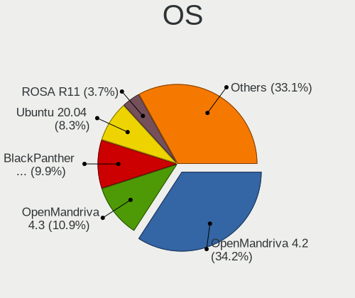

| Name              | Computers | Percent |
|-------------------|-----------|---------|
| OpenMandriva 4.2  | 3810      | 34.15%  |
| OpenMandriva 4.3  | 1213      | 10.87%  |
| BlackPanther 18.1 | 1101      | 9.87%   |
| Ubuntu 20.04      | 927       | 8.31%   |
| ROSA R11          | 414       | 3.71%   |
| ROSA R10          | 393       | 3.52%   |
| OpenMandriva 4.50 | 379       | 3.4%    |
| Ubuntu 18.04      | 305       | 2.73%   |
| ROSA R9           | 246       | 2.21%   |
| ROSA R8.1         | 180       | 1.61%   |
| ROSA R8           | 149       | 1.34%   |
| ROSA R11.1        | 144       | 1.29%   |
| ROSA 12.2         | 89        | 0.8%    |
| ArcoLinux Rolling | 87        | 0.78%   |
| Debian 10         | 82        | 0.74%   |
| Debian 11         | 75        | 0.67%   |
| Arch              | 61        | 0.55%   |
| KDE neon 20.04    | 55        | 0.49%   |
| Ubuntu 19.04      | 49        | 0.44%   |
| Linux Mint 20.2   | 39        | 0.35%   |
| Ubuntu 21.10      | 36        | 0.32%   |
| Ubuntu 20.10      | 36        | 0.32%   |
| Ubuntu 21.04      | 32        | 0.29%   |
| Xubuntu 20.04     | 31        | 0.28%   |
| CentOS 8          | 31        | 0.28%   |
| Ubuntu 19.10      | 30        | 0.27%   |
| Linux Mint 20.1   | 30        | 0.27%   |
| Fedora 33         | 30        | 0.27%   |
| Fedora 31         | 29        | 0.26%   |
| Pop!_OS 21.04     | 28        | 0.25%   |
| Zorin 15          | 26        | 0.23%   |
| Ubuntu 16.04      | 24        | 0.22%   |
| Pop!_OS 20.04     | 23        | 0.21%   |
| CentOS 7          | 23        | 0.21%   |
| Pop!_OS 20.10     | 22        | 0.2%    |
| ROSA 12.1         | 21        | 0.19%   |
| ROSA 12           | 21        | 0.19%   |
| ALT Linux 9.2     | 21        | 0.19%   |
| Ubuntu 18.10      | 20        | 0.18%   |
| Fedora 34         | 20        | 0.18%   |
| ROSA R6           | 18        | 0.16%   |
| RED X3            | 17        | 0.15%   |
| Manjaro           | 17        | 0.15%   |
| Debian 9          | 16        | 0.14%   |
| Xero Rolling      | 15        | 0.13%   |
| Fedora 35         | 15        | 0.13%   |
| Fedora 32         | 15        | 0.13%   |
| BlackPanther 16.2 | 15        | 0.13%   |
| ALT Linux 10.0    | 15        | 0.13%   |
| Linux Mint 20     | 14        | 0.13%   |
| Kali 2021.2       | 14        | 0.13%   |
| ROSA R12          | 13        | 0.12%   |
| ROSA 2019.05      | 13        | 0.12%   |
| Red OS 7.3        | 12        | 0.11%   |
| LMDE 4            | 12        | 0.11%   |
| Linux Mint 19.3   | 12        | 0.11%   |
| Zorin 16          | 11        | 0.1%    |
| Kali 2022.1       | 11        | 0.1%    |
| Kali 2021.3       | 11        | 0.1%    |
| ROSA R7           | 10        | 0.09%   |

OS Family
---------

OS without a version

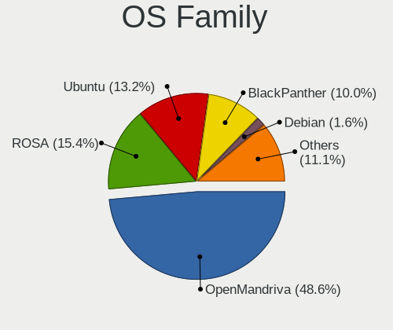

| Name          | Computers | Percent |
|---------------|-----------|---------|
| OpenMandriva  | 5404      | 48.58%  |
| ROSA          | 1713      | 15.4%   |
| Ubuntu        | 1469      | 13.21%  |
| BlackPanther  | 1116      | 10.03%  |
| Debian        | 181       | 1.63%   |
| Linux Mint    | 124       | 1.11%   |
| Fedora        | 118       | 1.06%   |
| ArcoLinux     | 91        | 0.82%   |
| Kali          | 89        | 0.8%    |
| Pop!_OS       | 83        | 0.75%   |
| Arch          | 69        | 0.62%   |
| ALT Linux     | 61        | 0.55%   |
| KDE neon      | 58        | 0.52%   |
| CentOS        | 57        | 0.51%   |
| Endless       | 50        | 0.45%   |
| Xubuntu       | 44        | 0.4%    |
| Zorin         | 40        | 0.36%   |
| Manjaro       | 40        | 0.36%   |
| Clear Linux   | 29        | 0.26%   |
| RED           | 27        | 0.24%   |
| LMDE          | 18        | 0.16%   |
| openSUSE      | 17        | 0.15%   |
| Kubuntu       | 17        | 0.15%   |
| Red OS        | 16        | 0.14%   |
| Xero          | 15        | 0.13%   |
| Gentoo        | 13        | 0.12%   |
| Elementary    | 13        | 0.12%   |
| Lubuntu       | 11        | 0.1%    |
| Kaisen        | 9         | 0.08%   |
| GNOME OS      | 9         | 0.08%   |
| Alpine        | 9         | 0.08%   |
| Ubuntu MATE   | 8         | 0.07%   |
| LinuxFX       | 8         | 0.07%   |
| Oracle Linux  | 7         | 0.06%   |
| Ubuntu Budgie | 6         | 0.05%   |
| RHEL          | 6         | 0.05%   |
| Reborn OS     | 6         | 0.05%   |
| Puppy         | 5         | 0.04%   |
| Parrot        | 4         | 0.04%   |
| Kylin         | 4         | 0.04%   |
| Slackware     | 3         | 0.03%   |
| RELS          | 3         | 0.03%   |
| Mageia        | 3         | 0.03%   |
| Freedesktop   | 3         | 0.03%   |
| EndeavourOS   | 3         | 0.03%   |
| Amazon Linux  | 3         | 0.03%   |
| ACI           | 3         | 0.03%   |
| Virtuozzo     | 2         | 0.02%   |
| MX            | 2         | 0.02%   |
| Makulu        | 2         | 0.02%   |
| LFS           | 2         | 0.02%   |
| Deepin        | 2         | 0.02%   |
| Astra Linux   | 2         | 0.02%   |
| Artix         | 2         | 0.02%   |
| Ubuntu Studio | 1         | 0.01%   |
| Ubuntu Kylin  | 1         | 0.01%   |
| Sparky        | 1         | 0.01%   |
| Solus         | 1         | 0.01%   |
| SkiffOS       | 1         | 0.01%   |
| Sangoma       | 1         | 0.01%   |

Kernel
------

Version of the Linux kernel

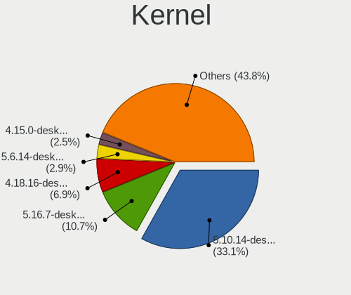

| Version                             | Computers | Percent |
|-------------------------------------|-----------|---------|
| 5.10.14-desktop-1omv4002            | 3722      | 33.14%  |
| 5.16.7-desktop-1omv4003             | 1198      | 10.67%  |
| 4.18.16-desktop-1bP                 | 779       | 6.94%   |
| 5.6.14-desktop-2bP                  | 325       | 2.89%   |
| 4.15.0-desktop-45.1rosa-x86_64      | 284       | 2.53%   |
| 5.4.0-45-generic                    | 283       | 2.52%   |
| 4.9.60-nrj-desktop-1rosa-x86_64     | 256       | 2.28%   |
| 4.9.20-nrj-desktop-1rosa-x86_64     | 194       | 1.73%   |
| 5.12.4-desktop-1omv4050             | 190       | 1.69%   |
| 5.10.74-generic-2rosa2021.1-x86_64  | 105       | 0.93%   |
| 4.9.9-nrj-desktop-1rosa-x86_64      | 86        | 0.77%   |
| 5.11.12-desktop-1omv4002            | 79        | 0.7%    |
| 5.4.0-42-generic                    | 57        | 0.51%   |
| 4.1.25-nrj-desktop-1rosa-x86_64     | 57        | 0.51%   |
| 4.9.60-nrj-desktop-1rosa-i586       | 53        | 0.47%   |
| 5.14.7-desktop-1omv4050             | 52        | 0.46%   |
| 5.4.32-generic-2rosa-x86_64         | 47        | 0.42%   |
| 5.4.0-26-generic                    | 47        | 0.42%   |
| 4.9.20-nrj-desktop-1rosa-i586       | 42        | 0.37%   |
| 4.9.124-nrj-desktop-1rosa-x86_64    | 41        | 0.37%   |
| 4.15.0-desktop-47.2rosa-x86_64      | 41        | 0.37%   |
| 4.15.0-desktop-45.1rosa-i586        | 38        | 0.34%   |
| 4.4.0-19041-Microsoft               | 37        | 0.33%   |
| 4.18.0-15-generic                   | 34        | 0.3%    |
| 4.9.9-nrj-desktop-1rosa-i586        | 33        | 0.29%   |
| 4.1.34-nrj-desktop-2rosa-x86_64     | 32        | 0.28%   |
| 5.10.16.3-microsoft-standard-WSL2   | 30        | 0.27%   |
| 4.1.25-nrj-desktop-1rosa-i586       | 29        | 0.26%   |
| 5.4.0-58-generic                    | 28        | 0.25%   |
| 5.4.0-29-generic                    | 28        | 0.25%   |
| 5.12.7-desktop-1omv4003             | 27        | 0.24%   |
| 5.10.60.1-microsoft-standard-WSL2   | 27        | 0.24%   |
| 5.4.0-52-generic                    | 26        | 0.23%   |
| 5.4.72-microsoft-standard-WSL2      | 25        | 0.22%   |
| 5.4.0-48-generic                    | 24        | 0.21%   |
| 5.3.0-28-generic                    | 24        | 0.21%   |
| 4.9.76-nrj-desktop-1rosa-x86_64     | 24        | 0.21%   |
| 4.9.41-nrj-desktop-1rosa-x86_64     | 24        | 0.21%   |
| 5.3.0-46-generic                    | 23        | 0.2%    |
| 4.1.38-nrj-desktop-2rosa-x86_64     | 22        | 0.2%    |
| 5.4.0-37-generic                    | 21        | 0.19%   |
| 4.15.0-29-generic                   | 20        | 0.18%   |
| 5.4.32-generic-2rosa-i586           | 19        | 0.17%   |
| 5.3.7-301.fc31.x86_64               | 19        | 0.17%   |
| 5.10.71-generic-1rosa2021.1-x86_64  | 19        | 0.17%   |
| 4.15.0-desktop-94.1rosa-x86_64      | 19        | 0.17%   |
| 4.1.34-nrj-desktop-2rosa-i586       | 19        | 0.17%   |
| 5.4.0-65-generic                    | 18        | 0.16%   |
| 5.3.0-40-generic                    | 18        | 0.16%   |
| 5.11.0-38-generic                   | 18        | 0.16%   |
| 5.11.0-37-generic                   | 18        | 0.16%   |
| 5.8.0-43-generic                    | 17        | 0.15%   |
| 5.4.0-47-generic                    | 17        | 0.15%   |
| 5.4.0-40-generic                    | 17        | 0.15%   |
| 5.4.0-33-generic                    | 17        | 0.15%   |
| 5.0.0-13-generic                    | 17        | 0.15%   |
| 4.15.0-desktop-122.124.1rosa-x86_64 | 17        | 0.15%   |
| 5.4.83-generic-2rosa-x86_64         | 16        | 0.14%   |
| 5.4.0-91-generic                    | 16        | 0.14%   |
| 5.11.0-41-generic                   | 16        | 0.14%   |

Kernel Family
-------------

Linux kernel without a distro release

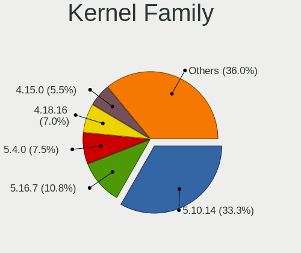

| Version    | Computers | Percent |
|------------|-----------|---------|
| 5.10.14    | 3722      | 33.29%  |
| 5.16.7     | 1202      | 10.75%  |
| 5.4.0      | 843       | 7.54%   |
| 4.18.16    | 781       | 6.99%   |
| 4.15.0     | 611       | 5.46%   |
| 5.6.14     | 327       | 2.92%   |
| 4.9.60     | 309       | 2.76%   |
| 4.9.20     | 250       | 2.24%   |
| 5.8.0      | 202       | 1.81%   |
| 5.12.4     | 192       | 1.72%   |
| 5.11.0     | 174       | 1.56%   |
| 5.3.0      | 126       | 1.13%   |
| 4.18.0     | 122       | 1.09%   |
| 4.9.9      | 119       | 1.06%   |
| 5.0.0      | 111       | 0.99%   |
| 5.10.74    | 108       | 0.97%   |
| 5.13.0     | 101       | 0.9%    |
| 5.10.0     | 97        | 0.87%   |
| 4.1.25     | 86        | 0.77%   |
| 5.11.12    | 82        | 0.73%   |
| 4.4.0      | 68        | 0.61%   |
| 5.4.32     | 67        | 0.6%    |
| 5.14.7     | 53        | 0.47%   |
| 4.1.34     | 51        | 0.46%   |
| 4.9.124    | 46        | 0.41%   |
| 4.9.41     | 36        | 0.32%   |
| 4.19.0     | 36        | 0.32%   |
| 4.1.38     | 35        | 0.31%   |
| 3.10.0     | 32        | 0.29%   |
| 5.10.60.1  | 31        | 0.28%   |
| 5.10.16.3  | 30        | 0.27%   |
| 5.12.7     | 28        | 0.25%   |
| 5.4.72     | 26        | 0.23%   |
| 4.9.76     | 26        | 0.23%   |
| 5.4.83     | 24        | 0.21%   |
| 5.15.0     | 20        | 0.18%   |
| 5.14.14    | 20        | 0.18%   |
| 5.10.71    | 20        | 0.18%   |
| 5.3.7      | 19        | 0.17%   |
| 4.19.128   | 16        | 0.14%   |
| 4.9.155    | 15        | 0.13%   |
| 4.1.15     | 15        | 0.13%   |
| 5.14.0     | 14        | 0.13%   |
| 3.14.44    | 14        | 0.13%   |
| 5.16.2     | 13        | 0.12%   |
| 4.9.111    | 13        | 0.12%   |
| 5.4.40     | 12        | 0.11%   |
| 5.11.11    | 12        | 0.11%   |
| 4.9.0      | 12        | 0.11%   |
| 5.9.0      | 11        | 0.1%    |
| 5.4.60     | 11        | 0.1%    |
| 5.14.12    | 10        | 0.09%   |
| 5.13.13    | 10        | 0.09%   |
| 5.10.70    | 10        | 0.09%   |
| 5.7.0      | 9         | 0.08%   |
| 5.13.12    | 9         | 0.08%   |
| 5.10.102.1 | 9         | 0.08%   |
| 5.16.13    | 8         | 0.07%   |
| 5.16.0     | 8         | 0.07%   |
| 5.15.7     | 8         | 0.07%   |

Kernel Major Ver.
-----------------

Linux kernel major version

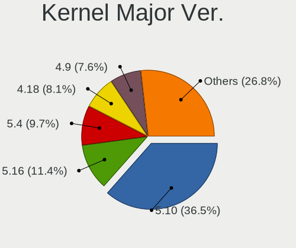

| Version  | Computers | Percent |
|----------|-----------|---------|
| 5.10     | 4074      | 36.49%  |
| 5.16     | 1271      | 11.38%  |
| 5.4      | 1081      | 9.68%   |
| 4.18     | 904       | 8.1%    |
| 4.9      | 847       | 7.59%   |
| 4.15     | 614       | 5.5%    |
| 5.6      | 351       | 3.14%   |
| 5.11     | 297       | 2.66%   |
| 5.12     | 245       | 2.19%   |
| 5.8      | 226       | 2.02%   |
| 4.1      | 188       | 1.68%   |
| 5.3      | 161       | 1.44%   |
| 5.13     | 135       | 1.21%   |
| 5.14     | 122       | 1.09%   |
| 5.0      | 113       | 1.01%   |
| 4.19     | 89        | 0.8%    |
| 5.15     | 82        | 0.73%   |
| 4.4      | 71        | 0.64%   |
| 5.9      | 56        | 0.5%    |
| 3.10     | 32        | 0.29%   |
| 5.10.60  | 31        | 0.28%   |
| 5.10.16  | 30        | 0.27%   |
| 5.7      | 28        | 0.25%   |
| 5.5      | 22        | 0.2%    |
| 3.14     | 19        | 0.17%   |
| 5.17     | 10        | 0.09%   |
| 4.14     | 10        | 0.09%   |
| 5.10.102 | 9         | 0.08%   |
| 5.1      | 6         | 0.05%   |
| 4.10     | 5         | 0.04%   |
| 5.2      | 4         | 0.04%   |
| 4.20     | 3         | 0.03%   |
| 4.13     | 3         | 0.03%   |
| 2.6      | 3         | 0.03%   |
| 4.8      | 2         | 0.02%   |
| 4.7      | 2         | 0.02%   |
| 4.5      | 2         | 0.02%   |
| 4.16     | 2         | 0.02%   |
| 4.12     | 2         | 0.02%   |
| 3.13     | 2         | 0.02%   |
| 5.10.43  | 1         | 0.01%   |
| 4.11     | 1         | 0.01%   |
| 3.8      | 1         | 0.01%   |
| 3.6      | 1         | 0.01%   |
| 3.4      | 1         | 0.01%   |
| 3.3      | 1         | 0.01%   |
| 3.2      | 1         | 0.01%   |
| 3.16     | 1         | 0.01%   |
| 3.1      | 1         | 0.01%   |
| 2.6.38   | 1         | 0.01%   |
| 12       | 1         | 0.01%   |

Arch
----

OS architecture (x86_64, i586, etc.)

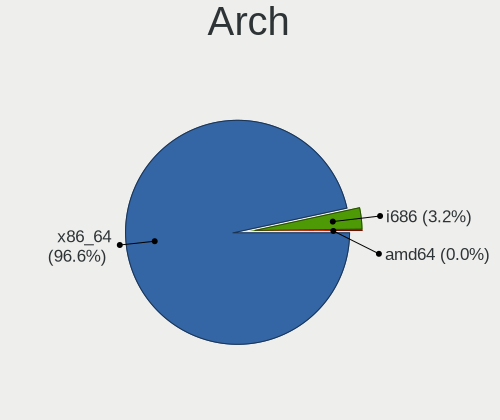

| Name    | Computers | Percent |
|---------|-----------|---------|
| x86_64  | 10736     | 96.6%   |
| i686    | 355       | 3.19%   |
| aarch64 | 22        | 0.2%    |
| amd64   | 1         | 0.01%   |

DE
--

Desktop Environment

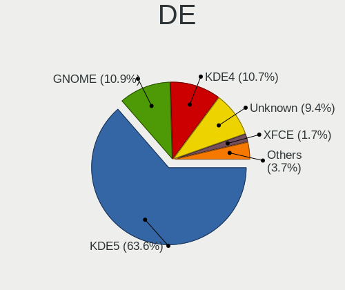

| Name             | Computers | Percent |
|------------------|-----------|---------|
| KDE5             | 7085      | 63.6%   |
| GNOME            | 1218      | 10.93%  |
| KDE4             | 1187      | 10.66%  |
| Unknown          | 1050      | 9.43%   |
| XFCE             | 193       | 1.73%   |
| X-Cinnamon       | 126       | 1.13%   |
| MATE             | 65        | 0.58%   |
| LXQt             | 53        | 0.48%   |
| KDE              | 51        | 0.46%   |
| Cinnamon         | 18        | 0.16%   |
| i3               | 14        | 0.13%   |
| Pantheon         | 11        | 0.1%    |
| Budgie           | 11        | 0.1%    |
| lightdm-xsession | 8         | 0.07%   |
| bspwm            | 5         | 0.04%   |
| xmonad           | 4         | 0.04%   |
| qtile            | 4         | 0.04%   |
| LXDE             | 4         | 0.04%   |
| GNUstep          | 4         | 0.04%   |
| dwm              | 4         | 0.04%   |
| awesome          | 4         | 0.04%   |
| Unity            | 3         | 0.03%   |
| LeftWM           | 3         | 0.03%   |
| GNOME Classic    | 3         | 0.03%   |
| Deepin           | 3         | 0.03%   |
| Xpra             | 1         | 0.01%   |
| UKUI             | 1         | 0.01%   |
| spectrwm         | 1         | 0.01%   |
| Openbox          | 1         | 0.01%   |
| Lumina           | 1         | 0.01%   |
| i3-with-shmlog   | 1         | 0.01%   |
| herbstluftwm     | 1         | 0.01%   |
| GNOME Flashback  | 1         | 0.01%   |
| Enlightenment    | 1         | 0.01%   |

Display Server
--------------

X11 or Wayland

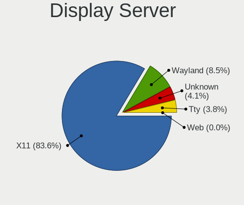

| Name    | Computers | Percent |
|---------|-----------|---------|
| X11     | 9305      | 83.58%  |
| Wayland | 949       | 8.52%   |
| Unknown | 454       | 4.08%   |
| Tty     | 423       | 3.8%    |
| Web     | 2         | 0.02%   |

Display Manager
---------------

SDDM, LightDM, etc.

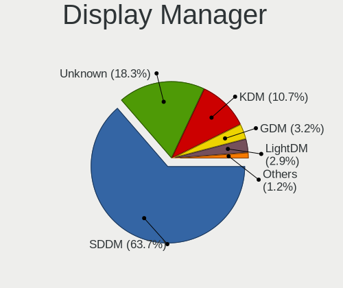

| Name    | Computers | Percent |
|---------|-----------|---------|
| SDDM    | 7087      | 63.65%  |
| Unknown | 2042      | 18.34%  |
| KDM     | 1192      | 10.71%  |
| GDM     | 359       | 3.22%   |
| LightDM | 318       | 2.86%   |
| GDM3    | 125       | 1.12%   |
| XDM     | 10        | 0.09%   |
| SLiM    | 1         | 0.01%   |

OS Lang
-------

Language

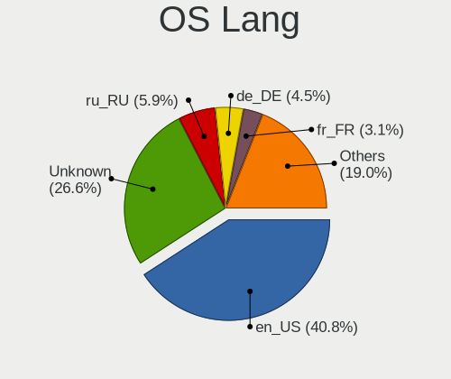

| Lang    | Computers | Percent |
|---------|-----------|---------|
| en_US   | 4548      | 40.85%  |
| Unknown | 2958      | 26.57%  |
| ru_RU   | 661       | 5.94%   |
| de_DE   | 503       | 4.52%   |
| fr_FR   | 346       | 3.11%   |
| pt_BR   | 307       | 2.76%   |
| C       | 216       | 1.94%   |
| es_ES   | 194       | 1.74%   |
| en_GB   | 183       | 1.64%   |
| pl_PL   | 149       | 1.34%   |
| it_IT   | 143       | 1.28%   |
| es_MX   | 104       | 0.93%   |
| en_CA   | 76        | 0.68%   |
| zh_CN   | 53        | 0.48%   |
| cs_CZ   | 50        | 0.45%   |
| es_CO   | 48        | 0.43%   |
| en_AU   | 44        | 0.4%    |
| nl_NL   | 38        | 0.34%   |
| de_AT   | 34        | 0.31%   |
| es_AR   | 29        | 0.26%   |
| de_CH   | 29        | 0.26%   |
| es_CR   | 27        | 0.24%   |
| en_IN   | 27        | 0.24%   |
| hu_HU   | 23        | 0.21%   |
| pt_PT   | 20        | 0.18%   |
| fr_BE   | 20        | 0.18%   |
| es_EC   | 19        | 0.17%   |
| es_CL   | 18        | 0.16%   |
| ru_UA   | 17        | 0.15%   |
| fr_CA   | 16        | 0.14%   |
| tr_TR   | 13        | 0.12%   |
| nl_BE   | 12        | 0.11%   |
| es_GT   | 11        | 0.1%    |
| en_ZA   | 11        | 0.1%    |
| es_PE   | 10        | 0.09%   |
| fr_CH   | 9         | 0.08%   |
| es_BO   | 9         | 0.08%   |
| en_IE   | 9         | 0.08%   |
| en_AG   | 9         | 0.08%   |
| en_NZ   | 8         | 0.07%   |
| uk_UA   | 7         | 0.06%   |
| ja_JP   | 7         | 0.06%   |
| en_SG   | 7         | 0.06%   |
| en_HK   | 7         | 0.06%   |
| sv_SE   | 6         | 0.05%   |
| es_UY   | 6         | 0.05%   |
| da_DK   | 6         | 0.05%   |
| ro_RO   | 5         | 0.04%   |
| nb_NO   | 5         | 0.04%   |
| es_PA   | 5         | 0.04%   |
| es_HN   | 5         | 0.04%   |
| en_IL   | 5         | 0.04%   |
| en_DK   | 5         | 0.04%   |
| zh_TW   | 4         | 0.04%   |
| ko_KR   | 4         | 0.04%   |
| en_PH   | 4         | 0.04%   |
| sk_SK   | 3         | 0.03%   |
| POSIX   | 3         | 0.03%   |
| es_VE   | 3         | 0.03%   |
| es_SV   | 3         | 0.03%   |

Boot Mode
---------

EFI or BIOS

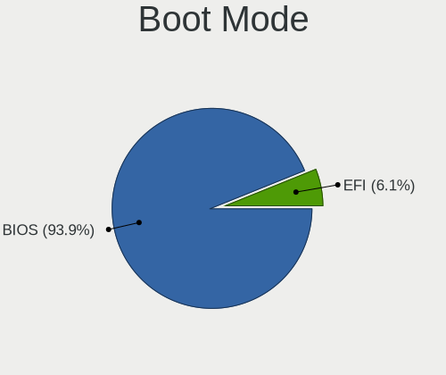

| Mode | Computers | Percent |
|------|-----------|---------|
| BIOS | 10440     | 93.9%   |
| EFI  | 678       | 6.1%    |

Filesystem
----------

Type of filesystem

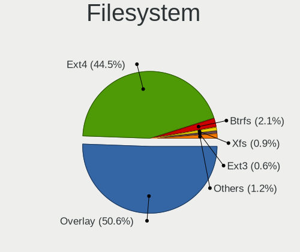

| Type      | Computers | Percent |
|-----------|-----------|---------|
| Overlay   | 5631      | 50.56%  |
| Ext4      | 4959      | 44.53%  |
| Btrfs     | 239       | 2.15%   |
| Xfs       | 101       | 0.91%   |
| Ext3      | 68        | 0.61%   |
| Unknown   | 46        | 0.41%   |
| Wslfs     | 24        | 0.22%   |
| Zfs       | 23        | 0.21%   |
| Aufs      | 13        | 0.12%   |
| Lxfs      | 11        | 0.1%    |
| Ext2      | 5         | 0.04%   |
| Tmpfs     | 4         | 0.04%   |
| WslXs     | 3         | 0.03%   |
| Overlayfs | 3         | 0.03%   |
| Jfs       | 2         | 0.02%   |
| Unionfs   | 1         | 0.01%   |
| Ufs       | 1         | 0.01%   |
| Shiftfs   | 1         | 0.01%   |
| Nfs4      | 1         | 0.01%   |
| LxXs      | 1         | 0.01%   |

Part. scheme
------------

Scheme of partitioning

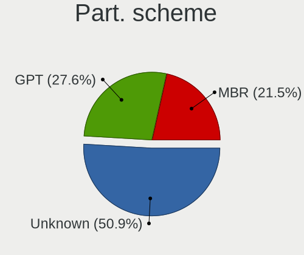

| Type    | Computers | Percent |
|---------|-----------|---------|
| Unknown | 5676      | 50.94%  |
| GPT     | 3070      | 27.55%  |
| MBR     | 2397      | 21.51%  |

Dual Boot with Linux/BSD
------------------------

Hosting more than one Linux/BSD

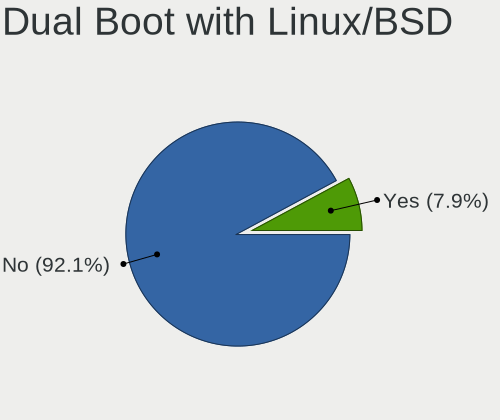

| Dual boot | Computers | Percent |
|-----------|-----------|---------|
| No        | 10256     | 92.15%  |
| Yes       | 874       | 7.85%   |

Dual Boot (Win)
---------------

Hosting Linux and Windows

| Dual boot | Computers | Percent |
|-----------|-----------|---------|
| No        | 11027     | 99.22%  |
| Yes       | 87        | 0.78%   |

Board
-----

Vendor
------

Motherboard manufacturer

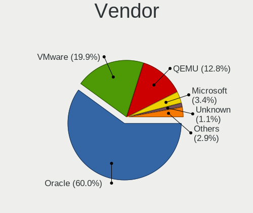

| Name                             | Computers | Percent |
|----------------------------------|-----------|---------|
| Oracle                           | 6665      | 59.98%  |
| VMware                           | 2210      | 19.89%  |
| QEMU                             | 1417      | 12.75%  |
| Microsoft                        | 374       | 3.37%   |
| Unknown                          | 126       | 1.13%   |
| Parallels Software International | 113       | 1.02%   |
| ChromiumOS                       | 53        | 0.48%   |
| Xen                              | 29        | 0.26%   |
| Red Hat                          | 24        | 0.22%   |
| Amazon EC2                       | 22        | 0.2%    |
| innotek                          | 13        | 0.12%   |
| oVirt                            | 9         | 0.08%   |
| OpenStack Foundation             | 9         | 0.08%   |
| Google                           | 8         | 0.07%   |
| DigitalOcean                     | 8         | 0.07%   |
| Parallels                        | 5         | 0.04%   |
| Hetzner                          | 5         | 0.04%   |
| RDO                              | 4         | 0.04%   |
| Parallels International          | 4         | 0.04%   |
| netcup                           | 4         | 0.04%   |
| Apache Software Foundation       | 2         | 0.02%   |
| Alibaba Cloud                    | 2         | 0.02%   |
| Yandex                           | 1         | 0.01%   |
| Vultr                            | 1         | 0.01%   |
| Virtuozzo                        | 1         | 0.01%   |
| Scaleway                         | 1         | 0.01%   |
| McGhie                           | 1         | 0.01%   |
| Bosch Rexroth                    | 1         | 0.01%   |

Model
-----

Motherboard model

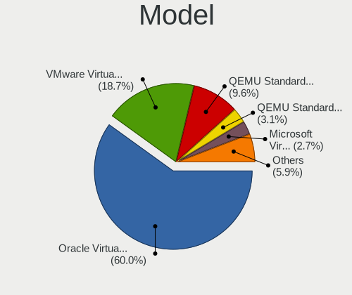

| Name                                                        | Computers | Percent |
|-------------------------------------------------------------|-----------|---------|
| Oracle VirtualBox                                           | 6664      | 59.97%  |
| VMware Virtual Platform                                     | 2082      | 18.74%  |
| QEMU Standard PC (i440FX + PIIX, 1996)                      | 1069      | 9.62%   |
| QEMU Standard PC (Q35 + ICH9, 2009)                         | 341       | 3.07%   |
| Microsoft Virtual Machine                                   | 305       | 2.74%   |
| VMware VMware7,1                                            | 127       | 1.14%   |
| Unknown                                                     | 126       | 1.13%   |
| Parallels Software International Parallels Virtual Platform | 113       | 1.02%   |
| Microsoft Windows Subsystem for Linux                       | 69        | 0.62%   |
| ChromiumOS crosvm                                           | 53        | 0.48%   |
| Xen HVM domU                                                | 29        | 0.26%   |
| Red Hat KVM                                                 | 22        | 0.2%    |
| innotek VirtualBox                                          | 13        | 0.12%   |
| OpenStack Foundation OpenStack Nova                         | 9         | 0.08%   |
| Google Compute Engine                                       | 8         | 0.07%   |
| DigitalOcean Droplet                                        | 8         | 0.07%   |
| Amazon EC2 r5d.metal                                        | 8         | 0.07%   |
| oVirt Node                                                  | 6         | 0.05%   |
| QEMU KVM Virtual Machine                                    | 5         | 0.04%   |
| Parallels ARM Virtual Machine                               | 5         | 0.04%   |
| Hetzner vServer                                             | 5         | 0.04%   |
| Amazon EC2 r5b.metal                                        | 5         | 0.04%   |
| RDO OpenStack Compute                                       | 4         | 0.04%   |
| Parallels International ARM Virtual Machine                 | 4         | 0.04%   |
| netcup KVM Server                                           | 4         | 0.04%   |
| QEMU Virtual Machine                                        | 2         | 0.02%   |
| oVirt RHEL                                                  | 2         | 0.02%   |
| Apache Software Foundation CloudStack KVM Hypervisor        | 2         | 0.02%   |
| Alibaba Cloud ECS                                           | 2         | 0.02%   |
| Yandex xeon-gold-6230                                       | 1         | 0.01%   |
| Vultr HFC                                                   | 1         | 0.01%   |
| VMware VBSA                                                 | 1         | 0.01%   |
| Virtuozzo KVM                                               | 1         | 0.01%   |
| Scaleway SCW-DEV1-MICRO                                     | 1         | 0.01%   |
| Red Hat RHEL                                                | 1         | 0.01%   |
| Red Hat OpenStack Compute                                   | 1         | 0.01%   |
| oVirt RHEV Hypervisor                                       | 1         | 0.01%   |
| Oracle ThinkPad T14 Gen 1 20S1S19N00                        | 1         | 0.01%   |
| McGhie Debian-10                                            | 1         | 0.01%   |
| Bosch Rexroth ctrlX COREvirtual                             | 1         | 0.01%   |
| Amazon EC2 t4g.micro                                        | 1         | 0.01%   |
| Amazon EC2 t3a.small                                        | 1         | 0.01%   |
| Amazon EC2 t3.small                                         | 1         | 0.01%   |
| Amazon EC2 t3.micro                                         | 1         | 0.01%   |
| Amazon EC2 t3.medium                                        | 1         | 0.01%   |
| Amazon EC2 r5a.xlarge                                       | 1         | 0.01%   |
| Amazon EC2 m6i.metal                                        | 1         | 0.01%   |
| Amazon EC2 m5ad.4xlarge                                     | 1         | 0.01%   |
| Amazon EC2 c6g.large                                        | 1         | 0.01%   |

Model Family
------------

Motherboard model prefix

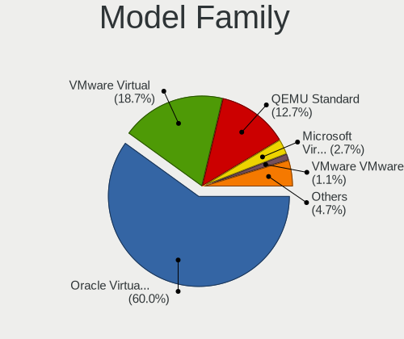

| Name                                       | Computers | Percent |
|--------------------------------------------|-----------|---------|
| Oracle VirtualBox                          | 6664      | 59.97%  |
| VMware Virtual                             | 2082      | 18.74%  |
| QEMU Standard                              | 1410      | 12.69%  |
| Microsoft Virtual                          | 305       | 2.74%   |
| VMware VMware7                             | 127       | 1.14%   |
| Unknown                                    | 126       | 1.13%   |
| Parallels Software International Parallels | 113       | 1.02%   |
| Microsoft Windows                          | 69        | 0.62%   |
| ChromiumOS crosvm                          | 53        | 0.48%   |
| Xen HVM                                    | 29        | 0.26%   |
| Red Hat KVM                                | 22        | 0.2%    |
| innotek VirtualBox                         | 13        | 0.12%   |
| OpenStack Foundation OpenStack             | 9         | 0.08%   |
| Google Compute                             | 8         | 0.07%   |
| DigitalOcean Droplet                       | 8         | 0.07%   |
| Amazon EC2 r5d.metal                       | 8         | 0.07%   |
| oVirt Node                                 | 6         | 0.05%   |
| QEMU KVM                                   | 5         | 0.04%   |
| Parallels ARM                              | 5         | 0.04%   |
| Hetzner vServer                            | 5         | 0.04%   |
| Amazon EC2 r5b.metal                       | 5         | 0.04%   |
| RDO OpenStack                              | 4         | 0.04%   |
| Parallels International ARM                | 4         | 0.04%   |
| netcup KVM                                 | 4         | 0.04%   |
| QEMU Virtual                               | 2         | 0.02%   |
| oVirt RHEL                                 | 2         | 0.02%   |
| Apache Software Foundation CloudStack      | 2         | 0.02%   |
| Alibaba Cloud ECS                          | 2         | 0.02%   |
| Yandex xeon-gold-6230                      | 1         | 0.01%   |
| Vultr HFC                                  | 1         | 0.01%   |
| VMware VBSA                                | 1         | 0.01%   |
| Virtuozzo KVM                              | 1         | 0.01%   |
| Scaleway SCW-DEV1-MICRO                    | 1         | 0.01%   |
| Red Hat RHEL                               | 1         | 0.01%   |
| Red Hat OpenStack                          | 1         | 0.01%   |
| oVirt RHEV                                 | 1         | 0.01%   |
| Oracle ThinkPad                            | 1         | 0.01%   |
| McGhie Debian-10                           | 1         | 0.01%   |
| Bosch Rexroth ctrlX                        | 1         | 0.01%   |
| Amazon EC2 t4g.micro                       | 1         | 0.01%   |
| Amazon EC2 t3a.small                       | 1         | 0.01%   |
| Amazon EC2 t3.small                        | 1         | 0.01%   |
| Amazon EC2 t3.micro                        | 1         | 0.01%   |
| Amazon EC2 t3.medium                       | 1         | 0.01%   |
| Amazon EC2 r5a.xlarge                      | 1         | 0.01%   |
| Amazon EC2 m6i.metal                       | 1         | 0.01%   |
| Amazon EC2 m5ad.4xlarge                    | 1         | 0.01%   |
| Amazon EC2 c6g.large                       | 1         | 0.01%   |

MFG Year
--------

Motherboard manufacture year

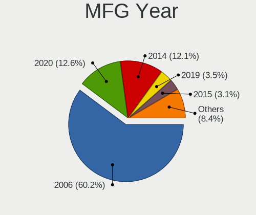

| Year    | Computers | Percent |
|---------|-----------|---------|
| 2006    | 6692      | 60.22%  |
| 2020    | 1403      | 12.63%  |
| 2014    | 1346      | 12.11%  |
| 2019    | 388       | 3.49%   |
| 2015    | 346       | 3.11%   |
| 2018    | 331       | 2.98%   |
| Unknown | 246       | 2.21%   |
| 2017    | 153       | 1.38%   |
| 2021    | 111       | 1%      |
| 2013    | 40        | 0.36%   |
| 2011    | 18        | 0.16%   |
| 2016    | 17        | 0.15%   |
| 2012    | 16        | 0.14%   |
| 2007    | 3         | 0.03%   |
| 2022    | 2         | 0.02%   |

Form Factor
-----------

Physical design of the computer

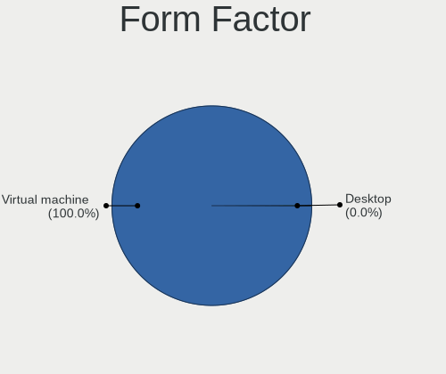

| Name            | Computers | Percent |
|-----------------|-----------|---------|
| Virtual machine | 11111     | 99.99%  |
| Desktop         | 1         | 0.01%   |

Secure Boot
-----------

Enabled or disabled

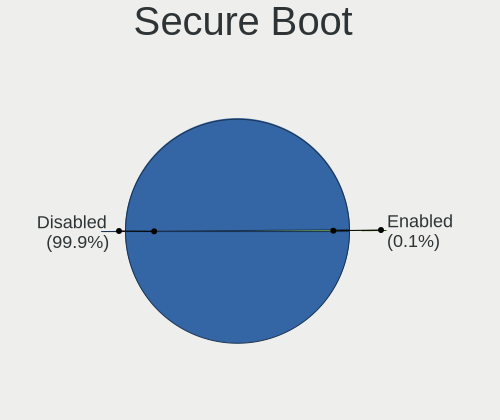

| State    | Computers | Percent |
|----------|-----------|---------|
| Disabled | 11099     | 99.88%  |
| Enabled  | 13        | 0.12%   |

Coreboot
--------

Have coreboot on board

| Used | Computers | Percent |
|------|-----------|---------|
| No   | 11112     | 100%    |

RAM Size
--------

Total RAM memory

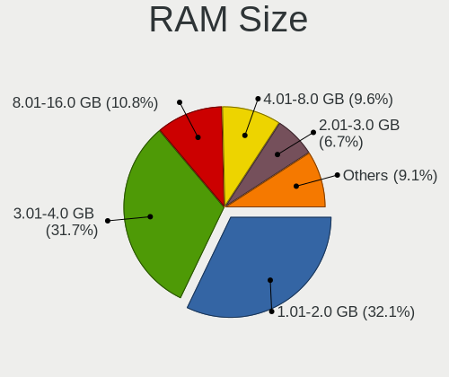

| Size in GB      | Computers | Percent |
|-----------------|-----------|---------|
| 1.01-2.0        | 3583      | 32.14%  |
| 3.01-4.0        | 3536      | 31.72%  |
| 8.01-16.0       | 1199      | 10.76%  |
| 4.01-8.0        | 1065      | 9.55%   |
| 2.01-3.0        | 746       | 6.69%   |
| 0.51-1.0        | 577       | 5.18%   |
| 16.01-24.0      | 242       | 2.17%   |
| 32.01-64.0      | 85        | 0.76%   |
| 24.01-32.0      | 45        | 0.4%    |
| 64.01-256.0     | 27        | 0.24%   |
| 0.01-0.5        | 26        | 0.23%   |
| More than 256.0 | 16        | 0.14%   |

RAM Used
--------

Used RAM memory

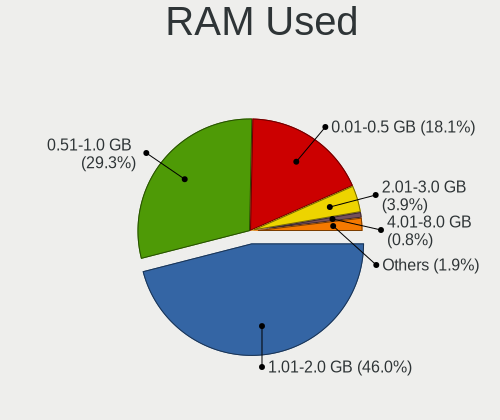

| Used GB         | Computers | Percent |
|-----------------|-----------|---------|
| 1.01-2.0        | 5145      | 46.01%  |
| 0.51-1.0        | 3280      | 29.33%  |
| 0.01-0.5        | 2021      | 18.07%  |
| 2.01-3.0        | 435       | 3.89%   |
| 4.01-8.0        | 90        | 0.8%    |
| 3.01-4.0        | 88        | 0.79%   |
| Unknown         | 69        | 0.62%   |
| 0               | 17        | 0.15%   |
| 8.01-16.0       | 14        | 0.13%   |
| More than 256.0 | 13        | 0.12%   |
| 16.01-24.0      | 6         | 0.05%   |
| 24.01-32.0      | 3         | 0.03%   |
| 32.01-64.0      | 2         | 0.02%   |

Total Drives
------------

Number of drives on board

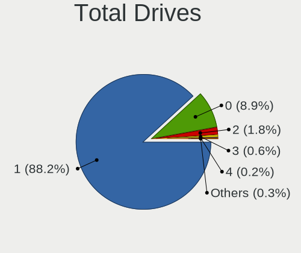

| Drives | Computers | Percent |
|--------|-----------|---------|
| 1      | 9808      | 88.2%   |
| 0      | 994       | 8.94%   |
| 2      | 200       | 1.8%    |
| 3      | 64        | 0.58%   |
| 4      | 26        | 0.23%   |
| 5      | 18        | 0.16%   |
| 120    | 4         | 0.04%   |
| 121    | 3         | 0.03%   |
| 13     | 1         | 0.01%   |
| 10     | 1         | 0.01%   |
| 6      | 1         | 0.01%   |

Has CD-ROM
----------

Has CD-ROM on board

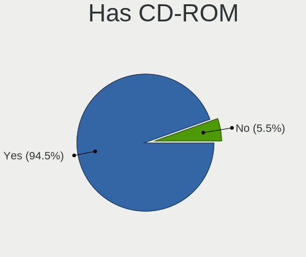

| Presented | Computers | Percent |
|-----------|-----------|---------|
| Yes       | 10509     | 94.54%  |
| No        | 607       | 5.46%   |

Has Ethernet
------------

Has Ethernet on board

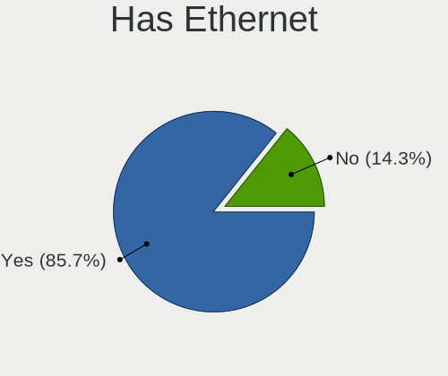

| Presented | Computers | Percent |
|-----------|-----------|---------|
| Yes       | 9526      | 85.73%  |
| No        | 1586      | 14.27%  |

Has WiFi
--------

Has WiFi module

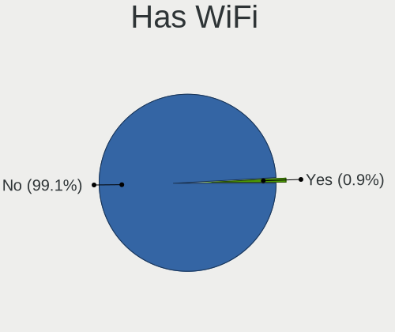

| Presented | Computers | Percent |
|-----------|-----------|---------|
| No        | 11018     | 99.12%  |
| Yes       | 98        | 0.88%   |

Has Bluetooth
-------------

Has Bluetooth module

| Presented | Computers | Percent |
|-----------|-----------|---------|
| No        | 10250     | 92.23%  |
| Yes       | 864       | 7.77%   |

Location
--------

Country
-------

Geographic location (country)

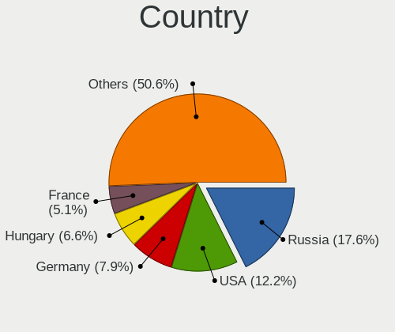

| Country      | Computers | Percent |
|--------------|-----------|---------|
| Russia       | 1958      | 17.6%   |
| USA          | 1358      | 12.21%  |
| Germany      | 877       | 7.88%   |
| Hungary      | 736       | 6.62%   |
| France       | 565       | 5.08%   |
| Brazil       | 544       | 4.89%   |
| Italy        | 353       | 3.17%   |
| Spain        | 325       | 2.92%   |
| Poland       | 305       | 2.74%   |
| UK           | 288       | 2.59%   |
| Mexico       | 283       | 2.54%   |
| Canada       | 255       | 2.29%   |
| Ukraine      | 177       | 1.59%   |
| China        | 171       | 1.54%   |
| Netherlands  | 158       | 1.42%   |
| India        | 138       | 1.24%   |
| Australia    | 138       | 1.24%   |
| Japan        | 118       | 1.06%   |
| Colombia     | 114       | 1.02%   |
| Czechia      | 99        | 0.89%   |
| Switzerland  | 98        | 0.88%   |
| Romania      | 98        | 0.88%   |
| Austria      | 98        | 0.88%   |
| Turkey       | 82        | 0.74%   |
| Indonesia    | 78        | 0.7%    |
| Belgium      | 77        | 0.69%   |
| Morocco      | 69        | 0.62%   |
| Portugal     | 61        | 0.55%   |
| Belarus      | 58        | 0.52%   |
| Sweden       | 56        | 0.5%    |
| Argentina    | 53        | 0.48%   |
| Bulgaria     | 50        | 0.45%   |
| Greece       | 47        | 0.42%   |
| Costa Rica   | 44        | 0.4%    |
| Finland      | 43        | 0.39%   |
| Denmark      | 43        | 0.39%   |
| Serbia       | 42        | 0.38%   |
| Norway       | 42        | 0.38%   |
| Peru         | 41        | 0.37%   |
| Slovakia     | 40        | 0.36%   |
| Ecuador      | 38        | 0.34%   |
| Chile        | 37        | 0.33%   |
| Taiwan       | 34        | 0.31%   |
| South Africa | 33        | 0.3%    |
| Kazakhstan   | 33        | 0.3%    |
| Israel       | 33        | 0.3%    |
| Singapore    | 30        | 0.27%   |
| Malaysia     | 30        | 0.27%   |
| South Korea  | 28        | 0.25%   |
| Moldova      | 28        | 0.25%   |
| Ireland      | 28        | 0.25%   |
| Iran         | 27        | 0.24%   |
| Saudi Arabia | 22        | 0.2%    |
| Honduras     | 22        | 0.2%    |
| Bolivia      | 21        | 0.19%   |
| Thailand     | 20        | 0.18%   |
| Hong Kong    | 20        | 0.18%   |
| Philippines  | 19        | 0.17%   |
| New Zealand  | 19        | 0.17%   |
| Estonia      | 19        | 0.17%   |

City
----

Geographic location (city)

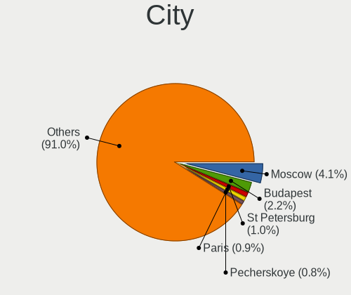

| City              | Computers | Percent |
|-------------------|-----------|---------|
| Moscow            | 454       | 4.06%   |
| Budapest          | 246       | 2.2%    |
| St Petersburg     | 114       | 1.02%   |
| Paris             | 101       | 0.9%    |
| Pecherskoye       | 87        | 0.78%   |
| Sao Paulo         | 84        | 0.75%   |
| Berlin            | 80        | 0.72%   |
| Yekaterinburg     | 79        | 0.71%   |
| Genoa             | 77        | 0.69%   |
| Baton Rouge       | 77        | 0.69%   |
| Warsaw            | 58        | 0.52%   |
| Madrid            | 56        | 0.5%    |
| Nizhniy Novgorod  | 51        | 0.46%   |
| Amsterdam         | 49        | 0.44%   |
| Vienna            | 48        | 0.43%   |
| Frankfurt am Main | 47        | 0.42%   |
| Novosibirsk       | 46        | 0.41%   |
| Omsk              | 42        | 0.38%   |
| Sydney            | 41        | 0.37%   |
| Hamburg           | 41        | 0.37%   |
| Toronto           | 40        | 0.36%   |
| Mexico City       | 38        | 0.34%   |
| Munich            | 37        | 0.33%   |
| London            | 37        | 0.33%   |
| Győr          | 37        | 0.33%   |
| Voronezh          | 36        | 0.32%   |
| Montreal          | 36        | 0.32%   |
| Kyiv              | 36        | 0.32%   |
| Los Angeles       | 34        | 0.3%    |
| Bogotá         | 34        | 0.3%    |
| Krasnodar         | 33        | 0.3%    |
| Beijing           | 32        | 0.29%   |
| Irkutsk           | 31        | 0.28%   |
| Singapore         | 30        | 0.27%   |
| Pouso Alegre      | 30        | 0.27%   |
| San José       | 29        | 0.26%   |
| Milan             | 29        | 0.26%   |
| Barcelona         | 28        | 0.25%   |
| Seattle           | 27        | 0.24%   |
| Rostov-on-Don     | 27        | 0.24%   |
| Rome              | 27        | 0.24%   |
| Minsk             | 27        | 0.24%   |
| Guadalajara       | 27        | 0.24%   |
| Dallas            | 27        | 0.24%   |
| Belgrade          | 27        | 0.24%   |
| Rio de Janeiro    | 26        | 0.23%   |
| Casablanca        | 26        | 0.23%   |
| Zurich            | 25        | 0.22%   |
| Sofia             | 25        | 0.22%   |
| Melbourne         | 25        | 0.22%   |
| Ciudad Guzmán  | 25        | 0.22%   |
| Atlanta           | 25        | 0.22%   |
| San Jose          | 24        | 0.21%   |
| Miami             | 24        | 0.21%   |
| Istanbul          | 24        | 0.21%   |
| Helsinki          | 24        | 0.21%   |
| Athens            | 24        | 0.21%   |
| Prague            | 23        | 0.21%   |
| Chelyabinsk       | 23        | 0.21%   |
| Barnaul           | 23        | 0.21%   |

Drives
------

Drive Vendor
------------

Hard drive vendors

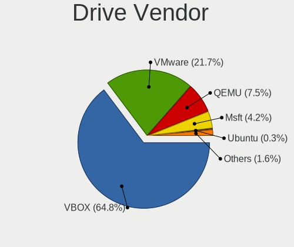

| Vendor                 | Computers | Drives  | Percent |
|------------------------|-----------|---------|---------|
| VBOX                   | 6564      | 6792    | 64.75%  |
| VMware                 | 2202      | 2305    | 21.72%  |
| QEMU                   | 756       | 804     | 7.46%   |
| Msft                   | 427       | 682     | 4.21%   |
| Ubuntu                 | 30        | 33      | 0.3%    |
| Amazon.com             | 22        | 68      | 0.22%   |
| InnoTek Systemberatung | 10        | 12      | 0.1%    |
| Unknown                | 10        | 10      | 0.1%    |
| Other                  | 9         | 9       | 0.09%   |
| Virtual                | 8         | 8       | 0.08%   |
| ORACLE                 | 7         | 10      | 0.07%   |
| OpenMandriva           | 7         | 7       | 0.07%   |
| SYNOLOGY               | 4         | 4       | 0.04%   |
| Rosa                   | 4         | 4       | 0.04%   |
| Open                   | 4         | 4       | 0.04%   |
| Mandriva-0             | 4         | 4       | 0.04%   |
| BHYVE                  | 4         | 4       | 0.04%   |
| WDC                    | 3         | 5       | 0.03%   |
| TF CARD                | 3         | 3       | 0.03%   |
| Seagate                | 3         | 3       | 0.03%   |
| OpenMandriva-0         | 3         | 3       | 0.03%   |
| Linux                  | 3         | 3       | 0.03%   |
| Zorin                  | 2         | 2       | 0.02%   |
| Samsung Electronics    | 2         | 5       | 0.02%   |
| SABRENT                | 2         | 2       | 0.02%   |
| Rosa-0                 | 2         | 2       | 0.02%   |
| Red Hat                | 2         | 2       | 0.02%   |
| Pop!                   | 2         | 2       | 0.02%   |
| NVMe                   | 2         | 2       | 0.02%   |
| Mandriva               | 2         | 2       | 0.02%   |
| Kali                   | 2         | 2       | 0.02%   |
| Fedora                 | 2         | 2       | 0.02%   |
| Autre                  | 2         | 2       | 0.02%   |
| Ultramarine            | 1         | 1       | 0.01%   |
| TS32GSSD               | 1         | 1       | 0.01%   |
| SATAFIRM               | 1         | 1       | 0.01%   |
| Phison                 | 1         | 2       | 0.01%   |
| Otro                   | 1         | 1       | 0.01%   |
| OpenManfriva           | 1         | 1       | 0.01%   |
| OpenMadriva            | 1         | 1       | 0.01%   |
| MxDoo                  | 1         | 1       | 0.01%   |
| Mass                   | 1         | Unknown | 0.01%   |
| live                   | 1         | 1       | 0.01%   |
| Linode                 | 1         | 1       | 0.01%   |
| KDE                    | 1         | 1       | 0.01%   |
| HGST                   | 1         | 1       | 0.01%   |
| HC                     | 1         | 1       | 0.01%   |
| Google                 | 1         | 1       | 0.01%   |
| DO                     | 1         | 1       | 0.01%   |
| Debian-0               | 1         | 1       | 0.01%   |
| Clean                  | 1         | 1       | 0.01%   |
| CentOS                 | 1         | 1       | 0.01%   |
| BP                     | 1         | 1       | 0.01%   |
| blackPantherOS         | 1         | 1       | 0.01%   |
| Blackpanther-0         | 1         | 1       | 0.01%   |
| arco-neo-0             | 1         | 1       | 0.01%   |
| Archcraft              | 1         | 1       | 0.01%   |
| Arch-0                 | 1         | 1       | 0.01%   |
| Arch                   | 1         | 1       | 0.01%   |
| Anderes                | 1         | 1       | 0.01%   |

Drive Model
-----------

Hard drive models

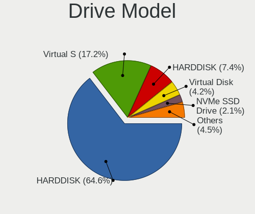

| Model                                      | Computers | Percent |
|--------------------------------------------|-----------|---------|
| VBOX HARDDISK                              | 6564      | 64.58%  |
| VMware Virtual S                           | 1748      | 17.2%   |
| QEMU HARDDISK                              | 755       | 7.43%   |
| Msft Virtual Disk                          | 427       | 4.2%    |
| VMware NVMe SSD Drive                      | 217       | 2.13%   |
| VMware Virtual disk                        | 138       | 1.36%   |
| VMware Virtual SATA Hard Drive             | 63        | 0.62%   |
| VMware Virtual IDE Hard Drive              | 44        | 0.43%   |
| Ubuntu Linux-0 SSD 137GB                   | 12        | 0.12%   |
| Unknown                                    | 10        | 0.1%    |
| Virtual HDD 69GB                           | 8         | 0.08%   |
| Amazon.com NVMe SSD Drive 900GB            | 8         | 0.08%   |
| ORACLE BlockVolume                         | 7         | 0.07%   |
| Amazon.com NVMe SSD Drive 1TB              | 7         | 0.07%   |
| Ubuntu Linux 20.04-0 SSD 68GB              | 6         | 0.06%   |
| Other Linux-0 SSD 69GB                     | 5         | 0.05%   |
| Amazon.com NVMe SSD Drive 54GB             | 5         | 0.05%   |
| Amazon.com NVMe SSD Drive 4TB              | 5         | 0.05%   |
| Mandriva-0 SSD 70GB                        | 4         | 0.04%   |
| BHYVE SATA DISK 112GB                      | 4         | 0.04%   |
| Ubuntu Linux 18.04 Desktop-0 68GB          | 3         | 0.03%   |
| TF CARD storage 8GB                        | 3         | 0.03%   |
| SYNOLOGY iSCSI Storage                     | 3         | 0.03%   |
| Other Linux-0 69GB                         | 3         | 0.03%   |
| OpenMandriva-0 SSD 70GB                    | 3         | 0.03%   |
| Ubuntu Linux 16.04 Desktop-0 SSD 67GB      | 2         | 0.02%   |
| SABRENT Disk 128GB                         | 2         | 0.02%   |
| Rosa-0 SSD 70GB                            | 2         | 0.02%   |
| Rosa Linux-0 SSD 69GB                      | 2         | 0.02%   |
| Pop! OS-0 SSD 68GB                         | 2         | 0.02%   |
| OpenMandriva Lx 4.3-0 SSD 69GB             | 2         | 0.02%   |
| OpenMandriva Linux-0 SSD 17GB              | 2         | 0.02%   |
| Open Mandriva-0 SSD 69GB                   | 2         | 0.02%   |
| Open Mandriva-0 69GB                       | 2         | 0.02%   |
| NVMe WDS500G3X0C-00SJ 500GB SSD            | 2         | 0.02%   |
| Linux Mint 20-0 SSD 68GB                   | 2         | 0.02%   |
| Kali Linux-0 SSD 69GB                      | 2         | 0.02%   |
| InnoTek Systemberatung NVMe SSD Drive 42GB | 2         | 0.02%   |
| InnoTek Systemberatung NVMe SSD Drive 21GB | 2         | 0.02%   |
| Autre Linux-0 SSD 137GB                    | 2         | 0.02%   |
| Amazon.com NVMe SSD Drive 8GB              | 2         | 0.02%   |
| Zorin OS-0 SSD 68GB                        | 1         | 0.01%   |
| Zorin 15.4 CORE-0 SSD 68GB                 | 1         | 0.01%   |
| WDC WDS500G3X0C-00SJG0 500GB               | 1         | 0.01%   |
| WDC WD60EFAX-68SHWN0 6TB                   | 1         | 0.01%   |
| WDC WD30EURS-63SPKY0 3TB                   | 1         | 0.01%   |
| WDC WD10JPVX-60JC3T1 1TB                   | 1         | 0.01%   |
| Ultramarine Linux-0 SSD 69GB               | 1         | 0.01%   |
| Ubuntu Studio Linux-0 SSD 137GB            | 1         | 0.01%   |
| Ubuntu Linux-0 17GB                        | 1         | 0.01%   |
| Ubuntu Linux LTS-0 SSD 274GB               | 1         | 0.01%   |
| Ubuntu Linux a-0 SSD 68GB                  | 1         | 0.01%   |
| Ubuntu Linux 20LTS-0 SSD 34GB              | 1         | 0.01%   |
| Ubuntu Linux 18-0 SSD 68GB                 | 1         | 0.01%   |
| Ubuntu 20.04 Desktop-0 SSD 69GB            | 1         | 0.01%   |
| TS32GSSD 25-M 32GB                         | 1         | 0.01%   |
| SYNOLOGY Storage                           | 1         | 0.01%   |
| Seagate ST3500410SV 500GB                  | 1         | 0.01%   |
| Seagate Expansion 4TB                      | 1         | 0.01%   |
| Seagate Backup+ Hub BK 6TB                 | 1         | 0.01%   |

HDD Vendor
----------

Hard disk drive vendors

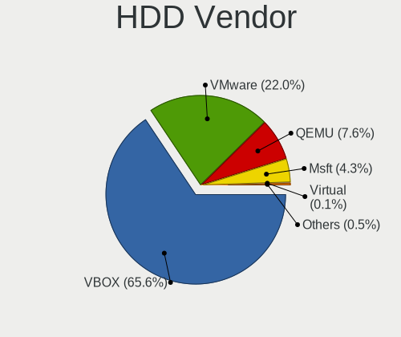

| Vendor                 | Computers | Drives | Percent |
|------------------------|-----------|--------|---------|
| VBOX                   | 6564      | 6792   | 65.62%  |
| VMware                 | 2202      | 2305   | 22.01%  |
| QEMU                   | 756       | 804    | 7.56%   |
| Msft                   | 427       | 682    | 4.27%   |
| Virtual                | 8         | 8      | 0.08%   |
| ORACLE                 | 7         | 10     | 0.07%   |
| SYNOLOGY               | 4         | 4      | 0.04%   |
| BHYVE                  | 4         | 4      | 0.04%   |
| Unknown                | 4         | 4      | 0.04%   |
| Seagate                | 3         | 3      | 0.03%   |
| Other                  | 3         | 3      | 0.03%   |
| WDC                    | 2         | 4      | 0.02%   |
| SABRENT                | 2         | 2      | 0.02%   |
| OpenMandriva           | 2         | 2      | 0.02%   |
| Open                   | 2         | 2      | 0.02%   |
| Ubuntu                 | 1         | 1      | 0.01%   |
| TS32GSSD               | 1         | 1      | 0.01%   |
| Samsung Electronics    | 1         | 1      | 0.01%   |
| Rosa                   | 1         | 1      | 0.01%   |
| Mandriva               | 1         | 1      | 0.01%   |
| live                   | 1         | 1      | 0.01%   |
| Linode                 | 1         | 1      | 0.01%   |
| HGST                   | 1         | 1      | 0.01%   |
| HC                     | 1         | 1      | 0.01%   |
| Google                 | 1         | 1      | 0.01%   |
| DO                     | 1         | 1      | 0.01%   |
| BP                     | 1         | 1      | 0.01%   |
| ;m“±¬Ô | 1         | 1      | 0.01%   |

SSD Vendor
----------

Solid state drive vendors

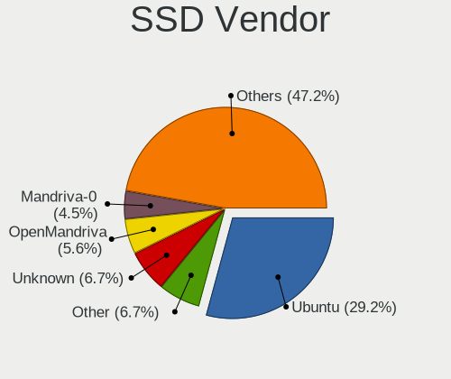

| Vendor         | Computers | Drives | Percent |
|----------------|-----------|--------|---------|
| Ubuntu         | 26        | 29     | 29.21%  |
| Other          | 6         | 6      | 6.74%   |
| Unknown        | 6         | 6      | 6.74%   |
| OpenMandriva   | 5         | 5      | 5.62%   |
| Mandriva-0     | 4         | 4      | 4.49%   |
| Rosa           | 3         | 3      | 3.37%   |
| OpenMandriva-0 | 3         | 3      | 3.37%   |
| Linux          | 3         | 3      | 3.37%   |
| Zorin          | 2         | 2      | 2.25%   |
| Rosa-0         | 2         | 2      | 2.25%   |
| Pop!           | 2         | 2      | 2.25%   |
| Open           | 2         | 2      | 2.25%   |
| NVMe           | 2         | 2      | 2.25%   |
| Kali           | 2         | 2      | 2.25%   |
| Fedora         | 2         | 2      | 2.25%   |
| Autre          | 2         | 2      | 2.25%   |
| Ultramarine    | 1         | 1      | 1.12%   |
| Otro           | 1         | 1      | 1.12%   |
| OpenManfriva   | 1         | 1      | 1.12%   |
| OpenMadriva    | 1         | 1      | 1.12%   |
| MxDoo          | 1         | 1      | 1.12%   |
| Mandriva       | 1         | 1      | 1.12%   |
| KDE            | 1         | 1      | 1.12%   |
| Debian-0       | 1         | 1      | 1.12%   |
| Clean          | 1         | 1      | 1.12%   |
| CentOS         | 1         | 1      | 1.12%   |
| blackPantherOS | 1         | 1      | 1.12%   |
| Blackpanther-0 | 1         | 1      | 1.12%   |
| arco-neo-0     | 1         | 1      | 1.12%   |
| Archcraft      | 1         | 1      | 1.12%   |
| Arch-0         | 1         | 1      | 1.12%   |
| Arch           | 1         | 1      | 1.12%   |
| Anderes        | 1         | 1      | 1.12%   |

Drive Kind
----------

HDD or SSD

| Kind    | Computers | Drives | Percent |
|---------|-----------|--------|---------|
| HDD     | 9992      | 10642  | 98.68%  |
| SSD     | 89        | 92     | 0.88%   |
| NVMe    | 37        | 89     | 0.37%   |
| Unknown | 8         | 7      | 0.08%   |

Drive Connector
---------------

SATA, SAS, NVMe, etc.

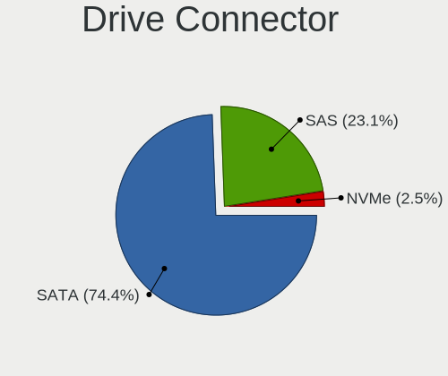

| Type | Computers | Drives | Percent |
|------|-----------|--------|---------|
| SATA | 7544      | 7840   | 74.43%  |
| SAS  | 2338      | 2680   | 23.07%  |
| NVMe | 254       | 310    | 2.51%   |

Drive Size
----------

Size of hard drive

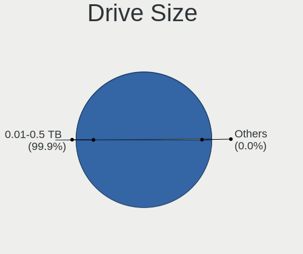

| Size in TB      | Computers | Drives | Percent |
|-----------------|-----------|--------|---------|
| 0.01-0.5        | 10074     | 10721  | 99.89%  |
| 0.51-1.0        | 6         | 6      | 0.06%   |
| 4.01-10.0       | 2         | 3      | 0.02%   |
| More than 100.0 | 1         | 1      | 0.01%   |
| 3.01-4.0        | 1         | 1      | 0.01%   |
| 2.01-3.0        | 1         | 2      | 0.01%   |

Space Total
-----------

Amount of disk space available on the file system

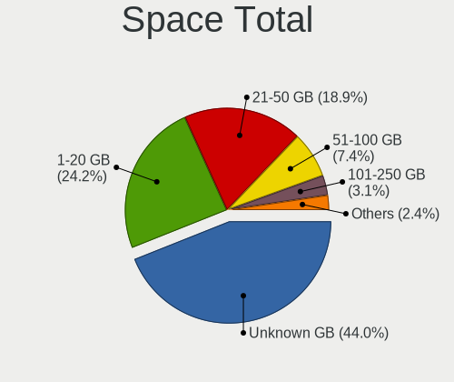

| Size in GB     | Computers | Percent |
|----------------|-----------|---------|
| Unknown        | 4902      | 43.97%  |
| 1-20           | 2703      | 24.25%  |
| 21-50          | 2109      | 18.92%  |
| 51-100         | 820       | 7.36%   |
| 101-250        | 351       | 3.15%   |
| 251-500        | 148       | 1.33%   |
| 501-1000       | 59        | 0.53%   |
| More than 3000 | 24        | 0.22%   |
| 1001-2000      | 23        | 0.21%   |
| 2001-3000      | 9         | 0.08%   |

Space Used
----------

Amount of used disk space

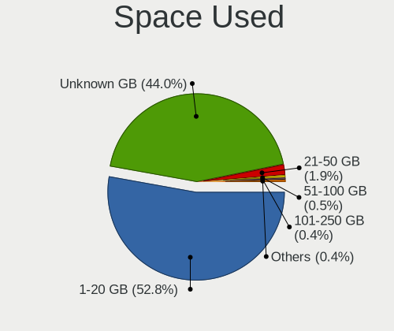

| Used GB        | Computers | Percent |
|----------------|-----------|---------|
| 1-20           | 5892      | 52.83%  |
| Unknown        | 4902      | 43.95%  |
| 21-50          | 215       | 1.93%   |
| 51-100         | 53        | 0.48%   |
| 101-250        | 42        | 0.38%   |
| 251-500        | 23        | 0.21%   |
| 501-1000       | 10        | 0.09%   |
| 1001-2000      | 7         | 0.06%   |
| More than 3000 | 4         | 0.04%   |
| 0              | 3         | 0.03%   |
| 2001-3000      | 2         | 0.02%   |

Malfunc. Drives
---------------

Drive models with a malfunction

Zero info for selected period =(

Malfunc. Drive Vendor
---------------------

Vendors of faulty drives

Zero info for selected period =(

Malfunc. HDD Vendor
-------------------

Vendors of faulty HDD drives

Zero info for selected period =(

Malfunc. Drive Kind
-------------------

Kinds of faulty drives

Zero info for selected period =(

Failed Drives
-------------

Failed drive models

Zero info for selected period =(

Failed Drive Vendor
-------------------

Failed drive vendors

Zero info for selected period =(

Drive Status
------------

Number of failed and malfunc. drives

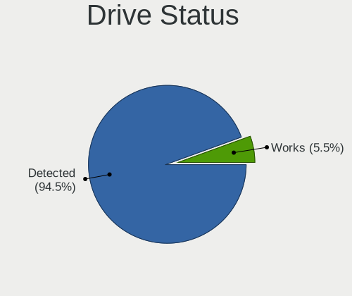

| Status   | Computers | Drives | Percent |
|----------|-----------|--------|---------|
| Detected | 9560      | 10238  | 94.47%  |
| Works    | 560       | 592    | 5.53%   |

Storage controller
------------------

Storage Vendor
--------------

Storage controller vendors

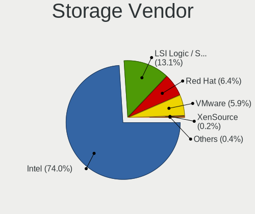

| Vendor                    | Computers | Percent |
|---------------------------|-----------|---------|
| Intel                     | 10687     | 73.95%  |
| LSI Logic / Symbios Logic | 1894      | 13.11%  |
| Red Hat                   | 928       | 6.42%   |
| VMware                    | 858       | 5.94%   |
| XenSource                 | 31        | 0.21%   |
| Amazon.com                | 22        | 0.15%   |
| BusLogic                  | 12        | 0.08%   |
| InnoTek Systemberatung    | 10        | 0.07%   |
| Broadcom / LSI            | 2         | 0.01%   |
| ASMedia Technology        | 2         | 0.01%   |
| Sandisk                   | 1         | 0.01%   |
| Samsung Electronics       | 1         | 0.01%   |
| Phison Electronics        | 1         | 0.01%   |
| Marvell Technology Group  | 1         | 0.01%   |
| AMD                       | 1         | 0.01%   |

Storage Model
-------------

Storage controller models

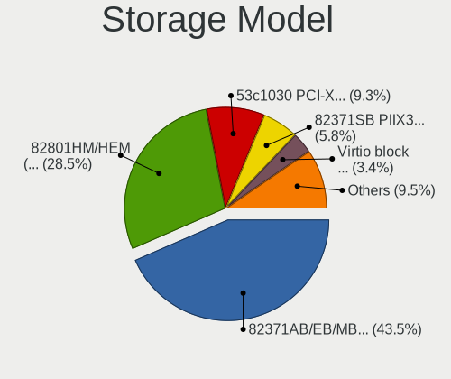

| Model                                                                   | Computers | Percent |
|-------------------------------------------------------------------------|-----------|---------|
| Intel 82371AB/EB/MB PIIX4 IDE                                           | 8755      | 43.45%  |
| Intel 82801HM/HEM (ICH8M/ICH8M-E) SATA Controller [AHCI mode]           | 5746      | 28.52%  |
| LSI Logic / Symbios Logic 53c1030 PCI-X Fusion-MPT Dual Ultra320 SCSI   | 1875      | 9.31%   |
| Intel 82371SB PIIX3 IDE [Natoma/Triton II]                              | 1171      | 5.81%   |
| Red Hat Virtio block device                                             | 677       | 3.36%   |
| VMware SATA AHCI controller                                             | 633       | 3.14%   |
| Intel 82801IR/IO/IH (ICH9R/DO/DH) 6 port SATA Controller [AHCI mode]    | 388       | 1.93%   |
| Red Hat Virtio SCSI                                                     | 234       | 1.16%   |
| VMware NVMe SSD Controller                                              | 220       | 1.09%   |
| Intel 82801BA IDE U100 Controller                                       | 113       | 0.56%   |
| Intel 82801HR/HO/HH (ICH8R/DO/DH) 6 port SATA Controller [AHCI mode]    | 75        | 0.37%   |
| VMware PVSCSI SCSI Controller                                           | 60        | 0.3%    |
| Red Hat Virtio filesystem                                               | 40        | 0.2%    |
| XenSource Xen Platform Device                                           | 31        | 0.15%   |
| Intel 631xESB/632xESB IDE Controller                                    | 27        | 0.13%   |
| Intel C620 Series Chipset Family SATA Controller [AHCI mode]            | 14        | 0.07%   |
| Amazon.com Amazon.com Non-Volatile memory controller                    | 14        | 0.07%   |
| Intel C620 Series Chipset Family SSATA Controller [AHCI mode]           | 13        | 0.06%   |
| BusLogic BT-946C (BA80C30) [MultiMaster 10]                             | 12        | 0.06%   |
| LSI Logic / Symbios Logic SAS1068 PCI-X Fusion-MPT SAS                  | 10        | 0.05%   |
| InnoTek Systemberatung Non-Volatile memory controller                   | 10        | 0.05%   |
| Amazon.com NVMe EBS Controller                                          | 8         | 0.04%   |
| LSI Logic / Symbios Logic 53c895a                                       | 7         | 0.03%   |
| Red Hat QEMU NVM Express Controller                                     | 2         | 0.01%   |
| Sandisk WD Black SN750 / PC SN730 NVMe SSD                              | 1         | 0.005%  |
| Samsung NVMe SSD Controller SM961/PM961/SM963                           | 1         | 0.005%  |
| Red Hat Virtio console                                                  | 1         | 0.005%  |
| Phison NVMe Storage Controller                                          | 1         | 0.005%  |
| Marvell Group 88SE9215 PCIe 2.0 x1 4-port SATA 6 Gb/s Controller        | 1         | 0.005%  |
| LSI Logic / Symbios Logic SAS2008 PCI-Express Fusion-MPT SAS-2 [Falcon] | 1         | 0.005%  |
| LSI Logic / Symbios Logic MegaRAID SAS 2108 [Liberator]                 | 1         | 0.005%  |
| Broadcom / LSI MegaRAID SAS 1078                                        | 1         | 0.005%  |
| Broadcom / LSI 53c1030 PCI-X Fusion-MPT Dual Ultra320 SCSI              | 1         | 0.005%  |
| ASMedia ASM1062 Serial ATA Controller                                   | 1         | 0.005%  |
| ASMedia 106x SATA/RAID Controller                                       | 1         | 0.005%  |
| AMD X399 Series Chipset SATA Controller                                 | 1         | 0.005%  |
| Amazon.com NVMe SSD Controller                                          | 1         | 0.005%  |

Storage Kind
------------

Kind of storage controller (IDE, SATA, NVMe, SAS, ...)

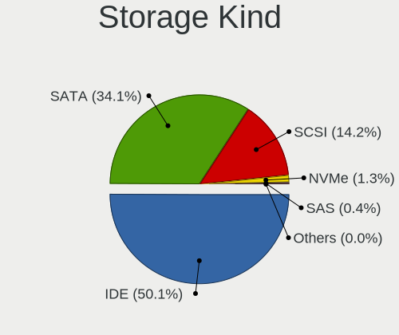

| Kind | Computers | Percent |
|------|-----------|---------|
| IDE  | 10066     | 50.08%  |
| SATA | 6857      | 34.11%  |
| SCSI | 2848      | 14.17%  |
| NVMe | 257       | 1.28%   |
| SAS  | 71        | 0.35%   |
| RAID | 2         | 0.01%   |

Processor
---------

CPU Vendor
----------

Processor vendors

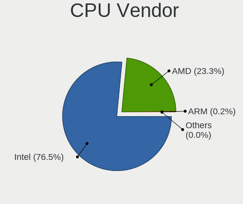

| Vendor       | Computers | Percent |
|--------------|-----------|---------|
| Intel        | 8503      | 76.51%  |
| AMD          | 2586      | 23.27%  |
| ARM          | 18        | 0.16%   |
| QEMU         | 3         | 0.03%   |
| HygonGenuine | 2         | 0.02%   |
| Unknown      | 1         | 0.01%   |

CPU Model
---------

Processor models

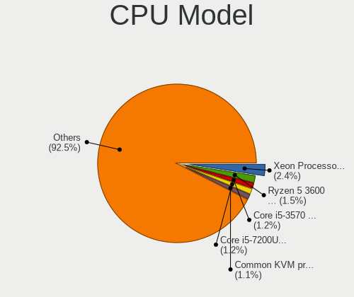

| Model                                         | Computers | Percent |
|-----------------------------------------------|-----------|---------|
| Intel Xeon Processor (Skylake, IBRS)          | 270       | 2.43%   |
| AMD Ryzen 5 3600 6-Core Processor             | 172       | 1.55%   |
| Intel Core i5-3570 CPU @ 3.40GHz              | 134       | 1.2%    |
| Intel Core i5-7200U CPU @ 2.50GHz             | 132       | 1.19%   |
| Intel Common KVM processor                    | 126       | 1.13%   |
| Intel Core i5-8250U CPU @ 1.60GHz             | 123       | 1.1%    |
| Intel Core i7-7700HQ CPU @ 2.80GHz            | 118       | 1.06%   |
| Intel Core i5-3470 CPU @ 3.20GHz              | 101       | 0.91%   |
| Intel Core i7-4790 CPU @ 3.60GHz              | 100       | 0.9%    |
| Intel Core Processor (Skylake, IBRS)          | 93        | 0.84%   |
| AMD Ryzen 5 2600 Six-Core Processor           | 93        | 0.84%   |
| Intel Core i7-9750H CPU @ 2.60GHz             | 92        | 0.83%   |
| Intel Core i7-8550U CPU @ 1.80GHz             | 91        | 0.82%   |
| Intel Core i7-3770 CPU @ 3.40GHz              | 85        | 0.76%   |
| Intel Core i7-8750H CPU @ 2.20GHz             | 82        | 0.74%   |
| AMD Ryzen 5 3500U with Radeon Vega Mobile Gfx | 80        | 0.72%   |
| Intel Core i5-3210M CPU @ 2.50GHz             | 78        | 0.7%    |
| Intel Core i9-9900K CPU @ 3.60GHz             | 76        | 0.68%   |
| Intel Core i7-8565U CPU @ 1.80GHz             | 76        | 0.68%   |
| Intel Core i7-8700 CPU @ 3.20GHz              | 74        | 0.66%   |
| AMD FX-8350 Eight-Core Processor              | 74        | 0.66%   |
| AMD Ryzen 7 3700X 8-Core Processor            | 72        | 0.65%   |
| Intel Core i7-3630QM CPU @ 2.40GHz            | 71        | 0.64%   |
| AMD EPYC-Rome Processor                       | 71        | 0.64%   |
| Intel Core i5-8265U CPU @ 1.60GHz             | 69        | 0.62%   |
| Intel Core i5-6200U CPU @ 2.30GHz             | 69        | 0.62%   |
| Intel Core i7-6700HQ CPU @ 2.60GHz            | 68        | 0.61%   |
| Intel Core i3-3220 CPU @ 3.30GHz              | 66        | 0.59%   |
| Intel Core i5-2400 CPU @ 3.10GHz              | 65        | 0.58%   |
| Intel Core i7-7700 CPU @ 3.60GHz              | 64        | 0.57%   |
| Intel Core i3-8100 CPU @ 3.60GHz              | 64        | 0.57%   |
| Intel Core i7-7500U CPU @ 2.70GHz             | 63        | 0.57%   |
| Intel Core i5-10210U CPU @ 1.60GHz            | 63        | 0.57%   |
| Intel Core i7-10750H CPU @ 2.60GHz            | 61        | 0.55%   |
| Intel Core i5-7400 CPU @ 3.00GHz              | 59        | 0.53%   |
| Intel Core i5-8400 CPU @ 2.80GHz              | 58        | 0.52%   |
| Intel Core i5-4460 CPU @ 3.20GHz              | 57        | 0.51%   |
| AMD Ryzen 9 3900X 12-Core Processor           | 56        | 0.5%    |
| Intel Core i5-9400F CPU @ 2.90GHz             | 53        | 0.48%   |
| Intel Core i7-6700K CPU @ 4.00GHz             | 51        | 0.46%   |
| Intel Core i7-2600 CPU @ 3.40GHz              | 51        | 0.46%   |
| AMD Ryzen 5 1600 Six-Core Processor           | 51        | 0.46%   |
| Intel Core i5-6500 CPU @ 3.20GHz              | 50        | 0.45%   |
| Intel Core i5-5200U CPU @ 2.20GHz             | 50        | 0.45%   |
| AMD FX-6300 Six-Core Processor                | 50        | 0.45%   |
| Intel Core i5-6400 CPU @ 2.70GHz              | 49        | 0.44%   |
| Intel Core i3-2120 CPU @ 3.30GHz              | 48        | 0.43%   |
| Intel Core i7-7700K CPU @ 4.20GHz             | 47        | 0.42%   |
| Intel Core i5-7300HQ CPU @ 2.50GHz            | 47        | 0.42%   |
| Intel Core i5-4570 CPU @ 3.20GHz              | 46        | 0.41%   |
| Intel Core i3-5005U CPU @ 2.00GHz             | 46        | 0.41%   |
| Intel 11th Gen Core i5-1135G7 @ 2.40GHz       | 46        | 0.41%   |
| AMD Ryzen 7 2700X Eight-Core Processor        | 46        | 0.41%   |
| AMD Ryzen 3 2200G with Radeon Vega Graphics   | 46        | 0.41%   |
| Intel Core i7-6700 CPU @ 3.40GHz              | 45        | 0.4%    |
| Intel Core i7-8700K CPU @ 3.70GHz             | 44        | 0.4%    |
| Intel Core i5-3320M CPU @ 2.60GHz             | 44        | 0.4%    |
| Intel Core i3-6006U CPU @ 2.00GHz             | 44        | 0.4%    |
| Intel Core i7-4770 CPU @ 3.40GHz              | 43        | 0.39%   |
| Intel Core i3-4005U CPU @ 1.70GHz             | 42        | 0.38%   |

CPU Model Family
----------------

Processor model prefix

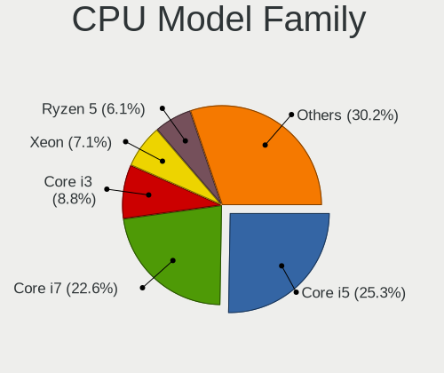

| Model                   | Computers | Percent |
|-------------------------|-----------|---------|
| Intel Core i5           | 2811      | 25.27%  |
| Intel Core i7           | 2509      | 22.55%  |
| Intel Core i3           | 974       | 8.76%   |
| Intel Xeon              | 790       | 7.1%    |
| AMD Ryzen 5             | 684       | 6.15%   |
| Other                   | 470       | 4.22%   |
| AMD Ryzen 7             | 361       | 3.24%   |
| AMD FX                  | 290       | 2.61%   |
| Intel Pentium           | 252       | 2.27%   |
| Intel Celeron           | 208       | 1.87%   |
| Intel Core              | 164       | 1.47%   |
| AMD Ryzen 3             | 154       | 1.38%   |
| Intel Core i9           | 149       | 1.34%   |
| AMD EPYC                | 139       | 1.25%   |
| AMD Ryzen 9             | 120       | 1.08%   |
| Intel Core 2 Duo        | 101       | 0.91%   |
| AMD A8                  | 90        | 0.81%   |
| AMD A10                 | 82        | 0.74%   |
| AMD Phenom II X4        | 69        | 0.62%   |
| AMD A6                  | 67        | 0.6%    |
| AMD A4                  | 58        | 0.52%   |
| AMD Athlon II X2        | 51        | 0.46%   |
| Intel Core 2 Quad       | 41        | 0.37%   |
| AMD Opteron             | 40        | 0.36%   |
| AMD Phenom II X6        | 39        | 0.35%   |
| AMD Athlon II X4        | 35        | 0.31%   |
| AMD Athlon X4           | 33        | 0.3%    |
| Intel Pentium Dual-Core | 31        | 0.28%   |
| AMD Ryzen Threadripper  | 31        | 0.28%   |
| AMD Athlon              | 29        | 0.26%   |
| Intel Xeon Platinum     | 24        | 0.22%   |
| AMD Athlon 64 X2        | 19        | 0.17%   |
| Intel Pentium Gold      | 17        | 0.15%   |
| AMD Ryzen 5 PRO         | 17        | 0.15%   |
| Intel Xeon Gold         | 16        | 0.14%   |
| Intel Genuine           | 14        | 0.13%   |
| AMD Athlon II X3        | 13        | 0.12%   |
| AMD E1                  | 12        | 0.11%   |
| Intel Xeon Silver       | 11        | 0.1%    |
| Intel Pentium Silver    | 11        | 0.1%    |
| AMD Ryzen 7 PRO         | 10        | 0.09%   |
| AMD E2                  | 9         | 0.08%   |
| AMD A12                 | 9         | 0.08%   |
| Intel Core 2            | 7         | 0.06%   |
| AMD Phenom II X2        | 7         | 0.06%   |
| AMD Phenom              | 7         | 0.06%   |
| AMD E                   | 7         | 0.06%   |
| AMD Sempron             | 5         | 0.04%   |
| AMD Ryzen 3 PRO         | 5         | 0.04%   |
| AMD Athlon X2           | 5         | 0.04%   |
| Intel Atom              | 4         | 0.04%   |
| Intel Pentium Dual      | 3         | 0.03%   |
| AMD Turion II           | 3         | 0.03%   |
| Intel Pentium D         | 2         | 0.02%   |
| Intel Core m7           | 2         | 0.02%   |
| Intel Core m3           | 2         | 0.02%   |
| AMD C-60                | 2         | 0.02%   |
| Intel Core M            | 1         | 0.01%   |
| Intel Core 2 Extreme    | 1         | 0.01%   |
| Intel Celeron Dual-Core | 1         | 0.01%   |

CPU Cores
---------

Number of processor cores

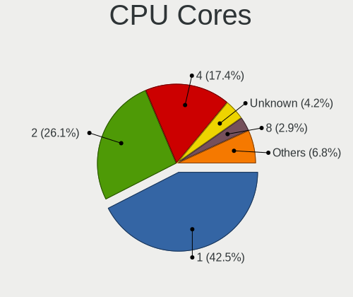

| Number  | Computers | Percent |
|---------|-----------|---------|
| 1       | 4735      | 42.5%   |
| 2       | 2910      | 26.12%  |
| 4       | 1943      | 17.44%  |
| Unknown | 472       | 4.24%   |
| 8       | 321       | 2.88%   |
| 3       | 319       | 2.86%   |
| 6       | 268       | 2.41%   |
| 16      | 55        | 0.49%   |
| 12      | 47        | 0.42%   |
| 5       | 15        | 0.13%   |
| 48      | 13        | 0.12%   |
| 10      | 9         | 0.08%   |
| 32      | 7         | 0.06%   |
| 7       | 7         | 0.06%   |
| 24      | 5         | 0.04%   |
| 20      | 3         | 0.03%   |
| 64      | 2         | 0.02%   |
| 40      | 2         | 0.02%   |
| 9       | 2         | 0.02%   |
| 56      | 1         | 0.01%   |
| 44      | 1         | 0.01%   |
| 38      | 1         | 0.01%   |
| 22      | 1         | 0.01%   |
| 18      | 1         | 0.01%   |
| 15      | 1         | 0.01%   |
| 14      | 1         | 0.01%   |

CPU Sockets
-----------

Number of sockets

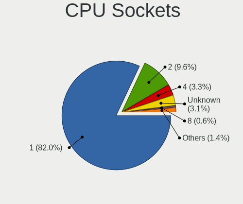

| Number  | Computers | Percent |
|---------|-----------|---------|
| 1       | 9120      | 82.01%  |
| 2       | 1064      | 9.57%   |
| 4       | 366       | 3.29%   |
| Unknown | 347       | 3.12%   |
| 8       | 69        | 0.62%   |
| 128     | 67        | 0.6%    |
| 3       | 24        | 0.22%   |
| 6       | 21        | 0.19%   |
| 64      | 14        | 0.13%   |
| 16      | 13        | 0.12%   |
| 12      | 8         | 0.07%   |
| 56      | 1         | 0.01%   |
| 40      | 1         | 0.01%   |
| 32      | 1         | 0.01%   |
| 24      | 1         | 0.01%   |
| 11      | 1         | 0.01%   |
| 10      | 1         | 0.01%   |
| 7       | 1         | 0.01%   |

CPU Threads
-----------

Threads per core (Hyper-Threading)

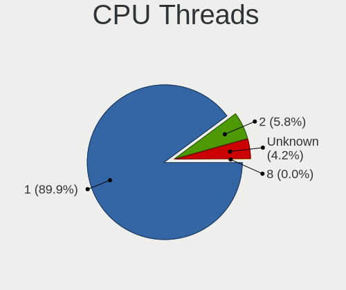

| Number  | Computers | Percent |
|---------|-----------|---------|
| 1       | 9992      | 89.86%  |
| 2       | 645       | 5.8%    |
| Unknown | 472       | 4.24%   |
| 4       | 9         | 0.08%   |
| 8       | 1         | 0.01%   |

CPU Op-Modes
------------

CPU Operation Modes (32-bit, 64-bit)

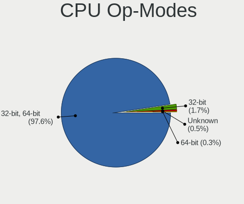

| Op mode        | Computers | Percent |
|----------------|-----------|---------|
| 32-bit, 64-bit | 10845     | 97.57%  |
| 32-bit         | 185       | 1.66%   |
| Unknown        | 57        | 0.51%   |
| 64-bit         | 28        | 0.25%   |

CPU Microcode
-------------

Microcode number

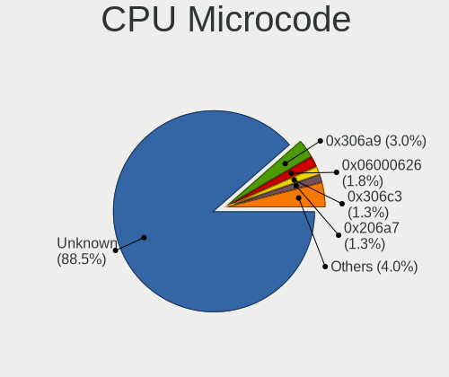

| Number     | Computers | Percent |
|------------|-----------|---------|
| Unknown    | 9845      | 88.54%  |
| 0x306a9    | 338       | 3.04%   |
| 0x06000626 | 198       | 1.78%   |
| 0x306c3    | 148       | 1.33%   |
| 0x206a7    | 145       | 1.3%    |
| 0x1067a    | 42        | 0.38%   |
| 0x506e3    | 41        | 0.37%   |
| 0x01000086 | 28        | 0.25%   |
| 0x906e9    | 25        | 0.22%   |
| 0x010000bf | 25        | 0.22%   |
| 0x106e5    | 22        | 0.2%    |
| 0x306d4    | 20        | 0.18%   |
| 0x40651    | 17        | 0.15%   |
| 0x806e9    | 14        | 0.13%   |
| 0x406e3    | 12        | 0.11%   |
| 0x10676    | 12        | 0.11%   |
| 0x20652    | 11        | 0.1%    |
| 0x20655    | 10        | 0.09%   |
| 0x6fb      | 9         | 0.08%   |
| 0x906eb    | 8         | 0.07%   |
| 0x50657    | 8         | 0.07%   |
| 0x206d7    | 8         | 0.07%   |
| 0x306e4    | 6         | 0.05%   |
| 0x30678    | 6         | 0.05%   |
| 0x106a5    | 6         | 0.05%   |
| 0x106a3    | 6         | 0.05%   |
| 0x010000c8 | 6         | 0.05%   |
| 0x806ea    | 5         | 0.04%   |
| 0x406c4    | 5         | 0.04%   |
| 0x206a1    | 5         | 0.04%   |
| 0xf61      | 4         | 0.04%   |
| 0x906ea    | 4         | 0.04%   |
| 0x306f2    | 4         | 0.04%   |
| 0x206c2    | 4         | 0.04%   |
| 0x00000000 | 4         | 0.04%   |
| 0x906ed    | 3         | 0.03%   |
| 0x6fd      | 3         | 0.03%   |
| 0x10677    | 3         | 0.03%   |
| 0x06000803 | 3         | 0.03%   |
| 0xffffffff | 2         | 0.02%   |
| 0xa0655    | 2         | 0.02%   |
| 0x406f1    | 2         | 0.02%   |
| 0x306c1    | 2         | 0.02%   |
| 0x206d2    | 2         | 0.02%   |
| 0x10661    | 2         | 0.02%   |
| 0x0700010b | 2         | 0.02%   |
| 0x06001119 | 2         | 0.02%   |
| 0x06000822 | 2         | 0.02%   |
| 0x0600081f | 2         | 0.02%   |
| 0x0600081c | 2         | 0.02%   |
| 0x010000dc | 2         | 0.02%   |
| 0x010000c7 | 2         | 0.02%   |
| 0x01000065 | 2         | 0.02%   |
| 0xa0653    | 1         | 0.01%   |
| 0x906ec    | 1         | 0.01%   |
| 0x706e5    | 1         | 0.01%   |
| 0x706a1    | 1         | 0.01%   |
| 0x6f7      | 1         | 0.01%   |
| 0x6f6      | 1         | 0.01%   |
| 0x6f3      | 1         | 0.01%   |

CPU Microarch
-------------

Microarchitecture

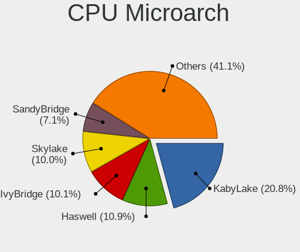

| Name            | Computers | Percent |
|-----------------|-----------|---------|
| KabyLake        | 2312      | 20.77%  |
| Haswell         | 1218      | 10.94%  |
| IvyBridge       | 1119      | 10.05%  |
| Skylake         | 1109      | 9.96%   |
| SandyBridge     | 795       | 7.14%   |
| Zen 2           | 594       | 5.34%   |
| Zen+            | 497       | 4.47%   |
| Unknown         | 493       | 4.43%   |
| Zen             | 334       | 3%      |
| Piledriver      | 325       | 2.92%   |
| CometLake       | 271       | 2.44%   |
| Broadwell       | 268       | 2.41%   |
| K10             | 231       | 2.08%   |
| Westmere        | 203       | 1.82%   |
| NetBurst        | 135       | 1.21%   |
| Nehalem         | 133       | 1.2%    |
| Penryn          | 132       | 1.19%   |
| IceLake         | 110       | 0.99%   |
| Excavator       | 104       | 0.93%   |
| Zen 3           | 100       | 0.9%    |
| TigerLake       | 99        | 0.89%   |
| Silvermont      | 98        | 0.88%   |
| Steamroller     | 77        | 0.69%   |
| Goldmont plus   | 63        | 0.57%   |
| Bulldozer       | 61        | 0.55%   |
| Core            | 56        | 0.5%    |
| Puma            | 43        | 0.39%   |
| K8 Hammer       | 38        | 0.34%   |
| Goldmont        | 36        | 0.32%   |
| K10 Llano       | 22        | 0.2%    |
| Jaguar          | 22        | 0.2%    |
| Bobcat          | 13        | 0.12%   |
| K6              | 10        | 0.09%   |
| P6              | 7         | 0.06%   |
| K8 & K10 hybrid | 1         | 0.01%   |

Graphics
--------

GPU Vendor
----------

Vendors of graphics cards

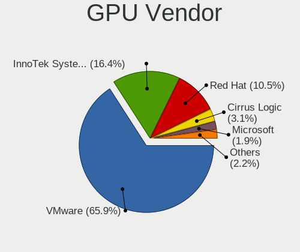

| Vendor                 | Computers | Percent |
|------------------------|-----------|---------|
| VMware                 | 7130      | 65.88%  |
| InnoTek Systemberatung | 1773      | 16.38%  |
| Red Hat                | 1134      | 10.48%  |
| Cirrus Logic           | 333       | 3.08%   |
| Microsoft              | 210       | 1.94%   |
| Technical              | 135       | 1.25%   |
| Parallels              | 36        | 0.33%   |
| Nvidia                 | 30        | 0.28%   |
| AMD                    | 21        | 0.19%   |
| Intel                  | 9         | 0.08%   |
| Amazon.com             | 6         | 0.06%   |
| Unknown                | 5         | 0.05%   |

GPU Model
---------

Graphics card models

| Model                                                       | Computers | Percent |
|-------------------------------------------------------------|-----------|---------|
| VMware SVGA II Adapter                                      | 7129      | 65.86%  |
| InnoTek Systemberatung VirtualBox Graphics Adapter          | 1773      | 16.38%  |
| Red Hat QXL paravirtual graphic card                        | 817       | 7.55%   |
| Cirrus Logic GD 5446                                        | 333       | 3.08%   |
| Red Hat Virtio GPU                                          | 317       | 2.93%   |
| Microsoft Hyper-V virtual VGA                               | 158       | 1.46%   |
| Technical VGA compatible controller                         | 135       | 1.25%   |
| Microsoft Virtual Render                                    | 49        | 0.45%   |
| Parallels Accelerated Virtual Video Adapter                 | 36        | 0.33%   |
| AMD Ellesmere [Radeon RX 470/480/570/570X/580/580X/590]     | 8         | 0.07%   |
| Amazon.com Amazon.com VGA compatible controller             | 6         | 0.06%   |
| Unknown VGA compatible controller                           | 5         | 0.05%   |
| Nvidia GP104 [GeForce GTX 1070]                             | 3         | 0.03%   |
| Microsoft RemoteFX Graphics                                 | 3         | 0.03%   |
| Nvidia TU106 [GeForce RTX 2060 Rev. A]                      | 2         | 0.02%   |
| Nvidia TU104GL [Tesla T4]                                   | 2         | 0.02%   |
| Nvidia GP104 [GeForce GTX 1080]                             | 2         | 0.02%   |
| Nvidia GM204GL [Tesla M60]                                  | 2         | 0.02%   |
| Nvidia GK208B [GeForce GT 710]                              | 2         | 0.02%   |
| Intel HD Graphics 530                                       | 2         | 0.02%   |
| Intel CoffeeLake-U GT3e [Iris Plus Graphics 655]            | 2         | 0.02%   |
| VMware VGA compatible controller                            | 1         | 0.01%   |
| Nvidia TU117 [GeForce GTX 1650]                             | 1         | 0.01%   |
| Nvidia TU116 [GeForce GTX 1650 SUPER]                       | 1         | 0.01%   |
| Nvidia TU104 [GeForce RTX 2080 Rev. A]                      | 1         | 0.01%   |
| Nvidia TU102 [GeForce RTX 2080 Ti]                          | 1         | 0.01%   |
| Nvidia TU102 [GeForce RTX 2080 Ti Rev. A]                   | 1         | 0.01%   |
| Nvidia GP107GL [Quadro P400]                                | 1         | 0.01%   |
| Nvidia GP107GL [Quadro P1000]                               | 1         | 0.01%   |
| Nvidia GP107 [GeForce GTX 1050]                             | 1         | 0.01%   |
| Nvidia GP106 [GeForce GTX 1060 6GB]                         | 1         | 0.01%   |
| Nvidia GP104 [GeForce GTX 1070 Ti]                          | 1         | 0.01%   |
| Nvidia GM206 [GeForce GTX 960]                              | 1         | 0.01%   |
| Nvidia GM200GL [Tesla M40]                                  | 1         | 0.01%   |
| Nvidia GM200 [GeForce GTX TITAN X]                          | 1         | 0.01%   |
| Nvidia GK208B [GeForce GT 730]                              | 1         | 0.01%   |
| Nvidia GK106GL [Quadro K4000]                               | 1         | 0.01%   |
| Nvidia GK104 [GeForce GTX 770]                              | 1         | 0.01%   |
| Nvidia GF106GL [Quadro 2000]                                | 1         | 0.01%   |
| Nvidia GF106 [GeForce GTS 450]                              | 1         | 0.01%   |
| Nvidia GA102GL [RTX A6000]                                  | 1         | 0.01%   |
| Intel HD Graphics 630                                       | 1         | 0.01%   |
| Intel HD Graphics 5500                                      | 1         | 0.01%   |
| Intel GeminiLake [UHD Graphics 600]                         | 1         | 0.01%   |
| Intel Comet Lake UHD Graphics                               | 1         | 0.01%   |
| Intel AlderLake-S GT1                                       | 1         | 0.01%   |
| AMD Vega 10 XTX [Radeon Vega Frontier Edition]              | 1         | 0.01%   |
| AMD Vega 10 XL/XT [Radeon RX Vega 56/64]                    | 1         | 0.01%   |
| AMD Turks XT [Radeon HD 6670/7670]                          | 1         | 0.01%   |
| AMD Tahiti XT [Radeon HD 7970/8970 OEM / R9 280X]           | 1         | 0.01%   |
| AMD Radeon R7 240                                           | 1         | 0.01%   |
| AMD Navi 10 [Radeon RX 5600 OEM/5600 XT / 5700/5700 XT]     | 1         | 0.01%   |
| AMD Lexa PRO [Radeon 540/540X/550/550X / RX 540X/550/550X]  | 1         | 0.01%   |
| AMD Juniper XT [Radeon HD 5770]                             | 1         | 0.01%   |
| AMD Curacao XT / Trinidad XT [Radeon R7 370 / R9 270X/370X] | 1         | 0.01%   |
| AMD Cape Verde XT [Radeon HD 7770/8760 / R7 250X]           | 1         | 0.01%   |
| AMD Cape Verde PRO [Radeon HD 7750/8740 / R7 250E]          | 1         | 0.01%   |
| AMD Caicos [Radeon HD 6450/7450/8450 / R5 230 OEM]          | 1         | 0.01%   |
| AMD Bonaire [FirePro W5100]                                 | 1         | 0.01%   |

GPU Combo
---------

Combinations of graphics cards

| Name                       | Computers | Percent |
|----------------------------|-----------|---------|
| 1 x VMware                 | 7120      | 64.02%  |
| 1 x InnoTek Systemberatung | 1771      | 15.92%  |
| 1 x Red Hat                | 1110      | 9.98%   |
| Other                      | 477       | 4.29%   |
| 1 x Cirrus Logic           | 330       | 2.97%   |
| 1 x Microsoft              | 210       | 1.89%   |
| 1 x Parallels              | 36        | 0.32%   |
| 1 x Nvidia                 | 19        | 0.17%   |
| 1 x AMD                    | 12        | 0.11%   |
| 1 x Amazon.com             | 6         | 0.05%   |
| Nvidia + VMware            | 4         | 0.04%   |
| Nvidia + Red Hat           | 4         | 0.04%   |
| AMD + VMware               | 4         | 0.04%   |
| AMD + Red Hat              | 4         | 0.04%   |
| Nvidia + Cirrus Logic      | 3         | 0.03%   |
| Intel + VMware             | 3         | 0.03%   |
| Intel + Red Hat            | 2         | 0.02%   |
| 1 x Intel                  | 2         | 0.02%   |
| 3 x Nvidia                 | 1         | 0.01%   |
| 1 x Virtio:                | 1         | 0.01%   |
| 1 x Technical              | 1         | 0.01%   |
| Intel + AMD                | 1         | 0.01%   |

GPU Driver
----------

Free vs proprietary

| Driver      | Computers | Percent |
|-------------|-----------|---------|
| Unknown     | 11066     | 99.57%  |
| Free        | 27        | 0.24%   |
| Proprietary | 21        | 0.19%   |

GPU Memory
----------

Total video memory

| Size in GB | Computers | Percent |
|------------|-----------|---------|
| Unknown    | 11064     | 99.56%  |
| 0.01-0.5   | 23        | 0.21%   |
| 7.01-8.0   | 7         | 0.06%   |
| 3.01-4.0   | 5         | 0.04%   |
| 0.51-1.0   | 5         | 0.04%   |
| 5.01-6.0   | 4         | 0.04%   |
| 1.01-2.0   | 3         | 0.03%   |
| 2.01-3.0   | 2         | 0.02%   |

Monitor
-------

Monitor Vendor
--------------

Monitor vendors

| Vendor               | Computers | Percent |
|----------------------|-----------|---------|
| RHT                  | 228       | 68.06%  |
| AOC                  | 25        | 7.46%   |
| PRL                  | 24        | 7.16%   |
| AU Optronics         | 18        | 5.37%   |
| Samsung Electronics  | 6         | 1.79%   |
| Goldstar             | 6         | 1.79%   |
| Dell                 | 4         | 1.19%   |
| Ancor Communications | 4         | 1.19%   |
| BenQ                 | 3         | 0.9%    |
| Philips              | 2         | 0.6%    |
| Lenovo               | 2         | 0.6%    |
| Acer                 | 2         | 0.6%    |
| ViewSonic            | 1         | 0.3%    |
| Sony                 | 1         | 0.3%    |
| Sceptre Tech         | 1         | 0.3%    |
| RYI                  | 1         | 0.3%    |
| NEC Computers        | 1         | 0.3%    |
| Hewlett-Packard      | 1         | 0.3%    |
| Gigabyte Technology  | 1         | 0.3%    |
| FUN                  | 1         | 0.3%    |
| Chimei Innolux       | 1         | 0.3%    |
| ASUSTek Computer     | 1         | 0.3%    |
| ASA                  | 1         | 0.3%    |

Monitor Model
-------------

Monitor models

| Model                                                                 | Computers | Percent |
|-----------------------------------------------------------------------|-----------|---------|
| RHT QEMU Monitor RHT1234 2048x1152 260x190mm 12.7-inch                | 146       | 43.2%   |
| RHT QEMU Monitor RHT1234 2048x1152 260x195mm 12.8-inch                | 82        | 24.26%  |
| PRL Parallels Vu PRL4006 1400x1050                                    | 23        | 6.8%    |
| AU Optronics LCD Monitor AUO38ED 1920x1080 340x190mm 15.3-inch        | 18        | 5.33%   |
| AOC 2490W1 AOC2490 1920x1080 530x300mm 24.0-inch                      | 18        | 5.33%   |
| AOC 2375 AOC2375 1920x1080 510x290mm 23.1-inch                        | 4         | 1.18%   |
| Goldstar HDR 4K GSM7707 3840x2160 600x340mm 27.2-inch                 | 2         | 0.59%   |
| ViewSonic VX2451 SERIES VSC2528 1920x1080 521x293mm 23.5-inch         | 1         | 0.3%    |
| Sony SDM-X72 SNY1E70 1280x1024 338x270mm 17.0-inch                    | 1         | 0.3%    |
| Sceptre Tech E205W-16003S SPT080D 1600x900 440x250mm 19.9-inch        | 1         | 0.3%    |
| Samsung Electronics U28E570 SAM0D6F 3840x2160 607x345mm 27.5-inch     | 1         | 0.3%    |
| Samsung Electronics SMB2440MH SAM06DC 1920x1080 530x300mm 24.0-inch   | 1         | 0.3%    |
| Samsung Electronics S22C450 SAM09F7 1920x1080 477x268mm 21.5-inch     | 1         | 0.3%    |
| Samsung Electronics LU28R55 SAM1015 3840x2160 632x360mm 28.6-inch     | 1         | 0.3%    |
| Samsung Electronics LCD Monitor U28E590 3840x2160                     | 1         | 0.3%    |
| Samsung Electronics LCD Monitor SAM0665 1360x768                      | 1         | 0.3%    |
| Samsung Electronics C34J79x SAM0F1D 3440x1440 797x333mm 34.0-inch     | 1         | 0.3%    |
| Samsung Electronics C27HG7x SAM0E16 2560x1440 598x336mm 27.0-inch     | 1         | 0.3%    |
| RYI 109-B5 RYI0001 1920x1440 360x270mm 17.7-inch                      | 1         | 0.3%    |
| PRL Parallels Vu PRL4006 1920x1200                                    | 1         | 0.3%    |
| Philips PHL 237E7 PHLC101 1920x1080 510x290mm 23.1-inch               | 1         | 0.3%    |
| Philips LCD Monitor PHL 246V5 3840x1080                               | 1         | 0.3%    |
| NEC Computers LCD Monitor PA271Q 2560x1440                            | 1         | 0.3%    |
| Lenovo Y25-25 LEN66AA 1920x1080 552x319mm 25.1-inch                   | 1         | 0.3%    |
| Lenovo L24i-10 LEN65D6 1920x1080 527x296mm 23.8-inch                  | 1         | 0.3%    |
| Hewlett-Packard ZR2440w HWP2954 1024x768 520x320mm 24.0-inch          | 1         | 0.3%    |
| Goldstar Ultra HD GSM5B08 3840x2160 600x340mm 27.2-inch               | 1         | 0.3%    |
| Goldstar LG FULL HD GSM5B55 1920x1080 480x270mm 21.7-inch             | 1         | 0.3%    |
| Goldstar E2260 GSM57E1 1920x1080 477x268mm 21.5-inch                  | 1         | 0.3%    |
| Goldstar 24GM77 GSM5A92 1920x1080 531x298mm 24.0-inch                 | 1         | 0.3%    |
| Gigabyte Technology G34WQC GBT3400 3440x1440 797x334mm 34.0-inch      | 1         | 0.3%    |
| FUN HDMI Monitor FUN9D31 3840x2160 480x270mm 21.7-inch                | 1         | 0.3%    |
| Dell U2717D DEL40EA 2560x1440 597x336mm 27.0-inch                     | 1         | 0.3%    |
| Dell S2218H DELD0B8 1920x1080 480x270mm 21.7-inch                     | 1         | 0.3%    |
| Dell P2715Q DEL40BD 3840x2160 597x336mm 27.0-inch                     | 1         | 0.3%    |
| Dell P2219H DELA114 1920x1080 480x270mm 21.7-inch                     | 1         | 0.3%    |
| Dell LCD Monitor SE2417HG 1920x1080                                   | 1         | 0.3%    |
| Chimei Innolux LCD Monitor CMN14C9 1920x1080 310x170mm 13.9-inch      | 1         | 0.3%    |
| BenQ LCD Monitor RL2455 1920x1080                                     | 1         | 0.3%    |
| BenQ GL2580 BNQ78E5 1920x1080 540x300mm 24.3-inch                     | 1         | 0.3%    |
| BenQ EX2780Q BNQ7F76 2560x1440 597x336mm 27.0-inch                    | 1         | 0.3%    |
| ASUSTek Computer VP278 AUS27AE 1920x1080 598x336mm 27.0-inch          | 1         | 0.3%    |
| ASA FH-DP4K ASA0270 2560x1600 480x270mm 21.7-inch                     | 1         | 0.3%    |
| AOC Q32V3 AOC3203 2560x1440 699x393mm 31.6-inch                       | 1         | 0.3%    |
| AOC Q32G1WG4 AOC3201 2560x1440 697x393mm 31.5-inch                    | 1         | 0.3%    |
| AOC Q3279WG5B AOC3279 2560x1440 730x430mm 33.4-inch                   | 1         | 0.3%    |
| Ancor Communications VX238 ACI23C1 1920x1080 510x290mm 23.1-inch      | 1         | 0.3%    |
| Ancor Communications VE248 ACI2494 1920x1080 530x300mm 24.0-inch      | 1         | 0.3%    |
| Ancor Communications ROG PG279Q ACI27EC 2560x1440 598x336mm 27.0-inch | 1         | 0.3%    |
| Ancor Communications LCD Monitor ASUS VG236 1920x1080                 | 1         | 0.3%    |
| Acer LCD Monitor P226HQV                                              | 1         | 0.3%    |
| Acer AL1917 ACRAD73 1280x1024 376x301mm 19.0-inch                     | 1         | 0.3%    |

Monitor Resolution
------------------

Monitor screen resolution

| Resolution        | Computers | Percent |
|-------------------|-----------|---------|
| 3196x1798         | 146       | 43.71%  |
| 2048x1152         | 82        | 24.55%  |
| 1920x1080 (FHD)   | 39        | 11.68%  |
| 2560x1440 (QHD)   | 25        | 7.49%   |
| 1400x1050         | 23        | 6.89%   |
| 3840x2160 (4K)    | 9         | 2.69%   |
| 3440x1440         | 2         | 0.6%    |
| 1280x1024 (SXGA)  | 2         | 0.6%    |
| 3840x1080         | 1         | 0.3%    |
| 1920x540          | 1         | 0.3%    |
| 1920x1440         | 1         | 0.3%    |
| 1920x1200 (WUXGA) | 1         | 0.3%    |
| 1600x900 (HD+)    | 1         | 0.3%    |
| Unknown           | 1         | 0.3%    |

Monitor Diagonal
----------------

Diagonal size in inches

| Inches  | Computers | Percent |
|---------|-----------|---------|
| 33      | 147       | 43.75%  |
| 19      | 83        | 24.7%   |
| Unknown | 31        | 9.23%   |
| 24      | 24        | 7.14%   |
| 15      | 18        | 5.36%   |
| 27      | 10        | 2.98%   |
| 23      | 7         | 2.08%   |
| 21      | 7         | 2.08%   |
| 34      | 2         | 0.6%    |
| 31      | 2         | 0.6%    |
| 17      | 2         | 0.6%    |
| 28      | 1         | 0.3%    |
| 25      | 1         | 0.3%    |
| 13      | 1         | 0.3%    |

Monitor Width
-------------

Physical width

| Width in mm | Computers | Percent |
|-------------|-----------|---------|
| 701-800     | 149       | 44.88%  |
| 401-500     | 89        | 26.81%  |
| 501-600     | 38        | 11.45%  |
| Unknown     | 31        | 9.34%   |
| 301-350     | 20        | 6.02%   |
| 601-700     | 3         | 0.9%    |
| 351-400     | 2         | 0.6%    |

Aspect Ratio
------------

Proportional relationship between the width and the height

| Ratio   | Computers | Percent |
|---------|-----------|---------|
| 16/9    | 193       | 61.86%  |
| 4/3     | 106       | 33.97%  |
| Unknown | 6         | 1.92%   |
| 5/4     | 2         | 0.64%   |
| 21/9    | 2         | 0.64%   |
| 16/10   | 2         | 0.64%   |
| 32/9    | 1         | 0.32%   |

Monitor Area
------------

Area in inch²

| Area in inch² | Computers | Percent |
|----------------|-----------|---------|
| 351-500        | 152       | 45.24%  |
| 151-200        | 86        | 25.6%   |
| 201-250        | 34        | 10.12%  |
| Unknown        | 31        | 9.23%   |
| 101-110        | 18        | 5.36%   |
| 301-350        | 10        | 2.98%   |
| 251-300        | 3         | 0.89%   |
| 81-90          | 1         | 0.3%    |
| 141-150        | 1         | 0.3%    |

Pixel Density
-------------

Pixels per inch

| Density | Computers | Percent |
|---------|-----------|---------|
| 51-100  | 182       | 54.82%  |
| 101-120 | 92        | 27.71%  |
| Unknown | 31        | 9.34%   |
| 121-160 | 22        | 6.63%   |
| 161-240 | 5         | 1.51%   |

Multiple Monitors
-----------------

Total monitors connected

| Total | Computers | Percent |
|-------|-----------|---------|
| 1     | 8362      | 75.12%  |
| 0     | 2739      | 24.61%  |
| 2     | 29        | 0.26%   |
| 3     | 1         | 0.01%   |

Network
-------

Net Controller Vendor
---------------------

Controller vendors

| Vendor                            | Computers | Percent |
|-----------------------------------|-----------|---------|
| Intel                             | 8049      | 75.88%  |
| Red Hat                           | 961       | 9.06%   |
| AMD                               | 782       | 7.37%   |
| Realtek Semiconductor             | 421       | 3.97%   |
| VMware                            | 277       | 2.61%   |
| Ralink Technology                 | 26        | 0.25%   |
| Amazon.com                        | 24        | 0.23%   |
| TP-Link                           | 19        | 0.18%   |
| Digital Equipment                 | 7         | 0.07%   |
| Linksys                           | 6         | 0.06%   |
| Huawei Technologies               | 4         | 0.04%   |
| Microsoft                         | 3         | 0.03%   |
| Mellanox Technologies             | 3         | 0.03%   |
| MediaTek                          | 3         | 0.03%   |
| ASUSTek Computer                  | 3         | 0.03%   |
| Samsung Electronics               | 2         | 0.02%   |
| Qualcomm Atheros Communications   | 2         | 0.02%   |
| Van Ooijen Technische Informatica | 1         | 0.01%   |
| Qualcomm Atheros                  | 1         | 0.01%   |
| Qualcomm                          | 1         | 0.01%   |
| OPPO Electronics                  | 1         | 0.01%   |
| OnePlus Technology (Shenzhen)     | 1         | 0.01%   |
| NetGear                           | 1         | 0.01%   |
| ICS Advent                        | 1         | 0.01%   |
| Fibocom                           | 1         | 0.01%   |
| Edimax Technology                 | 1         | 0.01%   |
| D-Link System                     | 1         | 0.01%   |
| D-Link                            | 1         | 0.01%   |
| Belkin Components                 | 1         | 0.01%   |
| AVM                               | 1         | 0.01%   |
| ASIX Electronics                  | 1         | 0.01%   |
| Android                           | 1         | 0.01%   |
| Allwinner Technology              | 1         | 0.01%   |

Net Controller Model
--------------------

Controller models

| Model                                                                                         | Computers | Percent |
|-----------------------------------------------------------------------------------------------|-----------|---------|
| Intel 82540EM Gigabit Ethernet Controller                                                     | 6734      | 63.41%  |
| Intel 82545EM Gigabit Ethernet Controller (Copper)                                            | 1282      | 12.07%  |
| Red Hat Virtio network device                                                                 | 961       | 9.05%   |
| AMD 79c970 [PCnet32 LANCE]                                                                    | 782       | 7.36%   |
| Realtek RTL-8100/8101L/8139 PCI Fast Ethernet Adapter                                         | 398       | 3.75%   |
| VMware VMXNET3 Ethernet Controller                                                            | 277       | 2.61%   |
| Amazon.com Elastic Network Adapter (ENA)                                                      | 24        | 0.23%   |
| Intel 82574L Gigabit Network Connection                                                       | 20        | 0.19%   |
| TP-Link AC600 wireless Realtek RTL8811AU [Archer T2U Nano]                                    | 10        | 0.09%   |
| Ralink RT2870/RT3070 Wireless Adapter                                                         | 10        | 0.09%   |
| Digital Equipment DECchip 21140 [FasterNet]                                                   | 7         | 0.07%   |
| Realtek RTL8812AU 802.11a/b/g/n/ac 2T2R DB WLAN Adapter                                       | 6         | 0.06%   |
| Intel 82543GC Gigabit Ethernet Controller (Copper)                                            | 6         | 0.06%   |
| Ralink RT5572 Wireless Adapter                                                                | 5         | 0.05%   |
| Intel Wi-Fi 6 AX200                                                                           | 5         | 0.05%   |
| Realtek RTL88x2bu [AC1200 Techkey]                                                            | 4         | 0.04%   |
| Realtek RTL8188EUS 802.11n Wireless Network Adapter                                           | 4         | 0.04%   |
| Linksys WUSB6300 802.11a/b/g/n/ac Wireless Adapter [Realtek RTL8812AU]                        | 4         | 0.04%   |
| Huawei Modem/Networkcard                                                                      | 4         | 0.04%   |
| Realtek RTL8814AU 802.11a/b/g/n/ac Wireless Adapter                                           | 3         | 0.03%   |
| Ralink RT5370 Wireless Adapter                                                                | 3         | 0.03%   |
| Ralink MT7601U Wireless Adapter                                                               | 3         | 0.03%   |
| Mellanox MT27710 Family [ConnectX-4 Lx Virtual Function]                                      | 3         | 0.03%   |
| TP-Link TL-WN822N Version 4 RTL8192EU                                                         | 2         | 0.02%   |
| TP-Link RTL8812AU Archer T4U 802.11ac                                                         | 2         | 0.02%   |
| TP-Link 802.11ac NIC                                                                          | 2         | 0.02%   |
| Realtek RTL8188FTV 802.11b/g/n 1T1R 2.4G WLAN Adapter                                         | 2         | 0.02%   |
| Realtek Realtek 8812AU/8821AU 802.11ac WLAN Adapter [USB Wireless Dual-Band Adapter 2.4/5Ghz] | 2         | 0.02%   |
| Realtek 802.11ac+Bluetooth 5.0 Adapter                                                        | 2         | 0.02%   |
| Realtek 802.11ac NIC                                                                          | 2         | 0.02%   |
| Ralink RT2501/RT2573 Wireless Adapter                                                         | 2         | 0.02%   |
| MediaTek WiFi                                                                                 | 2         | 0.02%   |
| Intel Comet Lake PCH-LP CNVi WiFi                                                             | 2         | 0.02%   |
| Intel Comet Lake PCH CNVi WiFi                                                                | 2         | 0.02%   |
| Intel 82599 Ethernet Controller Virtual Function                                              | 2         | 0.02%   |
| Van Ooijen Technische Informatica DX-ISP                                                      | 1         | 0.01%   |
| TP-Link TL-WN722N v2/v3 [Realtek RTL8188EUS]                                                  | 1         | 0.01%   |
| TP-Link 802.11n NIC                                                                           | 1         | 0.01%   |
| TP-Link 802.11ac WLAN Adapter                                                                 | 1         | 0.01%   |
| Samsung GT-I9070 (network tethering, USB debugging enabled)                                   | 1         | 0.01%   |
| Samsung Galaxy series, misc. (tethering mode)                                                 | 1         | 0.01%   |
| Realtek RTL8191SU 802.11n WLAN Adapter                                                        | 1         | 0.01%   |
| Realtek RTL8152 Fast Ethernet Adapter                                                         | 1         | 0.01%   |
| Ralink RT5372 Wireless Adapter                                                                | 1         | 0.01%   |
| Ralink RT3572 Wireless Adapter                                                                | 1         | 0.01%   |
| Ralink MT7610U ("Archer T2U" 2.4G+5G WLAN Adapter                                             | 1         | 0.01%   |
| Qualcomm Redmi 9T                                                                             | 1         | 0.01%   |
| Qualcomm Atheros QCA986x/988x 802.11ac Wireless Network Adapter                               | 1         | 0.01%   |
| Qualcomm Atheros TP-Link TL-WN821N v3 / TL-WN822N v2 802.11n [Atheros AR7010+AR9287]          | 1         | 0.01%   |
| Qualcomm Atheros AR9271 802.11n                                                               | 1         | 0.01%   |
| OPPO CPH1819                                                                                  | 1         | 0.01%   |
| OnePlus (Shenzhen) IN2013                                                                     | 1         | 0.01%   |
| NetGear A6210                                                                                 | 1         | 0.01%   |
| Microsoft Xbox360 Wireless N Networking Adapter [Atheros AR7010+AR9280]                       | 1         | 0.01%   |
| Microsoft XBOX ACC                                                                            | 1         | 0.01%   |
| Microsoft Xbox 360 Wireless Adapter                                                           | 1         | 0.01%   |
| MediaTek MT7612U 802.11a/b/g/n/ac Wireless Adapter                                            | 1         | 0.01%   |
| Linksys WUSB6100M 802.11a/b/g/n/ac Wireless Adapter                                           | 1         | 0.01%   |
| Linksys AE1200 802.11bgn Wireless Adapter [Broadcom BCM43235]                                 | 1         | 0.01%   |
| Intel X550 Virtual Function                                                                   | 1         | 0.01%   |

Wireless Vendor
---------------

Wireless vendors

| Vendor                          | Computers | Percent |
|---------------------------------|-----------|---------|
| Ralink Technology               | 26        | 25.49%  |
| Realtek Semiconductor           | 23        | 22.55%  |
| TP-Link                         | 19        | 18.63%  |
| Intel                           | 10        | 9.8%    |
| Linksys                         | 6         | 5.88%   |
| Microsoft                       | 3         | 2.94%   |
| MediaTek                        | 3         | 2.94%   |
| ASUSTek Computer                | 3         | 2.94%   |
| Qualcomm Atheros Communications | 2         | 1.96%   |
| Qualcomm Atheros                | 1         | 0.98%   |
| NetGear                         | 1         | 0.98%   |
| Edimax Technology               | 1         | 0.98%   |
| D-Link System                   | 1         | 0.98%   |
| D-Link                          | 1         | 0.98%   |
| Belkin Components               | 1         | 0.98%   |
| AVM                             | 1         | 0.98%   |

Wireless Model
--------------

Wireless models

| Model                                                                                         | Computers | Percent |
|-----------------------------------------------------------------------------------------------|-----------|---------|
| TP-Link AC600 wireless Realtek RTL8811AU [Archer T2U Nano]                                    | 10        | 9.52%   |
| Ralink RT2870/RT3070 Wireless Adapter                                                         | 10        | 9.52%   |
| Realtek RTL8812AU 802.11a/b/g/n/ac 2T2R DB WLAN Adapter                                       | 6         | 5.71%   |
| Ralink RT5572 Wireless Adapter                                                                | 5         | 4.76%   |
| Intel Wi-Fi 6 AX200                                                                           | 5         | 4.76%   |
| Realtek RTL88x2bu [AC1200 Techkey]                                                            | 4         | 3.81%   |
| Realtek RTL8188EUS 802.11n Wireless Network Adapter                                           | 4         | 3.81%   |
| Linksys WUSB6300 802.11a/b/g/n/ac Wireless Adapter [Realtek RTL8812AU]                        | 4         | 3.81%   |
| Realtek RTL8814AU 802.11a/b/g/n/ac Wireless Adapter                                           | 3         | 2.86%   |
| Ralink RT5370 Wireless Adapter                                                                | 3         | 2.86%   |
| Ralink MT7601U Wireless Adapter                                                               | 3         | 2.86%   |
| TP-Link TL-WN822N Version 4 RTL8192EU                                                         | 2         | 1.9%    |
| TP-Link RTL8812AU Archer T4U 802.11ac                                                         | 2         | 1.9%    |
| TP-Link 802.11ac NIC                                                                          | 2         | 1.9%    |
| Realtek RTL8188FTV 802.11b/g/n 1T1R 2.4G WLAN Adapter                                         | 2         | 1.9%    |
| Realtek Realtek 8812AU/8821AU 802.11ac WLAN Adapter [USB Wireless Dual-Band Adapter 2.4/5Ghz] | 2         | 1.9%    |
| Realtek 802.11ac+Bluetooth 5.0 Adapter                                                        | 2         | 1.9%    |
| Realtek 802.11ac NIC                                                                          | 2         | 1.9%    |
| Ralink RT2501/RT2573 Wireless Adapter                                                         | 2         | 1.9%    |
| MediaTek WiFi                                                                                 | 2         | 1.9%    |
| Intel Comet Lake PCH-LP CNVi WiFi                                                             | 2         | 1.9%    |
| Intel Comet Lake PCH CNVi WiFi                                                                | 2         | 1.9%    |
| TP-Link TL-WN722N v2/v3 [Realtek RTL8188EUS]                                                  | 1         | 0.95%   |
| TP-Link 802.11n NIC                                                                           | 1         | 0.95%   |
| TP-Link 802.11ac WLAN Adapter                                                                 | 1         | 0.95%   |
| Realtek RTL8191SU 802.11n WLAN Adapter                                                        | 1         | 0.95%   |
| Ralink RT5372 Wireless Adapter                                                                | 1         | 0.95%   |
| Ralink RT3572 Wireless Adapter                                                                | 1         | 0.95%   |
| Ralink MT7610U ("Archer T2U" 2.4G+5G WLAN Adapter                                             | 1         | 0.95%   |
| Qualcomm Atheros QCA986x/988x 802.11ac Wireless Network Adapter                               | 1         | 0.95%   |
| Qualcomm Atheros TP-Link TL-WN821N v3 / TL-WN822N v2 802.11n [Atheros AR7010+AR9287]          | 1         | 0.95%   |
| Qualcomm Atheros AR9271 802.11n                                                               | 1         | 0.95%   |
| NetGear A6210                                                                                 | 1         | 0.95%   |
| Microsoft Xbox360 Wireless N Networking Adapter [Atheros AR7010+AR9280]                       | 1         | 0.95%   |
| Microsoft XBOX ACC                                                                            | 1         | 0.95%   |
| Microsoft Xbox 360 Wireless Adapter                                                           | 1         | 0.95%   |
| MediaTek MT7612U 802.11a/b/g/n/ac Wireless Adapter                                            | 1         | 0.95%   |
| Linksys WUSB6100M 802.11a/b/g/n/ac Wireless Adapter                                           | 1         | 0.95%   |
| Linksys AE1200 802.11bgn Wireless Adapter [Broadcom BCM43235]                                 | 1         | 0.95%   |
| Intel Cannon Point-LP CNVi [Wireless-AC]                                                      | 1         | 0.95%   |
| Edimax EW-7822ULC 802.11ac Wireless Adapter [Realtek RTL8812AU]                               | 1         | 0.95%   |
| D-Link System AirPlus G DWL-G122 Wireless Adapter(rev.E1) [Ralink RT2070]                     | 1         | 0.95%   |
| D-Link DWA-125 Wireless N 150 Adapter(rev.A3) [Ralink RT5370]                                 | 1         | 0.95%   |
| Belkin Components F9L1109v1 802.11a/b/g/n/ac Wireless Adapter [Realtek RTL8812AU]             | 1         | 0.95%   |
| AVM FRITZ WLAN N v2 [RT5572/rt2870.bin]                                                       | 1         | 0.95%   |
| ASUS WL-167G v3 802.11n Adapter [Realtek RTL8188SU]                                           | 1         | 0.95%   |
| ASUS USB-AC56 802.11a/b/g/n/ac Wireless Adapter [Realtek RTL8812AU]                           | 1         | 0.95%   |
| ASUS 802.11ac NIC                                                                             | 1         | 0.95%   |

Ethernet Vendor
---------------

Ethernet vendors

| Vendor                        | Computers | Percent |
|-------------------------------|-----------|---------|
| Intel                         | 8041      | 84.29%  |
| AMD                           | 782       | 8.2%    |
| Realtek Semiconductor         | 399       | 4.18%   |
| VMware                        | 277       | 2.9%    |
| Amazon.com                    | 24        | 0.25%   |
| Digital Equipment             | 7         | 0.07%   |
| Mellanox Technologies         | 3         | 0.03%   |
| Samsung Electronics           | 2         | 0.02%   |
| OPPO Electronics              | 1         | 0.01%   |
| OnePlus Technology (Shenzhen) | 1         | 0.01%   |
| ICS Advent                    | 1         | 0.01%   |
| ASIX Electronics              | 1         | 0.01%   |
| Android                       | 1         | 0.01%   |

Ethernet Model
--------------

Ethernet models

| Model                                                       | Computers | Percent |
|-------------------------------------------------------------|-----------|---------|
| Intel 82540EM Gigabit Ethernet Controller                   | 6734      | 70.54%  |
| Intel 82545EM Gigabit Ethernet Controller (Copper)          | 1282      | 13.43%  |
| AMD 79c970 [PCnet32 LANCE]                                  | 782       | 8.19%   |
| Realtek RTL-8100/8101L/8139 PCI Fast Ethernet Adapter       | 398       | 4.17%   |
| VMware VMXNET3 Ethernet Controller                          | 277       | 2.9%    |
| Amazon.com Elastic Network Adapter (ENA)                    | 24        | 0.25%   |
| Intel 82574L Gigabit Network Connection                     | 20        | 0.21%   |
| Digital Equipment DECchip 21140 [FasterNet]                 | 7         | 0.07%   |
| Intel 82543GC Gigabit Ethernet Controller (Copper)          | 6         | 0.06%   |
| Mellanox MT27710 Family [ConnectX-4 Lx Virtual Function]    | 3         | 0.03%   |
| Intel 82599 Ethernet Controller Virtual Function            | 2         | 0.02%   |
| Samsung GT-I9070 (network tethering, USB debugging enabled) | 1         | 0.01%   |
| Samsung Galaxy series, misc. (tethering mode)               | 1         | 0.01%   |
| Realtek RTL8152 Fast Ethernet Adapter                       | 1         | 0.01%   |
| OPPO CPH1819                                                | 1         | 0.01%   |
| OnePlus (Shenzhen) IN2013                                   | 1         | 0.01%   |
| Intel X550 Virtual Function                                 | 1         | 0.01%   |
| Intel Ethernet Controller I225-V                            | 1         | 0.01%   |
| Intel Ethernet Connection (10) I219-V                       | 1         | 0.01%   |
| ICS Advent DM9601 Fast Ethernet Adapter                     | 1         | 0.01%   |
| ASIX AX88179 Gigabit Ethernet                               | 1         | 0.01%   |
| Android Android                                             | 1         | 0.01%   |

Net Controller Kind
-------------------

Ethernet, WiFi or modem

| Kind     | Computers | Percent |
|----------|-----------|---------|
| Ethernet | 9525      | 89.94%  |
| Unknown  | 962       | 9.08%   |
| WiFi     | 97        | 0.92%   |
| Modem    | 6         | 0.06%   |

Used Controller
---------------

Currently used network controller

| Kind     | Computers | Percent |
|----------|-----------|---------|
| Ethernet | 9503      | 99.81%  |
| WiFi     | 18        | 0.19%   |

NICs
----

Total network controllers on board

| Total | Computers | Percent |
|-------|-----------|---------|
| 1     | 9467      | 85.16%  |
| 0     | 1523      | 13.7%   |
| 2     | 115       | 1.03%   |
| 3     | 9         | 0.08%   |
| 4     | 2         | 0.02%   |
| 10    | 1         | 0.01%   |

IPv6
----

IPv6 vs IPv4

| Used    | Computers | Percent |
|---------|-----------|---------|
| No      | 10832     | 97.46%  |
| Yes     | 265       | 2.38%   |
| Unknown | 17        | 0.15%   |

Bluetooth
---------

Bluetooth Vendor
----------------

Controller vendors

| Vendor                          | Computers | Percent |
|---------------------------------|-----------|---------|
| VMware                          | 804       | 92.84%  |
| Intel                           | 21        | 2.42%   |
| Microsoft                       | 12        | 1.39%   |
| Realtek Semiconductor           | 9         | 1.04%   |
| Cambridge Silicon Radio         | 8         | 0.92%   |
| Broadcom                        | 4         | 0.46%   |
| Qualcomm Atheros Communications | 3         | 0.35%   |
| TP-Link                         | 2         | 0.23%   |
| Dynex                           | 1         | 0.12%   |
| ASUSTek Computer                | 1         | 0.12%   |
| Apple                           | 1         | 0.12%   |

Bluetooth Model
---------------

Controller models

| Model                                                    | Computers | Percent |
|----------------------------------------------------------|-----------|---------|
| VMware Virtual Bluetooth Adapter                         | 804       | 92.84%  |
| Microsoft Wireless Transceiver for Bluetooth             | 12        | 1.39%   |
| Cambridge Silicon Radio Bluetooth Dongle (HCI mode)      | 8         | 0.92%   |
| Intel Bluetooth wireless interface                       | 6         | 0.69%   |
| Realtek Bluetooth Radio                                  | 5         | 0.58%   |
| Intel Bluetooth Device                                   | 5         | 0.58%   |
| Intel AX200 Bluetooth                                    | 5         | 0.58%   |
| TP-Link UB500 Adapter                                    | 2         | 0.23%   |
| Realtek  Bluetooth 4.2 Adapter                           | 2         | 0.23%   |
| Qualcomm Atheros  Bluetooth Device                       | 2         | 0.23%   |
| Intel Wireless-AC 3168 Bluetooth                         | 2         | 0.23%   |
| Intel AX201 Bluetooth                                    | 2         | 0.23%   |
| Broadcom BCM20702A0 Bluetooth 4.0                        | 2         | 0.23%   |
| Realtek RTL8723A Bluetooth                               | 1         | 0.12%   |
| Realtek 802.11n WLAN Adapter                             | 1         | 0.12%   |
| Qualcomm Atheros AR3011 Bluetooth                        | 1         | 0.12%   |
| Intel Bluetooth 9460/9560 Jefferson Peak (JfP)           | 1         | 0.12%   |
| Dynex Bluetooth 4.0 Adapter [Broadcom, 1.12, BCM20702A0] | 1         | 0.12%   |
| Broadcom HP Portable Valentine                           | 1         | 0.12%   |
| Broadcom BCM2045A0                                       | 1         | 0.12%   |
| ASUS Broadcom BCM20702 Single-Chip Bluetooth 4.0 + LE    | 1         | 0.12%   |
| Apple Bluetooth USB Host Controller                      | 1         | 0.12%   |

Sound
-----

Sound Vendor
------------

Sound card vendors

| Vendor                   | Computers | Percent |
|--------------------------|-----------|---------|
| Intel                    | 7672      | 78.34%  |
| Ensoniq                  | 2035      | 20.78%  |
| Nvidia                   | 20        | 0.2%    |
| VMware                   | 19        | 0.19%   |
| AMD                      | 17        | 0.17%   |
| Logitech                 | 5         | 0.05%   |
| Shure                    | 3         | 0.03%   |
| Samson Technologies      | 3         | 0.03%   |
| Texas Instruments        | 2         | 0.02%   |
| Kingston Technology      | 2         | 0.02%   |
| C-Media Electronics      | 2         | 0.02%   |
| XMOS                     | 1         | 0.01%   |
| Sony                     | 1         | 0.01%   |
| Realtek Semiconductor    | 1         | 0.01%   |
| Native Instruments       | 1         | 0.01%   |
| Micro Star International | 1         | 0.01%   |
| JMTek                    | 1         | 0.01%   |
| Grace Design             | 1         | 0.01%   |
| GN Netcom                | 1         | 0.01%   |
| Creative Technology      | 1         | 0.01%   |
| Creative Labs            | 1         | 0.01%   |
| Blue Microphones         | 1         | 0.01%   |
| ASUSTek Computer         | 1         | 0.01%   |
| Android                  | 1         | 0.01%   |

Sound Model
-----------

Sound card models

| Model                                                                      | Computers | Percent |
|----------------------------------------------------------------------------|-----------|---------|
| Intel 82801AA AC'97 Audio Controller                                       | 6451      | 65.83%  |
| Ensoniq ES1371/ES1373 / Creative Labs CT2518                               | 2034      | 20.76%  |
| Intel 82801FB/FBM/FR/FW/FRW (ICH6 Family) High Definition Audio Controller | 817       | 8.34%   |
| Intel 82801I (ICH9 Family) HD Audio Controller                             | 315       | 3.21%   |
| Intel 82801BA/BAM AC'97 Audio Controller                                   | 87        | 0.89%   |
| VMware HD Audio Controller                                                 | 19        | 0.19%   |
| AMD Ellesmere HDMI Audio [Radeon RX 470/480 / 570/580/590]                 | 7         | 0.07%   |
| Nvidia GP104 High Definition Audio Controller                              | 5         | 0.05%   |
| AMD Oland/Hainan/Cape Verde/Pitcairn HDMI Audio [Radeon HD 7000 Series]    | 4         | 0.04%   |
| Shure MV5                                                                  | 3         | 0.03%   |
| Samson Technologies Q1U dynamic microphone                                 | 2         | 0.02%   |
| Nvidia TU106 High Definition Audio Controller                              | 2         | 0.02%   |
| Nvidia TU104 HD Audio Controller                                           | 2         | 0.02%   |
| Nvidia TU102 High Definition Audio Controller                              | 2         | 0.02%   |
| Nvidia GP107GL High Definition Audio Controller                            | 2         | 0.02%   |
| Nvidia GF106 High Definition Audio Controller                              | 2         | 0.02%   |
| Logitech [G533 Wireless Headset Dongle]                                    | 2         | 0.02%   |
| Kingston Technology HyperX Cloud Flight S                                  | 2         | 0.02%   |
| C-Media Electronics USB Audio Device                                       | 2         | 0.02%   |
| AMD Vega 10 HDMI Audio [Radeon Vega 56/64]                                 | 2         | 0.02%   |
| XMOS xCORE USB Audio 2.0                                                   | 1         | 0.01%   |
| Texas Instruments PCM2902 Audio Codec                                      | 1         | 0.01%   |
| Texas Instruments PCM2704 16-bit stereo audio DAC                          | 1         | 0.01%   |
| Sony Digital Imaging Video                                                 | 1         | 0.01%   |
| Samson Technologies Q2U handheld mic with XLR                              | 1         | 0.01%   |
| Realtek Semiconductor Realtek Audio USB                                    | 1         | 0.01%   |
| Nvidia TU107 GeForce GTX 1650 High Definition Audio Controller             | 1         | 0.01%   |
| Nvidia GP106 High Definition Audio Controller                              | 1         | 0.01%   |
| Nvidia GM206 High Definition Audio Controller                              | 1         | 0.01%   |
| Nvidia GM200 High Definition Audio                                         | 1         | 0.01%   |
| Nvidia GK208 HDMI/DP Audio Controller                                      | 1         | 0.01%   |
| Nvidia GK106 HDMI Audio Controller                                         | 1         | 0.01%   |
| Nvidia GK104 HDMI Audio Controller                                         | 1         | 0.01%   |
| Native Instruments Komplete Audio 6 MK2                                    | 1         | 0.01%   |
| Micro Star International USB Audio                                         | 1         | 0.01%   |
| Logitech USB Headset                                                       | 1         | 0.01%   |
| Logitech H600 [Wireless Headset]                                           | 1         | 0.01%   |
| Logitech G635 Gaming Headset                                               | 1         | 0.01%   |
| JMTek USB PnP Audio Device                                                 | 1         | 0.01%   |
| Intel Comet Lake PCH cAVS                                                  | 1         | 0.01%   |
| Intel Celeron/Pentium Silver Processor High Definition Audio               | 1         | 0.01%   |
| Intel Cannon Point-LP High Definition Audio Controller                     | 1         | 0.01%   |
| Intel C610/X99 series chipset HD Audio Controller                          | 1         | 0.01%   |
| Intel 8 Series/C220 Series Chipset High Definition Audio Controller        | 1         | 0.01%   |
| Intel 200 Series PCH HD Audio                                              | 1         | 0.01%   |
| Grace Design SDAC-B USB 2.0                                                | 1         | 0.01%   |
| GN Netcom Jabra EVOLVE Link MS                                             | 1         | 0.01%   |
| Ensoniq ES1370 [AudioPCI]                                                  | 1         | 0.01%   |
| Creative Technology SB X-Fi Surround 5.1                                   | 1         | 0.01%   |
| Creative Labs Sound Core3D [Sound Blaster Recon3D / Z-Series]              | 1         | 0.01%   |
| Blue Microphones Yeti Stereo Microphone                                    | 1         | 0.01%   |
| ASUSTek Computer Xonar U3 sound card                                       | 1         | 0.01%   |
| Android Android                                                            | 1         | 0.01%   |
| AMD Turks HDMI Audio [Radeon HD 6500/6600 / 6700M Series]                  | 1         | 0.01%   |
| AMD Navi 10 HDMI Audio                                                     | 1         | 0.01%   |
| AMD Baffin HDMI/DP Audio [Radeon RX 550 640SP / RX 560/560X]               | 1         | 0.01%   |
| AMD AMD-8111 AC97 Audio                                                    | 1         | 0.01%   |

Memory
------

Memory Vendor
-------------

Memory module vendors

| Vendor              | Computers | Percent |
|---------------------|-----------|---------|
| QEMU                | 1291      | 34.94%  |
| Unknown             | 1212      | 32.8%   |
| Unknown             | 872       | 23.6%   |
| Microsoft           | 182       | 4.93%   |
| VMware Virtual RAM  | 98        | 2.65%   |
| Red Hat             | 24        | 0.65%   |
| Samsung Electronics | 8         | 0.22%   |
| Kingston            | 4         | 0.11%   |
| SK Hynix            | 2         | 0.05%   |
| Virtuozzo           | 1         | 0.03%   |
| Alibaba Cloud       | 1         | 0.03%   |

Memory Model
------------

Memory module models

| Model                                                 | Computers | Percent |
|-------------------------------------------------------|-----------|---------|
| Unknown                                               | 872       | 20.21%  |
| Unknown RAM Module 2GB DIMM DRAM                      | 520       | 12.05%  |
| Unknown RAM Module 2048MB DIMM DRAM                   | 350       | 8.11%   |
| QEMU RAM Module 2048MB DIMM RAM                       | 346       | 8.02%   |
| QEMU RAM Module 2GB DIMM RAM                          | 239       | 5.54%   |
| Unknown RAM Module 4096MB DIMM DRAM                   | 208       | 4.82%   |
| Unknown RAM Module 256MB DIMM DRAM                    | 142       | 3.29%   |
| Unknown RAM Module 1024MB DIMM DRAM                   | 131       | 3.04%   |
| QEMU RAM Module 4GB DIMM RAM                          | 128       | 2.97%   |
| Unknown RAM Module 512MB DIMM DRAM                    | 124       | 2.87%   |
| Unknown RAM Module 128MB DIMM DRAM                    | 118       | 2.74%   |
| Microsoft RAM Module 3968MB                           | 87        | 2.02%   |
| Unknown RAM Module 1GB DIMM DRAM                      | 75        | 1.74%   |
| Microsoft RAM Module 128MB                            | 53        | 1.23%   |
| QEMU RAM Module 8GB DIMM RAM                          | 46        | 1.07%   |
| Microsoft RAM Module 2048MB                           | 45        | 1.04%   |
| QEMU RAM Module 4096MB DIMM RAM                       | 37        | 0.86%   |
| VMware Virtual RAM RAM VMW-4096MB 4GB DIMM DRAM       | 35        | 0.81%   |
| VMware Virtual RAM RAM VMW-8192MB 8GB DIMM DRAM       | 34        | 0.79%   |
| QEMU RAM Module 3072MB DIMM RAM                       | 29        | 0.67%   |
| QEMU RAM Module 3GB DIMM RAM                          | 28        | 0.65%   |
| VMware Virtual RAM RAM VMW-2048MB 2GB DIMM DRAM       | 26        | 0.6%    |
| QEMU RAM Module 16GB DIMM RAM                         | 22        | 0.51%   |
| QEMU RAM Module 8192MB DIMM RAM                       | 17        | 0.39%   |
| QEMU RAM Module 16384MB DIMM RAM                      | 17        | 0.39%   |
| QEMU RAM Module 1GB DIMM RAM                          | 15        | 0.35%   |
| Microsoft RAM Module 2GB                              | 15        | 0.35%   |
| Microsoft RAM Module 4224MB                           | 13        | 0.3%    |
| Unknown RAM Module 2048MB SODIMM DRAM 667MT/s         | 11        | 0.25%   |
| QEMU RAM Module 4024MB DIMM RAM                       | 11        | 0.25%   |
| QEMU RAM Module 1024MB DIMM RAM                       | 11        | 0.25%   |
| VMware Virtual RAM RAM VMW-1024MB 1024MB DIMM DRAM    | 10        | 0.23%   |
| QEMU RAM Module 6GB DIMM RAM                          | 10        | 0.23%   |
| QEMU RAM Module 2000MB DIMM RAM                       | 9         | 0.21%   |
| Microsoft RAM Module 3GB                              | 9         | 0.21%   |
| VMware Virtual RAM RAM VMW-16384MB 16GB DIMM DRAM     | 7         | 0.16%   |
| Unknown RAM Module 1024MB SODIMM DRAM 667MT/s         | 7         | 0.16%   |
| QEMU RAM Module 4000MB DIMM RAM                       | 7         | 0.16%   |
| Microsoft RAM Module 1024MB                           | 7         | 0.16%   |
| Samsung RAM M393A4K40BB2-CTD 32GB DIMM DDR4 2666MT/s  | 6         | 0.14%   |
| QEMU RAM Module 8196MB DIMM RAM                       | 5         | 0.12%   |
| QEMU RAM Module 8096MB DIMM RAM                       | 5         | 0.12%   |
| QEMU RAM Module 5GB DIMM RAM                          | 5         | 0.12%   |
| QEMU RAM Module 3000MB DIMM RAM                       | 5         | 0.12%   |
| QEMU RAM Module 10GB DIMM RAM                         | 5         | 0.12%   |
| Microsoft RAM Module 1GB                              | 5         | 0.12%   |
| VMware Virtual RAM RAM VMW-512MB 512MB DIMM DRAM      | 4         | 0.09%   |
| QEMU RAM Module 8000MB DIMM RAM                       | 4         | 0.09%   |
| QEMU RAM Module 4080MB DIMM RAM                       | 4         | 0.09%   |
| Microsoft RAM Module 3072MB                           | 4         | 0.09%   |
| Kingston RAM AM32D426R19D4HJX 32GB DIMM DDR4 2666MT/s | 4         | 0.09%   |
| Unknown RAM Module 2GB SODIMM DRAM 667MT/s            | 3         | 0.07%   |
| Red Hat RAM Module 4GB DIMM RAM                       | 3         | 0.07%   |
| Red Hat RAM Module 2048MB DIMM RAM                    | 3         | 0.07%   |
| Red Hat RAM Module 1GB DIMM RAM                       | 3         | 0.07%   |
| QEMU RAM Module 8169MB DIMM RAM                       | 3         | 0.07%   |
| QEMU RAM Module 7616MB DIMM RAM                       | 3         | 0.07%   |
| QEMU RAM Module 4608MB DIMM RAM                       | 3         | 0.07%   |
| QEMU RAM Module 4148MB DIMM RAM                       | 3         | 0.07%   |
| QEMU RAM Module 4134MB DIMM RAM                       | 3         | 0.07%   |

Memory Kind
-----------

Memory module kinds

| Kind    | Computers | Percent |
|---------|-----------|---------|
| DRAM    | 1911      | 55.07%  |
| RAM     | 1361      | 39.22%  |
| Unknown | 184       | 5.3%    |
| DDR4    | 14        | 0.4%    |

Memory Form Factor
------------------

Physical design of the memory module

| Name    | Computers | Percent |
|---------|-----------|---------|
| DIMM    | 3261      | 93.98%  |
| Unknown | 184       | 5.3%    |
| SODIMM  | 25        | 0.72%   |

Memory Size
-----------

Memory module size

| Size       | Computers | Percent |
|------------|-----------|---------|
| 2048       | 1585      | 33.82%  |
| 4096       | 826       | 17.63%  |
| 8192       | 301       | 6.42%   |
| 1024       | 281       | 6%      |
| 128        | 173       | 3.69%   |
| 256        | 146       | 3.12%   |
| 16384      | 135       | 2.88%   |
| 512        | 133       | 2.84%   |
| 32         | 129       | 2.75%   |
| 64         | 98        | 2.09%   |
| 16         | 91        | 1.94%   |
| 8          | 89        | 1.9%    |
| 3968       | 88        | 1.88%   |
| 4          | 74        | 1.58%   |
| 3072       | 70        | 1.49%   |
| 32768      | 14        | 0.3%    |
| 4224       | 13        | 0.28%   |
| 6144       | 11        | 0.23%   |
| 4024       | 11        | 0.23%   |
| 2000       | 9         | 0.19%   |
| 10240      | 7         | 0.15%   |
| 4000       | 7         | 0.15%   |
| 3000       | 7         | 0.15%   |
| 4080       | 6         | 0.13%   |
| 8196       | 5         | 0.11%   |
| 8096       | 5         | 0.11%   |
| 5120       | 5         | 0.11%   |
| 3024       | 5         | 0.11%   |
| 16000      | 4         | 0.09%   |
| 8000       | 4         | 0.09%   |
| 1500       | 4         | 0.09%   |
| 28800      | 3         | 0.06%   |
| 8169       | 3         | 0.06%   |
| 7616       | 3         | 0.06%   |
| 4608       | 3         | 0.06%   |
| 4148       | 3         | 0.06%   |
| 4134       | 3         | 0.06%   |
| 4107       | 3         | 0.06%   |
| 4088       | 3         | 0.06%   |
| 4082       | 3         | 0.06%   |
| 3049       | 3         | 0.06%   |
| 3048       | 3         | 0.06%   |
| 2024       | 3         | 0.06%   |
| 768        | 3         | 0.06%   |
| 124        | 3         | 0.06%   |
| 1073741824 | 2         | 0.04%   |
| 31744      | 2         | 0.04%   |
| 15360      | 2         | 0.04%   |
| 12288      | 2         | 0.04%   |
| 10000      | 2         | 0.04%   |
| 8320       | 2         | 0.04%   |
| 8215       | 2         | 0.04%   |
| 8024       | 2         | 0.04%   |
| 7000       | 2         | 0.04%   |
| 6528       | 2         | 0.04%   |
| 6176       | 2         | 0.04%   |
| 6140       | 2         | 0.04%   |
| 6119       | 2         | 0.04%   |
| 6000       | 2         | 0.04%   |
| 5248       | 2         | 0.04%   |

Memory Speed
------------

Memory module speed

| Speed   | Computers | Percent |
|---------|-----------|---------|
| Unknown | 3376      | 97.29%  |
| 667     | 80        | 2.31%   |
| 2666    | 10        | 0.29%   |
| 2933    | 3         | 0.09%   |
| 3200    | 1         | 0.03%   |

Printers & scanners
-------------------

Printer Vendor
--------------

Printer device vendors

| Vendor              | Computers | Percent |
|---------------------|-----------|---------|
| PARALLELS           | 77        | 75.49%  |
| Canon               | 7         | 6.86%   |
| Samsung Electronics | 5         | 4.9%    |
| Hewlett-Packard     | 4         | 3.92%   |
| Brother Industries  | 4         | 3.92%   |
| Seiko Epson         | 3         | 2.94%   |
| Kyocera             | 2         | 1.96%   |

Printer Model
-------------

Printer device models

| Model                                                                                  | Computers | Percent |
|----------------------------------------------------------------------------------------|-----------|---------|
| PARALLELS Virtual Printer (/Users/jean/Parallels/OpenMandriva Lx 4.3.pvm/parallel.txt) | 77        | 75.49%  |
| Samsung ML-1210 Printer                                                                | 2         | 1.96%   |
| Kyocera FS-1060DN                                                                      | 2         | 1.96%   |
| Seiko Epson USB2.0 Printer (Hi-speed)                                                  | 1         | 0.98%   |
| Seiko Epson Printer                                                                    | 1         | 0.98%   |
| Seiko Epson L200 Series                                                                | 1         | 0.98%   |
| Samsung SCX-4x26 Series                                                                | 1         | 0.98%   |
| Samsung SCX-4300 Series                                                                | 1         | 0.98%   |
| Samsung M2070 Series                                                                   | 1         | 0.98%   |
| HP OfficeJet Pro 69                                                                    | 1         | 0.98%   |
| HP LaserJet 2420                                                                       | 1         | 0.98%   |
| HP LaserJet 200 color M251n                                                            | 1         | 0.98%   |
| HP ENVY Photo 6200 series                                                              | 1         | 0.98%   |
| Canon PRO-1000 series                                                                  | 1         | 0.98%   |
| Canon PIXMA MG3100 Series                                                              | 1         | 0.98%   |
| Canon PIXMA iP3600 Printer                                                             | 1         | 0.98%   |
| Canon MF4410                                                                           | 1         | 0.98%   |
| Canon LBP810                                                                           | 1         | 0.98%   |
| Canon LBP6020                                                                          | 1         | 0.98%   |
| Canon iP2700 series                                                                    | 1         | 0.98%   |
| Brother HL-5140 series                                                                 | 1         | 0.98%   |
| Brother DCP-T300                                                                       | 1         | 0.98%   |
| Brother DCP-L2540DN                                                                    | 1         | 0.98%   |
| Brother DCP-7030                                                                       | 1         | 0.98%   |

Scanner Vendor
--------------

Scanner device vendors

| Vendor                      | Computers | Percent |
|-----------------------------|-----------|---------|
| Canon                       | 9         | 81.82%  |
| Hewlett-Packard             | 1         | 9.09%   |
| Acer Peripherals (now BenQ) | 1         | 9.09%   |

Scanner Model
-------------

Scanner device models

| Model                                         | Computers | Percent |
|-----------------------------------------------|-----------|---------|
| Canon CanoScan LiDE 500F                      | 3         | 27.27%  |
| HP PSC 1200                                   | 1         | 9.09%   |
| Canon CanoScan LiDE 700F                      | 1         | 9.09%   |
| Canon CanoScan LiDE 210                       | 1         | 9.09%   |
| Canon CanoScan LiDE 110                       | 1         | 9.09%   |
| Canon CanoScan LiDE 100                       | 1         | 9.09%   |
| Canon CanoScan 9000F Mark II                  | 1         | 9.09%   |
| Canon CanoScan 3000/3000F/3000ex              | 1         | 9.09%   |
| Acer Peripherals (now BenQ) FlatbedScanner 50 | 1         | 9.09%   |

Camera
------

Camera Vendor
-------------

Camera device vendors

| Vendor                                 | Computers | Percent |
|----------------------------------------|-----------|---------|
| VMware                                 | 86        | 32.33%  |
| PARALLELS                              | 84        | 31.58%  |
| Logitech                               | 21        | 7.89%   |
| VirtualBox                             | 17        | 6.39%   |
| IMC Networks                           | 10        | 3.76%   |
| Realtek Semiconductor                  | 6         | 2.26%   |
| Microdia                               | 6         | 2.26%   |
| Chicony Electronics                    | 6         | 2.26%   |
| Microsoft                              | 5         | 1.88%   |
| Acer                                   | 5         | 1.88%   |
| Cheng Uei Precision Industry (Foxlink) | 3         | 1.13%   |
| Sunplus Innovation Technology          | 2         | 0.75%   |
| Apple                                  | 2         | 0.75%   |
| Z-Star Microelectronics                | 1         | 0.38%   |
| Syntek                                 | 1         | 0.38%   |
| Suyin                                  | 1         | 0.38%   |
| Quanta                                 | 1         | 0.38%   |
| Luxvisions Innotech Limited            | 1         | 0.38%   |
| Jieli Technology                       | 1         | 0.38%   |
| Huawei Technologies                    | 1         | 0.38%   |
| GEMBIRD                                | 1         | 0.38%   |
| Doccamera                              | 1         | 0.38%   |
| Creative Technology                    | 1         | 0.38%   |
| AVerMedia Technologies                 | 1         | 0.38%   |
| Arkmicro Technologies                  | 1         | 0.38%   |
| ARC International                      | 1         | 0.38%   |

Camera Model
------------

Camera device models

| Model                                                         | Computers | Percent |
|---------------------------------------------------------------|-----------|---------|
| VMware Virtual USB Video Device                               | 86        | 32.33%  |
| PARALLELS IRIScan Desk 5 Pro                                  | 84        | 31.58%  |
| VirtualBox Webcam - Integrated Camera                         | 17        | 6.39%   |
| Logitech HD Pro Webcam C920                                   | 6         | 2.26%   |
| Logitech HD Webcam C525                                       | 5         | 1.88%   |
| IMC Networks USB2.0 HD UVC WebCam                             | 4         | 1.5%    |
| Logitech Webcam C270                                          | 3         | 1.13%   |
| Acer Integrated Camera                                        | 3         | 1.13%   |
| Realtek Integrated_Webcam_HD                                  | 2         | 0.75%   |
| Microsoft LifeCam HD-3000                                     | 2         | 0.75%   |
| Microdia Webcam Vitade AF                                     | 2         | 0.75%   |
| Logitech HD Webcam C510                                       | 2         | 0.75%   |
| IMC Networks USB2.0 VGA UVC WebCam                            | 2         | 0.75%   |
| Chicony HP TrueVision HD                                      | 2         | 0.75%   |
| Z-Star A4 TECH USB2.0 PC Camera J                             | 1         | 0.38%   |
| Syntek BUFFALO BSW20K06H USB PC Camera                        | 1         | 0.38%   |
| Suyin Integrated_Webcam_HD                                    | 1         | 0.38%   |
| Sunplus HP Wide Vision HD                                     | 1         | 0.38%   |
| Sunplus Canyon CNS CWC5 Webcam                                | 1         | 0.38%   |
| Realtek Laptop Camera                                         | 1         | 0.38%   |
| Realtek HD WebCam                                             | 1         | 0.38%   |
| Realtek FULL HD 1080P Webcam                                  | 1         | 0.38%   |
| Realtek Front Camera                                          | 1         | 0.38%   |
| Quanta HD User Facing                                         | 1         | 0.38%   |
| Microsoft Xbox NUI Camera                                     | 1         | 0.38%   |
| Microsoft LifeCam VX-2000                                     | 1         | 0.38%   |
| Microsoft LifeCam Cinema                                      | 1         | 0.38%   |
| Microdia USB 2.0 Camera                                       | 1         | 0.38%   |
| Microdia Integrated_Webcam_HD                                 | 1         | 0.38%   |
| Microdia Defender G-Lens 2577 HD720p Camera                   | 1         | 0.38%   |
| Microdia Camera                                               | 1         | 0.38%   |
| Luxvisions Innotech Limited HP TrueVision HD Camera           | 1         | 0.38%   |
| Logitech Webcam Pro 9000                                      | 1         | 0.38%   |
| Logitech Webcam C170                                          | 1         | 0.38%   |
| Logitech Webcam B500                                          | 1         | 0.38%   |
| Logitech C922 Pro Stream Webcam                               | 1         | 0.38%   |
| Logitech B525 HD Webcam                                       | 1         | 0.38%   |
| Jieli USB PHY 2.0                                             | 1         | 0.38%   |
| IMC Networks USB2.0 UVC HD Webcam                             | 1         | 0.38%   |
| IMC Networks USB2.0 HD IR UVC WebCam                          | 1         | 0.38%   |
| IMC Networks Integrated Webcam                                | 1         | 0.38%   |
| IMC Networks Integrated Camera                                | 1         | 0.38%   |
| Huawei HiCamera                                               | 1         | 0.38%   |
| GEMBIRD USB2.0 PC CAMERA                                      | 1         | 0.38%   |
| Doccamera Doccamera                                           | 1         | 0.38%   |
| Creative Live! Cam Chat HD [VF0700]                           | 1         | 0.38%   |
| Chicony UVC 1.00 device HD UVC WebCam                         | 1         | 0.38%   |
| Chicony Integrated Camera (1280x720@30)                       | 1         | 0.38%   |
| Chicony Integrated Camera                                     | 1         | 0.38%   |
| Chicony HP Wide Vision FHD Camera                             | 1         | 0.38%   |
| Cheng Uei Precision Industry (Foxlink) USB2.0 UVC 1.3M Webcam | 1         | 0.38%   |
| Cheng Uei Precision Industry (Foxlink) HP Webcam              | 1         | 0.38%   |
| Cheng Uei Precision Industry (Foxlink) HD Webcam              | 1         | 0.38%   |
| AVerMedia USB Device                                          | 1         | 0.38%   |
| Arkmicro USB2.0 PC CAMERA                                     | 1         | 0.38%   |
| ARC International Camera                                      | 1         | 0.38%   |
| Apple iPhone 5/5C/5S/6/SE                                     | 1         | 0.38%   |
| Apple FaceTime HD Camera (Built-in)                           | 1         | 0.38%   |
| Acer Lenovo EasyCamera                                        | 1         | 0.38%   |
| Acer BisonCam, NB Pro                                         | 1         | 0.38%   |

Security
--------

Fingerprint Vendor
------------------

Fingerprint sensor vendors

| Vendor                     | Computers | Percent |
|----------------------------|-----------|---------|
| Validity Sensors           | 3         | 30%     |
| Synaptics                  | 3         | 30%     |
| Shenzhen Goodix Technology | 2         | 20%     |
| Upek                       | 1         | 10%     |
| Samsung Electronics        | 1         | 10%     |

Fingerprint Model
-----------------

Fingerprint sensor models

| Model                                                                      | Computers | Percent |
|----------------------------------------------------------------------------|-----------|---------|
| Validity Sensors VFS495 Fingerprint Reader                                 | 2         | 20%     |
| Validity Sensors Synaptics VFS7552 Touch Fingerprint Sensor with PurePrint | 1         | 10%     |
| Upek Biometric Touchchip/Touchstrip Fingerprint Sensor                     | 1         | 10%     |
| Synaptics  WBDI Fingerprint Reader - USB 052                               | 1         | 10%     |
| Synaptics  WBDI                                                            | 1         | 10%     |
| Synaptics Metallica MOH Touch Fingerprint Reader                           | 1         | 10%     |
| Shenzhen Goodix  Fingerprint Device                                        | 1         | 10%     |
| Shenzhen Goodix FingerPrint                                                | 1         | 10%     |
| Samsung Fingerprint Device                                                 | 1         | 10%     |

Chipcard Vendor
---------------

Chipcard module vendors

| Vendor                | Computers | Percent |
|-----------------------|-----------|---------|
| Gemalto (was Gemplus) | 392       | 98.99%  |
| Alcor Micro           | 2         | 0.51%   |
| C3PO                  | 1         | 0.25%   |
| Advanced Card Systems | 1         | 0.25%   |

Chipcard Model
--------------

Chipcard module models

| Model                                             | Computers | Percent |
|---------------------------------------------------|-----------|---------|
| Gemalto (was Gemplus) GemPC433-Swap               | 390       | 98.48%  |
| Gemalto (was Gemplus) GemPC Twin SmartCard Reader | 2         | 0.51%   |
| Alcor Micro AU9540 Smartcard Reader               | 2         | 0.51%   |
| C3PO LTC31v2                                      | 1         | 0.25%   |
| Advanced Card Systems ACR38 SmartCard Reader      | 1         | 0.25%   |

Unsupported
-----------

Unsupported Devices
-------------------

Total unsupported devices on board

| Total | Computers | Percent |
|-------|-----------|---------|
| 0     | 9116      | 81.89%  |
| 1     | 1942      | 17.45%  |
| 2     | 53        | 0.48%   |
| 3     | 19        | 0.17%   |
| 5     | 1         | 0.01%   |
| 4     | 1         | 0.01%   |

Unsupported Device Types
------------------------

Types of unsupported devices

| Type                     | Computers | Percent |
|--------------------------|-----------|---------|
| Graphics card            | 1510      | 72.01%  |
| Chipcard                 | 382       | 18.22%  |
| Unassigned class         | 98        | 4.67%   |
| Net/wireless             | 45        | 2.15%   |
| Sound                    | 21        | 1%      |
| Communication controller | 13        | 0.62%   |
| Fingerprint reader       | 9         | 0.43%   |
| Bluetooth                | 4         | 0.19%   |
| Camera                   | 3         | 0.14%   |
| Storage/ide              | 2         | 0.1%    |
| Network                  | 2         | 0.1%    |
| Net/ethernet             | 2         | 0.1%    |
| Multimedia controller    | 2         | 0.1%    |
| Card reader              | 2         | 0.1%    |
| Storage/ata              | 1         | 0.05%   |
| Dvb card                 | 1         | 0.05%   |

