ALT Linux - Tested Virtual Hardware & Statistics
------------------------------------------------

A project to collect tested virtual hardware configurations for ALT Linux.

Anyone can contribute to this report by the [hw-probe](https://github.com/linuxhw/hw-probe) tool:

    sudo -E hw-probe -all -upload

Please contribute! Especially if your hardware is rare.

Contents
--------

* [ Test Cases ](#test-cases)

* [ System ](#system)
  - [ OS                       ](#os)
  - [ OS Family                ](#os-family)
  - [ Kernel                   ](#kernel)
  - [ Kernel Family            ](#kernel-family)
  - [ Kernel Major Ver.        ](#kernel-major-ver)
  - [ Arch                     ](#arch)
  - [ DE                       ](#de)
  - [ Display Server           ](#display-server)
  - [ Display Manager          ](#display-manager)
  - [ OS Lang                  ](#os-lang)
  - [ Boot Mode                ](#boot-mode)
  - [ Filesystem               ](#filesystem)
  - [ Part. scheme             ](#part-scheme)
  - [ Dual Boot with Linux/BSD ](#dual-boot-with-linuxbsd)
  - [ Dual Boot (Win)          ](#dual-boot-win)

* [ Board ](#board)
  - [ Vendor                   ](#vendor)
  - [ Model                    ](#model)
  - [ Model Family             ](#model-family)
  - [ MFG Year                 ](#mfg-year)
  - [ Form Factor              ](#form-factor)
  - [ Secure Boot              ](#secure-boot)
  - [ Coreboot                 ](#coreboot)
  - [ RAM Size                 ](#ram-size)
  - [ RAM Used                 ](#ram-used)
  - [ Total Drives             ](#total-drives)
  - [ Has CD-ROM               ](#has-cd-rom)
  - [ Has Ethernet             ](#has-ethernet)
  - [ Has WiFi                 ](#has-wifi)
  - [ Has Bluetooth            ](#has-bluetooth)

* [ Location ](#location)
  - [ Country                  ](#country)
  - [ City                     ](#city)

* [ Drives ](#drives)
  - [ Drive Vendor             ](#drive-vendor)
  - [ Drive Model              ](#drive-model)
  - [ HDD Vendor               ](#hdd-vendor)
  - [ SSD Vendor               ](#ssd-vendor)
  - [ Drive Kind               ](#drive-kind)
  - [ Drive Connector          ](#drive-connector)
  - [ Drive Size               ](#drive-size)
  - [ Space Total              ](#space-total)
  - [ Space Used               ](#space-used)
  - [ Malfunc. Drives          ](#malfunc-drives)
  - [ Malfunc. Drive Vendor    ](#malfunc-drive-vendor)
  - [ Malfunc. HDD Vendor      ](#malfunc-hdd-vendor)
  - [ Malfunc. Drive Kind      ](#malfunc-drive-kind)
  - [ Failed Drives            ](#failed-drives)
  - [ Failed Drive Vendor      ](#failed-drive-vendor)
  - [ Drive Status             ](#drive-status)

* [ Storage controller ](#storage-controller)
  - [ Storage Vendor           ](#storage-vendor)
  - [ Storage Model            ](#storage-model)
  - [ Storage Kind             ](#storage-kind)

* [ Processor ](#processor)
  - [ CPU Vendor               ](#cpu-vendor)
  - [ CPU Model                ](#cpu-model)
  - [ CPU Model Family         ](#cpu-model-family)
  - [ CPU Cores                ](#cpu-cores)
  - [ CPU Sockets              ](#cpu-sockets)
  - [ CPU Threads              ](#cpu-threads)
  - [ CPU Op-Modes             ](#cpu-op-modes)
  - [ CPU Microcode            ](#cpu-microcode)
  - [ CPU Microarch            ](#cpu-microarch)

* [ Graphics ](#graphics)
  - [ GPU Vendor               ](#gpu-vendor)
  - [ GPU Model                ](#gpu-model)
  - [ GPU Combo                ](#gpu-combo)
  - [ GPU Driver               ](#gpu-driver)
  - [ GPU Memory               ](#gpu-memory)

* [ Monitor ](#monitor)
  - [ Monitor Vendor           ](#monitor-vendor)
  - [ Monitor Model            ](#monitor-model)
  - [ Monitor Resolution       ](#monitor-resolution)
  - [ Monitor Diagonal         ](#monitor-diagonal)
  - [ Monitor Width            ](#monitor-width)
  - [ Aspect Ratio             ](#aspect-ratio)
  - [ Monitor Area             ](#monitor-area)
  - [ Pixel Density            ](#pixel-density)
  - [ Multiple Monitors        ](#multiple-monitors)

* [ Network ](#network)
  - [ Net Controller Vendor    ](#net-controller-vendor)
  - [ Net Controller Model     ](#net-controller-model)
  - [ Wireless Vendor          ](#wireless-vendor)
  - [ Wireless Model           ](#wireless-model)
  - [ Ethernet Vendor          ](#ethernet-vendor)
  - [ Ethernet Model           ](#ethernet-model)
  - [ Net Controller Kind      ](#net-controller-kind)
  - [ Used Controller          ](#used-controller)
  - [ NICs                     ](#nics)
  - [ IPv6                     ](#ipv6)

* [ Bluetooth ](#bluetooth)
  - [ Bluetooth Vendor         ](#bluetooth-vendor)
  - [ Bluetooth Model          ](#bluetooth-model)

* [ Sound ](#sound)
  - [ Sound Vendor             ](#sound-vendor)
  - [ Sound Model              ](#sound-model)

* [ Memory ](#memory)
  - [ Memory Vendor            ](#memory-vendor)
  - [ Memory Model             ](#memory-model)
  - [ Memory Kind              ](#memory-kind)
  - [ Memory Form Factor       ](#memory-form-factor)
  - [ Memory Size              ](#memory-size)
  - [ Memory Speed             ](#memory-speed)

* [ Printers & scanners ](#printers--scanners)
  - [ Printer Vendor           ](#printer-vendor)
  - [ Printer Model            ](#printer-model)
  - [ Scanner Vendor           ](#scanner-vendor)
  - [ Scanner Model            ](#scanner-model)

* [ Camera ](#camera)
  - [ Camera Vendor            ](#camera-vendor)
  - [ Camera Model             ](#camera-model)

* [ Security ](#security)
  - [ Fingerprint Vendor       ](#fingerprint-vendor)
  - [ Fingerprint Model        ](#fingerprint-model)
  - [ Chipcard Vendor          ](#chipcard-vendor)
  - [ Chipcard Model           ](#chipcard-model)

* [ Unsupported ](#unsupported)
  - [ Unsupported Devices      ](#unsupported-devices)
  - [ Unsupported Device Types ](#unsupported-device-types)

Test Cases
----------

Total: 69

| Vendor | Model                       | Form-Factor     | Probe                                                      | Date         |
|--------|-----------------------------|-----------------|------------------------------------------------------------|--------------|
| Oracle | VirtualBox                  | Virtual machine | [010694bf03](https://linux-hardware.org/?probe=010694bf03) | Apr 15, 2022 |
| Oracle | VirtualBox                  | Virtual machine | [ee8a16a8a9](https://linux-hardware.org/?probe=ee8a16a8a9) | Apr 14, 2022 |
| Oracle | VirtualBox                  | Virtual machine | [0e68970c05](https://linux-hardware.org/?probe=0e68970c05) | Apr 12, 2022 |
| VMware | Virtual Platform            | Virtual machine | [381d317d34](https://linux-hardware.org/?probe=381d317d34) | Apr 12, 2022 |
| QEMU   | Standard PC (Q35 + ICH9,... | Virtual machine | [29a0a50403](https://linux-hardware.org/?probe=29a0a50403) | Apr 11, 2022 |
| Oracle | VirtualBox                  | Virtual machine | [c46c0faeac](https://linux-hardware.org/?probe=c46c0faeac) | Apr 11, 2022 |
| Oracle | VirtualBox                  | Virtual machine | [64ada2253f](https://linux-hardware.org/?probe=64ada2253f) | Apr 11, 2022 |
| VMware | VMware7,1                   | Virtual machine | [8cb8e0ff09](https://linux-hardware.org/?probe=8cb8e0ff09) | Apr 11, 2022 |
| Oracle | VirtualBox                  | Virtual machine | [f44a65860a](https://linux-hardware.org/?probe=f44a65860a) | Apr 11, 2022 |
| QEMU   | Standard PC (i440FX + PI... | Virtual machine | [7d377fb421](https://linux-hardware.org/?probe=7d377fb421) | Mar 07, 2022 |
| QEMU   | Standard PC (i440FX + PI... | Virtual machine | [d19f2369b9](https://linux-hardware.org/?probe=d19f2369b9) | Feb 17, 2022 |
| QEMU   | Standard PC (i440FX + PI... | Virtual machine | [2e6dcdea5d](https://linux-hardware.org/?probe=2e6dcdea5d) | Feb 17, 2022 |
| QEMU   | Standard PC (i440FX + PI... | Virtual machine | [f2eed8af36](https://linux-hardware.org/?probe=f2eed8af36) | Feb 17, 2022 |
| QEMU   | Standard PC (i440FX + PI... | Virtual machine | [9432f5d112](https://linux-hardware.org/?probe=9432f5d112) | Feb 17, 2022 |
| QEMU   | Standard PC (i440FX + PI... | Virtual machine | [bd71f6d317](https://linux-hardware.org/?probe=bd71f6d317) | Feb 17, 2022 |
| QEMU   | Standard PC (i440FX + PI... | Virtual machine | [a196d09d1f](https://linux-hardware.org/?probe=a196d09d1f) | Feb 04, 2022 |
| QEMU   | Standard PC (i440FX + PI... | Virtual machine | [230f716d5c](https://linux-hardware.org/?probe=230f716d5c) | Feb 01, 2022 |
| QEMU   | Standard PC (i440FX + PI... | Virtual machine | [7e82224185](https://linux-hardware.org/?probe=7e82224185) | Feb 01, 2022 |
| QEMU   | Standard PC (i440FX + PI... | Virtual machine | [4b856e56a3](https://linux-hardware.org/?probe=4b856e56a3) | Feb 01, 2022 |
| QEMU   | Standard PC (Q35 + ICH9,... | Virtual machine | [734805d1a8](https://linux-hardware.org/?probe=734805d1a8) | Jan 29, 2022 |
| QEMU   | Standard PC (i440FX + PI... | Virtual machine | [7b9b672075](https://linux-hardware.org/?probe=7b9b672075) | Jan 18, 2022 |
| QEMU   | Standard PC (i440FX + PI... | Virtual machine | [df6e50e5fb](https://linux-hardware.org/?probe=df6e50e5fb) | Jan 18, 2022 |
| QEMU   | Standard PC (i440FX + PI... | Virtual machine | [0c4da3b3ce](https://linux-hardware.org/?probe=0c4da3b3ce) | Jan 18, 2022 |
| QEMU   | Standard PC (i440FX + PI... | Virtual machine | [1a4ce9aff2](https://linux-hardware.org/?probe=1a4ce9aff2) | Jan 18, 2022 |
| QEMU   | Standard PC (i440FX + PI... | Virtual machine | [43e6aa6562](https://linux-hardware.org/?probe=43e6aa6562) | Jan 18, 2022 |
| QEMU   | Standard PC (i440FX + PI... | Virtual machine | [d2d4d7451d](https://linux-hardware.org/?probe=d2d4d7451d) | Jan 18, 2022 |
| QEMU   | Standard PC (i440FX + PI... | Virtual machine | [a357926414](https://linux-hardware.org/?probe=a357926414) | Jan 18, 2022 |
| QEMU   | Standard PC (i440FX + PI... | Virtual machine | [4137018d4c](https://linux-hardware.org/?probe=4137018d4c) | Jan 18, 2022 |
| QEMU   | Standard PC (i440FX + PI... | Virtual machine | [cdfeb99199](https://linux-hardware.org/?probe=cdfeb99199) | Jan 18, 2022 |
| QEMU   | Standard PC (i440FX + PI... | Virtual machine | [6a30cb733b](https://linux-hardware.org/?probe=6a30cb733b) | Jan 18, 2022 |
| QEMU   | Standard PC (Q35 + ICH9,... | Virtual machine | [754ebc0d32](https://linux-hardware.org/?probe=754ebc0d32) | Jan 10, 2022 |
| QEMU   | Standard PC (i440FX + PI... | Virtual machine | [111e6164c1](https://linux-hardware.org/?probe=111e6164c1) | Dec 13, 2021 |
| QEMU   | Standard PC (i440FX + PI... | Virtual machine | [8fbcf45bbe](https://linux-hardware.org/?probe=8fbcf45bbe) | Dec 13, 2021 |
| QEMU   | Standard PC (i440FX + PI... | Virtual machine | [f6c0950ac1](https://linux-hardware.org/?probe=f6c0950ac1) | Dec 13, 2021 |
| QEMU   | Standard PC (i440FX + PI... | Virtual machine | [080ab5770f](https://linux-hardware.org/?probe=080ab5770f) | Dec 13, 2021 |
| QEMU   | Standard PC (i440FX + PI... | Virtual machine | [d2e167dbc1](https://linux-hardware.org/?probe=d2e167dbc1) | Dec 13, 2021 |
| QEMU   | Standard PC (i440FX + PI... | Virtual machine | [64573a4e48](https://linux-hardware.org/?probe=64573a4e48) | Oct 06, 2021 |
| QEMU   | Standard PC (i440FX + PI... | Virtual machine | [d1980be048](https://linux-hardware.org/?probe=d1980be048) | Oct 06, 2021 |
| QEMU   | Standard PC (i440FX + PI... | Virtual machine | [729600527d](https://linux-hardware.org/?probe=729600527d) | Oct 06, 2021 |
| QEMU   | Standard PC (i440FX + PI... | Virtual machine | [d8f4ada3a1](https://linux-hardware.org/?probe=d8f4ada3a1) | Oct 06, 2021 |
| QEMU   | Standard PC (i440FX + PI... | Virtual machine | [ef0a1490cc](https://linux-hardware.org/?probe=ef0a1490cc) | Oct 06, 2021 |
| QEMU   | Standard PC (i440FX + PI... | Virtual machine | [2658422ead](https://linux-hardware.org/?probe=2658422ead) | Oct 06, 2021 |
| QEMU   | Standard PC (i440FX + PI... | Virtual machine | [5f62e3cf66](https://linux-hardware.org/?probe=5f62e3cf66) | Oct 06, 2021 |
| QEMU   | Standard PC (i440FX + PI... | Virtual machine | [3e8b5a527d](https://linux-hardware.org/?probe=3e8b5a527d) | Oct 06, 2021 |
| QEMU   | Standard PC (i440FX + PI... | Virtual machine | [837aab3890](https://linux-hardware.org/?probe=837aab3890) | Oct 06, 2021 |
| QEMU   | Standard PC (i440FX + PI... | Virtual machine | [debcee0e0f](https://linux-hardware.org/?probe=debcee0e0f) | Sep 23, 2021 |
| QEMU   | Standard PC (i440FX + PI... | Virtual machine | [0d54b3f560](https://linux-hardware.org/?probe=0d54b3f560) | Sep 23, 2021 |
| QEMU   | Standard PC (i440FX + PI... | Virtual machine | [adc64cf150](https://linux-hardware.org/?probe=adc64cf150) | Sep 23, 2021 |
| QEMU   | Standard PC (i440FX + PI... | Virtual machine | [e004f462fe](https://linux-hardware.org/?probe=e004f462fe) | Sep 23, 2021 |
| QEMU   | Standard PC (i440FX + PI... | Virtual machine | [48be35cd8b](https://linux-hardware.org/?probe=48be35cd8b) | Sep 23, 2021 |
| QEMU   | Standard PC (i440FX + PI... | Virtual machine | [2d5a56f3ea](https://linux-hardware.org/?probe=2d5a56f3ea) | Sep 23, 2021 |
| QEMU   | Standard PC (i440FX + PI... | Virtual machine | [32f2d0aece](https://linux-hardware.org/?probe=32f2d0aece) | Sep 23, 2021 |
| QEMU   | Standard PC (i440FX + PI... | Virtual machine | [daa6083cc5](https://linux-hardware.org/?probe=daa6083cc5) | Sep 23, 2021 |
| QEMU   | Standard PC (i440FX + PI... | Virtual machine | [66474c1e3f](https://linux-hardware.org/?probe=66474c1e3f) | Sep 23, 2021 |
| QEMU   | Standard PC (i440FX + PI... | Virtual machine | [ff08c01bdb](https://linux-hardware.org/?probe=ff08c01bdb) | Jul 05, 2021 |
| QEMU   | Standard PC (i440FX + PI... | Virtual machine | [e3b24c6225](https://linux-hardware.org/?probe=e3b24c6225) | Jan 12, 2021 |
| QEMU   | Standard PC (i440FX + PI... | Virtual machine | [7f082311aa](https://linux-hardware.org/?probe=7f082311aa) | Jan 12, 2021 |
| QEMU   | Standard PC (i440FX + PI... | Virtual machine | [7c84bf8508](https://linux-hardware.org/?probe=7c84bf8508) | Jan 12, 2021 |
| QEMU   | Standard PC (i440FX + PI... | Virtual machine | [d217669f74](https://linux-hardware.org/?probe=d217669f74) | Jan 12, 2021 |
| QEMU   | Standard PC (i440FX + PI... | Virtual machine | [d733bbe6ec](https://linux-hardware.org/?probe=d733bbe6ec) | Jan 12, 2021 |
| QEMU   | Standard PC (i440FX + PI... | Virtual machine | [7fc57a908f](https://linux-hardware.org/?probe=7fc57a908f) | Jan 12, 2021 |
| QEMU   | Standard PC (i440FX + PI... | Virtual machine | [67e8002640](https://linux-hardware.org/?probe=67e8002640) | Jan 07, 2021 |
| QEMU   | Standard PC (i440FX + PI... | Virtual machine | [ca901bf8bf](https://linux-hardware.org/?probe=ca901bf8bf) | Nov 20, 2020 |
| QEMU   | Standard PC (i440FX + PI... | Virtual machine | [e4cbe2f5df](https://linux-hardware.org/?probe=e4cbe2f5df) | Dec 19, 2018 |
| QEMU   | Standard PC (i440FX + PI... | Virtual machine | [d50ccfb49e](https://linux-hardware.org/?probe=d50ccfb49e) | Oct 26, 2018 |
| Oracle | VirtualBox                  | Virtual machine | [2b25a4fffd](https://linux-hardware.org/?probe=2b25a4fffd) | Sep 04, 2018 |
| Oracle | VirtualBox                  | Virtual machine | [998abe28eb](https://linux-hardware.org/?probe=998abe28eb) | Sep 03, 2018 |
| Oracle | VirtualBox                  | Virtual machine | [347de4ad80](https://linux-hardware.org/?probe=347de4ad80) | Jul 28, 2018 |
| Oracle | VirtualBox                  | Virtual machine | [cbeeabc9ae](https://linux-hardware.org/?probe=cbeeabc9ae) | Jul 28, 2018 |

System
------

OS
--

Installed operating systems

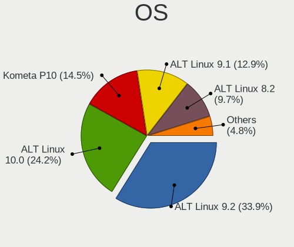

| Name            | Computers | Percent |
|-----------------|-----------|---------|
| ALT Linux 9.2   | 21        | 33.87%  |
| ALT Linux 10.0  | 15        | 24.19%  |
| Kometa P10      | 9         | 14.52%  |
| ALT Linux 9.1   | 8         | 12.9%   |
| ALT Linux 8.2   | 6         | 9.68%   |
| ALT Linux 9.0   | 1         | 1.61%   |
| ALT Linux 8.3   | 1         | 1.61%   |
| ALT Linux 7.0.5 | 1         | 1.61%   |

OS Family
---------

OS without a version

| Name      | Computers | Percent |
|-----------|-----------|---------|
| ALT Linux | 61        | 100%    |

Kernel
------

Version of the Linux kernel

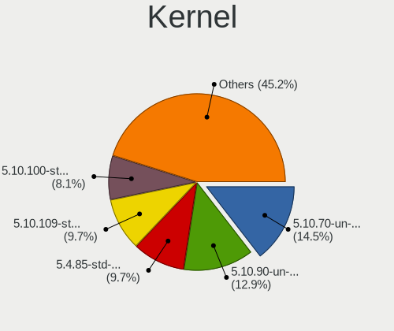

| Version                     | Computers | Percent |
|-----------------------------|-----------|---------|
| 5.10.70-un-def-alt3         | 9         | 14.52%  |
| 5.10.90-un-def-alt1         | 8         | 12.9%   |
| 5.4.85-std-def-alt1         | 6         | 9.68%   |
| 5.10.109-std-def-alt1       | 6         | 9.68%   |
| 5.10.100-std-def-alt1       | 5         | 8.06%   |
| 5.14.21-un-def-alt1         | 3         | 4.84%   |
| 5.13.18-un-def-alt1         | 3         | 4.84%   |
| 5.10.88-std-def-alt1        | 3         | 4.84%   |
| 5.10.102-std-def-alt1       | 3         | 4.84%   |
| 5.10.82-std-def-alt1        | 2         | 3.23%   |
| 5.10.66-std-def-alt1        | 2         | 3.23%   |
| 4.9.71-std-def-alt0.M80P.1  | 2         | 3.23%   |
| 4.9.293-std-def-alt0.M80P.1 | 2         | 3.23%   |
| 5.4.68-std-def-alt1.4.c9f   | 1         | 1.61%   |
| 5.4.51-std-def-alt1         | 1         | 1.61%   |
| 5.4.24-std-def-alt1         | 1         | 1.61%   |
| 5.10.52-std-def-alt1        | 1         | 1.61%   |
| 5.10.51-std-def-alt1        | 1         | 1.61%   |
| 4.19.225-un-def-alt0.M80P.1 | 1         | 1.61%   |
| 4.14.86-std-def-alt1        | 1         | 1.61%   |
| 3.14.41-std-def-alt1        | 1         | 1.61%   |

Kernel Family
-------------

Linux kernel without a distro release

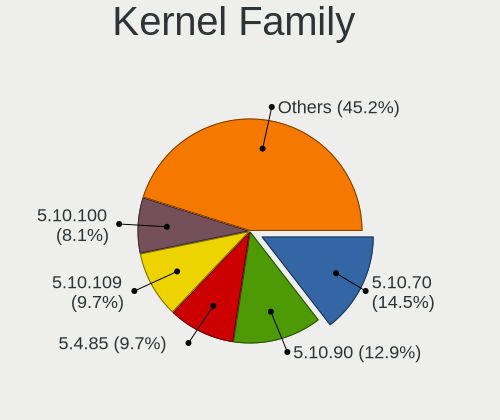

| Version  | Computers | Percent |
|----------|-----------|---------|
| 5.10.70  | 9         | 14.52%  |
| 5.10.90  | 8         | 12.9%   |
| 5.4.85   | 6         | 9.68%   |
| 5.10.109 | 6         | 9.68%   |
| 5.10.100 | 5         | 8.06%   |
| 5.14.21  | 3         | 4.84%   |
| 5.13.18  | 3         | 4.84%   |
| 5.10.88  | 3         | 4.84%   |
| 5.10.102 | 3         | 4.84%   |
| 5.10.82  | 2         | 3.23%   |
| 5.10.66  | 2         | 3.23%   |
| 4.9.71   | 2         | 3.23%   |
| 4.9.293  | 2         | 3.23%   |
| 5.4.68   | 1         | 1.61%   |
| 5.4.51   | 1         | 1.61%   |
| 5.4.24   | 1         | 1.61%   |
| 5.10.52  | 1         | 1.61%   |
| 5.10.51  | 1         | 1.61%   |
| 4.19.225 | 1         | 1.61%   |
| 4.14.86  | 1         | 1.61%   |
| 3.14.41  | 1         | 1.61%   |

Kernel Major Ver.
-----------------

Linux kernel major version

| Version | Computers | Percent |
|---------|-----------|---------|
| 5.10    | 40        | 64.52%  |
| 5.4     | 9         | 14.52%  |
| 4.9     | 4         | 6.45%   |
| 5.14    | 3         | 4.84%   |
| 5.13    | 3         | 4.84%   |
| 4.19    | 1         | 1.61%   |
| 4.14    | 1         | 1.61%   |
| 3.14    | 1         | 1.61%   |

Arch
----

OS architecture (x86_64, i586, etc.)

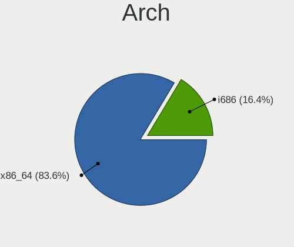

| Name   | Computers | Percent |
|--------|-----------|---------|
| x86_64 | 51        | 83.61%  |
| i686   | 10        | 16.39%  |

DE
--

Desktop Environment

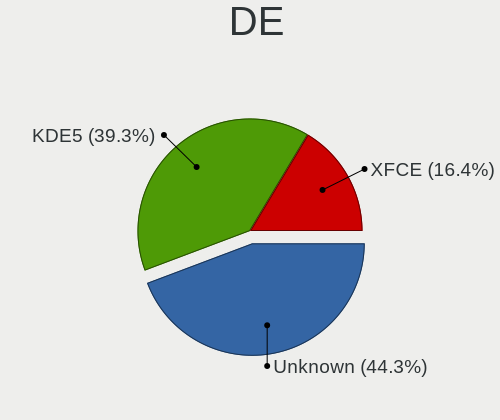

| Name    | Computers | Percent |
|---------|-----------|---------|
| Unknown | 27        | 44.26%  |
| KDE5    | 24        | 39.34%  |
| XFCE    | 10        | 16.39%  |

Display Server
--------------

X11 or Wayland

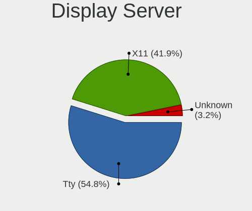

| Name    | Computers | Percent |
|---------|-----------|---------|
| Tty     | 34        | 54.84%  |
| X11     | 26        | 41.94%  |
| Unknown | 2         | 3.23%   |

Display Manager
---------------

SDDM, LightDM, etc.

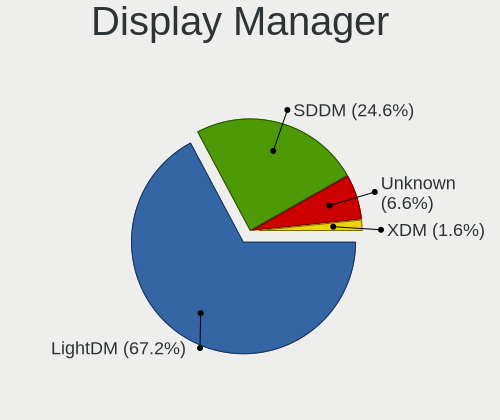

| Name    | Computers | Percent |
|---------|-----------|---------|
| LightDM | 41        | 67.21%  |
| SDDM    | 15        | 24.59%  |
| Unknown | 4         | 6.56%   |
| XDM     | 1         | 1.64%   |

OS Lang
-------

Language

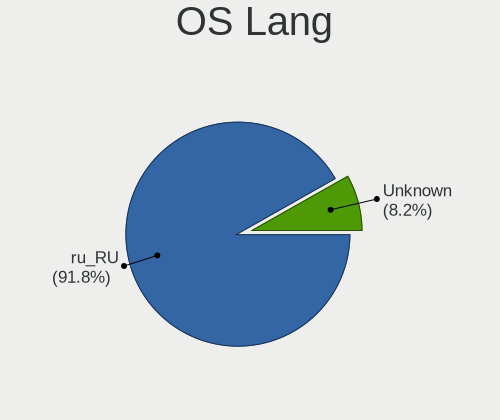

| Lang    | Computers | Percent |
|---------|-----------|---------|
| ru_RU   | 56        | 91.8%   |
| Unknown | 5         | 8.2%    |

Boot Mode
---------

EFI or BIOS

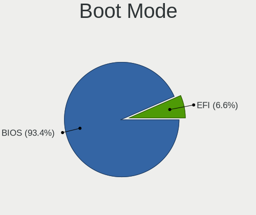

| Mode | Computers | Percent |
|------|-----------|---------|
| BIOS | 57        | 93.44%  |
| EFI  | 4         | 6.56%   |

Filesystem
----------

Type of filesystem

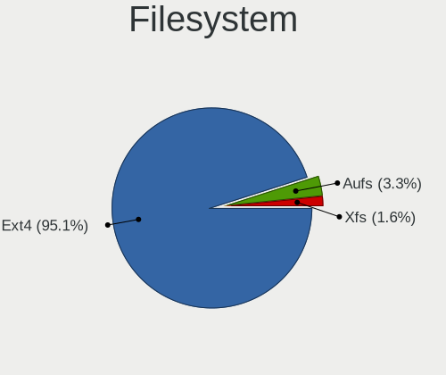

| Type | Computers | Percent |
|------|-----------|---------|
| Ext4 | 58        | 95.08%  |
| Aufs | 2         | 3.28%   |
| Xfs  | 1         | 1.64%   |

Part. scheme
------------

Scheme of partitioning

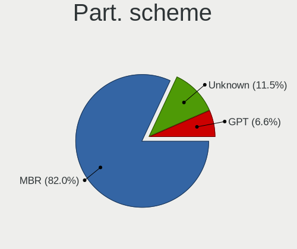

| Type    | Computers | Percent |
|---------|-----------|---------|
| MBR     | 50        | 81.97%  |
| Unknown | 7         | 11.48%  |
| GPT     | 4         | 6.56%   |

Dual Boot with Linux/BSD
------------------------

Hosting more than one Linux/BSD

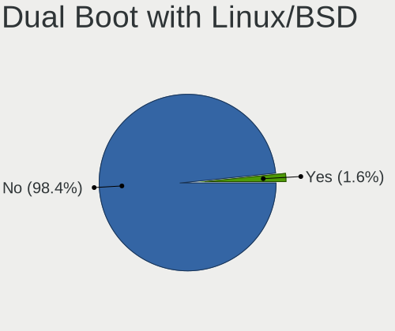

| Dual boot | Computers | Percent |
|-----------|-----------|---------|
| No        | 60        | 98.36%  |
| Yes       | 1         | 1.64%   |

Dual Boot (Win)
---------------

Hosting Linux and Windows

| Dual boot | Computers | Percent |
|-----------|-----------|---------|
| No        | 61        | 100%    |

Board
-----

Vendor
------

Motherboard manufacturer

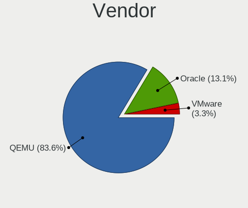

| Name   | Computers | Percent |
|--------|-----------|---------|
| QEMU   | 51        | 83.61%  |
| Oracle | 8         | 13.11%  |
| VMware | 2         | 3.28%   |

Model
-----

Motherboard model

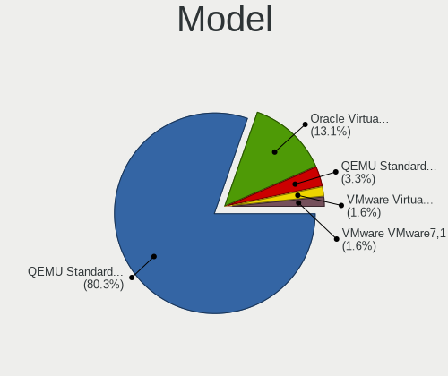

| Name                                   | Computers | Percent |
|----------------------------------------|-----------|---------|
| QEMU Standard PC (i440FX + PIIX, 1996) | 49        | 80.33%  |
| Oracle VirtualBox                      | 8         | 13.11%  |
| QEMU Standard PC (Q35 + ICH9, 2009)    | 2         | 3.28%   |
| VMware VMware7,1                       | 1         | 1.64%   |
| VMware Virtual Platform                | 1         | 1.64%   |

Model Family
------------

Motherboard model prefix

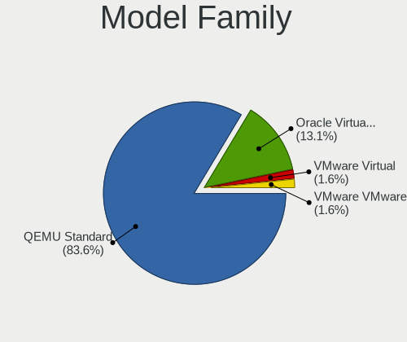

| Name              | Computers | Percent |
|-------------------|-----------|---------|
| QEMU Standard     | 51        | 83.61%  |
| Oracle VirtualBox | 8         | 13.11%  |
| VMware VMware7    | 1         | 1.64%   |
| VMware Virtual    | 1         | 1.64%   |

MFG Year
--------

Motherboard manufacture year

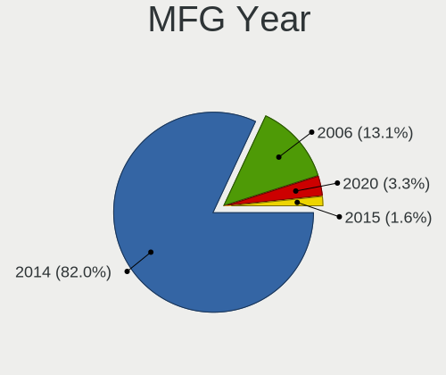

| Year | Computers | Percent |
|------|-----------|---------|
| 2014 | 50        | 81.97%  |
| 2006 | 8         | 13.11%  |
| 2020 | 2         | 3.28%   |
| 2015 | 1         | 1.64%   |

Form Factor
-----------

Physical design of the computer

| Name            | Computers | Percent |
|-----------------|-----------|---------|
| Virtual machine | 61        | 100%    |

Secure Boot
-----------

Enabled or disabled

| State    | Computers | Percent |
|----------|-----------|---------|
| Disabled | 61        | 100%    |

Coreboot
--------

Have coreboot on board

| Used | Computers | Percent |
|------|-----------|---------|
| No   | 61        | 100%    |

RAM Size
--------

Total RAM memory

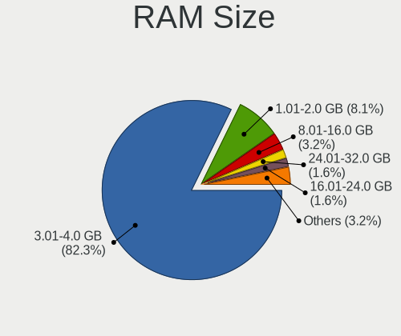

| Size in GB | Computers | Percent |
|------------|-----------|---------|
| 3.01-4.0   | 51        | 82.26%  |
| 1.01-2.0   | 5         | 8.06%   |
| 8.01-16.0  | 2         | 3.23%   |
| 24.01-32.0 | 1         | 1.61%   |
| 2.01-3.0   | 1         | 1.61%   |
| 16.01-24.0 | 1         | 1.61%   |
| 0.01-0.5   | 1         | 1.61%   |

RAM Used
--------

Used RAM memory

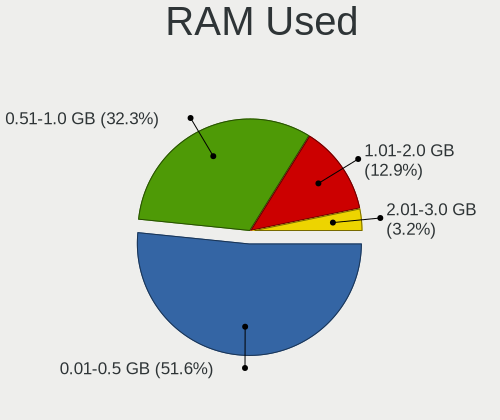

| Used GB  | Computers | Percent |
|----------|-----------|---------|
| 0.01-0.5 | 32        | 51.61%  |
| 0.51-1.0 | 20        | 32.26%  |
| 1.01-2.0 | 8         | 12.9%   |
| 2.01-3.0 | 2         | 3.23%   |

Total Drives
------------

Number of drives on board

| Drives | Computers | Percent |
|--------|-----------|---------|
| 1      | 55        | 90.16%  |
| 0      | 6         | 9.84%   |

Has CD-ROM
----------

Has CD-ROM on board

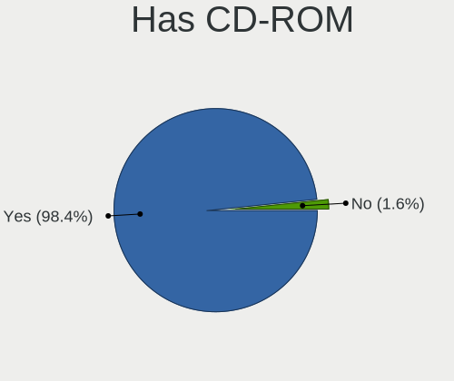

| Presented | Computers | Percent |
|-----------|-----------|---------|
| Yes       | 60        | 98.36%  |
| No        | 1         | 1.64%   |

Has Ethernet
------------

Has Ethernet on board

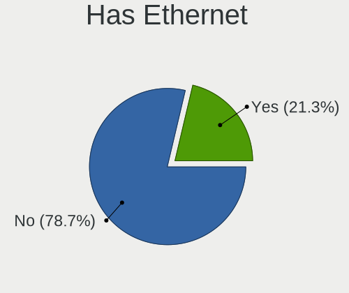

| Presented | Computers | Percent |
|-----------|-----------|---------|
| No        | 48        | 78.69%  |
| Yes       | 13        | 21.31%  |

Has WiFi
--------

Has WiFi module

| Presented | Computers | Percent |
|-----------|-----------|---------|
| No        | 61        | 100%    |

Has Bluetooth
-------------

Has Bluetooth module

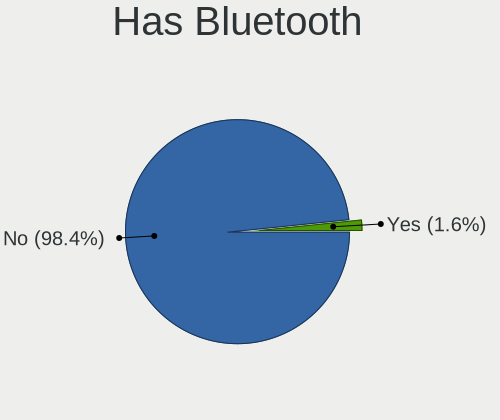

| Presented | Computers | Percent |
|-----------|-----------|---------|
| No        | 60        | 98.36%  |
| Yes       | 1         | 1.64%   |

Location
--------

Country
-------

Geographic location (country)

| Country | Computers | Percent |
|---------|-----------|---------|
| Russia  | 61        | 100%    |

City
----

Geographic location (city)

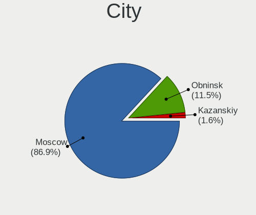

| City      | Computers | Percent |
|-----------|-----------|---------|
| Moscow    | 53        | 86.89%  |
| Obninsk   | 7         | 11.48%  |
| Kazanskiy | 1         | 1.64%   |

Drives
------

Drive Vendor
------------

Hard drive vendors

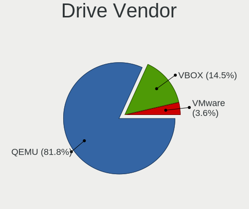

| Vendor | Computers | Drives | Percent |
|--------|-----------|--------|---------|
| QEMU   | 45        | 45     | 81.82%  |
| VBOX   | 8         | 10     | 14.55%  |
| VMware | 2         | 2      | 3.64%   |

Drive Model
-----------

Hard drive models

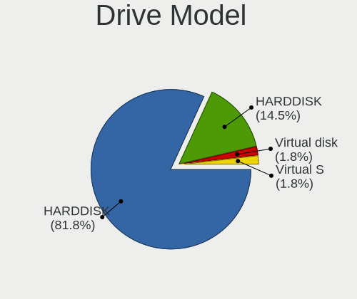

| Model               | Computers | Percent |
|---------------------|-----------|---------|
| QEMU HARDDISK       | 45        | 81.82%  |
| VBOX HARDDISK       | 8         | 14.55%  |
| VMware Virtual S    | 1         | 1.82%   |
| VMware Virtual disk | 1         | 1.82%   |

HDD Vendor
----------

Hard disk drive vendors

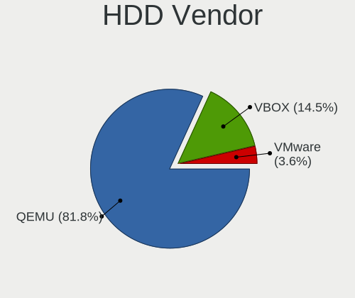

| Vendor | Computers | Drives | Percent |
|--------|-----------|--------|---------|
| QEMU   | 45        | 45     | 81.82%  |
| VBOX   | 8         | 10     | 14.55%  |
| VMware | 2         | 2      | 3.64%   |

SSD Vendor
----------

Solid state drive vendors

Zero info for selected period =(

Drive Kind
----------

HDD or SSD

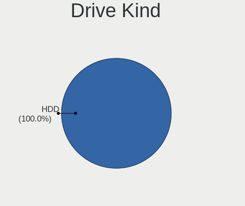

| Kind | Computers | Drives | Percent |
|------|-----------|--------|---------|
| HDD  | 55        | 57     | 100%    |

Drive Connector
---------------

SATA, SAS, NVMe, etc.

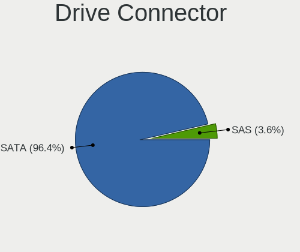

| Type | Computers | Drives | Percent |
|------|-----------|--------|---------|
| SATA | 53        | 55     | 96.36%  |
| SAS  | 2         | 2      | 3.64%   |

Drive Size
----------

Size of hard drive

| Size in TB | Computers | Drives | Percent |
|------------|-----------|--------|---------|
| 0.01-0.5   | 55        | 57     | 100%    |

Space Total
-----------

Amount of disk space available on the file system

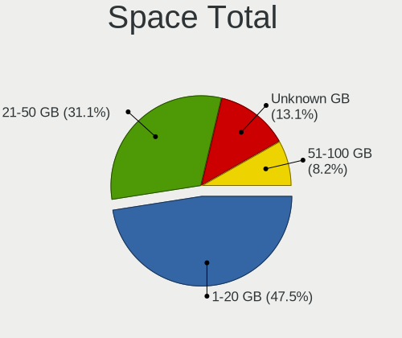

| Size in GB | Computers | Percent |
|------------|-----------|---------|
| 1-20       | 29        | 47.54%  |
| 21-50      | 19        | 31.15%  |
| Unknown    | 8         | 13.11%  |
| 51-100     | 5         | 8.2%    |

Space Used
----------

Amount of used disk space

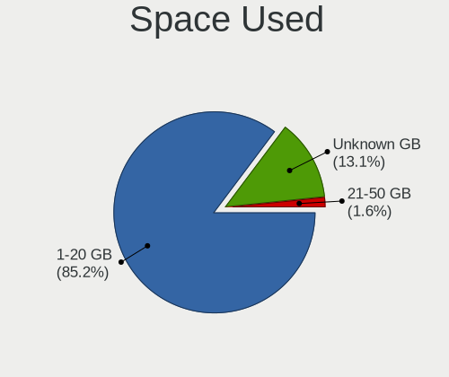

| Used GB | Computers | Percent |
|---------|-----------|---------|
| 1-20    | 52        | 85.25%  |
| Unknown | 8         | 13.11%  |
| 21-50   | 1         | 1.64%   |

Malfunc. Drives
---------------

Drive models with a malfunction

Zero info for selected period =(

Malfunc. Drive Vendor
---------------------

Vendors of faulty drives

Zero info for selected period =(

Malfunc. HDD Vendor
-------------------

Vendors of faulty HDD drives

Zero info for selected period =(

Malfunc. Drive Kind
-------------------

Kinds of faulty drives

Zero info for selected period =(

Failed Drives
-------------

Failed drive models

Zero info for selected period =(

Failed Drive Vendor
-------------------

Failed drive vendors

Zero info for selected period =(

Drive Status
------------

Number of failed and malfunc. drives

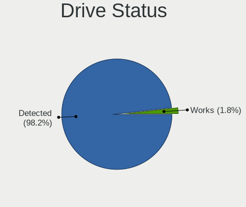

| Status   | Computers | Drives | Percent |
|----------|-----------|--------|---------|
| Detected | 54        | 56     | 98.18%  |
| Works    | 1         | 1      | 1.82%   |

Storage controller
------------------

Storage Vendor
--------------

Storage controller vendors

| Vendor                    | Computers | Percent |
|---------------------------|-----------|---------|
| Intel                     | 61        | 53.98%  |
| Red Hat                   | 49        | 43.36%  |
| VMware                    | 2         | 1.77%   |
| LSI Logic / Symbios Logic | 1         | 0.88%   |

Storage Model
-------------

Storage controller models

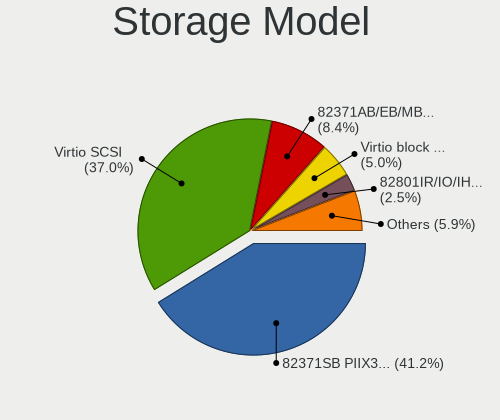

| Model                                                                 | Computers | Percent |
|-----------------------------------------------------------------------|-----------|---------|
| Intel 82371SB PIIX3 IDE [Natoma/Triton II]                            | 49        | 41.18%  |
| Red Hat Virtio SCSI                                                   | 44        | 36.97%  |
| Intel 82371AB/EB/MB PIIX4 IDE                                         | 10        | 8.4%    |
| Red Hat Virtio block device                                           | 6         | 5.04%   |
| Intel 82801IR/IO/IH (ICH9R/DO/DH) 6 port SATA Controller [AHCI mode]  | 3         | 2.52%   |
| Intel 82801HM/HEM (ICH8M/ICH8M-E) SATA Controller [AHCI mode]         | 3         | 2.52%   |
| VMware SATA AHCI controller                                           | 2         | 1.68%   |
| VMware PVSCSI SCSI Controller                                         | 1         | 0.84%   |
| LSI Logic / Symbios Logic 53c1030 PCI-X Fusion-MPT Dual Ultra320 SCSI | 1         | 0.84%   |

Storage Kind
------------

Kind of storage controller (IDE, SATA, NVMe, SAS, ...)

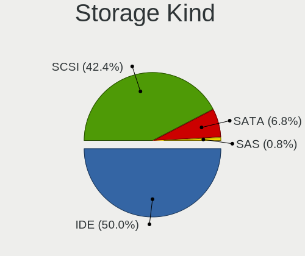

| Kind | Computers | Percent |
|------|-----------|---------|
| IDE  | 59        | 50%     |
| SCSI | 50        | 42.37%  |
| SATA | 8         | 6.78%   |
| SAS  | 1         | 0.85%   |

Processor
---------

CPU Vendor
----------

Processor vendors

| Vendor | Computers | Percent |
|--------|-----------|---------|
| Intel  | 60        | 98.36%  |
| AMD    | 1         | 1.64%   |

CPU Model
---------

Processor models

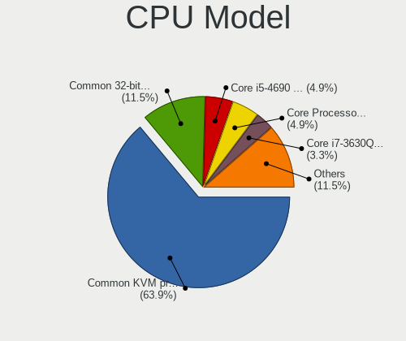

| Model                                  | Computers | Percent |
|----------------------------------------|-----------|---------|
| Intel Common KVM processor             | 39        | 63.93%  |
| Intel Common 32-bit KVM processor      | 7         | 11.48%  |
| Intel Core Processor (Skylake, IBRS)   | 3         | 4.92%   |
| Intel Core i5-4690 CPU @ 3.50GHz       | 3         | 4.92%   |
| Intel Core i7-3630QM CPU @ 2.40GHz     | 2         | 3.28%   |
| Intel Xeon CPU E5-2650 v4 @ 2.20GHz    | 1         | 1.64%   |
| Intel Core Processor (Haswell, no TSX) | 1         | 1.64%   |
| Intel Core i7-8569U CPU @ 2.80GHz      | 1         | 1.64%   |
| Intel Core i7-7500U CPU @ 2.70GHz      | 1         | 1.64%   |
| Intel Core i5-4460 CPU @ 3.20GHz       | 1         | 1.64%   |
| Intel 11th Gen Core i7-11700 @ 2.50GHz | 1         | 1.64%   |
| AMD Ryzen 7 2700X Eight-Core Processor | 1         | 1.64%   |

CPU Model Family
----------------

Processor model prefix

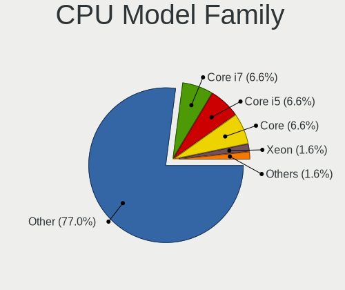

| Model         | Computers | Percent |
|---------------|-----------|---------|
| Other         | 47        | 77.05%  |
| Intel Core i7 | 4         | 6.56%   |
| Intel Core i5 | 4         | 6.56%   |
| Intel Core    | 4         | 6.56%   |
| Intel Xeon    | 1         | 1.64%   |
| AMD Ryzen 7   | 1         | 1.64%   |

CPU Cores
---------

Number of processor cores

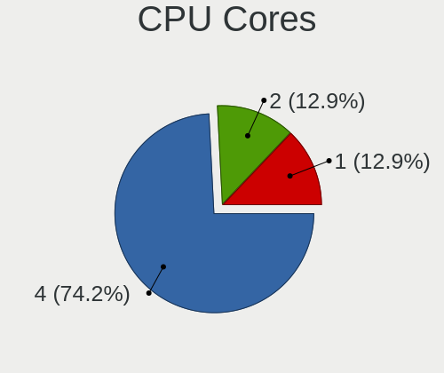

| Number | Computers | Percent |
|--------|-----------|---------|
| 4      | 46        | 74.19%  |
| 2      | 8         | 12.9%   |
| 1      | 8         | 12.9%   |

CPU Sockets
-----------

Number of sockets

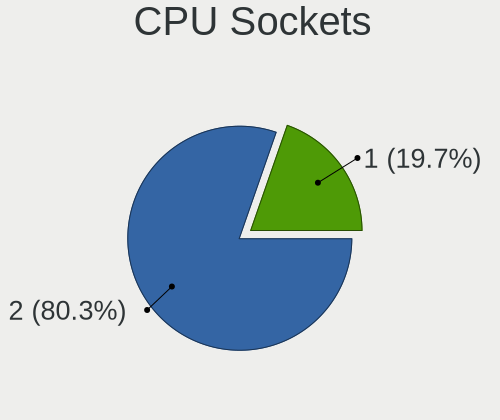

| Number | Computers | Percent |
|--------|-----------|---------|
| 2      | 49        | 80.33%  |
| 1      | 12        | 19.67%  |

CPU Threads
-----------

Threads per core (Hyper-Threading)

| Number | Computers | Percent |
|--------|-----------|---------|
| 1      | 61        | 100%    |

CPU Op-Modes
------------

CPU Operation Modes (32-bit, 64-bit)

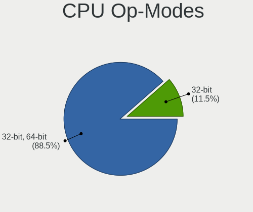

| Op mode        | Computers | Percent |
|----------------|-----------|---------|
| 32-bit, 64-bit | 54        | 88.52%  |
| 32-bit         | 7         | 11.48%  |

CPU Microcode
-------------

Microcode number

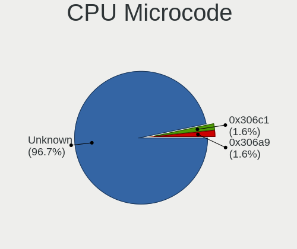

| Number  | Computers | Percent |
|---------|-----------|---------|
| Unknown | 59        | 96.72%  |
| 0x306c1 | 1         | 1.64%   |
| 0x306a9 | 1         | 1.64%   |

CPU Microarch
-------------

Microarchitecture

| Name      | Computers | Percent |
|-----------|-----------|---------|
| NetBurst  | 46        | 75.41%  |
| Haswell   | 6         | 9.84%   |
| Skylake   | 3         | 4.92%   |
| KabyLake  | 2         | 3.28%   |
| IvyBridge | 2         | 3.28%   |
| Zen+      | 1         | 1.64%   |
| Unknown   | 1         | 1.64%   |

Graphics
--------

GPU Vendor
----------

Vendors of graphics cards

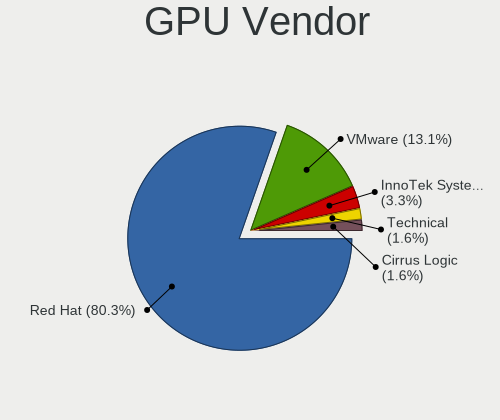

| Vendor                 | Computers | Percent |
|------------------------|-----------|---------|
| Red Hat                | 49        | 80.33%  |
| VMware                 | 8         | 13.11%  |
| InnoTek Systemberatung | 2         | 3.28%   |
| Technical              | 1         | 1.64%   |
| Cirrus Logic           | 1         | 1.64%   |

GPU Model
---------

Graphics card models

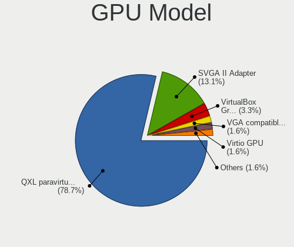

| Model                                              | Computers | Percent |
|----------------------------------------------------|-----------|---------|
| Red Hat QXL paravirtual graphic card               | 48        | 78.69%  |
| VMware SVGA II Adapter                             | 8         | 13.11%  |
| InnoTek Systemberatung VirtualBox Graphics Adapter | 2         | 3.28%   |
| Technical VGA compatible controller                | 1         | 1.64%   |
| Red Hat Virtio GPU                                 | 1         | 1.64%   |
| Cirrus Logic GD 5446                               | 1         | 1.64%   |

GPU Combo
---------

Combinations of graphics cards

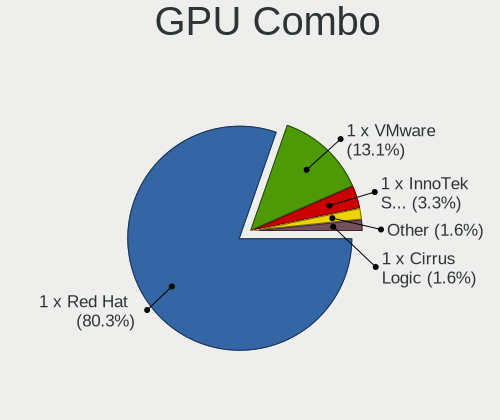

| Name                       | Computers | Percent |
|----------------------------|-----------|---------|
| 1 x Red Hat                | 49        | 80.33%  |
| 1 x VMware                 | 8         | 13.11%  |
| 1 x InnoTek Systemberatung | 2         | 3.28%   |
| Other                      | 1         | 1.64%   |
| 1 x Cirrus Logic           | 1         | 1.64%   |

GPU Driver
----------

Free vs proprietary

| Driver  | Computers | Percent |
|---------|-----------|---------|
| Unknown | 61        | 100%    |

GPU Memory
----------

Total video memory

| Size in GB | Computers | Percent |
|------------|-----------|---------|
| Unknown    | 61        | 100%    |

Monitor
-------

Monitor Vendor
--------------

Monitor vendors

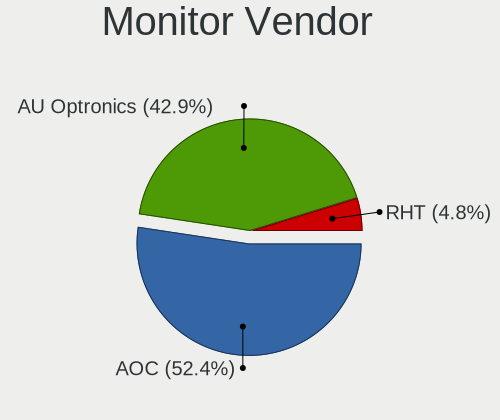

| Vendor       | Computers | Percent |
|--------------|-----------|---------|
| AOC          | 22        | 52.38%  |
| AU Optronics | 18        | 42.86%  |
| RHT          | 2         | 4.76%   |

Monitor Model
-------------

Monitor models

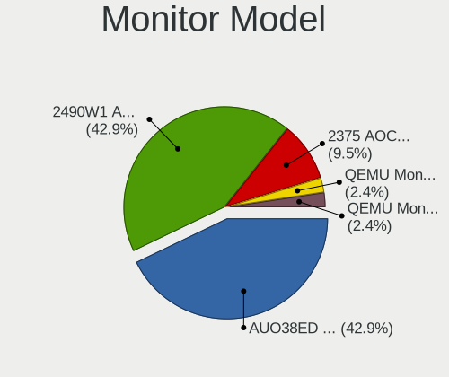

| Model                                                          | Computers | Percent |
|----------------------------------------------------------------|-----------|---------|
| AU Optronics LCD Monitor AUO38ED 1920x1080 340x190mm 15.3-inch | 18        | 42.86%  |
| AOC 2490W1 AOC2490 1920x1080 530x300mm 24.0-inch               | 18        | 42.86%  |
| AOC 2375 AOC2375 1920x1080 510x290mm 23.1-inch                 | 4         | 9.52%   |
| RHT QEMU Monitor RHT1234 2048x1152 260x195mm 12.8-inch         | 1         | 2.38%   |
| RHT QEMU Monitor RHT1234 2048x1152 260x190mm 12.7-inch         | 1         | 2.38%   |

Monitor Resolution
------------------

Monitor screen resolution

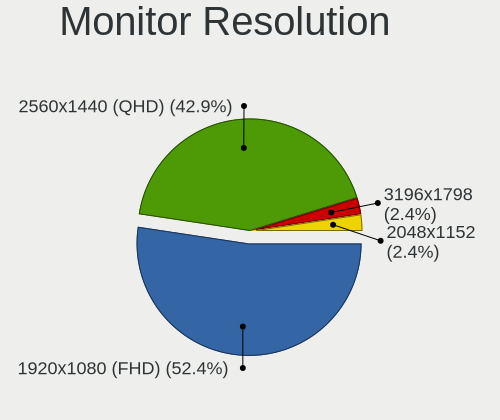

| Resolution      | Computers | Percent |
|-----------------|-----------|---------|
| 1920x1080 (FHD) | 22        | 52.38%  |
| 2560x1440 (QHD) | 18        | 42.86%  |
| 3196x1798       | 1         | 2.38%   |
| 2048x1152       | 1         | 2.38%   |

Monitor Diagonal
----------------

Diagonal size in inches

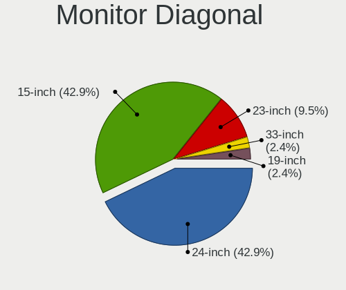

| Inches | Computers | Percent |
|--------|-----------|---------|
| 24     | 18        | 42.86%  |
| 15     | 18        | 42.86%  |
| 23     | 4         | 9.52%   |
| 33     | 1         | 2.38%   |
| 19     | 1         | 2.38%   |

Monitor Width
-------------

Physical width

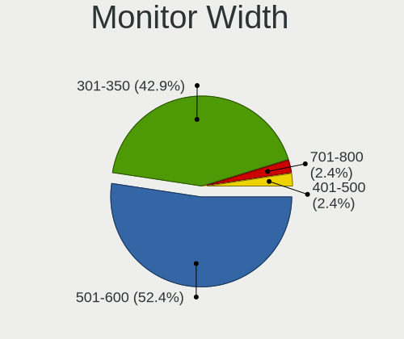

| Width in mm | Computers | Percent |
|-------------|-----------|---------|
| 501-600     | 22        | 52.38%  |
| 301-350     | 18        | 42.86%  |
| 701-800     | 1         | 2.38%   |
| 401-500     | 1         | 2.38%   |

Aspect Ratio
------------

Proportional relationship between the width and the height

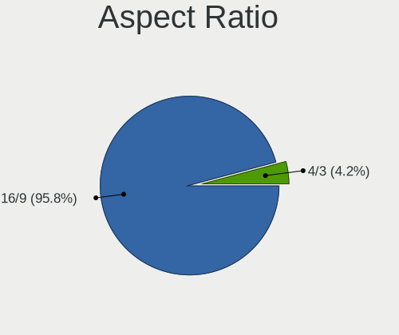

| Ratio | Computers | Percent |
|-------|-----------|---------|
| 16/9  | 23        | 95.83%  |
| 4/3   | 1         | 4.17%   |

Monitor Area
------------

Area in inch²

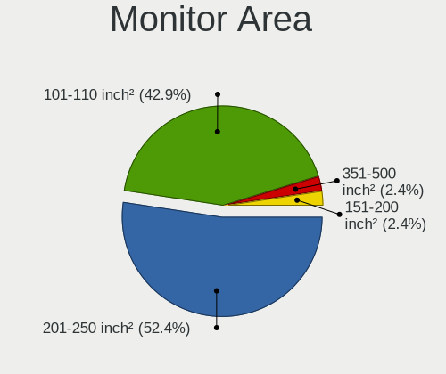

| Area in inch² | Computers | Percent |
|----------------|-----------|---------|
| 201-250        | 22        | 52.38%  |
| 101-110        | 18        | 42.86%  |
| 351-500        | 1         | 2.38%   |
| 151-200        | 1         | 2.38%   |

Pixel Density
-------------

Pixels per inch

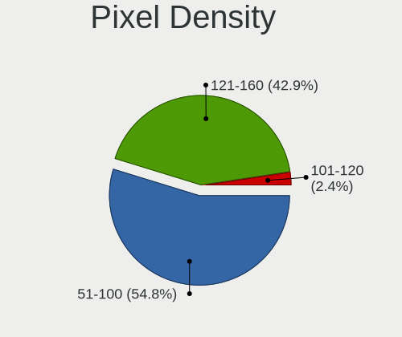

| Density | Computers | Percent |
|---------|-----------|---------|
| 51-100  | 23        | 54.76%  |
| 121-160 | 18        | 42.86%  |
| 101-120 | 1         | 2.38%   |

Multiple Monitors
-----------------

Total monitors connected

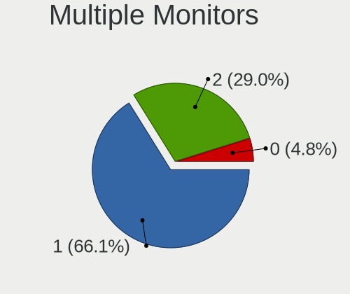

| Total | Computers | Percent |
|-------|-----------|---------|
| 1     | 41        | 66.13%  |
| 2     | 18        | 29.03%  |
| 0     | 3         | 4.84%   |

Network
-------

Net Controller Vendor
---------------------

Controller vendors

| Vendor                | Computers | Percent |
|-----------------------|-----------|---------|
| Red Hat               | 49        | 79.03%  |
| Intel                 | 11        | 17.74%  |
| VMware                | 1         | 1.61%   |
| Realtek Semiconductor | 1         | 1.61%   |

Net Controller Model
--------------------

Controller models

| Model                                                 | Computers | Percent |
|-------------------------------------------------------|-----------|---------|
| Red Hat Virtio network device                         | 49        | 79.03%  |
| Intel 82540EM Gigabit Ethernet Controller             | 9         | 14.52%  |
| VMware VMXNET3 Ethernet Controller                    | 1         | 1.61%   |
| Realtek RTL-8100/8101L/8139 PCI Fast Ethernet Adapter | 1         | 1.61%   |
| Intel 82574L Gigabit Network Connection               | 1         | 1.61%   |
| Intel 82545EM Gigabit Ethernet Controller (Copper)    | 1         | 1.61%   |

Wireless Vendor
---------------

Wireless vendors

Zero info for selected period =(

Wireless Model
--------------

Wireless models

Zero info for selected period =(

Ethernet Vendor
---------------

Ethernet vendors

| Vendor                | Computers | Percent |
|-----------------------|-----------|---------|
| Intel                 | 11        | 84.62%  |
| VMware                | 1         | 7.69%   |
| Realtek Semiconductor | 1         | 7.69%   |

Ethernet Model
--------------

Ethernet models

| Model                                                 | Computers | Percent |
|-------------------------------------------------------|-----------|---------|
| Intel 82540EM Gigabit Ethernet Controller             | 9         | 69.23%  |
| VMware VMXNET3 Ethernet Controller                    | 1         | 7.69%   |
| Realtek RTL-8100/8101L/8139 PCI Fast Ethernet Adapter | 1         | 7.69%   |
| Intel 82574L Gigabit Network Connection               | 1         | 7.69%   |
| Intel 82545EM Gigabit Ethernet Controller (Copper)    | 1         | 7.69%   |

Net Controller Kind
-------------------

Ethernet, WiFi or modem

| Kind     | Computers | Percent |
|----------|-----------|---------|
| Unknown  | 49        | 79.03%  |
| Ethernet | 13        | 20.97%  |

Used Controller
---------------

Currently used network controller

| Kind     | Computers | Percent |
|----------|-----------|---------|
| Ethernet | 13        | 100%    |

NICs
----

Total network controllers on board

| Total | Computers | Percent |
|-------|-----------|---------|
| 1     | 59        | 96.72%  |
| 0     | 2         | 3.28%   |

IPv6
----

IPv6 vs IPv4

| Used | Computers | Percent |
|------|-----------|---------|
| Yes  | 38        | 61.29%  |
| No   | 24        | 38.71%  |

Bluetooth
---------

Bluetooth Vendor
----------------

Controller vendors

| Vendor | Computers | Percent |
|--------|-----------|---------|
| VMware | 1         | 100%    |

Bluetooth Model
---------------

Controller models

| Model                            | Computers | Percent |
|----------------------------------|-----------|---------|
| VMware Virtual Bluetooth Adapter | 1         | 100%    |

Sound
-----

Sound Vendor
------------

Sound card vendors

| Vendor  | Computers | Percent |
|---------|-----------|---------|
| Intel   | 12        | 92.31%  |
| Ensoniq | 1         | 7.69%   |

Sound Model
-----------

Sound card models

| Model                                                                      | Computers | Percent |
|----------------------------------------------------------------------------|-----------|---------|
| Intel 82801AA AC'97 Audio Controller                                       | 8         | 61.54%  |
| Intel 82801I (ICH9 Family) HD Audio Controller                             | 2         | 15.38%  |
| Intel 82801FB/FBM/FR/FW/FRW (ICH6 Family) High Definition Audio Controller | 2         | 15.38%  |
| Ensoniq ES1371/ES1373 / Creative Labs CT2518                               | 1         | 7.69%   |

Memory
------

Memory Vendor
-------------

Memory module vendors

| Vendor             | Computers | Percent |
|--------------------|-----------|---------|
| QEMU               | 49        | 96.08%  |
| VMware Virtual RAM | 1         | 1.96%   |
| Unknown            | 1         | 1.96%   |

Memory Model
------------

Memory module models

| Model                                           | Computers | Percent |
|-------------------------------------------------|-----------|---------|
| QEMU RAM Module 3072MB DIMM RAM                 | 25        | 48.08%  |
| QEMU RAM Module 3GB DIMM RAM                    | 16        | 30.77%  |
| QEMU RAM Module 2GB DIMM RAM                    | 2         | 3.85%   |
| QEMU RAM Module 2048MB DIMM RAM                 | 2         | 3.85%   |
| VMware Virtual RAM RAM VMW-4096MB 4GB DIMM DRAM | 1         | 1.92%   |
| QEMU RAM Module 512MB DIMM RAM                  | 1         | 1.92%   |
| QEMU RAM Module 4GB DIMM RAM                    | 1         | 1.92%   |
| QEMU RAM Module 4096MB DIMM RAM                 | 1         | 1.92%   |
| QEMU RAM Module 3074MB DIMM RAM                 | 1         | 1.92%   |
| QEMU RAM Module 10GB DIMM RAM                   | 1         | 1.92%   |
| Unknown                                         | 1         | 1.92%   |

Memory Kind
-----------

Memory module kinds

| Kind | Computers | Percent |
|------|-----------|---------|
| RAM  | 49        | 96.08%  |
| DRAM | 2         | 3.92%   |

Memory Form Factor
------------------

Physical design of the memory module

| Name | Computers | Percent |
|------|-----------|---------|
| DIMM | 51        | 100%    |

Memory Size
-----------

Memory module size

| Size  | Computers | Percent |
|-------|-----------|---------|
| 3072  | 41        | 78.85%  |
| 4096  | 4         | 7.69%   |
| 2048  | 4         | 7.69%   |
| 10240 | 1         | 1.92%   |
| 3074  | 1         | 1.92%   |
| 512   | 1         | 1.92%   |

Memory Speed
------------

Memory module speed

| Speed   | Computers | Percent |
|---------|-----------|---------|
| Unknown | 51        | 100%    |

Printers & scanners
-------------------

Printer Vendor
--------------

Printer device vendors

Zero info for selected period =(

Printer Model
-------------

Printer device models

Zero info for selected period =(

Scanner Vendor
--------------

Scanner device vendors

Zero info for selected period =(

Scanner Model
-------------

Scanner device models

Zero info for selected period =(

Camera
------

Camera Vendor
-------------

Camera device vendors

Zero info for selected period =(

Camera Model
------------

Camera device models

Zero info for selected period =(

Security
--------

Fingerprint Vendor
------------------

Fingerprint sensor vendors

Zero info for selected period =(

Fingerprint Model
-----------------

Fingerprint sensor models

Zero info for selected period =(

Chipcard Vendor
---------------

Chipcard module vendors

Zero info for selected period =(

Chipcard Model
--------------

Chipcard module models

Zero info for selected period =(

Unsupported
-----------

Unsupported Devices
-------------------

Total unsupported devices on board

| Total | Computers | Percent |
|-------|-----------|---------|
| 0     | 57        | 93.44%  |
| 1     | 4         | 6.56%   |

Unsupported Device Types
------------------------

Types of unsupported devices

| Type          | Computers | Percent |
|---------------|-----------|---------|
| Graphics card | 4         | 100%    |

