Arch - Tested Virtual Hardware & Statistics
-------------------------------------------

A project to collect tested virtual hardware configurations for Arch.

Anyone can contribute to this report by the [hw-probe](https://github.com/linuxhw/hw-probe) tool:

    sudo -E hw-probe -all -upload

Please contribute! Especially if your hardware is rare.

Contents
--------

* [ Test Cases ](#test-cases)

* [ System ](#system)
  - [ OS                       ](#os)
  - [ OS Family                ](#os-family)
  - [ Kernel                   ](#kernel)
  - [ Kernel Family            ](#kernel-family)
  - [ Kernel Major Ver.        ](#kernel-major-ver)
  - [ Arch                     ](#arch)
  - [ DE                       ](#de)
  - [ Display Server           ](#display-server)
  - [ Display Manager          ](#display-manager)
  - [ OS Lang                  ](#os-lang)
  - [ Boot Mode                ](#boot-mode)
  - [ Filesystem               ](#filesystem)
  - [ Part. scheme             ](#part-scheme)
  - [ Dual Boot with Linux/BSD ](#dual-boot-with-linuxbsd)
  - [ Dual Boot (Win)          ](#dual-boot-win)

* [ Board ](#board)
  - [ Vendor                   ](#vendor)
  - [ Model                    ](#model)
  - [ Model Family             ](#model-family)
  - [ MFG Year                 ](#mfg-year)
  - [ Form Factor              ](#form-factor)
  - [ Secure Boot              ](#secure-boot)
  - [ Coreboot                 ](#coreboot)
  - [ RAM Size                 ](#ram-size)
  - [ RAM Used                 ](#ram-used)
  - [ Total Drives             ](#total-drives)
  - [ Has CD-ROM               ](#has-cd-rom)
  - [ Has Ethernet             ](#has-ethernet)
  - [ Has WiFi                 ](#has-wifi)
  - [ Has Bluetooth            ](#has-bluetooth)

* [ Location ](#location)
  - [ Country                  ](#country)
  - [ City                     ](#city)

* [ Drives ](#drives)
  - [ Drive Vendor             ](#drive-vendor)
  - [ Drive Model              ](#drive-model)
  - [ HDD Vendor               ](#hdd-vendor)
  - [ SSD Vendor               ](#ssd-vendor)
  - [ Drive Kind               ](#drive-kind)
  - [ Drive Connector          ](#drive-connector)
  - [ Drive Size               ](#drive-size)
  - [ Space Total              ](#space-total)
  - [ Space Used               ](#space-used)
  - [ Malfunc. Drives          ](#malfunc-drives)
  - [ Malfunc. Drive Vendor    ](#malfunc-drive-vendor)
  - [ Malfunc. HDD Vendor      ](#malfunc-hdd-vendor)
  - [ Malfunc. Drive Kind      ](#malfunc-drive-kind)
  - [ Failed Drives            ](#failed-drives)
  - [ Failed Drive Vendor      ](#failed-drive-vendor)
  - [ Drive Status             ](#drive-status)

* [ Storage controller ](#storage-controller)
  - [ Storage Vendor           ](#storage-vendor)
  - [ Storage Model            ](#storage-model)
  - [ Storage Kind             ](#storage-kind)

* [ Processor ](#processor)
  - [ CPU Vendor               ](#cpu-vendor)
  - [ CPU Model                ](#cpu-model)
  - [ CPU Model Family         ](#cpu-model-family)
  - [ CPU Cores                ](#cpu-cores)
  - [ CPU Sockets              ](#cpu-sockets)
  - [ CPU Threads              ](#cpu-threads)
  - [ CPU Op-Modes             ](#cpu-op-modes)
  - [ CPU Microcode            ](#cpu-microcode)
  - [ CPU Microarch            ](#cpu-microarch)

* [ Graphics ](#graphics)
  - [ GPU Vendor               ](#gpu-vendor)
  - [ GPU Model                ](#gpu-model)
  - [ GPU Combo                ](#gpu-combo)
  - [ GPU Driver               ](#gpu-driver)
  - [ GPU Memory               ](#gpu-memory)

* [ Monitor ](#monitor)
  - [ Monitor Vendor           ](#monitor-vendor)
  - [ Monitor Model            ](#monitor-model)
  - [ Monitor Resolution       ](#monitor-resolution)
  - [ Monitor Diagonal         ](#monitor-diagonal)
  - [ Monitor Width            ](#monitor-width)
  - [ Aspect Ratio             ](#aspect-ratio)
  - [ Monitor Area             ](#monitor-area)
  - [ Pixel Density            ](#pixel-density)
  - [ Multiple Monitors        ](#multiple-monitors)

* [ Network ](#network)
  - [ Net Controller Vendor    ](#net-controller-vendor)
  - [ Net Controller Model     ](#net-controller-model)
  - [ Wireless Vendor          ](#wireless-vendor)
  - [ Wireless Model           ](#wireless-model)
  - [ Ethernet Vendor          ](#ethernet-vendor)
  - [ Ethernet Model           ](#ethernet-model)
  - [ Net Controller Kind      ](#net-controller-kind)
  - [ Used Controller          ](#used-controller)
  - [ NICs                     ](#nics)
  - [ IPv6                     ](#ipv6)

* [ Bluetooth ](#bluetooth)
  - [ Bluetooth Vendor         ](#bluetooth-vendor)
  - [ Bluetooth Model          ](#bluetooth-model)

* [ Sound ](#sound)
  - [ Sound Vendor             ](#sound-vendor)
  - [ Sound Model              ](#sound-model)

* [ Memory ](#memory)
  - [ Memory Vendor            ](#memory-vendor)
  - [ Memory Model             ](#memory-model)
  - [ Memory Kind              ](#memory-kind)
  - [ Memory Form Factor       ](#memory-form-factor)
  - [ Memory Size              ](#memory-size)
  - [ Memory Speed             ](#memory-speed)

* [ Printers & scanners ](#printers--scanners)
  - [ Printer Vendor           ](#printer-vendor)
  - [ Printer Model            ](#printer-model)
  - [ Scanner Vendor           ](#scanner-vendor)
  - [ Scanner Model            ](#scanner-model)

* [ Camera ](#camera)
  - [ Camera Vendor            ](#camera-vendor)
  - [ Camera Model             ](#camera-model)

* [ Security ](#security)
  - [ Fingerprint Vendor       ](#fingerprint-vendor)
  - [ Fingerprint Model        ](#fingerprint-model)
  - [ Chipcard Vendor          ](#chipcard-vendor)
  - [ Chipcard Model           ](#chipcard-model)

* [ Unsupported ](#unsupported)
  - [ Unsupported Devices      ](#unsupported-devices)
  - [ Unsupported Device Types ](#unsupported-device-types)

Test Cases
----------

Total: 74

| Vendor        | Model                       | Form-Factor     | Probe                                                      | Date         |
|---------------|-----------------------------|-----------------|------------------------------------------------------------|--------------|
| Oracle        | VirtualBox                  | Virtual machine | [d62469efd5](https://linux-hardware.org/?probe=d62469efd5) | Apr 14, 2022 |
| QEMU          | Standard PC (Q35 + ICH9,... | Virtual machine | [15a24bca1f](https://linux-hardware.org/?probe=15a24bca1f) | Apr 13, 2022 |
| Oracle        | VirtualBox                  | Virtual machine | [8f56f2169a](https://linux-hardware.org/?probe=8f56f2169a) | Apr 08, 2022 |
| VMware        | VMware7,1                   | Virtual machine | [ab34606902](https://linux-hardware.org/?probe=ab34606902) | Apr 04, 2022 |
| QEMU          | Standard PC (i440FX + PI... | Virtual machine | [ad2a7a7c7c](https://linux-hardware.org/?probe=ad2a7a7c7c) | Mar 29, 2022 |
| QEMU          | Standard PC (Q35 + ICH9,... | Virtual machine | [b88ecf405a](https://linux-hardware.org/?probe=b88ecf405a) | Feb 10, 2022 |
| Oracle        | VirtualBox                  | Virtual machine | [a35a593559](https://linux-hardware.org/?probe=a35a593559) | Feb 06, 2022 |
| VMware        | VMware7,1                   | Virtual machine | [3c928c86a3](https://linux-hardware.org/?probe=3c928c86a3) | Dec 02, 2021 |
| Oracle        | VirtualBox                  | Virtual machine | [d913972374](https://linux-hardware.org/?probe=d913972374) | Nov 29, 2021 |
| Oracle        | VirtualBox                  | Virtual machine | [2b12108d50](https://linux-hardware.org/?probe=2b12108d50) | Nov 26, 2021 |
| QEMU          | Standard PC (i440FX + PI... | Virtual machine | [7367776785](https://linux-hardware.org/?probe=7367776785) | Oct 22, 2021 |
| Oracle        | VirtualBox                  | Virtual machine | [cc7fc24ce7](https://linux-hardware.org/?probe=cc7fc24ce7) | Jul 31, 2021 |
| VMware        | Virtual Platform            | Virtual machine | [df46c55787](https://linux-hardware.org/?probe=df46c55787) | Jul 21, 2021 |
| Oracle        | VirtualBox                  | Virtual machine | [a33c284a10](https://linux-hardware.org/?probe=a33c284a10) | Jun 27, 2021 |
| Unknown       | Unknown                     | Virtual machine | [ea59e25256](https://linux-hardware.org/?probe=ea59e25256) | Jun 25, 2021 |
| Oracle        | VirtualBox                  | Virtual machine | [ecaca8c9b8](https://linux-hardware.org/?probe=ecaca8c9b8) | Jun 20, 2021 |
| VMware        | Virtual Platform            | Virtual machine | [524a60ce15](https://linux-hardware.org/?probe=524a60ce15) | Jun 06, 2021 |
| VMware        | Virtual Platform            | Virtual machine | [3c313cfa71](https://linux-hardware.org/?probe=3c313cfa71) | Jun 03, 2021 |
| Oracle        | VirtualBox                  | Virtual machine | [147b961628](https://linux-hardware.org/?probe=147b961628) | Jun 01, 2021 |
| Oracle        | VirtualBox                  | Virtual machine | [78ac934145](https://linux-hardware.org/?probe=78ac934145) | May 09, 2021 |
| Oracle        | VirtualBox                  | Virtual machine | [4a63ff1592](https://linux-hardware.org/?probe=4a63ff1592) | Apr 30, 2021 |
| VMware        | VMware7,1                   | Virtual machine | [78413df224](https://linux-hardware.org/?probe=78413df224) | Apr 22, 2021 |
| VMware        | Virtual Platform            | Virtual machine | [c3123d5e23](https://linux-hardware.org/?probe=c3123d5e23) | Apr 03, 2021 |
| Oracle        | VirtualBox                  | Virtual machine | [7b0fa4e34b](https://linux-hardware.org/?probe=7b0fa4e34b) | Mar 25, 2021 |
| Unknown       | Unknown                     | Virtual machine | [d32028eabf](https://linux-hardware.org/?probe=d32028eabf) | Mar 17, 2021 |
| Red Hat       | KVM                         | Virtual machine | [17dac84d8f](https://linux-hardware.org/?probe=17dac84d8f) | Mar 08, 2021 |
| QEMU          | Standard PC (Q35 + ICH9,... | Virtual machine | [57dabdf55b](https://linux-hardware.org/?probe=57dabdf55b) | Feb 19, 2021 |
| Unknown       | Unknown                     | Virtual machine | [99ea363c56](https://linux-hardware.org/?probe=99ea363c56) | Feb 16, 2021 |
| Unknown       | Unknown                     | Virtual machine | [899b9fd751](https://linux-hardware.org/?probe=899b9fd751) | Jan 30, 2021 |
| QEMU          | Standard PC (Q35 + ICH9,... | Virtual machine | [a64b1477fe](https://linux-hardware.org/?probe=a64b1477fe) | Jan 26, 2021 |
| QEMU          | Standard PC (i440FX + PI... | Virtual machine | [25215881c9](https://linux-hardware.org/?probe=25215881c9) | Jan 19, 2021 |
| VMware        | VMware7,1                   | Virtual machine | [a566dc6820](https://linux-hardware.org/?probe=a566dc6820) | Jan 07, 2021 |
| Hetzner       | vServer                     | Virtual machine | [e52d2bea2c](https://linux-hardware.org/?probe=e52d2bea2c) | Jan 03, 2021 |
| QEMU          | Standard PC (Q35 + ICH9,... | Virtual machine | [d074664d2a](https://linux-hardware.org/?probe=d074664d2a) | Dec 20, 2020 |
| VMware        | VMware7,1                   | Virtual machine | [e37df8b93f](https://linux-hardware.org/?probe=e37df8b93f) | Dec 12, 2020 |
| VMware        | VMware7,1                   | Virtual machine | [e102916e00](https://linux-hardware.org/?probe=e102916e00) | Dec 11, 2020 |
| QEMU          | Standard PC (Q35 + ICH9,... | Virtual machine | [1a7dd79464](https://linux-hardware.org/?probe=1a7dd79464) | Nov 18, 2020 |
| VMware        | VMware7,1                   | Virtual machine | [9511002523](https://linux-hardware.org/?probe=9511002523) | Nov 13, 2020 |
| VMware        | VMware7,1                   | Virtual machine | [6205552049](https://linux-hardware.org/?probe=6205552049) | Nov 09, 2020 |
| Unknown       | Unknown                     | Virtual machine | [daa6a0e548](https://linux-hardware.org/?probe=daa6a0e548) | Nov 08, 2020 |
| QEMU          | Standard PC (Q35 + ICH9,... | Virtual machine | [eae3fedc5b](https://linux-hardware.org/?probe=eae3fedc5b) | Nov 06, 2020 |
| Oracle        | VirtualBox                  | Virtual machine | [4f0f70f043](https://linux-hardware.org/?probe=4f0f70f043) | Nov 05, 2020 |
| QEMU          | Standard PC (Q35 + ICH9,... | Virtual machine | [9fe18a68b2](https://linux-hardware.org/?probe=9fe18a68b2) | Nov 04, 2020 |
| VMware        | VMware7,1                   | Virtual machine | [dcb98e1e20](https://linux-hardware.org/?probe=dcb98e1e20) | Oct 26, 2020 |
| Oracle        | VirtualBox                  | Virtual machine | [f6123a7884](https://linux-hardware.org/?probe=f6123a7884) | Oct 15, 2020 |
| VMware        | Virtual Platform            | Virtual machine | [2692ea0e50](https://linux-hardware.org/?probe=2692ea0e50) | Oct 05, 2020 |
| VMware        | Virtual Platform            | Virtual machine | [1a8668203f](https://linux-hardware.org/?probe=1a8668203f) | Oct 05, 2020 |
| VMware        | VMware7,1                   | Virtual machine | [81c334665d](https://linux-hardware.org/?probe=81c334665d) | Sep 28, 2020 |
| VMware        | VMware7,1                   | Virtual machine | [b0bbdcbaab](https://linux-hardware.org/?probe=b0bbdcbaab) | Aug 05, 2020 |
| VMware        | VMware7,1                   | Virtual machine | [4d8fb61393](https://linux-hardware.org/?probe=4d8fb61393) | Aug 05, 2020 |
| QEMU          | Standard PC (Q35 + ICH9,... | Virtual machine | [b1b87b5bb1](https://linux-hardware.org/?probe=b1b87b5bb1) | Aug 02, 2020 |
| Oracle        | VirtualBox                  | Virtual machine | [e3eda903a9](https://linux-hardware.org/?probe=e3eda903a9) | Jul 16, 2020 |
| Oracle        | VirtualBox                  | Virtual machine | [0e9948ac3c](https://linux-hardware.org/?probe=0e9948ac3c) | Jul 12, 2020 |
| Parallels ... | Parallels Virtual Platfo... | Virtual machine | [4eee4fc178](https://linux-hardware.org/?probe=4eee4fc178) | Jun 02, 2020 |
| VMware        | VMware7,1                   | Virtual machine | [52481a038c](https://linux-hardware.org/?probe=52481a038c) | May 29, 2020 |
| VMware        | VMware7,1                   | Virtual machine | [03f94b2c72](https://linux-hardware.org/?probe=03f94b2c72) | May 29, 2020 |
| VMware        | VMware7,1                   | Virtual machine | [006b65b8eb](https://linux-hardware.org/?probe=006b65b8eb) | May 28, 2020 |
| Oracle        | VirtualBox                  | Virtual machine | [0dbc78a091](https://linux-hardware.org/?probe=0dbc78a091) | May 27, 2020 |
| QEMU          | Standard PC (Q35 + ICH9,... | Virtual machine | [6f02e26adb](https://linux-hardware.org/?probe=6f02e26adb) | May 14, 2020 |
| Oracle        | VirtualBox                  | Virtual machine | [84069923ea](https://linux-hardware.org/?probe=84069923ea) | May 05, 2020 |
| Oracle        | VirtualBox                  | Virtual machine | [a9d006d5fa](https://linux-hardware.org/?probe=a9d006d5fa) | Apr 18, 2020 |
| Oracle        | VirtualBox                  | Virtual machine | [ceb9db37dd](https://linux-hardware.org/?probe=ceb9db37dd) | Apr 05, 2020 |
| Oracle        | VirtualBox                  | Virtual machine | [70c35f1806](https://linux-hardware.org/?probe=70c35f1806) | Mar 24, 2020 |
| VMware        | VMware7,1                   | Virtual machine | [d8d7874aea](https://linux-hardware.org/?probe=d8d7874aea) | Mar 21, 2020 |
| VMware        | VMware7,1                   | Virtual machine | [a1b9f21291](https://linux-hardware.org/?probe=a1b9f21291) | Mar 14, 2020 |
| QEMU          | Standard PC (i440FX + PI... | Virtual machine | [b63b701f4b](https://linux-hardware.org/?probe=b63b701f4b) | Mar 12, 2020 |
| Oracle        | VirtualBox                  | Virtual machine | [378a971109](https://linux-hardware.org/?probe=378a971109) | Mar 12, 2020 |
| Oracle        | VirtualBox                  | Virtual machine | [668c372f22](https://linux-hardware.org/?probe=668c372f22) | Feb 18, 2020 |
| VMware        | Virtual Platform            | Virtual machine | [fbdec84888](https://linux-hardware.org/?probe=fbdec84888) | Dec 20, 2019 |
| Microsoft     | Virtual Machine Hyper-V ... | Virtual machine | [f9502a2516](https://linux-hardware.org/?probe=f9502a2516) | Dec 14, 2019 |
| Oracle        | VirtualBox                  | Virtual machine | [d718833db2](https://linux-hardware.org/?probe=d718833db2) | May 17, 2019 |
| Oracle        | VirtualBox                  | Virtual machine | [27d9184b66](https://linux-hardware.org/?probe=27d9184b66) | Jan 30, 2019 |
| Parallels ... | Parallels Virtual Platfo... | Virtual machine | [950fe432b0](https://linux-hardware.org/?probe=950fe432b0) | Oct 26, 2018 |
| OpenStack ... | OpenStack Nova              | Virtual machine | [5a31f1dad3](https://linux-hardware.org/?probe=5a31f1dad3) | Apr 28, 2017 |

System
------

OS
--

Installed operating systems

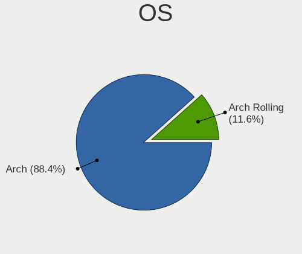

| Name         | Computers | Percent |
|--------------|-----------|---------|
| Arch         | 61        | 88.41%  |
| Arch Rolling | 8         | 11.59%  |

OS Family
---------

OS without a version

| Name | Computers | Percent |
|------|-----------|---------|
| Arch | 69        | 100%    |

Kernel
------

Version of the Linux kernel

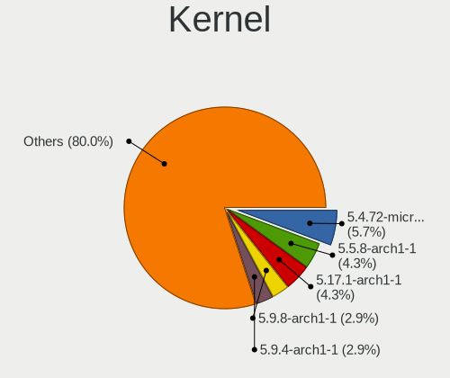

| Version                                | Computers | Percent |
|----------------------------------------|-----------|---------|
| 5.4.72-microsoft-standard-WSL2         | 4         | 5.71%   |
| 5.5.8-arch1-1                          | 3         | 4.29%   |
| 5.17.1-arch1-1                         | 3         | 4.29%   |
| 5.9.8-arch1-1                          | 2         | 2.86%   |
| 5.9.4-arch1-1                          | 2         | 2.86%   |
| 5.6.15-arch1-1                         | 2         | 2.86%   |
| 5.6.14-arch1-1                         | 2         | 2.86%   |
| 5.11.15-arch1-2                        | 2         | 2.86%   |
| 5.9.2-arch1-1                          | 1         | 1.43%   |
| 5.9.14-arch1-1                         | 1         | 1.43%   |
| 5.9.13-arch1-1                         | 1         | 1.43%   |
| 5.9.1-arch1-1                          | 1         | 1.43%   |
| 5.8.14-arch1-1                         | 1         | 1.43%   |
| 5.8.13-arch1-1                         | 1         | 1.43%   |
| 5.8.12-arch1-1                         | 1         | 1.43%   |
| 5.7.8-arch1-1                          | 1         | 1.43%   |
| 5.7.7-arch1-1                          | 1         | 1.43%   |
| 5.7.12-arch1-1                         | 1         | 1.43%   |
| 5.7.11-arch1-1                         | 1         | 1.43%   |
| 5.6.3-arch1-1                          | 1         | 1.43%   |
| 5.6.11-arch1-1                         | 1         | 1.43%   |
| 5.6.10-arch1-1                         | 1         | 1.43%   |
| 5.5.7-arch1-1                          | 1         | 1.43%   |
| 5.5.13-arch2-1                         | 1         | 1.43%   |
| 5.5.11-arch1-1                         | 1         | 1.43%   |
| 5.4.74-1-lts                           | 1         | 1.43%   |
| 5.4.5-arch1-1                          | 1         | 1.43%   |
| 5.4.20-1-lts                           | 1         | 1.43%   |
| 5.4.2-arch1-1                          | 1         | 1.43%   |
| 5.17.2-arch3-1                         | 1         | 1.43%   |
| 5.16.8-arch1-1                         | 1         | 1.43%   |
| 5.16.16-arch1-1                        | 1         | 1.43%   |
| 5.15.5-arch1-1                         | 1         | 1.43%   |
| 5.15.4-arch1-1                         | 1         | 1.43%   |
| 5.15.10-arch1-1                        | 1         | 1.43%   |
| 5.14.15-arch1-1                        | 1         | 1.43%   |
| 5.13.6-zen1-1-zen                      | 1         | 1.43%   |
| 5.12.8-arch1-1                         | 1         | 1.43%   |
| 5.12.7-arch1-1                         | 1         | 1.43%   |
| 5.12.15-arch1-1                        | 1         | 1.43%   |
| 5.12.13-arch1-2                        | 1         | 1.43%   |
| 5.12.11-arch1-1                        | 1         | 1.43%   |
| 5.12.0-rc4-1-mainline                  | 1         | 1.43%   |
| 5.11.2-arch1-1                         | 1         | 1.43%   |
| 5.11.16-arch1-1                        | 1         | 1.43%   |
| 5.11.11-arch1-1                        | 1         | 1.43%   |
| 5.11.0-rc2-next-20201223-microsoft-cbl | 1         | 1.43%   |
| 5.10.9.a-1-hardened                    | 1         | 1.43%   |
| 5.10.75-1-lts                          | 1         | 1.43%   |
| 5.10.42-1-lts                          | 1         | 1.43%   |
| 5.10.4.a-1-hardened                    | 1         | 1.43%   |
| 5.10.4-arch2-1                         | 1         | 1.43%   |
| 5.10.3-arch1-1                         | 1         | 1.43%   |
| 5.10.11-arch1-1                        | 1         | 1.43%   |
| 5.1.2-arch1-1-ARCH                     | 1         | 1.43%   |
| 4.20.5-arch1-1-ARCH                    | 1         | 1.43%   |
| 4.18.16-arch1-1-ARCH                   | 1         | 1.43%   |
| 4.10.13-1-ARCH                         | 1         | 1.43%   |

Kernel Family
-------------

Linux kernel without a distro release

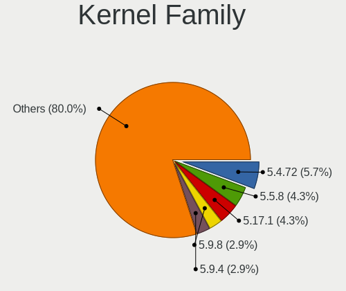

| Version | Computers | Percent |
|---------|-----------|---------|
| 5.4.72  | 4         | 5.71%   |
| 5.5.8   | 3         | 4.29%   |
| 5.17.1  | 3         | 4.29%   |
| 5.9.8   | 2         | 2.86%   |
| 5.9.4   | 2         | 2.86%   |
| 5.6.15  | 2         | 2.86%   |
| 5.6.14  | 2         | 2.86%   |
| 5.11.15 | 2         | 2.86%   |
| 5.10.4  | 2         | 2.86%   |
| 5.9.2   | 1         | 1.43%   |
| 5.9.14  | 1         | 1.43%   |
| 5.9.13  | 1         | 1.43%   |
| 5.9.1   | 1         | 1.43%   |
| 5.8.14  | 1         | 1.43%   |
| 5.8.13  | 1         | 1.43%   |
| 5.8.12  | 1         | 1.43%   |
| 5.7.8   | 1         | 1.43%   |
| 5.7.7   | 1         | 1.43%   |
| 5.7.12  | 1         | 1.43%   |
| 5.7.11  | 1         | 1.43%   |
| 5.6.3   | 1         | 1.43%   |
| 5.6.11  | 1         | 1.43%   |
| 5.6.10  | 1         | 1.43%   |
| 5.5.7   | 1         | 1.43%   |
| 5.5.13  | 1         | 1.43%   |
| 5.5.11  | 1         | 1.43%   |
| 5.4.74  | 1         | 1.43%   |
| 5.4.5   | 1         | 1.43%   |
| 5.4.20  | 1         | 1.43%   |
| 5.4.2   | 1         | 1.43%   |
| 5.17.2  | 1         | 1.43%   |
| 5.16.8  | 1         | 1.43%   |
| 5.16.16 | 1         | 1.43%   |
| 5.15.5  | 1         | 1.43%   |
| 5.15.4  | 1         | 1.43%   |
| 5.15.10 | 1         | 1.43%   |
| 5.14.15 | 1         | 1.43%   |
| 5.13.6  | 1         | 1.43%   |
| 5.12.8  | 1         | 1.43%   |
| 5.12.7  | 1         | 1.43%   |
| 5.12.15 | 1         | 1.43%   |
| 5.12.13 | 1         | 1.43%   |
| 5.12.11 | 1         | 1.43%   |
| 5.12.0  | 1         | 1.43%   |
| 5.11.2  | 1         | 1.43%   |
| 5.11.16 | 1         | 1.43%   |
| 5.11.11 | 1         | 1.43%   |
| 5.11.0  | 1         | 1.43%   |
| 5.10.9  | 1         | 1.43%   |
| 5.10.75 | 1         | 1.43%   |
| 5.10.42 | 1         | 1.43%   |
| 5.10.3  | 1         | 1.43%   |
| 5.10.11 | 1         | 1.43%   |
| 5.1.2   | 1         | 1.43%   |
| 4.20.5  | 1         | 1.43%   |
| 4.18.16 | 1         | 1.43%   |
| 4.10.13 | 1         | 1.43%   |

Kernel Major Ver.
-----------------

Linux kernel major version

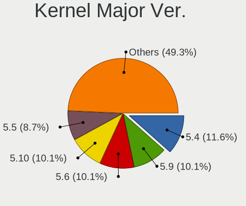

| Version | Computers | Percent |
|---------|-----------|---------|
| 5.4     | 8         | 11.59%  |
| 5.9     | 7         | 10.14%  |
| 5.6     | 7         | 10.14%  |
| 5.10    | 7         | 10.14%  |
| 5.5     | 6         | 8.7%    |
| 5.12    | 6         | 8.7%    |
| 5.11    | 6         | 8.7%    |
| 5.7     | 4         | 5.8%    |
| 5.17    | 4         | 5.8%    |
| 5.8     | 3         | 4.35%   |
| 5.15    | 3         | 4.35%   |
| 5.16    | 2         | 2.9%    |
| 5.14    | 1         | 1.45%   |
| 5.13    | 1         | 1.45%   |
| 5.1     | 1         | 1.45%   |
| 4.20    | 1         | 1.45%   |
| 4.18    | 1         | 1.45%   |
| 4.10    | 1         | 1.45%   |

Arch
----

OS architecture (x86_64, i586, etc.)

| Name   | Computers | Percent |
|--------|-----------|---------|
| x86_64 | 69        | 100%    |

DE
--

Desktop Environment

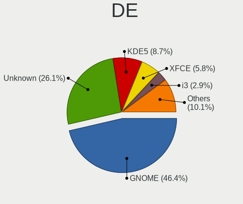

| Name       | Computers | Percent |
|------------|-----------|---------|
| GNOME      | 32        | 46.38%  |
| Unknown    | 18        | 26.09%  |
| KDE5       | 6         | 8.7%    |
| XFCE       | 4         | 5.8%    |
| KDE        | 2         | 2.9%    |
| i3         | 2         | 2.9%    |
| Budgie     | 2         | 2.9%    |
| X-Cinnamon | 1         | 1.45%   |
| MATE       | 1         | 1.45%   |
| Deepin     | 1         | 1.45%   |

Display Server
--------------

X11 or Wayland

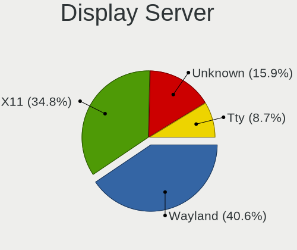

| Name    | Computers | Percent |
|---------|-----------|---------|
| Wayland | 28        | 40.58%  |
| X11     | 24        | 34.78%  |
| Unknown | 11        | 15.94%  |
| Tty     | 6         | 8.7%    |

Display Manager
---------------

SDDM, LightDM, etc.

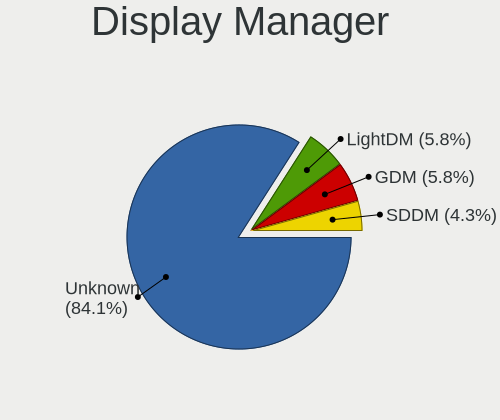

| Name    | Computers | Percent |
|---------|-----------|---------|
| Unknown | 58        | 84.06%  |
| LightDM | 4         | 5.8%    |
| GDM     | 4         | 5.8%    |
| SDDM    | 3         | 4.35%   |

OS Lang
-------

Language

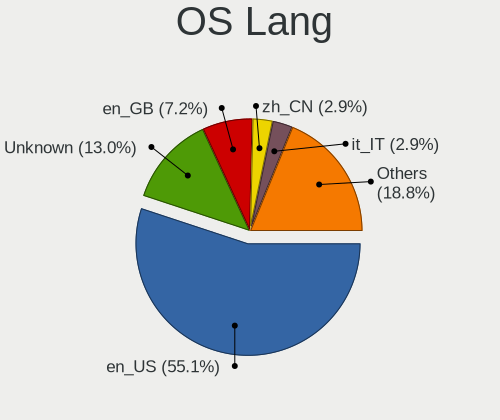

| Lang    | Computers | Percent |
|---------|-----------|---------|
| en_US   | 38        | 55.07%  |
| Unknown | 9         | 13.04%  |
| en_GB   | 5         | 7.25%   |
| zh_CN   | 2         | 2.9%    |
| it_IT   | 2         | 2.9%    |
| de_DE   | 2         | 2.9%    |
| tr_TR   | 1         | 1.45%   |
| ru_RU   | 1         | 1.45%   |
| pt_BR   | 1         | 1.45%   |
| fr_FR   | 1         | 1.45%   |
| es_PE   | 1         | 1.45%   |
| es_ES   | 1         | 1.45%   |
| en_IE   | 1         | 1.45%   |
| en_AU   | 1         | 1.45%   |
| en-US   | 1         | 1.45%   |
| de_AT   | 1         | 1.45%   |
| C       | 1         | 1.45%   |

Boot Mode
---------

EFI or BIOS

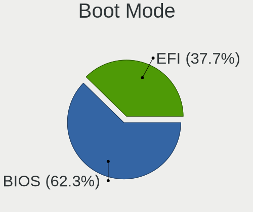

| Mode | Computers | Percent |
|------|-----------|---------|
| BIOS | 43        | 62.32%  |
| EFI  | 26        | 37.68%  |

Filesystem
----------

Type of filesystem

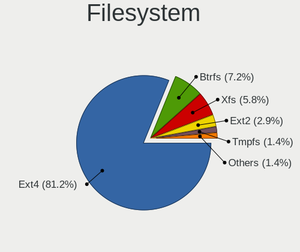

| Type    | Computers | Percent |
|---------|-----------|---------|
| Ext4    | 56        | 81.16%  |
| Btrfs   | 5         | 7.25%   |
| Xfs     | 4         | 5.8%    |
| Ext2    | 2         | 2.9%    |
| Tmpfs   | 1         | 1.45%   |
| Overlay | 1         | 1.45%   |

Part. scheme
------------

Scheme of partitioning

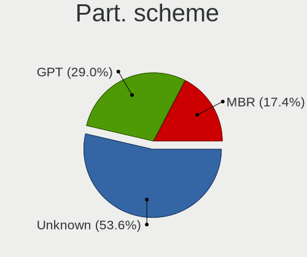

| Type    | Computers | Percent |
|---------|-----------|---------|
| Unknown | 37        | 53.62%  |
| GPT     | 20        | 28.99%  |
| MBR     | 12        | 17.39%  |

Dual Boot with Linux/BSD
------------------------

Hosting more than one Linux/BSD

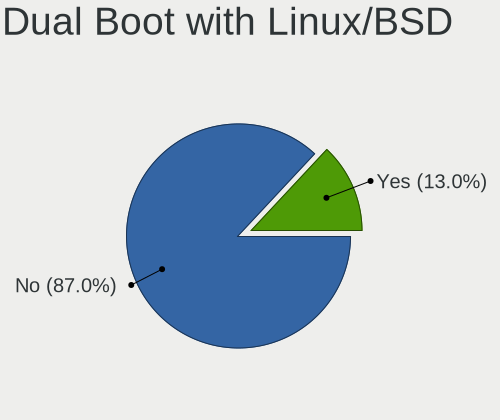

| Dual boot | Computers | Percent |
|-----------|-----------|---------|
| No        | 60        | 86.96%  |
| Yes       | 9         | 13.04%  |

Dual Boot (Win)
---------------

Hosting Linux and Windows

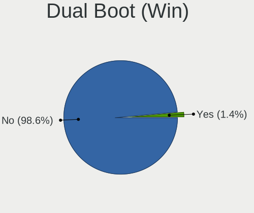

| Dual boot | Computers | Percent |
|-----------|-----------|---------|
| No        | 68        | 98.55%  |
| Yes       | 1         | 1.45%   |

Board
-----

Vendor
------

Motherboard manufacturer

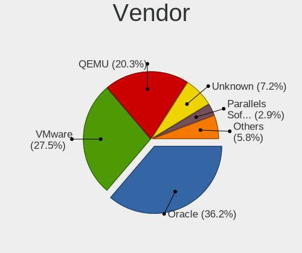

| Name                             | Computers | Percent |
|----------------------------------|-----------|---------|
| Oracle                           | 25        | 36.23%  |
| VMware                           | 19        | 27.54%  |
| QEMU                             | 14        | 20.29%  |
| Unknown                          | 5         | 7.25%   |
| Parallels Software International | 2         | 2.9%    |
| Red Hat                          | 1         | 1.45%   |
| OpenStack Foundation             | 1         | 1.45%   |
| Microsoft                        | 1         | 1.45%   |
| Hetzner                          | 1         | 1.45%   |

Model
-----

Motherboard model

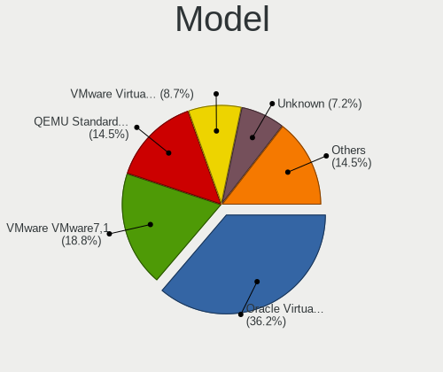

| Name                                                        | Computers | Percent |
|-------------------------------------------------------------|-----------|---------|
| Oracle VirtualBox                                           | 25        | 36.23%  |
| VMware VMware7,1                                            | 13        | 18.84%  |
| QEMU Standard PC (Q35 + ICH9, 2009)                         | 10        | 14.49%  |
| VMware Virtual Platform                                     | 6         | 8.7%    |
| Unknown                                                     | 5         | 7.25%   |
| QEMU Standard PC (i440FX + PIIX, 1996)                      | 4         | 5.8%    |
| Parallels Software International Parallels Virtual Platform | 2         | 2.9%    |
| Red Hat KVM                                                 | 1         | 1.45%   |
| OpenStack Foundation OpenStack Nova                         | 1         | 1.45%   |
| Microsoft Virtual Machine                                   | 1         | 1.45%   |
| Hetzner vServer                                             | 1         | 1.45%   |

Model Family
------------

Motherboard model prefix

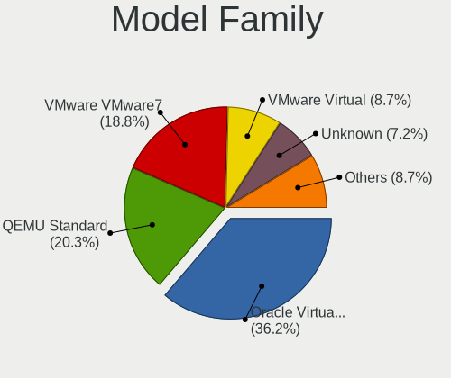

| Name                                       | Computers | Percent |
|--------------------------------------------|-----------|---------|
| Oracle VirtualBox                          | 25        | 36.23%  |
| QEMU Standard                              | 14        | 20.29%  |
| VMware VMware7                             | 13        | 18.84%  |
| VMware Virtual                             | 6         | 8.7%    |
| Unknown                                    | 5         | 7.25%   |
| Parallels Software International Parallels | 2         | 2.9%    |
| Red Hat KVM                                | 1         | 1.45%   |
| OpenStack Foundation OpenStack             | 1         | 1.45%   |
| Microsoft Virtual                          | 1         | 1.45%   |
| Hetzner vServer                            | 1         | 1.45%   |

MFG Year
--------

Motherboard manufacture year

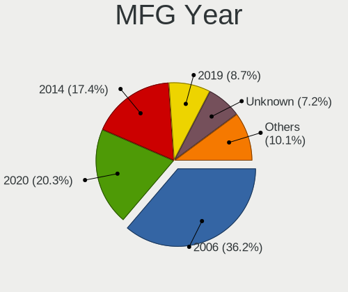

| Year    | Computers | Percent |
|---------|-----------|---------|
| 2006    | 25        | 36.23%  |
| 2020    | 14        | 20.29%  |
| 2014    | 12        | 17.39%  |
| 2019    | 6         | 8.7%    |
| Unknown | 5         | 7.25%   |
| 2015    | 4         | 5.8%    |
| 2021    | 1         | 1.45%   |
| 2018    | 1         | 1.45%   |
| 2017    | 1         | 1.45%   |

Form Factor
-----------

Physical design of the computer

| Name            | Computers | Percent |
|-----------------|-----------|---------|
| Virtual machine | 69        | 100%    |

Secure Boot
-----------

Enabled or disabled

| State    | Computers | Percent |
|----------|-----------|---------|
| Disabled | 69        | 100%    |

Coreboot
--------

Have coreboot on board

| Used | Computers | Percent |
|------|-----------|---------|
| No   | 69        | 100%    |

RAM Size
--------

Total RAM memory

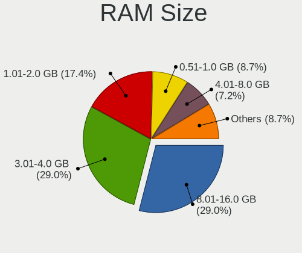

| Size in GB  | Computers | Percent |
|-------------|-----------|---------|
| 3.01-4.0    | 20        | 28.99%  |
| 8.01-16.0   | 20        | 28.99%  |
| 1.01-2.0    | 12        | 17.39%  |
| 0.51-1.0    | 6         | 8.7%    |
| 4.01-8.0    | 5         | 7.25%   |
| 16.01-24.0  | 2         | 2.9%    |
| 32.01-64.0  | 1         | 1.45%   |
| 24.01-32.0  | 1         | 1.45%   |
| 2.01-3.0    | 1         | 1.45%   |
| 64.01-256.0 | 1         | 1.45%   |

RAM Used
--------

Used RAM memory

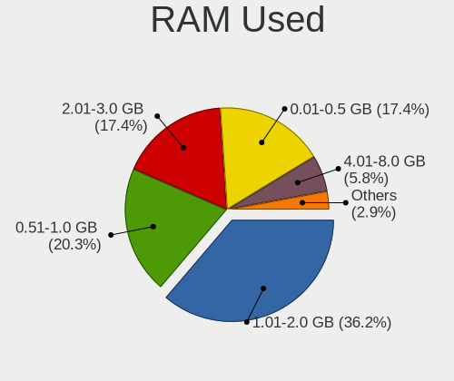

| Used GB   | Computers | Percent |
|-----------|-----------|---------|
| 1.01-2.0  | 25        | 36.23%  |
| 0.51-1.0  | 14        | 20.29%  |
| 2.01-3.0  | 12        | 17.39%  |
| 0.01-0.5  | 12        | 17.39%  |
| 4.01-8.0  | 4         | 5.8%    |
| 3.01-4.0  | 1         | 1.45%   |
| 8.01-16.0 | 1         | 1.45%   |

Total Drives
------------

Number of drives on board

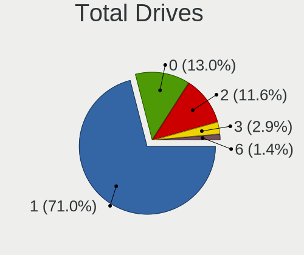

| Drives | Computers | Percent |
|--------|-----------|---------|
| 1      | 49        | 71.01%  |
| 0      | 9         | 13.04%  |
| 2      | 8         | 11.59%  |
| 3      | 2         | 2.9%    |
| 6      | 1         | 1.45%   |

Has CD-ROM
----------

Has CD-ROM on board

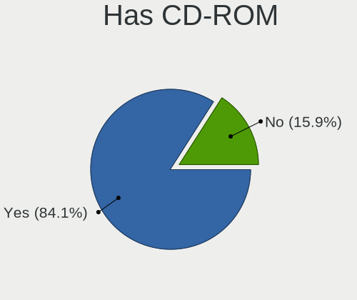

| Presented | Computers | Percent |
|-----------|-----------|---------|
| Yes       | 58        | 84.06%  |
| No        | 11        | 15.94%  |

Has Ethernet
------------

Has Ethernet on board

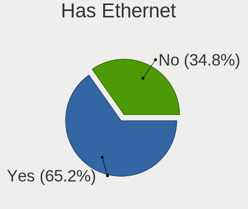

| Presented | Computers | Percent |
|-----------|-----------|---------|
| Yes       | 45        | 65.22%  |
| No        | 24        | 34.78%  |

Has WiFi
--------

Has WiFi module

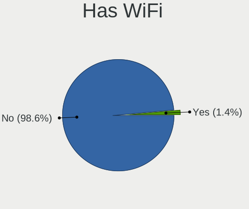

| Presented | Computers | Percent |
|-----------|-----------|---------|
| No        | 68        | 98.55%  |
| Yes       | 1         | 1.45%   |

Has Bluetooth
-------------

Has Bluetooth module

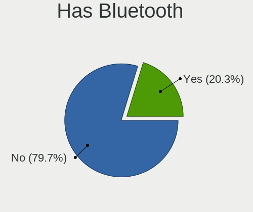

| Presented | Computers | Percent |
|-----------|-----------|---------|
| No        | 55        | 79.71%  |
| Yes       | 14        | 20.29%  |

Location
--------

Country
-------

Geographic location (country)

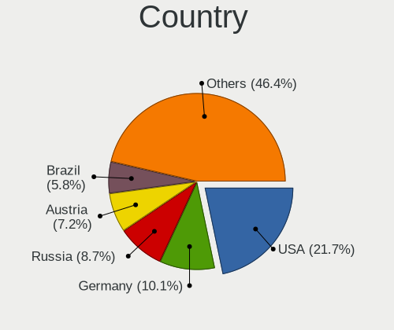

| Country      | Computers | Percent |
|--------------|-----------|---------|
| USA          | 15        | 21.74%  |
| Germany      | 7         | 10.14%  |
| Russia       | 6         | 8.7%    |
| Austria      | 5         | 7.25%   |
| Brazil       | 4         | 5.8%    |
| Turkey       | 3         | 4.35%   |
| Italy        | 3         | 4.35%   |
| China        | 3         | 4.35%   |
| Canada       | 3         | 4.35%   |
| UK           | 2         | 2.9%    |
| India        | 2         | 2.9%    |
| Vietnam      | 1         | 1.45%   |
| Ukraine      | 1         | 1.45%   |
| Sweden       | 1         | 1.45%   |
| Spain        | 1         | 1.45%   |
| South Africa | 1         | 1.45%   |
| Peru         | 1         | 1.45%   |
| Mexico       | 1         | 1.45%   |
| Japan        | 1         | 1.45%   |
| Ireland      | 1         | 1.45%   |
| Indonesia    | 1         | 1.45%   |
| Hong Kong    | 1         | 1.45%   |
| Greece       | 1         | 1.45%   |
| France       | 1         | 1.45%   |
| Egypt        | 1         | 1.45%   |
| Belgium      | 1         | 1.45%   |
| Australia    | 1         | 1.45%   |

City
----

Geographic location (city)

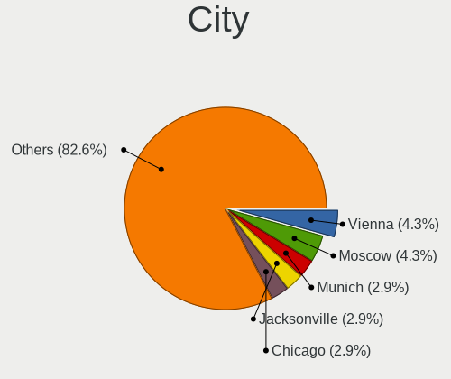

| City                  | Computers | Percent |
|-----------------------|-----------|---------|
| Vienna                | 3         | 4.35%   |
| Moscow                | 3         | 4.35%   |
| Munich                | 2         | 2.9%    |
| Jacksonville          | 2         | 2.9%    |
| Chicago               | 2         | 2.9%    |
| Yekaterinburg         | 1         | 1.45%   |
| Winter Garden         | 1         | 1.45%   |
| Victoria              | 1         | 1.45%   |
| Uppsala               | 1         | 1.45%   |
| Ulm                   | 1         | 1.45%   |
| Uberlândia         | 1         | 1.45%   |
| Tokyo                 | 1         | 1.45%   |
| Thessaloniki          | 1         | 1.45%   |
| St Louis              | 1         | 1.45%   |
| Sao Paulo             | 1         | 1.45%   |
| San Jose              | 1         | 1.45%   |
| Salzburg              | 1         | 1.45%   |
| Saint-Paul            | 1         | 1.45%   |
| Rostov-on-Don         | 1         | 1.45%   |
| Rio de Janeiro        | 1         | 1.45%   |
| Plant City            | 1         | 1.45%   |
| Parla                 | 1         | 1.45%   |
| Parker                | 1         | 1.45%   |
| Nuremberg             | 1         | 1.45%   |
| Nottingham            | 1         | 1.45%   |
| Monument              | 1         | 1.45%   |
| Minneapolis           | 1         | 1.45%   |
| Lviv                  | 1         | 1.45%   |
| Ludwigshafen am Rhein | 1         | 1.45%   |
| Lubnjow               | 1         | 1.45%   |
| Los Angeles           | 1         | 1.45%   |
| London                | 1         | 1.45%   |
| Lima                  | 1         | 1.45%   |
| Las Vegas             | 1         | 1.45%   |
| Kostroma              | 1         | 1.45%   |
| Kolkata               | 1         | 1.45%   |
| Johannesburg          | 1         | 1.45%   |
| Jinan                 | 1         | 1.45%   |
| Jakarta               | 1         | 1.45%   |
| Indio                 | 1         | 1.45%   |
| Indianapolis          | 1         | 1.45%   |
| Ho Chi Minh City      | 1         | 1.45%   |
| Guangzhou             | 1         | 1.45%   |
| Graz                  | 1         | 1.45%   |
| Gimigliano            | 1         | 1.45%   |
| Ghent                 | 1         | 1.45%   |
| Gütersloh          | 1         | 1.45%   |
| Dublin                | 1         | 1.45%   |
| Coatzacoalcos         | 1         | 1.45%   |
| Champanges            | 1         | 1.45%   |
| Central               | 1         | 1.45%   |
| Cairo                 | 1         | 1.45%   |
| Brescia               | 1         | 1.45%   |
| Bengaluru             | 1         | 1.45%   |
| Beijing               | 1         | 1.45%   |
| Beauharnois           | 1         | 1.45%   |
| Bakirkoey             | 1         | 1.45%   |
| Ä°zmit              | 1         | 1.45%   |
| Ankara                | 1         | 1.45%   |
| Anápolis           | 1         | 1.45%   |

Drives
------

Drive Vendor
------------

Hard drive vendors

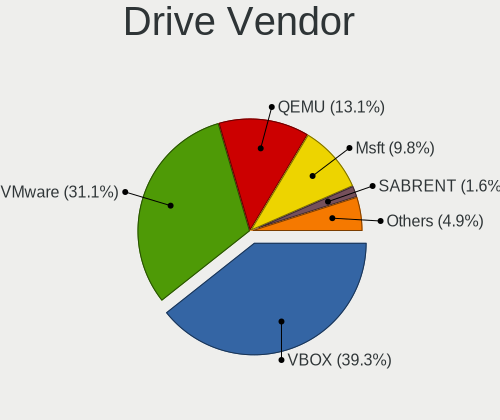

| Vendor                 | Computers | Drives | Percent |
|------------------------|-----------|--------|---------|
| VBOX                   | 24        | 30     | 39.34%  |
| VMware                 | 19        | 20     | 31.15%  |
| QEMU                   | 8         | 12     | 13.11%  |
| Msft                   | 6         | 12     | 9.84%   |
| SABRENT                | 1         | 1      | 1.64%   |
| InnoTek Systemberatung | 1         | 1      | 1.64%   |
| Arch-0                 | 1         | 1      | 1.64%   |
| Arch                   | 1         | 1      | 1.64%   |

Drive Model
-----------

Hard drive models

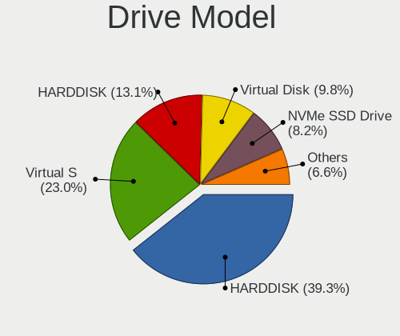

| Model                                     | Computers | Percent |
|-------------------------------------------|-----------|---------|
| VBOX HARDDISK                             | 24        | 39.34%  |
| VMware Virtual S                          | 14        | 22.95%  |
| QEMU HARDDISK                             | 8         | 13.11%  |
| Msft Virtual Disk                         | 6         | 9.84%   |
| VMware NVMe SSD Drive                     | 5         | 8.2%    |
| SABRENT Disk 128GB                        | 1         | 1.64%   |
| InnoTek Systemberatung NVMe SSD Drive 2TB | 1         | 1.64%   |
| Arch-0 SSD 10GB                           | 1         | 1.64%   |
| Arch Linux-0 SSD 69GB                     | 1         | 1.64%   |

HDD Vendor
----------

Hard disk drive vendors

| Vendor  | Computers | Drives | Percent |
|---------|-----------|--------|---------|
| VBOX    | 24        | 30     | 41.38%  |
| VMware  | 19        | 20     | 32.76%  |
| QEMU    | 8         | 12     | 13.79%  |
| Msft    | 6         | 12     | 10.34%  |
| SABRENT | 1         | 1      | 1.72%   |

SSD Vendor
----------

Solid state drive vendors

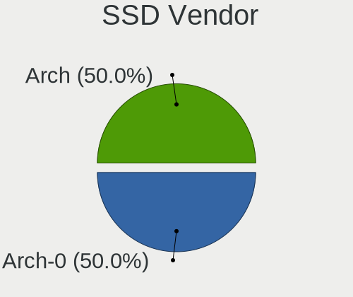

| Vendor | Computers | Drives | Percent |
|--------|-----------|--------|---------|
| Arch-0 | 1         | 1      | 50%     |
| Arch   | 1         | 1      | 50%     |

Drive Kind
----------

HDD or SSD

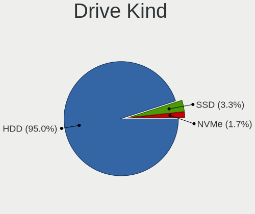

| Kind | Computers | Drives | Percent |
|------|-----------|--------|---------|
| HDD  | 57        | 75     | 95%     |
| SSD  | 2         | 2      | 3.33%   |
| NVMe | 1         | 1      | 1.67%   |

Drive Connector
---------------

SATA, SAS, NVMe, etc.

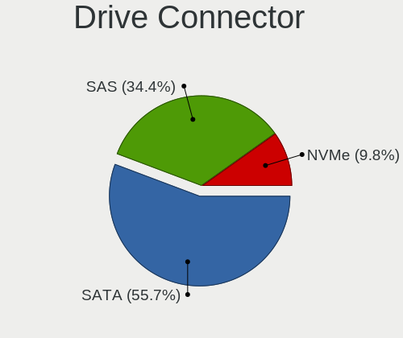

| Type | Computers | Drives | Percent |
|------|-----------|--------|---------|
| SATA | 34        | 44     | 55.74%  |
| SAS  | 21        | 28     | 34.43%  |
| NVMe | 6         | 6      | 9.84%   |

Drive Size
----------

Size of hard drive

| Size in TB | Computers | Drives | Percent |
|------------|-----------|--------|---------|
| 0.01-0.5   | 59        | 77     | 100%    |

Space Total
-----------

Amount of disk space available on the file system

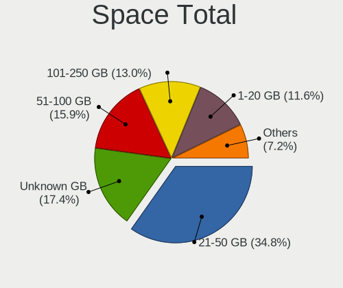

| Size in GB     | Computers | Percent |
|----------------|-----------|---------|
| 21-50          | 24        | 34.78%  |
| Unknown        | 12        | 17.39%  |
| 51-100         | 11        | 15.94%  |
| 101-250        | 9         | 13.04%  |
| 1-20           | 8         | 11.59%  |
| 251-500        | 3         | 4.35%   |
| More than 3000 | 1         | 1.45%   |
| 2001-3000      | 1         | 1.45%   |

Space Used
----------

Amount of used disk space

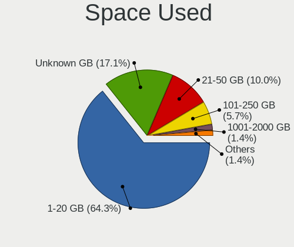

| Used GB   | Computers | Percent |
|-----------|-----------|---------|
| 1-20      | 45        | 64.29%  |
| Unknown   | 12        | 17.14%  |
| 21-50     | 7         | 10%     |
| 101-250   | 4         | 5.71%   |
| 1001-2000 | 1         | 1.43%   |
| 51-100    | 1         | 1.43%   |

Malfunc. Drives
---------------

Drive models with a malfunction

Zero info for selected period =(

Malfunc. Drive Vendor
---------------------

Vendors of faulty drives

Zero info for selected period =(

Malfunc. HDD Vendor
-------------------

Vendors of faulty HDD drives

Zero info for selected period =(

Malfunc. Drive Kind
-------------------

Kinds of faulty drives

Zero info for selected period =(

Failed Drives
-------------

Failed drive models

Zero info for selected period =(

Failed Drive Vendor
-------------------

Failed drive vendors

Zero info for selected period =(

Drive Status
------------

Number of failed and malfunc. drives

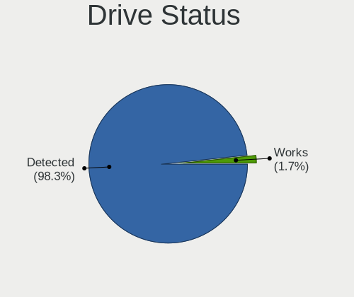

| Status   | Computers | Drives | Percent |
|----------|-----------|--------|---------|
| Detected | 59        | 75     | 98.33%  |
| Works    | 1         | 3      | 1.67%   |

Storage controller
------------------

Storage Vendor
--------------

Storage controller vendors

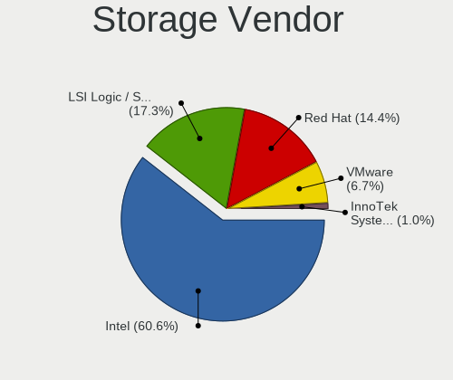

| Vendor                    | Computers | Percent |
|---------------------------|-----------|---------|
| Intel                     | 63        | 60.58%  |
| LSI Logic / Symbios Logic | 18        | 17.31%  |
| Red Hat                   | 15        | 14.42%  |
| VMware                    | 7         | 6.73%   |
| InnoTek Systemberatung    | 1         | 0.96%   |

Storage Model
-------------

Storage controller models

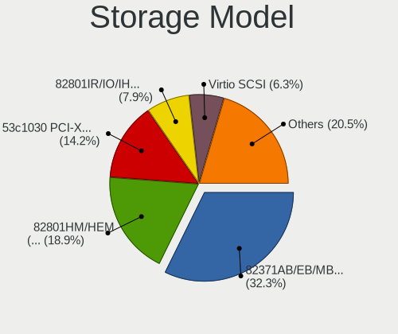

| Model                                                                 | Computers | Percent |
|-----------------------------------------------------------------------|-----------|---------|
| Intel 82371AB/EB/MB PIIX4 IDE                                         | 41        | 32.28%  |
| Intel 82801HM/HEM (ICH8M/ICH8M-E) SATA Controller [AHCI mode]         | 24        | 18.9%   |
| LSI Logic / Symbios Logic 53c1030 PCI-X Fusion-MPT Dual Ultra320 SCSI | 18        | 14.17%  |
| Intel 82801IR/IO/IH (ICH9R/DO/DH) 6 port SATA Controller [AHCI mode]  | 10        | 7.87%   |
| Red Hat Virtio SCSI                                                   | 8         | 6.3%    |
| Intel 82371SB PIIX3 IDE [Natoma/Triton II]                            | 7         | 5.51%   |
| Red Hat Virtio block device                                           | 6         | 4.72%   |
| VMware NVMe SSD Controller                                            | 5         | 3.94%   |
| Red Hat Virtio filesystem                                             | 2         | 1.57%   |
| Intel 82801BA IDE U100 Controller                                     | 2         | 1.57%   |
| VMware SATA AHCI controller                                           | 1         | 0.79%   |
| VMware PVSCSI SCSI Controller                                         | 1         | 0.79%   |
| Intel 82801HR/HO/HH (ICH8R/DO/DH) 6 port SATA Controller [AHCI mode]  | 1         | 0.79%   |
| InnoTek Systemberatung Non-Volatile memory controller                 | 1         | 0.79%   |

Storage Kind
------------

Kind of storage controller (IDE, SATA, NVMe, SAS, ...)

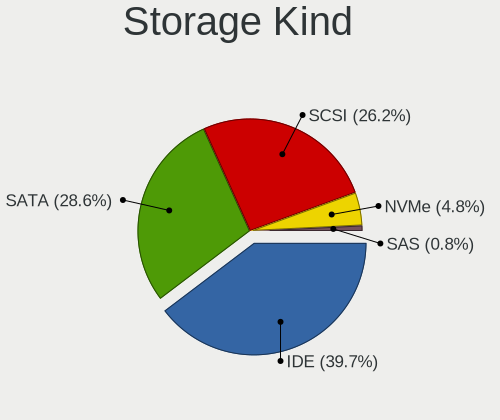

| Kind | Computers | Percent |
|------|-----------|---------|
| IDE  | 50        | 39.68%  |
| SATA | 36        | 28.57%  |
| SCSI | 33        | 26.19%  |
| NVMe | 6         | 4.76%   |
| SAS  | 1         | 0.79%   |

Processor
---------

CPU Vendor
----------

Processor vendors

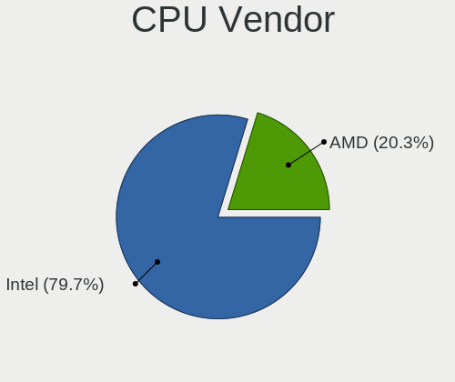

| Vendor | Computers | Percent |
|--------|-----------|---------|
| Intel  | 55        | 79.71%  |
| AMD    | 14        | 20.29%  |

CPU Model
---------

Processor models

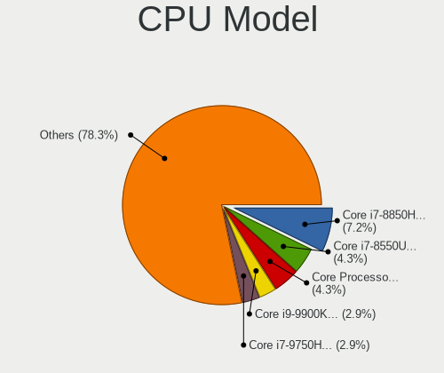

| Model                                          | Computers | Percent |
|------------------------------------------------|-----------|---------|
| Intel Core i7-8850H CPU @ 2.60GHz              | 5         | 7.25%   |
| Intel Core Processor (Skylake, IBRS)           | 3         | 4.35%   |
| Intel Core i7-8550U CPU @ 1.80GHz              | 3         | 4.35%   |
| Intel Core i9-9900K CPU @ 3.60GHz              | 2         | 2.9%    |
| Intel Core i7-9750H CPU @ 2.60GHz              | 2         | 2.9%    |
| Intel Core i7-8700 CPU @ 3.20GHz               | 2         | 2.9%    |
| Intel Core i7-6700 CPU @ 3.40GHz               | 2         | 2.9%    |
| Intel Core i5-4570 CPU @ 3.20GHz               | 2         | 2.9%    |
| AMD Ryzen 5 3600 6-Core Processor              | 2         | 2.9%    |
| AMD EPYC Processor (with IBPB)                 | 2         | 2.9%    |
| Intel Xeon E312xx (Sandy Bridge)               | 1         | 1.45%   |
| Intel Xeon CPU E5-2690 v3 @ 2.60GHz            | 1         | 1.45%   |
| Intel Xeon CPU E5-2630 v3 @ 2.40GHz            | 1         | 1.45%   |
| Intel Core Processor (Haswell, no TSX)         | 1         | 1.45%   |
| Intel Core i9-9880H CPU @ 2.30GHz              | 1         | 1.45%   |
| Intel Core i7-9850H CPU @ 2.60GHz              | 1         | 1.45%   |
| Intel Core i7-8750H CPU @ 2.20GHz              | 1         | 1.45%   |
| Intel Core i7-8565U CPU @ 1.80GHz              | 1         | 1.45%   |
| Intel Core i7-7700K CPU @ 4.20GHz              | 1         | 1.45%   |
| Intel Core i7-7700HQ CPU @ 2.80GHz             | 1         | 1.45%   |
| Intel Core i7-7700 CPU @ 3.60GHz               | 1         | 1.45%   |
| Intel Core i7-7500U CPU @ 2.70GHz              | 1         | 1.45%   |
| Intel Core i7-6700K CPU @ 4.00GHz              | 1         | 1.45%   |
| Intel Core i7-6700HQ CPU @ 2.60GHz             | 1         | 1.45%   |
| Intel Core i7-5820K CPU @ 3.30GHz              | 1         | 1.45%   |
| Intel Core i7-4510U CPU @ 2.00GHz              | 1         | 1.45%   |
| Intel Core i7-3615QM CPU @ 2.30GHz             | 1         | 1.45%   |
| Intel Core i7-2600 CPU @ 3.40GHz               | 1         | 1.45%   |
| Intel Core i7-10850H CPU @ 2.70GHz             | 1         | 1.45%   |
| Intel Core i7-10750H CPU @ 2.60GHz             | 1         | 1.45%   |
| Intel Core i7-1065G7 CPU @ 1.30GHz             | 1         | 1.45%   |
| Intel Core i7-10510U CPU @ 1.80GHz             | 1         | 1.45%   |
| Intel Core i5-9400F CPU @ 2.90GHz              | 1         | 1.45%   |
| Intel Core i5-8600K CPU @ 3.60GHz              | 1         | 1.45%   |
| Intel Core i5-8350U CPU @ 1.70GHz              | 1         | 1.45%   |
| Intel Core i5-7600 CPU @ 3.50GHz               | 1         | 1.45%   |
| Intel Core i5-6500 CPU @ 3.20GHz               | 1         | 1.45%   |
| Intel Core i5-6300HQ CPU @ 2.30GHz             | 1         | 1.45%   |
| Intel Core i5-6200U CPU @ 2.30GHz              | 1         | 1.45%   |
| Intel Core i5-4278U CPU @ 2.60GHz              | 1         | 1.45%   |
| Intel Core i5-10210U CPU @ 1.60GHz             | 1         | 1.45%   |
| Intel Core i5 CPU M 520 @ 2.40GHz              | 1         | 1.45%   |
| Intel Core i3-4340 CPU @ 3.60GHz               | 1         | 1.45%   |
| Intel Common KVM processor                     | 1         | 1.45%   |
| AMD Ryzen Threadripper 1950X 16-Core Processor | 1         | 1.45%   |
| AMD Ryzen 9 5900X 12-Core Processor            | 1         | 1.45%   |
| AMD Ryzen 9 3900X 12-Core Processor            | 1         | 1.45%   |
| AMD Ryzen 7 3700X 8-Core Processor             | 1         | 1.45%   |
| AMD Ryzen 5 5600X 6-Core Processor             | 1         | 1.45%   |
| AMD Ryzen 5 3500X 6-Core Processor             | 1         | 1.45%   |
| AMD Ryzen 5 3500U with Radeon Vega Mobile Gfx  | 1         | 1.45%   |
| AMD Ryzen 3 4300U with Radeon Graphics         | 1         | 1.45%   |
| AMD EPYC 7542 32-Core Processor                | 1         | 1.45%   |
| AMD A6-5200 APU with Radeon HD Graphics        | 1         | 1.45%   |

CPU Model Family
----------------

Processor model prefix

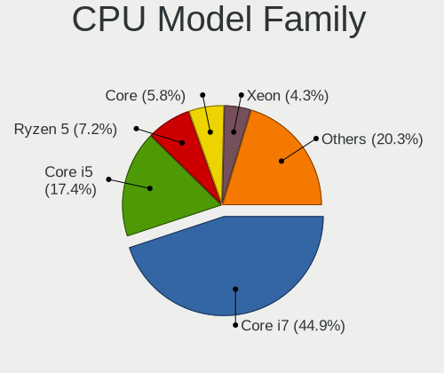

| Model                  | Computers | Percent |
|------------------------|-----------|---------|
| Intel Core i7          | 31        | 44.93%  |
| Intel Core i5          | 12        | 17.39%  |
| AMD Ryzen 5            | 5         | 7.25%   |
| Intel Core             | 4         | 5.8%    |
| Intel Xeon             | 3         | 4.35%   |
| Intel Core i9          | 3         | 4.35%   |
| AMD EPYC               | 3         | 4.35%   |
| AMD Ryzen 9            | 2         | 2.9%    |
| Other                  | 1         | 1.45%   |
| Intel Core i3          | 1         | 1.45%   |
| AMD Ryzen Threadripper | 1         | 1.45%   |
| AMD Ryzen 7            | 1         | 1.45%   |
| AMD Ryzen 3            | 1         | 1.45%   |
| AMD A6                 | 1         | 1.45%   |

CPU Cores
---------

Number of processor cores

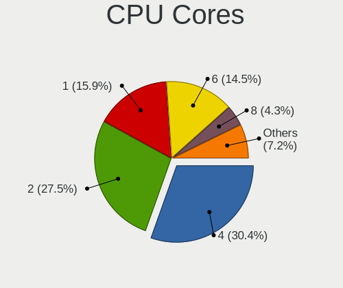

| Number | Computers | Percent |
|--------|-----------|---------|
| 4      | 21        | 30.43%  |
| 2      | 19        | 27.54%  |
| 1      | 11        | 15.94%  |
| 6      | 10        | 14.49%  |
| 8      | 3         | 4.35%   |
| 3      | 2         | 2.9%    |
| 16     | 1         | 1.45%   |
| 12     | 1         | 1.45%   |
| 10     | 1         | 1.45%   |

CPU Sockets
-----------

Number of sockets

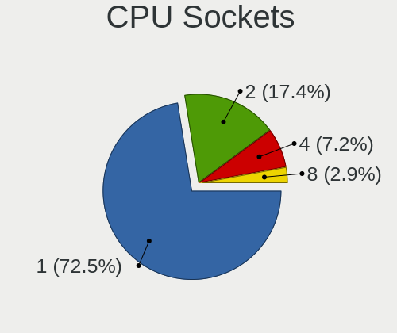

| Number | Computers | Percent |
|--------|-----------|---------|
| 1      | 50        | 72.46%  |
| 2      | 12        | 17.39%  |
| 4      | 5         | 7.25%   |
| 8      | 2         | 2.9%    |

CPU Threads
-----------

Threads per core (Hyper-Threading)

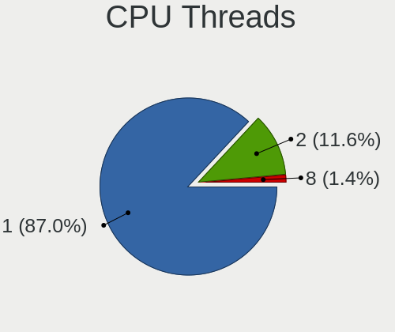

| Number | Computers | Percent |
|--------|-----------|---------|
| 1      | 60        | 86.96%  |
| 2      | 8         | 11.59%  |
| 8      | 1         | 1.45%   |

CPU Op-Modes
------------

CPU Operation Modes (32-bit, 64-bit)

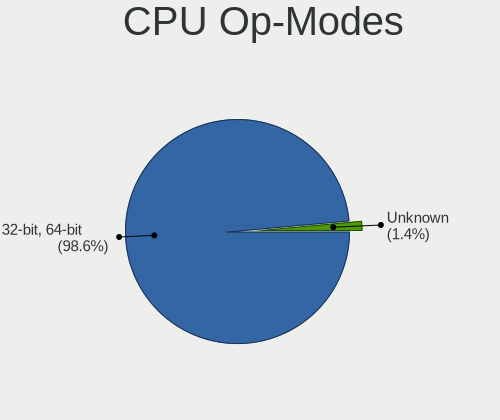

| Op mode        | Computers | Percent |
|----------------|-----------|---------|
| 32-bit, 64-bit | 68        | 98.55%  |
| Unknown        | 1         | 1.45%   |

CPU Microcode
-------------

Microcode number

| Number  | Computers | Percent |
|---------|-----------|---------|
| Unknown | 69        | 100%    |

CPU Microarch
-------------

Microarchitecture

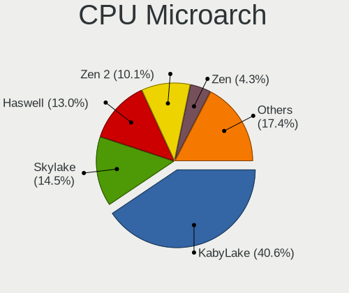

| Name        | Computers | Percent |
|-------------|-----------|---------|
| KabyLake    | 28        | 40.58%  |
| Skylake     | 10        | 14.49%  |
| Haswell     | 9         | 13.04%  |
| Zen 2       | 7         | 10.14%  |
| Zen         | 3         | 4.35%   |
| Zen 3       | 2         | 2.9%    |
| SandyBridge | 2         | 2.9%    |
| CometLake   | 2         | 2.9%    |
| Zen+        | 1         | 1.45%   |
| Westmere    | 1         | 1.45%   |
| NetBurst    | 1         | 1.45%   |
| Jaguar      | 1         | 1.45%   |
| IvyBridge   | 1         | 1.45%   |
| IceLake     | 1         | 1.45%   |

Graphics
--------

GPU Vendor
----------

Vendors of graphics cards

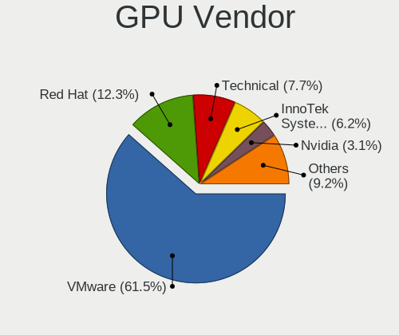

| Vendor                 | Computers | Percent |
|------------------------|-----------|---------|
| VMware                 | 40        | 61.54%  |
| Red Hat                | 8         | 12.31%  |
| Technical              | 5         | 7.69%   |
| InnoTek Systemberatung | 4         | 6.15%   |
| Nvidia                 | 2         | 3.08%   |
| Microsoft              | 2         | 3.08%   |
| Cirrus Logic           | 2         | 3.08%   |
| Parallels              | 1         | 1.54%   |
| AMD                    | 1         | 1.54%   |

GPU Model
---------

Graphics card models

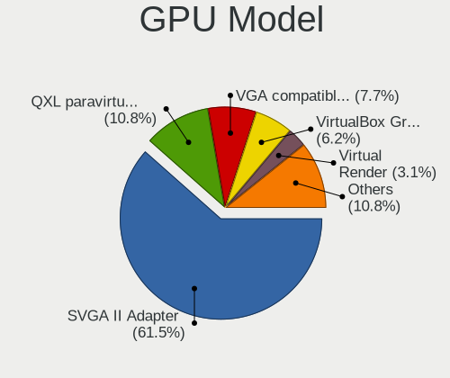

| Model                                              | Computers | Percent |
|----------------------------------------------------|-----------|---------|
| VMware SVGA II Adapter                             | 40        | 61.54%  |
| Red Hat QXL paravirtual graphic card               | 7         | 10.77%  |
| Technical VGA compatible controller                | 5         | 7.69%   |
| InnoTek Systemberatung VirtualBox Graphics Adapter | 4         | 6.15%   |
| Microsoft Virtual Render                           | 2         | 3.08%   |
| Cirrus Logic GD 5446                               | 2         | 3.08%   |
| Red Hat Virtio GPU                                 | 1         | 1.54%   |
| Parallels Accelerated Virtual Video Adapter        | 1         | 1.54%   |
| Nvidia GP107GL [Quadro P400]                       | 1         | 1.54%   |
| Nvidia GP104 [GeForce GTX 1070]                    | 1         | 1.54%   |
| AMD Vega 10 XL/XT [Radeon RX Vega 56/64]           | 1         | 1.54%   |

GPU Combo
---------

Combinations of graphics cards

| Name                       | Computers | Percent |
|----------------------------|-----------|---------|
| 1 x VMware                 | 40        | 57.97%  |
| Other                      | 9         | 13.04%  |
| 1 x Red Hat                | 8         | 11.59%  |
| 1 x InnoTek Systemberatung | 4         | 5.8%    |
| 1 x Nvidia                 | 2         | 2.9%    |
| 1 x Microsoft              | 2         | 2.9%    |
| 1 x Cirrus Logic           | 2         | 2.9%    |
| 1 x Parallels              | 1         | 1.45%   |
| 1 x AMD                    | 1         | 1.45%   |

GPU Driver
----------

Free vs proprietary

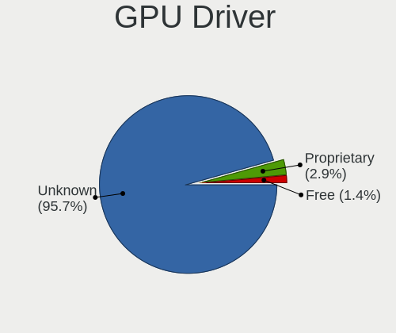

| Driver      | Computers | Percent |
|-------------|-----------|---------|
| Unknown     | 66        | 95.65%  |
| Proprietary | 2         | 2.9%    |
| Free        | 1         | 1.45%   |

GPU Memory
----------

Total video memory

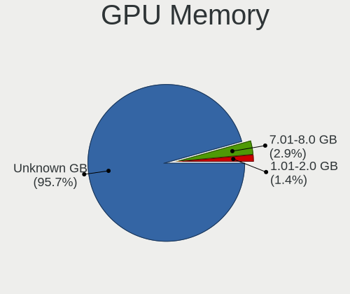

| Size in GB | Computers | Percent |
|------------|-----------|---------|
| Unknown    | 66        | 95.65%  |
| 7.01-8.0   | 2         | 2.9%    |
| 1.01-2.0   | 1         | 1.45%   |

Monitor
-------

Monitor Vendor
--------------

Monitor vendors

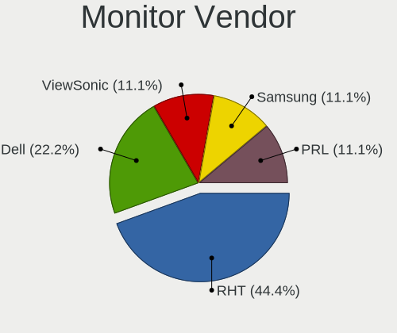

| Vendor              | Computers | Percent |
|---------------------|-----------|---------|
| RHT                 | 4         | 44.44%  |
| Dell                | 2         | 22.22%  |
| ViewSonic           | 1         | 11.11%  |
| Samsung Electronics | 1         | 11.11%  |
| PRL                 | 1         | 11.11%  |

Monitor Model
-------------

Monitor models

| Model                                                         | Computers | Percent |
|---------------------------------------------------------------|-----------|---------|
| RHT QEMU Monitor RHT1234 2048x1152 260x195mm 12.8-inch        | 4         | 40%     |
| ViewSonic VX2451 SERIES VSC2528 1920x1080 521x293mm 23.5-inch | 1         | 10%     |
| Samsung Electronics LCD Monitor U28E590 3840x2160             | 1         | 10%     |
| PRL Parallels Vu PRL4006 1400x1050                            | 1         | 10%     |
| Dell S2218H DELD0B8 1920x1080 480x270mm 21.7-inch             | 1         | 10%     |
| Dell P2715Q DEL40BD 3840x2160 597x336mm 27.0-inch             | 1         | 10%     |
| Dell P2219H DELA114 1920x1080 480x270mm 21.7-inch             | 1         | 10%     |

Monitor Resolution
------------------

Monitor screen resolution

| Resolution      | Computers | Percent |
|-----------------|-----------|---------|
| 2048x1152       | 4         | 44.44%  |
| 3840x2160 (4K)  | 2         | 22.22%  |
| 1920x1080 (FHD) | 2         | 22.22%  |
| 1400x1050       | 1         | 11.11%  |

Monitor Diagonal
----------------

Diagonal size in inches

| Inches  | Computers | Percent |
|---------|-----------|---------|
| 19      | 4         | 44.44%  |
| Unknown | 2         | 22.22%  |
| 27      | 1         | 11.11%  |
| 23      | 1         | 11.11%  |
| 21      | 1         | 11.11%  |

Monitor Width
-------------

Physical width

| Width in mm | Computers | Percent |
|-------------|-----------|---------|
| 401-500     | 5         | 62.5%   |
| Unknown     | 2         | 25%     |
| 501-600     | 1         | 12.5%   |

Aspect Ratio
------------

Proportional relationship between the width and the height

| Ratio   | Computers | Percent |
|---------|-----------|---------|
| 4/3     | 5         | 62.5%   |
| 16/9    | 2         | 25%     |
| Unknown | 1         | 12.5%   |

Monitor Area
------------

Area in inch²

| Area in inch² | Computers | Percent |
|----------------|-----------|---------|
| 151-200        | 4         | 44.44%  |
| 201-250        | 2         | 22.22%  |
| Unknown        | 2         | 22.22%  |
| 301-350        | 1         | 11.11%  |

Pixel Density
-------------

Pixels per inch

| Density | Computers | Percent |
|---------|-----------|---------|
| 101-120 | 5         | 55.56%  |
| Unknown | 2         | 22.22%  |
| 161-240 | 1         | 11.11%  |
| 51-100  | 1         | 11.11%  |

Multiple Monitors
-----------------

Total monitors connected

| Total | Computers | Percent |
|-------|-----------|---------|
| 0     | 38        | 55.07%  |
| 1     | 29        | 42.03%  |
| 2     | 2         | 2.9%    |

Network
-------

Net Controller Vendor
---------------------

Controller vendors

| Vendor                        | Computers | Percent |
|-------------------------------|-----------|---------|
| Intel                         | 43        | 64.18%  |
| Red Hat                       | 19        | 28.36%  |
| Realtek Semiconductor         | 2         | 2.99%   |
| VMware                        | 1         | 1.49%   |
| OnePlus Technology (Shenzhen) | 1         | 1.49%   |
| Fibocom                       | 1         | 1.49%   |

Net Controller Model
--------------------

Controller models

| Model                                                 | Computers | Percent |
|-------------------------------------------------------|-----------|---------|
| Intel 82540EM Gigabit Ethernet Controller             | 24        | 35.82%  |
| Red Hat Virtio network device                         | 19        | 28.36%  |
| Intel 82545EM Gigabit Ethernet Controller (Copper)    | 18        | 26.87%  |
| Realtek RTL-8100/8101L/8139 PCI Fast Ethernet Adapter | 2         | 2.99%   |
| VMware VMXNET3 Ethernet Controller                    | 1         | 1.49%   |
| OnePlus (Shenzhen) IN2013                             | 1         | 1.49%   |
| Intel Wi-Fi 6 AX200                                   | 1         | 1.49%   |
| Fibocom MBIM + 3 CDC-ACM                              | 1         | 1.49%   |

Wireless Vendor
---------------

Wireless vendors

| Vendor | Computers | Percent |
|--------|-----------|---------|
| Intel  | 1         | 100%    |

Wireless Model
--------------

Wireless models

| Model               | Computers | Percent |
|---------------------|-----------|---------|
| Intel Wi-Fi 6 AX200 | 1         | 100%    |

Ethernet Vendor
---------------

Ethernet vendors

| Vendor                        | Computers | Percent |
|-------------------------------|-----------|---------|
| Intel                         | 42        | 91.3%   |
| Realtek Semiconductor         | 2         | 4.35%   |
| VMware                        | 1         | 2.17%   |
| OnePlus Technology (Shenzhen) | 1         | 2.17%   |

Ethernet Model
--------------

Ethernet models

| Model                                                 | Computers | Percent |
|-------------------------------------------------------|-----------|---------|
| Intel 82540EM Gigabit Ethernet Controller             | 24        | 52.17%  |
| Intel 82545EM Gigabit Ethernet Controller (Copper)    | 18        | 39.13%  |
| Realtek RTL-8100/8101L/8139 PCI Fast Ethernet Adapter | 2         | 4.35%   |
| VMware VMXNET3 Ethernet Controller                    | 1         | 2.17%   |
| OnePlus (Shenzhen) IN2013                             | 1         | 2.17%   |

Net Controller Kind
-------------------

Ethernet, WiFi or modem

| Kind     | Computers | Percent |
|----------|-----------|---------|
| Ethernet | 45        | 69.23%  |
| Unknown  | 19        | 29.23%  |
| WiFi     | 1         | 1.54%   |

Used Controller
---------------

Currently used network controller

| Kind     | Computers | Percent |
|----------|-----------|---------|
| Ethernet | 45        | 97.83%  |
| WiFi     | 1         | 2.17%   |

NICs
----

Total network controllers on board

| Total | Computers | Percent |
|-------|-----------|---------|
| 1     | 44        | 63.77%  |
| 0     | 23        | 33.33%  |
| 2     | 2         | 2.9%    |

IPv6
----

IPv6 vs IPv4

| Used | Computers | Percent |
|------|-----------|---------|
| No   | 68        | 98.55%  |
| Yes  | 1         | 1.45%   |

Bluetooth
---------

Bluetooth Vendor
----------------

Controller vendors

| Vendor  | Computers | Percent |
|---------|-----------|---------|
| VMware  | 11        | 78.57%  |
| Intel   | 2         | 14.29%  |
| TP-Link | 1         | 7.14%   |

Bluetooth Model
---------------

Controller models

| Model                            | Computers | Percent |
|----------------------------------|-----------|---------|
| VMware Virtual Bluetooth Adapter | 11        | 78.57%  |
| TP-Link UB500 Adapter            | 1         | 7.14%   |
| Intel Bluetooth Device           | 1         | 7.14%   |
| Intel AX200 Bluetooth            | 1         | 7.14%   |

Sound
-----

Sound Vendor
------------

Sound card vendors

| Vendor                | Computers | Percent |
|-----------------------|-----------|---------|
| Intel                 | 38        | 62.3%   |
| Ensoniq               | 19        | 31.15%  |
| Nvidia                | 2         | 3.28%   |
| Realtek Semiconductor | 1         | 1.64%   |
| AMD                   | 1         | 1.64%   |

Sound Model
-----------

Sound card models

| Model                                                                      | Computers | Percent |
|----------------------------------------------------------------------------|-----------|---------|
| Intel 82801AA AC'97 Audio Controller                                       | 22        | 36.07%  |
| Ensoniq ES1371/ES1373 / Creative Labs CT2518                               | 19        | 31.15%  |
| Intel 82801I (ICH9 Family) HD Audio Controller                             | 8         | 13.11%  |
| Intel 82801FB/FBM/FR/FW/FRW (ICH6 Family) High Definition Audio Controller | 6         | 9.84%   |
| Intel 82801BA/BAM AC'97 Audio Controller                                   | 2         | 3.28%   |
| Realtek Semiconductor Realtek Audio USB                                    | 1         | 1.64%   |
| Nvidia GP107GL High Definition Audio Controller                            | 1         | 1.64%   |
| Nvidia GP104 High Definition Audio Controller                              | 1         | 1.64%   |
| AMD Vega 10 HDMI Audio [Radeon Vega 56/64]                                 | 1         | 1.64%   |

Memory
------

Memory Vendor
-------------

Memory module vendors

| Vendor             | Computers | Percent |
|--------------------|-----------|---------|
| QEMU               | 11        | 47.83%  |
| VMware Virtual RAM | 7         | 30.43%  |
| Unknown            | 2         | 8.7%    |
| Unknown            | 2         | 8.7%    |
| Microsoft          | 1         | 4.35%   |

Memory Model
------------

Memory module models

| Model                                             | Computers | Percent |
|---------------------------------------------------|-----------|---------|
| VMware Virtual RAM RAM VMW-4096MB 4GB DIMM DRAM   | 3         | 12%     |
| VMware Virtual RAM RAM VMW-8192MB 8GB DIMM DRAM   | 2         | 8%      |
| VMware Virtual RAM RAM VMW-2048MB 2GB DIMM DRAM   | 2         | 8%      |
| QEMU RAM Module 4000MB DIMM RAM                   | 2         | 8%      |
| QEMU RAM Module 1GB DIMM RAM                      | 2         | 8%      |
| Unknown                                           | 2         | 8%      |
| VMware Virtual RAM RAM VMW-16384MB 16GB DIMM DRAM | 1         | 4%      |
| Unknown RAM Module 2048MB SODIMM DRAM 667MT/s     | 1         | 4%      |
| Unknown RAM Module 2048MB DIMM DRAM               | 1         | 4%      |
| QEMU RAM Module 8192MB DIMM RAM                   | 1         | 4%      |
| QEMU RAM Module 4GB DIMM RAM                      | 1         | 4%      |
| QEMU RAM Module 2GB DIMM RAM                      | 1         | 4%      |
| QEMU RAM Module 2095MB DIMM RAM                   | 1         | 4%      |
| QEMU RAM Module 2000MB DIMM RAM                   | 1         | 4%      |
| QEMU RAM Module 16GB DIMM RAM                     | 1         | 4%      |
| QEMU RAM Module 16000MB DIMM RAM                  | 1         | 4%      |
| Microsoft RAM Module 3072MB                       | 1         | 4%      |
| Microsoft RAM Module 1024MB                       | 1         | 4%      |

Memory Kind
-----------

Memory module kinds

| Kind    | Computers | Percent |
|---------|-----------|---------|
| RAM     | 11        | 47.83%  |
| DRAM    | 11        | 47.83%  |
| Unknown | 1         | 4.35%   |

Memory Form Factor
------------------

Physical design of the memory module

| Name    | Computers | Percent |
|---------|-----------|---------|
| DIMM    | 21        | 91.3%   |
| SODIMM  | 1         | 4.35%   |
| Unknown | 1         | 4.35%   |

Memory Size
-----------

Memory module size

| Size  | Computers | Percent |
|-------|-----------|---------|
| 4096  | 6         | 24%     |
| 2048  | 5         | 20%     |
| 8192  | 3         | 12%     |
| 1024  | 3         | 12%     |
| 16384 | 2         | 8%      |
| 4000  | 2         | 8%      |
| 16000 | 1         | 4%      |
| 3072  | 1         | 4%      |
| 2095  | 1         | 4%      |
| 2000  | 1         | 4%      |

Memory Speed
------------

Memory module speed

| Speed   | Computers | Percent |
|---------|-----------|---------|
| Unknown | 22        | 95.65%  |
| 667     | 1         | 4.35%   |

Printers & scanners
-------------------

Printer Vendor
--------------

Printer device vendors

| Vendor    | Computers | Percent |
|-----------|-----------|---------|
| PARALLELS | 1         | 100%    |

Printer Model
-------------

Printer device models

| Model                                                                                  | Computers | Percent |
|----------------------------------------------------------------------------------------|-----------|---------|
| PARALLELS Virtual Printer (/Users/jean/Parallels/OpenMandriva Lx 4.3.pvm/parallel.txt) | 1         | 100%    |

Scanner Vendor
--------------

Scanner device vendors

Zero info for selected period =(

Scanner Model
-------------

Scanner device models

Zero info for selected period =(

Camera
------

Camera Vendor
-------------

Camera device vendors

| Vendor     | Computers | Percent |
|------------|-----------|---------|
| VMware     | 6         | 75%     |
| VirtualBox | 1         | 12.5%   |
| PARALLELS  | 1         | 12.5%   |

Camera Model
------------

Camera device models

| Model                                 | Computers | Percent |
|---------------------------------------|-----------|---------|
| VMware Virtual USB Video Device       | 6         | 75%     |
| VirtualBox Webcam - Integrated Camera | 1         | 12.5%   |
| PARALLELS IRIScan Desk 5 Pro          | 1         | 12.5%   |

Security
--------

Fingerprint Vendor
------------------

Fingerprint sensor vendors

Zero info for selected period =(

Fingerprint Model
-----------------

Fingerprint sensor models

Zero info for selected period =(

Chipcard Vendor
---------------

Chipcard module vendors

| Vendor                | Computers | Percent |
|-----------------------|-----------|---------|
| Gemalto (was Gemplus) | 2         | 100%    |

Chipcard Model
--------------

Chipcard module models

| Model                               | Computers | Percent |
|-------------------------------------|-----------|---------|
| Gemalto (was Gemplus) GemPC433-Swap | 2         | 100%    |

Unsupported
-----------

Unsupported Devices
-------------------

Total unsupported devices on board

| Total | Computers | Percent |
|-------|-----------|---------|
| 0     | 61        | 88.41%  |
| 1     | 7         | 10.14%  |
| 2     | 1         | 1.45%   |

Unsupported Device Types
------------------------

Types of unsupported devices

| Type             | Computers | Percent |
|------------------|-----------|---------|
| Graphics card    | 4         | 44.44%  |
| Unassigned class | 2         | 22.22%  |
| Chipcard         | 2         | 22.22%  |
| Sound            | 1         | 11.11%  |

