ArcoLinux - Tested Virtual Hardware & Statistics
------------------------------------------------

A project to collect tested virtual hardware configurations for ArcoLinux.

Anyone can contribute to this report by the [hw-probe](https://github.com/linuxhw/hw-probe) tool:

    sudo -E hw-probe -all -upload

Please contribute! Especially if your hardware is rare.

Contents
--------

* [ Test Cases ](#test-cases)

* [ System ](#system)
  - [ OS                       ](#os)
  - [ OS Family                ](#os-family)
  - [ Kernel                   ](#kernel)
  - [ Kernel Family            ](#kernel-family)
  - [ Kernel Major Ver.        ](#kernel-major-ver)
  - [ Arch                     ](#arch)
  - [ DE                       ](#de)
  - [ Display Server           ](#display-server)
  - [ Display Manager          ](#display-manager)
  - [ OS Lang                  ](#os-lang)
  - [ Boot Mode                ](#boot-mode)
  - [ Filesystem               ](#filesystem)
  - [ Part. scheme             ](#part-scheme)
  - [ Dual Boot with Linux/BSD ](#dual-boot-with-linuxbsd)
  - [ Dual Boot (Win)          ](#dual-boot-win)

* [ Board ](#board)
  - [ Vendor                   ](#vendor)
  - [ Model                    ](#model)
  - [ Model Family             ](#model-family)
  - [ MFG Year                 ](#mfg-year)
  - [ Form Factor              ](#form-factor)
  - [ Secure Boot              ](#secure-boot)
  - [ Coreboot                 ](#coreboot)
  - [ RAM Size                 ](#ram-size)
  - [ RAM Used                 ](#ram-used)
  - [ Total Drives             ](#total-drives)
  - [ Has CD-ROM               ](#has-cd-rom)
  - [ Has Ethernet             ](#has-ethernet)
  - [ Has WiFi                 ](#has-wifi)
  - [ Has Bluetooth            ](#has-bluetooth)

* [ Location ](#location)
  - [ Country                  ](#country)
  - [ City                     ](#city)

* [ Drives ](#drives)
  - [ Drive Vendor             ](#drive-vendor)
  - [ Drive Model              ](#drive-model)
  - [ HDD Vendor               ](#hdd-vendor)
  - [ SSD Vendor               ](#ssd-vendor)
  - [ Drive Kind               ](#drive-kind)
  - [ Drive Connector          ](#drive-connector)
  - [ Drive Size               ](#drive-size)
  - [ Space Total              ](#space-total)
  - [ Space Used               ](#space-used)
  - [ Malfunc. Drives          ](#malfunc-drives)
  - [ Malfunc. Drive Vendor    ](#malfunc-drive-vendor)
  - [ Malfunc. HDD Vendor      ](#malfunc-hdd-vendor)
  - [ Malfunc. Drive Kind      ](#malfunc-drive-kind)
  - [ Failed Drives            ](#failed-drives)
  - [ Failed Drive Vendor      ](#failed-drive-vendor)
  - [ Drive Status             ](#drive-status)

* [ Storage controller ](#storage-controller)
  - [ Storage Vendor           ](#storage-vendor)
  - [ Storage Model            ](#storage-model)
  - [ Storage Kind             ](#storage-kind)

* [ Processor ](#processor)
  - [ CPU Vendor               ](#cpu-vendor)
  - [ CPU Model                ](#cpu-model)
  - [ CPU Model Family         ](#cpu-model-family)
  - [ CPU Cores                ](#cpu-cores)
  - [ CPU Sockets              ](#cpu-sockets)
  - [ CPU Threads              ](#cpu-threads)
  - [ CPU Op-Modes             ](#cpu-op-modes)
  - [ CPU Microcode            ](#cpu-microcode)
  - [ CPU Microarch            ](#cpu-microarch)

* [ Graphics ](#graphics)
  - [ GPU Vendor               ](#gpu-vendor)
  - [ GPU Model                ](#gpu-model)
  - [ GPU Combo                ](#gpu-combo)
  - [ GPU Driver               ](#gpu-driver)
  - [ GPU Memory               ](#gpu-memory)

* [ Monitor ](#monitor)
  - [ Monitor Vendor           ](#monitor-vendor)
  - [ Monitor Model            ](#monitor-model)
  - [ Monitor Resolution       ](#monitor-resolution)
  - [ Monitor Diagonal         ](#monitor-diagonal)
  - [ Monitor Width            ](#monitor-width)
  - [ Aspect Ratio             ](#aspect-ratio)
  - [ Monitor Area             ](#monitor-area)
  - [ Pixel Density            ](#pixel-density)
  - [ Multiple Monitors        ](#multiple-monitors)

* [ Network ](#network)
  - [ Net Controller Vendor    ](#net-controller-vendor)
  - [ Net Controller Model     ](#net-controller-model)
  - [ Wireless Vendor          ](#wireless-vendor)
  - [ Wireless Model           ](#wireless-model)
  - [ Ethernet Vendor          ](#ethernet-vendor)
  - [ Ethernet Model           ](#ethernet-model)
  - [ Net Controller Kind      ](#net-controller-kind)
  - [ Used Controller          ](#used-controller)
  - [ NICs                     ](#nics)
  - [ IPv6                     ](#ipv6)

* [ Bluetooth ](#bluetooth)
  - [ Bluetooth Vendor         ](#bluetooth-vendor)
  - [ Bluetooth Model          ](#bluetooth-model)

* [ Sound ](#sound)
  - [ Sound Vendor             ](#sound-vendor)
  - [ Sound Model              ](#sound-model)

* [ Memory ](#memory)
  - [ Memory Vendor            ](#memory-vendor)
  - [ Memory Model             ](#memory-model)
  - [ Memory Kind              ](#memory-kind)
  - [ Memory Form Factor       ](#memory-form-factor)
  - [ Memory Size              ](#memory-size)
  - [ Memory Speed             ](#memory-speed)

* [ Printers & scanners ](#printers--scanners)
  - [ Printer Vendor           ](#printer-vendor)
  - [ Printer Model            ](#printer-model)
  - [ Scanner Vendor           ](#scanner-vendor)
  - [ Scanner Model            ](#scanner-model)

* [ Camera ](#camera)
  - [ Camera Vendor            ](#camera-vendor)
  - [ Camera Model             ](#camera-model)

* [ Security ](#security)
  - [ Fingerprint Vendor       ](#fingerprint-vendor)
  - [ Fingerprint Model        ](#fingerprint-model)
  - [ Chipcard Vendor          ](#chipcard-vendor)
  - [ Chipcard Model           ](#chipcard-model)

* [ Unsupported ](#unsupported)
  - [ Unsupported Devices      ](#unsupported-devices)
  - [ Unsupported Device Types ](#unsupported-device-types)

Test Cases
----------

Total: 94

| Vendor        | Model                       | Form-Factor     | Probe                                                      | Date         |
|---------------|-----------------------------|-----------------|------------------------------------------------------------|--------------|
| Oracle        | VirtualBox                  | Virtual machine | [2334ef35e1](https://linux-hardware.org/?probe=2334ef35e1) | Apr 14, 2022 |
| VMware        | Virtual Platform            | Virtual machine | [3ca0f1a1ef](https://linux-hardware.org/?probe=3ca0f1a1ef) | Mar 26, 2022 |
| Oracle        | VirtualBox                  | Virtual machine | [aebfa4c352](https://linux-hardware.org/?probe=aebfa4c352) | Feb 13, 2022 |
| Oracle        | VirtualBox                  | Virtual machine | [072e43ce0c](https://linux-hardware.org/?probe=072e43ce0c) | Feb 11, 2022 |
| VMware        | Virtual Platform            | Virtual machine | [982f86f1dc](https://linux-hardware.org/?probe=982f86f1dc) | Feb 10, 2022 |
| VMware        | Virtual Platform            | Virtual machine | [fe6718ede3](https://linux-hardware.org/?probe=fe6718ede3) | Feb 10, 2022 |
| Oracle        | VirtualBox                  | Virtual machine | [f6625949f7](https://linux-hardware.org/?probe=f6625949f7) | Feb 03, 2022 |
| Oracle        | VirtualBox                  | Virtual machine | [91d37cd489](https://linux-hardware.org/?probe=91d37cd489) | Jan 27, 2022 |
| Oracle        | VirtualBox                  | Virtual machine | [a6a2483106](https://linux-hardware.org/?probe=a6a2483106) | Jan 21, 2022 |
| Oracle        | VirtualBox                  | Virtual machine | [70deb2340e](https://linux-hardware.org/?probe=70deb2340e) | Jan 19, 2022 |
| Oracle        | VirtualBox                  | Virtual machine | [29b8231f4f](https://linux-hardware.org/?probe=29b8231f4f) | Jan 02, 2022 |
| Oracle        | VirtualBox                  | Virtual machine | [c51050e95e](https://linux-hardware.org/?probe=c51050e95e) | Dec 22, 2021 |
| QEMU          | Standard PC (Q35 + ICH9,... | Virtual machine | [c4e025392e](https://linux-hardware.org/?probe=c4e025392e) | Dec 17, 2021 |
| QEMU          | Standard PC (Q35 + ICH9,... | Virtual machine | [dece185f4c](https://linux-hardware.org/?probe=dece185f4c) | Dec 14, 2021 |
| Oracle        | VirtualBox                  | Virtual machine | [1dc9f2fb9f](https://linux-hardware.org/?probe=1dc9f2fb9f) | Dec 12, 2021 |
| QEMU          | Standard PC (Q35 + ICH9,... | Virtual machine | [3b943936c6](https://linux-hardware.org/?probe=3b943936c6) | Dec 12, 2021 |
| Oracle        | VirtualBox                  | Virtual machine | [a844363cf0](https://linux-hardware.org/?probe=a844363cf0) | Dec 11, 2021 |
| Oracle        | VirtualBox                  | Virtual machine | [78fcf1694e](https://linux-hardware.org/?probe=78fcf1694e) | Dec 07, 2021 |
| Oracle        | VirtualBox                  | Virtual machine | [7b610333e5](https://linux-hardware.org/?probe=7b610333e5) | Dec 06, 2021 |
| Oracle        | VirtualBox                  | Virtual machine | [38ab02db7e](https://linux-hardware.org/?probe=38ab02db7e) | Dec 04, 2021 |
| Oracle        | VirtualBox                  | Virtual machine | [a2e00aebc6](https://linux-hardware.org/?probe=a2e00aebc6) | Nov 29, 2021 |
| Oracle        | VirtualBox                  | Virtual machine | [e36963622c](https://linux-hardware.org/?probe=e36963622c) | Nov 23, 2021 |
| Oracle        | VirtualBox                  | Virtual machine | [1addcb2cc4](https://linux-hardware.org/?probe=1addcb2cc4) | Nov 23, 2021 |
| Oracle        | VirtualBox                  | Virtual machine | [bb1ceb0d33](https://linux-hardware.org/?probe=bb1ceb0d33) | Nov 22, 2021 |
| Oracle        | VirtualBox                  | Virtual machine | [04e17a2346](https://linux-hardware.org/?probe=04e17a2346) | Nov 04, 2021 |
| Oracle        | VirtualBox                  | Virtual machine | [e25acbe832](https://linux-hardware.org/?probe=e25acbe832) | Nov 03, 2021 |
| VMware        | Virtual Platform            | Virtual machine | [020941c510](https://linux-hardware.org/?probe=020941c510) | Oct 26, 2021 |
| Oracle        | VirtualBox                  | Virtual machine | [4cead1775c](https://linux-hardware.org/?probe=4cead1775c) | Oct 26, 2021 |
| Microsoft     | Virtual Machine             | Virtual machine | [9ebd05d017](https://linux-hardware.org/?probe=9ebd05d017) | Oct 17, 2021 |
| Oracle        | VirtualBox                  | Virtual machine | [fde247fa73](https://linux-hardware.org/?probe=fde247fa73) | Oct 13, 2021 |
| Oracle        | VirtualBox                  | Virtual machine | [a3b5176b97](https://linux-hardware.org/?probe=a3b5176b97) | Oct 12, 2021 |
| Oracle        | VirtualBox                  | Virtual machine | [cad959d8eb](https://linux-hardware.org/?probe=cad959d8eb) | Oct 03, 2021 |
| Oracle        | VirtualBox                  | Virtual machine | [1929475c63](https://linux-hardware.org/?probe=1929475c63) | Oct 03, 2021 |
| Oracle        | VirtualBox                  | Virtual machine | [beb2451b5c](https://linux-hardware.org/?probe=beb2451b5c) | Sep 09, 2021 |
| Oracle        | VirtualBox                  | Virtual machine | [b0196575b6](https://linux-hardware.org/?probe=b0196575b6) | Sep 06, 2021 |
| QEMU          | Standard PC (i440FX + PI... | Virtual machine | [97a91a86a5](https://linux-hardware.org/?probe=97a91a86a5) | Sep 06, 2021 |
| Oracle        | VirtualBox                  | Virtual machine | [8f03f48ebe](https://linux-hardware.org/?probe=8f03f48ebe) | Aug 28, 2021 |
| VMware        | Virtual Platform            | Virtual machine | [b2175d5522](https://linux-hardware.org/?probe=b2175d5522) | Aug 24, 2021 |
| Oracle        | VirtualBox                  | Virtual machine | [2aaf7a1acb](https://linux-hardware.org/?probe=2aaf7a1acb) | Aug 22, 2021 |
| Oracle        | VirtualBox                  | Virtual machine | [75ae27c717](https://linux-hardware.org/?probe=75ae27c717) | Aug 04, 2021 |
| Oracle        | VirtualBox                  | Virtual machine | [60f8a269c9](https://linux-hardware.org/?probe=60f8a269c9) | Aug 01, 2021 |
| Oracle        | VirtualBox                  | Virtual machine | [e93f4f3595](https://linux-hardware.org/?probe=e93f4f3595) | Jul 31, 2021 |
| VMware        | Virtual Platform            | Virtual machine | [68d04c844e](https://linux-hardware.org/?probe=68d04c844e) | Jul 25, 2021 |
| Oracle        | VirtualBox                  | Virtual machine | [17d20a020b](https://linux-hardware.org/?probe=17d20a020b) | Jul 11, 2021 |
| QEMU          | Standard PC (Q35 + ICH9,... | Virtual machine | [08df34e167](https://linux-hardware.org/?probe=08df34e167) | Jul 03, 2021 |
| Parallels ... | Parallels Virtual Platfo... | Virtual machine | [7fa1ac9353](https://linux-hardware.org/?probe=7fa1ac9353) | Jun 22, 2021 |
| Oracle        | VirtualBox                  | Virtual machine | [83725f6e10](https://linux-hardware.org/?probe=83725f6e10) | Jun 11, 2021 |
| Oracle        | VirtualBox                  | Virtual machine | [b50181c525](https://linux-hardware.org/?probe=b50181c525) | May 27, 2021 |
| Oracle        | VirtualBox                  | Virtual machine | [2c4ff3bc76](https://linux-hardware.org/?probe=2c4ff3bc76) | May 25, 2021 |
| VMware        | Virtual Platform            | Virtual machine | [1456e318c5](https://linux-hardware.org/?probe=1456e318c5) | May 18, 2021 |
| Oracle        | VirtualBox                  | Virtual machine | [f27f95892c](https://linux-hardware.org/?probe=f27f95892c) | May 17, 2021 |
| Oracle        | VirtualBox                  | Virtual machine | [e7f54996cd](https://linux-hardware.org/?probe=e7f54996cd) | May 14, 2021 |
| Oracle        | VirtualBox                  | Virtual machine | [253a788f94](https://linux-hardware.org/?probe=253a788f94) | May 07, 2021 |
| Oracle        | VirtualBox                  | Virtual machine | [01c41c062f](https://linux-hardware.org/?probe=01c41c062f) | Apr 16, 2021 |
| Oracle        | VirtualBox                  | Virtual machine | [37a9ac93d6](https://linux-hardware.org/?probe=37a9ac93d6) | Apr 08, 2021 |
| Microsoft     | Virtual Machine             | Virtual machine | [ddde41e700](https://linux-hardware.org/?probe=ddde41e700) | Mar 31, 2021 |
| Oracle        | VirtualBox                  | Virtual machine | [b2aa6f6a28](https://linux-hardware.org/?probe=b2aa6f6a28) | Mar 28, 2021 |
| Oracle        | VirtualBox                  | Virtual machine | [3759f08228](https://linux-hardware.org/?probe=3759f08228) | Mar 24, 2021 |
| Oracle        | VirtualBox                  | Virtual machine | [a6fe5c1e16](https://linux-hardware.org/?probe=a6fe5c1e16) | Mar 22, 2021 |
| Oracle        | VirtualBox                  | Virtual machine | [da95dd29c8](https://linux-hardware.org/?probe=da95dd29c8) | Mar 18, 2021 |
| QEMU          | Standard PC (Q35 + ICH9,... | Virtual machine | [e2d3ba0525](https://linux-hardware.org/?probe=e2d3ba0525) | Mar 16, 2021 |
| Oracle        | VirtualBox                  | Virtual machine | [3a158473c9](https://linux-hardware.org/?probe=3a158473c9) | Mar 09, 2021 |
| Oracle        | VirtualBox                  | Virtual machine | [187b617984](https://linux-hardware.org/?probe=187b617984) | Feb 25, 2021 |
| Oracle        | VirtualBox                  | Virtual machine | [ecb1829238](https://linux-hardware.org/?probe=ecb1829238) | Feb 17, 2021 |
| VMware        | Virtual Platform            | Virtual machine | [1071dc54a1](https://linux-hardware.org/?probe=1071dc54a1) | Feb 01, 2021 |
| Oracle        | VirtualBox                  | Virtual machine | [18c630ce4f](https://linux-hardware.org/?probe=18c630ce4f) | Jan 15, 2021 |
| Oracle        | VirtualBox                  | Virtual machine | [692145994b](https://linux-hardware.org/?probe=692145994b) | Jan 14, 2021 |
| Oracle        | VirtualBox                  | Virtual machine | [004993bf48](https://linux-hardware.org/?probe=004993bf48) | Jan 09, 2021 |
| Oracle        | VirtualBox                  | Virtual machine | [1d48843b48](https://linux-hardware.org/?probe=1d48843b48) | Jan 09, 2021 |
| Oracle        | VirtualBox                  | Virtual machine | [147c0c5642](https://linux-hardware.org/?probe=147c0c5642) | Jan 09, 2021 |
| Oracle        | VirtualBox                  | Virtual machine | [35d75d2f3d](https://linux-hardware.org/?probe=35d75d2f3d) | Jan 04, 2021 |
| QEMU          | Standard PC (Q35 + ICH9,... | Virtual machine | [782341a59b](https://linux-hardware.org/?probe=782341a59b) | Dec 28, 2020 |
| VMware        | Virtual Platform            | Virtual machine | [8a0de89713](https://linux-hardware.org/?probe=8a0de89713) | Dec 23, 2020 |
| Parallels ... | Parallels Virtual Platfo... | Virtual machine | [ed8cc9b82c](https://linux-hardware.org/?probe=ed8cc9b82c) | Dec 16, 2020 |
| QEMU          | Standard PC (Q35 + ICH9,... | Virtual machine | [efcc28bd84](https://linux-hardware.org/?probe=efcc28bd84) | Dec 12, 2020 |
| Oracle        | VirtualBox                  | Virtual machine | [3b50b35d01](https://linux-hardware.org/?probe=3b50b35d01) | Dec 09, 2020 |
| QEMU          | Standard PC (Q35 + ICH9,... | Virtual machine | [878e38ed42](https://linux-hardware.org/?probe=878e38ed42) | Dec 06, 2020 |
| VMware        | VMware7,1                   | Virtual machine | [1f4ced4aaa](https://linux-hardware.org/?probe=1f4ced4aaa) | Dec 01, 2020 |
| Oracle        | VirtualBox                  | Virtual machine | [5e2536aa83](https://linux-hardware.org/?probe=5e2536aa83) | Nov 26, 2020 |
| Oracle        | VirtualBox                  | Virtual machine | [322c12c92a](https://linux-hardware.org/?probe=322c12c92a) | Nov 22, 2020 |
| Oracle        | VirtualBox                  | Virtual machine | [a164a08749](https://linux-hardware.org/?probe=a164a08749) | Nov 21, 2020 |
| VMware        | Virtual Platform            | Virtual machine | [1fe03f20c7](https://linux-hardware.org/?probe=1fe03f20c7) | Nov 21, 2020 |
| Oracle        | VirtualBox                  | Virtual machine | [eb66f5caa9](https://linux-hardware.org/?probe=eb66f5caa9) | Nov 15, 2020 |
| QEMU          | Standard PC (Q35 + ICH9,... | Virtual machine | [83df8f0006](https://linux-hardware.org/?probe=83df8f0006) | Nov 15, 2020 |
| Oracle        | VirtualBox                  | Virtual machine | [bf6d5c11e5](https://linux-hardware.org/?probe=bf6d5c11e5) | Nov 15, 2020 |
| Oracle        | VirtualBox                  | Virtual machine | [52cba3601b](https://linux-hardware.org/?probe=52cba3601b) | Nov 11, 2020 |
| Oracle        | VirtualBox                  | Virtual machine | [b253b9e108](https://linux-hardware.org/?probe=b253b9e108) | Nov 10, 2020 |
| Oracle        | VirtualBox                  | Virtual machine | [54001314fd](https://linux-hardware.org/?probe=54001314fd) | Nov 09, 2020 |
| Oracle        | VirtualBox                  | Virtual machine | [bb0166efae](https://linux-hardware.org/?probe=bb0166efae) | Oct 24, 2020 |
| Oracle        | VirtualBox                  | Virtual machine | [e8e96fca97](https://linux-hardware.org/?probe=e8e96fca97) | Oct 22, 2020 |
| QEMU          | Standard PC (Q35 + ICH9,... | Virtual machine | [ea5a6b37b9](https://linux-hardware.org/?probe=ea5a6b37b9) | Oct 18, 2020 |
| Oracle        | VirtualBox                  | Virtual machine | [843cd5942c](https://linux-hardware.org/?probe=843cd5942c) | Oct 06, 2020 |
| Oracle        | VirtualBox                  | Virtual machine | [5c4ff250ec](https://linux-hardware.org/?probe=5c4ff250ec) | Oct 06, 2020 |
| Oracle        | VirtualBox                  | Virtual machine | [a05f30a91f](https://linux-hardware.org/?probe=a05f30a91f) | Oct 05, 2020 |

System
------

OS
--

Installed operating systems

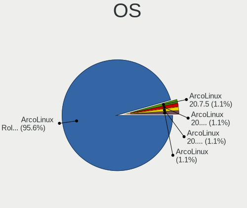

| Name               | Computers | Percent |
|--------------------|-----------|---------|
| ArcoLinux Rolling  | 87        | 95.6%   |
| ArcoLinux 20.7.5   | 1         | 1.1%    |
| ArcoLinux 20.10.21 | 1         | 1.1%    |
| ArcoLinux 20.10.05 | 1         | 1.1%    |
| ArcoLinux          | 1         | 1.1%    |

OS Family
---------

OS without a version

| Name      | Computers | Percent |
|-----------|-----------|---------|
| ArcoLinux | 91        | 100%    |

Kernel
------

Version of the Linux kernel

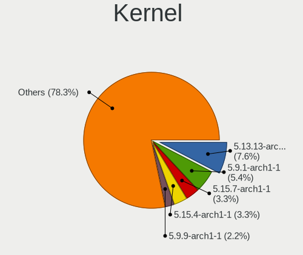

| Version            | Computers | Percent |
|--------------------|-----------|---------|
| 5.13.13-arch1-1    | 7         | 7.61%   |
| 5.9.1-arch1-1      | 5         | 5.43%   |
| 5.15.7-arch1-1     | 3         | 3.26%   |
| 5.15.4-arch1-1     | 3         | 3.26%   |
| 5.9.9-arch1-1      | 2         | 2.17%   |
| 5.9.8-arch1-1      | 2         | 2.17%   |
| 5.9.6-arch1-1      | 2         | 2.17%   |
| 5.4.87-1-lts       | 2         | 2.17%   |
| 5.15.10-arch1-1    | 2         | 2.17%   |
| 5.14.14-arch1-1    | 2         | 2.17%   |
| 5.14.11-arch1-1    | 2         | 2.17%   |
| 5.13.6-arch1-1     | 2         | 2.17%   |
| 5.12.4-arch1-2     | 2         | 2.17%   |
| 5.11.11-arch1-1    | 2         | 2.17%   |
| 5.10.7-arch1-1     | 2         | 2.17%   |
| 5.10.16-arch1-1    | 2         | 2.17%   |
| 5.9.6-zen1-1-zen   | 1         | 1.09%   |
| 5.9.4-arch1-1      | 1         | 1.09%   |
| 5.9.14-zen1-1-zen  | 1         | 1.09%   |
| 5.9.14-arch1-1     | 1         | 1.09%   |
| 5.9.13-arch1-1     | 1         | 1.09%   |
| 5.9.11-zen2-1-zen  | 1         | 1.09%   |
| 5.8.5-arch1-1      | 1         | 1.09%   |
| 5.8.13-arch1-1     | 1         | 1.09%   |
| 5.8.10-arch1-1     | 1         | 1.09%   |
| 5.4.86-1-lts       | 1         | 1.09%   |
| 5.4.85-1-lts       | 1         | 1.09%   |
| 5.4.79-1-lts       | 1         | 1.09%   |
| 5.4.78-1-lts       | 1         | 1.09%   |
| 5.17.2-arch3-1     | 1         | 1.09%   |
| 5.16.8-arch1-1     | 1         | 1.09%   |
| 5.16.7-arch1-1     | 1         | 1.09%   |
| 5.16.5-arch1-1     | 1         | 1.09%   |
| 5.16.16-arch1-1    | 1         | 1.09%   |
| 5.15.6-zen2-1-zen  | 1         | 1.09%   |
| 5.15.6-arch2-1     | 1         | 1.09%   |
| 5.15.5-arch1-1     | 1         | 1.09%   |
| 5.15.22-1-lts      | 1         | 1.09%   |
| 5.15.12-arch1-1    | 1         | 1.09%   |
| 5.15.10-zen1-1-zen | 1         | 1.09%   |
| 5.14.16-arch1-1    | 1         | 1.09%   |
| 5.13.4-arch2-1     | 1         | 1.09%   |
| 5.13.12-arch1-1    | 1         | 1.09%   |
| 5.12.5-arch1-1     | 1         | 1.09%   |
| 5.12.3-arch1-1     | 1         | 1.09%   |
| 5.12.12-arch1-1    | 1         | 1.09%   |
| 5.12.1-arch1-1     | 1         | 1.09%   |
| 5.11.8-arch1-1     | 1         | 1.09%   |
| 5.11.4-arch1-1     | 1         | 1.09%   |
| 5.11.14-arch1-1    | 1         | 1.09%   |
| 5.11.13-arch1-1    | 1         | 1.09%   |
| 5.11.10-arch1-1    | 1         | 1.09%   |
| 5.10.87-1-lts      | 1         | 1.09%   |
| 5.10.84-1-lts      | 1         | 1.09%   |
| 5.10.62-1-lts      | 1         | 1.09%   |
| 5.10.60-1-lts      | 1         | 1.09%   |
| 5.10.6-arch1-1     | 1         | 1.09%   |
| 5.10.55-1-lts      | 1         | 1.09%   |
| 5.10.48-1-lts      | 1         | 1.09%   |
| 5.10.46-1-lts      | 1         | 1.09%   |

Kernel Family
-------------

Linux kernel without a distro release

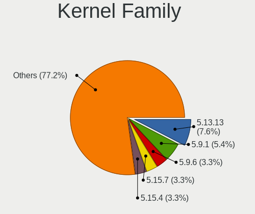

| Version | Computers | Percent |
|---------|-----------|---------|
| 5.13.13 | 7         | 7.61%   |
| 5.9.1   | 5         | 5.43%   |
| 5.9.6   | 3         | 3.26%   |
| 5.15.7  | 3         | 3.26%   |
| 5.15.4  | 3         | 3.26%   |
| 5.15.10 | 3         | 3.26%   |
| 5.9.9   | 2         | 2.17%   |
| 5.9.8   | 2         | 2.17%   |
| 5.9.14  | 2         | 2.17%   |
| 5.4.87  | 2         | 2.17%   |
| 5.15.6  | 2         | 2.17%   |
| 5.14.14 | 2         | 2.17%   |
| 5.14.11 | 2         | 2.17%   |
| 5.13.6  | 2         | 2.17%   |
| 5.12.4  | 2         | 2.17%   |
| 5.11.11 | 2         | 2.17%   |
| 5.10.7  | 2         | 2.17%   |
| 5.10.16 | 2         | 2.17%   |
| 5.9.4   | 1         | 1.09%   |
| 5.9.13  | 1         | 1.09%   |
| 5.9.11  | 1         | 1.09%   |
| 5.8.5   | 1         | 1.09%   |
| 5.8.13  | 1         | 1.09%   |
| 5.8.10  | 1         | 1.09%   |
| 5.4.86  | 1         | 1.09%   |
| 5.4.85  | 1         | 1.09%   |
| 5.4.79  | 1         | 1.09%   |
| 5.4.78  | 1         | 1.09%   |
| 5.17.2  | 1         | 1.09%   |
| 5.16.8  | 1         | 1.09%   |
| 5.16.7  | 1         | 1.09%   |
| 5.16.5  | 1         | 1.09%   |
| 5.16.16 | 1         | 1.09%   |
| 5.15.5  | 1         | 1.09%   |
| 5.15.22 | 1         | 1.09%   |
| 5.15.12 | 1         | 1.09%   |
| 5.14.16 | 1         | 1.09%   |
| 5.13.4  | 1         | 1.09%   |
| 5.13.12 | 1         | 1.09%   |
| 5.12.5  | 1         | 1.09%   |
| 5.12.3  | 1         | 1.09%   |
| 5.12.12 | 1         | 1.09%   |
| 5.12.1  | 1         | 1.09%   |
| 5.11.8  | 1         | 1.09%   |
| 5.11.4  | 1         | 1.09%   |
| 5.11.14 | 1         | 1.09%   |
| 5.11.13 | 1         | 1.09%   |
| 5.11.10 | 1         | 1.09%   |
| 5.10.87 | 1         | 1.09%   |
| 5.10.84 | 1         | 1.09%   |
| 5.10.62 | 1         | 1.09%   |
| 5.10.60 | 1         | 1.09%   |
| 5.10.6  | 1         | 1.09%   |
| 5.10.55 | 1         | 1.09%   |
| 5.10.48 | 1         | 1.09%   |
| 5.10.46 | 1         | 1.09%   |
| 5.10.45 | 1         | 1.09%   |
| 5.10.4  | 1         | 1.09%   |
| 5.10.39 | 1         | 1.09%   |
| 5.10.3  | 1         | 1.09%   |

Kernel Major Ver.
-----------------

Linux kernel major version

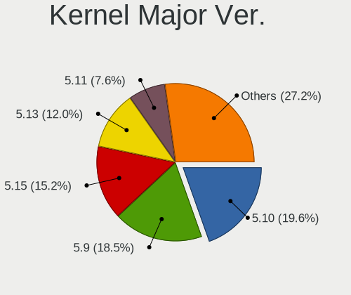

| Version | Computers | Percent |
|---------|-----------|---------|
| 5.10    | 18        | 19.57%  |
| 5.9     | 17        | 18.48%  |
| 5.15    | 14        | 15.22%  |
| 5.13    | 11        | 11.96%  |
| 5.11    | 7         | 7.61%   |
| 5.4     | 6         | 6.52%   |
| 5.12    | 6         | 6.52%   |
| 5.14    | 5         | 5.43%   |
| 5.16    | 4         | 4.35%   |
| 5.8     | 3         | 3.26%   |
| 5.17    | 1         | 1.09%   |

Arch
----

OS architecture (x86_64, i586, etc.)

| Name   | Computers | Percent |
|--------|-----------|---------|
| x86_64 | 91        | 100%    |

DE
--

Desktop Environment

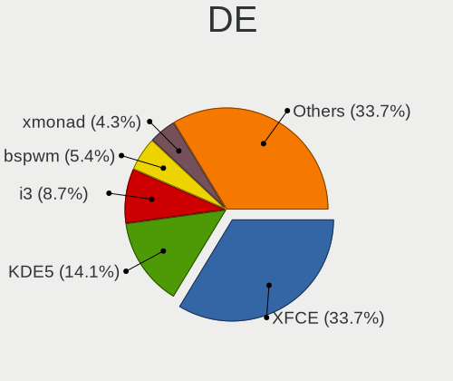

| Name           | Computers | Percent |
|----------------|-----------|---------|
| XFCE           | 31        | 33.7%   |
| KDE5           | 13        | 14.13%  |
| i3             | 8         | 8.7%    |
| bspwm          | 5         | 5.43%   |
| xmonad         | 4         | 4.35%   |
| qtile          | 4         | 4.35%   |
| dwm            | 4         | 4.35%   |
| awesome        | 4         | 4.35%   |
| Unknown        | 4         | 4.35%   |
| LeftWM         | 3         | 3.26%   |
| GNOME          | 3         | 3.26%   |
| X-Cinnamon     | 2         | 2.17%   |
| spectrwm       | 1         | 1.09%   |
| MATE           | 1         | 1.09%   |
| LXQt           | 1         | 1.09%   |
| i3-with-shmlog | 1         | 1.09%   |
| herbstluftwm   | 1         | 1.09%   |
| Cinnamon       | 1         | 1.09%   |
| Budgie         | 1         | 1.09%   |

Display Server
--------------

X11 or Wayland

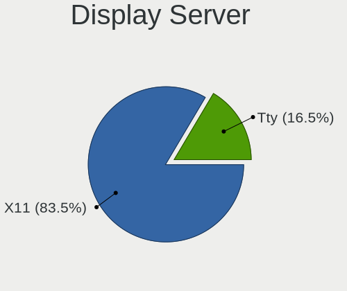

| Name | Computers | Percent |
|------|-----------|---------|
| X11  | 76        | 83.52%  |
| Tty  | 15        | 16.48%  |

Display Manager
---------------

SDDM, LightDM, etc.

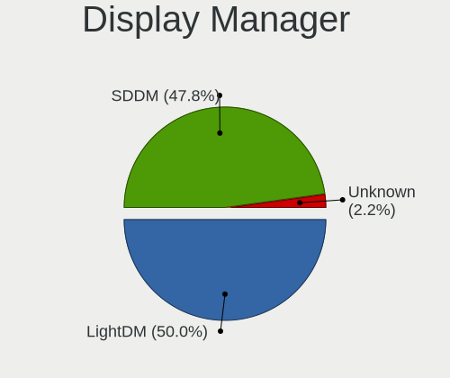

| Name    | Computers | Percent |
|---------|-----------|---------|
| LightDM | 46        | 50%     |
| SDDM    | 44        | 47.83%  |
| Unknown | 2         | 2.17%   |

OS Lang
-------

Language

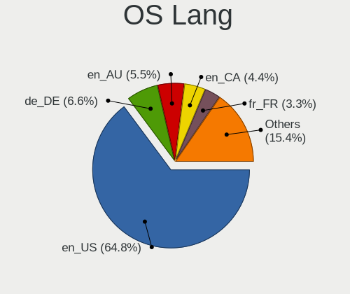

| Lang  | Computers | Percent |
|-------|-----------|---------|
| en_US | 59        | 64.84%  |
| de_DE | 6         | 6.59%   |
| en_AU | 5         | 5.49%   |
| en_CA | 4         | 4.4%    |
| fr_FR | 3         | 3.3%    |
| es_ES | 3         | 3.3%    |
| en_GB | 2         | 2.2%    |
| zh_CN | 1         | 1.1%    |
| sv_SE | 1         | 1.1%    |
| ru_UA | 1         | 1.1%    |
| pt_BR | 1         | 1.1%    |
| nb_NO | 1         | 1.1%    |
| it_IT | 1         | 1.1%    |
| hu_HU | 1         | 1.1%    |
| en_ZA | 1         | 1.1%    |
| en_PH | 1         | 1.1%    |

Boot Mode
---------

EFI or BIOS

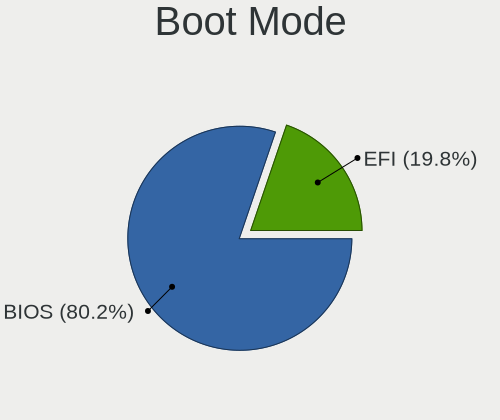

| Mode | Computers | Percent |
|------|-----------|---------|
| BIOS | 73        | 80.22%  |
| EFI  | 18        | 19.78%  |

Filesystem
----------

Type of filesystem

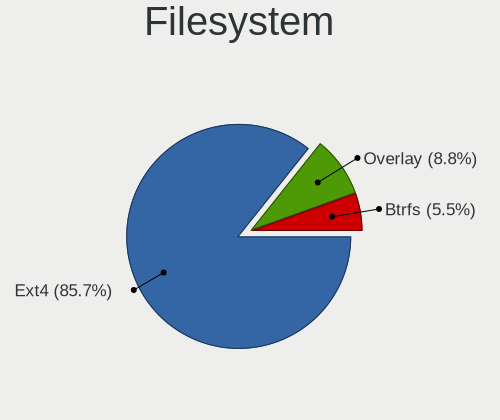

| Type    | Computers | Percent |
|---------|-----------|---------|
| Ext4    | 78        | 85.71%  |
| Overlay | 8         | 8.79%   |
| Btrfs   | 5         | 5.49%   |

Part. scheme
------------

Scheme of partitioning

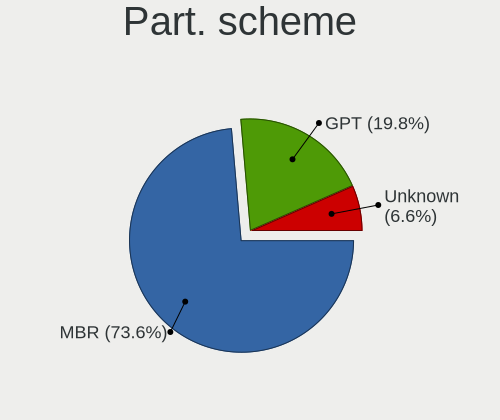

| Type    | Computers | Percent |
|---------|-----------|---------|
| MBR     | 67        | 73.63%  |
| GPT     | 18        | 19.78%  |
| Unknown | 6         | 6.59%   |

Dual Boot with Linux/BSD
------------------------

Hosting more than one Linux/BSD

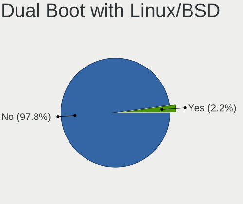

| Dual boot | Computers | Percent |
|-----------|-----------|---------|
| No        | 89        | 97.8%   |
| Yes       | 2         | 2.2%    |

Dual Boot (Win)
---------------

Hosting Linux and Windows

| Dual boot | Computers | Percent |
|-----------|-----------|---------|
| No        | 91        | 100%    |

Board
-----

Vendor
------

Motherboard manufacturer

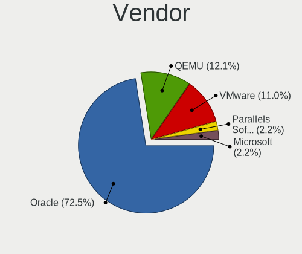

| Name                             | Computers | Percent |
|----------------------------------|-----------|---------|
| Oracle                           | 66        | 72.53%  |
| QEMU                             | 11        | 12.09%  |
| VMware                           | 10        | 10.99%  |
| Parallels Software International | 2         | 2.2%    |
| Microsoft                        | 2         | 2.2%    |

Model
-----

Motherboard model

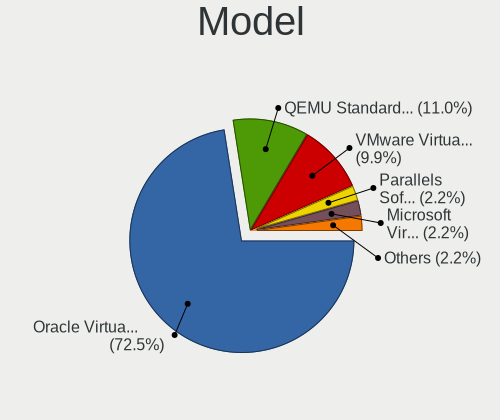

| Name                                                        | Computers | Percent |
|-------------------------------------------------------------|-----------|---------|
| Oracle VirtualBox                                           | 66        | 72.53%  |
| QEMU Standard PC (Q35 + ICH9, 2009)                         | 10        | 10.99%  |
| VMware Virtual Platform                                     | 9         | 9.89%   |
| Parallels Software International Parallels Virtual Platform | 2         | 2.2%    |
| Microsoft Virtual Machine                                   | 2         | 2.2%    |
| VMware VMware7,1                                            | 1         | 1.1%    |
| QEMU Standard PC (i440FX + PIIX, 1996)                      | 1         | 1.1%    |

Model Family
------------

Motherboard model prefix

| Name                                       | Computers | Percent |
|--------------------------------------------|-----------|---------|
| Oracle VirtualBox                          | 66        | 72.53%  |
| QEMU Standard                              | 11        | 12.09%  |
| VMware Virtual                             | 9         | 9.89%   |
| Parallels Software International Parallels | 2         | 2.2%    |
| Microsoft Virtual                          | 2         | 2.2%    |
| VMware VMware7                             | 1         | 1.1%    |

MFG Year
--------

Motherboard manufacture year

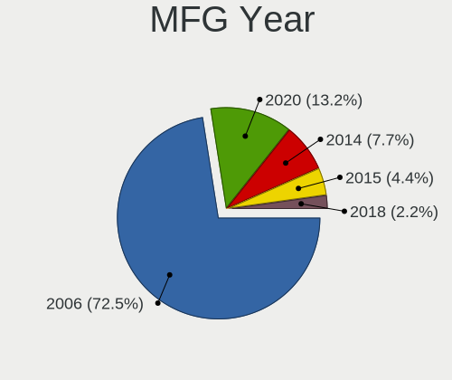

| Year | Computers | Percent |
|------|-----------|---------|
| 2006 | 66        | 72.53%  |
| 2020 | 12        | 13.19%  |
| 2014 | 7         | 7.69%   |
| 2015 | 4         | 4.4%    |
| 2018 | 2         | 2.2%    |

Form Factor
-----------

Physical design of the computer

| Name            | Computers | Percent |
|-----------------|-----------|---------|
| Virtual machine | 91        | 100%    |

Secure Boot
-----------

Enabled or disabled

| State    | Computers | Percent |
|----------|-----------|---------|
| Disabled | 91        | 100%    |

Coreboot
--------

Have coreboot on board

| Used | Computers | Percent |
|------|-----------|---------|
| No   | 91        | 100%    |

RAM Size
--------

Total RAM memory

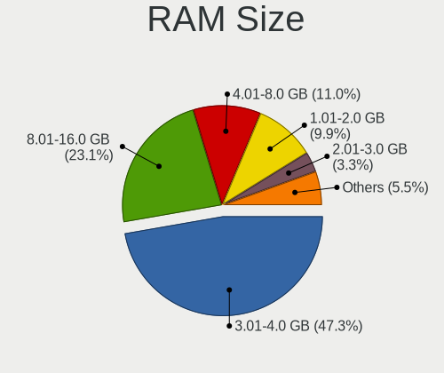

| Size in GB | Computers | Percent |
|------------|-----------|---------|
| 3.01-4.0   | 43        | 47.25%  |
| 8.01-16.0  | 21        | 23.08%  |
| 4.01-8.0   | 10        | 10.99%  |
| 1.01-2.0   | 9         | 9.89%   |
| 2.01-3.0   | 3         | 3.3%    |
| 32.01-64.0 | 2         | 2.2%    |
| 24.01-32.0 | 1         | 1.1%    |
| 16.01-24.0 | 1         | 1.1%    |
| 0.51-1.0   | 1         | 1.1%    |

RAM Used
--------

Used RAM memory

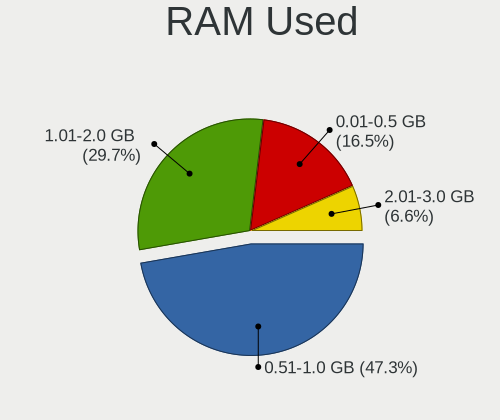

| Used GB  | Computers | Percent |
|----------|-----------|---------|
| 0.51-1.0 | 43        | 47.25%  |
| 1.01-2.0 | 27        | 29.67%  |
| 0.01-0.5 | 15        | 16.48%  |
| 2.01-3.0 | 6         | 6.59%   |

Total Drives
------------

Number of drives on board

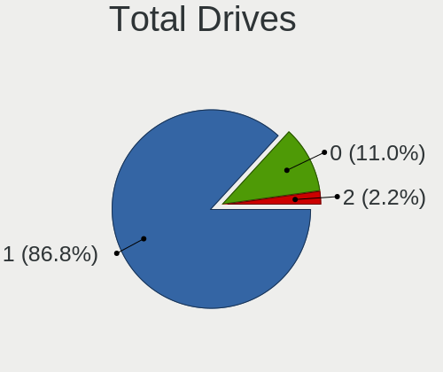

| Drives | Computers | Percent |
|--------|-----------|---------|
| 1      | 79        | 86.81%  |
| 0      | 10        | 10.99%  |
| 2      | 2         | 2.2%    |

Has CD-ROM
----------

Has CD-ROM on board

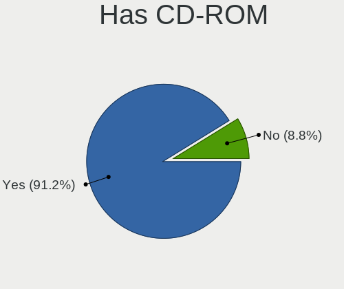

| Presented | Computers | Percent |
|-----------|-----------|---------|
| Yes       | 83        | 91.21%  |
| No        | 8         | 8.79%   |

Has Ethernet
------------

Has Ethernet on board

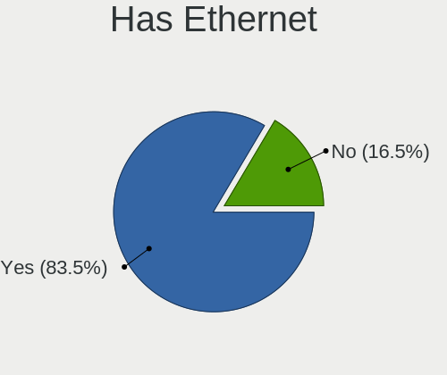

| Presented | Computers | Percent |
|-----------|-----------|---------|
| Yes       | 76        | 83.52%  |
| No        | 15        | 16.48%  |

Has WiFi
--------

Has WiFi module

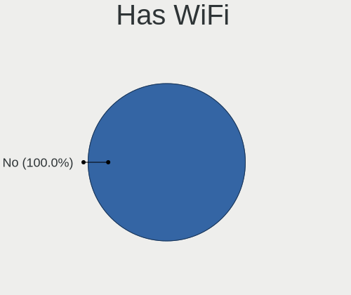

| Presented | Computers | Percent |
|-----------|-----------|---------|
| No        | 91        | 100%    |

Has Bluetooth
-------------

Has Bluetooth module

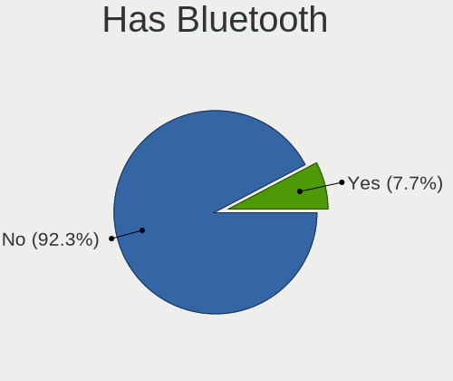

| Presented | Computers | Percent |
|-----------|-----------|---------|
| No        | 84        | 92.31%  |
| Yes       | 7         | 7.69%   |

Location
--------

Country
-------

Geographic location (country)

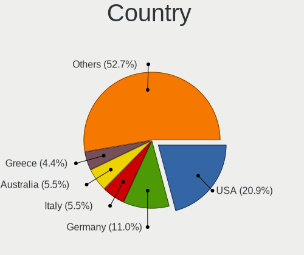

| Country                | Computers | Percent |
|------------------------|-----------|---------|
| USA                    | 19        | 20.88%  |
| Germany                | 10        | 10.99%  |
| Italy                  | 5         | 5.49%   |
| Australia              | 5         | 5.49%   |
| Greece                 | 4         | 4.4%    |
| France                 | 4         | 4.4%    |
| Canada                 | 4         | 4.4%    |
| Turkey                 | 3         | 3.3%    |
| Sweden                 | 3         | 3.3%    |
| Spain                  | 3         | 3.3%    |
| Belgium                | 3         | 3.3%    |
| UK                     | 2         | 2.2%    |
| South Africa           | 2         | 2.2%    |
| Morocco                | 2         | 2.2%    |
| China                  | 2         | 2.2%    |
| Bosnia and Herzegovina | 2         | 2.2%    |
| Belarus                | 2         | 2.2%    |
| Ukraine                | 1         | 1.1%    |
| Switzerland            | 1         | 1.1%    |
| Russia                 | 1         | 1.1%    |
| Romania                | 1         | 1.1%    |
| Poland                 | 1         | 1.1%    |
| Philippines            | 1         | 1.1%    |
| Oman                   | 1         | 1.1%    |
| Norway                 | 1         | 1.1%    |
| Iran                   | 1         | 1.1%    |
| Hungary                | 1         | 1.1%    |
| Hong Kong              | 1         | 1.1%    |
| Estonia                | 1         | 1.1%    |
| Egypt                  | 1         | 1.1%    |
| Brazil                 | 1         | 1.1%    |
| Ã…land              | 1         | 1.1%    |
| Argentina              | 1         | 1.1%    |

City
----

Geographic location (city)

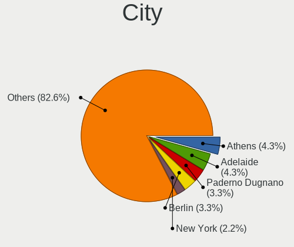

| City                | Computers | Percent |
|---------------------|-----------|---------|
| Athens              | 4         | 4.35%   |
| Adelaide            | 4         | 4.35%   |
| Paderno Dugnano     | 3         | 3.26%   |
| Berlin              | 3         | 3.26%   |
| New York            | 2         | 2.17%   |
| Munich              | 2         | 2.17%   |
| Minsk               | 2         | 2.17%   |
| Madrid              | 2         | 2.17%   |
| Banovici            | 2         | 2.17%   |
| Ankara              | 2         | 2.17%   |
| Worcester           | 1         | 1.09%   |
| Wilrijk             | 1         | 1.09%   |
| Wayne               | 1         | 1.09%   |
| Victoria            | 1         | 1.09%   |
| Vallset             | 1         | 1.09%   |
| Tehran              | 1         | 1.09%   |
| Tétouan          | 1         | 1.09%   |
| Taranto             | 1         | 1.09%   |
| Tallinn             | 1         | 1.09%   |
| Szeged              | 1         | 1.09%   |
| Suwanee             | 1         | 1.09%   |
| Stockholm           | 1         | 1.09%   |
| Sint-Truiden        | 1         | 1.09%   |
| Santa Cruz          | 1         | 1.09%   |
| San Antonio         | 1         | 1.09%   |
| Riedstadt           | 1         | 1.09%   |
| Raeren              | 1         | 1.09%   |
| Plainfield          | 1         | 1.09%   |
| Pessac              | 1         | 1.09%   |
| Paris               | 1         | 1.09%   |
| Panama City         | 1         | 1.09%   |
| Orbe                | 1         | 1.09%   |
| Oberhausen          | 1         | 1.09%   |
| Nottingham          | 1         | 1.09%   |
| North Bergen        | 1         | 1.09%   |
| Normal              | 1         | 1.09%   |
| Muscat              | 1         | 1.09%   |
| Moscow              | 1         | 1.09%   |
| Montreal            | 1         | 1.09%   |
| McHenry             | 1         | 1.09%   |
| Martinsville        | 1         | 1.09%   |
| Mariupol            | 1         | 1.09%   |
| Mariehamn           | 1         | 1.09%   |
| Mainburg            | 1         | 1.09%   |
| Loogootee           | 1         | 1.09%   |
| Lier                | 1         | 1.09%   |
| League City         | 1         | 1.09%   |
| Las Vegas           | 1         | 1.09%   |
| Lake in the Hills   | 1         | 1.09%   |
| Krakow              | 1         | 1.09%   |
| Kirkland            | 1         | 1.09%   |
| Kalmar              | 1         | 1.09%   |
| Huntington Beach    | 1         | 1.09%   |
| Humble              | 1         | 1.09%   |
| Halle               | 1         | 1.09%   |
| Giza                | 1         | 1.09%   |
| Durban              | 1         | 1.09%   |
| Combs-la-Ville      | 1         | 1.09%   |
| Cologne             | 1         | 1.09%   |
| City of Muntinglupa | 1         | 1.09%   |

Drives
------

Drive Vendor
------------

Hard drive vendors

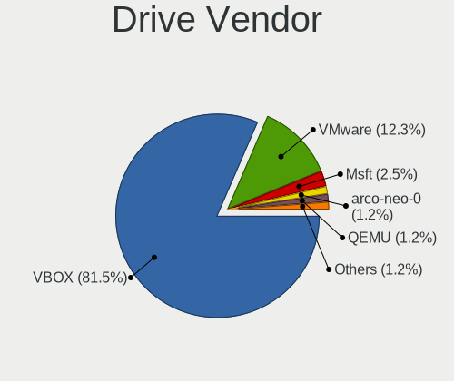

| Vendor     | Computers | Drives | Percent |
|------------|-----------|--------|---------|
| VBOX       | 66        | 69     | 81.48%  |
| VMware     | 10        | 10     | 12.35%  |
| Msft       | 2         | 2      | 2.47%   |
| QEMU       | 1         | 1      | 1.23%   |
| arco-neo-0 | 1         | 1      | 1.23%   |
| Archcraft  | 1         | 1      | 1.23%   |

Drive Model
-----------

Hard drive models

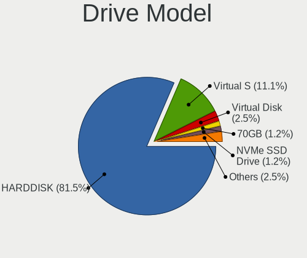

| Model                   | Computers | Percent |
|-------------------------|-----------|---------|
| VBOX HARDDISK           | 66        | 81.48%  |
| VMware Virtual S        | 9         | 11.11%  |
| Msft Virtual Disk       | 2         | 2.47%   |
| VMware NVMe SSD Drive   | 1         | 1.23%   |
| QEMU HARDDISK           | 1         | 1.23%   |
| arco-neo-0 SSD 70GB     | 1         | 1.23%   |
| Archcraft OS-0 SSD 69GB | 1         | 1.23%   |

HDD Vendor
----------

Hard disk drive vendors

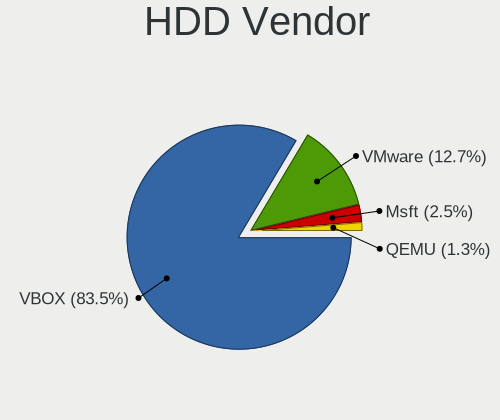

| Vendor | Computers | Drives | Percent |
|--------|-----------|--------|---------|
| VBOX   | 66        | 69     | 83.54%  |
| VMware | 10        | 10     | 12.66%  |
| Msft   | 2         | 2      | 2.53%   |
| QEMU   | 1         | 1      | 1.27%   |

SSD Vendor
----------

Solid state drive vendors

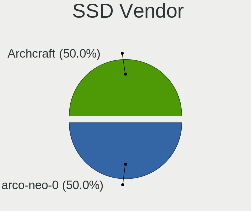

| Vendor     | Computers | Drives | Percent |
|------------|-----------|--------|---------|
| arco-neo-0 | 1         | 1      | 50%     |
| Archcraft  | 1         | 1      | 50%     |

Drive Kind
----------

HDD or SSD

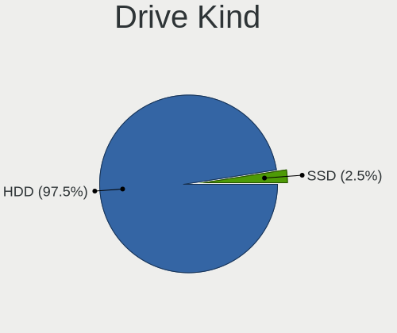

| Kind | Computers | Drives | Percent |
|------|-----------|--------|---------|
| HDD  | 79        | 82     | 97.53%  |
| SSD  | 2         | 2      | 2.47%   |

Drive Connector
---------------

SATA, SAS, NVMe, etc.

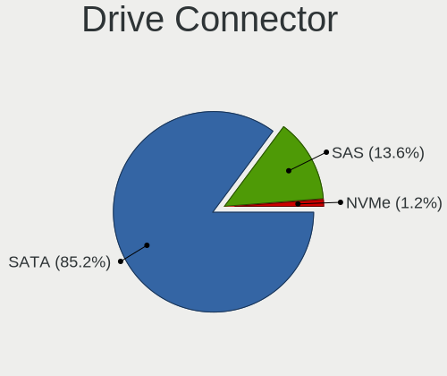

| Type | Computers | Drives | Percent |
|------|-----------|--------|---------|
| SATA | 69        | 72     | 85.19%  |
| SAS  | 11        | 11     | 13.58%  |
| NVMe | 1         | 1      | 1.23%   |

Drive Size
----------

Size of hard drive

| Size in TB | Computers | Drives | Percent |
|------------|-----------|--------|---------|
| 0.01-0.5   | 81        | 84     | 100%    |

Space Total
-----------

Amount of disk space available on the file system

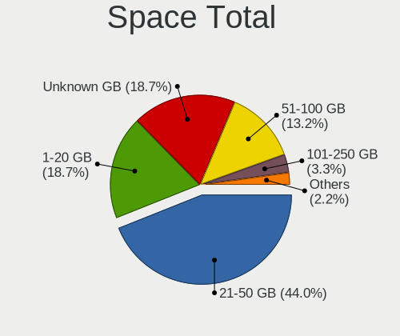

| Size in GB | Computers | Percent |
|------------|-----------|---------|
| 21-50      | 40        | 43.96%  |
| 1-20       | 17        | 18.68%  |
| Unknown    | 17        | 18.68%  |
| 51-100     | 12        | 13.19%  |
| 101-250    | 3         | 3.3%    |
| 251-500    | 1         | 1.1%    |
| 501-1000   | 1         | 1.1%    |

Space Used
----------

Amount of used disk space

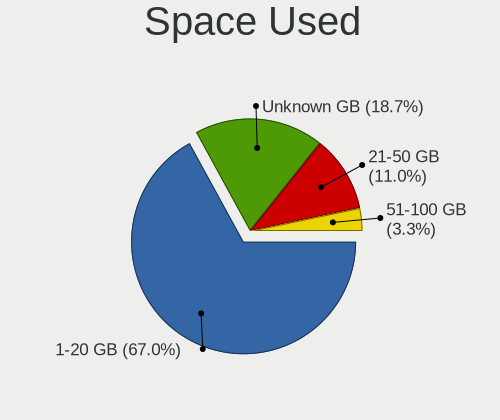

| Used GB | Computers | Percent |
|---------|-----------|---------|
| 1-20    | 61        | 67.03%  |
| Unknown | 17        | 18.68%  |
| 21-50   | 10        | 10.99%  |
| 51-100  | 3         | 3.3%    |

Malfunc. Drives
---------------

Drive models with a malfunction

Zero info for selected period =(

Malfunc. Drive Vendor
---------------------

Vendors of faulty drives

Zero info for selected period =(

Malfunc. HDD Vendor
-------------------

Vendors of faulty HDD drives

Zero info for selected period =(

Malfunc. Drive Kind
-------------------

Kinds of faulty drives

Zero info for selected period =(

Failed Drives
-------------

Failed drive models

Zero info for selected period =(

Failed Drive Vendor
-------------------

Failed drive vendors

Zero info for selected period =(

Drive Status
------------

Number of failed and malfunc. drives

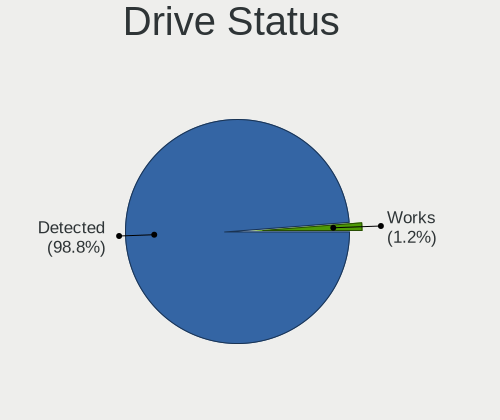

| Status   | Computers | Drives | Percent |
|----------|-----------|--------|---------|
| Detected | 80        | 83     | 98.77%  |
| Works    | 1         | 1      | 1.23%   |

Storage controller
------------------

Storage Vendor
--------------

Storage controller vendors

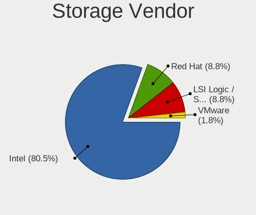

| Vendor                    | Computers | Percent |
|---------------------------|-----------|---------|
| Intel                     | 91        | 80.53%  |
| Red Hat                   | 10        | 8.85%   |
| LSI Logic / Symbios Logic | 10        | 8.85%   |
| VMware                    | 2         | 1.77%   |

Storage Model
-------------

Storage controller models

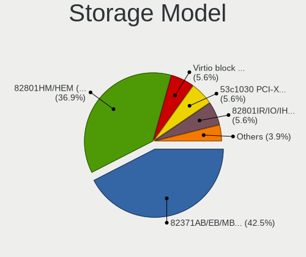

| Model                                                                 | Computers | Percent |
|-----------------------------------------------------------------------|-----------|---------|
| Intel 82371AB/EB/MB PIIX4 IDE                                         | 76        | 42.46%  |
| Intel 82801HM/HEM (ICH8M/ICH8M-E) SATA Controller [AHCI mode]         | 66        | 36.87%  |
| Red Hat Virtio block device                                           | 10        | 5.59%   |
| LSI Logic / Symbios Logic 53c1030 PCI-X Fusion-MPT Dual Ultra320 SCSI | 10        | 5.59%   |
| Intel 82801IR/IO/IH (ICH9R/DO/DH) 6 port SATA Controller [AHCI mode]  | 10        | 5.59%   |
| Intel 82801BA IDE U100 Controller                                     | 2         | 1.12%   |
| VMware SATA AHCI controller                                           | 1         | 0.56%   |
| VMware NVMe SSD Controller                                            | 1         | 0.56%   |
| Red Hat Virtio SCSI                                                   | 1         | 0.56%   |
| Intel 82801HR/HO/HH (ICH8R/DO/DH) 6 port SATA Controller [AHCI mode]  | 1         | 0.56%   |
| Intel 82371SB PIIX3 IDE [Natoma/Triton II]                            | 1         | 0.56%   |

Storage Kind
------------

Kind of storage controller (IDE, SATA, NVMe, SAS, ...)

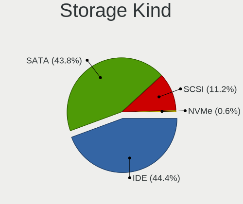

| Kind | Computers | Percent |
|------|-----------|---------|
| IDE  | 79        | 44.38%  |
| SATA | 78        | 43.82%  |
| SCSI | 20        | 11.24%  |
| NVMe | 1         | 0.56%   |

Processor
---------

CPU Vendor
----------

Processor vendors

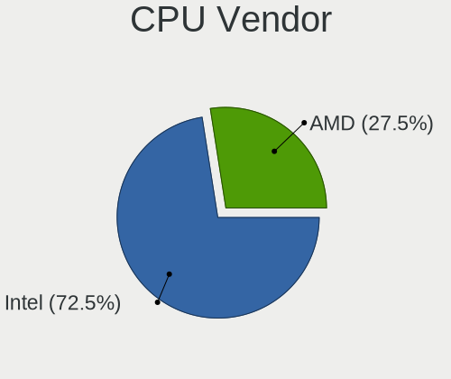

| Vendor | Computers | Percent |
|--------|-----------|---------|
| Intel  | 66        | 72.53%  |
| AMD    | 25        | 27.47%  |

CPU Model
---------

Processor models

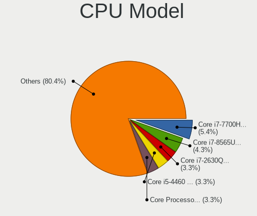

| Model                                           | Computers | Percent |
|-------------------------------------------------|-----------|---------|
| Intel Core i7-7700HQ CPU @ 2.80GHz              | 5         | 5.43%   |
| Intel Core i7-8565U CPU @ 1.80GHz               | 4         | 4.35%   |
| Intel Core Processor (Skylake, IBRS)            | 3         | 3.26%   |
| Intel Core i7-2630QM CPU @ 2.00GHz              | 3         | 3.26%   |
| Intel Core i5-4460 CPU @ 3.20GHz                | 3         | 3.26%   |
| Intel Pentium CPU G4560 @ 3.50GHz               | 2         | 2.17%   |
| Intel Core i7-6800K CPU @ 3.40GHz               | 2         | 2.17%   |
| Intel Core i7-4790K CPU @ 4.00GHz               | 2         | 2.17%   |
| Intel Core i7-4720HQ CPU @ 2.60GHz              | 2         | 2.17%   |
| Intel Core i7-3630QM CPU @ 2.40GHz              | 2         | 2.17%   |
| Intel Core i5-4590 CPU @ 3.30GHz                | 2         | 2.17%   |
| AMD Ryzen 7 4800H with Radeon Graphics          | 2         | 2.17%   |
| AMD Ryzen 7 2700X Eight-Core Processor          | 2         | 2.17%   |
| AMD Ryzen 5 1600 Six-Core Processor             | 2         | 2.17%   |
| AMD EPYC Processor (with IBPB)                  | 2         | 2.17%   |
| Intel Xeon E3-12xx v2 (Ivy Bridge, IBRS)        | 1         | 1.09%   |
| Intel Xeon CPU X5650 @ 2.67GHz                  | 1         | 1.09%   |
| Intel Xeon CPU E5-1660 0 @ 3.30GHz              | 1         | 1.09%   |
| Intel Pentium CPU N4200 @ 1.10GHz               | 1         | 1.09%   |
| Intel Core i9-9900K CPU @ 3.60GHz               | 1         | 1.09%   |
| Intel Core i9-10980HK CPU @ 2.40GHz             | 1         | 1.09%   |
| Intel Core i7-9700K CPU @ 3.60GHz               | 1         | 1.09%   |
| Intel Core i7-9700 CPU @ 3.00GHz                | 1         | 1.09%   |
| Intel Core i7-8700K CPU @ 3.70GHz               | 1         | 1.09%   |
| Intel Core i7-8550U CPU @ 1.80GHz               | 1         | 1.09%   |
| Intel Core i7-7820HQ CPU @ 2.90GHz              | 1         | 1.09%   |
| Intel Core i7-7700K CPU @ 4.20GHz               | 1         | 1.09%   |
| Intel Core i7-7500U CPU @ 2.70GHz               | 1         | 1.09%   |
| Intel Core i7-6700HQ CPU @ 2.60GHz              | 1         | 1.09%   |
| Intel Core i7-4850HQ CPU @ 2.30GHz              | 1         | 1.09%   |
| Intel Core i7-4700HQ CPU @ 2.40GHz              | 1         | 1.09%   |
| Intel Core i7-2600K CPU @ 3.40GHz               | 1         | 1.09%   |
| Intel Core i7-2600 CPU @ 3.40GHz                | 1         | 1.09%   |
| Intel Core i7-10750H CPU @ 2.60GHz              | 1         | 1.09%   |
| Intel Core i7-10700K CPU @ 3.80GHz              | 1         | 1.09%   |
| Intel Core i5-9600K CPU @ 3.70GHz               | 1         | 1.09%   |
| Intel Core i5-9500T CPU @ 2.20GHz               | 1         | 1.09%   |
| Intel Core i5-8600 CPU @ 3.10GHz                | 1         | 1.09%   |
| Intel Core i5-8350U CPU @ 1.70GHz               | 1         | 1.09%   |
| Intel Core i5-7260U CPU @ 2.20GHz               | 1         | 1.09%   |
| Intel Core i5-7200U CPU @ 2.50GHz               | 1         | 1.09%   |
| Intel Core i5-6600 CPU @ 3.30GHz                | 1         | 1.09%   |
| Intel Core i5-6300U CPU @ 2.40GHz               | 1         | 1.09%   |
| Intel Core i5-5350U CPU @ 1.80GHz               | 1         | 1.09%   |
| Intel Core i5-4690 CPU @ 3.50GHz                | 1         | 1.09%   |
| Intel Core i5-4310U CPU @ 2.00GHz               | 1         | 1.09%   |
| Intel Core i5-4200M CPU @ 2.50GHz               | 1         | 1.09%   |
| Intel Core i5-3570K CPU @ 3.40GHz               | 1         | 1.09%   |
| Intel Core i5-1038NG7 CPU @ 2.00GHz             | 1         | 1.09%   |
| Intel Core i5-1035G1 CPU @ 1.00GHz              | 1         | 1.09%   |
| Intel Core i3-7100U CPU @ 2.40GHz               | 1         | 1.09%   |
| Intel Core i3-7100 CPU @ 3.90GHz                | 1         | 1.09%   |
| AMD Ryzen 9 4900HS with Radeon Graphics         | 1         | 1.09%   |
| AMD Ryzen 9 4900H with Radeon Graphics          | 1         | 1.09%   |
| AMD Ryzen 9 3950X 16-Core Processor             | 1         | 1.09%   |
| AMD Ryzen 7 PRO 3700U w/ Radeon Vega Mobile Gfx | 1         | 1.09%   |
| AMD Ryzen 7 5800X 8-Core Processor              | 1         | 1.09%   |
| AMD Ryzen 5 4600H with Radeon Graphics          | 1         | 1.09%   |
| AMD Ryzen 5 3600X 6-Core Processor              | 1         | 1.09%   |
| AMD Ryzen 5 3400G with Radeon Vega Graphics     | 1         | 1.09%   |

CPU Model Family
----------------

Processor model prefix

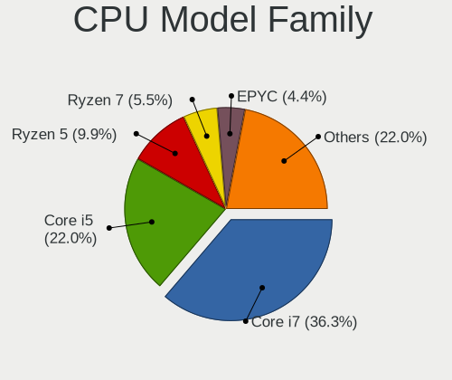

| Model           | Computers | Percent |
|-----------------|-----------|---------|
| Intel Core i7   | 33        | 36.26%  |
| Intel Core i5   | 20        | 21.98%  |
| AMD Ryzen 5     | 9         | 9.89%   |
| AMD Ryzen 7     | 5         | 5.49%   |
| AMD EPYC        | 4         | 4.4%    |
| Intel Xeon      | 3         | 3.3%    |
| Intel Pentium   | 3         | 3.3%    |
| Intel Core      | 3         | 3.3%    |
| AMD Ryzen 9     | 3         | 3.3%    |
| Intel Core i9   | 2         | 2.2%    |
| Intel Core i3   | 2         | 2.2%    |
| AMD Opteron     | 2         | 2.2%    |
| AMD Ryzen 7 PRO | 1         | 1.1%    |
| AMD Ryzen 3     | 1         | 1.1%    |

CPU Cores
---------

Number of processor cores

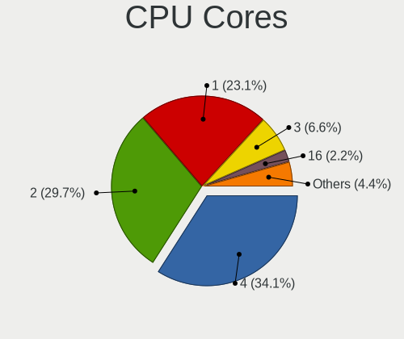

| Number | Computers | Percent |
|--------|-----------|---------|
| 4      | 31        | 34.07%  |
| 2      | 27        | 29.67%  |
| 1      | 21        | 23.08%  |
| 3      | 6         | 6.59%   |
| 16     | 2         | 2.2%    |
| 8      | 2         | 2.2%    |
| 6      | 2         | 2.2%    |

CPU Sockets
-----------

Number of sockets

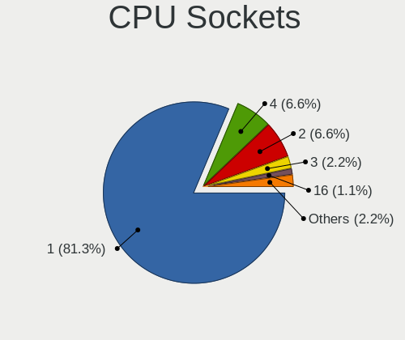

| Number | Computers | Percent |
|--------|-----------|---------|
| 1      | 74        | 81.32%  |
| 4      | 6         | 6.59%   |
| 2      | 6         | 6.59%   |
| 3      | 2         | 2.2%    |
| 16     | 1         | 1.1%    |
| 8      | 1         | 1.1%    |
| 6      | 1         | 1.1%    |

CPU Threads
-----------

Threads per core (Hyper-Threading)

| Number | Computers | Percent |
|--------|-----------|---------|
| 1      | 91        | 100%    |

CPU Op-Modes
------------

CPU Operation Modes (32-bit, 64-bit)

| Op mode        | Computers | Percent |
|----------------|-----------|---------|
| 32-bit, 64-bit | 91        | 100%    |

CPU Microcode
-------------

Microcode number

| Number  | Computers | Percent |
|---------|-----------|---------|
| Unknown | 91        | 100%    |

CPU Microarch
-------------

Microarchitecture

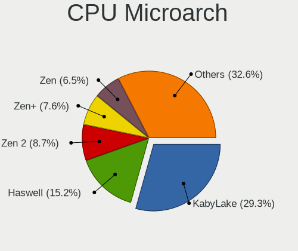

| Name        | Computers | Percent |
|-------------|-----------|---------|
| KabyLake    | 27        | 29.35%  |
| Haswell     | 14        | 15.22%  |
| Zen 2       | 8         | 8.7%    |
| Zen+        | 7         | 7.61%   |
| Zen         | 6         | 6.52%   |
| Skylake     | 6         | 6.52%   |
| SandyBridge | 6         | 6.52%   |
| IvyBridge   | 4         | 4.35%   |
| CometLake   | 3         | 3.26%   |
| Broadwell   | 3         | 3.26%   |
| IceLake     | 2         | 2.17%   |
| Zen 3       | 1         | 1.09%   |
| Westmere    | 1         | 1.09%   |
| K10         | 1         | 1.09%   |
| Goldmont    | 1         | 1.09%   |
| Bulldozer   | 1         | 1.09%   |
| Unknown     | 1         | 1.09%   |

Graphics
--------

GPU Vendor
----------

Vendors of graphics cards

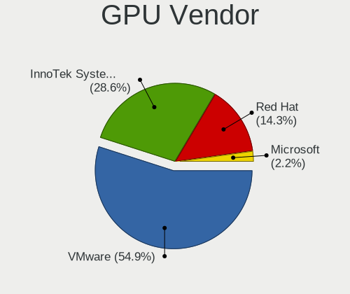

| Vendor                 | Computers | Percent |
|------------------------|-----------|---------|
| VMware                 | 50        | 54.95%  |
| InnoTek Systemberatung | 26        | 28.57%  |
| Red Hat                | 13        | 14.29%  |
| Microsoft              | 2         | 2.2%    |

GPU Model
---------

Graphics card models

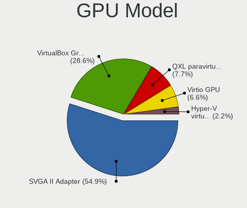

| Model                                              | Computers | Percent |
|----------------------------------------------------|-----------|---------|
| VMware SVGA II Adapter                             | 50        | 54.95%  |
| InnoTek Systemberatung VirtualBox Graphics Adapter | 26        | 28.57%  |
| Red Hat QXL paravirtual graphic card               | 7         | 7.69%   |
| Red Hat Virtio GPU                                 | 6         | 6.59%   |
| Microsoft Hyper-V virtual VGA                      | 2         | 2.2%    |

GPU Combo
---------

Combinations of graphics cards

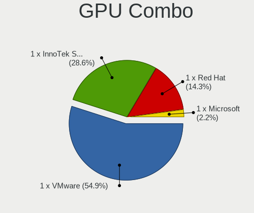

| Name                       | Computers | Percent |
|----------------------------|-----------|---------|
| 1 x VMware                 | 50        | 54.95%  |
| 1 x InnoTek Systemberatung | 26        | 28.57%  |
| 1 x Red Hat                | 13        | 14.29%  |
| 1 x Microsoft              | 2         | 2.2%    |

GPU Driver
----------

Free vs proprietary

| Driver  | Computers | Percent |
|---------|-----------|---------|
| Unknown | 91        | 100%    |

GPU Memory
----------

Total video memory

| Size in GB | Computers | Percent |
|------------|-----------|---------|
| Unknown    | 91        | 100%    |

Monitor
-------

Monitor Vendor
--------------

Monitor vendors

| Vendor | Computers | Percent |
|--------|-----------|---------|
| RHT    | 4         | 100%    |

Monitor Model
-------------

Monitor models

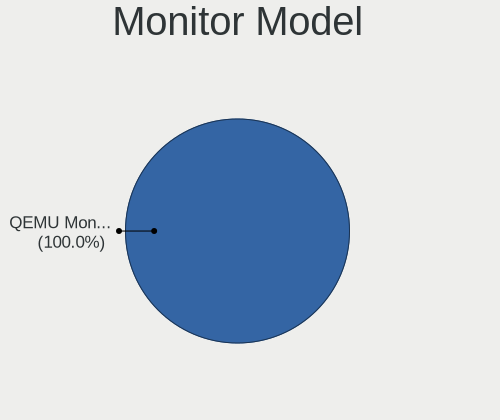

| Model                                                  | Computers | Percent |
|--------------------------------------------------------|-----------|---------|
| RHT QEMU Monitor RHT1234 2048x1152 260x190mm 12.7-inch | 4         | 100%    |

Monitor Resolution
------------------

Monitor screen resolution

| Resolution | Computers | Percent |
|------------|-----------|---------|
| 3196x1798  | 4         | 100%    |

Monitor Diagonal
----------------

Diagonal size in inches

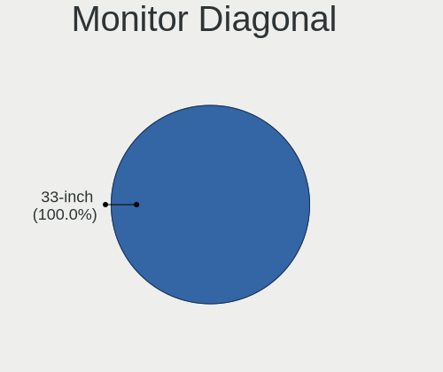

| Inches | Computers | Percent |
|--------|-----------|---------|
| 33     | 4         | 100%    |

Monitor Width
-------------

Physical width

| Width in mm | Computers | Percent |
|-------------|-----------|---------|
| 701-800     | 4         | 100%    |

Aspect Ratio
------------

Proportional relationship between the width and the height

| Ratio | Computers | Percent |
|-------|-----------|---------|
| 16/9  | 4         | 100%    |

Monitor Area
------------

Area in inch²

| Area in inch² | Computers | Percent |
|----------------|-----------|---------|
| 351-500        | 4         | 100%    |

Pixel Density
-------------

Pixels per inch

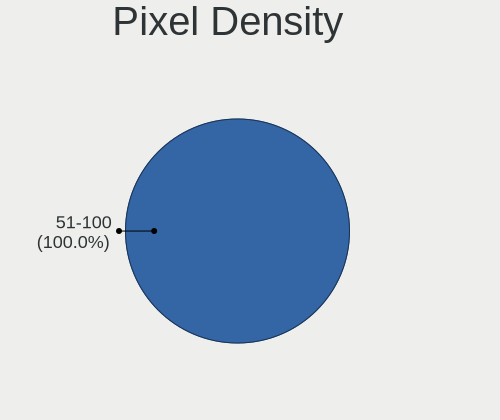

| Density | Computers | Percent |
|---------|-----------|---------|
| 51-100  | 4         | 100%    |

Multiple Monitors
-----------------

Total monitors connected

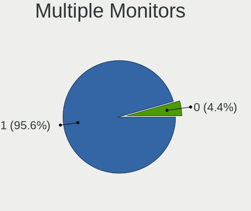

| Total | Computers | Percent |
|-------|-----------|---------|
| 1     | 87        | 95.6%   |
| 0     | 4         | 4.4%    |

Network
-------

Net Controller Vendor
---------------------

Controller vendors

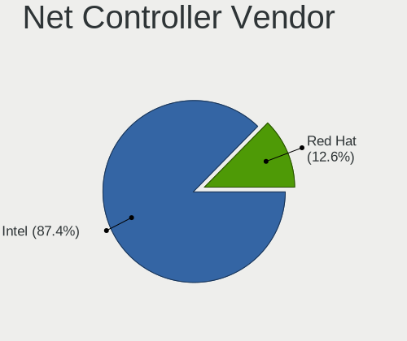

| Vendor  | Computers | Percent |
|---------|-----------|---------|
| Intel   | 76        | 87.36%  |
| Red Hat | 11        | 12.64%  |

Net Controller Model
--------------------

Controller models

| Model                                              | Computers | Percent |
|----------------------------------------------------|-----------|---------|
| Intel 82540EM Gigabit Ethernet Controller          | 66        | 75.86%  |
| Red Hat Virtio network device                      | 11        | 12.64%  |
| Intel 82545EM Gigabit Ethernet Controller (Copper) | 10        | 11.49%  |

Wireless Vendor
---------------

Wireless vendors

Zero info for selected period =(

Wireless Model
--------------

Wireless models

Zero info for selected period =(

Ethernet Vendor
---------------

Ethernet vendors

| Vendor | Computers | Percent |
|--------|-----------|---------|
| Intel  | 76        | 100%    |

Ethernet Model
--------------

Ethernet models

| Model                                              | Computers | Percent |
|----------------------------------------------------|-----------|---------|
| Intel 82540EM Gigabit Ethernet Controller          | 66        | 86.84%  |
| Intel 82545EM Gigabit Ethernet Controller (Copper) | 10        | 13.16%  |

Net Controller Kind
-------------------

Ethernet, WiFi or modem

| Kind     | Computers | Percent |
|----------|-----------|---------|
| Ethernet | 76        | 87.36%  |
| Unknown  | 11        | 12.64%  |

Used Controller
---------------

Currently used network controller

| Kind     | Computers | Percent |
|----------|-----------|---------|
| Ethernet | 76        | 100%    |

NICs
----

Total network controllers on board

| Total | Computers | Percent |
|-------|-----------|---------|
| 1     | 73        | 80.22%  |
| 0     | 15        | 16.48%  |
| 2     | 3         | 3.3%    |

IPv6
----

IPv6 vs IPv4

| Used | Computers | Percent |
|------|-----------|---------|
| No   | 90        | 98.9%   |
| Yes  | 1         | 1.1%    |

Bluetooth
---------

Bluetooth Vendor
----------------

Controller vendors

| Vendor | Computers | Percent |
|--------|-----------|---------|
| VMware | 6         | 85.71%  |
| Intel  | 1         | 14.29%  |

Bluetooth Model
---------------

Controller models

| Model                              | Computers | Percent |
|------------------------------------|-----------|---------|
| VMware Virtual Bluetooth Adapter   | 6         | 85.71%  |
| Intel Bluetooth wireless interface | 1         | 14.29%  |

Sound
-----

Sound Vendor
------------

Sound card vendors

| Vendor  | Computers | Percent |
|---------|-----------|---------|
| Intel   | 78        | 88.64%  |
| Ensoniq | 10        | 11.36%  |

Sound Model
-----------

Sound card models

| Model                                                                      | Computers | Percent |
|----------------------------------------------------------------------------|-----------|---------|
| Intel 82801AA AC'97 Audio Controller                                       | 64        | 72.73%  |
| Ensoniq ES1371/ES1373 / Creative Labs CT2518                               | 10        | 11.36%  |
| Intel 82801I (ICH9 Family) HD Audio Controller                             | 9         | 10.23%  |
| Intel 82801FB/FBM/FR/FW/FRW (ICH6 Family) High Definition Audio Controller | 3         | 3.41%   |
| Intel 82801BA/BAM AC'97 Audio Controller                                   | 2         | 2.27%   |

Memory
------

Memory Vendor
-------------

Memory module vendors

| Vendor             | Computers | Percent |
|--------------------|-----------|---------|
| QEMU               | 10        | 41.67%  |
| Unknown            | 10        | 41.67%  |
| Microsoft          | 2         | 8.33%   |
| VMware Virtual RAM | 1         | 4.17%   |
| Unknown            | 1         | 4.17%   |

Memory Model
------------

Memory module models

| Model                                           | Computers | Percent |
|-------------------------------------------------|-----------|---------|
| Unknown                                         | 10        | 41.67%  |
| QEMU RAM Module 4GB DIMM RAM                    | 4         | 16.67%  |
| QEMU RAM Module 8GB DIMM RAM                    | 3         | 12.5%   |
| VMware Virtual RAM RAM VMW-2048MB 2GB DIMM DRAM | 1         | 4.17%   |
| Unknown RAM Module 2GB DIMM DRAM                | 1         | 4.17%   |
| QEMU RAM Module 8300MB DIMM RAM                 | 1         | 4.17%   |
| QEMU RAM Module 4000MB DIMM RAM                 | 1         | 4.17%   |
| QEMU RAM Module 2GB DIMM RAM                    | 1         | 4.17%   |
| Microsoft RAM Module 3024MB                     | 1         | 4.17%   |
| Microsoft RAM Module 2GB                        | 1         | 4.17%   |

Memory Kind
-----------

Memory module kinds

| Kind    | Computers | Percent |
|---------|-----------|---------|
| DRAM    | 12        | 50%     |
| RAM     | 10        | 41.67%  |
| Unknown | 2         | 8.33%   |

Memory Form Factor
------------------

Physical design of the memory module

| Name    | Computers | Percent |
|---------|-----------|---------|
| DIMM    | 22        | 91.67%  |
| Unknown | 2         | 8.33%   |

Memory Size
-----------

Memory module size

| Size  | Computers | Percent |
|-------|-----------|---------|
| 4096  | 10        | 38.46%  |
| 8192  | 6         | 23.08%  |
| 2048  | 5         | 19.23%  |
| 16384 | 2         | 7.69%   |
| 8300  | 1         | 3.85%   |
| 4000  | 1         | 3.85%   |
| 3024  | 1         | 3.85%   |

Memory Speed
------------

Memory module speed

| Speed   | Computers | Percent |
|---------|-----------|---------|
| Unknown | 22        | 91.67%  |
| 667     | 2         | 8.33%   |

Printers & scanners
-------------------

Printer Vendor
--------------

Printer device vendors

| Vendor    | Computers | Percent |
|-----------|-----------|---------|
| PARALLELS | 1         | 100%    |

Printer Model
-------------

Printer device models

| Model                                                                                  | Computers | Percent |
|----------------------------------------------------------------------------------------|-----------|---------|
| PARALLELS Virtual Printer (/Users/jean/Parallels/OpenMandriva Lx 4.3.pvm/parallel.txt) | 1         | 100%    |

Scanner Vendor
--------------

Scanner device vendors

Zero info for selected period =(

Scanner Model
-------------

Scanner device models

Zero info for selected period =(

Camera
------

Camera Vendor
-------------

Camera device vendors

| Vendor | Computers | Percent |
|--------|-----------|---------|
| VMware | 3         | 100%    |

Camera Model
------------

Camera device models

| Model                           | Computers | Percent |
|---------------------------------|-----------|---------|
| VMware Virtual USB Video Device | 3         | 100%    |

Security
--------

Fingerprint Vendor
------------------

Fingerprint sensor vendors

| Vendor    | Computers | Percent |
|-----------|-----------|---------|
| Synaptics | 1         | 100%    |

Fingerprint Model
-----------------

Fingerprint sensor models

| Model           | Computers | Percent |
|-----------------|-----------|---------|
| Synaptics  WBDI | 1         | 100%    |

Chipcard Vendor
---------------

Chipcard module vendors

Zero info for selected period =(

Chipcard Model
--------------

Chipcard module models

Zero info for selected period =(

Unsupported
-----------

Unsupported Devices
-------------------

Total unsupported devices on board

| Total | Computers | Percent |
|-------|-----------|---------|
| 0     | 87        | 95.6%   |
| 1     | 4         | 4.4%    |

Unsupported Device Types
------------------------

Types of unsupported devices

| Type               | Computers | Percent |
|--------------------|-----------|---------|
| Unassigned class   | 2         | 50%     |
| Graphics card      | 1         | 25%     |
| Fingerprint reader | 1         | 25%     |

