BlackPanther - Tested Virtual Hardware & Statistics
---------------------------------------------------

A project to collect tested virtual hardware configurations for BlackPanther.

Anyone can contribute to this report by the [hw-probe](https://github.com/linuxhw/hw-probe) tool:

    sudo -E hw-probe -all -upload

Please contribute! Especially if your hardware is rare.

Contents
--------

* [ Test Cases ](#test-cases)

* [ System ](#system)
  - [ OS                       ](#os)
  - [ OS Family                ](#os-family)
  - [ Kernel                   ](#kernel)
  - [ Kernel Family            ](#kernel-family)
  - [ Kernel Major Ver.        ](#kernel-major-ver)
  - [ Arch                     ](#arch)
  - [ DE                       ](#de)
  - [ Display Server           ](#display-server)
  - [ Display Manager          ](#display-manager)
  - [ OS Lang                  ](#os-lang)
  - [ Boot Mode                ](#boot-mode)
  - [ Filesystem               ](#filesystem)
  - [ Part. scheme             ](#part-scheme)
  - [ Dual Boot with Linux/BSD ](#dual-boot-with-linuxbsd)
  - [ Dual Boot (Win)          ](#dual-boot-win)

* [ Board ](#board)
  - [ Vendor                   ](#vendor)
  - [ Model                    ](#model)
  - [ Model Family             ](#model-family)
  - [ MFG Year                 ](#mfg-year)
  - [ Form Factor              ](#form-factor)
  - [ Secure Boot              ](#secure-boot)
  - [ Coreboot                 ](#coreboot)
  - [ RAM Size                 ](#ram-size)
  - [ RAM Used                 ](#ram-used)
  - [ Total Drives             ](#total-drives)
  - [ Has CD-ROM               ](#has-cd-rom)
  - [ Has Ethernet             ](#has-ethernet)
  - [ Has WiFi                 ](#has-wifi)
  - [ Has Bluetooth            ](#has-bluetooth)

* [ Location ](#location)
  - [ Country                  ](#country)
  - [ City                     ](#city)

* [ Drives ](#drives)
  - [ Drive Vendor             ](#drive-vendor)
  - [ Drive Model              ](#drive-model)
  - [ HDD Vendor               ](#hdd-vendor)
  - [ SSD Vendor               ](#ssd-vendor)
  - [ Drive Kind               ](#drive-kind)
  - [ Drive Connector          ](#drive-connector)
  - [ Drive Size               ](#drive-size)
  - [ Space Total              ](#space-total)
  - [ Space Used               ](#space-used)
  - [ Malfunc. Drives          ](#malfunc-drives)
  - [ Malfunc. Drive Vendor    ](#malfunc-drive-vendor)
  - [ Malfunc. HDD Vendor      ](#malfunc-hdd-vendor)
  - [ Malfunc. Drive Kind      ](#malfunc-drive-kind)
  - [ Failed Drives            ](#failed-drives)
  - [ Failed Drive Vendor      ](#failed-drive-vendor)
  - [ Drive Status             ](#drive-status)

* [ Storage controller ](#storage-controller)
  - [ Storage Vendor           ](#storage-vendor)
  - [ Storage Model            ](#storage-model)
  - [ Storage Kind             ](#storage-kind)

* [ Processor ](#processor)
  - [ CPU Vendor               ](#cpu-vendor)
  - [ CPU Model                ](#cpu-model)
  - [ CPU Model Family         ](#cpu-model-family)
  - [ CPU Cores                ](#cpu-cores)
  - [ CPU Sockets              ](#cpu-sockets)
  - [ CPU Threads              ](#cpu-threads)
  - [ CPU Op-Modes             ](#cpu-op-modes)
  - [ CPU Microcode            ](#cpu-microcode)
  - [ CPU Microarch            ](#cpu-microarch)

* [ Graphics ](#graphics)
  - [ GPU Vendor               ](#gpu-vendor)
  - [ GPU Model                ](#gpu-model)
  - [ GPU Combo                ](#gpu-combo)
  - [ GPU Driver               ](#gpu-driver)
  - [ GPU Memory               ](#gpu-memory)

* [ Monitor ](#monitor)
  - [ Monitor Vendor           ](#monitor-vendor)
  - [ Monitor Model            ](#monitor-model)
  - [ Monitor Resolution       ](#monitor-resolution)
  - [ Monitor Diagonal         ](#monitor-diagonal)
  - [ Monitor Width            ](#monitor-width)
  - [ Aspect Ratio             ](#aspect-ratio)
  - [ Monitor Area             ](#monitor-area)
  - [ Pixel Density            ](#pixel-density)
  - [ Multiple Monitors        ](#multiple-monitors)

* [ Network ](#network)
  - [ Net Controller Vendor    ](#net-controller-vendor)
  - [ Net Controller Model     ](#net-controller-model)
  - [ Wireless Vendor          ](#wireless-vendor)
  - [ Wireless Model           ](#wireless-model)
  - [ Ethernet Vendor          ](#ethernet-vendor)
  - [ Ethernet Model           ](#ethernet-model)
  - [ Net Controller Kind      ](#net-controller-kind)
  - [ Used Controller          ](#used-controller)
  - [ NICs                     ](#nics)
  - [ IPv6                     ](#ipv6)

* [ Bluetooth ](#bluetooth)
  - [ Bluetooth Vendor         ](#bluetooth-vendor)
  - [ Bluetooth Model          ](#bluetooth-model)

* [ Sound ](#sound)
  - [ Sound Vendor             ](#sound-vendor)
  - [ Sound Model              ](#sound-model)

* [ Memory ](#memory)
  - [ Memory Vendor            ](#memory-vendor)
  - [ Memory Model             ](#memory-model)
  - [ Memory Kind              ](#memory-kind)
  - [ Memory Form Factor       ](#memory-form-factor)
  - [ Memory Size              ](#memory-size)
  - [ Memory Speed             ](#memory-speed)

* [ Printers & scanners ](#printers--scanners)
  - [ Printer Vendor           ](#printer-vendor)
  - [ Printer Model            ](#printer-model)
  - [ Scanner Vendor           ](#scanner-vendor)
  - [ Scanner Model            ](#scanner-model)

* [ Camera ](#camera)
  - [ Camera Vendor            ](#camera-vendor)
  - [ Camera Model             ](#camera-model)

* [ Security ](#security)
  - [ Fingerprint Vendor       ](#fingerprint-vendor)
  - [ Fingerprint Model        ](#fingerprint-model)
  - [ Chipcard Vendor          ](#chipcard-vendor)
  - [ Chipcard Model           ](#chipcard-model)

* [ Unsupported ](#unsupported)
  - [ Unsupported Devices      ](#unsupported-devices)
  - [ Unsupported Device Types ](#unsupported-device-types)

Test Cases
----------

Total: 1649

| Vendor        | Model                       | Form-Factor     | Probe                                                      | Date         |
|---------------|-----------------------------|-----------------|------------------------------------------------------------|--------------|
| Oracle        | VirtualBox                  | Virtual machine | [cad636858b](https://linux-hardware.org/?probe=cad636858b) | Apr 04, 2022 |
| Oracle        | VirtualBox                  | Virtual machine | [bb385111dc](https://linux-hardware.org/?probe=bb385111dc) | Apr 04, 2022 |
| Oracle        | VirtualBox                  | Virtual machine | [5e84a1daa5](https://linux-hardware.org/?probe=5e84a1daa5) | Mar 17, 2022 |
| Oracle        | VirtualBox                  | Virtual machine | [7e43023f7d](https://linux-hardware.org/?probe=7e43023f7d) | Mar 16, 2022 |
| QEMU          | Standard PC (i440FX + PI... | Virtual machine | [38a130fecf](https://linux-hardware.org/?probe=38a130fecf) | Mar 08, 2022 |
| Oracle        | VirtualBox                  | Virtual machine | [b82a433933](https://linux-hardware.org/?probe=b82a433933) | Mar 08, 2022 |
| VMware        | Virtual Platform            | Virtual machine | [9ec3899c15](https://linux-hardware.org/?probe=9ec3899c15) | Feb 22, 2022 |
| QEMU          | Standard PC (i440FX + PI... | Virtual machine | [ee36e1fea9](https://linux-hardware.org/?probe=ee36e1fea9) | Feb 20, 2022 |
| QEMU          | Standard PC (i440FX + PI... | Virtual machine | [b10d4fe827](https://linux-hardware.org/?probe=b10d4fe827) | Feb 20, 2022 |
| VMware        | Virtual Platform            | Virtual machine | [640b38296b](https://linux-hardware.org/?probe=640b38296b) | Feb 20, 2022 |
| QEMU          | Standard PC (i440FX + PI... | Virtual machine | [c0978655cb](https://linux-hardware.org/?probe=c0978655cb) | Feb 20, 2022 |
| QEMU          | Standard PC (i440FX + PI... | Virtual machine | [cb1933a45d](https://linux-hardware.org/?probe=cb1933a45d) | Feb 20, 2022 |
| Oracle        | VirtualBox                  | Virtual machine | [24061652eb](https://linux-hardware.org/?probe=24061652eb) | Feb 19, 2022 |
| Oracle        | VirtualBox                  | Virtual machine | [672424fc23](https://linux-hardware.org/?probe=672424fc23) | Feb 18, 2022 |
| VMware        | Virtual Platform            | Virtual machine | [2c214db47f](https://linux-hardware.org/?probe=2c214db47f) | Feb 18, 2022 |
| Oracle        | VirtualBox                  | Virtual machine | [966ed4c299](https://linux-hardware.org/?probe=966ed4c299) | Feb 18, 2022 |
| Oracle        | VirtualBox                  | Virtual machine | [cc8369e8eb](https://linux-hardware.org/?probe=cc8369e8eb) | Feb 16, 2022 |
| Oracle        | VirtualBox                  | Virtual machine | [5094232f5b](https://linux-hardware.org/?probe=5094232f5b) | Feb 16, 2022 |
| VMware        | Virtual Platform            | Virtual machine | [66c19f66b1](https://linux-hardware.org/?probe=66c19f66b1) | Feb 15, 2022 |
| VMware        | Virtual Platform            | Virtual machine | [4a98a2ec08](https://linux-hardware.org/?probe=4a98a2ec08) | Feb 15, 2022 |
| Oracle        | VirtualBox                  | Virtual machine | [c5cefc01d5](https://linux-hardware.org/?probe=c5cefc01d5) | Feb 14, 2022 |
| Oracle        | VirtualBox                  | Virtual machine | [ba6874b137](https://linux-hardware.org/?probe=ba6874b137) | Feb 14, 2022 |
| Oracle        | VirtualBox                  | Virtual machine | [fd0aac954c](https://linux-hardware.org/?probe=fd0aac954c) | Feb 11, 2022 |
| Oracle        | VirtualBox                  | Virtual machine | [e4c9eb5db5](https://linux-hardware.org/?probe=e4c9eb5db5) | Feb 11, 2022 |
| Oracle        | VirtualBox                  | Virtual machine | [a1a37ec1fa](https://linux-hardware.org/?probe=a1a37ec1fa) | Feb 11, 2022 |
| Oracle        | VirtualBox                  | Virtual machine | [3b6931a13e](https://linux-hardware.org/?probe=3b6931a13e) | Feb 10, 2022 |
| Oracle        | VirtualBox                  | Virtual machine | [49c18c03c5](https://linux-hardware.org/?probe=49c18c03c5) | Feb 10, 2022 |
| Oracle        | VirtualBox                  | Virtual machine | [8cddbd53d0](https://linux-hardware.org/?probe=8cddbd53d0) | Feb 10, 2022 |
| VMware        | Virtual Platform            | Virtual machine | [ee24856fd4](https://linux-hardware.org/?probe=ee24856fd4) | Feb 08, 2022 |
| VMware        | Virtual Platform            | Virtual machine | [d55e394fc5](https://linux-hardware.org/?probe=d55e394fc5) | Feb 08, 2022 |
| Oracle        | VirtualBox                  | Virtual machine | [6da185a908](https://linux-hardware.org/?probe=6da185a908) | Feb 07, 2022 |
| Oracle        | VirtualBox                  | Virtual machine | [55e9391a99](https://linux-hardware.org/?probe=55e9391a99) | Feb 06, 2022 |
| Oracle        | VirtualBox                  | Virtual machine | [0373e65890](https://linux-hardware.org/?probe=0373e65890) | Feb 05, 2022 |
| Oracle        | VirtualBox                  | Virtual machine | [20d749f8c0](https://linux-hardware.org/?probe=20d749f8c0) | Feb 05, 2022 |
| Oracle        | VirtualBox                  | Virtual machine | [99441eee34](https://linux-hardware.org/?probe=99441eee34) | Feb 02, 2022 |
| QEMU          | Standard PC (i440FX + PI... | Virtual machine | [45a01afe08](https://linux-hardware.org/?probe=45a01afe08) | Feb 02, 2022 |
| VMware        | Virtual Platform            | Virtual machine | [364c313281](https://linux-hardware.org/?probe=364c313281) | Jan 30, 2022 |
| Oracle        | VirtualBox                  | Virtual machine | [c70512b28d](https://linux-hardware.org/?probe=c70512b28d) | Jan 29, 2022 |
| Oracle        | VirtualBox                  | Virtual machine | [8909f8a73f](https://linux-hardware.org/?probe=8909f8a73f) | Jan 29, 2022 |
| Oracle        | VirtualBox                  | Virtual machine | [32bbcf0180](https://linux-hardware.org/?probe=32bbcf0180) | Jan 29, 2022 |
| QEMU          | Standard PC (i440FX + PI... | Virtual machine | [3982b89bea](https://linux-hardware.org/?probe=3982b89bea) | Jan 23, 2022 |
| QEMU          | Standard PC (i440FX + PI... | Virtual machine | [f10d778f75](https://linux-hardware.org/?probe=f10d778f75) | Jan 23, 2022 |
| VMware        | Virtual Platform            | Virtual machine | [a9f617de64](https://linux-hardware.org/?probe=a9f617de64) | Jan 20, 2022 |
| VMware        | Virtual Platform            | Virtual machine | [8c46a608c4](https://linux-hardware.org/?probe=8c46a608c4) | Jan 20, 2022 |
| Oracle        | VirtualBox                  | Virtual machine | [dfa244373a](https://linux-hardware.org/?probe=dfa244373a) | Jan 20, 2022 |
| Oracle        | VirtualBox                  | Virtual machine | [5c7f2cfad4](https://linux-hardware.org/?probe=5c7f2cfad4) | Jan 20, 2022 |
| VMware        | Virtual Platform            | Virtual machine | [f91a4e0fc9](https://linux-hardware.org/?probe=f91a4e0fc9) | Jan 14, 2022 |
| VMware        | Virtual Platform            | Virtual machine | [7378d1bbdf](https://linux-hardware.org/?probe=7378d1bbdf) | Jan 13, 2022 |
| VMware        | Virtual Platform            | Virtual machine | [6ef8d79c32](https://linux-hardware.org/?probe=6ef8d79c32) | Jan 13, 2022 |
| Oracle        | VirtualBox                  | Virtual machine | [3036cee5f8](https://linux-hardware.org/?probe=3036cee5f8) | Jan 11, 2022 |
| VMware        | Virtual Platform            | Virtual machine | [543fda418a](https://linux-hardware.org/?probe=543fda418a) | Jan 10, 2022 |
| VMware        | Virtual Platform            | Virtual machine | [02a93caeea](https://linux-hardware.org/?probe=02a93caeea) | Jan 10, 2022 |
| Oracle        | VirtualBox                  | Virtual machine | [6fdfc81982](https://linux-hardware.org/?probe=6fdfc81982) | Jan 10, 2022 |
| Oracle        | VirtualBox                  | Virtual machine | [d7b0b39769](https://linux-hardware.org/?probe=d7b0b39769) | Jan 10, 2022 |
| Oracle        | VirtualBox                  | Virtual machine | [b55a2b29b0](https://linux-hardware.org/?probe=b55a2b29b0) | Jan 08, 2022 |
| Oracle        | VirtualBox                  | Virtual machine | [fac35f494d](https://linux-hardware.org/?probe=fac35f494d) | Jan 08, 2022 |
| Oracle        | VirtualBox                  | Virtual machine | [54f36bf118](https://linux-hardware.org/?probe=54f36bf118) | Jan 07, 2022 |
| Oracle        | VirtualBox                  | Virtual machine | [1dadc74a36](https://linux-hardware.org/?probe=1dadc74a36) | Jan 05, 2022 |
| VMware        | Virtual Platform            | Virtual machine | [074527624e](https://linux-hardware.org/?probe=074527624e) | Jan 04, 2022 |
| Oracle        | VirtualBox                  | Virtual machine | [d8b3734bda](https://linux-hardware.org/?probe=d8b3734bda) | Dec 31, 2021 |
| Oracle        | VirtualBox                  | Virtual machine | [74e39888bf](https://linux-hardware.org/?probe=74e39888bf) | Dec 30, 2021 |
| Oracle        | VirtualBox                  | Virtual machine | [406d2501ed](https://linux-hardware.org/?probe=406d2501ed) | Dec 29, 2021 |
| Oracle        | VirtualBox                  | Virtual machine | [323ec5c9b5](https://linux-hardware.org/?probe=323ec5c9b5) | Dec 28, 2021 |
| Oracle        | VirtualBox                  | Virtual machine | [d788ff8736](https://linux-hardware.org/?probe=d788ff8736) | Dec 22, 2021 |
| Oracle        | VirtualBox                  | Virtual machine | [34a656b161](https://linux-hardware.org/?probe=34a656b161) | Dec 22, 2021 |
| Oracle        | VirtualBox                  | Virtual machine | [3460637401](https://linux-hardware.org/?probe=3460637401) | Dec 19, 2021 |
| Oracle        | VirtualBox                  | Virtual machine | [d4c39a71e3](https://linux-hardware.org/?probe=d4c39a71e3) | Dec 17, 2021 |
| Oracle        | VirtualBox                  | Virtual machine | [480a690602](https://linux-hardware.org/?probe=480a690602) | Dec 17, 2021 |
| QEMU          | Standard PC (i440FX + PI... | Virtual machine | [4422ed5575](https://linux-hardware.org/?probe=4422ed5575) | Dec 17, 2021 |
| Oracle        | VirtualBox                  | Virtual machine | [c837ead0fa](https://linux-hardware.org/?probe=c837ead0fa) | Dec 13, 2021 |
| QEMU          | Standard PC (Q35 + ICH9,... | Virtual machine | [b705808e28](https://linux-hardware.org/?probe=b705808e28) | Dec 12, 2021 |
| QEMU          | Standard PC (Q35 + ICH9,... | Virtual machine | [34d62a4c75](https://linux-hardware.org/?probe=34d62a4c75) | Dec 12, 2021 |
| QEMU          | Standard PC (Q35 + ICH9,... | Virtual machine | [090af23f49](https://linux-hardware.org/?probe=090af23f49) | Dec 12, 2021 |
| Oracle        | VirtualBox                  | Virtual machine | [37388a20b9](https://linux-hardware.org/?probe=37388a20b9) | Dec 10, 2021 |
| Oracle        | VirtualBox                  | Virtual machine | [9332216a60](https://linux-hardware.org/?probe=9332216a60) | Dec 10, 2021 |
| Microsoft     | Virtual Machine Hyper-V ... | Virtual machine | [7c3037a265](https://linux-hardware.org/?probe=7c3037a265) | Dec 09, 2021 |
| Microsoft     | Virtual Machine Hyper-V ... | Virtual machine | [aaa6660b8a](https://linux-hardware.org/?probe=aaa6660b8a) | Dec 09, 2021 |
| VMware        | Virtual Platform            | Virtual machine | [eb719647ad](https://linux-hardware.org/?probe=eb719647ad) | Dec 04, 2021 |
| VMware        | Virtual Platform            | Virtual machine | [dad15a8ae5](https://linux-hardware.org/?probe=dad15a8ae5) | Dec 04, 2021 |
| Oracle        | VirtualBox                  | Virtual machine | [ed45d6f9ab](https://linux-hardware.org/?probe=ed45d6f9ab) | Dec 04, 2021 |
| Oracle        | VirtualBox                  | Virtual machine | [cefc0fead2](https://linux-hardware.org/?probe=cefc0fead2) | Dec 04, 2021 |
| Oracle        | VirtualBox                  | Virtual machine | [e00d8d44d9](https://linux-hardware.org/?probe=e00d8d44d9) | Dec 04, 2021 |
| Oracle        | VirtualBox                  | Virtual machine | [2a1edb8f6a](https://linux-hardware.org/?probe=2a1edb8f6a) | Nov 30, 2021 |
| Oracle        | VirtualBox                  | Virtual machine | [f3dd347795](https://linux-hardware.org/?probe=f3dd347795) | Nov 29, 2021 |
| Oracle        | VirtualBox                  | Virtual machine | [d374e495c0](https://linux-hardware.org/?probe=d374e495c0) | Nov 28, 2021 |
| Oracle        | VirtualBox                  | Virtual machine | [72a0123ffd](https://linux-hardware.org/?probe=72a0123ffd) | Nov 28, 2021 |
| Oracle        | VirtualBox                  | Virtual machine | [0302866628](https://linux-hardware.org/?probe=0302866628) | Nov 28, 2021 |
| Oracle        | VirtualBox                  | Virtual machine | [d480f631d2](https://linux-hardware.org/?probe=d480f631d2) | Nov 28, 2021 |
| Oracle        | VirtualBox                  | Virtual machine | [97b7d0be00](https://linux-hardware.org/?probe=97b7d0be00) | Nov 28, 2021 |
| Oracle        | VirtualBox                  | Virtual machine | [795c4c2421](https://linux-hardware.org/?probe=795c4c2421) | Nov 28, 2021 |
| Oracle        | VirtualBox                  | Virtual machine | [d9a3102e16](https://linux-hardware.org/?probe=d9a3102e16) | Nov 28, 2021 |
| Oracle        | VirtualBox                  | Virtual machine | [f249067d39](https://linux-hardware.org/?probe=f249067d39) | Nov 26, 2021 |
| Oracle        | VirtualBox                  | Virtual machine | [2f41af7c23](https://linux-hardware.org/?probe=2f41af7c23) | Nov 25, 2021 |
| VMware        | Virtual Platform            | Virtual machine | [4804ba718c](https://linux-hardware.org/?probe=4804ba718c) | Nov 25, 2021 |
| Oracle        | VirtualBox                  | Virtual machine | [d22c03852f](https://linux-hardware.org/?probe=d22c03852f) | Nov 24, 2021 |
| Oracle        | VirtualBox                  | Virtual machine | [f736d63988](https://linux-hardware.org/?probe=f736d63988) | Nov 23, 2021 |
| Oracle        | VirtualBox                  | Virtual machine | [bd19a158fe](https://linux-hardware.org/?probe=bd19a158fe) | Nov 23, 2021 |
| Oracle        | VirtualBox                  | Virtual machine | [2f4aeaa97b](https://linux-hardware.org/?probe=2f4aeaa97b) | Nov 20, 2021 |
| Oracle        | VirtualBox                  | Virtual machine | [eec90112e2](https://linux-hardware.org/?probe=eec90112e2) | Nov 19, 2021 |
| Oracle        | VirtualBox                  | Virtual machine | [37ceba36c1](https://linux-hardware.org/?probe=37ceba36c1) | Nov 19, 2021 |
| Oracle        | VirtualBox                  | Virtual machine | [1453b0d64f](https://linux-hardware.org/?probe=1453b0d64f) | Nov 19, 2021 |
| VMware        | Virtual Platform            | Virtual machine | [a52cf5961e](https://linux-hardware.org/?probe=a52cf5961e) | Nov 18, 2021 |
| Oracle        | VirtualBox                  | Virtual machine | [8c5ae5b73c](https://linux-hardware.org/?probe=8c5ae5b73c) | Nov 17, 2021 |
| Oracle        | VirtualBox                  | Virtual machine | [8b8a7f0160](https://linux-hardware.org/?probe=8b8a7f0160) | Nov 17, 2021 |
| Oracle        | VirtualBox                  | Virtual machine | [d8e85fb849](https://linux-hardware.org/?probe=d8e85fb849) | Nov 13, 2021 |
| Oracle        | VirtualBox                  | Virtual machine | [accf23cb1e](https://linux-hardware.org/?probe=accf23cb1e) | Nov 13, 2021 |
| VMware        | Virtual Platform            | Virtual machine | [6d75dc61da](https://linux-hardware.org/?probe=6d75dc61da) | Nov 13, 2021 |
| Oracle        | VirtualBox                  | Virtual machine | [13fa1a9394](https://linux-hardware.org/?probe=13fa1a9394) | Nov 12, 2021 |
| Oracle        | VirtualBox                  | Virtual machine | [11d600fa37](https://linux-hardware.org/?probe=11d600fa37) | Nov 12, 2021 |
| Oracle        | VirtualBox                  | Virtual machine | [ecfbdc316e](https://linux-hardware.org/?probe=ecfbdc316e) | Nov 12, 2021 |
| Oracle        | VirtualBox                  | Virtual machine | [8efc5cb7a4](https://linux-hardware.org/?probe=8efc5cb7a4) | Nov 12, 2021 |
| Oracle        | VirtualBox                  | Virtual machine | [a7cdcf915c](https://linux-hardware.org/?probe=a7cdcf915c) | Nov 11, 2021 |
| Oracle        | VirtualBox                  | Virtual machine | [993f3638d4](https://linux-hardware.org/?probe=993f3638d4) | Nov 11, 2021 |
| Oracle        | VirtualBox                  | Virtual machine | [5afdc7dea5](https://linux-hardware.org/?probe=5afdc7dea5) | Nov 06, 2021 |
| Oracle        | VirtualBox                  | Virtual machine | [a8db243caf](https://linux-hardware.org/?probe=a8db243caf) | Nov 06, 2021 |
| Oracle        | VirtualBox                  | Virtual machine | [2ac88b4d58](https://linux-hardware.org/?probe=2ac88b4d58) | Nov 04, 2021 |
| Oracle        | VirtualBox                  | Virtual machine | [faf0cef648](https://linux-hardware.org/?probe=faf0cef648) | Nov 03, 2021 |
| Oracle        | VirtualBox                  | Virtual machine | [f791636ea8](https://linux-hardware.org/?probe=f791636ea8) | Nov 02, 2021 |
| Oracle        | VirtualBox                  | Virtual machine | [84fb19fca7](https://linux-hardware.org/?probe=84fb19fca7) | Nov 02, 2021 |
| Oracle        | VirtualBox                  | Virtual machine | [ec8bb98bdf](https://linux-hardware.org/?probe=ec8bb98bdf) | Nov 02, 2021 |
| Oracle        | VirtualBox                  | Virtual machine | [c46113fd57](https://linux-hardware.org/?probe=c46113fd57) | Nov 02, 2021 |
| Oracle        | VirtualBox                  | Virtual machine | [0d0c7d3746](https://linux-hardware.org/?probe=0d0c7d3746) | Nov 01, 2021 |
| Oracle        | VirtualBox                  | Virtual machine | [a70a95bbc2](https://linux-hardware.org/?probe=a70a95bbc2) | Nov 01, 2021 |
| Oracle        | VirtualBox                  | Virtual machine | [b689389988](https://linux-hardware.org/?probe=b689389988) | Nov 01, 2021 |
| Oracle        | VirtualBox                  | Virtual machine | [0b30d46245](https://linux-hardware.org/?probe=0b30d46245) | Nov 01, 2021 |
| Oracle        | VirtualBox                  | Virtual machine | [6b2247118f](https://linux-hardware.org/?probe=6b2247118f) | Nov 01, 2021 |
| Oracle        | VirtualBox                  | Virtual machine | [cb3eb49773](https://linux-hardware.org/?probe=cb3eb49773) | Nov 01, 2021 |
| Oracle        | VirtualBox                  | Virtual machine | [cd1a3253b2](https://linux-hardware.org/?probe=cd1a3253b2) | Oct 31, 2021 |
| Oracle        | VirtualBox                  | Virtual machine | [83015601da](https://linux-hardware.org/?probe=83015601da) | Oct 31, 2021 |
| QEMU          | Standard PC (i440FX + PI... | Virtual machine | [b87f7e59ef](https://linux-hardware.org/?probe=b87f7e59ef) | Oct 30, 2021 |
| VMware        | Virtual Platform            | Virtual machine | [a12e74bde3](https://linux-hardware.org/?probe=a12e74bde3) | Oct 30, 2021 |
| QEMU          | Standard PC (i440FX + PI... | Virtual machine | [965ee94845](https://linux-hardware.org/?probe=965ee94845) | Oct 30, 2021 |
| VMware        | Virtual Platform            | Virtual machine | [1bccb9f534](https://linux-hardware.org/?probe=1bccb9f534) | Oct 30, 2021 |
| VMware        | Virtual Platform            | Virtual machine | [b57eb7c5fa](https://linux-hardware.org/?probe=b57eb7c5fa) | Oct 30, 2021 |
| Oracle        | VirtualBox                  | Virtual machine | [8db59f89e1](https://linux-hardware.org/?probe=8db59f89e1) | Oct 29, 2021 |
| Oracle        | VirtualBox                  | Virtual machine | [a6f195d3b2](https://linux-hardware.org/?probe=a6f195d3b2) | Oct 29, 2021 |
| QEMU          | Standard PC (Q35 + ICH9,... | Virtual machine | [0213bda0ca](https://linux-hardware.org/?probe=0213bda0ca) | Oct 26, 2021 |
| Oracle        | VirtualBox                  | Virtual machine | [133a50e02d](https://linux-hardware.org/?probe=133a50e02d) | Oct 26, 2021 |
| Oracle        | VirtualBox                  | Virtual machine | [eb45a3939e](https://linux-hardware.org/?probe=eb45a3939e) | Oct 25, 2021 |
| VMware        | Virtual Platform            | Virtual machine | [37d55d144c](https://linux-hardware.org/?probe=37d55d144c) | Oct 23, 2021 |
| Oracle        | VirtualBox                  | Virtual machine | [db80c8e199](https://linux-hardware.org/?probe=db80c8e199) | Oct 23, 2021 |
| VMware        | Virtual Platform            | Virtual machine | [4ef7524642](https://linux-hardware.org/?probe=4ef7524642) | Oct 22, 2021 |
| VMware        | Virtual Platform            | Virtual machine | [7f8c065490](https://linux-hardware.org/?probe=7f8c065490) | Oct 21, 2021 |
| QEMU          | Standard PC (i440FX + PI... | Virtual machine | [1296d8449f](https://linux-hardware.org/?probe=1296d8449f) | Oct 21, 2021 |
| QEMU          | Standard PC (i440FX + PI... | Virtual machine | [873cf4acb4](https://linux-hardware.org/?probe=873cf4acb4) | Oct 21, 2021 |
| VMware        | Virtual Platform            | Virtual machine | [00a1ec3e69](https://linux-hardware.org/?probe=00a1ec3e69) | Oct 21, 2021 |
| VMware        | Virtual Platform            | Virtual machine | [50fc019db2](https://linux-hardware.org/?probe=50fc019db2) | Oct 20, 2021 |
| VMware        | Virtual Platform            | Virtual machine | [e2cd17ee51](https://linux-hardware.org/?probe=e2cd17ee51) | Oct 20, 2021 |
| Oracle        | VirtualBox                  | Virtual machine | [bdf7417fee](https://linux-hardware.org/?probe=bdf7417fee) | Oct 19, 2021 |
| Oracle        | VirtualBox                  | Virtual machine | [8663629625](https://linux-hardware.org/?probe=8663629625) | Oct 19, 2021 |
| VMware        | Virtual Platform            | Virtual machine | [674aa61db1](https://linux-hardware.org/?probe=674aa61db1) | Oct 18, 2021 |
| Oracle        | VirtualBox                  | Virtual machine | [615739f03a](https://linux-hardware.org/?probe=615739f03a) | Oct 18, 2021 |
| VMware        | Virtual Platform            | Virtual machine | [422b27ba4b](https://linux-hardware.org/?probe=422b27ba4b) | Oct 17, 2021 |
| Oracle        | VirtualBox                  | Virtual machine | [f30b54b7e2](https://linux-hardware.org/?probe=f30b54b7e2) | Oct 14, 2021 |
| Oracle        | VirtualBox                  | Virtual machine | [c9be098ad9](https://linux-hardware.org/?probe=c9be098ad9) | Oct 13, 2021 |
| Oracle        | VirtualBox                  | Virtual machine | [ac1ecd4ef8](https://linux-hardware.org/?probe=ac1ecd4ef8) | Oct 10, 2021 |
| Oracle        | VirtualBox                  | Virtual machine | [ba90e669e1](https://linux-hardware.org/?probe=ba90e669e1) | Oct 10, 2021 |
| Oracle        | VirtualBox                  | Virtual machine | [7f52c7e5a1](https://linux-hardware.org/?probe=7f52c7e5a1) | Oct 07, 2021 |
| Oracle        | VirtualBox                  | Virtual machine | [f4a9f0b37a](https://linux-hardware.org/?probe=f4a9f0b37a) | Oct 07, 2021 |
| VMware        | Virtual Platform            | Virtual machine | [eb883151af](https://linux-hardware.org/?probe=eb883151af) | Oct 06, 2021 |
| QEMU          | Standard PC (i440FX + PI... | Virtual machine | [315ad4628b](https://linux-hardware.org/?probe=315ad4628b) | Oct 03, 2021 |
| Oracle        | VirtualBox                  | Virtual machine | [2c92df16c2](https://linux-hardware.org/?probe=2c92df16c2) | Oct 03, 2021 |
| Oracle        | VirtualBox                  | Virtual machine | [386caeee7b](https://linux-hardware.org/?probe=386caeee7b) | Oct 03, 2021 |
| Oracle        | VirtualBox                  | Virtual machine | [8607ed088c](https://linux-hardware.org/?probe=8607ed088c) | Oct 02, 2021 |
| Oracle        | VirtualBox                  | Virtual machine | [0d5e4cef81](https://linux-hardware.org/?probe=0d5e4cef81) | Oct 02, 2021 |
| Oracle        | VirtualBox                  | Virtual machine | [941a9d8d4d](https://linux-hardware.org/?probe=941a9d8d4d) | Oct 02, 2021 |
| Oracle        | VirtualBox                  | Virtual machine | [c675a573b4](https://linux-hardware.org/?probe=c675a573b4) | Oct 02, 2021 |
| Oracle        | VirtualBox                  | Virtual machine | [e230267de6](https://linux-hardware.org/?probe=e230267de6) | Sep 25, 2021 |
| Oracle        | VirtualBox                  | Virtual machine | [332e02df85](https://linux-hardware.org/?probe=332e02df85) | Sep 25, 2021 |
| VMware        | Virtual Platform            | Virtual machine | [ede8457885](https://linux-hardware.org/?probe=ede8457885) | Sep 24, 2021 |
| Oracle        | VirtualBox                  | Virtual machine | [520f604d49](https://linux-hardware.org/?probe=520f604d49) | Sep 22, 2021 |
| Microsoft     | Virtual Machine             | Virtual machine | [3d725c68c2](https://linux-hardware.org/?probe=3d725c68c2) | Sep 16, 2021 |
| Oracle        | VirtualBox                  | Virtual machine | [a3b3da2fd7](https://linux-hardware.org/?probe=a3b3da2fd7) | Sep 07, 2021 |
| Oracle        | VirtualBox                  | Virtual machine | [aeade32182](https://linux-hardware.org/?probe=aeade32182) | Sep 07, 2021 |
| VMware        | Virtual Platform            | Virtual machine | [ec9f012c55](https://linux-hardware.org/?probe=ec9f012c55) | Sep 02, 2021 |
| Oracle        | VirtualBox                  | Virtual machine | [5e4d0a7e60](https://linux-hardware.org/?probe=5e4d0a7e60) | Aug 31, 2021 |
| Oracle        | VirtualBox                  | Virtual machine | [0f466a08a1](https://linux-hardware.org/?probe=0f466a08a1) | Aug 31, 2021 |
| VMware        | Virtual Platform            | Virtual machine | [0b84358b21](https://linux-hardware.org/?probe=0b84358b21) | Aug 19, 2021 |
| Oracle        | VirtualBox                  | Virtual machine | [f62aaa2569](https://linux-hardware.org/?probe=f62aaa2569) | Aug 17, 2021 |
| Oracle        | VirtualBox                  | Virtual machine | [a4722130aa](https://linux-hardware.org/?probe=a4722130aa) | Aug 17, 2021 |
| Oracle        | VirtualBox                  | Virtual machine | [b8244e9138](https://linux-hardware.org/?probe=b8244e9138) | Aug 17, 2021 |
| Oracle        | VirtualBox                  | Virtual machine | [a30b891b59](https://linux-hardware.org/?probe=a30b891b59) | Aug 16, 2021 |
| Oracle        | VirtualBox                  | Virtual machine | [31854a7b1e](https://linux-hardware.org/?probe=31854a7b1e) | Aug 16, 2021 |
| Oracle        | VirtualBox                  | Virtual machine | [f08e62910d](https://linux-hardware.org/?probe=f08e62910d) | Aug 16, 2021 |
| Oracle        | VirtualBox                  | Virtual machine | [28744bcda7](https://linux-hardware.org/?probe=28744bcda7) | Aug 15, 2021 |
| Oracle        | VirtualBox                  | Virtual machine | [d2a9a5f52f](https://linux-hardware.org/?probe=d2a9a5f52f) | Aug 10, 2021 |
| Oracle        | VirtualBox                  | Virtual machine | [ac85ae6fd7](https://linux-hardware.org/?probe=ac85ae6fd7) | Aug 10, 2021 |
| Oracle        | VirtualBox                  | Virtual machine | [064155ebf4](https://linux-hardware.org/?probe=064155ebf4) | Aug 10, 2021 |
| Oracle        | VirtualBox                  | Virtual machine | [2401223b97](https://linux-hardware.org/?probe=2401223b97) | Aug 10, 2021 |
| Oracle        | VirtualBox                  | Virtual machine | [5cb4e7535b](https://linux-hardware.org/?probe=5cb4e7535b) | Aug 09, 2021 |
| VMware        | Virtual Platform            | Virtual machine | [fba6ca6bd4](https://linux-hardware.org/?probe=fba6ca6bd4) | Aug 08, 2021 |
| VMware        | Virtual Platform            | Virtual machine | [cdaec865fa](https://linux-hardware.org/?probe=cdaec865fa) | Aug 08, 2021 |
| VMware        | Virtual Platform            | Virtual machine | [f95dfa5858](https://linux-hardware.org/?probe=f95dfa5858) | Aug 07, 2021 |
| Oracle        | VirtualBox                  | Virtual machine | [565dbbc613](https://linux-hardware.org/?probe=565dbbc613) | Aug 07, 2021 |
| QEMU          | Standard PC pc-i440fx-4.... | Virtual machine | [77ac5ce5d9](https://linux-hardware.org/?probe=77ac5ce5d9) | Aug 05, 2021 |
| QEMU          | Standard PC pc-i440fx-4.... | Virtual machine | [7b5d31f6ab](https://linux-hardware.org/?probe=7b5d31f6ab) | Aug 03, 2021 |
| QEMU          | Standard PC (i440FX + PI... | Virtual machine | [35bb53c123](https://linux-hardware.org/?probe=35bb53c123) | Aug 02, 2021 |
| QEMU          | Standard PC (i440FX + PI... | Virtual machine | [9b93248fdc](https://linux-hardware.org/?probe=9b93248fdc) | Aug 02, 2021 |
| QEMU          | Standard PC (i440FX + PI... | Virtual machine | [d5a251294c](https://linux-hardware.org/?probe=d5a251294c) | Aug 01, 2021 |
| QEMU          | Standard PC (i440FX + PI... | Virtual machine | [7d615dcd33](https://linux-hardware.org/?probe=7d615dcd33) | Aug 01, 2021 |
| QEMU          | Standard PC (i440FX + PI... | Virtual machine | [df532a377b](https://linux-hardware.org/?probe=df532a377b) | Aug 01, 2021 |
| QEMU          | Standard PC (i440FX + PI... | Virtual machine | [4da9f12f07](https://linux-hardware.org/?probe=4da9f12f07) | Aug 01, 2021 |
| Oracle        | VirtualBox                  | Virtual machine | [16a5b0aa41](https://linux-hardware.org/?probe=16a5b0aa41) | Aug 01, 2021 |
| Oracle        | VirtualBox                  | Virtual machine | [cb662dec99](https://linux-hardware.org/?probe=cb662dec99) | Jul 31, 2021 |
| Oracle        | VirtualBox                  | Virtual machine | [d582479012](https://linux-hardware.org/?probe=d582479012) | Jul 30, 2021 |
| Oracle        | VirtualBox                  | Virtual machine | [2ce9616bf8](https://linux-hardware.org/?probe=2ce9616bf8) | Jul 29, 2021 |
| Oracle        | VirtualBox                  | Virtual machine | [7344ded743](https://linux-hardware.org/?probe=7344ded743) | Jul 29, 2021 |
| Oracle        | VirtualBox                  | Virtual machine | [011c7273b5](https://linux-hardware.org/?probe=011c7273b5) | Jul 28, 2021 |
| VMware        | Virtual Platform            | Virtual machine | [80c41448c7](https://linux-hardware.org/?probe=80c41448c7) | Jul 28, 2021 |
| Oracle        | VirtualBox                  | Virtual machine | [5ca19140cf](https://linux-hardware.org/?probe=5ca19140cf) | Jul 27, 2021 |
| Oracle        | VirtualBox                  | Virtual machine | [c3097dfd56](https://linux-hardware.org/?probe=c3097dfd56) | Jul 27, 2021 |
| Parallels ... | Parallels Virtual Platfo... | Virtual machine | [9bc2bc14e1](https://linux-hardware.org/?probe=9bc2bc14e1) | Jul 25, 2021 |
| Parallels ... | Parallels Virtual Platfo... | Virtual machine | [67e386cbb9](https://linux-hardware.org/?probe=67e386cbb9) | Jul 25, 2021 |
| QEMU          | Standard PC (i440FX + PI... | Virtual machine | [66ae396ccd](https://linux-hardware.org/?probe=66ae396ccd) | Jul 25, 2021 |
| Oracle        | VirtualBox                  | Virtual machine | [2a175c2b9c](https://linux-hardware.org/?probe=2a175c2b9c) | Jul 23, 2021 |
| Oracle        | VirtualBox                  | Virtual machine | [54b737406b](https://linux-hardware.org/?probe=54b737406b) | Jul 23, 2021 |
| Oracle        | VirtualBox                  | Virtual machine | [d08a55edda](https://linux-hardware.org/?probe=d08a55edda) | Jul 22, 2021 |
| Oracle        | VirtualBox                  | Virtual machine | [9dbecceb12](https://linux-hardware.org/?probe=9dbecceb12) | Jul 21, 2021 |
| Oracle        | VirtualBox                  | Virtual machine | [7406b7ac93](https://linux-hardware.org/?probe=7406b7ac93) | Jul 21, 2021 |
| Oracle        | VirtualBox                  | Virtual machine | [9f0de2c4a3](https://linux-hardware.org/?probe=9f0de2c4a3) | Jul 21, 2021 |
| QEMU          | Standard PC (i440FX + PI... | Virtual machine | [f0622a7ef4](https://linux-hardware.org/?probe=f0622a7ef4) | Jul 21, 2021 |
| Oracle        | VirtualBox                  | Virtual machine | [f17a320500](https://linux-hardware.org/?probe=f17a320500) | Jul 21, 2021 |
| Oracle        | VirtualBox                  | Virtual machine | [a9e5ec8a70](https://linux-hardware.org/?probe=a9e5ec8a70) | Jul 20, 2021 |
| VMware        | Virtual Platform            | Virtual machine | [fbd45e3e9a](https://linux-hardware.org/?probe=fbd45e3e9a) | Jul 19, 2021 |
| VMware        | Virtual Platform            | Virtual machine | [b8b34a6305](https://linux-hardware.org/?probe=b8b34a6305) | Jul 19, 2021 |
| VMware        | Virtual Platform            | Virtual machine | [beb0764bac](https://linux-hardware.org/?probe=beb0764bac) | Jul 18, 2021 |
| VMware        | Virtual Platform            | Virtual machine | [09e1a451dc](https://linux-hardware.org/?probe=09e1a451dc) | Jul 18, 2021 |
| Oracle        | VirtualBox                  | Virtual machine | [05f3c8667b](https://linux-hardware.org/?probe=05f3c8667b) | Jul 17, 2021 |
| Oracle        | VirtualBox                  | Virtual machine | [d882c9dda8](https://linux-hardware.org/?probe=d882c9dda8) | Jul 17, 2021 |
| Oracle        | VirtualBox                  | Virtual machine | [b29a32c79d](https://linux-hardware.org/?probe=b29a32c79d) | Jul 15, 2021 |
| Oracle        | VirtualBox                  | Virtual machine | [4276cb206b](https://linux-hardware.org/?probe=4276cb206b) | Jul 15, 2021 |
| Oracle        | VirtualBox                  | Virtual machine | [8070e702e3](https://linux-hardware.org/?probe=8070e702e3) | Jul 15, 2021 |
| Oracle        | VirtualBox                  | Virtual machine | [31cdc626c7](https://linux-hardware.org/?probe=31cdc626c7) | Jul 12, 2021 |
| VMware        | VMware7,1                   | Virtual machine | [4055740bad](https://linux-hardware.org/?probe=4055740bad) | Jul 05, 2021 |
| VMware        | VMware7,1                   | Virtual machine | [6bcdd93d5a](https://linux-hardware.org/?probe=6bcdd93d5a) | Jul 05, 2021 |
| VMware        | VMware7,1                   | Virtual machine | [67f215003c](https://linux-hardware.org/?probe=67f215003c) | Jul 04, 2021 |
| VMware        | VMware7,1                   | Virtual machine | [0228d1de3e](https://linux-hardware.org/?probe=0228d1de3e) | Jul 04, 2021 |
| QEMU          | Standard PC (i440FX + PI... | Virtual machine | [60be230ed1](https://linux-hardware.org/?probe=60be230ed1) | Jul 04, 2021 |
| Oracle        | VirtualBox                  | Virtual machine | [13bfe83003](https://linux-hardware.org/?probe=13bfe83003) | Jul 03, 2021 |
| Oracle        | VirtualBox                  | Virtual machine | [a8e2d8dc67](https://linux-hardware.org/?probe=a8e2d8dc67) | Jul 03, 2021 |
| Oracle        | VirtualBox                  | Virtual machine | [01b83a9fbb](https://linux-hardware.org/?probe=01b83a9fbb) | Jul 01, 2021 |
| Oracle        | VirtualBox                  | Virtual machine | [1ac4684aa6](https://linux-hardware.org/?probe=1ac4684aa6) | Jun 29, 2021 |
| Oracle        | VirtualBox                  | Virtual machine | [170ce6341a](https://linux-hardware.org/?probe=170ce6341a) | Jun 27, 2021 |
| Oracle        | VirtualBox                  | Virtual machine | [815c10d19a](https://linux-hardware.org/?probe=815c10d19a) | Jun 27, 2021 |
| QEMU          | Standard PC (i440FX + PI... | Virtual machine | [661052059a](https://linux-hardware.org/?probe=661052059a) | Jun 27, 2021 |
| Oracle        | VirtualBox                  | Virtual machine | [b4270f0c2e](https://linux-hardware.org/?probe=b4270f0c2e) | Jun 26, 2021 |
| Oracle        | VirtualBox                  | Virtual machine | [e8ae86970c](https://linux-hardware.org/?probe=e8ae86970c) | Jun 26, 2021 |
| Oracle        | VirtualBox                  | Virtual machine | [80b6aabeab](https://linux-hardware.org/?probe=80b6aabeab) | Jun 25, 2021 |
| Oracle        | VirtualBox                  | Virtual machine | [520126a048](https://linux-hardware.org/?probe=520126a048) | Jun 23, 2021 |
| Oracle        | VirtualBox                  | Virtual machine | [023523cf2b](https://linux-hardware.org/?probe=023523cf2b) | Jun 23, 2021 |
| Oracle        | VirtualBox                  | Virtual machine | [299d2b3769](https://linux-hardware.org/?probe=299d2b3769) | Jun 20, 2021 |
| Oracle        | VirtualBox                  | Virtual machine | [35284108d7](https://linux-hardware.org/?probe=35284108d7) | Jun 20, 2021 |
| Oracle        | VirtualBox                  | Virtual machine | [1ade766cc9](https://linux-hardware.org/?probe=1ade766cc9) | Jun 20, 2021 |
| Oracle        | VirtualBox                  | Virtual machine | [a7c02618f6](https://linux-hardware.org/?probe=a7c02618f6) | Jun 19, 2021 |
| Microsoft     | Virtual Machine             | Virtual machine | [de86cf30b0](https://linux-hardware.org/?probe=de86cf30b0) | Jun 19, 2021 |
| VMware        | Virtual Platform            | Virtual machine | [614d101536](https://linux-hardware.org/?probe=614d101536) | Jun 19, 2021 |
| Oracle        | VirtualBox                  | Virtual machine | [1a3c5188a4](https://linux-hardware.org/?probe=1a3c5188a4) | Jun 18, 2021 |
| Oracle        | VirtualBox                  | Virtual machine | [d9f741b07b](https://linux-hardware.org/?probe=d9f741b07b) | Jun 18, 2021 |
| VMware        | Virtual Platform            | Virtual machine | [9224e2b59f](https://linux-hardware.org/?probe=9224e2b59f) | Jun 18, 2021 |
| Oracle        | VirtualBox                  | Virtual machine | [c3f212d7f9](https://linux-hardware.org/?probe=c3f212d7f9) | Jun 18, 2021 |
| Oracle        | VirtualBox                  | Virtual machine | [f0df3f0e1a](https://linux-hardware.org/?probe=f0df3f0e1a) | Jun 18, 2021 |
| Oracle        | VirtualBox                  | Virtual machine | [fd942c6fb3](https://linux-hardware.org/?probe=fd942c6fb3) | Jun 17, 2021 |
| Oracle        | VirtualBox                  | Virtual machine | [314000ad06](https://linux-hardware.org/?probe=314000ad06) | Jun 17, 2021 |
| VMware        | Virtual Platform            | Virtual machine | [1979c9f667](https://linux-hardware.org/?probe=1979c9f667) | Jun 15, 2021 |
| VMware        | Virtual Platform            | Virtual machine | [d85e5ec662](https://linux-hardware.org/?probe=d85e5ec662) | Jun 15, 2021 |
| Oracle        | VirtualBox                  | Virtual machine | [e08d23d688](https://linux-hardware.org/?probe=e08d23d688) | Jun 12, 2021 |
| Oracle        | VirtualBox                  | Virtual machine | [17c1d4c451](https://linux-hardware.org/?probe=17c1d4c451) | Jun 12, 2021 |
| Microsoft     | Virtual Machine Hyper-V ... | Virtual machine | [2f0020e058](https://linux-hardware.org/?probe=2f0020e058) | Jun 12, 2021 |
| Microsoft     | Virtual Machine Hyper-V ... | Virtual machine | [b3a172fc15](https://linux-hardware.org/?probe=b3a172fc15) | Jun 11, 2021 |
| Microsoft     | Virtual Machine Hyper-V ... | Virtual machine | [a23fac726e](https://linux-hardware.org/?probe=a23fac726e) | Jun 11, 2021 |
| VMware        | Virtual Platform            | Virtual machine | [51005e4fa6](https://linux-hardware.org/?probe=51005e4fa6) | Jun 11, 2021 |
| Oracle        | VirtualBox                  | Virtual machine | [e4b80dcea0](https://linux-hardware.org/?probe=e4b80dcea0) | Jun 10, 2021 |
| Oracle        | VirtualBox                  | Virtual machine | [c61754b56e](https://linux-hardware.org/?probe=c61754b56e) | Jun 09, 2021 |
| Oracle        | VirtualBox                  | Virtual machine | [ca3f5770fc](https://linux-hardware.org/?probe=ca3f5770fc) | Jun 09, 2021 |
| Oracle        | VirtualBox                  | Virtual machine | [99f0c784ab](https://linux-hardware.org/?probe=99f0c784ab) | Jun 09, 2021 |
| Oracle        | VirtualBox                  | Virtual machine | [8ac836fcd9](https://linux-hardware.org/?probe=8ac836fcd9) | Jun 09, 2021 |
| Oracle        | VirtualBox                  | Virtual machine | [e9441a4672](https://linux-hardware.org/?probe=e9441a4672) | Jun 08, 2021 |
| Oracle        | VirtualBox                  | Virtual machine | [1972cea54c](https://linux-hardware.org/?probe=1972cea54c) | Jun 08, 2021 |
| Oracle        | VirtualBox                  | Virtual machine | [d49e2b65b7](https://linux-hardware.org/?probe=d49e2b65b7) | Jun 05, 2021 |
| QEMU          | Standard PC (Q35 + ICH9,... | Virtual machine | [c9e4d65ac4](https://linux-hardware.org/?probe=c9e4d65ac4) | Jun 05, 2021 |
| Oracle        | VirtualBox                  | Virtual machine | [156427c0c8](https://linux-hardware.org/?probe=156427c0c8) | Jun 04, 2021 |
| Oracle        | VirtualBox                  | Virtual machine | [bb00dc43b4](https://linux-hardware.org/?probe=bb00dc43b4) | Jun 04, 2021 |
| Oracle        | VirtualBox                  | Virtual machine | [ec3d017246](https://linux-hardware.org/?probe=ec3d017246) | Jun 01, 2021 |
| Oracle        | VirtualBox                  | Virtual machine | [47fc4764dd](https://linux-hardware.org/?probe=47fc4764dd) | Jun 01, 2021 |
| Oracle        | VirtualBox                  | Virtual machine | [14f04db8b2](https://linux-hardware.org/?probe=14f04db8b2) | May 31, 2021 |
| QEMU          | Standard PC (i440FX + PI... | Virtual machine | [736b43220e](https://linux-hardware.org/?probe=736b43220e) | May 31, 2021 |
| Oracle        | VirtualBox                  | Virtual machine | [2f9f67b23e](https://linux-hardware.org/?probe=2f9f67b23e) | May 31, 2021 |
| Oracle        | VirtualBox                  | Virtual machine | [2898bcc924](https://linux-hardware.org/?probe=2898bcc924) | May 30, 2021 |
| Oracle        | VirtualBox                  | Virtual machine | [3f86b5918f](https://linux-hardware.org/?probe=3f86b5918f) | May 30, 2021 |
| Oracle        | VirtualBox                  | Virtual machine | [9600adb3f2](https://linux-hardware.org/?probe=9600adb3f2) | May 30, 2021 |
| Oracle        | VirtualBox                  | Virtual machine | [14756b4534](https://linux-hardware.org/?probe=14756b4534) | May 30, 2021 |
| Oracle        | VirtualBox                  | Virtual machine | [a4c94f7e39](https://linux-hardware.org/?probe=a4c94f7e39) | May 30, 2021 |
| Oracle        | VirtualBox                  | Virtual machine | [76966f91a7](https://linux-hardware.org/?probe=76966f91a7) | May 29, 2021 |
| Oracle        | VirtualBox                  | Virtual machine | [2b899e703f](https://linux-hardware.org/?probe=2b899e703f) | May 29, 2021 |
| Oracle        | VirtualBox                  | Virtual machine | [34226e093a](https://linux-hardware.org/?probe=34226e093a) | May 29, 2021 |
| VMware        | VMware7,1                   | Virtual machine | [e6b1fcb953](https://linux-hardware.org/?probe=e6b1fcb953) | May 28, 2021 |
| QEMU          | Standard PC (i440FX + PI... | Virtual machine | [6e1483cc13](https://linux-hardware.org/?probe=6e1483cc13) | May 27, 2021 |
| QEMU          | Standard PC (i440FX + PI... | Virtual machine | [1418ba0e0b](https://linux-hardware.org/?probe=1418ba0e0b) | May 27, 2021 |
| VMware        | Virtual Platform            | Virtual machine | [f3e97774fe](https://linux-hardware.org/?probe=f3e97774fe) | May 27, 2021 |
| QEMU          | Standard PC (i440FX + PI... | Virtual machine | [a406f443f3](https://linux-hardware.org/?probe=a406f443f3) | May 27, 2021 |
| QEMU          | Standard PC (Q35 + ICH9,... | Virtual machine | [f9d755bb6f](https://linux-hardware.org/?probe=f9d755bb6f) | May 26, 2021 |
| QEMU          | Standard PC (Q35 + ICH9,... | Virtual machine | [0ce46f3559](https://linux-hardware.org/?probe=0ce46f3559) | May 26, 2021 |
| Oracle        | VirtualBox                  | Virtual machine | [44451fcfae](https://linux-hardware.org/?probe=44451fcfae) | May 26, 2021 |
| Oracle        | VirtualBox                  | Virtual machine | [f074b9cf8d](https://linux-hardware.org/?probe=f074b9cf8d) | May 26, 2021 |
| VMware        | Virtual Platform            | Virtual machine | [ad6a2291b6](https://linux-hardware.org/?probe=ad6a2291b6) | May 26, 2021 |
| VMware        | Virtual Platform            | Virtual machine | [7cf391271d](https://linux-hardware.org/?probe=7cf391271d) | May 26, 2021 |
| Oracle        | VirtualBox                  | Virtual machine | [46573432c8](https://linux-hardware.org/?probe=46573432c8) | May 26, 2021 |
| Oracle        | VirtualBox                  | Virtual machine | [eb2f999c69](https://linux-hardware.org/?probe=eb2f999c69) | May 26, 2021 |
| Oracle        | VirtualBox                  | Virtual machine | [8faa2d9041](https://linux-hardware.org/?probe=8faa2d9041) | May 26, 2021 |
| Oracle        | VirtualBox                  | Virtual machine | [f192498f7f](https://linux-hardware.org/?probe=f192498f7f) | May 26, 2021 |
| Oracle        | VirtualBox                  | Virtual machine | [8a4ee1a768](https://linux-hardware.org/?probe=8a4ee1a768) | May 26, 2021 |
| Oracle        | VirtualBox                  | Virtual machine | [5919725de1](https://linux-hardware.org/?probe=5919725de1) | May 25, 2021 |
| Oracle        | VirtualBox                  | Virtual machine | [2224ea99a4](https://linux-hardware.org/?probe=2224ea99a4) | May 25, 2021 |
| QEMU          | Standard PC (i440FX + PI... | Virtual machine | [b4c2180163](https://linux-hardware.org/?probe=b4c2180163) | May 24, 2021 |
| QEMU          | Standard PC (i440FX + PI... | Virtual machine | [79d6828dcc](https://linux-hardware.org/?probe=79d6828dcc) | May 24, 2021 |
| Oracle        | VirtualBox                  | Virtual machine | [daea03e0ce](https://linux-hardware.org/?probe=daea03e0ce) | May 24, 2021 |
| Oracle        | VirtualBox                  | Virtual machine | [b3c9cdcfd9](https://linux-hardware.org/?probe=b3c9cdcfd9) | May 24, 2021 |
| Oracle        | VirtualBox                  | Virtual machine | [18472427cf](https://linux-hardware.org/?probe=18472427cf) | May 23, 2021 |
| Oracle        | VirtualBox                  | Virtual machine | [8d4dea3454](https://linux-hardware.org/?probe=8d4dea3454) | May 23, 2021 |
| QEMU          | Standard PC (i440FX + PI... | Virtual machine | [8d52f99235](https://linux-hardware.org/?probe=8d52f99235) | May 23, 2021 |
| QEMU          | Standard PC (i440FX + PI... | Virtual machine | [d70a512e1b](https://linux-hardware.org/?probe=d70a512e1b) | May 23, 2021 |
| VMware        | Virtual Platform            | Virtual machine | [7bec039fb7](https://linux-hardware.org/?probe=7bec039fb7) | May 23, 2021 |
| QEMU          | Standard PC (Q35 + ICH9,... | Virtual machine | [52c222c43a](https://linux-hardware.org/?probe=52c222c43a) | May 22, 2021 |
| Oracle        | VirtualBox                  | Virtual machine | [d9b23860c5](https://linux-hardware.org/?probe=d9b23860c5) | May 20, 2021 |
| Oracle        | VirtualBox                  | Virtual machine | [aa511382d6](https://linux-hardware.org/?probe=aa511382d6) | May 20, 2021 |
| Oracle        | VirtualBox                  | Virtual machine | [6ec306c0ad](https://linux-hardware.org/?probe=6ec306c0ad) | May 20, 2021 |
| Oracle        | VirtualBox                  | Virtual machine | [7f9c952e50](https://linux-hardware.org/?probe=7f9c952e50) | May 20, 2021 |
| Oracle        | VirtualBox                  | Virtual machine | [75cd50b4f7](https://linux-hardware.org/?probe=75cd50b4f7) | May 20, 2021 |
| QEMU          | Standard PC (i440FX + PI... | Virtual machine | [00fcfb043a](https://linux-hardware.org/?probe=00fcfb043a) | May 19, 2021 |
| Oracle        | VirtualBox                  | Virtual machine | [7a3f75e0a9](https://linux-hardware.org/?probe=7a3f75e0a9) | May 19, 2021 |
| Oracle        | VirtualBox                  | Virtual machine | [dbb58584db](https://linux-hardware.org/?probe=dbb58584db) | May 19, 2021 |
| Oracle        | VirtualBox                  | Virtual machine | [bc243a9661](https://linux-hardware.org/?probe=bc243a9661) | May 16, 2021 |
| Oracle        | VirtualBox                  | Virtual machine | [c7ccda1f94](https://linux-hardware.org/?probe=c7ccda1f94) | May 16, 2021 |
| VMware        | Virtual Platform            | Virtual machine | [dbae855123](https://linux-hardware.org/?probe=dbae855123) | May 15, 2021 |
| VMware        | Virtual Platform            | Virtual machine | [edb70b96fd](https://linux-hardware.org/?probe=edb70b96fd) | May 15, 2021 |
| Parallels ... | Parallels Virtual Platfo... | Virtual machine | [1fc4a1361c](https://linux-hardware.org/?probe=1fc4a1361c) | May 14, 2021 |
| Oracle        | VirtualBox                  | Virtual machine | [1ee7c89a45](https://linux-hardware.org/?probe=1ee7c89a45) | May 14, 2021 |
| Parallels ... | Parallels Virtual Platfo... | Virtual machine | [b3e406294a](https://linux-hardware.org/?probe=b3e406294a) | May 14, 2021 |
| Oracle        | VirtualBox                  | Virtual machine | [d6e3e3ce7a](https://linux-hardware.org/?probe=d6e3e3ce7a) | May 14, 2021 |
| Oracle        | VirtualBox                  | Virtual machine | [9269ab9333](https://linux-hardware.org/?probe=9269ab9333) | May 14, 2021 |
| Microsoft     | Virtual Machine             | Virtual machine | [e239e9e999](https://linux-hardware.org/?probe=e239e9e999) | May 14, 2021 |
| Oracle        | VirtualBox                  | Virtual machine | [788464896a](https://linux-hardware.org/?probe=788464896a) | May 14, 2021 |
| Oracle        | VirtualBox                  | Virtual machine | [733108431c](https://linux-hardware.org/?probe=733108431c) | May 14, 2021 |
| Oracle        | VirtualBox                  | Virtual machine | [59aa5037e6](https://linux-hardware.org/?probe=59aa5037e6) | May 14, 2021 |
| Oracle        | VirtualBox                  | Virtual machine | [3ba5e9f6be](https://linux-hardware.org/?probe=3ba5e9f6be) | May 13, 2021 |
| VMware        | Virtual Platform            | Virtual machine | [71342b55fb](https://linux-hardware.org/?probe=71342b55fb) | May 13, 2021 |
| VMware        | Virtual Platform            | Virtual machine | [c3277f9d59](https://linux-hardware.org/?probe=c3277f9d59) | May 13, 2021 |
| VMware        | Virtual Platform            | Virtual machine | [0986571660](https://linux-hardware.org/?probe=0986571660) | May 13, 2021 |
| VMware        | Virtual Platform            | Virtual machine | [559abc87c6](https://linux-hardware.org/?probe=559abc87c6) | May 13, 2021 |
| VMware        | Virtual Platform            | Virtual machine | [2e9861276b](https://linux-hardware.org/?probe=2e9861276b) | May 13, 2021 |
| Oracle        | VirtualBox                  | Virtual machine | [05407ac979](https://linux-hardware.org/?probe=05407ac979) | May 13, 2021 |
| Oracle        | VirtualBox                  | Virtual machine | [6b86ae0c66](https://linux-hardware.org/?probe=6b86ae0c66) | May 13, 2021 |
| Oracle        | VirtualBox                  | Virtual machine | [7cbf327708](https://linux-hardware.org/?probe=7cbf327708) | May 13, 2021 |
| Oracle        | VirtualBox                  | Virtual machine | [0d706e5a96](https://linux-hardware.org/?probe=0d706e5a96) | May 13, 2021 |
| Parallels ... | Parallels Virtual Platfo... | Virtual machine | [cbe3b8e161](https://linux-hardware.org/?probe=cbe3b8e161) | May 13, 2021 |
| Parallels ... | Parallels Virtual Platfo... | Virtual machine | [0bef942647](https://linux-hardware.org/?probe=0bef942647) | May 13, 2021 |
| VMware        | Virtual Platform            | Virtual machine | [5eb38c65a9](https://linux-hardware.org/?probe=5eb38c65a9) | May 12, 2021 |
| Oracle        | VirtualBox                  | Virtual machine | [3463f4c9b1](https://linux-hardware.org/?probe=3463f4c9b1) | May 12, 2021 |
| Oracle        | VirtualBox                  | Virtual machine | [f0d4edf451](https://linux-hardware.org/?probe=f0d4edf451) | May 12, 2021 |
| Oracle        | VirtualBox                  | Virtual machine | [3d7ff0ea78](https://linux-hardware.org/?probe=3d7ff0ea78) | May 12, 2021 |
| Oracle        | VirtualBox                  | Virtual machine | [654ce636ca](https://linux-hardware.org/?probe=654ce636ca) | May 11, 2021 |
| Oracle        | VirtualBox                  | Virtual machine | [42b4758cd2](https://linux-hardware.org/?probe=42b4758cd2) | May 10, 2021 |
| Oracle        | VirtualBox                  | Virtual machine | [7d9d12c7a0](https://linux-hardware.org/?probe=7d9d12c7a0) | May 08, 2021 |
| Oracle        | VirtualBox                  | Virtual machine | [d2b4116b4d](https://linux-hardware.org/?probe=d2b4116b4d) | May 08, 2021 |
| Oracle        | VirtualBox                  | Virtual machine | [7216a5978d](https://linux-hardware.org/?probe=7216a5978d) | May 08, 2021 |
| VMware        | Virtual Platform            | Virtual machine | [6cd01e7d18](https://linux-hardware.org/?probe=6cd01e7d18) | May 05, 2021 |
| Oracle        | VirtualBox                  | Virtual machine | [e8267e33db](https://linux-hardware.org/?probe=e8267e33db) | May 04, 2021 |
| QEMU          | Standard PC (i440FX + PI... | Virtual machine | [a4ba565713](https://linux-hardware.org/?probe=a4ba565713) | May 04, 2021 |
| Oracle        | VirtualBox                  | Virtual machine | [d1e9eec402](https://linux-hardware.org/?probe=d1e9eec402) | May 03, 2021 |
| Oracle        | VirtualBox                  | Virtual machine | [37d4b21115](https://linux-hardware.org/?probe=37d4b21115) | May 03, 2021 |
| QEMU          | Standard PC (i440FX + PI... | Virtual machine | [ebab01bb38](https://linux-hardware.org/?probe=ebab01bb38) | May 03, 2021 |
| QEMU          | Standard PC (i440FX + PI... | Virtual machine | [40b17bbbf4](https://linux-hardware.org/?probe=40b17bbbf4) | May 03, 2021 |
| Oracle        | VirtualBox                  | Virtual machine | [6131de5ec9](https://linux-hardware.org/?probe=6131de5ec9) | May 02, 2021 |
| Oracle        | VirtualBox                  | Virtual machine | [e9142a7bfd](https://linux-hardware.org/?probe=e9142a7bfd) | May 02, 2021 |
| QEMU          | Standard PC (i440FX + PI... | Virtual machine | [e786be871d](https://linux-hardware.org/?probe=e786be871d) | May 01, 2021 |
| QEMU          | Standard PC (i440FX + PI... | Virtual machine | [15a16a117e](https://linux-hardware.org/?probe=15a16a117e) | May 01, 2021 |
| Oracle        | VirtualBox                  | Virtual machine | [641d4ed884](https://linux-hardware.org/?probe=641d4ed884) | Apr 30, 2021 |
| Oracle        | VirtualBox                  | Virtual machine | [1188463622](https://linux-hardware.org/?probe=1188463622) | Apr 28, 2021 |
| QEMU          | Standard PC (i440FX + PI... | Virtual machine | [229d7eb7ac](https://linux-hardware.org/?probe=229d7eb7ac) | Apr 27, 2021 |
| QEMU          | Standard PC (i440FX + PI... | Virtual machine | [947cf4d035](https://linux-hardware.org/?probe=947cf4d035) | Apr 27, 2021 |
| Oracle        | VirtualBox                  | Virtual machine | [945282b08e](https://linux-hardware.org/?probe=945282b08e) | Apr 27, 2021 |
| Oracle        | VirtualBox                  | Virtual machine | [bf653d1b8d](https://linux-hardware.org/?probe=bf653d1b8d) | Apr 27, 2021 |
| VMware        | Virtual Platform            | Virtual machine | [79291c2155](https://linux-hardware.org/?probe=79291c2155) | Apr 27, 2021 |
| Oracle        | VirtualBox                  | Virtual machine | [aa251aac1d](https://linux-hardware.org/?probe=aa251aac1d) | Apr 26, 2021 |
| Oracle        | VirtualBox                  | Virtual machine | [f60f0ddf5f](https://linux-hardware.org/?probe=f60f0ddf5f) | Apr 25, 2021 |
| QEMU          | Standard PC (Q35 + ICH9,... | Virtual machine | [f7e9320e47](https://linux-hardware.org/?probe=f7e9320e47) | Apr 24, 2021 |
| QEMU          | Standard PC (Q35 + ICH9,... | Virtual machine | [549879c6cb](https://linux-hardware.org/?probe=549879c6cb) | Apr 24, 2021 |
| Oracle        | VirtualBox                  | Virtual machine | [a25560bc10](https://linux-hardware.org/?probe=a25560bc10) | Apr 24, 2021 |
| Oracle        | VirtualBox                  | Virtual machine | [6f074a7827](https://linux-hardware.org/?probe=6f074a7827) | Apr 23, 2021 |
| Oracle        | VirtualBox                  | Virtual machine | [998a23c405](https://linux-hardware.org/?probe=998a23c405) | Apr 22, 2021 |
| Oracle        | VirtualBox                  | Virtual machine | [71bcc8f930](https://linux-hardware.org/?probe=71bcc8f930) | Apr 21, 2021 |
| Oracle        | VirtualBox                  | Virtual machine | [0d91e27dce](https://linux-hardware.org/?probe=0d91e27dce) | Apr 20, 2021 |
| Oracle        | VirtualBox                  | Virtual machine | [e75429a056](https://linux-hardware.org/?probe=e75429a056) | Apr 20, 2021 |
| Oracle        | VirtualBox                  | Virtual machine | [c2b74cf26f](https://linux-hardware.org/?probe=c2b74cf26f) | Apr 19, 2021 |
| Oracle        | VirtualBox                  | Virtual machine | [583836dac0](https://linux-hardware.org/?probe=583836dac0) | Apr 19, 2021 |
| Oracle        | VirtualBox                  | Virtual machine | [73e25f8f8e](https://linux-hardware.org/?probe=73e25f8f8e) | Apr 19, 2021 |
| Oracle        | VirtualBox                  | Virtual machine | [b9dcd80e96](https://linux-hardware.org/?probe=b9dcd80e96) | Apr 19, 2021 |
| Parallels ... | Parallels Virtual Platfo... | Virtual machine | [3c331d89cf](https://linux-hardware.org/?probe=3c331d89cf) | Apr 19, 2021 |
| VMware        | Virtual Platform            | Virtual machine | [3764a99034](https://linux-hardware.org/?probe=3764a99034) | Apr 18, 2021 |
| Oracle        | VirtualBox                  | Virtual machine | [0df8849164](https://linux-hardware.org/?probe=0df8849164) | Apr 18, 2021 |
| Oracle        | VirtualBox                  | Virtual machine | [9c1861bfae](https://linux-hardware.org/?probe=9c1861bfae) | Apr 17, 2021 |
| Oracle        | VirtualBox                  | Virtual machine | [f5c715e0e7](https://linux-hardware.org/?probe=f5c715e0e7) | Apr 17, 2021 |
| Oracle        | VirtualBox                  | Virtual machine | [8a1c3b962e](https://linux-hardware.org/?probe=8a1c3b962e) | Apr 17, 2021 |
| VMware        | Virtual Platform            | Virtual machine | [7705973ae6](https://linux-hardware.org/?probe=7705973ae6) | Apr 17, 2021 |
| VMware        | Virtual Platform            | Virtual machine | [725d95bccb](https://linux-hardware.org/?probe=725d95bccb) | Apr 17, 2021 |
| QEMU          | Standard PC (i440FX + PI... | Virtual machine | [d4ef9bf217](https://linux-hardware.org/?probe=d4ef9bf217) | Apr 16, 2021 |
| VMware        | Virtual Platform            | Virtual machine | [8e1660f845](https://linux-hardware.org/?probe=8e1660f845) | Apr 15, 2021 |
| Oracle        | VirtualBox                  | Virtual machine | [9dcbd5456a](https://linux-hardware.org/?probe=9dcbd5456a) | Apr 15, 2021 |
| VMware        | Virtual Platform            | Virtual machine | [649561cec5](https://linux-hardware.org/?probe=649561cec5) | Apr 15, 2021 |
| Oracle        | VirtualBox                  | Virtual machine | [5781861569](https://linux-hardware.org/?probe=5781861569) | Apr 14, 2021 |
| Oracle        | VirtualBox                  | Virtual machine | [de1a9bd8e4](https://linux-hardware.org/?probe=de1a9bd8e4) | Apr 14, 2021 |
| QEMU          | Standard PC (Q35 + ICH9,... | Virtual machine | [142719b3de](https://linux-hardware.org/?probe=142719b3de) | Apr 14, 2021 |
| Oracle        | VirtualBox                  | Virtual machine | [69d41cd1e5](https://linux-hardware.org/?probe=69d41cd1e5) | Apr 12, 2021 |
| VMware        | Virtual Platform            | Virtual machine | [720f5799ef](https://linux-hardware.org/?probe=720f5799ef) | Apr 11, 2021 |
| VMware        | Virtual Platform            | Virtual machine | [987397170f](https://linux-hardware.org/?probe=987397170f) | Apr 11, 2021 |
| VMware        | Virtual Platform            | Virtual machine | [d630adf599](https://linux-hardware.org/?probe=d630adf599) | Apr 11, 2021 |
| VMware        | Virtual Platform            | Virtual machine | [2f2d5edd73](https://linux-hardware.org/?probe=2f2d5edd73) | Apr 11, 2021 |
| Oracle        | VirtualBox                  | Virtual machine | [e67714eb3b](https://linux-hardware.org/?probe=e67714eb3b) | Apr 11, 2021 |
| VMware        | Virtual Platform            | Virtual machine | [90cfddf533](https://linux-hardware.org/?probe=90cfddf533) | Apr 10, 2021 |
| Oracle        | VirtualBox                  | Virtual machine | [d82fa788dc](https://linux-hardware.org/?probe=d82fa788dc) | Apr 10, 2021 |
| Oracle        | VirtualBox                  | Virtual machine | [b2728d3b06](https://linux-hardware.org/?probe=b2728d3b06) | Apr 10, 2021 |
| VMware        | Virtual Platform            | Virtual machine | [81147e8145](https://linux-hardware.org/?probe=81147e8145) | Apr 10, 2021 |
| VMware        | Virtual Platform            | Virtual machine | [1032278f7f](https://linux-hardware.org/?probe=1032278f7f) | Apr 10, 2021 |
| VMware        | Virtual Platform            | Virtual machine | [a6882c2da8](https://linux-hardware.org/?probe=a6882c2da8) | Apr 10, 2021 |
| Oracle        | VirtualBox                  | Virtual machine | [b490629e38](https://linux-hardware.org/?probe=b490629e38) | Apr 10, 2021 |
| VMware        | Virtual Platform            | Virtual machine | [84388dc42e](https://linux-hardware.org/?probe=84388dc42e) | Apr 10, 2021 |
| Oracle        | VirtualBox                  | Virtual machine | [526882bf7b](https://linux-hardware.org/?probe=526882bf7b) | Apr 09, 2021 |
| Oracle        | VirtualBox                  | Virtual machine | [602363c141](https://linux-hardware.org/?probe=602363c141) | Apr 09, 2021 |
| VMware        | Virtual Platform            | Virtual machine | [85ac383a78](https://linux-hardware.org/?probe=85ac383a78) | Apr 09, 2021 |
| VMware        | Virtual Platform            | Virtual machine | [179c86f6a4](https://linux-hardware.org/?probe=179c86f6a4) | Apr 08, 2021 |
| Oracle        | VirtualBox                  | Virtual machine | [a141faabb8](https://linux-hardware.org/?probe=a141faabb8) | Apr 08, 2021 |
| VMware        | Virtual Platform            | Virtual machine | [23d82fd996](https://linux-hardware.org/?probe=23d82fd996) | Apr 08, 2021 |
| Oracle        | VirtualBox                  | Virtual machine | [3e6faebbf3](https://linux-hardware.org/?probe=3e6faebbf3) | Apr 08, 2021 |
| Oracle        | VirtualBox                  | Virtual machine | [fd3f9bb9c0](https://linux-hardware.org/?probe=fd3f9bb9c0) | Apr 08, 2021 |
| Oracle        | VirtualBox                  | Virtual machine | [43ec231f0d](https://linux-hardware.org/?probe=43ec231f0d) | Apr 08, 2021 |
| Oracle        | VirtualBox                  | Virtual machine | [dcbd3e679c](https://linux-hardware.org/?probe=dcbd3e679c) | Apr 06, 2021 |
| Oracle        | VirtualBox                  | Virtual machine | [c0a08e0c4b](https://linux-hardware.org/?probe=c0a08e0c4b) | Apr 06, 2021 |
| Oracle        | VirtualBox                  | Virtual machine | [f523aef2e2](https://linux-hardware.org/?probe=f523aef2e2) | Apr 06, 2021 |
| Oracle        | VirtualBox                  | Virtual machine | [ad098cff56](https://linux-hardware.org/?probe=ad098cff56) | Apr 05, 2021 |
| Oracle        | VirtualBox                  | Virtual machine | [58a7a77226](https://linux-hardware.org/?probe=58a7a77226) | Apr 04, 2021 |
| Oracle        | VirtualBox                  | Virtual machine | [7706111313](https://linux-hardware.org/?probe=7706111313) | Apr 04, 2021 |
| Oracle        | VirtualBox                  | Virtual machine | [ff06c17196](https://linux-hardware.org/?probe=ff06c17196) | Apr 04, 2021 |
| VMware        | Virtual Platform            | Virtual machine | [da7fc0f0e5](https://linux-hardware.org/?probe=da7fc0f0e5) | Apr 04, 2021 |
| Oracle        | VirtualBox                  | Virtual machine | [e223b101f7](https://linux-hardware.org/?probe=e223b101f7) | Apr 02, 2021 |
| Oracle        | VirtualBox                  | Virtual machine | [eadeba4c1a](https://linux-hardware.org/?probe=eadeba4c1a) | Apr 01, 2021 |
| Microsoft     | Virtual Machine             | Virtual machine | [b44deb0ddf](https://linux-hardware.org/?probe=b44deb0ddf) | Mar 31, 2021 |
| Oracle        | VirtualBox                  | Virtual machine | [0ad5250ac3](https://linux-hardware.org/?probe=0ad5250ac3) | Mar 31, 2021 |
| Oracle        | VirtualBox                  | Virtual machine | [c9b1ec68f1](https://linux-hardware.org/?probe=c9b1ec68f1) | Mar 31, 2021 |
| Microsoft     | Virtual Machine             | Virtual machine | [b235d26f2d](https://linux-hardware.org/?probe=b235d26f2d) | Mar 30, 2021 |
| Microsoft     | Virtual Machine             | Virtual machine | [6133003433](https://linux-hardware.org/?probe=6133003433) | Mar 30, 2021 |
| VMware        | Virtual Platform            | Virtual machine | [2d38e11dd3](https://linux-hardware.org/?probe=2d38e11dd3) | Mar 30, 2021 |
| Oracle        | VirtualBox                  | Virtual machine | [6b294f1a3a](https://linux-hardware.org/?probe=6b294f1a3a) | Mar 30, 2021 |
| Oracle        | VirtualBox                  | Virtual machine | [44f07755b0](https://linux-hardware.org/?probe=44f07755b0) | Mar 30, 2021 |
| Oracle        | VirtualBox                  | Virtual machine | [53d06b4931](https://linux-hardware.org/?probe=53d06b4931) | Mar 30, 2021 |
| Oracle        | VirtualBox                  | Virtual machine | [06d1d0709a](https://linux-hardware.org/?probe=06d1d0709a) | Mar 30, 2021 |
| Oracle        | VirtualBox                  | Virtual machine | [568d9e8bce](https://linux-hardware.org/?probe=568d9e8bce) | Mar 30, 2021 |
| Oracle        | VirtualBox                  | Virtual machine | [0c483d1e99](https://linux-hardware.org/?probe=0c483d1e99) | Mar 30, 2021 |
| Oracle        | VirtualBox                  | Virtual machine | [2fc95e6088](https://linux-hardware.org/?probe=2fc95e6088) | Mar 30, 2021 |
| VMware        | Virtual Platform            | Virtual machine | [a5bf963875](https://linux-hardware.org/?probe=a5bf963875) | Mar 29, 2021 |
| VMware        | Virtual Platform            | Virtual machine | [ddd7012921](https://linux-hardware.org/?probe=ddd7012921) | Mar 28, 2021 |
| VMware        | Virtual Platform            | Virtual machine | [ba2c915bb0](https://linux-hardware.org/?probe=ba2c915bb0) | Mar 28, 2021 |
| Oracle        | VirtualBox                  | Virtual machine | [d8524b4dc0](https://linux-hardware.org/?probe=d8524b4dc0) | Mar 27, 2021 |
| Oracle        | VirtualBox                  | Virtual machine | [b147a273f4](https://linux-hardware.org/?probe=b147a273f4) | Mar 27, 2021 |
| Oracle        | VirtualBox                  | Virtual machine | [9336323afb](https://linux-hardware.org/?probe=9336323afb) | Mar 27, 2021 |
| Oracle        | VirtualBox                  | Virtual machine | [da3171ba30](https://linux-hardware.org/?probe=da3171ba30) | Mar 27, 2021 |
| Oracle        | VirtualBox                  | Virtual machine | [b5042a7eb5](https://linux-hardware.org/?probe=b5042a7eb5) | Mar 26, 2021 |
| Oracle        | VirtualBox                  | Virtual machine | [b87f58f232](https://linux-hardware.org/?probe=b87f58f232) | Mar 25, 2021 |
| Oracle        | VirtualBox                  | Virtual machine | [0ffac49c54](https://linux-hardware.org/?probe=0ffac49c54) | Mar 25, 2021 |
| Oracle        | VirtualBox                  | Virtual machine | [a440ccad90](https://linux-hardware.org/?probe=a440ccad90) | Mar 25, 2021 |
| Oracle        | VirtualBox                  | Virtual machine | [0ad8035216](https://linux-hardware.org/?probe=0ad8035216) | Mar 24, 2021 |
| Oracle        | VirtualBox                  | Virtual machine | [0c32dba4f0](https://linux-hardware.org/?probe=0c32dba4f0) | Mar 24, 2021 |
| Oracle        | VirtualBox                  | Virtual machine | [b37e1bb458](https://linux-hardware.org/?probe=b37e1bb458) | Mar 23, 2021 |
| Oracle        | VirtualBox                  | Virtual machine | [06ef5b8fef](https://linux-hardware.org/?probe=06ef5b8fef) | Mar 23, 2021 |
| Oracle        | VirtualBox                  | Virtual machine | [840c1d01c6](https://linux-hardware.org/?probe=840c1d01c6) | Mar 22, 2021 |
| Oracle        | VirtualBox                  | Virtual machine | [33bc02502f](https://linux-hardware.org/?probe=33bc02502f) | Mar 22, 2021 |
| QEMU          | Standard PC (i440FX + PI... | Virtual machine | [8532747f60](https://linux-hardware.org/?probe=8532747f60) | Mar 21, 2021 |
| Oracle        | VirtualBox                  | Virtual machine | [d0d0c5064e](https://linux-hardware.org/?probe=d0d0c5064e) | Mar 21, 2021 |
| Oracle        | VirtualBox                  | Virtual machine | [db22e0f624](https://linux-hardware.org/?probe=db22e0f624) | Mar 21, 2021 |
| VMware        | Virtual Platform            | Virtual machine | [02ad07622d](https://linux-hardware.org/?probe=02ad07622d) | Mar 21, 2021 |
| Oracle        | VirtualBox                  | Virtual machine | [0a835e1df4](https://linux-hardware.org/?probe=0a835e1df4) | Mar 21, 2021 |
| Oracle        | VirtualBox                  | Virtual machine | [65d6c2ff00](https://linux-hardware.org/?probe=65d6c2ff00) | Mar 21, 2021 |
| Microsoft     | Virtual Machine Hyper-V ... | Virtual machine | [0af7f6086f](https://linux-hardware.org/?probe=0af7f6086f) | Mar 20, 2021 |
| Oracle        | VirtualBox                  | Virtual machine | [f249d8d074](https://linux-hardware.org/?probe=f249d8d074) | Mar 20, 2021 |
| Oracle        | VirtualBox                  | Virtual machine | [ac6448fb4b](https://linux-hardware.org/?probe=ac6448fb4b) | Mar 20, 2021 |
| QEMU          | Standard PC (Q35 + ICH9,... | Virtual machine | [c8acc0f6d9](https://linux-hardware.org/?probe=c8acc0f6d9) | Mar 20, 2021 |
| QEMU          | Standard PC (Q35 + ICH9,... | Virtual machine | [31806dcf42](https://linux-hardware.org/?probe=31806dcf42) | Mar 20, 2021 |
| Microsoft     | Virtual Machine Hyper-V ... | Virtual machine | [bb27ad7cbc](https://linux-hardware.org/?probe=bb27ad7cbc) | Mar 20, 2021 |
| QEMU          | Standard PC (Q35 + ICH9,... | Virtual machine | [acad8f0f1a](https://linux-hardware.org/?probe=acad8f0f1a) | Mar 20, 2021 |
| QEMU          | Standard PC (Q35 + ICH9,... | Virtual machine | [742c1b37d5](https://linux-hardware.org/?probe=742c1b37d5) | Mar 20, 2021 |
| QEMU          | Standard PC (i440FX + PI... | Virtual machine | [4b77a3dd28](https://linux-hardware.org/?probe=4b77a3dd28) | Mar 20, 2021 |
| QEMU          | Standard PC (i440FX + PI... | Virtual machine | [266ae040a1](https://linux-hardware.org/?probe=266ae040a1) | Mar 19, 2021 |
| Oracle        | VirtualBox                  | Virtual machine | [bcfca7193d](https://linux-hardware.org/?probe=bcfca7193d) | Mar 19, 2021 |
| Oracle        | VirtualBox                  | Virtual machine | [4e41485634](https://linux-hardware.org/?probe=4e41485634) | Mar 19, 2021 |
| Oracle        | VirtualBox                  | Virtual machine | [52d90d2131](https://linux-hardware.org/?probe=52d90d2131) | Mar 18, 2021 |
| QEMU          | Standard PC (i440FX + PI... | Virtual machine | [3ae32483cd](https://linux-hardware.org/?probe=3ae32483cd) | Mar 18, 2021 |
| Oracle        | VirtualBox                  | Virtual machine | [e2f1c491dd](https://linux-hardware.org/?probe=e2f1c491dd) | Mar 17, 2021 |
| Oracle        | VirtualBox                  | Virtual machine | [251825dfc5](https://linux-hardware.org/?probe=251825dfc5) | Mar 17, 2021 |
| Oracle        | VirtualBox                  | Virtual machine | [478fdcbcef](https://linux-hardware.org/?probe=478fdcbcef) | Mar 17, 2021 |
| Oracle        | VirtualBox                  | Virtual machine | [b3648f0331](https://linux-hardware.org/?probe=b3648f0331) | Mar 17, 2021 |
| Oracle        | VirtualBox                  | Virtual machine | [6d33dc3333](https://linux-hardware.org/?probe=6d33dc3333) | Mar 17, 2021 |
| VMware        | Virtual Platform            | Virtual machine | [026b0231a1](https://linux-hardware.org/?probe=026b0231a1) | Mar 16, 2021 |
| VMware        | Virtual Platform            | Virtual machine | [7b84294dc9](https://linux-hardware.org/?probe=7b84294dc9) | Mar 16, 2021 |
| VMware        | Virtual Platform            | Virtual machine | [2803922ecd](https://linux-hardware.org/?probe=2803922ecd) | Mar 15, 2021 |
| VMware        | Virtual Platform            | Virtual machine | [cf639fda5a](https://linux-hardware.org/?probe=cf639fda5a) | Mar 15, 2021 |
| Oracle        | VirtualBox                  | Virtual machine | [6da70cedbd](https://linux-hardware.org/?probe=6da70cedbd) | Mar 14, 2021 |
| Oracle        | VirtualBox                  | Virtual machine | [2fc413bd50](https://linux-hardware.org/?probe=2fc413bd50) | Mar 14, 2021 |
| Oracle        | VirtualBox                  | Virtual machine | [ff638a4629](https://linux-hardware.org/?probe=ff638a4629) | Mar 13, 2021 |
| Oracle        | VirtualBox                  | Virtual machine | [c6c9acb998](https://linux-hardware.org/?probe=c6c9acb998) | Mar 13, 2021 |
| QEMU          | Standard PC pc-i440fx-4.... | Virtual machine | [732efc4fcf](https://linux-hardware.org/?probe=732efc4fcf) | Mar 12, 2021 |
| Microsoft     | Virtual Machine Hyper-V ... | Virtual machine | [f90eeb2fa4](https://linux-hardware.org/?probe=f90eeb2fa4) | Mar 12, 2021 |
| Microsoft     | Virtual Machine Hyper-V ... | Virtual machine | [71c37e9e94](https://linux-hardware.org/?probe=71c37e9e94) | Mar 12, 2021 |
| Oracle        | VirtualBox                  | Virtual machine | [56cb411f16](https://linux-hardware.org/?probe=56cb411f16) | Mar 11, 2021 |
| Oracle        | VirtualBox                  | Virtual machine | [8bdaf71f7b](https://linux-hardware.org/?probe=8bdaf71f7b) | Mar 11, 2021 |
| VMware        | Virtual Platform            | Virtual machine | [6159019a80](https://linux-hardware.org/?probe=6159019a80) | Mar 10, 2021 |
| VMware        | Virtual Platform            | Virtual machine | [c2f9c7bdc6](https://linux-hardware.org/?probe=c2f9c7bdc6) | Mar 10, 2021 |
| VMware        | Virtual Platform            | Virtual machine | [472f71f72d](https://linux-hardware.org/?probe=472f71f72d) | Mar 10, 2021 |
| VMware        | Virtual Platform            | Virtual machine | [8019744e68](https://linux-hardware.org/?probe=8019744e68) | Mar 10, 2021 |
| Microsoft     | Virtual Machine             | Virtual machine | [0d82e4a6a9](https://linux-hardware.org/?probe=0d82e4a6a9) | Mar 10, 2021 |
| VMware        | Virtual Platform            | Virtual machine | [bf6bd899d2](https://linux-hardware.org/?probe=bf6bd899d2) | Mar 10, 2021 |
| VMware        | Virtual Platform            | Virtual machine | [e7ef93ab7e](https://linux-hardware.org/?probe=e7ef93ab7e) | Mar 09, 2021 |
| Oracle        | VirtualBox                  | Virtual machine | [41c9d004e2](https://linux-hardware.org/?probe=41c9d004e2) | Mar 09, 2021 |
| Oracle        | VirtualBox                  | Virtual machine | [31be620f8d](https://linux-hardware.org/?probe=31be620f8d) | Mar 09, 2021 |
| Oracle        | VirtualBox                  | Virtual machine | [a11f0685dd](https://linux-hardware.org/?probe=a11f0685dd) | Mar 08, 2021 |
| Oracle        | VirtualBox                  | Virtual machine | [19620bda50](https://linux-hardware.org/?probe=19620bda50) | Mar 08, 2021 |
| Oracle        | VirtualBox                  | Virtual machine | [f6610fec9b](https://linux-hardware.org/?probe=f6610fec9b) | Mar 08, 2021 |
| Oracle        | VirtualBox                  | Virtual machine | [52f5ca25f8](https://linux-hardware.org/?probe=52f5ca25f8) | Mar 08, 2021 |
| Oracle        | VirtualBox                  | Virtual machine | [c5e09b8e22](https://linux-hardware.org/?probe=c5e09b8e22) | Mar 08, 2021 |
| Oracle        | VirtualBox                  | Virtual machine | [4d020c4e8d](https://linux-hardware.org/?probe=4d020c4e8d) | Mar 08, 2021 |
| Oracle        | VirtualBox                  | Virtual machine | [b72fa32c9b](https://linux-hardware.org/?probe=b72fa32c9b) | Mar 07, 2021 |
| Oracle        | VirtualBox                  | Virtual machine | [92df85c10f](https://linux-hardware.org/?probe=92df85c10f) | Mar 07, 2021 |
| Oracle        | VirtualBox                  | Virtual machine | [a9c99de86c](https://linux-hardware.org/?probe=a9c99de86c) | Mar 07, 2021 |
| Oracle        | VirtualBox                  | Virtual machine | [6be4c737d1](https://linux-hardware.org/?probe=6be4c737d1) | Mar 07, 2021 |
| Oracle        | VirtualBox                  | Virtual machine | [a8cb8c94fe](https://linux-hardware.org/?probe=a8cb8c94fe) | Mar 06, 2021 |
| Oracle        | VirtualBox                  | Virtual machine | [3c71c0c85c](https://linux-hardware.org/?probe=3c71c0c85c) | Mar 06, 2021 |
| Oracle        | VirtualBox                  | Virtual machine | [f2b1ec9dc8](https://linux-hardware.org/?probe=f2b1ec9dc8) | Mar 05, 2021 |
| Oracle        | VirtualBox                  | Virtual machine | [47a8aeead6](https://linux-hardware.org/?probe=47a8aeead6) | Mar 05, 2021 |
| Oracle        | VirtualBox                  | Virtual machine | [d0ff31bed4](https://linux-hardware.org/?probe=d0ff31bed4) | Mar 03, 2021 |
| Oracle        | VirtualBox                  | Virtual machine | [940cd19ca9](https://linux-hardware.org/?probe=940cd19ca9) | Mar 03, 2021 |
| Oracle        | VirtualBox                  | Virtual machine | [e58cd279d8](https://linux-hardware.org/?probe=e58cd279d8) | Mar 02, 2021 |
| Oracle        | VirtualBox                  | Virtual machine | [93cc4b0697](https://linux-hardware.org/?probe=93cc4b0697) | Mar 02, 2021 |
| Oracle        | VirtualBox                  | Virtual machine | [eeb1009668](https://linux-hardware.org/?probe=eeb1009668) | Mar 02, 2021 |
| Oracle        | VirtualBox                  | Virtual machine | [0984102a48](https://linux-hardware.org/?probe=0984102a48) | Mar 02, 2021 |
| Oracle        | VirtualBox                  | Virtual machine | [aeba7d41c4](https://linux-hardware.org/?probe=aeba7d41c4) | Mar 02, 2021 |
| Oracle        | VirtualBox                  | Virtual machine | [bae77dc2cb](https://linux-hardware.org/?probe=bae77dc2cb) | Mar 02, 2021 |
| Oracle        | VirtualBox                  | Virtual machine | [4cf5af52e8](https://linux-hardware.org/?probe=4cf5af52e8) | Mar 01, 2021 |
| VMware        | Virtual Platform            | Virtual machine | [e19a655c15](https://linux-hardware.org/?probe=e19a655c15) | Mar 01, 2021 |
| VMware        | Virtual Platform            | Virtual machine | [b8beea1272](https://linux-hardware.org/?probe=b8beea1272) | Mar 01, 2021 |
| Oracle        | VirtualBox                  | Virtual machine | [ff4c450d8c](https://linux-hardware.org/?probe=ff4c450d8c) | Mar 01, 2021 |
| Oracle        | VirtualBox                  | Virtual machine | [ad39fc78cc](https://linux-hardware.org/?probe=ad39fc78cc) | Mar 01, 2021 |
| Oracle        | VirtualBox                  | Virtual machine | [2324a4e14c](https://linux-hardware.org/?probe=2324a4e14c) | Mar 01, 2021 |
| VMware        | Virtual Platform            | Virtual machine | [707115de9c](https://linux-hardware.org/?probe=707115de9c) | Mar 01, 2021 |
| VMware        | Virtual Platform            | Virtual machine | [261b4fadfe](https://linux-hardware.org/?probe=261b4fadfe) | Mar 01, 2021 |
| Oracle        | VirtualBox                  | Virtual machine | [e4702002dd](https://linux-hardware.org/?probe=e4702002dd) | Feb 28, 2021 |
| Oracle        | VirtualBox                  | Virtual machine | [b7fdef312f](https://linux-hardware.org/?probe=b7fdef312f) | Feb 28, 2021 |
| Oracle        | VirtualBox                  | Virtual machine | [16ddaf33b6](https://linux-hardware.org/?probe=16ddaf33b6) | Feb 28, 2021 |
| Oracle        | VirtualBox                  | Virtual machine | [4b8b7c38b9](https://linux-hardware.org/?probe=4b8b7c38b9) | Feb 27, 2021 |
| Oracle        | VirtualBox                  | Virtual machine | [7caf325800](https://linux-hardware.org/?probe=7caf325800) | Feb 27, 2021 |
| Oracle        | VirtualBox                  | Virtual machine | [a746b6760d](https://linux-hardware.org/?probe=a746b6760d) | Feb 27, 2021 |
| VMware        | Virtual Platform            | Virtual machine | [a7cb77519c](https://linux-hardware.org/?probe=a7cb77519c) | Feb 27, 2021 |
| VMware        | Virtual Platform            | Virtual machine | [bfd268a498](https://linux-hardware.org/?probe=bfd268a498) | Feb 27, 2021 |
| VMware        | Virtual Platform            | Virtual machine | [a5e944d775](https://linux-hardware.org/?probe=a5e944d775) | Feb 27, 2021 |
| VMware        | Virtual Platform            | Virtual machine | [327b9865aa](https://linux-hardware.org/?probe=327b9865aa) | Feb 26, 2021 |
| VMware        | Virtual Platform            | Virtual machine | [7c3903a091](https://linux-hardware.org/?probe=7c3903a091) | Feb 26, 2021 |
| Oracle        | VirtualBox                  | Virtual machine | [80ac3c8f33](https://linux-hardware.org/?probe=80ac3c8f33) | Feb 26, 2021 |
| Oracle        | VirtualBox                  | Virtual machine | [a462648b0c](https://linux-hardware.org/?probe=a462648b0c) | Feb 26, 2021 |
| QEMU          | Standard PC (i440FX + PI... | Virtual machine | [5afe3c6827](https://linux-hardware.org/?probe=5afe3c6827) | Feb 25, 2021 |
| Oracle        | VirtualBox                  | Virtual machine | [41dbe333c0](https://linux-hardware.org/?probe=41dbe333c0) | Feb 24, 2021 |
| Oracle        | VirtualBox                  | Virtual machine | [8956cb1355](https://linux-hardware.org/?probe=8956cb1355) | Feb 24, 2021 |
| VMware        | Virtual Platform            | Virtual machine | [f75e683290](https://linux-hardware.org/?probe=f75e683290) | Feb 23, 2021 |
| VMware        | Virtual Platform            | Virtual machine | [cbb127a9b1](https://linux-hardware.org/?probe=cbb127a9b1) | Feb 23, 2021 |
| Oracle        | VirtualBox                  | Virtual machine | [df99382000](https://linux-hardware.org/?probe=df99382000) | Feb 22, 2021 |
| Oracle        | VirtualBox                  | Virtual machine | [804ab18fb4](https://linux-hardware.org/?probe=804ab18fb4) | Feb 22, 2021 |
| Oracle        | VirtualBox                  | Virtual machine | [6797078b17](https://linux-hardware.org/?probe=6797078b17) | Feb 22, 2021 |
| Oracle        | VirtualBox                  | Virtual machine | [73a4eeaa98](https://linux-hardware.org/?probe=73a4eeaa98) | Feb 21, 2021 |
| VMware        | Virtual Platform            | Virtual machine | [58ed193396](https://linux-hardware.org/?probe=58ed193396) | Feb 21, 2021 |
| Oracle        | VirtualBox                  | Virtual machine | [ecc6d586be](https://linux-hardware.org/?probe=ecc6d586be) | Feb 21, 2021 |
| VMware        | Virtual Platform            | Virtual machine | [5324519163](https://linux-hardware.org/?probe=5324519163) | Feb 21, 2021 |
| Oracle        | VirtualBox                  | Virtual machine | [44fcd5f22b](https://linux-hardware.org/?probe=44fcd5f22b) | Feb 21, 2021 |
| Oracle        | VirtualBox                  | Virtual machine | [372ef6cd30](https://linux-hardware.org/?probe=372ef6cd30) | Feb 21, 2021 |
| VMware        | Virtual Platform            | Virtual machine | [9ce55a8a10](https://linux-hardware.org/?probe=9ce55a8a10) | Feb 21, 2021 |
| VMware        | Virtual Platform            | Virtual machine | [8018a5273b](https://linux-hardware.org/?probe=8018a5273b) | Feb 21, 2021 |
| Oracle        | VirtualBox                  | Virtual machine | [d7d31c615c](https://linux-hardware.org/?probe=d7d31c615c) | Feb 21, 2021 |
| Oracle        | VirtualBox                  | Virtual machine | [afe6649058](https://linux-hardware.org/?probe=afe6649058) | Feb 20, 2021 |
| Oracle        | VirtualBox                  | Virtual machine | [e8df7a1e8e](https://linux-hardware.org/?probe=e8df7a1e8e) | Feb 20, 2021 |
| Oracle        | VirtualBox                  | Virtual machine | [c2e0a0fb5d](https://linux-hardware.org/?probe=c2e0a0fb5d) | Feb 20, 2021 |
| Oracle        | VirtualBox                  | Virtual machine | [f6d895bade](https://linux-hardware.org/?probe=f6d895bade) | Feb 20, 2021 |
| Oracle        | VirtualBox                  | Virtual machine | [640e8f0b0a](https://linux-hardware.org/?probe=640e8f0b0a) | Feb 20, 2021 |
| Oracle        | VirtualBox                  | Virtual machine | [a54dccb168](https://linux-hardware.org/?probe=a54dccb168) | Feb 20, 2021 |
| Oracle        | VirtualBox                  | Virtual machine | [d7208d79c4](https://linux-hardware.org/?probe=d7208d79c4) | Feb 20, 2021 |
| Oracle        | VirtualBox                  | Virtual machine | [b922efcb15](https://linux-hardware.org/?probe=b922efcb15) | Feb 20, 2021 |
| Oracle        | VirtualBox                  | Virtual machine | [eb8c7edf62](https://linux-hardware.org/?probe=eb8c7edf62) | Feb 20, 2021 |
| Oracle        | VirtualBox                  | Virtual machine | [e714f77977](https://linux-hardware.org/?probe=e714f77977) | Feb 19, 2021 |
| Oracle        | VirtualBox                  | Virtual machine | [af18dd2019](https://linux-hardware.org/?probe=af18dd2019) | Feb 19, 2021 |
| Oracle        | VirtualBox                  | Virtual machine | [a0f3adfe64](https://linux-hardware.org/?probe=a0f3adfe64) | Feb 19, 2021 |
| VMware        | Virtual Platform            | Virtual machine | [d1c890066d](https://linux-hardware.org/?probe=d1c890066d) | Feb 19, 2021 |
| VMware        | Virtual Platform            | Virtual machine | [08997f43dd](https://linux-hardware.org/?probe=08997f43dd) | Feb 19, 2021 |
| Oracle        | VirtualBox                  | Virtual machine | [115a420a67](https://linux-hardware.org/?probe=115a420a67) | Feb 19, 2021 |
| VMware        | Virtual Platform            | Virtual machine | [cadb3e3d07](https://linux-hardware.org/?probe=cadb3e3d07) | Feb 18, 2021 |
| Oracle        | VirtualBox                  | Virtual machine | [a2378c7fe6](https://linux-hardware.org/?probe=a2378c7fe6) | Feb 18, 2021 |
| Oracle        | VirtualBox                  | Virtual machine | [838c389f62](https://linux-hardware.org/?probe=838c389f62) | Feb 18, 2021 |
| Oracle        | VirtualBox                  | Virtual machine | [11a63ac12d](https://linux-hardware.org/?probe=11a63ac12d) | Feb 18, 2021 |
| Oracle        | VirtualBox                  | Virtual machine | [910114ab4a](https://linux-hardware.org/?probe=910114ab4a) | Feb 16, 2021 |
| Oracle        | VirtualBox                  | Virtual machine | [e2faf967f9](https://linux-hardware.org/?probe=e2faf967f9) | Feb 16, 2021 |
| VMware        | Virtual Platform            | Virtual machine | [e8027a261f](https://linux-hardware.org/?probe=e8027a261f) | Feb 16, 2021 |
| VMware        | Virtual Platform            | Virtual machine | [fa13060fdc](https://linux-hardware.org/?probe=fa13060fdc) | Feb 16, 2021 |
| Oracle        | VirtualBox                  | Virtual machine | [f33235db2a](https://linux-hardware.org/?probe=f33235db2a) | Feb 16, 2021 |
| Oracle        | VirtualBox                  | Virtual machine | [e44dbfdb76](https://linux-hardware.org/?probe=e44dbfdb76) | Feb 16, 2021 |
| Oracle        | VirtualBox                  | Virtual machine | [d1a1851a1e](https://linux-hardware.org/?probe=d1a1851a1e) | Feb 15, 2021 |
| Oracle        | VirtualBox                  | Virtual machine | [53de2bd687](https://linux-hardware.org/?probe=53de2bd687) | Feb 15, 2021 |
| Oracle        | VirtualBox                  | Virtual machine | [be1c51c91f](https://linux-hardware.org/?probe=be1c51c91f) | Feb 15, 2021 |
| Oracle        | VirtualBox                  | Virtual machine | [08ccd6e620](https://linux-hardware.org/?probe=08ccd6e620) | Feb 15, 2021 |
| Oracle        | VirtualBox                  | Virtual machine | [65d3915fca](https://linux-hardware.org/?probe=65d3915fca) | Feb 14, 2021 |
| Microsoft     | Virtual Machine             | Virtual machine | [9f6c24d5d8](https://linux-hardware.org/?probe=9f6c24d5d8) | Feb 14, 2021 |
| Microsoft     | Virtual Machine             | Virtual machine | [b4a61a8f87](https://linux-hardware.org/?probe=b4a61a8f87) | Feb 14, 2021 |
| QEMU          | Standard PC (i440FX + PI... | Virtual machine | [2caf54db17](https://linux-hardware.org/?probe=2caf54db17) | Feb 14, 2021 |
| Oracle        | VirtualBox                  | Virtual machine | [f56b8bc48c](https://linux-hardware.org/?probe=f56b8bc48c) | Feb 14, 2021 |
| Oracle        | VirtualBox                  | Virtual machine | [8a4af3b6cf](https://linux-hardware.org/?probe=8a4af3b6cf) | Feb 14, 2021 |
| Oracle        | VirtualBox                  | Virtual machine | [1a00fff0c7](https://linux-hardware.org/?probe=1a00fff0c7) | Feb 14, 2021 |
| Oracle        | VirtualBox                  | Virtual machine | [b778a0f1c0](https://linux-hardware.org/?probe=b778a0f1c0) | Feb 14, 2021 |
| Oracle        | VirtualBox                  | Virtual machine | [299f7c7405](https://linux-hardware.org/?probe=299f7c7405) | Feb 14, 2021 |
| Oracle        | VirtualBox                  | Virtual machine | [ab70f4d4a1](https://linux-hardware.org/?probe=ab70f4d4a1) | Feb 14, 2021 |
| Oracle        | VirtualBox                  | Virtual machine | [530cfb9efb](https://linux-hardware.org/?probe=530cfb9efb) | Feb 14, 2021 |
| VMware        | Virtual Platform            | Virtual machine | [57d400dd9d](https://linux-hardware.org/?probe=57d400dd9d) | Feb 13, 2021 |
| VMware        | Virtual Platform            | Virtual machine | [af2ef795ff](https://linux-hardware.org/?probe=af2ef795ff) | Feb 13, 2021 |
| Oracle        | VirtualBox                  | Virtual machine | [303153e281](https://linux-hardware.org/?probe=303153e281) | Feb 13, 2021 |
| Oracle        | VirtualBox                  | Virtual machine | [c6e5b9d1af](https://linux-hardware.org/?probe=c6e5b9d1af) | Feb 13, 2021 |
| Oracle        | VirtualBox                  | Virtual machine | [f2f066604c](https://linux-hardware.org/?probe=f2f066604c) | Feb 13, 2021 |
| Oracle        | VirtualBox                  | Virtual machine | [26afeb2c68](https://linux-hardware.org/?probe=26afeb2c68) | Feb 13, 2021 |
| Oracle        | VirtualBox                  | Virtual machine | [fa80db33c9](https://linux-hardware.org/?probe=fa80db33c9) | Feb 13, 2021 |
| Oracle        | VirtualBox                  | Virtual machine | [922f9c823a](https://linux-hardware.org/?probe=922f9c823a) | Feb 13, 2021 |
| Oracle        | VirtualBox                  | Virtual machine | [21935d6204](https://linux-hardware.org/?probe=21935d6204) | Feb 13, 2021 |
| Oracle        | VirtualBox                  | Virtual machine | [5f6d9a1e1a](https://linux-hardware.org/?probe=5f6d9a1e1a) | Feb 11, 2021 |
| Oracle        | VirtualBox                  | Virtual machine | [e166d596ed](https://linux-hardware.org/?probe=e166d596ed) | Feb 11, 2021 |
| VMware        | Virtual Platform            | Virtual machine | [2c92159883](https://linux-hardware.org/?probe=2c92159883) | Feb 11, 2021 |
| VMware        | Virtual Platform            | Virtual machine | [8052d50f55](https://linux-hardware.org/?probe=8052d50f55) | Feb 10, 2021 |
| Oracle        | VirtualBox                  | Virtual machine | [a49a395694](https://linux-hardware.org/?probe=a49a395694) | Feb 09, 2021 |
| Red Hat       | KVM                         | Virtual machine | [1c0bff94be](https://linux-hardware.org/?probe=1c0bff94be) | Feb 09, 2021 |
| Oracle        | VirtualBox                  | Virtual machine | [f49fc4cb36](https://linux-hardware.org/?probe=f49fc4cb36) | Feb 09, 2021 |
| Red Hat       | KVM                         | Virtual machine | [69090cdaec](https://linux-hardware.org/?probe=69090cdaec) | Feb 09, 2021 |
| Oracle        | VirtualBox                  | Virtual machine | [0ff2ade1b3](https://linux-hardware.org/?probe=0ff2ade1b3) | Feb 09, 2021 |
| Oracle        | VirtualBox                  | Virtual machine | [e4fb51a7e3](https://linux-hardware.org/?probe=e4fb51a7e3) | Feb 09, 2021 |
| VMware        | Virtual Platform            | Virtual machine | [d8411be8bc](https://linux-hardware.org/?probe=d8411be8bc) | Feb 09, 2021 |
| Oracle        | VirtualBox                  | Virtual machine | [ecbdcbe48e](https://linux-hardware.org/?probe=ecbdcbe48e) | Feb 08, 2021 |
| Oracle        | VirtualBox                  | Virtual machine | [99b104d72a](https://linux-hardware.org/?probe=99b104d72a) | Feb 07, 2021 |
| VMware        | Virtual Platform            | Virtual machine | [5b728f86ad](https://linux-hardware.org/?probe=5b728f86ad) | Feb 07, 2021 |
| VMware        | Virtual Platform            | Virtual machine | [77182460a8](https://linux-hardware.org/?probe=77182460a8) | Feb 07, 2021 |
| VMware        | Virtual Platform            | Virtual machine | [5487624af5](https://linux-hardware.org/?probe=5487624af5) | Feb 07, 2021 |
| VMware        | Virtual Platform            | Virtual machine | [a4173388ae](https://linux-hardware.org/?probe=a4173388ae) | Feb 07, 2021 |
| Oracle        | VirtualBox                  | Virtual machine | [43485c2033](https://linux-hardware.org/?probe=43485c2033) | Feb 06, 2021 |
| Oracle        | VirtualBox                  | Virtual machine | [c4729e4ff7](https://linux-hardware.org/?probe=c4729e4ff7) | Feb 06, 2021 |
| Oracle        | VirtualBox                  | Virtual machine | [da2e1f5939](https://linux-hardware.org/?probe=da2e1f5939) | Feb 06, 2021 |
| Oracle        | VirtualBox                  | Virtual machine | [99150adf61](https://linux-hardware.org/?probe=99150adf61) | Feb 06, 2021 |
| Oracle        | VirtualBox                  | Virtual machine | [7552d9ff82](https://linux-hardware.org/?probe=7552d9ff82) | Feb 06, 2021 |
| Oracle        | VirtualBox                  | Virtual machine | [10fad6af2d](https://linux-hardware.org/?probe=10fad6af2d) | Feb 05, 2021 |
| Oracle        | VirtualBox                  | Virtual machine | [9c3bd7cb83](https://linux-hardware.org/?probe=9c3bd7cb83) | Feb 05, 2021 |
| Oracle        | VirtualBox                  | Virtual machine | [3b5d7cf161](https://linux-hardware.org/?probe=3b5d7cf161) | Feb 05, 2021 |
| Oracle        | VirtualBox                  | Virtual machine | [a3ce1f595c](https://linux-hardware.org/?probe=a3ce1f595c) | Feb 05, 2021 |
| Oracle        | VirtualBox                  | Virtual machine | [7a55774bf0](https://linux-hardware.org/?probe=7a55774bf0) | Feb 05, 2021 |
| Oracle        | VirtualBox                  | Virtual machine | [e9693ca37f](https://linux-hardware.org/?probe=e9693ca37f) | Feb 04, 2021 |
| Oracle        | VirtualBox                  | Virtual machine | [cdaacb3141](https://linux-hardware.org/?probe=cdaacb3141) | Feb 04, 2021 |
| VMware        | Virtual Platform            | Virtual machine | [f45b3480ea](https://linux-hardware.org/?probe=f45b3480ea) | Feb 04, 2021 |
| VMware        | Virtual Platform            | Virtual machine | [ed368727e9](https://linux-hardware.org/?probe=ed368727e9) | Feb 04, 2021 |
| Oracle        | VirtualBox                  | Virtual machine | [f23db20a68](https://linux-hardware.org/?probe=f23db20a68) | Feb 02, 2021 |
| Oracle        | VirtualBox                  | Virtual machine | [08df19859f](https://linux-hardware.org/?probe=08df19859f) | Feb 02, 2021 |
| Oracle        | VirtualBox                  | Virtual machine | [7341fb57b4](https://linux-hardware.org/?probe=7341fb57b4) | Feb 01, 2021 |
| Oracle        | VirtualBox                  | Virtual machine | [1f59ac2ab1](https://linux-hardware.org/?probe=1f59ac2ab1) | Feb 01, 2021 |
| Oracle        | VirtualBox                  | Virtual machine | [e900f59c85](https://linux-hardware.org/?probe=e900f59c85) | Feb 01, 2021 |
| Oracle        | VirtualBox                  | Virtual machine | [09888efa37](https://linux-hardware.org/?probe=09888efa37) | Jan 31, 2021 |
| Oracle        | VirtualBox                  | Virtual machine | [eb7ccec695](https://linux-hardware.org/?probe=eb7ccec695) | Jan 31, 2021 |
| Oracle        | VirtualBox                  | Virtual machine | [dbe41a2aaf](https://linux-hardware.org/?probe=dbe41a2aaf) | Jan 31, 2021 |
| Oracle        | VirtualBox                  | Virtual machine | [f2e82b9c70](https://linux-hardware.org/?probe=f2e82b9c70) | Jan 30, 2021 |
| Oracle        | VirtualBox                  | Virtual machine | [35b155035c](https://linux-hardware.org/?probe=35b155035c) | Jan 30, 2021 |
| Oracle        | VirtualBox                  | Virtual machine | [4a9d7a68e3](https://linux-hardware.org/?probe=4a9d7a68e3) | Jan 30, 2021 |
| Microsoft     | Virtual Machine Hyper-V ... | Virtual machine | [eb4925414d](https://linux-hardware.org/?probe=eb4925414d) | Jan 30, 2021 |
| Microsoft     | Virtual Machine Hyper-V ... | Virtual machine | [9cddc9ac66](https://linux-hardware.org/?probe=9cddc9ac66) | Jan 30, 2021 |
| Oracle        | VirtualBox                  | Virtual machine | [f230e4652a](https://linux-hardware.org/?probe=f230e4652a) | Jan 29, 2021 |
| Oracle        | VirtualBox                  | Virtual machine | [c45ba39fea](https://linux-hardware.org/?probe=c45ba39fea) | Jan 29, 2021 |
| Oracle        | VirtualBox                  | Virtual machine | [e0f45fda89](https://linux-hardware.org/?probe=e0f45fda89) | Jan 29, 2021 |
| Oracle        | VirtualBox                  | Virtual machine | [c98a73efd6](https://linux-hardware.org/?probe=c98a73efd6) | Jan 28, 2021 |
| Oracle        | VirtualBox                  | Virtual machine | [5a19a7aac3](https://linux-hardware.org/?probe=5a19a7aac3) | Jan 28, 2021 |
| Oracle        | VirtualBox                  | Virtual machine | [90d0d87fb4](https://linux-hardware.org/?probe=90d0d87fb4) | Jan 28, 2021 |
| Oracle        | VirtualBox                  | Virtual machine | [07bde6a78e](https://linux-hardware.org/?probe=07bde6a78e) | Jan 28, 2021 |
| VMware        | Virtual Platform            | Virtual machine | [ea17003007](https://linux-hardware.org/?probe=ea17003007) | Jan 27, 2021 |
| VMware        | Virtual Platform            | Virtual machine | [3151dcd92b](https://linux-hardware.org/?probe=3151dcd92b) | Jan 27, 2021 |
| Oracle        | VirtualBox                  | Virtual machine | [796d337577](https://linux-hardware.org/?probe=796d337577) | Jan 27, 2021 |
| Oracle        | VirtualBox                  | Virtual machine | [7264465ad7](https://linux-hardware.org/?probe=7264465ad7) | Jan 26, 2021 |
| Oracle        | VirtualBox                  | Virtual machine | [89981410b2](https://linux-hardware.org/?probe=89981410b2) | Jan 26, 2021 |
| Oracle        | VirtualBox                  | Virtual machine | [8de03e6a24](https://linux-hardware.org/?probe=8de03e6a24) | Jan 26, 2021 |
| Oracle        | VirtualBox                  | Virtual machine | [52539049f7](https://linux-hardware.org/?probe=52539049f7) | Jan 26, 2021 |
| Microsoft     | Virtual Machine             | Virtual machine | [bac898e62b](https://linux-hardware.org/?probe=bac898e62b) | Jan 26, 2021 |
| Oracle        | VirtualBox                  | Virtual machine | [22f91b77c0](https://linux-hardware.org/?probe=22f91b77c0) | Jan 26, 2021 |
| Oracle        | VirtualBox                  | Virtual machine | [687851a817](https://linux-hardware.org/?probe=687851a817) | Jan 26, 2021 |
| Parallels ... | Parallels Virtual Platfo... | Virtual machine | [108b156c9c](https://linux-hardware.org/?probe=108b156c9c) | Jan 26, 2021 |
| QEMU          | Standard PC (i440FX + PI... | Virtual machine | [6c7ea27f92](https://linux-hardware.org/?probe=6c7ea27f92) | Jan 25, 2021 |
| Parallels ... | Parallels Virtual Platfo... | Virtual machine | [73887cda31](https://linux-hardware.org/?probe=73887cda31) | Jan 25, 2021 |
| Oracle        | VirtualBox                  | Virtual machine | [c4dd77162b](https://linux-hardware.org/?probe=c4dd77162b) | Jan 25, 2021 |
| Oracle        | VirtualBox                  | Virtual machine | [cfb9047177](https://linux-hardware.org/?probe=cfb9047177) | Jan 25, 2021 |
| VMware        | Virtual Platform            | Virtual machine | [3ff3f07afd](https://linux-hardware.org/?probe=3ff3f07afd) | Jan 25, 2021 |
| Parallels ... | Parallels Virtual Platfo... | Virtual machine | [e2e7fb2f09](https://linux-hardware.org/?probe=e2e7fb2f09) | Jan 25, 2021 |
| VMware        | Virtual Platform            | Virtual machine | [1d884bfbcf](https://linux-hardware.org/?probe=1d884bfbcf) | Jan 25, 2021 |
| Oracle        | VirtualBox                  | Virtual machine | [df94ef873b](https://linux-hardware.org/?probe=df94ef873b) | Jan 25, 2021 |
| Oracle        | VirtualBox                  | Virtual machine | [4e4d7f8331](https://linux-hardware.org/?probe=4e4d7f8331) | Jan 25, 2021 |
| Oracle        | VirtualBox                  | Virtual machine | [4545a7f88f](https://linux-hardware.org/?probe=4545a7f88f) | Jan 25, 2021 |
| Oracle        | VirtualBox                  | Virtual machine | [efe6bdf9b6](https://linux-hardware.org/?probe=efe6bdf9b6) | Jan 25, 2021 |
| Oracle        | VirtualBox                  | Virtual machine | [1de6dc8e95](https://linux-hardware.org/?probe=1de6dc8e95) | Jan 24, 2021 |
| QEMU          | Standard PC (i440FX + PI... | Virtual machine | [d6a394aba4](https://linux-hardware.org/?probe=d6a394aba4) | Jan 24, 2021 |
| QEMU          | Standard PC (i440FX + PI... | Virtual machine | [2f79f4a9e2](https://linux-hardware.org/?probe=2f79f4a9e2) | Jan 24, 2021 |
| Oracle        | VirtualBox                  | Virtual machine | [81f4cd2faf](https://linux-hardware.org/?probe=81f4cd2faf) | Jan 24, 2021 |
| VMware        | Virtual Platform            | Virtual machine | [aebd8e6a16](https://linux-hardware.org/?probe=aebd8e6a16) | Jan 24, 2021 |
| VMware        | Virtual Platform            | Virtual machine | [4530dd69ce](https://linux-hardware.org/?probe=4530dd69ce) | Jan 24, 2021 |
| Oracle        | VirtualBox                  | Virtual machine | [8d56e88e7f](https://linux-hardware.org/?probe=8d56e88e7f) | Jan 22, 2021 |
| Oracle        | VirtualBox                  | Virtual machine | [635753bfd2](https://linux-hardware.org/?probe=635753bfd2) | Jan 22, 2021 |
| Oracle        | VirtualBox                  | Virtual machine | [27dc7609e4](https://linux-hardware.org/?probe=27dc7609e4) | Jan 21, 2021 |
| Oracle        | VirtualBox                  | Virtual machine | [3ba816db9a](https://linux-hardware.org/?probe=3ba816db9a) | Jan 21, 2021 |
| Oracle        | VirtualBox                  | Virtual machine | [de847b9668](https://linux-hardware.org/?probe=de847b9668) | Jan 20, 2021 |
| Oracle        | VirtualBox                  | Virtual machine | [79477e2b01](https://linux-hardware.org/?probe=79477e2b01) | Jan 20, 2021 |
| Oracle        | VirtualBox                  | Virtual machine | [ef9dde70ee](https://linux-hardware.org/?probe=ef9dde70ee) | Jan 20, 2021 |
| Oracle        | VirtualBox                  | Virtual machine | [4436fb50aa](https://linux-hardware.org/?probe=4436fb50aa) | Jan 19, 2021 |
| VMware        | Virtual Platform            | Virtual machine | [e248bb6e0f](https://linux-hardware.org/?probe=e248bb6e0f) | Jan 19, 2021 |
| Oracle        | VirtualBox                  | Virtual machine | [7d0fd46934](https://linux-hardware.org/?probe=7d0fd46934) | Jan 19, 2021 |
| Oracle        | VirtualBox                  | Virtual machine | [c7299d97c3](https://linux-hardware.org/?probe=c7299d97c3) | Jan 19, 2021 |
| Oracle        | VirtualBox                  | Virtual machine | [b93ac9c6c8](https://linux-hardware.org/?probe=b93ac9c6c8) | Jan 18, 2021 |
| VMware        | Virtual Platform            | Virtual machine | [4dc3aad070](https://linux-hardware.org/?probe=4dc3aad070) | Jan 18, 2021 |
| QEMU          | Standard PC (i440FX + PI... | Virtual machine | [3b273e0876](https://linux-hardware.org/?probe=3b273e0876) | Jan 17, 2021 |
| Oracle        | VirtualBox                  | Virtual machine | [99013b23e0](https://linux-hardware.org/?probe=99013b23e0) | Jan 17, 2021 |
| VMware        | Virtual Platform            | Virtual machine | [e116f2eaac](https://linux-hardware.org/?probe=e116f2eaac) | Jan 16, 2021 |
| Oracle        | VirtualBox                  | Virtual machine | [0a34d2da9f](https://linux-hardware.org/?probe=0a34d2da9f) | Jan 16, 2021 |
| Oracle        | VirtualBox                  | Virtual machine | [7f81ee7a67](https://linux-hardware.org/?probe=7f81ee7a67) | Jan 16, 2021 |
| Oracle        | VirtualBox                  | Virtual machine | [4fb66ae61d](https://linux-hardware.org/?probe=4fb66ae61d) | Jan 16, 2021 |
| Oracle        | VirtualBox                  | Virtual machine | [d6b8551707](https://linux-hardware.org/?probe=d6b8551707) | Jan 15, 2021 |
| VMware        | Virtual Platform            | Virtual machine | [4061c3f903](https://linux-hardware.org/?probe=4061c3f903) | Jan 15, 2021 |
| VMware        | Virtual Platform            | Virtual machine | [a6e0a2de25](https://linux-hardware.org/?probe=a6e0a2de25) | Jan 15, 2021 |
| Oracle        | VirtualBox                  | Virtual machine | [ed1629f49b](https://linux-hardware.org/?probe=ed1629f49b) | Jan 14, 2021 |
| Oracle        | VirtualBox                  | Virtual machine | [6a38b230eb](https://linux-hardware.org/?probe=6a38b230eb) | Jan 14, 2021 |
| Oracle        | VirtualBox                  | Virtual machine | [fef61a0244](https://linux-hardware.org/?probe=fef61a0244) | Jan 13, 2021 |
| Oracle        | VirtualBox                  | Virtual machine | [3a330f6675](https://linux-hardware.org/?probe=3a330f6675) | Jan 13, 2021 |
| VMware        | Virtual Platform            | Virtual machine | [8ce701b90b](https://linux-hardware.org/?probe=8ce701b90b) | Jan 13, 2021 |
| VMware        | Virtual Platform            | Virtual machine | [5bfcdac485](https://linux-hardware.org/?probe=5bfcdac485) | Jan 13, 2021 |
| Oracle        | VirtualBox                  | Virtual machine | [75869e512d](https://linux-hardware.org/?probe=75869e512d) | Jan 12, 2021 |
| Oracle        | VirtualBox                  | Virtual machine | [00276f59b8](https://linux-hardware.org/?probe=00276f59b8) | Jan 11, 2021 |
| Oracle        | VirtualBox                  | Virtual machine | [4abcb1371c](https://linux-hardware.org/?probe=4abcb1371c) | Jan 11, 2021 |
| Oracle        | VirtualBox                  | Virtual machine | [a3b587bab7](https://linux-hardware.org/?probe=a3b587bab7) | Jan 11, 2021 |
| Oracle        | VirtualBox                  | Virtual machine | [356bbcae1f](https://linux-hardware.org/?probe=356bbcae1f) | Jan 11, 2021 |
| VMware        | Virtual Platform            | Virtual machine | [f558e45cb2](https://linux-hardware.org/?probe=f558e45cb2) | Jan 11, 2021 |
| VMware        | Virtual Platform            | Virtual machine | [daf9b30e6c](https://linux-hardware.org/?probe=daf9b30e6c) | Jan 11, 2021 |
| VMware        | Virtual Platform            | Virtual machine | [277213f2e2](https://linux-hardware.org/?probe=277213f2e2) | Jan 11, 2021 |
| Oracle        | VirtualBox                  | Virtual machine | [106a533ed6](https://linux-hardware.org/?probe=106a533ed6) | Jan 11, 2021 |
| Oracle        | VirtualBox                  | Virtual machine | [f4f7c7d763](https://linux-hardware.org/?probe=f4f7c7d763) | Jan 09, 2021 |
| Oracle        | VirtualBox                  | Virtual machine | [b6f9057d9e](https://linux-hardware.org/?probe=b6f9057d9e) | Jan 05, 2021 |
| QEMU          | Standard PC pc-i440fx-4.... | Virtual machine | [b43e0f3121](https://linux-hardware.org/?probe=b43e0f3121) | Jan 05, 2021 |
| QEMU          | Standard PC pc-i440fx-4.... | Virtual machine | [0c03ff1d92](https://linux-hardware.org/?probe=0c03ff1d92) | Jan 05, 2021 |
| Oracle        | VirtualBox                  | Virtual machine | [4dfa2aa01c](https://linux-hardware.org/?probe=4dfa2aa01c) | Jan 04, 2021 |
| Oracle        | VirtualBox                  | Virtual machine | [15cfa40cf0](https://linux-hardware.org/?probe=15cfa40cf0) | Jan 04, 2021 |
| VMware        | Virtual Platform            | Virtual machine | [0f9a04ad62](https://linux-hardware.org/?probe=0f9a04ad62) | Jan 03, 2021 |
| QEMU          | Standard PC (i440FX + PI... | Virtual machine | [92e440cb39](https://linux-hardware.org/?probe=92e440cb39) | Jan 03, 2021 |
| Oracle        | VirtualBox                  | Virtual machine | [21378d0fa2](https://linux-hardware.org/?probe=21378d0fa2) | Jan 03, 2021 |
| QEMU          | Standard PC (i440FX + PI... | Virtual machine | [ba33c35a9b](https://linux-hardware.org/?probe=ba33c35a9b) | Jan 03, 2021 |
| Oracle        | VirtualBox                  | Virtual machine | [a734614672](https://linux-hardware.org/?probe=a734614672) | Jan 03, 2021 |
| Oracle        | VirtualBox                  | Virtual machine | [827305c1fb](https://linux-hardware.org/?probe=827305c1fb) | Jan 03, 2021 |
| VMware        | Virtual Platform            | Virtual machine | [622391aa93](https://linux-hardware.org/?probe=622391aa93) | Jan 03, 2021 |
| VMware        | Virtual Platform            | Virtual machine | [e147340896](https://linux-hardware.org/?probe=e147340896) | Jan 03, 2021 |
| Oracle        | VirtualBox                  | Virtual machine | [4be392509b](https://linux-hardware.org/?probe=4be392509b) | Jan 03, 2021 |
| Oracle        | VirtualBox                  | Virtual machine | [f6496202da](https://linux-hardware.org/?probe=f6496202da) | Jan 03, 2021 |
| Oracle        | VirtualBox                  | Virtual machine | [e22ec54f63](https://linux-hardware.org/?probe=e22ec54f63) | Jan 03, 2021 |
| Oracle        | VirtualBox                  | Virtual machine | [0b07d51f85](https://linux-hardware.org/?probe=0b07d51f85) | Jan 03, 2021 |
| VMware        | Virtual Platform            | Virtual machine | [5de0db68db](https://linux-hardware.org/?probe=5de0db68db) | Jan 02, 2021 |
| Oracle        | VirtualBox                  | Virtual machine | [5050883a50](https://linux-hardware.org/?probe=5050883a50) | Jan 02, 2021 |
| Oracle        | VirtualBox                  | Virtual machine | [970fe95ba8](https://linux-hardware.org/?probe=970fe95ba8) | Jan 02, 2021 |
| Oracle        | VirtualBox                  | Virtual machine | [6ebb5b0e79](https://linux-hardware.org/?probe=6ebb5b0e79) | Jan 02, 2021 |
| Oracle        | VirtualBox                  | Virtual machine | [0010e73515](https://linux-hardware.org/?probe=0010e73515) | Jan 02, 2021 |
| VMware        | Virtual Platform            | Virtual machine | [84df57ec74](https://linux-hardware.org/?probe=84df57ec74) | Jan 02, 2021 |
| VMware        | Virtual Platform            | Virtual machine | [87c46f67ad](https://linux-hardware.org/?probe=87c46f67ad) | Jan 02, 2021 |
| Oracle        | VirtualBox                  | Virtual machine | [c78e0a5bd5](https://linux-hardware.org/?probe=c78e0a5bd5) | Jan 02, 2021 |
| Oracle        | VirtualBox                  | Virtual machine | [0166019800](https://linux-hardware.org/?probe=0166019800) | Jan 02, 2021 |
| Oracle        | VirtualBox                  | Virtual machine | [1af35e86ca](https://linux-hardware.org/?probe=1af35e86ca) | Jan 01, 2021 |
| Oracle        | VirtualBox                  | Virtual machine | [b2e5380906](https://linux-hardware.org/?probe=b2e5380906) | Jan 01, 2021 |
| Oracle        | VirtualBox                  | Virtual machine | [8c7bf7d3e1](https://linux-hardware.org/?probe=8c7bf7d3e1) | Dec 31, 2020 |
| Oracle        | VirtualBox                  | Virtual machine | [cd4ff69dd9](https://linux-hardware.org/?probe=cd4ff69dd9) | Dec 31, 2020 |
| Oracle        | VirtualBox                  | Virtual machine | [19c626dbce](https://linux-hardware.org/?probe=19c626dbce) | Dec 30, 2020 |
| VMware        | Virtual Platform            | Virtual machine | [c4727985e9](https://linux-hardware.org/?probe=c4727985e9) | Dec 30, 2020 |
| Microsoft     | Virtual Machine             | Virtual machine | [096231ee6e](https://linux-hardware.org/?probe=096231ee6e) | Dec 30, 2020 |
| Microsoft     | Virtual Machine             | Virtual machine | [27b2db0a51](https://linux-hardware.org/?probe=27b2db0a51) | Dec 30, 2020 |
| Microsoft     | Virtual Machine             | Virtual machine | [17ec6c6862](https://linux-hardware.org/?probe=17ec6c6862) | Dec 30, 2020 |
| Oracle        | VirtualBox                  | Virtual machine | [974862d6ab](https://linux-hardware.org/?probe=974862d6ab) | Dec 30, 2020 |
| Oracle        | VirtualBox                  | Virtual machine | [fcd67c255c](https://linux-hardware.org/?probe=fcd67c255c) | Dec 30, 2020 |
| VMware        | Virtual Platform            | Virtual machine | [3988f80b7c](https://linux-hardware.org/?probe=3988f80b7c) | Dec 29, 2020 |
| Oracle        | VirtualBox                  | Virtual machine | [f58d3f5f72](https://linux-hardware.org/?probe=f58d3f5f72) | Dec 29, 2020 |
| Oracle        | VirtualBox                  | Virtual machine | [d5d05b296f](https://linux-hardware.org/?probe=d5d05b296f) | Dec 29, 2020 |
| Oracle        | VirtualBox                  | Virtual machine | [f1456ca3b2](https://linux-hardware.org/?probe=f1456ca3b2) | Dec 29, 2020 |
| Oracle        | VirtualBox                  | Virtual machine | [697d2295a8](https://linux-hardware.org/?probe=697d2295a8) | Dec 29, 2020 |
| VMware        | Virtual Platform            | Virtual machine | [43b8900780](https://linux-hardware.org/?probe=43b8900780) | Dec 29, 2020 |
| Oracle        | VirtualBox                  | Virtual machine | [4117f60f17](https://linux-hardware.org/?probe=4117f60f17) | Dec 29, 2020 |
| VMware        | Virtual Platform            | Virtual machine | [11ba502c14](https://linux-hardware.org/?probe=11ba502c14) | Dec 29, 2020 |
| VMware        | Virtual Platform            | Virtual machine | [352be19808](https://linux-hardware.org/?probe=352be19808) | Dec 29, 2020 |
| VMware        | Virtual Platform            | Virtual machine | [481a00653a](https://linux-hardware.org/?probe=481a00653a) | Dec 29, 2020 |
| VMware        | Virtual Platform            | Virtual machine | [ef4874fbc9](https://linux-hardware.org/?probe=ef4874fbc9) | Dec 29, 2020 |
| VMware        | Virtual Platform            | Virtual machine | [8f5c5e92e4](https://linux-hardware.org/?probe=8f5c5e92e4) | Dec 29, 2020 |
| VMware        | Virtual Platform            | Virtual machine | [89ee743aad](https://linux-hardware.org/?probe=89ee743aad) | Dec 29, 2020 |
| VMware        | Virtual Platform            | Virtual machine | [fcb8084fb8](https://linux-hardware.org/?probe=fcb8084fb8) | Dec 29, 2020 |
| Oracle        | VirtualBox                  | Virtual machine | [6585f42c07](https://linux-hardware.org/?probe=6585f42c07) | Dec 28, 2020 |
| Oracle        | VirtualBox                  | Virtual machine | [d284929d1c](https://linux-hardware.org/?probe=d284929d1c) | Dec 28, 2020 |
| Oracle        | VirtualBox                  | Virtual machine | [4a6965734c](https://linux-hardware.org/?probe=4a6965734c) | Dec 28, 2020 |
| Oracle        | VirtualBox                  | Virtual machine | [4f660f7f6b](https://linux-hardware.org/?probe=4f660f7f6b) | Dec 28, 2020 |
| Oracle        | VirtualBox                  | Virtual machine | [3a85a6571e](https://linux-hardware.org/?probe=3a85a6571e) | Dec 28, 2020 |
| Oracle        | VirtualBox                  | Virtual machine | [bd9bd2fc62](https://linux-hardware.org/?probe=bd9bd2fc62) | Dec 28, 2020 |
| Oracle        | VirtualBox                  | Virtual machine | [e2d7d10543](https://linux-hardware.org/?probe=e2d7d10543) | Dec 28, 2020 |
| VMware        | Virtual Platform            | Virtual machine | [d2622123aa](https://linux-hardware.org/?probe=d2622123aa) | Dec 27, 2020 |
| VMware        | Virtual Platform            | Virtual machine | [dfbf646cc6](https://linux-hardware.org/?probe=dfbf646cc6) | Dec 27, 2020 |
| Oracle        | VirtualBox                  | Virtual machine | [290a6080b2](https://linux-hardware.org/?probe=290a6080b2) | Dec 26, 2020 |
| Oracle        | VirtualBox                  | Virtual machine | [d4d64fc95f](https://linux-hardware.org/?probe=d4d64fc95f) | Dec 25, 2020 |
| VMware        | Virtual Platform            | Virtual machine | [be7e2f10a8](https://linux-hardware.org/?probe=be7e2f10a8) | Dec 25, 2020 |
| Oracle        | VirtualBox                  | Virtual machine | [b8f8192e5a](https://linux-hardware.org/?probe=b8f8192e5a) | Dec 25, 2020 |
| Oracle        | VirtualBox                  | Virtual machine | [2cb1abcb90](https://linux-hardware.org/?probe=2cb1abcb90) | Dec 24, 2020 |
| Oracle        | VirtualBox                  | Virtual machine | [fc5335fae9](https://linux-hardware.org/?probe=fc5335fae9) | Dec 23, 2020 |
| Oracle        | VirtualBox                  | Virtual machine | [31a656c61b](https://linux-hardware.org/?probe=31a656c61b) | Dec 23, 2020 |
| VMware        | Virtual Platform            | Virtual machine | [c01d0deb04](https://linux-hardware.org/?probe=c01d0deb04) | Dec 23, 2020 |
| Oracle        | VirtualBox                  | Virtual machine | [6219eac66c](https://linux-hardware.org/?probe=6219eac66c) | Dec 22, 2020 |
| VMware        | Virtual Platform            | Virtual machine | [bd94e90967](https://linux-hardware.org/?probe=bd94e90967) | Dec 22, 2020 |
| Oracle        | VirtualBox                  | Virtual machine | [2d8274887e](https://linux-hardware.org/?probe=2d8274887e) | Dec 21, 2020 |
| Oracle        | VirtualBox                  | Virtual machine | [e752e62521](https://linux-hardware.org/?probe=e752e62521) | Dec 21, 2020 |
| Oracle        | VirtualBox                  | Virtual machine | [a091fabd4f](https://linux-hardware.org/?probe=a091fabd4f) | Dec 21, 2020 |
| Oracle        | VirtualBox                  | Virtual machine | [aea6e5a113](https://linux-hardware.org/?probe=aea6e5a113) | Dec 21, 2020 |
| Oracle        | VirtualBox                  | Virtual machine | [8bdfa6176b](https://linux-hardware.org/?probe=8bdfa6176b) | Dec 20, 2020 |
| Oracle        | VirtualBox                  | Virtual machine | [b22cff2fd2](https://linux-hardware.org/?probe=b22cff2fd2) | Dec 20, 2020 |
| Oracle        | VirtualBox                  | Virtual machine | [b0c4d54507](https://linux-hardware.org/?probe=b0c4d54507) | Dec 20, 2020 |
| Oracle        | VirtualBox                  | Virtual machine | [9f48b3cade](https://linux-hardware.org/?probe=9f48b3cade) | Dec 20, 2020 |
| Oracle        | VirtualBox                  | Virtual machine | [3496b77337](https://linux-hardware.org/?probe=3496b77337) | Dec 20, 2020 |
| Parallels ... | Parallels Virtual Platfo... | Virtual machine | [ec0586eb03](https://linux-hardware.org/?probe=ec0586eb03) | Dec 19, 2020 |
| Parallels ... | Parallels Virtual Platfo... | Virtual machine | [197a6a4b0c](https://linux-hardware.org/?probe=197a6a4b0c) | Dec 19, 2020 |
| Oracle        | VirtualBox                  | Virtual machine | [6ef412d1f9](https://linux-hardware.org/?probe=6ef412d1f9) | Dec 19, 2020 |
| VMware        | Virtual Platform            | Virtual machine | [35fc7bd05d](https://linux-hardware.org/?probe=35fc7bd05d) | Dec 18, 2020 |
| Microsoft     | Virtual Machine             | Virtual machine | [d6deadfd77](https://linux-hardware.org/?probe=d6deadfd77) | Dec 18, 2020 |
| Oracle        | VirtualBox                  | Virtual machine | [b61ed15e4a](https://linux-hardware.org/?probe=b61ed15e4a) | Dec 16, 2020 |
| Oracle        | VirtualBox                  | Virtual machine | [59603a68be](https://linux-hardware.org/?probe=59603a68be) | Dec 16, 2020 |
| Oracle        | VirtualBox                  | Virtual machine | [f51ecaf379](https://linux-hardware.org/?probe=f51ecaf379) | Dec 16, 2020 |
| QEMU          | Standard PC (i440FX + PI... | Virtual machine | [9e4d45ca92](https://linux-hardware.org/?probe=9e4d45ca92) | Dec 16, 2020 |
| Parallels ... | Parallels Virtual Platfo... | Virtual machine | [58cec8d6cf](https://linux-hardware.org/?probe=58cec8d6cf) | Dec 16, 2020 |
| Oracle        | VirtualBox                  | Virtual machine | [5e8d4972b3](https://linux-hardware.org/?probe=5e8d4972b3) | Dec 15, 2020 |
| Oracle        | VirtualBox                  | Virtual machine | [ffd142aff8](https://linux-hardware.org/?probe=ffd142aff8) | Dec 15, 2020 |
| Oracle        | VirtualBox                  | Virtual machine | [8759e33bcf](https://linux-hardware.org/?probe=8759e33bcf) | Dec 15, 2020 |
| Oracle        | VirtualBox                  | Virtual machine | [1bdf1ef4d1](https://linux-hardware.org/?probe=1bdf1ef4d1) | Dec 15, 2020 |
| Oracle        | VirtualBox                  | Virtual machine | [fb2d787282](https://linux-hardware.org/?probe=fb2d787282) | Dec 15, 2020 |
| Oracle        | VirtualBox                  | Virtual machine | [d64b7969e6](https://linux-hardware.org/?probe=d64b7969e6) | Dec 15, 2020 |
| Oracle        | VirtualBox                  | Virtual machine | [cf18f920ef](https://linux-hardware.org/?probe=cf18f920ef) | Dec 15, 2020 |
| Oracle        | VirtualBox                  | Virtual machine | [aacec98e8d](https://linux-hardware.org/?probe=aacec98e8d) | Dec 15, 2020 |
| Oracle        | VirtualBox                  | Virtual machine | [9ff2aa38bd](https://linux-hardware.org/?probe=9ff2aa38bd) | Dec 15, 2020 |
| VMware        | Virtual Platform            | Virtual machine | [3ac42ae19e](https://linux-hardware.org/?probe=3ac42ae19e) | Dec 14, 2020 |
| VMware        | Virtual Platform            | Virtual machine | [68fabcdc7a](https://linux-hardware.org/?probe=68fabcdc7a) | Dec 14, 2020 |
| VMware        | VMware7,1                   | Virtual machine | [2ce201971c](https://linux-hardware.org/?probe=2ce201971c) | Dec 14, 2020 |
| VMware        | VMware7,1                   | Virtual machine | [78602d4ba4](https://linux-hardware.org/?probe=78602d4ba4) | Dec 14, 2020 |
| Oracle        | VirtualBox                  | Virtual machine | [067dfa1b8b](https://linux-hardware.org/?probe=067dfa1b8b) | Dec 14, 2020 |
| QEMU          | Standard PC (Q35 + ICH9,... | Virtual machine | [70be965852](https://linux-hardware.org/?probe=70be965852) | Dec 14, 2020 |
| QEMU          | Standard PC (Q35 + ICH9,... | Virtual machine | [59e74f0ab6](https://linux-hardware.org/?probe=59e74f0ab6) | Dec 14, 2020 |
| Microsoft     | Virtual Machine             | Virtual machine | [7648385868](https://linux-hardware.org/?probe=7648385868) | Dec 14, 2020 |
| Microsoft     | Virtual Machine             | Virtual machine | [9ec2455cdf](https://linux-hardware.org/?probe=9ec2455cdf) | Dec 14, 2020 |
| Microsoft     | Virtual Machine             | Virtual machine | [a440453781](https://linux-hardware.org/?probe=a440453781) | Dec 14, 2020 |
| Oracle        | VirtualBox                  | Virtual machine | [664344693a](https://linux-hardware.org/?probe=664344693a) | Dec 13, 2020 |
| VMware        | VMware7,1                   | Virtual machine | [203146775b](https://linux-hardware.org/?probe=203146775b) | Dec 12, 2020 |
| QEMU          | Standard PC (i440FX + PI... | Virtual machine | [c0e02ac52d](https://linux-hardware.org/?probe=c0e02ac52d) | Dec 12, 2020 |
| QEMU          | Standard PC (Q35 + ICH9,... | Virtual machine | [14c596fb83](https://linux-hardware.org/?probe=14c596fb83) | Dec 10, 2020 |
| QEMU          | Standard PC (Q35 + ICH9,... | Virtual machine | [377ce26f5c](https://linux-hardware.org/?probe=377ce26f5c) | Dec 10, 2020 |
| Oracle        | VirtualBox                  | Virtual machine | [b5af72d4c5](https://linux-hardware.org/?probe=b5af72d4c5) | Dec 10, 2020 |
| Oracle        | VirtualBox                  | Virtual machine | [e2943123b8](https://linux-hardware.org/?probe=e2943123b8) | Dec 09, 2020 |
| Oracle        | VirtualBox                  | Virtual machine | [a1856dac77](https://linux-hardware.org/?probe=a1856dac77) | Dec 08, 2020 |
| Oracle        | VirtualBox                  | Virtual machine | [058cf9cd6f](https://linux-hardware.org/?probe=058cf9cd6f) | Dec 08, 2020 |
| Oracle        | VirtualBox                  | Virtual machine | [639cd313c6](https://linux-hardware.org/?probe=639cd313c6) | Dec 08, 2020 |
| Oracle        | VirtualBox                  | Virtual machine | [9c3416f5aa](https://linux-hardware.org/?probe=9c3416f5aa) | Dec 07, 2020 |
| Oracle        | VirtualBox                  | Virtual machine | [9aa1e2e9a8](https://linux-hardware.org/?probe=9aa1e2e9a8) | Dec 07, 2020 |
| Oracle        | VirtualBox                  | Virtual machine | [80d944f93f](https://linux-hardware.org/?probe=80d944f93f) | Dec 07, 2020 |
| Oracle        | VirtualBox                  | Virtual machine | [2792e91dc0](https://linux-hardware.org/?probe=2792e91dc0) | Dec 07, 2020 |
| VMware        | Virtual Platform            | Virtual machine | [060ba157d4](https://linux-hardware.org/?probe=060ba157d4) | Dec 06, 2020 |
| Oracle        | VirtualBox                  | Virtual machine | [a51bd1ff2c](https://linux-hardware.org/?probe=a51bd1ff2c) | Dec 06, 2020 |
| QEMU          | Standard PC (i440FX + PI... | Virtual machine | [fad51e8f4c](https://linux-hardware.org/?probe=fad51e8f4c) | Dec 06, 2020 |
| QEMU          | Standard PC (i440FX + PI... | Virtual machine | [3fad3628e9](https://linux-hardware.org/?probe=3fad3628e9) | Dec 06, 2020 |
| Oracle        | VirtualBox                  | Virtual machine | [7763ea12e9](https://linux-hardware.org/?probe=7763ea12e9) | Dec 05, 2020 |
| Oracle        | VirtualBox                  | Virtual machine | [c370a85225](https://linux-hardware.org/?probe=c370a85225) | Dec 05, 2020 |
| Oracle        | VirtualBox                  | Virtual machine | [91b89e4d9b](https://linux-hardware.org/?probe=91b89e4d9b) | Dec 04, 2020 |
| Oracle        | VirtualBox                  | Virtual machine | [10d7b777fe](https://linux-hardware.org/?probe=10d7b777fe) | Dec 04, 2020 |
| Microsoft     | Virtual Machine             | Virtual machine | [7d8b84aa17](https://linux-hardware.org/?probe=7d8b84aa17) | Dec 04, 2020 |
| Oracle        | VirtualBox                  | Virtual machine | [a86b3c8e09](https://linux-hardware.org/?probe=a86b3c8e09) | Dec 04, 2020 |
| Microsoft     | Virtual Machine             | Virtual machine | [b5e7f03dc8](https://linux-hardware.org/?probe=b5e7f03dc8) | Dec 04, 2020 |
| Oracle        | VirtualBox                  | Virtual machine | [a386183b84](https://linux-hardware.org/?probe=a386183b84) | Dec 04, 2020 |
| QEMU          | Standard PC (Q35 + ICH9,... | Virtual machine | [aaf1046688](https://linux-hardware.org/?probe=aaf1046688) | Dec 01, 2020 |
| QEMU          | Standard PC (Q35 + ICH9,... | Virtual machine | [6218288c05](https://linux-hardware.org/?probe=6218288c05) | Dec 01, 2020 |
| Oracle        | VirtualBox                  | Virtual machine | [9782c9d750](https://linux-hardware.org/?probe=9782c9d750) | Nov 29, 2020 |
| VMware        | Virtual Platform            | Virtual machine | [30c269f66a](https://linux-hardware.org/?probe=30c269f66a) | Nov 29, 2020 |
| QEMU          | Standard PC (i440FX + PI... | Virtual machine | [4c3c25ee0e](https://linux-hardware.org/?probe=4c3c25ee0e) | Nov 28, 2020 |
| Oracle        | VirtualBox                  | Virtual machine | [174408cf77](https://linux-hardware.org/?probe=174408cf77) | Nov 26, 2020 |
| Oracle        | VirtualBox                  | Virtual machine | [34d7945e0e](https://linux-hardware.org/?probe=34d7945e0e) | Nov 26, 2020 |
| VMware        | Virtual Platform            | Virtual machine | [576d339261](https://linux-hardware.org/?probe=576d339261) | Nov 26, 2020 |
| Oracle        | VirtualBox                  | Virtual machine | [45fde25d01](https://linux-hardware.org/?probe=45fde25d01) | Nov 26, 2020 |
| Oracle        | VirtualBox                  | Virtual machine | [65af2273af](https://linux-hardware.org/?probe=65af2273af) | Nov 26, 2020 |
| Oracle        | VirtualBox                  | Virtual machine | [98c2ade10b](https://linux-hardware.org/?probe=98c2ade10b) | Nov 25, 2020 |
| Oracle        | VirtualBox                  | Virtual machine | [b2f46ff9ec](https://linux-hardware.org/?probe=b2f46ff9ec) | Nov 25, 2020 |
| QEMU          | Standard PC (i440FX + PI... | Virtual machine | [014f2830a4](https://linux-hardware.org/?probe=014f2830a4) | Nov 25, 2020 |
| QEMU          | Standard PC (i440FX + PI... | Virtual machine | [7062876d5f](https://linux-hardware.org/?probe=7062876d5f) | Nov 25, 2020 |
| QEMU          | Standard PC (i440FX + PI... | Virtual machine | [d0a30de359](https://linux-hardware.org/?probe=d0a30de359) | Nov 25, 2020 |
| QEMU          | Standard PC (i440FX + PI... | Virtual machine | [31644378c6](https://linux-hardware.org/?probe=31644378c6) | Nov 25, 2020 |
| QEMU          | Standard PC (i440FX + PI... | Virtual machine | [cc675c7561](https://linux-hardware.org/?probe=cc675c7561) | Nov 25, 2020 |
| QEMU          | Standard PC (i440FX + PI... | Virtual machine | [b6a1dbb1ed](https://linux-hardware.org/?probe=b6a1dbb1ed) | Nov 25, 2020 |
| Oracle        | VirtualBox                  | Virtual machine | [5890074fab](https://linux-hardware.org/?probe=5890074fab) | Nov 23, 2020 |
| Oracle        | VirtualBox                  | Virtual machine | [625495e6de](https://linux-hardware.org/?probe=625495e6de) | Nov 23, 2020 |
| QEMU          | Standard PC (i440FX + PI... | Virtual machine | [c9cb95e29e](https://linux-hardware.org/?probe=c9cb95e29e) | Nov 22, 2020 |
| QEMU          | Standard PC (i440FX + PI... | Virtual machine | [f4a254c47d](https://linux-hardware.org/?probe=f4a254c47d) | Nov 22, 2020 |
| QEMU          | Standard PC (i440FX + PI... | Virtual machine | [7a0e6bed1d](https://linux-hardware.org/?probe=7a0e6bed1d) | Nov 22, 2020 |
| QEMU          | Standard PC (Q35 + ICH9,... | Virtual machine | [99c6cacff7](https://linux-hardware.org/?probe=99c6cacff7) | Nov 22, 2020 |
| Oracle        | VirtualBox                  | Virtual machine | [5156b996c5](https://linux-hardware.org/?probe=5156b996c5) | Nov 22, 2020 |
| QEMU          | Standard PC (i440FX + PI... | Virtual machine | [704d13cf80](https://linux-hardware.org/?probe=704d13cf80) | Nov 22, 2020 |
| QEMU          | Standard PC (i440FX + PI... | Virtual machine | [d030d3ece5](https://linux-hardware.org/?probe=d030d3ece5) | Nov 22, 2020 |
| Oracle        | VirtualBox                  | Virtual machine | [02e3b12395](https://linux-hardware.org/?probe=02e3b12395) | Nov 22, 2020 |
| QEMU          | Standard PC (i440FX + PI... | Virtual machine | [74774fe43e](https://linux-hardware.org/?probe=74774fe43e) | Nov 21, 2020 |
| Oracle        | VirtualBox                  | Virtual machine | [b7d66f8892](https://linux-hardware.org/?probe=b7d66f8892) | Nov 21, 2020 |
| QEMU          | Standard PC (Q35 + ICH9,... | Virtual machine | [b614328c6d](https://linux-hardware.org/?probe=b614328c6d) | Nov 21, 2020 |
| Oracle        | VirtualBox                  | Virtual machine | [a0d267003b](https://linux-hardware.org/?probe=a0d267003b) | Nov 21, 2020 |
| QEMU          | Standard PC (Q35 + ICH9,... | Virtual machine | [a121961896](https://linux-hardware.org/?probe=a121961896) | Nov 21, 2020 |
| QEMU          | Standard PC (i440FX + PI... | Virtual machine | [659a9e2f5d](https://linux-hardware.org/?probe=659a9e2f5d) | Nov 21, 2020 |
| VMware        | Virtual Platform            | Virtual machine | [18529b965c](https://linux-hardware.org/?probe=18529b965c) | Nov 21, 2020 |
| VMware        | Virtual Platform            | Virtual machine | [4fb544a384](https://linux-hardware.org/?probe=4fb544a384) | Nov 21, 2020 |
| VMware        | Virtual Platform            | Virtual machine | [ecbddab8c4](https://linux-hardware.org/?probe=ecbddab8c4) | Nov 21, 2020 |
| Oracle        | VirtualBox                  | Virtual machine | [ceccce97de](https://linux-hardware.org/?probe=ceccce97de) | Nov 20, 2020 |
| Oracle        | VirtualBox                  | Virtual machine | [201e4494b0](https://linux-hardware.org/?probe=201e4494b0) | Nov 20, 2020 |
| Oracle        | VirtualBox                  | Virtual machine | [fa40d0f346](https://linux-hardware.org/?probe=fa40d0f346) | Nov 20, 2020 |
| Oracle        | VirtualBox                  | Virtual machine | [8b37a1f23e](https://linux-hardware.org/?probe=8b37a1f23e) | Nov 20, 2020 |
| Oracle        | VirtualBox                  | Virtual machine | [897a5061c8](https://linux-hardware.org/?probe=897a5061c8) | Nov 19, 2020 |
| Oracle        | VirtualBox                  | Virtual machine | [a1fa2bd0cc](https://linux-hardware.org/?probe=a1fa2bd0cc) | Nov 18, 2020 |
| Oracle        | VirtualBox                  | Virtual machine | [d466e73625](https://linux-hardware.org/?probe=d466e73625) | Nov 18, 2020 |
| Oracle        | VirtualBox                  | Virtual machine | [e547e954be](https://linux-hardware.org/?probe=e547e954be) | Nov 18, 2020 |
| Oracle        | VirtualBox                  | Virtual machine | [b210ca5dc7](https://linux-hardware.org/?probe=b210ca5dc7) | Nov 18, 2020 |
| Oracle        | VirtualBox                  | Virtual machine | [4e1715c208](https://linux-hardware.org/?probe=4e1715c208) | Nov 18, 2020 |
| Oracle        | VirtualBox                  | Virtual machine | [45328f8ec9](https://linux-hardware.org/?probe=45328f8ec9) | Nov 15, 2020 |
| VMware        | Virtual Platform            | Virtual machine | [cfc8b54026](https://linux-hardware.org/?probe=cfc8b54026) | Nov 13, 2020 |
| VMware        | Virtual Platform            | Virtual machine | [350a712656](https://linux-hardware.org/?probe=350a712656) | Nov 13, 2020 |
| VMware        | Virtual Platform            | Virtual machine | [acae0b2b58](https://linux-hardware.org/?probe=acae0b2b58) | Nov 13, 2020 |
| VMware        | Virtual Platform            | Virtual machine | [609c954ebe](https://linux-hardware.org/?probe=609c954ebe) | Nov 13, 2020 |
| VMware        | Virtual Platform            | Virtual machine | [8bef1a5cbe](https://linux-hardware.org/?probe=8bef1a5cbe) | Nov 13, 2020 |
| Oracle        | VirtualBox                  | Virtual machine | [44bcca3c38](https://linux-hardware.org/?probe=44bcca3c38) | Nov 12, 2020 |
| Oracle        | VirtualBox                  | Virtual machine | [eeee03d9bf](https://linux-hardware.org/?probe=eeee03d9bf) | Nov 11, 2020 |
| Oracle        | VirtualBox                  | Virtual machine | [d89be3e59d](https://linux-hardware.org/?probe=d89be3e59d) | Nov 11, 2020 |
| Oracle        | VirtualBox                  | Virtual machine | [5df358111d](https://linux-hardware.org/?probe=5df358111d) | Nov 10, 2020 |
| Oracle        | VirtualBox                  | Virtual machine | [7b01493a5b](https://linux-hardware.org/?probe=7b01493a5b) | Nov 10, 2020 |
| Oracle        | VirtualBox                  | Virtual machine | [e2ffe4db37](https://linux-hardware.org/?probe=e2ffe4db37) | Nov 10, 2020 |
| Oracle        | VirtualBox                  | Virtual machine | [353fa9bf21](https://linux-hardware.org/?probe=353fa9bf21) | Nov 10, 2020 |
| Oracle        | VirtualBox                  | Virtual machine | [0eecc88188](https://linux-hardware.org/?probe=0eecc88188) | Nov 09, 2020 |
| Oracle        | VirtualBox                  | Virtual machine | [cc95997d09](https://linux-hardware.org/?probe=cc95997d09) | Nov 09, 2020 |
| VMware        | Virtual Platform            | Virtual machine | [4c903ee62a](https://linux-hardware.org/?probe=4c903ee62a) | Nov 09, 2020 |
| Oracle        | VirtualBox                  | Virtual machine | [34b1a8f5cb](https://linux-hardware.org/?probe=34b1a8f5cb) | Nov 08, 2020 |
| Oracle        | VirtualBox                  | Virtual machine | [d3addd6ae0](https://linux-hardware.org/?probe=d3addd6ae0) | Nov 08, 2020 |
| Oracle        | VirtualBox                  | Virtual machine | [b175c4e557](https://linux-hardware.org/?probe=b175c4e557) | Nov 08, 2020 |
| Oracle        | VirtualBox                  | Virtual machine | [0ef570f7f2](https://linux-hardware.org/?probe=0ef570f7f2) | Nov 08, 2020 |
| Oracle        | VirtualBox                  | Virtual machine | [2578b4dd0a](https://linux-hardware.org/?probe=2578b4dd0a) | Nov 08, 2020 |
| Oracle        | VirtualBox                  | Virtual machine | [eb1d430ede](https://linux-hardware.org/?probe=eb1d430ede) | Nov 08, 2020 |
| Oracle        | VirtualBox                  | Virtual machine | [cb4c757e7e](https://linux-hardware.org/?probe=cb4c757e7e) | Nov 08, 2020 |
| Oracle        | VirtualBox                  | Virtual machine | [b80918cc52](https://linux-hardware.org/?probe=b80918cc52) | Nov 07, 2020 |
| Oracle        | VirtualBox                  | Virtual machine | [cf3e69719e](https://linux-hardware.org/?probe=cf3e69719e) | Nov 07, 2020 |
| Oracle        | VirtualBox                  | Virtual machine | [903fd2333a](https://linux-hardware.org/?probe=903fd2333a) | Nov 07, 2020 |
| Oracle        | VirtualBox                  | Virtual machine | [cccc40b9c6](https://linux-hardware.org/?probe=cccc40b9c6) | Nov 07, 2020 |
| Oracle        | VirtualBox                  | Virtual machine | [aae65c55d8](https://linux-hardware.org/?probe=aae65c55d8) | Nov 07, 2020 |
| Oracle        | VirtualBox                  | Virtual machine | [fd18f30de0](https://linux-hardware.org/?probe=fd18f30de0) | Nov 07, 2020 |
| VMware        | Virtual Platform            | Virtual machine | [d8d80a33ca](https://linux-hardware.org/?probe=d8d80a33ca) | Nov 06, 2020 |
| Oracle        | VirtualBox                  | Virtual machine | [bf3cc71ab9](https://linux-hardware.org/?probe=bf3cc71ab9) | Nov 05, 2020 |
| QEMU          | Standard PC (i440FX + PI... | Virtual machine | [4401e02b0a](https://linux-hardware.org/?probe=4401e02b0a) | Nov 05, 2020 |
| QEMU          | Standard PC (i440FX + PI... | Virtual machine | [cf4d6d3cfc](https://linux-hardware.org/?probe=cf4d6d3cfc) | Nov 05, 2020 |
| Oracle        | VirtualBox                  | Virtual machine | [001a7588c7](https://linux-hardware.org/?probe=001a7588c7) | Nov 05, 2020 |
| VMware        | Virtual Platform            | Virtual machine | [88552a9ea3](https://linux-hardware.org/?probe=88552a9ea3) | Nov 03, 2020 |
| VMware        | Virtual Platform            | Virtual machine | [b0592a5de4](https://linux-hardware.org/?probe=b0592a5de4) | Nov 03, 2020 |
| VMware        | Virtual Platform            | Virtual machine | [12d99b8943](https://linux-hardware.org/?probe=12d99b8943) | Nov 01, 2020 |
| VMware        | Virtual Platform            | Virtual machine | [9ef7b81c1b](https://linux-hardware.org/?probe=9ef7b81c1b) | Nov 01, 2020 |
| Oracle        | VirtualBox                  | Virtual machine | [15c0f03041](https://linux-hardware.org/?probe=15c0f03041) | Oct 31, 2020 |
| Oracle        | VirtualBox                  | Virtual machine | [98b57d08f5](https://linux-hardware.org/?probe=98b57d08f5) | Oct 31, 2020 |
| Oracle        | VirtualBox                  | Virtual machine | [20bec063be](https://linux-hardware.org/?probe=20bec063be) | Oct 31, 2020 |
| Oracle        | VirtualBox                  | Virtual machine | [85b3daa8d2](https://linux-hardware.org/?probe=85b3daa8d2) | Oct 30, 2020 |
| Oracle        | VirtualBox                  | Virtual machine | [f623ac0654](https://linux-hardware.org/?probe=f623ac0654) | Oct 30, 2020 |
| Oracle        | VirtualBox                  | Virtual machine | [d7ab51ce2a](https://linux-hardware.org/?probe=d7ab51ce2a) | Oct 29, 2020 |
| Oracle        | VirtualBox                  | Virtual machine | [93d89813ea](https://linux-hardware.org/?probe=93d89813ea) | Oct 29, 2020 |
| Oracle        | VirtualBox                  | Virtual machine | [a9eea1e640](https://linux-hardware.org/?probe=a9eea1e640) | Oct 29, 2020 |
| QEMU          | Standard PC (i440FX + PI... | Virtual machine | [61688c9730](https://linux-hardware.org/?probe=61688c9730) | Oct 29, 2020 |
| QEMU          | Standard PC (i440FX + PI... | Virtual machine | [0fc84cad8d](https://linux-hardware.org/?probe=0fc84cad8d) | Oct 29, 2020 |
| Oracle        | VirtualBox                  | Virtual machine | [2700f9e232](https://linux-hardware.org/?probe=2700f9e232) | Oct 28, 2020 |
| VMware        | Virtual Platform            | Virtual machine | [7425640018](https://linux-hardware.org/?probe=7425640018) | Oct 26, 2020 |
| Oracle        | VirtualBox                  | Virtual machine | [f837a33fd7](https://linux-hardware.org/?probe=f837a33fd7) | Oct 26, 2020 |
| Oracle        | VirtualBox                  | Virtual machine | [ef13f346f9](https://linux-hardware.org/?probe=ef13f346f9) | Oct 24, 2020 |
| Oracle        | VirtualBox                  | Virtual machine | [e97ae6a27d](https://linux-hardware.org/?probe=e97ae6a27d) | Oct 24, 2020 |
| Oracle        | VirtualBox                  | Virtual machine | [8c9ac41b63](https://linux-hardware.org/?probe=8c9ac41b63) | Oct 24, 2020 |
| Oracle        | VirtualBox                  | Virtual machine | [bd98d9de6c](https://linux-hardware.org/?probe=bd98d9de6c) | Oct 24, 2020 |
| Oracle        | VirtualBox                  | Virtual machine | [5ab0857809](https://linux-hardware.org/?probe=5ab0857809) | Oct 23, 2020 |
| Oracle        | VirtualBox                  | Virtual machine | [a1cbe8ffc8](https://linux-hardware.org/?probe=a1cbe8ffc8) | Oct 23, 2020 |
| Oracle        | VirtualBox                  | Virtual machine | [555386d57e](https://linux-hardware.org/?probe=555386d57e) | Oct 22, 2020 |
| Oracle        | VirtualBox                  | Virtual machine | [5cc974d041](https://linux-hardware.org/?probe=5cc974d041) | Oct 22, 2020 |
| Oracle        | VirtualBox                  | Virtual machine | [2a223be97f](https://linux-hardware.org/?probe=2a223be97f) | Oct 22, 2020 |
| Oracle        | VirtualBox                  | Virtual machine | [60690f3d13](https://linux-hardware.org/?probe=60690f3d13) | Oct 22, 2020 |
| Oracle        | VirtualBox                  | Virtual machine | [d2c7053dff](https://linux-hardware.org/?probe=d2c7053dff) | Oct 22, 2020 |
| Oracle        | VirtualBox                  | Virtual machine | [953bd3346a](https://linux-hardware.org/?probe=953bd3346a) | Oct 22, 2020 |
| Oracle        | VirtualBox                  | Virtual machine | [516113db63](https://linux-hardware.org/?probe=516113db63) | Oct 22, 2020 |
| Oracle        | VirtualBox                  | Virtual machine | [87c02d1453](https://linux-hardware.org/?probe=87c02d1453) | Oct 21, 2020 |
| Oracle        | VirtualBox                  | Virtual machine | [bde1effefc](https://linux-hardware.org/?probe=bde1effefc) | Oct 21, 2020 |
| VMware        | Virtual Platform            | Virtual machine | [05706d68a1](https://linux-hardware.org/?probe=05706d68a1) | Oct 21, 2020 |
| Oracle        | VirtualBox                  | Virtual machine | [fba1dd1ec9](https://linux-hardware.org/?probe=fba1dd1ec9) | Oct 20, 2020 |
| Oracle        | VirtualBox                  | Virtual machine | [eb64c46e06](https://linux-hardware.org/?probe=eb64c46e06) | Oct 20, 2020 |
| Oracle        | VirtualBox                  | Virtual machine | [25e07c93d1](https://linux-hardware.org/?probe=25e07c93d1) | Oct 20, 2020 |
| Oracle        | VirtualBox                  | Virtual machine | [cd3ccdb634](https://linux-hardware.org/?probe=cd3ccdb634) | Oct 20, 2020 |
| VMware        | Virtual Platform            | Virtual machine | [922b58f05f](https://linux-hardware.org/?probe=922b58f05f) | Oct 20, 2020 |
| VMware        | Virtual Platform            | Virtual machine | [deaf88ad7c](https://linux-hardware.org/?probe=deaf88ad7c) | Oct 20, 2020 |
| QEMU          | Standard PC (i440FX + PI... | Virtual machine | [a72baf9eed](https://linux-hardware.org/?probe=a72baf9eed) | Oct 19, 2020 |
| VMware        | Virtual Platform            | Virtual machine | [6092c94229](https://linux-hardware.org/?probe=6092c94229) | Oct 19, 2020 |
| VMware        | Virtual Platform            | Virtual machine | [a6bd3f782b](https://linux-hardware.org/?probe=a6bd3f782b) | Oct 19, 2020 |
| Oracle        | VirtualBox                  | Virtual machine | [b6c6c25d56](https://linux-hardware.org/?probe=b6c6c25d56) | Oct 18, 2020 |
| Oracle        | VirtualBox                  | Virtual machine | [ae8f6b10fc](https://linux-hardware.org/?probe=ae8f6b10fc) | Oct 18, 2020 |
| Oracle        | VirtualBox                  | Virtual machine | [1bc4be27be](https://linux-hardware.org/?probe=1bc4be27be) | Oct 18, 2020 |
| VMware        | Virtual Platform            | Virtual machine | [b084c98a08](https://linux-hardware.org/?probe=b084c98a08) | Oct 17, 2020 |
| VMware        | Virtual Platform            | Virtual machine | [d4b9ee7a46](https://linux-hardware.org/?probe=d4b9ee7a46) | Oct 17, 2020 |
| Oracle        | VirtualBox                  | Virtual machine | [c39a2f54d0](https://linux-hardware.org/?probe=c39a2f54d0) | Oct 17, 2020 |
| Oracle        | VirtualBox                  | Virtual machine | [0cae2e4c22](https://linux-hardware.org/?probe=0cae2e4c22) | Oct 17, 2020 |
| Oracle        | VirtualBox                  | Virtual machine | [459a739763](https://linux-hardware.org/?probe=459a739763) | Oct 17, 2020 |
| Oracle        | VirtualBox                  | Virtual machine | [0e2bc1ae63](https://linux-hardware.org/?probe=0e2bc1ae63) | Oct 17, 2020 |
| VMware        | Virtual Platform            | Virtual machine | [d2e6f4d350](https://linux-hardware.org/?probe=d2e6f4d350) | Oct 16, 2020 |
| QEMU          | Standard PC (i440FX + PI... | Virtual machine | [6eead4481c](https://linux-hardware.org/?probe=6eead4481c) | Oct 15, 2020 |
| QEMU          | Standard PC (i440FX + PI... | Virtual machine | [695d344f9d](https://linux-hardware.org/?probe=695d344f9d) | Oct 15, 2020 |
| Oracle        | VirtualBox                  | Virtual machine | [e13d7e7094](https://linux-hardware.org/?probe=e13d7e7094) | Oct 14, 2020 |
| Oracle        | VirtualBox                  | Virtual machine | [ef524ef10b](https://linux-hardware.org/?probe=ef524ef10b) | Oct 12, 2020 |
| Oracle        | VirtualBox                  | Virtual machine | [0ef107bb93](https://linux-hardware.org/?probe=0ef107bb93) | Oct 12, 2020 |
| VMware        | Virtual Platform            | Virtual machine | [c2cee7fbf1](https://linux-hardware.org/?probe=c2cee7fbf1) | Oct 12, 2020 |
| VMware        | Virtual Platform            | Virtual machine | [97df38187c](https://linux-hardware.org/?probe=97df38187c) | Oct 12, 2020 |
| Oracle        | VirtualBox                  | Virtual machine | [e409d8dbcc](https://linux-hardware.org/?probe=e409d8dbcc) | Oct 12, 2020 |
| Oracle        | VirtualBox                  | Virtual machine | [e42ec5acae](https://linux-hardware.org/?probe=e42ec5acae) | Oct 12, 2020 |
| Oracle        | VirtualBox                  | Virtual machine | [9ad9fe22a4](https://linux-hardware.org/?probe=9ad9fe22a4) | Oct 11, 2020 |
| Oracle        | VirtualBox                  | Virtual machine | [39f743d1f9](https://linux-hardware.org/?probe=39f743d1f9) | Oct 11, 2020 |
| Oracle        | VirtualBox                  | Virtual machine | [8aa8b80e2c](https://linux-hardware.org/?probe=8aa8b80e2c) | Oct 11, 2020 |
| Oracle        | VirtualBox                  | Virtual machine | [9c66d411c6](https://linux-hardware.org/?probe=9c66d411c6) | Oct 11, 2020 |
| Oracle        | VirtualBox                  | Virtual machine | [5942107041](https://linux-hardware.org/?probe=5942107041) | Oct 11, 2020 |
| Oracle        | VirtualBox                  | Virtual machine | [bf77f44a5f](https://linux-hardware.org/?probe=bf77f44a5f) | Oct 10, 2020 |
| Oracle        | VirtualBox                  | Virtual machine | [382cc6a38a](https://linux-hardware.org/?probe=382cc6a38a) | Oct 10, 2020 |
| Oracle        | VirtualBox                  | Virtual machine | [23ef205454](https://linux-hardware.org/?probe=23ef205454) | Oct 10, 2020 |
| Oracle        | VirtualBox                  | Virtual machine | [126433e857](https://linux-hardware.org/?probe=126433e857) | Oct 10, 2020 |
| QEMU          | Standard PC (i440FX + PI... | Virtual machine | [e473b7be6a](https://linux-hardware.org/?probe=e473b7be6a) | Oct 09, 2020 |
| Oracle        | VirtualBox                  | Virtual machine | [ccadeb19e3](https://linux-hardware.org/?probe=ccadeb19e3) | Oct 08, 2020 |
| Oracle        | VirtualBox                  | Virtual machine | [dcf54835f6](https://linux-hardware.org/?probe=dcf54835f6) | Oct 07, 2020 |
| VMware        | Virtual Platform            | Virtual machine | [4c105c0cbc](https://linux-hardware.org/?probe=4c105c0cbc) | Oct 07, 2020 |
| QEMU          | Standard PC (i440FX + PI... | Virtual machine | [9e9bf2cd3b](https://linux-hardware.org/?probe=9e9bf2cd3b) | Oct 07, 2020 |
| QEMU          | Standard PC (i440FX + PI... | Virtual machine | [5793e75cfd](https://linux-hardware.org/?probe=5793e75cfd) | Oct 06, 2020 |
| QEMU          | Standard PC (i440FX + PI... | Virtual machine | [e0d8bc9d33](https://linux-hardware.org/?probe=e0d8bc9d33) | Oct 06, 2020 |
| Oracle        | VirtualBox                  | Virtual machine | [115c143236](https://linux-hardware.org/?probe=115c143236) | Oct 06, 2020 |
| Oracle        | VirtualBox                  | Virtual machine | [2b40bd314f](https://linux-hardware.org/?probe=2b40bd314f) | Oct 06, 2020 |
| VMware        | Virtual Platform            | Virtual machine | [577182d75e](https://linux-hardware.org/?probe=577182d75e) | Oct 05, 2020 |
| Oracle        | VirtualBox                  | Virtual machine | [0152609c90](https://linux-hardware.org/?probe=0152609c90) | Oct 03, 2020 |
| Oracle        | VirtualBox                  | Virtual machine | [5414322bf3](https://linux-hardware.org/?probe=5414322bf3) | Oct 03, 2020 |
| Oracle        | VirtualBox                  | Virtual machine | [5b17dd8133](https://linux-hardware.org/?probe=5b17dd8133) | Oct 03, 2020 |
| Oracle        | VirtualBox                  | Virtual machine | [32ce90b8bf](https://linux-hardware.org/?probe=32ce90b8bf) | Oct 03, 2020 |
| Oracle        | VirtualBox                  | Virtual machine | [385ade5f1a](https://linux-hardware.org/?probe=385ade5f1a) | Oct 03, 2020 |
| VMware        | Virtual Platform            | Virtual machine | [4285b0b45d](https://linux-hardware.org/?probe=4285b0b45d) | Oct 02, 2020 |
| Oracle        | VirtualBox                  | Virtual machine | [7a94007fc5](https://linux-hardware.org/?probe=7a94007fc5) | Oct 02, 2020 |
| Oracle        | VirtualBox                  | Virtual machine | [bd9cf5341a](https://linux-hardware.org/?probe=bd9cf5341a) | Oct 02, 2020 |
| Oracle        | VirtualBox                  | Virtual machine | [d46782b3e0](https://linux-hardware.org/?probe=d46782b3e0) | Oct 01, 2020 |
| Oracle        | VirtualBox                  | Virtual machine | [0d3900e3ec](https://linux-hardware.org/?probe=0d3900e3ec) | Oct 01, 2020 |
| Oracle        | VirtualBox                  | Virtual machine | [196e0d8300](https://linux-hardware.org/?probe=196e0d8300) | Oct 01, 2020 |
| VMware        | Virtual Platform            | Virtual machine | [cd2be5a302](https://linux-hardware.org/?probe=cd2be5a302) | Oct 01, 2020 |
| Oracle        | VirtualBox                  | Virtual machine | [b082614006](https://linux-hardware.org/?probe=b082614006) | Sep 30, 2020 |
| Oracle        | VirtualBox                  | Virtual machine | [b0fbd68f87](https://linux-hardware.org/?probe=b0fbd68f87) | Sep 30, 2020 |
| Oracle        | VirtualBox                  | Virtual machine | [4e62de06d9](https://linux-hardware.org/?probe=4e62de06d9) | Sep 30, 2020 |
| Oracle        | VirtualBox                  | Virtual machine | [ff29b29513](https://linux-hardware.org/?probe=ff29b29513) | Sep 30, 2020 |
| Oracle        | VirtualBox                  | Virtual machine | [08f4cfd772](https://linux-hardware.org/?probe=08f4cfd772) | Sep 30, 2020 |
| Oracle        | VirtualBox                  | Virtual machine | [b0fc9d35f6](https://linux-hardware.org/?probe=b0fc9d35f6) | Sep 30, 2020 |
| Oracle        | VirtualBox                  | Virtual machine | [ec06ff9d80](https://linux-hardware.org/?probe=ec06ff9d80) | Sep 30, 2020 |
| VMware        | Virtual Platform            | Virtual machine | [4f9979e091](https://linux-hardware.org/?probe=4f9979e091) | Sep 29, 2020 |
| Oracle        | VirtualBox                  | Virtual machine | [55fec350a2](https://linux-hardware.org/?probe=55fec350a2) | Sep 29, 2020 |
| VMware        | Virtual Platform            | Virtual machine | [d8ba929623](https://linux-hardware.org/?probe=d8ba929623) | Sep 29, 2020 |
| VMware        | Virtual Platform            | Virtual machine | [9ff7960f1d](https://linux-hardware.org/?probe=9ff7960f1d) | Sep 29, 2020 |
| VMware        | Virtual Platform            | Virtual machine | [eabb0c4103](https://linux-hardware.org/?probe=eabb0c4103) | Sep 29, 2020 |
| Oracle        | VirtualBox                  | Virtual machine | [ab7c17e59d](https://linux-hardware.org/?probe=ab7c17e59d) | Sep 28, 2020 |
| Oracle        | VirtualBox                  | Virtual machine | [f0ffe7566c](https://linux-hardware.org/?probe=f0ffe7566c) | Sep 28, 2020 |
| Oracle        | VirtualBox                  | Virtual machine | [31b96732f4](https://linux-hardware.org/?probe=31b96732f4) | Sep 28, 2020 |
| Oracle        | VirtualBox                  | Virtual machine | [da3f871738](https://linux-hardware.org/?probe=da3f871738) | Sep 28, 2020 |
| Oracle        | VirtualBox                  | Virtual machine | [7605bdce4e](https://linux-hardware.org/?probe=7605bdce4e) | Sep 28, 2020 |
| Oracle        | VirtualBox                  | Virtual machine | [c052e61f49](https://linux-hardware.org/?probe=c052e61f49) | Sep 28, 2020 |
| Oracle        | VirtualBox                  | Virtual machine | [904f221498](https://linux-hardware.org/?probe=904f221498) | Sep 28, 2020 |
| Oracle        | VirtualBox                  | Virtual machine | [7d91059cde](https://linux-hardware.org/?probe=7d91059cde) | Sep 28, 2020 |
| VMware        | Virtual Platform            | Virtual machine | [01d8c6bb60](https://linux-hardware.org/?probe=01d8c6bb60) | Sep 27, 2020 |
| VMware        | Virtual Platform            | Virtual machine | [2caaf64758](https://linux-hardware.org/?probe=2caaf64758) | Sep 27, 2020 |
| VMware        | Virtual Platform            | Virtual machine | [aa376caff9](https://linux-hardware.org/?probe=aa376caff9) | Sep 27, 2020 |
| Oracle        | VirtualBox                  | Virtual machine | [cc02e4783f](https://linux-hardware.org/?probe=cc02e4783f) | Sep 27, 2020 |
| Oracle        | VirtualBox                  | Virtual machine | [ddb654113f](https://linux-hardware.org/?probe=ddb654113f) | Sep 26, 2020 |
| Oracle        | VirtualBox                  | Virtual machine | [df7f34b278](https://linux-hardware.org/?probe=df7f34b278) | Sep 26, 2020 |
| Oracle        | VirtualBox                  | Virtual machine | [9ae67082c0](https://linux-hardware.org/?probe=9ae67082c0) | Sep 25, 2020 |
| Oracle        | VirtualBox                  | Virtual machine | [80720dee34](https://linux-hardware.org/?probe=80720dee34) | Sep 25, 2020 |
| Oracle        | VirtualBox                  | Virtual machine | [c4db0574cb](https://linux-hardware.org/?probe=c4db0574cb) | Sep 25, 2020 |
| Oracle        | VirtualBox                  | Virtual machine | [aa71a42b82](https://linux-hardware.org/?probe=aa71a42b82) | Sep 25, 2020 |
| Oracle        | VirtualBox                  | Virtual machine | [76cfc80b9d](https://linux-hardware.org/?probe=76cfc80b9d) | Sep 24, 2020 |
| Oracle        | VirtualBox                  | Virtual machine | [81fc4db81d](https://linux-hardware.org/?probe=81fc4db81d) | Sep 24, 2020 |
| Oracle        | VirtualBox                  | Virtual machine | [33f8037784](https://linux-hardware.org/?probe=33f8037784) | Sep 24, 2020 |
| Oracle        | VirtualBox                  | Virtual machine | [36b182c397](https://linux-hardware.org/?probe=36b182c397) | Sep 24, 2020 |
| Oracle        | VirtualBox                  | Virtual machine | [aed6fa4c28](https://linux-hardware.org/?probe=aed6fa4c28) | Sep 24, 2020 |
| Oracle        | VirtualBox                  | Virtual machine | [b37dd04343](https://linux-hardware.org/?probe=b37dd04343) | Sep 24, 2020 |
| VMware        | Virtual Platform            | Virtual machine | [0808ac8206](https://linux-hardware.org/?probe=0808ac8206) | Sep 24, 2020 |
| VMware        | Virtual Platform            | Virtual machine | [65754463b2](https://linux-hardware.org/?probe=65754463b2) | Sep 23, 2020 |
| Oracle        | VirtualBox                  | Virtual machine | [d05916b03a](https://linux-hardware.org/?probe=d05916b03a) | Sep 22, 2020 |
| Oracle        | VirtualBox                  | Virtual machine | [0b095c7c4f](https://linux-hardware.org/?probe=0b095c7c4f) | Sep 22, 2020 |
| Oracle        | VirtualBox                  | Virtual machine | [b2a972df77](https://linux-hardware.org/?probe=b2a972df77) | Sep 22, 2020 |
| Oracle        | VirtualBox                  | Virtual machine | [76ce4a8345](https://linux-hardware.org/?probe=76ce4a8345) | Sep 22, 2020 |
| Oracle        | VirtualBox                  | Virtual machine | [b877f9ad2d](https://linux-hardware.org/?probe=b877f9ad2d) | Sep 20, 2020 |
| Oracle        | VirtualBox                  | Virtual machine | [065f1f4fd8](https://linux-hardware.org/?probe=065f1f4fd8) | Sep 20, 2020 |
| Oracle        | VirtualBox                  | Virtual machine | [ead3b76573](https://linux-hardware.org/?probe=ead3b76573) | Sep 20, 2020 |
| Oracle        | VirtualBox                  | Virtual machine | [eba2f8a2d4](https://linux-hardware.org/?probe=eba2f8a2d4) | Sep 20, 2020 |
| Oracle        | VirtualBox                  | Virtual machine | [d842aab10d](https://linux-hardware.org/?probe=d842aab10d) | Sep 20, 2020 |
| Oracle        | VirtualBox                  | Virtual machine | [a6ac2de3bc](https://linux-hardware.org/?probe=a6ac2de3bc) | Sep 19, 2020 |
| QEMU          | Standard PC (i440FX + PI... | Virtual machine | [9992de5b8c](https://linux-hardware.org/?probe=9992de5b8c) | Sep 18, 2020 |
| Oracle        | VirtualBox                  | Virtual machine | [a867a6dcdf](https://linux-hardware.org/?probe=a867a6dcdf) | Sep 18, 2020 |
| Oracle        | VirtualBox                  | Virtual machine | [93920af807](https://linux-hardware.org/?probe=93920af807) | Sep 18, 2020 |
| Oracle        | VirtualBox                  | Virtual machine | [ab9214b658](https://linux-hardware.org/?probe=ab9214b658) | Sep 18, 2020 |
| Oracle        | VirtualBox                  | Virtual machine | [071452417a](https://linux-hardware.org/?probe=071452417a) | Sep 18, 2020 |
| Oracle        | VirtualBox                  | Virtual machine | [bc4f5ffc61](https://linux-hardware.org/?probe=bc4f5ffc61) | Sep 17, 2020 |
| Oracle        | VirtualBox                  | Virtual machine | [03b51fb1b5](https://linux-hardware.org/?probe=03b51fb1b5) | Sep 17, 2020 |
| VMware        | Virtual Platform            | Virtual machine | [88b046d1ad](https://linux-hardware.org/?probe=88b046d1ad) | Sep 16, 2020 |
| Oracle        | VirtualBox                  | Virtual machine | [51f763d3a1](https://linux-hardware.org/?probe=51f763d3a1) | Sep 16, 2020 |
| Oracle        | VirtualBox                  | Virtual machine | [e9be5d88de](https://linux-hardware.org/?probe=e9be5d88de) | Sep 16, 2020 |
| Oracle        | VirtualBox                  | Virtual machine | [192bbb5c40](https://linux-hardware.org/?probe=192bbb5c40) | Sep 16, 2020 |
| Oracle        | VirtualBox                  | Virtual machine | [c30fc24ada](https://linux-hardware.org/?probe=c30fc24ada) | Sep 16, 2020 |
| Oracle        | VirtualBox                  | Virtual machine | [3758f5f78d](https://linux-hardware.org/?probe=3758f5f78d) | Sep 16, 2020 |
| Oracle        | VirtualBox                  | Virtual machine | [85e0c9bd80](https://linux-hardware.org/?probe=85e0c9bd80) | Sep 15, 2020 |
| Oracle        | VirtualBox                  | Virtual machine | [3eb8e46be2](https://linux-hardware.org/?probe=3eb8e46be2) | Sep 15, 2020 |
| Oracle        | VirtualBox                  | Virtual machine | [be15bfc0ac](https://linux-hardware.org/?probe=be15bfc0ac) | Sep 15, 2020 |
| Oracle        | VirtualBox                  | Virtual machine | [73a9bbefc3](https://linux-hardware.org/?probe=73a9bbefc3) | Sep 15, 2020 |
| Oracle        | VirtualBox                  | Virtual machine | [a664fd8ab3](https://linux-hardware.org/?probe=a664fd8ab3) | Sep 15, 2020 |
| Oracle        | VirtualBox                  | Virtual machine | [a379f087c9](https://linux-hardware.org/?probe=a379f087c9) | Sep 15, 2020 |
| Oracle        | VirtualBox                  | Virtual machine | [2d5b2c8639](https://linux-hardware.org/?probe=2d5b2c8639) | Sep 15, 2020 |
| VMware        | Virtual Platform            | Virtual machine | [edd240e241](https://linux-hardware.org/?probe=edd240e241) | Sep 15, 2020 |
| Oracle        | VirtualBox                  | Virtual machine | [2902cf07cc](https://linux-hardware.org/?probe=2902cf07cc) | Sep 14, 2020 |
| Microsoft     | Virtual Machine             | Virtual machine | [9f8c58d67b](https://linux-hardware.org/?probe=9f8c58d67b) | Sep 12, 2020 |
| Microsoft     | Virtual Machine             | Virtual machine | [30dec0d047](https://linux-hardware.org/?probe=30dec0d047) | Sep 12, 2020 |
| Oracle        | VirtualBox                  | Virtual machine | [59d6d7fbf5](https://linux-hardware.org/?probe=59d6d7fbf5) | Sep 12, 2020 |
| Oracle        | VirtualBox                  | Virtual machine | [8dd83039bc](https://linux-hardware.org/?probe=8dd83039bc) | Sep 12, 2020 |
| Oracle        | VirtualBox                  | Virtual machine | [62fc664d8f](https://linux-hardware.org/?probe=62fc664d8f) | Sep 12, 2020 |
| QEMU          | Standard PC (i440FX + PI... | Virtual machine | [93696c47ce](https://linux-hardware.org/?probe=93696c47ce) | Sep 11, 2020 |
| VMware        | Virtual Platform            | Virtual machine | [607f67e976](https://linux-hardware.org/?probe=607f67e976) | Sep 11, 2020 |
| Oracle        | VirtualBox                  | Virtual machine | [4a1ba75ad6](https://linux-hardware.org/?probe=4a1ba75ad6) | Sep 10, 2020 |
| Oracle        | VirtualBox                  | Virtual machine | [9bab3cd92c](https://linux-hardware.org/?probe=9bab3cd92c) | Sep 10, 2020 |
| VMware        | Virtual Platform            | Virtual machine | [a075cc5109](https://linux-hardware.org/?probe=a075cc5109) | Sep 10, 2020 |
| VMware        | Virtual Platform            | Virtual machine | [9872de4cd7](https://linux-hardware.org/?probe=9872de4cd7) | Sep 10, 2020 |
| Oracle        | VirtualBox                  | Virtual machine | [775e20d531](https://linux-hardware.org/?probe=775e20d531) | Sep 09, 2020 |
| VMware        | Virtual Platform            | Virtual machine | [6a5d1287ed](https://linux-hardware.org/?probe=6a5d1287ed) | Sep 09, 2020 |
| VMware        | Virtual Platform            | Virtual machine | [689bc721df](https://linux-hardware.org/?probe=689bc721df) | Sep 09, 2020 |
| VMware        | Virtual Platform            | Virtual machine | [2bfebb89da](https://linux-hardware.org/?probe=2bfebb89da) | Sep 08, 2020 |
| Oracle        | VirtualBox                  | Virtual machine | [3640afc92f](https://linux-hardware.org/?probe=3640afc92f) | Sep 08, 2020 |
| VMware        | Virtual Platform            | Virtual machine | [2a7fd2f619](https://linux-hardware.org/?probe=2a7fd2f619) | Sep 07, 2020 |
| Oracle        | VirtualBox                  | Virtual machine | [be0a7c6048](https://linux-hardware.org/?probe=be0a7c6048) | Sep 07, 2020 |
| Oracle        | VirtualBox                  | Virtual machine | [41794875e9](https://linux-hardware.org/?probe=41794875e9) | Sep 07, 2020 |
| Oracle        | VirtualBox                  | Virtual machine | [787fc71bc8](https://linux-hardware.org/?probe=787fc71bc8) | Sep 07, 2020 |
| Oracle        | VirtualBox                  | Virtual machine | [c772a66c00](https://linux-hardware.org/?probe=c772a66c00) | Sep 07, 2020 |
| Oracle        | VirtualBox                  | Virtual machine | [57dcadc575](https://linux-hardware.org/?probe=57dcadc575) | Sep 06, 2020 |
| VMware        | Virtual Platform            | Virtual machine | [74a5c5e333](https://linux-hardware.org/?probe=74a5c5e333) | Sep 06, 2020 |
| Oracle        | VirtualBox                  | Virtual machine | [c5eb2e2196](https://linux-hardware.org/?probe=c5eb2e2196) | Sep 06, 2020 |
| Oracle        | VirtualBox                  | Virtual machine | [8405691da2](https://linux-hardware.org/?probe=8405691da2) | Sep 06, 2020 |
| QEMU          | Standard PC (Q35 + ICH9,... | Virtual machine | [a2b100e60d](https://linux-hardware.org/?probe=a2b100e60d) | Sep 05, 2020 |
| Microsoft     | Virtual Machine             | Virtual machine | [2080676d9d](https://linux-hardware.org/?probe=2080676d9d) | Sep 04, 2020 |
| Oracle        | VirtualBox                  | Virtual machine | [ad513ee3b0](https://linux-hardware.org/?probe=ad513ee3b0) | Sep 04, 2020 |
| Microsoft     | Virtual Machine Hyper-V ... | Virtual machine | [964753fef3](https://linux-hardware.org/?probe=964753fef3) | Sep 04, 2020 |
| Oracle        | VirtualBox                  | Virtual machine | [afb5d3c550](https://linux-hardware.org/?probe=afb5d3c550) | Sep 04, 2020 |
| Oracle        | VirtualBox                  | Virtual machine | [0d08a03b7c](https://linux-hardware.org/?probe=0d08a03b7c) | Sep 04, 2020 |
| VMware        | Virtual Platform            | Virtual machine | [79632897ac](https://linux-hardware.org/?probe=79632897ac) | Sep 04, 2020 |
| VMware        | Virtual Platform            | Virtual machine | [97d3203179](https://linux-hardware.org/?probe=97d3203179) | Sep 04, 2020 |
| Oracle        | VirtualBox                  | Virtual machine | [76e8c7e96e](https://linux-hardware.org/?probe=76e8c7e96e) | Sep 04, 2020 |
| Oracle        | VirtualBox                  | Virtual machine | [53aea55851](https://linux-hardware.org/?probe=53aea55851) | Sep 04, 2020 |
| Oracle        | VirtualBox                  | Virtual machine | [eb1b3e67ce](https://linux-hardware.org/?probe=eb1b3e67ce) | Sep 04, 2020 |
| Oracle        | VirtualBox                  | Virtual machine | [b66a14454c](https://linux-hardware.org/?probe=b66a14454c) | Sep 03, 2020 |
| Oracle        | VirtualBox                  | Virtual machine | [88acd72a2c](https://linux-hardware.org/?probe=88acd72a2c) | Sep 03, 2020 |
| VMware        | Virtual Platform            | Virtual machine | [23570800f1](https://linux-hardware.org/?probe=23570800f1) | Sep 02, 2020 |
| VMware        | Virtual Platform            | Virtual machine | [4a04f0ff18](https://linux-hardware.org/?probe=4a04f0ff18) | Sep 02, 2020 |
| VMware        | Virtual Platform            | Virtual machine | [0f8007203e](https://linux-hardware.org/?probe=0f8007203e) | Sep 02, 2020 |
| Oracle        | VirtualBox                  | Virtual machine | [7c79bfafcf](https://linux-hardware.org/?probe=7c79bfafcf) | Sep 01, 2020 |
| Oracle        | VirtualBox                  | Virtual machine | [7cf94c890e](https://linux-hardware.org/?probe=7cf94c890e) | Sep 01, 2020 |
| Oracle        | VirtualBox                  | Virtual machine | [a8144e5f52](https://linux-hardware.org/?probe=a8144e5f52) | Aug 30, 2020 |
| Oracle        | VirtualBox                  | Virtual machine | [fc4fed6ef5](https://linux-hardware.org/?probe=fc4fed6ef5) | Aug 30, 2020 |
| VMware        | Virtual Platform            | Virtual machine | [e8386c26a2](https://linux-hardware.org/?probe=e8386c26a2) | Aug 29, 2020 |
| VMware        | Virtual Platform            | Virtual machine | [d41ad0400b](https://linux-hardware.org/?probe=d41ad0400b) | Aug 29, 2020 |
| Oracle        | VirtualBox                  | Virtual machine | [4e758bcac0](https://linux-hardware.org/?probe=4e758bcac0) | Aug 28, 2020 |
| Oracle        | VirtualBox                  | Virtual machine | [1c0193bf66](https://linux-hardware.org/?probe=1c0193bf66) | Aug 28, 2020 |
| VMware        | Virtual Platform            | Virtual machine | [88a462804b](https://linux-hardware.org/?probe=88a462804b) | Aug 28, 2020 |
| Oracle        | VirtualBox                  | Virtual machine | [0e1ea2f908](https://linux-hardware.org/?probe=0e1ea2f908) | Aug 28, 2020 |
| Oracle        | VirtualBox                  | Virtual machine | [88074a1962](https://linux-hardware.org/?probe=88074a1962) | Aug 28, 2020 |
| Oracle        | VirtualBox                  | Virtual machine | [ab759b7968](https://linux-hardware.org/?probe=ab759b7968) | Aug 27, 2020 |
| Oracle        | VirtualBox                  | Virtual machine | [a954fd4432](https://linux-hardware.org/?probe=a954fd4432) | Aug 27, 2020 |
| Oracle        | VirtualBox                  | Virtual machine | [ea7cd0f5de](https://linux-hardware.org/?probe=ea7cd0f5de) | Aug 26, 2020 |
| Oracle        | VirtualBox                  | Virtual machine | [5fcc31968e](https://linux-hardware.org/?probe=5fcc31968e) | Aug 26, 2020 |
| Oracle        | VirtualBox                  | Virtual machine | [d74d5aa574](https://linux-hardware.org/?probe=d74d5aa574) | Aug 26, 2020 |
| Oracle        | VirtualBox                  | Virtual machine | [cc2daf9d02](https://linux-hardware.org/?probe=cc2daf9d02) | Aug 26, 2020 |
| Oracle        | VirtualBox                  | Virtual machine | [2dfca22338](https://linux-hardware.org/?probe=2dfca22338) | Aug 26, 2020 |
| Oracle        | VirtualBox                  | Virtual machine | [2a4a008bbe](https://linux-hardware.org/?probe=2a4a008bbe) | Aug 26, 2020 |
| Oracle        | VirtualBox                  | Virtual machine | [9483231250](https://linux-hardware.org/?probe=9483231250) | Aug 26, 2020 |
| Oracle        | VirtualBox                  | Virtual machine | [139f588c72](https://linux-hardware.org/?probe=139f588c72) | Aug 25, 2020 |
| Oracle        | VirtualBox                  | Virtual machine | [972144be59](https://linux-hardware.org/?probe=972144be59) | Aug 25, 2020 |
| Microsoft     | Virtual Machine             | Virtual machine | [6ce2f75663](https://linux-hardware.org/?probe=6ce2f75663) | Aug 24, 2020 |
| Microsoft     | Virtual Machine             | Virtual machine | [aab8d55eb9](https://linux-hardware.org/?probe=aab8d55eb9) | Aug 24, 2020 |
| VMware        | Virtual Platform            | Virtual machine | [267aa90481](https://linux-hardware.org/?probe=267aa90481) | Aug 24, 2020 |
| QEMU          | Standard PC (i440FX + PI... | Virtual machine | [b1ed1cac9e](https://linux-hardware.org/?probe=b1ed1cac9e) | Aug 23, 2020 |
| Oracle        | VirtualBox                  | Virtual machine | [7dfb72c15d](https://linux-hardware.org/?probe=7dfb72c15d) | Aug 22, 2020 |
| Oracle        | VirtualBox                  | Virtual machine | [e99bdac660](https://linux-hardware.org/?probe=e99bdac660) | Aug 22, 2020 |
| Oracle        | VirtualBox                  | Virtual machine | [6d9cc81db4](https://linux-hardware.org/?probe=6d9cc81db4) | Aug 22, 2020 |
| Oracle        | VirtualBox                  | Virtual machine | [e1fb2dfd54](https://linux-hardware.org/?probe=e1fb2dfd54) | Aug 21, 2020 |
| Oracle        | VirtualBox                  | Virtual machine | [18fb5a3866](https://linux-hardware.org/?probe=18fb5a3866) | Aug 21, 2020 |
| Oracle        | VirtualBox                  | Virtual machine | [b3d922bf62](https://linux-hardware.org/?probe=b3d922bf62) | Aug 21, 2020 |
| VMware        | Virtual Platform            | Virtual machine | [718ff6acd8](https://linux-hardware.org/?probe=718ff6acd8) | Aug 20, 2020 |
| Oracle        | VirtualBox                  | Virtual machine | [13c5b4909b](https://linux-hardware.org/?probe=13c5b4909b) | Aug 19, 2020 |
| Oracle        | VirtualBox                  | Virtual machine | [2d43117de9](https://linux-hardware.org/?probe=2d43117de9) | Aug 19, 2020 |
| Oracle        | VirtualBox                  | Virtual machine | [6c0ebb582e](https://linux-hardware.org/?probe=6c0ebb582e) | Aug 19, 2020 |
| Oracle        | VirtualBox                  | Virtual machine | [c95da2ffd4](https://linux-hardware.org/?probe=c95da2ffd4) | Aug 19, 2020 |
| Oracle        | VirtualBox                  | Virtual machine | [ff92147589](https://linux-hardware.org/?probe=ff92147589) | Aug 18, 2020 |
| Oracle        | VirtualBox                  | Virtual machine | [7a24f520f9](https://linux-hardware.org/?probe=7a24f520f9) | Aug 18, 2020 |
| Oracle        | VirtualBox                  | Virtual machine | [495d53f59f](https://linux-hardware.org/?probe=495d53f59f) | Aug 18, 2020 |
| Oracle        | VirtualBox                  | Virtual machine | [ff968073a2](https://linux-hardware.org/?probe=ff968073a2) | Aug 18, 2020 |
| VMware        | Virtual Platform            | Virtual machine | [c806d29ea8](https://linux-hardware.org/?probe=c806d29ea8) | Aug 18, 2020 |
| VMware        | Virtual Platform            | Virtual machine | [30da41aaba](https://linux-hardware.org/?probe=30da41aaba) | Aug 18, 2020 |
| Oracle        | VirtualBox                  | Virtual machine | [760b440b44](https://linux-hardware.org/?probe=760b440b44) | Aug 18, 2020 |
| Oracle        | VirtualBox                  | Virtual machine | [2633b1daa8](https://linux-hardware.org/?probe=2633b1daa8) | Aug 18, 2020 |
| Oracle        | VirtualBox                  | Virtual machine | [29f9212774](https://linux-hardware.org/?probe=29f9212774) | Aug 17, 2020 |
| VMware        | Virtual Platform            | Virtual machine | [7c54dfa32d](https://linux-hardware.org/?probe=7c54dfa32d) | Aug 17, 2020 |
| VMware        | Virtual Platform            | Virtual machine | [86f9a892f3](https://linux-hardware.org/?probe=86f9a892f3) | Aug 17, 2020 |
| VMware        | Virtual Platform            | Virtual machine | [9cb2f997f5](https://linux-hardware.org/?probe=9cb2f997f5) | Aug 17, 2020 |
| QEMU          | Standard PC (i440FX + PI... | Virtual machine | [d14cc846de](https://linux-hardware.org/?probe=d14cc846de) | Aug 17, 2020 |
| Oracle        | VirtualBox                  | Virtual machine | [976e5a744a](https://linux-hardware.org/?probe=976e5a744a) | Aug 16, 2020 |
| Oracle        | VirtualBox                  | Virtual machine | [08a9b578a7](https://linux-hardware.org/?probe=08a9b578a7) | Aug 16, 2020 |
| VMware        | Virtual Platform            | Virtual machine | [620d160360](https://linux-hardware.org/?probe=620d160360) | Aug 16, 2020 |
| VMware        | Virtual Platform            | Virtual machine | [80a7f3d007](https://linux-hardware.org/?probe=80a7f3d007) | Aug 16, 2020 |
| VMware        | Virtual Platform            | Virtual machine | [f41fe3bb96](https://linux-hardware.org/?probe=f41fe3bb96) | Aug 15, 2020 |
| VMware        | Virtual Platform            | Virtual machine | [ac5d3c1980](https://linux-hardware.org/?probe=ac5d3c1980) | Aug 15, 2020 |
| VMware        | VMware7,1                   | Virtual machine | [676bed856b](https://linux-hardware.org/?probe=676bed856b) | Aug 15, 2020 |
| VMware        | VMware7,1                   | Virtual machine | [6cd50ca7fa](https://linux-hardware.org/?probe=6cd50ca7fa) | Aug 15, 2020 |
| Oracle        | VirtualBox                  | Virtual machine | [e0bd3c52e0](https://linux-hardware.org/?probe=e0bd3c52e0) | Aug 13, 2020 |
| Oracle        | VirtualBox                  | Virtual machine | [4a7115ea5a](https://linux-hardware.org/?probe=4a7115ea5a) | Aug 13, 2020 |
| Oracle        | VirtualBox                  | Virtual machine | [4bb7b3ec28](https://linux-hardware.org/?probe=4bb7b3ec28) | Aug 13, 2020 |
| VMware        | Virtual Platform            | Virtual machine | [cc81f58e11](https://linux-hardware.org/?probe=cc81f58e11) | Aug 13, 2020 |
| VMware        | Virtual Platform            | Virtual machine | [00eb8cf47f](https://linux-hardware.org/?probe=00eb8cf47f) | Aug 12, 2020 |
| Oracle        | VirtualBox                  | Virtual machine | [3c98d83413](https://linux-hardware.org/?probe=3c98d83413) | Aug 12, 2020 |
| Oracle        | VirtualBox                  | Virtual machine | [5c706df263](https://linux-hardware.org/?probe=5c706df263) | Aug 12, 2020 |
| VMware        | Virtual Platform            | Virtual machine | [627bc64ae4](https://linux-hardware.org/?probe=627bc64ae4) | Aug 11, 2020 |
| Oracle        | VirtualBox                  | Virtual machine | [59061f966b](https://linux-hardware.org/?probe=59061f966b) | Aug 11, 2020 |
| Oracle        | VirtualBox                  | Virtual machine | [9ad3163e8c](https://linux-hardware.org/?probe=9ad3163e8c) | Aug 10, 2020 |
| Oracle        | VirtualBox                  | Virtual machine | [67ac2536aa](https://linux-hardware.org/?probe=67ac2536aa) | Aug 10, 2020 |
| Oracle        | VirtualBox                  | Virtual machine | [83e674d2f8](https://linux-hardware.org/?probe=83e674d2f8) | Aug 09, 2020 |
| Oracle        | VirtualBox                  | Virtual machine | [09c33de16a](https://linux-hardware.org/?probe=09c33de16a) | Aug 09, 2020 |
| Oracle        | VirtualBox                  | Virtual machine | [0cae25225c](https://linux-hardware.org/?probe=0cae25225c) | Aug 09, 2020 |
| Oracle        | VirtualBox                  | Virtual machine | [f7c6652cfb](https://linux-hardware.org/?probe=f7c6652cfb) | Aug 08, 2020 |
| Oracle        | VirtualBox                  | Virtual machine | [4aaae44c39](https://linux-hardware.org/?probe=4aaae44c39) | Aug 08, 2020 |
| Oracle        | VirtualBox                  | Virtual machine | [596ca9a00c](https://linux-hardware.org/?probe=596ca9a00c) | Aug 07, 2020 |
| Oracle        | VirtualBox                  | Virtual machine | [3b7d661e50](https://linux-hardware.org/?probe=3b7d661e50) | Aug 07, 2020 |
| Oracle        | VirtualBox                  | Virtual machine | [c8fc37b2e9](https://linux-hardware.org/?probe=c8fc37b2e9) | Aug 07, 2020 |
| Oracle        | VirtualBox                  | Virtual machine | [dde52305d9](https://linux-hardware.org/?probe=dde52305d9) | Aug 07, 2020 |
| Oracle        | VirtualBox                  | Virtual machine | [169f591323](https://linux-hardware.org/?probe=169f591323) | Aug 06, 2020 |
| Oracle        | VirtualBox                  | Virtual machine | [38d1972d92](https://linux-hardware.org/?probe=38d1972d92) | Aug 06, 2020 |
| Oracle        | VirtualBox                  | Virtual machine | [64be7815e8](https://linux-hardware.org/?probe=64be7815e8) | Aug 06, 2020 |
| Oracle        | VirtualBox                  | Virtual machine | [21b1eced80](https://linux-hardware.org/?probe=21b1eced80) | Aug 06, 2020 |
| VMware        | Virtual Platform            | Virtual machine | [541c0075f9](https://linux-hardware.org/?probe=541c0075f9) | Aug 06, 2020 |
| VMware        | Virtual Platform            | Virtual machine | [ecfeb4f391](https://linux-hardware.org/?probe=ecfeb4f391) | Aug 06, 2020 |
| Oracle        | VirtualBox                  | Virtual machine | [eb6b093981](https://linux-hardware.org/?probe=eb6b093981) | Aug 05, 2020 |
| VMware        | Virtual Platform            | Virtual machine | [cdb2fe8643](https://linux-hardware.org/?probe=cdb2fe8643) | Aug 05, 2020 |
| Oracle        | VirtualBox                  | Virtual machine | [935395e6d4](https://linux-hardware.org/?probe=935395e6d4) | Aug 04, 2020 |
| VMware        | Virtual Platform            | Virtual machine | [11ce76f352](https://linux-hardware.org/?probe=11ce76f352) | Aug 04, 2020 |
| VMware        | Virtual Platform            | Virtual machine | [79ecc53dfc](https://linux-hardware.org/?probe=79ecc53dfc) | Aug 04, 2020 |
| Oracle        | VirtualBox                  | Virtual machine | [d9e3324b72](https://linux-hardware.org/?probe=d9e3324b72) | Aug 03, 2020 |
| Oracle        | VirtualBox                  | Virtual machine | [631cc7bb8a](https://linux-hardware.org/?probe=631cc7bb8a) | Aug 03, 2020 |
| VMware        | Virtual Platform            | Virtual machine | [11c9e43256](https://linux-hardware.org/?probe=11c9e43256) | Aug 03, 2020 |
| VMware        | Virtual Platform            | Virtual machine | [62b1ed53f3](https://linux-hardware.org/?probe=62b1ed53f3) | Aug 03, 2020 |
| VMware        | Virtual Platform            | Virtual machine | [93e9f20077](https://linux-hardware.org/?probe=93e9f20077) | Aug 03, 2020 |
| Oracle        | VirtualBox                  | Virtual machine | [d38e030616](https://linux-hardware.org/?probe=d38e030616) | Aug 03, 2020 |
| Oracle        | VirtualBox                  | Virtual machine | [ea665375cb](https://linux-hardware.org/?probe=ea665375cb) | Aug 03, 2020 |
| VMware        | Virtual Platform            | Virtual machine | [2a6a39856e](https://linux-hardware.org/?probe=2a6a39856e) | Aug 02, 2020 |
| Oracle        | VirtualBox                  | Virtual machine | [8478d9bda9](https://linux-hardware.org/?probe=8478d9bda9) | Aug 02, 2020 |
| Oracle        | VirtualBox                  | Virtual machine | [270d68174d](https://linux-hardware.org/?probe=270d68174d) | Aug 02, 2020 |
| VMware        | Virtual Platform            | Virtual machine | [1a42db2c80](https://linux-hardware.org/?probe=1a42db2c80) | Aug 02, 2020 |
| Oracle        | VirtualBox                  | Virtual machine | [cd822e0829](https://linux-hardware.org/?probe=cd822e0829) | Aug 01, 2020 |
| Oracle        | VirtualBox                  | Virtual machine | [c5d3bcd282](https://linux-hardware.org/?probe=c5d3bcd282) | Aug 01, 2020 |
| Oracle        | VirtualBox                  | Virtual machine | [bdfbf4183c](https://linux-hardware.org/?probe=bdfbf4183c) | Aug 01, 2020 |
| Oracle        | VirtualBox                  | Virtual machine | [897ef90bbd](https://linux-hardware.org/?probe=897ef90bbd) | Aug 01, 2020 |
| Oracle        | VirtualBox                  | Virtual machine | [5efd4d1db0](https://linux-hardware.org/?probe=5efd4d1db0) | Aug 01, 2020 |
| Oracle        | VirtualBox                  | Virtual machine | [c5b7566089](https://linux-hardware.org/?probe=c5b7566089) | Aug 01, 2020 |
| Oracle        | VirtualBox                  | Virtual machine | [b992ca7c2d](https://linux-hardware.org/?probe=b992ca7c2d) | Aug 01, 2020 |
| Oracle        | VirtualBox                  | Virtual machine | [f5b0f03855](https://linux-hardware.org/?probe=f5b0f03855) | Jul 31, 2020 |
| Oracle        | VirtualBox                  | Virtual machine | [9a96b08f75](https://linux-hardware.org/?probe=9a96b08f75) | Jul 31, 2020 |
| VMware        | Virtual Platform            | Virtual machine | [6144a8b3e6](https://linux-hardware.org/?probe=6144a8b3e6) | Jul 31, 2020 |
| Oracle        | VirtualBox                  | Virtual machine | [9a659c030d](https://linux-hardware.org/?probe=9a659c030d) | Jul 30, 2020 |
| Oracle        | VirtualBox                  | Virtual machine | [fcc403d6fe](https://linux-hardware.org/?probe=fcc403d6fe) | Jul 30, 2020 |
| VMware        | Virtual Platform            | Virtual machine | [6a15431679](https://linux-hardware.org/?probe=6a15431679) | Jul 28, 2020 |
| VMware        | Virtual Platform            | Virtual machine | [9e08615276](https://linux-hardware.org/?probe=9e08615276) | Jul 28, 2020 |
| Oracle        | VirtualBox                  | Virtual machine | [e53d506ac2](https://linux-hardware.org/?probe=e53d506ac2) | Jul 27, 2020 |
| Oracle        | VirtualBox                  | Virtual machine | [cd48e5894c](https://linux-hardware.org/?probe=cd48e5894c) | Jul 27, 2020 |
| Oracle        | VirtualBox                  | Virtual machine | [899edde3f8](https://linux-hardware.org/?probe=899edde3f8) | Jul 27, 2020 |
| Oracle        | VirtualBox                  | Virtual machine | [1f4f7ff0ea](https://linux-hardware.org/?probe=1f4f7ff0ea) | Jul 27, 2020 |
| Oracle        | VirtualBox                  | Virtual machine | [c2aede46c5](https://linux-hardware.org/?probe=c2aede46c5) | Jul 27, 2020 |
| Oracle        | VirtualBox                  | Virtual machine | [03e2959859](https://linux-hardware.org/?probe=03e2959859) | Jul 27, 2020 |
| Oracle        | VirtualBox                  | Virtual machine | [b6d2cb517d](https://linux-hardware.org/?probe=b6d2cb517d) | Jul 27, 2020 |
| Oracle        | VirtualBox                  | Virtual machine | [a84a64a491](https://linux-hardware.org/?probe=a84a64a491) | Jul 27, 2020 |
| Microsoft     | Virtual Machine             | Virtual machine | [27f9075605](https://linux-hardware.org/?probe=27f9075605) | Jul 26, 2020 |
| Oracle        | VirtualBox                  | Virtual machine | [9efff90455](https://linux-hardware.org/?probe=9efff90455) | Jul 26, 2020 |
| Oracle        | VirtualBox                  | Virtual machine | [17857e86ab](https://linux-hardware.org/?probe=17857e86ab) | Jul 26, 2020 |
| VMware        | Virtual Platform            | Virtual machine | [476b4c474d](https://linux-hardware.org/?probe=476b4c474d) | Jul 24, 2020 |
| VMware        | Virtual Platform            | Virtual machine | [af572084c9](https://linux-hardware.org/?probe=af572084c9) | Jul 24, 2020 |
| Oracle        | VirtualBox                  | Virtual machine | [c5cf466b22](https://linux-hardware.org/?probe=c5cf466b22) | Jul 23, 2020 |
| Oracle        | VirtualBox                  | Virtual machine | [e191004d21](https://linux-hardware.org/?probe=e191004d21) | Jul 22, 2020 |
| Oracle        | VirtualBox                  | Virtual machine | [f061dd6f2f](https://linux-hardware.org/?probe=f061dd6f2f) | Jul 22, 2020 |
| QEMU          | Standard PC (i440FX + PI... | Virtual machine | [3fb0723435](https://linux-hardware.org/?probe=3fb0723435) | Jul 22, 2020 |
| QEMU          | Standard PC (i440FX + PI... | Virtual machine | [6b43bdab27](https://linux-hardware.org/?probe=6b43bdab27) | Jul 21, 2020 |
| Oracle        | VirtualBox                  | Virtual machine | [02e6606d83](https://linux-hardware.org/?probe=02e6606d83) | Jul 20, 2020 |
| Microsoft     | Virtual Machine             | Virtual machine | [92afc9096e](https://linux-hardware.org/?probe=92afc9096e) | Jul 20, 2020 |
| Oracle        | VirtualBox                  | Virtual machine | [83e60fd10c](https://linux-hardware.org/?probe=83e60fd10c) | Jul 19, 2020 |
| Microsoft     | Virtual Machine             | Virtual machine | [90feaacbb0](https://linux-hardware.org/?probe=90feaacbb0) | Jul 19, 2020 |
| Oracle        | VirtualBox                  | Virtual machine | [af26badccd](https://linux-hardware.org/?probe=af26badccd) | Jul 18, 2020 |
| Oracle        | VirtualBox                  | Virtual machine | [b156098121](https://linux-hardware.org/?probe=b156098121) | Jul 18, 2020 |
| Oracle        | VirtualBox                  | Virtual machine | [b7746b9b2f](https://linux-hardware.org/?probe=b7746b9b2f) | Jul 18, 2020 |
| VMware        | Virtual Platform            | Virtual machine | [1df98d0416](https://linux-hardware.org/?probe=1df98d0416) | Jul 18, 2020 |
| VMware        | Virtual Platform            | Virtual machine | [180f41084c](https://linux-hardware.org/?probe=180f41084c) | Jul 18, 2020 |
| Oracle        | VirtualBox                  | Virtual machine | [7285b48bb5](https://linux-hardware.org/?probe=7285b48bb5) | Jul 18, 2020 |
| Oracle        | VirtualBox                  | Virtual machine | [5c56fa0a6b](https://linux-hardware.org/?probe=5c56fa0a6b) | Jul 18, 2020 |
| Oracle        | VirtualBox                  | Virtual machine | [5c1f6edd9f](https://linux-hardware.org/?probe=5c1f6edd9f) | Jul 18, 2020 |
| Oracle        | VirtualBox                  | Virtual machine | [5c68e30c4d](https://linux-hardware.org/?probe=5c68e30c4d) | Jul 18, 2020 |
| Oracle        | VirtualBox                  | Virtual machine | [d05d98108a](https://linux-hardware.org/?probe=d05d98108a) | Jul 17, 2020 |
| Oracle        | VirtualBox                  | Virtual machine | [5f52493961](https://linux-hardware.org/?probe=5f52493961) | Jul 17, 2020 |
| Oracle        | VirtualBox                  | Virtual machine | [2dfde3d3aa](https://linux-hardware.org/?probe=2dfde3d3aa) | Jul 17, 2020 |
| Oracle        | VirtualBox                  | Virtual machine | [b5b843d787](https://linux-hardware.org/?probe=b5b843d787) | Jul 16, 2020 |
| QEMU          | Standard PC (i440FX + PI... | Virtual machine | [ce56290357](https://linux-hardware.org/?probe=ce56290357) | Jul 16, 2020 |
| Oracle        | VirtualBox                  | Virtual machine | [4dd95f1694](https://linux-hardware.org/?probe=4dd95f1694) | Jul 15, 2020 |
| Oracle        | VirtualBox                  | Virtual machine | [181e9b2c2a](https://linux-hardware.org/?probe=181e9b2c2a) | Jul 14, 2020 |
| Oracle        | VirtualBox                  | Virtual machine | [3f33f61e51](https://linux-hardware.org/?probe=3f33f61e51) | Jul 14, 2020 |
| Oracle        | VirtualBox                  | Virtual machine | [be84a1c536](https://linux-hardware.org/?probe=be84a1c536) | Jul 13, 2020 |
| Oracle        | VirtualBox                  | Virtual machine | [3d953e8410](https://linux-hardware.org/?probe=3d953e8410) | Jul 13, 2020 |
| Oracle        | VirtualBox                  | Virtual machine | [f50179519b](https://linux-hardware.org/?probe=f50179519b) | Jul 12, 2020 |
| VMware        | Virtual Platform            | Virtual machine | [77d43efab7](https://linux-hardware.org/?probe=77d43efab7) | Jul 11, 2020 |
| Oracle        | VirtualBox                  | Virtual machine | [468bd07247](https://linux-hardware.org/?probe=468bd07247) | Jul 11, 2020 |
| Oracle        | VirtualBox                  | Virtual machine | [5c919f2de7](https://linux-hardware.org/?probe=5c919f2de7) | Jul 11, 2020 |
| Oracle        | VirtualBox                  | Virtual machine | [d68a3ee13a](https://linux-hardware.org/?probe=d68a3ee13a) | Jul 11, 2020 |
| Oracle        | VirtualBox                  | Virtual machine | [ade897b38c](https://linux-hardware.org/?probe=ade897b38c) | Jul 11, 2020 |
| Oracle        | VirtualBox                  | Virtual machine | [d4fe851c90](https://linux-hardware.org/?probe=d4fe851c90) | Jul 11, 2020 |
| Oracle        | VirtualBox                  | Virtual machine | [1ec5e70002](https://linux-hardware.org/?probe=1ec5e70002) | Jul 10, 2020 |
| Oracle        | VirtualBox                  | Virtual machine | [7561cd53f5](https://linux-hardware.org/?probe=7561cd53f5) | Jul 09, 2020 |
| Oracle        | VirtualBox                  | Virtual machine | [058ae19b81](https://linux-hardware.org/?probe=058ae19b81) | Jul 09, 2020 |
| Oracle        | VirtualBox                  | Virtual machine | [da397d28e7](https://linux-hardware.org/?probe=da397d28e7) | Jul 07, 2020 |
| Oracle        | VirtualBox                  | Virtual machine | [5f3a74c728](https://linux-hardware.org/?probe=5f3a74c728) | Jul 07, 2020 |
| VMware        | Virtual Platform            | Virtual machine | [dde613c543](https://linux-hardware.org/?probe=dde613c543) | Jul 05, 2020 |
| VMware        | Virtual Platform            | Virtual machine | [b089e404f5](https://linux-hardware.org/?probe=b089e404f5) | Jul 05, 2020 |
| Oracle        | VirtualBox                  | Virtual machine | [fbeb28db92](https://linux-hardware.org/?probe=fbeb28db92) | Jul 04, 2020 |
| Oracle        | VirtualBox                  | Virtual machine | [c0f20bf52b](https://linux-hardware.org/?probe=c0f20bf52b) | Jul 03, 2020 |
| VMware        | Virtual Platform            | Virtual machine | [0284c8b019](https://linux-hardware.org/?probe=0284c8b019) | Jul 03, 2020 |
| Oracle        | VirtualBox                  | Virtual machine | [bd90685c66](https://linux-hardware.org/?probe=bd90685c66) | Jul 02, 2020 |
| Oracle        | VirtualBox                  | Virtual machine | [a59d568b95](https://linux-hardware.org/?probe=a59d568b95) | Jun 30, 2020 |
| Oracle        | VirtualBox                  | Virtual machine | [963fd963b5](https://linux-hardware.org/?probe=963fd963b5) | Jun 30, 2020 |
| VMware        | Virtual Platform            | Virtual machine | [a21b7299c5](https://linux-hardware.org/?probe=a21b7299c5) | Jun 30, 2020 |
| Oracle        | VirtualBox                  | Virtual machine | [a1d89245c6](https://linux-hardware.org/?probe=a1d89245c6) | Jun 30, 2020 |
| VMware        | Virtual Platform            | Virtual machine | [698f8c78d8](https://linux-hardware.org/?probe=698f8c78d8) | Jun 29, 2020 |
| QEMU          | Standard PC (i440FX + PI... | Virtual machine | [cb6b0316c1](https://linux-hardware.org/?probe=cb6b0316c1) | Jun 29, 2020 |
| QEMU          | Standard PC (i440FX + PI... | Virtual machine | [f935a907b2](https://linux-hardware.org/?probe=f935a907b2) | Jun 29, 2020 |
| Oracle        | VirtualBox                  | Virtual machine | [e13f6a4c3e](https://linux-hardware.org/?probe=e13f6a4c3e) | Jun 29, 2020 |
| Oracle        | VirtualBox                  | Virtual machine | [e7a10f6f3b](https://linux-hardware.org/?probe=e7a10f6f3b) | Jun 28, 2020 |
| Oracle        | VirtualBox                  | Virtual machine | [34faa63e3c](https://linux-hardware.org/?probe=34faa63e3c) | Jun 28, 2020 |
| Oracle        | VirtualBox                  | Virtual machine | [8e3e6caa77](https://linux-hardware.org/?probe=8e3e6caa77) | Jun 28, 2020 |
| Oracle        | VirtualBox                  | Virtual machine | [638b978b47](https://linux-hardware.org/?probe=638b978b47) | Jun 28, 2020 |
| Oracle        | VirtualBox                  | Virtual machine | [96a1811ebc](https://linux-hardware.org/?probe=96a1811ebc) | Jun 28, 2020 |
| Oracle        | VirtualBox                  | Virtual machine | [6b529f4ca5](https://linux-hardware.org/?probe=6b529f4ca5) | Jun 28, 2020 |
| Oracle        | VirtualBox                  | Virtual machine | [ad5b3d0957](https://linux-hardware.org/?probe=ad5b3d0957) | Jun 28, 2020 |
| Oracle        | VirtualBox                  | Virtual machine | [8e6a2f1e68](https://linux-hardware.org/?probe=8e6a2f1e68) | Jun 28, 2020 |
| Oracle        | VirtualBox                  | Virtual machine | [32ca61f8a0](https://linux-hardware.org/?probe=32ca61f8a0) | Jun 27, 2020 |
| Oracle        | VirtualBox                  | Virtual machine | [2bb2563913](https://linux-hardware.org/?probe=2bb2563913) | Jun 26, 2020 |
| Oracle        | VirtualBox                  | Virtual machine | [76283f789c](https://linux-hardware.org/?probe=76283f789c) | Jun 26, 2020 |
| Oracle        | VirtualBox                  | Virtual machine | [2f986c0a85](https://linux-hardware.org/?probe=2f986c0a85) | Jun 26, 2020 |
| Oracle        | VirtualBox                  | Virtual machine | [d5d66d4c97](https://linux-hardware.org/?probe=d5d66d4c97) | Jun 26, 2020 |
| Oracle        | VirtualBox                  | Virtual machine | [f2675b0c46](https://linux-hardware.org/?probe=f2675b0c46) | Jun 26, 2020 |
| VMware        | Virtual Platform            | Virtual machine | [48de23dc44](https://linux-hardware.org/?probe=48de23dc44) | Jun 25, 2020 |
| VMware        | Virtual Platform            | Virtual machine | [493e814580](https://linux-hardware.org/?probe=493e814580) | Jun 25, 2020 |
| Oracle        | VirtualBox                  | Virtual machine | [9feee11555](https://linux-hardware.org/?probe=9feee11555) | Jun 25, 2020 |
| Oracle        | VirtualBox                  | Virtual machine | [576e151a44](https://linux-hardware.org/?probe=576e151a44) | Jun 25, 2020 |
| Oracle        | VirtualBox                  | Virtual machine | [cd3f557096](https://linux-hardware.org/?probe=cd3f557096) | Jun 23, 2020 |
| Oracle        | VirtualBox                  | Virtual machine | [81cfc9bb59](https://linux-hardware.org/?probe=81cfc9bb59) | Jun 22, 2020 |
| Oracle        | VirtualBox                  | Virtual machine | [dc75fd5727](https://linux-hardware.org/?probe=dc75fd5727) | Jun 22, 2020 |
| Oracle        | VirtualBox                  | Virtual machine | [a9aed96063](https://linux-hardware.org/?probe=a9aed96063) | Jun 22, 2020 |
| Oracle        | VirtualBox                  | Virtual machine | [7808693025](https://linux-hardware.org/?probe=7808693025) | Jun 22, 2020 |
| Oracle        | VirtualBox                  | Virtual machine | [c8a2e6d4c9](https://linux-hardware.org/?probe=c8a2e6d4c9) | Jun 21, 2020 |
| Oracle        | VirtualBox                  | Virtual machine | [1ee07d794c](https://linux-hardware.org/?probe=1ee07d794c) | Jun 21, 2020 |
| Oracle        | VirtualBox                  | Virtual machine | [d938235368](https://linux-hardware.org/?probe=d938235368) | Jun 21, 2020 |
| Oracle        | VirtualBox                  | Virtual machine | [021e7392c1](https://linux-hardware.org/?probe=021e7392c1) | Jun 21, 2020 |
| Oracle        | VirtualBox                  | Virtual machine | [5fd54480c7](https://linux-hardware.org/?probe=5fd54480c7) | Jun 20, 2020 |
| Oracle        | VirtualBox                  | Virtual machine | [56b0110331](https://linux-hardware.org/?probe=56b0110331) | Jun 20, 2020 |
| Oracle        | VirtualBox                  | Virtual machine | [0f53ce6867](https://linux-hardware.org/?probe=0f53ce6867) | Jun 19, 2020 |
| Oracle        | VirtualBox                  | Virtual machine | [d7cb0223cf](https://linux-hardware.org/?probe=d7cb0223cf) | Jun 19, 2020 |
| Oracle        | VirtualBox                  | Virtual machine | [95f061bc82](https://linux-hardware.org/?probe=95f061bc82) | Jun 19, 2020 |
| Oracle        | VirtualBox                  | Virtual machine | [85de474ff9](https://linux-hardware.org/?probe=85de474ff9) | Jun 18, 2020 |
| Oracle        | VirtualBox                  | Virtual machine | [c976694134](https://linux-hardware.org/?probe=c976694134) | Jun 17, 2020 |
| Oracle        | VirtualBox                  | Virtual machine | [1721c95f5e](https://linux-hardware.org/?probe=1721c95f5e) | Jun 17, 2020 |
| Oracle        | VirtualBox                  | Virtual machine | [f79dcc6fd4](https://linux-hardware.org/?probe=f79dcc6fd4) | Jun 16, 2020 |
| Oracle        | VirtualBox                  | Virtual machine | [d1893c3ca4](https://linux-hardware.org/?probe=d1893c3ca4) | Jun 16, 2020 |
| Oracle        | VirtualBox                  | Virtual machine | [c5e17be89c](https://linux-hardware.org/?probe=c5e17be89c) | Jun 15, 2020 |
| VMware        | Virtual Platform            | Virtual machine | [fd68292f01](https://linux-hardware.org/?probe=fd68292f01) | Jun 15, 2020 |
| VMware        | Virtual Platform            | Virtual machine | [34cf9b5916](https://linux-hardware.org/?probe=34cf9b5916) | Jun 15, 2020 |
| Oracle        | VirtualBox                  | Virtual machine | [4f4e9bb519](https://linux-hardware.org/?probe=4f4e9bb519) | Jun 14, 2020 |
| Oracle        | VirtualBox                  | Virtual machine | [9013e3c1f8](https://linux-hardware.org/?probe=9013e3c1f8) | Jun 14, 2020 |
| Oracle        | VirtualBox                  | Virtual machine | [9ebda575fb](https://linux-hardware.org/?probe=9ebda575fb) | Jun 14, 2020 |
| Oracle        | VirtualBox                  | Virtual machine | [63cefd07f2](https://linux-hardware.org/?probe=63cefd07f2) | Jun 14, 2020 |
| Oracle        | VirtualBox                  | Virtual machine | [65bab5e666](https://linux-hardware.org/?probe=65bab5e666) | Jun 14, 2020 |
| Oracle        | VirtualBox                  | Virtual machine | [529121bf8c](https://linux-hardware.org/?probe=529121bf8c) | Jun 14, 2020 |
| Oracle        | VirtualBox                  | Virtual machine | [7867ef3d52](https://linux-hardware.org/?probe=7867ef3d52) | Jun 14, 2020 |
| Oracle        | VirtualBox                  | Virtual machine | [eebdc39d58](https://linux-hardware.org/?probe=eebdc39d58) | Jun 14, 2020 |
| Oracle        | VirtualBox                  | Virtual machine | [6e092c2ee7](https://linux-hardware.org/?probe=6e092c2ee7) | Jun 14, 2020 |
| Oracle        | VirtualBox                  | Virtual machine | [6c09d35824](https://linux-hardware.org/?probe=6c09d35824) | Jun 14, 2020 |
| Microsoft     | Virtual Machine             | Virtual machine | [a5bea3a11f](https://linux-hardware.org/?probe=a5bea3a11f) | Jun 14, 2020 |
| Microsoft     | Virtual Machine Hyper-V ... | Virtual machine | [113dbd851d](https://linux-hardware.org/?probe=113dbd851d) | Jun 14, 2020 |
| Microsoft     | Virtual Machine Hyper-V ... | Virtual machine | [4b3cf9e2b1](https://linux-hardware.org/?probe=4b3cf9e2b1) | Jun 14, 2020 |
| Microsoft     | Virtual Machine Hyper-V ... | Virtual machine | [3d3ac01bd3](https://linux-hardware.org/?probe=3d3ac01bd3) | Jun 13, 2020 |
| Microsoft     | Virtual Machine Hyper-V ... | Virtual machine | [f1b321c895](https://linux-hardware.org/?probe=f1b321c895) | Jun 13, 2020 |
| Oracle        | VirtualBox                  | Virtual machine | [d1026d11e2](https://linux-hardware.org/?probe=d1026d11e2) | Jun 12, 2020 |
| Oracle        | VirtualBox                  | Virtual machine | [89b981dea4](https://linux-hardware.org/?probe=89b981dea4) | Jun 12, 2020 |
| Oracle        | VirtualBox                  | Virtual machine | [3e8938f5a2](https://linux-hardware.org/?probe=3e8938f5a2) | Jun 11, 2020 |
| Oracle        | VirtualBox                  | Virtual machine | [069a4ded68](https://linux-hardware.org/?probe=069a4ded68) | Jun 11, 2020 |
| Oracle        | VirtualBox                  | Virtual machine | [fa85177229](https://linux-hardware.org/?probe=fa85177229) | Jun 11, 2020 |
| Oracle        | VirtualBox                  | Virtual machine | [76fc31f71a](https://linux-hardware.org/?probe=76fc31f71a) | Jun 11, 2020 |
| Oracle        | VirtualBox                  | Virtual machine | [45b711b0d6](https://linux-hardware.org/?probe=45b711b0d6) | Jun 11, 2020 |
| Oracle        | VirtualBox                  | Virtual machine | [c9d4782463](https://linux-hardware.org/?probe=c9d4782463) | Jun 11, 2020 |
| Oracle        | VirtualBox                  | Virtual machine | [9ee436c611](https://linux-hardware.org/?probe=9ee436c611) | Jun 10, 2020 |
| Oracle        | VirtualBox                  | Virtual machine | [2e75fdacdc](https://linux-hardware.org/?probe=2e75fdacdc) | Jun 10, 2020 |
| Oracle        | VirtualBox                  | Virtual machine | [2c7f0e17d9](https://linux-hardware.org/?probe=2c7f0e17d9) | Jun 10, 2020 |
| Oracle        | VirtualBox                  | Virtual machine | [b2e9d23ea6](https://linux-hardware.org/?probe=b2e9d23ea6) | Jun 10, 2020 |
| VMware        | Virtual Platform            | Virtual machine | [361fb7f6b9](https://linux-hardware.org/?probe=361fb7f6b9) | Jun 10, 2020 |
| Oracle        | VirtualBox                  | Virtual machine | [63a3b0fda4](https://linux-hardware.org/?probe=63a3b0fda4) | Jun 10, 2020 |
| VMware        | Virtual Platform            | Virtual machine | [4d40197bf1](https://linux-hardware.org/?probe=4d40197bf1) | Jun 10, 2020 |
| VMware        | Virtual Platform            | Virtual machine | [7bfad122e4](https://linux-hardware.org/?probe=7bfad122e4) | Jun 10, 2020 |
| Oracle        | VirtualBox                  | Virtual machine | [01e2139c99](https://linux-hardware.org/?probe=01e2139c99) | Jun 09, 2020 |
| Oracle        | VirtualBox                  | Virtual machine | [f2584297aa](https://linux-hardware.org/?probe=f2584297aa) | Jun 09, 2020 |
| Oracle        | VirtualBox                  | Virtual machine | [6f8aa90b6c](https://linux-hardware.org/?probe=6f8aa90b6c) | Jun 09, 2020 |
| Oracle        | VirtualBox                  | Virtual machine | [7ce0eb1778](https://linux-hardware.org/?probe=7ce0eb1778) | Jun 08, 2020 |
| Oracle        | VirtualBox                  | Virtual machine | [a50e11deed](https://linux-hardware.org/?probe=a50e11deed) | Jun 08, 2020 |
| VMware        | Virtual Platform            | Virtual machine | [7243cefb7a](https://linux-hardware.org/?probe=7243cefb7a) | Jun 08, 2020 |
| VMware        | Virtual Platform            | Virtual machine | [b611cb8d3b](https://linux-hardware.org/?probe=b611cb8d3b) | Jun 08, 2020 |
| Oracle        | VirtualBox                  | Virtual machine | [c210048b89](https://linux-hardware.org/?probe=c210048b89) | Jun 08, 2020 |
| Microsoft     | Virtual Machine             | Virtual machine | [4eae5062ac](https://linux-hardware.org/?probe=4eae5062ac) | Jun 07, 2020 |
| Oracle        | VirtualBox                  | Virtual machine | [e3d5a35e6a](https://linux-hardware.org/?probe=e3d5a35e6a) | Jun 07, 2020 |
| Oracle        | VirtualBox                  | Virtual machine | [75ed06ee48](https://linux-hardware.org/?probe=75ed06ee48) | Jun 07, 2020 |
| VMware        | Virtual Platform            | Virtual machine | [d975fff786](https://linux-hardware.org/?probe=d975fff786) | Jun 07, 2020 |
| Oracle        | VirtualBox                  | Virtual machine | [3c6cd35139](https://linux-hardware.org/?probe=3c6cd35139) | Jun 06, 2020 |
| Oracle        | VirtualBox                  | Virtual machine | [149cbe0584](https://linux-hardware.org/?probe=149cbe0584) | Jun 06, 2020 |
| Oracle        | VirtualBox                  | Virtual machine | [a6d6cd159f](https://linux-hardware.org/?probe=a6d6cd159f) | Jun 06, 2020 |
| Oracle        | VirtualBox                  | Virtual machine | [74b54287c1](https://linux-hardware.org/?probe=74b54287c1) | Jun 06, 2020 |
| Oracle        | VirtualBox                  | Virtual machine | [448a88b510](https://linux-hardware.org/?probe=448a88b510) | Jun 06, 2020 |
| Oracle        | VirtualBox                  | Virtual machine | [6476a637a7](https://linux-hardware.org/?probe=6476a637a7) | Jun 06, 2020 |
| Oracle        | VirtualBox                  | Virtual machine | [5a44cd9372](https://linux-hardware.org/?probe=5a44cd9372) | Jun 06, 2020 |
| VMware        | Virtual Platform            | Virtual machine | [ada5fc28d7](https://linux-hardware.org/?probe=ada5fc28d7) | Jun 06, 2020 |
| VMware        | Virtual Platform            | Virtual machine | [a720e070ad](https://linux-hardware.org/?probe=a720e070ad) | Jun 06, 2020 |
| Oracle        | VirtualBox                  | Virtual machine | [0a79553759](https://linux-hardware.org/?probe=0a79553759) | Jun 06, 2020 |
| Oracle        | VirtualBox                  | Virtual machine | [df3a8a4224](https://linux-hardware.org/?probe=df3a8a4224) | Jun 06, 2020 |
| Oracle        | VirtualBox                  | Virtual machine | [436b6a6fb5](https://linux-hardware.org/?probe=436b6a6fb5) | Jun 06, 2020 |
| Oracle        | VirtualBox                  | Virtual machine | [576416f447](https://linux-hardware.org/?probe=576416f447) | Jun 06, 2020 |
| Oracle        | VirtualBox                  | Virtual machine | [e273f6f8f6](https://linux-hardware.org/?probe=e273f6f8f6) | Jun 06, 2020 |
| Oracle        | VirtualBox                  | Virtual machine | [99b8af844c](https://linux-hardware.org/?probe=99b8af844c) | Jun 06, 2020 |
| Oracle        | VirtualBox                  | Virtual machine | [1f550ba858](https://linux-hardware.org/?probe=1f550ba858) | Jun 06, 2020 |
| Oracle        | VirtualBox                  | Virtual machine | [fe6cd266d5](https://linux-hardware.org/?probe=fe6cd266d5) | Jun 06, 2020 |
| VMware        | Virtual Platform            | Virtual machine | [66834ffc20](https://linux-hardware.org/?probe=66834ffc20) | Jun 06, 2020 |
| VMware        | Virtual Platform            | Virtual machine | [9a678b5251](https://linux-hardware.org/?probe=9a678b5251) | Jun 06, 2020 |
| VMware        | Virtual Platform            | Virtual machine | [9594007866](https://linux-hardware.org/?probe=9594007866) | Jun 06, 2020 |
| VMware        | Virtual Platform            | Virtual machine | [a91a02b133](https://linux-hardware.org/?probe=a91a02b133) | Jun 06, 2020 |
| Oracle        | VirtualBox                  | Virtual machine | [231edee017](https://linux-hardware.org/?probe=231edee017) | Jun 06, 2020 |
| Microsoft     | Virtual Machine             | Virtual machine | [de0caaa709](https://linux-hardware.org/?probe=de0caaa709) | Jun 05, 2020 |
| Microsoft     | Virtual Machine             | Virtual machine | [c9ff504ad2](https://linux-hardware.org/?probe=c9ff504ad2) | Jun 05, 2020 |
| Oracle        | VirtualBox                  | Virtual machine | [71f2fbf8f1](https://linux-hardware.org/?probe=71f2fbf8f1) | Jun 05, 2020 |
| Oracle        | VirtualBox                  | Virtual machine | [7b280d7578](https://linux-hardware.org/?probe=7b280d7578) | Jun 05, 2020 |
| Oracle        | VirtualBox                  | Virtual machine | [a6ef57ee96](https://linux-hardware.org/?probe=a6ef57ee96) | Jun 05, 2020 |
| Oracle        | VirtualBox                  | Virtual machine | [dd73117b67](https://linux-hardware.org/?probe=dd73117b67) | Jun 05, 2020 |
| Oracle        | VirtualBox                  | Virtual machine | [f0398f4d01](https://linux-hardware.org/?probe=f0398f4d01) | Jun 05, 2020 |
| Oracle        | VirtualBox                  | Virtual machine | [d88ea48427](https://linux-hardware.org/?probe=d88ea48427) | Jun 05, 2020 |
| Oracle        | VirtualBox                  | Virtual machine | [06ff3aae6a](https://linux-hardware.org/?probe=06ff3aae6a) | Jun 05, 2020 |
| Oracle        | VirtualBox                  | Virtual machine | [427a75ff0b](https://linux-hardware.org/?probe=427a75ff0b) | Jun 05, 2020 |
| Oracle        | VirtualBox                  | Virtual machine | [9854808a8a](https://linux-hardware.org/?probe=9854808a8a) | Jun 05, 2020 |
| Oracle        | VirtualBox                  | Virtual machine | [52c338e222](https://linux-hardware.org/?probe=52c338e222) | Jun 05, 2020 |
| Oracle        | VirtualBox                  | Virtual machine | [889ee7ee05](https://linux-hardware.org/?probe=889ee7ee05) | Jun 05, 2020 |
| Oracle        | VirtualBox                  | Virtual machine | [8ddc623eb5](https://linux-hardware.org/?probe=8ddc623eb5) | Jun 04, 2020 |
| Oracle        | VirtualBox                  | Virtual machine | [0c1dcf905c](https://linux-hardware.org/?probe=0c1dcf905c) | Jun 04, 2020 |
| Oracle        | VirtualBox                  | Virtual machine | [f3d298ee43](https://linux-hardware.org/?probe=f3d298ee43) | Jun 04, 2020 |
| Oracle        | VirtualBox                  | Virtual machine | [974b98b41f](https://linux-hardware.org/?probe=974b98b41f) | Jun 04, 2020 |
| Oracle        | VirtualBox                  | Virtual machine | [f18fc4a7c8](https://linux-hardware.org/?probe=f18fc4a7c8) | Jun 04, 2020 |
| Oracle        | VirtualBox                  | Virtual machine | [c2e1d4c94b](https://linux-hardware.org/?probe=c2e1d4c94b) | Jun 04, 2020 |
| Oracle        | VirtualBox                  | Virtual machine | [a6e5ce3131](https://linux-hardware.org/?probe=a6e5ce3131) | Jun 03, 2020 |
| Oracle        | VirtualBox                  | Virtual machine | [dc1f0ff8e4](https://linux-hardware.org/?probe=dc1f0ff8e4) | Jun 03, 2020 |
| Oracle        | VirtualBox                  | Virtual machine | [374899a6b9](https://linux-hardware.org/?probe=374899a6b9) | Jun 02, 2020 |
| Oracle        | VirtualBox                  | Virtual machine | [5cb07dd3f4](https://linux-hardware.org/?probe=5cb07dd3f4) | Jun 02, 2020 |
| Oracle        | VirtualBox                  | Virtual machine | [78a84fe170](https://linux-hardware.org/?probe=78a84fe170) | Jun 02, 2020 |
| Oracle        | VirtualBox                  | Virtual machine | [8c3fb60bf7](https://linux-hardware.org/?probe=8c3fb60bf7) | Jun 02, 2020 |
| Oracle        | VirtualBox                  | Virtual machine | [c813b69192](https://linux-hardware.org/?probe=c813b69192) | Jun 02, 2020 |
| VMware        | Virtual Platform            | Virtual machine | [90f6397b55](https://linux-hardware.org/?probe=90f6397b55) | Jun 02, 2020 |
| VMware        | Virtual Platform            | Virtual machine | [99ec75bbcb](https://linux-hardware.org/?probe=99ec75bbcb) | Jun 02, 2020 |
| Oracle        | VirtualBox                  | Virtual machine | [7b9aeb4824](https://linux-hardware.org/?probe=7b9aeb4824) | Jun 01, 2020 |
| Oracle        | VirtualBox                  | Virtual machine | [c8ff9e490f](https://linux-hardware.org/?probe=c8ff9e490f) | Jun 01, 2020 |
| Oracle        | VirtualBox                  | Virtual machine | [62797465ff](https://linux-hardware.org/?probe=62797465ff) | Jun 01, 2020 |
| Oracle        | VirtualBox                  | Virtual machine | [3af2fca8b2](https://linux-hardware.org/?probe=3af2fca8b2) | Jun 01, 2020 |
| Oracle        | VirtualBox                  | Virtual machine | [ac0ba74900](https://linux-hardware.org/?probe=ac0ba74900) | Jun 01, 2020 |
| QEMU          | Standard PC (i440FX + PI... | Virtual machine | [643561395a](https://linux-hardware.org/?probe=643561395a) | May 31, 2020 |
| Oracle        | VirtualBox                  | Virtual machine | [28b7bdd5ef](https://linux-hardware.org/?probe=28b7bdd5ef) | May 31, 2020 |
| Oracle        | VirtualBox                  | Virtual machine | [3d6a66a80e](https://linux-hardware.org/?probe=3d6a66a80e) | May 31, 2020 |
| Oracle        | VirtualBox                  | Virtual machine | [607676f8b9](https://linux-hardware.org/?probe=607676f8b9) | May 31, 2020 |
| Oracle        | VirtualBox                  | Virtual machine | [377a920526](https://linux-hardware.org/?probe=377a920526) | May 31, 2020 |
| VMware        | Virtual Platform            | Virtual machine | [fea2ecd52d](https://linux-hardware.org/?probe=fea2ecd52d) | May 31, 2020 |
| VMware        | Virtual Platform            | Virtual machine | [2c0be96acd](https://linux-hardware.org/?probe=2c0be96acd) | May 31, 2020 |
| Oracle        | VirtualBox                  | Virtual machine | [01d664f6b7](https://linux-hardware.org/?probe=01d664f6b7) | May 30, 2020 |
| Oracle        | VirtualBox                  | Virtual machine | [ffdb0fd1ed](https://linux-hardware.org/?probe=ffdb0fd1ed) | May 30, 2020 |
| Oracle        | VirtualBox                  | Virtual machine | [34dd6490f8](https://linux-hardware.org/?probe=34dd6490f8) | May 30, 2020 |
| Oracle        | VirtualBox                  | Virtual machine | [eb3c8917b8](https://linux-hardware.org/?probe=eb3c8917b8) | May 29, 2020 |
| VMware        | Virtual Platform            | Virtual machine | [2791af9eb2](https://linux-hardware.org/?probe=2791af9eb2) | May 29, 2020 |
| VMware        | Virtual Platform            | Virtual machine | [586e74506b](https://linux-hardware.org/?probe=586e74506b) | May 29, 2020 |
| Oracle        | VirtualBox                  | Virtual machine | [abf894f8cf](https://linux-hardware.org/?probe=abf894f8cf) | May 29, 2020 |
| Oracle        | VirtualBox                  | Virtual machine | [01269b2800](https://linux-hardware.org/?probe=01269b2800) | May 29, 2020 |
| Oracle        | VirtualBox                  | Virtual machine | [85804313e6](https://linux-hardware.org/?probe=85804313e6) | May 29, 2020 |
| Oracle        | VirtualBox                  | Virtual machine | [c76bc9ffaa](https://linux-hardware.org/?probe=c76bc9ffaa) | May 29, 2020 |
| Oracle        | VirtualBox                  | Virtual machine | [a524830858](https://linux-hardware.org/?probe=a524830858) | May 29, 2020 |
| Oracle        | VirtualBox                  | Virtual machine | [5cdb3ae81f](https://linux-hardware.org/?probe=5cdb3ae81f) | May 29, 2020 |
| Oracle        | VirtualBox                  | Virtual machine | [41c126d9cf](https://linux-hardware.org/?probe=41c126d9cf) | May 29, 2020 |
| Oracle        | VirtualBox                  | Virtual machine | [3d9176d853](https://linux-hardware.org/?probe=3d9176d853) | May 29, 2020 |
| Oracle        | VirtualBox                  | Virtual machine | [ed93950d8c](https://linux-hardware.org/?probe=ed93950d8c) | May 28, 2020 |
| Oracle        | VirtualBox                  | Virtual machine | [7301dc6e22](https://linux-hardware.org/?probe=7301dc6e22) | May 28, 2020 |
| Oracle        | VirtualBox                  | Virtual machine | [eb42f0fd98](https://linux-hardware.org/?probe=eb42f0fd98) | May 28, 2020 |
| Oracle        | VirtualBox                  | Virtual machine | [473fd430d7](https://linux-hardware.org/?probe=473fd430d7) | May 28, 2020 |
| Oracle        | VirtualBox                  | Virtual machine | [85f1b0921f](https://linux-hardware.org/?probe=85f1b0921f) | May 28, 2020 |
| Oracle        | VirtualBox                  | Virtual machine | [5df305a8ba](https://linux-hardware.org/?probe=5df305a8ba) | May 28, 2020 |
| Oracle        | VirtualBox                  | Virtual machine | [e998468f95](https://linux-hardware.org/?probe=e998468f95) | May 28, 2020 |
| Oracle        | VirtualBox                  | Virtual machine | [eb92f721d1](https://linux-hardware.org/?probe=eb92f721d1) | May 27, 2020 |
| Oracle        | VirtualBox                  | Virtual machine | [8ad5644fae](https://linux-hardware.org/?probe=8ad5644fae) | May 27, 2020 |
| Oracle        | VirtualBox                  | Virtual machine | [deaa68a37b](https://linux-hardware.org/?probe=deaa68a37b) | May 27, 2020 |
| Oracle        | VirtualBox                  | Virtual machine | [854b84834e](https://linux-hardware.org/?probe=854b84834e) | May 27, 2020 |
| Oracle        | VirtualBox                  | Virtual machine | [3177ba5cd7](https://linux-hardware.org/?probe=3177ba5cd7) | May 27, 2020 |
| Oracle        | VirtualBox                  | Virtual machine | [e8609d3f1e](https://linux-hardware.org/?probe=e8609d3f1e) | May 26, 2020 |
| Oracle        | VirtualBox                  | Virtual machine | [8d55e88f35](https://linux-hardware.org/?probe=8d55e88f35) | May 26, 2020 |
| Oracle        | VirtualBox                  | Virtual machine | [8f96608a70](https://linux-hardware.org/?probe=8f96608a70) | May 24, 2020 |
| Oracle        | VirtualBox                  | Virtual machine | [af99588935](https://linux-hardware.org/?probe=af99588935) | May 24, 2020 |
| Oracle        | VirtualBox                  | Virtual machine | [67ef6fe462](https://linux-hardware.org/?probe=67ef6fe462) | May 22, 2020 |
| Oracle        | VirtualBox                  | Virtual machine | [f62ba52570](https://linux-hardware.org/?probe=f62ba52570) | May 22, 2020 |
| Oracle        | VirtualBox                  | Virtual machine | [975a5b21a7](https://linux-hardware.org/?probe=975a5b21a7) | May 21, 2020 |
| VMware        | Virtual Platform            | Virtual machine | [369ad79adc](https://linux-hardware.org/?probe=369ad79adc) | May 20, 2020 |
| VMware        | Virtual Platform            | Virtual machine | [634eea0de3](https://linux-hardware.org/?probe=634eea0de3) | May 20, 2020 |
| Oracle        | VirtualBox                  | Virtual machine | [b6ddb0cab1](https://linux-hardware.org/?probe=b6ddb0cab1) | May 08, 2020 |
| Oracle        | VirtualBox                  | Virtual machine | [d2ec325444](https://linux-hardware.org/?probe=d2ec325444) | May 06, 2020 |
| VMware        | Virtual Platform            | Virtual machine | [c4b9492d90](https://linux-hardware.org/?probe=c4b9492d90) | May 04, 2020 |
| Oracle        | VirtualBox                  | Virtual machine | [0749962c37](https://linux-hardware.org/?probe=0749962c37) | May 02, 2020 |
| Oracle        | VirtualBox                  | Virtual machine | [103c7f7553](https://linux-hardware.org/?probe=103c7f7553) | Apr 28, 2020 |
| Oracle        | VirtualBox                  | Virtual machine | [f828937ccf](https://linux-hardware.org/?probe=f828937ccf) | Apr 26, 2020 |
| Oracle        | VirtualBox                  | Virtual machine | [0d85753b79](https://linux-hardware.org/?probe=0d85753b79) | Apr 24, 2020 |
| Oracle        | VirtualBox                  | Virtual machine | [997c04ea8d](https://linux-hardware.org/?probe=997c04ea8d) | Apr 23, 2020 |
| VMware        | Virtual Platform            | Virtual machine | [c8f30c6f0c](https://linux-hardware.org/?probe=c8f30c6f0c) | Apr 19, 2020 |
| Oracle        | VirtualBox                  | Virtual machine | [bc1fd8a43a](https://linux-hardware.org/?probe=bc1fd8a43a) | Apr 17, 2020 |
| Oracle        | VirtualBox                  | Virtual machine | [2cf0b841f6](https://linux-hardware.org/?probe=2cf0b841f6) | Apr 16, 2020 |
| Oracle        | VirtualBox                  | Virtual machine | [97dd8c2d2f](https://linux-hardware.org/?probe=97dd8c2d2f) | Apr 12, 2020 |
| Oracle        | VirtualBox                  | Virtual machine | [1ec2020481](https://linux-hardware.org/?probe=1ec2020481) | Apr 11, 2020 |
| Oracle        | VirtualBox                  | Virtual machine | [b98d431e5c](https://linux-hardware.org/?probe=b98d431e5c) | Apr 07, 2020 |
| Oracle        | VirtualBox                  | Virtual machine | [8d5f8b5fb5](https://linux-hardware.org/?probe=8d5f8b5fb5) | Apr 06, 2020 |
| Oracle        | VirtualBox                  | Virtual machine | [f78923fabc](https://linux-hardware.org/?probe=f78923fabc) | Apr 05, 2020 |
| Oracle        | VirtualBox                  | Virtual machine | [9647ded9c5](https://linux-hardware.org/?probe=9647ded9c5) | Apr 04, 2020 |
| Oracle        | VirtualBox                  | Virtual machine | [195b18c7d3](https://linux-hardware.org/?probe=195b18c7d3) | Mar 28, 2020 |
| VMware        | Virtual Platform            | Virtual machine | [0dd49cf7e9](https://linux-hardware.org/?probe=0dd49cf7e9) | Mar 28, 2020 |
| Oracle        | VirtualBox                  | Virtual machine | [8e3f824608](https://linux-hardware.org/?probe=8e3f824608) | Mar 28, 2020 |
| Oracle        | VirtualBox                  | Virtual machine | [d7ba170de3](https://linux-hardware.org/?probe=d7ba170de3) | Mar 28, 2020 |
| Oracle        | VirtualBox                  | Virtual machine | [761d3d3faf](https://linux-hardware.org/?probe=761d3d3faf) | Mar 25, 2020 |
| Oracle        | VirtualBox                  | Virtual machine | [e04a8d3a05](https://linux-hardware.org/?probe=e04a8d3a05) | Mar 25, 2020 |
| Oracle        | VirtualBox                  | Virtual machine | [9348937256](https://linux-hardware.org/?probe=9348937256) | Mar 25, 2020 |
| VMware        | Virtual Platform            | Virtual machine | [2a4072907c](https://linux-hardware.org/?probe=2a4072907c) | Mar 24, 2020 |
| QEMU          | Standard PC (i440FX + PI... | Virtual machine | [d637ef962e](https://linux-hardware.org/?probe=d637ef962e) | Mar 24, 2020 |
| Oracle        | VirtualBox                  | Virtual machine | [a5513760ad](https://linux-hardware.org/?probe=a5513760ad) | Mar 22, 2020 |
| Oracle        | VirtualBox                  | Virtual machine | [bd479b5536](https://linux-hardware.org/?probe=bd479b5536) | Mar 22, 2020 |
| Oracle        | VirtualBox                  | Virtual machine | [4d50e832ab](https://linux-hardware.org/?probe=4d50e832ab) | Mar 22, 2020 |
| Oracle        | VirtualBox                  | Virtual machine | [e4fbb93d73](https://linux-hardware.org/?probe=e4fbb93d73) | Mar 20, 2020 |
| VMware        | Virtual Platform            | Virtual machine | [458fd4b90e](https://linux-hardware.org/?probe=458fd4b90e) | Mar 20, 2020 |
| Oracle        | VirtualBox                  | Virtual machine | [e90e87365b](https://linux-hardware.org/?probe=e90e87365b) | Mar 14, 2020 |
| VMware        | Virtual Platform            | Virtual machine | [85d05c0f13](https://linux-hardware.org/?probe=85d05c0f13) | Mar 12, 2020 |
| Oracle        | VirtualBox                  | Virtual machine | [dd44c867f2](https://linux-hardware.org/?probe=dd44c867f2) | Mar 12, 2020 |
| Oracle        | VirtualBox                  | Virtual machine | [010a108323](https://linux-hardware.org/?probe=010a108323) | Mar 10, 2020 |
| Oracle        | VirtualBox                  | Virtual machine | [f2f1bab7ad](https://linux-hardware.org/?probe=f2f1bab7ad) | Mar 05, 2020 |
| Oracle        | VirtualBox                  | Virtual machine | [da249cf478](https://linux-hardware.org/?probe=da249cf478) | Mar 04, 2020 |
| Oracle        | VirtualBox                  | Virtual machine | [8826f8b216](https://linux-hardware.org/?probe=8826f8b216) | Mar 04, 2020 |
| Oracle        | VirtualBox                  | Virtual machine | [a04fb54205](https://linux-hardware.org/?probe=a04fb54205) | Mar 03, 2020 |
| Oracle        | VirtualBox                  | Virtual machine | [426d1713c3](https://linux-hardware.org/?probe=426d1713c3) | Mar 01, 2020 |
| Oracle        | VirtualBox                  | Virtual machine | [68ef3428c8](https://linux-hardware.org/?probe=68ef3428c8) | Mar 01, 2020 |
| Oracle        | VirtualBox                  | Virtual machine | [a1f34fff37](https://linux-hardware.org/?probe=a1f34fff37) | Feb 29, 2020 |
| Oracle        | VirtualBox                  | Virtual machine | [5505eda1f0](https://linux-hardware.org/?probe=5505eda1f0) | Feb 27, 2020 |
| VMware        | Virtual Platform            | Virtual machine | [f144ebe98c](https://linux-hardware.org/?probe=f144ebe98c) | Feb 24, 2020 |
| Oracle        | VirtualBox                  | Virtual machine | [71caa86a15](https://linux-hardware.org/?probe=71caa86a15) | Feb 21, 2020 |
| VMware        | Virtual Platform            | Virtual machine | [00c0014a94](https://linux-hardware.org/?probe=00c0014a94) | Feb 21, 2020 |
| Oracle        | VirtualBox                  | Virtual machine | [89b4bb843f](https://linux-hardware.org/?probe=89b4bb843f) | Feb 21, 2020 |
| Oracle        | VirtualBox                  | Virtual machine | [60aabd4c63](https://linux-hardware.org/?probe=60aabd4c63) | Feb 18, 2020 |
| Oracle        | VirtualBox                  | Virtual machine | [40d5c5054c](https://linux-hardware.org/?probe=40d5c5054c) | Feb 18, 2020 |
| VMware        | Virtual Platform            | Virtual machine | [bedb081a4c](https://linux-hardware.org/?probe=bedb081a4c) | Feb 17, 2020 |
| Oracle        | VirtualBox                  | Virtual machine | [679b84305f](https://linux-hardware.org/?probe=679b84305f) | Feb 15, 2020 |
| Oracle        | VirtualBox                  | Virtual machine | [32a4717c9b](https://linux-hardware.org/?probe=32a4717c9b) | Feb 14, 2020 |
| Oracle        | VirtualBox                  | Virtual machine | [eb8808fb49](https://linux-hardware.org/?probe=eb8808fb49) | Feb 13, 2020 |
| Oracle        | VirtualBox                  | Virtual machine | [ee5b1c4ebe](https://linux-hardware.org/?probe=ee5b1c4ebe) | Feb 11, 2020 |
| Oracle        | VirtualBox                  | Virtual machine | [16967534a2](https://linux-hardware.org/?probe=16967534a2) | Feb 11, 2020 |
| QEMU          | Standard PC (i440FX + PI... | Virtual machine | [0a7c3ac769](https://linux-hardware.org/?probe=0a7c3ac769) | Feb 10, 2020 |
| VMware        | Virtual Platform            | Virtual machine | [26a6c20702](https://linux-hardware.org/?probe=26a6c20702) | Feb 07, 2020 |
| VMware        | Virtual Platform            | Virtual machine | [ec7132ebab](https://linux-hardware.org/?probe=ec7132ebab) | Feb 07, 2020 |
| Oracle        | VirtualBox                  | Virtual machine | [008fcda686](https://linux-hardware.org/?probe=008fcda686) | Feb 05, 2020 |
| Oracle        | VirtualBox                  | Virtual machine | [91e3a52ead](https://linux-hardware.org/?probe=91e3a52ead) | Feb 02, 2020 |
| Oracle        | VirtualBox                  | Virtual machine | [b299b203ed](https://linux-hardware.org/?probe=b299b203ed) | Feb 02, 2020 |
| Oracle        | VirtualBox                  | Virtual machine | [9788517cc0](https://linux-hardware.org/?probe=9788517cc0) | Feb 01, 2020 |
| Oracle        | VirtualBox                  | Virtual machine | [d9ee93d46e](https://linux-hardware.org/?probe=d9ee93d46e) | Feb 01, 2020 |
| QEMU          | Standard PC (i440FX + PI... | Virtual machine | [2a5535cc07](https://linux-hardware.org/?probe=2a5535cc07) | Feb 01, 2020 |
| Oracle        | VirtualBox                  | Virtual machine | [3f684c180a](https://linux-hardware.org/?probe=3f684c180a) | Jan 31, 2020 |
| Oracle        | VirtualBox                  | Virtual machine | [c67413977a](https://linux-hardware.org/?probe=c67413977a) | Jan 31, 2020 |
| Oracle        | VirtualBox                  | Virtual machine | [e07e495b8e](https://linux-hardware.org/?probe=e07e495b8e) | Jan 31, 2020 |
| Oracle        | VirtualBox                  | Virtual machine | [eeb471b4d7](https://linux-hardware.org/?probe=eeb471b4d7) | Jan 30, 2020 |
| Oracle        | VirtualBox                  | Virtual machine | [24e51b4ec7](https://linux-hardware.org/?probe=24e51b4ec7) | Jan 30, 2020 |
| Oracle        | VirtualBox                  | Virtual machine | [d0edb47552](https://linux-hardware.org/?probe=d0edb47552) | Jan 30, 2020 |
| Oracle        | VirtualBox                  | Virtual machine | [825048ecef](https://linux-hardware.org/?probe=825048ecef) | Jan 30, 2020 |
| Oracle        | VirtualBox                  | Virtual machine | [d179ca9811](https://linux-hardware.org/?probe=d179ca9811) | Jan 30, 2020 |
| Oracle        | VirtualBox                  | Virtual machine | [4ae27e1082](https://linux-hardware.org/?probe=4ae27e1082) | Jan 28, 2020 |
| Oracle        | VirtualBox                  | Virtual machine | [a5982dd237](https://linux-hardware.org/?probe=a5982dd237) | Jan 28, 2020 |
| Oracle        | VirtualBox                  | Virtual machine | [67de4c909d](https://linux-hardware.org/?probe=67de4c909d) | Jan 26, 2020 |
| Oracle        | VirtualBox                  | Virtual machine | [8652dabc0c](https://linux-hardware.org/?probe=8652dabc0c) | Jan 24, 2020 |
| Oracle        | VirtualBox                  | Virtual machine | [465aa2054a](https://linux-hardware.org/?probe=465aa2054a) | Jan 24, 2020 |
| Oracle        | VirtualBox                  | Virtual machine | [03bd4a60a5](https://linux-hardware.org/?probe=03bd4a60a5) | Jan 24, 2020 |
| Oracle        | VirtualBox                  | Virtual machine | [1316b965e3](https://linux-hardware.org/?probe=1316b965e3) | Jan 24, 2020 |
| Oracle        | VirtualBox                  | Virtual machine | [0af99f8d5e](https://linux-hardware.org/?probe=0af99f8d5e) | Jan 22, 2020 |
| Oracle        | VirtualBox                  | Virtual machine | [2bd944a69c](https://linux-hardware.org/?probe=2bd944a69c) | Jan 22, 2020 |
| Oracle        | VirtualBox                  | Virtual machine | [5884fb4917](https://linux-hardware.org/?probe=5884fb4917) | Jan 22, 2020 |
| QEMU          | Standard PC (i440FX + PI... | Virtual machine | [7bd957bd05](https://linux-hardware.org/?probe=7bd957bd05) | Jan 21, 2020 |
| Oracle        | VirtualBox                  | Virtual machine | [a40a4729d3](https://linux-hardware.org/?probe=a40a4729d3) | Jan 21, 2020 |
| Oracle        | VirtualBox                  | Virtual machine | [50714169d0](https://linux-hardware.org/?probe=50714169d0) | Jan 21, 2020 |
| Oracle        | VirtualBox                  | Virtual machine | [22cd31022b](https://linux-hardware.org/?probe=22cd31022b) | Jan 21, 2020 |
| Oracle        | VirtualBox                  | Virtual machine | [38d76cdb23](https://linux-hardware.org/?probe=38d76cdb23) | Jan 17, 2020 |
| Oracle        | VirtualBox                  | Virtual machine | [fa66011d79](https://linux-hardware.org/?probe=fa66011d79) | Jan 15, 2020 |
| Oracle        | VirtualBox                  | Virtual machine | [973bfe710c](https://linux-hardware.org/?probe=973bfe710c) | Jan 15, 2020 |
| VMware        | Virtual Platform            | Virtual machine | [7dbe577621](https://linux-hardware.org/?probe=7dbe577621) | Jan 15, 2020 |
| Oracle        | VirtualBox                  | Virtual machine | [2cae4434ad](https://linux-hardware.org/?probe=2cae4434ad) | Jan 14, 2020 |
| Oracle        | VirtualBox                  | Virtual machine | [89cc62c1c5](https://linux-hardware.org/?probe=89cc62c1c5) | Jan 14, 2020 |
| VMware        | Virtual Platform            | Virtual machine | [1a729b5886](https://linux-hardware.org/?probe=1a729b5886) | Jan 14, 2020 |
| Oracle        | VirtualBox                  | Virtual machine | [888dffb9c6](https://linux-hardware.org/?probe=888dffb9c6) | Jan 14, 2020 |
| Oracle        | VirtualBox                  | Virtual machine | [cce759b8f0](https://linux-hardware.org/?probe=cce759b8f0) | Jan 13, 2020 |
| Oracle        | VirtualBox                  | Virtual machine | [947b26a3df](https://linux-hardware.org/?probe=947b26a3df) | Jan 13, 2020 |
| Oracle        | VirtualBox                  | Virtual machine | [4fe2365a96](https://linux-hardware.org/?probe=4fe2365a96) | Jan 12, 2020 |
| QEMU          | Standard PC (Q35 + ICH9,... | Virtual machine | [dab22a87b4](https://linux-hardware.org/?probe=dab22a87b4) | Jan 12, 2020 |
| Oracle        | VirtualBox                  | Virtual machine | [7789c8000f](https://linux-hardware.org/?probe=7789c8000f) | Jan 11, 2020 |
| Oracle        | VirtualBox                  | Virtual machine | [45d4427426](https://linux-hardware.org/?probe=45d4427426) | Jan 10, 2020 |
| Oracle        | VirtualBox                  | Virtual machine | [47e0d5c40e](https://linux-hardware.org/?probe=47e0d5c40e) | Jan 09, 2020 |
| QEMU          | Standard PC (Q35 + ICH9,... | Virtual machine | [d640f4b4d2](https://linux-hardware.org/?probe=d640f4b4d2) | Jan 09, 2020 |
| Oracle        | VirtualBox                  | Virtual machine | [0d7c6db029](https://linux-hardware.org/?probe=0d7c6db029) | Jan 09, 2020 |
| Oracle        | VirtualBox                  | Virtual machine | [c92943eae9](https://linux-hardware.org/?probe=c92943eae9) | Jan 08, 2020 |
| VMware        | Virtual Platform            | Virtual machine | [185c00f072](https://linux-hardware.org/?probe=185c00f072) | Jan 07, 2020 |
| Parallels ... | Parallels Virtual Platfo... | Virtual machine | [eb3355e1ec](https://linux-hardware.org/?probe=eb3355e1ec) | Jan 06, 2020 |
| Oracle        | VirtualBox                  | Virtual machine | [260867ea28](https://linux-hardware.org/?probe=260867ea28) | Jan 06, 2020 |
| Oracle        | VirtualBox                  | Virtual machine | [849f4fbadf](https://linux-hardware.org/?probe=849f4fbadf) | Jan 05, 2020 |
| Oracle        | VirtualBox                  | Virtual machine | [e6adcb8f2b](https://linux-hardware.org/?probe=e6adcb8f2b) | Jan 05, 2020 |
| VMware        | Virtual Platform            | Virtual machine | [338af3f847](https://linux-hardware.org/?probe=338af3f847) | Jan 04, 2020 |
| Oracle        | VirtualBox                  | Virtual machine | [5f073c9889](https://linux-hardware.org/?probe=5f073c9889) | Jan 02, 2020 |
| Oracle        | VirtualBox                  | Virtual machine | [9629808911](https://linux-hardware.org/?probe=9629808911) | Jan 01, 2020 |
| Oracle        | VirtualBox                  | Virtual machine | [3d728abe87](https://linux-hardware.org/?probe=3d728abe87) | Dec 30, 2019 |
| VMware        | Virtual Platform            | Virtual machine | [a3ee6ce911](https://linux-hardware.org/?probe=a3ee6ce911) | Dec 30, 2019 |
| Oracle        | VirtualBox                  | Virtual machine | [34025feb0b](https://linux-hardware.org/?probe=34025feb0b) | Dec 30, 2019 |
| Oracle        | VirtualBox                  | Virtual machine | [75befa152a](https://linux-hardware.org/?probe=75befa152a) | Dec 28, 2019 |
| Oracle        | VirtualBox                  | Virtual machine | [5be5e6084d](https://linux-hardware.org/?probe=5be5e6084d) | Dec 28, 2019 |
| Oracle        | VirtualBox                  | Virtual machine | [d0c842ffe8](https://linux-hardware.org/?probe=d0c842ffe8) | Dec 26, 2019 |
| Oracle        | VirtualBox                  | Virtual machine | [fd582aa0ef](https://linux-hardware.org/?probe=fd582aa0ef) | Dec 26, 2019 |
| Oracle        | VirtualBox                  | Virtual machine | [6ba16e8662](https://linux-hardware.org/?probe=6ba16e8662) | Dec 26, 2019 |
| Oracle        | VirtualBox                  | Virtual machine | [388c36598b](https://linux-hardware.org/?probe=388c36598b) | Dec 26, 2019 |
| Oracle        | VirtualBox                  | Virtual machine | [41f6ff847a](https://linux-hardware.org/?probe=41f6ff847a) | Dec 25, 2019 |

...

See full list of test cases in the file [Test_Cases.md](</Dist/BlackPanther/All/Test_Cases.md>).

System
------

OS
--

Installed operating systems

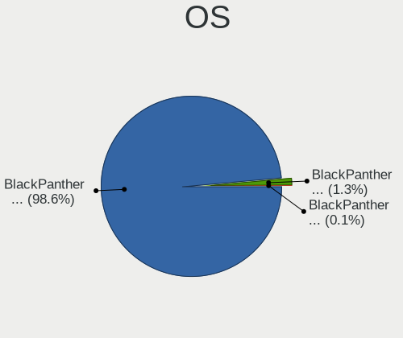

| Name              | Computers | Percent |
|-------------------|-----------|---------|
| BlackPanther 18.1 | 1101      | 98.57%  |
| BlackPanther 16.2 | 15        | 1.34%   |
| BlackPanther 16.1 | 1         | 0.09%   |

OS Family
---------

OS without a version

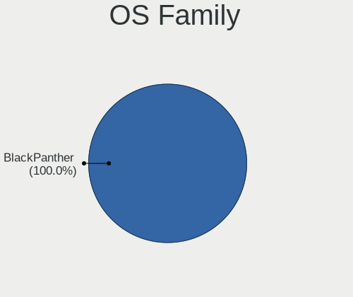

| Name         | Computers | Percent |
|--------------|-----------|---------|
| BlackPanther | 1116      | 100%    |

Kernel
------

Version of the Linux kernel

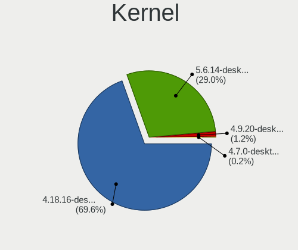

| Version                | Computers | Percent |
|------------------------|-----------|---------|
| 4.18.16-desktop-1bP    | 779       | 69.55%  |
| 5.6.14-desktop-2bP     | 325       | 29.02%  |
| 4.9.20-desktop-pae-1bP | 14        | 1.25%   |
| 4.7.0-desktop-1bP      | 2         | 0.18%   |

Kernel Family
-------------

Linux kernel without a distro release

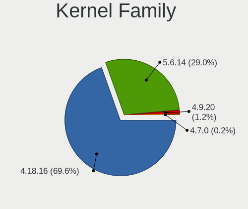

| Version | Computers | Percent |
|---------|-----------|---------|
| 4.18.16 | 779       | 69.55%  |
| 5.6.14  | 325       | 29.02%  |
| 4.9.20  | 14        | 1.25%   |
| 4.7.0   | 2         | 0.18%   |

Kernel Major Ver.
-----------------

Linux kernel major version

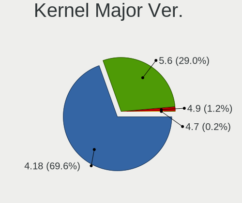

| Version | Computers | Percent |
|---------|-----------|---------|
| 4.18    | 779       | 69.55%  |
| 5.6     | 325       | 29.02%  |
| 4.9     | 14        | 1.25%   |
| 4.7     | 2         | 0.18%   |

Arch
----

OS architecture (x86_64, i586, etc.)

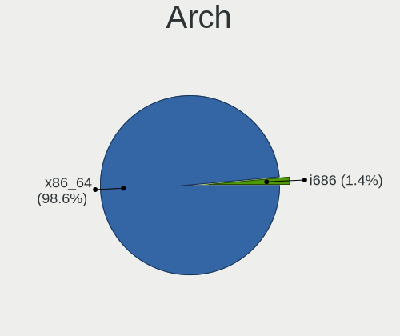

| Name   | Computers | Percent |
|--------|-----------|---------|
| x86_64 | 1101      | 98.57%  |
| i686   | 16        | 1.43%   |

DE
--

Desktop Environment

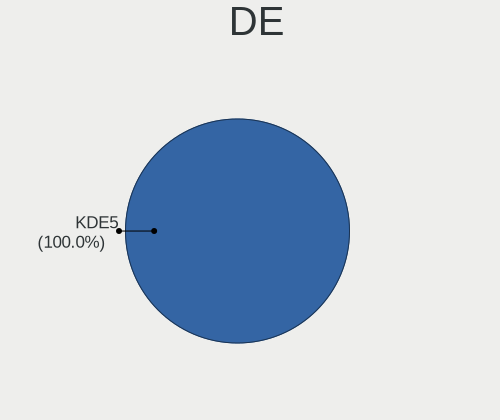

| Name | Computers | Percent |
|------|-----------|---------|
| KDE5 | 1116      | 100%    |

Display Server
--------------

X11 or Wayland

| Name    | Computers | Percent |
|---------|-----------|---------|
| X11     | 1115      | 99.91%  |
| Wayland | 1         | 0.09%   |

Display Manager
---------------

SDDM, LightDM, etc.

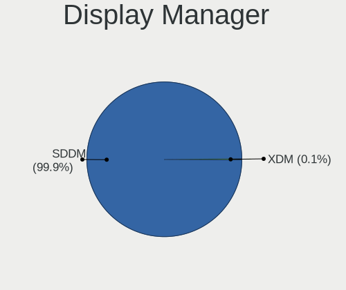

| Name | Computers | Percent |
|------|-----------|---------|
| SDDM | 1116      | 99.91%  |
| XDM  | 1         | 0.09%   |

OS Lang
-------

Language

| Lang    | Computers | Percent |
|---------|-----------|---------|
| Unknown | 1116      | 100%    |

Boot Mode
---------

EFI or BIOS

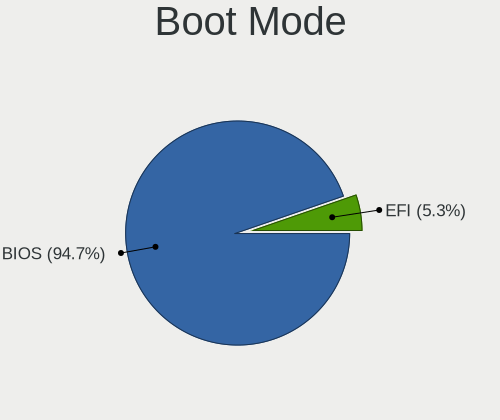

| Mode | Computers | Percent |
|------|-----------|---------|
| BIOS | 1058      | 94.72%  |
| EFI  | 59        | 5.28%   |

Filesystem
----------

Type of filesystem

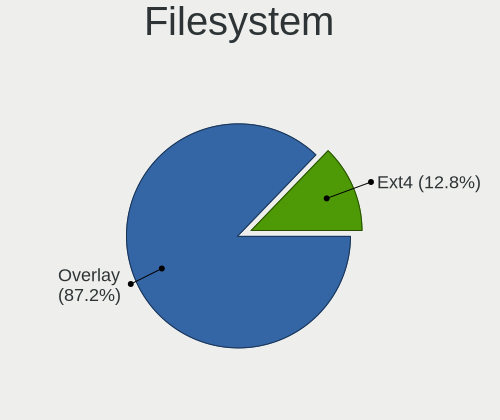

| Type    | Computers | Percent |
|---------|-----------|---------|
| Overlay | 981       | 87.2%   |
| Ext4    | 144       | 12.8%   |

Part. scheme
------------

Scheme of partitioning

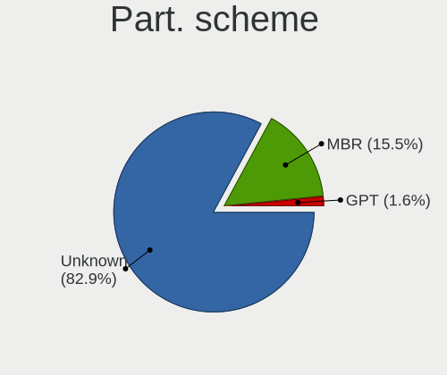

| Type    | Computers | Percent |
|---------|-----------|---------|
| Unknown | 935       | 82.89%  |
| MBR     | 175       | 15.51%  |
| GPT     | 18        | 1.6%    |

Dual Boot with Linux/BSD
------------------------

Hosting more than one Linux/BSD

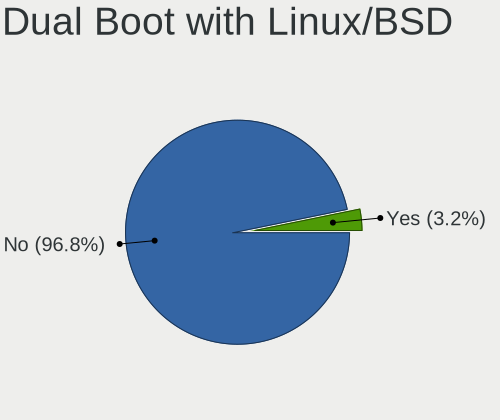

| Dual boot | Computers | Percent |
|-----------|-----------|---------|
| No        | 1086      | 96.79%  |
| Yes       | 36        | 3.21%   |

Dual Boot (Win)
---------------

Hosting Linux and Windows

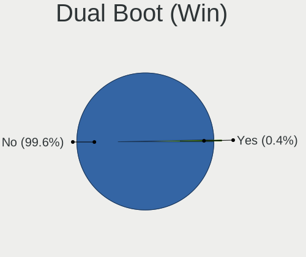

| Dual boot | Computers | Percent |
|-----------|-----------|---------|
| No        | 1113      | 99.64%  |
| Yes       | 4         | 0.36%   |

Board
-----

Vendor
------

Motherboard manufacturer

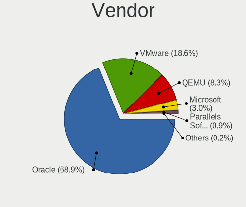

| Name                             | Computers | Percent |
|----------------------------------|-----------|---------|
| Oracle                           | 769       | 68.91%  |
| VMware                           | 208       | 18.64%  |
| QEMU                             | 93        | 8.33%   |
| Microsoft                        | 34        | 3.05%   |
| Parallels Software International | 10        | 0.9%    |
| Red Hat                          | 2         | 0.18%   |

Model
-----

Motherboard model

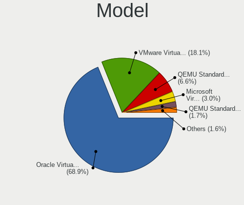

| Name                                                        | Computers | Percent |
|-------------------------------------------------------------|-----------|---------|
| Oracle VirtualBox                                           | 769       | 68.91%  |
| VMware Virtual Platform                                     | 202       | 18.1%   |
| QEMU Standard PC (i440FX + PIIX, 1996)                      | 74        | 6.63%   |
| Microsoft Virtual Machine                                   | 34        | 3.05%   |
| QEMU Standard PC (Q35 + ICH9, 2009)                         | 19        | 1.7%    |
| Parallels Software International Parallels Virtual Platform | 10        | 0.9%    |
| VMware VMware7,1                                            | 6         | 0.54%   |
| Red Hat KVM                                                 | 2         | 0.18%   |

Model Family
------------

Motherboard model prefix

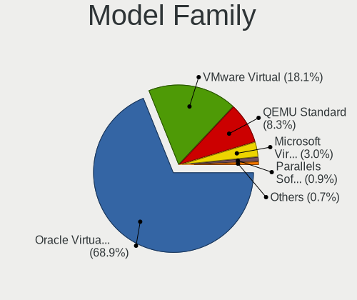

| Name                                       | Computers | Percent |
|--------------------------------------------|-----------|---------|
| Oracle VirtualBox                          | 769       | 68.91%  |
| VMware Virtual                             | 202       | 18.1%   |
| QEMU Standard                              | 93        | 8.33%   |
| Microsoft Virtual                          | 34        | 3.05%   |
| Parallels Software International Parallels | 10        | 0.9%    |
| VMware VMware7                             | 6         | 0.54%   |
| Red Hat KVM                                | 2         | 0.18%   |

MFG Year
--------

Motherboard manufacture year

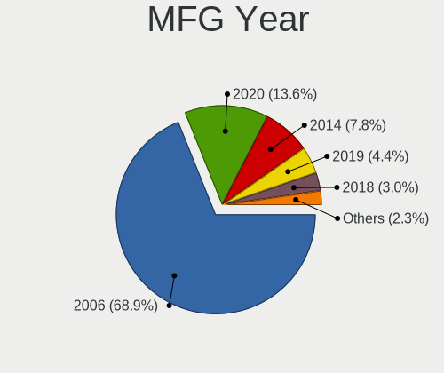

| Year    | Computers | Percent |
|---------|-----------|---------|
| 2006    | 769       | 68.91%  |
| 2020    | 152       | 13.62%  |
| 2014    | 87        | 7.8%    |
| 2019    | 49        | 4.39%   |
| 2018    | 33        | 2.96%   |
| 2015    | 14        | 1.25%   |
| 2021    | 5         | 0.45%   |
| 2017    | 3         | 0.27%   |
| Unknown | 3         | 0.27%   |
| 2012    | 1         | 0.09%   |

Form Factor
-----------

Physical design of the computer

| Name            | Computers | Percent |
|-----------------|-----------|---------|
| Virtual machine | 1116      | 100%    |

Secure Boot
-----------

Enabled or disabled

| State    | Computers | Percent |
|----------|-----------|---------|
| Disabled | 1116      | 100%    |

Coreboot
--------

Have coreboot on board

| Used | Computers | Percent |
|------|-----------|---------|
| No   | 1116      | 100%    |

RAM Size
--------

Total RAM memory

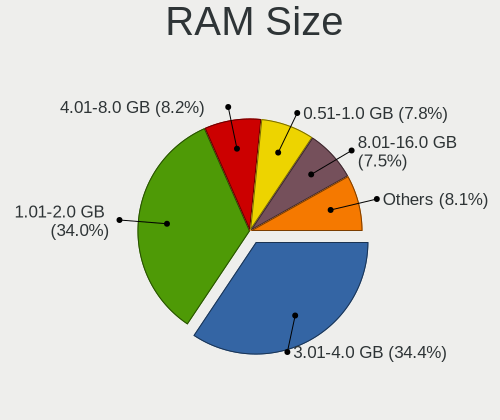

| Size in GB  | Computers | Percent |
|-------------|-----------|---------|
| 3.01-4.0    | 385       | 34.38%  |
| 1.01-2.0    | 381       | 34.02%  |
| 4.01-8.0    | 92        | 8.21%   |
| 0.51-1.0    | 87        | 7.77%   |
| 8.01-16.0   | 84        | 7.5%    |
| 2.01-3.0    | 54        | 4.82%   |
| 0.01-0.5    | 18        | 1.61%   |
| 16.01-24.0  | 15        | 1.34%   |
| 24.01-32.0  | 3         | 0.27%   |
| 64.01-256.0 | 1         | 0.09%   |

RAM Used
--------

Used RAM memory

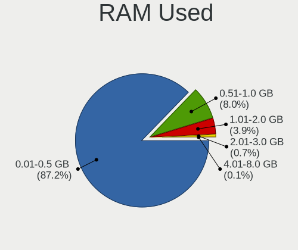

| Used GB  | Computers | Percent |
|----------|-----------|---------|
| 0.01-0.5 | 977       | 87.23%  |
| 0.51-1.0 | 90        | 8.04%   |
| 1.01-2.0 | 44        | 3.93%   |
| 2.01-3.0 | 8         | 0.71%   |
| 4.01-8.0 | 1         | 0.09%   |

Total Drives
------------

Number of drives on board

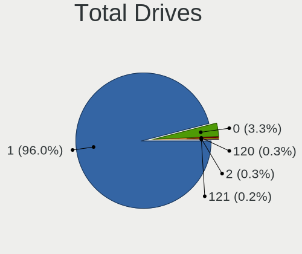

| Drives | Computers | Percent |
|--------|-----------|---------|
| 1      | 1074      | 95.98%  |
| 0      | 37        | 3.31%   |
| 120    | 3         | 0.27%   |
| 2      | 3         | 0.27%   |
| 121    | 2         | 0.18%   |

Has CD-ROM
----------

Has CD-ROM on board

| Presented | Computers | Percent |
|-----------|-----------|---------|
| Yes       | 1109      | 99.37%  |
| No        | 7         | 0.63%   |

Has Ethernet
------------

Has Ethernet on board

| Presented | Computers | Percent |
|-----------|-----------|---------|
| Yes       | 1048      | 93.91%  |
| No        | 68        | 6.09%   |

Has WiFi
--------

Has WiFi module

| Presented | Computers | Percent |
|-----------|-----------|---------|
| No        | 1116      | 100%    |

Has Bluetooth
-------------

Has Bluetooth module

| Presented | Computers | Percent |
|-----------|-----------|---------|
| No        | 1045      | 93.64%  |
| Yes       | 71        | 6.36%   |

Location
--------

Country
-------

Geographic location (country)

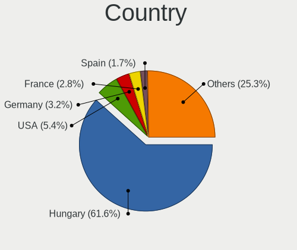

| Country                          | Computers | Percent |
|----------------------------------|-----------|---------|
| Hungary                          | 688       | 61.65%  |
| USA                              | 60        | 5.38%   |
| Germany                          | 36        | 3.23%   |
| France                           | 31        | 2.78%   |
| Spain                            | 19        | 1.7%    |
| Brazil                           | 19        | 1.7%    |
| Romania                          | 16        | 1.43%   |
| Poland                           | 16        | 1.43%   |
| Austria                          | 16        | 1.43%   |
| Italy                            | 12        | 1.08%   |
| Slovakia                         | 11        | 0.99%   |
| Canada                           | 11        | 0.99%   |
| UK                               | 10        | 0.9%    |
| Turkey                           | 10        | 0.9%    |
| Norway                           | 10        | 0.9%    |
| Portugal                         | 9         | 0.81%   |
| Mexico                           | 9         | 0.81%   |
| Finland                          | 9         | 0.81%   |
| Netherlands                      | 8         | 0.72%   |
| Japan                            | 8         | 0.72%   |
| Switzerland                      | 7         | 0.63%   |
| Serbia                           | 7         | 0.63%   |
| Bulgaria                         | 7         | 0.63%   |
| Belgium                          | 7         | 0.63%   |
| Australia                        | 7         | 0.63%   |
| Argentina                        | 5         | 0.45%   |
| South Africa                     | 4         | 0.36%   |
| Morocco                          | 4         | 0.36%   |
| Slovenia                         | 3         | 0.27%   |
| Ireland                          | 3         | 0.27%   |
| India                            | 3         | 0.27%   |
| Greece                           | 3         | 0.27%   |
| Denmark                          | 3         | 0.27%   |
| Chile                            | 3         | 0.27%   |
| Ukraine                          | 2         | 0.18%   |
| Tunisia                          | 2         | 0.18%   |
| Thailand                         | 2         | 0.18%   |
| Saudi Arabia                     | 2         | 0.18%   |
| Peru                             | 2         | 0.18%   |
| Pakistan                         | 2         | 0.18%   |
| Madagascar                       | 2         | 0.18%   |
| Indonesia                        | 2         | 0.18%   |
| Estonia                          | 2         | 0.18%   |
| Egypt                            | 2         | 0.18%   |
| Ecuador                          | 2         | 0.18%   |
| Colombia                         | 2         | 0.18%   |
| Uruguay                          | 1         | 0.09%   |
| Sweden                           | 1         | 0.09%   |
| Saint Vincent and the Grenadines | 1         | 0.09%   |
| Russia                           | 1         | 0.09%   |
| Qatar                            | 1         | 0.09%   |
| Puerto Rico                      | 1         | 0.09%   |
| Palestine                        | 1         | 0.09%   |
| Moldova                          | 1         | 0.09%   |
| Luxembourg                       | 1         | 0.09%   |
| Liechtenstein                    | 1         | 0.09%   |
| Israel                           | 1         | 0.09%   |
| Hong Kong                        | 1         | 0.09%   |
| El Salvador                      | 1         | 0.09%   |
| Cyprus                           | 1         | 0.09%   |

City
----

Geographic location (city)

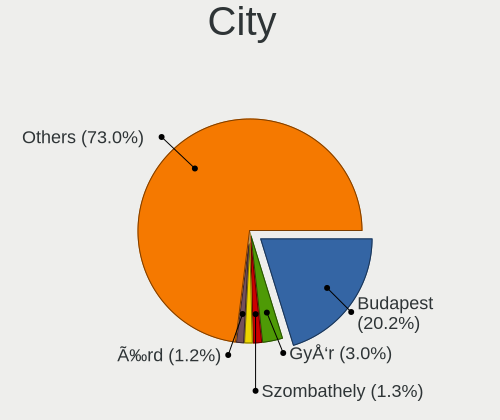

| City                    | Computers | Percent |
|-------------------------|-----------|---------|
| Budapest                | 228       | 20.25%  |
| Győr                | 34        | 3.02%   |
| Szombathely             | 15        | 1.33%   |
| Debrecen                | 14        | 1.24%   |
| Érd                 | 13        | 1.15%   |
| Szeged                  | 11        | 0.98%   |
| Oroshaza                | 11        | 0.98%   |
| Nagykanizsa             | 10        | 0.89%   |
| Vienna                  | 9         | 0.8%    |
| Miskolc                 | 9         | 0.8%    |
| Karcag                  | 9         | 0.8%    |
| Szekszárd            | 8         | 0.71%   |
| Pécs                 | 8         | 0.71%   |
| Kecskemét            | 8         | 0.71%   |
| Eger                    | 8         | 0.71%   |
| Paris                   | 7         | 0.62%   |
| Lisbon                  | 7         | 0.62%   |
| Tatabánya            | 6         | 0.53%   |
| Szigetszentmiklos       | 6         | 0.53%   |
| Sao Paulo               | 6         | 0.53%   |
| Pomaz                   | 6         | 0.53%   |
| Paszto                  | 6         | 0.53%   |
| Nyiregyhaza             | 6         | 0.53%   |
| Kazincbarcika           | 6         | 0.53%   |
| Zalaegerszeg            | 5         | 0.44%   |
| Sydney                  | 5         | 0.44%   |
| Oslo                    | 5         | 0.44%   |
| Mosonmagyaróvár   | 5         | 0.44%   |
| Milan                   | 5         | 0.44%   |
| Madrid                  | 5         | 0.44%   |
| Baja                    | 5         | 0.44%   |
| Zurich                  | 4         | 0.36%   |
| Vecses                  | 4         | 0.36%   |
| Tomorkeny               | 4         | 0.36%   |
| Tet                     | 4         | 0.36%   |
| Szolnok                 | 4         | 0.36%   |
| Székesfehérvár | 4         | 0.36%   |
| Szabolcsveresmart       | 4         | 0.36%   |
| Szabadbattyan           | 4         | 0.36%   |
| Stuttgart               | 4         | 0.36%   |
| Rio de Janeiro          | 4         | 0.36%   |
| Plovdiv                 | 4         | 0.36%   |
| Monor                   | 4         | 0.36%   |
| Marlton                 | 4         | 0.36%   |
| Maisons-Laffitte        | 4         | 0.36%   |
| Maglod                  | 4         | 0.36%   |
| Ketpo                   | 4         | 0.36%   |
| Johannesburg            | 4         | 0.36%   |
| Helsinki                | 4         | 0.36%   |
| God                     | 4         | 0.36%   |
| Gödöllő       | 4         | 0.36%   |
| Dunaújváros       | 4         | 0.36%   |
| Bratislava              | 4         | 0.36%   |
| Békéscsaba        | 4         | 0.36%   |
| Barcelona               | 4         | 0.36%   |
| Amsterdam               | 4         | 0.36%   |
| Warsaw                  | 3         | 0.27%   |
| Veszprém             | 3         | 0.27%   |
| Sopron                  | 3         | 0.27%   |
| Sofia                   | 3         | 0.27%   |

Drives
------

Drive Vendor
------------

Hard drive vendors

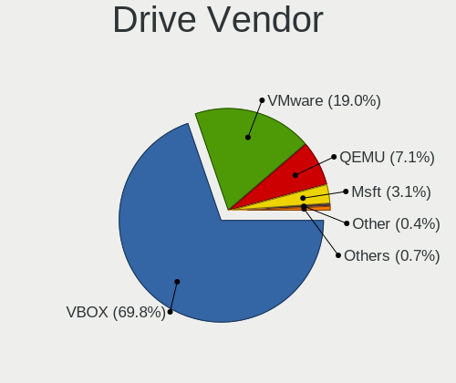

| Vendor                 | Computers | Drives | Percent |
|------------------------|-----------|--------|---------|
| VBOX                   | 754       | 778    | 69.75%  |
| VMware                 | 205       | 214    | 18.96%  |
| QEMU                   | 77        | 78     | 7.12%   |
| Msft                   | 33        | 33     | 3.05%   |
| Other                  | 4         | 4      | 0.37%   |
| Ubuntu                 | 1         | 1      | 0.09%   |
| Otro                   | 1         | 1      | 0.09%   |
| InnoTek Systemberatung | 1         | 1      | 0.09%   |
| BP                     | 1         | 1      | 0.09%   |
| blackPantherOS         | 1         | 1      | 0.09%   |
| Blackpanther-0         | 1         | 1      | 0.09%   |
| ;m“±¬Ô | 1         | 1      | 0.09%   |
| Unknown                | 1         | 1      | 0.09%   |

Drive Model
-----------

Hard drive models

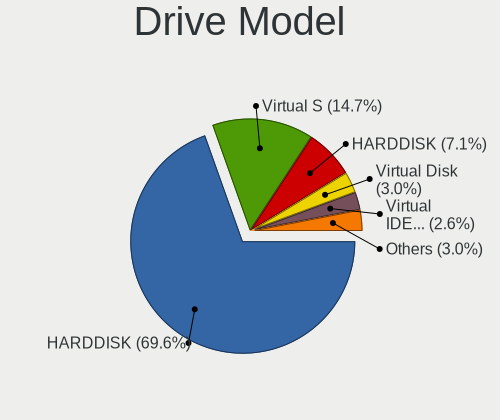

| Model                                                                  | Computers | Percent |
|------------------------------------------------------------------------|-----------|---------|
| VBOX HARDDISK                                                          | 754       | 69.56%  |
| VMware Virtual S                                                       | 159       | 14.67%  |
| QEMU HARDDISK                                                          | 77        | 7.1%    |
| Msft Virtual Disk                                                      | 33        | 3.04%   |
| VMware Virtual IDE Hard Drive                                          | 28        | 2.58%   |
| VMware Virtual SATA Hard Drive                                         | 8         | 0.74%   |
| VMware NVMe SSD Drive                                                  | 8         | 0.74%   |
| VMware Virtual disk                                                    | 5         | 0.46%   |
| Other Linux-0 SSD 69GB                                                 | 3         | 0.28%   |
| Ubuntu Linux-0 SSD 137GB                                               | 1         | 0.09%   |
| Otro Linux-0 SSD 69GB                                                  | 1         | 0.09%   |
| Other Linux-01-0 SSD 69GB                                              | 1         | 0.09%   |
| InnoTek Systemberatung NVMe SSD Drive 89GB                             | 1         | 0.09%   |
| BP Linux-0 69GB                                                        | 1         | 0.09%   |
| blackPantherOS Linux-0 SSD 69GB                                        | 1         | 0.09%   |
| Blackpanther-0 SSD 70GB                                                | 1         | 0.09%   |
| ;m“±¬Ô ¿Ë-ÝÖNKL}ÙÞ; ¼ 8184PB | 1         | 0.09%   |
| Unknown                                                                | 1         | 0.09%   |

HDD Vendor
----------

Hard disk drive vendors

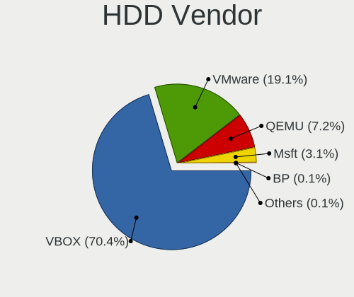

| Vendor                 | Computers | Drives | Percent |
|------------------------|-----------|--------|---------|
| VBOX                   | 754       | 778    | 70.4%   |
| VMware                 | 205       | 214    | 19.14%  |
| QEMU                   | 77        | 78     | 7.19%   |
| Msft                   | 33        | 33     | 3.08%   |
| BP                     | 1         | 1      | 0.09%   |
| ;m“±¬Ô | 1         | 1      | 0.09%   |

SSD Vendor
----------

Solid state drive vendors

| Vendor         | Computers | Drives | Percent |
|----------------|-----------|--------|---------|
| Other          | 4         | 4      | 44.44%  |
| Ubuntu         | 1         | 1      | 11.11%  |
| Otro           | 1         | 1      | 11.11%  |
| blackPantherOS | 1         | 1      | 11.11%  |
| Blackpanther-0 | 1         | 1      | 11.11%  |
| Unknown        | 1         | 1      | 11.11%  |

Drive Kind
----------

HDD or SSD

| Kind | Computers | Drives | Percent |
|------|-----------|--------|---------|
| HDD  | 1070      | 1105   | 99.07%  |
| SSD  | 9         | 9      | 0.83%   |
| NVMe | 1         | 1      | 0.09%   |

Drive Connector
---------------

SATA, SAS, NVMe, etc.

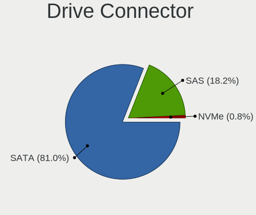

| Type | Computers | Drives | Percent |
|------|-----------|--------|---------|
| SATA | 877       | 903    | 80.98%  |
| SAS  | 197       | 202    | 18.19%  |
| NVMe | 9         | 10     | 0.83%   |

Drive Size
----------

Size of hard drive

| Size in TB      | Computers | Drives | Percent |
|-----------------|-----------|--------|---------|
| 0.01-0.5        | 1079      | 1113   | 99.91%  |
| More than 100.0 | 1         | 1      | 0.09%   |

Space Total
-----------

Amount of disk space available on the file system

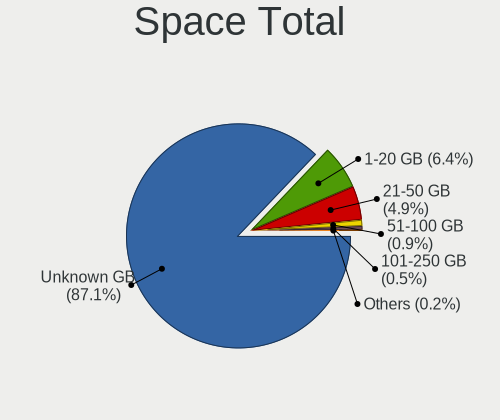

| Size in GB | Computers | Percent |
|------------|-----------|---------|
| Unknown    | 980       | 87.11%  |
| 1-20       | 72        | 6.4%    |
| 21-50      | 55        | 4.89%   |
| 51-100     | 10        | 0.89%   |
| 101-250    | 6         | 0.53%   |
| 251-500    | 2         | 0.18%   |

Space Used
----------

Amount of used disk space

| Used GB | Computers | Percent |
|---------|-----------|---------|
| Unknown | 980       | 87.11%  |
| 1-20    | 145       | 12.89%  |

Malfunc. Drives
---------------

Drive models with a malfunction

Zero info for selected period =(

Malfunc. Drive Vendor
---------------------

Vendors of faulty drives

Zero info for selected period =(

Malfunc. HDD Vendor
-------------------

Vendors of faulty HDD drives

Zero info for selected period =(

Malfunc. Drive Kind
-------------------

Kinds of faulty drives

Zero info for selected period =(

Failed Drives
-------------

Failed drive models

Zero info for selected period =(

Failed Drive Vendor
-------------------

Failed drive vendors

Zero info for selected period =(

Drive Status
------------

Number of failed and malfunc. drives

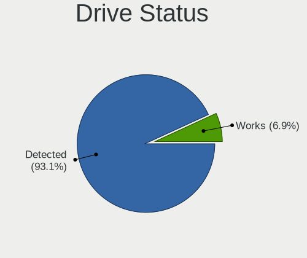

| Status   | Computers | Drives | Percent |
|----------|-----------|--------|---------|
| Detected | 1005      | 1040   | 93.14%  |
| Works    | 74        | 75     | 6.86%   |

Storage controller
------------------

Storage Vendor
--------------

Storage controller vendors

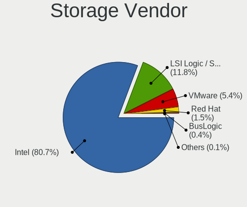

| Vendor                    | Computers | Percent |
|---------------------------|-----------|---------|
| Intel                     | 1105      | 80.72%  |
| LSI Logic / Symbios Logic | 162       | 11.83%  |
| VMware                    | 74        | 5.41%   |
| Red Hat                   | 21        | 1.53%   |
| BusLogic                  | 6         | 0.44%   |
| InnoTek Systemberatung    | 1         | 0.07%   |

Storage Model
-------------

Storage controller models

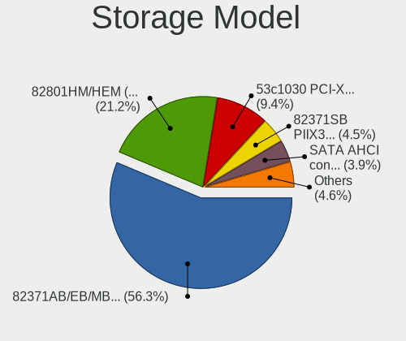

| Model                                                                 | Computers | Percent |
|-----------------------------------------------------------------------|-----------|---------|
| Intel 82371AB/EB/MB PIIX4 IDE                                         | 974       | 56.33%  |
| Intel 82801HM/HEM (ICH8M/ICH8M-E) SATA Controller [AHCI mode]         | 367       | 21.23%  |
| LSI Logic / Symbios Logic 53c1030 PCI-X Fusion-MPT Dual Ultra320 SCSI | 162       | 9.37%   |
| Intel 82371SB PIIX3 IDE [Natoma/Triton II]                            | 78        | 4.51%   |
| VMware SATA AHCI controller                                           | 68        | 3.93%   |
| Intel 82801IR/IO/IH (ICH9R/DO/DH) 6 port SATA Controller [AHCI mode]  | 25        | 1.45%   |
| Red Hat Virtio block device                                           | 18        | 1.04%   |
| Intel 82801BA IDE U100 Controller                                     | 10        | 0.58%   |
| VMware NVMe SSD Controller                                            | 8         | 0.46%   |
| BusLogic BT-946C (BA80C30) [MultiMaster 10]                           | 6         | 0.35%   |
| Intel 82801HR/HO/HH (ICH8R/DO/DH) 6 port SATA Controller [AHCI mode]  | 4         | 0.23%   |
| VMware PVSCSI SCSI Controller                                         | 3         | 0.17%   |
| Red Hat Virtio SCSI                                                   | 3         | 0.17%   |
| Intel 631xESB/632xESB IDE Controller                                  | 2         | 0.12%   |
| InnoTek Systemberatung Non-Volatile memory controller                 | 1         | 0.06%   |

Storage Kind
------------

Kind of storage controller (IDE, SATA, NVMe, SAS, ...)

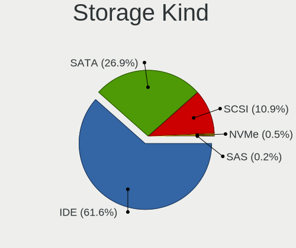

| Kind | Computers | Percent |
|------|-----------|---------|
| IDE  | 1064      | 61.57%  |
| SATA | 464       | 26.85%  |
| SCSI | 188       | 10.88%  |
| NVMe | 9         | 0.52%   |
| SAS  | 3         | 0.17%   |

Processor
---------

CPU Vendor
----------

Processor vendors

| Vendor | Computers | Percent |
|--------|-----------|---------|
| Intel  | 829       | 74.28%  |
| AMD    | 287       | 25.72%  |

CPU Model
---------

Processor models

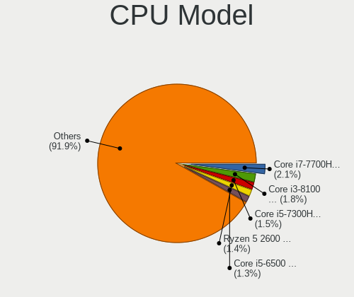

| Model                                         | Computers | Percent |
|-----------------------------------------------|-----------|---------|
| Intel Core i7-7700HQ CPU @ 2.80GHz            | 23        | 2.06%   |
| Intel Core i3-8100 CPU @ 3.60GHz              | 20        | 1.79%   |
| Intel Core i5-7300HQ CPU @ 2.50GHz            | 17        | 1.52%   |
| AMD Ryzen 5 2600 Six-Core Processor           | 16        | 1.43%   |
| Intel Core i5-6500 CPU @ 3.20GHz              | 15        | 1.34%   |
| Intel Core i5-3470 CPU @ 3.20GHz              | 15        | 1.34%   |
| Intel Core i3-2120 CPU @ 3.30GHz              | 15        | 1.34%   |
| AMD FX-8350 Eight-Core Processor              | 15        | 1.34%   |
| Intel Core i5-9400F CPU @ 2.90GHz             | 12        | 1.07%   |
| Intel Core i5-7200U CPU @ 2.50GHz             | 12        | 1.07%   |
| Intel Core i5-10210U CPU @ 1.60GHz            | 12        | 1.07%   |
| AMD Ryzen 5 3600 6-Core Processor             | 12        | 1.07%   |
| AMD Ryzen 5 3500U with Radeon Vega Mobile Gfx | 12        | 1.07%   |
| Intel Core i7-8750H CPU @ 2.20GHz             | 11        | 0.98%   |
| Intel Core i7-4790 CPU @ 3.60GHz              | 11        | 0.98%   |
| Intel Core i7-8550U CPU @ 1.80GHz             | 10        | 0.9%    |
| Intel Core i3-5005U CPU @ 2.00GHz             | 10        | 0.9%    |
| Intel Core i3-2330M CPU @ 2.20GHz             | 10        | 0.9%    |
| AMD Ryzen 3 2200G with Radeon Vega Graphics   | 10        | 0.9%    |
| Intel Xeon E3-12xx v2 (Ivy Bridge, IBRS)      | 9         | 0.81%   |
| Intel Core i7-6700HQ CPU @ 2.60GHz            | 9         | 0.81%   |
| Intel Core i7-3770 CPU @ 3.40GHz              | 9         | 0.81%   |
| AMD Ryzen 7 1800X Eight-Core Processor        | 9         | 0.81%   |
| Intel Xeon CPU E5-1620 v2 @ 3.70GHz           | 8         | 0.72%   |
| Intel Core i7-8700 CPU @ 3.20GHz              | 8         | 0.72%   |
| Intel Core i7-8565U CPU @ 1.80GHz             | 8         | 0.72%   |
| Intel Core i7-7500U CPU @ 2.70GHz             | 8         | 0.72%   |
| Intel Core i5-9300H CPU @ 2.40GHz             | 8         | 0.72%   |
| Intel Core i5-8265U CPU @ 1.60GHz             | 8         | 0.72%   |
| Intel Core i5-6400 CPU @ 2.70GHz              | 8         | 0.72%   |
| Intel Core i5-3320M CPU @ 2.60GHz             | 8         | 0.72%   |
| Intel Core i3-3220 CPU @ 3.30GHz              | 8         | 0.72%   |
| AMD A4-9125 RADEON R3, 4 COMPUTE CORES 2C+2G  | 8         | 0.72%   |
| Intel Core i7-9750H CPU @ 2.60GHz             | 7         | 0.63%   |
| Intel Core i7-7700 CPU @ 3.60GHz              | 7         | 0.63%   |
| Intel Core i7-4510U CPU @ 2.00GHz             | 7         | 0.63%   |
| Intel Core i7-2600 CPU @ 3.40GHz              | 7         | 0.63%   |
| Intel Core i5-4590 CPU @ 3.30GHz              | 7         | 0.63%   |
| Intel Core i5-4570 CPU @ 3.20GHz              | 7         | 0.63%   |
| Intel Core i5-4310U CPU @ 2.00GHz             | 7         | 0.63%   |
| Intel Core i5-2400 CPU @ 3.10GHz              | 7         | 0.63%   |
| AMD Ryzen 5 2500U with Radeon Vega Mobile Gfx | 7         | 0.63%   |
| AMD FX-6300 Six-Core Processor                | 7         | 0.63%   |
| Intel Pentium CPU G4560 @ 3.50GHz             | 6         | 0.54%   |
| Intel Core i7-6700 CPU @ 3.40GHz              | 6         | 0.54%   |
| Intel Core i7-4600U CPU @ 2.10GHz             | 6         | 0.54%   |
| Intel Core i5-8250U CPU @ 1.60GHz             | 6         | 0.54%   |
| Intel Core i5-6200U CPU @ 2.30GHz             | 6         | 0.54%   |
| Intel Core i5-5257U CPU @ 2.70GHz             | 6         | 0.54%   |
| Intel Core i5-5200U CPU @ 2.20GHz             | 6         | 0.54%   |
| Intel Core i5-4210U CPU @ 1.70GHz             | 6         | 0.54%   |
| Intel Core i3-3110M CPU @ 2.40GHz             | 6         | 0.54%   |
| Intel Core i7-4702MQ CPU @ 2.20GHz            | 5         | 0.45%   |
| Intel Core i5-8500 CPU @ 3.00GHz              | 5         | 0.45%   |
| Intel Core i5-8400 CPU @ 2.80GHz              | 5         | 0.45%   |
| Intel Core i5-6300HQ CPU @ 2.30GHz            | 5         | 0.45%   |
| Intel Core i5-3350P CPU @ 3.10GHz             | 5         | 0.45%   |
| Intel Core i5-3210M CPU @ 2.50GHz             | 5         | 0.45%   |
| Intel Core i5-2520M CPU @ 2.50GHz             | 5         | 0.45%   |
| Intel Core i3-6100 CPU @ 3.70GHz              | 5         | 0.45%   |

CPU Model Family
----------------

Processor model prefix

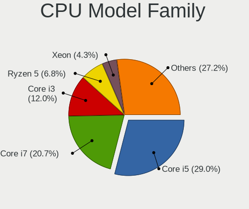

| Model                   | Computers | Percent |
|-------------------------|-----------|---------|
| Intel Core i5           | 324       | 29.01%  |
| Intel Core i7           | 231       | 20.68%  |
| Intel Core i3           | 134       | 12%     |
| AMD Ryzen 5             | 76        | 6.8%    |
| Intel Xeon              | 48        | 4.3%    |
| AMD Ryzen 7             | 41        | 3.67%   |
| AMD FX                  | 38        | 3.4%    |
| Intel Pentium           | 27        | 2.42%   |
| Other                   | 24        | 2.15%   |
| AMD Ryzen 3             | 24        | 2.15%   |
| AMD A4                  | 22        | 1.97%   |
| Intel Celeron           | 19        | 1.7%    |
| Intel Core 2 Duo        | 15        | 1.34%   |
| AMD A8                  | 11        | 0.98%   |
| AMD Phenom II X4        | 8         | 0.72%   |
| AMD EPYC                | 8         | 0.72%   |
| AMD A6                  | 8         | 0.72%   |
| AMD Athlon II X2        | 7         | 0.63%   |
| Intel Core              | 6         | 0.54%   |
| AMD Phenom II X6        | 6         | 0.54%   |
| AMD Athlon X4           | 5         | 0.45%   |
| AMD Ryzen 9             | 4         | 0.36%   |
| AMD E2                  | 4         | 0.36%   |
| AMD Athlon 64 X2        | 4         | 0.36%   |
| Intel Core i9           | 3         | 0.27%   |
| Intel Core 2 Quad       | 3         | 0.27%   |
| AMD Athlon II X4        | 3         | 0.27%   |
| AMD A10                 | 3         | 0.27%   |
| AMD Opteron             | 2         | 0.18%   |
| AMD Athlon              | 2         | 0.18%   |
| Intel Pentium Silver    | 1         | 0.09%   |
| Intel Pentium Dual-Core | 1         | 0.09%   |
| Intel Pentium D         | 1         | 0.09%   |
| Intel Core m3           | 1         | 0.09%   |
| AMD Ryzen 5 PRO         | 1         | 0.09%   |
| AMD Athlon II X3        | 1         | 0.09%   |
| AMD A12                 | 1         | 0.09%   |

CPU Cores
---------

Number of processor cores

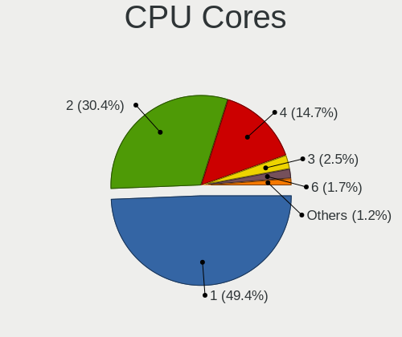

| Number | Computers | Percent |
|--------|-----------|---------|
| 1      | 553       | 49.38%  |
| 2      | 341       | 30.45%  |
| 4      | 165       | 14.73%  |
| 3      | 28        | 2.5%    |
| 6      | 19        | 1.7%    |
| 8      | 10        | 0.89%   |
| 16     | 1         | 0.09%   |
| 12     | 1         | 0.09%   |
| 7      | 1         | 0.09%   |
| 5      | 1         | 0.09%   |

CPU Sockets
-----------

Number of sockets

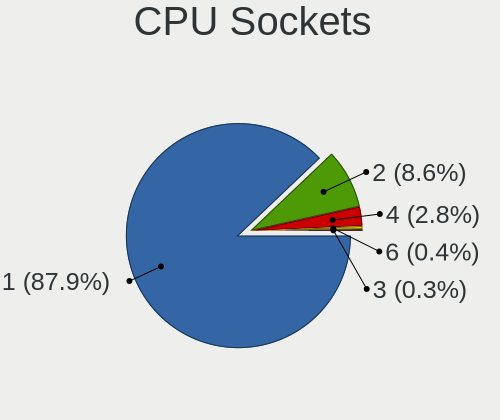

| Number | Computers | Percent |
|--------|-----------|---------|
| 1      | 982       | 87.91%  |
| 2      | 96        | 8.59%   |
| 4      | 31        | 2.78%   |
| 6      | 5         | 0.45%   |
| 3      | 3         | 0.27%   |

CPU Threads
-----------

Threads per core (Hyper-Threading)

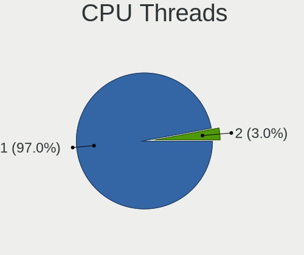

| Number | Computers | Percent |
|--------|-----------|---------|
| 1      | 1083      | 97.04%  |
| 2      | 33        | 2.96%   |

CPU Op-Modes
------------

CPU Operation Modes (32-bit, 64-bit)

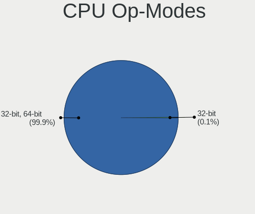

| Op mode        | Computers | Percent |
|----------------|-----------|---------|
| 32-bit, 64-bit | 1115      | 99.91%  |
| 32-bit         | 1         | 0.09%   |

CPU Microcode
-------------

Microcode number

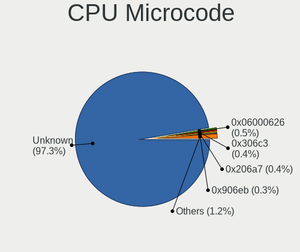

| Number     | Computers | Percent |
|------------|-----------|---------|
| Unknown    | 1088      | 97.32%  |
| 0x06000626 | 6         | 0.54%   |
| 0x306c3    | 4         | 0.36%   |
| 0x206a7    | 4         | 0.36%   |
| 0x906eb    | 3         | 0.27%   |
| 0x306d4    | 3         | 0.27%   |
| 0x306a9    | 2         | 0.18%   |
| 0x010000bf | 2         | 0.18%   |
| 0xf61      | 1         | 0.09%   |
| 0xa0655    | 1         | 0.09%   |
| 0x906e9    | 1         | 0.09%   |
| 0x506e3    | 1         | 0.09%   |
| 0x40651    | 1         | 0.09%   |
| 0x106a4    | 1         | 0.09%   |

CPU Microarch
-------------

Microarchitecture

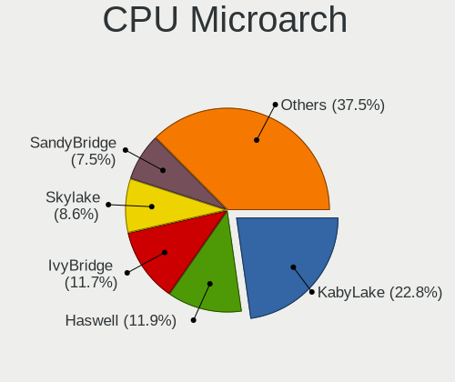

| Name          | Computers | Percent |
|---------------|-----------|---------|
| KabyLake      | 254       | 22.76%  |
| Haswell       | 133       | 11.92%  |
| IvyBridge     | 131       | 11.74%  |
| Skylake       | 96        | 8.6%    |
| SandyBridge   | 84        | 7.53%   |
| Zen+          | 58        | 5.2%    |
| Piledriver    | 50        | 4.48%   |
| Zen           | 47        | 4.21%   |
| Zen 2         | 46        | 4.12%   |
| Broadwell     | 33        | 2.96%   |
| K10           | 30        | 2.69%   |
| Westmere      | 23        | 2.06%   |
| Nehalem       | 18        | 1.61%   |
| Excavator     | 16        | 1.43%   |
| Penryn        | 14        | 1.25%   |
| Steamroller   | 8         | 0.72%   |
| Silvermont    | 8         | 0.72%   |
| Puma          | 7         | 0.63%   |
| Core          | 7         | 0.63%   |
| CometLake     | 7         | 0.63%   |
| Bulldozer     | 7         | 0.63%   |
| NetBurst      | 6         | 0.54%   |
| K8 Hammer     | 6         | 0.54%   |
| TigerLake     | 5         | 0.45%   |
| Jaguar        | 5         | 0.45%   |
| Zen 3         | 4         | 0.36%   |
| IceLake       | 4         | 0.36%   |
| Goldmont plus | 4         | 0.36%   |
| Unknown       | 2         | 0.18%   |
| K6            | 1         | 0.09%   |
| K10 Llano     | 1         | 0.09%   |
| Goldmont      | 1         | 0.09%   |

Graphics
--------

GPU Vendor
----------

Vendors of graphics cards

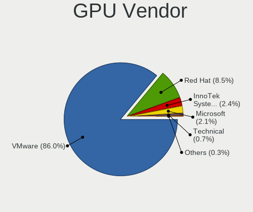

| Vendor                 | Computers | Percent |
|------------------------|-----------|---------|
| VMware                 | 952       | 86%     |
| Red Hat                | 94        | 8.49%   |
| InnoTek Systemberatung | 27        | 2.44%   |
| Microsoft              | 23        | 2.08%   |
| Technical              | 8         | 0.72%   |
| Parallels              | 2         | 0.18%   |
| Cirrus Logic           | 1         | 0.09%   |

GPU Model
---------

Graphics card models

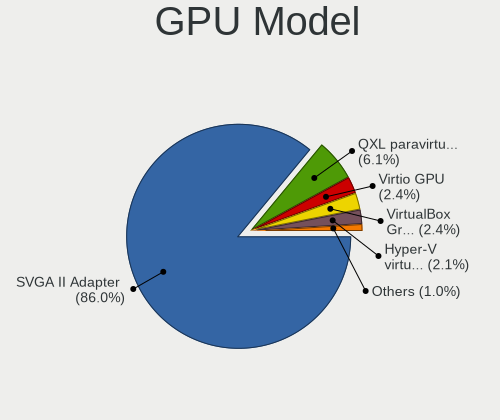

| Model                                              | Computers | Percent |
|----------------------------------------------------|-----------|---------|
| VMware SVGA II Adapter                             | 952       | 86%     |
| Red Hat QXL paravirtual graphic card               | 67        | 6.05%   |
| Red Hat Virtio GPU                                 | 27        | 2.44%   |
| InnoTek Systemberatung VirtualBox Graphics Adapter | 27        | 2.44%   |
| Microsoft Hyper-V virtual VGA                      | 23        | 2.08%   |
| Technical VGA compatible controller                | 8         | 0.72%   |
| Parallels Accelerated Virtual Video Adapter        | 2         | 0.18%   |
| Cirrus Logic GD 5446                               | 1         | 0.09%   |

GPU Combo
---------

Combinations of graphics cards

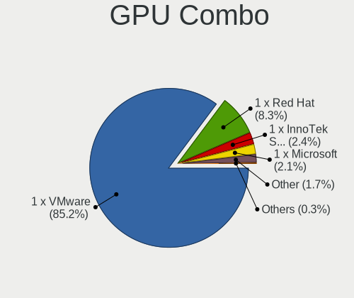

| Name                       | Computers | Percent |
|----------------------------|-----------|---------|
| 1 x VMware                 | 952       | 85.23%  |
| 1 x Red Hat                | 93        | 8.33%   |
| 1 x InnoTek Systemberatung | 27        | 2.42%   |
| 1 x Microsoft              | 23        | 2.06%   |
| Other                      | 19        | 1.7%    |
| 1 x Parallels              | 2         | 0.18%   |
| 1 x Cirrus Logic           | 1         | 0.09%   |

GPU Driver
----------

Free vs proprietary

| Driver  | Computers | Percent |
|---------|-----------|---------|
| Unknown | 1116      | 100%    |

GPU Memory
----------

Total video memory

| Size in GB | Computers | Percent |
|------------|-----------|---------|
| Unknown    | 1116      | 100%    |

Monitor
-------

Monitor Vendor
--------------

Monitor vendors

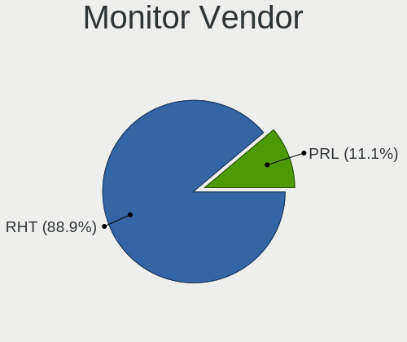

| Vendor | Computers | Percent |
|--------|-----------|---------|
| RHT    | 16        | 88.89%  |
| PRL    | 2         | 11.11%  |

Monitor Model
-------------

Monitor models

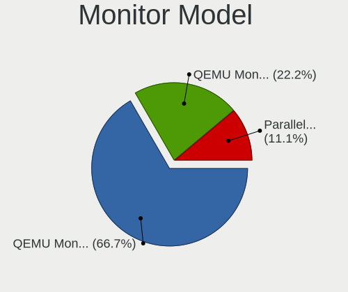

| Model                                                  | Computers | Percent |
|--------------------------------------------------------|-----------|---------|
| RHT QEMU Monitor RHT1234 2048x1152 260x190mm 12.7-inch | 12        | 66.67%  |
| RHT QEMU Monitor RHT1234 2048x1152 260x195mm 12.8-inch | 4         | 22.22%  |
| PRL Parallels Vu PRL4006 1400x1050                     | 2         | 11.11%  |

Monitor Resolution
------------------

Monitor screen resolution

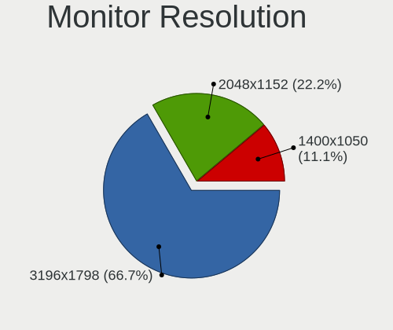

| Resolution | Computers | Percent |
|------------|-----------|---------|
| 3196x1798  | 12        | 66.67%  |
| 2048x1152  | 4         | 22.22%  |
| 1400x1050  | 2         | 11.11%  |

Monitor Diagonal
----------------

Diagonal size in inches

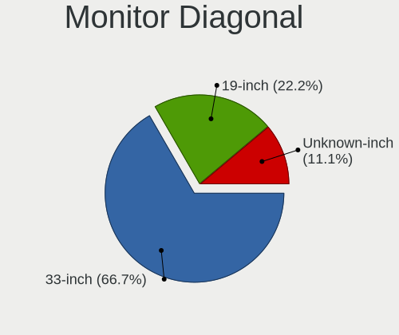

| Inches  | Computers | Percent |
|---------|-----------|---------|
| 33      | 12        | 66.67%  |
| 19      | 4         | 22.22%  |
| Unknown | 2         | 11.11%  |

Monitor Width
-------------

Physical width

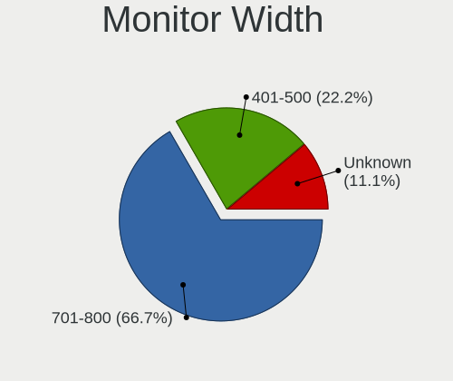

| Width in mm | Computers | Percent |
|-------------|-----------|---------|
| 701-800     | 12        | 66.67%  |
| 401-500     | 4         | 22.22%  |
| Unknown     | 2         | 11.11%  |

Aspect Ratio
------------

Proportional relationship between the width and the height

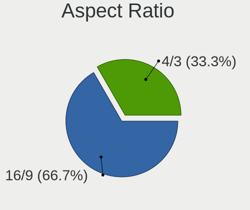

| Ratio | Computers | Percent |
|-------|-----------|---------|
| 16/9  | 12        | 66.67%  |
| 4/3   | 6         | 33.33%  |

Monitor Area
------------

Area in inch²

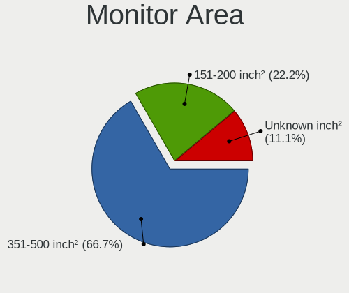

| Area in inch² | Computers | Percent |
|----------------|-----------|---------|
| 351-500        | 12        | 66.67%  |
| 151-200        | 4         | 22.22%  |
| Unknown        | 2         | 11.11%  |

Pixel Density
-------------

Pixels per inch

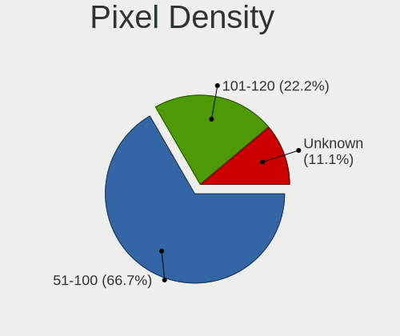

| Density | Computers | Percent |
|---------|-----------|---------|
| 51-100  | 12        | 66.67%  |
| 101-120 | 4         | 22.22%  |
| Unknown | 2         | 11.11%  |

Multiple Monitors
-----------------

Total monitors connected

| Total | Computers | Percent |
|-------|-----------|---------|
| 1     | 1072      | 95.97%  |
| 0     | 45        | 4.03%   |

Network
-------

Net Controller Vendor
---------------------

Controller vendors

| Vendor                | Computers | Percent |
|-----------------------|-----------|---------|
| Intel                 | 918       | 85%     |
| AMD                   | 79        | 7.31%   |
| Realtek Semiconductor | 49        | 4.54%   |
| Red Hat               | 27        | 2.5%    |
| VMware                | 7         | 0.65%   |

Net Controller Model
--------------------

Controller models

| Model                                                 | Computers | Percent |
|-------------------------------------------------------|-----------|---------|
| Intel 82540EM Gigabit Ethernet Controller             | 776       | 71.85%  |
| Intel 82545EM Gigabit Ethernet Controller (Copper)    | 139       | 12.87%  |
| AMD 79c970 [PCnet32 LANCE]                            | 79        | 7.31%   |
| Realtek RTL-8100/8101L/8139 PCI Fast Ethernet Adapter | 49        | 4.54%   |
| Red Hat Virtio network device                         | 27        | 2.5%    |
| VMware VMXNET3 Ethernet Controller                    | 7         | 0.65%   |
| Intel 82574L Gigabit Network Connection               | 3         | 0.28%   |

Wireless Vendor
---------------

Wireless vendors

Zero info for selected period =(

Wireless Model
--------------

Wireless models

Zero info for selected period =(

Ethernet Vendor
---------------

Ethernet vendors

| Vendor                | Computers | Percent |
|-----------------------|-----------|---------|
| Intel                 | 918       | 87.18%  |
| AMD                   | 79        | 7.5%    |
| Realtek Semiconductor | 49        | 4.65%   |
| VMware                | 7         | 0.66%   |

Ethernet Model
--------------

Ethernet models

| Model                                                 | Computers | Percent |
|-------------------------------------------------------|-----------|---------|
| Intel 82540EM Gigabit Ethernet Controller             | 776       | 73.69%  |
| Intel 82545EM Gigabit Ethernet Controller (Copper)    | 139       | 13.2%   |
| AMD 79c970 [PCnet32 LANCE]                            | 79        | 7.5%    |
| Realtek RTL-8100/8101L/8139 PCI Fast Ethernet Adapter | 49        | 4.65%   |
| VMware VMXNET3 Ethernet Controller                    | 7         | 0.66%   |
| Intel 82574L Gigabit Network Connection               | 3         | 0.28%   |

Net Controller Kind
-------------------

Ethernet, WiFi or modem

| Kind     | Computers | Percent |
|----------|-----------|---------|
| Ethernet | 1048      | 97.49%  |
| Unknown  | 27        | 2.51%   |

Used Controller
---------------

Currently used network controller

| Kind     | Computers | Percent |
|----------|-----------|---------|
| Ethernet | 1048      | 100%    |

NICs
----

Total network controllers on board

| Total | Computers | Percent |
|-------|-----------|---------|
| 1     | 1046      | 93.64%  |
| 0     | 67        | 6%      |
| 2     | 4         | 0.36%   |

IPv6
----

IPv6 vs IPv4

| Used | Computers | Percent |
|------|-----------|---------|
| No   | 1105      | 99.01%  |
| Yes  | 11        | 0.99%   |

Bluetooth
---------

Bluetooth Vendor
----------------

Controller vendors

| Vendor                  | Computers | Percent |
|-------------------------|-----------|---------|
| VMware                  | 69        | 97.18%  |
| Microsoft               | 1         | 1.41%   |
| Cambridge Silicon Radio | 1         | 1.41%   |

Bluetooth Model
---------------

Controller models

| Model                                               | Computers | Percent |
|-----------------------------------------------------|-----------|---------|
| VMware Virtual Bluetooth Adapter                    | 69        | 97.18%  |
| Microsoft Wireless Transceiver for Bluetooth        | 1         | 1.41%   |
| Cambridge Silicon Radio Bluetooth Dongle (HCI mode) | 1         | 1.41%   |

Sound
-----

Sound Vendor
------------

Sound card vendors

| Vendor  | Computers | Percent |
|---------|-----------|---------|
| Intel   | 855       | 81.2%   |
| Ensoniq | 195       | 18.52%  |
| VMware  | 3         | 0.28%   |

Sound Model
-----------

Sound card models

| Model                                                                      | Computers | Percent |
|----------------------------------------------------------------------------|-----------|---------|
| Intel 82801AA AC'97 Audio Controller                                       | 730       | 69.26%  |
| Ensoniq ES1371/ES1373 / Creative Labs CT2518                               | 195       | 18.5%   |
| Intel 82801FB/FBM/FR/FW/FRW (ICH6 Family) High Definition Audio Controller | 101       | 9.58%   |
| Intel 82801I (ICH9 Family) HD Audio Controller                             | 16        | 1.52%   |
| Intel 82801BA/BAM AC'97 Audio Controller                                   | 9         | 0.85%   |
| VMware HD Audio Controller                                                 | 3         | 0.28%   |

Memory
------

Memory Vendor
-------------

Memory module vendors

| Vendor             | Computers | Percent |
|--------------------|-----------|---------|
| Unknown            | 191       | 50.13%  |
| QEMU               | 93        | 24.41%  |
| Unknown            | 55        | 14.44%  |
| Microsoft          | 34        | 8.92%   |
| VMware Virtual RAM | 6         | 1.57%   |
| Red Hat            | 2         | 0.52%   |

Memory Model
------------

Memory module models

| Model                                              | Computers | Percent |
|----------------------------------------------------|-----------|---------|
| Unknown RAM Module 2048MB DIMM DRAM                | 102       | 20.32%  |
| Unknown RAM Module 4096MB DIMM DRAM                | 66        | 13.15%  |
| Unknown                                            | 55        | 10.96%  |
| Unknown RAM Module 1024MB DIMM DRAM                | 37        | 7.37%   |
| Unknown RAM Module 256MB DIMM DRAM                 | 35        | 6.97%   |
| QEMU RAM Module 2048MB DIMM RAM                    | 34        | 6.77%   |
| Unknown RAM Module 512MB DIMM DRAM                 | 31        | 6.18%   |
| Unknown RAM Module 128MB DIMM DRAM                 | 21        | 4.18%   |
| Microsoft RAM Module 3968MB                        | 17        | 3.39%   |
| Microsoft RAM Module 2048MB                        | 15        | 2.99%   |
| QEMU RAM Module 4096MB DIMM RAM                    | 14        | 2.79%   |
| Microsoft RAM Module 128MB                         | 12        | 2.39%   |
| QEMU RAM Module 3072MB DIMM RAM                    | 4         | 0.8%    |
| QEMU RAM Module 3000MB DIMM RAM                    | 4         | 0.8%    |
| VMware Virtual RAM RAM VMW-1024MB 1024MB DIMM DRAM | 3         | 0.6%    |
| QEMU RAM Module 4024MB DIMM RAM                    | 3         | 0.6%    |
| VMware Virtual RAM RAM VMW-4096MB 4GB DIMM DRAM    | 2         | 0.4%    |
| VMware Virtual RAM RAM VMW-2048MB 2GB DIMM DRAM    | 2         | 0.4%    |
| Red Hat RAM Module 4082MB DIMM RAM                 | 2         | 0.4%    |
| QEMU RAM Module 5248MB DIMM RAM                    | 2         | 0.4%    |
| QEMU RAM Module 1024MB DIMM RAM                    | 2         | 0.4%    |
| Microsoft RAM Module 3072MB                        | 2         | 0.4%    |
| Microsoft RAM Module 124MB                         | 2         | 0.4%    |
| Unknown RAM Module 2048MB SODIMM DRAM 667MT/s      | 1         | 0.2%    |
| QEMU RAM Module 8192MB DIMM RAM                    | 1         | 0.2%    |
| QEMU RAM Module 6528MB DIMM RAM                    | 1         | 0.2%    |
| QEMU RAM Module 6144MB DIMM RAM                    | 1         | 0.2%    |
| QEMU RAM Module 5688MB DIMM RAM                    | 1         | 0.2%    |
| QEMU RAM Module 5166MB DIMM RAM                    | 1         | 0.2%    |
| QEMU RAM Module 5036MB DIMM RAM                    | 1         | 0.2%    |
| QEMU RAM Module 5024MB DIMM RAM                    | 1         | 0.2%    |
| QEMU RAM Module 4608MB DIMM RAM                    | 1         | 0.2%    |
| QEMU RAM Module 4593MB DIMM RAM                    | 1         | 0.2%    |
| QEMU RAM Module 4406MB DIMM RAM                    | 1         | 0.2%    |
| QEMU RAM Module 4278MB DIMM RAM                    | 1         | 0.2%    |
| QEMU RAM Module 4210MB DIMM RAM                    | 1         | 0.2%    |
| QEMU RAM Module 4081MB DIMM RAM                    | 1         | 0.2%    |
| QEMU RAM Module 4066MB DIMM RAM                    | 1         | 0.2%    |
| QEMU RAM Module 4065MB DIMM RAM                    | 1         | 0.2%    |
| QEMU RAM Module 4059MB DIMM RAM                    | 1         | 0.2%    |
| QEMU RAM Module 3946MB DIMM RAM                    | 1         | 0.2%    |
| QEMU RAM Module 3826MB DIMM RAM                    | 1         | 0.2%    |
| QEMU RAM Module 3419MB DIMM RAM                    | 1         | 0.2%    |
| QEMU RAM Module 3180MB DIMM RAM                    | 1         | 0.2%    |
| QEMU RAM Module 3158MB DIMM RAM                    | 1         | 0.2%    |
| QEMU RAM Module 2879MB DIMM RAM                    | 1         | 0.2%    |
| QEMU RAM Module 2757MB DIMM RAM                    | 1         | 0.2%    |
| QEMU RAM Module 2024MB DIMM RAM                    | 1         | 0.2%    |
| QEMU RAM Module 1900MB DIMM RAM                    | 1         | 0.2%    |
| QEMU RAM Module 1677MB DIMM RAM                    | 1         | 0.2%    |
| QEMU RAM Module 15785MB DIMM RAM                   | 1         | 0.2%    |
| QEMU RAM Module 1505MB DIMM RAM                    | 1         | 0.2%    |
| QEMU RAM Module 1373MB DIMM RAM                    | 1         | 0.2%    |
| QEMU RAM Module 10247MB DIMM RAM                   | 1         | 0.2%    |
| Microsoft RAM Module 4224MB                        | 1         | 0.2%    |
| Microsoft RAM Module 4056MB                        | 1         | 0.2%    |
| Microsoft RAM Module 4032MB                        | 1         | 0.2%    |
| Microsoft RAM Module 1024MB                        | 1         | 0.2%    |

Memory Kind
-----------

Memory module kinds

| Kind    | Computers | Percent |
|---------|-----------|---------|
| DRAM    | 218       | 62.82%  |
| RAM     | 95        | 27.38%  |
| Unknown | 34        | 9.8%    |

Memory Form Factor
------------------

Physical design of the memory module

| Name    | Computers | Percent |
|---------|-----------|---------|
| DIMM    | 310       | 89.34%  |
| Unknown | 34        | 9.8%    |
| SODIMM  | 3         | 0.86%   |

Memory Size
-----------

Memory module size

| Size  | Computers | Percent |
|-------|-----------|---------|
| 2048  | 155       | 27.63%  |
| 4096  | 87        | 15.51%  |
| 1024  | 45        | 8.02%   |
| 256   | 37        | 6.6%    |
| 128   | 34        | 6.06%   |
| 512   | 31        | 5.53%   |
| 8192  | 20        | 3.57%   |
| 32    | 18        | 3.21%   |
| 16    | 18        | 3.21%   |
| 3968  | 17        | 3.03%   |
| 8     | 17        | 3.03%   |
| 64    | 14        | 2.5%    |
| 4     | 13        | 2.32%   |
| 3072  | 6         | 1.07%   |
| 16384 | 4         | 0.71%   |
| 3000  | 4         | 0.71%   |
| 4024  | 3         | 0.53%   |
| 5248  | 2         | 0.36%   |
| 4082  | 2         | 0.36%   |
| 124   | 2         | 0.36%   |
| 15785 | 1         | 0.18%   |
| 10247 | 1         | 0.18%   |
| 6528  | 1         | 0.18%   |
| 6144  | 1         | 0.18%   |
| 5688  | 1         | 0.18%   |
| 5166  | 1         | 0.18%   |
| 5036  | 1         | 0.18%   |
| 5024  | 1         | 0.18%   |
| 4608  | 1         | 0.18%   |
| 4593  | 1         | 0.18%   |
| 4406  | 1         | 0.18%   |
| 4278  | 1         | 0.18%   |
| 4224  | 1         | 0.18%   |
| 4210  | 1         | 0.18%   |
| 4081  | 1         | 0.18%   |
| 4066  | 1         | 0.18%   |
| 4065  | 1         | 0.18%   |
| 4059  | 1         | 0.18%   |
| 4056  | 1         | 0.18%   |
| 4032  | 1         | 0.18%   |
| 3946  | 1         | 0.18%   |
| 3826  | 1         | 0.18%   |
| 3419  | 1         | 0.18%   |
| 3180  | 1         | 0.18%   |
| 3158  | 1         | 0.18%   |
| 2879  | 1         | 0.18%   |
| 2757  | 1         | 0.18%   |
| 2024  | 1         | 0.18%   |
| 1900  | 1         | 0.18%   |
| 1677  | 1         | 0.18%   |
| 1505  | 1         | 0.18%   |
| 1373  | 1         | 0.18%   |

Memory Speed
------------

Memory module speed

| Speed   | Computers | Percent |
|---------|-----------|---------|
| Unknown | 337       | 97.12%  |
| 667     | 10        | 2.88%   |

Printers & scanners
-------------------

Printer Vendor
--------------

Printer device vendors

| Vendor    | Computers | Percent |
|-----------|-----------|---------|
| PARALLELS | 6         | 100%    |

Printer Model
-------------

Printer device models

| Model                                                                                  | Computers | Percent |
|----------------------------------------------------------------------------------------|-----------|---------|
| PARALLELS Virtual Printer (/Users/jean/Parallels/OpenMandriva Lx 4.3.pvm/parallel.txt) | 6         | 100%    |

Scanner Vendor
--------------

Scanner device vendors

Zero info for selected period =(

Scanner Model
-------------

Scanner device models

Zero info for selected period =(

Camera
------

Camera Vendor
-------------

Camera device vendors

| Vendor    | Computers | Percent |
|-----------|-----------|---------|
| PARALLELS | 9         | 64.29%  |
| VMware    | 4         | 28.57%  |
| Microdia  | 1         | 7.14%   |

Camera Model
------------

Camera device models

| Model                           | Computers | Percent |
|---------------------------------|-----------|---------|
| PARALLELS IRIScan Desk 5 Pro    | 9         | 64.29%  |
| VMware Virtual USB Video Device | 4         | 28.57%  |
| Microdia Camera                 | 1         | 7.14%   |

Security
--------

Fingerprint Vendor
------------------

Fingerprint sensor vendors

Zero info for selected period =(

Fingerprint Model
-----------------

Fingerprint sensor models

Zero info for selected period =(

Chipcard Vendor
---------------

Chipcard module vendors

| Vendor                | Computers | Percent |
|-----------------------|-----------|---------|
| Gemalto (was Gemplus) | 42        | 100%    |

Chipcard Model
--------------

Chipcard module models

| Model                               | Computers | Percent |
|-------------------------------------|-----------|---------|
| Gemalto (was Gemplus) GemPC433-Swap | 42        | 100%    |

Unsupported
-----------

Unsupported Devices
-------------------

Total unsupported devices on board

| Total | Computers | Percent |
|-------|-----------|---------|
| 0     | 1058      | 94.72%  |
| 1     | 57        | 5.1%    |
| 2     | 2         | 0.18%   |

Unsupported Device Types
------------------------

Types of unsupported devices

| Type             | Computers | Percent |
|------------------|-----------|---------|
| Chipcard         | 42        | 68.85%  |
| Unassigned class | 10        | 16.39%  |
| Graphics card    | 9         | 14.75%  |

