CentOS - Tested Virtual Hardware & Statistics
---------------------------------------------

A project to collect tested virtual hardware configurations for CentOS.

Anyone can contribute to this report by the [hw-probe](https://github.com/linuxhw/hw-probe) tool:

    sudo -E hw-probe -all -upload

Please contribute! Especially if your hardware is rare.

Contents
--------

* [ Test Cases ](#test-cases)

* [ System ](#system)
  - [ OS                       ](#os)
  - [ OS Family                ](#os-family)
  - [ Kernel                   ](#kernel)
  - [ Kernel Family            ](#kernel-family)
  - [ Kernel Major Ver.        ](#kernel-major-ver)
  - [ Arch                     ](#arch)
  - [ DE                       ](#de)
  - [ Display Server           ](#display-server)
  - [ Display Manager          ](#display-manager)
  - [ OS Lang                  ](#os-lang)
  - [ Boot Mode                ](#boot-mode)
  - [ Filesystem               ](#filesystem)
  - [ Part. scheme             ](#part-scheme)
  - [ Dual Boot with Linux/BSD ](#dual-boot-with-linuxbsd)
  - [ Dual Boot (Win)          ](#dual-boot-win)

* [ Board ](#board)
  - [ Vendor                   ](#vendor)
  - [ Model                    ](#model)
  - [ Model Family             ](#model-family)
  - [ MFG Year                 ](#mfg-year)
  - [ Form Factor              ](#form-factor)
  - [ Secure Boot              ](#secure-boot)
  - [ Coreboot                 ](#coreboot)
  - [ RAM Size                 ](#ram-size)
  - [ RAM Used                 ](#ram-used)
  - [ Total Drives             ](#total-drives)
  - [ Has CD-ROM               ](#has-cd-rom)
  - [ Has Ethernet             ](#has-ethernet)
  - [ Has WiFi                 ](#has-wifi)
  - [ Has Bluetooth            ](#has-bluetooth)

* [ Location ](#location)
  - [ Country                  ](#country)
  - [ City                     ](#city)

* [ Drives ](#drives)
  - [ Drive Vendor             ](#drive-vendor)
  - [ Drive Model              ](#drive-model)
  - [ HDD Vendor               ](#hdd-vendor)
  - [ SSD Vendor               ](#ssd-vendor)
  - [ Drive Kind               ](#drive-kind)
  - [ Drive Connector          ](#drive-connector)
  - [ Drive Size               ](#drive-size)
  - [ Space Total              ](#space-total)
  - [ Space Used               ](#space-used)
  - [ Malfunc. Drives          ](#malfunc-drives)
  - [ Malfunc. Drive Vendor    ](#malfunc-drive-vendor)
  - [ Malfunc. HDD Vendor      ](#malfunc-hdd-vendor)
  - [ Malfunc. Drive Kind      ](#malfunc-drive-kind)
  - [ Failed Drives            ](#failed-drives)
  - [ Failed Drive Vendor      ](#failed-drive-vendor)
  - [ Drive Status             ](#drive-status)

* [ Storage controller ](#storage-controller)
  - [ Storage Vendor           ](#storage-vendor)
  - [ Storage Model            ](#storage-model)
  - [ Storage Kind             ](#storage-kind)

* [ Processor ](#processor)
  - [ CPU Vendor               ](#cpu-vendor)
  - [ CPU Model                ](#cpu-model)
  - [ CPU Model Family         ](#cpu-model-family)
  - [ CPU Cores                ](#cpu-cores)
  - [ CPU Sockets              ](#cpu-sockets)
  - [ CPU Threads              ](#cpu-threads)
  - [ CPU Op-Modes             ](#cpu-op-modes)
  - [ CPU Microcode            ](#cpu-microcode)
  - [ CPU Microarch            ](#cpu-microarch)

* [ Graphics ](#graphics)
  - [ GPU Vendor               ](#gpu-vendor)
  - [ GPU Model                ](#gpu-model)
  - [ GPU Combo                ](#gpu-combo)
  - [ GPU Driver               ](#gpu-driver)
  - [ GPU Memory               ](#gpu-memory)

* [ Monitor ](#monitor)
  - [ Monitor Vendor           ](#monitor-vendor)
  - [ Monitor Model            ](#monitor-model)
  - [ Monitor Resolution       ](#monitor-resolution)
  - [ Monitor Diagonal         ](#monitor-diagonal)
  - [ Monitor Width            ](#monitor-width)
  - [ Aspect Ratio             ](#aspect-ratio)
  - [ Monitor Area             ](#monitor-area)
  - [ Pixel Density            ](#pixel-density)
  - [ Multiple Monitors        ](#multiple-monitors)

* [ Network ](#network)
  - [ Net Controller Vendor    ](#net-controller-vendor)
  - [ Net Controller Model     ](#net-controller-model)
  - [ Wireless Vendor          ](#wireless-vendor)
  - [ Wireless Model           ](#wireless-model)
  - [ Ethernet Vendor          ](#ethernet-vendor)
  - [ Ethernet Model           ](#ethernet-model)
  - [ Net Controller Kind      ](#net-controller-kind)
  - [ Used Controller          ](#used-controller)
  - [ NICs                     ](#nics)
  - [ IPv6                     ](#ipv6)

* [ Bluetooth ](#bluetooth)
  - [ Bluetooth Vendor         ](#bluetooth-vendor)
  - [ Bluetooth Model          ](#bluetooth-model)

* [ Sound ](#sound)
  - [ Sound Vendor             ](#sound-vendor)
  - [ Sound Model              ](#sound-model)

* [ Memory ](#memory)
  - [ Memory Vendor            ](#memory-vendor)
  - [ Memory Model             ](#memory-model)
  - [ Memory Kind              ](#memory-kind)
  - [ Memory Form Factor       ](#memory-form-factor)
  - [ Memory Size              ](#memory-size)
  - [ Memory Speed             ](#memory-speed)

* [ Printers & scanners ](#printers--scanners)
  - [ Printer Vendor           ](#printer-vendor)
  - [ Printer Model            ](#printer-model)
  - [ Scanner Vendor           ](#scanner-vendor)
  - [ Scanner Model            ](#scanner-model)

* [ Camera ](#camera)
  - [ Camera Vendor            ](#camera-vendor)
  - [ Camera Model             ](#camera-model)

* [ Security ](#security)
  - [ Fingerprint Vendor       ](#fingerprint-vendor)
  - [ Fingerprint Model        ](#fingerprint-model)
  - [ Chipcard Vendor          ](#chipcard-vendor)
  - [ Chipcard Model           ](#chipcard-model)

* [ Unsupported ](#unsupported)
  - [ Unsupported Devices      ](#unsupported-devices)
  - [ Unsupported Device Types ](#unsupported-device-types)

Test Cases
----------

Total: 66

| Vendor        | Model                       | Form-Factor     | Probe                                                      | Date         |
|---------------|-----------------------------|-----------------|------------------------------------------------------------|--------------|
| Oracle        | VirtualBox                  | Virtual machine | [5639eb312a](https://linux-hardware.org/?probe=5639eb312a) | Jan 11, 2022 |
| Oracle        | VirtualBox                  | Virtual machine | [12fc79b6d4](https://linux-hardware.org/?probe=12fc79b6d4) | Jan 11, 2022 |
| VMware        | Virtual Platform            | Virtual machine | [85c1ee994a](https://linux-hardware.org/?probe=85c1ee994a) | Nov 16, 2021 |
| Google        | Compute Engine              | Virtual machine | [79b03cf503](https://linux-hardware.org/?probe=79b03cf503) | Oct 07, 2021 |
| Xen           | HVM domU                    | Virtual machine | [a1c7985cbe](https://linux-hardware.org/?probe=a1c7985cbe) | Sep 07, 2021 |
| VMware        | Virtual Platform            | Virtual machine | [5399c9b1f3](https://linux-hardware.org/?probe=5399c9b1f3) | Aug 16, 2021 |
| VMware        | Virtual Platform            | Virtual machine | [917de3210c](https://linux-hardware.org/?probe=917de3210c) | Aug 03, 2021 |
| VMware        | Virtual Platform            | Virtual machine | [b81e580202](https://linux-hardware.org/?probe=b81e580202) | Aug 03, 2021 |
| DigitalOce... | Droplet                     | Virtual machine | [58d4dc4326](https://linux-hardware.org/?probe=58d4dc4326) | Jul 17, 2021 |
| VMware        | Virtual Platform            | Virtual machine | [d63097eb57](https://linux-hardware.org/?probe=d63097eb57) | Jun 11, 2021 |
| VMware        | Virtual Platform            | Virtual machine | [a485f98689](https://linux-hardware.org/?probe=a485f98689) | May 24, 2021 |
| VMware        | Virtual Platform            | Virtual machine | [093300acec](https://linux-hardware.org/?probe=093300acec) | May 21, 2021 |
| Red Hat       | KVM                         | Virtual machine | [2722de53bc](https://linux-hardware.org/?probe=2722de53bc) | Apr 07, 2021 |
| Amazon EC2    | r5b.metal                   | Virtual machine | [514dc4d5f6](https://linux-hardware.org/?probe=514dc4d5f6) | Mar 04, 2021 |
| Amazon EC2    | r5b.metal                   | Virtual machine | [f560031cb0](https://linux-hardware.org/?probe=f560031cb0) | Mar 04, 2021 |
| Amazon EC2    | r5b.metal                   | Virtual machine | [a8a85dee0d](https://linux-hardware.org/?probe=a8a85dee0d) | Feb 07, 2021 |
| VMware        | Virtual Platform            | Virtual machine | [ef25a213f3](https://linux-hardware.org/?probe=ef25a213f3) | Feb 04, 2021 |
| Amazon EC2    | r5b.metal                   | Virtual machine | [de4292e0b3](https://linux-hardware.org/?probe=de4292e0b3) | Feb 04, 2021 |
| Amazon EC2    | r5b.metal                   | Virtual machine | [8a87c68644](https://linux-hardware.org/?probe=8a87c68644) | Feb 04, 2021 |
| VMware        | VMware7,1                   | Virtual machine | [88d45dac90](https://linux-hardware.org/?probe=88d45dac90) | Jan 31, 2021 |
| Amazon EC2    | r5b.metal                   | Virtual machine | [d0af7b11ae](https://linux-hardware.org/?probe=d0af7b11ae) | Jan 21, 2021 |
| VMware        | Virtual Platform            | Virtual machine | [6d4257727e](https://linux-hardware.org/?probe=6d4257727e) | Jan 10, 2021 |
| Amazon EC2    | r5d.metal                   | Virtual machine | [3521faf572](https://linux-hardware.org/?probe=3521faf572) | Dec 03, 2020 |
| Amazon EC2    | r5d.metal                   | Virtual machine | [12b0f0129b](https://linux-hardware.org/?probe=12b0f0129b) | Dec 01, 2020 |
| Amazon EC2    | r5d.metal                   | Virtual machine | [507059b2c4](https://linux-hardware.org/?probe=507059b2c4) | Nov 29, 2020 |
| Amazon EC2    | r5d.metal                   | Virtual machine | [81b9c05eb5](https://linux-hardware.org/?probe=81b9c05eb5) | Nov 29, 2020 |
| Amazon EC2    | r5d.metal                   | Virtual machine | [663348af18](https://linux-hardware.org/?probe=663348af18) | Nov 28, 2020 |
| Amazon EC2    | r5d.metal                   | Virtual machine | [14effce6cc](https://linux-hardware.org/?probe=14effce6cc) | Nov 24, 2020 |
| Amazon EC2    | r5d.metal                   | Virtual machine | [8a6910d2c7](https://linux-hardware.org/?probe=8a6910d2c7) | Nov 22, 2020 |
| Amazon EC2    | r5d.metal                   | Virtual machine | [fbe6b094ae](https://linux-hardware.org/?probe=fbe6b094ae) | Nov 22, 2020 |
| Amazon EC2    | r5d.metal                   | Virtual machine | [d5525158af](https://linux-hardware.org/?probe=d5525158af) | Nov 22, 2020 |
| Oracle        | VirtualBox                  | Virtual machine | [bdb520f941](https://linux-hardware.org/?probe=bdb520f941) | Nov 22, 2020 |
| VMware        | Virtual Platform            | Virtual machine | [c6d86a42a0](https://linux-hardware.org/?probe=c6d86a42a0) | Nov 22, 2020 |
| VMware        | Virtual Platform            | Virtual machine | [0d9500c79e](https://linux-hardware.org/?probe=0d9500c79e) | Nov 22, 2020 |
| Amazon EC2    | r5d.metal                   | Virtual machine | [85a3d8c8b9](https://linux-hardware.org/?probe=85a3d8c8b9) | Nov 06, 2020 |
| VMware        | Virtual Platform            | Virtual machine | [e54e255f57](https://linux-hardware.org/?probe=e54e255f57) | Oct 20, 2020 |
| VMware        | Virtual Platform            | Virtual machine | [a75978db3e](https://linux-hardware.org/?probe=a75978db3e) | Oct 09, 2020 |
| QEMU          | Standard PC (Q35 + ICH9,... | Virtual machine | [151f586831](https://linux-hardware.org/?probe=151f586831) | Oct 06, 2020 |
| Hetzner       | vServer                     | Virtual machine | [31918ef4b7](https://linux-hardware.org/?probe=31918ef4b7) | Sep 29, 2020 |
| Hetzner       | vServer                     | Virtual machine | [00ca45f073](https://linux-hardware.org/?probe=00ca45f073) | Sep 23, 2020 |
| VMware        | VMware7,1                   | Virtual machine | [ab97052c99](https://linux-hardware.org/?probe=ab97052c99) | Sep 16, 2020 |
| QEMU          | Standard PC (i440FX + PI... | Virtual machine | [09c0bd06b6](https://linux-hardware.org/?probe=09c0bd06b6) | Sep 15, 2020 |
| Oracle        | VirtualBox                  | Virtual machine | [e9580619c6](https://linux-hardware.org/?probe=e9580619c6) | Aug 22, 2020 |
| VMware        | VMware7,1                   | Virtual machine | [41f9d22e16](https://linux-hardware.org/?probe=41f9d22e16) | Aug 20, 2020 |
| Oracle        | VirtualBox                  | Virtual machine | [563419a0af](https://linux-hardware.org/?probe=563419a0af) | Aug 01, 2020 |
| VMware        | Virtual Platform            | Virtual machine | [c70b4565f9](https://linux-hardware.org/?probe=c70b4565f9) | Jul 27, 2020 |
| Unknown       | BHYVE                       | Virtual machine | [2e67ee24c5](https://linux-hardware.org/?probe=2e67ee24c5) | Jul 19, 2020 |
| Unknown       | BHYVE                       | Virtual machine | [3d0dab7761](https://linux-hardware.org/?probe=3d0dab7761) | Jul 19, 2020 |
| Oracle        | VirtualBox                  | Virtual machine | [21b6812d89](https://linux-hardware.org/?probe=21b6812d89) | Jun 19, 2020 |
| Oracle        | VirtualBox                  | Virtual machine | [380d6d02d4](https://linux-hardware.org/?probe=380d6d02d4) | Jun 19, 2020 |
| Oracle        | VirtualBox                  | Virtual machine | [c19a13ab3e](https://linux-hardware.org/?probe=c19a13ab3e) | Apr 10, 2020 |
| VMware        | Virtual Platform            | Virtual machine | [8b5acd0dda](https://linux-hardware.org/?probe=8b5acd0dda) | Dec 29, 2019 |
| VMware        | Virtual Platform            | Virtual machine | [c523402597](https://linux-hardware.org/?probe=c523402597) | Dec 29, 2019 |
| QEMU          | Standard PC (i440FX + PI... | Virtual machine | [525055529e](https://linux-hardware.org/?probe=525055529e) | Dec 16, 2019 |
| Xen           | HVM domU                    | Virtual machine | [f0ea36d65a](https://linux-hardware.org/?probe=f0ea36d65a) | Nov 18, 2019 |
| VMware        | Virtual Platform            | Virtual machine | [fc3ce85e6f](https://linux-hardware.org/?probe=fc3ce85e6f) | Nov 17, 2019 |
| QEMU          | Standard PC (i440FX + PI... | Virtual machine | [e4a39c3cb5](https://linux-hardware.org/?probe=e4a39c3cb5) | Oct 12, 2019 |
| QEMU          | Standard PC (i440FX + PI... | Virtual machine | [9dff050046](https://linux-hardware.org/?probe=9dff050046) | Oct 09, 2019 |
| Parallels ... | Parallels Virtual Platfo... | Virtual machine | [8c4b421dcf](https://linux-hardware.org/?probe=8c4b421dcf) | Sep 26, 2019 |
| VMware        | Virtual Platform            | Virtual machine | [849884aa15](https://linux-hardware.org/?probe=849884aa15) | Apr 10, 2019 |
| VMware        | Virtual Platform            | Virtual machine | [ab2b4664f4](https://linux-hardware.org/?probe=ab2b4664f4) | Apr 07, 2019 |
| VMware        | Virtual Platform            | Virtual machine | [b499b5073b](https://linux-hardware.org/?probe=b499b5073b) | Jan 23, 2019 |
| Oracle        | VirtualBox                  | Virtual machine | [fea344c14c](https://linux-hardware.org/?probe=fea344c14c) | Jan 10, 2019 |
| Oracle        | VirtualBox                  | Virtual machine | [be5e247fdc](https://linux-hardware.org/?probe=be5e247fdc) | Dec 21, 2018 |
| Oracle        | VirtualBox                  | Virtual machine | [b9cdbb09a7](https://linux-hardware.org/?probe=b9cdbb09a7) | Jul 28, 2018 |
| Microsoft     | Virtual Machine             | Virtual machine | [313c936045](https://linux-hardware.org/?probe=313c936045) | Mar 06, 2018 |

System
------

OS
--

Installed operating systems

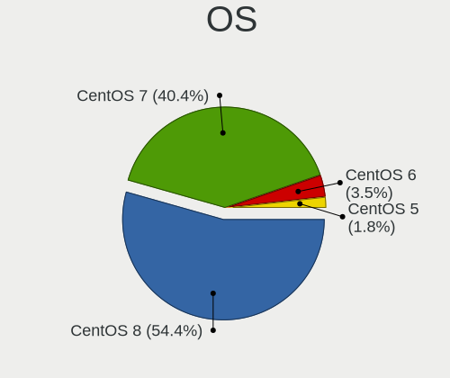

| Name     | Computers | Percent |
|----------|-----------|---------|
| CentOS 8 | 31        | 54.39%  |
| CentOS 7 | 23        | 40.35%  |
| CentOS 6 | 2         | 3.51%   |
| CentOS 5 | 1         | 1.75%   |

OS Family
---------

OS without a version

| Name   | Computers | Percent |
|--------|-----------|---------|
| CentOS | 57        | 100%    |

Kernel
------

Version of the Linux kernel

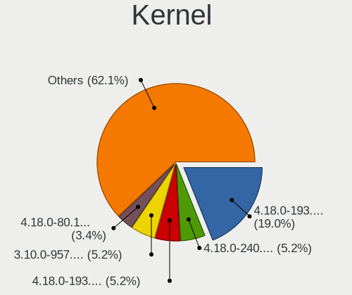

| Version                                 | Computers | Percent |
|-----------------------------------------|-----------|---------|
| 4.18.0-193.28.1.el8_2.x86_64            | 11        | 18.97%  |
| 4.18.0-240.10.1.el8_3.x86_64            | 3         | 5.17%   |
| 4.18.0-193.6.3.el8_2.x86_64             | 3         | 5.17%   |
| 3.10.0-957.el7.x86_64                   | 3         | 5.17%   |
| 4.18.0-80.11.2.el8_0.x86_64             | 2         | 3.45%   |
| 4.18.0-305.3.1.el8.x86_64               | 2         | 3.45%   |
| 4.18.0-240.15.1.el8_3.x86_64            | 2         | 3.45%   |
| 4.18.0-193.19.1.el8_2.x86_64            | 2         | 3.45%   |
| 4.18.0-147.5.1.el8_1.x86_64             | 2         | 3.45%   |
| 3.10.0-514.el7.x86_64                   | 2         | 3.45%   |
| 3.10.0-1160.el7.x86_64                  | 2         | 3.45%   |
| 3.10.0-1062.1.1.el7.x86_64              | 2         | 3.45%   |
| 2.6.32-754.el6.x86_64                   | 2         | 3.45%   |
| 5.8.7-1.el7.elrepo.x86_64               | 1         | 1.72%   |
| 5.4.61                                  | 1         | 1.72%   |
| 5.4.155-200.el7.x86_64                  | 1         | 1.72%   |
| 5.10.8-1.el7.elrepo.x86_64              | 1         | 1.72%   |
| 4.18.0-348.el8.x86_64                   | 1         | 1.72%   |
| 4.18.0-240.22.1.el8_3.x86_64            | 1         | 1.72%   |
| 4.18.0-144.el8.x86_64                   | 1         | 1.72%   |
| 3.10.0-957.1.3.el7.x86_64               | 1         | 1.72%   |
| 3.10.0-693.el7.x86_64                   | 1         | 1.72%   |
| 3.10.0-693.17.1.el7.x86_64              | 1         | 1.72%   |
| 3.10.0-693.11.1.el7.x86_64              | 1         | 1.72%   |
| 3.10.0-123.el7.x86_64                   | 1         | 1.72%   |
| 3.10.0-1160.42.2.el7.x86_64             | 1         | 1.72%   |
| 3.10.0-1160.25.1.el7.x86_64             | 1         | 1.72%   |
| 3.10.0-1160.15.2.el7.centos.plus.x86_64 | 1         | 1.72%   |
| 3.10.0-1160.11.1.el7.x86_64             | 1         | 1.72%   |
| 3.10.0-1127.19.1.el7.x86_64             | 1         | 1.72%   |
| 3.10.0-1127.13.1.el7.x86_64             | 1         | 1.72%   |
| 3.10.0-1062.18.1.el7.x86_64             | 1         | 1.72%   |
| 2.6.18-419.el5.centos.plus              | 1         | 1.72%   |

Kernel Family
-------------

Linux kernel without a distro release

| Version | Computers | Percent |
|---------|-----------|---------|
| 4.18.0  | 30        | 52.63%  |
| 3.10.0  | 20        | 35.09%  |
| 2.6.32  | 2         | 3.51%   |
| 5.8.7   | 1         | 1.75%   |
| 5.4.61  | 1         | 1.75%   |
| 5.4.155 | 1         | 1.75%   |
| 5.10.8  | 1         | 1.75%   |
| 2.6.18  | 1         | 1.75%   |

Kernel Major Ver.
-----------------

Linux kernel major version

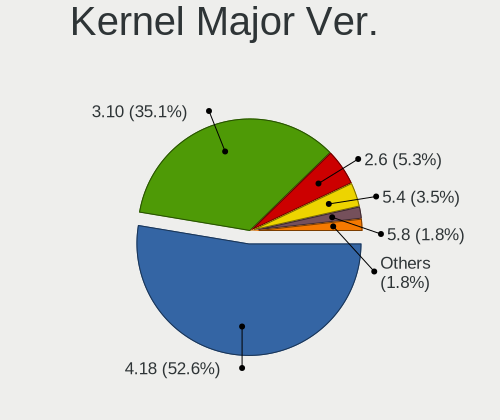

| Version | Computers | Percent |
|---------|-----------|---------|
| 4.18    | 30        | 52.63%  |
| 3.10    | 20        | 35.09%  |
| 2.6     | 3         | 5.26%   |
| 5.4     | 2         | 3.51%   |
| 5.8     | 1         | 1.75%   |
| 5.10    | 1         | 1.75%   |

Arch
----

OS architecture (x86_64, i586, etc.)

| Name   | Computers | Percent |
|--------|-----------|---------|
| x86_64 | 57        | 100%    |

DE
--

Desktop Environment

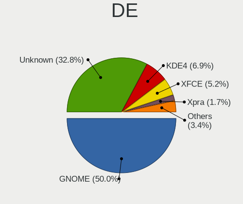

| Name          | Computers | Percent |
|---------------|-----------|---------|
| GNOME         | 29        | 50%     |
| Unknown       | 19        | 32.76%  |
| KDE4          | 4         | 6.9%    |
| XFCE          | 3         | 5.17%   |
| Xpra          | 1         | 1.72%   |
| MATE          | 1         | 1.72%   |
| GNOME Classic | 1         | 1.72%   |

Display Server
--------------

X11 or Wayland

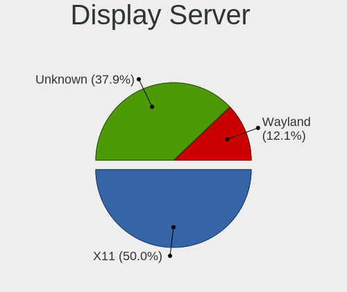

| Name    | Computers | Percent |
|---------|-----------|---------|
| X11     | 29        | 50%     |
| Unknown | 22        | 37.93%  |
| Wayland | 7         | 12.07%  |

Display Manager
---------------

SDDM, LightDM, etc.

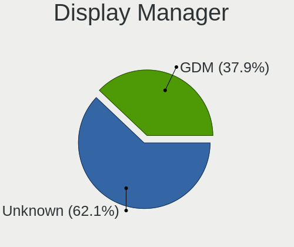

| Name    | Computers | Percent |
|---------|-----------|---------|
| Unknown | 36        | 62.07%  |
| GDM     | 22        | 37.93%  |

OS Lang
-------

Language

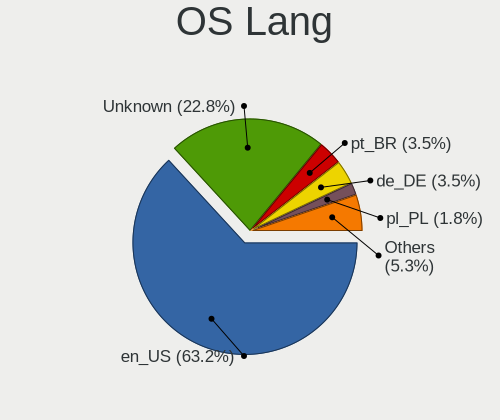

| Lang    | Computers | Percent |
|---------|-----------|---------|
| en_US   | 36        | 63.16%  |
| Unknown | 13        | 22.81%  |
| pt_BR   | 2         | 3.51%   |
| de_DE   | 2         | 3.51%   |
| pl_PL   | 1         | 1.75%   |
| es_ES   | 1         | 1.75%   |
| de_CH   | 1         | 1.75%   |
| C       | 1         | 1.75%   |

Boot Mode
---------

EFI or BIOS

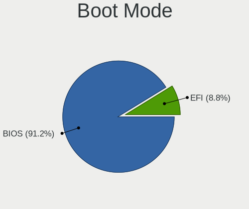

| Mode | Computers | Percent |
|------|-----------|---------|
| BIOS | 52        | 91.23%  |
| EFI  | 5         | 8.77%   |

Filesystem
----------

Type of filesystem

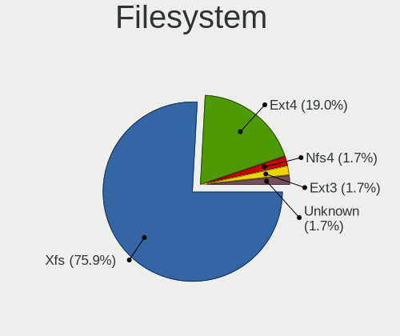

| Type    | Computers | Percent |
|---------|-----------|---------|
| Xfs     | 44        | 75.86%  |
| Ext4    | 11        | 18.97%  |
| Nfs4    | 1         | 1.72%   |
| Ext3    | 1         | 1.72%   |
| Unknown | 1         | 1.72%   |

Part. scheme
------------

Scheme of partitioning

| Type    | Computers | Percent |
|---------|-----------|---------|
| MBR     | 42        | 72.41%  |
| Unknown | 9         | 15.52%  |
| GPT     | 7         | 12.07%  |

Dual Boot with Linux/BSD
------------------------

Hosting more than one Linux/BSD

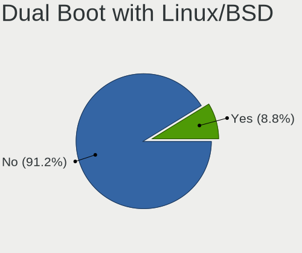

| Dual boot | Computers | Percent |
|-----------|-----------|---------|
| No        | 52        | 91.23%  |
| Yes       | 5         | 8.77%   |

Dual Boot (Win)
---------------

Hosting Linux and Windows

| Dual boot | Computers | Percent |
|-----------|-----------|---------|
| No        | 57        | 100%    |

Board
-----

Vendor
------

Motherboard manufacturer

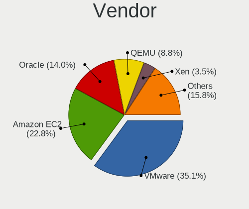

| Name                             | Computers | Percent |
|----------------------------------|-----------|---------|
| VMware                           | 20        | 35.09%  |
| Amazon EC2                       | 13        | 22.81%  |
| Oracle                           | 8         | 14.04%  |
| QEMU                             | 5         | 8.77%   |
| Xen                              | 2         | 3.51%   |
| Hetzner                          | 2         | 3.51%   |
| Unknown                          | 2         | 3.51%   |
| Red Hat                          | 1         | 1.75%   |
| Parallels Software International | 1         | 1.75%   |
| Microsoft                        | 1         | 1.75%   |
| Google                           | 1         | 1.75%   |
| DigitalOcean                     | 1         | 1.75%   |

Model
-----

Motherboard model

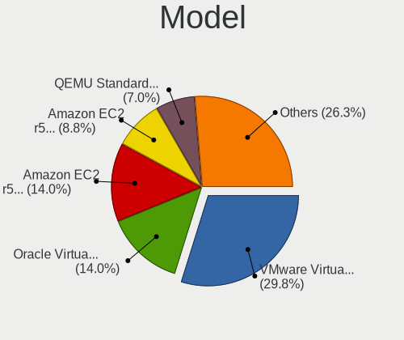

| Name                                                        | Computers | Percent |
|-------------------------------------------------------------|-----------|---------|
| VMware Virtual Platform                                     | 17        | 29.82%  |
| Oracle VirtualBox                                           | 8         | 14.04%  |
| Amazon EC2 r5d.metal                                        | 8         | 14.04%  |
| Amazon EC2 r5b.metal                                        | 5         | 8.77%   |
| QEMU Standard PC (i440FX + PIIX, 1996)                      | 4         | 7.02%   |
| VMware VMware7,1                                            | 3         | 5.26%   |
| Xen HVM domU                                                | 2         | 3.51%   |
| Hetzner vServer                                             | 2         | 3.51%   |
| Unknown                                                     | 2         | 3.51%   |
| Red Hat KVM                                                 | 1         | 1.75%   |
| QEMU Standard PC (Q35 + ICH9, 2009)                         | 1         | 1.75%   |
| Parallels Software International Parallels Virtual Platform | 1         | 1.75%   |
| Microsoft Virtual Machine                                   | 1         | 1.75%   |
| Google Compute Engine                                       | 1         | 1.75%   |
| DigitalOcean Droplet                                        | 1         | 1.75%   |

Model Family
------------

Motherboard model prefix

| Name                                       | Computers | Percent |
|--------------------------------------------|-----------|---------|
| VMware Virtual                             | 17        | 29.82%  |
| Oracle VirtualBox                          | 8         | 14.04%  |
| Amazon EC2 r5d.metal                       | 8         | 14.04%  |
| QEMU Standard                              | 5         | 8.77%   |
| Amazon EC2 r5b.metal                       | 5         | 8.77%   |
| VMware VMware7                             | 3         | 5.26%   |
| Xen HVM                                    | 2         | 3.51%   |
| Hetzner vServer                            | 2         | 3.51%   |
| Unknown                                    | 2         | 3.51%   |
| Red Hat KVM                                | 1         | 1.75%   |
| Parallels Software International Parallels | 1         | 1.75%   |
| Microsoft Virtual                          | 1         | 1.75%   |
| Google Compute                             | 1         | 1.75%   |
| DigitalOcean Droplet                       | 1         | 1.75%   |

MFG Year
--------

Motherboard manufacture year

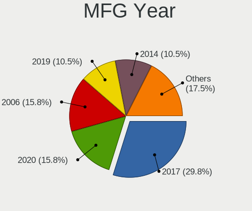

| Year | Computers | Percent |
|------|-----------|---------|
| 2017 | 17        | 29.82%  |
| 2020 | 9         | 15.79%  |
| 2006 | 9         | 15.79%  |
| 2019 | 6         | 10.53%  |
| 2014 | 6         | 10.53%  |
| 2018 | 3         | 5.26%   |
| 2015 | 3         | 5.26%   |
| 2016 | 2         | 3.51%   |
| 2011 | 2         | 3.51%   |

Form Factor
-----------

Physical design of the computer

| Name            | Computers | Percent |
|-----------------|-----------|---------|
| Virtual machine | 57        | 100%    |

Secure Boot
-----------

Enabled or disabled

| State    | Computers | Percent |
|----------|-----------|---------|
| Disabled | 56        | 98.25%  |
| Enabled  | 1         | 1.75%   |

Coreboot
--------

Have coreboot on board

| Used | Computers | Percent |
|------|-----------|---------|
| No   | 57        | 100%    |

RAM Size
--------

Total RAM memory

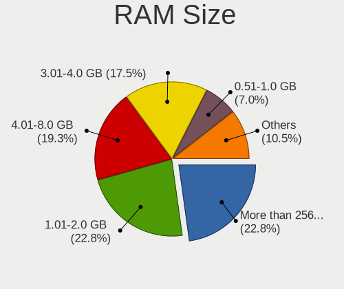

| Size in GB      | Computers | Percent |
|-----------------|-----------|---------|
| More than 256.0 | 13        | 22.81%  |
| 1.01-2.0        | 13        | 22.81%  |
| 4.01-8.0        | 11        | 19.3%   |
| 3.01-4.0        | 10        | 17.54%  |
| 0.51-1.0        | 4         | 7.02%   |
| 2.01-3.0        | 2         | 3.51%   |
| 32.01-64.0      | 1         | 1.75%   |
| 64.01-256.0     | 1         | 1.75%   |
| 16.01-24.0      | 1         | 1.75%   |
| 8.01-16.0       | 1         | 1.75%   |

RAM Used
--------

Used RAM memory

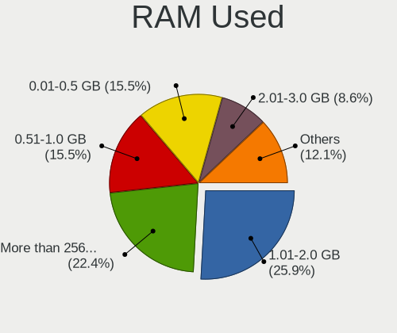

| Used GB         | Computers | Percent |
|-----------------|-----------|---------|
| 1.01-2.0        | 15        | 25.86%  |
| More than 256.0 | 13        | 22.41%  |
| 0.51-1.0        | 9         | 15.52%  |
| 0.01-0.5        | 9         | 15.52%  |
| 2.01-3.0        | 5         | 8.62%   |
| Unknown         | 3         | 5.17%   |
| 4.01-8.0        | 2         | 3.45%   |
| 3.01-4.0        | 2         | 3.45%   |

Total Drives
------------

Number of drives on board

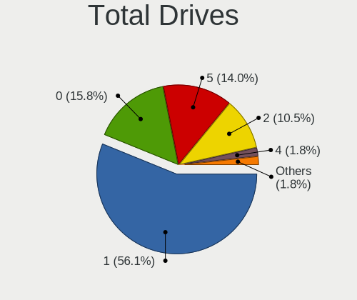

| Drives | Computers | Percent |
|--------|-----------|---------|
| 1      | 32        | 56.14%  |
| 0      | 9         | 15.79%  |
| 5      | 8         | 14.04%  |
| 2      | 6         | 10.53%  |
| 4      | 1         | 1.75%   |
| 3      | 1         | 1.75%   |

Has CD-ROM
----------

Has CD-ROM on board

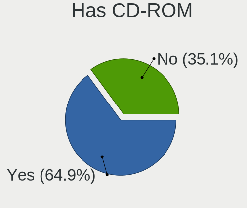

| Presented | Computers | Percent |
|-----------|-----------|---------|
| Yes       | 37        | 64.91%  |
| No        | 20        | 35.09%  |

Has Ethernet
------------

Has Ethernet on board

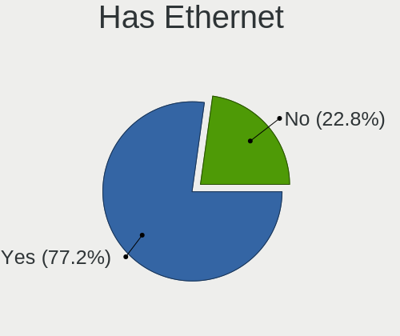

| Presented | Computers | Percent |
|-----------|-----------|---------|
| Yes       | 44        | 77.19%  |
| No        | 13        | 22.81%  |

Has WiFi
--------

Has WiFi module

| Presented | Computers | Percent |
|-----------|-----------|---------|
| No        | 56        | 98.25%  |
| Yes       | 1         | 1.75%   |

Has Bluetooth
-------------

Has Bluetooth module

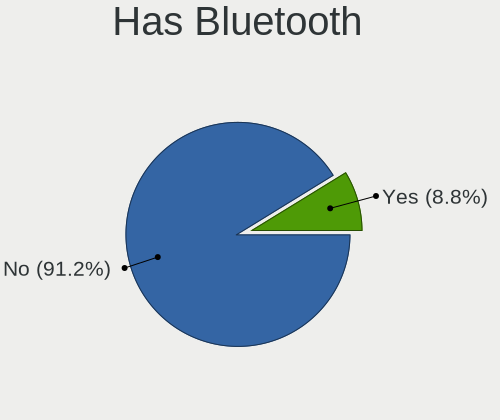

| Presented | Computers | Percent |
|-----------|-----------|---------|
| No        | 52        | 91.23%  |
| Yes       | 5         | 8.77%   |

Location
--------

Country
-------

Geographic location (country)

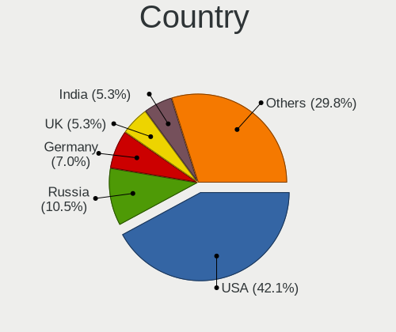

| Country     | Computers | Percent |
|-------------|-----------|---------|
| USA         | 24        | 42.11%  |
| Russia      | 6         | 10.53%  |
| Germany     | 4         | 7.02%   |
| UK          | 3         | 5.26%   |
| India       | 3         | 5.26%   |
| Switzerland | 2         | 3.51%   |
| Poland      | 2         | 3.51%   |
| China       | 2         | 3.51%   |
| Brazil      | 2         | 3.51%   |
| South Korea | 1         | 1.75%   |
| Singapore   | 1         | 1.75%   |
| Netherlands | 1         | 1.75%   |
| Mexico      | 1         | 1.75%   |
| Malaysia    | 1         | 1.75%   |
| Kazakhstan  | 1         | 1.75%   |
| Hong Kong   | 1         | 1.75%   |
| Finland     | 1         | 1.75%   |
| Bangladesh  | 1         | 1.75%   |

City
----

Geographic location (city)

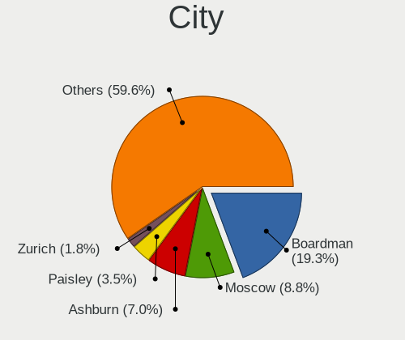

| City              | Computers | Percent |
|-------------------|-----------|---------|
| Boardman          | 11        | 19.3%   |
| Moscow            | 5         | 8.77%   |
| Ashburn           | 4         | 7.02%   |
| Paisley           | 2         | 3.51%   |
| Zurich            | 1         | 1.75%   |
| Zollikerberg      | 1         | 1.75%   |
| Wylie             | 1         | 1.75%   |
| Warsaw            | 1         | 1.75%   |
| Vinhedo           | 1         | 1.75%   |
| Tsz Wan Shan      | 1         | 1.75%   |
| Tiangua           | 1         | 1.75%   |
| Singapore         | 1         | 1.75%   |
| Portland          | 1         | 1.75%   |
| Pittsburgh        | 1         | 1.75%   |
| Płońsk    | 1         | 1.75%   |
| Orem              | 1         | 1.75%   |
| Oak Park          | 1         | 1.75%   |
| Nuremberg         | 1         | 1.75%   |
| Nur-Sultan        | 1         | 1.75%   |
| Naucalpan         | 1         | 1.75%   |
| Murom             | 1         | 1.75%   |
| Mumbai            | 1         | 1.75%   |
| London            | 1         | 1.75%   |
| Loganville        | 1         | 1.75%   |
| Leesburg          | 1         | 1.75%   |
| Kuala Lumpur      | 1         | 1.75%   |
| Kamen             | 1         | 1.75%   |
| Helsinki          | 1         | 1.75%   |
| Hangzhou          | 1         | 1.75%   |
| Halol             | 1         | 1.75%   |
| Gwanak-gu         | 1         | 1.75%   |
| Frankfurt am Main | 1         | 1.75%   |
| Fort Worth        | 1         | 1.75%   |
| Dortmund          | 1         | 1.75%   |
| Dhaka             | 1         | 1.75%   |
| Converse          | 1         | 1.75%   |
| Born              | 1         | 1.75%   |
| Beijing           | 1         | 1.75%   |
| Abohar            | 1         | 1.75%   |

Drives
------

Drive Vendor
------------

Hard drive vendors

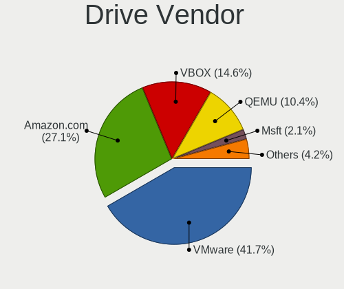

| Vendor     | Computers | Drives | Percent |
|------------|-----------|--------|---------|
| VMware     | 20        | 24     | 41.67%  |
| Amazon.com | 13        | 55     | 27.08%  |
| VBOX       | 7         | 8      | 14.58%  |
| QEMU       | 5         | 7      | 10.42%  |
| Msft       | 1         | 1      | 2.08%   |
| Google     | 1         | 1      | 2.08%   |
| CentOS     | 1         | 1      | 2.08%   |

Drive Model
-----------

Hard drive models

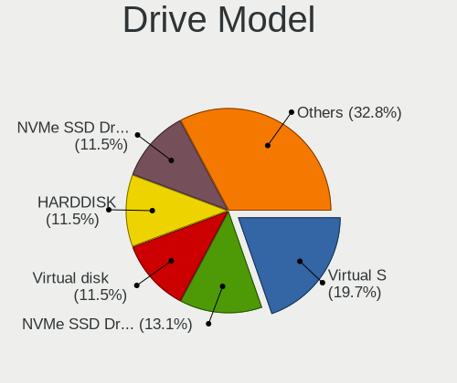

| Model                            | Computers | Percent |
|----------------------------------|-----------|---------|
| VMware Virtual S                 | 12        | 19.67%  |
| Amazon.com NVMe SSD Drive 900GB  | 8         | 13.11%  |
| VMware Virtual disk              | 7         | 11.48%  |
| VBOX HARDDISK                    | 7         | 11.48%  |
| Amazon.com NVMe SSD Drive 1TB    | 7         | 11.48%  |
| QEMU HARDDISK                    | 5         | 8.2%    |
| Amazon.com NVMe SSD Drive 4TB    | 5         | 8.2%    |
| Amazon.com NVMe SSD Drive 54GB   | 4         | 6.56%   |
| VMware NVMe SSD Drive            | 1         | 1.64%   |
| Msft Virtual Disk                | 1         | 1.64%   |
| Google PersistentDisk            | 1         | 1.64%   |
| CentOS Linux 7.7.1908-0 SSD 48GB | 1         | 1.64%   |
| Amazon.com NVMe SSD Drive 39GB   | 1         | 1.64%   |
| Amazon.com NVMe SSD Drive 2TB    | 1         | 1.64%   |

HDD Vendor
----------

Hard disk drive vendors

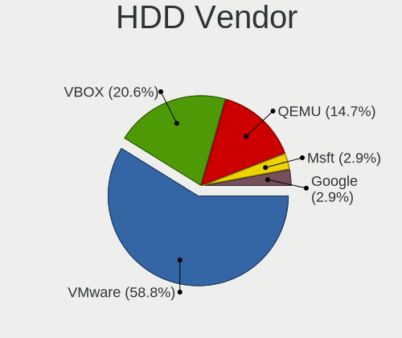

| Vendor | Computers | Drives | Percent |
|--------|-----------|--------|---------|
| VMware | 20        | 24     | 58.82%  |
| VBOX   | 7         | 8      | 20.59%  |
| QEMU   | 5         | 7      | 14.71%  |
| Msft   | 1         | 1      | 2.94%   |
| Google | 1         | 1      | 2.94%   |

SSD Vendor
----------

Solid state drive vendors

| Vendor | Computers | Drives | Percent |
|--------|-----------|--------|---------|
| CentOS | 1         | 1      | 100%    |

Drive Kind
----------

HDD or SSD

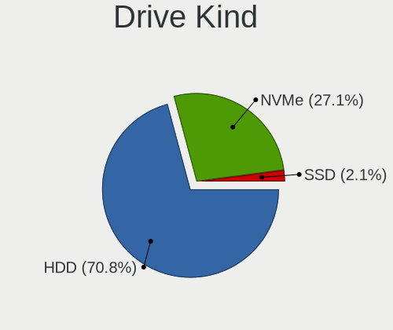

| Kind | Computers | Drives | Percent |
|------|-----------|--------|---------|
| HDD  | 34        | 41     | 70.83%  |
| NVMe | 13        | 55     | 27.08%  |
| SSD  | 1         | 1      | 2.08%   |

Drive Connector
---------------

SATA, SAS, NVMe, etc.

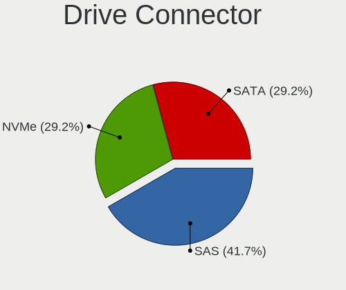

| Type | Computers | Drives | Percent |
|------|-----------|--------|---------|
| SAS  | 20        | 24     | 41.67%  |
| NVMe | 14        | 56     | 29.17%  |
| SATA | 14        | 17     | 29.17%  |

Drive Size
----------

Size of hard drive

| Size in TB | Computers | Drives | Percent |
|------------|-----------|--------|---------|
| 0.01-0.5   | 35        | 42     | 100%    |

Space Total
-----------

Amount of disk space available on the file system

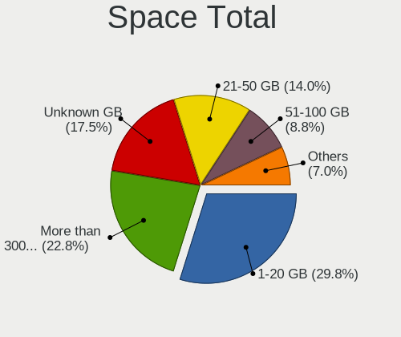

| Size in GB     | Computers | Percent |
|----------------|-----------|---------|
| 1-20           | 17        | 29.82%  |
| More than 3000 | 13        | 22.81%  |
| Unknown        | 10        | 17.54%  |
| 21-50          | 8         | 14.04%  |
| 51-100         | 5         | 8.77%   |
| 101-250        | 2         | 3.51%   |
| 251-500        | 1         | 1.75%   |
| 1001-2000      | 1         | 1.75%   |

Space Used
----------

Amount of used disk space

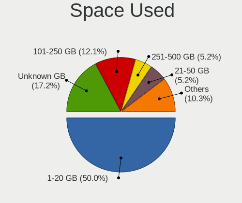

| Used GB   | Computers | Percent |
|-----------|-----------|---------|
| 1-20      | 29        | 50%     |
| Unknown   | 10        | 17.24%  |
| 101-250   | 7         | 12.07%  |
| 251-500   | 3         | 5.17%   |
| 21-50     | 3         | 5.17%   |
| 1001-2000 | 2         | 3.45%   |
| 501-1000  | 2         | 3.45%   |
| 2001-3000 | 1         | 1.72%   |
| 51-100    | 1         | 1.72%   |

Malfunc. Drives
---------------

Drive models with a malfunction

Zero info for selected period =(

Malfunc. Drive Vendor
---------------------

Vendors of faulty drives

Zero info for selected period =(

Malfunc. HDD Vendor
-------------------

Vendors of faulty HDD drives

Zero info for selected period =(

Malfunc. Drive Kind
-------------------

Kinds of faulty drives

Zero info for selected period =(

Failed Drives
-------------

Failed drive models

Zero info for selected period =(

Failed Drive Vendor
-------------------

Failed drive vendors

Zero info for selected period =(

Drive Status
------------

Number of failed and malfunc. drives

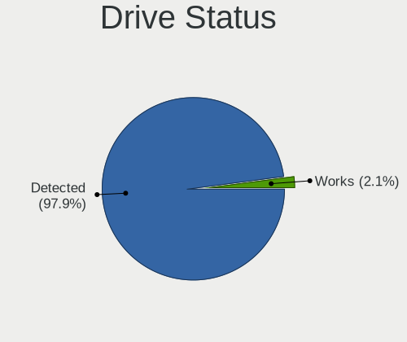

| Status   | Computers | Drives | Percent |
|----------|-----------|--------|---------|
| Detected | 47        | 94     | 97.92%  |
| Works    | 1         | 3      | 2.08%   |

Storage controller
------------------

Storage Vendor
--------------

Storage controller vendors

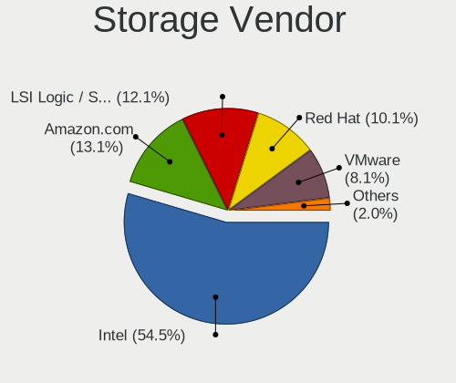

| Vendor                    | Computers | Percent |
|---------------------------|-----------|---------|
| Intel                     | 54        | 54.55%  |
| Amazon.com                | 13        | 13.13%  |
| LSI Logic / Symbios Logic | 12        | 12.12%  |
| Red Hat                   | 10        | 10.1%   |
| VMware                    | 8         | 8.08%   |
| XenSource                 | 2         | 2.02%   |

Storage Model
-------------

Storage controller models

| Model                                                                 | Computers | Percent |
|-----------------------------------------------------------------------|-----------|---------|
| Intel 82371AB/EB/MB PIIX4 IDE                                         | 29        | 21.97%  |
| Intel C620 Series Chipset Family SSATA Controller [AHCI mode]         | 13        | 9.85%   |
| Intel C620 Series Chipset Family SATA Controller [AHCI mode]          | 13        | 9.85%   |
| Amazon.com Amazon.com Non-Volatile memory controller                  | 13        | 9.85%   |
| LSI Logic / Symbios Logic 53c1030 PCI-X Fusion-MPT Dual Ultra320 SCSI | 12        | 9.09%   |
| Intel 82371SB PIIX3 IDE [Natoma/Triton II]                            | 9         | 6.82%   |
| Intel 82801HM/HEM (ICH8M/ICH8M-E) SATA Controller [AHCI mode]         | 8         | 6.06%   |
| VMware SATA AHCI controller                                           | 7         | 5.3%    |
| VMware PVSCSI SCSI Controller                                         | 7         | 5.3%    |
| Red Hat Virtio SCSI                                                   | 6         | 4.55%   |
| Red Hat Virtio block device                                           | 6         | 4.55%   |
| Intel 82801IR/IO/IH (ICH9R/DO/DH) 6 port SATA Controller [AHCI mode]  | 4         | 3.03%   |
| XenSource Xen Platform Device                                         | 2         | 1.52%   |
| VMware NVMe SSD Controller                                            | 1         | 0.76%   |
| Intel 82801HR/HO/HH (ICH8R/DO/DH) 6 port SATA Controller [AHCI mode]  | 1         | 0.76%   |
| Intel 82801BA IDE U100 Controller                                     | 1         | 0.76%   |

Storage Kind
------------

Kind of storage controller (IDE, SATA, NVMe, SAS, ...)

| Kind | Computers | Percent |
|------|-----------|---------|
| IDE  | 39        | 33.33%  |
| SATA | 33        | 28.21%  |
| SCSI | 24        | 20.51%  |
| NVMe | 14        | 11.97%  |
| SAS  | 7         | 5.98%   |

Processor
---------

CPU Vendor
----------

Processor vendors

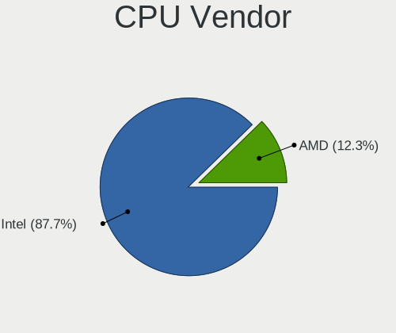

| Vendor | Computers | Percent |
|--------|-----------|---------|
| Intel  | 50        | 87.72%  |
| AMD    | 7         | 12.28%  |

CPU Model
---------

Processor models

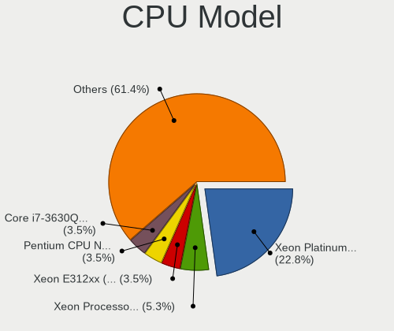

| Model                                          | Computers | Percent |
|------------------------------------------------|-----------|---------|
| Intel Xeon Platinum 8259CL CPU @ 2.50GHz       | 13        | 22.81%  |
| Intel Xeon Processor (Skylake, IBRS)           | 3         | 5.26%   |
| Intel Xeon E312xx (Sandy Bridge)               | 2         | 3.51%   |
| Intel Pentium CPU N3700 @ 1.60GHz              | 2         | 3.51%   |
| Intel Core i7-3630QM CPU @ 2.40GHz             | 2         | 3.51%   |
| AMD Ryzen Threadripper 1950X 16-Core Processor | 2         | 3.51%   |
| Intel Xeon Silver 4208 CPU @ 2.10GHz           | 1         | 1.75%   |
| Intel Xeon CPU X5550 @ 2.67GHz                 | 1         | 1.75%   |
| Intel Xeon CPU E5645 @ 2.40GHz                 | 1         | 1.75%   |
| Intel Xeon CPU E5620 @ 2.40GHz                 | 1         | 1.75%   |
| Intel Xeon CPU E5-2680 v4 @ 2.40GHz            | 1         | 1.75%   |
| Intel Xeon CPU E5-2676 v3 @ 2.40GHz            | 1         | 1.75%   |
| Intel Xeon CPU E5-2650 0 @ 2.00GHz             | 1         | 1.75%   |
| Intel Xeon CPU E5-2630L 0 @ 2.30GHz            | 1         | 1.75%   |
| Intel Xeon CPU E5-2630 v2 @ 2.60GHz            | 1         | 1.75%   |
| Intel Xeon CPU E5-2620 v4 @ 2.10GHz            | 1         | 1.75%   |
| Intel Xeon CPU @ 2.20GHz                       | 1         | 1.75%   |
| Intel Pentium CPU G4500 @ 3.50GHz              | 1         | 1.75%   |
| Intel Core Processor (Haswell, no TSX)         | 1         | 1.75%   |
| Intel Core i7-7700HQ CPU @ 2.80GHz             | 1         | 1.75%   |
| Intel Core i7-7700 CPU @ 3.60GHz               | 1         | 1.75%   |
| Intel Core i7-6700K CPU @ 4.00GHz              | 1         | 1.75%   |
| Intel Core i7-4810MQ CPU @ 2.80GHz             | 1         | 1.75%   |
| Intel Core i7-4790 CPU @ 3.60GHz               | 1         | 1.75%   |
| Intel Core i7-4770K CPU @ 3.50GHz              | 1         | 1.75%   |
| Intel Core i7-3770K CPU @ 3.50GHz              | 1         | 1.75%   |
| Intel Core i7-3537U CPU @ 2.00GHz              | 1         | 1.75%   |
| Intel Core i5-8279U CPU @ 2.40GHz              | 1         | 1.75%   |
| Intel Core i5-7400 CPU @ 3.00GHz               | 1         | 1.75%   |
| Intel Core i5-5250U CPU @ 1.60GHz              | 1         | 1.75%   |
| Intel Core i5-4690K CPU @ 3.50GHz              | 1         | 1.75%   |
| Intel Core i3-6100U CPU @ 2.30GHz              | 1         | 1.75%   |
| Intel Core i3-6006U CPU @ 2.00GHz              | 1         | 1.75%   |
| Intel Common KVM processor                     | 1         | 1.75%   |
| AMD Ryzen 5 4600H with Radeon Graphics         | 1         | 1.75%   |
| AMD Ryzen 5 4500U with Radeon Graphics         | 1         | 1.75%   |
| AMD Phenom II X4 910 Processor                 | 1         | 1.75%   |
| AMD FX-4100 Quad-Core Processor                | 1         | 1.75%   |
| AMD A9-9400 RADEON R5, 5 COMPUTE CORES 2C+3G   | 1         | 1.75%   |

CPU Model Family
----------------

Processor model prefix

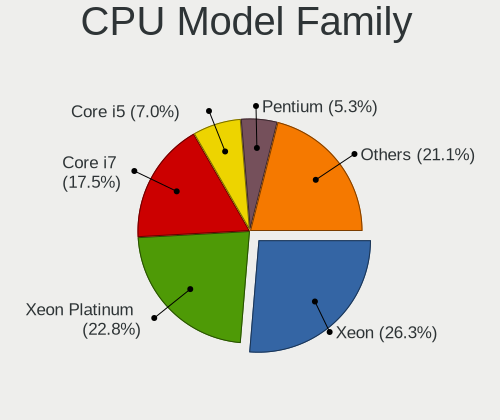

| Model                  | Computers | Percent |
|------------------------|-----------|---------|
| Intel Xeon             | 15        | 26.32%  |
| Intel Xeon Platinum    | 13        | 22.81%  |
| Intel Core i7          | 10        | 17.54%  |
| Intel Core i5          | 4         | 7.02%   |
| Intel Pentium          | 3         | 5.26%   |
| Other                  | 2         | 3.51%   |
| Intel Core i3          | 2         | 3.51%   |
| AMD Ryzen Threadripper | 2         | 3.51%   |
| AMD Ryzen 5            | 2         | 3.51%   |
| Intel Xeon Silver      | 1         | 1.75%   |
| Intel Core             | 1         | 1.75%   |
| AMD Phenom II X4       | 1         | 1.75%   |
| AMD FX                 | 1         | 1.75%   |

CPU Cores
---------

Number of processor cores

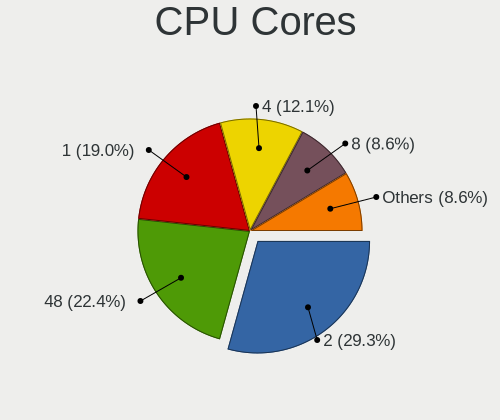

| Number  | Computers | Percent |
|---------|-----------|---------|
| 2       | 17        | 29.31%  |
| 48      | 13        | 22.41%  |
| 1       | 11        | 18.97%  |
| 4       | 7         | 12.07%  |
| 8       | 5         | 8.62%   |
| 24      | 1         | 1.72%   |
| 16      | 1         | 1.72%   |
| 6       | 1         | 1.72%   |
| 3       | 1         | 1.72%   |
| Unknown | 1         | 1.72%   |

CPU Sockets
-----------

Number of sockets

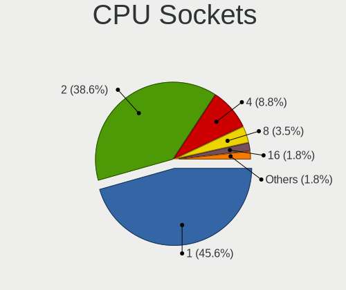

| Number  | Computers | Percent |
|---------|-----------|---------|
| 1       | 26        | 45.61%  |
| 2       | 22        | 38.6%   |
| 4       | 5         | 8.77%   |
| 8       | 2         | 3.51%   |
| 16      | 1         | 1.75%   |
| Unknown | 1         | 1.75%   |

CPU Threads
-----------

Threads per core (Hyper-Threading)

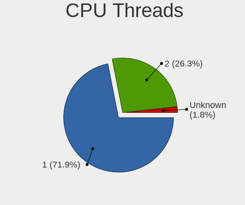

| Number  | Computers | Percent |
|---------|-----------|---------|
| 1       | 41        | 71.93%  |
| 2       | 15        | 26.32%  |
| Unknown | 1         | 1.75%   |

CPU Op-Modes
------------

CPU Operation Modes (32-bit, 64-bit)

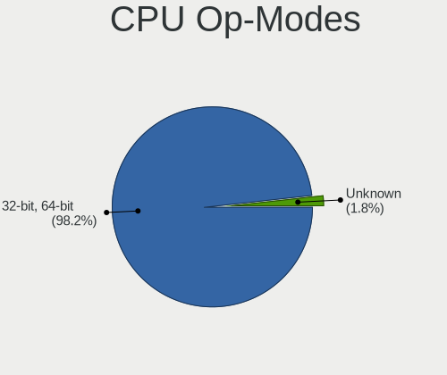

| Op mode        | Computers | Percent |
|----------------|-----------|---------|
| 32-bit, 64-bit | 56        | 98.25%  |
| Unknown        | 1         | 1.75%   |

CPU Microcode
-------------

Microcode number

| Number  | Computers | Percent |
|---------|-----------|---------|
| Unknown | 42        | 72.41%  |
| 0x50657 | 8         | 13.79%  |
| 0x306a9 | 3         | 5.17%   |
| 0x406f1 | 1         | 1.72%   |
| 0x306c3 | 1         | 1.72%   |
| 0x206c2 | 1         | 1.72%   |
| 0x206a1 | 1         | 1.72%   |
| 0x106a5 | 1         | 1.72%   |

CPU Microarch
-------------

Microarchitecture

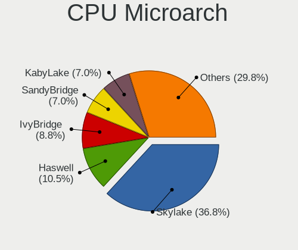

| Name        | Computers | Percent |
|-------------|-----------|---------|
| Skylake     | 21        | 36.84%  |
| Haswell     | 6         | 10.53%  |
| IvyBridge   | 5         | 8.77%   |
| SandyBridge | 4         | 7.02%   |
| KabyLake    | 4         | 7.02%   |
| Broadwell   | 4         | 7.02%   |
| Zen 2       | 2         | 3.51%   |
| Zen         | 2         | 3.51%   |
| Westmere    | 2         | 3.51%   |
| Silvermont  | 2         | 3.51%   |
| NetBurst    | 1         | 1.75%   |
| Nehalem     | 1         | 1.75%   |
| K10         | 1         | 1.75%   |
| Excavator   | 1         | 1.75%   |
| Bulldozer   | 1         | 1.75%   |

Graphics
--------

GPU Vendor
----------

Vendors of graphics cards

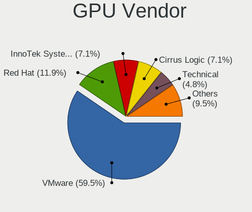

| Vendor                 | Computers | Percent |
|------------------------|-----------|---------|
| VMware                 | 25        | 59.52%  |
| Red Hat                | 5         | 11.9%   |
| InnoTek Systemberatung | 3         | 7.14%   |
| Cirrus Logic           | 3         | 7.14%   |
| Technical              | 2         | 4.76%   |
| Nvidia                 | 2         | 4.76%   |
| Parallels              | 1         | 2.38%   |
| Microsoft              | 1         | 2.38%   |

GPU Model
---------

Graphics card models

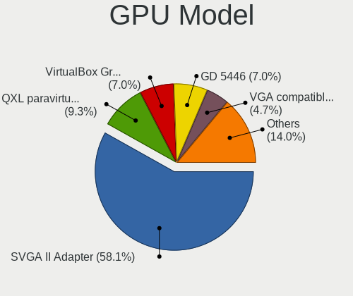

| Model                                              | Computers | Percent |
|----------------------------------------------------|-----------|---------|
| VMware SVGA II Adapter                             | 25        | 58.14%  |
| Red Hat QXL paravirtual graphic card               | 4         | 9.3%    |
| InnoTek Systemberatung VirtualBox Graphics Adapter | 3         | 6.98%   |
| Cirrus Logic GD 5446                               | 3         | 6.98%   |
| Technical VGA compatible controller                | 2         | 4.65%   |
| Red Hat Virtio GPU                                 | 1         | 2.33%   |
| Parallels Accelerated Virtual Video Adapter        | 1         | 2.33%   |
| Nvidia TU117 [GeForce GTX 1650]                    | 1         | 2.33%   |
| Nvidia GM204GL [Tesla M60]                         | 1         | 2.33%   |
| Nvidia GM200 [GeForce GTX TITAN X]                 | 1         | 2.33%   |
| Microsoft Hyper-V virtual VGA                      | 1         | 2.33%   |

GPU Combo
---------

Combinations of graphics cards

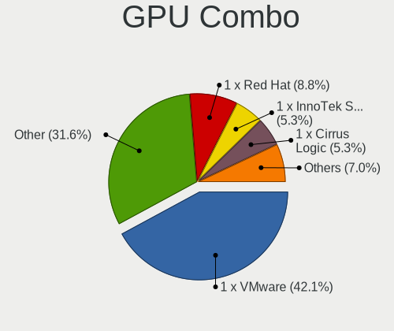

| Name                       | Computers | Percent |
|----------------------------|-----------|---------|
| 1 x VMware                 | 24        | 42.11%  |
| Other                      | 18        | 31.58%  |
| 1 x Red Hat                | 5         | 8.77%   |
| 1 x InnoTek Systemberatung | 3         | 5.26%   |
| 1 x Cirrus Logic           | 3         | 5.26%   |
| 3 x Nvidia                 | 1         | 1.75%   |
| 1 x Parallels              | 1         | 1.75%   |
| Nvidia + VMware            | 1         | 1.75%   |
| 1 x Microsoft              | 1         | 1.75%   |

GPU Driver
----------

Free vs proprietary

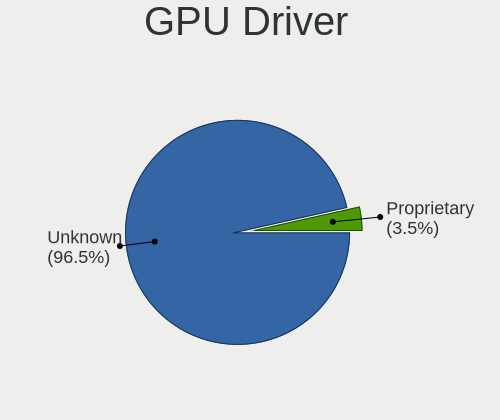

| Driver      | Computers | Percent |
|-------------|-----------|---------|
| Unknown     | 55        | 96.49%  |
| Proprietary | 2         | 3.51%   |

GPU Memory
----------

Total video memory

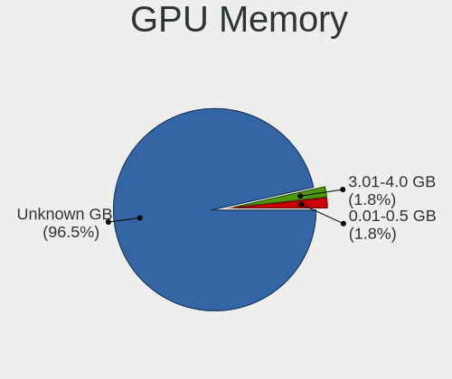

| Size in GB | Computers | Percent |
|------------|-----------|---------|
| Unknown    | 55        | 96.49%  |
| 3.01-4.0   | 1         | 1.75%   |
| 0.01-0.5   | 1         | 1.75%   |

Monitor
-------

Monitor Vendor
--------------

Monitor vendors

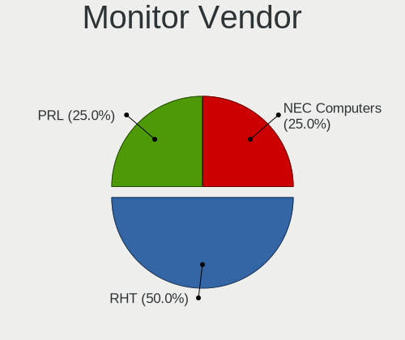

| Vendor        | Computers | Percent |
|---------------|-----------|---------|
| RHT           | 2         | 50%     |
| PRL           | 1         | 25%     |
| NEC Computers | 1         | 25%     |

Monitor Model
-------------

Monitor models

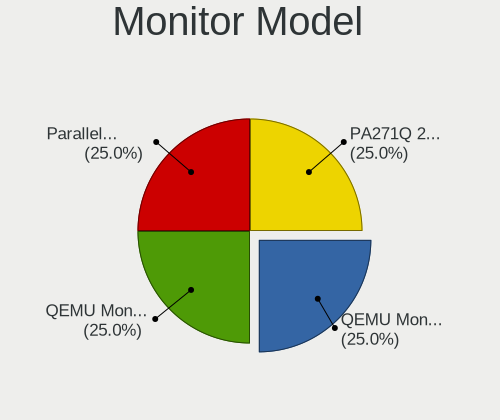

| Model                                                  | Computers | Percent |
|--------------------------------------------------------|-----------|---------|
| RHT QEMU Monitor RHT1234 2048x1152 260x195mm 12.8-inch | 1         | 25%     |
| RHT QEMU Monitor RHT1234 2048x1152 260x190mm 12.7-inch | 1         | 25%     |
| PRL Parallels Vu PRL4006 1400x1050                     | 1         | 25%     |
| NEC Computers LCD Monitor PA271Q 2560x1440             | 1         | 25%     |

Monitor Resolution
------------------

Monitor screen resolution

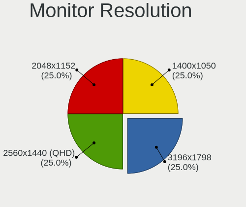

| Resolution      | Computers | Percent |
|-----------------|-----------|---------|
| 3196x1798       | 1         | 25%     |
| 2560x1440 (QHD) | 1         | 25%     |
| 2048x1152       | 1         | 25%     |
| 1400x1050       | 1         | 25%     |

Monitor Diagonal
----------------

Diagonal size in inches

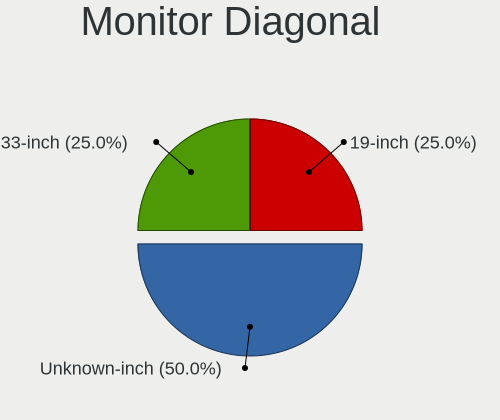

| Inches  | Computers | Percent |
|---------|-----------|---------|
| Unknown | 2         | 50%     |
| 33      | 1         | 25%     |
| 19      | 1         | 25%     |

Monitor Width
-------------

Physical width

| Width in mm | Computers | Percent |
|-------------|-----------|---------|
| Unknown     | 2         | 50%     |
| 701-800     | 1         | 25%     |
| 401-500     | 1         | 25%     |

Aspect Ratio
------------

Proportional relationship between the width and the height

| Ratio   | Computers | Percent |
|---------|-----------|---------|
| 4/3     | 2         | 50%     |
| 16/9    | 1         | 25%     |
| Unknown | 1         | 25%     |

Monitor Area
------------

Area in inch²

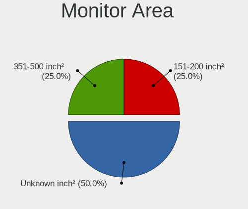

| Area in inch² | Computers | Percent |
|----------------|-----------|---------|
| Unknown        | 2         | 50%     |
| 351-500        | 1         | 25%     |
| 151-200        | 1         | 25%     |

Pixel Density
-------------

Pixels per inch

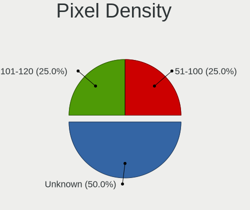

| Density | Computers | Percent |
|---------|-----------|---------|
| Unknown | 2         | 50%     |
| 101-120 | 1         | 25%     |
| 51-100  | 1         | 25%     |

Multiple Monitors
-----------------

Total monitors connected

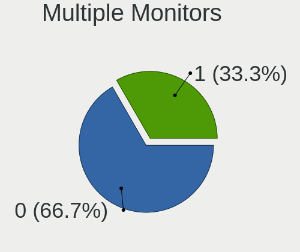

| Total | Computers | Percent |
|-------|-----------|---------|
| 0     | 38        | 66.67%  |
| 1     | 19        | 33.33%  |

Network
-------

Net Controller Vendor
---------------------

Controller vendors

| Vendor     | Computers | Percent |
|------------|-----------|---------|
| Intel      | 24        | 43.64%  |
| Amazon.com | 13        | 23.64%  |
| Red Hat    | 10        | 18.18%  |
| VMware     | 7         | 12.73%  |
| TP-Link    | 1         | 1.82%   |

Net Controller Model
--------------------

Controller models

| Model                                                      | Computers | Percent |
|------------------------------------------------------------|-----------|---------|
| Intel 82545EM Gigabit Ethernet Controller (Copper)         | 14        | 25.45%  |
| Amazon.com Elastic Network Adapter (ENA)                   | 13        | 23.64%  |
| Red Hat Virtio network device                              | 10        | 18.18%  |
| Intel 82540EM Gigabit Ethernet Controller                  | 9         | 16.36%  |
| VMware VMXNET3 Ethernet Controller                         | 7         | 12.73%  |
| TP-Link AC600 wireless Realtek RTL8811AU [Archer T2U Nano] | 1         | 1.82%   |
| Intel X550 Virtual Function                                | 1         | 1.82%   |

Wireless Vendor
---------------

Wireless vendors

| Vendor  | Computers | Percent |
|---------|-----------|---------|
| TP-Link | 1         | 100%    |

Wireless Model
--------------

Wireless models

| Model                                                      | Computers | Percent |
|------------------------------------------------------------|-----------|---------|
| TP-Link AC600 wireless Realtek RTL8811AU [Archer T2U Nano] | 1         | 100%    |

Ethernet Vendor
---------------

Ethernet vendors

| Vendor     | Computers | Percent |
|------------|-----------|---------|
| Intel      | 24        | 54.55%  |
| Amazon.com | 13        | 29.55%  |
| VMware     | 7         | 15.91%  |

Ethernet Model
--------------

Ethernet models

| Model                                              | Computers | Percent |
|----------------------------------------------------|-----------|---------|
| Intel 82545EM Gigabit Ethernet Controller (Copper) | 14        | 31.82%  |
| Amazon.com Elastic Network Adapter (ENA)           | 13        | 29.55%  |
| Intel 82540EM Gigabit Ethernet Controller          | 9         | 20.45%  |
| VMware VMXNET3 Ethernet Controller                 | 7         | 15.91%  |
| Intel X550 Virtual Function                        | 1         | 2.27%   |

Net Controller Kind
-------------------

Ethernet, WiFi or modem

| Kind     | Computers | Percent |
|----------|-----------|---------|
| Ethernet | 44        | 80%     |
| Unknown  | 10        | 18.18%  |
| WiFi     | 1         | 1.82%   |

Used Controller
---------------

Currently used network controller

| Kind     | Computers | Percent |
|----------|-----------|---------|
| Ethernet | 44        | 100%    |

NICs
----

Total network controllers on board

| Total | Computers | Percent |
|-------|-----------|---------|
| 1     | 40        | 70.18%  |
| 0     | 13        | 22.81%  |
| 2     | 2         | 3.51%   |
| 10    | 1         | 1.75%   |
| 3     | 1         | 1.75%   |

IPv6
----

IPv6 vs IPv4

| Used | Computers | Percent |
|------|-----------|---------|
| No   | 56        | 98.25%  |
| Yes  | 1         | 1.75%   |

Bluetooth
---------

Bluetooth Vendor
----------------

Controller vendors

| Vendor    | Computers | Percent |
|-----------|-----------|---------|
| VMware    | 4         | 80%     |
| Microsoft | 1         | 20%     |

Bluetooth Model
---------------

Controller models

| Model                                        | Computers | Percent |
|----------------------------------------------|-----------|---------|
| VMware Virtual Bluetooth Adapter             | 4         | 80%     |
| Microsoft Wireless Transceiver for Bluetooth | 1         | 20%     |

Sound
-----

Sound Vendor
------------

Sound card vendors

| Vendor  | Computers | Percent |
|---------|-----------|---------|
| Ensoniq | 14        | 53.85%  |
| Intel   | 11        | 42.31%  |
| Nvidia  | 1         | 3.85%   |

Sound Model
-----------

Sound card models

| Model                                                                      | Computers | Percent |
|----------------------------------------------------------------------------|-----------|---------|
| Ensoniq ES1371/ES1373 / Creative Labs CT2518                               | 14        | 51.85%  |
| Intel 82801AA AC'97 Audio Controller                                       | 7         | 25.93%  |
| Intel 82801FB/FBM/FR/FW/FRW (ICH6 Family) High Definition Audio Controller | 2         | 7.41%   |
| Nvidia TU107 GeForce GTX 1650 High Definition Audio Controller             | 1         | 3.7%    |
| Nvidia GM200 High Definition Audio                                         | 1         | 3.7%    |
| Intel 82801I (ICH9 Family) HD Audio Controller                             | 1         | 3.7%    |
| Intel 82801BA/BAM AC'97 Audio Controller                                   | 1         | 3.7%    |

Memory
------

Memory Vendor
-------------

Memory module vendors

| Vendor              | Computers | Percent |
|---------------------|-----------|---------|
| Unknown             | 11        | 23.91%  |
| Unknown             | 11        | 23.91%  |
| Samsung Electronics | 8         | 17.39%  |
| QEMU                | 7         | 15.22%  |
| Kingston            | 4         | 8.7%    |
| VMware Virtual RAM  | 3         | 6.52%   |
| SK Hynix            | 1         | 2.17%   |
| Microsoft           | 1         | 2.17%   |

Memory Model
------------

Memory module models

| Model                                                 | Computers | Percent |
|-------------------------------------------------------|-----------|---------|
| Unknown                                               | 11        | 20.75%  |
| Samsung RAM M393A4K40BB2-CTD 32GB DIMM DDR4 2666MT/s  | 6         | 11.32%  |
| Unknown RAM Module 1024MB DIMM DRAM                   | 5         | 9.43%   |
| Unknown RAM Module 4096MB DIMM DRAM                   | 4         | 7.55%   |
| Kingston RAM AM32D426R19D4HJX 32GB DIMM DDR4 2666MT/s | 4         | 7.55%   |
| VMware Virtual RAM RAM VMW-4096MB 4GB DIMM DRAM       | 3         | 5.66%   |
| Unknown RAM Module 2048MB DIMM DRAM                   | 2         | 3.77%   |
| Samsung RAM M393A4K40BB3-CVF 32GB DIMM DDR4 2933MT/s  | 2         | 3.77%   |
| QEMU RAM Module 16384MB DIMM RAM                      | 2         | 3.77%   |
| VMware Virtual RAM RAM VMW-8192MB 8GB DIMM DRAM       | 1         | 1.89%   |
| Unknown RAM Module 256MB DIMM DRAM                    | 1         | 1.89%   |
| Unknown RAM Module 2048MB SODIMM DRAM 667MT/s         | 1         | 1.89%   |
| Unknown RAM Module 1GB DIMM DRAM                      | 1         | 1.89%   |
| Unknown RAM Module 128MB DIMM DRAM                    | 1         | 1.89%   |
| Unknown RAM Module 1024MB SODIMM DRAM 667MT/s         | 1         | 1.89%   |
| SK Hynix RAM HMA84GR7JJR4N-WM 32GB DIMM DDR4 2933MT/s | 1         | 1.89%   |
| QEMU RAM Module 8000MB DIMM RAM                       | 1         | 1.89%   |
| QEMU RAM Module 7000MB DIMM RAM                       | 1         | 1.89%   |
| QEMU RAM Module 6000MB DIMM RAM                       | 1         | 1.89%   |
| QEMU RAM Module 2048MB DIMM RAM                       | 1         | 1.89%   |
| QEMU RAM Module 2000MB DIMM RAM                       | 1         | 1.89%   |
| Microsoft RAM Module 4224MB                           | 1         | 1.89%   |
| Microsoft RAM Module 3968MB                           | 1         | 1.89%   |

Memory Kind
-----------

Memory module kinds

| Kind    | Computers | Percent |
|---------|-----------|---------|
| DRAM    | 18        | 40.91%  |
| DDR4    | 13        | 29.55%  |
| RAM     | 12        | 27.27%  |
| Unknown | 1         | 2.27%   |

Memory Form Factor
------------------

Physical design of the memory module

| Name    | Computers | Percent |
|---------|-----------|---------|
| DIMM    | 42        | 95.45%  |
| SODIMM  | 1         | 2.27%   |
| Unknown | 1         | 2.27%   |

Memory Size
-----------

Memory module size

| Size  | Computers | Percent |
|-------|-----------|---------|
| 32768 | 13        | 23.21%  |
| 4096  | 9         | 16.07%  |
| 1024  | 7         | 12.5%   |
| 8192  | 6         | 10.71%  |
| 2048  | 5         | 8.93%   |
| 16384 | 3         | 5.36%   |
| 8000  | 1         | 1.79%   |
| 7000  | 1         | 1.79%   |
| 6000  | 1         | 1.79%   |
| 4224  | 1         | 1.79%   |
| 4088  | 1         | 1.79%   |
| 3968  | 1         | 1.79%   |
| 2000  | 1         | 1.79%   |
| 256   | 1         | 1.79%   |
| 128   | 1         | 1.79%   |
| 64    | 1         | 1.79%   |
| 16    | 1         | 1.79%   |
| 8     | 1         | 1.79%   |
| 4     | 1         | 1.79%   |

Memory Speed
------------

Memory module speed

| Speed   | Computers | Percent |
|---------|-----------|---------|
| Unknown | 30        | 68.18%  |
| 2666    | 10        | 22.73%  |
| 2933    | 3         | 6.82%   |
| 667     | 1         | 2.27%   |

Printers & scanners
-------------------

Printer Vendor
--------------

Printer device vendors

| Vendor    | Computers | Percent |
|-----------|-----------|---------|
| PARALLELS | 1         | 100%    |

Printer Model
-------------

Printer device models

| Model                                                                                  | Computers | Percent |
|----------------------------------------------------------------------------------------|-----------|---------|
| PARALLELS Virtual Printer (/Users/jean/Parallels/OpenMandriva Lx 4.3.pvm/parallel.txt) | 1         | 100%    |

Scanner Vendor
--------------

Scanner device vendors

Zero info for selected period =(

Scanner Model
-------------

Scanner device models

Zero info for selected period =(

Camera
------

Camera Vendor
-------------

Camera device vendors

| Vendor    | Computers | Percent |
|-----------|-----------|---------|
| PARALLELS | 1         | 100%    |

Camera Model
------------

Camera device models

| Model                        | Computers | Percent |
|------------------------------|-----------|---------|
| PARALLELS IRIScan Desk 5 Pro | 1         | 100%    |

Security
--------

Fingerprint Vendor
------------------

Fingerprint sensor vendors

Zero info for selected period =(

Fingerprint Model
-----------------

Fingerprint sensor models

Zero info for selected period =(

Chipcard Vendor
---------------

Chipcard module vendors

Zero info for selected period =(

Chipcard Model
--------------

Chipcard module models

Zero info for selected period =(

Unsupported
-----------

Unsupported Devices
-------------------

Total unsupported devices on board

| Total | Computers | Percent |
|-------|-----------|---------|
| 0     | 37        | 64.91%  |
| 3     | 13        | 22.81%  |
| 1     | 6         | 10.53%  |
| 4     | 1         | 1.75%   |

Unsupported Device Types
------------------------

Types of unsupported devices

| Type                     | Computers | Percent |
|--------------------------|-----------|---------|
| Unassigned class         | 13        | 36.11%  |
| Communication controller | 13        | 36.11%  |
| Graphics card            | 6         | 16.67%  |
| Storage/ide              | 1         | 2.78%   |
| Storage/ata              | 1         | 2.78%   |
| Sound                    | 1         | 2.78%   |
| Net/wireless             | 1         | 2.78%   |

