Clear Linux - Tested Virtual Hardware & Statistics
--------------------------------------------------

A project to collect tested virtual hardware configurations for Clear Linux.

Anyone can contribute to this report by the [hw-probe](https://github.com/linuxhw/hw-probe) tool:

    sudo -E hw-probe -all -upload

Please contribute! Especially if your hardware is rare.

Contents
--------

* [ Test Cases ](#test-cases)

* [ System ](#system)
  - [ OS                       ](#os)
  - [ OS Family                ](#os-family)
  - [ Kernel                   ](#kernel)
  - [ Kernel Family            ](#kernel-family)
  - [ Kernel Major Ver.        ](#kernel-major-ver)
  - [ Arch                     ](#arch)
  - [ DE                       ](#de)
  - [ Display Server           ](#display-server)
  - [ Display Manager          ](#display-manager)
  - [ OS Lang                  ](#os-lang)
  - [ Boot Mode                ](#boot-mode)
  - [ Filesystem               ](#filesystem)
  - [ Part. scheme             ](#part-scheme)
  - [ Dual Boot with Linux/BSD ](#dual-boot-with-linuxbsd)
  - [ Dual Boot (Win)          ](#dual-boot-win)

* [ Board ](#board)
  - [ Vendor                   ](#vendor)
  - [ Model                    ](#model)
  - [ Model Family             ](#model-family)
  - [ MFG Year                 ](#mfg-year)
  - [ Form Factor              ](#form-factor)
  - [ Secure Boot              ](#secure-boot)
  - [ Coreboot                 ](#coreboot)
  - [ RAM Size                 ](#ram-size)
  - [ RAM Used                 ](#ram-used)
  - [ Total Drives             ](#total-drives)
  - [ Has CD-ROM               ](#has-cd-rom)
  - [ Has Ethernet             ](#has-ethernet)
  - [ Has WiFi                 ](#has-wifi)
  - [ Has Bluetooth            ](#has-bluetooth)

* [ Location ](#location)
  - [ Country                  ](#country)
  - [ City                     ](#city)

* [ Drives ](#drives)
  - [ Drive Vendor             ](#drive-vendor)
  - [ Drive Model              ](#drive-model)
  - [ HDD Vendor               ](#hdd-vendor)
  - [ SSD Vendor               ](#ssd-vendor)
  - [ Drive Kind               ](#drive-kind)
  - [ Drive Connector          ](#drive-connector)
  - [ Drive Size               ](#drive-size)
  - [ Space Total              ](#space-total)
  - [ Space Used               ](#space-used)
  - [ Malfunc. Drives          ](#malfunc-drives)
  - [ Malfunc. Drive Vendor    ](#malfunc-drive-vendor)
  - [ Malfunc. HDD Vendor      ](#malfunc-hdd-vendor)
  - [ Malfunc. Drive Kind      ](#malfunc-drive-kind)
  - [ Failed Drives            ](#failed-drives)
  - [ Failed Drive Vendor      ](#failed-drive-vendor)
  - [ Drive Status             ](#drive-status)

* [ Storage controller ](#storage-controller)
  - [ Storage Vendor           ](#storage-vendor)
  - [ Storage Model            ](#storage-model)
  - [ Storage Kind             ](#storage-kind)

* [ Processor ](#processor)
  - [ CPU Vendor               ](#cpu-vendor)
  - [ CPU Model                ](#cpu-model)
  - [ CPU Model Family         ](#cpu-model-family)
  - [ CPU Cores                ](#cpu-cores)
  - [ CPU Sockets              ](#cpu-sockets)
  - [ CPU Threads              ](#cpu-threads)
  - [ CPU Op-Modes             ](#cpu-op-modes)
  - [ CPU Microcode            ](#cpu-microcode)
  - [ CPU Microarch            ](#cpu-microarch)

* [ Graphics ](#graphics)
  - [ GPU Vendor               ](#gpu-vendor)
  - [ GPU Model                ](#gpu-model)
  - [ GPU Combo                ](#gpu-combo)
  - [ GPU Driver               ](#gpu-driver)
  - [ GPU Memory               ](#gpu-memory)

* [ Monitor ](#monitor)
  - [ Monitor Vendor           ](#monitor-vendor)
  - [ Monitor Model            ](#monitor-model)
  - [ Monitor Resolution       ](#monitor-resolution)
  - [ Monitor Diagonal         ](#monitor-diagonal)
  - [ Monitor Width            ](#monitor-width)
  - [ Aspect Ratio             ](#aspect-ratio)
  - [ Monitor Area             ](#monitor-area)
  - [ Pixel Density            ](#pixel-density)
  - [ Multiple Monitors        ](#multiple-monitors)

* [ Network ](#network)
  - [ Net Controller Vendor    ](#net-controller-vendor)
  - [ Net Controller Model     ](#net-controller-model)
  - [ Wireless Vendor          ](#wireless-vendor)
  - [ Wireless Model           ](#wireless-model)
  - [ Ethernet Vendor          ](#ethernet-vendor)
  - [ Ethernet Model           ](#ethernet-model)
  - [ Net Controller Kind      ](#net-controller-kind)
  - [ Used Controller          ](#used-controller)
  - [ NICs                     ](#nics)
  - [ IPv6                     ](#ipv6)

* [ Bluetooth ](#bluetooth)
  - [ Bluetooth Vendor         ](#bluetooth-vendor)
  - [ Bluetooth Model          ](#bluetooth-model)

* [ Sound ](#sound)
  - [ Sound Vendor             ](#sound-vendor)
  - [ Sound Model              ](#sound-model)

* [ Memory ](#memory)
  - [ Memory Vendor            ](#memory-vendor)
  - [ Memory Model             ](#memory-model)
  - [ Memory Kind              ](#memory-kind)
  - [ Memory Form Factor       ](#memory-form-factor)
  - [ Memory Size              ](#memory-size)
  - [ Memory Speed             ](#memory-speed)

* [ Printers & scanners ](#printers--scanners)
  - [ Printer Vendor           ](#printer-vendor)
  - [ Printer Model            ](#printer-model)
  - [ Scanner Vendor           ](#scanner-vendor)
  - [ Scanner Model            ](#scanner-model)

* [ Camera ](#camera)
  - [ Camera Vendor            ](#camera-vendor)
  - [ Camera Model             ](#camera-model)

* [ Security ](#security)
  - [ Fingerprint Vendor       ](#fingerprint-vendor)
  - [ Fingerprint Model        ](#fingerprint-model)
  - [ Chipcard Vendor          ](#chipcard-vendor)
  - [ Chipcard Model           ](#chipcard-model)

* [ Unsupported ](#unsupported)
  - [ Unsupported Devices      ](#unsupported-devices)
  - [ Unsupported Device Types ](#unsupported-device-types)

Test Cases
----------

Total: 32

| Vendor    | Model                       | Form-Factor     | Probe                                                      | Date         |
|-----------|-----------------------------|-----------------|------------------------------------------------------------|--------------|
| QEMU      | Standard PC (Q35 + ICH9,... | Virtual machine | [ecf0c7ff28](https://linux-hardware.org/?probe=ecf0c7ff28) | Apr 15, 2022 |
| Oracle    | VirtualBox                  | Virtual machine | [14865f0b94](https://linux-hardware.org/?probe=14865f0b94) | Mar 25, 2022 |
| Oracle    | VirtualBox                  | Virtual machine | [20353aff1e](https://linux-hardware.org/?probe=20353aff1e) | Feb 21, 2022 |
| Oracle    | VirtualBox                  | Virtual machine | [6f0892c7bb](https://linux-hardware.org/?probe=6f0892c7bb) | Jan 30, 2022 |
| QEMU      | Standard PC (i440FX + PI... | Virtual machine | [04bac5da13](https://linux-hardware.org/?probe=04bac5da13) | Jan 06, 2022 |
| QEMU      | Standard PC (Q35 + ICH9,... | Virtual machine | [b95c5ad65e](https://linux-hardware.org/?probe=b95c5ad65e) | Jan 01, 2022 |
| VMware    | VMware7,1                   | Virtual machine | [2da21916fb](https://linux-hardware.org/?probe=2da21916fb) | Dec 12, 2021 |
| VMware    | Virtual Platform            | Virtual machine | [53fc15c7db](https://linux-hardware.org/?probe=53fc15c7db) | Nov 03, 2021 |
| VMware    | Virtual Platform            | Virtual machine | [d812ded9f7](https://linux-hardware.org/?probe=d812ded9f7) | Oct 29, 2021 |
| Oracle    | VirtualBox                  | Virtual machine | [ecb840d75c](https://linux-hardware.org/?probe=ecb840d75c) | Jul 20, 2021 |
| VMware    | Virtual Platform            | Virtual machine | [dd9190f4fe](https://linux-hardware.org/?probe=dd9190f4fe) | Apr 30, 2021 |
| QEMU      | Standard PC (Q35 + ICH9,... | Virtual machine | [7f0ceee50d](https://linux-hardware.org/?probe=7f0ceee50d) | Apr 24, 2021 |
| QEMU      | Standard PC (Q35 + ICH9,... | Virtual machine | [4f4c235dda](https://linux-hardware.org/?probe=4f4c235dda) | Mar 18, 2021 |
| Oracle    | VirtualBox                  | Virtual machine | [f8c4a3bed9](https://linux-hardware.org/?probe=f8c4a3bed9) | Feb 13, 2021 |
| VMware    | VMware7,1                   | Virtual machine | [f700c45a21](https://linux-hardware.org/?probe=f700c45a21) | Feb 09, 2021 |
| VMware    | VMware7,1                   | Virtual machine | [f2559bc0fb](https://linux-hardware.org/?probe=f2559bc0fb) | Jan 22, 2021 |
| VMware    | Virtual Platform            | Virtual machine | [f4074d2ea5](https://linux-hardware.org/?probe=f4074d2ea5) | Jan 20, 2021 |
| QEMU      | Standard PC (Q35 + ICH9,... | Virtual machine | [621deba976](https://linux-hardware.org/?probe=621deba976) | Dec 31, 2020 |
| VMware    | VMware7,1                   | Virtual machine | [9be69419fd](https://linux-hardware.org/?probe=9be69419fd) | Dec 24, 2020 |
| Oracle    | VirtualBox                  | Virtual machine | [9e89defc3e](https://linux-hardware.org/?probe=9e89defc3e) | Oct 07, 2020 |
| QEMU      | Standard PC (Q35 + ICH9,... | Virtual machine | [f9a0549882](https://linux-hardware.org/?probe=f9a0549882) | Sep 09, 2020 |
| Oracle    | VirtualBox                  | Virtual machine | [b0575e0cac](https://linux-hardware.org/?probe=b0575e0cac) | Aug 14, 2020 |
| Oracle    | VirtualBox                  | Virtual machine | [b20061296b](https://linux-hardware.org/?probe=b20061296b) | Aug 13, 2020 |
| Oracle    | VirtualBox                  | Virtual machine | [59616832b3](https://linux-hardware.org/?probe=59616832b3) | Jul 26, 2020 |
| VMware    | Virtual Platform            | Virtual machine | [e583c2fcd4](https://linux-hardware.org/?probe=e583c2fcd4) | Apr 20, 2020 |
| VMware    | Virtual Platform            | Virtual machine | [f954e2ec17](https://linux-hardware.org/?probe=f954e2ec17) | Apr 20, 2020 |
| VMware    | VMware7,1                   | Virtual machine | [9d3ba85057](https://linux-hardware.org/?probe=9d3ba85057) | Feb 20, 2020 |
| Microsoft | Virtual Machine Hyper-V ... | Virtual machine | [f1efcc3930](https://linux-hardware.org/?probe=f1efcc3930) | Jan 25, 2020 |
| Oracle    | VirtualBox                  | Virtual machine | [a62d34116d](https://linux-hardware.org/?probe=a62d34116d) | Sep 14, 2019 |
| VMware    | VMware7,1                   | Virtual machine | [73b1e9bc9d](https://linux-hardware.org/?probe=73b1e9bc9d) | Jun 22, 2019 |
| QEMU      | Standard PC (i440FX + PI... | Virtual machine | [61122a8615](https://linux-hardware.org/?probe=61122a8615) | Jun 22, 2019 |
| Oracle    | VirtualBox                  | Virtual machine | [ec4b2c9e05](https://linux-hardware.org/?probe=ec4b2c9e05) | Jun 08, 2019 |

System
------

OS
--

Installed operating systems

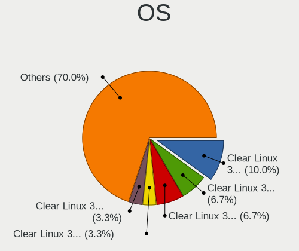

| Name              | Computers | Percent |
|-------------------|-----------|---------|
| Clear Linux 35000 | 3         | 10%     |
| Clear Linux 34220 | 2         | 6.67%   |
| Clear Linux 30040 | 2         | 6.67%   |
| Clear Linux 36150 | 1         | 3.33%   |
| Clear Linux 36070 | 1         | 3.33%   |
| Clear Linux 35760 | 1         | 3.33%   |
| Clear Linux 35210 | 1         | 3.33%   |
| Clear Linux 35190 | 1         | 3.33%   |
| Clear Linux 34820 | 1         | 3.33%   |
| Clear Linux 34520 | 1         | 3.33%   |
| Clear Linux 34500 | 1         | 3.33%   |
| Clear Linux 34380 | 1         | 3.33%   |
| Clear Linux 34190 | 1         | 3.33%   |
| Clear Linux 34180 | 1         | 3.33%   |
| Clear Linux 34130 | 1         | 3.33%   |
| Clear Linux 33810 | 1         | 3.33%   |
| Clear Linux 33690 | 1         | 3.33%   |
| Clear Linux 33590 | 1         | 3.33%   |
| Clear Linux 33540 | 1         | 3.33%   |
| Clear Linux 32870 | 1         | 3.33%   |
| Clear Linux 32550 | 1         | 3.33%   |
| Clear Linux 32480 | 1         | 3.33%   |
| Clear Linux 32360 | 1         | 3.33%   |
| Clear Linux 32160 | 1         | 3.33%   |
| Clear Linux 30970 | 1         | 3.33%   |
| Clear Linux 29750 | 1         | 3.33%   |

OS Family
---------

OS without a version

| Name        | Computers | Percent |
|-------------|-----------|---------|
| Clear Linux | 29        | 100%    |

Kernel
------

Version of the Linux kernel

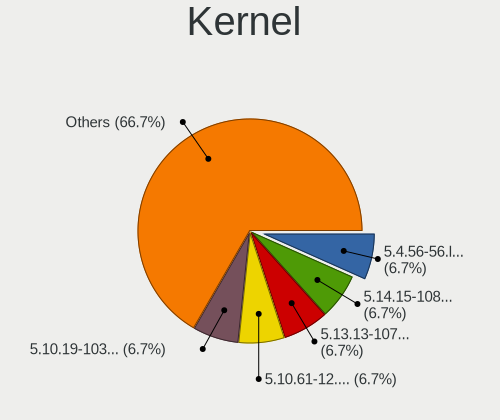

| Version              | Computers | Percent |
|----------------------|-----------|---------|
| 5.4.56-56.lts2019    | 2         | 6.67%   |
| 5.14.15-1086.native  | 2         | 6.67%   |
| 5.13.13-1070.native  | 2         | 6.67%   |
| 5.10.61-12.lts2020   | 2         | 6.67%   |
| 5.10.19-1032.native  | 2         | 6.67%   |
| 5.1.12-785.native    | 2         | 6.67%   |
| 5.9.16-1009.native   | 1         | 3.33%   |
| 5.7.19-982.native    | 1         | 3.33%   |
| 5.6.4-938.native     | 1         | 3.33%   |
| 5.5.6-914.native     | 1         | 3.33%   |
| 5.5.4-910.native     | 1         | 3.33%   |
| 5.4.92-93.lts2019    | 1         | 3.33%   |
| 5.4.53-53.lts2019    | 1         | 3.33%   |
| 5.4.13-254.hyperv    | 1         | 3.33%   |
| 5.4.129-122.lts2019  | 1         | 3.33%   |
| 5.16.13-1132.native  | 1         | 3.33%   |
| 5.10.9-1016.native   | 1         | 3.33%   |
| 5.10.8-1015.native   | 1         | 3.33%   |
| 5.10.30-1032.native  | 1         | 3.33%   |
| 5.10.108-59.lts2020  | 1         | 3.33%   |
| 5.10.10-1017.native  | 1         | 3.33%   |
| 4.19.71-77.lts2018   | 1         | 3.33%   |
| 4.19.46-44.lts2018   | 1         | 3.33%   |
| 4.19.108-120.lts2018 | 1         | 3.33%   |

Kernel Family
-------------

Linux kernel without a distro release

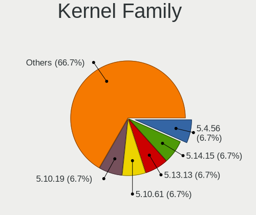

| Version  | Computers | Percent |
|----------|-----------|---------|
| 5.4.56   | 2         | 6.67%   |
| 5.14.15  | 2         | 6.67%   |
| 5.13.13  | 2         | 6.67%   |
| 5.10.61  | 2         | 6.67%   |
| 5.10.19  | 2         | 6.67%   |
| 5.1.12   | 2         | 6.67%   |
| 5.9.16   | 1         | 3.33%   |
| 5.7.19   | 1         | 3.33%   |
| 5.6.4    | 1         | 3.33%   |
| 5.5.6    | 1         | 3.33%   |
| 5.5.4    | 1         | 3.33%   |
| 5.4.92   | 1         | 3.33%   |
| 5.4.53   | 1         | 3.33%   |
| 5.4.13   | 1         | 3.33%   |
| 5.4.129  | 1         | 3.33%   |
| 5.16.13  | 1         | 3.33%   |
| 5.10.9   | 1         | 3.33%   |
| 5.10.8   | 1         | 3.33%   |
| 5.10.30  | 1         | 3.33%   |
| 5.10.108 | 1         | 3.33%   |
| 5.10.10  | 1         | 3.33%   |
| 4.19.71  | 1         | 3.33%   |
| 4.19.46  | 1         | 3.33%   |
| 4.19.108 | 1         | 3.33%   |

Kernel Major Ver.
-----------------

Linux kernel major version

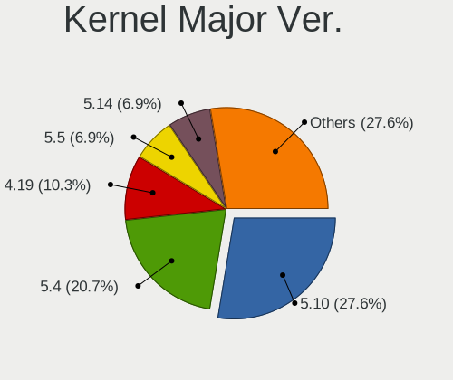

| Version | Computers | Percent |
|---------|-----------|---------|
| 5.10    | 8         | 27.59%  |
| 5.4     | 6         | 20.69%  |
| 4.19    | 3         | 10.34%  |
| 5.5     | 2         | 6.9%    |
| 5.14    | 2         | 6.9%    |
| 5.13    | 2         | 6.9%    |
| 5.1     | 2         | 6.9%    |
| 5.9     | 1         | 3.45%   |
| 5.7     | 1         | 3.45%   |
| 5.6     | 1         | 3.45%   |
| 5.16    | 1         | 3.45%   |

Arch
----

OS architecture (x86_64, i586, etc.)

| Name   | Computers | Percent |
|--------|-----------|---------|
| x86_64 | 29        | 100%    |

DE
--

Desktop Environment

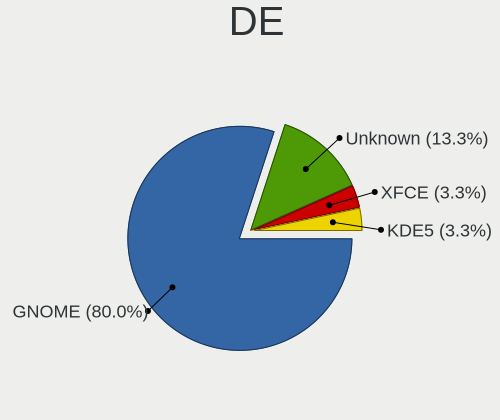

| Name    | Computers | Percent |
|---------|-----------|---------|
| GNOME   | 24        | 80%     |
| Unknown | 4         | 13.33%  |
| XFCE    | 1         | 3.33%   |
| KDE5    | 1         | 3.33%   |

Display Server
--------------

X11 or Wayland

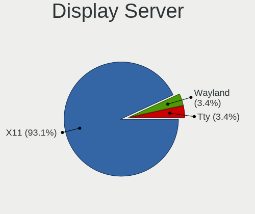

| Name    | Computers | Percent |
|---------|-----------|---------|
| X11     | 27        | 93.1%   |
| Wayland | 1         | 3.45%   |
| Tty     | 1         | 3.45%   |

Display Manager
---------------

SDDM, LightDM, etc.

| Name    | Computers | Percent |
|---------|-----------|---------|
| Unknown | 27        | 93.1%   |
| GDM     | 2         | 6.9%    |

OS Lang
-------

Language

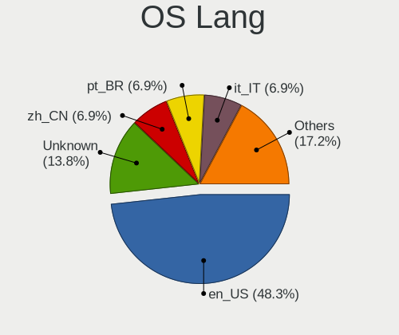

| Lang    | Computers | Percent |
|---------|-----------|---------|
| en_US   | 14        | 48.28%  |
| Unknown | 4         | 13.79%  |
| zh_CN   | 2         | 6.9%    |
| pt_BR   | 2         | 6.9%    |
| it_IT   | 2         | 6.9%    |
| de_DE   | 2         | 6.9%    |
| wbp_AU  | 1         | 3.45%   |
| ru_RU   | 1         | 3.45%   |
| fr_FR   | 1         | 3.45%   |

Boot Mode
---------

EFI or BIOS

| Mode | Computers | Percent |
|------|-----------|---------|
| BIOS | 29        | 100%    |

Filesystem
----------

Type of filesystem

| Type | Computers | Percent |
|------|-----------|---------|
| Ext4 | 29        | 100%    |

Part. scheme
------------

Scheme of partitioning

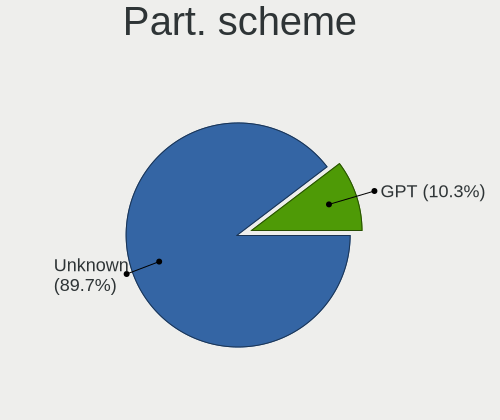

| Type    | Computers | Percent |
|---------|-----------|---------|
| Unknown | 26        | 89.66%  |
| GPT     | 3         | 10.34%  |

Dual Boot with Linux/BSD
------------------------

Hosting more than one Linux/BSD

| Dual boot | Computers | Percent |
|-----------|-----------|---------|
| No        | 29        | 100%    |

Dual Boot (Win)
---------------

Hosting Linux and Windows

| Dual boot | Computers | Percent |
|-----------|-----------|---------|
| No        | 29        | 100%    |

Board
-----

Vendor
------

Motherboard manufacturer

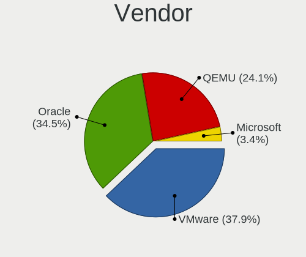

| Name      | Computers | Percent |
|-----------|-----------|---------|
| VMware    | 11        | 37.93%  |
| Oracle    | 10        | 34.48%  |
| QEMU      | 7         | 24.14%  |
| Microsoft | 1         | 3.45%   |

Model
-----

Motherboard model

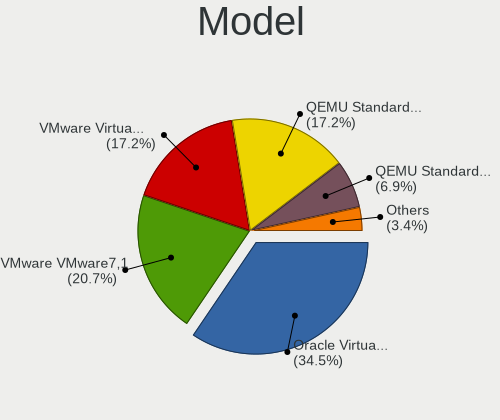

| Name                                   | Computers | Percent |
|----------------------------------------|-----------|---------|
| Oracle VirtualBox                      | 10        | 34.48%  |
| VMware VMware7,1                       | 6         | 20.69%  |
| VMware Virtual Platform                | 5         | 17.24%  |
| QEMU Standard PC (Q35 + ICH9, 2009)    | 5         | 17.24%  |
| QEMU Standard PC (i440FX + PIIX, 1996) | 2         | 6.9%    |
| Microsoft Virtual Machine              | 1         | 3.45%   |

Model Family
------------

Motherboard model prefix

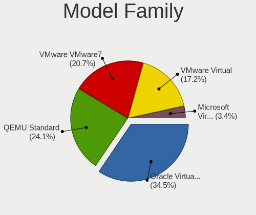

| Name              | Computers | Percent |
|-------------------|-----------|---------|
| Oracle VirtualBox | 10        | 34.48%  |
| QEMU Standard     | 7         | 24.14%  |
| VMware VMware7    | 6         | 20.69%  |
| VMware Virtual    | 5         | 17.24%  |
| Microsoft Virtual | 1         | 3.45%   |

MFG Year
--------

Motherboard manufacture year

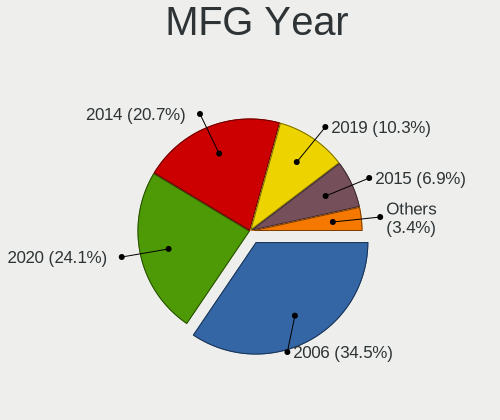

| Year | Computers | Percent |
|------|-----------|---------|
| 2006 | 10        | 34.48%  |
| 2020 | 7         | 24.14%  |
| 2014 | 6         | 20.69%  |
| 2019 | 3         | 10.34%  |
| 2015 | 2         | 6.9%    |
| 2021 | 1         | 3.45%   |

Form Factor
-----------

Physical design of the computer

| Name            | Computers | Percent |
|-----------------|-----------|---------|
| Virtual machine | 29        | 100%    |

Secure Boot
-----------

Enabled or disabled

| State    | Computers | Percent |
|----------|-----------|---------|
| Disabled | 29        | 100%    |

Coreboot
--------

Have coreboot on board

| Used | Computers | Percent |
|------|-----------|---------|
| No   | 29        | 100%    |

RAM Size
--------

Total RAM memory

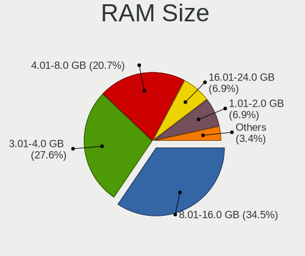

| Size in GB | Computers | Percent |
|------------|-----------|---------|
| 8.01-16.0  | 10        | 34.48%  |
| 3.01-4.0   | 8         | 27.59%  |
| 4.01-8.0   | 6         | 20.69%  |
| 16.01-24.0 | 2         | 6.9%    |
| 1.01-2.0   | 2         | 6.9%    |
| 32.01-64.0 | 1         | 3.45%   |

RAM Used
--------

Used RAM memory

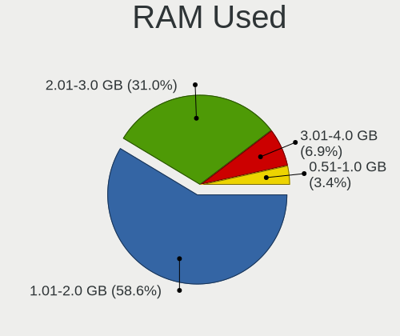

| Used GB  | Computers | Percent |
|----------|-----------|---------|
| 1.01-2.0 | 17        | 58.62%  |
| 2.01-3.0 | 9         | 31.03%  |
| 3.01-4.0 | 2         | 6.9%    |
| 0.51-1.0 | 1         | 3.45%   |

Total Drives
------------

Number of drives on board

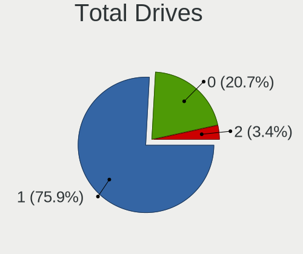

| Drives | Computers | Percent |
|--------|-----------|---------|
| 1      | 22        | 75.86%  |
| 0      | 6         | 20.69%  |
| 2      | 1         | 3.45%   |

Has CD-ROM
----------

Has CD-ROM on board

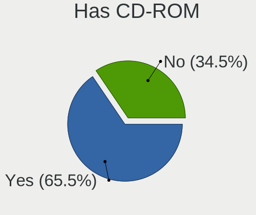

| Presented | Computers | Percent |
|-----------|-----------|---------|
| Yes       | 19        | 65.52%  |
| No        | 10        | 34.48%  |

Has Ethernet
------------

Has Ethernet on board

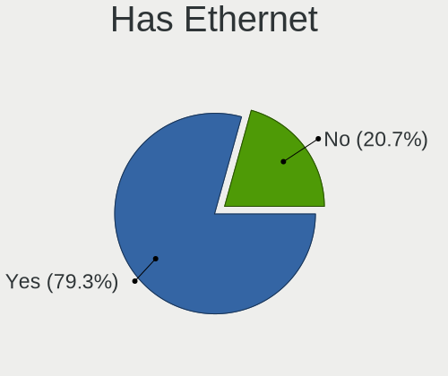

| Presented | Computers | Percent |
|-----------|-----------|---------|
| Yes       | 23        | 79.31%  |
| No        | 6         | 20.69%  |

Has WiFi
--------

Has WiFi module

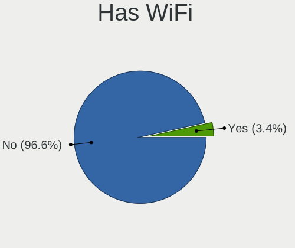

| Presented | Computers | Percent |
|-----------|-----------|---------|
| No        | 28        | 96.55%  |
| Yes       | 1         | 3.45%   |

Has Bluetooth
-------------

Has Bluetooth module

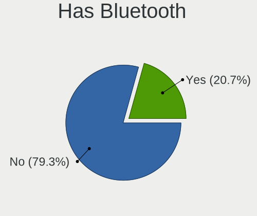

| Presented | Computers | Percent |
|-----------|-----------|---------|
| No        | 23        | 79.31%  |
| Yes       | 6         | 20.69%  |

Location
--------

Country
-------

Geographic location (country)

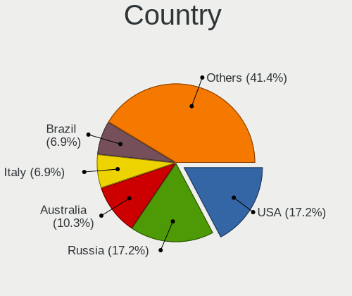

| Country     | Computers | Percent |
|-------------|-----------|---------|
| USA         | 5         | 17.24%  |
| Russia      | 5         | 17.24%  |
| Australia   | 3         | 10.34%  |
| Italy       | 2         | 6.9%    |
| Brazil      | 2         | 6.9%    |
| Ukraine     | 1         | 3.45%   |
| UAE         | 1         | 3.45%   |
| Switzerland | 1         | 3.45%   |
| Romania     | 1         | 3.45%   |
| Poland      | 1         | 3.45%   |
| Ireland     | 1         | 3.45%   |
| Indonesia   | 1         | 3.45%   |
| India       | 1         | 3.45%   |
| Hong Kong   | 1         | 3.45%   |
| Germany     | 1         | 3.45%   |
| France      | 1         | 3.45%   |
| Canada      | 1         | 3.45%   |

City
----

Geographic location (city)

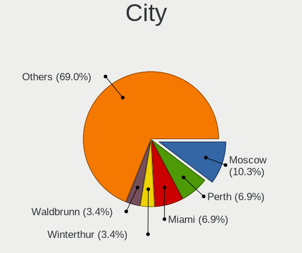

| City             | Computers | Percent |
|------------------|-----------|---------|
| Moscow           | 3         | 10.34%  |
| Perth            | 2         | 6.9%    |
| Miami            | 2         | 6.9%    |
| Winterthur       | 1         | 3.45%   |
| Waldbrunn        | 1         | 3.45%   |
| Tucson           | 1         | 3.45%   |
| Toulouse         | 1         | 3.45%   |
| Saskatoon        | 1         | 3.45%   |
| Rome             | 1         | 3.45%   |
| Pouso Alegre     | 1         | 3.45%   |
| Osa              | 1         | 3.45%   |
| Mumbai           | 1         | 3.45%   |
| Milan            | 1         | 3.45%   |
| Malang           | 1         | 3.45%   |
| Kyiv             | 1         | 3.45%   |
| Kazan’    | 1         | 3.45%   |
| Gliwice          | 1         | 3.45%   |
| FocÅŸani       | 1         | 3.45%   |
| Florianópolis | 1         | 3.45%   |
| Dubai            | 1         | 3.45%   |
| Denver           | 1         | 3.45%   |
| Chattanooga      | 1         | 3.45%   |
| Central          | 1         | 3.45%   |
| Ballinteer       | 1         | 3.45%   |
| Alexandria       | 1         | 3.45%   |

Drives
------

Drive Vendor
------------

Hard drive vendors

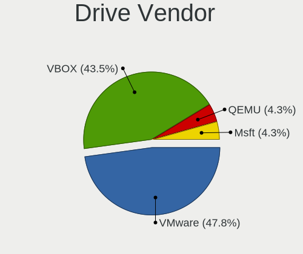

| Vendor | Computers | Drives | Percent |
|--------|-----------|--------|---------|
| VMware | 11        | 11     | 47.83%  |
| VBOX   | 10        | 10     | 43.48%  |
| QEMU   | 1         | 2      | 4.35%   |
| Msft   | 1         | 1      | 4.35%   |

Drive Model
-----------

Hard drive models

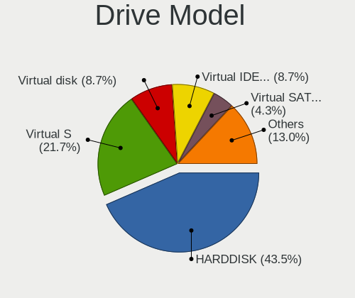

| Model                          | Computers | Percent |
|--------------------------------|-----------|---------|
| VBOX HARDDISK                  | 10        | 43.48%  |
| VMware Virtual S               | 5         | 21.74%  |
| VMware Virtual IDE Hard Drive  | 2         | 8.7%    |
| VMware Virtual disk            | 2         | 8.7%    |
| VMware Virtual SATA Hard Drive | 1         | 4.35%   |
| VMware NVMe SSD Drive          | 1         | 4.35%   |
| QEMU HARDDISK                  | 1         | 4.35%   |
| Msft Virtual Disk              | 1         | 4.35%   |

HDD Vendor
----------

Hard disk drive vendors

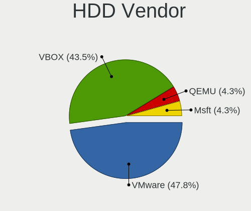

| Vendor | Computers | Drives | Percent |
|--------|-----------|--------|---------|
| VMware | 11        | 11     | 47.83%  |
| VBOX   | 10        | 10     | 43.48%  |
| QEMU   | 1         | 2      | 4.35%   |
| Msft   | 1         | 1      | 4.35%   |

SSD Vendor
----------

Solid state drive vendors

Zero info for selected period =(

Drive Kind
----------

HDD or SSD

| Kind | Computers | Drives | Percent |
|------|-----------|--------|---------|
| HDD  | 23        | 24     | 100%    |

Drive Connector
---------------

SATA, SAS, NVMe, etc.

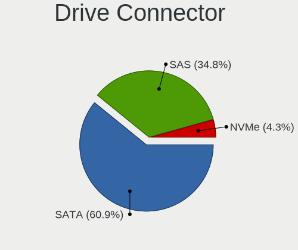

| Type | Computers | Drives | Percent |
|------|-----------|--------|---------|
| SATA | 14        | 15     | 60.87%  |
| SAS  | 8         | 8      | 34.78%  |
| NVMe | 1         | 1      | 4.35%   |

Drive Size
----------

Size of hard drive

| Size in TB | Computers | Drives | Percent |
|------------|-----------|--------|---------|
| 0.01-0.5   | 23        | 24     | 100%    |

Space Total
-----------

Amount of disk space available on the file system

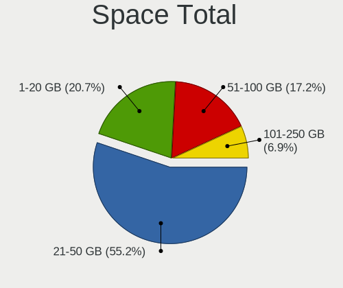

| Size in GB | Computers | Percent |
|------------|-----------|---------|
| 21-50      | 16        | 55.17%  |
| 1-20       | 6         | 20.69%  |
| 51-100     | 5         | 17.24%  |
| 101-250    | 2         | 6.9%    |

Space Used
----------

Amount of used disk space

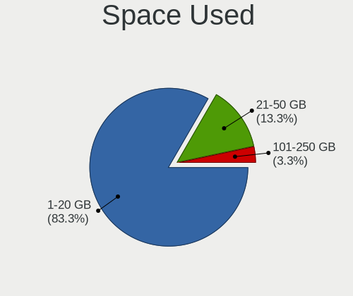

| Used GB | Computers | Percent |
|---------|-----------|---------|
| 1-20    | 25        | 83.33%  |
| 21-50   | 4         | 13.33%  |
| 101-250 | 1         | 3.33%   |

Malfunc. Drives
---------------

Drive models with a malfunction

Zero info for selected period =(

Malfunc. Drive Vendor
---------------------

Vendors of faulty drives

Zero info for selected period =(

Malfunc. HDD Vendor
-------------------

Vendors of faulty HDD drives

Zero info for selected period =(

Malfunc. Drive Kind
-------------------

Kinds of faulty drives

Zero info for selected period =(

Failed Drives
-------------

Failed drive models

Zero info for selected period =(

Failed Drive Vendor
-------------------

Failed drive vendors

Zero info for selected period =(

Drive Status
------------

Number of failed and malfunc. drives

| Status   | Computers | Drives | Percent |
|----------|-----------|--------|---------|
| Detected | 23        | 24     | 100%    |

Storage controller
------------------

Storage Vendor
--------------

Storage controller vendors

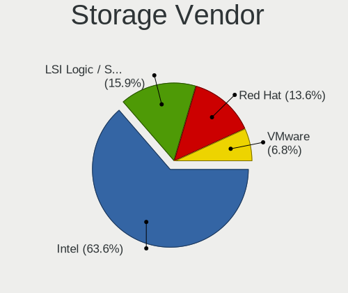

| Vendor                    | Computers | Percent |
|---------------------------|-----------|---------|
| Intel                     | 28        | 63.64%  |
| LSI Logic / Symbios Logic | 7         | 15.91%  |
| Red Hat                   | 6         | 13.64%  |
| VMware                    | 3         | 6.82%   |

Storage Model
-------------

Storage controller models

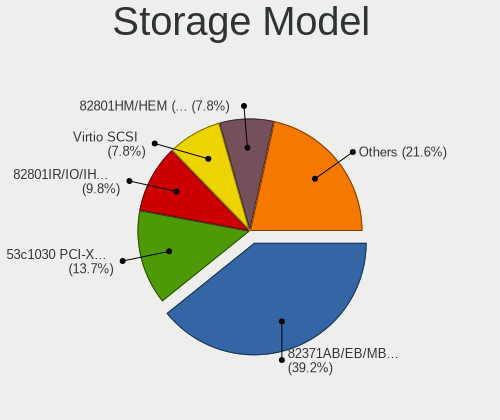

| Model                                                                 | Computers | Percent |
|-----------------------------------------------------------------------|-----------|---------|
| Intel 82371AB/EB/MB PIIX4 IDE                                         | 20        | 39.22%  |
| LSI Logic / Symbios Logic 53c1030 PCI-X Fusion-MPT Dual Ultra320 SCSI | 7         | 13.73%  |
| Intel 82801IR/IO/IH (ICH9R/DO/DH) 6 port SATA Controller [AHCI mode]  | 5         | 9.8%    |
| Red Hat Virtio SCSI                                                   | 4         | 7.84%   |
| Intel 82801HM/HEM (ICH8M/ICH8M-E) SATA Controller [AHCI mode]         | 4         | 7.84%   |
| VMware SATA AHCI controller                                           | 3         | 5.88%   |
| Red Hat Virtio block device                                           | 3         | 5.88%   |
| Intel 82371SB PIIX3 IDE [Natoma/Triton II]                            | 2         | 3.92%   |
| VMware PVSCSI SCSI Controller                                         | 1         | 1.96%   |
| VMware NVMe SSD Controller                                            | 1         | 1.96%   |
| Intel 631xESB/632xESB IDE Controller                                  | 1         | 1.96%   |

Storage Kind
------------

Kind of storage controller (IDE, SATA, NVMe, SAS, ...)

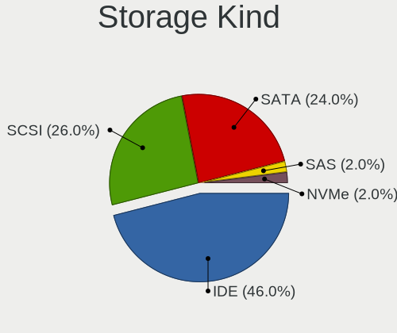

| Kind | Computers | Percent |
|------|-----------|---------|
| IDE  | 23        | 46%     |
| SCSI | 13        | 26%     |
| SATA | 12        | 24%     |
| SAS  | 1         | 2%      |
| NVMe | 1         | 2%      |

Processor
---------

CPU Vendor
----------

Processor vendors

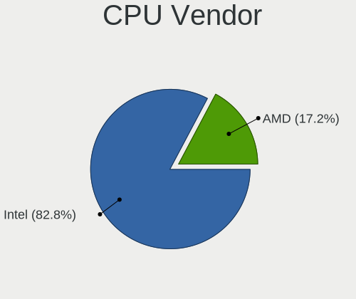

| Vendor | Computers | Percent |
|--------|-----------|---------|
| Intel  | 24        | 82.76%  |
| AMD    | 5         | 17.24%  |

CPU Model
---------

Processor models

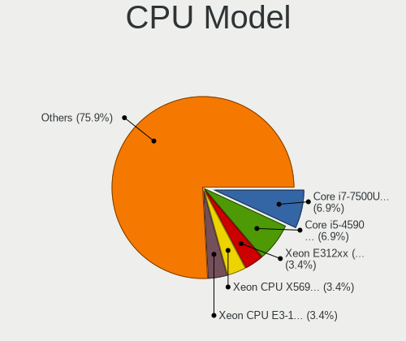

| Model                                         | Computers | Percent |
|-----------------------------------------------|-----------|---------|
| Intel Core i7-7500U CPU @ 2.70GHz             | 2         | 6.9%    |
| Intel Core i5-4590 CPU @ 3.30GHz              | 2         | 6.9%    |
| Intel Xeon E312xx (Sandy Bridge)              | 1         | 3.45%   |
| Intel Xeon CPU X5690 @ 3.47GHz                | 1         | 3.45%   |
| Intel Xeon CPU E3-1240 v3 @ 3.40GHz           | 1         | 3.45%   |
| Intel Core i9-9900KF CPU @ 3.60GHz            | 1         | 3.45%   |
| Intel Core i9-9900K CPU @ 3.60GHz             | 1         | 3.45%   |
| Intel Core i7-8700K CPU @ 3.70GHz             | 1         | 3.45%   |
| Intel Core i7-7820HQ CPU @ 2.90GHz            | 1         | 3.45%   |
| Intel Core i7-7700K CPU @ 4.20GHz             | 1         | 3.45%   |
| Intel Core i7-7700HQ CPU @ 2.80GHz            | 1         | 3.45%   |
| Intel Core i7-6700 CPU @ 3.40GHz              | 1         | 3.45%   |
| Intel Core i7-4810MQ CPU @ 2.80GHz            | 1         | 3.45%   |
| Intel Core i7-4770 CPU @ 3.40GHz              | 1         | 3.45%   |
| Intel Core i7-3630QM CPU @ 2.40GHz            | 1         | 3.45%   |
| Intel Core i7-10710U CPU @ 1.10GHz            | 1         | 3.45%   |
| Intel Core i5-9400F CPU @ 2.90GHz             | 1         | 3.45%   |
| Intel Core i5-4210H CPU @ 2.90GHz             | 1         | 3.45%   |
| Intel Core i5-4200U CPU @ 1.60GHz             | 1         | 3.45%   |
| Intel Core i5-2320 CPU @ 3.00GHz              | 1         | 3.45%   |
| Intel Core i3-9100 CPU @ 3.60GHz              | 1         | 3.45%   |
| Intel Core i3-3120M CPU @ 2.50GHz             | 1         | 3.45%   |
| AMD Ryzen 9 3900X 12-Core Processor           | 1         | 3.45%   |
| AMD Ryzen 3 2200U with Radeon Vega Mobile Gfx | 1         | 3.45%   |
| AMD Opteron 63xx class CPU                    | 1         | 3.45%   |
| AMD FX-8320 Eight-Core Processor              | 1         | 3.45%   |
| AMD EPYC-Rome Processor                       | 1         | 3.45%   |

CPU Model Family
----------------

Processor model prefix

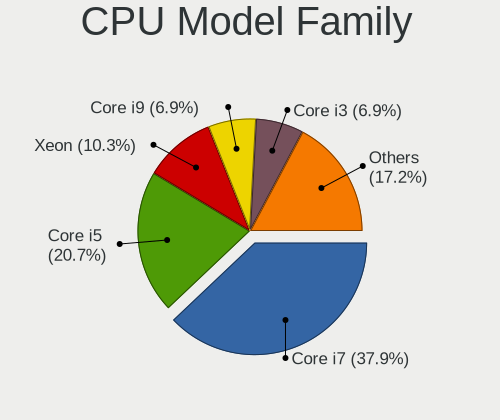

| Model         | Computers | Percent |
|---------------|-----------|---------|
| Intel Core i7 | 11        | 37.93%  |
| Intel Core i5 | 6         | 20.69%  |
| Intel Xeon    | 3         | 10.34%  |
| Intel Core i9 | 2         | 6.9%    |
| Intel Core i3 | 2         | 6.9%    |
| AMD Ryzen 9   | 1         | 3.45%   |
| AMD Ryzen 3   | 1         | 3.45%   |
| AMD Opteron   | 1         | 3.45%   |
| AMD FX        | 1         | 3.45%   |
| AMD EPYC      | 1         | 3.45%   |

CPU Cores
---------

Number of processor cores

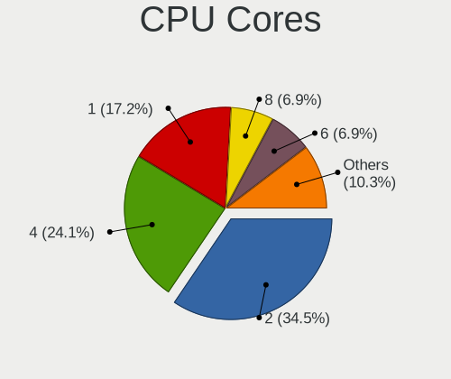

| Number | Computers | Percent |
|--------|-----------|---------|
| 2      | 10        | 34.48%  |
| 4      | 7         | 24.14%  |
| 1      | 5         | 17.24%  |
| 8      | 2         | 6.9%    |
| 6      | 2         | 6.9%    |
| 24     | 1         | 3.45%   |
| 12     | 1         | 3.45%   |
| 3      | 1         | 3.45%   |

CPU Sockets
-----------

Number of sockets

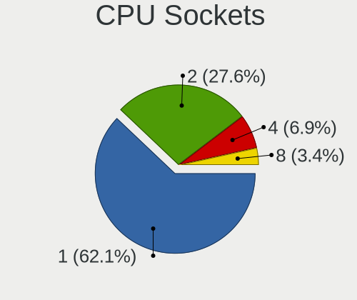

| Number | Computers | Percent |
|--------|-----------|---------|
| 1      | 18        | 62.07%  |
| 2      | 8         | 27.59%  |
| 4      | 2         | 6.9%    |
| 8      | 1         | 3.45%   |

CPU Threads
-----------

Threads per core (Hyper-Threading)

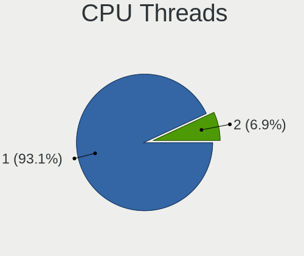

| Number | Computers | Percent |
|--------|-----------|---------|
| 1      | 27        | 93.1%   |
| 2      | 2         | 6.9%    |

CPU Op-Modes
------------

CPU Operation Modes (32-bit, 64-bit)

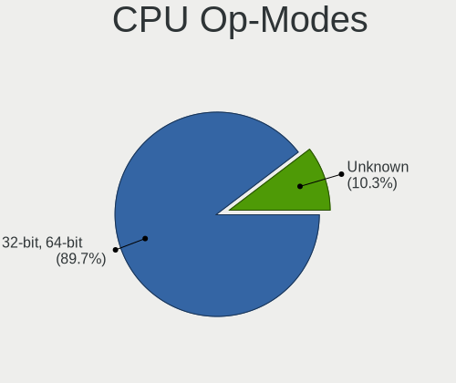

| Op mode        | Computers | Percent |
|----------------|-----------|---------|
| 32-bit, 64-bit | 26        | 89.66%  |
| Unknown        | 3         | 10.34%  |

CPU Microcode
-------------

Microcode number

| Number  | Computers | Percent |
|---------|-----------|---------|
| Unknown | 29        | 100%    |

CPU Microarch
-------------

Microarchitecture

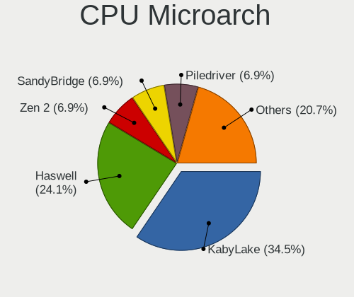

| Name        | Computers | Percent |
|-------------|-----------|---------|
| KabyLake    | 10        | 34.48%  |
| Haswell     | 7         | 24.14%  |
| Zen 2       | 2         | 6.9%    |
| SandyBridge | 2         | 6.9%    |
| Piledriver  | 2         | 6.9%    |
| IvyBridge   | 2         | 6.9%    |
| Zen         | 1         | 3.45%   |
| Westmere    | 1         | 3.45%   |
| Skylake     | 1         | 3.45%   |
| CometLake   | 1         | 3.45%   |

Graphics
--------

GPU Vendor
----------

Vendors of graphics cards

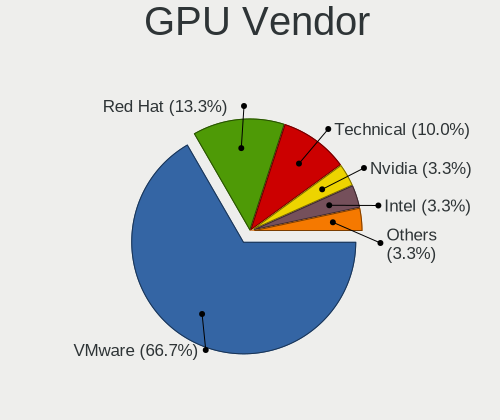

| Vendor                 | Computers | Percent |
|------------------------|-----------|---------|
| VMware                 | 20        | 66.67%  |
| Red Hat                | 4         | 13.33%  |
| Technical              | 3         | 10%     |
| Nvidia                 | 1         | 3.33%   |
| Intel                  | 1         | 3.33%   |
| InnoTek Systemberatung | 1         | 3.33%   |

GPU Model
---------

Graphics card models

| Model                                              | Computers | Percent |
|----------------------------------------------------|-----------|---------|
| VMware SVGA II Adapter                             | 20        | 66.67%  |
| Red Hat QXL paravirtual graphic card               | 4         | 13.33%  |
| Technical VGA compatible controller                | 3         | 10%     |
| Nvidia TU104 [GeForce RTX 2080 Rev. A]             | 1         | 3.33%   |
| Intel Comet Lake UHD Graphics                      | 1         | 3.33%   |
| InnoTek Systemberatung VirtualBox Graphics Adapter | 1         | 3.33%   |

GPU Combo
---------

Combinations of graphics cards

| Name                       | Computers | Percent |
|----------------------------|-----------|---------|
| 1 x VMware                 | 19        | 65.52%  |
| 1 x Red Hat                | 4         | 13.79%  |
| Other                      | 3         | 10.34%  |
| 1 x Nvidia                 | 1         | 3.45%   |
| Intel + VMware             | 1         | 3.45%   |
| 1 x InnoTek Systemberatung | 1         | 3.45%   |

GPU Driver
----------

Free vs proprietary

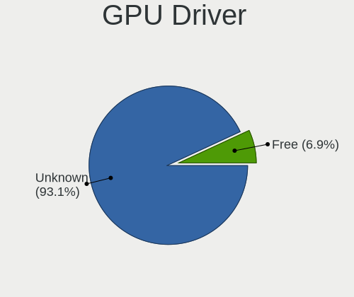

| Driver  | Computers | Percent |
|---------|-----------|---------|
| Unknown | 27        | 93.1%   |
| Free    | 2         | 6.9%    |

GPU Memory
----------

Total video memory

| Size in GB | Computers | Percent |
|------------|-----------|---------|
| Unknown    | 29        | 100%    |

Monitor
-------

Monitor Vendor
--------------

Monitor vendors

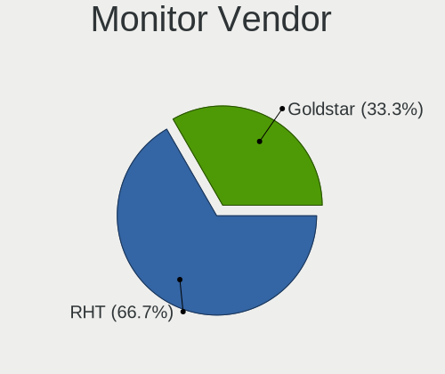

| Vendor   | Computers | Percent |
|----------|-----------|---------|
| RHT      | 2         | 66.67%  |
| Goldstar | 1         | 33.33%  |

Monitor Model
-------------

Monitor models

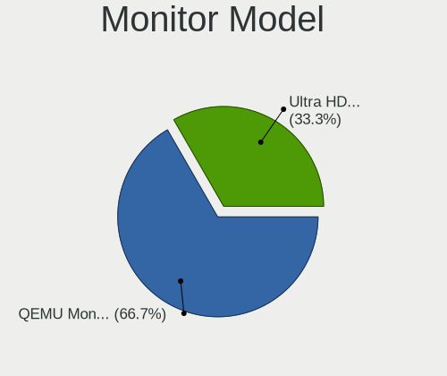

| Model                                                   | Computers | Percent |
|---------------------------------------------------------|-----------|---------|
| RHT QEMU Monitor RHT1234 2048x1152 260x195mm 12.8-inch  | 2         | 66.67%  |
| Goldstar Ultra HD GSM5B08 3840x2160 600x340mm 27.2-inch | 1         | 33.33%  |

Monitor Resolution
------------------

Monitor screen resolution

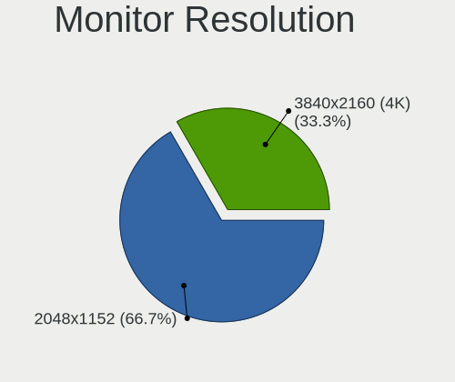

| Resolution     | Computers | Percent |
|----------------|-----------|---------|
| 2048x1152      | 2         | 66.67%  |
| 3840x2160 (4K) | 1         | 33.33%  |

Monitor Diagonal
----------------

Diagonal size in inches

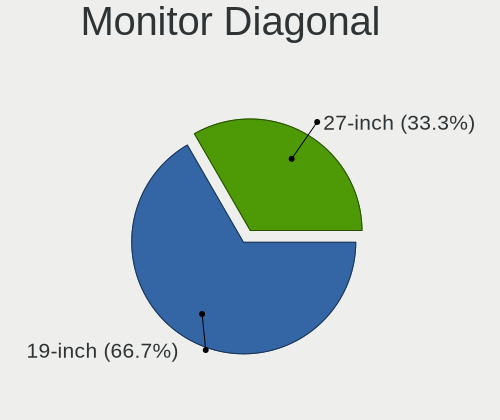

| Inches | Computers | Percent |
|--------|-----------|---------|
| 19     | 2         | 66.67%  |
| 27     | 1         | 33.33%  |

Monitor Width
-------------

Physical width

| Width in mm | Computers | Percent |
|-------------|-----------|---------|
| 401-500     | 2         | 66.67%  |
| 501-600     | 1         | 33.33%  |

Aspect Ratio
------------

Proportional relationship between the width and the height

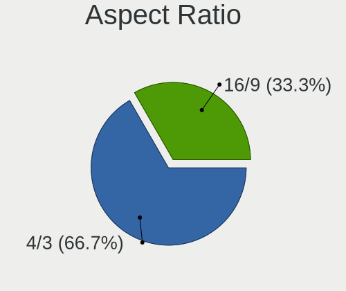

| Ratio | Computers | Percent |
|-------|-----------|---------|
| 4/3   | 2         | 66.67%  |
| 16/9  | 1         | 33.33%  |

Monitor Area
------------

Area in inch²

| Area in inch² | Computers | Percent |
|----------------|-----------|---------|
| 151-200        | 2         | 66.67%  |
| 301-350        | 1         | 33.33%  |

Pixel Density
-------------

Pixels per inch

| Density | Computers | Percent |
|---------|-----------|---------|
| 101-120 | 2         | 66.67%  |
| 161-240 | 1         | 33.33%  |

Multiple Monitors
-----------------

Total monitors connected

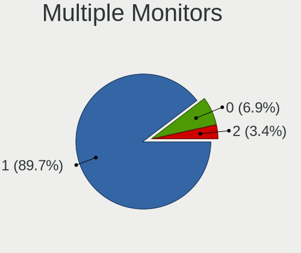

| Total | Computers | Percent |
|-------|-----------|---------|
| 1     | 26        | 89.66%  |
| 0     | 2         | 6.9%    |
| 2     | 1         | 3.45%   |

Network
-------

Net Controller Vendor
---------------------

Controller vendors

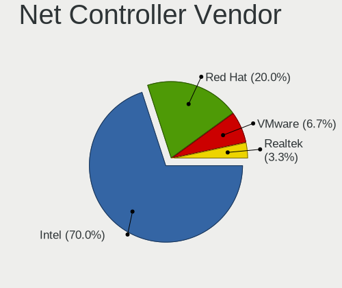

| Vendor                | Computers | Percent |
|-----------------------|-----------|---------|
| Intel                 | 21        | 70%     |
| Red Hat               | 6         | 20%     |
| VMware                | 2         | 6.67%   |
| Realtek Semiconductor | 1         | 3.33%   |

Net Controller Model
--------------------

Controller models

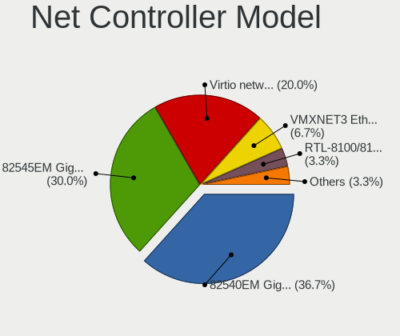

| Model                                                 | Computers | Percent |
|-------------------------------------------------------|-----------|---------|
| Intel 82540EM Gigabit Ethernet Controller             | 11        | 36.67%  |
| Intel 82545EM Gigabit Ethernet Controller (Copper)    | 9         | 30%     |
| Red Hat Virtio network device                         | 6         | 20%     |
| VMware VMXNET3 Ethernet Controller                    | 2         | 6.67%   |
| Realtek RTL-8100/8101L/8139 PCI Fast Ethernet Adapter | 1         | 3.33%   |
| Intel Comet Lake PCH-LP CNVi WiFi                     | 1         | 3.33%   |

Wireless Vendor
---------------

Wireless vendors

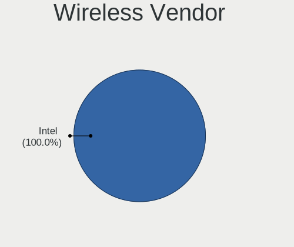

| Vendor | Computers | Percent |
|--------|-----------|---------|
| Intel  | 1         | 100%    |

Wireless Model
--------------

Wireless models

| Model                             | Computers | Percent |
|-----------------------------------|-----------|---------|
| Intel Comet Lake PCH-LP CNVi WiFi | 1         | 100%    |

Ethernet Vendor
---------------

Ethernet vendors

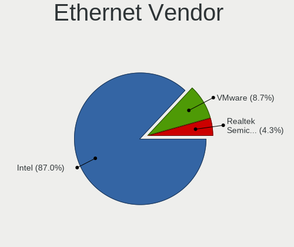

| Vendor                | Computers | Percent |
|-----------------------|-----------|---------|
| Intel                 | 20        | 86.96%  |
| VMware                | 2         | 8.7%    |
| Realtek Semiconductor | 1         | 4.35%   |

Ethernet Model
--------------

Ethernet models

| Model                                                 | Computers | Percent |
|-------------------------------------------------------|-----------|---------|
| Intel 82540EM Gigabit Ethernet Controller             | 11        | 47.83%  |
| Intel 82545EM Gigabit Ethernet Controller (Copper)    | 9         | 39.13%  |
| VMware VMXNET3 Ethernet Controller                    | 2         | 8.7%    |
| Realtek RTL-8100/8101L/8139 PCI Fast Ethernet Adapter | 1         | 4.35%   |

Net Controller Kind
-------------------

Ethernet, WiFi or modem

| Kind     | Computers | Percent |
|----------|-----------|---------|
| Ethernet | 23        | 76.67%  |
| Unknown  | 6         | 20%     |
| WiFi     | 1         | 3.33%   |

Used Controller
---------------

Currently used network controller

| Kind     | Computers | Percent |
|----------|-----------|---------|
| Ethernet | 23        | 100%    |

NICs
----

Total network controllers on board

| Total | Computers | Percent |
|-------|-----------|---------|
| 1     | 21        | 72.41%  |
| 0     | 6         | 20.69%  |
| 2     | 2         | 6.9%    |

IPv6
----

IPv6 vs IPv4

| Used | Computers | Percent |
|------|-----------|---------|
| No   | 29        | 100%    |

Bluetooth
---------

Bluetooth Vendor
----------------

Controller vendors

| Vendor | Computers | Percent |
|--------|-----------|---------|
| VMware | 5         | 83.33%  |
| Intel  | 1         | 16.67%  |

Bluetooth Model
---------------

Controller models

| Model                              | Computers | Percent |
|------------------------------------|-----------|---------|
| VMware Virtual Bluetooth Adapter   | 5         | 83.33%  |
| Intel Bluetooth wireless interface | 1         | 16.67%  |

Sound
-----

Sound Vendor
------------

Sound card vendors

| Vendor  | Computers | Percent |
|---------|-----------|---------|
| Intel   | 16        | 66.67%  |
| Ensoniq | 7         | 29.17%  |
| Nvidia  | 1         | 4.17%   |

Sound Model
-----------

Sound card models

| Model                                                                      | Computers | Percent |
|----------------------------------------------------------------------------|-----------|---------|
| Intel 82801AA AC'97 Audio Controller                                       | 9         | 37.5%   |
| Ensoniq ES1371/ES1373 / Creative Labs CT2518                               | 7         | 29.17%  |
| Intel 82801I (ICH9 Family) HD Audio Controller                             | 5         | 20.83%  |
| Intel 82801FB/FBM/FR/FW/FRW (ICH6 Family) High Definition Audio Controller | 2         | 8.33%   |
| Nvidia TU104 HD Audio Controller                                           | 1         | 4.17%   |

Memory
------

Memory Vendor
-------------

Memory module vendors

| Vendor    | Computers | Percent |
|-----------|-----------|---------|
| Microsoft | 1         | 100%    |

Memory Model
------------

Memory module models

| Model                       | Computers | Percent |
|-----------------------------|-----------|---------|
| Microsoft RAM Module 2048MB | 1         | 100%    |

Memory Kind
-----------

Memory module kinds

| Kind    | Computers | Percent |
|---------|-----------|---------|
| Unknown | 1         | 100%    |

Memory Form Factor
------------------

Physical design of the memory module

| Name    | Computers | Percent |
|---------|-----------|---------|
| Unknown | 1         | 100%    |

Memory Size
-----------

Memory module size

| Size | Computers | Percent |
|------|-----------|---------|
| 2048 | 1         | 100%    |

Memory Speed
------------

Memory module speed

| Speed   | Computers | Percent |
|---------|-----------|---------|
| Unknown | 1         | 100%    |

Printers & scanners
-------------------

Printer Vendor
--------------

Printer device vendors

Zero info for selected period =(

Printer Model
-------------

Printer device models

Zero info for selected period =(

Scanner Vendor
--------------

Scanner device vendors

Zero info for selected period =(

Scanner Model
-------------

Scanner device models

Zero info for selected period =(

Camera
------

Camera Vendor
-------------

Camera device vendors

Zero info for selected period =(

Camera Model
------------

Camera device models

Zero info for selected period =(

Security
--------

Fingerprint Vendor
------------------

Fingerprint sensor vendors

| Vendor           | Computers | Percent |
|------------------|-----------|---------|
| Validity Sensors | 1         | 100%    |

Fingerprint Model
-----------------

Fingerprint sensor models

| Model                                      | Computers | Percent |
|--------------------------------------------|-----------|---------|
| Validity Sensors VFS495 Fingerprint Reader | 1         | 100%    |

Chipcard Vendor
---------------

Chipcard module vendors

| Vendor                | Computers | Percent |
|-----------------------|-----------|---------|
| Gemalto (was Gemplus) | 1         | 100%    |

Chipcard Model
--------------

Chipcard module models

| Model                               | Computers | Percent |
|-------------------------------------|-----------|---------|
| Gemalto (was Gemplus) GemPC433-Swap | 1         | 100%    |

Unsupported
-----------

Unsupported Devices
-------------------

Total unsupported devices on board

| Total | Computers | Percent |
|-------|-----------|---------|
| 0     | 27        | 93.1%   |
| 1     | 2         | 6.9%    |

Unsupported Device Types
------------------------

Types of unsupported devices

| Type               | Computers | Percent |
|--------------------|-----------|---------|
| Fingerprint reader | 1         | 50%     |
| Chipcard           | 1         | 50%     |

