Debian - Tested Virtual Hardware & Statistics
---------------------------------------------

A project to collect tested virtual hardware configurations for Debian.

Anyone can contribute to this report by the [hw-probe](https://github.com/linuxhw/hw-probe) tool:

    sudo -E hw-probe -all -upload

Please contribute! Especially if your hardware is rare.

Contents
--------

* [ Test Cases ](#test-cases)

* [ System ](#system)
  - [ OS                       ](#os)
  - [ OS Family                ](#os-family)
  - [ Kernel                   ](#kernel)
  - [ Kernel Family            ](#kernel-family)
  - [ Kernel Major Ver.        ](#kernel-major-ver)
  - [ Arch                     ](#arch)
  - [ DE                       ](#de)
  - [ Display Server           ](#display-server)
  - [ Display Manager          ](#display-manager)
  - [ OS Lang                  ](#os-lang)
  - [ Boot Mode                ](#boot-mode)
  - [ Filesystem               ](#filesystem)
  - [ Part. scheme             ](#part-scheme)
  - [ Dual Boot with Linux/BSD ](#dual-boot-with-linuxbsd)
  - [ Dual Boot (Win)          ](#dual-boot-win)

* [ Board ](#board)
  - [ Vendor                   ](#vendor)
  - [ Model                    ](#model)
  - [ Model Family             ](#model-family)
  - [ MFG Year                 ](#mfg-year)
  - [ Form Factor              ](#form-factor)
  - [ Secure Boot              ](#secure-boot)
  - [ Coreboot                 ](#coreboot)
  - [ RAM Size                 ](#ram-size)
  - [ RAM Used                 ](#ram-used)
  - [ Total Drives             ](#total-drives)
  - [ Has CD-ROM               ](#has-cd-rom)
  - [ Has Ethernet             ](#has-ethernet)
  - [ Has WiFi                 ](#has-wifi)
  - [ Has Bluetooth            ](#has-bluetooth)

* [ Location ](#location)
  - [ Country                  ](#country)
  - [ City                     ](#city)

* [ Drives ](#drives)
  - [ Drive Vendor             ](#drive-vendor)
  - [ Drive Model              ](#drive-model)
  - [ HDD Vendor               ](#hdd-vendor)
  - [ SSD Vendor               ](#ssd-vendor)
  - [ Drive Kind               ](#drive-kind)
  - [ Drive Connector          ](#drive-connector)
  - [ Drive Size               ](#drive-size)
  - [ Space Total              ](#space-total)
  - [ Space Used               ](#space-used)
  - [ Malfunc. Drives          ](#malfunc-drives)
  - [ Malfunc. Drive Vendor    ](#malfunc-drive-vendor)
  - [ Malfunc. HDD Vendor      ](#malfunc-hdd-vendor)
  - [ Malfunc. Drive Kind      ](#malfunc-drive-kind)
  - [ Failed Drives            ](#failed-drives)
  - [ Failed Drive Vendor      ](#failed-drive-vendor)
  - [ Drive Status             ](#drive-status)

* [ Storage controller ](#storage-controller)
  - [ Storage Vendor           ](#storage-vendor)
  - [ Storage Model            ](#storage-model)
  - [ Storage Kind             ](#storage-kind)

* [ Processor ](#processor)
  - [ CPU Vendor               ](#cpu-vendor)
  - [ CPU Model                ](#cpu-model)
  - [ CPU Model Family         ](#cpu-model-family)
  - [ CPU Cores                ](#cpu-cores)
  - [ CPU Sockets              ](#cpu-sockets)
  - [ CPU Threads              ](#cpu-threads)
  - [ CPU Op-Modes             ](#cpu-op-modes)
  - [ CPU Microcode            ](#cpu-microcode)
  - [ CPU Microarch            ](#cpu-microarch)

* [ Graphics ](#graphics)
  - [ GPU Vendor               ](#gpu-vendor)
  - [ GPU Model                ](#gpu-model)
  - [ GPU Combo                ](#gpu-combo)
  - [ GPU Driver               ](#gpu-driver)
  - [ GPU Memory               ](#gpu-memory)

* [ Monitor ](#monitor)
  - [ Monitor Vendor           ](#monitor-vendor)
  - [ Monitor Model            ](#monitor-model)
  - [ Monitor Resolution       ](#monitor-resolution)
  - [ Monitor Diagonal         ](#monitor-diagonal)
  - [ Monitor Width            ](#monitor-width)
  - [ Aspect Ratio             ](#aspect-ratio)
  - [ Monitor Area             ](#monitor-area)
  - [ Pixel Density            ](#pixel-density)
  - [ Multiple Monitors        ](#multiple-monitors)

* [ Network ](#network)
  - [ Net Controller Vendor    ](#net-controller-vendor)
  - [ Net Controller Model     ](#net-controller-model)
  - [ Wireless Vendor          ](#wireless-vendor)
  - [ Wireless Model           ](#wireless-model)
  - [ Ethernet Vendor          ](#ethernet-vendor)
  - [ Ethernet Model           ](#ethernet-model)
  - [ Net Controller Kind      ](#net-controller-kind)
  - [ Used Controller          ](#used-controller)
  - [ NICs                     ](#nics)
  - [ IPv6                     ](#ipv6)

* [ Bluetooth ](#bluetooth)
  - [ Bluetooth Vendor         ](#bluetooth-vendor)
  - [ Bluetooth Model          ](#bluetooth-model)

* [ Sound ](#sound)
  - [ Sound Vendor             ](#sound-vendor)
  - [ Sound Model              ](#sound-model)

* [ Memory ](#memory)
  - [ Memory Vendor            ](#memory-vendor)
  - [ Memory Model             ](#memory-model)
  - [ Memory Kind              ](#memory-kind)
  - [ Memory Form Factor       ](#memory-form-factor)
  - [ Memory Size              ](#memory-size)
  - [ Memory Speed             ](#memory-speed)

* [ Printers & scanners ](#printers--scanners)
  - [ Printer Vendor           ](#printer-vendor)
  - [ Printer Model            ](#printer-model)
  - [ Scanner Vendor           ](#scanner-vendor)
  - [ Scanner Model            ](#scanner-model)

* [ Camera ](#camera)
  - [ Camera Vendor            ](#camera-vendor)
  - [ Camera Model             ](#camera-model)

* [ Security ](#security)
  - [ Fingerprint Vendor       ](#fingerprint-vendor)
  - [ Fingerprint Model        ](#fingerprint-model)
  - [ Chipcard Vendor          ](#chipcard-vendor)
  - [ Chipcard Model           ](#chipcard-model)

* [ Unsupported ](#unsupported)
  - [ Unsupported Devices      ](#unsupported-devices)
  - [ Unsupported Device Types ](#unsupported-device-types)

Test Cases
----------

Total: 205

| Vendor        | Model                       | Form-Factor     | Probe                                                      | Date         |
|---------------|-----------------------------|-----------------|------------------------------------------------------------|--------------|
| Oracle        | VirtualBox                  | Virtual machine | [8caf85a2a6](https://linux-hardware.org/?probe=8caf85a2a6) | Apr 14, 2022 |
| Unknown       | Unknown                     | Virtual machine | [4b0dc20ec1](https://linux-hardware.org/?probe=4b0dc20ec1) | Apr 13, 2022 |
| ChromiumOS    | crosvm                      | Virtual machine | [ba51e1570a](https://linux-hardware.org/?probe=ba51e1570a) | Apr 04, 2022 |
| Oracle        | VirtualBox                  | Virtual machine | [7b63dc2bc2](https://linux-hardware.org/?probe=7b63dc2bc2) | Mar 27, 2022 |
| VMware        | Virtual Platform            | Virtual machine | [aef7489887](https://linux-hardware.org/?probe=aef7489887) | Mar 26, 2022 |
| Microsoft     | Windows Subsystem for Li... | Virtual machine | [98596e05f2](https://linux-hardware.org/?probe=98596e05f2) | Mar 23, 2022 |
| QEMU          | Standard PC (i440FX + PI... | Virtual machine | [e4d0f3be47](https://linux-hardware.org/?probe=e4d0f3be47) | Mar 22, 2022 |
| Parallels ... | Parallels Virtual Platfo... | Virtual machine | [e259ea0dce](https://linux-hardware.org/?probe=e259ea0dce) | Mar 22, 2022 |
| ChromiumOS    | crosvm                      | Virtual machine | [df2770ac92](https://linux-hardware.org/?probe=df2770ac92) | Mar 15, 2022 |
| McGhie        | Debian-10                   | Virtual machine | [0f3b38f410](https://linux-hardware.org/?probe=0f3b38f410) | Mar 14, 2022 |
| ChromiumOS    | crosvm                      | Virtual machine | [dfbbe5fc5c](https://linux-hardware.org/?probe=dfbbe5fc5c) | Mar 13, 2022 |
| ChromiumOS    | crosvm                      | Virtual machine | [11b8964dc3](https://linux-hardware.org/?probe=11b8964dc3) | Mar 12, 2022 |
| ChromiumOS    | crosvm                      | Virtual machine | [b6df1a234c](https://linux-hardware.org/?probe=b6df1a234c) | Mar 12, 2022 |
| ChromiumOS    | crosvm                      | Virtual machine | [e31ca51fe0](https://linux-hardware.org/?probe=e31ca51fe0) | Mar 12, 2022 |
| Oracle        | VirtualBox                  | Virtual machine | [b40e7b847a](https://linux-hardware.org/?probe=b40e7b847a) | Mar 10, 2022 |
| McGhie        | Debian-10                   | Virtual machine | [d018b6cd85](https://linux-hardware.org/?probe=d018b6cd85) | Mar 09, 2022 |
| Oracle        | VirtualBox                  | Virtual machine | [5d723fd60d](https://linux-hardware.org/?probe=5d723fd60d) | Mar 01, 2022 |
| Oracle        | VirtualBox                  | Virtual machine | [0ce4d40266](https://linux-hardware.org/?probe=0ce4d40266) | Feb 27, 2022 |
| Oracle        | VirtualBox                  | Virtual machine | [fcdd03388f](https://linux-hardware.org/?probe=fcdd03388f) | Feb 27, 2022 |
| QEMU          | Standard PC (i440FX + PI... | Virtual machine | [6289386bd0](https://linux-hardware.org/?probe=6289386bd0) | Feb 25, 2022 |
| Oracle        | VirtualBox                  | Virtual machine | [5fc84340a3](https://linux-hardware.org/?probe=5fc84340a3) | Feb 25, 2022 |
| Oracle        | VirtualBox                  | Virtual machine | [c2e0bec3bf](https://linux-hardware.org/?probe=c2e0bec3bf) | Feb 25, 2022 |
| Oracle        | VirtualBox                  | Virtual machine | [50bd8cf4d5](https://linux-hardware.org/?probe=50bd8cf4d5) | Feb 24, 2022 |
| Oracle        | VirtualBox                  | Virtual machine | [e47fad4cfd](https://linux-hardware.org/?probe=e47fad4cfd) | Feb 24, 2022 |
| netcup        | KVM Server                  | Virtual machine | [71b733cea2](https://linux-hardware.org/?probe=71b733cea2) | Feb 24, 2022 |
| Oracle        | VirtualBox                  | Virtual machine | [e139d45117](https://linux-hardware.org/?probe=e139d45117) | Feb 19, 2022 |
| Microsoft     | Windows Subsystem for Li... | Virtual machine | [7fe2416a62](https://linux-hardware.org/?probe=7fe2416a62) | Feb 14, 2022 |
| Unknown       | Unknown                     | Virtual machine | [52f8e0afb3](https://linux-hardware.org/?probe=52f8e0afb3) | Feb 11, 2022 |
| Oracle        | VirtualBox                  | Virtual machine | [43edac64b6](https://linux-hardware.org/?probe=43edac64b6) | Feb 10, 2022 |
| VMware        | Virtual Platform            | Virtual machine | [36975dba90](https://linux-hardware.org/?probe=36975dba90) | Feb 10, 2022 |
| Unknown       | Unknown                     | Virtual machine | [d22be0a98b](https://linux-hardware.org/?probe=d22be0a98b) | Feb 07, 2022 |
| ChromiumOS    | crosvm                      | Virtual machine | [f5a1bdbc5a](https://linux-hardware.org/?probe=f5a1bdbc5a) | Feb 06, 2022 |
| ChromiumOS    | crosvm                      | Virtual machine | [e7de65c3c9](https://linux-hardware.org/?probe=e7de65c3c9) | Feb 06, 2022 |
| ChromiumOS    | crosvm                      | Virtual machine | [e5da42b471](https://linux-hardware.org/?probe=e5da42b471) | Feb 04, 2022 |
| ChromiumOS    | crosvm                      | Virtual machine | [bd70fe1559](https://linux-hardware.org/?probe=bd70fe1559) | Feb 04, 2022 |
| VMware        | Virtual Platform            | Virtual machine | [bd190332aa](https://linux-hardware.org/?probe=bd190332aa) | Feb 01, 2022 |
| VMware        | VMware7,1                   | Virtual machine | [575822b6fb](https://linux-hardware.org/?probe=575822b6fb) | Jan 31, 2022 |
| Unknown       | Unknown                     | Virtual machine | [da62f8bcd5](https://linux-hardware.org/?probe=da62f8bcd5) | Jan 27, 2022 |
| Oracle        | VirtualBox                  | Virtual machine | [18f675cfbd](https://linux-hardware.org/?probe=18f675cfbd) | Jan 26, 2022 |
| Oracle        | VirtualBox                  | Virtual machine | [d3fcccd166](https://linux-hardware.org/?probe=d3fcccd166) | Jan 22, 2022 |
| Unknown       | Unknown                     | Virtual machine | [04a2eade6e](https://linux-hardware.org/?probe=04a2eade6e) | Jan 16, 2022 |
| ChromiumOS    | crosvm                      | Virtual machine | [686a096445](https://linux-hardware.org/?probe=686a096445) | Jan 15, 2022 |
| Microsoft     | Windows Subsystem for Li... | Virtual machine | [8ecb666237](https://linux-hardware.org/?probe=8ecb666237) | Jan 11, 2022 |
| ChromiumOS    | crosvm                      | Virtual machine | [ad6c1bf35a](https://linux-hardware.org/?probe=ad6c1bf35a) | Jan 10, 2022 |
| OpenStack ... | OpenStack Nova              | Virtual machine | [c63502043e](https://linux-hardware.org/?probe=c63502043e) | Jan 09, 2022 |
| ChromiumOS    | crosvm                      | Virtual machine | [e1827314e1](https://linux-hardware.org/?probe=e1827314e1) | Dec 26, 2021 |
| ChromiumOS    | crosvm                      | Virtual machine | [b22f5ce581](https://linux-hardware.org/?probe=b22f5ce581) | Dec 25, 2021 |
| ChromiumOS    | crosvm                      | Virtual machine | [7c4f8b22c0](https://linux-hardware.org/?probe=7c4f8b22c0) | Dec 25, 2021 |
| ChromiumOS    | crosvm                      | Virtual machine | [8bb4196f2e](https://linux-hardware.org/?probe=8bb4196f2e) | Dec 21, 2021 |
| Microsoft     | Windows Subsystem for Li... | Virtual machine | [dafb926655](https://linux-hardware.org/?probe=dafb926655) | Dec 19, 2021 |
| QEMU          | Standard PC (Q35 + ICH9,... | Virtual machine | [c3298b1c9f](https://linux-hardware.org/?probe=c3298b1c9f) | Dec 19, 2021 |
| Unknown       | Unknown                     | Virtual machine | [3464a92918](https://linux-hardware.org/?probe=3464a92918) | Dec 19, 2021 |
| Oracle        | VirtualBox                  | Virtual machine | [148a1f0b3f](https://linux-hardware.org/?probe=148a1f0b3f) | Dec 16, 2021 |
| ChromiumOS    | crosvm                      | Virtual machine | [3da650960e](https://linux-hardware.org/?probe=3da650960e) | Dec 12, 2021 |
| Unknown       | linux,dummy-virt            | Virtual machine | [7f1322d3b9](https://linux-hardware.org/?probe=7f1322d3b9) | Dec 04, 2021 |
| Microsoft     | Windows Subsystem for Li... | Virtual machine | [620d0253ae](https://linux-hardware.org/?probe=620d0253ae) | Nov 27, 2021 |
| Oracle        | VirtualBox                  | Virtual machine | [e25d01c11a](https://linux-hardware.org/?probe=e25d01c11a) | Nov 22, 2021 |
| QEMU          | Standard PC (Q35 + ICH9,... | Virtual machine | [71ff51cc15](https://linux-hardware.org/?probe=71ff51cc15) | Nov 20, 2021 |
| Oracle        | VirtualBox                  | Virtual machine | [2ea395226d](https://linux-hardware.org/?probe=2ea395226d) | Nov 20, 2021 |
| Oracle        | VirtualBox                  | Virtual machine | [e86981626d](https://linux-hardware.org/?probe=e86981626d) | Nov 18, 2021 |
| Oracle        | VirtualBox                  | Virtual machine | [9ab9a692c0](https://linux-hardware.org/?probe=9ab9a692c0) | Nov 17, 2021 |
| VMware        | Virtual Platform            | Virtual machine | [9a1ec22ab1](https://linux-hardware.org/?probe=9a1ec22ab1) | Nov 16, 2021 |
| Oracle        | VirtualBox                  | Virtual machine | [bcae192083](https://linux-hardware.org/?probe=bcae192083) | Nov 15, 2021 |
| Oracle        | VirtualBox                  | Virtual machine | [34533f2054](https://linux-hardware.org/?probe=34533f2054) | Nov 12, 2021 |
| ChromiumOS    | crosvm                      | Virtual machine | [f5e235a716](https://linux-hardware.org/?probe=f5e235a716) | Nov 12, 2021 |
| QEMU          | Standard PC (i440FX + PI... | Virtual machine | [dc2ccd9b71](https://linux-hardware.org/?probe=dc2ccd9b71) | Nov 10, 2021 |
| ChromiumOS    | crosvm                      | Virtual machine | [f0ddbe1572](https://linux-hardware.org/?probe=f0ddbe1572) | Nov 04, 2021 |
| QEMU          | Standard PC (Q35 + ICH9,... | Virtual machine | [8c7088cc22](https://linux-hardware.org/?probe=8c7088cc22) | Oct 31, 2021 |
| Unknown       | Unknown                     | Virtual machine | [aecea4e0d6](https://linux-hardware.org/?probe=aecea4e0d6) | Oct 19, 2021 |
| VMware        | Virtual Platform            | Virtual machine | [26b21fecd5](https://linux-hardware.org/?probe=26b21fecd5) | Oct 19, 2021 |
| Microsoft     | Virtual Machine Hyper-V ... | Virtual machine | [e495a37dbe](https://linux-hardware.org/?probe=e495a37dbe) | Oct 18, 2021 |
| Oracle        | VirtualBox                  | Virtual machine | [5b2a3baa47](https://linux-hardware.org/?probe=5b2a3baa47) | Oct 17, 2021 |
| Oracle        | VirtualBox                  | Virtual machine | [29c8df793b](https://linux-hardware.org/?probe=29c8df793b) | Oct 17, 2021 |
| Oracle        | VirtualBox                  | Virtual machine | [0dfc2bc252](https://linux-hardware.org/?probe=0dfc2bc252) | Oct 13, 2021 |
| Unknown       | linux,dummy-virt            | Virtual machine | [1d9a395898](https://linux-hardware.org/?probe=1d9a395898) | Oct 12, 2021 |
| ChromiumOS    | crosvm                      | Virtual machine | [7d1a72ccbd](https://linux-hardware.org/?probe=7d1a72ccbd) | Oct 05, 2021 |
| Unknown       | Unknown                     | Virtual machine | [9b7916161d](https://linux-hardware.org/?probe=9b7916161d) | Oct 04, 2021 |
| ChromiumOS    | crosvm                      | Virtual machine | [ab3214d4e9](https://linux-hardware.org/?probe=ab3214d4e9) | Oct 02, 2021 |
| QEMU          | Standard PC (i440FX + PI... | Virtual machine | [5aa645206b](https://linux-hardware.org/?probe=5aa645206b) | Sep 27, 2021 |
| Unknown       | Unknown                     | Virtual machine | [a849768c9d](https://linux-hardware.org/?probe=a849768c9d) | Sep 26, 2021 |
| Unknown       | Unknown                     | Virtual machine | [846c2294a3](https://linux-hardware.org/?probe=846c2294a3) | Sep 26, 2021 |
| QEMU          | Standard PC (Q35 + ICH9,... | Virtual machine | [1544081237](https://linux-hardware.org/?probe=1544081237) | Sep 25, 2021 |
| Oracle        | VirtualBox                  | Virtual machine | [7af131909f](https://linux-hardware.org/?probe=7af131909f) | Sep 24, 2021 |
| Oracle        | VirtualBox                  | Virtual machine | [bda0725843](https://linux-hardware.org/?probe=bda0725843) | Sep 23, 2021 |
| Oracle        | VirtualBox                  | Virtual machine | [745640ec47](https://linux-hardware.org/?probe=745640ec47) | Sep 22, 2021 |
| QEMU          | Standard PC (Q35 + ICH9,... | Virtual machine | [e0da02351c](https://linux-hardware.org/?probe=e0da02351c) | Sep 22, 2021 |
| QEMU          | Standard PC (i440FX + PI... | Virtual machine | [5de069a468](https://linux-hardware.org/?probe=5de069a468) | Sep 21, 2021 |
| ChromiumOS    | crosvm                      | Virtual machine | [bdf8c9d4f0](https://linux-hardware.org/?probe=bdf8c9d4f0) | Sep 16, 2021 |
| ChromiumOS    | crosvm                      | Virtual machine | [cf58290748](https://linux-hardware.org/?probe=cf58290748) | Sep 16, 2021 |
| Oracle        | VirtualBox                  | Virtual machine | [96558a1443](https://linux-hardware.org/?probe=96558a1443) | Sep 10, 2021 |
| ChromiumOS    | crosvm                      | Virtual machine | [22de51314c](https://linux-hardware.org/?probe=22de51314c) | Sep 05, 2021 |
| Microsoft     | Virtual Machine             | Virtual machine | [43228b02aa](https://linux-hardware.org/?probe=43228b02aa) | Aug 30, 2021 |
| Microsoft     | Virtual Machine             | Virtual machine | [03b88b0834](https://linux-hardware.org/?probe=03b88b0834) | Aug 29, 2021 |
| Unknown       | Unknown                     | Virtual machine | [84ee87a041](https://linux-hardware.org/?probe=84ee87a041) | Aug 28, 2021 |
| Alibaba Cl... | ECS                         | Virtual machine | [6beeb48ab3](https://linux-hardware.org/?probe=6beeb48ab3) | Aug 26, 2021 |
| Oracle        | VirtualBox                  | Virtual machine | [2e3afe7a99](https://linux-hardware.org/?probe=2e3afe7a99) | Aug 24, 2021 |
| Microsoft     | Virtual Machine             | Virtual machine | [43981a1186](https://linux-hardware.org/?probe=43981a1186) | Aug 23, 2021 |
| QEMU          | Standard PC (i440FX + PI... | Virtual machine | [906a41d143](https://linux-hardware.org/?probe=906a41d143) | Aug 20, 2021 |
| QEMU          | Standard PC (i440FX + PI... | Virtual machine | [ee615c6d9f](https://linux-hardware.org/?probe=ee615c6d9f) | Aug 19, 2021 |
| Oracle        | VirtualBox                  | Virtual machine | [bf3c481eb9](https://linux-hardware.org/?probe=bf3c481eb9) | Aug 15, 2021 |
| VMware        | Virtual Platform            | Virtual machine | [a692a81074](https://linux-hardware.org/?probe=a692a81074) | Aug 13, 2021 |
| QEMU          | Standard PC (i440FX + PI... | Virtual machine | [5cf26717e1](https://linux-hardware.org/?probe=5cf26717e1) | Aug 12, 2021 |
| ChromiumOS    | crosvm                      | Virtual machine | [00656c33a4](https://linux-hardware.org/?probe=00656c33a4) | Aug 11, 2021 |
| Oracle        | VirtualBox                  | Virtual machine | [a0db1904d5](https://linux-hardware.org/?probe=a0db1904d5) | Aug 09, 2021 |
| Oracle        | VirtualBox                  | Virtual machine | [ad96a81af8](https://linux-hardware.org/?probe=ad96a81af8) | Aug 02, 2021 |
| Oracle        | VirtualBox                  | Virtual machine | [86a1a966d1](https://linux-hardware.org/?probe=86a1a966d1) | Aug 02, 2021 |
| QEMU          | Standard PC (i440FX + PI... | Virtual machine | [ab3322fec5](https://linux-hardware.org/?probe=ab3322fec5) | Jul 30, 2021 |
| Oracle        | VirtualBox                  | Virtual machine | [ef0ab6003e](https://linux-hardware.org/?probe=ef0ab6003e) | Jul 30, 2021 |
| VMware        | VMware7,1                   | Virtual machine | [dd7f94d48b](https://linux-hardware.org/?probe=dd7f94d48b) | Jul 27, 2021 |
| OpenStack ... | OpenStack Nova              | Virtual machine | [744aad085b](https://linux-hardware.org/?probe=744aad085b) | Jul 25, 2021 |
| QEMU          | Standard PC (Q35 + ICH9,... | Virtual machine | [121b8184d0](https://linux-hardware.org/?probe=121b8184d0) | Jul 25, 2021 |
| QEMU          | Standard PC (i440FX + PI... | Virtual machine | [8b532286b0](https://linux-hardware.org/?probe=8b532286b0) | Jul 25, 2021 |
| QEMU          | Standard PC (Q35 + ICH9,... | Virtual machine | [9e59df9223](https://linux-hardware.org/?probe=9e59df9223) | Jul 25, 2021 |
| Oracle        | VirtualBox                  | Virtual machine | [580d9eb0bb](https://linux-hardware.org/?probe=580d9eb0bb) | Jul 25, 2021 |
| ChromiumOS    | crosvm                      | Virtual machine | [78e980d109](https://linux-hardware.org/?probe=78e980d109) | Jul 22, 2021 |
| ChromiumOS    | crosvm                      | Virtual machine | [4224da6eaa](https://linux-hardware.org/?probe=4224da6eaa) | Jul 21, 2021 |
| Oracle        | VirtualBox                  | Virtual machine | [510bbae56e](https://linux-hardware.org/?probe=510bbae56e) | Jul 08, 2021 |
| Unknown       | Unknown                     | Virtual machine | [3280b3752a](https://linux-hardware.org/?probe=3280b3752a) | Jun 05, 2021 |
| ChromiumOS    | crosvm                      | Virtual machine | [c50d556c14](https://linux-hardware.org/?probe=c50d556c14) | May 24, 2021 |
| ChromiumOS    | crosvm                      | Virtual machine | [9408f25f75](https://linux-hardware.org/?probe=9408f25f75) | Apr 30, 2021 |
| Oracle        | VirtualBox                  | Virtual machine | [c6f9c7163d](https://linux-hardware.org/?probe=c6f9c7163d) | Apr 25, 2021 |
| Oracle        | VirtualBox                  | Virtual machine | [d01e438796](https://linux-hardware.org/?probe=d01e438796) | Apr 19, 2021 |
| ChromiumOS    | crosvm                      | Virtual machine | [1678e0669f](https://linux-hardware.org/?probe=1678e0669f) | Apr 06, 2021 |
| ChromiumOS    | crosvm                      | Virtual machine | [6e59826247](https://linux-hardware.org/?probe=6e59826247) | Apr 01, 2021 |
| ChromiumOS    | crosvm                      | Virtual machine | [f3145597fd](https://linux-hardware.org/?probe=f3145597fd) | Mar 27, 2021 |
| Oracle        | VirtualBox                  | Virtual machine | [6bc474d4ea](https://linux-hardware.org/?probe=6bc474d4ea) | Mar 26, 2021 |
| ChromiumOS    | crosvm                      | Virtual machine | [8642aec75c](https://linux-hardware.org/?probe=8642aec75c) | Mar 19, 2021 |
| Unknown       | Unknown                     | Virtual machine | [3729e74c9c](https://linux-hardware.org/?probe=3729e74c9c) | Mar 19, 2021 |
| Oracle        | VirtualBox                  | Virtual machine | [9008b9c35a](https://linux-hardware.org/?probe=9008b9c35a) | Mar 09, 2021 |
| ChromiumOS    | crosvm                      | Virtual machine | [adf4f46e1f](https://linux-hardware.org/?probe=adf4f46e1f) | Mar 04, 2021 |
| VMware        | Virtual Platform            | Virtual machine | [e236d0e393](https://linux-hardware.org/?probe=e236d0e393) | Mar 04, 2021 |
| Unknown       | Unknown                     | Virtual machine | [67fe3c092c](https://linux-hardware.org/?probe=67fe3c092c) | Mar 03, 2021 |
| Unknown       | Unknown                     | Virtual machine | [08dec13ca4](https://linux-hardware.org/?probe=08dec13ca4) | Mar 03, 2021 |
| ChromiumOS    | crosvm                      | Virtual machine | [7f75eb1ff7](https://linux-hardware.org/?probe=7f75eb1ff7) | Mar 01, 2021 |
| ChromiumOS    | crosvm                      | Virtual machine | [71e773137c](https://linux-hardware.org/?probe=71e773137c) | Feb 26, 2021 |
| ChromiumOS    | crosvm                      | Virtual machine | [5db1bd326f](https://linux-hardware.org/?probe=5db1bd326f) | Feb 26, 2021 |
| VMware        | Virtual Platform            | Virtual machine | [2f35f9663c](https://linux-hardware.org/?probe=2f35f9663c) | Jan 16, 2021 |
| ChromiumOS    | crosvm                      | Virtual machine | [790db205c5](https://linux-hardware.org/?probe=790db205c5) | Jan 16, 2021 |
| ChromiumOS    | crosvm                      | Virtual machine | [d256421e57](https://linux-hardware.org/?probe=d256421e57) | Jan 11, 2021 |
| ChromiumOS    | crosvm                      | Virtual machine | [f33b264963](https://linux-hardware.org/?probe=f33b264963) | Jan 11, 2021 |
| ChromiumOS    | crosvm                      | Virtual machine | [46a109e808](https://linux-hardware.org/?probe=46a109e808) | Jan 09, 2021 |
| ChromiumOS    | crosvm                      | Virtual machine | [27b8da1f7e](https://linux-hardware.org/?probe=27b8da1f7e) | Jan 09, 2021 |
| Oracle        | VirtualBox                  | Virtual machine | [2de4889782](https://linux-hardware.org/?probe=2de4889782) | Jan 07, 2021 |
| Amazon EC2    | t3.small                    | Virtual machine | [811565ec3a](https://linux-hardware.org/?probe=811565ec3a) | Jan 05, 2021 |
| Unknown       | Unknown                     | Virtual machine | [08cb615583](https://linux-hardware.org/?probe=08cb615583) | Jan 04, 2021 |
| Unknown       | Unknown                     | Virtual machine | [66c5747744](https://linux-hardware.org/?probe=66c5747744) | Jan 02, 2021 |
| netcup        | KVM Server                  | Virtual machine | [7ad274495f](https://linux-hardware.org/?probe=7ad274495f) | Dec 29, 2020 |
| Virtuozzo     | KVM                         | Virtual machine | [6f11661f36](https://linux-hardware.org/?probe=6f11661f36) | Dec 24, 2020 |
| Red Hat       | KVM                         | Virtual machine | [2a5b3be552](https://linux-hardware.org/?probe=2a5b3be552) | Dec 22, 2020 |
| ChromiumOS    | crosvm                      | Virtual machine | [ba42006820](https://linux-hardware.org/?probe=ba42006820) | Dec 20, 2020 |
| ChromiumOS    | crosvm                      | Virtual machine | [38c1961e43](https://linux-hardware.org/?probe=38c1961e43) | Dec 14, 2020 |
| QEMU          | Standard PC (Q35 + ICH9,... | Virtual machine | [e320f520ee](https://linux-hardware.org/?probe=e320f520ee) | Nov 09, 2020 |
| ChromiumOS    | crosvm                      | Virtual machine | [72a1ccd571](https://linux-hardware.org/?probe=72a1ccd571) | Nov 01, 2020 |
| Oracle        | VirtualBox                  | Virtual machine | [d852efec5a](https://linux-hardware.org/?probe=d852efec5a) | Oct 31, 2020 |
| QEMU          | Standard PC (Q35 + ICH9,... | Virtual machine | [675ffde8ce](https://linux-hardware.org/?probe=675ffde8ce) | Oct 28, 2020 |
| Oracle        | VirtualBox                  | Virtual machine | [b15da1a276](https://linux-hardware.org/?probe=b15da1a276) | Oct 25, 2020 |
| ChromiumOS    | crosvm                      | Virtual machine | [f0e6bd2db6](https://linux-hardware.org/?probe=f0e6bd2db6) | Oct 18, 2020 |
| ChromiumOS    | crosvm                      | Virtual machine | [28e4f43a19](https://linux-hardware.org/?probe=28e4f43a19) | Oct 18, 2020 |
| Microsoft     | Virtual Machine Hyper-V ... | Virtual machine | [a6fb66a041](https://linux-hardware.org/?probe=a6fb66a041) | Oct 12, 2020 |
| Oracle        | VirtualBox                  | Virtual machine | [c372a15e64](https://linux-hardware.org/?probe=c372a15e64) | Oct 07, 2020 |
| ChromiumOS    | crosvm                      | Virtual machine | [af31499d31](https://linux-hardware.org/?probe=af31499d31) | Oct 04, 2020 |
| Xen           | HVM domU                    | Virtual machine | [c579964128](https://linux-hardware.org/?probe=c579964128) | Sep 30, 2020 |
| Oracle        | VirtualBox                  | Virtual machine | [24c74916d1](https://linux-hardware.org/?probe=24c74916d1) | Sep 09, 2020 |
| ChromiumOS    | crosvm                      | Virtual machine | [bf38009386](https://linux-hardware.org/?probe=bf38009386) | Sep 06, 2020 |
| Oracle        | VirtualBox                  | Virtual machine | [36b44260fc](https://linux-hardware.org/?probe=36b44260fc) | Sep 06, 2020 |
| Microsoft     | Virtual Machine Hyper-V ... | Virtual machine | [51ce9eb61f](https://linux-hardware.org/?probe=51ce9eb61f) | Aug 31, 2020 |
| ChromiumOS    | crosvm                      | Virtual machine | [604d8908d3](https://linux-hardware.org/?probe=604d8908d3) | Aug 09, 2020 |
| QEMU          | Standard PC (Q35 + ICH9,... | Virtual machine | [f458e57d24](https://linux-hardware.org/?probe=f458e57d24) | Aug 01, 2020 |
| Oracle        | VirtualBox                  | Virtual machine | [c4dc1a72a6](https://linux-hardware.org/?probe=c4dc1a72a6) | Jul 27, 2020 |
| Parallels ... | Parallels Virtual Platfo... | Virtual machine | [618de0fa0e](https://linux-hardware.org/?probe=618de0fa0e) | Jul 25, 2020 |
| ChromiumOS    | crosvm                      | Virtual machine | [85d8f1032d](https://linux-hardware.org/?probe=85d8f1032d) | Jul 22, 2020 |
| Oracle        | VirtualBox                  | Virtual machine | [93710c5ea3](https://linux-hardware.org/?probe=93710c5ea3) | Jul 12, 2020 |
| VMware        | Virtual Platform            | Virtual machine | [49dd58d9fb](https://linux-hardware.org/?probe=49dd58d9fb) | Jul 03, 2020 |
| Microsoft     | Windows Subsystem for Li... | Virtual machine | [1d411050ac](https://linux-hardware.org/?probe=1d411050ac) | Jun 24, 2020 |
| VMware        | Virtual Platform            | Virtual machine | [12f530b796](https://linux-hardware.org/?probe=12f530b796) | Jun 05, 2020 |
| ChromiumOS    | crosvm                      | Virtual machine | [b130cf24db](https://linux-hardware.org/?probe=b130cf24db) | May 07, 2020 |
| Oracle        | VirtualBox                  | Virtual machine | [711fd0c39e](https://linux-hardware.org/?probe=711fd0c39e) | Apr 27, 2020 |
| Oracle        | VirtualBox                  | Virtual machine | [e8d05fa01a](https://linux-hardware.org/?probe=e8d05fa01a) | Apr 20, 2020 |
| ChromiumOS    | crosvm                      | Virtual machine | [5b24a44171](https://linux-hardware.org/?probe=5b24a44171) | Apr 18, 2020 |
| VMware        | Virtual Platform            | Virtual machine | [63a3a2fac0](https://linux-hardware.org/?probe=63a3a2fac0) | Mar 27, 2020 |
| ChromiumOS    | crosvm                      | Virtual machine | [cee66bb6b7](https://linux-hardware.org/?probe=cee66bb6b7) | Mar 20, 2020 |
| Microsoft     | Windows Subsystem for Li... | Virtual machine | [73466d1118](https://linux-hardware.org/?probe=73466d1118) | Mar 07, 2020 |
| QEMU          | Standard PC (i440FX + PI... | Virtual machine | [169529e43b](https://linux-hardware.org/?probe=169529e43b) | Feb 19, 2020 |
| VMware        | Virtual Platform            | Virtual machine | [e1e439cc6e](https://linux-hardware.org/?probe=e1e439cc6e) | Feb 08, 2020 |
| ChromiumOS    | crosvm                      | Virtual machine | [d32b80fe30](https://linux-hardware.org/?probe=d32b80fe30) | Feb 03, 2020 |
| ChromiumOS    | crosvm                      | Virtual machine | [a55862f33b](https://linux-hardware.org/?probe=a55862f33b) | Jan 06, 2020 |
| Oracle        | VirtualBox                  | Virtual machine | [a7f8ab5e68](https://linux-hardware.org/?probe=a7f8ab5e68) | Nov 18, 2019 |
| VMware        | Virtual Platform            | Virtual machine | [81bc6bbe12](https://linux-hardware.org/?probe=81bc6bbe12) | Nov 11, 2019 |
| Oracle        | VirtualBox                  | Virtual machine | [432c14e326](https://linux-hardware.org/?probe=432c14e326) | Nov 05, 2019 |
| Unknown       | Unknown                     | Virtual machine | [26a05f2b6f](https://linux-hardware.org/?probe=26a05f2b6f) | Nov 04, 2019 |
| Oracle        | VirtualBox                  | Virtual machine | [6b0019601d](https://linux-hardware.org/?probe=6b0019601d) | Sep 02, 2019 |
| VMware        | Virtual Platform            | Virtual machine | [48ea10e2cc](https://linux-hardware.org/?probe=48ea10e2cc) | Aug 27, 2019 |
| VMware        | Virtual Platform            | Virtual machine | [d8b24b5631](https://linux-hardware.org/?probe=d8b24b5631) | Feb 04, 2019 |
| QEMU          | KVM Virtual Machine         | Virtual machine | [a5de0b693a](https://linux-hardware.org/?probe=a5de0b693a) | Jan 30, 2019 |
| VMware        | Virtual Platform            | Virtual machine | [bac6d420aa](https://linux-hardware.org/?probe=bac6d420aa) | Jan 23, 2019 |
| Microsoft     | Windows Subsystem for Li... | Virtual machine | [427cfb2b2f](https://linux-hardware.org/?probe=427cfb2b2f) | Nov 21, 2018 |
| Oracle        | VirtualBox                  | Virtual machine | [a333cd7e7f](https://linux-hardware.org/?probe=a333cd7e7f) | Aug 06, 2018 |
| Oracle        | VirtualBox                  | Virtual machine | [af23c3a27e](https://linux-hardware.org/?probe=af23c3a27e) | Aug 06, 2018 |
| Oracle        | VirtualBox                  | Virtual machine | [e8342b7b62](https://linux-hardware.org/?probe=e8342b7b62) | Jul 27, 2018 |
| Oracle        | VirtualBox                  | Virtual machine | [afe692d5fc](https://linux-hardware.org/?probe=afe692d5fc) | Jul 25, 2018 |
| Oracle        | VirtualBox                  | Virtual machine | [8cf3a97ec8](https://linux-hardware.org/?probe=8cf3a97ec8) | Apr 22, 2018 |
| Oracle        | VirtualBox                  | Virtual machine | [fb7ae91a0c](https://linux-hardware.org/?probe=fb7ae91a0c) | Jan 14, 2018 |
| Oracle        | VirtualBox                  | Virtual machine | [f428e971fe](https://linux-hardware.org/?probe=f428e971fe) | Jan 10, 2018 |
| Google        | Compute Engine              | Virtual machine | [b663ef88aa](https://linux-hardware.org/?probe=b663ef88aa) | Dec 30, 2017 |
| Google        | Compute Engine              | Virtual machine | [7d299669ca](https://linux-hardware.org/?probe=7d299669ca) | Nov 18, 2017 |

System
------

OS
--

Installed operating systems

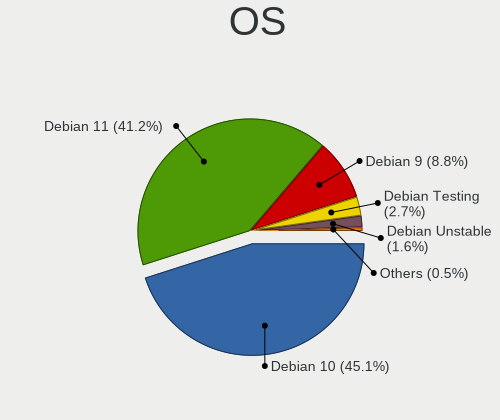

| Name            | Computers | Percent |
|-----------------|-----------|---------|
| Debian 10       | 82        | 45.05%  |
| Debian 11       | 75        | 41.21%  |
| Debian 9        | 16        | 8.79%   |
| Debian Testing  | 5         | 2.75%   |
| Debian Unstable | 3         | 1.65%   |
| Debian 8        | 1         | 0.55%   |

OS Family
---------

OS without a version

| Name   | Computers | Percent |
|--------|-----------|---------|
| Debian | 181       | 100%    |

Kernel
------

Version of the Linux kernel

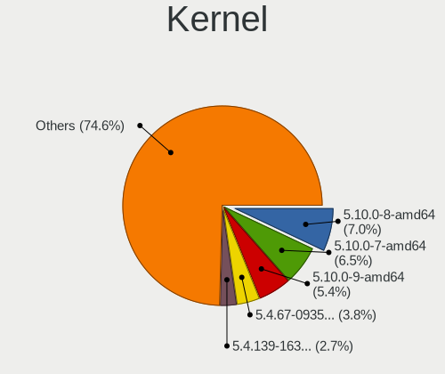

| Version                           | Computers | Percent |
|-----------------------------------|-----------|---------|
| 5.10.0-8-amd64                    | 13        | 7.03%   |
| 5.10.0-7-amd64                    | 12        | 6.49%   |
| 5.10.0-9-amd64                    | 10        | 5.41%   |
| 5.4.67-09356-gf3ed4c0c4a31        | 7         | 3.78%   |
| 5.4.139-16311-g330b3df0010b       | 5         | 2.7%    |
| 5.4.131-16049-gc688e114d34e       | 5         | 2.7%    |
| 5.10.60.1-microsoft-standard-WSL2 | 5         | 2.7%    |
| 5.10.16.3-microsoft-standard-WSL2 | 5         | 2.7%    |
| 5.10.0-11-amd64                   | 5         | 2.7%    |
| 5.10.0-10-amd64                   | 4         | 2.16%   |
| 4.9.0-4-amd64                     | 4         | 2.16%   |
| 5.4.99-12983-g8b7876ab9f5e        | 3         | 1.62%   |
| 5.4.48-06434-gd868196d13af        | 3         | 1.62%   |
| 5.4.151-16908-gff376e5d5ee1       | 3         | 1.62%   |
| 5.10.0-2-amd64                    | 3         | 1.62%   |
| 4.9.0-11-amd64                    | 3         | 1.62%   |
| 4.4.0-19041-Microsoft             | 3         | 1.62%   |
| 4.19.0-9-amd64                    | 3         | 1.62%   |
| 4.19.0-13-amd64                   | 3         | 1.62%   |
| 5.8.0-0.bpo.2-amd64               | 2         | 1.08%   |
| 5.4.88-12224-gf05236dbdecf        | 2         | 1.08%   |
| 5.4.74-10576-gb6cc41974db3        | 2         | 1.08%   |
| 5.4.72-microsoft-standard-WSL2    | 2         | 1.08%   |
| 5.4.119-14940-g3f09d7690fd7       | 2         | 1.08%   |
| 5.4.119-14902-ga77b3922b244       | 2         | 1.08%   |
| 5.15.0-2-amd64                    | 2         | 1.08%   |
| 5.10.0-12-amd64                   | 2         | 1.08%   |
| 4.9.0-9-amd64                     | 2         | 1.08%   |
| 4.4.0-18362-Microsoft             | 2         | 1.08%   |
| 4.19.98-08076-g24ab33fb8e14       | 2         | 1.08%   |
| 4.19.128-microsoft-standard       | 2         | 1.08%   |
| 4.19.113-08528-g5803a1c7e9f9      | 2         | 1.08%   |
| 4.19.0-8-amd64                    | 2         | 1.08%   |
| 4.19.0-5-amd64                    | 2         | 1.08%   |
| 4.19.0-17-amd64                   | 2         | 1.08%   |
| 4.19.0-14-amd64                   | 2         | 1.08%   |
| 4.19.0-12-amd64                   | 2         | 1.08%   |
| 4.19.0-10-amd64                   | 2         | 1.08%   |
| 5.9.0-1-amd64                     | 1         | 0.54%   |
| 5.9.0-0.bpo.2-amd64               | 1         | 0.54%   |
| 5.8.0-2-amd64                     | 1         | 0.54%   |
| 5.7.10-050710-generic             | 1         | 0.54%   |
| 5.7.0-2-amd64                     | 1         | 0.54%   |
| 5.7.0-1-amd64                     | 1         | 0.54%   |
| 5.7.0-0.bpo.2-amd64               | 1         | 0.54%   |
| 5.6.0-2-amd64                     | 1         | 0.54%   |
| 5.5.0-1-amd64                     | 1         | 0.54%   |
| 5.5.0-0.bpo.2-amd64               | 1         | 0.54%   |
| 5.4.88-12139-g1a1688a172e4        | 1         | 0.54%   |
| 5.4.58-07649-ge120df5deade        | 1         | 0.54%   |
| 5.4.53-07111-gf93cf62ecaf0        | 1         | 0.54%   |
| 5.4.40-04224-g891a6cce2d44        | 1         | 0.54%   |
| 5.4.157-17191-g6575d22de694       | 1         | 0.54%   |
| 5.4.151-16906-g86cbb761e8c4       | 1         | 0.54%   |
| 5.4.107-13649-g3f6eca1d21f8       | 1         | 0.54%   |
| 5.4.0-3-amd64                     | 1         | 0.54%   |
| 5.3.0-1-amd64                     | 1         | 0.54%   |
| 5.15.0-1-amd64                    | 1         | 0.54%   |
| 5.15.0-0.bpo.3-amd64              | 1         | 0.54%   |
| 5.14.0-2-amd64                    | 1         | 0.54%   |

Kernel Family
-------------

Linux kernel without a distro release

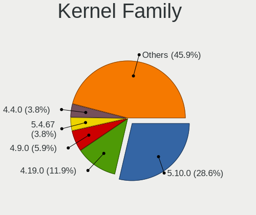

| Version   | Computers | Percent |
|-----------|-----------|---------|
| 5.10.0    | 53        | 28.65%  |
| 4.19.0    | 22        | 11.89%  |
| 4.9.0     | 11        | 5.95%   |
| 5.4.67    | 7         | 3.78%   |
| 4.4.0     | 7         | 3.78%   |
| 5.4.139   | 5         | 2.7%    |
| 5.4.131   | 5         | 2.7%    |
| 5.10.60.1 | 5         | 2.7%    |
| 5.10.16.3 | 5         | 2.7%    |
| 5.4.151   | 4         | 2.16%   |
| 5.4.119   | 4         | 2.16%   |
| 5.15.0    | 4         | 2.16%   |
| 5.8.0     | 3         | 1.62%   |
| 5.7.0     | 3         | 1.62%   |
| 5.4.99    | 3         | 1.62%   |
| 5.4.88    | 3         | 1.62%   |
| 5.4.48    | 3         | 1.62%   |
| 5.9.0     | 2         | 1.08%   |
| 5.5.0     | 2         | 1.08%   |
| 5.4.74    | 2         | 1.08%   |
| 5.4.72    | 2         | 1.08%   |
| 5.10.92   | 2         | 1.08%   |
| 4.19.98   | 2         | 1.08%   |
| 4.19.128  | 2         | 1.08%   |
| 4.19.113  | 2         | 1.08%   |
| 5.7.10    | 1         | 0.54%   |
| 5.6.0     | 1         | 0.54%   |
| 5.4.58    | 1         | 0.54%   |
| 5.4.53    | 1         | 0.54%   |
| 5.4.40    | 1         | 0.54%   |
| 5.4.157   | 1         | 0.54%   |
| 5.4.107   | 1         | 0.54%   |
| 5.4.0     | 1         | 0.54%   |
| 5.3.0     | 1         | 0.54%   |
| 5.14.0    | 1         | 0.54%   |
| 5.10.91   | 1         | 0.54%   |
| 5.10.60   | 1         | 0.54%   |
| 5.10.41   | 1         | 0.54%   |
| 5.10.106  | 1         | 0.54%   |
| 4.19.87   | 1         | 0.54%   |
| 4.19.86   | 1         | 0.54%   |
| 4.19.80   | 1         | 0.54%   |
| 4.19.69   | 1         | 0.54%   |
| 4.19.104  | 1         | 0.54%   |
| 4.16.18   | 1         | 0.54%   |
| 4.15.11   | 1         | 0.54%   |
| 3.16.0    | 1         | 0.54%   |

Kernel Major Ver.
-----------------

Linux kernel major version

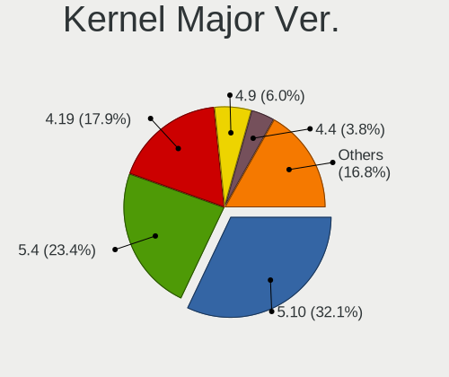

| Version | Computers | Percent |
|---------|-----------|---------|
| 5.10    | 59        | 32.07%  |
| 5.4     | 43        | 23.37%  |
| 4.19    | 33        | 17.93%  |
| 4.9     | 11        | 5.98%   |
| 4.4     | 7         | 3.8%    |
| 5.10.60 | 5         | 2.72%   |
| 5.10.16 | 5         | 2.72%   |
| 5.7     | 4         | 2.17%   |
| 5.15    | 4         | 2.17%   |
| 5.8     | 3         | 1.63%   |
| 5.9     | 2         | 1.09%   |
| 5.5     | 2         | 1.09%   |
| 5.6     | 1         | 0.54%   |
| 5.3     | 1         | 0.54%   |
| 5.14    | 1         | 0.54%   |
| 4.16    | 1         | 0.54%   |
| 4.15    | 1         | 0.54%   |
| 3.16    | 1         | 0.54%   |

Arch
----

OS architecture (x86_64, i586, etc.)

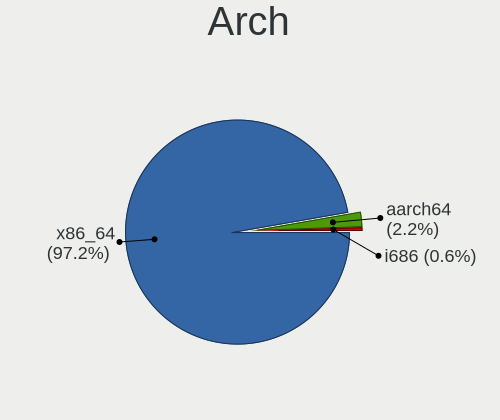

| Name    | Computers | Percent |
|---------|-----------|---------|
| x86_64  | 176       | 97.24%  |
| aarch64 | 4         | 2.21%   |
| i686    | 1         | 0.55%   |

DE
--

Desktop Environment

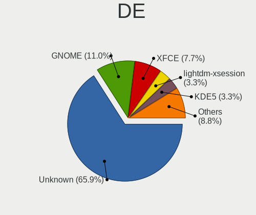

| Name             | Computers | Percent |
|------------------|-----------|---------|
| Unknown          | 120       | 65.93%  |
| GNOME            | 20        | 10.99%  |
| XFCE             | 14        | 7.69%   |
| lightdm-xsession | 6         | 3.3%    |
| KDE5             | 6         | 3.3%    |
| Cinnamon         | 5         | 2.75%   |
| X-Cinnamon       | 2         | 1.1%    |
| MATE             | 2         | 1.1%    |
| GNUstep          | 2         | 1.1%    |
| LXQt             | 1         | 0.55%   |
| LXDE             | 1         | 0.55%   |
| KDE4             | 1         | 0.55%   |
| KDE              | 1         | 0.55%   |
| i3               | 1         | 0.55%   |

Display Server
--------------

X11 or Wayland

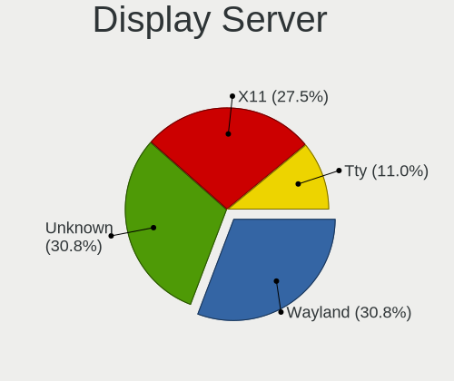

| Name    | Computers | Percent |
|---------|-----------|---------|
| Wayland | 56        | 30.77%  |
| Unknown | 56        | 30.77%  |
| X11     | 50        | 27.47%  |
| Tty     | 20        | 10.99%  |

Display Manager
---------------

SDDM, LightDM, etc.

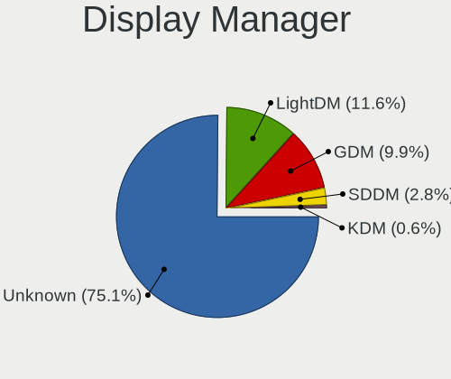

| Name    | Computers | Percent |
|---------|-----------|---------|
| Unknown | 136       | 75.14%  |
| LightDM | 21        | 11.6%   |
| GDM     | 18        | 9.94%   |
| SDDM    | 5         | 2.76%   |
| KDM     | 1         | 0.55%   |

OS Lang
-------

Language

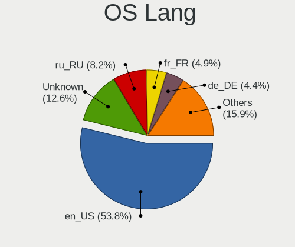

| Lang    | Computers | Percent |
|---------|-----------|---------|
| en_US   | 98        | 53.85%  |
| Unknown | 23        | 12.64%  |
| ru_RU   | 15        | 8.24%   |
| fr_FR   | 9         | 4.95%   |
| de_DE   | 8         | 4.4%    |
| pt_BR   | 6         | 3.3%    |
| en_GB   | 6         | 3.3%    |
| zh_CN   | 4         | 2.2%    |
| es_ES   | 2         | 1.1%    |
| C       | 2         | 1.1%    |
| tr_TR   | 1         | 0.55%   |
| pt_PT   | 1         | 0.55%   |
| pl_PL   | 1         | 0.55%   |
| it_IT   | 1         | 0.55%   |
| fr_CH   | 1         | 0.55%   |
| es_GT   | 1         | 0.55%   |
| en_IE   | 1         | 0.55%   |
| en_CA   | 1         | 0.55%   |
| en_AU   | 1         | 0.55%   |

Boot Mode
---------

EFI or BIOS

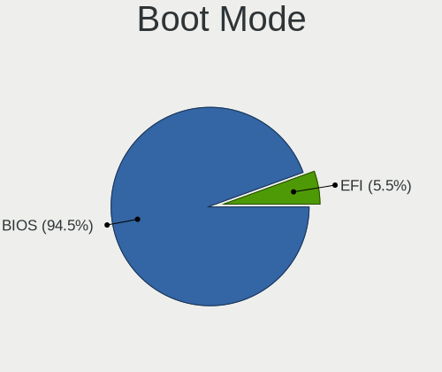

| Mode | Computers | Percent |
|------|-----------|---------|
| BIOS | 171       | 94.48%  |
| EFI  | 10        | 5.52%   |

Filesystem
----------

Type of filesystem

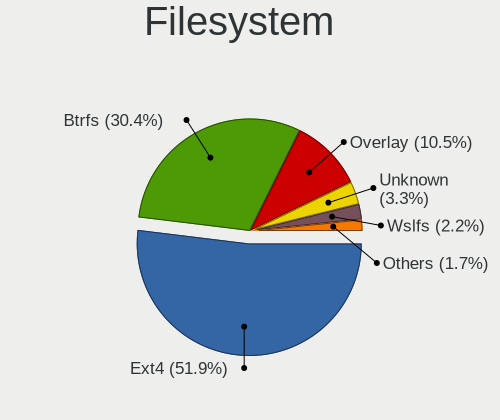

| Type    | Computers | Percent |
|---------|-----------|---------|
| Ext4    | 94        | 51.93%  |
| Btrfs   | 55        | 30.39%  |
| Overlay | 19        | 10.5%   |
| Unknown | 6         | 3.31%   |
| Wslfs   | 4         | 2.21%   |
| LxXs    | 1         | 0.55%   |
| Ext3    | 1         | 0.55%   |
| Aufs    | 1         | 0.55%   |

Part. scheme
------------

Scheme of partitioning

| Type    | Computers | Percent |
|---------|-----------|---------|
| Unknown | 100       | 54.95%  |
| MBR     | 65        | 35.71%  |
| GPT     | 17        | 9.34%   |

Dual Boot with Linux/BSD
------------------------

Hosting more than one Linux/BSD

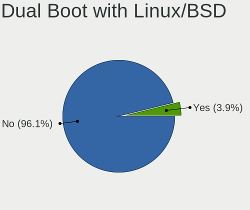

| Dual boot | Computers | Percent |
|-----------|-----------|---------|
| No        | 174       | 96.13%  |
| Yes       | 7         | 3.87%   |

Dual Boot (Win)
---------------

Hosting Linux and Windows

| Dual boot | Computers | Percent |
|-----------|-----------|---------|
| No        | 167       | 92.27%  |
| Yes       | 14        | 7.73%   |

Board
-----

Vendor
------

Motherboard manufacturer

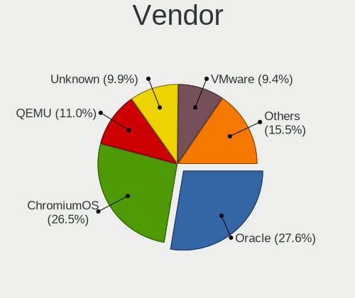

| Name                             | Computers | Percent |
|----------------------------------|-----------|---------|
| Oracle                           | 50        | 27.62%  |
| ChromiumOS                       | 48        | 26.52%  |
| QEMU                             | 20        | 11.05%  |
| Unknown                          | 18        | 9.94%   |
| VMware                           | 17        | 9.39%   |
| Microsoft                        | 14        | 7.73%   |
| Parallels Software International | 2         | 1.1%    |
| OpenStack Foundation             | 2         | 1.1%    |
| netcup                           | 2         | 1.1%    |
| Google                           | 2         | 1.1%    |
| Xen                              | 1         | 0.55%   |
| Virtuozzo                        | 1         | 0.55%   |
| Red Hat                          | 1         | 0.55%   |
| McGhie                           | 1         | 0.55%   |
| Amazon EC2                       | 1         | 0.55%   |
| Alibaba Cloud                    | 1         | 0.55%   |

Model
-----

Motherboard model

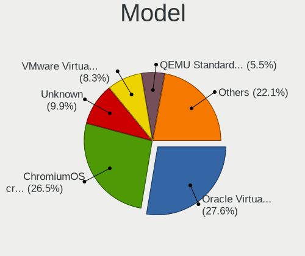

| Name                                                        | Computers | Percent |
|-------------------------------------------------------------|-----------|---------|
| Oracle VirtualBox                                           | 50        | 27.62%  |
| ChromiumOS crosvm                                           | 48        | 26.52%  |
| Unknown                                                     | 18        | 9.94%   |
| VMware Virtual Platform                                     | 15        | 8.29%   |
| QEMU Standard PC (i440FX + PIIX, 1996)                      | 10        | 5.52%   |
| QEMU Standard PC (Q35 + ICH9, 2009)                         | 9         | 4.97%   |
| Microsoft Windows Subsystem for Linux                       | 8         | 4.42%   |
| Microsoft Virtual Machine                                   | 6         | 3.31%   |
| VMware VMware7,1                                            | 2         | 1.1%    |
| Parallels Software International Parallels Virtual Platform | 2         | 1.1%    |
| OpenStack Foundation OpenStack Nova                         | 2         | 1.1%    |
| netcup KVM Server                                           | 2         | 1.1%    |
| Google Compute Engine                                       | 2         | 1.1%    |
| Xen HVM domU                                                | 1         | 0.55%   |
| Virtuozzo KVM                                               | 1         | 0.55%   |
| Red Hat KVM                                                 | 1         | 0.55%   |
| QEMU KVM Virtual Machine                                    | 1         | 0.55%   |
| McGhie Debian-10                                            | 1         | 0.55%   |
| Amazon EC2 t3.small                                         | 1         | 0.55%   |
| Alibaba Cloud ECS                                           | 1         | 0.55%   |

Model Family
------------

Motherboard model prefix

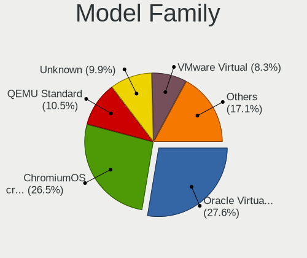

| Name                                       | Computers | Percent |
|--------------------------------------------|-----------|---------|
| Oracle VirtualBox                          | 50        | 27.62%  |
| ChromiumOS crosvm                          | 48        | 26.52%  |
| QEMU Standard                              | 19        | 10.5%   |
| Unknown                                    | 18        | 9.94%   |
| VMware Virtual                             | 15        | 8.29%   |
| Microsoft Windows                          | 8         | 4.42%   |
| Microsoft Virtual                          | 6         | 3.31%   |
| VMware VMware7                             | 2         | 1.1%    |
| Parallels Software International Parallels | 2         | 1.1%    |
| OpenStack Foundation OpenStack             | 2         | 1.1%    |
| netcup KVM                                 | 2         | 1.1%    |
| Google Compute                             | 2         | 1.1%    |
| Xen HVM                                    | 1         | 0.55%   |
| Virtuozzo KVM                              | 1         | 0.55%   |
| Red Hat KVM                                | 1         | 0.55%   |
| QEMU KVM                                   | 1         | 0.55%   |
| McGhie Debian-10                           | 1         | 0.55%   |
| Amazon EC2 t3.small                        | 1         | 0.55%   |
| Alibaba Cloud ECS                          | 1         | 0.55%   |

MFG Year
--------

Motherboard manufacture year

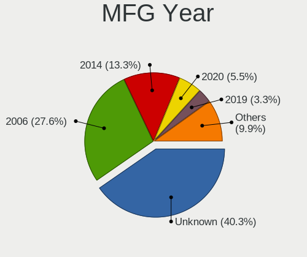

| Year    | Computers | Percent |
|---------|-----------|---------|
| Unknown | 73        | 40.33%  |
| 2006    | 50        | 27.62%  |
| 2014    | 24        | 13.26%  |
| 2020    | 10        | 5.52%   |
| 2019    | 6         | 3.31%   |
| 2018    | 6         | 3.31%   |
| 2021    | 3         | 1.66%   |
| 2017    | 2         | 1.1%    |
| 2015    | 2         | 1.1%    |
| 2011    | 2         | 1.1%    |
| 2016    | 1         | 0.55%   |
| 2013    | 1         | 0.55%   |
| 2012    | 1         | 0.55%   |

Form Factor
-----------

Physical design of the computer

| Name            | Computers | Percent |
|-----------------|-----------|---------|
| Virtual machine | 181       | 100%    |

Secure Boot
-----------

Enabled or disabled

| State    | Computers | Percent |
|----------|-----------|---------|
| Disabled | 181       | 100%    |

Coreboot
--------

Have coreboot on board

| Used | Computers | Percent |
|------|-----------|---------|
| No   | 181       | 100%    |

RAM Size
--------

Total RAM memory

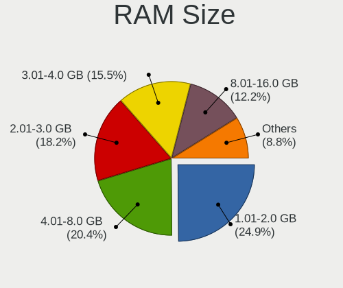

| Size in GB  | Computers | Percent |
|-------------|-----------|---------|
| 1.01-2.0    | 45        | 24.86%  |
| 4.01-8.0    | 37        | 20.44%  |
| 2.01-3.0    | 33        | 18.23%  |
| 3.01-4.0    | 28        | 15.47%  |
| 8.01-16.0   | 22        | 12.15%  |
| 24.01-32.0  | 6         | 3.31%   |
| 32.01-64.0  | 4         | 2.21%   |
| 0.51-1.0    | 3         | 1.66%   |
| 16.01-24.0  | 2         | 1.1%    |
| 64.01-256.0 | 1         | 0.55%   |

RAM Used
--------

Used RAM memory

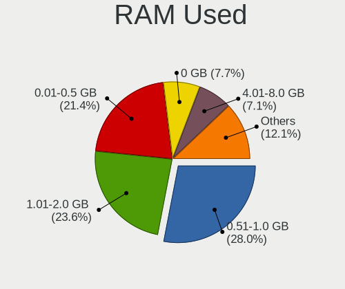

| Used GB    | Computers | Percent |
|------------|-----------|---------|
| 0.51-1.0   | 51        | 28.02%  |
| 1.01-2.0   | 43        | 23.63%  |
| 0.01-0.5   | 39        | 21.43%  |
| 0          | 14        | 7.69%   |
| 4.01-8.0   | 13        | 7.14%   |
| 2.01-3.0   | 7         | 3.85%   |
| Unknown    | 7         | 3.85%   |
| 3.01-4.0   | 5         | 2.75%   |
| 24.01-32.0 | 1         | 0.55%   |
| 16.01-24.0 | 1         | 0.55%   |
| 8.01-16.0  | 1         | 0.55%   |

Total Drives
------------

Number of drives on board

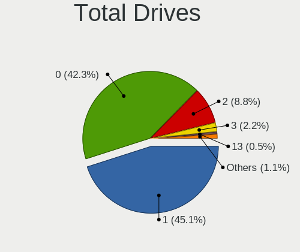

| Drives | Computers | Percent |
|--------|-----------|---------|
| 1      | 82        | 45.05%  |
| 0      | 77        | 42.31%  |
| 2      | 16        | 8.79%   |
| 3      | 4         | 2.2%    |
| 13     | 1         | 0.55%   |
| 5      | 1         | 0.55%   |
| 4      | 1         | 0.55%   |

Has CD-ROM
----------

Has CD-ROM on board

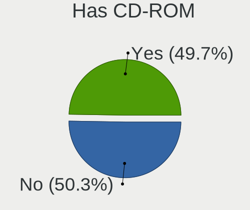

| Presented | Computers | Percent |
|-----------|-----------|---------|
| No        | 91        | 50.28%  |
| Yes       | 90        | 49.72%  |

Has Ethernet
------------

Has Ethernet on board

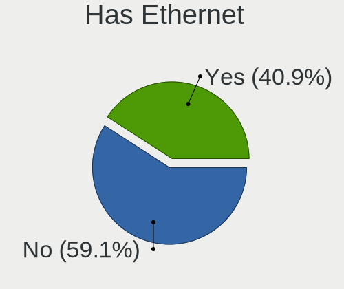

| Presented | Computers | Percent |
|-----------|-----------|---------|
| No        | 107       | 59.12%  |
| Yes       | 74        | 40.88%  |

Has WiFi
--------

Has WiFi module

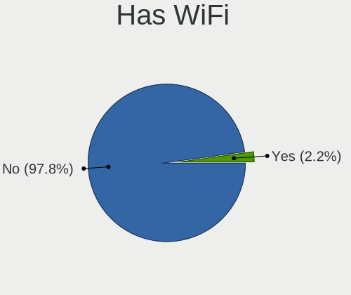

| Presented | Computers | Percent |
|-----------|-----------|---------|
| No        | 178       | 97.8%   |
| Yes       | 4         | 2.2%    |

Has Bluetooth
-------------

Has Bluetooth module

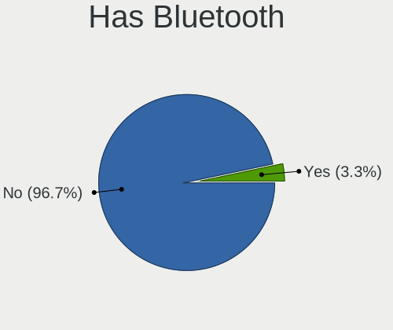

| Presented | Computers | Percent |
|-----------|-----------|---------|
| No        | 175       | 96.69%  |
| Yes       | 6         | 3.31%   |

Location
--------

Country
-------

Geographic location (country)

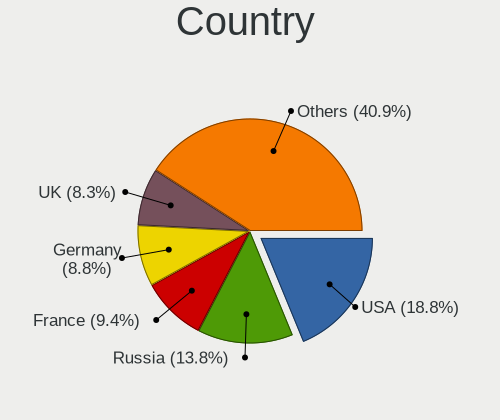

| Country      | Computers | Percent |
|--------------|-----------|---------|
| USA          | 34        | 18.78%  |
| Russia       | 25        | 13.81%  |
| France       | 17        | 9.39%   |
| Germany      | 16        | 8.84%   |
| UK           | 15        | 8.29%   |
| Canada       | 12        | 6.63%   |
| Brazil       | 11        | 6.08%   |
| Italy        | 6         | 3.31%   |
| Spain        | 4         | 2.21%   |
| China        | 4         | 2.21%   |
| Switzerland  | 3         | 1.66%   |
| Netherlands  | 3         | 1.66%   |
| India        | 3         | 1.66%   |
| Turkey       | 2         | 1.1%    |
| Portugal     | 2         | 1.1%    |
| Poland       | 2         | 1.1%    |
| Mexico       | 2         | 1.1%    |
| Japan        | 2         | 1.1%    |
| Czechia      | 2         | 1.1%    |
| Cyprus       | 2         | 1.1%    |
| Australia    | 2         | 1.1%    |
| Vietnam      | 1         | 0.55%   |
| Sweden       | 1         | 0.55%   |
| Sudan        | 1         | 0.55%   |
| South Korea  | 1         | 0.55%   |
| Serbia       | 1         | 0.55%   |
| Saudi Arabia | 1         | 0.55%   |
| Luxembourg   | 1         | 0.55%   |
| Lithuania    | 1         | 0.55%   |
| Indonesia    | 1         | 0.55%   |
| Guatemala    | 1         | 0.55%   |
| Bulgaria     | 1         | 0.55%   |
| Belgium      | 1         | 0.55%   |

City
----

Geographic location (city)

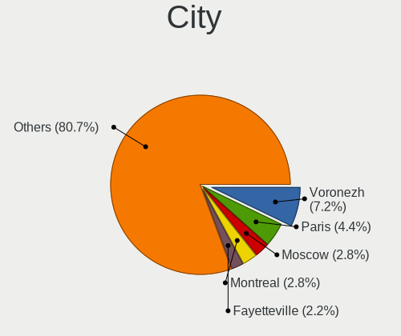

| City                   | Computers | Percent |
|------------------------|-----------|---------|
| Voronezh               | 13        | 7.18%   |
| Paris                  | 8         | 4.42%   |
| Moscow                 | 5         | 2.76%   |
| Montreal               | 5         | 2.76%   |
| Fayetteville           | 4         | 2.21%   |
| Vancouver              | 2         | 1.1%    |
| St Petersburg          | 2         | 1.1%    |
| Sao Paulo              | 2         | 1.1%    |
| Milan                  | 2         | 1.1%    |
| Limassol               | 2         | 1.1%    |
| Karlsruhe              | 2         | 1.1%    |
| Henfield               | 2         | 1.1%    |
| Hangzhou               | 2         | 1.1%    |
| Hamburg                | 2         | 1.1%    |
| Gravina in Puglia      | 2         | 1.1%    |
| Chemnitz               | 2         | 1.1%    |
| Camberwell             | 2         | 1.1%    |
| Berlin                 | 2         | 1.1%    |
| Barnes                 | 2         | 1.1%    |
| Avon                   | 2         | 1.1%    |
| Zebrzydowice           | 1         | 0.55%   |
| Yekaterinburg          | 1         | 0.55%   |
| Xi'an                  | 1         | 0.55%   |
| Winnipeg               | 1         | 0.55%   |
| Wichita                | 1         | 0.55%   |
| Wesseling              | 1         | 0.55%   |
| Washington             | 1         | 0.55%   |
| Vossem                 | 1         | 0.55%   |
| Vilnius                | 1         | 0.55%   |
| Villejuif              | 1         | 0.55%   |
| Ufa                    | 1         | 0.55%   |
| Trouville-sur-Mer      | 1         | 0.55%   |
| Traralgon              | 1         | 0.55%   |
| Tokyo                  | 1         | 0.55%   |
| Swindon                | 1         | 0.55%   |
| Strabane               | 1         | 0.55%   |
| Sofia                  | 1         | 0.55%   |
| Shepherds Bush         | 1         | 0.55%   |
| Seville                | 1         | 0.55%   |
| Sao Jose               | 1         | 0.55%   |
| Sao José dos Campos | 1         | 0.55%   |
| San Francisco          | 1         | 0.55%   |
| Salisbury              | 1         | 0.55%   |
| Sainte-Julie           | 1         | 0.55%   |
| Rumburk                | 1         | 0.55%   |
| Ruda ÅšlÄ…ska     | 1         | 0.55%   |
| Rome                   | 1         | 0.55%   |
| Rio de Janeiro         | 1         | 0.55%   |
| Richmond               | 1         | 0.55%   |
| Prague                 | 1         | 0.55%   |
| Potsdam                | 1         | 0.55%   |
| Portland               | 1         | 0.55%   |
| Plainfield             | 1         | 0.55%   |
| Perpignan              | 1         | 0.55%   |
| Pelotas                | 1         | 0.55%   |
| Pearl                  | 1         | 0.55%   |
| Palm Bay               | 1         | 0.55%   |
| Paços de Ferreira   | 1         | 0.55%   |
| Owasso                 | 1         | 0.55%   |
| North Charleston       | 1         | 0.55%   |

Drives
------

Drive Vendor
------------

Hard drive vendors

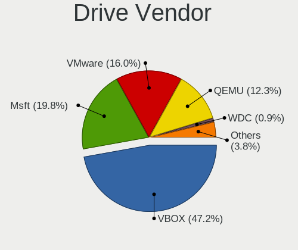

| Vendor     | Computers | Drives | Percent |
|------------|-----------|--------|---------|
| VBOX       | 50        | 56     | 47.17%  |
| Msft       | 21        | 41     | 19.81%  |
| VMware     | 17        | 31     | 16.04%  |
| QEMU       | 13        | 19     | 12.26%  |
| WDC        | 1         | 3      | 0.94%   |
| MxDoo      | 1         | 1      | 0.94%   |
| HGST       | 1         | 1      | 0.94%   |
| Debian-0   | 1         | 1      | 0.94%   |
| Amazon.com | 1         | 1      | 0.94%   |

Drive Model
-----------

Hard drive models

| Model                          | Computers | Percent |
|--------------------------------|-----------|---------|
| VBOX HARDDISK                  | 50        | 45.87%  |
| Msft Virtual Disk              | 21        | 19.27%  |
| VMware Virtual S               | 12        | 11.01%  |
| QEMU HARDDISK                  | 12        | 11.01%  |
| VMware Virtual disk            | 4         | 3.67%   |
| WDC WD60EFAX-68SHWN0 6TB       | 1         | 0.92%   |
| WDC WD30EURS-63SPKY0 3TB       | 1         | 0.92%   |
| VMware Virtual SATA Hard Drive | 1         | 0.92%   |
| VMware Virtual IDE Hard Drive  | 1         | 0.92%   |
| VMware NVMe SSD Drive          | 1         | 0.92%   |
| QEMU Vz HARDDISK0              | 1         | 0.92%   |
| MxDoo Linux-0 SSD 68GB         | 1         | 0.92%   |
| HGST HDN724030ALE640 3TB       | 1         | 0.92%   |
| Debian-0 SSD 138GB             | 1         | 0.92%   |
| Amazon.com NVMe SSD Drive 9GB  | 1         | 0.92%   |

HDD Vendor
----------

Hard disk drive vendors

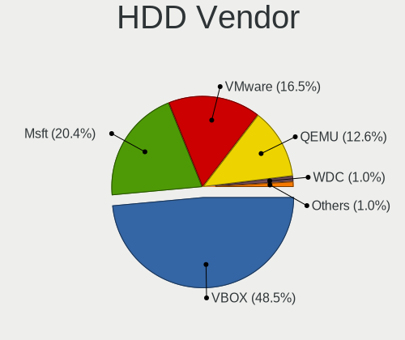

| Vendor | Computers | Drives | Percent |
|--------|-----------|--------|---------|
| VBOX   | 50        | 56     | 48.54%  |
| Msft   | 21        | 41     | 20.39%  |
| VMware | 17        | 31     | 16.5%   |
| QEMU   | 13        | 19     | 12.62%  |
| WDC    | 1         | 3      | 0.97%   |
| HGST   | 1         | 1      | 0.97%   |

SSD Vendor
----------

Solid state drive vendors

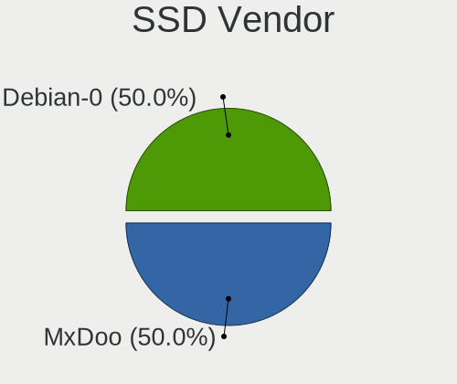

| Vendor   | Computers | Drives | Percent |
|----------|-----------|--------|---------|
| MxDoo    | 1         | 1      | 50%     |
| Debian-0 | 1         | 1      | 50%     |

Drive Kind
----------

HDD or SSD

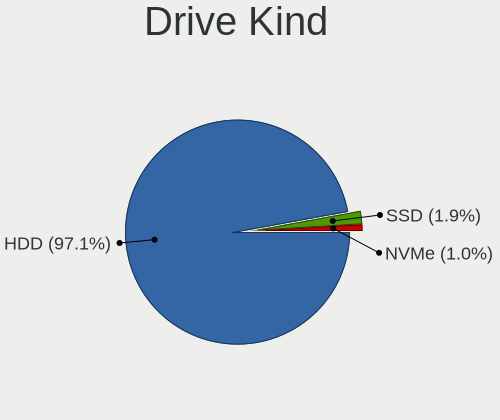

| Kind | Computers | Drives | Percent |
|------|-----------|--------|---------|
| HDD  | 101       | 151    | 97.12%  |
| SSD  | 2         | 2      | 1.92%   |
| NVMe | 1         | 1      | 0.96%   |

Drive Connector
---------------

SATA, SAS, NVMe, etc.

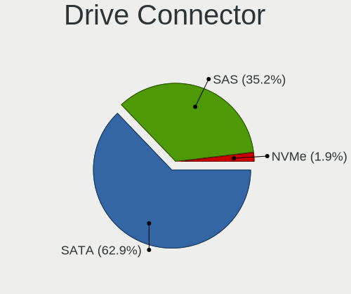

| Type | Computers | Drives | Percent |
|------|-----------|--------|---------|
| SATA | 66        | 87     | 62.86%  |
| SAS  | 37        | 65     | 35.24%  |
| NVMe | 2         | 2      | 1.9%    |

Drive Size
----------

Size of hard drive

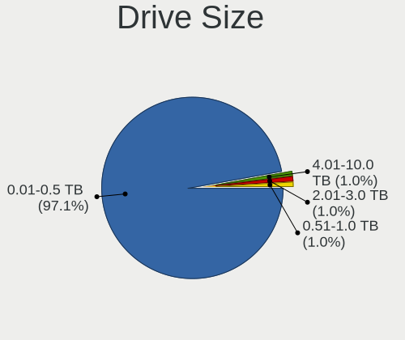

| Size in TB | Computers | Drives | Percent |
|------------|-----------|--------|---------|
| 0.01-0.5   | 102       | 148    | 97.14%  |
| 2.01-3.0   | 1         | 2      | 0.95%   |
| 4.01-10.0  | 1         | 2      | 0.95%   |
| 0.51-1.0   | 1         | 1      | 0.95%   |

Space Total
-----------

Amount of disk space available on the file system

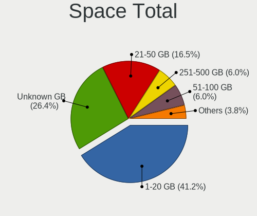

| Size in GB     | Computers | Percent |
|----------------|-----------|---------|
| 1-20           | 75        | 41.21%  |
| Unknown        | 48        | 26.37%  |
| 21-50          | 30        | 16.48%  |
| 251-500        | 11        | 6.04%   |
| 51-100         | 11        | 6.04%   |
| 101-250        | 3         | 1.65%   |
| More than 3000 | 2         | 1.1%    |
| 2001-3000      | 1         | 0.55%   |
| 501-1000       | 1         | 0.55%   |

Space Used
----------

Amount of used disk space

| Used GB        | Computers | Percent |
|----------------|-----------|---------|
| 1-20           | 117       | 64.29%  |
| Unknown        | 48        | 26.37%  |
| 21-50          | 10        | 5.49%   |
| 51-100         | 2         | 1.1%    |
| More than 3000 | 1         | 0.55%   |
| 251-500        | 1         | 0.55%   |
| 2001-3000      | 1         | 0.55%   |
| 1001-2000      | 1         | 0.55%   |
| 501-1000       | 1         | 0.55%   |

Malfunc. Drives
---------------

Drive models with a malfunction

Zero info for selected period =(

Malfunc. Drive Vendor
---------------------

Vendors of faulty drives

Zero info for selected period =(

Malfunc. HDD Vendor
-------------------

Vendors of faulty HDD drives

Zero info for selected period =(

Malfunc. Drive Kind
-------------------

Kinds of faulty drives

Zero info for selected period =(

Failed Drives
-------------

Failed drive models

Zero info for selected period =(

Failed Drive Vendor
-------------------

Failed drive vendors

Zero info for selected period =(

Drive Status
------------

Number of failed and malfunc. drives

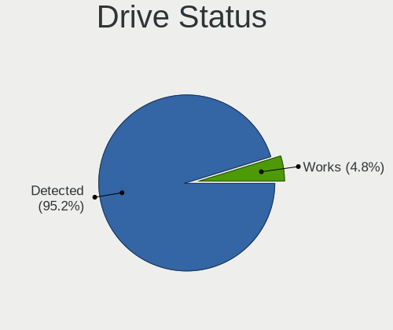

| Status   | Computers | Drives | Percent |
|----------|-----------|--------|---------|
| Detected | 100       | 145    | 95.24%  |
| Works    | 5         | 9      | 4.76%   |

Storage controller
------------------

Storage Vendor
--------------

Storage controller vendors

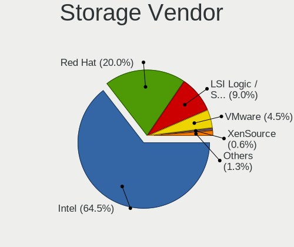

| Vendor                    | Computers | Percent |
|---------------------------|-----------|---------|
| Intel                     | 100       | 64.52%  |
| Red Hat                   | 31        | 20%     |
| LSI Logic / Symbios Logic | 14        | 9.03%   |
| VMware                    | 7         | 4.52%   |
| XenSource                 | 1         | 0.65%   |
| AMD                       | 1         | 0.65%   |
| Amazon.com                | 1         | 0.65%   |

Storage Model
-------------

Storage controller models

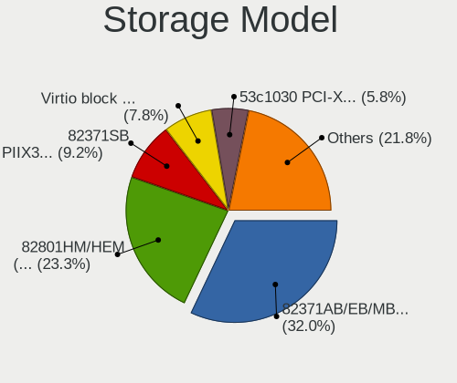

| Model                                                                 | Computers | Percent |
|-----------------------------------------------------------------------|-----------|---------|
| Intel 82371AB/EB/MB PIIX4 IDE                                         | 66        | 32.04%  |
| Intel 82801HM/HEM (ICH8M/ICH8M-E) SATA Controller [AHCI mode]         | 48        | 23.3%   |
| Intel 82371SB PIIX3 IDE [Natoma/Triton II]                            | 19        | 9.22%   |
| Red Hat Virtio block device                                           | 16        | 7.77%   |
| LSI Logic / Symbios Logic 53c1030 PCI-X Fusion-MPT Dual Ultra320 SCSI | 12        | 5.83%   |
| Red Hat Virtio SCSI                                                   | 11        | 5.34%   |
| Intel 82801IR/IO/IH (ICH9R/DO/DH) 6 port SATA Controller [AHCI mode]  | 10        | 4.85%   |
| VMware SATA AHCI controller                                           | 6         | 2.91%   |
| Red Hat Virtio filesystem                                             | 5         | 2.43%   |
| VMware PVSCSI SCSI Controller                                         | 3         | 1.46%   |
| Intel 82801BA IDE U100 Controller                                     | 2         | 0.97%   |
| XenSource Xen Platform Device                                         | 1         | 0.49%   |
| VMware NVMe SSD Controller                                            | 1         | 0.49%   |
| Red Hat Virtio console                                                | 1         | 0.49%   |
| LSI Logic / Symbios Logic SAS1068 PCI-X Fusion-MPT SAS                | 1         | 0.49%   |
| LSI Logic / Symbios Logic MegaRAID SAS 2108 [Liberator]               | 1         | 0.49%   |
| Intel 82801HR/HO/HH (ICH8R/DO/DH) 6 port SATA Controller [AHCI mode]  | 1         | 0.49%   |
| AMD X399 Series Chipset SATA Controller                               | 1         | 0.49%   |
| Amazon.com NVMe EBS Controller                                        | 1         | 0.49%   |

Storage Kind
------------

Kind of storage controller (IDE, SATA, NVMe, SAS, ...)

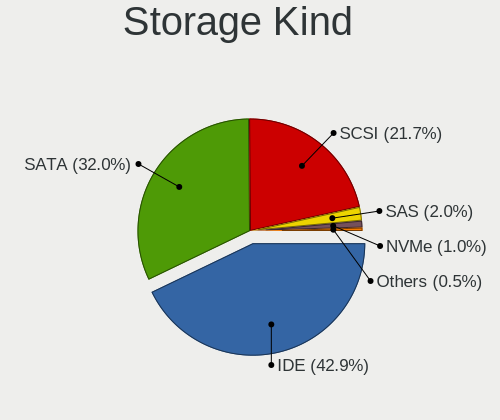

| Kind | Computers | Percent |
|------|-----------|---------|
| IDE  | 87        | 42.86%  |
| SATA | 65        | 32.02%  |
| SCSI | 44        | 21.67%  |
| SAS  | 4         | 1.97%   |
| NVMe | 2         | 0.99%   |
| RAID | 1         | 0.49%   |

Processor
---------

CPU Vendor
----------

Processor vendors

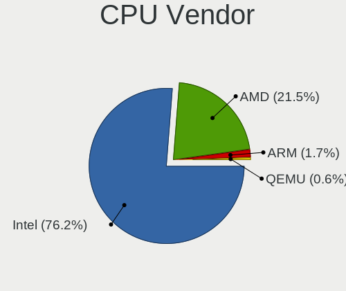

| Vendor | Computers | Percent |
|--------|-----------|---------|
| Intel  | 138       | 76.24%  |
| AMD    | 39        | 21.55%  |
| ARM    | 3         | 1.66%   |
| QEMU   | 1         | 0.55%   |

CPU Model
---------

Processor models

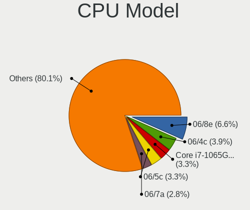

| Model                                         | Computers | Percent |
|-----------------------------------------------|-----------|---------|
| Intel 06/8e                                   | 12        | 6.63%   |
| Intel 06/4c                                   | 7         | 3.87%   |
| Intel Core i7-1065G7 CPU @ 1.30GHz            | 6         | 3.31%   |
| Intel 06/5c                                   | 6         | 3.31%   |
| Intel 06/7a                                   | 5         | 2.76%   |
| Intel Pentium CPU G620 @ 2.60GHz              | 4         | 2.21%   |
| Intel Core i7-4790 CPU @ 3.60GHz              | 4         | 2.21%   |
| Intel Common KVM processor                    | 4         | 2.21%   |
| Intel 06/8c                                   | 3         | 1.66%   |
| Intel 06/37                                   | 3         | 1.66%   |
| ARM Processor                                 | 3         | 1.66%   |
| AMD Ryzen 7 3700X 8-Core Processor            | 3         | 1.66%   |
| AMD Ryzen 3 2200G with Radeon Vega Graphics   | 3         | 1.66%   |
| Intel Core Processor (Haswell, no TSX)        | 2         | 1.1%    |
| Intel Core i7-9750HF CPU @ 2.60GHz            | 2         | 1.1%    |
| Intel Core i7-9700K CPU @ 3.60GHz             | 2         | 1.1%    |
| Intel Core i7-8559U CPU @ 2.70GHz             | 2         | 1.1%    |
| Intel Core i7-7700HQ CPU @ 2.80GHz            | 2         | 1.1%    |
| Intel Core i7-3630QM CPU @ 2.40GHz            | 2         | 1.1%    |
| Intel Core i5-9400F CPU @ 2.90GHz             | 2         | 1.1%    |
| Intel Core i5-8279U CPU @ 2.40GHz             | 2         | 1.1%    |
| Intel Core i5-8265U CPU @ 1.60GHz             | 2         | 1.1%    |
| Intel Core i5-6300U CPU @ 2.40GHz             | 2         | 1.1%    |
| Intel Core i3-10110U CPU @ 2.10GHz            | 2         | 1.1%    |
| Intel 06/45                                   | 2         | 1.1%    |
| Intel 06/3a                                   | 2         | 1.1%    |
| AMD Ryzen 9 5900X 12-Core Processor           | 2         | 1.1%    |
| AMD Ryzen 5 3500U with Radeon Vega Mobile Gfx | 2         | 1.1%    |
| AMD QEMU Virtual CPU version 2.5+             | 2         | 1.1%    |
| AMD 17/20                                     | 2         | 1.1%    |
| AMD 15/70                                     | 2         | 1.1%    |
| QEMU 1.0                                      | 1         | 0.55%   |
| Intel Xeon Silver 4214 CPU @ 2.20GHz          | 1         | 0.55%   |
| Intel Xeon Platinum 8259CL CPU @ 2.50GHz      | 1         | 0.55%   |
| Intel Xeon Platinum 8163 CPU @ 2.50GHz        | 1         | 0.55%   |
| Intel Xeon Gold 6230 CPU @ 2.10GHz            | 1         | 0.55%   |
| Intel Xeon CPU X5650 @ 2.67GHz                | 1         | 0.55%   |
| Intel Xeon CPU E5520 @ 2.27GHz                | 1         | 0.55%   |
| Intel Xeon CPU E5450 @ 3.00GHz                | 1         | 0.55%   |
| Intel Xeon CPU E5-2697A v4 @ 2.60GHz          | 1         | 0.55%   |
| Intel Xeon CPU E5-2680 v2 @ 2.80GHz           | 1         | 0.55%   |
| Intel Xeon CPU E5-2650 v3 @ 2.30GHz           | 1         | 0.55%   |
| Intel Xeon CPU E5-2640 v4 @ 2.40GHz           | 1         | 0.55%   |
| Intel Xeon CPU E5-2640 0 @ 2.50GHz            | 1         | 0.55%   |
| Intel Xeon CPU E5-2620 v3 @ 2.40GHz           | 1         | 0.55%   |
| Intel Xeon CPU E5-2620 v2 @ 2.10GHz           | 1         | 0.55%   |
| Intel Xeon CPU E5-2609 0 @ 2.40GHz            | 1         | 0.55%   |
| Intel Xeon CPU E3-1230 v3 @ 3.30GHz           | 1         | 0.55%   |
| Intel Xeon CPU E3-1225 v6 @ 3.30GHz           | 1         | 0.55%   |
| Intel Xeon CPU @ 2.20GHz                      | 1         | 0.55%   |
| Intel Xeon CPU                                | 1         | 0.55%   |
| Intel QEMU Virtual CPU version (cpu64-rhel6)  | 1         | 0.55%   |
| Intel Pentium CPU 2020M @ 2.40GHz             | 1         | 0.55%   |
| Intel Core Processor (Haswell, no TSX, IBRS)  | 1         | 0.55%   |
| Intel Core i9-9900KF CPU @ 3.60GHz            | 1         | 0.55%   |
| Intel Core i9-9880H CPU @ 2.30GHz             | 1         | 0.55%   |
| Intel Core i7-8750H CPU @ 2.20GHz             | 1         | 0.55%   |
| Intel Core i7-8550U CPU @ 1.80GHz             | 1         | 0.55%   |
| Intel Core i7-7500U CPU @ 2.70GHz             | 1         | 0.55%   |
| Intel Core i7-6700 CPU @ 3.40GHz              | 1         | 0.55%   |

CPU Model Family
----------------

Processor model prefix

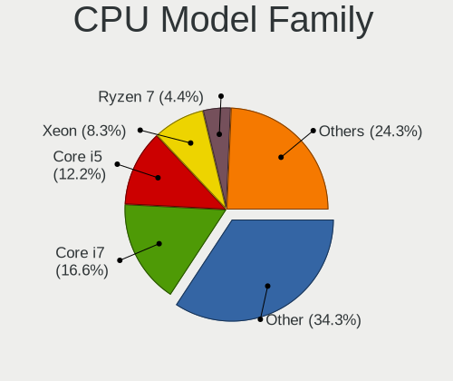

| Model               | Computers | Percent |
|---------------------|-----------|---------|
| Other               | 62        | 34.25%  |
| Intel Core i7       | 30        | 16.57%  |
| Intel Core i5       | 22        | 12.15%  |
| Intel Xeon          | 15        | 8.29%   |
| AMD Ryzen 7         | 8         | 4.42%   |
| AMD Ryzen 5         | 7         | 3.87%   |
| Intel Pentium       | 5         | 2.76%   |
| Intel Core i3       | 5         | 2.76%   |
| AMD Ryzen 3         | 4         | 2.21%   |
| Intel Core          | 3         | 1.66%   |
| AMD Ryzen 9         | 3         | 1.66%   |
| AMD EPYC            | 3         | 1.66%   |
| Intel Xeon Platinum | 2         | 1.1%    |
| Intel Core i9       | 2         | 1.1%    |
| AMD A10             | 2         | 1.1%    |
| Intel Xeon Silver   | 1         | 0.55%   |
| Intel Xeon Gold     | 1         | 0.55%   |
| Intel Celeron       | 1         | 0.55%   |
| AMD Ryzen 5 PRO     | 1         | 0.55%   |
| AMD Opteron         | 1         | 0.55%   |
| AMD FX              | 1         | 0.55%   |
| AMD A8              | 1         | 0.55%   |
| AMD A6              | 1         | 0.55%   |

CPU Cores
---------

Number of processor cores

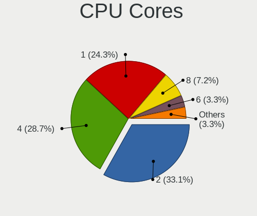

| Number | Computers | Percent |
|--------|-----------|---------|
| 2      | 60        | 33.15%  |
| 4      | 52        | 28.73%  |
| 1      | 44        | 24.31%  |
| 8      | 13        | 7.18%   |
| 6      | 6         | 3.31%   |
| 16     | 2         | 1.1%    |
| 3      | 2         | 1.1%    |
| 38     | 1         | 0.55%   |
| 7      | 1         | 0.55%   |

CPU Sockets
-----------

Number of sockets

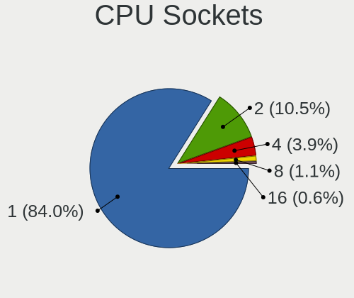

| Number | Computers | Percent |
|--------|-----------|---------|
| 1      | 152       | 83.98%  |
| 2      | 19        | 10.5%   |
| 4      | 7         | 3.87%   |
| 8      | 2         | 1.1%    |
| 16     | 1         | 0.55%   |

CPU Threads
-----------

Threads per core (Hyper-Threading)

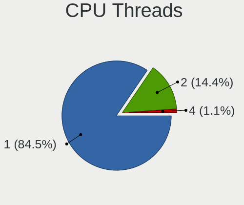

| Number | Computers | Percent |
|--------|-----------|---------|
| 1      | 153       | 84.53%  |
| 2      | 26        | 14.36%  |
| 4      | 2         | 1.1%    |

CPU Op-Modes
------------

CPU Operation Modes (32-bit, 64-bit)

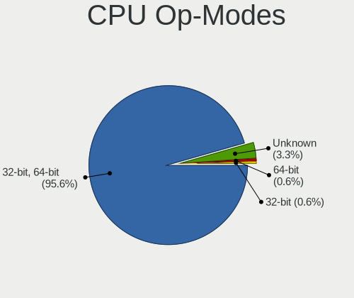

| Op mode        | Computers | Percent |
|----------------|-----------|---------|
| 32-bit, 64-bit | 173       | 95.58%  |
| Unknown        | 6         | 3.31%   |
| 64-bit         | 1         | 0.55%   |
| 32-bit         | 1         | 0.55%   |

CPU Microcode
-------------

Microcode number

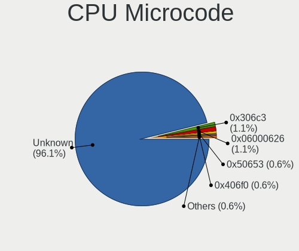

| Number     | Computers | Percent |
|------------|-----------|---------|
| Unknown    | 174       | 96.13%  |
| 0x306c3    | 2         | 1.1%    |
| 0x06000626 | 2         | 1.1%    |
| 0x50653    | 1         | 0.55%   |
| 0x406f0    | 1         | 0.55%   |
| 0x306a9    | 1         | 0.55%   |

CPU Microarch
-------------

Microarchitecture

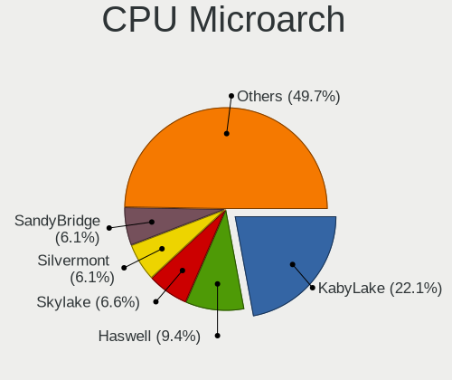

| Name          | Computers | Percent |
|---------------|-----------|---------|
| KabyLake      | 40        | 22.1%   |
| Haswell       | 17        | 9.39%   |
| Skylake       | 12        | 6.63%   |
| Silvermont    | 11        | 6.08%   |
| SandyBridge   | 11        | 6.08%   |
| IvyBridge     | 10        | 5.52%   |
| Zen+          | 8         | 4.42%   |
| Zen 2         | 8         | 4.42%   |
| Zen           | 7         | 3.87%   |
| TigerLake     | 6         | 3.31%   |
| IceLake       | 6         | 3.31%   |
| Goldmont      | 6         | 3.31%   |
| Zen 3         | 5         | 2.76%   |
| Goldmont plus | 5         | 2.76%   |
| NetBurst      | 4         | 2.21%   |
| Broadwell     | 4         | 2.21%   |
| Unknown       | 4         | 2.21%   |
| Piledriver    | 3         | 1.66%   |
| Excavator     | 3         | 1.66%   |
| Westmere      | 2         | 1.1%    |
| Penryn        | 2         | 1.1%    |
| K6            | 2         | 1.1%    |
| Puma          | 1         | 0.55%   |
| P6            | 1         | 0.55%   |
| Nehalem       | 1         | 0.55%   |
| K8 Hammer     | 1         | 0.55%   |
| K10           | 1         | 0.55%   |

Graphics
--------

GPU Vendor
----------

Vendors of graphics cards

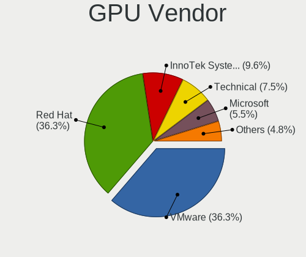

| Vendor                 | Computers | Percent |
|------------------------|-----------|---------|
| VMware                 | 53        | 36.3%   |
| Red Hat                | 53        | 36.3%   |
| InnoTek Systemberatung | 14        | 9.59%   |
| Technical              | 11        | 7.53%   |
| Microsoft              | 8         | 5.48%   |
| Cirrus Logic           | 6         | 4.11%   |
| Amazon.com             | 1         | 0.68%   |

GPU Model
---------

Graphics card models

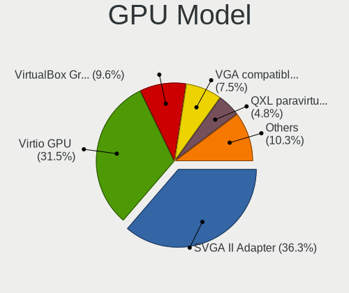

| Model                                              | Computers | Percent |
|----------------------------------------------------|-----------|---------|
| VMware SVGA II Adapter                             | 53        | 36.3%   |
| Red Hat Virtio GPU                                 | 46        | 31.51%  |
| InnoTek Systemberatung VirtualBox Graphics Adapter | 14        | 9.59%   |
| Technical VGA compatible controller                | 11        | 7.53%   |
| Red Hat QXL paravirtual graphic card               | 7         | 4.79%   |
| Cirrus Logic GD 5446                               | 6         | 4.11%   |
| Microsoft Virtual Render                           | 5         | 3.42%   |
| Microsoft Hyper-V virtual VGA                      | 3         | 2.05%   |
| Amazon.com Amazon.com VGA compatible controller    | 1         | 0.68%   |

GPU Combo
---------

Combinations of graphics cards

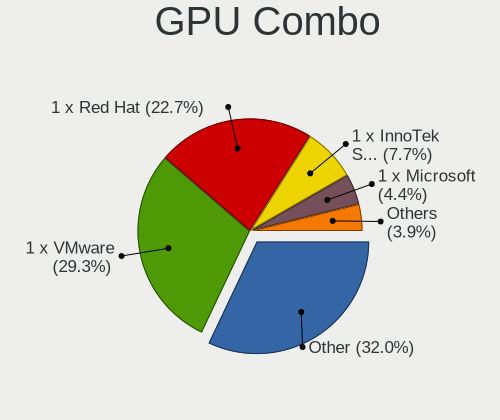

| Name                       | Computers | Percent |
|----------------------------|-----------|---------|
| Other                      | 58        | 32.04%  |
| 1 x VMware                 | 53        | 29.28%  |
| 1 x Red Hat                | 41        | 22.65%  |
| 1 x InnoTek Systemberatung | 14        | 7.73%   |
| 1 x Microsoft              | 8         | 4.42%   |
| 1 x Cirrus Logic           | 6         | 3.31%   |
| 1 x Amazon.com             | 1         | 0.55%   |

GPU Driver
----------

Free vs proprietary

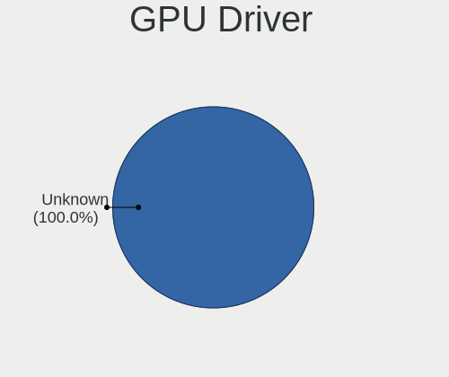

| Driver  | Computers | Percent |
|---------|-----------|---------|
| Unknown | 181       | 100%    |

GPU Memory
----------

Total video memory

| Size in GB | Computers | Percent |
|------------|-----------|---------|
| Unknown    | 181       | 100%    |

Monitor
-------

Monitor Vendor
--------------

Monitor vendors

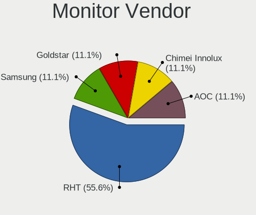

| Vendor              | Computers | Percent |
|---------------------|-----------|---------|
| RHT                 | 5         | 55.56%  |
| Samsung Electronics | 1         | 11.11%  |
| Goldstar            | 1         | 11.11%  |
| Chimei Innolux      | 1         | 11.11%  |
| AOC                 | 1         | 11.11%  |

Monitor Model
-------------

Monitor models

| Model                                                               | Computers | Percent |
|---------------------------------------------------------------------|-----------|---------|
| RHT QEMU Monitor RHT1234 2048x1152 260x195mm 12.8-inch              | 3         | 33.33%  |
| RHT QEMU Monitor RHT1234 2048x1152 260x190mm 12.7-inch              | 2         | 22.22%  |
| Samsung Electronics SMB2440MH SAM06DC 1920x1080 530x300mm 24.0-inch | 1         | 11.11%  |
| Goldstar HDR 4K GSM7707 3840x2160 600x340mm 27.2-inch               | 1         | 11.11%  |
| Chimei Innolux LCD Monitor CMN14C9 1920x1080 310x170mm 13.9-inch    | 1         | 11.11%  |
| AOC Q3279WG5B AOC3279 2560x1440 730x430mm 33.4-inch                 | 1         | 11.11%  |

Monitor Resolution
------------------

Monitor screen resolution

| Resolution      | Computers | Percent |
|-----------------|-----------|---------|
| 2048x1152       | 3         | 33.33%  |
| 3196x1798       | 2         | 22.22%  |
| 1920x1080 (FHD) | 2         | 22.22%  |
| 3840x2160 (4K)  | 1         | 11.11%  |
| 2560x1440 (QHD) | 1         | 11.11%  |

Monitor Diagonal
----------------

Diagonal size in inches

| Inches | Computers | Percent |
|--------|-----------|---------|
| 33     | 3         | 33.33%  |
| 19     | 3         | 33.33%  |
| 27     | 1         | 11.11%  |
| 24     | 1         | 11.11%  |
| 13     | 1         | 11.11%  |

Monitor Width
-------------

Physical width

| Width in mm | Computers | Percent |
|-------------|-----------|---------|
| 701-800     | 3         | 33.33%  |
| 401-500     | 3         | 33.33%  |
| 501-600     | 2         | 22.22%  |
| 301-350     | 1         | 11.11%  |

Aspect Ratio
------------

Proportional relationship between the width and the height

| Ratio | Computers | Percent |
|-------|-----------|---------|
| 16/9  | 5         | 62.5%   |
| 4/3   | 3         | 37.5%   |

Monitor Area
------------

Area in inch²

| Area in inch² | Computers | Percent |
|----------------|-----------|---------|
| 351-500        | 3         | 33.33%  |
| 151-200        | 3         | 33.33%  |
| 81-90          | 1         | 11.11%  |
| 301-350        | 1         | 11.11%  |
| 201-250        | 1         | 11.11%  |

Pixel Density
-------------

Pixels per inch

| Density | Computers | Percent |
|---------|-----------|---------|
| 51-100  | 4         | 44.44%  |
| 101-120 | 3         | 33.33%  |
| 161-240 | 1         | 11.11%  |
| 121-160 | 1         | 11.11%  |

Multiple Monitors
-----------------

Total monitors connected

| Total | Computers | Percent |
|-------|-----------|---------|
| 0     | 136       | 74.73%  |
| 1     | 45        | 24.73%  |
| 2     | 1         | 0.55%   |

Network
-------

Net Controller Vendor
---------------------

Controller vendors

| Vendor                | Computers | Percent |
|-----------------------|-----------|---------|
| Intel                 | 65        | 61.9%   |
| Red Hat               | 26        | 24.76%  |
| VMware                | 4         | 3.81%   |
| Realtek Semiconductor | 3         | 2.86%   |
| Ralink Technology     | 2         | 1.9%    |
| Digital Equipment     | 2         | 1.9%    |
| TP-Link               | 1         | 0.95%   |
| AMD                   | 1         | 0.95%   |
| Amazon.com            | 1         | 0.95%   |

Net Controller Model
--------------------

Controller models

| Model                                                      | Computers | Percent |
|------------------------------------------------------------|-----------|---------|
| Intel 82540EM Gigabit Ethernet Controller                  | 52        | 49.06%  |
| Red Hat Virtio network device                              | 26        | 24.53%  |
| Intel 82545EM Gigabit Ethernet Controller (Copper)         | 12        | 11.32%  |
| VMware VMXNET3 Ethernet Controller                         | 4         | 3.77%   |
| Digital Equipment DECchip 21140 [FasterNet]                | 2         | 1.89%   |
| TP-Link AC600 wireless Realtek RTL8811AU [Archer T2U Nano] | 1         | 0.94%   |
| Realtek RTL8191SU 802.11n WLAN Adapter                     | 1         | 0.94%   |
| Realtek RTL-8100/8101L/8139 PCI Fast Ethernet Adapter      | 1         | 0.94%   |
| Realtek 802.11ac+Bluetooth 5.0 Adapter                     | 1         | 0.94%   |
| Ralink RT2870/RT3070 Wireless Adapter                      | 1         | 0.94%   |
| Ralink RT2501/RT2573 Wireless Adapter                      | 1         | 0.94%   |
| Intel 82574L Gigabit Network Connection                    | 1         | 0.94%   |
| Intel 82543GC Gigabit Ethernet Controller (Copper)         | 1         | 0.94%   |
| AMD 79c970 [PCnet32 LANCE]                                 | 1         | 0.94%   |
| Amazon.com Elastic Network Adapter (ENA)                   | 1         | 0.94%   |

Wireless Vendor
---------------

Wireless vendors

| Vendor                | Computers | Percent |
|-----------------------|-----------|---------|
| Realtek Semiconductor | 2         | 40%     |
| Ralink Technology     | 2         | 40%     |
| TP-Link               | 1         | 20%     |

Wireless Model
--------------

Wireless models

| Model                                                      | Computers | Percent |
|------------------------------------------------------------|-----------|---------|
| TP-Link AC600 wireless Realtek RTL8811AU [Archer T2U Nano] | 1         | 20%     |
| Realtek RTL8191SU 802.11n WLAN Adapter                     | 1         | 20%     |
| Realtek 802.11ac+Bluetooth 5.0 Adapter                     | 1         | 20%     |
| Ralink RT2870/RT3070 Wireless Adapter                      | 1         | 20%     |
| Ralink RT2501/RT2573 Wireless Adapter                      | 1         | 20%     |

Ethernet Vendor
---------------

Ethernet vendors

| Vendor                | Computers | Percent |
|-----------------------|-----------|---------|
| Intel                 | 65        | 87.84%  |
| VMware                | 4         | 5.41%   |
| Digital Equipment     | 2         | 2.7%    |
| Realtek Semiconductor | 1         | 1.35%   |
| AMD                   | 1         | 1.35%   |
| Amazon.com            | 1         | 1.35%   |

Ethernet Model
--------------

Ethernet models

| Model                                                 | Computers | Percent |
|-------------------------------------------------------|-----------|---------|
| Intel 82540EM Gigabit Ethernet Controller             | 52        | 69.33%  |
| Intel 82545EM Gigabit Ethernet Controller (Copper)    | 12        | 16%     |
| VMware VMXNET3 Ethernet Controller                    | 4         | 5.33%   |
| Digital Equipment DECchip 21140 [FasterNet]           | 2         | 2.67%   |
| Realtek RTL-8100/8101L/8139 PCI Fast Ethernet Adapter | 1         | 1.33%   |
| Intel 82574L Gigabit Network Connection               | 1         | 1.33%   |
| Intel 82543GC Gigabit Ethernet Controller (Copper)    | 1         | 1.33%   |
| AMD 79c970 [PCnet32 LANCE]                            | 1         | 1.33%   |
| Amazon.com Elastic Network Adapter (ENA)              | 1         | 1.33%   |

Net Controller Kind
-------------------

Ethernet, WiFi or modem

| Kind     | Computers | Percent |
|----------|-----------|---------|
| Ethernet | 74        | 71.15%  |
| Unknown  | 26        | 25%     |
| WiFi     | 4         | 3.85%   |

Used Controller
---------------

Currently used network controller

| Kind     | Computers | Percent |
|----------|-----------|---------|
| Ethernet | 74        | 100%    |

NICs
----

Total network controllers on board

| Total | Computers | Percent |
|-------|-----------|---------|
| 0     | 107       | 59.12%  |
| 1     | 67        | 37.02%  |
| 2     | 6         | 3.31%   |
| 3     | 1         | 0.55%   |

IPv6
----

IPv6 vs IPv4

| Used | Computers | Percent |
|------|-----------|---------|
| No   | 174       | 96.13%  |
| Yes  | 7         | 3.87%   |

Bluetooth
---------

Bluetooth Vendor
----------------

Controller vendors

| Vendor    | Computers | Percent |
|-----------|-----------|---------|
| VMware    | 5         | 83.33%  |
| Microsoft | 1         | 16.67%  |

Bluetooth Model
---------------

Controller models

| Model                                        | Computers | Percent |
|----------------------------------------------|-----------|---------|
| VMware Virtual Bluetooth Adapter             | 5         | 83.33%  |
| Microsoft Wireless Transceiver for Bluetooth | 1         | 16.67%  |

Sound
-----

Sound Vendor
------------

Sound card vendors

| Vendor   | Computers | Percent |
|----------|-----------|---------|
| Intel    | 104       | 88.14%  |
| Ensoniq  | 10        | 8.47%   |
| VMware   | 2         | 1.69%   |
| Logitech | 1         | 0.85%   |
| Android  | 1         | 0.85%   |

Sound Model
-----------

Sound card models

| Model                                                                      | Computers | Percent |
|----------------------------------------------------------------------------|-----------|---------|
| Intel 82801AA AC'97 Audio Controller                                       | 89        | 75.42%  |
| Ensoniq ES1371/ES1373 / Creative Labs CT2518                               | 10        | 8.47%   |
| Intel 82801I (ICH9 Family) HD Audio Controller                             | 8         | 6.78%   |
| Intel 82801FB/FBM/FR/FW/FRW (ICH6 Family) High Definition Audio Controller | 5         | 4.24%   |
| VMware HD Audio Controller                                                 | 2         | 1.69%   |
| Intel 82801BA/BAM AC'97 Audio Controller                                   | 2         | 1.69%   |
| Logitech G635 Gaming Headset                                               | 1         | 0.85%   |
| Android Android                                                            | 1         | 0.85%   |

Memory
------

Memory Vendor
-------------

Memory module vendors

| Vendor             | Computers | Percent |
|--------------------|-----------|---------|
| QEMU               | 23        | 45.1%   |
| Unknown            | 10        | 19.61%  |
| Unknown            | 8         | 15.69%  |
| Microsoft          | 5         | 9.8%    |
| VMware Virtual RAM | 2         | 3.92%   |
| Virtuozzo          | 1         | 1.96%   |
| Red Hat            | 1         | 1.96%   |
| Alibaba Cloud      | 1         | 1.96%   |

Memory Model
------------

Memory module models

| Model                                           | Computers | Percent |
|-------------------------------------------------|-----------|---------|
| Unknown                                         | 10        | 17.86%  |
| Unknown RAM Module 4096MB DIMM DRAM             | 3         | 5.36%   |
| QEMU RAM Module 4096MB DIMM RAM                 | 3         | 5.36%   |
| QEMU RAM Module 2048MB DIMM RAM                 | 3         | 5.36%   |
| Unknown RAM Module 2GB DIMM DRAM                | 2         | 3.57%   |
| Unknown RAM Module 2048MB DIMM DRAM             | 2         | 3.57%   |
| QEMU RAM Module 8192MB DIMM RAM                 | 2         | 3.57%   |
| QEMU RAM Module 4GB DIMM RAM                    | 2         | 3.57%   |
| QEMU RAM Module 2GB DIMM RAM                    | 2         | 3.57%   |
| QEMU RAM Module 1954MB DIMM RAM                 | 2         | 3.57%   |
| QEMU RAM Module 16GB DIMM RAM                   | 2         | 3.57%   |
| QEMU RAM Module 16384MB DIMM RAM                | 2         | 3.57%   |
| Microsoft RAM Module 2048MB                     | 2         | 3.57%   |
| VMware Virtual RAM RAM VMW-8192MB 8GB DIMM DRAM | 1         | 1.79%   |
| VMware Virtual RAM RAM VMW-2048MB 2GB DIMM DRAM | 1         | 1.79%   |
| Virtuozzo RAM Module 16384MB DIMM RAM           | 1         | 1.79%   |
| Unknown RAM Module 512MB DIMM DRAM              | 1         | 1.79%   |
| Unknown RAM Module 256MB DIMM DRAM              | 1         | 1.79%   |
| Red Hat RAM Module 2066MB DIMM RAM              | 1         | 1.79%   |
| QEMU RAM Module 9GB DIMM RAM                    | 1         | 1.79%   |
| QEMU RAM Module 9216MB DIMM RAM                 | 1         | 1.79%   |
| QEMU RAM Module 8GB DIMM RAM                    | 1         | 1.79%   |
| QEMU RAM Module 8000MB DIMM RAM                 | 1         | 1.79%   |
| QEMU RAM Module 4114MB DIMM RAM                 | 1         | 1.79%   |
| QEMU RAM Module 2000MB DIMM RAM                 | 1         | 1.79%   |
| QEMU RAM Module 10240MB DIMM RAM                | 1         | 1.79%   |
| QEMU RAM Module 10000MB DIMM RAM                | 1         | 1.79%   |
| Microsoft RAM Module 3968MB                     | 1         | 1.79%   |
| Microsoft RAM Module 2GB                        | 1         | 1.79%   |
| Microsoft RAM Module 1536MB                     | 1         | 1.79%   |
| Microsoft RAM Module 1232MB                     | 1         | 1.79%   |
| Alibaba Cloud RAM Module 2GB DIMM RAM           | 1         | 1.79%   |

Memory Kind
-----------

Memory module kinds

| Kind    | Computers | Percent |
|---------|-----------|---------|
| RAM     | 29        | 59.18%  |
| DRAM    | 15        | 30.61%  |
| Unknown | 5         | 10.2%   |

Memory Form Factor
------------------

Physical design of the memory module

| Name    | Computers | Percent |
|---------|-----------|---------|
| DIMM    | 43        | 87.76%  |
| Unknown | 5         | 10.2%   |
| SODIMM  | 1         | 2.04%   |

Memory Size
-----------

Memory module size

| Size  | Computers | Percent |
|-------|-----------|---------|
| 2048  | 15        | 27.27%  |
| 4096  | 11        | 20%     |
| 8192  | 8         | 14.55%  |
| 16384 | 4         | 7.27%   |
| 1954  | 2         | 3.64%   |
| 10240 | 1         | 1.82%   |
| 10000 | 1         | 1.82%   |
| 9216  | 1         | 1.82%   |
| 8000  | 1         | 1.82%   |
| 6140  | 1         | 1.82%   |
| 4114  | 1         | 1.82%   |
| 3968  | 1         | 1.82%   |
| 2066  | 1         | 1.82%   |
| 2000  | 1         | 1.82%   |
| 1740  | 1         | 1.82%   |
| 1536  | 1         | 1.82%   |
| 1232  | 1         | 1.82%   |
| 512   | 1         | 1.82%   |
| 256   | 1         | 1.82%   |
| 64    | 1         | 1.82%   |

Memory Speed
------------

Memory module speed

| Speed   | Computers | Percent |
|---------|-----------|---------|
| Unknown | 48        | 97.96%  |
| 667     | 1         | 2.04%   |

Printers & scanners
-------------------

Printer Vendor
--------------

Printer device vendors

| Vendor    | Computers | Percent |
|-----------|-----------|---------|
| PARALLELS | 2         | 100%    |

Printer Model
-------------

Printer device models

| Model                                                                                  | Computers | Percent |
|----------------------------------------------------------------------------------------|-----------|---------|
| PARALLELS Virtual Printer (/Users/jean/Parallels/OpenMandriva Lx 4.3.pvm/parallel.txt) | 2         | 100%    |

Scanner Vendor
--------------

Scanner device vendors

Zero info for selected period =(

Scanner Model
-------------

Scanner device models

Zero info for selected period =(

Camera
------

Camera Vendor
-------------

Camera device vendors

| Vendor    | Computers | Percent |
|-----------|-----------|---------|
| Quanta    | 1         | 50%     |
| PARALLELS | 1         | 50%     |

Camera Model
------------

Camera device models

| Model                        | Computers | Percent |
|------------------------------|-----------|---------|
| Quanta HD User Facing        | 1         | 50%     |
| PARALLELS IRIScan Desk 5 Pro | 1         | 50%     |

Security
--------

Fingerprint Vendor
------------------

Fingerprint sensor vendors

Zero info for selected period =(

Fingerprint Model
-----------------

Fingerprint sensor models

Zero info for selected period =(

Chipcard Vendor
---------------

Chipcard module vendors

| Vendor                | Computers | Percent |
|-----------------------|-----------|---------|
| Gemalto (was Gemplus) | 2         | 100%    |

Chipcard Model
--------------

Chipcard module models

| Model                               | Computers | Percent |
|-------------------------------------|-----------|---------|
| Gemalto (was Gemplus) GemPC433-Swap | 2         | 100%    |

Unsupported
-----------

Unsupported Devices
-------------------

Total unsupported devices on board

| Total | Computers | Percent |
|-------|-----------|---------|
| 0     | 155       | 85.64%  |
| 1     | 26        | 14.36%  |

Unsupported Device Types
------------------------

Types of unsupported devices

| Type             | Computers | Percent |
|------------------|-----------|---------|
| Graphics card    | 19        | 76%     |
| Net/wireless     | 2         | 8%      |
| Chipcard         | 2         | 8%      |
| Unassigned class | 1         | 4%      |
| Sound            | 1         | 4%      |

