Endless - Tested Virtual Hardware & Statistics
----------------------------------------------

A project to collect tested virtual hardware configurations for Endless.

Anyone can contribute to this report by the [hw-probe](https://github.com/linuxhw/hw-probe) tool:

    sudo -E hw-probe -all -upload

Please contribute! Especially if your hardware is rare.

Contents
--------

* [ Test Cases ](#test-cases)

* [ System ](#system)
  - [ OS                       ](#os)
  - [ OS Family                ](#os-family)
  - [ Kernel                   ](#kernel)
  - [ Kernel Family            ](#kernel-family)
  - [ Kernel Major Ver.        ](#kernel-major-ver)
  - [ Arch                     ](#arch)
  - [ DE                       ](#de)
  - [ Display Server           ](#display-server)
  - [ Display Manager          ](#display-manager)
  - [ OS Lang                  ](#os-lang)
  - [ Boot Mode                ](#boot-mode)
  - [ Filesystem               ](#filesystem)
  - [ Part. scheme             ](#part-scheme)
  - [ Dual Boot with Linux/BSD ](#dual-boot-with-linuxbsd)
  - [ Dual Boot (Win)          ](#dual-boot-win)

* [ Board ](#board)
  - [ Vendor                   ](#vendor)
  - [ Model                    ](#model)
  - [ Model Family             ](#model-family)
  - [ MFG Year                 ](#mfg-year)
  - [ Form Factor              ](#form-factor)
  - [ Secure Boot              ](#secure-boot)
  - [ Coreboot                 ](#coreboot)
  - [ RAM Size                 ](#ram-size)
  - [ RAM Used                 ](#ram-used)
  - [ Total Drives             ](#total-drives)
  - [ Has CD-ROM               ](#has-cd-rom)
  - [ Has Ethernet             ](#has-ethernet)
  - [ Has WiFi                 ](#has-wifi)
  - [ Has Bluetooth            ](#has-bluetooth)

* [ Location ](#location)
  - [ Country                  ](#country)
  - [ City                     ](#city)

* [ Drives ](#drives)
  - [ Drive Vendor             ](#drive-vendor)
  - [ Drive Model              ](#drive-model)
  - [ HDD Vendor               ](#hdd-vendor)
  - [ SSD Vendor               ](#ssd-vendor)
  - [ Drive Kind               ](#drive-kind)
  - [ Drive Connector          ](#drive-connector)
  - [ Drive Size               ](#drive-size)
  - [ Space Total              ](#space-total)
  - [ Space Used               ](#space-used)
  - [ Malfunc. Drives          ](#malfunc-drives)
  - [ Malfunc. Drive Vendor    ](#malfunc-drive-vendor)
  - [ Malfunc. HDD Vendor      ](#malfunc-hdd-vendor)
  - [ Malfunc. Drive Kind      ](#malfunc-drive-kind)
  - [ Failed Drives            ](#failed-drives)
  - [ Failed Drive Vendor      ](#failed-drive-vendor)
  - [ Drive Status             ](#drive-status)

* [ Storage controller ](#storage-controller)
  - [ Storage Vendor           ](#storage-vendor)
  - [ Storage Model            ](#storage-model)
  - [ Storage Kind             ](#storage-kind)

* [ Processor ](#processor)
  - [ CPU Vendor               ](#cpu-vendor)
  - [ CPU Model                ](#cpu-model)
  - [ CPU Model Family         ](#cpu-model-family)
  - [ CPU Cores                ](#cpu-cores)
  - [ CPU Sockets              ](#cpu-sockets)
  - [ CPU Threads              ](#cpu-threads)
  - [ CPU Op-Modes             ](#cpu-op-modes)
  - [ CPU Microcode            ](#cpu-microcode)
  - [ CPU Microarch            ](#cpu-microarch)

* [ Graphics ](#graphics)
  - [ GPU Vendor               ](#gpu-vendor)
  - [ GPU Model                ](#gpu-model)
  - [ GPU Combo                ](#gpu-combo)
  - [ GPU Driver               ](#gpu-driver)
  - [ GPU Memory               ](#gpu-memory)

* [ Monitor ](#monitor)
  - [ Monitor Vendor           ](#monitor-vendor)
  - [ Monitor Model            ](#monitor-model)
  - [ Monitor Resolution       ](#monitor-resolution)
  - [ Monitor Diagonal         ](#monitor-diagonal)
  - [ Monitor Width            ](#monitor-width)
  - [ Aspect Ratio             ](#aspect-ratio)
  - [ Monitor Area             ](#monitor-area)
  - [ Pixel Density            ](#pixel-density)
  - [ Multiple Monitors        ](#multiple-monitors)

* [ Network ](#network)
  - [ Net Controller Vendor    ](#net-controller-vendor)
  - [ Net Controller Model     ](#net-controller-model)
  - [ Wireless Vendor          ](#wireless-vendor)
  - [ Wireless Model           ](#wireless-model)
  - [ Ethernet Vendor          ](#ethernet-vendor)
  - [ Ethernet Model           ](#ethernet-model)
  - [ Net Controller Kind      ](#net-controller-kind)
  - [ Used Controller          ](#used-controller)
  - [ NICs                     ](#nics)
  - [ IPv6                     ](#ipv6)

* [ Bluetooth ](#bluetooth)
  - [ Bluetooth Vendor         ](#bluetooth-vendor)
  - [ Bluetooth Model          ](#bluetooth-model)

* [ Sound ](#sound)
  - [ Sound Vendor             ](#sound-vendor)
  - [ Sound Model              ](#sound-model)

* [ Memory ](#memory)
  - [ Memory Vendor            ](#memory-vendor)
  - [ Memory Model             ](#memory-model)
  - [ Memory Kind              ](#memory-kind)
  - [ Memory Form Factor       ](#memory-form-factor)
  - [ Memory Size              ](#memory-size)
  - [ Memory Speed             ](#memory-speed)

* [ Printers & scanners ](#printers--scanners)
  - [ Printer Vendor           ](#printer-vendor)
  - [ Printer Model            ](#printer-model)
  - [ Scanner Vendor           ](#scanner-vendor)
  - [ Scanner Model            ](#scanner-model)

* [ Camera ](#camera)
  - [ Camera Vendor            ](#camera-vendor)
  - [ Camera Model             ](#camera-model)

* [ Security ](#security)
  - [ Fingerprint Vendor       ](#fingerprint-vendor)
  - [ Fingerprint Model        ](#fingerprint-model)
  - [ Chipcard Vendor          ](#chipcard-vendor)
  - [ Chipcard Model           ](#chipcard-model)

* [ Unsupported ](#unsupported)
  - [ Unsupported Devices      ](#unsupported-devices)
  - [ Unsupported Device Types ](#unsupported-device-types)

Test Cases
----------

Total: 62

| Vendor    | Model                       | Form-Factor     | Probe                                                      | Date         |
|-----------|-----------------------------|-----------------|------------------------------------------------------------|--------------|
| Oracle    | VirtualBox                  | Virtual machine | [f2dc612ef2](https://linux-hardware.org/?probe=f2dc612ef2) | Jan 15, 2022 |
| Oracle    | VirtualBox                  | Virtual machine | [f84925a522](https://linux-hardware.org/?probe=f84925a522) | Jan 15, 2022 |
| Oracle    | VirtualBox                  | Virtual machine | [67d9acfe06](https://linux-hardware.org/?probe=67d9acfe06) | Oct 08, 2021 |
| VMware    | Virtual Platform            | Virtual machine | [4696bef8e0](https://linux-hardware.org/?probe=4696bef8e0) | Oct 02, 2021 |
| Oracle    | VirtualBox                  | Virtual machine | [8b208eace0](https://linux-hardware.org/?probe=8b208eace0) | Sep 04, 2021 |
| QEMU      | Standard PC (Q35 + ICH9,... | Virtual machine | [72353e3c3a](https://linux-hardware.org/?probe=72353e3c3a) | Apr 11, 2021 |
| QEMU      | Standard PC (Q35 + ICH9,... | Virtual machine | [62d51bffd6](https://linux-hardware.org/?probe=62d51bffd6) | Mar 24, 2021 |
| QEMU      | Standard PC (Q35 + ICH9,... | Virtual machine | [7d1bb4fc9e](https://linux-hardware.org/?probe=7d1bb4fc9e) | Mar 06, 2021 |
| Oracle    | VirtualBox                  | Virtual machine | [949e2ce416](https://linux-hardware.org/?probe=949e2ce416) | Jan 18, 2021 |
| Oracle    | VirtualBox                  | Virtual machine | [eaaa2b1dae](https://linux-hardware.org/?probe=eaaa2b1dae) | Jan 11, 2021 |
| Unknown   | Unknown                     | Virtual machine | [092659f4d4](https://linux-hardware.org/?probe=092659f4d4) | Jan 05, 2021 |
| QEMU      | Standard PC (Q35 + ICH9,... | Virtual machine | [2c635f649a](https://linux-hardware.org/?probe=2c635f649a) | Jan 04, 2021 |
| QEMU      | Standard PC (Q35 + ICH9,... | Virtual machine | [e26146337e](https://linux-hardware.org/?probe=e26146337e) | Dec 26, 2020 |
| Oracle    | VirtualBox                  | Virtual machine | [bfc4bc7ad9](https://linux-hardware.org/?probe=bfc4bc7ad9) | Dec 14, 2020 |
| QEMU      | Standard PC (Q35 + ICH9,... | Virtual machine | [3659e2fbe3](https://linux-hardware.org/?probe=3659e2fbe3) | Dec 10, 2020 |
| QEMU      | Standard PC (Q35 + ICH9,... | Virtual machine | [2740ff5925](https://linux-hardware.org/?probe=2740ff5925) | Dec 08, 2020 |
| Oracle    | VirtualBox                  | Virtual machine | [0c104f27b6](https://linux-hardware.org/?probe=0c104f27b6) | Nov 27, 2020 |
| VMware    | Virtual Platform            | Virtual machine | [8694b60f64](https://linux-hardware.org/?probe=8694b60f64) | Nov 23, 2020 |
| QEMU      | Standard PC (i440FX + PI... | Virtual machine | [84f260fee0](https://linux-hardware.org/?probe=84f260fee0) | Nov 13, 2020 |
| VMware    | Virtual Platform            | Virtual machine | [f84f483263](https://linux-hardware.org/?probe=f84f483263) | Nov 10, 2020 |
| QEMU      | Standard PC (Q35 + ICH9,... | Virtual machine | [9482fd4d1d](https://linux-hardware.org/?probe=9482fd4d1d) | Oct 22, 2020 |
| Oracle    | VirtualBox                  | Virtual machine | [98899ec9e6](https://linux-hardware.org/?probe=98899ec9e6) | Oct 14, 2020 |
| Oracle    | VirtualBox                  | Virtual machine | [c0f4e34527](https://linux-hardware.org/?probe=c0f4e34527) | Sep 19, 2020 |
| QEMU      | Standard PC (i440FX + PI... | Virtual machine | [de6e23798a](https://linux-hardware.org/?probe=de6e23798a) | Aug 29, 2020 |
| Oracle    | VirtualBox                  | Virtual machine | [d085eed7e0](https://linux-hardware.org/?probe=d085eed7e0) | Aug 27, 2020 |
| Oracle    | VirtualBox                  | Virtual machine | [e26e59ea0f](https://linux-hardware.org/?probe=e26e59ea0f) | Aug 26, 2020 |
| Oracle    | VirtualBox                  | Virtual machine | [9c28fd0efe](https://linux-hardware.org/?probe=9c28fd0efe) | Aug 11, 2020 |
| Red Hat   | KVM                         | Virtual machine | [36ddd5a83f](https://linux-hardware.org/?probe=36ddd5a83f) | Jul 28, 2020 |
| QEMU      | Standard PC (Q35 + ICH9,... | Virtual machine | [27b997aafb](https://linux-hardware.org/?probe=27b997aafb) | Jul 19, 2020 |
| VMware    | VMware7,1                   | Virtual machine | [85e5ec2980](https://linux-hardware.org/?probe=85e5ec2980) | Jun 24, 2020 |
| Oracle    | VirtualBox                  | Virtual machine | [b2bc507569](https://linux-hardware.org/?probe=b2bc507569) | Jun 18, 2020 |
| Oracle    | VirtualBox                  | Virtual machine | [e350e0130d](https://linux-hardware.org/?probe=e350e0130d) | Jun 09, 2020 |
| Red Hat   | KVM                         | Virtual machine | [207af735dc](https://linux-hardware.org/?probe=207af735dc) | Jun 05, 2020 |
| Oracle    | VirtualBox                  | Virtual machine | [0158dd349c](https://linux-hardware.org/?probe=0158dd349c) | May 24, 2020 |
| Oracle    | VirtualBox                  | Virtual machine | [4197a0d6a8](https://linux-hardware.org/?probe=4197a0d6a8) | Apr 14, 2020 |
| Oracle    | VirtualBox                  | Virtual machine | [9e830fedae](https://linux-hardware.org/?probe=9e830fedae) | Mar 27, 2020 |
| QEMU      | Standard PC (i440FX + PI... | Virtual machine | [48ede80479](https://linux-hardware.org/?probe=48ede80479) | Mar 26, 2020 |
| Oracle    | VirtualBox                  | Virtual machine | [73192e322a](https://linux-hardware.org/?probe=73192e322a) | Mar 26, 2020 |
| QEMU      | Standard PC (Q35 + ICH9,... | Virtual machine | [e5d909fe1d](https://linux-hardware.org/?probe=e5d909fe1d) | Mar 21, 2020 |
| VMware    | Virtual Platform            | Virtual machine | [ae46d6c14a](https://linux-hardware.org/?probe=ae46d6c14a) | Mar 21, 2020 |
| QEMU      | Standard PC (i440FX + PI... | Virtual machine | [91c8eb9b30](https://linux-hardware.org/?probe=91c8eb9b30) | Mar 21, 2020 |
| VMware    | Virtual Platform            | Virtual machine | [370b7d7646](https://linux-hardware.org/?probe=370b7d7646) | Mar 09, 2020 |
| Microsoft | Virtual Machine Hyper-V ... | Virtual machine | [b5001b551f](https://linux-hardware.org/?probe=b5001b551f) | Feb 24, 2020 |
| VMware    | Virtual Platform            | Virtual machine | [5d3f16a17e](https://linux-hardware.org/?probe=5d3f16a17e) | Feb 14, 2020 |
| Oracle    | VirtualBox                  | Virtual machine | [b0f2645511](https://linux-hardware.org/?probe=b0f2645511) | Feb 09, 2020 |
| Oracle    | VirtualBox                  | Virtual machine | [c221dbb0c2](https://linux-hardware.org/?probe=c221dbb0c2) | Jan 17, 2020 |
| Oracle    | VirtualBox                  | Virtual machine | [52beb7defc](https://linux-hardware.org/?probe=52beb7defc) | Jan 04, 2020 |
| Oracle    | VirtualBox                  | Virtual machine | [0c34ffd327](https://linux-hardware.org/?probe=0c34ffd327) | Dec 25, 2019 |
| Oracle    | VirtualBox                  | Virtual machine | [2da94420ea](https://linux-hardware.org/?probe=2da94420ea) | Dec 18, 2019 |
| QEMU      | Standard PC (Q35 + ICH9,... | Virtual machine | [980d85a683](https://linux-hardware.org/?probe=980d85a683) | Nov 29, 2019 |
| Oracle    | VirtualBox                  | Virtual machine | [0a43e4ad8d](https://linux-hardware.org/?probe=0a43e4ad8d) | Nov 25, 2019 |
| Oracle    | VirtualBox                  | Virtual machine | [aeb43ad316](https://linux-hardware.org/?probe=aeb43ad316) | Nov 07, 2019 |
| Oracle    | VirtualBox                  | Virtual machine | [3a672ea538](https://linux-hardware.org/?probe=3a672ea538) | Nov 04, 2019 |
| Oracle    | VirtualBox                  | Virtual machine | [64139b0d22](https://linux-hardware.org/?probe=64139b0d22) | Sep 15, 2019 |
| Oracle    | VirtualBox                  | Virtual machine | [0e74b6c8a2](https://linux-hardware.org/?probe=0e74b6c8a2) | Jul 13, 2019 |
| VMware    | Virtual Platform            | Virtual machine | [c746c05c6b](https://linux-hardware.org/?probe=c746c05c6b) | Jun 16, 2019 |
| Oracle    | VirtualBox                  | Virtual machine | [10e75a7028](https://linux-hardware.org/?probe=10e75a7028) | Apr 25, 2019 |
| Oracle    | VirtualBox                  | Virtual machine | [20b4f438ba](https://linux-hardware.org/?probe=20b4f438ba) | Apr 25, 2019 |
| Oracle    | VirtualBox                  | Virtual machine | [9f399ce254](https://linux-hardware.org/?probe=9f399ce254) | Apr 24, 2019 |
| Oracle    | VirtualBox                  | Virtual machine | [0d57d77d40](https://linux-hardware.org/?probe=0d57d77d40) | Apr 24, 2019 |
| Oracle    | VirtualBox                  | Virtual machine | [740cc20eb5](https://linux-hardware.org/?probe=740cc20eb5) | Mar 28, 2019 |
| Oracle    | VirtualBox                  | Virtual machine | [88da8b4230](https://linux-hardware.org/?probe=88da8b4230) | Mar 07, 2019 |

System
------

OS
--

Installed operating systems

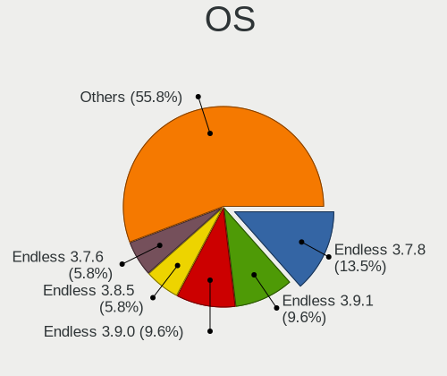

| Name           | Computers | Percent |
|----------------|-----------|---------|
| Endless 3.7.8  | 7         | 13.46%  |
| Endless 3.9.1  | 5         | 9.62%   |
| Endless 3.9.0  | 5         | 9.62%   |
| Endless 3.8.5  | 3         | 5.77%   |
| Endless 3.7.6  | 3         | 5.77%   |
| Endless 3.7.5  | 3         | 5.77%   |
| Endless 3.9.5  | 2         | 3.85%   |
| Endless 3.8.7  | 2         | 3.85%   |
| Endless 3.8.3  | 2         | 3.85%   |
| Endless 3.8.1  | 2         | 3.85%   |
| Endless 3.6.3  | 2         | 3.85%   |
| Endless 3.5.8  | 2         | 3.85%   |
| Endless 4.0.2  | 1         | 1.92%   |
| Endless 4.0.0  | 1         | 1.92%   |
| Endless 3.9.4  | 1         | 1.92%   |
| Endless 3.8.6  | 1         | 1.92%   |
| Endless 3.8.2  | 1         | 1.92%   |
| Endless 3.7.7  | 1         | 1.92%   |
| Endless 3.7.4  | 1         | 1.92%   |
| Endless 3.7.3  | 1         | 1.92%   |
| Endless 3.6.4  | 1         | 1.92%   |
| Endless 3.6.1  | 1         | 1.92%   |
| Endless 3.6.0  | 1         | 1.92%   |
| Endless 3.5.7  | 1         | 1.92%   |
| Endless 3.5.6  | 1         | 1.92%   |
| Endless 3.10.0 | 1         | 1.92%   |

OS Family
---------

OS without a version

| Name    | Computers | Percent |
|---------|-----------|---------|
| Endless | 50        | 100%    |

Kernel
------

Version of the Linux kernel

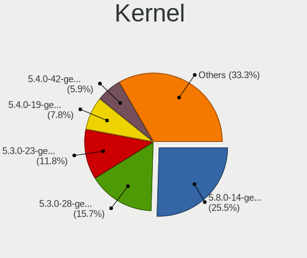

| Version           | Computers | Percent |
|-------------------|-----------|---------|
| 5.8.0-14-generic  | 13        | 25.49%  |
| 5.3.0-28-generic  | 8         | 15.69%  |
| 5.3.0-23-generic  | 6         | 11.76%  |
| 5.4.0-19-generic  | 4         | 7.84%   |
| 5.4.0-42-generic  | 3         | 5.88%   |
| 5.4.0-39-generic  | 3         | 5.88%   |
| 5.0.0-25-generic  | 3         | 5.88%   |
| 4.18.0-15-generic | 3         | 5.88%   |
| 5.3.0-19-generic  | 1         | 1.96%   |
| 5.3.0-12-generic  | 1         | 1.96%   |
| 5.11.0-35-generic | 1         | 1.96%   |
| 5.11.0-12-generic | 1         | 1.96%   |
| 5.10.0-15-generic | 1         | 1.96%   |
| 5.0.0-17-generic  | 1         | 1.96%   |
| 5.0.0-15-generic  | 1         | 1.96%   |
| 4.18.0-12-generic | 1         | 1.96%   |

Kernel Family
-------------

Linux kernel without a distro release

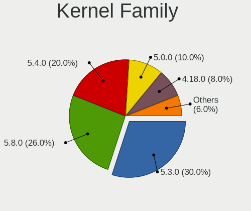

| Version | Computers | Percent |
|---------|-----------|---------|
| 5.3.0   | 15        | 30%     |
| 5.8.0   | 13        | 26%     |
| 5.4.0   | 10        | 20%     |
| 5.0.0   | 5         | 10%     |
| 4.18.0  | 4         | 8%      |
| 5.11.0  | 2         | 4%      |
| 5.10.0  | 1         | 2%      |

Kernel Major Ver.
-----------------

Linux kernel major version

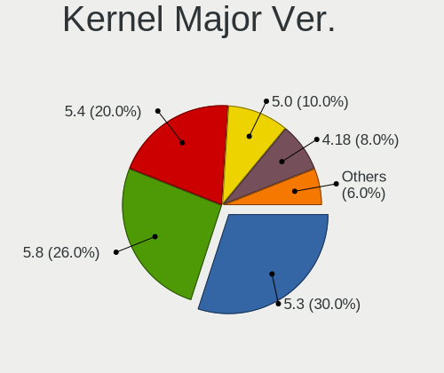

| Version | Computers | Percent |
|---------|-----------|---------|
| 5.3     | 15        | 30%     |
| 5.8     | 13        | 26%     |
| 5.4     | 10        | 20%     |
| 5.0     | 5         | 10%     |
| 4.18    | 4         | 8%      |
| 5.11    | 2         | 4%      |
| 5.10    | 1         | 2%      |

Arch
----

OS architecture (x86_64, i586, etc.)

| Name   | Computers | Percent |
|--------|-----------|---------|
| x86_64 | 50        | 100%    |

DE
--

Desktop Environment

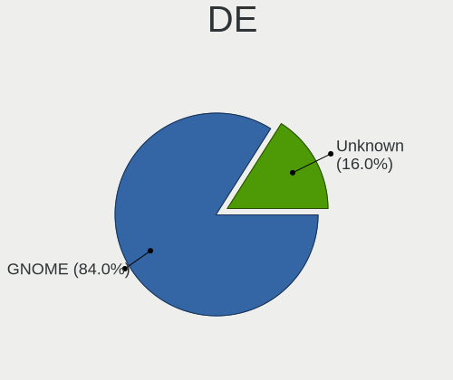

| Name    | Computers | Percent |
|---------|-----------|---------|
| GNOME   | 42        | 84%     |
| Unknown | 8         | 16%     |

Display Server
--------------

X11 or Wayland

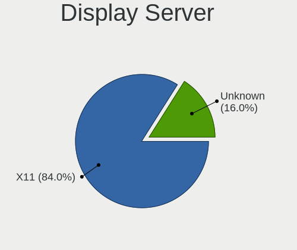

| Name    | Computers | Percent |
|---------|-----------|---------|
| X11     | 42        | 84%     |
| Unknown | 8         | 16%     |

Display Manager
---------------

SDDM, LightDM, etc.

| Name    | Computers | Percent |
|---------|-----------|---------|
| Unknown | 50        | 100%    |

OS Lang
-------

Language

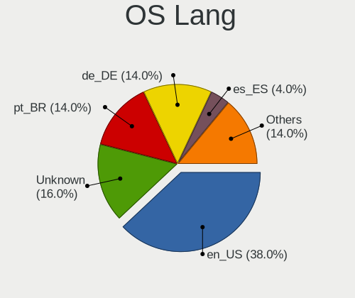

| Lang    | Computers | Percent |
|---------|-----------|---------|
| en_US   | 19        | 38%     |
| Unknown | 8         | 16%     |
| pt_BR   | 7         | 14%     |
| de_DE   | 7         | 14%     |
| es_ES   | 2         | 4%      |
| pt_PT   | 1         | 2%      |
| pl_PL   | 1         | 2%      |
| hu_HU   | 1         | 2%      |
| fr_FR   | 1         | 2%      |
| es_MX   | 1         | 2%      |
| en_GB   | 1         | 2%      |
| cs_CZ   | 1         | 2%      |

Boot Mode
---------

EFI or BIOS

| Mode | Computers | Percent |
|------|-----------|---------|
| BIOS | 45        | 90%     |
| EFI  | 5         | 10%     |

Filesystem
----------

Type of filesystem

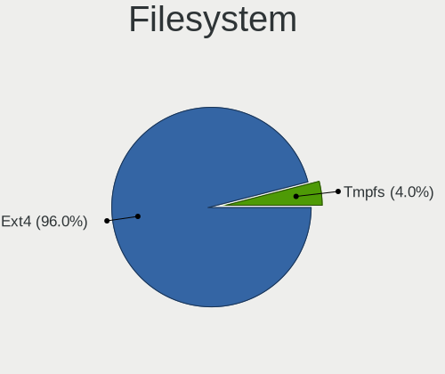

| Type  | Computers | Percent |
|-------|-----------|---------|
| Ext4  | 48        | 96%     |
| Tmpfs | 2         | 4%      |

Part. scheme
------------

Scheme of partitioning

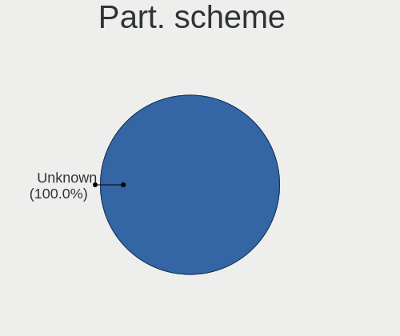

| Type    | Computers | Percent |
|---------|-----------|---------|
| Unknown | 50        | 100%    |

Dual Boot with Linux/BSD
------------------------

Hosting more than one Linux/BSD

| Dual boot | Computers | Percent |
|-----------|-----------|---------|
| No        | 50        | 100%    |

Dual Boot (Win)
---------------

Hosting Linux and Windows

| Dual boot | Computers | Percent |
|-----------|-----------|---------|
| No        | 50        | 100%    |

Board
-----

Vendor
------

Motherboard manufacturer

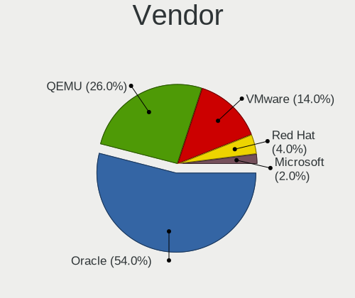

| Name      | Computers | Percent |
|-----------|-----------|---------|
| Oracle    | 27        | 54%     |
| QEMU      | 13        | 26%     |
| VMware    | 7         | 14%     |
| Red Hat   | 2         | 4%      |
| Microsoft | 1         | 2%      |

Model
-----

Motherboard model

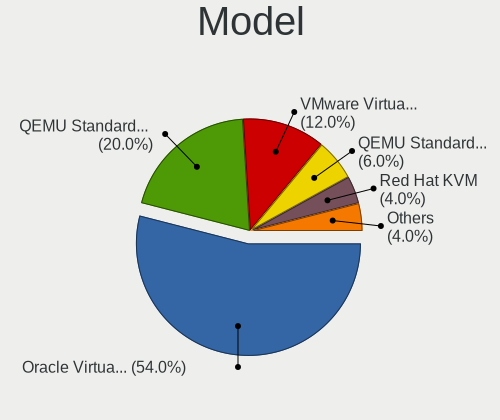

| Name                                   | Computers | Percent |
|----------------------------------------|-----------|---------|
| Oracle VirtualBox                      | 27        | 54%     |
| QEMU Standard PC (Q35 + ICH9, 2009)    | 10        | 20%     |
| VMware Virtual Platform                | 6         | 12%     |
| QEMU Standard PC (i440FX + PIIX, 1996) | 3         | 6%      |
| Red Hat KVM                            | 2         | 4%      |
| VMware VMware7,1                       | 1         | 2%      |
| Microsoft Virtual Machine              | 1         | 2%      |

Model Family
------------

Motherboard model prefix

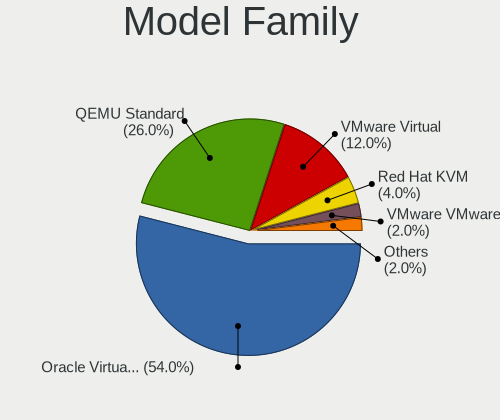

| Name              | Computers | Percent |
|-------------------|-----------|---------|
| Oracle VirtualBox | 27        | 54%     |
| QEMU Standard     | 13        | 26%     |
| VMware Virtual    | 6         | 12%     |
| Red Hat KVM       | 2         | 4%      |
| VMware VMware7    | 1         | 2%      |
| Microsoft Virtual | 1         | 2%      |

MFG Year
--------

Motherboard manufacture year

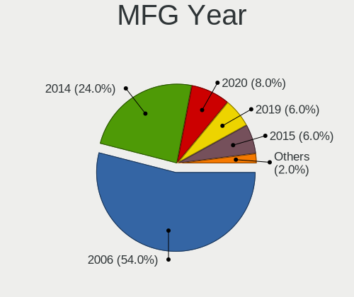

| Year | Computers | Percent |
|------|-----------|---------|
| 2006 | 27        | 54%     |
| 2014 | 12        | 24%     |
| 2020 | 4         | 8%      |
| 2019 | 3         | 6%      |
| 2015 | 3         | 6%      |
| 2013 | 1         | 2%      |

Form Factor
-----------

Physical design of the computer

| Name            | Computers | Percent |
|-----------------|-----------|---------|
| Virtual machine | 50        | 100%    |

Secure Boot
-----------

Enabled or disabled

| State    | Computers | Percent |
|----------|-----------|---------|
| Disabled | 50        | 100%    |

Coreboot
--------

Have coreboot on board

| Used | Computers | Percent |
|------|-----------|---------|
| No   | 50        | 100%    |

RAM Size
--------

Total RAM memory

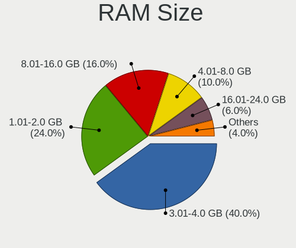

| Size in GB | Computers | Percent |
|------------|-----------|---------|
| 3.01-4.0   | 20        | 40%     |
| 1.01-2.0   | 12        | 24%     |
| 8.01-16.0  | 8         | 16%     |
| 4.01-8.0   | 5         | 10%     |
| 16.01-24.0 | 3         | 6%      |
| 24.01-32.0 | 1         | 2%      |
| 0.51-1.0   | 1         | 2%      |

RAM Used
--------

Used RAM memory

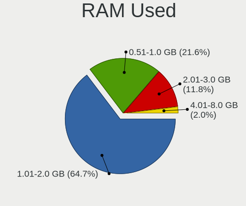

| Used GB  | Computers | Percent |
|----------|-----------|---------|
| 1.01-2.0 | 33        | 64.71%  |
| 0.51-1.0 | 11        | 21.57%  |
| 2.01-3.0 | 6         | 11.76%  |
| 4.01-8.0 | 1         | 1.96%   |

Total Drives
------------

Number of drives on board

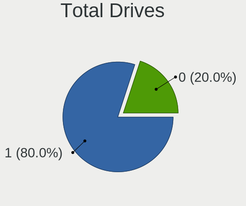

| Drives | Computers | Percent |
|--------|-----------|---------|
| 1      | 40        | 80%     |
| 0      | 10        | 20%     |

Has CD-ROM
----------

Has CD-ROM on board

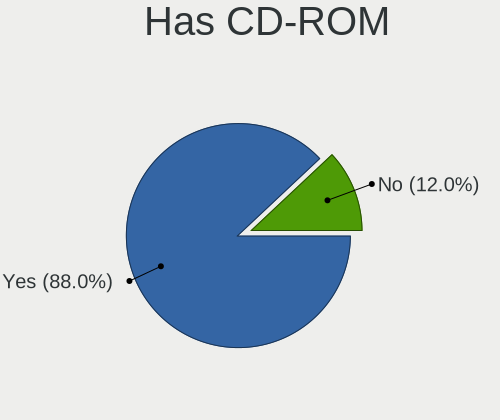

| Presented | Computers | Percent |
|-----------|-----------|---------|
| Yes       | 44        | 88%     |
| No        | 6         | 12%     |

Has Ethernet
------------

Has Ethernet on board

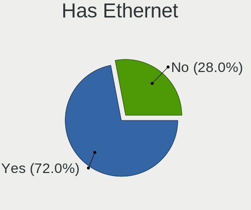

| Presented | Computers | Percent |
|-----------|-----------|---------|
| Yes       | 36        | 72%     |
| No        | 14        | 28%     |

Has WiFi
--------

Has WiFi module

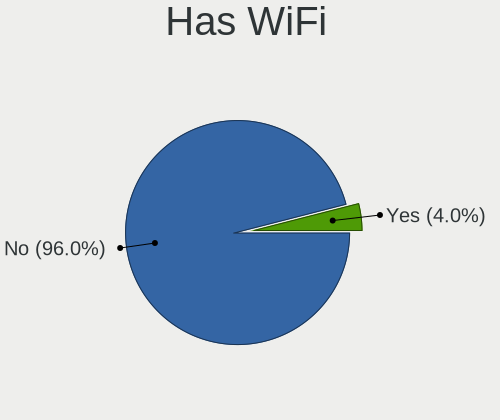

| Presented | Computers | Percent |
|-----------|-----------|---------|
| No        | 48        | 96%     |
| Yes       | 2         | 4%      |

Has Bluetooth
-------------

Has Bluetooth module

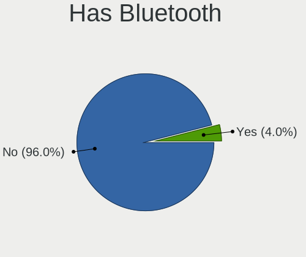

| Presented | Computers | Percent |
|-----------|-----------|---------|
| No        | 48        | 96%     |
| Yes       | 2         | 4%      |

Location
--------

Country
-------

Geographic location (country)

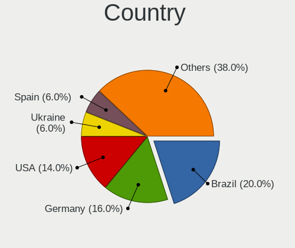

| Country      | Computers | Percent |
|--------------|-----------|---------|
| Brazil       | 10        | 20%     |
| Germany      | 8         | 16%     |
| USA          | 7         | 14%     |
| Ukraine      | 3         | 6%      |
| Spain        | 3         | 6%      |
| UK           | 2         | 4%      |
| Netherlands  | 2         | 4%      |
| France       | 2         | 4%      |
| Czechia      | 2         | 4%      |
| Turkey       | 1         | 2%      |
| South Africa | 1         | 2%      |
| Serbia       | 1         | 2%      |
| Russia       | 1         | 2%      |
| Poland       | 1         | 2%      |
| Mexico       | 1         | 2%      |
| Mauritius    | 1         | 2%      |
| Hungary      | 1         | 2%      |
| Colombia     | 1         | 2%      |
| Canada       | 1         | 2%      |
| Bulgaria     | 1         | 2%      |

City
----

Geographic location (city)

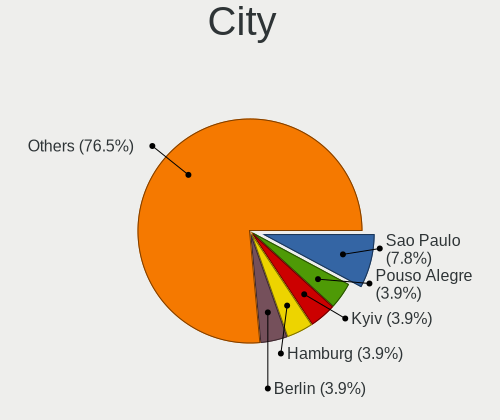

| City                  | Computers | Percent |
|-----------------------|-----------|---------|
| Sao Paulo             | 4         | 7.84%   |
| Pouso Alegre          | 2         | 3.92%   |
| Kyiv                  | 2         | 3.92%   |
| Hamburg               | 2         | 3.92%   |
| Berlin                | 2         | 3.92%   |
| Waipahu               | 1         | 1.96%   |
| Voorhout              | 1         | 1.96%   |
| Toronto               | 1         | 1.96%   |
| Sheffield             | 1         | 1.96%   |
| San Jose              | 1         | 1.96%   |
| San Antonio           | 1         | 1.96%   |
| Pleven                | 1         | 1.96%   |
| Pietermaritzburg      | 1         | 1.96%   |
| Parthenstein          | 1         | 1.96%   |
| Paris                 | 1         | 1.96%   |
| Ourense               | 1         | 1.96%   |
| Osasco                | 1         | 1.96%   |
| Oak Harbor            | 1         | 1.96%   |
| Nova Veneza           | 1         | 1.96%   |
| Moscow                | 1         | 1.96%   |
| Moraleja              | 1         | 1.96%   |
| Montmorency           | 1         | 1.96%   |
| Milovice              | 1         | 1.96%   |
| Mansfield             | 1         | 1.96%   |
| Madrid                | 1         | 1.96%   |
| Londonderry           | 1         | 1.96%   |
| Kaiserslautern        | 1         | 1.96%   |
| Istanbul              | 1         | 1.96%   |
| Hrobcice              | 1         | 1.96%   |
| Hoogezand             | 1         | 1.96%   |
| Guadalajara           | 1         | 1.96%   |
| Grimsby               | 1         | 1.96%   |
| Gdansk                | 1         | 1.96%   |
| Fresno                | 1         | 1.96%   |
| Frankfurt am Main     | 1         | 1.96%   |
| Franca                | 1         | 1.96%   |
| Elgin                 | 1         | 1.96%   |
| Eger                  | 1         | 1.96%   |
| Drohobych             | 1         | 1.96%   |
| Criciúma           | 1         | 1.96%   |
| Bogotá             | 1         | 1.96%   |
| Belgrade              | 1         | 1.96%   |
| Beau Bassin-Rose Hill | 1         | 1.96%   |
| Bad Duerkheim         | 1         | 1.96%   |

Drives
------

Drive Vendor
------------

Hard drive vendors

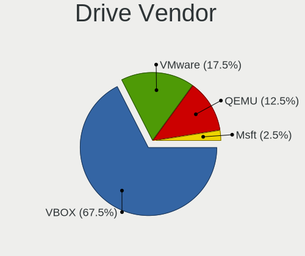

| Vendor | Computers | Drives | Percent |
|--------|-----------|--------|---------|
| VBOX   | 27        | 29     | 67.5%   |
| VMware | 7         | 8      | 17.5%   |
| QEMU   | 5         | 5      | 12.5%   |
| Msft   | 1         | 1      | 2.5%    |

Drive Model
-----------

Hard drive models

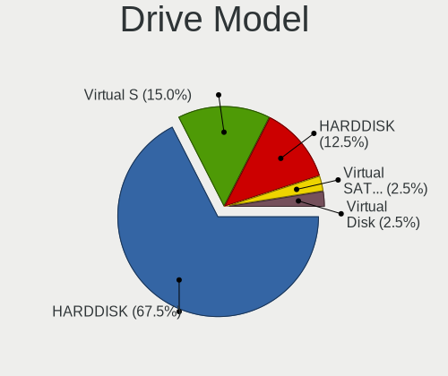

| Model                          | Computers | Percent |
|--------------------------------|-----------|---------|
| VBOX HARDDISK                  | 27        | 67.5%   |
| VMware Virtual S               | 6         | 15%     |
| QEMU HARDDISK                  | 5         | 12.5%   |
| VMware Virtual SATA Hard Drive | 1         | 2.5%    |
| Msft Virtual Disk              | 1         | 2.5%    |

HDD Vendor
----------

Hard disk drive vendors

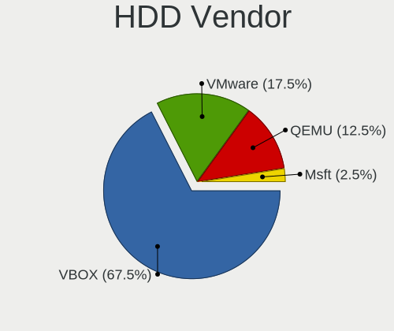

| Vendor | Computers | Drives | Percent |
|--------|-----------|--------|---------|
| VBOX   | 27        | 29     | 67.5%   |
| VMware | 7         | 8      | 17.5%   |
| QEMU   | 5         | 5      | 12.5%   |
| Msft   | 1         | 1      | 2.5%    |

SSD Vendor
----------

Solid state drive vendors

Zero info for selected period =(

Drive Kind
----------

HDD or SSD

| Kind | Computers | Drives | Percent |
|------|-----------|--------|---------|
| HDD  | 40        | 43     | 100%    |

Drive Connector
---------------

SATA, SAS, NVMe, etc.

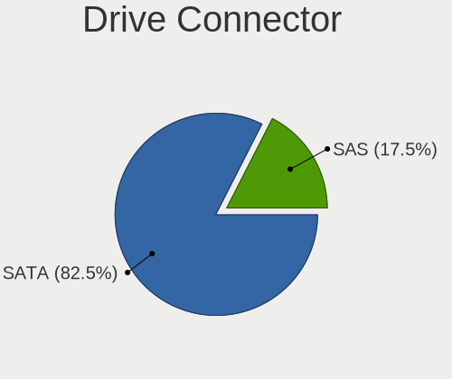

| Type | Computers | Drives | Percent |
|------|-----------|--------|---------|
| SATA | 33        | 36     | 82.5%   |
| SAS  | 7         | 7      | 17.5%   |

Drive Size
----------

Size of hard drive

| Size in TB | Computers | Drives | Percent |
|------------|-----------|--------|---------|
| 0.01-0.5   | 40        | 43     | 100%    |

Space Total
-----------

Amount of disk space available on the file system

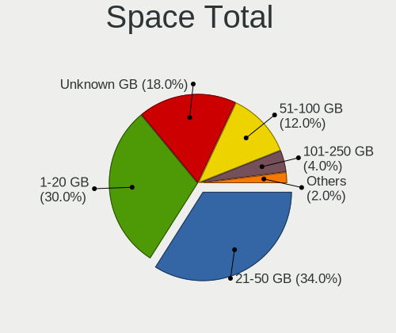

| Size in GB | Computers | Percent |
|------------|-----------|---------|
| 21-50      | 17        | 34%     |
| 1-20       | 15        | 30%     |
| Unknown    | 9         | 18%     |
| 51-100     | 6         | 12%     |
| 101-250    | 2         | 4%      |
| 1001-2000  | 1         | 2%      |

Space Used
----------

Amount of used disk space

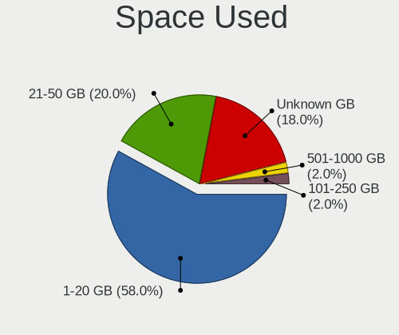

| Used GB  | Computers | Percent |
|----------|-----------|---------|
| 1-20     | 29        | 58%     |
| 21-50    | 10        | 20%     |
| Unknown  | 9         | 18%     |
| 101-250  | 1         | 2%      |
| 501-1000 | 1         | 2%      |

Malfunc. Drives
---------------

Drive models with a malfunction

Zero info for selected period =(

Malfunc. Drive Vendor
---------------------

Vendors of faulty drives

Zero info for selected period =(

Malfunc. HDD Vendor
-------------------

Vendors of faulty HDD drives

Zero info for selected period =(

Malfunc. Drive Kind
-------------------

Kinds of faulty drives

Zero info for selected period =(

Failed Drives
-------------

Failed drive models

Zero info for selected period =(

Failed Drive Vendor
-------------------

Failed drive vendors

Zero info for selected period =(

Drive Status
------------

Number of failed and malfunc. drives

| Status   | Computers | Drives | Percent |
|----------|-----------|--------|---------|
| Detected | 40        | 43     | 100%    |

Storage controller
------------------

Storage Vendor
--------------

Storage controller vendors

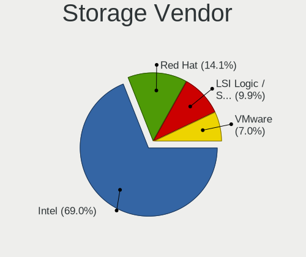

| Vendor                    | Computers | Percent |
|---------------------------|-----------|---------|
| Intel                     | 49        | 69.01%  |
| Red Hat                   | 10        | 14.08%  |
| LSI Logic / Symbios Logic | 7         | 9.86%   |
| VMware                    | 5         | 7.04%   |

Storage Model
-------------

Storage controller models

| Model                                                                 | Computers | Percent |
|-----------------------------------------------------------------------|-----------|---------|
| Intel 82371AB/EB/MB PIIX4 IDE                                         | 27        | 31.03%  |
| Intel 82801HM/HEM (ICH8M/ICH8M-E) SATA Controller [AHCI mode]         | 22        | 25.29%  |
| Intel 82801IR/IO/IH (ICH9R/DO/DH) 6 port SATA Controller [AHCI mode]  | 12        | 13.79%  |
| Red Hat Virtio block device                                           | 9         | 10.34%  |
| LSI Logic / Symbios Logic 53c1030 PCI-X Fusion-MPT Dual Ultra320 SCSI | 7         | 8.05%   |
| VMware SATA AHCI controller                                           | 5         | 5.75%   |
| Intel 82371SB PIIX3 IDE [Natoma/Triton II]                            | 4         | 4.6%    |
| Red Hat Virtio SCSI                                                   | 1         | 1.15%   |

Storage Kind
------------

Kind of storage controller (IDE, SATA, NVMe, SAS, ...)

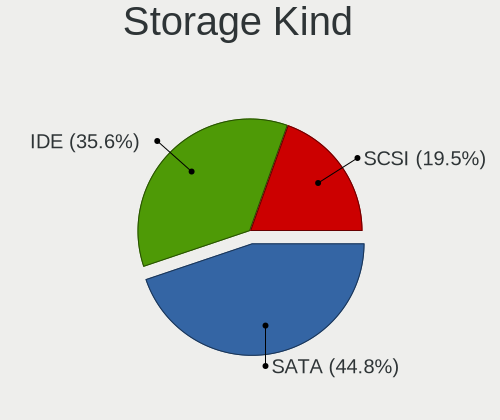

| Kind | Computers | Percent |
|------|-----------|---------|
| SATA | 39        | 44.83%  |
| IDE  | 31        | 35.63%  |
| SCSI | 17        | 19.54%  |

Processor
---------

CPU Vendor
----------

Processor vendors

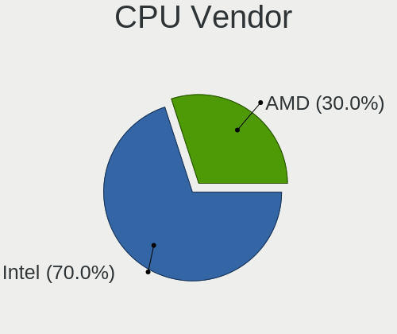

| Vendor | Computers | Percent |
|--------|-----------|---------|
| Intel  | 35        | 70%     |
| AMD    | 15        | 30%     |

CPU Model
---------

Processor models

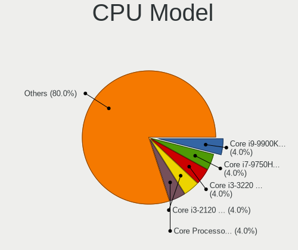

| Model                                           | Computers | Percent |
|-------------------------------------------------|-----------|---------|
| Intel Core Processor (Haswell, no TSX, IBRS)    | 2         | 4%      |
| Intel Core i9-9900K CPU @ 3.60GHz               | 2         | 4%      |
| Intel Core i7-9750H CPU @ 2.60GHz               | 2         | 4%      |
| Intel Core i3-3220 CPU @ 3.30GHz                | 2         | 4%      |
| Intel Core i3-2120 CPU @ 3.30GHz                | 2         | 4%      |
| AMD EPYC Processor (with IBPB)                  | 2         | 4%      |
| Intel Xeon E312xx (Sandy Bridge, IBRS update)   | 1         | 2%      |
| Intel Xeon CPU X5650 @ 2.67GHz                  | 1         | 2%      |
| Intel Genuine CPU @ 2.20GHz                     | 1         | 2%      |
| Intel Core i7-8700 CPU @ 3.20GHz                | 1         | 2%      |
| Intel Core i7-8650U CPU @ 1.90GHz               | 1         | 2%      |
| Intel Core i7-8550U CPU @ 1.80GHz               | 1         | 2%      |
| Intel Core i7-7700HQ CPU @ 2.80GHz              | 1         | 2%      |
| Intel Core i7-6700HQ CPU @ 2.60GHz              | 1         | 2%      |
| Intel Core i7-5930K CPU @ 3.50GHz               | 1         | 2%      |
| Intel Core i7-4790K CPU @ 4.00GHz               | 1         | 2%      |
| Intel Core i7-4710HQ CPU @ 2.50GHz              | 1         | 2%      |
| Intel Core i7-3840QM CPU @ 2.80GHz              | 1         | 2%      |
| Intel Core i7-3770 CPU @ 3.40GHz                | 1         | 2%      |
| Intel Core i7-3630QM CPU @ 2.40GHz              | 1         | 2%      |
| Intel Core i7-3517U CPU @ 1.90GHz               | 1         | 2%      |
| Intel Core i7-2620M CPU @ 2.70GHz               | 1         | 2%      |
| Intel Core i7 CPU 920 @ 2.67GHz                 | 1         | 2%      |
| Intel Core i5-9400T CPU @ 1.80GHz               | 1         | 2%      |
| Intel Core i5-8400 CPU @ 2.80GHz                | 1         | 2%      |
| Intel Core i5-8300H CPU @ 2.30GHz               | 1         | 2%      |
| Intel Core i5-4570S CPU @ 2.90GHz               | 1         | 2%      |
| Intel Core i5-4460 CPU @ 3.20GHz                | 1         | 2%      |
| Intel Core i5-2500 CPU @ 3.30GHz                | 1         | 2%      |
| Intel Core i5 CPU 660 @ 3.33GHz                 | 1         | 2%      |
| Intel Core 2 Quad CPU Q9500 @ 2.83GHz           | 1         | 2%      |
| AMD Ryzen Threadripper 1900X 8-Core Processor   | 1         | 2%      |
| AMD Ryzen 9 3900X 12-Core Processor             | 1         | 2%      |
| AMD Ryzen 7 3700X 8-Core Processor              | 1         | 2%      |
| AMD Ryzen 7 2700X Eight-Core Processor          | 1         | 2%      |
| AMD Phenom II X6 1090T Processor                | 1         | 2%      |
| AMD Phenom II X4 965 Processor                  | 1         | 2%      |
| AMD Phenom 8450 Triple-Core Processor           | 1         | 2%      |
| AMD FX-6300 Six-Core Processor                  | 1         | 2%      |
| AMD Common KVM processor                        | 1         | 2%      |
| AMD Athlon II X4 645 Processor                  | 1         | 2%      |
| AMD Athlon II X3 440 Processor                  | 1         | 2%      |
| AMD A10-7860K Radeon R7, 12 Compute Cores 4C+8G | 1         | 2%      |
| AMD A10-6700 APU with Radeon HD Graphics        | 1         | 2%      |

CPU Model Family
----------------

Processor model prefix

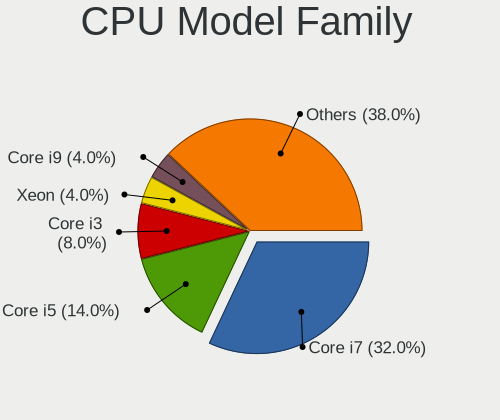

| Model                  | Computers | Percent |
|------------------------|-----------|---------|
| Intel Core i7          | 16        | 32%     |
| Intel Core i5          | 7         | 14%     |
| Intel Core i3          | 4         | 8%      |
| Intel Xeon             | 2         | 4%      |
| Intel Core i9          | 2         | 4%      |
| Intel Core             | 2         | 4%      |
| AMD Ryzen 7            | 2         | 4%      |
| AMD EPYC               | 2         | 4%      |
| AMD A10                | 2         | 4%      |
| Other                  | 1         | 2%      |
| Intel Genuine          | 1         | 2%      |
| Intel Core 2 Quad      | 1         | 2%      |
| AMD Ryzen Threadripper | 1         | 2%      |
| AMD Ryzen 9            | 1         | 2%      |
| AMD Phenom II X6       | 1         | 2%      |
| AMD Phenom II X4       | 1         | 2%      |
| AMD Phenom             | 1         | 2%      |
| AMD FX                 | 1         | 2%      |
| AMD Athlon II X4       | 1         | 2%      |
| AMD Athlon II X3       | 1         | 2%      |

CPU Cores
---------

Number of processor cores

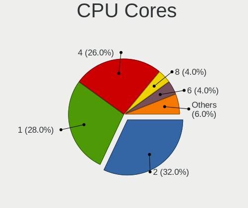

| Number | Computers | Percent |
|--------|-----------|---------|
| 2      | 16        | 32%     |
| 1      | 14        | 28%     |
| 4      | 13        | 26%     |
| 8      | 2         | 4%      |
| 6      | 2         | 4%      |
| 16     | 1         | 2%      |
| 7      | 1         | 2%      |
| 3      | 1         | 2%      |

CPU Sockets
-----------

Number of sockets

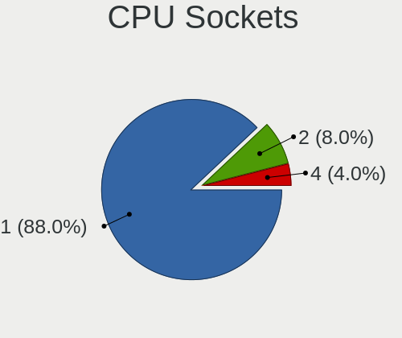

| Number | Computers | Percent |
|--------|-----------|---------|
| 1      | 44        | 88%     |
| 2      | 4         | 8%      |
| 4      | 2         | 4%      |

CPU Threads
-----------

Threads per core (Hyper-Threading)

| Number | Computers | Percent |
|--------|-----------|---------|
| 1      | 43        | 86%     |
| 2      | 7         | 14%     |

CPU Op-Modes
------------

CPU Operation Modes (32-bit, 64-bit)

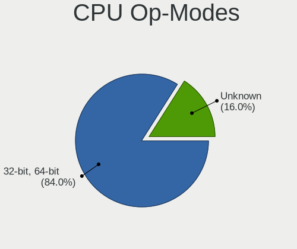

| Op mode        | Computers | Percent |
|----------------|-----------|---------|
| 32-bit, 64-bit | 42        | 84%     |
| Unknown        | 8         | 16%     |

CPU Microcode
-------------

Microcode number

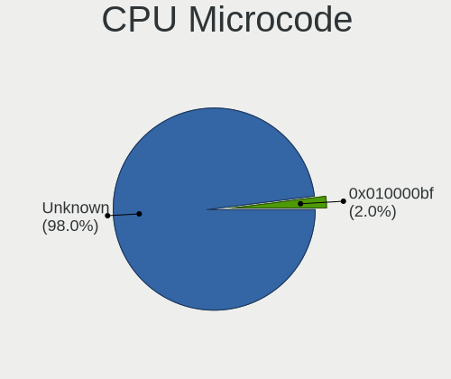

| Number     | Computers | Percent |
|------------|-----------|---------|
| Unknown    | 49        | 98%     |
| 0x010000bf | 1         | 2%      |

CPU Microarch
-------------

Microarchitecture

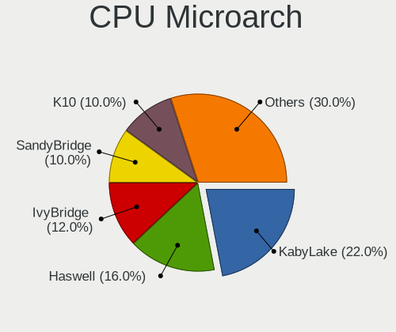

| Name        | Computers | Percent |
|-------------|-----------|---------|
| KabyLake    | 11        | 22%     |
| Haswell     | 8         | 16%     |
| IvyBridge   | 6         | 12%     |
| SandyBridge | 5         | 10%     |
| K10         | 5         | 10%     |
| Zen         | 3         | 6%      |
| Zen 2       | 2         | 4%      |
| Westmere    | 2         | 4%      |
| Piledriver  | 2         | 4%      |
| Zen+        | 1         | 2%      |
| Steamroller | 1         | 2%      |
| Skylake     | 1         | 2%      |
| Penryn      | 1         | 2%      |
| Nehalem     | 1         | 2%      |
| K8 Hammer   | 1         | 2%      |

Graphics
--------

GPU Vendor
----------

Vendors of graphics cards

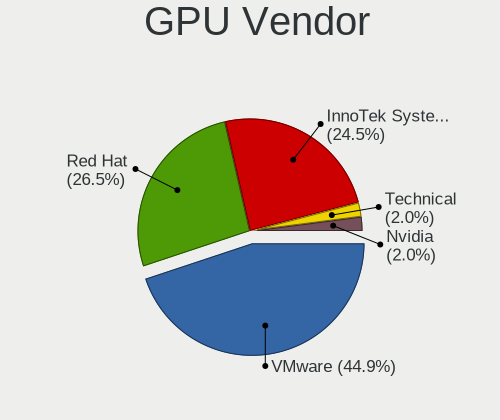

| Vendor                 | Computers | Percent |
|------------------------|-----------|---------|
| VMware                 | 22        | 44.9%   |
| Red Hat                | 13        | 26.53%  |
| InnoTek Systemberatung | 12        | 24.49%  |
| Technical              | 1         | 2.04%   |
| Nvidia                 | 1         | 2.04%   |

GPU Model
---------

Graphics card models

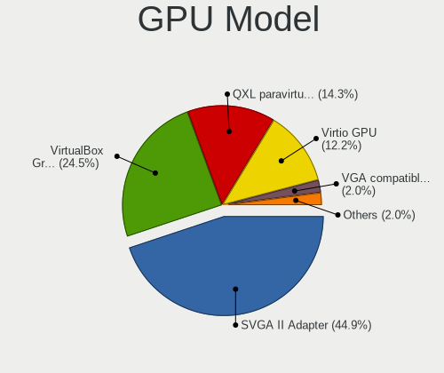

| Model                                              | Computers | Percent |
|----------------------------------------------------|-----------|---------|
| VMware SVGA II Adapter                             | 22        | 44.9%   |
| InnoTek Systemberatung VirtualBox Graphics Adapter | 12        | 24.49%  |
| Red Hat QXL paravirtual graphic card               | 7         | 14.29%  |
| Red Hat Virtio GPU                                 | 6         | 12.24%  |
| Technical VGA compatible controller                | 1         | 2.04%   |
| Nvidia GK104 [GeForce GTX 770]                     | 1         | 2.04%   |

GPU Combo
---------

Combinations of graphics cards

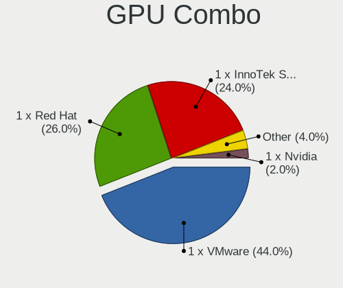

| Name                       | Computers | Percent |
|----------------------------|-----------|---------|
| 1 x VMware                 | 22        | 44%     |
| 1 x Red Hat                | 13        | 26%     |
| 1 x InnoTek Systemberatung | 12        | 24%     |
| Other                      | 2         | 4%      |
| 1 x Nvidia                 | 1         | 2%      |

GPU Driver
----------

Free vs proprietary

| Driver  | Computers | Percent |
|---------|-----------|---------|
| Unknown | 49        | 98%     |
| Free    | 1         | 2%      |

GPU Memory
----------

Total video memory

| Size in GB | Computers | Percent |
|------------|-----------|---------|
| Unknown    | 49        | 98%     |
| 3.01-4.0   | 1         | 2%      |

Monitor
-------

Monitor Vendor
--------------

Monitor vendors

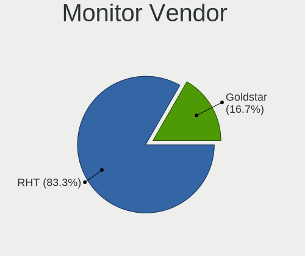

| Vendor   | Computers | Percent |
|----------|-----------|---------|
| RHT      | 5         | 83.33%  |
| Goldstar | 1         | 16.67%  |

Monitor Model
-------------

Monitor models

| Model                                                  | Computers | Percent |
|--------------------------------------------------------|-----------|---------|
| RHT QEMU Monitor RHT1234 2048x1152 260x190mm 12.7-inch | 5         | 83.33%  |
| Goldstar E2260 GSM57E1 1920x1080 477x268mm 21.5-inch   | 1         | 16.67%  |

Monitor Resolution
------------------

Monitor screen resolution

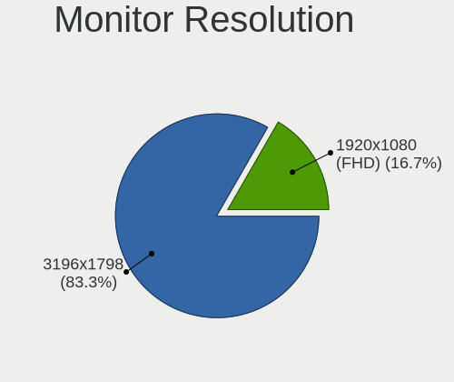

| Resolution      | Computers | Percent |
|-----------------|-----------|---------|
| 3196x1798       | 5         | 83.33%  |
| 1920x1080 (FHD) | 1         | 16.67%  |

Monitor Diagonal
----------------

Diagonal size in inches

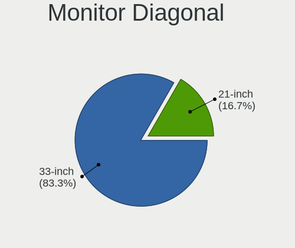

| Inches | Computers | Percent |
|--------|-----------|---------|
| 33     | 5         | 83.33%  |
| 21     | 1         | 16.67%  |

Monitor Width
-------------

Physical width

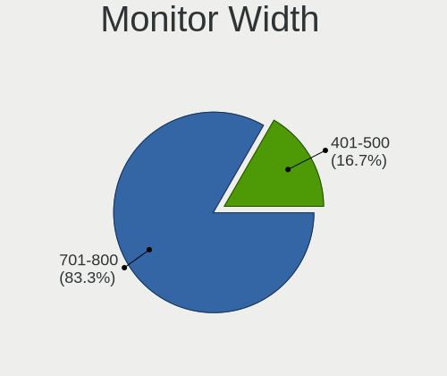

| Width in mm | Computers | Percent |
|-------------|-----------|---------|
| 701-800     | 5         | 83.33%  |
| 401-500     | 1         | 16.67%  |

Aspect Ratio
------------

Proportional relationship between the width and the height

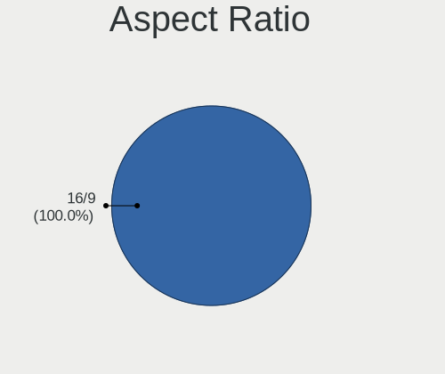

| Ratio | Computers | Percent |
|-------|-----------|---------|
| 16/9  | 6         | 100%    |

Monitor Area
------------

Area in inch²

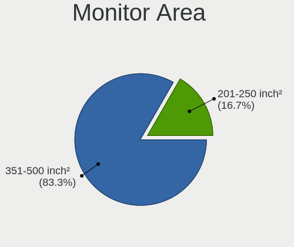

| Area in inch² | Computers | Percent |
|----------------|-----------|---------|
| 351-500        | 5         | 83.33%  |
| 201-250        | 1         | 16.67%  |

Pixel Density
-------------

Pixels per inch

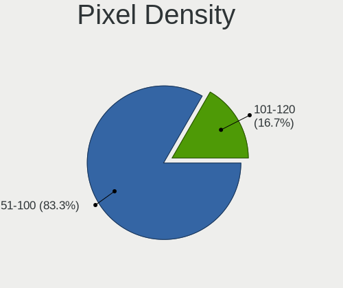

| Density | Computers | Percent |
|---------|-----------|---------|
| 51-100  | 5         | 83.33%  |
| 101-120 | 1         | 16.67%  |

Multiple Monitors
-----------------

Total monitors connected

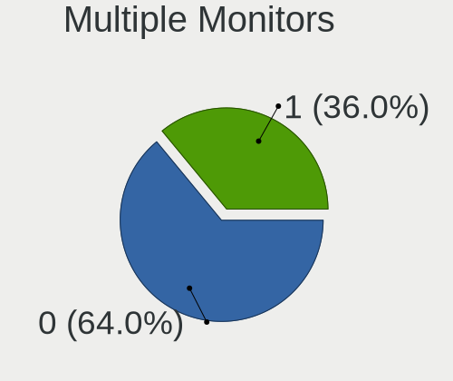

| Total | Computers | Percent |
|-------|-----------|---------|
| 0     | 32        | 64%     |
| 1     | 18        | 36%     |

Network
-------

Net Controller Vendor
---------------------

Controller vendors

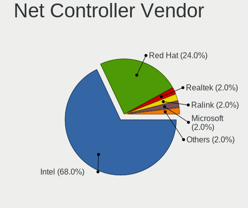

| Vendor                | Computers | Percent |
|-----------------------|-----------|---------|
| Intel                 | 34        | 68%     |
| Red Hat               | 12        | 24%     |
| Realtek Semiconductor | 1         | 2%      |
| Ralink Technology     | 1         | 2%      |
| Microsoft             | 1         | 2%      |
| AMD                   | 1         | 2%      |

Net Controller Model
--------------------

Controller models

| Model                                                 | Computers | Percent |
|-------------------------------------------------------|-----------|---------|
| Intel 82540EM Gigabit Ethernet Controller             | 28        | 56%     |
| Red Hat Virtio network device                         | 12        | 24%     |
| Intel 82545EM Gigabit Ethernet Controller (Copper)    | 6         | 12%     |
| Realtek RTL-8100/8101L/8139 PCI Fast Ethernet Adapter | 1         | 2%      |
| Ralink RT5370 Wireless Adapter                        | 1         | 2%      |
| Microsoft Xbox 360 Wireless Adapter                   | 1         | 2%      |
| AMD 79c970 [PCnet32 LANCE]                            | 1         | 2%      |

Wireless Vendor
---------------

Wireless vendors

| Vendor            | Computers | Percent |
|-------------------|-----------|---------|
| Ralink Technology | 1         | 50%     |
| Microsoft         | 1         | 50%     |

Wireless Model
--------------

Wireless models

| Model                               | Computers | Percent |
|-------------------------------------|-----------|---------|
| Ralink RT5370 Wireless Adapter      | 1         | 50%     |
| Microsoft Xbox 360 Wireless Adapter | 1         | 50%     |

Ethernet Vendor
---------------

Ethernet vendors

| Vendor                | Computers | Percent |
|-----------------------|-----------|---------|
| Intel                 | 34        | 94.44%  |
| Realtek Semiconductor | 1         | 2.78%   |
| AMD                   | 1         | 2.78%   |

Ethernet Model
--------------

Ethernet models

| Model                                                 | Computers | Percent |
|-------------------------------------------------------|-----------|---------|
| Intel 82540EM Gigabit Ethernet Controller             | 28        | 77.78%  |
| Intel 82545EM Gigabit Ethernet Controller (Copper)    | 6         | 16.67%  |
| Realtek RTL-8100/8101L/8139 PCI Fast Ethernet Adapter | 1         | 2.78%   |
| AMD 79c970 [PCnet32 LANCE]                            | 1         | 2.78%   |

Net Controller Kind
-------------------

Ethernet, WiFi or modem

| Kind     | Computers | Percent |
|----------|-----------|---------|
| Ethernet | 36        | 72%     |
| Unknown  | 12        | 24%     |
| WiFi     | 2         | 4%      |

Used Controller
---------------

Currently used network controller

| Kind     | Computers | Percent |
|----------|-----------|---------|
| Ethernet | 36        | 97.3%   |
| WiFi     | 1         | 2.7%    |

NICs
----

Total network controllers on board

| Total | Computers | Percent |
|-------|-----------|---------|
| 1     | 35        | 70%     |
| 0     | 14        | 28%     |
| 2     | 1         | 2%      |

IPv6
----

IPv6 vs IPv4

| Used | Computers | Percent |
|------|-----------|---------|
| No   | 50        | 100%    |

Bluetooth
---------

Bluetooth Vendor
----------------

Controller vendors

| Vendor                  | Computers | Percent |
|-------------------------|-----------|---------|
| VMware                  | 1         | 50%     |
| Cambridge Silicon Radio | 1         | 50%     |

Bluetooth Model
---------------

Controller models

| Model                                               | Computers | Percent |
|-----------------------------------------------------|-----------|---------|
| VMware Virtual Bluetooth Adapter                    | 1         | 50%     |
| Cambridge Silicon Radio Bluetooth Dongle (HCI mode) | 1         | 50%     |

Sound
-----

Sound Vendor
------------

Sound card vendors

| Vendor  | Computers | Percent |
|---------|-----------|---------|
| Intel   | 40        | 85.11%  |
| Ensoniq | 6         | 12.77%  |
| Nvidia  | 1         | 2.13%   |

Sound Model
-----------

Sound card models

| Model                                                                      | Computers | Percent |
|----------------------------------------------------------------------------|-----------|---------|
| Intel 82801AA AC'97 Audio Controller                                       | 21        | 44.68%  |
| Intel 82801I (ICH9 Family) HD Audio Controller                             | 10        | 21.28%  |
| Intel 82801FB/FBM/FR/FW/FRW (ICH6 Family) High Definition Audio Controller | 8         | 17.02%  |
| Ensoniq ES1371/ES1373 / Creative Labs CT2518                               | 6         | 12.77%  |
| Nvidia GK104 HDMI Audio Controller                                         | 1         | 2.13%   |
| Intel C610/X99 series chipset HD Audio Controller                          | 1         | 2.13%   |

Memory
------

Memory Vendor
-------------

Memory module vendors

Zero info for selected period =(

Memory Model
------------

Memory module models

Zero info for selected period =(

Memory Kind
-----------

Memory module kinds

Zero info for selected period =(

Memory Form Factor
------------------

Physical design of the memory module

Zero info for selected period =(

Memory Size
-----------

Memory module size

Zero info for selected period =(

Memory Speed
------------

Memory module speed

Zero info for selected period =(

Printers & scanners
-------------------

Printer Vendor
--------------

Printer device vendors

| Vendor | Computers | Percent |
|--------|-----------|---------|
| Canon  | 1         | 100%    |

Printer Model
-------------

Printer device models

| Model                     | Computers | Percent |
|---------------------------|-----------|---------|
| Canon PIXMA MG3100 Series | 1         | 100%    |

Scanner Vendor
--------------

Scanner device vendors

Zero info for selected period =(

Scanner Model
-------------

Scanner device models

Zero info for selected period =(

Camera
------

Camera Vendor
-------------

Camera device vendors

| Vendor   | Computers | Percent |
|----------|-----------|---------|
| Logitech | 1         | 100%    |

Camera Model
------------

Camera device models

| Model                   | Computers | Percent |
|-------------------------|-----------|---------|
| Logitech B525 HD Webcam | 1         | 100%    |

Security
--------

Fingerprint Vendor
------------------

Fingerprint sensor vendors

Zero info for selected period =(

Fingerprint Model
-----------------

Fingerprint sensor models

Zero info for selected period =(

Chipcard Vendor
---------------

Chipcard module vendors

| Vendor                | Computers | Percent |
|-----------------------|-----------|---------|
| Gemalto (was Gemplus) | 7         | 87.5%   |
| Alcor Micro           | 1         | 12.5%   |

Chipcard Model
--------------

Chipcard module models

| Model                               | Computers | Percent |
|-------------------------------------|-----------|---------|
| Gemalto (was Gemplus) GemPC433-Swap | 7         | 87.5%   |
| Alcor Micro AU9540 Smartcard Reader | 1         | 12.5%   |

Unsupported
-----------

Unsupported Devices
-------------------

Total unsupported devices on board

| Total | Computers | Percent |
|-------|-----------|---------|
| 0     | 41        | 82%     |
| 1     | 9         | 18%     |

Unsupported Device Types
------------------------

Types of unsupported devices

| Type          | Computers | Percent |
|---------------|-----------|---------|
| Chipcard      | 8         | 88.89%  |
| Graphics card | 1         | 11.11%  |

