Fedora - Tested Virtual Hardware & Statistics
---------------------------------------------

A project to collect tested virtual hardware configurations for Fedora.

Anyone can contribute to this report by the [hw-probe](https://github.com/linuxhw/hw-probe) tool:

    sudo -E hw-probe -all -upload

Please contribute! Especially if your hardware is rare.

Contents
--------

* [ Test Cases ](#test-cases)

* [ System ](#system)
  - [ OS                       ](#os)
  - [ OS Family                ](#os-family)
  - [ Kernel                   ](#kernel)
  - [ Kernel Family            ](#kernel-family)
  - [ Kernel Major Ver.        ](#kernel-major-ver)
  - [ Arch                     ](#arch)
  - [ DE                       ](#de)
  - [ Display Server           ](#display-server)
  - [ Display Manager          ](#display-manager)
  - [ OS Lang                  ](#os-lang)
  - [ Boot Mode                ](#boot-mode)
  - [ Filesystem               ](#filesystem)
  - [ Part. scheme             ](#part-scheme)
  - [ Dual Boot with Linux/BSD ](#dual-boot-with-linuxbsd)
  - [ Dual Boot (Win)          ](#dual-boot-win)

* [ Board ](#board)
  - [ Vendor                   ](#vendor)
  - [ Model                    ](#model)
  - [ Model Family             ](#model-family)
  - [ MFG Year                 ](#mfg-year)
  - [ Form Factor              ](#form-factor)
  - [ Secure Boot              ](#secure-boot)
  - [ Coreboot                 ](#coreboot)
  - [ RAM Size                 ](#ram-size)
  - [ RAM Used                 ](#ram-used)
  - [ Total Drives             ](#total-drives)
  - [ Has CD-ROM               ](#has-cd-rom)
  - [ Has Ethernet             ](#has-ethernet)
  - [ Has WiFi                 ](#has-wifi)
  - [ Has Bluetooth            ](#has-bluetooth)

* [ Location ](#location)
  - [ Country                  ](#country)
  - [ City                     ](#city)

* [ Drives ](#drives)
  - [ Drive Vendor             ](#drive-vendor)
  - [ Drive Model              ](#drive-model)
  - [ HDD Vendor               ](#hdd-vendor)
  - [ SSD Vendor               ](#ssd-vendor)
  - [ Drive Kind               ](#drive-kind)
  - [ Drive Connector          ](#drive-connector)
  - [ Drive Size               ](#drive-size)
  - [ Space Total              ](#space-total)
  - [ Space Used               ](#space-used)
  - [ Malfunc. Drives          ](#malfunc-drives)
  - [ Malfunc. Drive Vendor    ](#malfunc-drive-vendor)
  - [ Malfunc. HDD Vendor      ](#malfunc-hdd-vendor)
  - [ Malfunc. Drive Kind      ](#malfunc-drive-kind)
  - [ Failed Drives            ](#failed-drives)
  - [ Failed Drive Vendor      ](#failed-drive-vendor)
  - [ Drive Status             ](#drive-status)

* [ Storage controller ](#storage-controller)
  - [ Storage Vendor           ](#storage-vendor)
  - [ Storage Model            ](#storage-model)
  - [ Storage Kind             ](#storage-kind)

* [ Processor ](#processor)
  - [ CPU Vendor               ](#cpu-vendor)
  - [ CPU Model                ](#cpu-model)
  - [ CPU Model Family         ](#cpu-model-family)
  - [ CPU Cores                ](#cpu-cores)
  - [ CPU Sockets              ](#cpu-sockets)
  - [ CPU Threads              ](#cpu-threads)
  - [ CPU Op-Modes             ](#cpu-op-modes)
  - [ CPU Microcode            ](#cpu-microcode)
  - [ CPU Microarch            ](#cpu-microarch)

* [ Graphics ](#graphics)
  - [ GPU Vendor               ](#gpu-vendor)
  - [ GPU Model                ](#gpu-model)
  - [ GPU Combo                ](#gpu-combo)
  - [ GPU Driver               ](#gpu-driver)
  - [ GPU Memory               ](#gpu-memory)

* [ Monitor ](#monitor)
  - [ Monitor Vendor           ](#monitor-vendor)
  - [ Monitor Model            ](#monitor-model)
  - [ Monitor Resolution       ](#monitor-resolution)
  - [ Monitor Diagonal         ](#monitor-diagonal)
  - [ Monitor Width            ](#monitor-width)
  - [ Aspect Ratio             ](#aspect-ratio)
  - [ Monitor Area             ](#monitor-area)
  - [ Pixel Density            ](#pixel-density)
  - [ Multiple Monitors        ](#multiple-monitors)

* [ Network ](#network)
  - [ Net Controller Vendor    ](#net-controller-vendor)
  - [ Net Controller Model     ](#net-controller-model)
  - [ Wireless Vendor          ](#wireless-vendor)
  - [ Wireless Model           ](#wireless-model)
  - [ Ethernet Vendor          ](#ethernet-vendor)
  - [ Ethernet Model           ](#ethernet-model)
  - [ Net Controller Kind      ](#net-controller-kind)
  - [ Used Controller          ](#used-controller)
  - [ NICs                     ](#nics)
  - [ IPv6                     ](#ipv6)

* [ Bluetooth ](#bluetooth)
  - [ Bluetooth Vendor         ](#bluetooth-vendor)
  - [ Bluetooth Model          ](#bluetooth-model)

* [ Sound ](#sound)
  - [ Sound Vendor             ](#sound-vendor)
  - [ Sound Model              ](#sound-model)

* [ Memory ](#memory)
  - [ Memory Vendor            ](#memory-vendor)
  - [ Memory Model             ](#memory-model)
  - [ Memory Kind              ](#memory-kind)
  - [ Memory Form Factor       ](#memory-form-factor)
  - [ Memory Size              ](#memory-size)
  - [ Memory Speed             ](#memory-speed)

* [ Printers & scanners ](#printers--scanners)
  - [ Printer Vendor           ](#printer-vendor)
  - [ Printer Model            ](#printer-model)
  - [ Scanner Vendor           ](#scanner-vendor)
  - [ Scanner Model            ](#scanner-model)

* [ Camera ](#camera)
  - [ Camera Vendor            ](#camera-vendor)
  - [ Camera Model             ](#camera-model)

* [ Security ](#security)
  - [ Fingerprint Vendor       ](#fingerprint-vendor)
  - [ Fingerprint Model        ](#fingerprint-model)
  - [ Chipcard Vendor          ](#chipcard-vendor)
  - [ Chipcard Model           ](#chipcard-model)

* [ Unsupported ](#unsupported)
  - [ Unsupported Devices      ](#unsupported-devices)
  - [ Unsupported Device Types ](#unsupported-device-types)

Test Cases
----------

Total: 144

| Vendor        | Model                       | Form-Factor     | Probe                                                      | Date         |
|---------------|-----------------------------|-----------------|------------------------------------------------------------|--------------|
| Oracle        | VirtualBox                  | Virtual machine | [f9473a616f](https://linux-hardware.org/?probe=f9473a616f) | Apr 14, 2022 |
| Oracle        | VirtualBox                  | Virtual machine | [2f273d9fb3](https://linux-hardware.org/?probe=2f273d9fb3) | Apr 12, 2022 |
| Oracle        | VirtualBox                  | Virtual machine | [cfc38cc46a](https://linux-hardware.org/?probe=cfc38cc46a) | Apr 12, 2022 |
| Parallels ... | ARM Virtual Machine         | Virtual machine | [8cb3d646e0](https://linux-hardware.org/?probe=8cb3d646e0) | Apr 10, 2022 |
| QEMU          | Standard PC (Q35 + ICH9,... | Virtual machine | [1bb155e429](https://linux-hardware.org/?probe=1bb155e429) | Apr 08, 2022 |
| QEMU          | Standard PC (i440FX + PI... | Virtual machine | [d2b440931a](https://linux-hardware.org/?probe=d2b440931a) | Mar 22, 2022 |
| VMware        | Virtual Platform            | Virtual machine | [02e62ec296](https://linux-hardware.org/?probe=02e62ec296) | Mar 22, 2022 |
| Oracle        | VirtualBox                  | Virtual machine | [3797d8b75e](https://linux-hardware.org/?probe=3797d8b75e) | Mar 17, 2022 |
| QEMU          | Standard PC (Q35 + ICH9,... | Virtual machine | [973d63c15d](https://linux-hardware.org/?probe=973d63c15d) | Mar 07, 2022 |
| Parallels ... | ARM Virtual Machine         | Virtual machine | [6694a479cb](https://linux-hardware.org/?probe=6694a479cb) | Feb 17, 2022 |
| VMware        | Virtual Platform            | Virtual machine | [b10a3c9e0a](https://linux-hardware.org/?probe=b10a3c9e0a) | Feb 15, 2022 |
| Oracle        | VirtualBox                  | Virtual machine | [ab486f59d7](https://linux-hardware.org/?probe=ab486f59d7) | Feb 02, 2022 |
| Oracle        | VirtualBox                  | Virtual machine | [61a3c2e124](https://linux-hardware.org/?probe=61a3c2e124) | Feb 01, 2022 |
| Unknown       | Unknown                     | Virtual machine | [acb0f2498a](https://linux-hardware.org/?probe=acb0f2498a) | Jan 23, 2022 |
| QEMU          | Standard PC (Q35 + ICH9,... | Virtual machine | [239701193d](https://linux-hardware.org/?probe=239701193d) | Jan 08, 2022 |
| Xen           | HVM domU                    | Virtual machine | [d4d521631a](https://linux-hardware.org/?probe=d4d521631a) | Dec 22, 2021 |
| Oracle        | VirtualBox                  | Virtual machine | [2f34cc2578](https://linux-hardware.org/?probe=2f34cc2578) | Dec 02, 2021 |
| Oracle        | VirtualBox                  | Virtual machine | [81dfa12529](https://linux-hardware.org/?probe=81dfa12529) | Nov 19, 2021 |
| QEMU          | Standard PC (Q35 + ICH9,... | Virtual machine | [1a88ccea2f](https://linux-hardware.org/?probe=1a88ccea2f) | Nov 18, 2021 |
| VMware        | Virtual Platform            | Virtual machine | [87672fef1c](https://linux-hardware.org/?probe=87672fef1c) | Nov 04, 2021 |
| QEMU          | Standard PC (Q35 + ICH9,... | Virtual machine | [b88f1739be](https://linux-hardware.org/?probe=b88f1739be) | Nov 02, 2021 |
| VMware        | Virtual Platform            | Virtual machine | [bf84391c16](https://linux-hardware.org/?probe=bf84391c16) | Oct 26, 2021 |
| Oracle        | VirtualBox                  | Virtual machine | [eb59f8c7de](https://linux-hardware.org/?probe=eb59f8c7de) | Sep 22, 2021 |
| QEMU          | Standard PC (Q35 + ICH9,... | Virtual machine | [dbdd56678b](https://linux-hardware.org/?probe=dbdd56678b) | Sep 20, 2021 |
| Oracle        | VirtualBox                  | Virtual machine | [396859f93a](https://linux-hardware.org/?probe=396859f93a) | Aug 16, 2021 |
| VMware        | Virtual Platform            | Virtual machine | [d6711aa672](https://linux-hardware.org/?probe=d6711aa672) | Aug 01, 2021 |
| VMware        | Virtual Platform            | Virtual machine | [0953d83d95](https://linux-hardware.org/?probe=0953d83d95) | Jul 26, 2021 |
| Unknown       | Unknown                     | Virtual machine | [0bf537187a](https://linux-hardware.org/?probe=0bf537187a) | Jul 23, 2021 |
| Unknown       | Unknown                     | Virtual machine | [8681aef84a](https://linux-hardware.org/?probe=8681aef84a) | Jul 23, 2021 |
| Parallels     | ARM Virtual Machine         | Virtual machine | [de2c004a70](https://linux-hardware.org/?probe=de2c004a70) | Jul 21, 2021 |
| VMware        | VMware7,1                   | Virtual machine | [5480ef7349](https://linux-hardware.org/?probe=5480ef7349) | Jul 19, 2021 |
| Oracle        | VirtualBox                  | Virtual machine | [eb857365c7](https://linux-hardware.org/?probe=eb857365c7) | Jul 12, 2021 |
| QEMU          | Standard PC (Q35 + ICH9,... | Virtual machine | [0128612ed9](https://linux-hardware.org/?probe=0128612ed9) | Jul 12, 2021 |
| QEMU          | Standard PC (Q35 + ICH9,... | Virtual machine | [47b5760795](https://linux-hardware.org/?probe=47b5760795) | Jul 09, 2021 |
| Oracle        | VirtualBox                  | Virtual machine | [a70e5b8b1d](https://linux-hardware.org/?probe=a70e5b8b1d) | Jul 09, 2021 |
| Parallels     | ARM Virtual Machine         | Virtual machine | [c1400fb480](https://linux-hardware.org/?probe=c1400fb480) | Jul 04, 2021 |
| VMware        | Virtual Platform            | Virtual machine | [2a48fca82f](https://linux-hardware.org/?probe=2a48fca82f) | Jun 18, 2021 |
| Oracle        | VirtualBox                  | Virtual machine | [c91a21ea31](https://linux-hardware.org/?probe=c91a21ea31) | May 24, 2021 |
| QEMU          | Standard PC (i440FX + PI... | Virtual machine | [0e2ed62af2](https://linux-hardware.org/?probe=0e2ed62af2) | May 08, 2021 |
| Parallels     | ARM Virtual Machine         | Virtual machine | [c73f99f37c](https://linux-hardware.org/?probe=c73f99f37c) | Apr 24, 2021 |
| Oracle        | VirtualBox                  | Virtual machine | [323d5f8614](https://linux-hardware.org/?probe=323d5f8614) | Apr 14, 2021 |
| VMware        | Virtual Platform            | Virtual machine | [88a33783cb](https://linux-hardware.org/?probe=88a33783cb) | Apr 09, 2021 |
| Oracle        | VirtualBox                  | Virtual machine | [846fe3a05a](https://linux-hardware.org/?probe=846fe3a05a) | Apr 06, 2021 |
| Parallels     | ARM Virtual Machine         | Virtual machine | [f16f5f810a](https://linux-hardware.org/?probe=f16f5f810a) | Apr 04, 2021 |
| Unknown       | Unknown                     | Virtual machine | [fb6b2bbaa9](https://linux-hardware.org/?probe=fb6b2bbaa9) | Mar 31, 2021 |
| QEMU          | Standard PC (Q35 + ICH9,... | Virtual machine | [e979ff4484](https://linux-hardware.org/?probe=e979ff4484) | Mar 19, 2021 |
| Amazon EC2    | t4g.micro                   | Virtual machine | [2278aad499](https://linux-hardware.org/?probe=2278aad499) | Mar 15, 2021 |
| VMware        | Virtual Platform            | Virtual machine | [e317217005](https://linux-hardware.org/?probe=e317217005) | Mar 13, 2021 |
| Oracle        | VirtualBox                  | Virtual machine | [69dd8f07ce](https://linux-hardware.org/?probe=69dd8f07ce) | Mar 09, 2021 |
| Oracle        | VirtualBox                  | Virtual machine | [f814f88fc2](https://linux-hardware.org/?probe=f814f88fc2) | Mar 04, 2021 |
| Oracle        | VirtualBox                  | Virtual machine | [14a96433ef](https://linux-hardware.org/?probe=14a96433ef) | Feb 11, 2021 |
| QEMU          | Standard PC (Q35 + ICH9,... | Virtual machine | [8c0d7f5a26](https://linux-hardware.org/?probe=8c0d7f5a26) | Feb 04, 2021 |
| QEMU          | Standard PC (Q35 + ICH9,... | Virtual machine | [447dcd8655](https://linux-hardware.org/?probe=447dcd8655) | Jan 29, 2021 |
| QEMU          | Standard PC (Q35 + ICH9,... | Virtual machine | [6d2b5345d2](https://linux-hardware.org/?probe=6d2b5345d2) | Jan 29, 2021 |
| QEMU          | Standard PC (i440FX + PI... | Virtual machine | [78a0b89f7f](https://linux-hardware.org/?probe=78a0b89f7f) | Jan 16, 2021 |
| QEMU          | Standard PC (i440FX + PI... | Virtual machine | [678de74282](https://linux-hardware.org/?probe=678de74282) | Jan 15, 2021 |
| QEMU          | Standard PC (Q35 + ICH9,... | Virtual machine | [fb52cf3aa9](https://linux-hardware.org/?probe=fb52cf3aa9) | Jan 14, 2021 |
| QEMU          | Standard PC (Q35 + ICH9,... | Virtual machine | [9453980310](https://linux-hardware.org/?probe=9453980310) | Jan 13, 2021 |
| QEMU          | Standard PC (Q35 + ICH9,... | Virtual machine | [760d4995af](https://linux-hardware.org/?probe=760d4995af) | Jan 01, 2021 |
| DigitalOce... | Droplet                     | Virtual machine | [4f504d91cc](https://linux-hardware.org/?probe=4f504d91cc) | Dec 30, 2020 |
| Oracle        | VirtualBox                  | Virtual machine | [e0298bd673](https://linux-hardware.org/?probe=e0298bd673) | Dec 27, 2020 |
| Oracle        | VirtualBox                  | Virtual machine | [eb0692c26d](https://linux-hardware.org/?probe=eb0692c26d) | Dec 27, 2020 |
| QEMU          | Standard PC (Q35 + ICH9,... | Virtual machine | [e4607e0a6a](https://linux-hardware.org/?probe=e4607e0a6a) | Dec 24, 2020 |
| Oracle        | VirtualBox                  | Virtual machine | [fe2bb5974d](https://linux-hardware.org/?probe=fe2bb5974d) | Dec 20, 2020 |
| QEMU          | Standard PC (i440FX + PI... | Virtual machine | [a0fd604b20](https://linux-hardware.org/?probe=a0fd604b20) | Dec 15, 2020 |
| Oracle        | VirtualBox                  | Virtual machine | [33c68a1558](https://linux-hardware.org/?probe=33c68a1558) | Dec 05, 2020 |
| Oracle        | VirtualBox                  | Virtual machine | [72d1c67b4f](https://linux-hardware.org/?probe=72d1c67b4f) | Dec 05, 2020 |
| QEMU          | Standard PC (Q35 + ICH9,... | Virtual machine | [38fa251b77](https://linux-hardware.org/?probe=38fa251b77) | Dec 02, 2020 |
| Oracle        | VirtualBox                  | Virtual machine | [58618cd16c](https://linux-hardware.org/?probe=58618cd16c) | Nov 29, 2020 |
| QEMU          | Standard PC (Q35 + ICH9,... | Virtual machine | [732848e971](https://linux-hardware.org/?probe=732848e971) | Nov 26, 2020 |
| QEMU          | Standard PC (Q35 + ICH9,... | Virtual machine | [bddd8872fd](https://linux-hardware.org/?probe=bddd8872fd) | Nov 26, 2020 |
| Amazon EC2    | c6g.large                   | Virtual machine | [106e4d7c71](https://linux-hardware.org/?probe=106e4d7c71) | Nov 21, 2020 |
| QEMU          | Standard PC (Q35 + ICH9,... | Virtual machine | [a2fc2ecf5b](https://linux-hardware.org/?probe=a2fc2ecf5b) | Nov 18, 2020 |
| Oracle        | VirtualBox                  | Virtual machine | [6c9771447d](https://linux-hardware.org/?probe=6c9771447d) | Nov 15, 2020 |
| QEMU          | Standard PC (Q35 + ICH9,... | Virtual machine | [f69c932c9e](https://linux-hardware.org/?probe=f69c932c9e) | Nov 14, 2020 |
| Oracle        | VirtualBox                  | Virtual machine | [f671a311cb](https://linux-hardware.org/?probe=f671a311cb) | Nov 06, 2020 |
| VMware        | Virtual Platform            | Virtual machine | [e3f9e70911](https://linux-hardware.org/?probe=e3f9e70911) | Nov 02, 2020 |
| Xen           | HVM domU                    | Virtual machine | [748a16ea61](https://linux-hardware.org/?probe=748a16ea61) | Oct 30, 2020 |
| QEMU          | Standard PC (i440FX + PI... | Virtual machine | [bf0dc0e4e9](https://linux-hardware.org/?probe=bf0dc0e4e9) | Oct 30, 2020 |
| Oracle        | VirtualBox                  | Virtual machine | [d483b70b0e](https://linux-hardware.org/?probe=d483b70b0e) | Oct 27, 2020 |
| QEMU          | Standard PC (Q35 + ICH9,... | Virtual machine | [881b2aa664](https://linux-hardware.org/?probe=881b2aa664) | Oct 27, 2020 |
| QEMU          | Standard PC (Q35 + ICH9,... | Virtual machine | [c2bb83116c](https://linux-hardware.org/?probe=c2bb83116c) | Oct 26, 2020 |
| QEMU          | Standard PC (Q35 + ICH9,... | Virtual machine | [28e712740b](https://linux-hardware.org/?probe=28e712740b) | Oct 18, 2020 |
| VMware        | Virtual Platform            | Virtual machine | [dcd89dff4b](https://linux-hardware.org/?probe=dcd89dff4b) | Oct 10, 2020 |
| VMware        | Virtual Platform            | Virtual machine | [91d493144d](https://linux-hardware.org/?probe=91d493144d) | Oct 05, 2020 |
| VMware        | Virtual Platform            | Virtual machine | [f9a767612b](https://linux-hardware.org/?probe=f9a767612b) | Oct 05, 2020 |
| QEMU          | Standard PC (Q35 + ICH9,... | Virtual machine | [a8d14eb288](https://linux-hardware.org/?probe=a8d14eb288) | Sep 20, 2020 |
| Oracle        | VirtualBox                  | Virtual machine | [a390bb5f33](https://linux-hardware.org/?probe=a390bb5f33) | Sep 01, 2020 |
| Oracle        | VirtualBox                  | Virtual machine | [59517a55f8](https://linux-hardware.org/?probe=59517a55f8) | Aug 18, 2020 |
| VMware        | Virtual Platform            | Virtual machine | [7dd36fe8b8](https://linux-hardware.org/?probe=7dd36fe8b8) | Aug 10, 2020 |
| Oracle        | VirtualBox                  | Virtual machine | [c5a401ee1d](https://linux-hardware.org/?probe=c5a401ee1d) | Jul 21, 2020 |
| VMware        | Virtual Platform            | Virtual machine | [ef9482b1df](https://linux-hardware.org/?probe=ef9482b1df) | Jul 19, 2020 |
| VMware        | Virtual Platform            | Virtual machine | [2fbca770f8](https://linux-hardware.org/?probe=2fbca770f8) | Jun 08, 2020 |
| VMware        | Virtual Platform            | Virtual machine | [b3a8026d66](https://linux-hardware.org/?probe=b3a8026d66) | May 28, 2020 |
| VMware        | Virtual Platform            | Virtual machine | [bbb53a167c](https://linux-hardware.org/?probe=bbb53a167c) | May 10, 2020 |
| Oracle        | VirtualBox                  | Virtual machine | [c20e507447](https://linux-hardware.org/?probe=c20e507447) | May 02, 2020 |
| Oracle        | VirtualBox                  | Virtual machine | [e6ef704677](https://linux-hardware.org/?probe=e6ef704677) | Apr 03, 2020 |
| Oracle        | VirtualBox                  | Virtual machine | [377e9c2b78](https://linux-hardware.org/?probe=377e9c2b78) | Mar 12, 2020 |
| VMware        | Virtual Platform            | Virtual machine | [efb702484c](https://linux-hardware.org/?probe=efb702484c) | Mar 10, 2020 |
| VMware        | Virtual Platform            | Virtual machine | [9014601249](https://linux-hardware.org/?probe=9014601249) | Mar 10, 2020 |
| VMware        | Virtual Platform            | Virtual machine | [8db5b6f02f](https://linux-hardware.org/?probe=8db5b6f02f) | Mar 10, 2020 |
| VMware        | Virtual Platform            | Virtual machine | [3a27abd895](https://linux-hardware.org/?probe=3a27abd895) | Mar 10, 2020 |
| VMware        | Virtual Platform            | Virtual machine | [e83dd66c68](https://linux-hardware.org/?probe=e83dd66c68) | Mar 10, 2020 |
| VMware        | Virtual Platform            | Virtual machine | [072434ecc4](https://linux-hardware.org/?probe=072434ecc4) | Mar 10, 2020 |
| VMware        | Virtual Platform            | Virtual machine | [aae21b9702](https://linux-hardware.org/?probe=aae21b9702) | Mar 10, 2020 |
| VMware        | Virtual Platform            | Virtual machine | [4216193ca7](https://linux-hardware.org/?probe=4216193ca7) | Mar 10, 2020 |
| VMware        | Virtual Platform            | Virtual machine | [de024d42c3](https://linux-hardware.org/?probe=de024d42c3) | Mar 10, 2020 |
| VMware        | Virtual Platform            | Virtual machine | [9cb0231313](https://linux-hardware.org/?probe=9cb0231313) | Mar 10, 2020 |
| VMware        | Virtual Platform            | Virtual machine | [51ab67dfaa](https://linux-hardware.org/?probe=51ab67dfaa) | Mar 10, 2020 |
| VMware        | Virtual Platform            | Virtual machine | [49aae70d7c](https://linux-hardware.org/?probe=49aae70d7c) | Mar 10, 2020 |
| VMware        | Virtual Platform            | Virtual machine | [0246db3bc8](https://linux-hardware.org/?probe=0246db3bc8) | Mar 10, 2020 |
| VMware        | Virtual Platform            | Virtual machine | [ffd1a1b8e2](https://linux-hardware.org/?probe=ffd1a1b8e2) | Mar 10, 2020 |
| VMware        | Virtual Platform            | Virtual machine | [48053cc6a3](https://linux-hardware.org/?probe=48053cc6a3) | Mar 10, 2020 |
| VMware        | Virtual Platform            | Virtual machine | [fa4fae2cec](https://linux-hardware.org/?probe=fa4fae2cec) | Mar 10, 2020 |
| VMware        | Virtual Platform            | Virtual machine | [7c133201a7](https://linux-hardware.org/?probe=7c133201a7) | Mar 10, 2020 |
| VMware        | Virtual Platform            | Virtual machine | [93f40a9ba8](https://linux-hardware.org/?probe=93f40a9ba8) | Mar 10, 2020 |
| VMware        | Virtual Platform            | Virtual machine | [9e91045305](https://linux-hardware.org/?probe=9e91045305) | Mar 10, 2020 |
| VMware        | Virtual Platform            | Virtual machine | [302dcba5f0](https://linux-hardware.org/?probe=302dcba5f0) | Mar 10, 2020 |
| VMware        | Virtual Platform            | Virtual machine | [ccc72d577e](https://linux-hardware.org/?probe=ccc72d577e) | Mar 10, 2020 |
| VMware        | Virtual Platform            | Virtual machine | [d73ae3e52d](https://linux-hardware.org/?probe=d73ae3e52d) | Mar 10, 2020 |
| Oracle        | VirtualBox                  | Virtual machine | [5e1d9649fe](https://linux-hardware.org/?probe=5e1d9649fe) | Feb 24, 2020 |
| QEMU          | Standard PC (Q35 + ICH9,... | Virtual machine | [dcf614820d](https://linux-hardware.org/?probe=dcf614820d) | Feb 21, 2020 |
| VMware        | Virtual Platform            | Virtual machine | [8bbab71e5f](https://linux-hardware.org/?probe=8bbab71e5f) | Feb 21, 2020 |
| QEMU          | Standard PC (i440FX + PI... | Virtual machine | [98fb52eafe](https://linux-hardware.org/?probe=98fb52eafe) | Feb 20, 2020 |
| VMware        | Virtual Platform            | Virtual machine | [f37cd1699e](https://linux-hardware.org/?probe=f37cd1699e) | Feb 18, 2020 |
| QEMU          | Standard PC (i440FX + PI... | Virtual machine | [08aa273bc4](https://linux-hardware.org/?probe=08aa273bc4) | Jan 20, 2020 |
| Oracle        | VirtualBox                  | Virtual machine | [a24b121408](https://linux-hardware.org/?probe=a24b121408) | Nov 25, 2019 |
| Parallels ... | Parallels Virtual Platfo... | Virtual machine | [e2f93e3645](https://linux-hardware.org/?probe=e2f93e3645) | Nov 22, 2019 |
| Oracle        | VirtualBox                  | Virtual machine | [6de9427061](https://linux-hardware.org/?probe=6de9427061) | Nov 17, 2019 |
| Oracle        | VirtualBox                  | Virtual machine | [69f3a1b018](https://linux-hardware.org/?probe=69f3a1b018) | Sep 29, 2019 |
| Oracle        | VirtualBox                  | Virtual machine | [0a5ac8960d](https://linux-hardware.org/?probe=0a5ac8960d) | Sep 13, 2019 |
| Oracle        | VirtualBox                  | Virtual machine | [d1d95c26a8](https://linux-hardware.org/?probe=d1d95c26a8) | Sep 13, 2019 |
| Oracle        | VirtualBox                  | Virtual machine | [c99a0a2e20](https://linux-hardware.org/?probe=c99a0a2e20) | Mar 21, 2019 |
| Oracle        | VirtualBox                  | Virtual machine | [521eee7183](https://linux-hardware.org/?probe=521eee7183) | Mar 19, 2019 |
| QEMU          | Standard PC (i440FX + PI... | Virtual machine | [c1d19ed539](https://linux-hardware.org/?probe=c1d19ed539) | Jan 01, 2019 |
| Oracle        | VirtualBox                  | Virtual machine | [a1a9860034](https://linux-hardware.org/?probe=a1a9860034) | Dec 17, 2018 |
| Oracle        | VirtualBox                  | Virtual machine | [75eb607f66](https://linux-hardware.org/?probe=75eb607f66) | Sep 04, 2018 |
| Oracle        | VirtualBox                  | Virtual machine | [9a89c0d3f5](https://linux-hardware.org/?probe=9a89c0d3f5) | Sep 03, 2018 |
| Oracle        | VirtualBox                  | Virtual machine | [ed17444cf2](https://linux-hardware.org/?probe=ed17444cf2) | Aug 07, 2018 |
| Oracle        | VirtualBox                  | Virtual machine | [f2a58e2272](https://linux-hardware.org/?probe=f2a58e2272) | Aug 06, 2018 |
| Oracle        | VirtualBox                  | Virtual machine | [d1a3177abe](https://linux-hardware.org/?probe=d1a3177abe) | Jul 28, 2018 |
| Oracle        | VirtualBox                  | Virtual machine | [29ea623314](https://linux-hardware.org/?probe=29ea623314) | Jul 27, 2018 |
| Oracle        | VirtualBox                  | Virtual machine | [7d46ce32b8](https://linux-hardware.org/?probe=7d46ce32b8) | Jul 25, 2018 |
| Oracle        | VirtualBox                  | Virtual machine | [157eb77cec](https://linux-hardware.org/?probe=157eb77cec) | Oct 29, 2016 |

System
------

OS
--

Installed operating systems

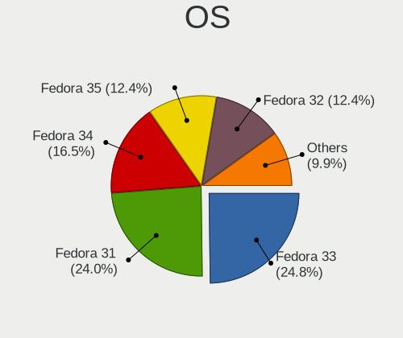

| Name      | Computers | Percent |
|-----------|-----------|---------|
| Fedora 33 | 30        | 24.79%  |
| Fedora 31 | 29        | 23.97%  |
| Fedora 34 | 20        | 16.53%  |
| Fedora 35 | 15        | 12.4%   |
| Fedora 32 | 15        | 12.4%   |
| Fedora 29 | 4         | 3.31%   |
| Fedora 30 | 2         | 1.65%   |
| Fedora 37 | 1         | 0.83%   |
| Fedora 28 | 1         | 0.83%   |
| Fedora 26 | 1         | 0.83%   |
| Fedora 24 | 1         | 0.83%   |
| Fedora 18 | 1         | 0.83%   |
| Fedora 15 | 1         | 0.83%   |

OS Family
---------

OS without a version

| Name   | Computers | Percent |
|--------|-----------|---------|
| Fedora | 118       | 100%    |

Kernel
------

Version of the Linux kernel

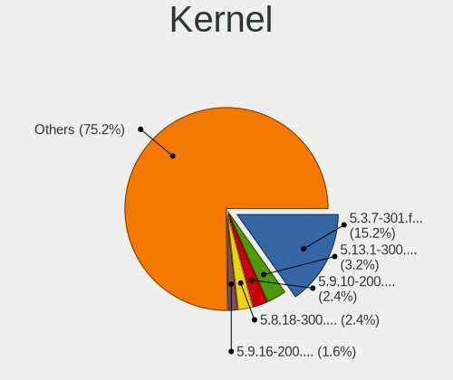

| Version                                              | Computers | Percent |
|------------------------------------------------------|-----------|---------|
| 5.3.7-301.fc31.x86_64                                | 19        | 15.2%   |
| 5.13.1-300.fc34.x86_64                               | 4         | 3.2%    |
| 5.9.10-200.fc33.x86_64                               | 3         | 2.4%    |
| 5.8.18-300.fc33.x86_64                               | 3         | 2.4%    |
| 5.9.16-200.fc33.x86_64                               | 2         | 1.6%    |
| 5.9.11-200.fc33.x86_64                               | 2         | 1.6%    |
| 5.8.16-300.fc33.x86_64                               | 2         | 1.6%    |
| 5.8.15-301.fc33.x86_64                               | 2         | 1.6%    |
| 5.8.12-200.fc32.x86_64                               | 2         | 1.6%    |
| 5.7.8-200.fc32.x86_64                                | 2         | 1.6%    |
| 5.6.6-300.fc32.x86_64                                | 2         | 1.6%    |
| 5.5.5-200.fc31.x86_64                                | 2         | 1.6%    |
| 5.3.11-300.fc31.x86_64                               | 2         | 1.6%    |
| 5.16.18-200.fc35.x86_64                              | 2         | 1.6%    |
| 5.16.15-201.fc35.x86_64                              | 2         | 1.6%    |
| 5.14.14-300.fc35.x86_64                              | 2         | 1.6%    |
| 5.11.12-300.fc34.aarch64                             | 2         | 1.6%    |
| 5.11.11-300.fc34.x86_64                              | 2         | 1.6%    |
| 5.9.8-200.fc33.x86_64                                | 1         | 0.8%    |
| 5.9.8-200.fc33.aarch64                               | 1         | 0.8%    |
| 5.9.15-200.fc33.x86_64                               | 1         | 0.8%    |
| 5.9.14-200.fc33.x86_64                               | 1         | 0.8%    |
| 5.9.13-200.fc33.x86_64                               | 1         | 0.8%    |
| 5.8.9-200.fc32.x86_64                                | 1         | 0.8%    |
| 5.8.16-200.fc32.x86_64                               | 1         | 0.8%    |
| 5.8.15-301.fc33.aarch64                              | 1         | 0.8%    |
| 5.7.14-200.fc32.x86_64                               | 1         | 0.8%    |
| 5.7.11-200.fc32.x86_64                               | 1         | 0.8%    |
| 5.6.7-200.fc31.x86_64                                | 1         | 0.8%    |
| 5.6.10-300.fc32.x86_64                               | 1         | 0.8%    |
| 5.5.8-200.fc31.x86_64                                | 1         | 0.8%    |
| 5.5.13-200.fc31.x86_64                               | 1         | 0.8%    |
| 5.5.0-0.rc6.git3.1.fc32.x86_64                       | 1         | 0.8%    |
| 5.4.98-1.fc25.qubes.x86_64                           | 1         | 0.8%    |
| 5.4.8-200.fc31.x86_64                                | 1         | 0.8%    |
| 5.4.20-200.fc31.x86_64                               | 1         | 0.8%    |
| 5.4.19-200.fc31.x86_64                               | 1         | 0.8%    |
| 5.4.156-1.fc25.qubes.x86_64                          | 1         | 0.8%    |
| 5.4.126-300.fc34.aarch64                             | 1         | 0.8%    |
| 5.3.0-0.rc8.git0.1.fc32.x86_64                       | 1         | 0.8%    |
| 5.2.14-200.fc30.x86_64                               | 1         | 0.8%    |
| 5.17.0-0.rc6.20220304git38f80f42147f.113.fc37.x86_64 | 1         | 0.8%    |
| 5.16.8-200.fc35.x86_64                               | 1         | 0.8%    |
| 5.16.18-100.fc34.x86_64                              | 1         | 0.8%    |
| 5.15.5-1.fc25.qubes.x86_64                           | 1         | 0.8%    |
| 5.15.18-200.fc35.x86_64                              | 1         | 0.8%    |
| 5.15.17-200.fc35.x86_64                              | 1         | 0.8%    |
| 5.15.12-200.fc35.x86_64                              | 1         | 0.8%    |
| 5.14.6-300.fc35.x86_64                               | 1         | 0.8%    |
| 5.14.17-301.fc35.x86_64                              | 1         | 0.8%    |
| 5.14.17-201.fc34.x86_64                              | 1         | 0.8%    |
| 5.14.17-101.fc33.x86_64                              | 1         | 0.8%    |
| 5.14.12-200.fc34.x86_64                              | 1         | 0.8%    |
| 5.14.10-300.fc35.x86_64                              | 1         | 0.8%    |
| 5.13.9-200.fc34.x86_64                               | 1         | 0.8%    |
| 5.13.4-200.fc34.x86_64                               | 1         | 0.8%    |
| 5.13.14-200.fc34.x86_64                              | 1         | 0.8%    |
| 5.12.5-300.fc34.x86_64                               | 1         | 0.8%    |
| 5.12.2-300.fc34.x86_64                               | 1         | 0.8%    |
| 5.12.15-300.fc34.x86_64                              | 1         | 0.8%    |

Kernel Family
-------------

Linux kernel without a distro release

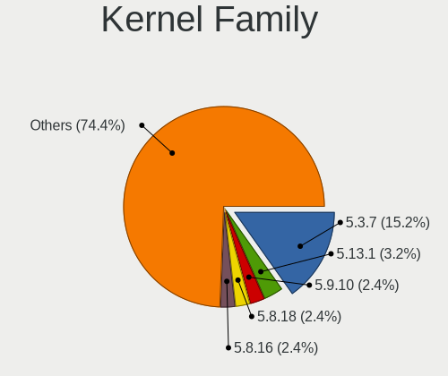

| Version | Computers | Percent |
|---------|-----------|---------|
| 5.3.7   | 19        | 15.2%   |
| 5.13.1  | 4         | 3.2%    |
| 5.9.10  | 3         | 2.4%    |
| 5.8.18  | 3         | 2.4%    |
| 5.8.16  | 3         | 2.4%    |
| 5.8.15  | 3         | 2.4%    |
| 5.16.18 | 3         | 2.4%    |
| 5.14.17 | 3         | 2.4%    |
| 5.11.12 | 3         | 2.4%    |
| 5.11.11 | 3         | 2.4%    |
| 5.9.8   | 2         | 1.6%    |
| 5.9.16  | 2         | 1.6%    |
| 5.9.11  | 2         | 1.6%    |
| 5.8.12  | 2         | 1.6%    |
| 5.7.8   | 2         | 1.6%    |
| 5.6.6   | 2         | 1.6%    |
| 5.5.5   | 2         | 1.6%    |
| 5.3.11  | 2         | 1.6%    |
| 5.16.15 | 2         | 1.6%    |
| 5.14.14 | 2         | 1.6%    |
| 5.10.22 | 2         | 1.6%    |
| 5.9.15  | 1         | 0.8%    |
| 5.9.14  | 1         | 0.8%    |
| 5.9.13  | 1         | 0.8%    |
| 5.8.9   | 1         | 0.8%    |
| 5.7.14  | 1         | 0.8%    |
| 5.7.11  | 1         | 0.8%    |
| 5.6.7   | 1         | 0.8%    |
| 5.6.10  | 1         | 0.8%    |
| 5.5.8   | 1         | 0.8%    |
| 5.5.13  | 1         | 0.8%    |
| 5.5.0   | 1         | 0.8%    |
| 5.4.98  | 1         | 0.8%    |
| 5.4.8   | 1         | 0.8%    |
| 5.4.20  | 1         | 0.8%    |
| 5.4.19  | 1         | 0.8%    |
| 5.4.156 | 1         | 0.8%    |
| 5.4.126 | 1         | 0.8%    |
| 5.3.0   | 1         | 0.8%    |
| 5.2.14  | 1         | 0.8%    |
| 5.17.0  | 1         | 0.8%    |
| 5.16.8  | 1         | 0.8%    |
| 5.15.5  | 1         | 0.8%    |
| 5.15.18 | 1         | 0.8%    |
| 5.15.17 | 1         | 0.8%    |
| 5.15.12 | 1         | 0.8%    |
| 5.14.6  | 1         | 0.8%    |
| 5.14.12 | 1         | 0.8%    |
| 5.14.10 | 1         | 0.8%    |
| 5.13.9  | 1         | 0.8%    |
| 5.13.4  | 1         | 0.8%    |
| 5.13.14 | 1         | 0.8%    |
| 5.12.5  | 1         | 0.8%    |
| 5.12.2  | 1         | 0.8%    |
| 5.12.15 | 1         | 0.8%    |
| 5.12.10 | 1         | 0.8%    |
| 5.11.13 | 1         | 0.8%    |
| 5.11.0  | 1         | 0.8%    |
| 5.10.6  | 1         | 0.8%    |
| 5.10.47 | 1         | 0.8%    |

Kernel Major Ver.
-----------------

Linux kernel major version

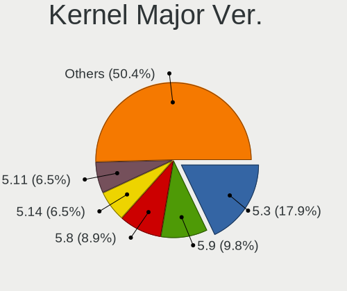

| Version | Computers | Percent |
|---------|-----------|---------|
| 5.3     | 22        | 17.89%  |
| 5.9     | 12        | 9.76%   |
| 5.8     | 11        | 8.94%   |
| 5.14    | 8         | 6.5%    |
| 5.11    | 8         | 6.5%    |
| 5.10    | 8         | 6.5%    |
| 5.13    | 7         | 5.69%   |
| 5.4     | 6         | 4.88%   |
| 5.16    | 6         | 4.88%   |
| 5.5     | 5         | 4.07%   |
| 5.7     | 4         | 3.25%   |
| 5.6     | 4         | 3.25%   |
| 5.15    | 4         | 3.25%   |
| 5.12    | 4         | 3.25%   |
| 4.18    | 3         | 2.44%   |
| 4.19    | 2         | 1.63%   |
| 5.2     | 1         | 0.81%   |
| 5.17    | 1         | 0.81%   |
| 5.0     | 1         | 0.81%   |
| 4.5     | 1         | 0.81%   |
| 4.20    | 1         | 0.81%   |
| 4.16    | 1         | 0.81%   |
| 4.11    | 1         | 0.81%   |
| 3.6     | 1         | 0.81%   |
| 2.6.38  | 1         | 0.81%   |

Arch
----

OS architecture (x86_64, i586, etc.)

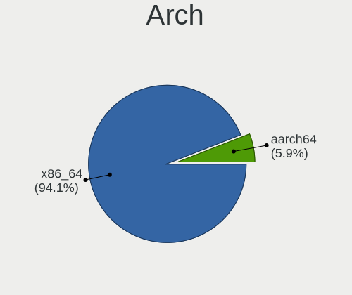

| Name    | Computers | Percent |
|---------|-----------|---------|
| x86_64  | 111       | 94.07%  |
| aarch64 | 7         | 5.93%   |

DE
--

Desktop Environment

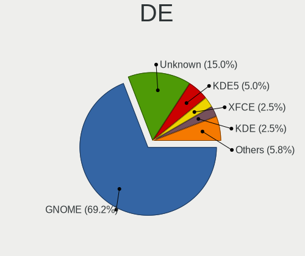

| Name          | Computers | Percent |
|---------------|-----------|---------|
| GNOME         | 83        | 69.17%  |
| Unknown       | 18        | 15%     |
| KDE5          | 6         | 5%      |
| XFCE          | 3         | 2.5%    |
| KDE           | 3         | 2.5%    |
| X-Cinnamon    | 2         | 1.67%   |
| LXQt          | 1         | 0.83%   |
| KDE4          | 1         | 0.83%   |
| GNUstep       | 1         | 0.83%   |
| GNOME Classic | 1         | 0.83%   |
| Cinnamon      | 1         | 0.83%   |

Display Server
--------------

X11 or Wayland

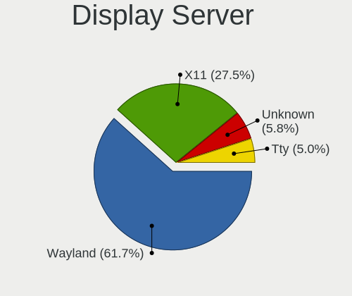

| Name    | Computers | Percent |
|---------|-----------|---------|
| Wayland | 74        | 61.67%  |
| X11     | 33        | 27.5%   |
| Unknown | 7         | 5.83%   |
| Tty     | 6         | 5%      |

Display Manager
---------------

SDDM, LightDM, etc.

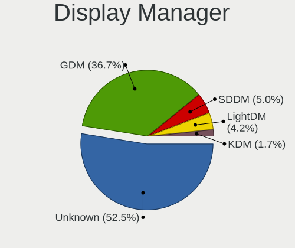

| Name    | Computers | Percent |
|---------|-----------|---------|
| Unknown | 63        | 52.5%   |
| GDM     | 44        | 36.67%  |
| SDDM    | 6         | 5%      |
| LightDM | 5         | 4.17%   |
| KDM     | 2         | 1.67%   |

OS Lang
-------

Language

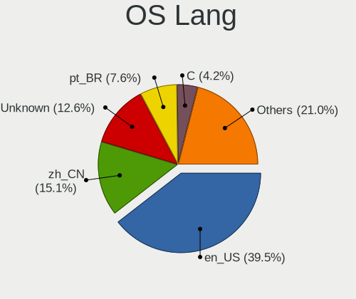

| Lang    | Computers | Percent |
|---------|-----------|---------|
| en_US   | 47        | 39.5%   |
| zh_CN   | 18        | 15.13%  |
| Unknown | 15        | 12.61%  |
| pt_BR   | 9         | 7.56%   |
| C       | 5         | 4.2%    |
| ru_RU   | 4         | 3.36%   |
| fr_FR   | 4         | 3.36%   |
| it_IT   | 2         | 1.68%   |
| en_GB   | 2         | 1.68%   |
| zh_TW   | 1         | 0.84%   |
| tr_TR   | 1         | 0.84%   |
| sk_SK   | 1         | 0.84%   |
| pl_PL   | 1         | 0.84%   |
| nl_NL   | 1         | 0.84%   |
| fr_CA   | 1         | 0.84%   |
| es_ES   | 1         | 0.84%   |
| es_DO   | 1         | 0.84%   |
| en_CA   | 1         | 0.84%   |
| en_AU   | 1         | 0.84%   |
| de_DE   | 1         | 0.84%   |
| de_CH   | 1         | 0.84%   |
| cs_CZ   | 1         | 0.84%   |

Boot Mode
---------

EFI or BIOS

| Mode | Computers | Percent |
|------|-----------|---------|
| BIOS | 100       | 84.75%  |
| EFI  | 18        | 15.25%  |

Filesystem
----------

Type of filesystem

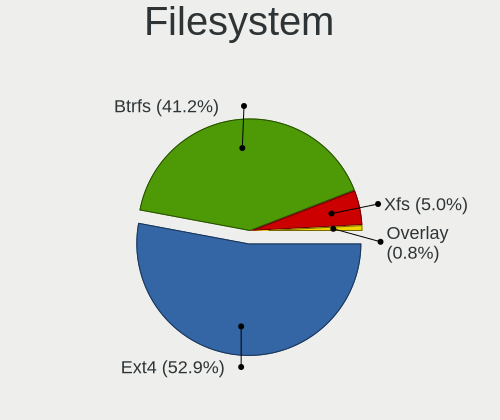

| Type    | Computers | Percent |
|---------|-----------|---------|
| Ext4    | 63        | 52.94%  |
| Btrfs   | 49        | 41.18%  |
| Xfs     | 6         | 5.04%   |
| Overlay | 1         | 0.84%   |

Part. scheme
------------

Scheme of partitioning

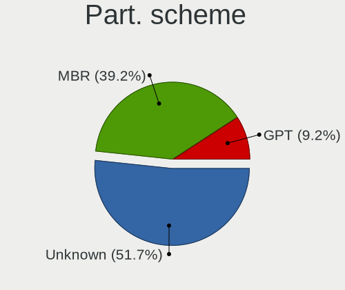

| Type    | Computers | Percent |
|---------|-----------|---------|
| Unknown | 62        | 51.67%  |
| MBR     | 47        | 39.17%  |
| GPT     | 11        | 9.17%   |

Dual Boot with Linux/BSD
------------------------

Hosting more than one Linux/BSD

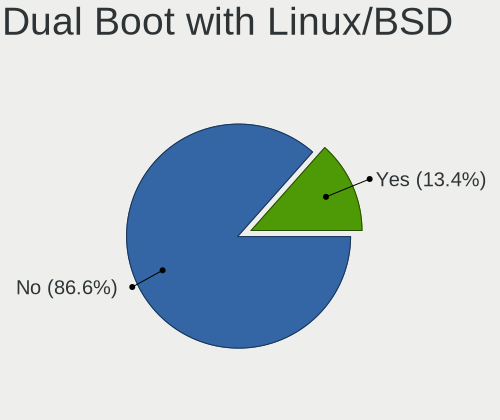

| Dual boot | Computers | Percent |
|-----------|-----------|---------|
| No        | 103       | 86.55%  |
| Yes       | 16        | 13.45%  |

Dual Boot (Win)
---------------

Hosting Linux and Windows

| Dual boot | Computers | Percent |
|-----------|-----------|---------|
| No        | 118       | 100%    |

Board
-----

Vendor
------

Motherboard manufacturer

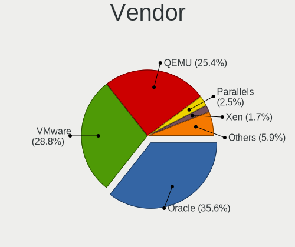

| Name                             | Computers | Percent |
|----------------------------------|-----------|---------|
| Oracle                           | 42        | 35.59%  |
| VMware                           | 34        | 28.81%  |
| QEMU                             | 30        | 25.42%  |
| Parallels                        | 3         | 2.54%   |
| Xen                              | 2         | 1.69%   |
| Parallels International          | 2         | 1.69%   |
| Amazon EC2                       | 2         | 1.69%   |
| Parallels Software International | 1         | 0.85%   |
| DigitalOcean                     | 1         | 0.85%   |
| Unknown                          | 1         | 0.85%   |

Model
-----

Motherboard model

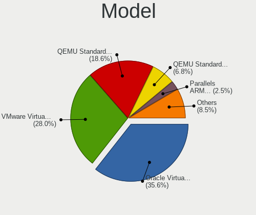

| Name                                                        | Computers | Percent |
|-------------------------------------------------------------|-----------|---------|
| Oracle VirtualBox                                           | 42        | 35.59%  |
| VMware Virtual Platform                                     | 33        | 27.97%  |
| QEMU Standard PC (Q35 + ICH9, 2009)                         | 22        | 18.64%  |
| QEMU Standard PC (i440FX + PIIX, 1996)                      | 8         | 6.78%   |
| Parallels ARM Virtual Machine                               | 3         | 2.54%   |
| Xen HVM domU                                                | 2         | 1.69%   |
| Parallels International ARM Virtual Machine                 | 2         | 1.69%   |
| VMware VMware7,1                                            | 1         | 0.85%   |
| Parallels Software International Parallels Virtual Platform | 1         | 0.85%   |
| DigitalOcean Droplet                                        | 1         | 0.85%   |
| Amazon EC2 t4g.micro                                        | 1         | 0.85%   |
| Amazon EC2 c6g.large                                        | 1         | 0.85%   |
| Unknown                                                     | 1         | 0.85%   |

Model Family
------------

Motherboard model prefix

| Name                                       | Computers | Percent |
|--------------------------------------------|-----------|---------|
| Oracle VirtualBox                          | 42        | 35.59%  |
| VMware Virtual                             | 33        | 27.97%  |
| QEMU Standard                              | 30        | 25.42%  |
| Parallels ARM                              | 3         | 2.54%   |
| Xen HVM                                    | 2         | 1.69%   |
| Parallels International ARM                | 2         | 1.69%   |
| VMware VMware7                             | 1         | 0.85%   |
| Parallels Software International Parallels | 1         | 0.85%   |
| DigitalOcean Droplet                       | 1         | 0.85%   |
| Amazon EC2 t4g.micro                       | 1         | 0.85%   |
| Amazon EC2 c6g.large                       | 1         | 0.85%   |
| Unknown                                    | 1         | 0.85%   |

MFG Year
--------

Motherboard manufacture year

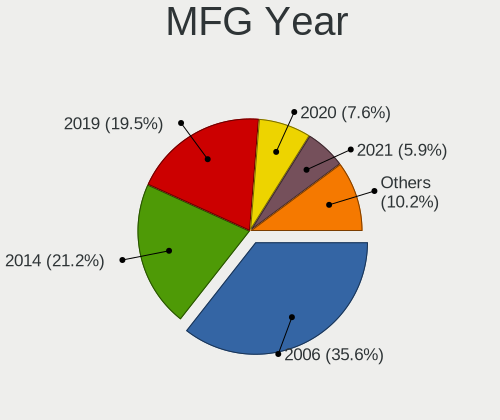

| Year | Computers | Percent |
|------|-----------|---------|
| 2006 | 42        | 35.59%  |
| 2014 | 25        | 21.19%  |
| 2019 | 23        | 19.49%  |
| 2020 | 9         | 7.63%   |
| 2021 | 7         | 5.93%   |
| 2015 | 5         | 4.24%   |
| 2017 | 4         | 3.39%   |
| 2018 | 3         | 2.54%   |

Form Factor
-----------

Physical design of the computer

| Name            | Computers | Percent |
|-----------------|-----------|---------|
| Virtual machine | 118       | 100%    |

Secure Boot
-----------

Enabled or disabled

| State    | Computers | Percent |
|----------|-----------|---------|
| Disabled | 118       | 100%    |

Coreboot
--------

Have coreboot on board

| Used | Computers | Percent |
|------|-----------|---------|
| No   | 118       | 100%    |

RAM Size
--------

Total RAM memory

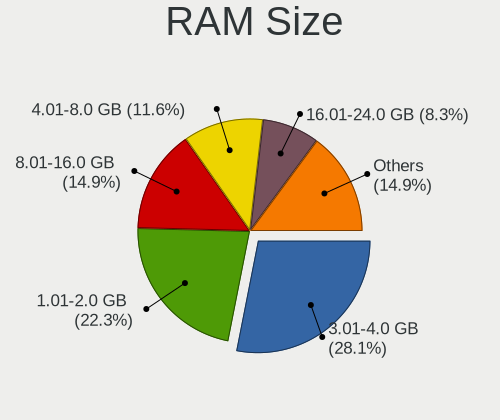

| Size in GB  | Computers | Percent |
|-------------|-----------|---------|
| 3.01-4.0    | 34        | 28.1%   |
| 1.01-2.0    | 27        | 22.31%  |
| 8.01-16.0   | 18        | 14.88%  |
| 4.01-8.0    | 14        | 11.57%  |
| 16.01-24.0  | 10        | 8.26%   |
| 2.01-3.0    | 8         | 6.61%   |
| 32.01-64.0  | 4         | 3.31%   |
| 0.51-1.0    | 4         | 3.31%   |
| 64.01-256.0 | 1         | 0.83%   |
| 0.01-0.5    | 1         | 0.83%   |

RAM Used
--------

Used RAM memory

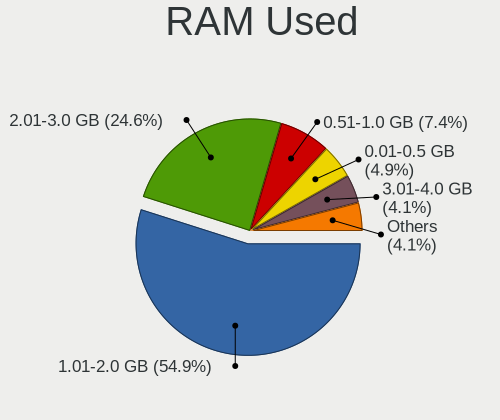

| Used GB   | Computers | Percent |
|-----------|-----------|---------|
| 1.01-2.0  | 67        | 54.92%  |
| 2.01-3.0  | 30        | 24.59%  |
| 0.51-1.0  | 9         | 7.38%   |
| 0.01-0.5  | 6         | 4.92%   |
| 3.01-4.0  | 5         | 4.1%    |
| 4.01-8.0  | 2         | 1.64%   |
| Unknown   | 2         | 1.64%   |
| 8.01-16.0 | 1         | 0.82%   |

Total Drives
------------

Number of drives on board

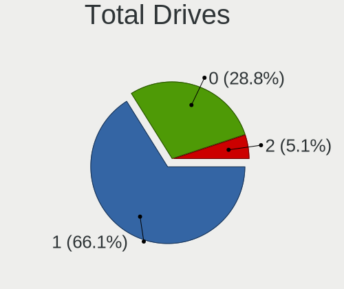

| Drives | Computers | Percent |
|--------|-----------|---------|
| 1      | 78        | 66.1%   |
| 0      | 34        | 28.81%  |
| 2      | 6         | 5.08%   |

Has CD-ROM
----------

Has CD-ROM on board

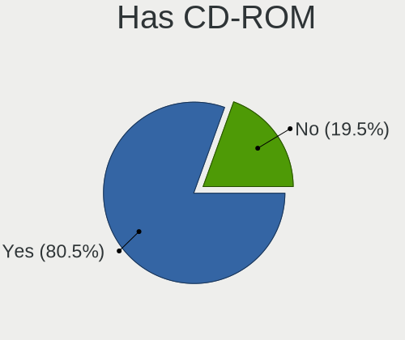

| Presented | Computers | Percent |
|-----------|-----------|---------|
| Yes       | 95        | 80.51%  |
| No        | 23        | 19.49%  |

Has Ethernet
------------

Has Ethernet on board

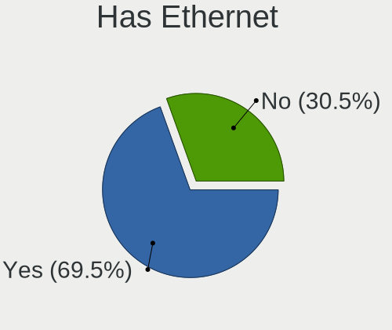

| Presented | Computers | Percent |
|-----------|-----------|---------|
| Yes       | 82        | 69.49%  |
| No        | 36        | 30.51%  |

Has WiFi
--------

Has WiFi module

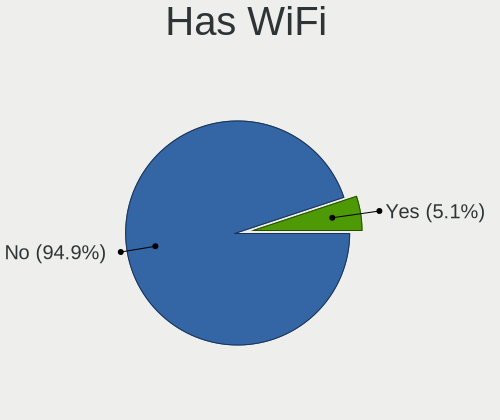

| Presented | Computers | Percent |
|-----------|-----------|---------|
| No        | 112       | 94.92%  |
| Yes       | 6         | 5.08%   |

Has Bluetooth
-------------

Has Bluetooth module

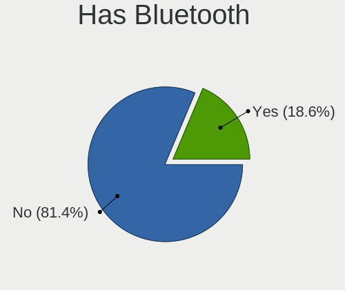

| Presented | Computers | Percent |
|-----------|-----------|---------|
| No        | 96        | 81.36%  |
| Yes       | 22        | 18.64%  |

Location
--------

Country
-------

Geographic location (country)

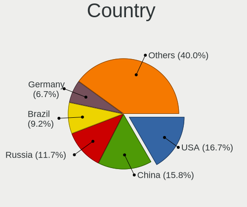

| Country            | Computers | Percent |
|--------------------|-----------|---------|
| USA                | 20        | 16.67%  |
| China              | 19        | 15.83%  |
| Russia             | 14        | 11.67%  |
| Brazil             | 11        | 9.17%   |
| Germany            | 8         | 6.67%   |
| France             | 5         | 4.17%   |
| Canada             | 5         | 4.17%   |
| UK                 | 3         | 2.5%    |
| Spain              | 3         | 2.5%    |
| Poland             | 3         | 2.5%    |
| Netherlands        | 3         | 2.5%    |
| Turkey             | 2         | 1.67%   |
| Italy              | 2         | 1.67%   |
| Israel             | 2         | 1.67%   |
| Czechia            | 2         | 1.67%   |
| Ukraine            | 1         | 0.83%   |
| Taiwan             | 1         | 0.83%   |
| Switzerland        | 1         | 0.83%   |
| Sweden             | 1         | 0.83%   |
| Slovakia           | 1         | 0.83%   |
| Norway             | 1         | 0.83%   |
| Morocco            | 1         | 0.83%   |
| Mexico             | 1         | 0.83%   |
| Japan              | 1         | 0.83%   |
| Ireland            | 1         | 0.83%   |
| Iran               | 1         | 0.83%   |
| Hungary            | 1         | 0.83%   |
| Estonia            | 1         | 0.83%   |
| Dominican Republic | 1         | 0.83%   |
| Chile              | 1         | 0.83%   |
| Bulgaria           | 1         | 0.83%   |
| Austria            | 1         | 0.83%   |
| Australia          | 1         | 0.83%   |

City
----

Geographic location (city)

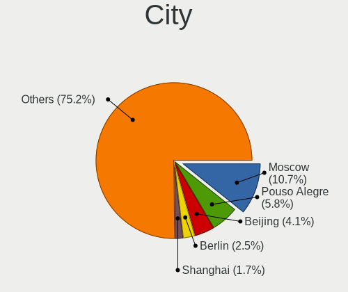

| City                     | Computers | Percent |
|--------------------------|-----------|---------|
| Moscow                   | 13        | 10.74%  |
| Pouso Alegre             | 7         | 5.79%   |
| Beijing                  | 5         | 4.13%   |
| Berlin                   | 3         | 2.48%   |
| Shanghai                 | 2         | 1.65%   |
| Chengdu                  | 2         | 1.65%   |
| Cedar Knolls             | 2         | 1.65%   |
| Zuidwolde                | 1         | 0.83%   |
| Zhongba                  | 1         | 0.83%   |
| Yuzhong Chengguanzhen    | 1         | 0.83%   |
| Wuhan                    | 1         | 0.83%   |
| Westminster              | 1         | 0.83%   |
| Warsaw                   | 1         | 0.83%   |
| Waldenbuch               | 1         | 0.83%   |
| Vienna                   | 1         | 0.83%   |
| Viña del Mar          | 1         | 0.83%   |
| Veracruz                 | 1         | 0.83%   |
| Tel Aviv                 | 1         | 0.83%   |
| Tallinn                  | 1         | 0.83%   |
| Talence                  | 1         | 0.83%   |
| Tajrīsh               | 1         | 0.83%   |
| St Louis                 | 1         | 0.83%   |
| Southfield               | 1         | 0.83%   |
| Southampton              | 1         | 0.83%   |
| Sofia                    | 1         | 0.83%   |
| Simcoe                   | 1         | 0.83%   |
| Shoreline                | 1         | 0.83%   |
| Shinjuku                 | 1         | 0.83%   |
| Seattle                  | 1         | 0.83%   |
| Santo Domingo Este       | 1         | 0.83%   |
| Santa Coloma de Gramenet | 1         | 0.83%   |
| Santa Clara              | 1         | 0.83%   |
| Rio de Janeiro           | 1         | 0.83%   |
| Reston                   | 1         | 0.83%   |
| Rabat                    | 1         | 0.83%   |
| Québec                | 1         | 0.83%   |
| Qingdao                  | 1         | 0.83%   |
| Prague                   | 1         | 0.83%   |
| Phoenix                  | 1         | 0.83%   |
| Petaẖ Tiqwa        | 1         | 0.83%   |
| Perth                    | 1         | 0.83%   |
| Paris                    | 1         | 0.83%   |
| Ostrava                  | 1         | 0.83%   |
| Oslo                     | 1         | 0.83%   |
| Nuremberg                | 1         | 0.83%   |
| Northolt                 | 1         | 0.83%   |
| Newport                  | 1         | 0.83%   |
| Nanjing                  | 1         | 0.83%   |
| Munich                   | 1         | 0.83%   |
| Montreal                 | 1         | 0.83%   |
| Montauban                | 1         | 0.83%   |
| Mestre                   | 1         | 0.83%   |
| Mazancowice              | 1         | 0.83%   |
| Los Angeles              | 1         | 0.83%   |
| London                   | 1         | 0.83%   |
| Lille                    | 1         | 0.83%   |
| Lichtensteig             | 1         | 0.83%   |
| Lecce                    | 1         | 0.83%   |
| Lakewood                 | 1         | 0.83%   |
| Lacombe                  | 1         | 0.83%   |

Drives
------

Drive Vendor
------------

Hard drive vendors

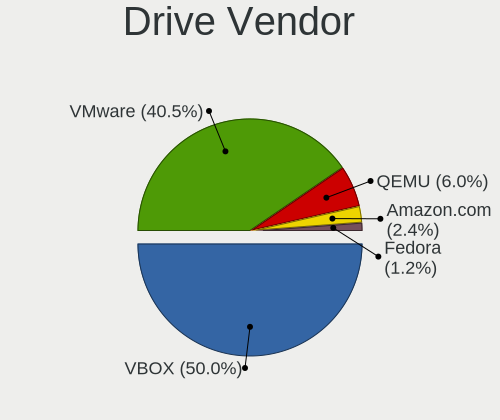

| Vendor     | Computers | Drives | Percent |
|------------|-----------|--------|---------|
| VBOX       | 42        | 49     | 50%     |
| VMware     | 34        | 36     | 40.48%  |
| QEMU       | 5         | 8      | 5.95%   |
| Amazon.com | 2         | 2      | 2.38%   |
| Fedora     | 1         | 1      | 1.19%   |

Drive Model
-----------

Hard drive models

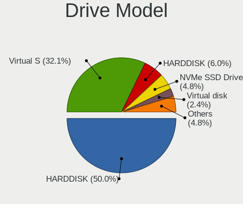

| Model                           | Computers | Percent |
|---------------------------------|-----------|---------|
| VBOX HARDDISK                   | 42        | 50%     |
| VMware Virtual S                | 27        | 32.14%  |
| QEMU HARDDISK                   | 5         | 5.95%   |
| VMware NVMe SSD Drive           | 4         | 4.76%   |
| VMware Virtual disk             | 2         | 2.38%   |
| VMware Virtual SATA Hard Drive  | 1         | 1.19%   |
| Fedora Linux 30-0 69GB SSD      | 1         | 1.19%   |
| Amazon.com NVMe SSD Drive 70GB  | 1         | 1.19%   |
| Amazon.com NVMe SSD Drive 107GB | 1         | 1.19%   |

HDD Vendor
----------

Hard disk drive vendors

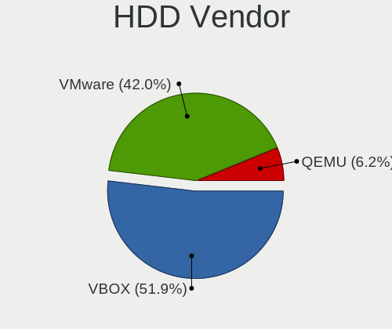

| Vendor | Computers | Drives | Percent |
|--------|-----------|--------|---------|
| VBOX   | 42        | 49     | 51.85%  |
| VMware | 34        | 36     | 41.98%  |
| QEMU   | 5         | 8      | 6.17%   |

SSD Vendor
----------

Solid state drive vendors

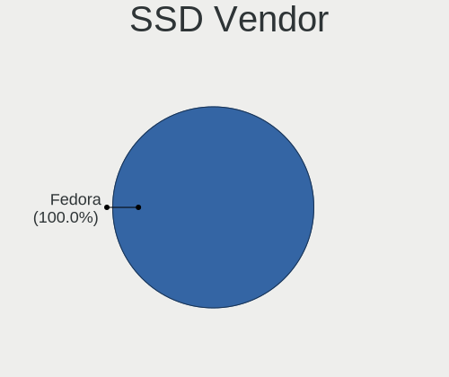

| Vendor | Computers | Drives | Percent |
|--------|-----------|--------|---------|
| Fedora | 1         | 1      | 100%    |

Drive Kind
----------

HDD or SSD

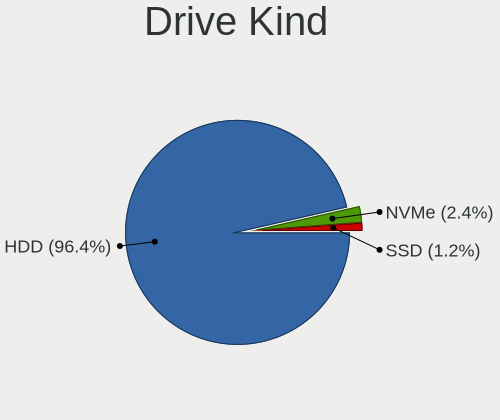

| Kind | Computers | Drives | Percent |
|------|-----------|--------|---------|
| HDD  | 81        | 93     | 96.43%  |
| NVMe | 2         | 2      | 2.38%   |
| SSD  | 1         | 1      | 1.19%   |

Drive Connector
---------------

SATA, SAS, NVMe, etc.

| Type | Computers | Drives | Percent |
|------|-----------|--------|---------|
| SATA | 49        | 60     | 58.33%  |
| SAS  | 29        | 30     | 34.52%  |
| NVMe | 6         | 6      | 7.14%   |

Drive Size
----------

Size of hard drive

| Size in TB | Computers | Drives | Percent |
|------------|-----------|--------|---------|
| 0.01-0.5   | 82        | 94     | 100%    |

Space Total
-----------

Amount of disk space available on the file system

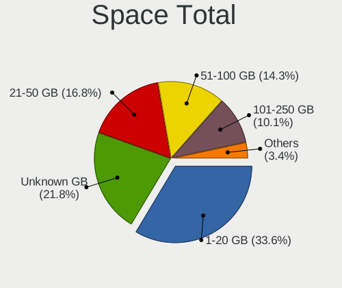

| Size in GB | Computers | Percent |
|------------|-----------|---------|
| 1-20       | 40        | 33.61%  |
| Unknown    | 26        | 21.85%  |
| 21-50      | 20        | 16.81%  |
| 51-100     | 17        | 14.29%  |
| 101-250    | 12        | 10.08%  |
| 251-500    | 4         | 3.36%   |

Space Used
----------

Amount of used disk space

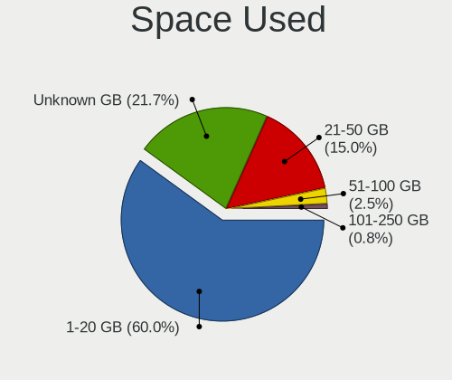

| Used GB | Computers | Percent |
|---------|-----------|---------|
| 1-20    | 72        | 60%     |
| Unknown | 26        | 21.67%  |
| 21-50   | 18        | 15%     |
| 51-100  | 3         | 2.5%    |
| 101-250 | 1         | 0.83%   |

Malfunc. Drives
---------------

Drive models with a malfunction

Zero info for selected period =(

Malfunc. Drive Vendor
---------------------

Vendors of faulty drives

Zero info for selected period =(

Malfunc. HDD Vendor
-------------------

Vendors of faulty HDD drives

Zero info for selected period =(

Malfunc. Drive Kind
-------------------

Kinds of faulty drives

Zero info for selected period =(

Failed Drives
-------------

Failed drive models

Zero info for selected period =(

Failed Drive Vendor
-------------------

Failed drive vendors

Zero info for selected period =(

Drive Status
------------

Number of failed and malfunc. drives

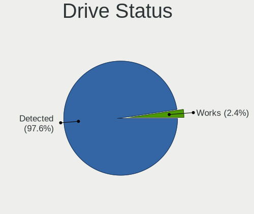

| Status   | Computers | Drives | Percent |
|----------|-----------|--------|---------|
| Detected | 82        | 93     | 97.62%  |
| Works    | 2         | 3      | 2.38%   |

Storage controller
------------------

Storage Vendor
--------------

Storage controller vendors

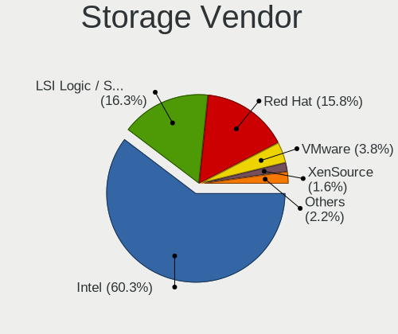

| Vendor                    | Computers | Percent |
|---------------------------|-----------|---------|
| Intel                     | 111       | 60.33%  |
| LSI Logic / Symbios Logic | 30        | 16.3%   |
| Red Hat                   | 29        | 15.76%  |
| VMware                    | 7         | 3.8%    |
| XenSource                 | 3         | 1.63%   |
| ASMedia Technology        | 2         | 1.09%   |
| Amazon.com                | 2         | 1.09%   |

Storage Model
-------------

Storage controller models

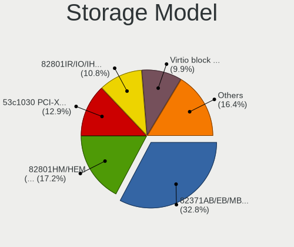

| Model                                                                 | Computers | Percent |
|-----------------------------------------------------------------------|-----------|---------|
| Intel 82371AB/EB/MB PIIX4 IDE                                         | 76        | 32.76%  |
| Intel 82801HM/HEM (ICH8M/ICH8M-E) SATA Controller [AHCI mode]         | 40        | 17.24%  |
| LSI Logic / Symbios Logic 53c1030 PCI-X Fusion-MPT Dual Ultra320 SCSI | 30        | 12.93%  |
| Intel 82801IR/IO/IH (ICH9R/DO/DH) 6 port SATA Controller [AHCI mode]  | 25        | 10.78%  |
| Red Hat Virtio block device                                           | 23        | 9.91%   |
| Intel 82371SB PIIX3 IDE [Natoma/Triton II]                            | 12        | 5.17%   |
| Red Hat Virtio SCSI                                                   | 7         | 3.02%   |
| VMware SATA AHCI controller                                           | 4         | 1.72%   |
| VMware NVMe SSD Controller                                            | 4         | 1.72%   |
| XenSource Xen Platform Device                                         | 3         | 1.29%   |
| VMware PVSCSI SCSI Controller                                         | 2         | 0.86%   |
| Amazon.com NVMe EBS Controller                                        | 2         | 0.86%   |
| Intel 82801HR/HO/HH (ICH8R/DO/DH) 6 port SATA Controller [AHCI mode]  | 1         | 0.43%   |
| Intel 82801BA IDE U100 Controller                                     | 1         | 0.43%   |
| ASMedia ASM1062 Serial ATA Controller                                 | 1         | 0.43%   |
| ASMedia 106x SATA/RAID Controller                                     | 1         | 0.43%   |

Storage Kind
------------

Kind of storage controller (IDE, SATA, NVMe, SAS, ...)

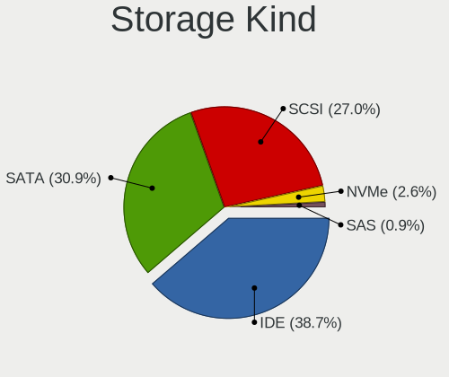

| Kind | Computers | Percent |
|------|-----------|---------|
| IDE  | 89        | 38.7%   |
| SATA | 71        | 30.87%  |
| SCSI | 62        | 26.96%  |
| NVMe | 6         | 2.61%   |
| SAS  | 2         | 0.87%   |

Processor
---------

CPU Vendor
----------

Processor vendors

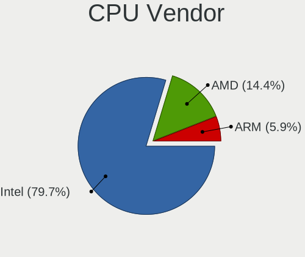

| Vendor | Computers | Percent |
|--------|-----------|---------|
| Intel  | 94        | 79.66%  |
| AMD    | 17        | 14.41%  |
| ARM    | 7         | 5.93%   |

CPU Model
---------

Processor models

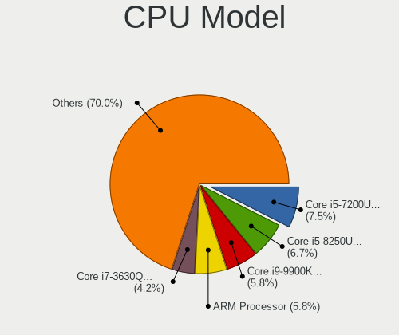

| Model                                          | Computers | Percent |
|------------------------------------------------|-----------|---------|
| Intel Core i5-7200U CPU @ 2.50GHz              | 9         | 7.5%    |
| Intel Core i5-8250U CPU @ 1.60GHz              | 8         | 6.67%   |
| Intel Core i9-9900K CPU @ 3.60GHz              | 7         | 5.83%   |
| ARM Processor                                  | 7         | 5.83%   |
| Intel Core i7-3630QM CPU @ 2.40GHz             | 5         | 4.17%   |
| Intel Core Processor (Skylake, IBRS)           | 3         | 2.5%    |
| Intel Core i7-8565U CPU @ 1.80GHz              | 3         | 2.5%    |
| Intel Core i7-7700 CPU @ 3.60GHz               | 3         | 2.5%    |
| Intel Core i7-4790 CPU @ 3.60GHz               | 3         | 2.5%    |
| Intel Core i5-3350P CPU @ 3.10GHz              | 3         | 2.5%    |
| Intel Core i7-8850H CPU @ 2.60GHz              | 2         | 1.67%   |
| Intel Core i7-6820HQ CPU @ 2.70GHz             | 2         | 1.67%   |
| Intel Core i7-10510U CPU @ 1.80GHz             | 2         | 1.67%   |
| Intel Core i5-6300U CPU @ 2.40GHz              | 2         | 1.67%   |
| Intel Xeon Silver 4210 CPU @ 2.20GHz           | 1         | 0.83%   |
| Intel Xeon Silver 4110 CPU @ 2.10GHz           | 1         | 0.83%   |
| Intel Xeon Gold 6242R CPU @ 3.10GHz            | 1         | 0.83%   |
| Intel Xeon Gold 6140 CPU @ 2.30GHz             | 1         | 0.83%   |
| Intel Xeon Gold 6128 CPU @ 3.40GHz             | 1         | 0.83%   |
| Intel Xeon E312xx (Sandy Bridge, IBRS update)  | 1         | 0.83%   |
| Intel Xeon CPU E5645 @ 2.40GHz                 | 1         | 0.83%   |
| Intel Xeon CPU E5-2680 v3 @ 2.50GHz            | 1         | 0.83%   |
| Intel Xeon CPU E5-2620 v3 @ 2.40GHz            | 1         | 0.83%   |
| Intel Core Processor (Broadwell, no TSX, IBRS) | 1         | 0.83%   |
| Intel Core i9-9980HK CPU @ 2.40GHz             | 1         | 0.83%   |
| Intel Core i9-8950HK CPU @ 2.90GHz             | 1         | 0.83%   |
| Intel Core i9-10850K CPU @ 3.60GHz             | 1         | 0.83%   |
| Intel Core i7-9750H CPU @ 2.60GHz              | 1         | 0.83%   |
| Intel Core i7-9700K CPU @ 3.60GHz              | 1         | 0.83%   |
| Intel Core i7-8809G CPU @ 3.10GHz              | 1         | 0.83%   |
| Intel Core i7-8750H CPU @ 2.20GHz              | 1         | 0.83%   |
| Intel Core i7-8665U CPU @ 1.90GHz              | 1         | 0.83%   |
| Intel Core i7-7700HQ CPU @ 2.80GHz             | 1         | 0.83%   |
| Intel Core i7-7500U CPU @ 2.70GHz              | 1         | 0.83%   |
| Intel Core i7-5500U CPU @ 2.40GHz              | 1         | 0.83%   |
| Intel Core i7-4910MQ CPU @ 2.90GHz             | 1         | 0.83%   |
| Intel Core i7-4771 CPU @ 3.50GHz               | 1         | 0.83%   |
| Intel Core i7-4750HQ CPU @ 2.00GHz             | 1         | 0.83%   |
| Intel Core i7-4578U CPU @ 3.00GHz              | 1         | 0.83%   |
| Intel Core i7-10875H CPU @ 2.30GHz             | 1         | 0.83%   |
| Intel Core i5-9300H CPU @ 2.40GHz              | 1         | 0.83%   |
| Intel Core i5-8600 CPU @ 3.10GHz               | 1         | 0.83%   |
| Intel Core i5-8500 CPU @ 3.00GHz               | 1         | 0.83%   |
| Intel Core i5-8400 CPU @ 2.80GHz               | 1         | 0.83%   |
| Intel Core i5-8350U CPU @ 1.70GHz              | 1         | 0.83%   |
| Intel Core i5-8265U CPU @ 1.60GHz              | 1         | 0.83%   |
| Intel Core i5-8259U CPU @ 2.30GHz              | 1         | 0.83%   |
| Intel Core i5-6200U CPU @ 2.30GHz              | 1         | 0.83%   |
| Intel Core i5-4690 CPU @ 3.50GHz               | 1         | 0.83%   |
| Intel Core i5-4670 CPU @ 3.40GHz               | 1         | 0.83%   |
| Intel Core i5-3210M CPU @ 2.50GHz              | 1         | 0.83%   |
| Intel Core i5-2540M CPU @ 2.60GHz              | 1         | 0.83%   |
| Intel Core i5-2430M CPU @ 2.40GHz              | 1         | 0.83%   |
| Intel Core i5-2400 CPU @ 3.10GHz               | 1         | 0.83%   |
| Intel Core i3-8100 CPU @ 3.60GHz               | 1         | 0.83%   |
| Intel Core i3-7100 CPU @ 3.90GHz               | 1         | 0.83%   |
| Intel Core i3-7020U CPU @ 2.30GHz              | 1         | 0.83%   |
| Intel Common KVM processor                     | 1         | 0.83%   |
| AMD Ryzen 9 5950X 16-Core Processor            | 1         | 0.83%   |
| AMD Ryzen 9 5900HX with Radeon Graphics        | 1         | 0.83%   |

CPU Model Family
----------------

Processor model prefix

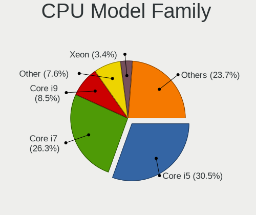

| Model             | Computers | Percent |
|-------------------|-----------|---------|
| Intel Core i5     | 36        | 30.51%  |
| Intel Core i7     | 31        | 26.27%  |
| Intel Core i9     | 10        | 8.47%   |
| Other             | 9         | 7.63%   |
| Intel Xeon        | 4         | 3.39%   |
| Intel Core        | 4         | 3.39%   |
| Intel Xeon Gold   | 3         | 2.54%   |
| Intel Core i3     | 3         | 2.54%   |
| AMD Ryzen 7       | 3         | 2.54%   |
| AMD Ryzen 5       | 3         | 2.54%   |
| AMD EPYC          | 3         | 2.54%   |
| Intel Xeon Silver | 2         | 1.69%   |
| AMD Ryzen 9       | 2         | 1.69%   |
| AMD A8            | 2         | 1.69%   |
| AMD Ryzen 3       | 1         | 0.85%   |
| AMD FX            | 1         | 0.85%   |
| AMD A6            | 1         | 0.85%   |

CPU Cores
---------

Number of processor cores

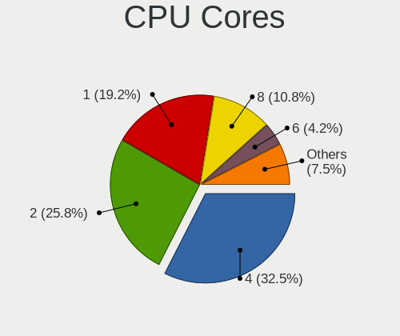

| Number  | Computers | Percent |
|---------|-----------|---------|
| 4       | 39        | 32.5%   |
| 2       | 31        | 25.83%  |
| 1       | 23        | 19.17%  |
| 8       | 13        | 10.83%  |
| 6       | 5         | 4.17%   |
| 3       | 3         | 2.5%    |
| 16      | 2         | 1.67%   |
| 32      | 1         | 0.83%   |
| 20      | 1         | 0.83%   |
| 12      | 1         | 0.83%   |
| Unknown | 1         | 0.83%   |

CPU Sockets
-----------

Number of sockets

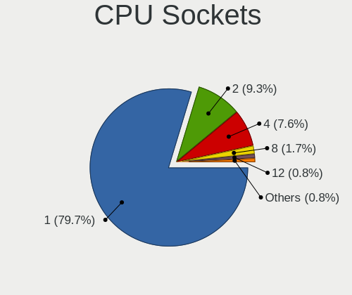

| Number  | Computers | Percent |
|---------|-----------|---------|
| 1       | 94        | 79.66%  |
| 2       | 11        | 9.32%   |
| 4       | 9         | 7.63%   |
| 8       | 2         | 1.69%   |
| 12      | 1         | 0.85%   |
| Unknown | 1         | 0.85%   |

CPU Threads
-----------

Threads per core (Hyper-Threading)

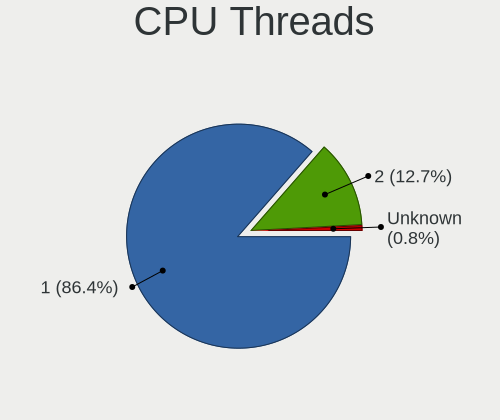

| Number  | Computers | Percent |
|---------|-----------|---------|
| 1       | 102       | 86.44%  |
| 2       | 15        | 12.71%  |
| Unknown | 1         | 0.85%   |

CPU Op-Modes
------------

CPU Operation Modes (32-bit, 64-bit)

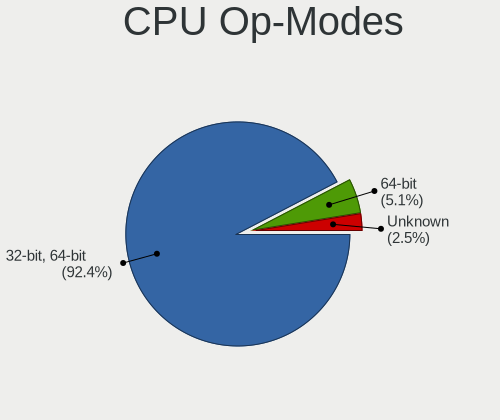

| Op mode        | Computers | Percent |
|----------------|-----------|---------|
| 32-bit, 64-bit | 109       | 92.37%  |
| 64-bit         | 6         | 5.08%   |
| Unknown        | 3         | 2.54%   |

CPU Microcode
-------------

Microcode number

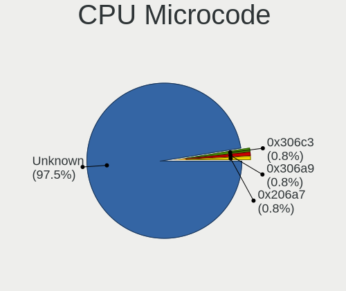

| Number  | Computers | Percent |
|---------|-----------|---------|
| Unknown | 115       | 97.46%  |
| 0x306c3 | 1         | 0.85%   |
| 0x306a9 | 1         | 0.85%   |
| 0x206a7 | 1         | 0.85%   |

CPU Microarch
-------------

Microarchitecture

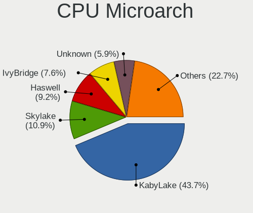

| Name        | Computers | Percent |
|-------------|-----------|---------|
| KabyLake    | 52        | 43.7%   |
| Skylake     | 13        | 10.92%  |
| Haswell     | 11        | 9.24%   |
| IvyBridge   | 9         | 7.56%   |
| Unknown     | 7         | 5.88%   |
| Zen         | 4         | 3.36%   |
| SandyBridge | 4         | 3.36%   |
| Zen 3       | 3         | 2.52%   |
| Zen 2       | 3         | 2.52%   |
| Zen+        | 2         | 1.68%   |
| Piledriver  | 2         | 1.68%   |
| CometLake   | 2         | 1.68%   |
| Broadwell   | 2         | 1.68%   |
| Westmere    | 1         | 0.84%   |
| Steamroller | 1         | 0.84%   |
| NetBurst    | 1         | 0.84%   |
| K8 Hammer   | 1         | 0.84%   |
| Excavator   | 1         | 0.84%   |

Graphics
--------

GPU Vendor
----------

Vendors of graphics cards

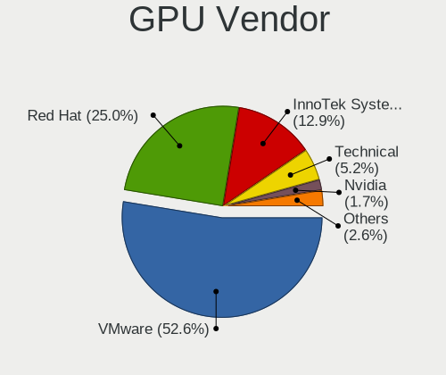

| Vendor                 | Computers | Percent |
|------------------------|-----------|---------|
| VMware                 | 61        | 52.59%  |
| Red Hat                | 29        | 25%     |
| InnoTek Systemberatung | 15        | 12.93%  |
| Technical              | 6         | 5.17%   |
| Nvidia                 | 2         | 1.72%   |
| Intel                  | 2         | 1.72%   |
| AMD                    | 1         | 0.86%   |

GPU Model
---------

Graphics card models

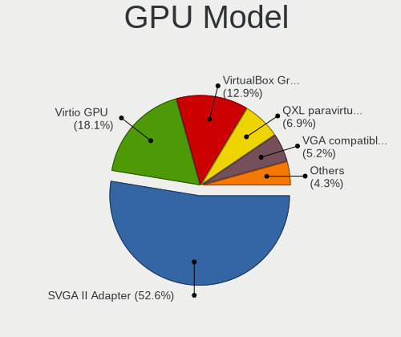

| Model                                                   | Computers | Percent |
|---------------------------------------------------------|-----------|---------|
| VMware SVGA II Adapter                                  | 61        | 52.59%  |
| Red Hat Virtio GPU                                      | 21        | 18.1%   |
| InnoTek Systemberatung VirtualBox Graphics Adapter      | 15        | 12.93%  |
| Red Hat QXL paravirtual graphic card                    | 8         | 6.9%    |
| Technical VGA compatible controller                     | 6         | 5.17%   |
| Nvidia TU102 [GeForce RTX 2080 Ti Rev. A]               | 1         | 0.86%   |
| Nvidia GP107GL [Quadro P1000]                           | 1         | 0.86%   |
| Intel HD Graphics 630                                   | 1         | 0.86%   |
| Intel CoffeeLake-U GT3e [Iris Plus Graphics 655]        | 1         | 0.86%   |
| AMD Ellesmere [Radeon RX 470/480/570/570X/580/580X/590] | 1         | 0.86%   |

GPU Combo
---------

Combinations of graphics cards

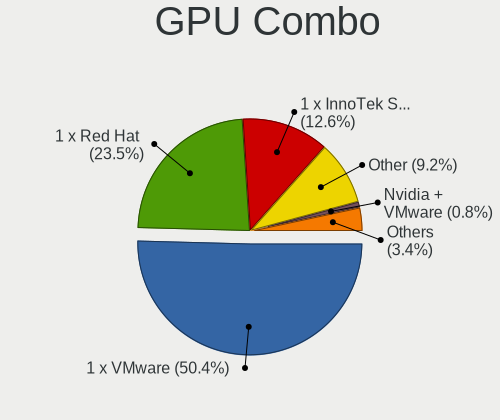

| Name                       | Computers | Percent |
|----------------------------|-----------|---------|
| 1 x VMware                 | 60        | 50.42%  |
| 1 x Red Hat                | 28        | 23.53%  |
| 1 x InnoTek Systemberatung | 15        | 12.61%  |
| Other                      | 11        | 9.24%   |
| Nvidia + VMware            | 1         | 0.84%   |
| 1 x Nvidia                 | 1         | 0.84%   |
| Intel + VMware             | 1         | 0.84%   |
| Intel + Red Hat            | 1         | 0.84%   |
| 1 x AMD                    | 1         | 0.84%   |

GPU Driver
----------

Free vs proprietary

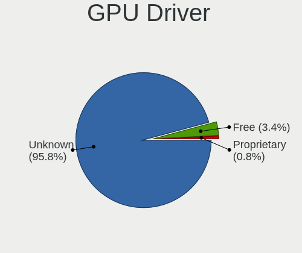

| Driver      | Computers | Percent |
|-------------|-----------|---------|
| Unknown     | 114       | 95.8%   |
| Free        | 4         | 3.36%   |
| Proprietary | 1         | 0.84%   |

GPU Memory
----------

Total video memory

| Size in GB | Computers | Percent |
|------------|-----------|---------|
| Unknown    | 117       | 98.32%  |
| 7.01-8.0   | 1         | 0.84%   |
| 3.01-4.0   | 1         | 0.84%   |

Monitor
-------

Monitor Vendor
--------------

Monitor vendors

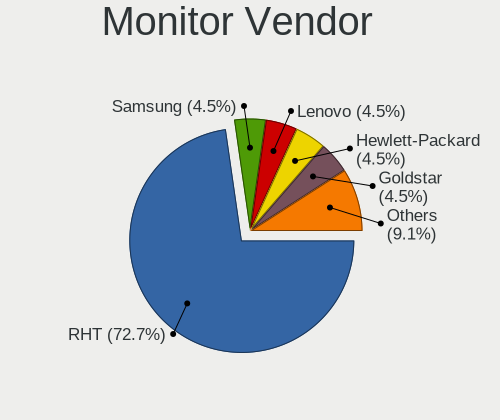

| Vendor              | Computers | Percent |
|---------------------|-----------|---------|
| RHT                 | 16        | 72.73%  |
| Samsung Electronics | 1         | 4.55%   |
| Lenovo              | 1         | 4.55%   |
| Hewlett-Packard     | 1         | 4.55%   |
| Goldstar            | 1         | 4.55%   |
| Dell                | 1         | 4.55%   |
| ASA                 | 1         | 4.55%   |

Monitor Model
-------------

Monitor models

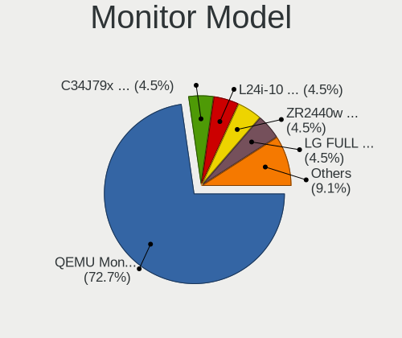

| Model                                                             | Computers | Percent |
|-------------------------------------------------------------------|-----------|---------|
| RHT QEMU Monitor RHT1234 2048x1152 260x190mm 12.7-inch            | 16        | 72.73%  |
| Samsung Electronics C34J79x SAM0F1D 3440x1440 797x333mm 34.0-inch | 1         | 4.55%   |
| Lenovo L24i-10 LEN65D6 1920x1080 527x296mm 23.8-inch              | 1         | 4.55%   |
| Hewlett-Packard ZR2440w HWP2954 1024x768 520x320mm 24.0-inch      | 1         | 4.55%   |
| Goldstar LG FULL HD GSM5B55 1920x1080 480x270mm 21.7-inch         | 1         | 4.55%   |
| Dell U2717D DEL40EA 2560x1440 597x336mm 27.0-inch                 | 1         | 4.55%   |
| ASA FH-DP4K ASA0270 2560x1600 480x270mm 21.7-inch                 | 1         | 4.55%   |

Monitor Resolution
------------------

Monitor screen resolution

| Resolution      | Computers | Percent |
|-----------------|-----------|---------|
| 3196x1798       | 16        | 72.73%  |
| 2560x1440 (QHD) | 2         | 9.09%   |
| 1920x1080 (FHD) | 2         | 9.09%   |
| 3840x2160 (4K)  | 1         | 4.55%   |
| 3440x1440       | 1         | 4.55%   |

Monitor Diagonal
----------------

Diagonal size in inches

| Inches | Computers | Percent |
|--------|-----------|---------|
| 33     | 16        | 72.73%  |
| 24     | 2         | 9.09%   |
| 21     | 2         | 9.09%   |
| 34     | 1         | 4.55%   |
| 27     | 1         | 4.55%   |

Monitor Width
-------------

Physical width

| Width in mm | Computers | Percent |
|-------------|-----------|---------|
| 701-800     | 17        | 77.27%  |
| 501-600     | 3         | 13.64%  |
| 401-500     | 2         | 9.09%   |

Aspect Ratio
------------

Proportional relationship between the width and the height

| Ratio | Computers | Percent |
|-------|-----------|---------|
| 16/9  | 20        | 90.91%  |
| 21/9  | 1         | 4.55%   |
| 16/10 | 1         | 4.55%   |

Monitor Area
------------

Area in inch²

| Area in inch² | Computers | Percent |
|----------------|-----------|---------|
| 351-500        | 17        | 77.27%  |
| 201-250        | 3         | 13.64%  |
| 301-350        | 1         | 4.55%   |
| 251-300        | 1         | 4.55%   |

Pixel Density
-------------

Pixels per inch

| Density | Computers | Percent |
|---------|-----------|---------|
| 51-100  | 17        | 80.95%  |
| 101-120 | 3         | 14.29%  |
| 121-160 | 1         | 4.76%   |

Multiple Monitors
-----------------

Total monitors connected

| Total | Computers | Percent |
|-------|-----------|---------|
| 0     | 66        | 55.93%  |
| 1     | 51        | 43.22%  |
| 2     | 1         | 0.85%   |

Network
-------

Net Controller Vendor
---------------------

Controller vendors

| Vendor                | Computers | Percent |
|-----------------------|-----------|---------|
| Intel                 | 75        | 63.03%  |
| Red Hat               | 32        | 26.89%  |
| VMware                | 4         | 3.36%   |
| Realtek Semiconductor | 3         | 2.52%   |
| Amazon.com            | 2         | 1.68%   |
| TP-Link               | 1         | 0.84%   |
| Ralink Technology     | 1         | 0.84%   |
| ASIX Electronics      | 1         | 0.84%   |

Net Controller Model
--------------------

Controller models

| Model                                                 | Computers | Percent |
|-------------------------------------------------------|-----------|---------|
| Intel 82540EM Gigabit Ethernet Controller             | 42        | 34.71%  |
| Red Hat Virtio network device                         | 32        | 26.45%  |
| Intel 82545EM Gigabit Ethernet Controller (Copper)    | 30        | 24.79%  |
| VMware VMXNET3 Ethernet Controller                    | 4         | 3.31%   |
| Realtek RTL-8100/8101L/8139 PCI Fast Ethernet Adapter | 2         | 1.65%   |
| Amazon.com Elastic Network Adapter (ENA)              | 2         | 1.65%   |
| TP-Link TL-WN822N Version 4 RTL8192EU                 | 1         | 0.83%   |
| Realtek 802.11ac NIC                                  | 1         | 0.83%   |
| Ralink RT5370 Wireless Adapter                        | 1         | 0.83%   |
| Intel Wi-Fi 6 AX200                                   | 1         | 0.83%   |
| Intel Ethernet Controller I225-V                      | 1         | 0.83%   |
| Intel Ethernet Connection (10) I219-V                 | 1         | 0.83%   |
| Intel Comet Lake PCH-LP CNVi WiFi                     | 1         | 0.83%   |
| Intel Cannon Point-LP CNVi [Wireless-AC]              | 1         | 0.83%   |
| ASIX AX88179 Gigabit Ethernet                         | 1         | 0.83%   |

Wireless Vendor
---------------

Wireless vendors

| Vendor                | Computers | Percent |
|-----------------------|-----------|---------|
| Intel                 | 3         | 50%     |
| TP-Link               | 1         | 16.67%  |
| Realtek Semiconductor | 1         | 16.67%  |
| Ralink Technology     | 1         | 16.67%  |

Wireless Model
--------------

Wireless models

| Model                                    | Computers | Percent |
|------------------------------------------|-----------|---------|
| TP-Link TL-WN822N Version 4 RTL8192EU    | 1         | 16.67%  |
| Realtek 802.11ac NIC                     | 1         | 16.67%  |
| Ralink RT5370 Wireless Adapter           | 1         | 16.67%  |
| Intel Wi-Fi 6 AX200                      | 1         | 16.67%  |
| Intel Comet Lake PCH-LP CNVi WiFi        | 1         | 16.67%  |
| Intel Cannon Point-LP CNVi [Wireless-AC] | 1         | 16.67%  |

Ethernet Vendor
---------------

Ethernet vendors

| Vendor                | Computers | Percent |
|-----------------------|-----------|---------|
| Intel                 | 74        | 89.16%  |
| VMware                | 4         | 4.82%   |
| Realtek Semiconductor | 2         | 2.41%   |
| Amazon.com            | 2         | 2.41%   |
| ASIX Electronics      | 1         | 1.2%    |

Ethernet Model
--------------

Ethernet models

| Model                                                 | Computers | Percent |
|-------------------------------------------------------|-----------|---------|
| Intel 82540EM Gigabit Ethernet Controller             | 42        | 50.6%   |
| Intel 82545EM Gigabit Ethernet Controller (Copper)    | 30        | 36.14%  |
| VMware VMXNET3 Ethernet Controller                    | 4         | 4.82%   |
| Realtek RTL-8100/8101L/8139 PCI Fast Ethernet Adapter | 2         | 2.41%   |
| Amazon.com Elastic Network Adapter (ENA)              | 2         | 2.41%   |
| Intel Ethernet Controller I225-V                      | 1         | 1.2%    |
| Intel Ethernet Connection (10) I219-V                 | 1         | 1.2%    |
| ASIX AX88179 Gigabit Ethernet                         | 1         | 1.2%    |

Net Controller Kind
-------------------

Ethernet, WiFi or modem

| Kind     | Computers | Percent |
|----------|-----------|---------|
| Ethernet | 82        | 68.33%  |
| Unknown  | 32        | 26.67%  |
| WiFi     | 6         | 5%      |

Used Controller
---------------

Currently used network controller

| Kind     | Computers | Percent |
|----------|-----------|---------|
| Ethernet | 81        | 98.78%  |
| WiFi     | 1         | 1.22%   |

NICs
----

Total network controllers on board

| Total | Computers | Percent |
|-------|-----------|---------|
| 1     | 75        | 63.56%  |
| 0     | 36        | 30.51%  |
| 2     | 7         | 5.93%   |

IPv6
----

IPv6 vs IPv4

| Used | Computers | Percent |
|------|-----------|---------|
| No   | 117       | 99.15%  |
| Yes  | 1         | 0.85%   |

Bluetooth
---------

Bluetooth Vendor
----------------

Controller vendors

| Vendor    | Computers | Percent |
|-----------|-----------|---------|
| VMware    | 17        | 77.27%  |
| Microsoft | 3         | 13.64%  |
| Intel     | 2         | 9.09%   |

Bluetooth Model
---------------

Controller models

| Model                                          | Computers | Percent |
|------------------------------------------------|-----------|---------|
| VMware Virtual Bluetooth Adapter               | 17        | 77.27%  |
| Microsoft Wireless Transceiver for Bluetooth   | 3         | 13.64%  |
| Intel Wireless-AC 3168 Bluetooth               | 1         | 4.55%   |
| Intel Bluetooth 9460/9560 Jefferson Peak (JfP) | 1         | 4.55%   |

Sound
-----

Sound Vendor
------------

Sound card vendors

| Vendor            | Computers | Percent |
|-------------------|-----------|---------|
| Intel             | 66        | 63.46%  |
| Ensoniq           | 32        | 30.77%  |
| Nvidia            | 2         | 1.92%   |
| VMware            | 1         | 0.96%   |
| Texas Instruments | 1         | 0.96%   |
| Blue Microphones  | 1         | 0.96%   |
| AMD               | 1         | 0.96%   |

Sound Model
-----------

Sound card models

| Model                                                                      | Computers | Percent |
|----------------------------------------------------------------------------|-----------|---------|
| Intel 82801AA AC'97 Audio Controller                                       | 38        | 36.54%  |
| Ensoniq ES1371/ES1373 / Creative Labs CT2518                               | 32        | 30.77%  |
| Intel 82801I (ICH9 Family) HD Audio Controller                             | 25        | 24.04%  |
| Intel 82801FB/FBM/FR/FW/FRW (ICH6 Family) High Definition Audio Controller | 3         | 2.88%   |
| VMware HD Audio Controller                                                 | 1         | 0.96%   |
| Texas Instruments PCM2704 16-bit stereo audio DAC                          | 1         | 0.96%   |
| Nvidia TU102 High Definition Audio Controller                              | 1         | 0.96%   |
| Nvidia GP107GL High Definition Audio Controller                            | 1         | 0.96%   |
| Blue Microphones Yeti Stereo Microphone                                    | 1         | 0.96%   |
| AMD Ellesmere HDMI Audio [Radeon RX 470/480 / 570/580/590]                 | 1         | 0.96%   |

Memory
------

Memory Vendor
-------------

Memory module vendors

| Vendor             | Computers | Percent |
|--------------------|-----------|---------|
| Unknown            | 18        | 40%     |
| Unknown            | 16        | 35.56%  |
| QEMU               | 10        | 22.22%  |
| VMware Virtual RAM | 1         | 2.22%   |

Memory Model
------------

Memory module models

| Model                                           | Computers | Percent |
|-------------------------------------------------|-----------|---------|
| Unknown                                         | 16        | 32%     |
| Unknown RAM Module 2048MB DIMM DRAM             | 11        | 22%     |
| Unknown RAM Module 4096MB DIMM DRAM             | 5         | 10%     |
| QEMU RAM Module 16GB DIMM RAM                   | 3         | 6%      |
| Unknown RAM Module 2GB DIMM DRAM                | 2         | 4%      |
| VMware Virtual RAM RAM VMW-4096MB 4GB DIMM DRAM | 1         | 2%      |
| VMware Virtual RAM RAM VMW-2048MB 2GB DIMM DRAM | 1         | 2%      |
| Unknown RAM Module 256MB DIMM DRAM              | 1         | 2%      |
| Unknown RAM Module 1024MB DIMM DRAM             | 1         | 2%      |
| QEMU RAM Module 8210MB DIMM RAM                 | 1         | 2%      |
| QEMU RAM Module 8158MB DIMM RAM                 | 1         | 2%      |
| QEMU RAM Module 8096MB DIMM RAM                 | 1         | 2%      |
| QEMU RAM Module 4GB DIMM RAM                    | 1         | 2%      |
| QEMU RAM Module 3670MB DIMM RAM                 | 1         | 2%      |
| QEMU RAM Module 2GB DIMM RAM                    | 1         | 2%      |
| QEMU RAM Module 2048MB DIMM RAM                 | 1         | 2%      |
| QEMU RAM Module 1GB DIMM RAM                    | 1         | 2%      |
| QEMU RAM Module 15709MB DIMM RAM                | 1         | 2%      |

Memory Kind
-----------

Memory module kinds

| Kind | Computers | Percent |
|------|-----------|---------|
| DRAM | 30        | 69.77%  |
| RAM  | 13        | 30.23%  |

Memory Form Factor
------------------

Physical design of the memory module

| Name | Computers | Percent |
|------|-----------|---------|
| DIMM | 43        | 100%    |

Memory Size
-----------

Memory module size

| Size  | Computers | Percent |
|-------|-----------|---------|
| 2048  | 16        | 31.37%  |
| 4096  | 12        | 23.53%  |
| 16384 | 5         | 9.8%    |
| 8192  | 5         | 9.8%    |
| 1024  | 2         | 3.92%   |
| 15709 | 1         | 1.96%   |
| 8210  | 1         | 1.96%   |
| 8158  | 1         | 1.96%   |
| 8096  | 1         | 1.96%   |
| 3670  | 1         | 1.96%   |
| 2032  | 1         | 1.96%   |
| 1984  | 1         | 1.96%   |
| 384   | 1         | 1.96%   |
| 256   | 1         | 1.96%   |
| 32    | 1         | 1.96%   |
| 8     | 1         | 1.96%   |

Memory Speed
------------

Memory module speed

| Speed   | Computers | Percent |
|---------|-----------|---------|
| Unknown | 42        | 97.67%  |
| 667     | 1         | 2.33%   |

Printers & scanners
-------------------

Printer Vendor
--------------

Printer device vendors

| Vendor    | Computers | Percent |
|-----------|-----------|---------|
| PARALLELS | 2         | 100%    |

Printer Model
-------------

Printer device models

| Model                                                                                  | Computers | Percent |
|----------------------------------------------------------------------------------------|-----------|---------|
| PARALLELS Virtual Printer (/Users/jean/Parallels/OpenMandriva Lx 4.3.pvm/parallel.txt) | 2         | 100%    |

Scanner Vendor
--------------

Scanner device vendors

Zero info for selected period =(

Scanner Model
-------------

Scanner device models

Zero info for selected period =(

Camera
------

Camera Vendor
-------------

Camera device vendors

| Vendor           | Computers | Percent |
|------------------|-----------|---------|
| PARALLELS        | 4         | 44.44%  |
| VMware           | 2         | 22.22%  |
| Microsoft        | 1         | 11.11%  |
| Logitech         | 1         | 11.11%  |
| Jieli Technology | 1         | 11.11%  |

Camera Model
------------

Camera device models

| Model                           | Computers | Percent |
|---------------------------------|-----------|---------|
| PARALLELS IRIScan Desk 5 Pro    | 4         | 44.44%  |
| VMware Virtual USB Video Device | 2         | 22.22%  |
| Microsoft LifeCam HD-3000       | 1         | 11.11%  |
| Logitech HD Pro Webcam C920     | 1         | 11.11%  |
| Jieli USB PHY 2.0               | 1         | 11.11%  |

Security
--------

Fingerprint Vendor
------------------

Fingerprint sensor vendors

Zero info for selected period =(

Fingerprint Model
-----------------

Fingerprint sensor models

Zero info for selected period =(

Chipcard Vendor
---------------

Chipcard module vendors

| Vendor                | Computers | Percent |
|-----------------------|-----------|---------|
| Gemalto (was Gemplus) | 9         | 100%    |

Chipcard Model
--------------

Chipcard module models

| Model                               | Computers | Percent |
|-------------------------------------|-----------|---------|
| Gemalto (was Gemplus) GemPC433-Swap | 9         | 100%    |

Unsupported
-----------

Unsupported Devices
-------------------

Total unsupported devices on board

| Total | Computers | Percent |
|-------|-----------|---------|
| 0     | 110       | 92.44%  |
| 1     | 8         | 6.72%   |
| 3     | 1         | 0.84%   |

Unsupported Device Types
------------------------

Types of unsupported devices

| Type          | Computers | Percent |
|---------------|-----------|---------|
| Graphics card | 7         | 63.64%  |
| Net/wireless  | 2         | 18.18%  |
| Sound         | 1         | 9.09%   |
| Net/ethernet  | 1         | 9.09%   |

