KDE neon - Tested Virtual Hardware & Statistics
-----------------------------------------------

A project to collect tested virtual hardware configurations for KDE neon.

Anyone can contribute to this report by the [hw-probe](https://github.com/linuxhw/hw-probe) tool:

    sudo -E hw-probe -all -upload

Please contribute! Especially if your hardware is rare.

Contents
--------

* [ Test Cases ](#test-cases)

* [ System ](#system)
  - [ OS                       ](#os)
  - [ OS Family                ](#os-family)
  - [ Kernel                   ](#kernel)
  - [ Kernel Family            ](#kernel-family)
  - [ Kernel Major Ver.        ](#kernel-major-ver)
  - [ Arch                     ](#arch)
  - [ DE                       ](#de)
  - [ Display Server           ](#display-server)
  - [ Display Manager          ](#display-manager)
  - [ OS Lang                  ](#os-lang)
  - [ Boot Mode                ](#boot-mode)
  - [ Filesystem               ](#filesystem)
  - [ Part. scheme             ](#part-scheme)
  - [ Dual Boot with Linux/BSD ](#dual-boot-with-linuxbsd)
  - [ Dual Boot (Win)          ](#dual-boot-win)

* [ Board ](#board)
  - [ Vendor                   ](#vendor)
  - [ Model                    ](#model)
  - [ Model Family             ](#model-family)
  - [ MFG Year                 ](#mfg-year)
  - [ Form Factor              ](#form-factor)
  - [ Secure Boot              ](#secure-boot)
  - [ Coreboot                 ](#coreboot)
  - [ RAM Size                 ](#ram-size)
  - [ RAM Used                 ](#ram-used)
  - [ Total Drives             ](#total-drives)
  - [ Has CD-ROM               ](#has-cd-rom)
  - [ Has Ethernet             ](#has-ethernet)
  - [ Has WiFi                 ](#has-wifi)
  - [ Has Bluetooth            ](#has-bluetooth)

* [ Location ](#location)
  - [ Country                  ](#country)
  - [ City                     ](#city)

* [ Drives ](#drives)
  - [ Drive Vendor             ](#drive-vendor)
  - [ Drive Model              ](#drive-model)
  - [ HDD Vendor               ](#hdd-vendor)
  - [ SSD Vendor               ](#ssd-vendor)
  - [ Drive Kind               ](#drive-kind)
  - [ Drive Connector          ](#drive-connector)
  - [ Drive Size               ](#drive-size)
  - [ Space Total              ](#space-total)
  - [ Space Used               ](#space-used)
  - [ Malfunc. Drives          ](#malfunc-drives)
  - [ Malfunc. Drive Vendor    ](#malfunc-drive-vendor)
  - [ Malfunc. HDD Vendor      ](#malfunc-hdd-vendor)
  - [ Malfunc. Drive Kind      ](#malfunc-drive-kind)
  - [ Failed Drives            ](#failed-drives)
  - [ Failed Drive Vendor      ](#failed-drive-vendor)
  - [ Drive Status             ](#drive-status)

* [ Storage controller ](#storage-controller)
  - [ Storage Vendor           ](#storage-vendor)
  - [ Storage Model            ](#storage-model)
  - [ Storage Kind             ](#storage-kind)

* [ Processor ](#processor)
  - [ CPU Vendor               ](#cpu-vendor)
  - [ CPU Model                ](#cpu-model)
  - [ CPU Model Family         ](#cpu-model-family)
  - [ CPU Cores                ](#cpu-cores)
  - [ CPU Sockets              ](#cpu-sockets)
  - [ CPU Threads              ](#cpu-threads)
  - [ CPU Op-Modes             ](#cpu-op-modes)
  - [ CPU Microcode            ](#cpu-microcode)
  - [ CPU Microarch            ](#cpu-microarch)

* [ Graphics ](#graphics)
  - [ GPU Vendor               ](#gpu-vendor)
  - [ GPU Model                ](#gpu-model)
  - [ GPU Combo                ](#gpu-combo)
  - [ GPU Driver               ](#gpu-driver)
  - [ GPU Memory               ](#gpu-memory)

* [ Monitor ](#monitor)
  - [ Monitor Vendor           ](#monitor-vendor)
  - [ Monitor Model            ](#monitor-model)
  - [ Monitor Resolution       ](#monitor-resolution)
  - [ Monitor Diagonal         ](#monitor-diagonal)
  - [ Monitor Width            ](#monitor-width)
  - [ Aspect Ratio             ](#aspect-ratio)
  - [ Monitor Area             ](#monitor-area)
  - [ Pixel Density            ](#pixel-density)
  - [ Multiple Monitors        ](#multiple-monitors)

* [ Network ](#network)
  - [ Net Controller Vendor    ](#net-controller-vendor)
  - [ Net Controller Model     ](#net-controller-model)
  - [ Wireless Vendor          ](#wireless-vendor)
  - [ Wireless Model           ](#wireless-model)
  - [ Ethernet Vendor          ](#ethernet-vendor)
  - [ Ethernet Model           ](#ethernet-model)
  - [ Net Controller Kind      ](#net-controller-kind)
  - [ Used Controller          ](#used-controller)
  - [ NICs                     ](#nics)
  - [ IPv6                     ](#ipv6)

* [ Bluetooth ](#bluetooth)
  - [ Bluetooth Vendor         ](#bluetooth-vendor)
  - [ Bluetooth Model          ](#bluetooth-model)

* [ Sound ](#sound)
  - [ Sound Vendor             ](#sound-vendor)
  - [ Sound Model              ](#sound-model)

* [ Memory ](#memory)
  - [ Memory Vendor            ](#memory-vendor)
  - [ Memory Model             ](#memory-model)
  - [ Memory Kind              ](#memory-kind)
  - [ Memory Form Factor       ](#memory-form-factor)
  - [ Memory Size              ](#memory-size)
  - [ Memory Speed             ](#memory-speed)

* [ Printers & scanners ](#printers--scanners)
  - [ Printer Vendor           ](#printer-vendor)
  - [ Printer Model            ](#printer-model)
  - [ Scanner Vendor           ](#scanner-vendor)
  - [ Scanner Model            ](#scanner-model)

* [ Camera ](#camera)
  - [ Camera Vendor            ](#camera-vendor)
  - [ Camera Model             ](#camera-model)

* [ Security ](#security)
  - [ Fingerprint Vendor       ](#fingerprint-vendor)
  - [ Fingerprint Model        ](#fingerprint-model)
  - [ Chipcard Vendor          ](#chipcard-vendor)
  - [ Chipcard Model           ](#chipcard-model)

* [ Unsupported ](#unsupported)
  - [ Unsupported Devices      ](#unsupported-devices)
  - [ Unsupported Device Types ](#unsupported-device-types)

Test Cases
----------

Total: 78

| Vendor        | Model                       | Form-Factor     | Probe                                                      | Date         |
|---------------|-----------------------------|-----------------|------------------------------------------------------------|--------------|
| QEMU          | Standard PC (Q35 + ICH9,... | Virtual machine | [972b2d59b0](https://linux-hardware.org/?probe=972b2d59b0) | Apr 15, 2022 |
| Oracle        | VirtualBox                  | Virtual machine | [f538fde138](https://linux-hardware.org/?probe=f538fde138) | Apr 15, 2022 |
| Oracle        | VirtualBox                  | Virtual machine | [92fd52bcb8](https://linux-hardware.org/?probe=92fd52bcb8) | Apr 07, 2022 |
| VMware        | VMware7,1                   | Virtual machine | [b2a7859d8c](https://linux-hardware.org/?probe=b2a7859d8c) | Apr 06, 2022 |
| VMware        | Virtual Platform            | Virtual machine | [d6cff37007](https://linux-hardware.org/?probe=d6cff37007) | Apr 03, 2022 |
| VMware        | Virtual Platform            | Virtual machine | [89167d143e](https://linux-hardware.org/?probe=89167d143e) | Mar 20, 2022 |
| QEMU          | Standard PC (Q35 + ICH9,... | Virtual machine | [09709b1ea8](https://linux-hardware.org/?probe=09709b1ea8) | Feb 22, 2022 |
| Oracle        | VirtualBox                  | Virtual machine | [3e28c7df1d](https://linux-hardware.org/?probe=3e28c7df1d) | Feb 16, 2022 |
| QEMU          | Standard PC (Q35 + ICH9,... | Virtual machine | [0216ddfd54](https://linux-hardware.org/?probe=0216ddfd54) | Feb 09, 2022 |
| Oracle        | VirtualBox                  | Virtual machine | [3ea25a0e9a](https://linux-hardware.org/?probe=3ea25a0e9a) | Feb 01, 2022 |
| VMware        | Virtual Platform            | Virtual machine | [f3ddc1504a](https://linux-hardware.org/?probe=f3ddc1504a) | Jan 23, 2022 |
| Oracle        | VirtualBox                  | Virtual machine | [a36edb3189](https://linux-hardware.org/?probe=a36edb3189) | Jan 22, 2022 |
| VMware        | Virtual Platform            | Virtual machine | [fdf3f5f953](https://linux-hardware.org/?probe=fdf3f5f953) | Jan 10, 2022 |
| VMware        | Virtual Platform            | Virtual machine | [3340809db7](https://linux-hardware.org/?probe=3340809db7) | Jan 10, 2022 |
| Microsoft     | Virtual Machine Hyper-V ... | Virtual machine | [af12f22c73](https://linux-hardware.org/?probe=af12f22c73) | Jan 05, 2022 |
| Oracle        | VirtualBox                  | Virtual machine | [59adc5c0bb](https://linux-hardware.org/?probe=59adc5c0bb) | Dec 13, 2021 |
| Oracle        | VirtualBox                  | Virtual machine | [64012d8a79](https://linux-hardware.org/?probe=64012d8a79) | Dec 07, 2021 |
| QEMU          | Standard PC (i440FX + PI... | Virtual machine | [0cde2b2f1e](https://linux-hardware.org/?probe=0cde2b2f1e) | Dec 04, 2021 |
| Oracle        | VirtualBox                  | Virtual machine | [f99d205089](https://linux-hardware.org/?probe=f99d205089) | Nov 13, 2021 |
| Oracle        | VirtualBox                  | Virtual machine | [b4c028c1b0](https://linux-hardware.org/?probe=b4c028c1b0) | Nov 13, 2021 |
| Oracle        | VirtualBox                  | Virtual machine | [808a5dd2b2](https://linux-hardware.org/?probe=808a5dd2b2) | Nov 08, 2021 |
| VMware        | VMware7,1                   | Virtual machine | [2b9458cc21](https://linux-hardware.org/?probe=2b9458cc21) | Oct 26, 2021 |
| VMware        | VMware7,1                   | Virtual machine | [b2a3bdeb5e](https://linux-hardware.org/?probe=b2a3bdeb5e) | Oct 26, 2021 |
| VMware        | Virtual Platform            | Virtual machine | [65858ad8ed](https://linux-hardware.org/?probe=65858ad8ed) | Oct 26, 2021 |
| VMware        | VMware7,1                   | Virtual machine | [4029055282](https://linux-hardware.org/?probe=4029055282) | Oct 23, 2021 |
| VMware        | Virtual Platform            | Virtual machine | [c14f91b598](https://linux-hardware.org/?probe=c14f91b598) | Oct 21, 2021 |
| VMware        | Virtual Platform            | Virtual machine | [9b9dd09a57](https://linux-hardware.org/?probe=9b9dd09a57) | Oct 21, 2021 |
| Oracle        | VirtualBox                  | Virtual machine | [c324c31dd4](https://linux-hardware.org/?probe=c324c31dd4) | Oct 13, 2021 |
| Oracle        | VirtualBox                  | Virtual machine | [e871fe6852](https://linux-hardware.org/?probe=e871fe6852) | Oct 12, 2021 |
| Oracle        | VirtualBox                  | Virtual machine | [3d8520fa83](https://linux-hardware.org/?probe=3d8520fa83) | Oct 12, 2021 |
| Oracle        | VirtualBox                  | Virtual machine | [de4cea6166](https://linux-hardware.org/?probe=de4cea6166) | Oct 07, 2021 |
| Microsoft     | Virtual Machine Hyper-V ... | Virtual machine | [5c00c27a9d](https://linux-hardware.org/?probe=5c00c27a9d) | Sep 25, 2021 |
| VMware        | Virtual Platform            | Virtual machine | [629acdd920](https://linux-hardware.org/?probe=629acdd920) | Sep 24, 2021 |
| VMware        | Virtual Platform            | Virtual machine | [5cde615ee7](https://linux-hardware.org/?probe=5cde615ee7) | Sep 15, 2021 |
| VMware        | Virtual Platform            | Virtual machine | [ac10ac06a9](https://linux-hardware.org/?probe=ac10ac06a9) | Sep 15, 2021 |
| VMware        | Virtual Platform            | Virtual machine | [6c9897f010](https://linux-hardware.org/?probe=6c9897f010) | Aug 31, 2021 |
| VMware        | Virtual Platform            | Virtual machine | [5e57f42f27](https://linux-hardware.org/?probe=5e57f42f27) | Aug 22, 2021 |
| VMware        | VMware7,1                   | Virtual machine | [25748a352b](https://linux-hardware.org/?probe=25748a352b) | Aug 12, 2021 |
| VMware        | Virtual Platform            | Virtual machine | [18670bd67e](https://linux-hardware.org/?probe=18670bd67e) | Aug 10, 2021 |
| VMware        | Virtual Platform            | Virtual machine | [18bcb13c21](https://linux-hardware.org/?probe=18bcb13c21) | Jul 29, 2021 |
| VMware        | Virtual Platform            | Virtual machine | [71a87aeb8d](https://linux-hardware.org/?probe=71a87aeb8d) | Jul 18, 2021 |
| Oracle        | VirtualBox                  | Virtual machine | [3794aa188e](https://linux-hardware.org/?probe=3794aa188e) | Jul 15, 2021 |
| Oracle        | VirtualBox                  | Virtual machine | [ae505e13bf](https://linux-hardware.org/?probe=ae505e13bf) | Jul 15, 2021 |
| Microsoft     | Virtual Machine             | Virtual machine | [3fbe911fdb](https://linux-hardware.org/?probe=3fbe911fdb) | Jun 26, 2021 |
| Microsoft     | Virtual Machine             | Virtual machine | [2060cf6946](https://linux-hardware.org/?probe=2060cf6946) | Jun 26, 2021 |
| VMware        | Virtual Platform            | Virtual machine | [cf5d65ccba](https://linux-hardware.org/?probe=cf5d65ccba) | May 21, 2021 |
| QEMU          | Standard PC (Q35 + ICH9,... | Virtual machine | [f1533e6ee7](https://linux-hardware.org/?probe=f1533e6ee7) | Mar 21, 2021 |
| Oracle        | VirtualBox                  | Virtual machine | [25fa97d248](https://linux-hardware.org/?probe=25fa97d248) | Mar 07, 2021 |
| Oracle        | VirtualBox                  | Virtual machine | [4fe3108d66](https://linux-hardware.org/?probe=4fe3108d66) | Mar 02, 2021 |
| Oracle        | VirtualBox                  | Virtual machine | [022dca6861](https://linux-hardware.org/?probe=022dca6861) | Mar 02, 2021 |
| VMware        | Virtual Platform            | Virtual machine | [8ff5a89ce6](https://linux-hardware.org/?probe=8ff5a89ce6) | Feb 26, 2021 |
| VMware        | Virtual Platform            | Virtual machine | [c3f7a142ff](https://linux-hardware.org/?probe=c3f7a142ff) | Feb 25, 2021 |
| VMware        | Virtual Platform            | Virtual machine | [8342961739](https://linux-hardware.org/?probe=8342961739) | Feb 25, 2021 |
| Parallels ... | Parallels Virtual Platfo... | Virtual machine | [997968bd18](https://linux-hardware.org/?probe=997968bd18) | Feb 25, 2021 |
| VMware        | Virtual Platform            | Virtual machine | [73a0213f91](https://linux-hardware.org/?probe=73a0213f91) | Feb 22, 2021 |
| Oracle        | VirtualBox                  | Virtual machine | [d9acdef0a1](https://linux-hardware.org/?probe=d9acdef0a1) | Feb 18, 2021 |
| QEMU          | Standard PC (i440FX + PI... | Virtual machine | [44c983d5a0](https://linux-hardware.org/?probe=44c983d5a0) | Feb 08, 2021 |
| QEMU          | Standard PC (i440FX + PI... | Virtual machine | [212278fd88](https://linux-hardware.org/?probe=212278fd88) | Feb 07, 2021 |
| Oracle        | VirtualBox                  | Virtual machine | [296d6a6a5b](https://linux-hardware.org/?probe=296d6a6a5b) | Jan 30, 2021 |
| Oracle        | VirtualBox                  | Virtual machine | [b7cf415434](https://linux-hardware.org/?probe=b7cf415434) | Jan 30, 2021 |
| Oracle        | VirtualBox                  | Virtual machine | [5f96eb53fb](https://linux-hardware.org/?probe=5f96eb53fb) | Jan 22, 2021 |
| Oracle        | VirtualBox                  | Virtual machine | [ebcacdba26](https://linux-hardware.org/?probe=ebcacdba26) | Jan 18, 2021 |
| Oracle        | VirtualBox                  | Virtual machine | [daaccbd6d7](https://linux-hardware.org/?probe=daaccbd6d7) | Jan 14, 2021 |
| VMware        | Virtual Platform            | Virtual machine | [d22f702f38](https://linux-hardware.org/?probe=d22f702f38) | Jan 04, 2021 |
| VMware        | Virtual Platform            | Virtual machine | [e8e7eea6f4](https://linux-hardware.org/?probe=e8e7eea6f4) | Jan 03, 2021 |
| Oracle        | VirtualBox                  | Virtual machine | [2605172a8c](https://linux-hardware.org/?probe=2605172a8c) | Dec 19, 2020 |
| QEMU          | Standard PC (i440FX + PI... | Virtual machine | [47f9019897](https://linux-hardware.org/?probe=47f9019897) | Dec 13, 2020 |
| QEMU          | Standard PC (i440FX + PI... | Virtual machine | [2f3c56a9f9](https://linux-hardware.org/?probe=2f3c56a9f9) | Dec 13, 2020 |
| Oracle        | VirtualBox                  | Virtual machine | [da98669caf](https://linux-hardware.org/?probe=da98669caf) | Nov 26, 2020 |
| VMware        | Virtual Platform            | Virtual machine | [788fcc6495](https://linux-hardware.org/?probe=788fcc6495) | Nov 24, 2020 |
| VMware        | Virtual Platform            | Virtual machine | [b198220f77](https://linux-hardware.org/?probe=b198220f77) | Nov 24, 2020 |
| Oracle        | VirtualBox                  | Virtual machine | [43e997bde1](https://linux-hardware.org/?probe=43e997bde1) | Nov 22, 2020 |
| Oracle        | VirtualBox                  | Virtual machine | [c7b51dae85](https://linux-hardware.org/?probe=c7b51dae85) | Nov 15, 2020 |
| VMware        | Virtual Platform            | Virtual machine | [ff7ddf6840](https://linux-hardware.org/?probe=ff7ddf6840) | Nov 12, 2020 |
| Oracle        | VirtualBox                  | Virtual machine | [33a4876f14](https://linux-hardware.org/?probe=33a4876f14) | Nov 04, 2020 |
| VMware        | Virtual Platform            | Virtual machine | [04946ba2c2](https://linux-hardware.org/?probe=04946ba2c2) | Apr 05, 2020 |
| Oracle        | VirtualBox                  | Virtual machine | [1f7963ab0d](https://linux-hardware.org/?probe=1f7963ab0d) | Jan 17, 2020 |
| Oracle        | VirtualBox                  | Virtual machine | [21957d5129](https://linux-hardware.org/?probe=21957d5129) | Jul 11, 2019 |

System
------

OS
--

Installed operating systems

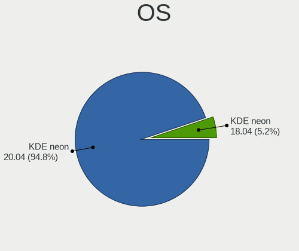

| Name           | Computers | Percent |
|----------------|-----------|---------|
| KDE neon 20.04 | 55        | 94.83%  |
| KDE neon 18.04 | 3         | 5.17%   |

OS Family
---------

OS without a version

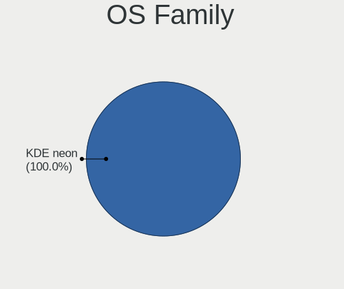

| Name     | Computers | Percent |
|----------|-----------|---------|
| KDE neon | 58        | 100%    |

Kernel
------

Version of the Linux kernel

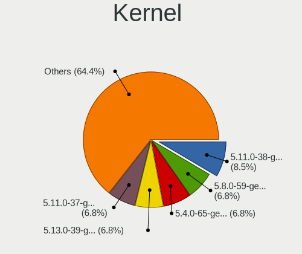

| Version                | Computers | Percent |
|------------------------|-----------|---------|
| 5.11.0-38-generic      | 5         | 8.47%   |
| 5.8.0-59-generic       | 4         | 6.78%   |
| 5.4.0-65-generic       | 4         | 6.78%   |
| 5.13.0-39-generic      | 4         | 6.78%   |
| 5.11.0-37-generic      | 4         | 6.78%   |
| 5.4.0-66-generic       | 3         | 5.08%   |
| 5.4.0-58-generic       | 3         | 5.08%   |
| 5.4.0-54-generic       | 3         | 5.08%   |
| 5.13.0-28-generic      | 3         | 5.08%   |
| 5.4.0-53-generic       | 2         | 3.39%   |
| 5.13.0-27-generic      | 2         | 3.39%   |
| 5.11.0-43-generic      | 2         | 3.39%   |
| 5.11.0-25-generic      | 2         | 3.39%   |
| 5.8.0-63-generic       | 1         | 1.69%   |
| 5.4.0-73-generic       | 1         | 1.69%   |
| 5.4.0-67-generic       | 1         | 1.69%   |
| 5.4.0-62-generic       | 1         | 1.69%   |
| 5.4.0-60-generic       | 1         | 1.69%   |
| 5.4.0-52-generic       | 1         | 1.69%   |
| 5.3.0-45-generic       | 1         | 1.69%   |
| 5.3.0-26-generic       | 1         | 1.69%   |
| 5.14.14-051414-generic | 1         | 1.69%   |
| 5.13.0-37-generic      | 1         | 1.69%   |
| 5.13.0-35-generic      | 1         | 1.69%   |
| 5.13.0-30-generic      | 1         | 1.69%   |
| 5.11.0-41-generic      | 1         | 1.69%   |
| 5.11.0-36-generic      | 1         | 1.69%   |
| 5.11.0-34-generic      | 1         | 1.69%   |
| 5.11.0-27-generic      | 1         | 1.69%   |
| 5.11.0-051100-generic  | 1         | 1.69%   |
| 4.15.0-52-generic      | 1         | 1.69%   |

Kernel Family
-------------

Linux kernel without a distro release

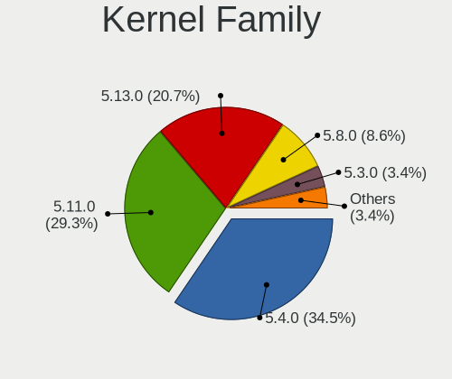

| Version | Computers | Percent |
|---------|-----------|---------|
| 5.4.0   | 20        | 34.48%  |
| 5.11.0  | 17        | 29.31%  |
| 5.13.0  | 12        | 20.69%  |
| 5.8.0   | 5         | 8.62%   |
| 5.3.0   | 2         | 3.45%   |
| 5.14.14 | 1         | 1.72%   |
| 4.15.0  | 1         | 1.72%   |

Kernel Major Ver.
-----------------

Linux kernel major version

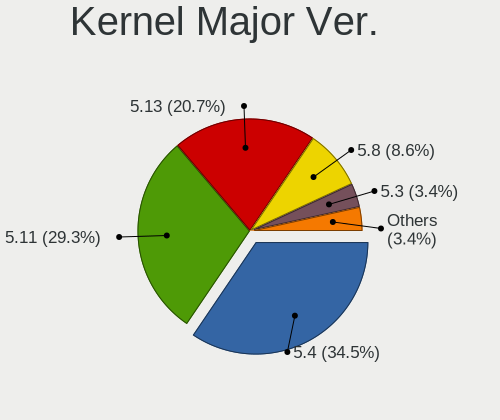

| Version | Computers | Percent |
|---------|-----------|---------|
| 5.4     | 20        | 34.48%  |
| 5.11    | 17        | 29.31%  |
| 5.13    | 12        | 20.69%  |
| 5.8     | 5         | 8.62%   |
| 5.3     | 2         | 3.45%   |
| 5.14    | 1         | 1.72%   |
| 4.15    | 1         | 1.72%   |

Arch
----

OS architecture (x86_64, i586, etc.)

| Name   | Computers | Percent |
|--------|-----------|---------|
| x86_64 | 58        | 100%    |

DE
--

Desktop Environment

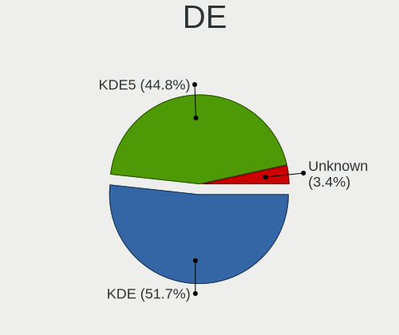

| Name    | Computers | Percent |
|---------|-----------|---------|
| KDE     | 30        | 51.72%  |
| KDE5    | 26        | 44.83%  |
| Unknown | 2         | 3.45%   |

Display Server
--------------

X11 or Wayland

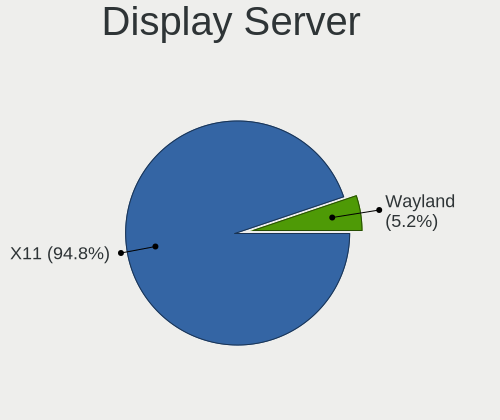

| Name    | Computers | Percent |
|---------|-----------|---------|
| X11     | 55        | 94.83%  |
| Wayland | 3         | 5.17%   |

Display Manager
---------------

SDDM, LightDM, etc.

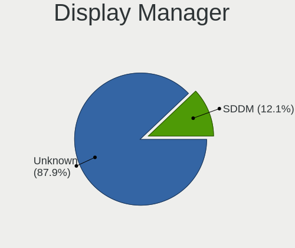

| Name    | Computers | Percent |
|---------|-----------|---------|
| Unknown | 51        | 87.93%  |
| SDDM    | 7         | 12.07%  |

OS Lang
-------

Language

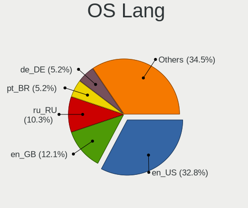

| Lang    | Computers | Percent |
|---------|-----------|---------|
| en_US   | 19        | 32.76%  |
| en_GB   | 7         | 12.07%  |
| ru_RU   | 6         | 10.34%  |
| pt_BR   | 3         | 5.17%   |
| de_DE   | 3         | 5.17%   |
| C       | 3         | 5.17%   |
| pl_PL   | 2         | 3.45%   |
| en_SG   | 2         | 3.45%   |
| zh_TW   | 1         | 1.72%   |
| zh_CN   | 1         | 1.72%   |
| sv_SE   | 1         | 1.72%   |
| sr_RS   | 1         | 1.72%   |
| nl_NL   | 1         | 1.72%   |
| it_IT   | 1         | 1.72%   |
| fr_FR   | 1         | 1.72%   |
| es_CL   | 1         | 1.72%   |
| en_ZA   | 1         | 1.72%   |
| en_IE   | 1         | 1.72%   |
| en_CA   | 1         | 1.72%   |
| de_AT   | 1         | 1.72%   |
| Unknown | 1         | 1.72%   |

Boot Mode
---------

EFI or BIOS

| Mode | Computers | Percent |
|------|-----------|---------|
| BIOS | 50        | 86.21%  |
| EFI  | 8         | 13.79%  |

Filesystem
----------

Type of filesystem

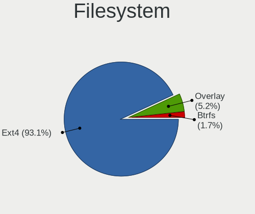

| Type    | Computers | Percent |
|---------|-----------|---------|
| Ext4    | 54        | 93.1%   |
| Overlay | 3         | 5.17%   |
| Btrfs   | 1         | 1.72%   |

Part. scheme
------------

Scheme of partitioning

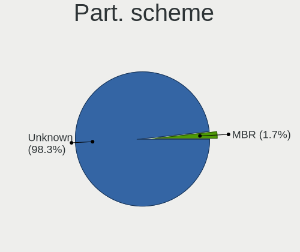

| Type    | Computers | Percent |
|---------|-----------|---------|
| Unknown | 57        | 98.28%  |
| MBR     | 1         | 1.72%   |

Dual Boot with Linux/BSD
------------------------

Hosting more than one Linux/BSD

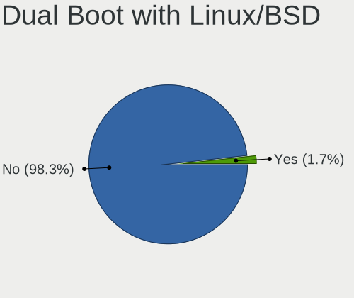

| Dual boot | Computers | Percent |
|-----------|-----------|---------|
| No        | 57        | 98.28%  |
| Yes       | 1         | 1.72%   |

Dual Boot (Win)
---------------

Hosting Linux and Windows

| Dual boot | Computers | Percent |
|-----------|-----------|---------|
| No        | 57        | 98.28%  |
| Yes       | 1         | 1.72%   |

Board
-----

Vendor
------

Motherboard manufacturer

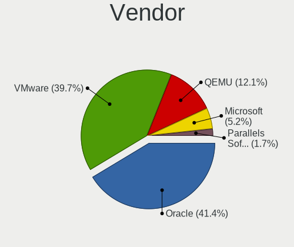

| Name                             | Computers | Percent |
|----------------------------------|-----------|---------|
| Oracle                           | 24        | 41.38%  |
| VMware                           | 23        | 39.66%  |
| QEMU                             | 7         | 12.07%  |
| Microsoft                        | 3         | 5.17%   |
| Parallels Software International | 1         | 1.72%   |

Model
-----

Motherboard model

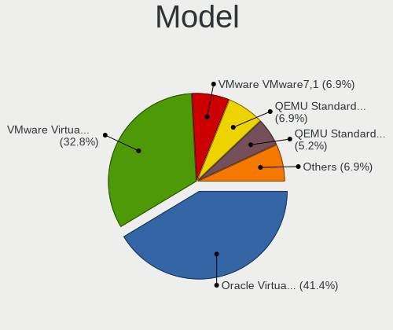

| Name                                                        | Computers | Percent |
|-------------------------------------------------------------|-----------|---------|
| Oracle VirtualBox                                           | 24        | 41.38%  |
| VMware Virtual Platform                                     | 19        | 32.76%  |
| VMware VMware7,1                                            | 4         | 6.9%    |
| QEMU Standard PC (Q35 + ICH9, 2009)                         | 4         | 6.9%    |
| QEMU Standard PC (i440FX + PIIX, 1996)                      | 3         | 5.17%   |
| Microsoft Virtual Machine                                   | 3         | 5.17%   |
| Parallels Software International Parallels Virtual Platform | 1         | 1.72%   |

Model Family
------------

Motherboard model prefix

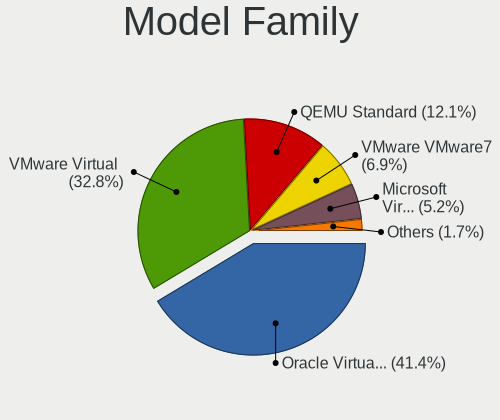

| Name                                       | Computers | Percent |
|--------------------------------------------|-----------|---------|
| Oracle VirtualBox                          | 24        | 41.38%  |
| VMware Virtual                             | 19        | 32.76%  |
| QEMU Standard                              | 7         | 12.07%  |
| VMware VMware7                             | 4         | 6.9%    |
| Microsoft Virtual                          | 3         | 5.17%   |
| Parallels Software International Parallels | 1         | 1.72%   |

MFG Year
--------

Motherboard manufacture year

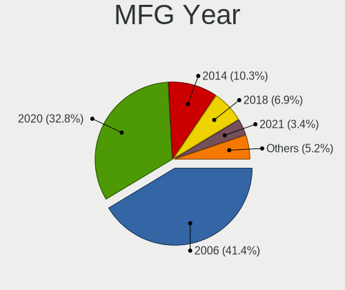

| Year | Computers | Percent |
|------|-----------|---------|
| 2006 | 24        | 41.38%  |
| 2020 | 19        | 32.76%  |
| 2014 | 6         | 10.34%  |
| 2018 | 4         | 6.9%    |
| 2021 | 2         | 3.45%   |
| 2019 | 2         | 3.45%   |
| 2015 | 1         | 1.72%   |

Form Factor
-----------

Physical design of the computer

| Name            | Computers | Percent |
|-----------------|-----------|---------|
| Virtual machine | 58        | 100%    |

Secure Boot
-----------

Enabled or disabled

| State    | Computers | Percent |
|----------|-----------|---------|
| Disabled | 56        | 96.55%  |
| Enabled  | 2         | 3.45%   |

Coreboot
--------

Have coreboot on board

| Used | Computers | Percent |
|------|-----------|---------|
| No   | 58        | 100%    |

RAM Size
--------

Total RAM memory

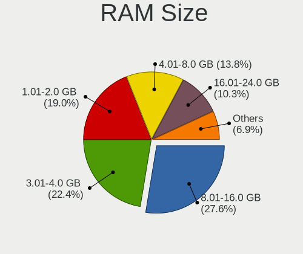

| Size in GB | Computers | Percent |
|------------|-----------|---------|
| 8.01-16.0  | 16        | 27.59%  |
| 3.01-4.0   | 13        | 22.41%  |
| 1.01-2.0   | 11        | 18.97%  |
| 4.01-8.0   | 8         | 13.79%  |
| 16.01-24.0 | 6         | 10.34%  |
| 2.01-3.0   | 2         | 3.45%   |
| 32.01-64.0 | 1         | 1.72%   |
| 0.51-1.0   | 1         | 1.72%   |

RAM Used
--------

Used RAM memory

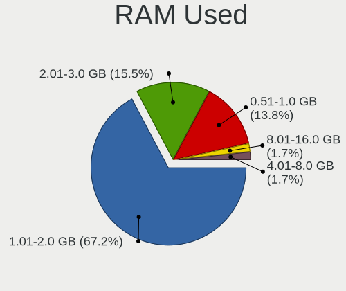

| Used GB   | Computers | Percent |
|-----------|-----------|---------|
| 1.01-2.0  | 39        | 67.24%  |
| 2.01-3.0  | 9         | 15.52%  |
| 0.51-1.0  | 8         | 13.79%  |
| 4.01-8.0  | 1         | 1.72%   |
| 8.01-16.0 | 1         | 1.72%   |

Total Drives
------------

Number of drives on board

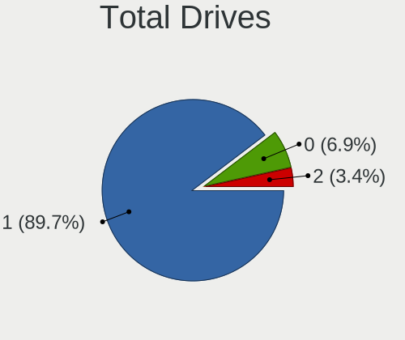

| Drives | Computers | Percent |
|--------|-----------|---------|
| 1      | 52        | 89.66%  |
| 0      | 4         | 6.9%    |
| 2      | 2         | 3.45%   |

Has CD-ROM
----------

Has CD-ROM on board

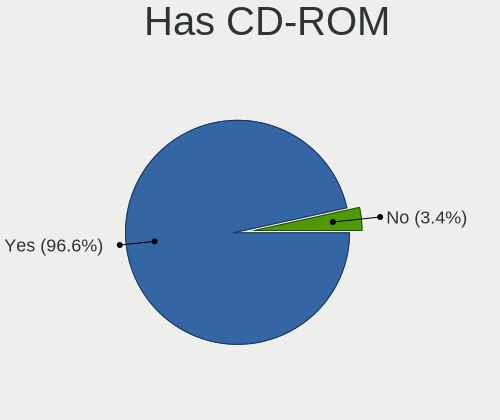

| Presented | Computers | Percent |
|-----------|-----------|---------|
| Yes       | 56        | 96.55%  |
| No        | 2         | 3.45%   |

Has Ethernet
------------

Has Ethernet on board

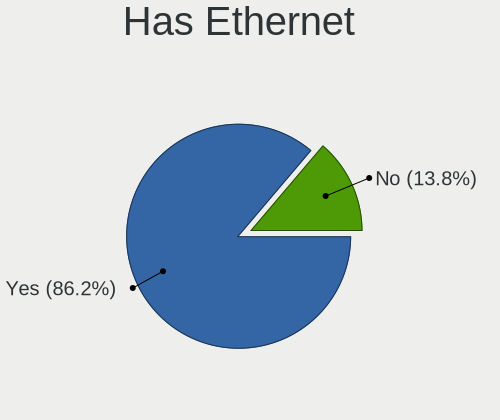

| Presented | Computers | Percent |
|-----------|-----------|---------|
| Yes       | 50        | 86.21%  |
| No        | 8         | 13.79%  |

Has WiFi
--------

Has WiFi module

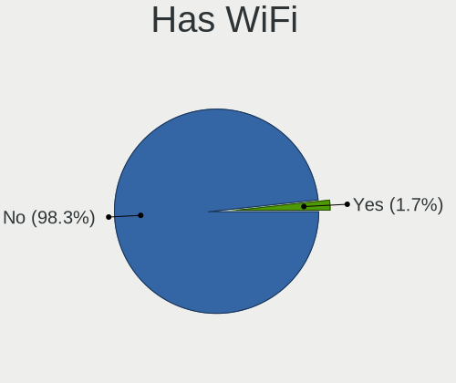

| Presented | Computers | Percent |
|-----------|-----------|---------|
| No        | 57        | 98.28%  |
| Yes       | 1         | 1.72%   |

Has Bluetooth
-------------

Has Bluetooth module

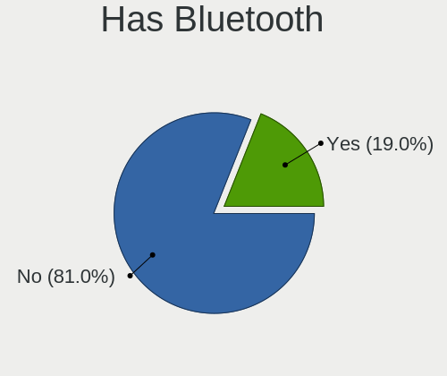

| Presented | Computers | Percent |
|-----------|-----------|---------|
| No        | 47        | 81.03%  |
| Yes       | 11        | 18.97%  |

Location
--------

Country
-------

Geographic location (country)

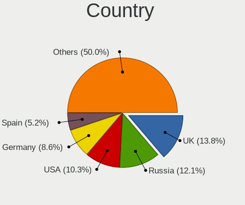

| Country      | Computers | Percent |
|--------------|-----------|---------|
| UK           | 8         | 13.79%  |
| Russia       | 7         | 12.07%  |
| USA          | 6         | 10.34%  |
| Germany      | 5         | 8.62%   |
| Spain        | 3         | 5.17%   |
| Saudi Arabia | 3         | 5.17%   |
| Brazil       | 3         | 5.17%   |
| Sweden       | 2         | 3.45%   |
| Singapore    | 2         | 3.45%   |
| Poland       | 2         | 3.45%   |
| Netherlands  | 2         | 3.45%   |
| Turkey       | 1         | 1.72%   |
| Taiwan       | 1         | 1.72%   |
| South Africa | 1         | 1.72%   |
| Serbia       | 1         | 1.72%   |
| Portugal     | 1         | 1.72%   |
| Iran         | 1         | 1.72%   |
| Hungary      | 1         | 1.72%   |
| France       | 1         | 1.72%   |
| Egypt        | 1         | 1.72%   |
| Cyprus       | 1         | 1.72%   |
| Croatia      | 1         | 1.72%   |
| China        | 1         | 1.72%   |
| Chile        | 1         | 1.72%   |
| Canada       | 1         | 1.72%   |
| Austria      | 1         | 1.72%   |

City
----

Geographic location (city)

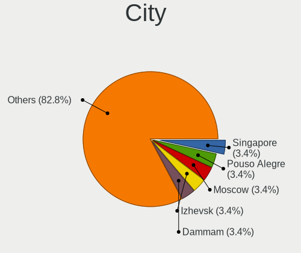

| City                    | Computers | Percent |
|-------------------------|-----------|---------|
| Singapore               | 2         | 3.45%   |
| Pouso Alegre            | 2         | 3.45%   |
| Moscow                  | 2         | 3.45%   |
| Izhevsk                 | 2         | 3.45%   |
| Dammam                  | 2         | 3.45%   |
| Croydon                 | 2         | 3.45%   |
| Yekaterinburg           | 1         | 1.72%   |
| Xuchang                 | 1         | 1.72%   |
| Wuppertal               | 1         | 1.72%   |
| Wolverhampton           | 1         | 1.72%   |
| Warsaw                  | 1         | 1.72%   |
| Valencia                | 1         | 1.72%   |
| Tehran                  | 1         | 1.72%   |
| Székesfehérvár | 1         | 1.72%   |
| St Petersburg           | 1         | 1.72%   |
| Secaucus                | 1         | 1.72%   |
| Sao Paulo               | 1         | 1.72%   |
| Santiago                | 1         | 1.72%   |
| Rimouski                | 1         | 1.72%   |
| Plano                   | 1         | 1.72%   |
| Nizhniy Novgorod        | 1         | 1.72%   |
| New York                | 1         | 1.72%   |
| Medina                  | 1         | 1.72%   |
| Malden                  | 1         | 1.72%   |
| Majadahonda             | 1         | 1.72%   |
| Loughborough            | 1         | 1.72%   |
| Lisbon                  | 1         | 1.72%   |
| Leerdam                 | 1         | 1.72%   |
| Kimberley               | 1         | 1.72%   |
| Kato Lakatameia         | 1         | 1.72%   |
| Karlsruhe               | 1         | 1.72%   |
| Kaohsiung City          | 1         | 1.72%   |
| Ilford                  | 1         | 1.72%   |
| Hot Springs             | 1         | 1.72%   |
| Holiday                 | 1         | 1.72%   |
| Grubisno Polje          | 1         | 1.72%   |
| Graz                    | 1         | 1.72%   |
| Garland                 | 1         | 1.72%   |
| Galdakao                | 1         | 1.72%   |
| Ettlingen               | 1         | 1.72%   |
| Durham                  | 1         | 1.72%   |
| Dresden                 | 1         | 1.72%   |
| Carryduff               | 1         | 1.72%   |
| Cairo                   | 1         | 1.72%   |
| Burgthann               | 1         | 1.72%   |
| Bolesławiec         | 1         | 1.72%   |
| Belgrade                | 1         | 1.72%   |
| Örebro              | 1         | 1.72%   |
| Arvika                  | 1         | 1.72%   |
| Antalya                 | 1         | 1.72%   |
| Albertville             | 1         | 1.72%   |
| Acton                   | 1         | 1.72%   |

Drives
------

Drive Vendor
------------

Hard drive vendors

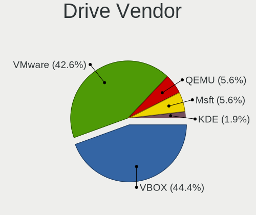

| Vendor | Computers | Drives | Percent |
|--------|-----------|--------|---------|
| VBOX   | 24        | 25     | 44.44%  |
| VMware | 23        | 24     | 42.59%  |
| QEMU   | 3         | 3      | 5.56%   |
| Msft   | 3         | 4      | 5.56%   |
| KDE    | 1         | 1      | 1.85%   |

Drive Model
-----------

Hard drive models

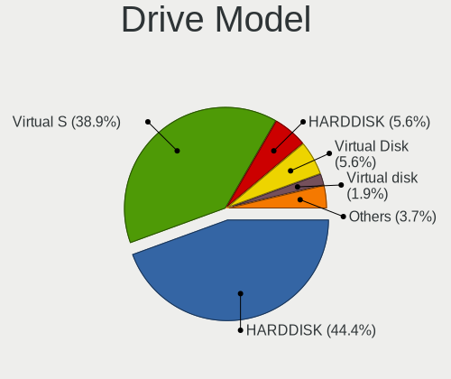

| Model                               | Computers | Percent |
|-------------------------------------|-----------|---------|
| VBOX HARDDISK                       | 24        | 44.44%  |
| VMware Virtual S                    | 21        | 38.89%  |
| QEMU HARDDISK                       | 3         | 5.56%   |
| Msft Virtual Disk                   | 3         | 5.56%   |
| VMware Virtual SATA Hard Drive      | 1         | 1.85%   |
| VMware Virtual disk                 | 1         | 1.85%   |
| KDE Neon - Plasma 5.21.1-0 SSD 68GB | 1         | 1.85%   |

HDD Vendor
----------

Hard disk drive vendors

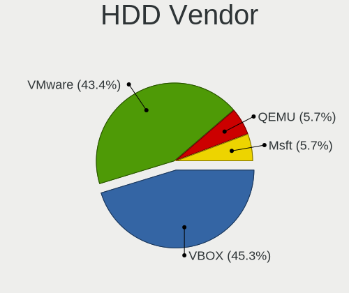

| Vendor | Computers | Drives | Percent |
|--------|-----------|--------|---------|
| VBOX   | 24        | 25     | 45.28%  |
| VMware | 23        | 24     | 43.4%   |
| QEMU   | 3         | 3      | 5.66%   |
| Msft   | 3         | 4      | 5.66%   |

SSD Vendor
----------

Solid state drive vendors

| Vendor | Computers | Drives | Percent |
|--------|-----------|--------|---------|
| KDE    | 1         | 1      | 100%    |

Drive Kind
----------

HDD or SSD

| Kind | Computers | Drives | Percent |
|------|-----------|--------|---------|
| HDD  | 53        | 56     | 98.15%  |
| SSD  | 1         | 1      | 1.85%   |

Drive Connector
---------------

SATA, SAS, NVMe, etc.

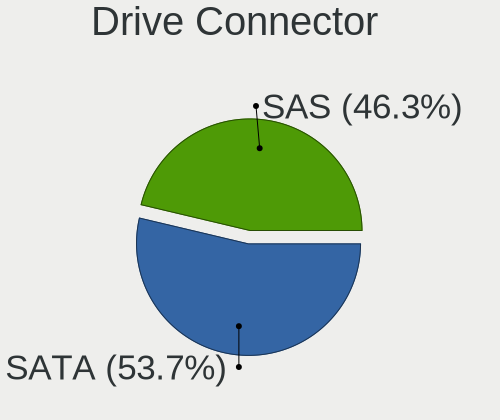

| Type | Computers | Drives | Percent |
|------|-----------|--------|---------|
| SATA | 29        | 30     | 53.7%   |
| SAS  | 25        | 27     | 46.3%   |

Drive Size
----------

Size of hard drive

| Size in TB | Computers | Drives | Percent |
|------------|-----------|--------|---------|
| 0.01-0.5   | 54        | 57     | 100%    |

Space Total
-----------

Amount of disk space available on the file system

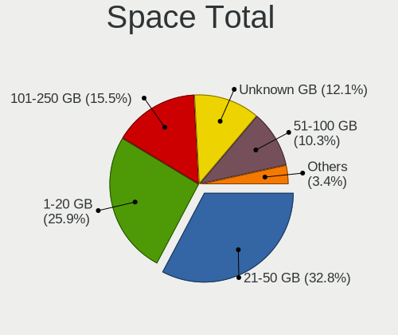

| Size in GB | Computers | Percent |
|------------|-----------|---------|
| 21-50      | 19        | 32.76%  |
| 1-20       | 15        | 25.86%  |
| 101-250    | 9         | 15.52%  |
| Unknown    | 7         | 12.07%  |
| 51-100     | 6         | 10.34%  |
| 251-500    | 1         | 1.72%   |
| 501-1000   | 1         | 1.72%   |

Space Used
----------

Amount of used disk space

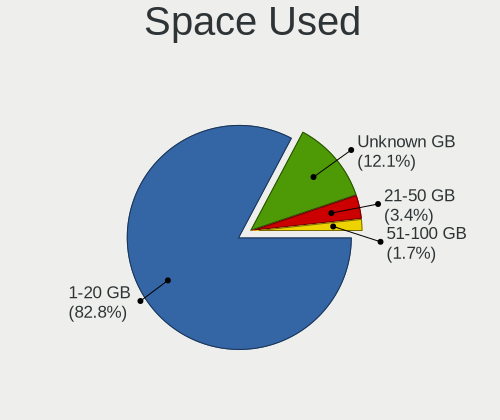

| Used GB | Computers | Percent |
|---------|-----------|---------|
| 1-20    | 48        | 82.76%  |
| Unknown | 7         | 12.07%  |
| 21-50   | 2         | 3.45%   |
| 51-100  | 1         | 1.72%   |

Malfunc. Drives
---------------

Drive models with a malfunction

Zero info for selected period =(

Malfunc. Drive Vendor
---------------------

Vendors of faulty drives

Zero info for selected period =(

Malfunc. HDD Vendor
-------------------

Vendors of faulty HDD drives

Zero info for selected period =(

Malfunc. Drive Kind
-------------------

Kinds of faulty drives

Zero info for selected period =(

Failed Drives
-------------

Failed drive models

Zero info for selected period =(

Failed Drive Vendor
-------------------

Failed drive vendors

Zero info for selected period =(

Drive Status
------------

Number of failed and malfunc. drives

| Status   | Computers | Drives | Percent |
|----------|-----------|--------|---------|
| Detected | 54        | 57     | 100%    |

Storage controller
------------------

Storage Vendor
--------------

Storage controller vendors

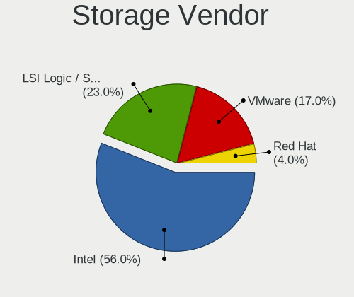

| Vendor                    | Computers | Percent |
|---------------------------|-----------|---------|
| Intel                     | 56        | 56%     |
| LSI Logic / Symbios Logic | 23        | 23%     |
| VMware                    | 17        | 17%     |
| Red Hat                   | 4         | 4%      |

Storage Model
-------------

Storage controller models

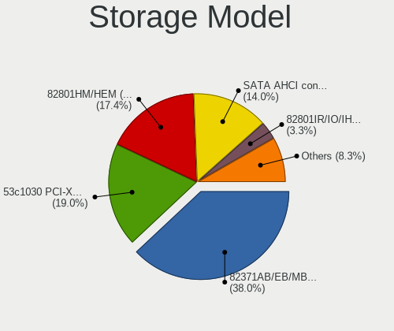

| Model                                                                 | Computers | Percent |
|-----------------------------------------------------------------------|-----------|---------|
| Intel 82371AB/EB/MB PIIX4 IDE                                         | 46        | 38.02%  |
| LSI Logic / Symbios Logic 53c1030 PCI-X Fusion-MPT Dual Ultra320 SCSI | 23        | 19.01%  |
| Intel 82801HM/HEM (ICH8M/ICH8M-E) SATA Controller [AHCI mode]         | 21        | 17.36%  |
| VMware SATA AHCI controller                                           | 17        | 14.05%  |
| Intel 82801IR/IO/IH (ICH9R/DO/DH) 6 port SATA Controller [AHCI mode]  | 4         | 3.31%   |
| Red Hat Virtio block device                                           | 3         | 2.48%   |
| Intel 82371SB PIIX3 IDE [Natoma/Triton II]                            | 3         | 2.48%   |
| VMware NVMe SSD Controller                                            | 1         | 0.83%   |
| Red Hat Virtio SCSI                                                   | 1         | 0.83%   |
| Intel 82801HR/HO/HH (ICH8R/DO/DH) 6 port SATA Controller [AHCI mode]  | 1         | 0.83%   |
| Intel 82801BA IDE U100 Controller                                     | 1         | 0.83%   |

Storage Kind
------------

Kind of storage controller (IDE, SATA, NVMe, SAS, ...)

| Kind | Computers | Percent |
|------|-----------|---------|
| IDE  | 50        | 41.32%  |
| SATA | 43        | 35.54%  |
| SCSI | 27        | 22.31%  |
| NVMe | 1         | 0.83%   |

Processor
---------

CPU Vendor
----------

Processor vendors

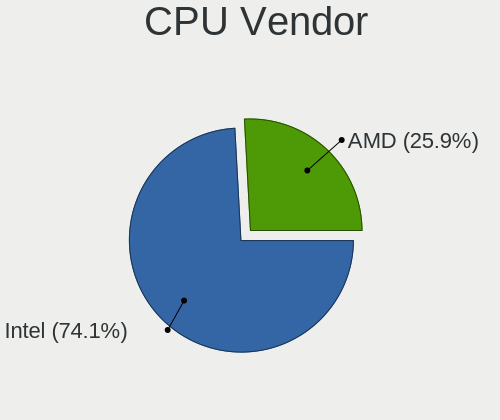

| Vendor | Computers | Percent |
|--------|-----------|---------|
| Intel  | 43        | 74.14%  |
| AMD    | 15        | 25.86%  |

CPU Model
---------

Processor models

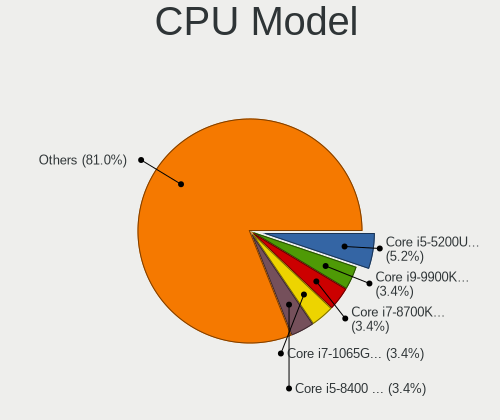

| Model                                          | Computers | Percent |
|------------------------------------------------|-----------|---------|
| Intel Core i5-5200U CPU @ 2.20GHz              | 3         | 5.17%   |
| Intel Core i9-9900K CPU @ 3.60GHz              | 2         | 3.45%   |
| Intel Core i7-8700K CPU @ 3.70GHz              | 2         | 3.45%   |
| Intel Core i7-1065G7 CPU @ 1.30GHz             | 2         | 3.45%   |
| Intel Core i5-8400 CPU @ 2.80GHz               | 2         | 3.45%   |
| AMD Ryzen 5 3600X 6-Core Processor             | 2         | 3.45%   |
| Intel Xeon CPU E5-2670 v2 @ 2.50GHz            | 1         | 1.72%   |
| Intel Xeon CPU E5-1650 v3 @ 3.50GHz            | 1         | 1.72%   |
| Intel Core i9-9980HK CPU @ 2.40GHz             | 1         | 1.72%   |
| Intel Core i7-7700HQ CPU @ 2.80GHz             | 1         | 1.72%   |
| Intel Core i7-7700 CPU @ 3.60GHz               | 1         | 1.72%   |
| Intel Core i7-6700K CPU @ 4.00GHz              | 1         | 1.72%   |
| Intel Core i7-4810MQ CPU @ 2.80GHz             | 1         | 1.72%   |
| Intel Core i7-4790K CPU @ 4.00GHz              | 1         | 1.72%   |
| Intel Core i7-4770K CPU @ 3.50GHz              | 1         | 1.72%   |
| Intel Core i7-3615QM CPU @ 2.30GHz             | 1         | 1.72%   |
| Intel Core i7-3540M CPU @ 3.00GHz              | 1         | 1.72%   |
| Intel Core i7-2600 CPU @ 3.40GHz               | 1         | 1.72%   |
| Intel Core i7 CPU 940 @ 2.93GHz                | 1         | 1.72%   |
| Intel Core i5-9400F CPU @ 2.90GHz              | 1         | 1.72%   |
| Intel Core i5-9400 CPU @ 2.90GHz               | 1         | 1.72%   |
| Intel Core i5-8600K CPU @ 3.60GHz              | 1         | 1.72%   |
| Intel Core i5-7200U CPU @ 2.50GHz              | 1         | 1.72%   |
| Intel Core i5-5287U CPU @ 2.90GHz              | 1         | 1.72%   |
| Intel Core i5-4690K CPU @ 3.50GHz              | 1         | 1.72%   |
| Intel Core i5-4460 CPU @ 3.20GHz               | 1         | 1.72%   |
| Intel Core i5-4200M CPU @ 2.50GHz              | 1         | 1.72%   |
| Intel Core i5-3337U CPU @ 1.80GHz              | 1         | 1.72%   |
| Intel Core i5-2430M CPU @ 2.40GHz              | 1         | 1.72%   |
| Intel Core i5-2400S CPU @ 2.50GHz              | 1         | 1.72%   |
| Intel Core i5-10600K CPU @ 4.10GHz             | 1         | 1.72%   |
| Intel Core i5-1038NG7 CPU @ 2.00GHz            | 1         | 1.72%   |
| Intel Core i5-1035G1 CPU @ 1.00GHz             | 1         | 1.72%   |
| Intel Core i3-4130 CPU @ 3.40GHz               | 1         | 1.72%   |
| Intel Core i3-1005G1 CPU @ 1.20GHz             | 1         | 1.72%   |
| Intel Common KVM processor                     | 1         | 1.72%   |
| Intel 11th Gen Core i7-11700KF @ 3.60GHz       | 1         | 1.72%   |
| Intel 11th Gen Core i7-11700 @ 2.50GHz         | 1         | 1.72%   |
| AMD Ryzen 9 5900X 12-Core Processor            | 1         | 1.72%   |
| AMD Ryzen 7 PRO 4750G with Radeon Graphics     | 1         | 1.72%   |
| AMD Ryzen 7 5800X 8-Core Processor             | 1         | 1.72%   |
| AMD Ryzen 7 2700X Eight-Core Processor         | 1         | 1.72%   |
| AMD Ryzen 7 1800X Eight-Core Processor         | 1         | 1.72%   |
| AMD Ryzen 5 PRO 5650U with Radeon Graphics     | 1         | 1.72%   |
| AMD Ryzen 5 3500U with Radeon Vega Mobile Gfx  | 1         | 1.72%   |
| AMD Ryzen 5 2600 Six-Core Processor            | 1         | 1.72%   |
| AMD Ryzen 5 1600 Six-Core Processor            | 1         | 1.72%   |
| AMD Ryzen 3 3200G with Radeon Vega Graphics    | 1         | 1.72%   |
| AMD FX-8350 Eight-Core Processor               | 1         | 1.72%   |
| AMD FX-8320 Eight-Core Processor               | 1         | 1.72%   |
| AMD A10-9700 RADEON R7, 10 COMPUTE CORES 4C+6G | 1         | 1.72%   |

CPU Model Family
----------------

Processor model prefix

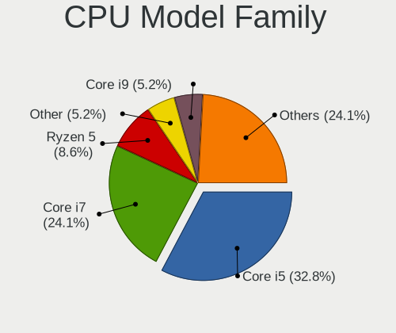

| Model           | Computers | Percent |
|-----------------|-----------|---------|
| Intel Core i5   | 19        | 32.76%  |
| Intel Core i7   | 14        | 24.14%  |
| AMD Ryzen 5     | 5         | 8.62%   |
| Other           | 3         | 5.17%   |
| Intel Core i9   | 3         | 5.17%   |
| AMD Ryzen 7     | 3         | 5.17%   |
| Intel Xeon      | 2         | 3.45%   |
| Intel Core i3   | 2         | 3.45%   |
| AMD FX          | 2         | 3.45%   |
| AMD Ryzen 9     | 1         | 1.72%   |
| AMD Ryzen 7 PRO | 1         | 1.72%   |
| AMD Ryzen 5 PRO | 1         | 1.72%   |
| AMD Ryzen 3     | 1         | 1.72%   |
| AMD A10         | 1         | 1.72%   |

CPU Cores
---------

Number of processor cores

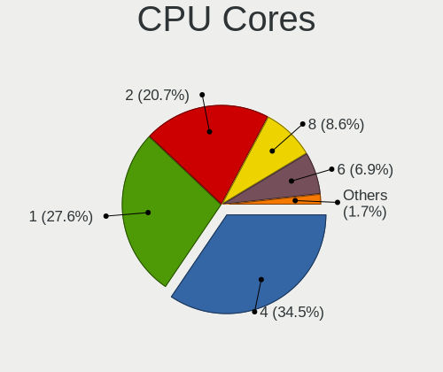

| Number | Computers | Percent |
|--------|-----------|---------|
| 4      | 20        | 34.48%  |
| 1      | 16        | 27.59%  |
| 2      | 12        | 20.69%  |
| 8      | 5         | 8.62%   |
| 6      | 4         | 6.9%    |
| 12     | 1         | 1.72%   |

CPU Sockets
-----------

Number of sockets

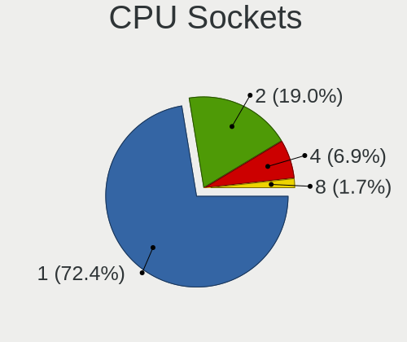

| Number | Computers | Percent |
|--------|-----------|---------|
| 1      | 42        | 72.41%  |
| 2      | 11        | 18.97%  |
| 4      | 4         | 6.9%    |
| 8      | 1         | 1.72%   |

CPU Threads
-----------

Threads per core (Hyper-Threading)

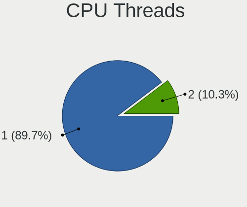

| Number | Computers | Percent |
|--------|-----------|---------|
| 1      | 52        | 89.66%  |
| 2      | 6         | 10.34%  |

CPU Op-Modes
------------

CPU Operation Modes (32-bit, 64-bit)

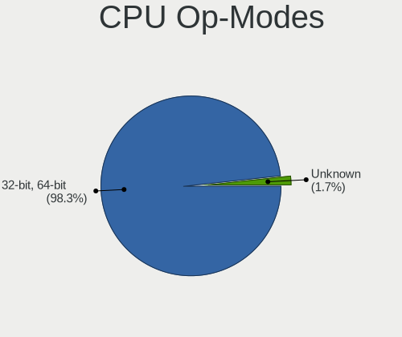

| Op mode        | Computers | Percent |
|----------------|-----------|---------|
| 32-bit, 64-bit | 57        | 98.28%  |
| Unknown        | 1         | 1.72%   |

CPU Microcode
-------------

Microcode number

| Number  | Computers | Percent |
|---------|-----------|---------|
| Unknown | 58        | 100%    |

CPU Microarch
-------------

Microarchitecture

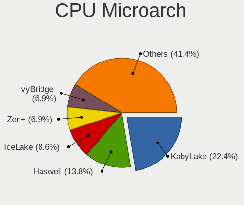

| Name        | Computers | Percent |
|-------------|-----------|---------|
| KabyLake    | 13        | 22.41%  |
| Haswell     | 8         | 13.79%  |
| IceLake     | 5         | 8.62%   |
| Zen+        | 4         | 6.9%    |
| IvyBridge   | 4         | 6.9%    |
| Broadwell   | 4         | 6.9%    |
| Zen 3       | 3         | 5.17%   |
| Zen 2       | 3         | 5.17%   |
| SandyBridge | 3         | 5.17%   |
| Zen         | 2         | 3.45%   |
| Piledriver  | 2         | 3.45%   |
| Unknown     | 2         | 3.45%   |
| Skylake     | 1         | 1.72%   |
| NetBurst    | 1         | 1.72%   |
| Nehalem     | 1         | 1.72%   |
| Excavator   | 1         | 1.72%   |
| CometLake   | 1         | 1.72%   |

Graphics
--------

GPU Vendor
----------

Vendors of graphics cards

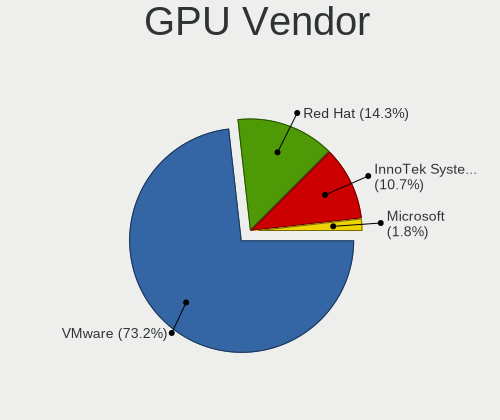

| Vendor                 | Computers | Percent |
|------------------------|-----------|---------|
| VMware                 | 41        | 73.21%  |
| Red Hat                | 8         | 14.29%  |
| InnoTek Systemberatung | 6         | 10.71%  |
| Microsoft              | 1         | 1.79%   |

GPU Model
---------

Graphics card models

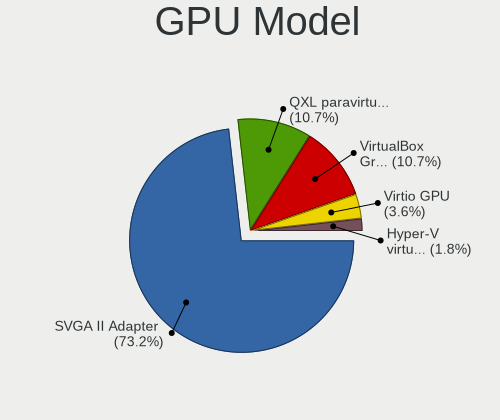

| Model                                              | Computers | Percent |
|----------------------------------------------------|-----------|---------|
| VMware SVGA II Adapter                             | 41        | 73.21%  |
| Red Hat QXL paravirtual graphic card               | 6         | 10.71%  |
| InnoTek Systemberatung VirtualBox Graphics Adapter | 6         | 10.71%  |
| Red Hat Virtio GPU                                 | 2         | 3.57%   |
| Microsoft Hyper-V virtual VGA                      | 1         | 1.79%   |

GPU Combo
---------

Combinations of graphics cards

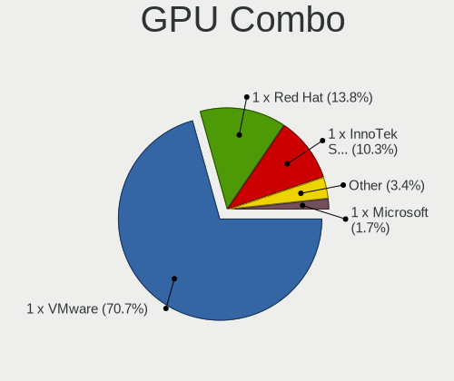

| Name                       | Computers | Percent |
|----------------------------|-----------|---------|
| 1 x VMware                 | 41        | 70.69%  |
| 1 x Red Hat                | 8         | 13.79%  |
| 1 x InnoTek Systemberatung | 6         | 10.34%  |
| Other                      | 2         | 3.45%   |
| 1 x Microsoft              | 1         | 1.72%   |

GPU Driver
----------

Free vs proprietary

| Driver  | Computers | Percent |
|---------|-----------|---------|
| Unknown | 58        | 100%    |

GPU Memory
----------

Total video memory

| Size in GB | Computers | Percent |
|------------|-----------|---------|
| Unknown    | 57        | 98.28%  |
| 0.01-0.5   | 1         | 1.72%   |

Monitor
-------

Monitor Vendor
--------------

Monitor vendors

| Vendor | Computers | Percent |
|--------|-----------|---------|
| RHT    | 1         | 100%    |

Monitor Model
-------------

Monitor models

| Model                                                  | Computers | Percent |
|--------------------------------------------------------|-----------|---------|
| RHT QEMU Monitor RHT1234 2048x1152 260x190mm 12.7-inch | 1         | 100%    |

Monitor Resolution
------------------

Monitor screen resolution

| Resolution | Computers | Percent |
|------------|-----------|---------|
| 3196x1798  | 1         | 100%    |

Monitor Diagonal
----------------

Diagonal size in inches

| Inches | Computers | Percent |
|--------|-----------|---------|
| 33     | 1         | 100%    |

Monitor Width
-------------

Physical width

| Width in mm | Computers | Percent |
|-------------|-----------|---------|
| 701-800     | 1         | 100%    |

Aspect Ratio
------------

Proportional relationship between the width and the height

| Ratio | Computers | Percent |
|-------|-----------|---------|
| 16/9  | 1         | 100%    |

Monitor Area
------------

Area in inch²

| Area in inch² | Computers | Percent |
|----------------|-----------|---------|
| 351-500        | 1         | 100%    |

Pixel Density
-------------

Pixels per inch

| Density | Computers | Percent |
|---------|-----------|---------|
| 51-100  | 1         | 100%    |

Multiple Monitors
-----------------

Total monitors connected

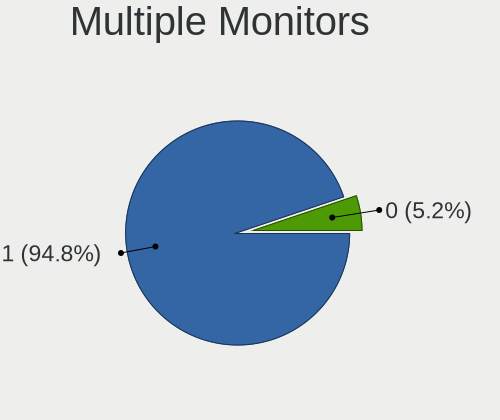

| Total | Computers | Percent |
|-------|-----------|---------|
| 1     | 55        | 94.83%  |
| 0     | 3         | 5.17%   |

Network
-------

Net Controller Vendor
---------------------

Controller vendors

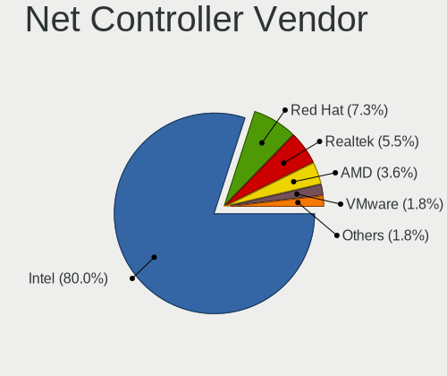

| Vendor                | Computers | Percent |
|-----------------------|-----------|---------|
| Intel                 | 44        | 80%     |
| Red Hat               | 4         | 7.27%   |
| Realtek Semiconductor | 3         | 5.45%   |
| AMD                   | 2         | 3.64%   |
| VMware                | 1         | 1.82%   |
| TP-Link               | 1         | 1.82%   |

Net Controller Model
--------------------

Controller models

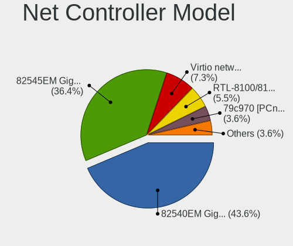

| Model                                                 | Computers | Percent |
|-------------------------------------------------------|-----------|---------|
| Intel 82540EM Gigabit Ethernet Controller             | 24        | 43.64%  |
| Intel 82545EM Gigabit Ethernet Controller (Copper)    | 20        | 36.36%  |
| Red Hat Virtio network device                         | 4         | 7.27%   |
| Realtek RTL-8100/8101L/8139 PCI Fast Ethernet Adapter | 3         | 5.45%   |
| AMD 79c970 [PCnet32 LANCE]                            | 2         | 3.64%   |
| VMware VMXNET3 Ethernet Controller                    | 1         | 1.82%   |
| TP-Link RTL8812AU Archer T4U 802.11ac                 | 1         | 1.82%   |

Wireless Vendor
---------------

Wireless vendors

| Vendor  | Computers | Percent |
|---------|-----------|---------|
| TP-Link | 1         | 100%    |

Wireless Model
--------------

Wireless models

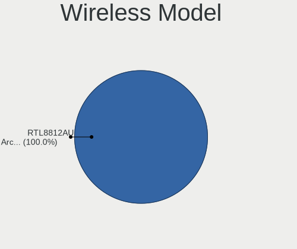

| Model                                 | Computers | Percent |
|---------------------------------------|-----------|---------|
| TP-Link RTL8812AU Archer T4U 802.11ac | 1         | 100%    |

Ethernet Vendor
---------------

Ethernet vendors

| Vendor                | Computers | Percent |
|-----------------------|-----------|---------|
| Intel                 | 44        | 88%     |
| Realtek Semiconductor | 3         | 6%      |
| AMD                   | 2         | 4%      |
| VMware                | 1         | 2%      |

Ethernet Model
--------------

Ethernet models

| Model                                                 | Computers | Percent |
|-------------------------------------------------------|-----------|---------|
| Intel 82540EM Gigabit Ethernet Controller             | 24        | 48%     |
| Intel 82545EM Gigabit Ethernet Controller (Copper)    | 20        | 40%     |
| Realtek RTL-8100/8101L/8139 PCI Fast Ethernet Adapter | 3         | 6%      |
| AMD 79c970 [PCnet32 LANCE]                            | 2         | 4%      |
| VMware VMXNET3 Ethernet Controller                    | 1         | 2%      |

Net Controller Kind
-------------------

Ethernet, WiFi or modem

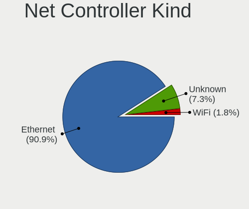

| Kind     | Computers | Percent |
|----------|-----------|---------|
| Ethernet | 50        | 90.91%  |
| Unknown  | 4         | 7.27%   |
| WiFi     | 1         | 1.82%   |

Used Controller
---------------

Currently used network controller

| Kind     | Computers | Percent |
|----------|-----------|---------|
| Ethernet | 50        | 100%    |

NICs
----

Total network controllers on board

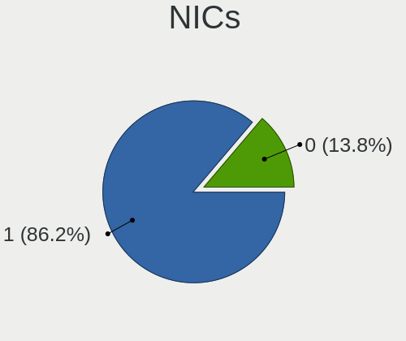

| Total | Computers | Percent |
|-------|-----------|---------|
| 1     | 50        | 86.21%  |
| 0     | 8         | 13.79%  |

IPv6
----

IPv6 vs IPv4

| Used | Computers | Percent |
|------|-----------|---------|
| No   | 58        | 100%    |

Bluetooth
---------

Bluetooth Vendor
----------------

Controller vendors

| Vendor                | Computers | Percent |
|-----------------------|-----------|---------|
| VMware                | 9         | 81.82%  |
| Realtek Semiconductor | 1         | 9.09%   |
| Microsoft             | 1         | 9.09%   |

Bluetooth Model
---------------

Controller models

| Model                                        | Computers | Percent |
|----------------------------------------------|-----------|---------|
| VMware Virtual Bluetooth Adapter             | 9         | 81.82%  |
| Realtek  Bluetooth 4.2 Adapter               | 1         | 9.09%   |
| Microsoft Wireless Transceiver for Bluetooth | 1         | 9.09%   |

Sound
-----

Sound Vendor
------------

Sound card vendors

| Vendor              | Computers | Percent |
|---------------------|-----------|---------|
| Intel               | 32        | 58.18%  |
| Ensoniq             | 22        | 40%     |
| Creative Technology | 1         | 1.82%   |

Sound Model
-----------

Sound card models

| Model                                                                      | Computers | Percent |
|----------------------------------------------------------------------------|-----------|---------|
| Intel 82801AA AC'97 Audio Controller                                       | 23        | 41.82%  |
| Ensoniq ES1371/ES1373 / Creative Labs CT2518                               | 22        | 40%     |
| Intel 82801I (ICH9 Family) HD Audio Controller                             | 5         | 9.09%   |
| Intel 82801FB/FBM/FR/FW/FRW (ICH6 Family) High Definition Audio Controller | 4         | 7.27%   |
| Creative Technology SB X-Fi Surround 5.1                                   | 1         | 1.82%   |

Memory
------

Memory Vendor
-------------

Memory module vendors

| Vendor    | Computers | Percent |
|-----------|-----------|---------|
| Unknown   | 2         | 66.67%  |
| Microsoft | 1         | 33.33%  |

Memory Model
------------

Memory module models

| Model                               | Computers | Percent |
|-------------------------------------|-----------|---------|
| Unknown RAM Module 2048MB DIMM DRAM | 2         | 66.67%  |
| Microsoft RAM Module 3GB            | 1         | 33.33%  |

Memory Kind
-----------

Memory module kinds

| Kind    | Computers | Percent |
|---------|-----------|---------|
| DRAM    | 2         | 66.67%  |
| Unknown | 1         | 33.33%  |

Memory Form Factor
------------------

Physical design of the memory module

| Name    | Computers | Percent |
|---------|-----------|---------|
| DIMM    | 2         | 66.67%  |
| Unknown | 1         | 33.33%  |

Memory Size
-----------

Memory module size

| Size | Computers | Percent |
|------|-----------|---------|
| 2048 | 2         | 66.67%  |
| 3072 | 1         | 33.33%  |

Memory Speed
------------

Memory module speed

| Speed   | Computers | Percent |
|---------|-----------|---------|
| Unknown | 3         | 100%    |

Printers & scanners
-------------------

Printer Vendor
--------------

Printer device vendors

| Vendor    | Computers | Percent |
|-----------|-----------|---------|
| PARALLELS | 1         | 100%    |

Printer Model
-------------

Printer device models

| Model                                                                                  | Computers | Percent |
|----------------------------------------------------------------------------------------|-----------|---------|
| PARALLELS Virtual Printer (/Users/jean/Parallels/OpenMandriva Lx 4.3.pvm/parallel.txt) | 1         | 100%    |

Scanner Vendor
--------------

Scanner device vendors

Zero info for selected period =(

Scanner Model
-------------

Scanner device models

Zero info for selected period =(

Camera
------

Camera Vendor
-------------

Camera device vendors

| Vendor    | Computers | Percent |
|-----------|-----------|---------|
| VMware    | 3         | 60%     |
| PARALLELS | 1         | 20%     |
| Logitech  | 1         | 20%     |

Camera Model
------------

Camera device models

| Model                           | Computers | Percent |
|---------------------------------|-----------|---------|
| VMware Virtual USB Video Device | 3         | 60%     |
| PARALLELS IRIScan Desk 5 Pro    | 1         | 20%     |
| Logitech HD Pro Webcam C920     | 1         | 20%     |

Security
--------

Fingerprint Vendor
------------------

Fingerprint sensor vendors

| Vendor                     | Computers | Percent |
|----------------------------|-----------|---------|
| Shenzhen Goodix Technology | 1         | 100%    |

Fingerprint Model
-----------------

Fingerprint sensor models

| Model                               | Computers | Percent |
|-------------------------------------|-----------|---------|
| Shenzhen Goodix  Fingerprint Device | 1         | 100%    |

Chipcard Vendor
---------------

Chipcard module vendors

| Vendor                | Computers | Percent |
|-----------------------|-----------|---------|
| Gemalto (was Gemplus) | 4         | 100%    |

Chipcard Model
--------------

Chipcard module models

| Model                               | Computers | Percent |
|-------------------------------------|-----------|---------|
| Gemalto (was Gemplus) GemPC433-Swap | 4         | 100%    |

Unsupported
-----------

Unsupported Devices
-------------------

Total unsupported devices on board

| Total | Computers | Percent |
|-------|-----------|---------|
| 0     | 53        | 91.38%  |
| 1     | 5         | 8.62%   |

Unsupported Device Types
------------------------

Types of unsupported devices

| Type         | Computers | Percent |
|--------------|-----------|---------|
| Chipcard     | 4         | 80%     |
| Net/wireless | 1         | 20%     |

