Kali - Tested Virtual Hardware & Statistics
-------------------------------------------

A project to collect tested virtual hardware configurations for Kali.

Anyone can contribute to this report by the [hw-probe](https://github.com/linuxhw/hw-probe) tool:

    sudo -E hw-probe -all -upload

Please contribute! Especially if your hardware is rare.

Contents
--------

* [ Test Cases ](#test-cases)

* [ System ](#system)
  - [ OS                       ](#os)
  - [ OS Family                ](#os-family)
  - [ Kernel                   ](#kernel)
  - [ Kernel Family            ](#kernel-family)
  - [ Kernel Major Ver.        ](#kernel-major-ver)
  - [ Arch                     ](#arch)
  - [ DE                       ](#de)
  - [ Display Server           ](#display-server)
  - [ Display Manager          ](#display-manager)
  - [ OS Lang                  ](#os-lang)
  - [ Boot Mode                ](#boot-mode)
  - [ Filesystem               ](#filesystem)
  - [ Part. scheme             ](#part-scheme)
  - [ Dual Boot with Linux/BSD ](#dual-boot-with-linuxbsd)
  - [ Dual Boot (Win)          ](#dual-boot-win)

* [ Board ](#board)
  - [ Vendor                   ](#vendor)
  - [ Model                    ](#model)
  - [ Model Family             ](#model-family)
  - [ MFG Year                 ](#mfg-year)
  - [ Form Factor              ](#form-factor)
  - [ Secure Boot              ](#secure-boot)
  - [ Coreboot                 ](#coreboot)
  - [ RAM Size                 ](#ram-size)
  - [ RAM Used                 ](#ram-used)
  - [ Total Drives             ](#total-drives)
  - [ Has CD-ROM               ](#has-cd-rom)
  - [ Has Ethernet             ](#has-ethernet)
  - [ Has WiFi                 ](#has-wifi)
  - [ Has Bluetooth            ](#has-bluetooth)

* [ Location ](#location)
  - [ Country                  ](#country)
  - [ City                     ](#city)

* [ Drives ](#drives)
  - [ Drive Vendor             ](#drive-vendor)
  - [ Drive Model              ](#drive-model)
  - [ HDD Vendor               ](#hdd-vendor)
  - [ SSD Vendor               ](#ssd-vendor)
  - [ Drive Kind               ](#drive-kind)
  - [ Drive Connector          ](#drive-connector)
  - [ Drive Size               ](#drive-size)
  - [ Space Total              ](#space-total)
  - [ Space Used               ](#space-used)
  - [ Malfunc. Drives          ](#malfunc-drives)
  - [ Malfunc. Drive Vendor    ](#malfunc-drive-vendor)
  - [ Malfunc. HDD Vendor      ](#malfunc-hdd-vendor)
  - [ Malfunc. Drive Kind      ](#malfunc-drive-kind)
  - [ Failed Drives            ](#failed-drives)
  - [ Failed Drive Vendor      ](#failed-drive-vendor)
  - [ Drive Status             ](#drive-status)

* [ Storage controller ](#storage-controller)
  - [ Storage Vendor           ](#storage-vendor)
  - [ Storage Model            ](#storage-model)
  - [ Storage Kind             ](#storage-kind)

* [ Processor ](#processor)
  - [ CPU Vendor               ](#cpu-vendor)
  - [ CPU Model                ](#cpu-model)
  - [ CPU Model Family         ](#cpu-model-family)
  - [ CPU Cores                ](#cpu-cores)
  - [ CPU Sockets              ](#cpu-sockets)
  - [ CPU Threads              ](#cpu-threads)
  - [ CPU Op-Modes             ](#cpu-op-modes)
  - [ CPU Microcode            ](#cpu-microcode)
  - [ CPU Microarch            ](#cpu-microarch)

* [ Graphics ](#graphics)
  - [ GPU Vendor               ](#gpu-vendor)
  - [ GPU Model                ](#gpu-model)
  - [ GPU Combo                ](#gpu-combo)
  - [ GPU Driver               ](#gpu-driver)
  - [ GPU Memory               ](#gpu-memory)

* [ Monitor ](#monitor)
  - [ Monitor Vendor           ](#monitor-vendor)
  - [ Monitor Model            ](#monitor-model)
  - [ Monitor Resolution       ](#monitor-resolution)
  - [ Monitor Diagonal         ](#monitor-diagonal)
  - [ Monitor Width            ](#monitor-width)
  - [ Aspect Ratio             ](#aspect-ratio)
  - [ Monitor Area             ](#monitor-area)
  - [ Pixel Density            ](#pixel-density)
  - [ Multiple Monitors        ](#multiple-monitors)

* [ Network ](#network)
  - [ Net Controller Vendor    ](#net-controller-vendor)
  - [ Net Controller Model     ](#net-controller-model)
  - [ Wireless Vendor          ](#wireless-vendor)
  - [ Wireless Model           ](#wireless-model)
  - [ Ethernet Vendor          ](#ethernet-vendor)
  - [ Ethernet Model           ](#ethernet-model)
  - [ Net Controller Kind      ](#net-controller-kind)
  - [ Used Controller          ](#used-controller)
  - [ NICs                     ](#nics)
  - [ IPv6                     ](#ipv6)

* [ Bluetooth ](#bluetooth)
  - [ Bluetooth Vendor         ](#bluetooth-vendor)
  - [ Bluetooth Model          ](#bluetooth-model)

* [ Sound ](#sound)
  - [ Sound Vendor             ](#sound-vendor)
  - [ Sound Model              ](#sound-model)

* [ Memory ](#memory)
  - [ Memory Vendor            ](#memory-vendor)
  - [ Memory Model             ](#memory-model)
  - [ Memory Kind              ](#memory-kind)
  - [ Memory Form Factor       ](#memory-form-factor)
  - [ Memory Size              ](#memory-size)
  - [ Memory Speed             ](#memory-speed)

* [ Printers & scanners ](#printers--scanners)
  - [ Printer Vendor           ](#printer-vendor)
  - [ Printer Model            ](#printer-model)
  - [ Scanner Vendor           ](#scanner-vendor)
  - [ Scanner Model            ](#scanner-model)

* [ Camera ](#camera)
  - [ Camera Vendor            ](#camera-vendor)
  - [ Camera Model             ](#camera-model)

* [ Security ](#security)
  - [ Fingerprint Vendor       ](#fingerprint-vendor)
  - [ Fingerprint Model        ](#fingerprint-model)
  - [ Chipcard Vendor          ](#chipcard-vendor)
  - [ Chipcard Model           ](#chipcard-model)

* [ Unsupported ](#unsupported)
  - [ Unsupported Devices      ](#unsupported-devices)
  - [ Unsupported Device Types ](#unsupported-device-types)

Test Cases
----------

Total: 109

| Vendor        | Model                       | Form-Factor     | Probe                                                      | Date         |
|---------------|-----------------------------|-----------------|------------------------------------------------------------|--------------|
| VMware        | Virtual Platform            | Virtual machine | [61e7a475d7](https://linux-hardware.org/?probe=61e7a475d7) | Apr 09, 2022 |
| Oracle        | VirtualBox                  | Virtual machine | [50791b086f](https://linux-hardware.org/?probe=50791b086f) | Apr 09, 2022 |
| VMware        | Virtual Platform            | Virtual machine | [d401ca673d](https://linux-hardware.org/?probe=d401ca673d) | Apr 06, 2022 |
| VMware        | Virtual Platform            | Virtual machine | [fd24ba6727](https://linux-hardware.org/?probe=fd24ba6727) | Apr 04, 2022 |
| Oracle        | VirtualBox                  | Virtual machine | [889ee2fbd1](https://linux-hardware.org/?probe=889ee2fbd1) | Apr 02, 2022 |
| Oracle        | VirtualBox                  | Virtual machine | [d8a9458096](https://linux-hardware.org/?probe=d8a9458096) | Mar 31, 2022 |
| VMware        | Virtual Platform            | Virtual machine | [8580187767](https://linux-hardware.org/?probe=8580187767) | Mar 23, 2022 |
| VMware        | Virtual Platform            | Virtual machine | [e626da4592](https://linux-hardware.org/?probe=e626da4592) | Mar 23, 2022 |
| VMware        | Virtual Platform            | Virtual machine | [5a3ab6b9e4](https://linux-hardware.org/?probe=5a3ab6b9e4) | Mar 22, 2022 |
| VMware        | Virtual Platform            | Virtual machine | [26db2272e2](https://linux-hardware.org/?probe=26db2272e2) | Mar 20, 2022 |
| VMware        | Virtual Platform            | Virtual machine | [3263cd738f](https://linux-hardware.org/?probe=3263cd738f) | Mar 20, 2022 |
| Microsoft     | Windows Subsystem for Li... | Virtual machine | [623bdf88da](https://linux-hardware.org/?probe=623bdf88da) | Mar 12, 2022 |
| Microsoft     | Windows Subsystem for Li... | Virtual machine | [d15fc397a3](https://linux-hardware.org/?probe=d15fc397a3) | Mar 11, 2022 |
| Microsoft     | Windows Subsystem for Li... | Virtual machine | [fdc98e1ec3](https://linux-hardware.org/?probe=fdc98e1ec3) | Mar 10, 2022 |
| VMware        | Virtual Platform            | Virtual machine | [63be84268f](https://linux-hardware.org/?probe=63be84268f) | Mar 06, 2022 |
| Parallels ... | ARM Virtual Machine         | Virtual machine | [69901fc874](https://linux-hardware.org/?probe=69901fc874) | Feb 07, 2022 |
| VMware        | VBSA 1                      | Virtual machine | [63ce442d2e](https://linux-hardware.org/?probe=63ce442d2e) | Feb 03, 2022 |
| VMware        | VBSA 1                      | Virtual machine | [cd2d854b30](https://linux-hardware.org/?probe=cd2d854b30) | Jan 21, 2022 |
| Oracle        | VirtualBox                  | Virtual machine | [c83c1edfce](https://linux-hardware.org/?probe=c83c1edfce) | Jan 10, 2022 |
| VMware        | Virtual Platform            | Virtual machine | [dc14c02b0b](https://linux-hardware.org/?probe=dc14c02b0b) | Jan 09, 2022 |
| Oracle        | VirtualBox                  | Virtual machine | [1077d37649](https://linux-hardware.org/?probe=1077d37649) | Jan 07, 2022 |
| Parallels ... | Parallels Virtual Platfo... | Virtual machine | [4f5fa66bea](https://linux-hardware.org/?probe=4f5fa66bea) | Dec 28, 2021 |
| Oracle        | VirtualBox                  | Virtual machine | [39782013a2](https://linux-hardware.org/?probe=39782013a2) | Dec 27, 2021 |
| Oracle        | VirtualBox                  | Virtual machine | [8fd8136cb9](https://linux-hardware.org/?probe=8fd8136cb9) | Dec 22, 2021 |
| Oracle        | VirtualBox                  | Virtual machine | [cb0afbd934](https://linux-hardware.org/?probe=cb0afbd934) | Dec 19, 2021 |
| Oracle        | VirtualBox                  | Virtual machine | [e5b1f960ab](https://linux-hardware.org/?probe=e5b1f960ab) | Dec 16, 2021 |
| Oracle        | VirtualBox                  | Virtual machine | [270d7c7870](https://linux-hardware.org/?probe=270d7c7870) | Dec 09, 2021 |
| VMware        | Virtual Platform            | Virtual machine | [01829b80d7](https://linux-hardware.org/?probe=01829b80d7) | Dec 08, 2021 |
| VMware        | Virtual Platform            | Virtual machine | [19611771c6](https://linux-hardware.org/?probe=19611771c6) | Dec 04, 2021 |
| Oracle        | VirtualBox                  | Virtual machine | [a6522d0e6c](https://linux-hardware.org/?probe=a6522d0e6c) | Dec 03, 2021 |
| Oracle        | VirtualBox                  | Virtual machine | [ffc7951306](https://linux-hardware.org/?probe=ffc7951306) | Dec 01, 2021 |
| Oracle        | VirtualBox                  | Virtual machine | [3e1051c5ab](https://linux-hardware.org/?probe=3e1051c5ab) | Nov 28, 2021 |
| VMware        | Virtual Platform            | Virtual machine | [3afcc1ed04](https://linux-hardware.org/?probe=3afcc1ed04) | Nov 02, 2021 |
| VMware        | Virtual Platform            | Virtual machine | [c51f3e0dfe](https://linux-hardware.org/?probe=c51f3e0dfe) | Nov 02, 2021 |
| Oracle        | VirtualBox                  | Virtual machine | [519be34275](https://linux-hardware.org/?probe=519be34275) | Oct 10, 2021 |
| VMware        | Virtual Platform            | Virtual machine | [3a361963ad](https://linux-hardware.org/?probe=3a361963ad) | Oct 07, 2021 |
| VMware        | Virtual Platform            | Virtual machine | [deed1fc076](https://linux-hardware.org/?probe=deed1fc076) | Sep 26, 2021 |
| Oracle        | VirtualBox                  | Virtual machine | [bc9929b880](https://linux-hardware.org/?probe=bc9929b880) | Sep 15, 2021 |
| Oracle        | VirtualBox                  | Virtual machine | [34b607586e](https://linux-hardware.org/?probe=34b607586e) | Sep 13, 2021 |
| Oracle        | VirtualBox                  | Virtual machine | [2f8205ad2d](https://linux-hardware.org/?probe=2f8205ad2d) | Sep 06, 2021 |
| VMware        | Virtual Platform            | Virtual machine | [43a32eb026](https://linux-hardware.org/?probe=43a32eb026) | Aug 31, 2021 |
| VMware        | Virtual Platform            | Virtual machine | [374740d5f9](https://linux-hardware.org/?probe=374740d5f9) | Aug 23, 2021 |
| Unknown       | Unknown                     | Virtual machine | [78628bf8a7](https://linux-hardware.org/?probe=78628bf8a7) | Aug 21, 2021 |
| VMware        | Virtual Platform            | Virtual machine | [bee6f3618a](https://linux-hardware.org/?probe=bee6f3618a) | Aug 17, 2021 |
| VMware        | Virtual Platform            | Virtual machine | [aee060943d](https://linux-hardware.org/?probe=aee060943d) | Aug 17, 2021 |
| Oracle        | VirtualBox                  | Virtual machine | [0e4990196d](https://linux-hardware.org/?probe=0e4990196d) | Aug 17, 2021 |
| QEMU          | Standard PC (i440FX + PI... | Virtual machine | [7270cdcaf7](https://linux-hardware.org/?probe=7270cdcaf7) | Aug 16, 2021 |
| QEMU          | Standard PC (i440FX + PI... | Virtual machine | [504e0725ab](https://linux-hardware.org/?probe=504e0725ab) | Aug 16, 2021 |
| Parallels ... | ARM Virtual Machine         | Virtual machine | [69e23b858b](https://linux-hardware.org/?probe=69e23b858b) | Aug 11, 2021 |
| Oracle        | VirtualBox                  | Virtual machine | [17be2d6be5](https://linux-hardware.org/?probe=17be2d6be5) | Aug 05, 2021 |
| Oracle        | VirtualBox                  | Virtual machine | [9ff96e420b](https://linux-hardware.org/?probe=9ff96e420b) | Jul 26, 2021 |
| Oracle        | VirtualBox                  | Virtual machine | [0596cea4e6](https://linux-hardware.org/?probe=0596cea4e6) | Jul 26, 2021 |
| Oracle        | VirtualBox                  | Virtual machine | [c074d93c38](https://linux-hardware.org/?probe=c074d93c38) | Jul 24, 2021 |
| Oracle        | VirtualBox                  | Virtual machine | [bc624f487f](https://linux-hardware.org/?probe=bc624f487f) | Jul 16, 2021 |
| Oracle        | VirtualBox                  | Virtual machine | [6e23bc48ec](https://linux-hardware.org/?probe=6e23bc48ec) | Jul 03, 2021 |
| Microsoft     | Windows Subsystem for Li... | Virtual machine | [2ab533b2e4](https://linux-hardware.org/?probe=2ab533b2e4) | Jun 27, 2021 |
| QEMU          | Standard PC (Q35 + ICH9,... | Virtual machine | [3a5083a994](https://linux-hardware.org/?probe=3a5083a994) | Jun 26, 2021 |
| QEMU          | Standard PC (Q35 + ICH9,... | Virtual machine | [f07860df36](https://linux-hardware.org/?probe=f07860df36) | Jun 26, 2021 |
| Oracle        | VirtualBox                  | Virtual machine | [1b643b3508](https://linux-hardware.org/?probe=1b643b3508) | Jun 11, 2021 |
| Oracle        | VirtualBox                  | Virtual machine | [0aa4f7c6ca](https://linux-hardware.org/?probe=0aa4f7c6ca) | Jun 01, 2021 |
| Oracle        | VirtualBox                  | Virtual machine | [a58b05f22f](https://linux-hardware.org/?probe=a58b05f22f) | Jun 01, 2021 |
| QEMU          | Standard PC (Q35 + ICH9,... | Virtual machine | [faad09a0e3](https://linux-hardware.org/?probe=faad09a0e3) | May 22, 2021 |
| QEMU          | Standard PC (Q35 + ICH9,... | Virtual machine | [255d79eaba](https://linux-hardware.org/?probe=255d79eaba) | May 22, 2021 |
| VMware        | Virtual Platform            | Virtual machine | [31f3f40fd8](https://linux-hardware.org/?probe=31f3f40fd8) | May 03, 2021 |
| VMware        | Virtual Platform            | Virtual machine | [b2e0cbf5cd](https://linux-hardware.org/?probe=b2e0cbf5cd) | Apr 28, 2021 |
| Oracle        | VirtualBox                  | Virtual machine | [78fd700277](https://linux-hardware.org/?probe=78fd700277) | Mar 12, 2021 |
| Oracle        | VirtualBox                  | Virtual machine | [93fdf031b7](https://linux-hardware.org/?probe=93fdf031b7) | Mar 02, 2021 |
| VMware        | Virtual Platform            | Virtual machine | [eadd6abeed](https://linux-hardware.org/?probe=eadd6abeed) | Feb 27, 2021 |
| Oracle        | VirtualBox                  | Virtual machine | [60cab0e951](https://linux-hardware.org/?probe=60cab0e951) | Feb 25, 2021 |
| Oracle        | VirtualBox                  | Virtual machine | [9cf6d4d218](https://linux-hardware.org/?probe=9cf6d4d218) | Feb 24, 2021 |
| Unknown       | Unknown                     | Virtual machine | [12ba34a594](https://linux-hardware.org/?probe=12ba34a594) | Feb 21, 2021 |
| Microsoft     | Windows Subsystem for Li... | Virtual machine | [ab43278616](https://linux-hardware.org/?probe=ab43278616) | Jan 30, 2021 |
| Oracle        | VirtualBox                  | Virtual machine | [6a1fcdcd2e](https://linux-hardware.org/?probe=6a1fcdcd2e) | Jan 25, 2021 |
| Oracle        | VirtualBox                  | Virtual machine | [b2817a73a8](https://linux-hardware.org/?probe=b2817a73a8) | Jan 25, 2021 |
| VMware        | Virtual Platform            | Virtual machine | [19aeb46acd](https://linux-hardware.org/?probe=19aeb46acd) | Dec 04, 2020 |
| Microsoft     | Windows Subsystem for Li... | Virtual machine | [15eab14f57](https://linux-hardware.org/?probe=15eab14f57) | Dec 02, 2020 |
| Oracle        | VirtualBox                  | Virtual machine | [4514a9e90f](https://linux-hardware.org/?probe=4514a9e90f) | Nov 23, 2020 |
| Oracle        | VirtualBox                  | Virtual machine | [4dde4b4f12](https://linux-hardware.org/?probe=4dde4b4f12) | Nov 15, 2020 |
| VMware        | Virtual Platform            | Virtual machine | [02a1f4a2ee](https://linux-hardware.org/?probe=02a1f4a2ee) | Nov 14, 2020 |
| Oracle        | VirtualBox                  | Virtual machine | [2ae13e2015](https://linux-hardware.org/?probe=2ae13e2015) | Oct 20, 2020 |
| Microsoft     | Windows Subsystem for Li... | Virtual machine | [ab514c8676](https://linux-hardware.org/?probe=ab514c8676) | Oct 07, 2020 |
| VMware        | Virtual Platform            | Virtual machine | [c4be109e7e](https://linux-hardware.org/?probe=c4be109e7e) | Sep 22, 2020 |
| VMware        | Virtual Platform            | Virtual machine | [0d0abe8302](https://linux-hardware.org/?probe=0d0abe8302) | Sep 22, 2020 |
| Unknown       | Unknown                     | Virtual machine | [5fc04e84f5](https://linux-hardware.org/?probe=5fc04e84f5) | Sep 15, 2020 |
| VMware        | Virtual Platform            | Virtual machine | [afab8cfd9d](https://linux-hardware.org/?probe=afab8cfd9d) | Sep 14, 2020 |
| Oracle        | VirtualBox                  | Virtual machine | [c267d5904b](https://linux-hardware.org/?probe=c267d5904b) | Sep 06, 2020 |
| Oracle        | VirtualBox                  | Virtual machine | [9acadeb2b3](https://linux-hardware.org/?probe=9acadeb2b3) | Aug 27, 2020 |
| VMware        | Virtual Platform            | Virtual machine | [5c9572193b](https://linux-hardware.org/?probe=5c9572193b) | Aug 20, 2020 |
| VMware        | Virtual Platform            | Virtual machine | [c9f9465210](https://linux-hardware.org/?probe=c9f9465210) | Aug 10, 2020 |
| VMware        | Virtual Platform            | Virtual machine | [9f58b4f326](https://linux-hardware.org/?probe=9f58b4f326) | Aug 09, 2020 |
| Oracle        | VirtualBox                  | Virtual machine | [db32c74690](https://linux-hardware.org/?probe=db32c74690) | Jul 29, 2020 |
| Oracle        | VirtualBox                  | Virtual machine | [73cb4e34a1](https://linux-hardware.org/?probe=73cb4e34a1) | Jul 10, 2020 |
| Oracle        | VirtualBox                  | Virtual machine | [f6528c5735](https://linux-hardware.org/?probe=f6528c5735) | Jul 10, 2020 |
| VMware        | Virtual Platform            | Virtual machine | [f688a82c8b](https://linux-hardware.org/?probe=f688a82c8b) | Jun 20, 2020 |
| Oracle        | VirtualBox                  | Virtual machine | [c31a0b2a34](https://linux-hardware.org/?probe=c31a0b2a34) | Jun 16, 2020 |
| VMware        | Virtual Platform            | Virtual machine | [b46e117204](https://linux-hardware.org/?probe=b46e117204) | May 24, 2020 |
| Parallels ... | Parallels Virtual Platfo... | Virtual machine | [05590537b0](https://linux-hardware.org/?probe=05590537b0) | May 13, 2020 |
| Parallels ... | Parallels Virtual Platfo... | Virtual machine | [8670b4b390](https://linux-hardware.org/?probe=8670b4b390) | May 13, 2020 |
| Oracle        | VirtualBox                  | Virtual machine | [137e0881dc](https://linux-hardware.org/?probe=137e0881dc) | May 01, 2020 |
| Oracle        | VirtualBox                  | Virtual machine | [04a0cf307d](https://linux-hardware.org/?probe=04a0cf307d) | Apr 17, 2020 |
| Microsoft     | Windows Subsystem for Li... | Virtual machine | [ee1a7f64a7](https://linux-hardware.org/?probe=ee1a7f64a7) | Apr 02, 2020 |
| VMware        | Virtual Platform            | Virtual machine | [d61965f311](https://linux-hardware.org/?probe=d61965f311) | Mar 31, 2020 |
| VMware        | Virtual Platform            | Virtual machine | [43734aaf7f](https://linux-hardware.org/?probe=43734aaf7f) | Mar 13, 2020 |
| Oracle        | VirtualBox                  | Virtual machine | [7e56347cc9](https://linux-hardware.org/?probe=7e56347cc9) | Mar 04, 2020 |
| Oracle        | VirtualBox                  | Virtual machine | [2d09788407](https://linux-hardware.org/?probe=2d09788407) | Jan 29, 2020 |
| Oracle        | VirtualBox                  | Virtual machine | [fef9a1d44c](https://linux-hardware.org/?probe=fef9a1d44c) | Jan 25, 2020 |
| Oracle        | VirtualBox                  | Virtual machine | [f79472b29c](https://linux-hardware.org/?probe=f79472b29c) | Jan 22, 2020 |
| VMware        | Virtual Platform            | Virtual machine | [46fd38249e](https://linux-hardware.org/?probe=46fd38249e) | Nov 07, 2019 |
| VMware        | VMware7,1                   | Virtual machine | [7fa2233ed1](https://linux-hardware.org/?probe=7fa2233ed1) | Apr 13, 2019 |

System
------

OS
--

Installed operating systems

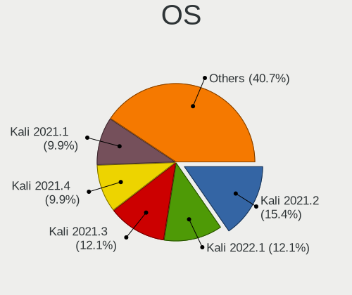

| Name         | Computers | Percent |
|--------------|-----------|---------|
| Kali 2021.2  | 14        | 15.38%  |
| Kali 2022.1  | 11        | 12.09%  |
| Kali 2021.3  | 11        | 12.09%  |
| Kali 2021.4  | 9         | 9.89%   |
| Kali 2021.1  | 9         | 9.89%   |
| Kali 2020.4  | 9         | 9.89%   |
| Kali 2020.3  | 9         | 9.89%   |
| Kali 2020.2  | 7         | 7.69%   |
| Kali 2020.1  | 6         | 6.59%   |
| Kali 2019.4  | 3         | 3.3%    |
| Kali Rolling | 1         | 1.1%    |
| Kali 2019.3  | 1         | 1.1%    |
| Kali 2019.1  | 1         | 1.1%    |

OS Family
---------

OS without a version

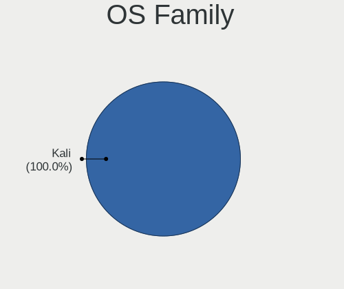

| Name | Computers | Percent |
|------|-----------|---------|
| Kali | 89        | 100%    |

Kernel
------

Version of the Linux kernel

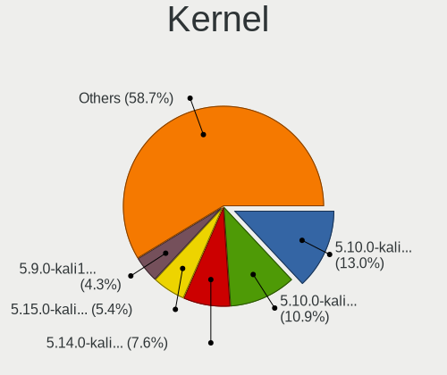

| Version                           | Computers | Percent |
|-----------------------------------|-----------|---------|
| 5.10.0-kali9-amd64                | 12        | 13.04%  |
| 5.10.0-kali7-amd64                | 10        | 10.87%  |
| 5.14.0-kali4-amd64                | 7         | 7.61%   |
| 5.15.0-kali3-amd64                | 5         | 5.43%   |
| 5.9.0-kali1-amd64                 | 4         | 4.35%   |
| 4.4.0-19041-Microsoft             | 4         | 4.35%   |
| 5.7.0-kali1-amd64                 | 3         | 3.26%   |
| 5.6.0-kali2-amd64                 | 3         | 3.26%   |
| 5.5.0-kali2-amd64                 | 3         | 3.26%   |
| 5.4.72-microsoft-standard-WSL2    | 3         | 3.26%   |
| 5.4.0-kali4-amd64                 | 3         | 3.26%   |
| 5.4.0-kali2-amd64                 | 3         | 3.26%   |
| 5.3.0-kali2-amd64                 | 2         | 2.17%   |
| 5.16.0-kali1-amd64                | 2         | 2.17%   |
| 5.15.0-kali2-amd64                | 2         | 2.17%   |
| 5.14.0-kali2-amd64                | 2         | 2.17%   |
| 5.10.16.3-microsoft-standard-WSL2 | 2         | 2.17%   |
| 5.10.0-kali3-amd64                | 2         | 2.17%   |
| 5.10.0-kali3-686-pae              | 2         | 2.17%   |
| 5.9.0-kali2-amd64                 | 1         | 1.09%   |
| 5.8.0-kali2-amd64                 | 1         | 1.09%   |
| 5.8.0-kali1-amd64                 | 1         | 1.09%   |
| 5.7.0-kali3-amd64                 | 1         | 1.09%   |
| 5.4.0-kali3-amd64                 | 1         | 1.09%   |
| 5.2.0-kali2-amd64                 | 1         | 1.09%   |
| 5.2.0-kali2-686-pae               | 1         | 1.09%   |
| 5.16.0-kali6-amd64                | 1         | 1.09%   |
| 5.16.0-kali5-amd64                | 1         | 1.09%   |
| 5.15.0-kali3-arm64                | 1         | 1.09%   |
| 5.14.0-kali4-arm64                | 1         | 1.09%   |
| 5.10.0-kali8-amd64                | 1         | 1.09%   |
| 5.10.0-kali4-arm64                | 1         | 1.09%   |
| 5.10.0-kali4-amd64                | 1         | 1.09%   |
| 5.10.0-kali2-amd64                | 1         | 1.09%   |
| 4.4.0-18362-Microsoft             | 1         | 1.09%   |
| 4.19.128-microsoft-standard       | 1         | 1.09%   |
| 4.19.0-kali4-amd64                | 1         | 1.09%   |

Kernel Family
-------------

Linux kernel without a distro release

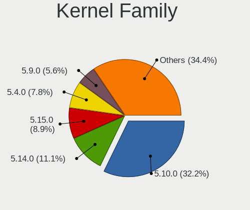

| Version   | Computers | Percent |
|-----------|-----------|---------|
| 5.10.0    | 29        | 32.22%  |
| 5.14.0    | 10        | 11.11%  |
| 5.15.0    | 8         | 8.89%   |
| 5.4.0     | 7         | 7.78%   |
| 5.9.0     | 5         | 5.56%   |
| 4.4.0     | 5         | 5.56%   |
| 5.7.0     | 4         | 4.44%   |
| 5.6.0     | 3         | 3.33%   |
| 5.5.0     | 3         | 3.33%   |
| 5.4.72    | 3         | 3.33%   |
| 5.16.0    | 3         | 3.33%   |
| 5.8.0     | 2         | 2.22%   |
| 5.3.0     | 2         | 2.22%   |
| 5.2.0     | 2         | 2.22%   |
| 5.10.16.3 | 2         | 2.22%   |
| 4.19.128  | 1         | 1.11%   |
| 4.19.0    | 1         | 1.11%   |

Kernel Major Ver.
-----------------

Linux kernel major version

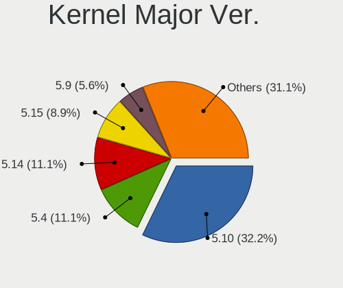

| Version | Computers | Percent |
|---------|-----------|---------|
| 5.10    | 29        | 32.22%  |
| 5.4     | 10        | 11.11%  |
| 5.14    | 10        | 11.11%  |
| 5.15    | 8         | 8.89%   |
| 5.9     | 5         | 5.56%   |
| 4.4     | 5         | 5.56%   |
| 5.7     | 4         | 4.44%   |
| 5.6     | 3         | 3.33%   |
| 5.5     | 3         | 3.33%   |
| 5.16    | 3         | 3.33%   |
| 5.8     | 2         | 2.22%   |
| 5.3     | 2         | 2.22%   |
| 5.2     | 2         | 2.22%   |
| 5.10.16 | 2         | 2.22%   |
| 4.19    | 2         | 2.22%   |

Arch
----

OS architecture (x86_64, i586, etc.)

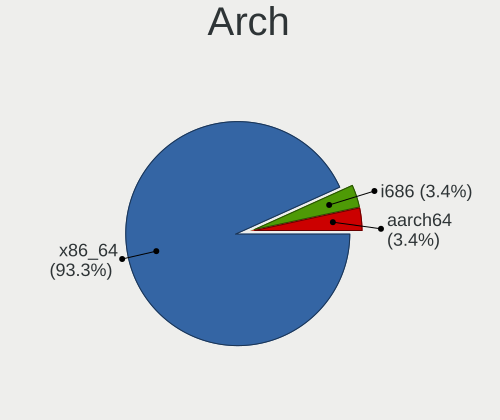

| Name    | Computers | Percent |
|---------|-----------|---------|
| x86_64  | 83        | 93.26%  |
| i686    | 3         | 3.37%   |
| aarch64 | 3         | 3.37%   |

DE
--

Desktop Environment

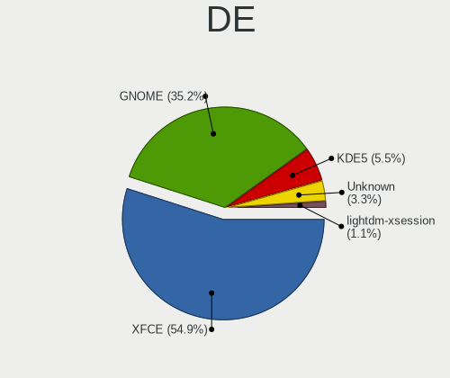

| Name             | Computers | Percent |
|------------------|-----------|---------|
| XFCE             | 50        | 54.95%  |
| GNOME            | 32        | 35.16%  |
| KDE5             | 5         | 5.49%   |
| Unknown          | 3         | 3.3%    |
| lightdm-xsession | 1         | 1.1%    |

Display Server
--------------

X11 or Wayland

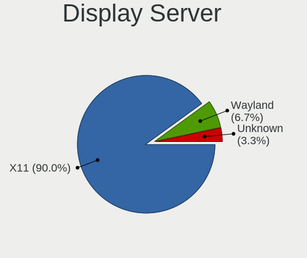

| Name    | Computers | Percent |
|---------|-----------|---------|
| X11     | 81        | 90%     |
| Wayland | 6         | 6.67%   |
| Unknown | 3         | 3.33%   |

Display Manager
---------------

SDDM, LightDM, etc.

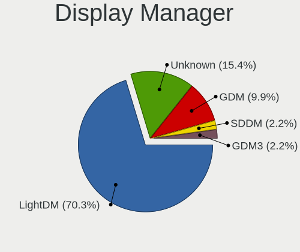

| Name    | Computers | Percent |
|---------|-----------|---------|
| LightDM | 64        | 70.33%  |
| Unknown | 14        | 15.38%  |
| GDM     | 9         | 9.89%   |
| SDDM    | 2         | 2.2%    |
| GDM3    | 2         | 2.2%    |

OS Lang
-------

Language

| Lang    | Computers | Percent |
|---------|-----------|---------|
| en_US   | 64        | 71.11%  |
| Unknown | 5         | 5.56%   |
| ru_RU   | 4         | 4.44%   |
| es_MX   | 3         | 3.33%   |
| fr_FR   | 2         | 2.22%   |
| en_GB   | 2         | 2.22%   |
| it_IT   | 1         | 1.11%   |
| hu_HU   | 1         | 1.11%   |
| fr_CA   | 1         | 1.11%   |
| es_PE   | 1         | 1.11%   |
| es_ES   | 1         | 1.11%   |
| es_CO   | 1         | 1.11%   |
| en_ZA   | 1         | 1.11%   |
| en_IN   | 1         | 1.11%   |
| en_HK   | 1         | 1.11%   |
| aa_DJ   | 1         | 1.11%   |

Boot Mode
---------

EFI or BIOS

| Mode | Computers | Percent |
|------|-----------|---------|
| BIOS | 84        | 94.38%  |
| EFI  | 5         | 5.62%   |

Filesystem
----------

Type of filesystem

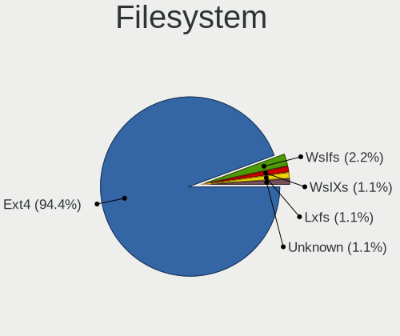

| Type    | Computers | Percent |
|---------|-----------|---------|
| Ext4    | 84        | 94.38%  |
| Wslfs   | 2         | 2.25%   |
| WslXs   | 1         | 1.12%   |
| Lxfs    | 1         | 1.12%   |
| Unknown | 1         | 1.12%   |

Part. scheme
------------

Scheme of partitioning

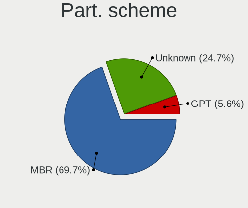

| Type    | Computers | Percent |
|---------|-----------|---------|
| MBR     | 62        | 69.66%  |
| Unknown | 22        | 24.72%  |
| GPT     | 5         | 5.62%   |

Dual Boot with Linux/BSD
------------------------

Hosting more than one Linux/BSD

| Dual boot | Computers | Percent |
|-----------|-----------|---------|
| No        | 88        | 98.88%  |
| Yes       | 1         | 1.12%   |

Dual Boot (Win)
---------------

Hosting Linux and Windows

| Dual boot | Computers | Percent |
|-----------|-----------|---------|
| No        | 89        | 100%    |

Board
-----

Vendor
------

Motherboard manufacturer

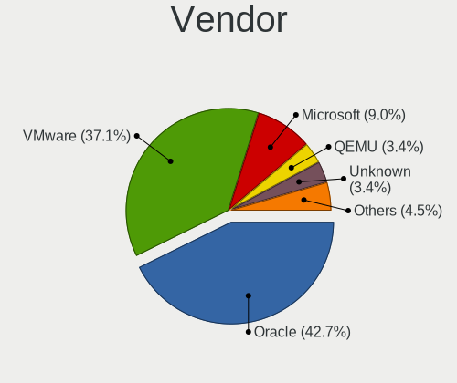

| Name                             | Computers | Percent |
|----------------------------------|-----------|---------|
| Oracle                           | 38        | 42.7%   |
| VMware                           | 33        | 37.08%  |
| Microsoft                        | 8         | 8.99%   |
| QEMU                             | 3         | 3.37%   |
| Unknown                          | 3         | 3.37%   |
| Parallels Software International | 2         | 2.25%   |
| Parallels International          | 2         | 2.25%   |

Model
-----

Motherboard model

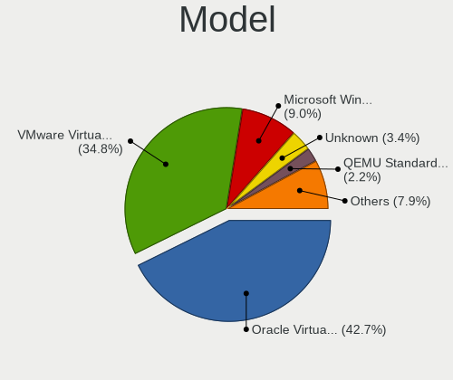

| Name                                                        | Computers | Percent |
|-------------------------------------------------------------|-----------|---------|
| Oracle VirtualBox                                           | 38        | 42.7%   |
| VMware Virtual Platform                                     | 31        | 34.83%  |
| Microsoft Windows Subsystem for Linux                       | 8         | 8.99%   |
| Unknown                                                     | 3         | 3.37%   |
| QEMU Standard PC (Q35 + ICH9, 2009)                         | 2         | 2.25%   |
| Parallels Software International Parallels Virtual Platform | 2         | 2.25%   |
| Parallels International ARM Virtual Machine                 | 2         | 2.25%   |
| VMware VMware7,1                                            | 1         | 1.12%   |
| VMware VBSA                                                 | 1         | 1.12%   |
| QEMU Standard PC (i440FX + PIIX, 1996)                      | 1         | 1.12%   |

Model Family
------------

Motherboard model prefix

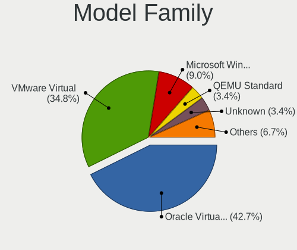

| Name                                       | Computers | Percent |
|--------------------------------------------|-----------|---------|
| Oracle VirtualBox                          | 38        | 42.7%   |
| VMware Virtual                             | 31        | 34.83%  |
| Microsoft Windows                          | 8         | 8.99%   |
| QEMU Standard                              | 3         | 3.37%   |
| Unknown                                    | 3         | 3.37%   |
| Parallels Software International Parallels | 2         | 2.25%   |
| Parallels International ARM                | 2         | 2.25%   |
| VMware VMware7                             | 1         | 1.12%   |
| VMware VBSA                                | 1         | 1.12%   |

MFG Year
--------

Motherboard manufacture year

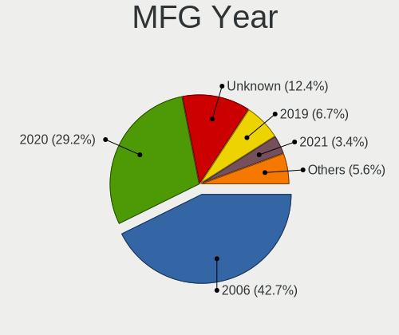

| Year    | Computers | Percent |
|---------|-----------|---------|
| 2006    | 38        | 42.7%   |
| 2020    | 26        | 29.21%  |
| Unknown | 11        | 12.36%  |
| 2019    | 6         | 6.74%   |
| 2021    | 3         | 3.37%   |
| 2014    | 3         | 3.37%   |
| 2018    | 2         | 2.25%   |

Form Factor
-----------

Physical design of the computer

| Name            | Computers | Percent |
|-----------------|-----------|---------|
| Virtual machine | 89        | 100%    |

Secure Boot
-----------

Enabled or disabled

| State    | Computers | Percent |
|----------|-----------|---------|
| Disabled | 89        | 100%    |

Coreboot
--------

Have coreboot on board

| Used | Computers | Percent |
|------|-----------|---------|
| No   | 89        | 100%    |

RAM Size
--------

Total RAM memory

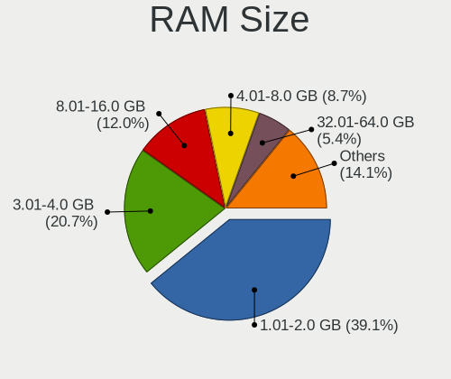

| Size in GB  | Computers | Percent |
|-------------|-----------|---------|
| 1.01-2.0    | 36        | 39.13%  |
| 3.01-4.0    | 19        | 20.65%  |
| 8.01-16.0   | 11        | 11.96%  |
| 4.01-8.0    | 8         | 8.7%    |
| 32.01-64.0  | 5         | 5.43%   |
| 2.01-3.0    | 4         | 4.35%   |
| 16.01-24.0  | 4         | 4.35%   |
| 0.51-1.0    | 3         | 3.26%   |
| 24.01-32.0  | 1         | 1.09%   |
| 64.01-256.0 | 1         | 1.09%   |

RAM Used
--------

Used RAM memory

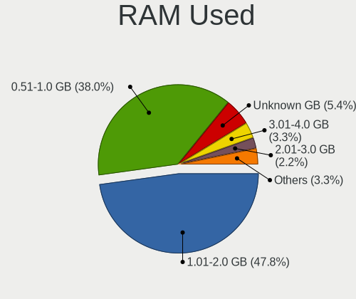

| Used GB   | Computers | Percent |
|-----------|-----------|---------|
| 1.01-2.0  | 44        | 47.83%  |
| 0.51-1.0  | 35        | 38.04%  |
| Unknown   | 5         | 5.43%   |
| 3.01-4.0  | 3         | 3.26%   |
| 2.01-3.0  | 2         | 2.17%   |
| 4.01-8.0  | 1         | 1.09%   |
| 8.01-16.0 | 1         | 1.09%   |
| 0.01-0.5  | 1         | 1.09%   |

Total Drives
------------

Number of drives on board

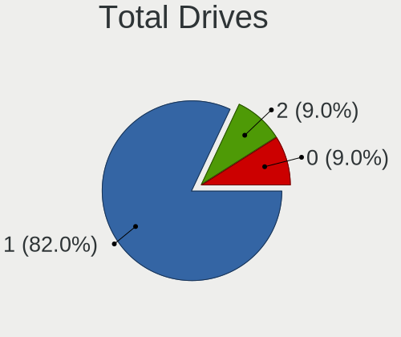

| Drives | Computers | Percent |
|--------|-----------|---------|
| 1      | 73        | 82.02%  |
| 2      | 8         | 8.99%   |
| 0      | 8         | 8.99%   |

Has CD-ROM
----------

Has CD-ROM on board

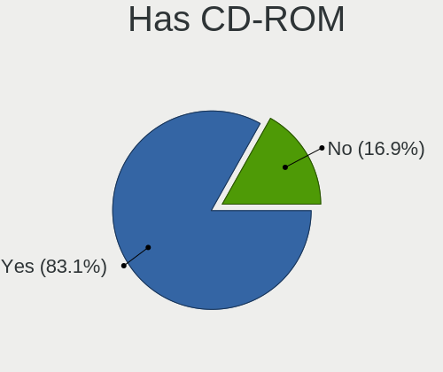

| Presented | Computers | Percent |
|-----------|-----------|---------|
| Yes       | 74        | 83.15%  |
| No        | 15        | 16.85%  |

Has Ethernet
------------

Has Ethernet on board

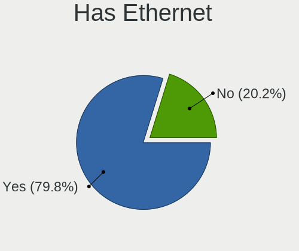

| Presented | Computers | Percent |
|-----------|-----------|---------|
| Yes       | 71        | 79.78%  |
| No        | 18        | 20.22%  |

Has WiFi
--------

Has WiFi module

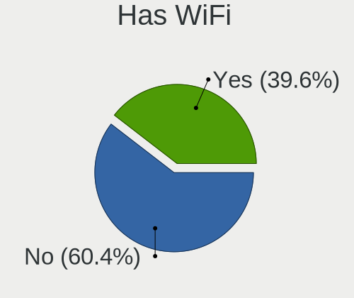

| Presented | Computers | Percent |
|-----------|-----------|---------|
| No        | 55        | 60.44%  |
| Yes       | 36        | 39.56%  |

Has Bluetooth
-------------

Has Bluetooth module

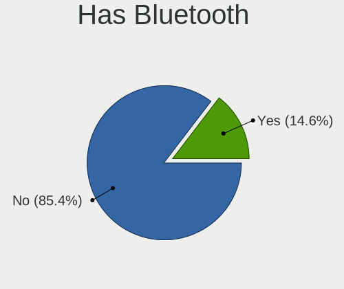

| Presented | Computers | Percent |
|-----------|-----------|---------|
| No        | 76        | 85.39%  |
| Yes       | 13        | 14.61%  |

Location
--------

Country
-------

Geographic location (country)

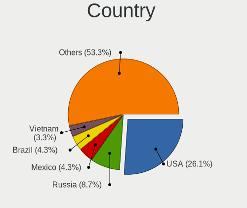

| Country            | Computers | Percent |
|--------------------|-----------|---------|
| USA                | 24        | 26.09%  |
| Russia             | 8         | 8.7%    |
| Mexico             | 4         | 4.35%   |
| Brazil             | 4         | 4.35%   |
| Vietnam            | 3         | 3.26%   |
| India              | 3         | 3.26%   |
| Germany            | 3         | 3.26%   |
| UK                 | 2         | 2.17%   |
| Switzerland        | 2         | 2.17%   |
| Spain              | 2         | 2.17%   |
| South Africa       | 2         | 2.17%   |
| Serbia             | 2         | 2.17%   |
| Romania            | 2         | 2.17%   |
| Poland             | 2         | 2.17%   |
| Peru               | 2         | 2.17%   |
| Netherlands        | 2         | 2.17%   |
| Italy              | 2         | 2.17%   |
| Hungary            | 2         | 2.17%   |
| France             | 2         | 2.17%   |
| Colombia           | 2         | 2.17%   |
| Ukraine            | 1         | 1.09%   |
| Taiwan             | 1         | 1.09%   |
| Sweden             | 1         | 1.09%   |
| Qatar              | 1         | 1.09%   |
| Portugal           | 1         | 1.09%   |
| Philippines        | 1         | 1.09%   |
| Pakistan           | 1         | 1.09%   |
| Morocco            | 1         | 1.09%   |
| Israel             | 1         | 1.09%   |
| Egypt              | 1         | 1.09%   |
| Dominican Republic | 1         | 1.09%   |
| Czechia            | 1         | 1.09%   |
| China              | 1         | 1.09%   |
| Canada             | 1         | 1.09%   |
| Azerbaijan         | 1         | 1.09%   |
| Australia          | 1         | 1.09%   |
| Albania            | 1         | 1.09%   |

City
----

Geographic location (city)

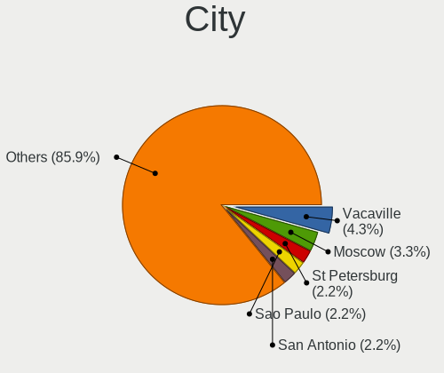

| City                     | Computers | Percent |
|--------------------------|-----------|---------|
| Vacaville                | 4         | 4.35%   |
| Moscow                   | 3         | 3.26%   |
| St Petersburg            | 2         | 2.17%   |
| Sao Paulo                | 2         | 2.17%   |
| San Antonio              | 2         | 2.17%   |
| Pretoria                 | 2         | 2.17%   |
| Nga Bay                  | 2         | 2.17%   |
| Belgrade                 | 2         | 2.17%   |
| Zurich                   | 1         | 1.09%   |
| Xiamen                   | 1         | 1.09%   |
| Trois-Rivières        | 1         | 1.09%   |
| Toeroekbalint            | 1         | 1.09%   |
| Tirana                   | 1         | 1.09%   |
| Timișoara            | 1         | 1.09%   |
| Tel Aviv                 | 1         | 1.09%   |
| Stansstad                | 1         | 1.09%   |
| South Shields            | 1         | 1.09%   |
| Santa Clara              | 1         | 1.09%   |
| Salé                  | 1         | 1.09%   |
| Salamanca                | 1         | 1.09%   |
| Saint-Georges-de-Didonne | 1         | 1.09%   |
| Ryazan                   | 1         | 1.09%   |
| Rubí                  | 1         | 1.09%   |
| Prague                   | 1         | 1.09%   |
| Pittsburgh               | 1         | 1.09%   |
| Paris                    | 1         | 1.09%   |
| Paços de Ferreira     | 1         | 1.09%   |
| Oxford                   | 1         | 1.09%   |
| Novosibirsk              | 1         | 1.09%   |
| Niterói               | 1         | 1.09%   |
| New Taipei               | 1         | 1.09%   |
| Munich                   | 1         | 1.09%   |
| Mumbai                   | 1         | 1.09%   |
| Monterrey                | 1         | 1.09%   |
| Minneapolis              | 1         | 1.09%   |
| Mindelheim               | 1         | 1.09%   |
| Milan                    | 1         | 1.09%   |
| Mexico City              | 1         | 1.09%   |
| Melbourne                | 1         | 1.09%   |
| Mattoon                  | 1         | 1.09%   |
| Lucknow                  | 1         | 1.09%   |
| Lima                     | 1         | 1.09%   |
| Leidschendam             | 1         | 1.09%   |
| Kili Rahmanzai           | 1         | 1.09%   |
| Kelmentsi                | 1         | 1.09%   |
| Jaworzno                 | 1         | 1.09%   |
| Ho Chi Minh City         | 1         | 1.09%   |
| Harlow                   | 1         | 1.09%   |
| Hamburg                  | 1         | 1.09%   |
| Guarulhos                | 1         | 1.09%   |
| Guadalajara              | 1         | 1.09%   |
| Glendale                 | 1         | 1.09%   |
| Genoa                    | 1         | 1.09%   |
| Gdansk                   | 1         | 1.09%   |
| Frankfurt am Main        | 1         | 1.09%   |
| Fort Myers               | 1         | 1.09%   |
| Enskede-Arsta-Vantoer    | 1         | 1.09%   |
| East Falmouth            | 1         | 1.09%   |
| Dombivali                | 1         | 1.09%   |
| Doha                     | 1         | 1.09%   |

Drives
------

Drive Vendor
------------

Hard drive vendors

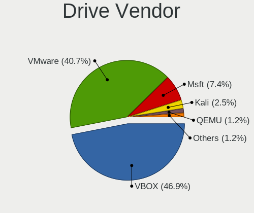

| Vendor | Computers | Drives | Percent |
|--------|-----------|--------|---------|
| VBOX   | 38        | 42     | 46.91%  |
| VMware | 33        | 35     | 40.74%  |
| Msft   | 6         | 12     | 7.41%   |
| Kali   | 2         | 2      | 2.47%   |
| QEMU   | 1         | 1      | 1.23%   |
| ORACLE | 1         | 2      | 1.23%   |

Drive Model
-----------

Hard drive models

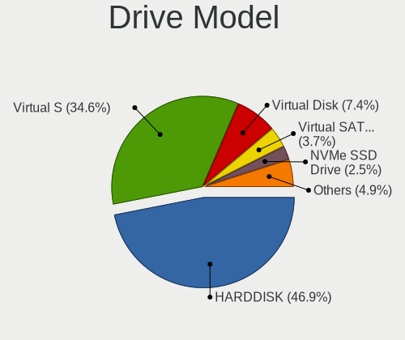

| Model                          | Computers | Percent |
|--------------------------------|-----------|---------|
| VBOX HARDDISK                  | 38        | 46.91%  |
| VMware Virtual S               | 28        | 34.57%  |
| Msft Virtual Disk              | 6         | 7.41%   |
| VMware Virtual SATA Hard Drive | 3         | 3.7%    |
| VMware NVMe SSD Drive          | 2         | 2.47%   |
| Kali Linux-0 SSD 69GB          | 2         | 2.47%   |
| QEMU HARDDISK                  | 1         | 1.23%   |
| ORACLE BlockVolume             | 1         | 1.23%   |

HDD Vendor
----------

Hard disk drive vendors

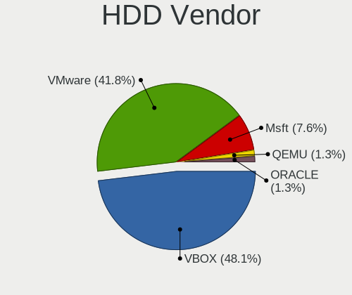

| Vendor | Computers | Drives | Percent |
|--------|-----------|--------|---------|
| VBOX   | 38        | 42     | 48.1%   |
| VMware | 33        | 35     | 41.77%  |
| Msft   | 6         | 12     | 7.59%   |
| QEMU   | 1         | 1      | 1.27%   |
| ORACLE | 1         | 2      | 1.27%   |

SSD Vendor
----------

Solid state drive vendors

| Vendor | Computers | Drives | Percent |
|--------|-----------|--------|---------|
| Kali   | 2         | 2      | 100%    |

Drive Kind
----------

HDD or SSD

| Kind | Computers | Drives | Percent |
|------|-----------|--------|---------|
| HDD  | 79        | 92     | 97.53%  |
| SSD  | 2         | 2      | 2.47%   |

Drive Connector
---------------

SATA, SAS, NVMe, etc.

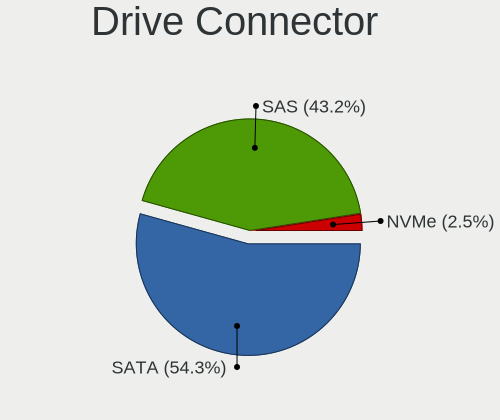

| Type | Computers | Drives | Percent |
|------|-----------|--------|---------|
| SATA | 44        | 49     | 54.32%  |
| SAS  | 35        | 42     | 43.21%  |
| NVMe | 2         | 3      | 2.47%   |

Drive Size
----------

Size of hard drive

| Size in TB | Computers | Drives | Percent |
|------------|-----------|--------|---------|
| 0.01-0.5   | 81        | 94     | 100%    |

Space Total
-----------

Amount of disk space available on the file system

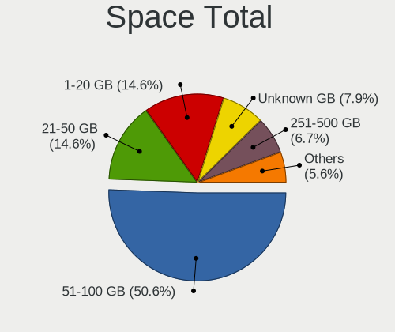

| Size in GB | Computers | Percent |
|------------|-----------|---------|
| 51-100     | 45        | 50.56%  |
| 21-50      | 13        | 14.61%  |
| 1-20       | 13        | 14.61%  |
| Unknown    | 7         | 7.87%   |
| 251-500    | 6         | 6.74%   |
| 101-250    | 3         | 3.37%   |
| 1001-2000  | 1         | 1.12%   |
| 501-1000   | 1         | 1.12%   |

Space Used
----------

Amount of used disk space

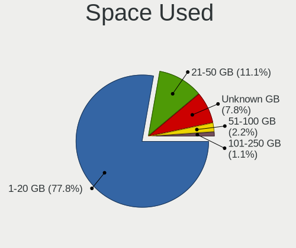

| Used GB | Computers | Percent |
|---------|-----------|---------|
| 1-20    | 70        | 77.78%  |
| 21-50   | 10        | 11.11%  |
| Unknown | 7         | 7.78%   |
| 51-100  | 2         | 2.22%   |
| 101-250 | 1         | 1.11%   |

Malfunc. Drives
---------------

Drive models with a malfunction

Zero info for selected period =(

Malfunc. Drive Vendor
---------------------

Vendors of faulty drives

Zero info for selected period =(

Malfunc. HDD Vendor
-------------------

Vendors of faulty HDD drives

Zero info for selected period =(

Malfunc. Drive Kind
-------------------

Kinds of faulty drives

Zero info for selected period =(

Failed Drives
-------------

Failed drive models

Zero info for selected period =(

Failed Drive Vendor
-------------------

Failed drive vendors

Zero info for selected period =(

Drive Status
------------

Number of failed and malfunc. drives

| Status   | Computers | Drives | Percent |
|----------|-----------|--------|---------|
| Detected | 81        | 94     | 100%    |

Storage controller
------------------

Storage Vendor
--------------

Storage controller vendors

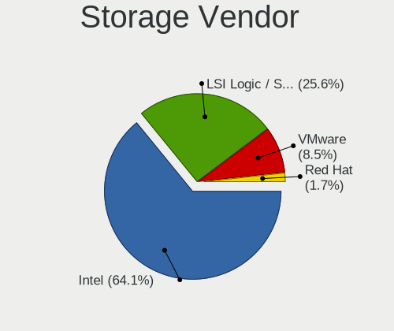

| Vendor                    | Computers | Percent |
|---------------------------|-----------|---------|
| Intel                     | 75        | 64.1%   |
| LSI Logic / Symbios Logic | 30        | 25.64%  |
| VMware                    | 10        | 8.55%   |
| Red Hat                   | 2         | 1.71%   |

Storage Model
-------------

Storage controller models

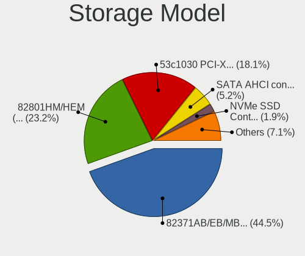

| Model                                                                 | Computers | Percent |
|-----------------------------------------------------------------------|-----------|---------|
| Intel 82371AB/EB/MB PIIX4 IDE                                         | 69        | 44.52%  |
| Intel 82801HM/HEM (ICH8M/ICH8M-E) SATA Controller [AHCI mode]         | 36        | 23.23%  |
| LSI Logic / Symbios Logic 53c1030 PCI-X Fusion-MPT Dual Ultra320 SCSI | 28        | 18.06%  |
| VMware SATA AHCI controller                                           | 8         | 5.16%   |
| VMware NVMe SSD Controller                                            | 3         | 1.94%   |
| Intel 82801IR/IO/IH (ICH9R/DO/DH) 6 port SATA Controller [AHCI mode]  | 2         | 1.29%   |
| Intel 82801HR/HO/HH (ICH8R/DO/DH) 6 port SATA Controller [AHCI mode]  | 2         | 1.29%   |
| Intel 82801BA IDE U100 Controller                                     | 2         | 1.29%   |
| Red Hat Virtio SCSI                                                   | 1         | 0.65%   |
| Red Hat Virtio block device                                           | 1         | 0.65%   |
| LSI Logic / Symbios Logic SAS1068 PCI-X Fusion-MPT SAS                | 1         | 0.65%   |
| LSI Logic / Symbios Logic 53c895a                                     | 1         | 0.65%   |
| Intel 82371SB PIIX3 IDE [Natoma/Triton II]                            | 1         | 0.65%   |

Storage Kind
------------

Kind of storage controller (IDE, SATA, NVMe, SAS, ...)

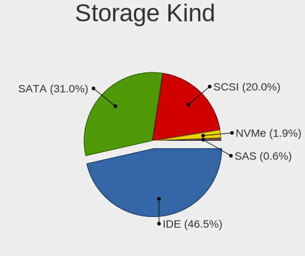

| Kind | Computers | Percent |
|------|-----------|---------|
| IDE  | 72        | 46.45%  |
| SATA | 48        | 30.97%  |
| SCSI | 31        | 20%     |
| NVMe | 3         | 1.94%   |
| SAS  | 1         | 0.65%   |

Processor
---------

CPU Vendor
----------

Processor vendors

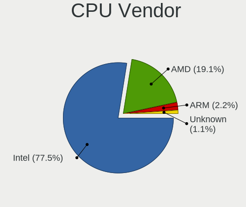

| Vendor  | Computers | Percent |
|---------|-----------|---------|
| Intel   | 69        | 77.53%  |
| AMD     | 17        | 19.1%   |
| ARM     | 2         | 2.25%   |
| Unknown | 1         | 1.12%   |

CPU Model
---------

Processor models

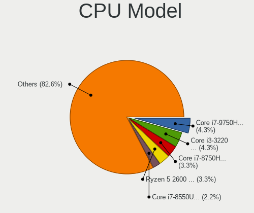

| Model                                          | Computers | Percent |
|------------------------------------------------|-----------|---------|
| Intel Core i7-9750H CPU @ 2.60GHz              | 4         | 4.35%   |
| Intel Core i3-3220 CPU @ 3.30GHz               | 4         | 4.35%   |
| Intel Core i7-8750H CPU @ 2.20GHz              | 3         | 3.26%   |
| AMD Ryzen 5 2600 Six-Core Processor            | 3         | 3.26%   |
| Intel Core i7-8550U CPU @ 1.80GHz              | 2         | 2.17%   |
| Intel Core i7-7600U CPU @ 2.80GHz              | 2         | 2.17%   |
| Intel Core i7-7500U CPU @ 2.70GHz              | 2         | 2.17%   |
| Intel Core i5-8265U CPU @ 1.60GHz              | 2         | 2.17%   |
| Intel Core i5-3470 CPU @ 3.20GHz               | 2         | 2.17%   |
| Intel Core i5-10400F CPU @ 2.90GHz             | 2         | 2.17%   |
| Intel Core i5-10300H CPU @ 2.50GHz             | 2         | 2.17%   |
| ARM Processor                                  | 2         | 2.17%   |
| AMD Ryzen 7 4800H with Radeon Graphics         | 2         | 2.17%   |
| AMD Ryzen 5 3550H with Radeon Vega Mobile Gfx  | 2         | 2.17%   |
| Intel Xeon CPU X5675 @ 3.07GHz                 | 1         | 1.09%   |
| Intel Xeon CPU E5-2680 0 @ 2.70GHz             | 1         | 1.09%   |
| Intel Westmere E56xx/L56xx/X56xx (IBRS update) | 1         | 1.09%   |
| Intel Pentium CPU 4417U @ 2.30GHz              | 1         | 1.09%   |
| Intel Core i9-9980HK CPU @ 2.40GHz             | 1         | 1.09%   |
| Intel Core i9-9900K CPU @ 3.60GHz              | 1         | 1.09%   |
| Intel Core i9-9880H CPU @ 2.30GHz              | 1         | 1.09%   |
| Intel Core i9-10900X CPU @ 3.70GHz             | 1         | 1.09%   |
| Intel Core i7-9700 CPU @ 3.00GHz               | 1         | 1.09%   |
| Intel Core i7-7700K CPU @ 4.20GHz              | 1         | 1.09%   |
| Intel Core i7-7700 CPU @ 3.60GHz               | 1         | 1.09%   |
| Intel Core i7-7567U CPU @ 3.50GHz              | 1         | 1.09%   |
| Intel Core i7-6700HQ CPU @ 2.60GHz             | 1         | 1.09%   |
| Intel Core i7-6700 CPU @ 3.40GHz               | 1         | 1.09%   |
| Intel Core i7-4960HQ CPU @ 2.60GHz             | 1         | 1.09%   |
| Intel Core i7-4710HQ CPU @ 2.50GHz             | 1         | 1.09%   |
| Intel Core i7-4510U CPU @ 2.00GHz              | 1         | 1.09%   |
| Intel Core i7-3770 CPU @ 3.40GHz               | 1         | 1.09%   |
| Intel Core i7-3667U CPU @ 2.00GHz              | 1         | 1.09%   |
| Intel Core i7-3520M CPU @ 2.90GHz              | 1         | 1.09%   |
| Intel Core i7-2670QM CPU @ 2.20GHz             | 1         | 1.09%   |
| Intel Core i7-2600 CPU @ 3.40GHz               | 1         | 1.09%   |
| Intel Core i7-10870H CPU @ 2.20GHz             | 1         | 1.09%   |
| Intel Core i7-1065G7 CPU @ 1.30GHz             | 1         | 1.09%   |
| Intel Core i5-9400F CPU @ 2.90GHz              | 1         | 1.09%   |
| Intel Core i5-9300HF CPU @ 2.40GHz             | 1         | 1.09%   |
| Intel Core i5-9300H CPU @ 2.40GHz              | 1         | 1.09%   |
| Intel Core i5-8600K CPU @ 3.60GHz              | 1         | 1.09%   |
| Intel Core i5-8300H CPU @ 2.30GHz              | 1         | 1.09%   |
| Intel Core i5-8259U CPU @ 2.30GHz              | 1         | 1.09%   |
| Intel Core i5-7200U CPU @ 2.50GHz              | 1         | 1.09%   |
| Intel Core i5-6200U CPU @ 2.30GHz              | 1         | 1.09%   |
| Intel Core i5-5200U CPU @ 2.20GHz              | 1         | 1.09%   |
| Intel Core i5-4570 CPU @ 3.20GHz               | 1         | 1.09%   |
| Intel Core i5-4200M CPU @ 2.50GHz              | 1         | 1.09%   |
| Intel Core i5-3570 CPU @ 3.40GHz               | 1         | 1.09%   |
| Intel Core i5-3340M CPU @ 2.70GHz              | 1         | 1.09%   |
| Intel Core i5-3210M CPU @ 2.50GHz              | 1         | 1.09%   |
| Intel Core i5-1035G1 CPU @ 1.00GHz             | 1         | 1.09%   |
| Intel Core i5 CPU 650 @ 3.20GHz                | 1         | 1.09%   |
| Intel Core i3-8100 CPU @ 3.60GHz               | 1         | 1.09%   |
| Intel Core i3-7020U CPU @ 2.30GHz              | 1         | 1.09%   |
| Intel Core i3-2120 CPU @ 3.30GHz               | 1         | 1.09%   |
| Intel Celeron CPU N3060 @ 1.60GHz              | 1         | 1.09%   |
| Intel 11th Gen Core i9-11980HK @ 2.60GHz       | 1         | 1.09%   |
| Intel 11th Gen Core i7-1165G7 @ 2.80GHz        | 1         | 1.09%   |

CPU Model Family
----------------

Processor model prefix

| Model                  | Computers | Percent |
|------------------------|-----------|---------|
| Intel Core i7          | 29        | 31.87%  |
| Intel Core i5          | 23        | 25.27%  |
| Other                  | 7         | 7.69%   |
| Intel Core i3          | 7         | 7.69%   |
| AMD Ryzen 5            | 6         | 6.59%   |
| AMD Ryzen 7            | 5         | 5.49%   |
| Intel Core i9          | 4         | 4.4%    |
| Intel Xeon             | 2         | 2.2%    |
| Intel Pentium          | 1         | 1.1%    |
| Intel Celeron          | 1         | 1.1%    |
| AMD Ryzen Threadripper | 1         | 1.1%    |
| AMD Ryzen 9            | 1         | 1.1%    |
| AMD Ryzen 3            | 1         | 1.1%    |
| AMD FX                 | 1         | 1.1%    |
| AMD EPYC               | 1         | 1.1%    |
| AMD A6                 | 1         | 1.1%    |

CPU Cores
---------

Number of processor cores

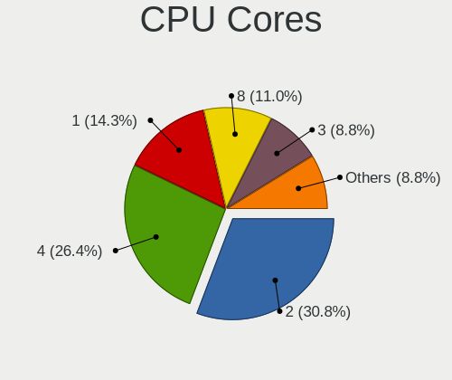

| Number  | Computers | Percent |
|---------|-----------|---------|
| 2       | 28        | 30.77%  |
| 4       | 24        | 26.37%  |
| 1       | 13        | 14.29%  |
| 8       | 10        | 10.99%  |
| 3       | 8         | 8.79%   |
| 6       | 3         | 3.3%    |
| 32      | 1         | 1.1%    |
| 16      | 1         | 1.1%    |
| 12      | 1         | 1.1%    |
| 5       | 1         | 1.1%    |
| Unknown | 1         | 1.1%    |

CPU Sockets
-----------

Number of sockets

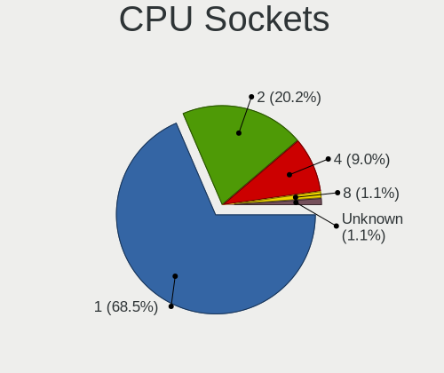

| Number  | Computers | Percent |
|---------|-----------|---------|
| 1       | 61        | 68.54%  |
| 2       | 18        | 20.22%  |
| 4       | 8         | 8.99%   |
| 8       | 1         | 1.12%   |
| Unknown | 1         | 1.12%   |

CPU Threads
-----------

Threads per core (Hyper-Threading)

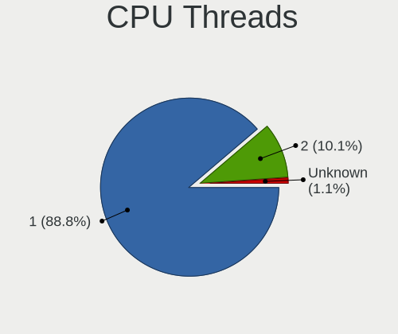

| Number  | Computers | Percent |
|---------|-----------|---------|
| 1       | 79        | 88.76%  |
| 2       | 9         | 10.11%  |
| Unknown | 1         | 1.12%   |

CPU Op-Modes
------------

CPU Operation Modes (32-bit, 64-bit)

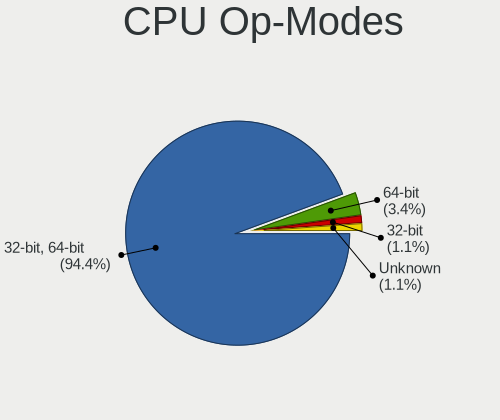

| Op mode        | Computers | Percent |
|----------------|-----------|---------|
| 32-bit, 64-bit | 84        | 94.38%  |
| 64-bit         | 3         | 3.37%   |
| 32-bit         | 1         | 1.12%   |
| Unknown        | 1         | 1.12%   |

CPU Microcode
-------------

Microcode number

| Number  | Computers | Percent |
|---------|-----------|---------|
| Unknown | 89        | 100%    |

CPU Microarch
-------------

Microarchitecture

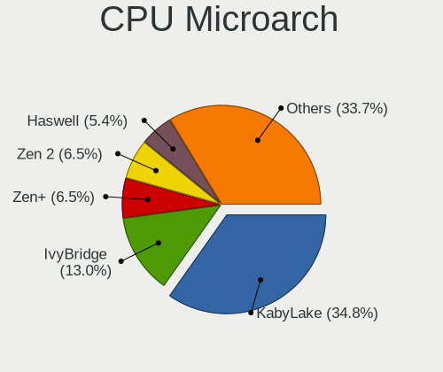

| Name        | Computers | Percent |
|-------------|-----------|---------|
| KabyLake    | 32        | 34.78%  |
| IvyBridge   | 12        | 13.04%  |
| Zen+        | 6         | 6.52%   |
| Zen 2       | 6         | 6.52%   |
| Haswell     | 5         | 5.43%   |
| CometLake   | 5         | 5.43%   |
| Unknown     | 5         | 5.43%   |
| Skylake     | 4         | 4.35%   |
| SandyBridge | 4         | 4.35%   |
| Zen         | 3         | 3.26%   |
| Westmere    | 3         | 3.26%   |
| IceLake     | 2         | 2.17%   |
| TigerLake   | 1         | 1.09%   |
| Silvermont  | 1         | 1.09%   |
| Piledriver  | 1         | 1.09%   |
| Excavator   | 1         | 1.09%   |
| Broadwell   | 1         | 1.09%   |

Graphics
--------

GPU Vendor
----------

Vendors of graphics cards

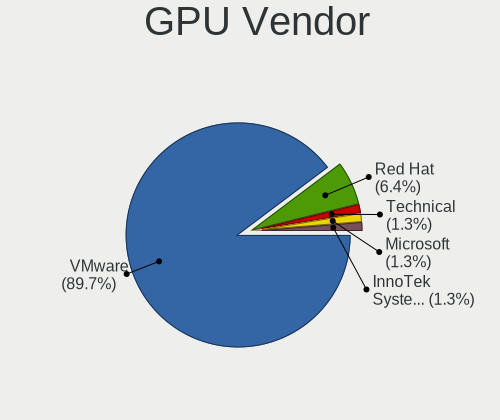

| Vendor                 | Computers | Percent |
|------------------------|-----------|---------|
| VMware                 | 70        | 89.74%  |
| Red Hat                | 5         | 6.41%   |
| Technical              | 1         | 1.28%   |
| Microsoft              | 1         | 1.28%   |
| InnoTek Systemberatung | 1         | 1.28%   |

GPU Model
---------

Graphics card models

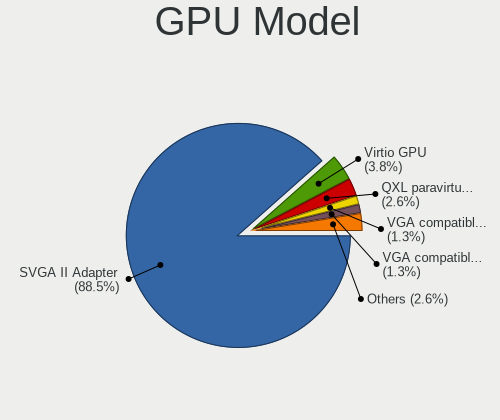

| Model                                              | Computers | Percent |
|----------------------------------------------------|-----------|---------|
| VMware SVGA II Adapter                             | 69        | 88.46%  |
| Red Hat Virtio GPU                                 | 3         | 3.85%   |
| Red Hat QXL paravirtual graphic card               | 2         | 2.56%   |
| VMware VGA compatible controller                   | 1         | 1.28%   |
| Technical VGA compatible controller                | 1         | 1.28%   |
| Microsoft Virtual Render                           | 1         | 1.28%   |
| InnoTek Systemberatung VirtualBox Graphics Adapter | 1         | 1.28%   |

GPU Combo
---------

Combinations of graphics cards

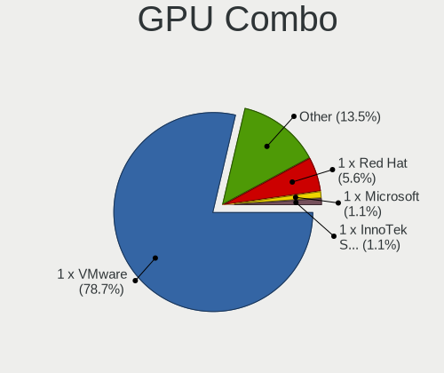

| Name                       | Computers | Percent |
|----------------------------|-----------|---------|
| 1 x VMware                 | 70        | 78.65%  |
| Other                      | 12        | 13.48%  |
| 1 x Red Hat                | 5         | 5.62%   |
| 1 x Microsoft              | 1         | 1.12%   |
| 1 x InnoTek Systemberatung | 1         | 1.12%   |

GPU Driver
----------

Free vs proprietary

| Driver  | Computers | Percent |
|---------|-----------|---------|
| Unknown | 89        | 100%    |

GPU Memory
----------

Total video memory

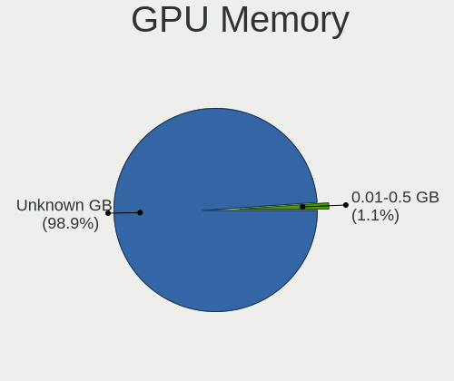

| Size in GB | Computers | Percent |
|------------|-----------|---------|
| Unknown    | 88        | 98.88%  |
| 0.01-0.5   | 1         | 1.12%   |

Monitor
-------

Monitor Vendor
--------------

Monitor vendors

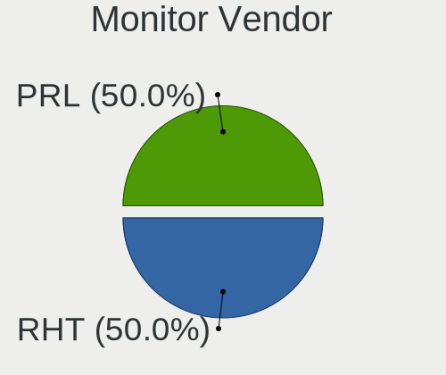

| Vendor | Computers | Percent |
|--------|-----------|---------|
| RHT    | 1         | 50%     |
| PRL    | 1         | 50%     |

Monitor Model
-------------

Monitor models

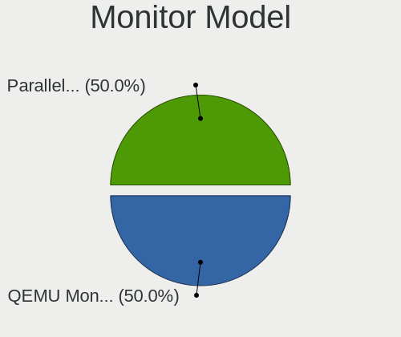

| Model                                                  | Computers | Percent |
|--------------------------------------------------------|-----------|---------|
| RHT QEMU Monitor RHT1234 2048x1152 260x195mm 12.8-inch | 1         | 50%     |
| PRL Parallels Vu PRL4006 1400x1050                     | 1         | 50%     |

Monitor Resolution
------------------

Monitor screen resolution

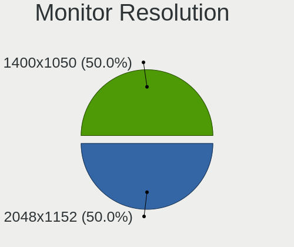

| Resolution | Computers | Percent |
|------------|-----------|---------|
| 2048x1152  | 1         | 50%     |
| 1400x1050  | 1         | 50%     |

Monitor Diagonal
----------------

Diagonal size in inches

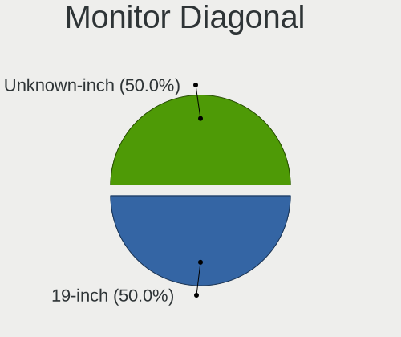

| Inches  | Computers | Percent |
|---------|-----------|---------|
| 19      | 1         | 50%     |
| Unknown | 1         | 50%     |

Monitor Width
-------------

Physical width

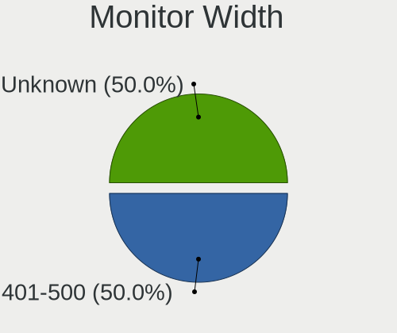

| Width in mm | Computers | Percent |
|-------------|-----------|---------|
| 401-500     | 1         | 50%     |
| Unknown     | 1         | 50%     |

Aspect Ratio
------------

Proportional relationship between the width and the height

| Ratio | Computers | Percent |
|-------|-----------|---------|
| 4/3   | 2         | 100%    |

Monitor Area
------------

Area in inch²

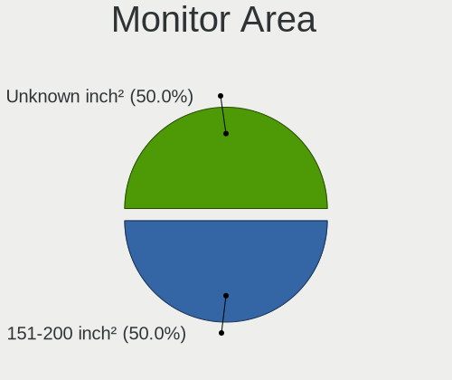

| Area in inch² | Computers | Percent |
|----------------|-----------|---------|
| 151-200        | 1         | 50%     |
| Unknown        | 1         | 50%     |

Pixel Density
-------------

Pixels per inch

| Density | Computers | Percent |
|---------|-----------|---------|
| 101-120 | 1         | 50%     |
| Unknown | 1         | 50%     |

Multiple Monitors
-----------------

Total monitors connected

| Total | Computers | Percent |
|-------|-----------|---------|
| 1     | 68        | 75.56%  |
| 0     | 22        | 24.44%  |

Network
-------

Net Controller Vendor
---------------------

Controller vendors

| Vendor                          | Computers | Percent |
|---------------------------------|-----------|---------|
| Intel                           | 67        | 59.29%  |
| Ralink Technology               | 12        | 10.62%  |
| Realtek Semiconductor           | 10        | 8.85%   |
| TP-Link                         | 8         | 7.08%   |
| Linksys                         | 5         | 4.42%   |
| AMD                             | 4         | 3.54%   |
| Red Hat                         | 3         | 2.65%   |
| Qualcomm Atheros Communications | 1         | 0.88%   |
| NetGear                         | 1         | 0.88%   |
| MediaTek                        | 1         | 0.88%   |
| ASUSTek Computer                | 1         | 0.88%   |

Net Controller Model
--------------------

Controller models

| Model                                                                                         | Computers | Percent |
|-----------------------------------------------------------------------------------------------|-----------|---------|
| Intel 82540EM Gigabit Ethernet Controller                                                     | 36        | 30.51%  |
| Intel 82545EM Gigabit Ethernet Controller (Copper)                                            | 30        | 25.42%  |
| Ralink RT2870/RT3070 Wireless Adapter                                                         | 9         | 7.63%   |
| TP-Link AC600 wireless Realtek RTL8811AU [Archer T2U Nano]                                    | 7         | 5.93%   |
| Realtek RTL8812AU 802.11a/b/g/n/ac 2T2R DB WLAN Adapter                                       | 5         | 4.24%   |
| Linksys WUSB6300 802.11a/b/g/n/ac Wireless Adapter [Realtek RTL8812AU]                        | 4         | 3.39%   |
| AMD 79c970 [PCnet32 LANCE]                                                                    | 4         | 3.39%   |
| Red Hat Virtio network device                                                                 | 3         | 2.54%   |
| Realtek RTL88x2bu [AC1200 Techkey]                                                            | 2         | 1.69%   |
| Realtek RTL8814AU 802.11a/b/g/n/ac Wireless Adapter                                           | 2         | 1.69%   |
| Realtek RTL8188FTV 802.11b/g/n 1T1R 2.4G WLAN Adapter                                         | 2         | 1.69%   |
| Ralink RT5572 Wireless Adapter                                                                | 2         | 1.69%   |
| Intel 82574L Gigabit Network Connection                                                       | 2         | 1.69%   |
| TP-Link TL-WN822N Version 4 RTL8192EU                                                         | 1         | 0.85%   |
| Realtek RTL8188EUS 802.11n Wireless Network Adapter                                           | 1         | 0.85%   |
| Realtek Realtek 8812AU/8821AU 802.11ac WLAN Adapter [USB Wireless Dual-Band Adapter 2.4/5Ghz] | 1         | 0.85%   |
| Ralink RT5372 Wireless Adapter                                                                | 1         | 0.85%   |
| Qualcomm Atheros AR9271 802.11n                                                               | 1         | 0.85%   |
| NetGear A6210                                                                                 | 1         | 0.85%   |
| MediaTek MT7612U 802.11a/b/g/n/ac Wireless Adapter                                            | 1         | 0.85%   |
| Linksys AE1200 802.11bgn Wireless Adapter [Broadcom BCM43235]                                 | 1         | 0.85%   |
| Intel 82543GC Gigabit Ethernet Controller (Copper)                                            | 1         | 0.85%   |
| ASUS WL-167G v3 802.11n Adapter [Realtek RTL8188SU]                                           | 1         | 0.85%   |

Wireless Vendor
---------------

Wireless vendors

| Vendor                          | Computers | Percent |
|---------------------------------|-----------|---------|
| Ralink Technology               | 12        | 30.77%  |
| Realtek Semiconductor           | 10        | 25.64%  |
| TP-Link                         | 8         | 20.51%  |
| Linksys                         | 5         | 12.82%  |
| Qualcomm Atheros Communications | 1         | 2.56%   |
| NetGear                         | 1         | 2.56%   |
| MediaTek                        | 1         | 2.56%   |
| ASUSTek Computer                | 1         | 2.56%   |

Wireless Model
--------------

Wireless models

| Model                                                                                         | Computers | Percent |
|-----------------------------------------------------------------------------------------------|-----------|---------|
| Ralink RT2870/RT3070 Wireless Adapter                                                         | 9         | 21.43%  |
| TP-Link AC600 wireless Realtek RTL8811AU [Archer T2U Nano]                                    | 7         | 16.67%  |
| Realtek RTL8812AU 802.11a/b/g/n/ac 2T2R DB WLAN Adapter                                       | 5         | 11.9%   |
| Linksys WUSB6300 802.11a/b/g/n/ac Wireless Adapter [Realtek RTL8812AU]                        | 4         | 9.52%   |
| Realtek RTL88x2bu [AC1200 Techkey]                                                            | 2         | 4.76%   |
| Realtek RTL8814AU 802.11a/b/g/n/ac Wireless Adapter                                           | 2         | 4.76%   |
| Realtek RTL8188FTV 802.11b/g/n 1T1R 2.4G WLAN Adapter                                         | 2         | 4.76%   |
| Ralink RT5572 Wireless Adapter                                                                | 2         | 4.76%   |
| TP-Link TL-WN822N Version 4 RTL8192EU                                                         | 1         | 2.38%   |
| Realtek RTL8188EUS 802.11n Wireless Network Adapter                                           | 1         | 2.38%   |
| Realtek Realtek 8812AU/8821AU 802.11ac WLAN Adapter [USB Wireless Dual-Band Adapter 2.4/5Ghz] | 1         | 2.38%   |
| Ralink RT5372 Wireless Adapter                                                                | 1         | 2.38%   |
| Qualcomm Atheros AR9271 802.11n                                                               | 1         | 2.38%   |
| NetGear A6210                                                                                 | 1         | 2.38%   |
| MediaTek MT7612U 802.11a/b/g/n/ac Wireless Adapter                                            | 1         | 2.38%   |
| Linksys AE1200 802.11bgn Wireless Adapter [Broadcom BCM43235]                                 | 1         | 2.38%   |
| ASUS WL-167G v3 802.11n Adapter [Realtek RTL8188SU]                                           | 1         | 2.38%   |

Ethernet Vendor
---------------

Ethernet vendors

| Vendor | Computers | Percent |
|--------|-----------|---------|
| Intel  | 67        | 94.37%  |
| AMD    | 4         | 5.63%   |

Ethernet Model
--------------

Ethernet models

| Model                                              | Computers | Percent |
|----------------------------------------------------|-----------|---------|
| Intel 82540EM Gigabit Ethernet Controller          | 36        | 49.32%  |
| Intel 82545EM Gigabit Ethernet Controller (Copper) | 30        | 41.1%   |
| AMD 79c970 [PCnet32 LANCE]                         | 4         | 5.48%   |
| Intel 82574L Gigabit Network Connection            | 2         | 2.74%   |
| Intel 82543GC Gigabit Ethernet Controller (Copper) | 1         | 1.37%   |

Net Controller Kind
-------------------

Ethernet, WiFi or modem

| Kind     | Computers | Percent |
|----------|-----------|---------|
| Ethernet | 71        | 64.55%  |
| WiFi     | 36        | 32.73%  |
| Unknown  | 3         | 2.73%   |

Used Controller
---------------

Currently used network controller

| Kind     | Computers | Percent |
|----------|-----------|---------|
| Ethernet | 69        | 94.52%  |
| WiFi     | 4         | 5.48%   |

NICs
----

Total network controllers on board

| Total | Computers | Percent |
|-------|-----------|---------|
| 1     | 66        | 73.33%  |
| 0     | 18        | 20%     |
| 2     | 5         | 5.56%   |
| 3     | 1         | 1.11%   |

IPv6
----

IPv6 vs IPv4

| Used | Computers | Percent |
|------|-----------|---------|
| No   | 88        | 98.88%  |
| Yes  | 1         | 1.12%   |

Bluetooth
---------

Bluetooth Vendor
----------------

Controller vendors

| Vendor                          | Computers | Percent |
|---------------------------------|-----------|---------|
| VMware                          | 7         | 53.85%  |
| Realtek Semiconductor           | 2         | 15.38%  |
| Qualcomm Atheros Communications | 1         | 7.69%   |
| Intel                           | 1         | 7.69%   |
| Cambridge Silicon Radio         | 1         | 7.69%   |
| Broadcom                        | 1         | 7.69%   |

Bluetooth Model
---------------

Controller models

| Model                                               | Computers | Percent |
|-----------------------------------------------------|-----------|---------|
| VMware Virtual Bluetooth Adapter                    | 7         | 53.85%  |
| Realtek Bluetooth Radio                             | 1         | 7.69%   |
| Realtek 802.11n WLAN Adapter                        | 1         | 7.69%   |
| Qualcomm Atheros  Bluetooth Device                  | 1         | 7.69%   |
| Intel AX200 Bluetooth                               | 1         | 7.69%   |
| Cambridge Silicon Radio Bluetooth Dongle (HCI mode) | 1         | 7.69%   |
| Broadcom HP Portable Valentine                      | 1         | 7.69%   |

Sound
-----

Sound Vendor
------------

Sound card vendors

| Vendor  | Computers | Percent |
|---------|-----------|---------|
| Intel   | 43        | 58.9%   |
| Ensoniq | 28        | 38.36%  |
| VMware  | 2         | 2.74%   |

Sound Model
-----------

Sound card models

| Model                                                                      | Computers | Percent |
|----------------------------------------------------------------------------|-----------|---------|
| Intel 82801AA AC'97 Audio Controller                                       | 36        | 49.32%  |
| Ensoniq ES1371/ES1373 / Creative Labs CT2518                               | 28        | 38.36%  |
| Intel 82801I (ICH9 Family) HD Audio Controller                             | 3         | 4.11%   |
| VMware HD Audio Controller                                                 | 2         | 2.74%   |
| Intel 82801FB/FBM/FR/FW/FRW (ICH6 Family) High Definition Audio Controller | 2         | 2.74%   |
| Intel 82801BA/BAM AC'97 Audio Controller                                   | 2         | 2.74%   |

Memory
------

Memory Vendor
-------------

Memory module vendors

| Vendor  | Computers | Percent |
|---------|-----------|---------|
| Unknown | 21        | 56.76%  |
| Unknown | 13        | 35.14%  |
| QEMU    | 3         | 8.11%   |

Memory Model
------------

Memory module models

| Model                                         | Computers | Percent |
|-----------------------------------------------|-----------|---------|
| Unknown                                       | 13        | 31.71%  |
| Unknown RAM Module 2GB DIMM DRAM              | 11        | 26.83%  |
| Unknown RAM Module 2048MB DIMM DRAM           | 6         | 14.63%  |
| Unknown RAM Module 1GB DIMM DRAM              | 3         | 7.32%   |
| Unknown RAM Module 512MB DIMM DRAM            | 1         | 2.44%   |
| Unknown RAM Module 4096MB DIMM DRAM           | 1         | 2.44%   |
| Unknown RAM Module 256MB DIMM DRAM            | 1         | 2.44%   |
| Unknown RAM Module 2048MB SODIMM DRAM 667MT/s | 1         | 2.44%   |
| QEMU RAM Module 4GB DIMM RAM                  | 1         | 2.44%   |
| QEMU RAM Module 16GB DIMM RAM                 | 1         | 2.44%   |
| QEMU RAM Module 14646MB DIMM RAM              | 1         | 2.44%   |
| QEMU RAM Module 10GB DIMM RAM                 | 1         | 2.44%   |

Memory Kind
-----------

Memory module kinds

| Kind | Computers | Percent |
|------|-----------|---------|
| DRAM | 31        | 91.18%  |
| RAM  | 3         | 8.82%   |

Memory Form Factor
------------------

Physical design of the memory module

| Name   | Computers | Percent |
|--------|-----------|---------|
| DIMM   | 33        | 97.06%  |
| SODIMM | 1         | 2.94%   |

Memory Size
-----------

Memory module size

| Size  | Computers | Percent |
|-------|-----------|---------|
| 2048  | 18        | 38.3%   |
| 4096  | 5         | 10.64%  |
| 16384 | 4         | 8.51%   |
| 8192  | 4         | 8.51%   |
| 1024  | 3         | 6.38%   |
| 512   | 2         | 4.26%   |
| 64    | 2         | 4.26%   |
| 32    | 2         | 4.26%   |
| 4     | 2         | 4.26%   |
| 14646 | 1         | 2.13%   |
| 10240 | 1         | 2.13%   |
| 9520  | 1         | 2.13%   |
| 256   | 1         | 2.13%   |
| 8     | 1         | 2.13%   |

Memory Speed
------------

Memory module speed

| Speed   | Computers | Percent |
|---------|-----------|---------|
| Unknown | 32        | 94.12%  |
| 667     | 2         | 5.88%   |

Printers & scanners
-------------------

Printer Vendor
--------------

Printer device vendors

Zero info for selected period =(

Printer Model
-------------

Printer device models

Zero info for selected period =(

Scanner Vendor
--------------

Scanner device vendors

Zero info for selected period =(

Scanner Model
-------------

Scanner device models

Zero info for selected period =(

Camera
------

Camera Vendor
-------------

Camera device vendors

| Vendor                                 | Computers | Percent |
|----------------------------------------|-----------|---------|
| VMware                                 | 1         | 33.33%  |
| PARALLELS                              | 1         | 33.33%  |
| Cheng Uei Precision Industry (Foxlink) | 1         | 33.33%  |

Camera Model
------------

Camera device models

| Model                                            | Computers | Percent |
|--------------------------------------------------|-----------|---------|
| VMware Virtual USB Video Device                  | 1         | 33.33%  |
| PARALLELS IRIScan Desk 5 Pro                     | 1         | 33.33%  |
| Cheng Uei Precision Industry (Foxlink) HP Webcam | 1         | 33.33%  |

Security
--------

Fingerprint Vendor
------------------

Fingerprint sensor vendors

| Vendor                     | Computers | Percent |
|----------------------------|-----------|---------|
| Shenzhen Goodix Technology | 1         | 100%    |

Fingerprint Model
-----------------

Fingerprint sensor models

| Model                       | Computers | Percent |
|-----------------------------|-----------|---------|
| Shenzhen Goodix FingerPrint | 1         | 100%    |

Chipcard Vendor
---------------

Chipcard module vendors

Zero info for selected period =(

Chipcard Model
--------------

Chipcard module models

Zero info for selected period =(

Unsupported
-----------

Unsupported Devices
-------------------

Total unsupported devices on board

| Total | Computers | Percent |
|-------|-----------|---------|
| 0     | 65        | 72.22%  |
| 1     | 24        | 26.67%  |
| 2     | 1         | 1.11%   |

Unsupported Device Types
------------------------

Types of unsupported devices

| Type               | Computers | Percent |
|--------------------|-----------|---------|
| Net/wireless       | 22        | 84.62%  |
| Unassigned class   | 2         | 7.69%   |
| Graphics card      | 1         | 3.85%   |
| Fingerprint reader | 1         | 3.85%   |

