Linux Mint - Tested Virtual Hardware & Statistics
-------------------------------------------------

A project to collect tested virtual hardware configurations for Linux Mint.

Anyone can contribute to this report by the [hw-probe](https://github.com/linuxhw/hw-probe) tool:

    sudo -E hw-probe -all -upload

Please contribute! Especially if your hardware is rare.

Contents
--------

* [ Test Cases ](#test-cases)

* [ System ](#system)
  - [ OS                       ](#os)
  - [ OS Family                ](#os-family)
  - [ Kernel                   ](#kernel)
  - [ Kernel Family            ](#kernel-family)
  - [ Kernel Major Ver.        ](#kernel-major-ver)
  - [ Arch                     ](#arch)
  - [ DE                       ](#de)
  - [ Display Server           ](#display-server)
  - [ Display Manager          ](#display-manager)
  - [ OS Lang                  ](#os-lang)
  - [ Boot Mode                ](#boot-mode)
  - [ Filesystem               ](#filesystem)
  - [ Part. scheme             ](#part-scheme)
  - [ Dual Boot with Linux/BSD ](#dual-boot-with-linuxbsd)
  - [ Dual Boot (Win)          ](#dual-boot-win)

* [ Board ](#board)
  - [ Vendor                   ](#vendor)
  - [ Model                    ](#model)
  - [ Model Family             ](#model-family)
  - [ MFG Year                 ](#mfg-year)
  - [ Form Factor              ](#form-factor)
  - [ Secure Boot              ](#secure-boot)
  - [ Coreboot                 ](#coreboot)
  - [ RAM Size                 ](#ram-size)
  - [ RAM Used                 ](#ram-used)
  - [ Total Drives             ](#total-drives)
  - [ Has CD-ROM               ](#has-cd-rom)
  - [ Has Ethernet             ](#has-ethernet)
  - [ Has WiFi                 ](#has-wifi)
  - [ Has Bluetooth            ](#has-bluetooth)

* [ Location ](#location)
  - [ Country                  ](#country)
  - [ City                     ](#city)

* [ Drives ](#drives)
  - [ Drive Vendor             ](#drive-vendor)
  - [ Drive Model              ](#drive-model)
  - [ HDD Vendor               ](#hdd-vendor)
  - [ SSD Vendor               ](#ssd-vendor)
  - [ Drive Kind               ](#drive-kind)
  - [ Drive Connector          ](#drive-connector)
  - [ Drive Size               ](#drive-size)
  - [ Space Total              ](#space-total)
  - [ Space Used               ](#space-used)
  - [ Malfunc. Drives          ](#malfunc-drives)
  - [ Malfunc. Drive Vendor    ](#malfunc-drive-vendor)
  - [ Malfunc. HDD Vendor      ](#malfunc-hdd-vendor)
  - [ Malfunc. Drive Kind      ](#malfunc-drive-kind)
  - [ Failed Drives            ](#failed-drives)
  - [ Failed Drive Vendor      ](#failed-drive-vendor)
  - [ Drive Status             ](#drive-status)

* [ Storage controller ](#storage-controller)
  - [ Storage Vendor           ](#storage-vendor)
  - [ Storage Model            ](#storage-model)
  - [ Storage Kind             ](#storage-kind)

* [ Processor ](#processor)
  - [ CPU Vendor               ](#cpu-vendor)
  - [ CPU Model                ](#cpu-model)
  - [ CPU Model Family         ](#cpu-model-family)
  - [ CPU Cores                ](#cpu-cores)
  - [ CPU Sockets              ](#cpu-sockets)
  - [ CPU Threads              ](#cpu-threads)
  - [ CPU Op-Modes             ](#cpu-op-modes)
  - [ CPU Microcode            ](#cpu-microcode)
  - [ CPU Microarch            ](#cpu-microarch)

* [ Graphics ](#graphics)
  - [ GPU Vendor               ](#gpu-vendor)
  - [ GPU Model                ](#gpu-model)
  - [ GPU Combo                ](#gpu-combo)
  - [ GPU Driver               ](#gpu-driver)
  - [ GPU Memory               ](#gpu-memory)

* [ Monitor ](#monitor)
  - [ Monitor Vendor           ](#monitor-vendor)
  - [ Monitor Model            ](#monitor-model)
  - [ Monitor Resolution       ](#monitor-resolution)
  - [ Monitor Diagonal         ](#monitor-diagonal)
  - [ Monitor Width            ](#monitor-width)
  - [ Aspect Ratio             ](#aspect-ratio)
  - [ Monitor Area             ](#monitor-area)
  - [ Pixel Density            ](#pixel-density)
  - [ Multiple Monitors        ](#multiple-monitors)

* [ Network ](#network)
  - [ Net Controller Vendor    ](#net-controller-vendor)
  - [ Net Controller Model     ](#net-controller-model)
  - [ Wireless Vendor          ](#wireless-vendor)
  - [ Wireless Model           ](#wireless-model)
  - [ Ethernet Vendor          ](#ethernet-vendor)
  - [ Ethernet Model           ](#ethernet-model)
  - [ Net Controller Kind      ](#net-controller-kind)
  - [ Used Controller          ](#used-controller)
  - [ NICs                     ](#nics)
  - [ IPv6                     ](#ipv6)

* [ Bluetooth ](#bluetooth)
  - [ Bluetooth Vendor         ](#bluetooth-vendor)
  - [ Bluetooth Model          ](#bluetooth-model)

* [ Sound ](#sound)
  - [ Sound Vendor             ](#sound-vendor)
  - [ Sound Model              ](#sound-model)

* [ Memory ](#memory)
  - [ Memory Vendor            ](#memory-vendor)
  - [ Memory Model             ](#memory-model)
  - [ Memory Kind              ](#memory-kind)
  - [ Memory Form Factor       ](#memory-form-factor)
  - [ Memory Size              ](#memory-size)
  - [ Memory Speed             ](#memory-speed)

* [ Printers & scanners ](#printers--scanners)
  - [ Printer Vendor           ](#printer-vendor)
  - [ Printer Model            ](#printer-model)
  - [ Scanner Vendor           ](#scanner-vendor)
  - [ Scanner Model            ](#scanner-model)

* [ Camera ](#camera)
  - [ Camera Vendor            ](#camera-vendor)
  - [ Camera Model             ](#camera-model)

* [ Security ](#security)
  - [ Fingerprint Vendor       ](#fingerprint-vendor)
  - [ Fingerprint Model        ](#fingerprint-model)
  - [ Chipcard Vendor          ](#chipcard-vendor)
  - [ Chipcard Model           ](#chipcard-model)

* [ Unsupported ](#unsupported)
  - [ Unsupported Devices      ](#unsupported-devices)
  - [ Unsupported Device Types ](#unsupported-device-types)

Test Cases
----------

Total: 145

| Vendor        | Model                       | Form-Factor     | Probe                                                      | Date         |
|---------------|-----------------------------|-----------------|------------------------------------------------------------|--------------|
| VMware        | Virtual Platform            | Virtual machine | [0924daa0ef](https://linux-hardware.org/?probe=0924daa0ef) | Apr 11, 2022 |
| Oracle        | VirtualBox                  | Virtual machine | [3a37cc326f](https://linux-hardware.org/?probe=3a37cc326f) | Apr 10, 2022 |
| Oracle        | VirtualBox                  | Virtual machine | [ce36abe2f3](https://linux-hardware.org/?probe=ce36abe2f3) | Apr 09, 2022 |
| Unknown       | BHYVE                       | Virtual machine | [2a1edf5fcf](https://linux-hardware.org/?probe=2a1edf5fcf) | Apr 04, 2022 |
| Oracle        | VirtualBox                  | Virtual machine | [176805208a](https://linux-hardware.org/?probe=176805208a) | Mar 25, 2022 |
| QEMU          | Standard PC pc-i440fx-4.... | Virtual machine | [57f6271473](https://linux-hardware.org/?probe=57f6271473) | Feb 25, 2022 |
| Microsoft     | Virtual Machine             | Virtual machine | [6bded0102c](https://linux-hardware.org/?probe=6bded0102c) | Feb 23, 2022 |
| Oracle        | VirtualBox                  | Virtual machine | [b2c5c8c66c](https://linux-hardware.org/?probe=b2c5c8c66c) | Feb 11, 2022 |
| Microsoft     | Virtual Machine             | Virtual machine | [441fe73a69](https://linux-hardware.org/?probe=441fe73a69) | Jan 23, 2022 |
| Oracle        | VirtualBox                  | Virtual machine | [99ddb3f2ac](https://linux-hardware.org/?probe=99ddb3f2ac) | Jan 17, 2022 |
| QEMU          | Standard PC (i440FX + PI... | Virtual machine | [ea16d85f98](https://linux-hardware.org/?probe=ea16d85f98) | Jan 05, 2022 |
| Parallels ... | Parallels Virtual Platfo... | Virtual machine | [d0a3c7f97f](https://linux-hardware.org/?probe=d0a3c7f97f) | Jan 03, 2022 |
| QEMU          | Standard PC (i440FX + PI... | Virtual machine | [f9eac6cd76](https://linux-hardware.org/?probe=f9eac6cd76) | Dec 28, 2021 |
| QEMU          | Standard PC (i440FX + PI... | Virtual machine | [bcebf35768](https://linux-hardware.org/?probe=bcebf35768) | Dec 25, 2021 |
| Oracle        | VirtualBox                  | Virtual machine | [88303f9884](https://linux-hardware.org/?probe=88303f9884) | Dec 18, 2021 |
| Oracle        | VirtualBox                  | Virtual machine | [75ce639df6](https://linux-hardware.org/?probe=75ce639df6) | Dec 12, 2021 |
| Oracle        | VirtualBox                  | Virtual machine | [3b72c39742](https://linux-hardware.org/?probe=3b72c39742) | Dec 06, 2021 |
| Oracle        | VirtualBox                  | Virtual machine | [57563bbe3d](https://linux-hardware.org/?probe=57563bbe3d) | Dec 03, 2021 |
| Microsoft     | Virtual Machine             | Virtual machine | [18a733a656](https://linux-hardware.org/?probe=18a733a656) | Nov 30, 2021 |
| Oracle        | VirtualBox                  | Virtual machine | [cf000a4357](https://linux-hardware.org/?probe=cf000a4357) | Nov 23, 2021 |
| Oracle        | VirtualBox                  | Virtual machine | [6f448f469e](https://linux-hardware.org/?probe=6f448f469e) | Nov 21, 2021 |
| VMware        | Virtual Platform            | Virtual machine | [8373ec07e2](https://linux-hardware.org/?probe=8373ec07e2) | Nov 19, 2021 |
| Parallels ... | Parallels Virtual Platfo... | Virtual machine | [f3581b9137](https://linux-hardware.org/?probe=f3581b9137) | Oct 26, 2021 |
| Oracle        | VirtualBox                  | Virtual machine | [6dc1860838](https://linux-hardware.org/?probe=6dc1860838) | Oct 22, 2021 |
| VMware        | VMware7,1                   | Virtual machine | [d3f637861e](https://linux-hardware.org/?probe=d3f637861e) | Oct 19, 2021 |
| VMware        | Virtual Platform            | Virtual machine | [97b2fca235](https://linux-hardware.org/?probe=97b2fca235) | Oct 14, 2021 |
| VMware        | Virtual Platform            | Virtual machine | [2d5524b1a9](https://linux-hardware.org/?probe=2d5524b1a9) | Oct 14, 2021 |
| VMware        | Virtual Platform            | Virtual machine | [4ec06f937e](https://linux-hardware.org/?probe=4ec06f937e) | Oct 12, 2021 |
| VMware        | Virtual Platform            | Virtual machine | [a8e437a727](https://linux-hardware.org/?probe=a8e437a727) | Oct 12, 2021 |
| Oracle        | VirtualBox                  | Virtual machine | [1b2a462688](https://linux-hardware.org/?probe=1b2a462688) | Oct 12, 2021 |
| VMware        | Virtual Platform            | Virtual machine | [f2dedece4c](https://linux-hardware.org/?probe=f2dedece4c) | Oct 11, 2021 |
| Oracle        | VirtualBox                  | Virtual machine | [cb7d752fa1](https://linux-hardware.org/?probe=cb7d752fa1) | Oct 09, 2021 |
| Microsoft     | Virtual Machine Hyper-V ... | Virtual machine | [84437e250c](https://linux-hardware.org/?probe=84437e250c) | Oct 08, 2021 |
| Oracle        | VirtualBox                  | Virtual machine | [16dd217ace](https://linux-hardware.org/?probe=16dd217ace) | Oct 07, 2021 |
| Oracle        | VirtualBox                  | Virtual machine | [0828b37da0](https://linux-hardware.org/?probe=0828b37da0) | Oct 03, 2021 |
| Oracle        | VirtualBox                  | Virtual machine | [25425c2bbf](https://linux-hardware.org/?probe=25425c2bbf) | Oct 01, 2021 |
| Oracle        | VirtualBox                  | Virtual machine | [dfd803b2d6](https://linux-hardware.org/?probe=dfd803b2d6) | Sep 16, 2021 |
| QEMU          | Standard PC (i440FX + PI... | Virtual machine | [2d3e8487d5](https://linux-hardware.org/?probe=2d3e8487d5) | Sep 05, 2021 |
| Oracle        | VirtualBox                  | Virtual machine | [06f28b0cb6](https://linux-hardware.org/?probe=06f28b0cb6) | Sep 01, 2021 |
| Oracle        | VirtualBox                  | Virtual machine | [1a9bd25f45](https://linux-hardware.org/?probe=1a9bd25f45) | Aug 30, 2021 |
| Oracle        | VirtualBox                  | Virtual machine | [41fdb0fdaa](https://linux-hardware.org/?probe=41fdb0fdaa) | Aug 28, 2021 |
| VMware        | Virtual Platform            | Virtual machine | [3f6448259c](https://linux-hardware.org/?probe=3f6448259c) | Aug 22, 2021 |
| VMware        | Virtual Platform            | Virtual machine | [fa2bf69011](https://linux-hardware.org/?probe=fa2bf69011) | Aug 20, 2021 |
| Oracle        | VirtualBox                  | Virtual machine | [fdddc17d5c](https://linux-hardware.org/?probe=fdddc17d5c) | Aug 17, 2021 |
| Oracle        | VirtualBox                  | Virtual machine | [20ccea4194](https://linux-hardware.org/?probe=20ccea4194) | Aug 16, 2021 |
| Oracle        | VirtualBox                  | Virtual machine | [1bcd11c391](https://linux-hardware.org/?probe=1bcd11c391) | Aug 16, 2021 |
| Oracle        | VirtualBox                  | Virtual machine | [50cbd9bbfe](https://linux-hardware.org/?probe=50cbd9bbfe) | Aug 03, 2021 |
| Oracle        | VirtualBox                  | Virtual machine | [d3125fe94b](https://linux-hardware.org/?probe=d3125fe94b) | Aug 03, 2021 |
| Microsoft     | Virtual Machine             | Virtual machine | [6184e682a0](https://linux-hardware.org/?probe=6184e682a0) | Aug 02, 2021 |
| Oracle        | VirtualBox                  | Virtual machine | [5cb7ec9b82](https://linux-hardware.org/?probe=5cb7ec9b82) | Jul 28, 2021 |
| Microsoft     | Virtual Machine             | Virtual machine | [6e009d5bd1](https://linux-hardware.org/?probe=6e009d5bd1) | Jul 26, 2021 |
| Oracle        | VirtualBox                  | Virtual machine | [c2748bf256](https://linux-hardware.org/?probe=c2748bf256) | Jul 25, 2021 |
| Oracle        | VirtualBox                  | Virtual machine | [f2c1cadab2](https://linux-hardware.org/?probe=f2c1cadab2) | Jul 20, 2021 |
| Oracle        | VirtualBox                  | Virtual machine | [5b20d8a525](https://linux-hardware.org/?probe=5b20d8a525) | Jul 18, 2021 |
| Oracle        | VirtualBox                  | Virtual machine | [78c4902b70](https://linux-hardware.org/?probe=78c4902b70) | Jul 12, 2021 |
| VMware        | Virtual Platform            | Virtual machine | [b4d85e22fb](https://linux-hardware.org/?probe=b4d85e22fb) | Jun 27, 2021 |
| Oracle        | VirtualBox                  | Virtual machine | [283cb178b8](https://linux-hardware.org/?probe=283cb178b8) | Jun 14, 2021 |
| Microsoft     | Virtual Machine             | Virtual machine | [b23fbb48a7](https://linux-hardware.org/?probe=b23fbb48a7) | Jun 10, 2021 |
| Oracle        | VirtualBox                  | Virtual machine | [77e4432e3a](https://linux-hardware.org/?probe=77e4432e3a) | May 11, 2021 |
| VMware        | Virtual Platform            | Virtual machine | [dd47a46e43](https://linux-hardware.org/?probe=dd47a46e43) | May 11, 2021 |
| Oracle        | VirtualBox                  | Virtual machine | [7686aaf48a](https://linux-hardware.org/?probe=7686aaf48a) | May 10, 2021 |
| Microsoft     | Virtual Machine Hyper-V ... | Virtual machine | [25e2906e45](https://linux-hardware.org/?probe=25e2906e45) | May 07, 2021 |
| QEMU          | Standard PC (i440FX + PI... | Virtual machine | [96e1c133f1](https://linux-hardware.org/?probe=96e1c133f1) | Apr 29, 2021 |
| VMware        | Virtual Platform            | Virtual machine | [ef838a0037](https://linux-hardware.org/?probe=ef838a0037) | Apr 28, 2021 |
| VMware        | Virtual Platform            | Virtual machine | [5adc614d42](https://linux-hardware.org/?probe=5adc614d42) | Apr 28, 2021 |
| Oracle        | VirtualBox                  | Virtual machine | [b2118be5ad](https://linux-hardware.org/?probe=b2118be5ad) | Apr 11, 2021 |
| Oracle        | VirtualBox                  | Virtual machine | [41703b526e](https://linux-hardware.org/?probe=41703b526e) | Apr 08, 2021 |
| Microsoft     | Virtual Machine             | Virtual machine | [2cd7e39f9e](https://linux-hardware.org/?probe=2cd7e39f9e) | Apr 07, 2021 |
| VMware        | Virtual Platform            | Virtual machine | [dae10647f2](https://linux-hardware.org/?probe=dae10647f2) | Apr 07, 2021 |
| Oracle        | VirtualBox                  | Virtual machine | [692f85e0c1](https://linux-hardware.org/?probe=692f85e0c1) | Apr 05, 2021 |
| Oracle        | VirtualBox                  | Virtual machine | [be95663af9](https://linux-hardware.org/?probe=be95663af9) | Apr 04, 2021 |
| Microsoft     | Virtual Machine Hyper-V ... | Virtual machine | [53b40c3070](https://linux-hardware.org/?probe=53b40c3070) | Mar 20, 2021 |
| VMware        | Virtual Platform            | Virtual machine | [4b4a657c2e](https://linux-hardware.org/?probe=4b4a657c2e) | Mar 18, 2021 |
| Microsoft     | Virtual Machine Hyper-V ... | Virtual machine | [62a01df32d](https://linux-hardware.org/?probe=62a01df32d) | Mar 17, 2021 |
| VMware        | Virtual Platform            | Virtual machine | [7a15e51877](https://linux-hardware.org/?probe=7a15e51877) | Mar 13, 2021 |
| Oracle        | VirtualBox                  | Virtual machine | [19f0105787](https://linux-hardware.org/?probe=19f0105787) | Mar 12, 2021 |
| VMware        | Virtual Platform            | Virtual machine | [c4154b1232](https://linux-hardware.org/?probe=c4154b1232) | Mar 10, 2021 |
| Oracle        | VirtualBox                  | Virtual machine | [705b49d9f3](https://linux-hardware.org/?probe=705b49d9f3) | Feb 26, 2021 |
| VMware        | Virtual Platform            | Virtual machine | [13554bc76f](https://linux-hardware.org/?probe=13554bc76f) | Feb 24, 2021 |
| innotek       | VirtualBox                  | Virtual machine | [e5b695ed09](https://linux-hardware.org/?probe=e5b695ed09) | Feb 21, 2021 |
| innotek       | VirtualBox                  | Virtual machine | [848377ddf4](https://linux-hardware.org/?probe=848377ddf4) | Feb 21, 2021 |
| VMware        | Virtual Platform            | Virtual machine | [72a77c7ee8](https://linux-hardware.org/?probe=72a77c7ee8) | Feb 18, 2021 |
| VMware        | Virtual Platform            | Virtual machine | [32498a0c5a](https://linux-hardware.org/?probe=32498a0c5a) | Feb 18, 2021 |
| Oracle        | VirtualBox                  | Virtual machine | [a87fbd36e8](https://linux-hardware.org/?probe=a87fbd36e8) | Feb 04, 2021 |
| Oracle        | VirtualBox                  | Virtual machine | [62c230908a](https://linux-hardware.org/?probe=62c230908a) | Feb 04, 2021 |
| Oracle        | VirtualBox                  | Virtual machine | [dbca612eb4](https://linux-hardware.org/?probe=dbca612eb4) | Feb 02, 2021 |
| VMware        | Virtual Platform            | Virtual machine | [c7f9b7238c](https://linux-hardware.org/?probe=c7f9b7238c) | Jan 29, 2021 |
| Oracle        | VirtualBox                  | Virtual machine | [dee252a829](https://linux-hardware.org/?probe=dee252a829) | Jan 15, 2021 |
| Oracle        | VirtualBox                  | Virtual machine | [753acb7bd9](https://linux-hardware.org/?probe=753acb7bd9) | Jan 14, 2021 |
| QEMU          | Standard PC (i440FX + PI... | Virtual machine | [7da5a93df4](https://linux-hardware.org/?probe=7da5a93df4) | Jan 10, 2021 |
| QEMU          | Standard PC (i440FX + PI... | Virtual machine | [85a2bf0e92](https://linux-hardware.org/?probe=85a2bf0e92) | Jan 04, 2021 |
| QEMU          | Standard PC (i440FX + PI... | Virtual machine | [6ae6e47c7d](https://linux-hardware.org/?probe=6ae6e47c7d) | Jan 02, 2021 |
| VMware        | Virtual Platform            | Virtual machine | [8ac6a5b7d7](https://linux-hardware.org/?probe=8ac6a5b7d7) | Dec 31, 2020 |
| Oracle        | VirtualBox                  | Virtual machine | [8453aa4639](https://linux-hardware.org/?probe=8453aa4639) | Dec 27, 2020 |
| Oracle        | VirtualBox                  | Virtual machine | [170475cb06](https://linux-hardware.org/?probe=170475cb06) | Dec 12, 2020 |
| Oracle        | VirtualBox                  | Virtual machine | [834993478a](https://linux-hardware.org/?probe=834993478a) | Nov 18, 2020 |
| Microsoft     | Virtual Machine             | Virtual machine | [9a7895f094](https://linux-hardware.org/?probe=9a7895f094) | Oct 31, 2020 |
| Oracle        | VirtualBox                  | Virtual machine | [b728660094](https://linux-hardware.org/?probe=b728660094) | Oct 16, 2020 |
| Oracle        | VirtualBox                  | Virtual machine | [d4739ef42a](https://linux-hardware.org/?probe=d4739ef42a) | Oct 15, 2020 |
| Oracle        | VirtualBox                  | Virtual machine | [723fa9ee63](https://linux-hardware.org/?probe=723fa9ee63) | Oct 12, 2020 |
| Oracle        | VirtualBox                  | Virtual machine | [2c28dd118e](https://linux-hardware.org/?probe=2c28dd118e) | Oct 10, 2020 |
| Microsoft     | Virtual Machine             | Virtual machine | [8d5adbcc4b](https://linux-hardware.org/?probe=8d5adbcc4b) | Oct 06, 2020 |
| Oracle        | VirtualBox                  | Virtual machine | [8880841454](https://linux-hardware.org/?probe=8880841454) | Oct 05, 2020 |
| Oracle        | VirtualBox                  | Virtual machine | [1d90dea31b](https://linux-hardware.org/?probe=1d90dea31b) | Sep 30, 2020 |
| Microsoft     | Virtual Machine             | Virtual machine | [7efe6a14bb](https://linux-hardware.org/?probe=7efe6a14bb) | Sep 04, 2020 |
| Oracle        | VirtualBox                  | Virtual machine | [79b9e073bc](https://linux-hardware.org/?probe=79b9e073bc) | Aug 11, 2020 |
| Oracle        | VirtualBox                  | Virtual machine | [71591f2fcb](https://linux-hardware.org/?probe=71591f2fcb) | Jul 24, 2020 |
| QEMU          | Standard PC (Q35 + ICH9,... | Virtual machine | [12ed4fd91f](https://linux-hardware.org/?probe=12ed4fd91f) | Jul 19, 2020 |
| Oracle        | VirtualBox                  | Virtual machine | [a61e87dcd4](https://linux-hardware.org/?probe=a61e87dcd4) | Jun 04, 2020 |
| Oracle        | VirtualBox                  | Virtual machine | [192d092c22](https://linux-hardware.org/?probe=192d092c22) | Jun 04, 2020 |
| Oracle        | VirtualBox                  | Virtual machine | [7401471657](https://linux-hardware.org/?probe=7401471657) | May 26, 2020 |
| VMware        | Virtual Platform            | Virtual machine | [9e94a11ec7](https://linux-hardware.org/?probe=9e94a11ec7) | May 20, 2020 |
| Oracle        | VirtualBox                  | Virtual machine | [54a61f4d43](https://linux-hardware.org/?probe=54a61f4d43) | May 08, 2020 |
| Oracle        | VirtualBox                  | Virtual machine | [94cf6e2659](https://linux-hardware.org/?probe=94cf6e2659) | Apr 25, 2020 |
| VMware        | Virtual Platform            | Virtual machine | [689785132d](https://linux-hardware.org/?probe=689785132d) | Apr 23, 2020 |
| Oracle        | VirtualBox                  | Virtual machine | [44f80bbda1](https://linux-hardware.org/?probe=44f80bbda1) | Apr 20, 2020 |
| Oracle        | VirtualBox                  | Virtual machine | [7994a6a70b](https://linux-hardware.org/?probe=7994a6a70b) | Apr 15, 2020 |
| Oracle        | VirtualBox                  | Virtual machine | [58d0345c98](https://linux-hardware.org/?probe=58d0345c98) | Apr 15, 2020 |
| Oracle        | VirtualBox                  | Virtual machine | [cf8e3deea3](https://linux-hardware.org/?probe=cf8e3deea3) | Feb 19, 2020 |
| Oracle        | VirtualBox                  | Virtual machine | [2fe20284f8](https://linux-hardware.org/?probe=2fe20284f8) | Feb 04, 2020 |
| Oracle        | VirtualBox                  | Virtual machine | [1b38119564](https://linux-hardware.org/?probe=1b38119564) | Feb 04, 2020 |
| Oracle        | VirtualBox                  | Virtual machine | [8251e082a0](https://linux-hardware.org/?probe=8251e082a0) | Feb 01, 2020 |
| Oracle        | VirtualBox                  | Virtual machine | [dacc364abb](https://linux-hardware.org/?probe=dacc364abb) | Jan 16, 2020 |
| Oracle        | VirtualBox                  | Virtual machine | [79faa4dd55](https://linux-hardware.org/?probe=79faa4dd55) | Jan 04, 2020 |
| QEMU          | Standard PC (i440FX + PI... | Virtual machine | [8a7711e02c](https://linux-hardware.org/?probe=8a7711e02c) | Dec 28, 2019 |
| Oracle        | VirtualBox                  | Virtual machine | [587b751ffc](https://linux-hardware.org/?probe=587b751ffc) | Nov 11, 2019 |
| Oracle        | VirtualBox                  | Virtual machine | [44c1d4c6cb](https://linux-hardware.org/?probe=44c1d4c6cb) | Nov 11, 2019 |
| Oracle        | VirtualBox                  | Virtual machine | [6fc5358b4a](https://linux-hardware.org/?probe=6fc5358b4a) | Nov 04, 2019 |
| VMware        | Virtual Platform            | Virtual machine | [a402c990ec](https://linux-hardware.org/?probe=a402c990ec) | Oct 17, 2019 |
| VMware        | Virtual Platform            | Virtual machine | [2888f7d32b](https://linux-hardware.org/?probe=2888f7d32b) | Oct 13, 2019 |
| VMware        | Virtual Platform            | Virtual machine | [340aea6240](https://linux-hardware.org/?probe=340aea6240) | Oct 13, 2019 |
| Oracle        | VirtualBox                  | Virtual machine | [a7dec19ecf](https://linux-hardware.org/?probe=a7dec19ecf) | Oct 05, 2019 |
| Oracle        | VirtualBox                  | Virtual machine | [d161f7405a](https://linux-hardware.org/?probe=d161f7405a) | Sep 11, 2019 |
| VMware        | Virtual Platform            | Virtual machine | [26166d7c37](https://linux-hardware.org/?probe=26166d7c37) | Jul 10, 2019 |
| Oracle        | VirtualBox                  | Virtual machine | [c773726535](https://linux-hardware.org/?probe=c773726535) | Jun 27, 2019 |
| Oracle        | VirtualBox                  | Virtual machine | [70de0f39b9](https://linux-hardware.org/?probe=70de0f39b9) | Jun 19, 2019 |
| QEMU          | Standard PC (i440FX + PI... | Virtual machine | [4a0f169436](https://linux-hardware.org/?probe=4a0f169436) | Jun 11, 2019 |
| QEMU          | Standard PC (i440FX + PI... | Virtual machine | [255e9e25bd](https://linux-hardware.org/?probe=255e9e25bd) | Jun 10, 2019 |
| Oracle        | VirtualBox                  | Virtual machine | [5af35359ce](https://linux-hardware.org/?probe=5af35359ce) | May 06, 2019 |
| innotek       | VirtualBox                  | Virtual machine | [2445db1eb4](https://linux-hardware.org/?probe=2445db1eb4) | Apr 24, 2019 |
| Oracle        | VirtualBox                  | Virtual machine | [7aef89ddb3](https://linux-hardware.org/?probe=7aef89ddb3) | Apr 11, 2019 |
| Oracle        | VirtualBox                  | Virtual machine | [66829303a0](https://linux-hardware.org/?probe=66829303a0) | Mar 27, 2019 |
| Oracle        | VirtualBox                  | Virtual machine | [bc5f9dc8ac](https://linux-hardware.org/?probe=bc5f9dc8ac) | Nov 20, 2018 |
| Oracle        | VirtualBox                  | Virtual machine | [9387c2d27c](https://linux-hardware.org/?probe=9387c2d27c) | Aug 06, 2018 |
| Oracle        | VirtualBox                  | Virtual machine | [6a0581c1ce](https://linux-hardware.org/?probe=6a0581c1ce) | Jul 25, 2018 |

System
------

OS
--

Installed operating systems

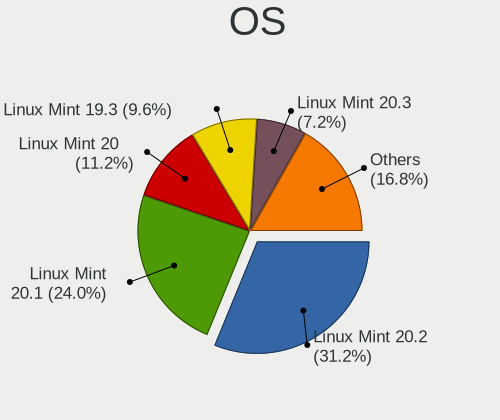

| Name            | Computers | Percent |
|-----------------|-----------|---------|
| Linux Mint 20.2 | 39        | 31.2%   |
| Linux Mint 20.1 | 30        | 24%     |
| Linux Mint 20   | 14        | 11.2%   |
| Linux Mint 19.3 | 12        | 9.6%    |
| Linux Mint 20.3 | 9         | 7.2%    |
| Linux Mint 19.1 | 9         | 7.2%    |
| Linux Mint 19.2 | 7         | 5.6%    |
| Linux Mint 19   | 4         | 3.2%    |
| Linux Mint 18.3 | 1         | 0.8%    |

OS Family
---------

OS without a version

| Name       | Computers | Percent |
|------------|-----------|---------|
| Linux Mint | 124       | 100%    |

Kernel
------

Version of the Linux kernel

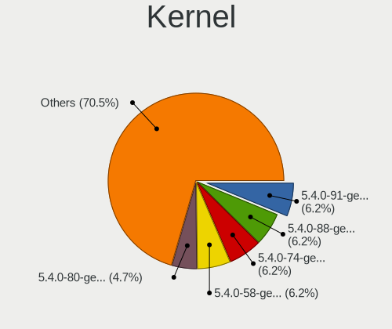

| Version             | Computers | Percent |
|---------------------|-----------|---------|
| 5.4.0-91-generic    | 8         | 6.2%    |
| 5.4.0-88-generic    | 8         | 6.2%    |
| 5.4.0-74-generic    | 8         | 6.2%    |
| 5.4.0-58-generic    | 8         | 6.2%    |
| 5.4.0-80-generic    | 6         | 4.65%   |
| 5.0.0-32-generic    | 6         | 4.65%   |
| 5.4.0-81-generic    | 5         | 3.88%   |
| 5.4.0-66-generic    | 5         | 3.88%   |
| 4.15.0-54-generic   | 5         | 3.88%   |
| 5.4.0-70-generic    | 4         | 3.1%    |
| 5.4.0-65-generic    | 4         | 3.1%    |
| 5.4.0-90-generic    | 3         | 2.33%   |
| 5.4.0-77-generic    | 3         | 2.33%   |
| 5.4.0-72-generic    | 3         | 2.33%   |
| 5.4.0-48-generic    | 3         | 2.33%   |
| 5.4.0-107-generic   | 3         | 2.33%   |
| 5.4.0-73-generic    | 2         | 1.55%   |
| 5.4.0-62-generic    | 2         | 1.55%   |
| 5.4.0-42-generic    | 2         | 1.55%   |
| 5.4.0-26-generic    | 2         | 1.55%   |
| 5.3.0-46-generic    | 2         | 1.55%   |
| 4.15.0-52-generic   | 2         | 1.55%   |
| 4.15.0-46-generic   | 2         | 1.55%   |
| 4.15.0-20-generic   | 2         | 1.55%   |
| 5.4.0-99-generic    | 1         | 0.78%   |
| 5.4.0-96-generic    | 1         | 0.78%   |
| 5.4.0-94-generic    | 1         | 0.78%   |
| 5.4.0-89-generic    | 1         | 0.78%   |
| 5.4.0-84-generic    | 1         | 0.78%   |
| 5.4.0-67-generic    | 1         | 0.78%   |
| 5.4.0-60-generic    | 1         | 0.78%   |
| 5.4.0-59-generic    | 1         | 0.78%   |
| 5.4.0-51-generic    | 1         | 0.78%   |
| 5.4.0-47-generic    | 1         | 0.78%   |
| 5.4.0-45-generic    | 1         | 0.78%   |
| 5.4.0-40-lowlatency | 1         | 0.78%   |
| 5.4.0-100-generic   | 1         | 0.78%   |
| 5.3.0-53-generic    | 1         | 0.78%   |
| 5.3.0-51-generic    | 1         | 0.78%   |
| 5.3.0-28-generic    | 1         | 0.78%   |
| 5.13.0-22-generic   | 1         | 0.78%   |
| 5.11.0-37-generic   | 1         | 0.78%   |
| 5.11.0-27-generic   | 1         | 0.78%   |
| 5.11.0-22-generic   | 1         | 0.78%   |
| 5.0.0-27-generic    | 1         | 0.78%   |
| 5.0.0-16-generic    | 1         | 0.78%   |
| 4.15.0-91-generic   | 1         | 0.78%   |
| 4.15.0-65-generic   | 1         | 0.78%   |
| 4.15.0-48-generic   | 1         | 0.78%   |
| 4.15.0-47-generic   | 1         | 0.78%   |
| 4.15.0-39-generic   | 1         | 0.78%   |
| 4.15.0-159-generic  | 1         | 0.78%   |
| 4.15.0-140-generic  | 1         | 0.78%   |
| 4.15.0-112-generic  | 1         | 0.78%   |
| 4.10.0-42-generic   | 1         | 0.78%   |

Kernel Family
-------------

Linux kernel without a distro release

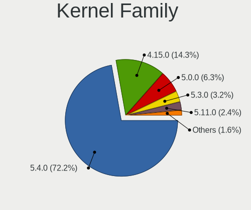

| Version | Computers | Percent |
|---------|-----------|---------|
| 5.4.0   | 91        | 72.22%  |
| 4.15.0  | 18        | 14.29%  |
| 5.0.0   | 8         | 6.35%   |
| 5.3.0   | 4         | 3.17%   |
| 5.11.0  | 3         | 2.38%   |
| 5.13.0  | 1         | 0.79%   |
| 4.10.0  | 1         | 0.79%   |

Kernel Major Ver.
-----------------

Linux kernel major version

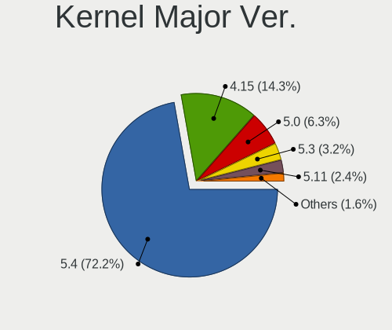

| Version | Computers | Percent |
|---------|-----------|---------|
| 5.4     | 91        | 72.22%  |
| 4.15    | 18        | 14.29%  |
| 5.0     | 8         | 6.35%   |
| 5.3     | 4         | 3.17%   |
| 5.11    | 3         | 2.38%   |
| 5.13    | 1         | 0.79%   |
| 4.10    | 1         | 0.79%   |

Arch
----

OS architecture (x86_64, i586, etc.)

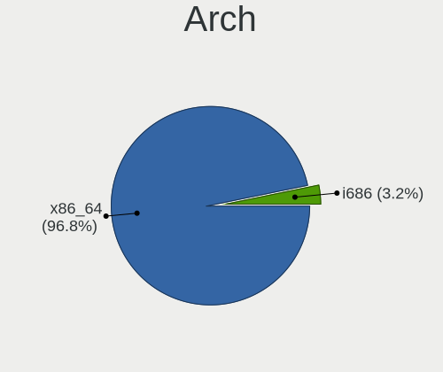

| Name   | Computers | Percent |
|--------|-----------|---------|
| x86_64 | 120       | 96.77%  |
| i686   | 4         | 3.23%   |

DE
--

Desktop Environment

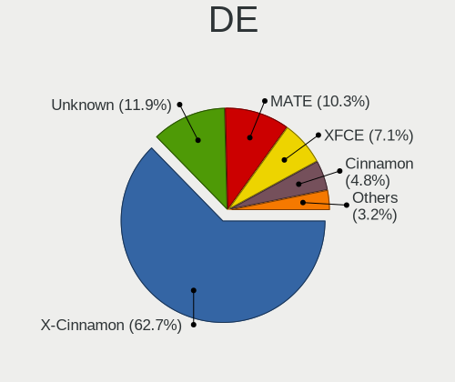

| Name       | Computers | Percent |
|------------|-----------|---------|
| X-Cinnamon | 79        | 62.7%   |
| Unknown    | 15        | 11.9%   |
| MATE       | 13        | 10.32%  |
| XFCE       | 9         | 7.14%   |
| Cinnamon   | 6         | 4.76%   |
| GNOME      | 3         | 2.38%   |
| Budgie     | 1         | 0.79%   |

Display Server
--------------

X11 or Wayland

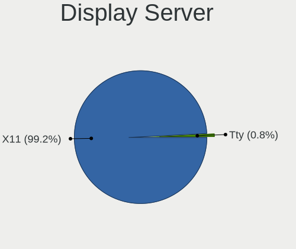

| Name | Computers | Percent |
|------|-----------|---------|
| X11  | 123       | 99.19%  |
| Tty  | 1         | 0.81%   |

Display Manager
---------------

SDDM, LightDM, etc.

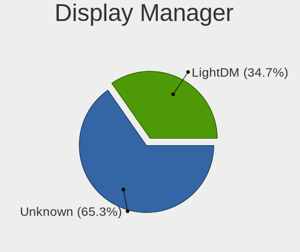

| Name    | Computers | Percent |
|---------|-----------|---------|
| Unknown | 81        | 65.32%  |
| LightDM | 43        | 34.68%  |

OS Lang
-------

Language

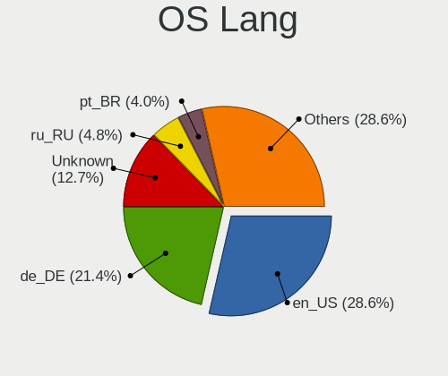

| Lang    | Computers | Percent |
|---------|-----------|---------|
| en_US   | 36        | 28.57%  |
| de_DE   | 27        | 21.43%  |
| Unknown | 16        | 12.7%   |
| ru_RU   | 6         | 4.76%   |
| pt_BR   | 5         | 3.97%   |
| en_GB   | 5         | 3.97%   |
| de_AT   | 4         | 3.17%   |
| C       | 4         | 3.17%   |
| es_ES   | 3         | 2.38%   |
| nl_NL   | 2         | 1.59%   |
| it_IT   | 2         | 1.59%   |
| en_AU   | 2         | 1.59%   |
| el_GR   | 2         | 1.59%   |
| tr_TR   | 1         | 0.79%   |
| ro_RO   | 1         | 0.79%   |
| lv_LV   | 1         | 0.79%   |
| ja_JP   | 1         | 0.79%   |
| fr_FR   | 1         | 0.79%   |
| fr_CA   | 1         | 0.79%   |
| en_NZ   | 1         | 0.79%   |
| en_IN   | 1         | 0.79%   |
| en_IL   | 1         | 0.79%   |
| en_CA   | 1         | 0.79%   |
| de_CH   | 1         | 0.79%   |
| bg_BG   | 1         | 0.79%   |

Boot Mode
---------

EFI or BIOS

| Mode | Computers | Percent |
|------|-----------|---------|
| BIOS | 115       | 92.74%  |
| EFI  | 9         | 7.26%   |

Filesystem
----------

Type of filesystem

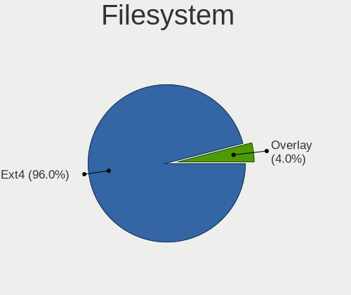

| Type    | Computers | Percent |
|---------|-----------|---------|
| Ext4    | 119       | 95.97%  |
| Overlay | 5         | 4.03%   |

Part. scheme
------------

Scheme of partitioning

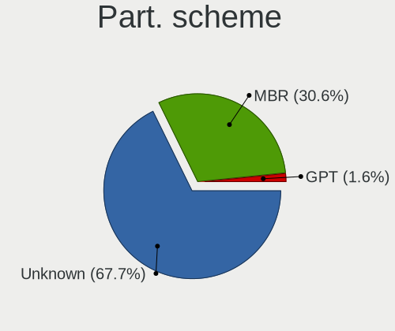

| Type    | Computers | Percent |
|---------|-----------|---------|
| Unknown | 84        | 67.74%  |
| MBR     | 38        | 30.65%  |
| GPT     | 2         | 1.61%   |

Dual Boot with Linux/BSD
------------------------

Hosting more than one Linux/BSD

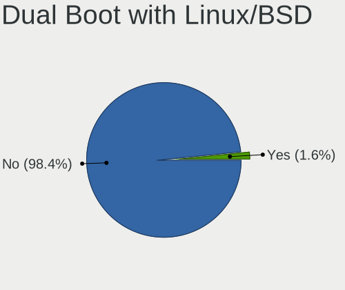

| Dual boot | Computers | Percent |
|-----------|-----------|---------|
| No        | 122       | 98.39%  |
| Yes       | 2         | 1.61%   |

Dual Boot (Win)
---------------

Hosting Linux and Windows

| Dual boot | Computers | Percent |
|-----------|-----------|---------|
| No        | 123       | 99.19%  |
| Yes       | 1         | 0.81%   |

Board
-----

Vendor
------

Motherboard manufacturer

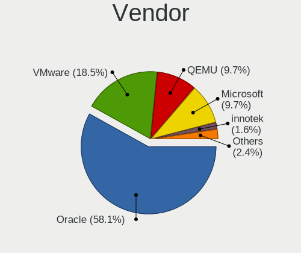

| Name                             | Computers | Percent |
|----------------------------------|-----------|---------|
| Oracle                           | 72        | 58.06%  |
| VMware                           | 23        | 18.55%  |
| QEMU                             | 12        | 9.68%   |
| Microsoft                        | 12        | 9.68%   |
| Parallels Software International | 2         | 1.61%   |
| innotek                          | 2         | 1.61%   |
| Unknown                          | 1         | 0.81%   |

Model
-----

Motherboard model

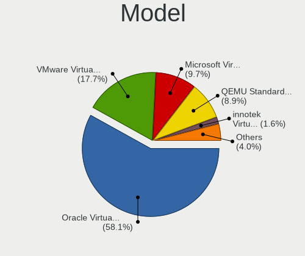

| Name                                                        | Computers | Percent |
|-------------------------------------------------------------|-----------|---------|
| Oracle VirtualBox                                           | 72        | 58.06%  |
| VMware Virtual Platform                                     | 22        | 17.74%  |
| Microsoft Virtual Machine                                   | 12        | 9.68%   |
| QEMU Standard PC (i440FX + PIIX, 1996)                      | 11        | 8.87%   |
| Parallels Software International Parallels Virtual Platform | 2         | 1.61%   |
| innotek VirtualBox                                          | 2         | 1.61%   |
| VMware VMware7,1                                            | 1         | 0.81%   |
| QEMU Standard PC (Q35 + ICH9, 2009)                         | 1         | 0.81%   |
| Unknown                                                     | 1         | 0.81%   |

Model Family
------------

Motherboard model prefix

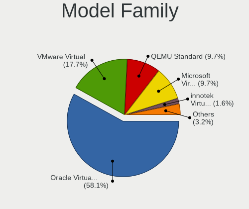

| Name                                       | Computers | Percent |
|--------------------------------------------|-----------|---------|
| Oracle VirtualBox                          | 72        | 58.06%  |
| VMware Virtual                             | 22        | 17.74%  |
| QEMU Standard                              | 12        | 9.68%   |
| Microsoft Virtual                          | 12        | 9.68%   |
| Parallels Software International Parallels | 2         | 1.61%   |
| innotek VirtualBox                         | 2         | 1.61%   |
| VMware VMware7                             | 1         | 0.81%   |
| Unknown                                    | 1         | 0.81%   |

MFG Year
--------

Motherboard manufacture year

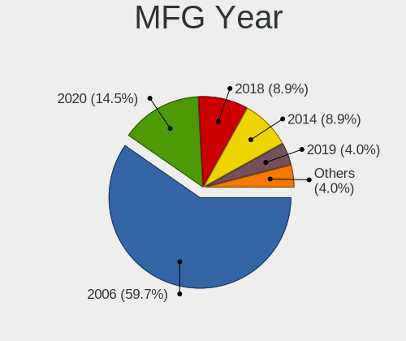

| Year    | Computers | Percent |
|---------|-----------|---------|
| 2006    | 74        | 59.68%  |
| 2020    | 18        | 14.52%  |
| 2018    | 11        | 8.87%   |
| 2014    | 11        | 8.87%   |
| 2019    | 5         | 4.03%   |
| 2021    | 3         | 2.42%   |
| 2015    | 1         | 0.81%   |
| Unknown | 1         | 0.81%   |

Form Factor
-----------

Physical design of the computer

| Name            | Computers | Percent |
|-----------------|-----------|---------|
| Virtual machine | 124       | 100%    |

Secure Boot
-----------

Enabled or disabled

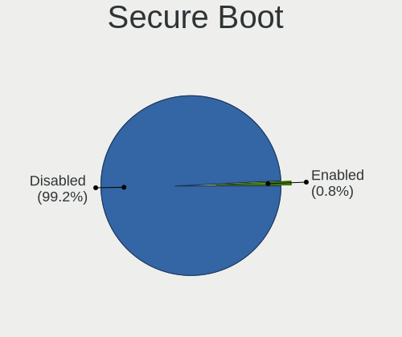

| State    | Computers | Percent |
|----------|-----------|---------|
| Disabled | 123       | 99.19%  |
| Enabled  | 1         | 0.81%   |

Coreboot
--------

Have coreboot on board

| Used | Computers | Percent |
|------|-----------|---------|
| No   | 124       | 100%    |

RAM Size
--------

Total RAM memory

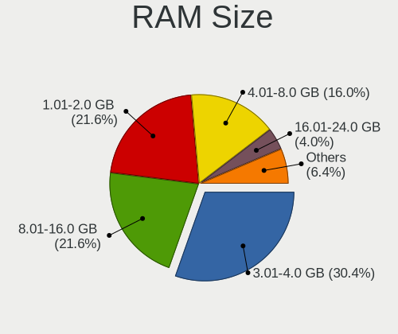

| Size in GB | Computers | Percent |
|------------|-----------|---------|
| 3.01-4.0   | 38        | 30.4%   |
| 1.01-2.0   | 27        | 21.6%   |
| 8.01-16.0  | 27        | 21.6%   |
| 4.01-8.0   | 20        | 16%     |
| 2.01-3.0   | 5         | 4%      |
| 16.01-24.0 | 5         | 4%      |
| 0.51-1.0   | 3         | 2.4%    |

RAM Used
--------

Used RAM memory

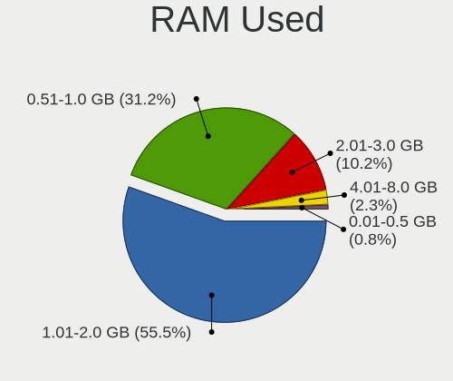

| Used GB  | Computers | Percent |
|----------|-----------|---------|
| 1.01-2.0 | 71        | 55.47%  |
| 0.51-1.0 | 40        | 31.25%  |
| 2.01-3.0 | 13        | 10.16%  |
| 4.01-8.0 | 3         | 2.34%   |
| 0.01-0.5 | 1         | 0.78%   |

Total Drives
------------

Number of drives on board

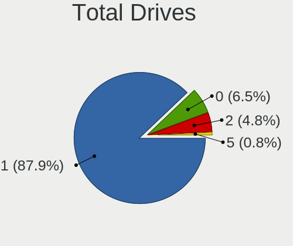

| Drives | Computers | Percent |
|--------|-----------|---------|
| 1      | 109       | 87.9%   |
| 0      | 8         | 6.45%   |
| 2      | 6         | 4.84%   |
| 5      | 1         | 0.81%   |

Has CD-ROM
----------

Has CD-ROM on board

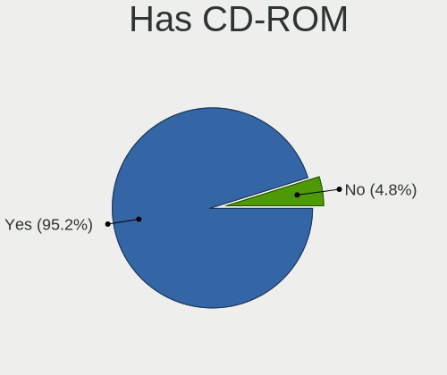

| Presented | Computers | Percent |
|-----------|-----------|---------|
| Yes       | 118       | 95.16%  |
| No        | 6         | 4.84%   |

Has Ethernet
------------

Has Ethernet on board

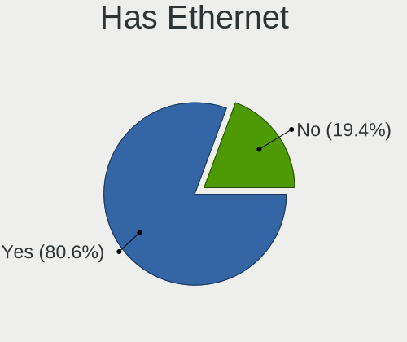

| Presented | Computers | Percent |
|-----------|-----------|---------|
| Yes       | 100       | 80.65%  |
| No        | 24        | 19.35%  |

Has WiFi
--------

Has WiFi module

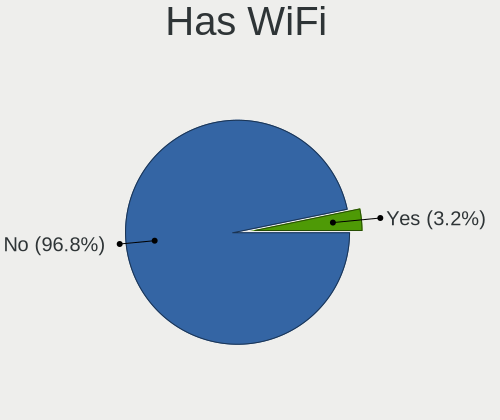

| Presented | Computers | Percent |
|-----------|-----------|---------|
| No        | 120       | 96.77%  |
| Yes       | 4         | 3.23%   |

Has Bluetooth
-------------

Has Bluetooth module

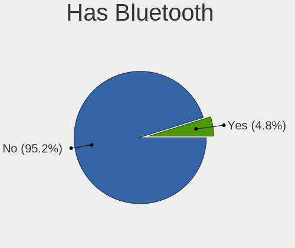

| Presented | Computers | Percent |
|-----------|-----------|---------|
| No        | 118       | 95.16%  |
| Yes       | 6         | 4.84%   |

Location
--------

Country
-------

Geographic location (country)

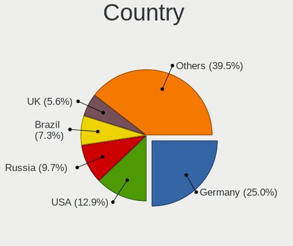

| Country      | Computers | Percent |
|--------------|-----------|---------|
| Germany      | 31        | 25%     |
| USA          | 16        | 12.9%   |
| Russia       | 12        | 9.68%   |
| Brazil       | 9         | 7.26%   |
| UK           | 7         | 5.65%   |
| Spain        | 6         | 4.84%   |
| Austria      | 5         | 4.03%   |
| Netherlands  | 3         | 2.42%   |
| Latvia       | 3         | 2.42%   |
| Canada       | 3         | 2.42%   |
| Switzerland  | 2         | 1.61%   |
| Serbia       | 2         | 1.61%   |
| Portugal     | 2         | 1.61%   |
| Italy        | 2         | 1.61%   |
| France       | 2         | 1.61%   |
| Belgium      | 2         | 1.61%   |
| Australia    | 2         | 1.61%   |
| Turkey       | 1         | 0.81%   |
| Slovakia     | 1         | 0.81%   |
| Saudi Arabia | 1         | 0.81%   |
| Puerto Rico  | 1         | 0.81%   |
| Poland       | 1         | 0.81%   |
| New Zealand  | 1         | 0.81%   |
| Mexico       | 1         | 0.81%   |
| Kazakhstan   | 1         | 0.81%   |
| Japan        | 1         | 0.81%   |
| Israel       | 1         | 0.81%   |
| India        | 1         | 0.81%   |
| Greece       | 1         | 0.81%   |
| Cyprus       | 1         | 0.81%   |
| Bulgaria     | 1         | 0.81%   |
| Argentina    | 1         | 0.81%   |

City
----

Geographic location (city)

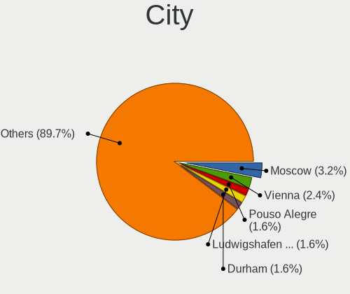

| City                          | Computers | Percent |
|-------------------------------|-----------|---------|
| Moscow                        | 4         | 3.17%   |
| Vienna                        | 3         | 2.38%   |
| Pouso Alegre                  | 2         | 1.59%   |
| Ludwigshafen am Rhein         | 2         | 1.59%   |
| Durham                        | 2         | 1.59%   |
| Berlin                        | 2         | 1.59%   |
| Belo Horizonte                | 2         | 1.59%   |
| Amsterdam                     | 2         | 1.59%   |
| Yaroslavl                     | 1         | 0.79%   |
| Wiernsheim                    | 1         | 0.79%   |
| Whitney                       | 1         | 0.79%   |
| Warsaw                        | 1         | 0.79%   |
| Vidor                         | 1         | 0.79%   |
| Vacaville                     | 1         | 0.79%   |
| Utrecht                       | 1         | 0.79%   |
| Umatilla                      | 1         | 0.79%   |
| Uba                           | 1         | 0.79%   |
| Truro                         | 1         | 0.79%   |
| Tracy                         | 1         | 0.79%   |
| Tours                         | 1         | 0.79%   |
| Toronto                       | 1         | 0.79%   |
| Telemaco Borba                | 1         | 0.79%   |
| Tel Aviv                      | 1         | 0.79%   |
| Stegen                        | 1         | 0.79%   |
| St Petersburg                 | 1         | 0.79%   |
| Sofia                         | 1         | 0.79%   |
| Sochi                         | 1         | 0.79%   |
| Seville                       | 1         | 0.79%   |
| Senden                        | 1         | 0.79%   |
| Schluechtern                  | 1         | 0.79%   |
| Sasebo                        | 1         | 0.79%   |
| Sarasota                      | 1         | 0.79%   |
| Santander                     | 1         | 0.79%   |
| San Sebastián de La Gomera | 1         | 0.79%   |
| San Juan                      | 1         | 0.79%   |
| Saarbrücken                | 1         | 0.79%   |
| Riga                          | 1         | 0.79%   |
| Reutov                        | 1         | 0.79%   |
| Renton                        | 1         | 0.79%   |
| Recherswil                    | 1         | 0.79%   |
| Queluz                        | 1         | 0.79%   |
| Phoenix                       | 1         | 0.79%   |
| Pforzheim                     | 1         | 0.79%   |
| Perth                         | 1         | 0.79%   |
| Palm Bay                      | 1         | 0.79%   |
| Paderborn                     | 1         | 0.79%   |
| Oviedo                        | 1         | 0.79%   |
| Oranienburg                   | 1         | 0.79%   |
| Oceano                        | 1         | 0.79%   |
| Novosibirsk                   | 1         | 0.79%   |
| Novi Sad                      | 1         | 0.79%   |
| Niterói                    | 1         | 0.79%   |
| Nicosia                       | 1         | 0.79%   |
| New Delhi                     | 1         | 0.79%   |
| Munich                        | 1         | 0.79%   |
| Montreal                      | 1         | 0.79%   |
| Milton Keynes                 | 1         | 0.79%   |
| Mexicali                      | 1         | 0.79%   |
| Medina                        | 1         | 0.79%   |
| Mérida                     | 1         | 0.79%   |

Drives
------

Drive Vendor
------------

Hard drive vendors

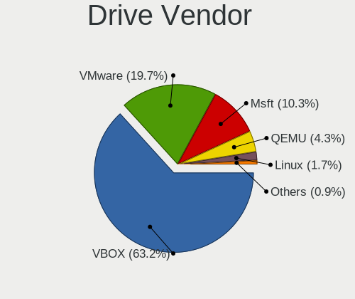

| Vendor   | Computers | Drives | Percent |
|----------|-----------|--------|---------|
| VBOX     | 74        | 85     | 63.25%  |
| VMware   | 23        | 26     | 19.66%  |
| Msft     | 12        | 13     | 10.26%  |
| QEMU     | 5         | 6      | 4.27%   |
| Linux    | 2         | 2      | 1.71%   |
| TS32GSSD | 1         | 1      | 0.85%   |

Drive Model
-----------

Hard drive models

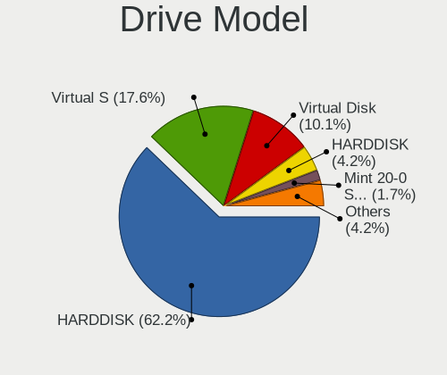

| Model                          | Computers | Percent |
|--------------------------------|-----------|---------|
| VBOX HARDDISK                  | 74        | 62.18%  |
| VMware Virtual S               | 21        | 17.65%  |
| Msft Virtual Disk              | 12        | 10.08%  |
| QEMU HARDDISK                  | 5         | 4.2%    |
| Linux Mint 20-0 SSD 68GB       | 2         | 1.68%   |
| VMware Virtual SATA Hard Drive | 1         | 0.84%   |
| VMware Virtual IDE Hard Drive  | 1         | 0.84%   |
| VMware NVMe SSD Drive          | 1         | 0.84%   |
| TS32GSSD 25-M 32GB             | 1         | 0.84%   |
| msft vmem disk                 | 1         | 0.84%   |

HDD Vendor
----------

Hard disk drive vendors

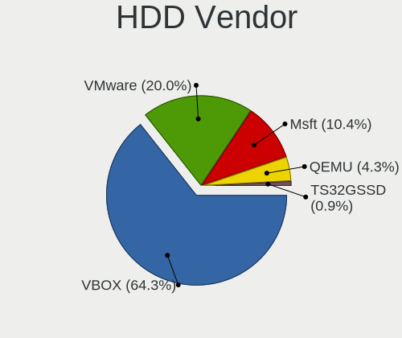

| Vendor   | Computers | Drives | Percent |
|----------|-----------|--------|---------|
| VBOX     | 74        | 85     | 64.35%  |
| VMware   | 23        | 26     | 20%     |
| Msft     | 12        | 13     | 10.43%  |
| QEMU     | 5         | 6      | 4.35%   |
| TS32GSSD | 1         | 1      | 0.87%   |

SSD Vendor
----------

Solid state drive vendors

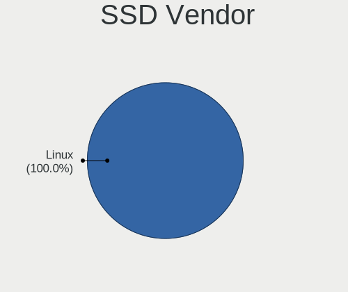

| Vendor | Computers | Drives | Percent |
|--------|-----------|--------|---------|
| Linux  | 2         | 2      | 100%    |

Drive Kind
----------

HDD or SSD

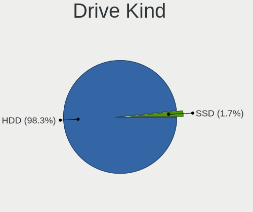

| Kind | Computers | Drives | Percent |
|------|-----------|--------|---------|
| HDD  | 114       | 131    | 98.28%  |
| SSD  | 2         | 2      | 1.72%   |

Drive Connector
---------------

SATA, SAS, NVMe, etc.

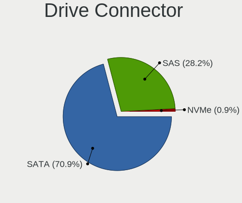

| Type | Computers | Drives | Percent |
|------|-----------|--------|---------|
| SATA | 83        | 95     | 70.94%  |
| SAS  | 33        | 37     | 28.21%  |
| NVMe | 1         | 1      | 0.85%   |

Drive Size
----------

Size of hard drive

| Size in TB | Computers | Drives | Percent |
|------------|-----------|--------|---------|
| 0.01-0.5   | 116       | 133    | 100%    |

Space Total
-----------

Amount of disk space available on the file system

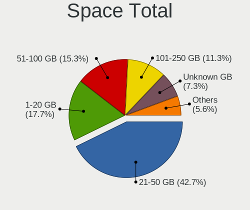

| Size in GB     | Computers | Percent |
|----------------|-----------|---------|
| 21-50          | 53        | 42.74%  |
| 1-20           | 22        | 17.74%  |
| 51-100         | 19        | 15.32%  |
| 101-250        | 14        | 11.29%  |
| Unknown        | 9         | 7.26%   |
| 251-500        | 5         | 4.03%   |
| More than 3000 | 1         | 0.81%   |
| 501-1000       | 1         | 0.81%   |

Space Used
----------

Amount of used disk space

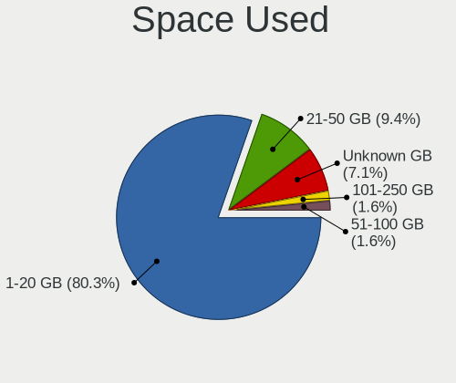

| Used GB | Computers | Percent |
|---------|-----------|---------|
| 1-20    | 102       | 80.31%  |
| 21-50   | 12        | 9.45%   |
| Unknown | 9         | 7.09%   |
| 101-250 | 2         | 1.57%   |
| 51-100  | 2         | 1.57%   |

Malfunc. Drives
---------------

Drive models with a malfunction

Zero info for selected period =(

Malfunc. Drive Vendor
---------------------

Vendors of faulty drives

Zero info for selected period =(

Malfunc. HDD Vendor
-------------------

Vendors of faulty HDD drives

Zero info for selected period =(

Malfunc. Drive Kind
-------------------

Kinds of faulty drives

Zero info for selected period =(

Failed Drives
-------------

Failed drive models

Zero info for selected period =(

Failed Drive Vendor
-------------------

Failed drive vendors

Zero info for selected period =(

Drive Status
------------

Number of failed and malfunc. drives

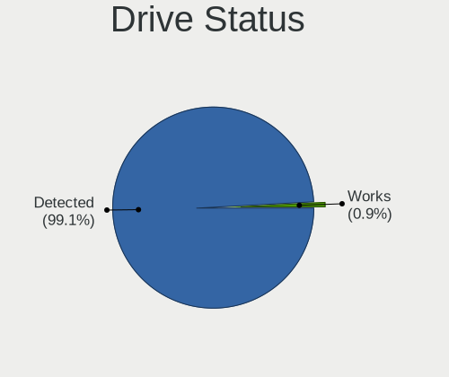

| Status   | Computers | Drives | Percent |
|----------|-----------|--------|---------|
| Detected | 115       | 132    | 99.14%  |
| Works    | 1         | 1      | 0.86%   |

Storage controller
------------------

Storage Vendor
--------------

Storage controller vendors

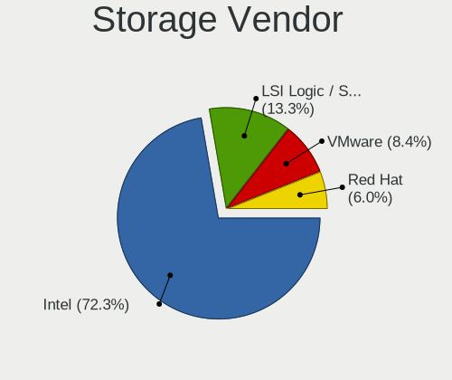

| Vendor                    | Computers | Percent |
|---------------------------|-----------|---------|
| Intel                     | 120       | 72.29%  |
| LSI Logic / Symbios Logic | 22        | 13.25%  |
| VMware                    | 14        | 8.43%   |
| Red Hat                   | 10        | 6.02%   |

Storage Model
-------------

Storage controller models

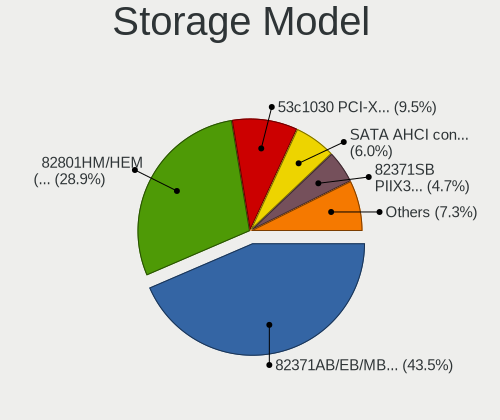

| Model                                                                 | Computers | Percent |
|-----------------------------------------------------------------------|-----------|---------|
| Intel 82371AB/EB/MB PIIX4 IDE                                         | 101       | 43.53%  |
| Intel 82801HM/HEM (ICH8M/ICH8M-E) SATA Controller [AHCI mode]         | 67        | 28.88%  |
| LSI Logic / Symbios Logic 53c1030 PCI-X Fusion-MPT Dual Ultra320 SCSI | 22        | 9.48%   |
| VMware SATA AHCI controller                                           | 14        | 6.03%   |
| Intel 82371SB PIIX3 IDE [Natoma/Triton II]                            | 11        | 4.74%   |
| Red Hat Virtio SCSI                                                   | 6         | 2.59%   |
| Red Hat Virtio block device                                           | 4         | 1.72%   |
| Intel 82801HR/HO/HH (ICH8R/DO/DH) 6 port SATA Controller [AHCI mode]  | 2         | 0.86%   |
| Intel 82801BA IDE U100 Controller                                     | 2         | 0.86%   |
| VMware NVMe SSD Controller                                            | 1         | 0.43%   |
| Intel 82801IR/IO/IH (ICH9R/DO/DH) 6 port SATA Controller [AHCI mode]  | 1         | 0.43%   |
| Intel 631xESB/632xESB IDE Controller                                  | 1         | 0.43%   |

Storage Kind
------------

Kind of storage controller (IDE, SATA, NVMe, SAS, ...)

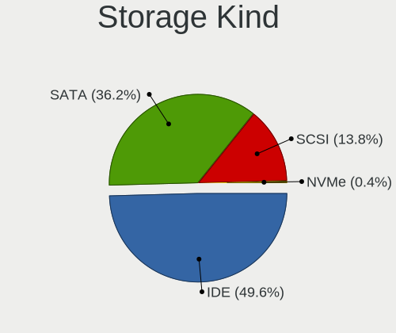

| Kind | Computers | Percent |
|------|-----------|---------|
| IDE  | 115       | 49.57%  |
| SATA | 84        | 36.21%  |
| SCSI | 32        | 13.79%  |
| NVMe | 1         | 0.43%   |

Processor
---------

CPU Vendor
----------

Processor vendors

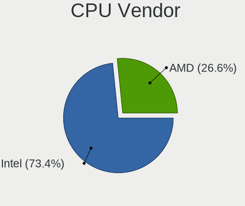

| Vendor | Computers | Percent |
|--------|-----------|---------|
| Intel  | 91        | 73.39%  |
| AMD    | 33        | 26.61%  |

CPU Model
---------

Processor models

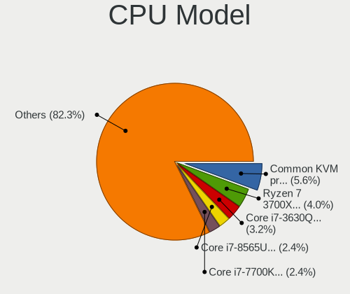

| Model                                         | Computers | Percent |
|-----------------------------------------------|-----------|---------|
| Intel Common KVM processor                    | 7         | 5.65%   |
| AMD Ryzen 7 3700X 8-Core Processor            | 5         | 4.03%   |
| Intel Core i7-3630QM CPU @ 2.40GHz            | 4         | 3.23%   |
| Intel Core i7-8565U CPU @ 1.80GHz             | 3         | 2.42%   |
| Intel Core i7-7700K CPU @ 4.20GHz             | 3         | 2.42%   |
| AMD Ryzen 5 1600 Six-Core Processor           | 3         | 2.42%   |
| Intel Xeon CPU E5-1620 v3 @ 3.50GHz           | 2         | 1.61%   |
| Intel Core i9-9900K CPU @ 3.60GHz             | 2         | 1.61%   |
| Intel Core i7-6700HQ CPU @ 2.60GHz            | 2         | 1.61%   |
| Intel Core i7-4790 CPU @ 3.60GHz              | 2         | 1.61%   |
| Intel Core i7-3770 CPU @ 3.40GHz              | 2         | 1.61%   |
| Intel Core i5-4690 CPU @ 3.50GHz              | 2         | 1.61%   |
| Intel Core i5-4590T CPU @ 2.00GHz             | 2         | 1.61%   |
| Intel Core i5-4590 CPU @ 3.30GHz              | 2         | 1.61%   |
| Intel Core i5-10400F CPU @ 2.90GHz            | 2         | 1.61%   |
| Intel Core i5 CPU M 520 @ 2.40GHz             | 2         | 1.61%   |
| Intel Core i3-3220 CPU @ 3.30GHz              | 2         | 1.61%   |
| AMD Ryzen 7 5800X 8-Core Processor            | 2         | 1.61%   |
| AMD Ryzen 5 3600 6-Core Processor             | 2         | 1.61%   |
| AMD Ryzen 3 3200U with Radeon Vega Mobile Gfx | 2         | 1.61%   |
| AMD Ryzen 3 2200G with Radeon Vega Graphics   | 2         | 1.61%   |
| Intel Xeon CPU E5-1660 v2 @ 3.70GHz           | 1         | 0.81%   |
| Intel Xeon CPU E5-1603 0 @ 2.80GHz            | 1         | 0.81%   |
| Intel Pentium CPU G3220 @ 3.00GHz             | 1         | 0.81%   |
| Intel Core M-5Y71 CPU @ 1.20GHz               | 1         | 0.81%   |
| Intel Core i9-9900KF CPU @ 3.60GHz            | 1         | 0.81%   |
| Intel Core i9-9880H CPU @ 2.30GHz             | 1         | 0.81%   |
| Intel Core i9-8950HK CPU @ 2.90GHz            | 1         | 0.81%   |
| Intel Core i9-10900KF CPU @ 3.70GHz           | 1         | 0.81%   |
| Intel Core i7-9700K CPU @ 3.60GHz             | 1         | 0.81%   |
| Intel Core i7-8700K CPU @ 3.70GHz             | 1         | 0.81%   |
| Intel Core i7-8700 CPU @ 3.20GHz              | 1         | 0.81%   |
| Intel Core i7-7700HQ CPU @ 2.80GHz            | 1         | 0.81%   |
| Intel Core i7-6700 CPU @ 3.40GHz              | 1         | 0.81%   |
| Intel Core i7-6500U CPU @ 2.50GHz             | 1         | 0.81%   |
| Intel Core i7-5960X CPU @ 3.00GHz             | 1         | 0.81%   |
| Intel Core i7-4771 CPU @ 3.50GHz              | 1         | 0.81%   |
| Intel Core i7-4770 CPU @ 3.40GHz              | 1         | 0.81%   |
| Intel Core i7-4712MQ CPU @ 2.30GHz            | 1         | 0.81%   |
| Intel Core i7-4700MQ CPU @ 2.40GHz            | 1         | 0.81%   |
| Intel Core i7-3770S CPU @ 3.10GHz             | 1         | 0.81%   |
| Intel Core i7-10710U CPU @ 1.10GHz            | 1         | 0.81%   |
| Intel Core i7-10510U CPU @ 1.80GHz            | 1         | 0.81%   |
| Intel Core i7 CPU 870 @ 2.93GHz               | 1         | 0.81%   |
| Intel Core i5-9400 CPU @ 2.90GHz              | 1         | 0.81%   |
| Intel Core i5-8600 CPU @ 3.10GHz              | 1         | 0.81%   |
| Intel Core i5-8250U CPU @ 1.60GHz             | 1         | 0.81%   |
| Intel Core i5-7400 CPU @ 3.00GHz              | 1         | 0.81%   |
| Intel Core i5-6300U CPU @ 2.40GHz             | 1         | 0.81%   |
| Intel Core i5-4460 CPU @ 3.20GHz              | 1         | 0.81%   |
| Intel Core i5-4250U CPU @ 1.30GHz             | 1         | 0.81%   |
| Intel Core i5-4200M CPU @ 2.50GHz             | 1         | 0.81%   |
| Intel Core i5-3570 CPU @ 3.40GHz              | 1         | 0.81%   |
| Intel Core i5-3210M CPU @ 2.50GHz             | 1         | 0.81%   |
| Intel Core i5-10400 CPU @ 2.90GHz             | 1         | 0.81%   |
| Intel Core i5-1038NG7 CPU @ 2.00GHz           | 1         | 0.81%   |
| Intel Core i5-1035G1 CPU @ 1.00GHz            | 1         | 0.81%   |
| Intel Core i3-9100F CPU @ 3.60GHz             | 1         | 0.81%   |
| Intel Core i3-5005U CPU @ 2.00GHz             | 1         | 0.81%   |
| Intel Core i3-4160 CPU @ 3.60GHz              | 1         | 0.81%   |

CPU Model Family
----------------

Processor model prefix

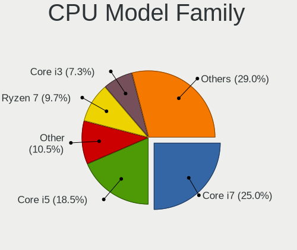

| Model                  | Computers | Percent |
|------------------------|-----------|---------|
| Intel Core i7          | 31        | 25%     |
| Intel Core i5          | 23        | 18.55%  |
| Other                  | 13        | 10.48%  |
| AMD Ryzen 7            | 12        | 9.68%   |
| Intel Core i3          | 9         | 7.26%   |
| AMD Ryzen 5            | 7         | 5.65%   |
| Intel Core i9          | 6         | 4.84%   |
| Intel Xeon             | 4         | 3.23%   |
| Intel Celeron          | 4         | 3.23%   |
| AMD Ryzen 3            | 4         | 3.23%   |
| AMD FX                 | 2         | 1.61%   |
| Intel Pentium          | 1         | 0.81%   |
| Intel Core M           | 1         | 0.81%   |
| AMD Ryzen Threadripper | 1         | 0.81%   |
| AMD Ryzen 9            | 1         | 0.81%   |
| AMD Ryzen 5 PRO        | 1         | 0.81%   |
| AMD EPYC               | 1         | 0.81%   |
| AMD Athlon             | 1         | 0.81%   |
| AMD A8                 | 1         | 0.81%   |
| AMD A6                 | 1         | 0.81%   |

CPU Cores
---------

Number of processor cores

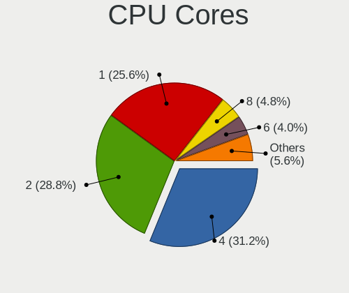

| Number | Computers | Percent |
|--------|-----------|---------|
| 4      | 39        | 31.2%   |
| 2      | 36        | 28.8%   |
| 1      | 32        | 25.6%   |
| 8      | 6         | 4.8%    |
| 6      | 5         | 4%      |
| 3      | 4         | 3.2%    |
| 16     | 2         | 1.6%    |
| 12     | 1         | 0.8%    |

CPU Sockets
-----------

Number of sockets

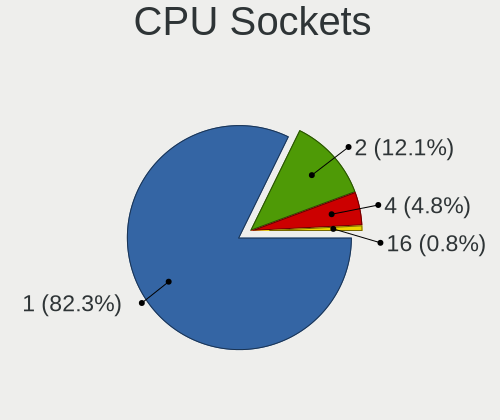

| Number | Computers | Percent |
|--------|-----------|---------|
| 1      | 102       | 82.26%  |
| 2      | 15        | 12.1%   |
| 4      | 6         | 4.84%   |
| 16     | 1         | 0.81%   |

CPU Threads
-----------

Threads per core (Hyper-Threading)

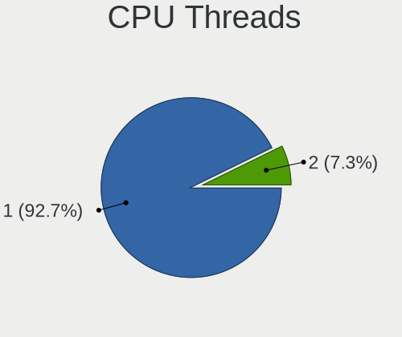

| Number | Computers | Percent |
|--------|-----------|---------|
| 1      | 115       | 92.74%  |
| 2      | 9         | 7.26%   |

CPU Op-Modes
------------

CPU Operation Modes (32-bit, 64-bit)

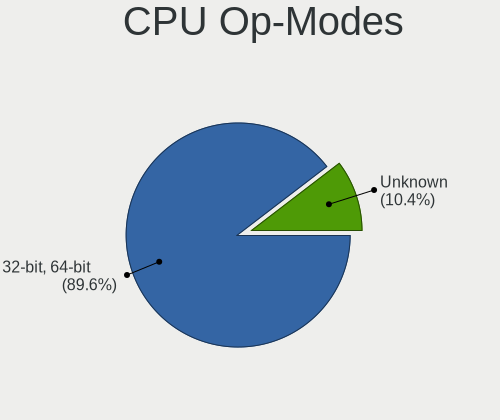

| Op mode        | Computers | Percent |
|----------------|-----------|---------|
| 32-bit, 64-bit | 112       | 89.6%   |
| Unknown        | 13        | 10.4%   |

CPU Microcode
-------------

Microcode number

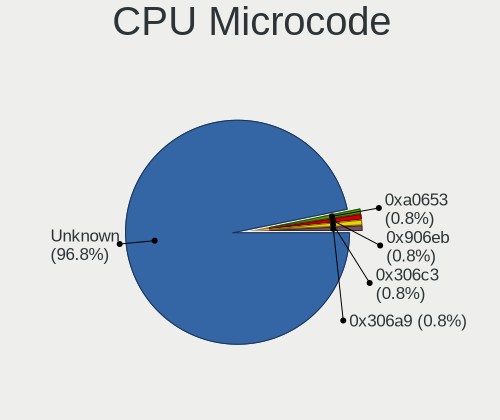

| Number  | Computers | Percent |
|---------|-----------|---------|
| Unknown | 120       | 96.77%  |
| 0xa0653 | 1         | 0.81%   |
| 0x906eb | 1         | 0.81%   |
| 0x306c3 | 1         | 0.81%   |
| 0x306a9 | 1         | 0.81%   |

CPU Microarch
-------------

Microarchitecture

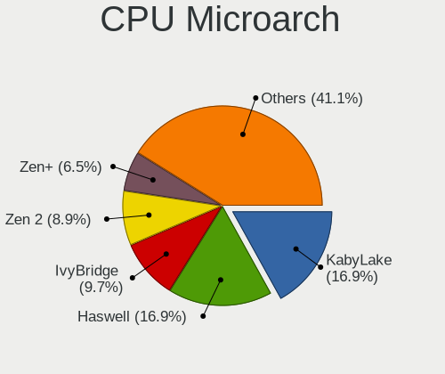

| Name          | Computers | Percent |
|---------------|-----------|---------|
| KabyLake      | 21        | 16.94%  |
| Haswell       | 21        | 16.94%  |
| IvyBridge     | 12        | 9.68%   |
| Zen 2         | 11        | 8.87%   |
| Zen+          | 8         | 6.45%   |
| Zen           | 7         | 5.65%   |
| NetBurst      | 7         | 5.65%   |
| Skylake       | 5         | 4.03%   |
| CometLake     | 5         | 4.03%   |
| Westmere      | 4         | 3.23%   |
| Silvermont    | 3         | 2.42%   |
| Piledriver    | 3         | 2.42%   |
| Unknown       | 3         | 2.42%   |
| Zen 3         | 2         | 1.61%   |
| TigerLake     | 2         | 1.61%   |
| SandyBridge   | 2         | 1.61%   |
| IceLake       | 2         | 1.61%   |
| Broadwell     | 2         | 1.61%   |
| Nehalem       | 1         | 0.81%   |
| K6            | 1         | 0.81%   |
| K10 Llano     | 1         | 0.81%   |
| Goldmont plus | 1         | 0.81%   |

Graphics
--------

GPU Vendor
----------

Vendors of graphics cards

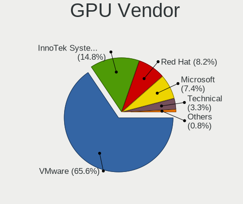

| Vendor                 | Computers | Percent |
|------------------------|-----------|---------|
| VMware                 | 80        | 65.57%  |
| InnoTek Systemberatung | 18        | 14.75%  |
| Red Hat                | 10        | 8.2%    |
| Microsoft              | 9         | 7.38%   |
| Technical              | 4         | 3.28%   |
| Unknown                | 1         | 0.82%   |

GPU Model
---------

Graphics card models

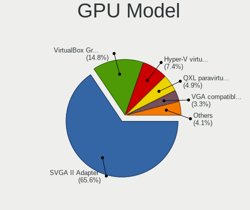

| Model                                              | Computers | Percent |
|----------------------------------------------------|-----------|---------|
| VMware SVGA II Adapter                             | 80        | 65.57%  |
| InnoTek Systemberatung VirtualBox Graphics Adapter | 18        | 14.75%  |
| Microsoft Hyper-V virtual VGA                      | 9         | 7.38%   |
| Red Hat QXL paravirtual graphic card               | 6         | 4.92%   |
| Technical VGA compatible controller                | 4         | 3.28%   |
| Red Hat Virtio GPU                                 | 4         | 3.28%   |
| Unknown VGA compatible controller                  | 1         | 0.82%   |

GPU Combo
---------

Combinations of graphics cards

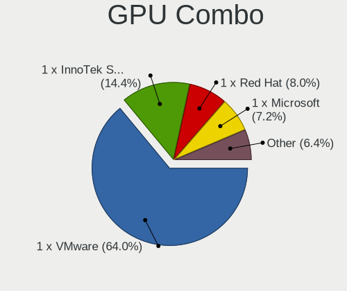

| Name                       | Computers | Percent |
|----------------------------|-----------|---------|
| 1 x VMware                 | 80        | 64%     |
| 1 x InnoTek Systemberatung | 18        | 14.4%   |
| 1 x Red Hat                | 10        | 8%      |
| 1 x Microsoft              | 9         | 7.2%    |
| Other                      | 8         | 6.4%    |

GPU Driver
----------

Free vs proprietary

| Driver  | Computers | Percent |
|---------|-----------|---------|
| Unknown | 124       | 100%    |

GPU Memory
----------

Total video memory

| Size in GB | Computers | Percent |
|------------|-----------|---------|
| Unknown    | 122       | 98.39%  |
| 0.01-0.5   | 2         | 1.61%   |

Monitor
-------

Monitor Vendor
--------------

Monitor vendors

| Vendor | Computers | Percent |
|--------|-----------|---------|
| RHT    | 4         | 100%    |

Monitor Model
-------------

Monitor models

| Model                                                  | Computers | Percent |
|--------------------------------------------------------|-----------|---------|
| RHT QEMU Monitor RHT1234 2048x1152 260x195mm 12.8-inch | 3         | 75%     |
| RHT QEMU Monitor RHT1234 2048x1152 260x190mm 12.7-inch | 1         | 25%     |

Monitor Resolution
------------------

Monitor screen resolution

| Resolution | Computers | Percent |
|------------|-----------|---------|
| 2048x1152  | 3         | 75%     |
| 3196x1798  | 1         | 25%     |

Monitor Diagonal
----------------

Diagonal size in inches

| Inches | Computers | Percent |
|--------|-----------|---------|
| 19     | 3         | 75%     |
| 33     | 1         | 25%     |

Monitor Width
-------------

Physical width

| Width in mm | Computers | Percent |
|-------------|-----------|---------|
| 401-500     | 3         | 75%     |
| 701-800     | 1         | 25%     |

Aspect Ratio
------------

Proportional relationship between the width and the height

| Ratio | Computers | Percent |
|-------|-----------|---------|
| 4/3   | 3         | 75%     |
| 16/9  | 1         | 25%     |

Monitor Area
------------

Area in inch²

| Area in inch² | Computers | Percent |
|----------------|-----------|---------|
| 151-200        | 3         | 75%     |
| 351-500        | 1         | 25%     |

Pixel Density
-------------

Pixels per inch

| Density | Computers | Percent |
|---------|-----------|---------|
| 101-120 | 3         | 75%     |
| 51-100  | 1         | 25%     |

Multiple Monitors
-----------------

Total monitors connected

| Total | Computers | Percent |
|-------|-----------|---------|
| 1     | 108       | 87.1%   |
| 0     | 16        | 12.9%   |

Network
-------

Net Controller Vendor
---------------------

Controller vendors

| Vendor                | Computers | Percent |
|-----------------------|-----------|---------|
| Intel                 | 90        | 78.95%  |
| Red Hat               | 10        | 8.77%   |
| AMD                   | 7         | 6.14%   |
| Realtek Semiconductor | 3         | 2.63%   |
| Ralink Technology     | 2         | 1.75%   |
| Digital Equipment     | 1         | 0.88%   |
| AVM                   | 1         | 0.88%   |

Net Controller Model
--------------------

Controller models

| Model                                                 | Computers | Percent |
|-------------------------------------------------------|-----------|---------|
| Intel 82540EM Gigabit Ethernet Controller             | 74        | 64.91%  |
| Intel 82545EM Gigabit Ethernet Controller (Copper)    | 16        | 14.04%  |
| Red Hat Virtio network device                         | 10        | 8.77%   |
| AMD 79c970 [PCnet32 LANCE]                            | 7         | 6.14%   |
| Realtek RTL-8100/8101L/8139 PCI Fast Ethernet Adapter | 2         | 1.75%   |
| Realtek RTL88x2bu [AC1200 Techkey]                    | 1         | 0.88%   |
| Ralink RT5370 Wireless Adapter                        | 1         | 0.88%   |
| Ralink MT7601U Wireless Adapter                       | 1         | 0.88%   |
| Digital Equipment DECchip 21140 [FasterNet]           | 1         | 0.88%   |
| AVM FRITZ WLAN N v2 [RT5572/rt2870.bin]               | 1         | 0.88%   |

Wireless Vendor
---------------

Wireless vendors

| Vendor                | Computers | Percent |
|-----------------------|-----------|---------|
| Ralink Technology     | 2         | 50%     |
| Realtek Semiconductor | 1         | 25%     |
| AVM                   | 1         | 25%     |

Wireless Model
--------------

Wireless models

| Model                                   | Computers | Percent |
|-----------------------------------------|-----------|---------|
| Realtek RTL88x2bu [AC1200 Techkey]      | 1         | 25%     |
| Ralink RT5370 Wireless Adapter          | 1         | 25%     |
| Ralink MT7601U Wireless Adapter         | 1         | 25%     |
| AVM FRITZ WLAN N v2 [RT5572/rt2870.bin] | 1         | 25%     |

Ethernet Vendor
---------------

Ethernet vendors

| Vendor                | Computers | Percent |
|-----------------------|-----------|---------|
| Intel                 | 90        | 90%     |
| AMD                   | 7         | 7%      |
| Realtek Semiconductor | 2         | 2%      |
| Digital Equipment     | 1         | 1%      |

Ethernet Model
--------------

Ethernet models

| Model                                                 | Computers | Percent |
|-------------------------------------------------------|-----------|---------|
| Intel 82540EM Gigabit Ethernet Controller             | 74        | 74%     |
| Intel 82545EM Gigabit Ethernet Controller (Copper)    | 16        | 16%     |
| AMD 79c970 [PCnet32 LANCE]                            | 7         | 7%      |
| Realtek RTL-8100/8101L/8139 PCI Fast Ethernet Adapter | 2         | 2%      |
| Digital Equipment DECchip 21140 [FasterNet]           | 1         | 1%      |

Net Controller Kind
-------------------

Ethernet, WiFi or modem

| Kind     | Computers | Percent |
|----------|-----------|---------|
| Ethernet | 100       | 87.72%  |
| Unknown  | 10        | 8.77%   |
| WiFi     | 4         | 3.51%   |

Used Controller
---------------

Currently used network controller

| Kind     | Computers | Percent |
|----------|-----------|---------|
| Ethernet | 99        | 97.06%  |
| WiFi     | 3         | 2.94%   |

NICs
----

Total network controllers on board

| Total | Computers | Percent |
|-------|-----------|---------|
| 1     | 97        | 78.23%  |
| 0     | 24        | 19.35%  |
| 2     | 3         | 2.42%   |

IPv6
----

IPv6 vs IPv4

| Used | Computers | Percent |
|------|-----------|---------|
| No   | 117       | 94.35%  |
| Yes  | 7         | 5.65%   |

Bluetooth
---------

Bluetooth Vendor
----------------

Controller vendors

| Vendor | Computers | Percent |
|--------|-----------|---------|
| VMware | 6         | 100%    |

Bluetooth Model
---------------

Controller models

| Model                            | Computers | Percent |
|----------------------------------|-----------|---------|
| VMware Virtual Bluetooth Adapter | 6         | 100%    |

Sound
-----

Sound Vendor
------------

Sound card vendors

| Vendor        | Computers | Percent |
|---------------|-----------|---------|
| Intel         | 81        | 77.88%  |
| Ensoniq       | 22        | 21.15%  |
| Creative Labs | 1         | 0.96%   |

Sound Model
-----------

Sound card models

| Model                                                                      | Computers | Percent |
|----------------------------------------------------------------------------|-----------|---------|
| Intel 82801AA AC'97 Audio Controller                                       | 72        | 69.23%  |
| Ensoniq ES1371/ES1373 / Creative Labs CT2518                               | 22        | 21.15%  |
| Intel 82801FB/FBM/FR/FW/FRW (ICH6 Family) High Definition Audio Controller | 5         | 4.81%   |
| Intel 82801I (ICH9 Family) HD Audio Controller                             | 2         | 1.92%   |
| Intel 82801BA/BAM AC'97 Audio Controller                                   | 2         | 1.92%   |
| Creative Labs Sound Core3D [Sound Blaster Recon3D / Z-Series]              | 1         | 0.96%   |

Memory
------

Memory Vendor
-------------

Memory module vendors

| Vendor             | Computers | Percent |
|--------------------|-----------|---------|
| QEMU               | 4         | 30.77%  |
| Unknown            | 3         | 23.08%  |
| Microsoft          | 3         | 23.08%  |
| Unknown            | 2         | 15.38%  |
| VMware Virtual RAM | 1         | 7.69%   |

Memory Model
------------

Memory module models

| Model                                           | Computers | Percent |
|-------------------------------------------------|-----------|---------|
| Unknown RAM Module 4096MB DIMM DRAM             | 2         | 14.29%  |
| Unknown RAM Module 2048MB DIMM DRAM             | 2         | 14.29%  |
| QEMU RAM Module 4096MB DIMM RAM                 | 2         | 14.29%  |
| Microsoft RAM Module 2048MB                     | 2         | 14.29%  |
| Unknown                                         | 2         | 14.29%  |
| VMware Virtual RAM RAM VMW-4096MB 4GB DIMM DRAM | 1         | 7.14%   |
| QEMU RAM Module 3048MB DIMM RAM                 | 1         | 7.14%   |
| QEMU RAM Module 16384MB DIMM RAM                | 1         | 7.14%   |
| Microsoft RAM Module 1500MB                     | 1         | 7.14%   |

Memory Kind
-----------

Memory module kinds

| Kind    | Computers | Percent |
|---------|-----------|---------|
| DRAM    | 6         | 46.15%  |
| RAM     | 4         | 30.77%  |
| Unknown | 3         | 23.08%  |

Memory Form Factor
------------------

Physical design of the memory module

| Name    | Computers | Percent |
|---------|-----------|---------|
| DIMM    | 10        | 76.92%  |
| Unknown | 3         | 23.08%  |

Memory Size
-----------

Memory module size

| Size  | Computers | Percent |
|-------|-----------|---------|
| 4096  | 6         | 42.86%  |
| 2048  | 4         | 28.57%  |
| 16384 | 2         | 14.29%  |
| 3048  | 1         | 7.14%   |
| 1500  | 1         | 7.14%   |

Memory Speed
------------

Memory module speed

| Speed   | Computers | Percent |
|---------|-----------|---------|
| Unknown | 12        | 92.31%  |
| 667     | 1         | 7.69%   |

Printers & scanners
-------------------

Printer Vendor
--------------

Printer device vendors

| Vendor    | Computers | Percent |
|-----------|-----------|---------|
| PARALLELS | 2         | 100%    |

Printer Model
-------------

Printer device models

| Model                                                                                  | Computers | Percent |
|----------------------------------------------------------------------------------------|-----------|---------|
| PARALLELS Virtual Printer (/Users/jean/Parallels/OpenMandriva Lx 4.3.pvm/parallel.txt) | 2         | 100%    |

Scanner Vendor
--------------

Scanner device vendors

Zero info for selected period =(

Scanner Model
-------------

Scanner device models

Zero info for selected period =(

Camera
------

Camera Vendor
-------------

Camera device vendors

| Vendor              | Computers | Percent |
|---------------------|-----------|---------|
| VirtualBox          | 2         | 25%     |
| Chicony Electronics | 2         | 25%     |
| VMware              | 1         | 12.5%   |
| PARALLELS           | 1         | 12.5%   |
| IMC Networks        | 1         | 12.5%   |
| Apple               | 1         | 12.5%   |

Camera Model
------------

Camera device models

| Model                                 | Computers | Percent |
|---------------------------------------|-----------|---------|
| VirtualBox Webcam - Integrated Camera | 2         | 25%     |
| VMware Virtual USB Video Device       | 1         | 12.5%   |
| PARALLELS IRIScan Desk 5 Pro          | 1         | 12.5%   |
| IMC Networks USB2.0 HD IR UVC WebCam  | 1         | 12.5%   |
| Chicony UVC 1.00 device HD UVC WebCam | 1         | 12.5%   |
| Chicony HP Truevision HD              | 1         | 12.5%   |
| Apple FaceTime HD Camera (Built-in)   | 1         | 12.5%   |

Security
--------

Fingerprint Vendor
------------------

Fingerprint sensor vendors

Zero info for selected period =(

Fingerprint Model
-----------------

Fingerprint sensor models

Zero info for selected period =(

Chipcard Vendor
---------------

Chipcard module vendors

| Vendor                | Computers | Percent |
|-----------------------|-----------|---------|
| Gemalto (was Gemplus) | 2         | 66.67%  |
| C3PO                  | 1         | 33.33%  |

Chipcard Model
--------------

Chipcard module models

| Model                               | Computers | Percent |
|-------------------------------------|-----------|---------|
| Gemalto (was Gemplus) GemPC433-Swap | 2         | 66.67%  |
| C3PO LTC31v2                        | 1         | 33.33%  |

Unsupported
-----------

Unsupported Devices
-------------------

Total unsupported devices on board

| Total | Computers | Percent |
|-------|-----------|---------|
| 0     | 118       | 94.4%   |
| 1     | 7         | 5.6%    |

Unsupported Device Types
------------------------

Types of unsupported devices

| Type          | Computers | Percent |
|---------------|-----------|---------|
| Graphics card | 4         | 57.14%  |
| Chipcard      | 3         | 42.86%  |

