Manjaro - Tested Virtual Hardware & Statistics
----------------------------------------------

A project to collect tested virtual hardware configurations for Manjaro.

Anyone can contribute to this report by the [hw-probe](https://github.com/linuxhw/hw-probe) tool:

    sudo -E hw-probe -all -upload

Please contribute! Especially if your hardware is rare.

Contents
--------

* [ Test Cases ](#test-cases)

* [ System ](#system)
  - [ OS                       ](#os)
  - [ OS Family                ](#os-family)
  - [ Kernel                   ](#kernel)
  - [ Kernel Family            ](#kernel-family)
  - [ Kernel Major Ver.        ](#kernel-major-ver)
  - [ Arch                     ](#arch)
  - [ DE                       ](#de)
  - [ Display Server           ](#display-server)
  - [ Display Manager          ](#display-manager)
  - [ OS Lang                  ](#os-lang)
  - [ Boot Mode                ](#boot-mode)
  - [ Filesystem               ](#filesystem)
  - [ Part. scheme             ](#part-scheme)
  - [ Dual Boot with Linux/BSD ](#dual-boot-with-linuxbsd)
  - [ Dual Boot (Win)          ](#dual-boot-win)

* [ Board ](#board)
  - [ Vendor                   ](#vendor)
  - [ Model                    ](#model)
  - [ Model Family             ](#model-family)
  - [ MFG Year                 ](#mfg-year)
  - [ Form Factor              ](#form-factor)
  - [ Secure Boot              ](#secure-boot)
  - [ Coreboot                 ](#coreboot)
  - [ RAM Size                 ](#ram-size)
  - [ RAM Used                 ](#ram-used)
  - [ Total Drives             ](#total-drives)
  - [ Has CD-ROM               ](#has-cd-rom)
  - [ Has Ethernet             ](#has-ethernet)
  - [ Has WiFi                 ](#has-wifi)
  - [ Has Bluetooth            ](#has-bluetooth)

* [ Location ](#location)
  - [ Country                  ](#country)
  - [ City                     ](#city)

* [ Drives ](#drives)
  - [ Drive Vendor             ](#drive-vendor)
  - [ Drive Model              ](#drive-model)
  - [ HDD Vendor               ](#hdd-vendor)
  - [ SSD Vendor               ](#ssd-vendor)
  - [ Drive Kind               ](#drive-kind)
  - [ Drive Connector          ](#drive-connector)
  - [ Drive Size               ](#drive-size)
  - [ Space Total              ](#space-total)
  - [ Space Used               ](#space-used)
  - [ Malfunc. Drives          ](#malfunc-drives)
  - [ Malfunc. Drive Vendor    ](#malfunc-drive-vendor)
  - [ Malfunc. HDD Vendor      ](#malfunc-hdd-vendor)
  - [ Malfunc. Drive Kind      ](#malfunc-drive-kind)
  - [ Failed Drives            ](#failed-drives)
  - [ Failed Drive Vendor      ](#failed-drive-vendor)
  - [ Drive Status             ](#drive-status)

* [ Storage controller ](#storage-controller)
  - [ Storage Vendor           ](#storage-vendor)
  - [ Storage Model            ](#storage-model)
  - [ Storage Kind             ](#storage-kind)

* [ Processor ](#processor)
  - [ CPU Vendor               ](#cpu-vendor)
  - [ CPU Model                ](#cpu-model)
  - [ CPU Model Family         ](#cpu-model-family)
  - [ CPU Cores                ](#cpu-cores)
  - [ CPU Sockets              ](#cpu-sockets)
  - [ CPU Threads              ](#cpu-threads)
  - [ CPU Op-Modes             ](#cpu-op-modes)
  - [ CPU Microcode            ](#cpu-microcode)
  - [ CPU Microarch            ](#cpu-microarch)

* [ Graphics ](#graphics)
  - [ GPU Vendor               ](#gpu-vendor)
  - [ GPU Model                ](#gpu-model)
  - [ GPU Combo                ](#gpu-combo)
  - [ GPU Driver               ](#gpu-driver)
  - [ GPU Memory               ](#gpu-memory)

* [ Monitor ](#monitor)
  - [ Monitor Vendor           ](#monitor-vendor)
  - [ Monitor Model            ](#monitor-model)
  - [ Monitor Resolution       ](#monitor-resolution)
  - [ Monitor Diagonal         ](#monitor-diagonal)
  - [ Monitor Width            ](#monitor-width)
  - [ Aspect Ratio             ](#aspect-ratio)
  - [ Monitor Area             ](#monitor-area)
  - [ Pixel Density            ](#pixel-density)
  - [ Multiple Monitors        ](#multiple-monitors)

* [ Network ](#network)
  - [ Net Controller Vendor    ](#net-controller-vendor)
  - [ Net Controller Model     ](#net-controller-model)
  - [ Wireless Vendor          ](#wireless-vendor)
  - [ Wireless Model           ](#wireless-model)
  - [ Ethernet Vendor          ](#ethernet-vendor)
  - [ Ethernet Model           ](#ethernet-model)
  - [ Net Controller Kind      ](#net-controller-kind)
  - [ Used Controller          ](#used-controller)
  - [ NICs                     ](#nics)
  - [ IPv6                     ](#ipv6)

* [ Bluetooth ](#bluetooth)
  - [ Bluetooth Vendor         ](#bluetooth-vendor)
  - [ Bluetooth Model          ](#bluetooth-model)

* [ Sound ](#sound)
  - [ Sound Vendor             ](#sound-vendor)
  - [ Sound Model              ](#sound-model)

* [ Memory ](#memory)
  - [ Memory Vendor            ](#memory-vendor)
  - [ Memory Model             ](#memory-model)
  - [ Memory Kind              ](#memory-kind)
  - [ Memory Form Factor       ](#memory-form-factor)
  - [ Memory Size              ](#memory-size)
  - [ Memory Speed             ](#memory-speed)

* [ Printers & scanners ](#printers--scanners)
  - [ Printer Vendor           ](#printer-vendor)
  - [ Printer Model            ](#printer-model)
  - [ Scanner Vendor           ](#scanner-vendor)
  - [ Scanner Model            ](#scanner-model)

* [ Camera ](#camera)
  - [ Camera Vendor            ](#camera-vendor)
  - [ Camera Model             ](#camera-model)

* [ Security ](#security)
  - [ Fingerprint Vendor       ](#fingerprint-vendor)
  - [ Fingerprint Model        ](#fingerprint-model)
  - [ Chipcard Vendor          ](#chipcard-vendor)
  - [ Chipcard Model           ](#chipcard-model)

* [ Unsupported ](#unsupported)
  - [ Unsupported Devices      ](#unsupported-devices)
  - [ Unsupported Device Types ](#unsupported-device-types)

Test Cases
----------

Total: 51

| Vendor | Model                       | Form-Factor     | Probe                                                      | Date         |
|--------|-----------------------------|-----------------|------------------------------------------------------------|--------------|
| Oracle | VirtualBox                  | Virtual machine | [69cef9c2bb](https://linux-hardware.org/?probe=69cef9c2bb) | Apr 13, 2022 |
| QEMU   | Standard PC (i440FX + PI... | Virtual machine | [84c4c45beb](https://linux-hardware.org/?probe=84c4c45beb) | Apr 02, 2022 |
| Oracle | VirtualBox                  | Virtual machine | [c969f2aa13](https://linux-hardware.org/?probe=c969f2aa13) | Mar 13, 2022 |
| VMware | Virtual Platform            | Virtual machine | [5db47c8970](https://linux-hardware.org/?probe=5db47c8970) | Jan 10, 2022 |
| Oracle | VirtualBox                  | Virtual machine | [07c6e9e2c4](https://linux-hardware.org/?probe=07c6e9e2c4) | Jan 03, 2022 |
| Oracle | VirtualBox                  | Virtual machine | [2739559679](https://linux-hardware.org/?probe=2739559679) | Nov 26, 2021 |
| Oracle | VirtualBox                  | Virtual machine | [bc56187862](https://linux-hardware.org/?probe=bc56187862) | Oct 08, 2021 |
| VMware | Virtual Platform            | Virtual machine | [d885bf97aa](https://linux-hardware.org/?probe=d885bf97aa) | Sep 27, 2021 |
| VMware | VMware7,1                   | Virtual machine | [4299ad514b](https://linux-hardware.org/?probe=4299ad514b) | Sep 15, 2021 |
| VMware | VMware7,1                   | Virtual machine | [32b3dbd3d1](https://linux-hardware.org/?probe=32b3dbd3d1) | Sep 15, 2021 |
| Oracle | VirtualBox                  | Virtual machine | [9f0d2c6b6b](https://linux-hardware.org/?probe=9f0d2c6b6b) | Jul 17, 2021 |
| Oracle | VirtualBox                  | Virtual machine | [9698f2cebd](https://linux-hardware.org/?probe=9698f2cebd) | Jun 28, 2021 |
| Oracle | VirtualBox                  | Virtual machine | [5c787360ca](https://linux-hardware.org/?probe=5c787360ca) | Apr 18, 2021 |
| Oracle | VirtualBox                  | Virtual machine | [6dceb5c25e](https://linux-hardware.org/?probe=6dceb5c25e) | Mar 17, 2021 |
| Oracle | VirtualBox                  | Virtual machine | [cf59def38e](https://linux-hardware.org/?probe=cf59def38e) | Feb 26, 2021 |
| Oracle | VirtualBox                  | Virtual machine | [553f732913](https://linux-hardware.org/?probe=553f732913) | Feb 15, 2021 |
| Oracle | VirtualBox                  | Virtual machine | [4065f53857](https://linux-hardware.org/?probe=4065f53857) | Jan 27, 2021 |
| Oracle | VirtualBox                  | Virtual machine | [de73903418](https://linux-hardware.org/?probe=de73903418) | Jan 26, 2021 |
| VMware | Virtual Platform            | Virtual machine | [c6d27a4cec](https://linux-hardware.org/?probe=c6d27a4cec) | Jan 15, 2021 |
| VMware | Virtual Platform            | Virtual machine | [c5ab9c96f4](https://linux-hardware.org/?probe=c5ab9c96f4) | Jan 13, 2021 |
| QEMU   | Standard PC (Q35 + ICH9,... | Virtual machine | [5a04fc2ac2](https://linux-hardware.org/?probe=5a04fc2ac2) | Jan 03, 2021 |
| Oracle | VirtualBox                  | Virtual machine | [8393157b94](https://linux-hardware.org/?probe=8393157b94) | Dec 19, 2020 |
| QEMU   | Standard PC (i440FX + PI... | Virtual machine | [9dcace60e5](https://linux-hardware.org/?probe=9dcace60e5) | Dec 05, 2020 |
| Oracle | VirtualBox                  | Virtual machine | [b035016799](https://linux-hardware.org/?probe=b035016799) | Nov 05, 2020 |
| VMware | Virtual Platform            | Virtual machine | [eb7e9dbee0](https://linux-hardware.org/?probe=eb7e9dbee0) | Oct 15, 2020 |
| VMware | Virtual Platform            | Virtual machine | [bc58f535d3](https://linux-hardware.org/?probe=bc58f535d3) | Oct 02, 2020 |
| VMware | Virtual Platform            | Virtual machine | [bcf70b139f](https://linux-hardware.org/?probe=bcf70b139f) | Sep 04, 2020 |
| QEMU   | Standard PC (Q35 + ICH9,... | Virtual machine | [74a1b956f4](https://linux-hardware.org/?probe=74a1b956f4) | Sep 03, 2020 |
| VMware | Virtual Platform            | Virtual machine | [a7b430935e](https://linux-hardware.org/?probe=a7b430935e) | Aug 31, 2020 |
| QEMU   | Standard PC (i440FX + PI... | Virtual machine | [c356ff1589](https://linux-hardware.org/?probe=c356ff1589) | Jul 24, 2020 |
| VMware | Virtual Platform            | Virtual machine | [097b3d7814](https://linux-hardware.org/?probe=097b3d7814) | Jul 22, 2020 |
| VMware | Virtual Platform            | Virtual machine | [eb5a36aded](https://linux-hardware.org/?probe=eb5a36aded) | Jul 22, 2020 |
| Oracle | VirtualBox                  | Virtual machine | [0b0e79b4d5](https://linux-hardware.org/?probe=0b0e79b4d5) | Jul 20, 2020 |
| Oracle | VirtualBox                  | Virtual machine | [fbc83b1cf0](https://linux-hardware.org/?probe=fbc83b1cf0) | Jul 20, 2020 |
| VMware | Virtual Platform            | Virtual machine | [0026f3844d](https://linux-hardware.org/?probe=0026f3844d) | May 07, 2020 |
| Oracle | VirtualBox                  | Virtual machine | [b47ce3c3d5](https://linux-hardware.org/?probe=b47ce3c3d5) | Apr 26, 2020 |
| Oracle | VirtualBox                  | Virtual machine | [3e850b9476](https://linux-hardware.org/?probe=3e850b9476) | Apr 25, 2020 |
| VMware | Virtual Platform            | Virtual machine | [74371df27b](https://linux-hardware.org/?probe=74371df27b) | Apr 23, 2020 |
| VMware | Virtual Platform            | Virtual machine | [593774ab78](https://linux-hardware.org/?probe=593774ab78) | Apr 21, 2020 |
| VMware | VMware7,1                   | Virtual machine | [2b9d25aaa7](https://linux-hardware.org/?probe=2b9d25aaa7) | Apr 17, 2020 |
| Oracle | VirtualBox                  | Virtual machine | [af5c1af9a5](https://linux-hardware.org/?probe=af5c1af9a5) | Apr 15, 2020 |
| Oracle | VirtualBox                  | Virtual machine | [9c6abaebf7](https://linux-hardware.org/?probe=9c6abaebf7) | Nov 14, 2019 |
| Oracle | VirtualBox                  | Virtual machine | [dff83a1469](https://linux-hardware.org/?probe=dff83a1469) | Aug 10, 2019 |
| Oracle | VirtualBox                  | Virtual machine | [ef9542de24](https://linux-hardware.org/?probe=ef9542de24) | Aug 03, 2019 |
| QEMU   | Standard PC (i440FX + PI... | Virtual machine | [05a0f8cf16](https://linux-hardware.org/?probe=05a0f8cf16) | Apr 26, 2019 |
| Oracle | VirtualBox                  | Virtual machine | [db88712086](https://linux-hardware.org/?probe=db88712086) | Jan 10, 2019 |
| Oracle | VirtualBox                  | Virtual machine | [b04c565fdb](https://linux-hardware.org/?probe=b04c565fdb) | Sep 03, 2018 |
| Oracle | VirtualBox                  | Virtual machine | [0ea857e32b](https://linux-hardware.org/?probe=0ea857e32b) | Aug 04, 2018 |
| Oracle | VirtualBox                  | Virtual machine | [55810fb93e](https://linux-hardware.org/?probe=55810fb93e) | Jul 31, 2018 |
| Oracle | VirtualBox                  | Virtual machine | [122c2f4d3e](https://linux-hardware.org/?probe=122c2f4d3e) | Jul 28, 2018 |
| Oracle | VirtualBox                  | Virtual machine | [84839767fe](https://linux-hardware.org/?probe=84839767fe) | Jul 25, 2018 |

System
------

OS
--

Installed operating systems

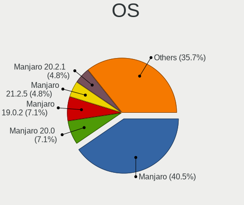

| Name            | Computers | Percent |
|-----------------|-----------|---------|
| Manjaro         | 17        | 40.48%  |
| Manjaro 20.0    | 3         | 7.14%   |
| Manjaro 19.0.2  | 3         | 7.14%   |
| Manjaro 21.2.5  | 2         | 4.76%   |
| Manjaro 20.2.1  | 2         | 4.76%   |
| Manjaro 20.2    | 2         | 4.76%   |
| Manjaro 20.1    | 2         | 4.76%   |
| Manjaro 21.2.1  | 1         | 2.38%   |
| Manjaro 21.1.4  | 1         | 2.38%   |
| Manjaro 21.1.2  | 1         | 2.38%   |
| Manjaro 21.1.0  | 1         | 2.38%   |
| Manjaro 21.0.7  | 1         | 2.38%   |
| Manjaro 20.0.3  | 1         | 2.38%   |
| Manjaro 18.0.4  | 1         | 2.38%   |
| Manjaro 18.0.2  | 1         | 2.38%   |
| Manjaro 17.1.7  | 1         | 2.38%   |
| Manjaro 17.1.11 | 1         | 2.38%   |
| Manjaro 0.8     | 1         | 2.38%   |

OS Family
---------

OS without a version

| Name    | Computers | Percent |
|---------|-----------|---------|
| Manjaro | 40        | 100%    |

Kernel
------

Version of the Linux kernel

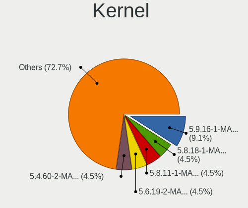

| Version           | Computers | Percent |
|-------------------|-----------|---------|
| 5.9.16-1-MANJARO  | 4         | 9.09%   |
| 5.8.18-1-MANJARO  | 2         | 4.55%   |
| 5.8.11-1-MANJARO  | 2         | 4.55%   |
| 5.6.19-2-MANJARO  | 2         | 4.55%   |
| 5.4.60-2-MANJARO  | 2         | 4.55%   |
| 5.4.31-1-MANJARO  | 2         | 4.55%   |
| 5.4.23-1-MANJARO  | 2         | 4.55%   |
| 5.9.11-3-MANJARO  | 1         | 2.27%   |
| 5.7.9-1-MANJARO   | 1         | 2.27%   |
| 5.7.17-2-MANJARO  | 1         | 2.27%   |
| 5.6.8-1-MANJARO   | 1         | 2.27%   |
| 5.6.3-2-MANJARO   | 1         | 2.27%   |
| 5.5.19-1-MANJARO  | 1         | 2.27%   |
| 5.4.184-1-MANJARO | 1         | 2.27%   |
| 5.3.8-3-MANJARO   | 1         | 2.27%   |
| 5.2.4-1-MANJARO   | 1         | 2.27%   |
| 5.16.0-1-MANJARO  | 1         | 2.27%   |
| 5.15.28-1-MANJARO | 1         | 2.27%   |
| 5.15.25-1-MANJARO | 1         | 2.27%   |
| 5.15.12-1-MANJARO | 1         | 2.27%   |
| 5.14.7-2-MANJARO  | 1         | 2.27%   |
| 5.14.0-0-MANJARO  | 1         | 2.27%   |
| 5.11.2-1-MANJARO  | 1         | 2.27%   |
| 5.11.14-1-MANJARO | 1         | 2.27%   |
| 5.10.89-1-MANJARO | 1         | 2.27%   |
| 5.10.68-1-MANJARO | 1         | 2.27%   |
| 5.10.49-1-MANJARO | 1         | 2.27%   |
| 5.10.42-1-MANJARO | 1         | 2.27%   |
| 5.10.2-2-MANJARO  | 1         | 2.27%   |
| 4.19.62-1-MANJARO | 1         | 2.27%   |
| 4.19.28-1-MANJARO | 1         | 2.27%   |
| 4.19.13-1-MANJARO | 1         | 2.27%   |
| 4.14.52-1-MANJARO | 1         | 2.27%   |
| 4.14.30-1-MANJARO | 1         | 2.27%   |
| 3.4.9-1-MANJARO   | 1         | 2.27%   |

Kernel Family
-------------

Linux kernel without a distro release

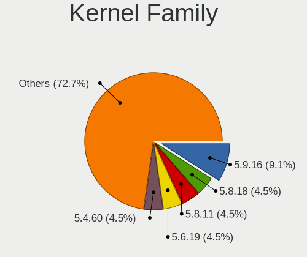

| Version | Computers | Percent |
|---------|-----------|---------|
| 5.9.16  | 4         | 9.09%   |
| 5.8.18  | 2         | 4.55%   |
| 5.8.11  | 2         | 4.55%   |
| 5.6.19  | 2         | 4.55%   |
| 5.4.60  | 2         | 4.55%   |
| 5.4.31  | 2         | 4.55%   |
| 5.4.23  | 2         | 4.55%   |
| 5.9.11  | 1         | 2.27%   |
| 5.7.9   | 1         | 2.27%   |
| 5.7.17  | 1         | 2.27%   |
| 5.6.8   | 1         | 2.27%   |
| 5.6.3   | 1         | 2.27%   |
| 5.5.19  | 1         | 2.27%   |
| 5.4.184 | 1         | 2.27%   |
| 5.3.8   | 1         | 2.27%   |
| 5.2.4   | 1         | 2.27%   |
| 5.16.0  | 1         | 2.27%   |
| 5.15.28 | 1         | 2.27%   |
| 5.15.25 | 1         | 2.27%   |
| 5.15.12 | 1         | 2.27%   |
| 5.14.7  | 1         | 2.27%   |
| 5.14.0  | 1         | 2.27%   |
| 5.11.2  | 1         | 2.27%   |
| 5.11.14 | 1         | 2.27%   |
| 5.10.89 | 1         | 2.27%   |
| 5.10.68 | 1         | 2.27%   |
| 5.10.49 | 1         | 2.27%   |
| 5.10.42 | 1         | 2.27%   |
| 5.10.2  | 1         | 2.27%   |
| 4.19.62 | 1         | 2.27%   |
| 4.19.28 | 1         | 2.27%   |
| 4.19.13 | 1         | 2.27%   |
| 4.14.52 | 1         | 2.27%   |
| 4.14.30 | 1         | 2.27%   |
| 3.4.9   | 1         | 2.27%   |

Kernel Major Ver.
-----------------

Linux kernel major version

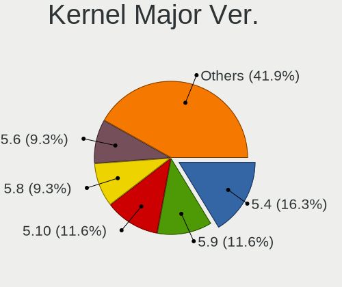

| Version | Computers | Percent |
|---------|-----------|---------|
| 5.4     | 7         | 16.28%  |
| 5.9     | 5         | 11.63%  |
| 5.10    | 5         | 11.63%  |
| 5.8     | 4         | 9.3%    |
| 5.6     | 4         | 9.3%    |
| 5.15    | 3         | 6.98%   |
| 4.19    | 3         | 6.98%   |
| 5.7     | 2         | 4.65%   |
| 5.14    | 2         | 4.65%   |
| 4.14    | 2         | 4.65%   |
| 5.5     | 1         | 2.33%   |
| 5.3     | 1         | 2.33%   |
| 5.2     | 1         | 2.33%   |
| 5.16    | 1         | 2.33%   |
| 5.11    | 1         | 2.33%   |
| 3.4     | 1         | 2.33%   |

Arch
----

OS architecture (x86_64, i586, etc.)

| Name   | Computers | Percent |
|--------|-----------|---------|
| x86_64 | 40        | 100%    |

DE
--

Desktop Environment

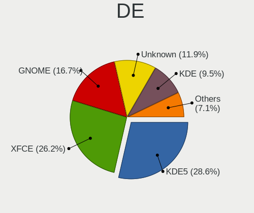

| Name       | Computers | Percent |
|------------|-----------|---------|
| KDE5       | 12        | 28.57%  |
| XFCE       | 11        | 26.19%  |
| GNOME      | 7         | 16.67%  |
| Unknown    | 5         | 11.9%   |
| KDE        | 4         | 9.52%   |
| X-Cinnamon | 2         | 4.76%   |
| Budgie     | 1         | 2.38%   |

Display Server
--------------

X11 or Wayland

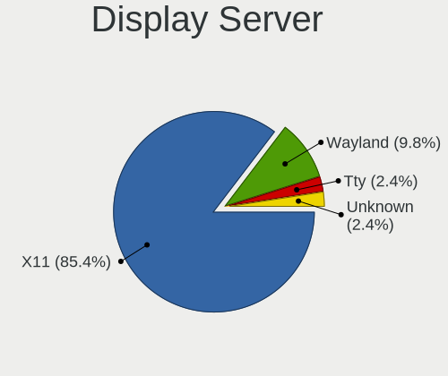

| Name    | Computers | Percent |
|---------|-----------|---------|
| X11     | 35        | 85.37%  |
| Wayland | 4         | 9.76%   |
| Tty     | 1         | 2.44%   |
| Unknown | 1         | 2.44%   |

Display Manager
---------------

SDDM, LightDM, etc.

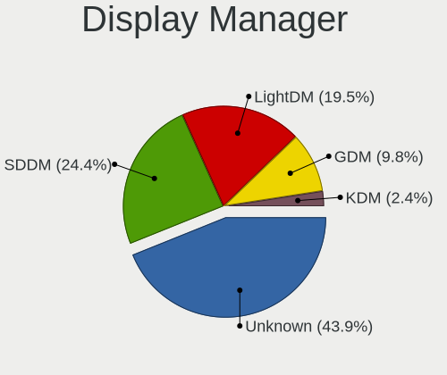

| Name    | Computers | Percent |
|---------|-----------|---------|
| Unknown | 18        | 43.9%   |
| SDDM    | 10        | 24.39%  |
| LightDM | 8         | 19.51%  |
| GDM     | 4         | 9.76%   |
| KDM     | 1         | 2.44%   |

OS Lang
-------

Language

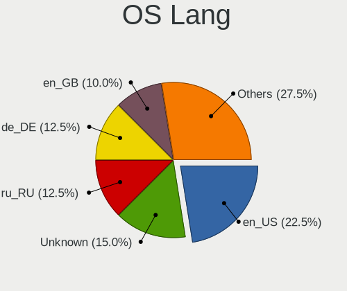

| Lang    | Computers | Percent |
|---------|-----------|---------|
| en_US   | 9         | 22.5%   |
| Unknown | 6         | 15%     |
| ru_RU   | 5         | 12.5%   |
| de_DE   | 5         | 12.5%   |
| en_GB   | 4         | 10%     |
| zh_CN   | 2         | 5%      |
| pt_BR   | 2         | 5%      |
| en_CA   | 2         | 5%      |
| ru_UA   | 1         | 2.5%    |
| pl_PL   | 1         | 2.5%    |
| fr_FR   | 1         | 2.5%    |
| en_IN   | 1         | 2.5%    |
| en_AU   | 1         | 2.5%    |

Boot Mode
---------

EFI or BIOS

| Mode | Computers | Percent |
|------|-----------|---------|
| BIOS | 36        | 90%     |
| EFI  | 4         | 10%     |

Filesystem
----------

Type of filesystem

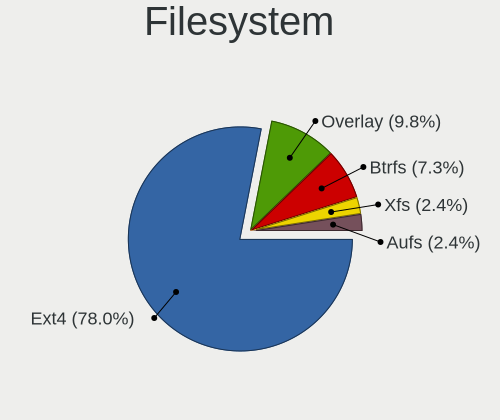

| Type    | Computers | Percent |
|---------|-----------|---------|
| Ext4    | 32        | 78.05%  |
| Overlay | 4         | 9.76%   |
| Btrfs   | 3         | 7.32%   |
| Xfs     | 1         | 2.44%   |
| Aufs    | 1         | 2.44%   |

Part. scheme
------------

Scheme of partitioning

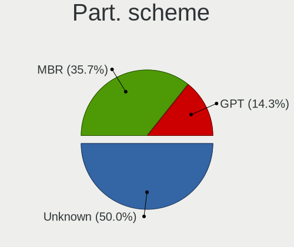

| Type    | Computers | Percent |
|---------|-----------|---------|
| Unknown | 21        | 50%     |
| MBR     | 15        | 35.71%  |
| GPT     | 6         | 14.29%  |

Dual Boot with Linux/BSD
------------------------

Hosting more than one Linux/BSD

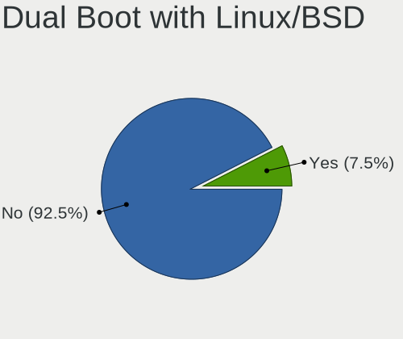

| Dual boot | Computers | Percent |
|-----------|-----------|---------|
| No        | 37        | 92.5%   |
| Yes       | 3         | 7.5%    |

Dual Boot (Win)
---------------

Hosting Linux and Windows

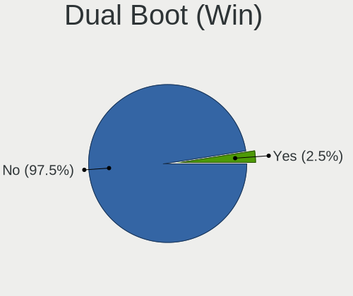

| Dual boot | Computers | Percent |
|-----------|-----------|---------|
| No        | 39        | 97.5%   |
| Yes       | 1         | 2.5%    |

Board
-----

Vendor
------

Motherboard manufacturer

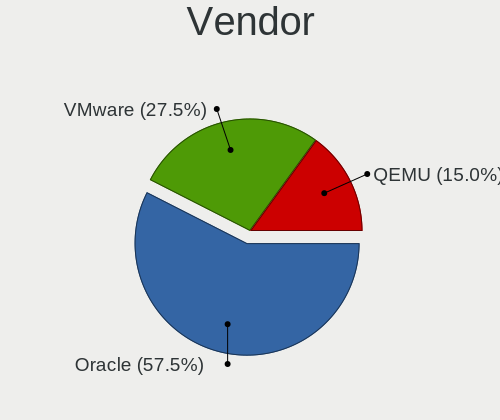

| Name   | Computers | Percent |
|--------|-----------|---------|
| Oracle | 23        | 57.5%   |
| VMware | 11        | 27.5%   |
| QEMU   | 6         | 15%     |

Model
-----

Motherboard model

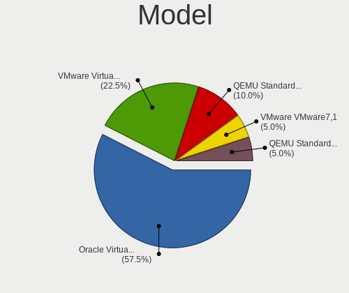

| Name                                   | Computers | Percent |
|----------------------------------------|-----------|---------|
| Oracle VirtualBox                      | 23        | 57.5%   |
| VMware Virtual Platform                | 9         | 22.5%   |
| QEMU Standard PC (i440FX + PIIX, 1996) | 4         | 10%     |
| VMware VMware7,1                       | 2         | 5%      |
| QEMU Standard PC (Q35 + ICH9, 2009)    | 2         | 5%      |

Model Family
------------

Motherboard model prefix

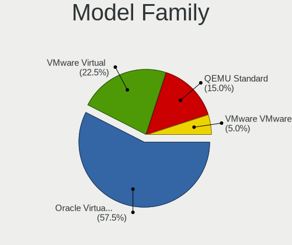

| Name              | Computers | Percent |
|-------------------|-----------|---------|
| Oracle VirtualBox | 23        | 57.5%   |
| VMware Virtual    | 9         | 22.5%   |
| QEMU Standard     | 6         | 15%     |
| VMware VMware7    | 2         | 5%      |

MFG Year
--------

Motherboard manufacture year

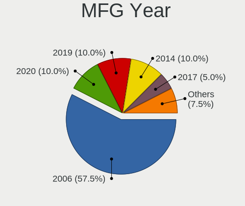

| Year | Computers | Percent |
|------|-----------|---------|
| 2006 | 23        | 57.5%   |
| 2020 | 4         | 10%     |
| 2019 | 4         | 10%     |
| 2014 | 4         | 10%     |
| 2017 | 2         | 5%      |
| 2015 | 2         | 5%      |
| 2018 | 1         | 2.5%    |

Form Factor
-----------

Physical design of the computer

| Name            | Computers | Percent |
|-----------------|-----------|---------|
| Virtual machine | 40        | 100%    |

Secure Boot
-----------

Enabled or disabled

| State    | Computers | Percent |
|----------|-----------|---------|
| Disabled | 40        | 100%    |

Coreboot
--------

Have coreboot on board

| Used | Computers | Percent |
|------|-----------|---------|
| No   | 40        | 100%    |

RAM Size
--------

Total RAM memory

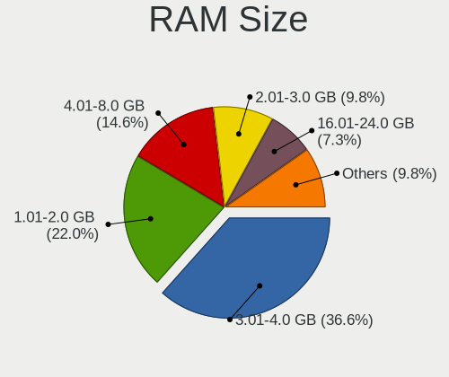

| Size in GB | Computers | Percent |
|------------|-----------|---------|
| 3.01-4.0   | 15        | 36.59%  |
| 1.01-2.0   | 9         | 21.95%  |
| 4.01-8.0   | 6         | 14.63%  |
| 2.01-3.0   | 4         | 9.76%   |
| 16.01-24.0 | 3         | 7.32%   |
| 8.01-16.0  | 3         | 7.32%   |
| 24.01-32.0 | 1         | 2.44%   |

RAM Used
--------

Used RAM memory

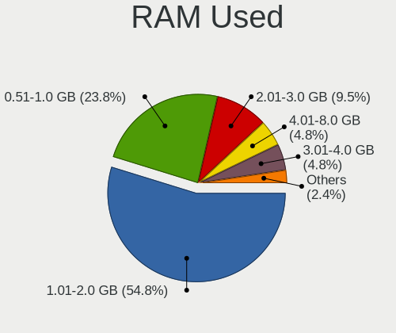

| Used GB  | Computers | Percent |
|----------|-----------|---------|
| 1.01-2.0 | 23        | 54.76%  |
| 0.51-1.0 | 10        | 23.81%  |
| 2.01-3.0 | 4         | 9.52%   |
| 4.01-8.0 | 2         | 4.76%   |
| 3.01-4.0 | 2         | 4.76%   |
| Unknown  | 1         | 2.38%   |

Total Drives
------------

Number of drives on board

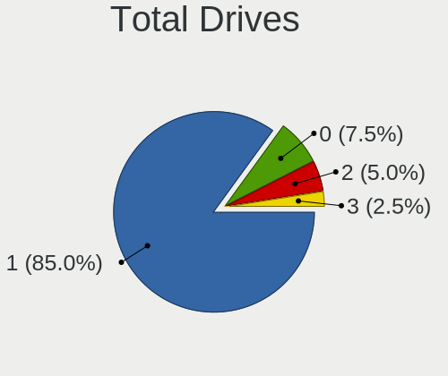

| Drives | Computers | Percent |
|--------|-----------|---------|
| 1      | 34        | 85%     |
| 0      | 3         | 7.5%    |
| 2      | 2         | 5%      |
| 3      | 1         | 2.5%    |

Has CD-ROM
----------

Has CD-ROM on board

| Presented | Computers | Percent |
|-----------|-----------|---------|
| Yes       | 36        | 90%     |
| No        | 4         | 10%     |

Has Ethernet
------------

Has Ethernet on board

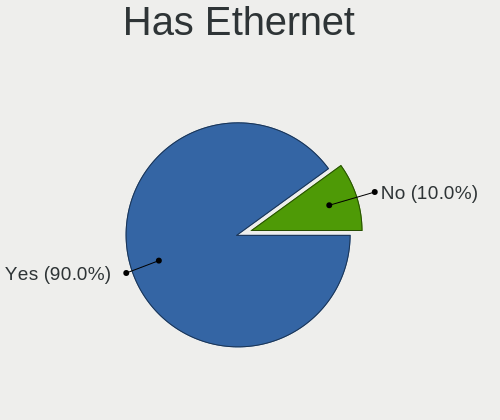

| Presented | Computers | Percent |
|-----------|-----------|---------|
| Yes       | 36        | 90%     |
| No        | 4         | 10%     |

Has WiFi
--------

Has WiFi module

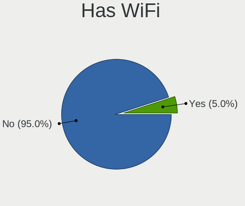

| Presented | Computers | Percent |
|-----------|-----------|---------|
| No        | 38        | 95%     |
| Yes       | 2         | 5%      |

Has Bluetooth
-------------

Has Bluetooth module

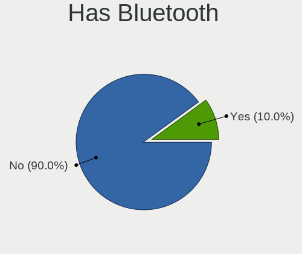

| Presented | Computers | Percent |
|-----------|-----------|---------|
| No        | 36        | 90%     |
| Yes       | 4         | 10%     |

Location
--------

Country
-------

Geographic location (country)

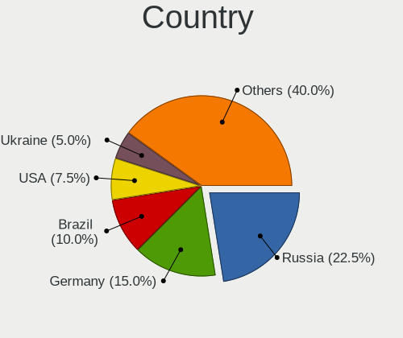

| Country     | Computers | Percent |
|-------------|-----------|---------|
| Russia      | 9         | 22.5%   |
| Germany     | 6         | 15%     |
| Brazil      | 4         | 10%     |
| USA         | 3         | 7.5%    |
| Ukraine     | 2         | 5%      |
| UK          | 2         | 5%      |
| China       | 2         | 5%      |
| Canada      | 2         | 5%      |
| Spain       | 1         | 2.5%    |
| Poland      | 1         | 2.5%    |
| Netherlands | 1         | 2.5%    |
| Italy       | 1         | 2.5%    |
| India       | 1         | 2.5%    |
| Hungary     | 1         | 2.5%    |
| France      | 1         | 2.5%    |
| Bulgaria    | 1         | 2.5%    |
| Belgium     | 1         | 2.5%    |
| Australia   | 1         | 2.5%    |

City
----

Geographic location (city)

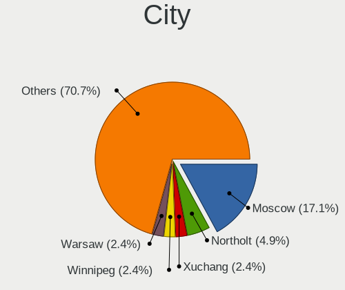

| City               | Computers | Percent |
|--------------------|-----------|---------|
| Moscow             | 7         | 17.07%  |
| Northolt           | 2         | 4.88%   |
| Xuchang            | 1         | 2.44%   |
| Winnipeg           | 1         | 2.44%   |
| Warsaw             | 1         | 2.44%   |
| Vechta             | 1         | 2.44%   |
| Varna              | 1         | 2.44%   |
| Tres Cantos        | 1         | 2.44%   |
| Tatabánya       | 1         | 2.44%   |
| Solingen           | 1         | 2.44%   |
| Shenzhen           | 1         | 2.44%   |
| Pouso Alegre       | 1         | 2.44%   |
| Perth              | 1         | 2.44%   |
| Perm               | 1         | 2.44%   |
| North York         | 1         | 2.44%   |
| Mönchengladbach | 1         | 2.44%   |
| Lucknow            | 1         | 2.44%   |
| Los Angeles        | 1         | 2.44%   |
| Kyiv               | 1         | 2.44%   |
| Kropyvnytskyi      | 1         | 2.44%   |
| Irkutsk            | 1         | 2.44%   |
| Hamburg            | 1         | 2.44%   |
| Geraardsbergen     | 1         | 2.44%   |
| Curtatone          | 1         | 2.44%   |
| Chicago            | 1         | 2.44%   |
| Castres            | 1         | 2.44%   |
| Brasília        | 1         | 2.44%   |
| Bochum             | 1         | 2.44%   |
| Bento Gonçalves | 1         | 2.44%   |
| Belo Horizonte     | 1         | 2.44%   |
| Beijing            | 1         | 2.44%   |
| Bad Mergentheim    | 1         | 2.44%   |
| Amsterdam          | 1         | 2.44%   |
| Addis              | 1         | 2.44%   |

Drives
------

Drive Vendor
------------

Hard drive vendors

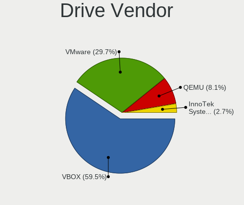

| Vendor                 | Computers | Drives | Percent |
|------------------------|-----------|--------|---------|
| VBOX                   | 22        | 26     | 59.46%  |
| VMware                 | 11        | 13     | 29.73%  |
| QEMU                   | 3         | 5      | 8.11%   |
| InnoTek Systemberatung | 1         | 2      | 2.7%    |

Drive Model
-----------

Hard drive models

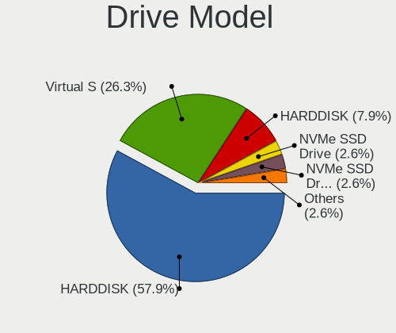

| Model                                       | Computers | Percent |
|---------------------------------------------|-----------|---------|
| VBOX HARDDISK                               | 22        | 57.89%  |
| VMware Virtual S                            | 10        | 26.32%  |
| QEMU HARDDISK                               | 3         | 7.89%   |
| VMware NVMe SSD Drive                       | 1         | 2.63%   |
| InnoTek Systemberatung NVMe SSD Drive 53GB  | 1         | 2.63%   |
| InnoTek Systemberatung NVMe SSD Drive 112GB | 1         | 2.63%   |

HDD Vendor
----------

Hard disk drive vendors

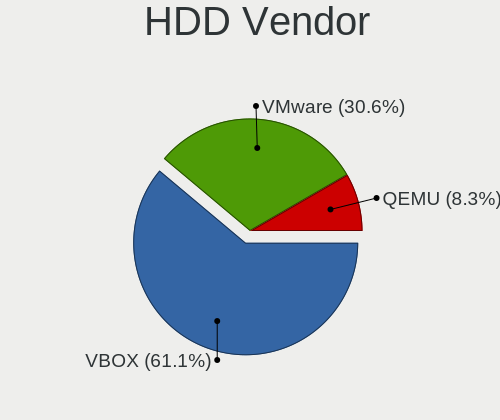

| Vendor | Computers | Drives | Percent |
|--------|-----------|--------|---------|
| VBOX   | 22        | 26     | 61.11%  |
| VMware | 11        | 13     | 30.56%  |
| QEMU   | 3         | 5      | 8.33%   |

SSD Vendor
----------

Solid state drive vendors

Zero info for selected period =(

Drive Kind
----------

HDD or SSD

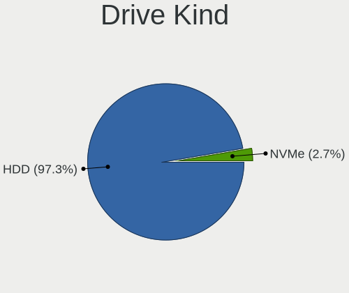

| Kind | Computers | Drives | Percent |
|------|-----------|--------|---------|
| HDD  | 36        | 44     | 97.3%   |
| NVMe | 1         | 2      | 2.7%    |

Drive Connector
---------------

SATA, SAS, NVMe, etc.

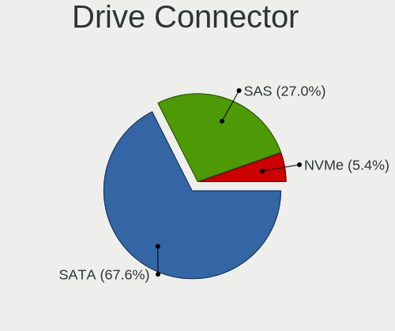

| Type | Computers | Drives | Percent |
|------|-----------|--------|---------|
| SATA | 25        | 31     | 67.57%  |
| SAS  | 10        | 12     | 27.03%  |
| NVMe | 2         | 3      | 5.41%   |

Drive Size
----------

Size of hard drive

| Size in TB | Computers | Drives | Percent |
|------------|-----------|--------|---------|
| 0.01-0.5   | 36        | 44     | 100%    |

Space Total
-----------

Amount of disk space available on the file system

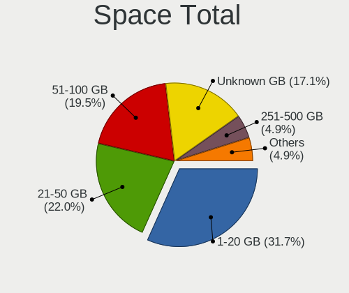

| Size in GB | Computers | Percent |
|------------|-----------|---------|
| 1-20       | 13        | 31.71%  |
| 21-50      | 9         | 21.95%  |
| 51-100     | 8         | 19.51%  |
| Unknown    | 7         | 17.07%  |
| 251-500    | 2         | 4.88%   |
| 101-250    | 1         | 2.44%   |
| 1001-2000  | 1         | 2.44%   |

Space Used
----------

Amount of used disk space

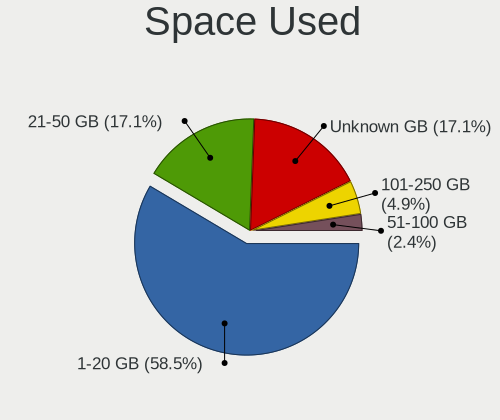

| Used GB | Computers | Percent |
|---------|-----------|---------|
| 1-20    | 24        | 58.54%  |
| 21-50   | 7         | 17.07%  |
| Unknown | 7         | 17.07%  |
| 101-250 | 2         | 4.88%   |
| 51-100  | 1         | 2.44%   |

Malfunc. Drives
---------------

Drive models with a malfunction

Zero info for selected period =(

Malfunc. Drive Vendor
---------------------

Vendors of faulty drives

Zero info for selected period =(

Malfunc. HDD Vendor
-------------------

Vendors of faulty HDD drives

Zero info for selected period =(

Malfunc. Drive Kind
-------------------

Kinds of faulty drives

Zero info for selected period =(

Failed Drives
-------------

Failed drive models

Zero info for selected period =(

Failed Drive Vendor
-------------------

Failed drive vendors

Zero info for selected period =(

Drive Status
------------

Number of failed and malfunc. drives

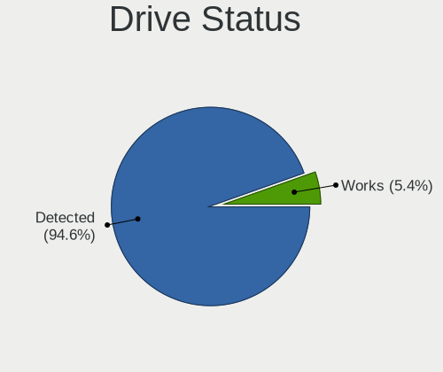

| Status   | Computers | Drives | Percent |
|----------|-----------|--------|---------|
| Detected | 35        | 42     | 94.59%  |
| Works    | 2         | 4      | 5.41%   |

Storage controller
------------------

Storage Vendor
--------------

Storage controller vendors

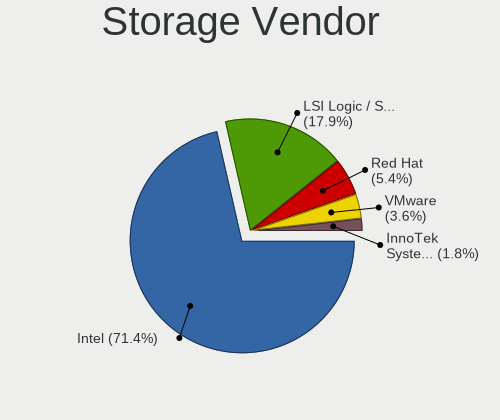

| Vendor                    | Computers | Percent |
|---------------------------|-----------|---------|
| Intel                     | 40        | 71.43%  |
| LSI Logic / Symbios Logic | 10        | 17.86%  |
| Red Hat                   | 3         | 5.36%   |
| VMware                    | 2         | 3.57%   |
| InnoTek Systemberatung    | 1         | 1.79%   |

Storage Model
-------------

Storage controller models

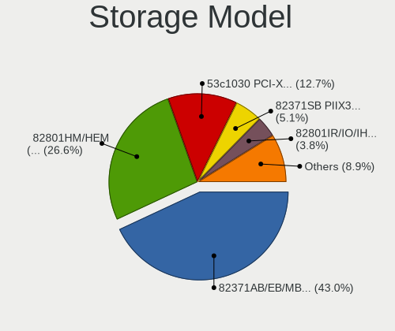

| Model                                                                 | Computers | Percent |
|-----------------------------------------------------------------------|-----------|---------|
| Intel 82371AB/EB/MB PIIX4 IDE                                         | 34        | 43.04%  |
| Intel 82801HM/HEM (ICH8M/ICH8M-E) SATA Controller [AHCI mode]         | 21        | 26.58%  |
| LSI Logic / Symbios Logic 53c1030 PCI-X Fusion-MPT Dual Ultra320 SCSI | 10        | 12.66%  |
| Intel 82371SB PIIX3 IDE [Natoma/Triton II]                            | 4         | 5.06%   |
| Intel 82801IR/IO/IH (ICH9R/DO/DH) 6 port SATA Controller [AHCI mode]  | 3         | 3.8%    |
| Red Hat Virtio block device                                           | 2         | 2.53%   |
| VMware SATA AHCI controller                                           | 1         | 1.27%   |
| VMware PVSCSI SCSI Controller                                         | 1         | 1.27%   |
| VMware NVMe SSD Controller                                            | 1         | 1.27%   |
| Red Hat Virtio SCSI                                                   | 1         | 1.27%   |
| InnoTek Systemberatung Non-Volatile memory controller                 | 1         | 1.27%   |

Storage Kind
------------

Kind of storage controller (IDE, SATA, NVMe, SAS, ...)

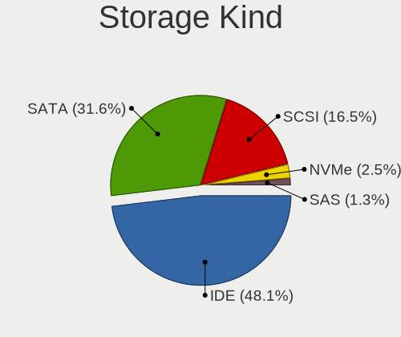

| Kind | Computers | Percent |
|------|-----------|---------|
| IDE  | 38        | 48.1%   |
| SATA | 25        | 31.65%  |
| SCSI | 13        | 16.46%  |
| NVMe | 2         | 2.53%   |
| SAS  | 1         | 1.27%   |

Processor
---------

CPU Vendor
----------

Processor vendors

| Vendor | Computers | Percent |
|--------|-----------|---------|
| Intel  | 31        | 77.5%   |
| AMD    | 9         | 22.5%   |

CPU Model
---------

Processor models

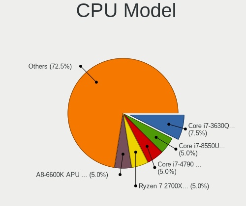

| Model                                      | Computers | Percent |
|--------------------------------------------|-----------|---------|
| Intel Core i7-3630QM CPU @ 2.40GHz         | 3         | 7.5%    |
| Intel Core i7-8550U CPU @ 1.80GHz          | 2         | 5%      |
| Intel Core i7-4790 CPU @ 3.60GHz           | 2         | 5%      |
| AMD Ryzen 7 2700X Eight-Core Processor     | 2         | 5%      |
| AMD A8-6600K APU with Radeon HD Graphics   | 2         | 5%      |
| Intel Xeon CPU E5-2687W v2 @ 3.40GHz       | 1         | 2.5%    |
| Intel Xeon CPU E5-2680 0 @ 2.70GHz         | 1         | 2.5%    |
| Intel Core i9-9900KS CPU @ 4.00GHz         | 1         | 2.5%    |
| Intel Core i9-9900K CPU @ 3.60GHz          | 1         | 2.5%    |
| Intel Core i7-8700 CPU @ 3.20GHz           | 1         | 2.5%    |
| Intel Core i7-7700 CPU @ 3.60GHz           | 1         | 2.5%    |
| Intel Core i7-7600U CPU @ 2.80GHz          | 1         | 2.5%    |
| Intel Core i7-7500U CPU @ 2.70GHz          | 1         | 2.5%    |
| Intel Core i7-6700K CPU @ 4.00GHz          | 1         | 2.5%    |
| Intel Core i7-6700HQ CPU @ 2.60GHz         | 1         | 2.5%    |
| Intel Core i7-6700 CPU @ 3.40GHz           | 1         | 2.5%    |
| Intel Core i7-6600U CPU @ 2.60GHz          | 1         | 2.5%    |
| Intel Core i7-5500U CPU @ 2.40GHz          | 1         | 2.5%    |
| Intel Core i7-4860HQ CPU @ 2.40GHz         | 1         | 2.5%    |
| Intel Core i7-3770K CPU @ 3.50GHz          | 1         | 2.5%    |
| Intel Core i7-10510U CPU @ 1.80GHz         | 1         | 2.5%    |
| Intel Core i5-9400 CPU @ 2.90GHz           | 1         | 2.5%    |
| Intel Core i5-8250U CPU @ 1.60GHz          | 1         | 2.5%    |
| Intel Core i5-5300U CPU @ 2.30GHz          | 1         | 2.5%    |
| Intel Core i5-4440 CPU @ 3.10GHz           | 1         | 2.5%    |
| Intel Core i5-4200M CPU @ 2.50GHz          | 1         | 2.5%    |
| Intel Core i3-3110M CPU @ 2.40GHz          | 1         | 2.5%    |
| Intel Core i3-2330M CPU @ 2.20GHz          | 1         | 2.5%    |
| Intel 11th Gen Core i7-1185G7 @ 3.00GHz    | 1         | 2.5%    |
| AMD Ryzen 7 4800H with Radeon Graphics     | 1         | 2.5%    |
| AMD Ryzen 7 1700X Eight-Core Processor     | 1         | 2.5%    |
| AMD FX-8320 Eight-Core Processor           | 1         | 2.5%    |
| AMD Athlon X2 Dual-Core QL-62              | 1         | 2.5%    |
| AMD Athlon 200GE with Radeon Vega Graphics | 1         | 2.5%    |

CPU Model Family
----------------

Processor model prefix

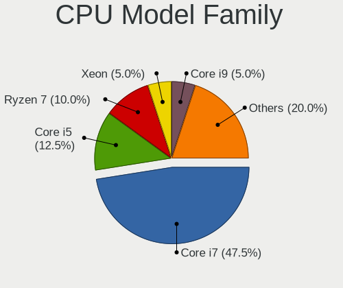

| Model         | Computers | Percent |
|---------------|-----------|---------|
| Intel Core i7 | 19        | 47.5%   |
| Intel Core i5 | 5         | 12.5%   |
| AMD Ryzen 7   | 4         | 10%     |
| Intel Xeon    | 2         | 5%      |
| Intel Core i9 | 2         | 5%      |
| Intel Core i3 | 2         | 5%      |
| AMD A8        | 2         | 5%      |
| Other         | 1         | 2.5%    |
| AMD FX        | 1         | 2.5%    |
| AMD Athlon X2 | 1         | 2.5%    |
| AMD Athlon    | 1         | 2.5%    |

CPU Cores
---------

Number of processor cores

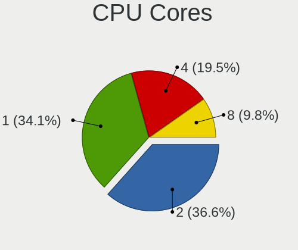

| Number | Computers | Percent |
|--------|-----------|---------|
| 2      | 15        | 36.59%  |
| 1      | 14        | 34.15%  |
| 4      | 8         | 19.51%  |
| 8      | 4         | 9.76%   |

CPU Sockets
-----------

Number of sockets

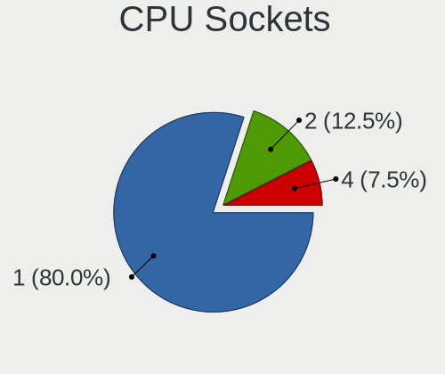

| Number | Computers | Percent |
|--------|-----------|---------|
| 1      | 32        | 80%     |
| 2      | 5         | 12.5%   |
| 4      | 3         | 7.5%    |

CPU Threads
-----------

Threads per core (Hyper-Threading)

| Number | Computers | Percent |
|--------|-----------|---------|
| 1      | 36        | 90%     |
| 2      | 4         | 10%     |

CPU Op-Modes
------------

CPU Operation Modes (32-bit, 64-bit)

| Op mode        | Computers | Percent |
|----------------|-----------|---------|
| 32-bit, 64-bit | 39        | 97.5%   |
| Unknown        | 1         | 2.5%    |

CPU Microcode
-------------

Microcode number

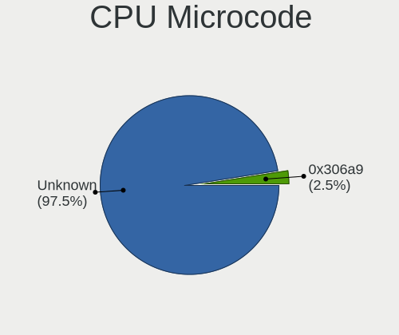

| Number  | Computers | Percent |
|---------|-----------|---------|
| Unknown | 39        | 97.5%   |
| 0x306a9 | 1         | 2.5%    |

CPU Microarch
-------------

Microarchitecture

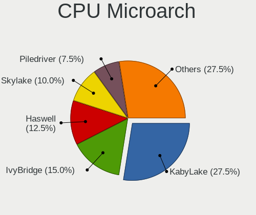

| Name            | Computers | Percent |
|-----------------|-----------|---------|
| KabyLake        | 11        | 27.5%   |
| IvyBridge       | 6         | 15%     |
| Haswell         | 5         | 12.5%   |
| Skylake         | 4         | 10%     |
| Piledriver      | 3         | 7.5%    |
| Zen+            | 2         | 5%      |
| Zen             | 2         | 5%      |
| SandyBridge     | 2         | 5%      |
| Broadwell       | 2         | 5%      |
| Zen 2           | 1         | 2.5%    |
| TigerLake       | 1         | 2.5%    |
| K8 & K10 hybrid | 1         | 2.5%    |

Graphics
--------

GPU Vendor
----------

Vendors of graphics cards

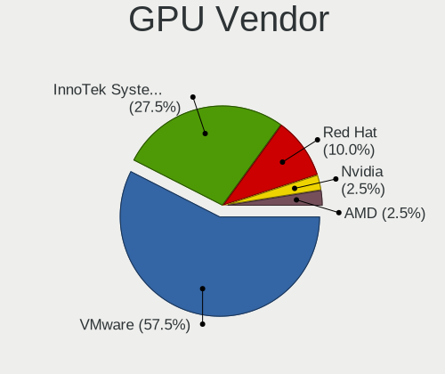

| Vendor                 | Computers | Percent |
|------------------------|-----------|---------|
| VMware                 | 23        | 57.5%   |
| InnoTek Systemberatung | 11        | 27.5%   |
| Red Hat                | 4         | 10%     |
| Nvidia                 | 1         | 2.5%    |
| AMD                    | 1         | 2.5%    |

GPU Model
---------

Graphics card models

| Model                                                   | Computers | Percent |
|---------------------------------------------------------|-----------|---------|
| VMware SVGA II Adapter                                  | 23        | 57.5%   |
| InnoTek Systemberatung VirtualBox Graphics Adapter      | 11        | 27.5%   |
| Red Hat QXL paravirtual graphic card                    | 4         | 10%     |
| Nvidia TU106 [GeForce RTX 2060 Rev. A]                  | 1         | 2.5%    |
| AMD Ellesmere [Radeon RX 470/480/570/570X/580/580X/590] | 1         | 2.5%    |

GPU Combo
---------

Combinations of graphics cards

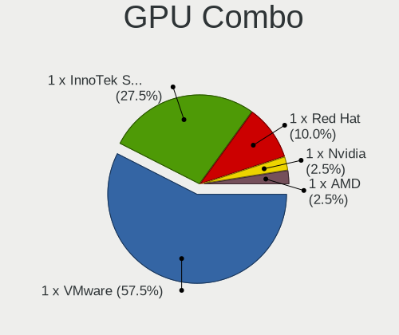

| Name                       | Computers | Percent |
|----------------------------|-----------|---------|
| 1 x VMware                 | 23        | 57.5%   |
| 1 x InnoTek Systemberatung | 11        | 27.5%   |
| 1 x Red Hat                | 4         | 10%     |
| 1 x Nvidia                 | 1         | 2.5%    |
| 1 x AMD                    | 1         | 2.5%    |

GPU Driver
----------

Free vs proprietary

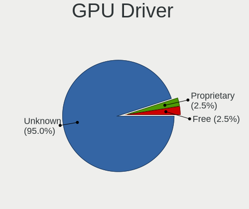

| Driver      | Computers | Percent |
|-------------|-----------|---------|
| Unknown     | 38        | 95%     |
| Proprietary | 1         | 2.5%    |
| Free        | 1         | 2.5%    |

GPU Memory
----------

Total video memory

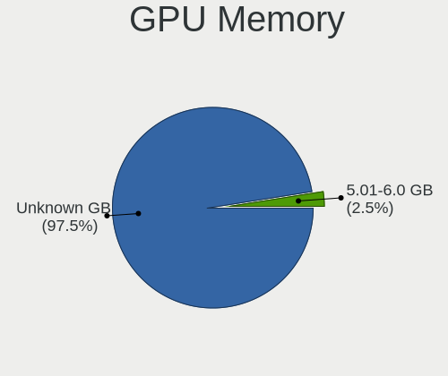

| Size in GB | Computers | Percent |
|------------|-----------|---------|
| Unknown    | 39        | 97.5%   |
| 5.01-6.0   | 1         | 2.5%    |

Monitor
-------

Monitor Vendor
--------------

Monitor vendors

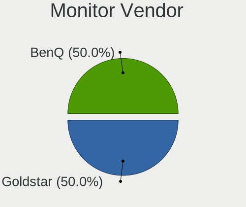

| Vendor   | Computers | Percent |
|----------|-----------|---------|
| Goldstar | 1         | 50%     |
| BenQ     | 1         | 50%     |

Monitor Model
-------------

Monitor models

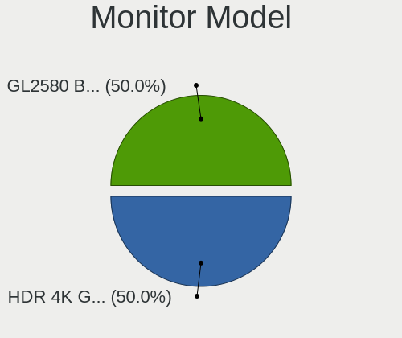

| Model                                                 | Computers | Percent |
|-------------------------------------------------------|-----------|---------|
| Goldstar HDR 4K GSM7707 3840x2160 600x340mm 27.2-inch | 1         | 50%     |
| BenQ GL2580 BNQ78E5 1920x1080 540x300mm 24.3-inch     | 1         | 50%     |

Monitor Resolution
------------------

Monitor screen resolution

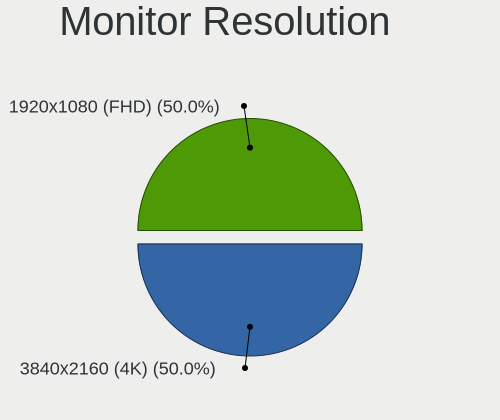

| Resolution      | Computers | Percent |
|-----------------|-----------|---------|
| 3840x2160 (4K)  | 1         | 50%     |
| 1920x1080 (FHD) | 1         | 50%     |

Monitor Diagonal
----------------

Diagonal size in inches

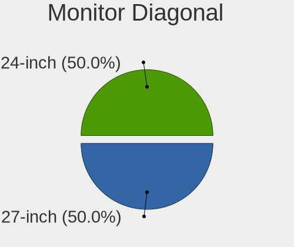

| Inches | Computers | Percent |
|--------|-----------|---------|
| 27     | 1         | 50%     |
| 24     | 1         | 50%     |

Monitor Width
-------------

Physical width

| Width in mm | Computers | Percent |
|-------------|-----------|---------|
| 501-600     | 2         | 100%    |

Aspect Ratio
------------

Proportional relationship between the width and the height

| Ratio | Computers | Percent |
|-------|-----------|---------|
| 16/9  | 2         | 100%    |

Monitor Area
------------

Area in inch²

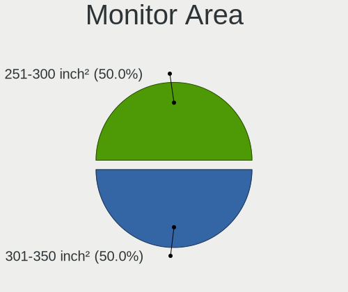

| Area in inch² | Computers | Percent |
|----------------|-----------|---------|
| 301-350        | 1         | 50%     |
| 251-300        | 1         | 50%     |

Pixel Density
-------------

Pixels per inch

| Density | Computers | Percent |
|---------|-----------|---------|
| 161-240 | 1         | 50%     |
| 51-100  | 1         | 50%     |

Multiple Monitors
-----------------

Total monitors connected

| Total | Computers | Percent |
|-------|-----------|---------|
| 1     | 34        | 85%     |
| 0     | 6         | 15%     |

Network
-------

Net Controller Vendor
---------------------

Controller vendors

| Vendor                | Computers | Percent |
|-----------------------|-----------|---------|
| Intel                 | 33        | 78.57%  |
| Red Hat               | 4         | 9.52%   |
| Realtek Semiconductor | 2         | 4.76%   |
| VMware                | 1         | 2.38%   |
| TP-Link               | 1         | 2.38%   |
| Ralink Technology     | 1         | 2.38%   |

Net Controller Model
--------------------

Controller models

| Model                                                 | Computers | Percent |
|-------------------------------------------------------|-----------|---------|
| Intel 82540EM Gigabit Ethernet Controller             | 23        | 54.76%  |
| Intel 82545EM Gigabit Ethernet Controller (Copper)    | 10        | 23.81%  |
| Red Hat Virtio network device                         | 4         | 9.52%   |
| Realtek RTL-8100/8101L/8139 PCI Fast Ethernet Adapter | 2         | 4.76%   |
| VMware VMXNET3 Ethernet Controller                    | 1         | 2.38%   |
| TP-Link RTL8812AU Archer T4U 802.11ac                 | 1         | 2.38%   |
| Ralink MT7601U Wireless Adapter                       | 1         | 2.38%   |

Wireless Vendor
---------------

Wireless vendors

| Vendor            | Computers | Percent |
|-------------------|-----------|---------|
| TP-Link           | 1         | 50%     |
| Ralink Technology | 1         | 50%     |

Wireless Model
--------------

Wireless models

| Model                                 | Computers | Percent |
|---------------------------------------|-----------|---------|
| TP-Link RTL8812AU Archer T4U 802.11ac | 1         | 50%     |
| Ralink MT7601U Wireless Adapter       | 1         | 50%     |

Ethernet Vendor
---------------

Ethernet vendors

| Vendor                | Computers | Percent |
|-----------------------|-----------|---------|
| Intel                 | 33        | 91.67%  |
| Realtek Semiconductor | 2         | 5.56%   |
| VMware                | 1         | 2.78%   |

Ethernet Model
--------------

Ethernet models

| Model                                                 | Computers | Percent |
|-------------------------------------------------------|-----------|---------|
| Intel 82540EM Gigabit Ethernet Controller             | 23        | 63.89%  |
| Intel 82545EM Gigabit Ethernet Controller (Copper)    | 10        | 27.78%  |
| Realtek RTL-8100/8101L/8139 PCI Fast Ethernet Adapter | 2         | 5.56%   |
| VMware VMXNET3 Ethernet Controller                    | 1         | 2.78%   |

Net Controller Kind
-------------------

Ethernet, WiFi or modem

| Kind     | Computers | Percent |
|----------|-----------|---------|
| Ethernet | 36        | 85.71%  |
| Unknown  | 4         | 9.52%   |
| WiFi     | 2         | 4.76%   |

Used Controller
---------------

Currently used network controller

| Kind     | Computers | Percent |
|----------|-----------|---------|
| Ethernet | 36        | 97.3%   |
| WiFi     | 1         | 2.7%    |

NICs
----

Total network controllers on board

| Total | Computers | Percent |
|-------|-----------|---------|
| 1     | 34        | 85%     |
| 0     | 4         | 10%     |
| 2     | 2         | 5%      |

IPv6
----

IPv6 vs IPv4

| Used | Computers | Percent |
|------|-----------|---------|
| No   | 39        | 97.5%   |
| Yes  | 1         | 2.5%    |

Bluetooth
---------

Bluetooth Vendor
----------------

Controller vendors

| Vendor | Computers | Percent |
|--------|-----------|---------|
| VMware | 4         | 100%    |

Bluetooth Model
---------------

Controller models

| Model                            | Computers | Percent |
|----------------------------------|-----------|---------|
| VMware Virtual Bluetooth Adapter | 4         | 100%    |

Sound
-----

Sound Vendor
------------

Sound card vendors

| Vendor       | Computers | Percent |
|--------------|-----------|---------|
| Intel        | 27        | 67.5%   |
| Ensoniq      | 10        | 25%     |
| Nvidia       | 1         | 2.5%    |
| Grace Design | 1         | 2.5%    |
| AMD          | 1         | 2.5%    |

Sound Model
-----------

Sound card models

| Model                                                                      | Computers | Percent |
|----------------------------------------------------------------------------|-----------|---------|
| Intel 82801AA AC'97 Audio Controller                                       | 23        | 57.5%   |
| Ensoniq ES1371/ES1373 / Creative Labs CT2518                               | 10        | 25%     |
| Intel 82801FB/FBM/FR/FW/FRW (ICH6 Family) High Definition Audio Controller | 3         | 7.5%    |
| Nvidia TU106 High Definition Audio Controller                              | 1         | 2.5%    |
| Intel 82801I (ICH9 Family) HD Audio Controller                             | 1         | 2.5%    |
| Grace Design SDAC-B USB 2.0                                                | 1         | 2.5%    |
| AMD Ellesmere HDMI Audio [Radeon RX 470/480 / 570/580/590]                 | 1         | 2.5%    |

Memory
------

Memory Vendor
-------------

Memory module vendors

| Vendor             | Computers | Percent |
|--------------------|-----------|---------|
| Unknown            | 4         | 44.44%  |
| QEMU               | 3         | 33.33%  |
| VMware Virtual RAM | 1         | 11.11%  |
| Unknown            | 1         | 11.11%  |

Memory Model
------------

Memory module models

| Model                                             | Computers | Percent |
|---------------------------------------------------|-----------|---------|
| Unknown RAM Module 2048MB DIMM DRAM               | 3         | 25%     |
| VMware Virtual RAM RAM VMW-16384MB 16GB DIMM DRAM | 1         | 8.33%   |
| Unknown RAM Module 4096MB DIMM DRAM               | 1         | 8.33%   |
| Unknown RAM Module 256MB DIMM DRAM                | 1         | 8.33%   |
| Unknown RAM Module 128MB DIMM DRAM                | 1         | 8.33%   |
| Unknown RAM Module 1024MB DIMM DRAM               | 1         | 8.33%   |
| QEMU RAM Module 7000MB DIMM RAM                   | 1         | 8.33%   |
| QEMU RAM Module 6176MB DIMM RAM                   | 1         | 8.33%   |
| QEMU RAM Module 16384MB DIMM RAM                  | 1         | 8.33%   |
| Unknown                                           | 1         | 8.33%   |

Memory Kind
-----------

Memory module kinds

| Kind | Computers | Percent |
|------|-----------|---------|
| DRAM | 5         | 62.5%   |
| RAM  | 3         | 37.5%   |

Memory Form Factor
------------------

Physical design of the memory module

| Name | Computers | Percent |
|------|-----------|---------|
| DIMM | 8         | 100%    |

Memory Size
-----------

Memory module size

| Size  | Computers | Percent |
|-------|-----------|---------|
| 2048  | 3         | 21.43%  |
| 16384 | 2         | 14.29%  |
| 7000  | 1         | 7.14%   |
| 6176  | 1         | 7.14%   |
| 4096  | 1         | 7.14%   |
| 1024  | 1         | 7.14%   |
| 256   | 1         | 7.14%   |
| 128   | 1         | 7.14%   |
| 64    | 1         | 7.14%   |
| 32    | 1         | 7.14%   |
| 16    | 1         | 7.14%   |

Memory Speed
------------

Memory module speed

| Speed   | Computers | Percent |
|---------|-----------|---------|
| Unknown | 8         | 100%    |

Printers & scanners
-------------------

Printer Vendor
--------------

Printer device vendors

Zero info for selected period =(

Printer Model
-------------

Printer device models

Zero info for selected period =(

Scanner Vendor
--------------

Scanner device vendors

Zero info for selected period =(

Scanner Model
-------------

Scanner device models

Zero info for selected period =(

Camera
------

Camera Vendor
-------------

Camera device vendors

| Vendor              | Computers | Percent |
|---------------------|-----------|---------|
| VirtualBox          | 1         | 50%     |
| Chicony Electronics | 1         | 50%     |

Camera Model
------------

Camera device models

| Model                                 | Computers | Percent |
|---------------------------------------|-----------|---------|
| VirtualBox Webcam - Integrated Camera | 1         | 50%     |
| Chicony Integrated Camera             | 1         | 50%     |

Security
--------

Fingerprint Vendor
------------------

Fingerprint sensor vendors

Zero info for selected period =(

Fingerprint Model
-----------------

Fingerprint sensor models

Zero info for selected period =(

Chipcard Vendor
---------------

Chipcard module vendors

| Vendor                | Computers | Percent |
|-----------------------|-----------|---------|
| Gemalto (was Gemplus) | 3         | 100%    |

Chipcard Model
--------------

Chipcard module models

| Model                               | Computers | Percent |
|-------------------------------------|-----------|---------|
| Gemalto (was Gemplus) GemPC433-Swap | 3         | 100%    |

Unsupported
-----------

Unsupported Devices
-------------------

Total unsupported devices on board

| Total | Computers | Percent |
|-------|-----------|---------|
| 0     | 34        | 85%     |
| 1     | 6         | 15%     |

Unsupported Device Types
------------------------

Types of unsupported devices

| Type          | Computers | Percent |
|---------------|-----------|---------|
| Chipcard      | 3         | 50%     |
| Net/wireless  | 2         | 33.33%  |
| Graphics card | 1         | 16.67%  |

