OpenMandriva - Tested Virtual Hardware & Statistics
---------------------------------------------------

A project to collect tested virtual hardware configurations for OpenMandriva.

Anyone can contribute to this report by the [hw-probe](https://github.com/linuxhw/hw-probe) tool:

    sudo -E hw-probe -all -upload

Please contribute! Especially if your hardware is rare.

Contents
--------

* [ Test Cases ](#test-cases)

* [ System ](#system)
  - [ OS                       ](#os)
  - [ OS Family                ](#os-family)
  - [ Kernel                   ](#kernel)
  - [ Kernel Family            ](#kernel-family)
  - [ Kernel Major Ver.        ](#kernel-major-ver)
  - [ Arch                     ](#arch)
  - [ DE                       ](#de)
  - [ Display Server           ](#display-server)
  - [ Display Manager          ](#display-manager)
  - [ OS Lang                  ](#os-lang)
  - [ Boot Mode                ](#boot-mode)
  - [ Filesystem               ](#filesystem)
  - [ Part. scheme             ](#part-scheme)
  - [ Dual Boot with Linux/BSD ](#dual-boot-with-linuxbsd)
  - [ Dual Boot (Win)          ](#dual-boot-win)

* [ Board ](#board)
  - [ Vendor                   ](#vendor)
  - [ Model                    ](#model)
  - [ Model Family             ](#model-family)
  - [ MFG Year                 ](#mfg-year)
  - [ Form Factor              ](#form-factor)
  - [ Secure Boot              ](#secure-boot)
  - [ Coreboot                 ](#coreboot)
  - [ RAM Size                 ](#ram-size)
  - [ RAM Used                 ](#ram-used)
  - [ Total Drives             ](#total-drives)
  - [ Has CD-ROM               ](#has-cd-rom)
  - [ Has Ethernet             ](#has-ethernet)
  - [ Has WiFi                 ](#has-wifi)
  - [ Has Bluetooth            ](#has-bluetooth)

* [ Location ](#location)
  - [ Country                  ](#country)
  - [ City                     ](#city)

* [ Drives ](#drives)
  - [ Drive Vendor             ](#drive-vendor)
  - [ Drive Model              ](#drive-model)
  - [ HDD Vendor               ](#hdd-vendor)
  - [ SSD Vendor               ](#ssd-vendor)
  - [ Drive Kind               ](#drive-kind)
  - [ Drive Connector          ](#drive-connector)
  - [ Drive Size               ](#drive-size)
  - [ Space Total              ](#space-total)
  - [ Space Used               ](#space-used)
  - [ Malfunc. Drives          ](#malfunc-drives)
  - [ Malfunc. Drive Vendor    ](#malfunc-drive-vendor)
  - [ Malfunc. HDD Vendor      ](#malfunc-hdd-vendor)
  - [ Malfunc. Drive Kind      ](#malfunc-drive-kind)
  - [ Failed Drives            ](#failed-drives)
  - [ Failed Drive Vendor      ](#failed-drive-vendor)
  - [ Drive Status             ](#drive-status)

* [ Storage controller ](#storage-controller)
  - [ Storage Vendor           ](#storage-vendor)
  - [ Storage Model            ](#storage-model)
  - [ Storage Kind             ](#storage-kind)

* [ Processor ](#processor)
  - [ CPU Vendor               ](#cpu-vendor)
  - [ CPU Model                ](#cpu-model)
  - [ CPU Model Family         ](#cpu-model-family)
  - [ CPU Cores                ](#cpu-cores)
  - [ CPU Sockets              ](#cpu-sockets)
  - [ CPU Threads              ](#cpu-threads)
  - [ CPU Op-Modes             ](#cpu-op-modes)
  - [ CPU Microcode            ](#cpu-microcode)
  - [ CPU Microarch            ](#cpu-microarch)

* [ Graphics ](#graphics)
  - [ GPU Vendor               ](#gpu-vendor)
  - [ GPU Model                ](#gpu-model)
  - [ GPU Combo                ](#gpu-combo)
  - [ GPU Driver               ](#gpu-driver)
  - [ GPU Memory               ](#gpu-memory)

* [ Monitor ](#monitor)
  - [ Monitor Vendor           ](#monitor-vendor)
  - [ Monitor Model            ](#monitor-model)
  - [ Monitor Resolution       ](#monitor-resolution)
  - [ Monitor Diagonal         ](#monitor-diagonal)
  - [ Monitor Width            ](#monitor-width)
  - [ Aspect Ratio             ](#aspect-ratio)
  - [ Monitor Area             ](#monitor-area)
  - [ Pixel Density            ](#pixel-density)
  - [ Multiple Monitors        ](#multiple-monitors)

* [ Network ](#network)
  - [ Net Controller Vendor    ](#net-controller-vendor)
  - [ Net Controller Model     ](#net-controller-model)
  - [ Wireless Vendor          ](#wireless-vendor)
  - [ Wireless Model           ](#wireless-model)
  - [ Ethernet Vendor          ](#ethernet-vendor)
  - [ Ethernet Model           ](#ethernet-model)
  - [ Net Controller Kind      ](#net-controller-kind)
  - [ Used Controller          ](#used-controller)
  - [ NICs                     ](#nics)
  - [ IPv6                     ](#ipv6)

* [ Bluetooth ](#bluetooth)
  - [ Bluetooth Vendor         ](#bluetooth-vendor)
  - [ Bluetooth Model          ](#bluetooth-model)

* [ Sound ](#sound)
  - [ Sound Vendor             ](#sound-vendor)
  - [ Sound Model              ](#sound-model)

* [ Memory ](#memory)
  - [ Memory Vendor            ](#memory-vendor)
  - [ Memory Model             ](#memory-model)
  - [ Memory Kind              ](#memory-kind)
  - [ Memory Form Factor       ](#memory-form-factor)
  - [ Memory Size              ](#memory-size)
  - [ Memory Speed             ](#memory-speed)

* [ Printers & scanners ](#printers--scanners)
  - [ Printer Vendor           ](#printer-vendor)
  - [ Printer Model            ](#printer-model)
  - [ Scanner Vendor           ](#scanner-vendor)
  - [ Scanner Model            ](#scanner-model)

* [ Camera ](#camera)
  - [ Camera Vendor            ](#camera-vendor)
  - [ Camera Model             ](#camera-model)

* [ Security ](#security)
  - [ Fingerprint Vendor       ](#fingerprint-vendor)
  - [ Fingerprint Model        ](#fingerprint-model)
  - [ Chipcard Vendor          ](#chipcard-vendor)
  - [ Chipcard Model           ](#chipcard-model)

* [ Unsupported ](#unsupported)
  - [ Unsupported Devices      ](#unsupported-devices)
  - [ Unsupported Device Types ](#unsupported-device-types)

Test Cases
----------

Total: 5407

| Vendor        | Model                       | Form-Factor     | Probe                                                      | Date         |
|---------------|-----------------------------|-----------------|------------------------------------------------------------|--------------|
| Oracle        | VirtualBox                  | Virtual machine | [8a6077825c](https://linux-hardware.org/?probe=8a6077825c) | Apr 16, 2022 |
| Microsoft     | Virtual Machine Hyper-V ... | Virtual machine | [98974bfd1f](https://linux-hardware.org/?probe=98974bfd1f) | Apr 15, 2022 |
| Oracle        | VirtualBox                  | Virtual machine | [f17cd2d8cb](https://linux-hardware.org/?probe=f17cd2d8cb) | Apr 15, 2022 |
| VMware        | Virtual Platform            | Virtual machine | [de671e7323](https://linux-hardware.org/?probe=de671e7323) | Apr 15, 2022 |
| Oracle        | VirtualBox                  | Virtual machine | [f854745cf1](https://linux-hardware.org/?probe=f854745cf1) | Apr 15, 2022 |
| Parallels ... | Parallels Virtual Platfo... | Virtual machine | [b36777ab72](https://linux-hardware.org/?probe=b36777ab72) | Apr 15, 2022 |
| VMware        | Virtual Platform            | Virtual machine | [f652ca134d](https://linux-hardware.org/?probe=f652ca134d) | Apr 14, 2022 |
| Oracle        | VirtualBox                  | Virtual machine | [84605d8c13](https://linux-hardware.org/?probe=84605d8c13) | Apr 14, 2022 |
| QEMU          | Standard PC (i440FX + PI... | Virtual machine | [dd90d88105](https://linux-hardware.org/?probe=dd90d88105) | Apr 14, 2022 |
| Oracle        | VirtualBox                  | Virtual machine | [faaa7d7f75](https://linux-hardware.org/?probe=faaa7d7f75) | Apr 14, 2022 |
| Oracle        | VirtualBox                  | Virtual machine | [061816b718](https://linux-hardware.org/?probe=061816b718) | Apr 14, 2022 |
| Oracle        | VirtualBox                  | Virtual machine | [d4fe76967b](https://linux-hardware.org/?probe=d4fe76967b) | Apr 14, 2022 |
| Oracle        | VirtualBox                  | Virtual machine | [3de22875dd](https://linux-hardware.org/?probe=3de22875dd) | Apr 13, 2022 |
| Oracle        | VirtualBox                  | Virtual machine | [61dd851a80](https://linux-hardware.org/?probe=61dd851a80) | Apr 13, 2022 |
| VMware        | VMware7,1                   | Virtual machine | [d2e3d73d1e](https://linux-hardware.org/?probe=d2e3d73d1e) | Apr 13, 2022 |
| Oracle        | VirtualBox                  | Virtual machine | [d5801152e6](https://linux-hardware.org/?probe=d5801152e6) | Apr 12, 2022 |
| VMware        | Virtual Platform            | Virtual machine | [1fc1756e69](https://linux-hardware.org/?probe=1fc1756e69) | Apr 12, 2022 |
| VMware        | Virtual Platform            | Virtual machine | [bdaeea3d54](https://linux-hardware.org/?probe=bdaeea3d54) | Apr 12, 2022 |
| Oracle        | VirtualBox                  | Virtual machine | [294fcd0b1c](https://linux-hardware.org/?probe=294fcd0b1c) | Apr 12, 2022 |
| Oracle        | VirtualBox                  | Virtual machine | [f85e0077bd](https://linux-hardware.org/?probe=f85e0077bd) | Apr 12, 2022 |
| VMware        | VMware7,1                   | Virtual machine | [366dbaba7c](https://linux-hardware.org/?probe=366dbaba7c) | Apr 12, 2022 |
| Oracle        | VirtualBox                  | Virtual machine | [3f8cf1d8c1](https://linux-hardware.org/?probe=3f8cf1d8c1) | Apr 12, 2022 |
| QEMU          | Standard PC (i440FX + PI... | Virtual machine | [0b6d315833](https://linux-hardware.org/?probe=0b6d315833) | Apr 11, 2022 |
| VMware        | Virtual Platform            | Virtual machine | [79f6f811d5](https://linux-hardware.org/?probe=79f6f811d5) | Apr 11, 2022 |
| Oracle        | VirtualBox                  | Virtual machine | [4fd6066b83](https://linux-hardware.org/?probe=4fd6066b83) | Apr 11, 2022 |
| Parallels ... | Parallels Virtual Platfo... | Virtual machine | [408f1a01f8](https://linux-hardware.org/?probe=408f1a01f8) | Apr 11, 2022 |
| VMware        | Virtual Platform            | Virtual machine | [a4cce15960](https://linux-hardware.org/?probe=a4cce15960) | Apr 11, 2022 |
| QEMU          | Standard PC (Q35 + ICH9,... | Virtual machine | [d2f83b02cd](https://linux-hardware.org/?probe=d2f83b02cd) | Apr 11, 2022 |
| VMware        | Virtual Platform            | Virtual machine | [4f1727746f](https://linux-hardware.org/?probe=4f1727746f) | Apr 11, 2022 |
| Oracle        | VirtualBox                  | Virtual machine | [746b0142ee](https://linux-hardware.org/?probe=746b0142ee) | Apr 11, 2022 |
| Oracle        | VirtualBox                  | Virtual machine | [ffdc48ebca](https://linux-hardware.org/?probe=ffdc48ebca) | Apr 10, 2022 |
| Oracle        | VirtualBox                  | Virtual machine | [55b49cee83](https://linux-hardware.org/?probe=55b49cee83) | Apr 10, 2022 |
| QEMU          | Standard PC (Q35 + ICH9,... | Virtual machine | [a0b482d1c7](https://linux-hardware.org/?probe=a0b482d1c7) | Apr 10, 2022 |
| Oracle        | VirtualBox                  | Virtual machine | [f968369476](https://linux-hardware.org/?probe=f968369476) | Apr 10, 2022 |
| VMware        | Virtual Platform            | Virtual machine | [abc1b9dae2](https://linux-hardware.org/?probe=abc1b9dae2) | Apr 10, 2022 |
| Oracle        | VirtualBox                  | Virtual machine | [e2205a6c11](https://linux-hardware.org/?probe=e2205a6c11) | Apr 10, 2022 |
| Oracle        | VirtualBox                  | Virtual machine | [57c369ca99](https://linux-hardware.org/?probe=57c369ca99) | Apr 10, 2022 |
| QEMU          | Standard PC (Q35 + ICH9,... | Virtual machine | [47e9ef9f0a](https://linux-hardware.org/?probe=47e9ef9f0a) | Apr 10, 2022 |
| Oracle        | VirtualBox                  | Virtual machine | [08e10956b0](https://linux-hardware.org/?probe=08e10956b0) | Apr 10, 2022 |
| Oracle        | VirtualBox                  | Virtual machine | [d1b59ee25b](https://linux-hardware.org/?probe=d1b59ee25b) | Apr 10, 2022 |
| Oracle        | VirtualBox                  | Virtual machine | [ec3f5ba933](https://linux-hardware.org/?probe=ec3f5ba933) | Apr 09, 2022 |
| Oracle        | VirtualBox                  | Virtual machine | [917dfe1bd3](https://linux-hardware.org/?probe=917dfe1bd3) | Apr 09, 2022 |
| Oracle        | VirtualBox                  | Virtual machine | [13a50b8b51](https://linux-hardware.org/?probe=13a50b8b51) | Apr 09, 2022 |
| VMware        | Virtual Platform            | Virtual machine | [08edf06364](https://linux-hardware.org/?probe=08edf06364) | Apr 09, 2022 |
| Oracle        | VirtualBox                  | Virtual machine | [4781510218](https://linux-hardware.org/?probe=4781510218) | Apr 09, 2022 |
| Oracle        | VirtualBox                  | Virtual machine | [5438d78962](https://linux-hardware.org/?probe=5438d78962) | Apr 09, 2022 |
| Oracle        | VirtualBox                  | Virtual machine | [fb2986fbcd](https://linux-hardware.org/?probe=fb2986fbcd) | Apr 09, 2022 |
| QEMU          | Standard PC (i440FX + PI... | Virtual machine | [1162a580c6](https://linux-hardware.org/?probe=1162a580c6) | Apr 08, 2022 |
| VMware        | Virtual Platform            | Virtual machine | [2153c043a6](https://linux-hardware.org/?probe=2153c043a6) | Apr 08, 2022 |
| Oracle        | VirtualBox                  | Virtual machine | [4d541f7c6d](https://linux-hardware.org/?probe=4d541f7c6d) | Apr 08, 2022 |
| Oracle        | VirtualBox                  | Virtual machine | [cf4e3415a2](https://linux-hardware.org/?probe=cf4e3415a2) | Apr 08, 2022 |
| Oracle        | VirtualBox                  | Virtual machine | [9cab9648ca](https://linux-hardware.org/?probe=9cab9648ca) | Apr 08, 2022 |
| Oracle        | VirtualBox                  | Virtual machine | [419e21fff2](https://linux-hardware.org/?probe=419e21fff2) | Apr 08, 2022 |
| Oracle        | VirtualBox                  | Virtual machine | [90a497ba0d](https://linux-hardware.org/?probe=90a497ba0d) | Apr 08, 2022 |
| Oracle        | VirtualBox                  | Virtual machine | [a3822cd119](https://linux-hardware.org/?probe=a3822cd119) | Apr 08, 2022 |
| Oracle        | VirtualBox                  | Virtual machine | [68694e8b6e](https://linux-hardware.org/?probe=68694e8b6e) | Apr 08, 2022 |
| QEMU          | Standard PC (Q35 + ICH9,... | Virtual machine | [472bed15c7](https://linux-hardware.org/?probe=472bed15c7) | Apr 08, 2022 |
| QEMU          | Standard PC (i440FX + PI... | Virtual machine | [c1b9b30081](https://linux-hardware.org/?probe=c1b9b30081) | Apr 08, 2022 |
| QEMU          | Standard PC (i440FX + PI... | Virtual machine | [c8b3820223](https://linux-hardware.org/?probe=c8b3820223) | Apr 08, 2022 |
| Oracle        | VirtualBox                  | Virtual machine | [e0ae4ff50d](https://linux-hardware.org/?probe=e0ae4ff50d) | Apr 07, 2022 |
| VMware        | Virtual Platform            | Virtual machine | [a52f1400f3](https://linux-hardware.org/?probe=a52f1400f3) | Apr 07, 2022 |
| QEMU          | Standard PC (Q35 + ICH9,... | Virtual machine | [fa3610dc6d](https://linux-hardware.org/?probe=fa3610dc6d) | Apr 07, 2022 |
| Oracle        | VirtualBox                  | Virtual machine | [7d4dd9ba29](https://linux-hardware.org/?probe=7d4dd9ba29) | Apr 07, 2022 |
| QEMU          | Standard PC (i440FX + PI... | Virtual machine | [659dc45682](https://linux-hardware.org/?probe=659dc45682) | Apr 07, 2022 |
| Oracle        | VirtualBox                  | Virtual machine | [24ac80e57e](https://linux-hardware.org/?probe=24ac80e57e) | Apr 07, 2022 |
| QEMU          | Standard PC (Q35 + ICH9,... | Virtual machine | [dac888c866](https://linux-hardware.org/?probe=dac888c866) | Apr 07, 2022 |
| Oracle        | VirtualBox                  | Virtual machine | [d958dc071d](https://linux-hardware.org/?probe=d958dc071d) | Apr 07, 2022 |
| QEMU          | Standard PC (i440FX + PI... | Virtual machine | [3ba34194d0](https://linux-hardware.org/?probe=3ba34194d0) | Apr 07, 2022 |
| VMware        | Virtual Platform            | Virtual machine | [ebd70ed42c](https://linux-hardware.org/?probe=ebd70ed42c) | Apr 06, 2022 |
| Oracle        | VirtualBox                  | Virtual machine | [9087f8d379](https://linux-hardware.org/?probe=9087f8d379) | Apr 06, 2022 |
| Oracle        | VirtualBox                  | Virtual machine | [4137965640](https://linux-hardware.org/?probe=4137965640) | Apr 06, 2022 |
| Oracle        | VirtualBox                  | Virtual machine | [115e458862](https://linux-hardware.org/?probe=115e458862) | Apr 06, 2022 |
| Oracle        | VirtualBox                  | Virtual machine | [c316237488](https://linux-hardware.org/?probe=c316237488) | Apr 06, 2022 |
| VMware        | Virtual Platform            | Virtual machine | [aebf6f68e7](https://linux-hardware.org/?probe=aebf6f68e7) | Apr 06, 2022 |
| Oracle        | VirtualBox                  | Virtual machine | [a662f7ce13](https://linux-hardware.org/?probe=a662f7ce13) | Apr 06, 2022 |
| Oracle        | VirtualBox                  | Virtual machine | [c9e7454243](https://linux-hardware.org/?probe=c9e7454243) | Apr 06, 2022 |
| Oracle        | VirtualBox                  | Virtual machine | [421a372915](https://linux-hardware.org/?probe=421a372915) | Apr 06, 2022 |
| Oracle        | VirtualBox                  | Virtual machine | [8301b8aa40](https://linux-hardware.org/?probe=8301b8aa40) | Apr 06, 2022 |
| Oracle        | VirtualBox                  | Virtual machine | [3d86f3f26a](https://linux-hardware.org/?probe=3d86f3f26a) | Apr 06, 2022 |
| Oracle        | VirtualBox                  | Virtual machine | [66055d04b5](https://linux-hardware.org/?probe=66055d04b5) | Apr 05, 2022 |
| Oracle        | VirtualBox                  | Virtual machine | [f0c7301428](https://linux-hardware.org/?probe=f0c7301428) | Apr 05, 2022 |
| Oracle        | VirtualBox                  | Virtual machine | [8c89dee1de](https://linux-hardware.org/?probe=8c89dee1de) | Apr 05, 2022 |
| Oracle        | VirtualBox                  | Virtual machine | [a0c218961e](https://linux-hardware.org/?probe=a0c218961e) | Apr 05, 2022 |
| VMware        | Virtual Platform            | Virtual machine | [9ffea654c3](https://linux-hardware.org/?probe=9ffea654c3) | Apr 05, 2022 |
| VMware        | Virtual Platform            | Virtual machine | [a5794a7a74](https://linux-hardware.org/?probe=a5794a7a74) | Apr 05, 2022 |
| Oracle        | VirtualBox                  | Virtual machine | [4d5e17efd5](https://linux-hardware.org/?probe=4d5e17efd5) | Apr 05, 2022 |
| QEMU          | Standard PC (i440FX + PI... | Virtual machine | [68b3af1be1](https://linux-hardware.org/?probe=68b3af1be1) | Apr 04, 2022 |
| Oracle        | VirtualBox                  | Virtual machine | [55cb4fdc80](https://linux-hardware.org/?probe=55cb4fdc80) | Apr 04, 2022 |
| Oracle        | VirtualBox                  | Virtual machine | [b4acd561f9](https://linux-hardware.org/?probe=b4acd561f9) | Apr 04, 2022 |
| Oracle        | VirtualBox                  | Virtual machine | [5b9d29e405](https://linux-hardware.org/?probe=5b9d29e405) | Apr 04, 2022 |
| QEMU          | Standard PC (i440FX + PI... | Virtual machine | [a19e4ed62b](https://linux-hardware.org/?probe=a19e4ed62b) | Apr 04, 2022 |
| Oracle        | VirtualBox                  | Virtual machine | [37700b81d0](https://linux-hardware.org/?probe=37700b81d0) | Apr 04, 2022 |
| VMware        | Virtual Platform            | Virtual machine | [c0db198eb8](https://linux-hardware.org/?probe=c0db198eb8) | Apr 04, 2022 |
| Oracle        | VirtualBox                  | Virtual machine | [36f49d1517](https://linux-hardware.org/?probe=36f49d1517) | Apr 03, 2022 |
| Oracle        | VirtualBox                  | Virtual machine | [52214ed17b](https://linux-hardware.org/?probe=52214ed17b) | Apr 03, 2022 |
| Oracle        | VirtualBox                  | Virtual machine | [ec75b75a1f](https://linux-hardware.org/?probe=ec75b75a1f) | Apr 03, 2022 |
| Oracle        | VirtualBox                  | Virtual machine | [fe435477d5](https://linux-hardware.org/?probe=fe435477d5) | Apr 02, 2022 |
| Oracle        | VirtualBox                  | Virtual machine | [8c3066c4b0](https://linux-hardware.org/?probe=8c3066c4b0) | Apr 02, 2022 |
| Oracle        | VirtualBox                  | Virtual machine | [a54f5aabda](https://linux-hardware.org/?probe=a54f5aabda) | Apr 02, 2022 |
| Oracle        | VirtualBox                  | Virtual machine | [6381949c5c](https://linux-hardware.org/?probe=6381949c5c) | Apr 02, 2022 |
| Oracle        | VirtualBox                  | Virtual machine | [9503b21c59](https://linux-hardware.org/?probe=9503b21c59) | Apr 02, 2022 |
| Oracle        | VirtualBox                  | Virtual machine | [ace78411e8](https://linux-hardware.org/?probe=ace78411e8) | Apr 02, 2022 |
| Oracle        | VirtualBox                  | Virtual machine | [13ce0d59e7](https://linux-hardware.org/?probe=13ce0d59e7) | Apr 02, 2022 |
| Oracle        | VirtualBox                  | Virtual machine | [0251578432](https://linux-hardware.org/?probe=0251578432) | Apr 02, 2022 |
| Oracle        | VirtualBox                  | Virtual machine | [cd9a81d0bd](https://linux-hardware.org/?probe=cd9a81d0bd) | Apr 02, 2022 |
| Oracle        | VirtualBox                  | Virtual machine | [4846ffe972](https://linux-hardware.org/?probe=4846ffe972) | Apr 02, 2022 |
| Oracle        | VirtualBox                  | Virtual machine | [89f6ce8e42](https://linux-hardware.org/?probe=89f6ce8e42) | Apr 01, 2022 |
| Oracle        | VirtualBox                  | Virtual machine | [73d4c35d9e](https://linux-hardware.org/?probe=73d4c35d9e) | Apr 01, 2022 |
| Oracle        | VirtualBox                  | Virtual machine | [c0d3b07197](https://linux-hardware.org/?probe=c0d3b07197) | Apr 01, 2022 |
| Oracle        | VirtualBox                  | Virtual machine | [c37ff1261e](https://linux-hardware.org/?probe=c37ff1261e) | Apr 01, 2022 |
| Oracle        | VirtualBox                  | Virtual machine | [cf4aedbee5](https://linux-hardware.org/?probe=cf4aedbee5) | Mar 31, 2022 |
| Oracle        | VirtualBox                  | Virtual machine | [474368c006](https://linux-hardware.org/?probe=474368c006) | Mar 31, 2022 |
| VMware        | Virtual Platform            | Virtual machine | [eda05d7fe8](https://linux-hardware.org/?probe=eda05d7fe8) | Mar 31, 2022 |
| Oracle        | VirtualBox                  | Virtual machine | [ff5df7c68f](https://linux-hardware.org/?probe=ff5df7c68f) | Mar 31, 2022 |
| VMware        | Virtual Platform            | Virtual machine | [4120a1ba45](https://linux-hardware.org/?probe=4120a1ba45) | Mar 31, 2022 |
| VMware        | Virtual Platform            | Virtual machine | [6ca3dc5a39](https://linux-hardware.org/?probe=6ca3dc5a39) | Mar 31, 2022 |
| QEMU          | Standard PC (i440FX + PI... | Virtual machine | [45cb4b36b3](https://linux-hardware.org/?probe=45cb4b36b3) | Mar 31, 2022 |
| Oracle        | VirtualBox                  | Virtual machine | [1ec69a0ed6](https://linux-hardware.org/?probe=1ec69a0ed6) | Mar 31, 2022 |
| QEMU          | Standard PC (i440FX + PI... | Virtual machine | [cc037054a1](https://linux-hardware.org/?probe=cc037054a1) | Mar 31, 2022 |
| Oracle        | VirtualBox                  | Virtual machine | [91c94951d6](https://linux-hardware.org/?probe=91c94951d6) | Mar 31, 2022 |
| Oracle        | VirtualBox                  | Virtual machine | [539e10804f](https://linux-hardware.org/?probe=539e10804f) | Mar 31, 2022 |
| Oracle        | VirtualBox                  | Virtual machine | [4834fb9c88](https://linux-hardware.org/?probe=4834fb9c88) | Mar 31, 2022 |
| Oracle        | VirtualBox                  | Virtual machine | [003f50c048](https://linux-hardware.org/?probe=003f50c048) | Mar 31, 2022 |
| Oracle        | VirtualBox                  | Virtual machine | [5ab69b45dc](https://linux-hardware.org/?probe=5ab69b45dc) | Mar 30, 2022 |
| Oracle        | VirtualBox                  | Virtual machine | [1bd892e69f](https://linux-hardware.org/?probe=1bd892e69f) | Mar 30, 2022 |
| Oracle        | VirtualBox                  | Virtual machine | [815f03d9bf](https://linux-hardware.org/?probe=815f03d9bf) | Mar 30, 2022 |
| Oracle        | VirtualBox                  | Virtual machine | [c851d76506](https://linux-hardware.org/?probe=c851d76506) | Mar 30, 2022 |
| Oracle        | VirtualBox                  | Virtual machine | [ab4db268e3](https://linux-hardware.org/?probe=ab4db268e3) | Mar 30, 2022 |
| Oracle        | VirtualBox                  | Virtual machine | [f0aa3052df](https://linux-hardware.org/?probe=f0aa3052df) | Mar 30, 2022 |
| QEMU          | Standard PC (i440FX + PI... | Virtual machine | [85eb2ef352](https://linux-hardware.org/?probe=85eb2ef352) | Mar 30, 2022 |
| Oracle        | VirtualBox                  | Virtual machine | [039573bf93](https://linux-hardware.org/?probe=039573bf93) | Mar 29, 2022 |
| VMware        | Virtual Platform            | Virtual machine | [7f9675757b](https://linux-hardware.org/?probe=7f9675757b) | Mar 29, 2022 |
| VMware        | Virtual Platform            | Virtual machine | [0916340d16](https://linux-hardware.org/?probe=0916340d16) | Mar 29, 2022 |
| QEMU          | Standard PC (Q35 + ICH9,... | Virtual machine | [3fa4eceb6b](https://linux-hardware.org/?probe=3fa4eceb6b) | Mar 29, 2022 |
| Oracle        | VirtualBox                  | Virtual machine | [b80879465c](https://linux-hardware.org/?probe=b80879465c) | Mar 29, 2022 |
| Oracle        | VirtualBox                  | Virtual machine | [b8f3ecc443](https://linux-hardware.org/?probe=b8f3ecc443) | Mar 29, 2022 |
| VMware        | Virtual Platform            | Virtual machine | [e6798f9d0e](https://linux-hardware.org/?probe=e6798f9d0e) | Mar 29, 2022 |
| VMware        | Virtual Platform            | Virtual machine | [1bff8814a4](https://linux-hardware.org/?probe=1bff8814a4) | Mar 29, 2022 |
| QEMU          | Standard PC (Q35 + ICH9,... | Virtual machine | [112b5fadd3](https://linux-hardware.org/?probe=112b5fadd3) | Mar 28, 2022 |
| Oracle        | VirtualBox                  | Virtual machine | [57dcdf6c3e](https://linux-hardware.org/?probe=57dcdf6c3e) | Mar 28, 2022 |
| VMware        | Virtual Platform            | Virtual machine | [9cf623535e](https://linux-hardware.org/?probe=9cf623535e) | Mar 28, 2022 |
| Oracle        | VirtualBox                  | Virtual machine | [ad85d6b4cf](https://linux-hardware.org/?probe=ad85d6b4cf) | Mar 28, 2022 |
| Oracle        | VirtualBox                  | Virtual machine | [796ebe3e52](https://linux-hardware.org/?probe=796ebe3e52) | Mar 28, 2022 |
| Oracle        | VirtualBox                  | Virtual machine | [ec8b471a66](https://linux-hardware.org/?probe=ec8b471a66) | Mar 28, 2022 |
| Oracle        | VirtualBox                  | Virtual machine | [121f3ac685](https://linux-hardware.org/?probe=121f3ac685) | Mar 28, 2022 |
| VMware        | Virtual Platform            | Virtual machine | [3c630e56c9](https://linux-hardware.org/?probe=3c630e56c9) | Mar 27, 2022 |
| Oracle        | VirtualBox                  | Virtual machine | [f9511ee37a](https://linux-hardware.org/?probe=f9511ee37a) | Mar 27, 2022 |
| VMware        | Virtual Platform            | Virtual machine | [fa9bdabac6](https://linux-hardware.org/?probe=fa9bdabac6) | Mar 27, 2022 |
| Oracle        | VirtualBox                  | Virtual machine | [78b4eb2138](https://linux-hardware.org/?probe=78b4eb2138) | Mar 27, 2022 |
| Oracle        | VirtualBox                  | Virtual machine | [3769cc9bb3](https://linux-hardware.org/?probe=3769cc9bb3) | Mar 27, 2022 |
| VMware        | Virtual Platform            | Virtual machine | [95680bb69c](https://linux-hardware.org/?probe=95680bb69c) | Mar 27, 2022 |
| Oracle        | VirtualBox                  | Virtual machine | [9de580dc99](https://linux-hardware.org/?probe=9de580dc99) | Mar 27, 2022 |
| Microsoft     | Virtual Machine Hyper-V ... | Virtual machine | [cb7a0c83d0](https://linux-hardware.org/?probe=cb7a0c83d0) | Mar 27, 2022 |
| Oracle        | VirtualBox                  | Virtual machine | [b4914ed6f2](https://linux-hardware.org/?probe=b4914ed6f2) | Mar 27, 2022 |
| Oracle        | VirtualBox                  | Virtual machine | [f4a76896c3](https://linux-hardware.org/?probe=f4a76896c3) | Mar 27, 2022 |
| Oracle        | VirtualBox                  | Virtual machine | [42361b0770](https://linux-hardware.org/?probe=42361b0770) | Mar 26, 2022 |
| VMware        | Virtual Platform            | Virtual machine | [848f0637e4](https://linux-hardware.org/?probe=848f0637e4) | Mar 26, 2022 |
| Oracle        | VirtualBox                  | Virtual machine | [c31199b969](https://linux-hardware.org/?probe=c31199b969) | Mar 26, 2022 |
| VMware        | Virtual Platform            | Virtual machine | [5bb27cdb7d](https://linux-hardware.org/?probe=5bb27cdb7d) | Mar 26, 2022 |
| Oracle        | VirtualBox                  | Virtual machine | [ffca620194](https://linux-hardware.org/?probe=ffca620194) | Mar 26, 2022 |
| Oracle        | VirtualBox                  | Virtual machine | [4f18d6ca47](https://linux-hardware.org/?probe=4f18d6ca47) | Mar 26, 2022 |
| VMware        | Virtual Platform            | Virtual machine | [3410fb48ca](https://linux-hardware.org/?probe=3410fb48ca) | Mar 26, 2022 |
| Oracle        | VirtualBox                  | Virtual machine | [b0ca6981b0](https://linux-hardware.org/?probe=b0ca6981b0) | Mar 26, 2022 |
| VMware        | Virtual Platform            | Virtual machine | [9ab290ffa1](https://linux-hardware.org/?probe=9ab290ffa1) | Mar 25, 2022 |
| VMware        | VMware7,1                   | Virtual machine | [3af79a4689](https://linux-hardware.org/?probe=3af79a4689) | Mar 25, 2022 |
| Oracle        | VirtualBox                  | Virtual machine | [544c9f1c4d](https://linux-hardware.org/?probe=544c9f1c4d) | Mar 25, 2022 |
| Oracle        | VirtualBox                  | Virtual machine | [a40b0610a2](https://linux-hardware.org/?probe=a40b0610a2) | Mar 25, 2022 |
| VMware        | Virtual Platform            | Virtual machine | [75f1dc0817](https://linux-hardware.org/?probe=75f1dc0817) | Mar 25, 2022 |
| Oracle        | VirtualBox                  | Virtual machine | [8d3003f759](https://linux-hardware.org/?probe=8d3003f759) | Mar 25, 2022 |
| VMware        | Virtual Platform            | Virtual machine | [99ac0af1bb](https://linux-hardware.org/?probe=99ac0af1bb) | Mar 25, 2022 |
| VMware        | Virtual Platform            | Virtual machine | [86370dcb4d](https://linux-hardware.org/?probe=86370dcb4d) | Mar 25, 2022 |
| Oracle        | VirtualBox                  | Virtual machine | [8501219a23](https://linux-hardware.org/?probe=8501219a23) | Mar 25, 2022 |
| Oracle        | VirtualBox                  | Virtual machine | [70c50ec2ad](https://linux-hardware.org/?probe=70c50ec2ad) | Mar 24, 2022 |
| Oracle        | VirtualBox                  | Virtual machine | [a0fc5391c6](https://linux-hardware.org/?probe=a0fc5391c6) | Mar 24, 2022 |
| Oracle        | VirtualBox                  | Virtual machine | [a130789c13](https://linux-hardware.org/?probe=a130789c13) | Mar 24, 2022 |
| VMware        | Virtual Platform            | Virtual machine | [c2477149f8](https://linux-hardware.org/?probe=c2477149f8) | Mar 24, 2022 |
| Oracle        | VirtualBox                  | Virtual machine | [3b133ab3c6](https://linux-hardware.org/?probe=3b133ab3c6) | Mar 24, 2022 |
| Oracle        | VirtualBox                  | Virtual machine | [2d23a5fdf0](https://linux-hardware.org/?probe=2d23a5fdf0) | Mar 24, 2022 |
| VMware        | Virtual Platform            | Virtual machine | [505ed753c0](https://linux-hardware.org/?probe=505ed753c0) | Mar 24, 2022 |
| VMware        | Virtual Platform            | Virtual machine | [d5d497f938](https://linux-hardware.org/?probe=d5d497f938) | Mar 24, 2022 |
| Oracle        | VirtualBox                  | Virtual machine | [0f34917d0d](https://linux-hardware.org/?probe=0f34917d0d) | Mar 24, 2022 |
| VMware        | Virtual Platform            | Virtual machine | [2050ca23b6](https://linux-hardware.org/?probe=2050ca23b6) | Mar 24, 2022 |
| VMware        | Virtual Platform            | Virtual machine | [c4ae6a55d9](https://linux-hardware.org/?probe=c4ae6a55d9) | Mar 24, 2022 |
| Oracle        | VirtualBox                  | Virtual machine | [d1e6a62865](https://linux-hardware.org/?probe=d1e6a62865) | Mar 24, 2022 |
| Oracle        | VirtualBox                  | Virtual machine | [95c0d42c9f](https://linux-hardware.org/?probe=95c0d42c9f) | Mar 24, 2022 |
| Oracle        | VirtualBox                  | Virtual machine | [2f9e7ad1de](https://linux-hardware.org/?probe=2f9e7ad1de) | Mar 23, 2022 |
| Oracle        | VirtualBox                  | Virtual machine | [050bf36d56](https://linux-hardware.org/?probe=050bf36d56) | Mar 23, 2022 |
| VMware        | Virtual Platform            | Virtual machine | [7b75ad8d8c](https://linux-hardware.org/?probe=7b75ad8d8c) | Mar 23, 2022 |
| Oracle        | VirtualBox                  | Virtual machine | [9902b734a2](https://linux-hardware.org/?probe=9902b734a2) | Mar 23, 2022 |
| Oracle        | VirtualBox                  | Virtual machine | [5fbac0065e](https://linux-hardware.org/?probe=5fbac0065e) | Mar 23, 2022 |
| QEMU          | Standard PC (i440FX + PI... | Virtual machine | [afcd410296](https://linux-hardware.org/?probe=afcd410296) | Mar 23, 2022 |
| VMware        | Virtual Platform            | Virtual machine | [f49097516c](https://linux-hardware.org/?probe=f49097516c) | Mar 23, 2022 |
| Oracle        | VirtualBox                  | Virtual machine | [58d6eb5093](https://linux-hardware.org/?probe=58d6eb5093) | Mar 23, 2022 |
| Oracle        | VirtualBox                  | Virtual machine | [26615e6385](https://linux-hardware.org/?probe=26615e6385) | Mar 23, 2022 |
| QEMU          | Standard PC (i440FX + PI... | Virtual machine | [2a6824c979](https://linux-hardware.org/?probe=2a6824c979) | Mar 23, 2022 |
| QEMU          | Standard PC (i440FX + PI... | Virtual machine | [bc1f3693de](https://linux-hardware.org/?probe=bc1f3693de) | Mar 23, 2022 |
| Oracle        | VirtualBox                  | Virtual machine | [034e9d0423](https://linux-hardware.org/?probe=034e9d0423) | Mar 23, 2022 |
| VMware        | Virtual Platform            | Virtual machine | [e1543d260d](https://linux-hardware.org/?probe=e1543d260d) | Mar 23, 2022 |
| Oracle        | VirtualBox                  | Virtual machine | [8655b2fd39](https://linux-hardware.org/?probe=8655b2fd39) | Mar 23, 2022 |
| Oracle        | VirtualBox                  | Virtual machine | [5f8f4745b2](https://linux-hardware.org/?probe=5f8f4745b2) | Mar 23, 2022 |
| Oracle        | VirtualBox                  | Virtual machine | [a208afb46b](https://linux-hardware.org/?probe=a208afb46b) | Mar 22, 2022 |
| Oracle        | VirtualBox                  | Virtual machine | [5d21a19469](https://linux-hardware.org/?probe=5d21a19469) | Mar 22, 2022 |
| Oracle        | VirtualBox                  | Virtual machine | [354821a463](https://linux-hardware.org/?probe=354821a463) | Mar 22, 2022 |
| VMware        | Virtual Platform            | Virtual machine | [32f49cb0a6](https://linux-hardware.org/?probe=32f49cb0a6) | Mar 22, 2022 |
| QEMU          | Standard PC (i440FX + PI... | Virtual machine | [3078e3edd2](https://linux-hardware.org/?probe=3078e3edd2) | Mar 22, 2022 |
| Oracle        | VirtualBox                  | Virtual machine | [537758cc9b](https://linux-hardware.org/?probe=537758cc9b) | Mar 21, 2022 |
| QEMU          | Standard PC (i440FX + PI... | Virtual machine | [be5c747519](https://linux-hardware.org/?probe=be5c747519) | Mar 21, 2022 |
| Oracle        | VirtualBox                  | Virtual machine | [d5394de572](https://linux-hardware.org/?probe=d5394de572) | Mar 21, 2022 |
| Oracle        | VirtualBox                  | Virtual machine | [b91173e0c4](https://linux-hardware.org/?probe=b91173e0c4) | Mar 21, 2022 |
| QEMU          | Standard PC (Q35 + ICH9,... | Virtual machine | [8ad0854795](https://linux-hardware.org/?probe=8ad0854795) | Mar 21, 2022 |
| Oracle        | VirtualBox                  | Virtual machine | [e8dce99d42](https://linux-hardware.org/?probe=e8dce99d42) | Mar 21, 2022 |
| Oracle        | VirtualBox                  | Virtual machine | [a519ca088b](https://linux-hardware.org/?probe=a519ca088b) | Mar 20, 2022 |
| Oracle        | VirtualBox                  | Virtual machine | [d8c232d2bf](https://linux-hardware.org/?probe=d8c232d2bf) | Mar 20, 2022 |
| Oracle        | VirtualBox                  | Virtual machine | [d03c681b42](https://linux-hardware.org/?probe=d03c681b42) | Mar 20, 2022 |
| Oracle        | VirtualBox                  | Virtual machine | [11d6e7b359](https://linux-hardware.org/?probe=11d6e7b359) | Mar 20, 2022 |
| Oracle        | VirtualBox                  | Virtual machine | [8cb253817f](https://linux-hardware.org/?probe=8cb253817f) | Mar 20, 2022 |
| Oracle        | VirtualBox                  | Virtual machine | [774c9315f6](https://linux-hardware.org/?probe=774c9315f6) | Mar 20, 2022 |
| Oracle        | VirtualBox                  | Virtual machine | [6200f00a17](https://linux-hardware.org/?probe=6200f00a17) | Mar 20, 2022 |
| Oracle        | VirtualBox                  | Virtual machine | [66f7e26213](https://linux-hardware.org/?probe=66f7e26213) | Mar 20, 2022 |
| Microsoft     | Virtual Machine             | Virtual machine | [b39f55ee85](https://linux-hardware.org/?probe=b39f55ee85) | Mar 20, 2022 |
| QEMU          | Standard PC (i440FX + PI... | Virtual machine | [1ccbbce93e](https://linux-hardware.org/?probe=1ccbbce93e) | Mar 20, 2022 |
| Oracle        | VirtualBox                  | Virtual machine | [4b00e3453d](https://linux-hardware.org/?probe=4b00e3453d) | Mar 20, 2022 |
| Oracle        | VirtualBox                  | Virtual machine | [2c401b9a04](https://linux-hardware.org/?probe=2c401b9a04) | Mar 20, 2022 |
| Oracle        | VirtualBox                  | Virtual machine | [38ea55df02](https://linux-hardware.org/?probe=38ea55df02) | Mar 20, 2022 |
| Oracle        | VirtualBox                  | Virtual machine | [bfe7a46f35](https://linux-hardware.org/?probe=bfe7a46f35) | Mar 19, 2022 |
| Oracle        | VirtualBox                  | Virtual machine | [38a5a85717](https://linux-hardware.org/?probe=38a5a85717) | Mar 19, 2022 |
| QEMU          | Standard PC (Q35 + ICH9,... | Virtual machine | [4549d594eb](https://linux-hardware.org/?probe=4549d594eb) | Mar 19, 2022 |
| VMware        | Virtual Platform            | Virtual machine | [af58b17a48](https://linux-hardware.org/?probe=af58b17a48) | Mar 19, 2022 |
| Oracle        | VirtualBox                  | Virtual machine | [c295e4c0ed](https://linux-hardware.org/?probe=c295e4c0ed) | Mar 19, 2022 |
| Oracle        | VirtualBox                  | Virtual machine | [19d043d8af](https://linux-hardware.org/?probe=19d043d8af) | Mar 19, 2022 |
| Oracle        | VirtualBox                  | Virtual machine | [c2ea2a83d8](https://linux-hardware.org/?probe=c2ea2a83d8) | Mar 18, 2022 |
| VMware        | Virtual Platform            | Virtual machine | [c789376a4a](https://linux-hardware.org/?probe=c789376a4a) | Mar 18, 2022 |
| Oracle        | VirtualBox                  | Virtual machine | [c82aab0dac](https://linux-hardware.org/?probe=c82aab0dac) | Mar 18, 2022 |
| Oracle        | VirtualBox                  | Virtual machine | [58bf00cd6c](https://linux-hardware.org/?probe=58bf00cd6c) | Mar 18, 2022 |
| Oracle        | VirtualBox                  | Virtual machine | [9d208f200c](https://linux-hardware.org/?probe=9d208f200c) | Mar 18, 2022 |
| VMware        | Virtual Platform            | Virtual machine | [a38aad0ff3](https://linux-hardware.org/?probe=a38aad0ff3) | Mar 18, 2022 |
| Oracle        | VirtualBox                  | Virtual machine | [a61d4f32e8](https://linux-hardware.org/?probe=a61d4f32e8) | Mar 18, 2022 |
| Oracle        | VirtualBox                  | Virtual machine | [66b8cce9d4](https://linux-hardware.org/?probe=66b8cce9d4) | Mar 18, 2022 |
| Oracle        | VirtualBox                  | Virtual machine | [417c59fa11](https://linux-hardware.org/?probe=417c59fa11) | Mar 17, 2022 |
| QEMU          | Standard PC (i440FX + PI... | Virtual machine | [fa3f471ca7](https://linux-hardware.org/?probe=fa3f471ca7) | Mar 17, 2022 |
| Oracle        | VirtualBox                  | Virtual machine | [7f69460f28](https://linux-hardware.org/?probe=7f69460f28) | Mar 17, 2022 |
| Oracle        | VirtualBox                  | Virtual machine | [dd4a3fa331](https://linux-hardware.org/?probe=dd4a3fa331) | Mar 17, 2022 |
| Oracle        | VirtualBox                  | Virtual machine | [cd5e9e7c7a](https://linux-hardware.org/?probe=cd5e9e7c7a) | Mar 17, 2022 |
| Oracle        | VirtualBox                  | Virtual machine | [97091ce9e5](https://linux-hardware.org/?probe=97091ce9e5) | Mar 17, 2022 |
| Oracle        | VirtualBox                  | Virtual machine | [cb2e095d18](https://linux-hardware.org/?probe=cb2e095d18) | Mar 17, 2022 |
| Oracle        | VirtualBox                  | Virtual machine | [16f72d5bac](https://linux-hardware.org/?probe=16f72d5bac) | Mar 16, 2022 |
| Oracle        | VirtualBox                  | Virtual machine | [c2752f5ca7](https://linux-hardware.org/?probe=c2752f5ca7) | Mar 16, 2022 |
| VMware        | Virtual Platform            | Virtual machine | [50f37bfca8](https://linux-hardware.org/?probe=50f37bfca8) | Mar 16, 2022 |
| VMware        | Virtual Platform            | Virtual machine | [4b48fbbf98](https://linux-hardware.org/?probe=4b48fbbf98) | Mar 16, 2022 |
| Oracle        | VirtualBox                  | Virtual machine | [4f1b5fbb5f](https://linux-hardware.org/?probe=4f1b5fbb5f) | Mar 16, 2022 |
| Oracle        | VirtualBox                  | Virtual machine | [bac9668965](https://linux-hardware.org/?probe=bac9668965) | Mar 16, 2022 |
| VMware        | Virtual Platform            | Virtual machine | [27d9ec558e](https://linux-hardware.org/?probe=27d9ec558e) | Mar 16, 2022 |
| Oracle        | VirtualBox                  | Virtual machine | [ddce8ec3de](https://linux-hardware.org/?probe=ddce8ec3de) | Mar 16, 2022 |
| Parallels ... | Parallels Virtual Platfo... | Virtual machine | [fce8e8b53a](https://linux-hardware.org/?probe=fce8e8b53a) | Mar 16, 2022 |
| VMware        | Virtual Platform            | Virtual machine | [7bd86c28d8](https://linux-hardware.org/?probe=7bd86c28d8) | Mar 16, 2022 |
| VMware        | Virtual Platform            | Virtual machine | [947e1958f4](https://linux-hardware.org/?probe=947e1958f4) | Mar 16, 2022 |
| QEMU          | Standard PC (i440FX + PI... | Virtual machine | [cc803c02c8](https://linux-hardware.org/?probe=cc803c02c8) | Mar 16, 2022 |
| Oracle        | VirtualBox                  | Virtual machine | [593fbdf8a1](https://linux-hardware.org/?probe=593fbdf8a1) | Mar 15, 2022 |
| Oracle        | VirtualBox                  | Virtual machine | [bf28cce62c](https://linux-hardware.org/?probe=bf28cce62c) | Mar 15, 2022 |
| Oracle        | VirtualBox                  | Virtual machine | [f408846fdd](https://linux-hardware.org/?probe=f408846fdd) | Mar 15, 2022 |
| VMware        | Virtual Platform            | Virtual machine | [3aceebdd92](https://linux-hardware.org/?probe=3aceebdd92) | Mar 15, 2022 |
| Oracle        | VirtualBox                  | Virtual machine | [447f4714b0](https://linux-hardware.org/?probe=447f4714b0) | Mar 15, 2022 |
| Oracle        | VirtualBox                  | Virtual machine | [b323116587](https://linux-hardware.org/?probe=b323116587) | Mar 15, 2022 |
| Oracle        | VirtualBox                  | Virtual machine | [bc55e30cc7](https://linux-hardware.org/?probe=bc55e30cc7) | Mar 15, 2022 |
| Oracle        | VirtualBox                  | Virtual machine | [b695db75bc](https://linux-hardware.org/?probe=b695db75bc) | Mar 15, 2022 |
| VMware        | Virtual Platform            | Virtual machine | [aa82a6391a](https://linux-hardware.org/?probe=aa82a6391a) | Mar 15, 2022 |
| VMware        | Virtual Platform            | Virtual machine | [fdd3f854af](https://linux-hardware.org/?probe=fdd3f854af) | Mar 15, 2022 |
| Oracle        | VirtualBox                  | Virtual machine | [f6fbf3e2b5](https://linux-hardware.org/?probe=f6fbf3e2b5) | Mar 15, 2022 |
| VMware        | Virtual Platform            | Virtual machine | [1a1119193f](https://linux-hardware.org/?probe=1a1119193f) | Mar 14, 2022 |
| Oracle        | VirtualBox                  | Virtual machine | [0953aab66a](https://linux-hardware.org/?probe=0953aab66a) | Mar 14, 2022 |
| Oracle        | VirtualBox                  | Virtual machine | [c1030e209e](https://linux-hardware.org/?probe=c1030e209e) | Mar 14, 2022 |
| Oracle        | VirtualBox                  | Virtual machine | [29f6180813](https://linux-hardware.org/?probe=29f6180813) | Mar 14, 2022 |
| Oracle        | VirtualBox                  | Virtual machine | [648f8606ae](https://linux-hardware.org/?probe=648f8606ae) | Mar 14, 2022 |
| QEMU          | Standard PC (i440FX + PI... | Virtual machine | [7ec05536a8](https://linux-hardware.org/?probe=7ec05536a8) | Mar 14, 2022 |
| Oracle        | VirtualBox                  | Virtual machine | [cb5f941045](https://linux-hardware.org/?probe=cb5f941045) | Mar 14, 2022 |
| Oracle        | VirtualBox                  | Virtual machine | [4fa1eadcbb](https://linux-hardware.org/?probe=4fa1eadcbb) | Mar 13, 2022 |
| Oracle        | VirtualBox                  | Virtual machine | [7a451f5fbb](https://linux-hardware.org/?probe=7a451f5fbb) | Mar 13, 2022 |
| Oracle        | VirtualBox                  | Virtual machine | [a45a2aae5e](https://linux-hardware.org/?probe=a45a2aae5e) | Mar 13, 2022 |
| Oracle        | VirtualBox                  | Virtual machine | [da43b0da36](https://linux-hardware.org/?probe=da43b0da36) | Mar 13, 2022 |
| QEMU          | Standard PC (i440FX + PI... | Virtual machine | [a010abcfba](https://linux-hardware.org/?probe=a010abcfba) | Mar 13, 2022 |
| VMware        | Virtual Platform            | Virtual machine | [ece43e0d96](https://linux-hardware.org/?probe=ece43e0d96) | Mar 13, 2022 |
| Oracle        | VirtualBox                  | Virtual machine | [ba8315c544](https://linux-hardware.org/?probe=ba8315c544) | Mar 13, 2022 |
| Oracle        | VirtualBox                  | Virtual machine | [93a13e96ae](https://linux-hardware.org/?probe=93a13e96ae) | Mar 13, 2022 |
| Oracle        | VirtualBox                  | Virtual machine | [bf1138f196](https://linux-hardware.org/?probe=bf1138f196) | Mar 12, 2022 |
| Oracle        | VirtualBox                  | Virtual machine | [1f61697df8](https://linux-hardware.org/?probe=1f61697df8) | Mar 12, 2022 |
| Oracle        | VirtualBox                  | Virtual machine | [aa1cf5f5ef](https://linux-hardware.org/?probe=aa1cf5f5ef) | Mar 12, 2022 |
| Oracle        | VirtualBox                  | Virtual machine | [9d32dd4c7f](https://linux-hardware.org/?probe=9d32dd4c7f) | Mar 12, 2022 |
| VMware        | Virtual Platform            | Virtual machine | [ddd5b57d2f](https://linux-hardware.org/?probe=ddd5b57d2f) | Mar 12, 2022 |
| Oracle        | VirtualBox                  | Virtual machine | [b0b6780b4f](https://linux-hardware.org/?probe=b0b6780b4f) | Mar 12, 2022 |
| Oracle        | VirtualBox                  | Virtual machine | [1ecc84f431](https://linux-hardware.org/?probe=1ecc84f431) | Mar 11, 2022 |
| Oracle        | VirtualBox                  | Virtual machine | [8f489d01f8](https://linux-hardware.org/?probe=8f489d01f8) | Mar 11, 2022 |
| Oracle        | VirtualBox                  | Virtual machine | [cb94a24045](https://linux-hardware.org/?probe=cb94a24045) | Mar 11, 2022 |
| VMware        | Virtual Platform            | Virtual machine | [59a992217c](https://linux-hardware.org/?probe=59a992217c) | Mar 11, 2022 |
| Oracle        | VirtualBox                  | Virtual machine | [a910211c1e](https://linux-hardware.org/?probe=a910211c1e) | Mar 11, 2022 |
| VMware        | Virtual Platform            | Virtual machine | [e1e2552516](https://linux-hardware.org/?probe=e1e2552516) | Mar 11, 2022 |
| QEMU          | Standard PC (i440FX + PI... | Virtual machine | [aade1a761d](https://linux-hardware.org/?probe=aade1a761d) | Mar 11, 2022 |
| Oracle        | VirtualBox                  | Virtual machine | [4cea6a9ccd](https://linux-hardware.org/?probe=4cea6a9ccd) | Mar 10, 2022 |
| Oracle        | VirtualBox                  | Virtual machine | [4d48abe620](https://linux-hardware.org/?probe=4d48abe620) | Mar 10, 2022 |
| QEMU          | Standard PC (i440FX + PI... | Virtual machine | [80394b26e4](https://linux-hardware.org/?probe=80394b26e4) | Mar 10, 2022 |
| Oracle        | VirtualBox                  | Virtual machine | [f7833b5a61](https://linux-hardware.org/?probe=f7833b5a61) | Mar 10, 2022 |
| Oracle        | VirtualBox                  | Virtual machine | [54f3803c9d](https://linux-hardware.org/?probe=54f3803c9d) | Mar 10, 2022 |
| Oracle        | VirtualBox                  | Virtual machine | [0fe52d6393](https://linux-hardware.org/?probe=0fe52d6393) | Mar 10, 2022 |
| Oracle        | VirtualBox                  | Virtual machine | [a53862c388](https://linux-hardware.org/?probe=a53862c388) | Mar 10, 2022 |
| Oracle        | VirtualBox                  | Virtual machine | [a6f687284c](https://linux-hardware.org/?probe=a6f687284c) | Mar 10, 2022 |
| Oracle        | VirtualBox                  | Virtual machine | [23f26c997c](https://linux-hardware.org/?probe=23f26c997c) | Mar 10, 2022 |
| Oracle        | VirtualBox                  | Virtual machine | [c05042f186](https://linux-hardware.org/?probe=c05042f186) | Mar 10, 2022 |
| Oracle        | VirtualBox                  | Virtual machine | [b3ed4b6731](https://linux-hardware.org/?probe=b3ed4b6731) | Mar 10, 2022 |
| Oracle        | VirtualBox                  | Virtual machine | [58dc0e6aed](https://linux-hardware.org/?probe=58dc0e6aed) | Mar 10, 2022 |
| Oracle        | VirtualBox                  | Virtual machine | [35f9a9f485](https://linux-hardware.org/?probe=35f9a9f485) | Mar 10, 2022 |
| VMware        | Virtual Platform            | Virtual machine | [414a47ac82](https://linux-hardware.org/?probe=414a47ac82) | Mar 10, 2022 |
| Oracle        | VirtualBox                  | Virtual machine | [50151284e4](https://linux-hardware.org/?probe=50151284e4) | Mar 10, 2022 |
| Oracle        | VirtualBox                  | Virtual machine | [1a9312fd50](https://linux-hardware.org/?probe=1a9312fd50) | Mar 10, 2022 |
| Microsoft     | Virtual Machine Hyper-V ... | Virtual machine | [826fc428ce](https://linux-hardware.org/?probe=826fc428ce) | Mar 10, 2022 |
| Oracle        | VirtualBox                  | Virtual machine | [7f68278aaf](https://linux-hardware.org/?probe=7f68278aaf) | Mar 10, 2022 |
| QEMU          | Standard PC (Q35 + ICH9,... | Virtual machine | [7daf5da75d](https://linux-hardware.org/?probe=7daf5da75d) | Mar 10, 2022 |
| Oracle        | VirtualBox                  | Virtual machine | [6cb381e720](https://linux-hardware.org/?probe=6cb381e720) | Mar 09, 2022 |
| Oracle        | VirtualBox                  | Virtual machine | [c0e314fcf4](https://linux-hardware.org/?probe=c0e314fcf4) | Mar 09, 2022 |
| Oracle        | VirtualBox                  | Virtual machine | [69b4b08c51](https://linux-hardware.org/?probe=69b4b08c51) | Mar 09, 2022 |
| Oracle        | VirtualBox                  | Virtual machine | [221a757588](https://linux-hardware.org/?probe=221a757588) | Mar 09, 2022 |
| QEMU          | Standard PC (i440FX + PI... | Virtual machine | [818a583516](https://linux-hardware.org/?probe=818a583516) | Mar 09, 2022 |
| Oracle        | VirtualBox                  | Virtual machine | [f6946a8319](https://linux-hardware.org/?probe=f6946a8319) | Mar 09, 2022 |
| Oracle        | VirtualBox                  | Virtual machine | [42eac182e0](https://linux-hardware.org/?probe=42eac182e0) | Mar 09, 2022 |
| Oracle        | VirtualBox                  | Virtual machine | [af62672591](https://linux-hardware.org/?probe=af62672591) | Mar 09, 2022 |
| QEMU          | Standard PC (Q35 + ICH9,... | Virtual machine | [75d7a0b6d0](https://linux-hardware.org/?probe=75d7a0b6d0) | Mar 09, 2022 |
| Oracle        | VirtualBox                  | Virtual machine | [534742b155](https://linux-hardware.org/?probe=534742b155) | Mar 09, 2022 |
| QEMU          | Standard PC (Q35 + ICH9,... | Virtual machine | [30609acec5](https://linux-hardware.org/?probe=30609acec5) | Mar 09, 2022 |
| Oracle        | VirtualBox                  | Virtual machine | [99b5363b74](https://linux-hardware.org/?probe=99b5363b74) | Mar 08, 2022 |
| VMware        | Virtual Platform            | Virtual machine | [e66c4cb8c1](https://linux-hardware.org/?probe=e66c4cb8c1) | Mar 08, 2022 |
| Oracle        | VirtualBox                  | Virtual machine | [486f6d14fd](https://linux-hardware.org/?probe=486f6d14fd) | Mar 08, 2022 |
| Oracle        | VirtualBox                  | Virtual machine | [33b18319c8](https://linux-hardware.org/?probe=33b18319c8) | Mar 08, 2022 |
| Oracle        | VirtualBox                  | Virtual machine | [fc028d91ec](https://linux-hardware.org/?probe=fc028d91ec) | Mar 08, 2022 |
| VMware        | Virtual Platform            | Virtual machine | [6ab3459451](https://linux-hardware.org/?probe=6ab3459451) | Mar 08, 2022 |
| Oracle        | VirtualBox                  | Virtual machine | [1e2bc36a37](https://linux-hardware.org/?probe=1e2bc36a37) | Mar 08, 2022 |
| Oracle        | VirtualBox                  | Virtual machine | [967541c5b7](https://linux-hardware.org/?probe=967541c5b7) | Mar 08, 2022 |
| Oracle        | VirtualBox                  | Virtual machine | [408c12c6d6](https://linux-hardware.org/?probe=408c12c6d6) | Mar 08, 2022 |
| Oracle        | VirtualBox                  | Virtual machine | [3262b35173](https://linux-hardware.org/?probe=3262b35173) | Mar 08, 2022 |
| Oracle        | VirtualBox                  | Virtual machine | [3c6ecd82d5](https://linux-hardware.org/?probe=3c6ecd82d5) | Mar 08, 2022 |
| Oracle        | VirtualBox                  | Virtual machine | [795f3bb32f](https://linux-hardware.org/?probe=795f3bb32f) | Mar 08, 2022 |
| Oracle        | VirtualBox                  | Virtual machine | [8f4da2c478](https://linux-hardware.org/?probe=8f4da2c478) | Mar 08, 2022 |
| Oracle        | VirtualBox                  | Virtual machine | [678c1b4835](https://linux-hardware.org/?probe=678c1b4835) | Mar 08, 2022 |
| Oracle        | VirtualBox                  | Virtual machine | [aaf0519018](https://linux-hardware.org/?probe=aaf0519018) | Mar 08, 2022 |
| Oracle        | VirtualBox                  | Virtual machine | [be10d26fdb](https://linux-hardware.org/?probe=be10d26fdb) | Mar 07, 2022 |
| Oracle        | VirtualBox                  | Virtual machine | [5dff016f13](https://linux-hardware.org/?probe=5dff016f13) | Mar 07, 2022 |
| Oracle        | VirtualBox                  | Virtual machine | [4a8823f7b4](https://linux-hardware.org/?probe=4a8823f7b4) | Mar 07, 2022 |
| Oracle        | VirtualBox                  | Virtual machine | [c4f43635d7](https://linux-hardware.org/?probe=c4f43635d7) | Mar 07, 2022 |
| Oracle        | VirtualBox                  | Virtual machine | [0c18b5ebe1](https://linux-hardware.org/?probe=0c18b5ebe1) | Mar 07, 2022 |
| VMware        | Virtual Platform            | Virtual machine | [f84f8043ab](https://linux-hardware.org/?probe=f84f8043ab) | Mar 07, 2022 |
| Oracle        | VirtualBox                  | Virtual machine | [c044808e10](https://linux-hardware.org/?probe=c044808e10) | Mar 07, 2022 |
| Oracle        | VirtualBox                  | Virtual machine | [fc0f237add](https://linux-hardware.org/?probe=fc0f237add) | Mar 07, 2022 |
| Oracle        | VirtualBox                  | Virtual machine | [133ea9e233](https://linux-hardware.org/?probe=133ea9e233) | Mar 07, 2022 |
| QEMU          | Standard PC (i440FX + PI... | Virtual machine | [32b99bc90b](https://linux-hardware.org/?probe=32b99bc90b) | Mar 07, 2022 |
| Oracle        | VirtualBox                  | Virtual machine | [10fe72b9c4](https://linux-hardware.org/?probe=10fe72b9c4) | Mar 06, 2022 |
| Oracle        | VirtualBox                  | Virtual machine | [f9f948ac7f](https://linux-hardware.org/?probe=f9f948ac7f) | Mar 06, 2022 |
| Oracle        | VirtualBox                  | Virtual machine | [0f2f908d66](https://linux-hardware.org/?probe=0f2f908d66) | Mar 06, 2022 |
| QEMU          | Standard PC (i440FX + PI... | Virtual machine | [60ef4878d0](https://linux-hardware.org/?probe=60ef4878d0) | Mar 06, 2022 |
| Oracle        | VirtualBox                  | Virtual machine | [04f26f283f](https://linux-hardware.org/?probe=04f26f283f) | Mar 06, 2022 |
| Oracle        | VirtualBox                  | Virtual machine | [7a81411037](https://linux-hardware.org/?probe=7a81411037) | Mar 06, 2022 |
| QEMU          | Standard PC (i440FX + PI... | Virtual machine | [844eaf79df](https://linux-hardware.org/?probe=844eaf79df) | Mar 06, 2022 |
| Oracle        | VirtualBox                  | Virtual machine | [69cf5d0830](https://linux-hardware.org/?probe=69cf5d0830) | Mar 06, 2022 |
| QEMU          | Standard PC (i440FX + PI... | Virtual machine | [1373d701f4](https://linux-hardware.org/?probe=1373d701f4) | Mar 06, 2022 |
| QEMU          | Standard PC (i440FX + PI... | Virtual machine | [46eaef2288](https://linux-hardware.org/?probe=46eaef2288) | Mar 06, 2022 |
| Oracle        | VirtualBox                  | Virtual machine | [f803ec6741](https://linux-hardware.org/?probe=f803ec6741) | Mar 06, 2022 |
| QEMU          | Standard PC (i440FX + PI... | Virtual machine | [8bc284d75e](https://linux-hardware.org/?probe=8bc284d75e) | Mar 06, 2022 |
| Oracle        | VirtualBox                  | Virtual machine | [4d6aa4eebf](https://linux-hardware.org/?probe=4d6aa4eebf) | Mar 06, 2022 |
| Oracle        | VirtualBox                  | Virtual machine | [92594701fb](https://linux-hardware.org/?probe=92594701fb) | Mar 05, 2022 |
| Oracle        | VirtualBox                  | Virtual machine | [f3ea0dcccf](https://linux-hardware.org/?probe=f3ea0dcccf) | Mar 05, 2022 |
| Oracle        | VirtualBox                  | Virtual machine | [f680b15727](https://linux-hardware.org/?probe=f680b15727) | Mar 05, 2022 |
| QEMU          | Standard PC (Q35 + ICH9,... | Virtual machine | [e858c74f67](https://linux-hardware.org/?probe=e858c74f67) | Mar 05, 2022 |
| VMware        | Virtual Platform            | Virtual machine | [7ca319e38a](https://linux-hardware.org/?probe=7ca319e38a) | Mar 05, 2022 |
| Oracle        | VirtualBox                  | Virtual machine | [470ebf297f](https://linux-hardware.org/?probe=470ebf297f) | Mar 05, 2022 |
| QEMU          | Standard PC (i440FX + PI... | Virtual machine | [1130dfc830](https://linux-hardware.org/?probe=1130dfc830) | Mar 05, 2022 |
| Oracle        | VirtualBox                  | Virtual machine | [af9ed206dc](https://linux-hardware.org/?probe=af9ed206dc) | Mar 05, 2022 |
| Oracle        | VirtualBox                  | Virtual machine | [996d1feaca](https://linux-hardware.org/?probe=996d1feaca) | Mar 05, 2022 |
| Oracle        | VirtualBox                  | Virtual machine | [b7abdd172a](https://linux-hardware.org/?probe=b7abdd172a) | Mar 04, 2022 |
| Oracle        | VirtualBox                  | Virtual machine | [eec562d179](https://linux-hardware.org/?probe=eec562d179) | Mar 04, 2022 |
| QEMU          | Standard PC (Q35 + ICH9,... | Virtual machine | [3518c6afed](https://linux-hardware.org/?probe=3518c6afed) | Mar 04, 2022 |
| Oracle        | VirtualBox                  | Virtual machine | [7e3b8cd1fd](https://linux-hardware.org/?probe=7e3b8cd1fd) | Mar 04, 2022 |
| VMware        | Virtual Platform            | Virtual machine | [e37ce69075](https://linux-hardware.org/?probe=e37ce69075) | Mar 03, 2022 |
| Oracle        | VirtualBox                  | Virtual machine | [94cd4781cf](https://linux-hardware.org/?probe=94cd4781cf) | Mar 03, 2022 |
| Oracle        | VirtualBox                  | Virtual machine | [9ce4739e6f](https://linux-hardware.org/?probe=9ce4739e6f) | Mar 03, 2022 |
| QEMU          | Standard PC (i440FX + PI... | Virtual machine | [1c267cd391](https://linux-hardware.org/?probe=1c267cd391) | Mar 03, 2022 |
| Oracle        | VirtualBox                  | Virtual machine | [11dba9c90f](https://linux-hardware.org/?probe=11dba9c90f) | Mar 03, 2022 |
| Oracle        | VirtualBox                  | Virtual machine | [c741deab1d](https://linux-hardware.org/?probe=c741deab1d) | Mar 03, 2022 |
| QEMU          | Standard PC (i440FX + PI... | Virtual machine | [9c781b4704](https://linux-hardware.org/?probe=9c781b4704) | Mar 03, 2022 |
| Oracle        | VirtualBox                  | Virtual machine | [9b81dfbd4c](https://linux-hardware.org/?probe=9b81dfbd4c) | Mar 03, 2022 |
| Oracle        | VirtualBox                  | Virtual machine | [537cf2b700](https://linux-hardware.org/?probe=537cf2b700) | Mar 03, 2022 |
| VMware        | Virtual Platform            | Virtual machine | [6b1262b9f4](https://linux-hardware.org/?probe=6b1262b9f4) | Mar 03, 2022 |
| Oracle        | VirtualBox                  | Virtual machine | [33455827cc](https://linux-hardware.org/?probe=33455827cc) | Mar 03, 2022 |
| QEMU          | Standard PC (i440FX + PI... | Virtual machine | [1f878e2879](https://linux-hardware.org/?probe=1f878e2879) | Mar 03, 2022 |
| Oracle        | VirtualBox                  | Virtual machine | [bdbbdf776a](https://linux-hardware.org/?probe=bdbbdf776a) | Mar 03, 2022 |
| Oracle        | VirtualBox                  | Virtual machine | [78fd1603b3](https://linux-hardware.org/?probe=78fd1603b3) | Mar 03, 2022 |
| Microsoft     | Virtual Machine Hyper-V ... | Virtual machine | [1b3b66dad0](https://linux-hardware.org/?probe=1b3b66dad0) | Mar 02, 2022 |
| VMware        | Virtual Platform            | Virtual machine | [e3160da2ab](https://linux-hardware.org/?probe=e3160da2ab) | Mar 02, 2022 |
| VMware        | Virtual Platform            | Virtual machine | [6049d9c641](https://linux-hardware.org/?probe=6049d9c641) | Mar 02, 2022 |
| Oracle        | VirtualBox                  | Virtual machine | [06e1f39cc9](https://linux-hardware.org/?probe=06e1f39cc9) | Mar 02, 2022 |
| VMware        | Virtual Platform            | Virtual machine | [b1ddd174c9](https://linux-hardware.org/?probe=b1ddd174c9) | Mar 02, 2022 |
| Oracle        | VirtualBox                  | Virtual machine | [7921c856df](https://linux-hardware.org/?probe=7921c856df) | Mar 02, 2022 |
| Oracle        | VirtualBox                  | Virtual machine | [5d21f5a9fa](https://linux-hardware.org/?probe=5d21f5a9fa) | Mar 02, 2022 |
| Oracle        | VirtualBox                  | Virtual machine | [8c9ec22a5a](https://linux-hardware.org/?probe=8c9ec22a5a) | Mar 02, 2022 |
| VMware        | Virtual Platform            | Virtual machine | [e6ce4b2616](https://linux-hardware.org/?probe=e6ce4b2616) | Mar 02, 2022 |
| Oracle        | VirtualBox                  | Virtual machine | [4754dbc152](https://linux-hardware.org/?probe=4754dbc152) | Mar 02, 2022 |
| Oracle        | VirtualBox                  | Virtual machine | [bf738faebb](https://linux-hardware.org/?probe=bf738faebb) | Mar 02, 2022 |
| Oracle        | VirtualBox                  | Virtual machine | [59175cacf1](https://linux-hardware.org/?probe=59175cacf1) | Mar 02, 2022 |
| Oracle        | VirtualBox                  | Virtual machine | [9954705815](https://linux-hardware.org/?probe=9954705815) | Mar 01, 2022 |
| Oracle        | VirtualBox                  | Virtual machine | [116cdf536e](https://linux-hardware.org/?probe=116cdf536e) | Mar 01, 2022 |
| QEMU          | Standard PC (i440FX + PI... | Virtual machine | [a08f3612cc](https://linux-hardware.org/?probe=a08f3612cc) | Mar 01, 2022 |
| Oracle        | VirtualBox                  | Virtual machine | [4be0211f22](https://linux-hardware.org/?probe=4be0211f22) | Mar 01, 2022 |
| Oracle        | VirtualBox                  | Virtual machine | [c25ccd24d4](https://linux-hardware.org/?probe=c25ccd24d4) | Mar 01, 2022 |
| Oracle        | VirtualBox                  | Virtual machine | [901626fbba](https://linux-hardware.org/?probe=901626fbba) | Mar 01, 2022 |
| Oracle        | VirtualBox                  | Virtual machine | [7663c00f6d](https://linux-hardware.org/?probe=7663c00f6d) | Mar 01, 2022 |
| Oracle        | VirtualBox                  | Virtual machine | [9f1b6ec790](https://linux-hardware.org/?probe=9f1b6ec790) | Mar 01, 2022 |
| Oracle        | VirtualBox                  | Virtual machine | [92146d71ce](https://linux-hardware.org/?probe=92146d71ce) | Mar 01, 2022 |
| QEMU          | Standard PC (Q35 + ICH9,... | Virtual machine | [f9398a1cf2](https://linux-hardware.org/?probe=f9398a1cf2) | Mar 01, 2022 |
| Oracle        | VirtualBox                  | Virtual machine | [6d5f73ce05](https://linux-hardware.org/?probe=6d5f73ce05) | Mar 01, 2022 |
| Oracle        | VirtualBox                  | Virtual machine | [61a363bb15](https://linux-hardware.org/?probe=61a363bb15) | Mar 01, 2022 |
| Oracle        | VirtualBox                  | Virtual machine | [5ca12fa71d](https://linux-hardware.org/?probe=5ca12fa71d) | Feb 28, 2022 |
| Oracle        | VirtualBox                  | Virtual machine | [43924c568c](https://linux-hardware.org/?probe=43924c568c) | Feb 28, 2022 |
| Oracle        | VirtualBox                  | Virtual machine | [b1c358da59](https://linux-hardware.org/?probe=b1c358da59) | Feb 28, 2022 |
| Oracle        | VirtualBox                  | Virtual machine | [bb513ae283](https://linux-hardware.org/?probe=bb513ae283) | Feb 28, 2022 |
| Oracle        | VirtualBox                  | Virtual machine | [23d7ea8321](https://linux-hardware.org/?probe=23d7ea8321) | Feb 28, 2022 |
| VMware        | Virtual Platform            | Virtual machine | [4955052746](https://linux-hardware.org/?probe=4955052746) | Feb 28, 2022 |
| Oracle        | VirtualBox                  | Virtual machine | [8499550d85](https://linux-hardware.org/?probe=8499550d85) | Feb 28, 2022 |
| QEMU          | Standard PC (i440FX + PI... | Virtual machine | [117601965a](https://linux-hardware.org/?probe=117601965a) | Feb 28, 2022 |
| QEMU          | Standard PC (i440FX + PI... | Virtual machine | [777a895850](https://linux-hardware.org/?probe=777a895850) | Feb 28, 2022 |
| QEMU          | Standard PC (Q35 + ICH9,... | Virtual machine | [1e8970976f](https://linux-hardware.org/?probe=1e8970976f) | Feb 28, 2022 |
| Oracle        | VirtualBox                  | Virtual machine | [c85c418784](https://linux-hardware.org/?probe=c85c418784) | Feb 27, 2022 |
| Oracle        | VirtualBox                  | Virtual machine | [518adfca4c](https://linux-hardware.org/?probe=518adfca4c) | Feb 27, 2022 |
| Oracle        | VirtualBox                  | Virtual machine | [0659c200d5](https://linux-hardware.org/?probe=0659c200d5) | Feb 27, 2022 |
| QEMU          | Standard PC (Q35 + ICH9,... | Virtual machine | [3dd661b879](https://linux-hardware.org/?probe=3dd661b879) | Feb 27, 2022 |
| Oracle        | VirtualBox                  | Virtual machine | [7baaa1e754](https://linux-hardware.org/?probe=7baaa1e754) | Feb 27, 2022 |
| Oracle        | VirtualBox                  | Virtual machine | [0b8b6e6506](https://linux-hardware.org/?probe=0b8b6e6506) | Feb 27, 2022 |
| Oracle        | VirtualBox                  | Virtual machine | [8dc08732a5](https://linux-hardware.org/?probe=8dc08732a5) | Feb 27, 2022 |
| Oracle        | VirtualBox                  | Virtual machine | [9aa79d74f5](https://linux-hardware.org/?probe=9aa79d74f5) | Feb 27, 2022 |
| Oracle        | VirtualBox                  | Virtual machine | [5233ca335c](https://linux-hardware.org/?probe=5233ca335c) | Feb 27, 2022 |
| QEMU          | Standard PC (i440FX + PI... | Virtual machine | [f32912d7c4](https://linux-hardware.org/?probe=f32912d7c4) | Feb 27, 2022 |
| QEMU          | Standard PC (i440FX + PI... | Virtual machine | [c015dc6f25](https://linux-hardware.org/?probe=c015dc6f25) | Feb 27, 2022 |
| Oracle        | VirtualBox                  | Virtual machine | [7f13f91e91](https://linux-hardware.org/?probe=7f13f91e91) | Feb 27, 2022 |
| Oracle        | VirtualBox                  | Virtual machine | [c51ac3b7d5](https://linux-hardware.org/?probe=c51ac3b7d5) | Feb 27, 2022 |
| Oracle        | VirtualBox                  | Virtual machine | [980eef96f2](https://linux-hardware.org/?probe=980eef96f2) | Feb 27, 2022 |
| Oracle        | VirtualBox                  | Virtual machine | [dbc3ce2689](https://linux-hardware.org/?probe=dbc3ce2689) | Feb 27, 2022 |
| Oracle        | VirtualBox                  | Virtual machine | [591c070939](https://linux-hardware.org/?probe=591c070939) | Feb 27, 2022 |
| Oracle        | VirtualBox                  | Virtual machine | [62a6490cb4](https://linux-hardware.org/?probe=62a6490cb4) | Feb 26, 2022 |
| VMware        | Virtual Platform            | Virtual machine | [ab0cdace42](https://linux-hardware.org/?probe=ab0cdace42) | Feb 26, 2022 |
| Oracle        | VirtualBox                  | Virtual machine | [03b0427fcb](https://linux-hardware.org/?probe=03b0427fcb) | Feb 26, 2022 |
| Oracle        | VirtualBox                  | Virtual machine | [eded24592e](https://linux-hardware.org/?probe=eded24592e) | Feb 26, 2022 |
| Oracle        | VirtualBox                  | Virtual machine | [d0e4a5cfe2](https://linux-hardware.org/?probe=d0e4a5cfe2) | Feb 26, 2022 |
| Oracle        | VirtualBox                  | Virtual machine | [bd2eedf458](https://linux-hardware.org/?probe=bd2eedf458) | Feb 26, 2022 |
| QEMU          | Standard PC (Q35 + ICH9,... | Virtual machine | [d3feb36c81](https://linux-hardware.org/?probe=d3feb36c81) | Feb 26, 2022 |
| QEMU          | Standard PC (Q35 + ICH9,... | Virtual machine | [f8217a6a12](https://linux-hardware.org/?probe=f8217a6a12) | Feb 26, 2022 |
| QEMU          | Standard PC (i440FX + PI... | Virtual machine | [33092d4391](https://linux-hardware.org/?probe=33092d4391) | Feb 26, 2022 |
| VMware        | Virtual Platform            | Virtual machine | [b0307ef753](https://linux-hardware.org/?probe=b0307ef753) | Feb 26, 2022 |
| VMware        | Virtual Platform            | Virtual machine | [5be9645f82](https://linux-hardware.org/?probe=5be9645f82) | Feb 26, 2022 |
| Oracle        | VirtualBox                  | Virtual machine | [d4368e226e](https://linux-hardware.org/?probe=d4368e226e) | Feb 26, 2022 |
| Oracle        | VirtualBox                  | Virtual machine | [998850898f](https://linux-hardware.org/?probe=998850898f) | Feb 26, 2022 |
| Oracle        | VirtualBox                  | Virtual machine | [1755af53e7](https://linux-hardware.org/?probe=1755af53e7) | Feb 26, 2022 |
| Oracle        | VirtualBox                  | Virtual machine | [fcabeebd10](https://linux-hardware.org/?probe=fcabeebd10) | Feb 26, 2022 |
| QEMU          | Standard PC (i440FX + PI... | Virtual machine | [27e203ae0d](https://linux-hardware.org/?probe=27e203ae0d) | Feb 26, 2022 |
| Oracle        | VirtualBox                  | Virtual machine | [cf2a691e00](https://linux-hardware.org/?probe=cf2a691e00) | Feb 26, 2022 |
| Oracle        | VirtualBox                  | Virtual machine | [d4e54d56e6](https://linux-hardware.org/?probe=d4e54d56e6) | Feb 26, 2022 |
| QEMU          | Standard PC (i440FX + PI... | Virtual machine | [7581d867af](https://linux-hardware.org/?probe=7581d867af) | Feb 26, 2022 |
| Oracle        | VirtualBox                  | Virtual machine | [81575c1821](https://linux-hardware.org/?probe=81575c1821) | Feb 25, 2022 |
| QEMU          | Standard PC (i440FX + PI... | Virtual machine | [96f7cfffc7](https://linux-hardware.org/?probe=96f7cfffc7) | Feb 25, 2022 |
| Oracle        | VirtualBox                  | Virtual machine | [af1cdecb2e](https://linux-hardware.org/?probe=af1cdecb2e) | Feb 25, 2022 |
| Oracle        | VirtualBox                  | Virtual machine | [25534a13c5](https://linux-hardware.org/?probe=25534a13c5) | Feb 25, 2022 |
| Oracle        | VirtualBox                  | Virtual machine | [0952bbabc6](https://linux-hardware.org/?probe=0952bbabc6) | Feb 25, 2022 |
| Oracle        | VirtualBox                  | Virtual machine | [4e5ed09635](https://linux-hardware.org/?probe=4e5ed09635) | Feb 25, 2022 |
| QEMU          | Standard PC (i440FX + PI... | Virtual machine | [c1941ebdc6](https://linux-hardware.org/?probe=c1941ebdc6) | Feb 25, 2022 |
| Oracle        | VirtualBox                  | Virtual machine | [a62cbaac49](https://linux-hardware.org/?probe=a62cbaac49) | Feb 25, 2022 |
| Oracle        | VirtualBox                  | Virtual machine | [63b08a7806](https://linux-hardware.org/?probe=63b08a7806) | Feb 25, 2022 |
| Microsoft     | Virtual Machine Hyper-V ... | Virtual machine | [503bdcbc7e](https://linux-hardware.org/?probe=503bdcbc7e) | Feb 25, 2022 |
| Oracle        | VirtualBox                  | Virtual machine | [ba63a21124](https://linux-hardware.org/?probe=ba63a21124) | Feb 25, 2022 |
| Oracle        | VirtualBox                  | Virtual machine | [e0fa8d1024](https://linux-hardware.org/?probe=e0fa8d1024) | Feb 25, 2022 |
| VMware        | Virtual Platform            | Virtual machine | [44ec3de76f](https://linux-hardware.org/?probe=44ec3de76f) | Feb 25, 2022 |
| Oracle        | VirtualBox                  | Virtual machine | [7050d71689](https://linux-hardware.org/?probe=7050d71689) | Feb 25, 2022 |
| Oracle        | VirtualBox                  | Virtual machine | [9ddc36ad2f](https://linux-hardware.org/?probe=9ddc36ad2f) | Feb 25, 2022 |
| Oracle        | VirtualBox                  | Virtual machine | [7a0c5b0d05](https://linux-hardware.org/?probe=7a0c5b0d05) | Feb 25, 2022 |
| Oracle        | VirtualBox                  | Virtual machine | [523d881c0c](https://linux-hardware.org/?probe=523d881c0c) | Feb 25, 2022 |
| QEMU          | Standard PC (i440FX + PI... | Virtual machine | [a001cbc489](https://linux-hardware.org/?probe=a001cbc489) | Feb 25, 2022 |
| Oracle        | VirtualBox                  | Virtual machine | [984b920d94](https://linux-hardware.org/?probe=984b920d94) | Feb 25, 2022 |
| Oracle        | VirtualBox                  | Virtual machine | [7428d8ad11](https://linux-hardware.org/?probe=7428d8ad11) | Feb 25, 2022 |
| Oracle        | VirtualBox                  | Virtual machine | [b007b32558](https://linux-hardware.org/?probe=b007b32558) | Feb 25, 2022 |
| Oracle        | VirtualBox                  | Virtual machine | [6925e4ac19](https://linux-hardware.org/?probe=6925e4ac19) | Feb 24, 2022 |
| VMware        | Virtual Platform            | Virtual machine | [8dacca4711](https://linux-hardware.org/?probe=8dacca4711) | Feb 24, 2022 |
| Oracle        | VirtualBox                  | Virtual machine | [caece8937f](https://linux-hardware.org/?probe=caece8937f) | Feb 24, 2022 |
| Oracle        | VirtualBox                  | Virtual machine | [d1102e6382](https://linux-hardware.org/?probe=d1102e6382) | Feb 24, 2022 |
| QEMU          | Standard PC (i440FX + PI... | Virtual machine | [3223c830b2](https://linux-hardware.org/?probe=3223c830b2) | Feb 24, 2022 |
| Oracle        | VirtualBox                  | Virtual machine | [7499ab28e9](https://linux-hardware.org/?probe=7499ab28e9) | Feb 24, 2022 |
| Oracle        | VirtualBox                  | Virtual machine | [2ec9ea6b9a](https://linux-hardware.org/?probe=2ec9ea6b9a) | Feb 24, 2022 |
| Oracle        | VirtualBox                  | Virtual machine | [b604ea7329](https://linux-hardware.org/?probe=b604ea7329) | Feb 24, 2022 |
| Oracle        | VirtualBox                  | Virtual machine | [06939b88a9](https://linux-hardware.org/?probe=06939b88a9) | Feb 24, 2022 |
| Oracle        | VirtualBox                  | Virtual machine | [0b72ace2a1](https://linux-hardware.org/?probe=0b72ace2a1) | Feb 24, 2022 |
| VMware        | Virtual Platform            | Virtual machine | [6bf7e368f2](https://linux-hardware.org/?probe=6bf7e368f2) | Feb 24, 2022 |
| Oracle        | VirtualBox                  | Virtual machine | [a9f9ff4617](https://linux-hardware.org/?probe=a9f9ff4617) | Feb 24, 2022 |
| Microsoft     | Virtual Machine Hyper-V ... | Virtual machine | [b75e65b708](https://linux-hardware.org/?probe=b75e65b708) | Feb 24, 2022 |
| VMware        | Virtual Platform            | Virtual machine | [ac92e47b03](https://linux-hardware.org/?probe=ac92e47b03) | Feb 24, 2022 |
| Oracle        | VirtualBox                  | Virtual machine | [c3852a0598](https://linux-hardware.org/?probe=c3852a0598) | Feb 24, 2022 |
| Oracle        | VirtualBox                  | Virtual machine | [bfcae8668a](https://linux-hardware.org/?probe=bfcae8668a) | Feb 24, 2022 |
| Oracle        | VirtualBox                  | Virtual machine | [d4718c5984](https://linux-hardware.org/?probe=d4718c5984) | Feb 24, 2022 |
| Oracle        | VirtualBox                  | Virtual machine | [0f5fd0e140](https://linux-hardware.org/?probe=0f5fd0e140) | Feb 24, 2022 |
| Oracle        | VirtualBox                  | Virtual machine | [9a855a4909](https://linux-hardware.org/?probe=9a855a4909) | Feb 24, 2022 |
| Oracle        | VirtualBox                  | Virtual machine | [078767f10c](https://linux-hardware.org/?probe=078767f10c) | Feb 24, 2022 |
| Oracle        | VirtualBox                  | Virtual machine | [4466602897](https://linux-hardware.org/?probe=4466602897) | Feb 24, 2022 |
| Oracle        | VirtualBox                  | Virtual machine | [ca17571c65](https://linux-hardware.org/?probe=ca17571c65) | Feb 24, 2022 |
| QEMU          | Standard PC (i440FX + PI... | Virtual machine | [126dd3ea6b](https://linux-hardware.org/?probe=126dd3ea6b) | Feb 24, 2022 |
| Oracle        | VirtualBox                  | Virtual machine | [a88c81c466](https://linux-hardware.org/?probe=a88c81c466) | Feb 24, 2022 |
| QEMU          | Standard PC (i440FX + PI... | Virtual machine | [208cd911b3](https://linux-hardware.org/?probe=208cd911b3) | Feb 24, 2022 |
| QEMU          | Standard PC (i440FX + PI... | Virtual machine | [5c5e9d8b3e](https://linux-hardware.org/?probe=5c5e9d8b3e) | Feb 24, 2022 |
| QEMU          | Standard PC (i440FX + PI... | Virtual machine | [fa0041cb9b](https://linux-hardware.org/?probe=fa0041cb9b) | Feb 23, 2022 |
| Oracle        | VirtualBox                  | Virtual machine | [3e3be30c2d](https://linux-hardware.org/?probe=3e3be30c2d) | Feb 23, 2022 |
| Oracle        | VirtualBox                  | Virtual machine | [277edb1e5e](https://linux-hardware.org/?probe=277edb1e5e) | Feb 23, 2022 |
| QEMU          | Standard PC (i440FX + PI... | Virtual machine | [4941b3fce7](https://linux-hardware.org/?probe=4941b3fce7) | Feb 23, 2022 |
| VMware        | Virtual Platform            | Virtual machine | [f1ca47f70e](https://linux-hardware.org/?probe=f1ca47f70e) | Feb 23, 2022 |
| Oracle        | VirtualBox                  | Virtual machine | [fd4fac0190](https://linux-hardware.org/?probe=fd4fac0190) | Feb 23, 2022 |
| Oracle        | VirtualBox                  | Virtual machine | [143c08e433](https://linux-hardware.org/?probe=143c08e433) | Feb 23, 2022 |
| Oracle        | VirtualBox                  | Virtual machine | [5399b8d38c](https://linux-hardware.org/?probe=5399b8d38c) | Feb 23, 2022 |
| VMware        | Virtual Platform            | Virtual machine | [2a1ba51115](https://linux-hardware.org/?probe=2a1ba51115) | Feb 23, 2022 |
| Oracle        | VirtualBox                  | Virtual machine | [0bc5891a0b](https://linux-hardware.org/?probe=0bc5891a0b) | Feb 23, 2022 |
| VMware        | Virtual Platform            | Virtual machine | [8df414e706](https://linux-hardware.org/?probe=8df414e706) | Feb 23, 2022 |
| Oracle        | VirtualBox                  | Virtual machine | [05e155103e](https://linux-hardware.org/?probe=05e155103e) | Feb 23, 2022 |
| Oracle        | VirtualBox                  | Virtual machine | [c8e6361e6e](https://linux-hardware.org/?probe=c8e6361e6e) | Feb 23, 2022 |
| Oracle        | VirtualBox                  | Virtual machine | [23ee021709](https://linux-hardware.org/?probe=23ee021709) | Feb 23, 2022 |
| QEMU          | Standard PC (Q35 + ICH9,... | Virtual machine | [01f894aec9](https://linux-hardware.org/?probe=01f894aec9) | Feb 23, 2022 |
| Oracle        | VirtualBox                  | Virtual machine | [4666fdc66e](https://linux-hardware.org/?probe=4666fdc66e) | Feb 23, 2022 |
| Oracle        | VirtualBox                  | Virtual machine | [9dd0e0b856](https://linux-hardware.org/?probe=9dd0e0b856) | Feb 23, 2022 |
| Oracle        | VirtualBox                  | Virtual machine | [58def8bb1b](https://linux-hardware.org/?probe=58def8bb1b) | Feb 23, 2022 |
| Oracle        | VirtualBox                  | Virtual machine | [212cea4d4b](https://linux-hardware.org/?probe=212cea4d4b) | Feb 23, 2022 |
| VMware        | Virtual Platform            | Virtual machine | [666552f139](https://linux-hardware.org/?probe=666552f139) | Feb 23, 2022 |
| Oracle        | VirtualBox                  | Virtual machine | [846c407f07](https://linux-hardware.org/?probe=846c407f07) | Feb 23, 2022 |
| Oracle        | VirtualBox                  | Virtual machine | [62f918a767](https://linux-hardware.org/?probe=62f918a767) | Feb 23, 2022 |
| QEMU          | Standard PC (Q35 + ICH9,... | Virtual machine | [ff4cadd42b](https://linux-hardware.org/?probe=ff4cadd42b) | Feb 23, 2022 |
| Oracle        | VirtualBox                  | Virtual machine | [a7a28d5b13](https://linux-hardware.org/?probe=a7a28d5b13) | Feb 22, 2022 |
| Oracle        | VirtualBox                  | Virtual machine | [55d4560650](https://linux-hardware.org/?probe=55d4560650) | Feb 22, 2022 |
| QEMU          | Standard PC (i440FX + PI... | Virtual machine | [c45a453900](https://linux-hardware.org/?probe=c45a453900) | Feb 22, 2022 |
| QEMU          | Standard PC (Q35 + ICH9,... | Virtual machine | [174514aefa](https://linux-hardware.org/?probe=174514aefa) | Feb 22, 2022 |
| Oracle        | VirtualBox                  | Virtual machine | [565c6cdda4](https://linux-hardware.org/?probe=565c6cdda4) | Feb 22, 2022 |
| QEMU          | Standard PC (i440FX + PI... | Virtual machine | [fe8cb6779c](https://linux-hardware.org/?probe=fe8cb6779c) | Feb 22, 2022 |
| VMware        | Virtual Platform            | Virtual machine | [8828dbfcd8](https://linux-hardware.org/?probe=8828dbfcd8) | Feb 22, 2022 |
| QEMU          | Standard PC (i440FX + PI... | Virtual machine | [162a5b6ed5](https://linux-hardware.org/?probe=162a5b6ed5) | Feb 22, 2022 |
| Oracle        | VirtualBox                  | Virtual machine | [887acca081](https://linux-hardware.org/?probe=887acca081) | Feb 22, 2022 |
| Oracle        | VirtualBox                  | Virtual machine | [b3f4070a60](https://linux-hardware.org/?probe=b3f4070a60) | Feb 22, 2022 |
| Oracle        | VirtualBox                  | Virtual machine | [57e515753c](https://linux-hardware.org/?probe=57e515753c) | Feb 22, 2022 |
| Oracle        | VirtualBox                  | Virtual machine | [8e375ae72b](https://linux-hardware.org/?probe=8e375ae72b) | Feb 22, 2022 |
| Oracle        | VirtualBox                  | Virtual machine | [33546b38ca](https://linux-hardware.org/?probe=33546b38ca) | Feb 22, 2022 |
| QEMU          | Standard PC (Q35 + ICH9,... | Virtual machine | [093ef38e3b](https://linux-hardware.org/?probe=093ef38e3b) | Feb 22, 2022 |
| Oracle        | VirtualBox                  | Virtual machine | [fe91678790](https://linux-hardware.org/?probe=fe91678790) | Feb 22, 2022 |
| Oracle        | VirtualBox                  | Virtual machine | [3ee0300aff](https://linux-hardware.org/?probe=3ee0300aff) | Feb 22, 2022 |
| Oracle        | VirtualBox                  | Virtual machine | [f1fa33ed49](https://linux-hardware.org/?probe=f1fa33ed49) | Feb 22, 2022 |
| VMware        | Virtual Platform            | Virtual machine | [09d0258b00](https://linux-hardware.org/?probe=09d0258b00) | Feb 22, 2022 |
| Oracle        | VirtualBox                  | Virtual machine | [209a46e931](https://linux-hardware.org/?probe=209a46e931) | Feb 22, 2022 |
| Oracle        | VirtualBox                  | Virtual machine | [ad87e492fa](https://linux-hardware.org/?probe=ad87e492fa) | Feb 22, 2022 |
| QEMU          | Standard PC (i440FX + PI... | Virtual machine | [48217f834f](https://linux-hardware.org/?probe=48217f834f) | Feb 22, 2022 |
| Oracle        | VirtualBox                  | Virtual machine | [7cde49839b](https://linux-hardware.org/?probe=7cde49839b) | Feb 21, 2022 |
| VMware        | Virtual Platform            | Virtual machine | [c1c61c3f75](https://linux-hardware.org/?probe=c1c61c3f75) | Feb 21, 2022 |
| Oracle        | VirtualBox                  | Virtual machine | [505fc50649](https://linux-hardware.org/?probe=505fc50649) | Feb 21, 2022 |
| VMware        | Virtual Platform            | Virtual machine | [2295cfb54b](https://linux-hardware.org/?probe=2295cfb54b) | Feb 21, 2022 |
| Oracle        | VirtualBox                  | Virtual machine | [93039371c7](https://linux-hardware.org/?probe=93039371c7) | Feb 21, 2022 |
| Oracle        | VirtualBox                  | Virtual machine | [01e30f3271](https://linux-hardware.org/?probe=01e30f3271) | Feb 21, 2022 |
| QEMU          | Standard PC (Q35 + ICH9,... | Virtual machine | [da6591aa94](https://linux-hardware.org/?probe=da6591aa94) | Feb 21, 2022 |
| QEMU          | Standard PC (i440FX + PI... | Virtual machine | [d02ad37c7a](https://linux-hardware.org/?probe=d02ad37c7a) | Feb 21, 2022 |
| Oracle        | VirtualBox                  | Virtual machine | [53a394f430](https://linux-hardware.org/?probe=53a394f430) | Feb 21, 2022 |
| Oracle        | VirtualBox                  | Virtual machine | [3a087145fe](https://linux-hardware.org/?probe=3a087145fe) | Feb 21, 2022 |
| QEMU          | Standard PC (i440FX + PI... | Virtual machine | [99dfb4839e](https://linux-hardware.org/?probe=99dfb4839e) | Feb 21, 2022 |
| QEMU          | Standard PC (i440FX + PI... | Virtual machine | [8763ccf99f](https://linux-hardware.org/?probe=8763ccf99f) | Feb 21, 2022 |
| Oracle        | VirtualBox                  | Virtual machine | [3afb703a3c](https://linux-hardware.org/?probe=3afb703a3c) | Feb 21, 2022 |
| VMware        | Virtual Platform            | Virtual machine | [58672058a5](https://linux-hardware.org/?probe=58672058a5) | Feb 21, 2022 |
| QEMU          | Standard PC (i440FX + PI... | Virtual machine | [db410ed9c6](https://linux-hardware.org/?probe=db410ed9c6) | Feb 21, 2022 |
| VMware        | Virtual Platform            | Virtual machine | [bc13f4d194](https://linux-hardware.org/?probe=bc13f4d194) | Feb 21, 2022 |
| QEMU          | Standard PC (i440FX + PI... | Virtual machine | [45043568da](https://linux-hardware.org/?probe=45043568da) | Feb 21, 2022 |
| Oracle        | VirtualBox                  | Virtual machine | [efeeacb1e4](https://linux-hardware.org/?probe=efeeacb1e4) | Feb 21, 2022 |
| QEMU          | Standard PC (i440FX + PI... | Virtual machine | [65aef4ad35](https://linux-hardware.org/?probe=65aef4ad35) | Feb 21, 2022 |
| QEMU          | Standard PC (i440FX + PI... | Virtual machine | [f935e32b05](https://linux-hardware.org/?probe=f935e32b05) | Feb 21, 2022 |
| VMware        | Virtual Platform            | Virtual machine | [4b1511be3a](https://linux-hardware.org/?probe=4b1511be3a) | Feb 21, 2022 |
| QEMU          | Standard PC (i440FX + PI... | Virtual machine | [bc50bd10de](https://linux-hardware.org/?probe=bc50bd10de) | Feb 21, 2022 |
| VMware        | Virtual Platform            | Virtual machine | [b309d1d680](https://linux-hardware.org/?probe=b309d1d680) | Feb 21, 2022 |
| Oracle        | VirtualBox                  | Virtual machine | [05a3eb5ef5](https://linux-hardware.org/?probe=05a3eb5ef5) | Feb 21, 2022 |
| Oracle        | VirtualBox                  | Virtual machine | [40c0bf93ad](https://linux-hardware.org/?probe=40c0bf93ad) | Feb 21, 2022 |
| QEMU          | Standard PC (Q35 + ICH9,... | Virtual machine | [0a084b59a0](https://linux-hardware.org/?probe=0a084b59a0) | Feb 21, 2022 |
| Oracle        | VirtualBox                  | Virtual machine | [45e9e7ae09](https://linux-hardware.org/?probe=45e9e7ae09) | Feb 21, 2022 |
| Oracle        | VirtualBox                  | Virtual machine | [643bca8235](https://linux-hardware.org/?probe=643bca8235) | Feb 20, 2022 |
| Oracle        | VirtualBox                  | Virtual machine | [a8337f3148](https://linux-hardware.org/?probe=a8337f3148) | Feb 20, 2022 |
| VMware        | Virtual Platform            | Virtual machine | [5364c2b473](https://linux-hardware.org/?probe=5364c2b473) | Feb 20, 2022 |
| QEMU          | Standard PC (i440FX + PI... | Virtual machine | [afe4414e60](https://linux-hardware.org/?probe=afe4414e60) | Feb 20, 2022 |
| VMware        | Virtual Platform            | Virtual machine | [27b5431cf2](https://linux-hardware.org/?probe=27b5431cf2) | Feb 20, 2022 |
| VMware        | Virtual Platform            | Virtual machine | [2ae305adaa](https://linux-hardware.org/?probe=2ae305adaa) | Feb 20, 2022 |
| VMware        | Virtual Platform            | Virtual machine | [eeb522fdfd](https://linux-hardware.org/?probe=eeb522fdfd) | Feb 20, 2022 |
| Oracle        | VirtualBox                  | Virtual machine | [0927810703](https://linux-hardware.org/?probe=0927810703) | Feb 20, 2022 |
| Oracle        | VirtualBox                  | Virtual machine | [af9c3d0b98](https://linux-hardware.org/?probe=af9c3d0b98) | Feb 20, 2022 |
| Oracle        | VirtualBox                  | Virtual machine | [aebbce0495](https://linux-hardware.org/?probe=aebbce0495) | Feb 20, 2022 |
| Oracle        | VirtualBox                  | Virtual machine | [bddd2f4981](https://linux-hardware.org/?probe=bddd2f4981) | Feb 20, 2022 |
| VMware        | Virtual Platform            | Virtual machine | [0da0444aa6](https://linux-hardware.org/?probe=0da0444aa6) | Feb 20, 2022 |
| VMware        | Virtual Platform            | Virtual machine | [60b961f4e7](https://linux-hardware.org/?probe=60b961f4e7) | Feb 20, 2022 |
| Oracle        | VirtualBox                  | Virtual machine | [fdc441f9b1](https://linux-hardware.org/?probe=fdc441f9b1) | Feb 20, 2022 |
| Oracle        | VirtualBox                  | Virtual machine | [9029680b57](https://linux-hardware.org/?probe=9029680b57) | Feb 20, 2022 |
| Oracle        | VirtualBox                  | Virtual machine | [457a0081ca](https://linux-hardware.org/?probe=457a0081ca) | Feb 19, 2022 |
| Oracle        | VirtualBox                  | Virtual machine | [5c7840ff2b](https://linux-hardware.org/?probe=5c7840ff2b) | Feb 19, 2022 |
| VMware        | Virtual Platform            | Virtual machine | [37b8dc6ec1](https://linux-hardware.org/?probe=37b8dc6ec1) | Feb 19, 2022 |
| Oracle        | VirtualBox                  | Virtual machine | [405a3d523f](https://linux-hardware.org/?probe=405a3d523f) | Feb 19, 2022 |
| Oracle        | VirtualBox                  | Virtual machine | [2cf7dc9be8](https://linux-hardware.org/?probe=2cf7dc9be8) | Feb 19, 2022 |
| Oracle        | VirtualBox                  | Virtual machine | [aea2689b41](https://linux-hardware.org/?probe=aea2689b41) | Feb 19, 2022 |
| Oracle        | VirtualBox                  | Virtual machine | [202fa7194d](https://linux-hardware.org/?probe=202fa7194d) | Feb 19, 2022 |
| Oracle        | VirtualBox                  | Virtual machine | [482f54027a](https://linux-hardware.org/?probe=482f54027a) | Feb 19, 2022 |
| Oracle        | VirtualBox                  | Virtual machine | [c955198ffb](https://linux-hardware.org/?probe=c955198ffb) | Feb 19, 2022 |
| Oracle        | VirtualBox                  | Virtual machine | [ff9b668e88](https://linux-hardware.org/?probe=ff9b668e88) | Feb 19, 2022 |
| Oracle        | VirtualBox                  | Virtual machine | [4a50a21188](https://linux-hardware.org/?probe=4a50a21188) | Feb 19, 2022 |
| Oracle        | VirtualBox                  | Virtual machine | [7bf57e5f79](https://linux-hardware.org/?probe=7bf57e5f79) | Feb 19, 2022 |
| Oracle        | VirtualBox                  | Virtual machine | [1a1d500945](https://linux-hardware.org/?probe=1a1d500945) | Feb 19, 2022 |
| VMware        | Virtual Platform            | Virtual machine | [6de0246a50](https://linux-hardware.org/?probe=6de0246a50) | Feb 19, 2022 |
| Oracle        | VirtualBox                  | Virtual machine | [b37683f348](https://linux-hardware.org/?probe=b37683f348) | Feb 19, 2022 |
| Oracle        | VirtualBox                  | Virtual machine | [66901fa55a](https://linux-hardware.org/?probe=66901fa55a) | Feb 19, 2022 |
| Parallels ... | Parallels Virtual Platfo... | Virtual machine | [722ce78b87](https://linux-hardware.org/?probe=722ce78b87) | Feb 19, 2022 |
| VMware        | Virtual Platform            | Virtual machine | [cb8a76440b](https://linux-hardware.org/?probe=cb8a76440b) | Feb 19, 2022 |
| QEMU          | Standard PC (i440FX + PI... | Virtual machine | [fe4f8849a2](https://linux-hardware.org/?probe=fe4f8849a2) | Feb 19, 2022 |
| QEMU          | Standard PC (Q35 + ICH9,... | Virtual machine | [9bad6b5943](https://linux-hardware.org/?probe=9bad6b5943) | Feb 19, 2022 |
| Oracle        | VirtualBox                  | Virtual machine | [cec2695a8c](https://linux-hardware.org/?probe=cec2695a8c) | Feb 19, 2022 |
| Oracle        | VirtualBox                  | Virtual machine | [3cac46cee5](https://linux-hardware.org/?probe=3cac46cee5) | Feb 19, 2022 |
| Oracle        | VirtualBox                  | Virtual machine | [b2a95626ba](https://linux-hardware.org/?probe=b2a95626ba) | Feb 19, 2022 |
| Oracle        | VirtualBox                  | Virtual machine | [9c7368e202](https://linux-hardware.org/?probe=9c7368e202) | Feb 19, 2022 |
| Oracle        | VirtualBox                  | Virtual machine | [abfc6d266c](https://linux-hardware.org/?probe=abfc6d266c) | Feb 19, 2022 |
| Oracle        | VirtualBox                  | Virtual machine | [c84d99fe67](https://linux-hardware.org/?probe=c84d99fe67) | Feb 19, 2022 |
| Oracle        | VirtualBox                  | Virtual machine | [0ea08567c2](https://linux-hardware.org/?probe=0ea08567c2) | Feb 18, 2022 |
| Oracle        | VirtualBox                  | Virtual machine | [1342e18a7b](https://linux-hardware.org/?probe=1342e18a7b) | Feb 18, 2022 |
| Oracle        | VirtualBox                  | Virtual machine | [56767f1664](https://linux-hardware.org/?probe=56767f1664) | Feb 18, 2022 |
| Oracle        | VirtualBox                  | Virtual machine | [e99f26d9a9](https://linux-hardware.org/?probe=e99f26d9a9) | Feb 18, 2022 |
| Oracle        | VirtualBox                  | Virtual machine | [c50dfbb1cd](https://linux-hardware.org/?probe=c50dfbb1cd) | Feb 18, 2022 |
| Oracle        | VirtualBox                  | Virtual machine | [b2536f8e32](https://linux-hardware.org/?probe=b2536f8e32) | Feb 18, 2022 |
| Oracle        | VirtualBox                  | Virtual machine | [720b5eecca](https://linux-hardware.org/?probe=720b5eecca) | Feb 18, 2022 |
| Oracle        | VirtualBox                  | Virtual machine | [ceb6fe2b02](https://linux-hardware.org/?probe=ceb6fe2b02) | Feb 18, 2022 |
| Oracle        | VirtualBox                  | Virtual machine | [a7dd3cf30b](https://linux-hardware.org/?probe=a7dd3cf30b) | Feb 18, 2022 |
| QEMU          | Standard PC (i440FX + PI... | Virtual machine | [6af1ebb262](https://linux-hardware.org/?probe=6af1ebb262) | Feb 18, 2022 |
| QEMU          | Standard PC (i440FX + PI... | Virtual machine | [4242faa4fd](https://linux-hardware.org/?probe=4242faa4fd) | Feb 18, 2022 |
| QEMU          | Standard PC (i440FX + PI... | Virtual machine | [2a0782a2cb](https://linux-hardware.org/?probe=2a0782a2cb) | Feb 18, 2022 |
| Oracle        | VirtualBox                  | Virtual machine | [1dc14516bf](https://linux-hardware.org/?probe=1dc14516bf) | Feb 18, 2022 |
| Oracle        | VirtualBox                  | Virtual machine | [bb0ffdcd5c](https://linux-hardware.org/?probe=bb0ffdcd5c) | Feb 18, 2022 |
| QEMU          | Standard PC (i440FX + PI... | Virtual machine | [6463a84ac9](https://linux-hardware.org/?probe=6463a84ac9) | Feb 18, 2022 |
| Oracle        | VirtualBox                  | Virtual machine | [9f83a4f1ad](https://linux-hardware.org/?probe=9f83a4f1ad) | Feb 18, 2022 |
| VMware        | Virtual Platform            | Virtual machine | [4a63c0922c](https://linux-hardware.org/?probe=4a63c0922c) | Feb 18, 2022 |
| Oracle        | VirtualBox                  | Virtual machine | [483483fbeb](https://linux-hardware.org/?probe=483483fbeb) | Feb 18, 2022 |
| Oracle        | VirtualBox                  | Virtual machine | [8e305ed9f3](https://linux-hardware.org/?probe=8e305ed9f3) | Feb 18, 2022 |
| Oracle        | VirtualBox                  | Virtual machine | [b30d96a286](https://linux-hardware.org/?probe=b30d96a286) | Feb 18, 2022 |
| Oracle        | VirtualBox                  | Virtual machine | [2ed867f6d2](https://linux-hardware.org/?probe=2ed867f6d2) | Feb 18, 2022 |
| Oracle        | VirtualBox                  | Virtual machine | [d6efc7152d](https://linux-hardware.org/?probe=d6efc7152d) | Feb 18, 2022 |
| Oracle        | VirtualBox                  | Virtual machine | [96d86a8335](https://linux-hardware.org/?probe=96d86a8335) | Feb 18, 2022 |
| Parallels ... | Parallels Virtual Platfo... | Virtual machine | [edd6ea0adf](https://linux-hardware.org/?probe=edd6ea0adf) | Feb 18, 2022 |
| Oracle        | VirtualBox                  | Virtual machine | [b81f0502ac](https://linux-hardware.org/?probe=b81f0502ac) | Feb 18, 2022 |
| QEMU          | Standard PC (i440FX + PI... | Virtual machine | [8d07ac7b63](https://linux-hardware.org/?probe=8d07ac7b63) | Feb 18, 2022 |
| Oracle        | VirtualBox                  | Virtual machine | [4902d41e8f](https://linux-hardware.org/?probe=4902d41e8f) | Feb 18, 2022 |
| Microsoft     | Virtual Machine             | Virtual machine | [b0c674609d](https://linux-hardware.org/?probe=b0c674609d) | Feb 17, 2022 |
| QEMU          | Standard PC (i440FX + PI... | Virtual machine | [a53c835a87](https://linux-hardware.org/?probe=a53c835a87) | Feb 17, 2022 |
| QEMU          | Standard PC (Q35 + ICH9,... | Virtual machine | [ac5f7b3da5](https://linux-hardware.org/?probe=ac5f7b3da5) | Feb 17, 2022 |
| Oracle        | VirtualBox                  | Virtual machine | [550759d879](https://linux-hardware.org/?probe=550759d879) | Feb 17, 2022 |
| VMware        | Virtual Platform            | Virtual machine | [0303a5aeea](https://linux-hardware.org/?probe=0303a5aeea) | Feb 17, 2022 |
| Oracle        | VirtualBox                  | Virtual machine | [f3d3d567ce](https://linux-hardware.org/?probe=f3d3d567ce) | Feb 17, 2022 |
| Parallels ... | Parallels Virtual Platfo... | Virtual machine | [76781b05ab](https://linux-hardware.org/?probe=76781b05ab) | Feb 17, 2022 |
| Oracle        | VirtualBox                  | Virtual machine | [7cfce46324](https://linux-hardware.org/?probe=7cfce46324) | Feb 17, 2022 |
| Oracle        | VirtualBox                  | Virtual machine | [8ae3021b92](https://linux-hardware.org/?probe=8ae3021b92) | Feb 17, 2022 |
| Oracle        | VirtualBox                  | Virtual machine | [5eacfc20c8](https://linux-hardware.org/?probe=5eacfc20c8) | Feb 17, 2022 |
| Microsoft     | Virtual Machine Hyper-V ... | Virtual machine | [6851e503dd](https://linux-hardware.org/?probe=6851e503dd) | Feb 17, 2022 |
| Oracle        | VirtualBox                  | Virtual machine | [818afb6164](https://linux-hardware.org/?probe=818afb6164) | Feb 17, 2022 |
| Oracle        | VirtualBox                  | Virtual machine | [e0e1af1d7c](https://linux-hardware.org/?probe=e0e1af1d7c) | Feb 17, 2022 |
| VMware        | VMware7,1                   | Virtual machine | [bc98a0e4a5](https://linux-hardware.org/?probe=bc98a0e4a5) | Feb 17, 2022 |
| VMware        | Virtual Platform            | Virtual machine | [527691a51a](https://linux-hardware.org/?probe=527691a51a) | Feb 17, 2022 |
| innotek       | VirtualBox                  | Virtual machine | [6612590198](https://linux-hardware.org/?probe=6612590198) | Feb 17, 2022 |
| Oracle        | VirtualBox                  | Virtual machine | [5635d8c561](https://linux-hardware.org/?probe=5635d8c561) | Feb 17, 2022 |
| Oracle        | VirtualBox                  | Virtual machine | [b6ea7e5046](https://linux-hardware.org/?probe=b6ea7e5046) | Feb 17, 2022 |
| Oracle        | VirtualBox                  | Virtual machine | [1c5313f7cd](https://linux-hardware.org/?probe=1c5313f7cd) | Feb 17, 2022 |
| Oracle        | VirtualBox                  | Virtual machine | [ca238ad417](https://linux-hardware.org/?probe=ca238ad417) | Feb 17, 2022 |
| QEMU          | Standard PC (i440FX + PI... | Virtual machine | [5668e8721d](https://linux-hardware.org/?probe=5668e8721d) | Feb 17, 2022 |
| QEMU          | Standard PC (Q35 + ICH9,... | Virtual machine | [ea7ec8ce8f](https://linux-hardware.org/?probe=ea7ec8ce8f) | Feb 17, 2022 |
| QEMU          | Standard PC (Q35 + ICH9,... | Virtual machine | [02147f7152](https://linux-hardware.org/?probe=02147f7152) | Feb 17, 2022 |
| VMware        | Virtual Platform            | Virtual machine | [2248d88cab](https://linux-hardware.org/?probe=2248d88cab) | Feb 17, 2022 |
| Oracle        | VirtualBox                  | Virtual machine | [35ae127387](https://linux-hardware.org/?probe=35ae127387) | Feb 17, 2022 |
| QEMU          | Standard PC (i440FX + PI... | Virtual machine | [7a391def32](https://linux-hardware.org/?probe=7a391def32) | Feb 17, 2022 |
| VMware        | Virtual Platform            | Virtual machine | [7dd493f887](https://linux-hardware.org/?probe=7dd493f887) | Feb 17, 2022 |
| VMware        | Virtual Platform            | Virtual machine | [398bba4599](https://linux-hardware.org/?probe=398bba4599) | Feb 16, 2022 |
| Oracle        | VirtualBox                  | Virtual machine | [3af905dc3b](https://linux-hardware.org/?probe=3af905dc3b) | Feb 16, 2022 |
| QEMU          | Standard PC (Q35 + ICH9,... | Virtual machine | [3ca3c4ed06](https://linux-hardware.org/?probe=3ca3c4ed06) | Feb 16, 2022 |
| Oracle        | VirtualBox                  | Virtual machine | [7325de9078](https://linux-hardware.org/?probe=7325de9078) | Feb 16, 2022 |
| Oracle        | VirtualBox                  | Virtual machine | [735958d0ea](https://linux-hardware.org/?probe=735958d0ea) | Feb 16, 2022 |
| Oracle        | VirtualBox                  | Virtual machine | [3816c32c45](https://linux-hardware.org/?probe=3816c32c45) | Feb 16, 2022 |
| VMware        | VMware7,1                   | Virtual machine | [5d1f73fc15](https://linux-hardware.org/?probe=5d1f73fc15) | Feb 16, 2022 |
| Oracle        | VirtualBox                  | Virtual machine | [9fe545a35d](https://linux-hardware.org/?probe=9fe545a35d) | Feb 16, 2022 |
| Oracle        | VirtualBox                  | Virtual machine | [0014b97351](https://linux-hardware.org/?probe=0014b97351) | Feb 16, 2022 |
| Oracle        | VirtualBox                  | Virtual machine | [6c5a404f84](https://linux-hardware.org/?probe=6c5a404f84) | Feb 16, 2022 |
| QEMU          | Standard PC (i440FX + PI... | Virtual machine | [144dd412a8](https://linux-hardware.org/?probe=144dd412a8) | Feb 16, 2022 |
| Oracle        | VirtualBox                  | Virtual machine | [48c859f726](https://linux-hardware.org/?probe=48c859f726) | Feb 16, 2022 |
| Oracle        | VirtualBox                  | Virtual machine | [882e9168e0](https://linux-hardware.org/?probe=882e9168e0) | Feb 16, 2022 |
| Oracle        | VirtualBox                  | Virtual machine | [9bc18961fe](https://linux-hardware.org/?probe=9bc18961fe) | Feb 16, 2022 |
| Oracle        | VirtualBox                  | Virtual machine | [e18eeb11f1](https://linux-hardware.org/?probe=e18eeb11f1) | Feb 16, 2022 |
| Oracle        | VirtualBox                  | Virtual machine | [ba402a0922](https://linux-hardware.org/?probe=ba402a0922) | Feb 16, 2022 |
| Oracle        | VirtualBox                  | Virtual machine | [dd8384646f](https://linux-hardware.org/?probe=dd8384646f) | Feb 16, 2022 |
| QEMU          | Standard PC (Q35 + ICH9,... | Virtual machine | [3e4d6606de](https://linux-hardware.org/?probe=3e4d6606de) | Feb 16, 2022 |
| Oracle        | VirtualBox                  | Virtual machine | [9549a0d0c2](https://linux-hardware.org/?probe=9549a0d0c2) | Feb 16, 2022 |
| Oracle        | VirtualBox                  | Virtual machine | [d0ad84fb2e](https://linux-hardware.org/?probe=d0ad84fb2e) | Feb 16, 2022 |
| Oracle        | VirtualBox                  | Virtual machine | [aec467c656](https://linux-hardware.org/?probe=aec467c656) | Feb 16, 2022 |
| Oracle        | VirtualBox                  | Virtual machine | [468ae203c7](https://linux-hardware.org/?probe=468ae203c7) | Feb 16, 2022 |
| VMware        | Virtual Platform            | Virtual machine | [fefb105b1e](https://linux-hardware.org/?probe=fefb105b1e) | Feb 16, 2022 |
| Oracle        | VirtualBox                  | Virtual machine | [1ff5f82a7d](https://linux-hardware.org/?probe=1ff5f82a7d) | Feb 16, 2022 |
| VMware        | Virtual Platform            | Virtual machine | [df2f037443](https://linux-hardware.org/?probe=df2f037443) | Feb 16, 2022 |
| VMware        | Virtual Platform            | Virtual machine | [348c9e2d56](https://linux-hardware.org/?probe=348c9e2d56) | Feb 16, 2022 |
| Oracle        | VirtualBox                  | Virtual machine | [6a0233fd6c](https://linux-hardware.org/?probe=6a0233fd6c) | Feb 16, 2022 |
| Oracle        | VirtualBox                  | Virtual machine | [6f16d79173](https://linux-hardware.org/?probe=6f16d79173) | Feb 16, 2022 |
| QEMU          | Standard PC (i440FX + PI... | Virtual machine | [f088040701](https://linux-hardware.org/?probe=f088040701) | Feb 16, 2022 |
| Oracle        | VirtualBox                  | Virtual machine | [8708270f3e](https://linux-hardware.org/?probe=8708270f3e) | Feb 16, 2022 |
| QEMU          | Standard PC (i440FX + PI... | Virtual machine | [89a348e0b4](https://linux-hardware.org/?probe=89a348e0b4) | Feb 16, 2022 |
| QEMU          | Standard PC (i440FX + PI... | Virtual machine | [51f33d97f7](https://linux-hardware.org/?probe=51f33d97f7) | Feb 16, 2022 |
| Oracle        | VirtualBox                  | Virtual machine | [b4b89ff60d](https://linux-hardware.org/?probe=b4b89ff60d) | Feb 16, 2022 |
| Oracle        | VirtualBox                  | Virtual machine | [00b0869574](https://linux-hardware.org/?probe=00b0869574) | Feb 16, 2022 |
| Oracle        | VirtualBox                  | Virtual machine | [ad863c683e](https://linux-hardware.org/?probe=ad863c683e) | Feb 16, 2022 |
| VMware        | VMware7,1                   | Virtual machine | [b8708e0419](https://linux-hardware.org/?probe=b8708e0419) | Feb 15, 2022 |
| Parallels ... | Parallels Virtual Platfo... | Virtual machine | [328c0915e7](https://linux-hardware.org/?probe=328c0915e7) | Feb 15, 2022 |
| VMware        | Virtual Platform            | Virtual machine | [c9cba76816](https://linux-hardware.org/?probe=c9cba76816) | Feb 15, 2022 |
| Oracle        | VirtualBox                  | Virtual machine | [0e43f703b2](https://linux-hardware.org/?probe=0e43f703b2) | Feb 15, 2022 |
| Oracle        | VirtualBox                  | Virtual machine | [a17fd86089](https://linux-hardware.org/?probe=a17fd86089) | Feb 15, 2022 |
| QEMU          | Standard PC (i440FX + PI... | Virtual machine | [e375b74293](https://linux-hardware.org/?probe=e375b74293) | Feb 15, 2022 |
| Oracle        | VirtualBox                  | Virtual machine | [68acb785f8](https://linux-hardware.org/?probe=68acb785f8) | Feb 15, 2022 |
| VMware        | Virtual Platform            | Virtual machine | [376e45a09f](https://linux-hardware.org/?probe=376e45a09f) | Feb 15, 2022 |
| VMware        | Virtual Platform            | Virtual machine | [ecb712ab55](https://linux-hardware.org/?probe=ecb712ab55) | Feb 15, 2022 |
| Oracle        | VirtualBox                  | Virtual machine | [2f0bf6e1f1](https://linux-hardware.org/?probe=2f0bf6e1f1) | Feb 15, 2022 |
| Oracle        | VirtualBox                  | Virtual machine | [39b8c896d0](https://linux-hardware.org/?probe=39b8c896d0) | Feb 15, 2022 |
| Parallels ... | Parallels Virtual Platfo... | Virtual machine | [c38c3fc8c5](https://linux-hardware.org/?probe=c38c3fc8c5) | Feb 15, 2022 |
| Oracle        | VirtualBox                  | Virtual machine | [ce02135718](https://linux-hardware.org/?probe=ce02135718) | Feb 15, 2022 |
| QEMU          | Standard PC (Q35 + ICH9,... | Virtual machine | [0b22e8df69](https://linux-hardware.org/?probe=0b22e8df69) | Feb 15, 2022 |
| Oracle        | VirtualBox                  | Virtual machine | [969e6e1ec5](https://linux-hardware.org/?probe=969e6e1ec5) | Feb 15, 2022 |
| QEMU          | Standard PC (Q35 + ICH9,... | Virtual machine | [c90b23d525](https://linux-hardware.org/?probe=c90b23d525) | Feb 15, 2022 |
| Oracle        | VirtualBox                  | Virtual machine | [300aa1a8de](https://linux-hardware.org/?probe=300aa1a8de) | Feb 15, 2022 |
| Oracle        | VirtualBox                  | Virtual machine | [ec9182367c](https://linux-hardware.org/?probe=ec9182367c) | Feb 15, 2022 |
| VMware        | Virtual Platform            | Virtual machine | [db99cb0c00](https://linux-hardware.org/?probe=db99cb0c00) | Feb 15, 2022 |
| Oracle        | VirtualBox                  | Virtual machine | [328f94438c](https://linux-hardware.org/?probe=328f94438c) | Feb 15, 2022 |
| VMware        | Virtual Platform            | Virtual machine | [d9b448a864](https://linux-hardware.org/?probe=d9b448a864) | Feb 15, 2022 |
| Oracle        | VirtualBox                  | Virtual machine | [c2ca3f23fb](https://linux-hardware.org/?probe=c2ca3f23fb) | Feb 15, 2022 |
| Oracle        | VirtualBox                  | Virtual machine | [a203f3665f](https://linux-hardware.org/?probe=a203f3665f) | Feb 15, 2022 |
| Oracle        | VirtualBox                  | Virtual machine | [afc7d3e11c](https://linux-hardware.org/?probe=afc7d3e11c) | Feb 15, 2022 |
| Oracle        | VirtualBox                  | Virtual machine | [4bf2a58036](https://linux-hardware.org/?probe=4bf2a58036) | Feb 15, 2022 |
| VMware        | Virtual Platform            | Virtual machine | [e388101c16](https://linux-hardware.org/?probe=e388101c16) | Feb 15, 2022 |
| VMware        | Virtual Platform            | Virtual machine | [c012ae7036](https://linux-hardware.org/?probe=c012ae7036) | Feb 15, 2022 |
| VMware        | Virtual Platform            | Virtual machine | [315f9d2826](https://linux-hardware.org/?probe=315f9d2826) | Feb 15, 2022 |
| Oracle        | VirtualBox                  | Virtual machine | [a4e05df830](https://linux-hardware.org/?probe=a4e05df830) | Feb 15, 2022 |
| Oracle        | VirtualBox                  | Virtual machine | [93958c90c8](https://linux-hardware.org/?probe=93958c90c8) | Feb 15, 2022 |
| Oracle        | VirtualBox                  | Virtual machine | [c69fc1699b](https://linux-hardware.org/?probe=c69fc1699b) | Feb 14, 2022 |
| Oracle        | VirtualBox                  | Virtual machine | [1d5a72292b](https://linux-hardware.org/?probe=1d5a72292b) | Feb 14, 2022 |
| VMware        | Virtual Platform            | Virtual machine | [443c7fa667](https://linux-hardware.org/?probe=443c7fa667) | Feb 14, 2022 |
| QEMU          | Standard PC (i440FX + PI... | Virtual machine | [02ff050f54](https://linux-hardware.org/?probe=02ff050f54) | Feb 14, 2022 |
| Oracle        | VirtualBox                  | Virtual machine | [e70cd3b95b](https://linux-hardware.org/?probe=e70cd3b95b) | Feb 14, 2022 |
| Oracle        | VirtualBox                  | Virtual machine | [0c08ab2d60](https://linux-hardware.org/?probe=0c08ab2d60) | Feb 14, 2022 |
| Parallels ... | Parallels Virtual Platfo... | Virtual machine | [925bb94842](https://linux-hardware.org/?probe=925bb94842) | Feb 14, 2022 |
| QEMU          | Standard PC (i440FX + PI... | Virtual machine | [e3da49ac5c](https://linux-hardware.org/?probe=e3da49ac5c) | Feb 14, 2022 |
| Oracle        | VirtualBox                  | Virtual machine | [03890f6bd7](https://linux-hardware.org/?probe=03890f6bd7) | Feb 14, 2022 |
| Oracle        | VirtualBox                  | Virtual machine | [142200a2df](https://linux-hardware.org/?probe=142200a2df) | Feb 14, 2022 |
| VMware        | Virtual Platform            | Virtual machine | [708f1f5442](https://linux-hardware.org/?probe=708f1f5442) | Feb 14, 2022 |
| Oracle        | VirtualBox                  | Virtual machine | [2dcad24b1d](https://linux-hardware.org/?probe=2dcad24b1d) | Feb 14, 2022 |
| Oracle        | VirtualBox                  | Virtual machine | [feceba208a](https://linux-hardware.org/?probe=feceba208a) | Feb 14, 2022 |
| VMware        | Virtual Platform            | Virtual machine | [76a8a430d2](https://linux-hardware.org/?probe=76a8a430d2) | Feb 14, 2022 |
| Oracle        | VirtualBox                  | Virtual machine | [d61db6aa26](https://linux-hardware.org/?probe=d61db6aa26) | Feb 14, 2022 |
| QEMU          | Standard PC (i440FX + PI... | Virtual machine | [c726c6e2df](https://linux-hardware.org/?probe=c726c6e2df) | Feb 14, 2022 |
| VMware        | Virtual Platform            | Virtual machine | [00c1721e8e](https://linux-hardware.org/?probe=00c1721e8e) | Feb 14, 2022 |
| Oracle        | VirtualBox                  | Virtual machine | [dbf986d1b8](https://linux-hardware.org/?probe=dbf986d1b8) | Feb 14, 2022 |
| QEMU          | Standard PC (i440FX + PI... | Virtual machine | [14bfadbe25](https://linux-hardware.org/?probe=14bfadbe25) | Feb 14, 2022 |
| Oracle        | VirtualBox                  | Virtual machine | [082728700a](https://linux-hardware.org/?probe=082728700a) | Feb 14, 2022 |
| Oracle        | VirtualBox                  | Virtual machine | [e087bccdb9](https://linux-hardware.org/?probe=e087bccdb9) | Feb 14, 2022 |
| Oracle        | VirtualBox                  | Virtual machine | [dac8a5e87b](https://linux-hardware.org/?probe=dac8a5e87b) | Feb 14, 2022 |
| VMware        | Virtual Platform            | Virtual machine | [fbcec0b572](https://linux-hardware.org/?probe=fbcec0b572) | Feb 14, 2022 |
| QEMU          | Standard PC (i440FX + PI... | Virtual machine | [91b15c8caa](https://linux-hardware.org/?probe=91b15c8caa) | Feb 14, 2022 |
| VMware        | Virtual Platform            | Virtual machine | [05fca3804e](https://linux-hardware.org/?probe=05fca3804e) | Feb 14, 2022 |
| QEMU          | Standard PC (i440FX + PI... | Virtual machine | [632438fab0](https://linux-hardware.org/?probe=632438fab0) | Feb 14, 2022 |
| Oracle        | VirtualBox                  | Virtual machine | [a53857cc51](https://linux-hardware.org/?probe=a53857cc51) | Feb 14, 2022 |
| Oracle        | VirtualBox                  | Virtual machine | [6d6dffe62f](https://linux-hardware.org/?probe=6d6dffe62f) | Feb 14, 2022 |
| QEMU          | Standard PC (i440FX + PI... | Virtual machine | [18cb457aaa](https://linux-hardware.org/?probe=18cb457aaa) | Feb 14, 2022 |
| Oracle        | VirtualBox                  | Virtual machine | [ec9d078982](https://linux-hardware.org/?probe=ec9d078982) | Feb 14, 2022 |
| QEMU          | Standard PC (i440FX + PI... | Virtual machine | [f08835401c](https://linux-hardware.org/?probe=f08835401c) | Feb 14, 2022 |
| QEMU          | Standard PC (Q35 + ICH9,... | Virtual machine | [be58bf25c3](https://linux-hardware.org/?probe=be58bf25c3) | Feb 14, 2022 |
| QEMU          | Standard PC (Q35 + ICH9,... | Virtual machine | [e425a686ba](https://linux-hardware.org/?probe=e425a686ba) | Feb 14, 2022 |
| Oracle        | VirtualBox                  | Virtual machine | [805c57881e](https://linux-hardware.org/?probe=805c57881e) | Feb 13, 2022 |
| Oracle        | VirtualBox                  | Virtual machine | [1f522aa3cf](https://linux-hardware.org/?probe=1f522aa3cf) | Feb 13, 2022 |
| Oracle        | VirtualBox                  | Virtual machine | [ed3be262b7](https://linux-hardware.org/?probe=ed3be262b7) | Feb 13, 2022 |
| Oracle        | VirtualBox                  | Virtual machine | [f4dc26155d](https://linux-hardware.org/?probe=f4dc26155d) | Feb 13, 2022 |
| Microsoft     | Virtual Machine             | Virtual machine | [2be0133c9b](https://linux-hardware.org/?probe=2be0133c9b) | Feb 13, 2022 |
| Oracle        | VirtualBox                  | Virtual machine | [6d18ed1846](https://linux-hardware.org/?probe=6d18ed1846) | Feb 13, 2022 |
| QEMU          | Standard PC (Q35 + ICH9,... | Virtual machine | [cd1d811274](https://linux-hardware.org/?probe=cd1d811274) | Feb 13, 2022 |
| QEMU          | Standard PC (i440FX + PI... | Virtual machine | [555615e59f](https://linux-hardware.org/?probe=555615e59f) | Feb 13, 2022 |
| QEMU          | Standard PC (i440FX + PI... | Virtual machine | [5a346ac157](https://linux-hardware.org/?probe=5a346ac157) | Feb 13, 2022 |
| QEMU          | Standard PC (i440FX + PI... | Virtual machine | [f1967097a3](https://linux-hardware.org/?probe=f1967097a3) | Feb 13, 2022 |
| Oracle        | VirtualBox                  | Virtual machine | [3a81f04de4](https://linux-hardware.org/?probe=3a81f04de4) | Feb 13, 2022 |
| QEMU          | Standard PC (i440FX + PI... | Virtual machine | [c77866eedc](https://linux-hardware.org/?probe=c77866eedc) | Feb 13, 2022 |
| Oracle        | VirtualBox                  | Virtual machine | [0f1999d21a](https://linux-hardware.org/?probe=0f1999d21a) | Feb 13, 2022 |
| Oracle        | VirtualBox                  | Virtual machine | [456e7fa26b](https://linux-hardware.org/?probe=456e7fa26b) | Feb 13, 2022 |
| Oracle        | VirtualBox                  | Virtual machine | [be81595220](https://linux-hardware.org/?probe=be81595220) | Feb 13, 2022 |
| VMware        | Virtual Platform            | Virtual machine | [31b154f988](https://linux-hardware.org/?probe=31b154f988) | Feb 13, 2022 |
| Oracle        | VirtualBox                  | Virtual machine | [b28b61697d](https://linux-hardware.org/?probe=b28b61697d) | Feb 13, 2022 |
| Oracle        | VirtualBox                  | Virtual machine | [39e90b788d](https://linux-hardware.org/?probe=39e90b788d) | Feb 13, 2022 |
| Oracle        | VirtualBox                  | Virtual machine | [5ca0a60027](https://linux-hardware.org/?probe=5ca0a60027) | Feb 13, 2022 |
| Oracle        | VirtualBox                  | Virtual machine | [1930a016c2](https://linux-hardware.org/?probe=1930a016c2) | Feb 13, 2022 |
| QEMU          | Standard PC (Q35 + ICH9,... | Virtual machine | [ad0bd0d680](https://linux-hardware.org/?probe=ad0bd0d680) | Feb 13, 2022 |
| QEMU          | Standard PC (Q35 + ICH9,... | Virtual machine | [8daf2f47db](https://linux-hardware.org/?probe=8daf2f47db) | Feb 13, 2022 |
| Parallels ... | Parallels Virtual Platfo... | Virtual machine | [225864884a](https://linux-hardware.org/?probe=225864884a) | Feb 13, 2022 |
| Oracle        | VirtualBox                  | Virtual machine | [1d30bb69b1](https://linux-hardware.org/?probe=1d30bb69b1) | Feb 13, 2022 |
| Oracle        | VirtualBox                  | Virtual machine | [15e1e5b4b8](https://linux-hardware.org/?probe=15e1e5b4b8) | Feb 13, 2022 |
| Oracle        | VirtualBox                  | Virtual machine | [10791bf311](https://linux-hardware.org/?probe=10791bf311) | Feb 13, 2022 |
| QEMU          | Standard PC (Q35 + ICH9,... | Virtual machine | [aea8ae8328](https://linux-hardware.org/?probe=aea8ae8328) | Feb 13, 2022 |
| VMware        | Virtual Platform            | Virtual machine | [f50b749fc3](https://linux-hardware.org/?probe=f50b749fc3) | Feb 13, 2022 |
| Oracle        | VirtualBox                  | Virtual machine | [e5796e9427](https://linux-hardware.org/?probe=e5796e9427) | Feb 13, 2022 |
| QEMU          | Standard PC (Q35 + ICH9,... | Virtual machine | [b2dbf641d4](https://linux-hardware.org/?probe=b2dbf641d4) | Feb 13, 2022 |
| Oracle        | VirtualBox                  | Virtual machine | [133811dc4f](https://linux-hardware.org/?probe=133811dc4f) | Feb 13, 2022 |
| Oracle        | VirtualBox                  | Virtual machine | [813364cb8b](https://linux-hardware.org/?probe=813364cb8b) | Feb 13, 2022 |
| VMware        | Virtual Platform            | Virtual machine | [ac730db859](https://linux-hardware.org/?probe=ac730db859) | Feb 13, 2022 |
| Oracle        | VirtualBox                  | Virtual machine | [c5a04f8eb7](https://linux-hardware.org/?probe=c5a04f8eb7) | Feb 13, 2022 |
| Oracle        | VirtualBox                  | Virtual machine | [0c64a289c3](https://linux-hardware.org/?probe=0c64a289c3) | Feb 13, 2022 |
| VMware        | Virtual Platform            | Virtual machine | [aa29b7c817](https://linux-hardware.org/?probe=aa29b7c817) | Feb 13, 2022 |
| Oracle        | VirtualBox                  | Virtual machine | [ffc558faf8](https://linux-hardware.org/?probe=ffc558faf8) | Feb 13, 2022 |
| Oracle        | VirtualBox                  | Virtual machine | [08cf6e7693](https://linux-hardware.org/?probe=08cf6e7693) | Feb 13, 2022 |
| Oracle        | VirtualBox                  | Virtual machine | [1a193c8cc7](https://linux-hardware.org/?probe=1a193c8cc7) | Feb 12, 2022 |
| QEMU          | Standard PC (i440FX + PI... | Virtual machine | [6ecae258d3](https://linux-hardware.org/?probe=6ecae258d3) | Feb 12, 2022 |
| Oracle        | VirtualBox                  | Virtual machine | [c5500cedb7](https://linux-hardware.org/?probe=c5500cedb7) | Feb 12, 2022 |
| Oracle        | VirtualBox                  | Virtual machine | [9f01a1c94e](https://linux-hardware.org/?probe=9f01a1c94e) | Feb 12, 2022 |
| Oracle        | VirtualBox                  | Virtual machine | [ecd09a01d5](https://linux-hardware.org/?probe=ecd09a01d5) | Feb 12, 2022 |
| Oracle        | VirtualBox                  | Virtual machine | [0cbd328f62](https://linux-hardware.org/?probe=0cbd328f62) | Feb 12, 2022 |
| VMware        | Virtual Platform            | Virtual machine | [e34ca3f2b7](https://linux-hardware.org/?probe=e34ca3f2b7) | Feb 12, 2022 |
| VMware        | Virtual Platform            | Virtual machine | [272d2fd8f8](https://linux-hardware.org/?probe=272d2fd8f8) | Feb 12, 2022 |
| VMware        | Virtual Platform            | Virtual machine | [954e69cd04](https://linux-hardware.org/?probe=954e69cd04) | Feb 12, 2022 |
| VMware        | Virtual Platform            | Virtual machine | [493e414825](https://linux-hardware.org/?probe=493e414825) | Feb 12, 2022 |
| VMware        | Virtual Platform            | Virtual machine | [6af8601370](https://linux-hardware.org/?probe=6af8601370) | Feb 12, 2022 |
| Oracle        | VirtualBox                  | Virtual machine | [3c07dd7f79](https://linux-hardware.org/?probe=3c07dd7f79) | Feb 12, 2022 |
| VMware        | Virtual Platform            | Virtual machine | [43e3781831](https://linux-hardware.org/?probe=43e3781831) | Feb 12, 2022 |
| QEMU          | Standard PC (i440FX + PI... | Virtual machine | [972c9aee8c](https://linux-hardware.org/?probe=972c9aee8c) | Feb 12, 2022 |
| QEMU          | Standard PC (i440FX + PI... | Virtual machine | [a819195984](https://linux-hardware.org/?probe=a819195984) | Feb 12, 2022 |
| VMware        | Virtual Platform            | Virtual machine | [a1d04838ff](https://linux-hardware.org/?probe=a1d04838ff) | Feb 12, 2022 |
| Oracle        | VirtualBox                  | Virtual machine | [007596cbbe](https://linux-hardware.org/?probe=007596cbbe) | Feb 12, 2022 |
| Oracle        | VirtualBox                  | Virtual machine | [6bc80aed1d](https://linux-hardware.org/?probe=6bc80aed1d) | Feb 12, 2022 |
| Microsoft     | Virtual Machine Hyper-V ... | Virtual machine | [127e98ba8c](https://linux-hardware.org/?probe=127e98ba8c) | Feb 12, 2022 |
| QEMU          | Standard PC (i440FX + PI... | Virtual machine | [4aeae548be](https://linux-hardware.org/?probe=4aeae548be) | Feb 12, 2022 |
| QEMU          | Standard PC (Q35 + ICH9,... | Virtual machine | [ae5dbd7620](https://linux-hardware.org/?probe=ae5dbd7620) | Feb 12, 2022 |
| QEMU          | Standard PC (Q35 + ICH9,... | Virtual machine | [9c15cbcef7](https://linux-hardware.org/?probe=9c15cbcef7) | Feb 12, 2022 |
| Oracle        | VirtualBox                  | Virtual machine | [0c6797da0e](https://linux-hardware.org/?probe=0c6797da0e) | Feb 12, 2022 |
| Oracle        | VirtualBox                  | Virtual machine | [20f02f0f01](https://linux-hardware.org/?probe=20f02f0f01) | Feb 12, 2022 |
| QEMU          | Standard PC (i440FX + PI... | Virtual machine | [800749bd8f](https://linux-hardware.org/?probe=800749bd8f) | Feb 12, 2022 |
| Oracle        | VirtualBox                  | Virtual machine | [c4393a87a1](https://linux-hardware.org/?probe=c4393a87a1) | Feb 12, 2022 |
| Oracle        | VirtualBox                  | Virtual machine | [c472cda298](https://linux-hardware.org/?probe=c472cda298) | Feb 12, 2022 |
| Oracle        | VirtualBox                  | Virtual machine | [ec06f2ee31](https://linux-hardware.org/?probe=ec06f2ee31) | Feb 12, 2022 |
| VMware        | Virtual Platform            | Virtual machine | [20fdb243bc](https://linux-hardware.org/?probe=20fdb243bc) | Feb 12, 2022 |
| Oracle        | VirtualBox                  | Virtual machine | [f6c77b7637](https://linux-hardware.org/?probe=f6c77b7637) | Feb 12, 2022 |
| QEMU          | Standard PC (i440FX + PI... | Virtual machine | [49c8285d04](https://linux-hardware.org/?probe=49c8285d04) | Feb 12, 2022 |
| Oracle        | VirtualBox                  | Virtual machine | [54cc50d91e](https://linux-hardware.org/?probe=54cc50d91e) | Feb 12, 2022 |
| QEMU          | Standard PC (Q35 + ICH9,... | Virtual machine | [7ba0683e43](https://linux-hardware.org/?probe=7ba0683e43) | Feb 12, 2022 |
| QEMU          | Standard PC (i440FX + PI... | Virtual machine | [c4f8a824fa](https://linux-hardware.org/?probe=c4f8a824fa) | Feb 12, 2022 |
| VMware        | Virtual Platform            | Virtual machine | [e905847217](https://linux-hardware.org/?probe=e905847217) | Feb 12, 2022 |
| VMware        | Virtual Platform            | Virtual machine | [3ee4d8c151](https://linux-hardware.org/?probe=3ee4d8c151) | Feb 12, 2022 |
| Oracle        | VirtualBox                  | Virtual machine | [4ed30a4547](https://linux-hardware.org/?probe=4ed30a4547) | Feb 12, 2022 |
| Oracle        | VirtualBox                  | Virtual machine | [99f0d58846](https://linux-hardware.org/?probe=99f0d58846) | Feb 12, 2022 |
| VMware        | Virtual Platform            | Virtual machine | [1b4390f23c](https://linux-hardware.org/?probe=1b4390f23c) | Feb 12, 2022 |
| QEMU          | Standard PC (Q35 + ICH9,... | Virtual machine | [61175cafdd](https://linux-hardware.org/?probe=61175cafdd) | Feb 12, 2022 |
| Oracle        | VirtualBox                  | Virtual machine | [f18853c4dd](https://linux-hardware.org/?probe=f18853c4dd) | Feb 12, 2022 |
| Oracle        | VirtualBox                  | Virtual machine | [5439fd0252](https://linux-hardware.org/?probe=5439fd0252) | Feb 12, 2022 |
| Oracle        | VirtualBox                  | Virtual machine | [25a20b94e3](https://linux-hardware.org/?probe=25a20b94e3) | Feb 12, 2022 |
| Oracle        | VirtualBox                  | Virtual machine | [cefa50e464](https://linux-hardware.org/?probe=cefa50e464) | Feb 12, 2022 |
| Oracle        | VirtualBox                  | Virtual machine | [fecad7738d](https://linux-hardware.org/?probe=fecad7738d) | Feb 12, 2022 |
| Oracle        | VirtualBox                  | Virtual machine | [fb77db8503](https://linux-hardware.org/?probe=fb77db8503) | Feb 12, 2022 |
| Oracle        | VirtualBox                  | Virtual machine | [d4a73a3b2a](https://linux-hardware.org/?probe=d4a73a3b2a) | Feb 12, 2022 |
| Oracle        | VirtualBox                  | Virtual machine | [61134b6f39](https://linux-hardware.org/?probe=61134b6f39) | Feb 12, 2022 |
| Oracle        | VirtualBox                  | Virtual machine | [20d75e8187](https://linux-hardware.org/?probe=20d75e8187) | Feb 12, 2022 |
| VMware        | VMware7,1                   | Virtual machine | [8d48cd9126](https://linux-hardware.org/?probe=8d48cd9126) | Feb 12, 2022 |
| Oracle        | VirtualBox                  | Virtual machine | [3bd9909609](https://linux-hardware.org/?probe=3bd9909609) | Feb 12, 2022 |
| QEMU          | Standard PC (i440FX + PI... | Virtual machine | [d707a7ccce](https://linux-hardware.org/?probe=d707a7ccce) | Feb 11, 2022 |
| Oracle        | VirtualBox                  | Virtual machine | [369c8c6adb](https://linux-hardware.org/?probe=369c8c6adb) | Feb 11, 2022 |
| Oracle        | VirtualBox                  | Virtual machine | [295f43efc3](https://linux-hardware.org/?probe=295f43efc3) | Feb 11, 2022 |
| VMware        | VMware7,1                   | Virtual machine | [fa2b5b2e8f](https://linux-hardware.org/?probe=fa2b5b2e8f) | Feb 11, 2022 |
| Oracle        | VirtualBox                  | Virtual machine | [e1903daa65](https://linux-hardware.org/?probe=e1903daa65) | Feb 11, 2022 |
| QEMU          | Standard PC (i440FX + PI... | Virtual machine | [c2d11eb5e0](https://linux-hardware.org/?probe=c2d11eb5e0) | Feb 11, 2022 |
| Oracle        | VirtualBox                  | Virtual machine | [88e2da8778](https://linux-hardware.org/?probe=88e2da8778) | Feb 11, 2022 |
| Oracle        | VirtualBox                  | Virtual machine | [f33059faa1](https://linux-hardware.org/?probe=f33059faa1) | Feb 11, 2022 |
| VMware        | Virtual Platform            | Virtual machine | [082a81c2a1](https://linux-hardware.org/?probe=082a81c2a1) | Feb 11, 2022 |
| Oracle        | VirtualBox                  | Virtual machine | [af6073c75f](https://linux-hardware.org/?probe=af6073c75f) | Feb 11, 2022 |
| QEMU          | Standard PC (i440FX + PI... | Virtual machine | [9cb2ab1f19](https://linux-hardware.org/?probe=9cb2ab1f19) | Feb 11, 2022 |
| QEMU          | Standard PC (i440FX + PI... | Virtual machine | [6b86c6b1d3](https://linux-hardware.org/?probe=6b86c6b1d3) | Feb 11, 2022 |
| Oracle        | VirtualBox                  | Virtual machine | [2ee181bab8](https://linux-hardware.org/?probe=2ee181bab8) | Feb 11, 2022 |
| Oracle        | VirtualBox                  | Virtual machine | [f6316129f2](https://linux-hardware.org/?probe=f6316129f2) | Feb 11, 2022 |
| QEMU          | Standard PC (i440FX + PI... | Virtual machine | [67d7ca6fe8](https://linux-hardware.org/?probe=67d7ca6fe8) | Feb 11, 2022 |
| Oracle        | VirtualBox                  | Virtual machine | [966f754651](https://linux-hardware.org/?probe=966f754651) | Feb 11, 2022 |
| QEMU          | Standard PC (Q35 + ICH9,... | Virtual machine | [ca281ca780](https://linux-hardware.org/?probe=ca281ca780) | Feb 11, 2022 |
| Oracle        | VirtualBox                  | Virtual machine | [6b09271725](https://linux-hardware.org/?probe=6b09271725) | Feb 11, 2022 |
| Oracle        | VirtualBox                  | Virtual machine | [0c9b432184](https://linux-hardware.org/?probe=0c9b432184) | Feb 11, 2022 |
| Oracle        | VirtualBox                  | Virtual machine | [03bdbd566e](https://linux-hardware.org/?probe=03bdbd566e) | Feb 11, 2022 |
| Oracle        | VirtualBox                  | Virtual machine | [2df397c351](https://linux-hardware.org/?probe=2df397c351) | Feb 11, 2022 |
| QEMU          | Standard PC (i440FX + PI... | Virtual machine | [cd9a19c966](https://linux-hardware.org/?probe=cd9a19c966) | Feb 11, 2022 |
| Oracle        | VirtualBox                  | Virtual machine | [e9cbee7ab9](https://linux-hardware.org/?probe=e9cbee7ab9) | Feb 11, 2022 |
| Oracle        | VirtualBox                  | Virtual machine | [067551be0e](https://linux-hardware.org/?probe=067551be0e) | Feb 11, 2022 |
| Oracle        | VirtualBox                  | Virtual machine | [9b92b63c5c](https://linux-hardware.org/?probe=9b92b63c5c) | Feb 11, 2022 |
| VMware        | Virtual Platform            | Virtual machine | [93ebd4a374](https://linux-hardware.org/?probe=93ebd4a374) | Feb 11, 2022 |
| Oracle        | VirtualBox                  | Virtual machine | [737aab21b6](https://linux-hardware.org/?probe=737aab21b6) | Feb 11, 2022 |
| Oracle        | VirtualBox                  | Virtual machine | [8780bcdf68](https://linux-hardware.org/?probe=8780bcdf68) | Feb 11, 2022 |
| Oracle        | VirtualBox                  | Virtual machine | [6df9e69ba4](https://linux-hardware.org/?probe=6df9e69ba4) | Feb 11, 2022 |
| VMware        | Virtual Platform            | Virtual machine | [8f89906485](https://linux-hardware.org/?probe=8f89906485) | Feb 11, 2022 |
| Oracle        | VirtualBox                  | Virtual machine | [f5e247fe6e](https://linux-hardware.org/?probe=f5e247fe6e) | Feb 11, 2022 |
| Oracle        | VirtualBox                  | Virtual machine | [1c0d5a0d7f](https://linux-hardware.org/?probe=1c0d5a0d7f) | Feb 11, 2022 |
| Oracle        | VirtualBox                  | Virtual machine | [42b3d2fe4a](https://linux-hardware.org/?probe=42b3d2fe4a) | Feb 11, 2022 |
| QEMU          | Standard PC (i440FX + PI... | Virtual machine | [4c38cdce66](https://linux-hardware.org/?probe=4c38cdce66) | Feb 11, 2022 |
| Oracle        | VirtualBox                  | Virtual machine | [0e9d0aac98](https://linux-hardware.org/?probe=0e9d0aac98) | Feb 11, 2022 |
| Oracle        | VirtualBox                  | Virtual machine | [b4f00d0c55](https://linux-hardware.org/?probe=b4f00d0c55) | Feb 11, 2022 |
| Oracle        | VirtualBox                  | Virtual machine | [2050ef3de1](https://linux-hardware.org/?probe=2050ef3de1) | Feb 11, 2022 |
| Oracle        | VirtualBox                  | Virtual machine | [8e726b9634](https://linux-hardware.org/?probe=8e726b9634) | Feb 11, 2022 |
| QEMU          | Standard PC (i440FX + PI... | Virtual machine | [b1e806e45b](https://linux-hardware.org/?probe=b1e806e45b) | Feb 11, 2022 |
| QEMU          | Standard PC (i440FX + PI... | Virtual machine | [8c25c6dee8](https://linux-hardware.org/?probe=8c25c6dee8) | Feb 11, 2022 |
| Oracle        | VirtualBox                  | Virtual machine | [a51afda661](https://linux-hardware.org/?probe=a51afda661) | Feb 11, 2022 |
| Oracle        | VirtualBox                  | Virtual machine | [168297a2d4](https://linux-hardware.org/?probe=168297a2d4) | Feb 11, 2022 |
| VMware        | Virtual Platform            | Virtual machine | [da016a9434](https://linux-hardware.org/?probe=da016a9434) | Feb 11, 2022 |
| QEMU          | Standard PC (Q35 + ICH9,... | Virtual machine | [ce3884de21](https://linux-hardware.org/?probe=ce3884de21) | Feb 11, 2022 |
| QEMU          | Standard PC (i440FX + PI... | Virtual machine | [3bf5bff09a](https://linux-hardware.org/?probe=3bf5bff09a) | Feb 11, 2022 |
| Oracle        | VirtualBox                  | Virtual machine | [619a18725a](https://linux-hardware.org/?probe=619a18725a) | Feb 11, 2022 |
| Oracle        | VirtualBox                  | Virtual machine | [d115d04612](https://linux-hardware.org/?probe=d115d04612) | Feb 11, 2022 |
| VMware        | Virtual Platform            | Virtual machine | [a5dbb76efe](https://linux-hardware.org/?probe=a5dbb76efe) | Feb 11, 2022 |
| VMware        | Virtual Platform            | Virtual machine | [ef66b13dd0](https://linux-hardware.org/?probe=ef66b13dd0) | Feb 11, 2022 |
| Oracle        | VirtualBox                  | Virtual machine | [7fd56eecbe](https://linux-hardware.org/?probe=7fd56eecbe) | Feb 11, 2022 |
| Oracle        | VirtualBox                  | Virtual machine | [41f62190c5](https://linux-hardware.org/?probe=41f62190c5) | Feb 11, 2022 |
| QEMU          | Standard PC (i440FX + PI... | Virtual machine | [a35cd90726](https://linux-hardware.org/?probe=a35cd90726) | Feb 11, 2022 |
| Oracle        | VirtualBox                  | Virtual machine | [2fec4aced5](https://linux-hardware.org/?probe=2fec4aced5) | Feb 11, 2022 |
| Oracle        | VirtualBox                  | Virtual machine | [565b34575e](https://linux-hardware.org/?probe=565b34575e) | Feb 11, 2022 |
| VMware        | Virtual Platform            | Virtual machine | [7de1a9b91c](https://linux-hardware.org/?probe=7de1a9b91c) | Feb 11, 2022 |
| QEMU          | Standard PC (i440FX + PI... | Virtual machine | [ee8a35d473](https://linux-hardware.org/?probe=ee8a35d473) | Feb 11, 2022 |
| Oracle        | VirtualBox                  | Virtual machine | [a69c613405](https://linux-hardware.org/?probe=a69c613405) | Feb 10, 2022 |
| Oracle        | VirtualBox                  | Virtual machine | [33a5465e57](https://linux-hardware.org/?probe=33a5465e57) | Feb 10, 2022 |
| QEMU          | Standard PC (i440FX + PI... | Virtual machine | [2f58d6bfe3](https://linux-hardware.org/?probe=2f58d6bfe3) | Feb 10, 2022 |
| Oracle        | VirtualBox                  | Virtual machine | [00ddbb7029](https://linux-hardware.org/?probe=00ddbb7029) | Feb 10, 2022 |
| Oracle        | VirtualBox                  | Virtual machine | [db84187011](https://linux-hardware.org/?probe=db84187011) | Feb 10, 2022 |
| Oracle        | VirtualBox                  | Virtual machine | [26d5902746](https://linux-hardware.org/?probe=26d5902746) | Feb 10, 2022 |
| Oracle        | VirtualBox                  | Virtual machine | [edb9474d04](https://linux-hardware.org/?probe=edb9474d04) | Feb 10, 2022 |
| Oracle        | VirtualBox                  | Virtual machine | [295ec7e255](https://linux-hardware.org/?probe=295ec7e255) | Feb 10, 2022 |
| Oracle        | VirtualBox                  | Virtual machine | [4027a14fe6](https://linux-hardware.org/?probe=4027a14fe6) | Feb 10, 2022 |
| Oracle        | VirtualBox                  | Virtual machine | [a0c42522c8](https://linux-hardware.org/?probe=a0c42522c8) | Feb 10, 2022 |
| Oracle        | VirtualBox                  | Virtual machine | [24dcb21aec](https://linux-hardware.org/?probe=24dcb21aec) | Feb 10, 2022 |
| QEMU          | Standard PC (Q35 + ICH9,... | Virtual machine | [2546bc7a3d](https://linux-hardware.org/?probe=2546bc7a3d) | Feb 10, 2022 |
| Oracle        | VirtualBox                  | Virtual machine | [6f8e1c577c](https://linux-hardware.org/?probe=6f8e1c577c) | Feb 10, 2022 |
| VMware        | Virtual Platform            | Virtual machine | [6e16903f20](https://linux-hardware.org/?probe=6e16903f20) | Feb 10, 2022 |
| Oracle        | VirtualBox                  | Virtual machine | [4df3491a00](https://linux-hardware.org/?probe=4df3491a00) | Feb 10, 2022 |
| QEMU          | Standard PC (Q35 + ICH9,... | Virtual machine | [254efac8b7](https://linux-hardware.org/?probe=254efac8b7) | Feb 10, 2022 |
| Oracle        | VirtualBox                  | Virtual machine | [0ce665766c](https://linux-hardware.org/?probe=0ce665766c) | Feb 10, 2022 |
| Oracle        | VirtualBox                  | Virtual machine | [0808dc603b](https://linux-hardware.org/?probe=0808dc603b) | Feb 10, 2022 |
| QEMU          | Standard PC (i440FX + PI... | Virtual machine | [a57d71c91d](https://linux-hardware.org/?probe=a57d71c91d) | Feb 10, 2022 |
| VMware        | Virtual Platform            | Virtual machine | [84f6defb6b](https://linux-hardware.org/?probe=84f6defb6b) | Feb 10, 2022 |
| VMware        | Virtual Platform            | Virtual machine | [e35421827e](https://linux-hardware.org/?probe=e35421827e) | Feb 10, 2022 |
| Oracle        | VirtualBox                  | Virtual machine | [9ac2d50df1](https://linux-hardware.org/?probe=9ac2d50df1) | Feb 10, 2022 |
| Oracle        | VirtualBox                  | Virtual machine | [a8a36120ab](https://linux-hardware.org/?probe=a8a36120ab) | Feb 10, 2022 |
| QEMU          | Standard PC (Q35 + ICH9,... | Virtual machine | [e8085ff4c9](https://linux-hardware.org/?probe=e8085ff4c9) | Feb 10, 2022 |
| VMware        | Virtual Platform            | Virtual machine | [216dd872eb](https://linux-hardware.org/?probe=216dd872eb) | Feb 10, 2022 |
| QEMU          | Standard PC pc-i440fx-4.... | Virtual machine | [3d9f9bf00e](https://linux-hardware.org/?probe=3d9f9bf00e) | Feb 10, 2022 |
| Oracle        | VirtualBox                  | Virtual machine | [80e9a5ce0f](https://linux-hardware.org/?probe=80e9a5ce0f) | Feb 10, 2022 |
| VMware        | VMware7,1                   | Virtual machine | [353a783c3b](https://linux-hardware.org/?probe=353a783c3b) | Feb 10, 2022 |
| Oracle        | VirtualBox                  | Virtual machine | [5215440c69](https://linux-hardware.org/?probe=5215440c69) | Feb 10, 2022 |
| Oracle        | VirtualBox                  | Virtual machine | [75cb499262](https://linux-hardware.org/?probe=75cb499262) | Feb 10, 2022 |
| Oracle        | VirtualBox                  | Virtual machine | [5d3bf6c147](https://linux-hardware.org/?probe=5d3bf6c147) | Feb 10, 2022 |
| Oracle        | VirtualBox                  | Virtual machine | [4a2054314c](https://linux-hardware.org/?probe=4a2054314c) | Feb 10, 2022 |
| Oracle        | VirtualBox                  | Virtual machine | [2cca804e2b](https://linux-hardware.org/?probe=2cca804e2b) | Feb 10, 2022 |
| VMware        | Virtual Platform            | Virtual machine | [892a15a77d](https://linux-hardware.org/?probe=892a15a77d) | Feb 10, 2022 |
| Oracle        | VirtualBox                  | Virtual machine | [645fcb60ed](https://linux-hardware.org/?probe=645fcb60ed) | Feb 10, 2022 |
| Oracle        | VirtualBox                  | Virtual machine | [777806cd0d](https://linux-hardware.org/?probe=777806cd0d) | Feb 10, 2022 |
| VMware        | Virtual Platform            | Virtual machine | [c294c3565b](https://linux-hardware.org/?probe=c294c3565b) | Feb 10, 2022 |
| QEMU          | Standard PC (i440FX + PI... | Virtual machine | [b90ff3e3d4](https://linux-hardware.org/?probe=b90ff3e3d4) | Feb 10, 2022 |
| Oracle        | VirtualBox                  | Virtual machine | [55e5fb3fef](https://linux-hardware.org/?probe=55e5fb3fef) | Feb 10, 2022 |
| VMware        | Virtual Platform            | Virtual machine | [b278293a51](https://linux-hardware.org/?probe=b278293a51) | Feb 10, 2022 |
| QEMU          | Standard PC (i440FX + PI... | Virtual machine | [7fad951d26](https://linux-hardware.org/?probe=7fad951d26) | Feb 10, 2022 |
| Oracle        | VirtualBox                  | Virtual machine | [8955d7056d](https://linux-hardware.org/?probe=8955d7056d) | Feb 10, 2022 |
| Oracle        | VirtualBox                  | Virtual machine | [e476117fc0](https://linux-hardware.org/?probe=e476117fc0) | Feb 10, 2022 |
| Oracle        | VirtualBox                  | Virtual machine | [42da17684b](https://linux-hardware.org/?probe=42da17684b) | Feb 10, 2022 |
| Oracle        | VirtualBox                  | Virtual machine | [16b9e40cce](https://linux-hardware.org/?probe=16b9e40cce) | Feb 10, 2022 |
| Oracle        | VirtualBox                  | Virtual machine | [f84298e64c](https://linux-hardware.org/?probe=f84298e64c) | Feb 10, 2022 |
| QEMU          | Standard PC (Q35 + ICH9,... | Virtual machine | [b9bd39bd92](https://linux-hardware.org/?probe=b9bd39bd92) | Feb 10, 2022 |
| Oracle        | VirtualBox                  | Virtual machine | [7c7e78f964](https://linux-hardware.org/?probe=7c7e78f964) | Feb 10, 2022 |
| QEMU          | Standard PC (i440FX + PI... | Virtual machine | [bc5587b0ff](https://linux-hardware.org/?probe=bc5587b0ff) | Feb 10, 2022 |
| Oracle        | VirtualBox                  | Virtual machine | [98acf483d2](https://linux-hardware.org/?probe=98acf483d2) | Feb 10, 2022 |
| VMware        | Virtual Platform            | Virtual machine | [835515156f](https://linux-hardware.org/?probe=835515156f) | Feb 10, 2022 |
| Oracle        | VirtualBox                  | Virtual machine | [c072ecf7a1](https://linux-hardware.org/?probe=c072ecf7a1) | Feb 10, 2022 |
| Oracle        | VirtualBox                  | Virtual machine | [7bfe07ce26](https://linux-hardware.org/?probe=7bfe07ce26) | Feb 10, 2022 |
| Oracle        | VirtualBox                  | Virtual machine | [9c047995ee](https://linux-hardware.org/?probe=9c047995ee) | Feb 10, 2022 |
| Oracle        | VirtualBox                  | Virtual machine | [8aa1adb176](https://linux-hardware.org/?probe=8aa1adb176) | Feb 10, 2022 |
| QEMU          | Standard PC (i440FX + PI... | Virtual machine | [9616a4beb7](https://linux-hardware.org/?probe=9616a4beb7) | Feb 09, 2022 |
| QEMU          | Standard PC (i440FX + PI... | Virtual machine | [399da95537](https://linux-hardware.org/?probe=399da95537) | Feb 09, 2022 |
| QEMU          | Standard PC (Q35 + ICH9,... | Virtual machine | [aa95e4b022](https://linux-hardware.org/?probe=aa95e4b022) | Feb 09, 2022 |
| Oracle        | VirtualBox                  | Virtual machine | [0f1ea427f4](https://linux-hardware.org/?probe=0f1ea427f4) | Feb 09, 2022 |
| Oracle        | VirtualBox                  | Virtual machine | [1ca2fa32a3](https://linux-hardware.org/?probe=1ca2fa32a3) | Feb 09, 2022 |
| QEMU          | Standard PC (i440FX + PI... | Virtual machine | [f7f2497728](https://linux-hardware.org/?probe=f7f2497728) | Feb 09, 2022 |
| Oracle        | VirtualBox                  | Virtual machine | [497127b2cf](https://linux-hardware.org/?probe=497127b2cf) | Feb 09, 2022 |
| VMware        | Virtual Platform            | Virtual machine | [bd0c6754a0](https://linux-hardware.org/?probe=bd0c6754a0) | Feb 09, 2022 |
| Oracle        | VirtualBox                  | Virtual machine | [cc5f9acd15](https://linux-hardware.org/?probe=cc5f9acd15) | Feb 09, 2022 |
| Oracle        | VirtualBox                  | Virtual machine | [f1066fa312](https://linux-hardware.org/?probe=f1066fa312) | Feb 09, 2022 |
| Oracle        | VirtualBox                  | Virtual machine | [2642732f55](https://linux-hardware.org/?probe=2642732f55) | Feb 09, 2022 |
| Oracle        | VirtualBox                  | Virtual machine | [72aa73384f](https://linux-hardware.org/?probe=72aa73384f) | Feb 09, 2022 |
| Oracle        | VirtualBox                  | Virtual machine | [f982fdfb6b](https://linux-hardware.org/?probe=f982fdfb6b) | Feb 09, 2022 |
| Oracle        | VirtualBox                  | Virtual machine | [a21f6b523c](https://linux-hardware.org/?probe=a21f6b523c) | Feb 09, 2022 |
| VMware        | Virtual Platform            | Virtual machine | [d31c68a70f](https://linux-hardware.org/?probe=d31c68a70f) | Feb 09, 2022 |
| Oracle        | VirtualBox                  | Virtual machine | [d55fa934ea](https://linux-hardware.org/?probe=d55fa934ea) | Feb 09, 2022 |
| VMware        | Virtual Platform            | Virtual machine | [16a5abce5c](https://linux-hardware.org/?probe=16a5abce5c) | Feb 09, 2022 |
| Oracle        | VirtualBox                  | Virtual machine | [e0e1c0d86d](https://linux-hardware.org/?probe=e0e1c0d86d) | Feb 09, 2022 |
| VMware        | Virtual Platform            | Virtual machine | [f50d4f19da](https://linux-hardware.org/?probe=f50d4f19da) | Feb 09, 2022 |
| VMware        | Virtual Platform            | Virtual machine | [ee44755bb7](https://linux-hardware.org/?probe=ee44755bb7) | Feb 09, 2022 |
| VMware        | Virtual Platform            | Virtual machine | [7907a342f9](https://linux-hardware.org/?probe=7907a342f9) | Feb 09, 2022 |
| QEMU          | Standard PC (Q35 + ICH9,... | Virtual machine | [a6f8189f9e](https://linux-hardware.org/?probe=a6f8189f9e) | Feb 09, 2022 |
| Oracle        | VirtualBox                  | Virtual machine | [773cb7ae70](https://linux-hardware.org/?probe=773cb7ae70) | Feb 09, 2022 |
| Oracle        | VirtualBox                  | Virtual machine | [7def7a12b7](https://linux-hardware.org/?probe=7def7a12b7) | Feb 09, 2022 |
| Oracle        | VirtualBox                  | Virtual machine | [d4a0755454](https://linux-hardware.org/?probe=d4a0755454) | Feb 09, 2022 |
| Oracle        | VirtualBox                  | Virtual machine | [31b288b87e](https://linux-hardware.org/?probe=31b288b87e) | Feb 09, 2022 |
| Oracle        | VirtualBox                  | Virtual machine | [427c258040](https://linux-hardware.org/?probe=427c258040) | Feb 09, 2022 |
| Oracle        | VirtualBox                  | Virtual machine | [b50769aa0d](https://linux-hardware.org/?probe=b50769aa0d) | Feb 09, 2022 |
| VMware        | Virtual Platform            | Virtual machine | [859749feff](https://linux-hardware.org/?probe=859749feff) | Feb 09, 2022 |
| Oracle        | VirtualBox                  | Virtual machine | [59677f044f](https://linux-hardware.org/?probe=59677f044f) | Feb 09, 2022 |
| Oracle        | VirtualBox                  | Virtual machine | [23cce980e5](https://linux-hardware.org/?probe=23cce980e5) | Feb 09, 2022 |
| VMware        | Virtual Platform            | Virtual machine | [fee4a7a9f6](https://linux-hardware.org/?probe=fee4a7a9f6) | Feb 09, 2022 |
| Oracle        | VirtualBox                  | Virtual machine | [e49f7e6933](https://linux-hardware.org/?probe=e49f7e6933) | Feb 09, 2022 |
| Oracle        | VirtualBox                  | Virtual machine | [8f8779eb4d](https://linux-hardware.org/?probe=8f8779eb4d) | Feb 09, 2022 |
| Oracle        | VirtualBox                  | Virtual machine | [caeababbeb](https://linux-hardware.org/?probe=caeababbeb) | Feb 09, 2022 |
| Parallels ... | Parallels Virtual Platfo... | Virtual machine | [5c59ace076](https://linux-hardware.org/?probe=5c59ace076) | Feb 09, 2022 |
| Oracle        | VirtualBox                  | Virtual machine | [f829ca0883](https://linux-hardware.org/?probe=f829ca0883) | Feb 09, 2022 |
| Oracle        | VirtualBox                  | Virtual machine | [db06dd395b](https://linux-hardware.org/?probe=db06dd395b) | Feb 09, 2022 |
| QEMU          | Standard PC (Q35 + ICH9,... | Virtual machine | [807f9dccd3](https://linux-hardware.org/?probe=807f9dccd3) | Feb 09, 2022 |
| Oracle        | VirtualBox                  | Virtual machine | [5d4578910a](https://linux-hardware.org/?probe=5d4578910a) | Feb 09, 2022 |
| Oracle        | VirtualBox                  | Virtual machine | [a40aa36e7a](https://linux-hardware.org/?probe=a40aa36e7a) | Feb 09, 2022 |
| Oracle        | VirtualBox                  | Virtual machine | [d8940e093b](https://linux-hardware.org/?probe=d8940e093b) | Feb 09, 2022 |
| Oracle        | VirtualBox                  | Virtual machine | [d39bdb7a88](https://linux-hardware.org/?probe=d39bdb7a88) | Feb 09, 2022 |
| QEMU          | Standard PC (Q35 + ICH9,... | Virtual machine | [ba6eb70be4](https://linux-hardware.org/?probe=ba6eb70be4) | Feb 09, 2022 |
| QEMU          | Standard PC (i440FX + PI... | Virtual machine | [fdde028d96](https://linux-hardware.org/?probe=fdde028d96) | Feb 09, 2022 |
| VMware        | Virtual Platform            | Virtual machine | [5abbd76326](https://linux-hardware.org/?probe=5abbd76326) | Feb 09, 2022 |
| VMware        | Virtual Platform            | Virtual machine | [39290d8b73](https://linux-hardware.org/?probe=39290d8b73) | Feb 09, 2022 |
| Oracle        | VirtualBox                  | Virtual machine | [2a7653788c](https://linux-hardware.org/?probe=2a7653788c) | Feb 09, 2022 |
| Oracle        | VirtualBox                  | Virtual machine | [0ee00815ed](https://linux-hardware.org/?probe=0ee00815ed) | Feb 09, 2022 |
| QEMU          | Standard PC (i440FX + PI... | Virtual machine | [34a524f328](https://linux-hardware.org/?probe=34a524f328) | Feb 09, 2022 |
| Oracle        | VirtualBox                  | Virtual machine | [f2edbb7415](https://linux-hardware.org/?probe=f2edbb7415) | Feb 09, 2022 |
| Oracle        | VirtualBox                  | Virtual machine | [641f845d9c](https://linux-hardware.org/?probe=641f845d9c) | Feb 09, 2022 |
| Oracle        | VirtualBox                  | Virtual machine | [9ea9c8befa](https://linux-hardware.org/?probe=9ea9c8befa) | Feb 09, 2022 |
| Oracle        | VirtualBox                  | Virtual machine | [bc5f3f16c0](https://linux-hardware.org/?probe=bc5f3f16c0) | Feb 09, 2022 |
| Oracle        | VirtualBox                  | Virtual machine | [920bf10a91](https://linux-hardware.org/?probe=920bf10a91) | Feb 09, 2022 |
| Oracle        | VirtualBox                  | Virtual machine | [098315fe8c](https://linux-hardware.org/?probe=098315fe8c) | Feb 09, 2022 |
| Oracle        | VirtualBox                  | Virtual machine | [a27ba349c4](https://linux-hardware.org/?probe=a27ba349c4) | Feb 09, 2022 |
| Oracle        | VirtualBox                  | Virtual machine | [8b48d6e5cc](https://linux-hardware.org/?probe=8b48d6e5cc) | Feb 09, 2022 |
| Oracle        | VirtualBox                  | Virtual machine | [420c6e3615](https://linux-hardware.org/?probe=420c6e3615) | Feb 09, 2022 |
| Oracle        | VirtualBox                  | Virtual machine | [c0552d127d](https://linux-hardware.org/?probe=c0552d127d) | Feb 09, 2022 |
| Oracle        | VirtualBox                  | Virtual machine | [7cf9e61e1c](https://linux-hardware.org/?probe=7cf9e61e1c) | Feb 09, 2022 |
| QEMU          | Standard PC (i440FX + PI... | Virtual machine | [e5fc897991](https://linux-hardware.org/?probe=e5fc897991) | Feb 09, 2022 |
| Oracle        | VirtualBox                  | Virtual machine | [1c5564aecf](https://linux-hardware.org/?probe=1c5564aecf) | Feb 09, 2022 |
| Oracle        | VirtualBox                  | Virtual machine | [84ed14bb48](https://linux-hardware.org/?probe=84ed14bb48) | Feb 09, 2022 |
| VMware        | Virtual Platform            | Virtual machine | [f46246f69e](https://linux-hardware.org/?probe=f46246f69e) | Feb 09, 2022 |
| Oracle        | VirtualBox                  | Virtual machine | [2f5be52b5f](https://linux-hardware.org/?probe=2f5be52b5f) | Feb 09, 2022 |
| QEMU          | Standard PC (Q35 + ICH9,... | Virtual machine | [c027b9b2eb](https://linux-hardware.org/?probe=c027b9b2eb) | Feb 09, 2022 |
| QEMU          | Standard PC (i440FX + PI... | Virtual machine | [497f31db4a](https://linux-hardware.org/?probe=497f31db4a) | Feb 09, 2022 |
| Oracle        | VirtualBox                  | Virtual machine | [b1c2a0acd7](https://linux-hardware.org/?probe=b1c2a0acd7) | Feb 09, 2022 |
| Oracle        | VirtualBox                  | Virtual machine | [678b35c4d6](https://linux-hardware.org/?probe=678b35c4d6) | Feb 09, 2022 |
| Oracle        | VirtualBox                  | Virtual machine | [a46cc9ccf7](https://linux-hardware.org/?probe=a46cc9ccf7) | Feb 09, 2022 |
| Oracle        | VirtualBox                  | Virtual machine | [202e888980](https://linux-hardware.org/?probe=202e888980) | Feb 09, 2022 |
| QEMU          | Standard PC (i440FX + PI... | Virtual machine | [286a594e9e](https://linux-hardware.org/?probe=286a594e9e) | Feb 09, 2022 |
| Oracle        | VirtualBox                  | Virtual machine | [1d2b68cd47](https://linux-hardware.org/?probe=1d2b68cd47) | Feb 09, 2022 |
| Oracle        | VirtualBox                  | Virtual machine | [5137a84003](https://linux-hardware.org/?probe=5137a84003) | Feb 09, 2022 |
| QEMU          | Standard PC (i440FX + PI... | Virtual machine | [c8867681cb](https://linux-hardware.org/?probe=c8867681cb) | Feb 09, 2022 |
| Oracle        | VirtualBox                  | Virtual machine | [ea0968cdb1](https://linux-hardware.org/?probe=ea0968cdb1) | Feb 09, 2022 |
| Oracle        | VirtualBox                  | Virtual machine | [65d1c2cfbd](https://linux-hardware.org/?probe=65d1c2cfbd) | Feb 09, 2022 |
| VMware        | Virtual Platform            | Virtual machine | [e1ad80a17c](https://linux-hardware.org/?probe=e1ad80a17c) | Feb 09, 2022 |
| Oracle        | VirtualBox                  | Virtual machine | [4f7797eaf8](https://linux-hardware.org/?probe=4f7797eaf8) | Feb 09, 2022 |
| Microsoft     | Virtual Machine             | Virtual machine | [6bae0e7649](https://linux-hardware.org/?probe=6bae0e7649) | Feb 09, 2022 |
| VMware        | VMware7,1                   | Virtual machine | [91d8cffa38](https://linux-hardware.org/?probe=91d8cffa38) | Feb 09, 2022 |
| Oracle        | VirtualBox                  | Virtual machine | [dcf4dad6b0](https://linux-hardware.org/?probe=dcf4dad6b0) | Feb 09, 2022 |
| Oracle        | VirtualBox                  | Virtual machine | [366760813e](https://linux-hardware.org/?probe=366760813e) | Feb 09, 2022 |
| VMware        | Virtual Platform            | Virtual machine | [30626bfee0](https://linux-hardware.org/?probe=30626bfee0) | Feb 09, 2022 |
| Oracle        | VirtualBox                  | Virtual machine | [4bad5e394c](https://linux-hardware.org/?probe=4bad5e394c) | Feb 09, 2022 |
| Oracle        | VirtualBox                  | Virtual machine | [6c9ca20d85](https://linux-hardware.org/?probe=6c9ca20d85) | Feb 09, 2022 |
| Oracle        | VirtualBox                  | Virtual machine | [c8f03742b4](https://linux-hardware.org/?probe=c8f03742b4) | Feb 09, 2022 |
| Oracle        | VirtualBox                  | Virtual machine | [bae3d06d8e](https://linux-hardware.org/?probe=bae3d06d8e) | Feb 09, 2022 |
| Oracle        | VirtualBox                  | Virtual machine | [996fb28a3a](https://linux-hardware.org/?probe=996fb28a3a) | Feb 09, 2022 |
| Oracle        | VirtualBox                  | Virtual machine | [36348cd441](https://linux-hardware.org/?probe=36348cd441) | Feb 09, 2022 |
| Oracle        | VirtualBox                  | Virtual machine | [333391a560](https://linux-hardware.org/?probe=333391a560) | Feb 08, 2022 |
| Oracle        | VirtualBox                  | Virtual machine | [207462dd67](https://linux-hardware.org/?probe=207462dd67) | Feb 08, 2022 |
| Oracle        | VirtualBox                  | Virtual machine | [57f52fe054](https://linux-hardware.org/?probe=57f52fe054) | Feb 08, 2022 |
| Oracle        | VirtualBox                  | Virtual machine | [6c79bb919a](https://linux-hardware.org/?probe=6c79bb919a) | Feb 08, 2022 |
| VMware        | Virtual Platform            | Virtual machine | [6638ee09d4](https://linux-hardware.org/?probe=6638ee09d4) | Feb 08, 2022 |
| Oracle        | VirtualBox                  | Virtual machine | [e9e433224d](https://linux-hardware.org/?probe=e9e433224d) | Feb 08, 2022 |
| QEMU          | Standard PC (i440FX + PI... | Virtual machine | [171a5b9cb0](https://linux-hardware.org/?probe=171a5b9cb0) | Feb 08, 2022 |
| QEMU          | Standard PC (i440FX + PI... | Virtual machine | [93594d5b39](https://linux-hardware.org/?probe=93594d5b39) | Feb 08, 2022 |
| VMware        | Virtual Platform            | Virtual machine | [ffaaad45c6](https://linux-hardware.org/?probe=ffaaad45c6) | Feb 08, 2022 |
| Oracle        | VirtualBox                  | Virtual machine | [e7eb0c6424](https://linux-hardware.org/?probe=e7eb0c6424) | Feb 08, 2022 |
| QEMU          | Standard PC (i440FX + PI... | Virtual machine | [93b95ca5e9](https://linux-hardware.org/?probe=93b95ca5e9) | Feb 08, 2022 |
| Oracle        | VirtualBox                  | Virtual machine | [7d4a8aacf9](https://linux-hardware.org/?probe=7d4a8aacf9) | Feb 08, 2022 |
| Oracle        | VirtualBox                  | Virtual machine | [911248ae7c](https://linux-hardware.org/?probe=911248ae7c) | Feb 08, 2022 |
| Oracle        | VirtualBox                  | Virtual machine | [bddbe2b371](https://linux-hardware.org/?probe=bddbe2b371) | Feb 08, 2022 |
| Oracle        | VirtualBox                  | Virtual machine | [1b0cf763ad](https://linux-hardware.org/?probe=1b0cf763ad) | Feb 08, 2022 |
| QEMU          | Standard PC (i440FX + PI... | Virtual machine | [384254c389](https://linux-hardware.org/?probe=384254c389) | Feb 08, 2022 |
| Parallels ... | Parallels Virtual Platfo... | Virtual machine | [a9380f8717](https://linux-hardware.org/?probe=a9380f8717) | Feb 08, 2022 |
| QEMU          | Standard PC (i440FX + PI... | Virtual machine | [2794d8fd4f](https://linux-hardware.org/?probe=2794d8fd4f) | Feb 08, 2022 |
| QEMU          | Standard PC (i440FX + PI... | Virtual machine | [591cf28ca3](https://linux-hardware.org/?probe=591cf28ca3) | Feb 08, 2022 |
| VMware        | Virtual Platform            | Virtual machine | [6bfd202ee0](https://linux-hardware.org/?probe=6bfd202ee0) | Feb 08, 2022 |
| Oracle        | VirtualBox                  | Virtual machine | [0f9c802cd8](https://linux-hardware.org/?probe=0f9c802cd8) | Feb 08, 2022 |
| QEMU          | Standard PC (i440FX + PI... | Virtual machine | [35f976e451](https://linux-hardware.org/?probe=35f976e451) | Feb 08, 2022 |
| Oracle        | VirtualBox                  | Virtual machine | [8b58cd4d53](https://linux-hardware.org/?probe=8b58cd4d53) | Feb 08, 2022 |
| Oracle        | VirtualBox                  | Virtual machine | [7792ae7ce1](https://linux-hardware.org/?probe=7792ae7ce1) | Feb 08, 2022 |
| Oracle        | VirtualBox                  | Virtual machine | [005271162a](https://linux-hardware.org/?probe=005271162a) | Feb 08, 2022 |
| Oracle        | VirtualBox                  | Virtual machine | [d3a93fd5cd](https://linux-hardware.org/?probe=d3a93fd5cd) | Feb 08, 2022 |
| Oracle        | VirtualBox                  | Virtual machine | [9416f6c244](https://linux-hardware.org/?probe=9416f6c244) | Feb 08, 2022 |
| QEMU          | Standard PC (Q35 + ICH9,... | Virtual machine | [5f0042442f](https://linux-hardware.org/?probe=5f0042442f) | Feb 08, 2022 |
| VMware        | Virtual Platform            | Virtual machine | [b32c330ccf](https://linux-hardware.org/?probe=b32c330ccf) | Feb 08, 2022 |
| Oracle        | VirtualBox                  | Virtual machine | [0de8d60a4f](https://linux-hardware.org/?probe=0de8d60a4f) | Feb 08, 2022 |
| Oracle        | VirtualBox                  | Virtual machine | [daa80bff25](https://linux-hardware.org/?probe=daa80bff25) | Feb 08, 2022 |
| Oracle        | VirtualBox                  | Virtual machine | [b6737ae0b2](https://linux-hardware.org/?probe=b6737ae0b2) | Feb 08, 2022 |
| Oracle        | VirtualBox                  | Virtual machine | [78c05a47e7](https://linux-hardware.org/?probe=78c05a47e7) | Feb 08, 2022 |
| QEMU          | Standard PC (Q35 + ICH9,... | Virtual machine | [83ff0d470c](https://linux-hardware.org/?probe=83ff0d470c) | Feb 08, 2022 |
| Oracle        | VirtualBox                  | Virtual machine | [946b52994e](https://linux-hardware.org/?probe=946b52994e) | Feb 08, 2022 |
| Oracle        | VirtualBox                  | Virtual machine | [0db664beed](https://linux-hardware.org/?probe=0db664beed) | Feb 08, 2022 |
| VMware        | Virtual Platform            | Virtual machine | [59b677a113](https://linux-hardware.org/?probe=59b677a113) | Feb 08, 2022 |
| Oracle        | VirtualBox                  | Virtual machine | [7dd6277bac](https://linux-hardware.org/?probe=7dd6277bac) | Feb 08, 2022 |
| VMware        | Virtual Platform            | Virtual machine | [a72a57a051](https://linux-hardware.org/?probe=a72a57a051) | Feb 08, 2022 |
| Oracle        | VirtualBox                  | Virtual machine | [d8321b00a4](https://linux-hardware.org/?probe=d8321b00a4) | Feb 08, 2022 |
| QEMU          | Standard PC (i440FX + PI... | Virtual machine | [7c45fc3cb3](https://linux-hardware.org/?probe=7c45fc3cb3) | Feb 08, 2022 |
| Oracle        | VirtualBox                  | Virtual machine | [9d8958678a](https://linux-hardware.org/?probe=9d8958678a) | Feb 08, 2022 |
| Oracle        | VirtualBox                  | Virtual machine | [d00f6d045d](https://linux-hardware.org/?probe=d00f6d045d) | Feb 08, 2022 |
| QEMU          | Standard PC (i440FX + PI... | Virtual machine | [7f2da5fbfc](https://linux-hardware.org/?probe=7f2da5fbfc) | Feb 08, 2022 |
| Oracle        | VirtualBox                  | Virtual machine | [d40a32fbd6](https://linux-hardware.org/?probe=d40a32fbd6) | Feb 08, 2022 |
| Oracle        | VirtualBox                  | Virtual machine | [43f81cc9f6](https://linux-hardware.org/?probe=43f81cc9f6) | Feb 08, 2022 |
| VMware        | Virtual Platform            | Virtual machine | [0d25e01a65](https://linux-hardware.org/?probe=0d25e01a65) | Feb 08, 2022 |
| Oracle        | VirtualBox                  | Virtual machine | [621b64f45b](https://linux-hardware.org/?probe=621b64f45b) | Feb 08, 2022 |
| Oracle        | VirtualBox                  | Virtual machine | [5153876d55](https://linux-hardware.org/?probe=5153876d55) | Feb 08, 2022 |
| Oracle        | VirtualBox                  | Virtual machine | [1f81128d41](https://linux-hardware.org/?probe=1f81128d41) | Feb 08, 2022 |
| QEMU          | Standard PC (i440FX + PI... | Virtual machine | [3b0a0b26ab](https://linux-hardware.org/?probe=3b0a0b26ab) | Feb 08, 2022 |
| Oracle        | VirtualBox                  | Virtual machine | [bb18bcde28](https://linux-hardware.org/?probe=bb18bcde28) | Feb 08, 2022 |
| VMware        | Virtual Platform            | Virtual machine | [bf481643be](https://linux-hardware.org/?probe=bf481643be) | Feb 08, 2022 |
| QEMU          | Standard PC (i440FX + PI... | Virtual machine | [e8272dd2ce](https://linux-hardware.org/?probe=e8272dd2ce) | Feb 08, 2022 |
| QEMU          | Standard PC (i440FX + PI... | Virtual machine | [8e74567816](https://linux-hardware.org/?probe=8e74567816) | Feb 08, 2022 |
| Oracle        | VirtualBox                  | Virtual machine | [d32c32eb4b](https://linux-hardware.org/?probe=d32c32eb4b) | Feb 08, 2022 |
| QEMU          | Standard PC (i440FX + PI... | Virtual machine | [705afdd003](https://linux-hardware.org/?probe=705afdd003) | Feb 08, 2022 |
| VMware        | Virtual Platform            | Virtual machine | [32a9429e32](https://linux-hardware.org/?probe=32a9429e32) | Feb 08, 2022 |
| Oracle        | VirtualBox                  | Virtual machine | [7bc1984fa0](https://linux-hardware.org/?probe=7bc1984fa0) | Feb 08, 2022 |
| Oracle        | VirtualBox                  | Virtual machine | [89051de796](https://linux-hardware.org/?probe=89051de796) | Feb 08, 2022 |
| Oracle        | VirtualBox                  | Virtual machine | [327694d183](https://linux-hardware.org/?probe=327694d183) | Feb 08, 2022 |
| Oracle        | VirtualBox                  | Virtual machine | [336288a81c](https://linux-hardware.org/?probe=336288a81c) | Feb 08, 2022 |
| Oracle        | VirtualBox                  | Virtual machine | [182f0c9585](https://linux-hardware.org/?probe=182f0c9585) | Feb 08, 2022 |
| Oracle        | VirtualBox                  | Virtual machine | [ef89b22fdc](https://linux-hardware.org/?probe=ef89b22fdc) | Feb 08, 2022 |
| Parallels ... | Parallels Virtual Platfo... | Virtual machine | [b404060d45](https://linux-hardware.org/?probe=b404060d45) | Feb 08, 2022 |
| Oracle        | VirtualBox                  | Virtual machine | [954f2d862f](https://linux-hardware.org/?probe=954f2d862f) | Feb 08, 2022 |
| Parallels ... | Parallels Virtual Platfo... | Virtual machine | [d5000f95cc](https://linux-hardware.org/?probe=d5000f95cc) | Feb 08, 2022 |
| Oracle        | VirtualBox                  | Virtual machine | [cf2e0fc821](https://linux-hardware.org/?probe=cf2e0fc821) | Feb 08, 2022 |
| Oracle        | VirtualBox                  | Virtual machine | [c256b8c2c9](https://linux-hardware.org/?probe=c256b8c2c9) | Feb 08, 2022 |
| Oracle        | VirtualBox                  | Virtual machine | [779dbd362b](https://linux-hardware.org/?probe=779dbd362b) | Feb 08, 2022 |
| VMware        | Virtual Platform            | Virtual machine | [96c2c2c38a](https://linux-hardware.org/?probe=96c2c2c38a) | Feb 08, 2022 |
| Oracle        | VirtualBox                  | Virtual machine | [5b22cb4aca](https://linux-hardware.org/?probe=5b22cb4aca) | Feb 08, 2022 |
| QEMU          | Standard PC (i440FX + PI... | Virtual machine | [7c10629050](https://linux-hardware.org/?probe=7c10629050) | Feb 08, 2022 |
| Oracle        | VirtualBox                  | Virtual machine | [e3f23ac9f0](https://linux-hardware.org/?probe=e3f23ac9f0) | Feb 08, 2022 |
| VMware        | Virtual Platform            | Virtual machine | [4330775405](https://linux-hardware.org/?probe=4330775405) | Feb 08, 2022 |
| Parallels ... | Parallels Virtual Platfo... | Virtual machine | [1569641d78](https://linux-hardware.org/?probe=1569641d78) | Feb 08, 2022 |
| QEMU          | Standard PC (i440FX + PI... | Virtual machine | [0dc0aea07b](https://linux-hardware.org/?probe=0dc0aea07b) | Feb 08, 2022 |
| Oracle        | VirtualBox                  | Virtual machine | [2689bd7ea8](https://linux-hardware.org/?probe=2689bd7ea8) | Feb 08, 2022 |
| Oracle        | VirtualBox                  | Virtual machine | [e044f6308e](https://linux-hardware.org/?probe=e044f6308e) | Feb 08, 2022 |
| Oracle        | VirtualBox                  | Virtual machine | [57568ab587](https://linux-hardware.org/?probe=57568ab587) | Feb 08, 2022 |
| QEMU          | Standard PC (i440FX + PI... | Virtual machine | [808cd6c735](https://linux-hardware.org/?probe=808cd6c735) | Feb 08, 2022 |
| VMware        | VMware7,1                   | Virtual machine | [5bade92e29](https://linux-hardware.org/?probe=5bade92e29) | Feb 08, 2022 |
| Oracle        | VirtualBox                  | Virtual machine | [eff32f1372](https://linux-hardware.org/?probe=eff32f1372) | Feb 08, 2022 |
| Oracle        | VirtualBox                  | Virtual machine | [d802b8f4c5](https://linux-hardware.org/?probe=d802b8f4c5) | Feb 08, 2022 |
| QEMU          | Standard PC (i440FX + PI... | Virtual machine | [4ab6790344](https://linux-hardware.org/?probe=4ab6790344) | Feb 08, 2022 |
| Oracle        | VirtualBox                  | Virtual machine | [b2b134db3c](https://linux-hardware.org/?probe=b2b134db3c) | Feb 08, 2022 |
| Oracle        | VirtualBox                  | Virtual machine | [49dfcb59e2](https://linux-hardware.org/?probe=49dfcb59e2) | Feb 08, 2022 |
| QEMU          | Standard PC (Q35 + ICH9,... | Virtual machine | [c1b3f9c0f8](https://linux-hardware.org/?probe=c1b3f9c0f8) | Feb 08, 2022 |
| QEMU          | Standard PC (Q35 + ICH9,... | Virtual machine | [c34ea169fc](https://linux-hardware.org/?probe=c34ea169fc) | Feb 08, 2022 |
| Oracle        | VirtualBox                  | Virtual machine | [eb72570975](https://linux-hardware.org/?probe=eb72570975) | Feb 08, 2022 |
| Oracle        | VirtualBox                  | Virtual machine | [f55fe3667b](https://linux-hardware.org/?probe=f55fe3667b) | Feb 08, 2022 |
| Oracle        | VirtualBox                  | Virtual machine | [8531057698](https://linux-hardware.org/?probe=8531057698) | Feb 08, 2022 |
| Oracle        | VirtualBox                  | Virtual machine | [11a87756ec](https://linux-hardware.org/?probe=11a87756ec) | Feb 08, 2022 |
| Microsoft     | Virtual Machine             | Virtual machine | [9728be736e](https://linux-hardware.org/?probe=9728be736e) | Feb 08, 2022 |
| VMware        | Virtual Platform            | Virtual machine | [4b5707f6f2](https://linux-hardware.org/?probe=4b5707f6f2) | Feb 08, 2022 |
| Oracle        | VirtualBox                  | Virtual machine | [85fcc9aee3](https://linux-hardware.org/?probe=85fcc9aee3) | Feb 08, 2022 |
| QEMU          | Standard PC (i440FX + PI... | Virtual machine | [4d05f28c90](https://linux-hardware.org/?probe=4d05f28c90) | Feb 08, 2022 |
| Oracle        | VirtualBox                  | Virtual machine | [b16c286c0b](https://linux-hardware.org/?probe=b16c286c0b) | Feb 08, 2022 |
| Oracle        | VirtualBox                  | Virtual machine | [96dd4b47e9](https://linux-hardware.org/?probe=96dd4b47e9) | Feb 08, 2022 |
| Oracle        | VirtualBox                  | Virtual machine | [17b9d23484](https://linux-hardware.org/?probe=17b9d23484) | Feb 08, 2022 |
| Oracle        | VirtualBox                  | Virtual machine | [18291d4217](https://linux-hardware.org/?probe=18291d4217) | Feb 08, 2022 |
| Parallels ... | Parallels Virtual Platfo... | Virtual machine | [c8ebfd4426](https://linux-hardware.org/?probe=c8ebfd4426) | Feb 08, 2022 |
| Oracle        | VirtualBox                  | Virtual machine | [fb0c231f98](https://linux-hardware.org/?probe=fb0c231f98) | Feb 08, 2022 |
| VMware        | Virtual Platform            | Virtual machine | [0d1c024347](https://linux-hardware.org/?probe=0d1c024347) | Feb 08, 2022 |
| VMware        | Virtual Platform            | Virtual machine | [6c71875b8b](https://linux-hardware.org/?probe=6c71875b8b) | Feb 08, 2022 |
| Oracle        | VirtualBox                  | Virtual machine | [4a3add5f85](https://linux-hardware.org/?probe=4a3add5f85) | Feb 08, 2022 |
| Oracle        | VirtualBox                  | Virtual machine | [15e29425f3](https://linux-hardware.org/?probe=15e29425f3) | Feb 08, 2022 |
| Oracle        | VirtualBox                  | Virtual machine | [d099629efb](https://linux-hardware.org/?probe=d099629efb) | Feb 08, 2022 |
| Oracle        | VirtualBox                  | Virtual machine | [97893c0f76](https://linux-hardware.org/?probe=97893c0f76) | Feb 08, 2022 |
| QEMU          | Standard PC (Q35 + ICH9,... | Virtual machine | [6e359c10eb](https://linux-hardware.org/?probe=6e359c10eb) | Feb 08, 2022 |
| Oracle        | VirtualBox                  | Virtual machine | [ee37bf2c37](https://linux-hardware.org/?probe=ee37bf2c37) | Feb 08, 2022 |
| Oracle        | VirtualBox                  | Virtual machine | [dd3b32754f](https://linux-hardware.org/?probe=dd3b32754f) | Feb 08, 2022 |
| Oracle        | VirtualBox                  | Virtual machine | [41c325a356](https://linux-hardware.org/?probe=41c325a356) | Feb 08, 2022 |
| Oracle        | VirtualBox                  | Virtual machine | [f0ab519a27](https://linux-hardware.org/?probe=f0ab519a27) | Feb 08, 2022 |
| VMware        | Virtual Platform            | Virtual machine | [abf0c3f355](https://linux-hardware.org/?probe=abf0c3f355) | Feb 08, 2022 |
| Oracle        | VirtualBox                  | Virtual machine | [fd97b5062b](https://linux-hardware.org/?probe=fd97b5062b) | Feb 08, 2022 |
| VMware        | Virtual Platform            | Virtual machine | [a710577768](https://linux-hardware.org/?probe=a710577768) | Feb 08, 2022 |
| VMware        | Virtual Platform            | Virtual machine | [1cd2e91bb5](https://linux-hardware.org/?probe=1cd2e91bb5) | Feb 08, 2022 |
| Oracle        | VirtualBox                  | Virtual machine | [b26334105b](https://linux-hardware.org/?probe=b26334105b) | Feb 08, 2022 |
| Oracle        | VirtualBox                  | Virtual machine | [106b2043fd](https://linux-hardware.org/?probe=106b2043fd) | Feb 08, 2022 |
| Oracle        | VirtualBox                  | Virtual machine | [77aca67ac3](https://linux-hardware.org/?probe=77aca67ac3) | Feb 08, 2022 |
| QEMU          | Standard PC (i440FX + PI... | Virtual machine | [900f9c0fc9](https://linux-hardware.org/?probe=900f9c0fc9) | Feb 08, 2022 |
| QEMU          | Standard PC (i440FX + PI... | Virtual machine | [a1f4571d61](https://linux-hardware.org/?probe=a1f4571d61) | Feb 08, 2022 |
| QEMU          | Standard PC (i440FX + PI... | Virtual machine | [a03e6be14a](https://linux-hardware.org/?probe=a03e6be14a) | Feb 08, 2022 |
| Oracle        | VirtualBox                  | Virtual machine | [9f948ca437](https://linux-hardware.org/?probe=9f948ca437) | Feb 08, 2022 |
| Oracle        | VirtualBox                  | Virtual machine | [091b7e2d4e](https://linux-hardware.org/?probe=091b7e2d4e) | Feb 08, 2022 |
| Oracle        | VirtualBox                  | Virtual machine | [1c54fae118](https://linux-hardware.org/?probe=1c54fae118) | Feb 08, 2022 |
| Oracle        | VirtualBox                  | Virtual machine | [e586a8d8be](https://linux-hardware.org/?probe=e586a8d8be) | Feb 08, 2022 |
| QEMU          | Standard PC (i440FX + PI... | Virtual machine | [5ea78abecb](https://linux-hardware.org/?probe=5ea78abecb) | Feb 08, 2022 |
| QEMU          | Standard PC (i440FX + PI... | Virtual machine | [157df45e18](https://linux-hardware.org/?probe=157df45e18) | Feb 08, 2022 |
| VMware        | VMware7,1                   | Virtual machine | [c6a1b43c78](https://linux-hardware.org/?probe=c6a1b43c78) | Feb 08, 2022 |
| Oracle        | VirtualBox                  | Virtual machine | [efac3fd712](https://linux-hardware.org/?probe=efac3fd712) | Feb 08, 2022 |
| VMware        | Virtual Platform            | Virtual machine | [65dcb41ae6](https://linux-hardware.org/?probe=65dcb41ae6) | Feb 08, 2022 |
| VMware        | Virtual Platform            | Virtual machine | [e56a6d4ccd](https://linux-hardware.org/?probe=e56a6d4ccd) | Feb 08, 2022 |
| Oracle        | VirtualBox                  | Virtual machine | [db860a30a5](https://linux-hardware.org/?probe=db860a30a5) | Feb 08, 2022 |
| VMware        | VMware7,1                   | Virtual machine | [79fd34d621](https://linux-hardware.org/?probe=79fd34d621) | Feb 08, 2022 |
| Oracle        | VirtualBox                  | Virtual machine | [ccb74aceaf](https://linux-hardware.org/?probe=ccb74aceaf) | Feb 08, 2022 |
| QEMU          | Standard PC (i440FX + PI... | Virtual machine | [e96da68fdd](https://linux-hardware.org/?probe=e96da68fdd) | Feb 08, 2022 |
| VMware        | VMware7,1                   | Virtual machine | [8735985318](https://linux-hardware.org/?probe=8735985318) | Feb 08, 2022 |
| Oracle        | VirtualBox                  | Virtual machine | [78587693b8](https://linux-hardware.org/?probe=78587693b8) | Feb 08, 2022 |
| Oracle        | VirtualBox                  | Virtual machine | [b613122be9](https://linux-hardware.org/?probe=b613122be9) | Feb 08, 2022 |
| Oracle        | VirtualBox                  | Virtual machine | [e7aab2aaab](https://linux-hardware.org/?probe=e7aab2aaab) | Feb 08, 2022 |
| VMware        | Virtual Platform            | Virtual machine | [1f9462e660](https://linux-hardware.org/?probe=1f9462e660) | Feb 08, 2022 |
| Oracle        | VirtualBox                  | Virtual machine | [aed29e9ec5](https://linux-hardware.org/?probe=aed29e9ec5) | Feb 08, 2022 |
| VMware        | Virtual Platform            | Virtual machine | [74d69f2e88](https://linux-hardware.org/?probe=74d69f2e88) | Feb 08, 2022 |
| QEMU          | Standard PC (i440FX + PI... | Virtual machine | [66fc5dccc2](https://linux-hardware.org/?probe=66fc5dccc2) | Feb 07, 2022 |
| QEMU          | Standard PC (Q35 + ICH9,... | Virtual machine | [ef6dff7239](https://linux-hardware.org/?probe=ef6dff7239) | Feb 07, 2022 |
| Oracle        | VirtualBox                  | Virtual machine | [9a5e18b6a5](https://linux-hardware.org/?probe=9a5e18b6a5) | Feb 07, 2022 |
| Oracle        | VirtualBox                  | Virtual machine | [98caa42ac8](https://linux-hardware.org/?probe=98caa42ac8) | Feb 07, 2022 |
| Oracle        | VirtualBox                  | Virtual machine | [f190874093](https://linux-hardware.org/?probe=f190874093) | Feb 07, 2022 |
| QEMU          | Standard PC (i440FX + PI... | Virtual machine | [3ae64aa926](https://linux-hardware.org/?probe=3ae64aa926) | Feb 07, 2022 |
| VMware        | Virtual Platform            | Virtual machine | [b54776289e](https://linux-hardware.org/?probe=b54776289e) | Feb 07, 2022 |
| Oracle        | VirtualBox                  | Virtual machine | [b2542b71ef](https://linux-hardware.org/?probe=b2542b71ef) | Feb 07, 2022 |
| Oracle        | VirtualBox                  | Virtual machine | [28d0f7fb80](https://linux-hardware.org/?probe=28d0f7fb80) | Feb 07, 2022 |
| VMware        | Virtual Platform            | Virtual machine | [308a034464](https://linux-hardware.org/?probe=308a034464) | Feb 07, 2022 |
| Oracle        | VirtualBox                  | Virtual machine | [a4d6130f90](https://linux-hardware.org/?probe=a4d6130f90) | Feb 07, 2022 |
| QEMU          | Standard PC (Q35 + ICH9,... | Virtual machine | [c44814bac6](https://linux-hardware.org/?probe=c44814bac6) | Feb 07, 2022 |
| QEMU          | Standard PC (i440FX + PI... | Virtual machine | [9c9df3c6d1](https://linux-hardware.org/?probe=9c9df3c6d1) | Feb 07, 2022 |
| VMware        | Virtual Platform            | Virtual machine | [4f073d0c07](https://linux-hardware.org/?probe=4f073d0c07) | Feb 07, 2022 |
| VMware        | Virtual Platform            | Virtual machine | [066e04bc45](https://linux-hardware.org/?probe=066e04bc45) | Feb 07, 2022 |
| Oracle        | VirtualBox                  | Virtual machine | [cb74ed6af7](https://linux-hardware.org/?probe=cb74ed6af7) | Feb 07, 2022 |
| Oracle        | VirtualBox                  | Virtual machine | [b9d1c8f770](https://linux-hardware.org/?probe=b9d1c8f770) | Feb 07, 2022 |
| QEMU          | Standard PC (i440FX + PI... | Virtual machine | [49cc52ba38](https://linux-hardware.org/?probe=49cc52ba38) | Feb 07, 2022 |
| QEMU          | Standard PC (i440FX + PI... | Virtual machine | [3cb6199a68](https://linux-hardware.org/?probe=3cb6199a68) | Feb 07, 2022 |
| QEMU          | Standard PC (i440FX + PI... | Virtual machine | [79179d9423](https://linux-hardware.org/?probe=79179d9423) | Feb 07, 2022 |
| VMware        | Virtual Platform            | Virtual machine | [c994b7d446](https://linux-hardware.org/?probe=c994b7d446) | Feb 07, 2022 |
| Oracle        | VirtualBox                  | Virtual machine | [f0800b7baf](https://linux-hardware.org/?probe=f0800b7baf) | Feb 07, 2022 |
| VMware        | Virtual Platform            | Virtual machine | [a76526bb62](https://linux-hardware.org/?probe=a76526bb62) | Feb 07, 2022 |
| Oracle        | VirtualBox                  | Virtual machine | [88d4377d71](https://linux-hardware.org/?probe=88d4377d71) | Feb 07, 2022 |
| Oracle        | VirtualBox                  | Virtual machine | [4c06cc7eb2](https://linux-hardware.org/?probe=4c06cc7eb2) | Feb 07, 2022 |
| Oracle        | VirtualBox                  | Virtual machine | [4d0d99cd51](https://linux-hardware.org/?probe=4d0d99cd51) | Feb 07, 2022 |
| QEMU          | Standard PC (Q35 + ICH9,... | Virtual machine | [0f71889de9](https://linux-hardware.org/?probe=0f71889de9) | Feb 07, 2022 |
| VMware        | Virtual Platform            | Virtual machine | [a7c99a0bd9](https://linux-hardware.org/?probe=a7c99a0bd9) | Feb 07, 2022 |
| Oracle        | VirtualBox                  | Virtual machine | [61752747b8](https://linux-hardware.org/?probe=61752747b8) | Feb 07, 2022 |
| VMware        | Virtual Platform            | Virtual machine | [3f9567714e](https://linux-hardware.org/?probe=3f9567714e) | Feb 07, 2022 |
| VMware        | Virtual Platform            | Virtual machine | [7860332bef](https://linux-hardware.org/?probe=7860332bef) | Feb 07, 2022 |
| Oracle        | VirtualBox                  | Virtual machine | [eb791c7f39](https://linux-hardware.org/?probe=eb791c7f39) | Feb 07, 2022 |
| QEMU          | Standard PC (i440FX + PI... | Virtual machine | [3c36f22aeb](https://linux-hardware.org/?probe=3c36f22aeb) | Feb 07, 2022 |
| Oracle        | VirtualBox                  | Virtual machine | [c8713b8883](https://linux-hardware.org/?probe=c8713b8883) | Feb 07, 2022 |
| Oracle        | VirtualBox                  | Virtual machine | [5317919871](https://linux-hardware.org/?probe=5317919871) | Feb 07, 2022 |
| VMware        | Virtual Platform            | Virtual machine | [042b9c99c5](https://linux-hardware.org/?probe=042b9c99c5) | Feb 07, 2022 |
| Oracle        | VirtualBox                  | Virtual machine | [6545f76c31](https://linux-hardware.org/?probe=6545f76c31) | Feb 07, 2022 |
| QEMU          | Standard PC (i440FX + PI... | Virtual machine | [32fc8ee738](https://linux-hardware.org/?probe=32fc8ee738) | Feb 07, 2022 |
| Oracle        | VirtualBox                  | Virtual machine | [2f7b2c7984](https://linux-hardware.org/?probe=2f7b2c7984) | Feb 07, 2022 |
| Oracle        | VirtualBox                  | Virtual machine | [d5f7a10e5d](https://linux-hardware.org/?probe=d5f7a10e5d) | Feb 07, 2022 |
| Oracle        | VirtualBox                  | Virtual machine | [2cfe7a2cb3](https://linux-hardware.org/?probe=2cfe7a2cb3) | Feb 07, 2022 |
| QEMU          | Standard PC (i440FX + PI... | Virtual machine | [88ad45c423](https://linux-hardware.org/?probe=88ad45c423) | Feb 07, 2022 |
| Parallels ... | Parallels Virtual Platfo... | Virtual machine | [cc241bc1a7](https://linux-hardware.org/?probe=cc241bc1a7) | Feb 07, 2022 |
| Oracle        | VirtualBox                  | Virtual machine | [7d3f81c23a](https://linux-hardware.org/?probe=7d3f81c23a) | Feb 07, 2022 |
| Oracle        | VirtualBox                  | Virtual machine | [6ad4784dcd](https://linux-hardware.org/?probe=6ad4784dcd) | Feb 07, 2022 |
| Oracle        | VirtualBox                  | Virtual machine | [4859e6aef4](https://linux-hardware.org/?probe=4859e6aef4) | Feb 07, 2022 |
| Oracle        | VirtualBox                  | Virtual machine | [aa0869cd02](https://linux-hardware.org/?probe=aa0869cd02) | Feb 07, 2022 |
| QEMU          | Standard PC (Q35 + ICH9,... | Virtual machine | [cb23174e2e](https://linux-hardware.org/?probe=cb23174e2e) | Feb 07, 2022 |
| Oracle        | VirtualBox                  | Virtual machine | [da771d49bc](https://linux-hardware.org/?probe=da771d49bc) | Feb 07, 2022 |
| Oracle        | VirtualBox                  | Virtual machine | [8c8ba969d0](https://linux-hardware.org/?probe=8c8ba969d0) | Feb 07, 2022 |
| VMware        | Virtual Platform            | Virtual machine | [e3c52cedc4](https://linux-hardware.org/?probe=e3c52cedc4) | Feb 07, 2022 |
| Oracle        | VirtualBox                  | Virtual machine | [4cf989ae00](https://linux-hardware.org/?probe=4cf989ae00) | Feb 07, 2022 |
| VMware        | Virtual Platform            | Virtual machine | [f1ca023d10](https://linux-hardware.org/?probe=f1ca023d10) | Feb 07, 2022 |
| Oracle        | VirtualBox                  | Virtual machine | [b2d7dcd15f](https://linux-hardware.org/?probe=b2d7dcd15f) | Feb 07, 2022 |
| Oracle        | VirtualBox                  | Virtual machine | [04c0304c5e](https://linux-hardware.org/?probe=04c0304c5e) | Feb 07, 2022 |
| Oracle        | VirtualBox                  | Virtual machine | [66ffed75ef](https://linux-hardware.org/?probe=66ffed75ef) | Feb 07, 2022 |
| Oracle        | VirtualBox                  | Virtual machine | [39a33edcec](https://linux-hardware.org/?probe=39a33edcec) | Feb 07, 2022 |
| QEMU          | Standard PC (i440FX + PI... | Virtual machine | [bc8b0d20a0](https://linux-hardware.org/?probe=bc8b0d20a0) | Feb 07, 2022 |
| QEMU          | Standard PC (Q35 + ICH9,... | Virtual machine | [221f0044e3](https://linux-hardware.org/?probe=221f0044e3) | Feb 07, 2022 |
| Parallels ... | Parallels Virtual Platfo... | Virtual machine | [8cb900ccd6](https://linux-hardware.org/?probe=8cb900ccd6) | Feb 07, 2022 |
| Oracle        | VirtualBox                  | Virtual machine | [6c0dd9d136](https://linux-hardware.org/?probe=6c0dd9d136) | Feb 07, 2022 |
| Oracle        | VirtualBox                  | Virtual machine | [d7a08e8c5f](https://linux-hardware.org/?probe=d7a08e8c5f) | Feb 07, 2022 |
| VMware        | Virtual Platform            | Virtual machine | [877859070c](https://linux-hardware.org/?probe=877859070c) | Feb 07, 2022 |
| Oracle        | VirtualBox                  | Virtual machine | [cdb52b9143](https://linux-hardware.org/?probe=cdb52b9143) | Feb 07, 2022 |
| Oracle        | VirtualBox                  | Virtual machine | [7b686fc80b](https://linux-hardware.org/?probe=7b686fc80b) | Feb 07, 2022 |
| Oracle        | VirtualBox                  | Virtual machine | [1916593926](https://linux-hardware.org/?probe=1916593926) | Feb 07, 2022 |
| QEMU          | Standard PC (i440FX + PI... | Virtual machine | [44e4f16066](https://linux-hardware.org/?probe=44e4f16066) | Feb 07, 2022 |
| QEMU          | Standard PC (i440FX + PI... | Virtual machine | [3e309846ac](https://linux-hardware.org/?probe=3e309846ac) | Feb 07, 2022 |
| VMware        | Virtual Platform            | Virtual machine | [67c71afc9d](https://linux-hardware.org/?probe=67c71afc9d) | Feb 07, 2022 |
| QEMU          | Standard PC (i440FX + PI... | Virtual machine | [6558458f61](https://linux-hardware.org/?probe=6558458f61) | Feb 07, 2022 |
| Oracle        | VirtualBox                  | Virtual machine | [d62ab38fa2](https://linux-hardware.org/?probe=d62ab38fa2) | Feb 07, 2022 |
| VMware        | Virtual Platform            | Virtual machine | [5f88a781cf](https://linux-hardware.org/?probe=5f88a781cf) | Feb 07, 2022 |
| Oracle        | VirtualBox                  | Virtual machine | [2b7b3082dd](https://linux-hardware.org/?probe=2b7b3082dd) | Feb 07, 2022 |
| Oracle        | VirtualBox                  | Virtual machine | [512ac35bfa](https://linux-hardware.org/?probe=512ac35bfa) | Feb 07, 2022 |
| QEMU          | Standard PC (Q35 + ICH9,... | Virtual machine | [d2f3ef94c7](https://linux-hardware.org/?probe=d2f3ef94c7) | Feb 07, 2022 |
| Oracle        | VirtualBox                  | Virtual machine | [bed6e17db9](https://linux-hardware.org/?probe=bed6e17db9) | Feb 07, 2022 |
| Oracle        | VirtualBox                  | Virtual machine | [72f3d34cc1](https://linux-hardware.org/?probe=72f3d34cc1) | Feb 07, 2022 |
| VMware        | Virtual Platform            | Virtual machine | [f32591d0a6](https://linux-hardware.org/?probe=f32591d0a6) | Feb 07, 2022 |
| Oracle        | VirtualBox                  | Virtual machine | [abd4ac7116](https://linux-hardware.org/?probe=abd4ac7116) | Feb 07, 2022 |
| Oracle        | VirtualBox                  | Virtual machine | [dcc7defe0a](https://linux-hardware.org/?probe=dcc7defe0a) | Feb 07, 2022 |
| Oracle        | VirtualBox                  | Virtual machine | [eb3401e14f](https://linux-hardware.org/?probe=eb3401e14f) | Feb 07, 2022 |
| VMware        | Virtual Platform            | Virtual machine | [258ecd2742](https://linux-hardware.org/?probe=258ecd2742) | Feb 07, 2022 |
| Oracle        | VirtualBox                  | Virtual machine | [7c02074557](https://linux-hardware.org/?probe=7c02074557) | Feb 07, 2022 |
| QEMU          | Standard PC (i440FX + PI... | Virtual machine | [c286cfdedc](https://linux-hardware.org/?probe=c286cfdedc) | Feb 07, 2022 |
| Oracle        | VirtualBox                  | Virtual machine | [e3edbd11d1](https://linux-hardware.org/?probe=e3edbd11d1) | Feb 07, 2022 |
| Oracle        | VirtualBox                  | Virtual machine | [7217c5ddb5](https://linux-hardware.org/?probe=7217c5ddb5) | Feb 07, 2022 |
| QEMU          | Standard PC (i440FX + PI... | Virtual machine | [9c8c8a7838](https://linux-hardware.org/?probe=9c8c8a7838) | Feb 07, 2022 |
| Oracle        | VirtualBox                  | Virtual machine | [3c19a6a442](https://linux-hardware.org/?probe=3c19a6a442) | Feb 07, 2022 |
| Oracle        | VirtualBox                  | Virtual machine | [da0363fd5a](https://linux-hardware.org/?probe=da0363fd5a) | Feb 07, 2022 |
| Oracle        | VirtualBox                  | Virtual machine | [ebabc8fcbc](https://linux-hardware.org/?probe=ebabc8fcbc) | Feb 07, 2022 |
| QEMU          | Standard PC (i440FX + PI... | Virtual machine | [1e3eb586f8](https://linux-hardware.org/?probe=1e3eb586f8) | Feb 07, 2022 |
| Oracle        | VirtualBox                  | Virtual machine | [ba6fd07275](https://linux-hardware.org/?probe=ba6fd07275) | Feb 07, 2022 |
| Oracle        | VirtualBox                  | Virtual machine | [42f13d9d08](https://linux-hardware.org/?probe=42f13d9d08) | Feb 07, 2022 |
| Oracle        | VirtualBox                  | Virtual machine | [92a633c7c4](https://linux-hardware.org/?probe=92a633c7c4) | Feb 07, 2022 |
| Oracle        | VirtualBox                  | Virtual machine | [d663bbb942](https://linux-hardware.org/?probe=d663bbb942) | Feb 07, 2022 |
| QEMU          | Standard PC (Q35 + ICH9,... | Virtual machine | [0ff06b8923](https://linux-hardware.org/?probe=0ff06b8923) | Feb 07, 2022 |
| QEMU          | Standard PC (i440FX + PI... | Virtual machine | [3a3fadaada](https://linux-hardware.org/?probe=3a3fadaada) | Feb 07, 2022 |
| Oracle        | VirtualBox                  | Virtual machine | [246d471e4c](https://linux-hardware.org/?probe=246d471e4c) | Feb 07, 2022 |
| Oracle        | VirtualBox                  | Virtual machine | [61c16a4591](https://linux-hardware.org/?probe=61c16a4591) | Feb 07, 2022 |
| Oracle        | VirtualBox                  | Virtual machine | [794c18a298](https://linux-hardware.org/?probe=794c18a298) | Feb 07, 2022 |
| QEMU          | Standard PC (i440FX + PI... | Virtual machine | [61d27e7bd8](https://linux-hardware.org/?probe=61d27e7bd8) | Feb 07, 2022 |
| Oracle        | VirtualBox                  | Virtual machine | [54cf82c94f](https://linux-hardware.org/?probe=54cf82c94f) | Feb 07, 2022 |
| QEMU          | Standard PC (i440FX + PI... | Virtual machine | [ca31eeab09](https://linux-hardware.org/?probe=ca31eeab09) | Feb 07, 2022 |
| Oracle        | VirtualBox                  | Virtual machine | [6e554438bc](https://linux-hardware.org/?probe=6e554438bc) | Feb 07, 2022 |
| Oracle        | VirtualBox                  | Virtual machine | [bd1538c797](https://linux-hardware.org/?probe=bd1538c797) | Feb 07, 2022 |
| VMware        | Virtual Platform            | Virtual machine | [4c6fcb2604](https://linux-hardware.org/?probe=4c6fcb2604) | Feb 07, 2022 |
| Oracle        | VirtualBox                  | Virtual machine | [3ee3ce434b](https://linux-hardware.org/?probe=3ee3ce434b) | Feb 07, 2022 |
| Oracle        | VirtualBox                  | Virtual machine | [5de36817fe](https://linux-hardware.org/?probe=5de36817fe) | Feb 07, 2022 |
| Oracle        | VirtualBox                  | Virtual machine | [1d17454e94](https://linux-hardware.org/?probe=1d17454e94) | Feb 07, 2022 |
| Oracle        | VirtualBox                  | Virtual machine | [882649dce1](https://linux-hardware.org/?probe=882649dce1) | Feb 07, 2022 |
| Oracle        | VirtualBox                  | Virtual machine | [e3c95fe998](https://linux-hardware.org/?probe=e3c95fe998) | Feb 07, 2022 |
| Oracle        | VirtualBox                  | Virtual machine | [ef3410b7cc](https://linux-hardware.org/?probe=ef3410b7cc) | Feb 07, 2022 |
| Oracle        | VirtualBox                  | Virtual machine | [ce069830dd](https://linux-hardware.org/?probe=ce069830dd) | Feb 07, 2022 |
| Oracle        | VirtualBox                  | Virtual machine | [e40bd069e5](https://linux-hardware.org/?probe=e40bd069e5) | Feb 07, 2022 |
| VMware        | VMware7,1                   | Virtual machine | [01eb1b2564](https://linux-hardware.org/?probe=01eb1b2564) | Feb 07, 2022 |
| VMware        | VMware7,1                   | Virtual machine | [4d0a926fe7](https://linux-hardware.org/?probe=4d0a926fe7) | Feb 07, 2022 |
| Oracle        | VirtualBox                  | Virtual machine | [d55ca1ba67](https://linux-hardware.org/?probe=d55ca1ba67) | Feb 07, 2022 |
| QEMU          | Standard PC (Q35 + ICH9,... | Virtual machine | [9471762b2e](https://linux-hardware.org/?probe=9471762b2e) | Feb 07, 2022 |
| QEMU          | Standard PC (i440FX + PI... | Virtual machine | [a9b3ab5ced](https://linux-hardware.org/?probe=a9b3ab5ced) | Feb 07, 2022 |
| Oracle        | VirtualBox                  | Virtual machine | [6793d428ac](https://linux-hardware.org/?probe=6793d428ac) | Feb 07, 2022 |
| Oracle        | VirtualBox                  | Virtual machine | [d688d99fd4](https://linux-hardware.org/?probe=d688d99fd4) | Feb 07, 2022 |
| Oracle        | VirtualBox                  | Virtual machine | [80046c1981](https://linux-hardware.org/?probe=80046c1981) | Feb 07, 2022 |
| Oracle        | VirtualBox                  | Virtual machine | [9ff21efcda](https://linux-hardware.org/?probe=9ff21efcda) | Feb 07, 2022 |
| Oracle        | VirtualBox                  | Virtual machine | [872a6ce0af](https://linux-hardware.org/?probe=872a6ce0af) | Feb 07, 2022 |
| Oracle        | VirtualBox                  | Virtual machine | [aa82b7ff9f](https://linux-hardware.org/?probe=aa82b7ff9f) | Feb 06, 2022 |
| Oracle        | VirtualBox                  | Virtual machine | [53ecb622c2](https://linux-hardware.org/?probe=53ecb622c2) | Feb 06, 2022 |
| Oracle        | VirtualBox                  | Virtual machine | [bf17524cb3](https://linux-hardware.org/?probe=bf17524cb3) | Feb 06, 2022 |
| VMware        | Virtual Platform            | Virtual machine | [8818f93fe6](https://linux-hardware.org/?probe=8818f93fe6) | Feb 06, 2022 |
| VMware        | Virtual Platform            | Virtual machine | [139d6be18c](https://linux-hardware.org/?probe=139d6be18c) | Feb 06, 2022 |
| QEMU          | Standard PC (Q35 + ICH9,... | Virtual machine | [43fc3cf5a2](https://linux-hardware.org/?probe=43fc3cf5a2) | Feb 06, 2022 |
| QEMU          | Standard PC (i440FX + PI... | Virtual machine | [099c914eea](https://linux-hardware.org/?probe=099c914eea) | Feb 05, 2022 |
| VMware        | Virtual Platform            | Virtual machine | [6cf5339fac](https://linux-hardware.org/?probe=6cf5339fac) | Feb 05, 2022 |
| Oracle        | VirtualBox                  | Virtual machine | [368f0b491d](https://linux-hardware.org/?probe=368f0b491d) | Feb 05, 2022 |
| Oracle        | VirtualBox                  | Virtual machine | [4a44b1f030](https://linux-hardware.org/?probe=4a44b1f030) | Feb 05, 2022 |
| Oracle        | VirtualBox                  | Virtual machine | [f6655ba5e4](https://linux-hardware.org/?probe=f6655ba5e4) | Feb 05, 2022 |
| VMware        | Virtual Platform            | Virtual machine | [89752ddfd2](https://linux-hardware.org/?probe=89752ddfd2) | Feb 05, 2022 |
| Oracle        | VirtualBox                  | Virtual machine | [ab47222a7b](https://linux-hardware.org/?probe=ab47222a7b) | Feb 05, 2022 |
| VMware        | Virtual Platform            | Virtual machine | [eb9a2bc794](https://linux-hardware.org/?probe=eb9a2bc794) | Feb 05, 2022 |
| VMware        | Virtual Platform            | Virtual machine | [732a3df383](https://linux-hardware.org/?probe=732a3df383) | Feb 04, 2022 |
| VMware        | Virtual Platform            | Virtual machine | [04c3b3428f](https://linux-hardware.org/?probe=04c3b3428f) | Feb 04, 2022 |
| Oracle        | VirtualBox                  | Virtual machine | [c7b491b3e8](https://linux-hardware.org/?probe=c7b491b3e8) | Feb 04, 2022 |
| VMware        | Virtual Platform            | Virtual machine | [854cd8e776](https://linux-hardware.org/?probe=854cd8e776) | Feb 04, 2022 |
| Oracle        | VirtualBox                  | Virtual machine | [3fe859ae8f](https://linux-hardware.org/?probe=3fe859ae8f) | Feb 04, 2022 |
| VMware        | Virtual Platform            | Virtual machine | [f631ff59e0](https://linux-hardware.org/?probe=f631ff59e0) | Feb 04, 2022 |
| Oracle        | VirtualBox                  | Virtual machine | [5f1430c77c](https://linux-hardware.org/?probe=5f1430c77c) | Feb 03, 2022 |
| QEMU          | Standard PC (i440FX + PI... | Virtual machine | [22dd4d0497](https://linux-hardware.org/?probe=22dd4d0497) | Feb 03, 2022 |
| VMware        | Virtual Platform            | Virtual machine | [939b33c34f](https://linux-hardware.org/?probe=939b33c34f) | Feb 03, 2022 |
| Oracle        | VirtualBox                  | Virtual machine | [d4159b1725](https://linux-hardware.org/?probe=d4159b1725) | Feb 03, 2022 |
| QEMU          | Standard PC (i440FX + PI... | Virtual machine | [de54b12095](https://linux-hardware.org/?probe=de54b12095) | Feb 03, 2022 |
| QEMU          | Standard PC (i440FX + PI... | Virtual machine | [41de4f8a14](https://linux-hardware.org/?probe=41de4f8a14) | Feb 03, 2022 |
| VMware        | Virtual Platform            | Virtual machine | [9a380324ce](https://linux-hardware.org/?probe=9a380324ce) | Feb 03, 2022 |
| Oracle        | VirtualBox                  | Virtual machine | [77de879a4a](https://linux-hardware.org/?probe=77de879a4a) | Feb 03, 2022 |
| VMware        | Virtual Platform            | Virtual machine | [64be6368c5](https://linux-hardware.org/?probe=64be6368c5) | Feb 03, 2022 |
| VMware        | Virtual Platform            | Virtual machine | [c81f46c128](https://linux-hardware.org/?probe=c81f46c128) | Feb 03, 2022 |
| Oracle        | VirtualBox                  | Virtual machine | [4cdaf59fc8](https://linux-hardware.org/?probe=4cdaf59fc8) | Feb 03, 2022 |
| Oracle        | VirtualBox                  | Virtual machine | [76880afbe0](https://linux-hardware.org/?probe=76880afbe0) | Feb 02, 2022 |
| Oracle        | VirtualBox                  | Virtual machine | [a50f592dd2](https://linux-hardware.org/?probe=a50f592dd2) | Feb 02, 2022 |
| Oracle        | VirtualBox                  | Virtual machine | [a35568319b](https://linux-hardware.org/?probe=a35568319b) | Feb 02, 2022 |
| VMware        | Virtual Platform            | Virtual machine | [354b5d2f32](https://linux-hardware.org/?probe=354b5d2f32) | Feb 02, 2022 |
| Microsoft     | Virtual Machine Hyper-V ... | Virtual machine | [78b7c20d14](https://linux-hardware.org/?probe=78b7c20d14) | Feb 02, 2022 |
| Oracle        | VirtualBox                  | Virtual machine | [f3622cbd1a](https://linux-hardware.org/?probe=f3622cbd1a) | Feb 02, 2022 |
| Oracle        | VirtualBox                  | Virtual machine | [cb9cec2233](https://linux-hardware.org/?probe=cb9cec2233) | Feb 02, 2022 |
| VMware        | Virtual Platform            | Virtual machine | [ec7bc4b909](https://linux-hardware.org/?probe=ec7bc4b909) | Feb 02, 2022 |
| VMware        | Virtual Platform            | Virtual machine | [5840fd4202](https://linux-hardware.org/?probe=5840fd4202) | Feb 02, 2022 |
| Microsoft     | Virtual Machine Hyper-V ... | Virtual machine | [cde03fc7bc](https://linux-hardware.org/?probe=cde03fc7bc) | Feb 01, 2022 |
| VMware        | Virtual Platform            | Virtual machine | [c1d8696203](https://linux-hardware.org/?probe=c1d8696203) | Feb 01, 2022 |
| Oracle        | VirtualBox                  | Virtual machine | [3460b9d4b4](https://linux-hardware.org/?probe=3460b9d4b4) | Feb 01, 2022 |
| Oracle        | VirtualBox                  | Virtual machine | [09a0f56964](https://linux-hardware.org/?probe=09a0f56964) | Feb 01, 2022 |
| Oracle        | VirtualBox                  | Virtual machine | [5cb0c068f8](https://linux-hardware.org/?probe=5cb0c068f8) | Feb 01, 2022 |
| QEMU          | Standard PC (Q35 + ICH9,... | Virtual machine | [6f192f19ec](https://linux-hardware.org/?probe=6f192f19ec) | Feb 01, 2022 |
| Oracle        | VirtualBox                  | Virtual machine | [3116c9fd7f](https://linux-hardware.org/?probe=3116c9fd7f) | Feb 01, 2022 |
| VMware        | Virtual Platform            | Virtual machine | [454f2b9ddd](https://linux-hardware.org/?probe=454f2b9ddd) | Jan 31, 2022 |
| Oracle        | VirtualBox                  | Virtual machine | [8dd9e3606b](https://linux-hardware.org/?probe=8dd9e3606b) | Jan 31, 2022 |
| Oracle        | VirtualBox                  | Virtual machine | [a9cde7abc1](https://linux-hardware.org/?probe=a9cde7abc1) | Jan 31, 2022 |
| Oracle        | VirtualBox                  | Virtual machine | [2094feca19](https://linux-hardware.org/?probe=2094feca19) | Jan 31, 2022 |
| Oracle        | VirtualBox                  | Virtual machine | [f2d860ab24](https://linux-hardware.org/?probe=f2d860ab24) | Jan 31, 2022 |
| Oracle        | VirtualBox                  | Virtual machine | [30ec562340](https://linux-hardware.org/?probe=30ec562340) | Jan 31, 2022 |
| Oracle        | VirtualBox                  | Virtual machine | [364e634dc4](https://linux-hardware.org/?probe=364e634dc4) | Jan 31, 2022 |
| Oracle        | VirtualBox                  | Virtual machine | [621ba8af19](https://linux-hardware.org/?probe=621ba8af19) | Jan 30, 2022 |
| Oracle        | VirtualBox                  | Virtual machine | [f82e0c4c52](https://linux-hardware.org/?probe=f82e0c4c52) | Jan 30, 2022 |
| Oracle        | VirtualBox                  | Virtual machine | [b02c2bb624](https://linux-hardware.org/?probe=b02c2bb624) | Jan 30, 2022 |
| Oracle        | VirtualBox                  | Virtual machine | [f2c97f1be4](https://linux-hardware.org/?probe=f2c97f1be4) | Jan 30, 2022 |
| Oracle        | VirtualBox                  | Virtual machine | [8120c939f5](https://linux-hardware.org/?probe=8120c939f5) | Jan 30, 2022 |
| QEMU          | Standard PC (i440FX + PI... | Virtual machine | [faabcc9a92](https://linux-hardware.org/?probe=faabcc9a92) | Jan 30, 2022 |
| Oracle        | VirtualBox                  | Virtual machine | [641dae319f](https://linux-hardware.org/?probe=641dae319f) | Jan 30, 2022 |
| Oracle        | VirtualBox                  | Virtual machine | [0bd7a0c227](https://linux-hardware.org/?probe=0bd7a0c227) | Jan 30, 2022 |
| VMware        | Virtual Platform            | Virtual machine | [b31d2f8eff](https://linux-hardware.org/?probe=b31d2f8eff) | Jan 30, 2022 |
| VMware        | Virtual Platform            | Virtual machine | [ef37dc2ebf](https://linux-hardware.org/?probe=ef37dc2ebf) | Jan 30, 2022 |
| Oracle        | VirtualBox                  | Virtual machine | [e44ba519e1](https://linux-hardware.org/?probe=e44ba519e1) | Jan 30, 2022 |
| Oracle        | VirtualBox                  | Virtual machine | [678ab19143](https://linux-hardware.org/?probe=678ab19143) | Jan 30, 2022 |
| Oracle        | VirtualBox                  | Virtual machine | [a6f4b252bd](https://linux-hardware.org/?probe=a6f4b252bd) | Jan 30, 2022 |
| Oracle        | VirtualBox                  | Virtual machine | [59e1ba295c](https://linux-hardware.org/?probe=59e1ba295c) | Jan 29, 2022 |
| Microsoft     | Virtual Machine             | Virtual machine | [838e58e420](https://linux-hardware.org/?probe=838e58e420) | Jan 29, 2022 |
| Oracle        | VirtualBox                  | Virtual machine | [1f77ee130a](https://linux-hardware.org/?probe=1f77ee130a) | Jan 29, 2022 |
| Oracle        | VirtualBox                  | Virtual machine | [c461da125a](https://linux-hardware.org/?probe=c461da125a) | Jan 29, 2022 |
| Oracle        | VirtualBox                  | Virtual machine | [d08ad6038f](https://linux-hardware.org/?probe=d08ad6038f) | Jan 29, 2022 |
| Oracle        | VirtualBox                  | Virtual machine | [e00b3c17b8](https://linux-hardware.org/?probe=e00b3c17b8) | Jan 28, 2022 |
| Oracle        | VirtualBox                  | Virtual machine | [a483554230](https://linux-hardware.org/?probe=a483554230) | Jan 28, 2022 |
| Oracle        | VirtualBox                  | Virtual machine | [dd1e2b5241](https://linux-hardware.org/?probe=dd1e2b5241) | Jan 28, 2022 |
| VMware        | Virtual Platform            | Virtual machine | [d3a0b1391e](https://linux-hardware.org/?probe=d3a0b1391e) | Jan 28, 2022 |
| Oracle        | VirtualBox                  | Virtual machine | [2b0b803a76](https://linux-hardware.org/?probe=2b0b803a76) | Jan 28, 2022 |
| Oracle        | VirtualBox                  | Virtual machine | [76a19f2f3d](https://linux-hardware.org/?probe=76a19f2f3d) | Jan 28, 2022 |
| VMware        | Virtual Platform            | Virtual machine | [1f574a9943](https://linux-hardware.org/?probe=1f574a9943) | Jan 28, 2022 |
| VMware        | Virtual Platform            | Virtual machine | [c955721920](https://linux-hardware.org/?probe=c955721920) | Jan 28, 2022 |
| Oracle        | VirtualBox                  | Virtual machine | [b57d4cf76d](https://linux-hardware.org/?probe=b57d4cf76d) | Jan 28, 2022 |
| Oracle        | VirtualBox                  | Virtual machine | [047e01a648](https://linux-hardware.org/?probe=047e01a648) | Jan 28, 2022 |
| Oracle        | VirtualBox                  | Virtual machine | [48d4891cdb](https://linux-hardware.org/?probe=48d4891cdb) | Jan 28, 2022 |
| Microsoft     | Virtual Machine             | Virtual machine | [61ed62ca21](https://linux-hardware.org/?probe=61ed62ca21) | Jan 28, 2022 |
| Oracle        | VirtualBox                  | Virtual machine | [39dce5bf5b](https://linux-hardware.org/?probe=39dce5bf5b) | Jan 28, 2022 |
| VMware        | Virtual Platform            | Virtual machine | [bbd93c04b0](https://linux-hardware.org/?probe=bbd93c04b0) | Jan 28, 2022 |
| Oracle        | VirtualBox                  | Virtual machine | [11e1c68a9b](https://linux-hardware.org/?probe=11e1c68a9b) | Jan 27, 2022 |
| Oracle        | VirtualBox                  | Virtual machine | [2e7f8344d4](https://linux-hardware.org/?probe=2e7f8344d4) | Jan 27, 2022 |
| VMware        | Virtual Platform            | Virtual machine | [7fc973cb88](https://linux-hardware.org/?probe=7fc973cb88) | Jan 27, 2022 |
| Oracle        | VirtualBox                  | Virtual machine | [6e096fdc7d](https://linux-hardware.org/?probe=6e096fdc7d) | Jan 27, 2022 |
| VMware        | Virtual Platform            | Virtual machine | [97e3cb646f](https://linux-hardware.org/?probe=97e3cb646f) | Jan 27, 2022 |
| VMware        | Virtual Platform            | Virtual machine | [2f3805a124](https://linux-hardware.org/?probe=2f3805a124) | Jan 27, 2022 |
| Oracle        | VirtualBox                  | Virtual machine | [0f0f9db2a1](https://linux-hardware.org/?probe=0f0f9db2a1) | Jan 27, 2022 |
| Oracle        | VirtualBox                  | Virtual machine | [24c4a53a13](https://linux-hardware.org/?probe=24c4a53a13) | Jan 27, 2022 |
| Oracle        | VirtualBox                  | Virtual machine | [074ad3e517](https://linux-hardware.org/?probe=074ad3e517) | Jan 27, 2022 |
| Oracle        | VirtualBox                  | Virtual machine | [2ab16a451d](https://linux-hardware.org/?probe=2ab16a451d) | Jan 27, 2022 |
| Oracle        | VirtualBox                  | Virtual machine | [3a70f53c48](https://linux-hardware.org/?probe=3a70f53c48) | Jan 26, 2022 |
| VMware        | Virtual Platform            | Virtual machine | [cfd5b621b1](https://linux-hardware.org/?probe=cfd5b621b1) | Jan 26, 2022 |
| Oracle        | VirtualBox                  | Virtual machine | [d80f99990b](https://linux-hardware.org/?probe=d80f99990b) | Jan 26, 2022 |
| VMware        | Virtual Platform            | Virtual machine | [d3056d50da](https://linux-hardware.org/?probe=d3056d50da) | Jan 26, 2022 |
| Oracle        | VirtualBox                  | Virtual machine | [23e9303731](https://linux-hardware.org/?probe=23e9303731) | Jan 26, 2022 |
| Oracle        | VirtualBox                  | Virtual machine | [3e5b4e1674](https://linux-hardware.org/?probe=3e5b4e1674) | Jan 26, 2022 |
| Oracle        | VirtualBox                  | Virtual machine | [23abe84abc](https://linux-hardware.org/?probe=23abe84abc) | Jan 26, 2022 |
| Oracle        | VirtualBox                  | Virtual machine | [99fc70746f](https://linux-hardware.org/?probe=99fc70746f) | Jan 26, 2022 |
| Oracle        | VirtualBox                  | Virtual machine | [bbff1202fb](https://linux-hardware.org/?probe=bbff1202fb) | Jan 26, 2022 |
| Oracle        | VirtualBox                  | Virtual machine | [1944f0eb6e](https://linux-hardware.org/?probe=1944f0eb6e) | Jan 26, 2022 |
| Oracle        | VirtualBox                  | Virtual machine | [8dc555fb34](https://linux-hardware.org/?probe=8dc555fb34) | Jan 25, 2022 |
| Oracle        | VirtualBox                  | Virtual machine | [1ce492548d](https://linux-hardware.org/?probe=1ce492548d) | Jan 25, 2022 |
| Oracle        | VirtualBox                  | Virtual machine | [1338fc5b69](https://linux-hardware.org/?probe=1338fc5b69) | Jan 25, 2022 |
| Oracle        | VirtualBox                  | Virtual machine | [957bc6f5e3](https://linux-hardware.org/?probe=957bc6f5e3) | Jan 25, 2022 |
| Oracle        | VirtualBox                  | Virtual machine | [9ee9d90919](https://linux-hardware.org/?probe=9ee9d90919) | Jan 25, 2022 |
| VMware        | Virtual Platform            | Virtual machine | [078fb32cf5](https://linux-hardware.org/?probe=078fb32cf5) | Jan 25, 2022 |
| VMware        | Virtual Platform            | Virtual machine | [2a867c57d7](https://linux-hardware.org/?probe=2a867c57d7) | Jan 25, 2022 |
| VMware        | Virtual Platform            | Virtual machine | [5f2c76921f](https://linux-hardware.org/?probe=5f2c76921f) | Jan 25, 2022 |
| Oracle        | VirtualBox                  | Virtual machine | [b1263d8eca](https://linux-hardware.org/?probe=b1263d8eca) | Jan 25, 2022 |
| Oracle        | VirtualBox                  | Virtual machine | [0f009c8774](https://linux-hardware.org/?probe=0f009c8774) | Jan 25, 2022 |
| Oracle        | VirtualBox                  | Virtual machine | [23791612c1](https://linux-hardware.org/?probe=23791612c1) | Jan 25, 2022 |
| VMware        | Virtual Platform            | Virtual machine | [4b07a59a69](https://linux-hardware.org/?probe=4b07a59a69) | Jan 25, 2022 |
| Oracle        | VirtualBox                  | Virtual machine | [bacfbe4f75](https://linux-hardware.org/?probe=bacfbe4f75) | Jan 25, 2022 |
| VMware        | Virtual Platform            | Virtual machine | [6d390de1eb](https://linux-hardware.org/?probe=6d390de1eb) | Jan 25, 2022 |
| Oracle        | VirtualBox                  | Virtual machine | [d64731ee93](https://linux-hardware.org/?probe=d64731ee93) | Jan 25, 2022 |
| Oracle        | VirtualBox                  | Virtual machine | [4f476e128f](https://linux-hardware.org/?probe=4f476e128f) | Jan 25, 2022 |
| Oracle        | VirtualBox                  | Virtual machine | [e2dc2ed80f](https://linux-hardware.org/?probe=e2dc2ed80f) | Jan 24, 2022 |
| Oracle        | VirtualBox                  | Virtual machine | [9c29b1c613](https://linux-hardware.org/?probe=9c29b1c613) | Jan 24, 2022 |
| VMware        | Virtual Platform            | Virtual machine | [f8e20dde3a](https://linux-hardware.org/?probe=f8e20dde3a) | Jan 24, 2022 |
| Oracle        | VirtualBox                  | Virtual machine | [926ff79ceb](https://linux-hardware.org/?probe=926ff79ceb) | Jan 24, 2022 |
| Oracle        | VirtualBox                  | Virtual machine | [6ae4f7edcc](https://linux-hardware.org/?probe=6ae4f7edcc) | Jan 24, 2022 |
| Oracle        | VirtualBox                  | Virtual machine | [af2fac7b08](https://linux-hardware.org/?probe=af2fac7b08) | Jan 24, 2022 |
| Oracle        | VirtualBox                  | Virtual machine | [93e749d130](https://linux-hardware.org/?probe=93e749d130) | Jan 24, 2022 |
| VMware        | Virtual Platform            | Virtual machine | [67422e6cee](https://linux-hardware.org/?probe=67422e6cee) | Jan 24, 2022 |
| Oracle        | VirtualBox                  | Virtual machine | [1a778ea922](https://linux-hardware.org/?probe=1a778ea922) | Jan 24, 2022 |
| Oracle        | VirtualBox                  | Virtual machine | [e7dacad054](https://linux-hardware.org/?probe=e7dacad054) | Jan 24, 2022 |
| Oracle        | VirtualBox                  | Virtual machine | [3034571670](https://linux-hardware.org/?probe=3034571670) | Jan 24, 2022 |
| Oracle        | VirtualBox                  | Virtual machine | [9c776ff61b](https://linux-hardware.org/?probe=9c776ff61b) | Jan 23, 2022 |
| Oracle        | VirtualBox                  | Virtual machine | [58c5a07c33](https://linux-hardware.org/?probe=58c5a07c33) | Jan 23, 2022 |
| Oracle        | VirtualBox                  | Virtual machine | [d7d27917f6](https://linux-hardware.org/?probe=d7d27917f6) | Jan 22, 2022 |
| VMware        | VMware7,1                   | Virtual machine | [fea53e52da](https://linux-hardware.org/?probe=fea53e52da) | Jan 22, 2022 |
| Oracle        | VirtualBox                  | Virtual machine | [7db37d5045](https://linux-hardware.org/?probe=7db37d5045) | Jan 22, 2022 |
| Parallels ... | Parallels Virtual Platfo... | Virtual machine | [6ff68abebe](https://linux-hardware.org/?probe=6ff68abebe) | Jan 22, 2022 |
| Oracle        | VirtualBox                  | Virtual machine | [ffc6848c78](https://linux-hardware.org/?probe=ffc6848c78) | Jan 22, 2022 |
| Oracle        | VirtualBox                  | Virtual machine | [14f0b0b905](https://linux-hardware.org/?probe=14f0b0b905) | Jan 22, 2022 |
| VMware        | Virtual Platform            | Virtual machine | [db9b590f4e](https://linux-hardware.org/?probe=db9b590f4e) | Jan 22, 2022 |
| QEMU          | Standard PC (i440FX + PI... | Virtual machine | [5091541c9c](https://linux-hardware.org/?probe=5091541c9c) | Jan 22, 2022 |
| Oracle        | VirtualBox                  | Virtual machine | [c7f2918499](https://linux-hardware.org/?probe=c7f2918499) | Jan 21, 2022 |
| Oracle        | VirtualBox                  | Virtual machine | [367b332a1f](https://linux-hardware.org/?probe=367b332a1f) | Jan 21, 2022 |
| Oracle        | VirtualBox                  | Virtual machine | [44c42cb8b8](https://linux-hardware.org/?probe=44c42cb8b8) | Jan 21, 2022 |
| Oracle        | VirtualBox                  | Virtual machine | [04de7f4aed](https://linux-hardware.org/?probe=04de7f4aed) | Jan 21, 2022 |
| VMware        | Virtual Platform            | Virtual machine | [929b4653bf](https://linux-hardware.org/?probe=929b4653bf) | Jan 21, 2022 |
| Oracle        | VirtualBox                  | Virtual machine | [d06bb3060f](https://linux-hardware.org/?probe=d06bb3060f) | Jan 21, 2022 |
| QEMU          | Standard PC (Q35 + ICH9,... | Virtual machine | [3b05f04ae5](https://linux-hardware.org/?probe=3b05f04ae5) | Jan 21, 2022 |
| Parallels ... | Parallels Virtual Platfo... | Virtual machine | [981dd381a7](https://linux-hardware.org/?probe=981dd381a7) | Jan 20, 2022 |
| Oracle        | VirtualBox                  | Virtual machine | [b76f6f89e4](https://linux-hardware.org/?probe=b76f6f89e4) | Jan 20, 2022 |
| Oracle        | VirtualBox                  | Virtual machine | [771a4c9199](https://linux-hardware.org/?probe=771a4c9199) | Jan 20, 2022 |
| Oracle        | VirtualBox                  | Virtual machine | [29c31eb42b](https://linux-hardware.org/?probe=29c31eb42b) | Jan 20, 2022 |
| Oracle        | VirtualBox                  | Virtual machine | [94e7c7da74](https://linux-hardware.org/?probe=94e7c7da74) | Jan 20, 2022 |
| Oracle        | VirtualBox                  | Virtual machine | [73795b2a26](https://linux-hardware.org/?probe=73795b2a26) | Jan 20, 2022 |
| VMware        | Virtual Platform            | Virtual machine | [059cb0b667](https://linux-hardware.org/?probe=059cb0b667) | Jan 19, 2022 |
| VMware        | Virtual Platform            | Virtual machine | [e381a9eb5c](https://linux-hardware.org/?probe=e381a9eb5c) | Jan 19, 2022 |
| Microsoft     | Virtual Machine             | Virtual machine | [dea770cc5f](https://linux-hardware.org/?probe=dea770cc5f) | Jan 19, 2022 |
| VMware        | Virtual Platform            | Virtual machine | [169f230393](https://linux-hardware.org/?probe=169f230393) | Jan 19, 2022 |
| Oracle        | VirtualBox                  | Virtual machine | [d6160b7c1c](https://linux-hardware.org/?probe=d6160b7c1c) | Jan 19, 2022 |
| VMware        | Virtual Platform            | Virtual machine | [ec36428fb6](https://linux-hardware.org/?probe=ec36428fb6) | Jan 19, 2022 |
| Oracle        | VirtualBox                  | Virtual machine | [528eeff7e7](https://linux-hardware.org/?probe=528eeff7e7) | Jan 19, 2022 |
| VMware        | Virtual Platform            | Virtual machine | [051868e6d5](https://linux-hardware.org/?probe=051868e6d5) | Jan 18, 2022 |
| Oracle        | VirtualBox                  | Virtual machine | [a54ceefa56](https://linux-hardware.org/?probe=a54ceefa56) | Jan 18, 2022 |
| Oracle        | VirtualBox                  | Virtual machine | [c05ead4840](https://linux-hardware.org/?probe=c05ead4840) | Jan 18, 2022 |
| VMware        | Virtual Platform            | Virtual machine | [a1cdf112aa](https://linux-hardware.org/?probe=a1cdf112aa) | Jan 17, 2022 |
| Oracle        | VirtualBox                  | Virtual machine | [b3fdab97be](https://linux-hardware.org/?probe=b3fdab97be) | Jan 17, 2022 |
| VMware        | Virtual Platform            | Virtual machine | [638f71bbc3](https://linux-hardware.org/?probe=638f71bbc3) | Jan 17, 2022 |
| VMware        | Virtual Platform            | Virtual machine | [1bd7b5e0a8](https://linux-hardware.org/?probe=1bd7b5e0a8) | Jan 17, 2022 |
| Oracle        | VirtualBox                  | Virtual machine | [400380ceff](https://linux-hardware.org/?probe=400380ceff) | Jan 17, 2022 |
| VMware        | Virtual Platform            | Virtual machine | [c3370bec17](https://linux-hardware.org/?probe=c3370bec17) | Jan 16, 2022 |
| Oracle        | VirtualBox                  | Virtual machine | [59c4e0242a](https://linux-hardware.org/?probe=59c4e0242a) | Jan 16, 2022 |
| Oracle        | VirtualBox                  | Virtual machine | [00f8374f61](https://linux-hardware.org/?probe=00f8374f61) | Jan 16, 2022 |
| Oracle        | VirtualBox                  | Virtual machine | [7b3dbebf2a](https://linux-hardware.org/?probe=7b3dbebf2a) | Jan 16, 2022 |
| Oracle        | VirtualBox                  | Virtual machine | [da9b9aa44c](https://linux-hardware.org/?probe=da9b9aa44c) | Jan 16, 2022 |
| Oracle        | VirtualBox                  | Virtual machine | [6e242a31a1](https://linux-hardware.org/?probe=6e242a31a1) | Jan 16, 2022 |
| VMware        | VMware7,1                   | Virtual machine | [e7eb6db919](https://linux-hardware.org/?probe=e7eb6db919) | Jan 16, 2022 |
| VMware        | Virtual Platform            | Virtual machine | [cb8f81e33c](https://linux-hardware.org/?probe=cb8f81e33c) | Jan 16, 2022 |
| QEMU          | Standard PC (Q35 + ICH9,... | Virtual machine | [2dde3ef766](https://linux-hardware.org/?probe=2dde3ef766) | Jan 16, 2022 |
| Oracle        | VirtualBox                  | Virtual machine | [f92524acd7](https://linux-hardware.org/?probe=f92524acd7) | Jan 16, 2022 |
| Oracle        | VirtualBox                  | Virtual machine | [0fe11d6b90](https://linux-hardware.org/?probe=0fe11d6b90) | Jan 16, 2022 |
| Oracle        | VirtualBox                  | Virtual machine | [13040e4432](https://linux-hardware.org/?probe=13040e4432) | Jan 15, 2022 |
| Oracle        | VirtualBox                  | Virtual machine | [789eb0ee7c](https://linux-hardware.org/?probe=789eb0ee7c) | Jan 15, 2022 |
| QEMU          | Standard PC (i440FX + PI... | Virtual machine | [275ab69201](https://linux-hardware.org/?probe=275ab69201) | Jan 15, 2022 |
| Oracle        | VirtualBox                  | Virtual machine | [737e829185](https://linux-hardware.org/?probe=737e829185) | Jan 15, 2022 |
| Oracle        | VirtualBox                  | Virtual machine | [af861a08cf](https://linux-hardware.org/?probe=af861a08cf) | Jan 15, 2022 |
| Oracle        | VirtualBox                  | Virtual machine | [0a98a508c8](https://linux-hardware.org/?probe=0a98a508c8) | Jan 15, 2022 |
| Oracle        | VirtualBox                  | Virtual machine | [65a5d71569](https://linux-hardware.org/?probe=65a5d71569) | Jan 15, 2022 |
| Oracle        | VirtualBox                  | Virtual machine | [36254c4500](https://linux-hardware.org/?probe=36254c4500) | Jan 14, 2022 |
| VMware        | Virtual Platform            | Virtual machine | [01ae367fe5](https://linux-hardware.org/?probe=01ae367fe5) | Jan 14, 2022 |
| QEMU          | Standard PC (i440FX + PI... | Virtual machine | [5be8d2cc42](https://linux-hardware.org/?probe=5be8d2cc42) | Jan 14, 2022 |
| VMware        | Virtual Platform            | Virtual machine | [914bcad01c](https://linux-hardware.org/?probe=914bcad01c) | Jan 14, 2022 |
| Oracle        | VirtualBox                  | Virtual machine | [bccb980240](https://linux-hardware.org/?probe=bccb980240) | Jan 14, 2022 |
| Oracle        | VirtualBox                  | Virtual machine | [a96184a385](https://linux-hardware.org/?probe=a96184a385) | Jan 14, 2022 |
| QEMU          | Standard PC (i440FX + PI... | Virtual machine | [9a721c9990](https://linux-hardware.org/?probe=9a721c9990) | Jan 13, 2022 |
| Oracle        | VirtualBox                  | Virtual machine | [a2b425a844](https://linux-hardware.org/?probe=a2b425a844) | Jan 13, 2022 |
| Oracle        | VirtualBox                  | Virtual machine | [26ad9512a8](https://linux-hardware.org/?probe=26ad9512a8) | Jan 13, 2022 |
| Oracle        | VirtualBox                  | Virtual machine | [4ada7d247a](https://linux-hardware.org/?probe=4ada7d247a) | Jan 13, 2022 |
| QEMU          | Standard PC (i440FX + PI... | Virtual machine | [4de08fb03d](https://linux-hardware.org/?probe=4de08fb03d) | Jan 12, 2022 |
| Oracle        | VirtualBox                  | Virtual machine | [34a7f257b1](https://linux-hardware.org/?probe=34a7f257b1) | Jan 12, 2022 |
| Oracle        | VirtualBox                  | Virtual machine | [765a5fe6b6](https://linux-hardware.org/?probe=765a5fe6b6) | Jan 12, 2022 |
| Oracle        | VirtualBox                  | Virtual machine | [cfa899ddc3](https://linux-hardware.org/?probe=cfa899ddc3) | Jan 11, 2022 |
| Oracle        | VirtualBox                  | Virtual machine | [fa22ff39e0](https://linux-hardware.org/?probe=fa22ff39e0) | Jan 11, 2022 |
| QEMU          | Standard PC (Q35 + ICH9,... | Virtual machine | [118588c0ce](https://linux-hardware.org/?probe=118588c0ce) | Jan 11, 2022 |
| Oracle        | VirtualBox                  | Virtual machine | [660eb5c374](https://linux-hardware.org/?probe=660eb5c374) | Jan 11, 2022 |
| Oracle        | VirtualBox                  | Virtual machine | [bda2662f08](https://linux-hardware.org/?probe=bda2662f08) | Jan 11, 2022 |
| Oracle        | VirtualBox                  | Virtual machine | [6b2505e4d0](https://linux-hardware.org/?probe=6b2505e4d0) | Jan 11, 2022 |
| QEMU          | Standard PC (i440FX + PI... | Virtual machine | [31aa97cac4](https://linux-hardware.org/?probe=31aa97cac4) | Jan 11, 2022 |
| Oracle        | VirtualBox                  | Virtual machine | [1b2890eaf6](https://linux-hardware.org/?probe=1b2890eaf6) | Jan 11, 2022 |
| Oracle        | VirtualBox                  | Virtual machine | [4674c0937a](https://linux-hardware.org/?probe=4674c0937a) | Jan 11, 2022 |
| Oracle        | VirtualBox                  | Virtual machine | [71dfa1d690](https://linux-hardware.org/?probe=71dfa1d690) | Jan 11, 2022 |
| VMware        | Virtual Platform            | Virtual machine | [ed07d60edb](https://linux-hardware.org/?probe=ed07d60edb) | Jan 11, 2022 |
| QEMU          | Standard PC (Q35 + ICH9,... | Virtual machine | [3b8b41eefc](https://linux-hardware.org/?probe=3b8b41eefc) | Jan 10, 2022 |
| Oracle        | VirtualBox                  | Virtual machine | [4b96ae89f1](https://linux-hardware.org/?probe=4b96ae89f1) | Jan 10, 2022 |
| Oracle        | VirtualBox                  | Virtual machine | [195afda5e3](https://linux-hardware.org/?probe=195afda5e3) | Jan 09, 2022 |
| Oracle        | VirtualBox                  | Virtual machine | [4b4b2d17ab](https://linux-hardware.org/?probe=4b4b2d17ab) | Jan 09, 2022 |
| Oracle        | VirtualBox                  | Virtual machine | [6b8d431914](https://linux-hardware.org/?probe=6b8d431914) | Jan 09, 2022 |
| Oracle        | VirtualBox                  | Virtual machine | [1a0ec42509](https://linux-hardware.org/?probe=1a0ec42509) | Jan 09, 2022 |
| Oracle        | VirtualBox                  | Virtual machine | [2dbc5222b6](https://linux-hardware.org/?probe=2dbc5222b6) | Jan 09, 2022 |
| QEMU          | Standard PC (i440FX + PI... | Virtual machine | [d8de7e76e3](https://linux-hardware.org/?probe=d8de7e76e3) | Jan 08, 2022 |
| Oracle        | VirtualBox                  | Virtual machine | [22f50b9733](https://linux-hardware.org/?probe=22f50b9733) | Jan 08, 2022 |
| Oracle        | VirtualBox                  | Virtual machine | [89dbcdf94a](https://linux-hardware.org/?probe=89dbcdf94a) | Jan 08, 2022 |
| Oracle        | VirtualBox                  | Virtual machine | [849c2c2487](https://linux-hardware.org/?probe=849c2c2487) | Jan 08, 2022 |
| Oracle        | VirtualBox                  | Virtual machine | [ec980ad31a](https://linux-hardware.org/?probe=ec980ad31a) | Jan 07, 2022 |
| Oracle        | VirtualBox                  | Virtual machine | [6994900907](https://linux-hardware.org/?probe=6994900907) | Jan 07, 2022 |
| Oracle        | VirtualBox                  | Virtual machine | [f73fd1149c](https://linux-hardware.org/?probe=f73fd1149c) | Jan 07, 2022 |
| Oracle        | VirtualBox                  | Virtual machine | [284af11d7e](https://linux-hardware.org/?probe=284af11d7e) | Jan 07, 2022 |
| Oracle        | VirtualBox                  | Virtual machine | [a91258f06b](https://linux-hardware.org/?probe=a91258f06b) | Jan 07, 2022 |
| VMware        | Virtual Platform            | Virtual machine | [37557afc81](https://linux-hardware.org/?probe=37557afc81) | Jan 07, 2022 |
| Oracle        | VirtualBox                  | Virtual machine | [31e9685ff4](https://linux-hardware.org/?probe=31e9685ff4) | Jan 06, 2022 |
| Oracle        | VirtualBox                  | Virtual machine | [eebb2f0acb](https://linux-hardware.org/?probe=eebb2f0acb) | Jan 06, 2022 |
| Oracle        | VirtualBox                  | Virtual machine | [cf1f35d707](https://linux-hardware.org/?probe=cf1f35d707) | Jan 06, 2022 |
| VMware        | Virtual Platform            | Virtual machine | [41508cdcaf](https://linux-hardware.org/?probe=41508cdcaf) | Jan 06, 2022 |
| VMware        | Virtual Platform            | Virtual machine | [daff970858](https://linux-hardware.org/?probe=daff970858) | Jan 06, 2022 |
| Oracle        | VirtualBox                  | Virtual machine | [9387fa8f53](https://linux-hardware.org/?probe=9387fa8f53) | Jan 05, 2022 |
| Oracle        | VirtualBox                  | Virtual machine | [27778e9ebb](https://linux-hardware.org/?probe=27778e9ebb) | Jan 05, 2022 |
| Oracle        | VirtualBox                  | Virtual machine | [03eb68abe0](https://linux-hardware.org/?probe=03eb68abe0) | Jan 05, 2022 |
| Oracle        | VirtualBox                  | Virtual machine | [094b35e82c](https://linux-hardware.org/?probe=094b35e82c) | Jan 05, 2022 |
| QEMU          | Standard PC (Q35 + ICH9,... | Virtual machine | [f2f69f97a9](https://linux-hardware.org/?probe=f2f69f97a9) | Jan 05, 2022 |
| Oracle        | VirtualBox                  | Virtual machine | [e2ff0aedde](https://linux-hardware.org/?probe=e2ff0aedde) | Jan 04, 2022 |
| Oracle        | VirtualBox                  | Virtual machine | [01a322da03](https://linux-hardware.org/?probe=01a322da03) | Jan 04, 2022 |
| Oracle        | VirtualBox                  | Virtual machine | [2a302a01b5](https://linux-hardware.org/?probe=2a302a01b5) | Jan 04, 2022 |
| Oracle        | VirtualBox                  | Virtual machine | [cbf75f2731](https://linux-hardware.org/?probe=cbf75f2731) | Jan 03, 2022 |
| Oracle        | VirtualBox                  | Virtual machine | [9960e700ba](https://linux-hardware.org/?probe=9960e700ba) | Jan 03, 2022 |
| Oracle        | VirtualBox                  | Virtual machine | [ec70c06b71](https://linux-hardware.org/?probe=ec70c06b71) | Jan 03, 2022 |
| QEMU          | Standard PC (i440FX + PI... | Virtual machine | [64519e7bb0](https://linux-hardware.org/?probe=64519e7bb0) | Jan 03, 2022 |
| Oracle        | VirtualBox                  | Virtual machine | [35628dfaaf](https://linux-hardware.org/?probe=35628dfaaf) | Jan 02, 2022 |
| Oracle        | VirtualBox                  | Virtual machine | [db763f5469](https://linux-hardware.org/?probe=db763f5469) | Jan 02, 2022 |
| Oracle        | VirtualBox                  | Virtual machine | [3fe919f922](https://linux-hardware.org/?probe=3fe919f922) | Jan 02, 2022 |
| Oracle        | VirtualBox                  | Virtual machine | [9e72108df1](https://linux-hardware.org/?probe=9e72108df1) | Jan 02, 2022 |
| Oracle        | VirtualBox                  | Virtual machine | [21a0651e16](https://linux-hardware.org/?probe=21a0651e16) | Jan 02, 2022 |
| Oracle        | VirtualBox                  | Virtual machine | [6808d04517](https://linux-hardware.org/?probe=6808d04517) | Jan 01, 2022 |
| Oracle        | VirtualBox                  | Virtual machine | [3aa725ce62](https://linux-hardware.org/?probe=3aa725ce62) | Jan 01, 2022 |
| Oracle        | VirtualBox                  | Virtual machine | [b1c0334bf6](https://linux-hardware.org/?probe=b1c0334bf6) | Jan 01, 2022 |
| Oracle        | VirtualBox                  | Virtual machine | [dce31e7cc0](https://linux-hardware.org/?probe=dce31e7cc0) | Jan 01, 2022 |
| Oracle        | VirtualBox                  | Virtual machine | [dc753ff75b](https://linux-hardware.org/?probe=dc753ff75b) | Dec 31, 2021 |
| Oracle        | VirtualBox                  | Virtual machine | [3634c03dd8](https://linux-hardware.org/?probe=3634c03dd8) | Dec 31, 2021 |
| VMware        | Virtual Platform            | Virtual machine | [279a7ea178](https://linux-hardware.org/?probe=279a7ea178) | Dec 31, 2021 |
| Oracle        | VirtualBox                  | Virtual machine | [599cd0c980](https://linux-hardware.org/?probe=599cd0c980) | Dec 31, 2021 |
| Oracle        | VirtualBox                  | Virtual machine | [f4af494d8e](https://linux-hardware.org/?probe=f4af494d8e) | Dec 31, 2021 |
| Oracle        | VirtualBox                  | Virtual machine | [f8bc8fcda9](https://linux-hardware.org/?probe=f8bc8fcda9) | Dec 31, 2021 |
| Oracle        | VirtualBox                  | Virtual machine | [42a7be661e](https://linux-hardware.org/?probe=42a7be661e) | Dec 31, 2021 |
| Red Hat       | KVM                         | Virtual machine | [a4877b73e8](https://linux-hardware.org/?probe=a4877b73e8) | Dec 31, 2021 |
| Red Hat       | KVM                         | Virtual machine | [e966c75fca](https://linux-hardware.org/?probe=e966c75fca) | Dec 31, 2021 |
| Oracle        | VirtualBox                  | Virtual machine | [4af66d3c62](https://linux-hardware.org/?probe=4af66d3c62) | Dec 31, 2021 |
| Oracle        | VirtualBox                  | Virtual machine | [992328591d](https://linux-hardware.org/?probe=992328591d) | Dec 30, 2021 |
| Oracle        | VirtualBox                  | Virtual machine | [9bdc634b30](https://linux-hardware.org/?probe=9bdc634b30) | Dec 30, 2021 |
| Oracle        | VirtualBox                  | Virtual machine | [c3c6554ebe](https://linux-hardware.org/?probe=c3c6554ebe) | Dec 30, 2021 |
| Oracle        | VirtualBox                  | Virtual machine | [2c26bac860](https://linux-hardware.org/?probe=2c26bac860) | Dec 30, 2021 |
| Oracle        | VirtualBox                  | Virtual machine | [11e64f23e1](https://linux-hardware.org/?probe=11e64f23e1) | Dec 29, 2021 |
| Oracle        | VirtualBox                  | Virtual machine | [c9618b6750](https://linux-hardware.org/?probe=c9618b6750) | Dec 29, 2021 |
| Oracle        | VirtualBox                  | Virtual machine | [85b2daadf6](https://linux-hardware.org/?probe=85b2daadf6) | Dec 29, 2021 |
| Oracle        | VirtualBox                  | Virtual machine | [39d76bd9f8](https://linux-hardware.org/?probe=39d76bd9f8) | Dec 29, 2021 |
| Oracle        | VirtualBox                  | Virtual machine | [35f3c3c1c9](https://linux-hardware.org/?probe=35f3c3c1c9) | Dec 28, 2021 |
| Oracle        | VirtualBox                  | Virtual machine | [725a1fe304](https://linux-hardware.org/?probe=725a1fe304) | Dec 28, 2021 |
| VMware        | Virtual Platform            | Virtual machine | [ef58564e85](https://linux-hardware.org/?probe=ef58564e85) | Dec 28, 2021 |
| Oracle        | VirtualBox                  | Virtual machine | [3222d284c8](https://linux-hardware.org/?probe=3222d284c8) | Dec 28, 2021 |
| VMware        | Virtual Platform            | Virtual machine | [a93b1dec2e](https://linux-hardware.org/?probe=a93b1dec2e) | Dec 28, 2021 |
| Oracle        | VirtualBox                  | Virtual machine | [e7e9d4e237](https://linux-hardware.org/?probe=e7e9d4e237) | Dec 27, 2021 |
| Oracle        | VirtualBox                  | Virtual machine | [4989a76c3b](https://linux-hardware.org/?probe=4989a76c3b) | Dec 27, 2021 |
| Oracle        | VirtualBox                  | Virtual machine | [bb084cbc20](https://linux-hardware.org/?probe=bb084cbc20) | Dec 27, 2021 |
| Oracle        | VirtualBox                  | Virtual machine | [20f44b0632](https://linux-hardware.org/?probe=20f44b0632) | Dec 27, 2021 |
| Oracle        | VirtualBox                  | Virtual machine | [ff5a233290](https://linux-hardware.org/?probe=ff5a233290) | Dec 27, 2021 |
| Oracle        | VirtualBox                  | Virtual machine | [17eba86123](https://linux-hardware.org/?probe=17eba86123) | Dec 27, 2021 |
| Oracle        | VirtualBox                  | Virtual machine | [e3587d088d](https://linux-hardware.org/?probe=e3587d088d) | Dec 27, 2021 |
| Oracle        | VirtualBox                  | Virtual machine | [77735dd36a](https://linux-hardware.org/?probe=77735dd36a) | Dec 27, 2021 |
| Oracle        | VirtualBox                  | Virtual machine | [3f856ef2e4](https://linux-hardware.org/?probe=3f856ef2e4) | Dec 26, 2021 |
| Oracle        | VirtualBox                  | Virtual machine | [8f9480e192](https://linux-hardware.org/?probe=8f9480e192) | Dec 26, 2021 |
| Oracle        | VirtualBox                  | Virtual machine | [02c56e8b44](https://linux-hardware.org/?probe=02c56e8b44) | Dec 26, 2021 |
| Oracle        | VirtualBox                  | Virtual machine | [ee40b520ae](https://linux-hardware.org/?probe=ee40b520ae) | Dec 26, 2021 |
| Oracle        | VirtualBox                  | Virtual machine | [c1d9fb8284](https://linux-hardware.org/?probe=c1d9fb8284) | Dec 25, 2021 |
| Oracle        | VirtualBox                  | Virtual machine | [d8b22d7ae1](https://linux-hardware.org/?probe=d8b22d7ae1) | Dec 25, 2021 |
| VMware        | VMware7,1                   | Virtual machine | [c8d146e6d4](https://linux-hardware.org/?probe=c8d146e6d4) | Dec 25, 2021 |
| Oracle        | VirtualBox                  | Virtual machine | [4800be721d](https://linux-hardware.org/?probe=4800be721d) | Dec 25, 2021 |
| Oracle        | VirtualBox                  | Virtual machine | [e4d66e588a](https://linux-hardware.org/?probe=e4d66e588a) | Dec 24, 2021 |
| Oracle        | VirtualBox                  | Virtual machine | [4dbc9ffd68](https://linux-hardware.org/?probe=4dbc9ffd68) | Dec 24, 2021 |
| QEMU          | Standard PC (Q35 + ICH9,... | Virtual machine | [4567244a57](https://linux-hardware.org/?probe=4567244a57) | Dec 24, 2021 |
| VMware        | Virtual Platform            | Virtual machine | [119e785082](https://linux-hardware.org/?probe=119e785082) | Dec 24, 2021 |
| VMware        | Virtual Platform            | Virtual machine | [1b57cf39a9](https://linux-hardware.org/?probe=1b57cf39a9) | Dec 24, 2021 |
| VMware        | Virtual Platform            | Virtual machine | [ef503d30b5](https://linux-hardware.org/?probe=ef503d30b5) | Dec 24, 2021 |
| Oracle        | VirtualBox                  | Virtual machine | [1980acc2d1](https://linux-hardware.org/?probe=1980acc2d1) | Dec 23, 2021 |
| Oracle        | VirtualBox                  | Virtual machine | [4489baba46](https://linux-hardware.org/?probe=4489baba46) | Dec 23, 2021 |
| Oracle        | VirtualBox                  | Virtual machine | [01b98a334b](https://linux-hardware.org/?probe=01b98a334b) | Dec 23, 2021 |
| Oracle        | VirtualBox                  | Virtual machine | [ab04e703f5](https://linux-hardware.org/?probe=ab04e703f5) | Dec 23, 2021 |
| Oracle        | VirtualBox                  | Virtual machine | [bddd8f23fc](https://linux-hardware.org/?probe=bddd8f23fc) | Dec 22, 2021 |
| QEMU          | Standard PC (i440FX + PI... | Virtual machine | [05c5f131b0](https://linux-hardware.org/?probe=05c5f131b0) | Dec 22, 2021 |
| Oracle        | VirtualBox                  | Virtual machine | [883d391f7f](https://linux-hardware.org/?probe=883d391f7f) | Dec 22, 2021 |
| Oracle        | VirtualBox                  | Virtual machine | [84eb1b9d61](https://linux-hardware.org/?probe=84eb1b9d61) | Dec 22, 2021 |
| Oracle        | VirtualBox                  | Virtual machine | [c01fc536b9](https://linux-hardware.org/?probe=c01fc536b9) | Dec 22, 2021 |
| VMware        | Virtual Platform            | Virtual machine | [0dc2b6ed14](https://linux-hardware.org/?probe=0dc2b6ed14) | Dec 22, 2021 |
| QEMU          | Standard PC (i440FX + PI... | Virtual machine | [b5f291b296](https://linux-hardware.org/?probe=b5f291b296) | Dec 22, 2021 |
| Oracle        | VirtualBox                  | Virtual machine | [bebf9496d4](https://linux-hardware.org/?probe=bebf9496d4) | Dec 21, 2021 |
| Oracle        | VirtualBox                  | Virtual machine | [7d999bf167](https://linux-hardware.org/?probe=7d999bf167) | Dec 21, 2021 |
| Oracle        | VirtualBox                  | Virtual machine | [7e5ff7f797](https://linux-hardware.org/?probe=7e5ff7f797) | Dec 21, 2021 |
| Oracle        | VirtualBox                  | Virtual machine | [7468c5b35f](https://linux-hardware.org/?probe=7468c5b35f) | Dec 21, 2021 |
| Oracle        | VirtualBox                  | Virtual machine | [7eb0f60baa](https://linux-hardware.org/?probe=7eb0f60baa) | Dec 20, 2021 |
| Oracle        | VirtualBox                  | Virtual machine | [4a562d2939](https://linux-hardware.org/?probe=4a562d2939) | Dec 20, 2021 |
| Oracle        | VirtualBox                  | Virtual machine | [614aa3cae9](https://linux-hardware.org/?probe=614aa3cae9) | Dec 20, 2021 |
| Oracle        | VirtualBox                  | Virtual machine | [825865dbe4](https://linux-hardware.org/?probe=825865dbe4) | Dec 20, 2021 |
| Oracle        | VirtualBox                  | Virtual machine | [67aba0af5e](https://linux-hardware.org/?probe=67aba0af5e) | Dec 19, 2021 |
| QEMU          | Standard PC (Q35 + ICH9,... | Virtual machine | [346d81459c](https://linux-hardware.org/?probe=346d81459c) | Dec 19, 2021 |
| QEMU          | Standard PC (i440FX + PI... | Virtual machine | [fecc717247](https://linux-hardware.org/?probe=fecc717247) | Dec 19, 2021 |
| Oracle        | VirtualBox                  | Virtual machine | [22db4870de](https://linux-hardware.org/?probe=22db4870de) | Dec 19, 2021 |
| Oracle        | VirtualBox                  | Virtual machine | [39d8f0fa4a](https://linux-hardware.org/?probe=39d8f0fa4a) | Dec 19, 2021 |
| Oracle        | VirtualBox                  | Virtual machine | [21b13991b8](https://linux-hardware.org/?probe=21b13991b8) | Dec 19, 2021 |
| Oracle        | VirtualBox                  | Virtual machine | [20aca71399](https://linux-hardware.org/?probe=20aca71399) | Dec 19, 2021 |
| Oracle        | VirtualBox                  | Virtual machine | [0483d2b728](https://linux-hardware.org/?probe=0483d2b728) | Dec 19, 2021 |
| Oracle        | VirtualBox                  | Virtual machine | [05d7e6c5ac](https://linux-hardware.org/?probe=05d7e6c5ac) | Dec 19, 2021 |
| Oracle        | VirtualBox                  | Virtual machine | [a1e15e1a65](https://linux-hardware.org/?probe=a1e15e1a65) | Dec 18, 2021 |
| QEMU          | Standard PC (Q35 + ICH9,... | Virtual machine | [c6a1a1237b](https://linux-hardware.org/?probe=c6a1a1237b) | Dec 18, 2021 |
| Oracle        | VirtualBox                  | Virtual machine | [adb6c3ab46](https://linux-hardware.org/?probe=adb6c3ab46) | Dec 18, 2021 |
| Oracle        | VirtualBox                  | Virtual machine | [55f8b7233c](https://linux-hardware.org/?probe=55f8b7233c) | Dec 18, 2021 |
| Oracle        | VirtualBox                  | Virtual machine | [1724e85c8f](https://linux-hardware.org/?probe=1724e85c8f) | Dec 18, 2021 |
| VMware        | Virtual Platform            | Virtual machine | [9bd7972ed3](https://linux-hardware.org/?probe=9bd7972ed3) | Dec 17, 2021 |
| Oracle        | VirtualBox                  | Virtual machine | [2a0b33615f](https://linux-hardware.org/?probe=2a0b33615f) | Dec 17, 2021 |
| Oracle        | VirtualBox                  | Virtual machine | [81c36caee8](https://linux-hardware.org/?probe=81c36caee8) | Dec 16, 2021 |
| Oracle        | VirtualBox                  | Virtual machine | [bdda471ecb](https://linux-hardware.org/?probe=bdda471ecb) | Dec 16, 2021 |
| VMware        | Virtual Platform            | Virtual machine | [bd342a9295](https://linux-hardware.org/?probe=bd342a9295) | Dec 15, 2021 |
| VMware        | Virtual Platform            | Virtual machine | [74218af137](https://linux-hardware.org/?probe=74218af137) | Dec 15, 2021 |
| Oracle        | VirtualBox                  | Virtual machine | [da96d31a3d](https://linux-hardware.org/?probe=da96d31a3d) | Dec 15, 2021 |
| Oracle        | VirtualBox                  | Virtual machine | [8312ed90fa](https://linux-hardware.org/?probe=8312ed90fa) | Dec 15, 2021 |
| VMware        | Virtual Platform            | Virtual machine | [9c8020423d](https://linux-hardware.org/?probe=9c8020423d) | Dec 15, 2021 |
| Oracle        | VirtualBox                  | Virtual machine | [c422e3152e](https://linux-hardware.org/?probe=c422e3152e) | Dec 15, 2021 |
| Oracle        | VirtualBox                  | Virtual machine | [2e46bdb87a](https://linux-hardware.org/?probe=2e46bdb87a) | Dec 15, 2021 |
| Oracle        | VirtualBox                  | Virtual machine | [7915a07bf0](https://linux-hardware.org/?probe=7915a07bf0) | Dec 15, 2021 |
| Microsoft     | Virtual Machine Hyper-V ... | Virtual machine | [dd6781f2cc](https://linux-hardware.org/?probe=dd6781f2cc) | Dec 14, 2021 |
| Oracle        | VirtualBox                  | Virtual machine | [e74bf375c6](https://linux-hardware.org/?probe=e74bf375c6) | Dec 14, 2021 |
| Oracle        | VirtualBox                  | Virtual machine | [8d5797b454](https://linux-hardware.org/?probe=8d5797b454) | Dec 14, 2021 |
| Oracle        | VirtualBox                  | Virtual machine | [6535847b0d](https://linux-hardware.org/?probe=6535847b0d) | Dec 14, 2021 |
| Oracle        | VirtualBox                  | Virtual machine | [86678b9fea](https://linux-hardware.org/?probe=86678b9fea) | Dec 14, 2021 |
| QEMU          | Standard PC (i440FX + PI... | Virtual machine | [f305d35761](https://linux-hardware.org/?probe=f305d35761) | Dec 14, 2021 |
| Oracle        | VirtualBox                  | Virtual machine | [47cd5e1ea8](https://linux-hardware.org/?probe=47cd5e1ea8) | Dec 14, 2021 |
| Oracle        | VirtualBox                  | Virtual machine | [3f1ee4bb3a](https://linux-hardware.org/?probe=3f1ee4bb3a) | Dec 14, 2021 |
| Oracle        | VirtualBox                  | Virtual machine | [6b593a7609](https://linux-hardware.org/?probe=6b593a7609) | Dec 14, 2021 |
| Oracle        | VirtualBox                  | Virtual machine | [5fb5d04353](https://linux-hardware.org/?probe=5fb5d04353) | Dec 14, 2021 |
| Oracle        | VirtualBox                  | Virtual machine | [6bd054d52e](https://linux-hardware.org/?probe=6bd054d52e) | Dec 14, 2021 |
| Oracle        | VirtualBox                  | Virtual machine | [6247a75319](https://linux-hardware.org/?probe=6247a75319) | Dec 14, 2021 |
| Oracle        | VirtualBox                  | Virtual machine | [52e6085154](https://linux-hardware.org/?probe=52e6085154) | Dec 13, 2021 |
| Oracle        | VirtualBox                  | Virtual machine | [09b6c7439c](https://linux-hardware.org/?probe=09b6c7439c) | Dec 13, 2021 |
| Oracle        | VirtualBox                  | Virtual machine | [a7ad6f1e21](https://linux-hardware.org/?probe=a7ad6f1e21) | Dec 13, 2021 |
| Oracle        | VirtualBox                  | Virtual machine | [060a641e74](https://linux-hardware.org/?probe=060a641e74) | Dec 13, 2021 |
| Microsoft     | Virtual Machine Hyper-V ... | Virtual machine | [1d65bfbd71](https://linux-hardware.org/?probe=1d65bfbd71) | Dec 13, 2021 |
| VMware        | Virtual Platform            | Virtual machine | [01499d7d98](https://linux-hardware.org/?probe=01499d7d98) | Dec 13, 2021 |
| Oracle        | VirtualBox                  | Virtual machine | [13bf67c13d](https://linux-hardware.org/?probe=13bf67c13d) | Dec 13, 2021 |
| Oracle        | VirtualBox                  | Virtual machine | [bfe8b4d69f](https://linux-hardware.org/?probe=bfe8b4d69f) | Dec 13, 2021 |
| Oracle        | VirtualBox                  | Virtual machine | [0c46124f53](https://linux-hardware.org/?probe=0c46124f53) | Dec 12, 2021 |
| Oracle        | VirtualBox                  | Virtual machine | [0c4d93389b](https://linux-hardware.org/?probe=0c4d93389b) | Dec 12, 2021 |
| QEMU          | Standard PC (i440FX + PI... | Virtual machine | [d40cfacc69](https://linux-hardware.org/?probe=d40cfacc69) | Dec 12, 2021 |
| QEMU          | Standard PC (i440FX + PI... | Virtual machine | [1b5977bd27](https://linux-hardware.org/?probe=1b5977bd27) | Dec 12, 2021 |
| Oracle        | VirtualBox                  | Virtual machine | [b729012cff](https://linux-hardware.org/?probe=b729012cff) | Dec 12, 2021 |
| Oracle        | VirtualBox                  | Virtual machine | [4b2bd563da](https://linux-hardware.org/?probe=4b2bd563da) | Dec 12, 2021 |
| Oracle        | VirtualBox                  | Virtual machine | [36cfda7e29](https://linux-hardware.org/?probe=36cfda7e29) | Dec 12, 2021 |
| VMware        | Virtual Platform            | Virtual machine | [1be72250a4](https://linux-hardware.org/?probe=1be72250a4) | Dec 11, 2021 |
| VMware        | Virtual Platform            | Virtual machine | [87e567173d](https://linux-hardware.org/?probe=87e567173d) | Dec 11, 2021 |
| Oracle        | VirtualBox                  | Virtual machine | [ef8d174953](https://linux-hardware.org/?probe=ef8d174953) | Dec 11, 2021 |
| QEMU          | Standard PC (Q35 + ICH9,... | Virtual machine | [64eab08270](https://linux-hardware.org/?probe=64eab08270) | Dec 11, 2021 |
| VMware        | Virtual Platform            | Virtual machine | [bb64824170](https://linux-hardware.org/?probe=bb64824170) | Dec 11, 2021 |
| Oracle        | VirtualBox                  | Virtual machine | [670cb8e4f2](https://linux-hardware.org/?probe=670cb8e4f2) | Dec 10, 2021 |
| Oracle        | VirtualBox                  | Virtual machine | [319a168319](https://linux-hardware.org/?probe=319a168319) | Dec 10, 2021 |
| VMware        | Virtual Platform            | Virtual machine | [8ca8bd772a](https://linux-hardware.org/?probe=8ca8bd772a) | Dec 10, 2021 |
| VMware        | Virtual Platform            | Virtual machine | [cb1cf43fcb](https://linux-hardware.org/?probe=cb1cf43fcb) | Dec 10, 2021 |
| Oracle        | VirtualBox                  | Virtual machine | [cec22478e0](https://linux-hardware.org/?probe=cec22478e0) | Dec 10, 2021 |
| Oracle        | VirtualBox                  | Virtual machine | [449e4ec8d4](https://linux-hardware.org/?probe=449e4ec8d4) | Dec 10, 2021 |
| Oracle        | VirtualBox                  | Virtual machine | [bbeb2039bf](https://linux-hardware.org/?probe=bbeb2039bf) | Dec 10, 2021 |
| Oracle        | VirtualBox                  | Virtual machine | [323f331419](https://linux-hardware.org/?probe=323f331419) | Dec 09, 2021 |
| Oracle        | VirtualBox                  | Virtual machine | [d6ac9fb47c](https://linux-hardware.org/?probe=d6ac9fb47c) | Dec 09, 2021 |
| Oracle        | VirtualBox                  | Virtual machine | [ef42333191](https://linux-hardware.org/?probe=ef42333191) | Dec 09, 2021 |
| VMware        | Virtual Platform            | Virtual machine | [d701cebe0e](https://linux-hardware.org/?probe=d701cebe0e) | Dec 09, 2021 |
| Oracle        | VirtualBox                  | Virtual machine | [aad6aa5cff](https://linux-hardware.org/?probe=aad6aa5cff) | Dec 09, 2021 |
| Oracle        | VirtualBox                  | Virtual machine | [15d6047711](https://linux-hardware.org/?probe=15d6047711) | Dec 09, 2021 |
| Oracle        | VirtualBox                  | Virtual machine | [b277ec2dba](https://linux-hardware.org/?probe=b277ec2dba) | Dec 09, 2021 |
| VMware        | Virtual Platform            | Virtual machine | [ab4331bae4](https://linux-hardware.org/?probe=ab4331bae4) | Dec 09, 2021 |
| Oracle        | VirtualBox                  | Virtual machine | [3632e87633](https://linux-hardware.org/?probe=3632e87633) | Dec 08, 2021 |
| VMware        | Virtual Platform            | Virtual machine | [0e99876a84](https://linux-hardware.org/?probe=0e99876a84) | Dec 08, 2021 |
| QEMU          | Standard PC (i440FX + PI... | Virtual machine | [f40b75b9da](https://linux-hardware.org/?probe=f40b75b9da) | Dec 08, 2021 |
| VMware        | Virtual Platform            | Virtual machine | [cdb0e0f75d](https://linux-hardware.org/?probe=cdb0e0f75d) | Dec 08, 2021 |
| Oracle        | VirtualBox                  | Virtual machine | [8db3dcec6d](https://linux-hardware.org/?probe=8db3dcec6d) | Dec 08, 2021 |
| Oracle        | VirtualBox                  | Virtual machine | [75a0a69039](https://linux-hardware.org/?probe=75a0a69039) | Dec 08, 2021 |
| VMware        | Virtual Platform            | Virtual machine | [3c7c545e8f](https://linux-hardware.org/?probe=3c7c545e8f) | Dec 08, 2021 |
| Oracle        | VirtualBox                  | Virtual machine | [28cde2d4de](https://linux-hardware.org/?probe=28cde2d4de) | Dec 08, 2021 |
| Oracle        | VirtualBox                  | Virtual machine | [39aef660e1](https://linux-hardware.org/?probe=39aef660e1) | Dec 08, 2021 |
| Oracle        | VirtualBox                  | Virtual machine | [9b03e20389](https://linux-hardware.org/?probe=9b03e20389) | Dec 08, 2021 |
| Oracle        | VirtualBox                  | Virtual machine | [bce8fe541f](https://linux-hardware.org/?probe=bce8fe541f) | Dec 08, 2021 |
| Oracle        | VirtualBox                  | Virtual machine | [9fd5a04e09](https://linux-hardware.org/?probe=9fd5a04e09) | Dec 08, 2021 |
| Oracle        | VirtualBox                  | Virtual machine | [7cea916c1c](https://linux-hardware.org/?probe=7cea916c1c) | Dec 08, 2021 |
| Oracle        | VirtualBox                  | Virtual machine | [74e0044701](https://linux-hardware.org/?probe=74e0044701) | Dec 07, 2021 |
| Oracle        | VirtualBox                  | Virtual machine | [5fda8082f2](https://linux-hardware.org/?probe=5fda8082f2) | Dec 07, 2021 |
| Oracle        | VirtualBox                  | Virtual machine | [b4c0c3317a](https://linux-hardware.org/?probe=b4c0c3317a) | Dec 07, 2021 |
| VMware        | Virtual Platform            | Virtual machine | [8be9669032](https://linux-hardware.org/?probe=8be9669032) | Dec 07, 2021 |
| Oracle        | VirtualBox                  | Virtual machine | [6b2aa0fe6b](https://linux-hardware.org/?probe=6b2aa0fe6b) | Dec 07, 2021 |
| VMware        | Virtual Platform            | Virtual machine | [01492f8ad4](https://linux-hardware.org/?probe=01492f8ad4) | Dec 06, 2021 |
| Oracle        | VirtualBox                  | Virtual machine | [e51bcab772](https://linux-hardware.org/?probe=e51bcab772) | Dec 06, 2021 |
| Oracle        | VirtualBox                  | Virtual machine | [ad63f5d6aa](https://linux-hardware.org/?probe=ad63f5d6aa) | Dec 06, 2021 |
| Oracle        | VirtualBox                  | Virtual machine | [a9e27ca5b8](https://linux-hardware.org/?probe=a9e27ca5b8) | Dec 06, 2021 |
| Oracle        | VirtualBox                  | Virtual machine | [e9c174c844](https://linux-hardware.org/?probe=e9c174c844) | Dec 06, 2021 |
| Oracle        | VirtualBox                  | Virtual machine | [290d650b2b](https://linux-hardware.org/?probe=290d650b2b) | Dec 06, 2021 |
| VMware        | Virtual Platform            | Virtual machine | [80420854ee](https://linux-hardware.org/?probe=80420854ee) | Dec 06, 2021 |
| Oracle        | VirtualBox                  | Virtual machine | [4f59788adf](https://linux-hardware.org/?probe=4f59788adf) | Dec 05, 2021 |
| Oracle        | VirtualBox                  | Virtual machine | [bc7733aa60](https://linux-hardware.org/?probe=bc7733aa60) | Dec 05, 2021 |
| VMware        | Virtual Platform            | Virtual machine | [1113db056e](https://linux-hardware.org/?probe=1113db056e) | Dec 05, 2021 |
| VMware        | Virtual Platform            | Virtual machine | [b3143b126a](https://linux-hardware.org/?probe=b3143b126a) | Dec 05, 2021 |
| QEMU          | Standard PC (i440FX + PI... | Virtual machine | [473e147da3](https://linux-hardware.org/?probe=473e147da3) | Dec 05, 2021 |
| VMware        | VMware7,1                   | Virtual machine | [46c87c67ea](https://linux-hardware.org/?probe=46c87c67ea) | Dec 05, 2021 |
| QEMU          | Standard PC (i440FX + PI... | Virtual machine | [b3be8fc20d](https://linux-hardware.org/?probe=b3be8fc20d) | Dec 05, 2021 |
| Oracle        | VirtualBox                  | Virtual machine | [6991d3c41b](https://linux-hardware.org/?probe=6991d3c41b) | Dec 05, 2021 |
| Oracle        | VirtualBox                  | Virtual machine | [c58f7bf6f5](https://linux-hardware.org/?probe=c58f7bf6f5) | Dec 04, 2021 |
| QEMU          | Standard PC (i440FX + PI... | Virtual machine | [c7d84380bb](https://linux-hardware.org/?probe=c7d84380bb) | Dec 04, 2021 |
| Oracle        | VirtualBox                  | Virtual machine | [3f1675cfc1](https://linux-hardware.org/?probe=3f1675cfc1) | Dec 04, 2021 |
| VMware        | Virtual Platform            | Virtual machine | [5e9bead265](https://linux-hardware.org/?probe=5e9bead265) | Dec 04, 2021 |
| Microsoft     | Virtual Machine Hyper-V ... | Virtual machine | [6e2fddb254](https://linux-hardware.org/?probe=6e2fddb254) | Dec 04, 2021 |
| VMware        | Virtual Platform            | Virtual machine | [d977814605](https://linux-hardware.org/?probe=d977814605) | Dec 04, 2021 |
| VMware        | Virtual Platform            | Virtual machine | [6dbc9c78e9](https://linux-hardware.org/?probe=6dbc9c78e9) | Dec 04, 2021 |
| Oracle        | VirtualBox                  | Virtual machine | [2098894d33](https://linux-hardware.org/?probe=2098894d33) | Dec 04, 2021 |
| Oracle        | VirtualBox                  | Virtual machine | [2f0390c562](https://linux-hardware.org/?probe=2f0390c562) | Dec 03, 2021 |
| QEMU          | Standard PC (Q35 + ICH9,... | Virtual machine | [8e0269a1f6](https://linux-hardware.org/?probe=8e0269a1f6) | Dec 03, 2021 |
| Microsoft     | Virtual Machine Hyper-V ... | Virtual machine | [7f3a8d2414](https://linux-hardware.org/?probe=7f3a8d2414) | Dec 03, 2021 |
| Oracle        | VirtualBox                  | Virtual machine | [572b7bab48](https://linux-hardware.org/?probe=572b7bab48) | Dec 03, 2021 |
| Oracle        | VirtualBox                  | Virtual machine | [0cd0a26679](https://linux-hardware.org/?probe=0cd0a26679) | Dec 03, 2021 |
| Oracle        | VirtualBox                  | Virtual machine | [afbca613dc](https://linux-hardware.org/?probe=afbca613dc) | Dec 03, 2021 |
| Oracle        | VirtualBox                  | Virtual machine | [a5e7b7c2a7](https://linux-hardware.org/?probe=a5e7b7c2a7) | Dec 03, 2021 |
| VMware        | Virtual Platform            | Virtual machine | [0937a5b54b](https://linux-hardware.org/?probe=0937a5b54b) | Dec 03, 2021 |
| VMware        | Virtual Platform            | Virtual machine | [c1b36ae190](https://linux-hardware.org/?probe=c1b36ae190) | Dec 03, 2021 |
| Oracle        | VirtualBox                  | Virtual machine | [ae4d56de3d](https://linux-hardware.org/?probe=ae4d56de3d) | Dec 03, 2021 |
| Oracle        | VirtualBox                  | Virtual machine | [f8200035da](https://linux-hardware.org/?probe=f8200035da) | Dec 03, 2021 |
| Oracle        | VirtualBox                  | Virtual machine | [756686104c](https://linux-hardware.org/?probe=756686104c) | Dec 03, 2021 |
| Oracle        | VirtualBox                  | Virtual machine | [738cd425f2](https://linux-hardware.org/?probe=738cd425f2) | Dec 02, 2021 |
| QEMU          | Standard PC (i440FX + PI... | Virtual machine | [659a459e0e](https://linux-hardware.org/?probe=659a459e0e) | Dec 02, 2021 |
| VMware        | Virtual Platform            | Virtual machine | [f046afebc4](https://linux-hardware.org/?probe=f046afebc4) | Dec 02, 2021 |
| Microsoft     | Virtual Machine             | Virtual machine | [75f32ea9ec](https://linux-hardware.org/?probe=75f32ea9ec) | Dec 02, 2021 |
| VMware        | Virtual Platform            | Virtual machine | [7bc57a04a3](https://linux-hardware.org/?probe=7bc57a04a3) | Dec 02, 2021 |
| VMware        | Virtual Platform            | Virtual machine | [f7070b81b3](https://linux-hardware.org/?probe=f7070b81b3) | Dec 02, 2021 |
| Oracle        | VirtualBox                  | Virtual machine | [7b9cded58b](https://linux-hardware.org/?probe=7b9cded58b) | Dec 02, 2021 |
| Oracle        | VirtualBox                  | Virtual machine | [82e7e93630](https://linux-hardware.org/?probe=82e7e93630) | Dec 02, 2021 |
| Oracle        | VirtualBox                  | Virtual machine | [b694434645](https://linux-hardware.org/?probe=b694434645) | Dec 02, 2021 |
| VMware        | Virtual Platform            | Virtual machine | [b54d7017c8](https://linux-hardware.org/?probe=b54d7017c8) | Dec 01, 2021 |
| Oracle        | VirtualBox                  | Virtual machine | [817583f2df](https://linux-hardware.org/?probe=817583f2df) | Dec 01, 2021 |
| Oracle        | VirtualBox                  | Virtual machine | [c716e7749b](https://linux-hardware.org/?probe=c716e7749b) | Dec 01, 2021 |
| QEMU          | Standard PC (i440FX + PI... | Virtual machine | [29f621c576](https://linux-hardware.org/?probe=29f621c576) | Dec 01, 2021 |
| VMware        | Virtual Platform            | Virtual machine | [dcd55df05e](https://linux-hardware.org/?probe=dcd55df05e) | Nov 30, 2021 |
| VMware        | Virtual Platform            | Virtual machine | [085cc57eb0](https://linux-hardware.org/?probe=085cc57eb0) | Nov 30, 2021 |
| Oracle        | VirtualBox                  | Virtual machine | [0d256062f9](https://linux-hardware.org/?probe=0d256062f9) | Nov 30, 2021 |
| Oracle        | VirtualBox                  | Virtual machine | [554bd13db7](https://linux-hardware.org/?probe=554bd13db7) | Nov 30, 2021 |
| Oracle        | VirtualBox                  | Virtual machine | [2488546625](https://linux-hardware.org/?probe=2488546625) | Nov 30, 2021 |
| Oracle        | VirtualBox                  | Virtual machine | [a5a5e8db2f](https://linux-hardware.org/?probe=a5a5e8db2f) | Nov 30, 2021 |
| Oracle        | VirtualBox                  | Virtual machine | [a56207b770](https://linux-hardware.org/?probe=a56207b770) | Nov 30, 2021 |
| Oracle        | VirtualBox                  | Virtual machine | [ec72fd883c](https://linux-hardware.org/?probe=ec72fd883c) | Nov 30, 2021 |
| Apache Sof... | CloudStack KVM Hyperviso... | Virtual machine | [76913b1c55](https://linux-hardware.org/?probe=76913b1c55) | Nov 30, 2021 |
| Apache Sof... | CloudStack KVM Hyperviso... | Virtual machine | [18b51dc6f2](https://linux-hardware.org/?probe=18b51dc6f2) | Nov 30, 2021 |
| VMware        | Virtual Platform            | Virtual machine | [54fde579a7](https://linux-hardware.org/?probe=54fde579a7) | Nov 30, 2021 |
| Oracle        | VirtualBox                  | Virtual machine | [82e2b766e3](https://linux-hardware.org/?probe=82e2b766e3) | Nov 30, 2021 |
| QEMU          | Standard PC (i440FX + PI... | Virtual machine | [2281db0ecb](https://linux-hardware.org/?probe=2281db0ecb) | Nov 30, 2021 |
| VMware        | Virtual Platform            | Virtual machine | [ab940620d8](https://linux-hardware.org/?probe=ab940620d8) | Nov 30, 2021 |
| VMware        | Virtual Platform            | Virtual machine | [c427c2ddcc](https://linux-hardware.org/?probe=c427c2ddcc) | Nov 30, 2021 |
| Oracle        | VirtualBox                  | Virtual machine | [112da042c5](https://linux-hardware.org/?probe=112da042c5) | Nov 29, 2021 |
| VMware        | Virtual Platform            | Virtual machine | [59a61f40d0](https://linux-hardware.org/?probe=59a61f40d0) | Nov 29, 2021 |
| VMware        | Virtual Platform            | Virtual machine | [0d03e9935d](https://linux-hardware.org/?probe=0d03e9935d) | Nov 29, 2021 |
| Oracle        | VirtualBox                  | Virtual machine | [80251d1589](https://linux-hardware.org/?probe=80251d1589) | Nov 29, 2021 |
| Oracle        | VirtualBox                  | Virtual machine | [852d004683](https://linux-hardware.org/?probe=852d004683) | Nov 29, 2021 |
| Oracle        | VirtualBox                  | Virtual machine | [d12b74e32b](https://linux-hardware.org/?probe=d12b74e32b) | Nov 29, 2021 |
| VMware        | Virtual Platform            | Virtual machine | [db40113618](https://linux-hardware.org/?probe=db40113618) | Nov 29, 2021 |
| Oracle        | VirtualBox                  | Virtual machine | [79d78eed20](https://linux-hardware.org/?probe=79d78eed20) | Nov 29, 2021 |
| VMware        | Virtual Platform            | Virtual machine | [049f0a8978](https://linux-hardware.org/?probe=049f0a8978) | Nov 29, 2021 |
| VMware        | Virtual Platform            | Virtual machine | [87f214e4ce](https://linux-hardware.org/?probe=87f214e4ce) | Nov 29, 2021 |
| VMware        | VMware7,1                   | Virtual machine | [01317a8b82](https://linux-hardware.org/?probe=01317a8b82) | Nov 29, 2021 |
| Oracle        | VirtualBox                  | Virtual machine | [9385b598cd](https://linux-hardware.org/?probe=9385b598cd) | Nov 29, 2021 |
| VMware        | Virtual Platform            | Virtual machine | [4586c9aafb](https://linux-hardware.org/?probe=4586c9aafb) | Nov 29, 2021 |
| Oracle        | VirtualBox                  | Virtual machine | [b620187333](https://linux-hardware.org/?probe=b620187333) | Nov 29, 2021 |
| Oracle        | VirtualBox                  | Virtual machine | [a4b3d561cf](https://linux-hardware.org/?probe=a4b3d561cf) | Nov 29, 2021 |
| VMware        | Virtual Platform            | Virtual machine | [1376df3f59](https://linux-hardware.org/?probe=1376df3f59) | Nov 29, 2021 |
| Oracle        | VirtualBox                  | Virtual machine | [c07d592f91](https://linux-hardware.org/?probe=c07d592f91) | Nov 28, 2021 |
| VMware        | Virtual Platform            | Virtual machine | [df778b2d4a](https://linux-hardware.org/?probe=df778b2d4a) | Nov 28, 2021 |
| VMware        | Virtual Platform            | Virtual machine | [74b4f70f25](https://linux-hardware.org/?probe=74b4f70f25) | Nov 28, 2021 |
| VMware        | Virtual Platform            | Virtual machine | [394c1c750b](https://linux-hardware.org/?probe=394c1c750b) | Nov 28, 2021 |
| Oracle        | VirtualBox                  | Virtual machine | [4d5cd07b21](https://linux-hardware.org/?probe=4d5cd07b21) | Nov 28, 2021 |
| Oracle        | VirtualBox                  | Virtual machine | [d60e325f03](https://linux-hardware.org/?probe=d60e325f03) | Nov 27, 2021 |
| VMware        | Virtual Platform            | Virtual machine | [dfee8f2f91](https://linux-hardware.org/?probe=dfee8f2f91) | Nov 26, 2021 |
| Oracle        | VirtualBox                  | Virtual machine | [5086d27bcc](https://linux-hardware.org/?probe=5086d27bcc) | Nov 26, 2021 |
| Oracle        | VirtualBox                  | Virtual machine | [edbd9904a3](https://linux-hardware.org/?probe=edbd9904a3) | Nov 26, 2021 |
| Oracle        | VirtualBox                  | Virtual machine | [95f7f45031](https://linux-hardware.org/?probe=95f7f45031) | Nov 26, 2021 |
| Oracle        | VirtualBox                  | Virtual machine | [dbddfa3d74](https://linux-hardware.org/?probe=dbddfa3d74) | Nov 26, 2021 |
| Oracle        | VirtualBox                  | Virtual machine | [5fc57efc1e](https://linux-hardware.org/?probe=5fc57efc1e) | Nov 26, 2021 |
| Oracle        | VirtualBox                  | Virtual machine | [a201596497](https://linux-hardware.org/?probe=a201596497) | Nov 26, 2021 |
| Oracle        | VirtualBox                  | Virtual machine | [5c0a86d893](https://linux-hardware.org/?probe=5c0a86d893) | Nov 26, 2021 |
| Oracle        | VirtualBox                  | Virtual machine | [9ce7119e29](https://linux-hardware.org/?probe=9ce7119e29) | Nov 25, 2021 |
| Oracle        | VirtualBox                  | Virtual machine | [53bbc90399](https://linux-hardware.org/?probe=53bbc90399) | Nov 25, 2021 |
| Oracle        | VirtualBox                  | Virtual machine | [a9d8ebdd78](https://linux-hardware.org/?probe=a9d8ebdd78) | Nov 25, 2021 |
| QEMU          | Standard PC (i440FX + PI... | Virtual machine | [cf3b34cb4f](https://linux-hardware.org/?probe=cf3b34cb4f) | Nov 25, 2021 |
| VMware        | Virtual Platform            | Virtual machine | [824c17848a](https://linux-hardware.org/?probe=824c17848a) | Nov 25, 2021 |
| Oracle        | VirtualBox                  | Virtual machine | [002d06894b](https://linux-hardware.org/?probe=002d06894b) | Nov 25, 2021 |
| VMware        | Virtual Platform            | Virtual machine | [5efe62b451](https://linux-hardware.org/?probe=5efe62b451) | Nov 24, 2021 |
| Oracle        | VirtualBox                  | Virtual machine | [c3777ddfb9](https://linux-hardware.org/?probe=c3777ddfb9) | Nov 24, 2021 |
| QEMU          | Standard PC (i440FX + PI... | Virtual machine | [9c7a61e24b](https://linux-hardware.org/?probe=9c7a61e24b) | Nov 24, 2021 |
| Oracle        | VirtualBox                  | Virtual machine | [24a215ac7b](https://linux-hardware.org/?probe=24a215ac7b) | Nov 24, 2021 |
| QEMU          | Standard PC (i440FX + PI... | Virtual machine | [c1f123ccfd](https://linux-hardware.org/?probe=c1f123ccfd) | Nov 24, 2021 |
| QEMU          | Standard PC (i440FX + PI... | Virtual machine | [033070bb04](https://linux-hardware.org/?probe=033070bb04) | Nov 24, 2021 |
| Oracle        | VirtualBox                  | Virtual machine | [17f18a17f4](https://linux-hardware.org/?probe=17f18a17f4) | Nov 24, 2021 |
| Oracle        | VirtualBox                  | Virtual machine | [d2999baebd](https://linux-hardware.org/?probe=d2999baebd) | Nov 24, 2021 |
| VMware        | Virtual Platform            | Virtual machine | [8d4f8b17f2](https://linux-hardware.org/?probe=8d4f8b17f2) | Nov 24, 2021 |
| Oracle        | VirtualBox                  | Virtual machine | [fec26ee2a9](https://linux-hardware.org/?probe=fec26ee2a9) | Nov 24, 2021 |
| VMware        | Virtual Platform            | Virtual machine | [f05e2098f3](https://linux-hardware.org/?probe=f05e2098f3) | Nov 24, 2021 |
| Oracle        | VirtualBox                  | Virtual machine | [6aa074e0c7](https://linux-hardware.org/?probe=6aa074e0c7) | Nov 24, 2021 |
| VMware        | Virtual Platform            | Virtual machine | [61b3a593a9](https://linux-hardware.org/?probe=61b3a593a9) | Nov 23, 2021 |
| Oracle        | VirtualBox                  | Virtual machine | [9b6a41f0b4](https://linux-hardware.org/?probe=9b6a41f0b4) | Nov 23, 2021 |
| Oracle        | VirtualBox                  | Virtual machine | [71f7fc1594](https://linux-hardware.org/?probe=71f7fc1594) | Nov 23, 2021 |
| Microsoft     | Virtual Machine             | Virtual machine | [544ae19159](https://linux-hardware.org/?probe=544ae19159) | Nov 23, 2021 |
| Oracle        | VirtualBox                  | Virtual machine | [c2cfc6bd31](https://linux-hardware.org/?probe=c2cfc6bd31) | Nov 23, 2021 |
| Oracle        | VirtualBox                  | Virtual machine | [127bb6f6ea](https://linux-hardware.org/?probe=127bb6f6ea) | Nov 23, 2021 |
| Oracle        | VirtualBox                  | Virtual machine | [24a633554e](https://linux-hardware.org/?probe=24a633554e) | Nov 22, 2021 |
| Oracle        | VirtualBox                  | Virtual machine | [b10e23778e](https://linux-hardware.org/?probe=b10e23778e) | Nov 22, 2021 |
| Oracle        | VirtualBox                  | Virtual machine | [72e7003043](https://linux-hardware.org/?probe=72e7003043) | Nov 22, 2021 |
| QEMU          | Standard PC (i440FX + PI... | Virtual machine | [9cc3e320c0](https://linux-hardware.org/?probe=9cc3e320c0) | Nov 22, 2021 |
| Oracle        | VirtualBox                  | Virtual machine | [367a1a3cc7](https://linux-hardware.org/?probe=367a1a3cc7) | Nov 22, 2021 |
| Oracle        | VirtualBox                  | Virtual machine | [b78e181c38](https://linux-hardware.org/?probe=b78e181c38) | Nov 22, 2021 |
| Oracle        | VirtualBox                  | Virtual machine | [fcd8a27ae1](https://linux-hardware.org/?probe=fcd8a27ae1) | Nov 22, 2021 |
| Oracle        | VirtualBox                  | Virtual machine | [38edea6ff5](https://linux-hardware.org/?probe=38edea6ff5) | Nov 22, 2021 |
| Oracle        | VirtualBox                  | Virtual machine | [8ecaae4bb6](https://linux-hardware.org/?probe=8ecaae4bb6) | Nov 22, 2021 |
| VMware        | Virtual Platform            | Virtual machine | [c12114cdfc](https://linux-hardware.org/?probe=c12114cdfc) | Nov 22, 2021 |
| Oracle        | VirtualBox                  | Virtual machine | [4adbdb3419](https://linux-hardware.org/?probe=4adbdb3419) | Nov 22, 2021 |
| Oracle        | VirtualBox                  | Virtual machine | [fde9330251](https://linux-hardware.org/?probe=fde9330251) | Nov 22, 2021 |
| Oracle        | VirtualBox                  | Virtual machine | [876b62f072](https://linux-hardware.org/?probe=876b62f072) | Nov 22, 2021 |
| QEMU          | Standard PC (i440FX + PI... | Virtual machine | [10e006eb55](https://linux-hardware.org/?probe=10e006eb55) | Nov 22, 2021 |
| VMware        | Virtual Platform            | Virtual machine | [dace830666](https://linux-hardware.org/?probe=dace830666) | Nov 22, 2021 |
| VMware        | Virtual Platform            | Virtual machine | [d1a0fa07b1](https://linux-hardware.org/?probe=d1a0fa07b1) | Nov 22, 2021 |
| Oracle        | VirtualBox                  | Virtual machine | [869a06b823](https://linux-hardware.org/?probe=869a06b823) | Nov 22, 2021 |
| Microsoft     | Virtual Machine Hyper-V ... | Virtual machine | [5acb8f24b8](https://linux-hardware.org/?probe=5acb8f24b8) | Nov 21, 2021 |
| VMware        | Virtual Platform            | Virtual machine | [f178993c38](https://linux-hardware.org/?probe=f178993c38) | Nov 21, 2021 |
| Oracle        | VirtualBox                  | Virtual machine | [0736cc3634](https://linux-hardware.org/?probe=0736cc3634) | Nov 21, 2021 |
| Oracle        | VirtualBox                  | Virtual machine | [8472841f1a](https://linux-hardware.org/?probe=8472841f1a) | Nov 21, 2021 |
| Oracle        | VirtualBox                  | Virtual machine | [afbf1c1d12](https://linux-hardware.org/?probe=afbf1c1d12) | Nov 21, 2021 |
| Oracle        | VirtualBox                  | Virtual machine | [ae4b779ba5](https://linux-hardware.org/?probe=ae4b779ba5) | Nov 21, 2021 |
| Oracle        | VirtualBox                  | Virtual machine | [342c285ea6](https://linux-hardware.org/?probe=342c285ea6) | Nov 21, 2021 |
| Oracle        | VirtualBox                  | Virtual machine | [d847ae93f9](https://linux-hardware.org/?probe=d847ae93f9) | Nov 20, 2021 |
| innotek       | VirtualBox                  | Virtual machine | [6f145ab4e4](https://linux-hardware.org/?probe=6f145ab4e4) | Nov 20, 2021 |
| Oracle        | VirtualBox                  | Virtual machine | [6fd3ceef16](https://linux-hardware.org/?probe=6fd3ceef16) | Nov 20, 2021 |
| Oracle        | VirtualBox                  | Virtual machine | [b08104a73e](https://linux-hardware.org/?probe=b08104a73e) | Nov 20, 2021 |
| Oracle        | VirtualBox                  | Virtual machine | [c17dabaf17](https://linux-hardware.org/?probe=c17dabaf17) | Nov 20, 2021 |
| Oracle        | VirtualBox                  | Virtual machine | [f7092a0a8b](https://linux-hardware.org/?probe=f7092a0a8b) | Nov 20, 2021 |
| VMware        | Virtual Platform            | Virtual machine | [efa1409b03](https://linux-hardware.org/?probe=efa1409b03) | Nov 20, 2021 |
| Oracle        | VirtualBox                  | Virtual machine | [0f9b13ce2b](https://linux-hardware.org/?probe=0f9b13ce2b) | Nov 20, 2021 |
| Oracle        | VirtualBox                  | Virtual machine | [2d9b4557f8](https://linux-hardware.org/?probe=2d9b4557f8) | Nov 19, 2021 |
| VMware        | Virtual Platform            | Virtual machine | [8405c80cf5](https://linux-hardware.org/?probe=8405c80cf5) | Nov 19, 2021 |
| Oracle        | VirtualBox                  | Virtual machine | [c4d112ffff](https://linux-hardware.org/?probe=c4d112ffff) | Nov 19, 2021 |
| Oracle        | VirtualBox                  | Virtual machine | [56de3d330f](https://linux-hardware.org/?probe=56de3d330f) | Nov 19, 2021 |
| Oracle        | VirtualBox                  | Virtual machine | [aae3b7b04b](https://linux-hardware.org/?probe=aae3b7b04b) | Nov 19, 2021 |
| Oracle        | VirtualBox                  | Virtual machine | [1ee70a2f1f](https://linux-hardware.org/?probe=1ee70a2f1f) | Nov 18, 2021 |
| Oracle        | VirtualBox                  | Virtual machine | [71a7417206](https://linux-hardware.org/?probe=71a7417206) | Nov 18, 2021 |
| Oracle        | VirtualBox                  | Virtual machine | [34f7ee7e68](https://linux-hardware.org/?probe=34f7ee7e68) | Nov 18, 2021 |
| VMware        | Virtual Platform            | Virtual machine | [849dbdaa71](https://linux-hardware.org/?probe=849dbdaa71) | Nov 18, 2021 |
| Oracle        | VirtualBox                  | Virtual machine | [4bcb0548db](https://linux-hardware.org/?probe=4bcb0548db) | Nov 17, 2021 |
| QEMU          | Standard PC (i440FX + PI... | Virtual machine | [731ac5dc32](https://linux-hardware.org/?probe=731ac5dc32) | Nov 17, 2021 |
| Oracle        | VirtualBox                  | Virtual machine | [1f9ea385a3](https://linux-hardware.org/?probe=1f9ea385a3) | Nov 17, 2021 |
| Oracle        | VirtualBox                  | Virtual machine | [c27573d2e7](https://linux-hardware.org/?probe=c27573d2e7) | Nov 17, 2021 |
| Oracle        | VirtualBox                  | Virtual machine | [12b41f2958](https://linux-hardware.org/?probe=12b41f2958) | Nov 17, 2021 |
| Oracle        | VirtualBox                  | Virtual machine | [5ef1280e07](https://linux-hardware.org/?probe=5ef1280e07) | Nov 17, 2021 |
| Oracle        | VirtualBox                  | Virtual machine | [9d1171ba76](https://linux-hardware.org/?probe=9d1171ba76) | Nov 17, 2021 |
| VMware        | Virtual Platform            | Virtual machine | [f6d80f4a2c](https://linux-hardware.org/?probe=f6d80f4a2c) | Nov 17, 2021 |
| Oracle        | VirtualBox                  | Virtual machine | [3d46330900](https://linux-hardware.org/?probe=3d46330900) | Nov 17, 2021 |
| Oracle        | VirtualBox                  | Virtual machine | [e8439eafca](https://linux-hardware.org/?probe=e8439eafca) | Nov 17, 2021 |
| VMware        | Virtual Platform            | Virtual machine | [3eae93d937](https://linux-hardware.org/?probe=3eae93d937) | Nov 17, 2021 |
| Oracle        | VirtualBox                  | Virtual machine | [a66db94b80](https://linux-hardware.org/?probe=a66db94b80) | Nov 17, 2021 |
| Oracle        | VirtualBox                  | Virtual machine | [13d39eddb1](https://linux-hardware.org/?probe=13d39eddb1) | Nov 17, 2021 |
| Oracle        | VirtualBox                  | Virtual machine | [88b3cb9eab](https://linux-hardware.org/?probe=88b3cb9eab) | Nov 16, 2021 |
| QEMU          | Standard PC (i440FX + PI... | Virtual machine | [20531352cb](https://linux-hardware.org/?probe=20531352cb) | Nov 16, 2021 |
| Oracle        | VirtualBox                  | Virtual machine | [d7eeff4cb6](https://linux-hardware.org/?probe=d7eeff4cb6) | Nov 16, 2021 |
| VMware        | Virtual Platform            | Virtual machine | [08bcb11ddc](https://linux-hardware.org/?probe=08bcb11ddc) | Nov 16, 2021 |
| Oracle        | VirtualBox                  | Virtual machine | [9639e7d225](https://linux-hardware.org/?probe=9639e7d225) | Nov 16, 2021 |
| Oracle        | VirtualBox                  | Virtual machine | [4bc66324e1](https://linux-hardware.org/?probe=4bc66324e1) | Nov 16, 2021 |
| Oracle        | VirtualBox                  | Virtual machine | [5a0ae705f9](https://linux-hardware.org/?probe=5a0ae705f9) | Nov 16, 2021 |
| Oracle        | VirtualBox                  | Virtual machine | [2e4221cb8a](https://linux-hardware.org/?probe=2e4221cb8a) | Nov 16, 2021 |
| QEMU          | Standard PC (i440FX + PI... | Virtual machine | [b8f365e132](https://linux-hardware.org/?probe=b8f365e132) | Nov 16, 2021 |
| Oracle        | VirtualBox                  | Virtual machine | [cc0e5e2bee](https://linux-hardware.org/?probe=cc0e5e2bee) | Nov 16, 2021 |
| VMware        | Virtual Platform            | Virtual machine | [f314650663](https://linux-hardware.org/?probe=f314650663) | Nov 16, 2021 |
| Oracle        | VirtualBox                  | Virtual machine | [7c5314b2ab](https://linux-hardware.org/?probe=7c5314b2ab) | Nov 15, 2021 |
| Oracle        | VirtualBox                  | Virtual machine | [100ba0a7ef](https://linux-hardware.org/?probe=100ba0a7ef) | Nov 15, 2021 |
| Oracle        | VirtualBox                  | Virtual machine | [30725ccd08](https://linux-hardware.org/?probe=30725ccd08) | Nov 15, 2021 |
| Oracle        | VirtualBox                  | Virtual machine | [a6c7826588](https://linux-hardware.org/?probe=a6c7826588) | Nov 15, 2021 |
| Oracle        | VirtualBox                  | Virtual machine | [0aab09d5df](https://linux-hardware.org/?probe=0aab09d5df) | Nov 15, 2021 |
| Oracle        | VirtualBox                  | Virtual machine | [b387e47f32](https://linux-hardware.org/?probe=b387e47f32) | Nov 15, 2021 |
| Oracle        | VirtualBox                  | Virtual machine | [a8de7eb1a6](https://linux-hardware.org/?probe=a8de7eb1a6) | Nov 15, 2021 |
| Oracle        | VirtualBox                  | Virtual machine | [7473275f43](https://linux-hardware.org/?probe=7473275f43) | Nov 15, 2021 |
| QEMU          | Standard PC (i440FX + PI... | Virtual machine | [99169c0047](https://linux-hardware.org/?probe=99169c0047) | Nov 15, 2021 |
| Oracle        | VirtualBox                  | Virtual machine | [c79dcfb51a](https://linux-hardware.org/?probe=c79dcfb51a) | Nov 15, 2021 |
| Oracle        | VirtualBox                  | Virtual machine | [7dfa454fa8](https://linux-hardware.org/?probe=7dfa454fa8) | Nov 15, 2021 |
| Oracle        | VirtualBox                  | Virtual machine | [ebf2ff5dcc](https://linux-hardware.org/?probe=ebf2ff5dcc) | Nov 14, 2021 |
| Oracle        | VirtualBox                  | Virtual machine | [fb0f14ab1c](https://linux-hardware.org/?probe=fb0f14ab1c) | Nov 14, 2021 |
| Oracle        | VirtualBox                  | Virtual machine | [8d07c897f0](https://linux-hardware.org/?probe=8d07c897f0) | Nov 14, 2021 |
| Oracle        | VirtualBox                  | Virtual machine | [271d22b4b8](https://linux-hardware.org/?probe=271d22b4b8) | Nov 14, 2021 |
| Oracle        | VirtualBox                  | Virtual machine | [75a8196c5b](https://linux-hardware.org/?probe=75a8196c5b) | Nov 14, 2021 |
| Oracle        | VirtualBox                  | Virtual machine | [e14cdbb940](https://linux-hardware.org/?probe=e14cdbb940) | Nov 14, 2021 |
| VMware        | Virtual Platform            | Virtual machine | [48b50770f8](https://linux-hardware.org/?probe=48b50770f8) | Nov 14, 2021 |
| QEMU          | Standard PC (i440FX + PI... | Virtual machine | [7ccbd65bfc](https://linux-hardware.org/?probe=7ccbd65bfc) | Nov 14, 2021 |
| Oracle        | VirtualBox                  | Virtual machine | [6eaf1a3084](https://linux-hardware.org/?probe=6eaf1a3084) | Nov 14, 2021 |
| Oracle        | VirtualBox                  | Virtual machine | [a6605566d9](https://linux-hardware.org/?probe=a6605566d9) | Nov 14, 2021 |
| VMware        | Virtual Platform            | Virtual machine | [2e391b18a2](https://linux-hardware.org/?probe=2e391b18a2) | Nov 14, 2021 |
| Oracle        | VirtualBox                  | Virtual machine | [d74b31cbae](https://linux-hardware.org/?probe=d74b31cbae) | Nov 14, 2021 |
| Oracle        | VirtualBox                  | Virtual machine | [35588025b3](https://linux-hardware.org/?probe=35588025b3) | Nov 14, 2021 |
| Oracle        | VirtualBox                  | Virtual machine | [6955272f7e](https://linux-hardware.org/?probe=6955272f7e) | Nov 14, 2021 |
| QEMU          | Standard PC (i440FX + PI... | Virtual machine | [e8e5970b90](https://linux-hardware.org/?probe=e8e5970b90) | Nov 14, 2021 |
| Oracle        | VirtualBox                  | Virtual machine | [39d4a8f074](https://linux-hardware.org/?probe=39d4a8f074) | Nov 13, 2021 |
| Oracle        | VirtualBox                  | Virtual machine | [03e9e676ad](https://linux-hardware.org/?probe=03e9e676ad) | Nov 13, 2021 |
| QEMU          | Standard PC (i440FX + PI... | Virtual machine | [458d02e77f](https://linux-hardware.org/?probe=458d02e77f) | Nov 13, 2021 |
| Oracle        | VirtualBox                  | Virtual machine | [2dc6b6e526](https://linux-hardware.org/?probe=2dc6b6e526) | Nov 13, 2021 |
| Oracle        | VirtualBox                  | Virtual machine | [fd96a047e9](https://linux-hardware.org/?probe=fd96a047e9) | Nov 13, 2021 |
| Oracle        | VirtualBox                  | Virtual machine | [5653a718ac](https://linux-hardware.org/?probe=5653a718ac) | Nov 13, 2021 |
| QEMU          | Standard PC (Q35 + ICH9,... | Virtual machine | [64e65c2de9](https://linux-hardware.org/?probe=64e65c2de9) | Nov 12, 2021 |
| QEMU          | Standard PC (Q35 + ICH9,... | Virtual machine | [d584de0d20](https://linux-hardware.org/?probe=d584de0d20) | Nov 12, 2021 |
| Oracle        | VirtualBox                  | Virtual machine | [f29a837b0b](https://linux-hardware.org/?probe=f29a837b0b) | Nov 12, 2021 |
| VMware        | Virtual Platform            | Virtual machine | [65b3f76b85](https://linux-hardware.org/?probe=65b3f76b85) | Nov 12, 2021 |
| Oracle        | VirtualBox                  | Virtual machine | [b5084efdb1](https://linux-hardware.org/?probe=b5084efdb1) | Nov 12, 2021 |
| Oracle        | VirtualBox                  | Virtual machine | [312bd3120a](https://linux-hardware.org/?probe=312bd3120a) | Nov 12, 2021 |
| Oracle        | VirtualBox                  | Virtual machine | [d0de08e903](https://linux-hardware.org/?probe=d0de08e903) | Nov 12, 2021 |
| Oracle        | VirtualBox                  | Virtual machine | [68714855b5](https://linux-hardware.org/?probe=68714855b5) | Nov 12, 2021 |
| Oracle        | VirtualBox                  | Virtual machine | [80d03e6be5](https://linux-hardware.org/?probe=80d03e6be5) | Nov 11, 2021 |
| Oracle        | VirtualBox                  | Virtual machine | [a1af858827](https://linux-hardware.org/?probe=a1af858827) | Nov 11, 2021 |
| Oracle        | VirtualBox                  | Virtual machine | [7c2cb03379](https://linux-hardware.org/?probe=7c2cb03379) | Nov 11, 2021 |
| QEMU          | Standard PC (Q35 + ICH9,... | Virtual machine | [7b467cb001](https://linux-hardware.org/?probe=7b467cb001) | Nov 11, 2021 |
| Oracle        | VirtualBox                  | Virtual machine | [98b2bea24d](https://linux-hardware.org/?probe=98b2bea24d) | Nov 11, 2021 |
| Oracle        | VirtualBox                  | Virtual machine | [bed208ba95](https://linux-hardware.org/?probe=bed208ba95) | Nov 11, 2021 |
| Oracle        | VirtualBox                  | Virtual machine | [6bc6da358f](https://linux-hardware.org/?probe=6bc6da358f) | Nov 11, 2021 |
| Oracle        | VirtualBox                  | Virtual machine | [6891f64f6b](https://linux-hardware.org/?probe=6891f64f6b) | Nov 11, 2021 |
| Oracle        | VirtualBox                  | Virtual machine | [4876bb3bbd](https://linux-hardware.org/?probe=4876bb3bbd) | Nov 11, 2021 |
| Oracle        | VirtualBox                  | Virtual machine | [688c372aa2](https://linux-hardware.org/?probe=688c372aa2) | Nov 11, 2021 |
| QEMU          | Standard PC (Q35 + ICH9,... | Virtual machine | [e2d5048987](https://linux-hardware.org/?probe=e2d5048987) | Nov 11, 2021 |
| Oracle        | VirtualBox                  | Virtual machine | [946d609ef6](https://linux-hardware.org/?probe=946d609ef6) | Nov 11, 2021 |
| Oracle        | VirtualBox                  | Virtual machine | [e7ee36db8f](https://linux-hardware.org/?probe=e7ee36db8f) | Nov 11, 2021 |
| Oracle        | VirtualBox                  | Virtual machine | [175f3a8336](https://linux-hardware.org/?probe=175f3a8336) | Nov 11, 2021 |
| Oracle        | VirtualBox                  | Virtual machine | [ee3fc5c109](https://linux-hardware.org/?probe=ee3fc5c109) | Nov 10, 2021 |
| VMware        | Virtual Platform            | Virtual machine | [a7b043a528](https://linux-hardware.org/?probe=a7b043a528) | Nov 10, 2021 |
| Oracle        | VirtualBox                  | Virtual machine | [06253abf2f](https://linux-hardware.org/?probe=06253abf2f) | Nov 10, 2021 |
| QEMU          | Standard PC (i440FX + PI... | Virtual machine | [139d5e68b2](https://linux-hardware.org/?probe=139d5e68b2) | Nov 10, 2021 |
| Oracle        | VirtualBox                  | Virtual machine | [f606ade9aa](https://linux-hardware.org/?probe=f606ade9aa) | Nov 10, 2021 |
| Oracle        | VirtualBox                  | Virtual machine | [329121ac2c](https://linux-hardware.org/?probe=329121ac2c) | Nov 10, 2021 |
| Oracle        | VirtualBox                  | Virtual machine | [9a8c117458](https://linux-hardware.org/?probe=9a8c117458) | Nov 10, 2021 |
| Oracle        | VirtualBox                  | Virtual machine | [ef884ea195](https://linux-hardware.org/?probe=ef884ea195) | Nov 10, 2021 |
| VMware        | Virtual Platform            | Virtual machine | [2d498e1557](https://linux-hardware.org/?probe=2d498e1557) | Nov 10, 2021 |
| Oracle        | VirtualBox                  | Virtual machine | [6c85187800](https://linux-hardware.org/?probe=6c85187800) | Nov 10, 2021 |
| Oracle        | VirtualBox                  | Virtual machine | [b813dd8de3](https://linux-hardware.org/?probe=b813dd8de3) | Nov 10, 2021 |
| Oracle        | VirtualBox                  | Virtual machine | [0e8bc34189](https://linux-hardware.org/?probe=0e8bc34189) | Nov 10, 2021 |
| Oracle        | VirtualBox                  | Virtual machine | [86c40a2c1e](https://linux-hardware.org/?probe=86c40a2c1e) | Nov 09, 2021 |
| Oracle        | VirtualBox                  | Virtual machine | [c29673011c](https://linux-hardware.org/?probe=c29673011c) | Nov 09, 2021 |
| Oracle        | VirtualBox                  | Virtual machine | [cdef51527b](https://linux-hardware.org/?probe=cdef51527b) | Nov 09, 2021 |
| Oracle        | VirtualBox                  | Virtual machine | [aefbb31f82](https://linux-hardware.org/?probe=aefbb31f82) | Nov 09, 2021 |
| Oracle        | VirtualBox                  | Virtual machine | [58940300ef](https://linux-hardware.org/?probe=58940300ef) | Nov 09, 2021 |
| Oracle        | VirtualBox                  | Virtual machine | [7f864094d3](https://linux-hardware.org/?probe=7f864094d3) | Nov 09, 2021 |
| QEMU          | Standard PC (Q35 + ICH9,... | Virtual machine | [1d7919e30c](https://linux-hardware.org/?probe=1d7919e30c) | Nov 09, 2021 |
| Oracle        | VirtualBox                  | Virtual machine | [dba3af8cce](https://linux-hardware.org/?probe=dba3af8cce) | Nov 09, 2021 |
| VMware        | Virtual Platform            | Virtual machine | [b3f3d9a277](https://linux-hardware.org/?probe=b3f3d9a277) | Nov 09, 2021 |
| Oracle        | VirtualBox                  | Virtual machine | [2212752bfe](https://linux-hardware.org/?probe=2212752bfe) | Nov 09, 2021 |
| Oracle        | VirtualBox                  | Virtual machine | [81f9742ba1](https://linux-hardware.org/?probe=81f9742ba1) | Nov 08, 2021 |
| VMware        | Virtual Platform            | Virtual machine | [c465dc9eb6](https://linux-hardware.org/?probe=c465dc9eb6) | Nov 08, 2021 |
| VMware        | Virtual Platform            | Virtual machine | [30213ff739](https://linux-hardware.org/?probe=30213ff739) | Nov 08, 2021 |
| Oracle        | VirtualBox                  | Virtual machine | [1e27896110](https://linux-hardware.org/?probe=1e27896110) | Nov 08, 2021 |
| Oracle        | VirtualBox                  | Virtual machine | [c67ed03409](https://linux-hardware.org/?probe=c67ed03409) | Nov 08, 2021 |
| Oracle        | VirtualBox                  | Virtual machine | [fc870004b1](https://linux-hardware.org/?probe=fc870004b1) | Nov 08, 2021 |
| Oracle        | VirtualBox                  | Virtual machine | [b3236d9fbd](https://linux-hardware.org/?probe=b3236d9fbd) | Nov 07, 2021 |
| Oracle        | VirtualBox                  | Virtual machine | [93974fb3da](https://linux-hardware.org/?probe=93974fb3da) | Nov 07, 2021 |
| Oracle        | VirtualBox                  | Virtual machine | [fd271c1880](https://linux-hardware.org/?probe=fd271c1880) | Nov 07, 2021 |
| Oracle        | VirtualBox                  | Virtual machine | [bb905cd653](https://linux-hardware.org/?probe=bb905cd653) | Nov 07, 2021 |
| Oracle        | VirtualBox                  | Virtual machine | [d06571042c](https://linux-hardware.org/?probe=d06571042c) | Nov 07, 2021 |
| Oracle        | VirtualBox                  | Virtual machine | [b955037481](https://linux-hardware.org/?probe=b955037481) | Nov 07, 2021 |
| Oracle        | VirtualBox                  | Virtual machine | [14e41ad4e3](https://linux-hardware.org/?probe=14e41ad4e3) | Nov 06, 2021 |
| Oracle        | VirtualBox                  | Virtual machine | [97c9fb26cb](https://linux-hardware.org/?probe=97c9fb26cb) | Nov 06, 2021 |
| Oracle        | VirtualBox                  | Virtual machine | [7ebf51443f](https://linux-hardware.org/?probe=7ebf51443f) | Nov 06, 2021 |
| QEMU          | Standard PC (i440FX + PI... | Virtual machine | [5ee784b023](https://linux-hardware.org/?probe=5ee784b023) | Nov 06, 2021 |
| QEMU          | Standard PC (Q35 + ICH9,... | Virtual machine | [8eb1e090c0](https://linux-hardware.org/?probe=8eb1e090c0) | Nov 06, 2021 |
| Oracle        | VirtualBox                  | Virtual machine | [95c87892b6](https://linux-hardware.org/?probe=95c87892b6) | Nov 06, 2021 |
| Oracle        | VirtualBox                  | Virtual machine | [08e7027374](https://linux-hardware.org/?probe=08e7027374) | Nov 06, 2021 |
| Oracle        | VirtualBox                  | Virtual machine | [5e891a55a1](https://linux-hardware.org/?probe=5e891a55a1) | Nov 05, 2021 |
| Oracle        | VirtualBox                  | Virtual machine | [abfe5aa8ba](https://linux-hardware.org/?probe=abfe5aa8ba) | Nov 05, 2021 |
| Oracle        | VirtualBox                  | Virtual machine | [d737bebf5b](https://linux-hardware.org/?probe=d737bebf5b) | Nov 05, 2021 |
| QEMU          | Standard PC (i440FX + PI... | Virtual machine | [525b206b46](https://linux-hardware.org/?probe=525b206b46) | Nov 05, 2021 |
| QEMU          | Standard PC (Q35 + ICH9,... | Virtual machine | [fc341ab34f](https://linux-hardware.org/?probe=fc341ab34f) | Nov 05, 2021 |
| Oracle        | VirtualBox                  | Virtual machine | [46b0106986](https://linux-hardware.org/?probe=46b0106986) | Nov 04, 2021 |
| Oracle        | VirtualBox                  | Virtual machine | [97eafb3694](https://linux-hardware.org/?probe=97eafb3694) | Nov 04, 2021 |
| Oracle        | VirtualBox                  | Virtual machine | [6c4c3b0d8f](https://linux-hardware.org/?probe=6c4c3b0d8f) | Nov 04, 2021 |
| Oracle        | VirtualBox                  | Virtual machine | [97ddb8a6d6](https://linux-hardware.org/?probe=97ddb8a6d6) | Nov 04, 2021 |
| VMware        | Virtual Platform            | Virtual machine | [98c185a021](https://linux-hardware.org/?probe=98c185a021) | Nov 04, 2021 |
| Oracle        | VirtualBox                  | Virtual machine | [117ce2488e](https://linux-hardware.org/?probe=117ce2488e) | Nov 04, 2021 |
| Oracle        | VirtualBox                  | Virtual machine | [09db68714e](https://linux-hardware.org/?probe=09db68714e) | Nov 03, 2021 |
| Oracle        | VirtualBox                  | Virtual machine | [92a5c1ea9e](https://linux-hardware.org/?probe=92a5c1ea9e) | Nov 03, 2021 |
| Oracle        | VirtualBox                  | Virtual machine | [8925524cc9](https://linux-hardware.org/?probe=8925524cc9) | Nov 03, 2021 |
| VMware        | Virtual Platform            | Virtual machine | [41a6c9d494](https://linux-hardware.org/?probe=41a6c9d494) | Nov 03, 2021 |
| Oracle        | VirtualBox                  | Virtual machine | [133a376096](https://linux-hardware.org/?probe=133a376096) | Nov 03, 2021 |
| Oracle        | VirtualBox                  | Virtual machine | [9dce499146](https://linux-hardware.org/?probe=9dce499146) | Nov 03, 2021 |
| VMware        | Virtual Platform            | Virtual machine | [d88b88b8e3](https://linux-hardware.org/?probe=d88b88b8e3) | Nov 03, 2021 |
| Oracle        | VirtualBox                  | Virtual machine | [8e0c0b2b1c](https://linux-hardware.org/?probe=8e0c0b2b1c) | Nov 03, 2021 |
| Oracle        | VirtualBox                  | Virtual machine | [83dbd5e80f](https://linux-hardware.org/?probe=83dbd5e80f) | Nov 03, 2021 |
| Oracle        | VirtualBox                  | Virtual machine | [91529ad3bf](https://linux-hardware.org/?probe=91529ad3bf) | Nov 03, 2021 |
| VMware        | Virtual Platform            | Virtual machine | [3f1c1f9d57](https://linux-hardware.org/?probe=3f1c1f9d57) | Nov 03, 2021 |
| VMware        | Virtual Platform            | Virtual machine | [f6a0ef0211](https://linux-hardware.org/?probe=f6a0ef0211) | Nov 03, 2021 |
| VMware        | Virtual Platform            | Virtual machine | [05a53b93c0](https://linux-hardware.org/?probe=05a53b93c0) | Nov 03, 2021 |
| Oracle        | VirtualBox                  | Virtual machine | [1a8555e01e](https://linux-hardware.org/?probe=1a8555e01e) | Nov 02, 2021 |
| Oracle        | VirtualBox                  | Virtual machine | [68be0ca4c9](https://linux-hardware.org/?probe=68be0ca4c9) | Nov 02, 2021 |
| VMware        | Virtual Platform            | Virtual machine | [8965fd3ae3](https://linux-hardware.org/?probe=8965fd3ae3) | Nov 02, 2021 |
| Oracle        | VirtualBox                  | Virtual machine | [953d3fa7e3](https://linux-hardware.org/?probe=953d3fa7e3) | Nov 02, 2021 |
| Oracle        | VirtualBox                  | Virtual machine | [2b37225adc](https://linux-hardware.org/?probe=2b37225adc) | Nov 02, 2021 |
| VMware        | Virtual Platform            | Virtual machine | [0f779b5cd3](https://linux-hardware.org/?probe=0f779b5cd3) | Nov 02, 2021 |
| Oracle        | VirtualBox                  | Virtual machine | [1eafb2b52e](https://linux-hardware.org/?probe=1eafb2b52e) | Nov 02, 2021 |
| Oracle        | VirtualBox                  | Virtual machine | [cfb0968cc3](https://linux-hardware.org/?probe=cfb0968cc3) | Nov 02, 2021 |
| Oracle        | VirtualBox                  | Virtual machine | [7cd717e048](https://linux-hardware.org/?probe=7cd717e048) | Nov 02, 2021 |
| Oracle        | VirtualBox                  | Virtual machine | [b2717f549d](https://linux-hardware.org/?probe=b2717f549d) | Nov 02, 2021 |
| VMware        | Virtual Platform            | Virtual machine | [9afbee1f0d](https://linux-hardware.org/?probe=9afbee1f0d) | Nov 02, 2021 |
| VMware        | Virtual Platform            | Virtual machine | [667ad7e514](https://linux-hardware.org/?probe=667ad7e514) | Nov 01, 2021 |
| Oracle        | VirtualBox                  | Virtual machine | [4e8f6d04fc](https://linux-hardware.org/?probe=4e8f6d04fc) | Nov 01, 2021 |
| Oracle        | VirtualBox                  | Virtual machine | [6ab460bc42](https://linux-hardware.org/?probe=6ab460bc42) | Nov 01, 2021 |
| VMware        | Virtual Platform            | Virtual machine | [e8e964edb1](https://linux-hardware.org/?probe=e8e964edb1) | Nov 01, 2021 |
| Oracle        | VirtualBox                  | Virtual machine | [10b3235693](https://linux-hardware.org/?probe=10b3235693) | Nov 01, 2021 |
| Oracle        | VirtualBox                  | Virtual machine | [8169d1c1ad](https://linux-hardware.org/?probe=8169d1c1ad) | Nov 01, 2021 |
| Oracle        | VirtualBox                  | Virtual machine | [3f775125b0](https://linux-hardware.org/?probe=3f775125b0) | Nov 01, 2021 |
| Oracle        | VirtualBox                  | Virtual machine | [8a21c0bba6](https://linux-hardware.org/?probe=8a21c0bba6) | Nov 01, 2021 |
| VMware        | VMware7,1                   | Virtual machine | [99f84ab5c5](https://linux-hardware.org/?probe=99f84ab5c5) | Nov 01, 2021 |
| VMware        | VMware7,1                   | Virtual machine | [a0bcb916c0](https://linux-hardware.org/?probe=a0bcb916c0) | Nov 01, 2021 |
| Oracle        | VirtualBox                  | Virtual machine | [1d8f6ffbd3](https://linux-hardware.org/?probe=1d8f6ffbd3) | Oct 31, 2021 |
| Oracle        | VirtualBox                  | Virtual machine | [7a78fe6926](https://linux-hardware.org/?probe=7a78fe6926) | Oct 31, 2021 |
| Oracle        | VirtualBox                  | Virtual machine | [02f2bcc657](https://linux-hardware.org/?probe=02f2bcc657) | Oct 31, 2021 |
| Oracle        | VirtualBox                  | Virtual machine | [8feb500583](https://linux-hardware.org/?probe=8feb500583) | Oct 31, 2021 |
| Oracle        | VirtualBox                  | Virtual machine | [a7ef874914](https://linux-hardware.org/?probe=a7ef874914) | Oct 31, 2021 |
| Oracle        | VirtualBox                  | Virtual machine | [e3b969194a](https://linux-hardware.org/?probe=e3b969194a) | Oct 31, 2021 |
| Oracle        | VirtualBox                  | Virtual machine | [dcdffd582a](https://linux-hardware.org/?probe=dcdffd582a) | Oct 31, 2021 |
| QEMU          | Standard PC (Q35 + ICH9,... | Virtual machine | [c77d860386](https://linux-hardware.org/?probe=c77d860386) | Oct 31, 2021 |
| VMware        | Virtual Platform            | Virtual machine | [066ef3a1d4](https://linux-hardware.org/?probe=066ef3a1d4) | Oct 30, 2021 |
| Oracle        | VirtualBox                  | Virtual machine | [98684eda17](https://linux-hardware.org/?probe=98684eda17) | Oct 30, 2021 |
| Oracle        | VirtualBox                  | Virtual machine | [69d0fe9ca5](https://linux-hardware.org/?probe=69d0fe9ca5) | Oct 30, 2021 |
| Oracle        | VirtualBox                  | Virtual machine | [4e6c7d098d](https://linux-hardware.org/?probe=4e6c7d098d) | Oct 30, 2021 |
| Oracle        | VirtualBox                  | Virtual machine | [c2cdd2e6ec](https://linux-hardware.org/?probe=c2cdd2e6ec) | Oct 30, 2021 |
| Oracle        | VirtualBox                  | Virtual machine | [ac65311e36](https://linux-hardware.org/?probe=ac65311e36) | Oct 29, 2021 |
| VMware        | Virtual Platform            | Virtual machine | [73e2b81052](https://linux-hardware.org/?probe=73e2b81052) | Oct 29, 2021 |
| VMware        | Virtual Platform            | Virtual machine | [13890de0af](https://linux-hardware.org/?probe=13890de0af) | Oct 29, 2021 |
| Oracle        | VirtualBox                  | Virtual machine | [7c5ed97596](https://linux-hardware.org/?probe=7c5ed97596) | Oct 29, 2021 |
| Oracle        | VirtualBox                  | Virtual machine | [d1251c4b65](https://linux-hardware.org/?probe=d1251c4b65) | Oct 29, 2021 |
| Oracle        | VirtualBox                  | Virtual machine | [9e53abdee7](https://linux-hardware.org/?probe=9e53abdee7) | Oct 29, 2021 |
| Oracle        | VirtualBox                  | Virtual machine | [e154dda8cd](https://linux-hardware.org/?probe=e154dda8cd) | Oct 29, 2021 |
| Microsoft     | Virtual Machine Hyper-V ... | Virtual machine | [cc02248dae](https://linux-hardware.org/?probe=cc02248dae) | Oct 29, 2021 |
| Oracle        | VirtualBox                  | Virtual machine | [f2c099c8cf](https://linux-hardware.org/?probe=f2c099c8cf) | Oct 29, 2021 |
| Oracle        | VirtualBox                  | Virtual machine | [d28d93aec9](https://linux-hardware.org/?probe=d28d93aec9) | Oct 29, 2021 |
| Oracle        | VirtualBox                  | Virtual machine | [95697a4bd2](https://linux-hardware.org/?probe=95697a4bd2) | Oct 28, 2021 |
| Oracle        | VirtualBox                  | Virtual machine | [d002fa6e0a](https://linux-hardware.org/?probe=d002fa6e0a) | Oct 28, 2021 |
| VMware        | Virtual Platform            | Virtual machine | [fa4ad6172e](https://linux-hardware.org/?probe=fa4ad6172e) | Oct 28, 2021 |
| Oracle        | VirtualBox                  | Virtual machine | [1237a385ef](https://linux-hardware.org/?probe=1237a385ef) | Oct 28, 2021 |
| Oracle        | VirtualBox                  | Virtual machine | [20087c7cb8](https://linux-hardware.org/?probe=20087c7cb8) | Oct 28, 2021 |
| QEMU          | Standard PC (i440FX + PI... | Virtual machine | [9506d413e4](https://linux-hardware.org/?probe=9506d413e4) | Oct 28, 2021 |
| QEMU          | Standard PC (i440FX + PI... | Virtual machine | [f7a7a1706d](https://linux-hardware.org/?probe=f7a7a1706d) | Oct 28, 2021 |
| Oracle        | VirtualBox                  | Virtual machine | [0f5c0af5b6](https://linux-hardware.org/?probe=0f5c0af5b6) | Oct 28, 2021 |
| Oracle        | VirtualBox                  | Virtual machine | [3a04b29634](https://linux-hardware.org/?probe=3a04b29634) | Oct 27, 2021 |
| Microsoft     | Virtual Machine             | Virtual machine | [109f60bdec](https://linux-hardware.org/?probe=109f60bdec) | Oct 27, 2021 |
| Oracle        | VirtualBox                  | Virtual machine | [5db458f589](https://linux-hardware.org/?probe=5db458f589) | Oct 27, 2021 |
| Oracle        | VirtualBox                  | Virtual machine | [a4266e65ea](https://linux-hardware.org/?probe=a4266e65ea) | Oct 27, 2021 |
| QEMU          | Standard PC (i440FX + PI... | Virtual machine | [f2b55534e3](https://linux-hardware.org/?probe=f2b55534e3) | Oct 26, 2021 |
| Oracle        | VirtualBox                  | Virtual machine | [fa2027ee36](https://linux-hardware.org/?probe=fa2027ee36) | Oct 26, 2021 |
| Oracle        | VirtualBox                  | Virtual machine | [6306fbca26](https://linux-hardware.org/?probe=6306fbca26) | Oct 26, 2021 |
| Oracle        | VirtualBox                  | Virtual machine | [8f39929516](https://linux-hardware.org/?probe=8f39929516) | Oct 26, 2021 |
| Oracle        | VirtualBox                  | Virtual machine | [0c48c140bf](https://linux-hardware.org/?probe=0c48c140bf) | Oct 26, 2021 |
| Oracle        | VirtualBox                  | Virtual machine | [047199339e](https://linux-hardware.org/?probe=047199339e) | Oct 25, 2021 |
| Oracle        | VirtualBox                  | Virtual machine | [a91445a8f0](https://linux-hardware.org/?probe=a91445a8f0) | Oct 25, 2021 |
| Oracle        | VirtualBox                  | Virtual machine | [6e97543973](https://linux-hardware.org/?probe=6e97543973) | Oct 25, 2021 |
| QEMU          | Standard PC (Q35 + ICH9,... | Virtual machine | [4415437187](https://linux-hardware.org/?probe=4415437187) | Oct 25, 2021 |
| VMware        | Virtual Platform            | Virtual machine | [dec6f91a03](https://linux-hardware.org/?probe=dec6f91a03) | Oct 25, 2021 |
| Oracle        | VirtualBox                  | Virtual machine | [ba6ae4cdee](https://linux-hardware.org/?probe=ba6ae4cdee) | Oct 25, 2021 |
| Oracle        | VirtualBox                  | Virtual machine | [3765bcfb41](https://linux-hardware.org/?probe=3765bcfb41) | Oct 25, 2021 |
| Oracle        | VirtualBox                  | Virtual machine | [0f946032bd](https://linux-hardware.org/?probe=0f946032bd) | Oct 25, 2021 |
| VMware        | Virtual Platform            | Virtual machine | [4d4378b355](https://linux-hardware.org/?probe=4d4378b355) | Oct 25, 2021 |
| Oracle        | VirtualBox                  | Virtual machine | [8dc5e2a6f9](https://linux-hardware.org/?probe=8dc5e2a6f9) | Oct 25, 2021 |
| Oracle        | VirtualBox                  | Virtual machine | [9bbe1c2b7f](https://linux-hardware.org/?probe=9bbe1c2b7f) | Oct 25, 2021 |
| Oracle        | VirtualBox                  | Virtual machine | [33e73a509f](https://linux-hardware.org/?probe=33e73a509f) | Oct 25, 2021 |
| Oracle        | VirtualBox                  | Virtual machine | [443cbbef14](https://linux-hardware.org/?probe=443cbbef14) | Oct 25, 2021 |
| Oracle        | VirtualBox                  | Virtual machine | [fd3e356a2c](https://linux-hardware.org/?probe=fd3e356a2c) | Oct 25, 2021 |
| Oracle        | VirtualBox                  | Virtual machine | [af6c37352a](https://linux-hardware.org/?probe=af6c37352a) | Oct 25, 2021 |
| Oracle        | VirtualBox                  | Virtual machine | [d7d31d6651](https://linux-hardware.org/?probe=d7d31d6651) | Oct 25, 2021 |
| VMware        | Virtual Platform            | Virtual machine | [093aac6f9d](https://linux-hardware.org/?probe=093aac6f9d) | Oct 25, 2021 |
| VMware        | Virtual Platform            | Virtual machine | [90ff7f8b77](https://linux-hardware.org/?probe=90ff7f8b77) | Oct 25, 2021 |
| Oracle        | VirtualBox                  | Virtual machine | [7c6d61cd93](https://linux-hardware.org/?probe=7c6d61cd93) | Oct 25, 2021 |
| QEMU          | Standard PC (i440FX + PI... | Virtual machine | [580589b834](https://linux-hardware.org/?probe=580589b834) | Oct 24, 2021 |
| Oracle        | VirtualBox                  | Virtual machine | [353c55e564](https://linux-hardware.org/?probe=353c55e564) | Oct 24, 2021 |
| Oracle        | VirtualBox                  | Virtual machine | [4f284b6f05](https://linux-hardware.org/?probe=4f284b6f05) | Oct 24, 2021 |
| QEMU          | Standard PC (i440FX + PI... | Virtual machine | [db05414e6a](https://linux-hardware.org/?probe=db05414e6a) | Oct 24, 2021 |
| Oracle        | VirtualBox                  | Virtual machine | [124aa56aec](https://linux-hardware.org/?probe=124aa56aec) | Oct 24, 2021 |
| QEMU          | Standard PC (i440FX + PI... | Virtual machine | [3c08e5a439](https://linux-hardware.org/?probe=3c08e5a439) | Oct 24, 2021 |
| Oracle        | VirtualBox                  | Virtual machine | [1c785aab15](https://linux-hardware.org/?probe=1c785aab15) | Oct 24, 2021 |
| QEMU          | Standard PC (i440FX + PI... | Virtual machine | [74d5fb90cd](https://linux-hardware.org/?probe=74d5fb90cd) | Oct 24, 2021 |
| Oracle        | VirtualBox                  | Virtual machine | [a7ad4da95c](https://linux-hardware.org/?probe=a7ad4da95c) | Oct 24, 2021 |
| Oracle        | VirtualBox                  | Virtual machine | [bfd147f8b6](https://linux-hardware.org/?probe=bfd147f8b6) | Oct 23, 2021 |
| VMware        | Virtual Platform            | Virtual machine | [404a969263](https://linux-hardware.org/?probe=404a969263) | Oct 23, 2021 |
| QEMU          | Standard PC (i440FX + PI... | Virtual machine | [701c211733](https://linux-hardware.org/?probe=701c211733) | Oct 23, 2021 |
| Oracle        | VirtualBox                  | Virtual machine | [39367d23ff](https://linux-hardware.org/?probe=39367d23ff) | Oct 23, 2021 |
| Oracle        | VirtualBox                  | Virtual machine | [b302c0b60a](https://linux-hardware.org/?probe=b302c0b60a) | Oct 23, 2021 |
| QEMU          | Standard PC (i440FX + PI... | Virtual machine | [e1a72a3bd4](https://linux-hardware.org/?probe=e1a72a3bd4) | Oct 23, 2021 |
| Oracle        | VirtualBox                  | Virtual machine | [67eef26e07](https://linux-hardware.org/?probe=67eef26e07) | Oct 23, 2021 |
| QEMU          | Standard PC (Q35 + ICH9,... | Virtual machine | [bab5df81a4](https://linux-hardware.org/?probe=bab5df81a4) | Oct 23, 2021 |
| QEMU          | Standard PC (i440FX + PI... | Virtual machine | [24bcabe173](https://linux-hardware.org/?probe=24bcabe173) | Oct 23, 2021 |
| QEMU          | Standard PC (i440FX + PI... | Virtual machine | [b1050ac26e](https://linux-hardware.org/?probe=b1050ac26e) | Oct 23, 2021 |
| Oracle        | VirtualBox                  | Virtual machine | [de598bfec6](https://linux-hardware.org/?probe=de598bfec6) | Oct 23, 2021 |
| Oracle        | VirtualBox                  | Virtual machine | [dadbd7740c](https://linux-hardware.org/?probe=dadbd7740c) | Oct 23, 2021 |
| Oracle        | VirtualBox                  | Virtual machine | [eaaf21e36f](https://linux-hardware.org/?probe=eaaf21e36f) | Oct 23, 2021 |
| Oracle        | VirtualBox                  | Virtual machine | [58cb90cc4d](https://linux-hardware.org/?probe=58cb90cc4d) | Oct 23, 2021 |
| Oracle        | VirtualBox                  | Virtual machine | [67e8318eaf](https://linux-hardware.org/?probe=67e8318eaf) | Oct 23, 2021 |
| VMware        | Virtual Platform            | Virtual machine | [aa70a4d0db](https://linux-hardware.org/?probe=aa70a4d0db) | Oct 22, 2021 |
| VMware        | Virtual Platform            | Virtual machine | [309e23a393](https://linux-hardware.org/?probe=309e23a393) | Oct 22, 2021 |
| VMware        | Virtual Platform            | Virtual machine | [55cdcd74ea](https://linux-hardware.org/?probe=55cdcd74ea) | Oct 22, 2021 |
| Oracle        | VirtualBox                  | Virtual machine | [c78351fa8c](https://linux-hardware.org/?probe=c78351fa8c) | Oct 22, 2021 |
| Oracle        | VirtualBox                  | Virtual machine | [807ccbe8ca](https://linux-hardware.org/?probe=807ccbe8ca) | Oct 22, 2021 |
| Oracle        | VirtualBox                  | Virtual machine | [f333f44ab2](https://linux-hardware.org/?probe=f333f44ab2) | Oct 22, 2021 |
| VMware        | VMware7,1                   | Virtual machine | [4d0c02e186](https://linux-hardware.org/?probe=4d0c02e186) | Oct 22, 2021 |
| Oracle        | VirtualBox                  | Virtual machine | [4240200079](https://linux-hardware.org/?probe=4240200079) | Oct 22, 2021 |
| Oracle        | VirtualBox                  | Virtual machine | [c5429b4376](https://linux-hardware.org/?probe=c5429b4376) | Oct 22, 2021 |
| VMware        | Virtual Platform            | Virtual machine | [ce9663e1c2](https://linux-hardware.org/?probe=ce9663e1c2) | Oct 22, 2021 |
| Oracle        | VirtualBox                  | Virtual machine | [7010c11252](https://linux-hardware.org/?probe=7010c11252) | Oct 22, 2021 |
| Oracle        | VirtualBox                  | Virtual machine | [2bd36e4e0c](https://linux-hardware.org/?probe=2bd36e4e0c) | Oct 22, 2021 |
| Oracle        | VirtualBox                  | Virtual machine | [74c6b85a7c](https://linux-hardware.org/?probe=74c6b85a7c) | Oct 22, 2021 |
| Oracle        | VirtualBox                  | Virtual machine | [7f37a040e0](https://linux-hardware.org/?probe=7f37a040e0) | Oct 22, 2021 |
| QEMU          | Standard PC (i440FX + PI... | Virtual machine | [ef8b8d0f95](https://linux-hardware.org/?probe=ef8b8d0f95) | Oct 22, 2021 |
| Oracle        | VirtualBox                  | Virtual machine | [c7fa7aec18](https://linux-hardware.org/?probe=c7fa7aec18) | Oct 22, 2021 |
| Oracle        | VirtualBox                  | Virtual machine | [269cc71788](https://linux-hardware.org/?probe=269cc71788) | Oct 22, 2021 |
| Oracle        | VirtualBox                  | Virtual machine | [ea9277514a](https://linux-hardware.org/?probe=ea9277514a) | Oct 21, 2021 |
| Oracle        | VirtualBox                  | Virtual machine | [25d40e9e45](https://linux-hardware.org/?probe=25d40e9e45) | Oct 21, 2021 |
| Oracle        | VirtualBox                  | Virtual machine | [98a2db3cdb](https://linux-hardware.org/?probe=98a2db3cdb) | Oct 21, 2021 |
| Oracle        | VirtualBox                  | Virtual machine | [df88992f68](https://linux-hardware.org/?probe=df88992f68) | Oct 21, 2021 |
| Oracle        | VirtualBox                  | Virtual machine | [79ac5af7eb](https://linux-hardware.org/?probe=79ac5af7eb) | Oct 21, 2021 |
| Oracle        | VirtualBox                  | Virtual machine | [33cccfa6d7](https://linux-hardware.org/?probe=33cccfa6d7) | Oct 21, 2021 |
| Oracle        | VirtualBox                  | Virtual machine | [957a6d1c5b](https://linux-hardware.org/?probe=957a6d1c5b) | Oct 21, 2021 |
| Oracle        | VirtualBox                  | Virtual machine | [662943791f](https://linux-hardware.org/?probe=662943791f) | Oct 21, 2021 |
| Oracle        | VirtualBox                  | Virtual machine | [aeb77d54b3](https://linux-hardware.org/?probe=aeb77d54b3) | Oct 21, 2021 |
| VMware        | Virtual Platform            | Virtual machine | [db91d910bd](https://linux-hardware.org/?probe=db91d910bd) | Oct 21, 2021 |
| Oracle        | VirtualBox                  | Virtual machine | [a2fd36677c](https://linux-hardware.org/?probe=a2fd36677c) | Oct 21, 2021 |
| Oracle        | VirtualBox                  | Virtual machine | [fb7e65bf7d](https://linux-hardware.org/?probe=fb7e65bf7d) | Oct 21, 2021 |
| VMware        | Virtual Platform            | Virtual machine | [740d94c90d](https://linux-hardware.org/?probe=740d94c90d) | Oct 20, 2021 |
| Oracle        | VirtualBox                  | Virtual machine | [fd6132ec7f](https://linux-hardware.org/?probe=fd6132ec7f) | Oct 20, 2021 |
| Oracle        | VirtualBox                  | Virtual machine | [559230e0f8](https://linux-hardware.org/?probe=559230e0f8) | Oct 20, 2021 |
| Oracle        | VirtualBox                  | Virtual machine | [810e91b33d](https://linux-hardware.org/?probe=810e91b33d) | Oct 20, 2021 |
| Oracle        | VirtualBox                  | Virtual machine | [b5d45103ce](https://linux-hardware.org/?probe=b5d45103ce) | Oct 20, 2021 |
| Oracle        | VirtualBox                  | Virtual machine | [1bf0433734](https://linux-hardware.org/?probe=1bf0433734) | Oct 20, 2021 |
| Oracle        | VirtualBox                  | Virtual machine | [8d80656c9a](https://linux-hardware.org/?probe=8d80656c9a) | Oct 20, 2021 |
| QEMU          | Standard PC (i440FX + PI... | Virtual machine | [8bfd214bc2](https://linux-hardware.org/?probe=8bfd214bc2) | Oct 20, 2021 |
| Oracle        | VirtualBox                  | Virtual machine | [1e31eff2af](https://linux-hardware.org/?probe=1e31eff2af) | Oct 20, 2021 |
| Oracle        | VirtualBox                  | Virtual machine | [c9e8010258](https://linux-hardware.org/?probe=c9e8010258) | Oct 20, 2021 |
| Oracle        | VirtualBox                  | Virtual machine | [7df86cbeec](https://linux-hardware.org/?probe=7df86cbeec) | Oct 19, 2021 |
| Oracle        | VirtualBox                  | Virtual machine | [bb78ce624d](https://linux-hardware.org/?probe=bb78ce624d) | Oct 19, 2021 |
| QEMU          | Standard PC (i440FX + PI... | Virtual machine | [1d08053af9](https://linux-hardware.org/?probe=1d08053af9) | Oct 19, 2021 |
| VMware        | Virtual Platform            | Virtual machine | [954f0990ac](https://linux-hardware.org/?probe=954f0990ac) | Oct 19, 2021 |
| Oracle        | VirtualBox                  | Virtual machine | [bfc471e988](https://linux-hardware.org/?probe=bfc471e988) | Oct 19, 2021 |
| VMware        | Virtual Platform            | Virtual machine | [6470a1bea3](https://linux-hardware.org/?probe=6470a1bea3) | Oct 19, 2021 |
| Oracle        | VirtualBox                  | Virtual machine | [d82c01fdae](https://linux-hardware.org/?probe=d82c01fdae) | Oct 19, 2021 |
| QEMU          | Standard PC (Q35 + ICH9,... | Virtual machine | [e720506b12](https://linux-hardware.org/?probe=e720506b12) | Oct 19, 2021 |
| Oracle        | VirtualBox                  | Virtual machine | [8e4d17b8ca](https://linux-hardware.org/?probe=8e4d17b8ca) | Oct 19, 2021 |
| Oracle        | VirtualBox                  | Virtual machine | [38fc6c86f2](https://linux-hardware.org/?probe=38fc6c86f2) | Oct 19, 2021 |
| Oracle        | VirtualBox                  | Virtual machine | [52ae4f50a6](https://linux-hardware.org/?probe=52ae4f50a6) | Oct 19, 2021 |
| Oracle        | VirtualBox                  | Virtual machine | [b01a7be323](https://linux-hardware.org/?probe=b01a7be323) | Oct 19, 2021 |
| Oracle        | VirtualBox                  | Virtual machine | [907ddb5a11](https://linux-hardware.org/?probe=907ddb5a11) | Oct 19, 2021 |
| Oracle        | VirtualBox                  | Virtual machine | [beef350cfb](https://linux-hardware.org/?probe=beef350cfb) | Oct 19, 2021 |
| Microsoft     | Virtual Machine             | Virtual machine | [f24bd48d2e](https://linux-hardware.org/?probe=f24bd48d2e) | Oct 19, 2021 |
| QEMU          | Standard PC (i440FX + PI... | Virtual machine | [a5fd116cd4](https://linux-hardware.org/?probe=a5fd116cd4) | Oct 19, 2021 |
| Oracle        | VirtualBox                  | Virtual machine | [f78dbe1dd2](https://linux-hardware.org/?probe=f78dbe1dd2) | Oct 19, 2021 |
| Oracle        | VirtualBox                  | Virtual machine | [c0a51c3467](https://linux-hardware.org/?probe=c0a51c3467) | Oct 18, 2021 |
| Oracle        | VirtualBox                  | Virtual machine | [c2ad67430b](https://linux-hardware.org/?probe=c2ad67430b) | Oct 18, 2021 |
| QEMU          | Standard PC (i440FX + PI... | Virtual machine | [5ed8a7d638](https://linux-hardware.org/?probe=5ed8a7d638) | Oct 18, 2021 |
| Oracle        | VirtualBox                  | Virtual machine | [b12958e636](https://linux-hardware.org/?probe=b12958e636) | Oct 18, 2021 |
| Oracle        | VirtualBox                  | Virtual machine | [b73c87d55a](https://linux-hardware.org/?probe=b73c87d55a) | Oct 18, 2021 |
| Oracle        | VirtualBox                  | Virtual machine | [1217a7840d](https://linux-hardware.org/?probe=1217a7840d) | Oct 18, 2021 |
| QEMU          | Standard PC (i440FX + PI... | Virtual machine | [657f7cee06](https://linux-hardware.org/?probe=657f7cee06) | Oct 18, 2021 |
| Oracle        | VirtualBox                  | Virtual machine | [4db4202aae](https://linux-hardware.org/?probe=4db4202aae) | Oct 18, 2021 |
| Oracle        | VirtualBox                  | Virtual machine | [2ceeafffa7](https://linux-hardware.org/?probe=2ceeafffa7) | Oct 17, 2021 |
| Oracle        | VirtualBox                  | Virtual machine | [b82ac44ce4](https://linux-hardware.org/?probe=b82ac44ce4) | Oct 17, 2021 |
| VMware        | Virtual Platform            | Virtual machine | [203972592e](https://linux-hardware.org/?probe=203972592e) | Oct 17, 2021 |
| Oracle        | VirtualBox                  | Virtual machine | [43df843400](https://linux-hardware.org/?probe=43df843400) | Oct 17, 2021 |
| Oracle        | VirtualBox                  | Virtual machine | [404a0c0eb0](https://linux-hardware.org/?probe=404a0c0eb0) | Oct 17, 2021 |
| Oracle        | VirtualBox                  | Virtual machine | [9708ad3559](https://linux-hardware.org/?probe=9708ad3559) | Oct 17, 2021 |
| Oracle        | VirtualBox                  | Virtual machine | [80d6b3bec5](https://linux-hardware.org/?probe=80d6b3bec5) | Oct 17, 2021 |
| Oracle        | VirtualBox                  | Virtual machine | [d5d7672b1e](https://linux-hardware.org/?probe=d5d7672b1e) | Oct 17, 2021 |
| Oracle        | VirtualBox                  | Virtual machine | [22dce8bcb1](https://linux-hardware.org/?probe=22dce8bcb1) | Oct 17, 2021 |
| Oracle        | VirtualBox                  | Virtual machine | [1eafe1dccc](https://linux-hardware.org/?probe=1eafe1dccc) | Oct 17, 2021 |
| Oracle        | VirtualBox                  | Virtual machine | [4c42cedb3c](https://linux-hardware.org/?probe=4c42cedb3c) | Oct 17, 2021 |
| VMware        | Virtual Platform            | Virtual machine | [f19eff9fb9](https://linux-hardware.org/?probe=f19eff9fb9) | Oct 17, 2021 |
| Oracle        | VirtualBox                  | Virtual machine | [88bbf55fd4](https://linux-hardware.org/?probe=88bbf55fd4) | Oct 17, 2021 |
| Oracle        | VirtualBox                  | Virtual machine | [f14251acb9](https://linux-hardware.org/?probe=f14251acb9) | Oct 16, 2021 |
| Oracle        | VirtualBox                  | Virtual machine | [0fbb9f754b](https://linux-hardware.org/?probe=0fbb9f754b) | Oct 16, 2021 |
| VMware        | Virtual Platform            | Virtual machine | [554e97d625](https://linux-hardware.org/?probe=554e97d625) | Oct 16, 2021 |
| Oracle        | VirtualBox                  | Virtual machine | [4f43ea3769](https://linux-hardware.org/?probe=4f43ea3769) | Oct 16, 2021 |
| QEMU          | Standard PC (i440FX + PI... | Virtual machine | [992d1a44e4](https://linux-hardware.org/?probe=992d1a44e4) | Oct 16, 2021 |
| VMware        | Virtual Platform            | Virtual machine | [7b7c934fb6](https://linux-hardware.org/?probe=7b7c934fb6) | Oct 16, 2021 |
| Oracle        | VirtualBox                  | Virtual machine | [78fa0a52f7](https://linux-hardware.org/?probe=78fa0a52f7) | Oct 16, 2021 |
| Oracle        | VirtualBox                  | Virtual machine | [c5c343710f](https://linux-hardware.org/?probe=c5c343710f) | Oct 16, 2021 |
| Oracle        | VirtualBox                  | Virtual machine | [38a6c40d98](https://linux-hardware.org/?probe=38a6c40d98) | Oct 16, 2021 |
| Oracle        | VirtualBox                  | Virtual machine | [65b6ef3a3c](https://linux-hardware.org/?probe=65b6ef3a3c) | Oct 16, 2021 |
| Oracle        | VirtualBox                  | Virtual machine | [0f2af3abe6](https://linux-hardware.org/?probe=0f2af3abe6) | Oct 16, 2021 |
| Parallels ... | Parallels Virtual Platfo... | Virtual machine | [6a49c86298](https://linux-hardware.org/?probe=6a49c86298) | Oct 16, 2021 |
| Oracle        | VirtualBox                  | Virtual machine | [27002647b1](https://linux-hardware.org/?probe=27002647b1) | Oct 16, 2021 |
| Oracle        | VirtualBox                  | Virtual machine | [9931c0e7cf](https://linux-hardware.org/?probe=9931c0e7cf) | Oct 15, 2021 |
| Oracle        | VirtualBox                  | Virtual machine | [4eabf1031b](https://linux-hardware.org/?probe=4eabf1031b) | Oct 15, 2021 |
| QEMU          | Standard PC (i440FX + PI... | Virtual machine | [070357a4fa](https://linux-hardware.org/?probe=070357a4fa) | Oct 15, 2021 |
| Oracle        | VirtualBox                  | Virtual machine | [ff1fa6f3cb](https://linux-hardware.org/?probe=ff1fa6f3cb) | Oct 15, 2021 |
| Oracle        | VirtualBox                  | Virtual machine | [aa200b089b](https://linux-hardware.org/?probe=aa200b089b) | Oct 15, 2021 |
| Oracle        | VirtualBox                  | Virtual machine | [60fe00b3da](https://linux-hardware.org/?probe=60fe00b3da) | Oct 15, 2021 |
| Oracle        | VirtualBox                  | Virtual machine | [e8fb6722a0](https://linux-hardware.org/?probe=e8fb6722a0) | Oct 15, 2021 |
| Oracle        | VirtualBox                  | Virtual machine | [0bdb64427c](https://linux-hardware.org/?probe=0bdb64427c) | Oct 15, 2021 |
| Oracle        | VirtualBox                  | Virtual machine | [33b3500381](https://linux-hardware.org/?probe=33b3500381) | Oct 14, 2021 |
| Oracle        | VirtualBox                  | Virtual machine | [eed8d7a661](https://linux-hardware.org/?probe=eed8d7a661) | Oct 14, 2021 |
| QEMU          | Standard PC (i440FX + PI... | Virtual machine | [415015a3c0](https://linux-hardware.org/?probe=415015a3c0) | Oct 14, 2021 |
| Oracle        | VirtualBox                  | Virtual machine | [222c6a6cdc](https://linux-hardware.org/?probe=222c6a6cdc) | Oct 14, 2021 |
| Oracle        | VirtualBox                  | Virtual machine | [fe3144ea11](https://linux-hardware.org/?probe=fe3144ea11) | Oct 14, 2021 |
| Oracle        | VirtualBox                  | Virtual machine | [2746e01f53](https://linux-hardware.org/?probe=2746e01f53) | Oct 14, 2021 |
| Oracle        | VirtualBox                  | Virtual machine | [dcaa751d34](https://linux-hardware.org/?probe=dcaa751d34) | Oct 14, 2021 |
| Oracle        | VirtualBox                  | Virtual machine | [3caeda7041](https://linux-hardware.org/?probe=3caeda7041) | Oct 14, 2021 |
| QEMU          | Standard PC (i440FX + PI... | Virtual machine | [34815e2355](https://linux-hardware.org/?probe=34815e2355) | Oct 14, 2021 |
| Oracle        | VirtualBox                  | Virtual machine | [1490955bb2](https://linux-hardware.org/?probe=1490955bb2) | Oct 13, 2021 |
| Oracle        | VirtualBox                  | Virtual machine | [38c463b956](https://linux-hardware.org/?probe=38c463b956) | Oct 13, 2021 |
| Oracle        | VirtualBox                  | Virtual machine | [d0170e0466](https://linux-hardware.org/?probe=d0170e0466) | Oct 13, 2021 |
| VMware        | Virtual Platform            | Virtual machine | [ac79f1879e](https://linux-hardware.org/?probe=ac79f1879e) | Oct 13, 2021 |
| Oracle        | VirtualBox                  | Virtual machine | [6591e8459b](https://linux-hardware.org/?probe=6591e8459b) | Oct 13, 2021 |
| Oracle        | VirtualBox                  | Virtual machine | [dfbe0bb28b](https://linux-hardware.org/?probe=dfbe0bb28b) | Oct 13, 2021 |
| Oracle        | VirtualBox                  | Virtual machine | [2118d022c8](https://linux-hardware.org/?probe=2118d022c8) | Oct 13, 2021 |
| Oracle        | VirtualBox                  | Virtual machine | [e291624d34](https://linux-hardware.org/?probe=e291624d34) | Oct 13, 2021 |
| Oracle        | VirtualBox                  | Virtual machine | [e35d6f6e00](https://linux-hardware.org/?probe=e35d6f6e00) | Oct 13, 2021 |
| Oracle        | VirtualBox                  | Virtual machine | [f0159734bd](https://linux-hardware.org/?probe=f0159734bd) | Oct 13, 2021 |
| Oracle        | VirtualBox                  | Virtual machine | [8c7a2eda00](https://linux-hardware.org/?probe=8c7a2eda00) | Oct 13, 2021 |
| Oracle        | VirtualBox                  | Virtual machine | [c0cf3a295a](https://linux-hardware.org/?probe=c0cf3a295a) | Oct 13, 2021 |
| Oracle        | VirtualBox                  | Virtual machine | [e38d2537c2](https://linux-hardware.org/?probe=e38d2537c2) | Oct 13, 2021 |
| Oracle        | VirtualBox                  | Virtual machine | [81a88a493a](https://linux-hardware.org/?probe=81a88a493a) | Oct 13, 2021 |
| Oracle        | VirtualBox                  | Virtual machine | [7381d770cc](https://linux-hardware.org/?probe=7381d770cc) | Oct 13, 2021 |
| Oracle        | VirtualBox                  | Virtual machine | [f21784e89e](https://linux-hardware.org/?probe=f21784e89e) | Oct 13, 2021 |
| Oracle        | VirtualBox                  | Virtual machine | [3b59fc789f](https://linux-hardware.org/?probe=3b59fc789f) | Oct 13, 2021 |
| Oracle        | VirtualBox                  | Virtual machine | [d043102e3c](https://linux-hardware.org/?probe=d043102e3c) | Oct 13, 2021 |
| Oracle        | VirtualBox                  | Virtual machine | [0a590ba588](https://linux-hardware.org/?probe=0a590ba588) | Oct 13, 2021 |
| Oracle        | VirtualBox                  | Virtual machine | [50ff9b55fc](https://linux-hardware.org/?probe=50ff9b55fc) | Oct 13, 2021 |
| Oracle        | VirtualBox                  | Virtual machine | [af3afe2021](https://linux-hardware.org/?probe=af3afe2021) | Oct 13, 2021 |
| Oracle        | VirtualBox                  | Virtual machine | [5d9313933b](https://linux-hardware.org/?probe=5d9313933b) | Oct 13, 2021 |
| Oracle        | VirtualBox                  | Virtual machine | [b9c500e003](https://linux-hardware.org/?probe=b9c500e003) | Oct 13, 2021 |
| Oracle        | VirtualBox                  | Virtual machine | [0c11ee7a8c](https://linux-hardware.org/?probe=0c11ee7a8c) | Oct 13, 2021 |
| VMware        | Virtual Platform            | Virtual machine | [4be23e9621](https://linux-hardware.org/?probe=4be23e9621) | Oct 13, 2021 |
| Oracle        | VirtualBox                  | Virtual machine | [fdbffe9ef1](https://linux-hardware.org/?probe=fdbffe9ef1) | Oct 13, 2021 |
| Oracle        | VirtualBox                  | Virtual machine | [b0a8560b7e](https://linux-hardware.org/?probe=b0a8560b7e) | Oct 12, 2021 |
| Oracle        | VirtualBox                  | Virtual machine | [01adb927bb](https://linux-hardware.org/?probe=01adb927bb) | Oct 12, 2021 |
| Oracle        | VirtualBox                  | Virtual machine | [b1cade0981](https://linux-hardware.org/?probe=b1cade0981) | Oct 12, 2021 |
| Oracle        | VirtualBox                  | Virtual machine | [531b402aef](https://linux-hardware.org/?probe=531b402aef) | Oct 12, 2021 |
| Oracle        | VirtualBox                  | Virtual machine | [160070bb6f](https://linux-hardware.org/?probe=160070bb6f) | Oct 12, 2021 |
| Oracle        | VirtualBox                  | Virtual machine | [9323b3537d](https://linux-hardware.org/?probe=9323b3537d) | Oct 12, 2021 |
| Oracle        | VirtualBox                  | Virtual machine | [600d6ffee2](https://linux-hardware.org/?probe=600d6ffee2) | Oct 12, 2021 |
| Oracle        | VirtualBox                  | Virtual machine | [8f2eb20e16](https://linux-hardware.org/?probe=8f2eb20e16) | Oct 12, 2021 |
| Oracle        | VirtualBox                  | Virtual machine | [ee7a28376b](https://linux-hardware.org/?probe=ee7a28376b) | Oct 12, 2021 |
| Oracle        | VirtualBox                  | Virtual machine | [78951abaa1](https://linux-hardware.org/?probe=78951abaa1) | Oct 12, 2021 |
| QEMU          | Standard PC (i440FX + PI... | Virtual machine | [7ca2a727c4](https://linux-hardware.org/?probe=7ca2a727c4) | Oct 12, 2021 |
| Oracle        | VirtualBox                  | Virtual machine | [29b01ffde2](https://linux-hardware.org/?probe=29b01ffde2) | Oct 12, 2021 |
| Oracle        | VirtualBox                  | Virtual machine | [ca77c26110](https://linux-hardware.org/?probe=ca77c26110) | Oct 11, 2021 |
| Oracle        | VirtualBox                  | Virtual machine | [4d44640e98](https://linux-hardware.org/?probe=4d44640e98) | Oct 11, 2021 |
| Oracle        | VirtualBox                  | Virtual machine | [7ba1f600b4](https://linux-hardware.org/?probe=7ba1f600b4) | Oct 11, 2021 |
| Oracle        | VirtualBox                  | Virtual machine | [7b89a43c21](https://linux-hardware.org/?probe=7b89a43c21) | Oct 11, 2021 |
| Oracle        | VirtualBox                  | Virtual machine | [9d2c81a750](https://linux-hardware.org/?probe=9d2c81a750) | Oct 11, 2021 |
| VMware        | Virtual Platform            | Virtual machine | [18b8faf751](https://linux-hardware.org/?probe=18b8faf751) | Oct 11, 2021 |
| Oracle        | VirtualBox                  | Virtual machine | [ac08b7e821](https://linux-hardware.org/?probe=ac08b7e821) | Oct 11, 2021 |
| Oracle        | VirtualBox                  | Virtual machine | [c0b4ab6f16](https://linux-hardware.org/?probe=c0b4ab6f16) | Oct 11, 2021 |
| Red Hat       | RHEL-AV RHEL-8.2.0 PC       | Virtual machine | [a4799ddf7e](https://linux-hardware.org/?probe=a4799ddf7e) | Oct 10, 2021 |
| Oracle        | VirtualBox                  | Virtual machine | [46ca0032cf](https://linux-hardware.org/?probe=46ca0032cf) | Oct 10, 2021 |
| Oracle        | VirtualBox                  | Virtual machine | [fdd57ac06c](https://linux-hardware.org/?probe=fdd57ac06c) | Oct 10, 2021 |
| Oracle        | VirtualBox                  | Virtual machine | [ac30aa507c](https://linux-hardware.org/?probe=ac30aa507c) | Oct 10, 2021 |
| Oracle        | VirtualBox                  | Virtual machine | [ecd54ae0a0](https://linux-hardware.org/?probe=ecd54ae0a0) | Oct 10, 2021 |
| Oracle        | VirtualBox                  | Virtual machine | [3f03c37bad](https://linux-hardware.org/?probe=3f03c37bad) | Oct 10, 2021 |
| Oracle        | VirtualBox                  | Virtual machine | [217f57ffaa](https://linux-hardware.org/?probe=217f57ffaa) | Oct 10, 2021 |
| Oracle        | VirtualBox                  | Virtual machine | [f29b863f26](https://linux-hardware.org/?probe=f29b863f26) | Oct 10, 2021 |
| Oracle        | VirtualBox                  | Virtual machine | [2287637b19](https://linux-hardware.org/?probe=2287637b19) | Oct 10, 2021 |
| VMware        | Virtual Platform            | Virtual machine | [c59d0a08c8](https://linux-hardware.org/?probe=c59d0a08c8) | Oct 10, 2021 |
| Oracle        | VirtualBox                  | Virtual machine | [dd0acedeb6](https://linux-hardware.org/?probe=dd0acedeb6) | Oct 10, 2021 |
| Oracle        | VirtualBox                  | Virtual machine | [6f94b23f9d](https://linux-hardware.org/?probe=6f94b23f9d) | Oct 10, 2021 |
| Oracle        | VirtualBox                  | Virtual machine | [698dfb556d](https://linux-hardware.org/?probe=698dfb556d) | Oct 09, 2021 |
| Oracle        | VirtualBox                  | Virtual machine | [e3e34d9ece](https://linux-hardware.org/?probe=e3e34d9ece) | Oct 09, 2021 |
| Oracle        | VirtualBox                  | Virtual machine | [827e0e6f5c](https://linux-hardware.org/?probe=827e0e6f5c) | Oct 09, 2021 |
| Oracle        | VirtualBox                  | Virtual machine | [58492db564](https://linux-hardware.org/?probe=58492db564) | Oct 09, 2021 |
| Oracle        | VirtualBox                  | Virtual machine | [62b8cf397a](https://linux-hardware.org/?probe=62b8cf397a) | Oct 08, 2021 |
| VMware        | Virtual Platform            | Virtual machine | [3b086819a3](https://linux-hardware.org/?probe=3b086819a3) | Oct 08, 2021 |
| Oracle        | VirtualBox                  | Virtual machine | [3186937ec9](https://linux-hardware.org/?probe=3186937ec9) | Oct 08, 2021 |
| Oracle        | VirtualBox                  | Virtual machine | [83954aecbe](https://linux-hardware.org/?probe=83954aecbe) | Oct 08, 2021 |
| VMware        | Virtual Platform            | Virtual machine | [2b71512df2](https://linux-hardware.org/?probe=2b71512df2) | Oct 08, 2021 |
| Oracle        | VirtualBox                  | Virtual machine | [af5d56d289](https://linux-hardware.org/?probe=af5d56d289) | Oct 08, 2021 |
| Oracle        | VirtualBox                  | Virtual machine | [b66ba641d0](https://linux-hardware.org/?probe=b66ba641d0) | Oct 08, 2021 |
| VMware        | Virtual Platform            | Virtual machine | [4055ada825](https://linux-hardware.org/?probe=4055ada825) | Oct 08, 2021 |
| Oracle        | VirtualBox                  | Virtual machine | [299ffa4f5c](https://linux-hardware.org/?probe=299ffa4f5c) | Oct 08, 2021 |
| VMware        | Virtual Platform            | Virtual machine | [a3b25767b3](https://linux-hardware.org/?probe=a3b25767b3) | Oct 08, 2021 |
| Oracle        | VirtualBox                  | Virtual machine | [a84256999b](https://linux-hardware.org/?probe=a84256999b) | Oct 08, 2021 |
| Oracle        | VirtualBox                  | Virtual machine | [02b6f70c96](https://linux-hardware.org/?probe=02b6f70c96) | Oct 08, 2021 |
| Oracle        | VirtualBox                  | Virtual machine | [41af493b21](https://linux-hardware.org/?probe=41af493b21) | Oct 08, 2021 |
| Oracle        | VirtualBox                  | Virtual machine | [cc519359f0](https://linux-hardware.org/?probe=cc519359f0) | Oct 08, 2021 |
| Oracle        | VirtualBox                  | Virtual machine | [535f1ecee6](https://linux-hardware.org/?probe=535f1ecee6) | Oct 08, 2021 |
| Oracle        | VirtualBox                  | Virtual machine | [6b9e702342](https://linux-hardware.org/?probe=6b9e702342) | Oct 08, 2021 |
| VMware        | Virtual Platform            | Virtual machine | [c51dc860cd](https://linux-hardware.org/?probe=c51dc860cd) | Oct 08, 2021 |
| Microsoft     | Virtual Machine             | Virtual machine | [774559a5e3](https://linux-hardware.org/?probe=774559a5e3) | Oct 07, 2021 |
| Oracle        | VirtualBox                  | Virtual machine | [29cb10c25b](https://linux-hardware.org/?probe=29cb10c25b) | Oct 07, 2021 |
| Oracle        | VirtualBox                  | Virtual machine | [3c0582e6fd](https://linux-hardware.org/?probe=3c0582e6fd) | Oct 07, 2021 |
| Oracle        | VirtualBox                  | Virtual machine | [89d6564b15](https://linux-hardware.org/?probe=89d6564b15) | Oct 07, 2021 |
| Oracle        | VirtualBox                  | Virtual machine | [2e278347fb](https://linux-hardware.org/?probe=2e278347fb) | Oct 07, 2021 |
| Oracle        | VirtualBox                  | Virtual machine | [11a8b071b3](https://linux-hardware.org/?probe=11a8b071b3) | Oct 07, 2021 |
| QEMU          | Standard PC (i440FX + PI... | Virtual machine | [1b74935900](https://linux-hardware.org/?probe=1b74935900) | Oct 07, 2021 |
| Oracle        | VirtualBox                  | Virtual machine | [4320255bbb](https://linux-hardware.org/?probe=4320255bbb) | Oct 07, 2021 |
| VMware        | Virtual Platform            | Virtual machine | [e96b067b5a](https://linux-hardware.org/?probe=e96b067b5a) | Oct 07, 2021 |
| Oracle        | VirtualBox                  | Virtual machine | [9b24cafd62](https://linux-hardware.org/?probe=9b24cafd62) | Oct 07, 2021 |
| VMware        | Virtual Platform            | Virtual machine | [41c45f7ae6](https://linux-hardware.org/?probe=41c45f7ae6) | Oct 06, 2021 |
| QEMU          | Standard PC (i440FX + PI... | Virtual machine | [606b84a294](https://linux-hardware.org/?probe=606b84a294) | Oct 06, 2021 |
| VMware        | Virtual Platform            | Virtual machine | [c3487e376d](https://linux-hardware.org/?probe=c3487e376d) | Oct 06, 2021 |
| QEMU          | Standard PC (i440FX + PI... | Virtual machine | [24231f1657](https://linux-hardware.org/?probe=24231f1657) | Oct 06, 2021 |
| Oracle        | VirtualBox                  | Virtual machine | [f68d4beb47](https://linux-hardware.org/?probe=f68d4beb47) | Oct 06, 2021 |
| Oracle        | VirtualBox                  | Virtual machine | [bf10f073b9](https://linux-hardware.org/?probe=bf10f073b9) | Oct 06, 2021 |
| Oracle        | VirtualBox                  | Virtual machine | [a0c2b5bc68](https://linux-hardware.org/?probe=a0c2b5bc68) | Oct 06, 2021 |
| Oracle        | VirtualBox                  | Virtual machine | [6dd5805dc9](https://linux-hardware.org/?probe=6dd5805dc9) | Oct 06, 2021 |
| Oracle        | VirtualBox                  | Virtual machine | [281016c218](https://linux-hardware.org/?probe=281016c218) | Oct 06, 2021 |
| Oracle        | VirtualBox                  | Virtual machine | [bf76c8b8bd](https://linux-hardware.org/?probe=bf76c8b8bd) | Oct 05, 2021 |
| Oracle        | VirtualBox                  | Virtual machine | [5007826629](https://linux-hardware.org/?probe=5007826629) | Oct 05, 2021 |
| QEMU          | Standard PC (i440FX + PI... | Virtual machine | [c19b2618c0](https://linux-hardware.org/?probe=c19b2618c0) | Oct 05, 2021 |
| Oracle        | VirtualBox                  | Virtual machine | [953e5f6db9](https://linux-hardware.org/?probe=953e5f6db9) | Oct 05, 2021 |
| Oracle        | VirtualBox                  | Virtual machine | [09216b4b35](https://linux-hardware.org/?probe=09216b4b35) | Oct 05, 2021 |
| Oracle        | VirtualBox                  | Virtual machine | [72c8018f41](https://linux-hardware.org/?probe=72c8018f41) | Oct 05, 2021 |
| Oracle        | VirtualBox                  | Virtual machine | [3aac5c5c13](https://linux-hardware.org/?probe=3aac5c5c13) | Oct 04, 2021 |
| Oracle        | VirtualBox                  | Virtual machine | [1f18fe45ee](https://linux-hardware.org/?probe=1f18fe45ee) | Oct 04, 2021 |
| Oracle        | VirtualBox                  | Virtual machine | [950f3f12ea](https://linux-hardware.org/?probe=950f3f12ea) | Oct 04, 2021 |
| QEMU          | Standard PC (i440FX + PI... | Virtual machine | [f0fb3bf80d](https://linux-hardware.org/?probe=f0fb3bf80d) | Oct 04, 2021 |
| Oracle        | VirtualBox                  | Virtual machine | [3c20424c8c](https://linux-hardware.org/?probe=3c20424c8c) | Oct 04, 2021 |
| Oracle        | VirtualBox                  | Virtual machine | [0d5ef1eff5](https://linux-hardware.org/?probe=0d5ef1eff5) | Oct 04, 2021 |
| VMware        | Virtual Platform            | Virtual machine | [cc1bce7294](https://linux-hardware.org/?probe=cc1bce7294) | Oct 04, 2021 |
| VMware        | Virtual Platform            | Virtual machine | [8d8936f836](https://linux-hardware.org/?probe=8d8936f836) | Oct 04, 2021 |
| Oracle        | VirtualBox                  | Virtual machine | [f83a131e5c](https://linux-hardware.org/?probe=f83a131e5c) | Oct 04, 2021 |
| Oracle        | VirtualBox                  | Virtual machine | [afd6b47a2a](https://linux-hardware.org/?probe=afd6b47a2a) | Oct 04, 2021 |
| QEMU          | Standard PC (Q35 + ICH9,... | Virtual machine | [8e2dd5d77f](https://linux-hardware.org/?probe=8e2dd5d77f) | Oct 04, 2021 |
| Oracle        | VirtualBox                  | Virtual machine | [8d7386e926](https://linux-hardware.org/?probe=8d7386e926) | Oct 04, 2021 |
| Oracle        | VirtualBox                  | Virtual machine | [d114b6554c](https://linux-hardware.org/?probe=d114b6554c) | Oct 04, 2021 |
| VMware        | Virtual Platform            | Virtual machine | [c36c2618ce](https://linux-hardware.org/?probe=c36c2618ce) | Oct 04, 2021 |
| QEMU          | Standard PC (i440FX + PI... | Virtual machine | [c32734811c](https://linux-hardware.org/?probe=c32734811c) | Oct 03, 2021 |
| Oracle        | VirtualBox                  | Virtual machine | [43ff464382](https://linux-hardware.org/?probe=43ff464382) | Oct 03, 2021 |
| VMware        | Virtual Platform            | Virtual machine | [6d9345eaa1](https://linux-hardware.org/?probe=6d9345eaa1) | Oct 03, 2021 |
| Oracle        | VirtualBox                  | Virtual machine | [60b4470665](https://linux-hardware.org/?probe=60b4470665) | Oct 03, 2021 |
| Oracle        | VirtualBox                  | Virtual machine | [46a99d1956](https://linux-hardware.org/?probe=46a99d1956) | Oct 03, 2021 |
| QEMU          | Standard PC (i440FX + PI... | Virtual machine | [cb6c68593c](https://linux-hardware.org/?probe=cb6c68593c) | Oct 02, 2021 |
| QEMU          | Standard PC (i440FX + PI... | Virtual machine | [c6e96dcf33](https://linux-hardware.org/?probe=c6e96dcf33) | Oct 02, 2021 |
| Oracle        | VirtualBox                  | Virtual machine | [43d4bf9a61](https://linux-hardware.org/?probe=43d4bf9a61) | Oct 02, 2021 |
| Oracle        | VirtualBox                  | Virtual machine | [8d68e54cbc](https://linux-hardware.org/?probe=8d68e54cbc) | Oct 02, 2021 |
| Oracle        | VirtualBox                  | Virtual machine | [1846258c65](https://linux-hardware.org/?probe=1846258c65) | Oct 02, 2021 |
| VMware        | Virtual Platform            | Virtual machine | [442f63617f](https://linux-hardware.org/?probe=442f63617f) | Oct 02, 2021 |
| Oracle        | VirtualBox                  | Virtual machine | [8cc4270623](https://linux-hardware.org/?probe=8cc4270623) | Oct 02, 2021 |
| QEMU          | Standard PC (i440FX + PI... | Virtual machine | [441df674ac](https://linux-hardware.org/?probe=441df674ac) | Oct 02, 2021 |
| Oracle        | VirtualBox                  | Virtual machine | [52c27e2e1c](https://linux-hardware.org/?probe=52c27e2e1c) | Oct 01, 2021 |
| Oracle        | VirtualBox                  | Virtual machine | [058faba6cc](https://linux-hardware.org/?probe=058faba6cc) | Oct 01, 2021 |
| VMware        | Virtual Platform            | Virtual machine | [13182d0c73](https://linux-hardware.org/?probe=13182d0c73) | Oct 01, 2021 |
| QEMU          | Standard PC (i440FX + PI... | Virtual machine | [8e858b9ba6](https://linux-hardware.org/?probe=8e858b9ba6) | Oct 01, 2021 |
| QEMU          | Standard PC (i440FX + PI... | Virtual machine | [438722eaab](https://linux-hardware.org/?probe=438722eaab) | Oct 01, 2021 |
| VMware        | Virtual Platform            | Virtual machine | [fd0ca8c82f](https://linux-hardware.org/?probe=fd0ca8c82f) | Sep 30, 2021 |
| Oracle        | VirtualBox                  | Virtual machine | [751e6d4073](https://linux-hardware.org/?probe=751e6d4073) | Sep 30, 2021 |
| Oracle        | VirtualBox                  | Virtual machine | [defa308b81](https://linux-hardware.org/?probe=defa308b81) | Sep 30, 2021 |
| Oracle        | VirtualBox                  | Virtual machine | [58c97f7a25](https://linux-hardware.org/?probe=58c97f7a25) | Sep 30, 2021 |
| VMware        | Virtual Platform            | Virtual machine | [ca97cecb33](https://linux-hardware.org/?probe=ca97cecb33) | Sep 30, 2021 |
| QEMU          | Standard PC (i440FX + PI... | Virtual machine | [6685358703](https://linux-hardware.org/?probe=6685358703) | Sep 30, 2021 |
| Oracle        | VirtualBox                  | Virtual machine | [d3ce64e854](https://linux-hardware.org/?probe=d3ce64e854) | Sep 30, 2021 |
| Oracle        | VirtualBox                  | Virtual machine | [de7bdf70cd](https://linux-hardware.org/?probe=de7bdf70cd) | Sep 30, 2021 |
| QEMU          | Standard PC (i440FX + PI... | Virtual machine | [c52054d8e9](https://linux-hardware.org/?probe=c52054d8e9) | Sep 29, 2021 |
| Oracle        | VirtualBox                  | Virtual machine | [48eb23f174](https://linux-hardware.org/?probe=48eb23f174) | Sep 29, 2021 |
| Oracle        | VirtualBox                  | Virtual machine | [6f5e830220](https://linux-hardware.org/?probe=6f5e830220) | Sep 29, 2021 |
| Oracle        | VirtualBox                  | Virtual machine | [87097748cb](https://linux-hardware.org/?probe=87097748cb) | Sep 29, 2021 |
| Oracle        | VirtualBox                  | Virtual machine | [d53a95712a](https://linux-hardware.org/?probe=d53a95712a) | Sep 29, 2021 |
| Oracle        | VirtualBox                  | Virtual machine | [297600f450](https://linux-hardware.org/?probe=297600f450) | Sep 29, 2021 |
| VMware        | Virtual Platform            | Virtual machine | [95960a1314](https://linux-hardware.org/?probe=95960a1314) | Sep 29, 2021 |
| Oracle        | VirtualBox                  | Virtual machine | [a8a1b2899e](https://linux-hardware.org/?probe=a8a1b2899e) | Sep 28, 2021 |
| Oracle        | VirtualBox                  | Virtual machine | [da75b17b5b](https://linux-hardware.org/?probe=da75b17b5b) | Sep 28, 2021 |
| Oracle        | VirtualBox                  | Virtual machine | [0342e27abe](https://linux-hardware.org/?probe=0342e27abe) | Sep 28, 2021 |
| Oracle        | VirtualBox                  | Virtual machine | [841ed23322](https://linux-hardware.org/?probe=841ed23322) | Sep 28, 2021 |
| Oracle        | VirtualBox                  | Virtual machine | [1b1520a88b](https://linux-hardware.org/?probe=1b1520a88b) | Sep 28, 2021 |
| Oracle        | VirtualBox                  | Virtual machine | [e276667077](https://linux-hardware.org/?probe=e276667077) | Sep 28, 2021 |
| Oracle        | VirtualBox                  | Virtual machine | [73e1449b26](https://linux-hardware.org/?probe=73e1449b26) | Sep 28, 2021 |
| VMware        | Virtual Platform            | Virtual machine | [44b5725065](https://linux-hardware.org/?probe=44b5725065) | Sep 28, 2021 |
| Oracle        | VirtualBox                  | Virtual machine | [9b590891bd](https://linux-hardware.org/?probe=9b590891bd) | Sep 27, 2021 |
| Microsoft     | Virtual Machine             | Virtual machine | [9c52976133](https://linux-hardware.org/?probe=9c52976133) | Sep 27, 2021 |
| Oracle        | VirtualBox                  | Virtual machine | [bd8096010b](https://linux-hardware.org/?probe=bd8096010b) | Sep 27, 2021 |
| Oracle        | VirtualBox                  | Virtual machine | [c93ed1ce4c](https://linux-hardware.org/?probe=c93ed1ce4c) | Sep 27, 2021 |
| Oracle        | VirtualBox                  | Virtual machine | [c909f93569](https://linux-hardware.org/?probe=c909f93569) | Sep 27, 2021 |
| Oracle        | VirtualBox                  | Virtual machine | [e4421f1b32](https://linux-hardware.org/?probe=e4421f1b32) | Sep 27, 2021 |
| Oracle        | VirtualBox                  | Virtual machine | [1779c5443a](https://linux-hardware.org/?probe=1779c5443a) | Sep 27, 2021 |
| VMware        | Virtual Platform            | Virtual machine | [c95cce15ab](https://linux-hardware.org/?probe=c95cce15ab) | Sep 27, 2021 |
| Oracle        | VirtualBox                  | Virtual machine | [3bf6acb2e8](https://linux-hardware.org/?probe=3bf6acb2e8) | Sep 27, 2021 |
| QEMU          | Standard PC (i440FX + PI... | Virtual machine | [75e30ba203](https://linux-hardware.org/?probe=75e30ba203) | Sep 27, 2021 |
| Oracle        | VirtualBox                  | Virtual machine | [f43a8342ff](https://linux-hardware.org/?probe=f43a8342ff) | Sep 26, 2021 |
| Oracle        | VirtualBox                  | Virtual machine | [032433ac46](https://linux-hardware.org/?probe=032433ac46) | Sep 26, 2021 |
| VMware        | Virtual Platform            | Virtual machine | [f4001dd16d](https://linux-hardware.org/?probe=f4001dd16d) | Sep 26, 2021 |
| VMware        | Virtual Platform            | Virtual machine | [a0c8390e87](https://linux-hardware.org/?probe=a0c8390e87) | Sep 26, 2021 |
| Oracle        | VirtualBox                  | Virtual machine | [6a7e7d0360](https://linux-hardware.org/?probe=6a7e7d0360) | Sep 25, 2021 |
| Oracle        | VirtualBox                  | Virtual machine | [a802045271](https://linux-hardware.org/?probe=a802045271) | Sep 25, 2021 |
| Oracle        | VirtualBox                  | Virtual machine | [777a85a9b7](https://linux-hardware.org/?probe=777a85a9b7) | Sep 25, 2021 |
| VMware        | Virtual Platform            | Virtual machine | [4055c53bd1](https://linux-hardware.org/?probe=4055c53bd1) | Sep 25, 2021 |
| Oracle        | VirtualBox                  | Virtual machine | [8689714a31](https://linux-hardware.org/?probe=8689714a31) | Sep 25, 2021 |
| Oracle        | VirtualBox                  | Virtual machine | [2cc2a89ab3](https://linux-hardware.org/?probe=2cc2a89ab3) | Sep 25, 2021 |
| Oracle        | VirtualBox                  | Virtual machine | [0d83217a57](https://linux-hardware.org/?probe=0d83217a57) | Sep 25, 2021 |
| QEMU          | Standard PC (i440FX + PI... | Virtual machine | [800ce7b436](https://linux-hardware.org/?probe=800ce7b436) | Sep 25, 2021 |
| QEMU          | Standard PC (i440FX + PI... | Virtual machine | [9ae1686465](https://linux-hardware.org/?probe=9ae1686465) | Sep 25, 2021 |
| QEMU          | Standard PC (i440FX + PI... | Virtual machine | [f648601a6e](https://linux-hardware.org/?probe=f648601a6e) | Sep 25, 2021 |
| Oracle        | VirtualBox                  | Virtual machine | [7a1df8ef64](https://linux-hardware.org/?probe=7a1df8ef64) | Sep 25, 2021 |
| Oracle        | VirtualBox                  | Virtual machine | [665429c90f](https://linux-hardware.org/?probe=665429c90f) | Sep 25, 2021 |
| Oracle        | VirtualBox                  | Virtual machine | [5fdbb0c50e](https://linux-hardware.org/?probe=5fdbb0c50e) | Sep 24, 2021 |
| Oracle        | VirtualBox                  | Virtual machine | [d4e7cfc35b](https://linux-hardware.org/?probe=d4e7cfc35b) | Sep 24, 2021 |
| VMware        | Virtual Platform            | Virtual machine | [ef37ad67cd](https://linux-hardware.org/?probe=ef37ad67cd) | Sep 24, 2021 |
| VMware        | Virtual Platform            | Virtual machine | [5fb9c425e6](https://linux-hardware.org/?probe=5fb9c425e6) | Sep 24, 2021 |
| Microsoft     | Virtual Machine             | Virtual machine | [3fdb1ad832](https://linux-hardware.org/?probe=3fdb1ad832) | Sep 24, 2021 |
| Oracle        | VirtualBox                  | Virtual machine | [5efd117416](https://linux-hardware.org/?probe=5efd117416) | Sep 24, 2021 |
| Oracle        | VirtualBox                  | Virtual machine | [97f2c57948](https://linux-hardware.org/?probe=97f2c57948) | Sep 24, 2021 |
| Oracle        | VirtualBox                  | Virtual machine | [6c12283659](https://linux-hardware.org/?probe=6c12283659) | Sep 24, 2021 |
| Oracle        | VirtualBox                  | Virtual machine | [0e4c15b680](https://linux-hardware.org/?probe=0e4c15b680) | Sep 24, 2021 |
| Oracle        | VirtualBox                  | Virtual machine | [b9281aeee7](https://linux-hardware.org/?probe=b9281aeee7) | Sep 24, 2021 |
| Oracle        | VirtualBox                  | Virtual machine | [b65ec7a6a6](https://linux-hardware.org/?probe=b65ec7a6a6) | Sep 24, 2021 |
| Oracle        | VirtualBox                  | Virtual machine | [62b26f4cf9](https://linux-hardware.org/?probe=62b26f4cf9) | Sep 24, 2021 |
| Oracle        | VirtualBox                  | Virtual machine | [e44ecc82aa](https://linux-hardware.org/?probe=e44ecc82aa) | Sep 23, 2021 |
| Oracle        | VirtualBox                  | Virtual machine | [a1710d1aa0](https://linux-hardware.org/?probe=a1710d1aa0) | Sep 23, 2021 |
| Oracle        | VirtualBox                  | Virtual machine | [e3a73f5f3d](https://linux-hardware.org/?probe=e3a73f5f3d) | Sep 23, 2021 |
| Oracle        | VirtualBox                  | Virtual machine | [b811e7aa67](https://linux-hardware.org/?probe=b811e7aa67) | Sep 23, 2021 |
| Oracle        | VirtualBox                  | Virtual machine | [e61e7fd27a](https://linux-hardware.org/?probe=e61e7fd27a) | Sep 23, 2021 |
| QEMU          | Standard PC (i440FX + PI... | Virtual machine | [4f340010ec](https://linux-hardware.org/?probe=4f340010ec) | Sep 23, 2021 |
| Oracle        | VirtualBox                  | Virtual machine | [d17fd7e078](https://linux-hardware.org/?probe=d17fd7e078) | Sep 23, 2021 |
| Oracle        | VirtualBox                  | Virtual machine | [c7231ee7f7](https://linux-hardware.org/?probe=c7231ee7f7) | Sep 22, 2021 |
| Oracle        | VirtualBox                  | Virtual machine | [3262b42861](https://linux-hardware.org/?probe=3262b42861) | Sep 22, 2021 |
| QEMU          | Standard PC (i440FX + PI... | Virtual machine | [b0f679d544](https://linux-hardware.org/?probe=b0f679d544) | Sep 22, 2021 |
| Oracle        | VirtualBox                  | Virtual machine | [a5f72ca9a1](https://linux-hardware.org/?probe=a5f72ca9a1) | Sep 22, 2021 |
| Oracle        | VirtualBox                  | Virtual machine | [e962422994](https://linux-hardware.org/?probe=e962422994) | Sep 22, 2021 |
| Oracle        | VirtualBox                  | Virtual machine | [180a176a88](https://linux-hardware.org/?probe=180a176a88) | Sep 22, 2021 |
| Oracle        | VirtualBox                  | Virtual machine | [e9ef5b32e8](https://linux-hardware.org/?probe=e9ef5b32e8) | Sep 22, 2021 |
| Oracle        | VirtualBox                  | Virtual machine | [f508b5d8b1](https://linux-hardware.org/?probe=f508b5d8b1) | Sep 22, 2021 |
| VMware        | Virtual Platform            | Virtual machine | [a626d2fe12](https://linux-hardware.org/?probe=a626d2fe12) | Sep 22, 2021 |
| VMware        | Virtual Platform            | Virtual machine | [93bc9e5b90](https://linux-hardware.org/?probe=93bc9e5b90) | Sep 22, 2021 |
| Oracle        | VirtualBox                  | Virtual machine | [07b3a2a7d3](https://linux-hardware.org/?probe=07b3a2a7d3) | Sep 22, 2021 |
| Oracle        | VirtualBox                  | Virtual machine | [606ab6e446](https://linux-hardware.org/?probe=606ab6e446) | Sep 22, 2021 |
| Oracle        | VirtualBox                  | Virtual machine | [d8bef872bc](https://linux-hardware.org/?probe=d8bef872bc) | Sep 22, 2021 |
| Oracle        | VirtualBox                  | Virtual machine | [505dfc79ab](https://linux-hardware.org/?probe=505dfc79ab) | Sep 22, 2021 |
| VMware        | Virtual Platform            | Virtual machine | [75a60eca3f](https://linux-hardware.org/?probe=75a60eca3f) | Sep 21, 2021 |
| VMware        | Virtual Platform            | Virtual machine | [02f54372f7](https://linux-hardware.org/?probe=02f54372f7) | Sep 21, 2021 |
| Oracle        | VirtualBox                  | Virtual machine | [496e7f21c8](https://linux-hardware.org/?probe=496e7f21c8) | Sep 21, 2021 |
| Oracle        | VirtualBox                  | Virtual machine | [7a2a4155ff](https://linux-hardware.org/?probe=7a2a4155ff) | Sep 21, 2021 |
| Oracle        | VirtualBox                  | Virtual machine | [6fd9f8ad3b](https://linux-hardware.org/?probe=6fd9f8ad3b) | Sep 21, 2021 |
| Oracle        | VirtualBox                  | Virtual machine | [92db74136b](https://linux-hardware.org/?probe=92db74136b) | Sep 21, 2021 |
| Oracle        | VirtualBox                  | Virtual machine | [f0de1084eb](https://linux-hardware.org/?probe=f0de1084eb) | Sep 21, 2021 |
| Oracle        | VirtualBox                  | Virtual machine | [40f2a1cd38](https://linux-hardware.org/?probe=40f2a1cd38) | Sep 21, 2021 |
| Oracle        | VirtualBox                  | Virtual machine | [8a7792bbfe](https://linux-hardware.org/?probe=8a7792bbfe) | Sep 21, 2021 |
| Oracle        | VirtualBox                  | Virtual machine | [2b508e919a](https://linux-hardware.org/?probe=2b508e919a) | Sep 20, 2021 |
| Oracle        | VirtualBox                  | Virtual machine | [1dcd1d5d16](https://linux-hardware.org/?probe=1dcd1d5d16) | Sep 20, 2021 |
| Oracle        | VirtualBox                  | Virtual machine | [9698a3d586](https://linux-hardware.org/?probe=9698a3d586) | Sep 20, 2021 |
| Oracle        | VirtualBox                  | Virtual machine | [a4056e6a35](https://linux-hardware.org/?probe=a4056e6a35) | Sep 20, 2021 |
| Oracle        | VirtualBox                  | Virtual machine | [37c2c0d83e](https://linux-hardware.org/?probe=37c2c0d83e) | Sep 20, 2021 |
| Oracle        | VirtualBox                  | Virtual machine | [00f1f147c2](https://linux-hardware.org/?probe=00f1f147c2) | Sep 19, 2021 |
| VMware        | Virtual Platform            | Virtual machine | [c773e96f54](https://linux-hardware.org/?probe=c773e96f54) | Sep 19, 2021 |
| Oracle        | VirtualBox                  | Virtual machine | [e41657ba4c](https://linux-hardware.org/?probe=e41657ba4c) | Sep 19, 2021 |
| Oracle        | VirtualBox                  | Virtual machine | [63dbf8c6f1](https://linux-hardware.org/?probe=63dbf8c6f1) | Sep 19, 2021 |
| QEMU          | Standard PC (i440FX + PI... | Virtual machine | [154d583205](https://linux-hardware.org/?probe=154d583205) | Sep 19, 2021 |
| Oracle        | VirtualBox                  | Virtual machine | [ac232f3821](https://linux-hardware.org/?probe=ac232f3821) | Sep 19, 2021 |
| Oracle        | VirtualBox                  | Virtual machine | [dc885737f4](https://linux-hardware.org/?probe=dc885737f4) | Sep 19, 2021 |
| Oracle        | VirtualBox                  | Virtual machine | [be740758ab](https://linux-hardware.org/?probe=be740758ab) | Sep 19, 2021 |
| Microsoft     | Virtual Machine             | Virtual machine | [8e0bdc8f28](https://linux-hardware.org/?probe=8e0bdc8f28) | Sep 19, 2021 |
| Oracle        | VirtualBox                  | Virtual machine | [98a374be65](https://linux-hardware.org/?probe=98a374be65) | Sep 19, 2021 |
| Oracle        | VirtualBox                  | Virtual machine | [0b33d18b20](https://linux-hardware.org/?probe=0b33d18b20) | Sep 19, 2021 |
| Oracle        | VirtualBox                  | Virtual machine | [14335bdb47](https://linux-hardware.org/?probe=14335bdb47) | Sep 19, 2021 |
| Oracle        | VirtualBox                  | Virtual machine | [72c17f1b4d](https://linux-hardware.org/?probe=72c17f1b4d) | Sep 19, 2021 |
| Oracle        | VirtualBox                  | Virtual machine | [1fdd920b83](https://linux-hardware.org/?probe=1fdd920b83) | Sep 18, 2021 |
| Oracle        | VirtualBox                  | Virtual machine | [eb6010d7d6](https://linux-hardware.org/?probe=eb6010d7d6) | Sep 18, 2021 |
| Oracle        | VirtualBox                  | Virtual machine | [c5ce298a42](https://linux-hardware.org/?probe=c5ce298a42) | Sep 18, 2021 |
| Oracle        | VirtualBox                  | Virtual machine | [42d9d57547](https://linux-hardware.org/?probe=42d9d57547) | Sep 18, 2021 |
| Oracle        | VirtualBox                  | Virtual machine | [04e58975c2](https://linux-hardware.org/?probe=04e58975c2) | Sep 18, 2021 |
| QEMU          | Standard PC (Q35 + ICH9,... | Virtual machine | [26ffd7b093](https://linux-hardware.org/?probe=26ffd7b093) | Sep 18, 2021 |
| QEMU          | Standard PC (i440FX + PI... | Virtual machine | [4bbe5bd822](https://linux-hardware.org/?probe=4bbe5bd822) | Sep 18, 2021 |
| VMware        | Virtual Platform            | Virtual machine | [fda07cc577](https://linux-hardware.org/?probe=fda07cc577) | Sep 18, 2021 |
| Oracle        | VirtualBox                  | Virtual machine | [43bd023697](https://linux-hardware.org/?probe=43bd023697) | Sep 18, 2021 |
| Oracle        | VirtualBox                  | Virtual machine | [c95d401f78](https://linux-hardware.org/?probe=c95d401f78) | Sep 18, 2021 |
| VMware        | Virtual Platform            | Virtual machine | [fb3557b0a3](https://linux-hardware.org/?probe=fb3557b0a3) | Sep 18, 2021 |
| Oracle        | VirtualBox                  | Virtual machine | [a7f1ebdb13](https://linux-hardware.org/?probe=a7f1ebdb13) | Sep 18, 2021 |
| Oracle        | VirtualBox                  | Virtual machine | [b78be61755](https://linux-hardware.org/?probe=b78be61755) | Sep 17, 2021 |
| Oracle        | VirtualBox                  | Virtual machine | [16b2010938](https://linux-hardware.org/?probe=16b2010938) | Sep 17, 2021 |
| Oracle        | VirtualBox                  | Virtual machine | [0dc933d7c5](https://linux-hardware.org/?probe=0dc933d7c5) | Sep 16, 2021 |
| Oracle        | VirtualBox                  | Virtual machine | [4ad41e59c3](https://linux-hardware.org/?probe=4ad41e59c3) | Sep 16, 2021 |
| Oracle        | VirtualBox                  | Virtual machine | [5024cf5f2f](https://linux-hardware.org/?probe=5024cf5f2f) | Sep 16, 2021 |
| Oracle        | VirtualBox                  | Virtual machine | [a7ffc45501](https://linux-hardware.org/?probe=a7ffc45501) | Sep 16, 2021 |
| Oracle        | VirtualBox                  | Virtual machine | [042876d586](https://linux-hardware.org/?probe=042876d586) | Sep 16, 2021 |
| Oracle        | VirtualBox                  | Virtual machine | [4ec080c355](https://linux-hardware.org/?probe=4ec080c355) | Sep 16, 2021 |
| Oracle        | VirtualBox                  | Virtual machine | [fd72801387](https://linux-hardware.org/?probe=fd72801387) | Sep 16, 2021 |
| Oracle        | VirtualBox                  | Virtual machine | [bcf1af3890](https://linux-hardware.org/?probe=bcf1af3890) | Sep 16, 2021 |
| VMware        | Virtual Platform            | Virtual machine | [7a1341ab97](https://linux-hardware.org/?probe=7a1341ab97) | Sep 15, 2021 |
| Oracle        | VirtualBox                  | Virtual machine | [7b61a970ad](https://linux-hardware.org/?probe=7b61a970ad) | Sep 15, 2021 |
| Oracle        | VirtualBox                  | Virtual machine | [6d5ce46178](https://linux-hardware.org/?probe=6d5ce46178) | Sep 15, 2021 |
| VMware        | Virtual Platform            | Virtual machine | [c1dc27e7b8](https://linux-hardware.org/?probe=c1dc27e7b8) | Sep 15, 2021 |
| VMware        | Virtual Platform            | Virtual machine | [8c0af45eb3](https://linux-hardware.org/?probe=8c0af45eb3) | Sep 15, 2021 |
| Oracle        | VirtualBox                  | Virtual machine | [613ee7e7e3](https://linux-hardware.org/?probe=613ee7e7e3) | Sep 15, 2021 |
| QEMU          | Standard PC (Q35 + ICH9,... | Virtual machine | [d34ff0162b](https://linux-hardware.org/?probe=d34ff0162b) | Sep 15, 2021 |
| Oracle        | VirtualBox                  | Virtual machine | [039b5b8778](https://linux-hardware.org/?probe=039b5b8778) | Sep 15, 2021 |
| Oracle        | VirtualBox                  | Virtual machine | [1f4cdaa3a3](https://linux-hardware.org/?probe=1f4cdaa3a3) | Sep 14, 2021 |
| VMware        | Virtual Platform            | Virtual machine | [a59b6dadc0](https://linux-hardware.org/?probe=a59b6dadc0) | Sep 14, 2021 |
| Oracle        | VirtualBox                  | Virtual machine | [8b1ad536b0](https://linux-hardware.org/?probe=8b1ad536b0) | Sep 14, 2021 |
| Oracle        | VirtualBox                  | Virtual machine | [35b08af507](https://linux-hardware.org/?probe=35b08af507) | Sep 14, 2021 |
| Oracle        | VirtualBox                  | Virtual machine | [7c7ecc6573](https://linux-hardware.org/?probe=7c7ecc6573) | Sep 14, 2021 |
| Oracle        | VirtualBox                  | Virtual machine | [39459d80c7](https://linux-hardware.org/?probe=39459d80c7) | Sep 14, 2021 |
| Oracle        | VirtualBox                  | Virtual machine | [d7e7d4b55e](https://linux-hardware.org/?probe=d7e7d4b55e) | Sep 14, 2021 |
| VMware        | Virtual Platform            | Virtual machine | [6215d6ccb1](https://linux-hardware.org/?probe=6215d6ccb1) | Sep 13, 2021 |
| VMware        | Virtual Platform            | Virtual machine | [4ecc5e769f](https://linux-hardware.org/?probe=4ecc5e769f) | Sep 13, 2021 |
| Oracle        | VirtualBox                  | Virtual machine | [bf611d735d](https://linux-hardware.org/?probe=bf611d735d) | Sep 13, 2021 |
| Oracle        | VirtualBox                  | Virtual machine | [97ecd91b4a](https://linux-hardware.org/?probe=97ecd91b4a) | Sep 13, 2021 |
| Oracle        | VirtualBox                  | Virtual machine | [5d00babff0](https://linux-hardware.org/?probe=5d00babff0) | Sep 13, 2021 |
| Oracle        | VirtualBox                  | Virtual machine | [cc27ba6471](https://linux-hardware.org/?probe=cc27ba6471) | Sep 13, 2021 |
| Oracle        | VirtualBox                  | Virtual machine | [84be26b8be](https://linux-hardware.org/?probe=84be26b8be) | Sep 13, 2021 |
| Oracle        | VirtualBox                  | Virtual machine | [d3184f9e7b](https://linux-hardware.org/?probe=d3184f9e7b) | Sep 13, 2021 |
| Oracle        | VirtualBox                  | Virtual machine | [e1366075a0](https://linux-hardware.org/?probe=e1366075a0) | Sep 13, 2021 |
| Oracle        | VirtualBox                  | Virtual machine | [8283bc935b](https://linux-hardware.org/?probe=8283bc935b) | Sep 13, 2021 |
| Oracle        | VirtualBox                  | Virtual machine | [db3dbf42ec](https://linux-hardware.org/?probe=db3dbf42ec) | Sep 13, 2021 |
| VMware        | Virtual Platform            | Virtual machine | [1048e826c8](https://linux-hardware.org/?probe=1048e826c8) | Sep 13, 2021 |
| Oracle        | VirtualBox                  | Virtual machine | [7ce09d1ed3](https://linux-hardware.org/?probe=7ce09d1ed3) | Sep 12, 2021 |
| Oracle        | VirtualBox                  | Virtual machine | [b82fbcdbdb](https://linux-hardware.org/?probe=b82fbcdbdb) | Sep 12, 2021 |
| Oracle        | VirtualBox                  | Virtual machine | [9f9d5d48f9](https://linux-hardware.org/?probe=9f9d5d48f9) | Sep 12, 2021 |
| Oracle        | VirtualBox                  | Virtual machine | [b36fcffac2](https://linux-hardware.org/?probe=b36fcffac2) | Sep 12, 2021 |
| Oracle        | VirtualBox                  | Virtual machine | [e37e5c255b](https://linux-hardware.org/?probe=e37e5c255b) | Sep 12, 2021 |
| Oracle        | VirtualBox                  | Virtual machine | [19a92014b5](https://linux-hardware.org/?probe=19a92014b5) | Sep 12, 2021 |
| Oracle        | VirtualBox                  | Virtual machine | [d7e9b194e8](https://linux-hardware.org/?probe=d7e9b194e8) | Sep 12, 2021 |
| QEMU          | Standard PC (i440FX + PI... | Virtual machine | [53fc01b0d3](https://linux-hardware.org/?probe=53fc01b0d3) | Sep 11, 2021 |
| Oracle        | VirtualBox                  | Virtual machine | [5ce979b1f0](https://linux-hardware.org/?probe=5ce979b1f0) | Sep 11, 2021 |
| Oracle        | VirtualBox                  | Virtual machine | [cce438405f](https://linux-hardware.org/?probe=cce438405f) | Sep 11, 2021 |
| Microsoft     | Virtual Machine Hyper-V ... | Virtual machine | [72dff51559](https://linux-hardware.org/?probe=72dff51559) | Sep 11, 2021 |
| Oracle        | VirtualBox                  | Virtual machine | [258f7cb113](https://linux-hardware.org/?probe=258f7cb113) | Sep 11, 2021 |
| Oracle        | VirtualBox                  | Virtual machine | [a3580ff8d9](https://linux-hardware.org/?probe=a3580ff8d9) | Sep 11, 2021 |
| Oracle        | VirtualBox                  | Virtual machine | [5334ee578f](https://linux-hardware.org/?probe=5334ee578f) | Sep 11, 2021 |
| VMware        | Virtual Platform            | Virtual machine | [edca4782b1](https://linux-hardware.org/?probe=edca4782b1) | Sep 11, 2021 |
| Oracle        | VirtualBox                  | Virtual machine | [42622240e8](https://linux-hardware.org/?probe=42622240e8) | Sep 10, 2021 |
| Oracle        | VirtualBox                  | Virtual machine | [81cb45a0c4](https://linux-hardware.org/?probe=81cb45a0c4) | Sep 10, 2021 |
| QEMU          | Standard PC (i440FX + PI... | Virtual machine | [81402cd41e](https://linux-hardware.org/?probe=81402cd41e) | Sep 10, 2021 |
| QEMU          | Standard PC (i440FX + PI... | Virtual machine | [67408380e5](https://linux-hardware.org/?probe=67408380e5) | Sep 10, 2021 |
| Oracle        | VirtualBox                  | Virtual machine | [9488552a88](https://linux-hardware.org/?probe=9488552a88) | Sep 10, 2021 |
| VMware        | Virtual Platform            | Virtual machine | [20fc2b9a8f](https://linux-hardware.org/?probe=20fc2b9a8f) | Sep 10, 2021 |
| Microsoft     | Virtual Machine             | Virtual machine | [a0731cc0df](https://linux-hardware.org/?probe=a0731cc0df) | Sep 09, 2021 |
| Oracle        | VirtualBox                  | Virtual machine | [81a6649e3c](https://linux-hardware.org/?probe=81a6649e3c) | Sep 09, 2021 |
| QEMU          | Standard PC (i440FX + PI... | Virtual machine | [b3580c69a1](https://linux-hardware.org/?probe=b3580c69a1) | Sep 09, 2021 |
| VMware        | Virtual Platform            | Virtual machine | [7eb7eb97c5](https://linux-hardware.org/?probe=7eb7eb97c5) | Sep 09, 2021 |
| Oracle        | VirtualBox                  | Virtual machine | [3fa5476955](https://linux-hardware.org/?probe=3fa5476955) | Sep 09, 2021 |
| VMware        | Virtual Platform            | Virtual machine | [390b56be9f](https://linux-hardware.org/?probe=390b56be9f) | Sep 09, 2021 |
| Oracle        | VirtualBox                  | Virtual machine | [fe9ec257c5](https://linux-hardware.org/?probe=fe9ec257c5) | Sep 09, 2021 |
| VMware        | Virtual Platform            | Virtual machine | [6e2608b120](https://linux-hardware.org/?probe=6e2608b120) | Sep 09, 2021 |
| Oracle        | VirtualBox                  | Virtual machine | [59c7a357eb](https://linux-hardware.org/?probe=59c7a357eb) | Sep 09, 2021 |
| Oracle        | VirtualBox                  | Virtual machine | [d553900843](https://linux-hardware.org/?probe=d553900843) | Sep 09, 2021 |
| Oracle        | VirtualBox                  | Virtual machine | [969c55f497](https://linux-hardware.org/?probe=969c55f497) | Sep 09, 2021 |
| Oracle        | VirtualBox                  | Virtual machine | [0d53370845](https://linux-hardware.org/?probe=0d53370845) | Sep 09, 2021 |
| Oracle        | VirtualBox                  | Virtual machine | [25d4de4c95](https://linux-hardware.org/?probe=25d4de4c95) | Sep 09, 2021 |
| Oracle        | VirtualBox                  | Virtual machine | [c2e3961364](https://linux-hardware.org/?probe=c2e3961364) | Sep 09, 2021 |
| VMware        | Virtual Platform            | Virtual machine | [c1416ffe61](https://linux-hardware.org/?probe=c1416ffe61) | Sep 09, 2021 |
| QEMU          | Standard PC (i440FX + PI... | Virtual machine | [66985392b2](https://linux-hardware.org/?probe=66985392b2) | Sep 09, 2021 |
| Oracle        | VirtualBox                  | Virtual machine | [d32ca26635](https://linux-hardware.org/?probe=d32ca26635) | Sep 09, 2021 |
| VMware        | Virtual Platform            | Virtual machine | [e17de35594](https://linux-hardware.org/?probe=e17de35594) | Sep 08, 2021 |
| Oracle        | VirtualBox                  | Virtual machine | [0b00a12009](https://linux-hardware.org/?probe=0b00a12009) | Sep 08, 2021 |
| Oracle        | VirtualBox                  | Virtual machine | [b4ced4d67d](https://linux-hardware.org/?probe=b4ced4d67d) | Sep 08, 2021 |
| Oracle        | VirtualBox                  | Virtual machine | [5563913218](https://linux-hardware.org/?probe=5563913218) | Sep 08, 2021 |
| Oracle        | VirtualBox                  | Virtual machine | [a0fa3f8f61](https://linux-hardware.org/?probe=a0fa3f8f61) | Sep 08, 2021 |
| Oracle        | VirtualBox                  | Virtual machine | [c3779b1aa2](https://linux-hardware.org/?probe=c3779b1aa2) | Sep 07, 2021 |
| Oracle        | VirtualBox                  | Virtual machine | [cce487af78](https://linux-hardware.org/?probe=cce487af78) | Sep 07, 2021 |
| Oracle        | VirtualBox                  | Virtual machine | [a796110cf1](https://linux-hardware.org/?probe=a796110cf1) | Sep 07, 2021 |
| Oracle        | VirtualBox                  | Virtual machine | [7672502670](https://linux-hardware.org/?probe=7672502670) | Sep 07, 2021 |
| Oracle        | VirtualBox                  | Virtual machine | [bd5b85a9c8](https://linux-hardware.org/?probe=bd5b85a9c8) | Sep 07, 2021 |
| QEMU          | Standard PC (i440FX + PI... | Virtual machine | [5c85a3a82d](https://linux-hardware.org/?probe=5c85a3a82d) | Sep 07, 2021 |
| QEMU          | Standard PC (i440FX + PI... | Virtual machine | [4e18a9dd54](https://linux-hardware.org/?probe=4e18a9dd54) | Sep 07, 2021 |
| Oracle        | VirtualBox                  | Virtual machine | [90d2ecf8f5](https://linux-hardware.org/?probe=90d2ecf8f5) | Sep 06, 2021 |
| Oracle        | VirtualBox                  | Virtual machine | [6284a4afea](https://linux-hardware.org/?probe=6284a4afea) | Sep 06, 2021 |
| VMware        | Virtual Platform            | Virtual machine | [37de6c479e](https://linux-hardware.org/?probe=37de6c479e) | Sep 06, 2021 |
| Oracle        | VirtualBox                  | Virtual machine | [122161b59e](https://linux-hardware.org/?probe=122161b59e) | Sep 06, 2021 |
| Oracle        | VirtualBox                  | Virtual machine | [a51ed0556e](https://linux-hardware.org/?probe=a51ed0556e) | Sep 05, 2021 |
| QEMU          | Standard PC (i440FX + PI... | Virtual machine | [0b897b66cc](https://linux-hardware.org/?probe=0b897b66cc) | Sep 05, 2021 |
| Oracle        | VirtualBox                  | Virtual machine | [26a6619ac9](https://linux-hardware.org/?probe=26a6619ac9) | Sep 05, 2021 |
| Oracle        | VirtualBox                  | Virtual machine | [d1b86d51f8](https://linux-hardware.org/?probe=d1b86d51f8) | Sep 05, 2021 |
| QEMU          | Standard PC (Q35 + ICH9,... | Virtual machine | [61752010b3](https://linux-hardware.org/?probe=61752010b3) | Sep 05, 2021 |
| Oracle        | VirtualBox                  | Virtual machine | [265fc9bec5](https://linux-hardware.org/?probe=265fc9bec5) | Sep 05, 2021 |
| Oracle        | VirtualBox                  | Virtual machine | [60a810a932](https://linux-hardware.org/?probe=60a810a932) | Sep 05, 2021 |
| Oracle        | VirtualBox                  | Virtual machine | [395bf23075](https://linux-hardware.org/?probe=395bf23075) | Sep 05, 2021 |
| Oracle        | VirtualBox                  | Virtual machine | [82f42d6a70](https://linux-hardware.org/?probe=82f42d6a70) | Sep 05, 2021 |
| VMware        | Virtual Platform            | Virtual machine | [08830b7b88](https://linux-hardware.org/?probe=08830b7b88) | Sep 04, 2021 |
| Oracle        | VirtualBox                  | Virtual machine | [9944c9bbb2](https://linux-hardware.org/?probe=9944c9bbb2) | Sep 04, 2021 |
| Oracle        | VirtualBox                  | Virtual machine | [ad36eaeae9](https://linux-hardware.org/?probe=ad36eaeae9) | Sep 04, 2021 |
| Oracle        | VirtualBox                  | Virtual machine | [9f8b4fdeab](https://linux-hardware.org/?probe=9f8b4fdeab) | Sep 04, 2021 |
| Oracle        | VirtualBox                  | Virtual machine | [089da1a9f2](https://linux-hardware.org/?probe=089da1a9f2) | Sep 04, 2021 |
| Oracle        | VirtualBox                  | Virtual machine | [28f9513ea3](https://linux-hardware.org/?probe=28f9513ea3) | Sep 04, 2021 |
| Oracle        | VirtualBox                  | Virtual machine | [757e193586](https://linux-hardware.org/?probe=757e193586) | Sep 04, 2021 |
| Oracle        | VirtualBox                  | Virtual machine | [ac22f5830c](https://linux-hardware.org/?probe=ac22f5830c) | Sep 04, 2021 |
| Oracle        | VirtualBox                  | Virtual machine | [b783cb4c46](https://linux-hardware.org/?probe=b783cb4c46) | Sep 04, 2021 |
| Oracle        | VirtualBox                  | Virtual machine | [f8b69e2f5a](https://linux-hardware.org/?probe=f8b69e2f5a) | Sep 03, 2021 |
| Oracle        | VirtualBox                  | Virtual machine | [ff367ba10e](https://linux-hardware.org/?probe=ff367ba10e) | Sep 03, 2021 |
| Oracle        | VirtualBox                  | Virtual machine | [ec9f87eb88](https://linux-hardware.org/?probe=ec9f87eb88) | Sep 03, 2021 |
| VMware        | Virtual Platform            | Virtual machine | [82fe9b727d](https://linux-hardware.org/?probe=82fe9b727d) | Sep 03, 2021 |
| Oracle        | VirtualBox                  | Virtual machine | [8725a68532](https://linux-hardware.org/?probe=8725a68532) | Sep 03, 2021 |
| Oracle        | VirtualBox                  | Virtual machine | [dd32b77361](https://linux-hardware.org/?probe=dd32b77361) | Sep 03, 2021 |
| QEMU          | Standard PC (i440FX + PI... | Virtual machine | [2ce41a3da3](https://linux-hardware.org/?probe=2ce41a3da3) | Sep 03, 2021 |
| Oracle        | VirtualBox                  | Virtual machine | [73e9b11b8f](https://linux-hardware.org/?probe=73e9b11b8f) | Sep 02, 2021 |
| Oracle        | VirtualBox                  | Virtual machine | [ac460405cb](https://linux-hardware.org/?probe=ac460405cb) | Sep 02, 2021 |
| Oracle        | VirtualBox                  | Virtual machine | [ac9ec17e73](https://linux-hardware.org/?probe=ac9ec17e73) | Sep 02, 2021 |
| VMware        | Virtual Platform            | Virtual machine | [dc7d99f8a2](https://linux-hardware.org/?probe=dc7d99f8a2) | Sep 02, 2021 |
| Oracle        | VirtualBox                  | Virtual machine | [4917f5a9a4](https://linux-hardware.org/?probe=4917f5a9a4) | Sep 02, 2021 |
| Oracle        | VirtualBox                  | Virtual machine | [3ba9ae0d51](https://linux-hardware.org/?probe=3ba9ae0d51) | Sep 02, 2021 |
| Oracle        | VirtualBox                  | Virtual machine | [0aed822d77](https://linux-hardware.org/?probe=0aed822d77) | Sep 02, 2021 |
| Oracle        | VirtualBox                  | Virtual machine | [d77c27566f](https://linux-hardware.org/?probe=d77c27566f) | Sep 02, 2021 |
| Oracle        | VirtualBox                  | Virtual machine | [87e0914750](https://linux-hardware.org/?probe=87e0914750) | Sep 01, 2021 |
| Oracle        | VirtualBox                  | Virtual machine | [88a2e916ed](https://linux-hardware.org/?probe=88a2e916ed) | Sep 01, 2021 |
| Oracle        | VirtualBox                  | Virtual machine | [f6f267d25f](https://linux-hardware.org/?probe=f6f267d25f) | Sep 01, 2021 |
| VMware        | Virtual Platform            | Virtual machine | [6cecc4835d](https://linux-hardware.org/?probe=6cecc4835d) | Sep 01, 2021 |
| Oracle        | VirtualBox                  | Virtual machine | [6e54cf4616](https://linux-hardware.org/?probe=6e54cf4616) | Sep 01, 2021 |
| Oracle        | VirtualBox                  | Virtual machine | [df555396a9](https://linux-hardware.org/?probe=df555396a9) | Sep 01, 2021 |
| Oracle        | VirtualBox                  | Virtual machine | [2df6b66644](https://linux-hardware.org/?probe=2df6b66644) | Sep 01, 2021 |
| Oracle        | VirtualBox                  | Virtual machine | [5a130103c1](https://linux-hardware.org/?probe=5a130103c1) | Sep 01, 2021 |
| Oracle        | VirtualBox                  | Virtual machine | [848526c202](https://linux-hardware.org/?probe=848526c202) | Sep 01, 2021 |
| Oracle        | VirtualBox                  | Virtual machine | [dbb182ca90](https://linux-hardware.org/?probe=dbb182ca90) | Aug 31, 2021 |
| Oracle        | VirtualBox                  | Virtual machine | [d492fc204c](https://linux-hardware.org/?probe=d492fc204c) | Aug 31, 2021 |
| Oracle        | VirtualBox                  | Virtual machine | [3bde6a3fb1](https://linux-hardware.org/?probe=3bde6a3fb1) | Aug 31, 2021 |
| VMware        | Virtual Platform            | Virtual machine | [25cc68d533](https://linux-hardware.org/?probe=25cc68d533) | Aug 31, 2021 |
| Oracle        | VirtualBox                  | Virtual machine | [7687726ab1](https://linux-hardware.org/?probe=7687726ab1) | Aug 31, 2021 |
| VMware        | Virtual Platform            | Virtual machine | [e5181af390](https://linux-hardware.org/?probe=e5181af390) | Aug 31, 2021 |
| Oracle        | VirtualBox                  | Virtual machine | [46b5bb31f7](https://linux-hardware.org/?probe=46b5bb31f7) | Aug 31, 2021 |
| Oracle        | VirtualBox                  | Virtual machine | [2d024d68ee](https://linux-hardware.org/?probe=2d024d68ee) | Aug 30, 2021 |
| Oracle        | VirtualBox                  | Virtual machine | [b7d0dd59ac](https://linux-hardware.org/?probe=b7d0dd59ac) | Aug 30, 2021 |
| VMware        | Virtual Platform            | Virtual machine | [8c6cde398b](https://linux-hardware.org/?probe=8c6cde398b) | Aug 30, 2021 |
| Oracle        | VirtualBox                  | Virtual machine | [dbccdff694](https://linux-hardware.org/?probe=dbccdff694) | Aug 30, 2021 |
| innotek       | VirtualBox                  | Virtual machine | [1754c0dbbf](https://linux-hardware.org/?probe=1754c0dbbf) | Aug 30, 2021 |
| Oracle        | VirtualBox                  | Virtual machine | [79891fbb3f](https://linux-hardware.org/?probe=79891fbb3f) | Aug 30, 2021 |
| Oracle        | VirtualBox                  | Virtual machine | [774feb5c69](https://linux-hardware.org/?probe=774feb5c69) | Aug 30, 2021 |
| VMware        | Virtual Platform            | Virtual machine | [fc0fcb7ea8](https://linux-hardware.org/?probe=fc0fcb7ea8) | Aug 30, 2021 |
| Oracle        | VirtualBox                  | Virtual machine | [b4c082c813](https://linux-hardware.org/?probe=b4c082c813) | Aug 30, 2021 |
| Oracle        | VirtualBox                  | Virtual machine | [6e919e5bc4](https://linux-hardware.org/?probe=6e919e5bc4) | Aug 30, 2021 |
| VMware        | Virtual Platform            | Virtual machine | [43cea73d24](https://linux-hardware.org/?probe=43cea73d24) | Aug 30, 2021 |
| Oracle        | VirtualBox                  | Virtual machine | [643a2c4bc2](https://linux-hardware.org/?probe=643a2c4bc2) | Aug 29, 2021 |
| Oracle        | VirtualBox                  | Virtual machine | [29688c193c](https://linux-hardware.org/?probe=29688c193c) | Aug 29, 2021 |
| Oracle        | VirtualBox                  | Virtual machine | [708cb90c5e](https://linux-hardware.org/?probe=708cb90c5e) | Aug 29, 2021 |
| Oracle        | VirtualBox                  | Virtual machine | [17fa8f20c7](https://linux-hardware.org/?probe=17fa8f20c7) | Aug 29, 2021 |
| Oracle        | VirtualBox                  | Virtual machine | [8fe89f6e56](https://linux-hardware.org/?probe=8fe89f6e56) | Aug 29, 2021 |
| Oracle        | VirtualBox                  | Virtual machine | [ca9c0faef8](https://linux-hardware.org/?probe=ca9c0faef8) | Aug 29, 2021 |
| VMware        | Virtual Platform            | Virtual machine | [235f930d3a](https://linux-hardware.org/?probe=235f930d3a) | Aug 29, 2021 |
| QEMU          | Standard PC (i440FX + PI... | Virtual machine | [2faa23ddbb](https://linux-hardware.org/?probe=2faa23ddbb) | Aug 29, 2021 |
| Oracle        | VirtualBox                  | Virtual machine | [3eaedd2dfe](https://linux-hardware.org/?probe=3eaedd2dfe) | Aug 29, 2021 |
| Oracle        | VirtualBox                  | Virtual machine | [dcc4aa9dd4](https://linux-hardware.org/?probe=dcc4aa9dd4) | Aug 29, 2021 |
| Oracle        | VirtualBox                  | Virtual machine | [02f8fa31ff](https://linux-hardware.org/?probe=02f8fa31ff) | Aug 29, 2021 |
| Oracle        | VirtualBox                  | Virtual machine | [936d118f91](https://linux-hardware.org/?probe=936d118f91) | Aug 29, 2021 |
| Oracle        | VirtualBox                  | Virtual machine | [8e3950be19](https://linux-hardware.org/?probe=8e3950be19) | Aug 29, 2021 |
| Oracle        | VirtualBox                  | Virtual machine | [518a243dd8](https://linux-hardware.org/?probe=518a243dd8) | Aug 28, 2021 |
| Oracle        | VirtualBox                  | Virtual machine | [8c2e9199d5](https://linux-hardware.org/?probe=8c2e9199d5) | Aug 28, 2021 |
| Oracle        | VirtualBox                  | Virtual machine | [49599e630f](https://linux-hardware.org/?probe=49599e630f) | Aug 28, 2021 |
| Oracle        | VirtualBox                  | Virtual machine | [4c89295b9c](https://linux-hardware.org/?probe=4c89295b9c) | Aug 28, 2021 |
| Oracle        | VirtualBox                  | Virtual machine | [4af5987c8f](https://linux-hardware.org/?probe=4af5987c8f) | Aug 28, 2021 |
| Oracle        | VirtualBox                  | Virtual machine | [ea2b0eb713](https://linux-hardware.org/?probe=ea2b0eb713) | Aug 28, 2021 |
| Oracle        | VirtualBox                  | Virtual machine | [437138d615](https://linux-hardware.org/?probe=437138d615) | Aug 28, 2021 |
| Oracle        | VirtualBox                  | Virtual machine | [3d7785dc16](https://linux-hardware.org/?probe=3d7785dc16) | Aug 28, 2021 |
| Microsoft     | Virtual Machine             | Virtual machine | [ac27e8b084](https://linux-hardware.org/?probe=ac27e8b084) | Aug 28, 2021 |
| Microsoft     | Virtual Machine             | Virtual machine | [a3e2d0b708](https://linux-hardware.org/?probe=a3e2d0b708) | Aug 28, 2021 |
| Microsoft     | Virtual Machine             | Virtual machine | [4275457693](https://linux-hardware.org/?probe=4275457693) | Aug 28, 2021 |
| VMware        | Virtual Platform            | Virtual machine | [1820d33265](https://linux-hardware.org/?probe=1820d33265) | Aug 28, 2021 |
| Oracle        | VirtualBox                  | Virtual machine | [f9bf17f7b1](https://linux-hardware.org/?probe=f9bf17f7b1) | Aug 28, 2021 |
| Oracle        | VirtualBox                  | Virtual machine | [7c915c5b84](https://linux-hardware.org/?probe=7c915c5b84) | Aug 28, 2021 |
| Oracle        | VirtualBox                  | Virtual machine | [c75012714e](https://linux-hardware.org/?probe=c75012714e) | Aug 27, 2021 |
| Oracle        | VirtualBox                  | Virtual machine | [bbe347313e](https://linux-hardware.org/?probe=bbe347313e) | Aug 27, 2021 |
| Oracle        | VirtualBox                  | Virtual machine | [fa479cd8d3](https://linux-hardware.org/?probe=fa479cd8d3) | Aug 27, 2021 |
| Oracle        | VirtualBox                  | Virtual machine | [673097bb2e](https://linux-hardware.org/?probe=673097bb2e) | Aug 27, 2021 |
| QEMU          | Standard PC (i440FX + PI... | Virtual machine | [a7fa5f465e](https://linux-hardware.org/?probe=a7fa5f465e) | Aug 27, 2021 |
| Oracle        | VirtualBox                  | Virtual machine | [c9035fc21d](https://linux-hardware.org/?probe=c9035fc21d) | Aug 27, 2021 |
| Oracle        | VirtualBox                  | Virtual machine | [3096bccf40](https://linux-hardware.org/?probe=3096bccf40) | Aug 27, 2021 |
| Oracle        | VirtualBox                  | Virtual machine | [c102c05196](https://linux-hardware.org/?probe=c102c05196) | Aug 27, 2021 |
| Oracle        | VirtualBox                  | Virtual machine | [0b617c05ad](https://linux-hardware.org/?probe=0b617c05ad) | Aug 27, 2021 |
| Oracle        | VirtualBox                  | Virtual machine | [9f1349bfff](https://linux-hardware.org/?probe=9f1349bfff) | Aug 27, 2021 |
| Oracle        | VirtualBox                  | Virtual machine | [88c016b038](https://linux-hardware.org/?probe=88c016b038) | Aug 26, 2021 |
| Oracle        | VirtualBox                  | Virtual machine | [64c1ecb3ee](https://linux-hardware.org/?probe=64c1ecb3ee) | Aug 26, 2021 |
| Oracle        | VirtualBox                  | Virtual machine | [61314ff882](https://linux-hardware.org/?probe=61314ff882) | Aug 26, 2021 |
| Oracle        | VirtualBox                  | Virtual machine | [88b5c43a2c](https://linux-hardware.org/?probe=88b5c43a2c) | Aug 26, 2021 |
| QEMU          | Standard PC (Q35 + ICH9,... | Virtual machine | [713eba7297](https://linux-hardware.org/?probe=713eba7297) | Aug 26, 2021 |
| VMware        | Virtual Platform            | Virtual machine | [32654c9e53](https://linux-hardware.org/?probe=32654c9e53) | Aug 26, 2021 |
| Oracle        | VirtualBox                  | Virtual machine | [88fbd7baa4](https://linux-hardware.org/?probe=88fbd7baa4) | Aug 26, 2021 |
| Oracle        | VirtualBox                  | Virtual machine | [efa308d368](https://linux-hardware.org/?probe=efa308d368) | Aug 26, 2021 |
| Oracle        | VirtualBox                  | Virtual machine | [2369f4ddc5](https://linux-hardware.org/?probe=2369f4ddc5) | Aug 26, 2021 |
| Oracle        | VirtualBox                  | Virtual machine | [2c0d085382](https://linux-hardware.org/?probe=2c0d085382) | Aug 26, 2021 |
| Oracle        | VirtualBox                  | Virtual machine | [64664f84e8](https://linux-hardware.org/?probe=64664f84e8) | Aug 26, 2021 |
| Oracle        | VirtualBox                  | Virtual machine | [6c186f29f0](https://linux-hardware.org/?probe=6c186f29f0) | Aug 26, 2021 |
| Oracle        | VirtualBox                  | Virtual machine | [8cc878c4b7](https://linux-hardware.org/?probe=8cc878c4b7) | Aug 26, 2021 |
| Oracle        | VirtualBox                  | Virtual machine | [33f215b23b](https://linux-hardware.org/?probe=33f215b23b) | Aug 26, 2021 |
| Oracle        | VirtualBox                  | Virtual machine | [030f7cc00b](https://linux-hardware.org/?probe=030f7cc00b) | Aug 25, 2021 |
| Oracle        | VirtualBox                  | Virtual machine | [2c88d2601e](https://linux-hardware.org/?probe=2c88d2601e) | Aug 25, 2021 |
| Oracle        | VirtualBox                  | Virtual machine | [96856a0e0f](https://linux-hardware.org/?probe=96856a0e0f) | Aug 25, 2021 |
| Oracle        | VirtualBox                  | Virtual machine | [1cefee26eb](https://linux-hardware.org/?probe=1cefee26eb) | Aug 25, 2021 |
| Oracle        | VirtualBox                  | Virtual machine | [ae93c6ef63](https://linux-hardware.org/?probe=ae93c6ef63) | Aug 25, 2021 |
| Oracle        | VirtualBox                  | Virtual machine | [ed8a3ffa65](https://linux-hardware.org/?probe=ed8a3ffa65) | Aug 25, 2021 |
| Microsoft     | Virtual Machine Hyper-V ... | Virtual machine | [45eb52c71c](https://linux-hardware.org/?probe=45eb52c71c) | Aug 25, 2021 |
| Oracle        | VirtualBox                  | Virtual machine | [be95349337](https://linux-hardware.org/?probe=be95349337) | Aug 24, 2021 |
| VMware        | Virtual Platform            | Virtual machine | [7ce42755cc](https://linux-hardware.org/?probe=7ce42755cc) | Aug 24, 2021 |
| Oracle        | VirtualBox                  | Virtual machine | [4cb3968c52](https://linux-hardware.org/?probe=4cb3968c52) | Aug 24, 2021 |
| Oracle        | VirtualBox                  | Virtual machine | [d675a2f0d4](https://linux-hardware.org/?probe=d675a2f0d4) | Aug 24, 2021 |
| Oracle        | VirtualBox                  | Virtual machine | [00ab0880a7](https://linux-hardware.org/?probe=00ab0880a7) | Aug 24, 2021 |
| Oracle        | VirtualBox                  | Virtual machine | [e20bd3815f](https://linux-hardware.org/?probe=e20bd3815f) | Aug 24, 2021 |
| Oracle        | VirtualBox                  | Virtual machine | [ab2ee62f73](https://linux-hardware.org/?probe=ab2ee62f73) | Aug 24, 2021 |
| Oracle        | VirtualBox                  | Virtual machine | [942e97bf64](https://linux-hardware.org/?probe=942e97bf64) | Aug 24, 2021 |
| Oracle        | VirtualBox                  | Virtual machine | [9c54c905a6](https://linux-hardware.org/?probe=9c54c905a6) | Aug 23, 2021 |
| Oracle        | VirtualBox                  | Virtual machine | [27b14a0281](https://linux-hardware.org/?probe=27b14a0281) | Aug 23, 2021 |
| VMware        | Virtual Platform            | Virtual machine | [70d2ae68c5](https://linux-hardware.org/?probe=70d2ae68c5) | Aug 23, 2021 |
| VMware        | Virtual Platform            | Virtual machine | [fb9baafc3c](https://linux-hardware.org/?probe=fb9baafc3c) | Aug 23, 2021 |
| VMware        | Virtual Platform            | Virtual machine | [5442250028](https://linux-hardware.org/?probe=5442250028) | Aug 23, 2021 |
| Oracle        | VirtualBox                  | Virtual machine | [a71182e20a](https://linux-hardware.org/?probe=a71182e20a) | Aug 23, 2021 |
| Oracle        | VirtualBox                  | Virtual machine | [f4a064b640](https://linux-hardware.org/?probe=f4a064b640) | Aug 23, 2021 |
| Microsoft     | Virtual Machine             | Virtual machine | [729c3e818a](https://linux-hardware.org/?probe=729c3e818a) | Aug 23, 2021 |
| Oracle        | VirtualBox                  | Virtual machine | [86738b680e](https://linux-hardware.org/?probe=86738b680e) | Aug 23, 2021 |
| QEMU          | Standard PC (i440FX + PI... | Virtual machine | [d8e2497c6b](https://linux-hardware.org/?probe=d8e2497c6b) | Aug 23, 2021 |
| Oracle        | VirtualBox                  | Virtual machine | [d72f96cfb6](https://linux-hardware.org/?probe=d72f96cfb6) | Aug 23, 2021 |
| Oracle        | VirtualBox                  | Virtual machine | [5aeef8e153](https://linux-hardware.org/?probe=5aeef8e153) | Aug 23, 2021 |
| Oracle        | VirtualBox                  | Virtual machine | [e69766ab0c](https://linux-hardware.org/?probe=e69766ab0c) | Aug 22, 2021 |
| VMware        | Virtual Platform            | Virtual machine | [0fb0fc58dc](https://linux-hardware.org/?probe=0fb0fc58dc) | Aug 22, 2021 |
| VMware        | Virtual Platform            | Virtual machine | [3b7214c63a](https://linux-hardware.org/?probe=3b7214c63a) | Aug 22, 2021 |
| Oracle        | VirtualBox                  | Virtual machine | [56fed41222](https://linux-hardware.org/?probe=56fed41222) | Aug 22, 2021 |
| Oracle        | VirtualBox                  | Virtual machine | [711a967e36](https://linux-hardware.org/?probe=711a967e36) | Aug 22, 2021 |
| Oracle        | VirtualBox                  | Virtual machine | [b8626196b6](https://linux-hardware.org/?probe=b8626196b6) | Aug 22, 2021 |
| Oracle        | VirtualBox                  | Virtual machine | [e4d384b4fa](https://linux-hardware.org/?probe=e4d384b4fa) | Aug 21, 2021 |
| Oracle        | VirtualBox                  | Virtual machine | [91b3e35189](https://linux-hardware.org/?probe=91b3e35189) | Aug 21, 2021 |
| Oracle        | VirtualBox                  | Virtual machine | [06a3432cac](https://linux-hardware.org/?probe=06a3432cac) | Aug 21, 2021 |
| Oracle        | VirtualBox                  | Virtual machine | [99acee7f88](https://linux-hardware.org/?probe=99acee7f88) | Aug 21, 2021 |
| QEMU          | Standard PC (i440FX + PI... | Virtual machine | [dc7669cf8a](https://linux-hardware.org/?probe=dc7669cf8a) | Aug 21, 2021 |
| Oracle        | VirtualBox                  | Virtual machine | [77a3fd4d98](https://linux-hardware.org/?probe=77a3fd4d98) | Aug 21, 2021 |
| Oracle        | VirtualBox                  | Virtual machine | [94b1493ae3](https://linux-hardware.org/?probe=94b1493ae3) | Aug 20, 2021 |
| VMware        | Virtual Platform            | Virtual machine | [9531aa27b8](https://linux-hardware.org/?probe=9531aa27b8) | Aug 20, 2021 |
| QEMU          | Standard PC (i440FX + PI... | Virtual machine | [cc0afa826c](https://linux-hardware.org/?probe=cc0afa826c) | Aug 20, 2021 |
| Oracle        | VirtualBox                  | Virtual machine | [a151d542ac](https://linux-hardware.org/?probe=a151d542ac) | Aug 20, 2021 |
| Oracle        | VirtualBox                  | Virtual machine | [85cfdc44e0](https://linux-hardware.org/?probe=85cfdc44e0) | Aug 20, 2021 |
| Oracle        | VirtualBox                  | Virtual machine | [a7698ea0f9](https://linux-hardware.org/?probe=a7698ea0f9) | Aug 20, 2021 |
| Oracle        | VirtualBox                  | Virtual machine | [570396dc33](https://linux-hardware.org/?probe=570396dc33) | Aug 20, 2021 |
| Oracle        | VirtualBox                  | Virtual machine | [b717b84276](https://linux-hardware.org/?probe=b717b84276) | Aug 20, 2021 |
| Oracle        | VirtualBox                  | Virtual machine | [3de4a4aa6f](https://linux-hardware.org/?probe=3de4a4aa6f) | Aug 19, 2021 |
| Oracle        | VirtualBox                  | Virtual machine | [780af2162f](https://linux-hardware.org/?probe=780af2162f) | Aug 19, 2021 |
| VMware        | Virtual Platform            | Virtual machine | [481a461231](https://linux-hardware.org/?probe=481a461231) | Aug 19, 2021 |
| VMware        | Virtual Platform            | Virtual machine | [c6752cbd61](https://linux-hardware.org/?probe=c6752cbd61) | Aug 19, 2021 |
| innotek       | VirtualBox                  | Virtual machine | [199ade1263](https://linux-hardware.org/?probe=199ade1263) | Aug 19, 2021 |
| Oracle        | VirtualBox                  | Virtual machine | [7ebd0aed03](https://linux-hardware.org/?probe=7ebd0aed03) | Aug 19, 2021 |
| Oracle        | VirtualBox                  | Virtual machine | [9a3570d44d](https://linux-hardware.org/?probe=9a3570d44d) | Aug 19, 2021 |
| Oracle        | VirtualBox                  | Virtual machine | [065a97d453](https://linux-hardware.org/?probe=065a97d453) | Aug 19, 2021 |
| Oracle        | VirtualBox                  | Virtual machine | [e6aef8b3a8](https://linux-hardware.org/?probe=e6aef8b3a8) | Aug 19, 2021 |
| Microsoft     | Virtual Machine Hyper-V ... | Virtual machine | [9d0ecffea8](https://linux-hardware.org/?probe=9d0ecffea8) | Aug 19, 2021 |
| Oracle        | VirtualBox                  | Virtual machine | [e53a60a1f4](https://linux-hardware.org/?probe=e53a60a1f4) | Aug 19, 2021 |
| QEMU          | Standard PC (i440FX + PI... | Virtual machine | [8900cab94c](https://linux-hardware.org/?probe=8900cab94c) | Aug 18, 2021 |
| VMware        | Virtual Platform            | Virtual machine | [875f3f1ab2](https://linux-hardware.org/?probe=875f3f1ab2) | Aug 18, 2021 |
| VMware        | Virtual Platform            | Virtual machine | [521389d92b](https://linux-hardware.org/?probe=521389d92b) | Aug 18, 2021 |
| Microsoft     | Virtual Machine             | Virtual machine | [24988441be](https://linux-hardware.org/?probe=24988441be) | Aug 18, 2021 |
| QEMU          | Standard PC (i440FX + PI... | Virtual machine | [20a975a054](https://linux-hardware.org/?probe=20a975a054) | Aug 18, 2021 |
| Oracle        | VirtualBox                  | Virtual machine | [523470519d](https://linux-hardware.org/?probe=523470519d) | Aug 18, 2021 |
| Oracle        | VirtualBox                  | Virtual machine | [5e45b4f40a](https://linux-hardware.org/?probe=5e45b4f40a) | Aug 18, 2021 |
| Oracle        | VirtualBox                  | Virtual machine | [289aec6407](https://linux-hardware.org/?probe=289aec6407) | Aug 18, 2021 |
| Oracle        | VirtualBox                  | Virtual machine | [32a9238b16](https://linux-hardware.org/?probe=32a9238b16) | Aug 18, 2021 |
| Oracle        | VirtualBox                  | Virtual machine | [ef252e6de8](https://linux-hardware.org/?probe=ef252e6de8) | Aug 18, 2021 |
| Oracle        | VirtualBox                  | Virtual machine | [921ca77ffc](https://linux-hardware.org/?probe=921ca77ffc) | Aug 18, 2021 |
| Oracle        | VirtualBox                  | Virtual machine | [c3f52315fb](https://linux-hardware.org/?probe=c3f52315fb) | Aug 18, 2021 |
| Oracle        | VirtualBox                  | Virtual machine | [71eb65cfe5](https://linux-hardware.org/?probe=71eb65cfe5) | Aug 17, 2021 |
| QEMU          | Standard PC (i440FX + PI... | Virtual machine | [d854c21bee](https://linux-hardware.org/?probe=d854c21bee) | Aug 17, 2021 |
| Oracle        | VirtualBox                  | Virtual machine | [707eaa2e78](https://linux-hardware.org/?probe=707eaa2e78) | Aug 17, 2021 |
| Oracle        | VirtualBox                  | Virtual machine | [0ab1f007d6](https://linux-hardware.org/?probe=0ab1f007d6) | Aug 17, 2021 |
| Oracle        | VirtualBox                  | Virtual machine | [371904d8af](https://linux-hardware.org/?probe=371904d8af) | Aug 17, 2021 |
| Oracle        | VirtualBox                  | Virtual machine | [6091a8b4f5](https://linux-hardware.org/?probe=6091a8b4f5) | Aug 17, 2021 |
| VMware        | Virtual Platform            | Virtual machine | [6e2d351b99](https://linux-hardware.org/?probe=6e2d351b99) | Aug 17, 2021 |
| Oracle        | VirtualBox                  | Virtual machine | [92744d699f](https://linux-hardware.org/?probe=92744d699f) | Aug 17, 2021 |
| Oracle        | VirtualBox                  | Virtual machine | [7b9e64cb20](https://linux-hardware.org/?probe=7b9e64cb20) | Aug 17, 2021 |
| Microsoft     | Virtual Machine Hyper-V ... | Virtual machine | [0361d6b293](https://linux-hardware.org/?probe=0361d6b293) | Aug 17, 2021 |
| Oracle        | VirtualBox                  | Virtual machine | [efa911efa1](https://linux-hardware.org/?probe=efa911efa1) | Aug 17, 2021 |
| Oracle        | VirtualBox                  | Virtual machine | [8ea5fa9fff](https://linux-hardware.org/?probe=8ea5fa9fff) | Aug 17, 2021 |
| Oracle        | VirtualBox                  | Virtual machine | [1ea6ce6ed2](https://linux-hardware.org/?probe=1ea6ce6ed2) | Aug 17, 2021 |
| VMware        | Virtual Platform            | Virtual machine | [1087d1a52c](https://linux-hardware.org/?probe=1087d1a52c) | Aug 16, 2021 |
| VMware        | Virtual Platform            | Virtual machine | [cac684fee7](https://linux-hardware.org/?probe=cac684fee7) | Aug 16, 2021 |
| QEMU          | Standard PC (i440FX + PI... | Virtual machine | [f63d6c8c62](https://linux-hardware.org/?probe=f63d6c8c62) | Aug 16, 2021 |
| VMware        | Virtual Platform            | Virtual machine | [c2d0aa8862](https://linux-hardware.org/?probe=c2d0aa8862) | Aug 16, 2021 |
| VMware        | Virtual Platform            | Virtual machine | [4458135432](https://linux-hardware.org/?probe=4458135432) | Aug 16, 2021 |
| Oracle        | VirtualBox                  | Virtual machine | [54aa388c47](https://linux-hardware.org/?probe=54aa388c47) | Aug 16, 2021 |
| Oracle        | VirtualBox                  | Virtual machine | [e9cf78dc68](https://linux-hardware.org/?probe=e9cf78dc68) | Aug 16, 2021 |
| Oracle        | VirtualBox                  | Virtual machine | [c3dd90a386](https://linux-hardware.org/?probe=c3dd90a386) | Aug 16, 2021 |
| Oracle        | VirtualBox                  | Virtual machine | [14ef1c0177](https://linux-hardware.org/?probe=14ef1c0177) | Aug 16, 2021 |
| Oracle        | VirtualBox                  | Virtual machine | [d6a1325e07](https://linux-hardware.org/?probe=d6a1325e07) | Aug 16, 2021 |
| Oracle        | VirtualBox                  | Virtual machine | [208a503aab](https://linux-hardware.org/?probe=208a503aab) | Aug 16, 2021 |
| Oracle        | VirtualBox                  | Virtual machine | [b2b87b9ed6](https://linux-hardware.org/?probe=b2b87b9ed6) | Aug 16, 2021 |
| QEMU          | Standard PC (Q35 + ICH9,... | Virtual machine | [05d3fcffa6](https://linux-hardware.org/?probe=05d3fcffa6) | Aug 16, 2021 |
| Oracle        | VirtualBox                  | Virtual machine | [daa1705f22](https://linux-hardware.org/?probe=daa1705f22) | Aug 15, 2021 |
| Oracle        | VirtualBox                  | Virtual machine | [4337a5bf0a](https://linux-hardware.org/?probe=4337a5bf0a) | Aug 15, 2021 |
| Oracle        | VirtualBox                  | Virtual machine | [3bad1b78ad](https://linux-hardware.org/?probe=3bad1b78ad) | Aug 15, 2021 |
| Oracle        | VirtualBox                  | Virtual machine | [3cfc9e2421](https://linux-hardware.org/?probe=3cfc9e2421) | Aug 15, 2021 |
| Oracle        | VirtualBox                  | Virtual machine | [43628aaae8](https://linux-hardware.org/?probe=43628aaae8) | Aug 15, 2021 |
| VMware        | Virtual Platform            | Virtual machine | [3dd161fa7b](https://linux-hardware.org/?probe=3dd161fa7b) | Aug 15, 2021 |
| Oracle        | VirtualBox                  | Virtual machine | [8c05e156b4](https://linux-hardware.org/?probe=8c05e156b4) | Aug 15, 2021 |
| Oracle        | VirtualBox                  | Virtual machine | [b9ea6892dc](https://linux-hardware.org/?probe=b9ea6892dc) | Aug 15, 2021 |
| Oracle        | VirtualBox                  | Virtual machine | [720a425524](https://linux-hardware.org/?probe=720a425524) | Aug 15, 2021 |
| Oracle        | VirtualBox                  | Virtual machine | [9e8581da8d](https://linux-hardware.org/?probe=9e8581da8d) | Aug 15, 2021 |
| Oracle        | VirtualBox                  | Virtual machine | [780fddfcc7](https://linux-hardware.org/?probe=780fddfcc7) | Aug 15, 2021 |
| Oracle        | VirtualBox                  | Virtual machine | [89b6d89edc](https://linux-hardware.org/?probe=89b6d89edc) | Aug 14, 2021 |
| Oracle        | VirtualBox                  | Virtual machine | [65380232fa](https://linux-hardware.org/?probe=65380232fa) | Aug 14, 2021 |
| QEMU          | Standard PC (i440FX + PI... | Virtual machine | [4743cfec06](https://linux-hardware.org/?probe=4743cfec06) | Aug 14, 2021 |
| VMware        | Virtual Platform            | Virtual machine | [6060ce46eb](https://linux-hardware.org/?probe=6060ce46eb) | Aug 14, 2021 |
| Oracle        | VirtualBox                  | Virtual machine | [c11feeb54c](https://linux-hardware.org/?probe=c11feeb54c) | Aug 14, 2021 |
| QEMU          | Standard PC (i440FX + PI... | Virtual machine | [56e3be5385](https://linux-hardware.org/?probe=56e3be5385) | Aug 14, 2021 |
| Oracle        | VirtualBox                  | Virtual machine | [239a19fc90](https://linux-hardware.org/?probe=239a19fc90) | Aug 14, 2021 |
| Oracle        | VirtualBox                  | Virtual machine | [cdb316fb6e](https://linux-hardware.org/?probe=cdb316fb6e) | Aug 14, 2021 |
| Oracle        | VirtualBox                  | Virtual machine | [668b1b44c6](https://linux-hardware.org/?probe=668b1b44c6) | Aug 14, 2021 |
| Oracle        | VirtualBox                  | Virtual machine | [ae529ac071](https://linux-hardware.org/?probe=ae529ac071) | Aug 14, 2021 |
| Oracle        | VirtualBox                  | Virtual machine | [c812538e3c](https://linux-hardware.org/?probe=c812538e3c) | Aug 13, 2021 |
| Oracle        | VirtualBox                  | Virtual machine | [aee03feba0](https://linux-hardware.org/?probe=aee03feba0) | Aug 13, 2021 |
| Oracle        | VirtualBox                  | Virtual machine | [4ffa84f310](https://linux-hardware.org/?probe=4ffa84f310) | Aug 13, 2021 |
| Oracle        | VirtualBox                  | Virtual machine | [5997cdbda3](https://linux-hardware.org/?probe=5997cdbda3) | Aug 13, 2021 |
| VMware        | Virtual Platform            | Virtual machine | [47265febcd](https://linux-hardware.org/?probe=47265febcd) | Aug 13, 2021 |
| Oracle        | VirtualBox                  | Virtual machine | [5c01343300](https://linux-hardware.org/?probe=5c01343300) | Aug 13, 2021 |
| QEMU          | Standard PC (i440FX + PI... | Virtual machine | [3bd003db35](https://linux-hardware.org/?probe=3bd003db35) | Aug 12, 2021 |
| Oracle        | VirtualBox                  | Virtual machine | [ab2b39ba3c](https://linux-hardware.org/?probe=ab2b39ba3c) | Aug 12, 2021 |
| Oracle        | VirtualBox                  | Virtual machine | [cbab3c7a5d](https://linux-hardware.org/?probe=cbab3c7a5d) | Aug 12, 2021 |
| Oracle        | VirtualBox                  | Virtual machine | [f484270195](https://linux-hardware.org/?probe=f484270195) | Aug 12, 2021 |
| Oracle        | VirtualBox                  | Virtual machine | [a8cf5ac159](https://linux-hardware.org/?probe=a8cf5ac159) | Aug 12, 2021 |
| Oracle        | VirtualBox                  | Virtual machine | [b3f4f279f0](https://linux-hardware.org/?probe=b3f4f279f0) | Aug 12, 2021 |
| Microsoft     | Virtual Machine             | Virtual machine | [c088101932](https://linux-hardware.org/?probe=c088101932) | Aug 12, 2021 |
| Oracle        | VirtualBox                  | Virtual machine | [2889a7ee51](https://linux-hardware.org/?probe=2889a7ee51) | Aug 12, 2021 |
| Oracle        | VirtualBox                  | Virtual machine | [cf61d3c2f1](https://linux-hardware.org/?probe=cf61d3c2f1) | Aug 12, 2021 |
| Oracle        | VirtualBox                  | Virtual machine | [8f230346b7](https://linux-hardware.org/?probe=8f230346b7) | Aug 12, 2021 |
| Oracle        | VirtualBox                  | Virtual machine | [44b0e2b719](https://linux-hardware.org/?probe=44b0e2b719) | Aug 11, 2021 |
| Oracle        | VirtualBox                  | Virtual machine | [dca2548bd5](https://linux-hardware.org/?probe=dca2548bd5) | Aug 11, 2021 |
| Oracle        | VirtualBox                  | Virtual machine | [f444cd3bc4](https://linux-hardware.org/?probe=f444cd3bc4) | Aug 11, 2021 |
| Oracle        | VirtualBox                  | Virtual machine | [904bc8a6b1](https://linux-hardware.org/?probe=904bc8a6b1) | Aug 11, 2021 |
| VMware        | Virtual Platform            | Virtual machine | [217aa46bc4](https://linux-hardware.org/?probe=217aa46bc4) | Aug 11, 2021 |
| Oracle        | VirtualBox                  | Virtual machine | [06be938d8b](https://linux-hardware.org/?probe=06be938d8b) | Aug 11, 2021 |
| Oracle        | VirtualBox                  | Virtual machine | [b2d555e64b](https://linux-hardware.org/?probe=b2d555e64b) | Aug 11, 2021 |
| Oracle        | VirtualBox                  | Virtual machine | [74c4d5b5a9](https://linux-hardware.org/?probe=74c4d5b5a9) | Aug 11, 2021 |
| Oracle        | VirtualBox                  | Virtual machine | [f89d936dc6](https://linux-hardware.org/?probe=f89d936dc6) | Aug 10, 2021 |
| Oracle        | VirtualBox                  | Virtual machine | [46f3906815](https://linux-hardware.org/?probe=46f3906815) | Aug 10, 2021 |
| VMware        | Virtual Platform            | Virtual machine | [592555c520](https://linux-hardware.org/?probe=592555c520) | Aug 10, 2021 |
| VMware        | Virtual Platform            | Virtual machine | [c9ba465390](https://linux-hardware.org/?probe=c9ba465390) | Aug 10, 2021 |
| VMware        | Virtual Platform            | Virtual machine | [e79637270d](https://linux-hardware.org/?probe=e79637270d) | Aug 10, 2021 |
| Oracle        | VirtualBox                  | Virtual machine | [4afb3f0c78](https://linux-hardware.org/?probe=4afb3f0c78) | Aug 10, 2021 |
| Oracle        | VirtualBox                  | Virtual machine | [8faa1bd851](https://linux-hardware.org/?probe=8faa1bd851) | Aug 09, 2021 |
| Oracle        | VirtualBox                  | Virtual machine | [b4cc63bcd1](https://linux-hardware.org/?probe=b4cc63bcd1) | Aug 09, 2021 |
| Oracle        | VirtualBox                  | Virtual machine | [4bfa5ac2a7](https://linux-hardware.org/?probe=4bfa5ac2a7) | Aug 09, 2021 |
| Oracle        | VirtualBox                  | Virtual machine | [02f9b111cf](https://linux-hardware.org/?probe=02f9b111cf) | Aug 09, 2021 |
| Oracle        | VirtualBox                  | Virtual machine | [48f25aa699](https://linux-hardware.org/?probe=48f25aa699) | Aug 09, 2021 |
| Oracle        | VirtualBox                  | Virtual machine | [395d2c4f29](https://linux-hardware.org/?probe=395d2c4f29) | Aug 09, 2021 |
| VMware        | Virtual Platform            | Virtual machine | [190fa30477](https://linux-hardware.org/?probe=190fa30477) | Aug 09, 2021 |
| Oracle        | VirtualBox                  | Virtual machine | [202e74d5d0](https://linux-hardware.org/?probe=202e74d5d0) | Aug 09, 2021 |
| QEMU          | Standard PC (Q35 + ICH9,... | Virtual machine | [81be39717c](https://linux-hardware.org/?probe=81be39717c) | Aug 09, 2021 |
| VMware        | Virtual Platform            | Virtual machine | [7a28147b0c](https://linux-hardware.org/?probe=7a28147b0c) | Aug 09, 2021 |
| VMware        | Virtual Platform            | Virtual machine | [98e9a54545](https://linux-hardware.org/?probe=98e9a54545) | Aug 09, 2021 |
| VMware        | Virtual Platform            | Virtual machine | [bac5b3c143](https://linux-hardware.org/?probe=bac5b3c143) | Aug 09, 2021 |
| Oracle        | VirtualBox                  | Virtual machine | [128056dc94](https://linux-hardware.org/?probe=128056dc94) | Aug 09, 2021 |
| Oracle        | VirtualBox                  | Virtual machine | [0b7c4dd058](https://linux-hardware.org/?probe=0b7c4dd058) | Aug 09, 2021 |
| VMware        | Virtual Platform            | Virtual machine | [33916d515a](https://linux-hardware.org/?probe=33916d515a) | Aug 08, 2021 |
| Oracle        | VirtualBox                  | Virtual machine | [fe0ab0c809](https://linux-hardware.org/?probe=fe0ab0c809) | Aug 08, 2021 |
| Oracle        | VirtualBox                  | Virtual machine | [8bb75826fb](https://linux-hardware.org/?probe=8bb75826fb) | Aug 08, 2021 |
| VMware        | Virtual Platform            | Virtual machine | [d1b15a89b2](https://linux-hardware.org/?probe=d1b15a89b2) | Aug 08, 2021 |
| Oracle        | VirtualBox                  | Virtual machine | [fe5ee3ccd3](https://linux-hardware.org/?probe=fe5ee3ccd3) | Aug 08, 2021 |
| Oracle        | VirtualBox                  | Virtual machine | [4cdd937167](https://linux-hardware.org/?probe=4cdd937167) | Aug 08, 2021 |
| Oracle        | VirtualBox                  | Virtual machine | [064c83982b](https://linux-hardware.org/?probe=064c83982b) | Aug 08, 2021 |
| Oracle        | VirtualBox                  | Virtual machine | [f64592e442](https://linux-hardware.org/?probe=f64592e442) | Aug 08, 2021 |
| QEMU          | Standard PC (i440FX + PI... | Virtual machine | [2498b924f9](https://linux-hardware.org/?probe=2498b924f9) | Aug 08, 2021 |
| Oracle        | VirtualBox                  | Virtual machine | [32d2e6bda2](https://linux-hardware.org/?probe=32d2e6bda2) | Aug 07, 2021 |
| Oracle        | VirtualBox                  | Virtual machine | [27b0c9739e](https://linux-hardware.org/?probe=27b0c9739e) | Aug 07, 2021 |
| Oracle        | VirtualBox                  | Virtual machine | [f0c1d210db](https://linux-hardware.org/?probe=f0c1d210db) | Aug 07, 2021 |
| Oracle        | VirtualBox                  | Virtual machine | [3890a0a89f](https://linux-hardware.org/?probe=3890a0a89f) | Aug 07, 2021 |
| Oracle        | VirtualBox                  | Virtual machine | [4e033718bd](https://linux-hardware.org/?probe=4e033718bd) | Aug 06, 2021 |
| Oracle        | VirtualBox                  | Virtual machine | [a28e1a1f58](https://linux-hardware.org/?probe=a28e1a1f58) | Aug 06, 2021 |
| VMware        | Virtual Platform            | Virtual machine | [bab006968c](https://linux-hardware.org/?probe=bab006968c) | Aug 06, 2021 |
| Oracle        | VirtualBox                  | Virtual machine | [0a46f719c1](https://linux-hardware.org/?probe=0a46f719c1) | Aug 06, 2021 |
| VMware        | Virtual Platform            | Virtual machine | [068c960dc1](https://linux-hardware.org/?probe=068c960dc1) | Aug 06, 2021 |
| VMware        | Virtual Platform            | Virtual machine | [0335f1d092](https://linux-hardware.org/?probe=0335f1d092) | Aug 05, 2021 |
| QEMU          | Standard PC (i440FX + PI... | Virtual machine | [750410a088](https://linux-hardware.org/?probe=750410a088) | Aug 05, 2021 |
| Oracle        | VirtualBox                  | Virtual machine | [331049155d](https://linux-hardware.org/?probe=331049155d) | Aug 05, 2021 |
| VMware        | Virtual Platform            | Virtual machine | [d068d156d6](https://linux-hardware.org/?probe=d068d156d6) | Aug 05, 2021 |
| Oracle        | VirtualBox                  | Virtual machine | [02137efb9b](https://linux-hardware.org/?probe=02137efb9b) | Aug 05, 2021 |
| VMware        | Virtual Platform            | Virtual machine | [6cbc3baeb2](https://linux-hardware.org/?probe=6cbc3baeb2) | Aug 05, 2021 |
| Oracle        | VirtualBox                  | Virtual machine | [98229e9e59](https://linux-hardware.org/?probe=98229e9e59) | Aug 05, 2021 |
| Oracle        | VirtualBox                  | Virtual machine | [62e640a62b](https://linux-hardware.org/?probe=62e640a62b) | Aug 05, 2021 |
| Oracle        | VirtualBox                  | Virtual machine | [7d26671ba2](https://linux-hardware.org/?probe=7d26671ba2) | Aug 04, 2021 |
| VMware        | Virtual Platform            | Virtual machine | [3824aae7ec](https://linux-hardware.org/?probe=3824aae7ec) | Aug 04, 2021 |
| Oracle        | VirtualBox                  | Virtual machine | [5866f4cdbf](https://linux-hardware.org/?probe=5866f4cdbf) | Aug 04, 2021 |
| Oracle        | VirtualBox                  | Virtual machine | [73e3cd378d](https://linux-hardware.org/?probe=73e3cd378d) | Aug 04, 2021 |
| VMware        | Virtual Platform            | Virtual machine | [d25a7e3c46](https://linux-hardware.org/?probe=d25a7e3c46) | Aug 04, 2021 |
| VMware        | Virtual Platform            | Virtual machine | [c02decd213](https://linux-hardware.org/?probe=c02decd213) | Aug 04, 2021 |
| VMware        | Virtual Platform            | Virtual machine | [363a14180e](https://linux-hardware.org/?probe=363a14180e) | Aug 03, 2021 |
| QEMU          | Standard PC (i440FX + PI... | Virtual machine | [fb403d0b67](https://linux-hardware.org/?probe=fb403d0b67) | Aug 03, 2021 |
| VMware        | Virtual Platform            | Virtual machine | [12f093c794](https://linux-hardware.org/?probe=12f093c794) | Aug 03, 2021 |
| VMware        | Virtual Platform            | Virtual machine | [2b0973ce0e](https://linux-hardware.org/?probe=2b0973ce0e) | Aug 02, 2021 |
| QEMU          | Standard PC (i440FX + PI... | Virtual machine | [7acfc53b3f](https://linux-hardware.org/?probe=7acfc53b3f) | Aug 02, 2021 |
| Oracle        | VirtualBox                  | Virtual machine | [6cd6cfe41e](https://linux-hardware.org/?probe=6cd6cfe41e) | Aug 02, 2021 |
| Oracle        | VirtualBox                  | Virtual machine | [013033fe65](https://linux-hardware.org/?probe=013033fe65) | Aug 02, 2021 |
| Oracle        | VirtualBox                  | Virtual machine | [3f80201db7](https://linux-hardware.org/?probe=3f80201db7) | Aug 01, 2021 |
| Oracle        | VirtualBox                  | Virtual machine | [76151a8190](https://linux-hardware.org/?probe=76151a8190) | Aug 01, 2021 |
| QEMU          | Standard PC (i440FX + PI... | Virtual machine | [97a52c3987](https://linux-hardware.org/?probe=97a52c3987) | Aug 01, 2021 |
| VMware        | Virtual Platform            | Virtual machine | [bfb18fabb6](https://linux-hardware.org/?probe=bfb18fabb6) | Aug 01, 2021 |
| VMware        | Virtual Platform            | Virtual machine | [9c9c9074bb](https://linux-hardware.org/?probe=9c9c9074bb) | Aug 01, 2021 |
| Oracle        | VirtualBox                  | Virtual machine | [a78afd0780](https://linux-hardware.org/?probe=a78afd0780) | Aug 01, 2021 |
| VMware        | Virtual Platform            | Virtual machine | [f261f96af3](https://linux-hardware.org/?probe=f261f96af3) | Jul 31, 2021 |
| Oracle        | VirtualBox                  | Virtual machine | [91827ec4f7](https://linux-hardware.org/?probe=91827ec4f7) | Jul 31, 2021 |
| Oracle        | VirtualBox                  | Virtual machine | [c42a0dea1f](https://linux-hardware.org/?probe=c42a0dea1f) | Jul 31, 2021 |
| QEMU          | Standard PC (Q35 + ICH9,... | Virtual machine | [ecc86ae8f6](https://linux-hardware.org/?probe=ecc86ae8f6) | Jul 31, 2021 |
| Oracle        | VirtualBox                  | Virtual machine | [6cf67ba7b3](https://linux-hardware.org/?probe=6cf67ba7b3) | Jul 31, 2021 |
| Oracle        | VirtualBox                  | Virtual machine | [e9b208baa5](https://linux-hardware.org/?probe=e9b208baa5) | Jul 30, 2021 |
| Oracle        | VirtualBox                  | Virtual machine | [a2bf33b730](https://linux-hardware.org/?probe=a2bf33b730) | Jul 30, 2021 |
| Oracle        | VirtualBox                  | Virtual machine | [7e8642c57e](https://linux-hardware.org/?probe=7e8642c57e) | Jul 30, 2021 |
| Oracle        | VirtualBox                  | Virtual machine | [e315775ef5](https://linux-hardware.org/?probe=e315775ef5) | Jul 30, 2021 |
| QEMU          | Standard PC (Q35 + ICH9,... | Virtual machine | [c2840354b8](https://linux-hardware.org/?probe=c2840354b8) | Jul 30, 2021 |
| Oracle        | VirtualBox                  | Virtual machine | [b73d51b2d5](https://linux-hardware.org/?probe=b73d51b2d5) | Jul 30, 2021 |
| VMware        | Virtual Platform            | Virtual machine | [d0720bd0f5](https://linux-hardware.org/?probe=d0720bd0f5) | Jul 30, 2021 |
| Oracle        | VirtualBox                  | Virtual machine | [b9778f3f5f](https://linux-hardware.org/?probe=b9778f3f5f) | Jul 30, 2021 |
| Oracle        | VirtualBox                  | Virtual machine | [5f0ecb94f3](https://linux-hardware.org/?probe=5f0ecb94f3) | Jul 30, 2021 |
| VMware        | Virtual Platform            | Virtual machine | [0a737b7ede](https://linux-hardware.org/?probe=0a737b7ede) | Jul 30, 2021 |
| Oracle        | VirtualBox                  | Virtual machine | [622aaaecc3](https://linux-hardware.org/?probe=622aaaecc3) | Jul 30, 2021 |
| Oracle        | VirtualBox                  | Virtual machine | [269aa81dd2](https://linux-hardware.org/?probe=269aa81dd2) | Jul 30, 2021 |
| Oracle        | VirtualBox                  | Virtual machine | [b07f799061](https://linux-hardware.org/?probe=b07f799061) | Jul 30, 2021 |
| Oracle        | VirtualBox                  | Virtual machine | [5a03e09773](https://linux-hardware.org/?probe=5a03e09773) | Jul 30, 2021 |
| Oracle        | VirtualBox                  | Virtual machine | [253669136d](https://linux-hardware.org/?probe=253669136d) | Jul 30, 2021 |
| Oracle        | VirtualBox                  | Virtual machine | [347f61a111](https://linux-hardware.org/?probe=347f61a111) | Jul 30, 2021 |
| VMware        | Virtual Platform            | Virtual machine | [5d7a2686f2](https://linux-hardware.org/?probe=5d7a2686f2) | Jul 29, 2021 |
| Oracle        | VirtualBox                  | Virtual machine | [31ea34fb95](https://linux-hardware.org/?probe=31ea34fb95) | Jul 29, 2021 |
| Oracle        | VirtualBox                  | Virtual machine | [94056adbdd](https://linux-hardware.org/?probe=94056adbdd) | Jul 29, 2021 |
| Oracle        | VirtualBox                  | Virtual machine | [575ebeb4b7](https://linux-hardware.org/?probe=575ebeb4b7) | Jul 29, 2021 |
| Oracle        | VirtualBox                  | Virtual machine | [c5b14d396e](https://linux-hardware.org/?probe=c5b14d396e) | Jul 29, 2021 |
| Oracle        | VirtualBox                  | Virtual machine | [55c5845e08](https://linux-hardware.org/?probe=55c5845e08) | Jul 29, 2021 |
| Oracle        | VirtualBox                  | Virtual machine | [7ce2f82c1e](https://linux-hardware.org/?probe=7ce2f82c1e) | Jul 29, 2021 |
| Oracle        | VirtualBox                  | Virtual machine | [1abfbc98ee](https://linux-hardware.org/?probe=1abfbc98ee) | Jul 29, 2021 |
| QEMU          | Standard PC (i440FX + PI... | Virtual machine | [28065cd95d](https://linux-hardware.org/?probe=28065cd95d) | Jul 29, 2021 |
| VMware        | Virtual Platform            | Virtual machine | [17e98e5f63](https://linux-hardware.org/?probe=17e98e5f63) | Jul 29, 2021 |
| Oracle        | VirtualBox                  | Virtual machine | [a4351b9db3](https://linux-hardware.org/?probe=a4351b9db3) | Jul 29, 2021 |
| Oracle        | VirtualBox                  | Virtual machine | [a3a6984320](https://linux-hardware.org/?probe=a3a6984320) | Jul 29, 2021 |
| Oracle        | VirtualBox                  | Virtual machine | [ddc4bae0cd](https://linux-hardware.org/?probe=ddc4bae0cd) | Jul 28, 2021 |
| Oracle        | VirtualBox                  | Virtual machine | [5ea46f0553](https://linux-hardware.org/?probe=5ea46f0553) | Jul 28, 2021 |
| Oracle        | VirtualBox                  | Virtual machine | [12ef2cafc3](https://linux-hardware.org/?probe=12ef2cafc3) | Jul 28, 2021 |
| Oracle        | VirtualBox                  | Virtual machine | [32c46e47e4](https://linux-hardware.org/?probe=32c46e47e4) | Jul 27, 2021 |
| Oracle        | VirtualBox                  | Virtual machine | [f1c09003f4](https://linux-hardware.org/?probe=f1c09003f4) | Jul 27, 2021 |
| Microsoft     | Virtual Machine             | Virtual machine | [38d5e6d444](https://linux-hardware.org/?probe=38d5e6d444) | Jul 27, 2021 |
| VMware        | Virtual Platform            | Virtual machine | [678652660a](https://linux-hardware.org/?probe=678652660a) | Jul 27, 2021 |
| Oracle        | VirtualBox                  | Virtual machine | [bf2f1a092e](https://linux-hardware.org/?probe=bf2f1a092e) | Jul 27, 2021 |
| Microsoft     | Virtual Machine             | Virtual machine | [8d2c7c4e52](https://linux-hardware.org/?probe=8d2c7c4e52) | Jul 26, 2021 |
| Oracle        | VirtualBox                  | Virtual machine | [1e6fc1afd7](https://linux-hardware.org/?probe=1e6fc1afd7) | Jul 26, 2021 |
| VMware        | Virtual Platform            | Virtual machine | [770f11f4c9](https://linux-hardware.org/?probe=770f11f4c9) | Jul 26, 2021 |
| QEMU          | Standard PC (i440FX + PI... | Virtual machine | [e9479b37de](https://linux-hardware.org/?probe=e9479b37de) | Jul 26, 2021 |
| Oracle        | VirtualBox                  | Virtual machine | [f003c9332b](https://linux-hardware.org/?probe=f003c9332b) | Jul 26, 2021 |
| Oracle        | VirtualBox                  | Virtual machine | [9458a9b03b](https://linux-hardware.org/?probe=9458a9b03b) | Jul 26, 2021 |
| VMware        | Virtual Platform            | Virtual machine | [bb30129698](https://linux-hardware.org/?probe=bb30129698) | Jul 25, 2021 |
| VMware        | Virtual Platform            | Virtual machine | [116b846a95](https://linux-hardware.org/?probe=116b846a95) | Jul 25, 2021 |
| Oracle        | VirtualBox                  | Virtual machine | [4ffacc6469](https://linux-hardware.org/?probe=4ffacc6469) | Jul 25, 2021 |
| QEMU          | Standard PC (Q35 + ICH9,... | Virtual machine | [51dcdeabd9](https://linux-hardware.org/?probe=51dcdeabd9) | Jul 25, 2021 |
| Oracle        | VirtualBox                  | Virtual machine | [f6086d745e](https://linux-hardware.org/?probe=f6086d745e) | Jul 25, 2021 |
| Oracle        | VirtualBox                  | Virtual machine | [74e72e4b0e](https://linux-hardware.org/?probe=74e72e4b0e) | Jul 24, 2021 |
| VMware        | Virtual Platform            | Virtual machine | [a5c264f2dd](https://linux-hardware.org/?probe=a5c264f2dd) | Jul 24, 2021 |
| Oracle        | VirtualBox                  | Virtual machine | [33e7451a34](https://linux-hardware.org/?probe=33e7451a34) | Jul 24, 2021 |
| Oracle        | VirtualBox                  | Virtual machine | [84d746e3b1](https://linux-hardware.org/?probe=84d746e3b1) | Jul 24, 2021 |
| QEMU          | Standard PC (i440FX + PI... | Virtual machine | [ef3f5189b3](https://linux-hardware.org/?probe=ef3f5189b3) | Jul 24, 2021 |
| Oracle        | VirtualBox                  | Virtual machine | [42c0d94e30](https://linux-hardware.org/?probe=42c0d94e30) | Jul 24, 2021 |
| VMware        | Virtual Platform            | Virtual machine | [c6164d6231](https://linux-hardware.org/?probe=c6164d6231) | Jul 24, 2021 |
| Oracle        | VirtualBox                  | Virtual machine | [0fd87fceb3](https://linux-hardware.org/?probe=0fd87fceb3) | Jul 24, 2021 |
| VMware        | Virtual Platform            | Virtual machine | [c85ca6c355](https://linux-hardware.org/?probe=c85ca6c355) | Jul 23, 2021 |
| Oracle        | VirtualBox                  | Virtual machine | [3df35f53bd](https://linux-hardware.org/?probe=3df35f53bd) | Jul 23, 2021 |
| Oracle        | VirtualBox                  | Virtual machine | [a319adc31a](https://linux-hardware.org/?probe=a319adc31a) | Jul 23, 2021 |
| Oracle        | VirtualBox                  | Virtual machine | [6453e34f9a](https://linux-hardware.org/?probe=6453e34f9a) | Jul 22, 2021 |
| Microsoft     | Virtual Machine Hyper-V ... | Virtual machine | [fffcb347a1](https://linux-hardware.org/?probe=fffcb347a1) | Jul 22, 2021 |
| Oracle        | VirtualBox                  | Virtual machine | [f93b74035e](https://linux-hardware.org/?probe=f93b74035e) | Jul 22, 2021 |
| Oracle        | VirtualBox                  | Virtual machine | [563d63563a](https://linux-hardware.org/?probe=563d63563a) | Jul 22, 2021 |
| Oracle        | VirtualBox                  | Virtual machine | [1a76f3c89d](https://linux-hardware.org/?probe=1a76f3c89d) | Jul 22, 2021 |
| Oracle        | VirtualBox                  | Virtual machine | [7b2df0fbd8](https://linux-hardware.org/?probe=7b2df0fbd8) | Jul 22, 2021 |
| Oracle        | VirtualBox                  | Virtual machine | [f887d48268](https://linux-hardware.org/?probe=f887d48268) | Jul 22, 2021 |
| VMware        | Virtual Platform            | Virtual machine | [76ac5d7451](https://linux-hardware.org/?probe=76ac5d7451) | Jul 22, 2021 |
| VMware        | Virtual Platform            | Virtual machine | [7616225c17](https://linux-hardware.org/?probe=7616225c17) | Jul 22, 2021 |
| VMware        | Virtual Platform            | Virtual machine | [c5df701624](https://linux-hardware.org/?probe=c5df701624) | Jul 22, 2021 |
| Oracle        | VirtualBox                  | Virtual machine | [54e376f68d](https://linux-hardware.org/?probe=54e376f68d) | Jul 22, 2021 |
| VMware        | Virtual Platform            | Virtual machine | [c4f6f70b62](https://linux-hardware.org/?probe=c4f6f70b62) | Jul 22, 2021 |
| VMware        | Virtual Platform            | Virtual machine | [31382d3500](https://linux-hardware.org/?probe=31382d3500) | Jul 21, 2021 |
| Oracle        | VirtualBox                  | Virtual machine | [a293e4ec0b](https://linux-hardware.org/?probe=a293e4ec0b) | Jul 21, 2021 |
| Oracle        | VirtualBox                  | Virtual machine | [dffa989927](https://linux-hardware.org/?probe=dffa989927) | Jul 21, 2021 |
| Oracle        | VirtualBox                  | Virtual machine | [b48c1907fd](https://linux-hardware.org/?probe=b48c1907fd) | Jul 21, 2021 |
| Oracle        | VirtualBox                  | Virtual machine | [5b3c31989a](https://linux-hardware.org/?probe=5b3c31989a) | Jul 21, 2021 |
| Oracle        | VirtualBox                  | Virtual machine | [252cb0bbc5](https://linux-hardware.org/?probe=252cb0bbc5) | Jul 20, 2021 |
| Oracle        | VirtualBox                  | Virtual machine | [7dd20e1953](https://linux-hardware.org/?probe=7dd20e1953) | Jul 20, 2021 |

...

See full list of test cases in the file [Test_Cases.md](</Dist/OpenMandriva/All/Test_Cases.md>).

System
------

OS
--

Installed operating systems

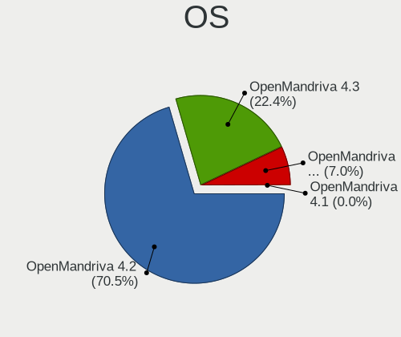

| Name              | Computers | Percent |
|-------------------|-----------|---------|
| OpenMandriva 4.2  | 3810      | 70.5%   |
| OpenMandriva 4.3  | 1213      | 22.45%  |
| OpenMandriva 4.50 | 379       | 7.01%   |
| OpenMandriva 4.90 | 1         | 0.02%   |
| OpenMandriva 4.1  | 1         | 0.02%   |

OS Family
---------

OS without a version

| Name         | Computers | Percent |
|--------------|-----------|---------|
| OpenMandriva | 5404      | 100%    |

Kernel
------

Version of the Linux kernel

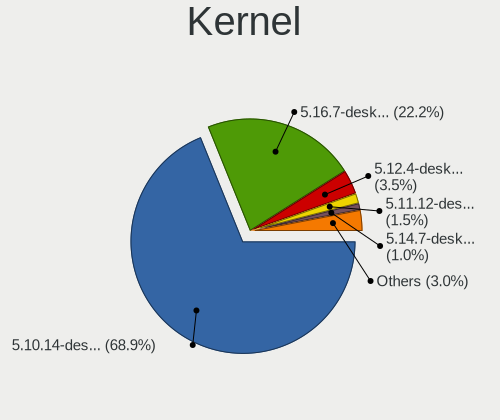

| Version                        | Computers | Percent |
|--------------------------------|-----------|---------|
| 5.10.14-desktop-1omv4002       | 3722      | 68.87%  |
| 5.16.7-desktop-1omv4003        | 1198      | 22.17%  |
| 5.12.4-desktop-1omv4050        | 190       | 3.52%   |
| 5.11.12-desktop-1omv4002       | 79        | 1.46%   |
| 5.14.7-desktop-1omv4050        | 52        | 0.96%   |
| 5.12.7-desktop-1omv4003        | 27        | 0.5%    |
| 5.14.14-desktop-1omv4050       | 13        | 0.24%   |
| 5.16.2-desktop-2omv4050        | 12        | 0.22%   |
| 5.14.12-desktop-1omv4050       | 9         | 0.17%   |
| 5.16.3-desktop-2omv4050        | 6         | 0.11%   |
| 5.14.2-desktop-1omv4050        | 6         | 0.11%   |
| 5.13.12-desktop-1omv4050       | 6         | 0.11%   |
| 5.11.11-desktop-clang-1omv4050 | 6         | 0.11%   |
| 5.16.13-desktop-1omv4003       | 5         | 0.09%   |
| 5.12.8-desktop-clang-1omv4050  | 5         | 0.09%   |
| 5.11.13-desktop-clang-1omv4050 | 4         | 0.07%   |
| 5.11.10-desktop-clang-1omv4050 | 4         | 0.07%   |
| 5.11.0-desktop-clang-1omv4002  | 4         | 0.07%   |
| 5.10.13-desktop-1omv4002       | 4         | 0.07%   |
| 5.17.1-desktop-2omv4050        | 3         | 0.06%   |
| 5.16.9-desktop-1omv4050        | 3         | 0.06%   |
| 5.16.9-desktop-1omv4003        | 3         | 0.06%   |
| 5.16.0-desktop-1omv4050        | 3         | 0.06%   |
| 5.15.4-desktop-1omv4050        | 3         | 0.06%   |
| 5.15.1-desktop-1omv4050        | 3         | 0.06%   |
| 5.12.5-desktop-clang-1omv4050  | 3         | 0.06%   |
| 5.11.16-desktop-clang-1omv4050 | 3         | 0.06%   |
| 5.16.7-desktop-2omv4050        | 2         | 0.04%   |
| 5.15.8-desktop-1omv4050        | 2         | 0.04%   |
| 5.15.13-desktop-1omv4050       | 2         | 0.04%   |
| 5.15.11-desktop-1omv4050       | 2         | 0.04%   |
| 5.13.12-desktop-clang-1omv4050 | 2         | 0.04%   |
| 5.12.3-desktop-1omv4050        | 2         | 0.04%   |
| 5.11.15-desktop-clang-1omv4050 | 2         | 0.04%   |
| 5.5.12-desktop-1omv4001        | 1         | 0.02%   |
| 5.16.8-desktop-1omv4050        | 1         | 0.02%   |
| 5.16.5-desktop-1omv4050        | 1         | 0.02%   |
| 5.16.13-desktop-2omv4050       | 1         | 0.02%   |
| 5.16.13-desktop-1omv4050       | 1         | 0.02%   |
| 5.16.0-desktop-2omv4050        | 1         | 0.02%   |
| 5.15.3-desktop-1omv4050        | 1         | 0.02%   |
| 5.15.12-desktop-1omv4050       | 1         | 0.02%   |
| 5.12.2-desktop-clang-4omv4050  | 1         | 0.02%   |
| 5.11.14-desktop-clang-1omv4050 | 1         | 0.02%   |
| 5.11.0-server-1omv4002         | 1         | 0.02%   |
| 5.11.0-desktop-0.rc7.1omv4002  | 1         | 0.02%   |
| 5.10.7-desktop-clang-1omv4002  | 1         | 0.02%   |
| 5.10.12-desktop-1omv4002       | 1         | 0.02%   |

Kernel Family
-------------

Linux kernel without a distro release

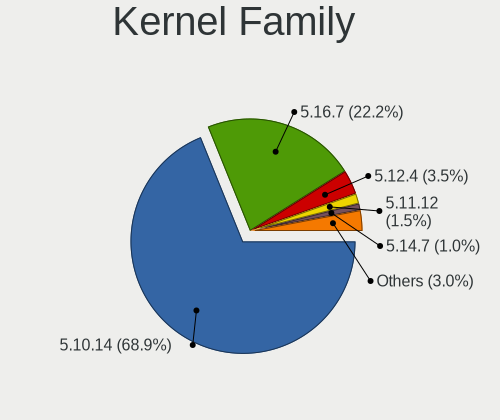

| Version | Computers | Percent |
|---------|-----------|---------|
| 5.10.14 | 3722      | 68.87%  |
| 5.16.7  | 1200      | 22.21%  |
| 5.12.4  | 190       | 3.52%   |
| 5.11.12 | 79        | 1.46%   |
| 5.14.7  | 52        | 0.96%   |
| 5.12.7  | 27        | 0.5%    |
| 5.14.14 | 13        | 0.24%   |
| 5.16.2  | 12        | 0.22%   |
| 5.14.12 | 9         | 0.17%   |
| 5.13.12 | 8         | 0.15%   |
| 5.16.13 | 7         | 0.13%   |
| 5.16.9  | 6         | 0.11%   |
| 5.16.3  | 6         | 0.11%   |
| 5.14.2  | 6         | 0.11%   |
| 5.11.11 | 6         | 0.11%   |
| 5.11.0  | 6         | 0.11%   |
| 5.12.8  | 5         | 0.09%   |
| 5.16.0  | 4         | 0.07%   |
| 5.11.13 | 4         | 0.07%   |
| 5.11.10 | 4         | 0.07%   |
| 5.10.13 | 4         | 0.07%   |
| 5.17.1  | 3         | 0.06%   |
| 5.15.4  | 3         | 0.06%   |
| 5.15.1  | 3         | 0.06%   |
| 5.12.5  | 3         | 0.06%   |
| 5.11.16 | 3         | 0.06%   |
| 5.15.8  | 2         | 0.04%   |
| 5.15.13 | 2         | 0.04%   |
| 5.15.11 | 2         | 0.04%   |
| 5.12.3  | 2         | 0.04%   |
| 5.11.15 | 2         | 0.04%   |
| 5.5.12  | 1         | 0.02%   |
| 5.16.8  | 1         | 0.02%   |
| 5.16.5  | 1         | 0.02%   |
| 5.15.3  | 1         | 0.02%   |
| 5.15.12 | 1         | 0.02%   |
| 5.12.2  | 1         | 0.02%   |
| 5.11.14 | 1         | 0.02%   |
| 5.10.7  | 1         | 0.02%   |
| 5.10.12 | 1         | 0.02%   |

Kernel Major Ver.
-----------------

Linux kernel major version

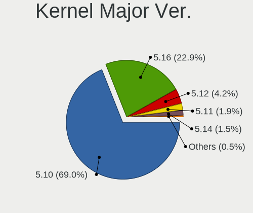

| Version | Computers | Percent |
|---------|-----------|---------|
| 5.10    | 3728      | 68.99%  |
| 5.16    | 1237      | 22.89%  |
| 5.12    | 228       | 4.22%   |
| 5.11    | 105       | 1.94%   |
| 5.14    | 80        | 1.48%   |
| 5.15    | 14        | 0.26%   |
| 5.13    | 8         | 0.15%   |
| 5.17    | 3         | 0.06%   |
| 5.5     | 1         | 0.02%   |

Arch
----

OS architecture (x86_64, i586, etc.)

| Name    | Computers | Percent |
|---------|-----------|---------|
| x86_64  | 5403      | 99.98%  |
| aarch64 | 1         | 0.02%   |

DE
--

Desktop Environment

| Name    | Computers | Percent |
|---------|-----------|---------|
| KDE5    | 5392      | 99.78%  |
| LXQt    | 6         | 0.11%   |
| Unknown | 3         | 0.06%   |
| GNOME   | 2         | 0.04%   |
| XFCE    | 1         | 0.02%   |

Display Server
--------------

X11 or Wayland

| Name    | Computers | Percent |
|---------|-----------|---------|
| X11     | 4888      | 90.45%  |
| Wayland | 515       | 9.53%   |
| Unknown | 1         | 0.02%   |

Display Manager
---------------

SDDM, LightDM, etc.

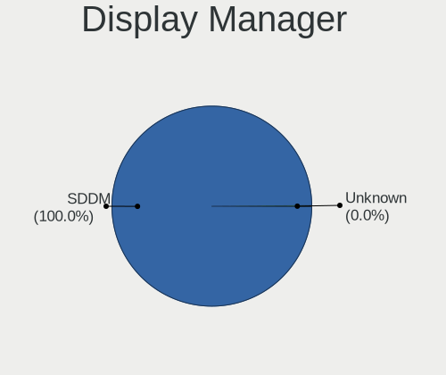

| Name    | Computers | Percent |
|---------|-----------|---------|
| SDDM    | 5402      | 99.96%  |
| Unknown | 2         | 0.04%   |

OS Lang
-------

Language

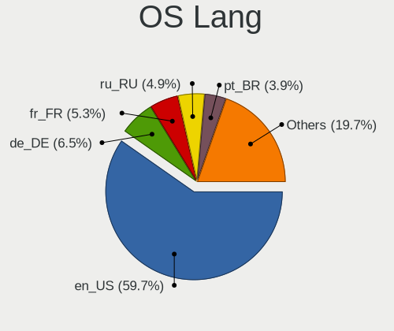

| Lang  | Computers | Percent |
|-------|-----------|---------|
| en_US | 3228      | 59.73%  |
| de_DE | 352       | 6.51%   |
| fr_FR | 284       | 5.26%   |
| ru_RU | 265       | 4.9%    |
| pt_BR | 212       | 3.92%   |
| es_ES | 150       | 2.78%   |
| pl_PL | 116       | 2.15%   |
| en_GB | 103       | 1.91%   |
| es_MX | 97        | 1.79%   |
| it_IT | 90        | 1.67%   |
| es_CO | 44        | 0.81%   |
| en_CA | 43        | 0.8%    |
| cs_CZ | 40        | 0.74%   |
| es_CR | 27        | 0.5%    |
| es_AR | 26        | 0.48%   |
| de_AT | 24        | 0.44%   |
| nl_NL | 20        | 0.37%   |
| es_EC | 18        | 0.33%   |
| de_CH | 18        | 0.33%   |
| fr_BE | 17        | 0.31%   |
| hu_HU | 15        | 0.28%   |
| es_CL | 15        | 0.28%   |
| en_AU | 15        | 0.28%   |
| ru_UA | 12        | 0.22%   |
| en_IN | 12        | 0.22%   |
| pt_PT | 11        | 0.2%    |
| nl_BE | 11        | 0.2%    |
| es_GT | 10        | 0.19%   |
| es_BO | 9         | 0.17%   |
| en_AG | 9         | 0.17%   |
| fr_CA | 8         | 0.15%   |
| es_PE | 8         | 0.15%   |
| fr_CH | 7         | 0.13%   |
| uk_UA | 6         | 0.11%   |
| en_IE | 6         | 0.11%   |
| es_UY | 5         | 0.09%   |
| es_PA | 5         | 0.09%   |
| es_HN | 5         | 0.09%   |
| en_SG | 5         | 0.09%   |
| en_NZ | 5         | 0.09%   |
| en_HK | 5         | 0.09%   |
| en_DK | 5         | 0.09%   |
| tr_TR | 4         | 0.07%   |
| da_DK | 4         | 0.07%   |
| ro_RO | 3         | 0.06%   |
| es_VE | 3         | 0.06%   |
| es_SV | 3         | 0.06%   |
| en_ZA | 3         | 0.06%   |
| en_PH | 3         | 0.06%   |
| it_CH | 2         | 0.04%   |
| es_NI | 2         | 0.04%   |
| ar_AE | 2         | 0.04%   |
| zh_CN | 1         | 0.02%   |
| UTF-8 | 1         | 0.02%   |
| nb_NO | 1         | 0.02%   |
| ja_JP | 1         | 0.02%   |
| fr_LU | 1         | 0.02%   |
| es_US | 1         | 0.02%   |
| es_DO | 1         | 0.02%   |
| en_ZM | 1         | 0.02%   |

Boot Mode
---------

EFI or BIOS

| Mode | Computers | Percent |
|------|-----------|---------|
| BIOS | 5153      | 95.36%  |
| EFI  | 251       | 4.64%   |

Filesystem
----------

Type of filesystem

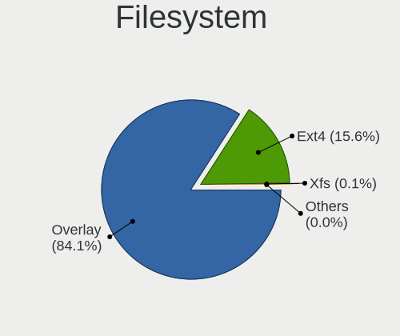

| Type    | Computers | Percent |
|---------|-----------|---------|
| Overlay | 4547      | 84.14%  |
| Ext4    | 843       | 15.6%   |
| Xfs     | 7         | 0.13%   |
| Btrfs   | 4         | 0.07%   |
| Jfs     | 1         | 0.02%   |
| Ext3    | 1         | 0.02%   |
| Unknown | 1         | 0.02%   |

Part. scheme
------------

Scheme of partitioning

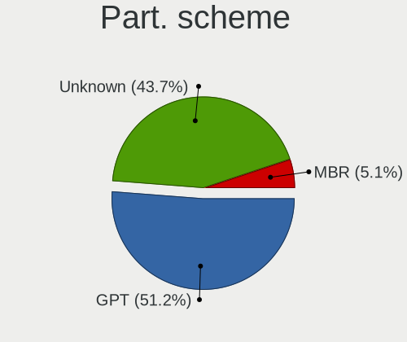

| Type    | Computers | Percent |
|---------|-----------|---------|
| GPT     | 2768      | 51.22%  |
| Unknown | 2360      | 43.67%  |
| MBR     | 276       | 5.11%   |

Dual Boot with Linux/BSD
------------------------

Hosting more than one Linux/BSD

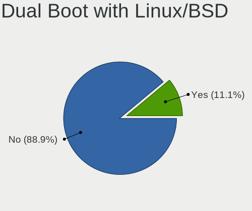

| Dual boot | Computers | Percent |
|-----------|-----------|---------|
| No        | 4805      | 88.92%  |
| Yes       | 599       | 11.08%  |

Dual Boot (Win)
---------------

Hosting Linux and Windows

| Dual boot | Computers | Percent |
|-----------|-----------|---------|
| No        | 5355      | 99.09%  |
| Yes       | 49        | 0.91%   |

Board
-----

Vendor
------

Motherboard manufacturer

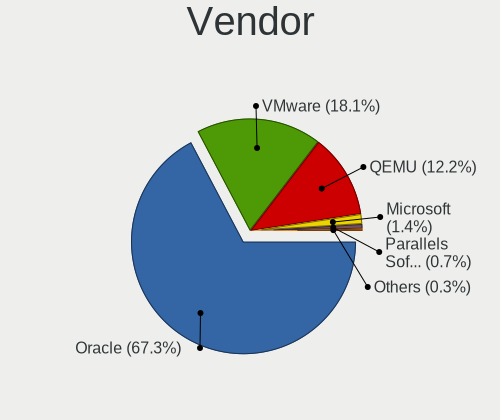

| Name                             | Computers | Percent |
|----------------------------------|-----------|---------|
| Oracle                           | 3636      | 67.28%  |
| VMware                           | 980       | 18.13%  |
| QEMU                             | 657       | 12.16%  |
| Microsoft                        | 77        | 1.42%   |
| Parallels Software International | 36        | 0.67%   |
| Red Hat                          | 8         | 0.15%   |
| innotek                          | 4         | 0.07%   |
| Xen                              | 2         | 0.04%   |
| oVirt                            | 2         | 0.04%   |
| Apache Software Foundation       | 2         | 0.04%   |

Model
-----

Motherboard model

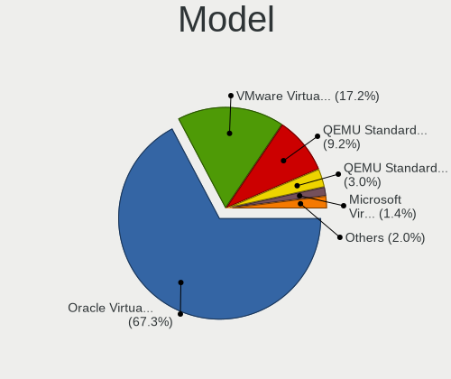

| Name                                                        | Computers | Percent |
|-------------------------------------------------------------|-----------|---------|
| Oracle VirtualBox                                           | 3635      | 67.26%  |
| VMware Virtual Platform                                     | 929       | 17.19%  |
| QEMU Standard PC (i440FX + PIIX, 1996)                      | 496       | 9.18%   |
| QEMU Standard PC (Q35 + ICH9, 2009)                         | 160       | 2.96%   |
| Microsoft Virtual Machine                                   | 77        | 1.42%   |
| VMware VMware7,1                                            | 51        | 0.94%   |
| Parallels Software International Parallels Virtual Platform | 36        | 0.67%   |
| Red Hat KVM                                                 | 8         | 0.15%   |
| innotek VirtualBox                                          | 4         | 0.07%   |
| Xen HVM domU                                                | 2         | 0.04%   |
| Apache Software Foundation CloudStack KVM Hypervisor        | 2         | 0.04%   |
| QEMU KVM Virtual Machine                                    | 1         | 0.02%   |
| oVirt RHEL                                                  | 1         | 0.02%   |
| oVirt Node                                                  | 1         | 0.02%   |
| Oracle ThinkPad T14 Gen 1 20S1S19N00                        | 1         | 0.02%   |

Model Family
------------

Motherboard model prefix

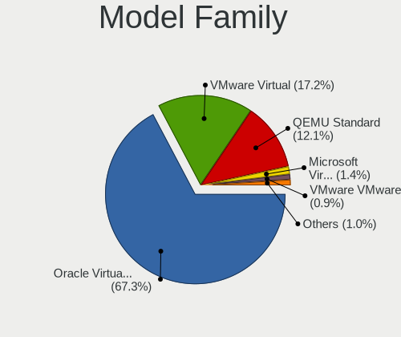

| Name                                       | Computers | Percent |
|--------------------------------------------|-----------|---------|
| Oracle VirtualBox                          | 3635      | 67.26%  |
| VMware Virtual                             | 929       | 17.19%  |
| QEMU Standard                              | 656       | 12.14%  |
| Microsoft Virtual                          | 77        | 1.42%   |
| VMware VMware7                             | 51        | 0.94%   |
| Parallels Software International Parallels | 36        | 0.67%   |
| Red Hat KVM                                | 8         | 0.15%   |
| innotek VirtualBox                         | 4         | 0.07%   |
| Xen HVM                                    | 2         | 0.04%   |
| Apache Software Foundation CloudStack      | 2         | 0.04%   |
| QEMU KVM                                   | 1         | 0.02%   |
| oVirt RHEL                                 | 1         | 0.02%   |
| oVirt Node                                 | 1         | 0.02%   |
| Oracle ThinkPad                            | 1         | 0.02%   |

MFG Year
--------

Motherboard manufacture year

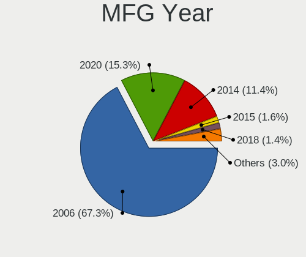

| Year    | Computers | Percent |
|---------|-----------|---------|
| 2006    | 3639      | 67.34%  |
| 2020    | 827       | 15.3%   |
| 2014    | 615       | 11.38%  |
| 2015    | 86        | 1.59%   |
| 2018    | 77        | 1.42%   |
| 2019    | 69        | 1.28%   |
| 2021    | 55        | 1.02%   |
| 2017    | 20        | 0.37%   |
| 2013    | 7         | 0.13%   |
| Unknown | 4         | 0.07%   |
| 2011    | 2         | 0.04%   |
| 2022    | 1         | 0.02%   |
| 2016    | 1         | 0.02%   |
| 2012    | 1         | 0.02%   |

Form Factor
-----------

Physical design of the computer

| Name            | Computers | Percent |
|-----------------|-----------|---------|
| Virtual machine | 5404      | 100%    |

Secure Boot
-----------

Enabled or disabled

| State    | Computers | Percent |
|----------|-----------|---------|
| Disabled | 5404      | 100%    |

Coreboot
--------

Have coreboot on board

| Used | Computers | Percent |
|------|-----------|---------|
| No   | 5404      | 100%    |

RAM Size
--------

Total RAM memory

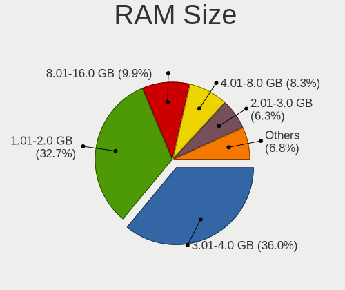

| Size in GB  | Computers | Percent |
|-------------|-----------|---------|
| 3.01-4.0    | 1946      | 36.01%  |
| 1.01-2.0    | 1765      | 32.66%  |
| 8.01-16.0   | 536       | 9.92%   |
| 4.01-8.0    | 447       | 8.27%   |
| 2.01-3.0    | 342       | 6.33%   |
| 0.51-1.0    | 239       | 4.42%   |
| 16.01-24.0  | 86        | 1.59%   |
| 32.01-64.0  | 31        | 0.57%   |
| 24.01-32.0  | 7         | 0.13%   |
| 0.01-0.5    | 4         | 0.07%   |
| 64.01-256.0 | 1         | 0.02%   |

RAM Used
--------

Used RAM memory

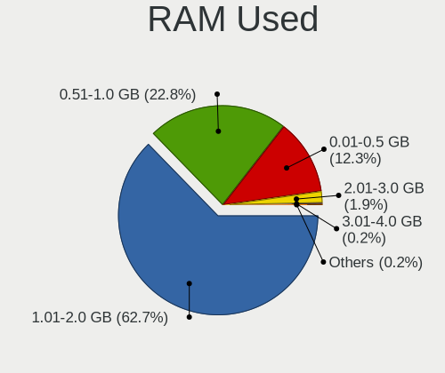

| Used GB    | Computers | Percent |
|------------|-----------|---------|
| 1.01-2.0   | 3390      | 62.73%  |
| 0.51-1.0   | 1230      | 22.76%  |
| 0.01-0.5   | 662       | 12.25%  |
| 2.01-3.0   | 102       | 1.89%   |
| 3.01-4.0   | 11        | 0.2%    |
| 4.01-8.0   | 8         | 0.15%   |
| 16.01-24.0 | 1         | 0.02%   |

Total Drives
------------

Number of drives on board

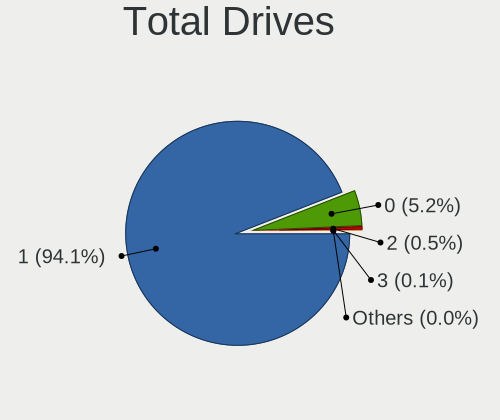

| Drives | Computers | Percent |
|--------|-----------|---------|
| 1      | 5084      | 94.08%  |
| 0      | 282       | 5.22%   |
| 2      | 29        | 0.54%   |
| 3      | 4         | 0.07%   |
| 4      | 3         | 0.06%   |
| 10     | 1         | 0.02%   |
| 5      | 1         | 0.02%   |

Has CD-ROM
----------

Has CD-ROM on board

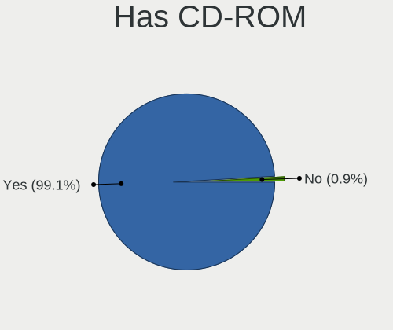

| Presented | Computers | Percent |
|-----------|-----------|---------|
| Yes       | 5353      | 99.06%  |
| No        | 51        | 0.94%   |

Has Ethernet
------------

Has Ethernet on board

| Presented | Computers | Percent |
|-----------|-----------|---------|
| Yes       | 5054      | 93.52%  |
| No        | 350       | 6.48%   |

Has WiFi
--------

Has WiFi module

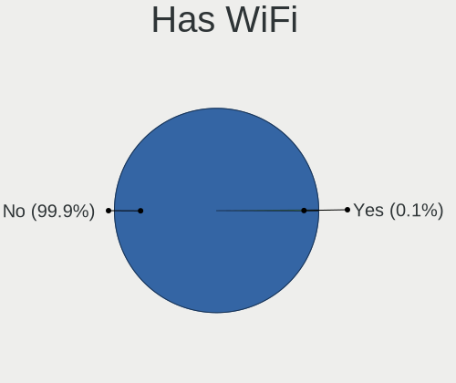

| Presented | Computers | Percent |
|-----------|-----------|---------|
| No        | 5401      | 99.94%  |
| Yes       | 3         | 0.06%   |

Has Bluetooth
-------------

Has Bluetooth module

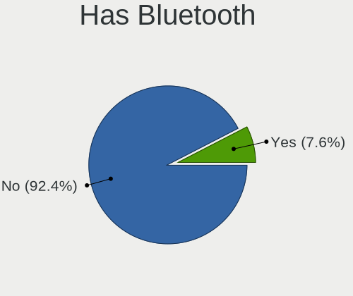

| Presented | Computers | Percent |
|-----------|-----------|---------|
| No        | 4994      | 92.41%  |
| Yes       | 410       | 7.59%   |

Location
--------

Country
-------

Geographic location (country)

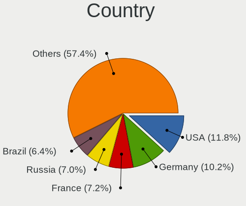

| Country      | Computers | Percent |
|--------------|-----------|---------|
| USA          | 638       | 11.81%  |
| Germany      | 551       | 10.2%   |
| France       | 387       | 7.16%   |
| Russia       | 380       | 7.03%   |
| Brazil       | 348       | 6.44%   |
| Mexico       | 250       | 4.63%   |
| Italy        | 245       | 4.53%   |
| Spain        | 216       | 4%      |
| Poland       | 211       | 3.9%    |
| Canada       | 142       | 2.63%   |
| UK           | 138       | 2.55%   |
| Colombia     | 100       | 1.85%   |
| China        | 99        | 1.83%   |
| India        | 78        | 1.44%   |
| Japan        | 77        | 1.42%   |
| Ukraine      | 68        | 1.26%   |
| Indonesia    | 68        | 1.26%   |
| Netherlands  | 67        | 1.24%   |
| Czechia      | 65        | 1.2%    |
| Australia    | 58        | 1.07%   |
| Romania      | 57        | 1.05%   |
| Morocco      | 55        | 1.02%   |
| Switzerland  | 51        | 0.94%   |
| Austria      | 47        | 0.87%   |
| Costa Rica   | 43        | 0.8%    |
| Turkey       | 42        | 0.78%   |
| Belgium      | 42        | 0.78%   |
| Argentina    | 37        | 0.68%   |
| Portugal     | 36        | 0.67%   |
| Ecuador      | 35        | 0.65%   |
| Peru         | 32        | 0.59%   |
| Hungary      | 32        | 0.59%   |
| Sweden       | 29        | 0.54%   |
| Greece       | 29        | 0.54%   |
| Malaysia     | 26        | 0.48%   |
| Denmark      | 25        | 0.46%   |
| Chile        | 25        | 0.46%   |
| Finland      | 23        | 0.43%   |
| Bulgaria     | 23        | 0.43%   |
| Serbia       | 22        | 0.41%   |
| Honduras     | 22        | 0.41%   |
| Taiwan       | 21        | 0.39%   |
| Slovakia     | 21        | 0.39%   |
| Norway       | 21        | 0.39%   |
| Moldova      | 20        | 0.37%   |
| Bolivia      | 20        | 0.37%   |
| El Salvador  | 18        | 0.33%   |
| Philippines  | 16        | 0.3%    |
| South Korea  | 15        | 0.28%   |
| Guatemala    | 15        | 0.28%   |
| Israel       | 14        | 0.26%   |
| Thailand     | 13        | 0.24%   |
| New Zealand  | 12        | 0.22%   |
| Belarus      | 12        | 0.22%   |
| South Africa | 11        | 0.2%    |
| Ireland      | 11        | 0.2%    |
| Iran         | 11        | 0.2%    |
| Uruguay      | 10        | 0.19%   |
| Saudi Arabia | 9         | 0.17%   |
| Panama       | 9         | 0.17%   |

City
----

Geographic location (city)

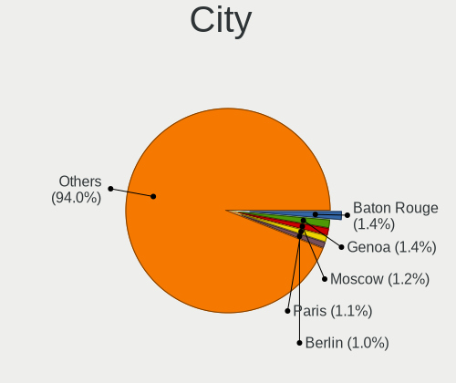

| City              | Computers | Percent |
|-------------------|-----------|---------|
| Baton Rouge       | 75        | 1.39%   |
| Genoa             | 73        | 1.35%   |
| Moscow            | 63        | 1.17%   |
| Paris             | 59        | 1.09%   |
| Berlin            | 52        | 0.96%   |
| Sao Paulo         | 50        | 0.93%   |
| Madrid            | 44        | 0.81%   |
| Warsaw            | 40        | 0.74%   |
| Mexico City       | 33        | 0.61%   |
| St Petersburg     | 29        | 0.54%   |
| San José       | 29        | 0.54%   |
| Bogotá         | 28        | 0.52%   |
| Hamburg           | 26        | 0.48%   |
| Ciudad Guzmán  | 25        | 0.46%   |
| Guadalajara       | 24        | 0.44%   |
| Munich            | 23        | 0.43%   |
| Casablanca        | 23        | 0.43%   |
| Vienna            | 21        | 0.39%   |
| Barcelona         | 19        | 0.35%   |
| Zalău          | 17        | 0.31%   |
| Wiesbaden         | 17        | 0.31%   |
| Toronto           | 17        | 0.31%   |
| Melbourne         | 17        | 0.31%   |
| Makassar          | 17        | 0.31%   |
| Bayonne           | 17        | 0.31%   |
| San Salvador      | 16        | 0.3%    |
| Rio de Janeiro    | 16        | 0.3%    |
| Quito             | 16        | 0.3%    |
| Prague            | 16        | 0.3%    |
| Montreal          | 16        | 0.3%    |
| Medellín       | 16        | 0.3%    |
| Langenhagen       | 16        | 0.3%    |
| Jakarta           | 16        | 0.3%    |
| Chisinau          | 16        | 0.3%    |
| Briceno           | 16        | 0.3%    |
| Rome              | 15        | 0.28%   |
| Leipzig           | 15        | 0.28%   |
| Belgrade          | 15        | 0.28%   |
| Sydney            | 14        | 0.26%   |
| Le Vigen          | 14        | 0.26%   |
| Kyiv              | 14        | 0.26%   |
| Frankfurt am Main | 14        | 0.26%   |
| Zurich            | 13        | 0.24%   |
| Zapopan           | 13        | 0.24%   |
| Milan             | 13        | 0.24%   |
| Istanbul          | 13        | 0.24%   |
| Heredia           | 13        | 0.24%   |
| Helsinki          | 13        | 0.24%   |
| Amsterdam         | 13        | 0.24%   |
| Wroclaw           | 12        | 0.22%   |
| Victorville       | 12        | 0.22%   |
| Tegucigalpa       | 12        | 0.22%   |
| Sofia             | 12        | 0.22%   |
| Novosibirsk       | 12        | 0.22%   |
| Nizhniy Novgorod  | 12        | 0.22%   |
| Lima              | 12        | 0.22%   |
| Guatemala City    | 12        | 0.22%   |
| Budapest          | 12        | 0.22%   |
| Beijing           | 12        | 0.22%   |
| Athens            | 12        | 0.22%   |

Drives
------

Drive Vendor
------------

Hard drive vendors

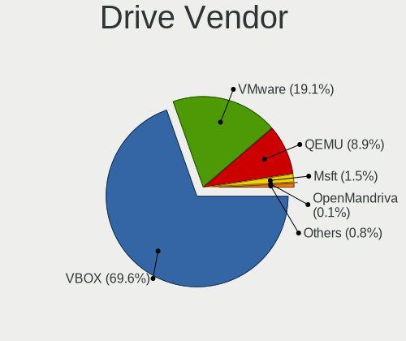

| Vendor                 | Computers | Drives | Percent |
|------------------------|-----------|--------|---------|
| VBOX                   | 3566      | 3604   | 69.62%  |
| VMware                 | 977       | 990    | 19.07%  |
| QEMU                   | 455       | 461    | 8.88%   |
| Msft                   | 77        | 77     | 1.5%    |
| OpenMandriva           | 7         | 7      | 0.14%   |
| Unknown                | 5         | 5      | 0.1%    |
| Other                  | 4         | 4      | 0.08%   |
| ORACLE                 | 4         | 4      | 0.08%   |
| Open                   | 4         | 4      | 0.08%   |
| Mandriva-0             | 4         | 4      | 0.08%   |
| InnoTek Systemberatung | 4         | 4      | 0.08%   |
| SYNOLOGY               | 3         | 3      | 0.06%   |
| OpenMandriva-0         | 3         | 3      | 0.06%   |
| Mandriva               | 2         | 2      | 0.04%   |
| Autre                  | 2         | 2      | 0.04%   |
| Ubuntu                 | 1         | 1      | 0.02%   |
| OpenManfriva           | 1         | 1      | 0.02%   |
| OpenMadriva            | 1         | 1      | 0.02%   |
| Fedora                 | 1         | 1      | 0.02%   |
| Anderes                | 1         | 1      | 0.02%   |

Drive Model
-----------

Hard drive models

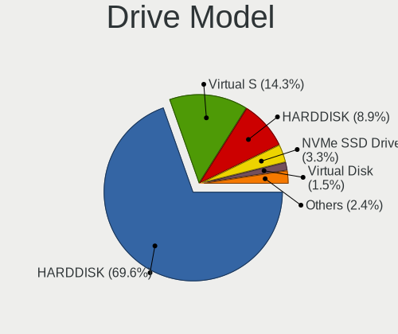

| Model                                      | Computers | Percent |
|--------------------------------------------|-----------|---------|
| VBOX HARDDISK                              | 3566      | 69.61%  |
| VMware Virtual S                           | 734       | 14.33%  |
| QEMU HARDDISK                              | 455       | 8.88%   |
| VMware NVMe SSD Drive                      | 169       | 3.3%    |
| Msft Virtual Disk                          | 77        | 1.5%    |
| VMware Virtual disk                        | 44        | 0.86%   |
| VMware Virtual SATA Hard Drive             | 26        | 0.51%   |
| VMware Virtual IDE Hard Drive              | 5         | 0.1%    |
| Unknown                                    | 5         | 0.1%    |
| ORACLE BlockVolume                         | 4         | 0.08%   |
| Mandriva-0 SSD 70GB                        | 4         | 0.08%   |
| Other Linux-0 69GB                         | 3         | 0.06%   |
| OpenMandriva-0 SSD 70GB                    | 3         | 0.06%   |
| SYNOLOGY iSCSI Storage                     | 2         | 0.04%   |
| OpenMandriva Lx 4.3-0 SSD 69GB             | 2         | 0.04%   |
| OpenMandriva Linux-0 SSD 17GB              | 2         | 0.04%   |
| Open Mandriva-0 SSD 69GB                   | 2         | 0.04%   |
| Open Mandriva-0 69GB                       | 2         | 0.04%   |
| InnoTek Systemberatung NVMe SSD Drive 21GB | 2         | 0.04%   |
| Autre Linux-0 SSD 137GB                    | 2         | 0.04%   |
| Ubuntu Linux-0 SSD 137GB                   | 1         | 0.02%   |
| SYNOLOGY Storage                           | 1         | 0.02%   |
| Other Linux-0 SSD 69GB                     | 1         | 0.02%   |
| OpenManfriva Lx Linux-0 SSD 69GB           | 1         | 0.02%   |
| OpenMandriva Lx-0 69GB                     | 1         | 0.02%   |
| OpenMandriva Lx 4.2-0 SSD 69GB             | 1         | 0.02%   |
| OpenMandriva 4.2 Linux-0 464GB             | 1         | 0.02%   |
| OpenMadriva Lx 4.2-0 SSD 69GB              | 1         | 0.02%   |
| Mandriva Linux-0 SSD 34GB                  | 1         | 0.02%   |
| Mandriva Linux-0 69GB                      | 1         | 0.02%   |
| InnoTek Systemberatung NVMe SSD Drive 54GB | 1         | 0.02%   |
| InnoTek Systemberatung NVMe SSD Drive 34GB | 1         | 0.02%   |
| Fedora Linux-0 SSD 137GB                   | 1         | 0.02%   |
| Anderes Linux-0 SSD 69GB                   | 1         | 0.02%   |

HDD Vendor
----------

Hard disk drive vendors

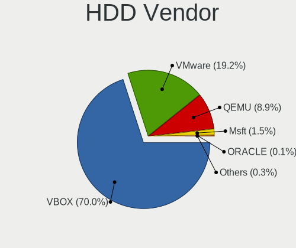

| Vendor       | Computers | Drives | Percent |
|--------------|-----------|--------|---------|
| VBOX         | 3566      | 3604   | 70.03%  |
| VMware       | 977       | 990    | 19.19%  |
| QEMU         | 455       | 461    | 8.94%   |
| Msft         | 77        | 77     | 1.51%   |
| ORACLE       | 4         | 4      | 0.08%   |
| SYNOLOGY     | 3         | 3      | 0.06%   |
| Other        | 3         | 3      | 0.06%   |
| OpenMandriva | 2         | 2      | 0.04%   |
| Open         | 2         | 2      | 0.04%   |
| Unknown      | 2         | 2      | 0.04%   |
| Mandriva     | 1         | 1      | 0.02%   |

SSD Vendor
----------

Solid state drive vendors

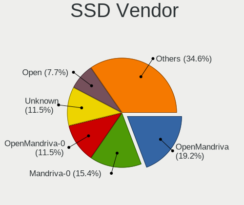

| Vendor         | Computers | Drives | Percent |
|----------------|-----------|--------|---------|
| OpenMandriva   | 5         | 5      | 19.23%  |
| Mandriva-0     | 4         | 4      | 15.38%  |
| OpenMandriva-0 | 3         | 3      | 11.54%  |
| Unknown        | 3         | 3      | 11.54%  |
| Open           | 2         | 2      | 7.69%   |
| Autre          | 2         | 2      | 7.69%   |
| Ubuntu         | 1         | 1      | 3.85%   |
| Other          | 1         | 1      | 3.85%   |
| OpenManfriva   | 1         | 1      | 3.85%   |
| OpenMadriva    | 1         | 1      | 3.85%   |
| Mandriva       | 1         | 1      | 3.85%   |
| Fedora         | 1         | 1      | 3.85%   |
| Anderes        | 1         | 1      | 3.85%   |

Drive Kind
----------

HDD or SSD

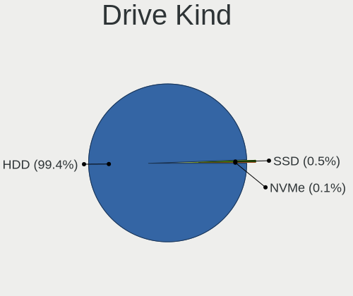

| Kind | Computers | Drives | Percent |
|------|-----------|--------|---------|
| HDD  | 5092      | 5149   | 99.41%  |
| SSD  | 26        | 26     | 0.51%   |
| NVMe | 4         | 4      | 0.08%   |

Drive Connector
---------------

SATA, SAS, NVMe, etc.

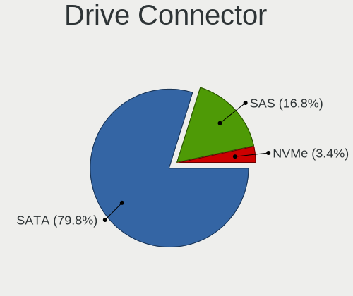

| Type | Computers | Drives | Percent |
|------|-----------|--------|---------|
| SATA | 4089      | 4132   | 79.8%   |
| SAS  | 862       | 874    | 16.82%  |
| NVMe | 173       | 173    | 3.38%   |

Drive Size
----------

Size of hard drive

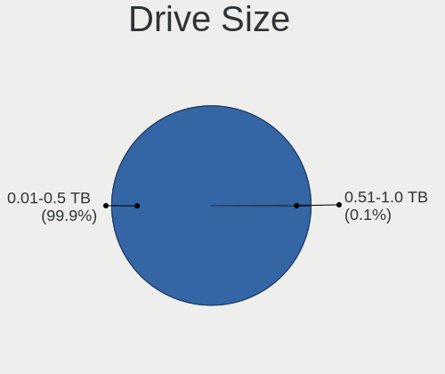

| Size in TB | Computers | Drives | Percent |
|------------|-----------|--------|---------|
| 0.01-0.5   | 5115      | 5172   | 99.94%  |
| 0.51-1.0   | 3         | 3      | 0.06%   |

Space Total
-----------

Amount of disk space available on the file system

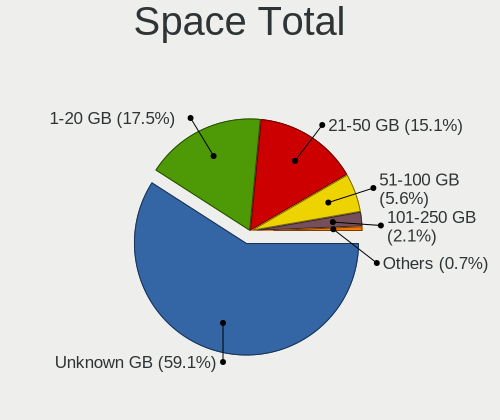

| Size in GB | Computers | Percent |
|------------|-----------|---------|
| Unknown    | 3193      | 59.09%  |
| 1-20       | 943       | 17.45%  |
| 21-50      | 816       | 15.1%   |
| 51-100     | 304       | 5.63%   |
| 101-250    | 112       | 2.07%   |
| 251-500    | 27        | 0.5%    |
| 501-1000   | 6         | 0.11%   |
| 1001-2000  | 3         | 0.06%   |

Space Used
----------

Amount of used disk space

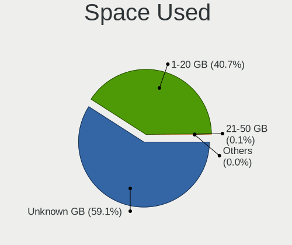

| Used GB | Computers | Percent |
|---------|-----------|---------|
| Unknown | 3193      | 59.09%  |
| 1-20    | 2201      | 40.73%  |
| 21-50   | 4         | 0.07%   |
| 0       | 3         | 0.06%   |
| 251-500 | 2         | 0.04%   |
| 101-250 | 1         | 0.02%   |

Malfunc. Drives
---------------

Drive models with a malfunction

Zero info for selected period =(

Malfunc. Drive Vendor
---------------------

Vendors of faulty drives

Zero info for selected period =(

Malfunc. HDD Vendor
-------------------

Vendors of faulty HDD drives

Zero info for selected period =(

Malfunc. Drive Kind
-------------------

Kinds of faulty drives

Zero info for selected period =(

Failed Drives
-------------

Failed drive models

Zero info for selected period =(

Failed Drive Vendor
-------------------

Failed drive vendors

Zero info for selected period =(

Drive Status
------------

Number of failed and malfunc. drives

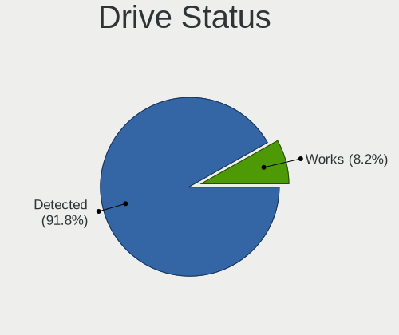

| Status   | Computers | Drives | Percent |
|----------|-----------|--------|---------|
| Detected | 4702      | 4755   | 91.82%  |
| Works    | 419       | 424    | 8.18%   |

Storage controller
------------------

Storage Vendor
--------------

Storage controller vendors

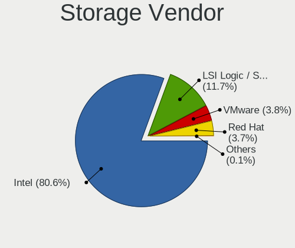

| Vendor                    | Computers | Percent |
|---------------------------|-----------|---------|
| Intel                     | 5368      | 80.59%  |
| LSI Logic / Symbios Logic | 780       | 11.71%  |
| VMware                    | 256       | 3.84%   |
| Red Hat                   | 248       | 3.72%   |
| InnoTek Systemberatung    | 4         | 0.06%   |
| XenSource                 | 2         | 0.03%   |
| Broadcom / LSI            | 2         | 0.03%   |
| BusLogic                  | 1         | 0.02%   |

Storage Model
-------------

Storage controller models

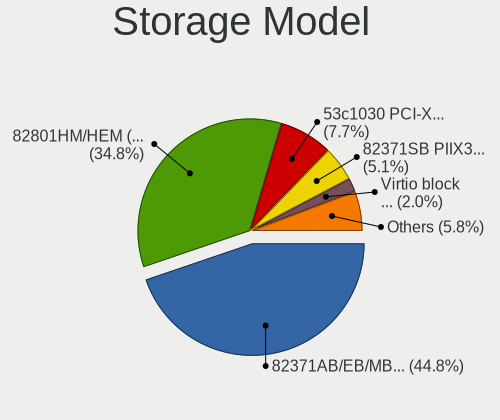

| Model                                                                 | Computers | Percent |
|-----------------------------------------------------------------------|-----------|---------|
| Intel 82371AB/EB/MB PIIX4 IDE                                         | 4508      | 44.78%  |
| Intel 82801HM/HEM (ICH8M/ICH8M-E) SATA Controller [AHCI mode]         | 3501      | 34.77%  |
| LSI Logic / Symbios Logic 53c1030 PCI-X Fusion-MPT Dual Ultra320 SCSI | 773       | 7.68%   |
| Intel 82371SB PIIX3 IDE [Natoma/Triton II]                            | 510       | 5.07%   |
| Red Hat Virtio block device                                           | 197       | 1.96%   |
| Intel 82801IR/IO/IH (ICH9R/DO/DH) 6 port SATA Controller [AHCI mode]  | 179       | 1.78%   |
| VMware NVMe SSD Controller                                            | 170       | 1.69%   |
| VMware SATA AHCI controller                                           | 72        | 0.72%   |
| Red Hat Virtio SCSI                                                   | 54        | 0.54%   |
| Intel 82801BA IDE U100 Controller                                     | 36        | 0.36%   |
| VMware PVSCSI SCSI Controller                                         | 26        | 0.26%   |
| Intel 82801HR/HO/HH (ICH8R/DO/DH) 6 port SATA Controller [AHCI mode]  | 19        | 0.19%   |
| Intel 631xESB/632xESB IDE Controller                                  | 7         | 0.07%   |
| LSI Logic / Symbios Logic 53c895a                                     | 4         | 0.04%   |
| InnoTek Systemberatung Non-Volatile memory controller                 | 4         | 0.04%   |
| LSI Logic / Symbios Logic SAS1068 PCI-X Fusion-MPT SAS                | 3         | 0.03%   |
| XenSource Xen Platform Device                                         | 2         | 0.02%   |
| BusLogic BT-946C (BA80C30) [MultiMaster 10]                           | 1         | 0.01%   |
| Broadcom / LSI MegaRAID SAS 1078                                      | 1         | 0.01%   |
| Broadcom / LSI 53c1030 PCI-X Fusion-MPT Dual Ultra320 SCSI            | 1         | 0.01%   |

Storage Kind
------------

Kind of storage controller (IDE, SATA, NVMe, SAS, ...)

| Kind | Computers | Percent |
|------|-----------|---------|
| IDE  | 5061      | 50.29%  |
| SATA | 3771      | 37.47%  |
| SCSI | 1027      | 10.21%  |
| NVMe | 174       | 1.73%   |
| SAS  | 29        | 0.29%   |
| RAID | 1         | 0.01%   |

Processor
---------

CPU Vendor
----------

Processor vendors

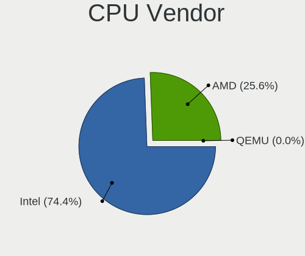

| Vendor | Computers | Percent |
|--------|-----------|---------|
| Intel  | 4020      | 74.39%  |
| AMD    | 1383      | 25.59%  |
| QEMU   | 1         | 0.02%   |

CPU Model
---------

Processor models

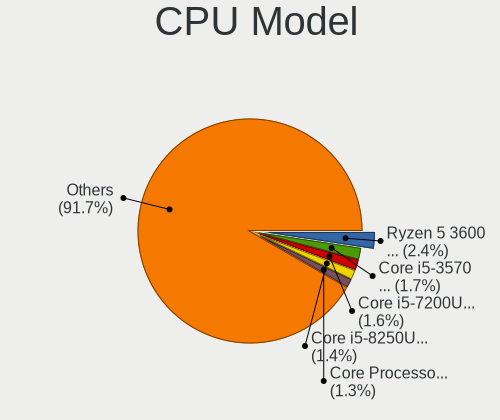

| Model                                         | Computers | Percent |
|-----------------------------------------------|-----------|---------|
| AMD Ryzen 5 3600 6-Core Processor             | 130       | 2.41%   |
| Intel Core i5-3570 CPU @ 3.40GHz              | 92        | 1.7%    |
| Intel Core i5-7200U CPU @ 2.50GHz             | 85        | 1.57%   |
| Intel Core i5-8250U CPU @ 1.60GHz             | 76        | 1.41%   |
| Intel Core Processor (Skylake, IBRS)          | 68        | 1.26%   |
| AMD EPYC-Rome Processor                       | 58        | 1.07%   |
| Intel Core i7-9750H CPU @ 2.60GHz             | 56        | 1.04%   |
| AMD Ryzen 5 3500U with Radeon Vega Mobile Gfx | 52        | 0.96%   |
| Intel Core i7-7700HQ CPU @ 2.80GHz            | 50        | 0.93%   |
| AMD Ryzen 5 2600 Six-Core Processor           | 48        | 0.89%   |
| Intel Core i7-10750H CPU @ 2.60GHz            | 47        | 0.87%   |
| Intel Core i7-8700 CPU @ 3.20GHz              | 46        | 0.85%   |
| Intel Core i7-8565U CPU @ 1.80GHz             | 45        | 0.83%   |
| Intel Core i5-3470 CPU @ 3.20GHz              | 44        | 0.81%   |
| Intel Core i5-10210U CPU @ 1.60GHz            | 44        | 0.81%   |
| AMD Ryzen 7 3700X 8-Core Processor            | 41        | 0.76%   |
| Intel Core i5-6200U CPU @ 2.30GHz             | 40        | 0.74%   |
| Intel Core i5-8400 CPU @ 2.80GHz              | 39        | 0.72%   |
| Intel Core i5-8265U CPU @ 1.60GHz             | 37        | 0.68%   |
| Intel Core i7-8550U CPU @ 1.80GHz             | 36        | 0.67%   |
| Intel Core i7-4790 CPU @ 3.60GHz              | 36        | 0.67%   |
| Intel Common KVM processor                    | 36        | 0.67%   |
| Intel 11th Gen Core i5-1135G7 @ 2.40GHz       | 35        | 0.65%   |
| AMD Ryzen 7 3700U with Radeon Vega Mobile Gfx | 34        | 0.63%   |
| Intel Core i7-7700 CPU @ 3.60GHz              | 33        | 0.61%   |
| Intel Core i5-2400 CPU @ 3.10GHz              | 33        | 0.61%   |
| Intel Core i7-6700HQ CPU @ 2.60GHz            | 32        | 0.59%   |
| Intel Core i7-3770 CPU @ 3.40GHz              | 32        | 0.59%   |
| Intel Core i5-7400 CPU @ 3.00GHz              | 31        | 0.57%   |
| Intel Core i7-8750H CPU @ 2.20GHz             | 30        | 0.56%   |
| Intel Core i5-6400 CPU @ 2.70GHz              | 30        | 0.56%   |
| Intel Core i7-7500U CPU @ 2.70GHz             | 29        | 0.54%   |
| Intel Core i5-3210M CPU @ 2.50GHz             | 29        | 0.54%   |
| AMD Ryzen 9 3900X 12-Core Processor           | 29        | 0.54%   |
| Intel Core i7-6700K CPU @ 4.00GHz             | 28        | 0.52%   |
| Intel Core i3-6006U CPU @ 2.00GHz             | 28        | 0.52%   |
| AMD Ryzen 3 3200G with Radeon Vega Graphics   | 28        | 0.52%   |
| Intel Core i7-8700K CPU @ 3.70GHz             | 27        | 0.5%    |
| Intel Core i7-10710U CPU @ 1.10GHz            | 27        | 0.5%    |
| Intel Core i5-9400F CPU @ 2.90GHz             | 27        | 0.5%    |
| Intel Core i5-3320M CPU @ 2.60GHz             | 27        | 0.5%    |
| Intel Core i7-4770 CPU @ 3.40GHz              | 26        | 0.48%   |
| Intel Core i5-5200U CPU @ 2.20GHz             | 26        | 0.48%   |
| Intel Core i5-4460 CPU @ 3.20GHz              | 26        | 0.48%   |
| Intel Core i3-4005U CPU @ 1.70GHz             | 26        | 0.48%   |
| Intel Core i5-4570 CPU @ 3.20GHz              | 25        | 0.46%   |
| Intel Core i5-1035G1 CPU @ 1.00GHz            | 25        | 0.46%   |
| Intel Core i3-7100 CPU @ 3.90GHz              | 25        | 0.46%   |
| Intel Core i3-5005U CPU @ 2.00GHz             | 25        | 0.46%   |
| Intel Core i3-3220 CPU @ 3.30GHz              | 25        | 0.46%   |
| AMD Ryzen 5 3400G with Radeon Vega Graphics   | 25        | 0.46%   |
| AMD Ryzen 5 1600 Six-Core Processor           | 24        | 0.44%   |
| Intel Core i7-7700K CPU @ 4.20GHz             | 23        | 0.43%   |
| Intel Core i3-8100 CPU @ 3.60GHz              | 23        | 0.43%   |
| Intel Core i3-7020U CPU @ 2.30GHz             | 23        | 0.43%   |
| AMD FX-8350 Eight-Core Processor              | 23        | 0.43%   |
| Intel Core Processor (Haswell, no TSX, IBRS)  | 22        | 0.41%   |
| Intel Core i7-9700 CPU @ 3.00GHz              | 22        | 0.41%   |
| Intel Core i3-1005G1 CPU @ 1.20GHz            | 22        | 0.41%   |
| Intel Core i9-9900K CPU @ 3.60GHz             | 21        | 0.39%   |

CPU Model Family
----------------

Processor model prefix

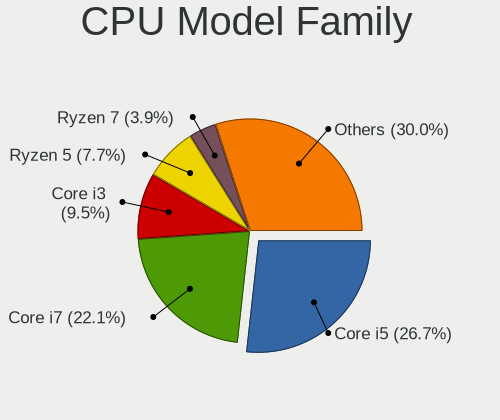

| Model                   | Computers | Percent |
|-------------------------|-----------|---------|
| Intel Core i5           | 1445      | 26.74%  |
| Intel Core i7           | 1196      | 22.13%  |
| Intel Core i3           | 515       | 9.53%   |
| AMD Ryzen 5             | 415       | 7.68%   |
| AMD Ryzen 7             | 212       | 3.92%   |
| Intel Xeon              | 211       | 3.9%    |
| Other                   | 187       | 3.46%   |
| Intel Celeron           | 126       | 2.33%   |
| Intel Pentium           | 110       | 2.04%   |
| AMD FX                  | 104       | 1.92%   |
| Intel Core              | 100       | 1.85%   |
| AMD Ryzen 3             | 92        | 1.7%    |
| AMD EPYC                | 89        | 1.65%   |
| AMD Ryzen 9             | 61        | 1.13%   |
| Intel Core i9           | 59        | 1.09%   |
| Intel Core 2 Duo        | 52        | 0.96%   |
| AMD A10                 | 47        | 0.87%   |
| AMD A6                  | 43        | 0.8%    |
| AMD A8                  | 38        | 0.7%    |
| AMD Opteron             | 26        | 0.48%   |
| AMD Phenom II X4        | 24        | 0.44%   |
| AMD Phenom II X6        | 19        | 0.35%   |
| AMD Athlon X4           | 19        | 0.35%   |
| AMD Athlon              | 19        | 0.35%   |
| AMD Athlon II X2        | 18        | 0.33%   |
| AMD A4                  | 18        | 0.33%   |
| Intel Pentium Dual-Core | 17        | 0.31%   |
| Intel Core 2 Quad       | 14        | 0.26%   |
| AMD Ryzen Threadripper  | 13        | 0.24%   |
| AMD Ryzen 5 PRO         | 12        | 0.22%   |
| AMD E1                  | 11        | 0.2%    |
| Intel Pentium Gold      | 10        | 0.19%   |
| AMD Athlon II X4        | 10        | 0.19%   |
| AMD Ryzen 7 PRO         | 8         | 0.15%   |
| Intel Core 2            | 6         | 0.11%   |
| AMD A12                 | 6         | 0.11%   |
| Intel Pentium Silver    | 5         | 0.09%   |
| Intel Xeon Silver       | 4         | 0.07%   |
| AMD Sempron             | 4         | 0.07%   |
| AMD Phenom II X2        | 4         | 0.07%   |
| AMD E                   | 4         | 0.07%   |
| AMD Athlon II X3        | 4         | 0.07%   |
| Intel Genuine           | 3         | 0.06%   |
| AMD E2                  | 3         | 0.06%   |
| AMD Athlon X2           | 3         | 0.06%   |
| AMD Athlon 64 X2        | 3         | 0.06%   |
| Intel Core m7           | 2         | 0.04%   |
| Intel Atom              | 2         | 0.04%   |
| AMD Ryzen 3 PRO         | 2         | 0.04%   |
| AMD C-60                | 2         | 0.04%   |
| Intel Xeon Platinum     | 1         | 0.02%   |
| Intel Xeon Gold         | 1         | 0.02%   |
| Intel Pentium D         | 1         | 0.02%   |
| AMD Six-Core Opteron    | 1         | 0.02%   |
| AMD Phenom II           | 1         | 0.02%   |
| AMD Phenom              | 1         | 0.02%   |
| AMD Athlon II           | 1         | 0.02%   |

CPU Cores
---------

Number of processor cores

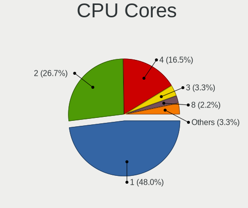

| Number | Computers | Percent |
|--------|-----------|---------|
| 1      | 2596      | 48.04%  |
| 2      | 1444      | 26.72%  |
| 4      | 893       | 16.52%  |
| 3      | 176       | 3.26%   |
| 8      | 118       | 2.18%   |
| 6      | 115       | 2.13%   |
| 12     | 24        | 0.44%   |
| 16     | 22        | 0.41%   |
| 5      | 6         | 0.11%   |
| 10     | 3         | 0.06%   |
| 24     | 2         | 0.04%   |
| 40     | 1         | 0.02%   |
| 32     | 1         | 0.02%   |
| 15     | 1         | 0.02%   |
| 9      | 1         | 0.02%   |
| 7      | 1         | 0.02%   |

CPU Sockets
-----------

Number of sockets

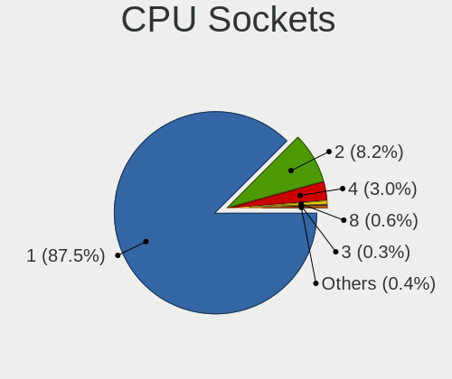

| Number | Computers | Percent |
|--------|-----------|---------|
| 1      | 4728      | 87.49%  |
| 2      | 445       | 8.23%   |
| 4      | 163       | 3.02%   |
| 8      | 33        | 0.61%   |
| 3      | 14        | 0.26%   |
| 6      | 9         | 0.17%   |
| 16     | 5         | 0.09%   |
| 12     | 4         | 0.07%   |
| 24     | 1         | 0.02%   |
| 10     | 1         | 0.02%   |
| 7      | 1         | 0.02%   |

CPU Threads
-----------

Threads per core (Hyper-Threading)

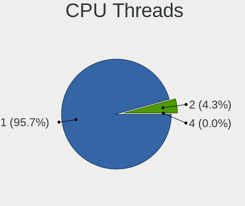

| Number | Computers | Percent |
|--------|-----------|---------|
| 1      | 5171      | 95.69%  |
| 2      | 231       | 4.27%   |
| 4      | 2         | 0.04%   |

CPU Op-Modes
------------

CPU Operation Modes (32-bit, 64-bit)

| Op mode        | Computers | Percent |
|----------------|-----------|---------|
| 32-bit, 64-bit | 5404      | 100%    |

CPU Microcode
-------------

Microcode number

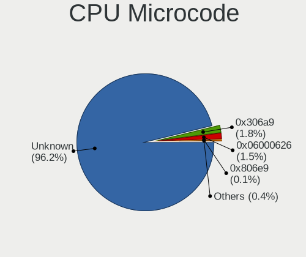

| Number     | Computers | Percent |
|------------|-----------|---------|
| Unknown    | 5197      | 96.17%  |
| 0x306a9    | 99        | 1.83%   |
| 0x06000626 | 81        | 1.5%    |
| 0x506e3    | 4         | 0.07%   |
| 0x806e9    | 3         | 0.06%   |
| 0x010000bf | 3         | 0.06%   |
| 0x306f2    | 2         | 0.04%   |
| 0x306c3    | 2         | 0.04%   |
| 0x206a7    | 2         | 0.04%   |
| 0x1067a    | 2         | 0.04%   |
| 0xa0655    | 1         | 0.02%   |
| 0x906ed    | 1         | 0.02%   |
| 0x906e9    | 1         | 0.02%   |
| 0x806ea    | 1         | 0.02%   |
| 0x706e5    | 1         | 0.02%   |
| 0x406c4    | 1         | 0.02%   |
| 0x306e4    | 1         | 0.02%   |
| 0x206c2    | 1         | 0.02%   |
| 0x106e5    | 1         | 0.02%   |

CPU Microarch
-------------

Microarchitecture

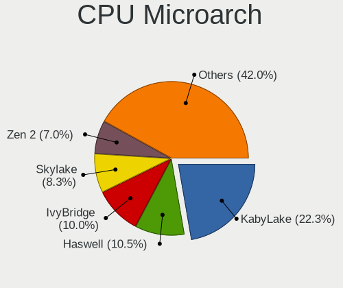

| Name          | Computers | Percent |
|---------------|-----------|---------|
| KabyLake      | 1204      | 22.28%  |
| Haswell       | 565       | 10.46%  |
| IvyBridge     | 541       | 10.01%  |
| Skylake       | 446       | 8.25%   |
| Zen 2         | 379       | 7.01%   |
| SandyBridge   | 362       | 6.7%    |
| Zen+          | 307       | 5.68%   |
| CometLake     | 200       | 3.7%    |
| Zen           | 170       | 3.15%   |
| Piledriver    | 134       | 2.48%   |
| Broadwell     | 132       | 2.44%   |
| K10           | 104       | 1.92%   |
| Westmere      | 91        | 1.68%   |
| IceLake       | 73        | 1.35%   |
| Penryn        | 68        | 1.26%   |
| TigerLake     | 65        | 1.2%    |
| Excavator     | 65        | 1.2%    |
| Nehalem       | 61        | 1.13%   |
| Zen 3         | 59        | 1.09%   |
| Silvermont    | 53        | 0.98%   |
| Steamroller   | 48        | 0.89%   |
| Unknown       | 46        | 0.85%   |
| Goldmont plus | 41        | 0.76%   |
| NetBurst      | 37        | 0.68%   |
| Core          | 31        | 0.57%   |
| Puma          | 28        | 0.52%   |
| Bulldozer     | 27        | 0.5%    |
| Goldmont      | 19        | 0.35%   |
| K8 Hammer     | 18        | 0.33%   |
| Jaguar        | 10        | 0.19%   |
| Bobcat        | 9         | 0.17%   |
| K10 Llano     | 7         | 0.13%   |
| K6            | 4         | 0.07%   |

Graphics
--------

GPU Vendor
----------

Vendors of graphics cards

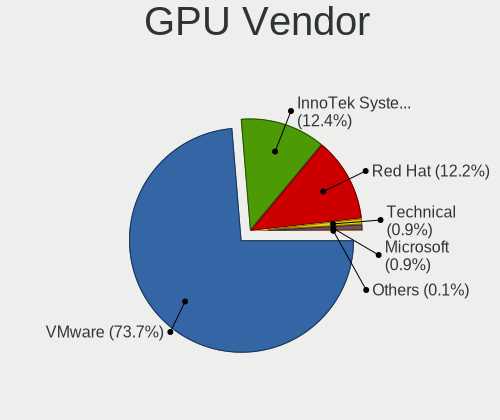

| Vendor                 | Computers | Percent |
|------------------------|-----------|---------|
| VMware                 | 3960      | 73.69%  |
| InnoTek Systemberatung | 664       | 12.36%  |
| Red Hat                | 654       | 12.17%  |
| Technical              | 46        | 0.86%   |
| Microsoft              | 46        | 0.86%   |
| Cirrus Logic           | 3         | 0.06%   |
| AMD                    | 1         | 0.02%   |

GPU Model
---------

Graphics card models

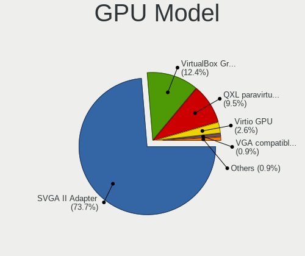

| Model                                              | Computers | Percent |
|----------------------------------------------------|-----------|---------|
| VMware SVGA II Adapter                             | 3960      | 73.69%  |
| InnoTek Systemberatung VirtualBox Graphics Adapter | 664       | 12.36%  |
| Red Hat QXL paravirtual graphic card               | 512       | 9.53%   |
| Red Hat Virtio GPU                                 | 142       | 2.64%   |
| Technical VGA compatible controller                | 46        | 0.86%   |
| Microsoft Hyper-V virtual VGA                      | 46        | 0.86%   |
| Cirrus Logic GD 5446                               | 3         | 0.06%   |
| AMD Cape Verde XT [Radeon HD 7770/8760 / R7 250X]  | 1         | 0.02%   |

GPU Combo
---------

Combinations of graphics cards

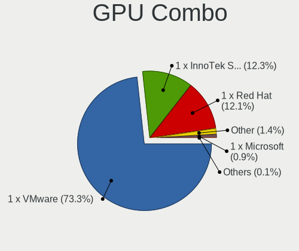

| Name                       | Computers | Percent |
|----------------------------|-----------|---------|
| 1 x VMware                 | 3960      | 73.28%  |
| 1 x InnoTek Systemberatung | 664       | 12.29%  |
| 1 x Red Hat                | 653       | 12.08%  |
| Other                      | 77        | 1.42%   |
| 1 x Microsoft              | 46        | 0.85%   |
| 1 x Cirrus Logic           | 3         | 0.06%   |
| AMD + Red Hat              | 1         | 0.02%   |

GPU Driver
----------

Free vs proprietary

| Driver  | Computers | Percent |
|---------|-----------|---------|
| Unknown | 5403      | 99.98%  |
| Free    | 1         | 0.02%   |

GPU Memory
----------

Total video memory

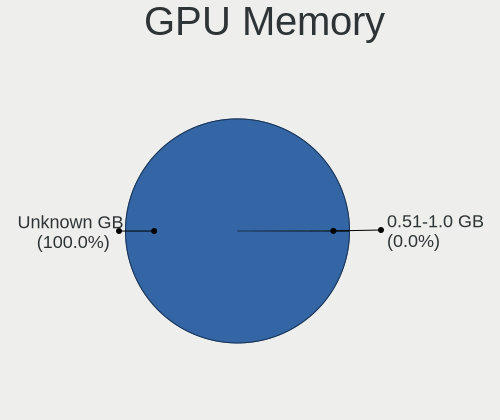

| Size in GB | Computers | Percent |
|------------|-----------|---------|
| Unknown    | 5403      | 99.98%  |
| 0.51-1.0   | 1         | 0.02%   |

Monitor
-------

Monitor Vendor
--------------

Monitor vendors

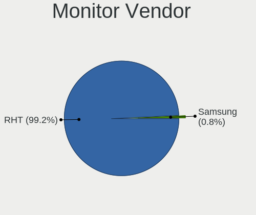

| Vendor              | Computers | Percent |
|---------------------|-----------|---------|
| RHT                 | 124       | 99.2%   |
| Samsung Electronics | 1         | 0.8%    |

Monitor Model
-------------

Monitor models

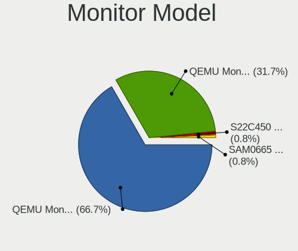

| Model                                                             | Computers | Percent |
|-------------------------------------------------------------------|-----------|---------|
| RHT QEMU Monitor RHT1234 2048x1152 260x190mm 12.7-inch            | 84        | 66.67%  |
| RHT QEMU Monitor RHT1234 2048x1152 260x195mm 12.8-inch            | 40        | 31.75%  |
| Samsung Electronics S22C450 SAM09F7 1920x1080 477x268mm 21.5-inch | 1         | 0.79%   |
| Samsung Electronics LCD Monitor SAM0665 1360x768                  | 1         | 0.79%   |

Monitor Resolution
------------------

Monitor screen resolution

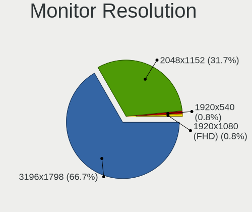

| Resolution      | Computers | Percent |
|-----------------|-----------|---------|
| 3196x1798       | 84        | 66.67%  |
| 2048x1152       | 40        | 31.75%  |
| 1920x540        | 1         | 0.79%   |
| 1920x1080 (FHD) | 1         | 0.79%   |

Monitor Diagonal
----------------

Diagonal size in inches

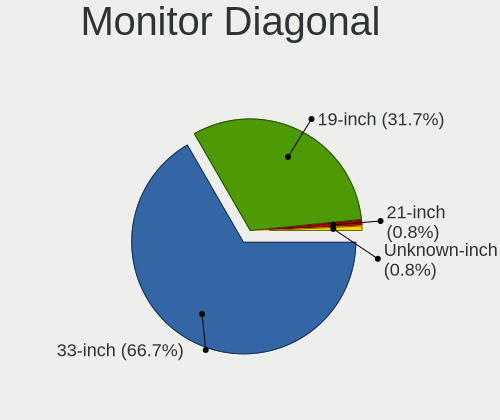

| Inches  | Computers | Percent |
|---------|-----------|---------|
| 33      | 84        | 66.67%  |
| 19      | 40        | 31.75%  |
| 21      | 1         | 0.79%   |
| Unknown | 1         | 0.79%   |

Monitor Width
-------------

Physical width

| Width in mm | Computers | Percent |
|-------------|-----------|---------|
| 701-800     | 84        | 66.67%  |
| 401-500     | 41        | 32.54%  |
| Unknown     | 1         | 0.79%   |

Aspect Ratio
------------

Proportional relationship between the width and the height

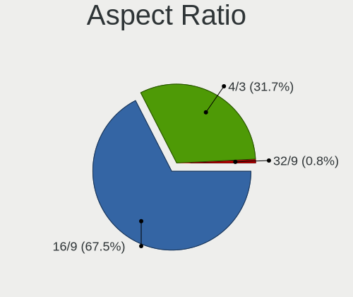

| Ratio | Computers | Percent |
|-------|-----------|---------|
| 16/9  | 85        | 67.46%  |
| 4/3   | 40        | 31.75%  |
| 32/9  | 1         | 0.79%   |

Monitor Area
------------

Area in inch²

| Area in inch² | Computers | Percent |
|----------------|-----------|---------|
| 351-500        | 84        | 66.67%  |
| 151-200        | 41        | 32.54%  |
| Unknown        | 1         | 0.79%   |

Pixel Density
-------------

Pixels per inch

| Density | Computers | Percent |
|---------|-----------|---------|
| 51-100  | 84        | 66.67%  |
| 101-120 | 41        | 32.54%  |
| Unknown | 1         | 0.79%   |

Multiple Monitors
-----------------

Total monitors connected

| Total | Computers | Percent |
|-------|-----------|---------|
| 1     | 4456      | 82.46%  |
| 0     | 947       | 17.52%  |
| 2     | 1         | 0.02%   |

Network
-------

Net Controller Vendor
---------------------

Controller vendors

| Vendor                          | Computers | Percent |
|---------------------------------|-----------|---------|
| Intel                           | 4131      | 78.06%  |
| AMD                             | 465       | 8.79%   |
| Realtek Semiconductor           | 281       | 5.31%   |
| Red Hat                         | 233       | 4.4%    |
| VMware                          | 179       | 3.38%   |
| Ralink Technology               | 1         | 0.02%   |
| Qualcomm Atheros Communications | 1         | 0.02%   |
| OPPO Electronics                | 1         | 0.02%   |

Net Controller Model
--------------------

Controller models

| Model                                                                                | Computers | Percent |
|--------------------------------------------------------------------------------------|-----------|---------|
| Intel 82540EM Gigabit Ethernet Controller                                            | 3768      | 71.17%  |
| AMD 79c970 [PCnet32 LANCE]                                                           | 465       | 8.78%   |
| Intel 82545EM Gigabit Ethernet Controller (Copper)                                   | 358       | 6.76%   |
| Realtek RTL-8100/8101L/8139 PCI Fast Ethernet Adapter                                | 280       | 5.29%   |
| Red Hat Virtio network device                                                        | 233       | 4.4%    |
| VMware VMXNET3 Ethernet Controller                                                   | 179       | 3.38%   |
| Intel 82574L Gigabit Network Connection                                              | 6         | 0.11%   |
| Realtek RTL88x2bu [AC1200 Techkey]                                                   | 1         | 0.02%   |
| Ralink RT2501/RT2573 Wireless Adapter                                                | 1         | 0.02%   |
| Qualcomm Atheros TP-Link TL-WN821N v3 / TL-WN822N v2 802.11n [Atheros AR7010+AR9287] | 1         | 0.02%   |
| OPPO CPH1819                                                                         | 1         | 0.02%   |
| Intel 82543GC Gigabit Ethernet Controller (Copper)                                   | 1         | 0.02%   |

Wireless Vendor
---------------

Wireless vendors

| Vendor                          | Computers | Percent |
|---------------------------------|-----------|---------|
| Realtek Semiconductor           | 1         | 33.33%  |
| Ralink Technology               | 1         | 33.33%  |
| Qualcomm Atheros Communications | 1         | 33.33%  |

Wireless Model
--------------

Wireless models

| Model                                                                                | Computers | Percent |
|--------------------------------------------------------------------------------------|-----------|---------|
| Realtek RTL88x2bu [AC1200 Techkey]                                                   | 1         | 33.33%  |
| Ralink RT2501/RT2573 Wireless Adapter                                                | 1         | 33.33%  |
| Qualcomm Atheros TP-Link TL-WN821N v3 / TL-WN822N v2 802.11n [Atheros AR7010+AR9287] | 1         | 33.33%  |

Ethernet Vendor
---------------

Ethernet vendors

| Vendor                | Computers | Percent |
|-----------------------|-----------|---------|
| Intel                 | 4131      | 81.7%   |
| AMD                   | 465       | 9.2%    |
| Realtek Semiconductor | 280       | 5.54%   |
| VMware                | 179       | 3.54%   |
| OPPO Electronics      | 1         | 0.02%   |

Ethernet Model
--------------

Ethernet models

| Model                                                 | Computers | Percent |
|-------------------------------------------------------|-----------|---------|
| Intel 82540EM Gigabit Ethernet Controller             | 3768      | 74.5%   |
| AMD 79c970 [PCnet32 LANCE]                            | 465       | 9.19%   |
| Intel 82545EM Gigabit Ethernet Controller (Copper)    | 358       | 7.08%   |
| Realtek RTL-8100/8101L/8139 PCI Fast Ethernet Adapter | 280       | 5.54%   |
| VMware VMXNET3 Ethernet Controller                    | 179       | 3.54%   |
| Intel 82574L Gigabit Network Connection               | 6         | 0.12%   |
| OPPO CPH1819                                          | 1         | 0.02%   |
| Intel 82543GC Gigabit Ethernet Controller (Copper)    | 1         | 0.02%   |

Net Controller Kind
-------------------

Ethernet, WiFi or modem

| Kind     | Computers | Percent |
|----------|-----------|---------|
| Ethernet | 5054      | 95.54%  |
| Unknown  | 233       | 4.4%    |
| WiFi     | 3         | 0.06%   |

Used Controller
---------------

Currently used network controller

| Kind     | Computers | Percent |
|----------|-----------|---------|
| Ethernet | 5046      | 99.98%  |
| WiFi     | 1         | 0.02%   |

NICs
----

Total network controllers on board

| Total | Computers | Percent |
|-------|-----------|---------|
| 1     | 5026      | 93.01%  |
| 0     | 350       | 6.48%   |
| 2     | 27        | 0.5%    |
| 4     | 1         | 0.02%   |

IPv6
----

IPv6 vs IPv4

| Used | Computers | Percent |
|------|-----------|---------|
| No   | 5261      | 97.35%  |
| Yes  | 143       | 2.65%   |

Bluetooth
---------

Bluetooth Vendor
----------------

Controller vendors

| Vendor                | Computers | Percent |
|-----------------------|-----------|---------|
| VMware                | 404       | 98.54%  |
| Microsoft             | 2         | 0.49%   |
| Intel                 | 2         | 0.49%   |
| Realtek Semiconductor | 1         | 0.24%   |
| Broadcom              | 1         | 0.24%   |

Bluetooth Model
---------------

Controller models

| Model                                        | Computers | Percent |
|----------------------------------------------|-----------|---------|
| VMware Virtual Bluetooth Adapter             | 404       | 98.54%  |
| Microsoft Wireless Transceiver for Bluetooth | 2         | 0.49%   |
| Realtek RTL8723A Bluetooth                   | 1         | 0.24%   |
| Intel Bluetooth wireless interface           | 1         | 0.24%   |
| Intel AX200 Bluetooth                        | 1         | 0.24%   |
| Broadcom BCM2045A0                           | 1         | 0.24%   |

Sound
-----

Sound Vendor
------------

Sound card vendors

| Vendor              | Computers | Percent |
|---------------------|-----------|---------|
| Intel               | 4240      | 81.87%  |
| Ensoniq             | 929       | 17.94%  |
| VMware              | 5         | 0.1%    |
| Logitech            | 2         | 0.04%   |
| GN Netcom           | 1         | 0.02%   |
| C-Media Electronics | 1         | 0.02%   |
| AMD                 | 1         | 0.02%   |

Sound Model
-----------

Sound card models

| Model                                                                      | Computers | Percent |
|----------------------------------------------------------------------------|-----------|---------|
| Intel 82801AA AC'97 Audio Controller                                       | 3525      | 68.06%  |
| Ensoniq ES1371/ES1373 / Creative Labs CT2518                               | 929       | 17.94%  |
| Intel 82801FB/FBM/FR/FW/FRW (ICH6 Family) High Definition Audio Controller | 532       | 10.27%  |
| Intel 82801I (ICH9 Family) HD Audio Controller                             | 151       | 2.92%   |
| Intel 82801BA/BAM AC'97 Audio Controller                                   | 32        | 0.62%   |
| VMware HD Audio Controller                                                 | 5         | 0.1%    |
| Logitech USB Headset                                                       | 1         | 0.02%   |
| Logitech H600 [Wireless Headset]                                           | 1         | 0.02%   |
| GN Netcom Jabra EVOLVE Link MS                                             | 1         | 0.02%   |
| C-Media Electronics USB Audio Device                                       | 1         | 0.02%   |
| AMD Oland/Hainan/Cape Verde/Pitcairn HDMI Audio [Radeon HD 7000 Series]    | 1         | 0.02%   |

Memory
------

Memory Vendor
-------------

Memory module vendors

| Vendor             | Computers | Percent |
|--------------------|-----------|---------|
| QEMU               | 658       | 35.15%  |
| Unknown            | 553       | 29.54%  |
| Unknown            | 523       | 27.94%  |
| Microsoft          | 77        | 4.11%   |
| VMware Virtual RAM | 51        | 2.72%   |
| Red Hat            | 10        | 0.53%   |

Memory Model
------------

Memory module models

| Model                                              | Computers | Percent |
|----------------------------------------------------|-----------|---------|
| Unknown                                            | 553       | 25.97%  |
| Unknown RAM Module 2GB DIMM DRAM                   | 477       | 22.4%   |
| QEMU RAM Module 2GB DIMM RAM                       | 226       | 10.62%  |
| QEMU RAM Module 4GB DIMM RAM                       | 112       | 5.26%   |
| Unknown RAM Module 256MB DIMM DRAM                 | 63        | 2.96%   |
| Unknown RAM Module 1GB DIMM DRAM                   | 61        | 2.87%   |
| Unknown RAM Module 128MB DIMM DRAM                 | 55        | 2.58%   |
| Microsoft RAM Module 3968MB                        | 52        | 2.44%   |
| Unknown RAM Module 512MB DIMM DRAM                 | 50        | 2.35%   |
| QEMU RAM Module 8GB DIMM RAM                       | 36        | 1.69%   |
| Microsoft RAM Module 128MB                         | 33        | 1.55%   |
| VMware Virtual RAM RAM VMW-8192MB 8GB DIMM DRAM    | 23        | 1.08%   |
| VMware Virtual RAM RAM VMW-4096MB 4GB DIMM DRAM    | 16        | 0.75%   |
| VMware Virtual RAM RAM VMW-2048MB 2GB DIMM DRAM    | 13        | 0.61%   |
| QEMU RAM Module 3GB DIMM RAM                       | 12        | 0.56%   |
| QEMU RAM Module 16GB DIMM RAM                      | 11        | 0.52%   |
| Microsoft RAM Module 2GB                           | 11        | 0.52%   |
| Microsoft RAM Module 4224MB                        | 9         | 0.42%   |
| QEMU RAM Module 6GB DIMM RAM                       | 8         | 0.38%   |
| QEMU RAM Module 1GB DIMM RAM                       | 8         | 0.38%   |
| Microsoft RAM Module 3GB                           | 8         | 0.38%   |
| QEMU RAM Module 4024MB DIMM RAM                    | 7         | 0.33%   |
| QEMU RAM Module 8196MB DIMM RAM                    | 5         | 0.23%   |
| QEMU RAM Module 5GB DIMM RAM                       | 5         | 0.23%   |
| VMware Virtual RAM RAM VMW-1024MB 1024MB DIMM DRAM | 4         | 0.19%   |
| QEMU RAM Module 8096MB DIMM RAM                    | 4         | 0.19%   |
| QEMU RAM Module 4080MB DIMM RAM                    | 4         | 0.19%   |
| Unknown RAM Module 2GB SODIMM DRAM 667MT/s         | 3         | 0.14%   |
| Red Hat RAM Module 4GB DIMM RAM                    | 3         | 0.14%   |
| Red Hat RAM Module 1GB DIMM RAM                    | 3         | 0.14%   |
| QEMU RAM Module 8169MB DIMM RAM                    | 3         | 0.14%   |
| QEMU RAM Module 4148MB DIMM RAM                    | 3         | 0.14%   |
| QEMU RAM Module 4134MB DIMM RAM                    | 3         | 0.14%   |
| QEMU RAM Module 4107MB DIMM RAM                    | 3         | 0.14%   |
| QEMU RAM Module 3049MB DIMM RAM                    | 3         | 0.14%   |
| QEMU RAM Module 10GB DIMM RAM                      | 3         | 0.14%   |
| VMware Virtual RAM RAM VMW-512MB 512MB DIMM DRAM   | 2         | 0.09%   |
| VMware Virtual RAM RAM VMW-16384MB 16GB DIMM DRAM  | 2         | 0.09%   |
| Red Hat RAM Module 2GB DIMM RAM                    | 2         | 0.09%   |
| QEMU RAM Module 8215MB DIMM RAM                    | 2         | 0.09%   |
| QEMU RAM Module 8024MB DIMM RAM                    | 2         | 0.09%   |
| QEMU RAM Module 8000MB DIMM RAM                    | 2         | 0.09%   |
| QEMU RAM Module 7616MB DIMM RAM                    | 2         | 0.09%   |
| QEMU RAM Module 6119MB DIMM RAM                    | 2         | 0.09%   |
| QEMU RAM Module 4608MB DIMM RAM                    | 2         | 0.09%   |
| QEMU RAM Module 4109MB DIMM RAM                    | 2         | 0.09%   |
| QEMU RAM Module 4108MB DIMM RAM                    | 2         | 0.09%   |
| QEMU RAM Module 4102MB DIMM RAM                    | 2         | 0.09%   |
| QEMU RAM Module 4070MB DIMM RAM                    | 2         | 0.09%   |
| QEMU RAM Module 4067MB DIMM RAM                    | 2         | 0.09%   |
| QEMU RAM Module 4064MB DIMM RAM                    | 2         | 0.09%   |
| QEMU RAM Module 4053MB DIMM RAM                    | 2         | 0.09%   |
| QEMU RAM Module 4049MB DIMM RAM                    | 2         | 0.09%   |
| QEMU RAM Module 4048MB DIMM RAM                    | 2         | 0.09%   |
| QEMU RAM Module 3776MB DIMM RAM                    | 2         | 0.09%   |
| QEMU RAM Module 3064MB DIMM RAM                    | 2         | 0.09%   |
| QEMU RAM Module 3056MB DIMM RAM                    | 2         | 0.09%   |
| QEMU RAM Module 3024MB DIMM RAM                    | 2         | 0.09%   |
| QEMU RAM Module 2688MB DIMM RAM                    | 2         | 0.09%   |
| QEMU RAM Module 2500MB DIMM RAM                    | 2         | 0.09%   |

Memory Kind
-----------

Memory module kinds

| Kind    | Computers | Percent |
|---------|-----------|---------|
| DRAM    | 1018      | 57.64%  |
| RAM     | 671       | 38%     |
| Unknown | 77        | 4.36%   |

Memory Form Factor
------------------

Physical design of the memory module

| Name    | Computers | Percent |
|---------|-----------|---------|
| DIMM    | 1684      | 95.36%  |
| Unknown | 77        | 4.36%   |
| SODIMM  | 5         | 0.28%   |

Memory Size
-----------

Memory module size

| Size  | Computers | Percent |
|-------|-----------|---------|
| 2048  | 746       | 32.29%  |
| 4096  | 474       | 20.52%  |
| 8192  | 175       | 7.58%   |
| 128   | 89        | 3.85%   |
| 1024  | 81        | 3.51%   |
| 256   | 64        | 2.77%   |
| 32    | 61        | 2.64%   |
| 512   | 55        | 2.38%   |
| 16384 | 54        | 2.34%   |
| 3968  | 52        | 2.25%   |
| 64    | 44        | 1.9%    |
| 16    | 43        | 1.86%   |
| 8     | 35        | 1.52%   |
| 4     | 33        | 1.43%   |
| 3072  | 20        | 0.87%   |
| 4224  | 9         | 0.39%   |
| 6144  | 8         | 0.35%   |
| 4024  | 7         | 0.3%    |
| 8196  | 5         | 0.22%   |
| 5120  | 5         | 0.22%   |
| 4080  | 5         | 0.22%   |
| 8096  | 4         | 0.17%   |
| 10240 | 3         | 0.13%   |
| 8169  | 3         | 0.13%   |
| 4148  | 3         | 0.13%   |
| 4134  | 3         | 0.13%   |
| 4107  | 3         | 0.13%   |
| 3049  | 3         | 0.13%   |
| 3024  | 3         | 0.13%   |
| 3000  | 3         | 0.13%   |
| 8320  | 2         | 0.09%   |
| 8215  | 2         | 0.09%   |
| 8024  | 2         | 0.09%   |
| 8000  | 2         | 0.09%   |
| 7616  | 2         | 0.09%   |
| 6119  | 2         | 0.09%   |
| 4608  | 2         | 0.09%   |
| 4109  | 2         | 0.09%   |
| 4108  | 2         | 0.09%   |
| 4102  | 2         | 0.09%   |
| 4070  | 2         | 0.09%   |
| 4067  | 2         | 0.09%   |
| 4064  | 2         | 0.09%   |
| 4053  | 2         | 0.09%   |
| 4049  | 2         | 0.09%   |
| 4048  | 2         | 0.09%   |
| 3776  | 2         | 0.09%   |
| 3064  | 2         | 0.09%   |
| 3056  | 2         | 0.09%   |
| 3048  | 2         | 0.09%   |
| 2688  | 2         | 0.09%   |
| 2500  | 2         | 0.09%   |
| 2096  | 2         | 0.09%   |
| 1824  | 2         | 0.09%   |
| 28032 | 1         | 0.04%   |
| 16347 | 1         | 0.04%   |
| 16000 | 1         | 0.04%   |
| 13938 | 1         | 0.04%   |
| 13881 | 1         | 0.04%   |
| 13000 | 1         | 0.04%   |

Memory Speed
------------

Memory module speed

| Speed   | Computers | Percent |
|---------|-----------|---------|
| Unknown | 1729      | 97.9%   |
| 667     | 37        | 2.1%    |

Printers & scanners
-------------------

Printer Vendor
--------------

Printer device vendors

| Vendor             | Computers | Percent |
|--------------------|-----------|---------|
| PARALLELS          | 27        | 77.14%  |
| Hewlett-Packard    | 4         | 11.43%  |
| Canon              | 2         | 5.71%   |
| Brother Industries | 2         | 5.71%   |

Printer Model
-------------

Printer device models

| Model                                                                                  | Computers | Percent |
|----------------------------------------------------------------------------------------|-----------|---------|
| PARALLELS Virtual Printer (/Users/jean/Parallels/OpenMandriva Lx 4.3.pvm/parallel.txt) | 27        | 77.14%  |
| HP OfficeJet Pro 69                                                                    | 1         | 2.86%   |
| HP LaserJet 2420                                                                       | 1         | 2.86%   |
| HP LaserJet 200 color M251n                                                            | 1         | 2.86%   |
| HP ENVY Photo 6200 series                                                              | 1         | 2.86%   |
| Canon PIXMA iP3600 Printer                                                             | 1         | 2.86%   |
| Canon LBP6020                                                                          | 1         | 2.86%   |
| Brother HL-5140 series                                                                 | 1         | 2.86%   |
| Brother DCP-T300                                                                       | 1         | 2.86%   |

Scanner Vendor
--------------

Scanner device vendors

| Vendor | Computers | Percent |
|--------|-----------|---------|
| Canon  | 2         | 100%    |

Scanner Model
-------------

Scanner device models

| Model                        | Computers | Percent |
|------------------------------|-----------|---------|
| Canon CanoScan LiDE 100      | 1         | 50%     |
| Canon CanoScan 9000F Mark II | 1         | 50%     |

Camera
------

Camera Vendor
-------------

Camera device vendors

| Vendor                 | Computers | Percent |
|------------------------|-----------|---------|
| VMware                 | 49        | 59.04%  |
| PARALLELS              | 24        | 28.92%  |
| Logitech               | 3         | 3.61%   |
| VirtualBox             | 2         | 2.41%   |
| IMC Networks           | 2         | 2.41%   |
| Realtek Semiconductor  | 1         | 1.2%    |
| AVerMedia Technologies | 1         | 1.2%    |
| Apple                  | 1         | 1.2%    |

Camera Model
------------

Camera device models

| Model                                 | Computers | Percent |
|---------------------------------------|-----------|---------|
| VMware Virtual USB Video Device       | 49        | 59.04%  |
| PARALLELS IRIScan Desk 5 Pro          | 24        | 28.92%  |
| Logitech HD Webcam C525               | 3         | 3.61%   |
| VirtualBox Webcam - Integrated Camera | 2         | 2.41%   |
| Realtek Integrated_Webcam_HD          | 1         | 1.2%    |
| IMC Networks USB2.0 UVC HD Webcam     | 1         | 1.2%    |
| IMC Networks Integrated Webcam        | 1         | 1.2%    |
| AVerMedia USB Device                  | 1         | 1.2%    |
| Apple iPhone 5/5C/5S/6/SE             | 1         | 1.2%    |

Security
--------

Fingerprint Vendor
------------------

Fingerprint sensor vendors

Zero info for selected period =(

Fingerprint Model
-----------------

Fingerprint sensor models

Zero info for selected period =(

Chipcard Vendor
---------------

Chipcard module vendors

| Vendor                | Computers | Percent |
|-----------------------|-----------|---------|
| Gemalto (was Gemplus) | 275       | 100%    |

Chipcard Model
--------------

Chipcard module models

| Model                               | Computers | Percent |
|-------------------------------------|-----------|---------|
| Gemalto (was Gemplus) GemPC433-Swap | 275       | 100%    |

Unsupported
-----------

Unsupported Devices
-------------------

Total unsupported devices on board

| Total | Computers | Percent |
|-------|-----------|---------|
| 0     | 4243      | 78.52%  |
| 1     | 1146      | 21.21%  |
| 2     | 15        | 0.28%   |

Unsupported Device Types
------------------------

Types of unsupported devices

| Type             | Computers | Percent |
|------------------|-----------|---------|
| Graphics card    | 866       | 73.64%  |
| Chipcard         | 272       | 23.13%  |
| Unassigned class | 36        | 3.06%   |
| Sound            | 1         | 0.09%   |
| Net/wireless     | 1         | 0.09%   |

