Pop!_OS - Tested Virtual Hardware & Statistics
----------------------------------------------

A project to collect tested virtual hardware configurations for Pop!_OS.

Anyone can contribute to this report by the [hw-probe](https://github.com/linuxhw/hw-probe) tool:

    sudo -E hw-probe -all -upload

Please contribute! Especially if your hardware is rare.

Contents
--------

* [ Test Cases ](#test-cases)

* [ System ](#system)
  - [ OS                       ](#os)
  - [ OS Family                ](#os-family)
  - [ Kernel                   ](#kernel)
  - [ Kernel Family            ](#kernel-family)
  - [ Kernel Major Ver.        ](#kernel-major-ver)
  - [ Arch                     ](#arch)
  - [ DE                       ](#de)
  - [ Display Server           ](#display-server)
  - [ Display Manager          ](#display-manager)
  - [ OS Lang                  ](#os-lang)
  - [ Boot Mode                ](#boot-mode)
  - [ Filesystem               ](#filesystem)
  - [ Part. scheme             ](#part-scheme)
  - [ Dual Boot with Linux/BSD ](#dual-boot-with-linuxbsd)
  - [ Dual Boot (Win)          ](#dual-boot-win)

* [ Board ](#board)
  - [ Vendor                   ](#vendor)
  - [ Model                    ](#model)
  - [ Model Family             ](#model-family)
  - [ MFG Year                 ](#mfg-year)
  - [ Form Factor              ](#form-factor)
  - [ Secure Boot              ](#secure-boot)
  - [ Coreboot                 ](#coreboot)
  - [ RAM Size                 ](#ram-size)
  - [ RAM Used                 ](#ram-used)
  - [ Total Drives             ](#total-drives)
  - [ Has CD-ROM               ](#has-cd-rom)
  - [ Has Ethernet             ](#has-ethernet)
  - [ Has WiFi                 ](#has-wifi)
  - [ Has Bluetooth            ](#has-bluetooth)

* [ Location ](#location)
  - [ Country                  ](#country)
  - [ City                     ](#city)

* [ Drives ](#drives)
  - [ Drive Vendor             ](#drive-vendor)
  - [ Drive Model              ](#drive-model)
  - [ HDD Vendor               ](#hdd-vendor)
  - [ SSD Vendor               ](#ssd-vendor)
  - [ Drive Kind               ](#drive-kind)
  - [ Drive Connector          ](#drive-connector)
  - [ Drive Size               ](#drive-size)
  - [ Space Total              ](#space-total)
  - [ Space Used               ](#space-used)
  - [ Malfunc. Drives          ](#malfunc-drives)
  - [ Malfunc. Drive Vendor    ](#malfunc-drive-vendor)
  - [ Malfunc. HDD Vendor      ](#malfunc-hdd-vendor)
  - [ Malfunc. Drive Kind      ](#malfunc-drive-kind)
  - [ Failed Drives            ](#failed-drives)
  - [ Failed Drive Vendor      ](#failed-drive-vendor)
  - [ Drive Status             ](#drive-status)

* [ Storage controller ](#storage-controller)
  - [ Storage Vendor           ](#storage-vendor)
  - [ Storage Model            ](#storage-model)
  - [ Storage Kind             ](#storage-kind)

* [ Processor ](#processor)
  - [ CPU Vendor               ](#cpu-vendor)
  - [ CPU Model                ](#cpu-model)
  - [ CPU Model Family         ](#cpu-model-family)
  - [ CPU Cores                ](#cpu-cores)
  - [ CPU Sockets              ](#cpu-sockets)
  - [ CPU Threads              ](#cpu-threads)
  - [ CPU Op-Modes             ](#cpu-op-modes)
  - [ CPU Microcode            ](#cpu-microcode)
  - [ CPU Microarch            ](#cpu-microarch)

* [ Graphics ](#graphics)
  - [ GPU Vendor               ](#gpu-vendor)
  - [ GPU Model                ](#gpu-model)
  - [ GPU Combo                ](#gpu-combo)
  - [ GPU Driver               ](#gpu-driver)
  - [ GPU Memory               ](#gpu-memory)

* [ Monitor ](#monitor)
  - [ Monitor Vendor           ](#monitor-vendor)
  - [ Monitor Model            ](#monitor-model)
  - [ Monitor Resolution       ](#monitor-resolution)
  - [ Monitor Diagonal         ](#monitor-diagonal)
  - [ Monitor Width            ](#monitor-width)
  - [ Aspect Ratio             ](#aspect-ratio)
  - [ Monitor Area             ](#monitor-area)
  - [ Pixel Density            ](#pixel-density)
  - [ Multiple Monitors        ](#multiple-monitors)

* [ Network ](#network)
  - [ Net Controller Vendor    ](#net-controller-vendor)
  - [ Net Controller Model     ](#net-controller-model)
  - [ Wireless Vendor          ](#wireless-vendor)
  - [ Wireless Model           ](#wireless-model)
  - [ Ethernet Vendor          ](#ethernet-vendor)
  - [ Ethernet Model           ](#ethernet-model)
  - [ Net Controller Kind      ](#net-controller-kind)
  - [ Used Controller          ](#used-controller)
  - [ NICs                     ](#nics)
  - [ IPv6                     ](#ipv6)

* [ Bluetooth ](#bluetooth)
  - [ Bluetooth Vendor         ](#bluetooth-vendor)
  - [ Bluetooth Model          ](#bluetooth-model)

* [ Sound ](#sound)
  - [ Sound Vendor             ](#sound-vendor)
  - [ Sound Model              ](#sound-model)

* [ Memory ](#memory)
  - [ Memory Vendor            ](#memory-vendor)
  - [ Memory Model             ](#memory-model)
  - [ Memory Kind              ](#memory-kind)
  - [ Memory Form Factor       ](#memory-form-factor)
  - [ Memory Size              ](#memory-size)
  - [ Memory Speed             ](#memory-speed)

* [ Printers & scanners ](#printers--scanners)
  - [ Printer Vendor           ](#printer-vendor)
  - [ Printer Model            ](#printer-model)
  - [ Scanner Vendor           ](#scanner-vendor)
  - [ Scanner Model            ](#scanner-model)

* [ Camera ](#camera)
  - [ Camera Vendor            ](#camera-vendor)
  - [ Camera Model             ](#camera-model)

* [ Security ](#security)
  - [ Fingerprint Vendor       ](#fingerprint-vendor)
  - [ Fingerprint Model        ](#fingerprint-model)
  - [ Chipcard Vendor          ](#chipcard-vendor)
  - [ Chipcard Model           ](#chipcard-model)

* [ Unsupported ](#unsupported)
  - [ Unsupported Devices      ](#unsupported-devices)
  - [ Unsupported Device Types ](#unsupported-device-types)

Test Cases
----------

Total: 94

| Vendor        | Model                       | Form-Factor     | Probe                                                      | Date         |
|---------------|-----------------------------|-----------------|------------------------------------------------------------|--------------|
| Oracle        | VirtualBox                  | Virtual machine | [67749a2201](https://linux-hardware.org/?probe=67749a2201) | Apr 11, 2022 |
| VMware        | VMware7,1                   | Virtual machine | [f1e9688851](https://linux-hardware.org/?probe=f1e9688851) | Apr 09, 2022 |
| QEMU          | Standard PC (i440FX + PI... | Virtual machine | [6bf6862a8c](https://linux-hardware.org/?probe=6bf6862a8c) | Mar 16, 2022 |
| Oracle        | VirtualBox                  | Virtual machine | [f034fb17ad](https://linux-hardware.org/?probe=f034fb17ad) | Feb 19, 2022 |
| VMware        | Virtual Platform            | Virtual machine | [e70817681d](https://linux-hardware.org/?probe=e70817681d) | Jan 31, 2022 |
| QEMU          | Standard PC (i440FX + PI... | Virtual machine | [cbf5deebfd](https://linux-hardware.org/?probe=cbf5deebfd) | Jan 11, 2022 |
| Oracle        | VirtualBox                  | Virtual machine | [efaca102af](https://linux-hardware.org/?probe=efaca102af) | Jan 11, 2022 |
| QEMU          | Standard PC (Q35 + ICH9,... | Virtual machine | [2383a980b6](https://linux-hardware.org/?probe=2383a980b6) | Dec 29, 2021 |
| QEMU          | Standard PC (Q35 + ICH9,... | Virtual machine | [68af4627ec](https://linux-hardware.org/?probe=68af4627ec) | Dec 10, 2021 |
| QEMU          | Standard PC (i440FX + PI... | Virtual machine | [a509b3c0a2](https://linux-hardware.org/?probe=a509b3c0a2) | Nov 25, 2021 |
| QEMU          | Standard PC (Q35 + ICH9,... | Virtual machine | [00e0e9728a](https://linux-hardware.org/?probe=00e0e9728a) | Nov 22, 2021 |
| QEMU          | Standard PC (i440FX + PI... | Virtual machine | [7f7b1bc66c](https://linux-hardware.org/?probe=7f7b1bc66c) | Nov 20, 2021 |
| QEMU          | Standard PC (Q35 + ICH9,... | Virtual machine | [a0b45aacf4](https://linux-hardware.org/?probe=a0b45aacf4) | Nov 15, 2021 |
| QEMU          | Standard PC (Q35 + ICH9,... | Virtual machine | [be3e01dd22](https://linux-hardware.org/?probe=be3e01dd22) | Nov 15, 2021 |
| VMware        | VMware7,1                   | Virtual machine | [0b3779fb69](https://linux-hardware.org/?probe=0b3779fb69) | Nov 14, 2021 |
| Oracle        | VirtualBox                  | Virtual machine | [c02ee6063e](https://linux-hardware.org/?probe=c02ee6063e) | Nov 11, 2021 |
| Oracle        | VirtualBox                  | Virtual machine | [a01de72e74](https://linux-hardware.org/?probe=a01de72e74) | Nov 11, 2021 |
| QEMU          | Standard PC (Q35 + ICH9,... | Virtual machine | [883a45a2f0](https://linux-hardware.org/?probe=883a45a2f0) | Nov 11, 2021 |
| VMware        | Virtual Platform            | Virtual machine | [8614483925](https://linux-hardware.org/?probe=8614483925) | Nov 08, 2021 |
| VMware        | Virtual Platform            | Virtual machine | [9630fe8f32](https://linux-hardware.org/?probe=9630fe8f32) | Oct 24, 2021 |
| QEMU          | Standard PC (Q35 + ICH9,... | Virtual machine | [6fe50391eb](https://linux-hardware.org/?probe=6fe50391eb) | Sep 28, 2021 |
| QEMU          | Standard PC (i440FX + PI... | Virtual machine | [60dfd679be](https://linux-hardware.org/?probe=60dfd679be) | Sep 28, 2021 |
| Oracle        | VirtualBox                  | Virtual machine | [327650caa4](https://linux-hardware.org/?probe=327650caa4) | Sep 28, 2021 |
| Oracle        | VirtualBox                  | Virtual machine | [b46a5abc46](https://linux-hardware.org/?probe=b46a5abc46) | Sep 15, 2021 |
| Oracle        | VirtualBox                  | Virtual machine | [fd00656ffc](https://linux-hardware.org/?probe=fd00656ffc) | Sep 13, 2021 |
| QEMU          | Standard PC (Q35 + ICH9,... | Virtual machine | [e50f85675b](https://linux-hardware.org/?probe=e50f85675b) | Sep 11, 2021 |
| VMware        | Virtual Platform            | Virtual machine | [7e94402535](https://linux-hardware.org/?probe=7e94402535) | Aug 26, 2021 |
| Oracle        | VirtualBox                  | Virtual machine | [bacfc7029d](https://linux-hardware.org/?probe=bacfc7029d) | Aug 24, 2021 |
| QEMU          | Standard PC (i440FX + PI... | Virtual machine | [b4ff59c3d8](https://linux-hardware.org/?probe=b4ff59c3d8) | Aug 19, 2021 |
| QEMU          | Standard PC (Q35 + ICH9,... | Virtual machine | [a6dcf85f82](https://linux-hardware.org/?probe=a6dcf85f82) | Aug 10, 2021 |
| Oracle        | VirtualBox                  | Virtual machine | [144a3c613f](https://linux-hardware.org/?probe=144a3c613f) | Jul 28, 2021 |
| Oracle        | VirtualBox                  | Virtual machine | [020e1d170c](https://linux-hardware.org/?probe=020e1d170c) | Jul 21, 2021 |
| VMware        | Virtual Platform            | Virtual machine | [75778d0791](https://linux-hardware.org/?probe=75778d0791) | Jul 19, 2021 |
| Oracle        | VirtualBox                  | Virtual machine | [14298b9494](https://linux-hardware.org/?probe=14298b9494) | Jul 19, 2021 |
| VMware        | Virtual Platform            | Virtual machine | [cde1f1bf24](https://linux-hardware.org/?probe=cde1f1bf24) | Jul 19, 2021 |
| VMware        | Virtual Platform            | Virtual machine | [37d3ea0249](https://linux-hardware.org/?probe=37d3ea0249) | Jul 19, 2021 |
| QEMU          | Standard PC (Q35 + ICH9,... | Virtual machine | [a07e8d1a9e](https://linux-hardware.org/?probe=a07e8d1a9e) | Jul 18, 2021 |
| QEMU          | Standard PC (Q35 + ICH9,... | Virtual machine | [ffb342e804](https://linux-hardware.org/?probe=ffb342e804) | Jul 08, 2021 |
| QEMU          | Standard PC (Q35 + ICH9,... | Virtual machine | [29c73198ea](https://linux-hardware.org/?probe=29c73198ea) | Jul 08, 2021 |
| QEMU          | Standard PC (Q35 + ICH9,... | Virtual machine | [1dd93383e2](https://linux-hardware.org/?probe=1dd93383e2) | Jul 03, 2021 |
| QEMU          | Standard PC (Q35 + ICH9,... | Virtual machine | [ac74e69830](https://linux-hardware.org/?probe=ac74e69830) | Jul 03, 2021 |
| Oracle        | VirtualBox                  | Virtual machine | [a6e96b7dea](https://linux-hardware.org/?probe=a6e96b7dea) | Jun 19, 2021 |
| VMware        | Virtual Platform            | Virtual machine | [be8cd1a99c](https://linux-hardware.org/?probe=be8cd1a99c) | Jun 10, 2021 |
| QEMU          | Standard PC (Q35 + ICH9,... | Virtual machine | [14906d0c29](https://linux-hardware.org/?probe=14906d0c29) | Jun 06, 2021 |
| QEMU          | Standard PC (Q35 + ICH9,... | Virtual machine | [9653bc2256](https://linux-hardware.org/?probe=9653bc2256) | Jun 04, 2021 |
| VMware        | Virtual Platform            | Virtual machine | [4cf13f3113](https://linux-hardware.org/?probe=4cf13f3113) | Apr 23, 2021 |
| VMware        | Virtual Platform            | Virtual machine | [32a2bbbbce](https://linux-hardware.org/?probe=32a2bbbbce) | Apr 23, 2021 |
| VMware        | VMware7,1                   | Virtual machine | [1ca97de3d0](https://linux-hardware.org/?probe=1ca97de3d0) | Apr 08, 2021 |
| QEMU          | Standard PC (i440FX + PI... | Virtual machine | [a3f4b974a9](https://linux-hardware.org/?probe=a3f4b974a9) | Mar 28, 2021 |
| Oracle        | VirtualBox                  | Virtual machine | [41d1b3add5](https://linux-hardware.org/?probe=41d1b3add5) | Mar 10, 2021 |
| Oracle        | VirtualBox                  | Virtual machine | [95c839b32c](https://linux-hardware.org/?probe=95c839b32c) | Mar 08, 2021 |
| VMware        | Virtual Platform            | Virtual machine | [4461a2d9e9](https://linux-hardware.org/?probe=4461a2d9e9) | Feb 26, 2021 |
| QEMU          | Standard PC (i440FX + PI... | Virtual machine | [f859f26b47](https://linux-hardware.org/?probe=f859f26b47) | Feb 17, 2021 |
| Microsoft     | Virtual Machine             | Virtual machine | [eb4775310e](https://linux-hardware.org/?probe=eb4775310e) | Feb 10, 2021 |
| Oracle        | VirtualBox                  | Virtual machine | [2f4d72258d](https://linux-hardware.org/?probe=2f4d72258d) | Jan 31, 2021 |
| VMware        | Virtual Platform            | Virtual machine | [2bce202a23](https://linux-hardware.org/?probe=2bce202a23) | Jan 26, 2021 |
| VMware        | Virtual Platform            | Virtual machine | [5f54857d48](https://linux-hardware.org/?probe=5f54857d48) | Jan 23, 2021 |
| VMware        | Virtual Platform            | Virtual machine | [ede4c48329](https://linux-hardware.org/?probe=ede4c48329) | Jan 20, 2021 |
| VMware        | Virtual Platform            | Virtual machine | [4d3ee350d4](https://linux-hardware.org/?probe=4d3ee350d4) | Jan 09, 2021 |
| Oracle        | VirtualBox                  | Virtual machine | [4f1dde4a9f](https://linux-hardware.org/?probe=4f1dde4a9f) | Jan 08, 2021 |
| QEMU          | Standard PC (Q35 + ICH9,... | Virtual machine | [ed96cda9f9](https://linux-hardware.org/?probe=ed96cda9f9) | Dec 27, 2020 |
| QEMU          | Standard PC (Q35 + ICH9,... | Virtual machine | [58e2259dba](https://linux-hardware.org/?probe=58e2259dba) | Dec 27, 2020 |
| Oracle        | VirtualBox                  | Virtual machine | [65b7bc60a7](https://linux-hardware.org/?probe=65b7bc60a7) | Dec 09, 2020 |
| QEMU          | Standard PC (Q35 + ICH9,... | Virtual machine | [9e00a76112](https://linux-hardware.org/?probe=9e00a76112) | Dec 08, 2020 |
| VMware        | Virtual Platform            | Virtual machine | [7c28af8598](https://linux-hardware.org/?probe=7c28af8598) | Nov 23, 2020 |
| VMware        | Virtual Platform            | Virtual machine | [2ae00a7c75](https://linux-hardware.org/?probe=2ae00a7c75) | Nov 20, 2020 |
| VMware        | Virtual Platform            | Virtual machine | [511948cfc8](https://linux-hardware.org/?probe=511948cfc8) | Nov 14, 2020 |
| QEMU          | Standard PC (i440FX + PI... | Virtual machine | [bd09b57bae](https://linux-hardware.org/?probe=bd09b57bae) | Nov 02, 2020 |
| Oracle        | VirtualBox                  | Virtual machine | [b0affa948d](https://linux-hardware.org/?probe=b0affa948d) | Oct 26, 2020 |
| Oracle        | VirtualBox                  | Virtual machine | [a0f50690e9](https://linux-hardware.org/?probe=a0f50690e9) | Oct 25, 2020 |
| Oracle        | VirtualBox                  | Virtual machine | [44f7631af5](https://linux-hardware.org/?probe=44f7631af5) | Oct 24, 2020 |
| Parallels ... | Parallels Virtual Platfo... | Virtual machine | [03caff923e](https://linux-hardware.org/?probe=03caff923e) | Aug 02, 2020 |
| QEMU          | Standard PC (Q35 + ICH9,... | Virtual machine | [67815a0564](https://linux-hardware.org/?probe=67815a0564) | Jul 28, 2020 |
| Oracle        | VirtualBox                  | Virtual machine | [61f4d66fb5](https://linux-hardware.org/?probe=61f4d66fb5) | Jul 24, 2020 |
| VMware        | Virtual Platform            | Virtual machine | [b906c307ec](https://linux-hardware.org/?probe=b906c307ec) | Jul 11, 2020 |
| QEMU          | Standard PC (Q35 + ICH9,... | Virtual machine | [ab531cdc95](https://linux-hardware.org/?probe=ab531cdc95) | Jul 09, 2020 |
| QEMU          | Standard PC (Q35 + ICH9,... | Virtual machine | [5b9bc0f62f](https://linux-hardware.org/?probe=5b9bc0f62f) | Jul 08, 2020 |
| Oracle        | VirtualBox                  | Virtual machine | [9b61875469](https://linux-hardware.org/?probe=9b61875469) | Jun 14, 2020 |
| Oracle        | VirtualBox                  | Virtual machine | [2438535def](https://linux-hardware.org/?probe=2438535def) | Jun 09, 2020 |
| VMware        | Virtual Platform            | Virtual machine | [0c59f47963](https://linux-hardware.org/?probe=0c59f47963) | Jun 08, 2020 |
| Oracle        | VirtualBox                  | Virtual machine | [be3244c1ab](https://linux-hardware.org/?probe=be3244c1ab) | Jun 05, 2020 |
| Oracle        | VirtualBox                  | Virtual machine | [34b4511e2e](https://linux-hardware.org/?probe=34b4511e2e) | May 24, 2020 |
| Parallels ... | Parallels Virtual Platfo... | Virtual machine | [42c2e471eb](https://linux-hardware.org/?probe=42c2e471eb) | May 22, 2020 |
| Parallels ... | Parallels Virtual Platfo... | Virtual machine | [599cabb246](https://linux-hardware.org/?probe=599cabb246) | May 22, 2020 |
| VMware        | Virtual Platform            | Virtual machine | [b96e55c3da](https://linux-hardware.org/?probe=b96e55c3da) | May 22, 2020 |
| Oracle        | VirtualBox                  | Virtual machine | [99df5a4702](https://linux-hardware.org/?probe=99df5a4702) | May 17, 2020 |
| VMware        | Virtual Platform            | Virtual machine | [17109f75a9](https://linux-hardware.org/?probe=17109f75a9) | May 12, 2020 |
| VMware        | Virtual Platform            | Virtual machine | [931634adc0](https://linux-hardware.org/?probe=931634adc0) | May 10, 2020 |
| VMware        | VMware7,1                   | Virtual machine | [9ebe0905de](https://linux-hardware.org/?probe=9ebe0905de) | May 04, 2020 |
| Oracle        | VirtualBox                  | Virtual machine | [eba05dfc6d](https://linux-hardware.org/?probe=eba05dfc6d) | Apr 18, 2020 |
| Oracle        | VirtualBox                  | Virtual machine | [bd1de39d95](https://linux-hardware.org/?probe=bd1de39d95) | Apr 18, 2020 |
| Oracle        | VirtualBox                  | Virtual machine | [2cd75a3056](https://linux-hardware.org/?probe=2cd75a3056) | Apr 18, 2020 |
| Oracle        | VirtualBox                  | Virtual machine | [6de01dc3e4](https://linux-hardware.org/?probe=6de01dc3e4) | Jan 05, 2020 |
| Oracle        | VirtualBox                  | Virtual machine | [0978a922ac](https://linux-hardware.org/?probe=0978a922ac) | Sep 06, 2019 |

System
------

OS
--

Installed operating systems

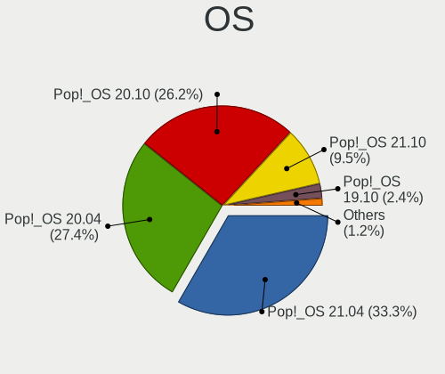

| Name          | Computers | Percent |
|---------------|-----------|---------|
| Pop!_OS 21.04 | 28        | 33.33%  |
| Pop!_OS 20.04 | 23        | 27.38%  |
| Pop!_OS 20.10 | 22        | 26.19%  |
| Pop!_OS 21.10 | 8         | 9.52%   |
| Pop!_OS 19.10 | 2         | 2.38%   |
| Pop!_OS 19.04 | 1         | 1.19%   |

OS Family
---------

OS without a version

| Name    | Computers | Percent |
|---------|-----------|---------|
| Pop!_OS | 83        | 100%    |

Kernel
------

Version of the Linux kernel

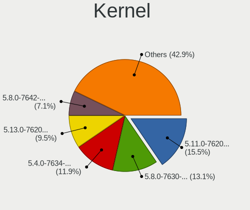

| Version                  | Computers | Percent |
|--------------------------|-----------|---------|
| 5.11.0-7620-generic      | 13        | 15.48%  |
| 5.8.0-7630-generic       | 11        | 13.1%   |
| 5.4.0-7634-generic       | 10        | 11.9%   |
| 5.13.0-7620-generic      | 8         | 9.52%   |
| 5.8.0-7642-generic       | 6         | 7.14%   |
| 5.13.0-7614-generic      | 4         | 4.76%   |
| 5.11.0-7614-generic      | 4         | 4.76%   |
| 5.8.0-7625-generic       | 3         | 3.57%   |
| 5.4.0-7626-generic       | 3         | 3.57%   |
| 5.4.0-7629-generic       | 2         | 2.38%   |
| 5.4.0-7625-generic       | 2         | 2.38%   |
| 5.16.15-76051615-generic | 2         | 2.38%   |
| 5.15.8-76051508-generic  | 2         | 2.38%   |
| 5.15.5-76051505-generic  | 2         | 2.38%   |
| 5.11.0-7633-generic      | 2         | 2.38%   |
| 5.11.0-7612-generic      | 2         | 2.38%   |
| 5.4.0-7642-generic       | 1         | 1.19%   |
| 5.4.0-7624-generic       | 1         | 1.19%   |
| 5.3.0-7648-generic       | 1         | 1.19%   |
| 5.3.0-7625-generic       | 1         | 1.19%   |
| 5.15.23-76051523-generic | 1         | 1.19%   |
| 5.15.15-76051515-generic | 1         | 1.19%   |
| 5.15.11-76051511-generic | 1         | 1.19%   |
| 5.0.0-21-generic         | 1         | 1.19%   |

Kernel Family
-------------

Linux kernel without a distro release

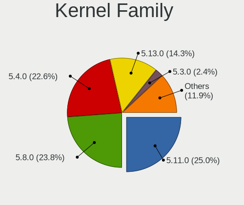

| Version | Computers | Percent |
|---------|-----------|---------|
| 5.11.0  | 21        | 25%     |
| 5.8.0   | 20        | 23.81%  |
| 5.4.0   | 19        | 22.62%  |
| 5.13.0  | 12        | 14.29%  |
| 5.3.0   | 2         | 2.38%   |
| 5.16.15 | 2         | 2.38%   |
| 5.15.8  | 2         | 2.38%   |
| 5.15.5  | 2         | 2.38%   |
| 5.15.23 | 1         | 1.19%   |
| 5.15.15 | 1         | 1.19%   |
| 5.15.11 | 1         | 1.19%   |
| 5.0.0   | 1         | 1.19%   |

Kernel Major Ver.
-----------------

Linux kernel major version

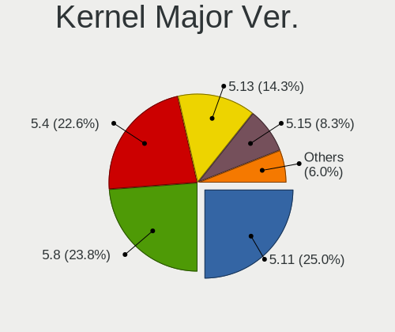

| Version | Computers | Percent |
|---------|-----------|---------|
| 5.11    | 21        | 25%     |
| 5.8     | 20        | 23.81%  |
| 5.4     | 19        | 22.62%  |
| 5.13    | 12        | 14.29%  |
| 5.15    | 7         | 8.33%   |
| 5.3     | 2         | 2.38%   |
| 5.16    | 2         | 2.38%   |
| 5.0     | 1         | 1.19%   |

Arch
----

OS architecture (x86_64, i586, etc.)

| Name   | Computers | Percent |
|--------|-----------|---------|
| x86_64 | 83        | 100%    |

DE
--

Desktop Environment

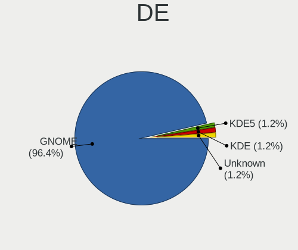

| Name    | Computers | Percent |
|---------|-----------|---------|
| GNOME   | 80        | 96.39%  |
| KDE5    | 1         | 1.2%    |
| KDE     | 1         | 1.2%    |
| Unknown | 1         | 1.2%    |

Display Server
--------------

X11 or Wayland

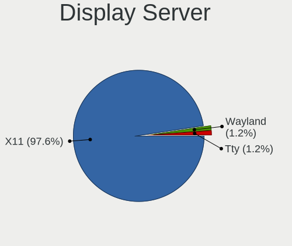

| Name    | Computers | Percent |
|---------|-----------|---------|
| X11     | 81        | 97.59%  |
| Wayland | 1         | 1.2%    |
| Tty     | 1         | 1.2%    |

Display Manager
---------------

SDDM, LightDM, etc.

| Name    | Computers | Percent |
|---------|-----------|---------|
| Unknown | 77        | 92.77%  |
| GDM     | 5         | 6.02%   |
| SDDM    | 1         | 1.2%    |

OS Lang
-------

Language

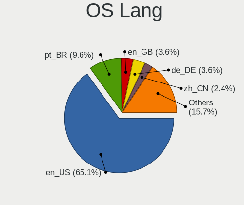

| Lang    | Computers | Percent |
|---------|-----------|---------|
| en_US   | 54        | 65.06%  |
| pt_BR   | 8         | 9.64%   |
| en_GB   | 3         | 3.61%   |
| de_DE   | 3         | 3.61%   |
| zh_CN   | 2         | 2.41%   |
| ru_RU   | 2         | 2.41%   |
| pt_PT   | 2         | 2.41%   |
| it_IT   | 2         | 2.41%   |
| sv_SE   | 1         | 1.2%    |
| sk_SK   | 1         | 1.2%    |
| pl_PL   | 1         | 1.2%    |
| nb_NO   | 1         | 1.2%    |
| gl_ES   | 1         | 1.2%    |
| en_AU   | 1         | 1.2%    |
| Unknown | 1         | 1.2%    |

Boot Mode
---------

EFI or BIOS

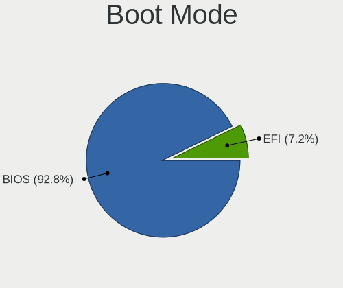

| Mode | Computers | Percent |
|------|-----------|---------|
| BIOS | 77        | 92.77%  |
| EFI  | 6         | 7.23%   |

Filesystem
----------

Type of filesystem

| Type | Computers | Percent |
|------|-----------|---------|
| Ext4 | 82        | 98.8%   |
| Xfs  | 1         | 1.2%    |

Part. scheme
------------

Scheme of partitioning

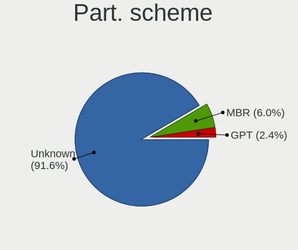

| Type    | Computers | Percent |
|---------|-----------|---------|
| Unknown | 76        | 91.57%  |
| MBR     | 5         | 6.02%   |
| GPT     | 2         | 2.41%   |

Dual Boot with Linux/BSD
------------------------

Hosting more than one Linux/BSD

| Dual boot | Computers | Percent |
|-----------|-----------|---------|
| No        | 83        | 100%    |

Dual Boot (Win)
---------------

Hosting Linux and Windows

| Dual boot | Computers | Percent |
|-----------|-----------|---------|
| No        | 83        | 100%    |

Board
-----

Vendor
------

Motherboard manufacturer

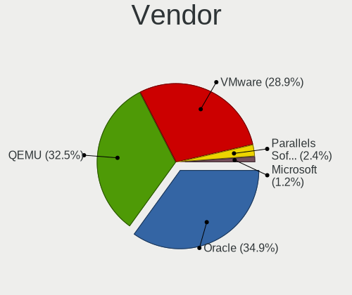

| Name                             | Computers | Percent |
|----------------------------------|-----------|---------|
| Oracle                           | 29        | 34.94%  |
| QEMU                             | 27        | 32.53%  |
| VMware                           | 24        | 28.92%  |
| Parallels Software International | 2         | 2.41%   |
| Microsoft                        | 1         | 1.2%    |

Model
-----

Motherboard model

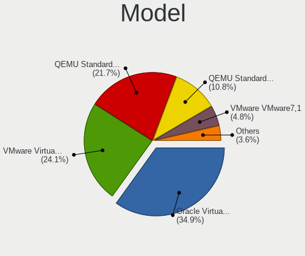

| Name                                                        | Computers | Percent |
|-------------------------------------------------------------|-----------|---------|
| Oracle VirtualBox                                           | 29        | 34.94%  |
| VMware Virtual Platform                                     | 20        | 24.1%   |
| QEMU Standard PC (Q35 + ICH9, 2009)                         | 18        | 21.69%  |
| QEMU Standard PC (i440FX + PIIX, 1996)                      | 9         | 10.84%  |
| VMware VMware7,1                                            | 4         | 4.82%   |
| Parallels Software International Parallels Virtual Platform | 2         | 2.41%   |
| Microsoft Virtual Machine                                   | 1         | 1.2%    |

Model Family
------------

Motherboard model prefix

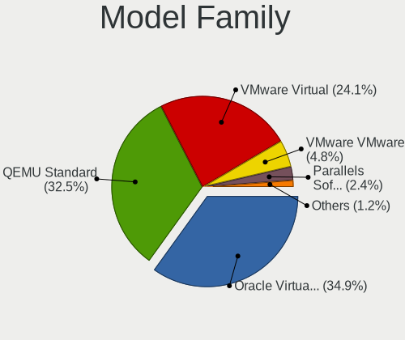

| Name                                       | Computers | Percent |
|--------------------------------------------|-----------|---------|
| Oracle VirtualBox                          | 29        | 34.94%  |
| QEMU Standard                              | 27        | 32.53%  |
| VMware Virtual                             | 20        | 24.1%   |
| VMware VMware7                             | 4         | 4.82%   |
| Parallels Software International Parallels | 2         | 2.41%   |
| Microsoft Virtual                          | 1         | 1.2%    |

MFG Year
--------

Motherboard manufacture year

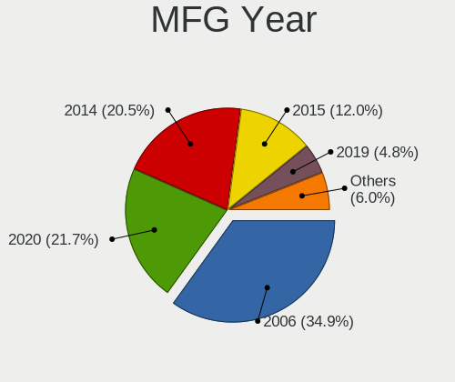

| Year | Computers | Percent |
|------|-----------|---------|
| 2006 | 29        | 34.94%  |
| 2020 | 18        | 21.69%  |
| 2014 | 17        | 20.48%  |
| 2015 | 10        | 12.05%  |
| 2019 | 4         | 4.82%   |
| 2021 | 2         | 2.41%   |
| 2018 | 2         | 2.41%   |
| 2017 | 1         | 1.2%    |

Form Factor
-----------

Physical design of the computer

| Name            | Computers | Percent |
|-----------------|-----------|---------|
| Virtual machine | 83        | 100%    |

Secure Boot
-----------

Enabled or disabled

| State    | Computers | Percent |
|----------|-----------|---------|
| Disabled | 83        | 100%    |

Coreboot
--------

Have coreboot on board

| Used | Computers | Percent |
|------|-----------|---------|
| No   | 83        | 100%    |

RAM Size
--------

Total RAM memory

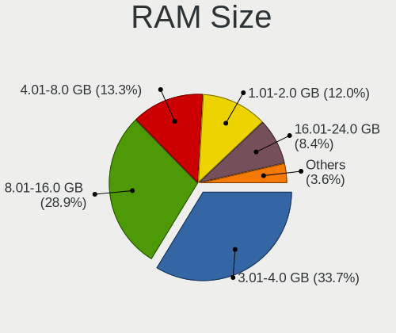

| Size in GB | Computers | Percent |
|------------|-----------|---------|
| 3.01-4.0   | 28        | 33.73%  |
| 8.01-16.0  | 24        | 28.92%  |
| 4.01-8.0   | 11        | 13.25%  |
| 1.01-2.0   | 10        | 12.05%  |
| 16.01-24.0 | 7         | 8.43%   |
| 2.01-3.0   | 2         | 2.41%   |
| 32.01-64.0 | 1         | 1.2%    |

RAM Used
--------

Used RAM memory

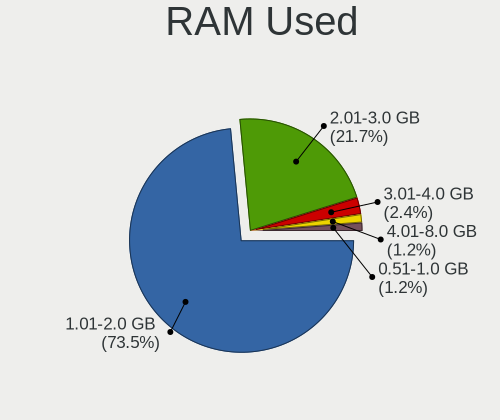

| Used GB  | Computers | Percent |
|----------|-----------|---------|
| 1.01-2.0 | 61        | 73.49%  |
| 2.01-3.0 | 18        | 21.69%  |
| 3.01-4.0 | 2         | 2.41%   |
| 4.01-8.0 | 1         | 1.2%    |
| 0.51-1.0 | 1         | 1.2%    |

Total Drives
------------

Number of drives on board

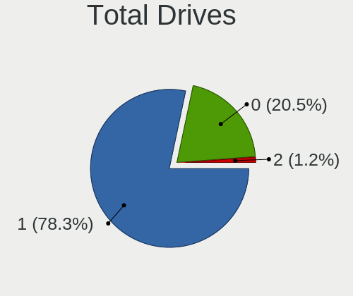

| Drives | Computers | Percent |
|--------|-----------|---------|
| 1      | 65        | 78.31%  |
| 0      | 17        | 20.48%  |
| 2      | 1         | 1.2%    |

Has CD-ROM
----------

Has CD-ROM on board

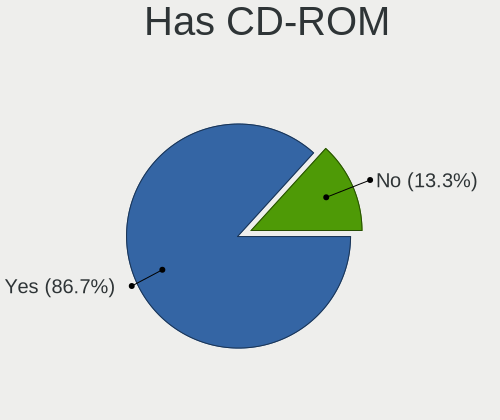

| Presented | Computers | Percent |
|-----------|-----------|---------|
| Yes       | 72        | 86.75%  |
| No        | 11        | 13.25%  |

Has Ethernet
------------

Has Ethernet on board

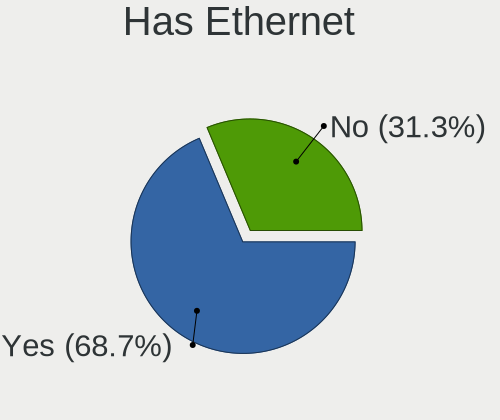

| Presented | Computers | Percent |
|-----------|-----------|---------|
| Yes       | 57        | 68.67%  |
| No        | 26        | 31.33%  |

Has WiFi
--------

Has WiFi module

| Presented | Computers | Percent |
|-----------|-----------|---------|
| No        | 78        | 93.98%  |
| Yes       | 5         | 6.02%   |

Has Bluetooth
-------------

Has Bluetooth module

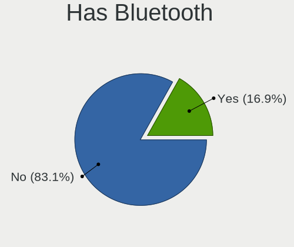

| Presented | Computers | Percent |
|-----------|-----------|---------|
| No        | 69        | 83.13%  |
| Yes       | 14        | 16.87%  |

Location
--------

Country
-------

Geographic location (country)

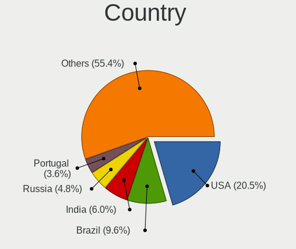

| Country      | Computers | Percent |
|--------------|-----------|---------|
| USA          | 17        | 20.48%  |
| Brazil       | 8         | 9.64%   |
| India        | 5         | 6.02%   |
| Russia       | 4         | 4.82%   |
| Portugal     | 3         | 3.61%   |
| Poland       | 3         | 3.61%   |
| Germany      | 3         | 3.61%   |
| Australia    | 3         | 3.61%   |
| Ukraine      | 2         | 2.41%   |
| UK           | 2         | 2.41%   |
| Sweden       | 2         | 2.41%   |
| South Africa | 2         | 2.41%   |
| Netherlands  | 2         | 2.41%   |
| Italy        | 2         | 2.41%   |
| Greece       | 2         | 2.41%   |
| China        | 2         | 2.41%   |
| Canada       | 2         | 2.41%   |
| Vietnam      | 1         | 1.2%    |
| Turkey       | 1         | 1.2%    |
| Taiwan       | 1         | 1.2%    |
| Sri Lanka    | 1         | 1.2%    |
| Spain        | 1         | 1.2%    |
| Slovakia     | 1         | 1.2%    |
| Serbia       | 1         | 1.2%    |
| Saudi Arabia | 1         | 1.2%    |
| Romania      | 1         | 1.2%    |
| Philippines  | 1         | 1.2%    |
| Pakistan     | 1         | 1.2%    |
| Norway       | 1         | 1.2%    |
| Mexico       | 1         | 1.2%    |
| Israel       | 1         | 1.2%    |
| Finland      | 1         | 1.2%    |
| Denmark      | 1         | 1.2%    |
| Czechia      | 1         | 1.2%    |
| Austria      | 1         | 1.2%    |
| Argentina    | 1         | 1.2%    |

City
----

Geographic location (city)

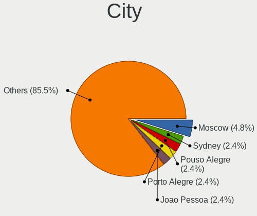

| City                | Computers | Percent |
|---------------------|-----------|---------|
| Moscow              | 4         | 4.82%   |
| Sydney              | 2         | 2.41%   |
| Pouso Alegre        | 2         | 2.41%   |
| Porto Alegre        | 2         | 2.41%   |
| Joao Pessoa         | 2         | 2.41%   |
| Jacksonville        | 2         | 2.41%   |
| Edmonton            | 2         | 2.41%   |
| Bengaluru           | 2         | 2.41%   |
| Athens              | 2         | 2.41%   |
| Washington          | 1         | 1.2%    |
| Volda               | 1         | 1.2%    |
| Vienna              | 1         | 1.2%    |
| Venustiano Carranza | 1         | 1.2%    |
| Traverse City       | 1         | 1.2%    |
| The Hague           | 1         | 1.2%    |
| Taipei              | 1         | 1.2%    |
| Sheffield           | 1         | 1.2%    |
| Seriate             | 1         | 1.2%    |
| Sao Joao da Madeira | 1         | 1.2%    |
| San Mateo           | 1         | 1.2%    |
| Sacavem             | 1         | 1.2%    |
| Rybnik              | 1         | 1.2%    |
| Roseville           | 1         | 1.2%    |
| Quezon City         | 1         | 1.2%    |
| Poznan              | 1         | 1.2%    |
| Porto               | 1         | 1.2%    |
| Porrino             | 1         | 1.2%    |
| Pocoes              | 1         | 1.2%    |
| PiteÅŸti          | 1         | 1.2%    |
| Pietermaritzburg    | 1         | 1.2%    |
| Petaẖ Tiqwa   | 1         | 1.2%    |
| Palm Harbor         | 1         | 1.2%    |
| Olomouc             | 1         | 1.2%    |
| Nieuw-Vennep        | 1         | 1.2%    |
| Murfreesboro        | 1         | 1.2%    |
| Muhos               | 1         | 1.2%    |
| Moensteras          | 1         | 1.2%    |
| Moelndal            | 1         | 1.2%    |
| Melbourne           | 1         | 1.2%    |
| Ludhiana            | 1         | 1.2%    |
| Luban               | 1         | 1.2%    |
| Los Angeles         | 1         | 1.2%    |
| Logan               | 1         | 1.2%    |
| Littleton           | 1         | 1.2%    |
| Kyzyl-Yar           | 1         | 1.2%    |
| Johannesburg        | 1         | 1.2%    |
| Jeddah              | 1         | 1.2%    |
| Hyderabad           | 1         | 1.2%    |
| Hurlingham          | 1         | 1.2%    |
| Hanoi               | 1         | 1.2%    |
| Hamburg             | 1         | 1.2%    |
| Fremont             | 1         | 1.2%    |
| Fredericia          | 1         | 1.2%    |
| Fortaleza           | 1         | 1.2%    |
| Eschenbergen        | 1         | 1.2%    |
| Dehiwala            | 1         | 1.2%    |
| Cologne             | 1         | 1.2%    |
| Clapham             | 1         | 1.2%    |
| Chennai             | 1         | 1.2%    |
| Chakwal             | 1         | 1.2%    |

Drives
------

Drive Vendor
------------

Hard drive vendors

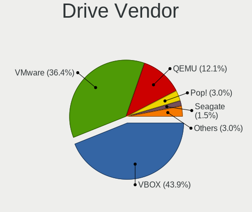

| Vendor  | Computers | Drives | Percent |
|---------|-----------|--------|---------|
| VBOX    | 29        | 30     | 43.94%  |
| VMware  | 24        | 24     | 36.36%  |
| QEMU    | 8         | 8      | 12.12%  |
| Pop!    | 2         | 2      | 3.03%   |
| Seagate | 1         | 1      | 1.52%   |
| SABRENT | 1         | 1      | 1.52%   |
| Msft    | 1         | 1      | 1.52%   |

Drive Model
-----------

Hard drive models

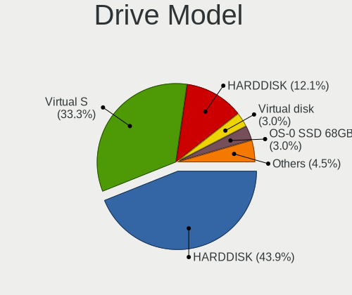

| Model                      | Computers | Percent |
|----------------------------|-----------|---------|
| VBOX HARDDISK              | 29        | 43.94%  |
| VMware Virtual S           | 22        | 33.33%  |
| QEMU HARDDISK              | 8         | 12.12%  |
| VMware Virtual disk        | 2         | 3.03%   |
| Pop! OS-0 SSD 68GB         | 2         | 3.03%   |
| Seagate Backup+ Hub BK 6TB | 1         | 1.52%   |
| SABRENT Disk 128GB         | 1         | 1.52%   |
| Msft Virtual Disk          | 1         | 1.52%   |

HDD Vendor
----------

Hard disk drive vendors

| Vendor  | Computers | Drives | Percent |
|---------|-----------|--------|---------|
| VBOX    | 29        | 30     | 45.31%  |
| VMware  | 24        | 24     | 37.5%   |
| QEMU    | 8         | 8      | 12.5%   |
| Seagate | 1         | 1      | 1.56%   |
| SABRENT | 1         | 1      | 1.56%   |
| Msft    | 1         | 1      | 1.56%   |

SSD Vendor
----------

Solid state drive vendors

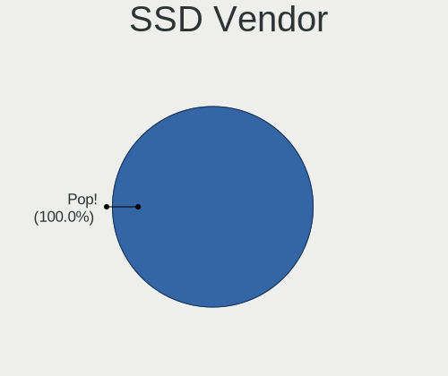

| Vendor | Computers | Drives | Percent |
|--------|-----------|--------|---------|
| Pop!   | 2         | 2      | 100%    |

Drive Kind
----------

HDD or SSD

| Kind | Computers | Drives | Percent |
|------|-----------|--------|---------|
| HDD  | 64        | 65     | 96.97%  |
| SSD  | 2         | 2      | 3.03%   |

Drive Connector
---------------

SATA, SAS, NVMe, etc.

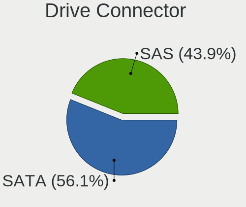

| Type | Computers | Drives | Percent |
|------|-----------|--------|---------|
| SATA | 37        | 38     | 56.06%  |
| SAS  | 29        | 29     | 43.94%  |

Drive Size
----------

Size of hard drive

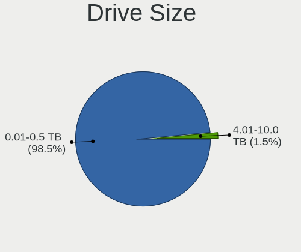

| Size in TB | Computers | Drives | Percent |
|------------|-----------|--------|---------|
| 0.01-0.5   | 65        | 66     | 98.48%  |
| 4.01-10.0  | 1         | 1      | 1.52%   |

Space Total
-----------

Amount of disk space available on the file system

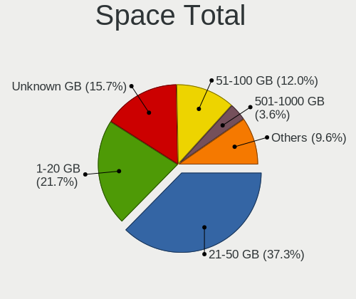

| Size in GB     | Computers | Percent |
|----------------|-----------|---------|
| 21-50          | 31        | 37.35%  |
| 1-20           | 18        | 21.69%  |
| Unknown        | 13        | 15.66%  |
| 51-100         | 10        | 12.05%  |
| 251-500        | 3         | 3.61%   |
| 501-1000       | 3         | 3.61%   |
| More than 3000 | 2         | 2.41%   |
| 1001-2000      | 2         | 2.41%   |
| 101-250        | 1         | 1.2%    |

Space Used
----------

Amount of used disk space

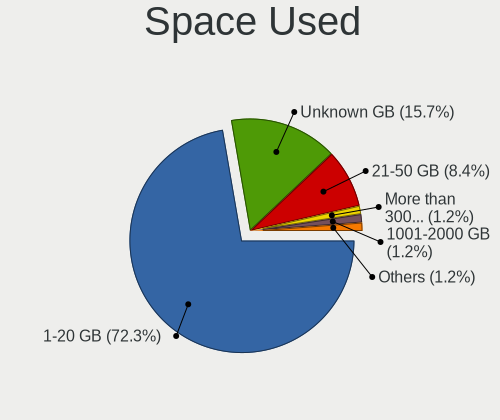

| Used GB        | Computers | Percent |
|----------------|-----------|---------|
| 1-20           | 60        | 72.29%  |
| Unknown        | 13        | 15.66%  |
| 21-50          | 7         | 8.43%   |
| More than 3000 | 1         | 1.2%    |
| 251-500        | 1         | 1.2%    |
| 1001-2000      | 1         | 1.2%    |

Malfunc. Drives
---------------

Drive models with a malfunction

Zero info for selected period =(

Malfunc. Drive Vendor
---------------------

Vendors of faulty drives

Zero info for selected period =(

Malfunc. HDD Vendor
-------------------

Vendors of faulty HDD drives

Zero info for selected period =(

Malfunc. Drive Kind
-------------------

Kinds of faulty drives

Zero info for selected period =(

Failed Drives
-------------

Failed drive models

Zero info for selected period =(

Failed Drive Vendor
-------------------

Failed drive vendors

Zero info for selected period =(

Drive Status
------------

Number of failed and malfunc. drives

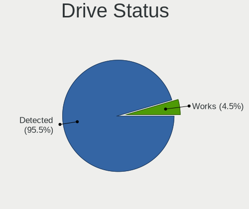

| Status   | Computers | Drives | Percent |
|----------|-----------|--------|---------|
| Detected | 63        | 64     | 95.45%  |
| Works    | 3         | 3      | 4.55%   |

Storage controller
------------------

Storage Vendor
--------------

Storage controller vendors

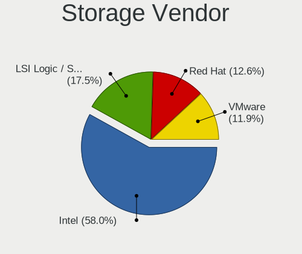

| Vendor                    | Computers | Percent |
|---------------------------|-----------|---------|
| Intel                     | 83        | 58.04%  |
| LSI Logic / Symbios Logic | 25        | 17.48%  |
| Red Hat                   | 18        | 12.59%  |
| VMware                    | 17        | 11.89%  |

Storage Model
-------------

Storage controller models

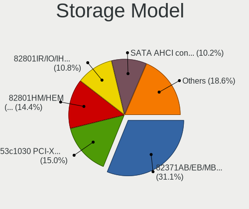

| Model                                                                 | Computers | Percent |
|-----------------------------------------------------------------------|-----------|---------|
| Intel 82371AB/EB/MB PIIX4 IDE                                         | 52        | 31.14%  |
| LSI Logic / Symbios Logic 53c1030 PCI-X Fusion-MPT Dual Ultra320 SCSI | 25        | 14.97%  |
| Intel 82801HM/HEM (ICH8M/ICH8M-E) SATA Controller [AHCI mode]         | 24        | 14.37%  |
| Intel 82801IR/IO/IH (ICH9R/DO/DH) 6 port SATA Controller [AHCI mode]  | 18        | 10.78%  |
| VMware SATA AHCI controller                                           | 17        | 10.18%  |
| Red Hat Virtio block device                                           | 14        | 8.38%   |
| Intel 82371SB PIIX3 IDE [Natoma/Triton II]                            | 9         | 5.39%   |
| Red Hat Virtio SCSI                                                   | 4         | 2.4%    |
| Intel 82801BA IDE U100 Controller                                     | 2         | 1.2%    |
| VMware PVSCSI SCSI Controller                                         | 1         | 0.6%    |
| Intel 82801HR/HO/HH (ICH8R/DO/DH) 6 port SATA Controller [AHCI mode]  | 1         | 0.6%    |

Storage Kind
------------

Kind of storage controller (IDE, SATA, NVMe, SAS, ...)

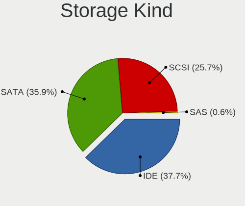

| Kind | Computers | Percent |
|------|-----------|---------|
| IDE  | 63        | 37.72%  |
| SATA | 60        | 35.93%  |
| SCSI | 43        | 25.75%  |
| SAS  | 1         | 0.6%    |

Processor
---------

CPU Vendor
----------

Processor vendors

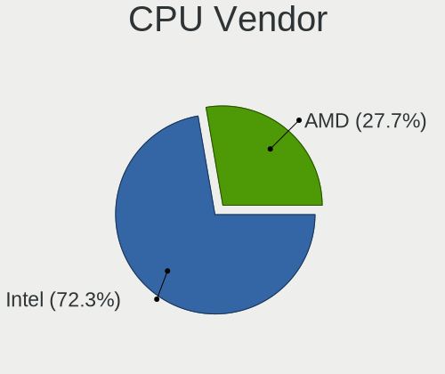

| Vendor | Computers | Percent |
|--------|-----------|---------|
| Intel  | 60        | 72.29%  |
| AMD    | 23        | 27.71%  |

CPU Model
---------

Processor models

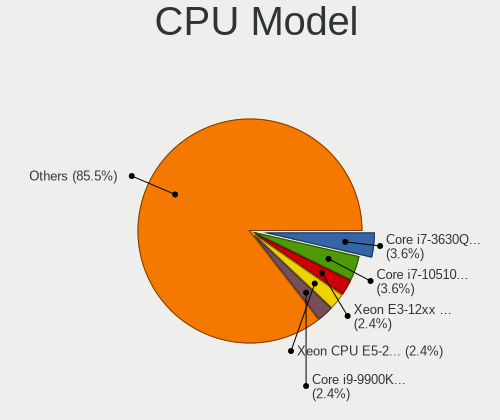

| Model                                           | Computers | Percent |
|-------------------------------------------------|-----------|---------|
| Intel Core i7-3630QM CPU @ 2.40GHz              | 3         | 3.61%   |
| Intel Core i7-10510U CPU @ 1.80GHz              | 3         | 3.61%   |
| Intel Xeon E3-12xx v2 (Ivy Bridge, IBRS)        | 2         | 2.41%   |
| Intel Xeon CPU E5-2630 v3 @ 2.40GHz             | 2         | 2.41%   |
| Intel Core i9-9900K CPU @ 3.60GHz               | 2         | 2.41%   |
| Intel Core i7-8750H CPU @ 2.20GHz               | 2         | 2.41%   |
| Intel Core i7-6700K CPU @ 4.00GHz               | 2         | 2.41%   |
| Intel Core i7-10700K CPU @ 3.80GHz              | 2         | 2.41%   |
| Intel Common KVM processor                      | 2         | 2.41%   |
| AMD Ryzen 9 3900X 12-Core Processor             | 2         | 2.41%   |
| AMD Ryzen 5 3600X 6-Core Processor              | 2         | 2.41%   |
| Intel Xeon E312xx (Sandy Bridge, IBRS update)   | 1         | 1.2%    |
| Intel Xeon CPU X3450 @ 2.67GHz                  | 1         | 1.2%    |
| Intel Xeon CPU E5-2698 v3 @ 2.30GHz             | 1         | 1.2%    |
| Intel Xeon CPU E5-2620 v3 @ 2.40GHz             | 1         | 1.2%    |
| Intel Genuine CPU @ 2.10GHz                     | 1         | 1.2%    |
| Intel Core Processor (Skylake, IBRS)            | 1         | 1.2%    |
| Intel Core Processor (Skylake)                  | 1         | 1.2%    |
| Intel Core Processor (Haswell, no TSX, IBRS)    | 1         | 1.2%    |
| Intel Core i9-9880H CPU @ 2.30GHz               | 1         | 1.2%    |
| Intel Core i7-8700 CPU @ 3.20GHz                | 1         | 1.2%    |
| Intel Core i7-7700K CPU @ 4.20GHz               | 1         | 1.2%    |
| Intel Core i7-7700HQ CPU @ 2.80GHz              | 1         | 1.2%    |
| Intel Core i7-6800K CPU @ 3.40GHz               | 1         | 1.2%    |
| Intel Core i7-6700HQ CPU @ 2.60GHz              | 1         | 1.2%    |
| Intel Core i7-6500U CPU @ 2.50GHz               | 1         | 1.2%    |
| Intel Core i7-4960HQ CPU @ 2.60GHz              | 1         | 1.2%    |
| Intel Core i7-4820K CPU @ 3.70GHz               | 1         | 1.2%    |
| Intel Core i7-4790K CPU @ 4.00GHz               | 1         | 1.2%    |
| Intel Core i7-4790 CPU @ 3.60GHz                | 1         | 1.2%    |
| Intel Core i7-4700MQ CPU @ 2.40GHz              | 1         | 1.2%    |
| Intel Core i7-3930K CPU @ 3.20GHz               | 1         | 1.2%    |
| Intel Core i7-3770 CPU @ 3.40GHz                | 1         | 1.2%    |
| Intel Core i7-10700T CPU @ 2.00GHz              | 1         | 1.2%    |
| Intel Core i7-10610U CPU @ 1.80GHz              | 1         | 1.2%    |
| Intel Core i5-9600K CPU @ 3.70GHz               | 1         | 1.2%    |
| Intel Core i5-9400 CPU @ 2.90GHz                | 1         | 1.2%    |
| Intel Core i5-8500 CPU @ 3.00GHz                | 1         | 1.2%    |
| Intel Core i5-8400 CPU @ 2.80GHz                | 1         | 1.2%    |
| Intel Core i5-8365U CPU @ 1.60GHz               | 1         | 1.2%    |
| Intel Core i5-8300H CPU @ 2.30GHz               | 1         | 1.2%    |
| Intel Core i5-8250U CPU @ 1.60GHz               | 1         | 1.2%    |
| Intel Core i5-3470 CPU @ 3.20GHz                | 1         | 1.2%    |
| Intel Core i5-3360M CPU @ 2.80GHz               | 1         | 1.2%    |
| Intel Core i5-2415M CPU @ 2.30GHz               | 1         | 1.2%    |
| Intel Core i5-2400 CPU @ 3.10GHz                | 1         | 1.2%    |
| Intel Core i5-1035G1 CPU @ 1.00GHz              | 1         | 1.2%    |
| Intel Core i3-2120 CPU @ 3.30GHz                | 1         | 1.2%    |
| Intel Celeron J4025 CPU @ 2.00GHz               | 1         | 1.2%    |
| Intel 12th Gen Core i9-12900K                   | 1         | 1.2%    |
| Intel 11th Gen Core i5-1135G7 @ 2.40GHz         | 1         | 1.2%    |
| AMD Ryzen Threadripper PRO 3955WX 16-Cores      | 1         | 1.2%    |
| AMD Ryzen Threadripper 3990X 64-Core Processor  | 1         | 1.2%    |
| AMD Ryzen Threadripper 3960X 24-Core Processor  | 1         | 1.2%    |
| AMD Ryzen Threadripper 2970WX 24-Core Processor | 1         | 1.2%    |
| AMD Ryzen 9 4900HS with Radeon Graphics         | 1         | 1.2%    |
| AMD Ryzen 7 3700X 8-Core Processor              | 1         | 1.2%    |
| AMD Ryzen 7 2700X Eight-Core Processor          | 1         | 1.2%    |
| AMD Ryzen 7 1800X Eight-Core Processor          | 1         | 1.2%    |
| AMD Ryzen 5 3600 6-Core Processor               | 1         | 1.2%    |

CPU Model Family
----------------

Processor model prefix

| Model                  | Computers | Percent |
|------------------------|-----------|---------|
| Intel Core i7          | 27        | 32.53%  |
| Intel Core i5          | 12        | 14.46%  |
| Intel Xeon             | 8         | 9.64%   |
| AMD Ryzen 5            | 7         | 8.43%   |
| Other                  | 5         | 6.02%   |
| AMD Ryzen Threadripper | 4         | 4.82%   |
| Intel Core i9          | 3         | 3.61%   |
| Intel Core             | 3         | 3.61%   |
| AMD Ryzen 9            | 3         | 3.61%   |
| AMD Ryzen 7            | 3         | 3.61%   |
| Intel Genuine          | 1         | 1.2%    |
| Intel Core i3          | 1         | 1.2%    |
| Intel Celeron          | 1         | 1.2%    |
| AMD Ryzen 3            | 1         | 1.2%    |
| AMD Opteron            | 1         | 1.2%    |
| AMD EPYC               | 1         | 1.2%    |
| AMD Athlon II X4       | 1         | 1.2%    |
| AMD Athlon II X2       | 1         | 1.2%    |

CPU Cores
---------

Number of processor cores

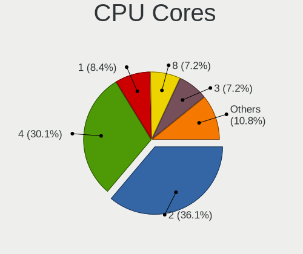

| Number | Computers | Percent |
|--------|-----------|---------|
| 2      | 30        | 36.14%  |
| 4      | 25        | 30.12%  |
| 1      | 7         | 8.43%   |
| 8      | 6         | 7.23%   |
| 3      | 6         | 7.23%   |
| 6      | 4         | 4.82%   |
| 12     | 2         | 2.41%   |
| 44     | 1         | 1.2%    |
| 10     | 1         | 1.2%    |
| 7      | 1         | 1.2%    |

CPU Sockets
-----------

Number of sockets

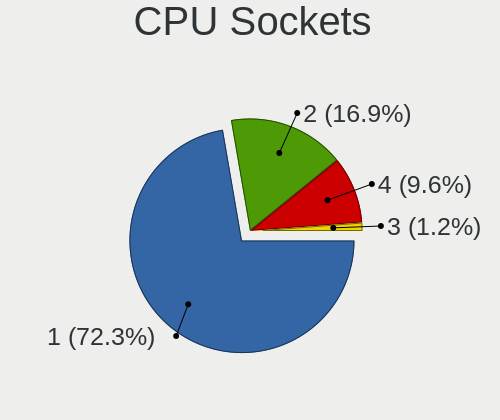

| Number | Computers | Percent |
|--------|-----------|---------|
| 1      | 60        | 72.29%  |
| 2      | 14        | 16.87%  |
| 4      | 8         | 9.64%   |
| 3      | 1         | 1.2%    |

CPU Threads
-----------

Threads per core (Hyper-Threading)

| Number | Computers | Percent |
|--------|-----------|---------|
| 1      | 69        | 83.13%  |
| 2      | 14        | 16.87%  |

CPU Op-Modes
------------

CPU Operation Modes (32-bit, 64-bit)

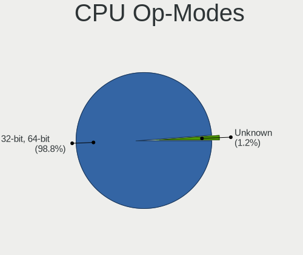

| Op mode        | Computers | Percent |
|----------------|-----------|---------|
| 32-bit, 64-bit | 82        | 98.8%   |
| Unknown        | 1         | 1.2%    |

CPU Microcode
-------------

Microcode number

| Number  | Computers | Percent |
|---------|-----------|---------|
| Unknown | 83        | 100%    |

CPU Microarch
-------------

Microarchitecture

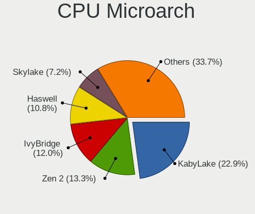

| Name          | Computers | Percent |
|---------------|-----------|---------|
| KabyLake      | 19        | 22.89%  |
| Zen 2         | 11        | 13.25%  |
| IvyBridge     | 10        | 12.05%  |
| Haswell       | 9         | 10.84%  |
| Skylake       | 6         | 7.23%   |
| Zen+          | 5         | 6.02%   |
| SandyBridge   | 5         | 6.02%   |
| Zen           | 3         | 3.61%   |
| CometLake     | 3         | 3.61%   |
| NetBurst      | 2         | 2.41%   |
| TigerLake     | 1         | 1.2%    |
| Piledriver    | 1         | 1.2%    |
| Nehalem       | 1         | 1.2%    |
| K8 Hammer     | 1         | 1.2%    |
| K10 Llano     | 1         | 1.2%    |
| K10           | 1         | 1.2%    |
| IceLake       | 1         | 1.2%    |
| Goldmont plus | 1         | 1.2%    |
| Broadwell     | 1         | 1.2%    |
| Unknown       | 1         | 1.2%    |

Graphics
--------

GPU Vendor
----------

Vendors of graphics cards

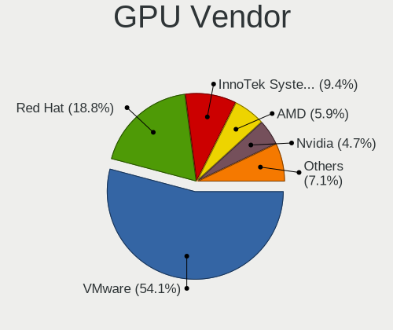

| Vendor                 | Computers | Percent |
|------------------------|-----------|---------|
| VMware                 | 46        | 54.12%  |
| Red Hat                | 16        | 18.82%  |
| InnoTek Systemberatung | 8         | 9.41%   |
| AMD                    | 5         | 5.88%   |
| Nvidia                 | 4         | 4.71%   |
| Technical              | 3         | 3.53%   |
| Parallels              | 1         | 1.18%   |
| Microsoft              | 1         | 1.18%   |
| Intel                  | 1         | 1.18%   |

GPU Model
---------

Graphics card models

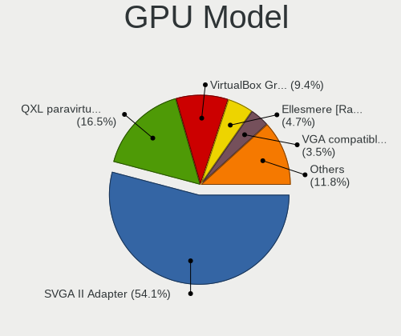

| Model                                                   | Computers | Percent |
|---------------------------------------------------------|-----------|---------|
| VMware SVGA II Adapter                                  | 46        | 54.12%  |
| Red Hat QXL paravirtual graphic card                    | 14        | 16.47%  |
| InnoTek Systemberatung VirtualBox Graphics Adapter      | 8         | 9.41%   |
| AMD Ellesmere [Radeon RX 470/480/570/570X/580/580X/590] | 4         | 4.71%   |
| Technical VGA compatible controller                     | 3         | 3.53%   |
| Red Hat Virtio GPU                                      | 2         | 2.35%   |
| Parallels Accelerated Virtual Video Adapter             | 1         | 1.18%   |
| Nvidia TU116 [GeForce GTX 1650 SUPER]                   | 1         | 1.18%   |
| Nvidia TU106 [GeForce RTX 2060 Rev. A]                  | 1         | 1.18%   |
| Nvidia GP104 [GeForce GTX 1070]                         | 1         | 1.18%   |
| Nvidia GM200GL [Tesla M40]                              | 1         | 1.18%   |
| Microsoft Hyper-V virtual VGA                           | 1         | 1.18%   |
| Intel HD Graphics 530                                   | 1         | 1.18%   |
| AMD Vega 10 XTX [Radeon Vega Frontier Edition]          | 1         | 1.18%   |

GPU Combo
---------

Combinations of graphics cards

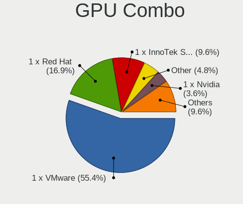

| Name                       | Computers | Percent |
|----------------------------|-----------|---------|
| 1 x VMware                 | 46        | 55.42%  |
| 1 x Red Hat                | 14        | 16.87%  |
| 1 x InnoTek Systemberatung | 8         | 9.64%   |
| Other                      | 4         | 4.82%   |
| 1 x Nvidia                 | 3         | 3.61%   |
| 1 x AMD                    | 3         | 3.61%   |
| 1 x Parallels              | 1         | 1.2%    |
| Nvidia + Red Hat           | 1         | 1.2%    |
| 1 x Microsoft              | 1         | 1.2%    |
| Intel + AMD                | 1         | 1.2%    |
| AMD + Red Hat              | 1         | 1.2%    |

GPU Driver
----------

Free vs proprietary

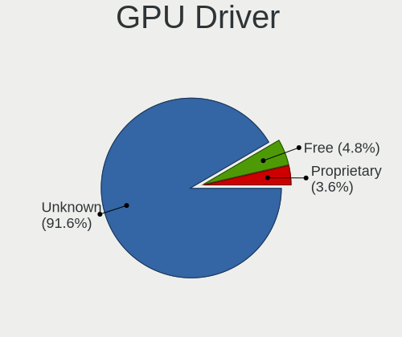

| Driver      | Computers | Percent |
|-------------|-----------|---------|
| Unknown     | 76        | 91.57%  |
| Free        | 4         | 4.82%   |
| Proprietary | 3         | 3.61%   |

GPU Memory
----------

Total video memory

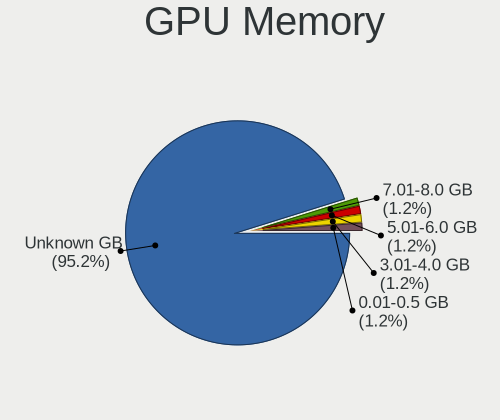

| Size in GB | Computers | Percent |
|------------|-----------|---------|
| Unknown    | 79        | 95.18%  |
| 7.01-8.0   | 1         | 1.2%    |
| 5.01-6.0   | 1         | 1.2%    |
| 3.01-4.0   | 1         | 1.2%    |
| 0.01-0.5   | 1         | 1.2%    |

Monitor
-------

Monitor Vendor
--------------

Monitor vendors

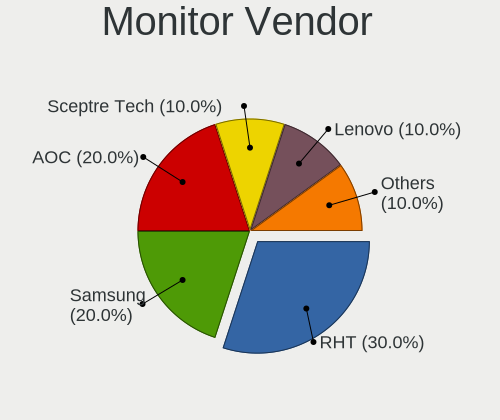

| Vendor              | Computers | Percent |
|---------------------|-----------|---------|
| RHT                 | 3         | 30%     |
| Samsung Electronics | 2         | 20%     |
| AOC                 | 2         | 20%     |
| Sceptre Tech        | 1         | 10%     |
| Lenovo              | 1         | 10%     |
| FUN                 | 1         | 10%     |

Monitor Model
-------------

Monitor models

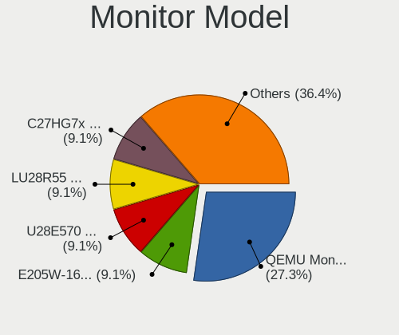

| Model                                                             | Computers | Percent |
|-------------------------------------------------------------------|-----------|---------|
| RHT QEMU Monitor RHT1234 2048x1152 260x195mm 12.8-inch            | 3         | 27.27%  |
| Sceptre Tech E205W-16003S SPT080D 1600x900 440x250mm 19.9-inch    | 1         | 9.09%   |
| Samsung Electronics U28E570 SAM0D6F 3840x2160 607x345mm 27.5-inch | 1         | 9.09%   |
| Samsung Electronics LU28R55 SAM1015 3840x2160 632x360mm 28.6-inch | 1         | 9.09%   |
| Samsung Electronics C27HG7x SAM0E16 2560x1440 598x336mm 27.0-inch | 1         | 9.09%   |
| Lenovo Y25-25 LEN66AA 1920x1080 552x319mm 25.1-inch               | 1         | 9.09%   |
| FUN HDMI Monitor FUN9D31 3840x2160 480x270mm 21.7-inch            | 1         | 9.09%   |
| AOC Q32V3 AOC3203 2560x1440 699x393mm 31.6-inch                   | 1         | 9.09%   |
| AOC Q32G1WG4 AOC3201 2560x1440 697x393mm 31.5-inch                | 1         | 9.09%   |

Monitor Resolution
------------------

Monitor screen resolution

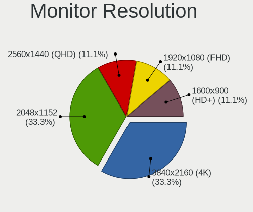

| Resolution      | Computers | Percent |
|-----------------|-----------|---------|
| 3840x2160 (4K)  | 3         | 33.33%  |
| 2048x1152       | 3         | 33.33%  |
| 2560x1440 (QHD) | 1         | 11.11%  |
| 1920x1080 (FHD) | 1         | 11.11%  |
| 1600x900 (HD+)  | 1         | 11.11%  |

Monitor Diagonal
----------------

Diagonal size in inches

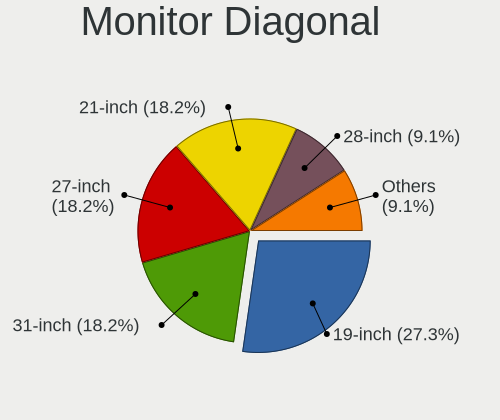

| Inches | Computers | Percent |
|--------|-----------|---------|
| 19     | 3         | 27.27%  |
| 31     | 2         | 18.18%  |
| 27     | 2         | 18.18%  |
| 21     | 2         | 18.18%  |
| 28     | 1         | 9.09%   |
| 25     | 1         | 9.09%   |

Monitor Width
-------------

Physical width

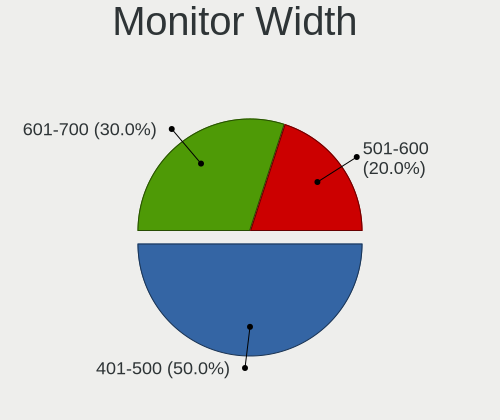

| Width in mm | Computers | Percent |
|-------------|-----------|---------|
| 401-500     | 5         | 50%     |
| 601-700     | 3         | 30%     |
| 501-600     | 2         | 20%     |

Aspect Ratio
------------

Proportional relationship between the width and the height

| Ratio | Computers | Percent |
|-------|-----------|---------|
| 16/9  | 6         | 66.67%  |
| 4/3   | 3         | 33.33%  |

Monitor Area
------------

Area in inch²

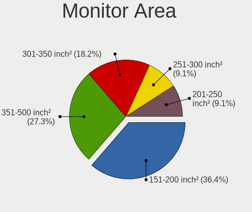

| Area in inch² | Computers | Percent |
|----------------|-----------|---------|
| 151-200        | 4         | 36.36%  |
| 351-500        | 3         | 27.27%  |
| 301-350        | 2         | 18.18%  |
| 251-300        | 1         | 9.09%   |
| 201-250        | 1         | 9.09%   |

Pixel Density
-------------

Pixels per inch

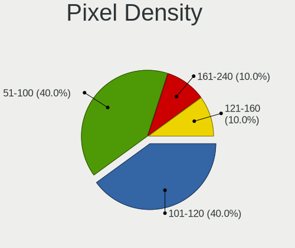

| Density | Computers | Percent |
|---------|-----------|---------|
| 101-120 | 4         | 40%     |
| 51-100  | 4         | 40%     |
| 161-240 | 1         | 10%     |
| 121-160 | 1         | 10%     |

Multiple Monitors
-----------------

Total monitors connected

| Total | Computers | Percent |
|-------|-----------|---------|
| 1     | 53        | 63.86%  |
| 0     | 28        | 33.73%  |
| 2     | 2         | 2.41%   |

Network
-------

Net Controller Vendor
---------------------

Controller vendors

| Vendor                | Computers | Percent |
|-----------------------|-----------|---------|
| Intel                 | 53        | 60.23%  |
| Red Hat               | 26        | 29.55%  |
| Realtek Semiconductor | 3         | 3.41%   |
| VMware                | 2         | 2.27%   |
| TP-Link               | 1         | 1.14%   |
| Microsoft             | 1         | 1.14%   |
| Belkin Components     | 1         | 1.14%   |
| AMD                   | 1         | 1.14%   |

Net Controller Model
--------------------

Controller models

| Model                                                                             | Computers | Percent |
|-----------------------------------------------------------------------------------|-----------|---------|
| Intel 82540EM Gigabit Ethernet Controller                                         | 28        | 31.82%  |
| Red Hat Virtio network device                                                     | 26        | 29.55%  |
| Intel 82545EM Gigabit Ethernet Controller (Copper)                                | 23        | 26.14%  |
| VMware VMXNET3 Ethernet Controller                                                | 2         | 2.27%   |
| Realtek RTL-8100/8101L/8139 PCI Fast Ethernet Adapter                             | 2         | 2.27%   |
| TP-Link TL-WN722N v2/v3 [Realtek RTL8188EUS]                                      | 1         | 1.14%   |
| Realtek RTL8152 Fast Ethernet Adapter                                             | 1         | 1.14%   |
| Microsoft XBOX ACC                                                                | 1         | 1.14%   |
| Intel Wi-Fi 6 AX200                                                               | 1         | 1.14%   |
| Intel Comet Lake PCH CNVi WiFi                                                    | 1         | 1.14%   |
| Belkin Components F9L1109v1 802.11a/b/g/n/ac Wireless Adapter [Realtek RTL8812AU] | 1         | 1.14%   |
| AMD 79c970 [PCnet32 LANCE]                                                        | 1         | 1.14%   |

Wireless Vendor
---------------

Wireless vendors

| Vendor            | Computers | Percent |
|-------------------|-----------|---------|
| Intel             | 2         | 40%     |
| TP-Link           | 1         | 20%     |
| Microsoft         | 1         | 20%     |
| Belkin Components | 1         | 20%     |

Wireless Model
--------------

Wireless models

| Model                                                                             | Computers | Percent |
|-----------------------------------------------------------------------------------|-----------|---------|
| TP-Link TL-WN722N v2/v3 [Realtek RTL8188EUS]                                      | 1         | 20%     |
| Microsoft XBOX ACC                                                                | 1         | 20%     |
| Intel Wi-Fi 6 AX200                                                               | 1         | 20%     |
| Intel Comet Lake PCH CNVi WiFi                                                    | 1         | 20%     |
| Belkin Components F9L1109v1 802.11a/b/g/n/ac Wireless Adapter [Realtek RTL8812AU] | 1         | 20%     |

Ethernet Vendor
---------------

Ethernet vendors

| Vendor                | Computers | Percent |
|-----------------------|-----------|---------|
| Intel                 | 51        | 89.47%  |
| Realtek Semiconductor | 3         | 5.26%   |
| VMware                | 2         | 3.51%   |
| AMD                   | 1         | 1.75%   |

Ethernet Model
--------------

Ethernet models

| Model                                                 | Computers | Percent |
|-------------------------------------------------------|-----------|---------|
| Intel 82540EM Gigabit Ethernet Controller             | 28        | 49.12%  |
| Intel 82545EM Gigabit Ethernet Controller (Copper)    | 23        | 40.35%  |
| VMware VMXNET3 Ethernet Controller                    | 2         | 3.51%   |
| Realtek RTL-8100/8101L/8139 PCI Fast Ethernet Adapter | 2         | 3.51%   |
| Realtek RTL8152 Fast Ethernet Adapter                 | 1         | 1.75%   |
| AMD 79c970 [PCnet32 LANCE]                            | 1         | 1.75%   |

Net Controller Kind
-------------------

Ethernet, WiFi or modem

| Kind     | Computers | Percent |
|----------|-----------|---------|
| Ethernet | 57        | 64.77%  |
| Unknown  | 26        | 29.55%  |
| WiFi     | 5         | 5.68%   |

Used Controller
---------------

Currently used network controller

| Kind     | Computers | Percent |
|----------|-----------|---------|
| Ethernet | 56        | 98.25%  |
| WiFi     | 1         | 1.75%   |

NICs
----

Total network controllers on board

| Total | Computers | Percent |
|-------|-----------|---------|
| 1     | 57        | 68.67%  |
| 0     | 25        | 30.12%  |
| 3     | 1         | 1.2%    |

IPv6
----

IPv6 vs IPv4

| Used | Computers | Percent |
|------|-----------|---------|
| No   | 78        | 93.98%  |
| Yes  | 5         | 6.02%   |

Bluetooth
---------

Bluetooth Vendor
----------------

Controller vendors

| Vendor                  | Computers | Percent |
|-------------------------|-----------|---------|
| VMware                  | 8         | 53.33%  |
| Intel                   | 2         | 13.33%  |
| TP-Link                 | 1         | 6.67%   |
| Dynex                   | 1         | 6.67%   |
| Cambridge Silicon Radio | 1         | 6.67%   |
| ASUSTek Computer        | 1         | 6.67%   |
| Apple                   | 1         | 6.67%   |

Bluetooth Model
---------------

Controller models

| Model                                                    | Computers | Percent |
|----------------------------------------------------------|-----------|---------|
| VMware Virtual Bluetooth Adapter                         | 8         | 53.33%  |
| TP-Link UB500 Adapter                                    | 1         | 6.67%   |
| Intel AX201 Bluetooth                                    | 1         | 6.67%   |
| Intel AX200 Bluetooth                                    | 1         | 6.67%   |
| Dynex Bluetooth 4.0 Adapter [Broadcom, 1.12, BCM20702A0] | 1         | 6.67%   |
| Cambridge Silicon Radio Bluetooth Dongle (HCI mode)      | 1         | 6.67%   |
| ASUS Broadcom BCM20702 Single-Chip Bluetooth 4.0 + LE    | 1         | 6.67%   |
| Apple Bluetooth USB Host Controller                      | 1         | 6.67%   |

Sound
-----

Sound Vendor
------------

Sound card vendors

| Vendor              | Computers | Percent |
|---------------------|-----------|---------|
| Intel               | 43        | 56.58%  |
| Ensoniq             | 21        | 27.63%  |
| AMD                 | 5         | 6.58%   |
| Nvidia              | 3         | 3.95%   |
| XMOS                | 1         | 1.32%   |
| VMware              | 1         | 1.32%   |
| Samson Technologies | 1         | 1.32%   |
| C-Media Electronics | 1         | 1.32%   |

Sound Model
-----------

Sound card models

| Model                                                                      | Computers | Percent |
|----------------------------------------------------------------------------|-----------|---------|
| Intel 82801AA AC'97 Audio Controller                                       | 28        | 36.84%  |
| Ensoniq ES1371/ES1373 / Creative Labs CT2518                               | 21        | 27.63%  |
| Intel 82801I (ICH9 Family) HD Audio Controller                             | 7         | 9.21%   |
| Intel 82801FB/FBM/FR/FW/FRW (ICH6 Family) High Definition Audio Controller | 5         | 6.58%   |
| AMD Ellesmere HDMI Audio [Radeon RX 470/480 / 570/580/590]                 | 4         | 5.26%   |
| XMOS xCORE USB Audio 2.0                                                   | 1         | 1.32%   |
| VMware HD Audio Controller                                                 | 1         | 1.32%   |
| Samson Technologies Q1U dynamic microphone                                 | 1         | 1.32%   |
| Nvidia TU106 High Definition Audio Controller                              | 1         | 1.32%   |
| Nvidia TU104 HD Audio Controller                                           | 1         | 1.32%   |
| Nvidia GP104 High Definition Audio Controller                              | 1         | 1.32%   |
| Intel Comet Lake PCH cAVS                                                  | 1         | 1.32%   |
| Intel 82801BA/BAM AC'97 Audio Controller                                   | 1         | 1.32%   |
| Intel 200 Series PCH HD Audio                                              | 1         | 1.32%   |
| C-Media Electronics USB Audio Device                                       | 1         | 1.32%   |
| AMD Vega 10 HDMI Audio [Radeon Vega 56/64]                                 | 1         | 1.32%   |

Memory
------

Memory Vendor
-------------

Memory module vendors

| Vendor    | Computers | Percent |
|-----------|-----------|---------|
| QEMU      | 4         | 80%     |
| Microsoft | 1         | 20%     |

Memory Model
------------

Memory module models

| Model                            | Computers | Percent |
|----------------------------------|-----------|---------|
| QEMU RAM Module 8GB DIMM RAM     | 1         | 16.67%  |
| QEMU RAM Module 6GB DIMM RAM     | 1         | 16.67%  |
| QEMU RAM Module 16GB DIMM RAM    | 1         | 16.67%  |
| QEMU RAM Module 16384MB DIMM RAM | 1         | 16.67%  |
| Microsoft RAM Module 4224MB      | 1         | 16.67%  |
| Microsoft RAM Module 3968MB      | 1         | 16.67%  |

Memory Kind
-----------

Memory module kinds

| Kind    | Computers | Percent |
|---------|-----------|---------|
| RAM     | 4         | 80%     |
| Unknown | 1         | 20%     |

Memory Form Factor
------------------

Physical design of the memory module

| Name    | Computers | Percent |
|---------|-----------|---------|
| DIMM    | 4         | 80%     |
| Unknown | 1         | 20%     |

Memory Size
-----------

Memory module size

| Size  | Computers | Percent |
|-------|-----------|---------|
| 16384 | 2         | 33.33%  |
| 8192  | 1         | 16.67%  |
| 6144  | 1         | 16.67%  |
| 4224  | 1         | 16.67%  |
| 3968  | 1         | 16.67%  |

Memory Speed
------------

Memory module speed

| Speed   | Computers | Percent |
|---------|-----------|---------|
| Unknown | 5         | 100%    |

Printers & scanners
-------------------

Printer Vendor
--------------

Printer device vendors

| Vendor    | Computers | Percent |
|-----------|-----------|---------|
| PARALLELS | 2         | 100%    |

Printer Model
-------------

Printer device models

| Model                                                                                  | Computers | Percent |
|----------------------------------------------------------------------------------------|-----------|---------|
| PARALLELS Virtual Printer (/Users/jean/Parallels/OpenMandriva Lx 4.3.pvm/parallel.txt) | 2         | 100%    |

Scanner Vendor
--------------

Scanner device vendors

Zero info for selected period =(

Scanner Model
-------------

Scanner device models

Zero info for selected period =(

Camera
------

Camera Vendor
-------------

Camera device vendors

| Vendor    | Computers | Percent |
|-----------|-----------|---------|
| PARALLELS | 2         | 100%    |

Camera Model
------------

Camera device models

| Model                        | Computers | Percent |
|------------------------------|-----------|---------|
| PARALLELS IRIScan Desk 5 Pro | 2         | 100%    |

Security
--------

Fingerprint Vendor
------------------

Fingerprint sensor vendors

| Vendor    | Computers | Percent |
|-----------|-----------|---------|
| Synaptics | 1         | 100%    |

Fingerprint Model
-----------------

Fingerprint sensor models

| Model                                        | Computers | Percent |
|----------------------------------------------|-----------|---------|
| Synaptics  WBDI Fingerprint Reader - USB 052 | 1         | 100%    |

Chipcard Vendor
---------------

Chipcard module vendors

| Vendor                | Computers | Percent |
|-----------------------|-----------|---------|
| Gemalto (was Gemplus) | 3         | 100%    |

Chipcard Model
--------------

Chipcard module models

| Model                               | Computers | Percent |
|-------------------------------------|-----------|---------|
| Gemalto (was Gemplus) GemPC433-Swap | 3         | 100%    |

Unsupported
-----------

Unsupported Devices
-------------------

Total unsupported devices on board

| Total | Computers | Percent |
|-------|-----------|---------|
| 0     | 72        | 86.75%  |
| 1     | 10        | 12.05%  |
| 2     | 1         | 1.2%    |

Unsupported Device Types
------------------------

Types of unsupported devices

| Type               | Computers | Percent |
|--------------------|-----------|---------|
| Graphics card      | 5         | 41.67%  |
| Chipcard           | 3         | 25%     |
| Net/wireless       | 2         | 16.67%  |
| Unassigned class   | 1         | 8.33%   |
| Fingerprint reader | 1         | 8.33%   |

