ROSA - Tested Virtual Hardware & Statistics
-------------------------------------------

A project to collect tested virtual hardware configurations for ROSA.

Anyone can contribute to this report by the [hw-probe](https://github.com/linuxhw/hw-probe) tool:

    sudo -E hw-probe -all -upload

Please contribute! Especially if your hardware is rare.

Contents
--------

* [ Test Cases ](#test-cases)

* [ System ](#system)
  - [ OS                       ](#os)
  - [ OS Family                ](#os-family)
  - [ Kernel                   ](#kernel)
  - [ Kernel Family            ](#kernel-family)
  - [ Kernel Major Ver.        ](#kernel-major-ver)
  - [ Arch                     ](#arch)
  - [ DE                       ](#de)
  - [ Display Server           ](#display-server)
  - [ Display Manager          ](#display-manager)
  - [ OS Lang                  ](#os-lang)
  - [ Boot Mode                ](#boot-mode)
  - [ Filesystem               ](#filesystem)
  - [ Part. scheme             ](#part-scheme)
  - [ Dual Boot with Linux/BSD ](#dual-boot-with-linuxbsd)
  - [ Dual Boot (Win)          ](#dual-boot-win)

* [ Board ](#board)
  - [ Vendor                   ](#vendor)
  - [ Model                    ](#model)
  - [ Model Family             ](#model-family)
  - [ MFG Year                 ](#mfg-year)
  - [ Form Factor              ](#form-factor)
  - [ Secure Boot              ](#secure-boot)
  - [ Coreboot                 ](#coreboot)
  - [ RAM Size                 ](#ram-size)
  - [ RAM Used                 ](#ram-used)
  - [ Total Drives             ](#total-drives)
  - [ Has CD-ROM               ](#has-cd-rom)
  - [ Has Ethernet             ](#has-ethernet)
  - [ Has WiFi                 ](#has-wifi)
  - [ Has Bluetooth            ](#has-bluetooth)

* [ Location ](#location)
  - [ Country                  ](#country)
  - [ City                     ](#city)

* [ Drives ](#drives)
  - [ Drive Vendor             ](#drive-vendor)
  - [ Drive Model              ](#drive-model)
  - [ HDD Vendor               ](#hdd-vendor)
  - [ SSD Vendor               ](#ssd-vendor)
  - [ Drive Kind               ](#drive-kind)
  - [ Drive Connector          ](#drive-connector)
  - [ Drive Size               ](#drive-size)
  - [ Space Total              ](#space-total)
  - [ Space Used               ](#space-used)
  - [ Malfunc. Drives          ](#malfunc-drives)
  - [ Malfunc. Drive Vendor    ](#malfunc-drive-vendor)
  - [ Malfunc. HDD Vendor      ](#malfunc-hdd-vendor)
  - [ Malfunc. Drive Kind      ](#malfunc-drive-kind)
  - [ Failed Drives            ](#failed-drives)
  - [ Failed Drive Vendor      ](#failed-drive-vendor)
  - [ Drive Status             ](#drive-status)

* [ Storage controller ](#storage-controller)
  - [ Storage Vendor           ](#storage-vendor)
  - [ Storage Model            ](#storage-model)
  - [ Storage Kind             ](#storage-kind)

* [ Processor ](#processor)
  - [ CPU Vendor               ](#cpu-vendor)
  - [ CPU Model                ](#cpu-model)
  - [ CPU Model Family         ](#cpu-model-family)
  - [ CPU Cores                ](#cpu-cores)
  - [ CPU Sockets              ](#cpu-sockets)
  - [ CPU Threads              ](#cpu-threads)
  - [ CPU Op-Modes             ](#cpu-op-modes)
  - [ CPU Microcode            ](#cpu-microcode)
  - [ CPU Microarch            ](#cpu-microarch)

* [ Graphics ](#graphics)
  - [ GPU Vendor               ](#gpu-vendor)
  - [ GPU Model                ](#gpu-model)
  - [ GPU Combo                ](#gpu-combo)
  - [ GPU Driver               ](#gpu-driver)
  - [ GPU Memory               ](#gpu-memory)

* [ Monitor ](#monitor)
  - [ Monitor Vendor           ](#monitor-vendor)
  - [ Monitor Model            ](#monitor-model)
  - [ Monitor Resolution       ](#monitor-resolution)
  - [ Monitor Diagonal         ](#monitor-diagonal)
  - [ Monitor Width            ](#monitor-width)
  - [ Aspect Ratio             ](#aspect-ratio)
  - [ Monitor Area             ](#monitor-area)
  - [ Pixel Density            ](#pixel-density)
  - [ Multiple Monitors        ](#multiple-monitors)

* [ Network ](#network)
  - [ Net Controller Vendor    ](#net-controller-vendor)
  - [ Net Controller Model     ](#net-controller-model)
  - [ Wireless Vendor          ](#wireless-vendor)
  - [ Wireless Model           ](#wireless-model)
  - [ Ethernet Vendor          ](#ethernet-vendor)
  - [ Ethernet Model           ](#ethernet-model)
  - [ Net Controller Kind      ](#net-controller-kind)
  - [ Used Controller          ](#used-controller)
  - [ NICs                     ](#nics)
  - [ IPv6                     ](#ipv6)

* [ Bluetooth ](#bluetooth)
  - [ Bluetooth Vendor         ](#bluetooth-vendor)
  - [ Bluetooth Model          ](#bluetooth-model)

* [ Sound ](#sound)
  - [ Sound Vendor             ](#sound-vendor)
  - [ Sound Model              ](#sound-model)

* [ Memory ](#memory)
  - [ Memory Vendor            ](#memory-vendor)
  - [ Memory Model             ](#memory-model)
  - [ Memory Kind              ](#memory-kind)
  - [ Memory Form Factor       ](#memory-form-factor)
  - [ Memory Size              ](#memory-size)
  - [ Memory Speed             ](#memory-speed)

* [ Printers & scanners ](#printers--scanners)
  - [ Printer Vendor           ](#printer-vendor)
  - [ Printer Model            ](#printer-model)
  - [ Scanner Vendor           ](#scanner-vendor)
  - [ Scanner Model            ](#scanner-model)

* [ Camera ](#camera)
  - [ Camera Vendor            ](#camera-vendor)
  - [ Camera Model             ](#camera-model)

* [ Security ](#security)
  - [ Fingerprint Vendor       ](#fingerprint-vendor)
  - [ Fingerprint Model        ](#fingerprint-model)
  - [ Chipcard Vendor          ](#chipcard-vendor)
  - [ Chipcard Model           ](#chipcard-model)

* [ Unsupported ](#unsupported)
  - [ Unsupported Devices      ](#unsupported-devices)
  - [ Unsupported Device Types ](#unsupported-device-types)

Test Cases
----------

Total: 1831

| Vendor        | Model                       | Form-Factor     | Probe                                                      | Date         |
|---------------|-----------------------------|-----------------|------------------------------------------------------------|--------------|
| VMware        | Virtual Platform            | Virtual machine | [8c7f95aa6c](https://linux-hardware.org/?probe=8c7f95aa6c) | Apr 16, 2022 |
| VMware        | Virtual Platform            | Virtual machine | [f878377dd5](https://linux-hardware.org/?probe=f878377dd5) | Apr 16, 2022 |
| Oracle        | VirtualBox                  | Virtual machine | [3c84f123e8](https://linux-hardware.org/?probe=3c84f123e8) | Apr 15, 2022 |
| Oracle        | VirtualBox                  | Virtual machine | [81384b880b](https://linux-hardware.org/?probe=81384b880b) | Apr 15, 2022 |
| Oracle        | VirtualBox                  | Virtual machine | [5e1d95b947](https://linux-hardware.org/?probe=5e1d95b947) | Apr 14, 2022 |
| Oracle        | VirtualBox                  | Virtual machine | [3f578bcf2b](https://linux-hardware.org/?probe=3f578bcf2b) | Apr 14, 2022 |
| Oracle        | VirtualBox                  | Virtual machine | [a507c307e1](https://linux-hardware.org/?probe=a507c307e1) | Apr 13, 2022 |
| Oracle        | VirtualBox                  | Virtual machine | [4860b8d329](https://linux-hardware.org/?probe=4860b8d329) | Apr 13, 2022 |
| QEMU          | Standard PC (i440FX + PI... | Virtual machine | [02d651d575](https://linux-hardware.org/?probe=02d651d575) | Apr 13, 2022 |
| Oracle        | VirtualBox                  | Virtual machine | [79f902bc82](https://linux-hardware.org/?probe=79f902bc82) | Apr 12, 2022 |
| Oracle        | VirtualBox                  | Virtual machine | [f18cb6160b](https://linux-hardware.org/?probe=f18cb6160b) | Apr 12, 2022 |
| Oracle        | VirtualBox                  | Virtual machine | [9fd1d9059e](https://linux-hardware.org/?probe=9fd1d9059e) | Apr 12, 2022 |
| Microsoft     | Virtual Machine             | Virtual machine | [3de6d913c9](https://linux-hardware.org/?probe=3de6d913c9) | Apr 11, 2022 |
| Oracle        | VirtualBox                  | Virtual machine | [4b447ef45b](https://linux-hardware.org/?probe=4b447ef45b) | Apr 11, 2022 |
| Oracle        | VirtualBox                  | Virtual machine | [2e0d137ac1](https://linux-hardware.org/?probe=2e0d137ac1) | Apr 11, 2022 |
| Oracle        | VirtualBox                  | Virtual machine | [460c3461e3](https://linux-hardware.org/?probe=460c3461e3) | Apr 11, 2022 |
| Oracle        | VirtualBox                  | Virtual machine | [4c1073ef40](https://linux-hardware.org/?probe=4c1073ef40) | Apr 11, 2022 |
| Oracle        | VirtualBox                  | Virtual machine | [823d631f80](https://linux-hardware.org/?probe=823d631f80) | Apr 10, 2022 |
| Oracle        | VirtualBox                  | Virtual machine | [54688899e1](https://linux-hardware.org/?probe=54688899e1) | Apr 10, 2022 |
| Oracle        | VirtualBox                  | Virtual machine | [a4bb0f6060](https://linux-hardware.org/?probe=a4bb0f6060) | Apr 10, 2022 |
| Oracle        | VirtualBox                  | Virtual machine | [7d871de58f](https://linux-hardware.org/?probe=7d871de58f) | Apr 10, 2022 |
| Oracle        | VirtualBox                  | Virtual machine | [74d55d1b89](https://linux-hardware.org/?probe=74d55d1b89) | Apr 09, 2022 |
| Oracle        | VirtualBox                  | Virtual machine | [3d96ad1425](https://linux-hardware.org/?probe=3d96ad1425) | Apr 09, 2022 |
| Oracle        | VirtualBox                  | Virtual machine | [f589c15dae](https://linux-hardware.org/?probe=f589c15dae) | Apr 08, 2022 |
| Oracle        | VirtualBox                  | Virtual machine | [568f88bcb7](https://linux-hardware.org/?probe=568f88bcb7) | Apr 08, 2022 |
| Oracle        | VirtualBox                  | Virtual machine | [a990484f16](https://linux-hardware.org/?probe=a990484f16) | Apr 08, 2022 |
| Oracle        | VirtualBox                  | Virtual machine | [8eb0c052e5](https://linux-hardware.org/?probe=8eb0c052e5) | Apr 08, 2022 |
| Oracle        | VirtualBox                  | Virtual machine | [74a27b6d37](https://linux-hardware.org/?probe=74a27b6d37) | Apr 08, 2022 |
| Oracle        | VirtualBox                  | Virtual machine | [a32c6c1662](https://linux-hardware.org/?probe=a32c6c1662) | Apr 07, 2022 |
| VMware        | Virtual Platform            | Virtual machine | [0e49dd07d6](https://linux-hardware.org/?probe=0e49dd07d6) | Apr 07, 2022 |
| VMware        | Virtual Platform            | Virtual machine | [38924fc407](https://linux-hardware.org/?probe=38924fc407) | Apr 07, 2022 |
| Oracle        | VirtualBox                  | Virtual machine | [53ba548ba6](https://linux-hardware.org/?probe=53ba548ba6) | Apr 06, 2022 |
| QEMU          | Standard PC (i440FX + PI... | Virtual machine | [a401b9ed0a](https://linux-hardware.org/?probe=a401b9ed0a) | Apr 05, 2022 |
| Oracle        | VirtualBox                  | Virtual machine | [474294984c](https://linux-hardware.org/?probe=474294984c) | Apr 05, 2022 |
| Oracle        | VirtualBox                  | Virtual machine | [cb314cb46e](https://linux-hardware.org/?probe=cb314cb46e) | Apr 04, 2022 |
| Oracle        | VirtualBox                  | Virtual machine | [cdef03c0d4](https://linux-hardware.org/?probe=cdef03c0d4) | Apr 03, 2022 |
| Oracle        | VirtualBox                  | Virtual machine | [c1a31ec154](https://linux-hardware.org/?probe=c1a31ec154) | Apr 03, 2022 |
| VMware        | Virtual Platform            | Virtual machine | [c38b036b11](https://linux-hardware.org/?probe=c38b036b11) | Apr 03, 2022 |
| QEMU          | Standard PC (i440FX + PI... | Virtual machine | [9ce16b72b6](https://linux-hardware.org/?probe=9ce16b72b6) | Apr 03, 2022 |
| Oracle        | VirtualBox                  | Virtual machine | [2f69a827d6](https://linux-hardware.org/?probe=2f69a827d6) | Apr 01, 2022 |
| Oracle        | VirtualBox                  | Virtual machine | [f0a5ef368e](https://linux-hardware.org/?probe=f0a5ef368e) | Mar 31, 2022 |
| Oracle        | VirtualBox                  | Virtual machine | [ff39bcdc55](https://linux-hardware.org/?probe=ff39bcdc55) | Mar 31, 2022 |
| Oracle        | VirtualBox                  | Virtual machine | [fc1f09f112](https://linux-hardware.org/?probe=fc1f09f112) | Mar 31, 2022 |
| VMware        | Virtual Platform            | Virtual machine | [2124d064c0](https://linux-hardware.org/?probe=2124d064c0) | Mar 31, 2022 |
| VMware        | Virtual Platform            | Virtual machine | [62bda12d16](https://linux-hardware.org/?probe=62bda12d16) | Mar 30, 2022 |
| Oracle        | VirtualBox                  | Virtual machine | [6567901e48](https://linux-hardware.org/?probe=6567901e48) | Mar 30, 2022 |
| Oracle        | VirtualBox                  | Virtual machine | [55dba48a3a](https://linux-hardware.org/?probe=55dba48a3a) | Mar 30, 2022 |
| Oracle        | VirtualBox                  | Virtual machine | [20cdde1e55](https://linux-hardware.org/?probe=20cdde1e55) | Mar 30, 2022 |
| Oracle        | VirtualBox                  | Virtual machine | [0633a60db7](https://linux-hardware.org/?probe=0633a60db7) | Mar 27, 2022 |
| VMware        | Virtual Platform            | Virtual machine | [04812dc546](https://linux-hardware.org/?probe=04812dc546) | Mar 27, 2022 |
| VMware        | Virtual Platform            | Virtual machine | [0e47ea1a4c](https://linux-hardware.org/?probe=0e47ea1a4c) | Mar 27, 2022 |
| VMware        | Virtual Platform            | Virtual machine | [db4989c50e](https://linux-hardware.org/?probe=db4989c50e) | Mar 27, 2022 |
| Oracle        | VirtualBox                  | Virtual machine | [676f4fa3f6](https://linux-hardware.org/?probe=676f4fa3f6) | Mar 27, 2022 |
| Oracle        | VirtualBox                  | Virtual machine | [c6613d6e58](https://linux-hardware.org/?probe=c6613d6e58) | Mar 26, 2022 |
| Oracle        | VirtualBox                  | Virtual machine | [7be0056ffd](https://linux-hardware.org/?probe=7be0056ffd) | Mar 26, 2022 |
| QEMU          | Standard PC (i440FX + PI... | Virtual machine | [acfd3244b8](https://linux-hardware.org/?probe=acfd3244b8) | Mar 26, 2022 |
| Oracle        | VirtualBox                  | Virtual machine | [23474d7e94](https://linux-hardware.org/?probe=23474d7e94) | Mar 26, 2022 |
| VMware        | VMware7,1                   | Virtual machine | [9591bf3927](https://linux-hardware.org/?probe=9591bf3927) | Mar 25, 2022 |
| QEMU          | Standard PC (i440FX + PI... | Virtual machine | [1c22b1847f](https://linux-hardware.org/?probe=1c22b1847f) | Mar 25, 2022 |
| Microsoft     | Virtual Machine             | Virtual machine | [bb34ad985e](https://linux-hardware.org/?probe=bb34ad985e) | Mar 25, 2022 |
| Oracle        | VirtualBox                  | Virtual machine | [80ad577adb](https://linux-hardware.org/?probe=80ad577adb) | Mar 25, 2022 |
| Oracle        | VirtualBox                  | Virtual machine | [cc558f4f62](https://linux-hardware.org/?probe=cc558f4f62) | Mar 25, 2022 |
| Oracle        | VirtualBox                  | Virtual machine | [50545aac5e](https://linux-hardware.org/?probe=50545aac5e) | Mar 24, 2022 |
| VMware        | Virtual Platform            | Virtual machine | [d4c3cf7283](https://linux-hardware.org/?probe=d4c3cf7283) | Mar 24, 2022 |
| Oracle        | VirtualBox                  | Virtual machine | [ece9e19992](https://linux-hardware.org/?probe=ece9e19992) | Mar 23, 2022 |
| Oracle        | VirtualBox                  | Virtual machine | [9e575d83a5](https://linux-hardware.org/?probe=9e575d83a5) | Mar 22, 2022 |
| Oracle        | VirtualBox                  | Virtual machine | [c50ef0c04e](https://linux-hardware.org/?probe=c50ef0c04e) | Mar 22, 2022 |
| Oracle        | VirtualBox                  | Virtual machine | [29e9e2fce7](https://linux-hardware.org/?probe=29e9e2fce7) | Mar 22, 2022 |
| Oracle        | VirtualBox                  | Virtual machine | [28b02c8d85](https://linux-hardware.org/?probe=28b02c8d85) | Mar 22, 2022 |
| Oracle        | VirtualBox                  | Virtual machine | [271944e790](https://linux-hardware.org/?probe=271944e790) | Mar 22, 2022 |
| Microsoft     | Virtual Machine             | Virtual machine | [5df1a7801a](https://linux-hardware.org/?probe=5df1a7801a) | Mar 21, 2022 |
| Oracle        | VirtualBox                  | Virtual machine | [a1b6d11baf](https://linux-hardware.org/?probe=a1b6d11baf) | Mar 21, 2022 |
| QEMU          | Standard PC (Q35 + ICH9,... | Virtual machine | [7197a676cb](https://linux-hardware.org/?probe=7197a676cb) | Mar 20, 2022 |
| VMware        | VMware7,1                   | Virtual machine | [c1157bc6f8](https://linux-hardware.org/?probe=c1157bc6f8) | Mar 20, 2022 |
| Oracle        | VirtualBox                  | Virtual machine | [eac3e19973](https://linux-hardware.org/?probe=eac3e19973) | Mar 19, 2022 |
| QEMU          | Standard PC (i440FX + PI... | Virtual machine | [c0e382fae6](https://linux-hardware.org/?probe=c0e382fae6) | Mar 19, 2022 |
| Oracle        | VirtualBox                  | Virtual machine | [a032ff126a](https://linux-hardware.org/?probe=a032ff126a) | Mar 18, 2022 |
| VMware        | Virtual Platform            | Virtual machine | [bf57879198](https://linux-hardware.org/?probe=bf57879198) | Mar 18, 2022 |
| QEMU          | Standard PC (Q35 + ICH9,... | Virtual machine | [05a07ce092](https://linux-hardware.org/?probe=05a07ce092) | Mar 18, 2022 |
| Oracle        | VirtualBox                  | Virtual machine | [364e3e4994](https://linux-hardware.org/?probe=364e3e4994) | Mar 18, 2022 |
| Oracle        | VirtualBox                  | Virtual machine | [8b15115b24](https://linux-hardware.org/?probe=8b15115b24) | Mar 17, 2022 |
| VMware        | Virtual Platform            | Virtual machine | [2062c8d4ff](https://linux-hardware.org/?probe=2062c8d4ff) | Mar 16, 2022 |
| Oracle        | VirtualBox                  | Virtual machine | [8064dd9a56](https://linux-hardware.org/?probe=8064dd9a56) | Mar 16, 2022 |
| OpenStack ... | OpenStack Nova              | Virtual machine | [ed81d40e27](https://linux-hardware.org/?probe=ed81d40e27) | Mar 15, 2022 |
| Oracle        | VirtualBox                  | Virtual machine | [327be4e4ac](https://linux-hardware.org/?probe=327be4e4ac) | Mar 15, 2022 |
| Oracle        | VirtualBox                  | Virtual machine | [ea24fa688a](https://linux-hardware.org/?probe=ea24fa688a) | Mar 14, 2022 |
| Oracle        | VirtualBox                  | Virtual machine | [48ca1ee706](https://linux-hardware.org/?probe=48ca1ee706) | Mar 14, 2022 |
| Oracle        | VirtualBox                  | Virtual machine | [a44ba3c045](https://linux-hardware.org/?probe=a44ba3c045) | Mar 13, 2022 |
| Oracle        | VirtualBox                  | Virtual machine | [662ae6cc9c](https://linux-hardware.org/?probe=662ae6cc9c) | Mar 12, 2022 |
| Oracle        | VirtualBox                  | Virtual machine | [2ce82b2908](https://linux-hardware.org/?probe=2ce82b2908) | Mar 11, 2022 |
| Oracle        | VirtualBox                  | Virtual machine | [2b5640f894](https://linux-hardware.org/?probe=2b5640f894) | Mar 10, 2022 |
| Oracle        | VirtualBox                  | Virtual machine | [8693bf2b38](https://linux-hardware.org/?probe=8693bf2b38) | Mar 10, 2022 |
| VMware        | Virtual Platform            | Virtual machine | [af9df030d6](https://linux-hardware.org/?probe=af9df030d6) | Mar 09, 2022 |
| Oracle        | VirtualBox                  | Virtual machine | [a98e7ca518](https://linux-hardware.org/?probe=a98e7ca518) | Mar 07, 2022 |
| VMware        | Virtual Platform            | Virtual machine | [5ff4a8ccf4](https://linux-hardware.org/?probe=5ff4a8ccf4) | Mar 06, 2022 |
| Oracle        | VirtualBox                  | Virtual machine | [98ccf7c7a2](https://linux-hardware.org/?probe=98ccf7c7a2) | Mar 06, 2022 |
| VMware        | Virtual Platform            | Virtual machine | [6239a14bfc](https://linux-hardware.org/?probe=6239a14bfc) | Mar 03, 2022 |
| Oracle        | VirtualBox                  | Virtual machine | [00832e0412](https://linux-hardware.org/?probe=00832e0412) | Mar 02, 2022 |
| Oracle        | VirtualBox                  | Virtual machine | [b3cf1feed7](https://linux-hardware.org/?probe=b3cf1feed7) | Feb 25, 2022 |
| Parallels ... | Parallels Virtual Platfo... | Virtual machine | [a194e18b88](https://linux-hardware.org/?probe=a194e18b88) | Feb 24, 2022 |
| Oracle        | VirtualBox                  | Virtual machine | [e90f77a546](https://linux-hardware.org/?probe=e90f77a546) | Feb 23, 2022 |
| Oracle        | VirtualBox                  | Virtual machine | [7375af7f7d](https://linux-hardware.org/?probe=7375af7f7d) | Feb 22, 2022 |
| Oracle        | VirtualBox                  | Virtual machine | [448f5c1ea7](https://linux-hardware.org/?probe=448f5c1ea7) | Feb 16, 2022 |
| VMware        | Virtual Platform            | Virtual machine | [0f0358b7fc](https://linux-hardware.org/?probe=0f0358b7fc) | Feb 16, 2022 |
| Oracle        | VirtualBox                  | Virtual machine | [9c253dfc47](https://linux-hardware.org/?probe=9c253dfc47) | Feb 15, 2022 |
| Oracle        | VirtualBox                  | Virtual machine | [7f29aca04d](https://linux-hardware.org/?probe=7f29aca04d) | Feb 11, 2022 |
| VMware        | Virtual Platform            | Virtual machine | [9313d90f86](https://linux-hardware.org/?probe=9313d90f86) | Jan 29, 2022 |
| Oracle        | VirtualBox                  | Virtual machine | [b3ad416730](https://linux-hardware.org/?probe=b3ad416730) | Jan 26, 2022 |
| QEMU          | Standard PC (Q35 + ICH9,... | Virtual machine | [4b9a89a3c5](https://linux-hardware.org/?probe=4b9a89a3c5) | Jan 25, 2022 |
| Oracle        | VirtualBox                  | Virtual machine | [3c96173ae7](https://linux-hardware.org/?probe=3c96173ae7) | Jan 21, 2022 |
| QEMU          | Standard PC (Q35 + ICH9,... | Virtual machine | [eaca0d9a82](https://linux-hardware.org/?probe=eaca0d9a82) | Jan 21, 2022 |
| Oracle        | VirtualBox                  | Virtual machine | [25e88cf280](https://linux-hardware.org/?probe=25e88cf280) | Jan 18, 2022 |
| Oracle        | VirtualBox                  | Virtual machine | [1779695c47](https://linux-hardware.org/?probe=1779695c47) | Jan 17, 2022 |
| Oracle        | VirtualBox                  | Virtual machine | [8681fec470](https://linux-hardware.org/?probe=8681fec470) | Jan 15, 2022 |
| Oracle        | VirtualBox                  | Virtual machine | [a6350e9a38](https://linux-hardware.org/?probe=a6350e9a38) | Jan 15, 2022 |
| VMware        | Virtual Platform            | Virtual machine | [fd4b6f41ee](https://linux-hardware.org/?probe=fd4b6f41ee) | Jan 05, 2022 |
| Oracle        | VirtualBox                  | Virtual machine | [5a9e88d8b1](https://linux-hardware.org/?probe=5a9e88d8b1) | Jan 02, 2022 |
| VMware        | Virtual Platform            | Virtual machine | [2205f52f18](https://linux-hardware.org/?probe=2205f52f18) | Jan 01, 2022 |
| Oracle        | VirtualBox                  | Virtual machine | [c68e9c3be1](https://linux-hardware.org/?probe=c68e9c3be1) | Dec 28, 2021 |
| Oracle        | VirtualBox                  | Virtual machine | [02a6ac4255](https://linux-hardware.org/?probe=02a6ac4255) | Dec 26, 2021 |
| Oracle        | VirtualBox                  | Virtual machine | [2dc99d7d21](https://linux-hardware.org/?probe=2dc99d7d21) | Dec 26, 2021 |
| Oracle        | VirtualBox                  | Virtual machine | [0180d0b96b](https://linux-hardware.org/?probe=0180d0b96b) | Dec 23, 2021 |
| Oracle        | VirtualBox                  | Virtual machine | [c81000fe5d](https://linux-hardware.org/?probe=c81000fe5d) | Dec 22, 2021 |
| Oracle        | VirtualBox                  | Virtual machine | [3ad464a0cd](https://linux-hardware.org/?probe=3ad464a0cd) | Dec 07, 2021 |
| Oracle        | VirtualBox                  | Virtual machine | [1572153e7e](https://linux-hardware.org/?probe=1572153e7e) | Dec 02, 2021 |
| Oracle        | VirtualBox                  | Virtual machine | [a3d5a69dc3](https://linux-hardware.org/?probe=a3d5a69dc3) | Dec 01, 2021 |
| Oracle        | VirtualBox                  | Virtual machine | [bb0c79e8c0](https://linux-hardware.org/?probe=bb0c79e8c0) | Nov 30, 2021 |
| Oracle        | VirtualBox                  | Virtual machine | [1d44961f27](https://linux-hardware.org/?probe=1d44961f27) | Nov 25, 2021 |
| Oracle        | VirtualBox                  | Virtual machine | [3dbc26c631](https://linux-hardware.org/?probe=3dbc26c631) | Nov 16, 2021 |
| Oracle        | VirtualBox                  | Virtual machine | [02e25847c4](https://linux-hardware.org/?probe=02e25847c4) | Nov 15, 2021 |
| Oracle        | VirtualBox                  | Virtual machine | [d2f342c907](https://linux-hardware.org/?probe=d2f342c907) | Nov 15, 2021 |
| Oracle        | VirtualBox                  | Virtual machine | [ac3f3232d8](https://linux-hardware.org/?probe=ac3f3232d8) | Nov 09, 2021 |
| VMware        | Virtual Platform            | Virtual machine | [191a7740d1](https://linux-hardware.org/?probe=191a7740d1) | Nov 08, 2021 |
| Oracle        | VirtualBox                  | Virtual machine | [d568e38250](https://linux-hardware.org/?probe=d568e38250) | Nov 08, 2021 |
| Oracle        | VirtualBox                  | Virtual machine | [be8119c771](https://linux-hardware.org/?probe=be8119c771) | Nov 08, 2021 |
| VMware        | Virtual Platform            | Virtual machine | [56f18f2502](https://linux-hardware.org/?probe=56f18f2502) | Nov 07, 2021 |
| Oracle        | VirtualBox                  | Virtual machine | [3b8fd77ebf](https://linux-hardware.org/?probe=3b8fd77ebf) | Nov 04, 2021 |
| VMware        | Virtual Platform            | Virtual machine | [2fa8de5336](https://linux-hardware.org/?probe=2fa8de5336) | Oct 30, 2021 |
| VMware        | Virtual Platform            | Virtual machine | [a30062c73e](https://linux-hardware.org/?probe=a30062c73e) | Oct 28, 2021 |
| Oracle        | VirtualBox                  | Virtual machine | [5a0d138f03](https://linux-hardware.org/?probe=5a0d138f03) | Oct 27, 2021 |
| Microsoft     | Virtual Machine             | Virtual machine | [8a78b9f4d6](https://linux-hardware.org/?probe=8a78b9f4d6) | Oct 26, 2021 |
| Oracle        | VirtualBox                  | Virtual machine | [6c42994b07](https://linux-hardware.org/?probe=6c42994b07) | Oct 22, 2021 |
| Oracle        | VirtualBox                  | Virtual machine | [d82700927b](https://linux-hardware.org/?probe=d82700927b) | Oct 21, 2021 |
| Oracle        | VirtualBox                  | Virtual machine | [8a0c480df7](https://linux-hardware.org/?probe=8a0c480df7) | Oct 20, 2021 |
| VMware        | Virtual Platform            | Virtual machine | [6b2ae67468](https://linux-hardware.org/?probe=6b2ae67468) | Oct 20, 2021 |
| Oracle        | VirtualBox                  | Virtual machine | [bc1ae005b9](https://linux-hardware.org/?probe=bc1ae005b9) | Oct 20, 2021 |
| Oracle        | VirtualBox                  | Virtual machine | [b4a473eb37](https://linux-hardware.org/?probe=b4a473eb37) | Oct 18, 2021 |
| Microsoft     | Virtual Machine             | Virtual machine | [8641f87900](https://linux-hardware.org/?probe=8641f87900) | Oct 15, 2021 |
| Oracle        | VirtualBox                  | Virtual machine | [4df2b563f5](https://linux-hardware.org/?probe=4df2b563f5) | Oct 14, 2021 |
| Oracle        | VirtualBox                  | Virtual machine | [598998fee7](https://linux-hardware.org/?probe=598998fee7) | Oct 13, 2021 |
| VMware        | Virtual Platform            | Virtual machine | [7b59be9508](https://linux-hardware.org/?probe=7b59be9508) | Oct 13, 2021 |
| Oracle        | VirtualBox                  | Virtual machine | [aeebd35411](https://linux-hardware.org/?probe=aeebd35411) | Oct 09, 2021 |
| Oracle        | VirtualBox                  | Virtual machine | [f1e69e63e1](https://linux-hardware.org/?probe=f1e69e63e1) | Oct 09, 2021 |
| Oracle        | VirtualBox                  | Virtual machine | [c84ac17173](https://linux-hardware.org/?probe=c84ac17173) | Oct 06, 2021 |
| Oracle        | VirtualBox                  | Virtual machine | [53c241eecb](https://linux-hardware.org/?probe=53c241eecb) | Oct 05, 2021 |
| Oracle        | VirtualBox                  | Virtual machine | [b55e96c50e](https://linux-hardware.org/?probe=b55e96c50e) | Oct 02, 2021 |
| VMware        | Virtual Platform            | Virtual machine | [c64f266161](https://linux-hardware.org/?probe=c64f266161) | Sep 29, 2021 |
| Oracle        | VirtualBox                  | Virtual machine | [d6e572c049](https://linux-hardware.org/?probe=d6e572c049) | Sep 24, 2021 |
| Oracle        | VirtualBox                  | Virtual machine | [b16f261eda](https://linux-hardware.org/?probe=b16f261eda) | Sep 23, 2021 |
| Oracle        | VirtualBox                  | Virtual machine | [4648f15f14](https://linux-hardware.org/?probe=4648f15f14) | Sep 15, 2021 |
| VMware        | Virtual Platform            | Virtual machine | [1dbef4436c](https://linux-hardware.org/?probe=1dbef4436c) | Sep 07, 2021 |
| Oracle        | VirtualBox                  | Virtual machine | [1cff67c510](https://linux-hardware.org/?probe=1cff67c510) | Sep 01, 2021 |
| Oracle        | VirtualBox                  | Virtual machine | [43bc79b599](https://linux-hardware.org/?probe=43bc79b599) | Aug 30, 2021 |
| QEMU          | Standard PC (Q35 + ICH9,... | Virtual machine | [6a5f1e9361](https://linux-hardware.org/?probe=6a5f1e9361) | Aug 29, 2021 |
| Oracle        | VirtualBox                  | Virtual machine | [9611f521ff](https://linux-hardware.org/?probe=9611f521ff) | Aug 21, 2021 |
| Oracle        | VirtualBox                  | Virtual machine | [aa5282e633](https://linux-hardware.org/?probe=aa5282e633) | Aug 17, 2021 |
| Oracle        | VirtualBox                  | Virtual machine | [07d476853f](https://linux-hardware.org/?probe=07d476853f) | Aug 16, 2021 |
| Oracle        | VirtualBox                  | Virtual machine | [39a20ccdd9](https://linux-hardware.org/?probe=39a20ccdd9) | Aug 12, 2021 |
| Oracle        | VirtualBox                  | Virtual machine | [aeea393a54](https://linux-hardware.org/?probe=aeea393a54) | Aug 07, 2021 |
| Oracle        | VirtualBox                  | Virtual machine | [b1c76d5200](https://linux-hardware.org/?probe=b1c76d5200) | Aug 01, 2021 |
| Oracle        | VirtualBox                  | Virtual machine | [b8b7873c60](https://linux-hardware.org/?probe=b8b7873c60) | Aug 01, 2021 |
| Oracle        | VirtualBox                  | Virtual machine | [c56c9c9f19](https://linux-hardware.org/?probe=c56c9c9f19) | Jul 24, 2021 |
| Oracle        | VirtualBox                  | Virtual machine | [14eaed52a3](https://linux-hardware.org/?probe=14eaed52a3) | Jul 20, 2021 |
| Oracle        | VirtualBox                  | Virtual machine | [3be6442dbe](https://linux-hardware.org/?probe=3be6442dbe) | Jul 18, 2021 |
| Oracle        | VirtualBox                  | Virtual machine | [c83558bef0](https://linux-hardware.org/?probe=c83558bef0) | Jul 14, 2021 |
| Oracle        | VirtualBox                  | Virtual machine | [59fc181eb7](https://linux-hardware.org/?probe=59fc181eb7) | Jul 13, 2021 |
| Oracle        | VirtualBox                  | Virtual machine | [1eb3f82396](https://linux-hardware.org/?probe=1eb3f82396) | Jul 12, 2021 |
| Red Hat       | KVM                         | Virtual machine | [ebf7c05903](https://linux-hardware.org/?probe=ebf7c05903) | Jul 06, 2021 |
| Oracle        | VirtualBox                  | Virtual machine | [c3ef85b6fe](https://linux-hardware.org/?probe=c3ef85b6fe) | Jul 05, 2021 |
| VMware        | Virtual Platform            | Virtual machine | [fcea08eff5](https://linux-hardware.org/?probe=fcea08eff5) | Jun 30, 2021 |
| Oracle        | VirtualBox                  | Virtual machine | [285a9a1001](https://linux-hardware.org/?probe=285a9a1001) | Jun 27, 2021 |
| Oracle        | VirtualBox                  | Virtual machine | [07736a6f63](https://linux-hardware.org/?probe=07736a6f63) | Jun 25, 2021 |
| VMware        | Virtual Platform            | Virtual machine | [058906e261](https://linux-hardware.org/?probe=058906e261) | Jun 25, 2021 |
| VMware        | Virtual Platform            | Virtual machine | [b7ebd5393e](https://linux-hardware.org/?probe=b7ebd5393e) | Jun 24, 2021 |
| Oracle        | VirtualBox                  | Virtual machine | [b581802115](https://linux-hardware.org/?probe=b581802115) | Jun 22, 2021 |
| Oracle        | VirtualBox                  | Virtual machine | [cae79ee50a](https://linux-hardware.org/?probe=cae79ee50a) | Jun 20, 2021 |
| Oracle        | VirtualBox                  | Virtual machine | [0142569ae0](https://linux-hardware.org/?probe=0142569ae0) | Jun 19, 2021 |
| Oracle        | VirtualBox                  | Virtual machine | [935a996200](https://linux-hardware.org/?probe=935a996200) | Jun 18, 2021 |
| Oracle        | VirtualBox                  | Virtual machine | [86b7212161](https://linux-hardware.org/?probe=86b7212161) | Jun 18, 2021 |
| Oracle        | VirtualBox                  | Virtual machine | [72b951b098](https://linux-hardware.org/?probe=72b951b098) | Jun 08, 2021 |
| Oracle        | VirtualBox                  | Virtual machine | [8f044c47ba](https://linux-hardware.org/?probe=8f044c47ba) | Jun 08, 2021 |
| Oracle        | VirtualBox                  | Virtual machine | [8f1946ce14](https://linux-hardware.org/?probe=8f1946ce14) | Jun 08, 2021 |
| VMware        | Virtual Platform            | Virtual machine | [93c0dabd90](https://linux-hardware.org/?probe=93c0dabd90) | Jun 07, 2021 |
| VMware        | Virtual Platform            | Virtual machine | [8fba4e4923](https://linux-hardware.org/?probe=8fba4e4923) | Jun 06, 2021 |
| Oracle        | VirtualBox                  | Virtual machine | [7a69489603](https://linux-hardware.org/?probe=7a69489603) | Jun 06, 2021 |
| Oracle        | VirtualBox                  | Virtual machine | [7faccee6f2](https://linux-hardware.org/?probe=7faccee6f2) | Jun 02, 2021 |
| Oracle        | VirtualBox                  | Virtual machine | [c3a031491a](https://linux-hardware.org/?probe=c3a031491a) | May 30, 2021 |
| Oracle        | VirtualBox                  | Virtual machine | [2e8411f02e](https://linux-hardware.org/?probe=2e8411f02e) | May 29, 2021 |
| Oracle        | VirtualBox                  | Virtual machine | [6aa1e68c8b](https://linux-hardware.org/?probe=6aa1e68c8b) | May 21, 2021 |
| Oracle        | VirtualBox                  | Virtual machine | [03c25a52d8](https://linux-hardware.org/?probe=03c25a52d8) | May 19, 2021 |
| Oracle        | VirtualBox                  | Virtual machine | [60b815b6ab](https://linux-hardware.org/?probe=60b815b6ab) | May 18, 2021 |
| VMware        | Virtual Platform            | Virtual machine | [f8abf425da](https://linux-hardware.org/?probe=f8abf425da) | May 17, 2021 |
| VMware        | Virtual Platform            | Virtual machine | [c3003a260e](https://linux-hardware.org/?probe=c3003a260e) | May 16, 2021 |
| QEMU          | Standard PC (i440FX + PI... | Virtual machine | [3d3fea3796](https://linux-hardware.org/?probe=3d3fea3796) | May 06, 2021 |
| VMware        | VMware7,1                   | Virtual machine | [2114f8aaed](https://linux-hardware.org/?probe=2114f8aaed) | May 01, 2021 |
| QEMU          | Standard PC (i440FX + PI... | Virtual machine | [9255486832](https://linux-hardware.org/?probe=9255486832) | Apr 28, 2021 |
| Oracle        | VirtualBox                  | Virtual machine | [9cddeea75c](https://linux-hardware.org/?probe=9cddeea75c) | Apr 28, 2021 |
| Oracle        | VirtualBox                  | Virtual machine | [95525bf546](https://linux-hardware.org/?probe=95525bf546) | Apr 24, 2021 |
| Oracle        | VirtualBox                  | Virtual machine | [fd47cccbe8](https://linux-hardware.org/?probe=fd47cccbe8) | Apr 24, 2021 |
| Oracle        | VirtualBox                  | Virtual machine | [7a8b3a364d](https://linux-hardware.org/?probe=7a8b3a364d) | Apr 23, 2021 |
| Oracle        | VirtualBox                  | Virtual machine | [d7dc8d885d](https://linux-hardware.org/?probe=d7dc8d885d) | Apr 22, 2021 |
| VMware        | Virtual Platform            | Virtual machine | [91abbbadff](https://linux-hardware.org/?probe=91abbbadff) | Apr 22, 2021 |
| Oracle        | VirtualBox                  | Virtual machine | [ddff9324bf](https://linux-hardware.org/?probe=ddff9324bf) | Apr 20, 2021 |
| Oracle        | VirtualBox                  | Virtual machine | [23c56e4c18](https://linux-hardware.org/?probe=23c56e4c18) | Apr 17, 2021 |
| Oracle        | VirtualBox                  | Virtual machine | [ba5965bd2d](https://linux-hardware.org/?probe=ba5965bd2d) | Apr 13, 2021 |
| Oracle        | VirtualBox                  | Virtual machine | [fdf85863c0](https://linux-hardware.org/?probe=fdf85863c0) | Apr 12, 2021 |
| Oracle        | VirtualBox                  | Virtual machine | [9a4ad76527](https://linux-hardware.org/?probe=9a4ad76527) | Apr 09, 2021 |
| Oracle        | VirtualBox                  | Virtual machine | [08b7398d09](https://linux-hardware.org/?probe=08b7398d09) | Apr 09, 2021 |
| VMware        | Virtual Platform            | Virtual machine | [0f37ee5350](https://linux-hardware.org/?probe=0f37ee5350) | Apr 09, 2021 |
| Oracle        | VirtualBox                  | Virtual machine | [98d132710d](https://linux-hardware.org/?probe=98d132710d) | Apr 08, 2021 |
| Oracle        | VirtualBox                  | Virtual machine | [6d3330ccbf](https://linux-hardware.org/?probe=6d3330ccbf) | Apr 07, 2021 |
| Oracle        | VirtualBox                  | Virtual machine | [829c8ab362](https://linux-hardware.org/?probe=829c8ab362) | Apr 04, 2021 |
| Oracle        | VirtualBox                  | Virtual machine | [315f2011fe](https://linux-hardware.org/?probe=315f2011fe) | Apr 04, 2021 |
| Oracle        | VirtualBox                  | Virtual machine | [c9ad2a6a8f](https://linux-hardware.org/?probe=c9ad2a6a8f) | Apr 04, 2021 |
| Oracle        | VirtualBox                  | Virtual machine | [836d7e40a1](https://linux-hardware.org/?probe=836d7e40a1) | Apr 03, 2021 |
| Oracle        | VirtualBox                  | Virtual machine | [0f5bda9e72](https://linux-hardware.org/?probe=0f5bda9e72) | Mar 31, 2021 |
| Oracle        | VirtualBox                  | Virtual machine | [96b58b14b4](https://linux-hardware.org/?probe=96b58b14b4) | Mar 29, 2021 |
| Oracle        | VirtualBox                  | Virtual machine | [ba3eb8cb6b](https://linux-hardware.org/?probe=ba3eb8cb6b) | Mar 25, 2021 |
| Oracle        | VirtualBox                  | Virtual machine | [9877996b02](https://linux-hardware.org/?probe=9877996b02) | Mar 25, 2021 |
| Oracle        | VirtualBox                  | Virtual machine | [624bcdcea8](https://linux-hardware.org/?probe=624bcdcea8) | Mar 25, 2021 |
| Oracle        | VirtualBox                  | Virtual machine | [4002f8addf](https://linux-hardware.org/?probe=4002f8addf) | Mar 25, 2021 |
| Oracle        | VirtualBox                  | Virtual machine | [23079c51ad](https://linux-hardware.org/?probe=23079c51ad) | Mar 21, 2021 |
| VMware        | Virtual Platform            | Virtual machine | [f48f745ec8](https://linux-hardware.org/?probe=f48f745ec8) | Mar 21, 2021 |
| Oracle        | VirtualBox                  | Virtual machine | [4588fda1cd](https://linux-hardware.org/?probe=4588fda1cd) | Mar 20, 2021 |
| VMware        | Virtual Platform            | Virtual machine | [7537b54bf4](https://linux-hardware.org/?probe=7537b54bf4) | Mar 19, 2021 |
| Oracle        | VirtualBox                  | Virtual machine | [1772a0b6c1](https://linux-hardware.org/?probe=1772a0b6c1) | Mar 15, 2021 |
| Oracle        | VirtualBox                  | Virtual machine | [f84c65a5eb](https://linux-hardware.org/?probe=f84c65a5eb) | Mar 14, 2021 |
| VMware        | Virtual Platform            | Virtual machine | [b08a8e5acd](https://linux-hardware.org/?probe=b08a8e5acd) | Mar 14, 2021 |
| Oracle        | VirtualBox                  | Virtual machine | [734621669a](https://linux-hardware.org/?probe=734621669a) | Mar 13, 2021 |
| Oracle        | VirtualBox                  | Virtual machine | [3482d98b4c](https://linux-hardware.org/?probe=3482d98b4c) | Mar 12, 2021 |
| VMware        | Virtual Platform            | Virtual machine | [4c690a4bd6](https://linux-hardware.org/?probe=4c690a4bd6) | Mar 11, 2021 |
| Oracle        | VirtualBox                  | Virtual machine | [7d6456dde9](https://linux-hardware.org/?probe=7d6456dde9) | Mar 10, 2021 |
| Oracle        | VirtualBox                  | Virtual machine | [8f92839b0b](https://linux-hardware.org/?probe=8f92839b0b) | Mar 09, 2021 |
| Oracle        | VirtualBox                  | Virtual machine | [e6642e7099](https://linux-hardware.org/?probe=e6642e7099) | Mar 09, 2021 |
| Oracle        | VirtualBox                  | Virtual machine | [a18a41445f](https://linux-hardware.org/?probe=a18a41445f) | Mar 08, 2021 |
| Oracle        | VirtualBox                  | Virtual machine | [90fb1c0bce](https://linux-hardware.org/?probe=90fb1c0bce) | Mar 01, 2021 |
| Oracle        | VirtualBox                  | Virtual machine | [650da48860](https://linux-hardware.org/?probe=650da48860) | Feb 28, 2021 |
| Oracle        | VirtualBox                  | Virtual machine | [40888befff](https://linux-hardware.org/?probe=40888befff) | Feb 27, 2021 |
| VMware        | Virtual Platform            | Virtual machine | [57a15925f0](https://linux-hardware.org/?probe=57a15925f0) | Feb 27, 2021 |
| Oracle        | VirtualBox                  | Virtual machine | [2c9bd21311](https://linux-hardware.org/?probe=2c9bd21311) | Feb 25, 2021 |
| Oracle        | VirtualBox                  | Virtual machine | [0381a15060](https://linux-hardware.org/?probe=0381a15060) | Feb 24, 2021 |
| Oracle        | VirtualBox                  | Virtual machine | [1dfa655592](https://linux-hardware.org/?probe=1dfa655592) | Feb 24, 2021 |
| VMware        | Virtual Platform            | Virtual machine | [2150f9fb7b](https://linux-hardware.org/?probe=2150f9fb7b) | Feb 23, 2021 |
| Oracle        | VirtualBox                  | Virtual machine | [4e2066e169](https://linux-hardware.org/?probe=4e2066e169) | Feb 23, 2021 |
| QEMU          | Standard PC (i440FX + PI... | Virtual machine | [5fe4c026fc](https://linux-hardware.org/?probe=5fe4c026fc) | Feb 22, 2021 |
| Oracle        | VirtualBox                  | Virtual machine | [ee4a7eddc3](https://linux-hardware.org/?probe=ee4a7eddc3) | Feb 22, 2021 |
| Oracle        | VirtualBox                  | Virtual machine | [f5e5add7bf](https://linux-hardware.org/?probe=f5e5add7bf) | Feb 19, 2021 |
| Oracle        | VirtualBox                  | Virtual machine | [9c19a97b34](https://linux-hardware.org/?probe=9c19a97b34) | Feb 16, 2021 |
| VMware        | Virtual Platform            | Virtual machine | [272040f070](https://linux-hardware.org/?probe=272040f070) | Feb 16, 2021 |
| VMware        | Virtual Platform            | Virtual machine | [9412f9f83b](https://linux-hardware.org/?probe=9412f9f83b) | Feb 15, 2021 |
| Oracle        | VirtualBox                  | Virtual machine | [4064d485f7](https://linux-hardware.org/?probe=4064d485f7) | Feb 12, 2021 |
| VMware        | Virtual Platform            | Virtual machine | [af75a5886a](https://linux-hardware.org/?probe=af75a5886a) | Feb 10, 2021 |
| Oracle        | VirtualBox                  | Virtual machine | [aa70681928](https://linux-hardware.org/?probe=aa70681928) | Feb 08, 2021 |
| VMware        | Virtual Platform            | Virtual machine | [47d4b1d75f](https://linux-hardware.org/?probe=47d4b1d75f) | Feb 07, 2021 |
| Oracle        | VirtualBox                  | Virtual machine | [82e67bdd0b](https://linux-hardware.org/?probe=82e67bdd0b) | Feb 07, 2021 |
| Oracle        | VirtualBox                  | Virtual machine | [3e9909c266](https://linux-hardware.org/?probe=3e9909c266) | Feb 06, 2021 |
| Oracle        | VirtualBox                  | Virtual machine | [6e158c2ee0](https://linux-hardware.org/?probe=6e158c2ee0) | Feb 06, 2021 |
| Oracle        | VirtualBox                  | Virtual machine | [30db11a046](https://linux-hardware.org/?probe=30db11a046) | Feb 03, 2021 |
| Oracle        | VirtualBox                  | Virtual machine | [88779ca67f](https://linux-hardware.org/?probe=88779ca67f) | Feb 02, 2021 |
| VMware        | Virtual Platform            | Virtual machine | [2cfe9ae6a7](https://linux-hardware.org/?probe=2cfe9ae6a7) | Feb 01, 2021 |
| Oracle        | VirtualBox                  | Virtual machine | [30f9dc8936](https://linux-hardware.org/?probe=30f9dc8936) | Feb 01, 2021 |
| Oracle        | VirtualBox                  | Virtual machine | [0a77a33905](https://linux-hardware.org/?probe=0a77a33905) | Jan 31, 2021 |
| Oracle        | VirtualBox                  | Virtual machine | [61142dd4b2](https://linux-hardware.org/?probe=61142dd4b2) | Jan 29, 2021 |
| VMware        | Virtual Platform            | Virtual machine | [f47e3b937b](https://linux-hardware.org/?probe=f47e3b937b) | Jan 28, 2021 |
| VMware        | Virtual Platform            | Virtual machine | [efd3b8a6dc](https://linux-hardware.org/?probe=efd3b8a6dc) | Jan 28, 2021 |
| Oracle        | VirtualBox                  | Virtual machine | [6224a1ea5f](https://linux-hardware.org/?probe=6224a1ea5f) | Jan 26, 2021 |
| Oracle        | VirtualBox                  | Virtual machine | [33d9c0cbcb](https://linux-hardware.org/?probe=33d9c0cbcb) | Jan 22, 2021 |
| Oracle        | VirtualBox                  | Virtual machine | [ac1bcd410f](https://linux-hardware.org/?probe=ac1bcd410f) | Jan 18, 2021 |
| Oracle        | VirtualBox                  | Virtual machine | [a65752b6fd](https://linux-hardware.org/?probe=a65752b6fd) | Jan 18, 2021 |
| VMware        | Virtual Platform            | Virtual machine | [3782d3ad56](https://linux-hardware.org/?probe=3782d3ad56) | Jan 16, 2021 |
| Oracle        | VirtualBox                  | Virtual machine | [c9996ac93f](https://linux-hardware.org/?probe=c9996ac93f) | Jan 14, 2021 |
| Oracle        | VirtualBox                  | Virtual machine | [d9d068e07f](https://linux-hardware.org/?probe=d9d068e07f) | Jan 14, 2021 |
| Oracle        | VirtualBox                  | Virtual machine | [1741f0864e](https://linux-hardware.org/?probe=1741f0864e) | Jan 13, 2021 |
| Oracle        | VirtualBox                  | Virtual machine | [aff2f9fbf4](https://linux-hardware.org/?probe=aff2f9fbf4) | Jan 13, 2021 |
| Oracle        | VirtualBox                  | Virtual machine | [1dcaeb1f1a](https://linux-hardware.org/?probe=1dcaeb1f1a) | Jan 11, 2021 |
| Oracle        | VirtualBox                  | Virtual machine | [808bbf81e8](https://linux-hardware.org/?probe=808bbf81e8) | Jan 11, 2021 |
| Oracle        | VirtualBox                  | Virtual machine | [303b3607d4](https://linux-hardware.org/?probe=303b3607d4) | Jan 11, 2021 |
| Oracle        | VirtualBox                  | Virtual machine | [a3fcf9670c](https://linux-hardware.org/?probe=a3fcf9670c) | Jan 10, 2021 |
| QEMU          | Standard PC (i440FX + PI... | Virtual machine | [26abf724fd](https://linux-hardware.org/?probe=26abf724fd) | Jan 08, 2021 |
| Oracle        | VirtualBox                  | Virtual machine | [134d905814](https://linux-hardware.org/?probe=134d905814) | Jan 06, 2021 |
| Oracle        | VirtualBox                  | Virtual machine | [40eeb82830](https://linux-hardware.org/?probe=40eeb82830) | Jan 06, 2021 |
| QEMU          | Standard PC (i440FX + PI... | Virtual machine | [43ffe442be](https://linux-hardware.org/?probe=43ffe442be) | Jan 03, 2021 |
| Oracle        | VirtualBox                  | Virtual machine | [85ea566308](https://linux-hardware.org/?probe=85ea566308) | Jan 03, 2021 |
| Oracle        | VirtualBox                  | Virtual machine | [5b01974769](https://linux-hardware.org/?probe=5b01974769) | Dec 30, 2020 |
| VMware        | Virtual Platform            | Virtual machine | [96d2975214](https://linux-hardware.org/?probe=96d2975214) | Dec 29, 2020 |
| Oracle        | VirtualBox                  | Virtual machine | [13c752554a](https://linux-hardware.org/?probe=13c752554a) | Dec 28, 2020 |
| Oracle        | VirtualBox                  | Virtual machine | [76ad9f349c](https://linux-hardware.org/?probe=76ad9f349c) | Dec 27, 2020 |
| Oracle        | VirtualBox                  | Virtual machine | [27d0c2d1dd](https://linux-hardware.org/?probe=27d0c2d1dd) | Dec 27, 2020 |
| Oracle        | VirtualBox                  | Virtual machine | [ea97e304d3](https://linux-hardware.org/?probe=ea97e304d3) | Dec 27, 2020 |
| VMware        | Virtual Platform            | Virtual machine | [3bf40c6b86](https://linux-hardware.org/?probe=3bf40c6b86) | Dec 27, 2020 |
| Oracle        | VirtualBox                  | Virtual machine | [e449e52db1](https://linux-hardware.org/?probe=e449e52db1) | Dec 27, 2020 |
| Oracle        | VirtualBox                  | Virtual machine | [48572b8b79](https://linux-hardware.org/?probe=48572b8b79) | Dec 27, 2020 |
| VMware        | Virtual Platform            | Virtual machine | [7a38a73619](https://linux-hardware.org/?probe=7a38a73619) | Dec 25, 2020 |
| Oracle        | VirtualBox                  | Virtual machine | [bbbd8123c9](https://linux-hardware.org/?probe=bbbd8123c9) | Dec 24, 2020 |
| Oracle        | VirtualBox                  | Virtual machine | [aaf592e6eb](https://linux-hardware.org/?probe=aaf592e6eb) | Dec 22, 2020 |
| Oracle        | VirtualBox                  | Virtual machine | [02c7cfc391](https://linux-hardware.org/?probe=02c7cfc391) | Dec 21, 2020 |
| Oracle        | VirtualBox                  | Virtual machine | [5969871f29](https://linux-hardware.org/?probe=5969871f29) | Dec 21, 2020 |
| VMware        | Virtual Platform            | Virtual machine | [62f1103717](https://linux-hardware.org/?probe=62f1103717) | Dec 18, 2020 |
| Oracle        | VirtualBox                  | Virtual machine | [03fc2532f3](https://linux-hardware.org/?probe=03fc2532f3) | Dec 17, 2020 |
| Oracle        | VirtualBox                  | Virtual machine | [7f51329fe3](https://linux-hardware.org/?probe=7f51329fe3) | Dec 15, 2020 |
| Oracle        | VirtualBox                  | Virtual machine | [29e45ceb9c](https://linux-hardware.org/?probe=29e45ceb9c) | Dec 13, 2020 |
| Oracle        | VirtualBox                  | Virtual machine | [533038ca4d](https://linux-hardware.org/?probe=533038ca4d) | Dec 11, 2020 |
| Oracle        | VirtualBox                  | Virtual machine | [eb44638699](https://linux-hardware.org/?probe=eb44638699) | Dec 10, 2020 |
| Oracle        | VirtualBox                  | Virtual machine | [e24337ea45](https://linux-hardware.org/?probe=e24337ea45) | Dec 10, 2020 |
| Oracle        | VirtualBox                  | Virtual machine | [b7c1f57216](https://linux-hardware.org/?probe=b7c1f57216) | Dec 10, 2020 |
| Oracle        | VirtualBox                  | Virtual machine | [eda2d96e01](https://linux-hardware.org/?probe=eda2d96e01) | Dec 10, 2020 |
| Oracle        | VirtualBox                  | Virtual machine | [cbac551bac](https://linux-hardware.org/?probe=cbac551bac) | Dec 09, 2020 |
| Oracle        | VirtualBox                  | Virtual machine | [37a2bb1b61](https://linux-hardware.org/?probe=37a2bb1b61) | Dec 09, 2020 |
| Oracle        | VirtualBox                  | Virtual machine | [f987765cb9](https://linux-hardware.org/?probe=f987765cb9) | Dec 07, 2020 |
| Oracle        | VirtualBox                  | Virtual machine | [04c8346e19](https://linux-hardware.org/?probe=04c8346e19) | Dec 06, 2020 |
| Oracle        | VirtualBox                  | Virtual machine | [c2cee00db9](https://linux-hardware.org/?probe=c2cee00db9) | Dec 05, 2020 |
| Oracle        | VirtualBox                  | Virtual machine | [7af1b05890](https://linux-hardware.org/?probe=7af1b05890) | Dec 05, 2020 |
| Oracle        | VirtualBox                  | Virtual machine | [7e70c128b4](https://linux-hardware.org/?probe=7e70c128b4) | Dec 01, 2020 |
| Oracle        | VirtualBox                  | Virtual machine | [737be46ef5](https://linux-hardware.org/?probe=737be46ef5) | Nov 30, 2020 |
| VMware        | Virtual Platform            | Virtual machine | [cf3c7a6d93](https://linux-hardware.org/?probe=cf3c7a6d93) | Nov 29, 2020 |
| VMware        | Virtual Platform            | Virtual machine | [eedcb86c50](https://linux-hardware.org/?probe=eedcb86c50) | Nov 29, 2020 |
| Oracle        | VirtualBox                  | Virtual machine | [99f68371ea](https://linux-hardware.org/?probe=99f68371ea) | Nov 28, 2020 |
| Oracle        | VirtualBox                  | Virtual machine | [66f5f8c524](https://linux-hardware.org/?probe=66f5f8c524) | Nov 27, 2020 |
| Oracle        | VirtualBox                  | Virtual machine | [f663165eed](https://linux-hardware.org/?probe=f663165eed) | Nov 25, 2020 |
| Oracle        | VirtualBox                  | Virtual machine | [785565d9a9](https://linux-hardware.org/?probe=785565d9a9) | Nov 24, 2020 |
| Oracle        | VirtualBox                  | Virtual machine | [495d407a02](https://linux-hardware.org/?probe=495d407a02) | Nov 23, 2020 |
| Oracle        | VirtualBox                  | Virtual machine | [80e65a09ae](https://linux-hardware.org/?probe=80e65a09ae) | Nov 23, 2020 |
| Oracle        | VirtualBox                  | Virtual machine | [f18878d9de](https://linux-hardware.org/?probe=f18878d9de) | Nov 20, 2020 |
| Oracle        | VirtualBox                  | Virtual machine | [9a5ad9a657](https://linux-hardware.org/?probe=9a5ad9a657) | Nov 19, 2020 |
| QEMU          | Standard PC (i440FX + PI... | Virtual machine | [6d65bd22a2](https://linux-hardware.org/?probe=6d65bd22a2) | Nov 15, 2020 |
| Oracle        | VirtualBox                  | Virtual machine | [895aa72197](https://linux-hardware.org/?probe=895aa72197) | Nov 15, 2020 |
| Oracle        | VirtualBox                  | Virtual machine | [2ac26ed09d](https://linux-hardware.org/?probe=2ac26ed09d) | Nov 15, 2020 |
| Oracle        | VirtualBox                  | Virtual machine | [69202d09c3](https://linux-hardware.org/?probe=69202d09c3) | Nov 14, 2020 |
| Oracle        | VirtualBox                  | Virtual machine | [b2ddf73641](https://linux-hardware.org/?probe=b2ddf73641) | Nov 14, 2020 |
| VMware        | Virtual Platform            | Virtual machine | [563ab42c0e](https://linux-hardware.org/?probe=563ab42c0e) | Nov 14, 2020 |
| VMware        | Virtual Platform            | Virtual machine | [9aff35b8ea](https://linux-hardware.org/?probe=9aff35b8ea) | Nov 10, 2020 |
| Oracle        | VirtualBox                  | Virtual machine | [25a5964f16](https://linux-hardware.org/?probe=25a5964f16) | Nov 08, 2020 |
| VMware        | Virtual Platform            | Virtual machine | [86204606c7](https://linux-hardware.org/?probe=86204606c7) | Nov 08, 2020 |
| Oracle        | VirtualBox                  | Virtual machine | [0cf9f9d50a](https://linux-hardware.org/?probe=0cf9f9d50a) | Nov 07, 2020 |
| Oracle        | VirtualBox                  | Virtual machine | [c6258285b4](https://linux-hardware.org/?probe=c6258285b4) | Nov 05, 2020 |
| QEMU          | Standard PC (i440FX + PI... | Virtual machine | [8590b51392](https://linux-hardware.org/?probe=8590b51392) | Nov 02, 2020 |
| Parallels ... | Parallels Virtual Platfo... | Virtual machine | [9668f2b220](https://linux-hardware.org/?probe=9668f2b220) | Oct 30, 2020 |
| Oracle        | VirtualBox                  | Virtual machine | [436f78fd55](https://linux-hardware.org/?probe=436f78fd55) | Oct 29, 2020 |
| Oracle        | VirtualBox                  | Virtual machine | [2e4a7d8b5a](https://linux-hardware.org/?probe=2e4a7d8b5a) | Oct 25, 2020 |
| Oracle        | VirtualBox                  | Virtual machine | [ba66d86180](https://linux-hardware.org/?probe=ba66d86180) | Oct 25, 2020 |
| Oracle        | VirtualBox                  | Virtual machine | [b34b079152](https://linux-hardware.org/?probe=b34b079152) | Oct 25, 2020 |
| Oracle        | VirtualBox                  | Virtual machine | [1f35010956](https://linux-hardware.org/?probe=1f35010956) | Oct 24, 2020 |
| Oracle        | VirtualBox                  | Virtual machine | [cf85d2e977](https://linux-hardware.org/?probe=cf85d2e977) | Oct 15, 2020 |
| Oracle        | VirtualBox                  | Virtual machine | [43cf47ea4a](https://linux-hardware.org/?probe=43cf47ea4a) | Oct 14, 2020 |
| VMware        | Virtual Platform            | Virtual machine | [0c8ec22b90](https://linux-hardware.org/?probe=0c8ec22b90) | Oct 14, 2020 |
| Oracle        | VirtualBox                  | Virtual machine | [dcc8bcc025](https://linux-hardware.org/?probe=dcc8bcc025) | Oct 11, 2020 |
| Oracle        | VirtualBox                  | Virtual machine | [9409e5dda3](https://linux-hardware.org/?probe=9409e5dda3) | Oct 11, 2020 |
| Oracle        | VirtualBox                  | Virtual machine | [b63fad900b](https://linux-hardware.org/?probe=b63fad900b) | Oct 09, 2020 |
| Oracle        | VirtualBox                  | Virtual machine | [04acd20c2d](https://linux-hardware.org/?probe=04acd20c2d) | Oct 08, 2020 |
| QEMU          | Standard PC (i440FX + PI... | Virtual machine | [8b6215514c](https://linux-hardware.org/?probe=8b6215514c) | Oct 06, 2020 |
| Oracle        | VirtualBox                  | Virtual machine | [716506119c](https://linux-hardware.org/?probe=716506119c) | Oct 06, 2020 |
| Oracle        | VirtualBox                  | Virtual machine | [1b940647f3](https://linux-hardware.org/?probe=1b940647f3) | Oct 04, 2020 |
| Oracle        | VirtualBox                  | Virtual machine | [c71edab333](https://linux-hardware.org/?probe=c71edab333) | Oct 03, 2020 |
| Oracle        | VirtualBox                  | Virtual machine | [4602ed72f3](https://linux-hardware.org/?probe=4602ed72f3) | Oct 02, 2020 |
| QEMU          | Standard PC (i440FX + PI... | Virtual machine | [49f184533e](https://linux-hardware.org/?probe=49f184533e) | Sep 28, 2020 |
| QEMU          | Standard PC (i440FX + PI... | Virtual machine | [f2e3615bb4](https://linux-hardware.org/?probe=f2e3615bb4) | Sep 25, 2020 |
| Oracle        | VirtualBox                  | Virtual machine | [a9b69cbccf](https://linux-hardware.org/?probe=a9b69cbccf) | Sep 25, 2020 |
| Oracle        | VirtualBox                  | Virtual machine | [943afbe3c8](https://linux-hardware.org/?probe=943afbe3c8) | Sep 25, 2020 |
| Oracle        | VirtualBox                  | Virtual machine | [443af99138](https://linux-hardware.org/?probe=443af99138) | Sep 24, 2020 |
| Oracle        | VirtualBox                  | Virtual machine | [5a5c50a7d2](https://linux-hardware.org/?probe=5a5c50a7d2) | Sep 21, 2020 |
| Oracle        | VirtualBox                  | Virtual machine | [d58f6a937d](https://linux-hardware.org/?probe=d58f6a937d) | Sep 21, 2020 |
| Oracle        | VirtualBox                  | Virtual machine | [cb29bcb5de](https://linux-hardware.org/?probe=cb29bcb5de) | Sep 12, 2020 |
| VMware        | Virtual Platform            | Virtual machine | [248be1c680](https://linux-hardware.org/?probe=248be1c680) | Sep 08, 2020 |
| Oracle        | VirtualBox                  | Virtual machine | [7d18cf4e52](https://linux-hardware.org/?probe=7d18cf4e52) | Sep 06, 2020 |
| Oracle        | VirtualBox                  | Virtual machine | [fa6b28b342](https://linux-hardware.org/?probe=fa6b28b342) | Sep 04, 2020 |
| VMware        | Virtual Platform            | Virtual machine | [f1064452cd](https://linux-hardware.org/?probe=f1064452cd) | Sep 02, 2020 |
| Oracle        | VirtualBox                  | Virtual machine | [1a73c887c9](https://linux-hardware.org/?probe=1a73c887c9) | Aug 30, 2020 |
| QEMU          | Standard PC pc-i440fx-4.... | Virtual machine | [b8b7d5b705](https://linux-hardware.org/?probe=b8b7d5b705) | Aug 26, 2020 |
| Oracle        | VirtualBox                  | Virtual machine | [45b426ce22](https://linux-hardware.org/?probe=45b426ce22) | Aug 24, 2020 |
| Oracle        | VirtualBox                  | Virtual machine | [8a7f39dcd4](https://linux-hardware.org/?probe=8a7f39dcd4) | Aug 20, 2020 |
| Oracle        | VirtualBox                  | Virtual machine | [2f7ecf24e0](https://linux-hardware.org/?probe=2f7ecf24e0) | Aug 20, 2020 |
| Oracle        | VirtualBox                  | Virtual machine | [0c45b48e7f](https://linux-hardware.org/?probe=0c45b48e7f) | Aug 14, 2020 |
| Oracle        | VirtualBox                  | Virtual machine | [ebf0a3cc6a](https://linux-hardware.org/?probe=ebf0a3cc6a) | Aug 13, 2020 |
| Oracle        | VirtualBox                  | Virtual machine | [afd302ab22](https://linux-hardware.org/?probe=afd302ab22) | Aug 12, 2020 |
| VMware        | Virtual Platform            | Virtual machine | [268ac782cd](https://linux-hardware.org/?probe=268ac782cd) | Aug 11, 2020 |
| VMware        | Virtual Platform            | Virtual machine | [bf4080565c](https://linux-hardware.org/?probe=bf4080565c) | Aug 08, 2020 |
| Oracle        | VirtualBox                  | Virtual machine | [db98353506](https://linux-hardware.org/?probe=db98353506) | Aug 07, 2020 |
| Oracle        | VirtualBox                  | Virtual machine | [c578c1d6d3](https://linux-hardware.org/?probe=c578c1d6d3) | Aug 05, 2020 |
| VMware        | Virtual Platform            | Virtual machine | [dc53c9deca](https://linux-hardware.org/?probe=dc53c9deca) | Aug 05, 2020 |
| Oracle        | VirtualBox                  | Virtual machine | [e060496767](https://linux-hardware.org/?probe=e060496767) | Aug 04, 2020 |
| Parallels ... | Parallels Virtual Platfo... | Virtual machine | [97506b968a](https://linux-hardware.org/?probe=97506b968a) | Aug 01, 2020 |
| Oracle        | VirtualBox                  | Virtual machine | [476e79c708](https://linux-hardware.org/?probe=476e79c708) | Jul 31, 2020 |
| Oracle        | VirtualBox                  | Virtual machine | [1a385445b5](https://linux-hardware.org/?probe=1a385445b5) | Jul 28, 2020 |
| QEMU          | Standard PC (i440FX + PI... | Virtual machine | [bc87debc74](https://linux-hardware.org/?probe=bc87debc74) | Jul 27, 2020 |
| Oracle        | VirtualBox                  | Virtual machine | [95c07df7ee](https://linux-hardware.org/?probe=95c07df7ee) | Jul 26, 2020 |
| Oracle        | VirtualBox                  | Virtual machine | [fa66a3237a](https://linux-hardware.org/?probe=fa66a3237a) | Jul 26, 2020 |
| VMware        | Virtual Platform            | Virtual machine | [c7554d3860](https://linux-hardware.org/?probe=c7554d3860) | Jul 25, 2020 |
| Oracle        | VirtualBox                  | Virtual machine | [2db8d9f388](https://linux-hardware.org/?probe=2db8d9f388) | Jul 23, 2020 |
| Oracle        | VirtualBox                  | Virtual machine | [ae00a573c4](https://linux-hardware.org/?probe=ae00a573c4) | Jul 20, 2020 |
| VMware        | Virtual Platform            | Virtual machine | [9a6a91f09e](https://linux-hardware.org/?probe=9a6a91f09e) | Jul 19, 2020 |
| Oracle        | VirtualBox                  | Virtual machine | [2cc8897402](https://linux-hardware.org/?probe=2cc8897402) | Jul 15, 2020 |
| Oracle        | VirtualBox                  | Virtual machine | [1d90c4f95a](https://linux-hardware.org/?probe=1d90c4f95a) | Jul 14, 2020 |
| Oracle        | VirtualBox                  | Virtual machine | [6a62c43fd3](https://linux-hardware.org/?probe=6a62c43fd3) | Jul 14, 2020 |
| Oracle        | VirtualBox                  | Virtual machine | [2239e0b286](https://linux-hardware.org/?probe=2239e0b286) | Jul 13, 2020 |
| Oracle        | VirtualBox                  | Virtual machine | [f0802452fd](https://linux-hardware.org/?probe=f0802452fd) | Jul 10, 2020 |
| Oracle        | VirtualBox                  | Virtual machine | [b06b347231](https://linux-hardware.org/?probe=b06b347231) | Jul 09, 2020 |
| Oracle        | VirtualBox                  | Virtual machine | [bb5c6b418b](https://linux-hardware.org/?probe=bb5c6b418b) | Jul 06, 2020 |
| Oracle        | VirtualBox                  | Virtual machine | [fbbdbdcb10](https://linux-hardware.org/?probe=fbbdbdcb10) | Jul 06, 2020 |
| Oracle        | VirtualBox                  | Virtual machine | [ac1e4d0f11](https://linux-hardware.org/?probe=ac1e4d0f11) | Jul 05, 2020 |
| Oracle        | VirtualBox                  | Virtual machine | [a16185fea1](https://linux-hardware.org/?probe=a16185fea1) | Jul 04, 2020 |
| Oracle        | VirtualBox                  | Virtual machine | [be75b9d144](https://linux-hardware.org/?probe=be75b9d144) | Jul 03, 2020 |
| VMware        | Virtual Platform            | Virtual machine | [f4574e6e4e](https://linux-hardware.org/?probe=f4574e6e4e) | Jul 03, 2020 |
| Oracle        | VirtualBox                  | Virtual machine | [1bea169488](https://linux-hardware.org/?probe=1bea169488) | Jun 30, 2020 |
| Oracle        | VirtualBox                  | Virtual machine | [c500037219](https://linux-hardware.org/?probe=c500037219) | Jun 30, 2020 |
| Oracle        | VirtualBox                  | Virtual machine | [ff3f8745c9](https://linux-hardware.org/?probe=ff3f8745c9) | Jun 29, 2020 |
| Oracle        | VirtualBox                  | Virtual machine | [1d99cea082](https://linux-hardware.org/?probe=1d99cea082) | Jun 29, 2020 |
| Oracle        | VirtualBox                  | Virtual machine | [d2c7183712](https://linux-hardware.org/?probe=d2c7183712) | Jun 25, 2020 |
| Oracle        | VirtualBox                  | Virtual machine | [20a39fea85](https://linux-hardware.org/?probe=20a39fea85) | Jun 24, 2020 |
| Oracle        | VirtualBox                  | Virtual machine | [a4393ddfd5](https://linux-hardware.org/?probe=a4393ddfd5) | Jun 23, 2020 |
| VMware        | VMware7,1                   | Virtual machine | [e04c052c2d](https://linux-hardware.org/?probe=e04c052c2d) | Jun 22, 2020 |
| Oracle        | VirtualBox                  | Virtual machine | [995a369aae](https://linux-hardware.org/?probe=995a369aae) | Jun 22, 2020 |
| Oracle        | VirtualBox                  | Virtual machine | [38e00b6765](https://linux-hardware.org/?probe=38e00b6765) | Jun 20, 2020 |
| Oracle        | VirtualBox                  | Virtual machine | [ec6de9c503](https://linux-hardware.org/?probe=ec6de9c503) | Jun 17, 2020 |
| Oracle        | VirtualBox                  | Virtual machine | [6b88f5425e](https://linux-hardware.org/?probe=6b88f5425e) | Jun 17, 2020 |
| VMware        | Virtual Platform            | Virtual machine | [c770617ba6](https://linux-hardware.org/?probe=c770617ba6) | Jun 16, 2020 |
| Oracle        | VirtualBox                  | Virtual machine | [8e55c62adc](https://linux-hardware.org/?probe=8e55c62adc) | Jun 13, 2020 |
| Oracle        | VirtualBox                  | Virtual machine | [966666e350](https://linux-hardware.org/?probe=966666e350) | Jun 10, 2020 |
| VMware        | Virtual Platform            | Virtual machine | [3f89cff23e](https://linux-hardware.org/?probe=3f89cff23e) | Jun 09, 2020 |
| VMware        | Virtual Platform            | Virtual machine | [9a04b65c5d](https://linux-hardware.org/?probe=9a04b65c5d) | Jun 07, 2020 |
| VMware        | Virtual Platform            | Virtual machine | [136b392df0](https://linux-hardware.org/?probe=136b392df0) | Jun 06, 2020 |
| VMware        | Virtual Platform            | Virtual machine | [54fdd488dc](https://linux-hardware.org/?probe=54fdd488dc) | Jun 03, 2020 |
| Oracle        | VirtualBox                  | Virtual machine | [4edbf7256e](https://linux-hardware.org/?probe=4edbf7256e) | Jun 03, 2020 |
| Parallels ... | Parallels Virtual Platfo... | Virtual machine | [d1d4bacd69](https://linux-hardware.org/?probe=d1d4bacd69) | Jun 02, 2020 |
| VMware        | Virtual Platform            | Virtual machine | [86265de07a](https://linux-hardware.org/?probe=86265de07a) | Jun 02, 2020 |
| Oracle        | VirtualBox                  | Virtual machine | [aa9de1e2bb](https://linux-hardware.org/?probe=aa9de1e2bb) | Jun 01, 2020 |
| Oracle        | VirtualBox                  | Virtual machine | [fdf395a3d3](https://linux-hardware.org/?probe=fdf395a3d3) | Jun 01, 2020 |
| Oracle        | VirtualBox                  | Virtual machine | [bda9bef104](https://linux-hardware.org/?probe=bda9bef104) | May 31, 2020 |
| Oracle        | VirtualBox                  | Virtual machine | [3c0f261ede](https://linux-hardware.org/?probe=3c0f261ede) | May 29, 2020 |
| Oracle        | VirtualBox                  | Virtual machine | [bd53bdd9b7](https://linux-hardware.org/?probe=bd53bdd9b7) | May 28, 2020 |
| Oracle        | VirtualBox                  | Virtual machine | [cbf516b6e4](https://linux-hardware.org/?probe=cbf516b6e4) | May 24, 2020 |
| Oracle        | VirtualBox                  | Virtual machine | [9123a331e8](https://linux-hardware.org/?probe=9123a331e8) | May 20, 2020 |
| VMware        | Virtual Platform            | Virtual machine | [757b00ff9b](https://linux-hardware.org/?probe=757b00ff9b) | May 20, 2020 |
| Oracle        | VirtualBox                  | Virtual machine | [38e7ebe596](https://linux-hardware.org/?probe=38e7ebe596) | May 20, 2020 |
| Oracle        | VirtualBox                  | Virtual machine | [6060033757](https://linux-hardware.org/?probe=6060033757) | May 19, 2020 |
| VMware        | Virtual Platform            | Virtual machine | [bd93c7b0d6](https://linux-hardware.org/?probe=bd93c7b0d6) | May 18, 2020 |
| VMware        | Virtual Platform            | Virtual machine | [daf9f11506](https://linux-hardware.org/?probe=daf9f11506) | May 18, 2020 |
| VMware        | Virtual Platform            | Virtual machine | [05cef04392](https://linux-hardware.org/?probe=05cef04392) | May 16, 2020 |
| Oracle        | VirtualBox                  | Virtual machine | [d0c9b673ee](https://linux-hardware.org/?probe=d0c9b673ee) | May 16, 2020 |
| Oracle        | VirtualBox                  | Virtual machine | [0296d7f3b3](https://linux-hardware.org/?probe=0296d7f3b3) | May 15, 2020 |
| VMware        | Virtual Platform            | Virtual machine | [c98202ca46](https://linux-hardware.org/?probe=c98202ca46) | May 15, 2020 |
| VMware        | Virtual Platform            | Virtual machine | [4a376261b5](https://linux-hardware.org/?probe=4a376261b5) | May 13, 2020 |
| Oracle        | VirtualBox                  | Virtual machine | [1e825ddb37](https://linux-hardware.org/?probe=1e825ddb37) | May 13, 2020 |
| Oracle        | VirtualBox                  | Virtual machine | [5dc2570001](https://linux-hardware.org/?probe=5dc2570001) | May 11, 2020 |
| Oracle        | VirtualBox                  | Virtual machine | [3f77fbe93d](https://linux-hardware.org/?probe=3f77fbe93d) | May 11, 2020 |
| Oracle        | VirtualBox                  | Virtual machine | [0a1052452c](https://linux-hardware.org/?probe=0a1052452c) | May 10, 2020 |
| Oracle        | VirtualBox                  | Virtual machine | [a43881460f](https://linux-hardware.org/?probe=a43881460f) | May 09, 2020 |
| Oracle        | VirtualBox                  | Virtual machine | [b42b99e186](https://linux-hardware.org/?probe=b42b99e186) | May 04, 2020 |
| Oracle        | VirtualBox                  | Virtual machine | [f741a3b459](https://linux-hardware.org/?probe=f741a3b459) | May 04, 2020 |
| Oracle        | VirtualBox                  | Virtual machine | [eb3d5a13bc](https://linux-hardware.org/?probe=eb3d5a13bc) | May 04, 2020 |
| Oracle        | VirtualBox                  | Virtual machine | [756826887b](https://linux-hardware.org/?probe=756826887b) | May 01, 2020 |
| Oracle        | VirtualBox                  | Virtual machine | [7b3ba67f7e](https://linux-hardware.org/?probe=7b3ba67f7e) | Apr 29, 2020 |
| Oracle        | VirtualBox                  | Virtual machine | [dd3f5e846a](https://linux-hardware.org/?probe=dd3f5e846a) | Apr 27, 2020 |
| Oracle        | VirtualBox                  | Virtual machine | [81c7853d1f](https://linux-hardware.org/?probe=81c7853d1f) | Apr 27, 2020 |
| Oracle        | VirtualBox                  | Virtual machine | [6dd8721af9](https://linux-hardware.org/?probe=6dd8721af9) | Apr 27, 2020 |
| Oracle        | VirtualBox                  | Virtual machine | [cf8142445e](https://linux-hardware.org/?probe=cf8142445e) | Apr 27, 2020 |
| Oracle        | VirtualBox                  | Virtual machine | [2df1a8516a](https://linux-hardware.org/?probe=2df1a8516a) | Apr 27, 2020 |
| Oracle        | VirtualBox                  | Virtual machine | [30e4b05caf](https://linux-hardware.org/?probe=30e4b05caf) | Apr 27, 2020 |
| Oracle        | VirtualBox                  | Virtual machine | [b2f880de84](https://linux-hardware.org/?probe=b2f880de84) | Apr 27, 2020 |
| VMware        | Virtual Platform            | Virtual machine | [ff9a90e0ce](https://linux-hardware.org/?probe=ff9a90e0ce) | Apr 27, 2020 |
| Oracle        | VirtualBox                  | Virtual machine | [6fb3df44ed](https://linux-hardware.org/?probe=6fb3df44ed) | Apr 26, 2020 |
| Oracle        | VirtualBox                  | Virtual machine | [edd2e06f64](https://linux-hardware.org/?probe=edd2e06f64) | Apr 26, 2020 |
| Oracle        | VirtualBox                  | Virtual machine | [4f0cd2a7b0](https://linux-hardware.org/?probe=4f0cd2a7b0) | Apr 26, 2020 |
| Oracle        | VirtualBox                  | Virtual machine | [ae5087fa3e](https://linux-hardware.org/?probe=ae5087fa3e) | Apr 25, 2020 |
| Oracle        | VirtualBox                  | Virtual machine | [71ff9054a5](https://linux-hardware.org/?probe=71ff9054a5) | Apr 22, 2020 |
| Oracle        | VirtualBox                  | Virtual machine | [f8017b1aba](https://linux-hardware.org/?probe=f8017b1aba) | Apr 21, 2020 |
| Oracle        | VirtualBox                  | Virtual machine | [597d66ab12](https://linux-hardware.org/?probe=597d66ab12) | Apr 21, 2020 |
| Oracle        | VirtualBox                  | Virtual machine | [d540362187](https://linux-hardware.org/?probe=d540362187) | Apr 19, 2020 |
| Oracle        | VirtualBox                  | Virtual machine | [d98ebc34be](https://linux-hardware.org/?probe=d98ebc34be) | Apr 19, 2020 |
| QEMU          | Standard PC (i440FX + PI... | Virtual machine | [99071bd3e8](https://linux-hardware.org/?probe=99071bd3e8) | Apr 17, 2020 |
| VMware        | Virtual Platform            | Virtual machine | [d9615fbcd8](https://linux-hardware.org/?probe=d9615fbcd8) | Apr 17, 2020 |
| Oracle        | VirtualBox                  | Virtual machine | [2120632abc](https://linux-hardware.org/?probe=2120632abc) | Apr 17, 2020 |
| Oracle        | VirtualBox                  | Virtual machine | [df6c70dc37](https://linux-hardware.org/?probe=df6c70dc37) | Apr 15, 2020 |
| Oracle        | VirtualBox                  | Virtual machine | [f696e0d24b](https://linux-hardware.org/?probe=f696e0d24b) | Apr 15, 2020 |
| Oracle        | VirtualBox                  | Virtual machine | [c9bf4e5412](https://linux-hardware.org/?probe=c9bf4e5412) | Apr 15, 2020 |
| Oracle        | VirtualBox                  | Virtual machine | [7c0e5af085](https://linux-hardware.org/?probe=7c0e5af085) | Apr 14, 2020 |
| Oracle        | VirtualBox                  | Virtual machine | [0d99be7a01](https://linux-hardware.org/?probe=0d99be7a01) | Apr 13, 2020 |
| Oracle        | VirtualBox                  | Virtual machine | [7f0a69ea22](https://linux-hardware.org/?probe=7f0a69ea22) | Apr 12, 2020 |
| Oracle        | VirtualBox                  | Virtual machine | [dc7cc34fa4](https://linux-hardware.org/?probe=dc7cc34fa4) | Apr 12, 2020 |
| Oracle        | VirtualBox                  | Virtual machine | [67929564b8](https://linux-hardware.org/?probe=67929564b8) | Apr 11, 2020 |
| Oracle        | VirtualBox                  | Virtual machine | [e4fcf06bd8](https://linux-hardware.org/?probe=e4fcf06bd8) | Apr 10, 2020 |
| VMware        | Virtual Platform            | Virtual machine | [34a2079ae7](https://linux-hardware.org/?probe=34a2079ae7) | Apr 09, 2020 |
| Oracle        | VirtualBox                  | Virtual machine | [4486fc0431](https://linux-hardware.org/?probe=4486fc0431) | Apr 05, 2020 |
| VMware        | Virtual Platform            | Virtual machine | [b74767b4a4](https://linux-hardware.org/?probe=b74767b4a4) | Apr 05, 2020 |
| VMware        | Virtual Platform            | Virtual machine | [5f2adbb6ac](https://linux-hardware.org/?probe=5f2adbb6ac) | Apr 04, 2020 |
| VMware        | Virtual Platform            | Virtual machine | [09ac0a3c3e](https://linux-hardware.org/?probe=09ac0a3c3e) | Apr 04, 2020 |
| Oracle        | VirtualBox                  | Virtual machine | [18a6b153d9](https://linux-hardware.org/?probe=18a6b153d9) | Apr 02, 2020 |
| VMware        | VMware7,1                   | Virtual machine | [4dd9e47455](https://linux-hardware.org/?probe=4dd9e47455) | Apr 02, 2020 |
| Oracle        | VirtualBox                  | Virtual machine | [c728395be8](https://linux-hardware.org/?probe=c728395be8) | Apr 01, 2020 |
| VMware        | Virtual Platform            | Virtual machine | [710415b257](https://linux-hardware.org/?probe=710415b257) | Mar 31, 2020 |
| VMware        | Virtual Platform            | Virtual machine | [d35f245911](https://linux-hardware.org/?probe=d35f245911) | Mar 30, 2020 |
| Oracle        | VirtualBox                  | Virtual machine | [0bfc601241](https://linux-hardware.org/?probe=0bfc601241) | Mar 29, 2020 |
| Oracle        | VirtualBox                  | Virtual machine | [dbda8b1172](https://linux-hardware.org/?probe=dbda8b1172) | Mar 28, 2020 |
| Oracle        | VirtualBox                  | Virtual machine | [a1368c5712](https://linux-hardware.org/?probe=a1368c5712) | Mar 26, 2020 |
| Oracle        | VirtualBox                  | Virtual machine | [362180a72a](https://linux-hardware.org/?probe=362180a72a) | Mar 24, 2020 |
| Oracle        | VirtualBox                  | Virtual machine | [4188c14b74](https://linux-hardware.org/?probe=4188c14b74) | Mar 24, 2020 |
| Oracle        | VirtualBox                  | Virtual machine | [cb9f4c0c87](https://linux-hardware.org/?probe=cb9f4c0c87) | Mar 24, 2020 |
| Oracle        | VirtualBox                  | Virtual machine | [145604ee8d](https://linux-hardware.org/?probe=145604ee8d) | Mar 21, 2020 |
| Oracle        | VirtualBox                  | Virtual machine | [38e1a1f7da](https://linux-hardware.org/?probe=38e1a1f7da) | Mar 18, 2020 |
| Oracle        | VirtualBox                  | Virtual machine | [4aca71efaa](https://linux-hardware.org/?probe=4aca71efaa) | Mar 18, 2020 |
| Oracle        | VirtualBox                  | Virtual machine | [23d557ee6b](https://linux-hardware.org/?probe=23d557ee6b) | Mar 17, 2020 |
| Oracle        | VirtualBox                  | Virtual machine | [420b3ab751](https://linux-hardware.org/?probe=420b3ab751) | Mar 16, 2020 |
| Oracle        | VirtualBox                  | Virtual machine | [8a8086b787](https://linux-hardware.org/?probe=8a8086b787) | Mar 15, 2020 |
| VMware        | Virtual Platform            | Virtual machine | [4f7436d2ea](https://linux-hardware.org/?probe=4f7436d2ea) | Mar 15, 2020 |
| Oracle        | VirtualBox                  | Virtual machine | [cf176c8fff](https://linux-hardware.org/?probe=cf176c8fff) | Mar 14, 2020 |
| Oracle        | VirtualBox                  | Virtual machine | [f7b2ba2cc2](https://linux-hardware.org/?probe=f7b2ba2cc2) | Mar 13, 2020 |
| Oracle        | VirtualBox                  | Virtual machine | [89a82c635a](https://linux-hardware.org/?probe=89a82c635a) | Mar 12, 2020 |
| Oracle        | VirtualBox                  | Virtual machine | [fdcd813262](https://linux-hardware.org/?probe=fdcd813262) | Mar 12, 2020 |
| Oracle        | VirtualBox                  | Virtual machine | [8645d55cd9](https://linux-hardware.org/?probe=8645d55cd9) | Mar 08, 2020 |
| Oracle        | VirtualBox                  | Virtual machine | [68d4bc0896](https://linux-hardware.org/?probe=68d4bc0896) | Mar 05, 2020 |
| Oracle        | VirtualBox                  | Virtual machine | [f6d6e1f556](https://linux-hardware.org/?probe=f6d6e1f556) | Mar 01, 2020 |
| Oracle        | VirtualBox                  | Virtual machine | [c62664221d](https://linux-hardware.org/?probe=c62664221d) | Feb 27, 2020 |
| Oracle        | VirtualBox                  | Virtual machine | [f8c0d9491d](https://linux-hardware.org/?probe=f8c0d9491d) | Feb 26, 2020 |
| Oracle        | VirtualBox                  | Virtual machine | [4e498fc828](https://linux-hardware.org/?probe=4e498fc828) | Feb 25, 2020 |
| VMware        | Virtual Platform            | Virtual machine | [fcff92d3d8](https://linux-hardware.org/?probe=fcff92d3d8) | Feb 23, 2020 |
| Oracle        | VirtualBox                  | Virtual machine | [7ab40ec4b8](https://linux-hardware.org/?probe=7ab40ec4b8) | Feb 23, 2020 |
| Oracle        | VirtualBox                  | Virtual machine | [9494ec6480](https://linux-hardware.org/?probe=9494ec6480) | Feb 22, 2020 |
| Oracle        | VirtualBox                  | Virtual machine | [c58513e25a](https://linux-hardware.org/?probe=c58513e25a) | Feb 21, 2020 |
| Oracle        | VirtualBox                  | Virtual machine | [27dd32f25e](https://linux-hardware.org/?probe=27dd32f25e) | Feb 21, 2020 |
| Oracle        | VirtualBox                  | Virtual machine | [f46da655ab](https://linux-hardware.org/?probe=f46da655ab) | Feb 18, 2020 |
| Oracle        | VirtualBox                  | Virtual machine | [622abb1f5f](https://linux-hardware.org/?probe=622abb1f5f) | Feb 18, 2020 |
| Oracle        | VirtualBox                  | Virtual machine | [b1b1238f0c](https://linux-hardware.org/?probe=b1b1238f0c) | Feb 18, 2020 |
| VMware        | Virtual Platform            | Virtual machine | [9bb3cfc478](https://linux-hardware.org/?probe=9bb3cfc478) | Feb 17, 2020 |
| Oracle        | VirtualBox                  | Virtual machine | [12e74270b1](https://linux-hardware.org/?probe=12e74270b1) | Feb 16, 2020 |
| VMware        | Virtual Platform            | Virtual machine | [183d8d5e78](https://linux-hardware.org/?probe=183d8d5e78) | Feb 13, 2020 |
| VMware        | Virtual Platform            | Virtual machine | [b233e16000](https://linux-hardware.org/?probe=b233e16000) | Feb 09, 2020 |
| Oracle        | VirtualBox                  | Virtual machine | [d41d44b256](https://linux-hardware.org/?probe=d41d44b256) | Feb 07, 2020 |
| Oracle        | VirtualBox                  | Virtual machine | [e3e3da233c](https://linux-hardware.org/?probe=e3e3da233c) | Feb 05, 2020 |
| Oracle        | VirtualBox                  | Virtual machine | [25c8e3b051](https://linux-hardware.org/?probe=25c8e3b051) | Feb 05, 2020 |
| QEMU          | Standard PC (Q35 + ICH9,... | Virtual machine | [64f1855a2c](https://linux-hardware.org/?probe=64f1855a2c) | Feb 05, 2020 |
| Oracle        | VirtualBox                  | Virtual machine | [1e8d9cf540](https://linux-hardware.org/?probe=1e8d9cf540) | Feb 04, 2020 |
| VMware        | Virtual Platform            | Virtual machine | [f1d2c26e15](https://linux-hardware.org/?probe=f1d2c26e15) | Feb 03, 2020 |
| Oracle        | VirtualBox                  | Virtual machine | [ae7e08c46d](https://linux-hardware.org/?probe=ae7e08c46d) | Feb 01, 2020 |
| Oracle        | VirtualBox                  | Virtual machine | [a9d7cee607](https://linux-hardware.org/?probe=a9d7cee607) | Jan 31, 2020 |
| Oracle        | VirtualBox                  | Virtual machine | [13f57f9084](https://linux-hardware.org/?probe=13f57f9084) | Jan 31, 2020 |
| Oracle        | VirtualBox                  | Virtual machine | [07d53e88d1](https://linux-hardware.org/?probe=07d53e88d1) | Jan 29, 2020 |
| Oracle        | VirtualBox                  | Virtual machine | [34bc6379a2](https://linux-hardware.org/?probe=34bc6379a2) | Jan 27, 2020 |
| Oracle        | VirtualBox                  | Virtual machine | [a2acc0181c](https://linux-hardware.org/?probe=a2acc0181c) | Jan 27, 2020 |
| Oracle        | VirtualBox                  | Virtual machine | [2b7251bf7c](https://linux-hardware.org/?probe=2b7251bf7c) | Jan 27, 2020 |
| VMware        | Virtual Platform            | Virtual machine | [1e47e1067e](https://linux-hardware.org/?probe=1e47e1067e) | Jan 27, 2020 |
| VMware        | Virtual Platform            | Virtual machine | [e7fb235ab0](https://linux-hardware.org/?probe=e7fb235ab0) | Jan 27, 2020 |
| Oracle        | VirtualBox                  | Virtual machine | [410ecb34a9](https://linux-hardware.org/?probe=410ecb34a9) | Jan 23, 2020 |
| VMware        | Virtual Platform            | Virtual machine | [79d4a2c599](https://linux-hardware.org/?probe=79d4a2c599) | Jan 22, 2020 |
| Oracle        | VirtualBox                  | Virtual machine | [1c566d58e6](https://linux-hardware.org/?probe=1c566d58e6) | Jan 20, 2020 |
| Oracle        | VirtualBox                  | Virtual machine | [97beff9a98](https://linux-hardware.org/?probe=97beff9a98) | Jan 19, 2020 |
| Oracle        | VirtualBox                  | Virtual machine | [5cc2ad49b0](https://linux-hardware.org/?probe=5cc2ad49b0) | Jan 16, 2020 |
| VMware        | Virtual Platform            | Virtual machine | [6a8ddc8b95](https://linux-hardware.org/?probe=6a8ddc8b95) | Jan 11, 2020 |
| VMware        | Virtual Platform            | Virtual machine | [3c101e4caf](https://linux-hardware.org/?probe=3c101e4caf) | Jan 11, 2020 |
| Oracle        | VirtualBox                  | Virtual machine | [8c903c3ea5](https://linux-hardware.org/?probe=8c903c3ea5) | Jan 09, 2020 |
| VMware        | Virtual Platform            | Virtual machine | [e3d8b88d12](https://linux-hardware.org/?probe=e3d8b88d12) | Jan 08, 2020 |
| VMware        | Virtual Platform            | Virtual machine | [8ad804e047](https://linux-hardware.org/?probe=8ad804e047) | Jan 05, 2020 |
| Oracle        | VirtualBox                  | Virtual machine | [a754d1c6f2](https://linux-hardware.org/?probe=a754d1c6f2) | Jan 04, 2020 |
| Oracle        | VirtualBox                  | Virtual machine | [356957c4a5](https://linux-hardware.org/?probe=356957c4a5) | Jan 02, 2020 |
| Oracle        | VirtualBox                  | Virtual machine | [69154d354e](https://linux-hardware.org/?probe=69154d354e) | Dec 31, 2019 |
| Oracle        | VirtualBox                  | Virtual machine | [6e2067c9d7](https://linux-hardware.org/?probe=6e2067c9d7) | Dec 30, 2019 |
| Oracle        | VirtualBox                  | Virtual machine | [17be91e1ed](https://linux-hardware.org/?probe=17be91e1ed) | Dec 28, 2019 |
| Oracle        | VirtualBox                  | Virtual machine | [2e1bd0eb5d](https://linux-hardware.org/?probe=2e1bd0eb5d) | Dec 27, 2019 |
| Oracle        | VirtualBox                  | Virtual machine | [126a6c4167](https://linux-hardware.org/?probe=126a6c4167) | Dec 25, 2019 |
| Oracle        | VirtualBox                  | Virtual machine | [ec83bac4ac](https://linux-hardware.org/?probe=ec83bac4ac) | Dec 23, 2019 |
| Oracle        | VirtualBox                  | Virtual machine | [1fc6a28195](https://linux-hardware.org/?probe=1fc6a28195) | Dec 22, 2019 |
| Parallels ... | Parallels Virtual Platfo... | Virtual machine | [05eff69ae2](https://linux-hardware.org/?probe=05eff69ae2) | Dec 21, 2019 |
| Oracle        | VirtualBox                  | Virtual machine | [c5a972742f](https://linux-hardware.org/?probe=c5a972742f) | Dec 21, 2019 |
| VMware        | Virtual Platform            | Virtual machine | [106e02f17c](https://linux-hardware.org/?probe=106e02f17c) | Dec 21, 2019 |
| Oracle        | VirtualBox                  | Virtual machine | [2ca4395307](https://linux-hardware.org/?probe=2ca4395307) | Dec 20, 2019 |
| Oracle        | VirtualBox                  | Virtual machine | [f9afd33aab](https://linux-hardware.org/?probe=f9afd33aab) | Dec 19, 2019 |
| Oracle        | VirtualBox                  | Virtual machine | [45be317c4a](https://linux-hardware.org/?probe=45be317c4a) | Dec 18, 2019 |
| VMware        | Virtual Platform            | Virtual machine | [edf9a31054](https://linux-hardware.org/?probe=edf9a31054) | Dec 17, 2019 |
| Oracle        | VirtualBox                  | Virtual machine | [90c1b2687b](https://linux-hardware.org/?probe=90c1b2687b) | Dec 17, 2019 |
| Oracle        | VirtualBox                  | Virtual machine | [00e21db964](https://linux-hardware.org/?probe=00e21db964) | Dec 14, 2019 |
| Oracle        | VirtualBox                  | Virtual machine | [36ebb82e6b](https://linux-hardware.org/?probe=36ebb82e6b) | Dec 12, 2019 |
| Oracle        | VirtualBox                  | Virtual machine | [9cb1799278](https://linux-hardware.org/?probe=9cb1799278) | Dec 11, 2019 |
| Oracle        | VirtualBox                  | Virtual machine | [151e6f089c](https://linux-hardware.org/?probe=151e6f089c) | Dec 08, 2019 |
| Oracle        | VirtualBox                  | Virtual machine | [1377d808ec](https://linux-hardware.org/?probe=1377d808ec) | Dec 06, 2019 |
| VMware        | Virtual Platform            | Virtual machine | [e88866e37f](https://linux-hardware.org/?probe=e88866e37f) | Dec 05, 2019 |
| Oracle        | VirtualBox                  | Virtual machine | [00ff0365a5](https://linux-hardware.org/?probe=00ff0365a5) | Dec 05, 2019 |
| Parallels ... | Parallels Virtual Platfo... | Virtual machine | [496f0e3f08](https://linux-hardware.org/?probe=496f0e3f08) | Dec 01, 2019 |
| VMware        | Virtual Platform            | Virtual machine | [45b6e14cc0](https://linux-hardware.org/?probe=45b6e14cc0) | Nov 28, 2019 |
| Oracle        | VirtualBox                  | Virtual machine | [44d1cd6a97](https://linux-hardware.org/?probe=44d1cd6a97) | Nov 28, 2019 |
| Oracle        | VirtualBox                  | Virtual machine | [ff85a2bf54](https://linux-hardware.org/?probe=ff85a2bf54) | Nov 26, 2019 |
| QEMU          | Standard PC (Q35 + ICH9,... | Virtual machine | [ca6d05cf3b](https://linux-hardware.org/?probe=ca6d05cf3b) | Nov 23, 2019 |
| Oracle        | VirtualBox                  | Virtual machine | [31476d6638](https://linux-hardware.org/?probe=31476d6638) | Nov 20, 2019 |
| VMware        | Virtual Platform            | Virtual machine | [5288f6feb1](https://linux-hardware.org/?probe=5288f6feb1) | Nov 18, 2019 |
| Oracle        | VirtualBox                  | Virtual machine | [d10c582da9](https://linux-hardware.org/?probe=d10c582da9) | Nov 16, 2019 |
| Oracle        | VirtualBox                  | Virtual machine | [13cc9d917c](https://linux-hardware.org/?probe=13cc9d917c) | Nov 16, 2019 |
| Oracle        | VirtualBox                  | Virtual machine | [e00a6ecd76](https://linux-hardware.org/?probe=e00a6ecd76) | Nov 16, 2019 |
| Oracle        | VirtualBox                  | Virtual machine | [87910df656](https://linux-hardware.org/?probe=87910df656) | Nov 15, 2019 |
| Oracle        | VirtualBox                  | Virtual machine | [f114868f14](https://linux-hardware.org/?probe=f114868f14) | Nov 14, 2019 |
| Oracle        | VirtualBox                  | Virtual machine | [36cc9856aa](https://linux-hardware.org/?probe=36cc9856aa) | Nov 13, 2019 |
| Oracle        | VirtualBox                  | Virtual machine | [594b90512f](https://linux-hardware.org/?probe=594b90512f) | Nov 13, 2019 |
| Oracle        | VirtualBox                  | Virtual machine | [8aefb3c587](https://linux-hardware.org/?probe=8aefb3c587) | Nov 11, 2019 |
| Oracle        | VirtualBox                  | Virtual machine | [5b0efff5c8](https://linux-hardware.org/?probe=5b0efff5c8) | Nov 11, 2019 |
| Oracle        | VirtualBox                  | Virtual machine | [dd473f9263](https://linux-hardware.org/?probe=dd473f9263) | Nov 11, 2019 |
| Oracle        | VirtualBox                  | Virtual machine | [4f94a347a9](https://linux-hardware.org/?probe=4f94a347a9) | Nov 10, 2019 |
| Oracle        | VirtualBox                  | Virtual machine | [6b597be624](https://linux-hardware.org/?probe=6b597be624) | Nov 09, 2019 |
| Oracle        | VirtualBox                  | Virtual machine | [49a6eb9af2](https://linux-hardware.org/?probe=49a6eb9af2) | Nov 09, 2019 |
| Oracle        | VirtualBox                  | Virtual machine | [47af581342](https://linux-hardware.org/?probe=47af581342) | Nov 07, 2019 |
| Oracle        | VirtualBox                  | Virtual machine | [328e47e24d](https://linux-hardware.org/?probe=328e47e24d) | Nov 07, 2019 |
| Oracle        | VirtualBox                  | Virtual machine | [6ef2c2d659](https://linux-hardware.org/?probe=6ef2c2d659) | Nov 07, 2019 |
| Oracle        | VirtualBox                  | Virtual machine | [7dda628a83](https://linux-hardware.org/?probe=7dda628a83) | Nov 06, 2019 |
| Oracle        | VirtualBox                  | Virtual machine | [26e7309d5d](https://linux-hardware.org/?probe=26e7309d5d) | Nov 05, 2019 |
| Oracle        | VirtualBox                  | Virtual machine | [34095c6c12](https://linux-hardware.org/?probe=34095c6c12) | Nov 05, 2019 |
| Oracle        | VirtualBox                  | Virtual machine | [750aa2b60d](https://linux-hardware.org/?probe=750aa2b60d) | Nov 05, 2019 |
| Oracle        | VirtualBox                  | Virtual machine | [b1742608be](https://linux-hardware.org/?probe=b1742608be) | Nov 04, 2019 |
| VMware        | Virtual Platform            | Virtual machine | [805c25944f](https://linux-hardware.org/?probe=805c25944f) | Nov 03, 2019 |
| Oracle        | VirtualBox                  | Virtual machine | [204edd89cf](https://linux-hardware.org/?probe=204edd89cf) | Nov 01, 2019 |
| Oracle        | VirtualBox                  | Virtual machine | [e9f39eebd4](https://linux-hardware.org/?probe=e9f39eebd4) | Nov 01, 2019 |
| VMware        | Virtual Platform            | Virtual machine | [a9be7c855e](https://linux-hardware.org/?probe=a9be7c855e) | Oct 31, 2019 |
| Oracle        | VirtualBox                  | Virtual machine | [8a64d3875d](https://linux-hardware.org/?probe=8a64d3875d) | Oct 29, 2019 |
| Oracle        | VirtualBox                  | Virtual machine | [264b3ecd82](https://linux-hardware.org/?probe=264b3ecd82) | Oct 29, 2019 |
| Oracle        | VirtualBox                  | Virtual machine | [dddc5e1008](https://linux-hardware.org/?probe=dddc5e1008) | Oct 28, 2019 |
| Oracle        | VirtualBox                  | Virtual machine | [f33a443513](https://linux-hardware.org/?probe=f33a443513) | Oct 25, 2019 |
| VMware        | Virtual Platform            | Virtual machine | [10f87740c1](https://linux-hardware.org/?probe=10f87740c1) | Oct 25, 2019 |
| Oracle        | VirtualBox                  | Virtual machine | [bccb3efe20](https://linux-hardware.org/?probe=bccb3efe20) | Oct 25, 2019 |
| Oracle        | VirtualBox                  | Virtual machine | [444bab0af9](https://linux-hardware.org/?probe=444bab0af9) | Oct 24, 2019 |
| Oracle        | VirtualBox                  | Virtual machine | [b1c5a96bc2](https://linux-hardware.org/?probe=b1c5a96bc2) | Oct 24, 2019 |
| Oracle        | VirtualBox                  | Virtual machine | [99cbc14612](https://linux-hardware.org/?probe=99cbc14612) | Oct 24, 2019 |
| Oracle        | VirtualBox                  | Virtual machine | [e059b75a16](https://linux-hardware.org/?probe=e059b75a16) | Oct 22, 2019 |
| Oracle        | VirtualBox                  | Virtual machine | [ec59b306bd](https://linux-hardware.org/?probe=ec59b306bd) | Oct 22, 2019 |
| Oracle        | VirtualBox                  | Virtual machine | [b7b9420ef8](https://linux-hardware.org/?probe=b7b9420ef8) | Oct 21, 2019 |
| Oracle        | VirtualBox                  | Virtual machine | [e0ffbd669d](https://linux-hardware.org/?probe=e0ffbd669d) | Oct 20, 2019 |
| Oracle        | VirtualBox                  | Virtual machine | [3be4fc91d5](https://linux-hardware.org/?probe=3be4fc91d5) | Oct 19, 2019 |
| Oracle        | VirtualBox                  | Virtual machine | [e370e31004](https://linux-hardware.org/?probe=e370e31004) | Oct 17, 2019 |
| Oracle        | VirtualBox                  | Virtual machine | [8f5d5dc052](https://linux-hardware.org/?probe=8f5d5dc052) | Oct 17, 2019 |
| Oracle        | VirtualBox                  | Virtual machine | [5086368992](https://linux-hardware.org/?probe=5086368992) | Oct 12, 2019 |
| VMware        | Virtual Platform            | Virtual machine | [cdb04969dd](https://linux-hardware.org/?probe=cdb04969dd) | Oct 06, 2019 |
| Oracle        | VirtualBox                  | Virtual machine | [e56d035bbf](https://linux-hardware.org/?probe=e56d035bbf) | Oct 06, 2019 |
| Oracle        | VirtualBox                  | Virtual machine | [9f49ed80e9](https://linux-hardware.org/?probe=9f49ed80e9) | Oct 02, 2019 |
| Parallels ... | Parallels Virtual Platfo... | Virtual machine | [54da3d36aa](https://linux-hardware.org/?probe=54da3d36aa) | Sep 30, 2019 |
| Oracle        | VirtualBox                  | Virtual machine | [5808b27cd5](https://linux-hardware.org/?probe=5808b27cd5) | Sep 30, 2019 |
| Oracle        | VirtualBox                  | Virtual machine | [aa9477fac8](https://linux-hardware.org/?probe=aa9477fac8) | Sep 28, 2019 |
| VMware        | Virtual Platform            | Virtual machine | [747757175b](https://linux-hardware.org/?probe=747757175b) | Sep 26, 2019 |
| Oracle        | VirtualBox                  | Virtual machine | [80f84ebb21](https://linux-hardware.org/?probe=80f84ebb21) | Sep 26, 2019 |
| Oracle        | VirtualBox                  | Virtual machine | [5b07f2055f](https://linux-hardware.org/?probe=5b07f2055f) | Sep 25, 2019 |
| Oracle        | VirtualBox                  | Virtual machine | [572a0200b8](https://linux-hardware.org/?probe=572a0200b8) | Sep 23, 2019 |
| Oracle        | VirtualBox                  | Virtual machine | [9d1de3c154](https://linux-hardware.org/?probe=9d1de3c154) | Sep 23, 2019 |
| Oracle        | VirtualBox                  | Virtual machine | [1b7b49c45b](https://linux-hardware.org/?probe=1b7b49c45b) | Sep 23, 2019 |
| Oracle        | VirtualBox                  | Virtual machine | [218a8919c7](https://linux-hardware.org/?probe=218a8919c7) | Sep 23, 2019 |
| Oracle        | VirtualBox                  | Virtual machine | [21162b4aff](https://linux-hardware.org/?probe=21162b4aff) | Sep 22, 2019 |
| Oracle        | VirtualBox                  | Virtual machine | [3c3bd8506b](https://linux-hardware.org/?probe=3c3bd8506b) | Sep 21, 2019 |
| Oracle        | VirtualBox                  | Virtual machine | [8588c3fba7](https://linux-hardware.org/?probe=8588c3fba7) | Sep 21, 2019 |
| VMware        | Virtual Platform            | Virtual machine | [7e2421f952](https://linux-hardware.org/?probe=7e2421f952) | Sep 20, 2019 |
| QEMU          | Standard PC (Q35 + ICH9,... | Virtual machine | [2f6c028af4](https://linux-hardware.org/?probe=2f6c028af4) | Sep 18, 2019 |
| Oracle        | VirtualBox                  | Virtual machine | [14654b74cb](https://linux-hardware.org/?probe=14654b74cb) | Sep 18, 2019 |
| Oracle        | VirtualBox                  | Virtual machine | [a7f3befbc8](https://linux-hardware.org/?probe=a7f3befbc8) | Sep 17, 2019 |
| Oracle        | VirtualBox                  | Virtual machine | [1265051de6](https://linux-hardware.org/?probe=1265051de6) | Sep 17, 2019 |
| Oracle        | VirtualBox                  | Virtual machine | [0ecc9fc603](https://linux-hardware.org/?probe=0ecc9fc603) | Sep 16, 2019 |
| Oracle        | VirtualBox                  | Virtual machine | [b20a44e6c9](https://linux-hardware.org/?probe=b20a44e6c9) | Sep 15, 2019 |
| VMware        | Virtual Platform            | Virtual machine | [8f15fd1f27](https://linux-hardware.org/?probe=8f15fd1f27) | Sep 10, 2019 |
| VMware        | Virtual Platform            | Virtual machine | [b9eb199908](https://linux-hardware.org/?probe=b9eb199908) | Sep 01, 2019 |
| VMware        | Virtual Platform            | Virtual machine | [b80e88924c](https://linux-hardware.org/?probe=b80e88924c) | Sep 01, 2019 |
| VMware        | Virtual Platform            | Virtual machine | [8928532335](https://linux-hardware.org/?probe=8928532335) | Aug 28, 2019 |
| VMware        | Virtual Platform            | Virtual machine | [6bb45be316](https://linux-hardware.org/?probe=6bb45be316) | Aug 28, 2019 |
| VMware        | Virtual Platform            | Virtual machine | [162b5dc013](https://linux-hardware.org/?probe=162b5dc013) | Aug 25, 2019 |
| Microsoft     | Virtual Machine             | Virtual machine | [678d9b6e31](https://linux-hardware.org/?probe=678d9b6e31) | Aug 22, 2019 |
| Oracle        | VirtualBox                  | Virtual machine | [b27a015e80](https://linux-hardware.org/?probe=b27a015e80) | Aug 20, 2019 |
| Oracle        | VirtualBox                  | Virtual machine | [601946443d](https://linux-hardware.org/?probe=601946443d) | Aug 20, 2019 |
| Oracle        | VirtualBox                  | Virtual machine | [ca6eda7937](https://linux-hardware.org/?probe=ca6eda7937) | Aug 18, 2019 |
| Oracle        | VirtualBox                  | Virtual machine | [9abe6fc224](https://linux-hardware.org/?probe=9abe6fc224) | Aug 14, 2019 |
| VMware        | Virtual Platform            | Virtual machine | [aa403a4d76](https://linux-hardware.org/?probe=aa403a4d76) | Aug 14, 2019 |
| VMware        | Virtual Platform            | Virtual machine | [be559ab18d](https://linux-hardware.org/?probe=be559ab18d) | Aug 14, 2019 |
| Oracle        | VirtualBox                  | Virtual machine | [dca84bd8a2](https://linux-hardware.org/?probe=dca84bd8a2) | Aug 13, 2019 |
| Oracle        | VirtualBox                  | Virtual machine | [f1103a6ec0](https://linux-hardware.org/?probe=f1103a6ec0) | Aug 08, 2019 |
| Oracle        | VirtualBox                  | Virtual machine | [8ffebca4c6](https://linux-hardware.org/?probe=8ffebca4c6) | Aug 04, 2019 |
| Oracle        | VirtualBox                  | Virtual machine | [65f6341f60](https://linux-hardware.org/?probe=65f6341f60) | Aug 03, 2019 |
| VMware        | Virtual Platform            | Virtual machine | [b572da6b09](https://linux-hardware.org/?probe=b572da6b09) | Jul 31, 2019 |
| VMware        | Virtual Platform            | Virtual machine | [ba2573cec1](https://linux-hardware.org/?probe=ba2573cec1) | Jul 29, 2019 |
| Oracle        | VirtualBox                  | Virtual machine | [2b05d5a800](https://linux-hardware.org/?probe=2b05d5a800) | Jul 28, 2019 |
| Oracle        | VirtualBox                  | Virtual machine | [6d931910e6](https://linux-hardware.org/?probe=6d931910e6) | Jul 25, 2019 |
| Oracle        | VirtualBox                  | Virtual machine | [71a1585a3d](https://linux-hardware.org/?probe=71a1585a3d) | Jul 24, 2019 |
| Oracle        | VirtualBox                  | Virtual machine | [58c6d586d1](https://linux-hardware.org/?probe=58c6d586d1) | Jul 22, 2019 |
| VMware        | Virtual Platform            | Virtual machine | [b96083e009](https://linux-hardware.org/?probe=b96083e009) | Jul 20, 2019 |
| VMware        | Virtual Platform            | Virtual machine | [6a60f8b84c](https://linux-hardware.org/?probe=6a60f8b84c) | Jul 18, 2019 |
| Oracle        | VirtualBox                  | Virtual machine | [86d864074d](https://linux-hardware.org/?probe=86d864074d) | Jul 16, 2019 |
| Oracle        | VirtualBox                  | Virtual machine | [74f325485e](https://linux-hardware.org/?probe=74f325485e) | Jul 16, 2019 |
| VMware        | Virtual Platform            | Virtual machine | [b893aba581](https://linux-hardware.org/?probe=b893aba581) | Jul 15, 2019 |
| Oracle        | VirtualBox                  | Virtual machine | [a238e58a9d](https://linux-hardware.org/?probe=a238e58a9d) | Jul 15, 2019 |
| Oracle        | VirtualBox                  | Virtual machine | [5fc31b340b](https://linux-hardware.org/?probe=5fc31b340b) | Jul 13, 2019 |
| Oracle        | VirtualBox                  | Virtual machine | [8b3b57d003](https://linux-hardware.org/?probe=8b3b57d003) | Jul 12, 2019 |
| VMware        | Virtual Platform            | Virtual machine | [054bb3c4da](https://linux-hardware.org/?probe=054bb3c4da) | Jul 12, 2019 |
| Oracle        | VirtualBox                  | Virtual machine | [03f8298ee0](https://linux-hardware.org/?probe=03f8298ee0) | Jul 08, 2019 |
| Oracle        | VirtualBox                  | Virtual machine | [909ae97929](https://linux-hardware.org/?probe=909ae97929) | Jul 07, 2019 |
| Oracle        | VirtualBox                  | Virtual machine | [6bf0b1fe32](https://linux-hardware.org/?probe=6bf0b1fe32) | Jul 06, 2019 |
| Oracle        | VirtualBox                  | Virtual machine | [74ce1e0c7d](https://linux-hardware.org/?probe=74ce1e0c7d) | Jul 06, 2019 |
| Oracle        | VirtualBox                  | Virtual machine | [943fed7269](https://linux-hardware.org/?probe=943fed7269) | Jul 05, 2019 |
| Oracle        | VirtualBox                  | Virtual machine | [fca3859185](https://linux-hardware.org/?probe=fca3859185) | Jul 03, 2019 |
| Oracle        | VirtualBox                  | Virtual machine | [281fdf3a99](https://linux-hardware.org/?probe=281fdf3a99) | Jul 01, 2019 |
| VMware        | Virtual Platform            | Virtual machine | [cea2545d5a](https://linux-hardware.org/?probe=cea2545d5a) | Jun 30, 2019 |
| VMware        | Virtual Platform            | Virtual machine | [5c01915064](https://linux-hardware.org/?probe=5c01915064) | Jun 30, 2019 |
| VMware        | Virtual Platform            | Virtual machine | [5d3b8d6653](https://linux-hardware.org/?probe=5d3b8d6653) | Jun 29, 2019 |
| Oracle        | VirtualBox                  | Virtual machine | [2d864def41](https://linux-hardware.org/?probe=2d864def41) | Jun 26, 2019 |
| Oracle        | VirtualBox                  | Virtual machine | [0745c37e29](https://linux-hardware.org/?probe=0745c37e29) | Jun 25, 2019 |
| VMware        | Virtual Platform            | Virtual machine | [64ceb682b6](https://linux-hardware.org/?probe=64ceb682b6) | Jun 23, 2019 |
| Oracle        | VirtualBox                  | Virtual machine | [ca16211dd6](https://linux-hardware.org/?probe=ca16211dd6) | Jun 20, 2019 |
| Oracle        | VirtualBox                  | Virtual machine | [f346f5534b](https://linux-hardware.org/?probe=f346f5534b) | Jun 20, 2019 |
| Oracle        | VirtualBox                  | Virtual machine | [272a547094](https://linux-hardware.org/?probe=272a547094) | Jun 20, 2019 |
| VMware        | Virtual Platform            | Virtual machine | [5dded9fbf9](https://linux-hardware.org/?probe=5dded9fbf9) | Jun 18, 2019 |
| Oracle        | VirtualBox                  | Virtual machine | [3f57139aba](https://linux-hardware.org/?probe=3f57139aba) | Jun 16, 2019 |
| QEMU          | Standard PC (i440FX + PI... | Virtual machine | [2c718d7547](https://linux-hardware.org/?probe=2c718d7547) | Jun 14, 2019 |
| Oracle        | VirtualBox                  | Virtual machine | [1707d2fe0a](https://linux-hardware.org/?probe=1707d2fe0a) | Jun 14, 2019 |
| Oracle        | VirtualBox                  | Virtual machine | [12dba4fd8c](https://linux-hardware.org/?probe=12dba4fd8c) | Jun 14, 2019 |
| Oracle        | VirtualBox                  | Virtual machine | [05cb7c99c0](https://linux-hardware.org/?probe=05cb7c99c0) | Jun 12, 2019 |
| VMware        | Virtual Platform            | Virtual machine | [c285c4ab2d](https://linux-hardware.org/?probe=c285c4ab2d) | Jun 12, 2019 |
| Oracle        | VirtualBox                  | Virtual machine | [6422dd5704](https://linux-hardware.org/?probe=6422dd5704) | Jun 11, 2019 |
| VMware        | Virtual Platform            | Virtual machine | [a1cb2e1469](https://linux-hardware.org/?probe=a1cb2e1469) | Jun 11, 2019 |
| VMware        | Virtual Platform            | Virtual machine | [e361da99fc](https://linux-hardware.org/?probe=e361da99fc) | Jun 11, 2019 |
| Oracle        | VirtualBox                  | Virtual machine | [e7d218b30d](https://linux-hardware.org/?probe=e7d218b30d) | Jun 09, 2019 |
| QEMU          | Standard PC (i440FX + PI... | Virtual machine | [1cd7049fb0](https://linux-hardware.org/?probe=1cd7049fb0) | Jun 09, 2019 |
| Oracle        | VirtualBox                  | Virtual machine | [1dc88fc298](https://linux-hardware.org/?probe=1dc88fc298) | Jun 08, 2019 |
| Oracle        | VirtualBox                  | Virtual machine | [a191138d1b](https://linux-hardware.org/?probe=a191138d1b) | Jun 07, 2019 |
| Oracle        | VirtualBox                  | Virtual machine | [3b1d0220ec](https://linux-hardware.org/?probe=3b1d0220ec) | Jun 07, 2019 |
| Oracle        | VirtualBox                  | Virtual machine | [99be740bc6](https://linux-hardware.org/?probe=99be740bc6) | Jun 07, 2019 |
| Oracle        | VirtualBox                  | Virtual machine | [41eeeecdfe](https://linux-hardware.org/?probe=41eeeecdfe) | Jun 04, 2019 |
| Oracle        | VirtualBox                  | Virtual machine | [9e945814a8](https://linux-hardware.org/?probe=9e945814a8) | Jun 02, 2019 |
| Oracle        | VirtualBox                  | Virtual machine | [36619abfd5](https://linux-hardware.org/?probe=36619abfd5) | Jun 02, 2019 |
| Oracle        | VirtualBox                  | Virtual machine | [0d42d611bb](https://linux-hardware.org/?probe=0d42d611bb) | Jun 01, 2019 |
| Oracle        | VirtualBox                  | Virtual machine | [8aa525e7ca](https://linux-hardware.org/?probe=8aa525e7ca) | May 31, 2019 |
| Oracle        | VirtualBox                  | Virtual machine | [076ddad7b0](https://linux-hardware.org/?probe=076ddad7b0) | May 30, 2019 |
| Oracle        | VirtualBox                  | Virtual machine | [6761eb8c0f](https://linux-hardware.org/?probe=6761eb8c0f) | May 29, 2019 |
| Microsoft     | Virtual Machine             | Virtual machine | [d060b3eefc](https://linux-hardware.org/?probe=d060b3eefc) | May 29, 2019 |
| VMware        | Virtual Platform            | Virtual machine | [6b21fe56fb](https://linux-hardware.org/?probe=6b21fe56fb) | May 28, 2019 |
| Oracle        | VirtualBox                  | Virtual machine | [4f811989fe](https://linux-hardware.org/?probe=4f811989fe) | May 28, 2019 |
| Oracle        | VirtualBox                  | Virtual machine | [db6b42d1c1](https://linux-hardware.org/?probe=db6b42d1c1) | May 26, 2019 |
| Oracle        | VirtualBox                  | Virtual machine | [0342f7dcd3](https://linux-hardware.org/?probe=0342f7dcd3) | May 23, 2019 |
| Oracle        | VirtualBox                  | Virtual machine | [d291479a3f](https://linux-hardware.org/?probe=d291479a3f) | May 19, 2019 |
| Oracle        | VirtualBox                  | Virtual machine | [cb2c8f7c28](https://linux-hardware.org/?probe=cb2c8f7c28) | May 18, 2019 |
| Oracle        | VirtualBox                  | Virtual machine | [8a2f831c3b](https://linux-hardware.org/?probe=8a2f831c3b) | May 17, 2019 |
| Oracle        | VirtualBox                  | Virtual machine | [17301c395e](https://linux-hardware.org/?probe=17301c395e) | May 17, 2019 |
| Oracle        | VirtualBox                  | Virtual machine | [a44233b9d8](https://linux-hardware.org/?probe=a44233b9d8) | May 16, 2019 |
| Oracle        | VirtualBox                  | Virtual machine | [213bc2d652](https://linux-hardware.org/?probe=213bc2d652) | May 14, 2019 |
| VMware        | Virtual Platform            | Virtual machine | [dab6d25c26](https://linux-hardware.org/?probe=dab6d25c26) | May 12, 2019 |
| VMware        | Virtual Platform            | Virtual machine | [0dbc1863d9](https://linux-hardware.org/?probe=0dbc1863d9) | May 11, 2019 |
| Oracle        | VirtualBox                  | Virtual machine | [db916a57e1](https://linux-hardware.org/?probe=db916a57e1) | May 11, 2019 |
| innotek       | VirtualBox                  | Virtual machine | [85b7abea29](https://linux-hardware.org/?probe=85b7abea29) | May 11, 2019 |
| Oracle        | VirtualBox                  | Virtual machine | [0ae08585a0](https://linux-hardware.org/?probe=0ae08585a0) | May 11, 2019 |
| Oracle        | VirtualBox                  | Virtual machine | [9c78cf5f60](https://linux-hardware.org/?probe=9c78cf5f60) | May 11, 2019 |
| VMware        | Virtual Platform            | Virtual machine | [4727c0d95a](https://linux-hardware.org/?probe=4727c0d95a) | May 08, 2019 |
| Oracle        | VirtualBox                  | Virtual machine | [c6187fba16](https://linux-hardware.org/?probe=c6187fba16) | May 07, 2019 |
| Oracle        | VirtualBox                  | Virtual machine | [475d229d0f](https://linux-hardware.org/?probe=475d229d0f) | May 04, 2019 |
| Parallels ... | Parallels Virtual Platfo... | Virtual machine | [67ece9e741](https://linux-hardware.org/?probe=67ece9e741) | May 04, 2019 |
| QEMU          | Standard PC (Q35 + ICH9,... | Virtual machine | [17cfc89045](https://linux-hardware.org/?probe=17cfc89045) | May 03, 2019 |
| Oracle        | VirtualBox                  | Virtual machine | [6a84a59876](https://linux-hardware.org/?probe=6a84a59876) | May 02, 2019 |
| Microsoft     | Virtual Machine             | Virtual machine | [10c63b7e07](https://linux-hardware.org/?probe=10c63b7e07) | May 02, 2019 |
| Oracle        | VirtualBox                  | Virtual machine | [18045d121f](https://linux-hardware.org/?probe=18045d121f) | May 01, 2019 |
| Oracle        | VirtualBox                  | Virtual machine | [9037ea3840](https://linux-hardware.org/?probe=9037ea3840) | May 01, 2019 |
| Oracle        | VirtualBox                  | Virtual machine | [daa9353693](https://linux-hardware.org/?probe=daa9353693) | May 01, 2019 |
| QEMU          | Standard PC (i440FX + PI... | Virtual machine | [59aecba9f0](https://linux-hardware.org/?probe=59aecba9f0) | Apr 30, 2019 |
| VMware        | Virtual Platform            | Virtual machine | [c1dd65796d](https://linux-hardware.org/?probe=c1dd65796d) | Apr 29, 2019 |
| VMware        | Virtual Platform            | Virtual machine | [7cf22f3eab](https://linux-hardware.org/?probe=7cf22f3eab) | Apr 29, 2019 |
| Oracle        | VirtualBox                  | Virtual machine | [c149f87034](https://linux-hardware.org/?probe=c149f87034) | Apr 29, 2019 |
| QEMU          | Standard PC (Q35 + ICH9,... | Virtual machine | [1d4ba6b882](https://linux-hardware.org/?probe=1d4ba6b882) | Apr 29, 2019 |
| Oracle        | VirtualBox                  | Virtual machine | [1449001475](https://linux-hardware.org/?probe=1449001475) | Apr 28, 2019 |
| Oracle        | VirtualBox                  | Virtual machine | [56a1a853a9](https://linux-hardware.org/?probe=56a1a853a9) | Apr 27, 2019 |
| Oracle        | VirtualBox                  | Virtual machine | [c0e85755c3](https://linux-hardware.org/?probe=c0e85755c3) | Apr 26, 2019 |
| Oracle        | VirtualBox                  | Virtual machine | [7bbdbcde63](https://linux-hardware.org/?probe=7bbdbcde63) | Apr 26, 2019 |
| Oracle        | VirtualBox                  | Virtual machine | [9828823ae6](https://linux-hardware.org/?probe=9828823ae6) | Apr 26, 2019 |
| Oracle        | VirtualBox                  | Virtual machine | [ecf1f7ab51](https://linux-hardware.org/?probe=ecf1f7ab51) | Apr 25, 2019 |
| Oracle        | VirtualBox                  | Virtual machine | [c3a9b68f0f](https://linux-hardware.org/?probe=c3a9b68f0f) | Apr 25, 2019 |
| Oracle        | VirtualBox                  | Virtual machine | [c7cd0e8d0e](https://linux-hardware.org/?probe=c7cd0e8d0e) | Apr 24, 2019 |
| VMware        | Virtual Platform            | Virtual machine | [487e64d5d5](https://linux-hardware.org/?probe=487e64d5d5) | Apr 22, 2019 |
| Parallels ... | Parallels Virtual Platfo... | Virtual machine | [fea8412d9d](https://linux-hardware.org/?probe=fea8412d9d) | Apr 22, 2019 |
| Oracle        | VirtualBox                  | Virtual machine | [aed4746f7a](https://linux-hardware.org/?probe=aed4746f7a) | Apr 22, 2019 |
| Oracle        | VirtualBox                  | Virtual machine | [8e1f9bd0a4](https://linux-hardware.org/?probe=8e1f9bd0a4) | Apr 22, 2019 |
| VMware        | Virtual Platform            | Virtual machine | [508bac37f9](https://linux-hardware.org/?probe=508bac37f9) | Apr 22, 2019 |
| Oracle        | VirtualBox                  | Virtual machine | [a2a7770cb6](https://linux-hardware.org/?probe=a2a7770cb6) | Apr 21, 2019 |
| Oracle        | VirtualBox                  | Virtual machine | [b608b694e6](https://linux-hardware.org/?probe=b608b694e6) | Apr 21, 2019 |
| Oracle        | VirtualBox                  | Virtual machine | [bc2b162cd6](https://linux-hardware.org/?probe=bc2b162cd6) | Apr 20, 2019 |
| Oracle        | VirtualBox                  | Virtual machine | [ae437bd27c](https://linux-hardware.org/?probe=ae437bd27c) | Apr 20, 2019 |
| Oracle        | VirtualBox                  | Virtual machine | [943fae4533](https://linux-hardware.org/?probe=943fae4533) | Apr 18, 2019 |
| Oracle        | VirtualBox                  | Virtual machine | [3e59d713f3](https://linux-hardware.org/?probe=3e59d713f3) | Apr 16, 2019 |
| Oracle        | VirtualBox                  | Virtual machine | [3c7b28335d](https://linux-hardware.org/?probe=3c7b28335d) | Apr 16, 2019 |
| Oracle        | VirtualBox                  | Virtual machine | [ee837436c3](https://linux-hardware.org/?probe=ee837436c3) | Apr 15, 2019 |
| Oracle        | VirtualBox                  | Virtual machine | [51d60a8b3e](https://linux-hardware.org/?probe=51d60a8b3e) | Apr 12, 2019 |
| Oracle        | VirtualBox                  | Virtual machine | [3b8508b4b2](https://linux-hardware.org/?probe=3b8508b4b2) | Apr 12, 2019 |
| Oracle        | VirtualBox                  | Virtual machine | [5e32a33bd7](https://linux-hardware.org/?probe=5e32a33bd7) | Apr 11, 2019 |
| Oracle        | VirtualBox                  | Virtual machine | [05268e793c](https://linux-hardware.org/?probe=05268e793c) | Apr 11, 2019 |
| Oracle        | VirtualBox                  | Virtual machine | [7b3eace26c](https://linux-hardware.org/?probe=7b3eace26c) | Apr 10, 2019 |
| Oracle        | VirtualBox                  | Virtual machine | [3f41ea0e75](https://linux-hardware.org/?probe=3f41ea0e75) | Apr 07, 2019 |
| Oracle        | VirtualBox                  | Virtual machine | [ecf10860fc](https://linux-hardware.org/?probe=ecf10860fc) | Apr 06, 2019 |
| Oracle        | VirtualBox                  | Virtual machine | [cfeb21ab2f](https://linux-hardware.org/?probe=cfeb21ab2f) | Apr 06, 2019 |
| Oracle        | VirtualBox                  | Virtual machine | [1e51b40c08](https://linux-hardware.org/?probe=1e51b40c08) | Apr 06, 2019 |
| Oracle        | VirtualBox                  | Virtual machine | [c600fbc720](https://linux-hardware.org/?probe=c600fbc720) | Apr 05, 2019 |
| Oracle        | VirtualBox                  | Virtual machine | [1798e9a27e](https://linux-hardware.org/?probe=1798e9a27e) | Apr 05, 2019 |
| VMware        | Virtual Platform            | Virtual machine | [75aa73c4aa](https://linux-hardware.org/?probe=75aa73c4aa) | Apr 04, 2019 |
| Oracle        | VirtualBox                  | Virtual machine | [667c38d180](https://linux-hardware.org/?probe=667c38d180) | Apr 01, 2019 |
| Oracle        | VirtualBox                  | Virtual machine | [c17440424b](https://linux-hardware.org/?probe=c17440424b) | Mar 29, 2019 |
| Oracle        | VirtualBox                  | Virtual machine | [be6d52ff8e](https://linux-hardware.org/?probe=be6d52ff8e) | Mar 28, 2019 |
| VMware        | Virtual Platform            | Virtual machine | [1a06d0099d](https://linux-hardware.org/?probe=1a06d0099d) | Mar 26, 2019 |
| Oracle        | VirtualBox                  | Virtual machine | [3d8801b2d6](https://linux-hardware.org/?probe=3d8801b2d6) | Mar 26, 2019 |
| Oracle        | VirtualBox                  | Virtual machine | [eaaf72d3e5](https://linux-hardware.org/?probe=eaaf72d3e5) | Mar 25, 2019 |
| Oracle        | VirtualBox                  | Virtual machine | [d73c4fbb2d](https://linux-hardware.org/?probe=d73c4fbb2d) | Mar 24, 2019 |
| QEMU          | Standard PC (i440FX + PI... | Virtual machine | [c1bcce209c](https://linux-hardware.org/?probe=c1bcce209c) | Mar 23, 2019 |
| innotek       | VirtualBox                  | Virtual machine | [726c396f03](https://linux-hardware.org/?probe=726c396f03) | Mar 22, 2019 |
| Oracle        | VirtualBox                  | Virtual machine | [68b4e263ce](https://linux-hardware.org/?probe=68b4e263ce) | Mar 22, 2019 |
| VMware        | Virtual Platform            | Virtual machine | [d8abf70562](https://linux-hardware.org/?probe=d8abf70562) | Mar 21, 2019 |
| Oracle        | VirtualBox                  | Virtual machine | [5b0d901614](https://linux-hardware.org/?probe=5b0d901614) | Mar 21, 2019 |
| Oracle        | VirtualBox                  | Virtual machine | [eaf9d3bd5b](https://linux-hardware.org/?probe=eaf9d3bd5b) | Mar 20, 2019 |
| Oracle        | VirtualBox                  | Virtual machine | [6f780fead0](https://linux-hardware.org/?probe=6f780fead0) | Mar 19, 2019 |
| Oracle        | VirtualBox                  | Virtual machine | [3c2a937303](https://linux-hardware.org/?probe=3c2a937303) | Mar 19, 2019 |
| Oracle        | VirtualBox                  | Virtual machine | [1a3dcfb8a2](https://linux-hardware.org/?probe=1a3dcfb8a2) | Mar 19, 2019 |
| Oracle        | VirtualBox                  | Virtual machine | [33a8dcccfb](https://linux-hardware.org/?probe=33a8dcccfb) | Mar 19, 2019 |
| Oracle        | VirtualBox                  | Virtual machine | [944a936659](https://linux-hardware.org/?probe=944a936659) | Mar 18, 2019 |
| Oracle        | VirtualBox                  | Virtual machine | [1e1419bb5e](https://linux-hardware.org/?probe=1e1419bb5e) | Mar 18, 2019 |
| Oracle        | VirtualBox                  | Virtual machine | [ea6749caf4](https://linux-hardware.org/?probe=ea6749caf4) | Mar 17, 2019 |
| Oracle        | VirtualBox                  | Virtual machine | [32420e765d](https://linux-hardware.org/?probe=32420e765d) | Mar 17, 2019 |
| Oracle        | VirtualBox                  | Virtual machine | [1abb0523a6](https://linux-hardware.org/?probe=1abb0523a6) | Mar 17, 2019 |
| Oracle        | VirtualBox                  | Virtual machine | [0629114030](https://linux-hardware.org/?probe=0629114030) | Mar 17, 2019 |
| Oracle        | VirtualBox                  | Virtual machine | [1197c43af2](https://linux-hardware.org/?probe=1197c43af2) | Mar 17, 2019 |
| Oracle        | VirtualBox                  | Virtual machine | [f4ad19b970](https://linux-hardware.org/?probe=f4ad19b970) | Mar 16, 2019 |
| Oracle        | VirtualBox                  | Virtual machine | [3b778d7b66](https://linux-hardware.org/?probe=3b778d7b66) | Mar 16, 2019 |
| Oracle        | VirtualBox                  | Virtual machine | [f406a4c5fc](https://linux-hardware.org/?probe=f406a4c5fc) | Mar 16, 2019 |
| Oracle        | VirtualBox                  | Virtual machine | [e44dba76a0](https://linux-hardware.org/?probe=e44dba76a0) | Mar 16, 2019 |
| Oracle        | VirtualBox                  | Virtual machine | [7d1c7f8eb6](https://linux-hardware.org/?probe=7d1c7f8eb6) | Mar 16, 2019 |
| Oracle        | VirtualBox                  | Virtual machine | [e74e8f3db7](https://linux-hardware.org/?probe=e74e8f3db7) | Mar 16, 2019 |
| Oracle        | VirtualBox                  | Virtual machine | [a8d13f182c](https://linux-hardware.org/?probe=a8d13f182c) | Mar 16, 2019 |
| Oracle        | VirtualBox                  | Virtual machine | [763338570e](https://linux-hardware.org/?probe=763338570e) | Mar 16, 2019 |
| Oracle        | VirtualBox                  | Virtual machine | [7777da4ceb](https://linux-hardware.org/?probe=7777da4ceb) | Mar 14, 2019 |
| Oracle        | VirtualBox                  | Virtual machine | [79543a763e](https://linux-hardware.org/?probe=79543a763e) | Mar 14, 2019 |
| Oracle        | VirtualBox                  | Virtual machine | [2d0b27da7d](https://linux-hardware.org/?probe=2d0b27da7d) | Mar 14, 2019 |
| VMware        | Virtual Platform            | Virtual machine | [cac8fb829b](https://linux-hardware.org/?probe=cac8fb829b) | Mar 13, 2019 |
| Oracle        | VirtualBox                  | Virtual machine | [df6d4c44e0](https://linux-hardware.org/?probe=df6d4c44e0) | Mar 13, 2019 |
| Oracle        | VirtualBox                  | Virtual machine | [5a4deef186](https://linux-hardware.org/?probe=5a4deef186) | Mar 12, 2019 |
| Oracle        | VirtualBox                  | Virtual machine | [9e92a9cbee](https://linux-hardware.org/?probe=9e92a9cbee) | Mar 12, 2019 |
| Oracle        | VirtualBox                  | Virtual machine | [7992c62369](https://linux-hardware.org/?probe=7992c62369) | Mar 11, 2019 |
| Oracle        | VirtualBox                  | Virtual machine | [3ce90e493b](https://linux-hardware.org/?probe=3ce90e493b) | Mar 11, 2019 |
| Oracle        | VirtualBox                  | Virtual machine | [26044ba6fe](https://linux-hardware.org/?probe=26044ba6fe) | Mar 10, 2019 |
| Oracle        | VirtualBox                  | Virtual machine | [e212b8e978](https://linux-hardware.org/?probe=e212b8e978) | Mar 07, 2019 |
| Oracle        | VirtualBox                  | Virtual machine | [e39489fc0f](https://linux-hardware.org/?probe=e39489fc0f) | Mar 05, 2019 |
| Oracle        | VirtualBox                  | Virtual machine | [2697582c07](https://linux-hardware.org/?probe=2697582c07) | Mar 05, 2019 |
| Oracle        | VirtualBox                  | Virtual machine | [33e4ee62d3](https://linux-hardware.org/?probe=33e4ee62d3) | Mar 04, 2019 |
| Oracle        | VirtualBox                  | Virtual machine | [c98a5040d8](https://linux-hardware.org/?probe=c98a5040d8) | Mar 02, 2019 |
| Oracle        | VirtualBox                  | Virtual machine | [7fb8041c61](https://linux-hardware.org/?probe=7fb8041c61) | Mar 02, 2019 |
| Oracle        | VirtualBox                  | Virtual machine | [ad2cafba7f](https://linux-hardware.org/?probe=ad2cafba7f) | Mar 01, 2019 |
| Oracle        | VirtualBox                  | Virtual machine | [32aec42414](https://linux-hardware.org/?probe=32aec42414) | Feb 28, 2019 |
| Oracle        | VirtualBox                  | Virtual machine | [4a13ef74b7](https://linux-hardware.org/?probe=4a13ef74b7) | Feb 27, 2019 |
| Oracle        | VirtualBox                  | Virtual machine | [3662efd929](https://linux-hardware.org/?probe=3662efd929) | Feb 27, 2019 |
| Oracle        | VirtualBox                  | Virtual machine | [3e1827c9f8](https://linux-hardware.org/?probe=3e1827c9f8) | Feb 27, 2019 |
| Oracle        | VirtualBox                  | Virtual machine | [0891d4bcb8](https://linux-hardware.org/?probe=0891d4bcb8) | Feb 27, 2019 |
| Oracle        | VirtualBox                  | Virtual machine | [53fc5649cc](https://linux-hardware.org/?probe=53fc5649cc) | Feb 27, 2019 |
| Oracle        | VirtualBox                  | Virtual machine | [5a6d8d7acb](https://linux-hardware.org/?probe=5a6d8d7acb) | Feb 25, 2019 |
| Oracle        | VirtualBox                  | Virtual machine | [0dd9e48abc](https://linux-hardware.org/?probe=0dd9e48abc) | Feb 23, 2019 |
| Oracle        | VirtualBox                  | Virtual machine | [3892a9f62b](https://linux-hardware.org/?probe=3892a9f62b) | Feb 23, 2019 |
| Oracle        | VirtualBox                  | Virtual machine | [73c7d7f695](https://linux-hardware.org/?probe=73c7d7f695) | Feb 19, 2019 |
| Oracle        | VirtualBox                  | Virtual machine | [c2d6427864](https://linux-hardware.org/?probe=c2d6427864) | Feb 19, 2019 |
| Oracle        | VirtualBox                  | Virtual machine | [79f3e28556](https://linux-hardware.org/?probe=79f3e28556) | Feb 18, 2019 |
| Oracle        | VirtualBox                  | Virtual machine | [7c0e99001e](https://linux-hardware.org/?probe=7c0e99001e) | Feb 17, 2019 |
| Oracle        | VirtualBox                  | Virtual machine | [673041a3a2](https://linux-hardware.org/?probe=673041a3a2) | Feb 16, 2019 |
| Oracle        | VirtualBox                  | Virtual machine | [36b4aab7e4](https://linux-hardware.org/?probe=36b4aab7e4) | Feb 16, 2019 |
| Oracle        | VirtualBox                  | Virtual machine | [efc699a9a2](https://linux-hardware.org/?probe=efc699a9a2) | Feb 12, 2019 |
| Oracle        | VirtualBox                  | Virtual machine | [66a5c9ef5f](https://linux-hardware.org/?probe=66a5c9ef5f) | Feb 11, 2019 |
| QEMU          | Standard PC (i440FX + PI... | Virtual machine | [29267e191b](https://linux-hardware.org/?probe=29267e191b) | Feb 11, 2019 |
| Oracle        | VirtualBox                  | Virtual machine | [716a47a6aa](https://linux-hardware.org/?probe=716a47a6aa) | Feb 10, 2019 |
| Oracle        | VirtualBox                  | Virtual machine | [4c2b286dfd](https://linux-hardware.org/?probe=4c2b286dfd) | Feb 08, 2019 |
| Oracle        | VirtualBox                  | Virtual machine | [04c84c7cf4](https://linux-hardware.org/?probe=04c84c7cf4) | Feb 06, 2019 |
| Oracle        | VirtualBox                  | Virtual machine | [addf94a21b](https://linux-hardware.org/?probe=addf94a21b) | Feb 05, 2019 |
| VMware        | Virtual Platform            | Virtual machine | [de1479416e](https://linux-hardware.org/?probe=de1479416e) | Feb 04, 2019 |
| VMware        | Virtual Platform            | Virtual machine | [3cdd96abed](https://linux-hardware.org/?probe=3cdd96abed) | Feb 04, 2019 |
| VMware        | Virtual Platform            | Virtual machine | [13ee857ecf](https://linux-hardware.org/?probe=13ee857ecf) | Feb 02, 2019 |
| Oracle        | VirtualBox                  | Virtual machine | [b034005285](https://linux-hardware.org/?probe=b034005285) | Feb 02, 2019 |
| Oracle        | VirtualBox                  | Virtual machine | [a9708485ea](https://linux-hardware.org/?probe=a9708485ea) | Feb 01, 2019 |
| Oracle        | VirtualBox                  | Virtual machine | [0c8a0fa3e2](https://linux-hardware.org/?probe=0c8a0fa3e2) | Jan 31, 2019 |
| Oracle        | VirtualBox                  | Virtual machine | [a6485557c1](https://linux-hardware.org/?probe=a6485557c1) | Jan 27, 2019 |
| Oracle        | VirtualBox                  | Virtual machine | [ad35cd6dfc](https://linux-hardware.org/?probe=ad35cd6dfc) | Jan 26, 2019 |
| VMware        | Virtual Platform            | Virtual machine | [28ec3c5e10](https://linux-hardware.org/?probe=28ec3c5e10) | Jan 23, 2019 |
| VMware        | Virtual Platform            | Virtual machine | [0c028782fc](https://linux-hardware.org/?probe=0c028782fc) | Jan 22, 2019 |
| Oracle        | VirtualBox                  | Virtual machine | [4d4b869522](https://linux-hardware.org/?probe=4d4b869522) | Jan 22, 2019 |
| VMware        | Virtual Platform            | Virtual machine | [e5d6d6eb23](https://linux-hardware.org/?probe=e5d6d6eb23) | Jan 21, 2019 |
| Oracle        | VirtualBox                  | Virtual machine | [c6f6e3907d](https://linux-hardware.org/?probe=c6f6e3907d) | Jan 21, 2019 |
| VMware        | Virtual Platform            | Virtual machine | [ef9a448d5f](https://linux-hardware.org/?probe=ef9a448d5f) | Jan 20, 2019 |
| Oracle        | VirtualBox                  | Virtual machine | [5a7da94faa](https://linux-hardware.org/?probe=5a7da94faa) | Jan 19, 2019 |
| Oracle        | VirtualBox                  | Virtual machine | [99fc0782e5](https://linux-hardware.org/?probe=99fc0782e5) | Jan 17, 2019 |
| Oracle        | VirtualBox                  | Virtual machine | [8d0045cd25](https://linux-hardware.org/?probe=8d0045cd25) | Jan 17, 2019 |
| Oracle        | VirtualBox                  | Virtual machine | [d068ecf3cb](https://linux-hardware.org/?probe=d068ecf3cb) | Jan 16, 2019 |
| Oracle        | VirtualBox                  | Virtual machine | [87b53960c2](https://linux-hardware.org/?probe=87b53960c2) | Jan 12, 2019 |
| Oracle        | VirtualBox                  | Virtual machine | [bf8db3d428](https://linux-hardware.org/?probe=bf8db3d428) | Jan 12, 2019 |
| Microsoft     | Virtual Machine             | Virtual machine | [7d22bcedf5](https://linux-hardware.org/?probe=7d22bcedf5) | Jan 08, 2019 |
| Oracle        | VirtualBox                  | Virtual machine | [0d0296f4e4](https://linux-hardware.org/?probe=0d0296f4e4) | Jan 07, 2019 |
| VMware        | Virtual Platform            | Virtual machine | [ebd2e5d483](https://linux-hardware.org/?probe=ebd2e5d483) | Jan 06, 2019 |
| VMware        | Virtual Platform            | Virtual machine | [8ced883556](https://linux-hardware.org/?probe=8ced883556) | Jan 05, 2019 |
| Oracle        | VirtualBox                  | Virtual machine | [c46f315194](https://linux-hardware.org/?probe=c46f315194) | Jan 04, 2019 |
| Oracle        | VirtualBox                  | Virtual machine | [a363bde444](https://linux-hardware.org/?probe=a363bde444) | Jan 03, 2019 |
| Oracle        | VirtualBox                  | Virtual machine | [4b358a595a](https://linux-hardware.org/?probe=4b358a595a) | Dec 29, 2018 |
| oVirt         | Node                        | Virtual machine | [a23e4069be](https://linux-hardware.org/?probe=a23e4069be) | Dec 27, 2018 |
| Oracle        | VirtualBox                  | Virtual machine | [78b9b03571](https://linux-hardware.org/?probe=78b9b03571) | Dec 25, 2018 |
| VMware        | Virtual Platform            | Virtual machine | [9a8d7d59b0](https://linux-hardware.org/?probe=9a8d7d59b0) | Dec 25, 2018 |
| Oracle        | VirtualBox                  | Virtual machine | [4a755092e6](https://linux-hardware.org/?probe=4a755092e6) | Dec 24, 2018 |
| Oracle        | VirtualBox                  | Virtual machine | [c8771d147a](https://linux-hardware.org/?probe=c8771d147a) | Dec 24, 2018 |
| Oracle        | VirtualBox                  | Virtual machine | [b7f8aabf7b](https://linux-hardware.org/?probe=b7f8aabf7b) | Dec 23, 2018 |
| Oracle        | VirtualBox                  | Virtual machine | [dde85386bd](https://linux-hardware.org/?probe=dde85386bd) | Dec 22, 2018 |
| Parallels ... | Parallels Virtual Platfo... | Virtual machine | [cfb53c0d7d](https://linux-hardware.org/?probe=cfb53c0d7d) | Dec 20, 2018 |
| Oracle        | VirtualBox                  | Virtual machine | [8ab1a9b548](https://linux-hardware.org/?probe=8ab1a9b548) | Dec 19, 2018 |
| Oracle        | VirtualBox                  | Virtual machine | [f33b6a0a5d](https://linux-hardware.org/?probe=f33b6a0a5d) | Dec 19, 2018 |
| Oracle        | VirtualBox                  | Virtual machine | [76b80cd57e](https://linux-hardware.org/?probe=76b80cd57e) | Dec 19, 2018 |
| Oracle        | VirtualBox                  | Virtual machine | [7bb369f547](https://linux-hardware.org/?probe=7bb369f547) | Dec 19, 2018 |
| Oracle        | VirtualBox                  | Virtual machine | [3a462243f1](https://linux-hardware.org/?probe=3a462243f1) | Dec 17, 2018 |
| Oracle        | VirtualBox                  | Virtual machine | [b4e3d3d813](https://linux-hardware.org/?probe=b4e3d3d813) | Dec 16, 2018 |
| VMware        | Virtual Platform            | Virtual machine | [e125238cf8](https://linux-hardware.org/?probe=e125238cf8) | Dec 16, 2018 |
| VMware        | Virtual Platform            | Virtual machine | [67a7896887](https://linux-hardware.org/?probe=67a7896887) | Dec 14, 2018 |
| Oracle        | VirtualBox                  | Virtual machine | [3a0b9211e4](https://linux-hardware.org/?probe=3a0b9211e4) | Dec 12, 2018 |
| Oracle        | VirtualBox                  | Virtual machine | [ce2c5be320](https://linux-hardware.org/?probe=ce2c5be320) | Dec 10, 2018 |
| VMware        | Virtual Platform            | Virtual machine | [fb3dae5f44](https://linux-hardware.org/?probe=fb3dae5f44) | Dec 09, 2018 |
| Oracle        | VirtualBox                  | Virtual machine | [834f1daf8b](https://linux-hardware.org/?probe=834f1daf8b) | Dec 08, 2018 |
| Oracle        | VirtualBox                  | Virtual machine | [f690507f0c](https://linux-hardware.org/?probe=f690507f0c) | Dec 06, 2018 |
| Oracle        | VirtualBox                  | Virtual machine | [0c66660f49](https://linux-hardware.org/?probe=0c66660f49) | Dec 04, 2018 |
| Oracle        | VirtualBox                  | Virtual machine | [9eb9af7d74](https://linux-hardware.org/?probe=9eb9af7d74) | Dec 01, 2018 |
| Oracle        | VirtualBox                  | Virtual machine | [159bb82b50](https://linux-hardware.org/?probe=159bb82b50) | Nov 29, 2018 |
| Oracle        | VirtualBox                  | Virtual machine | [52e1577eb3](https://linux-hardware.org/?probe=52e1577eb3) | Nov 29, 2018 |
| Oracle        | VirtualBox                  | Virtual machine | [881b01c73d](https://linux-hardware.org/?probe=881b01c73d) | Nov 29, 2018 |
| Oracle        | VirtualBox                  | Virtual machine | [b896bbb467](https://linux-hardware.org/?probe=b896bbb467) | Nov 29, 2018 |
| Oracle        | VirtualBox                  | Virtual machine | [5f48ba2f5e](https://linux-hardware.org/?probe=5f48ba2f5e) | Nov 29, 2018 |
| Oracle        | VirtualBox                  | Virtual machine | [c987891c03](https://linux-hardware.org/?probe=c987891c03) | Nov 28, 2018 |
| Oracle        | VirtualBox                  | Virtual machine | [c373af10ea](https://linux-hardware.org/?probe=c373af10ea) | Nov 27, 2018 |
| Oracle        | VirtualBox                  | Virtual machine | [2e911c9856](https://linux-hardware.org/?probe=2e911c9856) | Nov 26, 2018 |
| Microsoft     | Virtual Machine             | Virtual machine | [0be92683e3](https://linux-hardware.org/?probe=0be92683e3) | Nov 24, 2018 |
| Oracle        | VirtualBox                  | Virtual machine | [b25b377229](https://linux-hardware.org/?probe=b25b377229) | Nov 24, 2018 |
| Oracle        | VirtualBox                  | Virtual machine | [b46c1ea1df](https://linux-hardware.org/?probe=b46c1ea1df) | Nov 24, 2018 |
| Oracle        | VirtualBox                  | Virtual machine | [11e87b65d5](https://linux-hardware.org/?probe=11e87b65d5) | Nov 23, 2018 |
| VMware        | Virtual Platform            | Virtual machine | [baaa554b5a](https://linux-hardware.org/?probe=baaa554b5a) | Nov 23, 2018 |
| Oracle        | VirtualBox                  | Virtual machine | [7b4592e89c](https://linux-hardware.org/?probe=7b4592e89c) | Nov 19, 2018 |
| Oracle        | VirtualBox                  | Virtual machine | [0c8d91b61a](https://linux-hardware.org/?probe=0c8d91b61a) | Nov 19, 2018 |
| Oracle        | VirtualBox                  | Virtual machine | [9a572e53d5](https://linux-hardware.org/?probe=9a572e53d5) | Nov 17, 2018 |
| VMware        | Virtual Platform            | Virtual machine | [e76132451f](https://linux-hardware.org/?probe=e76132451f) | Nov 17, 2018 |
| QEMU          | Standard PC (i440FX + PI... | Virtual machine | [824e68e12d](https://linux-hardware.org/?probe=824e68e12d) | Nov 17, 2018 |
| Oracle        | VirtualBox                  | Virtual machine | [956866b1fc](https://linux-hardware.org/?probe=956866b1fc) | Nov 16, 2018 |
| VMware        | Virtual Platform            | Virtual machine | [e50354c49c](https://linux-hardware.org/?probe=e50354c49c) | Nov 16, 2018 |
| VMware        | Virtual Platform            | Virtual machine | [84c5268c9a](https://linux-hardware.org/?probe=84c5268c9a) | Nov 15, 2018 |
| Oracle        | VirtualBox                  | Virtual machine | [dde06c1823](https://linux-hardware.org/?probe=dde06c1823) | Nov 14, 2018 |
| VMware        | Virtual Platform            | Virtual machine | [e7b7c98ad8](https://linux-hardware.org/?probe=e7b7c98ad8) | Nov 14, 2018 |
| Oracle        | VirtualBox                  | Virtual machine | [058ff1af1a](https://linux-hardware.org/?probe=058ff1af1a) | Nov 08, 2018 |
| Oracle        | VirtualBox                  | Virtual machine | [517a4879ea](https://linux-hardware.org/?probe=517a4879ea) | Nov 07, 2018 |
| Oracle        | VirtualBox                  | Virtual machine | [904c3a7358](https://linux-hardware.org/?probe=904c3a7358) | Nov 06, 2018 |
| Oracle        | VirtualBox                  | Virtual machine | [c1959049e9](https://linux-hardware.org/?probe=c1959049e9) | Nov 06, 2018 |
| Oracle        | VirtualBox                  | Virtual machine | [835df07553](https://linux-hardware.org/?probe=835df07553) | Nov 05, 2018 |
| Oracle        | VirtualBox                  | Virtual machine | [789e4178d3](https://linux-hardware.org/?probe=789e4178d3) | Nov 03, 2018 |
| Oracle        | VirtualBox                  | Virtual machine | [fffced90fe](https://linux-hardware.org/?probe=fffced90fe) | Nov 02, 2018 |
| Oracle        | VirtualBox                  | Virtual machine | [6a8407bffe](https://linux-hardware.org/?probe=6a8407bffe) | Nov 02, 2018 |
| Oracle        | VirtualBox                  | Virtual machine | [9043a6dea7](https://linux-hardware.org/?probe=9043a6dea7) | Nov 02, 2018 |
| Oracle        | VirtualBox                  | Virtual machine | [3924cf875e](https://linux-hardware.org/?probe=3924cf875e) | Oct 31, 2018 |
| Oracle        | VirtualBox                  | Virtual machine | [6fb387c218](https://linux-hardware.org/?probe=6fb387c218) | Oct 31, 2018 |
| Parallels ... | Parallels Virtual Platfo... | Virtual machine | [dc74c1e82c](https://linux-hardware.org/?probe=dc74c1e82c) | Oct 31, 2018 |
| Oracle        | VirtualBox                  | Virtual machine | [09ffb08b87](https://linux-hardware.org/?probe=09ffb08b87) | Oct 29, 2018 |
| Oracle        | VirtualBox                  | Virtual machine | [79966cbdfd](https://linux-hardware.org/?probe=79966cbdfd) | Oct 25, 2018 |
| VMware        | Virtual Platform            | Virtual machine | [653138ea5f](https://linux-hardware.org/?probe=653138ea5f) | Oct 25, 2018 |
| VMware        | Virtual Platform            | Virtual machine | [766d343c11](https://linux-hardware.org/?probe=766d343c11) | Oct 24, 2018 |
| Oracle        | VirtualBox                  | Virtual machine | [75fcdee6b3](https://linux-hardware.org/?probe=75fcdee6b3) | Oct 24, 2018 |
| Oracle        | VirtualBox                  | Virtual machine | [e9fda026b2](https://linux-hardware.org/?probe=e9fda026b2) | Oct 24, 2018 |
| VMware        | Virtual Platform            | Virtual machine | [058c3e536f](https://linux-hardware.org/?probe=058c3e536f) | Oct 24, 2018 |
| Oracle        | VirtualBox                  | Virtual machine | [890257cf48](https://linux-hardware.org/?probe=890257cf48) | Oct 23, 2018 |
| Oracle        | VirtualBox                  | Virtual machine | [c58180480e](https://linux-hardware.org/?probe=c58180480e) | Oct 19, 2018 |
| VMware        | Virtual Platform            | Virtual machine | [b17fb0d70e](https://linux-hardware.org/?probe=b17fb0d70e) | Oct 19, 2018 |
| Oracle        | VirtualBox                  | Virtual machine | [2075969d1d](https://linux-hardware.org/?probe=2075969d1d) | Oct 19, 2018 |
| Oracle        | VirtualBox                  | Virtual machine | [cae10d7c1d](https://linux-hardware.org/?probe=cae10d7c1d) | Oct 17, 2018 |
| Oracle        | VirtualBox                  | Virtual machine | [28b14426d6](https://linux-hardware.org/?probe=28b14426d6) | Oct 17, 2018 |
| Oracle        | VirtualBox                  | Virtual machine | [41dbb20b0e](https://linux-hardware.org/?probe=41dbb20b0e) | Oct 17, 2018 |
| VMware        | Virtual Platform            | Virtual machine | [0a952bc6ee](https://linux-hardware.org/?probe=0a952bc6ee) | Oct 13, 2018 |
| Oracle        | VirtualBox                  | Virtual machine | [2426d305cb](https://linux-hardware.org/?probe=2426d305cb) | Oct 11, 2018 |
| Oracle        | VirtualBox                  | Virtual machine | [5112ef68d4](https://linux-hardware.org/?probe=5112ef68d4) | Oct 11, 2018 |
| VMware        | Virtual Platform            | Virtual machine | [e894de4324](https://linux-hardware.org/?probe=e894de4324) | Oct 09, 2018 |
| Oracle        | VirtualBox                  | Virtual machine | [32df96caab](https://linux-hardware.org/?probe=32df96caab) | Oct 04, 2018 |
| VMware        | Virtual Platform            | Virtual machine | [ba9836a522](https://linux-hardware.org/?probe=ba9836a522) | Oct 03, 2018 |
| Oracle        | VirtualBox                  | Virtual machine | [4b3af76339](https://linux-hardware.org/?probe=4b3af76339) | Sep 30, 2018 |
| VMware        | Virtual Platform            | Virtual machine | [0c9a61b7c8](https://linux-hardware.org/?probe=0c9a61b7c8) | Sep 30, 2018 |
| VMware        | Virtual Platform            | Virtual machine | [25687c01ae](https://linux-hardware.org/?probe=25687c01ae) | Sep 30, 2018 |
| VMware        | Virtual Platform            | Virtual machine | [a4c7478a80](https://linux-hardware.org/?probe=a4c7478a80) | Sep 30, 2018 |
| VMware        | Virtual Platform            | Virtual machine | [cac52ad51a](https://linux-hardware.org/?probe=cac52ad51a) | Sep 30, 2018 |
| Oracle        | VirtualBox                  | Virtual machine | [0aacfcfe41](https://linux-hardware.org/?probe=0aacfcfe41) | Sep 29, 2018 |
| Oracle        | VirtualBox                  | Virtual machine | [15e089ea2b](https://linux-hardware.org/?probe=15e089ea2b) | Sep 29, 2018 |
| VMware        | Virtual Platform            | Virtual machine | [ce94f0f70c](https://linux-hardware.org/?probe=ce94f0f70c) | Sep 24, 2018 |
| Oracle        | VirtualBox                  | Virtual machine | [2deac043ae](https://linux-hardware.org/?probe=2deac043ae) | Sep 23, 2018 |
| Oracle        | VirtualBox                  | Virtual machine | [6a2c02cdef](https://linux-hardware.org/?probe=6a2c02cdef) | Sep 23, 2018 |
| VMware        | Virtual Platform            | Virtual machine | [f4115d8362](https://linux-hardware.org/?probe=f4115d8362) | Sep 23, 2018 |
| Oracle        | VirtualBox                  | Virtual machine | [87f261c442](https://linux-hardware.org/?probe=87f261c442) | Sep 21, 2018 |
| Oracle        | VirtualBox                  | Virtual machine | [7d1d64a107](https://linux-hardware.org/?probe=7d1d64a107) | Sep 20, 2018 |
| Oracle        | VirtualBox                  | Virtual machine | [1adecc8df3](https://linux-hardware.org/?probe=1adecc8df3) | Sep 20, 2018 |
| Oracle        | VirtualBox                  | Virtual machine | [963062f39a](https://linux-hardware.org/?probe=963062f39a) | Sep 19, 2018 |
| VMware        | Virtual Platform            | Virtual machine | [57ab8c7b13](https://linux-hardware.org/?probe=57ab8c7b13) | Sep 19, 2018 |
| VMware        | Virtual Platform            | Virtual machine | [fc2f42a498](https://linux-hardware.org/?probe=fc2f42a498) | Sep 19, 2018 |
| VMware        | Virtual Platform            | Virtual machine | [5f20b6a76f](https://linux-hardware.org/?probe=5f20b6a76f) | Sep 18, 2018 |
| Oracle        | VirtualBox                  | Virtual machine | [e4d90a452e](https://linux-hardware.org/?probe=e4d90a452e) | Sep 18, 2018 |
| Oracle        | VirtualBox                  | Virtual machine | [e0b5651002](https://linux-hardware.org/?probe=e0b5651002) | Sep 16, 2018 |
| Oracle        | VirtualBox                  | Virtual machine | [c62b28dcc6](https://linux-hardware.org/?probe=c62b28dcc6) | Sep 12, 2018 |
| Oracle        | VirtualBox                  | Virtual machine | [dc323d9c04](https://linux-hardware.org/?probe=dc323d9c04) | Sep 12, 2018 |
| VMware        | Virtual Platform            | Virtual machine | [325e5166de](https://linux-hardware.org/?probe=325e5166de) | Sep 09, 2018 |
| Oracle        | VirtualBox                  | Virtual machine | [0e658b1d16](https://linux-hardware.org/?probe=0e658b1d16) | Sep 08, 2018 |
| Oracle        | VirtualBox                  | Virtual machine | [fe89b52771](https://linux-hardware.org/?probe=fe89b52771) | Sep 07, 2018 |
| QEMU          | Standard PC (i440FX + PI... | Virtual machine | [49c54699ce](https://linux-hardware.org/?probe=49c54699ce) | Sep 05, 2018 |
| Oracle        | VirtualBox                  | Virtual machine | [7ce32ca057](https://linux-hardware.org/?probe=7ce32ca057) | Sep 05, 2018 |
| Oracle        | VirtualBox                  | Virtual machine | [c6540f0695](https://linux-hardware.org/?probe=c6540f0695) | Sep 05, 2018 |
| Oracle        | VirtualBox                  | Virtual machine | [7299ac6ddc](https://linux-hardware.org/?probe=7299ac6ddc) | Sep 05, 2018 |
| Oracle        | VirtualBox                  | Virtual machine | [4975efce10](https://linux-hardware.org/?probe=4975efce10) | Sep 04, 2018 |
| Oracle        | VirtualBox                  | Virtual machine | [d21a871c08](https://linux-hardware.org/?probe=d21a871c08) | Sep 03, 2018 |
| Oracle        | VirtualBox                  | Virtual machine | [3340583834](https://linux-hardware.org/?probe=3340583834) | Sep 01, 2018 |
| Oracle        | VirtualBox                  | Virtual machine | [079b500dcb](https://linux-hardware.org/?probe=079b500dcb) | Sep 01, 2018 |
| VMware        | Virtual Platform            | Virtual machine | [227370428a](https://linux-hardware.org/?probe=227370428a) | Aug 30, 2018 |
| Oracle        | VirtualBox                  | Virtual machine | [55c933ffde](https://linux-hardware.org/?probe=55c933ffde) | Aug 30, 2018 |
| Oracle        | VirtualBox                  | Virtual machine | [09c81b1e15](https://linux-hardware.org/?probe=09c81b1e15) | Aug 29, 2018 |
| Oracle        | VirtualBox                  | Virtual machine | [4be67f894d](https://linux-hardware.org/?probe=4be67f894d) | Aug 29, 2018 |
| VMware        | Virtual Platform            | Virtual machine | [8db3497c5a](https://linux-hardware.org/?probe=8db3497c5a) | Aug 24, 2018 |
| VMware        | Virtual Platform            | Virtual machine | [c54725587b](https://linux-hardware.org/?probe=c54725587b) | Aug 24, 2018 |
| Oracle        | VirtualBox                  | Virtual machine | [61d13ec2de](https://linux-hardware.org/?probe=61d13ec2de) | Aug 24, 2018 |
| Oracle        | VirtualBox                  | Virtual machine | [08f2d42698](https://linux-hardware.org/?probe=08f2d42698) | Aug 23, 2018 |
| Oracle        | VirtualBox                  | Virtual machine | [932fd8b5fa](https://linux-hardware.org/?probe=932fd8b5fa) | Aug 20, 2018 |
| Oracle        | VirtualBox                  | Virtual machine | [24fb8cdc4b](https://linux-hardware.org/?probe=24fb8cdc4b) | Aug 20, 2018 |
| Oracle        | VirtualBox                  | Virtual machine | [b9a96a96cc](https://linux-hardware.org/?probe=b9a96a96cc) | Aug 18, 2018 |
| Oracle        | VirtualBox                  | Virtual machine | [7dc9fec670](https://linux-hardware.org/?probe=7dc9fec670) | Aug 18, 2018 |
| VMware        | Virtual Platform            | Virtual machine | [7671a6d2b1](https://linux-hardware.org/?probe=7671a6d2b1) | Aug 17, 2018 |
| Oracle        | VirtualBox                  | Virtual machine | [a8f04f2531](https://linux-hardware.org/?probe=a8f04f2531) | Aug 15, 2018 |
| Oracle        | VirtualBox                  | Virtual machine | [44bf6236c4](https://linux-hardware.org/?probe=44bf6236c4) | Aug 14, 2018 |
| Oracle        | VirtualBox                  | Virtual machine | [61c429fcae](https://linux-hardware.org/?probe=61c429fcae) | Aug 13, 2018 |
| Oracle        | VirtualBox                  | Virtual machine | [856c8036b1](https://linux-hardware.org/?probe=856c8036b1) | Aug 13, 2018 |
| Oracle        | VirtualBox                  | Virtual machine | [26a91ceade](https://linux-hardware.org/?probe=26a91ceade) | Aug 12, 2018 |
| Parallels ... | Parallels Virtual Platfo... | Virtual machine | [15d308539a](https://linux-hardware.org/?probe=15d308539a) | Aug 12, 2018 |
| VMware        | VMware7,1                   | Virtual machine | [5ae0d283e4](https://linux-hardware.org/?probe=5ae0d283e4) | Aug 12, 2018 |
| Oracle        | VirtualBox                  | Virtual machine | [7d3310215b](https://linux-hardware.org/?probe=7d3310215b) | Aug 11, 2018 |
| VMware        | Virtual Platform            | Virtual machine | [439a8d8284](https://linux-hardware.org/?probe=439a8d8284) | Aug 10, 2018 |
| VMware        | Virtual Platform            | Virtual machine | [9e02607348](https://linux-hardware.org/?probe=9e02607348) | Aug 09, 2018 |
| Oracle        | VirtualBox                  | Virtual machine | [24431647b9](https://linux-hardware.org/?probe=24431647b9) | Aug 09, 2018 |
| Oracle        | VirtualBox                  | Virtual machine | [277dc1fe67](https://linux-hardware.org/?probe=277dc1fe67) | Aug 06, 2018 |
| VMware        | Virtual Platform            | Virtual machine | [7d24bc3cf0](https://linux-hardware.org/?probe=7d24bc3cf0) | Aug 03, 2018 |
| Oracle        | VirtualBox                  | Virtual machine | [6909868dff](https://linux-hardware.org/?probe=6909868dff) | Aug 01, 2018 |
| Oracle        | VirtualBox                  | Virtual machine | [c8fe7c92c5](https://linux-hardware.org/?probe=c8fe7c92c5) | Aug 01, 2018 |
| Oracle        | VirtualBox                  | Virtual machine | [fbfa644267](https://linux-hardware.org/?probe=fbfa644267) | Jul 30, 2018 |
| VMware        | Virtual Platform            | Virtual machine | [0dc1813680](https://linux-hardware.org/?probe=0dc1813680) | Jul 30, 2018 |
| Oracle        | VirtualBox                  | Virtual machine | [a771ad79f3](https://linux-hardware.org/?probe=a771ad79f3) | Jul 29, 2018 |
| Oracle        | VirtualBox                  | Virtual machine | [db8ac48962](https://linux-hardware.org/?probe=db8ac48962) | Jul 28, 2018 |
| Oracle        | VirtualBox                  | Virtual machine | [b19bc8f78a](https://linux-hardware.org/?probe=b19bc8f78a) | Jul 27, 2018 |
| VMware        | Virtual Platform            | Virtual machine | [71fa8e8a7e](https://linux-hardware.org/?probe=71fa8e8a7e) | Jul 27, 2018 |
| Oracle        | VirtualBox                  | Virtual machine | [3b92d5b021](https://linux-hardware.org/?probe=3b92d5b021) | Jul 26, 2018 |
| Oracle        | VirtualBox                  | Virtual machine | [84749329d8](https://linux-hardware.org/?probe=84749329d8) | Jul 26, 2018 |
| Oracle        | VirtualBox                  | Virtual machine | [ae9dbfa56d](https://linux-hardware.org/?probe=ae9dbfa56d) | Jul 25, 2018 |
| Oracle        | VirtualBox                  | Virtual machine | [0a78f806b8](https://linux-hardware.org/?probe=0a78f806b8) | Jul 25, 2018 |
| VMware        | Virtual Platform            | Virtual machine | [2fa4587384](https://linux-hardware.org/?probe=2fa4587384) | Jul 21, 2018 |
| Oracle        | VirtualBox                  | Virtual machine | [8c3f5a6c7e](https://linux-hardware.org/?probe=8c3f5a6c7e) | Jul 20, 2018 |
| Oracle        | VirtualBox                  | Virtual machine | [2296454ac3](https://linux-hardware.org/?probe=2296454ac3) | Jul 16, 2018 |
| VMware        | Virtual Platform            | Virtual machine | [c1b83c6bf3](https://linux-hardware.org/?probe=c1b83c6bf3) | Jul 12, 2018 |
| VMware        | Virtual Platform            | Virtual machine | [01cd1a2e8f](https://linux-hardware.org/?probe=01cd1a2e8f) | Jul 10, 2018 |
| Oracle        | VirtualBox                  | Virtual machine | [3c99b0c6ee](https://linux-hardware.org/?probe=3c99b0c6ee) | Jul 10, 2018 |
| VMware        | Virtual Platform            | Virtual machine | [b5ad07c24d](https://linux-hardware.org/?probe=b5ad07c24d) | Jul 05, 2018 |
| QEMU          | Standard PC (Q35 + ICH9,... | Virtual machine | [494b4048b3](https://linux-hardware.org/?probe=494b4048b3) | Jul 03, 2018 |
| Oracle        | VirtualBox                  | Virtual machine | [e2a07dbd45](https://linux-hardware.org/?probe=e2a07dbd45) | Jul 01, 2018 |
| Oracle        | VirtualBox                  | Virtual machine | [555776d6d1](https://linux-hardware.org/?probe=555776d6d1) | Jul 01, 2018 |
| VMware        | Virtual Platform            | Virtual machine | [1f0e7df6d3](https://linux-hardware.org/?probe=1f0e7df6d3) | Jun 28, 2018 |
| Oracle        | VirtualBox                  | Virtual machine | [81b9200a4f](https://linux-hardware.org/?probe=81b9200a4f) | Jun 24, 2018 |
| Oracle        | VirtualBox                  | Virtual machine | [bd20d20eae](https://linux-hardware.org/?probe=bd20d20eae) | Jun 24, 2018 |
| Oracle        | VirtualBox                  | Virtual machine | [0984d4f6ec](https://linux-hardware.org/?probe=0984d4f6ec) | Jun 17, 2018 |
| VMware        | Virtual Platform            | Virtual machine | [e453114564](https://linux-hardware.org/?probe=e453114564) | Jun 13, 2018 |
| VMware        | Virtual Platform            | Virtual machine | [7acfc53822](https://linux-hardware.org/?probe=7acfc53822) | Jun 13, 2018 |
| Oracle        | VirtualBox                  | Virtual machine | [b9eb47f80f](https://linux-hardware.org/?probe=b9eb47f80f) | Jun 13, 2018 |
| Oracle        | VirtualBox                  | Virtual machine | [c5c372cef9](https://linux-hardware.org/?probe=c5c372cef9) | Jun 06, 2018 |
| Oracle        | VirtualBox                  | Virtual machine | [ef413f181b](https://linux-hardware.org/?probe=ef413f181b) | Jun 05, 2018 |
| Oracle        | VirtualBox                  | Virtual machine | [8be82e3eb3](https://linux-hardware.org/?probe=8be82e3eb3) | Jun 02, 2018 |
| Parallels ... | Parallels Virtual Platfo... | Virtual machine | [c9fd83334e](https://linux-hardware.org/?probe=c9fd83334e) | Jun 01, 2018 |
| Oracle        | VirtualBox                  | Virtual machine | [c867577ac7](https://linux-hardware.org/?probe=c867577ac7) | Jun 01, 2018 |
| Oracle        | VirtualBox                  | Virtual machine | [c741406a44](https://linux-hardware.org/?probe=c741406a44) | May 31, 2018 |
| VMware        | Virtual Platform            | Virtual machine | [e19b7cadbd](https://linux-hardware.org/?probe=e19b7cadbd) | May 26, 2018 |
| Oracle        | VirtualBox                  | Virtual machine | [fb1c4f8efa](https://linux-hardware.org/?probe=fb1c4f8efa) | May 26, 2018 |
| Parallels ... | Parallels Virtual Platfo... | Virtual machine | [3c4cf6f39a](https://linux-hardware.org/?probe=3c4cf6f39a) | May 25, 2018 |
| Oracle        | VirtualBox                  | Virtual machine | [b23a37ed77](https://linux-hardware.org/?probe=b23a37ed77) | May 24, 2018 |
| Oracle        | VirtualBox                  | Virtual machine | [a78953e3a8](https://linux-hardware.org/?probe=a78953e3a8) | May 24, 2018 |
| Oracle        | VirtualBox                  | Virtual machine | [3da746c65e](https://linux-hardware.org/?probe=3da746c65e) | May 22, 2018 |
| Oracle        | VirtualBox                  | Virtual machine | [f5995d2fa3](https://linux-hardware.org/?probe=f5995d2fa3) | May 22, 2018 |
| Oracle        | VirtualBox                  | Virtual machine | [ec91da1b42](https://linux-hardware.org/?probe=ec91da1b42) | May 19, 2018 |
| Oracle        | VirtualBox                  | Virtual machine | [517f9d39a9](https://linux-hardware.org/?probe=517f9d39a9) | May 18, 2018 |
| Oracle        | VirtualBox                  | Virtual machine | [a12e732245](https://linux-hardware.org/?probe=a12e732245) | May 17, 2018 |
| Oracle        | VirtualBox                  | Virtual machine | [672d3c2dff](https://linux-hardware.org/?probe=672d3c2dff) | May 17, 2018 |
| VMware        | Virtual Platform            | Virtual machine | [d42ebf77a3](https://linux-hardware.org/?probe=d42ebf77a3) | May 16, 2018 |
| Oracle        | VirtualBox                  | Virtual machine | [a4e4d6919f](https://linux-hardware.org/?probe=a4e4d6919f) | May 15, 2018 |
| Oracle        | VirtualBox                  | Virtual machine | [53c8b497e2](https://linux-hardware.org/?probe=53c8b497e2) | May 15, 2018 |
| Oracle        | VirtualBox                  | Virtual machine | [32fa0a09e9](https://linux-hardware.org/?probe=32fa0a09e9) | May 14, 2018 |
| Oracle        | VirtualBox                  | Virtual machine | [8e78a47670](https://linux-hardware.org/?probe=8e78a47670) | May 13, 2018 |
| VMware        | Virtual Platform            | Virtual machine | [cb2d261884](https://linux-hardware.org/?probe=cb2d261884) | May 13, 2018 |
| Oracle        | VirtualBox                  | Virtual machine | [acb9b12394](https://linux-hardware.org/?probe=acb9b12394) | May 12, 2018 |
| Oracle        | VirtualBox                  | Virtual machine | [3851f2aa52](https://linux-hardware.org/?probe=3851f2aa52) | May 11, 2018 |
| Oracle        | VirtualBox                  | Virtual machine | [1c4719c0e6](https://linux-hardware.org/?probe=1c4719c0e6) | May 10, 2018 |
| Oracle        | VirtualBox                  | Virtual machine | [6a1f6580fb](https://linux-hardware.org/?probe=6a1f6580fb) | May 09, 2018 |
| Oracle        | VirtualBox                  | Virtual machine | [dd1d37a8a2](https://linux-hardware.org/?probe=dd1d37a8a2) | May 09, 2018 |
| VMware        | Virtual Platform            | Virtual machine | [b3d955cd4e](https://linux-hardware.org/?probe=b3d955cd4e) | May 08, 2018 |
| Oracle        | VirtualBox                  | Virtual machine | [b76b5d38e0](https://linux-hardware.org/?probe=b76b5d38e0) | May 06, 2018 |
| Oracle        | VirtualBox                  | Virtual machine | [decf0a2206](https://linux-hardware.org/?probe=decf0a2206) | May 06, 2018 |
| Oracle        | VirtualBox                  | Virtual machine | [b519b4e8cb](https://linux-hardware.org/?probe=b519b4e8cb) | May 05, 2018 |
| Oracle        | VirtualBox                  | Virtual machine | [b15053d4f3](https://linux-hardware.org/?probe=b15053d4f3) | May 05, 2018 |
| Oracle        | VirtualBox                  | Virtual machine | [fdd7a2f51f](https://linux-hardware.org/?probe=fdd7a2f51f) | May 04, 2018 |
| VMware        | Virtual Platform            | Virtual machine | [bdc8c6cc6e](https://linux-hardware.org/?probe=bdc8c6cc6e) | May 03, 2018 |
| Oracle        | VirtualBox                  | Virtual machine | [47b1586d6d](https://linux-hardware.org/?probe=47b1586d6d) | Apr 29, 2018 |
| Oracle        | VirtualBox                  | Virtual machine | [e196db12e3](https://linux-hardware.org/?probe=e196db12e3) | Apr 27, 2018 |
| VMware        | Virtual Platform            | Virtual machine | [9b700e9c50](https://linux-hardware.org/?probe=9b700e9c50) | Apr 27, 2018 |
| Oracle        | VirtualBox                  | Virtual machine | [14aeb83950](https://linux-hardware.org/?probe=14aeb83950) | Apr 26, 2018 |
| VMware        | Virtual Platform            | Virtual machine | [62c24da6fb](https://linux-hardware.org/?probe=62c24da6fb) | Apr 26, 2018 |
| Oracle        | VirtualBox                  | Virtual machine | [5d545e1881](https://linux-hardware.org/?probe=5d545e1881) | Apr 26, 2018 |
| Oracle        | VirtualBox                  | Virtual machine | [70b9a1a5e5](https://linux-hardware.org/?probe=70b9a1a5e5) | Apr 25, 2018 |
| VMware        | Virtual Platform            | Virtual machine | [3e744d8b8a](https://linux-hardware.org/?probe=3e744d8b8a) | Apr 24, 2018 |
| QEMU          | Standard PC (i440FX + PI... | Virtual machine | [9b9c8bbc0d](https://linux-hardware.org/?probe=9b9c8bbc0d) | Apr 23, 2018 |
| Oracle        | VirtualBox                  | Virtual machine | [28720b7028](https://linux-hardware.org/?probe=28720b7028) | Apr 23, 2018 |
| Oracle        | VirtualBox                  | Virtual machine | [2c80849482](https://linux-hardware.org/?probe=2c80849482) | Apr 22, 2018 |
| Oracle        | VirtualBox                  | Virtual machine | [06e3ab1e57](https://linux-hardware.org/?probe=06e3ab1e57) | Apr 21, 2018 |
| VMware        | Virtual Platform            | Virtual machine | [aca6f574d0](https://linux-hardware.org/?probe=aca6f574d0) | Apr 19, 2018 |
| Oracle        | VirtualBox                  | Virtual machine | [f75d53abce](https://linux-hardware.org/?probe=f75d53abce) | Apr 17, 2018 |
| Oracle        | VirtualBox                  | Virtual machine | [ae6e3ac5ec](https://linux-hardware.org/?probe=ae6e3ac5ec) | Apr 17, 2018 |
| Oracle        | VirtualBox                  | Virtual machine | [7bd9ac1e41](https://linux-hardware.org/?probe=7bd9ac1e41) | Apr 17, 2018 |
| Oracle        | VirtualBox                  | Virtual machine | [7d7ddb72fd](https://linux-hardware.org/?probe=7d7ddb72fd) | Apr 17, 2018 |
| Oracle        | VirtualBox                  | Virtual machine | [46f4bd7afe](https://linux-hardware.org/?probe=46f4bd7afe) | Apr 16, 2018 |
| Oracle        | VirtualBox                  | Virtual machine | [be52239698](https://linux-hardware.org/?probe=be52239698) | Apr 15, 2018 |
| Oracle        | VirtualBox                  | Virtual machine | [4cf170a156](https://linux-hardware.org/?probe=4cf170a156) | Apr 15, 2018 |
| Oracle        | VirtualBox                  | Virtual machine | [973fd3f32a](https://linux-hardware.org/?probe=973fd3f32a) | Apr 14, 2018 |
| Oracle        | VirtualBox                  | Virtual machine | [83bda76f78](https://linux-hardware.org/?probe=83bda76f78) | Apr 13, 2018 |
| Oracle        | VirtualBox                  | Virtual machine | [acc6340f01](https://linux-hardware.org/?probe=acc6340f01) | Apr 10, 2018 |
| Oracle        | VirtualBox                  | Virtual machine | [15600045ef](https://linux-hardware.org/?probe=15600045ef) | Apr 08, 2018 |
| VMware        | Virtual Platform            | Virtual machine | [ee31dcdff7](https://linux-hardware.org/?probe=ee31dcdff7) | Apr 07, 2018 |
| Oracle        | VirtualBox                  | Virtual machine | [8765ae619e](https://linux-hardware.org/?probe=8765ae619e) | Apr 07, 2018 |
| Oracle        | VirtualBox                  | Virtual machine | [2bfda0ad61](https://linux-hardware.org/?probe=2bfda0ad61) | Apr 07, 2018 |
| Oracle        | VirtualBox                  | Virtual machine | [2abb5db7a9](https://linux-hardware.org/?probe=2abb5db7a9) | Apr 07, 2018 |
| Oracle        | VirtualBox                  | Virtual machine | [a18ac0a9c4](https://linux-hardware.org/?probe=a18ac0a9c4) | Apr 04, 2018 |
| VMware        | Virtual Platform            | Virtual machine | [69ac16248e](https://linux-hardware.org/?probe=69ac16248e) | Apr 04, 2018 |
| Parallels ... | Parallels Virtual Platfo... | Virtual machine | [a846489178](https://linux-hardware.org/?probe=a846489178) | Apr 03, 2018 |
| Oracle        | VirtualBox                  | Virtual machine | [8f4c2017ff](https://linux-hardware.org/?probe=8f4c2017ff) | Apr 02, 2018 |
| Oracle        | VirtualBox                  | Virtual machine | [91e991a9fe](https://linux-hardware.org/?probe=91e991a9fe) | Apr 02, 2018 |
| VMware        | Virtual Platform            | Virtual machine | [9ca7397dc0](https://linux-hardware.org/?probe=9ca7397dc0) | Apr 01, 2018 |
| VMware        | Virtual Platform            | Virtual machine | [5c405de47e](https://linux-hardware.org/?probe=5c405de47e) | Mar 26, 2018 |
| VMware        | Virtual Platform            | Virtual machine | [ceba0e1a29](https://linux-hardware.org/?probe=ceba0e1a29) | Mar 26, 2018 |
| Oracle        | VirtualBox                  | Virtual machine | [e1d6de7d99](https://linux-hardware.org/?probe=e1d6de7d99) | Mar 25, 2018 |
| Oracle        | VirtualBox                  | Virtual machine | [2323b565a6](https://linux-hardware.org/?probe=2323b565a6) | Mar 23, 2018 |
| Oracle        | VirtualBox                  | Virtual machine | [63034c7558](https://linux-hardware.org/?probe=63034c7558) | Mar 20, 2018 |
| VMware        | Virtual Platform            | Virtual machine | [b3944e0890](https://linux-hardware.org/?probe=b3944e0890) | Mar 20, 2018 |
| innotek       | VirtualBox                  | Virtual machine | [fcfce89e30](https://linux-hardware.org/?probe=fcfce89e30) | Mar 19, 2018 |
| Oracle        | VirtualBox                  | Virtual machine | [9b39b38dab](https://linux-hardware.org/?probe=9b39b38dab) | Mar 19, 2018 |
| Oracle        | VirtualBox                  | Virtual machine | [d540f6520a](https://linux-hardware.org/?probe=d540f6520a) | Mar 18, 2018 |
| Oracle        | VirtualBox                  | Virtual machine | [e7560e220f](https://linux-hardware.org/?probe=e7560e220f) | Mar 18, 2018 |
| Oracle        | VirtualBox                  | Virtual machine | [802b1fe9db](https://linux-hardware.org/?probe=802b1fe9db) | Mar 16, 2018 |
| VMware        | Virtual Platform            | Virtual machine | [8468dfd1ae](https://linux-hardware.org/?probe=8468dfd1ae) | Mar 14, 2018 |
| Oracle        | VirtualBox                  | Virtual machine | [397df549d5](https://linux-hardware.org/?probe=397df549d5) | Mar 14, 2018 |
| Oracle        | VirtualBox                  | Virtual machine | [3f3b27383e](https://linux-hardware.org/?probe=3f3b27383e) | Mar 13, 2018 |
| Oracle        | VirtualBox                  | Virtual machine | [595d762c4d](https://linux-hardware.org/?probe=595d762c4d) | Mar 12, 2018 |
| Oracle        | VirtualBox                  | Virtual machine | [305febe455](https://linux-hardware.org/?probe=305febe455) | Mar 12, 2018 |
| VMware        | Virtual Platform            | Virtual machine | [3c3420c2f0](https://linux-hardware.org/?probe=3c3420c2f0) | Mar 10, 2018 |
| VMware        | Virtual Platform            | Virtual machine | [7bcf8dc5e9](https://linux-hardware.org/?probe=7bcf8dc5e9) | Mar 10, 2018 |
| Oracle        | VirtualBox                  | Virtual machine | [13cc92c02e](https://linux-hardware.org/?probe=13cc92c02e) | Mar 09, 2018 |
| Oracle        | VirtualBox                  | Virtual machine | [cdf16d5f38](https://linux-hardware.org/?probe=cdf16d5f38) | Mar 09, 2018 |
| Oracle        | VirtualBox                  | Virtual machine | [78ea103d37](https://linux-hardware.org/?probe=78ea103d37) | Mar 08, 2018 |
| Oracle        | VirtualBox                  | Virtual machine | [6eba9b236b](https://linux-hardware.org/?probe=6eba9b236b) | Mar 06, 2018 |
| Oracle        | VirtualBox                  | Virtual machine | [8e12034ef8](https://linux-hardware.org/?probe=8e12034ef8) | Mar 05, 2018 |
| VMware        | Virtual Platform            | Virtual machine | [56a19523b7](https://linux-hardware.org/?probe=56a19523b7) | Mar 04, 2018 |
| Oracle        | VirtualBox                  | Virtual machine | [02ba540c1c](https://linux-hardware.org/?probe=02ba540c1c) | Mar 02, 2018 |
| Oracle        | VirtualBox                  | Virtual machine | [4edca9c70b](https://linux-hardware.org/?probe=4edca9c70b) | Mar 01, 2018 |
| Oracle        | VirtualBox                  | Virtual machine | [ecff35f7f8](https://linux-hardware.org/?probe=ecff35f7f8) | Mar 01, 2018 |
| Oracle        | VirtualBox                  | Virtual machine | [5ad2d9bd52](https://linux-hardware.org/?probe=5ad2d9bd52) | Mar 01, 2018 |
| Oracle        | VirtualBox                  | Virtual machine | [5e0d1f1f59](https://linux-hardware.org/?probe=5e0d1f1f59) | Mar 01, 2018 |
| Oracle        | VirtualBox                  | Virtual machine | [f4b5559804](https://linux-hardware.org/?probe=f4b5559804) | Feb 28, 2018 |
| Oracle        | VirtualBox                  | Virtual machine | [9d26fdfde8](https://linux-hardware.org/?probe=9d26fdfde8) | Feb 27, 2018 |
| Oracle        | VirtualBox                  | Virtual machine | [f1e4e1d77d](https://linux-hardware.org/?probe=f1e4e1d77d) | Feb 27, 2018 |
| Oracle        | VirtualBox                  | Virtual machine | [86ea56bc08](https://linux-hardware.org/?probe=86ea56bc08) | Feb 26, 2018 |
| VMware        | Virtual Platform            | Virtual machine | [633ba18a73](https://linux-hardware.org/?probe=633ba18a73) | Feb 26, 2018 |
| Oracle        | VirtualBox                  | Virtual machine | [84f303f868](https://linux-hardware.org/?probe=84f303f868) | Feb 26, 2018 |
| Oracle        | VirtualBox                  | Virtual machine | [a48d5f36c9](https://linux-hardware.org/?probe=a48d5f36c9) | Feb 25, 2018 |
| Oracle        | VirtualBox                  | Virtual machine | [5c28b8c5c5](https://linux-hardware.org/?probe=5c28b8c5c5) | Feb 25, 2018 |
| Oracle        | VirtualBox                  | Virtual machine | [20c48e590c](https://linux-hardware.org/?probe=20c48e590c) | Feb 24, 2018 |
| Oracle        | VirtualBox                  | Virtual machine | [ad6da45427](https://linux-hardware.org/?probe=ad6da45427) | Feb 24, 2018 |
| Oracle        | VirtualBox                  | Virtual machine | [ab44af49bf](https://linux-hardware.org/?probe=ab44af49bf) | Feb 23, 2018 |
| innotek       | VirtualBox                  | Virtual machine | [94346175fa](https://linux-hardware.org/?probe=94346175fa) | Feb 22, 2018 |
| VMware        | Virtual Platform            | Virtual machine | [c0a7cbab11](https://linux-hardware.org/?probe=c0a7cbab11) | Feb 22, 2018 |
| Oracle        | VirtualBox                  | Virtual machine | [9e4f2d02a8](https://linux-hardware.org/?probe=9e4f2d02a8) | Feb 22, 2018 |
| VMware        | Virtual Platform            | Virtual machine | [9a1273e4f3](https://linux-hardware.org/?probe=9a1273e4f3) | Feb 22, 2018 |
| VMware        | Virtual Platform            | Virtual machine | [334eb3436c](https://linux-hardware.org/?probe=334eb3436c) | Feb 21, 2018 |
| Oracle        | VirtualBox                  | Virtual machine | [7554322d69](https://linux-hardware.org/?probe=7554322d69) | Feb 21, 2018 |
| Oracle        | VirtualBox                  | Virtual machine | [ad590380e3](https://linux-hardware.org/?probe=ad590380e3) | Feb 20, 2018 |
| VMware        | Virtual Platform            | Virtual machine | [857bd411c9](https://linux-hardware.org/?probe=857bd411c9) | Feb 20, 2018 |
| QEMU          | Standard PC (i440FX + PI... | Virtual machine | [a4e84aaf19](https://linux-hardware.org/?probe=a4e84aaf19) | Feb 19, 2018 |
| Oracle        | VirtualBox                  | Virtual machine | [8979973f18](https://linux-hardware.org/?probe=8979973f18) | Feb 17, 2018 |
| Oracle        | VirtualBox                  | Virtual machine | [9d798803b2](https://linux-hardware.org/?probe=9d798803b2) | Feb 17, 2018 |
| Oracle        | VirtualBox                  | Virtual machine | [cf99b5f95a](https://linux-hardware.org/?probe=cf99b5f95a) | Feb 16, 2018 |
| VMware        | Virtual Platform            | Virtual machine | [23ae4c0fa2](https://linux-hardware.org/?probe=23ae4c0fa2) | Feb 14, 2018 |
| Oracle        | VirtualBox                  | Virtual machine | [ee16811a6a](https://linux-hardware.org/?probe=ee16811a6a) | Feb 11, 2018 |
| Oracle        | VirtualBox                  | Virtual machine | [a304d286ac](https://linux-hardware.org/?probe=a304d286ac) | Feb 11, 2018 |
| Oracle        | VirtualBox                  | Virtual machine | [56824e41d5](https://linux-hardware.org/?probe=56824e41d5) | Feb 11, 2018 |
| Oracle        | VirtualBox                  | Virtual machine | [5cea7446ea](https://linux-hardware.org/?probe=5cea7446ea) | Feb 11, 2018 |
| Oracle        | VirtualBox                  | Virtual machine | [3769413361](https://linux-hardware.org/?probe=3769413361) | Feb 11, 2018 |
| Oracle        | VirtualBox                  | Virtual machine | [602aa156de](https://linux-hardware.org/?probe=602aa156de) | Feb 10, 2018 |
| Oracle        | VirtualBox                  | Virtual machine | [b3dd6e2796](https://linux-hardware.org/?probe=b3dd6e2796) | Feb 09, 2018 |
| VMware        | Virtual Platform            | Virtual machine | [7eaae64c6a](https://linux-hardware.org/?probe=7eaae64c6a) | Feb 08, 2018 |
| Oracle        | VirtualBox                  | Virtual machine | [979469c4fc](https://linux-hardware.org/?probe=979469c4fc) | Feb 06, 2018 |
| Oracle        | VirtualBox                  | Virtual machine | [5a5c713876](https://linux-hardware.org/?probe=5a5c713876) | Feb 06, 2018 |
| VMware        | Virtual Platform            | Virtual machine | [ffb0f34e6f](https://linux-hardware.org/?probe=ffb0f34e6f) | Feb 06, 2018 |
| Oracle        | VirtualBox                  | Virtual machine | [8e32827c91](https://linux-hardware.org/?probe=8e32827c91) | Feb 04, 2018 |
| QEMU          | Standard PC (i440FX + PI... | Virtual machine | [57feefde12](https://linux-hardware.org/?probe=57feefde12) | Feb 03, 2018 |
| Oracle        | VirtualBox                  | Virtual machine | [931865e770](https://linux-hardware.org/?probe=931865e770) | Feb 01, 2018 |
| VMware        | Virtual Platform            | Virtual machine | [d3402d3875](https://linux-hardware.org/?probe=d3402d3875) | Feb 01, 2018 |
| Oracle        | VirtualBox                  | Virtual machine | [14b437d9da](https://linux-hardware.org/?probe=14b437d9da) | Feb 01, 2018 |
| Oracle        | VirtualBox                  | Virtual machine | [cf78148cb9](https://linux-hardware.org/?probe=cf78148cb9) | Jan 31, 2018 |
| Oracle        | VirtualBox                  | Virtual machine | [9fe16051ca](https://linux-hardware.org/?probe=9fe16051ca) | Jan 31, 2018 |
| Oracle        | VirtualBox                  | Virtual machine | [62eba25ccb](https://linux-hardware.org/?probe=62eba25ccb) | Jan 29, 2018 |
| Oracle        | VirtualBox                  | Virtual machine | [76d3369792](https://linux-hardware.org/?probe=76d3369792) | Jan 28, 2018 |
| VMware        | Virtual Platform            | Virtual machine | [9be0869112](https://linux-hardware.org/?probe=9be0869112) | Jan 28, 2018 |
| Oracle        | VirtualBox                  | Virtual machine | [a2aa8ffc43](https://linux-hardware.org/?probe=a2aa8ffc43) | Jan 28, 2018 |
| Oracle        | VirtualBox                  | Virtual machine | [c53d15c10c](https://linux-hardware.org/?probe=c53d15c10c) | Jan 28, 2018 |
| VMware        | Virtual Platform            | Virtual machine | [63c05c12c3](https://linux-hardware.org/?probe=63c05c12c3) | Jan 28, 2018 |
| Oracle        | VirtualBox                  | Virtual machine | [1dc6dac956](https://linux-hardware.org/?probe=1dc6dac956) | Jan 27, 2018 |
| Oracle        | VirtualBox                  | Virtual machine | [03b3d0a2e8](https://linux-hardware.org/?probe=03b3d0a2e8) | Jan 27, 2018 |
| Oracle        | VirtualBox                  | Virtual machine | [f65729f294](https://linux-hardware.org/?probe=f65729f294) | Jan 27, 2018 |
| Oracle        | VirtualBox                  | Virtual machine | [48c1e64542](https://linux-hardware.org/?probe=48c1e64542) | Jan 26, 2018 |
| Oracle        | VirtualBox                  | Virtual machine | [fa696af051](https://linux-hardware.org/?probe=fa696af051) | Jan 25, 2018 |
| VMware        | Virtual Platform            | Virtual machine | [3a97a1b8b0](https://linux-hardware.org/?probe=3a97a1b8b0) | Jan 25, 2018 |
| Oracle        | VirtualBox                  | Virtual machine | [d176e5c4ff](https://linux-hardware.org/?probe=d176e5c4ff) | Jan 25, 2018 |
| Oracle        | VirtualBox                  | Virtual machine | [1123c5ba1a](https://linux-hardware.org/?probe=1123c5ba1a) | Jan 23, 2018 |
| Oracle        | VirtualBox                  | Virtual machine | [01a70d1106](https://linux-hardware.org/?probe=01a70d1106) | Jan 22, 2018 |
| VMware        | Virtual Platform            | Virtual machine | [5db63547bd](https://linux-hardware.org/?probe=5db63547bd) | Jan 22, 2018 |
| Oracle        | VirtualBox                  | Virtual machine | [09cec48a8b](https://linux-hardware.org/?probe=09cec48a8b) | Jan 21, 2018 |
| Oracle        | VirtualBox                  | Virtual machine | [4474626c5a](https://linux-hardware.org/?probe=4474626c5a) | Jan 21, 2018 |
| VMware        | Virtual Platform            | Virtual machine | [175737bd60](https://linux-hardware.org/?probe=175737bd60) | Jan 21, 2018 |
| Oracle        | VirtualBox                  | Virtual machine | [5bd8d9bc66](https://linux-hardware.org/?probe=5bd8d9bc66) | Jan 21, 2018 |
| QEMU          | Standard PC (i440FX + PI... | Virtual machine | [38de7f94a4](https://linux-hardware.org/?probe=38de7f94a4) | Jan 20, 2018 |
| Oracle        | VirtualBox                  | Virtual machine | [2a4d8aa79d](https://linux-hardware.org/?probe=2a4d8aa79d) | Jan 19, 2018 |
| Oracle        | VirtualBox                  | Virtual machine | [e230343701](https://linux-hardware.org/?probe=e230343701) | Jan 19, 2018 |
| Oracle        | VirtualBox                  | Virtual machine | [35015403fd](https://linux-hardware.org/?probe=35015403fd) | Jan 19, 2018 |
| Oracle        | VirtualBox                  | Virtual machine | [666e2b343d](https://linux-hardware.org/?probe=666e2b343d) | Jan 19, 2018 |
| VMware        | Virtual Platform            | Virtual machine | [f38c91ad63](https://linux-hardware.org/?probe=f38c91ad63) | Jan 19, 2018 |
| Oracle        | VirtualBox                  | Virtual machine | [16a84a7a30](https://linux-hardware.org/?probe=16a84a7a30) | Jan 17, 2018 |
| Oracle        | VirtualBox                  | Virtual machine | [fa11a183a1](https://linux-hardware.org/?probe=fa11a183a1) | Jan 17, 2018 |
| Oracle        | VirtualBox                  | Virtual machine | [ab31519f96](https://linux-hardware.org/?probe=ab31519f96) | Jan 16, 2018 |
| Oracle        | VirtualBox                  | Virtual machine | [c2645cf631](https://linux-hardware.org/?probe=c2645cf631) | Jan 16, 2018 |
| Oracle        | VirtualBox                  | Virtual machine | [f0cc426642](https://linux-hardware.org/?probe=f0cc426642) | Jan 14, 2018 |
| Oracle        | VirtualBox                  | Virtual machine | [aa6e90f3ea](https://linux-hardware.org/?probe=aa6e90f3ea) | Jan 14, 2018 |
| Oracle        | VirtualBox                  | Virtual machine | [f59788c795](https://linux-hardware.org/?probe=f59788c795) | Jan 14, 2018 |
| VMware        | Virtual Platform            | Virtual machine | [3097729e70](https://linux-hardware.org/?probe=3097729e70) | Jan 12, 2018 |
| Oracle        | VirtualBox                  | Virtual machine | [4af4b73105](https://linux-hardware.org/?probe=4af4b73105) | Jan 12, 2018 |
| Oracle        | VirtualBox                  | Virtual machine | [e0463a5559](https://linux-hardware.org/?probe=e0463a5559) | Jan 11, 2018 |
| Oracle        | VirtualBox                  | Virtual machine | [483d908a4d](https://linux-hardware.org/?probe=483d908a4d) | Jan 09, 2018 |
| Oracle        | VirtualBox                  | Virtual machine | [fdb55bb425](https://linux-hardware.org/?probe=fdb55bb425) | Jan 07, 2018 |
| VMware        | Virtual Platform            | Virtual machine | [79775acfd8](https://linux-hardware.org/?probe=79775acfd8) | Jan 07, 2018 |
| Oracle        | VirtualBox                  | Virtual machine | [1e261e4222](https://linux-hardware.org/?probe=1e261e4222) | Jan 06, 2018 |
| Oracle        | VirtualBox                  | Virtual machine | [ee88d6873a](https://linux-hardware.org/?probe=ee88d6873a) | Jan 06, 2018 |
| Oracle        | VirtualBox                  | Virtual machine | [719b478459](https://linux-hardware.org/?probe=719b478459) | Jan 06, 2018 |
| Oracle        | VirtualBox                  | Virtual machine | [b513fcbf8c](https://linux-hardware.org/?probe=b513fcbf8c) | Jan 05, 2018 |
| Oracle        | VirtualBox                  | Virtual machine | [5015344c29](https://linux-hardware.org/?probe=5015344c29) | Jan 03, 2018 |
| Oracle        | VirtualBox                  | Virtual machine | [8f33a9f26f](https://linux-hardware.org/?probe=8f33a9f26f) | Jan 03, 2018 |
| Oracle        | VirtualBox                  | Virtual machine | [7c58c2f58f](https://linux-hardware.org/?probe=7c58c2f58f) | Jan 02, 2018 |
| Oracle        | VirtualBox                  | Virtual machine | [2c8026e9f6](https://linux-hardware.org/?probe=2c8026e9f6) | Dec 31, 2017 |
| Oracle        | VirtualBox                  | Virtual machine | [62cfff691c](https://linux-hardware.org/?probe=62cfff691c) | Dec 30, 2017 |
| Oracle        | VirtualBox                  | Virtual machine | [db635215ee](https://linux-hardware.org/?probe=db635215ee) | Dec 30, 2017 |
| VMware        | Virtual Platform            | Virtual machine | [e7e45315e1](https://linux-hardware.org/?probe=e7e45315e1) | Dec 28, 2017 |
| Oracle        | VirtualBox                  | Virtual machine | [8d0f5648da](https://linux-hardware.org/?probe=8d0f5648da) | Dec 28, 2017 |
| Oracle        | VirtualBox                  | Virtual machine | [3d235829db](https://linux-hardware.org/?probe=3d235829db) | Dec 28, 2017 |
| Oracle        | VirtualBox                  | Virtual machine | [d1acafe269](https://linux-hardware.org/?probe=d1acafe269) | Dec 27, 2017 |
| Oracle        | VirtualBox                  | Virtual machine | [0713315731](https://linux-hardware.org/?probe=0713315731) | Dec 26, 2017 |
| Oracle        | VirtualBox                  | Virtual machine | [91eaac1599](https://linux-hardware.org/?probe=91eaac1599) | Dec 25, 2017 |
| Oracle        | VirtualBox                  | Virtual machine | [320e16bd83](https://linux-hardware.org/?probe=320e16bd83) | Dec 25, 2017 |
| VMware        | Virtual Platform            | Virtual machine | [72db58228d](https://linux-hardware.org/?probe=72db58228d) | Dec 24, 2017 |
| Oracle        | VirtualBox                  | Virtual machine | [56f5600d0d](https://linux-hardware.org/?probe=56f5600d0d) | Dec 23, 2017 |
| Oracle        | VirtualBox                  | Virtual machine | [dc267e32f4](https://linux-hardware.org/?probe=dc267e32f4) | Dec 23, 2017 |
| Oracle        | VirtualBox                  | Virtual machine | [4afb930955](https://linux-hardware.org/?probe=4afb930955) | Dec 23, 2017 |
| VMware        | Virtual Platform            | Virtual machine | [d797ae2b2c](https://linux-hardware.org/?probe=d797ae2b2c) | Dec 20, 2017 |
| Oracle        | VirtualBox                  | Virtual machine | [ec927c9069](https://linux-hardware.org/?probe=ec927c9069) | Dec 18, 2017 |
| VMware        | Virtual Platform            | Virtual machine | [d0dbc67717](https://linux-hardware.org/?probe=d0dbc67717) | Dec 17, 2017 |
| Oracle        | VirtualBox                  | Virtual machine | [d0d0a9cc61](https://linux-hardware.org/?probe=d0d0a9cc61) | Dec 17, 2017 |
| VMware        | Virtual Platform            | Virtual machine | [5c04cd92d8](https://linux-hardware.org/?probe=5c04cd92d8) | Dec 17, 2017 |
| Oracle        | VirtualBox                  | Virtual machine | [0276975aed](https://linux-hardware.org/?probe=0276975aed) | Dec 16, 2017 |
| Oracle        | VirtualBox                  | Virtual machine | [e57283d1f9](https://linux-hardware.org/?probe=e57283d1f9) | Dec 15, 2017 |
| Oracle        | VirtualBox                  | Virtual machine | [a08474a163](https://linux-hardware.org/?probe=a08474a163) | Dec 15, 2017 |
| Oracle        | VirtualBox                  | Virtual machine | [717567bf60](https://linux-hardware.org/?probe=717567bf60) | Dec 12, 2017 |
| Oracle        | VirtualBox                  | Virtual machine | [229135302e](https://linux-hardware.org/?probe=229135302e) | Dec 12, 2017 |
| Oracle        | VirtualBox                  | Virtual machine | [17b8d2498a](https://linux-hardware.org/?probe=17b8d2498a) | Dec 11, 2017 |
| Oracle        | VirtualBox                  | Virtual machine | [0a2e059b92](https://linux-hardware.org/?probe=0a2e059b92) | Dec 11, 2017 |
| Oracle        | VirtualBox                  | Virtual machine | [155590ba2b](https://linux-hardware.org/?probe=155590ba2b) | Dec 11, 2017 |
| Oracle        | VirtualBox                  | Virtual machine | [7dd65efb28](https://linux-hardware.org/?probe=7dd65efb28) | Dec 10, 2017 |
| VMware        | Virtual Platform            | Virtual machine | [0e45cdd9a1](https://linux-hardware.org/?probe=0e45cdd9a1) | Dec 10, 2017 |
| Oracle        | VirtualBox                  | Virtual machine | [dca1abb295](https://linux-hardware.org/?probe=dca1abb295) | Dec 10, 2017 |
| Oracle        | VirtualBox                  | Virtual machine | [87c9165cd3](https://linux-hardware.org/?probe=87c9165cd3) | Dec 10, 2017 |
| Oracle        | VirtualBox                  | Virtual machine | [c043bb1073](https://linux-hardware.org/?probe=c043bb1073) | Dec 09, 2017 |
| Oracle        | VirtualBox                  | Virtual machine | [e795680437](https://linux-hardware.org/?probe=e795680437) | Dec 09, 2017 |
| VMware        | VMware7,1                   | Virtual machine | [06769574b1](https://linux-hardware.org/?probe=06769574b1) | Dec 08, 2017 |
| Oracle        | VirtualBox                  | Virtual machine | [b4e164e521](https://linux-hardware.org/?probe=b4e164e521) | Dec 08, 2017 |
| VMware        | Virtual Platform            | Virtual machine | [419620e177](https://linux-hardware.org/?probe=419620e177) | Dec 08, 2017 |
| Oracle        | VirtualBox                  | Virtual machine | [87eb23c3f1](https://linux-hardware.org/?probe=87eb23c3f1) | Dec 08, 2017 |
| VMware        | Virtual Platform            | Virtual machine | [422a53158d](https://linux-hardware.org/?probe=422a53158d) | Dec 07, 2017 |
| VMware        | Virtual Platform            | Virtual machine | [7ef533ba93](https://linux-hardware.org/?probe=7ef533ba93) | Dec 07, 2017 |
| Oracle        | VirtualBox                  | Virtual machine | [d0714127d1](https://linux-hardware.org/?probe=d0714127d1) | Dec 07, 2017 |
| Oracle        | VirtualBox                  | Virtual machine | [5cd0c0baec](https://linux-hardware.org/?probe=5cd0c0baec) | Dec 06, 2017 |
| Oracle        | VirtualBox                  | Virtual machine | [762cf0323d](https://linux-hardware.org/?probe=762cf0323d) | Dec 06, 2017 |
| Oracle        | VirtualBox                  | Virtual machine | [9434c31ef6](https://linux-hardware.org/?probe=9434c31ef6) | Dec 06, 2017 |
| Oracle        | VirtualBox                  | Virtual machine | [079a7a6853](https://linux-hardware.org/?probe=079a7a6853) | Dec 06, 2017 |
| Oracle        | VirtualBox                  | Virtual machine | [5ac4de4f49](https://linux-hardware.org/?probe=5ac4de4f49) | Dec 06, 2017 |
| VMware        | VMware7,1                   | Virtual machine | [705aa33226](https://linux-hardware.org/?probe=705aa33226) | Dec 05, 2017 |
| Oracle        | VirtualBox                  | Virtual machine | [40b24883e9](https://linux-hardware.org/?probe=40b24883e9) | Dec 03, 2017 |
| Oracle        | VirtualBox                  | Virtual machine | [2ec09978b1](https://linux-hardware.org/?probe=2ec09978b1) | Dec 01, 2017 |
| Oracle        | VirtualBox                  | Virtual machine | [78a245fbeb](https://linux-hardware.org/?probe=78a245fbeb) | Nov 28, 2017 |
| innotek       | VirtualBox                  | Virtual machine | [9edde4f5c0](https://linux-hardware.org/?probe=9edde4f5c0) | Nov 28, 2017 |
| Microsoft     | Virtual Machine             | Virtual machine | [0db848666a](https://linux-hardware.org/?probe=0db848666a) | Nov 27, 2017 |
| Oracle        | VirtualBox                  | Virtual machine | [88fd36651a](https://linux-hardware.org/?probe=88fd36651a) | Nov 26, 2017 |
| Oracle        | VirtualBox                  | Virtual machine | [ca62b87242](https://linux-hardware.org/?probe=ca62b87242) | Nov 26, 2017 |
| Oracle        | VirtualBox                  | Virtual machine | [8c9cf6a714](https://linux-hardware.org/?probe=8c9cf6a714) | Nov 26, 2017 |
| Oracle        | VirtualBox                  | Virtual machine | [015a48be38](https://linux-hardware.org/?probe=015a48be38) | Nov 25, 2017 |
| Oracle        | VirtualBox                  | Virtual machine | [3f82417cf4](https://linux-hardware.org/?probe=3f82417cf4) | Nov 25, 2017 |
| Oracle        | VirtualBox                  | Virtual machine | [dd8cba254a](https://linux-hardware.org/?probe=dd8cba254a) | Nov 25, 2017 |
| Oracle        | VirtualBox                  | Virtual machine | [3aea862114](https://linux-hardware.org/?probe=3aea862114) | Nov 24, 2017 |
| Oracle        | VirtualBox                  | Virtual machine | [0978683302](https://linux-hardware.org/?probe=0978683302) | Nov 24, 2017 |
| Oracle        | VirtualBox                  | Virtual machine | [e142cb7261](https://linux-hardware.org/?probe=e142cb7261) | Nov 24, 2017 |
| Oracle        | VirtualBox                  | Virtual machine | [285c754721](https://linux-hardware.org/?probe=285c754721) | Nov 22, 2017 |
| Oracle        | VirtualBox                  | Virtual machine | [3dba54b5ec](https://linux-hardware.org/?probe=3dba54b5ec) | Nov 18, 2017 |
| VMware        | Virtual Platform            | Virtual machine | [167cd7f574](https://linux-hardware.org/?probe=167cd7f574) | Nov 18, 2017 |
| VMware        | Virtual Platform            | Virtual machine | [39a8825479](https://linux-hardware.org/?probe=39a8825479) | Nov 18, 2017 |
| VMware        | Virtual Platform            | Virtual machine | [fb854f7ae4](https://linux-hardware.org/?probe=fb854f7ae4) | Nov 17, 2017 |
| Oracle        | VirtualBox                  | Virtual machine | [5b16542dfe](https://linux-hardware.org/?probe=5b16542dfe) | Nov 11, 2017 |
| Oracle        | VirtualBox                  | Virtual machine | [b49c2811c8](https://linux-hardware.org/?probe=b49c2811c8) | Nov 11, 2017 |
| Oracle        | VirtualBox                  | Virtual machine | [68f19e7137](https://linux-hardware.org/?probe=68f19e7137) | Nov 10, 2017 |
| Oracle        | VirtualBox                  | Virtual machine | [3ad33b42a1](https://linux-hardware.org/?probe=3ad33b42a1) | Nov 10, 2017 |
| VMware        | Virtual Platform            | Virtual machine | [be04daf981](https://linux-hardware.org/?probe=be04daf981) | Nov 09, 2017 |
| Oracle        | VirtualBox                  | Virtual machine | [3a6d440149](https://linux-hardware.org/?probe=3a6d440149) | Nov 08, 2017 |
| Oracle        | VirtualBox                  | Virtual machine | [1a0ce9831a](https://linux-hardware.org/?probe=1a0ce9831a) | Nov 07, 2017 |
| Oracle        | VirtualBox                  | Virtual machine | [42c22c6658](https://linux-hardware.org/?probe=42c22c6658) | Nov 07, 2017 |
| Oracle        | VirtualBox                  | Virtual machine | [13c9d89afd](https://linux-hardware.org/?probe=13c9d89afd) | Nov 05, 2017 |
| Oracle        | VirtualBox                  | Virtual machine | [e7ebcf19aa](https://linux-hardware.org/?probe=e7ebcf19aa) | Nov 04, 2017 |
| Oracle        | VirtualBox                  | Virtual machine | [7b4296d379](https://linux-hardware.org/?probe=7b4296d379) | Nov 03, 2017 |
| VMware        | Virtual Platform            | Virtual machine | [7bcf8f12d9](https://linux-hardware.org/?probe=7bcf8f12d9) | Nov 02, 2017 |
| VMware        | Virtual Platform            | Virtual machine | [b6d8e26ad3](https://linux-hardware.org/?probe=b6d8e26ad3) | Nov 02, 2017 |
| Oracle        | VirtualBox                  | Virtual machine | [fb209848c2](https://linux-hardware.org/?probe=fb209848c2) | Nov 02, 2017 |
| Oracle        | VirtualBox                  | Virtual machine | [984ae4c8fb](https://linux-hardware.org/?probe=984ae4c8fb) | Nov 01, 2017 |
| Oracle        | VirtualBox                  | Virtual machine | [db3aaff2f1](https://linux-hardware.org/?probe=db3aaff2f1) | Oct 30, 2017 |
| Oracle        | VirtualBox                  | Virtual machine | [1ed4724ec8](https://linux-hardware.org/?probe=1ed4724ec8) | Oct 30, 2017 |
| Oracle        | VirtualBox                  | Virtual machine | [535abea8a2](https://linux-hardware.org/?probe=535abea8a2) | Oct 30, 2017 |
| Oracle        | VirtualBox                  | Virtual machine | [8333791308](https://linux-hardware.org/?probe=8333791308) | Oct 30, 2017 |
| Oracle        | VirtualBox                  | Virtual machine | [afca73ca62](https://linux-hardware.org/?probe=afca73ca62) | Oct 29, 2017 |
| Oracle        | VirtualBox                  | Virtual machine | [5a4fc06d9a](https://linux-hardware.org/?probe=5a4fc06d9a) | Oct 27, 2017 |
| Oracle        | VirtualBox                  | Virtual machine | [9cc725e3ec](https://linux-hardware.org/?probe=9cc725e3ec) | Oct 26, 2017 |
| Oracle        | VirtualBox                  | Virtual machine | [dc23f388c8](https://linux-hardware.org/?probe=dc23f388c8) | Oct 26, 2017 |
| Oracle        | VirtualBox                  | Virtual machine | [817c262552](https://linux-hardware.org/?probe=817c262552) | Oct 26, 2017 |
| Oracle        | VirtualBox                  | Virtual machine | [c8187101d8](https://linux-hardware.org/?probe=c8187101d8) | Oct 26, 2017 |
| Oracle        | VirtualBox                  | Virtual machine | [e1c4115f27](https://linux-hardware.org/?probe=e1c4115f27) | Oct 26, 2017 |
| Oracle        | VirtualBox                  | Virtual machine | [1030c08ca2](https://linux-hardware.org/?probe=1030c08ca2) | Oct 25, 2017 |
| Oracle        | VirtualBox                  | Virtual machine | [1590f1c733](https://linux-hardware.org/?probe=1590f1c733) | Oct 24, 2017 |
| Oracle        | VirtualBox                  | Virtual machine | [85fd206045](https://linux-hardware.org/?probe=85fd206045) | Oct 24, 2017 |
| VMware        | Virtual Platform            | Virtual machine | [46e5bc5433](https://linux-hardware.org/?probe=46e5bc5433) | Oct 24, 2017 |
| Oracle        | VirtualBox                  | Virtual machine | [5436182e7b](https://linux-hardware.org/?probe=5436182e7b) | Oct 22, 2017 |
| Oracle        | VirtualBox                  | Virtual machine | [696e7173fc](https://linux-hardware.org/?probe=696e7173fc) | Oct 21, 2017 |
| VMware        | Virtual Platform            | Virtual machine | [060c02aa2f](https://linux-hardware.org/?probe=060c02aa2f) | Oct 19, 2017 |
| Oracle        | VirtualBox                  | Virtual machine | [563f4430fa](https://linux-hardware.org/?probe=563f4430fa) | Oct 19, 2017 |
| Oracle        | VirtualBox                  | Virtual machine | [0658d9d9aa](https://linux-hardware.org/?probe=0658d9d9aa) | Oct 18, 2017 |
| Oracle        | VirtualBox                  | Virtual machine | [b7ff4a2535](https://linux-hardware.org/?probe=b7ff4a2535) | Oct 17, 2017 |
| Oracle        | VirtualBox                  | Virtual machine | [0b53c4dbc6](https://linux-hardware.org/?probe=0b53c4dbc6) | Oct 15, 2017 |
| VMware        | Virtual Platform            | Virtual machine | [3cd4b0b86f](https://linux-hardware.org/?probe=3cd4b0b86f) | Oct 15, 2017 |
| Oracle        | VirtualBox                  | Virtual machine | [f8cfdbc50d](https://linux-hardware.org/?probe=f8cfdbc50d) | Oct 14, 2017 |
| Oracle        | VirtualBox                  | Virtual machine | [ad1a9b3cba](https://linux-hardware.org/?probe=ad1a9b3cba) | Oct 13, 2017 |
| Oracle        | VirtualBox                  | Virtual machine | [4c15a98c11](https://linux-hardware.org/?probe=4c15a98c11) | Oct 12, 2017 |
| VMware        | Virtual Platform            | Virtual machine | [69bbb40c51](https://linux-hardware.org/?probe=69bbb40c51) | Oct 11, 2017 |
| Oracle        | VirtualBox                  | Virtual machine | [ae6bb114ca](https://linux-hardware.org/?probe=ae6bb114ca) | Oct 09, 2017 |
| Oracle        | VirtualBox                  | Virtual machine | [ac85766193](https://linux-hardware.org/?probe=ac85766193) | Oct 09, 2017 |
| VMware        | Virtual Platform            | Virtual machine | [8f937b33e6](https://linux-hardware.org/?probe=8f937b33e6) | Oct 07, 2017 |
| Oracle        | VirtualBox                  | Virtual machine | [7edd99169c](https://linux-hardware.org/?probe=7edd99169c) | Oct 06, 2017 |
| VMware        | Virtual Platform            | Virtual machine | [161ad11f6a](https://linux-hardware.org/?probe=161ad11f6a) | Oct 05, 2017 |
| Oracle        | VirtualBox                  | Virtual machine | [1c2c309641](https://linux-hardware.org/?probe=1c2c309641) | Oct 05, 2017 |
| VMware        | Virtual Platform            | Virtual machine | [54f42443ba](https://linux-hardware.org/?probe=54f42443ba) | Oct 04, 2017 |
| VMware        | Virtual Platform            | Virtual machine | [d72b07b1f5](https://linux-hardware.org/?probe=d72b07b1f5) | Oct 04, 2017 |
| Oracle        | VirtualBox                  | Virtual machine | [6303a9e82a](https://linux-hardware.org/?probe=6303a9e82a) | Oct 02, 2017 |
| VMware        | Virtual Platform            | Virtual machine | [2dd86cef93](https://linux-hardware.org/?probe=2dd86cef93) | Oct 02, 2017 |
| VMware        | Virtual Platform            | Virtual machine | [215880f153](https://linux-hardware.org/?probe=215880f153) | Oct 01, 2017 |
| Oracle        | VirtualBox                  | Virtual machine | [76e9bb9266](https://linux-hardware.org/?probe=76e9bb9266) | Oct 01, 2017 |
| Oracle        | VirtualBox                  | Virtual machine | [80b339cd6f](https://linux-hardware.org/?probe=80b339cd6f) | Sep 30, 2017 |
| VMware        | Virtual Platform            | Virtual machine | [54d0a63710](https://linux-hardware.org/?probe=54d0a63710) | Sep 30, 2017 |
| VMware        | Virtual Platform            | Virtual machine | [d1a2be1e14](https://linux-hardware.org/?probe=d1a2be1e14) | Sep 27, 2017 |
| Oracle        | VirtualBox                  | Virtual machine | [c9e301b0a6](https://linux-hardware.org/?probe=c9e301b0a6) | Sep 26, 2017 |
| VMware        | Virtual Platform            | Virtual machine | [4e49a5e0c2](https://linux-hardware.org/?probe=4e49a5e0c2) | Sep 25, 2017 |
| Oracle        | VirtualBox                  | Virtual machine | [d15b6c6145](https://linux-hardware.org/?probe=d15b6c6145) | Sep 25, 2017 |
| Oracle        | VirtualBox                  | Virtual machine | [f692f11c0e](https://linux-hardware.org/?probe=f692f11c0e) | Sep 24, 2017 |
| Oracle        | VirtualBox                  | Virtual machine | [f32b31b31f](https://linux-hardware.org/?probe=f32b31b31f) | Sep 22, 2017 |
| Oracle        | VirtualBox                  | Virtual machine | [6c0f2f5d7a](https://linux-hardware.org/?probe=6c0f2f5d7a) | Sep 16, 2017 |
| Oracle        | VirtualBox                  | Virtual machine | [a2138c3ac9](https://linux-hardware.org/?probe=a2138c3ac9) | Sep 12, 2017 |
| Oracle        | VirtualBox                  | Virtual machine | [88835a6dd7](https://linux-hardware.org/?probe=88835a6dd7) | Sep 10, 2017 |
| Oracle        | VirtualBox                  | Virtual machine | [76c2bf63c0](https://linux-hardware.org/?probe=76c2bf63c0) | Sep 09, 2017 |
| Oracle        | VirtualBox                  | Virtual machine | [2e22671fa9](https://linux-hardware.org/?probe=2e22671fa9) | Sep 02, 2017 |
| Oracle        | VirtualBox                  | Virtual machine | [902126c42b](https://linux-hardware.org/?probe=902126c42b) | Aug 31, 2017 |
| Oracle        | VirtualBox                  | Virtual machine | [4802100c8c](https://linux-hardware.org/?probe=4802100c8c) | Aug 31, 2017 |
| Oracle        | VirtualBox                  | Virtual machine | [8c6d2c1632](https://linux-hardware.org/?probe=8c6d2c1632) | Aug 31, 2017 |
| Oracle        | VirtualBox                  | Virtual machine | [b58448e1c8](https://linux-hardware.org/?probe=b58448e1c8) | Aug 30, 2017 |
| VMware        | Virtual Platform            | Virtual machine | [4d0f630447](https://linux-hardware.org/?probe=4d0f630447) | Aug 22, 2017 |
| Oracle        | VirtualBox                  | Virtual machine | [c573222a70](https://linux-hardware.org/?probe=c573222a70) | Aug 20, 2017 |
| Oracle        | VirtualBox                  | Virtual machine | [fcfe92721c](https://linux-hardware.org/?probe=fcfe92721c) | Aug 18, 2017 |
| VMware        | Virtual Platform            | Virtual machine | [7b64029bc3](https://linux-hardware.org/?probe=7b64029bc3) | Aug 18, 2017 |
| Microsoft     | Virtual Machine             | Virtual machine | [2d81b009fe](https://linux-hardware.org/?probe=2d81b009fe) | Aug 17, 2017 |
| VMware        | Virtual Platform            | Virtual machine | [b4e585d739](https://linux-hardware.org/?probe=b4e585d739) | Aug 14, 2017 |
| VMware        | Virtual Platform            | Virtual machine | [a885769821](https://linux-hardware.org/?probe=a885769821) | Aug 14, 2017 |
| Oracle        | VirtualBox                  | Virtual machine | [e24aa7027e](https://linux-hardware.org/?probe=e24aa7027e) | Aug 13, 2017 |
| Oracle        | VirtualBox                  | Virtual machine | [0c93da3f79](https://linux-hardware.org/?probe=0c93da3f79) | Aug 11, 2017 |
| Oracle        | VirtualBox                  | Virtual machine | [e33e16bc3e](https://linux-hardware.org/?probe=e33e16bc3e) | Aug 11, 2017 |
| VMware        | VMware7,1                   | Virtual machine | [e10a6c44f9](https://linux-hardware.org/?probe=e10a6c44f9) | Aug 10, 2017 |
| Oracle        | VirtualBox                  | Virtual machine | [262cf5f5ff](https://linux-hardware.org/?probe=262cf5f5ff) | Aug 09, 2017 |
| Oracle        | VirtualBox                  | Virtual machine | [32d8152c7f](https://linux-hardware.org/?probe=32d8152c7f) | Aug 09, 2017 |
| VMware        | Virtual Platform            | Virtual machine | [21eb0715ef](https://linux-hardware.org/?probe=21eb0715ef) | Aug 06, 2017 |
| Oracle        | VirtualBox                  | Virtual machine | [eee7e92c99](https://linux-hardware.org/?probe=eee7e92c99) | Aug 06, 2017 |
| Oracle        | VirtualBox                  | Virtual machine | [1176a8bc28](https://linux-hardware.org/?probe=1176a8bc28) | Aug 05, 2017 |
| VMware        | Virtual Platform            | Virtual machine | [92e6b7e1ec](https://linux-hardware.org/?probe=92e6b7e1ec) | Aug 04, 2017 |
| VMware        | Virtual Platform            | Virtual machine | [3e7d9c81e0](https://linux-hardware.org/?probe=3e7d9c81e0) | Aug 04, 2017 |
| VMware        | Virtual Platform            | Virtual machine | [80c5789a8a](https://linux-hardware.org/?probe=80c5789a8a) | Aug 02, 2017 |
| Oracle        | VirtualBox                  | Virtual machine | [1508b9e5a7](https://linux-hardware.org/?probe=1508b9e5a7) | Jul 30, 2017 |
| VMware        | Virtual Platform            | Virtual machine | [613bd35b99](https://linux-hardware.org/?probe=613bd35b99) | Jul 30, 2017 |
| Oracle        | VirtualBox                  | Virtual machine | [945b00dbd4](https://linux-hardware.org/?probe=945b00dbd4) | Jul 29, 2017 |
| VMware        | Virtual Platform            | Virtual machine | [590a35cd41](https://linux-hardware.org/?probe=590a35cd41) | Jul 28, 2017 |
| Oracle        | VirtualBox                  | Virtual machine | [c0825d4c8e](https://linux-hardware.org/?probe=c0825d4c8e) | Jul 27, 2017 |
| VMware        | Virtual Platform            | Virtual machine | [e624ce07a6](https://linux-hardware.org/?probe=e624ce07a6) | Jul 27, 2017 |
| VMware        | Virtual Platform            | Virtual machine | [eaca6893ca](https://linux-hardware.org/?probe=eaca6893ca) | Jul 25, 2017 |
| Oracle        | VirtualBox                  | Virtual machine | [07f84804fc](https://linux-hardware.org/?probe=07f84804fc) | Jul 24, 2017 |
| QEMU          | Standard PC (i440FX + PI... | Virtual machine | [750ea796fb](https://linux-hardware.org/?probe=750ea796fb) | Jul 23, 2017 |
| Oracle        | VirtualBox                  | Virtual machine | [35714ca3cc](https://linux-hardware.org/?probe=35714ca3cc) | Jul 22, 2017 |
| Oracle        | VirtualBox                  | Virtual machine | [1cb69a2428](https://linux-hardware.org/?probe=1cb69a2428) | Jul 21, 2017 |
| VMware        | Virtual Platform            | Virtual machine | [694e572abc](https://linux-hardware.org/?probe=694e572abc) | Jul 21, 2017 |
| Oracle        | VirtualBox                  | Virtual machine | [29b0c02686](https://linux-hardware.org/?probe=29b0c02686) | Jul 20, 2017 |
| Oracle        | VirtualBox                  | Virtual machine | [1aaacc49b1](https://linux-hardware.org/?probe=1aaacc49b1) | Jul 18, 2017 |
| Oracle        | VirtualBox                  | Virtual machine | [168d15ba22](https://linux-hardware.org/?probe=168d15ba22) | Jul 17, 2017 |
| Oracle        | VirtualBox                  | Virtual machine | [5703aba635](https://linux-hardware.org/?probe=5703aba635) | Jul 16, 2017 |
| Oracle        | VirtualBox                  | Virtual machine | [fb23935b2a](https://linux-hardware.org/?probe=fb23935b2a) | Jul 16, 2017 |
| Oracle        | VirtualBox                  | Virtual machine | [2c3de0a291](https://linux-hardware.org/?probe=2c3de0a291) | Jul 14, 2017 |
| Oracle        | VirtualBox                  | Virtual machine | [71140724d5](https://linux-hardware.org/?probe=71140724d5) | Jul 14, 2017 |
| Oracle        | VirtualBox                  | Virtual machine | [fae9590bc2](https://linux-hardware.org/?probe=fae9590bc2) | Jul 14, 2017 |
| Oracle        | VirtualBox                  | Virtual machine | [0bc9e3a2b3](https://linux-hardware.org/?probe=0bc9e3a2b3) | Jul 13, 2017 |
| VMware        | Virtual Platform            | Virtual machine | [cb4933c461](https://linux-hardware.org/?probe=cb4933c461) | Jul 12, 2017 |
| Oracle        | VirtualBox                  | Virtual machine | [3f7c663b1d](https://linux-hardware.org/?probe=3f7c663b1d) | Jul 10, 2017 |
| VMware        | Virtual Platform            | Virtual machine | [ce71c8c79f](https://linux-hardware.org/?probe=ce71c8c79f) | Jul 09, 2017 |
| VMware        | Virtual Platform            | Virtual machine | [cc1cde3238](https://linux-hardware.org/?probe=cc1cde3238) | Jul 09, 2017 |
| Oracle        | VirtualBox                  | Virtual machine | [f710a3eadb](https://linux-hardware.org/?probe=f710a3eadb) | Jul 09, 2017 |
| Oracle        | VirtualBox                  | Virtual machine | [7fc37a94c2](https://linux-hardware.org/?probe=7fc37a94c2) | Jul 08, 2017 |
| VMware        | Virtual Platform            | Virtual machine | [cb83a1021a](https://linux-hardware.org/?probe=cb83a1021a) | Jul 08, 2017 |
| VMware        | Virtual Platform            | Virtual machine | [5bc2d96302](https://linux-hardware.org/?probe=5bc2d96302) | Jul 07, 2017 |
| Oracle        | VirtualBox                  | Virtual machine | [3156edae74](https://linux-hardware.org/?probe=3156edae74) | Jul 06, 2017 |
| VMware        | Virtual Platform            | Virtual machine | [705049848e](https://linux-hardware.org/?probe=705049848e) | Jul 06, 2017 |
| Oracle        | VirtualBox                  | Virtual machine | [1a972b43a5](https://linux-hardware.org/?probe=1a972b43a5) | Jul 04, 2017 |
| Oracle        | VirtualBox                  | Virtual machine | [38003f6f0c](https://linux-hardware.org/?probe=38003f6f0c) | Jul 04, 2017 |
| VMware        | Virtual Platform            | Virtual machine | [bacd64eb72](https://linux-hardware.org/?probe=bacd64eb72) | Jul 03, 2017 |
| Oracle        | VirtualBox                  | Virtual machine | [43e0e19474](https://linux-hardware.org/?probe=43e0e19474) | Jul 02, 2017 |
| Oracle        | VirtualBox                  | Virtual machine | [f1e3ffe287](https://linux-hardware.org/?probe=f1e3ffe287) | Jul 02, 2017 |
| VMware        | Virtual Platform            | Virtual machine | [069629c363](https://linux-hardware.org/?probe=069629c363) | Jul 02, 2017 |
| VMware        | Virtual Platform            | Virtual machine | [d986a10a53](https://linux-hardware.org/?probe=d986a10a53) | Jul 02, 2017 |
| Oracle        | VirtualBox                  | Virtual machine | [3c245ca092](https://linux-hardware.org/?probe=3c245ca092) | Jul 01, 2017 |
| Oracle        | VirtualBox                  | Virtual machine | [c12d78c08a](https://linux-hardware.org/?probe=c12d78c08a) | Jun 30, 2017 |
| VMware        | Virtual Platform            | Virtual machine | [243bb03657](https://linux-hardware.org/?probe=243bb03657) | Jun 30, 2017 |
| Oracle        | VirtualBox                  | Virtual machine | [d5870513a4](https://linux-hardware.org/?probe=d5870513a4) | Jun 27, 2017 |
| VMware        | Virtual Platform            | Virtual machine | [c7db227804](https://linux-hardware.org/?probe=c7db227804) | Jun 24, 2017 |
| Oracle        | VirtualBox                  | Virtual machine | [ce0ddf4bbd](https://linux-hardware.org/?probe=ce0ddf4bbd) | Jun 23, 2017 |
| QEMU          | Standard PC (i440FX + PI... | Virtual machine | [ed82bd3ead](https://linux-hardware.org/?probe=ed82bd3ead) | Jun 22, 2017 |
| Oracle        | VirtualBox                  | Virtual machine | [2ba73a9e65](https://linux-hardware.org/?probe=2ba73a9e65) | Jun 22, 2017 |
| Oracle        | VirtualBox                  | Virtual machine | [94fd7be117](https://linux-hardware.org/?probe=94fd7be117) | Jun 19, 2017 |
| Oracle        | VirtualBox                  | Virtual machine | [8f48b6f35d](https://linux-hardware.org/?probe=8f48b6f35d) | Jun 19, 2017 |
| Oracle        | VirtualBox                  | Virtual machine | [80395d17de](https://linux-hardware.org/?probe=80395d17de) | Jun 19, 2017 |
| VMware        | Virtual Platform            | Virtual machine | [597b3b4d8e](https://linux-hardware.org/?probe=597b3b4d8e) | Jun 17, 2017 |
| VMware        | Virtual Platform            | Virtual machine | [ef6fb4dcd3](https://linux-hardware.org/?probe=ef6fb4dcd3) | Jun 16, 2017 |
| Oracle        | VirtualBox                  | Virtual machine | [175432fb3e](https://linux-hardware.org/?probe=175432fb3e) | Jun 16, 2017 |
| VMware        | Virtual Platform            | Virtual machine | [cfc95f12b5](https://linux-hardware.org/?probe=cfc95f12b5) | Jun 15, 2017 |
| VMware        | Virtual Platform            | Virtual machine | [0e10aca478](https://linux-hardware.org/?probe=0e10aca478) | Jun 14, 2017 |
| VMware        | Virtual Platform            | Virtual machine | [52f866a95d](https://linux-hardware.org/?probe=52f866a95d) | Jun 14, 2017 |
| Oracle        | VirtualBox                  | Virtual machine | [17609803a5](https://linux-hardware.org/?probe=17609803a5) | Jun 13, 2017 |
| VMware        | VMware7,1                   | Virtual machine | [8545f216f4](https://linux-hardware.org/?probe=8545f216f4) | Jun 13, 2017 |
| Oracle        | VirtualBox                  | Virtual machine | [c0f1b75b96](https://linux-hardware.org/?probe=c0f1b75b96) | Jun 12, 2017 |
| Oracle        | VirtualBox                  | Virtual machine | [6b94c3436b](https://linux-hardware.org/?probe=6b94c3436b) | Jun 12, 2017 |
| Oracle        | VirtualBox                  | Virtual machine | [ec546ad53e](https://linux-hardware.org/?probe=ec546ad53e) | Jun 12, 2017 |
| VMware        | Virtual Platform            | Virtual machine | [bd4b9632f2](https://linux-hardware.org/?probe=bd4b9632f2) | Jun 11, 2017 |
| Oracle        | VirtualBox                  | Virtual machine | [811e5f349f](https://linux-hardware.org/?probe=811e5f349f) | Jun 10, 2017 |
| Oracle        | VirtualBox                  | Virtual machine | [9c25c4795c](https://linux-hardware.org/?probe=9c25c4795c) | Jun 09, 2017 |
| Oracle        | VirtualBox                  | Virtual machine | [5d38fa4dd9](https://linux-hardware.org/?probe=5d38fa4dd9) | Jun 08, 2017 |
| Oracle        | VirtualBox                  | Virtual machine | [beb438aee3](https://linux-hardware.org/?probe=beb438aee3) | Jun 07, 2017 |
| VMware        | Virtual Platform            | Virtual machine | [d326b51f6d](https://linux-hardware.org/?probe=d326b51f6d) | Jun 07, 2017 |
| VMware        | Virtual Platform            | Virtual machine | [793c553cb9](https://linux-hardware.org/?probe=793c553cb9) | Jun 06, 2017 |
| Oracle        | VirtualBox                  | Virtual machine | [5b8acc3d46](https://linux-hardware.org/?probe=5b8acc3d46) | Jun 05, 2017 |
| Oracle        | VirtualBox                  | Virtual machine | [c02d39c6b9](https://linux-hardware.org/?probe=c02d39c6b9) | Jun 04, 2017 |
| Oracle        | VirtualBox                  | Virtual machine | [e204b7859f](https://linux-hardware.org/?probe=e204b7859f) | Jun 04, 2017 |
| VMware        | Virtual Platform            | Virtual machine | [cde0670ab9](https://linux-hardware.org/?probe=cde0670ab9) | Jun 04, 2017 |
| VMware        | Virtual Platform            | Virtual machine | [7a3263d0fb](https://linux-hardware.org/?probe=7a3263d0fb) | Jun 03, 2017 |
| Oracle        | VirtualBox                  | Virtual machine | [33e09dd5dd](https://linux-hardware.org/?probe=33e09dd5dd) | Jun 03, 2017 |
| Oracle        | VirtualBox                  | Virtual machine | [47784c49ad](https://linux-hardware.org/?probe=47784c49ad) | Jun 02, 2017 |
| VMware        | Virtual Platform            | Virtual machine | [2025ccbf7f](https://linux-hardware.org/?probe=2025ccbf7f) | May 31, 2017 |
| VMware        | Virtual Platform            | Virtual machine | [4ee08e9cbe](https://linux-hardware.org/?probe=4ee08e9cbe) | May 31, 2017 |
| VMware        | Virtual Platform            | Virtual machine | [03bf1ae6f0](https://linux-hardware.org/?probe=03bf1ae6f0) | May 30, 2017 |
| VMware        | Virtual Platform            | Virtual machine | [e2a7bcd8af](https://linux-hardware.org/?probe=e2a7bcd8af) | May 30, 2017 |
| VMware        | Virtual Platform            | Virtual machine | [0a588ee916](https://linux-hardware.org/?probe=0a588ee916) | May 30, 2017 |
| Oracle        | VirtualBox                  | Virtual machine | [1fa99a9363](https://linux-hardware.org/?probe=1fa99a9363) | May 30, 2017 |
| VMware        | Virtual Platform            | Virtual machine | [40eb7c43a9](https://linux-hardware.org/?probe=40eb7c43a9) | May 28, 2017 |
| VMware        | Virtual Platform            | Virtual machine | [32f05430f6](https://linux-hardware.org/?probe=32f05430f6) | May 27, 2017 |
| Oracle        | VirtualBox                  | Virtual machine | [5a08794a82](https://linux-hardware.org/?probe=5a08794a82) | May 27, 2017 |
| Oracle        | VirtualBox                  | Virtual machine | [3d53f8475c](https://linux-hardware.org/?probe=3d53f8475c) | May 27, 2017 |
| VMware        | Virtual Platform            | Virtual machine | [599c4df4a5](https://linux-hardware.org/?probe=599c4df4a5) | May 27, 2017 |
| QEMU          | Standard PC (i440FX + PI... | Virtual machine | [9aec72604b](https://linux-hardware.org/?probe=9aec72604b) | May 25, 2017 |
| VMware        | Virtual Platform            | Virtual machine | [c850ee57b5](https://linux-hardware.org/?probe=c850ee57b5) | May 25, 2017 |
| Oracle        | VirtualBox                  | Virtual machine | [e3f65605d5](https://linux-hardware.org/?probe=e3f65605d5) | May 23, 2017 |
| Oracle        | VirtualBox                  | Virtual machine | [0acb40332f](https://linux-hardware.org/?probe=0acb40332f) | May 22, 2017 |
| Oracle        | VirtualBox                  | Virtual machine | [79eb1d806c](https://linux-hardware.org/?probe=79eb1d806c) | May 21, 2017 |
| Oracle        | VirtualBox                  | Virtual machine | [633abc8f3f](https://linux-hardware.org/?probe=633abc8f3f) | May 21, 2017 |
| Oracle        | VirtualBox                  | Virtual machine | [624e9d7fb6](https://linux-hardware.org/?probe=624e9d7fb6) | May 21, 2017 |
| Oracle        | VirtualBox                  | Virtual machine | [070a15d8ee](https://linux-hardware.org/?probe=070a15d8ee) | May 20, 2017 |
| Oracle        | VirtualBox                  | Virtual machine | [a8196eb018](https://linux-hardware.org/?probe=a8196eb018) | May 18, 2017 |
| Oracle        | VirtualBox                  | Virtual machine | [4809e0f9e9](https://linux-hardware.org/?probe=4809e0f9e9) | May 18, 2017 |
| Oracle        | VirtualBox                  | Virtual machine | [b405b7b988](https://linux-hardware.org/?probe=b405b7b988) | May 18, 2017 |
| VMware        | Virtual Platform            | Virtual machine | [6e9351127d](https://linux-hardware.org/?probe=6e9351127d) | May 17, 2017 |
| VMware        | Virtual Platform            | Virtual machine | [000eefc1ea](https://linux-hardware.org/?probe=000eefc1ea) | May 16, 2017 |
| Oracle        | VirtualBox                  | Virtual machine | [5c2cf6ac96](https://linux-hardware.org/?probe=5c2cf6ac96) | May 16, 2017 |
| Oracle        | VirtualBox                  | Virtual machine | [14defcbfa9](https://linux-hardware.org/?probe=14defcbfa9) | May 15, 2017 |
| VMware        | Virtual Platform            | Virtual machine | [10ec45e40c](https://linux-hardware.org/?probe=10ec45e40c) | May 15, 2017 |
| VMware        | Virtual Platform            | Virtual machine | [a2ecae818a](https://linux-hardware.org/?probe=a2ecae818a) | May 15, 2017 |
| Oracle        | VirtualBox                  | Virtual machine | [e9dd03621c](https://linux-hardware.org/?probe=e9dd03621c) | May 14, 2017 |
| VMware        | Virtual Platform            | Virtual machine | [9193b394aa](https://linux-hardware.org/?probe=9193b394aa) | May 14, 2017 |
| VMware        | Virtual Platform            | Virtual machine | [49ef770fdd](https://linux-hardware.org/?probe=49ef770fdd) | May 14, 2017 |
| Oracle        | VirtualBox                  | Virtual machine | [23af0917c9](https://linux-hardware.org/?probe=23af0917c9) | May 13, 2017 |
| Parallels ... | Parallels Virtual Platfo... | Virtual machine | [72a8caf5de](https://linux-hardware.org/?probe=72a8caf5de) | May 13, 2017 |
| Oracle        | VirtualBox                  | Virtual machine | [4355c525d6](https://linux-hardware.org/?probe=4355c525d6) | May 13, 2017 |
| QEMU          | Standard PC (i440FX + PI... | Virtual machine | [9a475b2340](https://linux-hardware.org/?probe=9a475b2340) | May 12, 2017 |
| VMware        | Virtual Platform            | Virtual machine | [bfc3882247](https://linux-hardware.org/?probe=bfc3882247) | May 12, 2017 |
| Oracle        | VirtualBox                  | Virtual machine | [f27fc2be3a](https://linux-hardware.org/?probe=f27fc2be3a) | May 11, 2017 |
| Oracle        | VirtualBox                  | Virtual machine | [87c131aaa4](https://linux-hardware.org/?probe=87c131aaa4) | May 10, 2017 |
| Oracle        | VirtualBox                  | Virtual machine | [d7e9b3d209](https://linux-hardware.org/?probe=d7e9b3d209) | May 09, 2017 |
| Oracle        | VirtualBox                  | Virtual machine | [cfa50ea9db](https://linux-hardware.org/?probe=cfa50ea9db) | May 08, 2017 |
| Oracle        | VirtualBox                  | Virtual machine | [543ca8c155](https://linux-hardware.org/?probe=543ca8c155) | May 08, 2017 |
| Oracle        | VirtualBox                  | Virtual machine | [6fda5fbde0](https://linux-hardware.org/?probe=6fda5fbde0) | May 06, 2017 |
| Oracle        | VirtualBox                  | Virtual machine | [950d34881e](https://linux-hardware.org/?probe=950d34881e) | May 05, 2017 |
| Oracle        | VirtualBox                  | Virtual machine | [4e1a7109a9](https://linux-hardware.org/?probe=4e1a7109a9) | May 05, 2017 |
| Oracle        | VirtualBox                  | Virtual machine | [56c684b090](https://linux-hardware.org/?probe=56c684b090) | May 05, 2017 |
| VMware        | Virtual Platform            | Virtual machine | [cee949527d](https://linux-hardware.org/?probe=cee949527d) | May 04, 2017 |
| Oracle        | VirtualBox                  | Virtual machine | [b1e1e9bc4b](https://linux-hardware.org/?probe=b1e1e9bc4b) | May 04, 2017 |
| Oracle        | VirtualBox                  | Virtual machine | [aeff13201a](https://linux-hardware.org/?probe=aeff13201a) | May 02, 2017 |
| Oracle        | VirtualBox                  | Virtual machine | [8a401a03ac](https://linux-hardware.org/?probe=8a401a03ac) | Apr 30, 2017 |
| Oracle        | VirtualBox                  | Virtual machine | [da7acccf73](https://linux-hardware.org/?probe=da7acccf73) | Apr 30, 2017 |
| Oracle        | VirtualBox                  | Virtual machine | [f59dd6b3d3](https://linux-hardware.org/?probe=f59dd6b3d3) | Apr 30, 2017 |
| Oracle        | VirtualBox                  | Virtual machine | [06a98e4d59](https://linux-hardware.org/?probe=06a98e4d59) | Apr 30, 2017 |
| VMware        | Virtual Platform            | Virtual machine | [1f57baaeaf](https://linux-hardware.org/?probe=1f57baaeaf) | Apr 30, 2017 |
| VMware        | Virtual Platform            | Virtual machine | [73eb483f14](https://linux-hardware.org/?probe=73eb483f14) | Apr 29, 2017 |
| VMware        | Virtual Platform            | Virtual machine | [fa33d9f64c](https://linux-hardware.org/?probe=fa33d9f64c) | Apr 29, 2017 |
| Oracle        | VirtualBox                  | Virtual machine | [29c26da2bb](https://linux-hardware.org/?probe=29c26da2bb) | Apr 29, 2017 |
| QEMU          | Standard PC (i440FX + PI... | Virtual machine | [b629c1836c](https://linux-hardware.org/?probe=b629c1836c) | Apr 29, 2017 |
| Oracle        | VirtualBox                  | Virtual machine | [9cd808156c](https://linux-hardware.org/?probe=9cd808156c) | Apr 29, 2017 |
| Oracle        | VirtualBox                  | Virtual machine | [d6515b3367](https://linux-hardware.org/?probe=d6515b3367) | Apr 28, 2017 |
| Oracle        | VirtualBox                  | Virtual machine | [ad31173359](https://linux-hardware.org/?probe=ad31173359) | Apr 28, 2017 |
| VMware        | Virtual Platform            | Virtual machine | [89f3b10ec3](https://linux-hardware.org/?probe=89f3b10ec3) | Apr 28, 2017 |
| Oracle        | VirtualBox                  | Virtual machine | [513ca3a039](https://linux-hardware.org/?probe=513ca3a039) | Apr 28, 2017 |
| Oracle        | VirtualBox                  | Virtual machine | [a1ef8c6e33](https://linux-hardware.org/?probe=a1ef8c6e33) | Apr 28, 2017 |
| Oracle        | VirtualBox                  | Virtual machine | [571990e492](https://linux-hardware.org/?probe=571990e492) | Apr 28, 2017 |
| Oracle        | VirtualBox                  | Virtual machine | [b4b8b8285c](https://linux-hardware.org/?probe=b4b8b8285c) | Apr 28, 2017 |
| Oracle        | VirtualBox                  | Virtual machine | [6ff6dec936](https://linux-hardware.org/?probe=6ff6dec936) | Apr 28, 2017 |
| Oracle        | VirtualBox                  | Virtual machine | [281798d49a](https://linux-hardware.org/?probe=281798d49a) | Apr 28, 2017 |
| VMware        | Virtual Platform            | Virtual machine | [1ff12ac078](https://linux-hardware.org/?probe=1ff12ac078) | Apr 26, 2017 |
| Oracle        | VirtualBox                  | Virtual machine | [b78c087897](https://linux-hardware.org/?probe=b78c087897) | Apr 25, 2017 |
| Oracle        | VirtualBox                  | Virtual machine | [cdf0c39448](https://linux-hardware.org/?probe=cdf0c39448) | Apr 25, 2017 |
| Oracle        | VirtualBox                  | Virtual machine | [457b53cb3f](https://linux-hardware.org/?probe=457b53cb3f) | Apr 25, 2017 |
| Oracle        | VirtualBox                  | Virtual machine | [2cc9291191](https://linux-hardware.org/?probe=2cc9291191) | Apr 25, 2017 |
| Oracle        | VirtualBox                  | Virtual machine | [30f434398c](https://linux-hardware.org/?probe=30f434398c) | Apr 24, 2017 |
| VMware        | Virtual Platform            | Virtual machine | [43e0ad01a8](https://linux-hardware.org/?probe=43e0ad01a8) | Apr 24, 2017 |
| Oracle        | VirtualBox                  | Virtual machine | [7fdbf31400](https://linux-hardware.org/?probe=7fdbf31400) | Apr 24, 2017 |
| VMware        | Virtual Platform            | Virtual machine | [8ede1272f6](https://linux-hardware.org/?probe=8ede1272f6) | Apr 24, 2017 |
| Oracle        | VirtualBox                  | Virtual machine | [0625e82180](https://linux-hardware.org/?probe=0625e82180) | Apr 24, 2017 |
| Oracle        | VirtualBox                  | Virtual machine | [3610868133](https://linux-hardware.org/?probe=3610868133) | Apr 24, 2017 |
| VMware        | Virtual Platform            | Virtual machine | [f606a44f7f](https://linux-hardware.org/?probe=f606a44f7f) | Apr 23, 2017 |
| Oracle        | VirtualBox                  | Virtual machine | [200115effa](https://linux-hardware.org/?probe=200115effa) | Apr 23, 2017 |
| VMware        | Virtual Platform            | Virtual machine | [3a54f312b1](https://linux-hardware.org/?probe=3a54f312b1) | Apr 23, 2017 |
| Oracle        | VirtualBox                  | Virtual machine | [897032439c](https://linux-hardware.org/?probe=897032439c) | Apr 23, 2017 |
| Oracle        | VirtualBox                  | Virtual machine | [2e9d2b2830](https://linux-hardware.org/?probe=2e9d2b2830) | Apr 23, 2017 |
| Oracle        | VirtualBox                  | Virtual machine | [15850510e6](https://linux-hardware.org/?probe=15850510e6) | Apr 23, 2017 |
| Oracle        | VirtualBox                  | Virtual machine | [2fe8ffd7ba](https://linux-hardware.org/?probe=2fe8ffd7ba) | Apr 23, 2017 |
| Oracle        | VirtualBox                  | Virtual machine | [6f99294904](https://linux-hardware.org/?probe=6f99294904) | Apr 23, 2017 |
| Oracle        | VirtualBox                  | Virtual machine | [57257620bd](https://linux-hardware.org/?probe=57257620bd) | Apr 22, 2017 |
| Oracle        | VirtualBox                  | Virtual machine | [a040c5f619](https://linux-hardware.org/?probe=a040c5f619) | Apr 22, 2017 |
| Oracle        | VirtualBox                  | Virtual machine | [f01040afe1](https://linux-hardware.org/?probe=f01040afe1) | Apr 22, 2017 |
| Oracle        | VirtualBox                  | Virtual machine | [75cb108bbe](https://linux-hardware.org/?probe=75cb108bbe) | Apr 22, 2017 |
| Oracle        | VirtualBox                  | Virtual machine | [96cf92c573](https://linux-hardware.org/?probe=96cf92c573) | Apr 22, 2017 |
| Oracle        | VirtualBox                  | Virtual machine | [b34fadf53a](https://linux-hardware.org/?probe=b34fadf53a) | Apr 21, 2017 |
| Oracle        | VirtualBox                  | Virtual machine | [6615067cfc](https://linux-hardware.org/?probe=6615067cfc) | Apr 21, 2017 |
| Oracle        | VirtualBox                  | Virtual machine | [883283ff68](https://linux-hardware.org/?probe=883283ff68) | Apr 21, 2017 |
| VMware        | Virtual Platform            | Virtual machine | [29e45e5822](https://linux-hardware.org/?probe=29e45e5822) | Apr 21, 2017 |
| Oracle        | VirtualBox                  | Virtual machine | [7e7751b66e](https://linux-hardware.org/?probe=7e7751b66e) | Apr 20, 2017 |
| Oracle        | VirtualBox                  | Virtual machine | [42884fb6bd](https://linux-hardware.org/?probe=42884fb6bd) | Apr 20, 2017 |
| Oracle        | VirtualBox                  | Virtual machine | [43ffb77517](https://linux-hardware.org/?probe=43ffb77517) | Apr 20, 2017 |
| Oracle        | VirtualBox                  | Virtual machine | [ccf688da43](https://linux-hardware.org/?probe=ccf688da43) | Apr 20, 2017 |
| VMware        | Virtual Platform            | Virtual machine | [c0c033f809](https://linux-hardware.org/?probe=c0c033f809) | Apr 20, 2017 |
| Parallels ... | Parallels Virtual Platfo... | Virtual machine | [eb855dabdb](https://linux-hardware.org/?probe=eb855dabdb) | Apr 20, 2017 |
| Oracle        | VirtualBox                  | Virtual machine | [fe805e8bce](https://linux-hardware.org/?probe=fe805e8bce) | Apr 19, 2017 |
| Oracle        | VirtualBox                  | Virtual machine | [9cfe981a69](https://linux-hardware.org/?probe=9cfe981a69) | Apr 19, 2017 |
| Oracle        | VirtualBox                  | Virtual machine | [67b2742c20](https://linux-hardware.org/?probe=67b2742c20) | Apr 19, 2017 |
| Oracle        | VirtualBox                  | Virtual machine | [f61b770179](https://linux-hardware.org/?probe=f61b770179) | Apr 18, 2017 |
| Oracle        | VirtualBox                  | Virtual machine | [79a06d24c5](https://linux-hardware.org/?probe=79a06d24c5) | Apr 18, 2017 |
| Oracle        | VirtualBox                  | Virtual machine | [49a05b8476](https://linux-hardware.org/?probe=49a05b8476) | Apr 18, 2017 |
| Oracle        | VirtualBox                  | Virtual machine | [eb1de15d10](https://linux-hardware.org/?probe=eb1de15d10) | Apr 17, 2017 |
| QEMU          | Standard PC (i440FX + PI... | Virtual machine | [707b540d9a](https://linux-hardware.org/?probe=707b540d9a) | Apr 15, 2017 |
| Oracle        | VirtualBox                  | Virtual machine | [852eb5c13d](https://linux-hardware.org/?probe=852eb5c13d) | Apr 14, 2017 |
| Oracle        | VirtualBox                  | Virtual machine | [c12a2f23d8](https://linux-hardware.org/?probe=c12a2f23d8) | Apr 14, 2017 |
| Oracle        | VirtualBox                  | Virtual machine | [e21b1e3004](https://linux-hardware.org/?probe=e21b1e3004) | Apr 14, 2017 |
| Oracle        | VirtualBox                  | Virtual machine | [947fd6487f](https://linux-hardware.org/?probe=947fd6487f) | Apr 13, 2017 |
| VMware        | Virtual Platform            | Virtual machine | [d260c783a2](https://linux-hardware.org/?probe=d260c783a2) | Apr 13, 2017 |
| VMware        | Virtual Platform            | Virtual machine | [3a1a534b02](https://linux-hardware.org/?probe=3a1a534b02) | Apr 13, 2017 |
| Oracle        | VirtualBox                  | Virtual machine | [4e7e303d96](https://linux-hardware.org/?probe=4e7e303d96) | Apr 12, 2017 |
| Oracle        | VirtualBox                  | Virtual machine | [0f5628be61](https://linux-hardware.org/?probe=0f5628be61) | Apr 11, 2017 |
| Oracle        | VirtualBox                  | Virtual machine | [f2efcdd6b0](https://linux-hardware.org/?probe=f2efcdd6b0) | Apr 11, 2017 |
| VMware        | Virtual Platform            | Virtual machine | [4010e1c9a8](https://linux-hardware.org/?probe=4010e1c9a8) | Apr 11, 2017 |
| Oracle        | VirtualBox                  | Virtual machine | [3cace8d1d8](https://linux-hardware.org/?probe=3cace8d1d8) | Apr 11, 2017 |
| VMware        | Virtual Platform            | Virtual machine | [1d0eb54aff](https://linux-hardware.org/?probe=1d0eb54aff) | Apr 11, 2017 |
| VMware        | Virtual Platform            | Virtual machine | [5de19a1986](https://linux-hardware.org/?probe=5de19a1986) | Apr 11, 2017 |
| Oracle        | VirtualBox                  | Virtual machine | [be8506bd57](https://linux-hardware.org/?probe=be8506bd57) | Apr 10, 2017 |
| Microsoft     | Virtual Machine             | Virtual machine | [5d87a2cef7](https://linux-hardware.org/?probe=5d87a2cef7) | Apr 10, 2017 |
| Oracle        | VirtualBox                  | Virtual machine | [96837d4877](https://linux-hardware.org/?probe=96837d4877) | Apr 09, 2017 |
| Oracle        | VirtualBox                  | Virtual machine | [0265483b9e](https://linux-hardware.org/?probe=0265483b9e) | Apr 08, 2017 |
| VMware        | Virtual Platform            | Virtual machine | [e862214945](https://linux-hardware.org/?probe=e862214945) | Apr 08, 2017 |
| Oracle        | VirtualBox                  | Virtual machine | [fca4379ff3](https://linux-hardware.org/?probe=fca4379ff3) | Apr 08, 2017 |
| Oracle        | VirtualBox                  | Virtual machine | [15a29599b1](https://linux-hardware.org/?probe=15a29599b1) | Apr 07, 2017 |
| Oracle        | VirtualBox                  | Virtual machine | [686a1ae803](https://linux-hardware.org/?probe=686a1ae803) | Apr 07, 2017 |
| Oracle        | VirtualBox                  | Virtual machine | [c84619c15d](https://linux-hardware.org/?probe=c84619c15d) | Apr 07, 2017 |
| VMware        | Virtual Platform            | Virtual machine | [29ff9e5385](https://linux-hardware.org/?probe=29ff9e5385) | Apr 07, 2017 |
| VMware        | Virtual Platform            | Virtual machine | [d453ad39cc](https://linux-hardware.org/?probe=d453ad39cc) | Apr 05, 2017 |
| Oracle        | VirtualBox                  | Virtual machine | [5a26048362](https://linux-hardware.org/?probe=5a26048362) | Apr 04, 2017 |
| Oracle        | VirtualBox                  | Virtual machine | [228fb3cb6c](https://linux-hardware.org/?probe=228fb3cb6c) | Apr 03, 2017 |
| VMware        | Virtual Platform            | Virtual machine | [decd54e603](https://linux-hardware.org/?probe=decd54e603) | Apr 03, 2017 |
| Oracle        | VirtualBox                  | Virtual machine | [24122955ec](https://linux-hardware.org/?probe=24122955ec) | Apr 02, 2017 |
| VMware        | Virtual Platform            | Virtual machine | [ccd85e72d9](https://linux-hardware.org/?probe=ccd85e72d9) | Apr 01, 2017 |
| VMware        | Virtual Platform            | Virtual machine | [4b8a8acc4f](https://linux-hardware.org/?probe=4b8a8acc4f) | Mar 31, 2017 |
| Oracle        | VirtualBox                  | Virtual machine | [560c47abf3](https://linux-hardware.org/?probe=560c47abf3) | Mar 31, 2017 |
| VMware        | Virtual Platform            | Virtual machine | [d956ecaddd](https://linux-hardware.org/?probe=d956ecaddd) | Mar 30, 2017 |
| Oracle        | VirtualBox                  | Virtual machine | [e8223a3be3](https://linux-hardware.org/?probe=e8223a3be3) | Mar 30, 2017 |
| Oracle        | VirtualBox                  | Virtual machine | [dcf15f2bec](https://linux-hardware.org/?probe=dcf15f2bec) | Mar 30, 2017 |
| Oracle        | VirtualBox                  | Virtual machine | [8391415ffa](https://linux-hardware.org/?probe=8391415ffa) | Mar 30, 2017 |
| Oracle        | VirtualBox                  | Virtual machine | [630e5502e4](https://linux-hardware.org/?probe=630e5502e4) | Mar 30, 2017 |
| VMware        | Virtual Platform            | Virtual machine | [1ce51cb7d2](https://linux-hardware.org/?probe=1ce51cb7d2) | Mar 29, 2017 |
| Oracle        | VirtualBox                  | Virtual machine | [9702f74a08](https://linux-hardware.org/?probe=9702f74a08) | Mar 28, 2017 |
| Oracle        | VirtualBox                  | Virtual machine | [be8d4ede86](https://linux-hardware.org/?probe=be8d4ede86) | Mar 28, 2017 |
| VMware        | Virtual Platform            | Virtual machine | [e71573f658](https://linux-hardware.org/?probe=e71573f658) | Mar 28, 2017 |
| VMware        | Virtual Platform            | Virtual machine | [874520c521](https://linux-hardware.org/?probe=874520c521) | Mar 27, 2017 |
| Oracle        | VirtualBox                  | Virtual machine | [1edc66209e](https://linux-hardware.org/?probe=1edc66209e) | Mar 25, 2017 |
| VMware        | Virtual Platform            | Virtual machine | [eb055bda1c](https://linux-hardware.org/?probe=eb055bda1c) | Mar 25, 2017 |
| Oracle        | VirtualBox                  | Virtual machine | [d9f4b5a233](https://linux-hardware.org/?probe=d9f4b5a233) | Mar 24, 2017 |
| Oracle        | VirtualBox                  | Virtual machine | [df812cd49d](https://linux-hardware.org/?probe=df812cd49d) | Mar 24, 2017 |
| Oracle        | VirtualBox                  | Virtual machine | [3b4c01dea3](https://linux-hardware.org/?probe=3b4c01dea3) | Mar 23, 2017 |
| Oracle        | VirtualBox                  | Virtual machine | [93d8bfc8d2](https://linux-hardware.org/?probe=93d8bfc8d2) | Mar 23, 2017 |
| Oracle        | VirtualBox                  | Virtual machine | [94a4621334](https://linux-hardware.org/?probe=94a4621334) | Mar 22, 2017 |
| Oracle        | VirtualBox                  | Virtual machine | [e7cd8cc766](https://linux-hardware.org/?probe=e7cd8cc766) | Mar 21, 2017 |
| Oracle        | VirtualBox                  | Virtual machine | [0a6e25243c](https://linux-hardware.org/?probe=0a6e25243c) | Mar 21, 2017 |
| VMware        | Virtual Platform            | Virtual machine | [937cf0de09](https://linux-hardware.org/?probe=937cf0de09) | Mar 19, 2017 |
| Oracle        | VirtualBox                  | Virtual machine | [c7698a07b3](https://linux-hardware.org/?probe=c7698a07b3) | Mar 18, 2017 |
| VMware        | Virtual Platform            | Virtual machine | [6c0d66c9c8](https://linux-hardware.org/?probe=6c0d66c9c8) | Mar 18, 2017 |
| Oracle        | VirtualBox                  | Virtual machine | [0a923e73b0](https://linux-hardware.org/?probe=0a923e73b0) | Mar 17, 2017 |
| Oracle        | VirtualBox                  | Virtual machine | [0c8b410569](https://linux-hardware.org/?probe=0c8b410569) | Mar 17, 2017 |
| Oracle        | VirtualBox                  | Virtual machine | [928ec35af2](https://linux-hardware.org/?probe=928ec35af2) | Mar 17, 2017 |
| Oracle        | VirtualBox                  | Virtual machine | [1530516a56](https://linux-hardware.org/?probe=1530516a56) | Mar 17, 2017 |
| VMware        | Virtual Platform            | Virtual machine | [c14e25c51a](https://linux-hardware.org/?probe=c14e25c51a) | Mar 17, 2017 |
| Oracle        | VirtualBox                  | Virtual machine | [c53f639755](https://linux-hardware.org/?probe=c53f639755) | Mar 16, 2017 |
| Oracle        | VirtualBox                  | Virtual machine | [b5bd2b4653](https://linux-hardware.org/?probe=b5bd2b4653) | Mar 16, 2017 |
| Oracle        | VirtualBox                  | Virtual machine | [9656e906c8](https://linux-hardware.org/?probe=9656e906c8) | Mar 16, 2017 |
| Oracle        | VirtualBox                  | Virtual machine | [ecc94cbbaa](https://linux-hardware.org/?probe=ecc94cbbaa) | Mar 15, 2017 |
| VMware        | Virtual Platform            | Virtual machine | [84bba79cf3](https://linux-hardware.org/?probe=84bba79cf3) | Mar 15, 2017 |
| Oracle        | VirtualBox                  | Virtual machine | [748b122966](https://linux-hardware.org/?probe=748b122966) | Mar 15, 2017 |
| Oracle        | VirtualBox                  | Virtual machine | [af12ccba65](https://linux-hardware.org/?probe=af12ccba65) | Mar 15, 2017 |
| Oracle        | VirtualBox                  | Virtual machine | [94edf06463](https://linux-hardware.org/?probe=94edf06463) | Mar 14, 2017 |
| Oracle        | VirtualBox                  | Virtual machine | [b7f1c76803](https://linux-hardware.org/?probe=b7f1c76803) | Mar 14, 2017 |
| VMware        | Virtual Platform            | Virtual machine | [91d57f68c4](https://linux-hardware.org/?probe=91d57f68c4) | Mar 14, 2017 |
| VMware        | Virtual Platform            | Virtual machine | [5f3dc773ca](https://linux-hardware.org/?probe=5f3dc773ca) | Mar 13, 2017 |
| Oracle        | VirtualBox                  | Virtual machine | [bb3211d653](https://linux-hardware.org/?probe=bb3211d653) | Mar 13, 2017 |
| Oracle        | VirtualBox                  | Virtual machine | [9342597dcd](https://linux-hardware.org/?probe=9342597dcd) | Mar 13, 2017 |
| Oracle        | VirtualBox                  | Virtual machine | [f204ecc180](https://linux-hardware.org/?probe=f204ecc180) | Mar 12, 2017 |
| Oracle        | VirtualBox                  | Virtual machine | [d3ffc75ec0](https://linux-hardware.org/?probe=d3ffc75ec0) | Mar 12, 2017 |
| Oracle        | VirtualBox                  | Virtual machine | [8d3d601a7b](https://linux-hardware.org/?probe=8d3d601a7b) | Mar 12, 2017 |
| Oracle        | VirtualBox                  | Virtual machine | [1868a40850](https://linux-hardware.org/?probe=1868a40850) | Mar 12, 2017 |
| Oracle        | VirtualBox                  | Virtual machine | [175cbed45d](https://linux-hardware.org/?probe=175cbed45d) | Mar 11, 2017 |
| Oracle        | VirtualBox                  | Virtual machine | [6a925670a9](https://linux-hardware.org/?probe=6a925670a9) | Mar 11, 2017 |
| Oracle        | VirtualBox                  | Virtual machine | [1fbacbbfa2](https://linux-hardware.org/?probe=1fbacbbfa2) | Mar 11, 2017 |
| Oracle        | VirtualBox                  | Virtual machine | [005020e55b](https://linux-hardware.org/?probe=005020e55b) | Mar 11, 2017 |
| Oracle        | VirtualBox                  | Virtual machine | [cc38aadbc1](https://linux-hardware.org/?probe=cc38aadbc1) | Mar 10, 2017 |
| Oracle        | VirtualBox                  | Virtual machine | [4ef0f86b2d](https://linux-hardware.org/?probe=4ef0f86b2d) | Mar 10, 2017 |
| Oracle        | VirtualBox                  | Virtual machine | [18638af581](https://linux-hardware.org/?probe=18638af581) | Mar 10, 2017 |
| Oracle        | VirtualBox                  | Virtual machine | [19908b0f9b](https://linux-hardware.org/?probe=19908b0f9b) | Mar 10, 2017 |
| Oracle        | VirtualBox                  | Virtual machine | [35c0b0fb65](https://linux-hardware.org/?probe=35c0b0fb65) | Mar 09, 2017 |
| Oracle        | VirtualBox                  | Virtual machine | [7c102995e8](https://linux-hardware.org/?probe=7c102995e8) | Mar 09, 2017 |
| Oracle        | VirtualBox                  | Virtual machine | [70aa8a3ea9](https://linux-hardware.org/?probe=70aa8a3ea9) | Mar 09, 2017 |
| VMware        | Virtual Platform            | Virtual machine | [f4dcbd723a](https://linux-hardware.org/?probe=f4dcbd723a) | Mar 09, 2017 |
| Oracle        | VirtualBox                  | Virtual machine | [07ab146266](https://linux-hardware.org/?probe=07ab146266) | Mar 09, 2017 |
| Oracle        | VirtualBox                  | Virtual machine | [2bb2dec1a3](https://linux-hardware.org/?probe=2bb2dec1a3) | Mar 09, 2017 |
| VMware        | Virtual Platform            | Virtual machine | [8659f17325](https://linux-hardware.org/?probe=8659f17325) | Mar 08, 2017 |
| Oracle        | VirtualBox                  | Virtual machine | [7ea0c3ec9e](https://linux-hardware.org/?probe=7ea0c3ec9e) | Mar 08, 2017 |
| Oracle        | VirtualBox                  | Virtual machine | [b2b005de4a](https://linux-hardware.org/?probe=b2b005de4a) | Mar 08, 2017 |
| VMware        | Virtual Platform            | Virtual machine | [d936963572](https://linux-hardware.org/?probe=d936963572) | Mar 07, 2017 |
| VMware        | Virtual Platform            | Virtual machine | [a72e2a6803](https://linux-hardware.org/?probe=a72e2a6803) | Mar 07, 2017 |
| Oracle        | VirtualBox                  | Virtual machine | [a319a52de8](https://linux-hardware.org/?probe=a319a52de8) | Mar 07, 2017 |
| Oracle        | VirtualBox                  | Virtual machine | [4c42c35dda](https://linux-hardware.org/?probe=4c42c35dda) | Mar 07, 2017 |
| Oracle        | VirtualBox                  | Virtual machine | [3ec821ac49](https://linux-hardware.org/?probe=3ec821ac49) | Mar 07, 2017 |
| Microsoft     | Virtual Machine             | Virtual machine | [674bbd01e1](https://linux-hardware.org/?probe=674bbd01e1) | Mar 06, 2017 |
| VMware        | Virtual Platform            | Virtual machine | [ab1343b6c9](https://linux-hardware.org/?probe=ab1343b6c9) | Mar 05, 2017 |
| Oracle        | VirtualBox                  | Virtual machine | [1eb4115572](https://linux-hardware.org/?probe=1eb4115572) | Mar 05, 2017 |
| Oracle        | VirtualBox                  | Virtual machine | [b7c0ad73be](https://linux-hardware.org/?probe=b7c0ad73be) | Mar 04, 2017 |
| VMware        | Virtual Platform            | Virtual machine | [655e4b59a3](https://linux-hardware.org/?probe=655e4b59a3) | Mar 04, 2017 |
| Oracle        | VirtualBox                  | Virtual machine | [04eaa28d87](https://linux-hardware.org/?probe=04eaa28d87) | Mar 04, 2017 |
| Oracle        | VirtualBox                  | Virtual machine | [cc8aeef372](https://linux-hardware.org/?probe=cc8aeef372) | Mar 04, 2017 |
| Oracle        | VirtualBox                  | Virtual machine | [f1ac11e5be](https://linux-hardware.org/?probe=f1ac11e5be) | Mar 03, 2017 |
| Oracle        | VirtualBox                  | Virtual machine | [1840a7c87b](https://linux-hardware.org/?probe=1840a7c87b) | Mar 03, 2017 |
| VMware        | Virtual Platform            | Virtual machine | [4624b558b5](https://linux-hardware.org/?probe=4624b558b5) | Mar 03, 2017 |
| Microsoft     | Virtual Machine             | Virtual machine | [bc0281c65d](https://linux-hardware.org/?probe=bc0281c65d) | Mar 02, 2017 |
| Oracle        | VirtualBox                  | Virtual machine | [5d1cc89449](https://linux-hardware.org/?probe=5d1cc89449) | Mar 01, 2017 |
| Oracle        | VirtualBox                  | Virtual machine | [b50da92990](https://linux-hardware.org/?probe=b50da92990) | Feb 28, 2017 |
| Oracle        | VirtualBox                  | Virtual machine | [f26e76c091](https://linux-hardware.org/?probe=f26e76c091) | Feb 24, 2017 |
| Oracle        | VirtualBox                  | Virtual machine | [7062c3b88c](https://linux-hardware.org/?probe=7062c3b88c) | Feb 22, 2017 |
| Oracle        | VirtualBox                  | Virtual machine | [e18b98d2e7](https://linux-hardware.org/?probe=e18b98d2e7) | Feb 22, 2017 |
| Oracle        | VirtualBox                  | Virtual machine | [3ff8764581](https://linux-hardware.org/?probe=3ff8764581) | Feb 22, 2017 |
| Oracle        | VirtualBox                  | Virtual machine | [95dc26b26e](https://linux-hardware.org/?probe=95dc26b26e) | Feb 20, 2017 |
| Oracle        | VirtualBox                  | Virtual machine | [c190fcff1a](https://linux-hardware.org/?probe=c190fcff1a) | Feb 20, 2017 |
| Oracle        | VirtualBox                  | Virtual machine | [84270d2ee8](https://linux-hardware.org/?probe=84270d2ee8) | Feb 19, 2017 |
| Oracle        | VirtualBox                  | Virtual machine | [9b82655de2](https://linux-hardware.org/?probe=9b82655de2) | Feb 19, 2017 |
| Oracle        | VirtualBox                  | Virtual machine | [8b46158d09](https://linux-hardware.org/?probe=8b46158d09) | Feb 17, 2017 |
| Oracle        | VirtualBox                  | Virtual machine | [0a3fd98c34](https://linux-hardware.org/?probe=0a3fd98c34) | Feb 15, 2017 |
| Oracle        | VirtualBox                  | Virtual machine | [b98ec28387](https://linux-hardware.org/?probe=b98ec28387) | Feb 13, 2017 |
| VMware        | Virtual Platform            | Virtual machine | [fa61853c9a](https://linux-hardware.org/?probe=fa61853c9a) | Feb 13, 2017 |
| VMware        | Virtual Platform            | Virtual machine | [8b5856f6a9](https://linux-hardware.org/?probe=8b5856f6a9) | Feb 13, 2017 |
| VMware        | Virtual Platform            | Virtual machine | [1a88671b5d](https://linux-hardware.org/?probe=1a88671b5d) | Feb 12, 2017 |
| Oracle        | VirtualBox                  | Virtual machine | [86da18efcc](https://linux-hardware.org/?probe=86da18efcc) | Feb 11, 2017 |
| QEMU          | Standard PC (Q35 + ICH9,... | Virtual machine | [37a355b786](https://linux-hardware.org/?probe=37a355b786) | Feb 10, 2017 |
| Oracle        | VirtualBox                  | Virtual machine | [b25c3d8014](https://linux-hardware.org/?probe=b25c3d8014) | Feb 10, 2017 |
| Oracle        | VirtualBox                  | Virtual machine | [9f61f4405c](https://linux-hardware.org/?probe=9f61f4405c) | Feb 07, 2017 |
| QEMU          | Standard PC (i440FX + PI... | Virtual machine | [fc1ce34dd2](https://linux-hardware.org/?probe=fc1ce34dd2) | Feb 07, 2017 |
| Oracle        | VirtualBox                  | Virtual machine | [88edd4a653](https://linux-hardware.org/?probe=88edd4a653) | Feb 05, 2017 |
| VMware        | Virtual Platform            | Virtual machine | [6a7e72db41](https://linux-hardware.org/?probe=6a7e72db41) | Feb 04, 2017 |
| oVirt         | Node                        | Virtual machine | [b4251a3171](https://linux-hardware.org/?probe=b4251a3171) | Feb 03, 2017 |
| VMware        | Virtual Platform            | Virtual machine | [f46dd65796](https://linux-hardware.org/?probe=f46dd65796) | Feb 03, 2017 |
| VMware        | Virtual Platform            | Virtual machine | [c8396d6745](https://linux-hardware.org/?probe=c8396d6745) | Feb 02, 2017 |
| VMware        | Virtual Platform            | Virtual machine | [d3a0db34fe](https://linux-hardware.org/?probe=d3a0db34fe) | Feb 01, 2017 |
| Oracle        | VirtualBox                  | Virtual machine | [164be8587b](https://linux-hardware.org/?probe=164be8587b) | Jan 31, 2017 |
| Oracle        | VirtualBox                  | Virtual machine | [b887faef39](https://linux-hardware.org/?probe=b887faef39) | Jan 30, 2017 |
| Oracle        | VirtualBox                  | Virtual machine | [d8640db46f](https://linux-hardware.org/?probe=d8640db46f) | Jan 30, 2017 |
| Oracle        | VirtualBox                  | Virtual machine | [970c9f13a6](https://linux-hardware.org/?probe=970c9f13a6) | Jan 29, 2017 |
| Oracle        | VirtualBox                  | Virtual machine | [4c850049da](https://linux-hardware.org/?probe=4c850049da) | Jan 29, 2017 |
| VMware        | Virtual Platform            | Virtual machine | [b55b19874d](https://linux-hardware.org/?probe=b55b19874d) | Jan 29, 2017 |
| Oracle        | VirtualBox                  | Virtual machine | [054bf0edff](https://linux-hardware.org/?probe=054bf0edff) | Jan 28, 2017 |
| VMware        | Virtual Platform            | Virtual machine | [ed146fc753](https://linux-hardware.org/?probe=ed146fc753) | Jan 28, 2017 |
| Oracle        | VirtualBox                  | Virtual machine | [c809e7318a](https://linux-hardware.org/?probe=c809e7318a) | Jan 25, 2017 |
| Oracle        | VirtualBox                  | Virtual machine | [636d35649d](https://linux-hardware.org/?probe=636d35649d) | Jan 24, 2017 |
| VMware        | Virtual Platform            | Virtual machine | [8014bf01ca](https://linux-hardware.org/?probe=8014bf01ca) | Jan 23, 2017 |
| Oracle        | VirtualBox                  | Virtual machine | [35391b3a15](https://linux-hardware.org/?probe=35391b3a15) | Jan 23, 2017 |
| Oracle        | VirtualBox                  | Virtual machine | [9b2992d976](https://linux-hardware.org/?probe=9b2992d976) | Jan 22, 2017 |
| VMware        | Virtual Platform            | Virtual machine | [4753bdc868](https://linux-hardware.org/?probe=4753bdc868) | Jan 22, 2017 |
| Oracle        | VirtualBox                  | Virtual machine | [80d56ab934](https://linux-hardware.org/?probe=80d56ab934) | Jan 21, 2017 |
| Oracle        | VirtualBox                  | Virtual machine | [b6eb47087a](https://linux-hardware.org/?probe=b6eb47087a) | Jan 21, 2017 |
| Oracle        | VirtualBox                  | Virtual machine | [59682a1d6e](https://linux-hardware.org/?probe=59682a1d6e) | Jan 20, 2017 |
| Oracle        | VirtualBox                  | Virtual machine | [700e65a5df](https://linux-hardware.org/?probe=700e65a5df) | Jan 19, 2017 |
| Oracle        | VirtualBox                  | Virtual machine | [c4dd65d3ce](https://linux-hardware.org/?probe=c4dd65d3ce) | Jan 19, 2017 |
| Oracle        | VirtualBox                  | Virtual machine | [8fa52883ea](https://linux-hardware.org/?probe=8fa52883ea) | Jan 19, 2017 |
| Oracle        | VirtualBox                  | Virtual machine | [a7092a1ec2](https://linux-hardware.org/?probe=a7092a1ec2) | Jan 18, 2017 |
| Parallels ... | Parallels Virtual Platfo... | Virtual machine | [53e945a616](https://linux-hardware.org/?probe=53e945a616) | Jan 17, 2017 |
| VMware        | Virtual Platform            | Virtual machine | [315d33519c](https://linux-hardware.org/?probe=315d33519c) | Jan 15, 2017 |
| Oracle        | VirtualBox                  | Virtual machine | [2a966700b3](https://linux-hardware.org/?probe=2a966700b3) | Jan 15, 2017 |
| Oracle        | VirtualBox                  | Virtual machine | [6fd8f3a774](https://linux-hardware.org/?probe=6fd8f3a774) | Jan 13, 2017 |
| Oracle        | VirtualBox                  | Virtual machine | [9fc8c15ba8](https://linux-hardware.org/?probe=9fc8c15ba8) | Jan 11, 2017 |
| Microsoft     | Virtual Machine             | Virtual machine | [c0f257904c](https://linux-hardware.org/?probe=c0f257904c) | Jan 11, 2017 |
| Oracle        | VirtualBox                  | Virtual machine | [cc848d4324](https://linux-hardware.org/?probe=cc848d4324) | Jan 10, 2017 |
| Oracle        | VirtualBox                  | Virtual machine | [10108666b4](https://linux-hardware.org/?probe=10108666b4) | Jan 10, 2017 |
| Oracle        | VirtualBox                  | Virtual machine | [d736df0902](https://linux-hardware.org/?probe=d736df0902) | Jan 09, 2017 |
| Oracle        | VirtualBox                  | Virtual machine | [d9603034eb](https://linux-hardware.org/?probe=d9603034eb) | Jan 08, 2017 |
| VMware        | Virtual Platform            | Virtual machine | [fcc66e9041](https://linux-hardware.org/?probe=fcc66e9041) | Jan 06, 2017 |
| Oracle        | VirtualBox                  | Virtual machine | [0e57edf517](https://linux-hardware.org/?probe=0e57edf517) | Jan 05, 2017 |
| Oracle        | VirtualBox                  | Virtual machine | [ba77dd889f](https://linux-hardware.org/?probe=ba77dd889f) | Jan 05, 2017 |
| VMware        | Virtual Platform            | Virtual machine | [7bd0fe34d9](https://linux-hardware.org/?probe=7bd0fe34d9) | Jan 05, 2017 |
| Oracle        | VirtualBox                  | Virtual machine | [2accd3d7a5](https://linux-hardware.org/?probe=2accd3d7a5) | Jan 01, 2017 |
| Oracle        | VirtualBox                  | Virtual machine | [138a8fbfff](https://linux-hardware.org/?probe=138a8fbfff) | Dec 31, 2016 |
| VMware        | Virtual Platform            | Virtual machine | [71325a2659](https://linux-hardware.org/?probe=71325a2659) | Dec 27, 2016 |
| Oracle        | VirtualBox                  | Virtual machine | [1ea8df0ca9](https://linux-hardware.org/?probe=1ea8df0ca9) | Dec 23, 2016 |
| Oracle        | VirtualBox                  | Virtual machine | [19627235b5](https://linux-hardware.org/?probe=19627235b5) | Dec 23, 2016 |
| VMware        | Virtual Platform            | Virtual machine | [287efc4cb8](https://linux-hardware.org/?probe=287efc4cb8) | Dec 22, 2016 |
| Oracle        | VirtualBox                  | Virtual machine | [8258b203e3](https://linux-hardware.org/?probe=8258b203e3) | Dec 22, 2016 |
| Oracle        | VirtualBox                  | Virtual machine | [2e87e116af](https://linux-hardware.org/?probe=2e87e116af) | Dec 21, 2016 |
| Oracle        | VirtualBox                  | Virtual machine | [1b0c42a3fb](https://linux-hardware.org/?probe=1b0c42a3fb) | Dec 20, 2016 |
| Microsoft     | Virtual Machine             | Virtual machine | [8ca009ad4a](https://linux-hardware.org/?probe=8ca009ad4a) | Dec 20, 2016 |
| Oracle        | VirtualBox                  | Virtual machine | [afd6cd7b5c](https://linux-hardware.org/?probe=afd6cd7b5c) | Dec 20, 2016 |
| Oracle        | VirtualBox                  | Virtual machine | [0597b2e7f1](https://linux-hardware.org/?probe=0597b2e7f1) | Dec 18, 2016 |
| VMware        | Virtual Platform            | Virtual machine | [c629b67863](https://linux-hardware.org/?probe=c629b67863) | Dec 16, 2016 |
| VMware        | Virtual Platform            | Virtual machine | [5dd339d507](https://linux-hardware.org/?probe=5dd339d507) | Dec 16, 2016 |
| Oracle        | VirtualBox                  | Virtual machine | [1b60b2b331](https://linux-hardware.org/?probe=1b60b2b331) | Dec 14, 2016 |
| VMware        | Virtual Platform            | Virtual machine | [4411942665](https://linux-hardware.org/?probe=4411942665) | Dec 12, 2016 |
| Oracle        | VirtualBox                  | Virtual machine | [45b8532985](https://linux-hardware.org/?probe=45b8532985) | Dec 11, 2016 |
| Oracle        | VirtualBox                  | Virtual machine | [349dd3d1e0](https://linux-hardware.org/?probe=349dd3d1e0) | Dec 11, 2016 |
| VMware        | Virtual Platform            | Virtual machine | [857a95deea](https://linux-hardware.org/?probe=857a95deea) | Dec 11, 2016 |
| VMware        | Virtual Platform            | Virtual machine | [b03bd9dc16](https://linux-hardware.org/?probe=b03bd9dc16) | Dec 11, 2016 |
| Oracle        | VirtualBox                  | Virtual machine | [9c67e1d4dd](https://linux-hardware.org/?probe=9c67e1d4dd) | Dec 09, 2016 |
| Oracle        | VirtualBox                  | Virtual machine | [4bf107f334](https://linux-hardware.org/?probe=4bf107f334) | Dec 08, 2016 |
| Oracle        | VirtualBox                  | Virtual machine | [cb4f277b79](https://linux-hardware.org/?probe=cb4f277b79) | Dec 08, 2016 |
| Oracle        | VirtualBox                  | Virtual machine | [113e7e8bfe](https://linux-hardware.org/?probe=113e7e8bfe) | Dec 07, 2016 |
| Oracle        | VirtualBox                  | Virtual machine | [79b8e1c51f](https://linux-hardware.org/?probe=79b8e1c51f) | Dec 07, 2016 |
| Oracle        | VirtualBox                  | Virtual machine | [549243f94a](https://linux-hardware.org/?probe=549243f94a) | Dec 07, 2016 |
| Oracle        | VirtualBox                  | Virtual machine | [0abe178938](https://linux-hardware.org/?probe=0abe178938) | Dec 05, 2016 |
| VMware        | Virtual Platform            | Virtual machine | [04081ac506](https://linux-hardware.org/?probe=04081ac506) | Dec 03, 2016 |
| Oracle        | VirtualBox                  | Virtual machine | [b26d35b333](https://linux-hardware.org/?probe=b26d35b333) | Dec 03, 2016 |
| Oracle        | VirtualBox                  | Virtual machine | [2ce07726de](https://linux-hardware.org/?probe=2ce07726de) | Dec 02, 2016 |
| Oracle        | VirtualBox                  | Virtual machine | [988c8e087f](https://linux-hardware.org/?probe=988c8e087f) | Dec 02, 2016 |
| Oracle        | VirtualBox                  | Virtual machine | [fe2f043cda](https://linux-hardware.org/?probe=fe2f043cda) | Dec 02, 2016 |
| Oracle        | VirtualBox                  | Virtual machine | [38ea9dac9f](https://linux-hardware.org/?probe=38ea9dac9f) | Dec 02, 2016 |
| Oracle        | VirtualBox                  | Virtual machine | [668bef82c1](https://linux-hardware.org/?probe=668bef82c1) | Dec 01, 2016 |
| Oracle        | VirtualBox                  | Virtual machine | [3138fe888c](https://linux-hardware.org/?probe=3138fe888c) | Dec 01, 2016 |
| VMware        | Virtual Platform            | Virtual machine | [0a93c0fc99](https://linux-hardware.org/?probe=0a93c0fc99) | Dec 01, 2016 |
| Oracle        | VirtualBox                  | Virtual machine | [24148c006f](https://linux-hardware.org/?probe=24148c006f) | Nov 30, 2016 |
| Oracle        | VirtualBox                  | Virtual machine | [42d6a65f24](https://linux-hardware.org/?probe=42d6a65f24) | Nov 29, 2016 |
| Oracle        | VirtualBox                  | Virtual machine | [b4eeae1ffc](https://linux-hardware.org/?probe=b4eeae1ffc) | Nov 29, 2016 |
| Oracle        | VirtualBox                  | Virtual machine | [7a931b5d8b](https://linux-hardware.org/?probe=7a931b5d8b) | Nov 29, 2016 |
| VMware        | Virtual Platform            | Virtual machine | [908bdedd29](https://linux-hardware.org/?probe=908bdedd29) | Nov 29, 2016 |
| Oracle        | VirtualBox                  | Virtual machine | [59ac0ee85d](https://linux-hardware.org/?probe=59ac0ee85d) | Nov 28, 2016 |
| Oracle        | VirtualBox                  | Virtual machine | [1081569afe](https://linux-hardware.org/?probe=1081569afe) | Nov 28, 2016 |
| VMware        | Virtual Platform            | Virtual machine | [dc221e2ac9](https://linux-hardware.org/?probe=dc221e2ac9) | Nov 27, 2016 |
| VMware        | Virtual Platform            | Virtual machine | [1aa8ead5e5](https://linux-hardware.org/?probe=1aa8ead5e5) | Nov 27, 2016 |
| Oracle        | VirtualBox                  | Virtual machine | [0a2a716c58](https://linux-hardware.org/?probe=0a2a716c58) | Nov 27, 2016 |
| Oracle        | VirtualBox                  | Virtual machine | [a51c18975e](https://linux-hardware.org/?probe=a51c18975e) | Nov 27, 2016 |
| Oracle        | VirtualBox                  | Virtual machine | [3aff43ebc2](https://linux-hardware.org/?probe=3aff43ebc2) | Nov 24, 2016 |
| oVirt         | Node                        | Virtual machine | [4f55cd1bb6](https://linux-hardware.org/?probe=4f55cd1bb6) | Nov 23, 2016 |
| Oracle        | VirtualBox                  | Virtual machine | [145739dc3b](https://linux-hardware.org/?probe=145739dc3b) | Nov 23, 2016 |
| Parallels ... | Parallels Virtual Platfo... | Virtual machine | [a2ff439173](https://linux-hardware.org/?probe=a2ff439173) | Nov 19, 2016 |
| VMware        | Virtual Platform            | Virtual machine | [7b7695a756](https://linux-hardware.org/?probe=7b7695a756) | Nov 19, 2016 |
| Oracle        | VirtualBox                  | Virtual machine | [2a8ede3d1c](https://linux-hardware.org/?probe=2a8ede3d1c) | Nov 18, 2016 |
| Oracle        | VirtualBox                  | Virtual machine | [6a8d4f6ab8](https://linux-hardware.org/?probe=6a8d4f6ab8) | Nov 16, 2016 |
| Oracle        | VirtualBox                  | Virtual machine | [ab9b206da0](https://linux-hardware.org/?probe=ab9b206da0) | Nov 16, 2016 |
| Oracle        | VirtualBox                  | Virtual machine | [42a2586c74](https://linux-hardware.org/?probe=42a2586c74) | Nov 15, 2016 |
| VMware        | Virtual Platform            | Virtual machine | [56064f85fb](https://linux-hardware.org/?probe=56064f85fb) | Nov 15, 2016 |
| VMware        | Virtual Platform            | Virtual machine | [9b5b5b9654](https://linux-hardware.org/?probe=9b5b5b9654) | Nov 15, 2016 |
| Oracle        | VirtualBox                  | Virtual machine | [80d791a40a](https://linux-hardware.org/?probe=80d791a40a) | Nov 13, 2016 |
| Oracle        | VirtualBox                  | Virtual machine | [3240010c91](https://linux-hardware.org/?probe=3240010c91) | Nov 08, 2016 |
| Oracle        | VirtualBox                  | Virtual machine | [5cd7de2ea7](https://linux-hardware.org/?probe=5cd7de2ea7) | Nov 05, 2016 |
| Oracle        | VirtualBox                  | Virtual machine | [7f0f7a4ccd](https://linux-hardware.org/?probe=7f0f7a4ccd) | Nov 04, 2016 |
| VMware        | Virtual Platform            | Virtual machine | [c347ff40e6](https://linux-hardware.org/?probe=c347ff40e6) | Nov 04, 2016 |
| QEMU          | Standard PC (i440FX + PI... | Virtual machine | [488fa52f77](https://linux-hardware.org/?probe=488fa52f77) | Feb 19, 2016 |
| VMware        | Virtual Platform            | Virtual machine | [f995a122cb](https://linux-hardware.org/?probe=f995a122cb) | Nov 30, 2015 |
| Oracle        | VirtualBox                  | Virtual machine | [8dc9918c2d](https://linux-hardware.org/?probe=8dc9918c2d) | Nov 29, 2015 |
| Oracle        | VirtualBox                  | Virtual machine | [3931fb6b91](https://linux-hardware.org/?probe=3931fb6b91) | Nov 28, 2015 |
| Oracle        | VirtualBox                  | Virtual machine | [1545bea3ef](https://linux-hardware.org/?probe=1545bea3ef) | Nov 28, 2015 |
| Oracle        | VirtualBox                  | Virtual machine | [6b33418a67](https://linux-hardware.org/?probe=6b33418a67) | Nov 23, 2015 |
| Oracle        | VirtualBox                  | Virtual machine | [cf5f33fac9](https://linux-hardware.org/?probe=cf5f33fac9) | Nov 22, 2015 |
| Oracle        | VirtualBox                  | Virtual machine | [655bb0fa59](https://linux-hardware.org/?probe=655bb0fa59) | Nov 21, 2015 |
| VMware        | Virtual Platform            | Virtual machine | [b855083e82](https://linux-hardware.org/?probe=b855083e82) | Nov 21, 2015 |
| Oracle        | VirtualBox                  | Virtual machine | [aeb9e01b99](https://linux-hardware.org/?probe=aeb9e01b99) | Nov 21, 2015 |
| Parallels ... | Parallels Virtual Platfo... | Virtual machine | [7acc615411](https://linux-hardware.org/?probe=7acc615411) | Nov 21, 2015 |
| VMware        | Virtual Platform            | Virtual machine | [bdd53de5a4](https://linux-hardware.org/?probe=bdd53de5a4) | Nov 21, 2015 |
| Oracle        | VirtualBox                  | Virtual machine | [6e051b9436](https://linux-hardware.org/?probe=6e051b9436) | Nov 21, 2015 |
| Oracle        | VirtualBox                  | Virtual machine | [a680b2d300](https://linux-hardware.org/?probe=a680b2d300) | Nov 21, 2015 |
| Oracle        | VirtualBox                  | Virtual machine | [1da2858340](https://linux-hardware.org/?probe=1da2858340) | Nov 19, 2015 |
| VMware        | Virtual Platform            | Virtual machine | [6953ed25fe](https://linux-hardware.org/?probe=6953ed25fe) | Nov 19, 2015 |
| Microsoft     | Virtual Machine             | Virtual machine | [26249a7cef](https://linux-hardware.org/?probe=26249a7cef) | Nov 14, 2015 |
| Microsoft     | Virtual Machine             | Virtual machine | [588026ef38](https://linux-hardware.org/?probe=588026ef38) | Nov 14, 2015 |

...

See full list of test cases in the file [Test_Cases.md](</Dist/ROSA/All/Test_Cases.md>).

System
------

OS
--

Installed operating systems

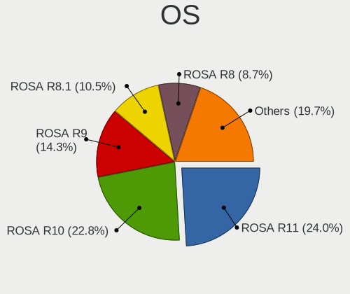

| Name               | Computers | Percent |
|--------------------|-----------|---------|
| ROSA R11           | 414       | 24.04%  |
| ROSA R10           | 393       | 22.82%  |
| ROSA R9            | 246       | 14.29%  |
| ROSA R8.1          | 180       | 10.45%  |
| ROSA R8            | 149       | 8.65%   |
| ROSA R11.1         | 144       | 8.36%   |
| ROSA 12.2          | 89        | 5.17%   |
| ROSA 12.1          | 21        | 1.22%   |
| ROSA 12            | 21        | 1.22%   |
| ROSA R6            | 18        | 1.05%   |
| ROSA R12           | 13        | 0.75%   |
| ROSA 2019.05       | 13        | 0.75%   |
| ROSA R7            | 10        | 0.58%   |
| ROSA Nickel 2019.0 | 10        | 0.58%   |
| ROSA R1            | 1         | 0.06%   |

OS Family
---------

OS without a version

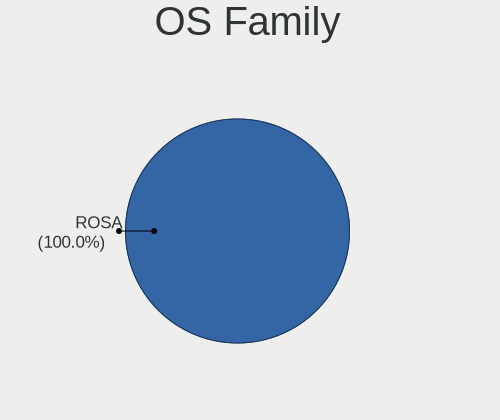

| Name | Computers | Percent |
|------|-----------|---------|
| ROSA | 1713      | 100%    |

Kernel
------

Version of the Linux kernel

| Version                             | Computers | Percent |
|-------------------------------------|-----------|---------|
| 4.15.0-desktop-45.1rosa-x86_64      | 284       | 16.44%  |
| 4.9.60-nrj-desktop-1rosa-x86_64     | 256       | 14.82%  |
| 4.9.20-nrj-desktop-1rosa-x86_64     | 193       | 11.18%  |
| 5.10.74-generic-2rosa2021.1-x86_64  | 105       | 6.08%   |
| 4.9.9-nrj-desktop-1rosa-x86_64      | 86        | 4.98%   |
| 4.1.25-nrj-desktop-1rosa-x86_64     | 57        | 3.3%    |
| 4.9.60-nrj-desktop-1rosa-i586       | 53        | 3.07%   |
| 5.4.32-generic-2rosa-x86_64         | 47        | 2.72%   |
| 4.9.20-nrj-desktop-1rosa-i586       | 42        | 2.43%   |
| 4.9.124-nrj-desktop-1rosa-x86_64    | 38        | 2.2%    |
| 4.15.0-desktop-45.1rosa-i586        | 38        | 2.2%    |
| 4.15.0-desktop-47.2rosa-x86_64      | 34        | 1.97%   |
| 4.9.9-nrj-desktop-1rosa-i586        | 33        | 1.91%   |
| 4.1.34-nrj-desktop-2rosa-x86_64     | 32        | 1.85%   |
| 4.1.25-nrj-desktop-1rosa-i586       | 29        | 1.68%   |
| 4.9.76-nrj-desktop-1rosa-x86_64     | 23        | 1.33%   |
| 4.1.38-nrj-desktop-2rosa-x86_64     | 22        | 1.27%   |
| 5.4.32-generic-2rosa-i586           | 19        | 1.1%    |
| 5.10.71-generic-1rosa2021.1-x86_64  | 19        | 1.1%    |
| 4.15.0-desktop-94.1rosa-x86_64      | 19        | 1.1%    |
| 4.1.34-nrj-desktop-2rosa-i586       | 19        | 1.1%    |
| 4.9.41-nrj-desktop-1rosa-x86_64     | 17        | 0.98%   |
| 5.4.83-generic-2rosa-x86_64         | 16        | 0.93%   |
| 4.15.0-desktop-122.124.1rosa-x86_64 | 16        | 0.93%   |
| 4.9.155-nrj-desktop-1rosa-x86_64    | 14        | 0.81%   |
| 4.15.0-desktop-68.5rosa-x86_64      | 14        | 0.81%   |
| 4.9.41-nrj-desktop-1rosa-i586       | 11        | 0.64%   |
| 4.9.111-nrj-desktop-2rosa-x86_64    | 11        | 0.64%   |
| 4.15.0-desktop-60.7rosa-x86_64      | 10        | 0.58%   |
| 4.1.15-nrj-desktop-1rosa-i586       | 9         | 0.52%   |
| 3.14.44-nrj-desktop-2rosa-x86_64    | 9         | 0.52%   |
| 4.15.0-desktop-51.4rosa-x86_64      | 8         | 0.46%   |
| 5.4.60-nickel-2rosa2019.05-x86_64   | 7         | 0.41%   |
| 4.1.38-nrj-desktop-1rosa-x86_64     | 6         | 0.35%   |
| 5.4.40-generic-1rosa-x86_64         | 5         | 0.29%   |
| 4.9.124-nrj-desktop-1rosa-i586      | 5         | 0.29%   |
| 4.1.38-nrj-desktop-2rosa-i586       | 5         | 0.29%   |
| 4.1.15-nrj-desktop-1rosa-x86_64     | 5         | 0.29%   |
| 3.14.44-nrj-desktop-2rosa-i586      | 5         | 0.29%   |
| 5.4.83-generic-2rosa2019.1-x86_64   | 4         | 0.23%   |
| 5.4.83-generic-2rosa-i586           | 4         | 0.23%   |
| 5.4.40-nickel-5rosa2019.05-x86_64   | 4         | 0.23%   |
| 4.9.87-nrj-desktop-2rosa-x86_64     | 4         | 0.23%   |
| 4.15.0-desktop-68.5rosa-i586        | 4         | 0.23%   |
| 4.15.0-desktop-47.2rosa-i586        | 4         | 0.23%   |
| 5.3.10-nickel-2rosa-x86_64          | 3         | 0.17%   |
| 5.10.74-generic-2rosa2021.1-i586    | 3         | 0.17%   |
| 4.9.95-nrj-desktop-2rosa-x86_64     | 3         | 0.17%   |
| 4.15.0-desktop-54.3rosa-x86_64      | 3         | 0.17%   |
| 4.15.0-desktop-54.1rosa-x86_64      | 3         | 0.17%   |
| 4.15.0-desktop-40.1rosa-x86_64      | 3         | 0.17%   |
| 5.4.40-generic-1rosa-i586           | 2         | 0.12%   |
| 5.3.11-nickel-7rosa-x86_64          | 2         | 0.12%   |
| 5.16.17-generic-1rosa2021.1-x86_64  | 2         | 0.12%   |
| 4.9.76-nrj-desktop-1rosa-i586       | 2         | 0.12%   |
| 4.9.14-nrj-desktop-2rosa-x86_64     | 2         | 0.12%   |
| 4.9.14-nrj-desktop-2rosa-i586       | 2         | 0.12%   |
| 4.4.16-nrj-desktop-1rosa-x86_64     | 2         | 0.12%   |
| 4.15.0-desktop-65.4rosa-x86_64      | 2         | 0.12%   |
| 4.15.0-desktop-60.7rosa-i586        | 2         | 0.12%   |

Kernel Family
-------------

Linux kernel without a distro release

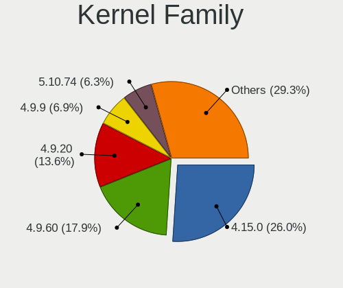

| Version | Computers | Percent |
|---------|-----------|---------|
| 4.15.0  | 449       | 26.03%  |
| 4.9.60  | 309       | 17.91%  |
| 4.9.20  | 235       | 13.62%  |
| 4.9.9   | 119       | 6.9%    |
| 5.10.74 | 108       | 6.26%   |
| 4.1.25  | 86        | 4.99%   |
| 5.4.32  | 67        | 3.88%   |
| 4.1.34  | 51        | 2.96%   |
| 4.9.124 | 43        | 2.49%   |
| 4.1.38  | 35        | 2.03%   |
| 4.9.41  | 28        | 1.62%   |
| 4.9.76  | 25        | 1.45%   |
| 5.4.83  | 24        | 1.39%   |
| 5.10.71 | 20        | 1.16%   |
| 4.9.155 | 15        | 0.87%   |
| 4.1.15  | 14        | 0.81%   |
| 3.14.44 | 14        | 0.81%   |
| 4.9.111 | 12        | 0.7%    |
| 5.4.40  | 11        | 0.64%   |
| 5.4.60  | 9         | 0.52%   |
| 4.9.87  | 5         | 0.29%   |
| 4.9.95  | 4         | 0.23%   |
| 4.9.14  | 4         | 0.23%   |
| 5.3.11  | 3         | 0.17%   |
| 5.3.10  | 3         | 0.17%   |
| 4.4.16  | 3         | 0.17%   |
| 4.1.16  | 3         | 0.17%   |
| 3.14.53 | 3         | 0.17%   |
| 5.16.17 | 2         | 0.12%   |
| 5.7.8   | 1         | 0.06%   |
| 5.4.31  | 1         | 0.06%   |
| 5.4.24  | 1         | 0.06%   |
| 5.4.139 | 1         | 0.06%   |
| 5.4.0   | 1         | 0.06%   |
| 5.15.32 | 1         | 0.06%   |
| 5.10.70 | 1         | 0.06%   |
| 5.10.65 | 1         | 0.06%   |
| 5.10.56 | 1         | 0.06%   |
| 5.10.55 | 1         | 0.06%   |
| 5.10.50 | 1         | 0.06%   |
| 5.10.42 | 1         | 0.06%   |
| 5.10.4  | 1         | 0.06%   |
| 5.10.31 | 1         | 0.06%   |
| 4.9.7   | 1         | 0.06%   |
| 4.9.34  | 1         | 0.06%   |
| 4.9.32  | 1         | 0.06%   |
| 4.8.8   | 1         | 0.06%   |
| 4.8.10  | 1         | 0.06%   |
| 4.1.33  | 1         | 0.06%   |
| 3.8.12  | 1         | 0.06%   |

Kernel Major Ver.
-----------------

Linux kernel major version

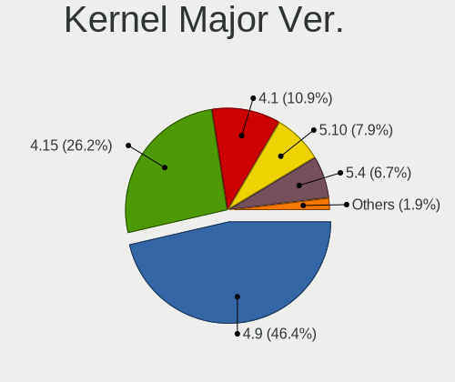

| Version | Computers | Percent |
|---------|-----------|---------|
| 4.9     | 796       | 46.39%  |
| 4.15    | 449       | 26.17%  |
| 4.1     | 187       | 10.9%   |
| 5.10    | 136       | 7.93%   |
| 5.4     | 115       | 6.7%    |
| 3.14    | 17        | 0.99%   |
| 5.3     | 6         | 0.35%   |
| 4.4     | 3         | 0.17%   |
| 5.16    | 2         | 0.12%   |
| 4.8     | 2         | 0.12%   |
| 5.7     | 1         | 0.06%   |
| 5.15    | 1         | 0.06%   |
| 3.8     | 1         | 0.06%   |

Arch
----

OS architecture (x86_64, i586, etc.)

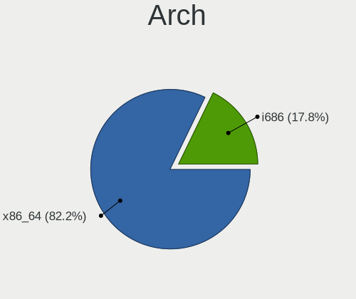

| Name   | Computers | Percent |
|--------|-----------|---------|
| x86_64 | 1408      | 82.19%  |
| i686   | 305       | 17.81%  |

DE
--

Desktop Environment

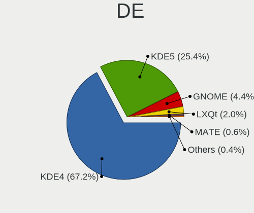

| Name    | Computers | Percent |
|---------|-----------|---------|
| KDE4    | 1153      | 67.23%  |
| KDE5    | 435       | 25.36%  |
| GNOME   | 75        | 4.37%   |
| LXQt    | 35        | 2.04%   |
| MATE    | 10        | 0.58%   |
| Unknown | 4         | 0.23%   |
| XFCE    | 3         | 0.17%   |

Display Server
--------------

X11 or Wayland

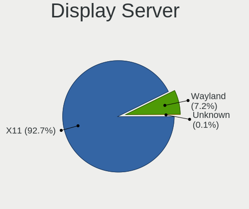

| Name    | Computers | Percent |
|---------|-----------|---------|
| X11     | 1588      | 92.7%   |
| Wayland | 123       | 7.18%   |
| Tty     | 1         | 0.06%   |
| Unknown | 1         | 0.06%   |

Display Manager
---------------

SDDM, LightDM, etc.

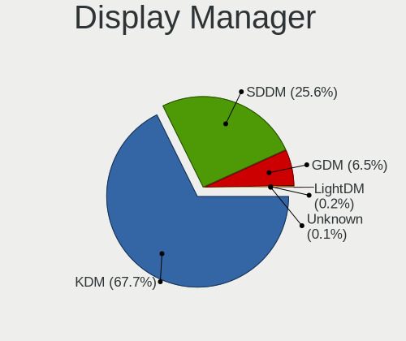

| Name    | Computers | Percent |
|---------|-----------|---------|
| KDM     | 1160      | 67.68%  |
| SDDM    | 438       | 25.55%  |
| GDM     | 111       | 6.48%   |
| LightDM | 3         | 0.18%   |
| Unknown | 2         | 0.12%   |

OS Lang
-------

Language

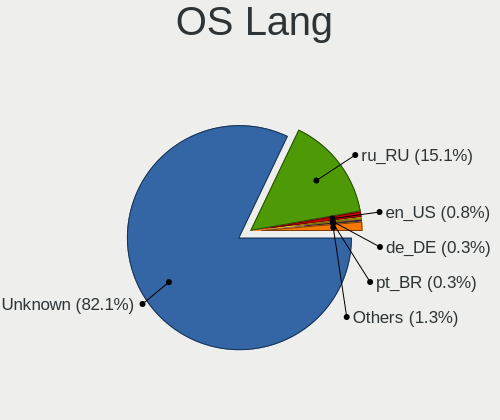

| Lang    | Computers | Percent |
|---------|-----------|---------|
| Unknown | 1408      | 82.1%   |
| ru_RU   | 259       | 15.1%   |
| en_US   | 14        | 0.82%   |
| de_DE   | 6         | 0.35%   |
| pt_BR   | 5         | 0.29%   |
| pl_PL   | 5         | 0.29%   |
| it_IT   | 4         | 0.23%   |
| fr_FR   | 4         | 0.23%   |
| cs_CZ   | 3         | 0.17%   |
| de_CH   | 2         | 0.12%   |
| zh_CN   | 1         | 0.06%   |
| ro_RO   | 1         | 0.06%   |
| es_ES   | 1         | 0.06%   |
| en_GB   | 1         | 0.06%   |
| C       | 1         | 0.06%   |

Boot Mode
---------

EFI or BIOS

| Mode | Computers | Percent |
|------|-----------|---------|
| BIOS | 1642      | 95.8%   |
| EFI  | 72        | 4.2%    |

Filesystem
----------

Type of filesystem

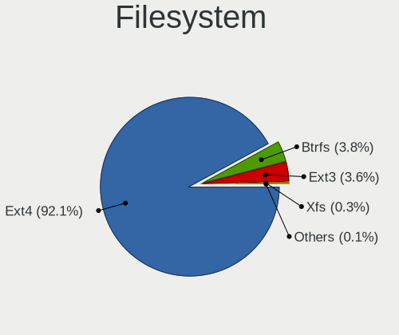

| Type  | Computers | Percent |
|-------|-----------|---------|
| Ext4  | 1579      | 92.07%  |
| Btrfs | 66        | 3.85%   |
| Ext3  | 62        | 3.62%   |
| Xfs   | 6         | 0.35%   |
| Jfs   | 1         | 0.06%   |
| Ext2  | 1         | 0.06%   |

Part. scheme
------------

Scheme of partitioning

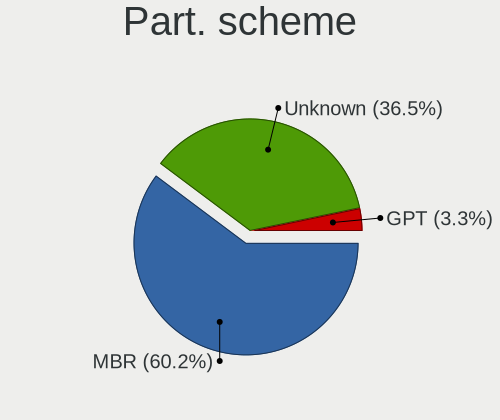

| Type    | Computers | Percent |
|---------|-----------|---------|
| MBR     | 1033      | 60.23%  |
| Unknown | 626       | 36.5%   |
| GPT     | 56        | 3.27%   |

Dual Boot with Linux/BSD
------------------------

Hosting more than one Linux/BSD

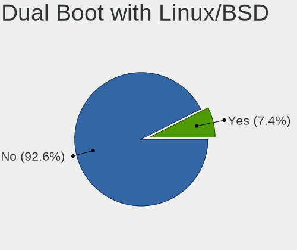

| Dual boot | Computers | Percent |
|-----------|-----------|---------|
| No        | 1587      | 92.59%  |
| Yes       | 127       | 7.41%   |

Dual Boot (Win)
---------------

Hosting Linux and Windows

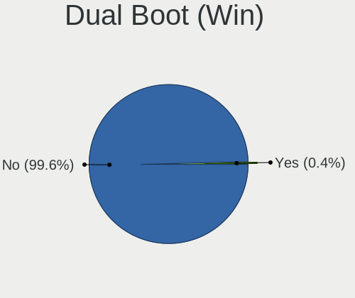

| Dual boot | Computers | Percent |
|-----------|-----------|---------|
| No        | 1707      | 99.59%  |
| Yes       | 7         | 0.41%   |

Board
-----

Vendor
------

Motherboard manufacturer

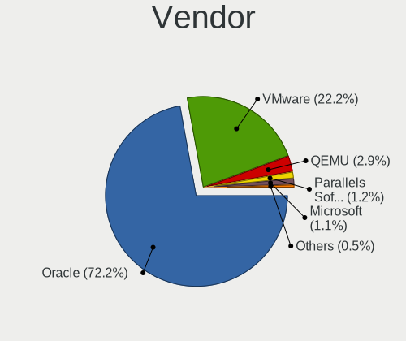

| Name                             | Computers | Percent |
|----------------------------------|-----------|---------|
| Oracle                           | 1236      | 72.15%  |
| VMware                           | 380       | 22.18%  |
| QEMU                             | 49        | 2.86%   |
| Parallels Software International | 20        | 1.17%   |
| Microsoft                        | 19        | 1.11%   |
| innotek                          | 5         | 0.29%   |
| oVirt                            | 2         | 0.12%   |
| Red Hat                          | 1         | 0.06%   |
| OpenStack Foundation             | 1         | 0.06%   |

Model
-----

Motherboard model

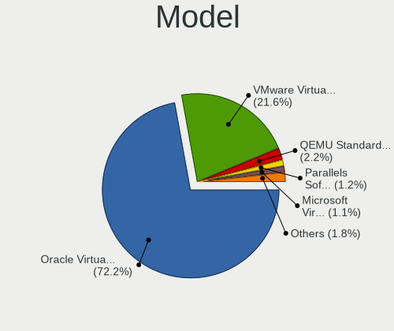

| Name                                                        | Computers | Percent |
|-------------------------------------------------------------|-----------|---------|
| Oracle VirtualBox                                           | 1236      | 72.15%  |
| VMware Virtual Platform                                     | 370       | 21.6%   |
| QEMU Standard PC (i440FX + PIIX, 1996)                      | 37        | 2.16%   |
| Parallels Software International Parallels Virtual Platform | 20        | 1.17%   |
| Microsoft Virtual Machine                                   | 19        | 1.11%   |
| QEMU Standard PC (Q35 + ICH9, 2009)                         | 12        | 0.7%    |
| VMware VMware7,1                                            | 10        | 0.58%   |
| innotek VirtualBox                                          | 5         | 0.29%   |
| oVirt Node                                                  | 2         | 0.12%   |
| Red Hat KVM                                                 | 1         | 0.06%   |
| OpenStack Foundation OpenStack Nova                         | 1         | 0.06%   |

Model Family
------------

Motherboard model prefix

| Name                                       | Computers | Percent |
|--------------------------------------------|-----------|---------|
| Oracle VirtualBox                          | 1236      | 72.15%  |
| VMware Virtual                             | 370       | 21.6%   |
| QEMU Standard                              | 49        | 2.86%   |
| Parallels Software International Parallels | 20        | 1.17%   |
| Microsoft Virtual                          | 19        | 1.11%   |
| VMware VMware7                             | 10        | 0.58%   |
| innotek VirtualBox                         | 5         | 0.29%   |
| oVirt Node                                 | 2         | 0.12%   |
| Red Hat KVM                                | 1         | 0.06%   |
| OpenStack Foundation OpenStack             | 1         | 0.06%   |

MFG Year
--------

Motherboard manufacture year

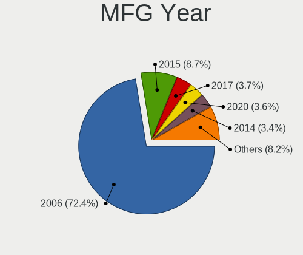

| Year    | Computers | Percent |
|---------|-----------|---------|
| 2006    | 1241      | 72.45%  |
| 2015    | 149       | 8.7%    |
| 2017    | 63        | 3.68%   |
| 2020    | 61        | 3.56%   |
| 2014    | 59        | 3.44%   |
| 2018    | 58        | 3.39%   |
| 2019    | 33        | 1.93%   |
| 2013    | 24        | 1.4%    |
| 2016    | 7         | 0.41%   |
| 2012    | 7         | 0.41%   |
| 2011    | 5         | 0.29%   |
| 2021    | 3         | 0.18%   |
| 2007    | 2         | 0.12%   |
| Unknown | 1         | 0.06%   |

Form Factor
-----------

Physical design of the computer

| Name            | Computers | Percent |
|-----------------|-----------|---------|
| Virtual machine | 1713      | 100%    |

Secure Boot
-----------

Enabled or disabled

| State    | Computers | Percent |
|----------|-----------|---------|
| Disabled | 1713      | 100%    |

Coreboot
--------

Have coreboot on board

| Used | Computers | Percent |
|------|-----------|---------|
| No   | 1713      | 100%    |

RAM Size
--------

Total RAM memory

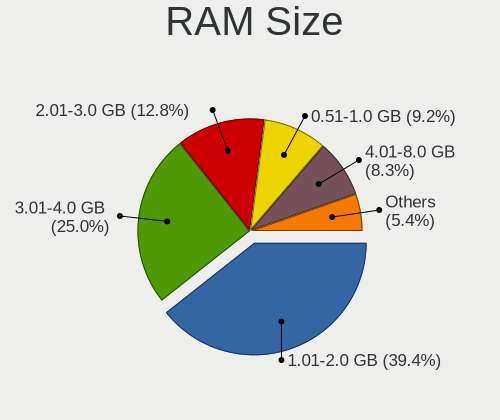

| Size in GB | Computers | Percent |
|------------|-----------|---------|
| 1.01-2.0   | 675       | 39.36%  |
| 3.01-4.0   | 428       | 24.96%  |
| 2.01-3.0   | 219       | 12.77%  |
| 0.51-1.0   | 158       | 9.21%   |
| 4.01-8.0   | 143       | 8.34%   |
| 8.01-16.0  | 78        | 4.55%   |
| 16.01-24.0 | 12        | 0.7%    |
| 0.01-0.5   | 2         | 0.12%   |

RAM Used
--------

Used RAM memory

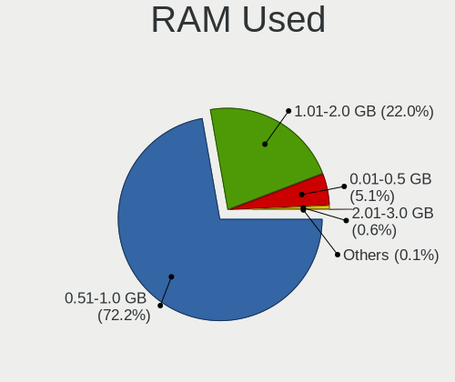

| Used GB  | Computers | Percent |
|----------|-----------|---------|
| 0.51-1.0 | 1244      | 72.24%  |
| 1.01-2.0 | 378       | 21.95%  |
| 0.01-0.5 | 87        | 5.05%   |
| 2.01-3.0 | 10        | 0.58%   |
| 3.01-4.0 | 2         | 0.12%   |
| Unknown  | 1         | 0.06%   |

Total Drives
------------

Number of drives on board

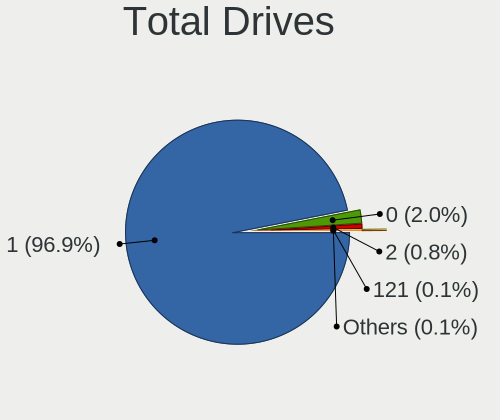

| Drives | Computers | Percent |
|--------|-----------|---------|
| 1      | 1661      | 96.91%  |
| 0      | 35        | 2.04%   |
| 2      | 13        | 0.76%   |
| 3      | 2         | 0.12%   |
| 121    | 1         | 0.06%   |
| 120    | 1         | 0.06%   |
| 4      | 1         | 0.06%   |

Has CD-ROM
----------

Has CD-ROM on board

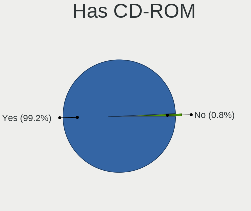

| Presented | Computers | Percent |
|-----------|-----------|---------|
| Yes       | 1701      | 99.24%  |
| No        | 13        | 0.76%   |

Has Ethernet
------------

Has Ethernet on board

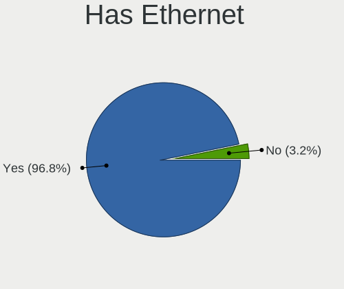

| Presented | Computers | Percent |
|-----------|-----------|---------|
| Yes       | 1658      | 96.79%  |
| No        | 55        | 3.21%   |

Has WiFi
--------

Has WiFi module

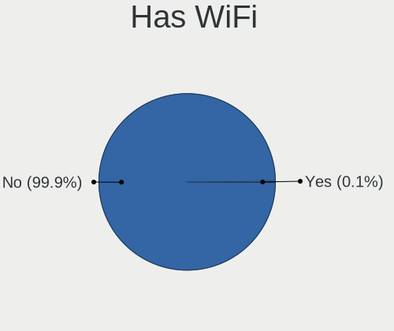

| Presented | Computers | Percent |
|-----------|-----------|---------|
| No        | 1712      | 99.94%  |
| Yes       | 1         | 0.06%   |

Has Bluetooth
-------------

Has Bluetooth module

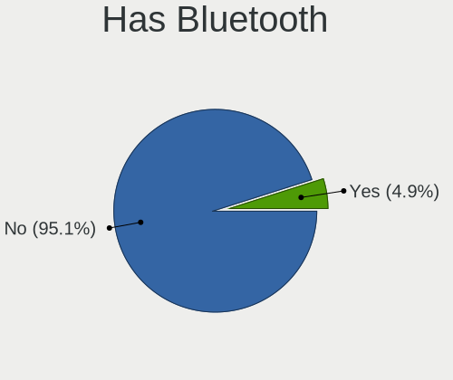

| Presented | Computers | Percent |
|-----------|-----------|---------|
| No        | 1629      | 95.1%   |
| Yes       | 84        | 4.9%    |

Location
--------

Country
-------

Geographic location (country)

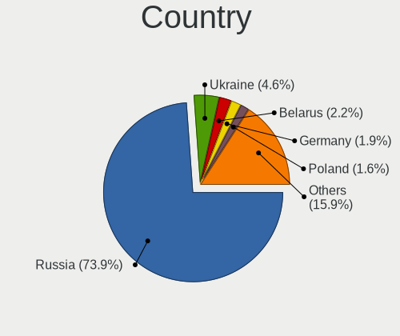

| Country            | Computers | Percent |
|--------------------|-----------|---------|
| Russia             | 1266      | 73.86%  |
| Ukraine            | 79        | 4.61%   |
| Belarus            | 38        | 2.22%   |
| Germany            | 32        | 1.87%   |
| Poland             | 27        | 1.58%   |
| France             | 25        | 1.46%   |
| Kazakhstan         | 21        | 1.23%   |
| USA                | 17        | 0.99%   |
| Italy              | 17        | 0.99%   |
| Brazil             | 17        | 0.99%   |
| Unknown            | 17        | 0.99%   |
| Czechia            | 15        | 0.88%   |
| UK                 | 12        | 0.7%    |
| Bulgaria           | 10        | 0.58%   |
| Romania            | 9         | 0.53%   |
| Switzerland        | 8         | 0.47%   |
| Canada             | 8         | 0.47%   |
| Uzbekistan         | 7         | 0.41%   |
| Moldova            | 7         | 0.41%   |
| Estonia            | 7         | 0.41%   |
| Spain              | 6         | 0.35%   |
| Austria            | 6         | 0.35%   |
| China              | 5         | 0.29%   |
| Serbia             | 4         | 0.23%   |
| Turkey             | 3         | 0.18%   |
| Netherlands        | 3         | 0.18%   |
| Belgium            | 3         | 0.18%   |
| Sweden             | 2         | 0.12%   |
| Slovenia           | 2         | 0.12%   |
| Slovakia           | 2         | 0.12%   |
| Portugal           | 2         | 0.12%   |
| New Zealand        | 2         | 0.12%   |
| Lithuania          | 2         | 0.12%   |
| Israel             | 2         | 0.12%   |
| Ireland            | 2         | 0.12%   |
| Iran               | 2         | 0.12%   |
| Hungary            | 2         | 0.12%   |
| Greece             | 2         | 0.12%   |
| Denmark            | 2         | 0.12%   |
| Australia          | 2         | 0.12%   |
| Vietnam            | 1         | 0.06%   |
| Venezuela          | 1         | 0.06%   |
| St Kitts and Nevis | 1         | 0.06%   |
| South Korea        | 1         | 0.06%   |
| South Africa       | 1         | 0.06%   |
| Sierra Leone       | 1         | 0.06%   |
| Norway             | 1         | 0.06%   |
| North Macedonia    | 1         | 0.06%   |
| Mexico             | 1         | 0.06%   |
| Latvia             | 1         | 0.06%   |
| Kyrgyzstan         | 1         | 0.06%   |
| Iraq               | 1         | 0.06%   |
| India              | 1         | 0.06%   |
| Finland            | 1         | 0.06%   |
| Cyprus             | 1         | 0.06%   |
| Colombia           | 1         | 0.06%   |
| Chile              | 1         | 0.06%   |
| Argentina          | 1         | 0.06%   |
| Algeria            | 1         | 0.06%   |

City
----

Geographic location (city)

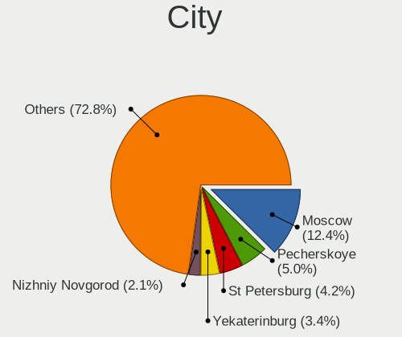

| City                | Computers | Percent |
|---------------------|-----------|---------|
| Moscow              | 214       | 12.42%  |
| Pecherskoye         | 86        | 4.99%   |
| St Petersburg       | 73        | 4.24%   |
| Yekaterinburg       | 59        | 3.42%   |
| Nizhniy Novgorod    | 37        | 2.15%   |
| Omsk                | 36        | 2.09%   |
| Novosibirsk         | 31        | 1.8%    |
| Krasnodar           | 28        | 1.63%   |
| Irkutsk             | 28        | 1.63%   |
| Rostov-on-Don       | 18        | 1.04%   |
| Saransk             | 17        | 0.99%   |
| Unknown             | 17        | 0.99%   |
| Voronezh            | 16        | 0.93%   |
| Barnaul             | 16        | 0.93%   |
| Samara              | 15        | 0.87%   |
| Kaliningrad         | 15        | 0.87%   |
| Ivanovo             | 15        | 0.87%   |
| Saratov             | 14        | 0.81%   |
| Minsk               | 14        | 0.81%   |
| Chelyabinsk         | 14        | 0.81%   |
| Ufa                 | 13        | 0.75%   |
| Blagoveshchensk     | 12        | 0.7%    |
| Perm                | 11        | 0.64%   |
| Novokuznetsk        | 11        | 0.64%   |
| Ryazan              | 10        | 0.58%   |
| Kyiv                | 10        | 0.58%   |
| Khabarovsk          | 10        | 0.58%   |
| Arkhangelsk         | 10        | 0.58%   |
| Orenburg            | 9         | 0.52%   |
| Lipetsk             | 9         | 0.52%   |
| Krasnoyarsk         | 9         | 0.52%   |
| Kirov               | 9         | 0.52%   |
| Izhevsk             | 9         | 0.52%   |
| Chita               | 9         | 0.52%   |
| Yaroslavl           | 8         | 0.46%   |
| Vladivostok         | 8         | 0.46%   |
| Odessa              | 8         | 0.46%   |
| Kazan’       | 8         | 0.46%   |
| Bryansk             | 8         | 0.46%   |
| Belgorod            | 8         | 0.46%   |
| Volgograd           | 7         | 0.41%   |
| Tver                | 7         | 0.41%   |
| Stavropol           | 7         | 0.41%   |
| Astrakhan           | 7         | 0.41%   |
| Tula                | 6         | 0.35%   |
| Tolyatti            | 6         | 0.35%   |
| Tashkent            | 6         | 0.35%   |
| Tambov              | 6         | 0.35%   |
| Syktyvkar           | 6         | 0.35%   |
| Murmansk            | 6         | 0.35%   |
| Kursk               | 6         | 0.35%   |
| Kharkiv             | 6         | 0.35%   |
| Almaty              | 6         | 0.35%   |
| Tomsk               | 5         | 0.29%   |
| Tallinn             | 5         | 0.29%   |
| Pskov               | 5         | 0.29%   |
| Novorossiysk        | 5         | 0.29%   |
| Naberezhnyye Chelny | 5         | 0.29%   |
| Zheleznogorsk       | 4         | 0.23%   |
| Yoshkar-Ola         | 4         | 0.23%   |

Drives
------

Drive Vendor
------------

Hard drive vendors

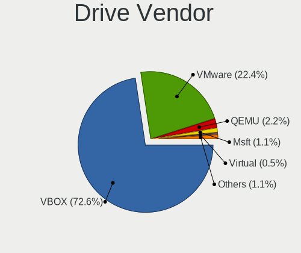

| Vendor              | Computers | Drives  | Percent |
|---------------------|-----------|---------|---------|
| VBOX                | 1223      | 1268    | 72.62%  |
| VMware              | 378       | 385     | 22.45%  |
| QEMU                | 37        | 39      | 2.2%    |
| Msft                | 19        | 21      | 1.13%   |
| Virtual             | 8         | 8       | 0.48%   |
| Rosa                | 4         | 4       | 0.24%   |
| TF CARD             | 3         | 3       | 0.18%   |
| Rosa-0              | 2         | 2       | 0.12%   |
| Unknown             | 2         | 2       | 0.12%   |
| Ultramarine         | 1         | 1       | 0.06%   |
| Ubuntu              | 1         | 1       | 0.06%   |
| SYNOLOGY            | 1         | 1       | 0.06%   |
| Samsung Electronics | 1         | 1       | 0.06%   |
| Other               | 1         | 1       | 0.06%   |
| Mass                | 1         | Unknown | 0.06%   |
| live                | 1         | 1       | 0.06%   |
| Linux               | 1         | 1       | 0.06%   |

Drive Model
-----------

Hard drive models

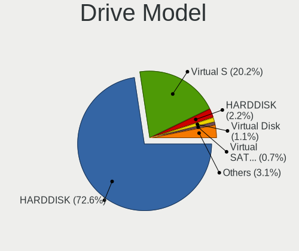

| Model                          | Computers | Percent |
|--------------------------------|-----------|---------|
| VBOX HARDDISK                  | 1223      | 72.62%  |
| VMware Virtual S               | 340       | 20.19%  |
| QEMU HARDDISK                  | 37        | 2.2%    |
| Msft Virtual Disk              | 19        | 1.13%   |
| VMware Virtual SATA Hard Drive | 12        | 0.71%   |
| VMware NVMe SSD Drive          | 12        | 0.71%   |
| VMware Virtual disk            | 10        | 0.59%   |
| Virtual HDD 69GB               | 8         | 0.48%   |
| VMware Virtual IDE Hard Drive  | 4         | 0.24%   |
| TF CARD storage 8GB            | 3         | 0.18%   |
| Rosa-0 SSD 70GB                | 2         | 0.12%   |
| Rosa Linux-0 SSD 69GB          | 2         | 0.12%   |
| Unknown                        | 2         | 0.12%   |
| Ultramarine Linux-0 SSD 69GB   | 1         | 0.06%   |
| Ubuntu Linux-0 17GB            | 1         | 0.06%   |
| SYNOLOGY iSCSI Storage         | 1         | 0.06%   |
| Samsung M3 Portable 500GB      | 1         | 0.06%   |
| ROSA R9-0 SSD 69GB             | 1         | 0.06%   |
| Rosa OS-0 32GB                 | 1         | 0.06%   |
| Other Linux-0 SSD 69GB         | 1         | 0.06%   |
| Mass Mass Storage 8MB          | 1         | 0.06%   |
| live React-0 34GB              | 1         | 0.06%   |
| Linux Rosa-0 SSD 69GB          | 1         | 0.06%   |

HDD Vendor
----------

Hard disk drive vendors

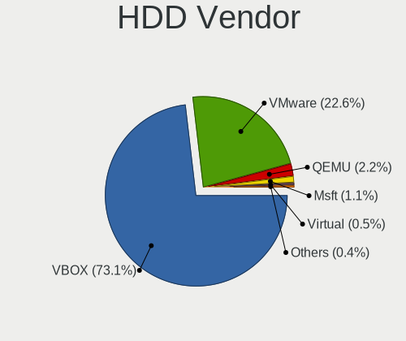

| Vendor              | Computers | Drives | Percent |
|---------------------|-----------|--------|---------|
| VBOX                | 1223      | 1268   | 73.15%  |
| VMware              | 378       | 385    | 22.61%  |
| QEMU                | 37        | 39     | 2.21%   |
| Msft                | 19        | 21     | 1.14%   |
| Virtual             | 8         | 8      | 0.48%   |
| Unknown             | 2         | 2      | 0.12%   |
| Ubuntu              | 1         | 1      | 0.06%   |
| SYNOLOGY            | 1         | 1      | 0.06%   |
| Samsung Electronics | 1         | 1      | 0.06%   |
| Rosa                | 1         | 1      | 0.06%   |
| live                | 1         | 1      | 0.06%   |

SSD Vendor
----------

Solid state drive vendors

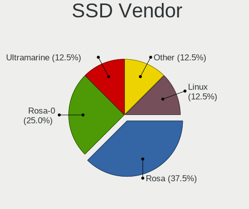

| Vendor      | Computers | Drives | Percent |
|-------------|-----------|--------|---------|
| Rosa        | 3         | 3      | 37.5%   |
| Rosa-0      | 2         | 2      | 25%     |
| Ultramarine | 1         | 1      | 12.5%   |
| Other       | 1         | 1      | 12.5%   |
| Linux       | 1         | 1      | 12.5%   |

Drive Kind
----------

HDD or SSD

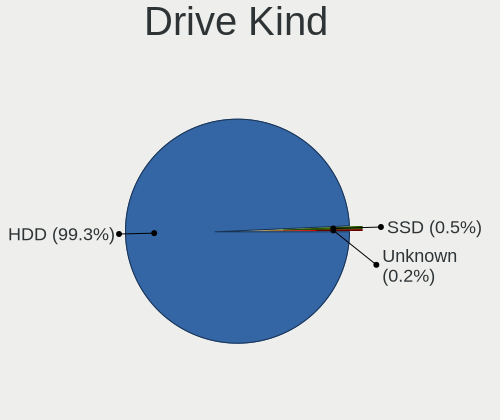

| Kind    | Computers | Drives | Percent |
|---------|-----------|--------|---------|
| HDD     | 1670      | 1728   | 99.29%  |
| SSD     | 8         | 8      | 0.48%   |
| Unknown | 4         | 3      | 0.24%   |

Drive Connector
---------------

SATA, SAS, NVMe, etc.

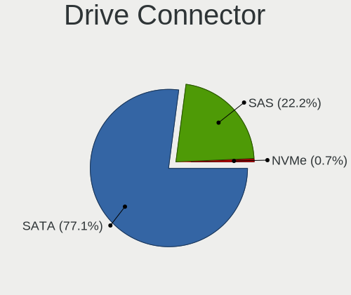

| Type | Computers | Drives | Percent |
|------|-----------|--------|---------|
| SATA | 1297      | 1345   | 77.06%  |
| SAS  | 374       | 382    | 22.22%  |
| NVMe | 12        | 12     | 0.71%   |

Drive Size
----------

Size of hard drive

| Size in TB | Computers | Drives | Percent |
|------------|-----------|--------|---------|
| 0.01-0.5   | 1678      | 1736   | 100%    |

Space Total
-----------

Amount of disk space available on the file system

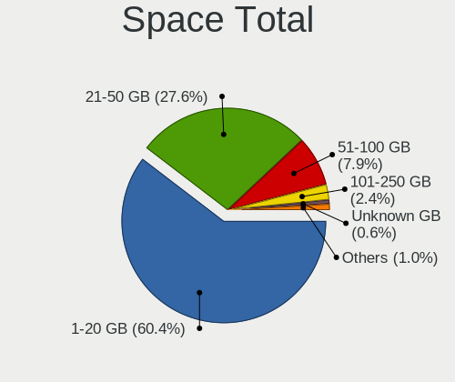

| Size in GB | Computers | Percent |
|------------|-----------|---------|
| 1-20       | 1037      | 60.4%   |
| 21-50      | 474       | 27.61%  |
| 51-100     | 136       | 7.92%   |
| 101-250    | 42        | 2.45%   |
| Unknown    | 11        | 0.64%   |
| 251-500    | 6         | 0.35%   |
| 2001-3000  | 5         | 0.29%   |
| 501-1000   | 4         | 0.23%   |
| 1001-2000  | 2         | 0.12%   |

Space Used
----------

Amount of used disk space

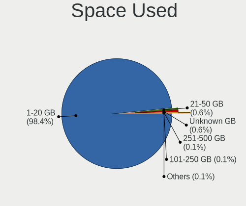

| Used GB  | Computers | Percent |
|----------|-----------|---------|
| 1-20     | 1686      | 98.37%  |
| 21-50    | 11        | 0.64%   |
| Unknown  | 11        | 0.64%   |
| 251-500  | 2         | 0.12%   |
| 101-250  | 2         | 0.12%   |
| 501-1000 | 1         | 0.06%   |
| 51-100   | 1         | 0.06%   |

Malfunc. Drives
---------------

Drive models with a malfunction

Zero info for selected period =(

Malfunc. Drive Vendor
---------------------

Vendors of faulty drives

Zero info for selected period =(

Malfunc. HDD Vendor
-------------------

Vendors of faulty HDD drives

Zero info for selected period =(

Malfunc. Drive Kind
-------------------

Kinds of faulty drives

Zero info for selected period =(

Failed Drives
-------------

Failed drive models

Zero info for selected period =(

Failed Drive Vendor
-------------------

Failed drive vendors

Zero info for selected period =(

Drive Status
------------

Number of failed and malfunc. drives

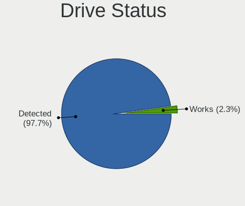

| Status   | Computers | Drives | Percent |
|----------|-----------|--------|---------|
| Detected | 1640      | 1699   | 97.74%  |
| Works    | 38        | 40     | 2.26%   |

Storage controller
------------------

Storage Vendor
--------------

Storage controller vendors

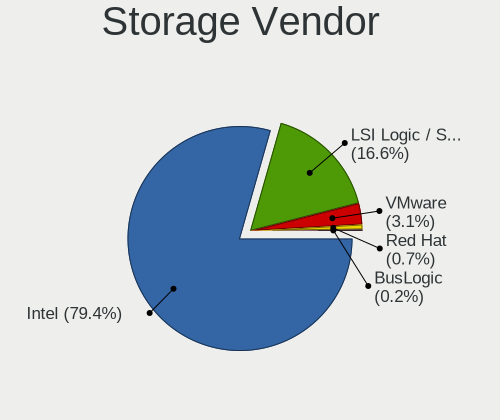

| Vendor                    | Computers | Percent |
|---------------------------|-----------|---------|
| Intel                     | 1713      | 79.42%  |
| LSI Logic / Symbios Logic | 358       | 16.6%   |
| VMware                    | 66        | 3.06%   |
| Red Hat                   | 15        | 0.7%    |
| BusLogic                  | 5         | 0.23%   |

Storage Model
-------------

Storage controller models

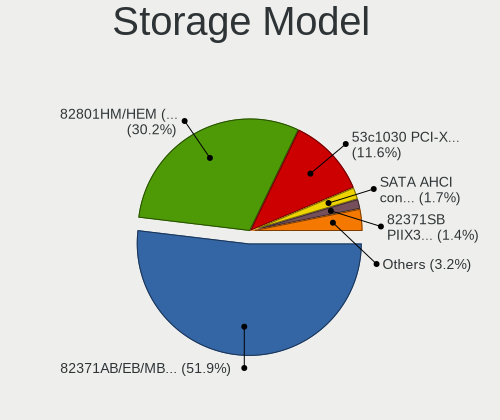

| Model                                                                 | Computers | Percent |
|-----------------------------------------------------------------------|-----------|---------|
| Intel 82371AB/EB/MB PIIX4 IDE                                         | 1586      | 51.9%   |
| Intel 82801HM/HEM (ICH8M/ICH8M-E) SATA Controller [AHCI mode]         | 924       | 30.24%  |
| LSI Logic / Symbios Logic 53c1030 PCI-X Fusion-MPT Dual Ultra320 SCSI | 353       | 11.55%  |
| VMware SATA AHCI controller                                           | 53        | 1.73%   |
| Intel 82371SB PIIX3 IDE [Natoma/Triton II]                            | 43        | 1.41%   |
| Intel 82801BA IDE U100 Controller                                     | 20        | 0.65%   |
| Intel 82801IR/IO/IH (ICH9R/DO/DH) 6 port SATA Controller [AHCI mode]  | 17        | 0.56%   |
| Red Hat Virtio block device                                           | 13        | 0.43%   |
| VMware NVMe SSD Controller                                            | 12        | 0.39%   |
| Intel 631xESB/632xESB IDE Controller                                  | 12        | 0.39%   |
| Red Hat Virtio SCSI                                                   | 5         | 0.16%   |
| Intel 82801HR/HO/HH (ICH8R/DO/DH) 6 port SATA Controller [AHCI mode]  | 5         | 0.16%   |
| BusLogic BT-946C (BA80C30) [MultiMaster 10]                           | 5         | 0.16%   |
| LSI Logic / Symbios Logic SAS1068 PCI-X Fusion-MPT SAS                | 4         | 0.13%   |
| VMware PVSCSI SCSI Controller                                         | 3         | 0.1%    |
| LSI Logic / Symbios Logic 53c895a                                     | 1         | 0.03%   |

Storage Kind
------------

Kind of storage controller (IDE, SATA, NVMe, SAS, ...)

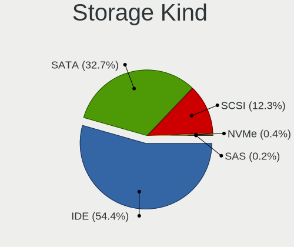

| Kind | Computers | Percent |
|------|-----------|---------|
| IDE  | 1661      | 54.41%  |
| SATA | 999       | 32.72%  |
| SCSI | 374       | 12.25%  |
| NVMe | 12        | 0.39%   |
| SAS  | 7         | 0.23%   |

Processor
---------

CPU Vendor
----------

Processor vendors

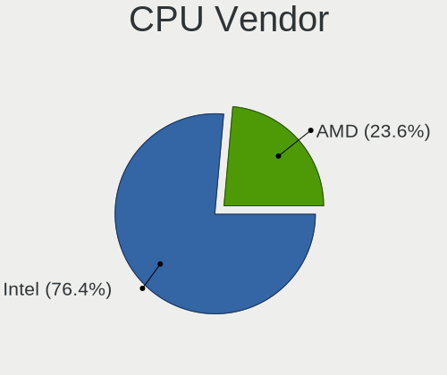

| Vendor | Computers | Percent |
|--------|-----------|---------|
| Intel  | 1309      | 76.42%  |
| AMD    | 404       | 23.58%  |

CPU Model
---------

Processor models

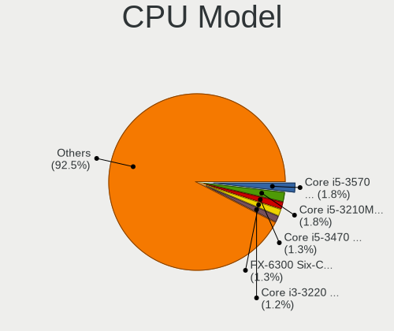

| Model                                       | Computers | Percent |
|---------------------------------------------|-----------|---------|
| Intel Core i5-3570 CPU @ 3.40GHz            | 31        | 1.81%   |
| Intel Core i5-3210M CPU @ 2.50GHz           | 31        | 1.81%   |
| Intel Core i5-3470 CPU @ 3.20GHz            | 23        | 1.34%   |
| AMD FX-6300 Six-Core Processor              | 23        | 1.34%   |
| Intel Core i3-3220 CPU @ 3.30GHz            | 21        | 1.23%   |
| AMD FX-8350 Eight-Core Processor            | 19        | 1.11%   |
| Intel Core i7-4790 CPU @ 3.60GHz            | 16        | 0.93%   |
| Intel Core i7-2600 CPU @ 3.40GHz            | 16        | 0.93%   |
| Intel Core i5-3230M CPU @ 2.60GHz           | 16        | 0.93%   |
| Intel Core i7-3770 CPU @ 3.40GHz            | 15        | 0.88%   |
| Intel Core i5-4460 CPU @ 3.20GHz            | 15        | 0.88%   |
| Intel Core i5-2500 CPU @ 3.30GHz            | 15        | 0.88%   |
| Intel Core i5-2400 CPU @ 3.10GHz            | 15        | 0.88%   |
| Intel Core i5-7400 CPU @ 3.00GHz            | 14        | 0.82%   |
| Intel Core i5-7200U CPU @ 2.50GHz           | 14        | 0.82%   |
| Intel Core i3-6100 CPU @ 3.70GHz            | 14        | 0.82%   |
| Intel Core i5-4430 CPU @ 3.00GHz            | 13        | 0.76%   |
| AMD Ryzen 3 2200G with Radeon Vega Graphics | 13        | 0.76%   |
| Intel Core i5-3570K CPU @ 3.40GHz           | 12        | 0.7%    |
| Intel Core i3-8100 CPU @ 3.60GHz            | 12        | 0.7%    |
| AMD Ryzen 5 1600 Six-Core Processor         | 12        | 0.7%    |
| AMD FX-8320 Eight-Core Processor            | 12        | 0.7%    |
| AMD FX-8120 Eight-Core Processor            | 12        | 0.7%    |
| Intel Core i7-2670QM CPU @ 2.20GHz          | 11        | 0.64%   |
| Intel Core i5-3337U CPU @ 1.80GHz           | 11        | 0.64%   |
| AMD Ryzen 5 2600 Six-Core Processor         | 11        | 0.64%   |
| Intel Pentium CPU G4560 @ 3.50GHz           | 10        | 0.58%   |
| Intel Core i7-3630QM CPU @ 2.40GHz          | 10        | 0.58%   |
| Intel Core i7-2600K CPU @ 3.40GHz           | 10        | 0.58%   |
| Intel Core i5-6500 CPU @ 3.20GHz            | 10        | 0.58%   |
| Intel Core i5-6200U CPU @ 2.30GHz           | 10        | 0.58%   |
| Intel Core i5-3450 CPU @ 3.10GHz            | 10        | 0.58%   |
| Intel Core i5-2500K CPU @ 3.30GHz           | 10        | 0.58%   |
| Intel Core i5-2450M CPU @ 2.50GHz           | 10        | 0.58%   |
| Intel Core i5 CPU 750 @ 2.67GHz             | 10        | 0.58%   |
| Intel Core i3-2100 CPU @ 3.10GHz            | 10        | 0.58%   |
| Intel Core i7-4790K CPU @ 4.00GHz           | 9         | 0.53%   |
| Intel Core i5-3317U CPU @ 1.70GHz           | 9         | 0.53%   |
| Intel Core i3-4130 CPU @ 3.40GHz            | 9         | 0.53%   |
| Intel Core i3-3240 CPU @ 3.40GHz            | 9         | 0.53%   |
| Intel Core i3-3110M CPU @ 2.40GHz           | 9         | 0.53%   |
| Intel Core i3 CPU M 370 @ 2.40GHz           | 9         | 0.53%   |
| AMD Phenom II X4 965 Processor              | 9         | 0.53%   |
| Intel Core i7-7700HQ CPU @ 2.80GHz          | 8         | 0.47%   |
| Intel Core i7-3770K CPU @ 3.50GHz           | 8         | 0.47%   |
| Intel Core i5-4690 CPU @ 3.50GHz            | 8         | 0.47%   |
| Intel Core i5-4440 CPU @ 3.10GHz            | 8         | 0.47%   |
| Intel Core i5-2310 CPU @ 2.90GHz            | 8         | 0.47%   |
| Intel Core i5-2300 CPU @ 2.80GHz            | 8         | 0.47%   |
| Intel Core i3-5005U CPU @ 2.00GHz           | 8         | 0.47%   |
| Intel Core i3-4005U CPU @ 1.70GHz           | 8         | 0.47%   |
| Intel Core i3-2120 CPU @ 3.30GHz            | 8         | 0.47%   |
| AMD FX-4350 Quad-Core Processor             | 8         | 0.47%   |
| AMD FX-4300 Quad-Core Processor             | 8         | 0.47%   |
| AMD Athlon II X4 640 Processor              | 8         | 0.47%   |
| Intel Core i7-8550U CPU @ 1.80GHz           | 7         | 0.41%   |
| Intel Core i7-7700 CPU @ 3.60GHz            | 7         | 0.41%   |
| Intel Core i7-7500U CPU @ 2.70GHz           | 7         | 0.41%   |
| Intel Core i7-4770K CPU @ 3.50GHz           | 7         | 0.41%   |
| Intel Core i7-4770 CPU @ 3.40GHz            | 7         | 0.41%   |

CPU Model Family
----------------

Processor model prefix

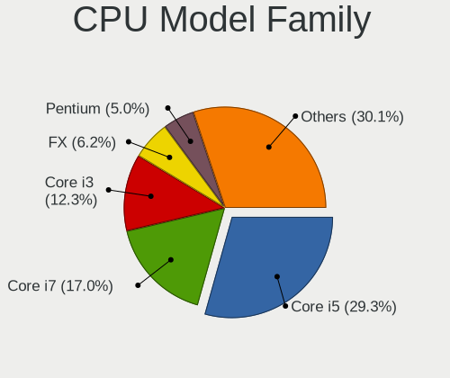

| Model                   | Computers | Percent |
|-------------------------|-----------|---------|
| Intel Core i5           | 503       | 29.35%  |
| Intel Core i7           | 291       | 16.98%  |
| Intel Core i3           | 211       | 12.31%  |
| AMD FX                  | 107       | 6.24%   |
| Intel Pentium           | 86        | 5.02%   |
| Intel Xeon              | 70        | 4.08%   |
| AMD Ryzen 5             | 64        | 3.73%   |
| Intel Celeron           | 43        | 2.51%   |
| Intel Core 2 Duo        | 28        | 1.63%   |
| AMD Phenom II X4        | 28        | 1.63%   |
| AMD A8                  | 25        | 1.46%   |
| AMD Athlon II X2        | 23        | 1.34%   |
| Intel Core 2 Quad       | 21        | 1.23%   |
| AMD Athlon II X4        | 18        | 1.05%   |
| AMD A10                 | 18        | 1.05%   |
| Other                   | 15        | 0.88%   |
| AMD Ryzen 3             | 14        | 0.82%   |
| AMD A4                  | 13        | 0.76%   |
| Intel Pentium Dual-Core | 11        | 0.64%   |
| AMD Ryzen 7             | 11        | 0.64%   |
| AMD Phenom II X6        | 10        | 0.58%   |
| AMD Athlon 64 X2        | 10        | 0.58%   |
| AMD Athlon X4           | 9         | 0.53%   |
| AMD A6                  | 8         | 0.47%   |
| Intel Genuine           | 7         | 0.41%   |
| AMD Athlon II X3        | 7         | 0.41%   |
| Intel Pentium Gold      | 5         | 0.29%   |
| Intel Core i9           | 5         | 0.29%   |
| Intel Core              | 5         | 0.29%   |
| AMD Opteron             | 5         | 0.29%   |
| Intel Pentium Silver    | 4         | 0.23%   |
| AMD Phenom              | 4         | 0.23%   |
| AMD Athlon              | 4         | 0.23%   |
| Intel Pentium Dual      | 3         | 0.18%   |
| AMD Phenom II X2        | 3         | 0.18%   |
| AMD E                   | 3         | 0.18%   |
| Intel Xeon Gold         | 2         | 0.12%   |
| Intel Atom              | 2         | 0.12%   |
| AMD Turion II           | 2         | 0.12%   |
| AMD Ryzen 9             | 2         | 0.12%   |
| AMD EPYC                | 2         | 0.12%   |
| AMD E2                  | 2         | 0.12%   |
| Intel Core 2 Extreme    | 1         | 0.06%   |
| Intel Core 2            | 1         | 0.06%   |
| Intel Celeron Dual-Core | 1         | 0.06%   |
| AMD Sempron X2          | 1         | 0.06%   |
| AMD Sempron             | 1         | 0.06%   |
| AMD Ryzen Threadripper  | 1         | 0.06%   |
| AMD Ryzen 3 PRO         | 1         | 0.06%   |
| AMD Phenom II X3        | 1         | 0.06%   |
| AMD Athlon X2           | 1         | 0.06%   |
| AMD A12                 | 1         | 0.06%   |

CPU Cores
---------

Number of processor cores

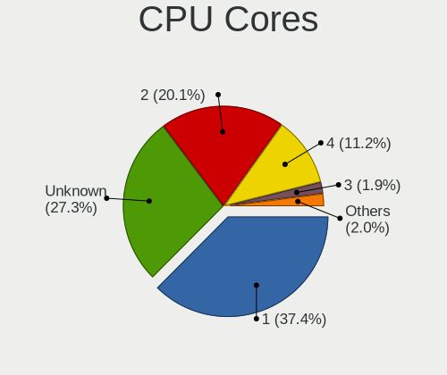

| Number  | Computers | Percent |
|---------|-----------|---------|
| 1       | 643       | 37.45%  |
| Unknown | 469       | 27.32%  |
| 2       | 345       | 20.09%  |
| 4       | 193       | 11.24%  |
| 3       | 32        | 1.86%   |
| 6       | 15        | 0.87%   |
| 8       | 12        | 0.7%    |
| 16      | 5         | 0.29%   |
| 5       | 2         | 0.12%   |
| 7       | 1         | 0.06%   |

CPU Sockets
-----------

Number of sockets

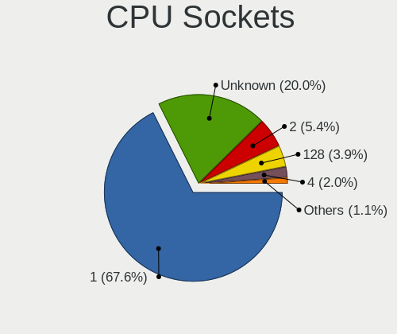

| Number  | Computers | Percent |
|---------|-----------|---------|
| 1       | 1160      | 67.6%   |
| Unknown | 344       | 20.05%  |
| 2       | 92        | 5.36%   |
| 128     | 67        | 3.9%    |
| 4       | 34        | 1.98%   |
| 64      | 13        | 0.76%   |
| 8       | 5         | 0.29%   |
| 16      | 1         | 0.06%   |

CPU Threads
-----------

Threads per core (Hyper-Threading)

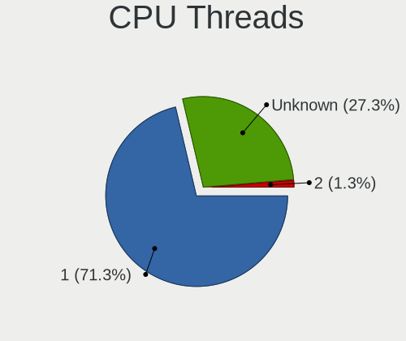

| Number  | Computers | Percent |
|---------|-----------|---------|
| 1       | 1224      | 71.33%  |
| Unknown | 469       | 27.33%  |
| 2       | 23        | 1.34%   |

CPU Op-Modes
------------

CPU Operation Modes (32-bit, 64-bit)

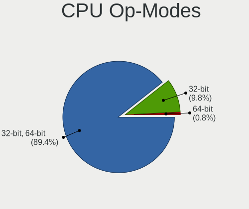

| Op mode        | Computers | Percent |
|----------------|-----------|---------|
| 32-bit, 64-bit | 1531      | 89.38%  |
| 32-bit         | 168       | 9.81%   |
| 64-bit         | 14        | 0.82%   |

CPU Microcode
-------------

Microcode number

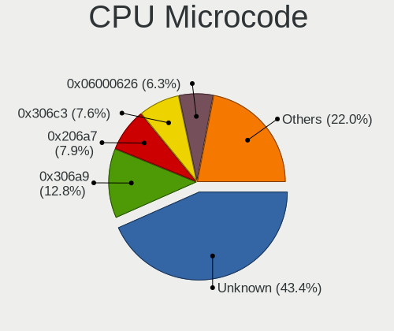

| Number     | Computers | Percent |
|------------|-----------|---------|
| Unknown    | 743       | 43.37%  |
| 0x306a9    | 219       | 12.78%  |
| 0x206a7    | 136       | 7.94%   |
| 0x306c3    | 130       | 7.59%   |
| 0x06000626 | 108       | 6.3%    |
| 0x1067a    | 40        | 2.34%   |
| 0x506e3    | 36        | 2.1%    |
| 0x01000086 | 26        | 1.52%   |
| 0x906e9    | 23        | 1.34%   |
| 0x106e5    | 21        | 1.23%   |
| 0x010000bf | 19        | 1.11%   |
| 0x40651    | 16        | 0.93%   |
| 0x306d4    | 16        | 0.93%   |
| 0x406e3    | 12        | 0.7%    |
| 0x10676    | 12        | 0.7%    |
| 0x806e9    | 11        | 0.64%   |
| 0x20652    | 11        | 0.64%   |
| 0x20655    | 10        | 0.58%   |
| 0x6fb      | 8         | 0.47%   |
| 0x206d7    | 8         | 0.47%   |
| 0x30678    | 6         | 0.35%   |
| 0x010000c8 | 6         | 0.35%   |
| 0x106a5    | 5         | 0.29%   |
| 0x106a3    | 5         | 0.29%   |
| 0x906eb    | 4         | 0.23%   |
| 0x906ea    | 4         | 0.23%   |
| 0x806ea    | 4         | 0.23%   |
| 0x406c4    | 4         | 0.23%   |
| 0x306e4    | 4         | 0.23%   |
| 0x6fd      | 3         | 0.18%   |
| 0x10677    | 3         | 0.18%   |
| 0x06000803 | 3         | 0.18%   |
| 0x00000000 | 3         | 0.18%   |
| 0xffffffff | 2         | 0.12%   |
| 0x906ed    | 2         | 0.12%   |
| 0x306f2    | 2         | 0.12%   |
| 0x206d2    | 2         | 0.12%   |
| 0x206c2    | 2         | 0.12%   |
| 0x206a1    | 2         | 0.12%   |
| 0x10661    | 2         | 0.12%   |
| 0x0700010b | 2         | 0.12%   |
| 0x06001119 | 2         | 0.12%   |
| 0x06000822 | 2         | 0.12%   |
| 0x0600081f | 2         | 0.12%   |
| 0x0600081c | 2         | 0.12%   |
| 0x010000dc | 2         | 0.12%   |
| 0x010000c7 | 2         | 0.12%   |
| 0x01000065 | 2         | 0.12%   |
| 0xf61      | 1         | 0.06%   |
| 0x906ec    | 1         | 0.06%   |
| 0x706a1    | 1         | 0.06%   |
| 0x6f7      | 1         | 0.06%   |
| 0x6f6      | 1         | 0.06%   |
| 0x6f3      | 1         | 0.06%   |
| 0x506c9    | 1         | 0.06%   |
| 0x406f1    | 1         | 0.06%   |
| 0x406c3    | 1         | 0.06%   |
| 0x40671    | 1         | 0.06%   |
| 0x40661    | 1         | 0.06%   |
| 0x306f1    | 1         | 0.06%   |

CPU Microarch
-------------

Microarchitecture

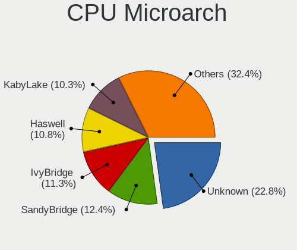

| Name          | Computers | Percent |
|---------------|-----------|---------|
| Unknown       | 392       | 22.84%  |
| SandyBridge   | 212       | 12.35%  |
| IvyBridge     | 194       | 11.31%  |
| Haswell       | 185       | 10.78%  |
| KabyLake      | 177       | 10.31%  |
| Piledriver    | 85        | 4.95%   |
| K10           | 71        | 4.14%   |
| Skylake       | 67        | 3.9%    |
| Westmere      | 41        | 2.39%   |
| Zen           | 40        | 2.33%   |
| Penryn        | 39        | 2.27%   |
| Zen+          | 26        | 1.52%   |
| Nehalem       | 25        | 1.46%   |
| Bulldozer     | 21        | 1.22%   |
| Broadwell     | 18        | 1.05%   |
| Zen 2         | 14        | 0.82%   |
| Silvermont    | 14        | 0.82%   |
| Core          | 14        | 0.82%   |
| Steamroller   | 12        | 0.7%    |
| Excavator     | 12        | 0.7%    |
| K10 Llano     | 8         | 0.47%   |
| CometLake     | 8         | 0.47%   |
| Goldmont plus | 6         | 0.35%   |
| P6            | 5         | 0.29%   |
| NetBurst      | 5         | 0.29%   |
| K8 Hammer     | 5         | 0.29%   |
| Zen 3         | 4         | 0.23%   |
| Puma          | 4         | 0.23%   |
| Jaguar        | 4         | 0.23%   |
| Goldmont      | 4         | 0.23%   |
| Bobcat        | 3         | 0.17%   |
| K6            | 1         | 0.06%   |

Graphics
--------

GPU Vendor
----------

Vendors of graphics cards

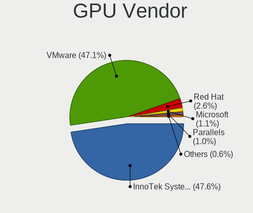

| Vendor                 | Computers | Percent |
|------------------------|-----------|---------|
| InnoTek Systemberatung | 817       | 47.64%  |
| VMware                 | 807       | 47.06%  |
| Red Hat                | 45        | 2.62%   |
| Microsoft              | 19        | 1.11%   |
| Parallels              | 17        | 0.99%   |
| Technical              | 5         | 0.29%   |
| Cirrus Logic           | 4         | 0.23%   |
| AMD                    | 1         | 0.06%   |

GPU Model
---------

Graphics card models

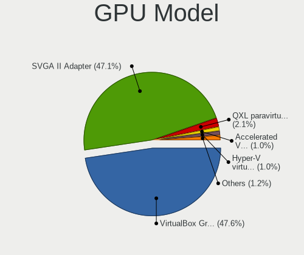

| Model                                                   | Computers | Percent |
|---------------------------------------------------------|-----------|---------|
| InnoTek Systemberatung VirtualBox Graphics Adapter      | 817       | 47.64%  |
| VMware SVGA II Adapter                                  | 807       | 47.06%  |
| Red Hat QXL paravirtual graphic card                    | 36        | 2.1%    |
| Parallels Accelerated Virtual Video Adapter             | 17        | 0.99%   |
| Microsoft Hyper-V virtual VGA                           | 17        | 0.99%   |
| Red Hat Virtio GPU                                      | 9         | 0.52%   |
| Technical VGA compatible controller                     | 5         | 0.29%   |
| Cirrus Logic GD 5446                                    | 4         | 0.23%   |
| Microsoft RemoteFX Graphics                             | 2         | 0.12%   |
| AMD Ellesmere [Radeon RX 470/480/570/570X/580/580X/590] | 1         | 0.06%   |

GPU Combo
---------

Combinations of graphics cards

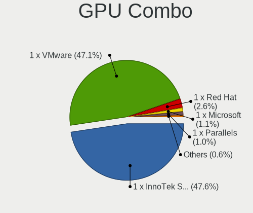

| Name                       | Computers | Percent |
|----------------------------|-----------|---------|
| 1 x InnoTek Systemberatung | 816       | 47.64%  |
| 1 x VMware                 | 807       | 47.11%  |
| 1 x Red Hat                | 44        | 2.57%   |
| 1 x Microsoft              | 19        | 1.11%   |
| 1 x Parallels              | 17        | 0.99%   |
| Other                      | 4         | 0.23%   |
| 1 x Cirrus Logic           | 4         | 0.23%   |
| 1 x Technical              | 1         | 0.06%   |
| AMD + Red Hat              | 1         | 0.06%   |

GPU Driver
----------

Free vs proprietary

| Driver  | Computers | Percent |
|---------|-----------|---------|
| Unknown | 1713      | 100%    |

GPU Memory
----------

Total video memory

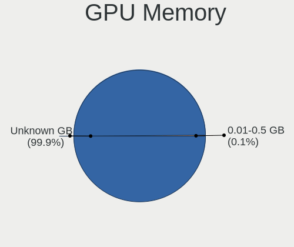

| Size in GB | Computers | Percent |
|------------|-----------|---------|
| Unknown    | 1711      | 99.88%  |
| 7.01-8.0   | 1         | 0.06%   |
| 0.01-0.5   | 1         | 0.06%   |

Monitor
-------

Monitor Vendor
--------------

Monitor vendors

| Vendor | Computers | Percent |
|--------|-----------|---------|
| PRL    | 18        | 81.82%  |
| RHT    | 4         | 18.18%  |

Monitor Model
-------------

Monitor models

| Model                                                  | Computers | Percent |
|--------------------------------------------------------|-----------|---------|
| PRL Parallels Vu PRL4006 1400x1050                     | 17        | 77.27%  |
| RHT QEMU Monitor RHT1234 2048x1152 260x195mm 12.8-inch | 2         | 9.09%   |
| RHT QEMU Monitor RHT1234 2048x1152 260x190mm 12.7-inch | 2         | 9.09%   |
| PRL Parallels Vu PRL4006 1920x1200                     | 1         | 4.55%   |

Monitor Resolution
------------------

Monitor screen resolution

| Resolution        | Computers | Percent |
|-------------------|-----------|---------|
| 1400x1050         | 17        | 77.27%  |
| 3196x1798         | 2         | 9.09%   |
| 2048x1152         | 2         | 9.09%   |
| 1920x1200 (WUXGA) | 1         | 4.55%   |

Monitor Diagonal
----------------

Diagonal size in inches

| Inches  | Computers | Percent |
|---------|-----------|---------|
| Unknown | 18        | 81.82%  |
| 33      | 2         | 9.09%   |
| 19      | 2         | 9.09%   |

Monitor Width
-------------

Physical width

| Width in mm | Computers | Percent |
|-------------|-----------|---------|
| Unknown     | 18        | 81.82%  |
| 701-800     | 2         | 9.09%   |
| 401-500     | 2         | 9.09%   |

Aspect Ratio
------------

Proportional relationship between the width and the height

| Ratio | Computers | Percent |
|-------|-----------|---------|
| 4/3   | 19        | 86.36%  |
| 16/9  | 2         | 9.09%   |
| 16/10 | 1         | 4.55%   |

Monitor Area
------------

Area in inch²

| Area in inch² | Computers | Percent |
|----------------|-----------|---------|
| Unknown        | 18        | 81.82%  |
| 351-500        | 2         | 9.09%   |
| 151-200        | 2         | 9.09%   |

Pixel Density
-------------

Pixels per inch

| Density | Computers | Percent |
|---------|-----------|---------|
| Unknown | 18        | 81.82%  |
| 101-120 | 2         | 9.09%   |
| 51-100  | 2         | 9.09%   |

Multiple Monitors
-----------------

Total monitors connected

| Total | Computers | Percent |
|-------|-----------|---------|
| 1     | 1324      | 76.98%  |
| 0     | 396       | 23.02%  |

Network
-------

Net Controller Vendor
---------------------

Controller vendors

| Vendor                | Computers | Percent |
|-----------------------|-----------|---------|
| Intel                 | 1421      | 83.49%  |
| AMD                   | 188       | 11.05%  |
| Red Hat               | 37        | 2.17%   |
| Realtek Semiconductor | 31        | 1.82%   |
| VMware                | 16        | 0.94%   |
| Huawei Technologies   | 4         | 0.24%   |
| Digital Equipment     | 2         | 0.12%   |
| ICS Advent            | 1         | 0.06%   |
| D-Link                | 1         | 0.06%   |
| Android               | 1         | 0.06%   |

Net Controller Model
--------------------

Controller models

| Model                                                         | Computers | Percent |
|---------------------------------------------------------------|-----------|---------|
| Intel 82540EM Gigabit Ethernet Controller                     | 1167      | 68.57%  |
| Intel 82545EM Gigabit Ethernet Controller (Copper)            | 248       | 14.57%  |
| AMD 79c970 [PCnet32 LANCE]                                    | 188       | 11.05%  |
| Red Hat Virtio network device                                 | 37        | 2.17%   |
| Realtek RTL-8100/8101L/8139 PCI Fast Ethernet Adapter         | 31        | 1.82%   |
| VMware VMXNET3 Ethernet Controller                            | 16        | 0.94%   |
| Huawei Modem/Networkcard                                      | 4         | 0.24%   |
| Intel 82574L Gigabit Network Connection                       | 3         | 0.18%   |
| Intel 82543GC Gigabit Ethernet Controller (Copper)            | 3         | 0.18%   |
| Digital Equipment DECchip 21140 [FasterNet]                   | 2         | 0.12%   |
| ICS Advent DM9601 Fast Ethernet Adapter                       | 1         | 0.06%   |
| D-Link DWA-125 Wireless N 150 Adapter(rev.A3) [Ralink RT5370] | 1         | 0.06%   |
| Android Android                                               | 1         | 0.06%   |

Wireless Vendor
---------------

Wireless vendors

| Vendor | Computers | Percent |
|--------|-----------|---------|
| D-Link | 1         | 100%    |

Wireless Model
--------------

Wireless models

| Model                                                         | Computers | Percent |
|---------------------------------------------------------------|-----------|---------|
| D-Link DWA-125 Wireless N 150 Adapter(rev.A3) [Ralink RT5370] | 1         | 100%    |

Ethernet Vendor
---------------

Ethernet vendors

| Vendor                | Computers | Percent |
|-----------------------|-----------|---------|
| Intel                 | 1421      | 85.6%   |
| AMD                   | 188       | 11.33%  |
| Realtek Semiconductor | 31        | 1.87%   |
| VMware                | 16        | 0.96%   |
| Digital Equipment     | 2         | 0.12%   |
| ICS Advent            | 1         | 0.06%   |
| Android               | 1         | 0.06%   |

Ethernet Model
--------------

Ethernet models

| Model                                                 | Computers | Percent |
|-------------------------------------------------------|-----------|---------|
| Intel 82540EM Gigabit Ethernet Controller             | 1167      | 70.3%   |
| Intel 82545EM Gigabit Ethernet Controller (Copper)    | 248       | 14.94%  |
| AMD 79c970 [PCnet32 LANCE]                            | 188       | 11.33%  |
| Realtek RTL-8100/8101L/8139 PCI Fast Ethernet Adapter | 31        | 1.87%   |
| VMware VMXNET3 Ethernet Controller                    | 16        | 0.96%   |
| Intel 82574L Gigabit Network Connection               | 3         | 0.18%   |
| Intel 82543GC Gigabit Ethernet Controller (Copper)    | 3         | 0.18%   |
| Digital Equipment DECchip 21140 [FasterNet]           | 2         | 0.12%   |
| ICS Advent DM9601 Fast Ethernet Adapter               | 1         | 0.06%   |
| Android Android                                       | 1         | 0.06%   |

Net Controller Kind
-------------------

Ethernet, WiFi or modem

| Kind     | Computers | Percent |
|----------|-----------|---------|
| Ethernet | 1658      | 97.53%  |
| Unknown  | 37        | 2.18%   |
| Modem    | 4         | 0.24%   |
| WiFi     | 1         | 0.06%   |

Used Controller
---------------

Currently used network controller

| Kind     | Computers | Percent |
|----------|-----------|---------|
| Ethernet | 1656      | 99.94%  |
| WiFi     | 1         | 0.06%   |

NICs
----

Total network controllers on board

| Total | Computers | Percent |
|-------|-----------|---------|
| 1     | 1651      | 96.32%  |
| 0     | 48        | 2.8%    |
| 2     | 14        | 0.82%   |
| 4     | 1         | 0.06%   |

IPv6
----

IPv6 vs IPv4

| Used    | Computers | Percent |
|---------|-----------|---------|
| No      | 1694      | 98.89%  |
| Unknown | 17        | 0.99%   |
| Yes     | 2         | 0.12%   |

Bluetooth
---------

Bluetooth Vendor
----------------

Controller vendors

| Vendor                          | Computers | Percent |
|---------------------------------|-----------|---------|
| VMware                          | 82        | 97.62%  |
| Qualcomm Atheros Communications | 1         | 1.19%   |
| Intel                           | 1         | 1.19%   |

Bluetooth Model
---------------

Controller models

| Model                             | Computers | Percent |
|-----------------------------------|-----------|---------|
| VMware Virtual Bluetooth Adapter  | 82        | 97.62%  |
| Qualcomm Atheros AR3011 Bluetooth | 1         | 1.19%   |
| Intel Bluetooth Device            | 1         | 1.19%   |

Sound
-----

Sound Vendor
------------

Sound card vendors

| Vendor  | Computers | Percent |
|---------|-----------|---------|
| Intel   | 1288      | 77.54%  |
| Ensoniq | 368       | 22.16%  |
| VMware  | 3         | 0.18%   |
| AMD     | 2         | 0.12%   |

Sound Model
-----------

Sound card models

| Model                                                                      | Computers | Percent |
|----------------------------------------------------------------------------|-----------|---------|
| Intel 82801AA AC'97 Audio Controller                                       | 1191      | 71.7%   |
| Ensoniq ES1371/ES1373 / Creative Labs CT2518                               | 368       | 22.16%  |
| Intel 82801FB/FBM/FR/FW/FRW (ICH6 Family) High Definition Audio Controller | 71        | 4.27%   |
| Intel 82801BA/BAM AC'97 Audio Controller                                   | 19        | 1.14%   |
| Intel 82801I (ICH9 Family) HD Audio Controller                             | 7         | 0.42%   |
| VMware HD Audio Controller                                                 | 3         | 0.18%   |
| AMD Ellesmere HDMI Audio [Radeon RX 470/480 / 570/580/590]                 | 1         | 0.06%   |
| AMD AMD-8111 AC97 Audio                                                    | 1         | 0.06%   |

Memory
------

Memory Vendor
-------------

Memory module vendors

| Vendor             | Computers | Percent |
|--------------------|-----------|---------|
| Unknown            | 357       | 66.85%  |
| Unknown            | 99        | 18.54%  |
| QEMU               | 49        | 9.18%   |
| Microsoft          | 19        | 3.56%   |
| VMware Virtual RAM | 10        | 1.87%   |

Memory Model
------------

Memory module models

| Model                                              | Computers | Percent |
|----------------------------------------------------|-----------|---------|
| Unknown RAM Module 2048MB DIMM DRAM                | 194       | 28.53%  |
| Unknown                                            | 99        | 14.56%  |
| Unknown RAM Module 4096MB DIMM DRAM                | 87        | 12.79%  |
| Unknown RAM Module 1024MB DIMM DRAM                | 81        | 11.91%  |
| Unknown RAM Module 128MB DIMM DRAM                 | 35        | 5.15%   |
| Unknown RAM Module 256MB DIMM DRAM                 | 34        | 5%      |
| Unknown RAM Module 512MB DIMM DRAM                 | 31        | 4.56%   |
| QEMU RAM Module 2048MB DIMM RAM                    | 17        | 2.5%    |
| Unknown RAM Module 2GB DIMM DRAM                   | 15        | 2.21%   |
| Microsoft RAM Module 2048MB                        | 8         | 1.18%   |
| QEMU RAM Module 4096MB DIMM RAM                    | 7         | 1.03%   |
| Unknown RAM Module 2048MB SODIMM DRAM 667MT/s      | 6         | 0.88%   |
| Unknown RAM Module 1024MB SODIMM DRAM 667MT/s      | 6         | 0.88%   |
| Microsoft RAM Module 3968MB                        | 6         | 0.88%   |
| VMware Virtual RAM RAM VMW-4096MB 4GB DIMM DRAM    | 4         | 0.59%   |
| VMware Virtual RAM RAM VMW-2048MB 2GB DIMM DRAM    | 4         | 0.59%   |
| Microsoft RAM Module 128MB                         | 4         | 0.59%   |
| VMware Virtual RAM RAM VMW-1024MB 1024MB DIMM DRAM | 3         | 0.44%   |
| Unknown RAM Module 1GB DIMM DRAM                   | 3         | 0.44%   |
| VMware Virtual RAM RAM VMW-512MB 512MB DIMM DRAM   | 2         | 0.29%   |
| QEMU RAM Module 2GB DIMM RAM                       | 2         | 0.29%   |
| QEMU RAM Module 1500MB DIMM RAM                    | 2         | 0.29%   |
| VMware Virtual RAM RAM VMW-256MB 256MB DIMM DRAM   | 1         | 0.15%   |
| QEMU RAM Module 8479MB DIMM RAM                    | 1         | 0.15%   |
| QEMU RAM Module 8340MB DIMM RAM                    | 1         | 0.15%   |
| QEMU RAM Module 768MB DIMM RAM                     | 1         | 0.15%   |
| QEMU RAM Module 7368MB DIMM RAM                    | 1         | 0.15%   |
| QEMU RAM Module 6GB DIMM RAM                       | 1         | 0.15%   |
| QEMU RAM Module 6980MB DIMM RAM                    | 1         | 0.15%   |
| QEMU RAM Module 6653MB DIMM RAM                    | 1         | 0.15%   |
| QEMU RAM Module 5518MB DIMM RAM                    | 1         | 0.15%   |
| QEMU RAM Module 4GB DIMM RAM                       | 1         | 0.15%   |
| QEMU RAM Module 4217MB DIMM RAM                    | 1         | 0.15%   |
| QEMU RAM Module 4190MB DIMM RAM                    | 1         | 0.15%   |
| QEMU RAM Module 4088MB DIMM RAM                    | 1         | 0.15%   |
| QEMU RAM Module 4076MB DIMM RAM                    | 1         | 0.15%   |
| QEMU RAM Module 4056MB DIMM RAM                    | 1         | 0.15%   |
| QEMU RAM Module 4000MB DIMM RAM                    | 1         | 0.15%   |
| QEMU RAM Module 3968MB DIMM RAM                    | 1         | 0.15%   |
| QEMU RAM Module 3540MB DIMM RAM                    | 1         | 0.15%   |
| QEMU RAM Module 3264MB DIMM RAM                    | 1         | 0.15%   |
| QEMU RAM Module 3070MB DIMM RAM                    | 1         | 0.15%   |
| QEMU RAM Module 2923MB DIMM RAM                    | 1         | 0.15%   |
| QEMU RAM Module 10019MB DIMM RAM                   | 1         | 0.15%   |
| Microsoft RAM Module 56MB                          | 1         | 0.15%   |
| Microsoft RAM Module 3952MB                        | 1         | 0.15%   |
| Microsoft RAM Module 3786MB                        | 1         | 0.15%   |
| Microsoft RAM Module 32MB                          | 1         | 0.15%   |
| Microsoft RAM Module 2086MB                        | 1         | 0.15%   |
| Microsoft RAM Module 2060MB                        | 1         | 0.15%   |
| Microsoft RAM Module 2024MB                        | 1         | 0.15%   |
| Microsoft RAM Module 1GB                           | 1         | 0.15%   |

Memory Kind
-----------

Memory module kinds

| Kind    | Computers | Percent |
|---------|-----------|---------|
| DRAM    | 400       | 84.75%  |
| RAM     | 53        | 11.23%  |
| Unknown | 19        | 4.03%   |

Memory Form Factor
------------------

Physical design of the memory module

| Name    | Computers | Percent |
|---------|-----------|---------|
| DIMM    | 440       | 93.22%  |
| Unknown | 19        | 4.03%   |
| SODIMM  | 13        | 2.75%   |

Memory Size
-----------

Memory module size

| Size  | Computers | Percent |
|-------|-----------|---------|
| 2048  | 251       | 32.35%  |
| 4096  | 113       | 14.56%  |
| 1024  | 98        | 12.63%  |
| 32    | 43        | 5.54%   |
| 128   | 39        | 5.03%   |
| 256   | 35        | 4.51%   |
| 512   | 33        | 4.25%   |
| 64    | 29        | 3.74%   |
| 8     | 29        | 3.74%   |
| 16    | 25        | 3.22%   |
| 4     | 22        | 2.84%   |
| 8192  | 21        | 2.71%   |
| 3968  | 7         | 0.9%    |
| 16384 | 3         | 0.39%   |
| 1500  | 2         | 0.26%   |
| 12288 | 1         | 0.13%   |
| 10019 | 1         | 0.13%   |
| 8479  | 1         | 0.13%   |
| 8340  | 1         | 0.13%   |
| 7368  | 1         | 0.13%   |
| 6980  | 1         | 0.13%   |
| 6653  | 1         | 0.13%   |
| 6144  | 1         | 0.13%   |
| 5518  | 1         | 0.13%   |
| 4217  | 1         | 0.13%   |
| 4190  | 1         | 0.13%   |
| 4088  | 1         | 0.13%   |
| 4076  | 1         | 0.13%   |
| 4056  | 1         | 0.13%   |
| 4000  | 1         | 0.13%   |
| 3952  | 1         | 0.13%   |
| 3786  | 1         | 0.13%   |
| 3540  | 1         | 0.13%   |
| 3264  | 1         | 0.13%   |
| 3070  | 1         | 0.13%   |
| 2923  | 1         | 0.13%   |
| 2086  | 1         | 0.13%   |
| 2060  | 1         | 0.13%   |
| 2024  | 1         | 0.13%   |
| 768   | 1         | 0.13%   |
| 56    | 1         | 0.13%   |

Memory Speed
------------

Memory module speed

| Speed   | Computers | Percent |
|---------|-----------|---------|
| Unknown | 452       | 95.76%  |
| 667     | 20        | 4.24%   |

Printers & scanners
-------------------

Printer Vendor
--------------

Printer device vendors

| Vendor              | Computers | Percent |
|---------------------|-----------|---------|
| PARALLELS           | 14        | 50%     |
| Samsung Electronics | 4         | 14.29%  |
| Seiko Epson         | 3         | 10.71%  |
| Canon               | 3         | 10.71%  |
| Kyocera             | 2         | 7.14%   |
| Brother Industries  | 2         | 7.14%   |

Printer Model
-------------

Printer device models

| Model                                                                                  | Computers | Percent |
|----------------------------------------------------------------------------------------|-----------|---------|
| PARALLELS Virtual Printer (/Users/jean/Parallels/OpenMandriva Lx 4.3.pvm/parallel.txt) | 14        | 50%     |
| Samsung ML-1210 Printer                                                                | 2         | 7.14%   |
| Kyocera FS-1060DN                                                                      | 2         | 7.14%   |
| Seiko Epson USB2.0 Printer (Hi-speed)                                                  | 1         | 3.57%   |
| Seiko Epson Printer                                                                    | 1         | 3.57%   |
| Seiko Epson L200 Series                                                                | 1         | 3.57%   |
| Samsung SCX-4300 Series                                                                | 1         | 3.57%   |
| Samsung M2070 Series                                                                   | 1         | 3.57%   |
| Canon MF4410                                                                           | 1         | 3.57%   |
| Canon LBP810                                                                           | 1         | 3.57%   |
| Canon iP2700 series                                                                    | 1         | 3.57%   |
| Brother DCP-L2540DN                                                                    | 1         | 3.57%   |
| Brother DCP-7030                                                                       | 1         | 3.57%   |

Scanner Vendor
--------------

Scanner device vendors

| Vendor                      | Computers | Percent |
|-----------------------------|-----------|---------|
| Canon                       | 7         | 77.78%  |
| Hewlett-Packard             | 1         | 11.11%  |
| Acer Peripherals (now BenQ) | 1         | 11.11%  |

Scanner Model
-------------

Scanner device models

| Model                                         | Computers | Percent |
|-----------------------------------------------|-----------|---------|
| Canon CanoScan LiDE 500F                      | 3         | 33.33%  |
| HP PSC 1200                                   | 1         | 11.11%  |
| Canon CanoScan LiDE 700F                      | 1         | 11.11%  |
| Canon CanoScan LiDE 210                       | 1         | 11.11%  |
| Canon CanoScan LiDE 110                       | 1         | 11.11%  |
| Canon CanoScan 3000/3000F/3000ex              | 1         | 11.11%  |
| Acer Peripherals (now BenQ) FlatbedScanner 50 | 1         | 11.11%  |

Camera
------

Camera Vendor
-------------

Camera device vendors

| Vendor                                 | Computers | Percent |
|----------------------------------------|-----------|---------|
| PARALLELS                              | 12        | 29.27%  |
| Logitech                               | 9         | 21.95%  |
| VMware                                 | 7         | 17.07%  |
| VirtualBox                             | 3         | 7.32%   |
| Microsoft                              | 2         | 4.88%   |
| Acer                                   | 2         | 4.88%   |
| Z-Star Microelectronics                | 1         | 2.44%   |
| Suyin                                  | 1         | 2.44%   |
| Realtek Semiconductor                  | 1         | 2.44%   |
| GEMBIRD                                | 1         | 2.44%   |
| Creative Technology                    | 1         | 2.44%   |
| Cheng Uei Precision Industry (Foxlink) | 1         | 2.44%   |

Camera Model
------------

Camera device models

| Model                                            | Computers | Percent |
|--------------------------------------------------|-----------|---------|
| PARALLELS IRIScan Desk 5 Pro                     | 12        | 29.27%  |
| VMware Virtual USB Video Device                  | 7         | 17.07%  |
| VirtualBox Webcam - Integrated Camera            | 3         | 7.32%   |
| Logitech Webcam C270                             | 3         | 7.32%   |
| Logitech HD Webcam C525                          | 2         | 4.88%   |
| Logitech HD Webcam C510                          | 2         | 4.88%   |
| Z-Star A4 TECH USB2.0 PC Camera J                | 1         | 2.44%   |
| Suyin Integrated_Webcam_HD                       | 1         | 2.44%   |
| Realtek Front Camera                             | 1         | 2.44%   |
| Microsoft LifeCam VX-2000                        | 1         | 2.44%   |
| Microsoft LifeCam Cinema                         | 1         | 2.44%   |
| Logitech Webcam C170                             | 1         | 2.44%   |
| Logitech Webcam B500                             | 1         | 2.44%   |
| GEMBIRD USB2.0 PC CAMERA                         | 1         | 2.44%   |
| Creative Live! Cam Chat HD [VF0700]              | 1         | 2.44%   |
| Cheng Uei Precision Industry (Foxlink) HD Webcam | 1         | 2.44%   |
| Acer Integrated Camera                           | 1         | 2.44%   |
| Acer BisonCam, NB Pro                            | 1         | 2.44%   |

Security
--------

Fingerprint Vendor
------------------

Fingerprint sensor vendors

Zero info for selected period =(

Fingerprint Model
-----------------

Fingerprint sensor models

Zero info for selected period =(

Chipcard Vendor
---------------

Chipcard module vendors

| Vendor                | Computers | Percent |
|-----------------------|-----------|---------|
| Gemalto (was Gemplus) | 24        | 96%     |
| Advanced Card Systems | 1         | 4%      |

Chipcard Model
--------------

Chipcard module models

| Model                                             | Computers | Percent |
|---------------------------------------------------|-----------|---------|
| Gemalto (was Gemplus) GemPC433-Swap               | 23        | 92%     |
| Gemalto (was Gemplus) GemPC Twin SmartCard Reader | 1         | 4%      |
| Advanced Card Systems ACR38 SmartCard Reader      | 1         | 4%      |

Unsupported
-----------

Unsupported Devices
-------------------

Total unsupported devices on board

| Total | Computers | Percent |
|-------|-----------|---------|
| 0     | 1225      | 71.26%  |
| 1     | 477       | 27.75%  |
| 2     | 16        | 0.93%   |
| 3     | 1         | 0.06%   |

Unsupported Device Types
------------------------

Types of unsupported devices

| Type             | Computers | Percent |
|------------------|-----------|---------|
| Graphics card    | 466       | 91.19%  |
| Chipcard         | 24        | 4.7%    |
| Unassigned class | 18        | 3.52%   |
| Sound            | 3         | 0.59%   |

