Ubuntu - Tested Virtual Hardware & Statistics
---------------------------------------------

A project to collect tested virtual hardware configurations for Ubuntu.

Anyone can contribute to this report by the [hw-probe](https://github.com/linuxhw/hw-probe) tool:

    sudo -E hw-probe -all -upload

Please contribute! Especially if your hardware is rare.

Contents
--------

* [ Test Cases ](#test-cases)

* [ System ](#system)
  - [ OS                       ](#os)
  - [ OS Family                ](#os-family)
  - [ Kernel                   ](#kernel)
  - [ Kernel Family            ](#kernel-family)
  - [ Kernel Major Ver.        ](#kernel-major-ver)
  - [ Arch                     ](#arch)
  - [ DE                       ](#de)
  - [ Display Server           ](#display-server)
  - [ Display Manager          ](#display-manager)
  - [ OS Lang                  ](#os-lang)
  - [ Boot Mode                ](#boot-mode)
  - [ Filesystem               ](#filesystem)
  - [ Part. scheme             ](#part-scheme)
  - [ Dual Boot with Linux/BSD ](#dual-boot-with-linuxbsd)
  - [ Dual Boot (Win)          ](#dual-boot-win)

* [ Board ](#board)
  - [ Vendor                   ](#vendor)
  - [ Model                    ](#model)
  - [ Model Family             ](#model-family)
  - [ MFG Year                 ](#mfg-year)
  - [ Form Factor              ](#form-factor)
  - [ Secure Boot              ](#secure-boot)
  - [ Coreboot                 ](#coreboot)
  - [ RAM Size                 ](#ram-size)
  - [ RAM Used                 ](#ram-used)
  - [ Total Drives             ](#total-drives)
  - [ Has CD-ROM               ](#has-cd-rom)
  - [ Has Ethernet             ](#has-ethernet)
  - [ Has WiFi                 ](#has-wifi)
  - [ Has Bluetooth            ](#has-bluetooth)

* [ Location ](#location)
  - [ Country                  ](#country)
  - [ City                     ](#city)

* [ Drives ](#drives)
  - [ Drive Vendor             ](#drive-vendor)
  - [ Drive Model              ](#drive-model)
  - [ HDD Vendor               ](#hdd-vendor)
  - [ SSD Vendor               ](#ssd-vendor)
  - [ Drive Kind               ](#drive-kind)
  - [ Drive Connector          ](#drive-connector)
  - [ Drive Size               ](#drive-size)
  - [ Space Total              ](#space-total)
  - [ Space Used               ](#space-used)
  - [ Malfunc. Drives          ](#malfunc-drives)
  - [ Malfunc. Drive Vendor    ](#malfunc-drive-vendor)
  - [ Malfunc. HDD Vendor      ](#malfunc-hdd-vendor)
  - [ Malfunc. Drive Kind      ](#malfunc-drive-kind)
  - [ Failed Drives            ](#failed-drives)
  - [ Failed Drive Vendor      ](#failed-drive-vendor)
  - [ Drive Status             ](#drive-status)

* [ Storage controller ](#storage-controller)
  - [ Storage Vendor           ](#storage-vendor)
  - [ Storage Model            ](#storage-model)
  - [ Storage Kind             ](#storage-kind)

* [ Processor ](#processor)
  - [ CPU Vendor               ](#cpu-vendor)
  - [ CPU Model                ](#cpu-model)
  - [ CPU Model Family         ](#cpu-model-family)
  - [ CPU Cores                ](#cpu-cores)
  - [ CPU Sockets              ](#cpu-sockets)
  - [ CPU Threads              ](#cpu-threads)
  - [ CPU Op-Modes             ](#cpu-op-modes)
  - [ CPU Microcode            ](#cpu-microcode)
  - [ CPU Microarch            ](#cpu-microarch)

* [ Graphics ](#graphics)
  - [ GPU Vendor               ](#gpu-vendor)
  - [ GPU Model                ](#gpu-model)
  - [ GPU Combo                ](#gpu-combo)
  - [ GPU Driver               ](#gpu-driver)
  - [ GPU Memory               ](#gpu-memory)

* [ Monitor ](#monitor)
  - [ Monitor Vendor           ](#monitor-vendor)
  - [ Monitor Model            ](#monitor-model)
  - [ Monitor Resolution       ](#monitor-resolution)
  - [ Monitor Diagonal         ](#monitor-diagonal)
  - [ Monitor Width            ](#monitor-width)
  - [ Aspect Ratio             ](#aspect-ratio)
  - [ Monitor Area             ](#monitor-area)
  - [ Pixel Density            ](#pixel-density)
  - [ Multiple Monitors        ](#multiple-monitors)

* [ Network ](#network)
  - [ Net Controller Vendor    ](#net-controller-vendor)
  - [ Net Controller Model     ](#net-controller-model)
  - [ Wireless Vendor          ](#wireless-vendor)
  - [ Wireless Model           ](#wireless-model)
  - [ Ethernet Vendor          ](#ethernet-vendor)
  - [ Ethernet Model           ](#ethernet-model)
  - [ Net Controller Kind      ](#net-controller-kind)
  - [ Used Controller          ](#used-controller)
  - [ NICs                     ](#nics)
  - [ IPv6                     ](#ipv6)

* [ Bluetooth ](#bluetooth)
  - [ Bluetooth Vendor         ](#bluetooth-vendor)
  - [ Bluetooth Model          ](#bluetooth-model)

* [ Sound ](#sound)
  - [ Sound Vendor             ](#sound-vendor)
  - [ Sound Model              ](#sound-model)

* [ Memory ](#memory)
  - [ Memory Vendor            ](#memory-vendor)
  - [ Memory Model             ](#memory-model)
  - [ Memory Kind              ](#memory-kind)
  - [ Memory Form Factor       ](#memory-form-factor)
  - [ Memory Size              ](#memory-size)
  - [ Memory Speed             ](#memory-speed)

* [ Printers & scanners ](#printers--scanners)
  - [ Printer Vendor           ](#printer-vendor)
  - [ Printer Model            ](#printer-model)
  - [ Scanner Vendor           ](#scanner-vendor)
  - [ Scanner Model            ](#scanner-model)

* [ Camera ](#camera)
  - [ Camera Vendor            ](#camera-vendor)
  - [ Camera Model             ](#camera-model)

* [ Security ](#security)
  - [ Fingerprint Vendor       ](#fingerprint-vendor)
  - [ Fingerprint Model        ](#fingerprint-model)
  - [ Chipcard Vendor          ](#chipcard-vendor)
  - [ Chipcard Model           ](#chipcard-model)

* [ Unsupported ](#unsupported)
  - [ Unsupported Devices      ](#unsupported-devices)
  - [ Unsupported Device Types ](#unsupported-device-types)

Test Cases
----------

Total: 1692

| Vendor        | Model                       | Form-Factor     | Probe                                                      | Date         |
|---------------|-----------------------------|-----------------|------------------------------------------------------------|--------------|
| VMware        | Virtual Platform            | Virtual machine | [0180904e49](https://linux-hardware.org/?probe=0180904e49) | Apr 14, 2022 |
| Unknown       | Unknown                     | Virtual machine | [d85e97c63e](https://linux-hardware.org/?probe=d85e97c63e) | Apr 14, 2022 |
| VMware        | Virtual Platform            | Virtual machine | [a4f0ac6fe4](https://linux-hardware.org/?probe=a4f0ac6fe4) | Apr 14, 2022 |
| VMware        | Virtual Platform            | Virtual machine | [8252f91690](https://linux-hardware.org/?probe=8252f91690) | Apr 14, 2022 |
| Unknown       | Unknown                     | Virtual machine | [2a4b150c67](https://linux-hardware.org/?probe=2a4b150c67) | Apr 14, 2022 |
| Unknown       | Unknown                     | Virtual machine | [b4b3bbfd0d](https://linux-hardware.org/?probe=b4b3bbfd0d) | Apr 14, 2022 |
| Unknown       | Unknown                     | Virtual machine | [6d5087cb44](https://linux-hardware.org/?probe=6d5087cb44) | Apr 13, 2022 |
| Microsoft     | Windows Subsystem for Li... | Virtual machine | [69b3cc2ddc](https://linux-hardware.org/?probe=69b3cc2ddc) | Apr 13, 2022 |
| Unknown       | Unknown                     | Virtual machine | [7027aba78c](https://linux-hardware.org/?probe=7027aba78c) | Apr 13, 2022 |
| Unknown       | Unknown                     | Virtual machine | [d811159abe](https://linux-hardware.org/?probe=d811159abe) | Apr 13, 2022 |
| Oracle        | VirtualBox                  | Virtual machine | [26867051ea](https://linux-hardware.org/?probe=26867051ea) | Apr 13, 2022 |
| VMware        | Virtual Platform            | Virtual machine | [0f04d99b69](https://linux-hardware.org/?probe=0f04d99b69) | Apr 13, 2022 |
| Oracle        | VirtualBox                  | Virtual machine | [f53abb7333](https://linux-hardware.org/?probe=f53abb7333) | Apr 12, 2022 |
| Unknown       | Unknown                     | Virtual machine | [c13052455f](https://linux-hardware.org/?probe=c13052455f) | Apr 12, 2022 |
| QEMU          | Standard PC (Q35 + ICH9,... | Virtual machine | [6867acbfbf](https://linux-hardware.org/?probe=6867acbfbf) | Apr 12, 2022 |
| QEMU          | Standard PC (Q35 + ICH9,... | Virtual machine | [f60bf3d7a2](https://linux-hardware.org/?probe=f60bf3d7a2) | Apr 12, 2022 |
| Unknown       | Unknown                     | Virtual machine | [2a4c7903f5](https://linux-hardware.org/?probe=2a4c7903f5) | Apr 11, 2022 |
| Microsoft     | Windows Subsystem for Li... | Virtual machine | [a7966b268b](https://linux-hardware.org/?probe=a7966b268b) | Apr 11, 2022 |
| Microsoft     | Virtual Machine Hyper-V ... | Virtual machine | [6f749f44ac](https://linux-hardware.org/?probe=6f749f44ac) | Apr 11, 2022 |
| Unknown       | Unknown                     | Virtual machine | [a8bdf295c9](https://linux-hardware.org/?probe=a8bdf295c9) | Apr 10, 2022 |
| Oracle        | VirtualBox                  | Virtual machine | [3641cfaf5a](https://linux-hardware.org/?probe=3641cfaf5a) | Apr 10, 2022 |
| Unknown       | Unknown                     | Virtual machine | [a54db49c79](https://linux-hardware.org/?probe=a54db49c79) | Apr 10, 2022 |
| Microsoft     | Virtual Machine Hyper-V ... | Virtual machine | [26673018e0](https://linux-hardware.org/?probe=26673018e0) | Apr 09, 2022 |
| Oracle        | VirtualBox                  | Virtual machine | [c83435caec](https://linux-hardware.org/?probe=c83435caec) | Apr 08, 2022 |
| Unknown       | Unknown                     | Virtual machine | [bcec8b1515](https://linux-hardware.org/?probe=bcec8b1515) | Apr 08, 2022 |
| Unknown       | Unknown                     | Virtual machine | [f6b680b792](https://linux-hardware.org/?probe=f6b680b792) | Apr 08, 2022 |
| Oracle        | VirtualBox                  | Virtual machine | [354420003e](https://linux-hardware.org/?probe=354420003e) | Apr 07, 2022 |
| Oracle        | VirtualBox                  | Virtual machine | [8e9c48e601](https://linux-hardware.org/?probe=8e9c48e601) | Apr 05, 2022 |
| Microsoft     | Windows Subsystem for Li... | Virtual machine | [e436f78712](https://linux-hardware.org/?probe=e436f78712) | Apr 04, 2022 |
| VMware        | VMware7,1                   | Virtual machine | [d174c59266](https://linux-hardware.org/?probe=d174c59266) | Apr 03, 2022 |
| VMware        | VMware7,1                   | Virtual machine | [53f1202084](https://linux-hardware.org/?probe=53f1202084) | Apr 01, 2022 |
| VMware        | Virtual Platform            | Virtual machine | [fd240cc648](https://linux-hardware.org/?probe=fd240cc648) | Apr 01, 2022 |
| Microsoft     | Virtual Machine Hyper-V ... | Virtual machine | [8bdd1e3fca](https://linux-hardware.org/?probe=8bdd1e3fca) | Mar 31, 2022 |
| Oracle        | VirtualBox                  | Virtual machine | [80f29cb229](https://linux-hardware.org/?probe=80f29cb229) | Mar 31, 2022 |
| Microsoft     | Windows Subsystem for Li... | Virtual machine | [293f49df12](https://linux-hardware.org/?probe=293f49df12) | Mar 29, 2022 |
| Oracle        | VirtualBox                  | Virtual machine | [9e48b36d32](https://linux-hardware.org/?probe=9e48b36d32) | Mar 29, 2022 |
| Oracle        | VirtualBox                  | Virtual machine | [ff3054c609](https://linux-hardware.org/?probe=ff3054c609) | Mar 28, 2022 |
| VMware        | Virtual Platform            | Virtual machine | [4d52c13ca2](https://linux-hardware.org/?probe=4d52c13ca2) | Mar 27, 2022 |
| OpenStack ... | OpenStack Nova              | Virtual machine | [d049df96d4](https://linux-hardware.org/?probe=d049df96d4) | Mar 27, 2022 |
| Oracle        | VirtualBox                  | Virtual machine | [ea8c57b16d](https://linux-hardware.org/?probe=ea8c57b16d) | Mar 27, 2022 |
| Microsoft     | Windows Subsystem for Li... | Virtual machine | [5c56ecac4b](https://linux-hardware.org/?probe=5c56ecac4b) | Mar 25, 2022 |
| OpenStack ... | OpenStack Nova              | Virtual machine | [6a4ccc858c](https://linux-hardware.org/?probe=6a4ccc858c) | Mar 24, 2022 |
| OpenStack ... | OpenStack Nova              | Virtual machine | [9a5a9a8679](https://linux-hardware.org/?probe=9a5a9a8679) | Mar 24, 2022 |
| Oracle        | VirtualBox                  | Virtual machine | [a8cbbbd1c9](https://linux-hardware.org/?probe=a8cbbbd1c9) | Mar 24, 2022 |
| Microsoft     | Windows Subsystem for Li... | Virtual machine | [8e4bf9bf43](https://linux-hardware.org/?probe=8e4bf9bf43) | Mar 23, 2022 |
| Microsoft     | Windows Subsystem for Li... | Virtual machine | [38a96f87ce](https://linux-hardware.org/?probe=38a96f87ce) | Mar 22, 2022 |
| VMware        | Virtual Platform            | Virtual machine | [0a36ddd180](https://linux-hardware.org/?probe=0a36ddd180) | Mar 21, 2022 |
| VMware        | Virtual Platform            | Virtual machine | [5e67ed4d8c](https://linux-hardware.org/?probe=5e67ed4d8c) | Mar 21, 2022 |
| Oracle        | VirtualBox                  | Virtual machine | [7af120f760](https://linux-hardware.org/?probe=7af120f760) | Mar 20, 2022 |
| Microsoft     | Windows Subsystem for Li... | Virtual machine | [e53ad5938f](https://linux-hardware.org/?probe=e53ad5938f) | Mar 20, 2022 |
| VMware        | Virtual Platform            | Virtual machine | [f26a7a8d38](https://linux-hardware.org/?probe=f26a7a8d38) | Mar 16, 2022 |
| VMware        | Virtual Platform            | Virtual machine | [925b5f1215](https://linux-hardware.org/?probe=925b5f1215) | Mar 15, 2022 |
| Oracle        | VirtualBox                  | Virtual machine | [5b1b4d7d1f](https://linux-hardware.org/?probe=5b1b4d7d1f) | Mar 15, 2022 |
| Microsoft     | Windows Subsystem for Li... | Virtual machine | [310ec61494](https://linux-hardware.org/?probe=310ec61494) | Mar 14, 2022 |
| Microsoft     | Windows Subsystem for Li... | Virtual machine | [988eb5c1d9](https://linux-hardware.org/?probe=988eb5c1d9) | Mar 14, 2022 |
| VMware        | Virtual Platform            | Virtual machine | [0dd966ca07](https://linux-hardware.org/?probe=0dd966ca07) | Mar 14, 2022 |
| Oracle        | VirtualBox                  | Virtual machine | [d4f895e635](https://linux-hardware.org/?probe=d4f895e635) | Mar 14, 2022 |
| VMware        | Virtual Platform            | Virtual machine | [4ab40ba1cb](https://linux-hardware.org/?probe=4ab40ba1cb) | Mar 13, 2022 |
| Hetzner       | vServer                     | Virtual machine | [865399514a](https://linux-hardware.org/?probe=865399514a) | Mar 12, 2022 |
| Oracle        | VirtualBox                  | Virtual machine | [a88f9a8028](https://linux-hardware.org/?probe=a88f9a8028) | Mar 11, 2022 |
| Oracle        | VirtualBox                  | Virtual machine | [c1966a96e5](https://linux-hardware.org/?probe=c1966a96e5) | Mar 11, 2022 |
| VMware        | Virtual Platform            | Virtual machine | [5a58123ffd](https://linux-hardware.org/?probe=5a58123ffd) | Mar 10, 2022 |
| VMware        | Virtual Platform            | Virtual machine | [26f1d90442](https://linux-hardware.org/?probe=26f1d90442) | Mar 10, 2022 |
| Oracle        | VirtualBox                  | Virtual machine | [49b1c3f594](https://linux-hardware.org/?probe=49b1c3f594) | Mar 10, 2022 |
| Microsoft     | Virtual Machine Hyper-V ... | Virtual machine | [7498946683](https://linux-hardware.org/?probe=7498946683) | Mar 10, 2022 |
| Oracle        | VirtualBox                  | Virtual machine | [f6b619d2df](https://linux-hardware.org/?probe=f6b619d2df) | Mar 09, 2022 |
| Oracle        | VirtualBox                  | Virtual machine | [c9b1e08ed3](https://linux-hardware.org/?probe=c9b1e08ed3) | Mar 09, 2022 |
| QEMU          | Standard PC (i440FX + PI... | Virtual machine | [5ff64c6678](https://linux-hardware.org/?probe=5ff64c6678) | Mar 07, 2022 |
| Microsoft     | Virtual Machine Hyper-V ... | Virtual machine | [1fea1f41c8](https://linux-hardware.org/?probe=1fea1f41c8) | Mar 06, 2022 |
| VMware        | Virtual Platform            | Virtual machine | [092bc2b8a1](https://linux-hardware.org/?probe=092bc2b8a1) | Mar 03, 2022 |
| Microsoft     | Windows Subsystem for Li... | Virtual machine | [424647623c](https://linux-hardware.org/?probe=424647623c) | Mar 03, 2022 |
| Microsoft     | Windows Subsystem for Li... | Virtual machine | [3e9c3b532c](https://linux-hardware.org/?probe=3e9c3b532c) | Mar 01, 2022 |
| Microsoft     | Windows Subsystem for Li... | Virtual machine | [4c2fa81ee7](https://linux-hardware.org/?probe=4c2fa81ee7) | Mar 01, 2022 |
| VMware        | VMware7,1                   | Virtual machine | [c04b688986](https://linux-hardware.org/?probe=c04b688986) | Feb 28, 2022 |
| Unknown       | Unknown                     | Virtual machine | [d582e29b0d](https://linux-hardware.org/?probe=d582e29b0d) | Feb 26, 2022 |
| VMware        | Virtual Platform            | Virtual machine | [583123e65d](https://linux-hardware.org/?probe=583123e65d) | Feb 25, 2022 |
| Parallels ... | Parallels Virtual Platfo... | Virtual machine | [9329956f3d](https://linux-hardware.org/?probe=9329956f3d) | Feb 25, 2022 |
| QEMU          | Standard PC (Q35 + ICH9,... | Virtual machine | [e6f432129b](https://linux-hardware.org/?probe=e6f432129b) | Feb 24, 2022 |
| QEMU          | Standard PC (Q35 + ICH9,... | Virtual machine | [b77fc65691](https://linux-hardware.org/?probe=b77fc65691) | Feb 24, 2022 |
| Unknown       | Unknown                     | Virtual machine | [06c99b3517](https://linux-hardware.org/?probe=06c99b3517) | Feb 24, 2022 |
| Unknown       | Unknown                     | Virtual machine | [befa0400ae](https://linux-hardware.org/?probe=befa0400ae) | Feb 24, 2022 |
| Unknown       | Unknown                     | Virtual machine | [0e94633895](https://linux-hardware.org/?probe=0e94633895) | Feb 23, 2022 |
| Parallels ... | Parallels Virtual Platfo... | Virtual machine | [90f501aa62](https://linux-hardware.org/?probe=90f501aa62) | Feb 23, 2022 |
| Oracle        | VirtualBox                  | Virtual machine | [1f8048b88d](https://linux-hardware.org/?probe=1f8048b88d) | Feb 22, 2022 |
| Oracle        | VirtualBox                  | Virtual machine | [ee419455fd](https://linux-hardware.org/?probe=ee419455fd) | Feb 21, 2022 |
| VMware        | Virtual Platform            | Virtual machine | [2b75cbeecc](https://linux-hardware.org/?probe=2b75cbeecc) | Feb 20, 2022 |
| Oracle        | VirtualBox                  | Virtual machine | [715c109f66](https://linux-hardware.org/?probe=715c109f66) | Feb 20, 2022 |
| VMware        | Virtual Platform            | Virtual machine | [ca9964870c](https://linux-hardware.org/?probe=ca9964870c) | Feb 18, 2022 |
| VMware        | Virtual Platform            | Virtual machine | [48aaadbd6d](https://linux-hardware.org/?probe=48aaadbd6d) | Feb 17, 2022 |
| VMware        | Virtual Platform            | Virtual machine | [65124f0a76](https://linux-hardware.org/?probe=65124f0a76) | Feb 17, 2022 |
| VMware        | Virtual Platform            | Virtual machine | [e1835aeed4](https://linux-hardware.org/?probe=e1835aeed4) | Feb 17, 2022 |
| VMware        | Virtual Platform            | Virtual machine | [91c0e15433](https://linux-hardware.org/?probe=91c0e15433) | Feb 17, 2022 |
| Oracle        | VirtualBox                  | Virtual machine | [632e8a0f50](https://linux-hardware.org/?probe=632e8a0f50) | Feb 14, 2022 |
| Unknown       | Unknown                     | Virtual machine | [c5bc4fc2f8](https://linux-hardware.org/?probe=c5bc4fc2f8) | Feb 11, 2022 |
| Parallels ... | Parallels Virtual Platfo... | Virtual machine | [383fc7af2d](https://linux-hardware.org/?probe=383fc7af2d) | Feb 10, 2022 |
| VMware        | Virtual Platform            | Virtual machine | [84fcd4ceda](https://linux-hardware.org/?probe=84fcd4ceda) | Feb 10, 2022 |
| VMware        | Virtual Platform            | Virtual machine | [b87a038c4c](https://linux-hardware.org/?probe=b87a038c4c) | Feb 10, 2022 |
| Oracle        | VirtualBox                  | Virtual machine | [2f2d9a1449](https://linux-hardware.org/?probe=2f2d9a1449) | Feb 08, 2022 |
| VMware        | Virtual Platform            | Virtual machine | [c2a444fc41](https://linux-hardware.org/?probe=c2a444fc41) | Feb 08, 2022 |
| Unknown       | Unknown                     | Virtual machine | [3dc3880d4c](https://linux-hardware.org/?probe=3dc3880d4c) | Feb 08, 2022 |
| VMware        | Virtual Platform            | Virtual machine | [eeff8ed841](https://linux-hardware.org/?probe=eeff8ed841) | Feb 07, 2022 |
| Unknown       | Unknown                     | Virtual machine | [380cea3c1f](https://linux-hardware.org/?probe=380cea3c1f) | Feb 06, 2022 |
| Unknown       | Unknown                     | Virtual machine | [96e2be6c3d](https://linux-hardware.org/?probe=96e2be6c3d) | Feb 06, 2022 |
| Oracle        | VirtualBox                  | Virtual machine | [22b85ab383](https://linux-hardware.org/?probe=22b85ab383) | Feb 05, 2022 |
| Unknown       | Unknown                     | Virtual machine | [d0f1e5f4a8](https://linux-hardware.org/?probe=d0f1e5f4a8) | Feb 03, 2022 |
| netcup        | KVM Server                  | Virtual machine | [3ddc22d84c](https://linux-hardware.org/?probe=3ddc22d84c) | Feb 03, 2022 |
| VMware        | Virtual Platform            | Virtual machine | [606875029a](https://linux-hardware.org/?probe=606875029a) | Feb 02, 2022 |
| Oracle        | VirtualBox                  | Virtual machine | [cf6027f3ce](https://linux-hardware.org/?probe=cf6027f3ce) | Feb 02, 2022 |
| Microsoft     | Virtual Machine Hyper-V ... | Virtual machine | [4ebf75b6c0](https://linux-hardware.org/?probe=4ebf75b6c0) | Jan 31, 2022 |
| VMware        | Virtual Platform            | Virtual machine | [67e04845e3](https://linux-hardware.org/?probe=67e04845e3) | Jan 30, 2022 |
| Oracle        | VirtualBox                  | Virtual machine | [a849b9bdc6](https://linux-hardware.org/?probe=a849b9bdc6) | Jan 27, 2022 |
| Microsoft     | Windows Subsystem for Li... | Virtual machine | [5cb3c960a1](https://linux-hardware.org/?probe=5cb3c960a1) | Jan 27, 2022 |
| Oracle        | VirtualBox                  | Virtual machine | [1cfb20d73e](https://linux-hardware.org/?probe=1cfb20d73e) | Jan 26, 2022 |
| Oracle        | VirtualBox                  | Virtual machine | [251dbd40e4](https://linux-hardware.org/?probe=251dbd40e4) | Jan 24, 2022 |
| VMware        | Virtual Platform            | Virtual machine | [357b002729](https://linux-hardware.org/?probe=357b002729) | Jan 24, 2022 |
| Unknown       | Unknown                     | Virtual machine | [83fce29546](https://linux-hardware.org/?probe=83fce29546) | Jan 22, 2022 |
| VMware        | Virtual Platform            | Virtual machine | [f50beec618](https://linux-hardware.org/?probe=f50beec618) | Jan 22, 2022 |
| VMware        | Virtual Platform            | Virtual machine | [ba2f7d10a7](https://linux-hardware.org/?probe=ba2f7d10a7) | Jan 21, 2022 |
| Unknown       | Unknown                     | Virtual machine | [89fd985c57](https://linux-hardware.org/?probe=89fd985c57) | Jan 21, 2022 |
| Microsoft     | Virtual Machine Hyper-V ... | Virtual machine | [36e8c67593](https://linux-hardware.org/?probe=36e8c67593) | Jan 20, 2022 |
| QEMU          | Standard PC (Q35 + ICH9,... | Virtual machine | [10e1eaa639](https://linux-hardware.org/?probe=10e1eaa639) | Jan 20, 2022 |
| Scaleway      | SCW-DEV1-MICRO              | Virtual machine | [f2d8eb58c5](https://linux-hardware.org/?probe=f2d8eb58c5) | Jan 18, 2022 |
| Microsoft     | Windows Subsystem for Li... | Virtual machine | [2de7cb4217](https://linux-hardware.org/?probe=2de7cb4217) | Jan 18, 2022 |
| VMware        | Virtual Platform            | Virtual machine | [e9583d3ab7](https://linux-hardware.org/?probe=e9583d3ab7) | Jan 17, 2022 |
| Unknown       | Unknown                     | Virtual machine | [dc8ffc7867](https://linux-hardware.org/?probe=dc8ffc7867) | Jan 17, 2022 |
| Unknown       | Unknown                     | Virtual machine | [867c1707ba](https://linux-hardware.org/?probe=867c1707ba) | Jan 17, 2022 |
| VMware        | Virtual Platform            | Virtual machine | [bd0642b854](https://linux-hardware.org/?probe=bd0642b854) | Jan 17, 2022 |
| Microsoft     | Windows Subsystem for Li... | Virtual machine | [5fee5acc11](https://linux-hardware.org/?probe=5fee5acc11) | Jan 13, 2022 |
| VMware        | Virtual Platform            | Virtual machine | [9b2f63aedb](https://linux-hardware.org/?probe=9b2f63aedb) | Jan 13, 2022 |
| Oracle        | VirtualBox                  | Virtual machine | [92e1a38f5f](https://linux-hardware.org/?probe=92e1a38f5f) | Jan 13, 2022 |
| Microsoft     | Virtual Machine Hyper-V ... | Virtual machine | [a56d5a4bef](https://linux-hardware.org/?probe=a56d5a4bef) | Jan 11, 2022 |
| DigitalOce... | Droplet                     | Virtual machine | [edf1ebf387](https://linux-hardware.org/?probe=edf1ebf387) | Jan 10, 2022 |
| VMware        | Virtual Platform            | Virtual machine | [d317ceb8a1](https://linux-hardware.org/?probe=d317ceb8a1) | Jan 09, 2022 |
| VMware        | Virtual Platform            | Virtual machine | [97b9867551](https://linux-hardware.org/?probe=97b9867551) | Jan 07, 2022 |
| Unknown       | Unknown                     | Virtual machine | [b3d9558107](https://linux-hardware.org/?probe=b3d9558107) | Jan 06, 2022 |
| Microsoft     | Windows Subsystem for Li... | Virtual machine | [853291329f](https://linux-hardware.org/?probe=853291329f) | Jan 05, 2022 |
| Oracle        | VirtualBox                  | Virtual machine | [965063901c](https://linux-hardware.org/?probe=965063901c) | Jan 05, 2022 |
| Unknown       | Unknown                     | Virtual machine | [79f50362df](https://linux-hardware.org/?probe=79f50362df) | Jan 05, 2022 |
| Unknown       | Unknown                     | Virtual machine | [e732ff943b](https://linux-hardware.org/?probe=e732ff943b) | Jan 04, 2022 |
| VMware        | Virtual Platform            | Virtual machine | [57c2d69117](https://linux-hardware.org/?probe=57c2d69117) | Jan 04, 2022 |
| Microsoft     | Virtual Machine             | Virtual machine | [ef42d0f4cb](https://linux-hardware.org/?probe=ef42d0f4cb) | Jan 03, 2022 |
| Unknown       | Unknown                     | Virtual machine | [98ae5639f1](https://linux-hardware.org/?probe=98ae5639f1) | Jan 02, 2022 |
| VMware        | Virtual Platform            | Virtual machine | [2185e15ec3](https://linux-hardware.org/?probe=2185e15ec3) | Jan 02, 2022 |
| QEMU          | Standard PC (i440FX + PI... | Virtual machine | [81e7d4407b](https://linux-hardware.org/?probe=81e7d4407b) | Dec 30, 2021 |
| Unknown       | Unknown                     | Virtual machine | [5b48fbd982](https://linux-hardware.org/?probe=5b48fbd982) | Dec 30, 2021 |
| VMware        | Virtual Platform            | Virtual machine | [2b2a36b427](https://linux-hardware.org/?probe=2b2a36b427) | Dec 29, 2021 |
| VMware        | Virtual Platform            | Virtual machine | [f69273f8dd](https://linux-hardware.org/?probe=f69273f8dd) | Dec 28, 2021 |
| Unknown       | Unknown                     | Virtual machine | [938e3944e4](https://linux-hardware.org/?probe=938e3944e4) | Dec 26, 2021 |
| QEMU          | Standard PC (i440FX + PI... | Virtual machine | [71481d8153](https://linux-hardware.org/?probe=71481d8153) | Dec 26, 2021 |
| Unknown       | Unknown                     | Virtual machine | [3ab04966ac](https://linux-hardware.org/?probe=3ab04966ac) | Dec 25, 2021 |
| VMware        | Virtual Platform            | Virtual machine | [1d894aafd0](https://linux-hardware.org/?probe=1d894aafd0) | Dec 24, 2021 |
| Unknown       | Unknown                     | Virtual machine | [ffb9dfdbda](https://linux-hardware.org/?probe=ffb9dfdbda) | Dec 24, 2021 |
| VMware        | Virtual Platform            | Virtual machine | [baa8217453](https://linux-hardware.org/?probe=baa8217453) | Dec 24, 2021 |
| Xen           | HVM domU                    | Virtual machine | [7ad932796c](https://linux-hardware.org/?probe=7ad932796c) | Dec 21, 2021 |
| VMware        | Virtual Platform            | Virtual machine | [84131d6e3e](https://linux-hardware.org/?probe=84131d6e3e) | Dec 21, 2021 |
| VMware        | Virtual Platform            | Virtual machine | [36735bc4c4](https://linux-hardware.org/?probe=36735bc4c4) | Dec 21, 2021 |
| Oracle        | VirtualBox                  | Virtual machine | [d00f9016e3](https://linux-hardware.org/?probe=d00f9016e3) | Dec 20, 2021 |
| VMware        | Virtual Platform            | Virtual machine | [f1dd55a152](https://linux-hardware.org/?probe=f1dd55a152) | Dec 20, 2021 |
| VMware        | Virtual Platform            | Virtual machine | [3ca1706245](https://linux-hardware.org/?probe=3ca1706245) | Dec 17, 2021 |
| Oracle        | VirtualBox                  | Virtual machine | [96a0682746](https://linux-hardware.org/?probe=96a0682746) | Dec 17, 2021 |
| Amazon EC2    | m6i.metal                   | Virtual machine | [05847ada27](https://linux-hardware.org/?probe=05847ada27) | Dec 17, 2021 |
| Unknown       | Unknown                     | Virtual machine | [22379e0b3a](https://linux-hardware.org/?probe=22379e0b3a) | Dec 14, 2021 |
| Oracle        | VirtualBox                  | Virtual machine | [dcfb9e046b](https://linux-hardware.org/?probe=dcfb9e046b) | Dec 14, 2021 |
| Oracle        | VirtualBox                  | Virtual machine | [cf8f32193c](https://linux-hardware.org/?probe=cf8f32193c) | Dec 13, 2021 |
| Google        | Compute Engine              | Virtual machine | [3b4e717f13](https://linux-hardware.org/?probe=3b4e717f13) | Dec 13, 2021 |
| Unknown       | Unknown                     | Virtual machine | [db1aeab08f](https://linux-hardware.org/?probe=db1aeab08f) | Dec 12, 2021 |
| Oracle        | VirtualBox                  | Virtual machine | [41087165df](https://linux-hardware.org/?probe=41087165df) | Dec 11, 2021 |
| Oracle        | VirtualBox                  | Virtual machine | [061814f58f](https://linux-hardware.org/?probe=061814f58f) | Dec 11, 2021 |
| Oracle        | VirtualBox                  | Virtual machine | [761230833b](https://linux-hardware.org/?probe=761230833b) | Dec 11, 2021 |
| Unknown       | Unknown                     | Virtual machine | [378d891b4b](https://linux-hardware.org/?probe=378d891b4b) | Dec 10, 2021 |
| VMware        | Virtual Platform            | Virtual machine | [2a027f992b](https://linux-hardware.org/?probe=2a027f992b) | Dec 10, 2021 |
| Oracle        | VirtualBox                  | Virtual machine | [317d8d8ba6](https://linux-hardware.org/?probe=317d8d8ba6) | Dec 09, 2021 |
| Oracle        | VirtualBox                  | Virtual machine | [70c85e3b36](https://linux-hardware.org/?probe=70c85e3b36) | Dec 07, 2021 |
| Xen           | HVM domU                    | Virtual machine | [3cfde2c2b8](https://linux-hardware.org/?probe=3cfde2c2b8) | Dec 07, 2021 |
| Oracle        | VirtualBox                  | Virtual machine | [b81a9d6928](https://linux-hardware.org/?probe=b81a9d6928) | Dec 05, 2021 |
| Oracle        | VirtualBox                  | Virtual machine | [1dd3b8b714](https://linux-hardware.org/?probe=1dd3b8b714) | Dec 04, 2021 |
| Oracle        | VirtualBox                  | Virtual machine | [4c88ed75e2](https://linux-hardware.org/?probe=4c88ed75e2) | Dec 04, 2021 |
| Microsoft     | Virtual Machine Hyper-V ... | Virtual machine | [239ab0e0e2](https://linux-hardware.org/?probe=239ab0e0e2) | Dec 04, 2021 |
| QEMU          | Standard PC (i440FX + PI... | Virtual machine | [8ded2def14](https://linux-hardware.org/?probe=8ded2def14) | Dec 03, 2021 |
| Oracle        | VirtualBox                  | Virtual machine | [17acceab4f](https://linux-hardware.org/?probe=17acceab4f) | Dec 02, 2021 |
| VMware        | Virtual Platform            | Virtual machine | [5c92b5299d](https://linux-hardware.org/?probe=5c92b5299d) | Dec 02, 2021 |
| Oracle        | VirtualBox                  | Virtual machine | [01f227aa7a](https://linux-hardware.org/?probe=01f227aa7a) | Dec 01, 2021 |
| VMware        | Virtual Platform            | Virtual machine | [6c7d59706c](https://linux-hardware.org/?probe=6c7d59706c) | Dec 01, 2021 |
| VMware        | Virtual Platform            | Virtual machine | [ad76713a78](https://linux-hardware.org/?probe=ad76713a78) | Nov 30, 2021 |
| VMware        | Virtual Platform            | Virtual machine | [bfb7cd59a1](https://linux-hardware.org/?probe=bfb7cd59a1) | Nov 29, 2021 |
| VMware        | Virtual Platform            | Virtual machine | [dc66fc4fc4](https://linux-hardware.org/?probe=dc66fc4fc4) | Nov 29, 2021 |
| Oracle        | VirtualBox                  | Virtual machine | [f602382a10](https://linux-hardware.org/?probe=f602382a10) | Nov 28, 2021 |
| Oracle        | VirtualBox                  | Virtual machine | [128a68fc01](https://linux-hardware.org/?probe=128a68fc01) | Nov 28, 2021 |
| VMware        | Virtual Platform            | Virtual machine | [7511b840eb](https://linux-hardware.org/?probe=7511b840eb) | Nov 28, 2021 |
| Unknown       | Unknown                     | Virtual machine | [46bd826125](https://linux-hardware.org/?probe=46bd826125) | Nov 27, 2021 |
| Microsoft     | Virtual Machine Hyper-V ... | Virtual machine | [2c8e1c4178](https://linux-hardware.org/?probe=2c8e1c4178) | Nov 27, 2021 |
| VMware        | Virtual Platform            | Virtual machine | [9e28df3748](https://linux-hardware.org/?probe=9e28df3748) | Nov 26, 2021 |
| VMware        | Virtual Platform            | Virtual machine | [cbc05b6be0](https://linux-hardware.org/?probe=cbc05b6be0) | Nov 25, 2021 |
| VMware        | Virtual Platform            | Virtual machine | [0502535e7f](https://linux-hardware.org/?probe=0502535e7f) | Nov 24, 2021 |
| Unknown       | Unknown                     | Virtual machine | [01ae4cfb8b](https://linux-hardware.org/?probe=01ae4cfb8b) | Nov 23, 2021 |
| Unknown       | Unknown                     | Virtual machine | [09d3796567](https://linux-hardware.org/?probe=09d3796567) | Nov 21, 2021 |
| Oracle        | VirtualBox                  | Virtual machine | [4d682b1206](https://linux-hardware.org/?probe=4d682b1206) | Nov 20, 2021 |
| Alibaba Cl... | ECS                         | Virtual machine | [8ab89b9ae6](https://linux-hardware.org/?probe=8ab89b9ae6) | Nov 19, 2021 |
| Parallels ... | Parallels Virtual Platfo... | Virtual machine | [31a23ec6fb](https://linux-hardware.org/?probe=31a23ec6fb) | Nov 19, 2021 |
| Parallels ... | Parallels Virtual Platfo... | Virtual machine | [a951050e4b](https://linux-hardware.org/?probe=a951050e4b) | Nov 19, 2021 |
| VMware        | Virtual Platform            | Virtual machine | [ff3bdc4897](https://linux-hardware.org/?probe=ff3bdc4897) | Nov 17, 2021 |
| VMware        | Virtual Platform            | Virtual machine | [f2db46c94c](https://linux-hardware.org/?probe=f2db46c94c) | Nov 17, 2021 |
| VMware        | Virtual Platform            | Virtual machine | [9787a62546](https://linux-hardware.org/?probe=9787a62546) | Nov 17, 2021 |
| QEMU          | Virtual Machine             | Virtual machine | [000f4a2ea8](https://linux-hardware.org/?probe=000f4a2ea8) | Nov 15, 2021 |
| Microsoft     | Virtual Machine             | Virtual machine | [d522d5b388](https://linux-hardware.org/?probe=d522d5b388) | Nov 13, 2021 |
| Oracle        | VirtualBox                  | Virtual machine | [8df0d9db32](https://linux-hardware.org/?probe=8df0d9db32) | Nov 12, 2021 |
| Oracle        | VirtualBox                  | Virtual machine | [2c08af3d8f](https://linux-hardware.org/?probe=2c08af3d8f) | Nov 12, 2021 |
| netcup        | KVM Server                  | Virtual machine | [9e72df274b](https://linux-hardware.org/?probe=9e72df274b) | Nov 08, 2021 |
| VMware        | Virtual Platform            | Virtual machine | [baca93cc36](https://linux-hardware.org/?probe=baca93cc36) | Nov 08, 2021 |
| QEMU          | Standard PC (i440FX + PI... | Virtual machine | [c0ab207c25](https://linux-hardware.org/?probe=c0ab207c25) | Nov 07, 2021 |
| QEMU          | Standard PC (i440FX + PI... | Virtual machine | [ff77415a40](https://linux-hardware.org/?probe=ff77415a40) | Nov 07, 2021 |
| Oracle        | VirtualBox                  | Virtual machine | [d47c37a25a](https://linux-hardware.org/?probe=d47c37a25a) | Nov 05, 2021 |
| Unknown       | Unknown                     | Virtual machine | [8939063a93](https://linux-hardware.org/?probe=8939063a93) | Nov 05, 2021 |
| Oracle        | VirtualBox                  | Virtual machine | [5d23e0068d](https://linux-hardware.org/?probe=5d23e0068d) | Nov 05, 2021 |
| VMware        | Virtual Platform            | Virtual machine | [ad175836da](https://linux-hardware.org/?probe=ad175836da) | Nov 01, 2021 |
| Oracle        | VirtualBox                  | Virtual machine | [57e0450d40](https://linux-hardware.org/?probe=57e0450d40) | Nov 01, 2021 |
| VMware        | Virtual Platform            | Virtual machine | [371e0bb0a5](https://linux-hardware.org/?probe=371e0bb0a5) | Oct 31, 2021 |
| Oracle        | VirtualBox                  | Virtual machine | [7708444ec0](https://linux-hardware.org/?probe=7708444ec0) | Oct 31, 2021 |
| Oracle        | VirtualBox                  | Virtual machine | [bea2f1abd7](https://linux-hardware.org/?probe=bea2f1abd7) | Oct 29, 2021 |
| Microsoft     | Virtual Machine             | Virtual machine | [b1a8c01eb4](https://linux-hardware.org/?probe=b1a8c01eb4) | Oct 29, 2021 |
| Oracle        | VirtualBox                  | Virtual machine | [ba3b4c94ea](https://linux-hardware.org/?probe=ba3b4c94ea) | Oct 29, 2021 |
| VMware        | Virtual Platform            | Virtual machine | [2fcb9bb494](https://linux-hardware.org/?probe=2fcb9bb494) | Oct 27, 2021 |
| Microsoft     | Virtual Machine Hyper-V ... | Virtual machine | [b5f1b1b205](https://linux-hardware.org/?probe=b5f1b1b205) | Oct 27, 2021 |
| Microsoft     | Virtual Machine Hyper-V ... | Virtual machine | [717190bbc6](https://linux-hardware.org/?probe=717190bbc6) | Oct 26, 2021 |
| Parallels     | ARM Virtual Machine         | Virtual machine | [69ee402d9f](https://linux-hardware.org/?probe=69ee402d9f) | Oct 26, 2021 |
| Oracle        | VirtualBox                  | Virtual machine | [35ae234182](https://linux-hardware.org/?probe=35ae234182) | Oct 25, 2021 |
| ChromiumOS    | crosvm                      | Virtual machine | [dcf9689c4f](https://linux-hardware.org/?probe=dcf9689c4f) | Oct 24, 2021 |
| Microsoft     | Virtual Machine Hyper-V ... | Virtual machine | [4d0a5f7f45](https://linux-hardware.org/?probe=4d0a5f7f45) | Oct 23, 2021 |
| Microsoft     | Virtual Machine Hyper-V ... | Virtual machine | [4e9b8980b0](https://linux-hardware.org/?probe=4e9b8980b0) | Oct 21, 2021 |
| Microsoft     | Virtual Machine Hyper-V ... | Virtual machine | [6787cae8b2](https://linux-hardware.org/?probe=6787cae8b2) | Oct 20, 2021 |
| VMware        | Virtual Platform            | Virtual machine | [9e95849c09](https://linux-hardware.org/?probe=9e95849c09) | Oct 18, 2021 |
| Oracle        | VirtualBox                  | Virtual machine | [a499538613](https://linux-hardware.org/?probe=a499538613) | Oct 17, 2021 |
| Oracle        | VirtualBox                  | Virtual machine | [0723721ee7](https://linux-hardware.org/?probe=0723721ee7) | Oct 17, 2021 |
| Oracle        | VirtualBox                  | Virtual machine | [92d40ee9c1](https://linux-hardware.org/?probe=92d40ee9c1) | Oct 17, 2021 |
| Unknown       | Unknown                     | Virtual machine | [b1bd6e9fc9](https://linux-hardware.org/?probe=b1bd6e9fc9) | Oct 17, 2021 |
| QEMU          | Standard PC (i440FX + PI... | Virtual machine | [823b323b20](https://linux-hardware.org/?probe=823b323b20) | Oct 15, 2021 |
| Oracle        | VirtualBox                  | Virtual machine | [ea5a361876](https://linux-hardware.org/?probe=ea5a361876) | Oct 15, 2021 |
| VMware        | Virtual Platform            | Virtual machine | [9fcdb48076](https://linux-hardware.org/?probe=9fcdb48076) | Oct 12, 2021 |
| Microsoft     | Virtual Machine Hyper-V ... | Virtual machine | [e87cfb6bcf](https://linux-hardware.org/?probe=e87cfb6bcf) | Oct 12, 2021 |
| Oracle        | VirtualBox                  | Virtual machine | [8fadb1f40d](https://linux-hardware.org/?probe=8fadb1f40d) | Oct 12, 2021 |
| Oracle        | VirtualBox                  | Virtual machine | [e19cfdb904](https://linux-hardware.org/?probe=e19cfdb904) | Oct 12, 2021 |
| VMware        | Virtual Platform            | Virtual machine | [ee6dd37a38](https://linux-hardware.org/?probe=ee6dd37a38) | Oct 11, 2021 |
| VMware        | Virtual Platform            | Virtual machine | [8f4064e395](https://linux-hardware.org/?probe=8f4064e395) | Oct 09, 2021 |
| Unknown       | Unknown                     | Virtual machine | [b8fa798895](https://linux-hardware.org/?probe=b8fa798895) | Oct 09, 2021 |
| Microsoft     | Virtual Machine Hyper-V ... | Virtual machine | [024da8a8bb](https://linux-hardware.org/?probe=024da8a8bb) | Oct 08, 2021 |
| Microsoft     | Windows Subsystem for Li... | Virtual machine | [3bd53665b3](https://linux-hardware.org/?probe=3bd53665b3) | Oct 07, 2021 |
| VMware        | Virtual Platform            | Virtual machine | [545f7ec6dc](https://linux-hardware.org/?probe=545f7ec6dc) | Oct 07, 2021 |
| RDO           | OpenStack Compute           | Virtual machine | [2cf88b25b6](https://linux-hardware.org/?probe=2cf88b25b6) | Oct 06, 2021 |
| Microsoft     | Virtual Machine Hyper-V ... | Virtual machine | [1cd53baab2](https://linux-hardware.org/?probe=1cd53baab2) | Oct 06, 2021 |
| Microsoft     | Virtual Machine Hyper-V ... | Virtual machine | [9b24fee658](https://linux-hardware.org/?probe=9b24fee658) | Oct 06, 2021 |
| Oracle        | VirtualBox                  | Virtual machine | [0941382d2f](https://linux-hardware.org/?probe=0941382d2f) | Oct 05, 2021 |
| VMware        | Virtual Platform            | Virtual machine | [b7a6707994](https://linux-hardware.org/?probe=b7a6707994) | Oct 03, 2021 |
| Microsoft     | Windows Subsystem for Li... | Virtual machine | [0d68b2ed38](https://linux-hardware.org/?probe=0d68b2ed38) | Oct 01, 2021 |
| Microsoft     | Virtual Machine Hyper-V ... | Virtual machine | [e749172fc4](https://linux-hardware.org/?probe=e749172fc4) | Sep 30, 2021 |
| VMware        | Virtual Platform            | Virtual machine | [0ad673d55a](https://linux-hardware.org/?probe=0ad673d55a) | Sep 30, 2021 |
| QEMU          | Standard PC (Q35 + ICH9,... | Virtual machine | [3d7214175e](https://linux-hardware.org/?probe=3d7214175e) | Sep 30, 2021 |
| QEMU          | Standard PC (i440FX + PI... | Virtual machine | [62b9cacd74](https://linux-hardware.org/?probe=62b9cacd74) | Sep 28, 2021 |
| Oracle        | VirtualBox                  | Virtual machine | [11cf8a71b1](https://linux-hardware.org/?probe=11cf8a71b1) | Sep 28, 2021 |
| Oracle        | VirtualBox                  | Virtual machine | [71d375e946](https://linux-hardware.org/?probe=71d375e946) | Sep 27, 2021 |
| VMware        | Virtual Platform            | Virtual machine | [84a5df4c39](https://linux-hardware.org/?probe=84a5df4c39) | Sep 27, 2021 |
| Oracle        | VirtualBox                  | Virtual machine | [2ffb848e88](https://linux-hardware.org/?probe=2ffb848e88) | Sep 25, 2021 |
| Oracle        | VirtualBox                  | Virtual machine | [b5630fe43a](https://linux-hardware.org/?probe=b5630fe43a) | Sep 22, 2021 |
| Bosch Rexr... | ctrlX COREvirtual           | Virtual machine | [d016b82552](https://linux-hardware.org/?probe=d016b82552) | Sep 21, 2021 |
| Microsoft     | Virtual Machine Hyper-V ... | Virtual machine | [0d0133dc6d](https://linux-hardware.org/?probe=0d0133dc6d) | Sep 21, 2021 |
| Microsoft     | Virtual Machine Hyper-V ... | Virtual machine | [8ac3ef27e2](https://linux-hardware.org/?probe=8ac3ef27e2) | Sep 21, 2021 |
| Oracle        | VirtualBox                  | Virtual machine | [5154eec8d3](https://linux-hardware.org/?probe=5154eec8d3) | Sep 21, 2021 |
| VMware        | Virtual Platform            | Virtual machine | [ba1a03027e](https://linux-hardware.org/?probe=ba1a03027e) | Sep 20, 2021 |
| VMware        | Virtual Platform            | Virtual machine | [a401c8e8ef](https://linux-hardware.org/?probe=a401c8e8ef) | Sep 20, 2021 |
| Microsoft     | Virtual Machine Hyper-V ... | Virtual machine | [16b2c7d896](https://linux-hardware.org/?probe=16b2c7d896) | Sep 20, 2021 |
| Unknown       | Unknown                     | Virtual machine | [e50906c5cb](https://linux-hardware.org/?probe=e50906c5cb) | Sep 20, 2021 |
| Microsoft     | Virtual Machine Hyper-V ... | Virtual machine | [4bdda48df1](https://linux-hardware.org/?probe=4bdda48df1) | Sep 19, 2021 |
| Unknown       | Unknown                     | Virtual machine | [02de67ff33](https://linux-hardware.org/?probe=02de67ff33) | Sep 18, 2021 |
| Unknown       | Unknown                     | Virtual machine | [f56e998e08](https://linux-hardware.org/?probe=f56e998e08) | Sep 18, 2021 |
| VMware        | Virtual Platform            | Virtual machine | [84a18556c4](https://linux-hardware.org/?probe=84a18556c4) | Sep 17, 2021 |
| VMware        | Virtual Platform            | Virtual machine | [8b727fb94c](https://linux-hardware.org/?probe=8b727fb94c) | Sep 15, 2021 |
| Microsoft     | Windows Subsystem for Li... | Virtual machine | [926b678f09](https://linux-hardware.org/?probe=926b678f09) | Sep 15, 2021 |
| Oracle        | VirtualBox                  | Virtual machine | [17ade5434c](https://linux-hardware.org/?probe=17ade5434c) | Sep 15, 2021 |
| QEMU          | Standard PC (i440FX + PI... | Virtual machine | [fff633cfe8](https://linux-hardware.org/?probe=fff633cfe8) | Sep 12, 2021 |
| QEMU          | Standard PC (i440FX + PI... | Virtual machine | [b6755d52ea](https://linux-hardware.org/?probe=b6755d52ea) | Sep 12, 2021 |
| Oracle        | VirtualBox                  | Virtual machine | [42a807efe8](https://linux-hardware.org/?probe=42a807efe8) | Sep 11, 2021 |
| Oracle        | VirtualBox                  | Virtual machine | [11704292e9](https://linux-hardware.org/?probe=11704292e9) | Sep 10, 2021 |
| Oracle        | VirtualBox                  | Virtual machine | [5a1ed5cd5d](https://linux-hardware.org/?probe=5a1ed5cd5d) | Sep 08, 2021 |
| Oracle        | VirtualBox                  | Virtual machine | [f2775bcff9](https://linux-hardware.org/?probe=f2775bcff9) | Sep 05, 2021 |
| VMware        | Virtual Platform            | Virtual machine | [53f3135387](https://linux-hardware.org/?probe=53f3135387) | Sep 05, 2021 |
| VMware        | Virtual Platform            | Virtual machine | [98ad5943aa](https://linux-hardware.org/?probe=98ad5943aa) | Sep 05, 2021 |
| QEMU          | Standard PC (i440FX + PI... | Virtual machine | [61b1807ed8](https://linux-hardware.org/?probe=61b1807ed8) | Sep 04, 2021 |
| Hetzner       | vServer                     | Virtual machine | [81f2df8b38](https://linux-hardware.org/?probe=81f2df8b38) | Sep 02, 2021 |
| QEMU          | Standard PC (i440FX + PI... | Virtual machine | [879c1d4d6a](https://linux-hardware.org/?probe=879c1d4d6a) | Aug 31, 2021 |
| VMware        | Virtual Platform            | Virtual machine | [4290feddfe](https://linux-hardware.org/?probe=4290feddfe) | Aug 31, 2021 |
| VMware        | Virtual Platform            | Virtual machine | [6a4be558df](https://linux-hardware.org/?probe=6a4be558df) | Aug 31, 2021 |
| Unknown       | Unknown                     | Virtual machine | [803daf5575](https://linux-hardware.org/?probe=803daf5575) | Aug 30, 2021 |
| Microsoft     | Windows Subsystem for Li... | Virtual machine | [5164830fd7](https://linux-hardware.org/?probe=5164830fd7) | Aug 29, 2021 |
| Oracle        | VirtualBox                  | Virtual machine | [9ef7f636a0](https://linux-hardware.org/?probe=9ef7f636a0) | Aug 28, 2021 |
| Unknown       | Unknown                     | Virtual machine | [6f49941730](https://linux-hardware.org/?probe=6f49941730) | Aug 28, 2021 |
| Unknown       | Unknown                     | Virtual machine | [cffec0a0be](https://linux-hardware.org/?probe=cffec0a0be) | Aug 28, 2021 |
| Microsoft     | Windows Subsystem for Li... | Virtual machine | [848c0b2838](https://linux-hardware.org/?probe=848c0b2838) | Aug 27, 2021 |
| Microsoft     | Virtual Machine Hyper-V ... | Virtual machine | [89283a54e1](https://linux-hardware.org/?probe=89283a54e1) | Aug 27, 2021 |
| VMware        | Virtual Platform            | Virtual machine | [080c6a2109](https://linux-hardware.org/?probe=080c6a2109) | Aug 25, 2021 |
| VMware        | Virtual Platform            | Virtual machine | [e0502195b9](https://linux-hardware.org/?probe=e0502195b9) | Aug 22, 2021 |
| Oracle        | VirtualBox                  | Virtual machine | [7929bc2712](https://linux-hardware.org/?probe=7929bc2712) | Aug 21, 2021 |
| QEMU          | Standard PC (i440FX + PI... | Virtual machine | [acf8b96688](https://linux-hardware.org/?probe=acf8b96688) | Aug 21, 2021 |
| Unknown       | Unknown                     | Virtual machine | [aa1d8cf34d](https://linux-hardware.org/?probe=aa1d8cf34d) | Aug 20, 2021 |
| QEMU          | Standard PC (Q35 + ICH9,... | Virtual machine | [e916e36c67](https://linux-hardware.org/?probe=e916e36c67) | Aug 20, 2021 |
| Unknown       | Unknown                     | Virtual machine | [06599be7ea](https://linux-hardware.org/?probe=06599be7ea) | Aug 14, 2021 |
| Oracle        | VirtualBox                  | Virtual machine | [7e4ae85aa0](https://linux-hardware.org/?probe=7e4ae85aa0) | Aug 14, 2021 |
| Oracle        | VirtualBox                  | Virtual machine | [9c7813ca31](https://linux-hardware.org/?probe=9c7813ca31) | Aug 14, 2021 |
| VMware        | Virtual Platform            | Virtual machine | [bc8cdb6543](https://linux-hardware.org/?probe=bc8cdb6543) | Aug 12, 2021 |
| VMware        | Virtual Platform            | Virtual machine | [7d9d8c6830](https://linux-hardware.org/?probe=7d9d8c6830) | Aug 12, 2021 |
| VMware        | Virtual Platform            | Virtual machine | [b9609ebcc6](https://linux-hardware.org/?probe=b9609ebcc6) | Aug 12, 2021 |
| Microsoft     | Virtual Machine Hyper-V ... | Virtual machine | [040ba69d8c](https://linux-hardware.org/?probe=040ba69d8c) | Aug 12, 2021 |
| VMware        | Virtual Platform            | Virtual machine | [e524651a7c](https://linux-hardware.org/?probe=e524651a7c) | Aug 11, 2021 |
| VMware        | Virtual Platform            | Virtual machine | [515dd7f744](https://linux-hardware.org/?probe=515dd7f744) | Aug 11, 2021 |
| VMware        | Virtual Platform            | Virtual machine | [a2be51dc65](https://linux-hardware.org/?probe=a2be51dc65) | Aug 11, 2021 |
| Unknown       | Unknown                     | Virtual machine | [0e1e92c6b0](https://linux-hardware.org/?probe=0e1e92c6b0) | Aug 08, 2021 |
| Microsoft     | Virtual Machine             | Virtual machine | [30fd5d5322](https://linux-hardware.org/?probe=30fd5d5322) | Aug 08, 2021 |
| VMware        | Virtual Platform            | Virtual machine | [a11739a958](https://linux-hardware.org/?probe=a11739a958) | Aug 08, 2021 |
| OpenStack ... | OpenStack Nova              | Virtual machine | [d1e6fda310](https://linux-hardware.org/?probe=d1e6fda310) | Aug 07, 2021 |
| VMware        | Virtual Platform            | Virtual machine | [f7e1e724b0](https://linux-hardware.org/?probe=f7e1e724b0) | Aug 06, 2021 |
| Unknown       | Unknown                     | Virtual machine | [0598b2f261](https://linux-hardware.org/?probe=0598b2f261) | Aug 04, 2021 |
| VMware        | Virtual Platform            | Virtual machine | [a3b4940fe2](https://linux-hardware.org/?probe=a3b4940fe2) | Aug 04, 2021 |
| VMware        | Virtual Platform            | Virtual machine | [3f09694bd9](https://linux-hardware.org/?probe=3f09694bd9) | Aug 03, 2021 |
| QEMU          | Standard PC (i440FX + PI... | Virtual machine | [de6e142b6b](https://linux-hardware.org/?probe=de6e142b6b) | Aug 03, 2021 |
| Oracle        | VirtualBox                  | Virtual machine | [315520ee28](https://linux-hardware.org/?probe=315520ee28) | Aug 03, 2021 |
| Oracle        | VirtualBox                  | Virtual machine | [780b34f307](https://linux-hardware.org/?probe=780b34f307) | Aug 01, 2021 |
| Unknown       | Unknown                     | Virtual machine | [ad84b016d0](https://linux-hardware.org/?probe=ad84b016d0) | Jul 31, 2021 |
| Oracle        | VirtualBox                  | Virtual machine | [8da5e9da59](https://linux-hardware.org/?probe=8da5e9da59) | Jul 28, 2021 |
| VMware        | VMware7,1                   | Virtual machine | [f35b800423](https://linux-hardware.org/?probe=f35b800423) | Jul 25, 2021 |
| Parallels ... | Parallels Virtual Platfo... | Virtual machine | [3b38f797f7](https://linux-hardware.org/?probe=3b38f797f7) | Jul 25, 2021 |
| Oracle        | VirtualBox                  | Virtual machine | [f603b7e3e9](https://linux-hardware.org/?probe=f603b7e3e9) | Jul 24, 2021 |
| VMware        | VMware7,1                   | Virtual machine | [ebd54b3486](https://linux-hardware.org/?probe=ebd54b3486) | Jul 22, 2021 |
| Unknown       | Unknown                     | Virtual machine | [218529160b](https://linux-hardware.org/?probe=218529160b) | Jul 17, 2021 |
| Unknown       | Unknown                     | Virtual machine | [ba1b843019](https://linux-hardware.org/?probe=ba1b843019) | Jul 17, 2021 |
| QEMU          | Standard PC (i440FX + PI... | Virtual machine | [8bacfd3ee3](https://linux-hardware.org/?probe=8bacfd3ee3) | Jul 14, 2021 |
| Oracle        | VirtualBox                  | Virtual machine | [db41a66132](https://linux-hardware.org/?probe=db41a66132) | Jul 10, 2021 |
| Oracle        | VirtualBox                  | Virtual machine | [68d66f7a50](https://linux-hardware.org/?probe=68d66f7a50) | Jul 10, 2021 |
| VMware        | VMware7,1                   | Virtual machine | [12fe5f20e0](https://linux-hardware.org/?probe=12fe5f20e0) | Jul 09, 2021 |
| Xen           | HVM domU                    | Virtual machine | [8a13afd1cf](https://linux-hardware.org/?probe=8a13afd1cf) | Jul 07, 2021 |
| Oracle        | VirtualBox                  | Virtual machine | [6e8eec7d8a](https://linux-hardware.org/?probe=6e8eec7d8a) | Jul 06, 2021 |
| Microsoft     | Windows Subsystem for Li... | Virtual machine | [2032a526e0](https://linux-hardware.org/?probe=2032a526e0) | Jul 05, 2021 |
| Oracle        | VirtualBox                  | Virtual machine | [3bbe0bb20d](https://linux-hardware.org/?probe=3bbe0bb20d) | Jul 05, 2021 |
| Microsoft     | Windows Subsystem for Li... | Virtual machine | [8989bd763f](https://linux-hardware.org/?probe=8989bd763f) | Jul 02, 2021 |
| Microsoft     | Virtual Machine Hyper-V ... | Virtual machine | [fe5d30e8ee](https://linux-hardware.org/?probe=fe5d30e8ee) | Jun 28, 2021 |
| VMware        | Virtual Platform            | Virtual machine | [0695346096](https://linux-hardware.org/?probe=0695346096) | Jun 26, 2021 |
| Unknown       | Unknown                     | Virtual machine | [9bed373be6](https://linux-hardware.org/?probe=9bed373be6) | Jun 25, 2021 |
| QEMU          | Standard PC (Q35 + ICH9,... | Virtual machine | [0d2e9861e8](https://linux-hardware.org/?probe=0d2e9861e8) | Jun 23, 2021 |
| Microsoft     | Windows Subsystem for Li... | Virtual machine | [2bdc2c12e7](https://linux-hardware.org/?probe=2bdc2c12e7) | Jun 23, 2021 |
| VMware        | Virtual Platform            | Virtual machine | [3460a1bb8c](https://linux-hardware.org/?probe=3460a1bb8c) | Jun 22, 2021 |
| QEMU          | Standard PC (Q35 + ICH9,... | Virtual machine | [ba074e4bd0](https://linux-hardware.org/?probe=ba074e4bd0) | Jun 22, 2021 |
| Oracle        | VirtualBox                  | Virtual machine | [e1b956534f](https://linux-hardware.org/?probe=e1b956534f) | Jun 20, 2021 |
| Microsoft     | Virtual Machine Hyper-V ... | Virtual machine | [78e3a80c8e](https://linux-hardware.org/?probe=78e3a80c8e) | Jun 18, 2021 |
| Microsoft     | Virtual Machine Hyper-V ... | Virtual machine | [b1d9d7e8f3](https://linux-hardware.org/?probe=b1d9d7e8f3) | Jun 17, 2021 |
| VMware        | Virtual Platform            | Virtual machine | [ae6478d9d2](https://linux-hardware.org/?probe=ae6478d9d2) | Jun 17, 2021 |
| Oracle        | VirtualBox                  | Virtual machine | [4a84d1ba51](https://linux-hardware.org/?probe=4a84d1ba51) | Jun 17, 2021 |
| Oracle        | VirtualBox                  | Virtual machine | [2d63d212c5](https://linux-hardware.org/?probe=2d63d212c5) | Jun 17, 2021 |
| Microsoft     | Virtual Machine             | Virtual machine | [aacfd8ab9a](https://linux-hardware.org/?probe=aacfd8ab9a) | Jun 17, 2021 |
| Microsoft     | Windows Subsystem for Li... | Virtual machine | [4d7dd226ca](https://linux-hardware.org/?probe=4d7dd226ca) | Jun 17, 2021 |
| OpenStack ... | OpenStack Nova              | Virtual machine | [ce6d9f621e](https://linux-hardware.org/?probe=ce6d9f621e) | Jun 15, 2021 |
| VMware        | Virtual Platform            | Virtual machine | [0ad5bdb324](https://linux-hardware.org/?probe=0ad5bdb324) | Jun 15, 2021 |
| QEMU          | Standard PC (Q35 + ICH9,... | Virtual machine | [2c1da34a20](https://linux-hardware.org/?probe=2c1da34a20) | Jun 14, 2021 |
| Microsoft     | Virtual Machine Hyper-V ... | Virtual machine | [30f3ff4dcb](https://linux-hardware.org/?probe=30f3ff4dcb) | Jun 13, 2021 |
| Red Hat       | KVM                         | Virtual machine | [65605deb50](https://linux-hardware.org/?probe=65605deb50) | Jun 12, 2021 |
| Microsoft     | Virtual Machine             | Virtual machine | [79a8d6cd47](https://linux-hardware.org/?probe=79a8d6cd47) | Jun 11, 2021 |
| Microsoft     | Virtual Machine Hyper-V ... | Virtual machine | [12695d32bd](https://linux-hardware.org/?probe=12695d32bd) | Jun 11, 2021 |
| Unknown       | Unknown                     | Virtual machine | [ea653cd7be](https://linux-hardware.org/?probe=ea653cd7be) | Jun 07, 2021 |
| VMware        | Virtual Platform            | Virtual machine | [58649bf1c0](https://linux-hardware.org/?probe=58649bf1c0) | Jun 06, 2021 |
| VMware        | Virtual Platform            | Virtual machine | [13e28d7b84](https://linux-hardware.org/?probe=13e28d7b84) | Jun 04, 2021 |
| Microsoft     | Windows Subsystem for Li... | Virtual machine | [13ee76b4f2](https://linux-hardware.org/?probe=13ee76b4f2) | Jun 02, 2021 |
| Unknown       | Unknown                     | Virtual machine | [2856b1461d](https://linux-hardware.org/?probe=2856b1461d) | May 31, 2021 |
| Oracle        | VirtualBox                  | Virtual machine | [09afd770eb](https://linux-hardware.org/?probe=09afd770eb) | May 29, 2021 |
| Oracle        | VirtualBox                  | Virtual machine | [5cc8786aa5](https://linux-hardware.org/?probe=5cc8786aa5) | May 28, 2021 |
| Oracle        | VirtualBox                  | Virtual machine | [97ee03c9bf](https://linux-hardware.org/?probe=97ee03c9bf) | May 28, 2021 |
| Oracle        | VirtualBox                  | Virtual machine | [6f74b6aa6f](https://linux-hardware.org/?probe=6f74b6aa6f) | May 27, 2021 |
| Oracle        | VirtualBox                  | Virtual machine | [eea79bbacf](https://linux-hardware.org/?probe=eea79bbacf) | May 27, 2021 |
| Microsoft     | Virtual Machine Hyper-V ... | Virtual machine | [5fc18261e0](https://linux-hardware.org/?probe=5fc18261e0) | May 26, 2021 |
| Unknown       | Unknown                     | Virtual machine | [b10e1173f7](https://linux-hardware.org/?probe=b10e1173f7) | May 24, 2021 |
| Microsoft     | Virtual Machine Hyper-V ... | Virtual machine | [a7ba2d9b70](https://linux-hardware.org/?probe=a7ba2d9b70) | May 23, 2021 |
| Oracle        | VirtualBox                  | Virtual machine | [cb861e801c](https://linux-hardware.org/?probe=cb861e801c) | May 22, 2021 |
| VMware        | Virtual Platform            | Virtual machine | [c9c6f31a54](https://linux-hardware.org/?probe=c9c6f31a54) | May 20, 2021 |
| Oracle        | VirtualBox                  | Virtual machine | [6c9312001c](https://linux-hardware.org/?probe=6c9312001c) | May 19, 2021 |
| Oracle        | VirtualBox                  | Virtual machine | [ed0eb81f32](https://linux-hardware.org/?probe=ed0eb81f32) | May 19, 2021 |
| Oracle        | VirtualBox                  | Virtual machine | [25d5ef4127](https://linux-hardware.org/?probe=25d5ef4127) | May 19, 2021 |
| VMware        | Virtual Platform            | Virtual machine | [d1029e8eb8](https://linux-hardware.org/?probe=d1029e8eb8) | May 18, 2021 |
| VMware        | Virtual Platform            | Virtual machine | [2215894601](https://linux-hardware.org/?probe=2215894601) | May 18, 2021 |
| VMware        | Virtual Platform            | Virtual machine | [7c8129e2b0](https://linux-hardware.org/?probe=7c8129e2b0) | May 17, 2021 |
| Oracle        | VirtualBox                  | Virtual machine | [5258dd2cd7](https://linux-hardware.org/?probe=5258dd2cd7) | May 15, 2021 |
| Oracle        | VirtualBox                  | Virtual machine | [0174033c6b](https://linux-hardware.org/?probe=0174033c6b) | May 15, 2021 |
| Oracle        | VirtualBox                  | Virtual machine | [4bc584d6d9](https://linux-hardware.org/?probe=4bc584d6d9) | May 15, 2021 |
| Oracle        | VirtualBox                  | Virtual machine | [2c94c0a4f7](https://linux-hardware.org/?probe=2c94c0a4f7) | May 14, 2021 |
| VMware        | Virtual Platform            | Virtual machine | [5209b9a0cc](https://linux-hardware.org/?probe=5209b9a0cc) | May 14, 2021 |
| VMware        | VMware7,1                   | Virtual machine | [ff616bd599](https://linux-hardware.org/?probe=ff616bd599) | May 13, 2021 |
| VMware        | VMware7,1                   | Virtual machine | [d7e4b8fc43](https://linux-hardware.org/?probe=d7e4b8fc43) | May 13, 2021 |
| VMware        | Virtual Platform            | Virtual machine | [240896e0fd](https://linux-hardware.org/?probe=240896e0fd) | May 11, 2021 |
| Oracle        | VirtualBox                  | Virtual machine | [ad815641b7](https://linux-hardware.org/?probe=ad815641b7) | May 10, 2021 |
| Oracle        | VirtualBox                  | Virtual machine | [bdd51a85df](https://linux-hardware.org/?probe=bdd51a85df) | May 10, 2021 |
| Oracle        | VirtualBox                  | Virtual machine | [25d27fe3c3](https://linux-hardware.org/?probe=25d27fe3c3) | May 09, 2021 |
| Unknown       | Unknown                     | Virtual machine | [a736fb7664](https://linux-hardware.org/?probe=a736fb7664) | May 08, 2021 |
| Microsoft     | Virtual Machine             | Virtual machine | [07d6c14c5e](https://linux-hardware.org/?probe=07d6c14c5e) | May 07, 2021 |
| VMware        | Virtual Platform            | Virtual machine | [6717fcf4b7](https://linux-hardware.org/?probe=6717fcf4b7) | May 06, 2021 |
| VMware        | Virtual Platform            | Virtual machine | [c70e081d81](https://linux-hardware.org/?probe=c70e081d81) | May 06, 2021 |
| VMware        | Virtual Platform            | Virtual machine | [15962982bb](https://linux-hardware.org/?probe=15962982bb) | May 05, 2021 |
| VMware        | Virtual Platform            | Virtual machine | [4f72a5cf68](https://linux-hardware.org/?probe=4f72a5cf68) | May 05, 2021 |
| QEMU          | Standard PC (i440FX + PI... | Virtual machine | [6c5ba28154](https://linux-hardware.org/?probe=6c5ba28154) | May 04, 2021 |
| Oracle        | VirtualBox                  | Virtual machine | [b3e6def82d](https://linux-hardware.org/?probe=b3e6def82d) | May 03, 2021 |
| Oracle        | VirtualBox                  | Virtual machine | [f3988e4ace](https://linux-hardware.org/?probe=f3988e4ace) | May 01, 2021 |
| VMware        | Virtual Platform            | Virtual machine | [5bc401553c](https://linux-hardware.org/?probe=5bc401553c) | Apr 30, 2021 |
| Oracle        | VirtualBox                  | Virtual machine | [9326dbdd5a](https://linux-hardware.org/?probe=9326dbdd5a) | Apr 29, 2021 |
| Xen           | HVM domU                    | Virtual machine | [0da845dfcf](https://linux-hardware.org/?probe=0da845dfcf) | Apr 28, 2021 |
| Unknown       | Unknown                     | Desktop         | [8d864493c6](https://linux-hardware.org/?probe=8d864493c6) | Apr 28, 2021 |
| Oracle        | VirtualBox                  | Virtual machine | [459a3e5571](https://linux-hardware.org/?probe=459a3e5571) | Apr 27, 2021 |
| VMware        | Virtual Platform            | Virtual machine | [3165c4a075](https://linux-hardware.org/?probe=3165c4a075) | Apr 26, 2021 |
| Oracle        | VirtualBox                  | Virtual machine | [86a76bf305](https://linux-hardware.org/?probe=86a76bf305) | Apr 26, 2021 |
| Microsoft     | Virtual Machine Hyper-V ... | Virtual machine | [ccc4fe4150](https://linux-hardware.org/?probe=ccc4fe4150) | Apr 26, 2021 |
| Microsoft     | Windows Subsystem for Li... | Virtual machine | [4068028f48](https://linux-hardware.org/?probe=4068028f48) | Apr 24, 2021 |
| RDO           | OpenStack Compute           | Virtual machine | [8799b8eb26](https://linux-hardware.org/?probe=8799b8eb26) | Apr 23, 2021 |
| QEMU          | Standard PC (Q35 + ICH9,... | Virtual machine | [f4db677cc8](https://linux-hardware.org/?probe=f4db677cc8) | Apr 22, 2021 |
| Microsoft     | Windows Subsystem for Li... | Virtual machine | [108955572a](https://linux-hardware.org/?probe=108955572a) | Apr 22, 2021 |
| Microsoft     | Windows Subsystem for Li... | Virtual machine | [a10c9e62af](https://linux-hardware.org/?probe=a10c9e62af) | Apr 22, 2021 |
| Microsoft     | Windows Subsystem for Li... | Virtual machine | [e259a6f273](https://linux-hardware.org/?probe=e259a6f273) | Apr 22, 2021 |
| Oracle        | VirtualBox                  | Virtual machine | [aab5693325](https://linux-hardware.org/?probe=aab5693325) | Apr 21, 2021 |
| Oracle        | VirtualBox                  | Virtual machine | [356106943f](https://linux-hardware.org/?probe=356106943f) | Apr 21, 2021 |
| Oracle        | VirtualBox                  | Virtual machine | [2dca0f272d](https://linux-hardware.org/?probe=2dca0f272d) | Apr 19, 2021 |
| Oracle        | VirtualBox                  | Virtual machine | [247fd2e470](https://linux-hardware.org/?probe=247fd2e470) | Apr 18, 2021 |
| Microsoft     | Virtual Machine Hyper-V ... | Virtual machine | [1903550a45](https://linux-hardware.org/?probe=1903550a45) | Apr 18, 2021 |
| Microsoft     | Virtual Machine Hyper-V ... | Virtual machine | [ab6a65a02e](https://linux-hardware.org/?probe=ab6a65a02e) | Apr 18, 2021 |
| Unknown       | Unknown                     | Virtual machine | [d5b4118cd2](https://linux-hardware.org/?probe=d5b4118cd2) | Apr 17, 2021 |
| VMware        | Virtual Platform            | Virtual machine | [cc8b3d8e4e](https://linux-hardware.org/?probe=cc8b3d8e4e) | Apr 17, 2021 |
| VMware        | Virtual Platform            | Virtual machine | [b3012ed1b4](https://linux-hardware.org/?probe=b3012ed1b4) | Apr 17, 2021 |
| VMware        | Virtual Platform            | Virtual machine | [7837951ec5](https://linux-hardware.org/?probe=7837951ec5) | Apr 17, 2021 |
| VMware        | VMware7,1                   | Virtual machine | [4e7233277e](https://linux-hardware.org/?probe=4e7233277e) | Apr 17, 2021 |
| VMware        | Virtual Platform            | Virtual machine | [f59de74c9d](https://linux-hardware.org/?probe=f59de74c9d) | Apr 15, 2021 |
| Oracle        | VirtualBox                  | Virtual machine | [1cbeb10dea](https://linux-hardware.org/?probe=1cbeb10dea) | Apr 15, 2021 |
| VMware        | Virtual Platform            | Virtual machine | [9705fe477a](https://linux-hardware.org/?probe=9705fe477a) | Apr 14, 2021 |
| VMware        | Virtual Platform            | Virtual machine | [098180d718](https://linux-hardware.org/?probe=098180d718) | Apr 14, 2021 |
| VMware        | Virtual Platform            | Virtual machine | [88b9eb71cb](https://linux-hardware.org/?probe=88b9eb71cb) | Apr 14, 2021 |
| VMware        | Virtual Platform            | Virtual machine | [268c192dbc](https://linux-hardware.org/?probe=268c192dbc) | Apr 14, 2021 |
| Microsoft     | Virtual Machine             | Virtual machine | [b782af4d77](https://linux-hardware.org/?probe=b782af4d77) | Apr 13, 2021 |
| VMware        | Virtual Platform            | Virtual machine | [b67cb2a81f](https://linux-hardware.org/?probe=b67cb2a81f) | Apr 12, 2021 |
| VMware        | Virtual Platform            | Virtual machine | [34b6f08f9e](https://linux-hardware.org/?probe=34b6f08f9e) | Apr 12, 2021 |
| QEMU          | Standard PC (i440FX + PI... | Virtual machine | [58e6aaab4a](https://linux-hardware.org/?probe=58e6aaab4a) | Apr 12, 2021 |
| Oracle        | VirtualBox                  | Virtual machine | [b14d21ce9b](https://linux-hardware.org/?probe=b14d21ce9b) | Apr 12, 2021 |
| Oracle        | VirtualBox                  | Virtual machine | [2ce7b48244](https://linux-hardware.org/?probe=2ce7b48244) | Apr 10, 2021 |
| Parallels ... | Parallels Virtual Platfo... | Virtual machine | [0edd9d3b09](https://linux-hardware.org/?probe=0edd9d3b09) | Apr 09, 2021 |
| VMware        | Virtual Platform            | Virtual machine | [56a11520d0](https://linux-hardware.org/?probe=56a11520d0) | Apr 09, 2021 |
| Parallels ... | Parallels Virtual Platfo... | Virtual machine | [4ea52b7671](https://linux-hardware.org/?probe=4ea52b7671) | Apr 09, 2021 |
| DigitalOce... | Droplet                     | Virtual machine | [ded1432f82](https://linux-hardware.org/?probe=ded1432f82) | Apr 09, 2021 |
| Xen           | HVM domU                    | Virtual machine | [e2f803d272](https://linux-hardware.org/?probe=e2f803d272) | Apr 06, 2021 |
| Unknown       | Unknown                     | Virtual machine | [a7fb7aed92](https://linux-hardware.org/?probe=a7fb7aed92) | Apr 05, 2021 |
| Unknown       | Unknown                     | Virtual machine | [870d62650c](https://linux-hardware.org/?probe=870d62650c) | Apr 05, 2021 |
| VMware        | Virtual Platform            | Virtual machine | [f65631f206](https://linux-hardware.org/?probe=f65631f206) | Apr 05, 2021 |
| VMware        | Virtual Platform            | Virtual machine | [9581119339](https://linux-hardware.org/?probe=9581119339) | Apr 05, 2021 |
| VMware        | Virtual Platform            | Virtual machine | [b254483c25](https://linux-hardware.org/?probe=b254483c25) | Apr 03, 2021 |
| VMware        | Virtual Platform            | Virtual machine | [d480090cf0](https://linux-hardware.org/?probe=d480090cf0) | Apr 03, 2021 |
| Oracle        | VirtualBox                  | Virtual machine | [0b2e1c01f8](https://linux-hardware.org/?probe=0b2e1c01f8) | Apr 03, 2021 |
| Unknown       | Unknown                     | Virtual machine | [aabc7f2736](https://linux-hardware.org/?probe=aabc7f2736) | Mar 30, 2021 |
| Unknown       | Unknown                     | Virtual machine | [708b4cc6a6](https://linux-hardware.org/?probe=708b4cc6a6) | Mar 29, 2021 |
| Unknown       | Unknown                     | Virtual machine | [13986307f8](https://linux-hardware.org/?probe=13986307f8) | Mar 29, 2021 |
| VMware        | Virtual Platform            | Virtual machine | [17b0ec3965](https://linux-hardware.org/?probe=17b0ec3965) | Mar 28, 2021 |
| VMware        | Virtual Platform            | Virtual machine | [04cfd0e5b0](https://linux-hardware.org/?probe=04cfd0e5b0) | Mar 28, 2021 |
| Oracle        | VirtualBox                  | Virtual machine | [6a57423aca](https://linux-hardware.org/?probe=6a57423aca) | Mar 28, 2021 |
| Oracle        | VirtualBox                  | Virtual machine | [a0027cc859](https://linux-hardware.org/?probe=a0027cc859) | Mar 28, 2021 |
| Oracle        | VirtualBox                  | Virtual machine | [9e996a5949](https://linux-hardware.org/?probe=9e996a5949) | Mar 28, 2021 |
| Microsoft     | Virtual Machine             | Virtual machine | [070b5d1832](https://linux-hardware.org/?probe=070b5d1832) | Mar 27, 2021 |
| Oracle        | VirtualBox                  | Virtual machine | [584cdfc2da](https://linux-hardware.org/?probe=584cdfc2da) | Mar 26, 2021 |
| Microsoft     | Windows Subsystem for Li... | Virtual machine | [f9b6be58f4](https://linux-hardware.org/?probe=f9b6be58f4) | Mar 25, 2021 |
| Microsoft     | Virtual Machine Hyper-V ... | Virtual machine | [57772b8c1a](https://linux-hardware.org/?probe=57772b8c1a) | Mar 24, 2021 |
| VMware        | Virtual Platform            | Virtual machine | [35defedd8f](https://linux-hardware.org/?probe=35defedd8f) | Mar 24, 2021 |
| QEMU          | Standard PC (i440FX + PI... | Virtual machine | [9c48982157](https://linux-hardware.org/?probe=9c48982157) | Mar 24, 2021 |
| Microsoft     | Virtual Machine Hyper-V ... | Virtual machine | [6af08ef755](https://linux-hardware.org/?probe=6af08ef755) | Mar 22, 2021 |
| QEMU          | Standard PC (i440FX + PI... | Virtual machine | [5f516bde90](https://linux-hardware.org/?probe=5f516bde90) | Mar 22, 2021 |
| Oracle        | VirtualBox                  | Virtual machine | [d3a929f599](https://linux-hardware.org/?probe=d3a929f599) | Mar 22, 2021 |
| Oracle        | VirtualBox                  | Virtual machine | [966a93719f](https://linux-hardware.org/?probe=966a93719f) | Mar 22, 2021 |
| Oracle        | VirtualBox                  | Virtual machine | [5759c3b0a4](https://linux-hardware.org/?probe=5759c3b0a4) | Mar 21, 2021 |
| Microsoft     | Virtual Machine Hyper-V ... | Virtual machine | [505c00e127](https://linux-hardware.org/?probe=505c00e127) | Mar 20, 2021 |
| Oracle        | VirtualBox                  | Virtual machine | [3dd7c87a7a](https://linux-hardware.org/?probe=3dd7c87a7a) | Mar 19, 2021 |
| Oracle        | VirtualBox                  | Virtual machine | [8ad7a332e4](https://linux-hardware.org/?probe=8ad7a332e4) | Mar 19, 2021 |
| Oracle        | VirtualBox                  | Virtual machine | [33e53b7246](https://linux-hardware.org/?probe=33e53b7246) | Mar 19, 2021 |
| Oracle        | VirtualBox                  | Virtual machine | [8d67ff2d00](https://linux-hardware.org/?probe=8d67ff2d00) | Mar 19, 2021 |
| Microsoft     | Windows Subsystem for Li... | Virtual machine | [8e1d9d5743](https://linux-hardware.org/?probe=8e1d9d5743) | Mar 18, 2021 |
| VMware        | Virtual Platform            | Virtual machine | [c19ccf705e](https://linux-hardware.org/?probe=c19ccf705e) | Mar 17, 2021 |
| Oracle        | VirtualBox                  | Virtual machine | [599fc6b703](https://linux-hardware.org/?probe=599fc6b703) | Mar 16, 2021 |
| Oracle        | VirtualBox                  | Virtual machine | [cead4c6862](https://linux-hardware.org/?probe=cead4c6862) | Mar 15, 2021 |
| VMware        | Virtual Platform            | Virtual machine | [dada97b6d7](https://linux-hardware.org/?probe=dada97b6d7) | Mar 14, 2021 |
| VMware        | Virtual Platform            | Virtual machine | [628f2fd63d](https://linux-hardware.org/?probe=628f2fd63d) | Mar 13, 2021 |
| Oracle        | VirtualBox                  | Virtual machine | [aea4c4ce8e](https://linux-hardware.org/?probe=aea4c4ce8e) | Mar 11, 2021 |
| Oracle        | VirtualBox                  | Virtual machine | [6a50d33857](https://linux-hardware.org/?probe=6a50d33857) | Mar 11, 2021 |
| Parallels     | ARM Virtual Machine         | Virtual machine | [1a453533f1](https://linux-hardware.org/?probe=1a453533f1) | Mar 11, 2021 |
| Microsoft     | Virtual Machine             | Virtual machine | [920ad26701](https://linux-hardware.org/?probe=920ad26701) | Mar 08, 2021 |
| VMware        | Virtual Platform            | Virtual machine | [79a88c8848](https://linux-hardware.org/?probe=79a88c8848) | Mar 07, 2021 |
| Microsoft     | Virtual Machine Hyper-V ... | Virtual machine | [3791e7b5a5](https://linux-hardware.org/?probe=3791e7b5a5) | Mar 05, 2021 |
| Unknown       | Unknown                     | Virtual machine | [09ea89c9b4](https://linux-hardware.org/?probe=09ea89c9b4) | Mar 04, 2021 |
| Unknown       | BHYVE                       | Virtual machine | [ff3ea4890b](https://linux-hardware.org/?probe=ff3ea4890b) | Mar 04, 2021 |
| Oracle        | VirtualBox                  | Virtual machine | [5d7777b8fa](https://linux-hardware.org/?probe=5d7777b8fa) | Mar 04, 2021 |
| VMware        | Virtual Platform            | Virtual machine | [7aa7eebdfe](https://linux-hardware.org/?probe=7aa7eebdfe) | Mar 03, 2021 |
| Oracle        | VirtualBox                  | Virtual machine | [04a3311476](https://linux-hardware.org/?probe=04a3311476) | Mar 03, 2021 |
| VMware        | Virtual Platform            | Virtual machine | [16fc2e3ee8](https://linux-hardware.org/?probe=16fc2e3ee8) | Mar 03, 2021 |
| Oracle        | VirtualBox                  | Virtual machine | [74770e227d](https://linux-hardware.org/?probe=74770e227d) | Mar 02, 2021 |
| Parallels ... | Parallels Virtual Platfo... | Virtual machine | [541650942c](https://linux-hardware.org/?probe=541650942c) | Mar 01, 2021 |
| Oracle        | VirtualBox                  | Virtual machine | [6a7f0898a2](https://linux-hardware.org/?probe=6a7f0898a2) | Mar 01, 2021 |
| VMware        | Virtual Platform            | Virtual machine | [c6cf8ce810](https://linux-hardware.org/?probe=c6cf8ce810) | Mar 01, 2021 |
| Oracle        | VirtualBox                  | Virtual machine | [16068eb174](https://linux-hardware.org/?probe=16068eb174) | Feb 27, 2021 |
| Microsoft     | Windows Subsystem for Li... | Virtual machine | [adc50648d2](https://linux-hardware.org/?probe=adc50648d2) | Feb 26, 2021 |
| VMware        | Virtual Platform            | Virtual machine | [6e9234a7ac](https://linux-hardware.org/?probe=6e9234a7ac) | Feb 25, 2021 |
| VMware        | Virtual Platform            | Virtual machine | [ddc6cc61c9](https://linux-hardware.org/?probe=ddc6cc61c9) | Feb 25, 2021 |
| VMware        | Virtual Platform            | Virtual machine | [8226313924](https://linux-hardware.org/?probe=8226313924) | Feb 25, 2021 |
| VMware        | Virtual Platform            | Virtual machine | [088c8accc0](https://linux-hardware.org/?probe=088c8accc0) | Feb 24, 2021 |
| Microsoft     | Virtual Machine Hyper-V ... | Virtual machine | [39a85efaec](https://linux-hardware.org/?probe=39a85efaec) | Feb 24, 2021 |
| Microsoft     | Virtual Machine Hyper-V ... | Virtual machine | [31c9d25d4e](https://linux-hardware.org/?probe=31c9d25d4e) | Feb 24, 2021 |
| Oracle        | VirtualBox                  | Virtual machine | [dadd43938c](https://linux-hardware.org/?probe=dadd43938c) | Feb 22, 2021 |
| Microsoft     | Virtual Machine Hyper-V ... | Virtual machine | [1e8adc6fa9](https://linux-hardware.org/?probe=1e8adc6fa9) | Feb 20, 2021 |
| VMware        | Virtual Platform            | Virtual machine | [3937f3b0ec](https://linux-hardware.org/?probe=3937f3b0ec) | Feb 20, 2021 |
| Oracle        | VirtualBox                  | Virtual machine | [8e8de37e7e](https://linux-hardware.org/?probe=8e8de37e7e) | Feb 20, 2021 |
| Oracle        | VirtualBox                  | Virtual machine | [65f4aad4fb](https://linux-hardware.org/?probe=65f4aad4fb) | Feb 20, 2021 |
| VMware        | Virtual Platform            | Virtual machine | [faf06039d9](https://linux-hardware.org/?probe=faf06039d9) | Feb 19, 2021 |
| Microsoft     | Virtual Machine Hyper-V ... | Virtual machine | [e3755d993c](https://linux-hardware.org/?probe=e3755d993c) | Feb 17, 2021 |
| Microsoft     | Virtual Machine Hyper-V ... | Virtual machine | [6688a6f9a0](https://linux-hardware.org/?probe=6688a6f9a0) | Feb 16, 2021 |
| Microsoft     | Virtual Machine Hyper-V ... | Virtual machine | [a10f858580](https://linux-hardware.org/?probe=a10f858580) | Feb 16, 2021 |
| Oracle        | VirtualBox                  | Virtual machine | [06129ed05e](https://linux-hardware.org/?probe=06129ed05e) | Feb 15, 2021 |
| Oracle        | VirtualBox                  | Virtual machine | [6db291fcb4](https://linux-hardware.org/?probe=6db291fcb4) | Feb 15, 2021 |
| Microsoft     | Virtual Machine Hyper-V ... | Virtual machine | [0ddb0eeabf](https://linux-hardware.org/?probe=0ddb0eeabf) | Feb 15, 2021 |
| VMware        | Virtual Platform            | Virtual machine | [48b8bddbfd](https://linux-hardware.org/?probe=48b8bddbfd) | Feb 15, 2021 |
| QEMU          | Standard PC (Q35 + ICH9,... | Virtual machine | [351846d842](https://linux-hardware.org/?probe=351846d842) | Feb 13, 2021 |
| Oracle        | VirtualBox                  | Virtual machine | [ffe86593e2](https://linux-hardware.org/?probe=ffe86593e2) | Feb 13, 2021 |
| Microsoft     | Virtual Machine             | Virtual machine | [a93365a6bf](https://linux-hardware.org/?probe=a93365a6bf) | Feb 12, 2021 |
| VMware        | VMware7,1                   | Virtual machine | [0434852b10](https://linux-hardware.org/?probe=0434852b10) | Feb 12, 2021 |
| Microsoft     | Virtual Machine Hyper-V ... | Virtual machine | [164ac54040](https://linux-hardware.org/?probe=164ac54040) | Feb 11, 2021 |
| QEMU          | Standard PC (Q35 + ICH9,... | Virtual machine | [3159ee8060](https://linux-hardware.org/?probe=3159ee8060) | Feb 10, 2021 |
| QEMU          | Standard PC (Q35 + ICH9,... | Virtual machine | [b48807c04d](https://linux-hardware.org/?probe=b48807c04d) | Feb 10, 2021 |
| VMware        | Virtual Platform            | Virtual machine | [fbbef17841](https://linux-hardware.org/?probe=fbbef17841) | Feb 10, 2021 |
| QEMU          | Standard PC (i440FX + PI... | Virtual machine | [7b8f656ec0](https://linux-hardware.org/?probe=7b8f656ec0) | Feb 10, 2021 |
| Microsoft     | Virtual Machine Hyper-V ... | Virtual machine | [8ee5b77d2f](https://linux-hardware.org/?probe=8ee5b77d2f) | Feb 08, 2021 |
| QEMU          | Standard PC (i440FX + PI... | Virtual machine | [d0038400b0](https://linux-hardware.org/?probe=d0038400b0) | Feb 07, 2021 |
| Unknown       | BHYVE                       | Virtual machine | [9287363454](https://linux-hardware.org/?probe=9287363454) | Feb 07, 2021 |
| QEMU          | Standard PC (i440FX + PI... | Virtual machine | [6abaacd96f](https://linux-hardware.org/?probe=6abaacd96f) | Feb 05, 2021 |
| Oracle        | VirtualBox                  | Virtual machine | [f79cf7b4c6](https://linux-hardware.org/?probe=f79cf7b4c6) | Feb 04, 2021 |
| VMware        | Virtual Platform            | Virtual machine | [b2b091e3fd](https://linux-hardware.org/?probe=b2b091e3fd) | Feb 04, 2021 |
| Oracle        | VirtualBox                  | Virtual machine | [c6eb82dc5f](https://linux-hardware.org/?probe=c6eb82dc5f) | Feb 04, 2021 |
| VMware        | Virtual Platform            | Virtual machine | [ce1f181103](https://linux-hardware.org/?probe=ce1f181103) | Feb 04, 2021 |
| Oracle        | VirtualBox                  | Virtual machine | [0cd1005d45](https://linux-hardware.org/?probe=0cd1005d45) | Feb 03, 2021 |
| VMware        | Virtual Platform            | Virtual machine | [ccbda5ae17](https://linux-hardware.org/?probe=ccbda5ae17) | Feb 02, 2021 |
| Oracle        | VirtualBox                  | Virtual machine | [7aa52a0b1c](https://linux-hardware.org/?probe=7aa52a0b1c) | Feb 01, 2021 |
| VMware        | Virtual Platform            | Virtual machine | [2e528b7aec](https://linux-hardware.org/?probe=2e528b7aec) | Jan 31, 2021 |
| Microsoft     | Virtual Machine             | Virtual machine | [45b8c62ccf](https://linux-hardware.org/?probe=45b8c62ccf) | Jan 31, 2021 |
| Microsoft     | Virtual Machine             | Virtual machine | [299ee46c7e](https://linux-hardware.org/?probe=299ee46c7e) | Jan 31, 2021 |
| Unknown       | Unknown                     | Virtual machine | [2eae12c0c0](https://linux-hardware.org/?probe=2eae12c0c0) | Jan 31, 2021 |
| VMware        | Virtual Platform            | Virtual machine | [5c82b72977](https://linux-hardware.org/?probe=5c82b72977) | Jan 31, 2021 |
| Oracle        | VirtualBox                  | Virtual machine | [6ab4692f84](https://linux-hardware.org/?probe=6ab4692f84) | Jan 30, 2021 |
| VMware        | Virtual Platform            | Virtual machine | [7d8000b072](https://linux-hardware.org/?probe=7d8000b072) | Jan 30, 2021 |
| Microsoft     | Virtual Machine Hyper-V ... | Virtual machine | [05653dd91d](https://linux-hardware.org/?probe=05653dd91d) | Jan 30, 2021 |
| VMware        | Virtual Platform            | Virtual machine | [906e9b2206](https://linux-hardware.org/?probe=906e9b2206) | Jan 29, 2021 |
| QEMU          | Standard PC (i440FX + PI... | Virtual machine | [c46850dcf1](https://linux-hardware.org/?probe=c46850dcf1) | Jan 28, 2021 |
| QEMU          | Standard PC (Q35 + ICH9,... | Virtual machine | [99a19f4766](https://linux-hardware.org/?probe=99a19f4766) | Jan 28, 2021 |
| QEMU          | Standard PC (i440FX + PI... | Virtual machine | [9d7677cb7d](https://linux-hardware.org/?probe=9d7677cb7d) | Jan 27, 2021 |
| VMware        | Virtual Platform            | Virtual machine | [f962dcb9fe](https://linux-hardware.org/?probe=f962dcb9fe) | Jan 27, 2021 |
| Microsoft     | Windows Subsystem for Li... | Virtual machine | [242261910e](https://linux-hardware.org/?probe=242261910e) | Jan 26, 2021 |
| VMware        | Virtual Platform            | Virtual machine | [013a96c356](https://linux-hardware.org/?probe=013a96c356) | Jan 26, 2021 |
| VMware        | Virtual Platform            | Virtual machine | [793d5435a1](https://linux-hardware.org/?probe=793d5435a1) | Jan 25, 2021 |
| Unknown       | Unknown                     | Virtual machine | [d625d7dc54](https://linux-hardware.org/?probe=d625d7dc54) | Jan 24, 2021 |
| Unknown       | Unknown                     | Virtual machine | [9be882213e](https://linux-hardware.org/?probe=9be882213e) | Jan 22, 2021 |
| Oracle        | VirtualBox                  | Virtual machine | [322c8de32d](https://linux-hardware.org/?probe=322c8de32d) | Jan 22, 2021 |
| Unknown       | Unknown                     | Virtual machine | [44af4ba1f2](https://linux-hardware.org/?probe=44af4ba1f2) | Jan 22, 2021 |
| VMware        | Virtual Platform            | Virtual machine | [90d427ee65](https://linux-hardware.org/?probe=90d427ee65) | Jan 21, 2021 |
| Oracle        | VirtualBox                  | Virtual machine | [c95e22cda2](https://linux-hardware.org/?probe=c95e22cda2) | Jan 20, 2021 |
| Oracle        | VirtualBox                  | Virtual machine | [d8063f4513](https://linux-hardware.org/?probe=d8063f4513) | Jan 19, 2021 |
| VMware        | Virtual Platform            | Virtual machine | [338776b639](https://linux-hardware.org/?probe=338776b639) | Jan 18, 2021 |
| VMware        | Virtual Platform            | Virtual machine | [86c60f71ce](https://linux-hardware.org/?probe=86c60f71ce) | Jan 18, 2021 |
| Oracle        | VirtualBox                  | Virtual machine | [a25e3203e2](https://linux-hardware.org/?probe=a25e3203e2) | Jan 17, 2021 |
| VMware        | Virtual Platform            | Virtual machine | [135995993b](https://linux-hardware.org/?probe=135995993b) | Jan 17, 2021 |
| VMware        | Virtual Platform            | Virtual machine | [4a94e0d118](https://linux-hardware.org/?probe=4a94e0d118) | Jan 17, 2021 |
| Oracle        | VirtualBox                  | Virtual machine | [4bf94df5db](https://linux-hardware.org/?probe=4bf94df5db) | Jan 16, 2021 |
| Oracle        | VirtualBox                  | Virtual machine | [965eb1a955](https://linux-hardware.org/?probe=965eb1a955) | Jan 15, 2021 |
| Oracle        | VirtualBox                  | Virtual machine | [f7ef9a5ab6](https://linux-hardware.org/?probe=f7ef9a5ab6) | Jan 15, 2021 |
| Oracle        | VirtualBox                  | Virtual machine | [6d9d9fd5e5](https://linux-hardware.org/?probe=6d9d9fd5e5) | Jan 14, 2021 |
| Oracle        | VirtualBox                  | Virtual machine | [df545d0794](https://linux-hardware.org/?probe=df545d0794) | Jan 13, 2021 |
| Oracle        | VirtualBox                  | Virtual machine | [5cc8b57308](https://linux-hardware.org/?probe=5cc8b57308) | Jan 12, 2021 |
| Oracle        | VirtualBox                  | Virtual machine | [72b112fccf](https://linux-hardware.org/?probe=72b112fccf) | Jan 11, 2021 |
| VMware        | Virtual Platform            | Virtual machine | [fa8258e0bc](https://linux-hardware.org/?probe=fa8258e0bc) | Jan 10, 2021 |
| VMware        | Virtual Platform            | Virtual machine | [62138f227f](https://linux-hardware.org/?probe=62138f227f) | Jan 10, 2021 |
| Oracle        | VirtualBox                  | Virtual machine | [314f05dd5f](https://linux-hardware.org/?probe=314f05dd5f) | Jan 08, 2021 |
| VMware        | Virtual Platform            | Virtual machine | [3aa8d1159c](https://linux-hardware.org/?probe=3aa8d1159c) | Jan 07, 2021 |
| Oracle        | VirtualBox                  | Virtual machine | [a33704c475](https://linux-hardware.org/?probe=a33704c475) | Jan 07, 2021 |
| VMware        | Virtual Platform            | Virtual machine | [d85e6d2779](https://linux-hardware.org/?probe=d85e6d2779) | Jan 07, 2021 |
| VMware        | Virtual Platform            | Virtual machine | [bf79e5e194](https://linux-hardware.org/?probe=bf79e5e194) | Jan 06, 2021 |
| Oracle        | VirtualBox                  | Virtual machine | [10f0f5e961](https://linux-hardware.org/?probe=10f0f5e961) | Jan 05, 2021 |
| Oracle        | VirtualBox                  | Virtual machine | [8f4e3b15d6](https://linux-hardware.org/?probe=8f4e3b15d6) | Jan 05, 2021 |
| Unknown       | Unknown                     | Virtual machine | [27d33c14ca](https://linux-hardware.org/?probe=27d33c14ca) | Jan 05, 2021 |
| Unknown       | Unknown                     | Virtual machine | [7ddd797106](https://linux-hardware.org/?probe=7ddd797106) | Jan 05, 2021 |
| VMware        | Virtual Platform            | Virtual machine | [bbbd93d690](https://linux-hardware.org/?probe=bbbd93d690) | Jan 03, 2021 |
| Unknown       | Unknown                     | Virtual machine | [07bdd31cf0](https://linux-hardware.org/?probe=07bdd31cf0) | Jan 03, 2021 |
| Oracle        | VirtualBox                  | Virtual machine | [bb1db4c57c](https://linux-hardware.org/?probe=bb1db4c57c) | Jan 03, 2021 |
| Oracle        | VirtualBox                  | Virtual machine | [f6a7a70950](https://linux-hardware.org/?probe=f6a7a70950) | Jan 03, 2021 |
| QEMU          | Standard PC (i440FX + PI... | Virtual machine | [626fc646ee](https://linux-hardware.org/?probe=626fc646ee) | Jan 01, 2021 |
| QEMU          | Standard PC (Q35 + ICH9,... | Virtual machine | [722be1e36d](https://linux-hardware.org/?probe=722be1e36d) | Dec 31, 2020 |
| Parallels ... | Parallels Virtual Platfo... | Virtual machine | [f6e1f88dac](https://linux-hardware.org/?probe=f6e1f88dac) | Dec 31, 2020 |
| Oracle        | VirtualBox                  | Virtual machine | [2033ba0631](https://linux-hardware.org/?probe=2033ba0631) | Dec 31, 2020 |
| VMware        | Virtual Platform            | Virtual machine | [18869aa97d](https://linux-hardware.org/?probe=18869aa97d) | Dec 31, 2020 |
| Oracle        | VirtualBox                  | Virtual machine | [382a9e2caf](https://linux-hardware.org/?probe=382a9e2caf) | Dec 30, 2020 |
| Unknown       | Unknown                     | Virtual machine | [46a421fb79](https://linux-hardware.org/?probe=46a421fb79) | Dec 29, 2020 |
| Microsoft     | Virtual Machine Hyper-V ... | Virtual machine | [babd4cc615](https://linux-hardware.org/?probe=babd4cc615) | Dec 29, 2020 |
| VMware        | Virtual Platform            | Virtual machine | [9355829313](https://linux-hardware.org/?probe=9355829313) | Dec 26, 2020 |
| Microsoft     | Virtual Machine             | Virtual machine | [e47ea37551](https://linux-hardware.org/?probe=e47ea37551) | Dec 24, 2020 |
| Oracle        | VirtualBox                  | Virtual machine | [4cf1e8dfbc](https://linux-hardware.org/?probe=4cf1e8dfbc) | Dec 24, 2020 |
| Oracle        | VirtualBox                  | Virtual machine | [1343239faf](https://linux-hardware.org/?probe=1343239faf) | Dec 23, 2020 |
| Oracle        | VirtualBox                  | Virtual machine | [dac1930da5](https://linux-hardware.org/?probe=dac1930da5) | Dec 23, 2020 |
| Oracle        | VirtualBox                  | Virtual machine | [27cc0d2064](https://linux-hardware.org/?probe=27cc0d2064) | Dec 23, 2020 |
| Microsoft     | Virtual Machine             | Virtual machine | [0dff891dbd](https://linux-hardware.org/?probe=0dff891dbd) | Dec 21, 2020 |
| VMware        | Virtual Platform            | Virtual machine | [834027efd4](https://linux-hardware.org/?probe=834027efd4) | Dec 20, 2020 |
| QEMU          | Standard PC pc-i440fx-4.... | Virtual machine | [128aa41c9f](https://linux-hardware.org/?probe=128aa41c9f) | Dec 19, 2020 |
| Oracle        | VirtualBox                  | Virtual machine | [47dbcb10fb](https://linux-hardware.org/?probe=47dbcb10fb) | Dec 17, 2020 |
| Unknown       | BHYVE                       | Virtual machine | [df24a880ca](https://linux-hardware.org/?probe=df24a880ca) | Dec 16, 2020 |
| Oracle        | VirtualBox                  | Virtual machine | [3e5427e35e](https://linux-hardware.org/?probe=3e5427e35e) | Dec 15, 2020 |
| Oracle        | VirtualBox                  | Virtual machine | [9322de7e87](https://linux-hardware.org/?probe=9322de7e87) | Dec 15, 2020 |
| Oracle        | VirtualBox                  | Virtual machine | [2307b6666c](https://linux-hardware.org/?probe=2307b6666c) | Dec 15, 2020 |
| Microsoft     | Virtual Machine             | Virtual machine | [fa2dc29072](https://linux-hardware.org/?probe=fa2dc29072) | Dec 14, 2020 |
| VMware        | Virtual Platform            | Virtual machine | [3490a289da](https://linux-hardware.org/?probe=3490a289da) | Dec 13, 2020 |
| Microsoft     | Virtual Machine             | Virtual machine | [b9bf887ab5](https://linux-hardware.org/?probe=b9bf887ab5) | Dec 12, 2020 |
| Microsoft     | Virtual Machine Hyper-V ... | Virtual machine | [db43603111](https://linux-hardware.org/?probe=db43603111) | Dec 11, 2020 |
| VMware        | Virtual Platform            | Virtual machine | [331e93df09](https://linux-hardware.org/?probe=331e93df09) | Dec 11, 2020 |
| Microsoft     | Virtual Machine Hyper-V ... | Virtual machine | [572e72b794](https://linux-hardware.org/?probe=572e72b794) | Dec 11, 2020 |
| Oracle        | VirtualBox                  | Virtual machine | [3d63e0200f](https://linux-hardware.org/?probe=3d63e0200f) | Dec 09, 2020 |
| Oracle        | VirtualBox                  | Virtual machine | [496a47cd64](https://linux-hardware.org/?probe=496a47cd64) | Dec 09, 2020 |
| Oracle        | VirtualBox                  | Virtual machine | [27990a23fa](https://linux-hardware.org/?probe=27990a23fa) | Dec 09, 2020 |
| Microsoft     | Virtual Machine Hyper-V ... | Virtual machine | [357b7151ae](https://linux-hardware.org/?probe=357b7151ae) | Dec 08, 2020 |
| VMware        | Virtual Platform            | Virtual machine | [58ae20d0ac](https://linux-hardware.org/?probe=58ae20d0ac) | Dec 08, 2020 |
| VMware        | Virtual Platform            | Virtual machine | [ab5a2fa7f8](https://linux-hardware.org/?probe=ab5a2fa7f8) | Dec 07, 2020 |
| Oracle        | VirtualBox                  | Virtual machine | [1b79afd568](https://linux-hardware.org/?probe=1b79afd568) | Dec 07, 2020 |
| VMware        | Virtual Platform            | Virtual machine | [50a6e26439](https://linux-hardware.org/?probe=50a6e26439) | Dec 07, 2020 |
| Oracle        | VirtualBox                  | Virtual machine | [f846f3efec](https://linux-hardware.org/?probe=f846f3efec) | Dec 06, 2020 |
| Oracle        | VirtualBox                  | Virtual machine | [6863b4dc76](https://linux-hardware.org/?probe=6863b4dc76) | Dec 05, 2020 |
| Oracle        | VirtualBox                  | Virtual machine | [e698131cd3](https://linux-hardware.org/?probe=e698131cd3) | Dec 04, 2020 |
| VMware        | Virtual Platform            | Virtual machine | [3d4ad55b9c](https://linux-hardware.org/?probe=3d4ad55b9c) | Dec 04, 2020 |
| Microsoft     | Virtual Machine Hyper-V ... | Virtual machine | [90b63176f2](https://linux-hardware.org/?probe=90b63176f2) | Dec 04, 2020 |
| Microsoft     | Windows Subsystem for Li... | Virtual machine | [623816c860](https://linux-hardware.org/?probe=623816c860) | Dec 04, 2020 |
| Parallels ... | Parallels Virtual Platfo... | Virtual machine | [9395d9a446](https://linux-hardware.org/?probe=9395d9a446) | Dec 02, 2020 |
| VMware        | Virtual Platform            | Virtual machine | [93ba5f4e0f](https://linux-hardware.org/?probe=93ba5f4e0f) | Dec 02, 2020 |
| VMware        | Virtual Platform            | Virtual machine | [de81d9cc99](https://linux-hardware.org/?probe=de81d9cc99) | Nov 29, 2020 |
| Unknown       | Unknown                     | Virtual machine | [c8b5e5b4b9](https://linux-hardware.org/?probe=c8b5e5b4b9) | Nov 29, 2020 |
| VMware        | Virtual Platform            | Virtual machine | [c5eef864a3](https://linux-hardware.org/?probe=c5eef864a3) | Nov 29, 2020 |
| Oracle        | VirtualBox                  | Virtual machine | [0285771a88](https://linux-hardware.org/?probe=0285771a88) | Nov 26, 2020 |
| VMware        | Virtual Platform            | Virtual machine | [3f2a1647b2](https://linux-hardware.org/?probe=3f2a1647b2) | Nov 25, 2020 |
| Microsoft     | Virtual Machine             | Virtual machine | [0384ec9876](https://linux-hardware.org/?probe=0384ec9876) | Nov 25, 2020 |
| Oracle        | VirtualBox                  | Virtual machine | [f2803ce8e0](https://linux-hardware.org/?probe=f2803ce8e0) | Nov 24, 2020 |
| VMware        | Virtual Platform            | Virtual machine | [8f5a9f214f](https://linux-hardware.org/?probe=8f5a9f214f) | Nov 24, 2020 |
| Oracle        | VirtualBox                  | Virtual machine | [dc0d06895b](https://linux-hardware.org/?probe=dc0d06895b) | Nov 24, 2020 |
| DigitalOce... | Droplet                     | Virtual machine | [deb258882c](https://linux-hardware.org/?probe=deb258882c) | Nov 23, 2020 |
| Oracle        | VirtualBox                  | Virtual machine | [fcfcba137d](https://linux-hardware.org/?probe=fcfcba137d) | Nov 23, 2020 |
| VMware        | Virtual Platform            | Virtual machine | [f617cb1f2c](https://linux-hardware.org/?probe=f617cb1f2c) | Nov 23, 2020 |
| Microsoft     | Virtual Machine Hyper-V ... | Virtual machine | [89775af958](https://linux-hardware.org/?probe=89775af958) | Nov 23, 2020 |
| Oracle        | VirtualBox                  | Virtual machine | [7a8d909733](https://linux-hardware.org/?probe=7a8d909733) | Nov 23, 2020 |
| Oracle        | VirtualBox                  | Virtual machine | [9b7ff942cf](https://linux-hardware.org/?probe=9b7ff942cf) | Nov 22, 2020 |
| VMware        | Virtual Platform            | Virtual machine | [d966b79a8d](https://linux-hardware.org/?probe=d966b79a8d) | Nov 22, 2020 |
| Oracle        | VirtualBox                  | Virtual machine | [26ebbe47dc](https://linux-hardware.org/?probe=26ebbe47dc) | Nov 20, 2020 |
| Oracle        | VirtualBox                  | Virtual machine | [278fce8605](https://linux-hardware.org/?probe=278fce8605) | Nov 19, 2020 |
| VMware        | Virtual Platform            | Virtual machine | [517982721d](https://linux-hardware.org/?probe=517982721d) | Nov 19, 2020 |
| DigitalOce... | Droplet                     | Virtual machine | [74bec418b4](https://linux-hardware.org/?probe=74bec418b4) | Nov 18, 2020 |
| Unknown       | Unknown                     | Virtual machine | [2f9ffee3e2](https://linux-hardware.org/?probe=2f9ffee3e2) | Nov 18, 2020 |
| Oracle        | VirtualBox                  | Virtual machine | [46307d1885](https://linux-hardware.org/?probe=46307d1885) | Nov 16, 2020 |
| VMware        | Virtual Platform            | Virtual machine | [087cce5c06](https://linux-hardware.org/?probe=087cce5c06) | Nov 16, 2020 |
| VMware        | Virtual Platform            | Virtual machine | [54d3fd4206](https://linux-hardware.org/?probe=54d3fd4206) | Nov 16, 2020 |
| Parallels ... | Parallels Virtual Platfo... | Virtual machine | [55458d511d](https://linux-hardware.org/?probe=55458d511d) | Nov 15, 2020 |
| Oracle        | VirtualBox                  | Virtual machine | [d61eaa26f3](https://linux-hardware.org/?probe=d61eaa26f3) | Nov 14, 2020 |
| Oracle        | VirtualBox                  | Virtual machine | [c558836012](https://linux-hardware.org/?probe=c558836012) | Nov 13, 2020 |
| VMware        | Virtual Platform            | Virtual machine | [b2c6a44808](https://linux-hardware.org/?probe=b2c6a44808) | Nov 11, 2020 |
| VMware        | Virtual Platform            | Virtual machine | [8d3817a3f5](https://linux-hardware.org/?probe=8d3817a3f5) | Nov 11, 2020 |
| Oracle        | VirtualBox                  | Virtual machine | [1b88b9380d](https://linux-hardware.org/?probe=1b88b9380d) | Nov 10, 2020 |
| VMware        | Virtual Platform            | Virtual machine | [c42d21e82f](https://linux-hardware.org/?probe=c42d21e82f) | Nov 10, 2020 |
| VMware        | Virtual Platform            | Virtual machine | [4d674f22eb](https://linux-hardware.org/?probe=4d674f22eb) | Nov 09, 2020 |
| VMware        | Virtual Platform            | Virtual machine | [0821d3d544](https://linux-hardware.org/?probe=0821d3d544) | Nov 09, 2020 |
| Oracle        | VirtualBox                  | Virtual machine | [1ff4d89015](https://linux-hardware.org/?probe=1ff4d89015) | Nov 09, 2020 |
| VMware        | Virtual Platform            | Virtual machine | [440969e76b](https://linux-hardware.org/?probe=440969e76b) | Nov 08, 2020 |
| Oracle        | VirtualBox                  | Virtual machine | [c244fa0a4e](https://linux-hardware.org/?probe=c244fa0a4e) | Nov 05, 2020 |
| Oracle        | VirtualBox                  | Virtual machine | [f97490c516](https://linux-hardware.org/?probe=f97490c516) | Nov 03, 2020 |
| Oracle        | VirtualBox                  | Virtual machine | [29de17041b](https://linux-hardware.org/?probe=29de17041b) | Nov 03, 2020 |
| Oracle        | VirtualBox                  | Virtual machine | [5c5b84d98e](https://linux-hardware.org/?probe=5c5b84d98e) | Nov 03, 2020 |
| Oracle        | VirtualBox                  | Virtual machine | [c9d3f8f13c](https://linux-hardware.org/?probe=c9d3f8f13c) | Nov 02, 2020 |
| Oracle        | VirtualBox                  | Virtual machine | [ae6e3d1334](https://linux-hardware.org/?probe=ae6e3d1334) | Nov 02, 2020 |
| Oracle        | VirtualBox                  | Virtual machine | [c2b8cb9007](https://linux-hardware.org/?probe=c2b8cb9007) | Nov 02, 2020 |
| Oracle        | VirtualBox                  | Virtual machine | [e7ab8ab5e6](https://linux-hardware.org/?probe=e7ab8ab5e6) | Nov 02, 2020 |
| Microsoft     | Virtual Machine             | Virtual machine | [92a7899448](https://linux-hardware.org/?probe=92a7899448) | Nov 01, 2020 |
| Oracle        | VirtualBox                  | Virtual machine | [69ad9462c5](https://linux-hardware.org/?probe=69ad9462c5) | Oct 30, 2020 |
| Parallels ... | Parallels Virtual Platfo... | Virtual machine | [62cdc1e97e](https://linux-hardware.org/?probe=62cdc1e97e) | Oct 29, 2020 |
| VMware        | Virtual Platform            | Virtual machine | [4c092adc9a](https://linux-hardware.org/?probe=4c092adc9a) | Oct 29, 2020 |
| VMware        | Virtual Platform            | Virtual machine | [021050385f](https://linux-hardware.org/?probe=021050385f) | Oct 29, 2020 |
| Oracle        | VirtualBox                  | Virtual machine | [02c53b8dc1](https://linux-hardware.org/?probe=02c53b8dc1) | Oct 28, 2020 |
| Oracle        | VirtualBox                  | Virtual machine | [9ac4d36439](https://linux-hardware.org/?probe=9ac4d36439) | Oct 27, 2020 |
| Oracle        | VirtualBox                  | Virtual machine | [9132112fa5](https://linux-hardware.org/?probe=9132112fa5) | Oct 27, 2020 |
| Unknown       | Unknown                     | Virtual machine | [8c6b9f8a41](https://linux-hardware.org/?probe=8c6b9f8a41) | Oct 27, 2020 |
| Oracle        | VirtualBox                  | Virtual machine | [1ad0c90a68](https://linux-hardware.org/?probe=1ad0c90a68) | Oct 27, 2020 |
| Xen           | HVM domU                    | Virtual machine | [134c679022](https://linux-hardware.org/?probe=134c679022) | Oct 27, 2020 |
| Microsoft     | Windows Subsystem for Li... | Virtual machine | [451802a51c](https://linux-hardware.org/?probe=451802a51c) | Oct 26, 2020 |
| Oracle        | VirtualBox                  | Virtual machine | [44138b6793](https://linux-hardware.org/?probe=44138b6793) | Oct 26, 2020 |
| Microsoft     | Virtual Machine Hyper-V ... | Virtual machine | [9b9ab2ba1c](https://linux-hardware.org/?probe=9b9ab2ba1c) | Oct 25, 2020 |
| Microsoft     | Virtual Machine Hyper-V ... | Virtual machine | [c2f5f2beb4](https://linux-hardware.org/?probe=c2f5f2beb4) | Oct 25, 2020 |
| Oracle        | VirtualBox                  | Virtual machine | [0d898b825c](https://linux-hardware.org/?probe=0d898b825c) | Oct 25, 2020 |
| Oracle        | VirtualBox                  | Virtual machine | [963282a58f](https://linux-hardware.org/?probe=963282a58f) | Oct 24, 2020 |
| Microsoft     | Virtual Machine Hyper-V ... | Virtual machine | [dd44ad5113](https://linux-hardware.org/?probe=dd44ad5113) | Oct 24, 2020 |
| Microsoft     | Virtual Machine Hyper-V ... | Virtual machine | [386457a13d](https://linux-hardware.org/?probe=386457a13d) | Oct 23, 2020 |
| Oracle        | VirtualBox                  | Virtual machine | [a4611702ae](https://linux-hardware.org/?probe=a4611702ae) | Oct 22, 2020 |
| Oracle        | VirtualBox                  | Virtual machine | [e27cb8b05a](https://linux-hardware.org/?probe=e27cb8b05a) | Oct 22, 2020 |
| Microsoft     | Virtual Machine Hyper-V ... | Virtual machine | [e9760367e8](https://linux-hardware.org/?probe=e9760367e8) | Oct 21, 2020 |
| VMware        | Virtual Platform            | Virtual machine | [30ff8026f2](https://linux-hardware.org/?probe=30ff8026f2) | Oct 20, 2020 |
| VMware        | Virtual Platform            | Virtual machine | [5505626fe9](https://linux-hardware.org/?probe=5505626fe9) | Oct 19, 2020 |
| Oracle        | VirtualBox                  | Virtual machine | [10b4a56486](https://linux-hardware.org/?probe=10b4a56486) | Oct 19, 2020 |
| VMware        | Virtual Platform            | Virtual machine | [0445496463](https://linux-hardware.org/?probe=0445496463) | Oct 17, 2020 |
| VMware        | Virtual Platform            | Virtual machine | [3325e09223](https://linux-hardware.org/?probe=3325e09223) | Oct 17, 2020 |
| VMware        | Virtual Platform            | Virtual machine | [07d2c1984e](https://linux-hardware.org/?probe=07d2c1984e) | Oct 15, 2020 |
| VMware        | Virtual Platform            | Virtual machine | [611eb270f5](https://linux-hardware.org/?probe=611eb270f5) | Oct 15, 2020 |
| Microsoft     | Virtual Machine Hyper-V ... | Virtual machine | [41100a2dbe](https://linux-hardware.org/?probe=41100a2dbe) | Oct 14, 2020 |
| RDO           | OpenStack Compute           | Virtual machine | [40ccb9e6ca](https://linux-hardware.org/?probe=40ccb9e6ca) | Oct 14, 2020 |
| Oracle        | VirtualBox                  | Virtual machine | [2a31e4261f](https://linux-hardware.org/?probe=2a31e4261f) | Oct 14, 2020 |
| VMware        | Virtual Platform            | Virtual machine | [26e270f6be](https://linux-hardware.org/?probe=26e270f6be) | Oct 14, 2020 |
| QEMU          | Standard PC (i440FX + PI... | Virtual machine | [b856107eea](https://linux-hardware.org/?probe=b856107eea) | Oct 13, 2020 |
| Microsoft     | Virtual Machine Hyper-V ... | Virtual machine | [d012aa1c16](https://linux-hardware.org/?probe=d012aa1c16) | Oct 12, 2020 |
| QEMU          | Standard PC (Q35 + ICH9,... | Virtual machine | [72019a6dbc](https://linux-hardware.org/?probe=72019a6dbc) | Oct 12, 2020 |
| Oracle        | VirtualBox                  | Virtual machine | [4019e0dc10](https://linux-hardware.org/?probe=4019e0dc10) | Oct 10, 2020 |
| Oracle        | VirtualBox                  | Virtual machine | [1cdc8e805c](https://linux-hardware.org/?probe=1cdc8e805c) | Oct 08, 2020 |
| VMware        | VMware7,1                   | Virtual machine | [d7019ba9c8](https://linux-hardware.org/?probe=d7019ba9c8) | Oct 07, 2020 |
| Oracle        | VirtualBox                  | Virtual machine | [cdc40ac74e](https://linux-hardware.org/?probe=cdc40ac74e) | Oct 07, 2020 |
| Oracle        | VirtualBox                  | Virtual machine | [baf1491fb9](https://linux-hardware.org/?probe=baf1491fb9) | Oct 07, 2020 |
| QEMU          | Standard PC (Q35 + ICH9,... | Virtual machine | [f8ff4c22dd](https://linux-hardware.org/?probe=f8ff4c22dd) | Oct 07, 2020 |
| Oracle        | VirtualBox                  | Virtual machine | [0a951c52cb](https://linux-hardware.org/?probe=0a951c52cb) | Oct 06, 2020 |
| Parallels ... | Parallels Virtual Platfo... | Virtual machine | [58b2bdd6fc](https://linux-hardware.org/?probe=58b2bdd6fc) | Oct 05, 2020 |
| Google        | Compute Engine              | Virtual machine | [20a3ebaa4e](https://linux-hardware.org/?probe=20a3ebaa4e) | Oct 05, 2020 |
| Oracle        | VirtualBox                  | Virtual machine | [bd832be2d2](https://linux-hardware.org/?probe=bd832be2d2) | Oct 04, 2020 |
| VMware        | Virtual Platform            | Virtual machine | [b721b8c869](https://linux-hardware.org/?probe=b721b8c869) | Oct 03, 2020 |
| VMware        | Virtual Platform            | Virtual machine | [5c56c87841](https://linux-hardware.org/?probe=5c56c87841) | Oct 03, 2020 |
| Microsoft     | Virtual Machine Hyper-V ... | Virtual machine | [1bcf0d178d](https://linux-hardware.org/?probe=1bcf0d178d) | Oct 02, 2020 |
| Oracle        | VirtualBox                  | Virtual machine | [fb2fca1c50](https://linux-hardware.org/?probe=fb2fca1c50) | Oct 02, 2020 |
| Unknown       | BHYVE                       | Virtual machine | [2a7e5bf409](https://linux-hardware.org/?probe=2a7e5bf409) | Sep 29, 2020 |
| Oracle        | VirtualBox                  | Virtual machine | [d7c2f852e0](https://linux-hardware.org/?probe=d7c2f852e0) | Sep 29, 2020 |
| ChromiumOS    | crosvm                      | Virtual machine | [37f8bf9203](https://linux-hardware.org/?probe=37f8bf9203) | Sep 28, 2020 |
| RDO           | OpenStack Compute           | Virtual machine | [53aea65ea6](https://linux-hardware.org/?probe=53aea65ea6) | Sep 28, 2020 |
| Oracle        | VirtualBox                  | Virtual machine | [ad40a38209](https://linux-hardware.org/?probe=ad40a38209) | Sep 27, 2020 |
| Oracle        | VirtualBox                  | Virtual machine | [efd213859b](https://linux-hardware.org/?probe=efd213859b) | Sep 26, 2020 |
| Oracle        | VirtualBox                  | Virtual machine | [909a517e0c](https://linux-hardware.org/?probe=909a517e0c) | Sep 25, 2020 |
| Oracle        | VirtualBox                  | Virtual machine | [9af90a0d01](https://linux-hardware.org/?probe=9af90a0d01) | Sep 25, 2020 |
| VMware        | Virtual Platform            | Virtual machine | [31fd2f4700](https://linux-hardware.org/?probe=31fd2f4700) | Sep 25, 2020 |
| Oracle        | VirtualBox                  | Virtual machine | [adf14befd2](https://linux-hardware.org/?probe=adf14befd2) | Sep 25, 2020 |
| Microsoft     | Virtual Machine Hyper-V ... | Virtual machine | [cffe356436](https://linux-hardware.org/?probe=cffe356436) | Sep 22, 2020 |
| Microsoft     | Virtual Machine Hyper-V ... | Virtual machine | [7b029273ed](https://linux-hardware.org/?probe=7b029273ed) | Sep 22, 2020 |
| Oracle        | VirtualBox                  | Virtual machine | [a180ae171e](https://linux-hardware.org/?probe=a180ae171e) | Sep 22, 2020 |
| QEMU          | Standard PC (i440FX + PI... | Virtual machine | [ff11bd8f7c](https://linux-hardware.org/?probe=ff11bd8f7c) | Sep 19, 2020 |
| QEMU          | Standard PC (i440FX + PI... | Virtual machine | [b868975589](https://linux-hardware.org/?probe=b868975589) | Sep 19, 2020 |
| QEMU          | Standard PC (i440FX + PI... | Virtual machine | [11fc01536e](https://linux-hardware.org/?probe=11fc01536e) | Sep 19, 2020 |
| QEMU          | Standard PC (i440FX + PI... | Virtual machine | [24ca44ecf1](https://linux-hardware.org/?probe=24ca44ecf1) | Sep 19, 2020 |
| QEMU          | Standard PC (i440FX + PI... | Virtual machine | [64dd768d64](https://linux-hardware.org/?probe=64dd768d64) | Sep 19, 2020 |
| QEMU          | Standard PC (i440FX + PI... | Virtual machine | [1640957013](https://linux-hardware.org/?probe=1640957013) | Sep 19, 2020 |
| QEMU          | Standard PC (i440FX + PI... | Virtual machine | [817b01506f](https://linux-hardware.org/?probe=817b01506f) | Sep 19, 2020 |
| QEMU          | Standard PC (i440FX + PI... | Virtual machine | [9f77bd9cf6](https://linux-hardware.org/?probe=9f77bd9cf6) | Sep 19, 2020 |
| QEMU          | Standard PC (i440FX + PI... | Virtual machine | [fa10e49eac](https://linux-hardware.org/?probe=fa10e49eac) | Sep 19, 2020 |
| QEMU          | Standard PC (i440FX + PI... | Virtual machine | [735b486ddf](https://linux-hardware.org/?probe=735b486ddf) | Sep 19, 2020 |
| QEMU          | Standard PC (i440FX + PI... | Virtual machine | [48673d57fc](https://linux-hardware.org/?probe=48673d57fc) | Sep 19, 2020 |
| QEMU          | Standard PC (i440FX + PI... | Virtual machine | [1043161efb](https://linux-hardware.org/?probe=1043161efb) | Sep 19, 2020 |
| QEMU          | Standard PC (i440FX + PI... | Virtual machine | [ea589a5f75](https://linux-hardware.org/?probe=ea589a5f75) | Sep 19, 2020 |
| QEMU          | Standard PC (i440FX + PI... | Virtual machine | [bdb95a4806](https://linux-hardware.org/?probe=bdb95a4806) | Sep 19, 2020 |
| QEMU          | Standard PC (i440FX + PI... | Virtual machine | [43682cd1df](https://linux-hardware.org/?probe=43682cd1df) | Sep 19, 2020 |
| QEMU          | Standard PC (i440FX + PI... | Virtual machine | [363856f189](https://linux-hardware.org/?probe=363856f189) | Sep 19, 2020 |
| QEMU          | Standard PC (i440FX + PI... | Virtual machine | [a2f2887ba8](https://linux-hardware.org/?probe=a2f2887ba8) | Sep 19, 2020 |
| QEMU          | Standard PC (i440FX + PI... | Virtual machine | [d9dc811cfc](https://linux-hardware.org/?probe=d9dc811cfc) | Sep 19, 2020 |
| QEMU          | Standard PC (i440FX + PI... | Virtual machine | [c639b934d5](https://linux-hardware.org/?probe=c639b934d5) | Sep 19, 2020 |
| QEMU          | Standard PC (i440FX + PI... | Virtual machine | [40b06fccd5](https://linux-hardware.org/?probe=40b06fccd5) | Sep 19, 2020 |
| QEMU          | Standard PC (i440FX + PI... | Virtual machine | [4b5ee9b760](https://linux-hardware.org/?probe=4b5ee9b760) | Sep 19, 2020 |
| QEMU          | Standard PC (i440FX + PI... | Virtual machine | [e7d120ea9b](https://linux-hardware.org/?probe=e7d120ea9b) | Sep 19, 2020 |
| QEMU          | Standard PC (i440FX + PI... | Virtual machine | [0084838402](https://linux-hardware.org/?probe=0084838402) | Sep 19, 2020 |
| QEMU          | Standard PC (i440FX + PI... | Virtual machine | [24d146c793](https://linux-hardware.org/?probe=24d146c793) | Sep 19, 2020 |
| QEMU          | Standard PC (i440FX + PI... | Virtual machine | [0f9c844a56](https://linux-hardware.org/?probe=0f9c844a56) | Sep 19, 2020 |
| QEMU          | Standard PC (i440FX + PI... | Virtual machine | [7a4cffdd46](https://linux-hardware.org/?probe=7a4cffdd46) | Sep 19, 2020 |
| QEMU          | Standard PC (i440FX + PI... | Virtual machine | [eb219916fa](https://linux-hardware.org/?probe=eb219916fa) | Sep 19, 2020 |
| QEMU          | Standard PC (i440FX + PI... | Virtual machine | [40fee949ee](https://linux-hardware.org/?probe=40fee949ee) | Sep 19, 2020 |
| QEMU          | Standard PC (i440FX + PI... | Virtual machine | [fbfb7d9ec2](https://linux-hardware.org/?probe=fbfb7d9ec2) | Sep 19, 2020 |
| QEMU          | Standard PC (i440FX + PI... | Virtual machine | [8b33ce6fa4](https://linux-hardware.org/?probe=8b33ce6fa4) | Sep 19, 2020 |
| QEMU          | Standard PC (i440FX + PI... | Virtual machine | [9a4af20392](https://linux-hardware.org/?probe=9a4af20392) | Sep 19, 2020 |
| QEMU          | Standard PC (i440FX + PI... | Virtual machine | [1eb94ce678](https://linux-hardware.org/?probe=1eb94ce678) | Sep 19, 2020 |
| QEMU          | Standard PC (i440FX + PI... | Virtual machine | [93bc74cadb](https://linux-hardware.org/?probe=93bc74cadb) | Sep 19, 2020 |
| QEMU          | Standard PC (i440FX + PI... | Virtual machine | [1abcfeaac6](https://linux-hardware.org/?probe=1abcfeaac6) | Sep 19, 2020 |
| QEMU          | Standard PC (i440FX + PI... | Virtual machine | [da5d90e18b](https://linux-hardware.org/?probe=da5d90e18b) | Sep 19, 2020 |
| QEMU          | Standard PC (i440FX + PI... | Virtual machine | [3c846fb822](https://linux-hardware.org/?probe=3c846fb822) | Sep 19, 2020 |
| QEMU          | Standard PC (i440FX + PI... | Virtual machine | [dee0aa6d42](https://linux-hardware.org/?probe=dee0aa6d42) | Sep 19, 2020 |
| QEMU          | Standard PC (i440FX + PI... | Virtual machine | [56617cc688](https://linux-hardware.org/?probe=56617cc688) | Sep 19, 2020 |
| QEMU          | Standard PC (i440FX + PI... | Virtual machine | [22fa1075b6](https://linux-hardware.org/?probe=22fa1075b6) | Sep 19, 2020 |
| QEMU          | Standard PC (i440FX + PI... | Virtual machine | [528539dfaf](https://linux-hardware.org/?probe=528539dfaf) | Sep 19, 2020 |
| QEMU          | Standard PC (i440FX + PI... | Virtual machine | [7a20349d3c](https://linux-hardware.org/?probe=7a20349d3c) | Sep 19, 2020 |
| QEMU          | Standard PC (i440FX + PI... | Virtual machine | [ad8bf2b84f](https://linux-hardware.org/?probe=ad8bf2b84f) | Sep 19, 2020 |
| QEMU          | Standard PC (i440FX + PI... | Virtual machine | [d379b17838](https://linux-hardware.org/?probe=d379b17838) | Sep 19, 2020 |
| QEMU          | Standard PC (i440FX + PI... | Virtual machine | [79c8804784](https://linux-hardware.org/?probe=79c8804784) | Sep 19, 2020 |
| QEMU          | Standard PC (i440FX + PI... | Virtual machine | [e057436363](https://linux-hardware.org/?probe=e057436363) | Sep 19, 2020 |
| QEMU          | Standard PC (i440FX + PI... | Virtual machine | [6311922dc5](https://linux-hardware.org/?probe=6311922dc5) | Sep 19, 2020 |
| QEMU          | Standard PC (i440FX + PI... | Virtual machine | [36d815aa90](https://linux-hardware.org/?probe=36d815aa90) | Sep 19, 2020 |
| QEMU          | Standard PC (i440FX + PI... | Virtual machine | [11b048794f](https://linux-hardware.org/?probe=11b048794f) | Sep 19, 2020 |
| QEMU          | Standard PC (i440FX + PI... | Virtual machine | [7d561b38a0](https://linux-hardware.org/?probe=7d561b38a0) | Sep 19, 2020 |
| QEMU          | Standard PC (i440FX + PI... | Virtual machine | [9c1fb3d282](https://linux-hardware.org/?probe=9c1fb3d282) | Sep 19, 2020 |
| QEMU          | Standard PC (i440FX + PI... | Virtual machine | [c5e96945a5](https://linux-hardware.org/?probe=c5e96945a5) | Sep 19, 2020 |
| QEMU          | Standard PC (i440FX + PI... | Virtual machine | [7b361e7048](https://linux-hardware.org/?probe=7b361e7048) | Sep 19, 2020 |
| QEMU          | Standard PC (i440FX + PI... | Virtual machine | [7b79d08154](https://linux-hardware.org/?probe=7b79d08154) | Sep 19, 2020 |
| QEMU          | Standard PC (i440FX + PI... | Virtual machine | [d915cee267](https://linux-hardware.org/?probe=d915cee267) | Sep 19, 2020 |
| QEMU          | Standard PC (i440FX + PI... | Virtual machine | [c851a026f1](https://linux-hardware.org/?probe=c851a026f1) | Sep 19, 2020 |
| QEMU          | Standard PC (i440FX + PI... | Virtual machine | [8ba87283ea](https://linux-hardware.org/?probe=8ba87283ea) | Sep 19, 2020 |
| QEMU          | Standard PC (i440FX + PI... | Virtual machine | [3e531b5ede](https://linux-hardware.org/?probe=3e531b5ede) | Sep 19, 2020 |
| QEMU          | Standard PC (i440FX + PI... | Virtual machine | [e0fb6a8b1c](https://linux-hardware.org/?probe=e0fb6a8b1c) | Sep 19, 2020 |
| QEMU          | Standard PC (i440FX + PI... | Virtual machine | [02d9224bf4](https://linux-hardware.org/?probe=02d9224bf4) | Sep 19, 2020 |
| QEMU          | Standard PC (i440FX + PI... | Virtual machine | [65b7f7f6d8](https://linux-hardware.org/?probe=65b7f7f6d8) | Sep 19, 2020 |
| QEMU          | Standard PC (i440FX + PI... | Virtual machine | [67fa60e3d0](https://linux-hardware.org/?probe=67fa60e3d0) | Sep 19, 2020 |
| QEMU          | Standard PC (i440FX + PI... | Virtual machine | [009f07573b](https://linux-hardware.org/?probe=009f07573b) | Sep 19, 2020 |
| QEMU          | Standard PC (i440FX + PI... | Virtual machine | [f1a526409c](https://linux-hardware.org/?probe=f1a526409c) | Sep 19, 2020 |
| QEMU          | Standard PC (i440FX + PI... | Virtual machine | [9be6f7ecae](https://linux-hardware.org/?probe=9be6f7ecae) | Sep 19, 2020 |
| QEMU          | Standard PC (i440FX + PI... | Virtual machine | [64ab6a27f2](https://linux-hardware.org/?probe=64ab6a27f2) | Sep 19, 2020 |
| QEMU          | Standard PC (i440FX + PI... | Virtual machine | [8ca03829a0](https://linux-hardware.org/?probe=8ca03829a0) | Sep 19, 2020 |
| QEMU          | Standard PC (i440FX + PI... | Virtual machine | [83815dbebb](https://linux-hardware.org/?probe=83815dbebb) | Sep 19, 2020 |
| QEMU          | Standard PC (i440FX + PI... | Virtual machine | [89cf0b7c26](https://linux-hardware.org/?probe=89cf0b7c26) | Sep 19, 2020 |
| QEMU          | Standard PC (i440FX + PI... | Virtual machine | [f50df73498](https://linux-hardware.org/?probe=f50df73498) | Sep 19, 2020 |
| QEMU          | Standard PC (i440FX + PI... | Virtual machine | [cd0356f077](https://linux-hardware.org/?probe=cd0356f077) | Sep 19, 2020 |
| QEMU          | Standard PC (i440FX + PI... | Virtual machine | [a2e9d10676](https://linux-hardware.org/?probe=a2e9d10676) | Sep 19, 2020 |
| QEMU          | Standard PC (i440FX + PI... | Virtual machine | [7cb3c569a0](https://linux-hardware.org/?probe=7cb3c569a0) | Sep 19, 2020 |
| QEMU          | Standard PC (i440FX + PI... | Virtual machine | [3ecdf7010d](https://linux-hardware.org/?probe=3ecdf7010d) | Sep 19, 2020 |
| QEMU          | Standard PC (i440FX + PI... | Virtual machine | [18382f608b](https://linux-hardware.org/?probe=18382f608b) | Sep 19, 2020 |
| QEMU          | Standard PC (i440FX + PI... | Virtual machine | [a049be8bb3](https://linux-hardware.org/?probe=a049be8bb3) | Sep 19, 2020 |
| QEMU          | Standard PC (i440FX + PI... | Virtual machine | [917b817c3b](https://linux-hardware.org/?probe=917b817c3b) | Sep 19, 2020 |
| QEMU          | Standard PC (i440FX + PI... | Virtual machine | [120d49727a](https://linux-hardware.org/?probe=120d49727a) | Sep 19, 2020 |
| QEMU          | Standard PC (i440FX + PI... | Virtual machine | [bc5c9d538e](https://linux-hardware.org/?probe=bc5c9d538e) | Sep 19, 2020 |
| QEMU          | Standard PC (i440FX + PI... | Virtual machine | [97e4c06f60](https://linux-hardware.org/?probe=97e4c06f60) | Sep 19, 2020 |
| QEMU          | Standard PC (i440FX + PI... | Virtual machine | [390ad9f0df](https://linux-hardware.org/?probe=390ad9f0df) | Sep 19, 2020 |
| QEMU          | Standard PC (i440FX + PI... | Virtual machine | [dd298dc6e5](https://linux-hardware.org/?probe=dd298dc6e5) | Sep 19, 2020 |
| QEMU          | Standard PC (i440FX + PI... | Virtual machine | [bd58b7d863](https://linux-hardware.org/?probe=bd58b7d863) | Sep 19, 2020 |
| QEMU          | Standard PC (i440FX + PI... | Virtual machine | [b230525be3](https://linux-hardware.org/?probe=b230525be3) | Sep 19, 2020 |
| QEMU          | Standard PC (i440FX + PI... | Virtual machine | [088e727894](https://linux-hardware.org/?probe=088e727894) | Sep 19, 2020 |
| QEMU          | Standard PC (i440FX + PI... | Virtual machine | [73111ba22f](https://linux-hardware.org/?probe=73111ba22f) | Sep 19, 2020 |
| QEMU          | Standard PC (i440FX + PI... | Virtual machine | [7f3a714b99](https://linux-hardware.org/?probe=7f3a714b99) | Sep 19, 2020 |
| QEMU          | Standard PC (i440FX + PI... | Virtual machine | [f100e2242e](https://linux-hardware.org/?probe=f100e2242e) | Sep 19, 2020 |
| QEMU          | Standard PC (i440FX + PI... | Virtual machine | [61428d45ae](https://linux-hardware.org/?probe=61428d45ae) | Sep 19, 2020 |
| QEMU          | Standard PC (i440FX + PI... | Virtual machine | [14406e0dab](https://linux-hardware.org/?probe=14406e0dab) | Sep 19, 2020 |
| QEMU          | Standard PC (i440FX + PI... | Virtual machine | [60636b268f](https://linux-hardware.org/?probe=60636b268f) | Sep 19, 2020 |
| QEMU          | Standard PC (i440FX + PI... | Virtual machine | [f74c2416d3](https://linux-hardware.org/?probe=f74c2416d3) | Sep 19, 2020 |
| QEMU          | Standard PC (i440FX + PI... | Virtual machine | [54f3232ebf](https://linux-hardware.org/?probe=54f3232ebf) | Sep 19, 2020 |
| QEMU          | Standard PC (i440FX + PI... | Virtual machine | [c3334623c2](https://linux-hardware.org/?probe=c3334623c2) | Sep 19, 2020 |
| QEMU          | Standard PC (i440FX + PI... | Virtual machine | [169aff6e71](https://linux-hardware.org/?probe=169aff6e71) | Sep 19, 2020 |
| QEMU          | Standard PC (i440FX + PI... | Virtual machine | [0174fb1b50](https://linux-hardware.org/?probe=0174fb1b50) | Sep 19, 2020 |
| QEMU          | Standard PC (i440FX + PI... | Virtual machine | [ec506b0c3d](https://linux-hardware.org/?probe=ec506b0c3d) | Sep 19, 2020 |
| QEMU          | Standard PC (i440FX + PI... | Virtual machine | [7ad365684a](https://linux-hardware.org/?probe=7ad365684a) | Sep 19, 2020 |
| QEMU          | Standard PC (i440FX + PI... | Virtual machine | [b5b5fe24a2](https://linux-hardware.org/?probe=b5b5fe24a2) | Sep 19, 2020 |
| QEMU          | Standard PC (i440FX + PI... | Virtual machine | [2716f7fed0](https://linux-hardware.org/?probe=2716f7fed0) | Sep 19, 2020 |
| QEMU          | Standard PC (i440FX + PI... | Virtual machine | [031c83f2f6](https://linux-hardware.org/?probe=031c83f2f6) | Sep 19, 2020 |
| QEMU          | Standard PC (i440FX + PI... | Virtual machine | [5b1d13f722](https://linux-hardware.org/?probe=5b1d13f722) | Sep 19, 2020 |
| QEMU          | Standard PC (i440FX + PI... | Virtual machine | [b7626e7828](https://linux-hardware.org/?probe=b7626e7828) | Sep 19, 2020 |
| QEMU          | Standard PC (i440FX + PI... | Virtual machine | [d4a0d65823](https://linux-hardware.org/?probe=d4a0d65823) | Sep 19, 2020 |
| QEMU          | Standard PC (i440FX + PI... | Virtual machine | [04b8d8564b](https://linux-hardware.org/?probe=04b8d8564b) | Sep 19, 2020 |
| QEMU          | Standard PC (i440FX + PI... | Virtual machine | [e832cd72b4](https://linux-hardware.org/?probe=e832cd72b4) | Sep 19, 2020 |
| QEMU          | Standard PC (i440FX + PI... | Virtual machine | [a2b3172fda](https://linux-hardware.org/?probe=a2b3172fda) | Sep 19, 2020 |
| QEMU          | Standard PC (i440FX + PI... | Virtual machine | [b27939c4de](https://linux-hardware.org/?probe=b27939c4de) | Sep 19, 2020 |
| QEMU          | Standard PC (i440FX + PI... | Virtual machine | [66060b5ba9](https://linux-hardware.org/?probe=66060b5ba9) | Sep 19, 2020 |
| QEMU          | Standard PC (i440FX + PI... | Virtual machine | [2746f82b93](https://linux-hardware.org/?probe=2746f82b93) | Sep 19, 2020 |
| QEMU          | Standard PC (i440FX + PI... | Virtual machine | [35179832e8](https://linux-hardware.org/?probe=35179832e8) | Sep 19, 2020 |
| QEMU          | Standard PC (i440FX + PI... | Virtual machine | [0ac5b58c13](https://linux-hardware.org/?probe=0ac5b58c13) | Sep 19, 2020 |
| QEMU          | Standard PC (i440FX + PI... | Virtual machine | [e3e391755f](https://linux-hardware.org/?probe=e3e391755f) | Sep 19, 2020 |
| QEMU          | Standard PC (i440FX + PI... | Virtual machine | [250ba66c2b](https://linux-hardware.org/?probe=250ba66c2b) | Sep 19, 2020 |
| QEMU          | Standard PC (i440FX + PI... | Virtual machine | [a4ee417ebd](https://linux-hardware.org/?probe=a4ee417ebd) | Sep 19, 2020 |
| QEMU          | Standard PC (i440FX + PI... | Virtual machine | [c155c4adfb](https://linux-hardware.org/?probe=c155c4adfb) | Sep 19, 2020 |
| QEMU          | Standard PC (i440FX + PI... | Virtual machine | [905c1cb73f](https://linux-hardware.org/?probe=905c1cb73f) | Sep 19, 2020 |
| QEMU          | Standard PC (i440FX + PI... | Virtual machine | [99ef1c9b66](https://linux-hardware.org/?probe=99ef1c9b66) | Sep 19, 2020 |
| QEMU          | Standard PC (i440FX + PI... | Virtual machine | [72303390ab](https://linux-hardware.org/?probe=72303390ab) | Sep 19, 2020 |
| QEMU          | Standard PC (i440FX + PI... | Virtual machine | [401ea4a7be](https://linux-hardware.org/?probe=401ea4a7be) | Sep 19, 2020 |
| QEMU          | Standard PC (i440FX + PI... | Virtual machine | [b37fac4c7c](https://linux-hardware.org/?probe=b37fac4c7c) | Sep 18, 2020 |
| QEMU          | Standard PC (i440FX + PI... | Virtual machine | [4ac1a8e57d](https://linux-hardware.org/?probe=4ac1a8e57d) | Sep 18, 2020 |
| QEMU          | Standard PC (i440FX + PI... | Virtual machine | [729d6e0891](https://linux-hardware.org/?probe=729d6e0891) | Sep 18, 2020 |
| QEMU          | Standard PC (i440FX + PI... | Virtual machine | [3718ff62cd](https://linux-hardware.org/?probe=3718ff62cd) | Sep 18, 2020 |
| QEMU          | Standard PC (i440FX + PI... | Virtual machine | [f6e6e5aee9](https://linux-hardware.org/?probe=f6e6e5aee9) | Sep 18, 2020 |
| QEMU          | Standard PC (i440FX + PI... | Virtual machine | [4a20d93a01](https://linux-hardware.org/?probe=4a20d93a01) | Sep 18, 2020 |
| QEMU          | Standard PC (i440FX + PI... | Virtual machine | [0611d218a4](https://linux-hardware.org/?probe=0611d218a4) | Sep 18, 2020 |
| QEMU          | Standard PC (i440FX + PI... | Virtual machine | [88b166e967](https://linux-hardware.org/?probe=88b166e967) | Sep 18, 2020 |
| QEMU          | Standard PC (i440FX + PI... | Virtual machine | [3c419885fc](https://linux-hardware.org/?probe=3c419885fc) | Sep 18, 2020 |
| QEMU          | Standard PC (i440FX + PI... | Virtual machine | [fd1a5074cd](https://linux-hardware.org/?probe=fd1a5074cd) | Sep 18, 2020 |
| QEMU          | Standard PC (i440FX + PI... | Virtual machine | [ae3ed11868](https://linux-hardware.org/?probe=ae3ed11868) | Sep 18, 2020 |
| QEMU          | Standard PC (i440FX + PI... | Virtual machine | [ee0f5af54c](https://linux-hardware.org/?probe=ee0f5af54c) | Sep 18, 2020 |
| QEMU          | Standard PC (i440FX + PI... | Virtual machine | [41051d1149](https://linux-hardware.org/?probe=41051d1149) | Sep 18, 2020 |
| QEMU          | Standard PC (i440FX + PI... | Virtual machine | [2e56348f06](https://linux-hardware.org/?probe=2e56348f06) | Sep 18, 2020 |
| QEMU          | Standard PC (i440FX + PI... | Virtual machine | [671104c85a](https://linux-hardware.org/?probe=671104c85a) | Sep 18, 2020 |
| QEMU          | Standard PC (i440FX + PI... | Virtual machine | [2c09d05984](https://linux-hardware.org/?probe=2c09d05984) | Sep 18, 2020 |
| QEMU          | Standard PC (i440FX + PI... | Virtual machine | [94891eaaf2](https://linux-hardware.org/?probe=94891eaaf2) | Sep 18, 2020 |
| QEMU          | Standard PC (i440FX + PI... | Virtual machine | [c8bf2f70f8](https://linux-hardware.org/?probe=c8bf2f70f8) | Sep 18, 2020 |
| QEMU          | Standard PC (i440FX + PI... | Virtual machine | [8d97a2ff71](https://linux-hardware.org/?probe=8d97a2ff71) | Sep 18, 2020 |
| QEMU          | Standard PC (i440FX + PI... | Virtual machine | [0aca422225](https://linux-hardware.org/?probe=0aca422225) | Sep 18, 2020 |
| QEMU          | Standard PC (i440FX + PI... | Virtual machine | [5fda863e9f](https://linux-hardware.org/?probe=5fda863e9f) | Sep 18, 2020 |
| QEMU          | Standard PC (i440FX + PI... | Virtual machine | [ad0d7cadd3](https://linux-hardware.org/?probe=ad0d7cadd3) | Sep 18, 2020 |
| QEMU          | Standard PC (i440FX + PI... | Virtual machine | [6ea251c57e](https://linux-hardware.org/?probe=6ea251c57e) | Sep 18, 2020 |
| QEMU          | Standard PC (i440FX + PI... | Virtual machine | [684a74707f](https://linux-hardware.org/?probe=684a74707f) | Sep 18, 2020 |
| QEMU          | Standard PC (i440FX + PI... | Virtual machine | [06757303a6](https://linux-hardware.org/?probe=06757303a6) | Sep 18, 2020 |
| QEMU          | Standard PC (i440FX + PI... | Virtual machine | [0b59587b9f](https://linux-hardware.org/?probe=0b59587b9f) | Sep 18, 2020 |
| QEMU          | Standard PC (i440FX + PI... | Virtual machine | [f2c4df6d8b](https://linux-hardware.org/?probe=f2c4df6d8b) | Sep 18, 2020 |
| QEMU          | Standard PC (i440FX + PI... | Virtual machine | [3623f4acc2](https://linux-hardware.org/?probe=3623f4acc2) | Sep 18, 2020 |
| QEMU          | Standard PC (i440FX + PI... | Virtual machine | [4bc79d1b70](https://linux-hardware.org/?probe=4bc79d1b70) | Sep 18, 2020 |
| QEMU          | Standard PC (i440FX + PI... | Virtual machine | [c952764b1c](https://linux-hardware.org/?probe=c952764b1c) | Sep 18, 2020 |
| QEMU          | Standard PC (i440FX + PI... | Virtual machine | [20a7d4a9c8](https://linux-hardware.org/?probe=20a7d4a9c8) | Sep 18, 2020 |
| QEMU          | Standard PC (i440FX + PI... | Virtual machine | [8c312f1f69](https://linux-hardware.org/?probe=8c312f1f69) | Sep 18, 2020 |
| QEMU          | Standard PC (i440FX + PI... | Virtual machine | [7846796564](https://linux-hardware.org/?probe=7846796564) | Sep 18, 2020 |
| QEMU          | Standard PC (i440FX + PI... | Virtual machine | [f6bd2f507d](https://linux-hardware.org/?probe=f6bd2f507d) | Sep 18, 2020 |
| QEMU          | Standard PC (i440FX + PI... | Virtual machine | [080d37b84c](https://linux-hardware.org/?probe=080d37b84c) | Sep 18, 2020 |
| QEMU          | Standard PC (i440FX + PI... | Virtual machine | [ea6db9138a](https://linux-hardware.org/?probe=ea6db9138a) | Sep 18, 2020 |
| QEMU          | Standard PC (i440FX + PI... | Virtual machine | [e310df48b3](https://linux-hardware.org/?probe=e310df48b3) | Sep 18, 2020 |
| QEMU          | Standard PC (i440FX + PI... | Virtual machine | [61fd62aa60](https://linux-hardware.org/?probe=61fd62aa60) | Sep 18, 2020 |
| QEMU          | Standard PC (i440FX + PI... | Virtual machine | [9835b606a2](https://linux-hardware.org/?probe=9835b606a2) | Sep 18, 2020 |
| QEMU          | Standard PC (i440FX + PI... | Virtual machine | [c3170f9f9e](https://linux-hardware.org/?probe=c3170f9f9e) | Sep 18, 2020 |
| QEMU          | Standard PC (i440FX + PI... | Virtual machine | [669fcd2d02](https://linux-hardware.org/?probe=669fcd2d02) | Sep 18, 2020 |
| QEMU          | Standard PC (i440FX + PI... | Virtual machine | [d9000b7fac](https://linux-hardware.org/?probe=d9000b7fac) | Sep 18, 2020 |
| QEMU          | Standard PC (i440FX + PI... | Virtual machine | [f5b39531cd](https://linux-hardware.org/?probe=f5b39531cd) | Sep 18, 2020 |
| QEMU          | Standard PC (i440FX + PI... | Virtual machine | [2ea4c6c5f3](https://linux-hardware.org/?probe=2ea4c6c5f3) | Sep 18, 2020 |
| QEMU          | Standard PC (i440FX + PI... | Virtual machine | [5d067e4283](https://linux-hardware.org/?probe=5d067e4283) | Sep 18, 2020 |
| QEMU          | Standard PC (i440FX + PI... | Virtual machine | [805905e0ad](https://linux-hardware.org/?probe=805905e0ad) | Sep 18, 2020 |
| QEMU          | Standard PC (i440FX + PI... | Virtual machine | [fd4dd6764f](https://linux-hardware.org/?probe=fd4dd6764f) | Sep 18, 2020 |
| QEMU          | Standard PC (i440FX + PI... | Virtual machine | [46c17d99d4](https://linux-hardware.org/?probe=46c17d99d4) | Sep 18, 2020 |
| QEMU          | Standard PC (i440FX + PI... | Virtual machine | [b0b6cc55bb](https://linux-hardware.org/?probe=b0b6cc55bb) | Sep 18, 2020 |
| QEMU          | Standard PC (i440FX + PI... | Virtual machine | [6c7422f466](https://linux-hardware.org/?probe=6c7422f466) | Sep 18, 2020 |
| QEMU          | Standard PC (i440FX + PI... | Virtual machine | [b941927232](https://linux-hardware.org/?probe=b941927232) | Sep 18, 2020 |
| QEMU          | Standard PC (i440FX + PI... | Virtual machine | [c36761ce2a](https://linux-hardware.org/?probe=c36761ce2a) | Sep 18, 2020 |
| QEMU          | Standard PC (i440FX + PI... | Virtual machine | [79b4f834d9](https://linux-hardware.org/?probe=79b4f834d9) | Sep 18, 2020 |
| QEMU          | Standard PC (i440FX + PI... | Virtual machine | [e8afa948df](https://linux-hardware.org/?probe=e8afa948df) | Sep 18, 2020 |
| QEMU          | Standard PC (i440FX + PI... | Virtual machine | [cf31ab4259](https://linux-hardware.org/?probe=cf31ab4259) | Sep 18, 2020 |
| QEMU          | Standard PC (i440FX + PI... | Virtual machine | [751abf9fe6](https://linux-hardware.org/?probe=751abf9fe6) | Sep 18, 2020 |
| QEMU          | Standard PC (i440FX + PI... | Virtual machine | [ebc9c7ba2a](https://linux-hardware.org/?probe=ebc9c7ba2a) | Sep 18, 2020 |
| QEMU          | Standard PC (i440FX + PI... | Virtual machine | [6263edbf82](https://linux-hardware.org/?probe=6263edbf82) | Sep 18, 2020 |
| QEMU          | Standard PC (i440FX + PI... | Virtual machine | [4c9e39d674](https://linux-hardware.org/?probe=4c9e39d674) | Sep 18, 2020 |
| QEMU          | Standard PC (i440FX + PI... | Virtual machine | [e2679104ce](https://linux-hardware.org/?probe=e2679104ce) | Sep 18, 2020 |
| QEMU          | Standard PC (i440FX + PI... | Virtual machine | [45a5e6b2db](https://linux-hardware.org/?probe=45a5e6b2db) | Sep 18, 2020 |
| QEMU          | Standard PC (i440FX + PI... | Virtual machine | [013d9aa4da](https://linux-hardware.org/?probe=013d9aa4da) | Sep 18, 2020 |
| QEMU          | Standard PC (i440FX + PI... | Virtual machine | [7d13b9e8d5](https://linux-hardware.org/?probe=7d13b9e8d5) | Sep 18, 2020 |
| QEMU          | Standard PC (i440FX + PI... | Virtual machine | [30e9ae5adb](https://linux-hardware.org/?probe=30e9ae5adb) | Sep 18, 2020 |
| QEMU          | Standard PC (i440FX + PI... | Virtual machine | [ee6b7562bb](https://linux-hardware.org/?probe=ee6b7562bb) | Sep 18, 2020 |
| QEMU          | Standard PC (i440FX + PI... | Virtual machine | [1cd0d70f41](https://linux-hardware.org/?probe=1cd0d70f41) | Sep 18, 2020 |
| QEMU          | Standard PC (i440FX + PI... | Virtual machine | [7d3170e6d6](https://linux-hardware.org/?probe=7d3170e6d6) | Sep 18, 2020 |
| QEMU          | Standard PC (i440FX + PI... | Virtual machine | [b478ec79df](https://linux-hardware.org/?probe=b478ec79df) | Sep 18, 2020 |
| QEMU          | Standard PC (i440FX + PI... | Virtual machine | [156857ed73](https://linux-hardware.org/?probe=156857ed73) | Sep 18, 2020 |
| QEMU          | Standard PC (i440FX + PI... | Virtual machine | [52c2acb7c7](https://linux-hardware.org/?probe=52c2acb7c7) | Sep 18, 2020 |
| QEMU          | Standard PC (i440FX + PI... | Virtual machine | [f44e48d26a](https://linux-hardware.org/?probe=f44e48d26a) | Sep 18, 2020 |
| QEMU          | Standard PC (i440FX + PI... | Virtual machine | [1e60d40de7](https://linux-hardware.org/?probe=1e60d40de7) | Sep 18, 2020 |
| QEMU          | Standard PC (i440FX + PI... | Virtual machine | [fa24664da2](https://linux-hardware.org/?probe=fa24664da2) | Sep 18, 2020 |
| QEMU          | Standard PC (i440FX + PI... | Virtual machine | [8db3832d3c](https://linux-hardware.org/?probe=8db3832d3c) | Sep 18, 2020 |
| QEMU          | Standard PC (i440FX + PI... | Virtual machine | [b599e674c2](https://linux-hardware.org/?probe=b599e674c2) | Sep 18, 2020 |
| QEMU          | Standard PC (i440FX + PI... | Virtual machine | [12f503836d](https://linux-hardware.org/?probe=12f503836d) | Sep 18, 2020 |
| QEMU          | Standard PC (i440FX + PI... | Virtual machine | [8512e19d00](https://linux-hardware.org/?probe=8512e19d00) | Sep 18, 2020 |
| QEMU          | Standard PC (i440FX + PI... | Virtual machine | [ebf123bc95](https://linux-hardware.org/?probe=ebf123bc95) | Sep 18, 2020 |
| QEMU          | Standard PC (i440FX + PI... | Virtual machine | [e8543af052](https://linux-hardware.org/?probe=e8543af052) | Sep 18, 2020 |
| QEMU          | Standard PC (i440FX + PI... | Virtual machine | [4d34cd75a1](https://linux-hardware.org/?probe=4d34cd75a1) | Sep 18, 2020 |
| QEMU          | Standard PC (i440FX + PI... | Virtual machine | [26945ca59b](https://linux-hardware.org/?probe=26945ca59b) | Sep 18, 2020 |
| QEMU          | Standard PC (i440FX + PI... | Virtual machine | [f9f3f28408](https://linux-hardware.org/?probe=f9f3f28408) | Sep 18, 2020 |
| QEMU          | Standard PC (i440FX + PI... | Virtual machine | [e2fe72c1ab](https://linux-hardware.org/?probe=e2fe72c1ab) | Sep 18, 2020 |
| QEMU          | Standard PC (i440FX + PI... | Virtual machine | [26024d919d](https://linux-hardware.org/?probe=26024d919d) | Sep 18, 2020 |
| QEMU          | Standard PC (i440FX + PI... | Virtual machine | [f6f5f06fae](https://linux-hardware.org/?probe=f6f5f06fae) | Sep 18, 2020 |
| QEMU          | Standard PC (i440FX + PI... | Virtual machine | [2986484149](https://linux-hardware.org/?probe=2986484149) | Sep 18, 2020 |
| QEMU          | Standard PC (i440FX + PI... | Virtual machine | [33f83a6eed](https://linux-hardware.org/?probe=33f83a6eed) | Sep 18, 2020 |
| QEMU          | Standard PC (i440FX + PI... | Virtual machine | [b238e6c25b](https://linux-hardware.org/?probe=b238e6c25b) | Sep 18, 2020 |
| QEMU          | Standard PC (i440FX + PI... | Virtual machine | [f996d5fa89](https://linux-hardware.org/?probe=f996d5fa89) | Sep 18, 2020 |
| QEMU          | Standard PC (i440FX + PI... | Virtual machine | [ab70dc6c2c](https://linux-hardware.org/?probe=ab70dc6c2c) | Sep 18, 2020 |
| QEMU          | Standard PC (i440FX + PI... | Virtual machine | [fb2788f5fb](https://linux-hardware.org/?probe=fb2788f5fb) | Sep 18, 2020 |
| QEMU          | Standard PC (i440FX + PI... | Virtual machine | [0cff5c5302](https://linux-hardware.org/?probe=0cff5c5302) | Sep 18, 2020 |
| QEMU          | Standard PC (i440FX + PI... | Virtual machine | [e508716355](https://linux-hardware.org/?probe=e508716355) | Sep 18, 2020 |
| QEMU          | Standard PC (i440FX + PI... | Virtual machine | [fa9139ddc8](https://linux-hardware.org/?probe=fa9139ddc8) | Sep 18, 2020 |
| QEMU          | Standard PC (i440FX + PI... | Virtual machine | [48eb183cc0](https://linux-hardware.org/?probe=48eb183cc0) | Sep 18, 2020 |
| QEMU          | Standard PC (i440FX + PI... | Virtual machine | [f1e4ccc163](https://linux-hardware.org/?probe=f1e4ccc163) | Sep 18, 2020 |
| QEMU          | Standard PC (i440FX + PI... | Virtual machine | [cfcedce6a7](https://linux-hardware.org/?probe=cfcedce6a7) | Sep 18, 2020 |
| QEMU          | Standard PC (i440FX + PI... | Virtual machine | [9eac2a8a36](https://linux-hardware.org/?probe=9eac2a8a36) | Sep 18, 2020 |
| QEMU          | Standard PC (i440FX + PI... | Virtual machine | [060666c874](https://linux-hardware.org/?probe=060666c874) | Sep 18, 2020 |
| QEMU          | Standard PC (i440FX + PI... | Virtual machine | [513183043f](https://linux-hardware.org/?probe=513183043f) | Sep 18, 2020 |
| QEMU          | Standard PC (i440FX + PI... | Virtual machine | [f2fd56bb93](https://linux-hardware.org/?probe=f2fd56bb93) | Sep 18, 2020 |
| QEMU          | Standard PC (i440FX + PI... | Virtual machine | [4dddb6d932](https://linux-hardware.org/?probe=4dddb6d932) | Sep 18, 2020 |
| QEMU          | Standard PC (i440FX + PI... | Virtual machine | [eb0fbf3f2c](https://linux-hardware.org/?probe=eb0fbf3f2c) | Sep 18, 2020 |
| QEMU          | Standard PC (i440FX + PI... | Virtual machine | [af04dac19e](https://linux-hardware.org/?probe=af04dac19e) | Sep 18, 2020 |
| QEMU          | Standard PC (i440FX + PI... | Virtual machine | [f5a924e6fb](https://linux-hardware.org/?probe=f5a924e6fb) | Sep 18, 2020 |
| QEMU          | Standard PC (i440FX + PI... | Virtual machine | [6f5b84e34e](https://linux-hardware.org/?probe=6f5b84e34e) | Sep 18, 2020 |
| QEMU          | Standard PC (i440FX + PI... | Virtual machine | [e915b29084](https://linux-hardware.org/?probe=e915b29084) | Sep 18, 2020 |
| QEMU          | Standard PC (i440FX + PI... | Virtual machine | [63c80c209f](https://linux-hardware.org/?probe=63c80c209f) | Sep 18, 2020 |
| QEMU          | Standard PC (i440FX + PI... | Virtual machine | [e50388bc66](https://linux-hardware.org/?probe=e50388bc66) | Sep 18, 2020 |
| QEMU          | Standard PC (i440FX + PI... | Virtual machine | [0ad1687dc5](https://linux-hardware.org/?probe=0ad1687dc5) | Sep 18, 2020 |
| QEMU          | Standard PC (i440FX + PI... | Virtual machine | [4c060bff96](https://linux-hardware.org/?probe=4c060bff96) | Sep 18, 2020 |
| QEMU          | Standard PC (i440FX + PI... | Virtual machine | [b496a86219](https://linux-hardware.org/?probe=b496a86219) | Sep 18, 2020 |
| QEMU          | Standard PC (i440FX + PI... | Virtual machine | [d35c0ec29d](https://linux-hardware.org/?probe=d35c0ec29d) | Sep 18, 2020 |
| QEMU          | Standard PC (i440FX + PI... | Virtual machine | [f49e88f302](https://linux-hardware.org/?probe=f49e88f302) | Sep 18, 2020 |
| QEMU          | Standard PC (i440FX + PI... | Virtual machine | [4171c7b398](https://linux-hardware.org/?probe=4171c7b398) | Sep 18, 2020 |
| QEMU          | Standard PC (i440FX + PI... | Virtual machine | [4387340df2](https://linux-hardware.org/?probe=4387340df2) | Sep 18, 2020 |
| QEMU          | Standard PC (i440FX + PI... | Virtual machine | [110b354753](https://linux-hardware.org/?probe=110b354753) | Sep 18, 2020 |
| QEMU          | Standard PC (i440FX + PI... | Virtual machine | [b69b413413](https://linux-hardware.org/?probe=b69b413413) | Sep 18, 2020 |
| QEMU          | Standard PC (i440FX + PI... | Virtual machine | [e377072aa8](https://linux-hardware.org/?probe=e377072aa8) | Sep 18, 2020 |
| QEMU          | Standard PC (i440FX + PI... | Virtual machine | [48d66013c3](https://linux-hardware.org/?probe=48d66013c3) | Sep 18, 2020 |
| QEMU          | Standard PC (i440FX + PI... | Virtual machine | [e6396c0cd6](https://linux-hardware.org/?probe=e6396c0cd6) | Sep 18, 2020 |
| QEMU          | Standard PC (i440FX + PI... | Virtual machine | [31946112fd](https://linux-hardware.org/?probe=31946112fd) | Sep 18, 2020 |
| QEMU          | Standard PC (i440FX + PI... | Virtual machine | [8153d48b25](https://linux-hardware.org/?probe=8153d48b25) | Sep 18, 2020 |
| QEMU          | Standard PC (i440FX + PI... | Virtual machine | [718df57860](https://linux-hardware.org/?probe=718df57860) | Sep 18, 2020 |
| QEMU          | Standard PC (i440FX + PI... | Virtual machine | [550ddef56d](https://linux-hardware.org/?probe=550ddef56d) | Sep 18, 2020 |
| QEMU          | Standard PC (i440FX + PI... | Virtual machine | [97c986a64d](https://linux-hardware.org/?probe=97c986a64d) | Sep 18, 2020 |
| QEMU          | Standard PC (i440FX + PI... | Virtual machine | [fdbb7aa929](https://linux-hardware.org/?probe=fdbb7aa929) | Sep 18, 2020 |
| QEMU          | Standard PC (i440FX + PI... | Virtual machine | [24155be9e5](https://linux-hardware.org/?probe=24155be9e5) | Sep 18, 2020 |
| QEMU          | Standard PC (i440FX + PI... | Virtual machine | [d6c779749d](https://linux-hardware.org/?probe=d6c779749d) | Sep 18, 2020 |
| QEMU          | Standard PC (i440FX + PI... | Virtual machine | [ffb91e67e3](https://linux-hardware.org/?probe=ffb91e67e3) | Sep 18, 2020 |
| QEMU          | Standard PC (i440FX + PI... | Virtual machine | [3f32090bd0](https://linux-hardware.org/?probe=3f32090bd0) | Sep 18, 2020 |
| QEMU          | Standard PC (i440FX + PI... | Virtual machine | [22b083cdf0](https://linux-hardware.org/?probe=22b083cdf0) | Sep 18, 2020 |
| QEMU          | Standard PC (i440FX + PI... | Virtual machine | [56e1e5453f](https://linux-hardware.org/?probe=56e1e5453f) | Sep 18, 2020 |
| QEMU          | Standard PC (i440FX + PI... | Virtual machine | [c6e48091f9](https://linux-hardware.org/?probe=c6e48091f9) | Sep 18, 2020 |
| QEMU          | Standard PC (i440FX + PI... | Virtual machine | [3eaf437479](https://linux-hardware.org/?probe=3eaf437479) | Sep 18, 2020 |
| QEMU          | Standard PC (i440FX + PI... | Virtual machine | [5e5f232050](https://linux-hardware.org/?probe=5e5f232050) | Sep 18, 2020 |
| QEMU          | Standard PC (i440FX + PI... | Virtual machine | [598193fd84](https://linux-hardware.org/?probe=598193fd84) | Sep 18, 2020 |
| QEMU          | Standard PC (i440FX + PI... | Virtual machine | [1ae5d71f3b](https://linux-hardware.org/?probe=1ae5d71f3b) | Sep 18, 2020 |
| QEMU          | Standard PC (i440FX + PI... | Virtual machine | [e976e5f48f](https://linux-hardware.org/?probe=e976e5f48f) | Sep 18, 2020 |
| QEMU          | Standard PC (i440FX + PI... | Virtual machine | [078c277c42](https://linux-hardware.org/?probe=078c277c42) | Sep 18, 2020 |
| QEMU          | Standard PC (i440FX + PI... | Virtual machine | [d4c4979f2c](https://linux-hardware.org/?probe=d4c4979f2c) | Sep 18, 2020 |
| QEMU          | Standard PC (i440FX + PI... | Virtual machine | [131b6bfa18](https://linux-hardware.org/?probe=131b6bfa18) | Sep 18, 2020 |
| QEMU          | Standard PC (i440FX + PI... | Virtual machine | [7c429e9a4b](https://linux-hardware.org/?probe=7c429e9a4b) | Sep 18, 2020 |
| QEMU          | Standard PC (i440FX + PI... | Virtual machine | [37a03564cd](https://linux-hardware.org/?probe=37a03564cd) | Sep 18, 2020 |
| QEMU          | Standard PC (i440FX + PI... | Virtual machine | [01b91b9d07](https://linux-hardware.org/?probe=01b91b9d07) | Sep 18, 2020 |
| QEMU          | Standard PC (i440FX + PI... | Virtual machine | [7610f0ab1d](https://linux-hardware.org/?probe=7610f0ab1d) | Sep 18, 2020 |
| QEMU          | Standard PC (i440FX + PI... | Virtual machine | [6d10d27d48](https://linux-hardware.org/?probe=6d10d27d48) | Sep 18, 2020 |
| QEMU          | Standard PC (i440FX + PI... | Virtual machine | [b05ad61ef9](https://linux-hardware.org/?probe=b05ad61ef9) | Sep 18, 2020 |
| QEMU          | Standard PC (i440FX + PI... | Virtual machine | [95cfaabd6c](https://linux-hardware.org/?probe=95cfaabd6c) | Sep 18, 2020 |
| QEMU          | Standard PC (i440FX + PI... | Virtual machine | [5bbddb53e2](https://linux-hardware.org/?probe=5bbddb53e2) | Sep 18, 2020 |
| QEMU          | Standard PC (i440FX + PI... | Virtual machine | [27066e9eb0](https://linux-hardware.org/?probe=27066e9eb0) | Sep 18, 2020 |
| QEMU          | Standard PC (i440FX + PI... | Virtual machine | [b85b683222](https://linux-hardware.org/?probe=b85b683222) | Sep 18, 2020 |
| QEMU          | Standard PC (i440FX + PI... | Virtual machine | [825447aa30](https://linux-hardware.org/?probe=825447aa30) | Sep 18, 2020 |
| QEMU          | Standard PC (i440FX + PI... | Virtual machine | [ad662bd739](https://linux-hardware.org/?probe=ad662bd739) | Sep 18, 2020 |
| QEMU          | Standard PC (i440FX + PI... | Virtual machine | [90868e6acb](https://linux-hardware.org/?probe=90868e6acb) | Sep 18, 2020 |
| QEMU          | Standard PC (i440FX + PI... | Virtual machine | [e52dbc9326](https://linux-hardware.org/?probe=e52dbc9326) | Sep 18, 2020 |
| QEMU          | Standard PC (i440FX + PI... | Virtual machine | [44e65c9b48](https://linux-hardware.org/?probe=44e65c9b48) | Sep 18, 2020 |
| QEMU          | Standard PC (i440FX + PI... | Virtual machine | [ed8571626c](https://linux-hardware.org/?probe=ed8571626c) | Sep 18, 2020 |
| QEMU          | Standard PC (i440FX + PI... | Virtual machine | [4bab89044f](https://linux-hardware.org/?probe=4bab89044f) | Sep 18, 2020 |
| QEMU          | Standard PC (i440FX + PI... | Virtual machine | [2e84c7039d](https://linux-hardware.org/?probe=2e84c7039d) | Sep 18, 2020 |
| QEMU          | Standard PC (i440FX + PI... | Virtual machine | [fb57d3a274](https://linux-hardware.org/?probe=fb57d3a274) | Sep 18, 2020 |
| Oracle        | VirtualBox                  | Virtual machine | [f6d20a3f1b](https://linux-hardware.org/?probe=f6d20a3f1b) | Sep 18, 2020 |
| Oracle        | VirtualBox                  | Virtual machine | [6149ff0c94](https://linux-hardware.org/?probe=6149ff0c94) | Sep 18, 2020 |
| Oracle        | VirtualBox                  | Virtual machine | [f4bc76836a](https://linux-hardware.org/?probe=f4bc76836a) | Sep 18, 2020 |
| VMware        | Virtual Platform            | Virtual machine | [a6092cd609](https://linux-hardware.org/?probe=a6092cd609) | Sep 18, 2020 |
| Oracle        | VirtualBox                  | Virtual machine | [56fb591a78](https://linux-hardware.org/?probe=56fb591a78) | Sep 17, 2020 |
| VMware        | Virtual Platform            | Virtual machine | [bf9723e36a](https://linux-hardware.org/?probe=bf9723e36a) | Sep 14, 2020 |
| QEMU          | Standard PC (i440FX + PI... | Virtual machine | [2d23a0995a](https://linux-hardware.org/?probe=2d23a0995a) | Sep 12, 2020 |
| VMware        | Virtual Platform            | Virtual machine | [0f35308640](https://linux-hardware.org/?probe=0f35308640) | Sep 11, 2020 |
| VMware        | Virtual Platform            | Virtual machine | [024dd930f7](https://linux-hardware.org/?probe=024dd930f7) | Sep 10, 2020 |
| Parallels ... | Parallels Virtual Platfo... | Virtual machine | [272b93fc5c](https://linux-hardware.org/?probe=272b93fc5c) | Sep 07, 2020 |
| Microsoft     | Virtual Machine Hyper-V ... | Virtual machine | [83e11e8334](https://linux-hardware.org/?probe=83e11e8334) | Sep 07, 2020 |
| Unknown       | Unknown                     | Virtual machine | [1ab8b1bce7](https://linux-hardware.org/?probe=1ab8b1bce7) | Sep 06, 2020 |
| VMware        | Virtual Platform            | Virtual machine | [9085785a96](https://linux-hardware.org/?probe=9085785a96) | Sep 05, 2020 |
| Microsoft     | Virtual Machine             | Virtual machine | [583ad3a08d](https://linux-hardware.org/?probe=583ad3a08d) | Sep 05, 2020 |
| Oracle        | VirtualBox                  | Virtual machine | [88ff6c4907](https://linux-hardware.org/?probe=88ff6c4907) | Sep 04, 2020 |
| Oracle        | VirtualBox                  | Virtual machine | [80f83d331f](https://linux-hardware.org/?probe=80f83d331f) | Sep 04, 2020 |
| Unknown       | Unknown                     | Virtual machine | [574a5dff4b](https://linux-hardware.org/?probe=574a5dff4b) | Sep 04, 2020 |
| Unknown       | Unknown                     | Virtual machine | [50249ef994](https://linux-hardware.org/?probe=50249ef994) | Sep 04, 2020 |
| Oracle        | VirtualBox                  | Virtual machine | [146426ed11](https://linux-hardware.org/?probe=146426ed11) | Sep 04, 2020 |
| VMware        | Virtual Platform            | Virtual machine | [6442aacee5](https://linux-hardware.org/?probe=6442aacee5) | Sep 03, 2020 |
| VMware        | Virtual Platform            | Virtual machine | [78557e91cf](https://linux-hardware.org/?probe=78557e91cf) | Sep 02, 2020 |
| VMware        | Virtual Platform            | Virtual machine | [e396911aa9](https://linux-hardware.org/?probe=e396911aa9) | Sep 02, 2020 |
| Oracle        | VirtualBox                  | Virtual machine | [246ac26f08](https://linux-hardware.org/?probe=246ac26f08) | Sep 01, 2020 |
| VMware        | Virtual Platform            | Virtual machine | [7d75e1045e](https://linux-hardware.org/?probe=7d75e1045e) | Aug 30, 2020 |
| QEMU          | Standard PC (Q35 + ICH9,... | Virtual machine | [04de74bd19](https://linux-hardware.org/?probe=04de74bd19) | Aug 29, 2020 |
| QEMU          | Standard PC (Q35 + ICH9,... | Virtual machine | [ee0400005c](https://linux-hardware.org/?probe=ee0400005c) | Aug 29, 2020 |
| Oracle        | VirtualBox                  | Virtual machine | [d2b914b794](https://linux-hardware.org/?probe=d2b914b794) | Aug 27, 2020 |
| VMware        | Virtual Platform            | Virtual machine | [303c41b579](https://linux-hardware.org/?probe=303c41b579) | Aug 27, 2020 |
| Oracle        | VirtualBox                  | Virtual machine | [3a4579f050](https://linux-hardware.org/?probe=3a4579f050) | Aug 25, 2020 |
| VMware        | Virtual Platform            | Virtual machine | [5e96d6691d](https://linux-hardware.org/?probe=5e96d6691d) | Aug 24, 2020 |
| Microsoft     | Virtual Machine Hyper-V ... | Virtual machine | [28a01b60f4](https://linux-hardware.org/?probe=28a01b60f4) | Aug 22, 2020 |
| Microsoft     | Virtual Machine Hyper-V ... | Virtual machine | [328d8a6322](https://linux-hardware.org/?probe=328d8a6322) | Aug 22, 2020 |
| Oracle        | VirtualBox                  | Virtual machine | [7ef0ff5d0c](https://linux-hardware.org/?probe=7ef0ff5d0c) | Aug 21, 2020 |
| Oracle        | VirtualBox                  | Virtual machine | [ddd700ae61](https://linux-hardware.org/?probe=ddd700ae61) | Aug 20, 2020 |
| Oracle        | VirtualBox                  | Virtual machine | [bd79c64292](https://linux-hardware.org/?probe=bd79c64292) | Aug 20, 2020 |
| Oracle        | VirtualBox                  | Virtual machine | [e52636a925](https://linux-hardware.org/?probe=e52636a925) | Aug 19, 2020 |
| Oracle        | VirtualBox                  | Virtual machine | [94c79d8ca6](https://linux-hardware.org/?probe=94c79d8ca6) | Aug 18, 2020 |
| Oracle        | VirtualBox                  | Virtual machine | [0738c79471](https://linux-hardware.org/?probe=0738c79471) | Aug 18, 2020 |
| Unknown       | Unknown                     | Virtual machine | [3d9801a9e4](https://linux-hardware.org/?probe=3d9801a9e4) | Aug 17, 2020 |
| VMware        | Virtual Platform            | Virtual machine | [100e638e9c](https://linux-hardware.org/?probe=100e638e9c) | Aug 16, 2020 |
| VMware        | Virtual Platform            | Virtual machine | [9e86403412](https://linux-hardware.org/?probe=9e86403412) | Aug 16, 2020 |
| Oracle        | VirtualBox                  | Virtual machine | [fe9746f24d](https://linux-hardware.org/?probe=fe9746f24d) | Aug 13, 2020 |
| OpenStack ... | OpenStack Nova              | Virtual machine | [4bc9522cb4](https://linux-hardware.org/?probe=4bc9522cb4) | Aug 11, 2020 |
| VMware        | Virtual Platform            | Virtual machine | [03b192116b](https://linux-hardware.org/?probe=03b192116b) | Aug 09, 2020 |
| Oracle        | VirtualBox                  | Virtual machine | [cecc5be494](https://linux-hardware.org/?probe=cecc5be494) | Aug 07, 2020 |
| Oracle        | VirtualBox                  | Virtual machine | [5500b3737c](https://linux-hardware.org/?probe=5500b3737c) | Aug 07, 2020 |
| VMware        | Virtual Platform            | Virtual machine | [d65db89bc7](https://linux-hardware.org/?probe=d65db89bc7) | Aug 07, 2020 |
| Oracle        | VirtualBox                  | Virtual machine | [76d25db717](https://linux-hardware.org/?probe=76d25db717) | Aug 06, 2020 |
| Oracle        | VirtualBox                  | Virtual machine | [7723732d50](https://linux-hardware.org/?probe=7723732d50) | Aug 05, 2020 |
| VMware        | Virtual Platform            | Virtual machine | [da3ad4ab79](https://linux-hardware.org/?probe=da3ad4ab79) | Aug 05, 2020 |
| VMware        | Virtual Platform            | Virtual machine | [3019e328fa](https://linux-hardware.org/?probe=3019e328fa) | Aug 04, 2020 |
| Oracle        | VirtualBox                  | Virtual machine | [662816b45a](https://linux-hardware.org/?probe=662816b45a) | Aug 03, 2020 |
| Oracle        | VirtualBox                  | Virtual machine | [5c07f19628](https://linux-hardware.org/?probe=5c07f19628) | Aug 03, 2020 |
| Oracle        | VirtualBox                  | Virtual machine | [d836d40a3b](https://linux-hardware.org/?probe=d836d40a3b) | Aug 02, 2020 |
| Oracle        | VirtualBox                  | Virtual machine | [fe79875697](https://linux-hardware.org/?probe=fe79875697) | Aug 02, 2020 |
| Oracle        | VirtualBox                  | Virtual machine | [4eb3669033](https://linux-hardware.org/?probe=4eb3669033) | Aug 01, 2020 |
| Oracle        | VirtualBox                  | Virtual machine | [7c0554a8aa](https://linux-hardware.org/?probe=7c0554a8aa) | Jul 31, 2020 |
| VMware        | Virtual Platform            | Virtual machine | [72f2f40a15](https://linux-hardware.org/?probe=72f2f40a15) | Jul 31, 2020 |
| VMware        | Virtual Platform            | Virtual machine | [2a2ddf913f](https://linux-hardware.org/?probe=2a2ddf913f) | Jul 31, 2020 |
| QEMU          | Standard PC (i440FX + PI... | Virtual machine | [e151e46f9a](https://linux-hardware.org/?probe=e151e46f9a) | Jul 28, 2020 |
| Oracle        | VirtualBox                  | Virtual machine | [0c46f1b1e1](https://linux-hardware.org/?probe=0c46f1b1e1) | Jul 27, 2020 |
| Unknown       | Unknown                     | Virtual machine | [35fbc3c638](https://linux-hardware.org/?probe=35fbc3c638) | Jul 27, 2020 |
| Oracle        | VirtualBox                  | Virtual machine | [e1b55c7d20](https://linux-hardware.org/?probe=e1b55c7d20) | Jul 27, 2020 |
| Oracle        | VirtualBox                  | Virtual machine | [92b8d21023](https://linux-hardware.org/?probe=92b8d21023) | Jul 26, 2020 |
| Microsoft     | Windows Subsystem for Li... | Virtual machine | [dc0037bcd2](https://linux-hardware.org/?probe=dc0037bcd2) | Jul 25, 2020 |
| VMware        | Virtual Platform            | Virtual machine | [b1cf1e3413](https://linux-hardware.org/?probe=b1cf1e3413) | Jul 25, 2020 |
| VMware        | Virtual Platform            | Virtual machine | [0bad41ed85](https://linux-hardware.org/?probe=0bad41ed85) | Jul 25, 2020 |
| VMware        | Virtual Platform            | Virtual machine | [dd1251fb54](https://linux-hardware.org/?probe=dd1251fb54) | Jul 24, 2020 |
| Microsoft     | Windows Subsystem for Li... | Virtual machine | [f2836f8f22](https://linux-hardware.org/?probe=f2836f8f22) | Jul 24, 2020 |
| Microsoft     | Windows Subsystem for Li... | Virtual machine | [f391411c53](https://linux-hardware.org/?probe=f391411c53) | Jul 24, 2020 |
| Microsoft     | Windows Subsystem for Li... | Virtual machine | [455f5466ba](https://linux-hardware.org/?probe=455f5466ba) | Jul 24, 2020 |
| Oracle        | VirtualBox                  | Virtual machine | [0d6cdeb718](https://linux-hardware.org/?probe=0d6cdeb718) | Jul 23, 2020 |
| Oracle        | VirtualBox                  | Virtual machine | [a4426a8720](https://linux-hardware.org/?probe=a4426a8720) | Jul 23, 2020 |
| Oracle        | VirtualBox                  | Virtual machine | [ef9ac2b7e6](https://linux-hardware.org/?probe=ef9ac2b7e6) | Jul 23, 2020 |
| Microsoft     | Virtual Machine Hyper-V ... | Virtual machine | [c584813ea2](https://linux-hardware.org/?probe=c584813ea2) | Jul 20, 2020 |
| Microsoft     | Virtual Machine             | Virtual machine | [b2da36299b](https://linux-hardware.org/?probe=b2da36299b) | Jul 17, 2020 |
| Oracle        | VirtualBox                  | Virtual machine | [7da6c68310](https://linux-hardware.org/?probe=7da6c68310) | Jul 16, 2020 |
| Microsoft     | Virtual Machine Hyper-V ... | Virtual machine | [4b300ff071](https://linux-hardware.org/?probe=4b300ff071) | Jul 15, 2020 |
| VMware        | Virtual Platform            | Virtual machine | [75905e85a3](https://linux-hardware.org/?probe=75905e85a3) | Jul 14, 2020 |
| Oracle        | VirtualBox                  | Virtual machine | [1d3efe65f5](https://linux-hardware.org/?probe=1d3efe65f5) | Jul 13, 2020 |
| Oracle        | VirtualBox                  | Virtual machine | [e3a0d5dc5a](https://linux-hardware.org/?probe=e3a0d5dc5a) | Jul 12, 2020 |
| Microsoft     | Virtual Machine Hyper-V ... | Virtual machine | [78a20eccde](https://linux-hardware.org/?probe=78a20eccde) | Jul 12, 2020 |
| Microsoft     | Virtual Machine Hyper-V ... | Virtual machine | [530f7cf0e0](https://linux-hardware.org/?probe=530f7cf0e0) | Jul 12, 2020 |
| VMware        | Virtual Platform            | Virtual machine | [ebeeb5d944](https://linux-hardware.org/?probe=ebeeb5d944) | Jul 11, 2020 |
| VMware        | Virtual Platform            | Virtual machine | [6304f9082d](https://linux-hardware.org/?probe=6304f9082d) | Jul 11, 2020 |
| Oracle        | VirtualBox                  | Virtual machine | [469eb191ca](https://linux-hardware.org/?probe=469eb191ca) | Jul 10, 2020 |
| VMware        | Virtual Platform            | Virtual machine | [45b04d646c](https://linux-hardware.org/?probe=45b04d646c) | Jul 09, 2020 |
| Parallels ... | Parallels Virtual Platfo... | Virtual machine | [ac38d68f50](https://linux-hardware.org/?probe=ac38d68f50) | Jul 09, 2020 |
| Oracle        | VirtualBox                  | Virtual machine | [398af010f0](https://linux-hardware.org/?probe=398af010f0) | Jul 09, 2020 |
| VMware        | Virtual Platform            | Virtual machine | [b7b87677e0](https://linux-hardware.org/?probe=b7b87677e0) | Jul 08, 2020 |
| VMware        | Virtual Platform            | Virtual machine | [eaf0c1ff91](https://linux-hardware.org/?probe=eaf0c1ff91) | Jul 08, 2020 |
| Oracle        | VirtualBox                  | Virtual machine | [4fb9de9ad6](https://linux-hardware.org/?probe=4fb9de9ad6) | Jul 05, 2020 |
| VMware        | Virtual Platform            | Virtual machine | [8e0417eb6f](https://linux-hardware.org/?probe=8e0417eb6f) | Jul 05, 2020 |
| Oracle        | VirtualBox                  | Virtual machine | [0325834612](https://linux-hardware.org/?probe=0325834612) | Jul 04, 2020 |
| VMware        | Virtual Platform            | Virtual machine | [24bb4f8dbd](https://linux-hardware.org/?probe=24bb4f8dbd) | Jul 04, 2020 |
| Amazon EC2    | t3a.small                   | Virtual machine | [3cd1296c8a](https://linux-hardware.org/?probe=3cd1296c8a) | Jul 03, 2020 |
| Amazon EC2    | t3a.small                   | Virtual machine | [e88e01615d](https://linux-hardware.org/?probe=e88e01615d) | Jul 03, 2020 |
| VMware        | Virtual Platform            | Virtual machine | [3d39b94266](https://linux-hardware.org/?probe=3d39b94266) | Jul 02, 2020 |
| Microsoft     | Virtual Machine Hyper-V ... | Virtual machine | [cbce551193](https://linux-hardware.org/?probe=cbce551193) | Jun 30, 2020 |
| VMware        | Virtual Platform            | Virtual machine | [2d4dbdb48b](https://linux-hardware.org/?probe=2d4dbdb48b) | Jun 30, 2020 |
| VMware        | Virtual Platform            | Virtual machine | [7d6568330f](https://linux-hardware.org/?probe=7d6568330f) | Jun 30, 2020 |
| Oracle        | VirtualBox                  | Virtual machine | [8339fb49d4](https://linux-hardware.org/?probe=8339fb49d4) | Jun 29, 2020 |
| Microsoft     | Virtual Machine             | Virtual machine | [97f0a5b2df](https://linux-hardware.org/?probe=97f0a5b2df) | Jun 27, 2020 |
| Microsoft     | Virtual Machine Hyper-V ... | Virtual machine | [e0e7d224d5](https://linux-hardware.org/?probe=e0e7d224d5) | Jun 26, 2020 |
| VMware        | Virtual Platform            | Virtual machine | [f09b8adcc9](https://linux-hardware.org/?probe=f09b8adcc9) | Jun 26, 2020 |
| Oracle        | VirtualBox                  | Virtual machine | [fab9402fb2](https://linux-hardware.org/?probe=fab9402fb2) | Jun 25, 2020 |
| VMware        | Virtual Platform            | Virtual machine | [ba7b7d8e0b](https://linux-hardware.org/?probe=ba7b7d8e0b) | Jun 25, 2020 |
| Microsoft     | Virtual Machine Hyper-V ... | Virtual machine | [7ebbc0858a](https://linux-hardware.org/?probe=7ebbc0858a) | Jun 24, 2020 |
| VMware        | Virtual Platform            | Virtual machine | [e6c1703153](https://linux-hardware.org/?probe=e6c1703153) | Jun 24, 2020 |
| Oracle        | VirtualBox                  | Virtual machine | [845789e465](https://linux-hardware.org/?probe=845789e465) | Jun 24, 2020 |
| Oracle        | VirtualBox                  | Virtual machine | [1a3bd6604b](https://linux-hardware.org/?probe=1a3bd6604b) | Jun 23, 2020 |
| VMware        | Virtual Platform            | Virtual machine | [a1f6df53ff](https://linux-hardware.org/?probe=a1f6df53ff) | Jun 21, 2020 |
| Oracle        | VirtualBox                  | Virtual machine | [f76179897e](https://linux-hardware.org/?probe=f76179897e) | Jun 20, 2020 |
| Oracle        | VirtualBox                  | Virtual machine | [412001fce5](https://linux-hardware.org/?probe=412001fce5) | Jun 19, 2020 |
| Unknown       | Unknown                     | Virtual machine | [d26eac5cd1](https://linux-hardware.org/?probe=d26eac5cd1) | Jun 19, 2020 |
| Oracle        | VirtualBox                  | Virtual machine | [35d0798c66](https://linux-hardware.org/?probe=35d0798c66) | Jun 18, 2020 |
| VMware        | Virtual Platform            | Virtual machine | [8c0ecd45f4](https://linux-hardware.org/?probe=8c0ecd45f4) | Jun 17, 2020 |
| Microsoft     | Virtual Machine             | Virtual machine | [166b627795](https://linux-hardware.org/?probe=166b627795) | Jun 15, 2020 |
| QEMU          | Standard PC (Q35 + ICH9,... | Virtual machine | [99d97a1b7f](https://linux-hardware.org/?probe=99d97a1b7f) | Jun 15, 2020 |
| Oracle        | VirtualBox                  | Virtual machine | [5edb3da53b](https://linux-hardware.org/?probe=5edb3da53b) | Jun 14, 2020 |
| Oracle        | VirtualBox                  | Virtual machine | [b847d97ded](https://linux-hardware.org/?probe=b847d97ded) | Jun 14, 2020 |
| VMware        | Virtual Platform            | Virtual machine | [ff12cce820](https://linux-hardware.org/?probe=ff12cce820) | Jun 14, 2020 |
| VMware        | Virtual Platform            | Virtual machine | [0f8744d3c0](https://linux-hardware.org/?probe=0f8744d3c0) | Jun 14, 2020 |
| VMware        | Virtual Platform            | Virtual machine | [0c01bce243](https://linux-hardware.org/?probe=0c01bce243) | Jun 13, 2020 |
| Oracle        | VirtualBox                  | Virtual machine | [8cdbd1f64c](https://linux-hardware.org/?probe=8cdbd1f64c) | Jun 13, 2020 |
| QEMU          | Standard PC (i440FX + PI... | Virtual machine | [9318839335](https://linux-hardware.org/?probe=9318839335) | Jun 12, 2020 |
| VMware        | Virtual Platform            | Virtual machine | [df56d9e5c3](https://linux-hardware.org/?probe=df56d9e5c3) | Jun 12, 2020 |
| Oracle        | VirtualBox                  | Virtual machine | [67d7c47a0c](https://linux-hardware.org/?probe=67d7c47a0c) | Jun 10, 2020 |
| Oracle        | VirtualBox                  | Virtual machine | [4c5e6718a7](https://linux-hardware.org/?probe=4c5e6718a7) | Jun 10, 2020 |
| Oracle        | VirtualBox                  | Virtual machine | [2e658a242b](https://linux-hardware.org/?probe=2e658a242b) | Jun 09, 2020 |
| QEMU          | Standard PC (Q35 + ICH9,... | Virtual machine | [56ae45920b](https://linux-hardware.org/?probe=56ae45920b) | Jun 07, 2020 |
| Oracle        | VirtualBox                  | Virtual machine | [7b80ba5d6c](https://linux-hardware.org/?probe=7b80ba5d6c) | Jun 07, 2020 |
| Oracle        | VirtualBox                  | Virtual machine | [d6b01a41d6](https://linux-hardware.org/?probe=d6b01a41d6) | Jun 07, 2020 |
| Parallels ... | Parallels Virtual Platfo... | Virtual machine | [7b0d111e70](https://linux-hardware.org/?probe=7b0d111e70) | Jun 05, 2020 |
| Oracle        | VirtualBox                  | Virtual machine | [e3e9dfdd77](https://linux-hardware.org/?probe=e3e9dfdd77) | Jun 05, 2020 |
| Oracle        | VirtualBox                  | Virtual machine | [2b68dbcc43](https://linux-hardware.org/?probe=2b68dbcc43) | Jun 05, 2020 |
| VMware        | Virtual Platform            | Virtual machine | [03046bd4a6](https://linux-hardware.org/?probe=03046bd4a6) | Jun 04, 2020 |
| VMware        | Virtual Platform            | Virtual machine | [c2a30a8809](https://linux-hardware.org/?probe=c2a30a8809) | Jun 04, 2020 |
| Oracle        | VirtualBox                  | Virtual machine | [69f8316c89](https://linux-hardware.org/?probe=69f8316c89) | Jun 04, 2020 |
| Oracle        | VirtualBox                  | Virtual machine | [05931d06a4](https://linux-hardware.org/?probe=05931d06a4) | Jun 04, 2020 |
| VMware        | Virtual Platform            | Virtual machine | [e29c3d7f7c](https://linux-hardware.org/?probe=e29c3d7f7c) | Jun 03, 2020 |
| VMware        | Virtual Platform            | Virtual machine | [8b180dee5b](https://linux-hardware.org/?probe=8b180dee5b) | Jun 02, 2020 |
| VMware        | Virtual Platform            | Virtual machine | [93a5892db5](https://linux-hardware.org/?probe=93a5892db5) | Jun 02, 2020 |
| VMware        | VMware7,1                   | Virtual machine | [d759065c16](https://linux-hardware.org/?probe=d759065c16) | May 31, 2020 |
| Oracle        | VirtualBox                  | Virtual machine | [fac3934caa](https://linux-hardware.org/?probe=fac3934caa) | May 31, 2020 |
| VMware        | Virtual Platform            | Virtual machine | [92a5e10303](https://linux-hardware.org/?probe=92a5e10303) | May 30, 2020 |
| VMware        | Virtual Platform            | Virtual machine | [e9755cef2e](https://linux-hardware.org/?probe=e9755cef2e) | May 30, 2020 |
| VMware        | Virtual Platform            | Virtual machine | [c1cc5d852e](https://linux-hardware.org/?probe=c1cc5d852e) | May 29, 2020 |
| VMware        | Virtual Platform            | Virtual machine | [060ab80430](https://linux-hardware.org/?probe=060ab80430) | May 28, 2020 |
| VMware        | Virtual Platform            | Virtual machine | [634cc0054d](https://linux-hardware.org/?probe=634cc0054d) | May 28, 2020 |
| Oracle        | VirtualBox                  | Virtual machine | [7ac6e47c4a](https://linux-hardware.org/?probe=7ac6e47c4a) | May 27, 2020 |
| Oracle        | VirtualBox                  | Virtual machine | [5f6f4b6456](https://linux-hardware.org/?probe=5f6f4b6456) | May 27, 2020 |
| Oracle        | VirtualBox                  | Virtual machine | [a9d7190e65](https://linux-hardware.org/?probe=a9d7190e65) | May 27, 2020 |
| Oracle        | VirtualBox                  | Virtual machine | [5a1fd377ed](https://linux-hardware.org/?probe=5a1fd377ed) | May 27, 2020 |
| Oracle        | VirtualBox                  | Virtual machine | [04a195affa](https://linux-hardware.org/?probe=04a195affa) | May 27, 2020 |
| Unknown       | Unknown                     | Virtual machine | [79275d81b6](https://linux-hardware.org/?probe=79275d81b6) | May 26, 2020 |
| Microsoft     | Windows Subsystem for Li... | Virtual machine | [9c10adf2ee](https://linux-hardware.org/?probe=9c10adf2ee) | May 26, 2020 |
| Microsoft     | Windows Subsystem for Li... | Virtual machine | [3f61d56a23](https://linux-hardware.org/?probe=3f61d56a23) | May 25, 2020 |
| Oracle        | VirtualBox                  | Virtual machine | [e9e2031a4f](https://linux-hardware.org/?probe=e9e2031a4f) | May 24, 2020 |
| QEMU          | Standard PC (Q35 + ICH9,... | Virtual machine | [e316deea0a](https://linux-hardware.org/?probe=e316deea0a) | May 23, 2020 |
| Oracle        | VirtualBox                  | Virtual machine | [2c758c6cb8](https://linux-hardware.org/?probe=2c758c6cb8) | May 23, 2020 |
| VMware        | Virtual Platform            | Virtual machine | [4310074bca](https://linux-hardware.org/?probe=4310074bca) | May 22, 2020 |
| Oracle        | VirtualBox                  | Virtual machine | [05cbbdff0d](https://linux-hardware.org/?probe=05cbbdff0d) | May 22, 2020 |
| Oracle        | VirtualBox                  | Virtual machine | [c496cf4765](https://linux-hardware.org/?probe=c496cf4765) | May 22, 2020 |
| Parallels ... | Parallels Virtual Platfo... | Virtual machine | [8fc44519af](https://linux-hardware.org/?probe=8fc44519af) | May 21, 2020 |
| Microsoft     | Virtual Machine Hyper-V ... | Virtual machine | [5eabfc97da](https://linux-hardware.org/?probe=5eabfc97da) | May 21, 2020 |
| Oracle        | VirtualBox                  | Virtual machine | [21e2cc9d06](https://linux-hardware.org/?probe=21e2cc9d06) | May 20, 2020 |
| Oracle        | VirtualBox                  | Virtual machine | [04cc37b4c1](https://linux-hardware.org/?probe=04cc37b4c1) | May 20, 2020 |
| Oracle        | VirtualBox                  | Virtual machine | [d5ce5becec](https://linux-hardware.org/?probe=d5ce5becec) | May 19, 2020 |
| Oracle        | VirtualBox                  | Virtual machine | [a7e093afcf](https://linux-hardware.org/?probe=a7e093afcf) | May 19, 2020 |
| Oracle        | VirtualBox                  | Virtual machine | [2833f25c7e](https://linux-hardware.org/?probe=2833f25c7e) | May 18, 2020 |
| Oracle        | VirtualBox                  | Virtual machine | [30da61aff1](https://linux-hardware.org/?probe=30da61aff1) | May 18, 2020 |
| VMware        | Virtual Platform            | Virtual machine | [0a33696884](https://linux-hardware.org/?probe=0a33696884) | May 18, 2020 |
| VMware        | Virtual Platform            | Virtual machine | [c9d9c5dbe1](https://linux-hardware.org/?probe=c9d9c5dbe1) | May 17, 2020 |
| Microsoft     | Virtual Machine             | Virtual machine | [b8493d8545](https://linux-hardware.org/?probe=b8493d8545) | May 17, 2020 |
| Microsoft     | Virtual Machine Hyper-V ... | Virtual machine | [ea85f5d1a9](https://linux-hardware.org/?probe=ea85f5d1a9) | May 17, 2020 |
| Oracle        | VirtualBox                  | Virtual machine | [e296da9169](https://linux-hardware.org/?probe=e296da9169) | May 16, 2020 |
| Oracle        | VirtualBox                  | Virtual machine | [4b15e1b560](https://linux-hardware.org/?probe=4b15e1b560) | May 16, 2020 |
| Parallels ... | Parallels Virtual Platfo... | Virtual machine | [d9a8c8b365](https://linux-hardware.org/?probe=d9a8c8b365) | May 16, 2020 |
| VMware        | Virtual Platform            | Virtual machine | [8f773c4b17](https://linux-hardware.org/?probe=8f773c4b17) | May 15, 2020 |
| VMware        | Virtual Platform            | Virtual machine | [16a693032d](https://linux-hardware.org/?probe=16a693032d) | May 15, 2020 |
| Microsoft     | Virtual Machine Hyper-V ... | Virtual machine | [d4f8401351](https://linux-hardware.org/?probe=d4f8401351) | May 14, 2020 |
| Oracle        | VirtualBox                  | Virtual machine | [1636b5cae5](https://linux-hardware.org/?probe=1636b5cae5) | May 14, 2020 |
| VMware        | Virtual Platform            | Virtual machine | [907333d827](https://linux-hardware.org/?probe=907333d827) | May 14, 2020 |
| VMware        | Virtual Platform            | Virtual machine | [bafe7eec3a](https://linux-hardware.org/?probe=bafe7eec3a) | May 14, 2020 |
| Oracle        | VirtualBox                  | Virtual machine | [d203caed6d](https://linux-hardware.org/?probe=d203caed6d) | May 13, 2020 |
| Oracle        | VirtualBox                  | Virtual machine | [1c240f4e8d](https://linux-hardware.org/?probe=1c240f4e8d) | May 12, 2020 |
| Oracle        | VirtualBox                  | Virtual machine | [6e3e1914c1](https://linux-hardware.org/?probe=6e3e1914c1) | May 12, 2020 |
| QEMU          | Standard PC (Q35 + ICH9,... | Virtual machine | [ad26a728ff](https://linux-hardware.org/?probe=ad26a728ff) | May 11, 2020 |
| VMware        | Virtual Platform            | Virtual machine | [16118a9328](https://linux-hardware.org/?probe=16118a9328) | May 11, 2020 |
| Oracle        | VirtualBox                  | Virtual machine | [b6e4343a10](https://linux-hardware.org/?probe=b6e4343a10) | May 11, 2020 |
| Oracle        | VirtualBox                  | Virtual machine | [8592381874](https://linux-hardware.org/?probe=8592381874) | May 10, 2020 |
| VMware        | Virtual Platform            | Virtual machine | [b6e869328d](https://linux-hardware.org/?probe=b6e869328d) | May 10, 2020 |
| Oracle        | VirtualBox                  | Virtual machine | [365748f72c](https://linux-hardware.org/?probe=365748f72c) | May 09, 2020 |
| Microsoft     | Virtual Machine Hyper-V ... | Virtual machine | [b599f865af](https://linux-hardware.org/?probe=b599f865af) | May 09, 2020 |
| QEMU          | Standard PC (i440FX + PI... | Virtual machine | [a866898596](https://linux-hardware.org/?probe=a866898596) | May 08, 2020 |
| Microsoft     | Virtual Machine Hyper-V ... | Virtual machine | [280ebf3375](https://linux-hardware.org/?probe=280ebf3375) | May 07, 2020 |
| Oracle        | VirtualBox                  | Virtual machine | [cb4ff456eb](https://linux-hardware.org/?probe=cb4ff456eb) | May 07, 2020 |
| Oracle        | VirtualBox                  | Virtual machine | [764c595108](https://linux-hardware.org/?probe=764c595108) | May 07, 2020 |
| VMware        | Virtual Platform            | Virtual machine | [5e786bf531](https://linux-hardware.org/?probe=5e786bf531) | May 06, 2020 |
| Oracle        | VirtualBox                  | Virtual machine | [2b79b44f95](https://linux-hardware.org/?probe=2b79b44f95) | May 06, 2020 |
| Oracle        | VirtualBox                  | Virtual machine | [2481bd058b](https://linux-hardware.org/?probe=2481bd058b) | May 05, 2020 |
| VMware        | Virtual Platform            | Virtual machine | [696d34c602](https://linux-hardware.org/?probe=696d34c602) | May 05, 2020 |
| VMware        | Virtual Platform            | Virtual machine | [ef7cd5145a](https://linux-hardware.org/?probe=ef7cd5145a) | May 04, 2020 |
| Oracle        | VirtualBox                  | Virtual machine | [759cb985c0](https://linux-hardware.org/?probe=759cb985c0) | May 04, 2020 |
| Oracle        | VirtualBox                  | Virtual machine | [73b58d1d42](https://linux-hardware.org/?probe=73b58d1d42) | May 03, 2020 |
| VMware        | Virtual Platform            | Virtual machine | [64028863d3](https://linux-hardware.org/?probe=64028863d3) | May 03, 2020 |
| Oracle        | VirtualBox                  | Virtual machine | [f617e24e90](https://linux-hardware.org/?probe=f617e24e90) | May 03, 2020 |
| VMware        | Virtual Platform            | Virtual machine | [35761d7a19](https://linux-hardware.org/?probe=35761d7a19) | May 01, 2020 |
| Microsoft     | Virtual Machine Hyper-V ... | Virtual machine | [00d7b615ca](https://linux-hardware.org/?probe=00d7b615ca) | May 01, 2020 |
| VMware        | Virtual Platform            | Virtual machine | [10dfefbb75](https://linux-hardware.org/?probe=10dfefbb75) | May 01, 2020 |
| Microsoft     | Virtual Machine Hyper-V ... | Virtual machine | [c2ca95c551](https://linux-hardware.org/?probe=c2ca95c551) | May 01, 2020 |
| VMware        | Virtual Platform            | Virtual machine | [91a5d0dfba](https://linux-hardware.org/?probe=91a5d0dfba) | Apr 30, 2020 |
| VMware        | Virtual Platform            | Virtual machine | [f7aa7554bc](https://linux-hardware.org/?probe=f7aa7554bc) | Apr 29, 2020 |
| Oracle        | VirtualBox                  | Virtual machine | [7651d0c1c3](https://linux-hardware.org/?probe=7651d0c1c3) | Apr 29, 2020 |
| Oracle        | VirtualBox                  | Virtual machine | [5563b7d85d](https://linux-hardware.org/?probe=5563b7d85d) | Apr 29, 2020 |
| Oracle        | VirtualBox                  | Virtual machine | [ff858da5d5](https://linux-hardware.org/?probe=ff858da5d5) | Apr 29, 2020 |
| VMware        | Virtual Platform            | Virtual machine | [c985a1634b](https://linux-hardware.org/?probe=c985a1634b) | Apr 28, 2020 |
| Oracle        | VirtualBox                  | Virtual machine | [a18cabd8e7](https://linux-hardware.org/?probe=a18cabd8e7) | Apr 28, 2020 |
| Oracle        | VirtualBox                  | Virtual machine | [e45da3ed12](https://linux-hardware.org/?probe=e45da3ed12) | Apr 27, 2020 |
| Oracle        | VirtualBox                  | Virtual machine | [e1c327a3be](https://linux-hardware.org/?probe=e1c327a3be) | Apr 27, 2020 |
| VMware        | Virtual Platform            | Virtual machine | [7c6bc23e91](https://linux-hardware.org/?probe=7c6bc23e91) | Apr 27, 2020 |
| VMware        | Virtual Platform            | Virtual machine | [3da1280bf6](https://linux-hardware.org/?probe=3da1280bf6) | Apr 27, 2020 |
| Oracle        | VirtualBox                  | Virtual machine | [97142ef92c](https://linux-hardware.org/?probe=97142ef92c) | Apr 27, 2020 |
| Oracle        | VirtualBox                  | Virtual machine | [cf7e1b05b7](https://linux-hardware.org/?probe=cf7e1b05b7) | Apr 26, 2020 |
| VMware        | Virtual Platform            | Virtual machine | [138edb585b](https://linux-hardware.org/?probe=138edb585b) | Apr 26, 2020 |
| Microsoft     | Virtual Machine Hyper-V ... | Virtual machine | [d4a67df9bc](https://linux-hardware.org/?probe=d4a67df9bc) | Apr 26, 2020 |
| Oracle        | VirtualBox                  | Virtual machine | [b7ace7d36c](https://linux-hardware.org/?probe=b7ace7d36c) | Apr 26, 2020 |
| VMware        | Virtual Platform            | Virtual machine | [8c52383b7d](https://linux-hardware.org/?probe=8c52383b7d) | Apr 26, 2020 |
| VMware        | Virtual Platform            | Virtual machine | [6f6ee37ad4](https://linux-hardware.org/?probe=6f6ee37ad4) | Apr 26, 2020 |
| VMware        | Virtual Platform            | Virtual machine | [46b801fd9e](https://linux-hardware.org/?probe=46b801fd9e) | Apr 26, 2020 |
| Oracle        | VirtualBox                  | Virtual machine | [9538d68d51](https://linux-hardware.org/?probe=9538d68d51) | Apr 25, 2020 |
| Microsoft     | Virtual Machine             | Virtual machine | [6bbc2ca6ee](https://linux-hardware.org/?probe=6bbc2ca6ee) | Apr 25, 2020 |
| Oracle        | VirtualBox                  | Virtual machine | [ef8e83e2ac](https://linux-hardware.org/?probe=ef8e83e2ac) | Apr 25, 2020 |
| Oracle        | VirtualBox                  | Virtual machine | [46c3eef7bd](https://linux-hardware.org/?probe=46c3eef7bd) | Apr 25, 2020 |
| Oracle        | VirtualBox                  | Virtual machine | [90b18b35ac](https://linux-hardware.org/?probe=90b18b35ac) | Apr 25, 2020 |
| VMware        | Virtual Platform            | Virtual machine | [1cfca57bed](https://linux-hardware.org/?probe=1cfca57bed) | Apr 25, 2020 |
| Oracle        | VirtualBox                  | Virtual machine | [602bc23604](https://linux-hardware.org/?probe=602bc23604) | Apr 25, 2020 |
| VMware        | Virtual Platform            | Virtual machine | [b11eb54615](https://linux-hardware.org/?probe=b11eb54615) | Apr 24, 2020 |
| VMware        | Virtual Platform            | Virtual machine | [c60c11242c](https://linux-hardware.org/?probe=c60c11242c) | Apr 24, 2020 |
| VMware        | Virtual Platform            | Virtual machine | [3cecedfa56](https://linux-hardware.org/?probe=3cecedfa56) | Apr 24, 2020 |
| VMware        | VMware7,1                   | Virtual machine | [1fb44cbf8a](https://linux-hardware.org/?probe=1fb44cbf8a) | Apr 24, 2020 |
| Oracle        | VirtualBox                  | Virtual machine | [a47fe2a94a](https://linux-hardware.org/?probe=a47fe2a94a) | Apr 24, 2020 |
| Oracle        | VirtualBox                  | Virtual machine | [f567d66124](https://linux-hardware.org/?probe=f567d66124) | Apr 24, 2020 |
| Oracle        | VirtualBox                  | Virtual machine | [0d15fa1daa](https://linux-hardware.org/?probe=0d15fa1daa) | Apr 24, 2020 |
| VMware        | Virtual Platform            | Virtual machine | [2df97a4591](https://linux-hardware.org/?probe=2df97a4591) | Apr 23, 2020 |
| QEMU          | Standard PC (i440FX + PI... | Virtual machine | [b231bc20ac](https://linux-hardware.org/?probe=b231bc20ac) | Apr 23, 2020 |
| Xen           | HVM domU                    | Virtual machine | [d4d24224fb](https://linux-hardware.org/?probe=d4d24224fb) | Apr 22, 2020 |
| Oracle        | VirtualBox                  | Virtual machine | [13b05c43cf](https://linux-hardware.org/?probe=13b05c43cf) | Apr 21, 2020 |
| Oracle        | VirtualBox                  | Virtual machine | [4b3879a8c3](https://linux-hardware.org/?probe=4b3879a8c3) | Apr 19, 2020 |
| Oracle        | VirtualBox                  | Virtual machine | [2d863392dc](https://linux-hardware.org/?probe=2d863392dc) | Apr 18, 2020 |
| Microsoft     | Virtual Machine Hyper-V ... | Virtual machine | [9e4f2f724d](https://linux-hardware.org/?probe=9e4f2f724d) | Apr 18, 2020 |
| QEMU          | Standard PC (i440FX + PI... | Virtual machine | [1d06a01ee3](https://linux-hardware.org/?probe=1d06a01ee3) | Apr 17, 2020 |
| QEMU          | Standard PC (i440FX + PI... | Virtual machine | [fd4cf3fb1f](https://linux-hardware.org/?probe=fd4cf3fb1f) | Apr 17, 2020 |
| VMware        | Virtual Platform            | Virtual machine | [b7b9595af1](https://linux-hardware.org/?probe=b7b9595af1) | Apr 17, 2020 |
| Oracle        | VirtualBox                  | Virtual machine | [efea46f4b5](https://linux-hardware.org/?probe=efea46f4b5) | Apr 16, 2020 |
| Oracle        | VirtualBox                  | Virtual machine | [8c5daf41e3](https://linux-hardware.org/?probe=8c5daf41e3) | Apr 16, 2020 |
| Oracle        | VirtualBox                  | Virtual machine | [3e4db81575](https://linux-hardware.org/?probe=3e4db81575) | Apr 16, 2020 |
| Oracle        | VirtualBox                  | Virtual machine | [492efaf47c](https://linux-hardware.org/?probe=492efaf47c) | Apr 16, 2020 |
| Oracle        | VirtualBox                  | Virtual machine | [a439b8e4a9](https://linux-hardware.org/?probe=a439b8e4a9) | Apr 15, 2020 |
| Parallels ... | Parallels Virtual Platfo... | Virtual machine | [3dba84acdb](https://linux-hardware.org/?probe=3dba84acdb) | Apr 15, 2020 |
| Oracle        | VirtualBox                  | Virtual machine | [bf8f39cab9](https://linux-hardware.org/?probe=bf8f39cab9) | Apr 14, 2020 |
| VMware        | Virtual Platform            | Virtual machine | [aac2784ab1](https://linux-hardware.org/?probe=aac2784ab1) | Apr 13, 2020 |
| Parallels ... | Parallels Virtual Platfo... | Virtual machine | [6d8d390e33](https://linux-hardware.org/?probe=6d8d390e33) | Apr 13, 2020 |
| QEMU          | Standard PC (Q35 + ICH9,... | Virtual machine | [1ca7a15fd5](https://linux-hardware.org/?probe=1ca7a15fd5) | Apr 12, 2020 |
| VMware        | Virtual Platform            | Virtual machine | [577bb29f9d](https://linux-hardware.org/?probe=577bb29f9d) | Apr 11, 2020 |
| VMware        | Virtual Platform            | Virtual machine | [2ce0cb4c8c](https://linux-hardware.org/?probe=2ce0cb4c8c) | Apr 11, 2020 |
| Oracle        | VirtualBox                  | Virtual machine | [d708c8a2b0](https://linux-hardware.org/?probe=d708c8a2b0) | Apr 10, 2020 |
| Oracle        | VirtualBox                  | Virtual machine | [5bd7233389](https://linux-hardware.org/?probe=5bd7233389) | Apr 09, 2020 |
| Oracle        | VirtualBox                  | Virtual machine | [2057d77ed4](https://linux-hardware.org/?probe=2057d77ed4) | Apr 09, 2020 |
| oVirt         | Node                        | Virtual machine | [518816ec9e](https://linux-hardware.org/?probe=518816ec9e) | Apr 09, 2020 |
| Oracle        | VirtualBox                  | Virtual machine | [1463a38f12](https://linux-hardware.org/?probe=1463a38f12) | Apr 07, 2020 |
| Oracle        | VirtualBox                  | Virtual machine | [66841c82fe](https://linux-hardware.org/?probe=66841c82fe) | Apr 07, 2020 |
| Oracle        | VirtualBox                  | Virtual machine | [5454bd763f](https://linux-hardware.org/?probe=5454bd763f) | Apr 07, 2020 |
| VMware        | Virtual Platform            | Virtual machine | [dd2a412ec7](https://linux-hardware.org/?probe=dd2a412ec7) | Apr 06, 2020 |
| Microsoft     | Virtual Machine             | Virtual machine | [f879fe2c94](https://linux-hardware.org/?probe=f879fe2c94) | Apr 06, 2020 |
| Oracle        | VirtualBox                  | Virtual machine | [761dbf5f9f](https://linux-hardware.org/?probe=761dbf5f9f) | Apr 06, 2020 |
| Oracle        | VirtualBox                  | Virtual machine | [9671ded256](https://linux-hardware.org/?probe=9671ded256) | Apr 05, 2020 |
| Oracle        | VirtualBox                  | Virtual machine | [85914b06a9](https://linux-hardware.org/?probe=85914b06a9) | Apr 05, 2020 |
| VMware        | Virtual Platform            | Virtual machine | [31d252577f](https://linux-hardware.org/?probe=31d252577f) | Apr 02, 2020 |
| VMware        | Virtual Platform            | Virtual machine | [0093f8c069](https://linux-hardware.org/?probe=0093f8c069) | Mar 31, 2020 |
| VMware        | Virtual Platform            | Virtual machine | [8f8d801430](https://linux-hardware.org/?probe=8f8d801430) | Mar 31, 2020 |
| QEMU          | Standard PC (Q35 + ICH9,... | Virtual machine | [d700abe2aa](https://linux-hardware.org/?probe=d700abe2aa) | Mar 31, 2020 |
| QEMU          | Standard PC (Q35 + ICH9,... | Virtual machine | [bc534a688a](https://linux-hardware.org/?probe=bc534a688a) | Mar 31, 2020 |
| Oracle        | VirtualBox                  | Virtual machine | [a75ead6a0d](https://linux-hardware.org/?probe=a75ead6a0d) | Mar 29, 2020 |
| Oracle        | VirtualBox                  | Virtual machine | [a473a1949d](https://linux-hardware.org/?probe=a473a1949d) | Mar 29, 2020 |
| Oracle        | VirtualBox                  | Virtual machine | [501d39bb2f](https://linux-hardware.org/?probe=501d39bb2f) | Mar 29, 2020 |
| Oracle        | VirtualBox                  | Virtual machine | [685376d392](https://linux-hardware.org/?probe=685376d392) | Mar 29, 2020 |
| Oracle        | VirtualBox                  | Virtual machine | [62e3cb4f31](https://linux-hardware.org/?probe=62e3cb4f31) | Mar 29, 2020 |
| Oracle        | VirtualBox                  | Virtual machine | [8d6ed6b657](https://linux-hardware.org/?probe=8d6ed6b657) | Mar 27, 2020 |
| Microsoft     | Virtual Machine Hyper-V ... | Virtual machine | [08304e060b](https://linux-hardware.org/?probe=08304e060b) | Mar 27, 2020 |
| VMware        | Virtual Platform            | Virtual machine | [252225bbbe](https://linux-hardware.org/?probe=252225bbbe) | Mar 27, 2020 |
| Microsoft     | Windows Subsystem for Li... | Virtual machine | [f9c1149678](https://linux-hardware.org/?probe=f9c1149678) | Mar 26, 2020 |
| Parallels ... | Parallels Virtual Platfo... | Virtual machine | [d0a7e4bea0](https://linux-hardware.org/?probe=d0a7e4bea0) | Mar 24, 2020 |
| Oracle        | VirtualBox                  | Virtual machine | [f7470c5940](https://linux-hardware.org/?probe=f7470c5940) | Mar 24, 2020 |
| Amazon EC2    | t3.micro                    | Virtual machine | [b76f0c0f1e](https://linux-hardware.org/?probe=b76f0c0f1e) | Mar 24, 2020 |
| Oracle        | VirtualBox                  | Virtual machine | [2e168ca95f](https://linux-hardware.org/?probe=2e168ca95f) | Mar 23, 2020 |
| Microsoft     | Virtual Machine Hyper-V ... | Virtual machine | [28a7e8f4e0](https://linux-hardware.org/?probe=28a7e8f4e0) | Mar 23, 2020 |
| Microsoft     | Virtual Machine Hyper-V ... | Virtual machine | [e81195c129](https://linux-hardware.org/?probe=e81195c129) | Mar 22, 2020 |
| Oracle        | VirtualBox                  | Virtual machine | [845e359213](https://linux-hardware.org/?probe=845e359213) | Mar 22, 2020 |
| Oracle        | VirtualBox                  | Virtual machine | [aa0779c2fa](https://linux-hardware.org/?probe=aa0779c2fa) | Mar 22, 2020 |
| Oracle        | VirtualBox                  | Virtual machine | [fac0051abc](https://linux-hardware.org/?probe=fac0051abc) | Mar 21, 2020 |
| Oracle        | VirtualBox                  | Virtual machine | [b3ed94a153](https://linux-hardware.org/?probe=b3ed94a153) | Mar 20, 2020 |
| VMware        | Virtual Platform            | Virtual machine | [41cf2f5b94](https://linux-hardware.org/?probe=41cf2f5b94) | Mar 20, 2020 |
| VMware        | Virtual Platform            | Virtual machine | [42e34d6b61](https://linux-hardware.org/?probe=42e34d6b61) | Mar 18, 2020 |
| Oracle        | VirtualBox                  | Virtual machine | [773b20b510](https://linux-hardware.org/?probe=773b20b510) | Mar 17, 2020 |
| Microsoft     | Virtual Machine             | Virtual machine | [1f19f055a4](https://linux-hardware.org/?probe=1f19f055a4) | Mar 16, 2020 |
| QEMU          | Standard PC pc-i440fx-4.... | Virtual machine | [223ddda59b](https://linux-hardware.org/?probe=223ddda59b) | Mar 16, 2020 |
| QEMU          | Standard PC pc-i440fx-4.... | Virtual machine | [6d4a62fdd7](https://linux-hardware.org/?probe=6d4a62fdd7) | Mar 16, 2020 |
| Microsoft     | Virtual Machine Hyper-V ... | Virtual machine | [163be8077c](https://linux-hardware.org/?probe=163be8077c) | Mar 15, 2020 |
| VMware        | Virtual Platform            | Virtual machine | [5a423d2422](https://linux-hardware.org/?probe=5a423d2422) | Mar 13, 2020 |
| Oracle        | VirtualBox                  | Virtual machine | [5882ea1852](https://linux-hardware.org/?probe=5882ea1852) | Mar 12, 2020 |
| Microsoft     | Virtual Machine             | Virtual machine | [1651c34a8d](https://linux-hardware.org/?probe=1651c34a8d) | Mar 12, 2020 |
| Microsoft     | Virtual Machine             | Virtual machine | [7bf5d75bb1](https://linux-hardware.org/?probe=7bf5d75bb1) | Mar 11, 2020 |
| Microsoft     | Virtual Machine             | Virtual machine | [bd17fa95c7](https://linux-hardware.org/?probe=bd17fa95c7) | Mar 11, 2020 |
| Microsoft     | Virtual Machine             | Virtual machine | [db35c5c34d](https://linux-hardware.org/?probe=db35c5c34d) | Mar 11, 2020 |
| Microsoft     | Virtual Machine             | Virtual machine | [b68ae2cd89](https://linux-hardware.org/?probe=b68ae2cd89) | Mar 11, 2020 |
| Microsoft     | Virtual Machine             | Virtual machine | [4278e3a18d](https://linux-hardware.org/?probe=4278e3a18d) | Mar 11, 2020 |
| Microsoft     | Virtual Machine             | Virtual machine | [c9760d558f](https://linux-hardware.org/?probe=c9760d558f) | Mar 11, 2020 |
| Microsoft     | Virtual Machine             | Virtual machine | [d52c3fe1f0](https://linux-hardware.org/?probe=d52c3fe1f0) | Mar 11, 2020 |
| Microsoft     | Virtual Machine             | Virtual machine | [bccb59f830](https://linux-hardware.org/?probe=bccb59f830) | Mar 11, 2020 |
| Microsoft     | Virtual Machine             | Virtual machine | [1bd156c778](https://linux-hardware.org/?probe=1bd156c778) | Mar 11, 2020 |
| Microsoft     | Virtual Machine             | Virtual machine | [6ba1cf5010](https://linux-hardware.org/?probe=6ba1cf5010) | Mar 11, 2020 |
| Microsoft     | Virtual Machine             | Virtual machine | [5d5198577f](https://linux-hardware.org/?probe=5d5198577f) | Mar 11, 2020 |
| Microsoft     | Virtual Machine             | Virtual machine | [0d52849862](https://linux-hardware.org/?probe=0d52849862) | Mar 11, 2020 |
| Microsoft     | Virtual Machine             | Virtual machine | [b97236ba90](https://linux-hardware.org/?probe=b97236ba90) | Mar 11, 2020 |
| Microsoft     | Virtual Machine             | Virtual machine | [f1a7988ce8](https://linux-hardware.org/?probe=f1a7988ce8) | Mar 11, 2020 |
| Microsoft     | Virtual Machine             | Virtual machine | [c7e45bf1a8](https://linux-hardware.org/?probe=c7e45bf1a8) | Mar 11, 2020 |
| Microsoft     | Virtual Machine             | Virtual machine | [fdd05adc93](https://linux-hardware.org/?probe=fdd05adc93) | Mar 10, 2020 |
| Oracle        | VirtualBox                  | Virtual machine | [dfda409da6](https://linux-hardware.org/?probe=dfda409da6) | Mar 10, 2020 |
| Microsoft     | Virtual Machine Hyper-V ... | Virtual machine | [cafcab9163](https://linux-hardware.org/?probe=cafcab9163) | Mar 09, 2020 |
| Oracle        | VirtualBox                  | Virtual machine | [961997c8e7](https://linux-hardware.org/?probe=961997c8e7) | Mar 08, 2020 |
| VMware        | Virtual Platform            | Virtual machine | [c2a8b061cf](https://linux-hardware.org/?probe=c2a8b061cf) | Mar 06, 2020 |
| VMware        | Virtual Platform            | Virtual machine | [1e8c8311a4](https://linux-hardware.org/?probe=1e8c8311a4) | Mar 06, 2020 |
| Microsoft     | Virtual Machine             | Virtual machine | [58950b8840](https://linux-hardware.org/?probe=58950b8840) | Mar 06, 2020 |
| Oracle        | VirtualBox                  | Virtual machine | [3329ef4f5e](https://linux-hardware.org/?probe=3329ef4f5e) | Mar 03, 2020 |
| Oracle        | VirtualBox                  | Virtual machine | [4c6cd0da59](https://linux-hardware.org/?probe=4c6cd0da59) | Mar 03, 2020 |
| Microsoft     | Virtual Machine Hyper-V ... | Virtual machine | [8e4316974e](https://linux-hardware.org/?probe=8e4316974e) | Feb 29, 2020 |
| Oracle        | VirtualBox                  | Virtual machine | [24e29b03ef](https://linux-hardware.org/?probe=24e29b03ef) | Feb 28, 2020 |
| Oracle        | VirtualBox                  | Virtual machine | [525dddf8cf](https://linux-hardware.org/?probe=525dddf8cf) | Feb 28, 2020 |
| Oracle        | VirtualBox                  | Virtual machine | [63b1ac7bd1](https://linux-hardware.org/?probe=63b1ac7bd1) | Feb 27, 2020 |
| Oracle        | VirtualBox                  | Virtual machine | [8405678db1](https://linux-hardware.org/?probe=8405678db1) | Feb 27, 2020 |
| VMware        | Virtual Platform            | Virtual machine | [b3152fbd14](https://linux-hardware.org/?probe=b3152fbd14) | Feb 24, 2020 |
| Microsoft     | Virtual Machine Hyper-V ... | Virtual machine | [fa0d208885](https://linux-hardware.org/?probe=fa0d208885) | Feb 24, 2020 |
| Microsoft     | Virtual Machine Hyper-V ... | Virtual machine | [d008024aee](https://linux-hardware.org/?probe=d008024aee) | Feb 23, 2020 |
| Parallels ... | Parallels Virtual Platfo... | Virtual machine | [c13620b02a](https://linux-hardware.org/?probe=c13620b02a) | Feb 23, 2020 |
| VMware        | Virtual Platform            | Virtual machine | [1980b76ff7](https://linux-hardware.org/?probe=1980b76ff7) | Feb 21, 2020 |
| Oracle        | VirtualBox                  | Virtual machine | [1d879f587d](https://linux-hardware.org/?probe=1d879f587d) | Feb 20, 2020 |
| VMware        | Virtual Platform            | Virtual machine | [4ed35e18c7](https://linux-hardware.org/?probe=4ed35e18c7) | Feb 20, 2020 |
| Oracle        | VirtualBox                  | Virtual machine | [fde83995e8](https://linux-hardware.org/?probe=fde83995e8) | Feb 20, 2020 |
| Parallels ... | Parallels Virtual Platfo... | Virtual machine | [e61899e792](https://linux-hardware.org/?probe=e61899e792) | Feb 17, 2020 |
| VMware        | Virtual Platform            | Virtual machine | [2fe8d35a37](https://linux-hardware.org/?probe=2fe8d35a37) | Feb 16, 2020 |
| Oracle        | VirtualBox                  | Virtual machine | [fb31d66a65](https://linux-hardware.org/?probe=fb31d66a65) | Feb 09, 2020 |
| Microsoft     | Windows Subsystem for Li... | Virtual machine | [0cec711711](https://linux-hardware.org/?probe=0cec711711) | Feb 07, 2020 |
| Microsoft     | Virtual Machine             | Virtual machine | [0683bfb140](https://linux-hardware.org/?probe=0683bfb140) | Feb 06, 2020 |
| VMware        | Virtual Platform            | Virtual machine | [e90a1a261a](https://linux-hardware.org/?probe=e90a1a261a) | Feb 04, 2020 |
| Oracle        | VirtualBox                  | Virtual machine | [d1a3800ca1](https://linux-hardware.org/?probe=d1a3800ca1) | Feb 04, 2020 |
| VMware        | Virtual Platform            | Virtual machine | [0459e81e78](https://linux-hardware.org/?probe=0459e81e78) | Feb 04, 2020 |
| Oracle        | VirtualBox                  | Virtual machine | [a86e328716](https://linux-hardware.org/?probe=a86e328716) | Feb 03, 2020 |
| Oracle        | VirtualBox                  | Virtual machine | [e53a08f4c9](https://linux-hardware.org/?probe=e53a08f4c9) | Feb 03, 2020 |
| Oracle        | VirtualBox                  | Virtual machine | [8bb634644e](https://linux-hardware.org/?probe=8bb634644e) | Feb 01, 2020 |
| QEMU          | Standard PC (Q35 + ICH9,... | Virtual machine | [7a8103a14e](https://linux-hardware.org/?probe=7a8103a14e) | Feb 01, 2020 |
| VMware        | Virtual Platform            | Virtual machine | [3cb4a6079b](https://linux-hardware.org/?probe=3cb4a6079b) | Jan 28, 2020 |
| Microsoft     | Virtual Machine Hyper-V ... | Virtual machine | [d701137f79](https://linux-hardware.org/?probe=d701137f79) | Jan 28, 2020 |
| Microsoft     | Windows Subsystem for Li... | Virtual machine | [628e7453ea](https://linux-hardware.org/?probe=628e7453ea) | Jan 24, 2020 |
| VMware        | Virtual Platform            | Virtual machine | [9ec9ca2060](https://linux-hardware.org/?probe=9ec9ca2060) | Jan 24, 2020 |
| Oracle        | VirtualBox                  | Virtual machine | [3eeda495b0](https://linux-hardware.org/?probe=3eeda495b0) | Jan 23, 2020 |
| Parallels ... | Parallels Virtual Platfo... | Virtual machine | [a205dda0de](https://linux-hardware.org/?probe=a205dda0de) | Jan 22, 2020 |
| Parallels ... | Parallels Virtual Platfo... | Virtual machine | [10b88804ca](https://linux-hardware.org/?probe=10b88804ca) | Jan 22, 2020 |
| Microsoft     | Windows Subsystem for Li... | Virtual machine | [d57ec2230c](https://linux-hardware.org/?probe=d57ec2230c) | Jan 21, 2020 |
| VMware        | Virtual Platform            | Virtual machine | [ade7efa4cf](https://linux-hardware.org/?probe=ade7efa4cf) | Jan 21, 2020 |
| Oracle        | VirtualBox                  | Virtual machine | [1ce897af29](https://linux-hardware.org/?probe=1ce897af29) | Jan 18, 2020 |
| VMware        | Virtual Platform            | Virtual machine | [9fb26cf99c](https://linux-hardware.org/?probe=9fb26cf99c) | Jan 17, 2020 |
| VMware        | Virtual Platform            | Virtual machine | [e52df39345](https://linux-hardware.org/?probe=e52df39345) | Jan 15, 2020 |
| Oracle        | VirtualBox                  | Virtual machine | [afb6155a58](https://linux-hardware.org/?probe=afb6155a58) | Jan 08, 2020 |
| Microsoft     | Virtual Machine Hyper-V ... | Virtual machine | [2eabb839d9](https://linux-hardware.org/?probe=2eabb839d9) | Dec 31, 2019 |
| QEMU          | Standard PC (i440FX + PI... | Virtual machine | [30a998cd94](https://linux-hardware.org/?probe=30a998cd94) | Dec 31, 2019 |
| Xen           | HVM domU                    | Virtual machine | [e590950d3b](https://linux-hardware.org/?probe=e590950d3b) | Dec 31, 2019 |
| Amazon EC2    | m5ad.4xlarge                | Virtual machine | [863dccaeea](https://linux-hardware.org/?probe=863dccaeea) | Dec 24, 2019 |
| Amazon EC2    | m5ad.4xlarge                | Virtual machine | [755e702021](https://linux-hardware.org/?probe=755e702021) | Dec 24, 2019 |
| Oracle        | VirtualBox                  | Virtual machine | [5a4c6d78ea](https://linux-hardware.org/?probe=5a4c6d78ea) | Dec 23, 2019 |
| VMware        | Virtual Platform            | Virtual machine | [344fa7f20e](https://linux-hardware.org/?probe=344fa7f20e) | Dec 22, 2019 |
| VMware        | Virtual Platform            | Virtual machine | [50a29404a3](https://linux-hardware.org/?probe=50a29404a3) | Dec 19, 2019 |
| Oracle        | VirtualBox                  | Virtual machine | [11a56c8bb0](https://linux-hardware.org/?probe=11a56c8bb0) | Dec 16, 2019 |
| Oracle        | VirtualBox                  | Virtual machine | [e58f0a1cd6](https://linux-hardware.org/?probe=e58f0a1cd6) | Dec 14, 2019 |
| Microsoft     | Virtual Machine             | Virtual machine | [bad100cc3d](https://linux-hardware.org/?probe=bad100cc3d) | Dec 12, 2019 |
| Oracle        | VirtualBox                  | Virtual machine | [5b641f89e5](https://linux-hardware.org/?probe=5b641f89e5) | Dec 12, 2019 |
| Oracle        | VirtualBox                  | Virtual machine | [e19102890f](https://linux-hardware.org/?probe=e19102890f) | Dec 11, 2019 |
| Oracle        | VirtualBox                  | Virtual machine | [1c7ffa3abe](https://linux-hardware.org/?probe=1c7ffa3abe) | Dec 11, 2019 |
| Oracle        | VirtualBox                  | Virtual machine | [7f229a990d](https://linux-hardware.org/?probe=7f229a990d) | Dec 10, 2019 |
| Oracle        | VirtualBox                  | Virtual machine | [6c9c5191aa](https://linux-hardware.org/?probe=6c9c5191aa) | Dec 10, 2019 |
| Oracle        | VirtualBox                  | Virtual machine | [0f5072074a](https://linux-hardware.org/?probe=0f5072074a) | Dec 10, 2019 |
| VMware        | Virtual Platform            | Virtual machine | [d95b3dbc5a](https://linux-hardware.org/?probe=d95b3dbc5a) | Dec 09, 2019 |
| QEMU          | Standard PC (i440FX + PI... | Virtual machine | [0516df4582](https://linux-hardware.org/?probe=0516df4582) | Dec 08, 2019 |
| VMware        | Virtual Platform            | Virtual machine | [dfe1c9f7b5](https://linux-hardware.org/?probe=dfe1c9f7b5) | Dec 06, 2019 |
| Oracle        | VirtualBox                  | Virtual machine | [e88cc3086b](https://linux-hardware.org/?probe=e88cc3086b) | Dec 02, 2019 |
| Parallels ... | Parallels Virtual Platfo... | Virtual machine | [1d11e294ea](https://linux-hardware.org/?probe=1d11e294ea) | Nov 30, 2019 |
| Parallels ... | Parallels Virtual Platfo... | Virtual machine | [fc75daf641](https://linux-hardware.org/?probe=fc75daf641) | Nov 30, 2019 |
| VMware        | Virtual Platform            | Virtual machine | [c517dbce49](https://linux-hardware.org/?probe=c517dbce49) | Nov 22, 2019 |
| Microsoft     | Virtual Machine Hyper-V ... | Virtual machine | [35d9e76c64](https://linux-hardware.org/?probe=35d9e76c64) | Nov 19, 2019 |
| Microsoft     | Virtual Machine             | Virtual machine | [adbbc545cf](https://linux-hardware.org/?probe=adbbc545cf) | Nov 17, 2019 |
| Oracle        | VirtualBox                  | Virtual machine | [4ebd957605](https://linux-hardware.org/?probe=4ebd957605) | Nov 13, 2019 |
| VMware        | Virtual Platform            | Virtual machine | [c70d51d1a0](https://linux-hardware.org/?probe=c70d51d1a0) | Nov 09, 2019 |
| Oracle        | VirtualBox                  | Virtual machine | [a3247916d2](https://linux-hardware.org/?probe=a3247916d2) | Nov 07, 2019 |
| Oracle        | VirtualBox                  | Virtual machine | [f9d6065e0f](https://linux-hardware.org/?probe=f9d6065e0f) | Nov 07, 2019 |
| Oracle        | VirtualBox                  | Virtual machine | [9921b3096d](https://linux-hardware.org/?probe=9921b3096d) | Nov 07, 2019 |
| Microsoft     | Windows Subsystem for Li... | Virtual machine | [2cebb99e1e](https://linux-hardware.org/?probe=2cebb99e1e) | Nov 06, 2019 |
| Oracle        | VirtualBox                  | Virtual machine | [38d5e678d9](https://linux-hardware.org/?probe=38d5e678d9) | Nov 04, 2019 |
| Microsoft     | Virtual Machine             | Virtual machine | [f62ddb525e](https://linux-hardware.org/?probe=f62ddb525e) | Nov 04, 2019 |
| VMware        | Virtual Platform            | Virtual machine | [ba297a5dc6](https://linux-hardware.org/?probe=ba297a5dc6) | Oct 30, 2019 |
| VMware        | Virtual Platform            | Virtual machine | [3ebf7be343](https://linux-hardware.org/?probe=3ebf7be343) | Oct 30, 2019 |
| Oracle        | VirtualBox                  | Virtual machine | [77b02a24f0](https://linux-hardware.org/?probe=77b02a24f0) | Oct 28, 2019 |
| Oracle        | VirtualBox                  | Virtual machine | [f938f04126](https://linux-hardware.org/?probe=f938f04126) | Oct 28, 2019 |
| Oracle        | VirtualBox                  | Virtual machine | [34befe366b](https://linux-hardware.org/?probe=34befe366b) | Oct 22, 2019 |
| Oracle        | VirtualBox                  | Virtual machine | [128c8f3579](https://linux-hardware.org/?probe=128c8f3579) | Oct 14, 2019 |
| VMware        | Virtual Platform            | Virtual machine | [8473dc0e5b](https://linux-hardware.org/?probe=8473dc0e5b) | Oct 14, 2019 |
| Oracle        | VirtualBox                  | Virtual machine | [6db6979245](https://linux-hardware.org/?probe=6db6979245) | Oct 13, 2019 |
| Oracle        | VirtualBox                  | Virtual machine | [ac6b94a4af](https://linux-hardware.org/?probe=ac6b94a4af) | Oct 05, 2019 |
| Oracle        | VirtualBox                  | Virtual machine | [f7484363ba](https://linux-hardware.org/?probe=f7484363ba) | Oct 05, 2019 |
| Oracle        | VirtualBox                  | Virtual machine | [f882bc74cf](https://linux-hardware.org/?probe=f882bc74cf) | Oct 03, 2019 |
| Oracle        | VirtualBox                  | Virtual machine | [1189965660](https://linux-hardware.org/?probe=1189965660) | Oct 02, 2019 |
| Red Hat       | KVM                         | Virtual machine | [c989b2a997](https://linux-hardware.org/?probe=c989b2a997) | Oct 02, 2019 |
| Microsoft     | Virtual Machine Hyper-V ... | Virtual machine | [11ec4f9e22](https://linux-hardware.org/?probe=11ec4f9e22) | Oct 02, 2019 |
| QEMU          | Standard PC (Q35 + ICH9,... | Virtual machine | [2664227dde](https://linux-hardware.org/?probe=2664227dde) | Sep 30, 2019 |
| Oracle        | VirtualBox                  | Virtual machine | [ab01c94b1c](https://linux-hardware.org/?probe=ab01c94b1c) | Sep 26, 2019 |
| Oracle        | VirtualBox                  | Virtual machine | [db055ccda2](https://linux-hardware.org/?probe=db055ccda2) | Sep 25, 2019 |
| VMware        | Virtual Platform            | Virtual machine | [f77ae29b50](https://linux-hardware.org/?probe=f77ae29b50) | Sep 24, 2019 |
| Microsoft     | Virtual Machine Hyper-V ... | Virtual machine | [c4e2b6aaae](https://linux-hardware.org/?probe=c4e2b6aaae) | Sep 24, 2019 |
| Microsoft     | Virtual Machine             | Virtual machine | [bcc55635cd](https://linux-hardware.org/?probe=bcc55635cd) | Sep 24, 2019 |
| Oracle        | VirtualBox                  | Virtual machine | [4512026815](https://linux-hardware.org/?probe=4512026815) | Sep 22, 2019 |
| Oracle        | VirtualBox                  | Virtual machine | [3acbe191a5](https://linux-hardware.org/?probe=3acbe191a5) | Sep 19, 2019 |
| Oracle        | VirtualBox                  | Virtual machine | [caced2c238](https://linux-hardware.org/?probe=caced2c238) | Sep 19, 2019 |
| Oracle        | VirtualBox                  | Virtual machine | [343c7c264b](https://linux-hardware.org/?probe=343c7c264b) | Sep 19, 2019 |
| Oracle        | VirtualBox                  | Virtual machine | [fe9dfd8bd2](https://linux-hardware.org/?probe=fe9dfd8bd2) | Sep 17, 2019 |
| Microsoft     | Virtual Machine             | Virtual machine | [98b4d5ac1e](https://linux-hardware.org/?probe=98b4d5ac1e) | Sep 09, 2019 |
| Oracle        | VirtualBox                  | Virtual machine | [22456605e4](https://linux-hardware.org/?probe=22456605e4) | Sep 08, 2019 |
| Oracle        | VirtualBox                  | Virtual machine | [56f6a9f5c5](https://linux-hardware.org/?probe=56f6a9f5c5) | Sep 08, 2019 |
| Oracle        | VirtualBox                  | Virtual machine | [7b4cc37ba7](https://linux-hardware.org/?probe=7b4cc37ba7) | Sep 07, 2019 |
| VMware        | Virtual Platform            | Virtual machine | [d967a465cd](https://linux-hardware.org/?probe=d967a465cd) | Sep 05, 2019 |
| VMware        | Virtual Platform            | Virtual machine | [5023a00de1](https://linux-hardware.org/?probe=5023a00de1) | Sep 02, 2019 |
| Oracle        | VirtualBox                  | Virtual machine | [d181393060](https://linux-hardware.org/?probe=d181393060) | Aug 28, 2019 |
| VMware        | Virtual Platform            | Virtual machine | [fb1ce43788](https://linux-hardware.org/?probe=fb1ce43788) | Aug 28, 2019 |
| VMware        | Virtual Platform            | Virtual machine | [be7d27c9d0](https://linux-hardware.org/?probe=be7d27c9d0) | Aug 28, 2019 |
| Oracle        | VirtualBox                  | Virtual machine | [1135aa4769](https://linux-hardware.org/?probe=1135aa4769) | Aug 26, 2019 |
| VMware        | Virtual Platform            | Virtual machine | [ce1c28d464](https://linux-hardware.org/?probe=ce1c28d464) | Aug 25, 2019 |
| VMware        | Virtual Platform            | Virtual machine | [f8f87a24b3](https://linux-hardware.org/?probe=f8f87a24b3) | Aug 22, 2019 |
| Microsoft     | Virtual Machine             | Virtual machine | [499196280e](https://linux-hardware.org/?probe=499196280e) | Aug 21, 2019 |
| Oracle        | VirtualBox                  | Virtual machine | [37d0d239c7](https://linux-hardware.org/?probe=37d0d239c7) | Aug 14, 2019 |
| QEMU          | Standard PC (Q35 + ICH9,... | Virtual machine | [2e20ac1bd7](https://linux-hardware.org/?probe=2e20ac1bd7) | Aug 14, 2019 |
| Oracle        | VirtualBox                  | Virtual machine | [be5de1d2db](https://linux-hardware.org/?probe=be5de1d2db) | Aug 13, 2019 |
| VMware        | Virtual Platform            | Virtual machine | [af0d36f409](https://linux-hardware.org/?probe=af0d36f409) | Aug 13, 2019 |
| VMware        | Virtual Platform            | Virtual machine | [685ef522ec](https://linux-hardware.org/?probe=685ef522ec) | Aug 13, 2019 |
| Microsoft     | Virtual Machine             | Virtual machine | [83e6b4b7d1](https://linux-hardware.org/?probe=83e6b4b7d1) | Aug 12, 2019 |
| VMware        | Virtual Platform            | Virtual machine | [d0708c02ae](https://linux-hardware.org/?probe=d0708c02ae) | Aug 12, 2019 |
| Oracle        | VirtualBox                  | Virtual machine | [12317ea597](https://linux-hardware.org/?probe=12317ea597) | Aug 12, 2019 |
| Oracle        | VirtualBox                  | Virtual machine | [71214abc41](https://linux-hardware.org/?probe=71214abc41) | Aug 10, 2019 |
| VMware        | Virtual Platform            | Virtual machine | [48793b7289](https://linux-hardware.org/?probe=48793b7289) | Aug 09, 2019 |
| Oracle        | VirtualBox                  | Virtual machine | [850915182a](https://linux-hardware.org/?probe=850915182a) | Aug 09, 2019 |
| Oracle        | VirtualBox                  | Virtual machine | [125fd83b9d](https://linux-hardware.org/?probe=125fd83b9d) | Aug 08, 2019 |
| Oracle        | VirtualBox                  | Virtual machine | [e45981ef8f](https://linux-hardware.org/?probe=e45981ef8f) | Aug 05, 2019 |
| Amazon EC2    | t3.medium                   | Virtual machine | [33fdf5f186](https://linux-hardware.org/?probe=33fdf5f186) | Aug 05, 2019 |
| Oracle        | VirtualBox                  | Virtual machine | [9e6c1437b9](https://linux-hardware.org/?probe=9e6c1437b9) | Aug 03, 2019 |
| Oracle        | VirtualBox                  | Virtual machine | [c9d5b00f71](https://linux-hardware.org/?probe=c9d5b00f71) | Jul 25, 2019 |
| Oracle        | VirtualBox                  | Virtual machine | [bfe65c5c04](https://linux-hardware.org/?probe=bfe65c5c04) | Jul 25, 2019 |
| Oracle        | VirtualBox                  | Virtual machine | [dce34cfbdb](https://linux-hardware.org/?probe=dce34cfbdb) | Jul 24, 2019 |
| VMware        | Virtual Platform            | Virtual machine | [86e19ca1d2](https://linux-hardware.org/?probe=86e19ca1d2) | Jul 23, 2019 |
| VMware        | Virtual Platform            | Virtual machine | [85d1afa58c](https://linux-hardware.org/?probe=85d1afa58c) | Jul 23, 2019 |
| Oracle        | VirtualBox                  | Virtual machine | [268bd818e5](https://linux-hardware.org/?probe=268bd818e5) | Jul 21, 2019 |
| Oracle        | VirtualBox                  | Virtual machine | [6df9d5f91c](https://linux-hardware.org/?probe=6df9d5f91c) | Jul 21, 2019 |
| Oracle        | VirtualBox                  | Virtual machine | [de37ec41a2](https://linux-hardware.org/?probe=de37ec41a2) | Jul 21, 2019 |
| Oracle        | VirtualBox                  | Virtual machine | [8176ffa723](https://linux-hardware.org/?probe=8176ffa723) | Jul 20, 2019 |
| Oracle        | VirtualBox                  | Virtual machine | [fa1c8ef198](https://linux-hardware.org/?probe=fa1c8ef198) | Jul 19, 2019 |
| VMware        | Virtual Platform            | Virtual machine | [8c3c5a27e7](https://linux-hardware.org/?probe=8c3c5a27e7) | Jul 18, 2019 |
| Oracle        | VirtualBox                  | Virtual machine | [a7e1c9ac28](https://linux-hardware.org/?probe=a7e1c9ac28) | Jul 17, 2019 |
| Oracle        | VirtualBox                  | Virtual machine | [8c3b8df1ec](https://linux-hardware.org/?probe=8c3b8df1ec) | Jul 17, 2019 |
| QEMU          | Standard PC (i440FX + PI... | Virtual machine | [27e44aa3d1](https://linux-hardware.org/?probe=27e44aa3d1) | Jul 14, 2019 |
| Oracle        | VirtualBox                  | Virtual machine | [815856199f](https://linux-hardware.org/?probe=815856199f) | Jul 08, 2019 |
| VMware        | Virtual Platform            | Virtual machine | [8362c74469](https://linux-hardware.org/?probe=8362c74469) | Jul 02, 2019 |
| Oracle        | VirtualBox                  | Virtual machine | [ce42c2faee](https://linux-hardware.org/?probe=ce42c2faee) | Jul 01, 2019 |
| Microsoft     | Virtual Machine             | Virtual machine | [ce45a25fd5](https://linux-hardware.org/?probe=ce45a25fd5) | Jul 01, 2019 |
| VMware        | Virtual Platform            | Virtual machine | [b3d86a52e9](https://linux-hardware.org/?probe=b3d86a52e9) | Jun 30, 2019 |
| VMware        | Virtual Platform            | Virtual machine | [37f1a6f6f7](https://linux-hardware.org/?probe=37f1a6f6f7) | Jun 30, 2019 |
| QEMU          | Standard PC (Q35 + ICH9,... | Virtual machine | [6973c40b6d](https://linux-hardware.org/?probe=6973c40b6d) | Jun 30, 2019 |
| Microsoft     | Virtual Machine Hyper-V ... | Virtual machine | [62a97a00f7](https://linux-hardware.org/?probe=62a97a00f7) | Jun 28, 2019 |
| VMware        | Virtual Platform            | Virtual machine | [c55a76406c](https://linux-hardware.org/?probe=c55a76406c) | Jun 25, 2019 |
| Oracle        | VirtualBox                  | Virtual machine | [48cced817b](https://linux-hardware.org/?probe=48cced817b) | Jun 24, 2019 |
| QEMU          | Standard PC (i440FX + PI... | Virtual machine | [6e04e8ed4b](https://linux-hardware.org/?probe=6e04e8ed4b) | Jun 24, 2019 |
| Oracle        | VirtualBox                  | Virtual machine | [559f756359](https://linux-hardware.org/?probe=559f756359) | Jun 21, 2019 |
| Oracle        | VirtualBox                  | Virtual machine | [a9a3ac44d1](https://linux-hardware.org/?probe=a9a3ac44d1) | Jun 21, 2019 |
| Oracle        | VirtualBox                  | Virtual machine | [0e55e1d9bc](https://linux-hardware.org/?probe=0e55e1d9bc) | Jun 21, 2019 |
| VMware        | Virtual Platform            | Virtual machine | [96b233ccc8](https://linux-hardware.org/?probe=96b233ccc8) | Jun 20, 2019 |
| Microsoft     | Virtual Machine Hyper-V ... | Virtual machine | [297e3e7d5c](https://linux-hardware.org/?probe=297e3e7d5c) | Jun 20, 2019 |
| VMware        | Virtual Platform            | Virtual machine | [e74556f929](https://linux-hardware.org/?probe=e74556f929) | Jun 19, 2019 |
| VMware        | Virtual Platform            | Virtual machine | [ee2a8e4fb1](https://linux-hardware.org/?probe=ee2a8e4fb1) | Jun 19, 2019 |
| VMware        | Virtual Platform            | Virtual machine | [45b0081d01](https://linux-hardware.org/?probe=45b0081d01) | Jun 16, 2019 |
| QEMU          | Standard PC (i440FX + PI... | Virtual machine | [0590b0cbc1](https://linux-hardware.org/?probe=0590b0cbc1) | Jun 16, 2019 |
| QEMU          | Standard PC (Q35 + ICH9,... | Virtual machine | [5892110b07](https://linux-hardware.org/?probe=5892110b07) | Jun 16, 2019 |
| VMware        | Virtual Platform            | Virtual machine | [797cab8443](https://linux-hardware.org/?probe=797cab8443) | Jun 15, 2019 |
| Oracle        | VirtualBox                  | Virtual machine | [4bd568959d](https://linux-hardware.org/?probe=4bd568959d) | Jun 15, 2019 |
| VMware        | Virtual Platform            | Virtual machine | [28b25e89b1](https://linux-hardware.org/?probe=28b25e89b1) | Jun 11, 2019 |
| Oracle        | VirtualBox                  | Virtual machine | [99fdb2231d](https://linux-hardware.org/?probe=99fdb2231d) | Jun 10, 2019 |
| Oracle        | VirtualBox                  | Virtual machine | [b3f166c820](https://linux-hardware.org/?probe=b3f166c820) | Jun 09, 2019 |
| Oracle        | VirtualBox                  | Virtual machine | [be429b2bf4](https://linux-hardware.org/?probe=be429b2bf4) | Jun 08, 2019 |
| Oracle        | VirtualBox                  | Virtual machine | [c2db36496e](https://linux-hardware.org/?probe=c2db36496e) | Jun 08, 2019 |
| Oracle        | VirtualBox                  | Virtual machine | [cab9d7c7c7](https://linux-hardware.org/?probe=cab9d7c7c7) | Jun 07, 2019 |
| Oracle        | VirtualBox                  | Virtual machine | [ac3ec76388](https://linux-hardware.org/?probe=ac3ec76388) | Jun 04, 2019 |
| Oracle        | VirtualBox                  | Virtual machine | [bb1cd59b45](https://linux-hardware.org/?probe=bb1cd59b45) | Jun 04, 2019 |
| Oracle        | VirtualBox                  | Virtual machine | [cdf926b012](https://linux-hardware.org/?probe=cdf926b012) | Jun 04, 2019 |
| QEMU          | Standard PC (Q35 + ICH9,... | Virtual machine | [6403a30cfa](https://linux-hardware.org/?probe=6403a30cfa) | Jun 03, 2019 |
| Parallels ... | Parallels Virtual Platfo... | Virtual machine | [2cb205e1cd](https://linux-hardware.org/?probe=2cb205e1cd) | Jun 03, 2019 |
| Parallels ... | Parallels Virtual Platfo... | Virtual machine | [83b4756f12](https://linux-hardware.org/?probe=83b4756f12) | Jun 03, 2019 |
| Parallels ... | Parallels Virtual Platfo... | Virtual machine | [5ddb519d87](https://linux-hardware.org/?probe=5ddb519d87) | Jun 02, 2019 |
| Oracle        | VirtualBox                  | Virtual machine | [be2b5141cf](https://linux-hardware.org/?probe=be2b5141cf) | May 29, 2019 |
| Oracle        | VirtualBox                  | Virtual machine | [97b1f53573](https://linux-hardware.org/?probe=97b1f53573) | May 29, 2019 |
| Microsoft     | Virtual Machine             | Virtual machine | [996066effd](https://linux-hardware.org/?probe=996066effd) | May 29, 2019 |
| Oracle        | VirtualBox                  | Virtual machine | [f3881507fb](https://linux-hardware.org/?probe=f3881507fb) | May 28, 2019 |
| VMware        | Virtual Platform            | Virtual machine | [5d437b73f7](https://linux-hardware.org/?probe=5d437b73f7) | May 23, 2019 |
| DigitalOce... | Droplet                     | Virtual machine | [c4b1c295fa](https://linux-hardware.org/?probe=c4b1c295fa) | May 22, 2019 |
| Xen           | HVM domU                    | Virtual machine | [1e1795a4cd](https://linux-hardware.org/?probe=1e1795a4cd) | May 22, 2019 |
| VMware        | Virtual Platform            | Virtual machine | [cbb9212270](https://linux-hardware.org/?probe=cbb9212270) | May 21, 2019 |
| VMware        | Virtual Platform            | Virtual machine | [c3ffd0461f](https://linux-hardware.org/?probe=c3ffd0461f) | May 18, 2019 |
| Oracle        | VirtualBox                  | Virtual machine | [6cdae204a8](https://linux-hardware.org/?probe=6cdae204a8) | May 15, 2019 |
| VMware        | Virtual Platform            | Virtual machine | [494a7d8441](https://linux-hardware.org/?probe=494a7d8441) | May 15, 2019 |
| Oracle        | VirtualBox                  | Virtual machine | [90ec93d730](https://linux-hardware.org/?probe=90ec93d730) | May 15, 2019 |
| Oracle        | VirtualBox                  | Virtual machine | [5f1c11c593](https://linux-hardware.org/?probe=5f1c11c593) | May 14, 2019 |
| Oracle        | VirtualBox                  | Virtual machine | [24d61e31ca](https://linux-hardware.org/?probe=24d61e31ca) | May 14, 2019 |
| VMware        | Virtual Platform            | Virtual machine | [b06280ff0d](https://linux-hardware.org/?probe=b06280ff0d) | May 13, 2019 |
| Oracle        | VirtualBox                  | Virtual machine | [1af618b32e](https://linux-hardware.org/?probe=1af618b32e) | May 10, 2019 |
| VMware        | Virtual Platform            | Virtual machine | [a3a8251849](https://linux-hardware.org/?probe=a3a8251849) | May 10, 2019 |
| VMware        | Virtual Platform            | Virtual machine | [3d7f2da6d9](https://linux-hardware.org/?probe=3d7f2da6d9) | May 09, 2019 |
| VMware        | Virtual Platform            | Virtual machine | [a64f4e2908](https://linux-hardware.org/?probe=a64f4e2908) | May 08, 2019 |
| Oracle        | VirtualBox                  | Virtual machine | [6fc1dbff5f](https://linux-hardware.org/?probe=6fc1dbff5f) | May 07, 2019 |
| Oracle        | VirtualBox                  | Virtual machine | [9f4fd83287](https://linux-hardware.org/?probe=9f4fd83287) | May 07, 2019 |
| Microsoft     | Virtual Machine             | Virtual machine | [35be259159](https://linux-hardware.org/?probe=35be259159) | May 04, 2019 |
| Microsoft     | Virtual Machine             | Virtual machine | [433ac2665b](https://linux-hardware.org/?probe=433ac2665b) | May 04, 2019 |
| Oracle        | VirtualBox                  | Virtual machine | [9a145bce62](https://linux-hardware.org/?probe=9a145bce62) | May 04, 2019 |
| Google        | Compute Engine              | Virtual machine | [58ac4a9d31](https://linux-hardware.org/?probe=58ac4a9d31) | May 03, 2019 |
| Oracle        | VirtualBox                  | Virtual machine | [529a5664d8](https://linux-hardware.org/?probe=529a5664d8) | May 02, 2019 |
| QEMU          | Standard PC (i440FX + PI... | Virtual machine | [691be2349f](https://linux-hardware.org/?probe=691be2349f) | May 01, 2019 |
| Parallels ... | Parallels Virtual Platfo... | Virtual machine | [df16e43041](https://linux-hardware.org/?probe=df16e43041) | Apr 30, 2019 |
| QEMU          | Standard PC (i440FX + PI... | Virtual machine | [cc7a7d91fa](https://linux-hardware.org/?probe=cc7a7d91fa) | Apr 29, 2019 |
| Microsoft     | Virtual Machine Hyper-V ... | Virtual machine | [cfc5cc933c](https://linux-hardware.org/?probe=cfc5cc933c) | Apr 28, 2019 |
| VMware        | Virtual Platform            | Virtual machine | [1da7df61d6](https://linux-hardware.org/?probe=1da7df61d6) | Apr 27, 2019 |
| VMware        | Virtual Platform            | Virtual machine | [f5bc1d22c7](https://linux-hardware.org/?probe=f5bc1d22c7) | Apr 27, 2019 |
| VMware        | Virtual Platform            | Virtual machine | [63167c304f](https://linux-hardware.org/?probe=63167c304f) | Apr 26, 2019 |
| Oracle        | VirtualBox                  | Virtual machine | [46922ea491](https://linux-hardware.org/?probe=46922ea491) | Apr 26, 2019 |
| Oracle        | VirtualBox                  | Virtual machine | [b26715c63e](https://linux-hardware.org/?probe=b26715c63e) | Apr 26, 2019 |
| QEMU          | Standard PC (i440FX + PI... | Virtual machine | [ab99668b8c](https://linux-hardware.org/?probe=ab99668b8c) | Apr 25, 2019 |
| Microsoft     | Virtual Machine             | Virtual machine | [b17810fa4a](https://linux-hardware.org/?probe=b17810fa4a) | Apr 25, 2019 |
| Microsoft     | Virtual Machine             | Virtual machine | [0d12d8809e](https://linux-hardware.org/?probe=0d12d8809e) | Apr 25, 2019 |
| Oracle        | VirtualBox                  | Virtual machine | [aca052464f](https://linux-hardware.org/?probe=aca052464f) | Apr 24, 2019 |
| Oracle        | VirtualBox                  | Virtual machine | [12640ffffe](https://linux-hardware.org/?probe=12640ffffe) | Apr 24, 2019 |
| Oracle        | VirtualBox                  | Virtual machine | [0e29680081](https://linux-hardware.org/?probe=0e29680081) | Apr 23, 2019 |
| Microsoft     | Virtual Machine Hyper-V ... | Virtual machine | [b765fe1a14](https://linux-hardware.org/?probe=b765fe1a14) | Apr 22, 2019 |
| Oracle        | VirtualBox                  | Virtual machine | [52a7bc7e95](https://linux-hardware.org/?probe=52a7bc7e95) | Apr 21, 2019 |
| Oracle        | VirtualBox                  | Virtual machine | [9406c3d995](https://linux-hardware.org/?probe=9406c3d995) | Apr 21, 2019 |
| Oracle        | VirtualBox                  | Virtual machine | [d96adde36c](https://linux-hardware.org/?probe=d96adde36c) | Apr 21, 2019 |
| Microsoft     | Virtual Machine Hyper-V ... | Virtual machine | [3fddfb4ff1](https://linux-hardware.org/?probe=3fddfb4ff1) | Apr 20, 2019 |
| Oracle        | VirtualBox                  | Virtual machine | [4330c85a3b](https://linux-hardware.org/?probe=4330c85a3b) | Apr 18, 2019 |
| Oracle        | VirtualBox                  | Virtual machine | [10e9873621](https://linux-hardware.org/?probe=10e9873621) | Apr 14, 2019 |
| Oracle        | VirtualBox                  | Virtual machine | [21e008fde4](https://linux-hardware.org/?probe=21e008fde4) | Apr 13, 2019 |
| Oracle        | VirtualBox                  | Virtual machine | [5c2335dea0](https://linux-hardware.org/?probe=5c2335dea0) | Apr 12, 2019 |
| Oracle        | VirtualBox                  | Virtual machine | [27618776ab](https://linux-hardware.org/?probe=27618776ab) | Apr 12, 2019 |
| Microsoft     | Virtual Machine Hyper-V ... | Virtual machine | [f6e3416ff6](https://linux-hardware.org/?probe=f6e3416ff6) | Apr 10, 2019 |
| VMware        | Virtual Platform            | Virtual machine | [b4f10a8ecf](https://linux-hardware.org/?probe=b4f10a8ecf) | Apr 07, 2019 |
| Oracle        | VirtualBox                  | Virtual machine | [7820791d6d](https://linux-hardware.org/?probe=7820791d6d) | Apr 05, 2019 |
| Oracle        | VirtualBox                  | Virtual machine | [c7f999e33f](https://linux-hardware.org/?probe=c7f999e33f) | Apr 05, 2019 |
| Oracle        | VirtualBox                  | Virtual machine | [b035caab1c](https://linux-hardware.org/?probe=b035caab1c) | Apr 05, 2019 |
| Oracle        | VirtualBox                  | Virtual machine | [7dff961f11](https://linux-hardware.org/?probe=7dff961f11) | Apr 05, 2019 |
| QEMU          | Standard PC (i440FX + PI... | Virtual machine | [de695f5911](https://linux-hardware.org/?probe=de695f5911) | Apr 04, 2019 |
| Oracle        | VirtualBox                  | Virtual machine | [f2bf766a89](https://linux-hardware.org/?probe=f2bf766a89) | Apr 04, 2019 |
| Xen           | HVM domU                    | Virtual machine | [c810bc1602](https://linux-hardware.org/?probe=c810bc1602) | Apr 03, 2019 |
| Xen           | HVM domU                    | Virtual machine | [df91505b60](https://linux-hardware.org/?probe=df91505b60) | Apr 03, 2019 |
| Xen           | HVM domU                    | Virtual machine | [5fe23e6a10](https://linux-hardware.org/?probe=5fe23e6a10) | Apr 03, 2019 |
| Xen           | HVM domU                    | Virtual machine | [1bb6462ad9](https://linux-hardware.org/?probe=1bb6462ad9) | Apr 03, 2019 |
| Oracle        | VirtualBox                  | Virtual machine | [8338bebf4f](https://linux-hardware.org/?probe=8338bebf4f) | Apr 03, 2019 |
| Oracle        | VirtualBox                  | Virtual machine | [6fe22988e8](https://linux-hardware.org/?probe=6fe22988e8) | Apr 01, 2019 |
| Oracle        | VirtualBox                  | Virtual machine | [ab1ed3b7ee](https://linux-hardware.org/?probe=ab1ed3b7ee) | Apr 01, 2019 |
| Oracle        | VirtualBox                  | Virtual machine | [0cfe90243e](https://linux-hardware.org/?probe=0cfe90243e) | Apr 01, 2019 |
| Parallels ... | Parallels Virtual Platfo... | Virtual machine | [16b4b51ad3](https://linux-hardware.org/?probe=16b4b51ad3) | Apr 01, 2019 |
| Parallels ... | Parallels Virtual Platfo... | Virtual machine | [6e388dea29](https://linux-hardware.org/?probe=6e388dea29) | Mar 31, 2019 |
| Oracle        | VirtualBox                  | Virtual machine | [a9d077b0fc](https://linux-hardware.org/?probe=a9d077b0fc) | Mar 31, 2019 |
| Microsoft     | Virtual Machine Hyper-V ... | Virtual machine | [89ee4a6049](https://linux-hardware.org/?probe=89ee4a6049) | Mar 30, 2019 |
| Oracle        | VirtualBox                  | Virtual machine | [07a1ffe567](https://linux-hardware.org/?probe=07a1ffe567) | Mar 29, 2019 |
| VMware        | Virtual Platform            | Virtual machine | [f4e8e69594](https://linux-hardware.org/?probe=f4e8e69594) | Mar 27, 2019 |
| VMware        | Virtual Platform            | Virtual machine | [461d0ddd59](https://linux-hardware.org/?probe=461d0ddd59) | Mar 27, 2019 |
| VMware        | Virtual Platform            | Virtual machine | [2798b467a9](https://linux-hardware.org/?probe=2798b467a9) | Mar 27, 2019 |
| Google        | Compute Engine              | Virtual machine | [80930c3335](https://linux-hardware.org/?probe=80930c3335) | Mar 26, 2019 |
| Oracle        | VirtualBox                  | Virtual machine | [9e0b6bbf9c](https://linux-hardware.org/?probe=9e0b6bbf9c) | Mar 26, 2019 |
| Oracle        | VirtualBox                  | Virtual machine | [ebac875afe](https://linux-hardware.org/?probe=ebac875afe) | Mar 26, 2019 |
| Oracle        | VirtualBox                  | Virtual machine | [c63a216f02](https://linux-hardware.org/?probe=c63a216f02) | Mar 26, 2019 |
| Microsoft     | Virtual Machine Hyper-V ... | Virtual machine | [1fc95ea796](https://linux-hardware.org/?probe=1fc95ea796) | Mar 25, 2019 |
| Parallels ... | Parallels Virtual Platfo... | Virtual machine | [be2fb45b3d](https://linux-hardware.org/?probe=be2fb45b3d) | Mar 22, 2019 |
| QEMU          | Standard PC (i440FX + PI... | Virtual machine | [6617dbd620](https://linux-hardware.org/?probe=6617dbd620) | Mar 20, 2019 |
| Xen           | HVM domU                    | Virtual machine | [15504a0956](https://linux-hardware.org/?probe=15504a0956) | Mar 16, 2019 |
| Xen           | HVM domU                    | Virtual machine | [b1fc6e4805](https://linux-hardware.org/?probe=b1fc6e4805) | Mar 15, 2019 |
| VMware        | Virtual Platform            | Virtual machine | [aaa631787e](https://linux-hardware.org/?probe=aaa631787e) | Mar 13, 2019 |
| VMware        | Virtual Platform            | Virtual machine | [7e85e0f05d](https://linux-hardware.org/?probe=7e85e0f05d) | Mar 11, 2019 |
| Oracle        | VirtualBox                  | Virtual machine | [5db313c836](https://linux-hardware.org/?probe=5db313c836) | Mar 09, 2019 |
| Oracle        | VirtualBox                  | Virtual machine | [9135a23d50](https://linux-hardware.org/?probe=9135a23d50) | Mar 06, 2019 |
| Oracle        | VirtualBox                  | Virtual machine | [2040a09f01](https://linux-hardware.org/?probe=2040a09f01) | Mar 05, 2019 |
| QEMU          | Standard PC (Q35 + ICH9,... | Virtual machine | [6457761677](https://linux-hardware.org/?probe=6457761677) | Mar 05, 2019 |
| VMware        | Virtual Platform            | Virtual machine | [2de07041f1](https://linux-hardware.org/?probe=2de07041f1) | Mar 04, 2019 |
| Oracle        | VirtualBox                  | Virtual machine | [d57385e09f](https://linux-hardware.org/?probe=d57385e09f) | Feb 26, 2019 |
| Oracle        | VirtualBox                  | Virtual machine | [5cd183519e](https://linux-hardware.org/?probe=5cd183519e) | Feb 26, 2019 |
| VMware        | Virtual Platform            | Virtual machine | [2a8db959f5](https://linux-hardware.org/?probe=2a8db959f5) | Feb 26, 2019 |
| VMware        | Virtual Platform            | Virtual machine | [2ee83a5a64](https://linux-hardware.org/?probe=2ee83a5a64) | Feb 21, 2019 |
| Oracle        | VirtualBox                  | Virtual machine | [fd0b4d1e9b](https://linux-hardware.org/?probe=fd0b4d1e9b) | Feb 19, 2019 |
| Oracle        | VirtualBox                  | Virtual machine | [b157665701](https://linux-hardware.org/?probe=b157665701) | Feb 17, 2019 |
| Oracle        | VirtualBox                  | Virtual machine | [2e486dcafa](https://linux-hardware.org/?probe=2e486dcafa) | Feb 12, 2019 |
| Oracle        | VirtualBox                  | Virtual machine | [99753b7a60](https://linux-hardware.org/?probe=99753b7a60) | Feb 12, 2019 |
| Xen           | HVM domU                    | Virtual machine | [ad81ec6f9c](https://linux-hardware.org/?probe=ad81ec6f9c) | Feb 09, 2019 |
| Oracle        | VirtualBox                  | Virtual machine | [aad186dadd](https://linux-hardware.org/?probe=aad186dadd) | Feb 08, 2019 |
| Oracle        | VirtualBox                  | Virtual machine | [96c907444e](https://linux-hardware.org/?probe=96c907444e) | Feb 07, 2019 |
| Oracle        | VirtualBox                  | Virtual machine | [0426501dc2](https://linux-hardware.org/?probe=0426501dc2) | Feb 07, 2019 |
| VMware        | Virtual Platform            | Virtual machine | [4427cd0f9a](https://linux-hardware.org/?probe=4427cd0f9a) | Jan 31, 2019 |
| Microsoft     | Virtual Machine Hyper-V ... | Virtual machine | [b65866fd1d](https://linux-hardware.org/?probe=b65866fd1d) | Jan 29, 2019 |
| QEMU          | Standard PC (i440FX + PI... | Virtual machine | [c71adea9c1](https://linux-hardware.org/?probe=c71adea9c1) | Jan 26, 2019 |
| Oracle        | VirtualBox                  | Virtual machine | [5242be4794](https://linux-hardware.org/?probe=5242be4794) | Jan 24, 2019 |
| VMware        | Virtual Platform            | Virtual machine | [56fc70f230](https://linux-hardware.org/?probe=56fc70f230) | Jan 17, 2019 |
| Oracle        | VirtualBox                  | Virtual machine | [b52c9c91ef](https://linux-hardware.org/?probe=b52c9c91ef) | Jan 14, 2019 |
| Oracle        | VirtualBox                  | Virtual machine | [8cf44a3417](https://linux-hardware.org/?probe=8cf44a3417) | Jan 11, 2019 |
| VMware        | Virtual Platform            | Virtual machine | [932830cf5e](https://linux-hardware.org/?probe=932830cf5e) | Jan 02, 2019 |
| Oracle        | VirtualBox                  | Virtual machine | [0f507b2057](https://linux-hardware.org/?probe=0f507b2057) | Jan 01, 2019 |
| Oracle        | VirtualBox                  | Virtual machine | [8f105da2db](https://linux-hardware.org/?probe=8f105da2db) | Dec 30, 2018 |
| Oracle        | VirtualBox                  | Virtual machine | [1c273f1c2e](https://linux-hardware.org/?probe=1c273f1c2e) | Dec 29, 2018 |
| Oracle        | VirtualBox                  | Virtual machine | [b5d653c9ac](https://linux-hardware.org/?probe=b5d653c9ac) | Dec 25, 2018 |
| Oracle        | VirtualBox                  | Virtual machine | [8ff8bd3c8e](https://linux-hardware.org/?probe=8ff8bd3c8e) | Dec 23, 2018 |
| Oracle        | VirtualBox                  | Virtual machine | [ee3921f288](https://linux-hardware.org/?probe=ee3921f288) | Dec 23, 2018 |
| Oracle        | VirtualBox                  | Virtual machine | [6f449dd49f](https://linux-hardware.org/?probe=6f449dd49f) | Dec 16, 2018 |
| Oracle        | VirtualBox                  | Virtual machine | [1bf8a082f0](https://linux-hardware.org/?probe=1bf8a082f0) | Dec 14, 2018 |
| Microsoft     | Virtual Machine Hyper-V ... | Virtual machine | [b3e554ea7b](https://linux-hardware.org/?probe=b3e554ea7b) | Dec 14, 2018 |
| Oracle        | VirtualBox                  | Virtual machine | [6f2bf7b957](https://linux-hardware.org/?probe=6f2bf7b957) | Dec 06, 2018 |
| VMware        | Virtual Platform            | Virtual machine | [9166a3e994](https://linux-hardware.org/?probe=9166a3e994) | Dec 05, 2018 |
| Microsoft     | Windows Subsystem for Li... | Virtual machine | [4ce17744ff](https://linux-hardware.org/?probe=4ce17744ff) | Dec 05, 2018 |
| Oracle        | VirtualBox                  | Virtual machine | [c41cb7d78a](https://linux-hardware.org/?probe=c41cb7d78a) | Dec 04, 2018 |
| Oracle        | VirtualBox                  | Virtual machine | [4d7a58c1fb](https://linux-hardware.org/?probe=4d7a58c1fb) | Dec 03, 2018 |
| VMware        | Virtual Platform            | Virtual machine | [fc0ea886aa](https://linux-hardware.org/?probe=fc0ea886aa) | Nov 23, 2018 |
| Oracle        | VirtualBox                  | Virtual machine | [b182fd7db5](https://linux-hardware.org/?probe=b182fd7db5) | Nov 21, 2018 |
| QEMU          | Standard PC (i440FX + PI... | Virtual machine | [6ce27f828c](https://linux-hardware.org/?probe=6ce27f828c) | Nov 16, 2018 |
| QEMU          | Standard PC (i440FX + PI... | Virtual machine | [4906fc3e47](https://linux-hardware.org/?probe=4906fc3e47) | Nov 16, 2018 |
| Oracle        | VirtualBox                  | Virtual machine | [ccbf00cd50](https://linux-hardware.org/?probe=ccbf00cd50) | Nov 15, 2018 |
| Parallels ... | Parallels Virtual Platfo... | Virtual machine | [b4f6cfe7b3](https://linux-hardware.org/?probe=b4f6cfe7b3) | Nov 11, 2018 |
| Parallels ... | Parallels Virtual Platfo... | Virtual machine | [8f213bd01b](https://linux-hardware.org/?probe=8f213bd01b) | Nov 10, 2018 |
| Oracle        | VirtualBox                  | Virtual machine | [f8a27db703](https://linux-hardware.org/?probe=f8a27db703) | Nov 09, 2018 |
| Oracle        | VirtualBox                  | Virtual machine | [e63b60d0e3](https://linux-hardware.org/?probe=e63b60d0e3) | Nov 09, 2018 |
| VMware        | Virtual Platform            | Virtual machine | [16f678f283](https://linux-hardware.org/?probe=16f678f283) | Nov 08, 2018 |
| VMware        | Virtual Platform            | Virtual machine | [1bfdfd00a7](https://linux-hardware.org/?probe=1bfdfd00a7) | Nov 07, 2018 |
| Oracle        | VirtualBox                  | Virtual machine | [5849b8f1bf](https://linux-hardware.org/?probe=5849b8f1bf) | Nov 03, 2018 |
| VMware        | Virtual Platform            | Virtual machine | [acfd337f88](https://linux-hardware.org/?probe=acfd337f88) | Oct 31, 2018 |
| Microsoft     | Virtual Machine Hyper-V ... | Virtual machine | [a642e62b02](https://linux-hardware.org/?probe=a642e62b02) | Oct 29, 2018 |
| Oracle        | VirtualBox                  | Virtual machine | [1eed4f0770](https://linux-hardware.org/?probe=1eed4f0770) | Oct 28, 2018 |
| Microsoft     | Windows Subsystem for Li... | Virtual machine | [b30230686d](https://linux-hardware.org/?probe=b30230686d) | Oct 24, 2018 |
| Oracle        | VirtualBox                  | Virtual machine | [10ae3baba9](https://linux-hardware.org/?probe=10ae3baba9) | Oct 24, 2018 |
| VMware        | Virtual Platform            | Virtual machine | [ca849c4e03](https://linux-hardware.org/?probe=ca849c4e03) | Oct 22, 2018 |
| Oracle        | VirtualBox                  | Virtual machine | [a415c83a18](https://linux-hardware.org/?probe=a415c83a18) | Oct 15, 2018 |
| VMware        | Virtual Platform            | Virtual machine | [59bfcf14f2](https://linux-hardware.org/?probe=59bfcf14f2) | Oct 12, 2018 |
| VMware        | Virtual Platform            | Virtual machine | [3087c2c2e4](https://linux-hardware.org/?probe=3087c2c2e4) | Sep 25, 2018 |
| Oracle        | VirtualBox                  | Virtual machine | [d21f6ebd20](https://linux-hardware.org/?probe=d21f6ebd20) | Sep 03, 2018 |
| Microsoft     | Windows Subsystem for Li... | Virtual machine | [05f890a494](https://linux-hardware.org/?probe=05f890a494) | Aug 09, 2018 |
| Oracle        | VirtualBox                  | Virtual machine | [26a2f0e40e](https://linux-hardware.org/?probe=26a2f0e40e) | Aug 04, 2018 |
| Oracle        | VirtualBox                  | Virtual machine | [4d21b7bfb9](https://linux-hardware.org/?probe=4d21b7bfb9) | Aug 04, 2018 |
| Oracle        | VirtualBox                  | Virtual machine | [fbdb915411](https://linux-hardware.org/?probe=fbdb915411) | Aug 04, 2018 |
| Oracle        | VirtualBox                  | Virtual machine | [2b26da770e](https://linux-hardware.org/?probe=2b26da770e) | Aug 04, 2018 |
| Oracle        | VirtualBox                  | Virtual machine | [a6f6b05b86](https://linux-hardware.org/?probe=a6f6b05b86) | Aug 01, 2018 |
| Oracle        | VirtualBox                  | Virtual machine | [1bc49ae794](https://linux-hardware.org/?probe=1bc49ae794) | Aug 01, 2018 |
| Oracle        | VirtualBox                  | Virtual machine | [5a8adad391](https://linux-hardware.org/?probe=5a8adad391) | Jul 30, 2018 |
| Oracle        | VirtualBox                  | Virtual machine | [b2ceb6e2c8](https://linux-hardware.org/?probe=b2ceb6e2c8) | Jul 27, 2018 |
| Oracle        | VirtualBox                  | Virtual machine | [d05ee0d3ad](https://linux-hardware.org/?probe=d05ee0d3ad) | Jul 25, 2018 |
| Oracle        | VirtualBox                  | Virtual machine | [86cda1c427](https://linux-hardware.org/?probe=86cda1c427) | Apr 30, 2018 |
| DigitalOce... | Droplet                     | Virtual machine | [e56a1334f0](https://linux-hardware.org/?probe=e56a1334f0) | Mar 22, 2018 |
| VMware        | Virtual Platform            | Virtual machine | [af517e89b1](https://linux-hardware.org/?probe=af517e89b1) | Oct 03, 2017 |

...

See full list of test cases in the file [Test_Cases.md](</Dist/Ubuntu/All/Test_Cases.md>).

System
------

OS
--

Installed operating systems

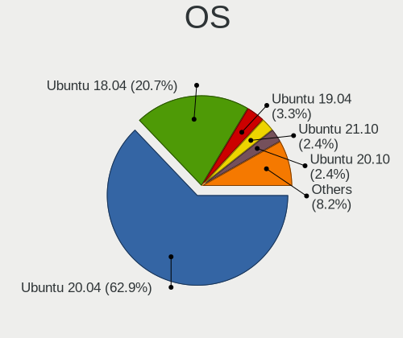

| Name           | Computers | Percent |
|----------------|-----------|---------|
| Ubuntu 20.04   | 927       | 62.89%  |
| Ubuntu 18.04   | 305       | 20.69%  |
| Ubuntu 19.04   | 49        | 3.32%   |
| Ubuntu 21.10   | 36        | 2.44%   |
| Ubuntu 20.10   | 36        | 2.44%   |
| Ubuntu 21.04   | 32        | 2.17%   |
| Ubuntu 19.10   | 30        | 2.04%   |
| Ubuntu 16.04   | 24        | 1.63%   |
| Ubuntu 18.10   | 20        | 1.36%   |
| Ubuntu 22.04   | 7         | 0.47%   |
| Ubuntu Core 16 | 2         | 0.14%   |
| Ubuntu 12.04   | 2         | 0.14%   |
| Ubuntu Core 18 | 1         | 0.07%   |
| Ubuntu 17.04   | 1         | 0.07%   |
| Ubuntu 14.04   | 1         | 0.07%   |
| Ubuntu         | 1         | 0.07%   |

OS Family
---------

OS without a version

| Name   | Computers | Percent |
|--------|-----------|---------|
| Ubuntu | 1469      | 100%    |

Kernel
------

Version of the Linux kernel

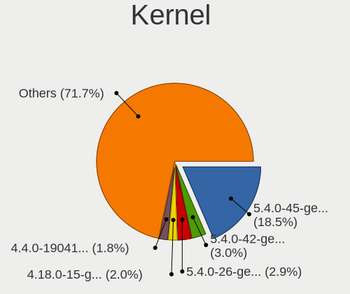

| Version                            | Computers | Percent |
|------------------------------------|-----------|---------|
| 5.4.0-45-generic                   | 281       | 18.54%  |
| 5.4.0-42-generic                   | 46        | 3.03%   |
| 5.4.0-26-generic                   | 44        | 2.9%    |
| 4.18.0-15-generic                  | 30        | 1.98%   |
| 4.4.0-19041-Microsoft              | 28        | 1.85%   |
| 5.4.0-29-generic                   | 25        | 1.65%   |
| 5.4.0-52-generic                   | 23        | 1.52%   |
| 5.4.0-37-generic                   | 21        | 1.39%   |
| 5.10.60.1-microsoft-standard-WSL2  | 20        | 1.32%   |
| 4.15.0-29-generic                  | 20        | 1.32%   |
| 5.4.0-48-generic                   | 19        | 1.25%   |
| 5.10.16.3-microsoft-standard-WSL2  | 19        | 1.25%   |
| 5.4.0-33-generic                   | 17        | 1.12%   |
| 5.0.0-13-generic                   | 17        | 1.12%   |
| 5.8.0-43-generic                   | 16        | 1.06%   |
| 5.3.0-46-generic                   | 16        | 1.06%   |
| 5.0.0-23-generic                   | 16        | 1.06%   |
| 5.4.0-58-generic                   | 15        | 0.99%   |
| 5.4.0-47-generic                   | 15        | 0.99%   |
| 5.4.0-40-generic                   | 15        | 0.99%   |
| 5.8.0-48-generic                   | 14        | 0.92%   |
| 5.3.0-40-generic                   | 14        | 0.92%   |
| 5.8.0-53-generic                   | 13        | 0.86%   |
| 5.8.0-50-generic                   | 13        | 0.86%   |
| 5.4.72-microsoft-standard-WSL2     | 13        | 0.86%   |
| 5.3.0-28-generic                   | 12        | 0.79%   |
| 5.11.0-41-generic                  | 12        | 0.79%   |
| 5.11.0-37-generic                  | 12        | 0.79%   |
| 5.8.0-41-generic                   | 11        | 0.73%   |
| 5.4.0-31-generic                   | 11        | 0.73%   |
| 5.3.0-42-generic                   | 11        | 0.73%   |
| 5.13.0-35-generic                  | 11        | 0.73%   |
| 5.11.0-38-generic                  | 11        | 0.73%   |
| 5.11.0-25-generic                  | 11        | 0.73%   |
| 4.19.128-microsoft-standard        | 11        | 0.73%   |
| 4.18.0-10-generic                  | 11        | 0.73%   |
| 5.8.0-45-generic                   | 10        | 0.66%   |
| 5.8.0-44-generic                   | 10        | 0.66%   |
| 5.4.0-56-generic                   | 10        | 0.66%   |
| 5.11.0-34-generic                  | 10        | 0.66%   |
| 4.4.0-18362-Microsoft              | 10        | 0.66%   |
| 5.8.0-55-generic                   | 9         | 0.59%   |
| 5.4.0-70-generic                   | 9         | 0.59%   |
| 5.13.0-28-generic                  | 9         | 0.59%   |
| 5.10.102.1-microsoft-standard-WSL2 | 9         | 0.59%   |
| 5.0.0-37-generic                   | 9         | 0.59%   |
| 5.4.0-54-generic                   | 8         | 0.53%   |
| 5.13.0-39-generic                  | 8         | 0.53%   |
| 5.13.0-30-generic                  | 8         | 0.53%   |
| 5.11.0-43-generic                  | 8         | 0.53%   |
| 5.0.0-15-generic                   | 8         | 0.53%   |
| 4.15.0-47-generic                  | 8         | 0.53%   |
| 5.4.0-91-generic                   | 7         | 0.46%   |
| 5.4.0-28-generic                   | 7         | 0.46%   |
| 5.4.0-21-generic                   | 7         | 0.46%   |
| 5.13.0-22-generic                  | 7         | 0.46%   |
| 5.0.0-25-generic                   | 7         | 0.46%   |
| 4.19.104-microsoft-standard        | 7         | 0.46%   |
| 4.18.0-25-generic                  | 7         | 0.46%   |
| 4.15.0-72-generic                  | 7         | 0.46%   |

Kernel Family
-------------

Linux kernel without a distro release

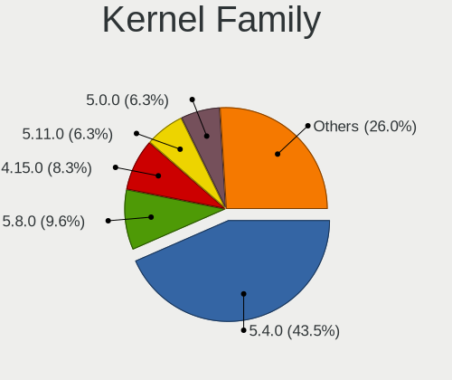

| Version    | Computers | Percent |
|------------|-----------|---------|
| 5.4.0      | 644       | 43.45%  |
| 5.8.0      | 143       | 9.65%   |
| 4.15.0     | 123       | 8.3%    |
| 5.11.0     | 94        | 6.34%   |
| 5.0.0      | 93        | 6.28%   |
| 5.3.0      | 83        | 5.6%    |
| 4.18.0     | 76        | 5.13%   |
| 5.13.0     | 67        | 4.52%   |
| 4.4.0      | 53        | 3.58%   |
| 5.10.60.1  | 24        | 1.62%   |
| 5.10.16.3  | 19        | 1.28%   |
| 5.4.72     | 14        | 0.94%   |
| 4.19.128   | 11        | 0.74%   |
| 5.10.102.1 | 9         | 0.61%   |
| 4.19.104   | 7         | 0.47%   |
| 5.15.0     | 5         | 0.34%   |
| 4.19.121   | 2         | 0.13%   |
| 4.13.0     | 2         | 0.13%   |
| 4.10.0     | 2         | 0.13%   |
| 3.13.0     | 2         | 0.13%   |
| 5.7.15     | 1         | 0.07%   |
| 5.6.7      | 1         | 0.07%   |
| 5.4.58     | 1         | 0.07%   |
| 5.4.139    | 1         | 0.07%   |
| 5.3.1      | 1         | 0.07%   |
| 5.16.10    | 1         | 0.07%   |
| 5.10.0     | 1         | 0.07%   |
| 5.1.17     | 1         | 0.07%   |
| 5.1.0      | 1         | 0.07%   |

Kernel Major Ver.
-----------------

Linux kernel major version

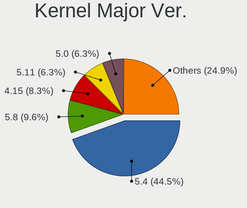

| Version  | Computers | Percent |
|----------|-----------|---------|
| 5.4      | 660       | 44.53%  |
| 5.8      | 143       | 9.65%   |
| 4.15     | 123       | 8.3%    |
| 5.11     | 94        | 6.34%   |
| 5.0      | 93        | 6.28%   |
| 5.3      | 84        | 5.67%   |
| 4.18     | 76        | 5.13%   |
| 5.13     | 67        | 4.52%   |
| 4.4      | 53        | 3.58%   |
| 5.10.60  | 24        | 1.62%   |
| 4.19     | 20        | 1.35%   |
| 5.10.16  | 19        | 1.28%   |
| 5.10.102 | 9         | 0.61%   |
| 5.15     | 5         | 0.34%   |
| 5.1      | 2         | 0.13%   |
| 4.13     | 2         | 0.13%   |
| 4.10     | 2         | 0.13%   |
| 3.13     | 2         | 0.13%   |
| 5.7      | 1         | 0.07%   |
| 5.6      | 1         | 0.07%   |
| 5.16     | 1         | 0.07%   |
| 5.10     | 1         | 0.07%   |

Arch
----

OS architecture (x86_64, i586, etc.)

| Name    | Computers | Percent |
|---------|-----------|---------|
| x86_64  | 1459      | 99.25%  |
| i686    | 8         | 0.54%   |
| aarch64 | 3         | 0.2%    |

DE
--

Desktop Environment

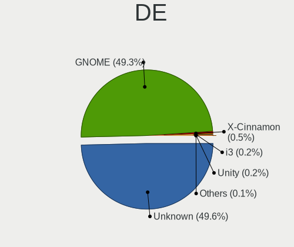

| Name            | Computers | Percent |
|-----------------|-----------|---------|
| Unknown         | 733       | 49.63%  |
| GNOME           | 728       | 49.29%  |
| X-Cinnamon      | 8         | 0.54%   |
| Unity           | 3         | 0.2%    |
| i3              | 3         | 0.2%    |
| GNUstep         | 1         | 0.07%   |
| GNOME Flashback | 1         | 0.07%   |

Display Server
--------------

X11 or Wayland

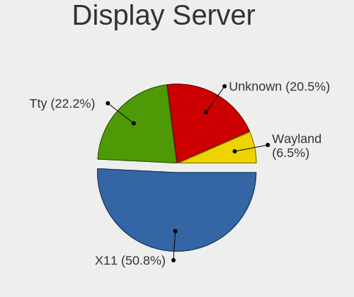

| Name    | Computers | Percent |
|---------|-----------|---------|
| X11     | 752       | 50.78%  |
| Tty     | 329       | 22.21%  |
| Unknown | 303       | 20.46%  |
| Wayland | 97        | 6.55%   |

Display Manager
---------------

SDDM, LightDM, etc.

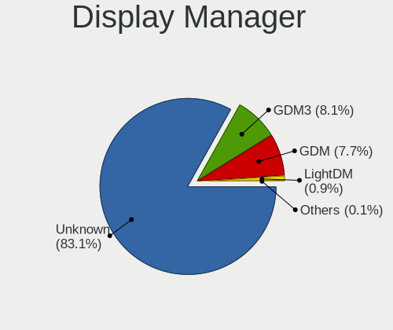

| Name    | Computers | Percent |
|---------|-----------|---------|
| Unknown | 1226      | 83.12%  |
| GDM3    | 119       | 8.07%   |
| GDM     | 114       | 7.73%   |
| LightDM | 14        | 0.95%   |
| XDM     | 1         | 0.07%   |
| SLiM    | 1         | 0.07%   |

OS Lang
-------

Language

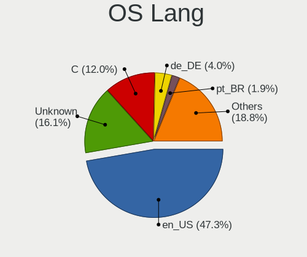

| Lang       | Computers | Percent |
|------------|-----------|---------|
| en_US      | 697       | 47.25%  |
| Unknown    | 237       | 16.07%  |
| C          | 177       | 12%     |
| de_DE      | 59        | 4%      |
| pt_BR      | 28        | 1.9%    |
| it_IT      | 27        | 1.83%   |
| fr_FR      | 26        | 1.76%   |
| en_GB      | 26        | 1.76%   |
| ru_RU      | 22        | 1.49%   |
| es_ES      | 21        | 1.42%   |
| pl_PL      | 16        | 1.08%   |
| en_CA      | 15        | 1.02%   |
| nl_NL      | 13        | 0.88%   |
| en_AU      | 13        | 0.88%   |
| zh_CN      | 12        | 0.81%   |
| en_IN      | 10        | 0.68%   |
| de_CH      | 6         | 0.41%   |
| tr_TR      | 5         | 0.34%   |
| ja_JP      | 5         | 0.34%   |
| ko_KR      | 4         | 0.27%   |
| hu_HU      | 4         | 0.27%   |
| fr_CA      | 4         | 0.27%   |
| en_ZA      | 4         | 0.27%   |
| en_IL      | 4         | 0.27%   |
| de_AT      | 4         | 0.27%   |
| cs_CZ      | 4         | 0.27%   |
| pt_PT      | 3         | 0.2%    |
| es_MX      | 3         | 0.2%    |
| zh_TW      | 2         | 0.14%   |
| sv_SE      | 2         | 0.14%   |
| nb_NO      | 2         | 0.14%   |
| fr_BE      | 2         | 0.14%   |
| es_CO      | 2         | 0.14%   |
| es_CL      | 2         | 0.14%   |
| es_AR      | 2         | 0.14%   |
| zh_HK      | 1         | 0.07%   |
| sk_SK      | 1         | 0.07%   |
| ru_UA      | 1         | 0.07%   |
| fr_CH      | 1         | 0.07%   |
| fi_FI      | 1         | 0.07%   |
| es_UY      | 1         | 0.07%   |
| es_US      | 1         | 0.07%   |
| es_EC      | 1         | 0.07%   |
| en_US.UTF8 | 1         | 0.07%   |
| en_NZ      | 1         | 0.07%   |
| en_NG      | 1         | 0.07%   |
| da_DK      | 1         | 0.07%   |

Boot Mode
---------

EFI or BIOS

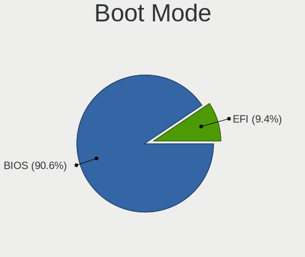

| Mode | Computers | Percent |
|------|-----------|---------|
| BIOS | 1332      | 90.61%  |
| EFI  | 138       | 9.39%   |

Filesystem
----------

Type of filesystem

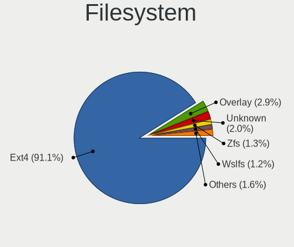

| Type      | Computers | Percent |
|-----------|-----------|---------|
| Ext4      | 1341      | 91.1%   |
| Overlay   | 42        | 2.85%   |
| Unknown   | 29        | 1.97%   |
| Zfs       | 19        | 1.29%   |
| Wslfs     | 17        | 1.15%   |
| Lxfs      | 10        | 0.68%   |
| Xfs       | 4         | 0.27%   |
| Btrfs     | 4         | 0.27%   |
| WslXs     | 2         | 0.14%   |
| Overlayfs | 2         | 0.14%   |
| Shiftfs   | 1         | 0.07%   |
| Ext2      | 1         | 0.07%   |

Part. scheme
------------

Scheme of partitioning

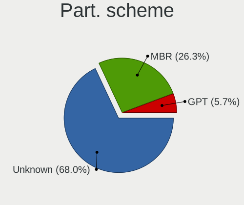

| Type    | Computers | Percent |
|---------|-----------|---------|
| Unknown | 1001      | 68%     |
| MBR     | 387       | 26.29%  |
| GPT     | 84        | 5.71%   |

Dual Boot with Linux/BSD
------------------------

Hosting more than one Linux/BSD

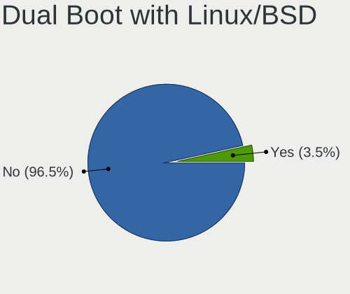

| Dual boot | Computers | Percent |
|-----------|-----------|---------|
| No        | 1422      | 96.54%  |
| Yes       | 51        | 3.46%   |

Dual Boot (Win)
---------------

Hosting Linux and Windows

| Dual boot | Computers | Percent |
|-----------|-----------|---------|
| No        | 1461      | 99.46%  |
| Yes       | 8         | 0.54%   |

Board
-----

Vendor
------

Motherboard manufacturer

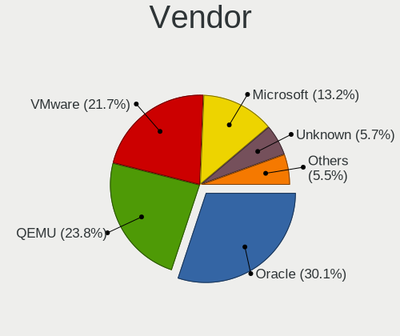

| Name                             | Computers | Percent |
|----------------------------------|-----------|---------|
| Oracle                           | 442       | 30.09%  |
| QEMU                             | 350       | 23.83%  |
| VMware                           | 319       | 21.72%  |
| Microsoft                        | 194       | 13.21%  |
| Unknown                          | 83        | 5.65%   |
| Parallels Software International | 29        | 1.97%   |
| Xen                              | 14        | 0.95%   |
| DigitalOcean                     | 6         | 0.41%   |
| OpenStack Foundation             | 5         | 0.34%   |
| Amazon EC2                       | 5         | 0.34%   |
| RDO                              | 4         | 0.27%   |
| Google                           | 4         | 0.27%   |
| Red Hat                          | 2         | 0.14%   |
| Parallels                        | 2         | 0.14%   |
| netcup                           | 2         | 0.14%   |
| Hetzner                          | 2         | 0.14%   |
| ChromiumOS                       | 2         | 0.14%   |
| Scaleway                         | 1         | 0.07%   |
| oVirt                            | 1         | 0.07%   |
| Bosch Rexroth                    | 1         | 0.07%   |
| Alibaba Cloud                    | 1         | 0.07%   |

Model
-----

Motherboard model

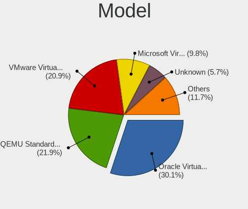

| Name                                                        | Computers | Percent |
|-------------------------------------------------------------|-----------|---------|
| Oracle VirtualBox                                           | 442       | 30.09%  |
| QEMU Standard PC (i440FX + PIIX, 1996)                      | 321       | 21.85%  |
| VMware Virtual Platform                                     | 307       | 20.9%   |
| Microsoft Virtual Machine                                   | 144       | 9.8%    |
| Unknown                                                     | 83        | 5.65%   |
| Microsoft Windows Subsystem for Linux                       | 50        | 3.4%    |
| Parallels Software International Parallels Virtual Platform | 29        | 1.97%   |
| QEMU Standard PC (Q35 + ICH9, 2009)                         | 28        | 1.91%   |
| Xen HVM domU                                                | 14        | 0.95%   |
| VMware VMware7,1                                            | 12        | 0.82%   |
| DigitalOcean Droplet                                        | 6         | 0.41%   |
| OpenStack Foundation OpenStack Nova                         | 5         | 0.34%   |
| RDO OpenStack Compute                                       | 4         | 0.27%   |
| Google Compute Engine                                       | 4         | 0.27%   |
| Red Hat KVM                                                 | 2         | 0.14%   |
| Parallels ARM Virtual Machine                               | 2         | 0.14%   |
| netcup KVM Server                                           | 2         | 0.14%   |
| Hetzner vServer                                             | 2         | 0.14%   |
| ChromiumOS crosvm                                           | 2         | 0.14%   |
| Scaleway SCW-DEV1-MICRO                                     | 1         | 0.07%   |
| QEMU Virtual Machine                                        | 1         | 0.07%   |
| oVirt Node                                                  | 1         | 0.07%   |
| Bosch Rexroth ctrlX COREvirtual                             | 1         | 0.07%   |
| Amazon EC2 t3a.small                                        | 1         | 0.07%   |
| Amazon EC2 t3.micro                                         | 1         | 0.07%   |
| Amazon EC2 t3.medium                                        | 1         | 0.07%   |
| Amazon EC2 m6i.metal                                        | 1         | 0.07%   |
| Amazon EC2 m5ad.4xlarge                                     | 1         | 0.07%   |
| Alibaba Cloud ECS                                           | 1         | 0.07%   |

Model Family
------------

Motherboard model prefix

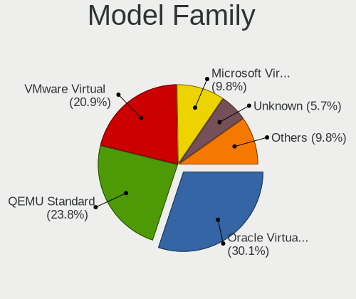

| Name                                       | Computers | Percent |
|--------------------------------------------|-----------|---------|
| Oracle VirtualBox                          | 442       | 30.09%  |
| QEMU Standard                              | 349       | 23.76%  |
| VMware Virtual                             | 307       | 20.9%   |
| Microsoft Virtual                          | 144       | 9.8%    |
| Unknown                                    | 83        | 5.65%   |
| Microsoft Windows                          | 50        | 3.4%    |
| Parallels Software International Parallels | 29        | 1.97%   |
| Xen HVM                                    | 14        | 0.95%   |
| VMware VMware7                             | 12        | 0.82%   |
| DigitalOcean Droplet                       | 6         | 0.41%   |
| OpenStack Foundation OpenStack             | 5         | 0.34%   |
| RDO OpenStack                              | 4         | 0.27%   |
| Google Compute                             | 4         | 0.27%   |
| Red Hat KVM                                | 2         | 0.14%   |
| Parallels ARM                              | 2         | 0.14%   |
| netcup KVM                                 | 2         | 0.14%   |
| Hetzner vServer                            | 2         | 0.14%   |
| ChromiumOS crosvm                          | 2         | 0.14%   |
| Scaleway SCW-DEV1-MICRO                    | 1         | 0.07%   |
| QEMU Virtual                               | 1         | 0.07%   |
| oVirt Node                                 | 1         | 0.07%   |
| Bosch Rexroth ctrlX                        | 1         | 0.07%   |
| Amazon EC2 t3a.small                       | 1         | 0.07%   |
| Amazon EC2 t3.micro                        | 1         | 0.07%   |
| Amazon EC2 t3.medium                       | 1         | 0.07%   |
| Amazon EC2 m6i.metal                       | 1         | 0.07%   |
| Amazon EC2 m5ad.4xlarge                    | 1         | 0.07%   |
| Alibaba Cloud ECS                          | 1         | 0.07%   |

MFG Year
--------

Motherboard manufacture year

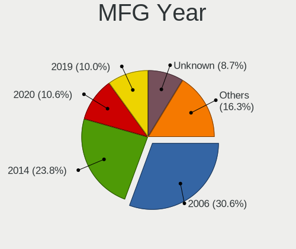

| Year    | Computers | Percent |
|---------|-----------|---------|
| 2006    | 450       | 30.63%  |
| 2014    | 349       | 23.76%  |
| 2020    | 156       | 10.62%  |
| 2019    | 147       | 10.01%  |
| Unknown | 128       | 8.71%   |
| 2018    | 122       | 8.3%    |
| 2015    | 38        | 2.59%   |
| 2017    | 36        | 2.45%   |
| 2021    | 20        | 1.36%   |
| 2012    | 7         | 0.48%   |
| 2016    | 5         | 0.34%   |
| 2013    | 5         | 0.34%   |
| 2011    | 5         | 0.34%   |
| 2022    | 1         | 0.07%   |

Form Factor
-----------

Physical design of the computer

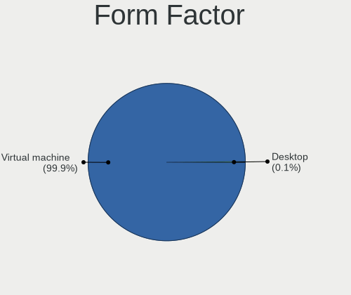

| Name            | Computers | Percent |
|-----------------|-----------|---------|
| Virtual machine | 1468      | 99.93%  |
| Desktop         | 1         | 0.07%   |

Secure Boot
-----------

Enabled or disabled

| State    | Computers | Percent |
|----------|-----------|---------|
| Disabled | 1462      | 99.52%  |
| Enabled  | 7         | 0.48%   |

Coreboot
--------

Have coreboot on board

| Used | Computers | Percent |
|------|-----------|---------|
| No   | 1469      | 100%    |

RAM Size
--------

Total RAM memory

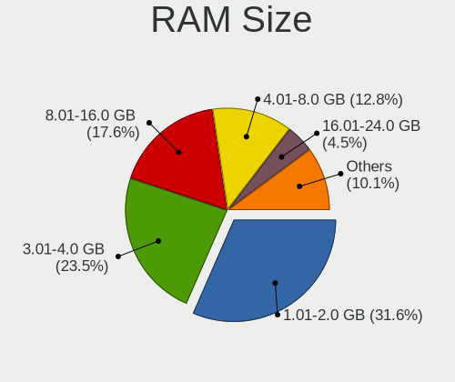

| Size in GB      | Computers | Percent |
|-----------------|-----------|---------|
| 1.01-2.0        | 467       | 31.55%  |
| 3.01-4.0        | 348       | 23.51%  |
| 8.01-16.0       | 260       | 17.57%  |
| 4.01-8.0        | 189       | 12.77%  |
| 16.01-24.0      | 66        | 4.46%   |
| 0.51-1.0        | 43        | 2.91%   |
| 2.01-3.0        | 39        | 2.64%   |
| 32.01-64.0      | 28        | 1.89%   |
| 24.01-32.0      | 19        | 1.28%   |
| 64.01-256.0     | 18        | 1.22%   |
| More than 256.0 | 3         | 0.2%    |

RAM Used
--------

Used RAM memory

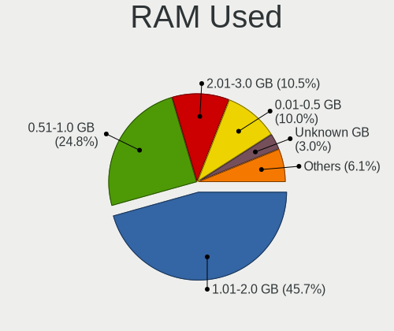

| Used GB    | Computers | Percent |
|------------|-----------|---------|
| 1.01-2.0   | 680       | 45.67%  |
| 0.51-1.0   | 369       | 24.78%  |
| 2.01-3.0   | 156       | 10.48%  |
| 0.01-0.5   | 149       | 10.01%  |
| Unknown    | 44        | 2.96%   |
| 3.01-4.0   | 42        | 2.82%   |
| 4.01-8.0   | 34        | 2.28%   |
| 8.01-16.0  | 6         | 0.4%    |
| 16.01-24.0 | 3         | 0.2%    |
| 32.01-64.0 | 2         | 0.13%   |
| 24.01-32.0 | 2         | 0.13%   |
| 0          | 2         | 0.13%   |

Total Drives
------------

Number of drives on board

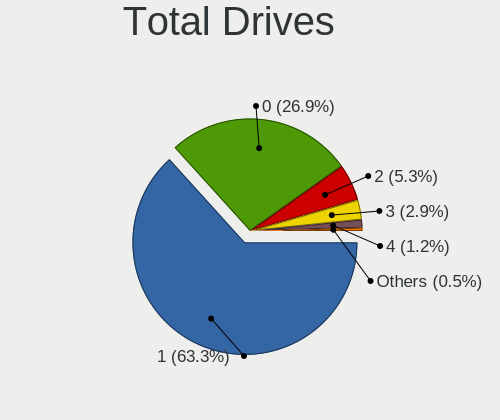

| Drives | Computers | Percent |
|--------|-----------|---------|
| 1      | 931       | 63.29%  |
| 0      | 396       | 26.92%  |
| 2      | 78        | 5.3%    |
| 3      | 42        | 2.86%   |
| 4      | 17        | 1.16%   |
| 5      | 7         | 0.48%   |

Has CD-ROM
----------

Has CD-ROM on board

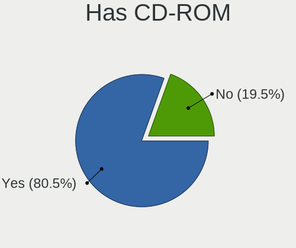

| Presented | Computers | Percent |
|-----------|-----------|---------|
| Yes       | 1183      | 80.48%  |
| No        | 287       | 19.52%  |

Has Ethernet
------------

Has Ethernet on board

| Presented | Computers | Percent |
|-----------|-----------|---------|
| Yes       | 792       | 53.91%  |
| No        | 677       | 46.09%  |

Has WiFi
--------

Has WiFi module

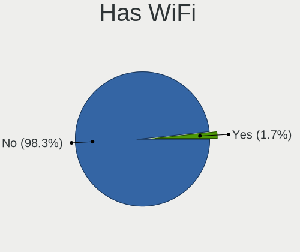

| Presented | Computers | Percent |
|-----------|-----------|---------|
| No        | 1445      | 98.3%   |
| Yes       | 25        | 1.7%    |

Has Bluetooth
-------------

Has Bluetooth module

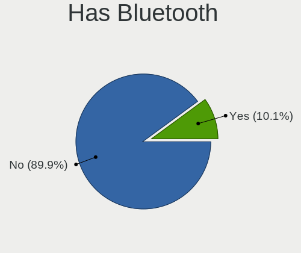

| Presented | Computers | Percent |
|-----------|-----------|---------|
| No        | 1323      | 89.94%  |
| Yes       | 148       | 10.06%  |

Location
--------

Country
-------

Geographic location (country)

| Country                | Computers | Percent |
|------------------------|-----------|---------|
| USA                    | 393       | 26.72%  |
| Germany                | 127       | 8.63%   |
| France                 | 72        | 4.89%   |
| Brazil                 | 70        | 4.76%   |
| Russia                 | 67        | 4.55%   |
| UK                     | 65        | 4.42%   |
| Netherlands            | 57        | 3.87%   |
| Spain                  | 47        | 3.2%    |
| Italy                  | 43        | 2.92%   |
| Canada                 | 43        | 2.92%   |
| Australia              | 40        | 2.72%   |
| India                  | 30        | 2.04%   |
| Japan                  | 27        | 1.84%   |
| Poland                 | 26        | 1.77%   |
| China                  | 24        | 1.63%   |
| Singapore              | 21        | 1.43%   |
| Switzerland            | 17        | 1.16%   |
| Belgium                | 15        | 1.02%   |
| Turkey                 | 13        | 0.88%   |
| Austria                | 12        | 0.82%   |
| Ukraine                | 11        | 0.75%   |
| Romania                | 10        | 0.68%   |
| Israel                 | 10        | 0.68%   |
| Iran                   | 10        | 0.68%   |
| Czechia                | 10        | 0.68%   |
| South Korea            | 9         | 0.61%   |
| Mexico                 | 9         | 0.61%   |
| Denmark                | 9         | 0.61%   |
| Sweden                 | 8         | 0.54%   |
| Taiwan                 | 7         | 0.48%   |
| Ireland                | 7         | 0.48%   |
| Colombia               | 7         | 0.48%   |
| South Africa           | 6         | 0.41%   |
| Norway                 | 6         | 0.41%   |
| Morocco                | 6         | 0.41%   |
| Hong Kong              | 6         | 0.41%   |
| Finland                | 6         | 0.41%   |
| Chile                  | 6         | 0.41%   |
| Thailand               | 5         | 0.34%   |
| Saudi Arabia           | 5         | 0.34%   |
| Hungary                | 5         | 0.34%   |
| Bosnia and Herzegovina | 5         | 0.34%   |
| Algeria                | 5         | 0.34%   |
| UAE                    | 4         | 0.27%   |
| Portugal               | 4         | 0.27%   |
| Peru                   | 4         | 0.27%   |
| Myanmar                | 4         | 0.27%   |
| Indonesia              | 4         | 0.27%   |
| Greece                 | 4         | 0.27%   |
| Bulgaria               | 4         | 0.27%   |
| Argentina              | 4         | 0.27%   |
| Yemen                  | 3         | 0.2%    |
| Uruguay                | 3         | 0.2%    |
| Tunisia                | 3         | 0.2%    |
| Slovenia               | 3         | 0.2%    |
| New Zealand            | 3         | 0.2%    |
| Malaysia               | 3         | 0.2%    |
| Kyrgyzstan             | 3         | 0.2%    |
| Belarus                | 3         | 0.2%    |
| Bangladesh             | 3         | 0.2%    |

City
----

Geographic location (city)

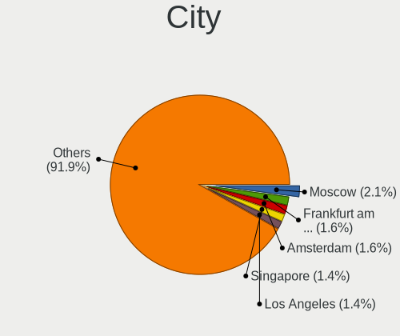

| City              | Computers | Percent |
|-------------------|-----------|---------|
| Moscow            | 31        | 2.09%   |
| Frankfurt am Main | 24        | 1.62%   |
| Amsterdam         | 24        | 1.62%   |
| Singapore         | 21        | 1.41%   |
| Los Angeles       | 21        | 1.41%   |
| London            | 21        | 1.41%   |
| San Jose          | 20        | 1.35%   |
| Atlanta           | 20        | 1.35%   |
| Toronto           | 19        | 1.28%   |
| Seattle           | 19        | 1.28%   |
| Miami             | 19        | 1.28%   |
| Dallas            | 19        | 1.28%   |
| Elk Grove Village | 17        | 1.14%   |
| Spokane           | 16        | 1.08%   |
| Heiwajima         | 16        | 1.08%   |
| Aubervilliers     | 16        | 1.08%   |
| Paris             | 15        | 1.01%   |
| Piscataway        | 13        | 0.87%   |
| Sydney            | 12        | 0.81%   |
| Sao Paulo         | 10        | 0.67%   |
| Nuremberg         | 10        | 0.67%   |
| New York          | 9         | 0.61%   |
| Beijing           | 9         | 0.61%   |
| Alexandria        | 9         | 0.61%   |
| Pouso Alegre      | 8         | 0.54%   |
| Chicago           | 8         | 0.54%   |
| Tel Aviv          | 7         | 0.47%   |
| Rome              | 7         | 0.47%   |
| Berlin            | 7         | 0.47%   |
| Ashburn           | 7         | 0.47%   |
| Warsaw            | 6         | 0.4%    |
| Vienna            | 6         | 0.4%    |
| Mumbai            | 6         | 0.4%    |
| Dublin            | 6         | 0.4%    |
| Bengaluru         | 6         | 0.4%    |
| Zurich            | 5         | 0.34%   |
| Valencia          | 5         | 0.34%   |
| Orlando           | 5         | 0.34%   |
| Kyiv              | 5         | 0.34%   |
| Cologne           | 5         | 0.34%   |
| Bucharest         | 5         | 0.34%   |
| Yekaterinburg     | 4         | 0.27%   |
| Toledo            | 4         | 0.27%   |
| Tehran            | 4         | 0.27%   |
| St Petersburg     | 4         | 0.27%   |
| Perth             | 4         | 0.27%   |
| Munich            | 4         | 0.27%   |
| Milan             | 4         | 0.27%   |
| Istanbul          | 4         | 0.27%   |
| Helsinki          | 4         | 0.27%   |
| Hamburg           | 4         | 0.27%   |
| Falkenstein       | 4         | 0.27%   |
| Chennai           | 4         | 0.27%   |
| Central           | 4         | 0.27%   |
| Budapest          | 4         | 0.27%   |
| Bangkok           | 4         | 0.27%   |
| Zaragoza          | 3         | 0.2%    |
| Yangon            | 3         | 0.2%    |
| Troy              | 3         | 0.2%    |
| Sofia             | 3         | 0.2%    |

Drives
------

Drive Vendor
------------

Hard drive vendors

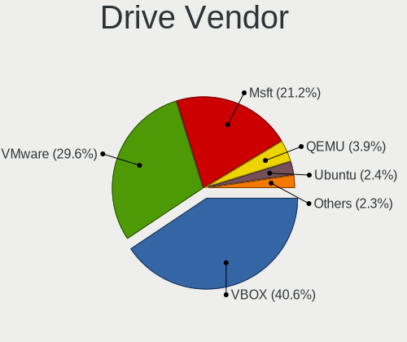

| Vendor                 | Computers | Drives | Percent |
|------------------------|-----------|--------|---------|
| VBOX                   | 438       | 490    | 40.63%  |
| VMware                 | 319       | 353    | 29.59%  |
| Msft                   | 228       | 420    | 21.15%  |
| QEMU                   | 42        | 47     | 3.9%    |
| Ubuntu                 | 26        | 29     | 2.41%   |
| Amazon.com             | 5         | 8      | 0.46%   |
| BHYVE                  | 4         | 4      | 0.37%   |
| InnoTek Systemberatung | 3         | 4      | 0.28%   |
| WDC                    | 2         | 2      | 0.19%   |
| NVMe                   | 2         | 2      | 0.19%   |
| Unknown                | 2         | 2      | 0.19%   |
| Seagate                | 1         | 1      | 0.09%   |
| SATAFIRM               | 1         | 1      | 0.09%   |
| Red Hat                | 1         | 1      | 0.09%   |
| Linode                 | 1         | 1      | 0.09%   |
| HC                     | 1         | 1      | 0.09%   |
| DO                     | 1         | 1      | 0.09%   |
| Clean                  | 1         | 1      | 0.09%   |

Drive Model
-----------

Hard drive models

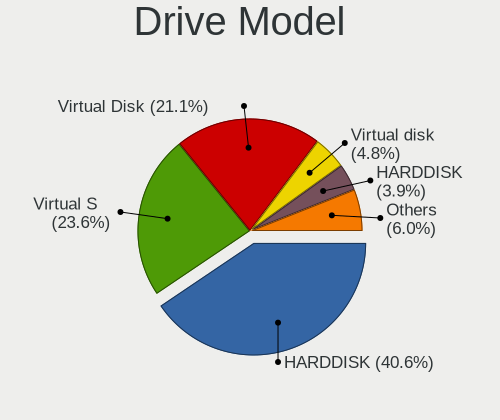

| Model                                      | Computers | Percent |
|--------------------------------------------|-----------|---------|
| VBOX HARDDISK                              | 438       | 40.56%  |
| VMware Virtual S                           | 255       | 23.61%  |
| Msft Virtual Disk                          | 228       | 21.11%  |
| VMware Virtual disk                        | 52        | 4.81%   |
| QEMU HARDDISK                              | 42        | 3.89%   |
| Ubuntu Linux-0 SSD 137GB                   | 10        | 0.93%   |
| VMware NVMe SSD Drive                      | 6         | 0.56%   |
| Ubuntu Linux 20.04-0 SSD 68GB              | 6         | 0.56%   |
| VMware Virtual SATA Hard Drive             | 5         | 0.46%   |
| BHYVE SATA DISK 112GB                      | 4         | 0.37%   |
| Ubuntu Linux 18.04 Desktop-0 68GB          | 3         | 0.28%   |
| Ubuntu Linux 16.04 Desktop-0 SSD 67GB      | 2         | 0.19%   |
| NVMe WDS500G3X0C-00SJ 500GB SSD            | 2         | 0.19%   |
| InnoTek Systemberatung NVMe SSD Drive 42GB | 2         | 0.19%   |
| Amazon.com NVMe SSD Drive 8GB              | 2         | 0.19%   |
| Unknown                                    | 2         | 0.19%   |
| WDC WDS500G3X0C-00SJG0 500GB               | 1         | 0.09%   |
| WDC WD10JPVX-60JC3T1 1TB                   | 1         | 0.09%   |
| VMware Virtual IDE Hard Drive              | 1         | 0.09%   |
| Ubuntu Linux LTS-0 SSD 274GB               | 1         | 0.09%   |
| Ubuntu Linux a-0 SSD 68GB                  | 1         | 0.09%   |
| Ubuntu Linux 20LTS-0 SSD 34GB              | 1         | 0.09%   |
| Ubuntu Linux 18-0 SSD 68GB                 | 1         | 0.09%   |
| Ubuntu 20.04 Desktop-0 SSD 69GB            | 1         | 0.09%   |
| Seagate ST3500410SV 500GB                  | 1         | 0.09%   |
| SATAFIRM S11 120GB                         | 1         | 0.09%   |
| Red Hat NVMe SSD Drive 21GB                | 1         | 0.09%   |
| Linode Volume 48GB                         | 1         | 0.09%   |
| InnoTek Systemberatung NVMe SSD Drive 27GB | 1         | 0.09%   |
| HC Volume 26GB                             | 1         | 0.09%   |
| DO Volume 536GB                            | 1         | 0.09%   |
| Clean Ubuntu Server 20.04-0 SSD 69GB       | 1         | 0.09%   |
| Amazon.com NVMe SSD Drive 54GB             | 1         | 0.09%   |
| Amazon.com NVMe SSD Drive 53GB             | 1         | 0.09%   |
| Amazon.com NVMe SSD Drive 32GB             | 1         | 0.09%   |
| Amazon.com NVMe SSD Drive 304GB            | 1         | 0.09%   |
| Amazon.com NVMe SSD Drive 21GB             | 1         | 0.09%   |

HDD Vendor
----------

Hard disk drive vendors

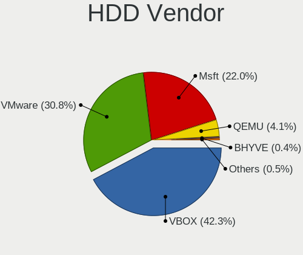

| Vendor  | Computers | Drives | Percent |
|---------|-----------|--------|---------|
| VBOX    | 438       | 490    | 42.28%  |
| VMware  | 319       | 353    | 30.79%  |
| Msft    | 228       | 420    | 22.01%  |
| QEMU    | 42        | 47     | 4.05%   |
| BHYVE   | 4         | 4      | 0.39%   |
| WDC     | 1         | 1      | 0.1%    |
| Seagate | 1         | 1      | 0.1%    |
| Linode  | 1         | 1      | 0.1%    |
| HC      | 1         | 1      | 0.1%    |
| DO      | 1         | 1      | 0.1%    |

SSD Vendor
----------

Solid state drive vendors

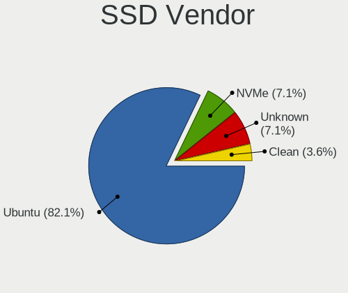

| Vendor  | Computers | Drives | Percent |
|---------|-----------|--------|---------|
| Ubuntu  | 23        | 26     | 82.14%  |
| NVMe    | 2         | 2      | 7.14%   |
| Unknown | 2         | 2      | 7.14%   |
| Clean   | 1         | 1      | 3.57%   |

Drive Kind
----------

HDD or SSD

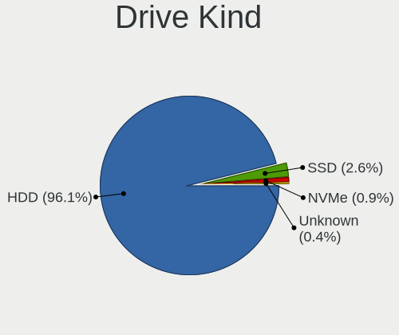

| Kind    | Computers | Drives | Percent |
|---------|-----------|--------|---------|
| HDD     | 1033      | 1319   | 96.09%  |
| SSD     | 28        | 31     | 2.6%    |
| NVMe    | 10        | 14     | 0.93%   |
| Unknown | 4         | 4      | 0.37%   |

Drive Connector
---------------

SATA, SAS, NVMe, etc.

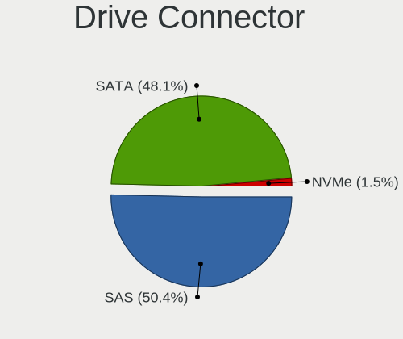

| Type | Computers | Drives | Percent |
|------|-----------|--------|---------|
| SAS  | 541       | 767    | 50.37%  |
| SATA | 517       | 579    | 48.14%  |
| NVMe | 16        | 22     | 1.49%   |

Drive Size
----------

Size of hard drive

| Size in TB | Computers | Drives | Percent |
|------------|-----------|--------|---------|
| 0.01-0.5   | 1059      | 1348   | 99.81%  |
| 0.51-1.0   | 2         | 2      | 0.19%   |

Space Total
-----------

Amount of disk space available on the file system

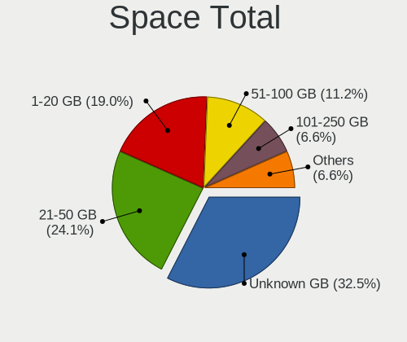

| Size in GB     | Computers | Percent |
|----------------|-----------|---------|
| Unknown        | 481       | 32.54%  |
| 21-50          | 356       | 24.09%  |
| 1-20           | 281       | 19.01%  |
| 51-100         | 165       | 11.16%  |
| 101-250        | 97        | 6.56%   |
| 251-500        | 57        | 3.86%   |
| 501-1000       | 26        | 1.76%   |
| 1001-2000      | 10        | 0.68%   |
| More than 3000 | 3         | 0.2%    |
| 2001-3000      | 2         | 0.14%   |

Space Used
----------

Amount of used disk space

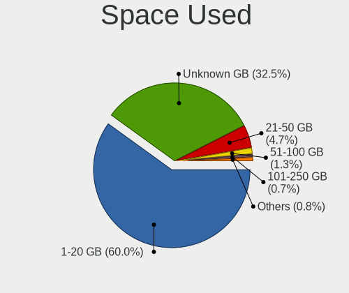

| Used GB        | Computers | Percent |
|----------------|-----------|---------|
| 1-20           | 887       | 59.97%  |
| Unknown        | 481       | 32.52%  |
| 21-50          | 70        | 4.73%   |
| 51-100         | 19        | 1.28%   |
| 101-250        | 10        | 0.68%   |
| 251-500        | 6         | 0.41%   |
| 501-1000       | 3         | 0.2%    |
| More than 3000 | 2         | 0.14%   |
| 1001-2000      | 1         | 0.07%   |

Malfunc. Drives
---------------

Drive models with a malfunction

Zero info for selected period =(

Malfunc. Drive Vendor
---------------------

Vendors of faulty drives

Zero info for selected period =(

Malfunc. HDD Vendor
-------------------

Vendors of faulty HDD drives

Zero info for selected period =(

Malfunc. Drive Kind
-------------------

Kinds of faulty drives

Zero info for selected period =(

Failed Drives
-------------

Failed drive models

Zero info for selected period =(

Failed Drive Vendor
-------------------

Failed drive vendors

Zero info for selected period =(

Drive Status
------------

Number of failed and malfunc. drives

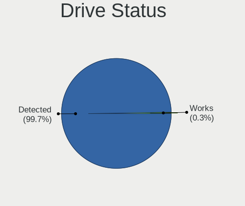

| Status   | Computers | Drives | Percent |
|----------|-----------|--------|---------|
| Detected | 1070      | 1365   | 99.72%  |
| Works    | 3         | 3      | 0.28%   |

Storage controller
------------------

Storage Vendor
--------------

Storage controller vendors

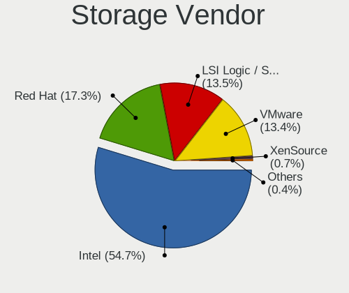

| Vendor                    | Computers | Percent |
|---------------------------|-----------|---------|
| Intel                     | 1237      | 54.71%  |
| Red Hat                   | 391       | 17.29%  |
| LSI Logic / Symbios Logic | 306       | 13.53%  |
| VMware                    | 302       | 13.36%  |
| XenSource                 | 15        | 0.66%   |
| Amazon.com                | 5         | 0.22%   |
| InnoTek Systemberatung    | 3         | 0.13%   |
| Sandisk                   | 1         | 0.04%   |
| Marvell Technology Group  | 1         | 0.04%   |

Storage Model
-------------

Storage controller models

| Model                                                                   | Computers | Percent |
|-------------------------------------------------------------------------|-----------|---------|
| Intel 82371AB/EB/MB PIIX4 IDE                                           | 789       | 29.03%  |
| Intel 82801HM/HEM (ICH8M/ICH8M-E) SATA Controller [AHCI mode]           | 429       | 15.78%  |
| Intel 82371SB PIIX3 IDE [Natoma/Triton II]                              | 360       | 13.25%  |
| Red Hat Virtio block device                                             | 323       | 11.88%  |
| LSI Logic / Symbios Logic 53c1030 PCI-X Fusion-MPT Dual Ultra320 SCSI   | 303       | 11.15%  |
| VMware SATA AHCI controller                                             | 298       | 10.96%  |
| Red Hat Virtio SCSI                                                     | 46        | 1.69%   |
| Intel 82801HR/HO/HH (ICH8R/DO/DH) 6 port SATA Controller [AHCI mode]    | 33        | 1.21%   |
| Intel 82801IR/IO/IH (ICH9R/DO/DH) 6 port SATA Controller [AHCI mode]    | 31        | 1.14%   |
| Intel 82801BA IDE U100 Controller                                       | 29        | 1.07%   |
| Red Hat Virtio filesystem                                               | 28        | 1.03%   |
| XenSource Xen Platform Device                                           | 15        | 0.55%   |
| VMware PVSCSI SCSI Controller                                           | 8         | 0.29%   |
| VMware NVMe SSD Controller                                              | 6         | 0.22%   |
| Intel 631xESB/632xESB IDE Controller                                    | 4         | 0.15%   |
| Amazon.com NVMe EBS Controller                                          | 4         | 0.15%   |
| InnoTek Systemberatung Non-Volatile memory controller                   | 3         | 0.11%   |
| Sandisk WD Black SN750 / PC SN730 NVMe SSD                              | 1         | 0.04%   |
| Red Hat QEMU NVM Express Controller                                     | 1         | 0.04%   |
| Marvell Group 88SE9215 PCIe 2.0 x1 4-port SATA 6 Gb/s Controller        | 1         | 0.04%   |
| LSI Logic / Symbios Logic SAS2008 PCI-Express Fusion-MPT SAS-2 [Falcon] | 1         | 0.04%   |
| LSI Logic / Symbios Logic SAS1068 PCI-X Fusion-MPT SAS                  | 1         | 0.04%   |
| LSI Logic / Symbios Logic 53c895a                                       | 1         | 0.04%   |
| Intel C620 Series Chipset Family SATA Controller [AHCI mode]            | 1         | 0.04%   |
| Amazon.com NVMe SSD Controller                                          | 1         | 0.04%   |
| Amazon.com Amazon.com Non-Volatile memory controller                    | 1         | 0.04%   |

Storage Kind
------------

Kind of storage controller (IDE, SATA, NVMe, SAS, ...)

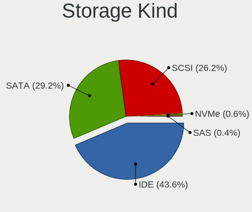

| Kind | Computers | Percent |
|------|-----------|---------|
| IDE  | 1182      | 43.63%  |
| SATA | 792       | 29.24%  |
| SCSI | 709       | 26.17%  |
| NVMe | 16        | 0.59%   |
| SAS  | 10        | 0.37%   |

Processor
---------

CPU Vendor
----------

Processor vendors

| Vendor | Computers | Percent |
|--------|-----------|---------|
| Intel  | 1260      | 85.77%  |
| AMD    | 206       | 14.02%  |
| ARM    | 3         | 0.2%    |

CPU Model
---------

Processor models

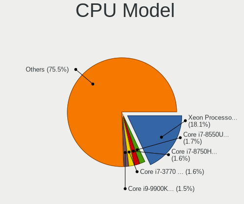

| Model                                          | Computers | Percent |
|------------------------------------------------|-----------|---------|
| Intel Xeon Processor (Skylake, IBRS)           | 266       | 18.06%  |
| Intel Core i7-8550U CPU @ 1.80GHz              | 25        | 1.7%    |
| Intel Core i7-8750H CPU @ 2.20GHz              | 24        | 1.63%   |
| Intel Core i7-3770 CPU @ 3.40GHz               | 24        | 1.63%   |
| Intel Core i9-9900K CPU @ 3.60GHz              | 22        | 1.49%   |
| Intel Core i7-7700HQ CPU @ 2.80GHz             | 19        | 1.29%   |
| Intel Core i5-8250U CPU @ 1.60GHz              | 18        | 1.22%   |
| Intel Core i7-9750H CPU @ 2.60GHz              | 15        | 1.02%   |
| AMD Ryzen 5 3600 6-Core Processor              | 14        | 0.95%   |
| Intel Core i7-4790 CPU @ 3.60GHz               | 13        | 0.88%   |
| Intel Core i5-8265U CPU @ 1.60GHz              | 13        | 0.88%   |
| Intel Common KVM processor                     | 13        | 0.88%   |
| AMD Ryzen 9 3900X 12-Core Processor            | 13        | 0.88%   |
| Intel Core i5-3470 CPU @ 3.20GHz               | 12        | 0.81%   |
| Intel Core i7-8565U CPU @ 1.80GHz              | 11        | 0.75%   |
| Intel Core i7-6700HQ CPU @ 2.60GHz             | 10        | 0.68%   |
| Intel Core i7-6700 CPU @ 3.40GHz               | 10        | 0.68%   |
| Intel Core i5-8300H CPU @ 2.30GHz              | 10        | 0.68%   |
| Intel Core i7-8700 CPU @ 3.20GHz               | 9         | 0.61%   |
| Intel Core i7-7700K CPU @ 4.20GHz              | 9         | 0.61%   |
| Intel Core i5-6200U CPU @ 2.30GHz              | 9         | 0.61%   |
| Intel Core Processor (Broadwell, no TSX, IBRS) | 8         | 0.54%   |
| Intel Core i7-6500U CPU @ 2.50GHz              | 8         | 0.54%   |
| Intel Core i7-3630QM CPU @ 2.40GHz             | 8         | 0.54%   |
| Intel Core i5-7200U CPU @ 2.50GHz              | 8         | 0.54%   |
| Intel Core i5-5200U CPU @ 2.20GHz              | 8         | 0.54%   |
| AMD Ryzen 7 3700X 8-Core Processor             | 8         | 0.54%   |
| AMD Ryzen 7 2700X Eight-Core Processor         | 8         | 0.54%   |
| AMD FX-8350 Eight-Core Processor               | 8         | 0.54%   |
| Intel Core i7-9700K CPU @ 3.60GHz              | 7         | 0.48%   |
| Intel Core i7-7700 CPU @ 3.60GHz               | 7         | 0.48%   |
| Intel Core i7-7500U CPU @ 2.70GHz              | 7         | 0.48%   |
| Intel Core i7-6700K CPU @ 4.00GHz              | 7         | 0.48%   |
| Intel Core i7-10750H CPU @ 2.60GHz             | 7         | 0.48%   |
| Intel Core i5-7400 CPU @ 3.00GHz               | 7         | 0.48%   |
| Intel Core i5-2400 CPU @ 3.10GHz               | 7         | 0.48%   |
| AMD Ryzen 5 3500U with Radeon Vega Mobile Gfx  | 7         | 0.48%   |
| Intel Xeon CPU E5620 @ 2.40GHz                 | 6         | 0.41%   |
| Intel Virtual CPU 82d9ed4018dd                 | 6         | 0.41%   |
| Intel Core i7-4770HQ CPU @ 2.20GHz             | 6         | 0.41%   |
| Intel Core i7-4770 CPU @ 3.40GHz               | 6         | 0.41%   |
| Intel Core i7-3615QM CPU @ 2.30GHz             | 6         | 0.41%   |
| Intel Core i5-4590 CPU @ 3.30GHz               | 6         | 0.41%   |
| Intel Core i5-4460 CPU @ 3.20GHz               | 6         | 0.41%   |
| Intel Core i5-3210M CPU @ 2.50GHz              | 6         | 0.41%   |
| Intel Core i5-1035G1 CPU @ 1.00GHz             | 6         | 0.41%   |
| AMD Ryzen 5 2600 Six-Core Processor            | 6         | 0.41%   |
| Intel Core i7-9700 CPU @ 3.00GHz               | 5         | 0.34%   |
| Intel Core i7-8850H CPU @ 2.60GHz              | 5         | 0.34%   |
| Intel Core i7-8700K CPU @ 3.70GHz              | 5         | 0.34%   |
| Intel Core i7-2600 CPU @ 3.40GHz               | 5         | 0.34%   |
| Intel Core i7-10510U CPU @ 1.80GHz             | 5         | 0.34%   |
| Intel Core i5-7300U CPU @ 2.60GHz              | 5         | 0.34%   |
| Intel Core i5-6600K CPU @ 3.50GHz              | 5         | 0.34%   |
| Intel Core i5-6400 CPU @ 2.70GHz               | 5         | 0.34%   |
| Intel Core i3-6006U CPU @ 2.00GHz              | 5         | 0.34%   |
| Intel 11th Gen Core i7-1165G7 @ 2.80GHz        | 5         | 0.34%   |
| Intel 11th Gen Core i5-1135G7 @ 2.40GHz        | 5         | 0.34%   |
| Intel Core Processor (Skylake, IBRS)           | 4         | 0.27%   |
| Intel Core Processor (Haswell, no TSX)         | 4         | 0.27%   |

CPU Model Family
----------------

Processor model prefix

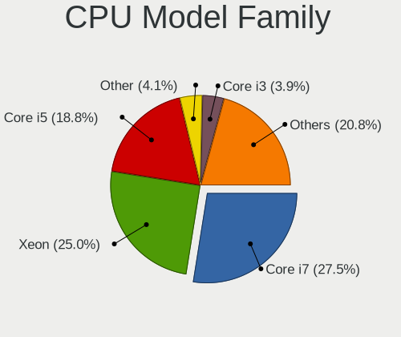

| Model                   | Computers | Percent |
|-------------------------|-----------|---------|
| Intel Core i7           | 405       | 27.51%  |
| Intel Xeon              | 368       | 25%     |
| Intel Core i5           | 276       | 18.75%  |
| Other                   | 60        | 4.08%   |
| Intel Core i3           | 57        | 3.87%   |
| AMD Ryzen 5             | 56        | 3.8%    |
| Intel Core i9           | 35        | 2.38%   |
| AMD Ryzen 7             | 35        | 2.38%   |
| AMD Ryzen 9             | 25        | 1.7%    |
| AMD FX                  | 22        | 1.49%   |
| Intel Core              | 19        | 1.29%   |
| AMD EPYC                | 14        | 0.95%   |
| Intel Pentium           | 13        | 0.88%   |
| Intel Xeon Platinum     | 8         | 0.54%   |
| Intel Celeron           | 8         | 0.54%   |
| AMD Ryzen 3             | 8         | 0.54%   |
| Intel Xeon Gold         | 7         | 0.48%   |
| Intel Core 2 Duo        | 6         | 0.41%   |
| AMD A8                  | 6         | 0.41%   |
| AMD A10                 | 6         | 0.41%   |
| AMD Ryzen Threadripper  | 4         | 0.27%   |
| Intel Xeon Silver       | 3         | 0.2%    |
| AMD Phenom II X4        | 3         | 0.2%    |
| AMD A4                  | 3         | 0.2%    |
| Intel Pentium Dual-Core | 2         | 0.14%   |
| Intel Genuine           | 2         | 0.14%   |
| AMD Ryzen 3 PRO         | 2         | 0.14%   |
| AMD Phenom II X6        | 2         | 0.14%   |
| AMD Athlon II X4        | 2         | 0.14%   |
| AMD Athlon II X2        | 2         | 0.14%   |
| AMD A6                  | 2         | 0.14%   |
| Intel Pentium Gold      | 1         | 0.07%   |
| Intel Core m3           | 1         | 0.07%   |
| Intel Core 2 Quad       | 1         | 0.07%   |
| AMD Turion II           | 1         | 0.07%   |
| AMD Ryzen Embedded      | 1         | 0.07%   |
| AMD Ryzen 5 PRO         | 1         | 0.07%   |
| AMD Quad-Core           | 1         | 0.07%   |
| AMD Opteron             | 1         | 0.07%   |
| AMD Athlon 64 X2        | 1         | 0.07%   |
| AMD Athlon              | 1         | 0.07%   |
| AMD A12                 | 1         | 0.07%   |

CPU Cores
---------

Number of processor cores

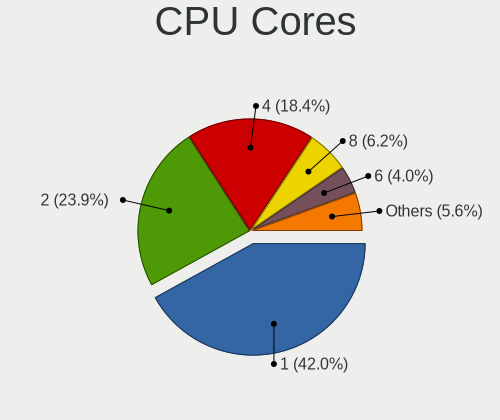

| Number | Computers | Percent |
|--------|-----------|---------|
| 1      | 620       | 41.98%  |
| 2      | 353       | 23.9%   |
| 4      | 272       | 18.42%  |
| 8      | 91        | 6.16%   |
| 6      | 59        | 3.99%   |
| 3      | 40        | 2.71%   |
| 16     | 12        | 0.81%   |
| 12     | 11        | 0.74%   |
| 10     | 4         | 0.27%   |
| 5      | 4         | 0.27%   |
| 32     | 3         | 0.2%    |
| 64     | 2         | 0.14%   |
| 56     | 1         | 0.07%   |
| 24     | 1         | 0.07%   |
| 22     | 1         | 0.07%   |
| 20     | 1         | 0.07%   |
| 18     | 1         | 0.07%   |
| 9      | 1         | 0.07%   |

CPU Sockets
-----------

Number of sockets

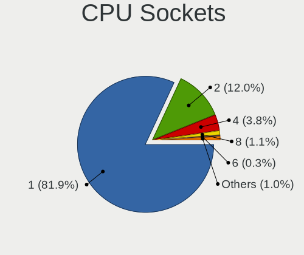

| Number | Computers | Percent |
|--------|-----------|---------|
| 1      | 1206      | 81.93%  |
| 2      | 176       | 11.96%  |
| 4      | 56        | 3.8%    |
| 8      | 16        | 1.09%   |
| 6      | 4         | 0.27%   |
| 3      | 4         | 0.27%   |
| 16     | 3         | 0.2%    |
| 12     | 3         | 0.2%    |
| 64     | 1         | 0.07%   |
| 56     | 1         | 0.07%   |
| 32     | 1         | 0.07%   |
| 11     | 1         | 0.07%   |

CPU Threads
-----------

Threads per core (Hyper-Threading)

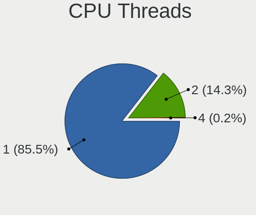

| Number | Computers | Percent |
|--------|-----------|---------|
| 1      | 1258      | 85.52%  |
| 2      | 210       | 14.28%  |
| 4      | 3         | 0.2%    |

CPU Op-Modes
------------

CPU Operation Modes (32-bit, 64-bit)

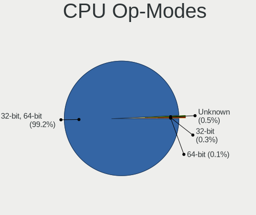

| Op mode        | Computers | Percent |
|----------------|-----------|---------|
| 32-bit, 64-bit | 1458      | 99.18%  |
| Unknown        | 7         | 0.48%   |
| 32-bit         | 4         | 0.27%   |
| 64-bit         | 1         | 0.07%   |

CPU Microcode
-------------

Microcode number

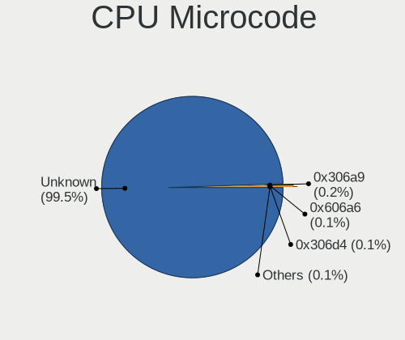

| Number     | Computers | Percent |
|------------|-----------|---------|
| Unknown    | 1461      | 99.46%  |
| 0x306a9    | 3         | 0.2%    |
| 0x606a6    | 1         | 0.07%   |
| 0x306e4    | 1         | 0.07%   |
| 0x306d4    | 1         | 0.07%   |
| 0x306c3    | 1         | 0.07%   |
| 0x06000626 | 1         | 0.07%   |

CPU Microarch
-------------

Microarchitecture

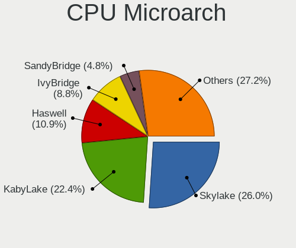

| Name          | Computers | Percent |
|---------------|-----------|---------|
| Skylake       | 383       | 26.02%  |
| KabyLake      | 330       | 22.42%  |
| Haswell       | 160       | 10.87%  |
| IvyBridge     | 129       | 8.76%   |
| SandyBridge   | 70        | 4.76%   |
| Zen 2         | 68        | 4.62%   |
| Broadwell     | 55        | 3.74%   |
| Zen+          | 42        | 2.85%   |
| CometLake     | 25        | 1.7%    |
| Westmere      | 24        | 1.63%   |
| Piledriver    | 24        | 1.63%   |
| Zen           | 23        | 1.56%   |
| Unknown       | 19        | 1.29%   |
| Nehalem       | 17        | 1.15%   |
| NetBurst      | 13        | 0.88%   |
| Zen 3         | 12        | 0.82%   |
| TigerLake     | 11        | 0.75%   |
| K10           | 11        | 0.75%   |
| IceLake       | 11        | 0.75%   |
| Penryn        | 8         | 0.54%   |
| Steamroller   | 6         | 0.41%   |
| Silvermont    | 4         | 0.27%   |
| K8 Hammer     | 4         | 0.27%   |
| Goldmont      | 4         | 0.27%   |
| K10 Llano     | 3         | 0.2%    |
| Excavator     | 3         | 0.2%    |
| Core          | 3         | 0.2%    |
| Puma          | 2         | 0.14%   |
| Jaguar        | 2         | 0.14%   |
| Goldmont plus | 2         | 0.14%   |
| Bulldozer     | 2         | 0.14%   |
| P6            | 1         | 0.07%   |
| K6            | 1         | 0.07%   |

Graphics
--------

GPU Vendor
----------

Vendors of graphics cards

| Vendor                 | Computers | Percent |
|------------------------|-----------|---------|
| VMware                 | 664       | 51.23%  |
| Cirrus Logic           | 303       | 23.38%  |
| InnoTek Systemberatung | 101       | 7.79%   |
| Microsoft              | 92        | 7.1%    |
| Red Hat                | 64        | 4.94%   |
| Technical              | 25        | 1.93%   |
| Parallels              | 13        | 1%      |
| Nvidia                 | 13        | 1%      |
| AMD                    | 10        | 0.77%   |
| Unknown                | 4         | 0.31%   |
| Amazon.com             | 4         | 0.31%   |
| Intel                  | 3         | 0.23%   |

GPU Model
---------

Graphics card models

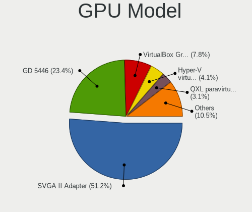

| Model                                                       | Computers | Percent |
|-------------------------------------------------------------|-----------|---------|
| VMware SVGA II Adapter                                      | 664       | 51.2%   |
| Cirrus Logic GD 5446                                        | 303       | 23.36%  |
| InnoTek Systemberatung VirtualBox Graphics Adapter          | 101       | 7.79%   |
| Microsoft Hyper-V virtual VGA                               | 53        | 4.09%   |
| Red Hat QXL paravirtual graphic card                        | 40        | 3.08%   |
| Microsoft Virtual Render                                    | 38        | 2.93%   |
| Technical VGA compatible controller                         | 25        | 1.93%   |
| Red Hat Virtio GPU                                          | 24        | 1.85%   |
| Parallels Accelerated Virtual Video Adapter                 | 13        | 1%      |
| Unknown VGA compatible controller                           | 4         | 0.31%   |
| Amazon.com Amazon.com VGA compatible controller             | 4         | 0.31%   |
| Nvidia GK208B [GeForce GT 710]                              | 2         | 0.15%   |
| Nvidia TU104GL [Tesla T4]                                   | 1         | 0.08%   |
| Nvidia TU102 [GeForce RTX 2080 Ti]                          | 1         | 0.08%   |
| Nvidia GP107 [GeForce GTX 1050]                             | 1         | 0.08%   |
| Nvidia GP106 [GeForce GTX 1060 6GB]                         | 1         | 0.08%   |
| Nvidia GP104 [GeForce GTX 1080]                             | 1         | 0.08%   |
| Nvidia GP104 [GeForce GTX 1070]                             | 1         | 0.08%   |
| Nvidia GP104 [GeForce GTX 1070 Ti]                          | 1         | 0.08%   |
| Nvidia GM204GL [Tesla M60]                                  | 1         | 0.08%   |
| Nvidia GK208B [GeForce GT 730]                              | 1         | 0.08%   |
| Nvidia GF106GL [Quadro 2000]                                | 1         | 0.08%   |
| Nvidia GF106 [GeForce GTS 450]                              | 1         | 0.08%   |
| Nvidia GA102GL [RTX A6000]                                  | 1         | 0.08%   |
| Microsoft RemoteFX Graphics                                 | 1         | 0.08%   |
| Intel HD Graphics 5500                                      | 1         | 0.08%   |
| Intel CoffeeLake-U GT3e [Iris Plus Graphics 655]            | 1         | 0.08%   |
| Intel AlderLake-S GT1                                       | 1         | 0.08%   |
| AMD Turks XT [Radeon HD 6670/7670]                          | 1         | 0.08%   |
| AMD Tahiti XT [Radeon HD 7970/8970 OEM / R9 280X]           | 1         | 0.08%   |
| AMD Radeon R7 240                                           | 1         | 0.08%   |
| AMD Lexa PRO [Radeon 540/540X/550/550X / RX 540X/550/550X]  | 1         | 0.08%   |
| AMD Juniper XT [Radeon HD 5770]                             | 1         | 0.08%   |
| AMD Ellesmere [Radeon RX 470/480/570/570X/580/580X/590]     | 1         | 0.08%   |
| AMD Curacao XT / Trinidad XT [Radeon R7 370 / R9 270X/370X] | 1         | 0.08%   |
| AMD Cape Verde PRO [Radeon HD 7750/8740 / R7 250E]          | 1         | 0.08%   |
| AMD Caicos [Radeon HD 6450/7450/8450 / R5 230 OEM]          | 1         | 0.08%   |
| AMD Bonaire [FirePro W5100]                                 | 1         | 0.08%   |

GPU Combo
---------

Combinations of graphics cards

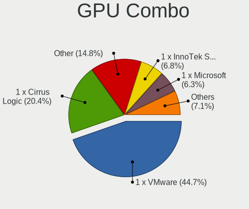

| Name                       | Computers | Percent |
|----------------------------|-----------|---------|
| 1 x VMware                 | 657       | 44.66%  |
| 1 x Cirrus Logic           | 300       | 20.39%  |
| Other                      | 218       | 14.82%  |
| 1 x InnoTek Systemberatung | 100       | 6.8%    |
| 1 x Microsoft              | 92        | 6.25%   |
| 1 x Red Hat                | 61        | 4.15%   |
| 1 x Parallels              | 13        | 0.88%   |
| 1 x Nvidia                 | 7         | 0.48%   |
| 1 x AMD                    | 5         | 0.34%   |
| AMD + VMware               | 4         | 0.27%   |
| 1 x Amazon.com             | 4         | 0.27%   |
| Nvidia + Cirrus Logic      | 3         | 0.2%    |
| Nvidia + VMware            | 2         | 0.14%   |
| Nvidia + Red Hat           | 1         | 0.07%   |
| Intel + VMware             | 1         | 0.07%   |
| Intel + Red Hat            | 1         | 0.07%   |
| 1 x Intel                  | 1         | 0.07%   |
| AMD + Red Hat              | 1         | 0.07%   |

GPU Driver
----------

Free vs proprietary

| Driver      | Computers | Percent |
|-------------|-----------|---------|
| Unknown     | 1452      | 98.78%  |
| Proprietary | 9         | 0.61%   |
| Free        | 9         | 0.61%   |

GPU Memory
----------

Total video memory

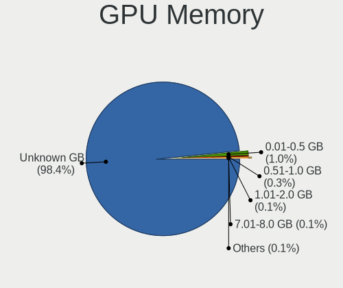

| Size in GB | Computers | Percent |
|------------|-----------|---------|
| Unknown    | 1445      | 98.37%  |
| 0.01-0.5   | 15        | 1.02%   |
| 0.51-1.0   | 4         | 0.27%   |
| 1.01-2.0   | 2         | 0.14%   |
| 7.01-8.0   | 1         | 0.07%   |
| 5.01-6.0   | 1         | 0.07%   |
| 2.01-3.0   | 1         | 0.07%   |

Monitor
-------

Monitor Vendor
--------------

Monitor vendors

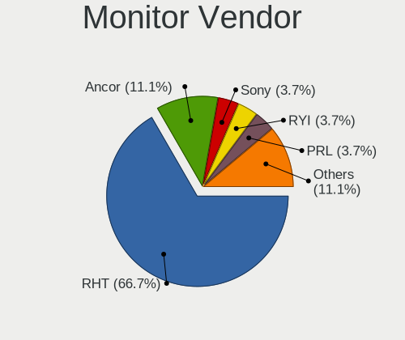

| Vendor               | Computers | Percent |
|----------------------|-----------|---------|
| RHT                  | 18        | 66.67%  |
| Ancor Communications | 3         | 11.11%  |
| Sony                 | 1         | 3.7%    |
| RYI                  | 1         | 3.7%    |
| PRL                  | 1         | 3.7%    |
| Dell                 | 1         | 3.7%    |
| ASUSTek Computer     | 1         | 3.7%    |
| Acer                 | 1         | 3.7%    |

Monitor Model
-------------

Monitor models

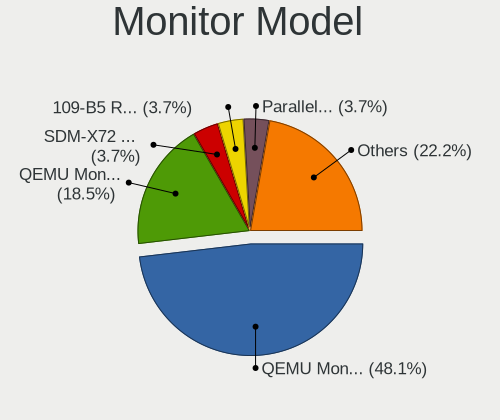

| Model                                                            | Computers | Percent |
|------------------------------------------------------------------|-----------|---------|
| RHT QEMU Monitor RHT1234 2048x1152 260x195mm 12.8-inch           | 13        | 48.15%  |
| RHT QEMU Monitor RHT1234 2048x1152 260x190mm 12.7-inch           | 5         | 18.52%  |
| Sony SDM-X72 SNY1E70 1280x1024 338x270mm 17.0-inch               | 1         | 3.7%    |
| RYI 109-B5 RYI0001 1920x1440 360x270mm 17.7-inch                 | 1         | 3.7%    |
| PRL Parallels Vu PRL4006 1400x1050                               | 1         | 3.7%    |
| Dell LCD Monitor SE2417HG 1920x1080                              | 1         | 3.7%    |
| ASUSTek Computer VP278 AUS27AE 1920x1080 598x336mm 27.0-inch     | 1         | 3.7%    |
| Ancor Communications VX238 ACI23C1 1920x1080 510x290mm 23.1-inch | 1         | 3.7%    |
| Ancor Communications VE248 ACI2494 1920x1080 530x300mm 24.0-inch | 1         | 3.7%    |
| Ancor Communications LCD Monitor ASUS VG236 1920x1080            | 1         | 3.7%    |
| Acer AL1917 ACRAD73 1280x1024 376x301mm 19.0-inch                | 1         | 3.7%    |

Monitor Resolution
------------------

Monitor screen resolution

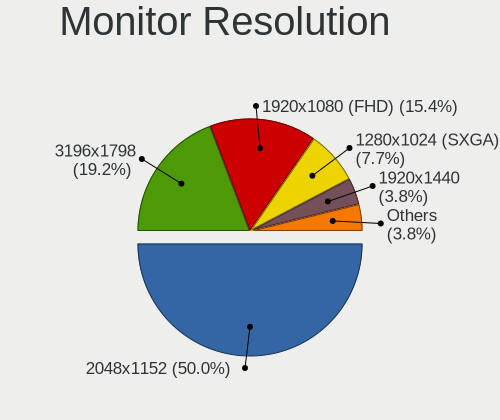

| Resolution       | Computers | Percent |
|------------------|-----------|---------|
| 2048x1152        | 13        | 50%     |
| 3196x1798        | 5         | 19.23%  |
| 1920x1080 (FHD)  | 4         | 15.38%  |
| 1280x1024 (SXGA) | 2         | 7.69%   |
| 1920x1440        | 1         | 3.85%   |
| 1400x1050        | 1         | 3.85%   |

Monitor Diagonal
----------------

Diagonal size in inches

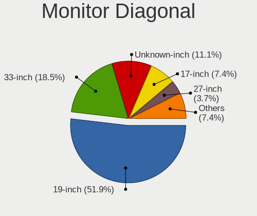

| Inches  | Computers | Percent |
|---------|-----------|---------|
| 19      | 14        | 51.85%  |
| 33      | 5         | 18.52%  |
| Unknown | 3         | 11.11%  |
| 17      | 2         | 7.41%   |
| 27      | 1         | 3.7%    |
| 24      | 1         | 3.7%    |
| 23      | 1         | 3.7%    |

Monitor Width
-------------

Physical width

| Width in mm | Computers | Percent |
|-------------|-----------|---------|
| 401-500     | 13        | 50%     |
| 701-800     | 5         | 19.23%  |
| Unknown     | 3         | 11.54%  |
| 501-600     | 2         | 7.69%   |
| 351-400     | 2         | 7.69%   |
| 301-350     | 1         | 3.85%   |

Aspect Ratio
------------

Proportional relationship between the width and the height

| Ratio   | Computers | Percent |
|---------|-----------|---------|
| 4/3     | 15        | 57.69%  |
| 16/9    | 7         | 26.92%  |
| 5/4     | 2         | 7.69%   |
| Unknown | 2         | 7.69%   |

Monitor Area
------------

Area in inch²

| Area in inch² | Computers | Percent |
|----------------|-----------|---------|
| 151-200        | 15        | 55.56%  |
| 351-500        | 5         | 18.52%  |
| Unknown        | 3         | 11.11%  |
| 201-250        | 2         | 7.41%   |
| 301-350        | 1         | 3.7%    |
| 141-150        | 1         | 3.7%    |

Pixel Density
-------------

Pixels per inch

| Density | Computers | Percent |
|---------|-----------|---------|
| 101-120 | 13        | 52%     |
| 51-100  | 8         | 32%     |
| Unknown | 3         | 12%     |
| 121-160 | 1         | 4%      |

Multiple Monitors
-----------------

Total monitors connected

| Total | Computers | Percent |
|-------|-----------|---------|
| 0     | 863       | 58.59%  |
| 1     | 608       | 41.28%  |
| 3     | 1         | 0.07%   |
| 2     | 1         | 0.07%   |

Network
-------

Net Controller Vendor
---------------------

Controller vendors

| Vendor                            | Computers | Percent |
|-----------------------------------|-----------|---------|
| Intel                             | 708       | 58.56%  |
| Red Hat                           | 390       | 32.26%  |
| VMware                            | 45        | 3.72%   |
| AMD                               | 18        | 1.49%   |
| Realtek Semiconductor             | 17        | 1.41%   |
| Amazon.com                        | 7         | 0.58%   |
| Ralink Technology                 | 5         | 0.41%   |
| TP-Link                           | 4         | 0.33%   |
| Mellanox Technologies             | 3         | 0.25%   |
| Samsung Electronics               | 2         | 0.17%   |
| MediaTek                          | 2         | 0.17%   |
| Van Ooijen Technische Informatica | 1         | 0.08%   |
| Qualcomm Atheros                  | 1         | 0.08%   |
| Qualcomm                          | 1         | 0.08%   |
| Linksys                           | 1         | 0.08%   |
| Digital Equipment                 | 1         | 0.08%   |
| D-Link System                     | 1         | 0.08%   |
| ASUSTek Computer                  | 1         | 0.08%   |
| Allwinner Technology              | 1         | 0.08%   |

Net Controller Model
--------------------

Controller models

| Model                                                                                         | Computers | Percent |
|-----------------------------------------------------------------------------------------------|-----------|---------|
| Intel 82540EM Gigabit Ethernet Controller                                                     | 437       | 36.09%  |
| Red Hat Virtio network device                                                                 | 390       | 32.2%   |
| Intel 82545EM Gigabit Ethernet Controller (Copper)                                            | 265       | 21.88%  |
| VMware VMXNET3 Ethernet Controller                                                            | 45        | 3.72%   |
| AMD 79c970 [PCnet32 LANCE]                                                                    | 18        | 1.49%   |
| Realtek RTL-8100/8101L/8139 PCI Fast Ethernet Adapter                                         | 11        | 0.91%   |
| Amazon.com Elastic Network Adapter (ENA)                                                      | 7         | 0.58%   |
| Mellanox MT27710 Family [ConnectX-4 Lx Virtual Function]                                      | 3         | 0.25%   |
| Intel 82574L Gigabit Network Connection                                                       | 3         | 0.25%   |
| TP-Link 802.11ac NIC                                                                          | 2         | 0.17%   |
| Realtek RTL8188EUS 802.11n Wireless Network Adapter                                           | 2         | 0.17%   |
| Ralink RT5572 Wireless Adapter                                                                | 2         | 0.17%   |
| MediaTek WiFi                                                                                 | 2         | 0.17%   |
| Intel 82599 Ethernet Controller Virtual Function                                              | 2         | 0.17%   |
| Van Ooijen Technische Informatica DX-ISP                                                      | 1         | 0.08%   |
| TP-Link AC600 wireless Realtek RTL8811AU [Archer T2U Nano]                                    | 1         | 0.08%   |
| TP-Link 802.11ac WLAN Adapter                                                                 | 1         | 0.08%   |
| Samsung GT-I9070 (network tethering, USB debugging enabled)                                   | 1         | 0.08%   |
| Samsung Galaxy series, misc. (tethering mode)                                                 | 1         | 0.08%   |
| Realtek RTL8814AU 802.11a/b/g/n/ac Wireless Adapter                                           | 1         | 0.08%   |
| Realtek RTL8812AU 802.11a/b/g/n/ac 2T2R DB WLAN Adapter                                       | 1         | 0.08%   |
| Realtek Realtek 8812AU/8821AU 802.11ac WLAN Adapter [USB Wireless Dual-Band Adapter 2.4/5Ghz] | 1         | 0.08%   |
| Realtek 802.11ac+Bluetooth 5.0 Adapter                                                        | 1         | 0.08%   |
| Realtek 802.11ac NIC                                                                          | 1         | 0.08%   |
| Ralink RT3572 Wireless Adapter                                                                | 1         | 0.08%   |
| Ralink MT7610U ("Archer T2U" 2.4G+5G WLAN Adapter                                             | 1         | 0.08%   |
| Ralink MT7601U Wireless Adapter                                                               | 1         | 0.08%   |
| Qualcomm Redmi 9T                                                                             | 1         | 0.08%   |
| Qualcomm Atheros QCA986x/988x 802.11ac Wireless Network Adapter                               | 1         | 0.08%   |
| Linksys WUSB6100M 802.11a/b/g/n/ac Wireless Adapter                                           | 1         | 0.08%   |
| Intel Wi-Fi 6 AX200                                                                           | 1         | 0.08%   |
| Intel Comet Lake PCH CNVi WiFi                                                                | 1         | 0.08%   |
| Digital Equipment DECchip 21140 [FasterNet]                                                   | 1         | 0.08%   |
| D-Link System AirPlus G DWL-G122 Wireless Adapter(rev.E1) [Ralink RT2070]                     | 1         | 0.08%   |
| ASUS USB-AC56 802.11a/b/g/n/ac Wireless Adapter [Realtek RTL8812AU]                           | 1         | 0.08%   |
| Allwinner sunxi SoC OTG connector in FEL/flashing mode                                        | 1         | 0.08%   |

Wireless Vendor
---------------

Wireless vendors

| Vendor                | Computers | Percent |
|-----------------------|-----------|---------|
| Realtek Semiconductor | 7         | 29.17%  |
| Ralink Technology     | 5         | 20.83%  |
| TP-Link               | 4         | 16.67%  |
| MediaTek              | 2         | 8.33%   |
| Intel                 | 2         | 8.33%   |
| Qualcomm Atheros      | 1         | 4.17%   |
| Linksys               | 1         | 4.17%   |
| D-Link System         | 1         | 4.17%   |
| ASUSTek Computer      | 1         | 4.17%   |

Wireless Model
--------------

Wireless models

| Model                                                                                         | Computers | Percent |
|-----------------------------------------------------------------------------------------------|-----------|---------|
| TP-Link 802.11ac NIC                                                                          | 2         | 8.33%   |
| Realtek RTL8188EUS 802.11n Wireless Network Adapter                                           | 2         | 8.33%   |
| Ralink RT5572 Wireless Adapter                                                                | 2         | 8.33%   |
| MediaTek WiFi                                                                                 | 2         | 8.33%   |
| TP-Link AC600 wireless Realtek RTL8811AU [Archer T2U Nano]                                    | 1         | 4.17%   |
| TP-Link 802.11ac WLAN Adapter                                                                 | 1         | 4.17%   |
| Realtek RTL8814AU 802.11a/b/g/n/ac Wireless Adapter                                           | 1         | 4.17%   |
| Realtek RTL8812AU 802.11a/b/g/n/ac 2T2R DB WLAN Adapter                                       | 1         | 4.17%   |
| Realtek Realtek 8812AU/8821AU 802.11ac WLAN Adapter [USB Wireless Dual-Band Adapter 2.4/5Ghz] | 1         | 4.17%   |
| Realtek 802.11ac+Bluetooth 5.0 Adapter                                                        | 1         | 4.17%   |
| Realtek 802.11ac NIC                                                                          | 1         | 4.17%   |
| Ralink RT3572 Wireless Adapter                                                                | 1         | 4.17%   |
| Ralink MT7610U ("Archer T2U" 2.4G+5G WLAN Adapter                                             | 1         | 4.17%   |
| Ralink MT7601U Wireless Adapter                                                               | 1         | 4.17%   |
| Qualcomm Atheros QCA986x/988x 802.11ac Wireless Network Adapter                               | 1         | 4.17%   |
| Linksys WUSB6100M 802.11a/b/g/n/ac Wireless Adapter                                           | 1         | 4.17%   |
| Intel Wi-Fi 6 AX200                                                                           | 1         | 4.17%   |
| Intel Comet Lake PCH CNVi WiFi                                                                | 1         | 4.17%   |
| D-Link System AirPlus G DWL-G122 Wireless Adapter(rev.E1) [Ralink RT2070]                     | 1         | 4.17%   |
| ASUS USB-AC56 802.11a/b/g/n/ac Wireless Adapter [Realtek RTL8812AU]                           | 1         | 4.17%   |

Ethernet Vendor
---------------

Ethernet vendors

| Vendor                | Computers | Percent |
|-----------------------|-----------|---------|
| Intel                 | 706       | 89.03%  |
| VMware                | 45        | 5.67%   |
| AMD                   | 18        | 2.27%   |
| Realtek Semiconductor | 11        | 1.39%   |
| Amazon.com            | 7         | 0.88%   |
| Mellanox Technologies | 3         | 0.38%   |
| Samsung Electronics   | 2         | 0.25%   |
| Digital Equipment     | 1         | 0.13%   |

Ethernet Model
--------------

Ethernet models

| Model                                                       | Computers | Percent |
|-------------------------------------------------------------|-----------|---------|
| Intel 82540EM Gigabit Ethernet Controller                   | 437       | 55.04%  |
| Intel 82545EM Gigabit Ethernet Controller (Copper)          | 265       | 33.38%  |
| VMware VMXNET3 Ethernet Controller                          | 45        | 5.67%   |
| AMD 79c970 [PCnet32 LANCE]                                  | 18        | 2.27%   |
| Realtek RTL-8100/8101L/8139 PCI Fast Ethernet Adapter       | 11        | 1.39%   |
| Amazon.com Elastic Network Adapter (ENA)                    | 7         | 0.88%   |
| Mellanox MT27710 Family [ConnectX-4 Lx Virtual Function]    | 3         | 0.38%   |
| Intel 82574L Gigabit Network Connection                     | 3         | 0.38%   |
| Intel 82599 Ethernet Controller Virtual Function            | 2         | 0.25%   |
| Samsung GT-I9070 (network tethering, USB debugging enabled) | 1         | 0.13%   |
| Samsung Galaxy series, misc. (tethering mode)               | 1         | 0.13%   |
| Digital Equipment DECchip 21140 [FasterNet]                 | 1         | 0.13%   |

Net Controller Kind
-------------------

Ethernet, WiFi or modem

| Kind     | Computers | Percent |
|----------|-----------|---------|
| Ethernet | 791       | 65.48%  |
| Unknown  | 391       | 32.37%  |
| WiFi     | 24        | 1.99%   |
| Modem    | 2         | 0.17%   |

Used Controller
---------------

Currently used network controller

| Kind     | Computers | Percent |
|----------|-----------|---------|
| Ethernet | 784       | 99.75%  |
| WiFi     | 2         | 0.25%   |

NICs
----

Total network controllers on board

| Total | Computers | Percent |
|-------|-----------|---------|
| 1     | 763       | 51.9%   |
| 0     | 674       | 45.85%  |
| 2     | 29        | 1.97%   |
| 3     | 4         | 0.27%   |

IPv6
----

IPv6 vs IPv4

| Used | Computers | Percent |
|------|-----------|---------|
| No   | 1437      | 97.82%  |
| Yes  | 32        | 2.18%   |

Bluetooth
---------

Bluetooth Vendor
----------------

Controller vendors

| Vendor                          | Computers | Percent |
|---------------------------------|-----------|---------|
| VMware                          | 134       | 90.54%  |
| Intel                           | 5         | 3.38%   |
| Realtek Semiconductor           | 3         | 2.03%   |
| Microsoft                       | 3         | 2.03%   |
| Cambridge Silicon Radio         | 2         | 1.35%   |
| Qualcomm Atheros Communications | 1         | 0.68%   |

Bluetooth Model
---------------

Controller models

| Model                                               | Computers | Percent |
|-----------------------------------------------------|-----------|---------|
| VMware Virtual Bluetooth Adapter                    | 134       | 90.54%  |
| Microsoft Wireless Transceiver for Bluetooth        | 3         | 2.03%   |
| Realtek Bluetooth Radio                             | 2         | 1.35%   |
| Intel Bluetooth wireless interface                  | 2         | 1.35%   |
| Intel Bluetooth Device                              | 2         | 1.35%   |
| Cambridge Silicon Radio Bluetooth Dongle (HCI mode) | 2         | 1.35%   |
| Realtek  Bluetooth 4.2 Adapter                      | 1         | 0.68%   |
| Qualcomm Atheros  Bluetooth Device                  | 1         | 0.68%   |
| Intel Wireless-AC 3168 Bluetooth                    | 1         | 0.68%   |

Sound
-----

Sound Vendor
------------

Sound card vendors

| Vendor              | Computers | Percent |
|---------------------|-----------|---------|
| Intel               | 493       | 63.12%  |
| Ensoniq             | 263       | 33.67%  |
| Nvidia              | 6         | 0.77%   |
| AMD                 | 5         | 0.64%   |
| Shure               | 3         | 0.38%   |
| VMware              | 2         | 0.26%   |
| Logitech            | 2         | 0.26%   |
| Kingston Technology | 2         | 0.26%   |
| Texas Instruments   | 1         | 0.13%   |
| Sony                | 1         | 0.13%   |
| Native Instruments  | 1         | 0.13%   |
| JMTek               | 1         | 0.13%   |
| ASUSTek Computer    | 1         | 0.13%   |

Sound Model
-----------

Sound card models

| Model                                                                      | Computers | Percent |
|----------------------------------------------------------------------------|-----------|---------|
| Intel 82801AA AC'97 Audio Controller                                       | 410       | 52.36%  |
| Ensoniq ES1371/ES1373 / Creative Labs CT2518                               | 262       | 33.46%  |
| Intel 82801FB/FBM/FR/FW/FRW (ICH6 Family) High Definition Audio Controller | 38        | 4.85%   |
| Intel 82801I (ICH9 Family) HD Audio Controller                             | 31        | 3.96%   |
| Intel 82801BA/BAM AC'97 Audio Controller                                   | 13        | 1.66%   |
| Shure MV5                                                                  | 3         | 0.38%   |
| AMD Oland/Hainan/Cape Verde/Pitcairn HDMI Audio [Radeon HD 7000 Series]    | 3         | 0.38%   |
| VMware HD Audio Controller                                                 | 2         | 0.26%   |
| Nvidia GP104 High Definition Audio Controller                              | 2         | 0.26%   |
| Nvidia GF106 High Definition Audio Controller                              | 2         | 0.26%   |
| Logitech [G533 Wireless Headset Dongle]                                    | 2         | 0.26%   |
| Kingston Technology HyperX Cloud Flight S                                  | 2         | 0.26%   |
| Texas Instruments PCM2902 Audio Codec                                      | 1         | 0.13%   |
| Sony Digital Imaging Video                                                 | 1         | 0.13%   |
| Nvidia TU102 High Definition Audio Controller                              | 1         | 0.13%   |
| Nvidia GP106 High Definition Audio Controller                              | 1         | 0.13%   |
| Nvidia GK208 HDMI/DP Audio Controller                                      | 1         | 0.13%   |
| Native Instruments Komplete Audio 6 MK2                                    | 1         | 0.13%   |
| JMTek USB PnP Audio Device                                                 | 1         | 0.13%   |
| Intel Cannon Point-LP High Definition Audio Controller                     | 1         | 0.13%   |
| Intel 8 Series/C220 Series Chipset High Definition Audio Controller        | 1         | 0.13%   |
| Ensoniq ES1370 [AudioPCI]                                                  | 1         | 0.13%   |
| ASUSTek Computer Xonar U3 sound card                                       | 1         | 0.13%   |
| AMD Turks HDMI Audio [Radeon HD 6500/6600 / 6700M Series]                  | 1         | 0.13%   |
| AMD Baffin HDMI/DP Audio [Radeon RX 550 640SP / RX 560/560X]               | 1         | 0.13%   |

Memory
------

Memory Vendor
-------------

Memory module vendors

| Vendor             | Computers | Percent |
|--------------------|-----------|---------|
| QEMU               | 325       | 65.52%  |
| Unknown            | 74        | 14.92%  |
| Unknown            | 49        | 9.88%   |
| Microsoft          | 33        | 6.65%   |
| VMware Virtual RAM | 9         | 1.81%   |
| Red Hat            | 5         | 1.01%   |
| SK Hynix           | 1         | 0.2%    |

Memory Model
------------

Memory module models

| Model                                             | Computers | Percent |
|---------------------------------------------------|-----------|---------|
| QEMU RAM Module 2048MB DIMM RAM                   | 284       | 52.3%   |
| Unknown                                           | 74        | 13.63%  |
| Unknown RAM Module 4096MB DIMM DRAM               | 29        | 5.34%   |
| Microsoft RAM Module 2048MB                       | 16        | 2.95%   |
| Unknown RAM Module 2048MB DIMM DRAM               | 14        | 2.58%   |
| QEMU RAM Module 8192MB DIMM RAM                   | 10        | 1.84%   |
| QEMU RAM Module 16384MB DIMM RAM                  | 9         | 1.66%   |
| Unknown RAM Module 512MB DIMM DRAM                | 8         | 1.47%   |
| Unknown RAM Module 2GB DIMM DRAM                  | 8         | 1.47%   |
| Microsoft RAM Module 3968MB                       | 8         | 1.47%   |
| Unknown RAM Module 1GB DIMM DRAM                  | 6         | 1.1%    |
| QEMU RAM Module 4096MB DIMM RAM                   | 6         | 1.1%    |
| Unknown RAM Module 128MB DIMM DRAM                | 4         | 0.74%   |
| Unknown RAM Module 1024MB DIMM DRAM               | 4         | 0.74%   |
| QEMU RAM Module 2000MB DIMM RAM                   | 4         | 0.74%   |
| Microsoft RAM Module 128MB                        | 4         | 0.74%   |
| Microsoft RAM Module 1024MB                       | 4         | 0.74%   |
| VMware Virtual RAM RAM VMW-8192MB 8GB DIMM DRAM   | 3         | 0.55%   |
| VMware Virtual RAM RAM VMW-4096MB 4GB DIMM DRAM   | 3         | 0.55%   |
| Unknown RAM Module 256MB DIMM DRAM                | 3         | 0.55%   |
| QEMU RAM Module 1024MB DIMM RAM                   | 3         | 0.55%   |
| Microsoft RAM Module 28800MB                      | 3         | 0.55%   |
| Microsoft RAM Module 1GB                          | 3         | 0.55%   |
| VMware Virtual RAM RAM VMW-2048MB 2GB DIMM DRAM   | 2         | 0.37%   |
| VMware Virtual RAM RAM VMW-16384MB 16GB DIMM DRAM | 2         | 0.37%   |
| QEMU RAM Module 8GB DIMM RAM                      | 2         | 0.37%   |
| QEMU RAM Module 4GB DIMM RAM                      | 2         | 0.37%   |
| QEMU RAM Module 4000MB DIMM RAM                   | 2         | 0.37%   |
| Microsoft RAM Module 2GB                          | 2         | 0.37%   |
| Microsoft RAM Module 15GB                         | 2         | 0.37%   |
| Unknown RAM Module 2048MB SODIMM DRAM 667MT/s     | 1         | 0.18%   |
| SK Hynix RAM Module 32GB DIMM DDR4 3200MT/s       | 1         | 0.18%   |
| Red Hat RAM Module 2560MB DIMM RAM                | 1         | 0.18%   |
| Red Hat RAM Module 2048MB DIMM RAM                | 1         | 0.18%   |
| Red Hat RAM Module 16384MB DIMM RAM               | 1         | 0.18%   |
| Red Hat RAM Module 16000MB DIMM RAM               | 1         | 0.18%   |
| Red Hat RAM Module 13616MB DIMM RAM               | 1         | 0.18%   |
| Red Hat RAM Module 1024MB DIMM RAM                | 1         | 0.18%   |
| QEMU RAM Module 5000MB DIMM RAM                   | 1         | 0.18%   |
| QEMU RAM Module 1GB DIMM RAM                      | 1         | 0.18%   |
| QEMU RAM Module 16GB DIMM RAM                     | 1         | 0.18%   |
| QEMU RAM Module 16000MB DIMM RAM                  | 1         | 0.18%   |
| QEMU RAM Module 14896MB DIMM RAM                  | 1         | 0.18%   |
| QEMU RAM Module 12288MB DIMM RAM                  | 1         | 0.18%   |
| QEMU RAM Module 12000MB DIMM RAM                  | 1         | 0.18%   |
| Microsoft RAM Module 31744MB                      | 1         | 0.18%   |
| Microsoft RAM Module 3072MB                       | 1         | 0.18%   |
| Microsoft RAM Module 27648MB                      | 1         | 0.18%   |
| Microsoft RAM Module 144MB                        | 1         | 0.18%   |

Memory Kind
-----------

Memory module kinds

| Kind    | Computers | Percent |
|---------|-----------|---------|
| RAM     | 348       | 71.6%   |
| DRAM    | 102       | 20.99%  |
| Unknown | 35        | 7.2%    |
| DDR4    | 1         | 0.21%   |

Memory Form Factor
------------------

Physical design of the memory module

| Name    | Computers | Percent |
|---------|-----------|---------|
| DIMM    | 450       | 92.59%  |
| Unknown | 35        | 7.2%    |
| SODIMM  | 1         | 0.21%   |

Memory Size
-----------

Memory module size

| Size       | Computers | Percent |
|------------|-----------|---------|
| 2048       | 329       | 58.75%  |
| 4096       | 60        | 10.71%  |
| 16384      | 37        | 6.61%   |
| 8192       | 36        | 6.43%   |
| 1024       | 25        | 4.46%   |
| 3968       | 8         | 1.43%   |
| 512        | 8         | 1.43%   |
| 128        | 8         | 1.43%   |
| 64         | 5         | 0.89%   |
| 2000       | 4         | 0.71%   |
| 28800      | 3         | 0.54%   |
| 256        | 3         | 0.54%   |
| 8          | 3         | 0.54%   |
| 1073741824 | 2         | 0.36%   |
| 16000      | 2         | 0.36%   |
| 15360      | 2         | 0.36%   |
| 4240       | 2         | 0.36%   |
| 4000       | 2         | 0.36%   |
| 32         | 2         | 0.36%   |
| 16         | 2         | 0.36%   |
| 4          | 2         | 0.36%   |
| 32768      | 1         | 0.18%   |
| 31744      | 1         | 0.18%   |
| 27648      | 1         | 0.18%   |
| 14896      | 1         | 0.18%   |
| 13616      | 1         | 0.18%   |
| 13312      | 1         | 0.18%   |
| 12288      | 1         | 0.18%   |
| 12000      | 1         | 0.18%   |
| 5000       | 1         | 0.18%   |
| 4088       | 1         | 0.18%   |
| 4080       | 1         | 0.18%   |
| 3072       | 1         | 0.18%   |
| 2560       | 1         | 0.18%   |
| 1740       | 1         | 0.18%   |
| 144        | 1         | 0.18%   |

Memory Speed
------------

Memory module speed

| Speed   | Computers | Percent |
|---------|-----------|---------|
| Unknown | 481       | 98.97%  |
| 667     | 4         | 0.82%   |
| 3200    | 1         | 0.21%   |

Printers & scanners
-------------------

Printer Vendor
--------------

Printer device vendors

| Vendor    | Computers | Percent |
|-----------|-----------|---------|
| PARALLELS | 17        | 94.44%  |
| Canon     | 1         | 5.56%   |

Printer Model
-------------

Printer device models

| Model                                                                                  | Computers | Percent |
|----------------------------------------------------------------------------------------|-----------|---------|
| PARALLELS Virtual Printer (/Users/jean/Parallels/OpenMandriva Lx 4.3.pvm/parallel.txt) | 17        | 94.44%  |
| Canon PRO-1000 series                                                                  | 1         | 5.56%   |

Scanner Vendor
--------------

Scanner device vendors

Zero info for selected period =(

Scanner Model
-------------

Scanner device models

Zero info for selected period =(

Camera
------

Camera Vendor
-------------

Camera device vendors

| Vendor                                 | Computers | Percent |
|----------------------------------------|-----------|---------|
| PARALLELS                              | 24        | 35.29%  |
| VMware                                 | 8         | 11.76%  |
| VirtualBox                             | 7         | 10.29%  |
| IMC Networks                           | 6         | 8.82%   |
| Microdia                               | 5         | 7.35%   |
| Logitech                               | 4         | 5.88%   |
| Realtek Semiconductor                  | 2         | 2.94%   |
| Microsoft                              | 2         | 2.94%   |
| Acer                                   | 2         | 2.94%   |
| Syntek                                 | 1         | 1.47%   |
| Sunplus Innovation Technology          | 1         | 1.47%   |
| Luxvisions Innotech Limited            | 1         | 1.47%   |
| Huawei Technologies                    | 1         | 1.47%   |
| Chicony Electronics                    | 1         | 1.47%   |
| Cheng Uei Precision Industry (Foxlink) | 1         | 1.47%   |
| Arkmicro Technologies                  | 1         | 1.47%   |
| ARC International                      | 1         | 1.47%   |

Camera Model
------------

Camera device models

| Model                                                         | Computers | Percent |
|---------------------------------------------------------------|-----------|---------|
| PARALLELS IRIScan Desk 5 Pro                                  | 24        | 35.29%  |
| VMware Virtual USB Video Device                               | 8         | 11.76%  |
| VirtualBox Webcam - Integrated Camera                         | 7         | 10.29%  |
| IMC Networks USB2.0 HD UVC WebCam                             | 4         | 5.88%   |
| Microdia Webcam Vitade AF                                     | 2         | 2.94%   |
| Logitech HD Pro Webcam C920                                   | 2         | 2.94%   |
| IMC Networks USB2.0 VGA UVC WebCam                            | 2         | 2.94%   |
| Syntek BUFFALO BSW20K06H USB PC Camera                        | 1         | 1.47%   |
| Sunplus HP Wide Vision HD                                     | 1         | 1.47%   |
| Realtek Laptop Camera                                         | 1         | 1.47%   |
| Realtek HD WebCam                                             | 1         | 1.47%   |
| Microsoft Xbox NUI Camera                                     | 1         | 1.47%   |
| Microsoft LifeCam HD-3000                                     | 1         | 1.47%   |
| Microdia USB 2.0 Camera                                       | 1         | 1.47%   |
| Microdia Integrated_Webcam_HD                                 | 1         | 1.47%   |
| Microdia Defender G-Lens 2577 HD720p Camera                   | 1         | 1.47%   |
| Luxvisions Innotech Limited HP TrueVision HD Camera           | 1         | 1.47%   |
| Logitech Webcam Pro 9000                                      | 1         | 1.47%   |
| Logitech C922 Pro Stream Webcam                               | 1         | 1.47%   |
| Huawei HiCamera                                               | 1         | 1.47%   |
| Chicony HP TrueVision HD                                      | 1         | 1.47%   |
| Cheng Uei Precision Industry (Foxlink) USB2.0 UVC 1.3M Webcam | 1         | 1.47%   |
| Arkmicro USB2.0 PC CAMERA                                     | 1         | 1.47%   |
| ARC International Camera                                      | 1         | 1.47%   |
| Acer Lenovo EasyCamera                                        | 1         | 1.47%   |
| Acer Integrated Camera                                        | 1         | 1.47%   |

Security
--------

Fingerprint Vendor
------------------

Fingerprint sensor vendors

| Vendor              | Computers | Percent |
|---------------------|-----------|---------|
| Validity Sensors    | 2         | 40%     |
| Upek                | 1         | 20%     |
| Synaptics           | 1         | 20%     |
| Samsung Electronics | 1         | 20%     |

Fingerprint Model
-----------------

Fingerprint sensor models

| Model                                                                      | Computers | Percent |
|----------------------------------------------------------------------------|-----------|---------|
| Validity Sensors VFS495 Fingerprint Reader                                 | 1         | 20%     |
| Validity Sensors Synaptics VFS7552 Touch Fingerprint Sensor with PurePrint | 1         | 20%     |
| Upek Biometric Touchchip/Touchstrip Fingerprint Sensor                     | 1         | 20%     |
| Synaptics Metallica MOH Touch Fingerprint Reader                           | 1         | 20%     |
| Samsung Fingerprint Device                                                 | 1         | 20%     |

Chipcard Vendor
---------------

Chipcard module vendors

| Vendor                | Computers | Percent |
|-----------------------|-----------|---------|
| Gemalto (was Gemplus) | 9         | 100%    |

Chipcard Model
--------------

Chipcard module models

| Model                                             | Computers | Percent |
|---------------------------------------------------|-----------|---------|
| Gemalto (was Gemplus) GemPC433-Swap               | 8         | 88.89%  |
| Gemalto (was Gemplus) GemPC Twin SmartCard Reader | 1         | 11.11%  |

Unsupported
-----------

Unsupported Devices
-------------------

Total unsupported devices on board

| Total | Computers | Percent |
|-------|-----------|---------|
| 0     | 1361      | 92.59%  |
| 1     | 93        | 6.33%   |
| 2     | 11        | 0.75%   |
| 3     | 4         | 0.27%   |
| 5     | 1         | 0.07%   |

Unsupported Device Types
------------------------

Types of unsupported devices

| Type                  | Computers | Percent |
|-----------------------|-----------|---------|
| Graphics card         | 76        | 58.02%  |
| Unassigned class      | 11        | 8.4%    |
| Net/wireless          | 10        | 7.63%   |
| Chipcard              | 9         | 6.87%   |
| Sound                 | 7         | 5.34%   |
| Fingerprint reader    | 5         | 3.82%   |
| Camera                | 3         | 2.29%   |
| Bluetooth             | 3         | 2.29%   |
| Network               | 2         | 1.53%   |
| Multimedia controller | 2         | 1.53%   |
| Card reader           | 2         | 1.53%   |
| Dvb card              | 1         | 0.76%   |

