Xubuntu - Tested Virtual Hardware & Statistics
----------------------------------------------

A project to collect tested virtual hardware configurations for Xubuntu.

Anyone can contribute to this report by the [hw-probe](https://github.com/linuxhw/hw-probe) tool:

    sudo -E hw-probe -all -upload

Please contribute! Especially if your hardware is rare.

Contents
--------

* [ Test Cases ](#test-cases)

* [ System ](#system)
  - [ OS                       ](#os)
  - [ OS Family                ](#os-family)
  - [ Kernel                   ](#kernel)
  - [ Kernel Family            ](#kernel-family)
  - [ Kernel Major Ver.        ](#kernel-major-ver)
  - [ Arch                     ](#arch)
  - [ DE                       ](#de)
  - [ Display Server           ](#display-server)
  - [ Display Manager          ](#display-manager)
  - [ OS Lang                  ](#os-lang)
  - [ Boot Mode                ](#boot-mode)
  - [ Filesystem               ](#filesystem)
  - [ Part. scheme             ](#part-scheme)
  - [ Dual Boot with Linux/BSD ](#dual-boot-with-linuxbsd)
  - [ Dual Boot (Win)          ](#dual-boot-win)

* [ Board ](#board)
  - [ Vendor                   ](#vendor)
  - [ Model                    ](#model)
  - [ Model Family             ](#model-family)
  - [ MFG Year                 ](#mfg-year)
  - [ Form Factor              ](#form-factor)
  - [ Secure Boot              ](#secure-boot)
  - [ Coreboot                 ](#coreboot)
  - [ RAM Size                 ](#ram-size)
  - [ RAM Used                 ](#ram-used)
  - [ Total Drives             ](#total-drives)
  - [ Has CD-ROM               ](#has-cd-rom)
  - [ Has Ethernet             ](#has-ethernet)
  - [ Has WiFi                 ](#has-wifi)
  - [ Has Bluetooth            ](#has-bluetooth)

* [ Location ](#location)
  - [ Country                  ](#country)
  - [ City                     ](#city)

* [ Drives ](#drives)
  - [ Drive Vendor             ](#drive-vendor)
  - [ Drive Model              ](#drive-model)
  - [ HDD Vendor               ](#hdd-vendor)
  - [ SSD Vendor               ](#ssd-vendor)
  - [ Drive Kind               ](#drive-kind)
  - [ Drive Connector          ](#drive-connector)
  - [ Drive Size               ](#drive-size)
  - [ Space Total              ](#space-total)
  - [ Space Used               ](#space-used)
  - [ Malfunc. Drives          ](#malfunc-drives)
  - [ Malfunc. Drive Vendor    ](#malfunc-drive-vendor)
  - [ Malfunc. HDD Vendor      ](#malfunc-hdd-vendor)
  - [ Malfunc. Drive Kind      ](#malfunc-drive-kind)
  - [ Failed Drives            ](#failed-drives)
  - [ Failed Drive Vendor      ](#failed-drive-vendor)
  - [ Drive Status             ](#drive-status)

* [ Storage controller ](#storage-controller)
  - [ Storage Vendor           ](#storage-vendor)
  - [ Storage Model            ](#storage-model)
  - [ Storage Kind             ](#storage-kind)

* [ Processor ](#processor)
  - [ CPU Vendor               ](#cpu-vendor)
  - [ CPU Model                ](#cpu-model)
  - [ CPU Model Family         ](#cpu-model-family)
  - [ CPU Cores                ](#cpu-cores)
  - [ CPU Sockets              ](#cpu-sockets)
  - [ CPU Threads              ](#cpu-threads)
  - [ CPU Op-Modes             ](#cpu-op-modes)
  - [ CPU Microcode            ](#cpu-microcode)
  - [ CPU Microarch            ](#cpu-microarch)

* [ Graphics ](#graphics)
  - [ GPU Vendor               ](#gpu-vendor)
  - [ GPU Model                ](#gpu-model)
  - [ GPU Combo                ](#gpu-combo)
  - [ GPU Driver               ](#gpu-driver)
  - [ GPU Memory               ](#gpu-memory)

* [ Monitor ](#monitor)
  - [ Monitor Vendor           ](#monitor-vendor)
  - [ Monitor Model            ](#monitor-model)
  - [ Monitor Resolution       ](#monitor-resolution)
  - [ Monitor Diagonal         ](#monitor-diagonal)
  - [ Monitor Width            ](#monitor-width)
  - [ Aspect Ratio             ](#aspect-ratio)
  - [ Monitor Area             ](#monitor-area)
  - [ Pixel Density            ](#pixel-density)
  - [ Multiple Monitors        ](#multiple-monitors)

* [ Network ](#network)
  - [ Net Controller Vendor    ](#net-controller-vendor)
  - [ Net Controller Model     ](#net-controller-model)
  - [ Wireless Vendor          ](#wireless-vendor)
  - [ Wireless Model           ](#wireless-model)
  - [ Ethernet Vendor          ](#ethernet-vendor)
  - [ Ethernet Model           ](#ethernet-model)
  - [ Net Controller Kind      ](#net-controller-kind)
  - [ Used Controller          ](#used-controller)
  - [ NICs                     ](#nics)
  - [ IPv6                     ](#ipv6)

* [ Bluetooth ](#bluetooth)
  - [ Bluetooth Vendor         ](#bluetooth-vendor)
  - [ Bluetooth Model          ](#bluetooth-model)

* [ Sound ](#sound)
  - [ Sound Vendor             ](#sound-vendor)
  - [ Sound Model              ](#sound-model)

* [ Memory ](#memory)
  - [ Memory Vendor            ](#memory-vendor)
  - [ Memory Model             ](#memory-model)
  - [ Memory Kind              ](#memory-kind)
  - [ Memory Form Factor       ](#memory-form-factor)
  - [ Memory Size              ](#memory-size)
  - [ Memory Speed             ](#memory-speed)

* [ Printers & scanners ](#printers--scanners)
  - [ Printer Vendor           ](#printer-vendor)
  - [ Printer Model            ](#printer-model)
  - [ Scanner Vendor           ](#scanner-vendor)
  - [ Scanner Model            ](#scanner-model)

* [ Camera ](#camera)
  - [ Camera Vendor            ](#camera-vendor)
  - [ Camera Model             ](#camera-model)

* [ Security ](#security)
  - [ Fingerprint Vendor       ](#fingerprint-vendor)
  - [ Fingerprint Model        ](#fingerprint-model)
  - [ Chipcard Vendor          ](#chipcard-vendor)
  - [ Chipcard Model           ](#chipcard-model)

* [ Unsupported ](#unsupported)
  - [ Unsupported Devices      ](#unsupported-devices)
  - [ Unsupported Device Types ](#unsupported-device-types)

Test Cases
----------

Total: 51

| Vendor     | Model                       | Form-Factor     | Probe                                                      | Date         |
|------------|-----------------------------|-----------------|------------------------------------------------------------|--------------|
| Oracle     | VirtualBox                  | Virtual machine | [c3318781f1](https://linux-hardware.org/?probe=c3318781f1) | Apr 10, 2022 |
| Microsoft  | Windows Subsystem for Li... | Virtual machine | [941f182b38](https://linux-hardware.org/?probe=941f182b38) | Mar 19, 2022 |
| Microsoft  | Windows Subsystem for Li... | Virtual machine | [030039df9d](https://linux-hardware.org/?probe=030039df9d) | Mar 19, 2022 |
| QEMU       | Standard PC (i440FX + PI... | Virtual machine | [a2e3464702](https://linux-hardware.org/?probe=a2e3464702) | Mar 12, 2022 |
| Unknown    | Unknown                     | Virtual machine | [2dc9106377](https://linux-hardware.org/?probe=2dc9106377) | Feb 08, 2022 |
| Oracle     | VirtualBox                  | Virtual machine | [cf66b6bdb1](https://linux-hardware.org/?probe=cf66b6bdb1) | Feb 06, 2022 |
| VMware     | Virtual Platform            | Virtual machine | [5942ad6b49](https://linux-hardware.org/?probe=5942ad6b49) | Nov 18, 2021 |
| Oracle     | VirtualBox                  | Virtual machine | [dca1c66f33](https://linux-hardware.org/?probe=dca1c66f33) | Nov 01, 2021 |
| Oracle     | VirtualBox                  | Virtual machine | [9f700027c6](https://linux-hardware.org/?probe=9f700027c6) | Nov 01, 2021 |
| Oracle     | VirtualBox                  | Virtual machine | [5e6566c98b](https://linux-hardware.org/?probe=5e6566c98b) | Oct 25, 2021 |
| Oracle     | VirtualBox                  | Virtual machine | [ac1bd98415](https://linux-hardware.org/?probe=ac1bd98415) | Oct 25, 2021 |
| Oracle     | VirtualBox                  | Virtual machine | [3be8aac1bc](https://linux-hardware.org/?probe=3be8aac1bc) | Oct 16, 2021 |
| VMware     | Virtual Platform            | Virtual machine | [41a53b6e2c](https://linux-hardware.org/?probe=41a53b6e2c) | Sep 10, 2021 |
| VMware     | Virtual Platform            | Virtual machine | [a528614c15](https://linux-hardware.org/?probe=a528614c15) | Aug 28, 2021 |
| Oracle     | VirtualBox                  | Virtual machine | [f9e7ff613d](https://linux-hardware.org/?probe=f9e7ff613d) | Aug 21, 2021 |
| Unknown    | Unknown                     | Virtual machine | [870ea8c236](https://linux-hardware.org/?probe=870ea8c236) | Jul 23, 2021 |
| Oracle     | VirtualBox                  | Virtual machine | [cfc321c796](https://linux-hardware.org/?probe=cfc321c796) | Jul 01, 2021 |
| Unknown    | Unknown                     | Virtual machine | [806cfdfa41](https://linux-hardware.org/?probe=806cfdfa41) | Jul 01, 2021 |
| Oracle     | VirtualBox                  | Virtual machine | [3681b7c63e](https://linux-hardware.org/?probe=3681b7c63e) | May 25, 2021 |
| Oracle     | VirtualBox                  | Virtual machine | [58b0fe4044](https://linux-hardware.org/?probe=58b0fe4044) | May 11, 2021 |
| VMware     | Virtual Platform            | Virtual machine | [9ae8614e5d](https://linux-hardware.org/?probe=9ae8614e5d) | Apr 14, 2021 |
| Oracle     | VirtualBox                  | Virtual machine | [5010d01c17](https://linux-hardware.org/?probe=5010d01c17) | Mar 17, 2021 |
| VMware     | Virtual Platform            | Virtual machine | [1e4e3a6b5a](https://linux-hardware.org/?probe=1e4e3a6b5a) | Feb 15, 2021 |
| QEMU       | Standard PC (Q35 + ICH9,... | Virtual machine | [a0b913c583](https://linux-hardware.org/?probe=a0b913c583) | Feb 11, 2021 |
| Amazon EC2 | r5a.xlarge                  | Virtual machine | [9e022ea013](https://linux-hardware.org/?probe=9e022ea013) | Jan 08, 2021 |
| Oracle     | VirtualBox                  | Virtual machine | [18fd5ea42c](https://linux-hardware.org/?probe=18fd5ea42c) | Dec 25, 2020 |
| VMware     | Virtual Platform            | Virtual machine | [fd99858669](https://linux-hardware.org/?probe=fd99858669) | Dec 17, 2020 |
| VMware     | Virtual Platform            | Virtual machine | [69be315923](https://linux-hardware.org/?probe=69be315923) | Dec 04, 2020 |
| VMware     | Virtual Platform            | Virtual machine | [fed64b62b6](https://linux-hardware.org/?probe=fed64b62b6) | Dec 03, 2020 |
| VMware     | Virtual Platform            | Virtual machine | [cfaba3e949](https://linux-hardware.org/?probe=cfaba3e949) | Oct 26, 2020 |
| VMware     | Virtual Platform            | Virtual machine | [3ac894ae97](https://linux-hardware.org/?probe=3ac894ae97) | Oct 25, 2020 |
| Red Hat    | KVM                         | Virtual machine | [f4086c2a13](https://linux-hardware.org/?probe=f4086c2a13) | Oct 22, 2020 |
| Red Hat    | KVM                         | Virtual machine | [7a9d69afb9](https://linux-hardware.org/?probe=7a9d69afb9) | Oct 16, 2020 |
| Unknown    | Unknown                     | Virtual machine | [fb6c1b531d](https://linux-hardware.org/?probe=fb6c1b531d) | Sep 18, 2020 |
| Oracle     | VirtualBox                  | Virtual machine | [573ba86dd9](https://linux-hardware.org/?probe=573ba86dd9) | Sep 04, 2020 |
| Oracle     | VirtualBox                  | Virtual machine | [6041432496](https://linux-hardware.org/?probe=6041432496) | Sep 04, 2020 |
| Oracle     | VirtualBox                  | Virtual machine | [d8fc4b46a1](https://linux-hardware.org/?probe=d8fc4b46a1) | Jul 24, 2020 |
| Oracle     | VirtualBox                  | Virtual machine | [f0dd597080](https://linux-hardware.org/?probe=f0dd597080) | Jul 10, 2020 |
| VMware     | Virtual Platform            | Virtual machine | [345245dd70](https://linux-hardware.org/?probe=345245dd70) | Jul 03, 2020 |
| Unknown    | Unknown                     | Virtual machine | [773dbc1757](https://linux-hardware.org/?probe=773dbc1757) | Jun 19, 2020 |
| VMware     | Virtual Platform            | Virtual machine | [235d8e7aa1](https://linux-hardware.org/?probe=235d8e7aa1) | Jun 17, 2020 |
| VMware     | Virtual Platform            | Virtual machine | [8d62682f3b](https://linux-hardware.org/?probe=8d62682f3b) | May 20, 2020 |
| Oracle     | VirtualBox                  | Virtual machine | [d3cd453f50](https://linux-hardware.org/?probe=d3cd453f50) | May 16, 2020 |
| Oracle     | VirtualBox                  | Virtual machine | [c4231f09a4](https://linux-hardware.org/?probe=c4231f09a4) | May 13, 2020 |
| VMware     | Virtual Platform            | Virtual machine | [bc706466f2](https://linux-hardware.org/?probe=bc706466f2) | Apr 28, 2020 |
| VMware     | VMware7,1                   | Virtual machine | [b1d177c69c](https://linux-hardware.org/?probe=b1d177c69c) | Apr 28, 2020 |
| VMware     | Virtual Platform            | Virtual machine | [4cc5e25346](https://linux-hardware.org/?probe=4cc5e25346) | Mar 17, 2020 |
| Google     | Compute Engine              | Virtual machine | [b99f95894c](https://linux-hardware.org/?probe=b99f95894c) | Jan 01, 2020 |
| Google     | Compute Engine              | Virtual machine | [23c47d7832](https://linux-hardware.org/?probe=23c47d7832) | Jan 01, 2020 |
| QEMU       | Standard PC (i440FX + PI... | Virtual machine | [3e6892ebce](https://linux-hardware.org/?probe=3e6892ebce) | Aug 25, 2019 |
| QEMU       | Standard PC (Q35 + ICH9,... | Virtual machine | [c15edc3021](https://linux-hardware.org/?probe=c15edc3021) | Mar 06, 2019 |

System
------

OS
--

Installed operating systems

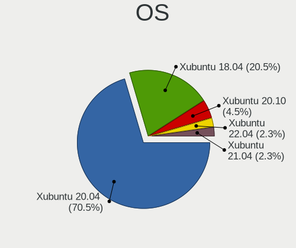

| Name          | Computers | Percent |
|---------------|-----------|---------|
| Xubuntu 20.04 | 31        | 70.45%  |
| Xubuntu 18.04 | 9         | 20.45%  |
| Xubuntu 20.10 | 2         | 4.55%   |
| Xubuntu 22.04 | 1         | 2.27%   |
| Xubuntu 21.04 | 1         | 2.27%   |

OS Family
---------

OS without a version

| Name    | Computers | Percent |
|---------|-----------|---------|
| Xubuntu | 44        | 100%    |

Kernel
------

Version of the Linux kernel

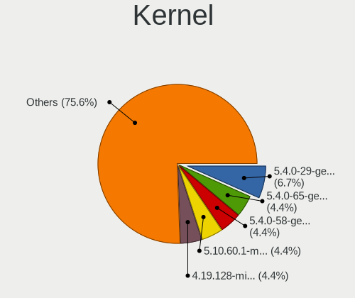

| Version                           | Computers | Percent |
|-----------------------------------|-----------|---------|
| 5.4.0-29-generic                  | 3         | 6.67%   |
| 5.4.0-65-generic                  | 2         | 4.44%   |
| 5.4.0-58-generic                  | 2         | 4.44%   |
| 5.10.60.1-microsoft-standard-WSL2 | 2         | 4.44%   |
| 4.19.128-microsoft-standard       | 2         | 4.44%   |
| 5.8.0-50-generic                  | 1         | 2.22%   |
| 5.8.0-49-generic                  | 1         | 2.22%   |
| 5.8.0-43-generic                  | 1         | 2.22%   |
| 5.8.0-25-generic                  | 1         | 2.22%   |
| 5.8.0-1018-aws                    | 1         | 2.22%   |
| 5.4.0-97-generic                  | 1         | 2.22%   |
| 5.4.0-80-generic                  | 1         | 2.22%   |
| 5.4.0-72-generic                  | 1         | 2.22%   |
| 5.4.0-67-generic                  | 1         | 2.22%   |
| 5.4.0-56-lowlatency               | 1         | 2.22%   |
| 5.4.0-56-generic                  | 1         | 2.22%   |
| 5.4.0-52-generic                  | 1         | 2.22%   |
| 5.4.0-51-generic                  | 1         | 2.22%   |
| 5.4.0-42-generic                  | 1         | 2.22%   |
| 5.4.0-40-generic                  | 1         | 2.22%   |
| 5.4.0-38-generic                  | 1         | 2.22%   |
| 5.4.0-26-lowlatency               | 1         | 2.22%   |
| 5.4.0-18-generic                  | 1         | 2.22%   |
| 5.4.0-104-generic                 | 1         | 2.22%   |
| 5.3.0-62-generic                  | 1         | 2.22%   |
| 5.3.0-46-generic                  | 1         | 2.22%   |
| 5.11.0-40-generic                 | 1         | 2.22%   |
| 5.11.0-38-generic                 | 1         | 2.22%   |
| 5.11.0-37-lowlatency              | 1         | 2.22%   |
| 5.11.0-34-generic                 | 1         | 2.22%   |
| 5.11.0-27-generic                 | 1         | 2.22%   |
| 5.11.0-17-generic                 | 1         | 2.22%   |
| 5.10.43.3-microsoft-standard-WSL2 | 1         | 2.22%   |
| 5.0.0-1026-gcp                    | 1         | 2.22%   |
| 4.19.121-microsoft-WSL2-standard  | 1         | 2.22%   |
| 4.18.0-15-generic                 | 1         | 2.22%   |
| 4.15.0-58-generic                 | 1         | 2.22%   |
| 4.15.0-154-generic                | 1         | 2.22%   |
| 4.15.0-115-generic                | 1         | 2.22%   |

Kernel Family
-------------

Linux kernel without a distro release

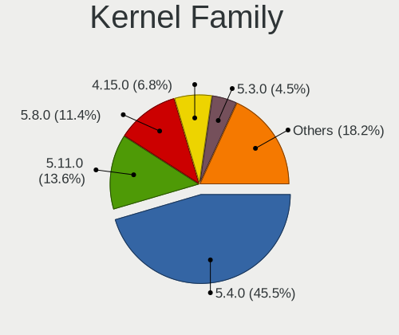

| Version   | Computers | Percent |
|-----------|-----------|---------|
| 5.4.0     | 20        | 45.45%  |
| 5.11.0    | 6         | 13.64%  |
| 5.8.0     | 5         | 11.36%  |
| 4.15.0    | 3         | 6.82%   |
| 5.3.0     | 2         | 4.55%   |
| 5.10.60.1 | 2         | 4.55%   |
| 4.19.128  | 2         | 4.55%   |
| 5.10.43.3 | 1         | 2.27%   |
| 5.0.0     | 1         | 2.27%   |
| 4.19.121  | 1         | 2.27%   |
| 4.18.0    | 1         | 2.27%   |

Kernel Major Ver.
-----------------

Linux kernel major version

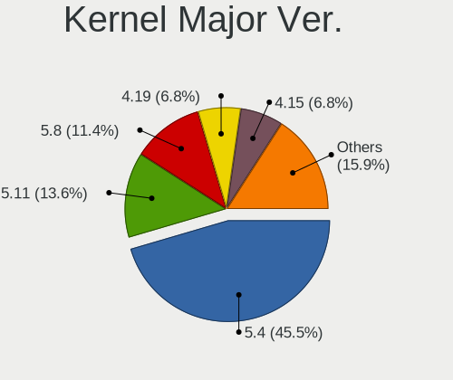

| Version | Computers | Percent |
|---------|-----------|---------|
| 5.4     | 20        | 45.45%  |
| 5.11    | 6         | 13.64%  |
| 5.8     | 5         | 11.36%  |
| 4.19    | 3         | 6.82%   |
| 4.15    | 3         | 6.82%   |
| 5.3     | 2         | 4.55%   |
| 5.10.60 | 2         | 4.55%   |
| 5.10.43 | 1         | 2.27%   |
| 5.0     | 1         | 2.27%   |
| 4.18    | 1         | 2.27%   |

Arch
----

OS architecture (x86_64, i586, etc.)

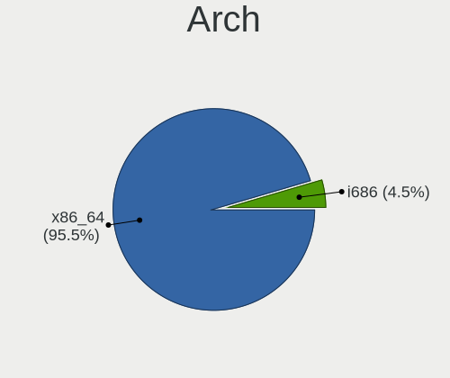

| Name   | Computers | Percent |
|--------|-----------|---------|
| x86_64 | 42        | 95.45%  |
| i686   | 2         | 4.55%   |

DE
--

Desktop Environment

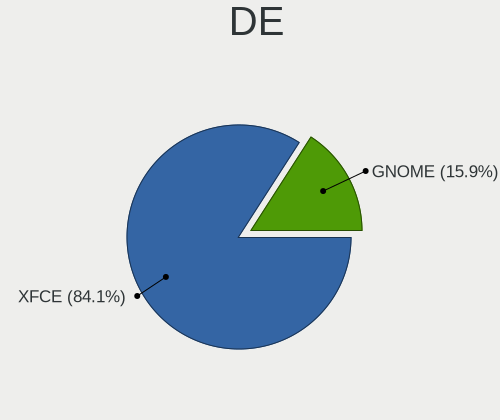

| Name  | Computers | Percent |
|-------|-----------|---------|
| XFCE  | 37        | 84.09%  |
| GNOME | 7         | 15.91%  |

Display Server
--------------

X11 or Wayland

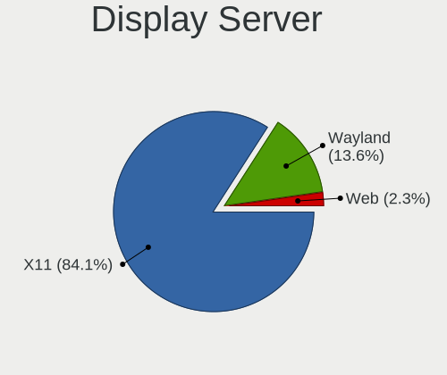

| Name    | Computers | Percent |
|---------|-----------|---------|
| X11     | 37        | 84.09%  |
| Wayland | 6         | 13.64%  |
| Web     | 1         | 2.27%   |

Display Manager
---------------

SDDM, LightDM, etc.

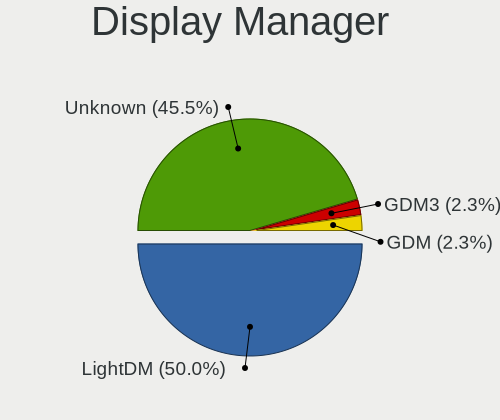

| Name    | Computers | Percent |
|---------|-----------|---------|
| LightDM | 22        | 50%     |
| Unknown | 20        | 45.45%  |
| GDM3    | 1         | 2.27%   |
| GDM     | 1         | 2.27%   |

OS Lang
-------

Language

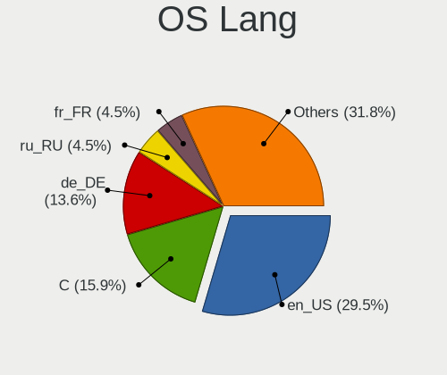

| Lang    | Computers | Percent |
|---------|-----------|---------|
| en_US   | 13        | 29.55%  |
| C       | 7         | 15.91%  |
| de_DE   | 6         | 13.64%  |
| ru_RU   | 2         | 4.55%   |
| fr_FR   | 2         | 4.55%   |
| en_CA   | 2         | 4.55%   |
| Unknown | 2         | 4.55%   |
| zh_CN   | 1         | 2.27%   |
| ru_UA   | 1         | 2.27%   |
| pt_PT   | 1         | 2.27%   |
| pt_BR   | 1         | 2.27%   |
| it_IT   | 1         | 2.27%   |
| hu_HU   | 1         | 2.27%   |
| es_CO   | 1         | 2.27%   |
| en_IN   | 1         | 2.27%   |
| en_AU   | 1         | 2.27%   |
| "en_US" | 1         | 2.27%   |

Boot Mode
---------

EFI or BIOS

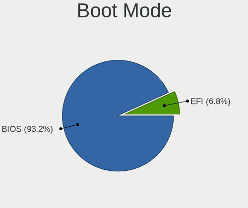

| Mode | Computers | Percent |
|------|-----------|---------|
| BIOS | 41        | 93.18%  |
| EFI  | 3         | 6.82%   |

Filesystem
----------

Type of filesystem

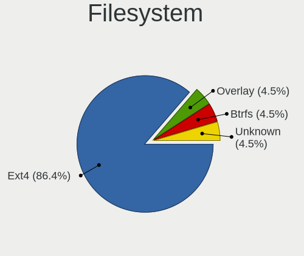

| Type    | Computers | Percent |
|---------|-----------|---------|
| Ext4    | 38        | 86.36%  |
| Overlay | 2         | 4.55%   |
| Btrfs   | 2         | 4.55%   |
| Unknown | 2         | 4.55%   |

Part. scheme
------------

Scheme of partitioning

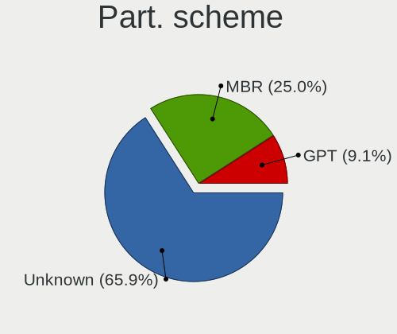

| Type    | Computers | Percent |
|---------|-----------|---------|
| Unknown | 29        | 65.91%  |
| MBR     | 11        | 25%     |
| GPT     | 4         | 9.09%   |

Dual Boot with Linux/BSD
------------------------

Hosting more than one Linux/BSD

| Dual boot | Computers | Percent |
|-----------|-----------|---------|
| No        | 44        | 100%    |

Dual Boot (Win)
---------------

Hosting Linux and Windows

| Dual boot | Computers | Percent |
|-----------|-----------|---------|
| No        | 44        | 100%    |

Board
-----

Vendor
------

Motherboard manufacturer

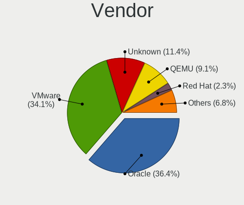

| Name       | Computers | Percent |
|------------|-----------|---------|
| Oracle     | 16        | 36.36%  |
| VMware     | 15        | 34.09%  |
| Unknown    | 5         | 11.36%  |
| QEMU       | 4         | 9.09%   |
| Red Hat    | 1         | 2.27%   |
| Microsoft  | 1         | 2.27%   |
| Google     | 1         | 2.27%   |
| Amazon EC2 | 1         | 2.27%   |

Model
-----

Motherboard model

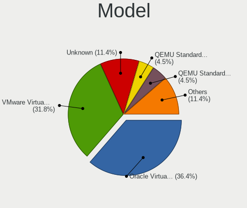

| Name                                   | Computers | Percent |
|----------------------------------------|-----------|---------|
| Oracle VirtualBox                      | 16        | 36.36%  |
| VMware Virtual Platform                | 14        | 31.82%  |
| Unknown                                | 5         | 11.36%  |
| QEMU Standard PC (Q35 + ICH9, 2009)    | 2         | 4.55%   |
| QEMU Standard PC (i440FX + PIIX, 1996) | 2         | 4.55%   |
| VMware VMware7,1                       | 1         | 2.27%   |
| Red Hat KVM                            | 1         | 2.27%   |
| Microsoft Windows Subsystem for Linux  | 1         | 2.27%   |
| Google Compute Engine                  | 1         | 2.27%   |
| Amazon EC2 r5a.xlarge                  | 1         | 2.27%   |

Model Family
------------

Motherboard model prefix

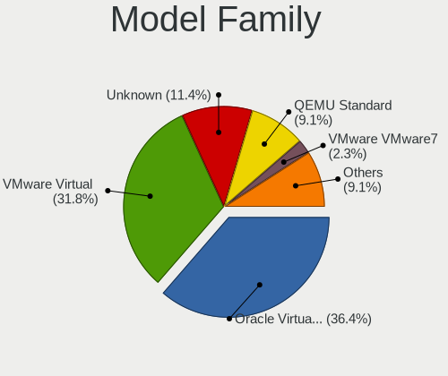

| Name                  | Computers | Percent |
|-----------------------|-----------|---------|
| Oracle VirtualBox     | 16        | 36.36%  |
| VMware Virtual        | 14        | 31.82%  |
| Unknown               | 5         | 11.36%  |
| QEMU Standard         | 4         | 9.09%   |
| VMware VMware7        | 1         | 2.27%   |
| Red Hat KVM           | 1         | 2.27%   |
| Microsoft Windows     | 1         | 2.27%   |
| Google Compute        | 1         | 2.27%   |
| Amazon EC2 r5a.xlarge | 1         | 2.27%   |

MFG Year
--------

Motherboard manufacture year

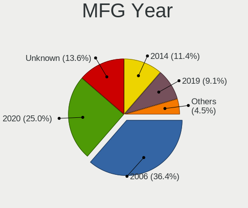

| Year    | Computers | Percent |
|---------|-----------|---------|
| 2006    | 16        | 36.36%  |
| 2020    | 11        | 25%     |
| Unknown | 6         | 13.64%  |
| 2014    | 5         | 11.36%  |
| 2019    | 4         | 9.09%   |
| 2017    | 1         | 2.27%   |
| 2011    | 1         | 2.27%   |

Form Factor
-----------

Physical design of the computer

| Name            | Computers | Percent |
|-----------------|-----------|---------|
| Virtual machine | 44        | 100%    |

Secure Boot
-----------

Enabled or disabled

| State    | Computers | Percent |
|----------|-----------|---------|
| Disabled | 44        | 100%    |

Coreboot
--------

Have coreboot on board

| Used | Computers | Percent |
|------|-----------|---------|
| No   | 44        | 100%    |

RAM Size
--------

Total RAM memory

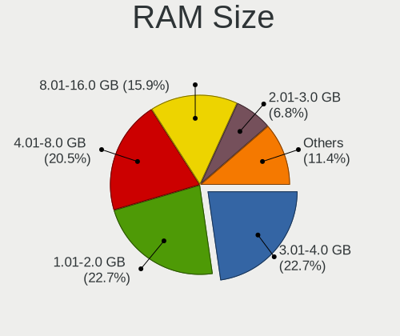

| Size in GB | Computers | Percent |
|------------|-----------|---------|
| 3.01-4.0   | 10        | 22.73%  |
| 1.01-2.0   | 10        | 22.73%  |
| 4.01-8.0   | 9         | 20.45%  |
| 8.01-16.0  | 7         | 15.91%  |
| 2.01-3.0   | 3         | 6.82%   |
| 32.01-64.0 | 2         | 4.55%   |
| 0.51-1.0   | 2         | 4.55%   |
| 24.01-32.0 | 1         | 2.27%   |

RAM Used
--------

Used RAM memory

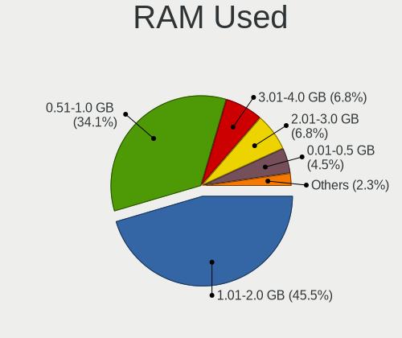

| Used GB  | Computers | Percent |
|----------|-----------|---------|
| 1.01-2.0 | 20        | 45.45%  |
| 0.51-1.0 | 15        | 34.09%  |
| 3.01-4.0 | 3         | 6.82%   |
| 2.01-3.0 | 3         | 6.82%   |
| 0.01-0.5 | 2         | 4.55%   |
| 4.01-8.0 | 1         | 2.27%   |

Total Drives
------------

Number of drives on board

| Drives | Computers | Percent |
|--------|-----------|---------|
| 1      | 30        | 68.18%  |
| 2      | 7         | 15.91%  |
| 0      | 4         | 9.09%   |
| 3      | 2         | 4.55%   |
| 4      | 1         | 2.27%   |

Has CD-ROM
----------

Has CD-ROM on board

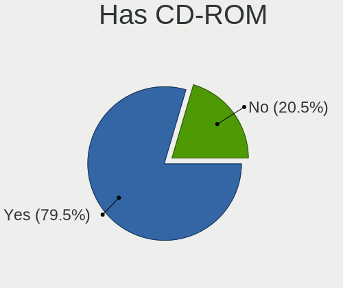

| Presented | Computers | Percent |
|-----------|-----------|---------|
| Yes       | 35        | 79.55%  |
| No        | 9         | 20.45%  |

Has Ethernet
------------

Has Ethernet on board

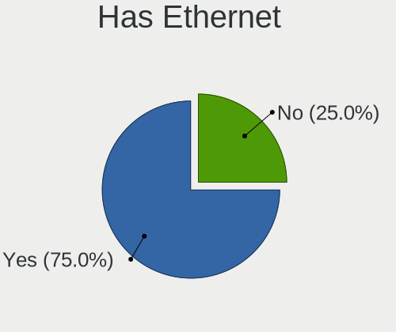

| Presented | Computers | Percent |
|-----------|-----------|---------|
| Yes       | 33        | 75%     |
| No        | 11        | 25%     |

Has WiFi
--------

Has WiFi module

| Presented | Computers | Percent |
|-----------|-----------|---------|
| No        | 43        | 97.73%  |
| Yes       | 1         | 2.27%   |

Has Bluetooth
-------------

Has Bluetooth module

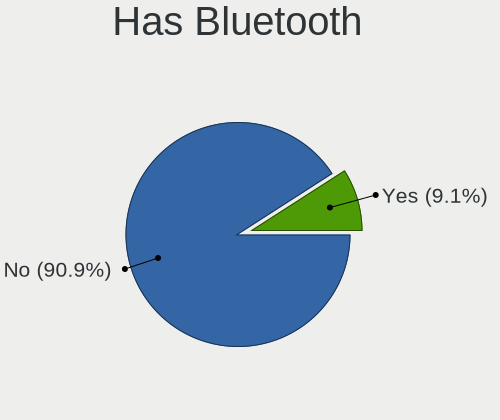

| Presented | Computers | Percent |
|-----------|-----------|---------|
| No        | 40        | 90.91%  |
| Yes       | 4         | 9.09%   |

Location
--------

Country
-------

Geographic location (country)

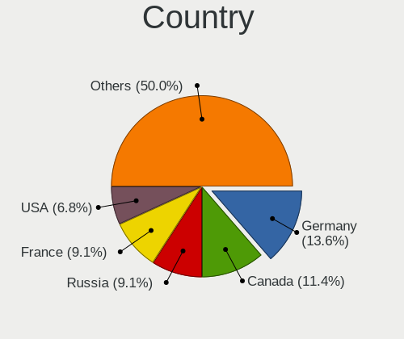

| Country      | Computers | Percent |
|--------------|-----------|---------|
| Germany      | 6         | 13.64%  |
| Canada       | 5         | 11.36%  |
| Russia       | 4         | 9.09%   |
| France       | 4         | 9.09%   |
| USA          | 3         | 6.82%   |
| Austria      | 3         | 6.82%   |
| Ukraine      | 2         | 4.55%   |
| UK           | 2         | 4.55%   |
| Italy        | 2         | 4.55%   |
| China        | 2         | 4.55%   |
| Brazil       | 2         | 4.55%   |
| Australia    | 2         | 4.55%   |
| Switzerland  | 1         | 2.27%   |
| South Africa | 1         | 2.27%   |
| Romania      | 1         | 2.27%   |
| Luxembourg   | 1         | 2.27%   |
| India        | 1         | 2.27%   |
| Hungary      | 1         | 2.27%   |
| Colombia     | 1         | 2.27%   |

City
----

Geographic location (city)

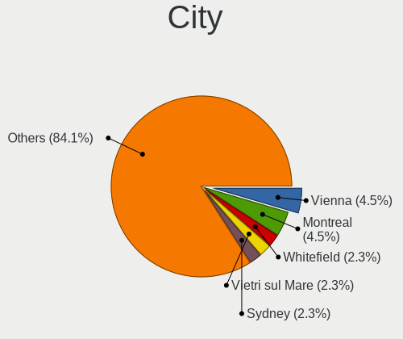

| City                   | Computers | Percent |
|------------------------|-----------|---------|
| Vienna                 | 2         | 4.55%   |
| Montreal               | 2         | 4.55%   |
| Whitefield             | 1         | 2.27%   |
| Vietri sul Mare        | 1         | 2.27%   |
| Sydney                 | 1         | 2.27%   |
| Saransk                | 1         | 2.27%   |
| Santiago de Cali       | 1         | 2.27%   |
| Santa Clarita          | 1         | 2.27%   |
| Sandton                | 1         | 2.27%   |
| Rome                   | 1         | 2.27%   |
| Québec              | 1         | 2.27%   |
| Puteaux                | 1         | 2.27%   |
| Patos de Minas         | 1         | 2.27%   |
| Paris                  | 1         | 2.27%   |
| Oryol                  | 1         | 2.27%   |
| O'Fallon               | 1         | 2.27%   |
| Nottuln                | 1         | 2.27%   |
| Niklasdorf             | 1         | 2.27%   |
| Mykolayiv              | 1         | 2.27%   |
| Moscow                 | 1         | 2.27%   |
| Montpellier            | 1         | 2.27%   |
| Münster             | 1         | 2.27%   |
| Luxembourg             | 1         | 2.27%   |
| Liuyangcun             | 1         | 2.27%   |
| Leipzig                | 1         | 2.27%   |
| Lausanne               | 1         | 2.27%   |
| Kyiv                   | 1         | 2.27%   |
| Katymar                | 1         | 2.27%   |
| Karlsruhe              | 1         | 2.27%   |
| Hyderabad              | 1         | 2.27%   |
| Hochfelden             | 1         | 2.27%   |
| Henfield               | 1         | 2.27%   |
| Hangzhou               | 1         | 2.27%   |
| Hain-Gruendau          | 1         | 2.27%   |
| Gubkin                 | 1         | 2.27%   |
| Fossambault-sur-le-Lac | 1         | 2.27%   |
| Feira de Santana       | 1         | 2.27%   |
| Edmonton               | 1         | 2.27%   |
| Council Bluffs         | 1         | 2.27%   |
| Brisbane               | 1         | 2.27%   |
| Brandenburg            | 1         | 2.27%   |
| Bârlad              | 1         | 2.27%   |

Drives
------

Drive Vendor
------------

Hard drive vendors

| Vendor     | Computers | Drives | Percent |
|------------|-----------|--------|---------|
| VBOX       | 16        | 16     | 40%     |
| VMware     | 15        | 18     | 37.5%   |
| Msft       | 6         | 16     | 15%     |
| QEMU       | 2         | 3      | 5%      |
| Amazon.com | 1         | 2      | 2.5%    |

Drive Model
-----------

Hard drive models

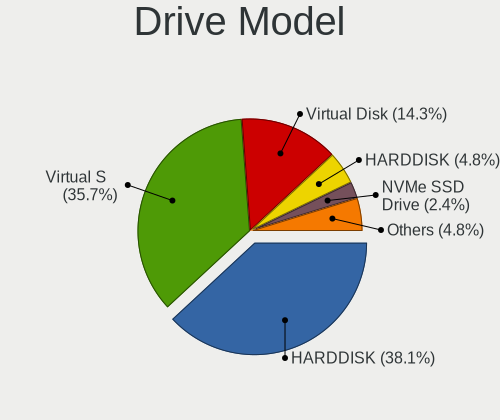

| Model                           | Computers | Percent |
|---------------------------------|-----------|---------|
| VBOX HARDDISK                   | 16        | 38.1%   |
| VMware Virtual S                | 15        | 35.71%  |
| Msft Virtual Disk               | 6         | 14.29%  |
| QEMU HARDDISK                   | 2         | 4.76%   |
| VMware NVMe SSD Drive           | 1         | 2.38%   |
| Amazon.com NVMe SSD Drive 322GB | 1         | 2.38%   |
| Amazon.com NVMe SSD Drive 161GB | 1         | 2.38%   |

HDD Vendor
----------

Hard disk drive vendors

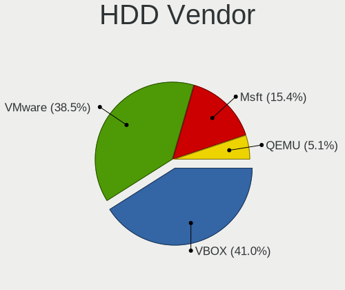

| Vendor | Computers | Drives | Percent |
|--------|-----------|--------|---------|
| VBOX   | 16        | 16     | 41.03%  |
| VMware | 15        | 18     | 38.46%  |
| Msft   | 6         | 16     | 15.38%  |
| QEMU   | 2         | 3      | 5.13%   |

SSD Vendor
----------

Solid state drive vendors

Zero info for selected period =(

Drive Kind
----------

HDD or SSD

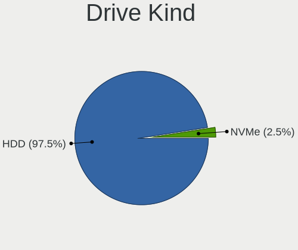

| Kind | Computers | Drives | Percent |
|------|-----------|--------|---------|
| HDD  | 39        | 53     | 97.5%   |
| NVMe | 1         | 2      | 2.5%    |

Drive Connector
---------------

SATA, SAS, NVMe, etc.

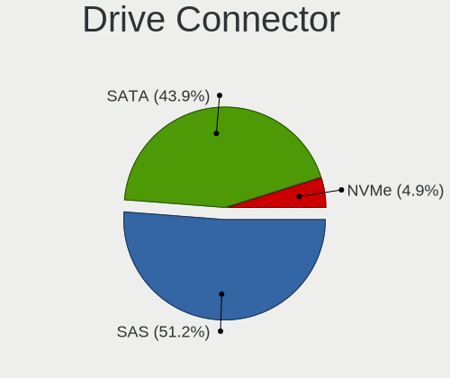

| Type | Computers | Drives | Percent |
|------|-----------|--------|---------|
| SAS  | 21        | 33     | 51.22%  |
| SATA | 18        | 19     | 43.9%   |
| NVMe | 2         | 3      | 4.88%   |

Drive Size
----------

Size of hard drive

| Size in TB | Computers | Drives | Percent |
|------------|-----------|--------|---------|
| 0.01-0.5   | 39        | 53     | 100%    |

Space Total
-----------

Amount of disk space available on the file system

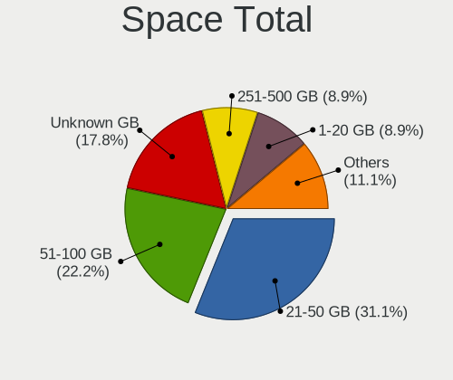

| Size in GB | Computers | Percent |
|------------|-----------|---------|
| 21-50      | 14        | 31.11%  |
| 51-100     | 10        | 22.22%  |
| Unknown    | 8         | 17.78%  |
| 251-500    | 4         | 8.89%   |
| 1-20       | 4         | 8.89%   |
| 501-1000   | 3         | 6.67%   |
| 101-250    | 2         | 4.44%   |

Space Used
----------

Amount of used disk space

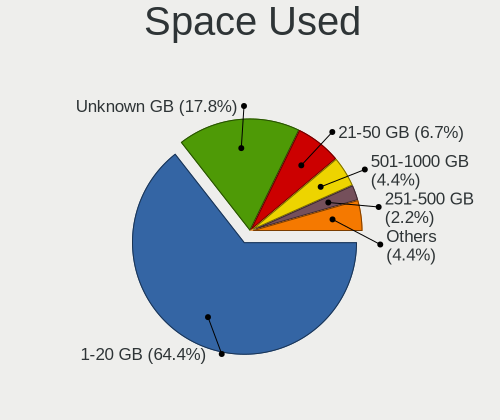

| Used GB  | Computers | Percent |
|----------|-----------|---------|
| 1-20     | 29        | 64.44%  |
| Unknown  | 8         | 17.78%  |
| 21-50    | 3         | 6.67%   |
| 501-1000 | 2         | 4.44%   |
| 251-500  | 1         | 2.22%   |
| 101-250  | 1         | 2.22%   |
| 51-100   | 1         | 2.22%   |

Malfunc. Drives
---------------

Drive models with a malfunction

Zero info for selected period =(

Malfunc. Drive Vendor
---------------------

Vendors of faulty drives

Zero info for selected period =(

Malfunc. HDD Vendor
-------------------

Vendors of faulty HDD drives

Zero info for selected period =(

Malfunc. Drive Kind
-------------------

Kinds of faulty drives

Zero info for selected period =(

Failed Drives
-------------

Failed drive models

Zero info for selected period =(

Failed Drive Vendor
-------------------

Failed drive vendors

Zero info for selected period =(

Drive Status
------------

Number of failed and malfunc. drives

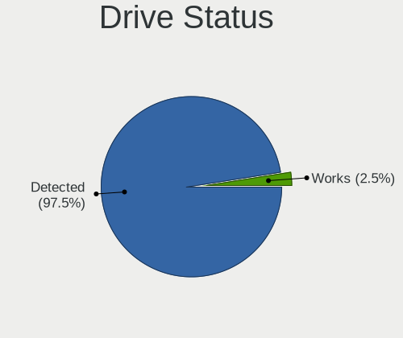

| Status   | Computers | Drives | Percent |
|----------|-----------|--------|---------|
| Detected | 39        | 53     | 97.5%   |
| Works    | 1         | 2      | 2.5%    |

Storage controller
------------------

Storage Vendor
--------------

Storage controller vendors

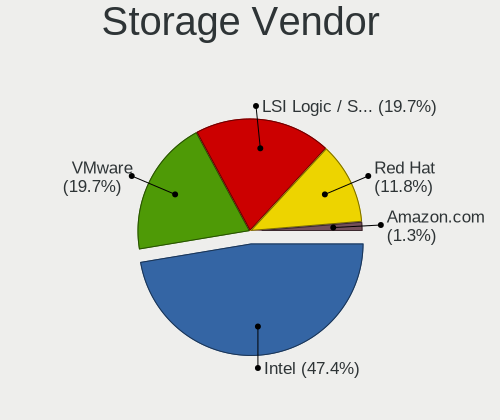

| Vendor                    | Computers | Percent |
|---------------------------|-----------|---------|
| Intel                     | 36        | 47.37%  |
| VMware                    | 15        | 19.74%  |
| LSI Logic / Symbios Logic | 15        | 19.74%  |
| Red Hat                   | 9         | 11.84%  |
| Amazon.com                | 1         | 1.32%   |

Storage Model
-------------

Storage controller models

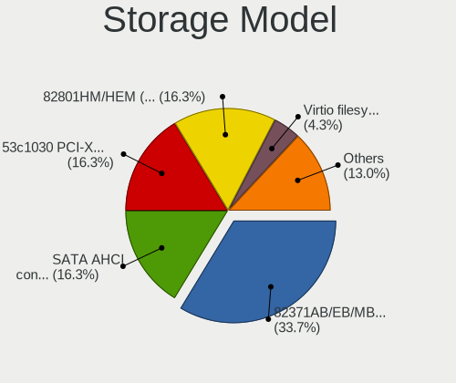

| Model                                                                 | Computers | Percent |
|-----------------------------------------------------------------------|-----------|---------|
| Intel 82371AB/EB/MB PIIX4 IDE                                         | 31        | 33.7%   |
| VMware SATA AHCI controller                                           | 15        | 16.3%   |
| LSI Logic / Symbios Logic 53c1030 PCI-X Fusion-MPT Dual Ultra320 SCSI | 15        | 16.3%   |
| Intel 82801HM/HEM (ICH8M/ICH8M-E) SATA Controller [AHCI mode]         | 15        | 16.3%   |
| Red Hat Virtio filesystem                                             | 4         | 4.35%   |
| Red Hat Virtio block device                                           | 3         | 3.26%   |
| Intel 82371SB PIIX3 IDE [Natoma/Triton II]                            | 3         | 3.26%   |
| Red Hat Virtio SCSI                                                   | 2         | 2.17%   |
| Intel 82801IR/IO/IH (ICH9R/DO/DH) 6 port SATA Controller [AHCI mode]  | 2         | 2.17%   |
| VMware NVMe SSD Controller                                            | 1         | 1.09%   |
| Amazon.com NVMe EBS Controller                                        | 1         | 1.09%   |

Storage Kind
------------

Kind of storage controller (IDE, SATA, NVMe, SAS, ...)

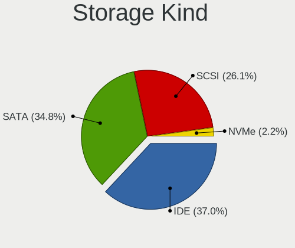

| Kind | Computers | Percent |
|------|-----------|---------|
| IDE  | 34        | 36.96%  |
| SATA | 32        | 34.78%  |
| SCSI | 24        | 26.09%  |
| NVMe | 2         | 2.17%   |

Processor
---------

CPU Vendor
----------

Processor vendors

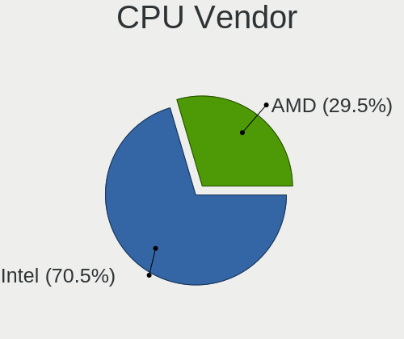

| Vendor | Computers | Percent |
|--------|-----------|---------|
| Intel  | 31        | 70.45%  |
| AMD    | 13        | 29.55%  |

CPU Model
---------

Processor models

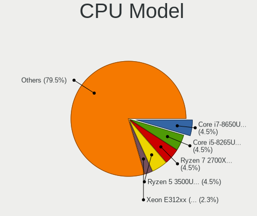

| Model                                           | Computers | Percent |
|-------------------------------------------------|-----------|---------|
| Intel Core i7-8650U CPU @ 1.90GHz               | 2         | 4.55%   |
| Intel Core i5-8265U CPU @ 1.60GHz               | 2         | 4.55%   |
| AMD Ryzen 7 2700X Eight-Core Processor          | 2         | 4.55%   |
| AMD Ryzen 5 3500U with Radeon Vega Mobile Gfx   | 2         | 4.55%   |
| Intel Xeon E312xx (Sandy Bridge, IBRS update)   | 1         | 2.27%   |
| Intel Xeon CPU W3550 @ 3.07GHz                  | 1         | 2.27%   |
| Intel Xeon CPU E5-2630 0 @ 2.30GHz              | 1         | 2.27%   |
| Intel Xeon CPU @ 2.30GHz                        | 1         | 2.27%   |
| Intel Pentium Silver J5005 CPU @ 1.50GHz        | 1         | 2.27%   |
| Intel Core Processor (Skylake, IBRS)            | 1         | 2.27%   |
| Intel Core i7-8750H CPU @ 2.20GHz               | 1         | 2.27%   |
| Intel Core i7-8700 CPU @ 3.20GHz                | 1         | 2.27%   |
| Intel Core i7-8565U CPU @ 1.80GHz               | 1         | 2.27%   |
| Intel Core i7-8550U CPU @ 1.80GHz               | 1         | 2.27%   |
| Intel Core i7-7500U CPU @ 2.70GHz               | 1         | 2.27%   |
| Intel Core i7-6700HQ CPU @ 2.60GHz              | 1         | 2.27%   |
| Intel Core i7-5500U CPU @ 2.40GHz               | 1         | 2.27%   |
| Intel Core i7-4712MQ CPU @ 2.30GHz              | 1         | 2.27%   |
| Intel Core i7-4510U CPU @ 2.00GHz               | 1         | 2.27%   |
| Intel Core i7-4500U CPU @ 1.80GHz               | 1         | 2.27%   |
| Intel Core i5-8250U CPU @ 1.60GHz               | 1         | 2.27%   |
| Intel Core i5-6500 CPU @ 3.20GHz                | 1         | 2.27%   |
| Intel Core i5-6300U CPU @ 2.40GHz               | 1         | 2.27%   |
| Intel Core i5-6300HQ CPU @ 2.30GHz              | 1         | 2.27%   |
| Intel Core i5-3570K CPU @ 3.40GHz               | 1         | 2.27%   |
| Intel Core i5-3230M CPU @ 2.60GHz               | 1         | 2.27%   |
| Intel Core i5-3210M CPU @ 2.50GHz               | 1         | 2.27%   |
| Intel Core i5-1035G1 CPU @ 1.00GHz              | 1         | 2.27%   |
| Intel Core i3-7100U CPU @ 2.40GHz               | 1         | 2.27%   |
| Intel Core i3-7100 CPU @ 3.90GHz                | 1         | 2.27%   |
| Intel Celeron CPU N2940 @ 1.83GHz               | 1         | 2.27%   |
| AMD Ryzen 9 3900X 12-Core Processor             | 1         | 2.27%   |
| AMD Ryzen 7 3700X 8-Core Processor              | 1         | 2.27%   |
| AMD Ryzen 5 3600 6-Core Processor               | 1         | 2.27%   |
| AMD Ryzen 5 2400G with Radeon Vega Graphics     | 1         | 2.27%   |
| AMD Phenom 8450 Triple-Core Processor           | 1         | 2.27%   |
| AMD Opteron 62xx class CPU                      | 1         | 2.27%   |
| AMD EPYC 7702P 64-Core Processor                | 1         | 2.27%   |
| AMD EPYC 7571                                   | 1         | 2.27%   |
| AMD A10-7850K Radeon R7, 12 Compute Cores 4C+8G | 1         | 2.27%   |

CPU Model Family
----------------

Processor model prefix

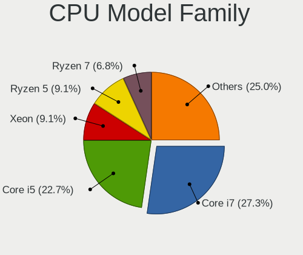

| Model                | Computers | Percent |
|----------------------|-----------|---------|
| Intel Core i7        | 12        | 27.27%  |
| Intel Core i5        | 10        | 22.73%  |
| Intel Xeon           | 4         | 9.09%   |
| AMD Ryzen 5          | 4         | 9.09%   |
| AMD Ryzen 7          | 3         | 6.82%   |
| Intel Core i3        | 2         | 4.55%   |
| AMD EPYC             | 2         | 4.55%   |
| Intel Pentium Silver | 1         | 2.27%   |
| Intel Core           | 1         | 2.27%   |
| Intel Celeron        | 1         | 2.27%   |
| AMD Ryzen 9          | 1         | 2.27%   |
| AMD Phenom           | 1         | 2.27%   |
| AMD Opteron          | 1         | 2.27%   |
| AMD A10              | 1         | 2.27%   |

CPU Cores
---------

Number of processor cores

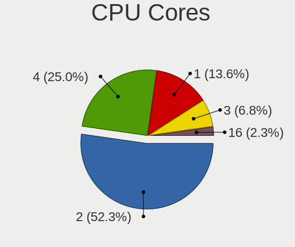

| Number | Computers | Percent |
|--------|-----------|---------|
| 2      | 23        | 52.27%  |
| 4      | 11        | 25%     |
| 1      | 6         | 13.64%  |
| 3      | 3         | 6.82%   |
| 16     | 1         | 2.27%   |

CPU Sockets
-----------

Number of sockets

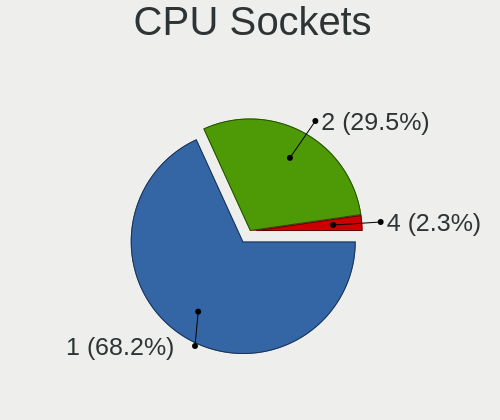

| Number | Computers | Percent |
|--------|-----------|---------|
| 1      | 30        | 68.18%  |
| 2      | 13        | 29.55%  |
| 4      | 1         | 2.27%   |

CPU Threads
-----------

Threads per core (Hyper-Threading)

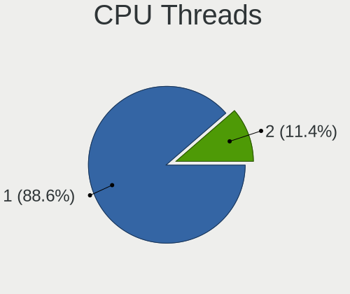

| Number | Computers | Percent |
|--------|-----------|---------|
| 1      | 39        | 88.64%  |
| 2      | 5         | 11.36%  |

CPU Op-Modes
------------

CPU Operation Modes (32-bit, 64-bit)

| Op mode        | Computers | Percent |
|----------------|-----------|---------|
| 32-bit, 64-bit | 44        | 100%    |

CPU Microcode
-------------

Microcode number

| Number  | Computers | Percent |
|---------|-----------|---------|
| Unknown | 44        | 100%    |

CPU Microarch
-------------

Microarchitecture

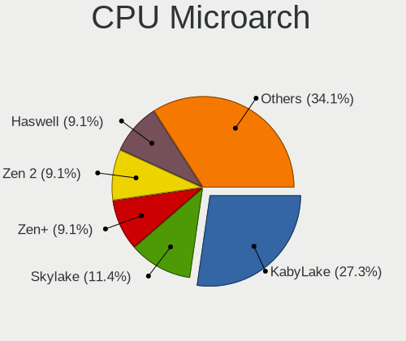

| Name          | Computers | Percent |
|---------------|-----------|---------|
| KabyLake      | 12        | 27.27%  |
| Skylake       | 5         | 11.36%  |
| Zen+          | 4         | 9.09%   |
| Zen 2         | 4         | 9.09%   |
| Haswell       | 4         | 9.09%   |
| IvyBridge     | 3         | 6.82%   |
| Zen           | 2         | 4.55%   |
| SandyBridge   | 2         | 4.55%   |
| Steamroller   | 1         | 2.27%   |
| Silvermont    | 1         | 2.27%   |
| Nehalem       | 1         | 2.27%   |
| K10           | 1         | 2.27%   |
| IceLake       | 1         | 2.27%   |
| Goldmont plus | 1         | 2.27%   |
| Bulldozer     | 1         | 2.27%   |
| Broadwell     | 1         | 2.27%   |

Graphics
--------

GPU Vendor
----------

Vendors of graphics cards

| Vendor       | Computers | Percent |
|--------------|-----------|---------|
| VMware       | 31        | 79.49%  |
| Red Hat      | 3         | 7.69%   |
| Microsoft    | 2         | 5.13%   |
| Technical    | 1         | 2.56%   |
| Cirrus Logic | 1         | 2.56%   |
| Amazon.com   | 1         | 2.56%   |

GPU Model
---------

Graphics card models

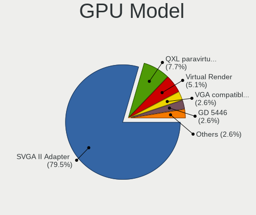

| Model                                           | Computers | Percent |
|-------------------------------------------------|-----------|---------|
| VMware SVGA II Adapter                          | 31        | 79.49%  |
| Red Hat QXL paravirtual graphic card            | 3         | 7.69%   |
| Microsoft Virtual Render                        | 2         | 5.13%   |
| Technical VGA compatible controller             | 1         | 2.56%   |
| Cirrus Logic GD 5446                            | 1         | 2.56%   |
| Amazon.com Amazon.com VGA compatible controller | 1         | 2.56%   |

GPU Combo
---------

Combinations of graphics cards

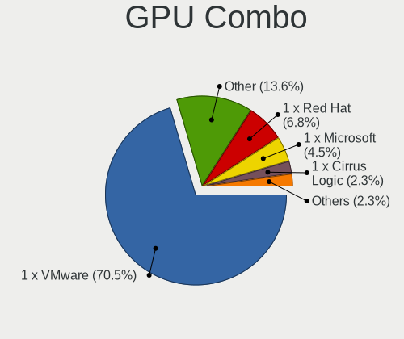

| Name             | Computers | Percent |
|------------------|-----------|---------|
| 1 x VMware       | 31        | 70.45%  |
| Other            | 6         | 13.64%  |
| 1 x Red Hat      | 3         | 6.82%   |
| 1 x Microsoft    | 2         | 4.55%   |
| 1 x Cirrus Logic | 1         | 2.27%   |
| 1 x Amazon.com   | 1         | 2.27%   |

GPU Driver
----------

Free vs proprietary

| Driver  | Computers | Percent |
|---------|-----------|---------|
| Unknown | 44        | 100%    |

GPU Memory
----------

Total video memory

| Size in GB | Computers | Percent |
|------------|-----------|---------|
| Unknown    | 44        | 100%    |

Monitor
-------

Monitor Vendor
--------------

Monitor vendors

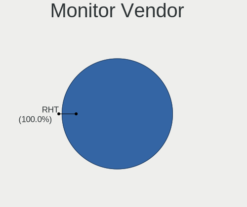

| Vendor | Computers | Percent |
|--------|-----------|---------|
| RHT    | 1         | 100%    |

Monitor Model
-------------

Monitor models

| Model                                                  | Computers | Percent |
|--------------------------------------------------------|-----------|---------|
| RHT QEMU Monitor RHT1234 2048x1152 260x195mm 12.8-inch | 1         | 100%    |

Monitor Resolution
------------------

Monitor screen resolution

| Resolution | Computers | Percent |
|------------|-----------|---------|
| 2048x1152  | 1         | 100%    |

Monitor Diagonal
----------------

Diagonal size in inches

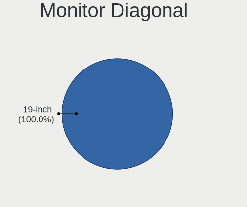

| Inches | Computers | Percent |
|--------|-----------|---------|
| 19     | 1         | 100%    |

Monitor Width
-------------

Physical width

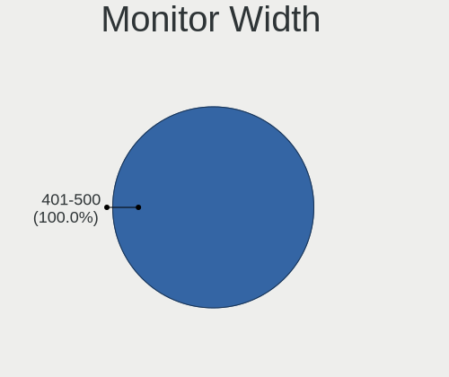

| Width in mm | Computers | Percent |
|-------------|-----------|---------|
| 401-500     | 1         | 100%    |

Aspect Ratio
------------

Proportional relationship between the width and the height

| Ratio | Computers | Percent |
|-------|-----------|---------|
| 4/3   | 1         | 100%    |

Monitor Area
------------

Area in inch²

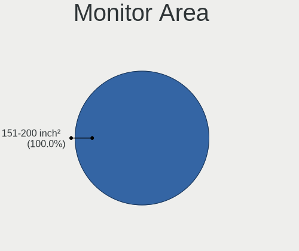

| Area in inch² | Computers | Percent |
|----------------|-----------|---------|
| 151-200        | 1         | 100%    |

Pixel Density
-------------

Pixels per inch

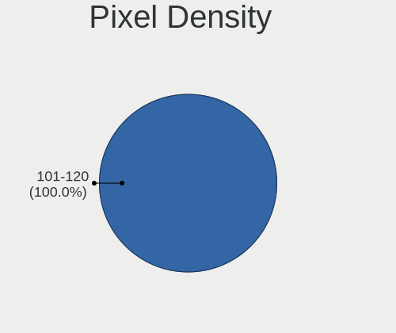

| Density | Computers | Percent |
|---------|-----------|---------|
| 101-120 | 1         | 100%    |

Multiple Monitors
-----------------

Total monitors connected

| Total | Computers | Percent |
|-------|-----------|---------|
| 1     | 36        | 81.82%  |
| 0     | 8         | 18.18%  |

Network
-------

Net Controller Vendor
---------------------

Controller vendors

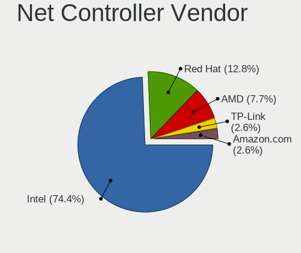

| Vendor     | Computers | Percent |
|------------|-----------|---------|
| Intel      | 29        | 74.36%  |
| Red Hat    | 5         | 12.82%  |
| AMD        | 3         | 7.69%   |
| TP-Link    | 1         | 2.56%   |
| Amazon.com | 1         | 2.56%   |

Net Controller Model
--------------------

Controller models

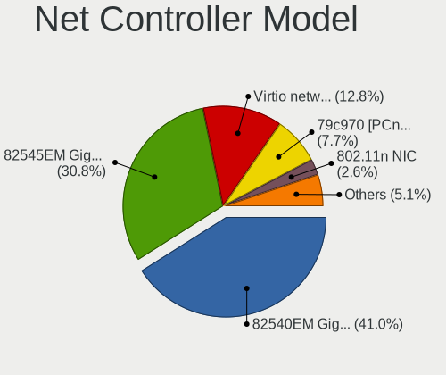

| Model                                              | Computers | Percent |
|----------------------------------------------------|-----------|---------|
| Intel 82540EM Gigabit Ethernet Controller          | 16        | 41.03%  |
| Intel 82545EM Gigabit Ethernet Controller (Copper) | 12        | 30.77%  |
| Red Hat Virtio network device                      | 5         | 12.82%  |
| AMD 79c970 [PCnet32 LANCE]                         | 3         | 7.69%   |
| TP-Link 802.11n NIC                                | 1         | 2.56%   |
| Intel 82574L Gigabit Network Connection            | 1         | 2.56%   |
| Amazon.com Elastic Network Adapter (ENA)           | 1         | 2.56%   |

Wireless Vendor
---------------

Wireless vendors

| Vendor  | Computers | Percent |
|---------|-----------|---------|
| TP-Link | 1         | 100%    |

Wireless Model
--------------

Wireless models

| Model               | Computers | Percent |
|---------------------|-----------|---------|
| TP-Link 802.11n NIC | 1         | 100%    |

Ethernet Vendor
---------------

Ethernet vendors

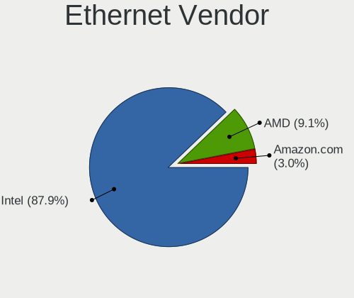

| Vendor     | Computers | Percent |
|------------|-----------|---------|
| Intel      | 29        | 87.88%  |
| AMD        | 3         | 9.09%   |
| Amazon.com | 1         | 3.03%   |

Ethernet Model
--------------

Ethernet models

| Model                                              | Computers | Percent |
|----------------------------------------------------|-----------|---------|
| Intel 82540EM Gigabit Ethernet Controller          | 16        | 48.48%  |
| Intel 82545EM Gigabit Ethernet Controller (Copper) | 12        | 36.36%  |
| AMD 79c970 [PCnet32 LANCE]                         | 3         | 9.09%   |
| Intel 82574L Gigabit Network Connection            | 1         | 3.03%   |
| Amazon.com Elastic Network Adapter (ENA)           | 1         | 3.03%   |

Net Controller Kind
-------------------

Ethernet, WiFi or modem

| Kind     | Computers | Percent |
|----------|-----------|---------|
| Ethernet | 33        | 84.62%  |
| Unknown  | 5         | 12.82%  |
| WiFi     | 1         | 2.56%   |

Used Controller
---------------

Currently used network controller

| Kind     | Computers | Percent |
|----------|-----------|---------|
| Ethernet | 33        | 97.06%  |
| WiFi     | 1         | 2.94%   |

NICs
----

Total network controllers on board

| Total | Computers | Percent |
|-------|-----------|---------|
| 1     | 31        | 70.45%  |
| 0     | 11        | 25%     |
| 2     | 2         | 4.55%   |

IPv6
----

IPv6 vs IPv4

| Used | Computers | Percent |
|------|-----------|---------|
| No   | 43        | 97.73%  |
| Yes  | 1         | 2.27%   |

Bluetooth
---------

Bluetooth Vendor
----------------

Controller vendors

| Vendor | Computers | Percent |
|--------|-----------|---------|
| VMware | 4         | 100%    |

Bluetooth Model
---------------

Controller models

| Model                            | Computers | Percent |
|----------------------------------|-----------|---------|
| VMware Virtual Bluetooth Adapter | 4         | 100%    |

Sound
-----

Sound Vendor
------------

Sound card vendors

| Vendor  | Computers | Percent |
|---------|-----------|---------|
| Intel   | 18        | 56.25%  |
| Ensoniq | 14        | 43.75%  |

Sound Model
-----------

Sound card models

| Model                                                                      | Computers | Percent |
|----------------------------------------------------------------------------|-----------|---------|
| Intel 82801AA AC'97 Audio Controller                                       | 14        | 43.75%  |
| Ensoniq ES1371/ES1373 / Creative Labs CT2518                               | 14        | 43.75%  |
| Intel 82801I (ICH9 Family) HD Audio Controller                             | 2         | 6.25%   |
| Intel 82801FB/FBM/FR/FW/FRW (ICH6 Family) High Definition Audio Controller | 2         | 6.25%   |

Memory
------

Memory Vendor
-------------

Memory module vendors

| Vendor  | Computers | Percent |
|---------|-----------|---------|
| Unknown | 6         | 46.15%  |
| QEMU    | 4         | 30.77%  |
| Unknown | 2         | 15.38%  |
| Red Hat | 1         | 7.69%   |

Memory Model
------------

Memory module models

| Model                               | Computers | Percent |
|-------------------------------------|-----------|---------|
| Unknown RAM Module 2048MB DIMM DRAM | 4         | 28.57%  |
| Unknown RAM Module 4096MB DIMM DRAM | 2         | 14.29%  |
| QEMU RAM Module 8192MB DIMM RAM     | 2         | 14.29%  |
| Unknown                             | 2         | 14.29%  |
| Unknown RAM Module 1GB DIMM DRAM    | 1         | 7.14%   |
| Red Hat RAM Module 3584MB DIMM RAM  | 1         | 7.14%   |
| QEMU RAM Module 2000MB DIMM RAM     | 1         | 7.14%   |
| QEMU RAM Module 1500MB DIMM RAM     | 1         | 7.14%   |

Memory Kind
-----------

Memory module kinds

| Kind | Computers | Percent |
|------|-----------|---------|
| DRAM | 7         | 53.85%  |
| RAM  | 6         | 46.15%  |

Memory Form Factor
------------------

Physical design of the memory module

| Name | Computers | Percent |
|------|-----------|---------|
| DIMM | 13        | 100%    |

Memory Size
-----------

Memory module size

| Size  | Computers | Percent |
|-------|-----------|---------|
| 2048  | 4         | 26.67%  |
| 4096  | 3         | 20%     |
| 8192  | 2         | 13.33%  |
| 16384 | 1         | 6.67%   |
| 14336 | 1         | 6.67%   |
| 3584  | 1         | 6.67%   |
| 2000  | 1         | 6.67%   |
| 1500  | 1         | 6.67%   |
| 1024  | 1         | 6.67%   |

Memory Speed
------------

Memory module speed

| Speed   | Computers | Percent |
|---------|-----------|---------|
| Unknown | 13        | 100%    |

Printers & scanners
-------------------

Printer Vendor
--------------

Printer device vendors

Zero info for selected period =(

Printer Model
-------------

Printer device models

Zero info for selected period =(

Scanner Vendor
--------------

Scanner device vendors

Zero info for selected period =(

Scanner Model
-------------

Scanner device models

Zero info for selected period =(

Camera
------

Camera Vendor
-------------

Camera device vendors

| Vendor                | Computers | Percent |
|-----------------------|-----------|---------|
| Realtek Semiconductor | 1         | 50%     |
| IMC Networks          | 1         | 50%     |

Camera Model
------------

Camera device models

| Model                          | Computers | Percent |
|--------------------------------|-----------|---------|
| Realtek Integrated_Webcam_HD   | 1         | 50%     |
| IMC Networks Integrated Camera | 1         | 50%     |

Security
--------

Fingerprint Vendor
------------------

Fingerprint sensor vendors

Zero info for selected period =(

Fingerprint Model
-----------------

Fingerprint sensor models

Zero info for selected period =(

Chipcard Vendor
---------------

Chipcard module vendors

Zero info for selected period =(

Chipcard Model
--------------

Chipcard module models

Zero info for selected period =(

Unsupported
-----------

Unsupported Devices
-------------------

Total unsupported devices on board

| Total | Computers | Percent |
|-------|-----------|---------|
| 0     | 42        | 95.45%  |
| 1     | 2         | 4.55%   |

Unsupported Device Types
------------------------

Types of unsupported devices

| Type          | Computers | Percent |
|---------------|-----------|---------|
| Graphics card | 2         | 100%    |

