Zorin - Tested Virtual Hardware & Statistics
--------------------------------------------

A project to collect tested virtual hardware configurations for Zorin.

Anyone can contribute to this report by the [hw-probe](https://github.com/linuxhw/hw-probe) tool:

    sudo -E hw-probe -all -upload

Please contribute! Especially if your hardware is rare.

Contents
--------

* [ Test Cases ](#test-cases)

* [ System ](#system)
  - [ OS                       ](#os)
  - [ OS Family                ](#os-family)
  - [ Kernel                   ](#kernel)
  - [ Kernel Family            ](#kernel-family)
  - [ Kernel Major Ver.        ](#kernel-major-ver)
  - [ Arch                     ](#arch)
  - [ DE                       ](#de)
  - [ Display Server           ](#display-server)
  - [ Display Manager          ](#display-manager)
  - [ OS Lang                  ](#os-lang)
  - [ Boot Mode                ](#boot-mode)
  - [ Filesystem               ](#filesystem)
  - [ Part. scheme             ](#part-scheme)
  - [ Dual Boot with Linux/BSD ](#dual-boot-with-linuxbsd)
  - [ Dual Boot (Win)          ](#dual-boot-win)

* [ Board ](#board)
  - [ Vendor                   ](#vendor)
  - [ Model                    ](#model)
  - [ Model Family             ](#model-family)
  - [ MFG Year                 ](#mfg-year)
  - [ Form Factor              ](#form-factor)
  - [ Secure Boot              ](#secure-boot)
  - [ Coreboot                 ](#coreboot)
  - [ RAM Size                 ](#ram-size)
  - [ RAM Used                 ](#ram-used)
  - [ Total Drives             ](#total-drives)
  - [ Has CD-ROM               ](#has-cd-rom)
  - [ Has Ethernet             ](#has-ethernet)
  - [ Has WiFi                 ](#has-wifi)
  - [ Has Bluetooth            ](#has-bluetooth)

* [ Location ](#location)
  - [ Country                  ](#country)
  - [ City                     ](#city)

* [ Drives ](#drives)
  - [ Drive Vendor             ](#drive-vendor)
  - [ Drive Model              ](#drive-model)
  - [ HDD Vendor               ](#hdd-vendor)
  - [ SSD Vendor               ](#ssd-vendor)
  - [ Drive Kind               ](#drive-kind)
  - [ Drive Connector          ](#drive-connector)
  - [ Drive Size               ](#drive-size)
  - [ Space Total              ](#space-total)
  - [ Space Used               ](#space-used)
  - [ Malfunc. Drives          ](#malfunc-drives)
  - [ Malfunc. Drive Vendor    ](#malfunc-drive-vendor)
  - [ Malfunc. HDD Vendor      ](#malfunc-hdd-vendor)
  - [ Malfunc. Drive Kind      ](#malfunc-drive-kind)
  - [ Failed Drives            ](#failed-drives)
  - [ Failed Drive Vendor      ](#failed-drive-vendor)
  - [ Drive Status             ](#drive-status)

* [ Storage controller ](#storage-controller)
  - [ Storage Vendor           ](#storage-vendor)
  - [ Storage Model            ](#storage-model)
  - [ Storage Kind             ](#storage-kind)

* [ Processor ](#processor)
  - [ CPU Vendor               ](#cpu-vendor)
  - [ CPU Model                ](#cpu-model)
  - [ CPU Model Family         ](#cpu-model-family)
  - [ CPU Cores                ](#cpu-cores)
  - [ CPU Sockets              ](#cpu-sockets)
  - [ CPU Threads              ](#cpu-threads)
  - [ CPU Op-Modes             ](#cpu-op-modes)
  - [ CPU Microcode            ](#cpu-microcode)
  - [ CPU Microarch            ](#cpu-microarch)

* [ Graphics ](#graphics)
  - [ GPU Vendor               ](#gpu-vendor)
  - [ GPU Model                ](#gpu-model)
  - [ GPU Combo                ](#gpu-combo)
  - [ GPU Driver               ](#gpu-driver)
  - [ GPU Memory               ](#gpu-memory)

* [ Monitor ](#monitor)
  - [ Monitor Vendor           ](#monitor-vendor)
  - [ Monitor Model            ](#monitor-model)
  - [ Monitor Resolution       ](#monitor-resolution)
  - [ Monitor Diagonal         ](#monitor-diagonal)
  - [ Monitor Width            ](#monitor-width)
  - [ Aspect Ratio             ](#aspect-ratio)
  - [ Monitor Area             ](#monitor-area)
  - [ Pixel Density            ](#pixel-density)
  - [ Multiple Monitors        ](#multiple-monitors)

* [ Network ](#network)
  - [ Net Controller Vendor    ](#net-controller-vendor)
  - [ Net Controller Model     ](#net-controller-model)
  - [ Wireless Vendor          ](#wireless-vendor)
  - [ Wireless Model           ](#wireless-model)
  - [ Ethernet Vendor          ](#ethernet-vendor)
  - [ Ethernet Model           ](#ethernet-model)
  - [ Net Controller Kind      ](#net-controller-kind)
  - [ Used Controller          ](#used-controller)
  - [ NICs                     ](#nics)
  - [ IPv6                     ](#ipv6)

* [ Bluetooth ](#bluetooth)
  - [ Bluetooth Vendor         ](#bluetooth-vendor)
  - [ Bluetooth Model          ](#bluetooth-model)

* [ Sound ](#sound)
  - [ Sound Vendor             ](#sound-vendor)
  - [ Sound Model              ](#sound-model)

* [ Memory ](#memory)
  - [ Memory Vendor            ](#memory-vendor)
  - [ Memory Model             ](#memory-model)
  - [ Memory Kind              ](#memory-kind)
  - [ Memory Form Factor       ](#memory-form-factor)
  - [ Memory Size              ](#memory-size)
  - [ Memory Speed             ](#memory-speed)

* [ Printers & scanners ](#printers--scanners)
  - [ Printer Vendor           ](#printer-vendor)
  - [ Printer Model            ](#printer-model)
  - [ Scanner Vendor           ](#scanner-vendor)
  - [ Scanner Model            ](#scanner-model)

* [ Camera ](#camera)
  - [ Camera Vendor            ](#camera-vendor)
  - [ Camera Model             ](#camera-model)

* [ Security ](#security)
  - [ Fingerprint Vendor       ](#fingerprint-vendor)
  - [ Fingerprint Model        ](#fingerprint-model)
  - [ Chipcard Vendor          ](#chipcard-vendor)
  - [ Chipcard Model           ](#chipcard-model)

* [ Unsupported ](#unsupported)
  - [ Unsupported Devices      ](#unsupported-devices)
  - [ Unsupported Device Types ](#unsupported-device-types)

Test Cases
----------

Total: 52

| Vendor        | Model                       | Form-Factor     | Probe                                                      | Date         |
|---------------|-----------------------------|-----------------|------------------------------------------------------------|--------------|
| VMware        | Virtual Platform            | Virtual machine | [4947124738](https://linux-hardware.org/?probe=4947124738) | Apr 11, 2022 |
| VMware        | Virtual Platform            | Virtual machine | [d3551c55a3](https://linux-hardware.org/?probe=d3551c55a3) | Mar 20, 2022 |
| VMware        | Virtual Platform            | Virtual machine | [d5b7ccf1c9](https://linux-hardware.org/?probe=d5b7ccf1c9) | Mar 11, 2022 |
| VMware        | Virtual Platform            | Virtual machine | [7833e89203](https://linux-hardware.org/?probe=7833e89203) | Mar 06, 2022 |
| VMware        | Virtual Platform            | Virtual machine | [0486009da6](https://linux-hardware.org/?probe=0486009da6) | Mar 02, 2022 |
| VMware        | Virtual Platform            | Virtual machine | [1dc5fc06ef](https://linux-hardware.org/?probe=1dc5fc06ef) | Mar 02, 2022 |
| Oracle        | VirtualBox                  | Virtual machine | [8767d07450](https://linux-hardware.org/?probe=8767d07450) | Feb 04, 2022 |
| VMware        | Virtual Platform            | Virtual machine | [ec196dd26d](https://linux-hardware.org/?probe=ec196dd26d) | Jan 20, 2022 |
| Oracle        | VirtualBox                  | Virtual machine | [cf5d7007cf](https://linux-hardware.org/?probe=cf5d7007cf) | Dec 23, 2021 |
| Oracle        | VirtualBox                  | Virtual machine | [13645377ec](https://linux-hardware.org/?probe=13645377ec) | Dec 23, 2021 |
| Oracle        | VirtualBox                  | Virtual machine | [c3701a6e17](https://linux-hardware.org/?probe=c3701a6e17) | Dec 06, 2021 |
| Oracle        | VirtualBox                  | Virtual machine | [ddda73c104](https://linux-hardware.org/?probe=ddda73c104) | Dec 06, 2021 |
| VMware        | Virtual Platform            | Virtual machine | [2785d7b89e](https://linux-hardware.org/?probe=2785d7b89e) | Nov 20, 2021 |
| Oracle        | VirtualBox                  | Virtual machine | [d9a468aa77](https://linux-hardware.org/?probe=d9a468aa77) | Sep 07, 2021 |
| Oracle        | VirtualBox                  | Virtual machine | [64f0362129](https://linux-hardware.org/?probe=64f0362129) | Sep 05, 2021 |
| VMware        | Virtual Platform            | Virtual machine | [bd844f0bdd](https://linux-hardware.org/?probe=bd844f0bdd) | Aug 23, 2021 |
| Oracle        | VirtualBox                  | Virtual machine | [755ac27f30](https://linux-hardware.org/?probe=755ac27f30) | Jul 24, 2021 |
| Oracle        | VirtualBox                  | Virtual machine | [472e2ebf57](https://linux-hardware.org/?probe=472e2ebf57) | Apr 12, 2021 |
| QEMU          | Standard PC (i440FX + PI... | Virtual machine | [d4c3f7b70d](https://linux-hardware.org/?probe=d4c3f7b70d) | Feb 15, 2021 |
| Oracle        | VirtualBox                  | Virtual machine | [92655426c8](https://linux-hardware.org/?probe=92655426c8) | Feb 13, 2021 |
| Oracle        | VirtualBox                  | Virtual machine | [ffad50bb68](https://linux-hardware.org/?probe=ffad50bb68) | Jan 25, 2021 |
| QEMU          | Standard PC (i440FX + PI... | Virtual machine | [a0fefc452e](https://linux-hardware.org/?probe=a0fefc452e) | Jan 21, 2021 |
| Oracle        | VirtualBox                  | Virtual machine | [596a12dda6](https://linux-hardware.org/?probe=596a12dda6) | Dec 14, 2020 |
| VMware        | Virtual Platform            | Virtual machine | [e1bf8bc62d](https://linux-hardware.org/?probe=e1bf8bc62d) | Oct 17, 2020 |
| Oracle        | VirtualBox                  | Virtual machine | [7644c9401a](https://linux-hardware.org/?probe=7644c9401a) | Oct 06, 2020 |
| VMware        | Virtual Platform            | Virtual machine | [b830620fcf](https://linux-hardware.org/?probe=b830620fcf) | Sep 23, 2020 |
| VMware        | Virtual Platform            | Virtual machine | [c2d5e80982](https://linux-hardware.org/?probe=c2d5e80982) | Jul 25, 2020 |
| Oracle        | VirtualBox                  | Virtual machine | [b44b9085ca](https://linux-hardware.org/?probe=b44b9085ca) | Jul 24, 2020 |
| Microsoft     | Virtual Machine Hyper-V ... | Virtual machine | [1a0435e66e](https://linux-hardware.org/?probe=1a0435e66e) | Jun 16, 2020 |
| Microsoft     | Virtual Machine Hyper-V ... | Virtual machine | [6432d8ab5c](https://linux-hardware.org/?probe=6432d8ab5c) | Jun 16, 2020 |
| Oracle        | VirtualBox                  | Virtual machine | [c2393a08d5](https://linux-hardware.org/?probe=c2393a08d5) | Apr 24, 2020 |
| VMware        | Virtual Platform            | Virtual machine | [a33098abac](https://linux-hardware.org/?probe=a33098abac) | Apr 21, 2020 |
| Oracle        | VirtualBox                  | Virtual machine | [593425c25a](https://linux-hardware.org/?probe=593425c25a) | Apr 14, 2020 |
| Oracle        | VirtualBox                  | Virtual machine | [d9bec23293](https://linux-hardware.org/?probe=d9bec23293) | Apr 14, 2020 |
| Oracle        | VirtualBox                  | Virtual machine | [5596c2375b](https://linux-hardware.org/?probe=5596c2375b) | Apr 01, 2020 |
| Oracle        | VirtualBox                  | Virtual machine | [4094351813](https://linux-hardware.org/?probe=4094351813) | Apr 01, 2020 |
| Parallels ... | Parallels Virtual Platfo... | Virtual machine | [d010ce5686](https://linux-hardware.org/?probe=d010ce5686) | Mar 26, 2020 |
| QEMU          | Standard PC (Q35 + ICH9,... | Virtual machine | [b88ffa5b89](https://linux-hardware.org/?probe=b88ffa5b89) | Mar 01, 2020 |
| Oracle        | VirtualBox                  | Virtual machine | [bcd50bdb47](https://linux-hardware.org/?probe=bcd50bdb47) | Feb 25, 2020 |
| VMware        | Virtual Platform            | Virtual machine | [64e4dece46](https://linux-hardware.org/?probe=64e4dece46) | Feb 11, 2020 |
| Parallels ... | Parallels Virtual Platfo... | Virtual machine | [e917234610](https://linux-hardware.org/?probe=e917234610) | Nov 11, 2019 |
| Oracle        | VirtualBox                  | Virtual machine | [7b091f5471](https://linux-hardware.org/?probe=7b091f5471) | Oct 24, 2019 |
| Oracle        | VirtualBox                  | Virtual machine | [20c440dcad](https://linux-hardware.org/?probe=20c440dcad) | Oct 16, 2019 |
| Oracle        | VirtualBox                  | Virtual machine | [71dcba21cf](https://linux-hardware.org/?probe=71dcba21cf) | Aug 21, 2019 |
| Oracle        | VirtualBox                  | Virtual machine | [42dc02c52a](https://linux-hardware.org/?probe=42dc02c52a) | Aug 21, 2019 |
| Oracle        | VirtualBox                  | Virtual machine | [4313d2bd40](https://linux-hardware.org/?probe=4313d2bd40) | Jul 01, 2019 |
| VMware        | Virtual Platform            | Virtual machine | [5c99409de3](https://linux-hardware.org/?probe=5c99409de3) | Jun 24, 2019 |
| VMware        | Virtual Platform            | Virtual machine | [aa5ee31187](https://linux-hardware.org/?probe=aa5ee31187) | Jun 24, 2019 |
| VMware        | Virtual Platform            | Virtual machine | [09a80ea0fb](https://linux-hardware.org/?probe=09a80ea0fb) | Mar 25, 2019 |
| VMware        | Virtual Platform            | Virtual machine | [c769221f9a](https://linux-hardware.org/?probe=c769221f9a) | Jan 04, 2019 |
| VMware        | Virtual Platform            | Virtual machine | [c20cfd24ae](https://linux-hardware.org/?probe=c20cfd24ae) | Jan 03, 2019 |
| Xen           | HVM domU                    | Virtual machine | [6d690151ed](https://linux-hardware.org/?probe=6d690151ed) | Nov 28, 2018 |

System
------

OS
--

Installed operating systems

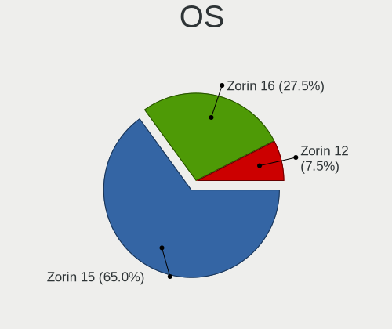

| Name     | Computers | Percent |
|----------|-----------|---------|
| Zorin 15 | 26        | 65%     |
| Zorin 16 | 11        | 27.5%   |
| Zorin 12 | 3         | 7.5%    |

OS Family
---------

OS without a version

| Name  | Computers | Percent |
|-------|-----------|---------|
| Zorin | 40        | 100%    |

Kernel
------

Version of the Linux kernel

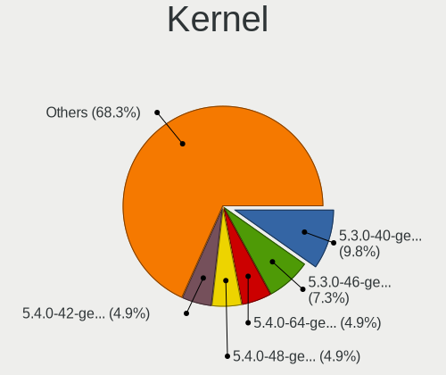

| Version           | Computers | Percent |
|-------------------|-----------|---------|
| 5.3.0-40-generic  | 4         | 9.76%   |
| 5.3.0-46-generic  | 3         | 7.32%   |
| 5.4.0-64-generic  | 2         | 4.88%   |
| 5.4.0-48-generic  | 2         | 4.88%   |
| 5.4.0-42-generic  | 2         | 4.88%   |
| 5.13.0-35-generic | 2         | 4.88%   |
| 5.13.0-27-generic | 2         | 4.88%   |
| 5.11.0-41-generic | 2         | 4.88%   |
| 5.11.0-27-generic | 2         | 4.88%   |
| 5.4.0-81-generic  | 1         | 2.44%   |
| 5.4.0-80-generic  | 1         | 2.44%   |
| 5.4.0-70-generic  | 1         | 2.44%   |
| 5.4.0-65-generic  | 1         | 2.44%   |
| 5.4.0-51-generic  | 1         | 2.44%   |
| 5.4.0-1039-azure  | 1         | 2.44%   |
| 5.4.0-100-generic | 1         | 2.44%   |
| 5.3.0-42-generic  | 1         | 2.44%   |
| 5.3.0-28-generic  | 1         | 2.44%   |
| 5.13.0-39-generic | 1         | 2.44%   |
| 5.13.0-30-generic | 1         | 2.44%   |
| 5.11.0-38-generic | 1         | 2.44%   |
| 5.0.0-32-generic  | 1         | 2.44%   |
| 5.0.0-31-generic  | 1         | 2.44%   |
| 4.18.0-25-generic | 1         | 2.44%   |
| 4.18.0-22-generic | 1         | 2.44%   |
| 4.18.0-21-generic | 1         | 2.44%   |
| 4.15.0-46-generic | 1         | 2.44%   |
| 4.15.0-43-generic | 1         | 2.44%   |
| 4.15.0-30-generic | 1         | 2.44%   |

Kernel Family
-------------

Linux kernel without a distro release

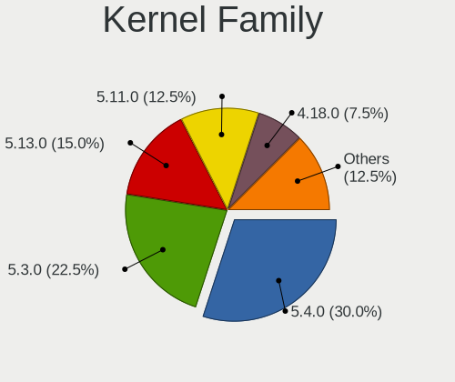

| Version | Computers | Percent |
|---------|-----------|---------|
| 5.4.0   | 12        | 30%     |
| 5.3.0   | 9         | 22.5%   |
| 5.13.0  | 6         | 15%     |
| 5.11.0  | 5         | 12.5%   |
| 4.18.0  | 3         | 7.5%    |
| 4.15.0  | 3         | 7.5%    |
| 5.0.0   | 2         | 5%      |

Kernel Major Ver.
-----------------

Linux kernel major version

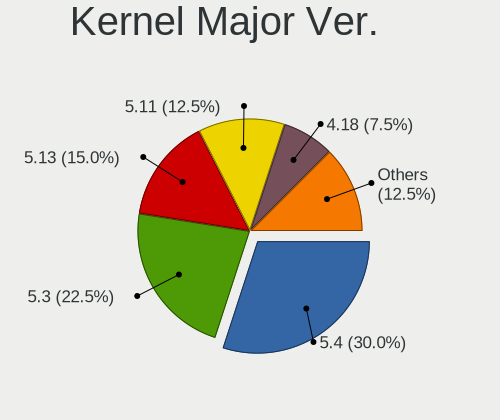

| Version | Computers | Percent |
|---------|-----------|---------|
| 5.4     | 12        | 30%     |
| 5.3     | 9         | 22.5%   |
| 5.13    | 6         | 15%     |
| 5.11    | 5         | 12.5%   |
| 4.18    | 3         | 7.5%    |
| 4.15    | 3         | 7.5%    |
| 5.0     | 2         | 5%      |

Arch
----

OS architecture (x86_64, i586, etc.)

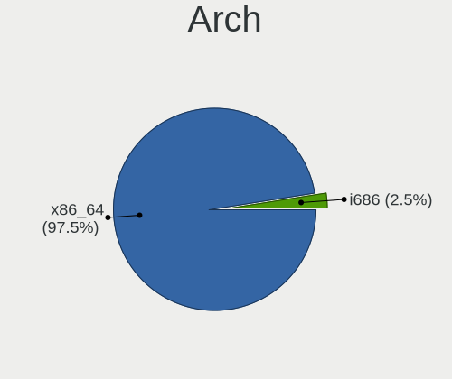

| Name   | Computers | Percent |
|--------|-----------|---------|
| x86_64 | 39        | 97.5%   |
| i686   | 1         | 2.5%    |

DE
--

Desktop Environment

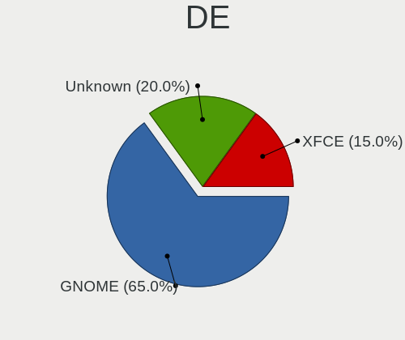

| Name    | Computers | Percent |
|---------|-----------|---------|
| GNOME   | 26        | 65%     |
| Unknown | 8         | 20%     |
| XFCE    | 6         | 15%     |

Display Server
--------------

X11 or Wayland

| Name    | Computers | Percent |
|---------|-----------|---------|
| X11     | 34        | 85%     |
| Unknown | 6         | 15%     |

Display Manager
---------------

SDDM, LightDM, etc.

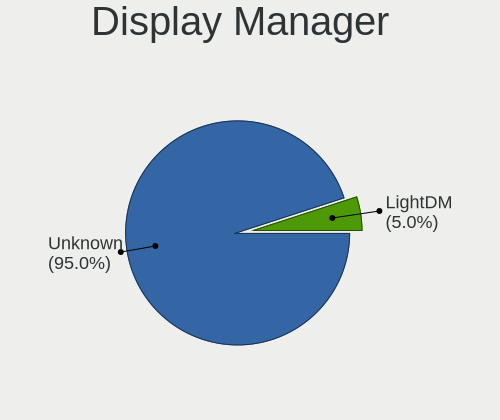

| Name    | Computers | Percent |
|---------|-----------|---------|
| Unknown | 38        | 95%     |
| LightDM | 2         | 5%      |

OS Lang
-------

Language

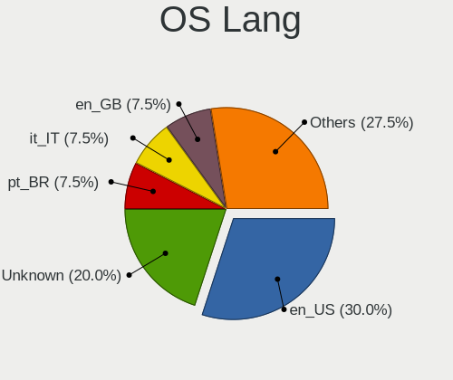

| Lang    | Computers | Percent |
|---------|-----------|---------|
| en_US   | 12        | 30%     |
| Unknown | 8         | 20%     |
| pt_BR   | 3         | 7.5%    |
| it_IT   | 3         | 7.5%    |
| en_GB   | 3         | 7.5%    |
| de_DE   | 3         | 7.5%    |
| zh_CN   | 1         | 2.5%    |
| ru_RU   | 1         | 2.5%    |
| nl_BE   | 1         | 2.5%    |
| fr_FR   | 1         | 2.5%    |
| es_ES   | 1         | 2.5%    |
| en_NZ   | 1         | 2.5%    |
| en_CA   | 1         | 2.5%    |
| en_AU   | 1         | 2.5%    |

Boot Mode
---------

EFI or BIOS

| Mode | Computers | Percent |
|------|-----------|---------|
| BIOS | 39        | 97.5%   |
| EFI  | 1         | 2.5%    |

Filesystem
----------

Type of filesystem

| Type | Computers | Percent |
|------|-----------|---------|
| Ext4 | 40        | 100%    |

Part. scheme
------------

Scheme of partitioning

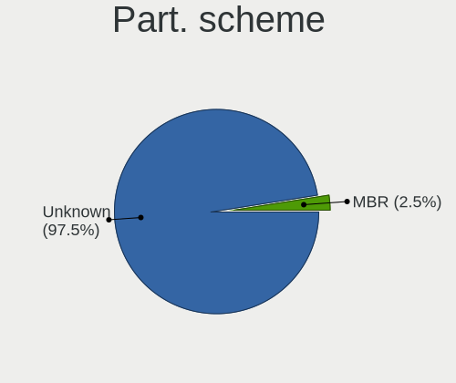

| Type    | Computers | Percent |
|---------|-----------|---------|
| Unknown | 39        | 97.5%   |
| MBR     | 1         | 2.5%    |

Dual Boot with Linux/BSD
------------------------

Hosting more than one Linux/BSD

| Dual boot | Computers | Percent |
|-----------|-----------|---------|
| No        | 40        | 100%    |

Dual Boot (Win)
---------------

Hosting Linux and Windows

| Dual boot | Computers | Percent |
|-----------|-----------|---------|
| No        | 39        | 97.5%   |
| Yes       | 1         | 2.5%    |

Board
-----

Vendor
------

Motherboard manufacturer

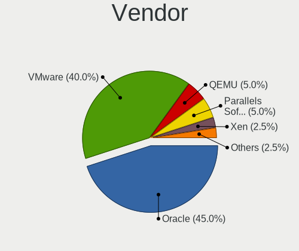

| Name                             | Computers | Percent |
|----------------------------------|-----------|---------|
| Oracle                           | 18        | 45%     |
| VMware                           | 16        | 40%     |
| QEMU                             | 2         | 5%      |
| Parallels Software International | 2         | 5%      |
| Xen                              | 1         | 2.5%    |
| Microsoft                        | 1         | 2.5%    |

Model
-----

Motherboard model

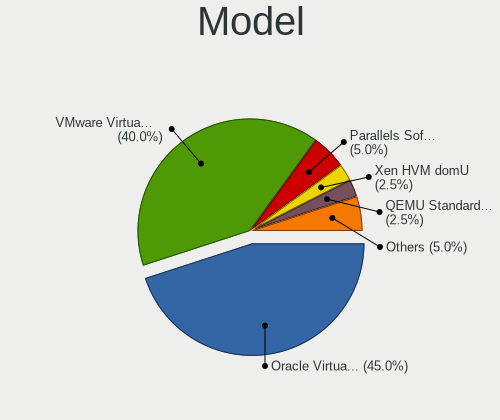

| Name                                                        | Computers | Percent |
|-------------------------------------------------------------|-----------|---------|
| Oracle VirtualBox                                           | 18        | 45%     |
| VMware Virtual Platform                                     | 16        | 40%     |
| Parallels Software International Parallels Virtual Platform | 2         | 5%      |
| Xen HVM domU                                                | 1         | 2.5%    |
| QEMU Standard PC (Q35 + ICH9, 2009)                         | 1         | 2.5%    |
| QEMU Standard PC (i440FX + PIIX, 1996)                      | 1         | 2.5%    |
| Microsoft Virtual Machine                                   | 1         | 2.5%    |

Model Family
------------

Motherboard model prefix

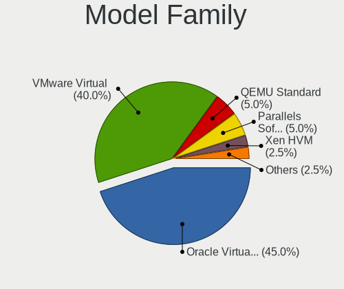

| Name                                       | Computers | Percent |
|--------------------------------------------|-----------|---------|
| Oracle VirtualBox                          | 18        | 45%     |
| VMware Virtual                             | 16        | 40%     |
| QEMU Standard                              | 2         | 5%      |
| Parallels Software International Parallels | 2         | 5%      |
| Xen HVM                                    | 1         | 2.5%    |
| Microsoft Virtual                          | 1         | 2.5%    |

MFG Year
--------

Motherboard manufacture year

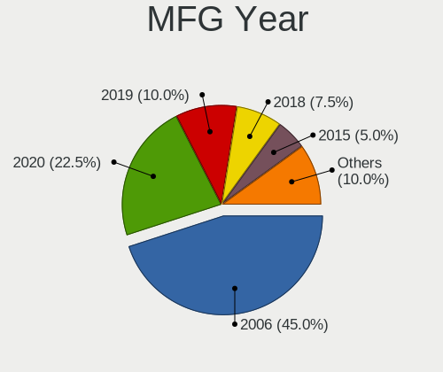

| Year | Computers | Percent |
|------|-----------|---------|
| 2006 | 18        | 45%     |
| 2020 | 9         | 22.5%   |
| 2019 | 4         | 10%     |
| 2018 | 3         | 7.5%    |
| 2015 | 2         | 5%      |
| 2014 | 2         | 5%      |
| 2017 | 1         | 2.5%    |
| 2016 | 1         | 2.5%    |

Form Factor
-----------

Physical design of the computer

| Name            | Computers | Percent |
|-----------------|-----------|---------|
| Virtual machine | 40        | 100%    |

Secure Boot
-----------

Enabled or disabled

| State    | Computers | Percent |
|----------|-----------|---------|
| Disabled | 40        | 100%    |

Coreboot
--------

Have coreboot on board

| Used | Computers | Percent |
|------|-----------|---------|
| No   | 40        | 100%    |

RAM Size
--------

Total RAM memory

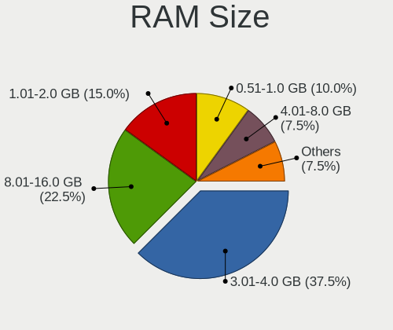

| Size in GB | Computers | Percent |
|------------|-----------|---------|
| 3.01-4.0   | 15        | 37.5%   |
| 8.01-16.0  | 9         | 22.5%   |
| 1.01-2.0   | 6         | 15%     |
| 0.51-1.0   | 4         | 10%     |
| 4.01-8.0   | 3         | 7.5%    |
| 2.01-3.0   | 2         | 5%      |
| 24.01-32.0 | 1         | 2.5%    |

RAM Used
--------

Used RAM memory

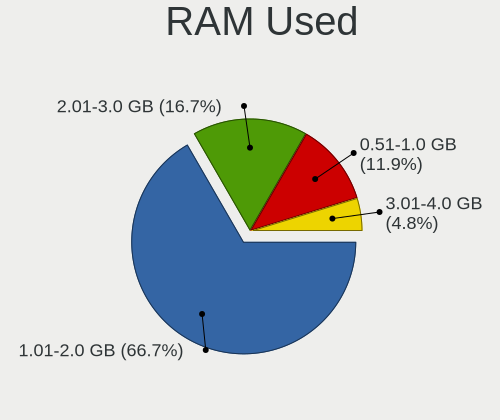

| Used GB  | Computers | Percent |
|----------|-----------|---------|
| 1.01-2.0 | 28        | 66.67%  |
| 2.01-3.0 | 7         | 16.67%  |
| 0.51-1.0 | 5         | 11.9%   |
| 3.01-4.0 | 2         | 4.76%   |

Total Drives
------------

Number of drives on board

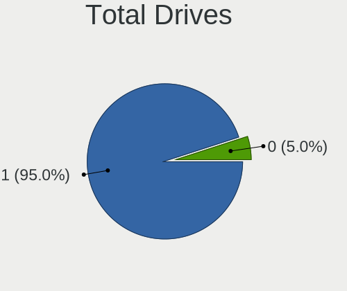

| Drives | Computers | Percent |
|--------|-----------|---------|
| 1      | 38        | 95%     |
| 0      | 2         | 5%      |

Has CD-ROM
----------

Has CD-ROM on board

| Presented | Computers | Percent |
|-----------|-----------|---------|
| Yes       | 40        | 100%    |

Has Ethernet
------------

Has Ethernet on board

| Presented | Computers | Percent |
|-----------|-----------|---------|
| Yes       | 35        | 87.5%   |
| No        | 5         | 12.5%   |

Has WiFi
--------

Has WiFi module

| Presented | Computers | Percent |
|-----------|-----------|---------|
| No        | 40        | 100%    |

Has Bluetooth
-------------

Has Bluetooth module

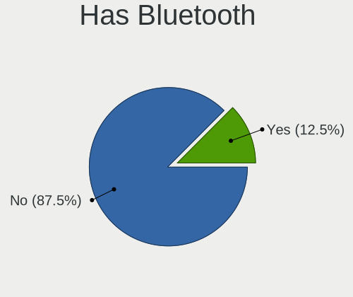

| Presented | Computers | Percent |
|-----------|-----------|---------|
| No        | 35        | 87.5%   |
| Yes       | 5         | 12.5%   |

Location
--------

Country
-------

Geographic location (country)

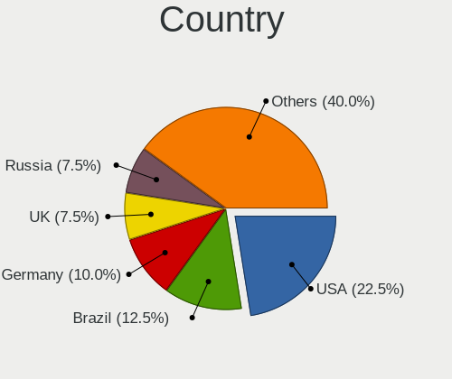

| Country     | Computers | Percent |
|-------------|-----------|---------|
| USA         | 9         | 22.5%   |
| Brazil      | 5         | 12.5%   |
| Germany     | 4         | 10%     |
| UK          | 3         | 7.5%    |
| Russia      | 3         | 7.5%    |
| Italy       | 3         | 7.5%    |
| Spain       | 2         | 5%      |
| Australia   | 2         | 5%      |
| New Zealand | 1         | 2.5%    |
| Mexico      | 1         | 2.5%    |
| Iran        | 1         | 2.5%    |
| Hong Kong   | 1         | 2.5%    |
| Greece      | 1         | 2.5%    |
| France      | 1         | 2.5%    |
| Canada      | 1         | 2.5%    |
| Bulgaria    | 1         | 2.5%    |
| Belgium     | 1         | 2.5%    |

City
----

Geographic location (city)

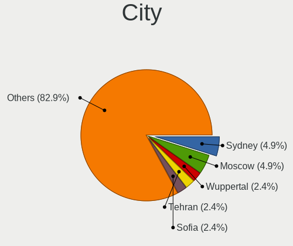

| City                      | Computers | Percent |
|---------------------------|-----------|---------|
| Sydney                    | 2         | 4.88%   |
| Moscow                    | 2         | 4.88%   |
| Wuppertal                 | 1         | 2.44%   |
| Tehran                    | 1         | 2.44%   |
| Sofia                     | 1         | 2.44%   |
| Sint-Truiden              | 1         | 2.44%   |
| Selah                     | 1         | 2.44%   |
| Sao Paulo                 | 1         | 2.44%   |
| San Fermo della Battaglia | 1         | 2.44%   |
| Saint-Cyprien             | 1         | 2.44%   |
| Rome                      | 1         | 2.44%   |
| Pouso Alegre              | 1         | 2.44%   |
| Potsdam                   | 1         | 2.44%   |
| Portsmouth                | 1         | 2.44%   |
| Plymouth                  | 1         | 2.44%   |
| Peoria                    | 1         | 2.44%   |
| Penedo                    | 1         | 2.44%   |
| Northolt                  | 1         | 2.44%   |
| New Iberia                | 1         | 2.44%   |
| Mount Laurel              | 1         | 2.44%   |
| Milan                     | 1         | 2.44%   |
| Middleburg                | 1         | 2.44%   |
| Melbourne                 | 1         | 2.44%   |
| Leganés                | 1         | 2.44%   |
| León                   | 1         | 2.44%   |
| Kowloon                   | 1         | 2.44%   |
| Kelowna                   | 1         | 2.44%   |
| Karlsruhe                 | 1         | 2.44%   |
| Giessen                   | 1         | 2.44%   |
| Corna Imagna              | 1         | 2.44%   |
| Clinton Township          | 1         | 2.44%   |
| Chelyabinsk               | 1         | 2.44%   |
| Cascavel                  | 1         | 2.44%   |
| Cambridge                 | 1         | 2.44%   |
| Barcelona                 | 1         | 2.44%   |
| Austin                    | 1         | 2.44%   |
| Auckland                  | 1         | 2.44%   |
| Athens                    | 1         | 2.44%   |
| Aimores                   | 1         | 2.44%   |

Drives
------

Drive Vendor
------------

Hard drive vendors

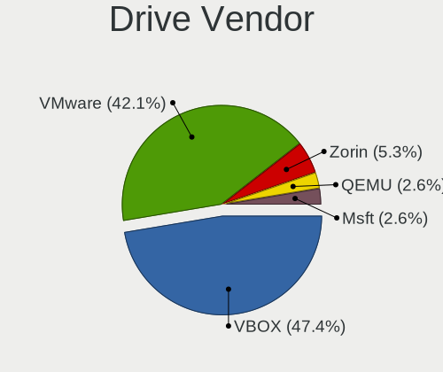

| Vendor | Computers | Drives | Percent |
|--------|-----------|--------|---------|
| VBOX   | 18        | 19     | 47.37%  |
| VMware | 16        | 16     | 42.11%  |
| Zorin  | 2         | 2      | 5.26%   |
| QEMU   | 1         | 2      | 2.63%   |
| Msft   | 1         | 1      | 2.63%   |

Drive Model
-----------

Hard drive models

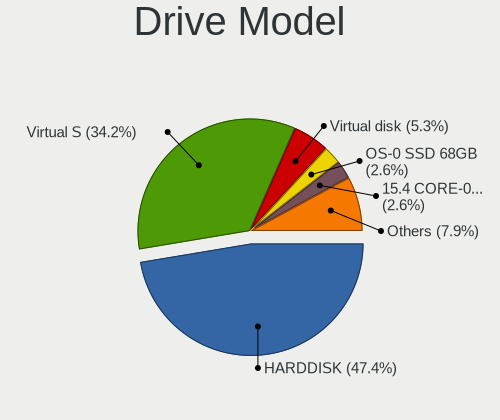

| Model                         | Computers | Percent |
|-------------------------------|-----------|---------|
| VBOX HARDDISK                 | 18        | 47.37%  |
| VMware Virtual S              | 13        | 34.21%  |
| VMware Virtual disk           | 2         | 5.26%   |
| Zorin OS-0 SSD 68GB           | 1         | 2.63%   |
| Zorin 15.4 CORE-0 SSD 68GB    | 1         | 2.63%   |
| VMware Virtual IDE Hard Drive | 1         | 2.63%   |
| QEMU HARDDISK                 | 1         | 2.63%   |
| Msft Virtual Disk             | 1         | 2.63%   |

HDD Vendor
----------

Hard disk drive vendors

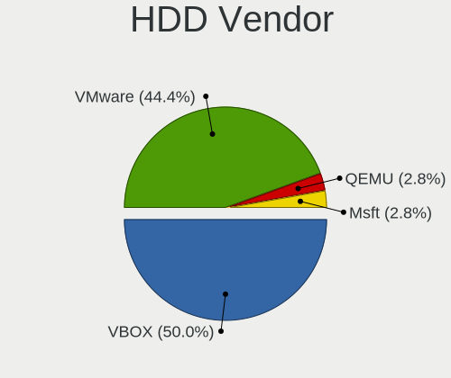

| Vendor | Computers | Drives | Percent |
|--------|-----------|--------|---------|
| VBOX   | 18        | 19     | 50%     |
| VMware | 16        | 16     | 44.44%  |
| QEMU   | 1         | 2      | 2.78%   |
| Msft   | 1         | 1      | 2.78%   |

SSD Vendor
----------

Solid state drive vendors

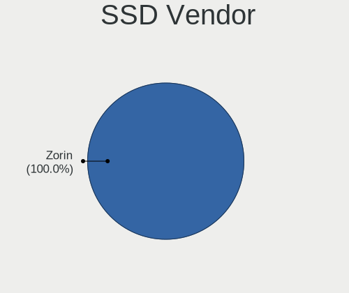

| Vendor | Computers | Drives | Percent |
|--------|-----------|--------|---------|
| Zorin  | 2         | 2      | 100%    |

Drive Kind
----------

HDD or SSD

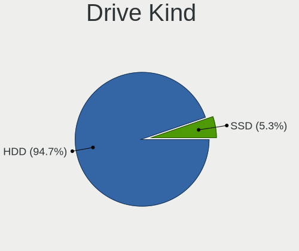

| Kind | Computers | Drives | Percent |
|------|-----------|--------|---------|
| HDD  | 36        | 38     | 94.74%  |
| SSD  | 2         | 2      | 5.26%   |

Drive Connector
---------------

SATA, SAS, NVMe, etc.

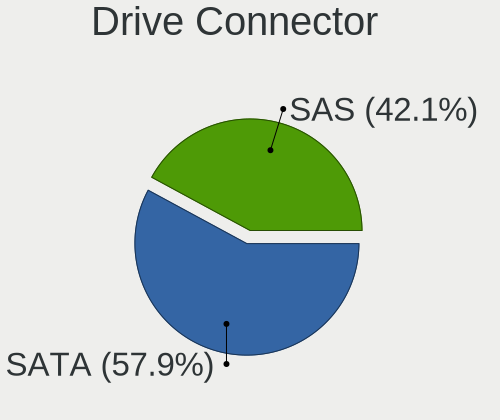

| Type | Computers | Drives | Percent |
|------|-----------|--------|---------|
| SATA | 22        | 24     | 57.89%  |
| SAS  | 16        | 16     | 42.11%  |

Drive Size
----------

Size of hard drive

| Size in TB | Computers | Drives | Percent |
|------------|-----------|--------|---------|
| 0.01-0.5   | 38        | 40     | 100%    |

Space Total
-----------

Amount of disk space available on the file system

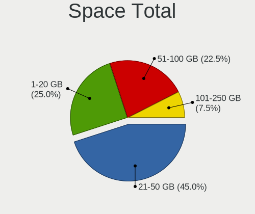

| Size in GB | Computers | Percent |
|------------|-----------|---------|
| 21-50      | 18        | 45%     |
| 1-20       | 10        | 25%     |
| 51-100     | 9         | 22.5%   |
| 101-250    | 3         | 7.5%    |

Space Used
----------

Amount of used disk space

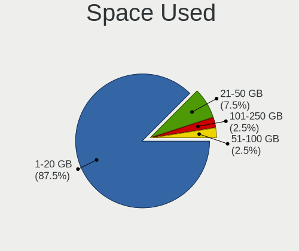

| Used GB | Computers | Percent |
|---------|-----------|---------|
| 1-20    | 35        | 87.5%   |
| 21-50   | 3         | 7.5%    |
| 101-250 | 1         | 2.5%    |
| 51-100  | 1         | 2.5%    |

Malfunc. Drives
---------------

Drive models with a malfunction

Zero info for selected period =(

Malfunc. Drive Vendor
---------------------

Vendors of faulty drives

Zero info for selected period =(

Malfunc. HDD Vendor
-------------------

Vendors of faulty HDD drives

Zero info for selected period =(

Malfunc. Drive Kind
-------------------

Kinds of faulty drives

Zero info for selected period =(

Failed Drives
-------------

Failed drive models

Zero info for selected period =(

Failed Drive Vendor
-------------------

Failed drive vendors

Zero info for selected period =(

Drive Status
------------

Number of failed and malfunc. drives

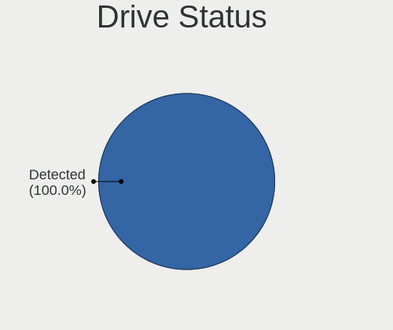

| Status   | Computers | Drives | Percent |
|----------|-----------|--------|---------|
| Detected | 38        | 40     | 100%    |

Storage controller
------------------

Storage Vendor
--------------

Storage controller vendors

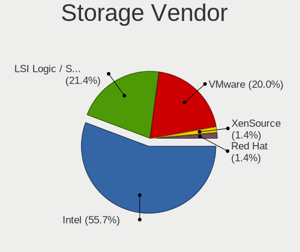

| Vendor                    | Computers | Percent |
|---------------------------|-----------|---------|
| Intel                     | 39        | 55.71%  |
| LSI Logic / Symbios Logic | 15        | 21.43%  |
| VMware                    | 14        | 20%     |
| XenSource                 | 1         | 1.43%   |
| Red Hat                   | 1         | 1.43%   |

Storage Model
-------------

Storage controller models

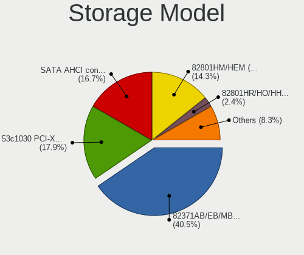

| Model                                                                 | Computers | Percent |
|-----------------------------------------------------------------------|-----------|---------|
| Intel 82371AB/EB/MB PIIX4 IDE                                         | 34        | 40.48%  |
| LSI Logic / Symbios Logic 53c1030 PCI-X Fusion-MPT Dual Ultra320 SCSI | 15        | 17.86%  |
| VMware SATA AHCI controller                                           | 14        | 16.67%  |
| Intel 82801HM/HEM (ICH8M/ICH8M-E) SATA Controller [AHCI mode]         | 12        | 14.29%  |
| Intel 82801HR/HO/HH (ICH8R/DO/DH) 6 port SATA Controller [AHCI mode]  | 2         | 2.38%   |
| Intel 82801BA IDE U100 Controller                                     | 2         | 2.38%   |
| Intel 82371SB PIIX3 IDE [Natoma/Triton II]                            | 2         | 2.38%   |
| XenSource Xen Platform Device                                         | 1         | 1.19%   |
| Red Hat Virtio SCSI                                                   | 1         | 1.19%   |
| Intel 82801IR/IO/IH (ICH9R/DO/DH) 6 port SATA Controller [AHCI mode]  | 1         | 1.19%   |

Storage Kind
------------

Kind of storage controller (IDE, SATA, NVMe, SAS, ...)

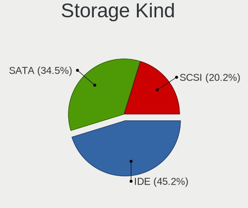

| Kind | Computers | Percent |
|------|-----------|---------|
| IDE  | 38        | 45.24%  |
| SATA | 29        | 34.52%  |
| SCSI | 17        | 20.24%  |

Processor
---------

CPU Vendor
----------

Processor vendors

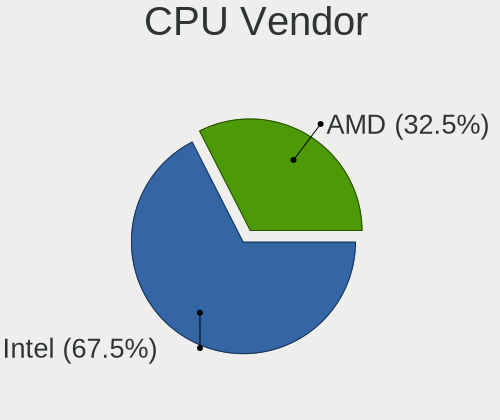

| Vendor | Computers | Percent |
|--------|-----------|---------|
| Intel  | 27        | 67.5%   |
| AMD    | 13        | 32.5%   |

CPU Model
---------

Processor models

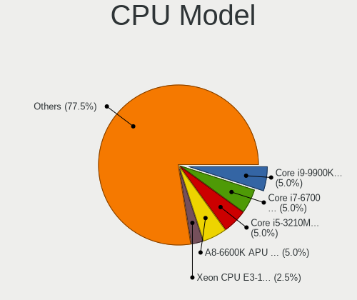

| Model                                           | Computers | Percent |
|-------------------------------------------------|-----------|---------|
| Intel Core i9-9900K CPU @ 3.60GHz               | 2         | 5%      |
| Intel Core i7-6700 CPU @ 3.40GHz                | 2         | 5%      |
| Intel Core i5-3210M CPU @ 2.50GHz               | 2         | 5%      |
| AMD A8-6600K APU with Radeon HD Graphics        | 2         | 5%      |
| Intel Xeon CPU E3-1245 V2 @ 3.40GHz             | 1         | 2.5%    |
| Intel Core i9-9900KF CPU @ 3.60GHz              | 1         | 2.5%    |
| Intel Core i7-9750HF CPU @ 2.60GHz              | 1         | 2.5%    |
| Intel Core i7-7700K CPU @ 4.20GHz               | 1         | 2.5%    |
| Intel Core i7-7700HQ CPU @ 2.80GHz              | 1         | 2.5%    |
| Intel Core i7-7700 CPU @ 3.60GHz                | 1         | 2.5%    |
| Intel Core i7-6700HQ CPU @ 2.60GHz              | 1         | 2.5%    |
| Intel Core i7-4750HQ CPU @ 2.00GHz              | 1         | 2.5%    |
| Intel Core i7-3630QM CPU @ 2.40GHz              | 1         | 2.5%    |
| Intel Core i5-7260U CPU @ 2.20GHz               | 1         | 2.5%    |
| Intel Core i5-4570 CPU @ 3.20GHz                | 1         | 2.5%    |
| Intel Core i5-4300M CPU @ 2.60GHz               | 1         | 2.5%    |
| Intel Core i5-2415M CPU @ 2.30GHz               | 1         | 2.5%    |
| Intel Core i5-10210U CPU @ 1.60GHz              | 1         | 2.5%    |
| Intel Core i5 CPU 660 @ 3.33GHz                 | 1         | 2.5%    |
| Intel Core i3-7100U CPU @ 2.40GHz               | 1         | 2.5%    |
| Intel Core i3-3225 CPU @ 3.30GHz                | 1         | 2.5%    |
| Intel Core i3 CPU M 380 @ 2.53GHz               | 1         | 2.5%    |
| Intel Celeron J4105 CPU @ 1.50GHz               | 1         | 2.5%    |
| Intel 11th Gen Core i7-1195G7 @ 2.90GHz         | 1         | 2.5%    |
| Intel 11th Gen Core i5-1135G7 @ 2.40GHz         | 1         | 2.5%    |
| AMD Ryzen 9 5900X 12-Core Processor             | 1         | 2.5%    |
| AMD Ryzen 9 3900X 12-Core Processor             | 1         | 2.5%    |
| AMD Ryzen 7 3700X 8-Core Processor              | 1         | 2.5%    |
| AMD Ryzen 7 2700X Eight-Core Processor          | 1         | 2.5%    |
| AMD Ryzen 7 1700 Eight-Core Processor           | 1         | 2.5%    |
| AMD Ryzen 5 1500X Quad-Core Processor           | 1         | 2.5%    |
| AMD FX-8320 Eight-Core Processor                | 1         | 2.5%    |
| AMD FX-6300 Six-Core Processor                  | 1         | 2.5%    |
| AMD E1-1500 APU with Radeon HD Graphics         | 1         | 2.5%    |
| AMD A10-9600P RADEON R5, 10 COMPUTE CORES 4C+6G | 1         | 2.5%    |
| AMD A10-6700 APU with Radeon HD Graphics        | 1         | 2.5%    |

CPU Model Family
----------------

Processor model prefix

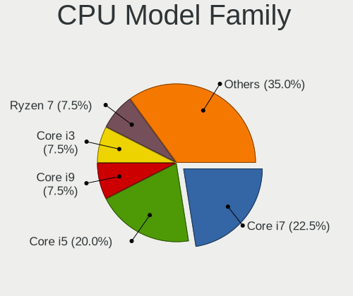

| Model         | Computers | Percent |
|---------------|-----------|---------|
| Intel Core i7 | 9         | 22.5%   |
| Intel Core i5 | 8         | 20%     |
| Intel Core i9 | 3         | 7.5%    |
| Intel Core i3 | 3         | 7.5%    |
| AMD Ryzen 7   | 3         | 7.5%    |
| Other         | 2         | 5%      |
| AMD Ryzen 9   | 2         | 5%      |
| AMD FX        | 2         | 5%      |
| AMD A8        | 2         | 5%      |
| AMD A10       | 2         | 5%      |
| Intel Xeon    | 1         | 2.5%    |
| Intel Celeron | 1         | 2.5%    |
| AMD Ryzen 5   | 1         | 2.5%    |
| AMD E1        | 1         | 2.5%    |

CPU Cores
---------

Number of processor cores

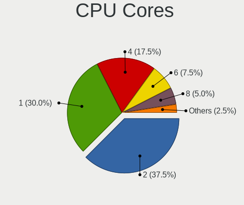

| Number | Computers | Percent |
|--------|-----------|---------|
| 2      | 15        | 37.5%   |
| 1      | 12        | 30%     |
| 4      | 7         | 17.5%   |
| 6      | 3         | 7.5%    |
| 8      | 2         | 5%      |
| 3      | 1         | 2.5%    |

CPU Sockets
-----------

Number of sockets

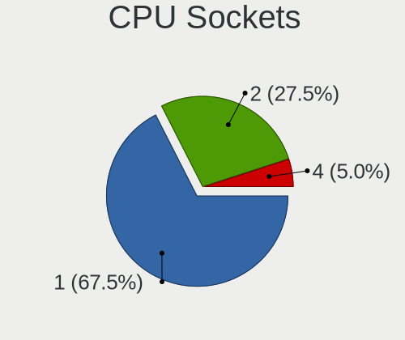

| Number | Computers | Percent |
|--------|-----------|---------|
| 1      | 27        | 67.5%   |
| 2      | 11        | 27.5%   |
| 4      | 2         | 5%      |

CPU Threads
-----------

Threads per core (Hyper-Threading)

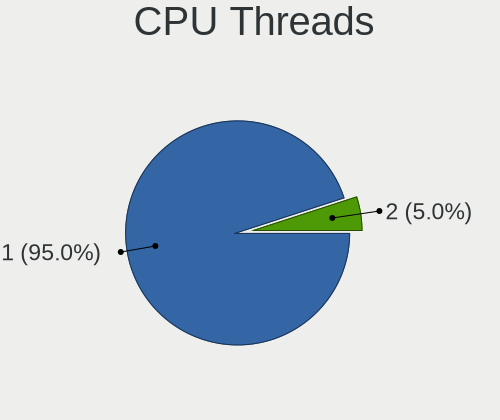

| Number | Computers | Percent |
|--------|-----------|---------|
| 1      | 38        | 95%     |
| 2      | 2         | 5%      |

CPU Op-Modes
------------

CPU Operation Modes (32-bit, 64-bit)

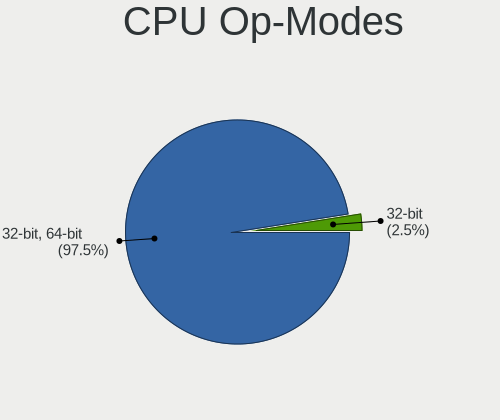

| Op mode        | Computers | Percent |
|----------------|-----------|---------|
| 32-bit, 64-bit | 39        | 97.5%   |
| 32-bit         | 1         | 2.5%    |

CPU Microcode
-------------

Microcode number

| Number  | Computers | Percent |
|---------|-----------|---------|
| Unknown | 40        | 100%    |

CPU Microarch
-------------

Microarchitecture

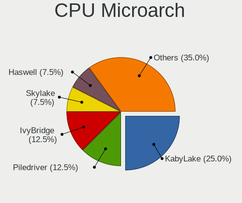

| Name          | Computers | Percent |
|---------------|-----------|---------|
| KabyLake      | 10        | 25%     |
| Piledriver    | 5         | 12.5%   |
| IvyBridge     | 5         | 12.5%   |
| Skylake       | 3         | 7.5%    |
| Haswell       | 3         | 7.5%    |
| Zen 2         | 2         | 5%      |
| Zen           | 2         | 5%      |
| Westmere      | 2         | 5%      |
| TigerLake     | 2         | 5%      |
| Zen+          | 1         | 2.5%    |
| Zen 3         | 1         | 2.5%    |
| SandyBridge   | 1         | 2.5%    |
| Goldmont plus | 1         | 2.5%    |
| Excavator     | 1         | 2.5%    |
| Bobcat        | 1         | 2.5%    |

Graphics
--------

GPU Vendor
----------

Vendors of graphics cards

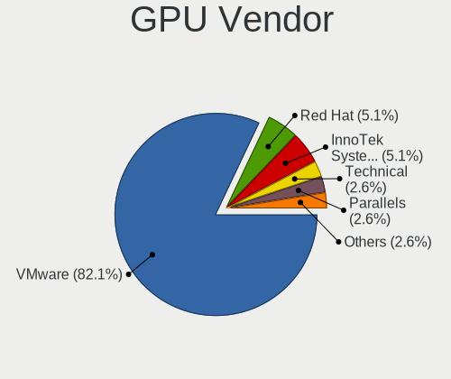

| Vendor                 | Computers | Percent |
|------------------------|-----------|---------|
| VMware                 | 32        | 82.05%  |
| Red Hat                | 2         | 5.13%   |
| InnoTek Systemberatung | 2         | 5.13%   |
| Technical              | 1         | 2.56%   |
| Parallels              | 1         | 2.56%   |
| Intel                  | 1         | 2.56%   |

GPU Model
---------

Graphics card models

| Model                                              | Computers | Percent |
|----------------------------------------------------|-----------|---------|
| VMware SVGA II Adapter                             | 32        | 82.05%  |
| InnoTek Systemberatung VirtualBox Graphics Adapter | 2         | 5.13%   |
| Technical VGA compatible controller                | 1         | 2.56%   |
| Red Hat Virtio GPU                                 | 1         | 2.56%   |
| Red Hat QXL paravirtual graphic card               | 1         | 2.56%   |
| Parallels Accelerated Virtual Video Adapter        | 1         | 2.56%   |
| Intel GeminiLake [UHD Graphics 600]                | 1         | 2.56%   |

GPU Combo
---------

Combinations of graphics cards

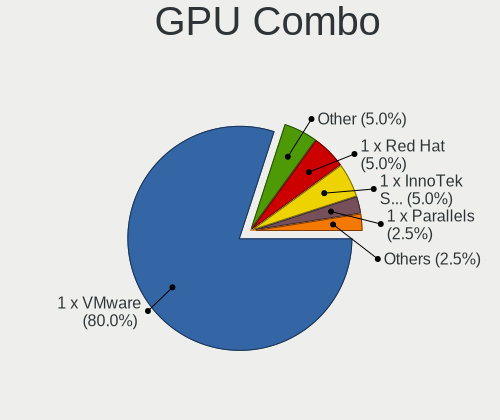

| Name                       | Computers | Percent |
|----------------------------|-----------|---------|
| 1 x VMware                 | 32        | 80%     |
| Other                      | 2         | 5%      |
| 1 x Red Hat                | 2         | 5%      |
| 1 x InnoTek Systemberatung | 2         | 5%      |
| 1 x Parallels              | 1         | 2.5%    |
| 1 x Intel                  | 1         | 2.5%    |

GPU Driver
----------

Free vs proprietary

| Driver  | Computers | Percent |
|---------|-----------|---------|
| Unknown | 39        | 97.5%   |
| Free    | 1         | 2.5%    |

GPU Memory
----------

Total video memory

| Size in GB | Computers | Percent |
|------------|-----------|---------|
| Unknown    | 40        | 100%    |

Monitor
-------

Monitor Vendor
--------------

Monitor vendors

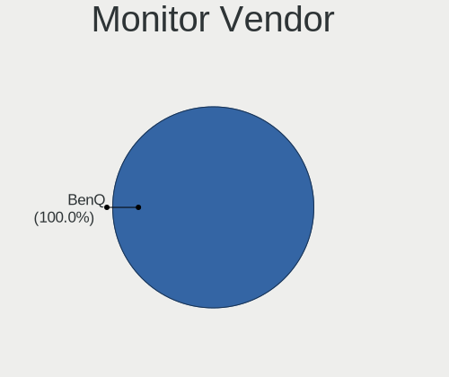

| Vendor | Computers | Percent |
|--------|-----------|---------|
| BenQ   | 1         | 100%    |

Monitor Model
-------------

Monitor models

| Model                                              | Computers | Percent |
|----------------------------------------------------|-----------|---------|
| BenQ EX2780Q BNQ7F76 2560x1440 597x336mm 27.0-inch | 1         | 100%    |

Monitor Resolution
------------------

Monitor screen resolution

| Resolution      | Computers | Percent |
|-----------------|-----------|---------|
| 2560x1440 (QHD) | 1         | 100%    |

Monitor Diagonal
----------------

Diagonal size in inches

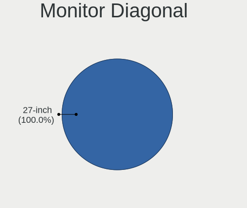

| Inches | Computers | Percent |
|--------|-----------|---------|
| 27     | 1         | 100%    |

Monitor Width
-------------

Physical width

| Width in mm | Computers | Percent |
|-------------|-----------|---------|
| 501-600     | 1         | 100%    |

Aspect Ratio
------------

Proportional relationship between the width and the height

| Ratio | Computers | Percent |
|-------|-----------|---------|
| 16/9  | 1         | 100%    |

Monitor Area
------------

Area in inch²

| Area in inch² | Computers | Percent |
|----------------|-----------|---------|
| 301-350        | 1         | 100%    |

Pixel Density
-------------

Pixels per inch

| Density | Computers | Percent |
|---------|-----------|---------|
| 101-120 | 1         | 100%    |

Multiple Monitors
-----------------

Total monitors connected

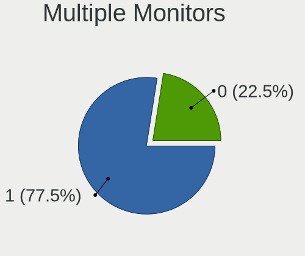

| Total | Computers | Percent |
|-------|-----------|---------|
| 1     | 31        | 77.5%   |
| 0     | 9         | 22.5%   |

Network
-------

Net Controller Vendor
---------------------

Controller vendors

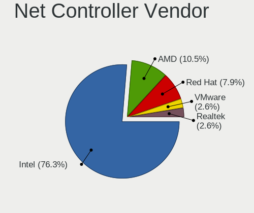

| Vendor                | Computers | Percent |
|-----------------------|-----------|---------|
| Intel                 | 29        | 76.32%  |
| AMD                   | 4         | 10.53%  |
| Red Hat               | 3         | 7.89%   |
| VMware                | 1         | 2.63%   |
| Realtek Semiconductor | 1         | 2.63%   |

Net Controller Model
--------------------

Controller models

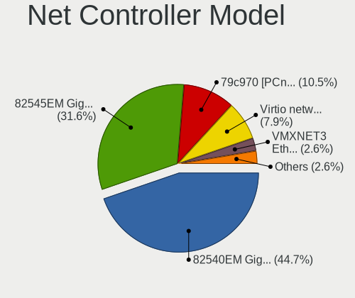

| Model                                                 | Computers | Percent |
|-------------------------------------------------------|-----------|---------|
| Intel 82540EM Gigabit Ethernet Controller             | 17        | 44.74%  |
| Intel 82545EM Gigabit Ethernet Controller (Copper)    | 12        | 31.58%  |
| AMD 79c970 [PCnet32 LANCE]                            | 4         | 10.53%  |
| Red Hat Virtio network device                         | 3         | 7.89%   |
| VMware VMXNET3 Ethernet Controller                    | 1         | 2.63%   |
| Realtek RTL-8100/8101L/8139 PCI Fast Ethernet Adapter | 1         | 2.63%   |

Wireless Vendor
---------------

Wireless vendors

Zero info for selected period =(

Wireless Model
--------------

Wireless models

Zero info for selected period =(

Ethernet Vendor
---------------

Ethernet vendors

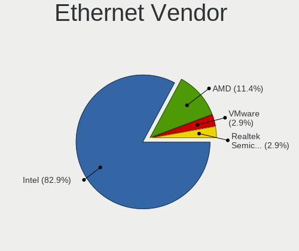

| Vendor                | Computers | Percent |
|-----------------------|-----------|---------|
| Intel                 | 29        | 82.86%  |
| AMD                   | 4         | 11.43%  |
| VMware                | 1         | 2.86%   |
| Realtek Semiconductor | 1         | 2.86%   |

Ethernet Model
--------------

Ethernet models

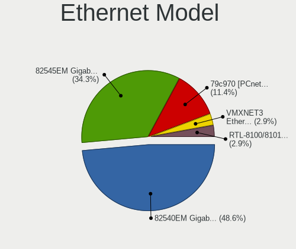

| Model                                                 | Computers | Percent |
|-------------------------------------------------------|-----------|---------|
| Intel 82540EM Gigabit Ethernet Controller             | 17        | 48.57%  |
| Intel 82545EM Gigabit Ethernet Controller (Copper)    | 12        | 34.29%  |
| AMD 79c970 [PCnet32 LANCE]                            | 4         | 11.43%  |
| VMware VMXNET3 Ethernet Controller                    | 1         | 2.86%   |
| Realtek RTL-8100/8101L/8139 PCI Fast Ethernet Adapter | 1         | 2.86%   |

Net Controller Kind
-------------------

Ethernet, WiFi or modem

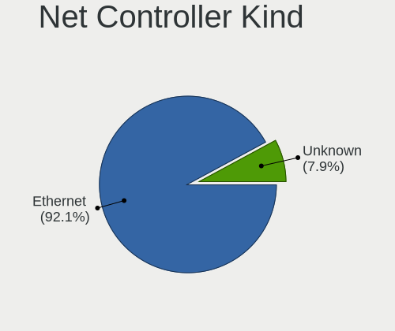

| Kind     | Computers | Percent |
|----------|-----------|---------|
| Ethernet | 35        | 92.11%  |
| Unknown  | 3         | 7.89%   |

Used Controller
---------------

Currently used network controller

| Kind     | Computers | Percent |
|----------|-----------|---------|
| Ethernet | 35        | 100%    |

NICs
----

Total network controllers on board

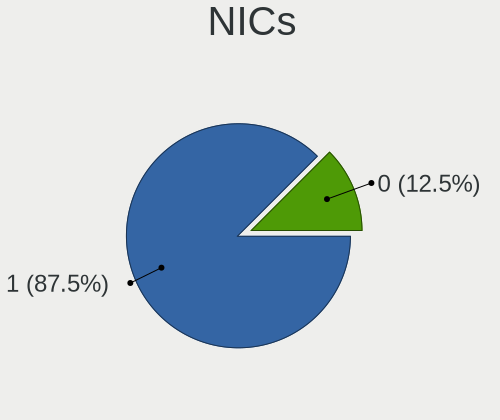

| Total | Computers | Percent |
|-------|-----------|---------|
| 1     | 35        | 87.5%   |
| 0     | 5         | 12.5%   |

IPv6
----

IPv6 vs IPv4

| Used | Computers | Percent |
|------|-----------|---------|
| No   | 38        | 95%     |
| Yes  | 2         | 5%      |

Bluetooth
---------

Bluetooth Vendor
----------------

Controller vendors

| Vendor | Computers | Percent |
|--------|-----------|---------|
| VMware | 5         | 100%    |

Bluetooth Model
---------------

Controller models

| Model                            | Computers | Percent |
|----------------------------------|-----------|---------|
| VMware Virtual Bluetooth Adapter | 5         | 100%    |

Sound
-----

Sound Vendor
------------

Sound card vendors

| Vendor  | Computers | Percent |
|---------|-----------|---------|
| Intel   | 22        | 61.11%  |
| Ensoniq | 14        | 38.89%  |

Sound Model
-----------

Sound card models

| Model                                                                      | Computers | Percent |
|----------------------------------------------------------------------------|-----------|---------|
| Intel 82801AA AC'97 Audio Controller                                       | 18        | 48.65%  |
| Ensoniq ES1371/ES1373 / Creative Labs CT2518                               | 14        | 37.84%  |
| Intel 82801BA/BAM AC'97 Audio Controller                                   | 2         | 5.41%   |
| Intel Celeron/Pentium Silver Processor High Definition Audio               | 1         | 2.7%    |
| Intel 82801I (ICH9 Family) HD Audio Controller                             | 1         | 2.7%    |
| Intel 82801FB/FBM/FR/FW/FRW (ICH6 Family) High Definition Audio Controller | 1         | 2.7%    |

Memory
------

Memory Vendor
-------------

Memory module vendors

| Vendor | Computers | Percent |
|--------|-----------|---------|
| QEMU   | 1         | 100%    |

Memory Model
------------

Memory module models

| Model                            | Computers | Percent |
|----------------------------------|-----------|---------|
| QEMU RAM Module 10240MB DIMM RAM | 1         | 100%    |

Memory Kind
-----------

Memory module kinds

| Kind | Computers | Percent |
|------|-----------|---------|
| RAM  | 1         | 100%    |

Memory Form Factor
------------------

Physical design of the memory module

| Name | Computers | Percent |
|------|-----------|---------|
| DIMM | 1         | 100%    |

Memory Size
-----------

Memory module size

| Size  | Computers | Percent |
|-------|-----------|---------|
| 10240 | 1         | 100%    |

Memory Speed
------------

Memory module speed

| Speed   | Computers | Percent |
|---------|-----------|---------|
| Unknown | 1         | 100%    |

Printers & scanners
-------------------

Printer Vendor
--------------

Printer device vendors

Zero info for selected period =(

Printer Model
-------------

Printer device models

Zero info for selected period =(

Scanner Vendor
--------------

Scanner device vendors

Zero info for selected period =(

Scanner Model
-------------

Scanner device models

Zero info for selected period =(

Camera
------

Camera Vendor
-------------

Camera device vendors

| Vendor    | Computers | Percent |
|-----------|-----------|---------|
| PARALLELS | 2         | 66.67%  |
| Logitech  | 1         | 33.33%  |

Camera Model
------------

Camera device models

| Model                        | Computers | Percent |
|------------------------------|-----------|---------|
| PARALLELS IRIScan Desk 5 Pro | 2         | 66.67%  |
| Logitech HD Pro Webcam C920  | 1         | 33.33%  |

Security
--------

Fingerprint Vendor
------------------

Fingerprint sensor vendors

Zero info for selected period =(

Fingerprint Model
-----------------

Fingerprint sensor models

Zero info for selected period =(

Chipcard Vendor
---------------

Chipcard module vendors

| Vendor                | Computers | Percent |
|-----------------------|-----------|---------|
| Gemalto (was Gemplus) | 1         | 100%    |

Chipcard Model
--------------

Chipcard module models

| Model                               | Computers | Percent |
|-------------------------------------|-----------|---------|
| Gemalto (was Gemplus) GemPC433-Swap | 1         | 100%    |

Unsupported
-----------

Unsupported Devices
-------------------

Total unsupported devices on board

| Total | Computers | Percent |
|-------|-----------|---------|
| 0     | 36        | 87.8%   |
| 1     | 3         | 7.32%   |
| 2     | 2         | 4.88%   |

Unsupported Device Types
------------------------

Types of unsupported devices

| Type             | Computers | Percent |
|------------------|-----------|---------|
| Graphics card    | 3         | 42.86%  |
| Unassigned class | 2         | 28.57%  |
| Sound            | 1         | 14.29%  |
| Chipcard         | 1         | 14.29%  |

